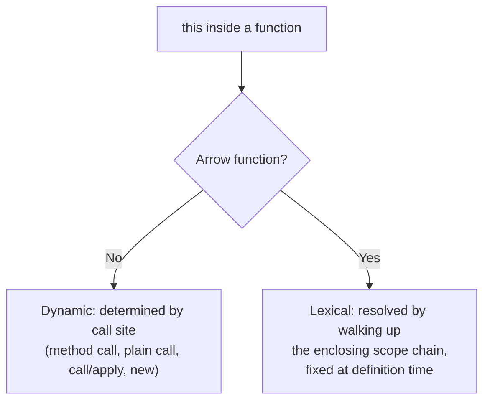

# Arrow Functions

> Technical question — follows [TECHNICAL_QUESTION_TEMPLATE.md](../TECHNICAL_QUESTION_TEMPLATE.md)'s
> 13-field format.

**Question:** What are arrow functions, and how do they differ from
regular functions beyond just shorter syntax?

**Difficulty:** Easy
**Experience Level:** Entry-Mid (0-3 YOE) — at Senior level this question
extends into *why* that difference matters architecturally (React class
methods, event handler binding, avoiding `.bind()` in constructors); see
Related Topics.
**Companies:** Google, Amazon, Microsoft, Meta, Adobe, Flipkart, TCS,
Infosys, Accenture
**Interview Frequency:** ★★★★★

## Expected Answer

Arrow functions (`(a, b) => a + b`) are a shorter function syntax
introduced in ES6, but the syntax isn't the interesting part — the real
difference is that arrow functions don't have their own `this`,
`arguments`, `super`, or `new.target`. Instead, they capture `this`
lexically from the enclosing scope at the point they're *defined*, not
where they're *called*. Because of that, arrow functions can't be used
as constructors (`new` throws), and `.call()`/`.apply()`/`.bind()` can't
change their `this` — there's no `this` binding on the function to
change.

## Detailed Explanation

Every regular function creates its own `this` binding, determined
dynamically by *how* the function is called (as a method, standalone, via
`call`/`apply`, or with `new`) — this is why `this` inside a regular
function can seem to change depending on the call site. Arrow functions
opt out of that mechanism entirely: they have no `[[ThisMode]]` internal
slot behavior that binds a fresh `this`; instead, a reference to `this`
inside an arrow function resolves by walking up the normal lexical scope
chain, exactly like any other free variable (e.g. a variable declared in
an enclosing function) would.

This has concrete consequences:

- **No own `arguments` object** — an arrow function referencing
  `arguments` sees the enclosing (non-arrow) function's `arguments`, or
  throws a `ReferenceError` at module/top level where there's no
  enclosing function at all.
- **Cannot be a constructor** — arrow functions have no internal
  `[[Construct]]` method, so `new arrowFn()` throws `TypeError: arrowFn
  is not a constructor`.
- **`.bind()`/`.call()`/`.apply()` don't affect `this`** — since there's
  no `this` binding to override, passing a different `thisArg` to these
  methods on an arrow function is silently ignored for `this` purposes
  (though `.bind()` can still be used to partially apply arguments).
- **No `prototype` property** — arrow functions aren't constructible, so
  they don't get the automatic `.prototype` object regular functions do.



## Production Example

The most common real-world payoff is inside callbacks and event
handlers, where losing `this` used to require explicit workarounds:

```js
class Counter {
  count = 0;

  // Regular method — has its own `this` determined by how it's called.
  incrementRegular() {
    this.count += 1;
  }

  constructor() {
    // Before arrow functions, passing a method as a callback lost `this`:
    document.addEventListener('click', this.incrementRegular); // `this` inside is undefined/wrong when the listener fires

    // Arrow function class fields close over the instance's `this`
    // lexically — no separate .bind(this) call needed in the constructor.
    this.incrementArrow = () => {
      this.count += 1; // `this` here is always the Counter instance,
                        // resolved from the enclosing class field's scope
    };

    document.addEventListener('click', this.incrementArrow); // works correctly
  }
}
```

Before arrow-function class fields were common, the standard fix was
`this.incrementRegular = this.incrementRegular.bind(this)` in the
constructor — arrow functions make that pattern largely unnecessary for
newly-written code.

## Best Practices

- Use arrow functions for callbacks and short, non-method functions
  where you want `this` to stay whatever it was in the surrounding
  scope (event handlers, array method callbacks, promise `.then`
  chains).
- Use regular `function` syntax (or shorthand method syntax in
  object/class literals) for object methods and anything that needs its
  own dynamic `this`, or that needs to be used as a constructor.
- Don't use arrow functions as object methods defined with the arrow
  syntax directly on an object literal (`{ greet: () => this.name }`) —
  `this` there resolves to whatever enclosing scope the object literal
  itself was written in (often the module or outer `this`), not the
  object the method is called on, which is a common and confusing bug.

## Trade-offs

Arrow functions trade flexibility for predictability: you lose the
ability to dynamically re-bind `this` (useful in some patterns, like
generic utility functions meant to be attached to different objects),
but gain a `this` that never surprises you based on *how* the function
happens to be invoked. This is a deliberate design trade-off — arrow
functions exist specifically to solve the "`this` got lost in a
callback" class of bugs, not to replace every use of `function`.

## Common Mistakes

- Claiming arrow functions are "just shorter syntax for the same thing"
  — the `this`/`arguments`/constructor differences are the entire point
  of arrow functions, not a side detail.
- Using an arrow function for an object method that needs to reference
  the object via `this` (`const obj = { value: 1, getValue: () =>
  this.value }`) — this silently breaks because the arrow function's
  `this` is lexically outside the object literal, not the object itself.
- Assuming `.bind(newThis)` on an arrow function changes its `this` — it
  doesn't; only extra bound arguments take effect, `this` stays whatever
  it was lexically.
- Forgetting arrow functions can't be generators (no `function*` arrow
  form exists) or used with `new`.

## Follow-up Questions

1. Why does `document.addEventListener('click', this.method)` lose
   `this` for a regular method but not for an arrow-function class
   field?
2. What does an arrow function do if you reference `arguments` inside
   it, and where does that reference actually resolve to?
3. Why can't arrow functions be used as constructors — what internal
   mechanism is missing?
4. **(Senior-level extension)** In a React class component, why did
   arrow-function class properties (`handleClick = () => {...}`) become
   the standard pattern over binding in the constructor, and how does
   that compare to how function components avoid the problem entirely
   with hooks?

## Related Topics

- [this-call-apply-bind.md](this-call-apply-bind.md) — how `this` is
  determined for regular functions, and what `call`/`apply`/`bind`
  actually do
- [closures.md](closures.md) — the lexical scoping mechanism arrow
  functions rely on for resolving `this`
- Implement `Function.prototype.bind` (Polyfill) — see
  [61-javascript-coding/function-bind-polyfill.md](../61-javascript-coding/function-bind-polyfill.md)

---
[← Back to 02-javascript-fundamentals](README.md)
