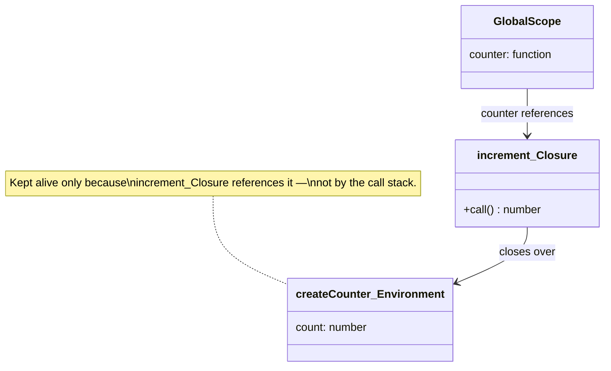
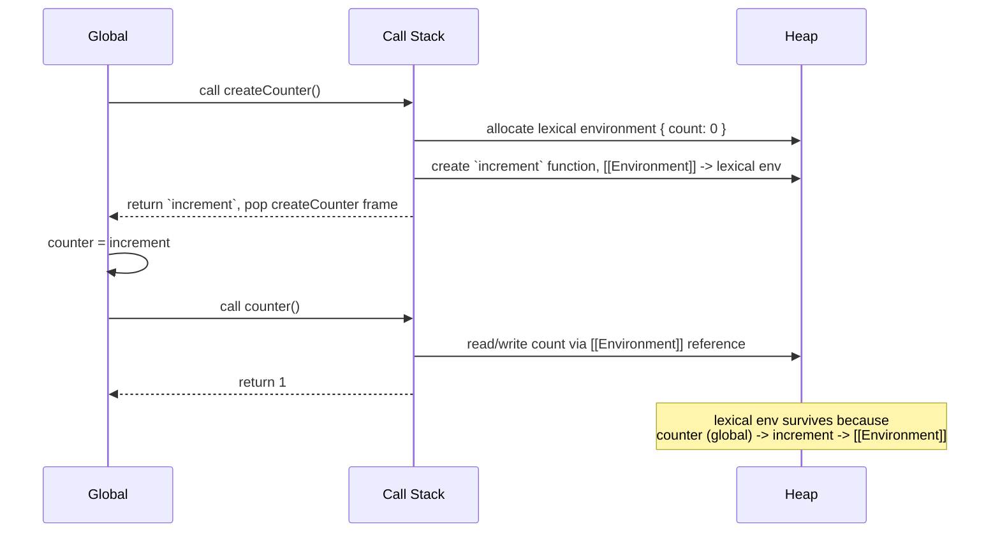

# Closures

> Flagship topic — written to full [TEMPLATE.md](../TEMPLATE.md) depth as
> the quality reference for every other topic page in this repo.

## 1. Theory

A **closure** is the combination of a function bundled together with
references to its surrounding lexical environment — the variables that were
in scope where the function was *defined*, not where it's *called*.

Three facts fully define the behavior:

1. **Every function in JavaScript forms a closure** over its lexical scope
   at creation time. This isn't an opt-in feature — it's just how function
   scoping works.
2. A closure captures **variables by reference, not by value**. If the
   outer variable changes after the inner function was created, the inner
   function sees the new value.
3. As long as *any* live reference to the inner function exists, the
   variables it closes over cannot be garbage collected — even after the
   outer function has already returned.

```js
function createCounter() {
  let count = 0;               // lives in createCounter's lexical environment
  return function increment() {
    count++;                   // closes over `count` by reference
    return count;
  };
}

const counter = createCounter(); // createCounter() has already returned...
counter(); // 1                  // ...but `count` is still alive, because
counter(); // 2                  // `increment` still holds a reference to it
```

`createCounter`'s execution context is popped off the call stack the moment
it returns. Normally that would make `count` eligible for garbage
collection. It isn't, because the returned `increment` function retains a
reference to the lexical environment `count` lives in — the engine keeps
that whole environment alive for as long as `increment` is reachable.

## 2. Visual Diagram



## 3. Architecture Diagram

Closures are a single-process, single-realm concept — there's no
cross-service architecture to diagram. Where they *do* matter
architecturally is memory ownership within one running JS environment:

```mermaid
graph TD
    A[Call Stack] -->|createCounter frame popped after return| B((frame discarded))
    C[Heap] --> D[createCounter's lexical environment: count]
    E[increment function object] -->|internal [[Environment]] slot| D
    F[Global variable: counter] -->|references| E
    D -.->|stays alive because referenced by| E
```

The call stack frame for `createCounter` is gone the instant it returns.
What keeps `count` alive is a heap reference chain: `counter` (global) →
`increment` (function object) → its internal `[[Environment]]` slot → the
lexical environment holding `count`.

## 4. Flow Diagram



## 5. Real-world Example

```js
function debounce(fn, delayMs) {
  let timerId; // closed over by the returned function

  return function debounced(...args) {
    clearTimeout(timerId);
    timerId = setTimeout(() => fn.apply(this, args), delayMs);
  };
}

const onResize = debounce(() => console.log('layout recalculated'), 200);
window.addEventListener('resize', onResize);
```

`timerId` has to persist *between calls* to the returned function — a
closure is exactly the mechanism that gives one private, persistent
variable to a function without reaching for module-level or global state.

## 6. Production Example

Closures are the backing mechanism for private state in factory-style
modules before (and often instead of) ES private class fields:

```js
// paymentGateway.js — a real pattern for isolating a secret
function createPaymentClient(apiKey) {
  // apiKey is captured once, at creation — never exposed as a property
  const request = async (path, body) => {
    return fetch(`https://api.payments.example.com${path}`, {
      method: 'POST',
      headers: {
        Authorization: `Bearer ${apiKey}`,
        'Content-Type': 'application/json',
      },
      body: JSON.stringify(body),
    });
  };

  return {
    charge: (amount, source) => request('/charges', { amount, source }),
    refund: (chargeId) => request('/refunds', { chargeId }),
  };
}

const client = createPaymentClient(process.env.PAYMENTS_API_KEY);
client.charge(1999, 'tok_visa');
console.log(client.apiKey); // undefined — never a property, only closed over
```

This is a genuinely common production pattern: it prevents `apiKey` from
ever appearing in `JSON.stringify(client)`, `console.log(client)`, or
accidental property enumeration — because it was never a property at all.

## 7. Interview Questions — Basic

1. What is a closure, in your own words?
2. Does a closure capture a variable's value or a reference to the
   variable? Prove it with an example.
3. Why can an inner function still access an outer function's variables
   after the outer function has returned?
4. What's the output of the counter example in §1, and why does calling
   `createCounter()` a second time give you an independent counter?

## 8. Interview Questions — Medium

1. What does this log, and why?
   ```js
   for (var i = 0; i < 3; i++) {
     setTimeout(() => console.log(i), 0);
   }
   ```
2. How would you fix it *without* changing `var` to `let`?
3. Implement `once(fn)` — a function that runs `fn` on the first call and
   returns the cached result on every subsequent call, using a closure.
4. Explain how the module pattern uses closures to create private state.

## 9. Interview Questions — Advanced

1. Closures can cause memory leaks. Construct a concrete example where a
   closure keeps a large object alive longer than intended, and explain
   the fix.
2. All functions created inside the same parent share a reference to the
   *same* lexical environment object, not independent copies. What
   observable behavior does that produce?
   ```js
   function makePair() {
     let value = 0;
     return {
       get: () => value,
       set: (v) => { value = v; },
     };
   }
   ```
3. In V8, does closing over one variable from a large enclosing scope keep
   the *entire* enclosing scope alive, or can the engine be smarter about
   it? (Discuss engine-level scope analysis / partial closure optimization.)
4. Compare closures to private class fields (`#field`) as two mechanisms
   for encapsulation. When would you choose one over the other in a
   real codebase?

## 10. Frequently Asked Questions

- **Is a closure the same as a callback?** No — a callback is just a
  function passed as an argument; a closure is the scope-capturing
  mechanism. A callback *often* happens to be a closure, but the two are
  different concepts.
- **Do closures only happen with `return`ed functions?** No. Any nested
  function forms a closure over its parent scope, whether or not it's
  returned — event handlers and `setTimeout` callbacks are closures too.
- **Are closures slow?** Historically a minor allocation/scope-chain-walk
  cost existed; in modern engines it's rarely meaningful. Don't avoid
  closures for "performance" without profiling first.

## 11. Coding Problems

See [61-javascript-coding](../61-javascript-coding) for the full problem
set. Closure-specific problems that belong there:

- Implement `debounce(fn, delay)`
- Implement `throttle(fn, interval)`
- Implement `once(fn)`
- Implement `memoize(fn)`
- Implement a `createCounter()` with `increment`, `decrement`, `reset`
- Implement a private-state module (bank account: `deposit`, `withdraw`,
  `getBalance`, with no way to read/set balance directly)

## 12. Hands-on Exercises

1. Take the `var` loop example in §8 and fix it three different ways: (a)
   switch to `let`, (b) wrap the loop body in an IIFE, (c) pass `i` as a
   parameter to `setTimeout`'s callback via `bind`. Confirm all three
   produce `0 1 2`.
2. Write a `createIdGenerator(prefix)` that returns a function generating
   `prefix-1`, `prefix-2`, `prefix-3`, ... on each call, using closure
   state instead of a global counter.

## 13. Mini Project

Build a **rate limiter** using closures: `createRateLimiter(maxCalls,
windowMs)` returns a function that, when called, returns `true` if the
call is allowed under the limit and `false` otherwise — tracking call
timestamps in a closed-over array, with no external/global state.

## 14. Full Project

The private-state module pattern in §6 is the same technique used for the
API-client layer in the [94-projects](../94-projects) reference apps
(e.g. the Banking project's transaction client). See that project's
`README.md` once written.

## 15. Common Mistakes

- **The `var` in a loop mistake** (§8) — by far the most common closure
  bug in real code, usually surfacing in event-handler-in-a-loop code.
- **Assuming closures copy values.** Engineers coming from languages with
  value-capture semantics sometimes expect `count` to be frozen at
  creation time — it isn't; it's live.
- **Accidentally capturing large objects.** Closing over `event` or a
  large fetched payload just because it was in scope, when only one small
  field was actually needed, keeps the whole object alive.
- **Overusing closures for state that should be a class field or a
  module-level constant**, adding indirection with no encapsulation
  benefit.

## 16. Best Practices

- Close over the **smallest thing you need** — destructure the one field
  you need out of a large object before closing over it, if the rest of
  the object doesn't need to stay alive.
- Use closures deliberately for **private state** (factory functions,
  the module pattern) rather than accidentally, as a side effect of
  nesting functions.
- When a closure is attached to a long-lived listener (`addEventListener`,
  a global event bus), make sure you have a clear removal path
  (`removeEventListener`) so the closure — and everything it holds — can
  eventually be collected.

## 17. Anti-patterns

- **Closures in `for` loops without block scoping** — see §8. Still shows
  up in real codebases that mix `var` out of habit.
- **"God closures"** — a single factory function that closes over dozens
  of variables and returns a dozen methods, functioning as a de facto
  class without any of the language's own tooling (no `instanceof`, no
  clear public/private boundary beyond convention). Prefer an actual
  class with `#private` fields once the surface area gets that large.
- **Closures holding DOM node references** after the node has been
  removed from the document — the node can't be garbage collected while
  the closure (e.g. a still-registered event listener) references it.

## 18. Debugging Guide

- **Symptom: a value in a callback is "stuck" at an old value.** Check
  whether the callback closed over a variable via `var` in a loop, or
  whether the outer variable was reassigned to a *new* value/object
  after the closure was created (the closure sees the reassignment; it
  won't see a *new* variable created later with the same name in a
  different scope).
- **Symptom: memory grows over time in a long-running page/app (a SPA
  that never reloads).** In Chrome DevTools → Memory → Heap Snapshot,
  look for "Closure" entries retaining large objects; check the
  "Retainers" panel to see which live reference (often a forgotten
  `addEventListener` or an interval) is keeping the closure alive.
- **Technique:** in DevTools, a breakpoint inside a closure lets you
  expand the "Closure" scope in the Scope panel to inspect exactly what
  variables that specific function instance captured.

## 19. Performance Tips

- Creating a new closure inside a hot loop or a frequently-called render
  function allocates a new function object (and, if it captures
  variables, a new scope object) every call. In genuinely hot paths
  (measured, not assumed), hoist the function out if it doesn't need to
  capture per-call state.
- In React specifically, an inline closure passed as a prop
  (`onClick={() => doThing(id)}`) creates a new function reference every
  render, which defeats `React.memo`/`useMemo` reference-equality checks
  on the receiving component — see [13-react-performance](../13-react-performance)
  for `useCallback`.
- Don't over-correct: micro-optimizing closure allocation outside a
  measured hot path is very rarely worth the readability cost.

## 20. Security Considerations

Closures are the standard technique for keeping a secret (API key, token,
internal counter) out of an object's enumerable properties — see §6. The
security-relevant nuance: a closed-over variable is *not* truly private
from a determined caller with access to a debugger or to
`Function.prototype.toString()`-based introspection of returned closures —
it's private from accidental exposure (`JSON.stringify`, `for...in`,
casual `console.log`), not from a hostile actor with full runtime access.
Don't rely on closures alone to protect something that must never leave
the process (e.g. never put a raw secret key material in client-side JS
at all, closure or not).

## 21. Accessibility Notes

Not applicable — closures are a language-level scoping mechanism with no
direct accessibility surface. (Indirect connection: a debounced input
handler built with a closure, per §5, can improve perceived responsiveness
for screen-reader users triggering frequent live-region updates — but
that's a property of debouncing, not of closures specifically.)

## 22. Unit Tests

```js
// counter.test.js
import { describe, it, expect } from 'vitest';

function createCounter() {
  let count = 0;
  return () => ++count;
}

describe('createCounter', () => {
  it('increments independently per instance', () => {
    const a = createCounter();
    const b = createCounter();
    expect(a()).toBe(1);
    expect(a()).toBe(2);
    expect(b()).toBe(1); // independent closure, independent state
  });
});
```

## 23. Integration Tests

```js
// debouncedSearch.integration.test.js
import { describe, it, expect, vi } from 'vitest';

function debounce(fn, delayMs) {
  let timerId;
  return (...args) => {
    clearTimeout(timerId);
    timerId = setTimeout(() => fn(...args), delayMs);
  };
}

describe('debounced search integration', () => {
  it('only fires the search callback once after rapid typing', () => {
    vi.useFakeTimers();
    const search = vi.fn();
    const debouncedSearch = debounce(search, 300);

    debouncedSearch('r');
    debouncedSearch('re');
    debouncedSearch('rea');
    vi.advanceTimersByTime(300);

    expect(search).toHaveBeenCalledTimes(1);
    expect(search).toHaveBeenCalledWith('rea');
    vi.useRealTimers();
  });
});
```

## 24. Interview Tips

- Lead with the **definition in one sentence**, then immediately show the
  counter example — interviewers are listening for "captures by
  reference" and "survives after the outer function returns," not a
  memorized textbook line.
- If asked the `var`-in-a-loop question, explain *why* `let` fixes it
  (a new binding per iteration) before just stating that it does — that's
  the actual signal the question is testing for.
- Volunteer the memory-leak angle (§17-19) even if not asked — it's the
  detail that separates "knows what a closure is" from "has debugged one
  in production."

## 25. Senior-level Discussion

At the senior bar, the expectation shifts from "can define a closure" to
"can identify where closures are silently causing a bug or a leak in
someone else's code" — the `var`-in-a-loop pattern, a forgotten
`removeEventListener` holding a closure alive, or an inline closure prop
defeating memoization in a React component. Be ready to point at a code
review comment, not just a definition.

## 26. Staff-level Discussion

At Staff level, the interesting question is architectural: when does a
team standardize on the closure-based module pattern versus ES classes
with private fields versus a state-management library, for encapsulating
state across a large codebase? A reasonable framing: closures are ideal
for *small, local* private state (a single hook, a single utility);
classes/`#private` fields communicate intent better once a module has
several methods and a clear identity; a state library is right once state
needs to be shared/observed across many unrelated parts of the app. Being
able to articulate that boundary — and to have actually made that call on
a real codebase — is the signal.

## 27. Principal-level Discussion

At Principal level, this rarely comes up as "explain closures" directly —
it surfaces inside a broader discussion about **memory discipline across
a long-lived client application** (a single-page app that runs for hours
without a full reload). The Principal-level framing: closures are one of
several places where "correct in isolation, dangerous in aggregate" bugs
live — a single extra closure holding a DOM node is nothing; a pattern
that does this on every list-item render in a high-traffic surface is a
memory-growth incident. The relevant discussion is process, not
mechanism: how does the org catch this class of bug before it ships (heap
snapshot diffing in CI, code review heuristics, linting for common
patterns) rather than after a customer reports the tab crashing.

## 28. Company-specific Notes

No verified, source-backed company-specific notes yet — see
[85-company-wise-questions](../85-company-wise-questions). Closures
(specifically the `var`-in-a-loop variant) are widely reported as a
first-round screening question across most FAANG and product-company
loops; treat that as a screening-stage staple rather than something tied
to one specific company's style.

## 29. References

- [MDN — Closures](https://developer.mozilla.org/en-US/docs/Web/JavaScript/Closures)
- [ECMA-262 — Lexical Environments](https://tc39.es/ecma262/#sec-lexical-environments)
- [V8 blog — Explaining JavaScript VMs: Lexical scoping](https://mrale.ph/blog/) (V8 team blog, background on scope-chain implementation)

## 30. Revision Checklist

- [ ] Can state the definition in one sentence without notes
- [ ] Can explain why the counter example's state survives
- [ ] Can predict and fix the `var`-in-a-loop output
- [ ] Can explain "captures by reference, not value" with a live example
- [ ] Can name one real memory-leak scenario caused by a closure and its fix
- [ ] Can compare closures vs. `#private` class fields for encapsulation
- [ ] Can connect closures to `useCallback`/memoization in React

---
[← Back to 02-javascript-fundamentals](README.md)
