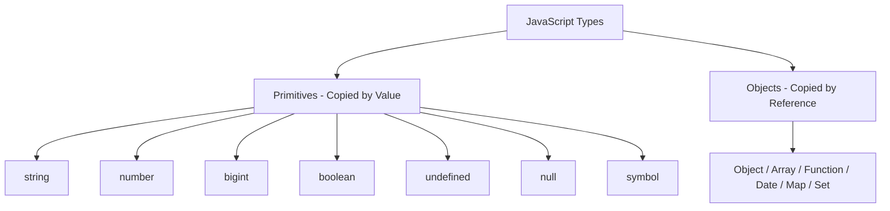

# Data Types

> Core-depth topic — see [TEMPLATE.md](../TEMPLATE.md) for what "full depth"
> adds on top of this. This page covers Theory, Diagram, Examples,
> Interview Questions, Mistakes, Best Practices, Senior Discussion, and
> References — the sections most valuable for a topic this foundational.

## Theory

JavaScript is a dynamically and weakly typed language. Data types are broadly categorized into **Primitives** and **Objects (Reference Types)**.

### 1. Primitive Types (7 Types)

Primitives represent single, immutable values that are copied and passed **by value**.

- `string`: Immutable sequence of UTF-16 code units (`"hello"`).
- `number`: Double-precision 64-bit IEEE 754 floating point number (`42`, `3.14`, `NaN`, `Infinity`).
- `bigint`: Arbitrary-precision integers (`9007199254740991n`).
- `boolean`: Logical values (`true`, `false`).
- `undefined`: Variable declared but not assigned a value.
- `null`: Intentional absence of any object value.
- `symbol`: Unique and immutable primitive value used as object property keys (`Symbol('id')`).

### 2. Reference Types (Objects)

Objects represent collections of properties and are copied and passed **by reference**.

- `Object`: Key-value pairs (`{ name: 'Alice' }`).
- `Array`: Ordered lists (`[1, 2, 3]`).
- `Function`: Executable code objects.
- Built-ins: `Date`, `RegExp`, `Map`, `Set`, `WeakMap`, `WeakSet`, `Error`, etc.

| Axis | Primitives | Reference Types (Objects) |
|---|---|---|
| Mutability | Immutable (values cannot be changed in-place) | Mutable (properties can be added, changed, or deleted) |
| Memory Location | Stored directly on the Stack | Reference on Stack, actual object body on Heap |
| Assignment | Copied by Value | Copied by Reference |
| Equality | Compared by Value (`5 === 5` is `true`) | Compared by Memory Address (`{} === {}` is `false`) |

## Diagram



## Real-world Example

```js
// 1. Primitive Copy (Value Copy)
let num1 = 10;
let num2 = num1;
num2 = 20;
console.log(num1); // 10 (num1 remains unchanged)

// 2. Reference Copy (Memory Address Copy)
const user1 = { name: "Alice", role: "Developer" };
const user2 = user1;
user2.name = "Bob";
console.log(user1.name); // "Bob" (both variables point to the same Heap object)

// 3. Immutability of Primitives
let str = "hello";
str[0] = "H"; // Silently fails (or throws TypeError in strict mode)
console.log(str); // "hello"
```

## Production Example

```js
// Defensive copying in React state management / Redux to prevent reference mutation side-effects:
function updateProfile(currentUser, updates) {
  // Shallow clone ensures a new reference is created for React state re-render triggers
  return {
    ...currentUser,
    ...updates,
    preferences: {
      ...currentUser.preferences,
      ...(updates.preferences || {}),
    },
  };
}
```

## Interview Questions

### Basic
1. **What are the 7 primitive data types in JavaScript?**
   - String, Number, BigInt, Boolean, Undefined, Null, Symbol.

2. **What is the difference between pass-by-value and pass-by-reference?**
   - Primitives copy the exact value to a new stack location. Objects copy the memory pointer, so changes via one reference affect all references to that object.

### Medium
3. **Why does `typeof null` return `'object'`?**
   - This is a historical bug in JS since its 1995 initial implementation (in early V8/JS engines, values were tagged with type bits; objects used tag `000` and `null` was represented as NULL pointer `0x00`, so `typeof` misclassified it). It cannot be fixed without breaking existing web code.

4. **How do `NaN` and `Symbol` behave in strict equality comparisons?**
   - `NaN === NaN` is `false` (use `Number.isNaN()` instead). Every `Symbol()` call generates a unique primitive (`Symbol('a') === Symbol('a')` is `false`).

### Advanced / Senior
5. **How does V8 allocate memory for primitives versus objects?**
   - Small primitives (like small integers or unboxed numbers) are stored directly on the execution stack or inline in CPU registers. Objects, large numbers, and heap strings are allocated on the V8 Heap, managed by V8's Scavenger (young generation) and Mark-Sweep-Compact (old generation) garbage collectors.

## Common Mistakes

- Mutating an object argument passed into a pure utility function, causing unintended side effects across the application.
- Comparing two objects or arrays directly using `===` (`[1] === [1]` evaluates to `false`).
- Assuming `const` creates an immutable object (use `Object.freeze()` for shallow immutability or `structuredClone()` for deep copies).

## Best Practices

- Use `const` by default for object variables to prevent reference reassignment, and treat objects as immutable by returning new copies on modification.
- Use `Array.isArray(val)` to check for arrays rather than `typeof val === 'object'`.
- Use `Number.isNaN(val)` instead of global `isNaN(val)` (which coerces types first).

## Senior-level Discussion

Senior engineers should understand the trade-offs between shallow cloning (`Object.assign`, spread operator) and deep cloning (`structuredClone()`, JSON serialization). They should also recognize how V8 optimizes object shapes (Hidden Classes & Inline Caches) when properties are added to objects after instantiation.

## References

- [MDN Web Docs — Data Structures](https://developer.mozilla.org/en-US/docs/Web/JavaScript/Data_structures)
- [ECMAScript Language Specification — Data Types and Values](https://tc39.es/ecma262/#sec-ecmascript-data-types-and-values)

---
[← Back to 02-javascript-fundamentals](README.md)
