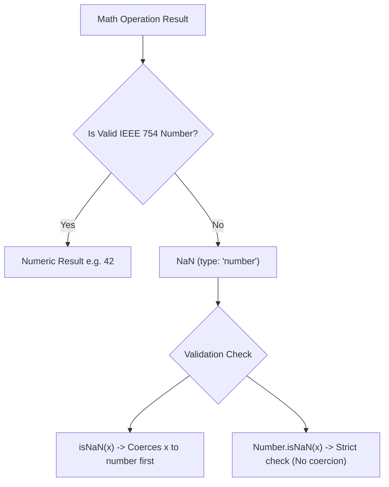

# NaN

> Core-depth topic — see [TEMPLATE.md](../TEMPLATE.md) for what "full depth"
> adds on top of this. This page covers Theory, Diagram, Examples,
> Interview Questions, Mistakes, Best Practices, Senior Discussion, and
> References — the sections most valuable for a topic this foundational.

## Theory

`NaN` stands for **Not-a-Number**. It is a special numeric primitive value specified by IEEE 754 floating-point arithmetic to represent an invalid or undefined mathematical result (such as `0 / 0` or `Math.sqrt(-1)`).

### Key Characteristics

1. **`typeof NaN === 'number'`**: Despite its name meaning "Not a Number", `NaN` is a value of the `number` primitive data type.
2. **Self-Inequality (`NaN !== NaN`)**: `NaN` is the **only value in JavaScript that is not equal to itself**. Neither `NaN == NaN` nor `NaN === NaN` evaluates to `true`.
3. **Propagating Nature**: Any arithmetic operation involving `NaN` evaluates to `NaN` (`5 + NaN` → `NaN`).

### `isNaN()` vs `Number.isNaN()`

- **Global `isNaN(value)`**: Coerces the argument to a number *before* checking. Returns `true` for non-numeric strings like `"hello"` because `Number("hello")` is `NaN`.
- **ES6 `Number.isNaN(value)`**: Strict check. Returns `true` **only if** the value is currently of type `number` AND is `NaN`. No type coercion is performed.

| Expression | Global `isNaN()` | ES6 `Number.isNaN()` |
|---|---|---|
| `isNaN(NaN)` / `Number.isNaN(NaN)` | `true` | `true` |
| `isNaN("hello")` / `Number.isNaN("hello")` | `true` (coerced) | `false` (type is string) |
| `isNaN(undefined)` / `Number.isNaN(undefined)` | `true` (coerced) | `false` (type is undefined) |
| `isNaN("123")` / `Number.isNaN("123")` | `false` | `false` |

## Diagram



## Real-world Example

```js
// 1. Invalid Operations producing NaN
console.log(0 / 0);           // NaN
console.log(Math.sqrt(-1));   // NaN
console.log(Number("foo"));   // NaN
console.log(parseInt("abc")); // NaN

// 2. Self-inequality
console.log(NaN === NaN);     // false
console.log(Object.is(NaN, NaN)); // true (Object.is correctly identifies NaN identity)

// 3. Difference between isNaN and Number.isNaN
console.log(isNaN("hello"));        // true  (coerces "hello" -> NaN)
console.log(Number.isNaN("hello")); // false ("hello" is a string, not NaN)
```

## Production Example

```js
// Validating user input from form fields safely:
function parseAgeInput(rawInput) {
  const parsedAge = Number(rawInput);

  // Using Number.isNaN avoids false positives on non-string inputs
  if (Number.isNaN(parsedAge) || parsedAge <= 0) {
    throw new Error(`Invalid age provided: "${rawInput}"`);
  }

  return parsedAge;
}

console.log(parseAgeInput("25"));    // 25
// parseAgeInput("invalid");         // Throws Error: Invalid age provided
```

## Interview Questions

### Basic
1. **What is `typeof NaN`?**
   - `typeof NaN` returns `"number"`.

2. **Why does `NaN === NaN` return `false`?**
   - Per the IEEE 754 floating-point specification, `NaN` represents an unrepresentable or undefined calculation result, so two `NaN` values cannot be assumed equal.

### Medium
3. **What is the difference between global `isNaN()` and `Number.isNaN()`?**
   - `isNaN()` coerces its argument to a number before checking, leading to false positives for non-numeric inputs like `"abc"`. `Number.isNaN()` checks strictly without coercion.

4. **How can you test if a value `x` is `NaN` without using any built-in functions?**
   - Since `NaN` is the only value in JavaScript that is not equal to itself, `x !== x` returns `true` if and only if `x` is `NaN`.

### Advanced / Senior
5. **How does `Array.prototype.indexOf()` vs `Array.prototype.includes()` handle `NaN`?**
   - `[NaN].indexOf(NaN)` returns `-1` (because `indexOf` uses strict equality `===`). `[NaN].includes(NaN)` returns `true` (because `includes` uses SameValueZero comparison algorithm).

## Common Mistakes

- Using `value === NaN` to check if a result is invalid (always evaluates to `false`).
- Using global `isNaN(val)` on string inputs, falsely concluding strings like `"abc"` are the `NaN` primitive value.

## Best Practices

- Always use `Number.isNaN()` over global `isNaN()`.
- Use `Object.is(val, NaN)` when needing explicit SameValue equality comparison.

## Senior-level Discussion

Senior engineers should understand ECMAScript comparison algorithms: `===` (Strict Equality), `Object.is` (SameValue), and SameValueZero (used by `Set`, `Map`, `Array.prototype.includes`). `Object.is(NaN, NaN)` and `SameValueZero(NaN, NaN)` both treat `NaN` as equal to `NaN`, unlike `===`.

## References

- [MDN Web Docs — NaN](https://developer.mozilla.org/en-US/docs/Web/JavaScript/Reference/Global_Objects/NaN)
- [MDN Web Docs — Number.isNaN()](https://developer.mozilla.org/en-US/docs/Web/JavaScript/Reference/Global_Objects/Number/isNaN)

---
[← Back to 02-javascript-fundamentals](README.md)
