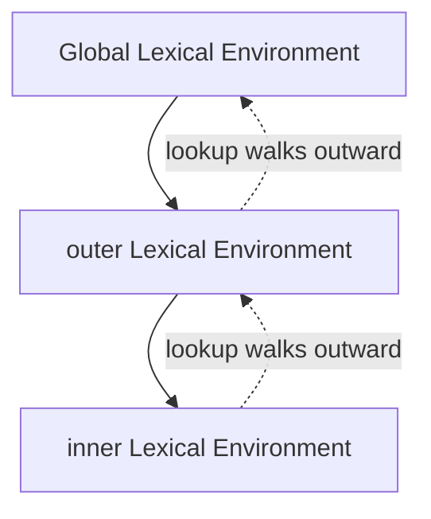

# Scope, Scope Chain & Lexical Environment

> Core-depth topic — see [TEMPLATE.md](../TEMPLATE.md) for the full-depth
> section list. Covers three closely related backlog topics together
> (Scope, Scope Chain, Lexical Environment) rather than as three thin,
> repetitive pages — see [BACKLOG-JS.md](../BACKLOG-JS.md).

## Theory

**Scope** is the set of rules that determines where a variable is
accessible. JavaScript has three kinds:

1. **Global scope** — declared outside any function/block; accessible
   everywhere.
2. **Function scope** — `var` declarations are scoped to the nearest
   enclosing function, ignoring block boundaries.
3. **Block scope** — `let`/`const`/`class` are scoped to the nearest
   enclosing `{}`.

A **lexical environment** is the engine's internal record of every
identifier declared in a given scope, plus a reference to the *outer*
lexical environment — "lexical" because this structure is determined by
where code is physically written in the source, not by how or when it's
called. Every function, block, and the global program each get their
own lexical environment when execution enters them.

The **scope chain** is what makes nested scope resolution work: when a
variable is referenced, the engine checks the current lexical
environment first, and if not found, follows the outer-environment
reference up through each enclosing lexical environment in turn, until
it either finds the variable or reaches the global scope (past which an
unresolved reference throws `ReferenceError`). This chain is fixed at
the point a function is *defined*, not where it's *called* — which is
exactly the mechanism [closures](closures.md) rely on.

## Diagram



## Real-world Example

```js
if (true) {
  var globalLeak = 'var is function-scoped, not block-scoped';
  let blockOnly = 'let is block-scoped';
}

console.log(globalLeak); // 'var is function-scoped, not block-scoped' — leaked out of the if block
console.log(blockOnly);  // ReferenceError: blockOnly is not defined
```

```js
const g = 'global';

function outer() {
  const o = 'outer';

  function inner() {
    // Neither `g` nor `o` is declared here — both are found by
    // walking the scope chain outward: inner -> outer -> global.
    console.log(g, o);
  }

  inner();
}

outer(); // 'global outer'
```

## Interview Questions — Basic

1. What are the three kinds of scope in JavaScript?
2. Why does a `var` declared inside an `if` block remain accessible
   outside that block, while a `let` doesn't?
3. What is a lexical environment, in one sentence?

## Interview Questions — Medium

1. Walk through how the scope chain resolves `g` and `o` inside `inner()`
   in the example above.
2. Is the scope chain determined by where a function is *called* or
   where it's *defined*? What would break if it were the other way
   around?
3. What happens when a variable can't be found anywhere in the scope
   chain, all the way up to global?

## Interview Questions — Advanced

1. Explain the relationship between "lexical environment" and "scope
   chain" precisely — are they the same thing, or is one built from the
   other?
2. How does the scope chain interact with closures — specifically, why
   does a returned inner function keep the *entire* outer lexical
   environment reachable, not just the one variable it references?
   (See [closures.md](closures.md)'s memory-leak discussion for the
   practical consequence.)
3. Two functions defined in the same lexical scope share a reference to
   the *same* lexical environment object, not independent copies —
   construct an example that demonstrates this observably (e.g. two
   closures that both read and write the same private variable).

## Common Mistakes

- Assuming block scope applies to `var` — it doesn't; only `let`,
  `const`, and `class` are block-scoped. This is the single most common
  scope-related bug in codebases that mix `var` and modern declarations.
- Confusing the scope chain (a runtime lookup mechanism) with the call
  stack (which tracks function *invocations*, not lexical nesting) —
  they're both "chains the engine walks," but for entirely different
  purposes, and conflating them is a common source of confused
  explanations in interviews.
- Believing scope is determined dynamically by the call site — it isn't
  ("dynamic scope" is a real concept in some other languages, but not
  JavaScript's model at all).

## Best Practices

- Default to block scope (`let`/`const`) so a variable's visibility
  matches its actual intended lifetime — this eliminates the
  `var`-leaks-out-of-a-block class of bugs entirely.
- Keep nesting shallow where practical — a deeply nested scope chain
  makes every variable lookup walk further and makes the code genuinely
  harder to reason about, independent of any performance concern.
- When debugging "why can't this function see that variable," check the
  physical (lexical) nesting in the source first — the answer is always
  determined by where the code is written, never by which function
  happened to call which.

## Senior-level Discussion

The signal at senior level is connecting scope/lexical-environment
theory to real debugging: given an unfamiliar codebase, being able to
correctly predict what a deeply nested function can and can't see, and
explaining *why* in terms of the scope chain — not just "it depends" —
is what this topic is actually testing. It's also frequently used as
the on-ramp into a closures discussion, since closures are simply "a
function plus the scope chain it was defined with, kept alive."

## References

- [MDN — Scope](https://developer.mozilla.org/en-US/docs/Glossary/Scope)
- [ECMA-262 — Lexical Environments](https://tc39.es/ecma262/#sec-lexical-environments)

---
[← Back to 02-javascript-fundamentals](README.md)
