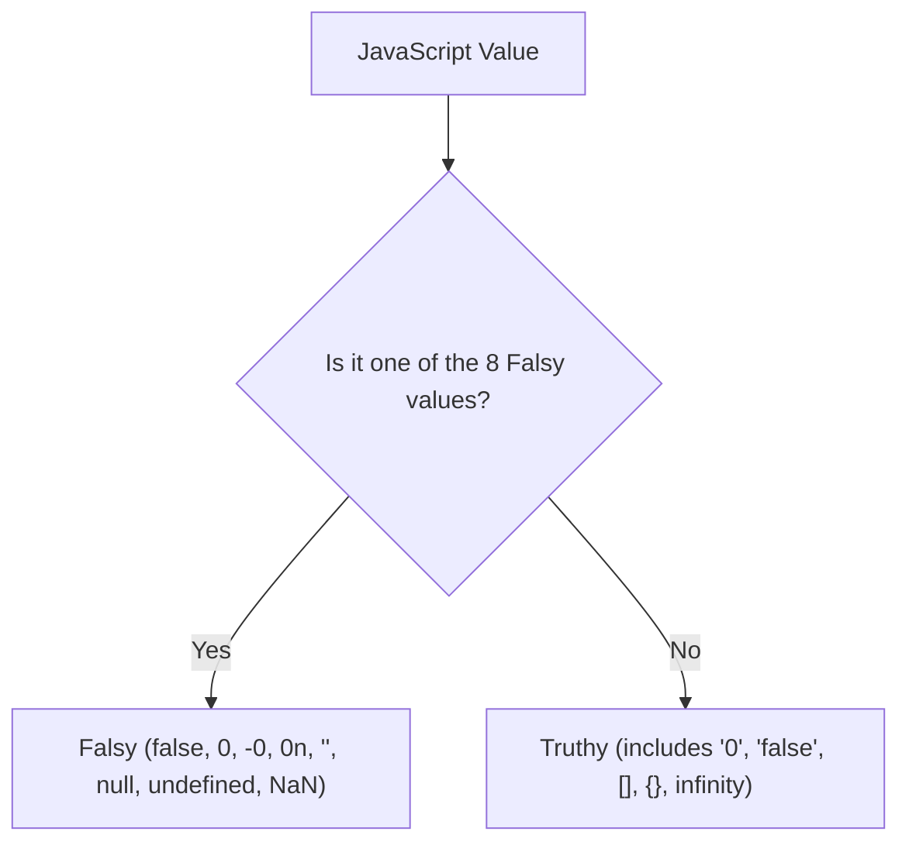

# Truthy vs Falsy

> Core-depth topic — see [TEMPLATE.md](../TEMPLATE.md) for what "full depth"
> adds on top of this. This page covers Theory, Diagram, Examples,
> Interview Questions, Mistakes, Best Practices, Senior Discussion, and
> References — the sections most valuable for a topic this foundational.

## Theory

In JavaScript, every value has an inherent boolean truthiness when evaluated in a boolean context (such as an `if` statement condition or logical operation).

### 1. Falsy Values (Exactly 8 Values)

A **falsy** value is a value that translates to `false` when evaluated in a boolean context. In ECMAScript, there are exactly **8 falsy values**:

1. `false` (boolean false)
2. `0` (number zero)
3. `-0` (negative zero)
4. `0n` (BigInt zero)
5. `""` / `''` / `` `` (empty string)
6. `null` (absence of value)
7. `undefined` (unassigned value)
8. `NaN` (Not-a-Number)

### 2. Truthy Values

A **truthy** value is any value that is **not** in the list of 8 falsy values above. 

**Surprising Truthy Values (Common Triggers):**
- `"0"` (non-empty string containing zero)
- `"false"` (non-empty string containing text "false")
- `[]` (empty array)
- `{}` (empty object)
- `function() {}` (functions)
- `-42` (negative non-zero numbers)

| Value | Boolean Conversion (`Boolean(val)`) | Notes |
|---|---|---|
| `""` | `false` | Empty string is falsy |
| `"0"` | `true` | Non-empty string is truthy |
| `[]` | `true` | All objects/arrays are truthy |
| `{}` | `true` | All objects/arrays are truthy |
| `null` | `false` | Explicit null is falsy |
| `undefined` | `false` | Undefined is falsy |

## Diagram



## Real-world Example

```js
// 1. Falsy checks
if (!"") console.log("Empty string is falsy"); // Executes
if (!0) console.log("Zero is falsy");         // Executes
if (!null) console.log("Null is falsy");       // Executes

// 2. Unexpected Truthy values
if ([]) console.log("Empty array is TRUTHY!");   // Executes
if ({}) console.log("Empty object is TRUTHY!");  // Executes
if ("0") console.log("String '0' is TRUTHY!");   // Executes

// 3. Double Negation (Coercion to Boolean)
console.log(!!"hello"); // true
console.log(!!0);       // false
console.log(!![]);      // true
```

## Production Example

```js
// Danger of implicit truthy checks on numeric inputs:
function renderItemCount(count) {
  // BUGS: if count is 0, (count || 10) evaluates 0 as falsy and incorrectly defaults to 10!
  const buggyCount = count || 10;

  // SAFE: Use nullish coalescing (??) or explicit typeof checks for numbers
  const safeCount = count ?? 10;

  return `Displaying ${safeCount} items`;
}

console.log(renderItemCount(0)); // Buggy: "Displaying 10 items" vs Safe: "Displaying 0 items"
```

## Interview Questions

### Basic
1. **What are the 8 falsy values in JavaScript?**
   - `false`, `0`, `-0`, `0n`, `""`, `null`, `undefined`, `NaN`.

2. **Why is `Boolean([])` true, but `[] == false` also true?**
   - `Boolean([])` evaluates `[]` as an object reference (truthy).
   - In `[] == false`, loose equality coerces both sides to numbers: `[]` becomes `""` then `0`, `false` becomes `0`, so `0 == 0` evaluates to `true`. (This demonstrates why `===` should always be used over `==`).

### Medium
3. **What is the difference between `||` and `??` in conditional defaults?**
   - `||` returns the right operand if the left operand is **any falsy value** (`0`, `""`, `false`, `null`, `undefined`). `??` returns the right operand **only** if the left is `null` or `undefined`.

4. **How do you explicitly convert any value to a boolean in JS?**
   - Use `Boolean(value)` or double negation `!!value`.

### Advanced / Senior
5. **How does `document.all` violate the truthy/falsy rules in browsers?**
   - `document.all` is an ancient browser object that returns `typeof document.all === 'undefined'` and evaluates as falsy in `if (document.all)` conditionals, explicitly breaking JS type rules to support legacy detection code from the 1990s web standards era.

## Common Mistakes

- Using `if (items.length)` without checking `> 0`, which works but can be unclear to non-JS developers.
- Using `value || defaultValue` when `value` can legitimately be `0` or `""`.
- Assuming empty objects `{}` or arrays `[]` are falsy.

## Best Practices

- Always use strict equality (`===` / `!==`) to prevent unintended type coercion.
- Use nullish coalescing (`??`) for defaulting values when `0` or `""` are valid state values.
- Explicitly check array lengths (`arr.length > 0`) and object key counts (`Object.keys(obj).length > 0`) rather than checking `if (arr)` or `if (obj)`.

## Senior-level Discussion

Senior engineers avoid implicit coercion bugs by enforcing lint rules like `@typescript-eslint/strict-boolean-expressions`, requiring explicit comparisons for numbers and strings in conditional statements.

## References

- [MDN Web Docs — Falsy](https://developer.mozilla.org/en-US/docs/Glossary/Falsy)
- [MDN Web Docs — Truthy](https://developer.mozilla.org/en-US/docs/Glossary/Truthy)

---
[← Back to 02-javascript-fundamentals](README.md)
