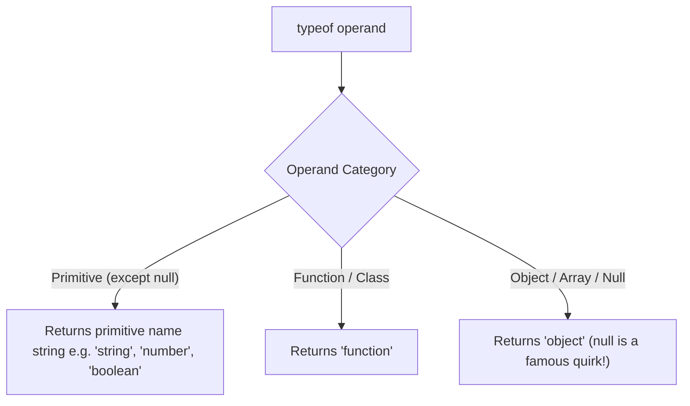

# typeof Operator

> Core-depth topic — see [TEMPLATE.md](../TEMPLATE.md) for what "full depth"
> adds on top of this. This page covers Theory, Diagram, Examples,
> Interview Questions, Mistakes, Best Practices, Senior Discussion, and
> References — the sections most valuable for a topic this foundational.

## Theory

The `typeof` operator returns a string indicating the data type of an unevaluated operand.

### Return Values Matrix

| Operand Type | Return String | Notes / Gotchas |
|---|---|---|
| Undefined | `"undefined"` | Also returned for undeclared variables |
| Boolean | `"boolean"` | `typeof true === "boolean"` |
| Number | `"number"` | Includes `NaN` and `Infinity` |
| BigInt | `"bigint"` | `typeof 10n === "bigint"` |
| String | `"string"` | `typeof "text" === "string"` |
| Symbol | `"symbol"` | `typeof Symbol() === "symbol"` |
| Function | `"function"` | Functions are callable objects |
| Object | `"object"` | Includes Objects, Arrays, Dates, Maps, Sets, and `null` |

### Key Quirks & Edge Cases

1. `typeof null === "object"`: Historical engine bug preserved for backwards web compatibility.
2. `typeof NaN === "number"`: `NaN` is technically a numerical representation under IEEE 754.
3. Undeclared variables: `typeof nonExistentVar` safely returns `"undefined"` without throwing a `ReferenceError`.
4. Classes: `typeof class C {}` returns `"function"` because ES6 classes are syntactic sugar over constructor functions.

## Diagram



## Real-world Example

```js
// 1. Basic Primitives
console.log(typeof "Hello");     // "string"
console.log(typeof 42);          // "number"
console.log(typeof true);        // "boolean"
console.log(typeof 100n);        // "bigint"
console.log(typeof Symbol("id"));// "symbol"
console.log(typeof undefined);   // "undefined"

// 2. Objects & Functions
console.log(typeof { a: 1 });    // "object"
console.log(typeof [1, 2, 3]);   // "object" (Arrays are objects!)
console.log(typeof (() => {}));  // "function"
console.log(typeof class Foo {});// "function"

// 3. Quirks
console.log(typeof null);        // "object"
console.log(typeof NaN);         // "number"
console.log(typeof undeclared);  // "undefined" (Safe check)
```

## Production Example

```js
// Reliable type checking helper replacing raw typeof quirks:
function getType(value) {
  if (value === null) return 'null';
  if (Array.isArray(value)) return 'array';
  if (Number.isNaN(value)) return 'nan';

  const type = typeof value;
  if (type !== 'object') return type;

  // Use Object.prototype.toString for built-in objects (Date, RegExp, Map, etc.)
  return Object.prototype.toString.call(value).slice(8, -1).toLowerCase();
}

console.log(getType(null));        // "null"
console.log(getType([1, 2]));      // "array"
console.log(getType(new Date()));  // "date"
console.log(getType(NaN));         // "nan"
```

## Interview Questions

### Basic
1. **What does `typeof` return for arrays vs plain objects vs null?**
   - It returns `"object"` for all three.

2. **Why is `typeof null === 'object'` considered a bug?**
   - In early JavaScript implementations (1995), values were represented with type tags; object type tag was `000`, and `null` was represented as NULL pointer `0x00`, leading `typeof` to classify `null` as `"object"`.

### Medium
3. **How can you distinguish an Array from an Object in JS?**
   - Use `Array.isArray(value)` or `Object.prototype.toString.call(value) === '[object Array]'`.

4. **Why doesn't `typeof` throw a `ReferenceError` for undeclared variables?**
   - `typeof` has a special safety feature for undeclared variables allowing checks like `if (typeof window !== 'undefined')` without throwing. (Note: undeclared variables inside block TDZ declared with `let`/`const` *will* throw a ReferenceError).

### Advanced / Senior
5. **How does `typeof` interact with the Temporal Dead Zone (TDZ)?**
   - Calling `typeof x` before `let x` or `const x` is executed throws a `ReferenceError` due to TDZ rules. `typeof` is only safe for variables that have not been declared at all.

## Common Mistakes

- Using `typeof arr === 'object'` to verify if an argument is a plain object (matches arrays and null too!).
- Expecting `typeof NaN` to return `"nan"` or `"undefined"`.

## Best Practices

- Use `Array.isArray()` for array checks.
- Combine `typeof val === 'object' && val !== null` when verifying non-null objects.
- Use `Object.prototype.toString.call(val)` or `instanceof` for detailed type identification.

## Senior-level Discussion

Senior engineers know when `instanceof` fails across different iframe/window contexts (where constructors differ) and prefer `Array.isArray` or `Object.prototype.toString.call()` for environment-agnostic type checking.

## References

- [MDN Web Docs — typeof](https://developer.mozilla.org/en-US/docs/Web/JavaScript/Reference/Operators/typeof)

---
[← Back to 02-javascript-fundamentals](README.md)
