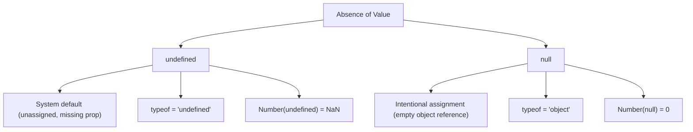

# undefined vs null

> Core-depth topic — see [TEMPLATE.md](../TEMPLATE.md) for what "full depth"
> adds on top of this. This page covers Theory, Diagram, Examples,
> Interview Questions, Mistakes, Best Practices, Senior Discussion, and
> References — the sections most valuable for a topic this foundational.

## Theory

Both `undefined` and `null` represent missing values in JavaScript, but they express different **semantic intents** and behave differently in type checks and operations.

### 1. `undefined` (System-level Absence)

`undefined` is a primitive type (`Undefined`) and value automatically assigned by JavaScript when a variable has been declared but not initialized, a property does not exist on an object, or a function does not explicitly return a value.

### 2. `null` (Developer-level Absence)

`null` is a primitive value of type `Null` that represents an **explicit, intentional absence of an object value**. It must be assigned deliberately by code.

| Axis | `undefined` | `null` |
|---|---|---|
| Meaning | Value has not been defined or initialized | Value intentionally set to "nothing" |
| Assigned By | JavaScript engine (default) | Developer (explicitly) |
| `typeof` result | `"undefined"` | `"object"` (historical JS engine bug) |
| Numerical conversion | `NaN` (`Number(undefined)` → `NaN`) | `0` (`Number(null)` → `0`) |
| JSON Serialization | Properties with `undefined` values are omitted | Properties with `null` are preserved as `null` |
| Default Parameters | Triggers default parameter fallback | Does **not** trigger default parameter fallback |

## Diagram



## Real-world Example

```js
// 1. Unassigned variable & missing property
let user;
console.log(user); // undefined

const obj = { name: "Alice" };
console.log(obj.age); // undefined

// 2. Explicit null assignment
let activeSession = null; // Currently no session active
console.log(activeSession); // null

// 3. Equality Comparisons
console.log(undefined == null);  // true (loose equality coerces both to falsy absence)
console.log(undefined === null); // false (strict equality checks distinct primitive types)
```

## Production Example

```js
// Default parameter behavior delta:
function greet(name = "Guest") {
  return `Hello, ${name}!`;
}

console.log(greet(undefined)); // "Hello, Guest!" (triggers default fallback)
console.log(greet(null));      // "Hello, null!" (null is a valid explicit argument, no fallback)

// API JSON payload handling:
const payload = {
  title: "Post 1",
  deletedAt: null,         // Explicitly not deleted
  draftNote: undefined,    // Will be omitted by JSON.stringify()
};
console.log(JSON.stringify(payload));
// Output: '{"title":"Post 1","deletedAt":null}'
```

## Interview Questions

### Basic
1. **What is the key difference between `undefined` and `null`?**
   - `undefined` means a variable has been declared but not assigned a value yet (system default). `null` means a developer has explicitly assigned an intentional empty value.

2. **What does `typeof undefined` vs `typeof null` return?**
   - `typeof undefined` returns `"undefined"`. `typeof null` returns `"object"`.

### Medium
3. **How do default parameters handle `undefined` vs `null`?**
   - Default arguments trigger when the argument passed is `undefined` (or omitted). Passing `null` will **not** trigger default values because `null` is an explicit argument.

4. **What happens during arithmetic operations with `undefined` vs `null`?**
   - `10 + undefined` results in `NaN` (because `Number(undefined)` is `NaN`). `10 + null` results in `10` (because `Number(null)` coerces to `0`).

### Advanced / Senior
5. **How does nullish coalescing (`??`) handle `undefined` and `null` compared to logical OR (`||`)?**
   - The nullish coalescing operator (`??`) only falls back for `null` and `undefined` (nullish values). The logical OR operator (`||`) falls back for *all* falsy values (`0`, `""`, `false`, `NaN`, `null`, `undefined`).

## Common Mistakes

- Setting a variable to `undefined` manually (`user = undefined`) instead of `null`.
- Checking `typeof val === 'object'` to test for an object without checking `val !== null`, causing runtime `TypeError: Cannot read properties of null` exceptions.
- Assuming `null` will trigger function default parameters.

## Best Practices

- Assign `null` when explicitly resetting or clearing an object reference.
- Use optional chaining (`user?.address?.city`) and nullish coalescing (`val ?? defaultValue`) for clean handling of missing properties.
- Use `val == null` if you intentionally want to check for both `undefined` and `null` simultaneously.

## Senior-level Discussion

Senior developers design APIs to be consistent with missing-data representation. In TypeScript, distinguishing `T | undefined` (optional field) vs `T | null` (nullable database record) helps model domain entities accurately. For instance, `undefined` signals "not provided / unedited", while `null` signals "explicitly cleared / deleted in database".

## References

- [MDN Web Docs — undefined](https://developer.mozilla.org/en-US/docs/Web/JavaScript/Reference/Global_Objects/undefined)
- [MDN Web Docs — null](https://developer.mozilla.org/en-US/docs/Web/JavaScript/Reference/Operators/null)

---
[← Back to 02-javascript-fundamentals](README.md)
