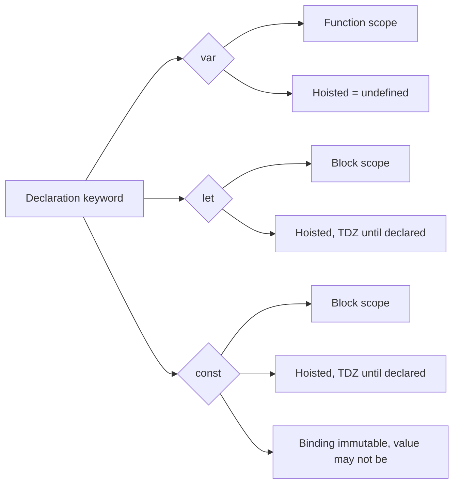

# var vs let vs const

> Core-depth topic — see [TEMPLATE.md](../TEMPLATE.md) for what "full depth"
> adds on top of this. This page covers Theory, Diagram, Examples,
> Interview Questions, Mistakes, Best Practices, Senior Discussion, and
> References — the sections most valuable for a topic this foundational.

## Theory

The three declaration keywords differ on three independent axes: **scope**,
**hoisting behavior**, and **mutability**.

| | `var` | `let` | `const` |
|---|---|---|---|
| Scope | Function-scoped | Block-scoped | Block-scoped |
| Hoisting | Hoisted, initialized to `undefined` | Hoisted, but in the [Temporal Dead Zone](#) until the declaration line | Hoisted, same TDZ as `let` |
| Redeclaration | Allowed | SyntaxError | SyntaxError |
| Reassignment | Allowed | Allowed | TypeError |
| Must initialize at declaration | No | No | Yes |

`const` does **not** mean immutable — it means the *binding* can't be
reassigned. An object or array assigned to a `const` can still have its
contents mutated:

```js
const user = { name: 'Rasik' };
user.name = 'Nizam'; // fine — mutating the object, not reassigning the binding
user = {};           // TypeError — this is reassignment
```

## Diagram



## Real-world Example

```js
// The classic var pitfall in a loop with an async callback
for (var i = 0; i < 3; i++) {
  setTimeout(() => console.log('var:', i), 0);
}
// var: 3
// var: 3
// var: 3    <- all three callbacks share the same function-scoped `i`

for (let j = 0; j < 3; j++) {
  setTimeout(() => console.log('let:', j), 0);
}
// let: 0
// let: 1
// let: 2    <- each iteration gets its own block-scoped `j`
```

## Interview Questions — Basic

1. What are the three differences between `var`, `let`, and `const`?
2. Why does `const obj = {}; obj.key = 1;` work without error?
3. What happens if you access a `let` variable before its declaration line?

## Interview Questions — Medium

1. Explain the loop output difference above — why does `var` log `3 3 3`
   and `let` log `0 1 2`?
2. What is the Temporal Dead Zone, and does it apply to `var`?
3. Is a `const` array truly immutable? How would you make it actually
   immutable?

## Interview Questions — Advanced

1. `typeof` on an undeclared variable returns `'undefined'` safely, but
   `typeof` on a `let` variable still in its TDZ throws. Why the
   difference, given both are "not yet available"?
2. Function declarations and `var` are both hoisted — what specifically
   differs about *what* gets hoisted (the whole function body vs. just the
   binding)?
3. Are `let`/`const` "not hoisted"? (Trick question — walk through why the
   common claim "let is not hoisted" is technically wrong.)

## Common Mistakes

- Using `var` out of habit in modern codebases, silently reintroducing
  function-scope leaks across `if`/`for` blocks.
- Believing `const` freezes the value — leads to surprise when a `const`
  array/object is mutated elsewhere in the codebase.
- Assuming `let`/`const` are "not hoisted at all" (they are — into the
  TDZ — which explains why redeclaring them in the same scope is a
  `SyntaxError` at *parse* time, before any code runs).

## Best Practices

- Default to `const`. Use `let` only when the binding genuinely needs
  reassignment. Avoid `var` in new code entirely.
- If you need real immutability, pair `const` with `Object.freeze()` (or a
  structural-sharing library) — the keyword alone only protects the
  binding.
- In loops that create closures (event handlers, `setTimeout`, async
  callbacks), always use `let`/`const` for the loop variable so each
  iteration captures its own value.

## Senior-level Discussion

Being able to *explain the mechanism* (function vs. block scope, TDZ,
binding vs. value immutability) is the actual bar — reciting the
differences from a table, without being able to explain *why* the classic
loop example behaves the way it does, reads as memorized rather than
understood in a senior interview.

## References

- [MDN — let](https://developer.mozilla.org/en-US/docs/Web/JavaScript/Reference/Statements/let)
- [MDN — const](https://developer.mozilla.org/en-US/docs/Web/JavaScript/Reference/Statements/const)
- [ECMA-262 — Let and Const Declarations](https://tc39.es/ecma262/#sec-let-and-const-declarations)

---
[← Back to 02-javascript-fundamentals](README.md)
