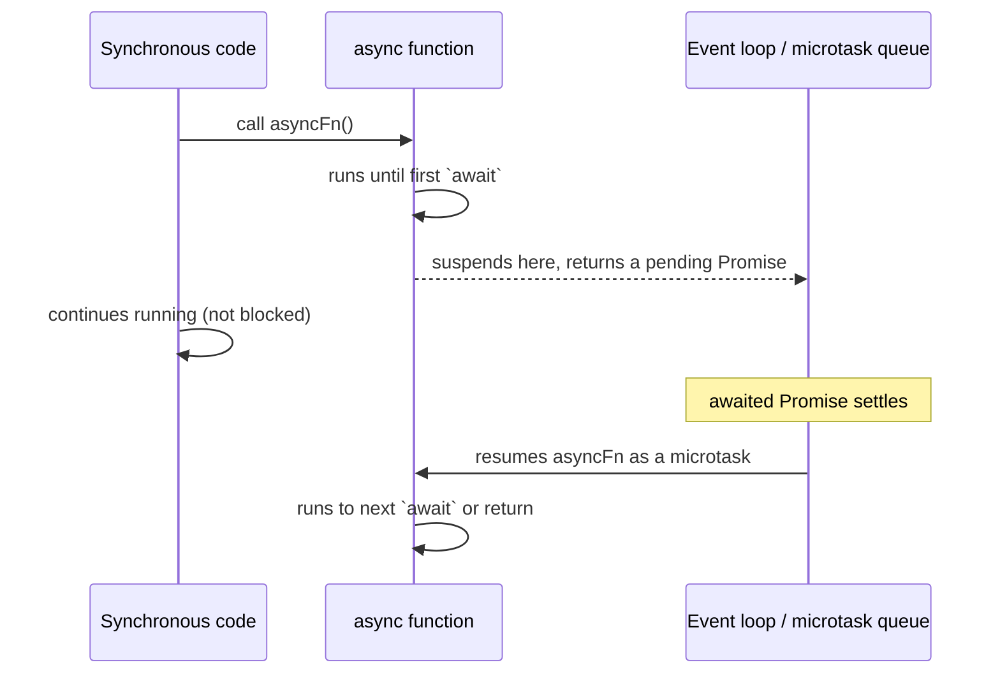

# async/await

> Technical question — follows [TECHNICAL_QUESTION_TEMPLATE.md](../TECHNICAL_QUESTION_TEMPLATE.md)'s
> 13-field format.

**Question:** What is `async`/`await`, how does it relate to Promises
under the hood, and what does it actually do to the event loop while
"waiting"?

**Difficulty:** Medium
**Experience Level:** Mid-Senior (2-5 YOE) — at Senior level this extends
into sequential-vs-parallel `await` performance pitfalls and error
propagation across concurrent awaits; see Related Topics.
**Companies:** Google, Amazon, Meta, Microsoft, Netflix, Uber, Flipkart,
Freshworks
**Interview Frequency:** ★★★★★

## Expected Answer

`async`/`await` is syntactic sugar over Promises that lets asynchronous
code be written and read like synchronous code, without changing the
underlying async behavior. An `async` function always returns a
Promise; `await` pauses execution *of that function* until the awaited
Promise settles, then either returns its resolved value or throws its
rejection reason (catchable with a normal `try`/`catch`). Critically,
`await` does not block the main thread — it yields control back to the
event loop, which continues running other work, and resumes the
`async` function's execution as a microtask once the awaited Promise
settles.

## Detailed Explanation

An `async function` implicitly wraps its return value in a Promise: `async
function f() { return 5; }` is roughly equivalent to `function f() {
return Promise.resolve(5); }`. If the function throws, the returned
Promise rejects with that error instead.

`await expr` does three things:

1. If `expr` isn't already a Promise, it's wrapped with
   `Promise.resolve(expr)` (so `await`ing a plain value works too, just
   resolves on the next microtask rather than synchronously).
2. Execution of the *current* `async` function pauses at that line —
   this is the crucial part: nothing about the rest of the program
   pauses, only this one function's continuation is suspended.
3. Once the awaited Promise settles, the function's execution resumes
   from that exact point, as a microtask — meaning it runs after the
   current synchronous code finishes, but before the next macrotask
   (like a `setTimeout` callback or a render).

This is why `await` doesn't block the main thread: under the hood, the
JS engine suspends the `async` function's execution context (conceptually
similar to a generator's `yield`) and returns control to the caller
immediately. The browser/Node event loop is free to handle other events
— clicks, other timers, other promise resolutions — while the `await`ed
operation is pending.



## Production Example

The most common real-world mistake this reveals is accidentally
serializing independent async operations that should run in parallel:

```js
// Sequential — each await blocks the NEXT line of this function until
// it settles, so total time ≈ time(A) + time(B), even though B doesn't
// depend on A's result.
async function loadDashboardSequential(userId) {
  const profile = await fetchProfile(userId);   // waits fully here
  const orders = await fetchOrders(userId);     // then starts, waits again
  return { profile, orders };
}

// Parallel — both requests start immediately; total time ≈ max(time(A), time(B)).
async function loadDashboardParallel(userId) {
  const [profile, orders] = await Promise.all([
    fetchProfile(userId),
    fetchOrders(userId),
  ]);
  return { profile, orders };
}
```

## Best Practices

- Use `Promise.all` (or `Promise.allSettled` when partial failure is
  acceptable) to run independent `await`s concurrently, rather than
  `await`ing them one after another — sequential `await`s should be
  reserved for genuine dependencies (needing one result to make the next
  call).
- Wrap `await` calls in `try`/`catch` at the boundary where you can
  meaningfully handle the failure (show an error, retry, fall back) —
  don't let a rejected awaited Promise propagate as an unhandled
  rejection out of an event handler.
- Remember `await` only pauses the enclosing `async` function — inside a
  loop, `array.forEach(async (item) => await process(item))` does *not*
  wait for each iteration in order, because `forEach` doesn't await the
  callback's returned Promise; use a `for...of` loop with `await` inside
  it instead if sequential processing is actually required.

## Trade-offs

`async`/`await` trades a small amount of implicit behavior (it's easy to
forget that each `await` is still fully asynchronous and yields to the
event loop) for dramatically more readable control flow than chained
`.then()`/`.catch()`, especially once error handling and multiple
sequential steps are involved. The readability win can backfire
specifically around concurrency — code that *looks* sequential (one
`await` per line) invites writing genuinely sequential logic even when
the underlying operations don't actually depend on each other, which is
why the sequential-vs-parallel distinction above is one of the most
common async performance bugs in real codebases.

## Common Mistakes

- Believing `await` blocks the JavaScript thread the way a blocking
  I/O call would in another language — it doesn't; it yields to the
  event loop and resumes later as a microtask.
- Awaiting independent async calls sequentially instead of using
  `Promise.all`, unintentionally serializing work that could run in
  parallel (see Production Example above).
- Using `await` inside `Array.prototype.forEach` and expecting it to
  wait for each callback — `forEach` ignores the callback's return
  value entirely, so all iterations effectively fire without waiting.
- Forgetting `try`/`catch` around `await` and letting a rejection
  surface as an unhandled promise rejection instead of being handled
  where it's meaningful to the user.
- Marking a function `async` without ever using `await` inside it "just
  in case" — this adds an unnecessary Promise-wrapping layer with no
  benefit if the function is actually synchronous.

## Follow-up Questions

1. What does an `async` function actually return if you don't
   explicitly `return` anything?
2. Why does `await`ing a plain (non-Promise) value still yield a
   microtask instead of resolving synchronously?
3. How would you run five async operations with a concurrency limit of
   two at a time (not all-at-once, not fully sequential)?
4. **(Senior-level extension)** How does error propagation differ
   between `Promise.all` (fail-fast) and a `for...of` loop of
   sequential `await`s wrapped in a single `try`/`catch` — where does
   execution actually stop in each case when one operation fails?

## Related Topics

- [promise-internals.md](promise-internals.md) — the Promise mechanics
  `async`/`await` is built on top of
- [event-loop-and-async.md](event-loop-and-async.md) — how the
  microtask queue that resumes `async` functions relates to the
  macrotask queue
- [Implement Promise.all (Polyfill)](../61-javascript-coding/promise-all-polyfill.md)

---
[← Back to 03-advanced-javascript](README.md)
