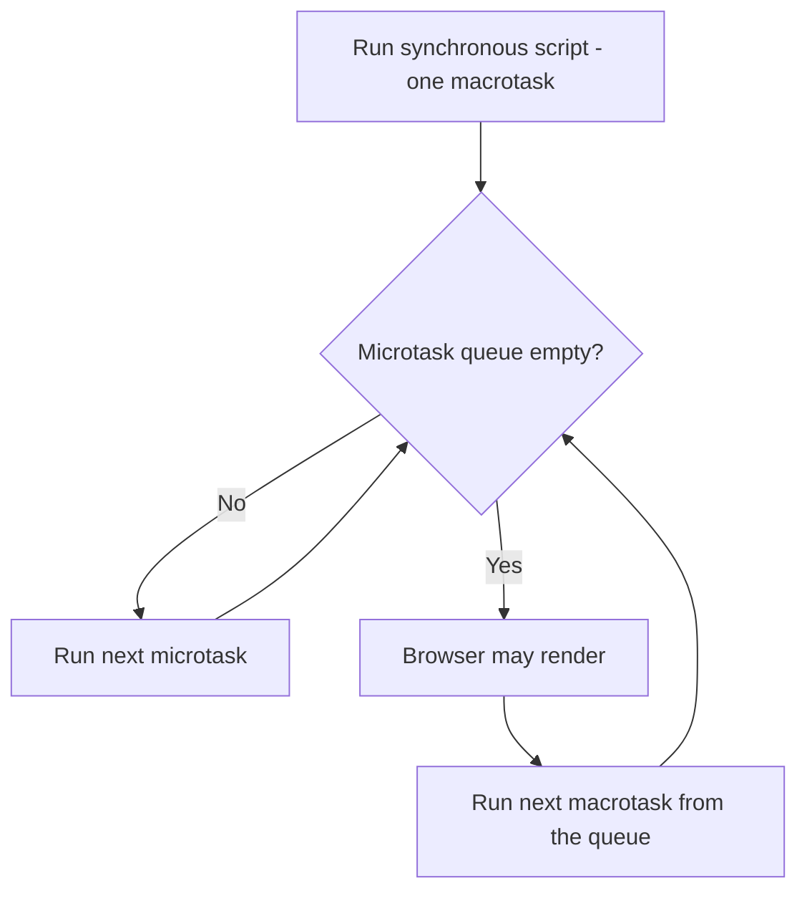

# Event Loop, Microtasks & Macrotasks

> Core-depth topic — see [TEMPLATE.md](../TEMPLATE.md) for the full-depth
> section list.

## Theory

JavaScript executes on a **single thread**. Asynchronous behavior comes
from the surrounding runtime (browser Web APIs, or libuv in Node), which
runs I/O/timers off-thread and queues callbacks for the JS thread to run
once it's free. The **event loop** is the mechanism that decides what runs
next, using two queues with different priority:

- **Microtask queue** — Promise `.then`/`.catch`/`.finally` callbacks,
  `queueMicrotask()`.
- **Macrotask queue** (a.k.a. the "task queue") — `setTimeout`,
  `setInterval`, I/O callbacks, UI events.

The rule that governs almost every "what does this log" interview question:
after each single macrotask finishes, the engine **fully drains the entire
microtask queue** — including any new microtasks scheduled by earlier
microtasks — before moving on to the next macrotask or a render.

## Diagram



## Real-world Example

```js
console.log('1 sync');
setTimeout(() => console.log('2 macrotask'), 0);
Promise.resolve()
  .then(() => console.log('3 microtask'))
  .then(() => console.log('4 microtask (chained)'));
console.log('5 sync');

// Output:
// 1 sync
// 5 sync
// 3 microtask
// 4 microtask (chained)
// 2 macrotask
```

Sync code always finishes first. Then the *entire* microtask queue empties
— including the second `.then()`, which was only scheduled after the first
one ran — before the `setTimeout` callback gets a turn, even though it was
registered with a `0`ms delay.

## Interview Questions — Basic

1. Is JavaScript single-threaded? If so, how does async code work at all?
2. What's the difference between the microtask queue and the macrotask
   queue?
3. Name two things that go on the microtask queue and two that go on the
   macrotask queue.

## Interview Questions — Medium

1. Walk through the output of the example above, line by line.
2. Why does a `Promise` chain of any length finish before a
   `setTimeout(fn, 0)` scheduled earlier in the same tick?
3. What does `queueMicrotask()` do, and how does it differ from wrapping
   something in `Promise.resolve().then()`?

## Interview Questions — Advanced

1. In Node.js, `process.nextTick()` has *higher* priority than the Promise
   microtask queue. Construct an example showing three log statements from
   `nextTick`, a Promise `.then`, and `setImmediate`, in the correct order,
   and explain why.
2. Why can recursive/excessive use of `process.nextTick()` starve the
   Node.js event loop entirely, in a way that `setImmediate` cannot?
3. Inside a Node.js I/O callback, `setImmediate()` is guaranteed to run
   before a `setTimeout(fn, 0)` scheduled in the same callback — but that
   ordering is *not* guaranteed at the top level of a script. Explain why
   the guarantee only holds inside an I/O callback.

## Common Mistakes

- Assuming `setTimeout(fn, 0)` runs "immediately" — it always waits for
  the current synchronous code *and* the entire microtask queue to drain
  first.
- Chaining many `.then()` calls and being surprised they all resolve
  before a sibling `setTimeout` fires, even one registered earlier.
- In Node, using `process.nextTick()` for general async deferral instead
  of `setImmediate()` or a Promise — risking event-loop starvation if used
  recursively.

## Best Practices

- Reach for `async`/`await` over raw `.then()` chains for readability, but
  understand that under the hood it's exactly the same microtask-based
  scheduling.
- Use `queueMicrotask()` directly (rather than a throwaway
  `Promise.resolve().then()`) when you specifically want microtask-timing
  with no Promise semantics attached.
- In Node, default to `setImmediate()` over `setTimeout(fn, 0)` when the
  intent is "run this right after the current I/O phase" — that's what
  `setImmediate` is actually built to guarantee.

## Senior-level Discussion

The bar here is being able to *predict console output* for nested
Promise/`setTimeout` combinations without running the code — that's the
practical test of whether the mental model (drain the whole microtask
queue between every macrotask) is actually internalized, versus
memorized as "Promises are faster than setTimeout."

## References

- [MDN — Event loop](https://developer.mozilla.org/en-US/docs/Web/JavaScript/Reference/Execution_model#event_loop)
- [Jake Archibald — In The Loop (JSConf) — microtask/macrotask ordering](https://www.youtube.com/watch?v=cCOL7MC4Pl0)
- [Node.js docs — The Node.js Event Loop, Timers, and process.nextTick()](https://nodejs.org/en/learn/asynchronous-work/event-loop-timers-and-nexttick)

---
[← Back to 03-advanced-javascript](README.md)
