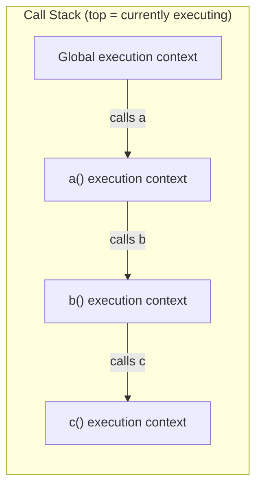

# Execution Context & Call Stack

> Technical question — follows [TECHNICAL_QUESTION_TEMPLATE.md](../TECHNICAL_QUESTION_TEMPLATE.md)'s
> 13-field format.

**Question:** What is an execution context in JavaScript, what are its
phases, and how does the call stack relate to it?

**Difficulty:** Medium
**Experience Level:** Mid-Senior (2-5 YOE) — at Senior level this
extends into how execution contexts explain hoisting/TDZ/closures as one
unified mechanism rather than three separate rules; see Related Topics.
**Companies:** Google, Amazon, Microsoft, Meta, Adobe, Oracle, Cognizant
**Interview Frequency:** ★★★★☆

## Expected Answer

An execution context is the environment in which JavaScript code is
evaluated and run — it holds the variables, functions, and `this` value
that are in scope at that point. There's exactly one **Global Execution
Context** created when a script starts running, and a new **Function
Execution Context** is created every time a function is called. Every
execution context goes through two phases: a **creation phase** (where
variable/function declarations are hoisted and `this` is determined,
before any code actually runs) and an **execution phase** (where code
runs line by line). The **call stack** is the LIFO structure that tracks
which execution contexts are currently active — pushing a new context
when a function is called, popping it when the function returns.

## Detailed Explanation

**Creation phase** happens before a single line of the context's code
actually executes. During this phase, the JS engine:

- Sets up the scope chain (a reference to the outer environment, used
  for resolving variables not found in the current scope).
- Determines `this` for this context.
- Hoists `var` declarations (allocated and initialized to `undefined`)
  and function declarations (hoisted with their full definition,
  immediately callable).
- Hoists `let`/`const` declarations too, but leaves them uninitialized —
  this is the Temporal Dead Zone: the binding exists, but accessing it
  before its actual declaration line throws a `ReferenceError` rather
  than returning `undefined`.

**Execution phase** then runs the code top to bottom, assigning actual
values to variables and executing statements/expressions.

**The call stack** is what makes function calls work at all: calling a
function pushes a *new* execution context onto the stack (on top of
whichever context called it), and that new context becomes the one
currently executing. When the function returns (or throws), its
execution context is popped off, and control resumes in whatever context
is now on top — normally the caller, exactly where it left off. Because
it's a stack (LIFO), this naturally supports nested calls and recursion:
each recursive call gets its own execution context pushed on top of the
previous one.



A **stack overflow** happens when recursion (or mutual recursion) pushes
contexts faster than they're popped, exceeding the engine's allotted
stack size — this is a direct, observable consequence of the call stack
being a real, size-limited structure, not an abstract concept.

## Production Example

Execution context and the call stack are exactly what a stack trace
shows you when debugging:

```js
function validateOrder(order) {
  return calculateTotal(order.items); // this line is where the crash originates
}

function calculateTotal(items) {
  return items.reduce((sum, item) => sum + item.price * item.qty, 0);
}

function checkout(order) {
  return validateOrder(order);
}

checkout({ items: null }); // items.reduce throws: Cannot read properties of null
```

The resulting stack trace (`at calculateTotal`, `at validateOrder`, `at
checkout`, `at <top level>`) is a direct printout of the call stack at
the moment the error was thrown — each line is one execution context
that was active, in order from where the error occurred back to the
original call.

## Best Practices

- Read stack traces from the top down — the top frame is where the
  error actually occurred (the top of the call stack at throw time); the
  frames below it show the chain of calls that led there.
- Be deliberate about recursion depth for user-controlled input (e.g.
  recursively processing a nested JSON structure of unknown depth) —
  unbounded recursion driven by external data is a real stack-overflow
  risk, not just a theoretical one.
- Understand that `async`/`await` and Promise callbacks run in *separate*
  execution contexts pushed onto the stack fresh each time they resume
  (via the microtask queue) — a stack trace across an `await` boundary
  in older JS engines used to lose the "outer" call stack entirely,
  which is why modern engines specifically preserve "async stack traces"
  for debuggability.

## Trade-offs

Understanding execution contexts deeply is mostly a debugging and
mental-model investment rather than something that changes day-to-day
code — but that investment pays off specifically when reasoning about
hoisting bugs, `this`-related bugs, and stack-overflow errors, all of
which are otherwise memorized as separate unrelated rules rather than
understood as consequences of one mechanism (the creation-phase setup of
an execution context).

## Common Mistakes

- Describing hoisting as "variables get moved to the top of the file" —
  nothing physically moves; the creation phase allocates bindings for
  declarations before execution starts, which only *looks* like moving.
- Believing `let`/`const` aren't hoisted at all (since accessing them
  early throws) — they are hoisted, just left uninitialized in the TDZ,
  which is different from `var`'s hoist-to-`undefined` behavior.
- Confusing the call stack with the heap — the call stack holds
  execution contexts (and, for primitives, their values); objects live
  on the heap and are referenced from execution contexts, not stored
  inside them directly.
- Assuming a `RangeError: Maximum call stack size exceeded` always means
  infinite recursion — it can also mean *finite but too-deep* recursion
  for the engine's stack size limit, which is a distinct problem
  (solvable via increasing the limit or converting to iteration) from a
  genuine infinite loop.

## Follow-up Questions

1. Why does `console.log(x); var x = 5;` print `undefined` instead of
   throwing, while the equivalent with `let` throws a `ReferenceError`?
2. How does the call stack relate to closures — why does a closure keep
   working correctly even after the execution context that created it
   has already been popped off the stack?
3. What's actually happening on the call stack when an `async` function
   hits an `await` — does its execution context stay on the stack while
   waiting?
4. **(Senior-level extension)** How would you explain a memory leak
   caused by a long-lived closure retaining a large object, in terms of
   execution contexts and the heap (as opposed to the call stack, which
   is unwound normally)?

## Related Topics

- [hoisting.md](../02-javascript-fundamentals/hoisting.md) — the
  creation-phase behavior explained in more depth
- [scope-and-lexical-environment.md](../02-javascript-fundamentals/scope-and-lexical-environment.md) —
  the scope chain set up during the creation phase
- [closures.md](../02-javascript-fundamentals/closures.md) — how a
  function's lexical environment outlives its execution context being
  popped off the stack
- [event-loop-and-async.md](event-loop-and-async.md) — how the call
  stack, microtask queue, and macrotask queue interact

---
[← Back to 03-advanced-javascript](README.md)
