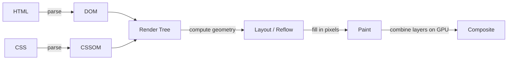

# Critical Rendering Path

> Technical question — follows [TECHNICAL_QUESTION_TEMPLATE.md](../TECHNICAL_QUESTION_TEMPLATE.md)'s
> 13-field format.

**Question:** Walk through what the browser does between receiving HTML
and displaying pixels on screen. What is the "critical rendering path,"
and how do you optimize it?

**Difficulty:** Medium
**Experience Level:** Mid-to-Senior (3-7 YOE) — the basic sequence is
expected from mid-level candidates; senior candidates are expected to
connect it to concrete optimization techniques and Core Web Vitals.
**Companies:** Google, Meta, Amazon, Netflix
**Interview Frequency:** ★★★★★

## Expected Answer

The critical rendering path is the sequence of steps the browser must
complete to convert HTML, CSS, and JavaScript into pixels on screen:
parse HTML into the **DOM**, parse CSS into the **CSSOM**, combine them
into a **render tree** (only visible, styled elements), compute
**layout** (the exact position and size of every element), and **paint**
pixels, potentially across multiple **compositor layers** that the GPU
then combines. Optimizing this path means minimizing what blocks it
(render-blocking CSS/JS) and minimizing how much of it has to re-run on
every update (layout/paint thrashing).

## Detailed Explanation



1. **DOM construction** — the HTML parser builds the DOM incrementally
   as bytes arrive, but it *pauses* whenever it hits a `<script>` tag
   without `async`/`defer`, because that script might use
   `document.write()` to inject more HTML — this is why blocking scripts
   in `<head>` delay everything after them.
2. **CSSOM construction** — CSS is render-blocking by default: the
   browser won't paint *anything* until it has the full CSSOM, because
   any later-loaded stylesheet rule could change what's already been
   painted.
3. **Render tree** — the DOM and CSSOM are combined into a tree
   containing only nodes that will actually be visible (elements with
   `display: none` are excluded entirely; `visibility: hidden` elements
   are included, since they still take up layout space).
4. **Layout (reflow)** — the browser computes the exact pixel position
   and size of every node in the render tree, given the viewport size.
   This is the phase most sensitive to `content-in`, `width` changes, or
   inserting/removing DOM nodes.
5. **Paint** — the browser fills in actual pixels (text, colors,
   borders, shadows) for each visible node, potentially across several
   separate layers.
6. **Composite** — layers are combined by the GPU into the final
   on-screen image. Properties like `transform` and `opacity` can be
   animated at this stage *alone* — skipping layout and paint entirely
   — which is exactly why they're cheap to animate compared to
   properties like `width` or `top`.

## Production Example

A common real-world critical-rendering-path bottleneck: a render-blocking
third-party analytics or font-loading `<script>` placed synchronously
in `<head>` delays first paint for every user, even though the script
itself has nothing to do with the page's actual content:

```html
<!-- Blocks DOM parsing until this script downloads AND executes -->
<script src="https://analytics.example.com/tag.js"></script>

<!-- Fixed: doesn't block parsing; executes once parsing completes -->
<script src="https://analytics.example.com/tag.js" defer></script>
```

This single change — adding `defer` — is a routinely measurable win on
Largest Contentful Paint (LCP) in real production audits, because it
removes a synchronous network round-trip from the critical path without
changing the script's actual behavior (it still runs before
`DOMContentLoaded`, just without blocking parsing first).

## Best Practices

- Mark non-critical `<script>` tags `defer` (preserves execution order,
  runs after parsing) or `async` (runs as soon as loaded, order not
  guaranteed) — never leave a blocking synchronous script in `<head>`
  unless it's genuinely required before first paint.
- Inline critical above-the-fold CSS and load the rest asynchronously
  for pages where CSSOM construction is measurably delaying first paint.
- Animate only `transform` and `opacity` for anything performance
  sensitive (scroll-linked effects, frequent UI transitions) — both can
  be composited without triggering layout or paint at all.
- Batch DOM reads and writes separately (read all `.offsetHeight`-style
  layout-triggering properties first, then write) to avoid **layout
  thrashing** — interleaving reads and writes forces the browser to
  recompute layout synchronously on every read.

## Trade-offs

Inlining critical CSS reduces render-blocking round-trips but increases
HTML payload size and duplicates styles the browser would otherwise
cache once in a separate stylesheet — worth it for the above-the-fold
content on a first visit, not worth it for an entire site's CSS. Server-
and edge-rendering strategies (SSR/streaming SSR) shift work earlier in
the pipeline to shorten the critical path further, at the cost of real
server infrastructure and complexity a purely static or client-rendered
page doesn't need.

## Common Mistakes

- Saying "reflow and repaint are the same thing" — reflow (layout)
  recomputes geometry; repaint fills in pixels without necessarily
  recomputing geometry. A reflow always triggers a repaint, but a
  repaint doesn't necessarily require a reflow (e.g. a color change
  triggers repaint only).
- Believing `display: none` and `visibility: hidden` behave identically
  in the render tree — `display: none` removes the node from the render
  tree entirely (no layout box at all); `visibility: hidden` keeps its
  layout space, just doesn't paint it.
- Assuming all CSS is equally expensive to change — animating `width`
  forces layout on every frame; animating `transform: scaleX()` to
  achieve a similar visual effect can often be composited alone, with no
  layout or paint cost per frame.

## Follow-up Questions

1. Why does a synchronous `<script>` in `<head>` (without async/defer)
   block DOM construction specifically, not just execution?
2. What's the difference between how `transform` and `top`/`left`
   trigger the rendering pipeline, and why does that difference matter
   for animation performance?
3. How does streaming SSR change the critical rendering path compared
   to a traditional server-rendered page that sends one complete HTML
   response?
4. What tools would you use to actually measure where time is going in
   the critical rendering path for a real page (name specific DevTools
   panels/APIs, not just "the Performance tab")?

## Related Topics

- [32-performance](../32-performance) — Core Web Vitals, LCP, and other
  metrics this path directly determines (planned, not yet written)
- [22-nextjs](../22-nextjs) — SSR/streaming SSR strategies that
  restructure this path (planned, not yet written)

---
[← Back to 05-browser-internals](README.md)
