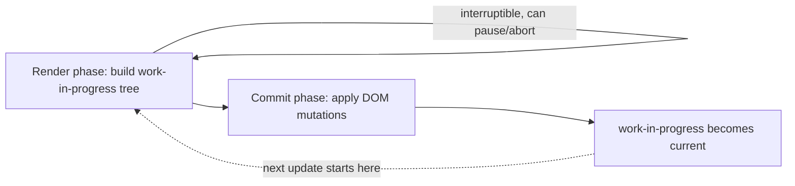

# React Fiber & Concurrent Rendering

> Technical question — follows [TECHNICAL_QUESTION_TEMPLATE.md](../TECHNICAL_QUESTION_TEMPLATE.md)'s
> 13-field format.

**Question:** Explain how React Fiber works, and what it enables that
the pre-Fiber reconciler couldn't do.

**Difficulty:** Medium
**Experience Level:** Senior (5-7 YOE) — at Staff level this extends into
concurrent-rendering trade-offs and the React Compiler; see the
Staff-level extension noted in Related Topics.
**Companies:** Google, Meta, Microsoft
**Interview Frequency:** ★★★★☆

## Expected Answer

Fiber is React's internal reconciliation engine, introduced in React 16,
that represents each component instance as a linked-list-like tree of
"fiber" units of work. Unlike the pre-Fiber stack reconciler — which
recursed synchronously through the whole tree and couldn't be paused —
Fiber's architecture lets React break rendering into small units of work
that can be paused, resumed, aborted, or prioritized, which is what
makes concurrent features (`useTransition`, Suspense, time-slicing)
possible.

## Detailed Explanation

Each Fiber node corresponds to a component instance (or a host DOM node)
and holds: the component's type and props, its state, pointers to its
`child`, `sibling`, and `return` (parent) fibers, and an "effect" list
describing what DOM work needs to happen. Because fibers form an
explicit data structure (not implicit call-stack frames), React can walk
this tree incrementally — processing one fiber, yielding control back to
the browser to check whether there's higher-priority work (like handling
a keystroke), and resuming later from exactly where it left off. This is
the "work loop" — render work happens in an interruptible loop rather
than a single uninterruptible synchronous pass.

Rendering happens in two phases:

1. **Render phase** — builds the new fiber tree (the "work-in-progress"
   tree). Interruptible; can be thrown away entirely without any visible
   effect, since nothing has touched the real DOM yet.
2. **Commit phase** — applies the computed changes to the real DOM.
   Synchronous and never interrupted, because a half-applied DOM update
   would be visibly broken to the user.

React keeps two fiber trees simultaneously — `current` (what's on
screen) and `work-in-progress` (what's being built) — and switches which
one is "current" with a single pointer swap once the work-in-progress
tree is complete. This double-buffering is what lets React discard an
in-progress render cleanly if a higher-priority update interrupts it:
the `current` tree the user sees is untouched until the swap.



## Production Example

Fiber's interruptibility is why a large, expensive re-render (e.g. a
big data-table update) no longer blocks a user's typing in an unrelated
input on the same page when `useTransition`/`startTransition` marks that
update as lower-priority — the render phase for the table can pause
while React handles the higher-priority keystroke, then resume. Under
the pre-Fiber stack reconciler, this kind of interruption was
architecturally impossible; a large render would block the main thread
until it fully completed, and users would perceive dropped keystrokes or
frozen input during heavy updates.

```jsx
function ProductSearch({ products }) {
  const [query, setQuery] = useState('');
  const [isPending, startTransition] = useTransition();
  const [filtered, setFiltered] = useState(products);

  function handleChange(e) {
    setQuery(e.target.value); // urgent: keeps the input responsive
    startTransition(() => {
      // marked low-priority — can be interrupted by the next keystroke
      setFiltered(products.filter((p) => p.name.includes(e.target.value)));
    });
  }

  return (
    <>
      <input value={query} onChange={handleChange} />
      {isPending && <Spinner />}
      <ProductList items={filtered} />
    </>
  );
}
```

## Best Practices

- Understand the render/commit split when reasoning about side effects:
  code that must run exactly once per real DOM commit belongs in
  `useEffect`/`useLayoutEffect`, not in the render body — the render
  phase itself may run more than once per commit (or be thrown away
  entirely) under concurrent rendering, so render-body code must stay
  pure and side-effect-free.
- Use `useTransition`/`startTransition` to explicitly mark updates that
  are safe to deprioritize, rather than assuming React will always
  correctly guess which updates are urgent.
- Don't reach for `useTransition` reflexively on every state update —
  it adds real complexity (a pending state to handle in the UI) and
  only pays off for updates that are both expensive and safe to delay.

## Trade-offs

Fiber's incremental architecture adds real engine complexity (a
persistent, mutable-ish tree structure with double-buffering between
`current` and `work-in-progress`) in exchange for interruptibility — a
trade-off React's team made explicitly to unlock features that were
otherwise architecturally impossible. That complexity is mostly hidden
from application code, but it shows up directly if you're debugging
React internals, writing a custom renderer, or reasoning precisely about
when effects fire relative to renders.

## Common Mistakes

- Describing Fiber as "just a rewrite of the diffing algorithm" — the
  diffing heuristics themselves (keys, element-type comparison) didn't
  fundamentally change; what changed is the *execution model* around
  that diffing (interruptible units of work vs. one synchronous pass).
- Confusing the render phase with the commit phase — claiming DOM
  mutations can be interrupted is wrong; only the render phase can be
  paused or discarded, never the commit.
- Assuming `useTransition` makes an update happen faster — it doesn't;
  it changes *priority*, not raw speed. A transition-wrapped update can
  still take just as long once it actually runs; the benefit is that it
  no longer blocks higher-priority work in the meantime.

## Follow-up Questions

1. Why must the commit phase be synchronous while the render phase isn't?
2. What problem does `useTransition` solve that plain `setState` doesn't?
3. How does Fiber's double-buffered tree (`current` vs.
   `work-in-progress`) relate to how React recovers cleanly if a render
   is aborted partway through?
4. **(Staff-level extension)** How does the React Compiler change the
   calculus around manual memoization (`useMemo`/`useCallback`) given
   Fiber's existing scheduling model — does automatic memoization make
   `useTransition` less necessary, or are they solving unrelated
   problems?

## Related Topics

- [14-react-internals](../14-react-internals) — reconciliation and
  diffing in more depth (planned, not yet written)
- [13-react-performance](../13-react-performance) — `useTransition`,
  `useDeferredValue`, and other concurrent-rendering performance tools
  (planned, not yet written)
- Suspense and streaming SSR (planned, not yet written)

---
[← Back to 10-react](README.md)
