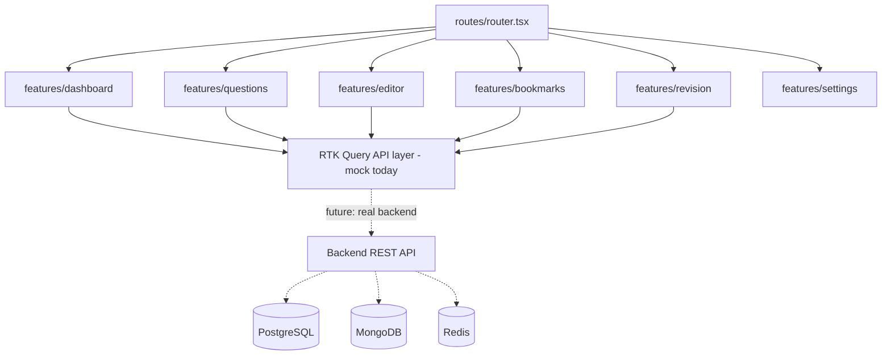
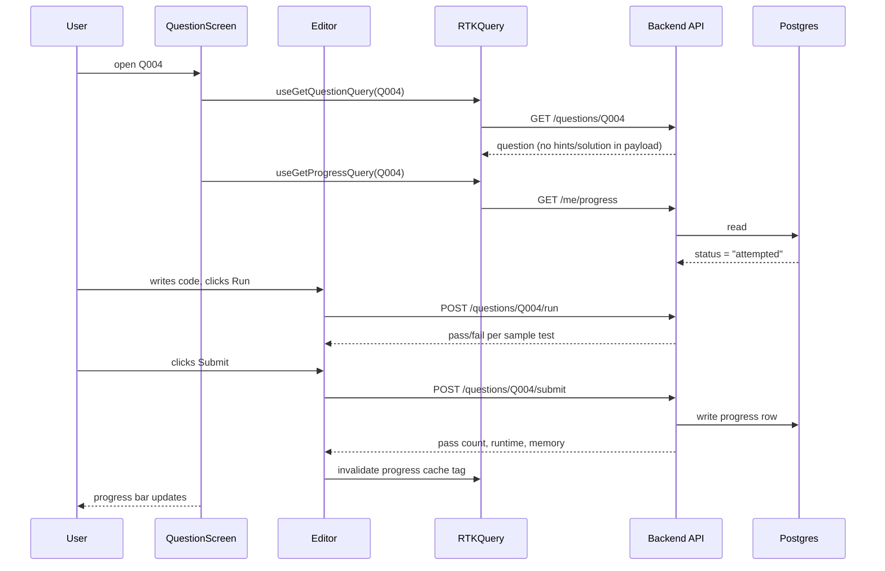

# Architecture

> **Status: partially implemented.** The `frontend/` app now exists —
> Vite + React 19 + TypeScript (strict) + Tailwind + Redux Toolkit/RTK
> Query + Monaco, built against mocked data (no backend). See
> [PROGRESS.md](PROGRESS.md#implementation-phases)
> for exactly which phases are real. `backend/` does not exist — no
> database, no auth, no deployed API. Everything below still describes
> the full target architecture; treat the folder tree as accurate for
> `frontend/` and aspirational for `backend/`.

## Why an app at all

The content in this repo (questions, templates, solutions) is designed
to be consumed interactively: hidden hints revealed progressively, a
real code editor, per-question progress state, search/filter across
thousands of questions. A markdown reader in a GitHub UI can't do any of
that — hence the platform.

## Stack

> **Update:** an earlier version of this section recommended a
> backend-free, localStorage-only architecture, reasoning that "no
> backend is implied by anything in this spec." That's no longer true —
> a full backend, multi-database, and auth stack has since been
> specified explicitly. The table below reflects that as a real
> decision. See [PRD.md](PRD.md)'s open questions for the one piece
> that's still genuinely unresolved: whether auth/backend is required
> at MVP or added in Phase 2.

| Layer | Choice | Why |
|---|---|---|
| Frontend framework | React 19 + TypeScript + Vite | Given explicitly. Vite over Next.js means this is a pure SPA, not server-rendered — see the routing note below. |
| Styling | Tailwind CSS | Given explicitly; utility classes map cleanly onto the token system in [UI_UX_GUIDE.md](UI_UX_GUIDE.md). |
| Code editor | Monaco Editor | Given explicitly; the real VS Code editor component. |
| Client state | Redux Toolkit + RTK Query | Given explicitly. RTK Query owns server-state caching (questions, progress) so a separate data-fetching library isn't needed; Redux Toolkit owns client-only UI state (panel layout, theme, focus mode). |
| Backend | Python (FastAPI) **or** Node.js (NestJS/Express) | Given as an either/or choice, not yet narrowed — see the decision note below. |
| Relational data | PostgreSQL | Given explicitly. Schema in [DATABASE.md](DATABASE.md). |
| Document data | MongoDB | Given explicitly. Schema in [DATABASE.md](DATABASE.md). |
| Cache / sessions | Redis | Given explicitly. Usage in [DATABASE.md](DATABASE.md). |
| Search | Elasticsearch or Meilisearch | Given explicitly, but per [PRD.md](PRD.md)/[DATABASE.md](DATABASE.md) phasing, this is a Phase 3 addition — MongoDB's text index covers MVP search volume. |
| Auth | JWT + refresh tokens, optional Google/GitHub OAuth | Given explicitly. Endpoints in [API_GUIDE.md](API_GUIDE.md). |
| Object storage | S3-compatible | Given explicitly, for assets — no specific asset type has been identified yet that needs this at MVP (no user-uploaded avatars/attachments currently specced); revisit whether this is Phase 1 infrastructure or premature once a real asset need exists. |

**Open decision — backend framework:** FastAPI and NestJS/Express solve
the same problem here (a REST API per [API_GUIDE.md](API_GUIDE.md), no
GraphQL, no heavy real-time/WebSocket surface at MVP) — the honest
trade-off is team/author familiarity and ecosystem fit with the rest of
this stack (a Node backend shares a language with the React frontend; a
Python backend gets FastAPI's automatic OpenAPI docs generation from
type hints, which pairs well with [API_GUIDE.md](API_GUIDE.md) staying
accurate over time). Not resolved here — pick when implementation
actually starts, since nothing else in this document depends on which
one is chosen.

**Routing note:** because the frontend is Vite (an SPA), the `app/`
folder in the structure below is a *routing convention this project
chose to keep*, not literally Next.js's App Router — actual routing
would be handled by a client-side router (e.g. React Router,
consistent with this repo's own [15-react-router](15-react-router)
content) rather than file-based server routing. Flagging this because
the original folder mockup's `app/` naming reads as a Next.js
convention; it isn't one under this stack.

This is now a real, specified stack — treat changing it as a decision
that needs to be made explicitly, not a low-cost edit to this file.

## Folder structure

Two separate deployables — a frontend SPA and a backend API — not one
monorepo `app/` folder trying to hold both, since they now ship and
scale independently. `frontend/` below is the **actual structure as
built** (verified against the filesystem, not aspirational); `backend/`
is still target-only.

```
frontend/
├── src/
│   ├── routes/                 # React Router route definitions — router.tsx, thin
│   ├── components/
│   │   ├── layouts/              # AppShell, Sidebar, TopBar
│   │   └── ui/                    # Badge, Button, Modal, ProgressBar
│   ├── features/                # Feature-scoped, self-contained modules
│   │   ├── dashboard/              # Dashboard.tsx
│   │   ├── questions/               # QuestionList, QuestionListItem, CodingScreen, RevealPanel
│   │   ├── editor/                   # CodeEditor (Monaco wrapper), RunConsole
│   │   ├── bookmarks/                 # BookmarksPage
│   │   ├── revision/                   # RevisionPage
│   │   └── settings/                    # SettingsPage
│   ├── store/                    # Redux Toolkit store setup
│   │   ├── api/                    # questionsApi (RTK Query, mock baseQuery today)
│   │   └── slices/                  # uiSlice (theme), progressSlice (solved/attempted/bookmarks)
│   ├── shared/
│   │   ├── hooks/                  # redux.ts (typed useAppSelector/useAppDispatch)
│   │   ├── selectors/                # progressSelectors.ts (streak, revision schedule)
│   │   ├── services/                  # codeRunner.ts (client-side sample-test execution)
│   │   └── types/                      # question.ts
│   ├── mocks/                     # questions.ts — mock question bank (transcribed from /65-dsa)
│   └── test/                      # setup.ts, testStore.ts, renderWithProviders.tsx
└── public/                     # favicon.svg

docs/                          # This documentation set (already exists — see below), repo root, not per-deployable

backend/                       # Target only — does not exist yet. See API_GUIDE.md/DATABASE.md.
├── src/
│   ├── routes/                  # or FastAPI routers, per the framework decision in this file
│   ├── models/                    # Postgres models/ORM schema
│   ├── documents/                  # MongoDB document schemas
│   ├── services/                    # Business logic (progress calc, revision scheduling, test execution)
│   └── middleware/                   # Auth, rate limiting
├── migrations/                 # Postgres migrations
└── tests/
```

Tests are colocated next to the code they cover (`foo.ts` + `foo.test.ts`),
not in a separate `tests/` tree, per [STYLE_GUIDE.md](STYLE_GUIDE.md).

**Content vs. app separation:** questions and technical questions are
now genuinely backend-owned data (MongoDB, per
[DATABASE.md](DATABASE.md)) — the frontend fetches them via
[API_GUIDE.md](API_GUIDE.md)'s endpoints through RTK Query, it doesn't
bundle them at build time. The source of truth for *authoring* content
still stays in this repo's existing numbered markdown sections
([02-javascript-fundamentals](02-javascript-fundamentals),
[65-dsa](65-dsa), etc.) — a seed/import script (not yet written, see
[DATABASE.md](DATABASE.md)'s Migrations & seeding section) loads that
markdown into MongoDB via the admin panel's bulk-import path
([ADMIN_GUIDE.md](ADMIN_GUIDE.md)). This keeps one authoring format
(markdown, checked against [QUESTION_TEMPLATE.md](QUESTION_TEMPLATE.md))
while the running app reads from the database, not from static files.

`docs/` in this diagram is this repository's existing documentation set
(`CLAUDE.md`, `ARCHITECTURE.md`, `PROMPTS.md`, etc., plus
[docs/prompts/](docs/prompts/)) — it doesn't move.

## Feature architecture

Each folder under `frontend/features/` is a **self-contained vertical
slice**: its own components, hooks, and RTK Query API slice, exporting
only what other features/routes actually need. Cross-feature
communication goes through `shared/` (hooks/services) or the Redux
store, never by one feature reaching directly into another feature's
internals — this is the boundary that keeps `features/editor` swappable
(e.g. replacing Monaco later) without every other feature needing to
change.



Not-yet-built features (technical Q&A, company-wise, mock interview)
follow this exact same pattern once implemented — a new
`features/<name>/` folder plus RTK Query endpoints added to
`store/api/`, nothing structural changes.

## State management

Three distinct kinds of state, deliberately kept separate rather than
funneled through one mechanism:

1. **Server state** — questions, technical questions, progress,
   bookmarks, notes. Owned by **RTK Query**, which handles fetching,
   caching, and cache invalidation against the backend API in
   [API_GUIDE.md](API_GUIDE.md) — this is exactly the problem RTK Query
   exists to solve, and is why a separate data-fetching library (React
   Query, SWR) isn't also needed on top of Redux Toolkit.
2. **Client UI state** — theme, panel layout, focus mode, sidebar
   collapsed/expanded. Owned by plain **Redux Toolkit slices** (not
   RTK Query, since there's no server round-trip involved) — kept in
   the same store as server state for one consistent state-management
   story across the app, rather than mixing in a second library (e.g.
   Zustand) for this smaller category of state.
3. **Ephemeral local state** — current code in the editor before Run/
   Submit, which hint level is revealed for the question currently
   open. Lives in local component state, not Redux — this is
   intentionally *not* global state, since it's scoped to exactly one
   screen and shouldn't outlive it or be inspectable from unrelated
   parts of the app.

## Data flow — solving a question



## Component organization principles

- **`components/`** holds presentation-only components with no feature-
  specific logic — a `Badge`, a `ProgressBar`, a `Panel` — reusable
  across every feature.
- **`features/*/components/`** holds components specific to that
  feature and not meant for reuse elsewhere (e.g. `features/editor`'s
  `RunButton` has no reason to exist outside the editor).
- Every feature exports a small, explicit public surface (typically one
  top-level component per route, plus any hooks other features
  genuinely need) — not a barrel file re-exporting everything, which
  defeats the boundary this structure exists to create.

---
[← Back to root index](README.md)
