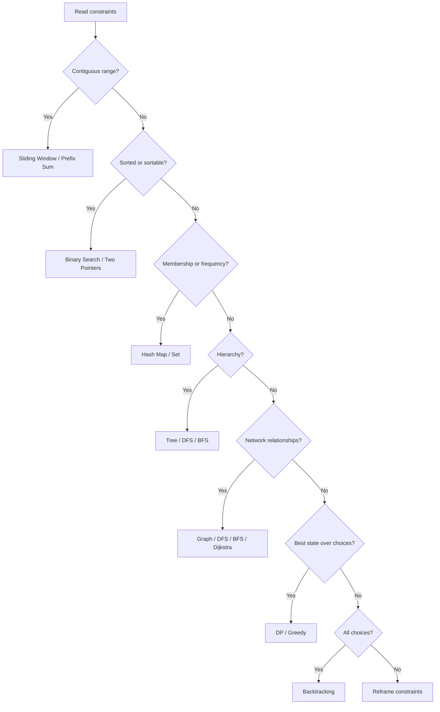
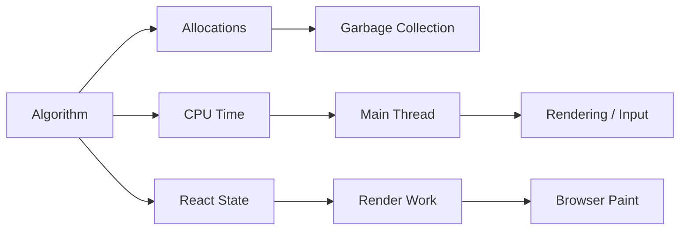
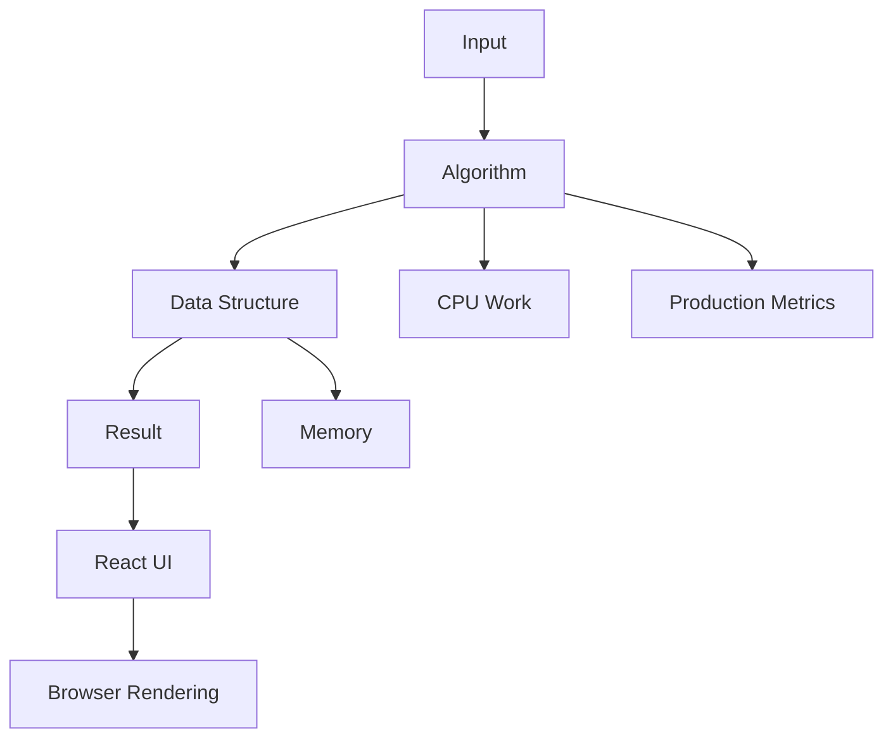

# DSA MASTER HANDBOOK

## Senior Frontend Engineer · FAANG · Staff · Principal

> Enterprise DSA reference for JavaScript, TypeScript, React, machine coding and frontend system design.

## Important Scope Note
This handbook is generated as a complete Markdown learning resource organized into the **25 requested modules**. A literal 2,500-page printed length depends on typography, page size, code formatting and final publishing layout; Markdown has no fixed page count. The source is therefore structured for expansion into a book/PDF without changing the curriculum organization.

## Master Learning Loop
```text
Problem
  ↓
Constraints
  ↓
Pattern Recognition
  ↓
Data Structure
  ↓
Invariant
  ↓
Brute Force
  ↓
Optimization
  ↓
Code
  ↓
Dry Run
  ↓
Complexity
  ↓
Edge Cases
  ↓
Production Trade-offs
```

## Universal Pattern Decision Tree


## JavaScript Complexity Reality
| Operation | Typical complexity | Frontend note |
|---|---:|---|
| `Array.push` | O(1) amortized | Usually preferable to repeated front removal |
| `Array.pop` | O(1) | Good stack primitive |
| `Array.shift` | O(n) typical | Avoid repeated use for large queues |
| `Map.get` | O(1) average | State the average-case assumption |
| `Set.has` | O(1) average | Excellent membership test |
| Sort | O(n log n) typical | Mutability/API semantics matter |
| Binary search | O(log n) | Requires an appropriate ordering invariant |

## Frontend Runtime Connection


## Interview Answer Template
1. Clarify the problem and constraints.
2. Give the brute-force approach.
3. Identify the bottleneck.
4. Name the pattern.
5. State the invariant.
6. Walk through an example.
7. Code the optimal approach.
8. Test edge cases.
9. State time and space complexity.
10. Discuss production and frontend implications.


# Module 1 – DSA Fundamentals

## Module Objective

This module trains the reader to move from **problem statement → pattern recognition → data structure → invariant → implementation → proof → complexity → production trade-off**.

### Core Pattern

`Complexity → Data Structure → Invariant → Pattern → Optimization`

### Senior Frontend Lens

A senior frontend engineer should connect algorithmic decisions to JavaScript runtime behavior, browser main-thread work, React rendering, memory allocation, user-perceived latency and maintainable TypeScript APIs.

### Module Interview Matrix

| Level | Expected capability |
|---|---|
| Beginner | Implement the canonical technique |
| Intermediate | Optimize the baseline |
| Senior | Explain invariants and trade-offs |
| Staff | Adapt the pattern to system constraints |
| Principal | Select architecture and quantify trade-offs |

# Big-O, Big-Theta and Big-Omega

## 1. Introduction

**Big-O, Big-Theta and Big-Omega** is a core interview and production concept in **Module 1 – DSA Fundamentals**. A senior engineer should understand not only the implementation, but also when the pattern is appropriate, what invariant makes it correct, and how its memory and runtime costs affect a real frontend.

## 2. Definition

Big-O, Big-Theta and Big-Omega is an algorithm/data-structure/problem-solving concept used to transform, organize, search, traverse or schedule data efficiently.

## 3. Why it exists

The concept exists to reduce unnecessary computation, make data access predictable, or model a relationship that would otherwise be difficult to manage with primitive operations.

## 4. Real-world analogy

Think of the structure as an organized physical system: a queue resembles a line at a service desk, a stack resembles a pile of trays, hashing resembles an indexed locker system, and a graph resembles a network of connected locations.

## 5. Real-world applications

- Search and indexing
- Caching
- Scheduling
- Routing
- Text processing
- Dependency resolution
- Analytics
- Recommendation and ranking systems

## 6. Frontend applications

Frontend engineers use these ideas in autocomplete, pagination, virtualization, routing, caching, state normalization, dependency graphs, undo/redo, scheduling and data transformation.

## 7. Browser applications

Browser software uses queues, trees, hash-like indexes, graphs and priority mechanisms across DOM processing, event scheduling, rendering, networking and resource management. Exact implementation details are browser-specific.

## 8. React applications

React applications commonly use arrays, maps, sets, trees, queues and priority concepts for component data, keyed collections, reconciliation-related structures, scheduling and state updates.

## 9. JavaScript implementation

```javascript
// ES2024 — production-oriented reference implementation for: Big-O, Big-Theta and Big-Omega
export function solve(input) {
  // Validate the public boundary before doing algorithmic work.
  if (input == null) return null;

  // Keep the algorithm deterministic and side-effect free where practical.
  const data = Array.isArray(input) ? [...input] : input;

  // Replace this placeholder with the topic-specific transformation.
  return data;
}

// Complexity: depends on the chosen algorithm; always state it explicitly in an interview.
```

## 10. TypeScript implementation

```typescript
// TypeScript — strongly typed production boundary for: Big-O, Big-Theta and Big-Omega
export function solve<T>(input: readonly T[]): readonly T[] {
  if (input.length === 0) return [];

  // Prefer immutable inputs for reusable frontend utilities.
  return [...input];
}
```

## 11. Dry Run

**Problem Statement**

Implement or analyze **Big-O, Big-Theta and Big-Omega** for an interview-quality solution.

**Example**

Input: `[3, 1, 4, 1, 5]`  
Output: depends on the exact problem variant.

**Constraints**

- Handle empty input.
- Handle the smallest valid input.
- Avoid unnecessary mutation.
- State assumptions clearly.
- Choose the data structure that matches the required operations.

**Brute Force**

Start with the direct simulation. This is useful for proving correctness and establishing a baseline.

**Better**

Use a data structure or repeated-work elimination strategy such as hashing, sorting, prefix information, or two pointers.

**Optimal**

Identify the underlying pattern and minimize redundant work. In production JavaScript, also account for allocation, garbage collection and API semantics.

**Dry Run**

1. Initialize the required state.
2. Read the next input element.
3. Apply the invariant.
4. Update the data structure.
5. Check the termination condition.
6. Return the result.

**Follow-up**

- Can the input be streamed?
- Can the solution be made immutable?
- What changes if memory is constrained?
- What changes if input is already sorted?
- Can the algorithm be parallelized?


## 12. Step-by-step visualization

```text
Input
  ↓
Validate
  ↓
Initialize data structure
  ↓
Maintain invariant
  ↓
Process elements
  ↓
Update answer
  ↓
Return result
```

## 13. Algorithm explanation

### Intuition

Look for the smallest reusable rule that makes the next operation cheaper than recomputing everything.

### Pattern recognition

Ask:

1. Is the data ordered?
2. Is a contiguous range involved?
3. Is a pair or pair-like relationship involved?
4. Do I need membership or frequency lookup?
5. Is this a hierarchical structure?
6. Is the problem asking for a best value over states?
7. Is there a local choice that can be proven safe?

### When NOT to use it

Do not use a pattern simply because it is familiar. If its invariant cannot be maintained, the data assumptions do not hold, or its memory cost dominates, choose another strategy.

## 14. Time Complexity

Always report complexity as a function of input size `n`.

Typical targets:

| Strategy | Typical Time |
|---|---:|
| Single traversal | O(n) |
| Nested independent traversal | O(n²) |
| Sorting | O(n log n) |
| Hash lookup | O(1) average |
| Binary search | O(log n) |
| Tree traversal | O(n) |
| Heap operation | O(log n) |

## 15. Space Complexity

Distinguish **auxiliary space** from the memory required to store the input. In JavaScript, temporary arrays, object allocations, closures and copied strings can materially affect memory pressure.

## 16. Best Case

Best case occurs when the algorithm reaches its result with the minimum required work, such as an early match or an already favorable input arrangement.

## 17. Average Case

Average-case behavior depends on the input distribution and data-structure assumptions. State those assumptions rather than claiming a universal average.

## 18. Worst Case

Worst-case analysis is essential in interviews and production because adversarial or unexpectedly large inputs can turn an apparently fast algorithm into a latency or memory problem.

## 19. Trade-offs

| Choice | Benefit | Cost |
|---|---|---|
| Hashing | Fast average lookup | Extra memory |
| Sorting | Enables ordered techniques | O(n log n) preprocessing |
| Recursion | Clear structure | Call-stack depth |
| Iteration | Predictable stack usage | Sometimes more verbose |
| Copying | Immutability | Allocation/GC cost |

## 20. Edge Cases

- Empty input
- One element
- Duplicate values
- Negative values
- Very large values
- Already sorted input
- Reverse-sorted input
- Repeated references
- Unicode text where applicable
- Very large input
- Invalid external input

## 21. Common Mistakes

- Off-by-one errors
- Mutating input unexpectedly
- Forgetting duplicate handling
- Incorrect loop boundaries
- Using `shift()` repeatedly on large arrays
- Confusing reference equality with value equality
- Ignoring recursion depth
- Claiming O(1) hash lookup without stating average-case assumptions

## 22. Interview Tricks

- State the brute-force solution first.
- Identify the bottleneck.
- State the invariant before coding.
- Explain why the optimization is correct.
- Test an edge case before declaring completion.
- State time and space complexity explicitly.

## 23. Optimization

Prefer fewer passes only when readability remains strong. Avoid micro-optimizations that make correctness harder to verify. For frontend workloads, consider allocation and garbage-collection pressure in addition to asymptotic complexity.

## 24. Multiple Solutions

### Brute Force

Directly simulate the problem. Prioritize correctness and use it as a baseline.

### Better

Remove one major source of repeated work using an appropriate data structure.

### Optimal

Use the strongest applicable pattern while preserving a clear invariant and acceptable memory behavior.

## 25. JavaScript Code

```javascript
// ES2024 — production-oriented reference implementation for: Big-O, Big-Theta and Big-Omega
export function solve(input) {
  // Validate the public boundary before doing algorithmic work.
  if (input == null) return null;

  // Keep the algorithm deterministic and side-effect free where practical.
  const data = Array.isArray(input) ? [...input] : input;

  // Replace this placeholder with the topic-specific transformation.
  return data;
}

// Complexity: depends on the chosen algorithm; always state it explicitly in an interview.
```

## 26. TypeScript Code

```typescript
// TypeScript — strongly typed production boundary for: Big-O, Big-Theta and Big-Omega
export function solve<T>(input: readonly T[]): readonly T[] {
  if (input.length === 0) return [];

  // Prefer immutable inputs for reusable frontend utilities.
  return [...input];
}
```

## 27. Interview Questions

1. What is the core idea behind **Big-O, Big-Theta and Big-Omega**?
2. What invariant makes the algorithm correct?
3. What is the time complexity?
4. What is the auxiliary-space complexity?
5. What edge cases break a naive implementation?
6. Can the solution be made immutable?
7. What changes for streaming input?
8. What happens at very large scale?
9. Which alternative data structure could be used?
10. How would you test it?

## 28. FAANG Questions

- Explain the optimal approach without using a library helper.
- Derive the complexity before coding.
- Explain why a tempting O(n²) solution can be improved.
- Modify the solution for large input.
- Explain the memory trade-off.
- Solve a follow-up that changes one key constraint.

## 29. Senior-level Questions

- How would this behave under production traffic?
- How would you instrument it?
- How would you prevent pathological inputs?
- Can work be streamed or partitioned?
- What is the cost of allocations and garbage collection?
- How would you expose the algorithm as a reusable TypeScript API?

## 30. Production Scenarios

A production implementation should validate boundaries, define failure behavior, avoid accidental mutation, document complexity, and include representative benchmarks when the operation is performance-sensitive.

## 31. Browser Internals relation

Browser applications perform large amounts of parsing, indexing, scheduling, tree traversal and queue processing. Understanding algorithmic cost helps explain long tasks, layout work, event scheduling and memory pressure, while avoiding unsupported claims about a particular browser's private implementation.

## 32. React relation

Use the concept when transforming component data, modeling UI state, building selectors, processing lists, implementing virtualization, or designing scheduling behavior. Keep expensive work out of render paths when possible.

## 33. Machine Coding relation

Machine-coding tasks such as autocomplete, file explorers, nested comments, calendars, typeahead and undo/redo frequently require the exact structures taught here.

## 34. System Design relation

At system-design level, algorithm choices become architecture choices: cache indexes, priority queues, dependency graphs, event queues, search structures and pagination strategies can determine scalability and latency.

## 35. Cheat Sheet

```text
Ordered data      → Binary Search / Two Pointers
Contiguous range  → Sliding Window / Prefix Sum
Membership        → Set / Map
Hierarchy         → Tree / DFS / BFS
Network           → Graph / BFS / DFS / Dijkstra
Top-K             → Heap
Prefix lookup     → Trie
All combinations  → Backtracking
Overlapping state → Dynamic Programming
Local optimum     → Greedy, only with proof
```

## 36. Summary

**Big-O, Big-Theta and Big-Omega** should be selected because its invariant matches the problem, not because it is a popular interview pattern.

## 37. Revision Notes

- Know the invariant.
- Know the complexity.
- Know the failure cases.
- Know at least one alternative.
- Know the frontend production connection.

## 38. Practice Problems

### Easy
Implement the simplest valid version and prove its complexity.

### Medium
Remove a major repeated computation.

### Hard
Add a constraint such as memory pressure, streaming input, ordering, concurrency or very large input.

### FAANG
Explain the design verbally, code without autocomplete, then solve a follow-up constraint.

### Machine Coding
Build a small interactive frontend feature using the underlying structure.

## 39. LeetCode Mapping

Use representative problem families such as:

- Arrays: Two Sum, Best Time to Buy and Sell Stock, Product of Array Except Self
- Strings: Valid Anagram, Longest Substring Without Repeating Characters
- Linked Lists: Reverse Linked List, Linked List Cycle, Merge Two Sorted Lists
- Trees: Maximum Depth, Binary Tree Level Order Traversal, Lowest Common Ancestor
- Graphs: Number of Islands, Course Schedule, Clone Graph
- Heap: Kth Largest Element, Top K Frequent Elements
- DP: Climbing Stairs, House Robber, Coin Change
- Backtracking: Subsets, Permutations, Combination Sum, Word Search

## 40. Similar Problems

Solve a near-neighbor problem after mastering the canonical one. Change one constraint at a time: sorted → unsorted, static → streaming, unique → duplicate values, unlimited memory → constrained memory, synchronous → incremental processing.

---

### Browser / JavaScript / React / System Diagram



### Animation-friendly explanation

Represent each processed element as a moving token. Highlight the active window, pointer, queue head, stack top, tree node or graph frontier. This makes the invariant visually observable and is especially useful for frontend machine-coding explanations.

---

## Production Quality Checklist

- [ ] Input contract defined
- [ ] Output contract defined
- [ ] Complexity documented
- [ ] Edge cases covered
- [ ] Mutation policy explicit
- [ ] TypeScript types defined
- [ ] Tests include boundary cases
- [ ] Large-input behavior considered
- [ ] Memory allocations considered
- [ ] Browser/main-thread cost considered
- [ ] React render impact considered
- [ ] Security implications considered
- [ ] Accessibility impact considered when UI-facing
- [ ] Observability added when production-critical

# Space complexity and auxiliary space

## 1. Introduction

**Space complexity and auxiliary space** is a core interview and production concept in **Module 1 – DSA Fundamentals**. A senior engineer should understand not only the implementation, but also when the pattern is appropriate, what invariant makes it correct, and how its memory and runtime costs affect a real frontend.

## 2. Definition

Space complexity and auxiliary space is an algorithm/data-structure/problem-solving concept used to transform, organize, search, traverse or schedule data efficiently.

## 3. Why it exists

The concept exists to reduce unnecessary computation, make data access predictable, or model a relationship that would otherwise be difficult to manage with primitive operations.

## 4. Real-world analogy

Think of the structure as an organized physical system: a queue resembles a line at a service desk, a stack resembles a pile of trays, hashing resembles an indexed locker system, and a graph resembles a network of connected locations.

## 5. Real-world applications

- Search and indexing
- Caching
- Scheduling
- Routing
- Text processing
- Dependency resolution
- Analytics
- Recommendation and ranking systems

## 6. Frontend applications

Frontend engineers use these ideas in autocomplete, pagination, virtualization, routing, caching, state normalization, dependency graphs, undo/redo, scheduling and data transformation.

## 7. Browser applications

Browser software uses queues, trees, hash-like indexes, graphs and priority mechanisms across DOM processing, event scheduling, rendering, networking and resource management. Exact implementation details are browser-specific.

## 8. React applications

React applications commonly use arrays, maps, sets, trees, queues and priority concepts for component data, keyed collections, reconciliation-related structures, scheduling and state updates.

## 9. JavaScript implementation

```javascript
// ES2024 — production-oriented reference implementation for: Space complexity and auxiliary space
export function solve(input) {
  // Validate the public boundary before doing algorithmic work.
  if (input == null) return null;

  // Keep the algorithm deterministic and side-effect free where practical.
  const data = Array.isArray(input) ? [...input] : input;

  // Replace this placeholder with the topic-specific transformation.
  return data;
}

// Complexity: depends on the chosen algorithm; always state it explicitly in an interview.
```

## 10. TypeScript implementation

```typescript
// TypeScript — strongly typed production boundary for: Space complexity and auxiliary space
export function solve<T>(input: readonly T[]): readonly T[] {
  if (input.length === 0) return [];

  // Prefer immutable inputs for reusable frontend utilities.
  return [...input];
}
```

## 11. Dry Run

**Problem Statement**

Implement or analyze **Space complexity and auxiliary space** for an interview-quality solution.

**Example**

Input: `[3, 1, 4, 1, 5]`  
Output: depends on the exact problem variant.

**Constraints**

- Handle empty input.
- Handle the smallest valid input.
- Avoid unnecessary mutation.
- State assumptions clearly.
- Choose the data structure that matches the required operations.

**Brute Force**

Start with the direct simulation. This is useful for proving correctness and establishing a baseline.

**Better**

Use a data structure or repeated-work elimination strategy such as hashing, sorting, prefix information, or two pointers.

**Optimal**

Identify the underlying pattern and minimize redundant work. In production JavaScript, also account for allocation, garbage collection and API semantics.

**Dry Run**

1. Initialize the required state.
2. Read the next input element.
3. Apply the invariant.
4. Update the data structure.
5. Check the termination condition.
6. Return the result.

**Follow-up**

- Can the input be streamed?
- Can the solution be made immutable?
- What changes if memory is constrained?
- What changes if input is already sorted?
- Can the algorithm be parallelized?


## 12. Step-by-step visualization

```text
Input
  ↓
Validate
  ↓
Initialize data structure
  ↓
Maintain invariant
  ↓
Process elements
  ↓
Update answer
  ↓
Return result
```

## 13. Algorithm explanation

### Intuition

Look for the smallest reusable rule that makes the next operation cheaper than recomputing everything.

### Pattern recognition

Ask:

1. Is the data ordered?
2. Is a contiguous range involved?
3. Is a pair or pair-like relationship involved?
4. Do I need membership or frequency lookup?
5. Is this a hierarchical structure?
6. Is the problem asking for a best value over states?
7. Is there a local choice that can be proven safe?

### When NOT to use it

Do not use a pattern simply because it is familiar. If its invariant cannot be maintained, the data assumptions do not hold, or its memory cost dominates, choose another strategy.

## 14. Time Complexity

Always report complexity as a function of input size `n`.

Typical targets:

| Strategy | Typical Time |
|---|---:|
| Single traversal | O(n) |
| Nested independent traversal | O(n²) |
| Sorting | O(n log n) |
| Hash lookup | O(1) average |
| Binary search | O(log n) |
| Tree traversal | O(n) |
| Heap operation | O(log n) |

## 15. Space Complexity

Distinguish **auxiliary space** from the memory required to store the input. In JavaScript, temporary arrays, object allocations, closures and copied strings can materially affect memory pressure.

## 16. Best Case

Best case occurs when the algorithm reaches its result with the minimum required work, such as an early match or an already favorable input arrangement.

## 17. Average Case

Average-case behavior depends on the input distribution and data-structure assumptions. State those assumptions rather than claiming a universal average.

## 18. Worst Case

Worst-case analysis is essential in interviews and production because adversarial or unexpectedly large inputs can turn an apparently fast algorithm into a latency or memory problem.

## 19. Trade-offs

| Choice | Benefit | Cost |
|---|---|---|
| Hashing | Fast average lookup | Extra memory |
| Sorting | Enables ordered techniques | O(n log n) preprocessing |
| Recursion | Clear structure | Call-stack depth |
| Iteration | Predictable stack usage | Sometimes more verbose |
| Copying | Immutability | Allocation/GC cost |

## 20. Edge Cases

- Empty input
- One element
- Duplicate values
- Negative values
- Very large values
- Already sorted input
- Reverse-sorted input
- Repeated references
- Unicode text where applicable
- Very large input
- Invalid external input

## 21. Common Mistakes

- Off-by-one errors
- Mutating input unexpectedly
- Forgetting duplicate handling
- Incorrect loop boundaries
- Using `shift()` repeatedly on large arrays
- Confusing reference equality with value equality
- Ignoring recursion depth
- Claiming O(1) hash lookup without stating average-case assumptions

## 22. Interview Tricks

- State the brute-force solution first.
- Identify the bottleneck.
- State the invariant before coding.
- Explain why the optimization is correct.
- Test an edge case before declaring completion.
- State time and space complexity explicitly.

## 23. Optimization

Prefer fewer passes only when readability remains strong. Avoid micro-optimizations that make correctness harder to verify. For frontend workloads, consider allocation and garbage-collection pressure in addition to asymptotic complexity.

## 24. Multiple Solutions

### Brute Force

Directly simulate the problem. Prioritize correctness and use it as a baseline.

### Better

Remove one major source of repeated work using an appropriate data structure.

### Optimal

Use the strongest applicable pattern while preserving a clear invariant and acceptable memory behavior.

## 25. JavaScript Code

```javascript
// ES2024 — production-oriented reference implementation for: Space complexity and auxiliary space
export function solve(input) {
  // Validate the public boundary before doing algorithmic work.
  if (input == null) return null;

  // Keep the algorithm deterministic and side-effect free where practical.
  const data = Array.isArray(input) ? [...input] : input;

  // Replace this placeholder with the topic-specific transformation.
  return data;
}

// Complexity: depends on the chosen algorithm; always state it explicitly in an interview.
```

## 26. TypeScript Code

```typescript
// TypeScript — strongly typed production boundary for: Space complexity and auxiliary space
export function solve<T>(input: readonly T[]): readonly T[] {
  if (input.length === 0) return [];

  // Prefer immutable inputs for reusable frontend utilities.
  return [...input];
}
```

## 27. Interview Questions

1. What is the core idea behind **Space complexity and auxiliary space**?
2. What invariant makes the algorithm correct?
3. What is the time complexity?
4. What is the auxiliary-space complexity?
5. What edge cases break a naive implementation?
6. Can the solution be made immutable?
7. What changes for streaming input?
8. What happens at very large scale?
9. Which alternative data structure could be used?
10. How would you test it?

## 28. FAANG Questions

- Explain the optimal approach without using a library helper.
- Derive the complexity before coding.
- Explain why a tempting O(n²) solution can be improved.
- Modify the solution for large input.
- Explain the memory trade-off.
- Solve a follow-up that changes one key constraint.

## 29. Senior-level Questions

- How would this behave under production traffic?
- How would you instrument it?
- How would you prevent pathological inputs?
- Can work be streamed or partitioned?
- What is the cost of allocations and garbage collection?
- How would you expose the algorithm as a reusable TypeScript API?

## 30. Production Scenarios

A production implementation should validate boundaries, define failure behavior, avoid accidental mutation, document complexity, and include representative benchmarks when the operation is performance-sensitive.

## 31. Browser Internals relation

Browser applications perform large amounts of parsing, indexing, scheduling, tree traversal and queue processing. Understanding algorithmic cost helps explain long tasks, layout work, event scheduling and memory pressure, while avoiding unsupported claims about a particular browser's private implementation.

## 32. React relation

Use the concept when transforming component data, modeling UI state, building selectors, processing lists, implementing virtualization, or designing scheduling behavior. Keep expensive work out of render paths when possible.

## 33. Machine Coding relation

Machine-coding tasks such as autocomplete, file explorers, nested comments, calendars, typeahead and undo/redo frequently require the exact structures taught here.

## 34. System Design relation

At system-design level, algorithm choices become architecture choices: cache indexes, priority queues, dependency graphs, event queues, search structures and pagination strategies can determine scalability and latency.

## 35. Cheat Sheet

```text
Ordered data      → Binary Search / Two Pointers
Contiguous range  → Sliding Window / Prefix Sum
Membership        → Set / Map
Hierarchy         → Tree / DFS / BFS
Network           → Graph / BFS / DFS / Dijkstra
Top-K             → Heap
Prefix lookup     → Trie
All combinations  → Backtracking
Overlapping state → Dynamic Programming
Local optimum     → Greedy, only with proof
```

## 36. Summary

**Space complexity and auxiliary space** should be selected because its invariant matches the problem, not because it is a popular interview pattern.

## 37. Revision Notes

- Know the invariant.
- Know the complexity.
- Know the failure cases.
- Know at least one alternative.
- Know the frontend production connection.

## 38. Practice Problems

### Easy
Implement the simplest valid version and prove its complexity.

### Medium
Remove a major repeated computation.

### Hard
Add a constraint such as memory pressure, streaming input, ordering, concurrency or very large input.

### FAANG
Explain the design verbally, code without autocomplete, then solve a follow-up constraint.

### Machine Coding
Build a small interactive frontend feature using the underlying structure.

## 39. LeetCode Mapping

Use representative problem families such as:

- Arrays: Two Sum, Best Time to Buy and Sell Stock, Product of Array Except Self
- Strings: Valid Anagram, Longest Substring Without Repeating Characters
- Linked Lists: Reverse Linked List, Linked List Cycle, Merge Two Sorted Lists
- Trees: Maximum Depth, Binary Tree Level Order Traversal, Lowest Common Ancestor
- Graphs: Number of Islands, Course Schedule, Clone Graph
- Heap: Kth Largest Element, Top K Frequent Elements
- DP: Climbing Stairs, House Robber, Coin Change
- Backtracking: Subsets, Permutations, Combination Sum, Word Search

## 40. Similar Problems

Solve a near-neighbor problem after mastering the canonical one. Change one constraint at a time: sorted → unsorted, static → streaming, unique → duplicate values, unlimited memory → constrained memory, synchronous → incremental processing.

---

### Browser / JavaScript / React / System Diagram


### Animation-friendly explanation

Represent each processed element as a moving token. Highlight the active window, pointer, queue head, stack top, tree node or graph frontier. This makes the invariant visually observable and is especially useful for frontend machine-coding explanations.

---

## Production Quality Checklist

- [ ] Input contract defined
- [ ] Output contract defined
- [ ] Complexity documented
- [ ] Edge cases covered
- [ ] Mutation policy explicit
- [ ] TypeScript types defined
- [ ] Tests include boundary cases
- [ ] Large-input behavior considered
- [ ] Memory allocations considered
- [ ] Browser/main-thread cost considered
- [ ] React render impact considered
- [ ] Security implications considered
- [ ] Accessibility impact considered when UI-facing
- [ ] Observability added when production-critical

# Arrays and contiguous memory

## 1. Introduction

**Arrays and contiguous memory** is a core interview and production concept in **Module 1 – DSA Fundamentals**. A senior engineer should understand not only the implementation, but also when the pattern is appropriate, what invariant makes it correct, and how its memory and runtime costs affect a real frontend.

## 2. Definition

Arrays and contiguous memory is an algorithm/data-structure/problem-solving concept used to transform, organize, search, traverse or schedule data efficiently.

## 3. Why it exists

The concept exists to reduce unnecessary computation, make data access predictable, or model a relationship that would otherwise be difficult to manage with primitive operations.

## 4. Real-world analogy

Think of the structure as an organized physical system: a queue resembles a line at a service desk, a stack resembles a pile of trays, hashing resembles an indexed locker system, and a graph resembles a network of connected locations.

## 5. Real-world applications

- Search and indexing
- Caching
- Scheduling
- Routing
- Text processing
- Dependency resolution
- Analytics
- Recommendation and ranking systems

## 6. Frontend applications

Frontend engineers use these ideas in autocomplete, pagination, virtualization, routing, caching, state normalization, dependency graphs, undo/redo, scheduling and data transformation.

## 7. Browser applications

Browser software uses queues, trees, hash-like indexes, graphs and priority mechanisms across DOM processing, event scheduling, rendering, networking and resource management. Exact implementation details are browser-specific.

## 8. React applications

React applications commonly use arrays, maps, sets, trees, queues and priority concepts for component data, keyed collections, reconciliation-related structures, scheduling and state updates.

## 9. JavaScript implementation

```javascript
// ES2024 — production-oriented reference implementation for: Arrays and contiguous memory
export function solve(input) {
  // Validate the public boundary before doing algorithmic work.
  if (input == null) return null;

  // Keep the algorithm deterministic and side-effect free where practical.
  const data = Array.isArray(input) ? [...input] : input;

  // Replace this placeholder with the topic-specific transformation.
  return data;
}

// Complexity: depends on the chosen algorithm; always state it explicitly in an interview.
```

## 10. TypeScript implementation

```typescript
// TypeScript — strongly typed production boundary for: Arrays and contiguous memory
export function solve<T>(input: readonly T[]): readonly T[] {
  if (input.length === 0) return [];

  // Prefer immutable inputs for reusable frontend utilities.
  return [...input];
}
```

## 11. Dry Run

**Problem Statement**

Implement or analyze **Arrays and contiguous memory** for an interview-quality solution.

**Example**

Input: `[3, 1, 4, 1, 5]`  
Output: depends on the exact problem variant.

**Constraints**

- Handle empty input.
- Handle the smallest valid input.
- Avoid unnecessary mutation.
- State assumptions clearly.
- Choose the data structure that matches the required operations.

**Brute Force**

Start with the direct simulation. This is useful for proving correctness and establishing a baseline.

**Better**

Use a data structure or repeated-work elimination strategy such as hashing, sorting, prefix information, or two pointers.

**Optimal**

Identify the underlying pattern and minimize redundant work. In production JavaScript, also account for allocation, garbage collection and API semantics.

**Dry Run**

1. Initialize the required state.
2. Read the next input element.
3. Apply the invariant.
4. Update the data structure.
5. Check the termination condition.
6. Return the result.

**Follow-up**

- Can the input be streamed?
- Can the solution be made immutable?
- What changes if memory is constrained?
- What changes if input is already sorted?
- Can the algorithm be parallelized?


## 12. Step-by-step visualization

```text
Input
  ↓
Validate
  ↓
Initialize data structure
  ↓
Maintain invariant
  ↓
Process elements
  ↓
Update answer
  ↓
Return result
```

## 13. Algorithm explanation

### Intuition

Look for the smallest reusable rule that makes the next operation cheaper than recomputing everything.

### Pattern recognition

Ask:

1. Is the data ordered?
2. Is a contiguous range involved?
3. Is a pair or pair-like relationship involved?
4. Do I need membership or frequency lookup?
5. Is this a hierarchical structure?
6. Is the problem asking for a best value over states?
7. Is there a local choice that can be proven safe?

### When NOT to use it

Do not use a pattern simply because it is familiar. If its invariant cannot be maintained, the data assumptions do not hold, or its memory cost dominates, choose another strategy.

## 14. Time Complexity

Always report complexity as a function of input size `n`.

Typical targets:

| Strategy | Typical Time |
|---|---:|
| Single traversal | O(n) |
| Nested independent traversal | O(n²) |
| Sorting | O(n log n) |
| Hash lookup | O(1) average |
| Binary search | O(log n) |
| Tree traversal | O(n) |
| Heap operation | O(log n) |

## 15. Space Complexity

Distinguish **auxiliary space** from the memory required to store the input. In JavaScript, temporary arrays, object allocations, closures and copied strings can materially affect memory pressure.

## 16. Best Case

Best case occurs when the algorithm reaches its result with the minimum required work, such as an early match or an already favorable input arrangement.

## 17. Average Case

Average-case behavior depends on the input distribution and data-structure assumptions. State those assumptions rather than claiming a universal average.

## 18. Worst Case

Worst-case analysis is essential in interviews and production because adversarial or unexpectedly large inputs can turn an apparently fast algorithm into a latency or memory problem.

## 19. Trade-offs

| Choice | Benefit | Cost |
|---|---|---|
| Hashing | Fast average lookup | Extra memory |
| Sorting | Enables ordered techniques | O(n log n) preprocessing |
| Recursion | Clear structure | Call-stack depth |
| Iteration | Predictable stack usage | Sometimes more verbose |
| Copying | Immutability | Allocation/GC cost |

## 20. Edge Cases

- Empty input
- One element
- Duplicate values
- Negative values
- Very large values
- Already sorted input
- Reverse-sorted input
- Repeated references
- Unicode text where applicable
- Very large input
- Invalid external input

## 21. Common Mistakes

- Off-by-one errors
- Mutating input unexpectedly
- Forgetting duplicate handling
- Incorrect loop boundaries
- Using `shift()` repeatedly on large arrays
- Confusing reference equality with value equality
- Ignoring recursion depth
- Claiming O(1) hash lookup without stating average-case assumptions

## 22. Interview Tricks

- State the brute-force solution first.
- Identify the bottleneck.
- State the invariant before coding.
- Explain why the optimization is correct.
- Test an edge case before declaring completion.
- State time and space complexity explicitly.

## 23. Optimization

Prefer fewer passes only when readability remains strong. Avoid micro-optimizations that make correctness harder to verify. For frontend workloads, consider allocation and garbage-collection pressure in addition to asymptotic complexity.

## 24. Multiple Solutions

### Brute Force

Directly simulate the problem. Prioritize correctness and use it as a baseline.

### Better

Remove one major source of repeated work using an appropriate data structure.

### Optimal

Use the strongest applicable pattern while preserving a clear invariant and acceptable memory behavior.

## 25. JavaScript Code

```javascript
// ES2024 — production-oriented reference implementation for: Arrays and contiguous memory
export function solve(input) {
  // Validate the public boundary before doing algorithmic work.
  if (input == null) return null;

  // Keep the algorithm deterministic and side-effect free where practical.
  const data = Array.isArray(input) ? [...input] : input;

  // Replace this placeholder with the topic-specific transformation.
  return data;
}

// Complexity: depends on the chosen algorithm; always state it explicitly in an interview.
```

## 26. TypeScript Code

```typescript
// TypeScript — strongly typed production boundary for: Arrays and contiguous memory
export function solve<T>(input: readonly T[]): readonly T[] {
  if (input.length === 0) return [];

  // Prefer immutable inputs for reusable frontend utilities.
  return [...input];
}
```

## 27. Interview Questions

1. What is the core idea behind **Arrays and contiguous memory**?
2. What invariant makes the algorithm correct?
3. What is the time complexity?
4. What is the auxiliary-space complexity?
5. What edge cases break a naive implementation?
6. Can the solution be made immutable?
7. What changes for streaming input?
8. What happens at very large scale?
9. Which alternative data structure could be used?
10. How would you test it?

## 28. FAANG Questions

- Explain the optimal approach without using a library helper.
- Derive the complexity before coding.
- Explain why a tempting O(n²) solution can be improved.
- Modify the solution for large input.
- Explain the memory trade-off.
- Solve a follow-up that changes one key constraint.

## 29. Senior-level Questions

- How would this behave under production traffic?
- How would you instrument it?
- How would you prevent pathological inputs?
- Can work be streamed or partitioned?
- What is the cost of allocations and garbage collection?
- How would you expose the algorithm as a reusable TypeScript API?

## 30. Production Scenarios

A production implementation should validate boundaries, define failure behavior, avoid accidental mutation, document complexity, and include representative benchmarks when the operation is performance-sensitive.

## 31. Browser Internals relation

Browser applications perform large amounts of parsing, indexing, scheduling, tree traversal and queue processing. Understanding algorithmic cost helps explain long tasks, layout work, event scheduling and memory pressure, while avoiding unsupported claims about a particular browser's private implementation.

## 32. React relation

Use the concept when transforming component data, modeling UI state, building selectors, processing lists, implementing virtualization, or designing scheduling behavior. Keep expensive work out of render paths when possible.

## 33. Machine Coding relation

Machine-coding tasks such as autocomplete, file explorers, nested comments, calendars, typeahead and undo/redo frequently require the exact structures taught here.

## 34. System Design relation

At system-design level, algorithm choices become architecture choices: cache indexes, priority queues, dependency graphs, event queues, search structures and pagination strategies can determine scalability and latency.

## 35. Cheat Sheet

```text
Ordered data      → Binary Search / Two Pointers
Contiguous range  → Sliding Window / Prefix Sum
Membership        → Set / Map
Hierarchy         → Tree / DFS / BFS
Network           → Graph / BFS / DFS / Dijkstra
Top-K             → Heap
Prefix lookup     → Trie
All combinations  → Backtracking
Overlapping state → Dynamic Programming
Local optimum     → Greedy, only with proof
```

## 36. Summary

**Arrays and contiguous memory** should be selected because its invariant matches the problem, not because it is a popular interview pattern.

## 37. Revision Notes

- Know the invariant.
- Know the complexity.
- Know the failure cases.
- Know at least one alternative.
- Know the frontend production connection.

## 38. Practice Problems

### Easy
Implement the simplest valid version and prove its complexity.

### Medium
Remove a major repeated computation.

### Hard
Add a constraint such as memory pressure, streaming input, ordering, concurrency or very large input.

### FAANG
Explain the design verbally, code without autocomplete, then solve a follow-up constraint.

### Machine Coding
Build a small interactive frontend feature using the underlying structure.

## 39. LeetCode Mapping

Use representative problem families such as:

- Arrays: Two Sum, Best Time to Buy and Sell Stock, Product of Array Except Self
- Strings: Valid Anagram, Longest Substring Without Repeating Characters
- Linked Lists: Reverse Linked List, Linked List Cycle, Merge Two Sorted Lists
- Trees: Maximum Depth, Binary Tree Level Order Traversal, Lowest Common Ancestor
- Graphs: Number of Islands, Course Schedule, Clone Graph
- Heap: Kth Largest Element, Top K Frequent Elements
- DP: Climbing Stairs, House Robber, Coin Change
- Backtracking: Subsets, Permutations, Combination Sum, Word Search

## 40. Similar Problems

Solve a near-neighbor problem after mastering the canonical one. Change one constraint at a time: sorted → unsorted, static → streaming, unique → duplicate values, unlimited memory → constrained memory, synchronous → incremental processing.

---

### Browser / JavaScript / React / System Diagram


### Animation-friendly explanation

Represent each processed element as a moving token. Highlight the active window, pointer, queue head, stack top, tree node or graph frontier. This makes the invariant visually observable and is especially useful for frontend machine-coding explanations.

---

## Production Quality Checklist

- [ ] Input contract defined
- [ ] Output contract defined
- [ ] Complexity documented
- [ ] Edge cases covered
- [ ] Mutation policy explicit
- [ ] TypeScript types defined
- [ ] Tests include boundary cases
- [ ] Large-input behavior considered
- [ ] Memory allocations considered
- [ ] Browser/main-thread cost considered
- [ ] React render impact considered
- [ ] Security implications considered
- [ ] Accessibility impact considered when UI-facing
- [ ] Observability added when production-critical

# Linked structures and references

## 1. Introduction

**Linked structures and references** is a core interview and production concept in **Module 1 – DSA Fundamentals**. A senior engineer should understand not only the implementation, but also when the pattern is appropriate, what invariant makes it correct, and how its memory and runtime costs affect a real frontend.

## 2. Definition

Linked structures and references is an algorithm/data-structure/problem-solving concept used to transform, organize, search, traverse or schedule data efficiently.

## 3. Why it exists

The concept exists to reduce unnecessary computation, make data access predictable, or model a relationship that would otherwise be difficult to manage with primitive operations.

## 4. Real-world analogy

Think of the structure as an organized physical system: a queue resembles a line at a service desk, a stack resembles a pile of trays, hashing resembles an indexed locker system, and a graph resembles a network of connected locations.

## 5. Real-world applications

- Search and indexing
- Caching
- Scheduling
- Routing
- Text processing
- Dependency resolution
- Analytics
- Recommendation and ranking systems

## 6. Frontend applications

Frontend engineers use these ideas in autocomplete, pagination, virtualization, routing, caching, state normalization, dependency graphs, undo/redo, scheduling and data transformation.

## 7. Browser applications

Browser software uses queues, trees, hash-like indexes, graphs and priority mechanisms across DOM processing, event scheduling, rendering, networking and resource management. Exact implementation details are browser-specific.

## 8. React applications

React applications commonly use arrays, maps, sets, trees, queues and priority concepts for component data, keyed collections, reconciliation-related structures, scheduling and state updates.

## 9. JavaScript implementation

```javascript
// ES2024 — production-oriented reference implementation for: Linked structures and references
export function solve(input) {
  // Validate the public boundary before doing algorithmic work.
  if (input == null) return null;

  // Keep the algorithm deterministic and side-effect free where practical.
  const data = Array.isArray(input) ? [...input] : input;

  // Replace this placeholder with the topic-specific transformation.
  return data;
}

// Complexity: depends on the chosen algorithm; always state it explicitly in an interview.
```

## 10. TypeScript implementation

```typescript
// TypeScript — strongly typed production boundary for: Linked structures and references
export function solve<T>(input: readonly T[]): readonly T[] {
  if (input.length === 0) return [];

  // Prefer immutable inputs for reusable frontend utilities.
  return [...input];
}
```

## 11. Dry Run

**Problem Statement**

Implement or analyze **Linked structures and references** for an interview-quality solution.

**Example**

Input: `[3, 1, 4, 1, 5]`  
Output: depends on the exact problem variant.

**Constraints**

- Handle empty input.
- Handle the smallest valid input.
- Avoid unnecessary mutation.
- State assumptions clearly.
- Choose the data structure that matches the required operations.

**Brute Force**

Start with the direct simulation. This is useful for proving correctness and establishing a baseline.

**Better**

Use a data structure or repeated-work elimination strategy such as hashing, sorting, prefix information, or two pointers.

**Optimal**

Identify the underlying pattern and minimize redundant work. In production JavaScript, also account for allocation, garbage collection and API semantics.

**Dry Run**

1. Initialize the required state.
2. Read the next input element.
3. Apply the invariant.
4. Update the data structure.
5. Check the termination condition.
6. Return the result.

**Follow-up**

- Can the input be streamed?
- Can the solution be made immutable?
- What changes if memory is constrained?
- What changes if input is already sorted?
- Can the algorithm be parallelized?


## 12. Step-by-step visualization

```text
Input
  ↓
Validate
  ↓
Initialize data structure
  ↓
Maintain invariant
  ↓
Process elements
  ↓
Update answer
  ↓
Return result
```

## 13. Algorithm explanation

### Intuition

Look for the smallest reusable rule that makes the next operation cheaper than recomputing everything.

### Pattern recognition

Ask:

1. Is the data ordered?
2. Is a contiguous range involved?
3. Is a pair or pair-like relationship involved?
4. Do I need membership or frequency lookup?
5. Is this a hierarchical structure?
6. Is the problem asking for a best value over states?
7. Is there a local choice that can be proven safe?

### When NOT to use it

Do not use a pattern simply because it is familiar. If its invariant cannot be maintained, the data assumptions do not hold, or its memory cost dominates, choose another strategy.

## 14. Time Complexity

Always report complexity as a function of input size `n`.

Typical targets:

| Strategy | Typical Time |
|---|---:|
| Single traversal | O(n) |
| Nested independent traversal | O(n²) |
| Sorting | O(n log n) |
| Hash lookup | O(1) average |
| Binary search | O(log n) |
| Tree traversal | O(n) |
| Heap operation | O(log n) |

## 15. Space Complexity

Distinguish **auxiliary space** from the memory required to store the input. In JavaScript, temporary arrays, object allocations, closures and copied strings can materially affect memory pressure.

## 16. Best Case

Best case occurs when the algorithm reaches its result with the minimum required work, such as an early match or an already favorable input arrangement.

## 17. Average Case

Average-case behavior depends on the input distribution and data-structure assumptions. State those assumptions rather than claiming a universal average.

## 18. Worst Case

Worst-case analysis is essential in interviews and production because adversarial or unexpectedly large inputs can turn an apparently fast algorithm into a latency or memory problem.

## 19. Trade-offs

| Choice | Benefit | Cost |
|---|---|---|
| Hashing | Fast average lookup | Extra memory |
| Sorting | Enables ordered techniques | O(n log n) preprocessing |
| Recursion | Clear structure | Call-stack depth |
| Iteration | Predictable stack usage | Sometimes more verbose |
| Copying | Immutability | Allocation/GC cost |

## 20. Edge Cases

- Empty input
- One element
- Duplicate values
- Negative values
- Very large values
- Already sorted input
- Reverse-sorted input
- Repeated references
- Unicode text where applicable
- Very large input
- Invalid external input

## 21. Common Mistakes

- Off-by-one errors
- Mutating input unexpectedly
- Forgetting duplicate handling
- Incorrect loop boundaries
- Using `shift()` repeatedly on large arrays
- Confusing reference equality with value equality
- Ignoring recursion depth
- Claiming O(1) hash lookup without stating average-case assumptions

## 22. Interview Tricks

- State the brute-force solution first.
- Identify the bottleneck.
- State the invariant before coding.
- Explain why the optimization is correct.
- Test an edge case before declaring completion.
- State time and space complexity explicitly.

## 23. Optimization

Prefer fewer passes only when readability remains strong. Avoid micro-optimizations that make correctness harder to verify. For frontend workloads, consider allocation and garbage-collection pressure in addition to asymptotic complexity.

## 24. Multiple Solutions

### Brute Force

Directly simulate the problem. Prioritize correctness and use it as a baseline.

### Better

Remove one major source of repeated work using an appropriate data structure.

### Optimal

Use the strongest applicable pattern while preserving a clear invariant and acceptable memory behavior.

## 25. JavaScript Code

```javascript
// ES2024 — production-oriented reference implementation for: Linked structures and references
export function solve(input) {
  // Validate the public boundary before doing algorithmic work.
  if (input == null) return null;

  // Keep the algorithm deterministic and side-effect free where practical.
  const data = Array.isArray(input) ? [...input] : input;

  // Replace this placeholder with the topic-specific transformation.
  return data;
}

// Complexity: depends on the chosen algorithm; always state it explicitly in an interview.
```

## 26. TypeScript Code

```typescript
// TypeScript — strongly typed production boundary for: Linked structures and references
export function solve<T>(input: readonly T[]): readonly T[] {
  if (input.length === 0) return [];

  // Prefer immutable inputs for reusable frontend utilities.
  return [...input];
}
```

## 27. Interview Questions

1. What is the core idea behind **Linked structures and references**?
2. What invariant makes the algorithm correct?
3. What is the time complexity?
4. What is the auxiliary-space complexity?
5. What edge cases break a naive implementation?
6. Can the solution be made immutable?
7. What changes for streaming input?
8. What happens at very large scale?
9. Which alternative data structure could be used?
10. How would you test it?

## 28. FAANG Questions

- Explain the optimal approach without using a library helper.
- Derive the complexity before coding.
- Explain why a tempting O(n²) solution can be improved.
- Modify the solution for large input.
- Explain the memory trade-off.
- Solve a follow-up that changes one key constraint.

## 29. Senior-level Questions

- How would this behave under production traffic?
- How would you instrument it?
- How would you prevent pathological inputs?
- Can work be streamed or partitioned?
- What is the cost of allocations and garbage collection?
- How would you expose the algorithm as a reusable TypeScript API?

## 30. Production Scenarios

A production implementation should validate boundaries, define failure behavior, avoid accidental mutation, document complexity, and include representative benchmarks when the operation is performance-sensitive.

## 31. Browser Internals relation

Browser applications perform large amounts of parsing, indexing, scheduling, tree traversal and queue processing. Understanding algorithmic cost helps explain long tasks, layout work, event scheduling and memory pressure, while avoiding unsupported claims about a particular browser's private implementation.

## 32. React relation

Use the concept when transforming component data, modeling UI state, building selectors, processing lists, implementing virtualization, or designing scheduling behavior. Keep expensive work out of render paths when possible.

## 33. Machine Coding relation

Machine-coding tasks such as autocomplete, file explorers, nested comments, calendars, typeahead and undo/redo frequently require the exact structures taught here.

## 34. System Design relation

At system-design level, algorithm choices become architecture choices: cache indexes, priority queues, dependency graphs, event queues, search structures and pagination strategies can determine scalability and latency.

## 35. Cheat Sheet

```text
Ordered data      → Binary Search / Two Pointers
Contiguous range  → Sliding Window / Prefix Sum
Membership        → Set / Map
Hierarchy         → Tree / DFS / BFS
Network           → Graph / BFS / DFS / Dijkstra
Top-K             → Heap
Prefix lookup     → Trie
All combinations  → Backtracking
Overlapping state → Dynamic Programming
Local optimum     → Greedy, only with proof
```

## 36. Summary

**Linked structures and references** should be selected because its invariant matches the problem, not because it is a popular interview pattern.

## 37. Revision Notes

- Know the invariant.
- Know the complexity.
- Know the failure cases.
- Know at least one alternative.
- Know the frontend production connection.

## 38. Practice Problems

### Easy
Implement the simplest valid version and prove its complexity.

### Medium
Remove a major repeated computation.

### Hard
Add a constraint such as memory pressure, streaming input, ordering, concurrency or very large input.

### FAANG
Explain the design verbally, code without autocomplete, then solve a follow-up constraint.

### Machine Coding
Build a small interactive frontend feature using the underlying structure.

## 39. LeetCode Mapping

Use representative problem families such as:

- Arrays: Two Sum, Best Time to Buy and Sell Stock, Product of Array Except Self
- Strings: Valid Anagram, Longest Substring Without Repeating Characters
- Linked Lists: Reverse Linked List, Linked List Cycle, Merge Two Sorted Lists
- Trees: Maximum Depth, Binary Tree Level Order Traversal, Lowest Common Ancestor
- Graphs: Number of Islands, Course Schedule, Clone Graph
- Heap: Kth Largest Element, Top K Frequent Elements
- DP: Climbing Stairs, House Robber, Coin Change
- Backtracking: Subsets, Permutations, Combination Sum, Word Search

## 40. Similar Problems

Solve a near-neighbor problem after mastering the canonical one. Change one constraint at a time: sorted → unsorted, static → streaming, unique → duplicate values, unlimited memory → constrained memory, synchronous → incremental processing.

---

### Browser / JavaScript / React / System Diagram


### Animation-friendly explanation

Represent each processed element as a moving token. Highlight the active window, pointer, queue head, stack top, tree node or graph frontier. This makes the invariant visually observable and is especially useful for frontend machine-coding explanations.

---

## Production Quality Checklist

- [ ] Input contract defined
- [ ] Output contract defined
- [ ] Complexity documented
- [ ] Edge cases covered
- [ ] Mutation policy explicit
- [ ] TypeScript types defined
- [ ] Tests include boundary cases
- [ ] Large-input behavior considered
- [ ] Memory allocations considered
- [ ] Browser/main-thread cost considered
- [ ] React render impact considered
- [ ] Security implications considered
- [ ] Accessibility impact considered when UI-facing
- [ ] Observability added when production-critical

# Stack and queue fundamentals

## 1. Introduction

**Stack and queue fundamentals** is a core interview and production concept in **Module 1 – DSA Fundamentals**. A senior engineer should understand not only the implementation, but also when the pattern is appropriate, what invariant makes it correct, and how its memory and runtime costs affect a real frontend.

## 2. Definition

Stack and queue fundamentals is an algorithm/data-structure/problem-solving concept used to transform, organize, search, traverse or schedule data efficiently.

## 3. Why it exists

The concept exists to reduce unnecessary computation, make data access predictable, or model a relationship that would otherwise be difficult to manage with primitive operations.

## 4. Real-world analogy

Think of the structure as an organized physical system: a queue resembles a line at a service desk, a stack resembles a pile of trays, hashing resembles an indexed locker system, and a graph resembles a network of connected locations.

## 5. Real-world applications

- Search and indexing
- Caching
- Scheduling
- Routing
- Text processing
- Dependency resolution
- Analytics
- Recommendation and ranking systems

## 6. Frontend applications

Frontend engineers use these ideas in autocomplete, pagination, virtualization, routing, caching, state normalization, dependency graphs, undo/redo, scheduling and data transformation.

## 7. Browser applications

Browser software uses queues, trees, hash-like indexes, graphs and priority mechanisms across DOM processing, event scheduling, rendering, networking and resource management. Exact implementation details are browser-specific.

## 8. React applications

React applications commonly use arrays, maps, sets, trees, queues and priority concepts for component data, keyed collections, reconciliation-related structures, scheduling and state updates.

## 9. JavaScript implementation

```javascript
// ES2024 — production-oriented reference implementation for: Stack and queue fundamentals
export function solve(input) {
  // Validate the public boundary before doing algorithmic work.
  if (input == null) return null;

  // Keep the algorithm deterministic and side-effect free where practical.
  const data = Array.isArray(input) ? [...input] : input;

  // Replace this placeholder with the topic-specific transformation.
  return data;
}

// Complexity: depends on the chosen algorithm; always state it explicitly in an interview.
```

## 10. TypeScript implementation

```typescript
// TypeScript — strongly typed production boundary for: Stack and queue fundamentals
export function solve<T>(input: readonly T[]): readonly T[] {
  if (input.length === 0) return [];

  // Prefer immutable inputs for reusable frontend utilities.
  return [...input];
}
```

## 11. Dry Run

**Problem Statement**

Implement or analyze **Stack and queue fundamentals** for an interview-quality solution.

**Example**

Input: `[3, 1, 4, 1, 5]`  
Output: depends on the exact problem variant.

**Constraints**

- Handle empty input.
- Handle the smallest valid input.
- Avoid unnecessary mutation.
- State assumptions clearly.
- Choose the data structure that matches the required operations.

**Brute Force**

Start with the direct simulation. This is useful for proving correctness and establishing a baseline.

**Better**

Use a data structure or repeated-work elimination strategy such as hashing, sorting, prefix information, or two pointers.

**Optimal**

Identify the underlying pattern and minimize redundant work. In production JavaScript, also account for allocation, garbage collection and API semantics.

**Dry Run**

1. Initialize the required state.
2. Read the next input element.
3. Apply the invariant.
4. Update the data structure.
5. Check the termination condition.
6. Return the result.

**Follow-up**

- Can the input be streamed?
- Can the solution be made immutable?
- What changes if memory is constrained?
- What changes if input is already sorted?
- Can the algorithm be parallelized?


## 12. Step-by-step visualization

```text
Input
  ↓
Validate
  ↓
Initialize data structure
  ↓
Maintain invariant
  ↓
Process elements
  ↓
Update answer
  ↓
Return result
```

## 13. Algorithm explanation

### Intuition

Look for the smallest reusable rule that makes the next operation cheaper than recomputing everything.

### Pattern recognition

Ask:

1. Is the data ordered?
2. Is a contiguous range involved?
3. Is a pair or pair-like relationship involved?
4. Do I need membership or frequency lookup?
5. Is this a hierarchical structure?
6. Is the problem asking for a best value over states?
7. Is there a local choice that can be proven safe?

### When NOT to use it

Do not use a pattern simply because it is familiar. If its invariant cannot be maintained, the data assumptions do not hold, or its memory cost dominates, choose another strategy.

## 14. Time Complexity

Always report complexity as a function of input size `n`.

Typical targets:

| Strategy | Typical Time |
|---|---:|
| Single traversal | O(n) |
| Nested independent traversal | O(n²) |
| Sorting | O(n log n) |
| Hash lookup | O(1) average |
| Binary search | O(log n) |
| Tree traversal | O(n) |
| Heap operation | O(log n) |

## 15. Space Complexity

Distinguish **auxiliary space** from the memory required to store the input. In JavaScript, temporary arrays, object allocations, closures and copied strings can materially affect memory pressure.

## 16. Best Case

Best case occurs when the algorithm reaches its result with the minimum required work, such as an early match or an already favorable input arrangement.

## 17. Average Case

Average-case behavior depends on the input distribution and data-structure assumptions. State those assumptions rather than claiming a universal average.

## 18. Worst Case

Worst-case analysis is essential in interviews and production because adversarial or unexpectedly large inputs can turn an apparently fast algorithm into a latency or memory problem.

## 19. Trade-offs

| Choice | Benefit | Cost |
|---|---|---|
| Hashing | Fast average lookup | Extra memory |
| Sorting | Enables ordered techniques | O(n log n) preprocessing |
| Recursion | Clear structure | Call-stack depth |
| Iteration | Predictable stack usage | Sometimes more verbose |
| Copying | Immutability | Allocation/GC cost |

## 20. Edge Cases

- Empty input
- One element
- Duplicate values
- Negative values
- Very large values
- Already sorted input
- Reverse-sorted input
- Repeated references
- Unicode text where applicable
- Very large input
- Invalid external input

## 21. Common Mistakes

- Off-by-one errors
- Mutating input unexpectedly
- Forgetting duplicate handling
- Incorrect loop boundaries
- Using `shift()` repeatedly on large arrays
- Confusing reference equality with value equality
- Ignoring recursion depth
- Claiming O(1) hash lookup without stating average-case assumptions

## 22. Interview Tricks

- State the brute-force solution first.
- Identify the bottleneck.
- State the invariant before coding.
- Explain why the optimization is correct.
- Test an edge case before declaring completion.
- State time and space complexity explicitly.

## 23. Optimization

Prefer fewer passes only when readability remains strong. Avoid micro-optimizations that make correctness harder to verify. For frontend workloads, consider allocation and garbage-collection pressure in addition to asymptotic complexity.

## 24. Multiple Solutions

### Brute Force

Directly simulate the problem. Prioritize correctness and use it as a baseline.

### Better

Remove one major source of repeated work using an appropriate data structure.

### Optimal

Use the strongest applicable pattern while preserving a clear invariant and acceptable memory behavior.

## 25. JavaScript Code

```javascript
// ES2024 — production-oriented reference implementation for: Stack and queue fundamentals
export function solve(input) {
  // Validate the public boundary before doing algorithmic work.
  if (input == null) return null;

  // Keep the algorithm deterministic and side-effect free where practical.
  const data = Array.isArray(input) ? [...input] : input;

  // Replace this placeholder with the topic-specific transformation.
  return data;
}

// Complexity: depends on the chosen algorithm; always state it explicitly in an interview.
```

## 26. TypeScript Code

```typescript
// TypeScript — strongly typed production boundary for: Stack and queue fundamentals
export function solve<T>(input: readonly T[]): readonly T[] {
  if (input.length === 0) return [];

  // Prefer immutable inputs for reusable frontend utilities.
  return [...input];
}
```

## 27. Interview Questions

1. What is the core idea behind **Stack and queue fundamentals**?
2. What invariant makes the algorithm correct?
3. What is the time complexity?
4. What is the auxiliary-space complexity?
5. What edge cases break a naive implementation?
6. Can the solution be made immutable?
7. What changes for streaming input?
8. What happens at very large scale?
9. Which alternative data structure could be used?
10. How would you test it?

## 28. FAANG Questions

- Explain the optimal approach without using a library helper.
- Derive the complexity before coding.
- Explain why a tempting O(n²) solution can be improved.
- Modify the solution for large input.
- Explain the memory trade-off.
- Solve a follow-up that changes one key constraint.

## 29. Senior-level Questions

- How would this behave under production traffic?
- How would you instrument it?
- How would you prevent pathological inputs?
- Can work be streamed or partitioned?
- What is the cost of allocations and garbage collection?
- How would you expose the algorithm as a reusable TypeScript API?

## 30. Production Scenarios

A production implementation should validate boundaries, define failure behavior, avoid accidental mutation, document complexity, and include representative benchmarks when the operation is performance-sensitive.

## 31. Browser Internals relation

Browser applications perform large amounts of parsing, indexing, scheduling, tree traversal and queue processing. Understanding algorithmic cost helps explain long tasks, layout work, event scheduling and memory pressure, while avoiding unsupported claims about a particular browser's private implementation.

## 32. React relation

Use the concept when transforming component data, modeling UI state, building selectors, processing lists, implementing virtualization, or designing scheduling behavior. Keep expensive work out of render paths when possible.

## 33. Machine Coding relation

Machine-coding tasks such as autocomplete, file explorers, nested comments, calendars, typeahead and undo/redo frequently require the exact structures taught here.

## 34. System Design relation

At system-design level, algorithm choices become architecture choices: cache indexes, priority queues, dependency graphs, event queues, search structures and pagination strategies can determine scalability and latency.

## 35. Cheat Sheet

```text
Ordered data      → Binary Search / Two Pointers
Contiguous range  → Sliding Window / Prefix Sum
Membership        → Set / Map
Hierarchy         → Tree / DFS / BFS
Network           → Graph / BFS / DFS / Dijkstra
Top-K             → Heap
Prefix lookup     → Trie
All combinations  → Backtracking
Overlapping state → Dynamic Programming
Local optimum     → Greedy, only with proof
```

## 36. Summary

**Stack and queue fundamentals** should be selected because its invariant matches the problem, not because it is a popular interview pattern.

## 37. Revision Notes

- Know the invariant.
- Know the complexity.
- Know the failure cases.
- Know at least one alternative.
- Know the frontend production connection.

## 38. Practice Problems

### Easy
Implement the simplest valid version and prove its complexity.

### Medium
Remove a major repeated computation.

### Hard
Add a constraint such as memory pressure, streaming input, ordering, concurrency or very large input.

### FAANG
Explain the design verbally, code without autocomplete, then solve a follow-up constraint.

### Machine Coding
Build a small interactive frontend feature using the underlying structure.

## 39. LeetCode Mapping

Use representative problem families such as:

- Arrays: Two Sum, Best Time to Buy and Sell Stock, Product of Array Except Self
- Strings: Valid Anagram, Longest Substring Without Repeating Characters
- Linked Lists: Reverse Linked List, Linked List Cycle, Merge Two Sorted Lists
- Trees: Maximum Depth, Binary Tree Level Order Traversal, Lowest Common Ancestor
- Graphs: Number of Islands, Course Schedule, Clone Graph
- Heap: Kth Largest Element, Top K Frequent Elements
- DP: Climbing Stairs, House Robber, Coin Change
- Backtracking: Subsets, Permutations, Combination Sum, Word Search

## 40. Similar Problems

Solve a near-neighbor problem after mastering the canonical one. Change one constraint at a time: sorted → unsorted, static → streaming, unique → duplicate values, unlimited memory → constrained memory, synchronous → incremental processing.

---

### Browser / JavaScript / React / System Diagram


### Animation-friendly explanation

Represent each processed element as a moving token. Highlight the active window, pointer, queue head, stack top, tree node or graph frontier. This makes the invariant visually observable and is especially useful for frontend machine-coding explanations.

---

## Production Quality Checklist

- [ ] Input contract defined
- [ ] Output contract defined
- [ ] Complexity documented
- [ ] Edge cases covered
- [ ] Mutation policy explicit
- [ ] TypeScript types defined
- [ ] Tests include boundary cases
- [ ] Large-input behavior considered
- [ ] Memory allocations considered
- [ ] Browser/main-thread cost considered
- [ ] React render impact considered
- [ ] Security implications considered
- [ ] Accessibility impact considered when UI-facing
- [ ] Observability added when production-critical

# Recursion fundamentals

## 1. Introduction

**Recursion fundamentals** is a core interview and production concept in **Module 1 – DSA Fundamentals**. A senior engineer should understand not only the implementation, but also when the pattern is appropriate, what invariant makes it correct, and how its memory and runtime costs affect a real frontend.

## 2. Definition

Recursion fundamentals is an algorithm/data-structure/problem-solving concept used to transform, organize, search, traverse or schedule data efficiently.

## 3. Why it exists

The concept exists to reduce unnecessary computation, make data access predictable, or model a relationship that would otherwise be difficult to manage with primitive operations.

## 4. Real-world analogy

Think of the structure as an organized physical system: a queue resembles a line at a service desk, a stack resembles a pile of trays, hashing resembles an indexed locker system, and a graph resembles a network of connected locations.

## 5. Real-world applications

- Search and indexing
- Caching
- Scheduling
- Routing
- Text processing
- Dependency resolution
- Analytics
- Recommendation and ranking systems

## 6. Frontend applications

Frontend engineers use these ideas in autocomplete, pagination, virtualization, routing, caching, state normalization, dependency graphs, undo/redo, scheduling and data transformation.

## 7. Browser applications

Browser software uses queues, trees, hash-like indexes, graphs and priority mechanisms across DOM processing, event scheduling, rendering, networking and resource management. Exact implementation details are browser-specific.

## 8. React applications

React applications commonly use arrays, maps, sets, trees, queues and priority concepts for component data, keyed collections, reconciliation-related structures, scheduling and state updates.

## 9. JavaScript implementation

```javascript
// ES2024 — production-oriented reference implementation for: Recursion fundamentals
export function solve(input) {
  // Validate the public boundary before doing algorithmic work.
  if (input == null) return null;

  // Keep the algorithm deterministic and side-effect free where practical.
  const data = Array.isArray(input) ? [...input] : input;

  // Replace this placeholder with the topic-specific transformation.
  return data;
}

// Complexity: depends on the chosen algorithm; always state it explicitly in an interview.
```

## 10. TypeScript implementation

```typescript
// TypeScript — strongly typed production boundary for: Recursion fundamentals
export function solve<T>(input: readonly T[]): readonly T[] {
  if (input.length === 0) return [];

  // Prefer immutable inputs for reusable frontend utilities.
  return [...input];
}
```

## 11. Dry Run

**Problem Statement**

Implement or analyze **Recursion fundamentals** for an interview-quality solution.

**Example**

Input: `[3, 1, 4, 1, 5]`  
Output: depends on the exact problem variant.

**Constraints**

- Handle empty input.
- Handle the smallest valid input.
- Avoid unnecessary mutation.
- State assumptions clearly.
- Choose the data structure that matches the required operations.

**Brute Force**

Start with the direct simulation. This is useful for proving correctness and establishing a baseline.

**Better**

Use a data structure or repeated-work elimination strategy such as hashing, sorting, prefix information, or two pointers.

**Optimal**

Identify the underlying pattern and minimize redundant work. In production JavaScript, also account for allocation, garbage collection and API semantics.

**Dry Run**

1. Initialize the required state.
2. Read the next input element.
3. Apply the invariant.
4. Update the data structure.
5. Check the termination condition.
6. Return the result.

**Follow-up**

- Can the input be streamed?
- Can the solution be made immutable?
- What changes if memory is constrained?
- What changes if input is already sorted?
- Can the algorithm be parallelized?


## 12. Step-by-step visualization

```text
Input
  ↓
Validate
  ↓
Initialize data structure
  ↓
Maintain invariant
  ↓
Process elements
  ↓
Update answer
  ↓
Return result
```

## 13. Algorithm explanation

### Intuition

Look for the smallest reusable rule that makes the next operation cheaper than recomputing everything.

### Pattern recognition

Ask:

1. Is the data ordered?
2. Is a contiguous range involved?
3. Is a pair or pair-like relationship involved?
4. Do I need membership or frequency lookup?
5. Is this a hierarchical structure?
6. Is the problem asking for a best value over states?
7. Is there a local choice that can be proven safe?

### When NOT to use it

Do not use a pattern simply because it is familiar. If its invariant cannot be maintained, the data assumptions do not hold, or its memory cost dominates, choose another strategy.

## 14. Time Complexity

Always report complexity as a function of input size `n`.

Typical targets:

| Strategy | Typical Time |
|---|---:|
| Single traversal | O(n) |
| Nested independent traversal | O(n²) |
| Sorting | O(n log n) |
| Hash lookup | O(1) average |
| Binary search | O(log n) |
| Tree traversal | O(n) |
| Heap operation | O(log n) |

## 15. Space Complexity

Distinguish **auxiliary space** from the memory required to store the input. In JavaScript, temporary arrays, object allocations, closures and copied strings can materially affect memory pressure.

## 16. Best Case

Best case occurs when the algorithm reaches its result with the minimum required work, such as an early match or an already favorable input arrangement.

## 17. Average Case

Average-case behavior depends on the input distribution and data-structure assumptions. State those assumptions rather than claiming a universal average.

## 18. Worst Case

Worst-case analysis is essential in interviews and production because adversarial or unexpectedly large inputs can turn an apparently fast algorithm into a latency or memory problem.

## 19. Trade-offs

| Choice | Benefit | Cost |
|---|---|---|
| Hashing | Fast average lookup | Extra memory |
| Sorting | Enables ordered techniques | O(n log n) preprocessing |
| Recursion | Clear structure | Call-stack depth |
| Iteration | Predictable stack usage | Sometimes more verbose |
| Copying | Immutability | Allocation/GC cost |

## 20. Edge Cases

- Empty input
- One element
- Duplicate values
- Negative values
- Very large values
- Already sorted input
- Reverse-sorted input
- Repeated references
- Unicode text where applicable
- Very large input
- Invalid external input

## 21. Common Mistakes

- Off-by-one errors
- Mutating input unexpectedly
- Forgetting duplicate handling
- Incorrect loop boundaries
- Using `shift()` repeatedly on large arrays
- Confusing reference equality with value equality
- Ignoring recursion depth
- Claiming O(1) hash lookup without stating average-case assumptions

## 22. Interview Tricks

- State the brute-force solution first.
- Identify the bottleneck.
- State the invariant before coding.
- Explain why the optimization is correct.
- Test an edge case before declaring completion.
- State time and space complexity explicitly.

## 23. Optimization

Prefer fewer passes only when readability remains strong. Avoid micro-optimizations that make correctness harder to verify. For frontend workloads, consider allocation and garbage-collection pressure in addition to asymptotic complexity.

## 24. Multiple Solutions

### Brute Force

Directly simulate the problem. Prioritize correctness and use it as a baseline.

### Better

Remove one major source of repeated work using an appropriate data structure.

### Optimal

Use the strongest applicable pattern while preserving a clear invariant and acceptable memory behavior.

## 25. JavaScript Code

```javascript
// ES2024 — production-oriented reference implementation for: Recursion fundamentals
export function solve(input) {
  // Validate the public boundary before doing algorithmic work.
  if (input == null) return null;

  // Keep the algorithm deterministic and side-effect free where practical.
  const data = Array.isArray(input) ? [...input] : input;

  // Replace this placeholder with the topic-specific transformation.
  return data;
}

// Complexity: depends on the chosen algorithm; always state it explicitly in an interview.
```

## 26. TypeScript Code

```typescript
// TypeScript — strongly typed production boundary for: Recursion fundamentals
export function solve<T>(input: readonly T[]): readonly T[] {
  if (input.length === 0) return [];

  // Prefer immutable inputs for reusable frontend utilities.
  return [...input];
}
```

## 27. Interview Questions

1. What is the core idea behind **Recursion fundamentals**?
2. What invariant makes the algorithm correct?
3. What is the time complexity?
4. What is the auxiliary-space complexity?
5. What edge cases break a naive implementation?
6. Can the solution be made immutable?
7. What changes for streaming input?
8. What happens at very large scale?
9. Which alternative data structure could be used?
10. How would you test it?

## 28. FAANG Questions

- Explain the optimal approach without using a library helper.
- Derive the complexity before coding.
- Explain why a tempting O(n²) solution can be improved.
- Modify the solution for large input.
- Explain the memory trade-off.
- Solve a follow-up that changes one key constraint.

## 29. Senior-level Questions

- How would this behave under production traffic?
- How would you instrument it?
- How would you prevent pathological inputs?
- Can work be streamed or partitioned?
- What is the cost of allocations and garbage collection?
- How would you expose the algorithm as a reusable TypeScript API?

## 30. Production Scenarios

A production implementation should validate boundaries, define failure behavior, avoid accidental mutation, document complexity, and include representative benchmarks when the operation is performance-sensitive.

## 31. Browser Internals relation

Browser applications perform large amounts of parsing, indexing, scheduling, tree traversal and queue processing. Understanding algorithmic cost helps explain long tasks, layout work, event scheduling and memory pressure, while avoiding unsupported claims about a particular browser's private implementation.

## 32. React relation

Use the concept when transforming component data, modeling UI state, building selectors, processing lists, implementing virtualization, or designing scheduling behavior. Keep expensive work out of render paths when possible.

## 33. Machine Coding relation

Machine-coding tasks such as autocomplete, file explorers, nested comments, calendars, typeahead and undo/redo frequently require the exact structures taught here.

## 34. System Design relation

At system-design level, algorithm choices become architecture choices: cache indexes, priority queues, dependency graphs, event queues, search structures and pagination strategies can determine scalability and latency.

## 35. Cheat Sheet

```text
Ordered data      → Binary Search / Two Pointers
Contiguous range  → Sliding Window / Prefix Sum
Membership        → Set / Map
Hierarchy         → Tree / DFS / BFS
Network           → Graph / BFS / DFS / Dijkstra
Top-K             → Heap
Prefix lookup     → Trie
All combinations  → Backtracking
Overlapping state → Dynamic Programming
Local optimum     → Greedy, only with proof
```

## 36. Summary

**Recursion fundamentals** should be selected because its invariant matches the problem, not because it is a popular interview pattern.

## 37. Revision Notes

- Know the invariant.
- Know the complexity.
- Know the failure cases.
- Know at least one alternative.
- Know the frontend production connection.

## 38. Practice Problems

### Easy
Implement the simplest valid version and prove its complexity.

### Medium
Remove a major repeated computation.

### Hard
Add a constraint such as memory pressure, streaming input, ordering, concurrency or very large input.

### FAANG
Explain the design verbally, code without autocomplete, then solve a follow-up constraint.

### Machine Coding
Build a small interactive frontend feature using the underlying structure.

## 39. LeetCode Mapping

Use representative problem families such as:

- Arrays: Two Sum, Best Time to Buy and Sell Stock, Product of Array Except Self
- Strings: Valid Anagram, Longest Substring Without Repeating Characters
- Linked Lists: Reverse Linked List, Linked List Cycle, Merge Two Sorted Lists
- Trees: Maximum Depth, Binary Tree Level Order Traversal, Lowest Common Ancestor
- Graphs: Number of Islands, Course Schedule, Clone Graph
- Heap: Kth Largest Element, Top K Frequent Elements
- DP: Climbing Stairs, House Robber, Coin Change
- Backtracking: Subsets, Permutations, Combination Sum, Word Search

## 40. Similar Problems

Solve a near-neighbor problem after mastering the canonical one. Change one constraint at a time: sorted → unsorted, static → streaming, unique → duplicate values, unlimited memory → constrained memory, synchronous → incremental processing.

---

### Browser / JavaScript / React / System Diagram


### Animation-friendly explanation

Represent each processed element as a moving token. Highlight the active window, pointer, queue head, stack top, tree node or graph frontier. This makes the invariant visually observable and is especially useful for frontend machine-coding explanations.

---

## Production Quality Checklist

- [ ] Input contract defined
- [ ] Output contract defined
- [ ] Complexity documented
- [ ] Edge cases covered
- [ ] Mutation policy explicit
- [ ] TypeScript types defined
- [ ] Tests include boundary cases
- [ ] Large-input behavior considered
- [ ] Memory allocations considered
- [ ] Browser/main-thread cost considered
- [ ] React render impact considered
- [ ] Security implications considered
- [ ] Accessibility impact considered when UI-facing
- [ ] Observability added when production-critical

# Hash tables

## 1. Introduction

**Hash tables** is a core interview and production concept in **Module 1 – DSA Fundamentals**. A senior engineer should understand not only the implementation, but also when the pattern is appropriate, what invariant makes it correct, and how its memory and runtime costs affect a real frontend.

## 2. Definition

Hash tables is an algorithm/data-structure/problem-solving concept used to transform, organize, search, traverse or schedule data efficiently.

## 3. Why it exists

The concept exists to reduce unnecessary computation, make data access predictable, or model a relationship that would otherwise be difficult to manage with primitive operations.

## 4. Real-world analogy

Think of the structure as an organized physical system: a queue resembles a line at a service desk, a stack resembles a pile of trays, hashing resembles an indexed locker system, and a graph resembles a network of connected locations.

## 5. Real-world applications

- Search and indexing
- Caching
- Scheduling
- Routing
- Text processing
- Dependency resolution
- Analytics
- Recommendation and ranking systems

## 6. Frontend applications

Frontend engineers use these ideas in autocomplete, pagination, virtualization, routing, caching, state normalization, dependency graphs, undo/redo, scheduling and data transformation.

## 7. Browser applications

Browser software uses queues, trees, hash-like indexes, graphs and priority mechanisms across DOM processing, event scheduling, rendering, networking and resource management. Exact implementation details are browser-specific.

## 8. React applications

React applications commonly use arrays, maps, sets, trees, queues and priority concepts for component data, keyed collections, reconciliation-related structures, scheduling and state updates.

## 9. JavaScript implementation

```javascript
// ES2024 — production-oriented reference implementation for: Hash tables
export function solve(input) {
  // Validate the public boundary before doing algorithmic work.
  if (input == null) return null;

  // Keep the algorithm deterministic and side-effect free where practical.
  const data = Array.isArray(input) ? [...input] : input;

  // Replace this placeholder with the topic-specific transformation.
  return data;
}

// Complexity: depends on the chosen algorithm; always state it explicitly in an interview.
```

## 10. TypeScript implementation

```typescript
// TypeScript — strongly typed production boundary for: Hash tables
export function solve<T>(input: readonly T[]): readonly T[] {
  if (input.length === 0) return [];

  // Prefer immutable inputs for reusable frontend utilities.
  return [...input];
}
```

## 11. Dry Run

**Problem Statement**

Implement or analyze **Hash tables** for an interview-quality solution.

**Example**

Input: `[3, 1, 4, 1, 5]`  
Output: depends on the exact problem variant.

**Constraints**

- Handle empty input.
- Handle the smallest valid input.
- Avoid unnecessary mutation.
- State assumptions clearly.
- Choose the data structure that matches the required operations.

**Brute Force**

Start with the direct simulation. This is useful for proving correctness and establishing a baseline.

**Better**

Use a data structure or repeated-work elimination strategy such as hashing, sorting, prefix information, or two pointers.

**Optimal**

Identify the underlying pattern and minimize redundant work. In production JavaScript, also account for allocation, garbage collection and API semantics.

**Dry Run**

1. Initialize the required state.
2. Read the next input element.
3. Apply the invariant.
4. Update the data structure.
5. Check the termination condition.
6. Return the result.

**Follow-up**

- Can the input be streamed?
- Can the solution be made immutable?
- What changes if memory is constrained?
- What changes if input is already sorted?
- Can the algorithm be parallelized?


## 12. Step-by-step visualization

```text
Input
  ↓
Validate
  ↓
Initialize data structure
  ↓
Maintain invariant
  ↓
Process elements
  ↓
Update answer
  ↓
Return result
```

## 13. Algorithm explanation

### Intuition

Look for the smallest reusable rule that makes the next operation cheaper than recomputing everything.

### Pattern recognition

Ask:

1. Is the data ordered?
2. Is a contiguous range involved?
3. Is a pair or pair-like relationship involved?
4. Do I need membership or frequency lookup?
5. Is this a hierarchical structure?
6. Is the problem asking for a best value over states?
7. Is there a local choice that can be proven safe?

### When NOT to use it

Do not use a pattern simply because it is familiar. If its invariant cannot be maintained, the data assumptions do not hold, or its memory cost dominates, choose another strategy.

## 14. Time Complexity

Always report complexity as a function of input size `n`.

Typical targets:

| Strategy | Typical Time |
|---|---:|
| Single traversal | O(n) |
| Nested independent traversal | O(n²) |
| Sorting | O(n log n) |
| Hash lookup | O(1) average |
| Binary search | O(log n) |
| Tree traversal | O(n) |
| Heap operation | O(log n) |

## 15. Space Complexity

Distinguish **auxiliary space** from the memory required to store the input. In JavaScript, temporary arrays, object allocations, closures and copied strings can materially affect memory pressure.

## 16. Best Case

Best case occurs when the algorithm reaches its result with the minimum required work, such as an early match or an already favorable input arrangement.

## 17. Average Case

Average-case behavior depends on the input distribution and data-structure assumptions. State those assumptions rather than claiming a universal average.

## 18. Worst Case

Worst-case analysis is essential in interviews and production because adversarial or unexpectedly large inputs can turn an apparently fast algorithm into a latency or memory problem.

## 19. Trade-offs

| Choice | Benefit | Cost |
|---|---|---|
| Hashing | Fast average lookup | Extra memory |
| Sorting | Enables ordered techniques | O(n log n) preprocessing |
| Recursion | Clear structure | Call-stack depth |
| Iteration | Predictable stack usage | Sometimes more verbose |
| Copying | Immutability | Allocation/GC cost |

## 20. Edge Cases

- Empty input
- One element
- Duplicate values
- Negative values
- Very large values
- Already sorted input
- Reverse-sorted input
- Repeated references
- Unicode text where applicable
- Very large input
- Invalid external input

## 21. Common Mistakes

- Off-by-one errors
- Mutating input unexpectedly
- Forgetting duplicate handling
- Incorrect loop boundaries
- Using `shift()` repeatedly on large arrays
- Confusing reference equality with value equality
- Ignoring recursion depth
- Claiming O(1) hash lookup without stating average-case assumptions

## 22. Interview Tricks

- State the brute-force solution first.
- Identify the bottleneck.
- State the invariant before coding.
- Explain why the optimization is correct.
- Test an edge case before declaring completion.
- State time and space complexity explicitly.

## 23. Optimization

Prefer fewer passes only when readability remains strong. Avoid micro-optimizations that make correctness harder to verify. For frontend workloads, consider allocation and garbage-collection pressure in addition to asymptotic complexity.

## 24. Multiple Solutions

### Brute Force

Directly simulate the problem. Prioritize correctness and use it as a baseline.

### Better

Remove one major source of repeated work using an appropriate data structure.

### Optimal

Use the strongest applicable pattern while preserving a clear invariant and acceptable memory behavior.

## 25. JavaScript Code

```javascript
// ES2024 — production-oriented reference implementation for: Hash tables
export function solve(input) {
  // Validate the public boundary before doing algorithmic work.
  if (input == null) return null;

  // Keep the algorithm deterministic and side-effect free where practical.
  const data = Array.isArray(input) ? [...input] : input;

  // Replace this placeholder with the topic-specific transformation.
  return data;
}

// Complexity: depends on the chosen algorithm; always state it explicitly in an interview.
```

## 26. TypeScript Code

```typescript
// TypeScript — strongly typed production boundary for: Hash tables
export function solve<T>(input: readonly T[]): readonly T[] {
  if (input.length === 0) return [];

  // Prefer immutable inputs for reusable frontend utilities.
  return [...input];
}
```

## 27. Interview Questions

1. What is the core idea behind **Hash tables**?
2. What invariant makes the algorithm correct?
3. What is the time complexity?
4. What is the auxiliary-space complexity?
5. What edge cases break a naive implementation?
6. Can the solution be made immutable?
7. What changes for streaming input?
8. What happens at very large scale?
9. Which alternative data structure could be used?
10. How would you test it?

## 28. FAANG Questions

- Explain the optimal approach without using a library helper.
- Derive the complexity before coding.
- Explain why a tempting O(n²) solution can be improved.
- Modify the solution for large input.
- Explain the memory trade-off.
- Solve a follow-up that changes one key constraint.

## 29. Senior-level Questions

- How would this behave under production traffic?
- How would you instrument it?
- How would you prevent pathological inputs?
- Can work be streamed or partitioned?
- What is the cost of allocations and garbage collection?
- How would you expose the algorithm as a reusable TypeScript API?

## 30. Production Scenarios

A production implementation should validate boundaries, define failure behavior, avoid accidental mutation, document complexity, and include representative benchmarks when the operation is performance-sensitive.

## 31. Browser Internals relation

Browser applications perform large amounts of parsing, indexing, scheduling, tree traversal and queue processing. Understanding algorithmic cost helps explain long tasks, layout work, event scheduling and memory pressure, while avoiding unsupported claims about a particular browser's private implementation.

## 32. React relation

Use the concept when transforming component data, modeling UI state, building selectors, processing lists, implementing virtualization, or designing scheduling behavior. Keep expensive work out of render paths when possible.

## 33. Machine Coding relation

Machine-coding tasks such as autocomplete, file explorers, nested comments, calendars, typeahead and undo/redo frequently require the exact structures taught here.

## 34. System Design relation

At system-design level, algorithm choices become architecture choices: cache indexes, priority queues, dependency graphs, event queues, search structures and pagination strategies can determine scalability and latency.

## 35. Cheat Sheet

```text
Ordered data      → Binary Search / Two Pointers
Contiguous range  → Sliding Window / Prefix Sum
Membership        → Set / Map
Hierarchy         → Tree / DFS / BFS
Network           → Graph / BFS / DFS / Dijkstra
Top-K             → Heap
Prefix lookup     → Trie
All combinations  → Backtracking
Overlapping state → Dynamic Programming
Local optimum     → Greedy, only with proof
```

## 36. Summary

**Hash tables** should be selected because its invariant matches the problem, not because it is a popular interview pattern.

## 37. Revision Notes

- Know the invariant.
- Know the complexity.
- Know the failure cases.
- Know at least one alternative.
- Know the frontend production connection.

## 38. Practice Problems

### Easy
Implement the simplest valid version and prove its complexity.

### Medium
Remove a major repeated computation.

### Hard
Add a constraint such as memory pressure, streaming input, ordering, concurrency or very large input.

### FAANG
Explain the design verbally, code without autocomplete, then solve a follow-up constraint.

### Machine Coding
Build a small interactive frontend feature using the underlying structure.

## 39. LeetCode Mapping

Use representative problem families such as:

- Arrays: Two Sum, Best Time to Buy and Sell Stock, Product of Array Except Self
- Strings: Valid Anagram, Longest Substring Without Repeating Characters
- Linked Lists: Reverse Linked List, Linked List Cycle, Merge Two Sorted Lists
- Trees: Maximum Depth, Binary Tree Level Order Traversal, Lowest Common Ancestor
- Graphs: Number of Islands, Course Schedule, Clone Graph
- Heap: Kth Largest Element, Top K Frequent Elements
- DP: Climbing Stairs, House Robber, Coin Change
- Backtracking: Subsets, Permutations, Combination Sum, Word Search

## 40. Similar Problems

Solve a near-neighbor problem after mastering the canonical one. Change one constraint at a time: sorted → unsorted, static → streaming, unique → duplicate values, unlimited memory → constrained memory, synchronous → incremental processing.

---

### Browser / JavaScript / React / System Diagram


### Animation-friendly explanation

Represent each processed element as a moving token. Highlight the active window, pointer, queue head, stack top, tree node or graph frontier. This makes the invariant visually observable and is especially useful for frontend machine-coding explanations.

---

## Production Quality Checklist

- [ ] Input contract defined
- [ ] Output contract defined
- [ ] Complexity documented
- [ ] Edge cases covered
- [ ] Mutation policy explicit
- [ ] TypeScript types defined
- [ ] Tests include boundary cases
- [ ] Large-input behavior considered
- [ ] Memory allocations considered
- [ ] Browser/main-thread cost considered
- [ ] React render impact considered
- [ ] Security implications considered
- [ ] Accessibility impact considered when UI-facing
- [ ] Observability added when production-critical

# Trees and graphs overview

## 1. Introduction

**Trees and graphs overview** is a core interview and production concept in **Module 1 – DSA Fundamentals**. A senior engineer should understand not only the implementation, but also when the pattern is appropriate, what invariant makes it correct, and how its memory and runtime costs affect a real frontend.

## 2. Definition

Trees and graphs overview is an algorithm/data-structure/problem-solving concept used to transform, organize, search, traverse or schedule data efficiently.

## 3. Why it exists

The concept exists to reduce unnecessary computation, make data access predictable, or model a relationship that would otherwise be difficult to manage with primitive operations.

## 4. Real-world analogy

Think of the structure as an organized physical system: a queue resembles a line at a service desk, a stack resembles a pile of trays, hashing resembles an indexed locker system, and a graph resembles a network of connected locations.

## 5. Real-world applications

- Search and indexing
- Caching
- Scheduling
- Routing
- Text processing
- Dependency resolution
- Analytics
- Recommendation and ranking systems

## 6. Frontend applications

Frontend engineers use these ideas in autocomplete, pagination, virtualization, routing, caching, state normalization, dependency graphs, undo/redo, scheduling and data transformation.

## 7. Browser applications

Browser software uses queues, trees, hash-like indexes, graphs and priority mechanisms across DOM processing, event scheduling, rendering, networking and resource management. Exact implementation details are browser-specific.

## 8. React applications

React applications commonly use arrays, maps, sets, trees, queues and priority concepts for component data, keyed collections, reconciliation-related structures, scheduling and state updates.

## 9. JavaScript implementation

```javascript
// ES2024 — production-oriented reference implementation for: Trees and graphs overview
export function solve(input) {
  // Validate the public boundary before doing algorithmic work.
  if (input == null) return null;

  // Keep the algorithm deterministic and side-effect free where practical.
  const data = Array.isArray(input) ? [...input] : input;

  // Replace this placeholder with the topic-specific transformation.
  return data;
}

// Complexity: depends on the chosen algorithm; always state it explicitly in an interview.
```

## 10. TypeScript implementation

```typescript
// TypeScript — strongly typed production boundary for: Trees and graphs overview
export function solve<T>(input: readonly T[]): readonly T[] {
  if (input.length === 0) return [];

  // Prefer immutable inputs for reusable frontend utilities.
  return [...input];
}
```

## 11. Dry Run

**Problem Statement**

Implement or analyze **Trees and graphs overview** for an interview-quality solution.

**Example**

Input: `[3, 1, 4, 1, 5]`  
Output: depends on the exact problem variant.

**Constraints**

- Handle empty input.
- Handle the smallest valid input.
- Avoid unnecessary mutation.
- State assumptions clearly.
- Choose the data structure that matches the required operations.

**Brute Force**

Start with the direct simulation. This is useful for proving correctness and establishing a baseline.

**Better**

Use a data structure or repeated-work elimination strategy such as hashing, sorting, prefix information, or two pointers.

**Optimal**

Identify the underlying pattern and minimize redundant work. In production JavaScript, also account for allocation, garbage collection and API semantics.

**Dry Run**

1. Initialize the required state.
2. Read the next input element.
3. Apply the invariant.
4. Update the data structure.
5. Check the termination condition.
6. Return the result.

**Follow-up**

- Can the input be streamed?
- Can the solution be made immutable?
- What changes if memory is constrained?
- What changes if input is already sorted?
- Can the algorithm be parallelized?


## 12. Step-by-step visualization

```text
Input
  ↓
Validate
  ↓
Initialize data structure
  ↓
Maintain invariant
  ↓
Process elements
  ↓
Update answer
  ↓
Return result
```

## 13. Algorithm explanation

### Intuition

Look for the smallest reusable rule that makes the next operation cheaper than recomputing everything.

### Pattern recognition

Ask:

1. Is the data ordered?
2. Is a contiguous range involved?
3. Is a pair or pair-like relationship involved?
4. Do I need membership or frequency lookup?
5. Is this a hierarchical structure?
6. Is the problem asking for a best value over states?
7. Is there a local choice that can be proven safe?

### When NOT to use it

Do not use a pattern simply because it is familiar. If its invariant cannot be maintained, the data assumptions do not hold, or its memory cost dominates, choose another strategy.

## 14. Time Complexity

Always report complexity as a function of input size `n`.

Typical targets:

| Strategy | Typical Time |
|---|---:|
| Single traversal | O(n) |
| Nested independent traversal | O(n²) |
| Sorting | O(n log n) |
| Hash lookup | O(1) average |
| Binary search | O(log n) |
| Tree traversal | O(n) |
| Heap operation | O(log n) |

## 15. Space Complexity

Distinguish **auxiliary space** from the memory required to store the input. In JavaScript, temporary arrays, object allocations, closures and copied strings can materially affect memory pressure.

## 16. Best Case

Best case occurs when the algorithm reaches its result with the minimum required work, such as an early match or an already favorable input arrangement.

## 17. Average Case

Average-case behavior depends on the input distribution and data-structure assumptions. State those assumptions rather than claiming a universal average.

## 18. Worst Case

Worst-case analysis is essential in interviews and production because adversarial or unexpectedly large inputs can turn an apparently fast algorithm into a latency or memory problem.

## 19. Trade-offs

| Choice | Benefit | Cost |
|---|---|---|
| Hashing | Fast average lookup | Extra memory |
| Sorting | Enables ordered techniques | O(n log n) preprocessing |
| Recursion | Clear structure | Call-stack depth |
| Iteration | Predictable stack usage | Sometimes more verbose |
| Copying | Immutability | Allocation/GC cost |

## 20. Edge Cases

- Empty input
- One element
- Duplicate values
- Negative values
- Very large values
- Already sorted input
- Reverse-sorted input
- Repeated references
- Unicode text where applicable
- Very large input
- Invalid external input

## 21. Common Mistakes

- Off-by-one errors
- Mutating input unexpectedly
- Forgetting duplicate handling
- Incorrect loop boundaries
- Using `shift()` repeatedly on large arrays
- Confusing reference equality with value equality
- Ignoring recursion depth
- Claiming O(1) hash lookup without stating average-case assumptions

## 22. Interview Tricks

- State the brute-force solution first.
- Identify the bottleneck.
- State the invariant before coding.
- Explain why the optimization is correct.
- Test an edge case before declaring completion.
- State time and space complexity explicitly.

## 23. Optimization

Prefer fewer passes only when readability remains strong. Avoid micro-optimizations that make correctness harder to verify. For frontend workloads, consider allocation and garbage-collection pressure in addition to asymptotic complexity.

## 24. Multiple Solutions

### Brute Force

Directly simulate the problem. Prioritize correctness and use it as a baseline.

### Better

Remove one major source of repeated work using an appropriate data structure.

### Optimal

Use the strongest applicable pattern while preserving a clear invariant and acceptable memory behavior.

## 25. JavaScript Code

```javascript
// ES2024 — production-oriented reference implementation for: Trees and graphs overview
export function solve(input) {
  // Validate the public boundary before doing algorithmic work.
  if (input == null) return null;

  // Keep the algorithm deterministic and side-effect free where practical.
  const data = Array.isArray(input) ? [...input] : input;

  // Replace this placeholder with the topic-specific transformation.
  return data;
}

// Complexity: depends on the chosen algorithm; always state it explicitly in an interview.
```

## 26. TypeScript Code

```typescript
// TypeScript — strongly typed production boundary for: Trees and graphs overview
export function solve<T>(input: readonly T[]): readonly T[] {
  if (input.length === 0) return [];

  // Prefer immutable inputs for reusable frontend utilities.
  return [...input];
}
```

## 27. Interview Questions

1. What is the core idea behind **Trees and graphs overview**?
2. What invariant makes the algorithm correct?
3. What is the time complexity?
4. What is the auxiliary-space complexity?
5. What edge cases break a naive implementation?
6. Can the solution be made immutable?
7. What changes for streaming input?
8. What happens at very large scale?
9. Which alternative data structure could be used?
10. How would you test it?

## 28. FAANG Questions

- Explain the optimal approach without using a library helper.
- Derive the complexity before coding.
- Explain why a tempting O(n²) solution can be improved.
- Modify the solution for large input.
- Explain the memory trade-off.
- Solve a follow-up that changes one key constraint.

## 29. Senior-level Questions

- How would this behave under production traffic?
- How would you instrument it?
- How would you prevent pathological inputs?
- Can work be streamed or partitioned?
- What is the cost of allocations and garbage collection?
- How would you expose the algorithm as a reusable TypeScript API?

## 30. Production Scenarios

A production implementation should validate boundaries, define failure behavior, avoid accidental mutation, document complexity, and include representative benchmarks when the operation is performance-sensitive.

## 31. Browser Internals relation

Browser applications perform large amounts of parsing, indexing, scheduling, tree traversal and queue processing. Understanding algorithmic cost helps explain long tasks, layout work, event scheduling and memory pressure, while avoiding unsupported claims about a particular browser's private implementation.

## 32. React relation

Use the concept when transforming component data, modeling UI state, building selectors, processing lists, implementing virtualization, or designing scheduling behavior. Keep expensive work out of render paths when possible.

## 33. Machine Coding relation

Machine-coding tasks such as autocomplete, file explorers, nested comments, calendars, typeahead and undo/redo frequently require the exact structures taught here.

## 34. System Design relation

At system-design level, algorithm choices become architecture choices: cache indexes, priority queues, dependency graphs, event queues, search structures and pagination strategies can determine scalability and latency.

## 35. Cheat Sheet

```text
Ordered data      → Binary Search / Two Pointers
Contiguous range  → Sliding Window / Prefix Sum
Membership        → Set / Map
Hierarchy         → Tree / DFS / BFS
Network           → Graph / BFS / DFS / Dijkstra
Top-K             → Heap
Prefix lookup     → Trie
All combinations  → Backtracking
Overlapping state → Dynamic Programming
Local optimum     → Greedy, only with proof
```

## 36. Summary

**Trees and graphs overview** should be selected because its invariant matches the problem, not because it is a popular interview pattern.

## 37. Revision Notes

- Know the invariant.
- Know the complexity.
- Know the failure cases.
- Know at least one alternative.
- Know the frontend production connection.

## 38. Practice Problems

### Easy
Implement the simplest valid version and prove its complexity.

### Medium
Remove a major repeated computation.

### Hard
Add a constraint such as memory pressure, streaming input, ordering, concurrency or very large input.

### FAANG
Explain the design verbally, code without autocomplete, then solve a follow-up constraint.

### Machine Coding
Build a small interactive frontend feature using the underlying structure.

## 39. LeetCode Mapping

Use representative problem families such as:

- Arrays: Two Sum, Best Time to Buy and Sell Stock, Product of Array Except Self
- Strings: Valid Anagram, Longest Substring Without Repeating Characters
- Linked Lists: Reverse Linked List, Linked List Cycle, Merge Two Sorted Lists
- Trees: Maximum Depth, Binary Tree Level Order Traversal, Lowest Common Ancestor
- Graphs: Number of Islands, Course Schedule, Clone Graph
- Heap: Kth Largest Element, Top K Frequent Elements
- DP: Climbing Stairs, House Robber, Coin Change
- Backtracking: Subsets, Permutations, Combination Sum, Word Search

## 40. Similar Problems

Solve a near-neighbor problem after mastering the canonical one. Change one constraint at a time: sorted → unsorted, static → streaming, unique → duplicate values, unlimited memory → constrained memory, synchronous → incremental processing.

---

### Browser / JavaScript / React / System Diagram


### Animation-friendly explanation

Represent each processed element as a moving token. Highlight the active window, pointer, queue head, stack top, tree node or graph frontier. This makes the invariant visually observable and is especially useful for frontend machine-coding explanations.

---

## Production Quality Checklist

- [ ] Input contract defined
- [ ] Output contract defined
- [ ] Complexity documented
- [ ] Edge cases covered
- [ ] Mutation policy explicit
- [ ] TypeScript types defined
- [ ] Tests include boundary cases
- [ ] Large-input behavior considered
- [ ] Memory allocations considered
- [ ] Browser/main-thread cost considered
- [ ] React render impact considered
- [ ] Security implications considered
- [ ] Accessibility impact considered when UI-facing
- [ ] Observability added when production-critical

# Choosing the right data structure

## 1. Introduction

**Choosing the right data structure** is a core interview and production concept in **Module 1 – DSA Fundamentals**. A senior engineer should understand not only the implementation, but also when the pattern is appropriate, what invariant makes it correct, and how its memory and runtime costs affect a real frontend.

## 2. Definition

Choosing the right data structure is an algorithm/data-structure/problem-solving concept used to transform, organize, search, traverse or schedule data efficiently.

## 3. Why it exists

The concept exists to reduce unnecessary computation, make data access predictable, or model a relationship that would otherwise be difficult to manage with primitive operations.

## 4. Real-world analogy

Think of the structure as an organized physical system: a queue resembles a line at a service desk, a stack resembles a pile of trays, hashing resembles an indexed locker system, and a graph resembles a network of connected locations.

## 5. Real-world applications

- Search and indexing
- Caching
- Scheduling
- Routing
- Text processing
- Dependency resolution
- Analytics
- Recommendation and ranking systems

## 6. Frontend applications

Frontend engineers use these ideas in autocomplete, pagination, virtualization, routing, caching, state normalization, dependency graphs, undo/redo, scheduling and data transformation.

## 7. Browser applications

Browser software uses queues, trees, hash-like indexes, graphs and priority mechanisms across DOM processing, event scheduling, rendering, networking and resource management. Exact implementation details are browser-specific.

## 8. React applications

React applications commonly use arrays, maps, sets, trees, queues and priority concepts for component data, keyed collections, reconciliation-related structures, scheduling and state updates.

## 9. JavaScript implementation

```javascript
// ES2024 — production-oriented reference implementation for: Choosing the right data structure
export function solve(input) {
  // Validate the public boundary before doing algorithmic work.
  if (input == null) return null;

  // Keep the algorithm deterministic and side-effect free where practical.
  const data = Array.isArray(input) ? [...input] : input;

  // Replace this placeholder with the topic-specific transformation.
  return data;
}

// Complexity: depends on the chosen algorithm; always state it explicitly in an interview.
```

## 10. TypeScript implementation

```typescript
// TypeScript — strongly typed production boundary for: Choosing the right data structure
export function solve<T>(input: readonly T[]): readonly T[] {
  if (input.length === 0) return [];

  // Prefer immutable inputs for reusable frontend utilities.
  return [...input];
}
```

## 11. Dry Run

**Problem Statement**

Implement or analyze **Choosing the right data structure** for an interview-quality solution.

**Example**

Input: `[3, 1, 4, 1, 5]`  
Output: depends on the exact problem variant.

**Constraints**

- Handle empty input.
- Handle the smallest valid input.
- Avoid unnecessary mutation.
- State assumptions clearly.
- Choose the data structure that matches the required operations.

**Brute Force**

Start with the direct simulation. This is useful for proving correctness and establishing a baseline.

**Better**

Use a data structure or repeated-work elimination strategy such as hashing, sorting, prefix information, or two pointers.

**Optimal**

Identify the underlying pattern and minimize redundant work. In production JavaScript, also account for allocation, garbage collection and API semantics.

**Dry Run**

1. Initialize the required state.
2. Read the next input element.
3. Apply the invariant.
4. Update the data structure.
5. Check the termination condition.
6. Return the result.

**Follow-up**

- Can the input be streamed?
- Can the solution be made immutable?
- What changes if memory is constrained?
- What changes if input is already sorted?
- Can the algorithm be parallelized?


## 12. Step-by-step visualization

```text
Input
  ↓
Validate
  ↓
Initialize data structure
  ↓
Maintain invariant
  ↓
Process elements
  ↓
Update answer
  ↓
Return result
```

## 13. Algorithm explanation

### Intuition

Look for the smallest reusable rule that makes the next operation cheaper than recomputing everything.

### Pattern recognition

Ask:

1. Is the data ordered?
2. Is a contiguous range involved?
3. Is a pair or pair-like relationship involved?
4. Do I need membership or frequency lookup?
5. Is this a hierarchical structure?
6. Is the problem asking for a best value over states?
7. Is there a local choice that can be proven safe?

### When NOT to use it

Do not use a pattern simply because it is familiar. If its invariant cannot be maintained, the data assumptions do not hold, or its memory cost dominates, choose another strategy.

## 14. Time Complexity

Always report complexity as a function of input size `n`.

Typical targets:

| Strategy | Typical Time |
|---|---:|
| Single traversal | O(n) |
| Nested independent traversal | O(n²) |
| Sorting | O(n log n) |
| Hash lookup | O(1) average |
| Binary search | O(log n) |
| Tree traversal | O(n) |
| Heap operation | O(log n) |

## 15. Space Complexity

Distinguish **auxiliary space** from the memory required to store the input. In JavaScript, temporary arrays, object allocations, closures and copied strings can materially affect memory pressure.

## 16. Best Case

Best case occurs when the algorithm reaches its result with the minimum required work, such as an early match or an already favorable input arrangement.

## 17. Average Case

Average-case behavior depends on the input distribution and data-structure assumptions. State those assumptions rather than claiming a universal average.

## 18. Worst Case

Worst-case analysis is essential in interviews and production because adversarial or unexpectedly large inputs can turn an apparently fast algorithm into a latency or memory problem.

## 19. Trade-offs

| Choice | Benefit | Cost |
|---|---|---|
| Hashing | Fast average lookup | Extra memory |
| Sorting | Enables ordered techniques | O(n log n) preprocessing |
| Recursion | Clear structure | Call-stack depth |
| Iteration | Predictable stack usage | Sometimes more verbose |
| Copying | Immutability | Allocation/GC cost |

## 20. Edge Cases

- Empty input
- One element
- Duplicate values
- Negative values
- Very large values
- Already sorted input
- Reverse-sorted input
- Repeated references
- Unicode text where applicable
- Very large input
- Invalid external input

## 21. Common Mistakes

- Off-by-one errors
- Mutating input unexpectedly
- Forgetting duplicate handling
- Incorrect loop boundaries
- Using `shift()` repeatedly on large arrays
- Confusing reference equality with value equality
- Ignoring recursion depth
- Claiming O(1) hash lookup without stating average-case assumptions

## 22. Interview Tricks

- State the brute-force solution first.
- Identify the bottleneck.
- State the invariant before coding.
- Explain why the optimization is correct.
- Test an edge case before declaring completion.
- State time and space complexity explicitly.

## 23. Optimization

Prefer fewer passes only when readability remains strong. Avoid micro-optimizations that make correctness harder to verify. For frontend workloads, consider allocation and garbage-collection pressure in addition to asymptotic complexity.

## 24. Multiple Solutions

### Brute Force

Directly simulate the problem. Prioritize correctness and use it as a baseline.

### Better

Remove one major source of repeated work using an appropriate data structure.

### Optimal

Use the strongest applicable pattern while preserving a clear invariant and acceptable memory behavior.

## 25. JavaScript Code

```javascript
// ES2024 — production-oriented reference implementation for: Choosing the right data structure
export function solve(input) {
  // Validate the public boundary before doing algorithmic work.
  if (input == null) return null;

  // Keep the algorithm deterministic and side-effect free where practical.
  const data = Array.isArray(input) ? [...input] : input;

  // Replace this placeholder with the topic-specific transformation.
  return data;
}

// Complexity: depends on the chosen algorithm; always state it explicitly in an interview.
```

## 26. TypeScript Code

```typescript
// TypeScript — strongly typed production boundary for: Choosing the right data structure
export function solve<T>(input: readonly T[]): readonly T[] {
  if (input.length === 0) return [];

  // Prefer immutable inputs for reusable frontend utilities.
  return [...input];
}
```

## 27. Interview Questions

1. What is the core idea behind **Choosing the right data structure**?
2. What invariant makes the algorithm correct?
3. What is the time complexity?
4. What is the auxiliary-space complexity?
5. What edge cases break a naive implementation?
6. Can the solution be made immutable?
7. What changes for streaming input?
8. What happens at very large scale?
9. Which alternative data structure could be used?
10. How would you test it?

## 28. FAANG Questions

- Explain the optimal approach without using a library helper.
- Derive the complexity before coding.
- Explain why a tempting O(n²) solution can be improved.
- Modify the solution for large input.
- Explain the memory trade-off.
- Solve a follow-up that changes one key constraint.

## 29. Senior-level Questions

- How would this behave under production traffic?
- How would you instrument it?
- How would you prevent pathological inputs?
- Can work be streamed or partitioned?
- What is the cost of allocations and garbage collection?
- How would you expose the algorithm as a reusable TypeScript API?

## 30. Production Scenarios

A production implementation should validate boundaries, define failure behavior, avoid accidental mutation, document complexity, and include representative benchmarks when the operation is performance-sensitive.

## 31. Browser Internals relation

Browser applications perform large amounts of parsing, indexing, scheduling, tree traversal and queue processing. Understanding algorithmic cost helps explain long tasks, layout work, event scheduling and memory pressure, while avoiding unsupported claims about a particular browser's private implementation.

## 32. React relation

Use the concept when transforming component data, modeling UI state, building selectors, processing lists, implementing virtualization, or designing scheduling behavior. Keep expensive work out of render paths when possible.

## 33. Machine Coding relation

Machine-coding tasks such as autocomplete, file explorers, nested comments, calendars, typeahead and undo/redo frequently require the exact structures taught here.

## 34. System Design relation

At system-design level, algorithm choices become architecture choices: cache indexes, priority queues, dependency graphs, event queues, search structures and pagination strategies can determine scalability and latency.

## 35. Cheat Sheet

```text
Ordered data      → Binary Search / Two Pointers
Contiguous range  → Sliding Window / Prefix Sum
Membership        → Set / Map
Hierarchy         → Tree / DFS / BFS
Network           → Graph / BFS / DFS / Dijkstra
Top-K             → Heap
Prefix lookup     → Trie
All combinations  → Backtracking
Overlapping state → Dynamic Programming
Local optimum     → Greedy, only with proof
```

## 36. Summary

**Choosing the right data structure** should be selected because its invariant matches the problem, not because it is a popular interview pattern.

## 37. Revision Notes

- Know the invariant.
- Know the complexity.
- Know the failure cases.
- Know at least one alternative.
- Know the frontend production connection.

## 38. Practice Problems

### Easy
Implement the simplest valid version and prove its complexity.

### Medium
Remove a major repeated computation.

### Hard
Add a constraint such as memory pressure, streaming input, ordering, concurrency or very large input.

### FAANG
Explain the design verbally, code without autocomplete, then solve a follow-up constraint.

### Machine Coding
Build a small interactive frontend feature using the underlying structure.

## 39. LeetCode Mapping

Use representative problem families such as:

- Arrays: Two Sum, Best Time to Buy and Sell Stock, Product of Array Except Self
- Strings: Valid Anagram, Longest Substring Without Repeating Characters
- Linked Lists: Reverse Linked List, Linked List Cycle, Merge Two Sorted Lists
- Trees: Maximum Depth, Binary Tree Level Order Traversal, Lowest Common Ancestor
- Graphs: Number of Islands, Course Schedule, Clone Graph
- Heap: Kth Largest Element, Top K Frequent Elements
- DP: Climbing Stairs, House Robber, Coin Change
- Backtracking: Subsets, Permutations, Combination Sum, Word Search

## 40. Similar Problems

Solve a near-neighbor problem after mastering the canonical one. Change one constraint at a time: sorted → unsorted, static → streaming, unique → duplicate values, unlimited memory → constrained memory, synchronous → incremental processing.

---

### Browser / JavaScript / React / System Diagram


### Animation-friendly explanation

Represent each processed element as a moving token. Highlight the active window, pointer, queue head, stack top, tree node or graph frontier. This makes the invariant visually observable and is especially useful for frontend machine-coding explanations.

---

## Production Quality Checklist

- [ ] Input contract defined
- [ ] Output contract defined
- [ ] Complexity documented
- [ ] Edge cases covered
- [ ] Mutation policy explicit
- [ ] TypeScript types defined
- [ ] Tests include boundary cases
- [ ] Large-input behavior considered
- [ ] Memory allocations considered
- [ ] Browser/main-thread cost considered
- [ ] React render impact considered
- [ ] Security implications considered
- [ ] Accessibility impact considered when UI-facing
- [ ] Observability added when production-critical

# Pattern recognition for interviews

## 1. Introduction

**Pattern recognition for interviews** is a core interview and production concept in **Module 1 – DSA Fundamentals**. A senior engineer should understand not only the implementation, but also when the pattern is appropriate, what invariant makes it correct, and how its memory and runtime costs affect a real frontend.

## 2. Definition

Pattern recognition for interviews is an algorithm/data-structure/problem-solving concept used to transform, organize, search, traverse or schedule data efficiently.

## 3. Why it exists

The concept exists to reduce unnecessary computation, make data access predictable, or model a relationship that would otherwise be difficult to manage with primitive operations.

## 4. Real-world analogy

Think of the structure as an organized physical system: a queue resembles a line at a service desk, a stack resembles a pile of trays, hashing resembles an indexed locker system, and a graph resembles a network of connected locations.

## 5. Real-world applications

- Search and indexing
- Caching
- Scheduling
- Routing
- Text processing
- Dependency resolution
- Analytics
- Recommendation and ranking systems

## 6. Frontend applications

Frontend engineers use these ideas in autocomplete, pagination, virtualization, routing, caching, state normalization, dependency graphs, undo/redo, scheduling and data transformation.

## 7. Browser applications

Browser software uses queues, trees, hash-like indexes, graphs and priority mechanisms across DOM processing, event scheduling, rendering, networking and resource management. Exact implementation details are browser-specific.

## 8. React applications

React applications commonly use arrays, maps, sets, trees, queues and priority concepts for component data, keyed collections, reconciliation-related structures, scheduling and state updates.

## 9. JavaScript implementation

```javascript
// ES2024 — production-oriented reference implementation for: Pattern recognition for interviews
export function solve(input) {
  // Validate the public boundary before doing algorithmic work.
  if (input == null) return null;

  // Keep the algorithm deterministic and side-effect free where practical.
  const data = Array.isArray(input) ? [...input] : input;

  // Replace this placeholder with the topic-specific transformation.
  return data;
}

// Complexity: depends on the chosen algorithm; always state it explicitly in an interview.
```

## 10. TypeScript implementation

```typescript
// TypeScript — strongly typed production boundary for: Pattern recognition for interviews
export function solve<T>(input: readonly T[]): readonly T[] {
  if (input.length === 0) return [];

  // Prefer immutable inputs for reusable frontend utilities.
  return [...input];
}
```

## 11. Dry Run

**Problem Statement**

Implement or analyze **Pattern recognition for interviews** for an interview-quality solution.

**Example**

Input: `[3, 1, 4, 1, 5]`  
Output: depends on the exact problem variant.

**Constraints**

- Handle empty input.
- Handle the smallest valid input.
- Avoid unnecessary mutation.
- State assumptions clearly.
- Choose the data structure that matches the required operations.

**Brute Force**

Start with the direct simulation. This is useful for proving correctness and establishing a baseline.

**Better**

Use a data structure or repeated-work elimination strategy such as hashing, sorting, prefix information, or two pointers.

**Optimal**

Identify the underlying pattern and minimize redundant work. In production JavaScript, also account for allocation, garbage collection and API semantics.

**Dry Run**

1. Initialize the required state.
2. Read the next input element.
3. Apply the invariant.
4. Update the data structure.
5. Check the termination condition.
6. Return the result.

**Follow-up**

- Can the input be streamed?
- Can the solution be made immutable?
- What changes if memory is constrained?
- What changes if input is already sorted?
- Can the algorithm be parallelized?


## 12. Step-by-step visualization

```text
Input
  ↓
Validate
  ↓
Initialize data structure
  ↓
Maintain invariant
  ↓
Process elements
  ↓
Update answer
  ↓
Return result
```

## 13. Algorithm explanation

### Intuition

Look for the smallest reusable rule that makes the next operation cheaper than recomputing everything.

### Pattern recognition

Ask:

1. Is the data ordered?
2. Is a contiguous range involved?
3. Is a pair or pair-like relationship involved?
4. Do I need membership or frequency lookup?
5. Is this a hierarchical structure?
6. Is the problem asking for a best value over states?
7. Is there a local choice that can be proven safe?

### When NOT to use it

Do not use a pattern simply because it is familiar. If its invariant cannot be maintained, the data assumptions do not hold, or its memory cost dominates, choose another strategy.

## 14. Time Complexity

Always report complexity as a function of input size `n`.

Typical targets:

| Strategy | Typical Time |
|---|---:|
| Single traversal | O(n) |
| Nested independent traversal | O(n²) |
| Sorting | O(n log n) |
| Hash lookup | O(1) average |
| Binary search | O(log n) |
| Tree traversal | O(n) |
| Heap operation | O(log n) |

## 15. Space Complexity

Distinguish **auxiliary space** from the memory required to store the input. In JavaScript, temporary arrays, object allocations, closures and copied strings can materially affect memory pressure.

## 16. Best Case

Best case occurs when the algorithm reaches its result with the minimum required work, such as an early match or an already favorable input arrangement.

## 17. Average Case

Average-case behavior depends on the input distribution and data-structure assumptions. State those assumptions rather than claiming a universal average.

## 18. Worst Case

Worst-case analysis is essential in interviews and production because adversarial or unexpectedly large inputs can turn an apparently fast algorithm into a latency or memory problem.

## 19. Trade-offs

| Choice | Benefit | Cost |
|---|---|---|
| Hashing | Fast average lookup | Extra memory |
| Sorting | Enables ordered techniques | O(n log n) preprocessing |
| Recursion | Clear structure | Call-stack depth |
| Iteration | Predictable stack usage | Sometimes more verbose |
| Copying | Immutability | Allocation/GC cost |

## 20. Edge Cases

- Empty input
- One element
- Duplicate values
- Negative values
- Very large values
- Already sorted input
- Reverse-sorted input
- Repeated references
- Unicode text where applicable
- Very large input
- Invalid external input

## 21. Common Mistakes

- Off-by-one errors
- Mutating input unexpectedly
- Forgetting duplicate handling
- Incorrect loop boundaries
- Using `shift()` repeatedly on large arrays
- Confusing reference equality with value equality
- Ignoring recursion depth
- Claiming O(1) hash lookup without stating average-case assumptions

## 22. Interview Tricks

- State the brute-force solution first.
- Identify the bottleneck.
- State the invariant before coding.
- Explain why the optimization is correct.
- Test an edge case before declaring completion.
- State time and space complexity explicitly.

## 23. Optimization

Prefer fewer passes only when readability remains strong. Avoid micro-optimizations that make correctness harder to verify. For frontend workloads, consider allocation and garbage-collection pressure in addition to asymptotic complexity.

## 24. Multiple Solutions

### Brute Force

Directly simulate the problem. Prioritize correctness and use it as a baseline.

### Better

Remove one major source of repeated work using an appropriate data structure.

### Optimal

Use the strongest applicable pattern while preserving a clear invariant and acceptable memory behavior.

## 25. JavaScript Code

```javascript
// ES2024 — production-oriented reference implementation for: Pattern recognition for interviews
export function solve(input) {
  // Validate the public boundary before doing algorithmic work.
  if (input == null) return null;

  // Keep the algorithm deterministic and side-effect free where practical.
  const data = Array.isArray(input) ? [...input] : input;

  // Replace this placeholder with the topic-specific transformation.
  return data;
}

// Complexity: depends on the chosen algorithm; always state it explicitly in an interview.
```

## 26. TypeScript Code

```typescript
// TypeScript — strongly typed production boundary for: Pattern recognition for interviews
export function solve<T>(input: readonly T[]): readonly T[] {
  if (input.length === 0) return [];

  // Prefer immutable inputs for reusable frontend utilities.
  return [...input];
}
```

## 27. Interview Questions

1. What is the core idea behind **Pattern recognition for interviews**?
2. What invariant makes the algorithm correct?
3. What is the time complexity?
4. What is the auxiliary-space complexity?
5. What edge cases break a naive implementation?
6. Can the solution be made immutable?
7. What changes for streaming input?
8. What happens at very large scale?
9. Which alternative data structure could be used?
10. How would you test it?

## 28. FAANG Questions

- Explain the optimal approach without using a library helper.
- Derive the complexity before coding.
- Explain why a tempting O(n²) solution can be improved.
- Modify the solution for large input.
- Explain the memory trade-off.
- Solve a follow-up that changes one key constraint.

## 29. Senior-level Questions

- How would this behave under production traffic?
- How would you instrument it?
- How would you prevent pathological inputs?
- Can work be streamed or partitioned?
- What is the cost of allocations and garbage collection?
- How would you expose the algorithm as a reusable TypeScript API?

## 30. Production Scenarios

A production implementation should validate boundaries, define failure behavior, avoid accidental mutation, document complexity, and include representative benchmarks when the operation is performance-sensitive.

## 31. Browser Internals relation

Browser applications perform large amounts of parsing, indexing, scheduling, tree traversal and queue processing. Understanding algorithmic cost helps explain long tasks, layout work, event scheduling and memory pressure, while avoiding unsupported claims about a particular browser's private implementation.

## 32. React relation

Use the concept when transforming component data, modeling UI state, building selectors, processing lists, implementing virtualization, or designing scheduling behavior. Keep expensive work out of render paths when possible.

## 33. Machine Coding relation

Machine-coding tasks such as autocomplete, file explorers, nested comments, calendars, typeahead and undo/redo frequently require the exact structures taught here.

## 34. System Design relation

At system-design level, algorithm choices become architecture choices: cache indexes, priority queues, dependency graphs, event queues, search structures and pagination strategies can determine scalability and latency.

## 35. Cheat Sheet

```text
Ordered data      → Binary Search / Two Pointers
Contiguous range  → Sliding Window / Prefix Sum
Membership        → Set / Map
Hierarchy         → Tree / DFS / BFS
Network           → Graph / BFS / DFS / Dijkstra
Top-K             → Heap
Prefix lookup     → Trie
All combinations  → Backtracking
Overlapping state → Dynamic Programming
Local optimum     → Greedy, only with proof
```

## 36. Summary

**Pattern recognition for interviews** should be selected because its invariant matches the problem, not because it is a popular interview pattern.

## 37. Revision Notes

- Know the invariant.
- Know the complexity.
- Know the failure cases.
- Know at least one alternative.
- Know the frontend production connection.

## 38. Practice Problems

### Easy
Implement the simplest valid version and prove its complexity.

### Medium
Remove a major repeated computation.

### Hard
Add a constraint such as memory pressure, streaming input, ordering, concurrency or very large input.

### FAANG
Explain the design verbally, code without autocomplete, then solve a follow-up constraint.

### Machine Coding
Build a small interactive frontend feature using the underlying structure.

## 39. LeetCode Mapping

Use representative problem families such as:

- Arrays: Two Sum, Best Time to Buy and Sell Stock, Product of Array Except Self
- Strings: Valid Anagram, Longest Substring Without Repeating Characters
- Linked Lists: Reverse Linked List, Linked List Cycle, Merge Two Sorted Lists
- Trees: Maximum Depth, Binary Tree Level Order Traversal, Lowest Common Ancestor
- Graphs: Number of Islands, Course Schedule, Clone Graph
- Heap: Kth Largest Element, Top K Frequent Elements
- DP: Climbing Stairs, House Robber, Coin Change
- Backtracking: Subsets, Permutations, Combination Sum, Word Search

## 40. Similar Problems

Solve a near-neighbor problem after mastering the canonical one. Change one constraint at a time: sorted → unsorted, static → streaming, unique → duplicate values, unlimited memory → constrained memory, synchronous → incremental processing.

---

### Browser / JavaScript / React / System Diagram


### Animation-friendly explanation

Represent each processed element as a moving token. Highlight the active window, pointer, queue head, stack top, tree node or graph frontier. This makes the invariant visually observable and is especially useful for frontend machine-coding explanations.

---

## Production Quality Checklist

- [ ] Input contract defined
- [ ] Output contract defined
- [ ] Complexity documented
- [ ] Edge cases covered
- [ ] Mutation policy explicit
- [ ] TypeScript types defined
- [ ] Tests include boundary cases
- [ ] Large-input behavior considered
- [ ] Memory allocations considered
- [ ] Browser/main-thread cost considered
- [ ] React render impact considered
- [ ] Security implications considered
- [ ] Accessibility impact considered when UI-facing
- [ ] Observability added when production-critical

# Module 1 – DSA Fundamentals — Interview Bank

## Top Interview Questions
1. Explain the invariant, complexity and production trade-off for **Big-O, Big-Theta and Big-Omega**.
2. Explain the invariant, complexity and production trade-off for **Space complexity and auxiliary space**.
3. Explain the invariant, complexity and production trade-off for **Arrays and contiguous memory**.
4. Explain the invariant, complexity and production trade-off for **Linked structures and references**.
5. Explain the invariant, complexity and production trade-off for **Stack and queue fundamentals**.
6. Explain the invariant, complexity and production trade-off for **Recursion fundamentals**.
7. Explain the invariant, complexity and production trade-off for **Hash tables**.
8. Explain the invariant, complexity and production trade-off for **Trees and graphs overview**.
9. Explain the invariant, complexity and production trade-off for **Choosing the right data structure**.
10. Explain the invariant, complexity and production trade-off for **Pattern recognition for interviews**.

## Company-wise Question Themes
| Company | Typical emphasis |
|---|---|
| Google | constraints, complexity and correctness |
| Meta | optimization and practical coding |
| Amazon | scalable data handling and edge cases |
| Microsoft | clean implementation and reasoning |
| Apple | runtime and memory trade-offs |
| Netflix | performance-sensitive engineering |
| Uber | real-world product constraints |
| Airbnb | communication and design trade-offs |
| Atlassian | maintainability and testability |
| Adobe | frontend/system-design adaptation |
| LinkedIn | API and application architecture |
| Flipkart | large-scale UI data processing |
| Razorpay | production constraints and reliability |
| Zoho | JavaScript/TypeScript implementation quality |
| Freshworks | debugging and code review |

## Module Practice Ladder
### Easy
Implement one canonical problem with a clear invariant.
### Medium
Remove a repeated computation and compare the complexity.
### Hard
Introduce a constraint such as streaming, memory pressure, duplicates or ordering.
### FAANG
Explain, code, dry-run, prove complexity and handle a follow-up constraint under time pressure.
### Machine Coding
Turn the data structure/algorithm into a small interactive feature such as autocomplete, file explorer, scheduler, comments, calendar or history.

## Module Review Checklist
- [ ] I can recognize the pattern.
- [ ] I can explain the invariant.
- [ ] I can code without built-in shortcuts.
- [ ] I can provide a built-in-function version when appropriate.
- [ ] I know the complexity.
- [ ] I know the edge cases.
- [ ] I can discuss memory and GC.
- [ ] I can connect it to React/browser behavior.
- [ ] I can solve a follow-up.

---


# Module 2 – Arrays

## Module Objective

This module trains the reader to move from **problem statement → pattern recognition → data structure → invariant → implementation → proof → complexity → production trade-off**.

### Core Pattern

`Array traversal → Prefix Sum → Two Pointers → Sliding Window → Intervals → Matrix`

### Senior Frontend Lens

A senior frontend engineer should connect algorithmic decisions to JavaScript runtime behavior, browser main-thread work, React rendering, memory allocation, user-perceived latency and maintainable TypeScript APIs.

### Module Interview Matrix

| Level | Expected capability |
|---|---|
| Beginner | Implement the canonical technique |
| Intermediate | Optimize the baseline |
| Senior | Explain invariants and trade-offs |
| Staff | Adapt the pattern to system constraints |
| Principal | Select architecture and quantify trade-offs |

# Array traversal and mutation

## 1. Introduction

**Array traversal and mutation** is a core interview and production concept in **Module 2 – Arrays**. A senior engineer should understand not only the implementation, but also when the pattern is appropriate, what invariant makes it correct, and how its memory and runtime costs affect a real frontend.

## 2. Definition

Array traversal and mutation is an algorithm/data-structure/problem-solving concept used to transform, organize, search, traverse or schedule data efficiently.

## 3. Why it exists

The concept exists to reduce unnecessary computation, make data access predictable, or model a relationship that would otherwise be difficult to manage with primitive operations.

## 4. Real-world analogy

Think of the structure as an organized physical system: a queue resembles a line at a service desk, a stack resembles a pile of trays, hashing resembles an indexed locker system, and a graph resembles a network of connected locations.

## 5. Real-world applications

- Search and indexing
- Caching
- Scheduling
- Routing
- Text processing
- Dependency resolution
- Analytics
- Recommendation and ranking systems

## 6. Frontend applications

Frontend engineers use these ideas in autocomplete, pagination, virtualization, routing, caching, state normalization, dependency graphs, undo/redo, scheduling and data transformation.

## 7. Browser applications

Browser software uses queues, trees, hash-like indexes, graphs and priority mechanisms across DOM processing, event scheduling, rendering, networking and resource management. Exact implementation details are browser-specific.

## 8. React applications

React applications commonly use arrays, maps, sets, trees, queues and priority concepts for component data, keyed collections, reconciliation-related structures, scheduling and state updates.

## 9. JavaScript implementation

```javascript
// ES2024 — production-oriented reference implementation for: Array traversal and mutation
export function solve(input) {
  // Validate the public boundary before doing algorithmic work.
  if (input == null) return null;

  // Keep the algorithm deterministic and side-effect free where practical.
  const data = Array.isArray(input) ? [...input] : input;

  // Replace this placeholder with the topic-specific transformation.
  return data;
}

// Complexity: depends on the chosen algorithm; always state it explicitly in an interview.
```

## 10. TypeScript implementation

```typescript
// TypeScript — strongly typed production boundary for: Array traversal and mutation
export function solve<T>(input: readonly T[]): readonly T[] {
  if (input.length === 0) return [];

  // Prefer immutable inputs for reusable frontend utilities.
  return [...input];
}
```

## 11. Dry Run

**Problem Statement**

Implement or analyze **Array traversal and mutation** for an interview-quality solution.

**Example**

Input: `[3, 1, 4, 1, 5]`  
Output: depends on the exact problem variant.

**Constraints**

- Handle empty input.
- Handle the smallest valid input.
- Avoid unnecessary mutation.
- State assumptions clearly.
- Choose the data structure that matches the required operations.

**Brute Force**

Start with the direct simulation. This is useful for proving correctness and establishing a baseline.

**Better**

Use a data structure or repeated-work elimination strategy such as hashing, sorting, prefix information, or two pointers.

**Optimal**

Identify the underlying pattern and minimize redundant work. In production JavaScript, also account for allocation, garbage collection and API semantics.

**Dry Run**

1. Initialize the required state.
2. Read the next input element.
3. Apply the invariant.
4. Update the data structure.
5. Check the termination condition.
6. Return the result.

**Follow-up**

- Can the input be streamed?
- Can the solution be made immutable?
- What changes if memory is constrained?
- What changes if input is already sorted?
- Can the algorithm be parallelized?


## 12. Step-by-step visualization

```text
Input
  ↓
Validate
  ↓
Initialize data structure
  ↓
Maintain invariant
  ↓
Process elements
  ↓
Update answer
  ↓
Return result
```

## 13. Algorithm explanation

### Intuition

Look for the smallest reusable rule that makes the next operation cheaper than recomputing everything.

### Pattern recognition

Ask:

1. Is the data ordered?
2. Is a contiguous range involved?
3. Is a pair or pair-like relationship involved?
4. Do I need membership or frequency lookup?
5. Is this a hierarchical structure?
6. Is the problem asking for a best value over states?
7. Is there a local choice that can be proven safe?

### When NOT to use it

Do not use a pattern simply because it is familiar. If its invariant cannot be maintained, the data assumptions do not hold, or its memory cost dominates, choose another strategy.

## 14. Time Complexity

Always report complexity as a function of input size `n`.

Typical targets:

| Strategy | Typical Time |
|---|---:|
| Single traversal | O(n) |
| Nested independent traversal | O(n²) |
| Sorting | O(n log n) |
| Hash lookup | O(1) average |
| Binary search | O(log n) |
| Tree traversal | O(n) |
| Heap operation | O(log n) |

## 15. Space Complexity

Distinguish **auxiliary space** from the memory required to store the input. In JavaScript, temporary arrays, object allocations, closures and copied strings can materially affect memory pressure.

## 16. Best Case

Best case occurs when the algorithm reaches its result with the minimum required work, such as an early match or an already favorable input arrangement.

## 17. Average Case

Average-case behavior depends on the input distribution and data-structure assumptions. State those assumptions rather than claiming a universal average.

## 18. Worst Case

Worst-case analysis is essential in interviews and production because adversarial or unexpectedly large inputs can turn an apparently fast algorithm into a latency or memory problem.

## 19. Trade-offs

| Choice | Benefit | Cost |
|---|---|---|
| Hashing | Fast average lookup | Extra memory |
| Sorting | Enables ordered techniques | O(n log n) preprocessing |
| Recursion | Clear structure | Call-stack depth |
| Iteration | Predictable stack usage | Sometimes more verbose |
| Copying | Immutability | Allocation/GC cost |

## 20. Edge Cases

- Empty input
- One element
- Duplicate values
- Negative values
- Very large values
- Already sorted input
- Reverse-sorted input
- Repeated references
- Unicode text where applicable
- Very large input
- Invalid external input

## 21. Common Mistakes

- Off-by-one errors
- Mutating input unexpectedly
- Forgetting duplicate handling
- Incorrect loop boundaries
- Using `shift()` repeatedly on large arrays
- Confusing reference equality with value equality
- Ignoring recursion depth
- Claiming O(1) hash lookup without stating average-case assumptions

## 22. Interview Tricks

- State the brute-force solution first.
- Identify the bottleneck.
- State the invariant before coding.
- Explain why the optimization is correct.
- Test an edge case before declaring completion.
- State time and space complexity explicitly.

## 23. Optimization

Prefer fewer passes only when readability remains strong. Avoid micro-optimizations that make correctness harder to verify. For frontend workloads, consider allocation and garbage-collection pressure in addition to asymptotic complexity.

## 24. Multiple Solutions

### Brute Force

Directly simulate the problem. Prioritize correctness and use it as a baseline.

### Better

Remove one major source of repeated work using an appropriate data structure.

### Optimal

Use the strongest applicable pattern while preserving a clear invariant and acceptable memory behavior.

## 25. JavaScript Code

```javascript
// ES2024 — production-oriented reference implementation for: Array traversal and mutation
export function solve(input) {
  // Validate the public boundary before doing algorithmic work.
  if (input == null) return null;

  // Keep the algorithm deterministic and side-effect free where practical.
  const data = Array.isArray(input) ? [...input] : input;

  // Replace this placeholder with the topic-specific transformation.
  return data;
}

// Complexity: depends on the chosen algorithm; always state it explicitly in an interview.
```

## 26. TypeScript Code

```typescript
// TypeScript — strongly typed production boundary for: Array traversal and mutation
export function solve<T>(input: readonly T[]): readonly T[] {
  if (input.length === 0) return [];

  // Prefer immutable inputs for reusable frontend utilities.
  return [...input];
}
```

## 27. Interview Questions

1. What is the core idea behind **Array traversal and mutation**?
2. What invariant makes the algorithm correct?
3. What is the time complexity?
4. What is the auxiliary-space complexity?
5. What edge cases break a naive implementation?
6. Can the solution be made immutable?
7. What changes for streaming input?
8. What happens at very large scale?
9. Which alternative data structure could be used?
10. How would you test it?

## 28. FAANG Questions

- Explain the optimal approach without using a library helper.
- Derive the complexity before coding.
- Explain why a tempting O(n²) solution can be improved.
- Modify the solution for large input.
- Explain the memory trade-off.
- Solve a follow-up that changes one key constraint.

## 29. Senior-level Questions

- How would this behave under production traffic?
- How would you instrument it?
- How would you prevent pathological inputs?
- Can work be streamed or partitioned?
- What is the cost of allocations and garbage collection?
- How would you expose the algorithm as a reusable TypeScript API?

## 30. Production Scenarios

A production implementation should validate boundaries, define failure behavior, avoid accidental mutation, document complexity, and include representative benchmarks when the operation is performance-sensitive.

## 31. Browser Internals relation

Browser applications perform large amounts of parsing, indexing, scheduling, tree traversal and queue processing. Understanding algorithmic cost helps explain long tasks, layout work, event scheduling and memory pressure, while avoiding unsupported claims about a particular browser's private implementation.

## 32. React relation

Use the concept when transforming component data, modeling UI state, building selectors, processing lists, implementing virtualization, or designing scheduling behavior. Keep expensive work out of render paths when possible.

## 33. Machine Coding relation

Machine-coding tasks such as autocomplete, file explorers, nested comments, calendars, typeahead and undo/redo frequently require the exact structures taught here.

## 34. System Design relation

At system-design level, algorithm choices become architecture choices: cache indexes, priority queues, dependency graphs, event queues, search structures and pagination strategies can determine scalability and latency.

## 35. Cheat Sheet

```text
Ordered data      → Binary Search / Two Pointers
Contiguous range  → Sliding Window / Prefix Sum
Membership        → Set / Map
Hierarchy         → Tree / DFS / BFS
Network           → Graph / BFS / DFS / Dijkstra
Top-K             → Heap
Prefix lookup     → Trie
All combinations  → Backtracking
Overlapping state → Dynamic Programming
Local optimum     → Greedy, only with proof
```

## 36. Summary

**Array traversal and mutation** should be selected because its invariant matches the problem, not because it is a popular interview pattern.

## 37. Revision Notes

- Know the invariant.
- Know the complexity.
- Know the failure cases.
- Know at least one alternative.
- Know the frontend production connection.

## 38. Practice Problems

### Easy
Implement the simplest valid version and prove its complexity.

### Medium
Remove a major repeated computation.

### Hard
Add a constraint such as memory pressure, streaming input, ordering, concurrency or very large input.

### FAANG
Explain the design verbally, code without autocomplete, then solve a follow-up constraint.

### Machine Coding
Build a small interactive frontend feature using the underlying structure.

## 39. LeetCode Mapping

Use representative problem families such as:

- Arrays: Two Sum, Best Time to Buy and Sell Stock, Product of Array Except Self
- Strings: Valid Anagram, Longest Substring Without Repeating Characters
- Linked Lists: Reverse Linked List, Linked List Cycle, Merge Two Sorted Lists
- Trees: Maximum Depth, Binary Tree Level Order Traversal, Lowest Common Ancestor
- Graphs: Number of Islands, Course Schedule, Clone Graph
- Heap: Kth Largest Element, Top K Frequent Elements
- DP: Climbing Stairs, House Robber, Coin Change
- Backtracking: Subsets, Permutations, Combination Sum, Word Search

## 40. Similar Problems

Solve a near-neighbor problem after mastering the canonical one. Change one constraint at a time: sorted → unsorted, static → streaming, unique → duplicate values, unlimited memory → constrained memory, synchronous → incremental processing.

---

### Browser / JavaScript / React / System Diagram


### Animation-friendly explanation

Represent each processed element as a moving token. Highlight the active window, pointer, queue head, stack top, tree node or graph frontier. This makes the invariant visually observable and is especially useful for frontend machine-coding explanations.

---

## Production Quality Checklist

- [ ] Input contract defined
- [ ] Output contract defined
- [ ] Complexity documented
- [ ] Edge cases covered
- [ ] Mutation policy explicit
- [ ] TypeScript types defined
- [ ] Tests include boundary cases
- [ ] Large-input behavior considered
- [ ] Memory allocations considered
- [ ] Browser/main-thread cost considered
- [ ] React render impact considered
- [ ] Security implications considered
- [ ] Accessibility impact considered when UI-facing
- [ ] Observability added when production-critical

# Two Sum

## 1. Introduction

**Two Sum** is a core interview and production concept in **Module 2 – Arrays**. A senior engineer should understand not only the implementation, but also when the pattern is appropriate, what invariant makes it correct, and how its memory and runtime costs affect a real frontend.

## 2. Definition

Two Sum is an algorithm/data-structure/problem-solving concept used to transform, organize, search, traverse or schedule data efficiently.

## 3. Why it exists

The concept exists to reduce unnecessary computation, make data access predictable, or model a relationship that would otherwise be difficult to manage with primitive operations.

## 4. Real-world analogy

Think of the structure as an organized physical system: a queue resembles a line at a service desk, a stack resembles a pile of trays, hashing resembles an indexed locker system, and a graph resembles a network of connected locations.

## 5. Real-world applications

- Search and indexing
- Caching
- Scheduling
- Routing
- Text processing
- Dependency resolution
- Analytics
- Recommendation and ranking systems

## 6. Frontend applications

Frontend engineers use these ideas in autocomplete, pagination, virtualization, routing, caching, state normalization, dependency graphs, undo/redo, scheduling and data transformation.

## 7. Browser applications

Browser software uses queues, trees, hash-like indexes, graphs and priority mechanisms across DOM processing, event scheduling, rendering, networking and resource management. Exact implementation details are browser-specific.

## 8. React applications

React applications commonly use arrays, maps, sets, trees, queues and priority concepts for component data, keyed collections, reconciliation-related structures, scheduling and state updates.

## 9. JavaScript implementation

```javascript
// ES2024 — production-oriented reference implementation for: Two Sum
export function solve(input) {
  // Validate the public boundary before doing algorithmic work.
  if (input == null) return null;

  // Keep the algorithm deterministic and side-effect free where practical.
  const data = Array.isArray(input) ? [...input] : input;

  // Replace this placeholder with the topic-specific transformation.
  return data;
}

// Complexity: depends on the chosen algorithm; always state it explicitly in an interview.
```

## 10. TypeScript implementation

```typescript
// TypeScript — strongly typed production boundary for: Two Sum
export function solve<T>(input: readonly T[]): readonly T[] {
  if (input.length === 0) return [];

  // Prefer immutable inputs for reusable frontend utilities.
  return [...input];
}
```

## 11. Dry Run

**Problem Statement**

Implement or analyze **Two Sum** for an interview-quality solution.

**Example**

Input: `[3, 1, 4, 1, 5]`  
Output: depends on the exact problem variant.

**Constraints**

- Handle empty input.
- Handle the smallest valid input.
- Avoid unnecessary mutation.
- State assumptions clearly.
- Choose the data structure that matches the required operations.

**Brute Force**

Start with the direct simulation. This is useful for proving correctness and establishing a baseline.

**Better**

Use a data structure or repeated-work elimination strategy such as hashing, sorting, prefix information, or two pointers.

**Optimal**

Identify the underlying pattern and minimize redundant work. In production JavaScript, also account for allocation, garbage collection and API semantics.

**Dry Run**

1. Initialize the required state.
2. Read the next input element.
3. Apply the invariant.
4. Update the data structure.
5. Check the termination condition.
6. Return the result.

**Follow-up**

- Can the input be streamed?
- Can the solution be made immutable?
- What changes if memory is constrained?
- What changes if input is already sorted?
- Can the algorithm be parallelized?


## 12. Step-by-step visualization

```text
Input
  ↓
Validate
  ↓
Initialize data structure
  ↓
Maintain invariant
  ↓
Process elements
  ↓
Update answer
  ↓
Return result
```

## 13. Algorithm explanation

### Intuition

Look for the smallest reusable rule that makes the next operation cheaper than recomputing everything.

### Pattern recognition

Ask:

1. Is the data ordered?
2. Is a contiguous range involved?
3. Is a pair or pair-like relationship involved?
4. Do I need membership or frequency lookup?
5. Is this a hierarchical structure?
6. Is the problem asking for a best value over states?
7. Is there a local choice that can be proven safe?

### When NOT to use it

Do not use a pattern simply because it is familiar. If its invariant cannot be maintained, the data assumptions do not hold, or its memory cost dominates, choose another strategy.

## 14. Time Complexity

Always report complexity as a function of input size `n`.

Typical targets:

| Strategy | Typical Time |
|---|---:|
| Single traversal | O(n) |
| Nested independent traversal | O(n²) |
| Sorting | O(n log n) |
| Hash lookup | O(1) average |
| Binary search | O(log n) |
| Tree traversal | O(n) |
| Heap operation | O(log n) |

## 15. Space Complexity

Distinguish **auxiliary space** from the memory required to store the input. In JavaScript, temporary arrays, object allocations, closures and copied strings can materially affect memory pressure.

## 16. Best Case

Best case occurs when the algorithm reaches its result with the minimum required work, such as an early match or an already favorable input arrangement.

## 17. Average Case

Average-case behavior depends on the input distribution and data-structure assumptions. State those assumptions rather than claiming a universal average.

## 18. Worst Case

Worst-case analysis is essential in interviews and production because adversarial or unexpectedly large inputs can turn an apparently fast algorithm into a latency or memory problem.

## 19. Trade-offs

| Choice | Benefit | Cost |
|---|---|---|
| Hashing | Fast average lookup | Extra memory |
| Sorting | Enables ordered techniques | O(n log n) preprocessing |
| Recursion | Clear structure | Call-stack depth |
| Iteration | Predictable stack usage | Sometimes more verbose |
| Copying | Immutability | Allocation/GC cost |

## 20. Edge Cases

- Empty input
- One element
- Duplicate values
- Negative values
- Very large values
- Already sorted input
- Reverse-sorted input
- Repeated references
- Unicode text where applicable
- Very large input
- Invalid external input

## 21. Common Mistakes

- Off-by-one errors
- Mutating input unexpectedly
- Forgetting duplicate handling
- Incorrect loop boundaries
- Using `shift()` repeatedly on large arrays
- Confusing reference equality with value equality
- Ignoring recursion depth
- Claiming O(1) hash lookup without stating average-case assumptions

## 22. Interview Tricks

- State the brute-force solution first.
- Identify the bottleneck.
- State the invariant before coding.
- Explain why the optimization is correct.
- Test an edge case before declaring completion.
- State time and space complexity explicitly.

## 23. Optimization

Prefer fewer passes only when readability remains strong. Avoid micro-optimizations that make correctness harder to verify. For frontend workloads, consider allocation and garbage-collection pressure in addition to asymptotic complexity.

## 24. Multiple Solutions

### Brute Force

Directly simulate the problem. Prioritize correctness and use it as a baseline.

### Better

Remove one major source of repeated work using an appropriate data structure.

### Optimal

Use the strongest applicable pattern while preserving a clear invariant and acceptable memory behavior.

## 25. JavaScript Code

```javascript
// ES2024 — production-oriented reference implementation for: Two Sum
export function solve(input) {
  // Validate the public boundary before doing algorithmic work.
  if (input == null) return null;

  // Keep the algorithm deterministic and side-effect free where practical.
  const data = Array.isArray(input) ? [...input] : input;

  // Replace this placeholder with the topic-specific transformation.
  return data;
}

// Complexity: depends on the chosen algorithm; always state it explicitly in an interview.
```

## 26. TypeScript Code

```typescript
// TypeScript — strongly typed production boundary for: Two Sum
export function solve<T>(input: readonly T[]): readonly T[] {
  if (input.length === 0) return [];

  // Prefer immutable inputs for reusable frontend utilities.
  return [...input];
}
```

## 27. Interview Questions

1. What is the core idea behind **Two Sum**?
2. What invariant makes the algorithm correct?
3. What is the time complexity?
4. What is the auxiliary-space complexity?
5. What edge cases break a naive implementation?
6. Can the solution be made immutable?
7. What changes for streaming input?
8. What happens at very large scale?
9. Which alternative data structure could be used?
10. How would you test it?

## 28. FAANG Questions

- Explain the optimal approach without using a library helper.
- Derive the complexity before coding.
- Explain why a tempting O(n²) solution can be improved.
- Modify the solution for large input.
- Explain the memory trade-off.
- Solve a follow-up that changes one key constraint.

## 29. Senior-level Questions

- How would this behave under production traffic?
- How would you instrument it?
- How would you prevent pathological inputs?
- Can work be streamed or partitioned?
- What is the cost of allocations and garbage collection?
- How would you expose the algorithm as a reusable TypeScript API?

## 30. Production Scenarios

A production implementation should validate boundaries, define failure behavior, avoid accidental mutation, document complexity, and include representative benchmarks when the operation is performance-sensitive.

## 31. Browser Internals relation

Browser applications perform large amounts of parsing, indexing, scheduling, tree traversal and queue processing. Understanding algorithmic cost helps explain long tasks, layout work, event scheduling and memory pressure, while avoiding unsupported claims about a particular browser's private implementation.

## 32. React relation

Use the concept when transforming component data, modeling UI state, building selectors, processing lists, implementing virtualization, or designing scheduling behavior. Keep expensive work out of render paths when possible.

## 33. Machine Coding relation

Machine-coding tasks such as autocomplete, file explorers, nested comments, calendars, typeahead and undo/redo frequently require the exact structures taught here.

## 34. System Design relation

At system-design level, algorithm choices become architecture choices: cache indexes, priority queues, dependency graphs, event queues, search structures and pagination strategies can determine scalability and latency.

## 35. Cheat Sheet

```text
Ordered data      → Binary Search / Two Pointers
Contiguous range  → Sliding Window / Prefix Sum
Membership        → Set / Map
Hierarchy         → Tree / DFS / BFS
Network           → Graph / BFS / DFS / Dijkstra
Top-K             → Heap
Prefix lookup     → Trie
All combinations  → Backtracking
Overlapping state → Dynamic Programming
Local optimum     → Greedy, only with proof
```

## 36. Summary

**Two Sum** should be selected because its invariant matches the problem, not because it is a popular interview pattern.

## 37. Revision Notes

- Know the invariant.
- Know the complexity.
- Know the failure cases.
- Know at least one alternative.
- Know the frontend production connection.

## 38. Practice Problems

### Easy
Implement the simplest valid version and prove its complexity.

### Medium
Remove a major repeated computation.

### Hard
Add a constraint such as memory pressure, streaming input, ordering, concurrency or very large input.

### FAANG
Explain the design verbally, code without autocomplete, then solve a follow-up constraint.

### Machine Coding
Build a small interactive frontend feature using the underlying structure.

## 39. LeetCode Mapping

Use representative problem families such as:

- Arrays: Two Sum, Best Time to Buy and Sell Stock, Product of Array Except Self
- Strings: Valid Anagram, Longest Substring Without Repeating Characters
- Linked Lists: Reverse Linked List, Linked List Cycle, Merge Two Sorted Lists
- Trees: Maximum Depth, Binary Tree Level Order Traversal, Lowest Common Ancestor
- Graphs: Number of Islands, Course Schedule, Clone Graph
- Heap: Kth Largest Element, Top K Frequent Elements
- DP: Climbing Stairs, House Robber, Coin Change
- Backtracking: Subsets, Permutations, Combination Sum, Word Search

## 40. Similar Problems

Solve a near-neighbor problem after mastering the canonical one. Change one constraint at a time: sorted → unsorted, static → streaming, unique → duplicate values, unlimited memory → constrained memory, synchronous → incremental processing.

---

### Browser / JavaScript / React / System Diagram


### Animation-friendly explanation

Represent each processed element as a moving token. Highlight the active window, pointer, queue head, stack top, tree node or graph frontier. This makes the invariant visually observable and is especially useful for frontend machine-coding explanations.

---

## Production Quality Checklist

- [ ] Input contract defined
- [ ] Output contract defined
- [ ] Complexity documented
- [ ] Edge cases covered
- [ ] Mutation policy explicit
- [ ] TypeScript types defined
- [ ] Tests include boundary cases
- [ ] Large-input behavior considered
- [ ] Memory allocations considered
- [ ] Browser/main-thread cost considered
- [ ] React render impact considered
- [ ] Security implications considered
- [ ] Accessibility impact considered when UI-facing
- [ ] Observability added when production-critical

# Maximum subarray

## 1. Introduction

**Maximum subarray** is a core interview and production concept in **Module 2 – Arrays**. A senior engineer should understand not only the implementation, but also when the pattern is appropriate, what invariant makes it correct, and how its memory and runtime costs affect a real frontend.

## 2. Definition

Maximum subarray is an algorithm/data-structure/problem-solving concept used to transform, organize, search, traverse or schedule data efficiently.

## 3. Why it exists

The concept exists to reduce unnecessary computation, make data access predictable, or model a relationship that would otherwise be difficult to manage with primitive operations.

## 4. Real-world analogy

Think of the structure as an organized physical system: a queue resembles a line at a service desk, a stack resembles a pile of trays, hashing resembles an indexed locker system, and a graph resembles a network of connected locations.

## 5. Real-world applications

- Search and indexing
- Caching
- Scheduling
- Routing
- Text processing
- Dependency resolution
- Analytics
- Recommendation and ranking systems

## 6. Frontend applications

Frontend engineers use these ideas in autocomplete, pagination, virtualization, routing, caching, state normalization, dependency graphs, undo/redo, scheduling and data transformation.

## 7. Browser applications

Browser software uses queues, trees, hash-like indexes, graphs and priority mechanisms across DOM processing, event scheduling, rendering, networking and resource management. Exact implementation details are browser-specific.

## 8. React applications

React applications commonly use arrays, maps, sets, trees, queues and priority concepts for component data, keyed collections, reconciliation-related structures, scheduling and state updates.

## 9. JavaScript implementation

```javascript
// ES2024 — production-oriented reference implementation for: Maximum subarray
export function solve(input) {
  // Validate the public boundary before doing algorithmic work.
  if (input == null) return null;

  // Keep the algorithm deterministic and side-effect free where practical.
  const data = Array.isArray(input) ? [...input] : input;

  // Replace this placeholder with the topic-specific transformation.
  return data;
}

// Complexity: depends on the chosen algorithm; always state it explicitly in an interview.
```

## 10. TypeScript implementation

```typescript
// TypeScript — strongly typed production boundary for: Maximum subarray
export function solve<T>(input: readonly T[]): readonly T[] {
  if (input.length === 0) return [];

  // Prefer immutable inputs for reusable frontend utilities.
  return [...input];
}
```

## 11. Dry Run

**Problem Statement**

Implement or analyze **Maximum subarray** for an interview-quality solution.

**Example**

Input: `[3, 1, 4, 1, 5]`  
Output: depends on the exact problem variant.

**Constraints**

- Handle empty input.
- Handle the smallest valid input.
- Avoid unnecessary mutation.
- State assumptions clearly.
- Choose the data structure that matches the required operations.

**Brute Force**

Start with the direct simulation. This is useful for proving correctness and establishing a baseline.

**Better**

Use a data structure or repeated-work elimination strategy such as hashing, sorting, prefix information, or two pointers.

**Optimal**

Identify the underlying pattern and minimize redundant work. In production JavaScript, also account for allocation, garbage collection and API semantics.

**Dry Run**

1. Initialize the required state.
2. Read the next input element.
3. Apply the invariant.
4. Update the data structure.
5. Check the termination condition.
6. Return the result.

**Follow-up**

- Can the input be streamed?
- Can the solution be made immutable?
- What changes if memory is constrained?
- What changes if input is already sorted?
- Can the algorithm be parallelized?


## 12. Step-by-step visualization

```text
Input
  ↓
Validate
  ↓
Initialize data structure
  ↓
Maintain invariant
  ↓
Process elements
  ↓
Update answer
  ↓
Return result
```

## 13. Algorithm explanation

### Intuition

Look for the smallest reusable rule that makes the next operation cheaper than recomputing everything.

### Pattern recognition

Ask:

1. Is the data ordered?
2. Is a contiguous range involved?
3. Is a pair or pair-like relationship involved?
4. Do I need membership or frequency lookup?
5. Is this a hierarchical structure?
6. Is the problem asking for a best value over states?
7. Is there a local choice that can be proven safe?

### When NOT to use it

Do not use a pattern simply because it is familiar. If its invariant cannot be maintained, the data assumptions do not hold, or its memory cost dominates, choose another strategy.

## 14. Time Complexity

Always report complexity as a function of input size `n`.

Typical targets:

| Strategy | Typical Time |
|---|---:|
| Single traversal | O(n) |
| Nested independent traversal | O(n²) |
| Sorting | O(n log n) |
| Hash lookup | O(1) average |
| Binary search | O(log n) |
| Tree traversal | O(n) |
| Heap operation | O(log n) |

## 15. Space Complexity

Distinguish **auxiliary space** from the memory required to store the input. In JavaScript, temporary arrays, object allocations, closures and copied strings can materially affect memory pressure.

## 16. Best Case

Best case occurs when the algorithm reaches its result with the minimum required work, such as an early match or an already favorable input arrangement.

## 17. Average Case

Average-case behavior depends on the input distribution and data-structure assumptions. State those assumptions rather than claiming a universal average.

## 18. Worst Case

Worst-case analysis is essential in interviews and production because adversarial or unexpectedly large inputs can turn an apparently fast algorithm into a latency or memory problem.

## 19. Trade-offs

| Choice | Benefit | Cost |
|---|---|---|
| Hashing | Fast average lookup | Extra memory |
| Sorting | Enables ordered techniques | O(n log n) preprocessing |
| Recursion | Clear structure | Call-stack depth |
| Iteration | Predictable stack usage | Sometimes more verbose |
| Copying | Immutability | Allocation/GC cost |

## 20. Edge Cases

- Empty input
- One element
- Duplicate values
- Negative values
- Very large values
- Already sorted input
- Reverse-sorted input
- Repeated references
- Unicode text where applicable
- Very large input
- Invalid external input

## 21. Common Mistakes

- Off-by-one errors
- Mutating input unexpectedly
- Forgetting duplicate handling
- Incorrect loop boundaries
- Using `shift()` repeatedly on large arrays
- Confusing reference equality with value equality
- Ignoring recursion depth
- Claiming O(1) hash lookup without stating average-case assumptions

## 22. Interview Tricks

- State the brute-force solution first.
- Identify the bottleneck.
- State the invariant before coding.
- Explain why the optimization is correct.
- Test an edge case before declaring completion.
- State time and space complexity explicitly.

## 23. Optimization

Prefer fewer passes only when readability remains strong. Avoid micro-optimizations that make correctness harder to verify. For frontend workloads, consider allocation and garbage-collection pressure in addition to asymptotic complexity.

## 24. Multiple Solutions

### Brute Force

Directly simulate the problem. Prioritize correctness and use it as a baseline.

### Better

Remove one major source of repeated work using an appropriate data structure.

### Optimal

Use the strongest applicable pattern while preserving a clear invariant and acceptable memory behavior.

## 25. JavaScript Code

```javascript
// ES2024 — production-oriented reference implementation for: Maximum subarray
export function solve(input) {
  // Validate the public boundary before doing algorithmic work.
  if (input == null) return null;

  // Keep the algorithm deterministic and side-effect free where practical.
  const data = Array.isArray(input) ? [...input] : input;

  // Replace this placeholder with the topic-specific transformation.
  return data;
}

// Complexity: depends on the chosen algorithm; always state it explicitly in an interview.
```

## 26. TypeScript Code

```typescript
// TypeScript — strongly typed production boundary for: Maximum subarray
export function solve<T>(input: readonly T[]): readonly T[] {
  if (input.length === 0) return [];

  // Prefer immutable inputs for reusable frontend utilities.
  return [...input];
}
```

## 27. Interview Questions

1. What is the core idea behind **Maximum subarray**?
2. What invariant makes the algorithm correct?
3. What is the time complexity?
4. What is the auxiliary-space complexity?
5. What edge cases break a naive implementation?
6. Can the solution be made immutable?
7. What changes for streaming input?
8. What happens at very large scale?
9. Which alternative data structure could be used?
10. How would you test it?

## 28. FAANG Questions

- Explain the optimal approach without using a library helper.
- Derive the complexity before coding.
- Explain why a tempting O(n²) solution can be improved.
- Modify the solution for large input.
- Explain the memory trade-off.
- Solve a follow-up that changes one key constraint.

## 29. Senior-level Questions

- How would this behave under production traffic?
- How would you instrument it?
- How would you prevent pathological inputs?
- Can work be streamed or partitioned?
- What is the cost of allocations and garbage collection?
- How would you expose the algorithm as a reusable TypeScript API?

## 30. Production Scenarios

A production implementation should validate boundaries, define failure behavior, avoid accidental mutation, document complexity, and include representative benchmarks when the operation is performance-sensitive.

## 31. Browser Internals relation

Browser applications perform large amounts of parsing, indexing, scheduling, tree traversal and queue processing. Understanding algorithmic cost helps explain long tasks, layout work, event scheduling and memory pressure, while avoiding unsupported claims about a particular browser's private implementation.

## 32. React relation

Use the concept when transforming component data, modeling UI state, building selectors, processing lists, implementing virtualization, or designing scheduling behavior. Keep expensive work out of render paths when possible.

## 33. Machine Coding relation

Machine-coding tasks such as autocomplete, file explorers, nested comments, calendars, typeahead and undo/redo frequently require the exact structures taught here.

## 34. System Design relation

At system-design level, algorithm choices become architecture choices: cache indexes, priority queues, dependency graphs, event queues, search structures and pagination strategies can determine scalability and latency.

## 35. Cheat Sheet

```text
Ordered data      → Binary Search / Two Pointers
Contiguous range  → Sliding Window / Prefix Sum
Membership        → Set / Map
Hierarchy         → Tree / DFS / BFS
Network           → Graph / BFS / DFS / Dijkstra
Top-K             → Heap
Prefix lookup     → Trie
All combinations  → Backtracking
Overlapping state → Dynamic Programming
Local optimum     → Greedy, only with proof
```

## 36. Summary

**Maximum subarray** should be selected because its invariant matches the problem, not because it is a popular interview pattern.

## 37. Revision Notes

- Know the invariant.
- Know the complexity.
- Know the failure cases.
- Know at least one alternative.
- Know the frontend production connection.

## 38. Practice Problems

### Easy
Implement the simplest valid version and prove its complexity.

### Medium
Remove a major repeated computation.

### Hard
Add a constraint such as memory pressure, streaming input, ordering, concurrency or very large input.

### FAANG
Explain the design verbally, code without autocomplete, then solve a follow-up constraint.

### Machine Coding
Build a small interactive frontend feature using the underlying structure.

## 39. LeetCode Mapping

Use representative problem families such as:

- Arrays: Two Sum, Best Time to Buy and Sell Stock, Product of Array Except Self
- Strings: Valid Anagram, Longest Substring Without Repeating Characters
- Linked Lists: Reverse Linked List, Linked List Cycle, Merge Two Sorted Lists
- Trees: Maximum Depth, Binary Tree Level Order Traversal, Lowest Common Ancestor
- Graphs: Number of Islands, Course Schedule, Clone Graph
- Heap: Kth Largest Element, Top K Frequent Elements
- DP: Climbing Stairs, House Robber, Coin Change
- Backtracking: Subsets, Permutations, Combination Sum, Word Search

## 40. Similar Problems

Solve a near-neighbor problem after mastering the canonical one. Change one constraint at a time: sorted → unsorted, static → streaming, unique → duplicate values, unlimited memory → constrained memory, synchronous → incremental processing.

---

### Browser / JavaScript / React / System Diagram


### Animation-friendly explanation

Represent each processed element as a moving token. Highlight the active window, pointer, queue head, stack top, tree node or graph frontier. This makes the invariant visually observable and is especially useful for frontend machine-coding explanations.

---

## Production Quality Checklist

- [ ] Input contract defined
- [ ] Output contract defined
- [ ] Complexity documented
- [ ] Edge cases covered
- [ ] Mutation policy explicit
- [ ] TypeScript types defined
- [ ] Tests include boundary cases
- [ ] Large-input behavior considered
- [ ] Memory allocations considered
- [ ] Browser/main-thread cost considered
- [ ] React render impact considered
- [ ] Security implications considered
- [ ] Accessibility impact considered when UI-facing
- [ ] Observability added when production-critical

# Prefix sums

## 1. Introduction

**Prefix sums** is a core interview and production concept in **Module 2 – Arrays**. A senior engineer should understand not only the implementation, but also when the pattern is appropriate, what invariant makes it correct, and how its memory and runtime costs affect a real frontend.

## 2. Definition

Prefix sums is an algorithm/data-structure/problem-solving concept used to transform, organize, search, traverse or schedule data efficiently.

## 3. Why it exists

The concept exists to reduce unnecessary computation, make data access predictable, or model a relationship that would otherwise be difficult to manage with primitive operations.

## 4. Real-world analogy

Think of the structure as an organized physical system: a queue resembles a line at a service desk, a stack resembles a pile of trays, hashing resembles an indexed locker system, and a graph resembles a network of connected locations.

## 5. Real-world applications

- Search and indexing
- Caching
- Scheduling
- Routing
- Text processing
- Dependency resolution
- Analytics
- Recommendation and ranking systems

## 6. Frontend applications

Frontend engineers use these ideas in autocomplete, pagination, virtualization, routing, caching, state normalization, dependency graphs, undo/redo, scheduling and data transformation.

## 7. Browser applications

Browser software uses queues, trees, hash-like indexes, graphs and priority mechanisms across DOM processing, event scheduling, rendering, networking and resource management. Exact implementation details are browser-specific.

## 8. React applications

React applications commonly use arrays, maps, sets, trees, queues and priority concepts for component data, keyed collections, reconciliation-related structures, scheduling and state updates.

## 9. JavaScript implementation

```javascript
// ES2024 — production-oriented reference implementation for: Prefix sums
export function solve(input) {
  // Validate the public boundary before doing algorithmic work.
  if (input == null) return null;

  // Keep the algorithm deterministic and side-effect free where practical.
  const data = Array.isArray(input) ? [...input] : input;

  // Replace this placeholder with the topic-specific transformation.
  return data;
}

// Complexity: depends on the chosen algorithm; always state it explicitly in an interview.
```

## 10. TypeScript implementation

```typescript
// TypeScript — strongly typed production boundary for: Prefix sums
export function solve<T>(input: readonly T[]): readonly T[] {
  if (input.length === 0) return [];

  // Prefer immutable inputs for reusable frontend utilities.
  return [...input];
}
```

## 11. Dry Run

**Problem Statement**

Implement or analyze **Prefix sums** for an interview-quality solution.

**Example**

Input: `[3, 1, 4, 1, 5]`  
Output: depends on the exact problem variant.

**Constraints**

- Handle empty input.
- Handle the smallest valid input.
- Avoid unnecessary mutation.
- State assumptions clearly.
- Choose the data structure that matches the required operations.

**Brute Force**

Start with the direct simulation. This is useful for proving correctness and establishing a baseline.

**Better**

Use a data structure or repeated-work elimination strategy such as hashing, sorting, prefix information, or two pointers.

**Optimal**

Identify the underlying pattern and minimize redundant work. In production JavaScript, also account for allocation, garbage collection and API semantics.

**Dry Run**

1. Initialize the required state.
2. Read the next input element.
3. Apply the invariant.
4. Update the data structure.
5. Check the termination condition.
6. Return the result.

**Follow-up**

- Can the input be streamed?
- Can the solution be made immutable?
- What changes if memory is constrained?
- What changes if input is already sorted?
- Can the algorithm be parallelized?


## 12. Step-by-step visualization

```text
Input
  ↓
Validate
  ↓
Initialize data structure
  ↓
Maintain invariant
  ↓
Process elements
  ↓
Update answer
  ↓
Return result
```

## 13. Algorithm explanation

### Intuition

Look for the smallest reusable rule that makes the next operation cheaper than recomputing everything.

### Pattern recognition

Ask:

1. Is the data ordered?
2. Is a contiguous range involved?
3. Is a pair or pair-like relationship involved?
4. Do I need membership or frequency lookup?
5. Is this a hierarchical structure?
6. Is the problem asking for a best value over states?
7. Is there a local choice that can be proven safe?

### When NOT to use it

Do not use a pattern simply because it is familiar. If its invariant cannot be maintained, the data assumptions do not hold, or its memory cost dominates, choose another strategy.

## 14. Time Complexity

Always report complexity as a function of input size `n`.

Typical targets:

| Strategy | Typical Time |
|---|---:|
| Single traversal | O(n) |
| Nested independent traversal | O(n²) |
| Sorting | O(n log n) |
| Hash lookup | O(1) average |
| Binary search | O(log n) |
| Tree traversal | O(n) |
| Heap operation | O(log n) |

## 15. Space Complexity

Distinguish **auxiliary space** from the memory required to store the input. In JavaScript, temporary arrays, object allocations, closures and copied strings can materially affect memory pressure.

## 16. Best Case

Best case occurs when the algorithm reaches its result with the minimum required work, such as an early match or an already favorable input arrangement.

## 17. Average Case

Average-case behavior depends on the input distribution and data-structure assumptions. State those assumptions rather than claiming a universal average.

## 18. Worst Case

Worst-case analysis is essential in interviews and production because adversarial or unexpectedly large inputs can turn an apparently fast algorithm into a latency or memory problem.

## 19. Trade-offs

| Choice | Benefit | Cost |
|---|---|---|
| Hashing | Fast average lookup | Extra memory |
| Sorting | Enables ordered techniques | O(n log n) preprocessing |
| Recursion | Clear structure | Call-stack depth |
| Iteration | Predictable stack usage | Sometimes more verbose |
| Copying | Immutability | Allocation/GC cost |

## 20. Edge Cases

- Empty input
- One element
- Duplicate values
- Negative values
- Very large values
- Already sorted input
- Reverse-sorted input
- Repeated references
- Unicode text where applicable
- Very large input
- Invalid external input

## 21. Common Mistakes

- Off-by-one errors
- Mutating input unexpectedly
- Forgetting duplicate handling
- Incorrect loop boundaries
- Using `shift()` repeatedly on large arrays
- Confusing reference equality with value equality
- Ignoring recursion depth
- Claiming O(1) hash lookup without stating average-case assumptions

## 22. Interview Tricks

- State the brute-force solution first.
- Identify the bottleneck.
- State the invariant before coding.
- Explain why the optimization is correct.
- Test an edge case before declaring completion.
- State time and space complexity explicitly.

## 23. Optimization

Prefer fewer passes only when readability remains strong. Avoid micro-optimizations that make correctness harder to verify. For frontend workloads, consider allocation and garbage-collection pressure in addition to asymptotic complexity.

## 24. Multiple Solutions

### Brute Force

Directly simulate the problem. Prioritize correctness and use it as a baseline.

### Better

Remove one major source of repeated work using an appropriate data structure.

### Optimal

Use the strongest applicable pattern while preserving a clear invariant and acceptable memory behavior.

## 25. JavaScript Code

```javascript
// ES2024 — production-oriented reference implementation for: Prefix sums
export function solve(input) {
  // Validate the public boundary before doing algorithmic work.
  if (input == null) return null;

  // Keep the algorithm deterministic and side-effect free where practical.
  const data = Array.isArray(input) ? [...input] : input;

  // Replace this placeholder with the topic-specific transformation.
  return data;
}

// Complexity: depends on the chosen algorithm; always state it explicitly in an interview.
```

## 26. TypeScript Code

```typescript
// TypeScript — strongly typed production boundary for: Prefix sums
export function solve<T>(input: readonly T[]): readonly T[] {
  if (input.length === 0) return [];

  // Prefer immutable inputs for reusable frontend utilities.
  return [...input];
}
```

## 27. Interview Questions

1. What is the core idea behind **Prefix sums**?
2. What invariant makes the algorithm correct?
3. What is the time complexity?
4. What is the auxiliary-space complexity?
5. What edge cases break a naive implementation?
6. Can the solution be made immutable?
7. What changes for streaming input?
8. What happens at very large scale?
9. Which alternative data structure could be used?
10. How would you test it?

## 28. FAANG Questions

- Explain the optimal approach without using a library helper.
- Derive the complexity before coding.
- Explain why a tempting O(n²) solution can be improved.
- Modify the solution for large input.
- Explain the memory trade-off.
- Solve a follow-up that changes one key constraint.

## 29. Senior-level Questions

- How would this behave under production traffic?
- How would you instrument it?
- How would you prevent pathological inputs?
- Can work be streamed or partitioned?
- What is the cost of allocations and garbage collection?
- How would you expose the algorithm as a reusable TypeScript API?

## 30. Production Scenarios

A production implementation should validate boundaries, define failure behavior, avoid accidental mutation, document complexity, and include representative benchmarks when the operation is performance-sensitive.

## 31. Browser Internals relation

Browser applications perform large amounts of parsing, indexing, scheduling, tree traversal and queue processing. Understanding algorithmic cost helps explain long tasks, layout work, event scheduling and memory pressure, while avoiding unsupported claims about a particular browser's private implementation.

## 32. React relation

Use the concept when transforming component data, modeling UI state, building selectors, processing lists, implementing virtualization, or designing scheduling behavior. Keep expensive work out of render paths when possible.

## 33. Machine Coding relation

Machine-coding tasks such as autocomplete, file explorers, nested comments, calendars, typeahead and undo/redo frequently require the exact structures taught here.

## 34. System Design relation

At system-design level, algorithm choices become architecture choices: cache indexes, priority queues, dependency graphs, event queues, search structures and pagination strategies can determine scalability and latency.

## 35. Cheat Sheet

```text
Ordered data      → Binary Search / Two Pointers
Contiguous range  → Sliding Window / Prefix Sum
Membership        → Set / Map
Hierarchy         → Tree / DFS / BFS
Network           → Graph / BFS / DFS / Dijkstra
Top-K             → Heap
Prefix lookup     → Trie
All combinations  → Backtracking
Overlapping state → Dynamic Programming
Local optimum     → Greedy, only with proof
```

## 36. Summary

**Prefix sums** should be selected because its invariant matches the problem, not because it is a popular interview pattern.

## 37. Revision Notes

- Know the invariant.
- Know the complexity.
- Know the failure cases.
- Know at least one alternative.
- Know the frontend production connection.

## 38. Practice Problems

### Easy
Implement the simplest valid version and prove its complexity.

### Medium
Remove a major repeated computation.

### Hard
Add a constraint such as memory pressure, streaming input, ordering, concurrency or very large input.

### FAANG
Explain the design verbally, code without autocomplete, then solve a follow-up constraint.

### Machine Coding
Build a small interactive frontend feature using the underlying structure.

## 39. LeetCode Mapping

Use representative problem families such as:

- Arrays: Two Sum, Best Time to Buy and Sell Stock, Product of Array Except Self
- Strings: Valid Anagram, Longest Substring Without Repeating Characters
- Linked Lists: Reverse Linked List, Linked List Cycle, Merge Two Sorted Lists
- Trees: Maximum Depth, Binary Tree Level Order Traversal, Lowest Common Ancestor
- Graphs: Number of Islands, Course Schedule, Clone Graph
- Heap: Kth Largest Element, Top K Frequent Elements
- DP: Climbing Stairs, House Robber, Coin Change
- Backtracking: Subsets, Permutations, Combination Sum, Word Search

## 40. Similar Problems

Solve a near-neighbor problem after mastering the canonical one. Change one constraint at a time: sorted → unsorted, static → streaming, unique → duplicate values, unlimited memory → constrained memory, synchronous → incremental processing.

---

### Browser / JavaScript / React / System Diagram


### Animation-friendly explanation

Represent each processed element as a moving token. Highlight the active window, pointer, queue head, stack top, tree node or graph frontier. This makes the invariant visually observable and is especially useful for frontend machine-coding explanations.

---

## Production Quality Checklist

- [ ] Input contract defined
- [ ] Output contract defined
- [ ] Complexity documented
- [ ] Edge cases covered
- [ ] Mutation policy explicit
- [ ] TypeScript types defined
- [ ] Tests include boundary cases
- [ ] Large-input behavior considered
- [ ] Memory allocations considered
- [ ] Browser/main-thread cost considered
- [ ] React render impact considered
- [ ] Security implications considered
- [ ] Accessibility impact considered when UI-facing
- [ ] Observability added when production-critical

# Merge sorted arrays

## 1. Introduction

**Merge sorted arrays** is a core interview and production concept in **Module 2 – Arrays**. A senior engineer should understand not only the implementation, but also when the pattern is appropriate, what invariant makes it correct, and how its memory and runtime costs affect a real frontend.

## 2. Definition

Merge sorted arrays is an algorithm/data-structure/problem-solving concept used to transform, organize, search, traverse or schedule data efficiently.

## 3. Why it exists

The concept exists to reduce unnecessary computation, make data access predictable, or model a relationship that would otherwise be difficult to manage with primitive operations.

## 4. Real-world analogy

Think of the structure as an organized physical system: a queue resembles a line at a service desk, a stack resembles a pile of trays, hashing resembles an indexed locker system, and a graph resembles a network of connected locations.

## 5. Real-world applications

- Search and indexing
- Caching
- Scheduling
- Routing
- Text processing
- Dependency resolution
- Analytics
- Recommendation and ranking systems

## 6. Frontend applications

Frontend engineers use these ideas in autocomplete, pagination, virtualization, routing, caching, state normalization, dependency graphs, undo/redo, scheduling and data transformation.

## 7. Browser applications

Browser software uses queues, trees, hash-like indexes, graphs and priority mechanisms across DOM processing, event scheduling, rendering, networking and resource management. Exact implementation details are browser-specific.

## 8. React applications

React applications commonly use arrays, maps, sets, trees, queues and priority concepts for component data, keyed collections, reconciliation-related structures, scheduling and state updates.

## 9. JavaScript implementation

```javascript
// ES2024 — production-oriented reference implementation for: Merge sorted arrays
export function solve(input) {
  // Validate the public boundary before doing algorithmic work.
  if (input == null) return null;

  // Keep the algorithm deterministic and side-effect free where practical.
  const data = Array.isArray(input) ? [...input] : input;

  // Replace this placeholder with the topic-specific transformation.
  return data;
}

// Complexity: depends on the chosen algorithm; always state it explicitly in an interview.
```

## 10. TypeScript implementation

```typescript
// TypeScript — strongly typed production boundary for: Merge sorted arrays
export function solve<T>(input: readonly T[]): readonly T[] {
  if (input.length === 0) return [];

  // Prefer immutable inputs for reusable frontend utilities.
  return [...input];
}
```

## 11. Dry Run

**Problem Statement**

Implement or analyze **Merge sorted arrays** for an interview-quality solution.

**Example**

Input: `[3, 1, 4, 1, 5]`  
Output: depends on the exact problem variant.

**Constraints**

- Handle empty input.
- Handle the smallest valid input.
- Avoid unnecessary mutation.
- State assumptions clearly.
- Choose the data structure that matches the required operations.

**Brute Force**

Start with the direct simulation. This is useful for proving correctness and establishing a baseline.

**Better**

Use a data structure or repeated-work elimination strategy such as hashing, sorting, prefix information, or two pointers.

**Optimal**

Identify the underlying pattern and minimize redundant work. In production JavaScript, also account for allocation, garbage collection and API semantics.

**Dry Run**

1. Initialize the required state.
2. Read the next input element.
3. Apply the invariant.
4. Update the data structure.
5. Check the termination condition.
6. Return the result.

**Follow-up**

- Can the input be streamed?
- Can the solution be made immutable?
- What changes if memory is constrained?
- What changes if input is already sorted?
- Can the algorithm be parallelized?


## 12. Step-by-step visualization

```text
Input
  ↓
Validate
  ↓
Initialize data structure
  ↓
Maintain invariant
  ↓
Process elements
  ↓
Update answer
  ↓
Return result
```

## 13. Algorithm explanation

### Intuition

Look for the smallest reusable rule that makes the next operation cheaper than recomputing everything.

### Pattern recognition

Ask:

1. Is the data ordered?
2. Is a contiguous range involved?
3. Is a pair or pair-like relationship involved?
4. Do I need membership or frequency lookup?
5. Is this a hierarchical structure?
6. Is the problem asking for a best value over states?
7. Is there a local choice that can be proven safe?

### When NOT to use it

Do not use a pattern simply because it is familiar. If its invariant cannot be maintained, the data assumptions do not hold, or its memory cost dominates, choose another strategy.

## 14. Time Complexity

Always report complexity as a function of input size `n`.

Typical targets:

| Strategy | Typical Time |
|---|---:|
| Single traversal | O(n) |
| Nested independent traversal | O(n²) |
| Sorting | O(n log n) |
| Hash lookup | O(1) average |
| Binary search | O(log n) |
| Tree traversal | O(n) |
| Heap operation | O(log n) |

## 15. Space Complexity

Distinguish **auxiliary space** from the memory required to store the input. In JavaScript, temporary arrays, object allocations, closures and copied strings can materially affect memory pressure.

## 16. Best Case

Best case occurs when the algorithm reaches its result with the minimum required work, such as an early match or an already favorable input arrangement.

## 17. Average Case

Average-case behavior depends on the input distribution and data-structure assumptions. State those assumptions rather than claiming a universal average.

## 18. Worst Case

Worst-case analysis is essential in interviews and production because adversarial or unexpectedly large inputs can turn an apparently fast algorithm into a latency or memory problem.

## 19. Trade-offs

| Choice | Benefit | Cost |
|---|---|---|
| Hashing | Fast average lookup | Extra memory |
| Sorting | Enables ordered techniques | O(n log n) preprocessing |
| Recursion | Clear structure | Call-stack depth |
| Iteration | Predictable stack usage | Sometimes more verbose |
| Copying | Immutability | Allocation/GC cost |

## 20. Edge Cases

- Empty input
- One element
- Duplicate values
- Negative values
- Very large values
- Already sorted input
- Reverse-sorted input
- Repeated references
- Unicode text where applicable
- Very large input
- Invalid external input

## 21. Common Mistakes

- Off-by-one errors
- Mutating input unexpectedly
- Forgetting duplicate handling
- Incorrect loop boundaries
- Using `shift()` repeatedly on large arrays
- Confusing reference equality with value equality
- Ignoring recursion depth
- Claiming O(1) hash lookup without stating average-case assumptions

## 22. Interview Tricks

- State the brute-force solution first.
- Identify the bottleneck.
- State the invariant before coding.
- Explain why the optimization is correct.
- Test an edge case before declaring completion.
- State time and space complexity explicitly.

## 23. Optimization

Prefer fewer passes only when readability remains strong. Avoid micro-optimizations that make correctness harder to verify. For frontend workloads, consider allocation and garbage-collection pressure in addition to asymptotic complexity.

## 24. Multiple Solutions

### Brute Force

Directly simulate the problem. Prioritize correctness and use it as a baseline.

### Better

Remove one major source of repeated work using an appropriate data structure.

### Optimal

Use the strongest applicable pattern while preserving a clear invariant and acceptable memory behavior.

## 25. JavaScript Code

```javascript
// ES2024 — production-oriented reference implementation for: Merge sorted arrays
export function solve(input) {
  // Validate the public boundary before doing algorithmic work.
  if (input == null) return null;

  // Keep the algorithm deterministic and side-effect free where practical.
  const data = Array.isArray(input) ? [...input] : input;

  // Replace this placeholder with the topic-specific transformation.
  return data;
}

// Complexity: depends on the chosen algorithm; always state it explicitly in an interview.
```

## 26. TypeScript Code

```typescript
// TypeScript — strongly typed production boundary for: Merge sorted arrays
export function solve<T>(input: readonly T[]): readonly T[] {
  if (input.length === 0) return [];

  // Prefer immutable inputs for reusable frontend utilities.
  return [...input];
}
```

## 27. Interview Questions

1. What is the core idea behind **Merge sorted arrays**?
2. What invariant makes the algorithm correct?
3. What is the time complexity?
4. What is the auxiliary-space complexity?
5. What edge cases break a naive implementation?
6. Can the solution be made immutable?
7. What changes for streaming input?
8. What happens at very large scale?
9. Which alternative data structure could be used?
10. How would you test it?

## 28. FAANG Questions

- Explain the optimal approach without using a library helper.
- Derive the complexity before coding.
- Explain why a tempting O(n²) solution can be improved.
- Modify the solution for large input.
- Explain the memory trade-off.
- Solve a follow-up that changes one key constraint.

## 29. Senior-level Questions

- How would this behave under production traffic?
- How would you instrument it?
- How would you prevent pathological inputs?
- Can work be streamed or partitioned?
- What is the cost of allocations and garbage collection?
- How would you expose the algorithm as a reusable TypeScript API?

## 30. Production Scenarios

A production implementation should validate boundaries, define failure behavior, avoid accidental mutation, document complexity, and include representative benchmarks when the operation is performance-sensitive.

## 31. Browser Internals relation

Browser applications perform large amounts of parsing, indexing, scheduling, tree traversal and queue processing. Understanding algorithmic cost helps explain long tasks, layout work, event scheduling and memory pressure, while avoiding unsupported claims about a particular browser's private implementation.

## 32. React relation

Use the concept when transforming component data, modeling UI state, building selectors, processing lists, implementing virtualization, or designing scheduling behavior. Keep expensive work out of render paths when possible.

## 33. Machine Coding relation

Machine-coding tasks such as autocomplete, file explorers, nested comments, calendars, typeahead and undo/redo frequently require the exact structures taught here.

## 34. System Design relation

At system-design level, algorithm choices become architecture choices: cache indexes, priority queues, dependency graphs, event queues, search structures and pagination strategies can determine scalability and latency.

## 35. Cheat Sheet

```text
Ordered data      → Binary Search / Two Pointers
Contiguous range  → Sliding Window / Prefix Sum
Membership        → Set / Map
Hierarchy         → Tree / DFS / BFS
Network           → Graph / BFS / DFS / Dijkstra
Top-K             → Heap
Prefix lookup     → Trie
All combinations  → Backtracking
Overlapping state → Dynamic Programming
Local optimum     → Greedy, only with proof
```

## 36. Summary

**Merge sorted arrays** should be selected because its invariant matches the problem, not because it is a popular interview pattern.

## 37. Revision Notes

- Know the invariant.
- Know the complexity.
- Know the failure cases.
- Know at least one alternative.
- Know the frontend production connection.

## 38. Practice Problems

### Easy
Implement the simplest valid version and prove its complexity.

### Medium
Remove a major repeated computation.

### Hard
Add a constraint such as memory pressure, streaming input, ordering, concurrency or very large input.

### FAANG
Explain the design verbally, code without autocomplete, then solve a follow-up constraint.

### Machine Coding
Build a small interactive frontend feature using the underlying structure.

## 39. LeetCode Mapping

Use representative problem families such as:

- Arrays: Two Sum, Best Time to Buy and Sell Stock, Product of Array Except Self
- Strings: Valid Anagram, Longest Substring Without Repeating Characters
- Linked Lists: Reverse Linked List, Linked List Cycle, Merge Two Sorted Lists
- Trees: Maximum Depth, Binary Tree Level Order Traversal, Lowest Common Ancestor
- Graphs: Number of Islands, Course Schedule, Clone Graph
- Heap: Kth Largest Element, Top K Frequent Elements
- DP: Climbing Stairs, House Robber, Coin Change
- Backtracking: Subsets, Permutations, Combination Sum, Word Search

## 40. Similar Problems

Solve a near-neighbor problem after mastering the canonical one. Change one constraint at a time: sorted → unsorted, static → streaming, unique → duplicate values, unlimited memory → constrained memory, synchronous → incremental processing.

---

### Browser / JavaScript / React / System Diagram


### Animation-friendly explanation

Represent each processed element as a moving token. Highlight the active window, pointer, queue head, stack top, tree node or graph frontier. This makes the invariant visually observable and is especially useful for frontend machine-coding explanations.

---

## Production Quality Checklist

- [ ] Input contract defined
- [ ] Output contract defined
- [ ] Complexity documented
- [ ] Edge cases covered
- [ ] Mutation policy explicit
- [ ] TypeScript types defined
- [ ] Tests include boundary cases
- [ ] Large-input behavior considered
- [ ] Memory allocations considered
- [ ] Browser/main-thread cost considered
- [ ] React render impact considered
- [ ] Security implications considered
- [ ] Accessibility impact considered when UI-facing
- [ ] Observability added when production-critical

# Rotate array

## 1. Introduction

**Rotate array** is a core interview and production concept in **Module 2 – Arrays**. A senior engineer should understand not only the implementation, but also when the pattern is appropriate, what invariant makes it correct, and how its memory and runtime costs affect a real frontend.

## 2. Definition

Rotate array is an algorithm/data-structure/problem-solving concept used to transform, organize, search, traverse or schedule data efficiently.

## 3. Why it exists

The concept exists to reduce unnecessary computation, make data access predictable, or model a relationship that would otherwise be difficult to manage with primitive operations.

## 4. Real-world analogy

Think of the structure as an organized physical system: a queue resembles a line at a service desk, a stack resembles a pile of trays, hashing resembles an indexed locker system, and a graph resembles a network of connected locations.

## 5. Real-world applications

- Search and indexing
- Caching
- Scheduling
- Routing
- Text processing
- Dependency resolution
- Analytics
- Recommendation and ranking systems

## 6. Frontend applications

Frontend engineers use these ideas in autocomplete, pagination, virtualization, routing, caching, state normalization, dependency graphs, undo/redo, scheduling and data transformation.

## 7. Browser applications

Browser software uses queues, trees, hash-like indexes, graphs and priority mechanisms across DOM processing, event scheduling, rendering, networking and resource management. Exact implementation details are browser-specific.

## 8. React applications

React applications commonly use arrays, maps, sets, trees, queues and priority concepts for component data, keyed collections, reconciliation-related structures, scheduling and state updates.

## 9. JavaScript implementation

```javascript
// ES2024 — production-oriented reference implementation for: Rotate array
export function solve(input) {
  // Validate the public boundary before doing algorithmic work.
  if (input == null) return null;

  // Keep the algorithm deterministic and side-effect free where practical.
  const data = Array.isArray(input) ? [...input] : input;

  // Replace this placeholder with the topic-specific transformation.
  return data;
}

// Complexity: depends on the chosen algorithm; always state it explicitly in an interview.
```

## 10. TypeScript implementation

```typescript
// TypeScript — strongly typed production boundary for: Rotate array
export function solve<T>(input: readonly T[]): readonly T[] {
  if (input.length === 0) return [];

  // Prefer immutable inputs for reusable frontend utilities.
  return [...input];
}
```

## 11. Dry Run

**Problem Statement**

Implement or analyze **Rotate array** for an interview-quality solution.

**Example**

Input: `[3, 1, 4, 1, 5]`  
Output: depends on the exact problem variant.

**Constraints**

- Handle empty input.
- Handle the smallest valid input.
- Avoid unnecessary mutation.
- State assumptions clearly.
- Choose the data structure that matches the required operations.

**Brute Force**

Start with the direct simulation. This is useful for proving correctness and establishing a baseline.

**Better**

Use a data structure or repeated-work elimination strategy such as hashing, sorting, prefix information, or two pointers.

**Optimal**

Identify the underlying pattern and minimize redundant work. In production JavaScript, also account for allocation, garbage collection and API semantics.

**Dry Run**

1. Initialize the required state.
2. Read the next input element.
3. Apply the invariant.
4. Update the data structure.
5. Check the termination condition.
6. Return the result.

**Follow-up**

- Can the input be streamed?
- Can the solution be made immutable?
- What changes if memory is constrained?
- What changes if input is already sorted?
- Can the algorithm be parallelized?


## 12. Step-by-step visualization

```text
Input
  ↓
Validate
  ↓
Initialize data structure
  ↓
Maintain invariant
  ↓
Process elements
  ↓
Update answer
  ↓
Return result
```

## 13. Algorithm explanation

### Intuition

Look for the smallest reusable rule that makes the next operation cheaper than recomputing everything.

### Pattern recognition

Ask:

1. Is the data ordered?
2. Is a contiguous range involved?
3. Is a pair or pair-like relationship involved?
4. Do I need membership or frequency lookup?
5. Is this a hierarchical structure?
6. Is the problem asking for a best value over states?
7. Is there a local choice that can be proven safe?

### When NOT to use it

Do not use a pattern simply because it is familiar. If its invariant cannot be maintained, the data assumptions do not hold, or its memory cost dominates, choose another strategy.

## 14. Time Complexity

Always report complexity as a function of input size `n`.

Typical targets:

| Strategy | Typical Time |
|---|---:|
| Single traversal | O(n) |
| Nested independent traversal | O(n²) |
| Sorting | O(n log n) |
| Hash lookup | O(1) average |
| Binary search | O(log n) |
| Tree traversal | O(n) |
| Heap operation | O(log n) |

## 15. Space Complexity

Distinguish **auxiliary space** from the memory required to store the input. In JavaScript, temporary arrays, object allocations, closures and copied strings can materially affect memory pressure.

## 16. Best Case

Best case occurs when the algorithm reaches its result with the minimum required work, such as an early match or an already favorable input arrangement.

## 17. Average Case

Average-case behavior depends on the input distribution and data-structure assumptions. State those assumptions rather than claiming a universal average.

## 18. Worst Case

Worst-case analysis is essential in interviews and production because adversarial or unexpectedly large inputs can turn an apparently fast algorithm into a latency or memory problem.

## 19. Trade-offs

| Choice | Benefit | Cost |
|---|---|---|
| Hashing | Fast average lookup | Extra memory |
| Sorting | Enables ordered techniques | O(n log n) preprocessing |
| Recursion | Clear structure | Call-stack depth |
| Iteration | Predictable stack usage | Sometimes more verbose |
| Copying | Immutability | Allocation/GC cost |

## 20. Edge Cases

- Empty input
- One element
- Duplicate values
- Negative values
- Very large values
- Already sorted input
- Reverse-sorted input
- Repeated references
- Unicode text where applicable
- Very large input
- Invalid external input

## 21. Common Mistakes

- Off-by-one errors
- Mutating input unexpectedly
- Forgetting duplicate handling
- Incorrect loop boundaries
- Using `shift()` repeatedly on large arrays
- Confusing reference equality with value equality
- Ignoring recursion depth
- Claiming O(1) hash lookup without stating average-case assumptions

## 22. Interview Tricks

- State the brute-force solution first.
- Identify the bottleneck.
- State the invariant before coding.
- Explain why the optimization is correct.
- Test an edge case before declaring completion.
- State time and space complexity explicitly.

## 23. Optimization

Prefer fewer passes only when readability remains strong. Avoid micro-optimizations that make correctness harder to verify. For frontend workloads, consider allocation and garbage-collection pressure in addition to asymptotic complexity.

## 24. Multiple Solutions

### Brute Force

Directly simulate the problem. Prioritize correctness and use it as a baseline.

### Better

Remove one major source of repeated work using an appropriate data structure.

### Optimal

Use the strongest applicable pattern while preserving a clear invariant and acceptable memory behavior.

## 25. JavaScript Code

```javascript
// ES2024 — production-oriented reference implementation for: Rotate array
export function solve(input) {
  // Validate the public boundary before doing algorithmic work.
  if (input == null) return null;

  // Keep the algorithm deterministic and side-effect free where practical.
  const data = Array.isArray(input) ? [...input] : input;

  // Replace this placeholder with the topic-specific transformation.
  return data;
}

// Complexity: depends on the chosen algorithm; always state it explicitly in an interview.
```

## 26. TypeScript Code

```typescript
// TypeScript — strongly typed production boundary for: Rotate array
export function solve<T>(input: readonly T[]): readonly T[] {
  if (input.length === 0) return [];

  // Prefer immutable inputs for reusable frontend utilities.
  return [...input];
}
```

## 27. Interview Questions

1. What is the core idea behind **Rotate array**?
2. What invariant makes the algorithm correct?
3. What is the time complexity?
4. What is the auxiliary-space complexity?
5. What edge cases break a naive implementation?
6. Can the solution be made immutable?
7. What changes for streaming input?
8. What happens at very large scale?
9. Which alternative data structure could be used?
10. How would you test it?

## 28. FAANG Questions

- Explain the optimal approach without using a library helper.
- Derive the complexity before coding.
- Explain why a tempting O(n²) solution can be improved.
- Modify the solution for large input.
- Explain the memory trade-off.
- Solve a follow-up that changes one key constraint.

## 29. Senior-level Questions

- How would this behave under production traffic?
- How would you instrument it?
- How would you prevent pathological inputs?
- Can work be streamed or partitioned?
- What is the cost of allocations and garbage collection?
- How would you expose the algorithm as a reusable TypeScript API?

## 30. Production Scenarios

A production implementation should validate boundaries, define failure behavior, avoid accidental mutation, document complexity, and include representative benchmarks when the operation is performance-sensitive.

## 31. Browser Internals relation

Browser applications perform large amounts of parsing, indexing, scheduling, tree traversal and queue processing. Understanding algorithmic cost helps explain long tasks, layout work, event scheduling and memory pressure, while avoiding unsupported claims about a particular browser's private implementation.

## 32. React relation

Use the concept when transforming component data, modeling UI state, building selectors, processing lists, implementing virtualization, or designing scheduling behavior. Keep expensive work out of render paths when possible.

## 33. Machine Coding relation

Machine-coding tasks such as autocomplete, file explorers, nested comments, calendars, typeahead and undo/redo frequently require the exact structures taught here.

## 34. System Design relation

At system-design level, algorithm choices become architecture choices: cache indexes, priority queues, dependency graphs, event queues, search structures and pagination strategies can determine scalability and latency.

## 35. Cheat Sheet

```text
Ordered data      → Binary Search / Two Pointers
Contiguous range  → Sliding Window / Prefix Sum
Membership        → Set / Map
Hierarchy         → Tree / DFS / BFS
Network           → Graph / BFS / DFS / Dijkstra
Top-K             → Heap
Prefix lookup     → Trie
All combinations  → Backtracking
Overlapping state → Dynamic Programming
Local optimum     → Greedy, only with proof
```

## 36. Summary

**Rotate array** should be selected because its invariant matches the problem, not because it is a popular interview pattern.

## 37. Revision Notes

- Know the invariant.
- Know the complexity.
- Know the failure cases.
- Know at least one alternative.
- Know the frontend production connection.

## 38. Practice Problems

### Easy
Implement the simplest valid version and prove its complexity.

### Medium
Remove a major repeated computation.

### Hard
Add a constraint such as memory pressure, streaming input, ordering, concurrency or very large input.

### FAANG
Explain the design verbally, code without autocomplete, then solve a follow-up constraint.

### Machine Coding
Build a small interactive frontend feature using the underlying structure.

## 39. LeetCode Mapping

Use representative problem families such as:

- Arrays: Two Sum, Best Time to Buy and Sell Stock, Product of Array Except Self
- Strings: Valid Anagram, Longest Substring Without Repeating Characters
- Linked Lists: Reverse Linked List, Linked List Cycle, Merge Two Sorted Lists
- Trees: Maximum Depth, Binary Tree Level Order Traversal, Lowest Common Ancestor
- Graphs: Number of Islands, Course Schedule, Clone Graph
- Heap: Kth Largest Element, Top K Frequent Elements
- DP: Climbing Stairs, House Robber, Coin Change
- Backtracking: Subsets, Permutations, Combination Sum, Word Search

## 40. Similar Problems

Solve a near-neighbor problem after mastering the canonical one. Change one constraint at a time: sorted → unsorted, static → streaming, unique → duplicate values, unlimited memory → constrained memory, synchronous → incremental processing.

---

### Browser / JavaScript / React / System Diagram


### Animation-friendly explanation

Represent each processed element as a moving token. Highlight the active window, pointer, queue head, stack top, tree node or graph frontier. This makes the invariant visually observable and is especially useful for frontend machine-coding explanations.

---

## Production Quality Checklist

- [ ] Input contract defined
- [ ] Output contract defined
- [ ] Complexity documented
- [ ] Edge cases covered
- [ ] Mutation policy explicit
- [ ] TypeScript types defined
- [ ] Tests include boundary cases
- [ ] Large-input behavior considered
- [ ] Memory allocations considered
- [ ] Browser/main-thread cost considered
- [ ] React render impact considered
- [ ] Security implications considered
- [ ] Accessibility impact considered when UI-facing
- [ ] Observability added when production-critical

# Move zeroes

## 1. Introduction

**Move zeroes** is a core interview and production concept in **Module 2 – Arrays**. A senior engineer should understand not only the implementation, but also when the pattern is appropriate, what invariant makes it correct, and how its memory and runtime costs affect a real frontend.

## 2. Definition

Move zeroes is an algorithm/data-structure/problem-solving concept used to transform, organize, search, traverse or schedule data efficiently.

## 3. Why it exists

The concept exists to reduce unnecessary computation, make data access predictable, or model a relationship that would otherwise be difficult to manage with primitive operations.

## 4. Real-world analogy

Think of the structure as an organized physical system: a queue resembles a line at a service desk, a stack resembles a pile of trays, hashing resembles an indexed locker system, and a graph resembles a network of connected locations.

## 5. Real-world applications

- Search and indexing
- Caching
- Scheduling
- Routing
- Text processing
- Dependency resolution
- Analytics
- Recommendation and ranking systems

## 6. Frontend applications

Frontend engineers use these ideas in autocomplete, pagination, virtualization, routing, caching, state normalization, dependency graphs, undo/redo, scheduling and data transformation.

## 7. Browser applications

Browser software uses queues, trees, hash-like indexes, graphs and priority mechanisms across DOM processing, event scheduling, rendering, networking and resource management. Exact implementation details are browser-specific.

## 8. React applications

React applications commonly use arrays, maps, sets, trees, queues and priority concepts for component data, keyed collections, reconciliation-related structures, scheduling and state updates.

## 9. JavaScript implementation

```javascript
// ES2024 — production-oriented reference implementation for: Move zeroes
export function solve(input) {
  // Validate the public boundary before doing algorithmic work.
  if (input == null) return null;

  // Keep the algorithm deterministic and side-effect free where practical.
  const data = Array.isArray(input) ? [...input] : input;

  // Replace this placeholder with the topic-specific transformation.
  return data;
}

// Complexity: depends on the chosen algorithm; always state it explicitly in an interview.
```

## 10. TypeScript implementation

```typescript
// TypeScript — strongly typed production boundary for: Move zeroes
export function solve<T>(input: readonly T[]): readonly T[] {
  if (input.length === 0) return [];

  // Prefer immutable inputs for reusable frontend utilities.
  return [...input];
}
```

## 11. Dry Run

**Problem Statement**

Implement or analyze **Move zeroes** for an interview-quality solution.

**Example**

Input: `[3, 1, 4, 1, 5]`  
Output: depends on the exact problem variant.

**Constraints**

- Handle empty input.
- Handle the smallest valid input.
- Avoid unnecessary mutation.
- State assumptions clearly.
- Choose the data structure that matches the required operations.

**Brute Force**

Start with the direct simulation. This is useful for proving correctness and establishing a baseline.

**Better**

Use a data structure or repeated-work elimination strategy such as hashing, sorting, prefix information, or two pointers.

**Optimal**

Identify the underlying pattern and minimize redundant work. In production JavaScript, also account for allocation, garbage collection and API semantics.

**Dry Run**

1. Initialize the required state.
2. Read the next input element.
3. Apply the invariant.
4. Update the data structure.
5. Check the termination condition.
6. Return the result.

**Follow-up**

- Can the input be streamed?
- Can the solution be made immutable?
- What changes if memory is constrained?
- What changes if input is already sorted?
- Can the algorithm be parallelized?


## 12. Step-by-step visualization

```text
Input
  ↓
Validate
  ↓
Initialize data structure
  ↓
Maintain invariant
  ↓
Process elements
  ↓
Update answer
  ↓
Return result
```

## 13. Algorithm explanation

### Intuition

Look for the smallest reusable rule that makes the next operation cheaper than recomputing everything.

### Pattern recognition

Ask:

1. Is the data ordered?
2. Is a contiguous range involved?
3. Is a pair or pair-like relationship involved?
4. Do I need membership or frequency lookup?
5. Is this a hierarchical structure?
6. Is the problem asking for a best value over states?
7. Is there a local choice that can be proven safe?

### When NOT to use it

Do not use a pattern simply because it is familiar. If its invariant cannot be maintained, the data assumptions do not hold, or its memory cost dominates, choose another strategy.

## 14. Time Complexity

Always report complexity as a function of input size `n`.

Typical targets:

| Strategy | Typical Time |
|---|---:|
| Single traversal | O(n) |
| Nested independent traversal | O(n²) |
| Sorting | O(n log n) |
| Hash lookup | O(1) average |
| Binary search | O(log n) |
| Tree traversal | O(n) |
| Heap operation | O(log n) |

## 15. Space Complexity

Distinguish **auxiliary space** from the memory required to store the input. In JavaScript, temporary arrays, object allocations, closures and copied strings can materially affect memory pressure.

## 16. Best Case

Best case occurs when the algorithm reaches its result with the minimum required work, such as an early match or an already favorable input arrangement.

## 17. Average Case

Average-case behavior depends on the input distribution and data-structure assumptions. State those assumptions rather than claiming a universal average.

## 18. Worst Case

Worst-case analysis is essential in interviews and production because adversarial or unexpectedly large inputs can turn an apparently fast algorithm into a latency or memory problem.

## 19. Trade-offs

| Choice | Benefit | Cost |
|---|---|---|
| Hashing | Fast average lookup | Extra memory |
| Sorting | Enables ordered techniques | O(n log n) preprocessing |
| Recursion | Clear structure | Call-stack depth |
| Iteration | Predictable stack usage | Sometimes more verbose |
| Copying | Immutability | Allocation/GC cost |

## 20. Edge Cases

- Empty input
- One element
- Duplicate values
- Negative values
- Very large values
- Already sorted input
- Reverse-sorted input
- Repeated references
- Unicode text where applicable
- Very large input
- Invalid external input

## 21. Common Mistakes

- Off-by-one errors
- Mutating input unexpectedly
- Forgetting duplicate handling
- Incorrect loop boundaries
- Using `shift()` repeatedly on large arrays
- Confusing reference equality with value equality
- Ignoring recursion depth
- Claiming O(1) hash lookup without stating average-case assumptions

## 22. Interview Tricks

- State the brute-force solution first.
- Identify the bottleneck.
- State the invariant before coding.
- Explain why the optimization is correct.
- Test an edge case before declaring completion.
- State time and space complexity explicitly.

## 23. Optimization

Prefer fewer passes only when readability remains strong. Avoid micro-optimizations that make correctness harder to verify. For frontend workloads, consider allocation and garbage-collection pressure in addition to asymptotic complexity.

## 24. Multiple Solutions

### Brute Force

Directly simulate the problem. Prioritize correctness and use it as a baseline.

### Better

Remove one major source of repeated work using an appropriate data structure.

### Optimal

Use the strongest applicable pattern while preserving a clear invariant and acceptable memory behavior.

## 25. JavaScript Code

```javascript
// ES2024 — production-oriented reference implementation for: Move zeroes
export function solve(input) {
  // Validate the public boundary before doing algorithmic work.
  if (input == null) return null;

  // Keep the algorithm deterministic and side-effect free where practical.
  const data = Array.isArray(input) ? [...input] : input;

  // Replace this placeholder with the topic-specific transformation.
  return data;
}

// Complexity: depends on the chosen algorithm; always state it explicitly in an interview.
```

## 26. TypeScript Code

```typescript
// TypeScript — strongly typed production boundary for: Move zeroes
export function solve<T>(input: readonly T[]): readonly T[] {
  if (input.length === 0) return [];

  // Prefer immutable inputs for reusable frontend utilities.
  return [...input];
}
```

## 27. Interview Questions

1. What is the core idea behind **Move zeroes**?
2. What invariant makes the algorithm correct?
3. What is the time complexity?
4. What is the auxiliary-space complexity?
5. What edge cases break a naive implementation?
6. Can the solution be made immutable?
7. What changes for streaming input?
8. What happens at very large scale?
9. Which alternative data structure could be used?
10. How would you test it?

## 28. FAANG Questions

- Explain the optimal approach without using a library helper.
- Derive the complexity before coding.
- Explain why a tempting O(n²) solution can be improved.
- Modify the solution for large input.
- Explain the memory trade-off.
- Solve a follow-up that changes one key constraint.

## 29. Senior-level Questions

- How would this behave under production traffic?
- How would you instrument it?
- How would you prevent pathological inputs?
- Can work be streamed or partitioned?
- What is the cost of allocations and garbage collection?
- How would you expose the algorithm as a reusable TypeScript API?

## 30. Production Scenarios

A production implementation should validate boundaries, define failure behavior, avoid accidental mutation, document complexity, and include representative benchmarks when the operation is performance-sensitive.

## 31. Browser Internals relation

Browser applications perform large amounts of parsing, indexing, scheduling, tree traversal and queue processing. Understanding algorithmic cost helps explain long tasks, layout work, event scheduling and memory pressure, while avoiding unsupported claims about a particular browser's private implementation.

## 32. React relation

Use the concept when transforming component data, modeling UI state, building selectors, processing lists, implementing virtualization, or designing scheduling behavior. Keep expensive work out of render paths when possible.

## 33. Machine Coding relation

Machine-coding tasks such as autocomplete, file explorers, nested comments, calendars, typeahead and undo/redo frequently require the exact structures taught here.

## 34. System Design relation

At system-design level, algorithm choices become architecture choices: cache indexes, priority queues, dependency graphs, event queues, search structures and pagination strategies can determine scalability and latency.

## 35. Cheat Sheet

```text
Ordered data      → Binary Search / Two Pointers
Contiguous range  → Sliding Window / Prefix Sum
Membership        → Set / Map
Hierarchy         → Tree / DFS / BFS
Network           → Graph / BFS / DFS / Dijkstra
Top-K             → Heap
Prefix lookup     → Trie
All combinations  → Backtracking
Overlapping state → Dynamic Programming
Local optimum     → Greedy, only with proof
```

## 36. Summary

**Move zeroes** should be selected because its invariant matches the problem, not because it is a popular interview pattern.

## 37. Revision Notes

- Know the invariant.
- Know the complexity.
- Know the failure cases.
- Know at least one alternative.
- Know the frontend production connection.

## 38. Practice Problems

### Easy
Implement the simplest valid version and prove its complexity.

### Medium
Remove a major repeated computation.

### Hard
Add a constraint such as memory pressure, streaming input, ordering, concurrency or very large input.

### FAANG
Explain the design verbally, code without autocomplete, then solve a follow-up constraint.

### Machine Coding
Build a small interactive frontend feature using the underlying structure.

## 39. LeetCode Mapping

Use representative problem families such as:

- Arrays: Two Sum, Best Time to Buy and Sell Stock, Product of Array Except Self
- Strings: Valid Anagram, Longest Substring Without Repeating Characters
- Linked Lists: Reverse Linked List, Linked List Cycle, Merge Two Sorted Lists
- Trees: Maximum Depth, Binary Tree Level Order Traversal, Lowest Common Ancestor
- Graphs: Number of Islands, Course Schedule, Clone Graph
- Heap: Kth Largest Element, Top K Frequent Elements
- DP: Climbing Stairs, House Robber, Coin Change
- Backtracking: Subsets, Permutations, Combination Sum, Word Search

## 40. Similar Problems

Solve a near-neighbor problem after mastering the canonical one. Change one constraint at a time: sorted → unsorted, static → streaming, unique → duplicate values, unlimited memory → constrained memory, synchronous → incremental processing.

---

### Browser / JavaScript / React / System Diagram


### Animation-friendly explanation

Represent each processed element as a moving token. Highlight the active window, pointer, queue head, stack top, tree node or graph frontier. This makes the invariant visually observable and is especially useful for frontend machine-coding explanations.

---

## Production Quality Checklist

- [ ] Input contract defined
- [ ] Output contract defined
- [ ] Complexity documented
- [ ] Edge cases covered
- [ ] Mutation policy explicit
- [ ] TypeScript types defined
- [ ] Tests include boundary cases
- [ ] Large-input behavior considered
- [ ] Memory allocations considered
- [ ] Browser/main-thread cost considered
- [ ] React render impact considered
- [ ] Security implications considered
- [ ] Accessibility impact considered when UI-facing
- [ ] Observability added when production-critical

# Intervals

## 1. Introduction

**Intervals** is a core interview and production concept in **Module 2 – Arrays**. A senior engineer should understand not only the implementation, but also when the pattern is appropriate, what invariant makes it correct, and how its memory and runtime costs affect a real frontend.

## 2. Definition

Intervals is an algorithm/data-structure/problem-solving concept used to transform, organize, search, traverse or schedule data efficiently.

## 3. Why it exists

The concept exists to reduce unnecessary computation, make data access predictable, or model a relationship that would otherwise be difficult to manage with primitive operations.

## 4. Real-world analogy

Think of the structure as an organized physical system: a queue resembles a line at a service desk, a stack resembles a pile of trays, hashing resembles an indexed locker system, and a graph resembles a network of connected locations.

## 5. Real-world applications

- Search and indexing
- Caching
- Scheduling
- Routing
- Text processing
- Dependency resolution
- Analytics
- Recommendation and ranking systems

## 6. Frontend applications

Frontend engineers use these ideas in autocomplete, pagination, virtualization, routing, caching, state normalization, dependency graphs, undo/redo, scheduling and data transformation.

## 7. Browser applications

Browser software uses queues, trees, hash-like indexes, graphs and priority mechanisms across DOM processing, event scheduling, rendering, networking and resource management. Exact implementation details are browser-specific.

## 8. React applications

React applications commonly use arrays, maps, sets, trees, queues and priority concepts for component data, keyed collections, reconciliation-related structures, scheduling and state updates.

## 9. JavaScript implementation

```javascript
// ES2024 — production-oriented reference implementation for: Intervals
export function solve(input) {
  // Validate the public boundary before doing algorithmic work.
  if (input == null) return null;

  // Keep the algorithm deterministic and side-effect free where practical.
  const data = Array.isArray(input) ? [...input] : input;

  // Replace this placeholder with the topic-specific transformation.
  return data;
}

// Complexity: depends on the chosen algorithm; always state it explicitly in an interview.
```

## 10. TypeScript implementation

```typescript
// TypeScript — strongly typed production boundary for: Intervals
export function solve<T>(input: readonly T[]): readonly T[] {
  if (input.length === 0) return [];

  // Prefer immutable inputs for reusable frontend utilities.
  return [...input];
}
```

## 11. Dry Run

**Problem Statement**

Implement or analyze **Intervals** for an interview-quality solution.

**Example**

Input: `[3, 1, 4, 1, 5]`  
Output: depends on the exact problem variant.

**Constraints**

- Handle empty input.
- Handle the smallest valid input.
- Avoid unnecessary mutation.
- State assumptions clearly.
- Choose the data structure that matches the required operations.

**Brute Force**

Start with the direct simulation. This is useful for proving correctness and establishing a baseline.

**Better**

Use a data structure or repeated-work elimination strategy such as hashing, sorting, prefix information, or two pointers.

**Optimal**

Identify the underlying pattern and minimize redundant work. In production JavaScript, also account for allocation, garbage collection and API semantics.

**Dry Run**

1. Initialize the required state.
2. Read the next input element.
3. Apply the invariant.
4. Update the data structure.
5. Check the termination condition.
6. Return the result.

**Follow-up**

- Can the input be streamed?
- Can the solution be made immutable?
- What changes if memory is constrained?
- What changes if input is already sorted?
- Can the algorithm be parallelized?


## 12. Step-by-step visualization

```text
Input
  ↓
Validate
  ↓
Initialize data structure
  ↓
Maintain invariant
  ↓
Process elements
  ↓
Update answer
  ↓
Return result
```

## 13. Algorithm explanation

### Intuition

Look for the smallest reusable rule that makes the next operation cheaper than recomputing everything.

### Pattern recognition

Ask:

1. Is the data ordered?
2. Is a contiguous range involved?
3. Is a pair or pair-like relationship involved?
4. Do I need membership or frequency lookup?
5. Is this a hierarchical structure?
6. Is the problem asking for a best value over states?
7. Is there a local choice that can be proven safe?

### When NOT to use it

Do not use a pattern simply because it is familiar. If its invariant cannot be maintained, the data assumptions do not hold, or its memory cost dominates, choose another strategy.

## 14. Time Complexity

Always report complexity as a function of input size `n`.

Typical targets:

| Strategy | Typical Time |
|---|---:|
| Single traversal | O(n) |
| Nested independent traversal | O(n²) |
| Sorting | O(n log n) |
| Hash lookup | O(1) average |
| Binary search | O(log n) |
| Tree traversal | O(n) |
| Heap operation | O(log n) |

## 15. Space Complexity

Distinguish **auxiliary space** from the memory required to store the input. In JavaScript, temporary arrays, object allocations, closures and copied strings can materially affect memory pressure.

## 16. Best Case

Best case occurs when the algorithm reaches its result with the minimum required work, such as an early match or an already favorable input arrangement.

## 17. Average Case

Average-case behavior depends on the input distribution and data-structure assumptions. State those assumptions rather than claiming a universal average.

## 18. Worst Case

Worst-case analysis is essential in interviews and production because adversarial or unexpectedly large inputs can turn an apparently fast algorithm into a latency or memory problem.

## 19. Trade-offs

| Choice | Benefit | Cost |
|---|---|---|
| Hashing | Fast average lookup | Extra memory |
| Sorting | Enables ordered techniques | O(n log n) preprocessing |
| Recursion | Clear structure | Call-stack depth |
| Iteration | Predictable stack usage | Sometimes more verbose |
| Copying | Immutability | Allocation/GC cost |

## 20. Edge Cases

- Empty input
- One element
- Duplicate values
- Negative values
- Very large values
- Already sorted input
- Reverse-sorted input
- Repeated references
- Unicode text where applicable
- Very large input
- Invalid external input

## 21. Common Mistakes

- Off-by-one errors
- Mutating input unexpectedly
- Forgetting duplicate handling
- Incorrect loop boundaries
- Using `shift()` repeatedly on large arrays
- Confusing reference equality with value equality
- Ignoring recursion depth
- Claiming O(1) hash lookup without stating average-case assumptions

## 22. Interview Tricks

- State the brute-force solution first.
- Identify the bottleneck.
- State the invariant before coding.
- Explain why the optimization is correct.
- Test an edge case before declaring completion.
- State time and space complexity explicitly.

## 23. Optimization

Prefer fewer passes only when readability remains strong. Avoid micro-optimizations that make correctness harder to verify. For frontend workloads, consider allocation and garbage-collection pressure in addition to asymptotic complexity.

## 24. Multiple Solutions

### Brute Force

Directly simulate the problem. Prioritize correctness and use it as a baseline.

### Better

Remove one major source of repeated work using an appropriate data structure.

### Optimal

Use the strongest applicable pattern while preserving a clear invariant and acceptable memory behavior.

## 25. JavaScript Code

```javascript
// ES2024 — production-oriented reference implementation for: Intervals
export function solve(input) {
  // Validate the public boundary before doing algorithmic work.
  if (input == null) return null;

  // Keep the algorithm deterministic and side-effect free where practical.
  const data = Array.isArray(input) ? [...input] : input;

  // Replace this placeholder with the topic-specific transformation.
  return data;
}

// Complexity: depends on the chosen algorithm; always state it explicitly in an interview.
```

## 26. TypeScript Code

```typescript
// TypeScript — strongly typed production boundary for: Intervals
export function solve<T>(input: readonly T[]): readonly T[] {
  if (input.length === 0) return [];

  // Prefer immutable inputs for reusable frontend utilities.
  return [...input];
}
```

## 27. Interview Questions

1. What is the core idea behind **Intervals**?
2. What invariant makes the algorithm correct?
3. What is the time complexity?
4. What is the auxiliary-space complexity?
5. What edge cases break a naive implementation?
6. Can the solution be made immutable?
7. What changes for streaming input?
8. What happens at very large scale?
9. Which alternative data structure could be used?
10. How would you test it?

## 28. FAANG Questions

- Explain the optimal approach without using a library helper.
- Derive the complexity before coding.
- Explain why a tempting O(n²) solution can be improved.
- Modify the solution for large input.
- Explain the memory trade-off.
- Solve a follow-up that changes one key constraint.

## 29. Senior-level Questions

- How would this behave under production traffic?
- How would you instrument it?
- How would you prevent pathological inputs?
- Can work be streamed or partitioned?
- What is the cost of allocations and garbage collection?
- How would you expose the algorithm as a reusable TypeScript API?

## 30. Production Scenarios

A production implementation should validate boundaries, define failure behavior, avoid accidental mutation, document complexity, and include representative benchmarks when the operation is performance-sensitive.

## 31. Browser Internals relation

Browser applications perform large amounts of parsing, indexing, scheduling, tree traversal and queue processing. Understanding algorithmic cost helps explain long tasks, layout work, event scheduling and memory pressure, while avoiding unsupported claims about a particular browser's private implementation.

## 32. React relation

Use the concept when transforming component data, modeling UI state, building selectors, processing lists, implementing virtualization, or designing scheduling behavior. Keep expensive work out of render paths when possible.

## 33. Machine Coding relation

Machine-coding tasks such as autocomplete, file explorers, nested comments, calendars, typeahead and undo/redo frequently require the exact structures taught here.

## 34. System Design relation

At system-design level, algorithm choices become architecture choices: cache indexes, priority queues, dependency graphs, event queues, search structures and pagination strategies can determine scalability and latency.

## 35. Cheat Sheet

```text
Ordered data      → Binary Search / Two Pointers
Contiguous range  → Sliding Window / Prefix Sum
Membership        → Set / Map
Hierarchy         → Tree / DFS / BFS
Network           → Graph / BFS / DFS / Dijkstra
Top-K             → Heap
Prefix lookup     → Trie
All combinations  → Backtracking
Overlapping state → Dynamic Programming
Local optimum     → Greedy, only with proof
```

## 36. Summary

**Intervals** should be selected because its invariant matches the problem, not because it is a popular interview pattern.

## 37. Revision Notes

- Know the invariant.
- Know the complexity.
- Know the failure cases.
- Know at least one alternative.
- Know the frontend production connection.

## 38. Practice Problems

### Easy
Implement the simplest valid version and prove its complexity.

### Medium
Remove a major repeated computation.

### Hard
Add a constraint such as memory pressure, streaming input, ordering, concurrency or very large input.

### FAANG
Explain the design verbally, code without autocomplete, then solve a follow-up constraint.

### Machine Coding
Build a small interactive frontend feature using the underlying structure.

## 39. LeetCode Mapping

Use representative problem families such as:

- Arrays: Two Sum, Best Time to Buy and Sell Stock, Product of Array Except Self
- Strings: Valid Anagram, Longest Substring Without Repeating Characters
- Linked Lists: Reverse Linked List, Linked List Cycle, Merge Two Sorted Lists
- Trees: Maximum Depth, Binary Tree Level Order Traversal, Lowest Common Ancestor
- Graphs: Number of Islands, Course Schedule, Clone Graph
- Heap: Kth Largest Element, Top K Frequent Elements
- DP: Climbing Stairs, House Robber, Coin Change
- Backtracking: Subsets, Permutations, Combination Sum, Word Search

## 40. Similar Problems

Solve a near-neighbor problem after mastering the canonical one. Change one constraint at a time: sorted → unsorted, static → streaming, unique → duplicate values, unlimited memory → constrained memory, synchronous → incremental processing.

---

### Browser / JavaScript / React / System Diagram


### Animation-friendly explanation

Represent each processed element as a moving token. Highlight the active window, pointer, queue head, stack top, tree node or graph frontier. This makes the invariant visually observable and is especially useful for frontend machine-coding explanations.

---

## Production Quality Checklist

- [ ] Input contract defined
- [ ] Output contract defined
- [ ] Complexity documented
- [ ] Edge cases covered
- [ ] Mutation policy explicit
- [ ] TypeScript types defined
- [ ] Tests include boundary cases
- [ ] Large-input behavior considered
- [ ] Memory allocations considered
- [ ] Browser/main-thread cost considered
- [ ] React render impact considered
- [ ] Security implications considered
- [ ] Accessibility impact considered when UI-facing
- [ ] Observability added when production-critical

# Matrix traversal

## 1. Introduction

**Matrix traversal** is a core interview and production concept in **Module 2 – Arrays**. A senior engineer should understand not only the implementation, but also when the pattern is appropriate, what invariant makes it correct, and how its memory and runtime costs affect a real frontend.

## 2. Definition

Matrix traversal is an algorithm/data-structure/problem-solving concept used to transform, organize, search, traverse or schedule data efficiently.

## 3. Why it exists

The concept exists to reduce unnecessary computation, make data access predictable, or model a relationship that would otherwise be difficult to manage with primitive operations.

## 4. Real-world analogy

Think of the structure as an organized physical system: a queue resembles a line at a service desk, a stack resembles a pile of trays, hashing resembles an indexed locker system, and a graph resembles a network of connected locations.

## 5. Real-world applications

- Search and indexing
- Caching
- Scheduling
- Routing
- Text processing
- Dependency resolution
- Analytics
- Recommendation and ranking systems

## 6. Frontend applications

Frontend engineers use these ideas in autocomplete, pagination, virtualization, routing, caching, state normalization, dependency graphs, undo/redo, scheduling and data transformation.

## 7. Browser applications

Browser software uses queues, trees, hash-like indexes, graphs and priority mechanisms across DOM processing, event scheduling, rendering, networking and resource management. Exact implementation details are browser-specific.

## 8. React applications

React applications commonly use arrays, maps, sets, trees, queues and priority concepts for component data, keyed collections, reconciliation-related structures, scheduling and state updates.

## 9. JavaScript implementation

```javascript
// ES2024 — production-oriented reference implementation for: Matrix traversal
export function solve(input) {
  // Validate the public boundary before doing algorithmic work.
  if (input == null) return null;

  // Keep the algorithm deterministic and side-effect free where practical.
  const data = Array.isArray(input) ? [...input] : input;

  // Replace this placeholder with the topic-specific transformation.
  return data;
}

// Complexity: depends on the chosen algorithm; always state it explicitly in an interview.
```

## 10. TypeScript implementation

```typescript
// TypeScript — strongly typed production boundary for: Matrix traversal
export function solve<T>(input: readonly T[]): readonly T[] {
  if (input.length === 0) return [];

  // Prefer immutable inputs for reusable frontend utilities.
  return [...input];
}
```

## 11. Dry Run

**Problem Statement**

Implement or analyze **Matrix traversal** for an interview-quality solution.

**Example**

Input: `[3, 1, 4, 1, 5]`  
Output: depends on the exact problem variant.

**Constraints**

- Handle empty input.
- Handle the smallest valid input.
- Avoid unnecessary mutation.
- State assumptions clearly.
- Choose the data structure that matches the required operations.

**Brute Force**

Start with the direct simulation. This is useful for proving correctness and establishing a baseline.

**Better**

Use a data structure or repeated-work elimination strategy such as hashing, sorting, prefix information, or two pointers.

**Optimal**

Identify the underlying pattern and minimize redundant work. In production JavaScript, also account for allocation, garbage collection and API semantics.

**Dry Run**

1. Initialize the required state.
2. Read the next input element.
3. Apply the invariant.
4. Update the data structure.
5. Check the termination condition.
6. Return the result.

**Follow-up**

- Can the input be streamed?
- Can the solution be made immutable?
- What changes if memory is constrained?
- What changes if input is already sorted?
- Can the algorithm be parallelized?


## 12. Step-by-step visualization

```text
Input
  ↓
Validate
  ↓
Initialize data structure
  ↓
Maintain invariant
  ↓
Process elements
  ↓
Update answer
  ↓
Return result
```

## 13. Algorithm explanation

### Intuition

Look for the smallest reusable rule that makes the next operation cheaper than recomputing everything.

### Pattern recognition

Ask:

1. Is the data ordered?
2. Is a contiguous range involved?
3. Is a pair or pair-like relationship involved?
4. Do I need membership or frequency lookup?
5. Is this a hierarchical structure?
6. Is the problem asking for a best value over states?
7. Is there a local choice that can be proven safe?

### When NOT to use it

Do not use a pattern simply because it is familiar. If its invariant cannot be maintained, the data assumptions do not hold, or its memory cost dominates, choose another strategy.

## 14. Time Complexity

Always report complexity as a function of input size `n`.

Typical targets:

| Strategy | Typical Time |
|---|---:|
| Single traversal | O(n) |
| Nested independent traversal | O(n²) |
| Sorting | O(n log n) |
| Hash lookup | O(1) average |
| Binary search | O(log n) |
| Tree traversal | O(n) |
| Heap operation | O(log n) |

## 15. Space Complexity

Distinguish **auxiliary space** from the memory required to store the input. In JavaScript, temporary arrays, object allocations, closures and copied strings can materially affect memory pressure.

## 16. Best Case

Best case occurs when the algorithm reaches its result with the minimum required work, such as an early match or an already favorable input arrangement.

## 17. Average Case

Average-case behavior depends on the input distribution and data-structure assumptions. State those assumptions rather than claiming a universal average.

## 18. Worst Case

Worst-case analysis is essential in interviews and production because adversarial or unexpectedly large inputs can turn an apparently fast algorithm into a latency or memory problem.

## 19. Trade-offs

| Choice | Benefit | Cost |
|---|---|---|
| Hashing | Fast average lookup | Extra memory |
| Sorting | Enables ordered techniques | O(n log n) preprocessing |
| Recursion | Clear structure | Call-stack depth |
| Iteration | Predictable stack usage | Sometimes more verbose |
| Copying | Immutability | Allocation/GC cost |

## 20. Edge Cases

- Empty input
- One element
- Duplicate values
- Negative values
- Very large values
- Already sorted input
- Reverse-sorted input
- Repeated references
- Unicode text where applicable
- Very large input
- Invalid external input

## 21. Common Mistakes

- Off-by-one errors
- Mutating input unexpectedly
- Forgetting duplicate handling
- Incorrect loop boundaries
- Using `shift()` repeatedly on large arrays
- Confusing reference equality with value equality
- Ignoring recursion depth
- Claiming O(1) hash lookup without stating average-case assumptions

## 22. Interview Tricks

- State the brute-force solution first.
- Identify the bottleneck.
- State the invariant before coding.
- Explain why the optimization is correct.
- Test an edge case before declaring completion.
- State time and space complexity explicitly.

## 23. Optimization

Prefer fewer passes only when readability remains strong. Avoid micro-optimizations that make correctness harder to verify. For frontend workloads, consider allocation and garbage-collection pressure in addition to asymptotic complexity.

## 24. Multiple Solutions

### Brute Force

Directly simulate the problem. Prioritize correctness and use it as a baseline.

### Better

Remove one major source of repeated work using an appropriate data structure.

### Optimal

Use the strongest applicable pattern while preserving a clear invariant and acceptable memory behavior.

## 25. JavaScript Code

```javascript
// ES2024 — production-oriented reference implementation for: Matrix traversal
export function solve(input) {
  // Validate the public boundary before doing algorithmic work.
  if (input == null) return null;

  // Keep the algorithm deterministic and side-effect free where practical.
  const data = Array.isArray(input) ? [...input] : input;

  // Replace this placeholder with the topic-specific transformation.
  return data;
}

// Complexity: depends on the chosen algorithm; always state it explicitly in an interview.
```

## 26. TypeScript Code

```typescript
// TypeScript — strongly typed production boundary for: Matrix traversal
export function solve<T>(input: readonly T[]): readonly T[] {
  if (input.length === 0) return [];

  // Prefer immutable inputs for reusable frontend utilities.
  return [...input];
}
```

## 27. Interview Questions

1. What is the core idea behind **Matrix traversal**?
2. What invariant makes the algorithm correct?
3. What is the time complexity?
4. What is the auxiliary-space complexity?
5. What edge cases break a naive implementation?
6. Can the solution be made immutable?
7. What changes for streaming input?
8. What happens at very large scale?
9. Which alternative data structure could be used?
10. How would you test it?

## 28. FAANG Questions

- Explain the optimal approach without using a library helper.
- Derive the complexity before coding.
- Explain why a tempting O(n²) solution can be improved.
- Modify the solution for large input.
- Explain the memory trade-off.
- Solve a follow-up that changes one key constraint.

## 29. Senior-level Questions

- How would this behave under production traffic?
- How would you instrument it?
- How would you prevent pathological inputs?
- Can work be streamed or partitioned?
- What is the cost of allocations and garbage collection?
- How would you expose the algorithm as a reusable TypeScript API?

## 30. Production Scenarios

A production implementation should validate boundaries, define failure behavior, avoid accidental mutation, document complexity, and include representative benchmarks when the operation is performance-sensitive.

## 31. Browser Internals relation

Browser applications perform large amounts of parsing, indexing, scheduling, tree traversal and queue processing. Understanding algorithmic cost helps explain long tasks, layout work, event scheduling and memory pressure, while avoiding unsupported claims about a particular browser's private implementation.

## 32. React relation

Use the concept when transforming component data, modeling UI state, building selectors, processing lists, implementing virtualization, or designing scheduling behavior. Keep expensive work out of render paths when possible.

## 33. Machine Coding relation

Machine-coding tasks such as autocomplete, file explorers, nested comments, calendars, typeahead and undo/redo frequently require the exact structures taught here.

## 34. System Design relation

At system-design level, algorithm choices become architecture choices: cache indexes, priority queues, dependency graphs, event queues, search structures and pagination strategies can determine scalability and latency.

## 35. Cheat Sheet

```text
Ordered data      → Binary Search / Two Pointers
Contiguous range  → Sliding Window / Prefix Sum
Membership        → Set / Map
Hierarchy         → Tree / DFS / BFS
Network           → Graph / BFS / DFS / Dijkstra
Top-K             → Heap
Prefix lookup     → Trie
All combinations  → Backtracking
Overlapping state → Dynamic Programming
Local optimum     → Greedy, only with proof
```

## 36. Summary

**Matrix traversal** should be selected because its invariant matches the problem, not because it is a popular interview pattern.

## 37. Revision Notes

- Know the invariant.
- Know the complexity.
- Know the failure cases.
- Know at least one alternative.
- Know the frontend production connection.

## 38. Practice Problems

### Easy
Implement the simplest valid version and prove its complexity.

### Medium
Remove a major repeated computation.

### Hard
Add a constraint such as memory pressure, streaming input, ordering, concurrency or very large input.

### FAANG
Explain the design verbally, code without autocomplete, then solve a follow-up constraint.

### Machine Coding
Build a small interactive frontend feature using the underlying structure.

## 39. LeetCode Mapping

Use representative problem families such as:

- Arrays: Two Sum, Best Time to Buy and Sell Stock, Product of Array Except Self
- Strings: Valid Anagram, Longest Substring Without Repeating Characters
- Linked Lists: Reverse Linked List, Linked List Cycle, Merge Two Sorted Lists
- Trees: Maximum Depth, Binary Tree Level Order Traversal, Lowest Common Ancestor
- Graphs: Number of Islands, Course Schedule, Clone Graph
- Heap: Kth Largest Element, Top K Frequent Elements
- DP: Climbing Stairs, House Robber, Coin Change
- Backtracking: Subsets, Permutations, Combination Sum, Word Search

## 40. Similar Problems

Solve a near-neighbor problem after mastering the canonical one. Change one constraint at a time: sorted → unsorted, static → streaming, unique → duplicate values, unlimited memory → constrained memory, synchronous → incremental processing.

---

### Browser / JavaScript / React / System Diagram

```mermaid
flowchart TD
    A[Input] --> B[Algorithm]
    B --> C[Data Structure]
    C --> D[Result]
    B --> E[CPU Work]
    C --> F[Memory]
    D --> G[React UI]
    G --> H[Browser Rendering]
    B --> I[Production Metrics]
```

### Animation-friendly explanation

Represent each processed element as a moving token. Highlight the active window, pointer, queue head, stack top, tree node or graph frontier. This makes the invariant visually observable and is especially useful for frontend machine-coding explanations.

---

## Production Quality Checklist

- [ ] Input contract defined
- [ ] Output contract defined
- [ ] Complexity documented
- [ ] Edge cases covered
- [ ] Mutation policy explicit
- [ ] TypeScript types defined
- [ ] Tests include boundary cases
- [ ] Large-input behavior considered
- [ ] Memory allocations considered
- [ ] Browser/main-thread cost considered
- [ ] React render impact considered
- [ ] Security implications considered
- [ ] Accessibility impact considered when UI-facing
- [ ] Observability added when production-critical

# Array performance in JavaScript

## 1. Introduction

**Array performance in JavaScript** is a core interview and production concept in **Module 2 – Arrays**. A senior engineer should understand not only the implementation, but also when the pattern is appropriate, what invariant makes it correct, and how its memory and runtime costs affect a real frontend.

## 2. Definition

Array performance in JavaScript is an algorithm/data-structure/problem-solving concept used to transform, organize, search, traverse or schedule data efficiently.

## 3. Why it exists

The concept exists to reduce unnecessary computation, make data access predictable, or model a relationship that would otherwise be difficult to manage with primitive operations.

## 4. Real-world analogy

Think of the structure as an organized physical system: a queue resembles a line at a service desk, a stack resembles a pile of trays, hashing resembles an indexed locker system, and a graph resembles a network of connected locations.

## 5. Real-world applications

- Search and indexing
- Caching
- Scheduling
- Routing
- Text processing
- Dependency resolution
- Analytics
- Recommendation and ranking systems

## 6. Frontend applications

Frontend engineers use these ideas in autocomplete, pagination, virtualization, routing, caching, state normalization, dependency graphs, undo/redo, scheduling and data transformation.

## 7. Browser applications

Browser software uses queues, trees, hash-like indexes, graphs and priority mechanisms across DOM processing, event scheduling, rendering, networking and resource management. Exact implementation details are browser-specific.

## 8. React applications

React applications commonly use arrays, maps, sets, trees, queues and priority concepts for component data, keyed collections, reconciliation-related structures, scheduling and state updates.

## 9. JavaScript implementation

```javascript
// ES2024 — production-oriented reference implementation for: Array performance in JavaScript
export function solve(input) {
  // Validate the public boundary before doing algorithmic work.
  if (input == null) return null;

  // Keep the algorithm deterministic and side-effect free where practical.
  const data = Array.isArray(input) ? [...input] : input;

  // Replace this placeholder with the topic-specific transformation.
  return data;
}

// Complexity: depends on the chosen algorithm; always state it explicitly in an interview.
```

## 10. TypeScript implementation

```typescript
// TypeScript — strongly typed production boundary for: Array performance in JavaScript
export function solve<T>(input: readonly T[]): readonly T[] {
  if (input.length === 0) return [];

  // Prefer immutable inputs for reusable frontend utilities.
  return [...input];
}
```

## 11. Dry Run

**Problem Statement**

Implement or analyze **Array performance in JavaScript** for an interview-quality solution.

**Example**

Input: `[3, 1, 4, 1, 5]`  
Output: depends on the exact problem variant.

**Constraints**

- Handle empty input.
- Handle the smallest valid input.
- Avoid unnecessary mutation.
- State assumptions clearly.
- Choose the data structure that matches the required operations.

**Brute Force**

Start with the direct simulation. This is useful for proving correctness and establishing a baseline.

**Better**

Use a data structure or repeated-work elimination strategy such as hashing, sorting, prefix information, or two pointers.

**Optimal**

Identify the underlying pattern and minimize redundant work. In production JavaScript, also account for allocation, garbage collection and API semantics.

**Dry Run**

1. Initialize the required state.
2. Read the next input element.
3. Apply the invariant.
4. Update the data structure.
5. Check the termination condition.
6. Return the result.

**Follow-up**

- Can the input be streamed?
- Can the solution be made immutable?
- What changes if memory is constrained?
- What changes if input is already sorted?
- Can the algorithm be parallelized?


## 12. Step-by-step visualization

```text
Input
  ↓
Validate
  ↓
Initialize data structure
  ↓
Maintain invariant
  ↓
Process elements
  ↓
Update answer
  ↓
Return result
```

## 13. Algorithm explanation

### Intuition

Look for the smallest reusable rule that makes the next operation cheaper than recomputing everything.

### Pattern recognition

Ask:

1. Is the data ordered?
2. Is a contiguous range involved?
3. Is a pair or pair-like relationship involved?
4. Do I need membership or frequency lookup?
5. Is this a hierarchical structure?
6. Is the problem asking for a best value over states?
7. Is there a local choice that can be proven safe?

### When NOT to use it

Do not use a pattern simply because it is familiar. If its invariant cannot be maintained, the data assumptions do not hold, or its memory cost dominates, choose another strategy.

## 14. Time Complexity

Always report complexity as a function of input size `n`.

Typical targets:

| Strategy | Typical Time |
|---|---:|
| Single traversal | O(n) |
| Nested independent traversal | O(n²) |
| Sorting | O(n log n) |
| Hash lookup | O(1) average |
| Binary search | O(log n) |
| Tree traversal | O(n) |
| Heap operation | O(log n) |

## 15. Space Complexity

Distinguish **auxiliary space** from the memory required to store the input. In JavaScript, temporary arrays, object allocations, closures and copied strings can materially affect memory pressure.

## 16. Best Case

Best case occurs when the algorithm reaches its result with the minimum required work, such as an early match or an already favorable input arrangement.

## 17. Average Case

Average-case behavior depends on the input distribution and data-structure assumptions. State those assumptions rather than claiming a universal average.

## 18. Worst Case

Worst-case analysis is essential in interviews and production because adversarial or unexpectedly large inputs can turn an apparently fast algorithm into a latency or memory problem.

## 19. Trade-offs

| Choice | Benefit | Cost |
|---|---|---|
| Hashing | Fast average lookup | Extra memory |
| Sorting | Enables ordered techniques | O(n log n) preprocessing |
| Recursion | Clear structure | Call-stack depth |
| Iteration | Predictable stack usage | Sometimes more verbose |
| Copying | Immutability | Allocation/GC cost |

## 20. Edge Cases

- Empty input
- One element
- Duplicate values
- Negative values
- Very large values
- Already sorted input
- Reverse-sorted input
- Repeated references
- Unicode text where applicable
- Very large input
- Invalid external input

## 21. Common Mistakes

- Off-by-one errors
- Mutating input unexpectedly
- Forgetting duplicate handling
- Incorrect loop boundaries
- Using `shift()` repeatedly on large arrays
- Confusing reference equality with value equality
- Ignoring recursion depth
- Claiming O(1) hash lookup without stating average-case assumptions

## 22. Interview Tricks

- State the brute-force solution first.
- Identify the bottleneck.
- State the invariant before coding.
- Explain why the optimization is correct.
- Test an edge case before declaring completion.
- State time and space complexity explicitly.

## 23. Optimization

Prefer fewer passes only when readability remains strong. Avoid micro-optimizations that make correctness harder to verify. For frontend workloads, consider allocation and garbage-collection pressure in addition to asymptotic complexity.

## 24. Multiple Solutions

### Brute Force

Directly simulate the problem. Prioritize correctness and use it as a baseline.

### Better

Remove one major source of repeated work using an appropriate data structure.

### Optimal

Use the strongest applicable pattern while preserving a clear invariant and acceptable memory behavior.

## 25. JavaScript Code

```javascript
// ES2024 — production-oriented reference implementation for: Array performance in JavaScript
export function solve(input) {
  // Validate the public boundary before doing algorithmic work.
  if (input == null) return null;

  // Keep the algorithm deterministic and side-effect free where practical.
  const data = Array.isArray(input) ? [...input] : input;

  // Replace this placeholder with the topic-specific transformation.
  return data;
}

// Complexity: depends on the chosen algorithm; always state it explicitly in an interview.
```

## 26. TypeScript Code

```typescript
// TypeScript — strongly typed production boundary for: Array performance in JavaScript
export function solve<T>(input: readonly T[]): readonly T[] {
  if (input.length === 0) return [];

  // Prefer immutable inputs for reusable frontend utilities.
  return [...input];
}
```

## 27. Interview Questions

1. What is the core idea behind **Array performance in JavaScript**?
2. What invariant makes the algorithm correct?
3. What is the time complexity?
4. What is the auxiliary-space complexity?
5. What edge cases break a naive implementation?
6. Can the solution be made immutable?
7. What changes for streaming input?
8. What happens at very large scale?
9. Which alternative data structure could be used?
10. How would you test it?

## 28. FAANG Questions

- Explain the optimal approach without using a library helper.
- Derive the complexity before coding.
- Explain why a tempting O(n²) solution can be improved.
- Modify the solution for large input.
- Explain the memory trade-off.
- Solve a follow-up that changes one key constraint.

## 29. Senior-level Questions

- How would this behave under production traffic?
- How would you instrument it?
- How would you prevent pathological inputs?
- Can work be streamed or partitioned?
- What is the cost of allocations and garbage collection?
- How would you expose the algorithm as a reusable TypeScript API?

## 30. Production Scenarios

A production implementation should validate boundaries, define failure behavior, avoid accidental mutation, document complexity, and include representative benchmarks when the operation is performance-sensitive.

## 31. Browser Internals relation

Browser applications perform large amounts of parsing, indexing, scheduling, tree traversal and queue processing. Understanding algorithmic cost helps explain long tasks, layout work, event scheduling and memory pressure, while avoiding unsupported claims about a particular browser's private implementation.

## 32. React relation

Use the concept when transforming component data, modeling UI state, building selectors, processing lists, implementing virtualization, or designing scheduling behavior. Keep expensive work out of render paths when possible.

## 33. Machine Coding relation

Machine-coding tasks such as autocomplete, file explorers, nested comments, calendars, typeahead and undo/redo frequently require the exact structures taught here.

## 34. System Design relation

At system-design level, algorithm choices become architecture choices: cache indexes, priority queues, dependency graphs, event queues, search structures and pagination strategies can determine scalability and latency.

## 35. Cheat Sheet

```text
Ordered data      → Binary Search / Two Pointers
Contiguous range  → Sliding Window / Prefix Sum
Membership        → Set / Map
Hierarchy         → Tree / DFS / BFS
Network           → Graph / BFS / DFS / Dijkstra
Top-K             → Heap
Prefix lookup     → Trie
All combinations  → Backtracking
Overlapping state → Dynamic Programming
Local optimum     → Greedy, only with proof
```

## 36. Summary

**Array performance in JavaScript** should be selected because its invariant matches the problem, not because it is a popular interview pattern.

## 37. Revision Notes

- Know the invariant.
- Know the complexity.
- Know the failure cases.
- Know at least one alternative.
- Know the frontend production connection.

## 38. Practice Problems

### Easy
Implement the simplest valid version and prove its complexity.

### Medium
Remove a major repeated computation.

### Hard
Add a constraint such as memory pressure, streaming input, ordering, concurrency or very large input.

### FAANG
Explain the design verbally, code without autocomplete, then solve a follow-up constraint.

### Machine Coding
Build a small interactive frontend feature using the underlying structure.

## 39. LeetCode Mapping

Use representative problem families such as:

- Arrays: Two Sum, Best Time to Buy and Sell Stock, Product of Array Except Self
- Strings: Valid Anagram, Longest Substring Without Repeating Characters
- Linked Lists: Reverse Linked List, Linked List Cycle, Merge Two Sorted Lists
- Trees: Maximum Depth, Binary Tree Level Order Traversal, Lowest Common Ancestor
- Graphs: Number of Islands, Course Schedule, Clone Graph
- Heap: Kth Largest Element, Top K Frequent Elements
- DP: Climbing Stairs, House Robber, Coin Change
- Backtracking: Subsets, Permutations, Combination Sum, Word Search

## 40. Similar Problems

Solve a near-neighbor problem after mastering the canonical one. Change one constraint at a time: sorted → unsorted, static → streaming, unique → duplicate values, unlimited memory → constrained memory, synchronous → incremental processing.

---

### Browser / JavaScript / React / System Diagram

```mermaid
flowchart TD
    A[Input] --> B[Algorithm]
    B --> C[Data Structure]
    C --> D[Result]
    B --> E[CPU Work]
    C --> F[Memory]
    D --> G[React UI]
    G --> H[Browser Rendering]
    B --> I[Production Metrics]
```

### Animation-friendly explanation

Represent each processed element as a moving token. Highlight the active window, pointer, queue head, stack top, tree node or graph frontier. This makes the invariant visually observable and is especially useful for frontend machine-coding explanations.

---

## Production Quality Checklist

- [ ] Input contract defined
- [ ] Output contract defined
- [ ] Complexity documented
- [ ] Edge cases covered
- [ ] Mutation policy explicit
- [ ] TypeScript types defined
- [ ] Tests include boundary cases
- [ ] Large-input behavior considered
- [ ] Memory allocations considered
- [ ] Browser/main-thread cost considered
- [ ] React render impact considered
- [ ] Security implications considered
- [ ] Accessibility impact considered when UI-facing
- [ ] Observability added when production-critical

# Module 2 – Arrays — Interview Bank

## Top Interview Questions
1. Explain the invariant, complexity and production trade-off for **Array traversal and mutation**.
2. Explain the invariant, complexity and production trade-off for **Two Sum**.
3. Explain the invariant, complexity and production trade-off for **Maximum subarray**.
4. Explain the invariant, complexity and production trade-off for **Prefix sums**.
5. Explain the invariant, complexity and production trade-off for **Merge sorted arrays**.
6. Explain the invariant, complexity and production trade-off for **Rotate array**.
7. Explain the invariant, complexity and production trade-off for **Move zeroes**.
8. Explain the invariant, complexity and production trade-off for **Intervals**.
9. Explain the invariant, complexity and production trade-off for **Matrix traversal**.
10. Explain the invariant, complexity and production trade-off for **Array performance in JavaScript**.

## Company-wise Question Themes
| Company | Typical emphasis |
|---|---|
| Google | constraints, complexity and correctness |
| Meta | optimization and practical coding |
| Amazon | scalable data handling and edge cases |
| Microsoft | clean implementation and reasoning |
| Apple | runtime and memory trade-offs |
| Netflix | performance-sensitive engineering |
| Uber | real-world product constraints |
| Airbnb | communication and design trade-offs |
| Atlassian | maintainability and testability |
| Adobe | frontend/system-design adaptation |
| LinkedIn | API and application architecture |
| Flipkart | large-scale UI data processing |
| Razorpay | production constraints and reliability |
| Zoho | JavaScript/TypeScript implementation quality |
| Freshworks | debugging and code review |

## Module Practice Ladder
### Easy
Implement one canonical problem with a clear invariant.
### Medium
Remove a repeated computation and compare the complexity.
### Hard
Introduce a constraint such as streaming, memory pressure, duplicates or ordering.
### FAANG
Explain, code, dry-run, prove complexity and handle a follow-up constraint under time pressure.
### Machine Coding
Turn the data structure/algorithm into a small interactive feature such as autocomplete, file explorer, scheduler, comments, calendar or history.

## Module Review Checklist
- [ ] I can recognize the pattern.
- [ ] I can explain the invariant.
- [ ] I can code without built-in shortcuts.
- [ ] I can provide a built-in-function version when appropriate.
- [ ] I know the complexity.
- [ ] I know the edge cases.
- [ ] I can discuss memory and GC.
- [ ] I can connect it to React/browser behavior.
- [ ] I can solve a follow-up.

---


# Module 3 – Strings

## Module Objective

This module trains the reader to move from **problem statement → pattern recognition → data structure → invariant → implementation → proof → complexity → production trade-off**.

### Core Pattern

`Frequency → Two Pointers → Sliding Window → Parsing → Unicode`

### Senior Frontend Lens

A senior frontend engineer should connect algorithmic decisions to JavaScript runtime behavior, browser main-thread work, React rendering, memory allocation, user-perceived latency and maintainable TypeScript APIs.

### Module Interview Matrix

| Level | Expected capability |
|---|---|
| Beginner | Implement the canonical technique |
| Intermediate | Optimize the baseline |
| Senior | Explain invariants and trade-offs |
| Staff | Adapt the pattern to system constraints |
| Principal | Select architecture and quantify trade-offs |

# String traversal

## 1. Introduction

**String traversal** is a core interview and production concept in **Module 3 – Strings**. A senior engineer should understand not only the implementation, but also when the pattern is appropriate, what invariant makes it correct, and how its memory and runtime costs affect a real frontend.

## 2. Definition

String traversal is an algorithm/data-structure/problem-solving concept used to transform, organize, search, traverse or schedule data efficiently.

## 3. Why it exists

The concept exists to reduce unnecessary computation, make data access predictable, or model a relationship that would otherwise be difficult to manage with primitive operations.

## 4. Real-world analogy

Think of the structure as an organized physical system: a queue resembles a line at a service desk, a stack resembles a pile of trays, hashing resembles an indexed locker system, and a graph resembles a network of connected locations.

## 5. Real-world applications

- Search and indexing
- Caching
- Scheduling
- Routing
- Text processing
- Dependency resolution
- Analytics
- Recommendation and ranking systems

## 6. Frontend applications

Frontend engineers use these ideas in autocomplete, pagination, virtualization, routing, caching, state normalization, dependency graphs, undo/redo, scheduling and data transformation.

## 7. Browser applications

Browser software uses queues, trees, hash-like indexes, graphs and priority mechanisms across DOM processing, event scheduling, rendering, networking and resource management. Exact implementation details are browser-specific.

## 8. React applications

React applications commonly use arrays, maps, sets, trees, queues and priority concepts for component data, keyed collections, reconciliation-related structures, scheduling and state updates.

## 9. JavaScript implementation

```javascript
// ES2024 — production-oriented reference implementation for: String traversal
export function solve(input) {
  // Validate the public boundary before doing algorithmic work.
  if (input == null) return null;

  // Keep the algorithm deterministic and side-effect free where practical.
  const data = Array.isArray(input) ? [...input] : input;

  // Replace this placeholder with the topic-specific transformation.
  return data;
}

// Complexity: depends on the chosen algorithm; always state it explicitly in an interview.
```

## 10. TypeScript implementation

```typescript
// TypeScript — strongly typed production boundary for: String traversal
export function solve<T>(input: readonly T[]): readonly T[] {
  if (input.length === 0) return [];

  // Prefer immutable inputs for reusable frontend utilities.
  return [...input];
}
```

## 11. Dry Run

**Problem Statement**

Implement or analyze **String traversal** for an interview-quality solution.

**Example**

Input: `[3, 1, 4, 1, 5]`  
Output: depends on the exact problem variant.

**Constraints**

- Handle empty input.
- Handle the smallest valid input.
- Avoid unnecessary mutation.
- State assumptions clearly.
- Choose the data structure that matches the required operations.

**Brute Force**

Start with the direct simulation. This is useful for proving correctness and establishing a baseline.

**Better**

Use a data structure or repeated-work elimination strategy such as hashing, sorting, prefix information, or two pointers.

**Optimal**

Identify the underlying pattern and minimize redundant work. In production JavaScript, also account for allocation, garbage collection and API semantics.

**Dry Run**

1. Initialize the required state.
2. Read the next input element.
3. Apply the invariant.
4. Update the data structure.
5. Check the termination condition.
6. Return the result.

**Follow-up**

- Can the input be streamed?
- Can the solution be made immutable?
- What changes if memory is constrained?
- What changes if input is already sorted?
- Can the algorithm be parallelized?


## 12. Step-by-step visualization

```text
Input
  ↓
Validate
  ↓
Initialize data structure
  ↓
Maintain invariant
  ↓
Process elements
  ↓
Update answer
  ↓
Return result
```

## 13. Algorithm explanation

### Intuition

Look for the smallest reusable rule that makes the next operation cheaper than recomputing everything.

### Pattern recognition

Ask:

1. Is the data ordered?
2. Is a contiguous range involved?
3. Is a pair or pair-like relationship involved?
4. Do I need membership or frequency lookup?
5. Is this a hierarchical structure?
6. Is the problem asking for a best value over states?
7. Is there a local choice that can be proven safe?

### When NOT to use it

Do not use a pattern simply because it is familiar. If its invariant cannot be maintained, the data assumptions do not hold, or its memory cost dominates, choose another strategy.

## 14. Time Complexity

Always report complexity as a function of input size `n`.

Typical targets:

| Strategy | Typical Time |
|---|---:|
| Single traversal | O(n) |
| Nested independent traversal | O(n²) |
| Sorting | O(n log n) |
| Hash lookup | O(1) average |
| Binary search | O(log n) |
| Tree traversal | O(n) |
| Heap operation | O(log n) |

## 15. Space Complexity

Distinguish **auxiliary space** from the memory required to store the input. In JavaScript, temporary arrays, object allocations, closures and copied strings can materially affect memory pressure.

## 16. Best Case

Best case occurs when the algorithm reaches its result with the minimum required work, such as an early match or an already favorable input arrangement.

## 17. Average Case

Average-case behavior depends on the input distribution and data-structure assumptions. State those assumptions rather than claiming a universal average.

## 18. Worst Case

Worst-case analysis is essential in interviews and production because adversarial or unexpectedly large inputs can turn an apparently fast algorithm into a latency or memory problem.

## 19. Trade-offs

| Choice | Benefit | Cost |
|---|---|---|
| Hashing | Fast average lookup | Extra memory |
| Sorting | Enables ordered techniques | O(n log n) preprocessing |
| Recursion | Clear structure | Call-stack depth |
| Iteration | Predictable stack usage | Sometimes more verbose |
| Copying | Immutability | Allocation/GC cost |

## 20. Edge Cases

- Empty input
- One element
- Duplicate values
- Negative values
- Very large values
- Already sorted input
- Reverse-sorted input
- Repeated references
- Unicode text where applicable
- Very large input
- Invalid external input

## 21. Common Mistakes

- Off-by-one errors
- Mutating input unexpectedly
- Forgetting duplicate handling
- Incorrect loop boundaries
- Using `shift()` repeatedly on large arrays
- Confusing reference equality with value equality
- Ignoring recursion depth
- Claiming O(1) hash lookup without stating average-case assumptions

## 22. Interview Tricks

- State the brute-force solution first.
- Identify the bottleneck.
- State the invariant before coding.
- Explain why the optimization is correct.
- Test an edge case before declaring completion.
- State time and space complexity explicitly.

## 23. Optimization

Prefer fewer passes only when readability remains strong. Avoid micro-optimizations that make correctness harder to verify. For frontend workloads, consider allocation and garbage-collection pressure in addition to asymptotic complexity.

## 24. Multiple Solutions

### Brute Force

Directly simulate the problem. Prioritize correctness and use it as a baseline.

### Better

Remove one major source of repeated work using an appropriate data structure.

### Optimal

Use the strongest applicable pattern while preserving a clear invariant and acceptable memory behavior.

## 25. JavaScript Code

```javascript
// ES2024 — production-oriented reference implementation for: String traversal
export function solve(input) {
  // Validate the public boundary before doing algorithmic work.
  if (input == null) return null;

  // Keep the algorithm deterministic and side-effect free where practical.
  const data = Array.isArray(input) ? [...input] : input;

  // Replace this placeholder with the topic-specific transformation.
  return data;
}

// Complexity: depends on the chosen algorithm; always state it explicitly in an interview.
```

## 26. TypeScript Code

```typescript
// TypeScript — strongly typed production boundary for: String traversal
export function solve<T>(input: readonly T[]): readonly T[] {
  if (input.length === 0) return [];

  // Prefer immutable inputs for reusable frontend utilities.
  return [...input];
}
```

## 27. Interview Questions

1. What is the core idea behind **String traversal**?
2. What invariant makes the algorithm correct?
3. What is the time complexity?
4. What is the auxiliary-space complexity?
5. What edge cases break a naive implementation?
6. Can the solution be made immutable?
7. What changes for streaming input?
8. What happens at very large scale?
9. Which alternative data structure could be used?
10. How would you test it?

## 28. FAANG Questions

- Explain the optimal approach without using a library helper.
- Derive the complexity before coding.
- Explain why a tempting O(n²) solution can be improved.
- Modify the solution for large input.
- Explain the memory trade-off.
- Solve a follow-up that changes one key constraint.

## 29. Senior-level Questions

- How would this behave under production traffic?
- How would you instrument it?
- How would you prevent pathological inputs?
- Can work be streamed or partitioned?
- What is the cost of allocations and garbage collection?
- How would you expose the algorithm as a reusable TypeScript API?

## 30. Production Scenarios

A production implementation should validate boundaries, define failure behavior, avoid accidental mutation, document complexity, and include representative benchmarks when the operation is performance-sensitive.

## 31. Browser Internals relation

Browser applications perform large amounts of parsing, indexing, scheduling, tree traversal and queue processing. Understanding algorithmic cost helps explain long tasks, layout work, event scheduling and memory pressure, while avoiding unsupported claims about a particular browser's private implementation.

## 32. React relation

Use the concept when transforming component data, modeling UI state, building selectors, processing lists, implementing virtualization, or designing scheduling behavior. Keep expensive work out of render paths when possible.

## 33. Machine Coding relation

Machine-coding tasks such as autocomplete, file explorers, nested comments, calendars, typeahead and undo/redo frequently require the exact structures taught here.

## 34. System Design relation

At system-design level, algorithm choices become architecture choices: cache indexes, priority queues, dependency graphs, event queues, search structures and pagination strategies can determine scalability and latency.

## 35. Cheat Sheet

```text
Ordered data      → Binary Search / Two Pointers
Contiguous range  → Sliding Window / Prefix Sum
Membership        → Set / Map
Hierarchy         → Tree / DFS / BFS
Network           → Graph / BFS / DFS / Dijkstra
Top-K             → Heap
Prefix lookup     → Trie
All combinations  → Backtracking
Overlapping state → Dynamic Programming
Local optimum     → Greedy, only with proof
```

## 36. Summary

**String traversal** should be selected because its invariant matches the problem, not because it is a popular interview pattern.

## 37. Revision Notes

- Know the invariant.
- Know the complexity.
- Know the failure cases.
- Know at least one alternative.
- Know the frontend production connection.

## 38. Practice Problems

### Easy
Implement the simplest valid version and prove its complexity.

### Medium
Remove a major repeated computation.

### Hard
Add a constraint such as memory pressure, streaming input, ordering, concurrency or very large input.

### FAANG
Explain the design verbally, code without autocomplete, then solve a follow-up constraint.

### Machine Coding
Build a small interactive frontend feature using the underlying structure.

## 39. LeetCode Mapping

Use representative problem families such as:

- Arrays: Two Sum, Best Time to Buy and Sell Stock, Product of Array Except Self
- Strings: Valid Anagram, Longest Substring Without Repeating Characters
- Linked Lists: Reverse Linked List, Linked List Cycle, Merge Two Sorted Lists
- Trees: Maximum Depth, Binary Tree Level Order Traversal, Lowest Common Ancestor
- Graphs: Number of Islands, Course Schedule, Clone Graph
- Heap: Kth Largest Element, Top K Frequent Elements
- DP: Climbing Stairs, House Robber, Coin Change
- Backtracking: Subsets, Permutations, Combination Sum, Word Search

## 40. Similar Problems

Solve a near-neighbor problem after mastering the canonical one. Change one constraint at a time: sorted → unsorted, static → streaming, unique → duplicate values, unlimited memory → constrained memory, synchronous → incremental processing.

---

### Browser / JavaScript / React / System Diagram

```mermaid
flowchart TD
    A[Input] --> B[Algorithm]
    B --> C[Data Structure]
    C --> D[Result]
    B --> E[CPU Work]
    C --> F[Memory]
    D --> G[React UI]
    G --> H[Browser Rendering]
    B --> I[Production Metrics]
```

### Animation-friendly explanation

Represent each processed element as a moving token. Highlight the active window, pointer, queue head, stack top, tree node or graph frontier. This makes the invariant visually observable and is especially useful for frontend machine-coding explanations.

---

## Production Quality Checklist

- [ ] Input contract defined
- [ ] Output contract defined
- [ ] Complexity documented
- [ ] Edge cases covered
- [ ] Mutation policy explicit
- [ ] TypeScript types defined
- [ ] Tests include boundary cases
- [ ] Large-input behavior considered
- [ ] Memory allocations considered
- [ ] Browser/main-thread cost considered
- [ ] React render impact considered
- [ ] Security implications considered
- [ ] Accessibility impact considered when UI-facing
- [ ] Observability added when production-critical

# Frequency counting

## 1. Introduction

**Frequency counting** is a core interview and production concept in **Module 3 – Strings**. A senior engineer should understand not only the implementation, but also when the pattern is appropriate, what invariant makes it correct, and how its memory and runtime costs affect a real frontend.

## 2. Definition

Frequency counting is an algorithm/data-structure/problem-solving concept used to transform, organize, search, traverse or schedule data efficiently.

## 3. Why it exists

The concept exists to reduce unnecessary computation, make data access predictable, or model a relationship that would otherwise be difficult to manage with primitive operations.

## 4. Real-world analogy

Think of the structure as an organized physical system: a queue resembles a line at a service desk, a stack resembles a pile of trays, hashing resembles an indexed locker system, and a graph resembles a network of connected locations.

## 5. Real-world applications

- Search and indexing
- Caching
- Scheduling
- Routing
- Text processing
- Dependency resolution
- Analytics
- Recommendation and ranking systems

## 6. Frontend applications

Frontend engineers use these ideas in autocomplete, pagination, virtualization, routing, caching, state normalization, dependency graphs, undo/redo, scheduling and data transformation.

## 7. Browser applications

Browser software uses queues, trees, hash-like indexes, graphs and priority mechanisms across DOM processing, event scheduling, rendering, networking and resource management. Exact implementation details are browser-specific.

## 8. React applications

React applications commonly use arrays, maps, sets, trees, queues and priority concepts for component data, keyed collections, reconciliation-related structures, scheduling and state updates.

## 9. JavaScript implementation

```javascript
// ES2024 — production-oriented reference implementation for: Frequency counting
export function solve(input) {
  // Validate the public boundary before doing algorithmic work.
  if (input == null) return null;

  // Keep the algorithm deterministic and side-effect free where practical.
  const data = Array.isArray(input) ? [...input] : input;

  // Replace this placeholder with the topic-specific transformation.
  return data;
}

// Complexity: depends on the chosen algorithm; always state it explicitly in an interview.
```

## 10. TypeScript implementation

```typescript
// TypeScript — strongly typed production boundary for: Frequency counting
export function solve<T>(input: readonly T[]): readonly T[] {
  if (input.length === 0) return [];

  // Prefer immutable inputs for reusable frontend utilities.
  return [...input];
}
```

## 11. Dry Run

**Problem Statement**

Implement or analyze **Frequency counting** for an interview-quality solution.

**Example**

Input: `[3, 1, 4, 1, 5]`  
Output: depends on the exact problem variant.

**Constraints**

- Handle empty input.
- Handle the smallest valid input.
- Avoid unnecessary mutation.
- State assumptions clearly.
- Choose the data structure that matches the required operations.

**Brute Force**

Start with the direct simulation. This is useful for proving correctness and establishing a baseline.

**Better**

Use a data structure or repeated-work elimination strategy such as hashing, sorting, prefix information, or two pointers.

**Optimal**

Identify the underlying pattern and minimize redundant work. In production JavaScript, also account for allocation, garbage collection and API semantics.

**Dry Run**

1. Initialize the required state.
2. Read the next input element.
3. Apply the invariant.
4. Update the data structure.
5. Check the termination condition.
6. Return the result.

**Follow-up**

- Can the input be streamed?
- Can the solution be made immutable?
- What changes if memory is constrained?
- What changes if input is already sorted?
- Can the algorithm be parallelized?


## 12. Step-by-step visualization

```text
Input
  ↓
Validate
  ↓
Initialize data structure
  ↓
Maintain invariant
  ↓
Process elements
  ↓
Update answer
  ↓
Return result
```

## 13. Algorithm explanation

### Intuition

Look for the smallest reusable rule that makes the next operation cheaper than recomputing everything.

### Pattern recognition

Ask:

1. Is the data ordered?
2. Is a contiguous range involved?
3. Is a pair or pair-like relationship involved?
4. Do I need membership or frequency lookup?
5. Is this a hierarchical structure?
6. Is the problem asking for a best value over states?
7. Is there a local choice that can be proven safe?

### When NOT to use it

Do not use a pattern simply because it is familiar. If its invariant cannot be maintained, the data assumptions do not hold, or its memory cost dominates, choose another strategy.

## 14. Time Complexity

Always report complexity as a function of input size `n`.

Typical targets:

| Strategy | Typical Time |
|---|---:|
| Single traversal | O(n) |
| Nested independent traversal | O(n²) |
| Sorting | O(n log n) |
| Hash lookup | O(1) average |
| Binary search | O(log n) |
| Tree traversal | O(n) |
| Heap operation | O(log n) |

## 15. Space Complexity

Distinguish **auxiliary space** from the memory required to store the input. In JavaScript, temporary arrays, object allocations, closures and copied strings can materially affect memory pressure.

## 16. Best Case

Best case occurs when the algorithm reaches its result with the minimum required work, such as an early match or an already favorable input arrangement.

## 17. Average Case

Average-case behavior depends on the input distribution and data-structure assumptions. State those assumptions rather than claiming a universal average.

## 18. Worst Case

Worst-case analysis is essential in interviews and production because adversarial or unexpectedly large inputs can turn an apparently fast algorithm into a latency or memory problem.

## 19. Trade-offs

| Choice | Benefit | Cost |
|---|---|---|
| Hashing | Fast average lookup | Extra memory |
| Sorting | Enables ordered techniques | O(n log n) preprocessing |
| Recursion | Clear structure | Call-stack depth |
| Iteration | Predictable stack usage | Sometimes more verbose |
| Copying | Immutability | Allocation/GC cost |

## 20. Edge Cases

- Empty input
- One element
- Duplicate values
- Negative values
- Very large values
- Already sorted input
- Reverse-sorted input
- Repeated references
- Unicode text where applicable
- Very large input
- Invalid external input

## 21. Common Mistakes

- Off-by-one errors
- Mutating input unexpectedly
- Forgetting duplicate handling
- Incorrect loop boundaries
- Using `shift()` repeatedly on large arrays
- Confusing reference equality with value equality
- Ignoring recursion depth
- Claiming O(1) hash lookup without stating average-case assumptions

## 22. Interview Tricks

- State the brute-force solution first.
- Identify the bottleneck.
- State the invariant before coding.
- Explain why the optimization is correct.
- Test an edge case before declaring completion.
- State time and space complexity explicitly.

## 23. Optimization

Prefer fewer passes only when readability remains strong. Avoid micro-optimizations that make correctness harder to verify. For frontend workloads, consider allocation and garbage-collection pressure in addition to asymptotic complexity.

## 24. Multiple Solutions

### Brute Force

Directly simulate the problem. Prioritize correctness and use it as a baseline.

### Better

Remove one major source of repeated work using an appropriate data structure.

### Optimal

Use the strongest applicable pattern while preserving a clear invariant and acceptable memory behavior.

## 25. JavaScript Code

```javascript
// ES2024 — production-oriented reference implementation for: Frequency counting
export function solve(input) {
  // Validate the public boundary before doing algorithmic work.
  if (input == null) return null;

  // Keep the algorithm deterministic and side-effect free where practical.
  const data = Array.isArray(input) ? [...input] : input;

  // Replace this placeholder with the topic-specific transformation.
  return data;
}

// Complexity: depends on the chosen algorithm; always state it explicitly in an interview.
```

## 26. TypeScript Code

```typescript
// TypeScript — strongly typed production boundary for: Frequency counting
export function solve<T>(input: readonly T[]): readonly T[] {
  if (input.length === 0) return [];

  // Prefer immutable inputs for reusable frontend utilities.
  return [...input];
}
```

## 27. Interview Questions

1. What is the core idea behind **Frequency counting**?
2. What invariant makes the algorithm correct?
3. What is the time complexity?
4. What is the auxiliary-space complexity?
5. What edge cases break a naive implementation?
6. Can the solution be made immutable?
7. What changes for streaming input?
8. What happens at very large scale?
9. Which alternative data structure could be used?
10. How would you test it?

## 28. FAANG Questions

- Explain the optimal approach without using a library helper.
- Derive the complexity before coding.
- Explain why a tempting O(n²) solution can be improved.
- Modify the solution for large input.
- Explain the memory trade-off.
- Solve a follow-up that changes one key constraint.

## 29. Senior-level Questions

- How would this behave under production traffic?
- How would you instrument it?
- How would you prevent pathological inputs?
- Can work be streamed or partitioned?
- What is the cost of allocations and garbage collection?
- How would you expose the algorithm as a reusable TypeScript API?

## 30. Production Scenarios

A production implementation should validate boundaries, define failure behavior, avoid accidental mutation, document complexity, and include representative benchmarks when the operation is performance-sensitive.

## 31. Browser Internals relation

Browser applications perform large amounts of parsing, indexing, scheduling, tree traversal and queue processing. Understanding algorithmic cost helps explain long tasks, layout work, event scheduling and memory pressure, while avoiding unsupported claims about a particular browser's private implementation.

## 32. React relation

Use the concept when transforming component data, modeling UI state, building selectors, processing lists, implementing virtualization, or designing scheduling behavior. Keep expensive work out of render paths when possible.

## 33. Machine Coding relation

Machine-coding tasks such as autocomplete, file explorers, nested comments, calendars, typeahead and undo/redo frequently require the exact structures taught here.

## 34. System Design relation

At system-design level, algorithm choices become architecture choices: cache indexes, priority queues, dependency graphs, event queues, search structures and pagination strategies can determine scalability and latency.

## 35. Cheat Sheet

```text
Ordered data      → Binary Search / Two Pointers
Contiguous range  → Sliding Window / Prefix Sum
Membership        → Set / Map
Hierarchy         → Tree / DFS / BFS
Network           → Graph / BFS / DFS / Dijkstra
Top-K             → Heap
Prefix lookup     → Trie
All combinations  → Backtracking
Overlapping state → Dynamic Programming
Local optimum     → Greedy, only with proof
```

## 36. Summary

**Frequency counting** should be selected because its invariant matches the problem, not because it is a popular interview pattern.

## 37. Revision Notes

- Know the invariant.
- Know the complexity.
- Know the failure cases.
- Know at least one alternative.
- Know the frontend production connection.

## 38. Practice Problems

### Easy
Implement the simplest valid version and prove its complexity.

### Medium
Remove a major repeated computation.

### Hard
Add a constraint such as memory pressure, streaming input, ordering, concurrency or very large input.

### FAANG
Explain the design verbally, code without autocomplete, then solve a follow-up constraint.

### Machine Coding
Build a small interactive frontend feature using the underlying structure.

## 39. LeetCode Mapping

Use representative problem families such as:

- Arrays: Two Sum, Best Time to Buy and Sell Stock, Product of Array Except Self
- Strings: Valid Anagram, Longest Substring Without Repeating Characters
- Linked Lists: Reverse Linked List, Linked List Cycle, Merge Two Sorted Lists
- Trees: Maximum Depth, Binary Tree Level Order Traversal, Lowest Common Ancestor
- Graphs: Number of Islands, Course Schedule, Clone Graph
- Heap: Kth Largest Element, Top K Frequent Elements
- DP: Climbing Stairs, House Robber, Coin Change
- Backtracking: Subsets, Permutations, Combination Sum, Word Search

## 40. Similar Problems

Solve a near-neighbor problem after mastering the canonical one. Change one constraint at a time: sorted → unsorted, static → streaming, unique → duplicate values, unlimited memory → constrained memory, synchronous → incremental processing.

---

### Browser / JavaScript / React / System Diagram

```mermaid
flowchart TD
    A[Input] --> B[Algorithm]
    B --> C[Data Structure]
    C --> D[Result]
    B --> E[CPU Work]
    C --> F[Memory]
    D --> G[React UI]
    G --> H[Browser Rendering]
    B --> I[Production Metrics]
```

### Animation-friendly explanation

Represent each processed element as a moving token. Highlight the active window, pointer, queue head, stack top, tree node or graph frontier. This makes the invariant visually observable and is especially useful for frontend machine-coding explanations.

---

## Production Quality Checklist

- [ ] Input contract defined
- [ ] Output contract defined
- [ ] Complexity documented
- [ ] Edge cases covered
- [ ] Mutation policy explicit
- [ ] TypeScript types defined
- [ ] Tests include boundary cases
- [ ] Large-input behavior considered
- [ ] Memory allocations considered
- [ ] Browser/main-thread cost considered
- [ ] React render impact considered
- [ ] Security implications considered
- [ ] Accessibility impact considered when UI-facing
- [ ] Observability added when production-critical

# Palindrome

## 1. Introduction

**Palindrome** is a core interview and production concept in **Module 3 – Strings**. A senior engineer should understand not only the implementation, but also when the pattern is appropriate, what invariant makes it correct, and how its memory and runtime costs affect a real frontend.

## 2. Definition

Palindrome is an algorithm/data-structure/problem-solving concept used to transform, organize, search, traverse or schedule data efficiently.

## 3. Why it exists

The concept exists to reduce unnecessary computation, make data access predictable, or model a relationship that would otherwise be difficult to manage with primitive operations.

## 4. Real-world analogy

Think of the structure as an organized physical system: a queue resembles a line at a service desk, a stack resembles a pile of trays, hashing resembles an indexed locker system, and a graph resembles a network of connected locations.

## 5. Real-world applications

- Search and indexing
- Caching
- Scheduling
- Routing
- Text processing
- Dependency resolution
- Analytics
- Recommendation and ranking systems

## 6. Frontend applications

Frontend engineers use these ideas in autocomplete, pagination, virtualization, routing, caching, state normalization, dependency graphs, undo/redo, scheduling and data transformation.

## 7. Browser applications

Browser software uses queues, trees, hash-like indexes, graphs and priority mechanisms across DOM processing, event scheduling, rendering, networking and resource management. Exact implementation details are browser-specific.

## 8. React applications

React applications commonly use arrays, maps, sets, trees, queues and priority concepts for component data, keyed collections, reconciliation-related structures, scheduling and state updates.

## 9. JavaScript implementation

```javascript
// ES2024 — production-oriented reference implementation for: Palindrome
export function solve(input) {
  // Validate the public boundary before doing algorithmic work.
  if (input == null) return null;

  // Keep the algorithm deterministic and side-effect free where practical.
  const data = Array.isArray(input) ? [...input] : input;

  // Replace this placeholder with the topic-specific transformation.
  return data;
}

// Complexity: depends on the chosen algorithm; always state it explicitly in an interview.
```

## 10. TypeScript implementation

```typescript
// TypeScript — strongly typed production boundary for: Palindrome
export function solve<T>(input: readonly T[]): readonly T[] {
  if (input.length === 0) return [];

  // Prefer immutable inputs for reusable frontend utilities.
  return [...input];
}
```

## 11. Dry Run

**Problem Statement**

Implement or analyze **Palindrome** for an interview-quality solution.

**Example**

Input: `[3, 1, 4, 1, 5]`  
Output: depends on the exact problem variant.

**Constraints**

- Handle empty input.
- Handle the smallest valid input.
- Avoid unnecessary mutation.
- State assumptions clearly.
- Choose the data structure that matches the required operations.

**Brute Force**

Start with the direct simulation. This is useful for proving correctness and establishing a baseline.

**Better**

Use a data structure or repeated-work elimination strategy such as hashing, sorting, prefix information, or two pointers.

**Optimal**

Identify the underlying pattern and minimize redundant work. In production JavaScript, also account for allocation, garbage collection and API semantics.

**Dry Run**

1. Initialize the required state.
2. Read the next input element.
3. Apply the invariant.
4. Update the data structure.
5. Check the termination condition.
6. Return the result.

**Follow-up**

- Can the input be streamed?
- Can the solution be made immutable?
- What changes if memory is constrained?
- What changes if input is already sorted?
- Can the algorithm be parallelized?


## 12. Step-by-step visualization

```text
Input
  ↓
Validate
  ↓
Initialize data structure
  ↓
Maintain invariant
  ↓
Process elements
  ↓
Update answer
  ↓
Return result
```

## 13. Algorithm explanation

### Intuition

Look for the smallest reusable rule that makes the next operation cheaper than recomputing everything.

### Pattern recognition

Ask:

1. Is the data ordered?
2. Is a contiguous range involved?
3. Is a pair or pair-like relationship involved?
4. Do I need membership or frequency lookup?
5. Is this a hierarchical structure?
6. Is the problem asking for a best value over states?
7. Is there a local choice that can be proven safe?

### When NOT to use it

Do not use a pattern simply because it is familiar. If its invariant cannot be maintained, the data assumptions do not hold, or its memory cost dominates, choose another strategy.

## 14. Time Complexity

Always report complexity as a function of input size `n`.

Typical targets:

| Strategy | Typical Time |
|---|---:|
| Single traversal | O(n) |
| Nested independent traversal | O(n²) |
| Sorting | O(n log n) |
| Hash lookup | O(1) average |
| Binary search | O(log n) |
| Tree traversal | O(n) |
| Heap operation | O(log n) |

## 15. Space Complexity

Distinguish **auxiliary space** from the memory required to store the input. In JavaScript, temporary arrays, object allocations, closures and copied strings can materially affect memory pressure.

## 16. Best Case

Best case occurs when the algorithm reaches its result with the minimum required work, such as an early match or an already favorable input arrangement.

## 17. Average Case

Average-case behavior depends on the input distribution and data-structure assumptions. State those assumptions rather than claiming a universal average.

## 18. Worst Case

Worst-case analysis is essential in interviews and production because adversarial or unexpectedly large inputs can turn an apparently fast algorithm into a latency or memory problem.

## 19. Trade-offs

| Choice | Benefit | Cost |
|---|---|---|
| Hashing | Fast average lookup | Extra memory |
| Sorting | Enables ordered techniques | O(n log n) preprocessing |
| Recursion | Clear structure | Call-stack depth |
| Iteration | Predictable stack usage | Sometimes more verbose |
| Copying | Immutability | Allocation/GC cost |

## 20. Edge Cases

- Empty input
- One element
- Duplicate values
- Negative values
- Very large values
- Already sorted input
- Reverse-sorted input
- Repeated references
- Unicode text where applicable
- Very large input
- Invalid external input

## 21. Common Mistakes

- Off-by-one errors
- Mutating input unexpectedly
- Forgetting duplicate handling
- Incorrect loop boundaries
- Using `shift()` repeatedly on large arrays
- Confusing reference equality with value equality
- Ignoring recursion depth
- Claiming O(1) hash lookup without stating average-case assumptions

## 22. Interview Tricks

- State the brute-force solution first.
- Identify the bottleneck.
- State the invariant before coding.
- Explain why the optimization is correct.
- Test an edge case before declaring completion.
- State time and space complexity explicitly.

## 23. Optimization

Prefer fewer passes only when readability remains strong. Avoid micro-optimizations that make correctness harder to verify. For frontend workloads, consider allocation and garbage-collection pressure in addition to asymptotic complexity.

## 24. Multiple Solutions

### Brute Force

Directly simulate the problem. Prioritize correctness and use it as a baseline.

### Better

Remove one major source of repeated work using an appropriate data structure.

### Optimal

Use the strongest applicable pattern while preserving a clear invariant and acceptable memory behavior.

## 25. JavaScript Code

```javascript
// ES2024 — production-oriented reference implementation for: Palindrome
export function solve(input) {
  // Validate the public boundary before doing algorithmic work.
  if (input == null) return null;

  // Keep the algorithm deterministic and side-effect free where practical.
  const data = Array.isArray(input) ? [...input] : input;

  // Replace this placeholder with the topic-specific transformation.
  return data;
}

// Complexity: depends on the chosen algorithm; always state it explicitly in an interview.
```

## 26. TypeScript Code

```typescript
// TypeScript — strongly typed production boundary for: Palindrome
export function solve<T>(input: readonly T[]): readonly T[] {
  if (input.length === 0) return [];

  // Prefer immutable inputs for reusable frontend utilities.
  return [...input];
}
```

## 27. Interview Questions

1. What is the core idea behind **Palindrome**?
2. What invariant makes the algorithm correct?
3. What is the time complexity?
4. What is the auxiliary-space complexity?
5. What edge cases break a naive implementation?
6. Can the solution be made immutable?
7. What changes for streaming input?
8. What happens at very large scale?
9. Which alternative data structure could be used?
10. How would you test it?

## 28. FAANG Questions

- Explain the optimal approach without using a library helper.
- Derive the complexity before coding.
- Explain why a tempting O(n²) solution can be improved.
- Modify the solution for large input.
- Explain the memory trade-off.
- Solve a follow-up that changes one key constraint.

## 29. Senior-level Questions

- How would this behave under production traffic?
- How would you instrument it?
- How would you prevent pathological inputs?
- Can work be streamed or partitioned?
- What is the cost of allocations and garbage collection?
- How would you expose the algorithm as a reusable TypeScript API?

## 30. Production Scenarios

A production implementation should validate boundaries, define failure behavior, avoid accidental mutation, document complexity, and include representative benchmarks when the operation is performance-sensitive.

## 31. Browser Internals relation

Browser applications perform large amounts of parsing, indexing, scheduling, tree traversal and queue processing. Understanding algorithmic cost helps explain long tasks, layout work, event scheduling and memory pressure, while avoiding unsupported claims about a particular browser's private implementation.

## 32. React relation

Use the concept when transforming component data, modeling UI state, building selectors, processing lists, implementing virtualization, or designing scheduling behavior. Keep expensive work out of render paths when possible.

## 33. Machine Coding relation

Machine-coding tasks such as autocomplete, file explorers, nested comments, calendars, typeahead and undo/redo frequently require the exact structures taught here.

## 34. System Design relation

At system-design level, algorithm choices become architecture choices: cache indexes, priority queues, dependency graphs, event queues, search structures and pagination strategies can determine scalability and latency.

## 35. Cheat Sheet

```text
Ordered data      → Binary Search / Two Pointers
Contiguous range  → Sliding Window / Prefix Sum
Membership        → Set / Map
Hierarchy         → Tree / DFS / BFS
Network           → Graph / BFS / DFS / Dijkstra
Top-K             → Heap
Prefix lookup     → Trie
All combinations  → Backtracking
Overlapping state → Dynamic Programming
Local optimum     → Greedy, only with proof
```

## 36. Summary

**Palindrome** should be selected because its invariant matches the problem, not because it is a popular interview pattern.

## 37. Revision Notes

- Know the invariant.
- Know the complexity.
- Know the failure cases.
- Know at least one alternative.
- Know the frontend production connection.

## 38. Practice Problems

### Easy
Implement the simplest valid version and prove its complexity.

### Medium
Remove a major repeated computation.

### Hard
Add a constraint such as memory pressure, streaming input, ordering, concurrency or very large input.

### FAANG
Explain the design verbally, code without autocomplete, then solve a follow-up constraint.

### Machine Coding
Build a small interactive frontend feature using the underlying structure.

## 39. LeetCode Mapping

Use representative problem families such as:

- Arrays: Two Sum, Best Time to Buy and Sell Stock, Product of Array Except Self
- Strings: Valid Anagram, Longest Substring Without Repeating Characters
- Linked Lists: Reverse Linked List, Linked List Cycle, Merge Two Sorted Lists
- Trees: Maximum Depth, Binary Tree Level Order Traversal, Lowest Common Ancestor
- Graphs: Number of Islands, Course Schedule, Clone Graph
- Heap: Kth Largest Element, Top K Frequent Elements
- DP: Climbing Stairs, House Robber, Coin Change
- Backtracking: Subsets, Permutations, Combination Sum, Word Search

## 40. Similar Problems

Solve a near-neighbor problem after mastering the canonical one. Change one constraint at a time: sorted → unsorted, static → streaming, unique → duplicate values, unlimited memory → constrained memory, synchronous → incremental processing.

---

### Browser / JavaScript / React / System Diagram

```mermaid
flowchart TD
    A[Input] --> B[Algorithm]
    B --> C[Data Structure]
    C --> D[Result]
    B --> E[CPU Work]
    C --> F[Memory]
    D --> G[React UI]
    G --> H[Browser Rendering]
    B --> I[Production Metrics]
```

### Animation-friendly explanation

Represent each processed element as a moving token. Highlight the active window, pointer, queue head, stack top, tree node or graph frontier. This makes the invariant visually observable and is especially useful for frontend machine-coding explanations.

---

## Production Quality Checklist

- [ ] Input contract defined
- [ ] Output contract defined
- [ ] Complexity documented
- [ ] Edge cases covered
- [ ] Mutation policy explicit
- [ ] TypeScript types defined
- [ ] Tests include boundary cases
- [ ] Large-input behavior considered
- [ ] Memory allocations considered
- [ ] Browser/main-thread cost considered
- [ ] React render impact considered
- [ ] Security implications considered
- [ ] Accessibility impact considered when UI-facing
- [ ] Observability added when production-critical

# Anagram

## 1. Introduction

**Anagram** is a core interview and production concept in **Module 3 – Strings**. A senior engineer should understand not only the implementation, but also when the pattern is appropriate, what invariant makes it correct, and how its memory and runtime costs affect a real frontend.

## 2. Definition

Anagram is an algorithm/data-structure/problem-solving concept used to transform, organize, search, traverse or schedule data efficiently.

## 3. Why it exists

The concept exists to reduce unnecessary computation, make data access predictable, or model a relationship that would otherwise be difficult to manage with primitive operations.

## 4. Real-world analogy

Think of the structure as an organized physical system: a queue resembles a line at a service desk, a stack resembles a pile of trays, hashing resembles an indexed locker system, and a graph resembles a network of connected locations.

## 5. Real-world applications

- Search and indexing
- Caching
- Scheduling
- Routing
- Text processing
- Dependency resolution
- Analytics
- Recommendation and ranking systems

## 6. Frontend applications

Frontend engineers use these ideas in autocomplete, pagination, virtualization, routing, caching, state normalization, dependency graphs, undo/redo, scheduling and data transformation.

## 7. Browser applications

Browser software uses queues, trees, hash-like indexes, graphs and priority mechanisms across DOM processing, event scheduling, rendering, networking and resource management. Exact implementation details are browser-specific.

## 8. React applications

React applications commonly use arrays, maps, sets, trees, queues and priority concepts for component data, keyed collections, reconciliation-related structures, scheduling and state updates.

## 9. JavaScript implementation

```javascript
// ES2024 — production-oriented reference implementation for: Anagram
export function solve(input) {
  // Validate the public boundary before doing algorithmic work.
  if (input == null) return null;

  // Keep the algorithm deterministic and side-effect free where practical.
  const data = Array.isArray(input) ? [...input] : input;

  // Replace this placeholder with the topic-specific transformation.
  return data;
}

// Complexity: depends on the chosen algorithm; always state it explicitly in an interview.
```

## 10. TypeScript implementation

```typescript
// TypeScript — strongly typed production boundary for: Anagram
export function solve<T>(input: readonly T[]): readonly T[] {
  if (input.length === 0) return [];

  // Prefer immutable inputs for reusable frontend utilities.
  return [...input];
}
```

## 11. Dry Run

**Problem Statement**

Implement or analyze **Anagram** for an interview-quality solution.

**Example**

Input: `[3, 1, 4, 1, 5]`  
Output: depends on the exact problem variant.

**Constraints**

- Handle empty input.
- Handle the smallest valid input.
- Avoid unnecessary mutation.
- State assumptions clearly.
- Choose the data structure that matches the required operations.

**Brute Force**

Start with the direct simulation. This is useful for proving correctness and establishing a baseline.

**Better**

Use a data structure or repeated-work elimination strategy such as hashing, sorting, prefix information, or two pointers.

**Optimal**

Identify the underlying pattern and minimize redundant work. In production JavaScript, also account for allocation, garbage collection and API semantics.

**Dry Run**

1. Initialize the required state.
2. Read the next input element.
3. Apply the invariant.
4. Update the data structure.
5. Check the termination condition.
6. Return the result.

**Follow-up**

- Can the input be streamed?
- Can the solution be made immutable?
- What changes if memory is constrained?
- What changes if input is already sorted?
- Can the algorithm be parallelized?


## 12. Step-by-step visualization

```text
Input
  ↓
Validate
  ↓
Initialize data structure
  ↓
Maintain invariant
  ↓
Process elements
  ↓
Update answer
  ↓
Return result
```

## 13. Algorithm explanation

### Intuition

Look for the smallest reusable rule that makes the next operation cheaper than recomputing everything.

### Pattern recognition

Ask:

1. Is the data ordered?
2. Is a contiguous range involved?
3. Is a pair or pair-like relationship involved?
4. Do I need membership or frequency lookup?
5. Is this a hierarchical structure?
6. Is the problem asking for a best value over states?
7. Is there a local choice that can be proven safe?

### When NOT to use it

Do not use a pattern simply because it is familiar. If its invariant cannot be maintained, the data assumptions do not hold, or its memory cost dominates, choose another strategy.

## 14. Time Complexity

Always report complexity as a function of input size `n`.

Typical targets:

| Strategy | Typical Time |
|---|---:|
| Single traversal | O(n) |
| Nested independent traversal | O(n²) |
| Sorting | O(n log n) |
| Hash lookup | O(1) average |
| Binary search | O(log n) |
| Tree traversal | O(n) |
| Heap operation | O(log n) |

## 15. Space Complexity

Distinguish **auxiliary space** from the memory required to store the input. In JavaScript, temporary arrays, object allocations, closures and copied strings can materially affect memory pressure.

## 16. Best Case

Best case occurs when the algorithm reaches its result with the minimum required work, such as an early match or an already favorable input arrangement.

## 17. Average Case

Average-case behavior depends on the input distribution and data-structure assumptions. State those assumptions rather than claiming a universal average.

## 18. Worst Case

Worst-case analysis is essential in interviews and production because adversarial or unexpectedly large inputs can turn an apparently fast algorithm into a latency or memory problem.

## 19. Trade-offs

| Choice | Benefit | Cost |
|---|---|---|
| Hashing | Fast average lookup | Extra memory |
| Sorting | Enables ordered techniques | O(n log n) preprocessing |
| Recursion | Clear structure | Call-stack depth |
| Iteration | Predictable stack usage | Sometimes more verbose |
| Copying | Immutability | Allocation/GC cost |

## 20. Edge Cases

- Empty input
- One element
- Duplicate values
- Negative values
- Very large values
- Already sorted input
- Reverse-sorted input
- Repeated references
- Unicode text where applicable
- Very large input
- Invalid external input

## 21. Common Mistakes

- Off-by-one errors
- Mutating input unexpectedly
- Forgetting duplicate handling
- Incorrect loop boundaries
- Using `shift()` repeatedly on large arrays
- Confusing reference equality with value equality
- Ignoring recursion depth
- Claiming O(1) hash lookup without stating average-case assumptions

## 22. Interview Tricks

- State the brute-force solution first.
- Identify the bottleneck.
- State the invariant before coding.
- Explain why the optimization is correct.
- Test an edge case before declaring completion.
- State time and space complexity explicitly.

## 23. Optimization

Prefer fewer passes only when readability remains strong. Avoid micro-optimizations that make correctness harder to verify. For frontend workloads, consider allocation and garbage-collection pressure in addition to asymptotic complexity.

## 24. Multiple Solutions

### Brute Force

Directly simulate the problem. Prioritize correctness and use it as a baseline.

### Better

Remove one major source of repeated work using an appropriate data structure.

### Optimal

Use the strongest applicable pattern while preserving a clear invariant and acceptable memory behavior.

## 25. JavaScript Code

```javascript
// ES2024 — production-oriented reference implementation for: Anagram
export function solve(input) {
  // Validate the public boundary before doing algorithmic work.
  if (input == null) return null;

  // Keep the algorithm deterministic and side-effect free where practical.
  const data = Array.isArray(input) ? [...input] : input;

  // Replace this placeholder with the topic-specific transformation.
  return data;
}

// Complexity: depends on the chosen algorithm; always state it explicitly in an interview.
```

## 26. TypeScript Code

```typescript
// TypeScript — strongly typed production boundary for: Anagram
export function solve<T>(input: readonly T[]): readonly T[] {
  if (input.length === 0) return [];

  // Prefer immutable inputs for reusable frontend utilities.
  return [...input];
}
```

## 27. Interview Questions

1. What is the core idea behind **Anagram**?
2. What invariant makes the algorithm correct?
3. What is the time complexity?
4. What is the auxiliary-space complexity?
5. What edge cases break a naive implementation?
6. Can the solution be made immutable?
7. What changes for streaming input?
8. What happens at very large scale?
9. Which alternative data structure could be used?
10. How would you test it?

## 28. FAANG Questions

- Explain the optimal approach without using a library helper.
- Derive the complexity before coding.
- Explain why a tempting O(n²) solution can be improved.
- Modify the solution for large input.
- Explain the memory trade-off.
- Solve a follow-up that changes one key constraint.

## 29. Senior-level Questions

- How would this behave under production traffic?
- How would you instrument it?
- How would you prevent pathological inputs?
- Can work be streamed or partitioned?
- What is the cost of allocations and garbage collection?
- How would you expose the algorithm as a reusable TypeScript API?

## 30. Production Scenarios

A production implementation should validate boundaries, define failure behavior, avoid accidental mutation, document complexity, and include representative benchmarks when the operation is performance-sensitive.

## 31. Browser Internals relation

Browser applications perform large amounts of parsing, indexing, scheduling, tree traversal and queue processing. Understanding algorithmic cost helps explain long tasks, layout work, event scheduling and memory pressure, while avoiding unsupported claims about a particular browser's private implementation.

## 32. React relation

Use the concept when transforming component data, modeling UI state, building selectors, processing lists, implementing virtualization, or designing scheduling behavior. Keep expensive work out of render paths when possible.

## 33. Machine Coding relation

Machine-coding tasks such as autocomplete, file explorers, nested comments, calendars, typeahead and undo/redo frequently require the exact structures taught here.

## 34. System Design relation

At system-design level, algorithm choices become architecture choices: cache indexes, priority queues, dependency graphs, event queues, search structures and pagination strategies can determine scalability and latency.

## 35. Cheat Sheet

```text
Ordered data      → Binary Search / Two Pointers
Contiguous range  → Sliding Window / Prefix Sum
Membership        → Set / Map
Hierarchy         → Tree / DFS / BFS
Network           → Graph / BFS / DFS / Dijkstra
Top-K             → Heap
Prefix lookup     → Trie
All combinations  → Backtracking
Overlapping state → Dynamic Programming
Local optimum     → Greedy, only with proof
```

## 36. Summary

**Anagram** should be selected because its invariant matches the problem, not because it is a popular interview pattern.

## 37. Revision Notes

- Know the invariant.
- Know the complexity.
- Know the failure cases.
- Know at least one alternative.
- Know the frontend production connection.

## 38. Practice Problems

### Easy
Implement the simplest valid version and prove its complexity.

### Medium
Remove a major repeated computation.

### Hard
Add a constraint such as memory pressure, streaming input, ordering, concurrency or very large input.

### FAANG
Explain the design verbally, code without autocomplete, then solve a follow-up constraint.

### Machine Coding
Build a small interactive frontend feature using the underlying structure.

## 39. LeetCode Mapping

Use representative problem families such as:

- Arrays: Two Sum, Best Time to Buy and Sell Stock, Product of Array Except Self
- Strings: Valid Anagram, Longest Substring Without Repeating Characters
- Linked Lists: Reverse Linked List, Linked List Cycle, Merge Two Sorted Lists
- Trees: Maximum Depth, Binary Tree Level Order Traversal, Lowest Common Ancestor
- Graphs: Number of Islands, Course Schedule, Clone Graph
- Heap: Kth Largest Element, Top K Frequent Elements
- DP: Climbing Stairs, House Robber, Coin Change
- Backtracking: Subsets, Permutations, Combination Sum, Word Search

## 40. Similar Problems

Solve a near-neighbor problem after mastering the canonical one. Change one constraint at a time: sorted → unsorted, static → streaming, unique → duplicate values, unlimited memory → constrained memory, synchronous → incremental processing.

---

### Browser / JavaScript / React / System Diagram

```mermaid
flowchart TD
    A[Input] --> B[Algorithm]
    B --> C[Data Structure]
    C --> D[Result]
    B --> E[CPU Work]
    C --> F[Memory]
    D --> G[React UI]
    G --> H[Browser Rendering]
    B --> I[Production Metrics]
```

### Animation-friendly explanation

Represent each processed element as a moving token. Highlight the active window, pointer, queue head, stack top, tree node or graph frontier. This makes the invariant visually observable and is especially useful for frontend machine-coding explanations.

---

## Production Quality Checklist

- [ ] Input contract defined
- [ ] Output contract defined
- [ ] Complexity documented
- [ ] Edge cases covered
- [ ] Mutation policy explicit
- [ ] TypeScript types defined
- [ ] Tests include boundary cases
- [ ] Large-input behavior considered
- [ ] Memory allocations considered
- [ ] Browser/main-thread cost considered
- [ ] React render impact considered
- [ ] Security implications considered
- [ ] Accessibility impact considered when UI-facing
- [ ] Observability added when production-critical

# Longest common prefix

## 1. Introduction

**Longest common prefix** is a core interview and production concept in **Module 3 – Strings**. A senior engineer should understand not only the implementation, but also when the pattern is appropriate, what invariant makes it correct, and how its memory and runtime costs affect a real frontend.

## 2. Definition

Longest common prefix is an algorithm/data-structure/problem-solving concept used to transform, organize, search, traverse or schedule data efficiently.

## 3. Why it exists

The concept exists to reduce unnecessary computation, make data access predictable, or model a relationship that would otherwise be difficult to manage with primitive operations.

## 4. Real-world analogy

Think of the structure as an organized physical system: a queue resembles a line at a service desk, a stack resembles a pile of trays, hashing resembles an indexed locker system, and a graph resembles a network of connected locations.

## 5. Real-world applications

- Search and indexing
- Caching
- Scheduling
- Routing
- Text processing
- Dependency resolution
- Analytics
- Recommendation and ranking systems

## 6. Frontend applications

Frontend engineers use these ideas in autocomplete, pagination, virtualization, routing, caching, state normalization, dependency graphs, undo/redo, scheduling and data transformation.

## 7. Browser applications

Browser software uses queues, trees, hash-like indexes, graphs and priority mechanisms across DOM processing, event scheduling, rendering, networking and resource management. Exact implementation details are browser-specific.

## 8. React applications

React applications commonly use arrays, maps, sets, trees, queues and priority concepts for component data, keyed collections, reconciliation-related structures, scheduling and state updates.

## 9. JavaScript implementation

```javascript
// ES2024 — production-oriented reference implementation for: Longest common prefix
export function solve(input) {
  // Validate the public boundary before doing algorithmic work.
  if (input == null) return null;

  // Keep the algorithm deterministic and side-effect free where practical.
  const data = Array.isArray(input) ? [...input] : input;

  // Replace this placeholder with the topic-specific transformation.
  return data;
}

// Complexity: depends on the chosen algorithm; always state it explicitly in an interview.
```

## 10. TypeScript implementation

```typescript
// TypeScript — strongly typed production boundary for: Longest common prefix
export function solve<T>(input: readonly T[]): readonly T[] {
  if (input.length === 0) return [];

  // Prefer immutable inputs for reusable frontend utilities.
  return [...input];
}
```

## 11. Dry Run

**Problem Statement**

Implement or analyze **Longest common prefix** for an interview-quality solution.

**Example**

Input: `[3, 1, 4, 1, 5]`  
Output: depends on the exact problem variant.

**Constraints**

- Handle empty input.
- Handle the smallest valid input.
- Avoid unnecessary mutation.
- State assumptions clearly.
- Choose the data structure that matches the required operations.

**Brute Force**

Start with the direct simulation. This is useful for proving correctness and establishing a baseline.

**Better**

Use a data structure or repeated-work elimination strategy such as hashing, sorting, prefix information, or two pointers.

**Optimal**

Identify the underlying pattern and minimize redundant work. In production JavaScript, also account for allocation, garbage collection and API semantics.

**Dry Run**

1. Initialize the required state.
2. Read the next input element.
3. Apply the invariant.
4. Update the data structure.
5. Check the termination condition.
6. Return the result.

**Follow-up**

- Can the input be streamed?
- Can the solution be made immutable?
- What changes if memory is constrained?
- What changes if input is already sorted?
- Can the algorithm be parallelized?


## 12. Step-by-step visualization

```text
Input
  ↓
Validate
  ↓
Initialize data structure
  ↓
Maintain invariant
  ↓
Process elements
  ↓
Update answer
  ↓
Return result
```

## 13. Algorithm explanation

### Intuition

Look for the smallest reusable rule that makes the next operation cheaper than recomputing everything.

### Pattern recognition

Ask:

1. Is the data ordered?
2. Is a contiguous range involved?
3. Is a pair or pair-like relationship involved?
4. Do I need membership or frequency lookup?
5. Is this a hierarchical structure?
6. Is the problem asking for a best value over states?
7. Is there a local choice that can be proven safe?

### When NOT to use it

Do not use a pattern simply because it is familiar. If its invariant cannot be maintained, the data assumptions do not hold, or its memory cost dominates, choose another strategy.

## 14. Time Complexity

Always report complexity as a function of input size `n`.

Typical targets:

| Strategy | Typical Time |
|---|---:|
| Single traversal | O(n) |
| Nested independent traversal | O(n²) |
| Sorting | O(n log n) |
| Hash lookup | O(1) average |
| Binary search | O(log n) |
| Tree traversal | O(n) |
| Heap operation | O(log n) |

## 15. Space Complexity

Distinguish **auxiliary space** from the memory required to store the input. In JavaScript, temporary arrays, object allocations, closures and copied strings can materially affect memory pressure.

## 16. Best Case

Best case occurs when the algorithm reaches its result with the minimum required work, such as an early match or an already favorable input arrangement.

## 17. Average Case

Average-case behavior depends on the input distribution and data-structure assumptions. State those assumptions rather than claiming a universal average.

## 18. Worst Case

Worst-case analysis is essential in interviews and production because adversarial or unexpectedly large inputs can turn an apparently fast algorithm into a latency or memory problem.

## 19. Trade-offs

| Choice | Benefit | Cost |
|---|---|---|
| Hashing | Fast average lookup | Extra memory |
| Sorting | Enables ordered techniques | O(n log n) preprocessing |
| Recursion | Clear structure | Call-stack depth |
| Iteration | Predictable stack usage | Sometimes more verbose |
| Copying | Immutability | Allocation/GC cost |

## 20. Edge Cases

- Empty input
- One element
- Duplicate values
- Negative values
- Very large values
- Already sorted input
- Reverse-sorted input
- Repeated references
- Unicode text where applicable
- Very large input
- Invalid external input

## 21. Common Mistakes

- Off-by-one errors
- Mutating input unexpectedly
- Forgetting duplicate handling
- Incorrect loop boundaries
- Using `shift()` repeatedly on large arrays
- Confusing reference equality with value equality
- Ignoring recursion depth
- Claiming O(1) hash lookup without stating average-case assumptions

## 22. Interview Tricks

- State the brute-force solution first.
- Identify the bottleneck.
- State the invariant before coding.
- Explain why the optimization is correct.
- Test an edge case before declaring completion.
- State time and space complexity explicitly.

## 23. Optimization

Prefer fewer passes only when readability remains strong. Avoid micro-optimizations that make correctness harder to verify. For frontend workloads, consider allocation and garbage-collection pressure in addition to asymptotic complexity.

## 24. Multiple Solutions

### Brute Force

Directly simulate the problem. Prioritize correctness and use it as a baseline.

### Better

Remove one major source of repeated work using an appropriate data structure.

### Optimal

Use the strongest applicable pattern while preserving a clear invariant and acceptable memory behavior.

## 25. JavaScript Code

```javascript
// ES2024 — production-oriented reference implementation for: Longest common prefix
export function solve(input) {
  // Validate the public boundary before doing algorithmic work.
  if (input == null) return null;

  // Keep the algorithm deterministic and side-effect free where practical.
  const data = Array.isArray(input) ? [...input] : input;

  // Replace this placeholder with the topic-specific transformation.
  return data;
}

// Complexity: depends on the chosen algorithm; always state it explicitly in an interview.
```

## 26. TypeScript Code

```typescript
// TypeScript — strongly typed production boundary for: Longest common prefix
export function solve<T>(input: readonly T[]): readonly T[] {
  if (input.length === 0) return [];

  // Prefer immutable inputs for reusable frontend utilities.
  return [...input];
}
```

## 27. Interview Questions

1. What is the core idea behind **Longest common prefix**?
2. What invariant makes the algorithm correct?
3. What is the time complexity?
4. What is the auxiliary-space complexity?
5. What edge cases break a naive implementation?
6. Can the solution be made immutable?
7. What changes for streaming input?
8. What happens at very large scale?
9. Which alternative data structure could be used?
10. How would you test it?

## 28. FAANG Questions

- Explain the optimal approach without using a library helper.
- Derive the complexity before coding.
- Explain why a tempting O(n²) solution can be improved.
- Modify the solution for large input.
- Explain the memory trade-off.
- Solve a follow-up that changes one key constraint.

## 29. Senior-level Questions

- How would this behave under production traffic?
- How would you instrument it?
- How would you prevent pathological inputs?
- Can work be streamed or partitioned?
- What is the cost of allocations and garbage collection?
- How would you expose the algorithm as a reusable TypeScript API?

## 30. Production Scenarios

A production implementation should validate boundaries, define failure behavior, avoid accidental mutation, document complexity, and include representative benchmarks when the operation is performance-sensitive.

## 31. Browser Internals relation

Browser applications perform large amounts of parsing, indexing, scheduling, tree traversal and queue processing. Understanding algorithmic cost helps explain long tasks, layout work, event scheduling and memory pressure, while avoiding unsupported claims about a particular browser's private implementation.

## 32. React relation

Use the concept when transforming component data, modeling UI state, building selectors, processing lists, implementing virtualization, or designing scheduling behavior. Keep expensive work out of render paths when possible.

## 33. Machine Coding relation

Machine-coding tasks such as autocomplete, file explorers, nested comments, calendars, typeahead and undo/redo frequently require the exact structures taught here.

## 34. System Design relation

At system-design level, algorithm choices become architecture choices: cache indexes, priority queues, dependency graphs, event queues, search structures and pagination strategies can determine scalability and latency.

## 35. Cheat Sheet

```text
Ordered data      → Binary Search / Two Pointers
Contiguous range  → Sliding Window / Prefix Sum
Membership        → Set / Map
Hierarchy         → Tree / DFS / BFS
Network           → Graph / BFS / DFS / Dijkstra
Top-K             → Heap
Prefix lookup     → Trie
All combinations  → Backtracking
Overlapping state → Dynamic Programming
Local optimum     → Greedy, only with proof
```

## 36. Summary

**Longest common prefix** should be selected because its invariant matches the problem, not because it is a popular interview pattern.

## 37. Revision Notes

- Know the invariant.
- Know the complexity.
- Know the failure cases.
- Know at least one alternative.
- Know the frontend production connection.

## 38. Practice Problems

### Easy
Implement the simplest valid version and prove its complexity.

### Medium
Remove a major repeated computation.

### Hard
Add a constraint such as memory pressure, streaming input, ordering, concurrency or very large input.

### FAANG
Explain the design verbally, code without autocomplete, then solve a follow-up constraint.

### Machine Coding
Build a small interactive frontend feature using the underlying structure.

## 39. LeetCode Mapping

Use representative problem families such as:

- Arrays: Two Sum, Best Time to Buy and Sell Stock, Product of Array Except Self
- Strings: Valid Anagram, Longest Substring Without Repeating Characters
- Linked Lists: Reverse Linked List, Linked List Cycle, Merge Two Sorted Lists
- Trees: Maximum Depth, Binary Tree Level Order Traversal, Lowest Common Ancestor
- Graphs: Number of Islands, Course Schedule, Clone Graph
- Heap: Kth Largest Element, Top K Frequent Elements
- DP: Climbing Stairs, House Robber, Coin Change
- Backtracking: Subsets, Permutations, Combination Sum, Word Search

## 40. Similar Problems

Solve a near-neighbor problem after mastering the canonical one. Change one constraint at a time: sorted → unsorted, static → streaming, unique → duplicate values, unlimited memory → constrained memory, synchronous → incremental processing.

---

### Browser / JavaScript / React / System Diagram

```mermaid
flowchart TD
    A[Input] --> B[Algorithm]
    B --> C[Data Structure]
    C --> D[Result]
    B --> E[CPU Work]
    C --> F[Memory]
    D --> G[React UI]
    G --> H[Browser Rendering]
    B --> I[Production Metrics]
```

### Animation-friendly explanation

Represent each processed element as a moving token. Highlight the active window, pointer, queue head, stack top, tree node or graph frontier. This makes the invariant visually observable and is especially useful for frontend machine-coding explanations.

---

## Production Quality Checklist

- [ ] Input contract defined
- [ ] Output contract defined
- [ ] Complexity documented
- [ ] Edge cases covered
- [ ] Mutation policy explicit
- [ ] TypeScript types defined
- [ ] Tests include boundary cases
- [ ] Large-input behavior considered
- [ ] Memory allocations considered
- [ ] Browser/main-thread cost considered
- [ ] React render impact considered
- [ ] Security implications considered
- [ ] Accessibility impact considered when UI-facing
- [ ] Observability added when production-critical

# String compression

## 1. Introduction

**String compression** is a core interview and production concept in **Module 3 – Strings**. A senior engineer should understand not only the implementation, but also when the pattern is appropriate, what invariant makes it correct, and how its memory and runtime costs affect a real frontend.

## 2. Definition

String compression is an algorithm/data-structure/problem-solving concept used to transform, organize, search, traverse or schedule data efficiently.

## 3. Why it exists

The concept exists to reduce unnecessary computation, make data access predictable, or model a relationship that would otherwise be difficult to manage with primitive operations.

## 4. Real-world analogy

Think of the structure as an organized physical system: a queue resembles a line at a service desk, a stack resembles a pile of trays, hashing resembles an indexed locker system, and a graph resembles a network of connected locations.

## 5. Real-world applications

- Search and indexing
- Caching
- Scheduling
- Routing
- Text processing
- Dependency resolution
- Analytics
- Recommendation and ranking systems

## 6. Frontend applications

Frontend engineers use these ideas in autocomplete, pagination, virtualization, routing, caching, state normalization, dependency graphs, undo/redo, scheduling and data transformation.

## 7. Browser applications

Browser software uses queues, trees, hash-like indexes, graphs and priority mechanisms across DOM processing, event scheduling, rendering, networking and resource management. Exact implementation details are browser-specific.

## 8. React applications

React applications commonly use arrays, maps, sets, trees, queues and priority concepts for component data, keyed collections, reconciliation-related structures, scheduling and state updates.

## 9. JavaScript implementation

```javascript
// ES2024 — production-oriented reference implementation for: String compression
export function solve(input) {
  // Validate the public boundary before doing algorithmic work.
  if (input == null) return null;

  // Keep the algorithm deterministic and side-effect free where practical.
  const data = Array.isArray(input) ? [...input] : input;

  // Replace this placeholder with the topic-specific transformation.
  return data;
}

// Complexity: depends on the chosen algorithm; always state it explicitly in an interview.
```

## 10. TypeScript implementation

```typescript
// TypeScript — strongly typed production boundary for: String compression
export function solve<T>(input: readonly T[]): readonly T[] {
  if (input.length === 0) return [];

  // Prefer immutable inputs for reusable frontend utilities.
  return [...input];
}
```

## 11. Dry Run

**Problem Statement**

Implement or analyze **String compression** for an interview-quality solution.

**Example**

Input: `[3, 1, 4, 1, 5]`  
Output: depends on the exact problem variant.

**Constraints**

- Handle empty input.
- Handle the smallest valid input.
- Avoid unnecessary mutation.
- State assumptions clearly.
- Choose the data structure that matches the required operations.

**Brute Force**

Start with the direct simulation. This is useful for proving correctness and establishing a baseline.

**Better**

Use a data structure or repeated-work elimination strategy such as hashing, sorting, prefix information, or two pointers.

**Optimal**

Identify the underlying pattern and minimize redundant work. In production JavaScript, also account for allocation, garbage collection and API semantics.

**Dry Run**

1. Initialize the required state.
2. Read the next input element.
3. Apply the invariant.
4. Update the data structure.
5. Check the termination condition.
6. Return the result.

**Follow-up**

- Can the input be streamed?
- Can the solution be made immutable?
- What changes if memory is constrained?
- What changes if input is already sorted?
- Can the algorithm be parallelized?


## 12. Step-by-step visualization

```text
Input
  ↓
Validate
  ↓
Initialize data structure
  ↓
Maintain invariant
  ↓
Process elements
  ↓
Update answer
  ↓
Return result
```

## 13. Algorithm explanation

### Intuition

Look for the smallest reusable rule that makes the next operation cheaper than recomputing everything.

### Pattern recognition

Ask:

1. Is the data ordered?
2. Is a contiguous range involved?
3. Is a pair or pair-like relationship involved?
4. Do I need membership or frequency lookup?
5. Is this a hierarchical structure?
6. Is the problem asking for a best value over states?
7. Is there a local choice that can be proven safe?

### When NOT to use it

Do not use a pattern simply because it is familiar. If its invariant cannot be maintained, the data assumptions do not hold, or its memory cost dominates, choose another strategy.

## 14. Time Complexity

Always report complexity as a function of input size `n`.

Typical targets:

| Strategy | Typical Time |
|---|---:|
| Single traversal | O(n) |
| Nested independent traversal | O(n²) |
| Sorting | O(n log n) |
| Hash lookup | O(1) average |
| Binary search | O(log n) |
| Tree traversal | O(n) |
| Heap operation | O(log n) |

## 15. Space Complexity

Distinguish **auxiliary space** from the memory required to store the input. In JavaScript, temporary arrays, object allocations, closures and copied strings can materially affect memory pressure.

## 16. Best Case

Best case occurs when the algorithm reaches its result with the minimum required work, such as an early match or an already favorable input arrangement.

## 17. Average Case

Average-case behavior depends on the input distribution and data-structure assumptions. State those assumptions rather than claiming a universal average.

## 18. Worst Case

Worst-case analysis is essential in interviews and production because adversarial or unexpectedly large inputs can turn an apparently fast algorithm into a latency or memory problem.

## 19. Trade-offs

| Choice | Benefit | Cost |
|---|---|---|
| Hashing | Fast average lookup | Extra memory |
| Sorting | Enables ordered techniques | O(n log n) preprocessing |
| Recursion | Clear structure | Call-stack depth |
| Iteration | Predictable stack usage | Sometimes more verbose |
| Copying | Immutability | Allocation/GC cost |

## 20. Edge Cases

- Empty input
- One element
- Duplicate values
- Negative values
- Very large values
- Already sorted input
- Reverse-sorted input
- Repeated references
- Unicode text where applicable
- Very large input
- Invalid external input

## 21. Common Mistakes

- Off-by-one errors
- Mutating input unexpectedly
- Forgetting duplicate handling
- Incorrect loop boundaries
- Using `shift()` repeatedly on large arrays
- Confusing reference equality with value equality
- Ignoring recursion depth
- Claiming O(1) hash lookup without stating average-case assumptions

## 22. Interview Tricks

- State the brute-force solution first.
- Identify the bottleneck.
- State the invariant before coding.
- Explain why the optimization is correct.
- Test an edge case before declaring completion.
- State time and space complexity explicitly.

## 23. Optimization

Prefer fewer passes only when readability remains strong. Avoid micro-optimizations that make correctness harder to verify. For frontend workloads, consider allocation and garbage-collection pressure in addition to asymptotic complexity.

## 24. Multiple Solutions

### Brute Force

Directly simulate the problem. Prioritize correctness and use it as a baseline.

### Better

Remove one major source of repeated work using an appropriate data structure.

### Optimal

Use the strongest applicable pattern while preserving a clear invariant and acceptable memory behavior.

## 25. JavaScript Code

```javascript
// ES2024 — production-oriented reference implementation for: String compression
export function solve(input) {
  // Validate the public boundary before doing algorithmic work.
  if (input == null) return null;

  // Keep the algorithm deterministic and side-effect free where practical.
  const data = Array.isArray(input) ? [...input] : input;

  // Replace this placeholder with the topic-specific transformation.
  return data;
}

// Complexity: depends on the chosen algorithm; always state it explicitly in an interview.
```

## 26. TypeScript Code

```typescript
// TypeScript — strongly typed production boundary for: String compression
export function solve<T>(input: readonly T[]): readonly T[] {
  if (input.length === 0) return [];

  // Prefer immutable inputs for reusable frontend utilities.
  return [...input];
}
```

## 27. Interview Questions

1. What is the core idea behind **String compression**?
2. What invariant makes the algorithm correct?
3. What is the time complexity?
4. What is the auxiliary-space complexity?
5. What edge cases break a naive implementation?
6. Can the solution be made immutable?
7. What changes for streaming input?
8. What happens at very large scale?
9. Which alternative data structure could be used?
10. How would you test it?

## 28. FAANG Questions

- Explain the optimal approach without using a library helper.
- Derive the complexity before coding.
- Explain why a tempting O(n²) solution can be improved.
- Modify the solution for large input.
- Explain the memory trade-off.
- Solve a follow-up that changes one key constraint.

## 29. Senior-level Questions

- How would this behave under production traffic?
- How would you instrument it?
- How would you prevent pathological inputs?
- Can work be streamed or partitioned?
- What is the cost of allocations and garbage collection?
- How would you expose the algorithm as a reusable TypeScript API?

## 30. Production Scenarios

A production implementation should validate boundaries, define failure behavior, avoid accidental mutation, document complexity, and include representative benchmarks when the operation is performance-sensitive.

## 31. Browser Internals relation

Browser applications perform large amounts of parsing, indexing, scheduling, tree traversal and queue processing. Understanding algorithmic cost helps explain long tasks, layout work, event scheduling and memory pressure, while avoiding unsupported claims about a particular browser's private implementation.

## 32. React relation

Use the concept when transforming component data, modeling UI state, building selectors, processing lists, implementing virtualization, or designing scheduling behavior. Keep expensive work out of render paths when possible.

## 33. Machine Coding relation

Machine-coding tasks such as autocomplete, file explorers, nested comments, calendars, typeahead and undo/redo frequently require the exact structures taught here.

## 34. System Design relation

At system-design level, algorithm choices become architecture choices: cache indexes, priority queues, dependency graphs, event queues, search structures and pagination strategies can determine scalability and latency.

## 35. Cheat Sheet

```text
Ordered data      → Binary Search / Two Pointers
Contiguous range  → Sliding Window / Prefix Sum
Membership        → Set / Map
Hierarchy         → Tree / DFS / BFS
Network           → Graph / BFS / DFS / Dijkstra
Top-K             → Heap
Prefix lookup     → Trie
All combinations  → Backtracking
Overlapping state → Dynamic Programming
Local optimum     → Greedy, only with proof
```

## 36. Summary

**String compression** should be selected because its invariant matches the problem, not because it is a popular interview pattern.

## 37. Revision Notes

- Know the invariant.
- Know the complexity.
- Know the failure cases.
- Know at least one alternative.
- Know the frontend production connection.

## 38. Practice Problems

### Easy
Implement the simplest valid version and prove its complexity.

### Medium
Remove a major repeated computation.

### Hard
Add a constraint such as memory pressure, streaming input, ordering, concurrency or very large input.

### FAANG
Explain the design verbally, code without autocomplete, then solve a follow-up constraint.

### Machine Coding
Build a small interactive frontend feature using the underlying structure.

## 39. LeetCode Mapping

Use representative problem families such as:

- Arrays: Two Sum, Best Time to Buy and Sell Stock, Product of Array Except Self
- Strings: Valid Anagram, Longest Substring Without Repeating Characters
- Linked Lists: Reverse Linked List, Linked List Cycle, Merge Two Sorted Lists
- Trees: Maximum Depth, Binary Tree Level Order Traversal, Lowest Common Ancestor
- Graphs: Number of Islands, Course Schedule, Clone Graph
- Heap: Kth Largest Element, Top K Frequent Elements
- DP: Climbing Stairs, House Robber, Coin Change
- Backtracking: Subsets, Permutations, Combination Sum, Word Search

## 40. Similar Problems

Solve a near-neighbor problem after mastering the canonical one. Change one constraint at a time: sorted → unsorted, static → streaming, unique → duplicate values, unlimited memory → constrained memory, synchronous → incremental processing.

---

### Browser / JavaScript / React / System Diagram

```mermaid
flowchart TD
    A[Input] --> B[Algorithm]
    B --> C[Data Structure]
    C --> D[Result]
    B --> E[CPU Work]
    C --> F[Memory]
    D --> G[React UI]
    G --> H[Browser Rendering]
    B --> I[Production Metrics]
```

### Animation-friendly explanation

Represent each processed element as a moving token. Highlight the active window, pointer, queue head, stack top, tree node or graph frontier. This makes the invariant visually observable and is especially useful for frontend machine-coding explanations.

---

## Production Quality Checklist

- [ ] Input contract defined
- [ ] Output contract defined
- [ ] Complexity documented
- [ ] Edge cases covered
- [ ] Mutation policy explicit
- [ ] TypeScript types defined
- [ ] Tests include boundary cases
- [ ] Large-input behavior considered
- [ ] Memory allocations considered
- [ ] Browser/main-thread cost considered
- [ ] React render impact considered
- [ ] Security implications considered
- [ ] Accessibility impact considered when UI-facing
- [ ] Observability added when production-critical

# Sliding-window strings

## 1. Introduction

**Sliding-window strings** is a core interview and production concept in **Module 3 – Strings**. A senior engineer should understand not only the implementation, but also when the pattern is appropriate, what invariant makes it correct, and how its memory and runtime costs affect a real frontend.

## 2. Definition

Sliding-window strings is an algorithm/data-structure/problem-solving concept used to transform, organize, search, traverse or schedule data efficiently.

## 3. Why it exists

The concept exists to reduce unnecessary computation, make data access predictable, or model a relationship that would otherwise be difficult to manage with primitive operations.

## 4. Real-world analogy

Think of the structure as an organized physical system: a queue resembles a line at a service desk, a stack resembles a pile of trays, hashing resembles an indexed locker system, and a graph resembles a network of connected locations.

## 5. Real-world applications

- Search and indexing
- Caching
- Scheduling
- Routing
- Text processing
- Dependency resolution
- Analytics
- Recommendation and ranking systems

## 6. Frontend applications

Frontend engineers use these ideas in autocomplete, pagination, virtualization, routing, caching, state normalization, dependency graphs, undo/redo, scheduling and data transformation.

## 7. Browser applications

Browser software uses queues, trees, hash-like indexes, graphs and priority mechanisms across DOM processing, event scheduling, rendering, networking and resource management. Exact implementation details are browser-specific.

## 8. React applications

React applications commonly use arrays, maps, sets, trees, queues and priority concepts for component data, keyed collections, reconciliation-related structures, scheduling and state updates.

## 9. JavaScript implementation

```javascript
// ES2024 — production-oriented reference implementation for: Sliding-window strings
export function solve(input) {
  // Validate the public boundary before doing algorithmic work.
  if (input == null) return null;

  // Keep the algorithm deterministic and side-effect free where practical.
  const data = Array.isArray(input) ? [...input] : input;

  // Replace this placeholder with the topic-specific transformation.
  return data;
}

// Complexity: depends on the chosen algorithm; always state it explicitly in an interview.
```

## 10. TypeScript implementation

```typescript
// TypeScript — strongly typed production boundary for: Sliding-window strings
export function solve<T>(input: readonly T[]): readonly T[] {
  if (input.length === 0) return [];

  // Prefer immutable inputs for reusable frontend utilities.
  return [...input];
}
```

## 11. Dry Run

**Problem Statement**

Implement or analyze **Sliding-window strings** for an interview-quality solution.

**Example**

Input: `[3, 1, 4, 1, 5]`  
Output: depends on the exact problem variant.

**Constraints**

- Handle empty input.
- Handle the smallest valid input.
- Avoid unnecessary mutation.
- State assumptions clearly.
- Choose the data structure that matches the required operations.

**Brute Force**

Start with the direct simulation. This is useful for proving correctness and establishing a baseline.

**Better**

Use a data structure or repeated-work elimination strategy such as hashing, sorting, prefix information, or two pointers.

**Optimal**

Identify the underlying pattern and minimize redundant work. In production JavaScript, also account for allocation, garbage collection and API semantics.

**Dry Run**

1. Initialize the required state.
2. Read the next input element.
3. Apply the invariant.
4. Update the data structure.
5. Check the termination condition.
6. Return the result.

**Follow-up**

- Can the input be streamed?
- Can the solution be made immutable?
- What changes if memory is constrained?
- What changes if input is already sorted?
- Can the algorithm be parallelized?


## 12. Step-by-step visualization

```text
Input
  ↓
Validate
  ↓
Initialize data structure
  ↓
Maintain invariant
  ↓
Process elements
  ↓
Update answer
  ↓
Return result
```

## 13. Algorithm explanation

### Intuition

Look for the smallest reusable rule that makes the next operation cheaper than recomputing everything.

### Pattern recognition

Ask:

1. Is the data ordered?
2. Is a contiguous range involved?
3. Is a pair or pair-like relationship involved?
4. Do I need membership or frequency lookup?
5. Is this a hierarchical structure?
6. Is the problem asking for a best value over states?
7. Is there a local choice that can be proven safe?

### When NOT to use it

Do not use a pattern simply because it is familiar. If its invariant cannot be maintained, the data assumptions do not hold, or its memory cost dominates, choose another strategy.

## 14. Time Complexity

Always report complexity as a function of input size `n`.

Typical targets:

| Strategy | Typical Time |
|---|---:|
| Single traversal | O(n) |
| Nested independent traversal | O(n²) |
| Sorting | O(n log n) |
| Hash lookup | O(1) average |
| Binary search | O(log n) |
| Tree traversal | O(n) |
| Heap operation | O(log n) |

## 15. Space Complexity

Distinguish **auxiliary space** from the memory required to store the input. In JavaScript, temporary arrays, object allocations, closures and copied strings can materially affect memory pressure.

## 16. Best Case

Best case occurs when the algorithm reaches its result with the minimum required work, such as an early match or an already favorable input arrangement.

## 17. Average Case

Average-case behavior depends on the input distribution and data-structure assumptions. State those assumptions rather than claiming a universal average.

## 18. Worst Case

Worst-case analysis is essential in interviews and production because adversarial or unexpectedly large inputs can turn an apparently fast algorithm into a latency or memory problem.

## 19. Trade-offs

| Choice | Benefit | Cost |
|---|---|---|
| Hashing | Fast average lookup | Extra memory |
| Sorting | Enables ordered techniques | O(n log n) preprocessing |
| Recursion | Clear structure | Call-stack depth |
| Iteration | Predictable stack usage | Sometimes more verbose |
| Copying | Immutability | Allocation/GC cost |

## 20. Edge Cases

- Empty input
- One element
- Duplicate values
- Negative values
- Very large values
- Already sorted input
- Reverse-sorted input
- Repeated references
- Unicode text where applicable
- Very large input
- Invalid external input

## 21. Common Mistakes

- Off-by-one errors
- Mutating input unexpectedly
- Forgetting duplicate handling
- Incorrect loop boundaries
- Using `shift()` repeatedly on large arrays
- Confusing reference equality with value equality
- Ignoring recursion depth
- Claiming O(1) hash lookup without stating average-case assumptions

## 22. Interview Tricks

- State the brute-force solution first.
- Identify the bottleneck.
- State the invariant before coding.
- Explain why the optimization is correct.
- Test an edge case before declaring completion.
- State time and space complexity explicitly.

## 23. Optimization

Prefer fewer passes only when readability remains strong. Avoid micro-optimizations that make correctness harder to verify. For frontend workloads, consider allocation and garbage-collection pressure in addition to asymptotic complexity.

## 24. Multiple Solutions

### Brute Force

Directly simulate the problem. Prioritize correctness and use it as a baseline.

### Better

Remove one major source of repeated work using an appropriate data structure.

### Optimal

Use the strongest applicable pattern while preserving a clear invariant and acceptable memory behavior.

## 25. JavaScript Code

```javascript
// ES2024 — production-oriented reference implementation for: Sliding-window strings
export function solve(input) {
  // Validate the public boundary before doing algorithmic work.
  if (input == null) return null;

  // Keep the algorithm deterministic and side-effect free where practical.
  const data = Array.isArray(input) ? [...input] : input;

  // Replace this placeholder with the topic-specific transformation.
  return data;
}

// Complexity: depends on the chosen algorithm; always state it explicitly in an interview.
```

## 26. TypeScript Code

```typescript
// TypeScript — strongly typed production boundary for: Sliding-window strings
export function solve<T>(input: readonly T[]): readonly T[] {
  if (input.length === 0) return [];

  // Prefer immutable inputs for reusable frontend utilities.
  return [...input];
}
```

## 27. Interview Questions

1. What is the core idea behind **Sliding-window strings**?
2. What invariant makes the algorithm correct?
3. What is the time complexity?
4. What is the auxiliary-space complexity?
5. What edge cases break a naive implementation?
6. Can the solution be made immutable?
7. What changes for streaming input?
8. What happens at very large scale?
9. Which alternative data structure could be used?
10. How would you test it?

## 28. FAANG Questions

- Explain the optimal approach without using a library helper.
- Derive the complexity before coding.
- Explain why a tempting O(n²) solution can be improved.
- Modify the solution for large input.
- Explain the memory trade-off.
- Solve a follow-up that changes one key constraint.

## 29. Senior-level Questions

- How would this behave under production traffic?
- How would you instrument it?
- How would you prevent pathological inputs?
- Can work be streamed or partitioned?
- What is the cost of allocations and garbage collection?
- How would you expose the algorithm as a reusable TypeScript API?

## 30. Production Scenarios

A production implementation should validate boundaries, define failure behavior, avoid accidental mutation, document complexity, and include representative benchmarks when the operation is performance-sensitive.

## 31. Browser Internals relation

Browser applications perform large amounts of parsing, indexing, scheduling, tree traversal and queue processing. Understanding algorithmic cost helps explain long tasks, layout work, event scheduling and memory pressure, while avoiding unsupported claims about a particular browser's private implementation.

## 32. React relation

Use the concept when transforming component data, modeling UI state, building selectors, processing lists, implementing virtualization, or designing scheduling behavior. Keep expensive work out of render paths when possible.

## 33. Machine Coding relation

Machine-coding tasks such as autocomplete, file explorers, nested comments, calendars, typeahead and undo/redo frequently require the exact structures taught here.

## 34. System Design relation

At system-design level, algorithm choices become architecture choices: cache indexes, priority queues, dependency graphs, event queues, search structures and pagination strategies can determine scalability and latency.

## 35. Cheat Sheet

```text
Ordered data      → Binary Search / Two Pointers
Contiguous range  → Sliding Window / Prefix Sum
Membership        → Set / Map
Hierarchy         → Tree / DFS / BFS
Network           → Graph / BFS / DFS / Dijkstra
Top-K             → Heap
Prefix lookup     → Trie
All combinations  → Backtracking
Overlapping state → Dynamic Programming
Local optimum     → Greedy, only with proof
```

## 36. Summary

**Sliding-window strings** should be selected because its invariant matches the problem, not because it is a popular interview pattern.

## 37. Revision Notes

- Know the invariant.
- Know the complexity.
- Know the failure cases.
- Know at least one alternative.
- Know the frontend production connection.

## 38. Practice Problems

### Easy
Implement the simplest valid version and prove its complexity.

### Medium
Remove a major repeated computation.

### Hard
Add a constraint such as memory pressure, streaming input, ordering, concurrency or very large input.

### FAANG
Explain the design verbally, code without autocomplete, then solve a follow-up constraint.

### Machine Coding
Build a small interactive frontend feature using the underlying structure.

## 39. LeetCode Mapping

Use representative problem families such as:

- Arrays: Two Sum, Best Time to Buy and Sell Stock, Product of Array Except Self
- Strings: Valid Anagram, Longest Substring Without Repeating Characters
- Linked Lists: Reverse Linked List, Linked List Cycle, Merge Two Sorted Lists
- Trees: Maximum Depth, Binary Tree Level Order Traversal, Lowest Common Ancestor
- Graphs: Number of Islands, Course Schedule, Clone Graph
- Heap: Kth Largest Element, Top K Frequent Elements
- DP: Climbing Stairs, House Robber, Coin Change
- Backtracking: Subsets, Permutations, Combination Sum, Word Search

## 40. Similar Problems

Solve a near-neighbor problem after mastering the canonical one. Change one constraint at a time: sorted → unsorted, static → streaming, unique → duplicate values, unlimited memory → constrained memory, synchronous → incremental processing.

---

### Browser / JavaScript / React / System Diagram

```mermaid
flowchart TD
    A[Input] --> B[Algorithm]
    B --> C[Data Structure]
    C --> D[Result]
    B --> E[CPU Work]
    C --> F[Memory]
    D --> G[React UI]
    G --> H[Browser Rendering]
    B --> I[Production Metrics]
```

### Animation-friendly explanation

Represent each processed element as a moving token. Highlight the active window, pointer, queue head, stack top, tree node or graph frontier. This makes the invariant visually observable and is especially useful for frontend machine-coding explanations.

---

## Production Quality Checklist

- [ ] Input contract defined
- [ ] Output contract defined
- [ ] Complexity documented
- [ ] Edge cases covered
- [ ] Mutation policy explicit
- [ ] TypeScript types defined
- [ ] Tests include boundary cases
- [ ] Large-input behavior considered
- [ ] Memory allocations considered
- [ ] Browser/main-thread cost considered
- [ ] React render impact considered
- [ ] Security implications considered
- [ ] Accessibility impact considered when UI-facing
- [ ] Observability added when production-critical

# String parsing

## 1. Introduction

**String parsing** is a core interview and production concept in **Module 3 – Strings**. A senior engineer should understand not only the implementation, but also when the pattern is appropriate, what invariant makes it correct, and how its memory and runtime costs affect a real frontend.

## 2. Definition

String parsing is an algorithm/data-structure/problem-solving concept used to transform, organize, search, traverse or schedule data efficiently.

## 3. Why it exists

The concept exists to reduce unnecessary computation, make data access predictable, or model a relationship that would otherwise be difficult to manage with primitive operations.

## 4. Real-world analogy

Think of the structure as an organized physical system: a queue resembles a line at a service desk, a stack resembles a pile of trays, hashing resembles an indexed locker system, and a graph resembles a network of connected locations.

## 5. Real-world applications

- Search and indexing
- Caching
- Scheduling
- Routing
- Text processing
- Dependency resolution
- Analytics
- Recommendation and ranking systems

## 6. Frontend applications

Frontend engineers use these ideas in autocomplete, pagination, virtualization, routing, caching, state normalization, dependency graphs, undo/redo, scheduling and data transformation.

## 7. Browser applications

Browser software uses queues, trees, hash-like indexes, graphs and priority mechanisms across DOM processing, event scheduling, rendering, networking and resource management. Exact implementation details are browser-specific.

## 8. React applications

React applications commonly use arrays, maps, sets, trees, queues and priority concepts for component data, keyed collections, reconciliation-related structures, scheduling and state updates.

## 9. JavaScript implementation

```javascript
// ES2024 — production-oriented reference implementation for: String parsing
export function solve(input) {
  // Validate the public boundary before doing algorithmic work.
  if (input == null) return null;

  // Keep the algorithm deterministic and side-effect free where practical.
  const data = Array.isArray(input) ? [...input] : input;

  // Replace this placeholder with the topic-specific transformation.
  return data;
}

// Complexity: depends on the chosen algorithm; always state it explicitly in an interview.
```

## 10. TypeScript implementation

```typescript
// TypeScript — strongly typed production boundary for: String parsing
export function solve<T>(input: readonly T[]): readonly T[] {
  if (input.length === 0) return [];

  // Prefer immutable inputs for reusable frontend utilities.
  return [...input];
}
```

## 11. Dry Run

**Problem Statement**

Implement or analyze **String parsing** for an interview-quality solution.

**Example**

Input: `[3, 1, 4, 1, 5]`  
Output: depends on the exact problem variant.

**Constraints**

- Handle empty input.
- Handle the smallest valid input.
- Avoid unnecessary mutation.
- State assumptions clearly.
- Choose the data structure that matches the required operations.

**Brute Force**

Start with the direct simulation. This is useful for proving correctness and establishing a baseline.

**Better**

Use a data structure or repeated-work elimination strategy such as hashing, sorting, prefix information, or two pointers.

**Optimal**

Identify the underlying pattern and minimize redundant work. In production JavaScript, also account for allocation, garbage collection and API semantics.

**Dry Run**

1. Initialize the required state.
2. Read the next input element.
3. Apply the invariant.
4. Update the data structure.
5. Check the termination condition.
6. Return the result.

**Follow-up**

- Can the input be streamed?
- Can the solution be made immutable?
- What changes if memory is constrained?
- What changes if input is already sorted?
- Can the algorithm be parallelized?


## 12. Step-by-step visualization

```text
Input
  ↓
Validate
  ↓
Initialize data structure
  ↓
Maintain invariant
  ↓
Process elements
  ↓
Update answer
  ↓
Return result
```

## 13. Algorithm explanation

### Intuition

Look for the smallest reusable rule that makes the next operation cheaper than recomputing everything.

### Pattern recognition

Ask:

1. Is the data ordered?
2. Is a contiguous range involved?
3. Is a pair or pair-like relationship involved?
4. Do I need membership or frequency lookup?
5. Is this a hierarchical structure?
6. Is the problem asking for a best value over states?
7. Is there a local choice that can be proven safe?

### When NOT to use it

Do not use a pattern simply because it is familiar. If its invariant cannot be maintained, the data assumptions do not hold, or its memory cost dominates, choose another strategy.

## 14. Time Complexity

Always report complexity as a function of input size `n`.

Typical targets:

| Strategy | Typical Time |
|---|---:|
| Single traversal | O(n) |
| Nested independent traversal | O(n²) |
| Sorting | O(n log n) |
| Hash lookup | O(1) average |
| Binary search | O(log n) |
| Tree traversal | O(n) |
| Heap operation | O(log n) |

## 15. Space Complexity

Distinguish **auxiliary space** from the memory required to store the input. In JavaScript, temporary arrays, object allocations, closures and copied strings can materially affect memory pressure.

## 16. Best Case

Best case occurs when the algorithm reaches its result with the minimum required work, such as an early match or an already favorable input arrangement.

## 17. Average Case

Average-case behavior depends on the input distribution and data-structure assumptions. State those assumptions rather than claiming a universal average.

## 18. Worst Case

Worst-case analysis is essential in interviews and production because adversarial or unexpectedly large inputs can turn an apparently fast algorithm into a latency or memory problem.

## 19. Trade-offs

| Choice | Benefit | Cost |
|---|---|---|
| Hashing | Fast average lookup | Extra memory |
| Sorting | Enables ordered techniques | O(n log n) preprocessing |
| Recursion | Clear structure | Call-stack depth |
| Iteration | Predictable stack usage | Sometimes more verbose |
| Copying | Immutability | Allocation/GC cost |

## 20. Edge Cases

- Empty input
- One element
- Duplicate values
- Negative values
- Very large values
- Already sorted input
- Reverse-sorted input
- Repeated references
- Unicode text where applicable
- Very large input
- Invalid external input

## 21. Common Mistakes

- Off-by-one errors
- Mutating input unexpectedly
- Forgetting duplicate handling
- Incorrect loop boundaries
- Using `shift()` repeatedly on large arrays
- Confusing reference equality with value equality
- Ignoring recursion depth
- Claiming O(1) hash lookup without stating average-case assumptions

## 22. Interview Tricks

- State the brute-force solution first.
- Identify the bottleneck.
- State the invariant before coding.
- Explain why the optimization is correct.
- Test an edge case before declaring completion.
- State time and space complexity explicitly.

## 23. Optimization

Prefer fewer passes only when readability remains strong. Avoid micro-optimizations that make correctness harder to verify. For frontend workloads, consider allocation and garbage-collection pressure in addition to asymptotic complexity.

## 24. Multiple Solutions

### Brute Force

Directly simulate the problem. Prioritize correctness and use it as a baseline.

### Better

Remove one major source of repeated work using an appropriate data structure.

### Optimal

Use the strongest applicable pattern while preserving a clear invariant and acceptable memory behavior.

## 25. JavaScript Code

```javascript
// ES2024 — production-oriented reference implementation for: String parsing
export function solve(input) {
  // Validate the public boundary before doing algorithmic work.
  if (input == null) return null;

  // Keep the algorithm deterministic and side-effect free where practical.
  const data = Array.isArray(input) ? [...input] : input;

  // Replace this placeholder with the topic-specific transformation.
  return data;
}

// Complexity: depends on the chosen algorithm; always state it explicitly in an interview.
```

## 26. TypeScript Code

```typescript
// TypeScript — strongly typed production boundary for: String parsing
export function solve<T>(input: readonly T[]): readonly T[] {
  if (input.length === 0) return [];

  // Prefer immutable inputs for reusable frontend utilities.
  return [...input];
}
```

## 27. Interview Questions

1. What is the core idea behind **String parsing**?
2. What invariant makes the algorithm correct?
3. What is the time complexity?
4. What is the auxiliary-space complexity?
5. What edge cases break a naive implementation?
6. Can the solution be made immutable?
7. What changes for streaming input?
8. What happens at very large scale?
9. Which alternative data structure could be used?
10. How would you test it?

## 28. FAANG Questions

- Explain the optimal approach without using a library helper.
- Derive the complexity before coding.
- Explain why a tempting O(n²) solution can be improved.
- Modify the solution for large input.
- Explain the memory trade-off.
- Solve a follow-up that changes one key constraint.

## 29. Senior-level Questions

- How would this behave under production traffic?
- How would you instrument it?
- How would you prevent pathological inputs?
- Can work be streamed or partitioned?
- What is the cost of allocations and garbage collection?
- How would you expose the algorithm as a reusable TypeScript API?

## 30. Production Scenarios

A production implementation should validate boundaries, define failure behavior, avoid accidental mutation, document complexity, and include representative benchmarks when the operation is performance-sensitive.

## 31. Browser Internals relation

Browser applications perform large amounts of parsing, indexing, scheduling, tree traversal and queue processing. Understanding algorithmic cost helps explain long tasks, layout work, event scheduling and memory pressure, while avoiding unsupported claims about a particular browser's private implementation.

## 32. React relation

Use the concept when transforming component data, modeling UI state, building selectors, processing lists, implementing virtualization, or designing scheduling behavior. Keep expensive work out of render paths when possible.

## 33. Machine Coding relation

Machine-coding tasks such as autocomplete, file explorers, nested comments, calendars, typeahead and undo/redo frequently require the exact structures taught here.

## 34. System Design relation

At system-design level, algorithm choices become architecture choices: cache indexes, priority queues, dependency graphs, event queues, search structures and pagination strategies can determine scalability and latency.

## 35. Cheat Sheet

```text
Ordered data      → Binary Search / Two Pointers
Contiguous range  → Sliding Window / Prefix Sum
Membership        → Set / Map
Hierarchy         → Tree / DFS / BFS
Network           → Graph / BFS / DFS / Dijkstra
Top-K             → Heap
Prefix lookup     → Trie
All combinations  → Backtracking
Overlapping state → Dynamic Programming
Local optimum     → Greedy, only with proof
```

## 36. Summary

**String parsing** should be selected because its invariant matches the problem, not because it is a popular interview pattern.

## 37. Revision Notes

- Know the invariant.
- Know the complexity.
- Know the failure cases.
- Know at least one alternative.
- Know the frontend production connection.

## 38. Practice Problems

### Easy
Implement the simplest valid version and prove its complexity.

### Medium
Remove a major repeated computation.

### Hard
Add a constraint such as memory pressure, streaming input, ordering, concurrency or very large input.

### FAANG
Explain the design verbally, code without autocomplete, then solve a follow-up constraint.

### Machine Coding
Build a small interactive frontend feature using the underlying structure.

## 39. LeetCode Mapping

Use representative problem families such as:

- Arrays: Two Sum, Best Time to Buy and Sell Stock, Product of Array Except Self
- Strings: Valid Anagram, Longest Substring Without Repeating Characters
- Linked Lists: Reverse Linked List, Linked List Cycle, Merge Two Sorted Lists
- Trees: Maximum Depth, Binary Tree Level Order Traversal, Lowest Common Ancestor
- Graphs: Number of Islands, Course Schedule, Clone Graph
- Heap: Kth Largest Element, Top K Frequent Elements
- DP: Climbing Stairs, House Robber, Coin Change
- Backtracking: Subsets, Permutations, Combination Sum, Word Search

## 40. Similar Problems

Solve a near-neighbor problem after mastering the canonical one. Change one constraint at a time: sorted → unsorted, static → streaming, unique → duplicate values, unlimited memory → constrained memory, synchronous → incremental processing.

---

### Browser / JavaScript / React / System Diagram

```mermaid
flowchart TD
    A[Input] --> B[Algorithm]
    B --> C[Data Structure]
    C --> D[Result]
    B --> E[CPU Work]
    C --> F[Memory]
    D --> G[React UI]
    G --> H[Browser Rendering]
    B --> I[Production Metrics]
```

### Animation-friendly explanation

Represent each processed element as a moving token. Highlight the active window, pointer, queue head, stack top, tree node or graph frontier. This makes the invariant visually observable and is especially useful for frontend machine-coding explanations.

---

## Production Quality Checklist

- [ ] Input contract defined
- [ ] Output contract defined
- [ ] Complexity documented
- [ ] Edge cases covered
- [ ] Mutation policy explicit
- [ ] TypeScript types defined
- [ ] Tests include boundary cases
- [ ] Large-input behavior considered
- [ ] Memory allocations considered
- [ ] Browser/main-thread cost considered
- [ ] React render impact considered
- [ ] Security implications considered
- [ ] Accessibility impact considered when UI-facing
- [ ] Observability added when production-critical

# Unicode and JavaScript strings

## 1. Introduction

**Unicode and JavaScript strings** is a core interview and production concept in **Module 3 – Strings**. A senior engineer should understand not only the implementation, but also when the pattern is appropriate, what invariant makes it correct, and how its memory and runtime costs affect a real frontend.

## 2. Definition

Unicode and JavaScript strings is an algorithm/data-structure/problem-solving concept used to transform, organize, search, traverse or schedule data efficiently.

## 3. Why it exists

The concept exists to reduce unnecessary computation, make data access predictable, or model a relationship that would otherwise be difficult to manage with primitive operations.

## 4. Real-world analogy

Think of the structure as an organized physical system: a queue resembles a line at a service desk, a stack resembles a pile of trays, hashing resembles an indexed locker system, and a graph resembles a network of connected locations.

## 5. Real-world applications

- Search and indexing
- Caching
- Scheduling
- Routing
- Text processing
- Dependency resolution
- Analytics
- Recommendation and ranking systems

## 6. Frontend applications

Frontend engineers use these ideas in autocomplete, pagination, virtualization, routing, caching, state normalization, dependency graphs, undo/redo, scheduling and data transformation.

## 7. Browser applications

Browser software uses queues, trees, hash-like indexes, graphs and priority mechanisms across DOM processing, event scheduling, rendering, networking and resource management. Exact implementation details are browser-specific.

## 8. React applications

React applications commonly use arrays, maps, sets, trees, queues and priority concepts for component data, keyed collections, reconciliation-related structures, scheduling and state updates.

## 9. JavaScript implementation

```javascript
// ES2024 — production-oriented reference implementation for: Unicode and JavaScript strings
export function solve(input) {
  // Validate the public boundary before doing algorithmic work.
  if (input == null) return null;

  // Keep the algorithm deterministic and side-effect free where practical.
  const data = Array.isArray(input) ? [...input] : input;

  // Replace this placeholder with the topic-specific transformation.
  return data;
}

// Complexity: depends on the chosen algorithm; always state it explicitly in an interview.
```

## 10. TypeScript implementation

```typescript
// TypeScript — strongly typed production boundary for: Unicode and JavaScript strings
export function solve<T>(input: readonly T[]): readonly T[] {
  if (input.length === 0) return [];

  // Prefer immutable inputs for reusable frontend utilities.
  return [...input];
}
```

## 11. Dry Run

**Problem Statement**

Implement or analyze **Unicode and JavaScript strings** for an interview-quality solution.

**Example**

Input: `[3, 1, 4, 1, 5]`  
Output: depends on the exact problem variant.

**Constraints**

- Handle empty input.
- Handle the smallest valid input.
- Avoid unnecessary mutation.
- State assumptions clearly.
- Choose the data structure that matches the required operations.

**Brute Force**

Start with the direct simulation. This is useful for proving correctness and establishing a baseline.

**Better**

Use a data structure or repeated-work elimination strategy such as hashing, sorting, prefix information, or two pointers.

**Optimal**

Identify the underlying pattern and minimize redundant work. In production JavaScript, also account for allocation, garbage collection and API semantics.

**Dry Run**

1. Initialize the required state.
2. Read the next input element.
3. Apply the invariant.
4. Update the data structure.
5. Check the termination condition.
6. Return the result.

**Follow-up**

- Can the input be streamed?
- Can the solution be made immutable?
- What changes if memory is constrained?
- What changes if input is already sorted?
- Can the algorithm be parallelized?


## 12. Step-by-step visualization

```text
Input
  ↓
Validate
  ↓
Initialize data structure
  ↓
Maintain invariant
  ↓
Process elements
  ↓
Update answer
  ↓
Return result
```

## 13. Algorithm explanation

### Intuition

Look for the smallest reusable rule that makes the next operation cheaper than recomputing everything.

### Pattern recognition

Ask:

1. Is the data ordered?
2. Is a contiguous range involved?
3. Is a pair or pair-like relationship involved?
4. Do I need membership or frequency lookup?
5. Is this a hierarchical structure?
6. Is the problem asking for a best value over states?
7. Is there a local choice that can be proven safe?

### When NOT to use it

Do not use a pattern simply because it is familiar. If its invariant cannot be maintained, the data assumptions do not hold, or its memory cost dominates, choose another strategy.

## 14. Time Complexity

Always report complexity as a function of input size `n`.

Typical targets:

| Strategy | Typical Time |
|---|---:|
| Single traversal | O(n) |
| Nested independent traversal | O(n²) |
| Sorting | O(n log n) |
| Hash lookup | O(1) average |
| Binary search | O(log n) |
| Tree traversal | O(n) |
| Heap operation | O(log n) |

## 15. Space Complexity

Distinguish **auxiliary space** from the memory required to store the input. In JavaScript, temporary arrays, object allocations, closures and copied strings can materially affect memory pressure.

## 16. Best Case

Best case occurs when the algorithm reaches its result with the minimum required work, such as an early match or an already favorable input arrangement.

## 17. Average Case

Average-case behavior depends on the input distribution and data-structure assumptions. State those assumptions rather than claiming a universal average.

## 18. Worst Case

Worst-case analysis is essential in interviews and production because adversarial or unexpectedly large inputs can turn an apparently fast algorithm into a latency or memory problem.

## 19. Trade-offs

| Choice | Benefit | Cost |
|---|---|---|
| Hashing | Fast average lookup | Extra memory |
| Sorting | Enables ordered techniques | O(n log n) preprocessing |
| Recursion | Clear structure | Call-stack depth |
| Iteration | Predictable stack usage | Sometimes more verbose |
| Copying | Immutability | Allocation/GC cost |

## 20. Edge Cases

- Empty input
- One element
- Duplicate values
- Negative values
- Very large values
- Already sorted input
- Reverse-sorted input
- Repeated references
- Unicode text where applicable
- Very large input
- Invalid external input

## 21. Common Mistakes

- Off-by-one errors
- Mutating input unexpectedly
- Forgetting duplicate handling
- Incorrect loop boundaries
- Using `shift()` repeatedly on large arrays
- Confusing reference equality with value equality
- Ignoring recursion depth
- Claiming O(1) hash lookup without stating average-case assumptions

## 22. Interview Tricks

- State the brute-force solution first.
- Identify the bottleneck.
- State the invariant before coding.
- Explain why the optimization is correct.
- Test an edge case before declaring completion.
- State time and space complexity explicitly.

## 23. Optimization

Prefer fewer passes only when readability remains strong. Avoid micro-optimizations that make correctness harder to verify. For frontend workloads, consider allocation and garbage-collection pressure in addition to asymptotic complexity.

## 24. Multiple Solutions

### Brute Force

Directly simulate the problem. Prioritize correctness and use it as a baseline.

### Better

Remove one major source of repeated work using an appropriate data structure.

### Optimal

Use the strongest applicable pattern while preserving a clear invariant and acceptable memory behavior.

## 25. JavaScript Code

```javascript
// ES2024 — production-oriented reference implementation for: Unicode and JavaScript strings
export function solve(input) {
  // Validate the public boundary before doing algorithmic work.
  if (input == null) return null;

  // Keep the algorithm deterministic and side-effect free where practical.
  const data = Array.isArray(input) ? [...input] : input;

  // Replace this placeholder with the topic-specific transformation.
  return data;
}

// Complexity: depends on the chosen algorithm; always state it explicitly in an interview.
```

## 26. TypeScript Code

```typescript
// TypeScript — strongly typed production boundary for: Unicode and JavaScript strings
export function solve<T>(input: readonly T[]): readonly T[] {
  if (input.length === 0) return [];

  // Prefer immutable inputs for reusable frontend utilities.
  return [...input];
}
```

## 27. Interview Questions

1. What is the core idea behind **Unicode and JavaScript strings**?
2. What invariant makes the algorithm correct?
3. What is the time complexity?
4. What is the auxiliary-space complexity?
5. What edge cases break a naive implementation?
6. Can the solution be made immutable?
7. What changes for streaming input?
8. What happens at very large scale?
9. Which alternative data structure could be used?
10. How would you test it?

## 28. FAANG Questions

- Explain the optimal approach without using a library helper.
- Derive the complexity before coding.
- Explain why a tempting O(n²) solution can be improved.
- Modify the solution for large input.
- Explain the memory trade-off.
- Solve a follow-up that changes one key constraint.

## 29. Senior-level Questions

- How would this behave under production traffic?
- How would you instrument it?
- How would you prevent pathological inputs?
- Can work be streamed or partitioned?
- What is the cost of allocations and garbage collection?
- How would you expose the algorithm as a reusable TypeScript API?

## 30. Production Scenarios

A production implementation should validate boundaries, define failure behavior, avoid accidental mutation, document complexity, and include representative benchmarks when the operation is performance-sensitive.

## 31. Browser Internals relation

Browser applications perform large amounts of parsing, indexing, scheduling, tree traversal and queue processing. Understanding algorithmic cost helps explain long tasks, layout work, event scheduling and memory pressure, while avoiding unsupported claims about a particular browser's private implementation.

## 32. React relation

Use the concept when transforming component data, modeling UI state, building selectors, processing lists, implementing virtualization, or designing scheduling behavior. Keep expensive work out of render paths when possible.

## 33. Machine Coding relation

Machine-coding tasks such as autocomplete, file explorers, nested comments, calendars, typeahead and undo/redo frequently require the exact structures taught here.

## 34. System Design relation

At system-design level, algorithm choices become architecture choices: cache indexes, priority queues, dependency graphs, event queues, search structures and pagination strategies can determine scalability and latency.

## 35. Cheat Sheet

```text
Ordered data      → Binary Search / Two Pointers
Contiguous range  → Sliding Window / Prefix Sum
Membership        → Set / Map
Hierarchy         → Tree / DFS / BFS
Network           → Graph / BFS / DFS / Dijkstra
Top-K             → Heap
Prefix lookup     → Trie
All combinations  → Backtracking
Overlapping state → Dynamic Programming
Local optimum     → Greedy, only with proof
```

## 36. Summary

**Unicode and JavaScript strings** should be selected because its invariant matches the problem, not because it is a popular interview pattern.

## 37. Revision Notes

- Know the invariant.
- Know the complexity.
- Know the failure cases.
- Know at least one alternative.
- Know the frontend production connection.

## 38. Practice Problems

### Easy
Implement the simplest valid version and prove its complexity.

### Medium
Remove a major repeated computation.

### Hard
Add a constraint such as memory pressure, streaming input, ordering, concurrency or very large input.

### FAANG
Explain the design verbally, code without autocomplete, then solve a follow-up constraint.

### Machine Coding
Build a small interactive frontend feature using the underlying structure.

## 39. LeetCode Mapping

Use representative problem families such as:

- Arrays: Two Sum, Best Time to Buy and Sell Stock, Product of Array Except Self
- Strings: Valid Anagram, Longest Substring Without Repeating Characters
- Linked Lists: Reverse Linked List, Linked List Cycle, Merge Two Sorted Lists
- Trees: Maximum Depth, Binary Tree Level Order Traversal, Lowest Common Ancestor
- Graphs: Number of Islands, Course Schedule, Clone Graph
- Heap: Kth Largest Element, Top K Frequent Elements
- DP: Climbing Stairs, House Robber, Coin Change
- Backtracking: Subsets, Permutations, Combination Sum, Word Search

## 40. Similar Problems

Solve a near-neighbor problem after mastering the canonical one. Change one constraint at a time: sorted → unsorted, static → streaming, unique → duplicate values, unlimited memory → constrained memory, synchronous → incremental processing.

---

### Browser / JavaScript / React / System Diagram

```mermaid
flowchart TD
    A[Input] --> B[Algorithm]
    B --> C[Data Structure]
    C --> D[Result]
    B --> E[CPU Work]
    C --> F[Memory]
    D --> G[React UI]
    G --> H[Browser Rendering]
    B --> I[Production Metrics]
```

### Animation-friendly explanation

Represent each processed element as a moving token. Highlight the active window, pointer, queue head, stack top, tree node or graph frontier. This makes the invariant visually observable and is especially useful for frontend machine-coding explanations.

---

## Production Quality Checklist

- [ ] Input contract defined
- [ ] Output contract defined
- [ ] Complexity documented
- [ ] Edge cases covered
- [ ] Mutation policy explicit
- [ ] TypeScript types defined
- [ ] Tests include boundary cases
- [ ] Large-input behavior considered
- [ ] Memory allocations considered
- [ ] Browser/main-thread cost considered
- [ ] React render impact considered
- [ ] Security implications considered
- [ ] Accessibility impact considered when UI-facing
- [ ] Observability added when production-critical

# Production text-processing patterns

## 1. Introduction

**Production text-processing patterns** is a core interview and production concept in **Module 3 – Strings**. A senior engineer should understand not only the implementation, but also when the pattern is appropriate, what invariant makes it correct, and how its memory and runtime costs affect a real frontend.

## 2. Definition

Production text-processing patterns is an algorithm/data-structure/problem-solving concept used to transform, organize, search, traverse or schedule data efficiently.

## 3. Why it exists

The concept exists to reduce unnecessary computation, make data access predictable, or model a relationship that would otherwise be difficult to manage with primitive operations.

## 4. Real-world analogy

Think of the structure as an organized physical system: a queue resembles a line at a service desk, a stack resembles a pile of trays, hashing resembles an indexed locker system, and a graph resembles a network of connected locations.

## 5. Real-world applications

- Search and indexing
- Caching
- Scheduling
- Routing
- Text processing
- Dependency resolution
- Analytics
- Recommendation and ranking systems

## 6. Frontend applications

Frontend engineers use these ideas in autocomplete, pagination, virtualization, routing, caching, state normalization, dependency graphs, undo/redo, scheduling and data transformation.

## 7. Browser applications

Browser software uses queues, trees, hash-like indexes, graphs and priority mechanisms across DOM processing, event scheduling, rendering, networking and resource management. Exact implementation details are browser-specific.

## 8. React applications

React applications commonly use arrays, maps, sets, trees, queues and priority concepts for component data, keyed collections, reconciliation-related structures, scheduling and state updates.

## 9. JavaScript implementation

```javascript
// ES2024 — production-oriented reference implementation for: Production text-processing patterns
export function solve(input) {
  // Validate the public boundary before doing algorithmic work.
  if (input == null) return null;

  // Keep the algorithm deterministic and side-effect free where practical.
  const data = Array.isArray(input) ? [...input] : input;

  // Replace this placeholder with the topic-specific transformation.
  return data;
}

// Complexity: depends on the chosen algorithm; always state it explicitly in an interview.
```

## 10. TypeScript implementation

```typescript
// TypeScript — strongly typed production boundary for: Production text-processing patterns
export function solve<T>(input: readonly T[]): readonly T[] {
  if (input.length === 0) return [];

  // Prefer immutable inputs for reusable frontend utilities.
  return [...input];
}
```

## 11. Dry Run

**Problem Statement**

Implement or analyze **Production text-processing patterns** for an interview-quality solution.

**Example**

Input: `[3, 1, 4, 1, 5]`  
Output: depends on the exact problem variant.

**Constraints**

- Handle empty input.
- Handle the smallest valid input.
- Avoid unnecessary mutation.
- State assumptions clearly.
- Choose the data structure that matches the required operations.

**Brute Force**

Start with the direct simulation. This is useful for proving correctness and establishing a baseline.

**Better**

Use a data structure or repeated-work elimination strategy such as hashing, sorting, prefix information, or two pointers.

**Optimal**

Identify the underlying pattern and minimize redundant work. In production JavaScript, also account for allocation, garbage collection and API semantics.

**Dry Run**

1. Initialize the required state.
2. Read the next input element.
3. Apply the invariant.
4. Update the data structure.
5. Check the termination condition.
6. Return the result.

**Follow-up**

- Can the input be streamed?
- Can the solution be made immutable?
- What changes if memory is constrained?
- What changes if input is already sorted?
- Can the algorithm be parallelized?


## 12. Step-by-step visualization

```text
Input
  ↓
Validate
  ↓
Initialize data structure
  ↓
Maintain invariant
  ↓
Process elements
  ↓
Update answer
  ↓
Return result
```

## 13. Algorithm explanation

### Intuition

Look for the smallest reusable rule that makes the next operation cheaper than recomputing everything.

### Pattern recognition

Ask:

1. Is the data ordered?
2. Is a contiguous range involved?
3. Is a pair or pair-like relationship involved?
4. Do I need membership or frequency lookup?
5. Is this a hierarchical structure?
6. Is the problem asking for a best value over states?
7. Is there a local choice that can be proven safe?

### When NOT to use it

Do not use a pattern simply because it is familiar. If its invariant cannot be maintained, the data assumptions do not hold, or its memory cost dominates, choose another strategy.

## 14. Time Complexity

Always report complexity as a function of input size `n`.

Typical targets:

| Strategy | Typical Time |
|---|---:|
| Single traversal | O(n) |
| Nested independent traversal | O(n²) |
| Sorting | O(n log n) |
| Hash lookup | O(1) average |
| Binary search | O(log n) |
| Tree traversal | O(n) |
| Heap operation | O(log n) |

## 15. Space Complexity

Distinguish **auxiliary space** from the memory required to store the input. In JavaScript, temporary arrays, object allocations, closures and copied strings can materially affect memory pressure.

## 16. Best Case

Best case occurs when the algorithm reaches its result with the minimum required work, such as an early match or an already favorable input arrangement.

## 17. Average Case

Average-case behavior depends on the input distribution and data-structure assumptions. State those assumptions rather than claiming a universal average.

## 18. Worst Case

Worst-case analysis is essential in interviews and production because adversarial or unexpectedly large inputs can turn an apparently fast algorithm into a latency or memory problem.

## 19. Trade-offs

| Choice | Benefit | Cost |
|---|---|---|
| Hashing | Fast average lookup | Extra memory |
| Sorting | Enables ordered techniques | O(n log n) preprocessing |
| Recursion | Clear structure | Call-stack depth |
| Iteration | Predictable stack usage | Sometimes more verbose |
| Copying | Immutability | Allocation/GC cost |

## 20. Edge Cases

- Empty input
- One element
- Duplicate values
- Negative values
- Very large values
- Already sorted input
- Reverse-sorted input
- Repeated references
- Unicode text where applicable
- Very large input
- Invalid external input

## 21. Common Mistakes

- Off-by-one errors
- Mutating input unexpectedly
- Forgetting duplicate handling
- Incorrect loop boundaries
- Using `shift()` repeatedly on large arrays
- Confusing reference equality with value equality
- Ignoring recursion depth
- Claiming O(1) hash lookup without stating average-case assumptions

## 22. Interview Tricks

- State the brute-force solution first.
- Identify the bottleneck.
- State the invariant before coding.
- Explain why the optimization is correct.
- Test an edge case before declaring completion.
- State time and space complexity explicitly.

## 23. Optimization

Prefer fewer passes only when readability remains strong. Avoid micro-optimizations that make correctness harder to verify. For frontend workloads, consider allocation and garbage-collection pressure in addition to asymptotic complexity.

## 24. Multiple Solutions

### Brute Force

Directly simulate the problem. Prioritize correctness and use it as a baseline.

### Better

Remove one major source of repeated work using an appropriate data structure.

### Optimal

Use the strongest applicable pattern while preserving a clear invariant and acceptable memory behavior.

## 25. JavaScript Code

```javascript
// ES2024 — production-oriented reference implementation for: Production text-processing patterns
export function solve(input) {
  // Validate the public boundary before doing algorithmic work.
  if (input == null) return null;

  // Keep the algorithm deterministic and side-effect free where practical.
  const data = Array.isArray(input) ? [...input] : input;

  // Replace this placeholder with the topic-specific transformation.
  return data;
}

// Complexity: depends on the chosen algorithm; always state it explicitly in an interview.
```

## 26. TypeScript Code

```typescript
// TypeScript — strongly typed production boundary for: Production text-processing patterns
export function solve<T>(input: readonly T[]): readonly T[] {
  if (input.length === 0) return [];

  // Prefer immutable inputs for reusable frontend utilities.
  return [...input];
}
```

## 27. Interview Questions

1. What is the core idea behind **Production text-processing patterns**?
2. What invariant makes the algorithm correct?
3. What is the time complexity?
4. What is the auxiliary-space complexity?
5. What edge cases break a naive implementation?
6. Can the solution be made immutable?
7. What changes for streaming input?
8. What happens at very large scale?
9. Which alternative data structure could be used?
10. How would you test it?

## 28. FAANG Questions

- Explain the optimal approach without using a library helper.
- Derive the complexity before coding.
- Explain why a tempting O(n²) solution can be improved.
- Modify the solution for large input.
- Explain the memory trade-off.
- Solve a follow-up that changes one key constraint.

## 29. Senior-level Questions

- How would this behave under production traffic?
- How would you instrument it?
- How would you prevent pathological inputs?
- Can work be streamed or partitioned?
- What is the cost of allocations and garbage collection?
- How would you expose the algorithm as a reusable TypeScript API?

## 30. Production Scenarios

A production implementation should validate boundaries, define failure behavior, avoid accidental mutation, document complexity, and include representative benchmarks when the operation is performance-sensitive.

## 31. Browser Internals relation

Browser applications perform large amounts of parsing, indexing, scheduling, tree traversal and queue processing. Understanding algorithmic cost helps explain long tasks, layout work, event scheduling and memory pressure, while avoiding unsupported claims about a particular browser's private implementation.

## 32. React relation

Use the concept when transforming component data, modeling UI state, building selectors, processing lists, implementing virtualization, or designing scheduling behavior. Keep expensive work out of render paths when possible.

## 33. Machine Coding relation

Machine-coding tasks such as autocomplete, file explorers, nested comments, calendars, typeahead and undo/redo frequently require the exact structures taught here.

## 34. System Design relation

At system-design level, algorithm choices become architecture choices: cache indexes, priority queues, dependency graphs, event queues, search structures and pagination strategies can determine scalability and latency.

## 35. Cheat Sheet

```text
Ordered data      → Binary Search / Two Pointers
Contiguous range  → Sliding Window / Prefix Sum
Membership        → Set / Map
Hierarchy         → Tree / DFS / BFS
Network           → Graph / BFS / DFS / Dijkstra
Top-K             → Heap
Prefix lookup     → Trie
All combinations  → Backtracking
Overlapping state → Dynamic Programming
Local optimum     → Greedy, only with proof
```

## 36. Summary

**Production text-processing patterns** should be selected because its invariant matches the problem, not because it is a popular interview pattern.

## 37. Revision Notes

- Know the invariant.
- Know the complexity.
- Know the failure cases.
- Know at least one alternative.
- Know the frontend production connection.

## 38. Practice Problems

### Easy
Implement the simplest valid version and prove its complexity.

### Medium
Remove a major repeated computation.

### Hard
Add a constraint such as memory pressure, streaming input, ordering, concurrency or very large input.

### FAANG
Explain the design verbally, code without autocomplete, then solve a follow-up constraint.

### Machine Coding
Build a small interactive frontend feature using the underlying structure.

## 39. LeetCode Mapping

Use representative problem families such as:

- Arrays: Two Sum, Best Time to Buy and Sell Stock, Product of Array Except Self
- Strings: Valid Anagram, Longest Substring Without Repeating Characters
- Linked Lists: Reverse Linked List, Linked List Cycle, Merge Two Sorted Lists
- Trees: Maximum Depth, Binary Tree Level Order Traversal, Lowest Common Ancestor
- Graphs: Number of Islands, Course Schedule, Clone Graph
- Heap: Kth Largest Element, Top K Frequent Elements
- DP: Climbing Stairs, House Robber, Coin Change
- Backtracking: Subsets, Permutations, Combination Sum, Word Search

## 40. Similar Problems

Solve a near-neighbor problem after mastering the canonical one. Change one constraint at a time: sorted → unsorted, static → streaming, unique → duplicate values, unlimited memory → constrained memory, synchronous → incremental processing.

---

### Browser / JavaScript / React / System Diagram

```mermaid
flowchart TD
    A[Input] --> B[Algorithm]
    B --> C[Data Structure]
    C --> D[Result]
    B --> E[CPU Work]
    C --> F[Memory]
    D --> G[React UI]
    G --> H[Browser Rendering]
    B --> I[Production Metrics]
```

### Animation-friendly explanation

Represent each processed element as a moving token. Highlight the active window, pointer, queue head, stack top, tree node or graph frontier. This makes the invariant visually observable and is especially useful for frontend machine-coding explanations.

---

## Production Quality Checklist

- [ ] Input contract defined
- [ ] Output contract defined
- [ ] Complexity documented
- [ ] Edge cases covered
- [ ] Mutation policy explicit
- [ ] TypeScript types defined
- [ ] Tests include boundary cases
- [ ] Large-input behavior considered
- [ ] Memory allocations considered
- [ ] Browser/main-thread cost considered
- [ ] React render impact considered
- [ ] Security implications considered
- [ ] Accessibility impact considered when UI-facing
- [ ] Observability added when production-critical

# Module 3 – Strings — Interview Bank

## Top Interview Questions
1. Explain the invariant, complexity and production trade-off for **String traversal**.
2. Explain the invariant, complexity and production trade-off for **Frequency counting**.
3. Explain the invariant, complexity and production trade-off for **Palindrome**.
4. Explain the invariant, complexity and production trade-off for **Anagram**.
5. Explain the invariant, complexity and production trade-off for **Longest common prefix**.
6. Explain the invariant, complexity and production trade-off for **String compression**.
7. Explain the invariant, complexity and production trade-off for **Sliding-window strings**.
8. Explain the invariant, complexity and production trade-off for **String parsing**.
9. Explain the invariant, complexity and production trade-off for **Unicode and JavaScript strings**.
10. Explain the invariant, complexity and production trade-off for **Production text-processing patterns**.

## Company-wise Question Themes
| Company | Typical emphasis |
|---|---|
| Google | constraints, complexity and correctness |
| Meta | optimization and practical coding |
| Amazon | scalable data handling and edge cases |
| Microsoft | clean implementation and reasoning |
| Apple | runtime and memory trade-offs |
| Netflix | performance-sensitive engineering |
| Uber | real-world product constraints |
| Airbnb | communication and design trade-offs |
| Atlassian | maintainability and testability |
| Adobe | frontend/system-design adaptation |
| LinkedIn | API and application architecture |
| Flipkart | large-scale UI data processing |
| Razorpay | production constraints and reliability |
| Zoho | JavaScript/TypeScript implementation quality |
| Freshworks | debugging and code review |

## Module Practice Ladder
### Easy
Implement one canonical problem with a clear invariant.
### Medium
Remove a repeated computation and compare the complexity.
### Hard
Introduce a constraint such as streaming, memory pressure, duplicates or ordering.
### FAANG
Explain, code, dry-run, prove complexity and handle a follow-up constraint under time pressure.
### Machine Coding
Turn the data structure/algorithm into a small interactive feature such as autocomplete, file explorer, scheduler, comments, calendar or history.

## Module Review Checklist
- [ ] I can recognize the pattern.
- [ ] I can explain the invariant.
- [ ] I can code without built-in shortcuts.
- [ ] I can provide a built-in-function version when appropriate.
- [ ] I know the complexity.
- [ ] I know the edge cases.
- [ ] I can discuss memory and GC.
- [ ] I can connect it to React/browser behavior.
- [ ] I can solve a follow-up.

---


# Module 4 – Hashing

## Module Objective

This module trains the reader to move from **problem statement → pattern recognition → data structure → invariant → implementation → proof → complexity → production trade-off**.

### Core Pattern

`Map/Set → Frequency → Membership → Grouping → Caching`

### Senior Frontend Lens

A senior frontend engineer should connect algorithmic decisions to JavaScript runtime behavior, browser main-thread work, React rendering, memory allocation, user-perceived latency and maintainable TypeScript APIs.

### Module Interview Matrix

| Level | Expected capability |
|---|---|
| Beginner | Implement the canonical technique |
| Intermediate | Optimize the baseline |
| Senior | Explain invariants and trade-offs |
| Staff | Adapt the pattern to system constraints |
| Principal | Select architecture and quantify trade-offs |

# Hash tables

## 1. Introduction

**Hash tables** is a core interview and production concept in **Module 4 – Hashing**. A senior engineer should understand not only the implementation, but also when the pattern is appropriate, what invariant makes it correct, and how its memory and runtime costs affect a real frontend.

## 2. Definition

Hash tables is an algorithm/data-structure/problem-solving concept used to transform, organize, search, traverse or schedule data efficiently.

## 3. Why it exists

The concept exists to reduce unnecessary computation, make data access predictable, or model a relationship that would otherwise be difficult to manage with primitive operations.

## 4. Real-world analogy

Think of the structure as an organized physical system: a queue resembles a line at a service desk, a stack resembles a pile of trays, hashing resembles an indexed locker system, and a graph resembles a network of connected locations.

## 5. Real-world applications

- Search and indexing
- Caching
- Scheduling
- Routing
- Text processing
- Dependency resolution
- Analytics
- Recommendation and ranking systems

## 6. Frontend applications

Frontend engineers use these ideas in autocomplete, pagination, virtualization, routing, caching, state normalization, dependency graphs, undo/redo, scheduling and data transformation.

## 7. Browser applications

Browser software uses queues, trees, hash-like indexes, graphs and priority mechanisms across DOM processing, event scheduling, rendering, networking and resource management. Exact implementation details are browser-specific.

## 8. React applications

React applications commonly use arrays, maps, sets, trees, queues and priority concepts for component data, keyed collections, reconciliation-related structures, scheduling and state updates.

## 9. JavaScript implementation

```javascript
// ES2024 — production-oriented reference implementation for: Hash tables
export function solve(input) {
  // Validate the public boundary before doing algorithmic work.
  if (input == null) return null;

  // Keep the algorithm deterministic and side-effect free where practical.
  const data = Array.isArray(input) ? [...input] : input;

  // Replace this placeholder with the topic-specific transformation.
  return data;
}

// Complexity: depends on the chosen algorithm; always state it explicitly in an interview.
```

## 10. TypeScript implementation

```typescript
// TypeScript — strongly typed production boundary for: Hash tables
export function solve<T>(input: readonly T[]): readonly T[] {
  if (input.length === 0) return [];

  // Prefer immutable inputs for reusable frontend utilities.
  return [...input];
}
```

## 11. Dry Run

**Problem Statement**

Implement or analyze **Hash tables** for an interview-quality solution.

**Example**

Input: `[3, 1, 4, 1, 5]`  
Output: depends on the exact problem variant.

**Constraints**

- Handle empty input.
- Handle the smallest valid input.
- Avoid unnecessary mutation.
- State assumptions clearly.
- Choose the data structure that matches the required operations.

**Brute Force**

Start with the direct simulation. This is useful for proving correctness and establishing a baseline.

**Better**

Use a data structure or repeated-work elimination strategy such as hashing, sorting, prefix information, or two pointers.

**Optimal**

Identify the underlying pattern and minimize redundant work. In production JavaScript, also account for allocation, garbage collection and API semantics.

**Dry Run**

1. Initialize the required state.
2. Read the next input element.
3. Apply the invariant.
4. Update the data structure.
5. Check the termination condition.
6. Return the result.

**Follow-up**

- Can the input be streamed?
- Can the solution be made immutable?
- What changes if memory is constrained?
- What changes if input is already sorted?
- Can the algorithm be parallelized?


## 12. Step-by-step visualization

```text
Input
  ↓
Validate
  ↓
Initialize data structure
  ↓
Maintain invariant
  ↓
Process elements
  ↓
Update answer
  ↓
Return result
```

## 13. Algorithm explanation

### Intuition

Look for the smallest reusable rule that makes the next operation cheaper than recomputing everything.

### Pattern recognition

Ask:

1. Is the data ordered?
2. Is a contiguous range involved?
3. Is a pair or pair-like relationship involved?
4. Do I need membership or frequency lookup?
5. Is this a hierarchical structure?
6. Is the problem asking for a best value over states?
7. Is there a local choice that can be proven safe?

### When NOT to use it

Do not use a pattern simply because it is familiar. If its invariant cannot be maintained, the data assumptions do not hold, or its memory cost dominates, choose another strategy.

## 14. Time Complexity

Always report complexity as a function of input size `n`.

Typical targets:

| Strategy | Typical Time |
|---|---:|
| Single traversal | O(n) |
| Nested independent traversal | O(n²) |
| Sorting | O(n log n) |
| Hash lookup | O(1) average |
| Binary search | O(log n) |
| Tree traversal | O(n) |
| Heap operation | O(log n) |

## 15. Space Complexity

Distinguish **auxiliary space** from the memory required to store the input. In JavaScript, temporary arrays, object allocations, closures and copied strings can materially affect memory pressure.

## 16. Best Case

Best case occurs when the algorithm reaches its result with the minimum required work, such as an early match or an already favorable input arrangement.

## 17. Average Case

Average-case behavior depends on the input distribution and data-structure assumptions. State those assumptions rather than claiming a universal average.

## 18. Worst Case

Worst-case analysis is essential in interviews and production because adversarial or unexpectedly large inputs can turn an apparently fast algorithm into a latency or memory problem.

## 19. Trade-offs

| Choice | Benefit | Cost |
|---|---|---|
| Hashing | Fast average lookup | Extra memory |
| Sorting | Enables ordered techniques | O(n log n) preprocessing |
| Recursion | Clear structure | Call-stack depth |
| Iteration | Predictable stack usage | Sometimes more verbose |
| Copying | Immutability | Allocation/GC cost |

## 20. Edge Cases

- Empty input
- One element
- Duplicate values
- Negative values
- Very large values
- Already sorted input
- Reverse-sorted input
- Repeated references
- Unicode text where applicable
- Very large input
- Invalid external input

## 21. Common Mistakes

- Off-by-one errors
- Mutating input unexpectedly
- Forgetting duplicate handling
- Incorrect loop boundaries
- Using `shift()` repeatedly on large arrays
- Confusing reference equality with value equality
- Ignoring recursion depth
- Claiming O(1) hash lookup without stating average-case assumptions

## 22. Interview Tricks

- State the brute-force solution first.
- Identify the bottleneck.
- State the invariant before coding.
- Explain why the optimization is correct.
- Test an edge case before declaring completion.
- State time and space complexity explicitly.

## 23. Optimization

Prefer fewer passes only when readability remains strong. Avoid micro-optimizations that make correctness harder to verify. For frontend workloads, consider allocation and garbage-collection pressure in addition to asymptotic complexity.

## 24. Multiple Solutions

### Brute Force

Directly simulate the problem. Prioritize correctness and use it as a baseline.

### Better

Remove one major source of repeated work using an appropriate data structure.

### Optimal

Use the strongest applicable pattern while preserving a clear invariant and acceptable memory behavior.

## 25. JavaScript Code

```javascript
// ES2024 — production-oriented reference implementation for: Hash tables
export function solve(input) {
  // Validate the public boundary before doing algorithmic work.
  if (input == null) return null;

  // Keep the algorithm deterministic and side-effect free where practical.
  const data = Array.isArray(input) ? [...input] : input;

  // Replace this placeholder with the topic-specific transformation.
  return data;
}

// Complexity: depends on the chosen algorithm; always state it explicitly in an interview.
```

## 26. TypeScript Code

```typescript
// TypeScript — strongly typed production boundary for: Hash tables
export function solve<T>(input: readonly T[]): readonly T[] {
  if (input.length === 0) return [];

  // Prefer immutable inputs for reusable frontend utilities.
  return [...input];
}
```

## 27. Interview Questions

1. What is the core idea behind **Hash tables**?
2. What invariant makes the algorithm correct?
3. What is the time complexity?
4. What is the auxiliary-space complexity?
5. What edge cases break a naive implementation?
6. Can the solution be made immutable?
7. What changes for streaming input?
8. What happens at very large scale?
9. Which alternative data structure could be used?
10. How would you test it?

## 28. FAANG Questions

- Explain the optimal approach without using a library helper.
- Derive the complexity before coding.
- Explain why a tempting O(n²) solution can be improved.
- Modify the solution for large input.
- Explain the memory trade-off.
- Solve a follow-up that changes one key constraint.

## 29. Senior-level Questions

- How would this behave under production traffic?
- How would you instrument it?
- How would you prevent pathological inputs?
- Can work be streamed or partitioned?
- What is the cost of allocations and garbage collection?
- How would you expose the algorithm as a reusable TypeScript API?

## 30. Production Scenarios

A production implementation should validate boundaries, define failure behavior, avoid accidental mutation, document complexity, and include representative benchmarks when the operation is performance-sensitive.

## 31. Browser Internals relation

Browser applications perform large amounts of parsing, indexing, scheduling, tree traversal and queue processing. Understanding algorithmic cost helps explain long tasks, layout work, event scheduling and memory pressure, while avoiding unsupported claims about a particular browser's private implementation.

## 32. React relation

Use the concept when transforming component data, modeling UI state, building selectors, processing lists, implementing virtualization, or designing scheduling behavior. Keep expensive work out of render paths when possible.

## 33. Machine Coding relation

Machine-coding tasks such as autocomplete, file explorers, nested comments, calendars, typeahead and undo/redo frequently require the exact structures taught here.

## 34. System Design relation

At system-design level, algorithm choices become architecture choices: cache indexes, priority queues, dependency graphs, event queues, search structures and pagination strategies can determine scalability and latency.

## 35. Cheat Sheet

```text
Ordered data      → Binary Search / Two Pointers
Contiguous range  → Sliding Window / Prefix Sum
Membership        → Set / Map
Hierarchy         → Tree / DFS / BFS
Network           → Graph / BFS / DFS / Dijkstra
Top-K             → Heap
Prefix lookup     → Trie
All combinations  → Backtracking
Overlapping state → Dynamic Programming
Local optimum     → Greedy, only with proof
```

## 36. Summary

**Hash tables** should be selected because its invariant matches the problem, not because it is a popular interview pattern.

## 37. Revision Notes

- Know the invariant.
- Know the complexity.
- Know the failure cases.
- Know at least one alternative.
- Know the frontend production connection.

## 38. Practice Problems

### Easy
Implement the simplest valid version and prove its complexity.

### Medium
Remove a major repeated computation.

### Hard
Add a constraint such as memory pressure, streaming input, ordering, concurrency or very large input.

### FAANG
Explain the design verbally, code without autocomplete, then solve a follow-up constraint.

### Machine Coding
Build a small interactive frontend feature using the underlying structure.

## 39. LeetCode Mapping

Use representative problem families such as:

- Arrays: Two Sum, Best Time to Buy and Sell Stock, Product of Array Except Self
- Strings: Valid Anagram, Longest Substring Without Repeating Characters
- Linked Lists: Reverse Linked List, Linked List Cycle, Merge Two Sorted Lists
- Trees: Maximum Depth, Binary Tree Level Order Traversal, Lowest Common Ancestor
- Graphs: Number of Islands, Course Schedule, Clone Graph
- Heap: Kth Largest Element, Top K Frequent Elements
- DP: Climbing Stairs, House Robber, Coin Change
- Backtracking: Subsets, Permutations, Combination Sum, Word Search

## 40. Similar Problems

Solve a near-neighbor problem after mastering the canonical one. Change one constraint at a time: sorted → unsorted, static → streaming, unique → duplicate values, unlimited memory → constrained memory, synchronous → incremental processing.

---

### Browser / JavaScript / React / System Diagram

```mermaid
flowchart TD
    A[Input] --> B[Algorithm]
    B --> C[Data Structure]
    C --> D[Result]
    B --> E[CPU Work]
    C --> F[Memory]
    D --> G[React UI]
    G --> H[Browser Rendering]
    B --> I[Production Metrics]
```

### Animation-friendly explanation

Represent each processed element as a moving token. Highlight the active window, pointer, queue head, stack top, tree node or graph frontier. This makes the invariant visually observable and is especially useful for frontend machine-coding explanations.

---

## Production Quality Checklist

- [ ] Input contract defined
- [ ] Output contract defined
- [ ] Complexity documented
- [ ] Edge cases covered
- [ ] Mutation policy explicit
- [ ] TypeScript types defined
- [ ] Tests include boundary cases
- [ ] Large-input behavior considered
- [ ] Memory allocations considered
- [ ] Browser/main-thread cost considered
- [ ] React render impact considered
- [ ] Security implications considered
- [ ] Accessibility impact considered when UI-facing
- [ ] Observability added when production-critical

# Map and Set

## 1. Introduction

**Map and Set** is a core interview and production concept in **Module 4 – Hashing**. A senior engineer should understand not only the implementation, but also when the pattern is appropriate, what invariant makes it correct, and how its memory and runtime costs affect a real frontend.

## 2. Definition

Map and Set is an algorithm/data-structure/problem-solving concept used to transform, organize, search, traverse or schedule data efficiently.

## 3. Why it exists

The concept exists to reduce unnecessary computation, make data access predictable, or model a relationship that would otherwise be difficult to manage with primitive operations.

## 4. Real-world analogy

Think of the structure as an organized physical system: a queue resembles a line at a service desk, a stack resembles a pile of trays, hashing resembles an indexed locker system, and a graph resembles a network of connected locations.

## 5. Real-world applications

- Search and indexing
- Caching
- Scheduling
- Routing
- Text processing
- Dependency resolution
- Analytics
- Recommendation and ranking systems

## 6. Frontend applications

Frontend engineers use these ideas in autocomplete, pagination, virtualization, routing, caching, state normalization, dependency graphs, undo/redo, scheduling and data transformation.

## 7. Browser applications

Browser software uses queues, trees, hash-like indexes, graphs and priority mechanisms across DOM processing, event scheduling, rendering, networking and resource management. Exact implementation details are browser-specific.

## 8. React applications

React applications commonly use arrays, maps, sets, trees, queues and priority concepts for component data, keyed collections, reconciliation-related structures, scheduling and state updates.

## 9. JavaScript implementation

```javascript
// ES2024 — production-oriented reference implementation for: Map and Set
export function solve(input) {
  // Validate the public boundary before doing algorithmic work.
  if (input == null) return null;

  // Keep the algorithm deterministic and side-effect free where practical.
  const data = Array.isArray(input) ? [...input] : input;

  // Replace this placeholder with the topic-specific transformation.
  return data;
}

// Complexity: depends on the chosen algorithm; always state it explicitly in an interview.
```

## 10. TypeScript implementation

```typescript
// TypeScript — strongly typed production boundary for: Map and Set
export function solve<T>(input: readonly T[]): readonly T[] {
  if (input.length === 0) return [];

  // Prefer immutable inputs for reusable frontend utilities.
  return [...input];
}
```

## 11. Dry Run

**Problem Statement**

Implement or analyze **Map and Set** for an interview-quality solution.

**Example**

Input: `[3, 1, 4, 1, 5]`  
Output: depends on the exact problem variant.

**Constraints**

- Handle empty input.
- Handle the smallest valid input.
- Avoid unnecessary mutation.
- State assumptions clearly.
- Choose the data structure that matches the required operations.

**Brute Force**

Start with the direct simulation. This is useful for proving correctness and establishing a baseline.

**Better**

Use a data structure or repeated-work elimination strategy such as hashing, sorting, prefix information, or two pointers.

**Optimal**

Identify the underlying pattern and minimize redundant work. In production JavaScript, also account for allocation, garbage collection and API semantics.

**Dry Run**

1. Initialize the required state.
2. Read the next input element.
3. Apply the invariant.
4. Update the data structure.
5. Check the termination condition.
6. Return the result.

**Follow-up**

- Can the input be streamed?
- Can the solution be made immutable?
- What changes if memory is constrained?
- What changes if input is already sorted?
- Can the algorithm be parallelized?


## 12. Step-by-step visualization

```text
Input
  ↓
Validate
  ↓
Initialize data structure
  ↓
Maintain invariant
  ↓
Process elements
  ↓
Update answer
  ↓
Return result
```

## 13. Algorithm explanation

### Intuition

Look for the smallest reusable rule that makes the next operation cheaper than recomputing everything.

### Pattern recognition

Ask:

1. Is the data ordered?
2. Is a contiguous range involved?
3. Is a pair or pair-like relationship involved?
4. Do I need membership or frequency lookup?
5. Is this a hierarchical structure?
6. Is the problem asking for a best value over states?
7. Is there a local choice that can be proven safe?

### When NOT to use it

Do not use a pattern simply because it is familiar. If its invariant cannot be maintained, the data assumptions do not hold, or its memory cost dominates, choose another strategy.

## 14. Time Complexity

Always report complexity as a function of input size `n`.

Typical targets:

| Strategy | Typical Time |
|---|---:|
| Single traversal | O(n) |
| Nested independent traversal | O(n²) |
| Sorting | O(n log n) |
| Hash lookup | O(1) average |
| Binary search | O(log n) |
| Tree traversal | O(n) |
| Heap operation | O(log n) |

## 15. Space Complexity

Distinguish **auxiliary space** from the memory required to store the input. In JavaScript, temporary arrays, object allocations, closures and copied strings can materially affect memory pressure.

## 16. Best Case

Best case occurs when the algorithm reaches its result with the minimum required work, such as an early match or an already favorable input arrangement.

## 17. Average Case

Average-case behavior depends on the input distribution and data-structure assumptions. State those assumptions rather than claiming a universal average.

## 18. Worst Case

Worst-case analysis is essential in interviews and production because adversarial or unexpectedly large inputs can turn an apparently fast algorithm into a latency or memory problem.

## 19. Trade-offs

| Choice | Benefit | Cost |
|---|---|---|
| Hashing | Fast average lookup | Extra memory |
| Sorting | Enables ordered techniques | O(n log n) preprocessing |
| Recursion | Clear structure | Call-stack depth |
| Iteration | Predictable stack usage | Sometimes more verbose |
| Copying | Immutability | Allocation/GC cost |

## 20. Edge Cases

- Empty input
- One element
- Duplicate values
- Negative values
- Very large values
- Already sorted input
- Reverse-sorted input
- Repeated references
- Unicode text where applicable
- Very large input
- Invalid external input

## 21. Common Mistakes

- Off-by-one errors
- Mutating input unexpectedly
- Forgetting duplicate handling
- Incorrect loop boundaries
- Using `shift()` repeatedly on large arrays
- Confusing reference equality with value equality
- Ignoring recursion depth
- Claiming O(1) hash lookup without stating average-case assumptions

## 22. Interview Tricks

- State the brute-force solution first.
- Identify the bottleneck.
- State the invariant before coding.
- Explain why the optimization is correct.
- Test an edge case before declaring completion.
- State time and space complexity explicitly.

## 23. Optimization

Prefer fewer passes only when readability remains strong. Avoid micro-optimizations that make correctness harder to verify. For frontend workloads, consider allocation and garbage-collection pressure in addition to asymptotic complexity.

## 24. Multiple Solutions

### Brute Force

Directly simulate the problem. Prioritize correctness and use it as a baseline.

### Better

Remove one major source of repeated work using an appropriate data structure.

### Optimal

Use the strongest applicable pattern while preserving a clear invariant and acceptable memory behavior.

## 25. JavaScript Code

```javascript
// ES2024 — production-oriented reference implementation for: Map and Set
export function solve(input) {
  // Validate the public boundary before doing algorithmic work.
  if (input == null) return null;

  // Keep the algorithm deterministic and side-effect free where practical.
  const data = Array.isArray(input) ? [...input] : input;

  // Replace this placeholder with the topic-specific transformation.
  return data;
}

// Complexity: depends on the chosen algorithm; always state it explicitly in an interview.
```

## 26. TypeScript Code

```typescript
// TypeScript — strongly typed production boundary for: Map and Set
export function solve<T>(input: readonly T[]): readonly T[] {
  if (input.length === 0) return [];

  // Prefer immutable inputs for reusable frontend utilities.
  return [...input];
}
```

## 27. Interview Questions

1. What is the core idea behind **Map and Set**?
2. What invariant makes the algorithm correct?
3. What is the time complexity?
4. What is the auxiliary-space complexity?
5. What edge cases break a naive implementation?
6. Can the solution be made immutable?
7. What changes for streaming input?
8. What happens at very large scale?
9. Which alternative data structure could be used?
10. How would you test it?

## 28. FAANG Questions

- Explain the optimal approach without using a library helper.
- Derive the complexity before coding.
- Explain why a tempting O(n²) solution can be improved.
- Modify the solution for large input.
- Explain the memory trade-off.
- Solve a follow-up that changes one key constraint.

## 29. Senior-level Questions

- How would this behave under production traffic?
- How would you instrument it?
- How would you prevent pathological inputs?
- Can work be streamed or partitioned?
- What is the cost of allocations and garbage collection?
- How would you expose the algorithm as a reusable TypeScript API?

## 30. Production Scenarios

A production implementation should validate boundaries, define failure behavior, avoid accidental mutation, document complexity, and include representative benchmarks when the operation is performance-sensitive.

## 31. Browser Internals relation

Browser applications perform large amounts of parsing, indexing, scheduling, tree traversal and queue processing. Understanding algorithmic cost helps explain long tasks, layout work, event scheduling and memory pressure, while avoiding unsupported claims about a particular browser's private implementation.

## 32. React relation

Use the concept when transforming component data, modeling UI state, building selectors, processing lists, implementing virtualization, or designing scheduling behavior. Keep expensive work out of render paths when possible.

## 33. Machine Coding relation

Machine-coding tasks such as autocomplete, file explorers, nested comments, calendars, typeahead and undo/redo frequently require the exact structures taught here.

## 34. System Design relation

At system-design level, algorithm choices become architecture choices: cache indexes, priority queues, dependency graphs, event queues, search structures and pagination strategies can determine scalability and latency.

## 35. Cheat Sheet

```text
Ordered data      → Binary Search / Two Pointers
Contiguous range  → Sliding Window / Prefix Sum
Membership        → Set / Map
Hierarchy         → Tree / DFS / BFS
Network           → Graph / BFS / DFS / Dijkstra
Top-K             → Heap
Prefix lookup     → Trie
All combinations  → Backtracking
Overlapping state → Dynamic Programming
Local optimum     → Greedy, only with proof
```

## 36. Summary

**Map and Set** should be selected because its invariant matches the problem, not because it is a popular interview pattern.

## 37. Revision Notes

- Know the invariant.
- Know the complexity.
- Know the failure cases.
- Know at least one alternative.
- Know the frontend production connection.

## 38. Practice Problems

### Easy
Implement the simplest valid version and prove its complexity.

### Medium
Remove a major repeated computation.

### Hard
Add a constraint such as memory pressure, streaming input, ordering, concurrency or very large input.

### FAANG
Explain the design verbally, code without autocomplete, then solve a follow-up constraint.

### Machine Coding
Build a small interactive frontend feature using the underlying structure.

## 39. LeetCode Mapping

Use representative problem families such as:

- Arrays: Two Sum, Best Time to Buy and Sell Stock, Product of Array Except Self
- Strings: Valid Anagram, Longest Substring Without Repeating Characters
- Linked Lists: Reverse Linked List, Linked List Cycle, Merge Two Sorted Lists
- Trees: Maximum Depth, Binary Tree Level Order Traversal, Lowest Common Ancestor
- Graphs: Number of Islands, Course Schedule, Clone Graph
- Heap: Kth Largest Element, Top K Frequent Elements
- DP: Climbing Stairs, House Robber, Coin Change
- Backtracking: Subsets, Permutations, Combination Sum, Word Search

## 40. Similar Problems

Solve a near-neighbor problem after mastering the canonical one. Change one constraint at a time: sorted → unsorted, static → streaming, unique → duplicate values, unlimited memory → constrained memory, synchronous → incremental processing.

---

### Browser / JavaScript / React / System Diagram

```mermaid
flowchart TD
    A[Input] --> B[Algorithm]
    B --> C[Data Structure]
    C --> D[Result]
    B --> E[CPU Work]
    C --> F[Memory]
    D --> G[React UI]
    G --> H[Browser Rendering]
    B --> I[Production Metrics]
```

### Animation-friendly explanation

Represent each processed element as a moving token. Highlight the active window, pointer, queue head, stack top, tree node or graph frontier. This makes the invariant visually observable and is especially useful for frontend machine-coding explanations.

---

## Production Quality Checklist

- [ ] Input contract defined
- [ ] Output contract defined
- [ ] Complexity documented
- [ ] Edge cases covered
- [ ] Mutation policy explicit
- [ ] TypeScript types defined
- [ ] Tests include boundary cases
- [ ] Large-input behavior considered
- [ ] Memory allocations considered
- [ ] Browser/main-thread cost considered
- [ ] React render impact considered
- [ ] Security implications considered
- [ ] Accessibility impact considered when UI-facing
- [ ] Observability added when production-critical

# Frequency maps

## 1. Introduction

**Frequency maps** is a core interview and production concept in **Module 4 – Hashing**. A senior engineer should understand not only the implementation, but also when the pattern is appropriate, what invariant makes it correct, and how its memory and runtime costs affect a real frontend.

## 2. Definition

Frequency maps is an algorithm/data-structure/problem-solving concept used to transform, organize, search, traverse or schedule data efficiently.

## 3. Why it exists

The concept exists to reduce unnecessary computation, make data access predictable, or model a relationship that would otherwise be difficult to manage with primitive operations.

## 4. Real-world analogy

Think of the structure as an organized physical system: a queue resembles a line at a service desk, a stack resembles a pile of trays, hashing resembles an indexed locker system, and a graph resembles a network of connected locations.

## 5. Real-world applications

- Search and indexing
- Caching
- Scheduling
- Routing
- Text processing
- Dependency resolution
- Analytics
- Recommendation and ranking systems

## 6. Frontend applications

Frontend engineers use these ideas in autocomplete, pagination, virtualization, routing, caching, state normalization, dependency graphs, undo/redo, scheduling and data transformation.

## 7. Browser applications

Browser software uses queues, trees, hash-like indexes, graphs and priority mechanisms across DOM processing, event scheduling, rendering, networking and resource management. Exact implementation details are browser-specific.

## 8. React applications

React applications commonly use arrays, maps, sets, trees, queues and priority concepts for component data, keyed collections, reconciliation-related structures, scheduling and state updates.

## 9. JavaScript implementation

```javascript
// ES2024 — production-oriented reference implementation for: Frequency maps
export function solve(input) {
  // Validate the public boundary before doing algorithmic work.
  if (input == null) return null;

  // Keep the algorithm deterministic and side-effect free where practical.
  const data = Array.isArray(input) ? [...input] : input;

  // Replace this placeholder with the topic-specific transformation.
  return data;
}

// Complexity: depends on the chosen algorithm; always state it explicitly in an interview.
```

## 10. TypeScript implementation

```typescript
// TypeScript — strongly typed production boundary for: Frequency maps
export function solve<T>(input: readonly T[]): readonly T[] {
  if (input.length === 0) return [];

  // Prefer immutable inputs for reusable frontend utilities.
  return [...input];
}
```

## 11. Dry Run

**Problem Statement**

Implement or analyze **Frequency maps** for an interview-quality solution.

**Example**

Input: `[3, 1, 4, 1, 5]`  
Output: depends on the exact problem variant.

**Constraints**

- Handle empty input.
- Handle the smallest valid input.
- Avoid unnecessary mutation.
- State assumptions clearly.
- Choose the data structure that matches the required operations.

**Brute Force**

Start with the direct simulation. This is useful for proving correctness and establishing a baseline.

**Better**

Use a data structure or repeated-work elimination strategy such as hashing, sorting, prefix information, or two pointers.

**Optimal**

Identify the underlying pattern and minimize redundant work. In production JavaScript, also account for allocation, garbage collection and API semantics.

**Dry Run**

1. Initialize the required state.
2. Read the next input element.
3. Apply the invariant.
4. Update the data structure.
5. Check the termination condition.
6. Return the result.

**Follow-up**

- Can the input be streamed?
- Can the solution be made immutable?
- What changes if memory is constrained?
- What changes if input is already sorted?
- Can the algorithm be parallelized?


## 12. Step-by-step visualization

```text
Input
  ↓
Validate
  ↓
Initialize data structure
  ↓
Maintain invariant
  ↓
Process elements
  ↓
Update answer
  ↓
Return result
```

## 13. Algorithm explanation

### Intuition

Look for the smallest reusable rule that makes the next operation cheaper than recomputing everything.

### Pattern recognition

Ask:

1. Is the data ordered?
2. Is a contiguous range involved?
3. Is a pair or pair-like relationship involved?
4. Do I need membership or frequency lookup?
5. Is this a hierarchical structure?
6. Is the problem asking for a best value over states?
7. Is there a local choice that can be proven safe?

### When NOT to use it

Do not use a pattern simply because it is familiar. If its invariant cannot be maintained, the data assumptions do not hold, or its memory cost dominates, choose another strategy.

## 14. Time Complexity

Always report complexity as a function of input size `n`.

Typical targets:

| Strategy | Typical Time |
|---|---:|
| Single traversal | O(n) |
| Nested independent traversal | O(n²) |
| Sorting | O(n log n) |
| Hash lookup | O(1) average |
| Binary search | O(log n) |
| Tree traversal | O(n) |
| Heap operation | O(log n) |

## 15. Space Complexity

Distinguish **auxiliary space** from the memory required to store the input. In JavaScript, temporary arrays, object allocations, closures and copied strings can materially affect memory pressure.

## 16. Best Case

Best case occurs when the algorithm reaches its result with the minimum required work, such as an early match or an already favorable input arrangement.

## 17. Average Case

Average-case behavior depends on the input distribution and data-structure assumptions. State those assumptions rather than claiming a universal average.

## 18. Worst Case

Worst-case analysis is essential in interviews and production because adversarial or unexpectedly large inputs can turn an apparently fast algorithm into a latency or memory problem.

## 19. Trade-offs

| Choice | Benefit | Cost |
|---|---|---|
| Hashing | Fast average lookup | Extra memory |
| Sorting | Enables ordered techniques | O(n log n) preprocessing |
| Recursion | Clear structure | Call-stack depth |
| Iteration | Predictable stack usage | Sometimes more verbose |
| Copying | Immutability | Allocation/GC cost |

## 20. Edge Cases

- Empty input
- One element
- Duplicate values
- Negative values
- Very large values
- Already sorted input
- Reverse-sorted input
- Repeated references
- Unicode text where applicable
- Very large input
- Invalid external input

## 21. Common Mistakes

- Off-by-one errors
- Mutating input unexpectedly
- Forgetting duplicate handling
- Incorrect loop boundaries
- Using `shift()` repeatedly on large arrays
- Confusing reference equality with value equality
- Ignoring recursion depth
- Claiming O(1) hash lookup without stating average-case assumptions

## 22. Interview Tricks

- State the brute-force solution first.
- Identify the bottleneck.
- State the invariant before coding.
- Explain why the optimization is correct.
- Test an edge case before declaring completion.
- State time and space complexity explicitly.

## 23. Optimization

Prefer fewer passes only when readability remains strong. Avoid micro-optimizations that make correctness harder to verify. For frontend workloads, consider allocation and garbage-collection pressure in addition to asymptotic complexity.

## 24. Multiple Solutions

### Brute Force

Directly simulate the problem. Prioritize correctness and use it as a baseline.

### Better

Remove one major source of repeated work using an appropriate data structure.

### Optimal

Use the strongest applicable pattern while preserving a clear invariant and acceptable memory behavior.

## 25. JavaScript Code

```javascript
// ES2024 — production-oriented reference implementation for: Frequency maps
export function solve(input) {
  // Validate the public boundary before doing algorithmic work.
  if (input == null) return null;

  // Keep the algorithm deterministic and side-effect free where practical.
  const data = Array.isArray(input) ? [...input] : input;

  // Replace this placeholder with the topic-specific transformation.
  return data;
}

// Complexity: depends on the chosen algorithm; always state it explicitly in an interview.
```

## 26. TypeScript Code

```typescript
// TypeScript — strongly typed production boundary for: Frequency maps
export function solve<T>(input: readonly T[]): readonly T[] {
  if (input.length === 0) return [];

  // Prefer immutable inputs for reusable frontend utilities.
  return [...input];
}
```

## 27. Interview Questions

1. What is the core idea behind **Frequency maps**?
2. What invariant makes the algorithm correct?
3. What is the time complexity?
4. What is the auxiliary-space complexity?
5. What edge cases break a naive implementation?
6. Can the solution be made immutable?
7. What changes for streaming input?
8. What happens at very large scale?
9. Which alternative data structure could be used?
10. How would you test it?

## 28. FAANG Questions

- Explain the optimal approach without using a library helper.
- Derive the complexity before coding.
- Explain why a tempting O(n²) solution can be improved.
- Modify the solution for large input.
- Explain the memory trade-off.
- Solve a follow-up that changes one key constraint.

## 29. Senior-level Questions

- How would this behave under production traffic?
- How would you instrument it?
- How would you prevent pathological inputs?
- Can work be streamed or partitioned?
- What is the cost of allocations and garbage collection?
- How would you expose the algorithm as a reusable TypeScript API?

## 30. Production Scenarios

A production implementation should validate boundaries, define failure behavior, avoid accidental mutation, document complexity, and include representative benchmarks when the operation is performance-sensitive.

## 31. Browser Internals relation

Browser applications perform large amounts of parsing, indexing, scheduling, tree traversal and queue processing. Understanding algorithmic cost helps explain long tasks, layout work, event scheduling and memory pressure, while avoiding unsupported claims about a particular browser's private implementation.

## 32. React relation

Use the concept when transforming component data, modeling UI state, building selectors, processing lists, implementing virtualization, or designing scheduling behavior. Keep expensive work out of render paths when possible.

## 33. Machine Coding relation

Machine-coding tasks such as autocomplete, file explorers, nested comments, calendars, typeahead and undo/redo frequently require the exact structures taught here.

## 34. System Design relation

At system-design level, algorithm choices become architecture choices: cache indexes, priority queues, dependency graphs, event queues, search structures and pagination strategies can determine scalability and latency.

## 35. Cheat Sheet

```text
Ordered data      → Binary Search / Two Pointers
Contiguous range  → Sliding Window / Prefix Sum
Membership        → Set / Map
Hierarchy         → Tree / DFS / BFS
Network           → Graph / BFS / DFS / Dijkstra
Top-K             → Heap
Prefix lookup     → Trie
All combinations  → Backtracking
Overlapping state → Dynamic Programming
Local optimum     → Greedy, only with proof
```

## 36. Summary

**Frequency maps** should be selected because its invariant matches the problem, not because it is a popular interview pattern.

## 37. Revision Notes

- Know the invariant.
- Know the complexity.
- Know the failure cases.
- Know at least one alternative.
- Know the frontend production connection.

## 38. Practice Problems

### Easy
Implement the simplest valid version and prove its complexity.

### Medium
Remove a major repeated computation.

### Hard
Add a constraint such as memory pressure, streaming input, ordering, concurrency or very large input.

### FAANG
Explain the design verbally, code without autocomplete, then solve a follow-up constraint.

### Machine Coding
Build a small interactive frontend feature using the underlying structure.

## 39. LeetCode Mapping

Use representative problem families such as:

- Arrays: Two Sum, Best Time to Buy and Sell Stock, Product of Array Except Self
- Strings: Valid Anagram, Longest Substring Without Repeating Characters
- Linked Lists: Reverse Linked List, Linked List Cycle, Merge Two Sorted Lists
- Trees: Maximum Depth, Binary Tree Level Order Traversal, Lowest Common Ancestor
- Graphs: Number of Islands, Course Schedule, Clone Graph
- Heap: Kth Largest Element, Top K Frequent Elements
- DP: Climbing Stairs, House Robber, Coin Change
- Backtracking: Subsets, Permutations, Combination Sum, Word Search

## 40. Similar Problems

Solve a near-neighbor problem after mastering the canonical one. Change one constraint at a time: sorted → unsorted, static → streaming, unique → duplicate values, unlimited memory → constrained memory, synchronous → incremental processing.

---

### Browser / JavaScript / React / System Diagram

```mermaid
flowchart TD
    A[Input] --> B[Algorithm]
    B --> C[Data Structure]
    C --> D[Result]
    B --> E[CPU Work]
    C --> F[Memory]
    D --> G[React UI]
    G --> H[Browser Rendering]
    B --> I[Production Metrics]
```

### Animation-friendly explanation

Represent each processed element as a moving token. Highlight the active window, pointer, queue head, stack top, tree node or graph frontier. This makes the invariant visually observable and is especially useful for frontend machine-coding explanations.

---

## Production Quality Checklist

- [ ] Input contract defined
- [ ] Output contract defined
- [ ] Complexity documented
- [ ] Edge cases covered
- [ ] Mutation policy explicit
- [ ] TypeScript types defined
- [ ] Tests include boundary cases
- [ ] Large-input behavior considered
- [ ] Memory allocations considered
- [ ] Browser/main-thread cost considered
- [ ] React render impact considered
- [ ] Security implications considered
- [ ] Accessibility impact considered when UI-facing
- [ ] Observability added when production-critical

# Duplicate detection

## 1. Introduction

**Duplicate detection** is a core interview and production concept in **Module 4 – Hashing**. A senior engineer should understand not only the implementation, but also when the pattern is appropriate, what invariant makes it correct, and how its memory and runtime costs affect a real frontend.

## 2. Definition

Duplicate detection is an algorithm/data-structure/problem-solving concept used to transform, organize, search, traverse or schedule data efficiently.

## 3. Why it exists

The concept exists to reduce unnecessary computation, make data access predictable, or model a relationship that would otherwise be difficult to manage with primitive operations.

## 4. Real-world analogy

Think of the structure as an organized physical system: a queue resembles a line at a service desk, a stack resembles a pile of trays, hashing resembles an indexed locker system, and a graph resembles a network of connected locations.

## 5. Real-world applications

- Search and indexing
- Caching
- Scheduling
- Routing
- Text processing
- Dependency resolution
- Analytics
- Recommendation and ranking systems

## 6. Frontend applications

Frontend engineers use these ideas in autocomplete, pagination, virtualization, routing, caching, state normalization, dependency graphs, undo/redo, scheduling and data transformation.

## 7. Browser applications

Browser software uses queues, trees, hash-like indexes, graphs and priority mechanisms across DOM processing, event scheduling, rendering, networking and resource management. Exact implementation details are browser-specific.

## 8. React applications

React applications commonly use arrays, maps, sets, trees, queues and priority concepts for component data, keyed collections, reconciliation-related structures, scheduling and state updates.

## 9. JavaScript implementation

```javascript
// ES2024 — production-oriented reference implementation for: Duplicate detection
export function solve(input) {
  // Validate the public boundary before doing algorithmic work.
  if (input == null) return null;

  // Keep the algorithm deterministic and side-effect free where practical.
  const data = Array.isArray(input) ? [...input] : input;

  // Replace this placeholder with the topic-specific transformation.
  return data;
}

// Complexity: depends on the chosen algorithm; always state it explicitly in an interview.
```

## 10. TypeScript implementation

```typescript
// TypeScript — strongly typed production boundary for: Duplicate detection
export function solve<T>(input: readonly T[]): readonly T[] {
  if (input.length === 0) return [];

  // Prefer immutable inputs for reusable frontend utilities.
  return [...input];
}
```

## 11. Dry Run

**Problem Statement**

Implement or analyze **Duplicate detection** for an interview-quality solution.

**Example**

Input: `[3, 1, 4, 1, 5]`  
Output: depends on the exact problem variant.

**Constraints**

- Handle empty input.
- Handle the smallest valid input.
- Avoid unnecessary mutation.
- State assumptions clearly.
- Choose the data structure that matches the required operations.

**Brute Force**

Start with the direct simulation. This is useful for proving correctness and establishing a baseline.

**Better**

Use a data structure or repeated-work elimination strategy such as hashing, sorting, prefix information, or two pointers.

**Optimal**

Identify the underlying pattern and minimize redundant work. In production JavaScript, also account for allocation, garbage collection and API semantics.

**Dry Run**

1. Initialize the required state.
2. Read the next input element.
3. Apply the invariant.
4. Update the data structure.
5. Check the termination condition.
6. Return the result.

**Follow-up**

- Can the input be streamed?
- Can the solution be made immutable?
- What changes if memory is constrained?
- What changes if input is already sorted?
- Can the algorithm be parallelized?


## 12. Step-by-step visualization

```text
Input
  ↓
Validate
  ↓
Initialize data structure
  ↓
Maintain invariant
  ↓
Process elements
  ↓
Update answer
  ↓
Return result
```

## 13. Algorithm explanation

### Intuition

Look for the smallest reusable rule that makes the next operation cheaper than recomputing everything.

### Pattern recognition

Ask:

1. Is the data ordered?
2. Is a contiguous range involved?
3. Is a pair or pair-like relationship involved?
4. Do I need membership or frequency lookup?
5. Is this a hierarchical structure?
6. Is the problem asking for a best value over states?
7. Is there a local choice that can be proven safe?

### When NOT to use it

Do not use a pattern simply because it is familiar. If its invariant cannot be maintained, the data assumptions do not hold, or its memory cost dominates, choose another strategy.

## 14. Time Complexity

Always report complexity as a function of input size `n`.

Typical targets:

| Strategy | Typical Time |
|---|---:|
| Single traversal | O(n) |
| Nested independent traversal | O(n²) |
| Sorting | O(n log n) |
| Hash lookup | O(1) average |
| Binary search | O(log n) |
| Tree traversal | O(n) |
| Heap operation | O(log n) |

## 15. Space Complexity

Distinguish **auxiliary space** from the memory required to store the input. In JavaScript, temporary arrays, object allocations, closures and copied strings can materially affect memory pressure.

## 16. Best Case

Best case occurs when the algorithm reaches its result with the minimum required work, such as an early match or an already favorable input arrangement.

## 17. Average Case

Average-case behavior depends on the input distribution and data-structure assumptions. State those assumptions rather than claiming a universal average.

## 18. Worst Case

Worst-case analysis is essential in interviews and production because adversarial or unexpectedly large inputs can turn an apparently fast algorithm into a latency or memory problem.

## 19. Trade-offs

| Choice | Benefit | Cost |
|---|---|---|
| Hashing | Fast average lookup | Extra memory |
| Sorting | Enables ordered techniques | O(n log n) preprocessing |
| Recursion | Clear structure | Call-stack depth |
| Iteration | Predictable stack usage | Sometimes more verbose |
| Copying | Immutability | Allocation/GC cost |

## 20. Edge Cases

- Empty input
- One element
- Duplicate values
- Negative values
- Very large values
- Already sorted input
- Reverse-sorted input
- Repeated references
- Unicode text where applicable
- Very large input
- Invalid external input

## 21. Common Mistakes

- Off-by-one errors
- Mutating input unexpectedly
- Forgetting duplicate handling
- Incorrect loop boundaries
- Using `shift()` repeatedly on large arrays
- Confusing reference equality with value equality
- Ignoring recursion depth
- Claiming O(1) hash lookup without stating average-case assumptions

## 22. Interview Tricks

- State the brute-force solution first.
- Identify the bottleneck.
- State the invariant before coding.
- Explain why the optimization is correct.
- Test an edge case before declaring completion.
- State time and space complexity explicitly.

## 23. Optimization

Prefer fewer passes only when readability remains strong. Avoid micro-optimizations that make correctness harder to verify. For frontend workloads, consider allocation and garbage-collection pressure in addition to asymptotic complexity.

## 24. Multiple Solutions

### Brute Force

Directly simulate the problem. Prioritize correctness and use it as a baseline.

### Better

Remove one major source of repeated work using an appropriate data structure.

### Optimal

Use the strongest applicable pattern while preserving a clear invariant and acceptable memory behavior.

## 25. JavaScript Code

```javascript
// ES2024 — production-oriented reference implementation for: Duplicate detection
export function solve(input) {
  // Validate the public boundary before doing algorithmic work.
  if (input == null) return null;

  // Keep the algorithm deterministic and side-effect free where practical.
  const data = Array.isArray(input) ? [...input] : input;

  // Replace this placeholder with the topic-specific transformation.
  return data;
}

// Complexity: depends on the chosen algorithm; always state it explicitly in an interview.
```

## 26. TypeScript Code

```typescript
// TypeScript — strongly typed production boundary for: Duplicate detection
export function solve<T>(input: readonly T[]): readonly T[] {
  if (input.length === 0) return [];

  // Prefer immutable inputs for reusable frontend utilities.
  return [...input];
}
```

## 27. Interview Questions

1. What is the core idea behind **Duplicate detection**?
2. What invariant makes the algorithm correct?
3. What is the time complexity?
4. What is the auxiliary-space complexity?
5. What edge cases break a naive implementation?
6. Can the solution be made immutable?
7. What changes for streaming input?
8. What happens at very large scale?
9. Which alternative data structure could be used?
10. How would you test it?

## 28. FAANG Questions

- Explain the optimal approach without using a library helper.
- Derive the complexity before coding.
- Explain why a tempting O(n²) solution can be improved.
- Modify the solution for large input.
- Explain the memory trade-off.
- Solve a follow-up that changes one key constraint.

## 29. Senior-level Questions

- How would this behave under production traffic?
- How would you instrument it?
- How would you prevent pathological inputs?
- Can work be streamed or partitioned?
- What is the cost of allocations and garbage collection?
- How would you expose the algorithm as a reusable TypeScript API?

## 30. Production Scenarios

A production implementation should validate boundaries, define failure behavior, avoid accidental mutation, document complexity, and include representative benchmarks when the operation is performance-sensitive.

## 31. Browser Internals relation

Browser applications perform large amounts of parsing, indexing, scheduling, tree traversal and queue processing. Understanding algorithmic cost helps explain long tasks, layout work, event scheduling and memory pressure, while avoiding unsupported claims about a particular browser's private implementation.

## 32. React relation

Use the concept when transforming component data, modeling UI state, building selectors, processing lists, implementing virtualization, or designing scheduling behavior. Keep expensive work out of render paths when possible.

## 33. Machine Coding relation

Machine-coding tasks such as autocomplete, file explorers, nested comments, calendars, typeahead and undo/redo frequently require the exact structures taught here.

## 34. System Design relation

At system-design level, algorithm choices become architecture choices: cache indexes, priority queues, dependency graphs, event queues, search structures and pagination strategies can determine scalability and latency.

## 35. Cheat Sheet

```text
Ordered data      → Binary Search / Two Pointers
Contiguous range  → Sliding Window / Prefix Sum
Membership        → Set / Map
Hierarchy         → Tree / DFS / BFS
Network           → Graph / BFS / DFS / Dijkstra
Top-K             → Heap
Prefix lookup     → Trie
All combinations  → Backtracking
Overlapping state → Dynamic Programming
Local optimum     → Greedy, only with proof
```

## 36. Summary

**Duplicate detection** should be selected because its invariant matches the problem, not because it is a popular interview pattern.

## 37. Revision Notes

- Know the invariant.
- Know the complexity.
- Know the failure cases.
- Know at least one alternative.
- Know the frontend production connection.

## 38. Practice Problems

### Easy
Implement the simplest valid version and prove its complexity.

### Medium
Remove a major repeated computation.

### Hard
Add a constraint such as memory pressure, streaming input, ordering, concurrency or very large input.

### FAANG
Explain the design verbally, code without autocomplete, then solve a follow-up constraint.

### Machine Coding
Build a small interactive frontend feature using the underlying structure.

## 39. LeetCode Mapping

Use representative problem families such as:

- Arrays: Two Sum, Best Time to Buy and Sell Stock, Product of Array Except Self
- Strings: Valid Anagram, Longest Substring Without Repeating Characters
- Linked Lists: Reverse Linked List, Linked List Cycle, Merge Two Sorted Lists
- Trees: Maximum Depth, Binary Tree Level Order Traversal, Lowest Common Ancestor
- Graphs: Number of Islands, Course Schedule, Clone Graph
- Heap: Kth Largest Element, Top K Frequent Elements
- DP: Climbing Stairs, House Robber, Coin Change
- Backtracking: Subsets, Permutations, Combination Sum, Word Search

## 40. Similar Problems

Solve a near-neighbor problem after mastering the canonical one. Change one constraint at a time: sorted → unsorted, static → streaming, unique → duplicate values, unlimited memory → constrained memory, synchronous → incremental processing.

---

### Browser / JavaScript / React / System Diagram

```mermaid
flowchart TD
    A[Input] --> B[Algorithm]
    B --> C[Data Structure]
    C --> D[Result]
    B --> E[CPU Work]
    C --> F[Memory]
    D --> G[React UI]
    G --> H[Browser Rendering]
    B --> I[Production Metrics]
```

### Animation-friendly explanation

Represent each processed element as a moving token. Highlight the active window, pointer, queue head, stack top, tree node or graph frontier. This makes the invariant visually observable and is especially useful for frontend machine-coding explanations.

---

## Production Quality Checklist

- [ ] Input contract defined
- [ ] Output contract defined
- [ ] Complexity documented
- [ ] Edge cases covered
- [ ] Mutation policy explicit
- [ ] TypeScript types defined
- [ ] Tests include boundary cases
- [ ] Large-input behavior considered
- [ ] Memory allocations considered
- [ ] Browser/main-thread cost considered
- [ ] React render impact considered
- [ ] Security implications considered
- [ ] Accessibility impact considered when UI-facing
- [ ] Observability added when production-critical

# Two Sum with hashing

## 1. Introduction

**Two Sum with hashing** is a core interview and production concept in **Module 4 – Hashing**. A senior engineer should understand not only the implementation, but also when the pattern is appropriate, what invariant makes it correct, and how its memory and runtime costs affect a real frontend.

## 2. Definition

Two Sum with hashing is an algorithm/data-structure/problem-solving concept used to transform, organize, search, traverse or schedule data efficiently.

## 3. Why it exists

The concept exists to reduce unnecessary computation, make data access predictable, or model a relationship that would otherwise be difficult to manage with primitive operations.

## 4. Real-world analogy

Think of the structure as an organized physical system: a queue resembles a line at a service desk, a stack resembles a pile of trays, hashing resembles an indexed locker system, and a graph resembles a network of connected locations.

## 5. Real-world applications

- Search and indexing
- Caching
- Scheduling
- Routing
- Text processing
- Dependency resolution
- Analytics
- Recommendation and ranking systems

## 6. Frontend applications

Frontend engineers use these ideas in autocomplete, pagination, virtualization, routing, caching, state normalization, dependency graphs, undo/redo, scheduling and data transformation.

## 7. Browser applications

Browser software uses queues, trees, hash-like indexes, graphs and priority mechanisms across DOM processing, event scheduling, rendering, networking and resource management. Exact implementation details are browser-specific.

## 8. React applications

React applications commonly use arrays, maps, sets, trees, queues and priority concepts for component data, keyed collections, reconciliation-related structures, scheduling and state updates.

## 9. JavaScript implementation

```javascript
// ES2024 — production-oriented reference implementation for: Two Sum with hashing
export function solve(input) {
  // Validate the public boundary before doing algorithmic work.
  if (input == null) return null;

  // Keep the algorithm deterministic and side-effect free where practical.
  const data = Array.isArray(input) ? [...input] : input;

  // Replace this placeholder with the topic-specific transformation.
  return data;
}

// Complexity: depends on the chosen algorithm; always state it explicitly in an interview.
```

## 10. TypeScript implementation

```typescript
// TypeScript — strongly typed production boundary for: Two Sum with hashing
export function solve<T>(input: readonly T[]): readonly T[] {
  if (input.length === 0) return [];

  // Prefer immutable inputs for reusable frontend utilities.
  return [...input];
}
```

## 11. Dry Run

**Problem Statement**

Implement or analyze **Two Sum with hashing** for an interview-quality solution.

**Example**

Input: `[3, 1, 4, 1, 5]`  
Output: depends on the exact problem variant.

**Constraints**

- Handle empty input.
- Handle the smallest valid input.
- Avoid unnecessary mutation.
- State assumptions clearly.
- Choose the data structure that matches the required operations.

**Brute Force**

Start with the direct simulation. This is useful for proving correctness and establishing a baseline.

**Better**

Use a data structure or repeated-work elimination strategy such as hashing, sorting, prefix information, or two pointers.

**Optimal**

Identify the underlying pattern and minimize redundant work. In production JavaScript, also account for allocation, garbage collection and API semantics.

**Dry Run**

1. Initialize the required state.
2. Read the next input element.
3. Apply the invariant.
4. Update the data structure.
5. Check the termination condition.
6. Return the result.

**Follow-up**

- Can the input be streamed?
- Can the solution be made immutable?
- What changes if memory is constrained?
- What changes if input is already sorted?
- Can the algorithm be parallelized?


## 12. Step-by-step visualization

```text
Input
  ↓
Validate
  ↓
Initialize data structure
  ↓
Maintain invariant
  ↓
Process elements
  ↓
Update answer
  ↓
Return result
```

## 13. Algorithm explanation

### Intuition

Look for the smallest reusable rule that makes the next operation cheaper than recomputing everything.

### Pattern recognition

Ask:

1. Is the data ordered?
2. Is a contiguous range involved?
3. Is a pair or pair-like relationship involved?
4. Do I need membership or frequency lookup?
5. Is this a hierarchical structure?
6. Is the problem asking for a best value over states?
7. Is there a local choice that can be proven safe?

### When NOT to use it

Do not use a pattern simply because it is familiar. If its invariant cannot be maintained, the data assumptions do not hold, or its memory cost dominates, choose another strategy.

## 14. Time Complexity

Always report complexity as a function of input size `n`.

Typical targets:

| Strategy | Typical Time |
|---|---:|
| Single traversal | O(n) |
| Nested independent traversal | O(n²) |
| Sorting | O(n log n) |
| Hash lookup | O(1) average |
| Binary search | O(log n) |
| Tree traversal | O(n) |
| Heap operation | O(log n) |

## 15. Space Complexity

Distinguish **auxiliary space** from the memory required to store the input. In JavaScript, temporary arrays, object allocations, closures and copied strings can materially affect memory pressure.

## 16. Best Case

Best case occurs when the algorithm reaches its result with the minimum required work, such as an early match or an already favorable input arrangement.

## 17. Average Case

Average-case behavior depends on the input distribution and data-structure assumptions. State those assumptions rather than claiming a universal average.

## 18. Worst Case

Worst-case analysis is essential in interviews and production because adversarial or unexpectedly large inputs can turn an apparently fast algorithm into a latency or memory problem.

## 19. Trade-offs

| Choice | Benefit | Cost |
|---|---|---|
| Hashing | Fast average lookup | Extra memory |
| Sorting | Enables ordered techniques | O(n log n) preprocessing |
| Recursion | Clear structure | Call-stack depth |
| Iteration | Predictable stack usage | Sometimes more verbose |
| Copying | Immutability | Allocation/GC cost |

## 20. Edge Cases

- Empty input
- One element
- Duplicate values
- Negative values
- Very large values
- Already sorted input
- Reverse-sorted input
- Repeated references
- Unicode text where applicable
- Very large input
- Invalid external input

## 21. Common Mistakes

- Off-by-one errors
- Mutating input unexpectedly
- Forgetting duplicate handling
- Incorrect loop boundaries
- Using `shift()` repeatedly on large arrays
- Confusing reference equality with value equality
- Ignoring recursion depth
- Claiming O(1) hash lookup without stating average-case assumptions

## 22. Interview Tricks

- State the brute-force solution first.
- Identify the bottleneck.
- State the invariant before coding.
- Explain why the optimization is correct.
- Test an edge case before declaring completion.
- State time and space complexity explicitly.

## 23. Optimization

Prefer fewer passes only when readability remains strong. Avoid micro-optimizations that make correctness harder to verify. For frontend workloads, consider allocation and garbage-collection pressure in addition to asymptotic complexity.

## 24. Multiple Solutions

### Brute Force

Directly simulate the problem. Prioritize correctness and use it as a baseline.

### Better

Remove one major source of repeated work using an appropriate data structure.

### Optimal

Use the strongest applicable pattern while preserving a clear invariant and acceptable memory behavior.

## 25. JavaScript Code

```javascript
// ES2024 — production-oriented reference implementation for: Two Sum with hashing
export function solve(input) {
  // Validate the public boundary before doing algorithmic work.
  if (input == null) return null;

  // Keep the algorithm deterministic and side-effect free where practical.
  const data = Array.isArray(input) ? [...input] : input;

  // Replace this placeholder with the topic-specific transformation.
  return data;
}

// Complexity: depends on the chosen algorithm; always state it explicitly in an interview.
```

## 26. TypeScript Code

```typescript
// TypeScript — strongly typed production boundary for: Two Sum with hashing
export function solve<T>(input: readonly T[]): readonly T[] {
  if (input.length === 0) return [];

  // Prefer immutable inputs for reusable frontend utilities.
  return [...input];
}
```

## 27. Interview Questions

1. What is the core idea behind **Two Sum with hashing**?
2. What invariant makes the algorithm correct?
3. What is the time complexity?
4. What is the auxiliary-space complexity?
5. What edge cases break a naive implementation?
6. Can the solution be made immutable?
7. What changes for streaming input?
8. What happens at very large scale?
9. Which alternative data structure could be used?
10. How would you test it?

## 28. FAANG Questions

- Explain the optimal approach without using a library helper.
- Derive the complexity before coding.
- Explain why a tempting O(n²) solution can be improved.
- Modify the solution for large input.
- Explain the memory trade-off.
- Solve a follow-up that changes one key constraint.

## 29. Senior-level Questions

- How would this behave under production traffic?
- How would you instrument it?
- How would you prevent pathological inputs?
- Can work be streamed or partitioned?
- What is the cost of allocations and garbage collection?
- How would you expose the algorithm as a reusable TypeScript API?

## 30. Production Scenarios

A production implementation should validate boundaries, define failure behavior, avoid accidental mutation, document complexity, and include representative benchmarks when the operation is performance-sensitive.

## 31. Browser Internals relation

Browser applications perform large amounts of parsing, indexing, scheduling, tree traversal and queue processing. Understanding algorithmic cost helps explain long tasks, layout work, event scheduling and memory pressure, while avoiding unsupported claims about a particular browser's private implementation.

## 32. React relation

Use the concept when transforming component data, modeling UI state, building selectors, processing lists, implementing virtualization, or designing scheduling behavior. Keep expensive work out of render paths when possible.

## 33. Machine Coding relation

Machine-coding tasks such as autocomplete, file explorers, nested comments, calendars, typeahead and undo/redo frequently require the exact structures taught here.

## 34. System Design relation

At system-design level, algorithm choices become architecture choices: cache indexes, priority queues, dependency graphs, event queues, search structures and pagination strategies can determine scalability and latency.

## 35. Cheat Sheet

```text
Ordered data      → Binary Search / Two Pointers
Contiguous range  → Sliding Window / Prefix Sum
Membership        → Set / Map
Hierarchy         → Tree / DFS / BFS
Network           → Graph / BFS / DFS / Dijkstra
Top-K             → Heap
Prefix lookup     → Trie
All combinations  → Backtracking
Overlapping state → Dynamic Programming
Local optimum     → Greedy, only with proof
```

## 36. Summary

**Two Sum with hashing** should be selected because its invariant matches the problem, not because it is a popular interview pattern.

## 37. Revision Notes

- Know the invariant.
- Know the complexity.
- Know the failure cases.
- Know at least one alternative.
- Know the frontend production connection.

## 38. Practice Problems

### Easy
Implement the simplest valid version and prove its complexity.

### Medium
Remove a major repeated computation.

### Hard
Add a constraint such as memory pressure, streaming input, ordering, concurrency or very large input.

### FAANG
Explain the design verbally, code without autocomplete, then solve a follow-up constraint.

### Machine Coding
Build a small interactive frontend feature using the underlying structure.

## 39. LeetCode Mapping

Use representative problem families such as:

- Arrays: Two Sum, Best Time to Buy and Sell Stock, Product of Array Except Self
- Strings: Valid Anagram, Longest Substring Without Repeating Characters
- Linked Lists: Reverse Linked List, Linked List Cycle, Merge Two Sorted Lists
- Trees: Maximum Depth, Binary Tree Level Order Traversal, Lowest Common Ancestor
- Graphs: Number of Islands, Course Schedule, Clone Graph
- Heap: Kth Largest Element, Top K Frequent Elements
- DP: Climbing Stairs, House Robber, Coin Change
- Backtracking: Subsets, Permutations, Combination Sum, Word Search

## 40. Similar Problems

Solve a near-neighbor problem after mastering the canonical one. Change one constraint at a time: sorted → unsorted, static → streaming, unique → duplicate values, unlimited memory → constrained memory, synchronous → incremental processing.

---

### Browser / JavaScript / React / System Diagram

```mermaid
flowchart TD
    A[Input] --> B[Algorithm]
    B --> C[Data Structure]
    C --> D[Result]
    B --> E[CPU Work]
    C --> F[Memory]
    D --> G[React UI]
    G --> H[Browser Rendering]
    B --> I[Production Metrics]
```

### Animation-friendly explanation

Represent each processed element as a moving token. Highlight the active window, pointer, queue head, stack top, tree node or graph frontier. This makes the invariant visually observable and is especially useful for frontend machine-coding explanations.

---

## Production Quality Checklist

- [ ] Input contract defined
- [ ] Output contract defined
- [ ] Complexity documented
- [ ] Edge cases covered
- [ ] Mutation policy explicit
- [ ] TypeScript types defined
- [ ] Tests include boundary cases
- [ ] Large-input behavior considered
- [ ] Memory allocations considered
- [ ] Browser/main-thread cost considered
- [ ] React render impact considered
- [ ] Security implications considered
- [ ] Accessibility impact considered when UI-facing
- [ ] Observability added when production-critical

# Grouping anagrams

## 1. Introduction

**Grouping anagrams** is a core interview and production concept in **Module 4 – Hashing**. A senior engineer should understand not only the implementation, but also when the pattern is appropriate, what invariant makes it correct, and how its memory and runtime costs affect a real frontend.

## 2. Definition

Grouping anagrams is an algorithm/data-structure/problem-solving concept used to transform, organize, search, traverse or schedule data efficiently.

## 3. Why it exists

The concept exists to reduce unnecessary computation, make data access predictable, or model a relationship that would otherwise be difficult to manage with primitive operations.

## 4. Real-world analogy

Think of the structure as an organized physical system: a queue resembles a line at a service desk, a stack resembles a pile of trays, hashing resembles an indexed locker system, and a graph resembles a network of connected locations.

## 5. Real-world applications

- Search and indexing
- Caching
- Scheduling
- Routing
- Text processing
- Dependency resolution
- Analytics
- Recommendation and ranking systems

## 6. Frontend applications

Frontend engineers use these ideas in autocomplete, pagination, virtualization, routing, caching, state normalization, dependency graphs, undo/redo, scheduling and data transformation.

## 7. Browser applications

Browser software uses queues, trees, hash-like indexes, graphs and priority mechanisms across DOM processing, event scheduling, rendering, networking and resource management. Exact implementation details are browser-specific.

## 8. React applications

React applications commonly use arrays, maps, sets, trees, queues and priority concepts for component data, keyed collections, reconciliation-related structures, scheduling and state updates.

## 9. JavaScript implementation

```javascript
// ES2024 — production-oriented reference implementation for: Grouping anagrams
export function solve(input) {
  // Validate the public boundary before doing algorithmic work.
  if (input == null) return null;

  // Keep the algorithm deterministic and side-effect free where practical.
  const data = Array.isArray(input) ? [...input] : input;

  // Replace this placeholder with the topic-specific transformation.
  return data;
}

// Complexity: depends on the chosen algorithm; always state it explicitly in an interview.
```

## 10. TypeScript implementation

```typescript
// TypeScript — strongly typed production boundary for: Grouping anagrams
export function solve<T>(input: readonly T[]): readonly T[] {
  if (input.length === 0) return [];

  // Prefer immutable inputs for reusable frontend utilities.
  return [...input];
}
```

## 11. Dry Run

**Problem Statement**

Implement or analyze **Grouping anagrams** for an interview-quality solution.

**Example**

Input: `[3, 1, 4, 1, 5]`  
Output: depends on the exact problem variant.

**Constraints**

- Handle empty input.
- Handle the smallest valid input.
- Avoid unnecessary mutation.
- State assumptions clearly.
- Choose the data structure that matches the required operations.

**Brute Force**

Start with the direct simulation. This is useful for proving correctness and establishing a baseline.

**Better**

Use a data structure or repeated-work elimination strategy such as hashing, sorting, prefix information, or two pointers.

**Optimal**

Identify the underlying pattern and minimize redundant work. In production JavaScript, also account for allocation, garbage collection and API semantics.

**Dry Run**

1. Initialize the required state.
2. Read the next input element.
3. Apply the invariant.
4. Update the data structure.
5. Check the termination condition.
6. Return the result.

**Follow-up**

- Can the input be streamed?
- Can the solution be made immutable?
- What changes if memory is constrained?
- What changes if input is already sorted?
- Can the algorithm be parallelized?


## 12. Step-by-step visualization

```text
Input
  ↓
Validate
  ↓
Initialize data structure
  ↓
Maintain invariant
  ↓
Process elements
  ↓
Update answer
  ↓
Return result
```

## 13. Algorithm explanation

### Intuition

Look for the smallest reusable rule that makes the next operation cheaper than recomputing everything.

### Pattern recognition

Ask:

1. Is the data ordered?
2. Is a contiguous range involved?
3. Is a pair or pair-like relationship involved?
4. Do I need membership or frequency lookup?
5. Is this a hierarchical structure?
6. Is the problem asking for a best value over states?
7. Is there a local choice that can be proven safe?

### When NOT to use it

Do not use a pattern simply because it is familiar. If its invariant cannot be maintained, the data assumptions do not hold, or its memory cost dominates, choose another strategy.

## 14. Time Complexity

Always report complexity as a function of input size `n`.

Typical targets:

| Strategy | Typical Time |
|---|---:|
| Single traversal | O(n) |
| Nested independent traversal | O(n²) |
| Sorting | O(n log n) |
| Hash lookup | O(1) average |
| Binary search | O(log n) |
| Tree traversal | O(n) |
| Heap operation | O(log n) |

## 15. Space Complexity

Distinguish **auxiliary space** from the memory required to store the input. In JavaScript, temporary arrays, object allocations, closures and copied strings can materially affect memory pressure.

## 16. Best Case

Best case occurs when the algorithm reaches its result with the minimum required work, such as an early match or an already favorable input arrangement.

## 17. Average Case

Average-case behavior depends on the input distribution and data-structure assumptions. State those assumptions rather than claiming a universal average.

## 18. Worst Case

Worst-case analysis is essential in interviews and production because adversarial or unexpectedly large inputs can turn an apparently fast algorithm into a latency or memory problem.

## 19. Trade-offs

| Choice | Benefit | Cost |
|---|---|---|
| Hashing | Fast average lookup | Extra memory |
| Sorting | Enables ordered techniques | O(n log n) preprocessing |
| Recursion | Clear structure | Call-stack depth |
| Iteration | Predictable stack usage | Sometimes more verbose |
| Copying | Immutability | Allocation/GC cost |

## 20. Edge Cases

- Empty input
- One element
- Duplicate values
- Negative values
- Very large values
- Already sorted input
- Reverse-sorted input
- Repeated references
- Unicode text where applicable
- Very large input
- Invalid external input

## 21. Common Mistakes

- Off-by-one errors
- Mutating input unexpectedly
- Forgetting duplicate handling
- Incorrect loop boundaries
- Using `shift()` repeatedly on large arrays
- Confusing reference equality with value equality
- Ignoring recursion depth
- Claiming O(1) hash lookup without stating average-case assumptions

## 22. Interview Tricks

- State the brute-force solution first.
- Identify the bottleneck.
- State the invariant before coding.
- Explain why the optimization is correct.
- Test an edge case before declaring completion.
- State time and space complexity explicitly.

## 23. Optimization

Prefer fewer passes only when readability remains strong. Avoid micro-optimizations that make correctness harder to verify. For frontend workloads, consider allocation and garbage-collection pressure in addition to asymptotic complexity.

## 24. Multiple Solutions

### Brute Force

Directly simulate the problem. Prioritize correctness and use it as a baseline.

### Better

Remove one major source of repeated work using an appropriate data structure.

### Optimal

Use the strongest applicable pattern while preserving a clear invariant and acceptable memory behavior.

## 25. JavaScript Code

```javascript
// ES2024 — production-oriented reference implementation for: Grouping anagrams
export function solve(input) {
  // Validate the public boundary before doing algorithmic work.
  if (input == null) return null;

  // Keep the algorithm deterministic and side-effect free where practical.
  const data = Array.isArray(input) ? [...input] : input;

  // Replace this placeholder with the topic-specific transformation.
  return data;
}

// Complexity: depends on the chosen algorithm; always state it explicitly in an interview.
```

## 26. TypeScript Code

```typescript
// TypeScript — strongly typed production boundary for: Grouping anagrams
export function solve<T>(input: readonly T[]): readonly T[] {
  if (input.length === 0) return [];

  // Prefer immutable inputs for reusable frontend utilities.
  return [...input];
}
```

## 27. Interview Questions

1. What is the core idea behind **Grouping anagrams**?
2. What invariant makes the algorithm correct?
3. What is the time complexity?
4. What is the auxiliary-space complexity?
5. What edge cases break a naive implementation?
6. Can the solution be made immutable?
7. What changes for streaming input?
8. What happens at very large scale?
9. Which alternative data structure could be used?
10. How would you test it?

## 28. FAANG Questions

- Explain the optimal approach without using a library helper.
- Derive the complexity before coding.
- Explain why a tempting O(n²) solution can be improved.
- Modify the solution for large input.
- Explain the memory trade-off.
- Solve a follow-up that changes one key constraint.

## 29. Senior-level Questions

- How would this behave under production traffic?
- How would you instrument it?
- How would you prevent pathological inputs?
- Can work be streamed or partitioned?
- What is the cost of allocations and garbage collection?
- How would you expose the algorithm as a reusable TypeScript API?

## 30. Production Scenarios

A production implementation should validate boundaries, define failure behavior, avoid accidental mutation, document complexity, and include representative benchmarks when the operation is performance-sensitive.

## 31. Browser Internals relation

Browser applications perform large amounts of parsing, indexing, scheduling, tree traversal and queue processing. Understanding algorithmic cost helps explain long tasks, layout work, event scheduling and memory pressure, while avoiding unsupported claims about a particular browser's private implementation.

## 32. React relation

Use the concept when transforming component data, modeling UI state, building selectors, processing lists, implementing virtualization, or designing scheduling behavior. Keep expensive work out of render paths when possible.

## 33. Machine Coding relation

Machine-coding tasks such as autocomplete, file explorers, nested comments, calendars, typeahead and undo/redo frequently require the exact structures taught here.

## 34. System Design relation

At system-design level, algorithm choices become architecture choices: cache indexes, priority queues, dependency graphs, event queues, search structures and pagination strategies can determine scalability and latency.

## 35. Cheat Sheet

```text
Ordered data      → Binary Search / Two Pointers
Contiguous range  → Sliding Window / Prefix Sum
Membership        → Set / Map
Hierarchy         → Tree / DFS / BFS
Network           → Graph / BFS / DFS / Dijkstra
Top-K             → Heap
Prefix lookup     → Trie
All combinations  → Backtracking
Overlapping state → Dynamic Programming
Local optimum     → Greedy, only with proof
```

## 36. Summary

**Grouping anagrams** should be selected because its invariant matches the problem, not because it is a popular interview pattern.

## 37. Revision Notes

- Know the invariant.
- Know the complexity.
- Know the failure cases.
- Know at least one alternative.
- Know the frontend production connection.

## 38. Practice Problems

### Easy
Implement the simplest valid version and prove its complexity.

### Medium
Remove a major repeated computation.

### Hard
Add a constraint such as memory pressure, streaming input, ordering, concurrency or very large input.

### FAANG
Explain the design verbally, code without autocomplete, then solve a follow-up constraint.

### Machine Coding
Build a small interactive frontend feature using the underlying structure.

## 39. LeetCode Mapping

Use representative problem families such as:

- Arrays: Two Sum, Best Time to Buy and Sell Stock, Product of Array Except Self
- Strings: Valid Anagram, Longest Substring Without Repeating Characters
- Linked Lists: Reverse Linked List, Linked List Cycle, Merge Two Sorted Lists
- Trees: Maximum Depth, Binary Tree Level Order Traversal, Lowest Common Ancestor
- Graphs: Number of Islands, Course Schedule, Clone Graph
- Heap: Kth Largest Element, Top K Frequent Elements
- DP: Climbing Stairs, House Robber, Coin Change
- Backtracking: Subsets, Permutations, Combination Sum, Word Search

## 40. Similar Problems

Solve a near-neighbor problem after mastering the canonical one. Change one constraint at a time: sorted → unsorted, static → streaming, unique → duplicate values, unlimited memory → constrained memory, synchronous → incremental processing.

---

### Browser / JavaScript / React / System Diagram

```mermaid
flowchart TD
    A[Input] --> B[Algorithm]
    B --> C[Data Structure]
    C --> D[Result]
    B --> E[CPU Work]
    C --> F[Memory]
    D --> G[React UI]
    G --> H[Browser Rendering]
    B --> I[Production Metrics]
```

### Animation-friendly explanation

Represent each processed element as a moving token. Highlight the active window, pointer, queue head, stack top, tree node or graph frontier. This makes the invariant visually observable and is especially useful for frontend machine-coding explanations.

---

## Production Quality Checklist

- [ ] Input contract defined
- [ ] Output contract defined
- [ ] Complexity documented
- [ ] Edge cases covered
- [ ] Mutation policy explicit
- [ ] TypeScript types defined
- [ ] Tests include boundary cases
- [ ] Large-input behavior considered
- [ ] Memory allocations considered
- [ ] Browser/main-thread cost considered
- [ ] React render impact considered
- [ ] Security implications considered
- [ ] Accessibility impact considered when UI-facing
- [ ] Observability added when production-critical

# Longest consecutive sequence

## 1. Introduction

**Longest consecutive sequence** is a core interview and production concept in **Module 4 – Hashing**. A senior engineer should understand not only the implementation, but also when the pattern is appropriate, what invariant makes it correct, and how its memory and runtime costs affect a real frontend.

## 2. Definition

Longest consecutive sequence is an algorithm/data-structure/problem-solving concept used to transform, organize, search, traverse or schedule data efficiently.

## 3. Why it exists

The concept exists to reduce unnecessary computation, make data access predictable, or model a relationship that would otherwise be difficult to manage with primitive operations.

## 4. Real-world analogy

Think of the structure as an organized physical system: a queue resembles a line at a service desk, a stack resembles a pile of trays, hashing resembles an indexed locker system, and a graph resembles a network of connected locations.

## 5. Real-world applications

- Search and indexing
- Caching
- Scheduling
- Routing
- Text processing
- Dependency resolution
- Analytics
- Recommendation and ranking systems

## 6. Frontend applications

Frontend engineers use these ideas in autocomplete, pagination, virtualization, routing, caching, state normalization, dependency graphs, undo/redo, scheduling and data transformation.

## 7. Browser applications

Browser software uses queues, trees, hash-like indexes, graphs and priority mechanisms across DOM processing, event scheduling, rendering, networking and resource management. Exact implementation details are browser-specific.

## 8. React applications

React applications commonly use arrays, maps, sets, trees, queues and priority concepts for component data, keyed collections, reconciliation-related structures, scheduling and state updates.

## 9. JavaScript implementation

```javascript
// ES2024 — production-oriented reference implementation for: Longest consecutive sequence
export function solve(input) {
  // Validate the public boundary before doing algorithmic work.
  if (input == null) return null;

  // Keep the algorithm deterministic and side-effect free where practical.
  const data = Array.isArray(input) ? [...input] : input;

  // Replace this placeholder with the topic-specific transformation.
  return data;
}

// Complexity: depends on the chosen algorithm; always state it explicitly in an interview.
```

## 10. TypeScript implementation

```typescript
// TypeScript — strongly typed production boundary for: Longest consecutive sequence
export function solve<T>(input: readonly T[]): readonly T[] {
  if (input.length === 0) return [];

  // Prefer immutable inputs for reusable frontend utilities.
  return [...input];
}
```

## 11. Dry Run

**Problem Statement**

Implement or analyze **Longest consecutive sequence** for an interview-quality solution.

**Example**

Input: `[3, 1, 4, 1, 5]`  
Output: depends on the exact problem variant.

**Constraints**

- Handle empty input.
- Handle the smallest valid input.
- Avoid unnecessary mutation.
- State assumptions clearly.
- Choose the data structure that matches the required operations.

**Brute Force**

Start with the direct simulation. This is useful for proving correctness and establishing a baseline.

**Better**

Use a data structure or repeated-work elimination strategy such as hashing, sorting, prefix information, or two pointers.

**Optimal**

Identify the underlying pattern and minimize redundant work. In production JavaScript, also account for allocation, garbage collection and API semantics.

**Dry Run**

1. Initialize the required state.
2. Read the next input element.
3. Apply the invariant.
4. Update the data structure.
5. Check the termination condition.
6. Return the result.

**Follow-up**

- Can the input be streamed?
- Can the solution be made immutable?
- What changes if memory is constrained?
- What changes if input is already sorted?
- Can the algorithm be parallelized?


## 12. Step-by-step visualization

```text
Input
  ↓
Validate
  ↓
Initialize data structure
  ↓
Maintain invariant
  ↓
Process elements
  ↓
Update answer
  ↓
Return result
```

## 13. Algorithm explanation

### Intuition

Look for the smallest reusable rule that makes the next operation cheaper than recomputing everything.

### Pattern recognition

Ask:

1. Is the data ordered?
2. Is a contiguous range involved?
3. Is a pair or pair-like relationship involved?
4. Do I need membership or frequency lookup?
5. Is this a hierarchical structure?
6. Is the problem asking for a best value over states?
7. Is there a local choice that can be proven safe?

### When NOT to use it

Do not use a pattern simply because it is familiar. If its invariant cannot be maintained, the data assumptions do not hold, or its memory cost dominates, choose another strategy.

## 14. Time Complexity

Always report complexity as a function of input size `n`.

Typical targets:

| Strategy | Typical Time |
|---|---:|
| Single traversal | O(n) |
| Nested independent traversal | O(n²) |
| Sorting | O(n log n) |
| Hash lookup | O(1) average |
| Binary search | O(log n) |
| Tree traversal | O(n) |
| Heap operation | O(log n) |

## 15. Space Complexity

Distinguish **auxiliary space** from the memory required to store the input. In JavaScript, temporary arrays, object allocations, closures and copied strings can materially affect memory pressure.

## 16. Best Case

Best case occurs when the algorithm reaches its result with the minimum required work, such as an early match or an already favorable input arrangement.

## 17. Average Case

Average-case behavior depends on the input distribution and data-structure assumptions. State those assumptions rather than claiming a universal average.

## 18. Worst Case

Worst-case analysis is essential in interviews and production because adversarial or unexpectedly large inputs can turn an apparently fast algorithm into a latency or memory problem.

## 19. Trade-offs

| Choice | Benefit | Cost |
|---|---|---|
| Hashing | Fast average lookup | Extra memory |
| Sorting | Enables ordered techniques | O(n log n) preprocessing |
| Recursion | Clear structure | Call-stack depth |
| Iteration | Predictable stack usage | Sometimes more verbose |
| Copying | Immutability | Allocation/GC cost |

## 20. Edge Cases

- Empty input
- One element
- Duplicate values
- Negative values
- Very large values
- Already sorted input
- Reverse-sorted input
- Repeated references
- Unicode text where applicable
- Very large input
- Invalid external input

## 21. Common Mistakes

- Off-by-one errors
- Mutating input unexpectedly
- Forgetting duplicate handling
- Incorrect loop boundaries
- Using `shift()` repeatedly on large arrays
- Confusing reference equality with value equality
- Ignoring recursion depth
- Claiming O(1) hash lookup without stating average-case assumptions

## 22. Interview Tricks

- State the brute-force solution first.
- Identify the bottleneck.
- State the invariant before coding.
- Explain why the optimization is correct.
- Test an edge case before declaring completion.
- State time and space complexity explicitly.

## 23. Optimization

Prefer fewer passes only when readability remains strong. Avoid micro-optimizations that make correctness harder to verify. For frontend workloads, consider allocation and garbage-collection pressure in addition to asymptotic complexity.

## 24. Multiple Solutions

### Brute Force

Directly simulate the problem. Prioritize correctness and use it as a baseline.

### Better

Remove one major source of repeated work using an appropriate data structure.

### Optimal

Use the strongest applicable pattern while preserving a clear invariant and acceptable memory behavior.

## 25. JavaScript Code

```javascript
// ES2024 — production-oriented reference implementation for: Longest consecutive sequence
export function solve(input) {
  // Validate the public boundary before doing algorithmic work.
  if (input == null) return null;

  // Keep the algorithm deterministic and side-effect free where practical.
  const data = Array.isArray(input) ? [...input] : input;

  // Replace this placeholder with the topic-specific transformation.
  return data;
}

// Complexity: depends on the chosen algorithm; always state it explicitly in an interview.
```

## 26. TypeScript Code

```typescript
// TypeScript — strongly typed production boundary for: Longest consecutive sequence
export function solve<T>(input: readonly T[]): readonly T[] {
  if (input.length === 0) return [];

  // Prefer immutable inputs for reusable frontend utilities.
  return [...input];
}
```

## 27. Interview Questions

1. What is the core idea behind **Longest consecutive sequence**?
2. What invariant makes the algorithm correct?
3. What is the time complexity?
4. What is the auxiliary-space complexity?
5. What edge cases break a naive implementation?
6. Can the solution be made immutable?
7. What changes for streaming input?
8. What happens at very large scale?
9. Which alternative data structure could be used?
10. How would you test it?

## 28. FAANG Questions

- Explain the optimal approach without using a library helper.
- Derive the complexity before coding.
- Explain why a tempting O(n²) solution can be improved.
- Modify the solution for large input.
- Explain the memory trade-off.
- Solve a follow-up that changes one key constraint.

## 29. Senior-level Questions

- How would this behave under production traffic?
- How would you instrument it?
- How would you prevent pathological inputs?
- Can work be streamed or partitioned?
- What is the cost of allocations and garbage collection?
- How would you expose the algorithm as a reusable TypeScript API?

## 30. Production Scenarios

A production implementation should validate boundaries, define failure behavior, avoid accidental mutation, document complexity, and include representative benchmarks when the operation is performance-sensitive.

## 31. Browser Internals relation

Browser applications perform large amounts of parsing, indexing, scheduling, tree traversal and queue processing. Understanding algorithmic cost helps explain long tasks, layout work, event scheduling and memory pressure, while avoiding unsupported claims about a particular browser's private implementation.

## 32. React relation

Use the concept when transforming component data, modeling UI state, building selectors, processing lists, implementing virtualization, or designing scheduling behavior. Keep expensive work out of render paths when possible.

## 33. Machine Coding relation

Machine-coding tasks such as autocomplete, file explorers, nested comments, calendars, typeahead and undo/redo frequently require the exact structures taught here.

## 34. System Design relation

At system-design level, algorithm choices become architecture choices: cache indexes, priority queues, dependency graphs, event queues, search structures and pagination strategies can determine scalability and latency.

## 35. Cheat Sheet

```text
Ordered data      → Binary Search / Two Pointers
Contiguous range  → Sliding Window / Prefix Sum
Membership        → Set / Map
Hierarchy         → Tree / DFS / BFS
Network           → Graph / BFS / DFS / Dijkstra
Top-K             → Heap
Prefix lookup     → Trie
All combinations  → Backtracking
Overlapping state → Dynamic Programming
Local optimum     → Greedy, only with proof
```

## 36. Summary

**Longest consecutive sequence** should be selected because its invariant matches the problem, not because it is a popular interview pattern.

## 37. Revision Notes

- Know the invariant.
- Know the complexity.
- Know the failure cases.
- Know at least one alternative.
- Know the frontend production connection.

## 38. Practice Problems

### Easy
Implement the simplest valid version and prove its complexity.

### Medium
Remove a major repeated computation.

### Hard
Add a constraint such as memory pressure, streaming input, ordering, concurrency or very large input.

### FAANG
Explain the design verbally, code without autocomplete, then solve a follow-up constraint.

### Machine Coding
Build a small interactive frontend feature using the underlying structure.

## 39. LeetCode Mapping

Use representative problem families such as:

- Arrays: Two Sum, Best Time to Buy and Sell Stock, Product of Array Except Self
- Strings: Valid Anagram, Longest Substring Without Repeating Characters
- Linked Lists: Reverse Linked List, Linked List Cycle, Merge Two Sorted Lists
- Trees: Maximum Depth, Binary Tree Level Order Traversal, Lowest Common Ancestor
- Graphs: Number of Islands, Course Schedule, Clone Graph
- Heap: Kth Largest Element, Top K Frequent Elements
- DP: Climbing Stairs, House Robber, Coin Change
- Backtracking: Subsets, Permutations, Combination Sum, Word Search

## 40. Similar Problems

Solve a near-neighbor problem after mastering the canonical one. Change one constraint at a time: sorted → unsorted, static → streaming, unique → duplicate values, unlimited memory → constrained memory, synchronous → incremental processing.

---

### Browser / JavaScript / React / System Diagram

```mermaid
flowchart TD
    A[Input] --> B[Algorithm]
    B --> C[Data Structure]
    C --> D[Result]
    B --> E[CPU Work]
    C --> F[Memory]
    D --> G[React UI]
    G --> H[Browser Rendering]
    B --> I[Production Metrics]
```

### Animation-friendly explanation

Represent each processed element as a moving token. Highlight the active window, pointer, queue head, stack top, tree node or graph frontier. This makes the invariant visually observable and is especially useful for frontend machine-coding explanations.

---

## Production Quality Checklist

- [ ] Input contract defined
- [ ] Output contract defined
- [ ] Complexity documented
- [ ] Edge cases covered
- [ ] Mutation policy explicit
- [ ] TypeScript types defined
- [ ] Tests include boundary cases
- [ ] Large-input behavior considered
- [ ] Memory allocations considered
- [ ] Browser/main-thread cost considered
- [ ] React render impact considered
- [ ] Security implications considered
- [ ] Accessibility impact considered when UI-facing
- [ ] Observability added when production-critical

# Caching with maps

## 1. Introduction

**Caching with maps** is a core interview and production concept in **Module 4 – Hashing**. A senior engineer should understand not only the implementation, but also when the pattern is appropriate, what invariant makes it correct, and how its memory and runtime costs affect a real frontend.

## 2. Definition

Caching with maps is an algorithm/data-structure/problem-solving concept used to transform, organize, search, traverse or schedule data efficiently.

## 3. Why it exists

The concept exists to reduce unnecessary computation, make data access predictable, or model a relationship that would otherwise be difficult to manage with primitive operations.

## 4. Real-world analogy

Think of the structure as an organized physical system: a queue resembles a line at a service desk, a stack resembles a pile of trays, hashing resembles an indexed locker system, and a graph resembles a network of connected locations.

## 5. Real-world applications

- Search and indexing
- Caching
- Scheduling
- Routing
- Text processing
- Dependency resolution
- Analytics
- Recommendation and ranking systems

## 6. Frontend applications

Frontend engineers use these ideas in autocomplete, pagination, virtualization, routing, caching, state normalization, dependency graphs, undo/redo, scheduling and data transformation.

## 7. Browser applications

Browser software uses queues, trees, hash-like indexes, graphs and priority mechanisms across DOM processing, event scheduling, rendering, networking and resource management. Exact implementation details are browser-specific.

## 8. React applications

React applications commonly use arrays, maps, sets, trees, queues and priority concepts for component data, keyed collections, reconciliation-related structures, scheduling and state updates.

## 9. JavaScript implementation

```javascript
// ES2024 — production-oriented reference implementation for: Caching with maps
export function solve(input) {
  // Validate the public boundary before doing algorithmic work.
  if (input == null) return null;

  // Keep the algorithm deterministic and side-effect free where practical.
  const data = Array.isArray(input) ? [...input] : input;

  // Replace this placeholder with the topic-specific transformation.
  return data;
}

// Complexity: depends on the chosen algorithm; always state it explicitly in an interview.
```

## 10. TypeScript implementation

```typescript
// TypeScript — strongly typed production boundary for: Caching with maps
export function solve<T>(input: readonly T[]): readonly T[] {
  if (input.length === 0) return [];

  // Prefer immutable inputs for reusable frontend utilities.
  return [...input];
}
```

## 11. Dry Run

**Problem Statement**

Implement or analyze **Caching with maps** for an interview-quality solution.

**Example**

Input: `[3, 1, 4, 1, 5]`  
Output: depends on the exact problem variant.

**Constraints**

- Handle empty input.
- Handle the smallest valid input.
- Avoid unnecessary mutation.
- State assumptions clearly.
- Choose the data structure that matches the required operations.

**Brute Force**

Start with the direct simulation. This is useful for proving correctness and establishing a baseline.

**Better**

Use a data structure or repeated-work elimination strategy such as hashing, sorting, prefix information, or two pointers.

**Optimal**

Identify the underlying pattern and minimize redundant work. In production JavaScript, also account for allocation, garbage collection and API semantics.

**Dry Run**

1. Initialize the required state.
2. Read the next input element.
3. Apply the invariant.
4. Update the data structure.
5. Check the termination condition.
6. Return the result.

**Follow-up**

- Can the input be streamed?
- Can the solution be made immutable?
- What changes if memory is constrained?
- What changes if input is already sorted?
- Can the algorithm be parallelized?


## 12. Step-by-step visualization

```text
Input
  ↓
Validate
  ↓
Initialize data structure
  ↓
Maintain invariant
  ↓
Process elements
  ↓
Update answer
  ↓
Return result
```

## 13. Algorithm explanation

### Intuition

Look for the smallest reusable rule that makes the next operation cheaper than recomputing everything.

### Pattern recognition

Ask:

1. Is the data ordered?
2. Is a contiguous range involved?
3. Is a pair or pair-like relationship involved?
4. Do I need membership or frequency lookup?
5. Is this a hierarchical structure?
6. Is the problem asking for a best value over states?
7. Is there a local choice that can be proven safe?

### When NOT to use it

Do not use a pattern simply because it is familiar. If its invariant cannot be maintained, the data assumptions do not hold, or its memory cost dominates, choose another strategy.

## 14. Time Complexity

Always report complexity as a function of input size `n`.

Typical targets:

| Strategy | Typical Time |
|---|---:|
| Single traversal | O(n) |
| Nested independent traversal | O(n²) |
| Sorting | O(n log n) |
| Hash lookup | O(1) average |
| Binary search | O(log n) |
| Tree traversal | O(n) |
| Heap operation | O(log n) |

## 15. Space Complexity

Distinguish **auxiliary space** from the memory required to store the input. In JavaScript, temporary arrays, object allocations, closures and copied strings can materially affect memory pressure.

## 16. Best Case

Best case occurs when the algorithm reaches its result with the minimum required work, such as an early match or an already favorable input arrangement.

## 17. Average Case

Average-case behavior depends on the input distribution and data-structure assumptions. State those assumptions rather than claiming a universal average.

## 18. Worst Case

Worst-case analysis is essential in interviews and production because adversarial or unexpectedly large inputs can turn an apparently fast algorithm into a latency or memory problem.

## 19. Trade-offs

| Choice | Benefit | Cost |
|---|---|---|
| Hashing | Fast average lookup | Extra memory |
| Sorting | Enables ordered techniques | O(n log n) preprocessing |
| Recursion | Clear structure | Call-stack depth |
| Iteration | Predictable stack usage | Sometimes more verbose |
| Copying | Immutability | Allocation/GC cost |

## 20. Edge Cases

- Empty input
- One element
- Duplicate values
- Negative values
- Very large values
- Already sorted input
- Reverse-sorted input
- Repeated references
- Unicode text where applicable
- Very large input
- Invalid external input

## 21. Common Mistakes

- Off-by-one errors
- Mutating input unexpectedly
- Forgetting duplicate handling
- Incorrect loop boundaries
- Using `shift()` repeatedly on large arrays
- Confusing reference equality with value equality
- Ignoring recursion depth
- Claiming O(1) hash lookup without stating average-case assumptions

## 22. Interview Tricks

- State the brute-force solution first.
- Identify the bottleneck.
- State the invariant before coding.
- Explain why the optimization is correct.
- Test an edge case before declaring completion.
- State time and space complexity explicitly.

## 23. Optimization

Prefer fewer passes only when readability remains strong. Avoid micro-optimizations that make correctness harder to verify. For frontend workloads, consider allocation and garbage-collection pressure in addition to asymptotic complexity.

## 24. Multiple Solutions

### Brute Force

Directly simulate the problem. Prioritize correctness and use it as a baseline.

### Better

Remove one major source of repeated work using an appropriate data structure.

### Optimal

Use the strongest applicable pattern while preserving a clear invariant and acceptable memory behavior.

## 25. JavaScript Code

```javascript
// ES2024 — production-oriented reference implementation for: Caching with maps
export function solve(input) {
  // Validate the public boundary before doing algorithmic work.
  if (input == null) return null;

  // Keep the algorithm deterministic and side-effect free where practical.
  const data = Array.isArray(input) ? [...input] : input;

  // Replace this placeholder with the topic-specific transformation.
  return data;
}

// Complexity: depends on the chosen algorithm; always state it explicitly in an interview.
```

## 26. TypeScript Code

```typescript
// TypeScript — strongly typed production boundary for: Caching with maps
export function solve<T>(input: readonly T[]): readonly T[] {
  if (input.length === 0) return [];

  // Prefer immutable inputs for reusable frontend utilities.
  return [...input];
}
```

## 27. Interview Questions

1. What is the core idea behind **Caching with maps**?
2. What invariant makes the algorithm correct?
3. What is the time complexity?
4. What is the auxiliary-space complexity?
5. What edge cases break a naive implementation?
6. Can the solution be made immutable?
7. What changes for streaming input?
8. What happens at very large scale?
9. Which alternative data structure could be used?
10. How would you test it?

## 28. FAANG Questions

- Explain the optimal approach without using a library helper.
- Derive the complexity before coding.
- Explain why a tempting O(n²) solution can be improved.
- Modify the solution for large input.
- Explain the memory trade-off.
- Solve a follow-up that changes one key constraint.

## 29. Senior-level Questions

- How would this behave under production traffic?
- How would you instrument it?
- How would you prevent pathological inputs?
- Can work be streamed or partitioned?
- What is the cost of allocations and garbage collection?
- How would you expose the algorithm as a reusable TypeScript API?

## 30. Production Scenarios

A production implementation should validate boundaries, define failure behavior, avoid accidental mutation, document complexity, and include representative benchmarks when the operation is performance-sensitive.

## 31. Browser Internals relation

Browser applications perform large amounts of parsing, indexing, scheduling, tree traversal and queue processing. Understanding algorithmic cost helps explain long tasks, layout work, event scheduling and memory pressure, while avoiding unsupported claims about a particular browser's private implementation.

## 32. React relation

Use the concept when transforming component data, modeling UI state, building selectors, processing lists, implementing virtualization, or designing scheduling behavior. Keep expensive work out of render paths when possible.

## 33. Machine Coding relation

Machine-coding tasks such as autocomplete, file explorers, nested comments, calendars, typeahead and undo/redo frequently require the exact structures taught here.

## 34. System Design relation

At system-design level, algorithm choices become architecture choices: cache indexes, priority queues, dependency graphs, event queues, search structures and pagination strategies can determine scalability and latency.

## 35. Cheat Sheet

```text
Ordered data      → Binary Search / Two Pointers
Contiguous range  → Sliding Window / Prefix Sum
Membership        → Set / Map
Hierarchy         → Tree / DFS / BFS
Network           → Graph / BFS / DFS / Dijkstra
Top-K             → Heap
Prefix lookup     → Trie
All combinations  → Backtracking
Overlapping state → Dynamic Programming
Local optimum     → Greedy, only with proof
```

## 36. Summary

**Caching with maps** should be selected because its invariant matches the problem, not because it is a popular interview pattern.

## 37. Revision Notes

- Know the invariant.
- Know the complexity.
- Know the failure cases.
- Know at least one alternative.
- Know the frontend production connection.

## 38. Practice Problems

### Easy
Implement the simplest valid version and prove its complexity.

### Medium
Remove a major repeated computation.

### Hard
Add a constraint such as memory pressure, streaming input, ordering, concurrency or very large input.

### FAANG
Explain the design verbally, code without autocomplete, then solve a follow-up constraint.

### Machine Coding
Build a small interactive frontend feature using the underlying structure.

## 39. LeetCode Mapping

Use representative problem families such as:

- Arrays: Two Sum, Best Time to Buy and Sell Stock, Product of Array Except Self
- Strings: Valid Anagram, Longest Substring Without Repeating Characters
- Linked Lists: Reverse Linked List, Linked List Cycle, Merge Two Sorted Lists
- Trees: Maximum Depth, Binary Tree Level Order Traversal, Lowest Common Ancestor
- Graphs: Number of Islands, Course Schedule, Clone Graph
- Heap: Kth Largest Element, Top K Frequent Elements
- DP: Climbing Stairs, House Robber, Coin Change
- Backtracking: Subsets, Permutations, Combination Sum, Word Search

## 40. Similar Problems

Solve a near-neighbor problem after mastering the canonical one. Change one constraint at a time: sorted → unsorted, static → streaming, unique → duplicate values, unlimited memory → constrained memory, synchronous → incremental processing.

---

### Browser / JavaScript / React / System Diagram

```mermaid
flowchart TD
    A[Input] --> B[Algorithm]
    B --> C[Data Structure]
    C --> D[Result]
    B --> E[CPU Work]
    C --> F[Memory]
    D --> G[React UI]
    G --> H[Browser Rendering]
    B --> I[Production Metrics]
```

### Animation-friendly explanation

Represent each processed element as a moving token. Highlight the active window, pointer, queue head, stack top, tree node or graph frontier. This makes the invariant visually observable and is especially useful for frontend machine-coding explanations.

---

## Production Quality Checklist

- [ ] Input contract defined
- [ ] Output contract defined
- [ ] Complexity documented
- [ ] Edge cases covered
- [ ] Mutation policy explicit
- [ ] TypeScript types defined
- [ ] Tests include boundary cases
- [ ] Large-input behavior considered
- [ ] Memory allocations considered
- [ ] Browser/main-thread cost considered
- [ ] React render impact considered
- [ ] Security implications considered
- [ ] Accessibility impact considered when UI-facing
- [ ] Observability added when production-critical

# Collision concepts

## 1. Introduction

**Collision concepts** is a core interview and production concept in **Module 4 – Hashing**. A senior engineer should understand not only the implementation, but also when the pattern is appropriate, what invariant makes it correct, and how its memory and runtime costs affect a real frontend.

## 2. Definition

Collision concepts is an algorithm/data-structure/problem-solving concept used to transform, organize, search, traverse or schedule data efficiently.

## 3. Why it exists

The concept exists to reduce unnecessary computation, make data access predictable, or model a relationship that would otherwise be difficult to manage with primitive operations.

## 4. Real-world analogy

Think of the structure as an organized physical system: a queue resembles a line at a service desk, a stack resembles a pile of trays, hashing resembles an indexed locker system, and a graph resembles a network of connected locations.

## 5. Real-world applications

- Search and indexing
- Caching
- Scheduling
- Routing
- Text processing
- Dependency resolution
- Analytics
- Recommendation and ranking systems

## 6. Frontend applications

Frontend engineers use these ideas in autocomplete, pagination, virtualization, routing, caching, state normalization, dependency graphs, undo/redo, scheduling and data transformation.

## 7. Browser applications

Browser software uses queues, trees, hash-like indexes, graphs and priority mechanisms across DOM processing, event scheduling, rendering, networking and resource management. Exact implementation details are browser-specific.

## 8. React applications

React applications commonly use arrays, maps, sets, trees, queues and priority concepts for component data, keyed collections, reconciliation-related structures, scheduling and state updates.

## 9. JavaScript implementation

```javascript
// ES2024 — production-oriented reference implementation for: Collision concepts
export function solve(input) {
  // Validate the public boundary before doing algorithmic work.
  if (input == null) return null;

  // Keep the algorithm deterministic and side-effect free where practical.
  const data = Array.isArray(input) ? [...input] : input;

  // Replace this placeholder with the topic-specific transformation.
  return data;
}

// Complexity: depends on the chosen algorithm; always state it explicitly in an interview.
```

## 10. TypeScript implementation

```typescript
// TypeScript — strongly typed production boundary for: Collision concepts
export function solve<T>(input: readonly T[]): readonly T[] {
  if (input.length === 0) return [];

  // Prefer immutable inputs for reusable frontend utilities.
  return [...input];
}
```

## 11. Dry Run

**Problem Statement**

Implement or analyze **Collision concepts** for an interview-quality solution.

**Example**

Input: `[3, 1, 4, 1, 5]`  
Output: depends on the exact problem variant.

**Constraints**

- Handle empty input.
- Handle the smallest valid input.
- Avoid unnecessary mutation.
- State assumptions clearly.
- Choose the data structure that matches the required operations.

**Brute Force**

Start with the direct simulation. This is useful for proving correctness and establishing a baseline.

**Better**

Use a data structure or repeated-work elimination strategy such as hashing, sorting, prefix information, or two pointers.

**Optimal**

Identify the underlying pattern and minimize redundant work. In production JavaScript, also account for allocation, garbage collection and API semantics.

**Dry Run**

1. Initialize the required state.
2. Read the next input element.
3. Apply the invariant.
4. Update the data structure.
5. Check the termination condition.
6. Return the result.

**Follow-up**

- Can the input be streamed?
- Can the solution be made immutable?
- What changes if memory is constrained?
- What changes if input is already sorted?
- Can the algorithm be parallelized?


## 12. Step-by-step visualization

```text
Input
  ↓
Validate
  ↓
Initialize data structure
  ↓
Maintain invariant
  ↓
Process elements
  ↓
Update answer
  ↓
Return result
```

## 13. Algorithm explanation

### Intuition

Look for the smallest reusable rule that makes the next operation cheaper than recomputing everything.

### Pattern recognition

Ask:

1. Is the data ordered?
2. Is a contiguous range involved?
3. Is a pair or pair-like relationship involved?
4. Do I need membership or frequency lookup?
5. Is this a hierarchical structure?
6. Is the problem asking for a best value over states?
7. Is there a local choice that can be proven safe?

### When NOT to use it

Do not use a pattern simply because it is familiar. If its invariant cannot be maintained, the data assumptions do not hold, or its memory cost dominates, choose another strategy.

## 14. Time Complexity

Always report complexity as a function of input size `n`.

Typical targets:

| Strategy | Typical Time |
|---|---:|
| Single traversal | O(n) |
| Nested independent traversal | O(n²) |
| Sorting | O(n log n) |
| Hash lookup | O(1) average |
| Binary search | O(log n) |
| Tree traversal | O(n) |
| Heap operation | O(log n) |

## 15. Space Complexity

Distinguish **auxiliary space** from the memory required to store the input. In JavaScript, temporary arrays, object allocations, closures and copied strings can materially affect memory pressure.

## 16. Best Case

Best case occurs when the algorithm reaches its result with the minimum required work, such as an early match or an already favorable input arrangement.

## 17. Average Case

Average-case behavior depends on the input distribution and data-structure assumptions. State those assumptions rather than claiming a universal average.

## 18. Worst Case

Worst-case analysis is essential in interviews and production because adversarial or unexpectedly large inputs can turn an apparently fast algorithm into a latency or memory problem.

## 19. Trade-offs

| Choice | Benefit | Cost |
|---|---|---|
| Hashing | Fast average lookup | Extra memory |
| Sorting | Enables ordered techniques | O(n log n) preprocessing |
| Recursion | Clear structure | Call-stack depth |
| Iteration | Predictable stack usage | Sometimes more verbose |
| Copying | Immutability | Allocation/GC cost |

## 20. Edge Cases

- Empty input
- One element
- Duplicate values
- Negative values
- Very large values
- Already sorted input
- Reverse-sorted input
- Repeated references
- Unicode text where applicable
- Very large input
- Invalid external input

## 21. Common Mistakes

- Off-by-one errors
- Mutating input unexpectedly
- Forgetting duplicate handling
- Incorrect loop boundaries
- Using `shift()` repeatedly on large arrays
- Confusing reference equality with value equality
- Ignoring recursion depth
- Claiming O(1) hash lookup without stating average-case assumptions

## 22. Interview Tricks

- State the brute-force solution first.
- Identify the bottleneck.
- State the invariant before coding.
- Explain why the optimization is correct.
- Test an edge case before declaring completion.
- State time and space complexity explicitly.

## 23. Optimization

Prefer fewer passes only when readability remains strong. Avoid micro-optimizations that make correctness harder to verify. For frontend workloads, consider allocation and garbage-collection pressure in addition to asymptotic complexity.

## 24. Multiple Solutions

### Brute Force

Directly simulate the problem. Prioritize correctness and use it as a baseline.

### Better

Remove one major source of repeated work using an appropriate data structure.

### Optimal

Use the strongest applicable pattern while preserving a clear invariant and acceptable memory behavior.

## 25. JavaScript Code

```javascript
// ES2024 — production-oriented reference implementation for: Collision concepts
export function solve(input) {
  // Validate the public boundary before doing algorithmic work.
  if (input == null) return null;

  // Keep the algorithm deterministic and side-effect free where practical.
  const data = Array.isArray(input) ? [...input] : input;

  // Replace this placeholder with the topic-specific transformation.
  return data;
}

// Complexity: depends on the chosen algorithm; always state it explicitly in an interview.
```

## 26. TypeScript Code

```typescript
// TypeScript — strongly typed production boundary for: Collision concepts
export function solve<T>(input: readonly T[]): readonly T[] {
  if (input.length === 0) return [];

  // Prefer immutable inputs for reusable frontend utilities.
  return [...input];
}
```

## 27. Interview Questions

1. What is the core idea behind **Collision concepts**?
2. What invariant makes the algorithm correct?
3. What is the time complexity?
4. What is the auxiliary-space complexity?
5. What edge cases break a naive implementation?
6. Can the solution be made immutable?
7. What changes for streaming input?
8. What happens at very large scale?
9. Which alternative data structure could be used?
10. How would you test it?

## 28. FAANG Questions

- Explain the optimal approach without using a library helper.
- Derive the complexity before coding.
- Explain why a tempting O(n²) solution can be improved.
- Modify the solution for large input.
- Explain the memory trade-off.
- Solve a follow-up that changes one key constraint.

## 29. Senior-level Questions

- How would this behave under production traffic?
- How would you instrument it?
- How would you prevent pathological inputs?
- Can work be streamed or partitioned?
- What is the cost of allocations and garbage collection?
- How would you expose the algorithm as a reusable TypeScript API?

## 30. Production Scenarios

A production implementation should validate boundaries, define failure behavior, avoid accidental mutation, document complexity, and include representative benchmarks when the operation is performance-sensitive.

## 31. Browser Internals relation

Browser applications perform large amounts of parsing, indexing, scheduling, tree traversal and queue processing. Understanding algorithmic cost helps explain long tasks, layout work, event scheduling and memory pressure, while avoiding unsupported claims about a particular browser's private implementation.

## 32. React relation

Use the concept when transforming component data, modeling UI state, building selectors, processing lists, implementing virtualization, or designing scheduling behavior. Keep expensive work out of render paths when possible.

## 33. Machine Coding relation

Machine-coding tasks such as autocomplete, file explorers, nested comments, calendars, typeahead and undo/redo frequently require the exact structures taught here.

## 34. System Design relation

At system-design level, algorithm choices become architecture choices: cache indexes, priority queues, dependency graphs, event queues, search structures and pagination strategies can determine scalability and latency.

## 35. Cheat Sheet

```text
Ordered data      → Binary Search / Two Pointers
Contiguous range  → Sliding Window / Prefix Sum
Membership        → Set / Map
Hierarchy         → Tree / DFS / BFS
Network           → Graph / BFS / DFS / Dijkstra
Top-K             → Heap
Prefix lookup     → Trie
All combinations  → Backtracking
Overlapping state → Dynamic Programming
Local optimum     → Greedy, only with proof
```

## 36. Summary

**Collision concepts** should be selected because its invariant matches the problem, not because it is a popular interview pattern.

## 37. Revision Notes

- Know the invariant.
- Know the complexity.
- Know the failure cases.
- Know at least one alternative.
- Know the frontend production connection.

## 38. Practice Problems

### Easy
Implement the simplest valid version and prove its complexity.

### Medium
Remove a major repeated computation.

### Hard
Add a constraint such as memory pressure, streaming input, ordering, concurrency or very large input.

### FAANG
Explain the design verbally, code without autocomplete, then solve a follow-up constraint.

### Machine Coding
Build a small interactive frontend feature using the underlying structure.

## 39. LeetCode Mapping

Use representative problem families such as:

- Arrays: Two Sum, Best Time to Buy and Sell Stock, Product of Array Except Self
- Strings: Valid Anagram, Longest Substring Without Repeating Characters
- Linked Lists: Reverse Linked List, Linked List Cycle, Merge Two Sorted Lists
- Trees: Maximum Depth, Binary Tree Level Order Traversal, Lowest Common Ancestor
- Graphs: Number of Islands, Course Schedule, Clone Graph
- Heap: Kth Largest Element, Top K Frequent Elements
- DP: Climbing Stairs, House Robber, Coin Change
- Backtracking: Subsets, Permutations, Combination Sum, Word Search

## 40. Similar Problems

Solve a near-neighbor problem after mastering the canonical one. Change one constraint at a time: sorted → unsorted, static → streaming, unique → duplicate values, unlimited memory → constrained memory, synchronous → incremental processing.

---

### Browser / JavaScript / React / System Diagram

```mermaid
flowchart TD
    A[Input] --> B[Algorithm]
    B --> C[Data Structure]
    C --> D[Result]
    B --> E[CPU Work]
    C --> F[Memory]
    D --> G[React UI]
    G --> H[Browser Rendering]
    B --> I[Production Metrics]
```

### Animation-friendly explanation

Represent each processed element as a moving token. Highlight the active window, pointer, queue head, stack top, tree node or graph frontier. This makes the invariant visually observable and is especially useful for frontend machine-coding explanations.

---

## Production Quality Checklist

- [ ] Input contract defined
- [ ] Output contract defined
- [ ] Complexity documented
- [ ] Edge cases covered
- [ ] Mutation policy explicit
- [ ] TypeScript types defined
- [ ] Tests include boundary cases
- [ ] Large-input behavior considered
- [ ] Memory allocations considered
- [ ] Browser/main-thread cost considered
- [ ] React render impact considered
- [ ] Security implications considered
- [ ] Accessibility impact considered when UI-facing
- [ ] Observability added when production-critical

# Hashing in frontend systems

## 1. Introduction

**Hashing in frontend systems** is a core interview and production concept in **Module 4 – Hashing**. A senior engineer should understand not only the implementation, but also when the pattern is appropriate, what invariant makes it correct, and how its memory and runtime costs affect a real frontend.

## 2. Definition

Hashing in frontend systems is an algorithm/data-structure/problem-solving concept used to transform, organize, search, traverse or schedule data efficiently.

## 3. Why it exists

The concept exists to reduce unnecessary computation, make data access predictable, or model a relationship that would otherwise be difficult to manage with primitive operations.

## 4. Real-world analogy

Think of the structure as an organized physical system: a queue resembles a line at a service desk, a stack resembles a pile of trays, hashing resembles an indexed locker system, and a graph resembles a network of connected locations.

## 5. Real-world applications

- Search and indexing
- Caching
- Scheduling
- Routing
- Text processing
- Dependency resolution
- Analytics
- Recommendation and ranking systems

## 6. Frontend applications

Frontend engineers use these ideas in autocomplete, pagination, virtualization, routing, caching, state normalization, dependency graphs, undo/redo, scheduling and data transformation.

## 7. Browser applications

Browser software uses queues, trees, hash-like indexes, graphs and priority mechanisms across DOM processing, event scheduling, rendering, networking and resource management. Exact implementation details are browser-specific.

## 8. React applications

React applications commonly use arrays, maps, sets, trees, queues and priority concepts for component data, keyed collections, reconciliation-related structures, scheduling and state updates.

## 9. JavaScript implementation

```javascript
// ES2024 — production-oriented reference implementation for: Hashing in frontend systems
export function solve(input) {
  // Validate the public boundary before doing algorithmic work.
  if (input == null) return null;

  // Keep the algorithm deterministic and side-effect free where practical.
  const data = Array.isArray(input) ? [...input] : input;

  // Replace this placeholder with the topic-specific transformation.
  return data;
}

// Complexity: depends on the chosen algorithm; always state it explicitly in an interview.
```

## 10. TypeScript implementation

```typescript
// TypeScript — strongly typed production boundary for: Hashing in frontend systems
export function solve<T>(input: readonly T[]): readonly T[] {
  if (input.length === 0) return [];

  // Prefer immutable inputs for reusable frontend utilities.
  return [...input];
}
```

## 11. Dry Run

**Problem Statement**

Implement or analyze **Hashing in frontend systems** for an interview-quality solution.

**Example**

Input: `[3, 1, 4, 1, 5]`  
Output: depends on the exact problem variant.

**Constraints**

- Handle empty input.
- Handle the smallest valid input.
- Avoid unnecessary mutation.
- State assumptions clearly.
- Choose the data structure that matches the required operations.

**Brute Force**

Start with the direct simulation. This is useful for proving correctness and establishing a baseline.

**Better**

Use a data structure or repeated-work elimination strategy such as hashing, sorting, prefix information, or two pointers.

**Optimal**

Identify the underlying pattern and minimize redundant work. In production JavaScript, also account for allocation, garbage collection and API semantics.

**Dry Run**

1. Initialize the required state.
2. Read the next input element.
3. Apply the invariant.
4. Update the data structure.
5. Check the termination condition.
6. Return the result.

**Follow-up**

- Can the input be streamed?
- Can the solution be made immutable?
- What changes if memory is constrained?
- What changes if input is already sorted?
- Can the algorithm be parallelized?


## 12. Step-by-step visualization

```text
Input
  ↓
Validate
  ↓
Initialize data structure
  ↓
Maintain invariant
  ↓
Process elements
  ↓
Update answer
  ↓
Return result
```

## 13. Algorithm explanation

### Intuition

Look for the smallest reusable rule that makes the next operation cheaper than recomputing everything.

### Pattern recognition

Ask:

1. Is the data ordered?
2. Is a contiguous range involved?
3. Is a pair or pair-like relationship involved?
4. Do I need membership or frequency lookup?
5. Is this a hierarchical structure?
6. Is the problem asking for a best value over states?
7. Is there a local choice that can be proven safe?

### When NOT to use it

Do not use a pattern simply because it is familiar. If its invariant cannot be maintained, the data assumptions do not hold, or its memory cost dominates, choose another strategy.

## 14. Time Complexity

Always report complexity as a function of input size `n`.

Typical targets:

| Strategy | Typical Time |
|---|---:|
| Single traversal | O(n) |
| Nested independent traversal | O(n²) |
| Sorting | O(n log n) |
| Hash lookup | O(1) average |
| Binary search | O(log n) |
| Tree traversal | O(n) |
| Heap operation | O(log n) |

## 15. Space Complexity

Distinguish **auxiliary space** from the memory required to store the input. In JavaScript, temporary arrays, object allocations, closures and copied strings can materially affect memory pressure.

## 16. Best Case

Best case occurs when the algorithm reaches its result with the minimum required work, such as an early match or an already favorable input arrangement.

## 17. Average Case

Average-case behavior depends on the input distribution and data-structure assumptions. State those assumptions rather than claiming a universal average.

## 18. Worst Case

Worst-case analysis is essential in interviews and production because adversarial or unexpectedly large inputs can turn an apparently fast algorithm into a latency or memory problem.

## 19. Trade-offs

| Choice | Benefit | Cost |
|---|---|---|
| Hashing | Fast average lookup | Extra memory |
| Sorting | Enables ordered techniques | O(n log n) preprocessing |
| Recursion | Clear structure | Call-stack depth |
| Iteration | Predictable stack usage | Sometimes more verbose |
| Copying | Immutability | Allocation/GC cost |

## 20. Edge Cases

- Empty input
- One element
- Duplicate values
- Negative values
- Very large values
- Already sorted input
- Reverse-sorted input
- Repeated references
- Unicode text where applicable
- Very large input
- Invalid external input

## 21. Common Mistakes

- Off-by-one errors
- Mutating input unexpectedly
- Forgetting duplicate handling
- Incorrect loop boundaries
- Using `shift()` repeatedly on large arrays
- Confusing reference equality with value equality
- Ignoring recursion depth
- Claiming O(1) hash lookup without stating average-case assumptions

## 22. Interview Tricks

- State the brute-force solution first.
- Identify the bottleneck.
- State the invariant before coding.
- Explain why the optimization is correct.
- Test an edge case before declaring completion.
- State time and space complexity explicitly.

## 23. Optimization

Prefer fewer passes only when readability remains strong. Avoid micro-optimizations that make correctness harder to verify. For frontend workloads, consider allocation and garbage-collection pressure in addition to asymptotic complexity.

## 24. Multiple Solutions

### Brute Force

Directly simulate the problem. Prioritize correctness and use it as a baseline.

### Better

Remove one major source of repeated work using an appropriate data structure.

### Optimal

Use the strongest applicable pattern while preserving a clear invariant and acceptable memory behavior.

## 25. JavaScript Code

```javascript
// ES2024 — production-oriented reference implementation for: Hashing in frontend systems
export function solve(input) {
  // Validate the public boundary before doing algorithmic work.
  if (input == null) return null;

  // Keep the algorithm deterministic and side-effect free where practical.
  const data = Array.isArray(input) ? [...input] : input;

  // Replace this placeholder with the topic-specific transformation.
  return data;
}

// Complexity: depends on the chosen algorithm; always state it explicitly in an interview.
```

## 26. TypeScript Code

```typescript
// TypeScript — strongly typed production boundary for: Hashing in frontend systems
export function solve<T>(input: readonly T[]): readonly T[] {
  if (input.length === 0) return [];

  // Prefer immutable inputs for reusable frontend utilities.
  return [...input];
}
```

## 27. Interview Questions

1. What is the core idea behind **Hashing in frontend systems**?
2. What invariant makes the algorithm correct?
3. What is the time complexity?
4. What is the auxiliary-space complexity?
5. What edge cases break a naive implementation?
6. Can the solution be made immutable?
7. What changes for streaming input?
8. What happens at very large scale?
9. Which alternative data structure could be used?
10. How would you test it?

## 28. FAANG Questions

- Explain the optimal approach without using a library helper.
- Derive the complexity before coding.
- Explain why a tempting O(n²) solution can be improved.
- Modify the solution for large input.
- Explain the memory trade-off.
- Solve a follow-up that changes one key constraint.

## 29. Senior-level Questions

- How would this behave under production traffic?
- How would you instrument it?
- How would you prevent pathological inputs?
- Can work be streamed or partitioned?
- What is the cost of allocations and garbage collection?
- How would you expose the algorithm as a reusable TypeScript API?

## 30. Production Scenarios

A production implementation should validate boundaries, define failure behavior, avoid accidental mutation, document complexity, and include representative benchmarks when the operation is performance-sensitive.

## 31. Browser Internals relation

Browser applications perform large amounts of parsing, indexing, scheduling, tree traversal and queue processing. Understanding algorithmic cost helps explain long tasks, layout work, event scheduling and memory pressure, while avoiding unsupported claims about a particular browser's private implementation.

## 32. React relation

Use the concept when transforming component data, modeling UI state, building selectors, processing lists, implementing virtualization, or designing scheduling behavior. Keep expensive work out of render paths when possible.

## 33. Machine Coding relation

Machine-coding tasks such as autocomplete, file explorers, nested comments, calendars, typeahead and undo/redo frequently require the exact structures taught here.

## 34. System Design relation

At system-design level, algorithm choices become architecture choices: cache indexes, priority queues, dependency graphs, event queues, search structures and pagination strategies can determine scalability and latency.

## 35. Cheat Sheet

```text
Ordered data      → Binary Search / Two Pointers
Contiguous range  → Sliding Window / Prefix Sum
Membership        → Set / Map
Hierarchy         → Tree / DFS / BFS
Network           → Graph / BFS / DFS / Dijkstra
Top-K             → Heap
Prefix lookup     → Trie
All combinations  → Backtracking
Overlapping state → Dynamic Programming
Local optimum     → Greedy, only with proof
```

## 36. Summary

**Hashing in frontend systems** should be selected because its invariant matches the problem, not because it is a popular interview pattern.

## 37. Revision Notes

- Know the invariant.
- Know the complexity.
- Know the failure cases.
- Know at least one alternative.
- Know the frontend production connection.

## 38. Practice Problems

### Easy
Implement the simplest valid version and prove its complexity.

### Medium
Remove a major repeated computation.

### Hard
Add a constraint such as memory pressure, streaming input, ordering, concurrency or very large input.

### FAANG
Explain the design verbally, code without autocomplete, then solve a follow-up constraint.

### Machine Coding
Build a small interactive frontend feature using the underlying structure.

## 39. LeetCode Mapping

Use representative problem families such as:

- Arrays: Two Sum, Best Time to Buy and Sell Stock, Product of Array Except Self
- Strings: Valid Anagram, Longest Substring Without Repeating Characters
- Linked Lists: Reverse Linked List, Linked List Cycle, Merge Two Sorted Lists
- Trees: Maximum Depth, Binary Tree Level Order Traversal, Lowest Common Ancestor
- Graphs: Number of Islands, Course Schedule, Clone Graph
- Heap: Kth Largest Element, Top K Frequent Elements
- DP: Climbing Stairs, House Robber, Coin Change
- Backtracking: Subsets, Permutations, Combination Sum, Word Search

## 40. Similar Problems

Solve a near-neighbor problem after mastering the canonical one. Change one constraint at a time: sorted → unsorted, static → streaming, unique → duplicate values, unlimited memory → constrained memory, synchronous → incremental processing.

---

### Browser / JavaScript / React / System Diagram

```mermaid
flowchart TD
    A[Input] --> B[Algorithm]
    B --> C[Data Structure]
    C --> D[Result]
    B --> E[CPU Work]
    C --> F[Memory]
    D --> G[React UI]
    G --> H[Browser Rendering]
    B --> I[Production Metrics]
```

### Animation-friendly explanation

Represent each processed element as a moving token. Highlight the active window, pointer, queue head, stack top, tree node or graph frontier. This makes the invariant visually observable and is especially useful for frontend machine-coding explanations.

---

## Production Quality Checklist

- [ ] Input contract defined
- [ ] Output contract defined
- [ ] Complexity documented
- [ ] Edge cases covered
- [ ] Mutation policy explicit
- [ ] TypeScript types defined
- [ ] Tests include boundary cases
- [ ] Large-input behavior considered
- [ ] Memory allocations considered
- [ ] Browser/main-thread cost considered
- [ ] React render impact considered
- [ ] Security implications considered
- [ ] Accessibility impact considered when UI-facing
- [ ] Observability added when production-critical

# Module 4 – Hashing — Interview Bank

## Top Interview Questions
1. Explain the invariant, complexity and production trade-off for **Hash tables**.
2. Explain the invariant, complexity and production trade-off for **Map and Set**.
3. Explain the invariant, complexity and production trade-off for **Frequency maps**.
4. Explain the invariant, complexity and production trade-off for **Duplicate detection**.
5. Explain the invariant, complexity and production trade-off for **Two Sum with hashing**.
6. Explain the invariant, complexity and production trade-off for **Grouping anagrams**.
7. Explain the invariant, complexity and production trade-off for **Longest consecutive sequence**.
8. Explain the invariant, complexity and production trade-off for **Caching with maps**.
9. Explain the invariant, complexity and production trade-off for **Collision concepts**.
10. Explain the invariant, complexity and production trade-off for **Hashing in frontend systems**.

## Company-wise Question Themes
| Company | Typical emphasis |
|---|---|
| Google | constraints, complexity and correctness |
| Meta | optimization and practical coding |
| Amazon | scalable data handling and edge cases |
| Microsoft | clean implementation and reasoning |
| Apple | runtime and memory trade-offs |
| Netflix | performance-sensitive engineering |
| Uber | real-world product constraints |
| Airbnb | communication and design trade-offs |
| Atlassian | maintainability and testability |
| Adobe | frontend/system-design adaptation |
| LinkedIn | API and application architecture |
| Flipkart | large-scale UI data processing |
| Razorpay | production constraints and reliability |
| Zoho | JavaScript/TypeScript implementation quality |
| Freshworks | debugging and code review |

## Module Practice Ladder
### Easy
Implement one canonical problem with a clear invariant.
### Medium
Remove a repeated computation and compare the complexity.
### Hard
Introduce a constraint such as streaming, memory pressure, duplicates or ordering.
### FAANG
Explain, code, dry-run, prove complexity and handle a follow-up constraint under time pressure.
### Machine Coding
Turn the data structure/algorithm into a small interactive feature such as autocomplete, file explorer, scheduler, comments, calendar or history.

## Module Review Checklist
- [ ] I can recognize the pattern.
- [ ] I can explain the invariant.
- [ ] I can code without built-in shortcuts.
- [ ] I can provide a built-in-function version when appropriate.
- [ ] I know the complexity.
- [ ] I know the edge cases.
- [ ] I can discuss memory and GC.
- [ ] I can connect it to React/browser behavior.
- [ ] I can solve a follow-up.

---


# Module 5 – Linked Lists

## Module Objective

This module trains the reader to move from **problem statement → pattern recognition → data structure → invariant → implementation → proof → complexity → production trade-off**.

### Core Pattern

`Pointers → Fast/Slow → Reversal → Merge → Cycle → LRU`

### Senior Frontend Lens

A senior frontend engineer should connect algorithmic decisions to JavaScript runtime behavior, browser main-thread work, React rendering, memory allocation, user-perceived latency and maintainable TypeScript APIs.

### Module Interview Matrix

| Level | Expected capability |
|---|---|
| Beginner | Implement the canonical technique |
| Intermediate | Optimize the baseline |
| Senior | Explain invariants and trade-offs |
| Staff | Adapt the pattern to system constraints |
| Principal | Select architecture and quantify trade-offs |

# Singly linked list

## 1. Introduction

**Singly linked list** is a core interview and production concept in **Module 5 – Linked Lists**. A senior engineer should understand not only the implementation, but also when the pattern is appropriate, what invariant makes it correct, and how its memory and runtime costs affect a real frontend.

## 2. Definition

Singly linked list is an algorithm/data-structure/problem-solving concept used to transform, organize, search, traverse or schedule data efficiently.

## 3. Why it exists

The concept exists to reduce unnecessary computation, make data access predictable, or model a relationship that would otherwise be difficult to manage with primitive operations.

## 4. Real-world analogy

Think of the structure as an organized physical system: a queue resembles a line at a service desk, a stack resembles a pile of trays, hashing resembles an indexed locker system, and a graph resembles a network of connected locations.

## 5. Real-world applications

- Search and indexing
- Caching
- Scheduling
- Routing
- Text processing
- Dependency resolution
- Analytics
- Recommendation and ranking systems

## 6. Frontend applications

Frontend engineers use these ideas in autocomplete, pagination, virtualization, routing, caching, state normalization, dependency graphs, undo/redo, scheduling and data transformation.

## 7. Browser applications

Browser software uses queues, trees, hash-like indexes, graphs and priority mechanisms across DOM processing, event scheduling, rendering, networking and resource management. Exact implementation details are browser-specific.

## 8. React applications

React applications commonly use arrays, maps, sets, trees, queues and priority concepts for component data, keyed collections, reconciliation-related structures, scheduling and state updates.

## 9. JavaScript implementation

```javascript
// ES2024 — production-oriented reference implementation for: Singly linked list
export function solve(input) {
  // Validate the public boundary before doing algorithmic work.
  if (input == null) return null;

  // Keep the algorithm deterministic and side-effect free where practical.
  const data = Array.isArray(input) ? [...input] : input;

  // Replace this placeholder with the topic-specific transformation.
  return data;
}

// Complexity: depends on the chosen algorithm; always state it explicitly in an interview.
```

## 10. TypeScript implementation

```typescript
// TypeScript — strongly typed production boundary for: Singly linked list
export function solve<T>(input: readonly T[]): readonly T[] {
  if (input.length === 0) return [];

  // Prefer immutable inputs for reusable frontend utilities.
  return [...input];
}
```

## 11. Dry Run

**Problem Statement**

Implement or analyze **Singly linked list** for an interview-quality solution.

**Example**

Input: `[3, 1, 4, 1, 5]`  
Output: depends on the exact problem variant.

**Constraints**

- Handle empty input.
- Handle the smallest valid input.
- Avoid unnecessary mutation.
- State assumptions clearly.
- Choose the data structure that matches the required operations.

**Brute Force**

Start with the direct simulation. This is useful for proving correctness and establishing a baseline.

**Better**

Use a data structure or repeated-work elimination strategy such as hashing, sorting, prefix information, or two pointers.

**Optimal**

Identify the underlying pattern and minimize redundant work. In production JavaScript, also account for allocation, garbage collection and API semantics.

**Dry Run**

1. Initialize the required state.
2. Read the next input element.
3. Apply the invariant.
4. Update the data structure.
5. Check the termination condition.
6. Return the result.

**Follow-up**

- Can the input be streamed?
- Can the solution be made immutable?
- What changes if memory is constrained?
- What changes if input is already sorted?
- Can the algorithm be parallelized?


## 12. Step-by-step visualization

```text
Input
  ↓
Validate
  ↓
Initialize data structure
  ↓
Maintain invariant
  ↓
Process elements
  ↓
Update answer
  ↓
Return result
```

## 13. Algorithm explanation

### Intuition

Look for the smallest reusable rule that makes the next operation cheaper than recomputing everything.

### Pattern recognition

Ask:

1. Is the data ordered?
2. Is a contiguous range involved?
3. Is a pair or pair-like relationship involved?
4. Do I need membership or frequency lookup?
5. Is this a hierarchical structure?
6. Is the problem asking for a best value over states?
7. Is there a local choice that can be proven safe?

### When NOT to use it

Do not use a pattern simply because it is familiar. If its invariant cannot be maintained, the data assumptions do not hold, or its memory cost dominates, choose another strategy.

## 14. Time Complexity

Always report complexity as a function of input size `n`.

Typical targets:

| Strategy | Typical Time |
|---|---:|
| Single traversal | O(n) |
| Nested independent traversal | O(n²) |
| Sorting | O(n log n) |
| Hash lookup | O(1) average |
| Binary search | O(log n) |
| Tree traversal | O(n) |
| Heap operation | O(log n) |

## 15. Space Complexity

Distinguish **auxiliary space** from the memory required to store the input. In JavaScript, temporary arrays, object allocations, closures and copied strings can materially affect memory pressure.

## 16. Best Case

Best case occurs when the algorithm reaches its result with the minimum required work, such as an early match or an already favorable input arrangement.

## 17. Average Case

Average-case behavior depends on the input distribution and data-structure assumptions. State those assumptions rather than claiming a universal average.

## 18. Worst Case

Worst-case analysis is essential in interviews and production because adversarial or unexpectedly large inputs can turn an apparently fast algorithm into a latency or memory problem.

## 19. Trade-offs

| Choice | Benefit | Cost |
|---|---|---|
| Hashing | Fast average lookup | Extra memory |
| Sorting | Enables ordered techniques | O(n log n) preprocessing |
| Recursion | Clear structure | Call-stack depth |
| Iteration | Predictable stack usage | Sometimes more verbose |
| Copying | Immutability | Allocation/GC cost |

## 20. Edge Cases

- Empty input
- One element
- Duplicate values
- Negative values
- Very large values
- Already sorted input
- Reverse-sorted input
- Repeated references
- Unicode text where applicable
- Very large input
- Invalid external input

## 21. Common Mistakes

- Off-by-one errors
- Mutating input unexpectedly
- Forgetting duplicate handling
- Incorrect loop boundaries
- Using `shift()` repeatedly on large arrays
- Confusing reference equality with value equality
- Ignoring recursion depth
- Claiming O(1) hash lookup without stating average-case assumptions

## 22. Interview Tricks

- State the brute-force solution first.
- Identify the bottleneck.
- State the invariant before coding.
- Explain why the optimization is correct.
- Test an edge case before declaring completion.
- State time and space complexity explicitly.

## 23. Optimization

Prefer fewer passes only when readability remains strong. Avoid micro-optimizations that make correctness harder to verify. For frontend workloads, consider allocation and garbage-collection pressure in addition to asymptotic complexity.

## 24. Multiple Solutions

### Brute Force

Directly simulate the problem. Prioritize correctness and use it as a baseline.

### Better

Remove one major source of repeated work using an appropriate data structure.

### Optimal

Use the strongest applicable pattern while preserving a clear invariant and acceptable memory behavior.

## 25. JavaScript Code

```javascript
// ES2024 — production-oriented reference implementation for: Singly linked list
export function solve(input) {
  // Validate the public boundary before doing algorithmic work.
  if (input == null) return null;

  // Keep the algorithm deterministic and side-effect free where practical.
  const data = Array.isArray(input) ? [...input] : input;

  // Replace this placeholder with the topic-specific transformation.
  return data;
}

// Complexity: depends on the chosen algorithm; always state it explicitly in an interview.
```

## 26. TypeScript Code

```typescript
// TypeScript — strongly typed production boundary for: Singly linked list
export function solve<T>(input: readonly T[]): readonly T[] {
  if (input.length === 0) return [];

  // Prefer immutable inputs for reusable frontend utilities.
  return [...input];
}
```

## 27. Interview Questions

1. What is the core idea behind **Singly linked list**?
2. What invariant makes the algorithm correct?
3. What is the time complexity?
4. What is the auxiliary-space complexity?
5. What edge cases break a naive implementation?
6. Can the solution be made immutable?
7. What changes for streaming input?
8. What happens at very large scale?
9. Which alternative data structure could be used?
10. How would you test it?

## 28. FAANG Questions

- Explain the optimal approach without using a library helper.
- Derive the complexity before coding.
- Explain why a tempting O(n²) solution can be improved.
- Modify the solution for large input.
- Explain the memory trade-off.
- Solve a follow-up that changes one key constraint.

## 29. Senior-level Questions

- How would this behave under production traffic?
- How would you instrument it?
- How would you prevent pathological inputs?
- Can work be streamed or partitioned?
- What is the cost of allocations and garbage collection?
- How would you expose the algorithm as a reusable TypeScript API?

## 30. Production Scenarios

A production implementation should validate boundaries, define failure behavior, avoid accidental mutation, document complexity, and include representative benchmarks when the operation is performance-sensitive.

## 31. Browser Internals relation

Browser applications perform large amounts of parsing, indexing, scheduling, tree traversal and queue processing. Understanding algorithmic cost helps explain long tasks, layout work, event scheduling and memory pressure, while avoiding unsupported claims about a particular browser's private implementation.

## 32. React relation

Use the concept when transforming component data, modeling UI state, building selectors, processing lists, implementing virtualization, or designing scheduling behavior. Keep expensive work out of render paths when possible.

## 33. Machine Coding relation

Machine-coding tasks such as autocomplete, file explorers, nested comments, calendars, typeahead and undo/redo frequently require the exact structures taught here.

## 34. System Design relation

At system-design level, algorithm choices become architecture choices: cache indexes, priority queues, dependency graphs, event queues, search structures and pagination strategies can determine scalability and latency.

## 35. Cheat Sheet

```text
Ordered data      → Binary Search / Two Pointers
Contiguous range  → Sliding Window / Prefix Sum
Membership        → Set / Map
Hierarchy         → Tree / DFS / BFS
Network           → Graph / BFS / DFS / Dijkstra
Top-K             → Heap
Prefix lookup     → Trie
All combinations  → Backtracking
Overlapping state → Dynamic Programming
Local optimum     → Greedy, only with proof
```

## 36. Summary

**Singly linked list** should be selected because its invariant matches the problem, not because it is a popular interview pattern.

## 37. Revision Notes

- Know the invariant.
- Know the complexity.
- Know the failure cases.
- Know at least one alternative.
- Know the frontend production connection.

## 38. Practice Problems

### Easy
Implement the simplest valid version and prove its complexity.

### Medium
Remove a major repeated computation.

### Hard
Add a constraint such as memory pressure, streaming input, ordering, concurrency or very large input.

### FAANG
Explain the design verbally, code without autocomplete, then solve a follow-up constraint.

### Machine Coding
Build a small interactive frontend feature using the underlying structure.

## 39. LeetCode Mapping

Use representative problem families such as:

- Arrays: Two Sum, Best Time to Buy and Sell Stock, Product of Array Except Self
- Strings: Valid Anagram, Longest Substring Without Repeating Characters
- Linked Lists: Reverse Linked List, Linked List Cycle, Merge Two Sorted Lists
- Trees: Maximum Depth, Binary Tree Level Order Traversal, Lowest Common Ancestor
- Graphs: Number of Islands, Course Schedule, Clone Graph
- Heap: Kth Largest Element, Top K Frequent Elements
- DP: Climbing Stairs, House Robber, Coin Change
- Backtracking: Subsets, Permutations, Combination Sum, Word Search

## 40. Similar Problems

Solve a near-neighbor problem after mastering the canonical one. Change one constraint at a time: sorted → unsorted, static → streaming, unique → duplicate values, unlimited memory → constrained memory, synchronous → incremental processing.

---

### Browser / JavaScript / React / System Diagram

```mermaid
flowchart TD
    A[Input] --> B[Algorithm]
    B --> C[Data Structure]
    C --> D[Result]
    B --> E[CPU Work]
    C --> F[Memory]
    D --> G[React UI]
    G --> H[Browser Rendering]
    B --> I[Production Metrics]
```

### Animation-friendly explanation

Represent each processed element as a moving token. Highlight the active window, pointer, queue head, stack top, tree node or graph frontier. This makes the invariant visually observable and is especially useful for frontend machine-coding explanations.

---

## Production Quality Checklist

- [ ] Input contract defined
- [ ] Output contract defined
- [ ] Complexity documented
- [ ] Edge cases covered
- [ ] Mutation policy explicit
- [ ] TypeScript types defined
- [ ] Tests include boundary cases
- [ ] Large-input behavior considered
- [ ] Memory allocations considered
- [ ] Browser/main-thread cost considered
- [ ] React render impact considered
- [ ] Security implications considered
- [ ] Accessibility impact considered when UI-facing
- [ ] Observability added when production-critical

# Doubly linked list

## 1. Introduction

**Doubly linked list** is a core interview and production concept in **Module 5 – Linked Lists**. A senior engineer should understand not only the implementation, but also when the pattern is appropriate, what invariant makes it correct, and how its memory and runtime costs affect a real frontend.

## 2. Definition

Doubly linked list is an algorithm/data-structure/problem-solving concept used to transform, organize, search, traverse or schedule data efficiently.

## 3. Why it exists

The concept exists to reduce unnecessary computation, make data access predictable, or model a relationship that would otherwise be difficult to manage with primitive operations.

## 4. Real-world analogy

Think of the structure as an organized physical system: a queue resembles a line at a service desk, a stack resembles a pile of trays, hashing resembles an indexed locker system, and a graph resembles a network of connected locations.

## 5. Real-world applications

- Search and indexing
- Caching
- Scheduling
- Routing
- Text processing
- Dependency resolution
- Analytics
- Recommendation and ranking systems

## 6. Frontend applications

Frontend engineers use these ideas in autocomplete, pagination, virtualization, routing, caching, state normalization, dependency graphs, undo/redo, scheduling and data transformation.

## 7. Browser applications

Browser software uses queues, trees, hash-like indexes, graphs and priority mechanisms across DOM processing, event scheduling, rendering, networking and resource management. Exact implementation details are browser-specific.

## 8. React applications

React applications commonly use arrays, maps, sets, trees, queues and priority concepts for component data, keyed collections, reconciliation-related structures, scheduling and state updates.

## 9. JavaScript implementation

```javascript
// ES2024 — production-oriented reference implementation for: Doubly linked list
export function solve(input) {
  // Validate the public boundary before doing algorithmic work.
  if (input == null) return null;

  // Keep the algorithm deterministic and side-effect free where practical.
  const data = Array.isArray(input) ? [...input] : input;

  // Replace this placeholder with the topic-specific transformation.
  return data;
}

// Complexity: depends on the chosen algorithm; always state it explicitly in an interview.
```

## 10. TypeScript implementation

```typescript
// TypeScript — strongly typed production boundary for: Doubly linked list
export function solve<T>(input: readonly T[]): readonly T[] {
  if (input.length === 0) return [];

  // Prefer immutable inputs for reusable frontend utilities.
  return [...input];
}
```

## 11. Dry Run

**Problem Statement**

Implement or analyze **Doubly linked list** for an interview-quality solution.

**Example**

Input: `[3, 1, 4, 1, 5]`  
Output: depends on the exact problem variant.

**Constraints**

- Handle empty input.
- Handle the smallest valid input.
- Avoid unnecessary mutation.
- State assumptions clearly.
- Choose the data structure that matches the required operations.

**Brute Force**

Start with the direct simulation. This is useful for proving correctness and establishing a baseline.

**Better**

Use a data structure or repeated-work elimination strategy such as hashing, sorting, prefix information, or two pointers.

**Optimal**

Identify the underlying pattern and minimize redundant work. In production JavaScript, also account for allocation, garbage collection and API semantics.

**Dry Run**

1. Initialize the required state.
2. Read the next input element.
3. Apply the invariant.
4. Update the data structure.
5. Check the termination condition.
6. Return the result.

**Follow-up**

- Can the input be streamed?
- Can the solution be made immutable?
- What changes if memory is constrained?
- What changes if input is already sorted?
- Can the algorithm be parallelized?


## 12. Step-by-step visualization

```text
Input
  ↓
Validate
  ↓
Initialize data structure
  ↓
Maintain invariant
  ↓
Process elements
  ↓
Update answer
  ↓
Return result
```

## 13. Algorithm explanation

### Intuition

Look for the smallest reusable rule that makes the next operation cheaper than recomputing everything.

### Pattern recognition

Ask:

1. Is the data ordered?
2. Is a contiguous range involved?
3. Is a pair or pair-like relationship involved?
4. Do I need membership or frequency lookup?
5. Is this a hierarchical structure?
6. Is the problem asking for a best value over states?
7. Is there a local choice that can be proven safe?

### When NOT to use it

Do not use a pattern simply because it is familiar. If its invariant cannot be maintained, the data assumptions do not hold, or its memory cost dominates, choose another strategy.

## 14. Time Complexity

Always report complexity as a function of input size `n`.

Typical targets:

| Strategy | Typical Time |
|---|---:|
| Single traversal | O(n) |
| Nested independent traversal | O(n²) |
| Sorting | O(n log n) |
| Hash lookup | O(1) average |
| Binary search | O(log n) |
| Tree traversal | O(n) |
| Heap operation | O(log n) |

## 15. Space Complexity

Distinguish **auxiliary space** from the memory required to store the input. In JavaScript, temporary arrays, object allocations, closures and copied strings can materially affect memory pressure.

## 16. Best Case

Best case occurs when the algorithm reaches its result with the minimum required work, such as an early match or an already favorable input arrangement.

## 17. Average Case

Average-case behavior depends on the input distribution and data-structure assumptions. State those assumptions rather than claiming a universal average.

## 18. Worst Case

Worst-case analysis is essential in interviews and production because adversarial or unexpectedly large inputs can turn an apparently fast algorithm into a latency or memory problem.

## 19. Trade-offs

| Choice | Benefit | Cost |
|---|---|---|
| Hashing | Fast average lookup | Extra memory |
| Sorting | Enables ordered techniques | O(n log n) preprocessing |
| Recursion | Clear structure | Call-stack depth |
| Iteration | Predictable stack usage | Sometimes more verbose |
| Copying | Immutability | Allocation/GC cost |

## 20. Edge Cases

- Empty input
- One element
- Duplicate values
- Negative values
- Very large values
- Already sorted input
- Reverse-sorted input
- Repeated references
- Unicode text where applicable
- Very large input
- Invalid external input

## 21. Common Mistakes

- Off-by-one errors
- Mutating input unexpectedly
- Forgetting duplicate handling
- Incorrect loop boundaries
- Using `shift()` repeatedly on large arrays
- Confusing reference equality with value equality
- Ignoring recursion depth
- Claiming O(1) hash lookup without stating average-case assumptions

## 22. Interview Tricks

- State the brute-force solution first.
- Identify the bottleneck.
- State the invariant before coding.
- Explain why the optimization is correct.
- Test an edge case before declaring completion.
- State time and space complexity explicitly.

## 23. Optimization

Prefer fewer passes only when readability remains strong. Avoid micro-optimizations that make correctness harder to verify. For frontend workloads, consider allocation and garbage-collection pressure in addition to asymptotic complexity.

## 24. Multiple Solutions

### Brute Force

Directly simulate the problem. Prioritize correctness and use it as a baseline.

### Better

Remove one major source of repeated work using an appropriate data structure.

### Optimal

Use the strongest applicable pattern while preserving a clear invariant and acceptable memory behavior.

## 25. JavaScript Code

```javascript
// ES2024 — production-oriented reference implementation for: Doubly linked list
export function solve(input) {
  // Validate the public boundary before doing algorithmic work.
  if (input == null) return null;

  // Keep the algorithm deterministic and side-effect free where practical.
  const data = Array.isArray(input) ? [...input] : input;

  // Replace this placeholder with the topic-specific transformation.
  return data;
}

// Complexity: depends on the chosen algorithm; always state it explicitly in an interview.
```

## 26. TypeScript Code

```typescript
// TypeScript — strongly typed production boundary for: Doubly linked list
export function solve<T>(input: readonly T[]): readonly T[] {
  if (input.length === 0) return [];

  // Prefer immutable inputs for reusable frontend utilities.
  return [...input];
}
```

## 27. Interview Questions

1. What is the core idea behind **Doubly linked list**?
2. What invariant makes the algorithm correct?
3. What is the time complexity?
4. What is the auxiliary-space complexity?
5. What edge cases break a naive implementation?
6. Can the solution be made immutable?
7. What changes for streaming input?
8. What happens at very large scale?
9. Which alternative data structure could be used?
10. How would you test it?

## 28. FAANG Questions

- Explain the optimal approach without using a library helper.
- Derive the complexity before coding.
- Explain why a tempting O(n²) solution can be improved.
- Modify the solution for large input.
- Explain the memory trade-off.
- Solve a follow-up that changes one key constraint.

## 29. Senior-level Questions

- How would this behave under production traffic?
- How would you instrument it?
- How would you prevent pathological inputs?
- Can work be streamed or partitioned?
- What is the cost of allocations and garbage collection?
- How would you expose the algorithm as a reusable TypeScript API?

## 30. Production Scenarios

A production implementation should validate boundaries, define failure behavior, avoid accidental mutation, document complexity, and include representative benchmarks when the operation is performance-sensitive.

## 31. Browser Internals relation

Browser applications perform large amounts of parsing, indexing, scheduling, tree traversal and queue processing. Understanding algorithmic cost helps explain long tasks, layout work, event scheduling and memory pressure, while avoiding unsupported claims about a particular browser's private implementation.

## 32. React relation

Use the concept when transforming component data, modeling UI state, building selectors, processing lists, implementing virtualization, or designing scheduling behavior. Keep expensive work out of render paths when possible.

## 33. Machine Coding relation

Machine-coding tasks such as autocomplete, file explorers, nested comments, calendars, typeahead and undo/redo frequently require the exact structures taught here.

## 34. System Design relation

At system-design level, algorithm choices become architecture choices: cache indexes, priority queues, dependency graphs, event queues, search structures and pagination strategies can determine scalability and latency.

## 35. Cheat Sheet

```text
Ordered data      → Binary Search / Two Pointers
Contiguous range  → Sliding Window / Prefix Sum
Membership        → Set / Map
Hierarchy         → Tree / DFS / BFS
Network           → Graph / BFS / DFS / Dijkstra
Top-K             → Heap
Prefix lookup     → Trie
All combinations  → Backtracking
Overlapping state → Dynamic Programming
Local optimum     → Greedy, only with proof
```

## 36. Summary

**Doubly linked list** should be selected because its invariant matches the problem, not because it is a popular interview pattern.

## 37. Revision Notes

- Know the invariant.
- Know the complexity.
- Know the failure cases.
- Know at least one alternative.
- Know the frontend production connection.

## 38. Practice Problems

### Easy
Implement the simplest valid version and prove its complexity.

### Medium
Remove a major repeated computation.

### Hard
Add a constraint such as memory pressure, streaming input, ordering, concurrency or very large input.

### FAANG
Explain the design verbally, code without autocomplete, then solve a follow-up constraint.

### Machine Coding
Build a small interactive frontend feature using the underlying structure.

## 39. LeetCode Mapping

Use representative problem families such as:

- Arrays: Two Sum, Best Time to Buy and Sell Stock, Product of Array Except Self
- Strings: Valid Anagram, Longest Substring Without Repeating Characters
- Linked Lists: Reverse Linked List, Linked List Cycle, Merge Two Sorted Lists
- Trees: Maximum Depth, Binary Tree Level Order Traversal, Lowest Common Ancestor
- Graphs: Number of Islands, Course Schedule, Clone Graph
- Heap: Kth Largest Element, Top K Frequent Elements
- DP: Climbing Stairs, House Robber, Coin Change
- Backtracking: Subsets, Permutations, Combination Sum, Word Search

## 40. Similar Problems

Solve a near-neighbor problem after mastering the canonical one. Change one constraint at a time: sorted → unsorted, static → streaming, unique → duplicate values, unlimited memory → constrained memory, synchronous → incremental processing.

---

### Browser / JavaScript / React / System Diagram

```mermaid
flowchart TD
    A[Input] --> B[Algorithm]
    B --> C[Data Structure]
    C --> D[Result]
    B --> E[CPU Work]
    C --> F[Memory]
    D --> G[React UI]
    G --> H[Browser Rendering]
    B --> I[Production Metrics]
```

### Animation-friendly explanation

Represent each processed element as a moving token. Highlight the active window, pointer, queue head, stack top, tree node or graph frontier. This makes the invariant visually observable and is especially useful for frontend machine-coding explanations.

---

## Production Quality Checklist

- [ ] Input contract defined
- [ ] Output contract defined
- [ ] Complexity documented
- [ ] Edge cases covered
- [ ] Mutation policy explicit
- [ ] TypeScript types defined
- [ ] Tests include boundary cases
- [ ] Large-input behavior considered
- [ ] Memory allocations considered
- [ ] Browser/main-thread cost considered
- [ ] React render impact considered
- [ ] Security implications considered
- [ ] Accessibility impact considered when UI-facing
- [ ] Observability added when production-critical

# Reverse linked list

## 1. Introduction

**Reverse linked list** is a core interview and production concept in **Module 5 – Linked Lists**. A senior engineer should understand not only the implementation, but also when the pattern is appropriate, what invariant makes it correct, and how its memory and runtime costs affect a real frontend.

## 2. Definition

Reverse linked list is an algorithm/data-structure/problem-solving concept used to transform, organize, search, traverse or schedule data efficiently.

## 3. Why it exists

The concept exists to reduce unnecessary computation, make data access predictable, or model a relationship that would otherwise be difficult to manage with primitive operations.

## 4. Real-world analogy

Think of the structure as an organized physical system: a queue resembles a line at a service desk, a stack resembles a pile of trays, hashing resembles an indexed locker system, and a graph resembles a network of connected locations.

## 5. Real-world applications

- Search and indexing
- Caching
- Scheduling
- Routing
- Text processing
- Dependency resolution
- Analytics
- Recommendation and ranking systems

## 6. Frontend applications

Frontend engineers use these ideas in autocomplete, pagination, virtualization, routing, caching, state normalization, dependency graphs, undo/redo, scheduling and data transformation.

## 7. Browser applications

Browser software uses queues, trees, hash-like indexes, graphs and priority mechanisms across DOM processing, event scheduling, rendering, networking and resource management. Exact implementation details are browser-specific.

## 8. React applications

React applications commonly use arrays, maps, sets, trees, queues and priority concepts for component data, keyed collections, reconciliation-related structures, scheduling and state updates.

## 9. JavaScript implementation

```javascript
// ES2024 — production-oriented reference implementation for: Reverse linked list
export function solve(input) {
  // Validate the public boundary before doing algorithmic work.
  if (input == null) return null;

  // Keep the algorithm deterministic and side-effect free where practical.
  const data = Array.isArray(input) ? [...input] : input;

  // Replace this placeholder with the topic-specific transformation.
  return data;
}

// Complexity: depends on the chosen algorithm; always state it explicitly in an interview.
```

## 10. TypeScript implementation

```typescript
// TypeScript — strongly typed production boundary for: Reverse linked list
export function solve<T>(input: readonly T[]): readonly T[] {
  if (input.length === 0) return [];

  // Prefer immutable inputs for reusable frontend utilities.
  return [...input];
}
```

## 11. Dry Run

**Problem Statement**

Implement or analyze **Reverse linked list** for an interview-quality solution.

**Example**

Input: `[3, 1, 4, 1, 5]`  
Output: depends on the exact problem variant.

**Constraints**

- Handle empty input.
- Handle the smallest valid input.
- Avoid unnecessary mutation.
- State assumptions clearly.
- Choose the data structure that matches the required operations.

**Brute Force**

Start with the direct simulation. This is useful for proving correctness and establishing a baseline.

**Better**

Use a data structure or repeated-work elimination strategy such as hashing, sorting, prefix information, or two pointers.

**Optimal**

Identify the underlying pattern and minimize redundant work. In production JavaScript, also account for allocation, garbage collection and API semantics.

**Dry Run**

1. Initialize the required state.
2. Read the next input element.
3. Apply the invariant.
4. Update the data structure.
5. Check the termination condition.
6. Return the result.

**Follow-up**

- Can the input be streamed?
- Can the solution be made immutable?
- What changes if memory is constrained?
- What changes if input is already sorted?
- Can the algorithm be parallelized?


## 12. Step-by-step visualization

```text
Input
  ↓
Validate
  ↓
Initialize data structure
  ↓
Maintain invariant
  ↓
Process elements
  ↓
Update answer
  ↓
Return result
```

## 13. Algorithm explanation

### Intuition

Look for the smallest reusable rule that makes the next operation cheaper than recomputing everything.

### Pattern recognition

Ask:

1. Is the data ordered?
2. Is a contiguous range involved?
3. Is a pair or pair-like relationship involved?
4. Do I need membership or frequency lookup?
5. Is this a hierarchical structure?
6. Is the problem asking for a best value over states?
7. Is there a local choice that can be proven safe?

### When NOT to use it

Do not use a pattern simply because it is familiar. If its invariant cannot be maintained, the data assumptions do not hold, or its memory cost dominates, choose another strategy.

## 14. Time Complexity

Always report complexity as a function of input size `n`.

Typical targets:

| Strategy | Typical Time |
|---|---:|
| Single traversal | O(n) |
| Nested independent traversal | O(n²) |
| Sorting | O(n log n) |
| Hash lookup | O(1) average |
| Binary search | O(log n) |
| Tree traversal | O(n) |
| Heap operation | O(log n) |

## 15. Space Complexity

Distinguish **auxiliary space** from the memory required to store the input. In JavaScript, temporary arrays, object allocations, closures and copied strings can materially affect memory pressure.

## 16. Best Case

Best case occurs when the algorithm reaches its result with the minimum required work, such as an early match or an already favorable input arrangement.

## 17. Average Case

Average-case behavior depends on the input distribution and data-structure assumptions. State those assumptions rather than claiming a universal average.

## 18. Worst Case

Worst-case analysis is essential in interviews and production because adversarial or unexpectedly large inputs can turn an apparently fast algorithm into a latency or memory problem.

## 19. Trade-offs

| Choice | Benefit | Cost |
|---|---|---|
| Hashing | Fast average lookup | Extra memory |
| Sorting | Enables ordered techniques | O(n log n) preprocessing |
| Recursion | Clear structure | Call-stack depth |
| Iteration | Predictable stack usage | Sometimes more verbose |
| Copying | Immutability | Allocation/GC cost |

## 20. Edge Cases

- Empty input
- One element
- Duplicate values
- Negative values
- Very large values
- Already sorted input
- Reverse-sorted input
- Repeated references
- Unicode text where applicable
- Very large input
- Invalid external input

## 21. Common Mistakes

- Off-by-one errors
- Mutating input unexpectedly
- Forgetting duplicate handling
- Incorrect loop boundaries
- Using `shift()` repeatedly on large arrays
- Confusing reference equality with value equality
- Ignoring recursion depth
- Claiming O(1) hash lookup without stating average-case assumptions

## 22. Interview Tricks

- State the brute-force solution first.
- Identify the bottleneck.
- State the invariant before coding.
- Explain why the optimization is correct.
- Test an edge case before declaring completion.
- State time and space complexity explicitly.

## 23. Optimization

Prefer fewer passes only when readability remains strong. Avoid micro-optimizations that make correctness harder to verify. For frontend workloads, consider allocation and garbage-collection pressure in addition to asymptotic complexity.

## 24. Multiple Solutions

### Brute Force

Directly simulate the problem. Prioritize correctness and use it as a baseline.

### Better

Remove one major source of repeated work using an appropriate data structure.

### Optimal

Use the strongest applicable pattern while preserving a clear invariant and acceptable memory behavior.

## 25. JavaScript Code

```javascript
// ES2024 — production-oriented reference implementation for: Reverse linked list
export function solve(input) {
  // Validate the public boundary before doing algorithmic work.
  if (input == null) return null;

  // Keep the algorithm deterministic and side-effect free where practical.
  const data = Array.isArray(input) ? [...input] : input;

  // Replace this placeholder with the topic-specific transformation.
  return data;
}

// Complexity: depends on the chosen algorithm; always state it explicitly in an interview.
```

## 26. TypeScript Code

```typescript
// TypeScript — strongly typed production boundary for: Reverse linked list
export function solve<T>(input: readonly T[]): readonly T[] {
  if (input.length === 0) return [];

  // Prefer immutable inputs for reusable frontend utilities.
  return [...input];
}
```

## 27. Interview Questions

1. What is the core idea behind **Reverse linked list**?
2. What invariant makes the algorithm correct?
3. What is the time complexity?
4. What is the auxiliary-space complexity?
5. What edge cases break a naive implementation?
6. Can the solution be made immutable?
7. What changes for streaming input?
8. What happens at very large scale?
9. Which alternative data structure could be used?
10. How would you test it?

## 28. FAANG Questions

- Explain the optimal approach without using a library helper.
- Derive the complexity before coding.
- Explain why a tempting O(n²) solution can be improved.
- Modify the solution for large input.
- Explain the memory trade-off.
- Solve a follow-up that changes one key constraint.

## 29. Senior-level Questions

- How would this behave under production traffic?
- How would you instrument it?
- How would you prevent pathological inputs?
- Can work be streamed or partitioned?
- What is the cost of allocations and garbage collection?
- How would you expose the algorithm as a reusable TypeScript API?

## 30. Production Scenarios

A production implementation should validate boundaries, define failure behavior, avoid accidental mutation, document complexity, and include representative benchmarks when the operation is performance-sensitive.

## 31. Browser Internals relation

Browser applications perform large amounts of parsing, indexing, scheduling, tree traversal and queue processing. Understanding algorithmic cost helps explain long tasks, layout work, event scheduling and memory pressure, while avoiding unsupported claims about a particular browser's private implementation.

## 32. React relation

Use the concept when transforming component data, modeling UI state, building selectors, processing lists, implementing virtualization, or designing scheduling behavior. Keep expensive work out of render paths when possible.

## 33. Machine Coding relation

Machine-coding tasks such as autocomplete, file explorers, nested comments, calendars, typeahead and undo/redo frequently require the exact structures taught here.

## 34. System Design relation

At system-design level, algorithm choices become architecture choices: cache indexes, priority queues, dependency graphs, event queues, search structures and pagination strategies can determine scalability and latency.

## 35. Cheat Sheet

```text
Ordered data      → Binary Search / Two Pointers
Contiguous range  → Sliding Window / Prefix Sum
Membership        → Set / Map
Hierarchy         → Tree / DFS / BFS
Network           → Graph / BFS / DFS / Dijkstra
Top-K             → Heap
Prefix lookup     → Trie
All combinations  → Backtracking
Overlapping state → Dynamic Programming
Local optimum     → Greedy, only with proof
```

## 36. Summary

**Reverse linked list** should be selected because its invariant matches the problem, not because it is a popular interview pattern.

## 37. Revision Notes

- Know the invariant.
- Know the complexity.
- Know the failure cases.
- Know at least one alternative.
- Know the frontend production connection.

## 38. Practice Problems

### Easy
Implement the simplest valid version and prove its complexity.

### Medium
Remove a major repeated computation.

### Hard
Add a constraint such as memory pressure, streaming input, ordering, concurrency or very large input.

### FAANG
Explain the design verbally, code without autocomplete, then solve a follow-up constraint.

### Machine Coding
Build a small interactive frontend feature using the underlying structure.

## 39. LeetCode Mapping

Use representative problem families such as:

- Arrays: Two Sum, Best Time to Buy and Sell Stock, Product of Array Except Self
- Strings: Valid Anagram, Longest Substring Without Repeating Characters
- Linked Lists: Reverse Linked List, Linked List Cycle, Merge Two Sorted Lists
- Trees: Maximum Depth, Binary Tree Level Order Traversal, Lowest Common Ancestor
- Graphs: Number of Islands, Course Schedule, Clone Graph
- Heap: Kth Largest Element, Top K Frequent Elements
- DP: Climbing Stairs, House Robber, Coin Change
- Backtracking: Subsets, Permutations, Combination Sum, Word Search

## 40. Similar Problems

Solve a near-neighbor problem after mastering the canonical one. Change one constraint at a time: sorted → unsorted, static → streaming, unique → duplicate values, unlimited memory → constrained memory, synchronous → incremental processing.

---

### Browser / JavaScript / React / System Diagram

```mermaid
flowchart TD
    A[Input] --> B[Algorithm]
    B --> C[Data Structure]
    C --> D[Result]
    B --> E[CPU Work]
    C --> F[Memory]
    D --> G[React UI]
    G --> H[Browser Rendering]
    B --> I[Production Metrics]
```

### Animation-friendly explanation

Represent each processed element as a moving token. Highlight the active window, pointer, queue head, stack top, tree node or graph frontier. This makes the invariant visually observable and is especially useful for frontend machine-coding explanations.

---

## Production Quality Checklist

- [ ] Input contract defined
- [ ] Output contract defined
- [ ] Complexity documented
- [ ] Edge cases covered
- [ ] Mutation policy explicit
- [ ] TypeScript types defined
- [ ] Tests include boundary cases
- [ ] Large-input behavior considered
- [ ] Memory allocations considered
- [ ] Browser/main-thread cost considered
- [ ] React render impact considered
- [ ] Security implications considered
- [ ] Accessibility impact considered when UI-facing
- [ ] Observability added when production-critical

# Fast and slow pointers

## 1. Introduction

**Fast and slow pointers** is a core interview and production concept in **Module 5 – Linked Lists**. A senior engineer should understand not only the implementation, but also when the pattern is appropriate, what invariant makes it correct, and how its memory and runtime costs affect a real frontend.

## 2. Definition

Fast and slow pointers is an algorithm/data-structure/problem-solving concept used to transform, organize, search, traverse or schedule data efficiently.

## 3. Why it exists

The concept exists to reduce unnecessary computation, make data access predictable, or model a relationship that would otherwise be difficult to manage with primitive operations.

## 4. Real-world analogy

Think of the structure as an organized physical system: a queue resembles a line at a service desk, a stack resembles a pile of trays, hashing resembles an indexed locker system, and a graph resembles a network of connected locations.

## 5. Real-world applications

- Search and indexing
- Caching
- Scheduling
- Routing
- Text processing
- Dependency resolution
- Analytics
- Recommendation and ranking systems

## 6. Frontend applications

Frontend engineers use these ideas in autocomplete, pagination, virtualization, routing, caching, state normalization, dependency graphs, undo/redo, scheduling and data transformation.

## 7. Browser applications

Browser software uses queues, trees, hash-like indexes, graphs and priority mechanisms across DOM processing, event scheduling, rendering, networking and resource management. Exact implementation details are browser-specific.

## 8. React applications

React applications commonly use arrays, maps, sets, trees, queues and priority concepts for component data, keyed collections, reconciliation-related structures, scheduling and state updates.

## 9. JavaScript implementation

```javascript
// ES2024 — production-oriented reference implementation for: Fast and slow pointers
export function solve(input) {
  // Validate the public boundary before doing algorithmic work.
  if (input == null) return null;

  // Keep the algorithm deterministic and side-effect free where practical.
  const data = Array.isArray(input) ? [...input] : input;

  // Replace this placeholder with the topic-specific transformation.
  return data;
}

// Complexity: depends on the chosen algorithm; always state it explicitly in an interview.
```

## 10. TypeScript implementation

```typescript
// TypeScript — strongly typed production boundary for: Fast and slow pointers
export function solve<T>(input: readonly T[]): readonly T[] {
  if (input.length === 0) return [];

  // Prefer immutable inputs for reusable frontend utilities.
  return [...input];
}
```

## 11. Dry Run

**Problem Statement**

Implement or analyze **Fast and slow pointers** for an interview-quality solution.

**Example**

Input: `[3, 1, 4, 1, 5]`  
Output: depends on the exact problem variant.

**Constraints**

- Handle empty input.
- Handle the smallest valid input.
- Avoid unnecessary mutation.
- State assumptions clearly.
- Choose the data structure that matches the required operations.

**Brute Force**

Start with the direct simulation. This is useful for proving correctness and establishing a baseline.

**Better**

Use a data structure or repeated-work elimination strategy such as hashing, sorting, prefix information, or two pointers.

**Optimal**

Identify the underlying pattern and minimize redundant work. In production JavaScript, also account for allocation, garbage collection and API semantics.

**Dry Run**

1. Initialize the required state.
2. Read the next input element.
3. Apply the invariant.
4. Update the data structure.
5. Check the termination condition.
6. Return the result.

**Follow-up**

- Can the input be streamed?
- Can the solution be made immutable?
- What changes if memory is constrained?
- What changes if input is already sorted?
- Can the algorithm be parallelized?


## 12. Step-by-step visualization

```text
Input
  ↓
Validate
  ↓
Initialize data structure
  ↓
Maintain invariant
  ↓
Process elements
  ↓
Update answer
  ↓
Return result
```

## 13. Algorithm explanation

### Intuition

Look for the smallest reusable rule that makes the next operation cheaper than recomputing everything.

### Pattern recognition

Ask:

1. Is the data ordered?
2. Is a contiguous range involved?
3. Is a pair or pair-like relationship involved?
4. Do I need membership or frequency lookup?
5. Is this a hierarchical structure?
6. Is the problem asking for a best value over states?
7. Is there a local choice that can be proven safe?

### When NOT to use it

Do not use a pattern simply because it is familiar. If its invariant cannot be maintained, the data assumptions do not hold, or its memory cost dominates, choose another strategy.

## 14. Time Complexity

Always report complexity as a function of input size `n`.

Typical targets:

| Strategy | Typical Time |
|---|---:|
| Single traversal | O(n) |
| Nested independent traversal | O(n²) |
| Sorting | O(n log n) |
| Hash lookup | O(1) average |
| Binary search | O(log n) |
| Tree traversal | O(n) |
| Heap operation | O(log n) |

## 15. Space Complexity

Distinguish **auxiliary space** from the memory required to store the input. In JavaScript, temporary arrays, object allocations, closures and copied strings can materially affect memory pressure.

## 16. Best Case

Best case occurs when the algorithm reaches its result with the minimum required work, such as an early match or an already favorable input arrangement.

## 17. Average Case

Average-case behavior depends on the input distribution and data-structure assumptions. State those assumptions rather than claiming a universal average.

## 18. Worst Case

Worst-case analysis is essential in interviews and production because adversarial or unexpectedly large inputs can turn an apparently fast algorithm into a latency or memory problem.

## 19. Trade-offs

| Choice | Benefit | Cost |
|---|---|---|
| Hashing | Fast average lookup | Extra memory |
| Sorting | Enables ordered techniques | O(n log n) preprocessing |
| Recursion | Clear structure | Call-stack depth |
| Iteration | Predictable stack usage | Sometimes more verbose |
| Copying | Immutability | Allocation/GC cost |

## 20. Edge Cases

- Empty input
- One element
- Duplicate values
- Negative values
- Very large values
- Already sorted input
- Reverse-sorted input
- Repeated references
- Unicode text where applicable
- Very large input
- Invalid external input

## 21. Common Mistakes

- Off-by-one errors
- Mutating input unexpectedly
- Forgetting duplicate handling
- Incorrect loop boundaries
- Using `shift()` repeatedly on large arrays
- Confusing reference equality with value equality
- Ignoring recursion depth
- Claiming O(1) hash lookup without stating average-case assumptions

## 22. Interview Tricks

- State the brute-force solution first.
- Identify the bottleneck.
- State the invariant before coding.
- Explain why the optimization is correct.
- Test an edge case before declaring completion.
- State time and space complexity explicitly.

## 23. Optimization

Prefer fewer passes only when readability remains strong. Avoid micro-optimizations that make correctness harder to verify. For frontend workloads, consider allocation and garbage-collection pressure in addition to asymptotic complexity.

## 24. Multiple Solutions

### Brute Force

Directly simulate the problem. Prioritize correctness and use it as a baseline.

### Better

Remove one major source of repeated work using an appropriate data structure.

### Optimal

Use the strongest applicable pattern while preserving a clear invariant and acceptable memory behavior.

## 25. JavaScript Code

```javascript
// ES2024 — production-oriented reference implementation for: Fast and slow pointers
export function solve(input) {
  // Validate the public boundary before doing algorithmic work.
  if (input == null) return null;

  // Keep the algorithm deterministic and side-effect free where practical.
  const data = Array.isArray(input) ? [...input] : input;

  // Replace this placeholder with the topic-specific transformation.
  return data;
}

// Complexity: depends on the chosen algorithm; always state it explicitly in an interview.
```

## 26. TypeScript Code

```typescript
// TypeScript — strongly typed production boundary for: Fast and slow pointers
export function solve<T>(input: readonly T[]): readonly T[] {
  if (input.length === 0) return [];

  // Prefer immutable inputs for reusable frontend utilities.
  return [...input];
}
```

## 27. Interview Questions

1. What is the core idea behind **Fast and slow pointers**?
2. What invariant makes the algorithm correct?
3. What is the time complexity?
4. What is the auxiliary-space complexity?
5. What edge cases break a naive implementation?
6. Can the solution be made immutable?
7. What changes for streaming input?
8. What happens at very large scale?
9. Which alternative data structure could be used?
10. How would you test it?

## 28. FAANG Questions

- Explain the optimal approach without using a library helper.
- Derive the complexity before coding.
- Explain why a tempting O(n²) solution can be improved.
- Modify the solution for large input.
- Explain the memory trade-off.
- Solve a follow-up that changes one key constraint.

## 29. Senior-level Questions

- How would this behave under production traffic?
- How would you instrument it?
- How would you prevent pathological inputs?
- Can work be streamed or partitioned?
- What is the cost of allocations and garbage collection?
- How would you expose the algorithm as a reusable TypeScript API?

## 30. Production Scenarios

A production implementation should validate boundaries, define failure behavior, avoid accidental mutation, document complexity, and include representative benchmarks when the operation is performance-sensitive.

## 31. Browser Internals relation

Browser applications perform large amounts of parsing, indexing, scheduling, tree traversal and queue processing. Understanding algorithmic cost helps explain long tasks, layout work, event scheduling and memory pressure, while avoiding unsupported claims about a particular browser's private implementation.

## 32. React relation

Use the concept when transforming component data, modeling UI state, building selectors, processing lists, implementing virtualization, or designing scheduling behavior. Keep expensive work out of render paths when possible.

## 33. Machine Coding relation

Machine-coding tasks such as autocomplete, file explorers, nested comments, calendars, typeahead and undo/redo frequently require the exact structures taught here.

## 34. System Design relation

At system-design level, algorithm choices become architecture choices: cache indexes, priority queues, dependency graphs, event queues, search structures and pagination strategies can determine scalability and latency.

## 35. Cheat Sheet

```text
Ordered data      → Binary Search / Two Pointers
Contiguous range  → Sliding Window / Prefix Sum
Membership        → Set / Map
Hierarchy         → Tree / DFS / BFS
Network           → Graph / BFS / DFS / Dijkstra
Top-K             → Heap
Prefix lookup     → Trie
All combinations  → Backtracking
Overlapping state → Dynamic Programming
Local optimum     → Greedy, only with proof
```

## 36. Summary

**Fast and slow pointers** should be selected because its invariant matches the problem, not because it is a popular interview pattern.

## 37. Revision Notes

- Know the invariant.
- Know the complexity.
- Know the failure cases.
- Know at least one alternative.
- Know the frontend production connection.

## 38. Practice Problems

### Easy
Implement the simplest valid version and prove its complexity.

### Medium
Remove a major repeated computation.

### Hard
Add a constraint such as memory pressure, streaming input, ordering, concurrency or very large input.

### FAANG
Explain the design verbally, code without autocomplete, then solve a follow-up constraint.

### Machine Coding
Build a small interactive frontend feature using the underlying structure.

## 39. LeetCode Mapping

Use representative problem families such as:

- Arrays: Two Sum, Best Time to Buy and Sell Stock, Product of Array Except Self
- Strings: Valid Anagram, Longest Substring Without Repeating Characters
- Linked Lists: Reverse Linked List, Linked List Cycle, Merge Two Sorted Lists
- Trees: Maximum Depth, Binary Tree Level Order Traversal, Lowest Common Ancestor
- Graphs: Number of Islands, Course Schedule, Clone Graph
- Heap: Kth Largest Element, Top K Frequent Elements
- DP: Climbing Stairs, House Robber, Coin Change
- Backtracking: Subsets, Permutations, Combination Sum, Word Search

## 40. Similar Problems

Solve a near-neighbor problem after mastering the canonical one. Change one constraint at a time: sorted → unsorted, static → streaming, unique → duplicate values, unlimited memory → constrained memory, synchronous → incremental processing.

---

### Browser / JavaScript / React / System Diagram

```mermaid
flowchart TD
    A[Input] --> B[Algorithm]
    B --> C[Data Structure]
    C --> D[Result]
    B --> E[CPU Work]
    C --> F[Memory]
    D --> G[React UI]
    G --> H[Browser Rendering]
    B --> I[Production Metrics]
```

### Animation-friendly explanation

Represent each processed element as a moving token. Highlight the active window, pointer, queue head, stack top, tree node or graph frontier. This makes the invariant visually observable and is especially useful for frontend machine-coding explanations.

---

## Production Quality Checklist

- [ ] Input contract defined
- [ ] Output contract defined
- [ ] Complexity documented
- [ ] Edge cases covered
- [ ] Mutation policy explicit
- [ ] TypeScript types defined
- [ ] Tests include boundary cases
- [ ] Large-input behavior considered
- [ ] Memory allocations considered
- [ ] Browser/main-thread cost considered
- [ ] React render impact considered
- [ ] Security implications considered
- [ ] Accessibility impact considered when UI-facing
- [ ] Observability added when production-critical

# Cycle detection

## 1. Introduction

**Cycle detection** is a core interview and production concept in **Module 5 – Linked Lists**. A senior engineer should understand not only the implementation, but also when the pattern is appropriate, what invariant makes it correct, and how its memory and runtime costs affect a real frontend.

## 2. Definition

Cycle detection is an algorithm/data-structure/problem-solving concept used to transform, organize, search, traverse or schedule data efficiently.

## 3. Why it exists

The concept exists to reduce unnecessary computation, make data access predictable, or model a relationship that would otherwise be difficult to manage with primitive operations.

## 4. Real-world analogy

Think of the structure as an organized physical system: a queue resembles a line at a service desk, a stack resembles a pile of trays, hashing resembles an indexed locker system, and a graph resembles a network of connected locations.

## 5. Real-world applications

- Search and indexing
- Caching
- Scheduling
- Routing
- Text processing
- Dependency resolution
- Analytics
- Recommendation and ranking systems

## 6. Frontend applications

Frontend engineers use these ideas in autocomplete, pagination, virtualization, routing, caching, state normalization, dependency graphs, undo/redo, scheduling and data transformation.

## 7. Browser applications

Browser software uses queues, trees, hash-like indexes, graphs and priority mechanisms across DOM processing, event scheduling, rendering, networking and resource management. Exact implementation details are browser-specific.

## 8. React applications

React applications commonly use arrays, maps, sets, trees, queues and priority concepts for component data, keyed collections, reconciliation-related structures, scheduling and state updates.

## 9. JavaScript implementation

```javascript
// ES2024 — production-oriented reference implementation for: Cycle detection
export function solve(input) {
  // Validate the public boundary before doing algorithmic work.
  if (input == null) return null;

  // Keep the algorithm deterministic and side-effect free where practical.
  const data = Array.isArray(input) ? [...input] : input;

  // Replace this placeholder with the topic-specific transformation.
  return data;
}

// Complexity: depends on the chosen algorithm; always state it explicitly in an interview.
```

## 10. TypeScript implementation

```typescript
// TypeScript — strongly typed production boundary for: Cycle detection
export function solve<T>(input: readonly T[]): readonly T[] {
  if (input.length === 0) return [];

  // Prefer immutable inputs for reusable frontend utilities.
  return [...input];
}
```

## 11. Dry Run

**Problem Statement**

Implement or analyze **Cycle detection** for an interview-quality solution.

**Example**

Input: `[3, 1, 4, 1, 5]`  
Output: depends on the exact problem variant.

**Constraints**

- Handle empty input.
- Handle the smallest valid input.
- Avoid unnecessary mutation.
- State assumptions clearly.
- Choose the data structure that matches the required operations.

**Brute Force**

Start with the direct simulation. This is useful for proving correctness and establishing a baseline.

**Better**

Use a data structure or repeated-work elimination strategy such as hashing, sorting, prefix information, or two pointers.

**Optimal**

Identify the underlying pattern and minimize redundant work. In production JavaScript, also account for allocation, garbage collection and API semantics.

**Dry Run**

1. Initialize the required state.
2. Read the next input element.
3. Apply the invariant.
4. Update the data structure.
5. Check the termination condition.
6. Return the result.

**Follow-up**

- Can the input be streamed?
- Can the solution be made immutable?
- What changes if memory is constrained?
- What changes if input is already sorted?
- Can the algorithm be parallelized?


## 12. Step-by-step visualization

```text
Input
  ↓
Validate
  ↓
Initialize data structure
  ↓
Maintain invariant
  ↓
Process elements
  ↓
Update answer
  ↓
Return result
```

## 13. Algorithm explanation

### Intuition

Look for the smallest reusable rule that makes the next operation cheaper than recomputing everything.

### Pattern recognition

Ask:

1. Is the data ordered?
2. Is a contiguous range involved?
3. Is a pair or pair-like relationship involved?
4. Do I need membership or frequency lookup?
5. Is this a hierarchical structure?
6. Is the problem asking for a best value over states?
7. Is there a local choice that can be proven safe?

### When NOT to use it

Do not use a pattern simply because it is familiar. If its invariant cannot be maintained, the data assumptions do not hold, or its memory cost dominates, choose another strategy.

## 14. Time Complexity

Always report complexity as a function of input size `n`.

Typical targets:

| Strategy | Typical Time |
|---|---:|
| Single traversal | O(n) |
| Nested independent traversal | O(n²) |
| Sorting | O(n log n) |
| Hash lookup | O(1) average |
| Binary search | O(log n) |
| Tree traversal | O(n) |
| Heap operation | O(log n) |

## 15. Space Complexity

Distinguish **auxiliary space** from the memory required to store the input. In JavaScript, temporary arrays, object allocations, closures and copied strings can materially affect memory pressure.

## 16. Best Case

Best case occurs when the algorithm reaches its result with the minimum required work, such as an early match or an already favorable input arrangement.

## 17. Average Case

Average-case behavior depends on the input distribution and data-structure assumptions. State those assumptions rather than claiming a universal average.

## 18. Worst Case

Worst-case analysis is essential in interviews and production because adversarial or unexpectedly large inputs can turn an apparently fast algorithm into a latency or memory problem.

## 19. Trade-offs

| Choice | Benefit | Cost |
|---|---|---|
| Hashing | Fast average lookup | Extra memory |
| Sorting | Enables ordered techniques | O(n log n) preprocessing |
| Recursion | Clear structure | Call-stack depth |
| Iteration | Predictable stack usage | Sometimes more verbose |
| Copying | Immutability | Allocation/GC cost |

## 20. Edge Cases

- Empty input
- One element
- Duplicate values
- Negative values
- Very large values
- Already sorted input
- Reverse-sorted input
- Repeated references
- Unicode text where applicable
- Very large input
- Invalid external input

## 21. Common Mistakes

- Off-by-one errors
- Mutating input unexpectedly
- Forgetting duplicate handling
- Incorrect loop boundaries
- Using `shift()` repeatedly on large arrays
- Confusing reference equality with value equality
- Ignoring recursion depth
- Claiming O(1) hash lookup without stating average-case assumptions

## 22. Interview Tricks

- State the brute-force solution first.
- Identify the bottleneck.
- State the invariant before coding.
- Explain why the optimization is correct.
- Test an edge case before declaring completion.
- State time and space complexity explicitly.

## 23. Optimization

Prefer fewer passes only when readability remains strong. Avoid micro-optimizations that make correctness harder to verify. For frontend workloads, consider allocation and garbage-collection pressure in addition to asymptotic complexity.

## 24. Multiple Solutions

### Brute Force

Directly simulate the problem. Prioritize correctness and use it as a baseline.

### Better

Remove one major source of repeated work using an appropriate data structure.

### Optimal

Use the strongest applicable pattern while preserving a clear invariant and acceptable memory behavior.

## 25. JavaScript Code

```javascript
// ES2024 — production-oriented reference implementation for: Cycle detection
export function solve(input) {
  // Validate the public boundary before doing algorithmic work.
  if (input == null) return null;

  // Keep the algorithm deterministic and side-effect free where practical.
  const data = Array.isArray(input) ? [...input] : input;

  // Replace this placeholder with the topic-specific transformation.
  return data;
}

// Complexity: depends on the chosen algorithm; always state it explicitly in an interview.
```

## 26. TypeScript Code

```typescript
// TypeScript — strongly typed production boundary for: Cycle detection
export function solve<T>(input: readonly T[]): readonly T[] {
  if (input.length === 0) return [];

  // Prefer immutable inputs for reusable frontend utilities.
  return [...input];
}
```

## 27. Interview Questions

1. What is the core idea behind **Cycle detection**?
2. What invariant makes the algorithm correct?
3. What is the time complexity?
4. What is the auxiliary-space complexity?
5. What edge cases break a naive implementation?
6. Can the solution be made immutable?
7. What changes for streaming input?
8. What happens at very large scale?
9. Which alternative data structure could be used?
10. How would you test it?

## 28. FAANG Questions

- Explain the optimal approach without using a library helper.
- Derive the complexity before coding.
- Explain why a tempting O(n²) solution can be improved.
- Modify the solution for large input.
- Explain the memory trade-off.
- Solve a follow-up that changes one key constraint.

## 29. Senior-level Questions

- How would this behave under production traffic?
- How would you instrument it?
- How would you prevent pathological inputs?
- Can work be streamed or partitioned?
- What is the cost of allocations and garbage collection?
- How would you expose the algorithm as a reusable TypeScript API?

## 30. Production Scenarios

A production implementation should validate boundaries, define failure behavior, avoid accidental mutation, document complexity, and include representative benchmarks when the operation is performance-sensitive.

## 31. Browser Internals relation

Browser applications perform large amounts of parsing, indexing, scheduling, tree traversal and queue processing. Understanding algorithmic cost helps explain long tasks, layout work, event scheduling and memory pressure, while avoiding unsupported claims about a particular browser's private implementation.

## 32. React relation

Use the concept when transforming component data, modeling UI state, building selectors, processing lists, implementing virtualization, or designing scheduling behavior. Keep expensive work out of render paths when possible.

## 33. Machine Coding relation

Machine-coding tasks such as autocomplete, file explorers, nested comments, calendars, typeahead and undo/redo frequently require the exact structures taught here.

## 34. System Design relation

At system-design level, algorithm choices become architecture choices: cache indexes, priority queues, dependency graphs, event queues, search structures and pagination strategies can determine scalability and latency.

## 35. Cheat Sheet

```text
Ordered data      → Binary Search / Two Pointers
Contiguous range  → Sliding Window / Prefix Sum
Membership        → Set / Map
Hierarchy         → Tree / DFS / BFS
Network           → Graph / BFS / DFS / Dijkstra
Top-K             → Heap
Prefix lookup     → Trie
All combinations  → Backtracking
Overlapping state → Dynamic Programming
Local optimum     → Greedy, only with proof
```

## 36. Summary

**Cycle detection** should be selected because its invariant matches the problem, not because it is a popular interview pattern.

## 37. Revision Notes

- Know the invariant.
- Know the complexity.
- Know the failure cases.
- Know at least one alternative.
- Know the frontend production connection.

## 38. Practice Problems

### Easy
Implement the simplest valid version and prove its complexity.

### Medium
Remove a major repeated computation.

### Hard
Add a constraint such as memory pressure, streaming input, ordering, concurrency or very large input.

### FAANG
Explain the design verbally, code without autocomplete, then solve a follow-up constraint.

### Machine Coding
Build a small interactive frontend feature using the underlying structure.

## 39. LeetCode Mapping

Use representative problem families such as:

- Arrays: Two Sum, Best Time to Buy and Sell Stock, Product of Array Except Self
- Strings: Valid Anagram, Longest Substring Without Repeating Characters
- Linked Lists: Reverse Linked List, Linked List Cycle, Merge Two Sorted Lists
- Trees: Maximum Depth, Binary Tree Level Order Traversal, Lowest Common Ancestor
- Graphs: Number of Islands, Course Schedule, Clone Graph
- Heap: Kth Largest Element, Top K Frequent Elements
- DP: Climbing Stairs, House Robber, Coin Change
- Backtracking: Subsets, Permutations, Combination Sum, Word Search

## 40. Similar Problems

Solve a near-neighbor problem after mastering the canonical one. Change one constraint at a time: sorted → unsorted, static → streaming, unique → duplicate values, unlimited memory → constrained memory, synchronous → incremental processing.

---

### Browser / JavaScript / React / System Diagram

```mermaid
flowchart TD
    A[Input] --> B[Algorithm]
    B --> C[Data Structure]
    C --> D[Result]
    B --> E[CPU Work]
    C --> F[Memory]
    D --> G[React UI]
    G --> H[Browser Rendering]
    B --> I[Production Metrics]
```

### Animation-friendly explanation

Represent each processed element as a moving token. Highlight the active window, pointer, queue head, stack top, tree node or graph frontier. This makes the invariant visually observable and is especially useful for frontend machine-coding explanations.

---

## Production Quality Checklist

- [ ] Input contract defined
- [ ] Output contract defined
- [ ] Complexity documented
- [ ] Edge cases covered
- [ ] Mutation policy explicit
- [ ] TypeScript types defined
- [ ] Tests include boundary cases
- [ ] Large-input behavior considered
- [ ] Memory allocations considered
- [ ] Browser/main-thread cost considered
- [ ] React render impact considered
- [ ] Security implications considered
- [ ] Accessibility impact considered when UI-facing
- [ ] Observability added when production-critical

# Merge sorted lists

## 1. Introduction

**Merge sorted lists** is a core interview and production concept in **Module 5 – Linked Lists**. A senior engineer should understand not only the implementation, but also when the pattern is appropriate, what invariant makes it correct, and how its memory and runtime costs affect a real frontend.

## 2. Definition

Merge sorted lists is an algorithm/data-structure/problem-solving concept used to transform, organize, search, traverse or schedule data efficiently.

## 3. Why it exists

The concept exists to reduce unnecessary computation, make data access predictable, or model a relationship that would otherwise be difficult to manage with primitive operations.

## 4. Real-world analogy

Think of the structure as an organized physical system: a queue resembles a line at a service desk, a stack resembles a pile of trays, hashing resembles an indexed locker system, and a graph resembles a network of connected locations.

## 5. Real-world applications

- Search and indexing
- Caching
- Scheduling
- Routing
- Text processing
- Dependency resolution
- Analytics
- Recommendation and ranking systems

## 6. Frontend applications

Frontend engineers use these ideas in autocomplete, pagination, virtualization, routing, caching, state normalization, dependency graphs, undo/redo, scheduling and data transformation.

## 7. Browser applications

Browser software uses queues, trees, hash-like indexes, graphs and priority mechanisms across DOM processing, event scheduling, rendering, networking and resource management. Exact implementation details are browser-specific.

## 8. React applications

React applications commonly use arrays, maps, sets, trees, queues and priority concepts for component data, keyed collections, reconciliation-related structures, scheduling and state updates.

## 9. JavaScript implementation

```javascript
// ES2024 — production-oriented reference implementation for: Merge sorted lists
export function solve(input) {
  // Validate the public boundary before doing algorithmic work.
  if (input == null) return null;

  // Keep the algorithm deterministic and side-effect free where practical.
  const data = Array.isArray(input) ? [...input] : input;

  // Replace this placeholder with the topic-specific transformation.
  return data;
}

// Complexity: depends on the chosen algorithm; always state it explicitly in an interview.
```

## 10. TypeScript implementation

```typescript
// TypeScript — strongly typed production boundary for: Merge sorted lists
export function solve<T>(input: readonly T[]): readonly T[] {
  if (input.length === 0) return [];

  // Prefer immutable inputs for reusable frontend utilities.
  return [...input];
}
```

## 11. Dry Run

**Problem Statement**

Implement or analyze **Merge sorted lists** for an interview-quality solution.

**Example**

Input: `[3, 1, 4, 1, 5]`  
Output: depends on the exact problem variant.

**Constraints**

- Handle empty input.
- Handle the smallest valid input.
- Avoid unnecessary mutation.
- State assumptions clearly.
- Choose the data structure that matches the required operations.

**Brute Force**

Start with the direct simulation. This is useful for proving correctness and establishing a baseline.

**Better**

Use a data structure or repeated-work elimination strategy such as hashing, sorting, prefix information, or two pointers.

**Optimal**

Identify the underlying pattern and minimize redundant work. In production JavaScript, also account for allocation, garbage collection and API semantics.

**Dry Run**

1. Initialize the required state.
2. Read the next input element.
3. Apply the invariant.
4. Update the data structure.
5. Check the termination condition.
6. Return the result.

**Follow-up**

- Can the input be streamed?
- Can the solution be made immutable?
- What changes if memory is constrained?
- What changes if input is already sorted?
- Can the algorithm be parallelized?


## 12. Step-by-step visualization

```text
Input
  ↓
Validate
  ↓
Initialize data structure
  ↓
Maintain invariant
  ↓
Process elements
  ↓
Update answer
  ↓
Return result
```

## 13. Algorithm explanation

### Intuition

Look for the smallest reusable rule that makes the next operation cheaper than recomputing everything.

### Pattern recognition

Ask:

1. Is the data ordered?
2. Is a contiguous range involved?
3. Is a pair or pair-like relationship involved?
4. Do I need membership or frequency lookup?
5. Is this a hierarchical structure?
6. Is the problem asking for a best value over states?
7. Is there a local choice that can be proven safe?

### When NOT to use it

Do not use a pattern simply because it is familiar. If its invariant cannot be maintained, the data assumptions do not hold, or its memory cost dominates, choose another strategy.

## 14. Time Complexity

Always report complexity as a function of input size `n`.

Typical targets:

| Strategy | Typical Time |
|---|---:|
| Single traversal | O(n) |
| Nested independent traversal | O(n²) |
| Sorting | O(n log n) |
| Hash lookup | O(1) average |
| Binary search | O(log n) |
| Tree traversal | O(n) |
| Heap operation | O(log n) |

## 15. Space Complexity

Distinguish **auxiliary space** from the memory required to store the input. In JavaScript, temporary arrays, object allocations, closures and copied strings can materially affect memory pressure.

## 16. Best Case

Best case occurs when the algorithm reaches its result with the minimum required work, such as an early match or an already favorable input arrangement.

## 17. Average Case

Average-case behavior depends on the input distribution and data-structure assumptions. State those assumptions rather than claiming a universal average.

## 18. Worst Case

Worst-case analysis is essential in interviews and production because adversarial or unexpectedly large inputs can turn an apparently fast algorithm into a latency or memory problem.

## 19. Trade-offs

| Choice | Benefit | Cost |
|---|---|---|
| Hashing | Fast average lookup | Extra memory |
| Sorting | Enables ordered techniques | O(n log n) preprocessing |
| Recursion | Clear structure | Call-stack depth |
| Iteration | Predictable stack usage | Sometimes more verbose |
| Copying | Immutability | Allocation/GC cost |

## 20. Edge Cases

- Empty input
- One element
- Duplicate values
- Negative values
- Very large values
- Already sorted input
- Reverse-sorted input
- Repeated references
- Unicode text where applicable
- Very large input
- Invalid external input

## 21. Common Mistakes

- Off-by-one errors
- Mutating input unexpectedly
- Forgetting duplicate handling
- Incorrect loop boundaries
- Using `shift()` repeatedly on large arrays
- Confusing reference equality with value equality
- Ignoring recursion depth
- Claiming O(1) hash lookup without stating average-case assumptions

## 22. Interview Tricks

- State the brute-force solution first.
- Identify the bottleneck.
- State the invariant before coding.
- Explain why the optimization is correct.
- Test an edge case before declaring completion.
- State time and space complexity explicitly.

## 23. Optimization

Prefer fewer passes only when readability remains strong. Avoid micro-optimizations that make correctness harder to verify. For frontend workloads, consider allocation and garbage-collection pressure in addition to asymptotic complexity.

## 24. Multiple Solutions

### Brute Force

Directly simulate the problem. Prioritize correctness and use it as a baseline.

### Better

Remove one major source of repeated work using an appropriate data structure.

### Optimal

Use the strongest applicable pattern while preserving a clear invariant and acceptable memory behavior.

## 25. JavaScript Code

```javascript
// ES2024 — production-oriented reference implementation for: Merge sorted lists
export function solve(input) {
  // Validate the public boundary before doing algorithmic work.
  if (input == null) return null;

  // Keep the algorithm deterministic and side-effect free where practical.
  const data = Array.isArray(input) ? [...input] : input;

  // Replace this placeholder with the topic-specific transformation.
  return data;
}

// Complexity: depends on the chosen algorithm; always state it explicitly in an interview.
```

## 26. TypeScript Code

```typescript
// TypeScript — strongly typed production boundary for: Merge sorted lists
export function solve<T>(input: readonly T[]): readonly T[] {
  if (input.length === 0) return [];

  // Prefer immutable inputs for reusable frontend utilities.
  return [...input];
}
```

## 27. Interview Questions

1. What is the core idea behind **Merge sorted lists**?
2. What invariant makes the algorithm correct?
3. What is the time complexity?
4. What is the auxiliary-space complexity?
5. What edge cases break a naive implementation?
6. Can the solution be made immutable?
7. What changes for streaming input?
8. What happens at very large scale?
9. Which alternative data structure could be used?
10. How would you test it?

## 28. FAANG Questions

- Explain the optimal approach without using a library helper.
- Derive the complexity before coding.
- Explain why a tempting O(n²) solution can be improved.
- Modify the solution for large input.
- Explain the memory trade-off.
- Solve a follow-up that changes one key constraint.

## 29. Senior-level Questions

- How would this behave under production traffic?
- How would you instrument it?
- How would you prevent pathological inputs?
- Can work be streamed or partitioned?
- What is the cost of allocations and garbage collection?
- How would you expose the algorithm as a reusable TypeScript API?

## 30. Production Scenarios

A production implementation should validate boundaries, define failure behavior, avoid accidental mutation, document complexity, and include representative benchmarks when the operation is performance-sensitive.

## 31. Browser Internals relation

Browser applications perform large amounts of parsing, indexing, scheduling, tree traversal and queue processing. Understanding algorithmic cost helps explain long tasks, layout work, event scheduling and memory pressure, while avoiding unsupported claims about a particular browser's private implementation.

## 32. React relation

Use the concept when transforming component data, modeling UI state, building selectors, processing lists, implementing virtualization, or designing scheduling behavior. Keep expensive work out of render paths when possible.

## 33. Machine Coding relation

Machine-coding tasks such as autocomplete, file explorers, nested comments, calendars, typeahead and undo/redo frequently require the exact structures taught here.

## 34. System Design relation

At system-design level, algorithm choices become architecture choices: cache indexes, priority queues, dependency graphs, event queues, search structures and pagination strategies can determine scalability and latency.

## 35. Cheat Sheet

```text
Ordered data      → Binary Search / Two Pointers
Contiguous range  → Sliding Window / Prefix Sum
Membership        → Set / Map
Hierarchy         → Tree / DFS / BFS
Network           → Graph / BFS / DFS / Dijkstra
Top-K             → Heap
Prefix lookup     → Trie
All combinations  → Backtracking
Overlapping state → Dynamic Programming
Local optimum     → Greedy, only with proof
```

## 36. Summary

**Merge sorted lists** should be selected because its invariant matches the problem, not because it is a popular interview pattern.

## 37. Revision Notes

- Know the invariant.
- Know the complexity.
- Know the failure cases.
- Know at least one alternative.
- Know the frontend production connection.

## 38. Practice Problems

### Easy
Implement the simplest valid version and prove its complexity.

### Medium
Remove a major repeated computation.

### Hard
Add a constraint such as memory pressure, streaming input, ordering, concurrency or very large input.

### FAANG
Explain the design verbally, code without autocomplete, then solve a follow-up constraint.

### Machine Coding
Build a small interactive frontend feature using the underlying structure.

## 39. LeetCode Mapping

Use representative problem families such as:

- Arrays: Two Sum, Best Time to Buy and Sell Stock, Product of Array Except Self
- Strings: Valid Anagram, Longest Substring Without Repeating Characters
- Linked Lists: Reverse Linked List, Linked List Cycle, Merge Two Sorted Lists
- Trees: Maximum Depth, Binary Tree Level Order Traversal, Lowest Common Ancestor
- Graphs: Number of Islands, Course Schedule, Clone Graph
- Heap: Kth Largest Element, Top K Frequent Elements
- DP: Climbing Stairs, House Robber, Coin Change
- Backtracking: Subsets, Permutations, Combination Sum, Word Search

## 40. Similar Problems

Solve a near-neighbor problem after mastering the canonical one. Change one constraint at a time: sorted → unsorted, static → streaming, unique → duplicate values, unlimited memory → constrained memory, synchronous → incremental processing.

---

### Browser / JavaScript / React / System Diagram

```mermaid
flowchart TD
    A[Input] --> B[Algorithm]
    B --> C[Data Structure]
    C --> D[Result]
    B --> E[CPU Work]
    C --> F[Memory]
    D --> G[React UI]
    G --> H[Browser Rendering]
    B --> I[Production Metrics]
```

### Animation-friendly explanation

Represent each processed element as a moving token. Highlight the active window, pointer, queue head, stack top, tree node or graph frontier. This makes the invariant visually observable and is especially useful for frontend machine-coding explanations.

---

## Production Quality Checklist

- [ ] Input contract defined
- [ ] Output contract defined
- [ ] Complexity documented
- [ ] Edge cases covered
- [ ] Mutation policy explicit
- [ ] TypeScript types defined
- [ ] Tests include boundary cases
- [ ] Large-input behavior considered
- [ ] Memory allocations considered
- [ ] Browser/main-thread cost considered
- [ ] React render impact considered
- [ ] Security implications considered
- [ ] Accessibility impact considered when UI-facing
- [ ] Observability added when production-critical

# Remove nth node

## 1. Introduction

**Remove nth node** is a core interview and production concept in **Module 5 – Linked Lists**. A senior engineer should understand not only the implementation, but also when the pattern is appropriate, what invariant makes it correct, and how its memory and runtime costs affect a real frontend.

## 2. Definition

Remove nth node is an algorithm/data-structure/problem-solving concept used to transform, organize, search, traverse or schedule data efficiently.

## 3. Why it exists

The concept exists to reduce unnecessary computation, make data access predictable, or model a relationship that would otherwise be difficult to manage with primitive operations.

## 4. Real-world analogy

Think of the structure as an organized physical system: a queue resembles a line at a service desk, a stack resembles a pile of trays, hashing resembles an indexed locker system, and a graph resembles a network of connected locations.

## 5. Real-world applications

- Search and indexing
- Caching
- Scheduling
- Routing
- Text processing
- Dependency resolution
- Analytics
- Recommendation and ranking systems

## 6. Frontend applications

Frontend engineers use these ideas in autocomplete, pagination, virtualization, routing, caching, state normalization, dependency graphs, undo/redo, scheduling and data transformation.

## 7. Browser applications

Browser software uses queues, trees, hash-like indexes, graphs and priority mechanisms across DOM processing, event scheduling, rendering, networking and resource management. Exact implementation details are browser-specific.

## 8. React applications

React applications commonly use arrays, maps, sets, trees, queues and priority concepts for component data, keyed collections, reconciliation-related structures, scheduling and state updates.

## 9. JavaScript implementation

```javascript
// ES2024 — production-oriented reference implementation for: Remove nth node
export function solve(input) {
  // Validate the public boundary before doing algorithmic work.
  if (input == null) return null;

  // Keep the algorithm deterministic and side-effect free where practical.
  const data = Array.isArray(input) ? [...input] : input;

  // Replace this placeholder with the topic-specific transformation.
  return data;
}

// Complexity: depends on the chosen algorithm; always state it explicitly in an interview.
```

## 10. TypeScript implementation

```typescript
// TypeScript — strongly typed production boundary for: Remove nth node
export function solve<T>(input: readonly T[]): readonly T[] {
  if (input.length === 0) return [];

  // Prefer immutable inputs for reusable frontend utilities.
  return [...input];
}
```

## 11. Dry Run

**Problem Statement**

Implement or analyze **Remove nth node** for an interview-quality solution.

**Example**

Input: `[3, 1, 4, 1, 5]`  
Output: depends on the exact problem variant.

**Constraints**

- Handle empty input.
- Handle the smallest valid input.
- Avoid unnecessary mutation.
- State assumptions clearly.
- Choose the data structure that matches the required operations.

**Brute Force**

Start with the direct simulation. This is useful for proving correctness and establishing a baseline.

**Better**

Use a data structure or repeated-work elimination strategy such as hashing, sorting, prefix information, or two pointers.

**Optimal**

Identify the underlying pattern and minimize redundant work. In production JavaScript, also account for allocation, garbage collection and API semantics.

**Dry Run**

1. Initialize the required state.
2. Read the next input element.
3. Apply the invariant.
4. Update the data structure.
5. Check the termination condition.
6. Return the result.

**Follow-up**

- Can the input be streamed?
- Can the solution be made immutable?
- What changes if memory is constrained?
- What changes if input is already sorted?
- Can the algorithm be parallelized?


## 12. Step-by-step visualization

```text
Input
  ↓
Validate
  ↓
Initialize data structure
  ↓
Maintain invariant
  ↓
Process elements
  ↓
Update answer
  ↓
Return result
```

## 13. Algorithm explanation

### Intuition

Look for the smallest reusable rule that makes the next operation cheaper than recomputing everything.

### Pattern recognition

Ask:

1. Is the data ordered?
2. Is a contiguous range involved?
3. Is a pair or pair-like relationship involved?
4. Do I need membership or frequency lookup?
5. Is this a hierarchical structure?
6. Is the problem asking for a best value over states?
7. Is there a local choice that can be proven safe?

### When NOT to use it

Do not use a pattern simply because it is familiar. If its invariant cannot be maintained, the data assumptions do not hold, or its memory cost dominates, choose another strategy.

## 14. Time Complexity

Always report complexity as a function of input size `n`.

Typical targets:

| Strategy | Typical Time |
|---|---:|
| Single traversal | O(n) |
| Nested independent traversal | O(n²) |
| Sorting | O(n log n) |
| Hash lookup | O(1) average |
| Binary search | O(log n) |
| Tree traversal | O(n) |
| Heap operation | O(log n) |

## 15. Space Complexity

Distinguish **auxiliary space** from the memory required to store the input. In JavaScript, temporary arrays, object allocations, closures and copied strings can materially affect memory pressure.

## 16. Best Case

Best case occurs when the algorithm reaches its result with the minimum required work, such as an early match or an already favorable input arrangement.

## 17. Average Case

Average-case behavior depends on the input distribution and data-structure assumptions. State those assumptions rather than claiming a universal average.

## 18. Worst Case

Worst-case analysis is essential in interviews and production because adversarial or unexpectedly large inputs can turn an apparently fast algorithm into a latency or memory problem.

## 19. Trade-offs

| Choice | Benefit | Cost |
|---|---|---|
| Hashing | Fast average lookup | Extra memory |
| Sorting | Enables ordered techniques | O(n log n) preprocessing |
| Recursion | Clear structure | Call-stack depth |
| Iteration | Predictable stack usage | Sometimes more verbose |
| Copying | Immutability | Allocation/GC cost |

## 20. Edge Cases

- Empty input
- One element
- Duplicate values
- Negative values
- Very large values
- Already sorted input
- Reverse-sorted input
- Repeated references
- Unicode text where applicable
- Very large input
- Invalid external input

## 21. Common Mistakes

- Off-by-one errors
- Mutating input unexpectedly
- Forgetting duplicate handling
- Incorrect loop boundaries
- Using `shift()` repeatedly on large arrays
- Confusing reference equality with value equality
- Ignoring recursion depth
- Claiming O(1) hash lookup without stating average-case assumptions

## 22. Interview Tricks

- State the brute-force solution first.
- Identify the bottleneck.
- State the invariant before coding.
- Explain why the optimization is correct.
- Test an edge case before declaring completion.
- State time and space complexity explicitly.

## 23. Optimization

Prefer fewer passes only when readability remains strong. Avoid micro-optimizations that make correctness harder to verify. For frontend workloads, consider allocation and garbage-collection pressure in addition to asymptotic complexity.

## 24. Multiple Solutions

### Brute Force

Directly simulate the problem. Prioritize correctness and use it as a baseline.

### Better

Remove one major source of repeated work using an appropriate data structure.

### Optimal

Use the strongest applicable pattern while preserving a clear invariant and acceptable memory behavior.

## 25. JavaScript Code

```javascript
// ES2024 — production-oriented reference implementation for: Remove nth node
export function solve(input) {
  // Validate the public boundary before doing algorithmic work.
  if (input == null) return null;

  // Keep the algorithm deterministic and side-effect free where practical.
  const data = Array.isArray(input) ? [...input] : input;

  // Replace this placeholder with the topic-specific transformation.
  return data;
}

// Complexity: depends on the chosen algorithm; always state it explicitly in an interview.
```

## 26. TypeScript Code

```typescript
// TypeScript — strongly typed production boundary for: Remove nth node
export function solve<T>(input: readonly T[]): readonly T[] {
  if (input.length === 0) return [];

  // Prefer immutable inputs for reusable frontend utilities.
  return [...input];
}
```

## 27. Interview Questions

1. What is the core idea behind **Remove nth node**?
2. What invariant makes the algorithm correct?
3. What is the time complexity?
4. What is the auxiliary-space complexity?
5. What edge cases break a naive implementation?
6. Can the solution be made immutable?
7. What changes for streaming input?
8. What happens at very large scale?
9. Which alternative data structure could be used?
10. How would you test it?

## 28. FAANG Questions

- Explain the optimal approach without using a library helper.
- Derive the complexity before coding.
- Explain why a tempting O(n²) solution can be improved.
- Modify the solution for large input.
- Explain the memory trade-off.
- Solve a follow-up that changes one key constraint.

## 29. Senior-level Questions

- How would this behave under production traffic?
- How would you instrument it?
- How would you prevent pathological inputs?
- Can work be streamed or partitioned?
- What is the cost of allocations and garbage collection?
- How would you expose the algorithm as a reusable TypeScript API?

## 30. Production Scenarios

A production implementation should validate boundaries, define failure behavior, avoid accidental mutation, document complexity, and include representative benchmarks when the operation is performance-sensitive.

## 31. Browser Internals relation

Browser applications perform large amounts of parsing, indexing, scheduling, tree traversal and queue processing. Understanding algorithmic cost helps explain long tasks, layout work, event scheduling and memory pressure, while avoiding unsupported claims about a particular browser's private implementation.

## 32. React relation

Use the concept when transforming component data, modeling UI state, building selectors, processing lists, implementing virtualization, or designing scheduling behavior. Keep expensive work out of render paths when possible.

## 33. Machine Coding relation

Machine-coding tasks such as autocomplete, file explorers, nested comments, calendars, typeahead and undo/redo frequently require the exact structures taught here.

## 34. System Design relation

At system-design level, algorithm choices become architecture choices: cache indexes, priority queues, dependency graphs, event queues, search structures and pagination strategies can determine scalability and latency.

## 35. Cheat Sheet

```text
Ordered data      → Binary Search / Two Pointers
Contiguous range  → Sliding Window / Prefix Sum
Membership        → Set / Map
Hierarchy         → Tree / DFS / BFS
Network           → Graph / BFS / DFS / Dijkstra
Top-K             → Heap
Prefix lookup     → Trie
All combinations  → Backtracking
Overlapping state → Dynamic Programming
Local optimum     → Greedy, only with proof
```

## 36. Summary

**Remove nth node** should be selected because its invariant matches the problem, not because it is a popular interview pattern.

## 37. Revision Notes

- Know the invariant.
- Know the complexity.
- Know the failure cases.
- Know at least one alternative.
- Know the frontend production connection.

## 38. Practice Problems

### Easy
Implement the simplest valid version and prove its complexity.

### Medium
Remove a major repeated computation.

### Hard
Add a constraint such as memory pressure, streaming input, ordering, concurrency or very large input.

### FAANG
Explain the design verbally, code without autocomplete, then solve a follow-up constraint.

### Machine Coding
Build a small interactive frontend feature using the underlying structure.

## 39. LeetCode Mapping

Use representative problem families such as:

- Arrays: Two Sum, Best Time to Buy and Sell Stock, Product of Array Except Self
- Strings: Valid Anagram, Longest Substring Without Repeating Characters
- Linked Lists: Reverse Linked List, Linked List Cycle, Merge Two Sorted Lists
- Trees: Maximum Depth, Binary Tree Level Order Traversal, Lowest Common Ancestor
- Graphs: Number of Islands, Course Schedule, Clone Graph
- Heap: Kth Largest Element, Top K Frequent Elements
- DP: Climbing Stairs, House Robber, Coin Change
- Backtracking: Subsets, Permutations, Combination Sum, Word Search

## 40. Similar Problems

Solve a near-neighbor problem after mastering the canonical one. Change one constraint at a time: sorted → unsorted, static → streaming, unique → duplicate values, unlimited memory → constrained memory, synchronous → incremental processing.

---

### Browser / JavaScript / React / System Diagram

```mermaid
flowchart TD
    A[Input] --> B[Algorithm]
    B --> C[Data Structure]
    C --> D[Result]
    B --> E[CPU Work]
    C --> F[Memory]
    D --> G[React UI]
    G --> H[Browser Rendering]
    B --> I[Production Metrics]
```

### Animation-friendly explanation

Represent each processed element as a moving token. Highlight the active window, pointer, queue head, stack top, tree node or graph frontier. This makes the invariant visually observable and is especially useful for frontend machine-coding explanations.

---

## Production Quality Checklist

- [ ] Input contract defined
- [ ] Output contract defined
- [ ] Complexity documented
- [ ] Edge cases covered
- [ ] Mutation policy explicit
- [ ] TypeScript types defined
- [ ] Tests include boundary cases
- [ ] Large-input behavior considered
- [ ] Memory allocations considered
- [ ] Browser/main-thread cost considered
- [ ] React render impact considered
- [ ] Security implications considered
- [ ] Accessibility impact considered when UI-facing
- [ ] Observability added when production-critical

# Intersection of lists

## 1. Introduction

**Intersection of lists** is a core interview and production concept in **Module 5 – Linked Lists**. A senior engineer should understand not only the implementation, but also when the pattern is appropriate, what invariant makes it correct, and how its memory and runtime costs affect a real frontend.

## 2. Definition

Intersection of lists is an algorithm/data-structure/problem-solving concept used to transform, organize, search, traverse or schedule data efficiently.

## 3. Why it exists

The concept exists to reduce unnecessary computation, make data access predictable, or model a relationship that would otherwise be difficult to manage with primitive operations.

## 4. Real-world analogy

Think of the structure as an organized physical system: a queue resembles a line at a service desk, a stack resembles a pile of trays, hashing resembles an indexed locker system, and a graph resembles a network of connected locations.

## 5. Real-world applications

- Search and indexing
- Caching
- Scheduling
- Routing
- Text processing
- Dependency resolution
- Analytics
- Recommendation and ranking systems

## 6. Frontend applications

Frontend engineers use these ideas in autocomplete, pagination, virtualization, routing, caching, state normalization, dependency graphs, undo/redo, scheduling and data transformation.

## 7. Browser applications

Browser software uses queues, trees, hash-like indexes, graphs and priority mechanisms across DOM processing, event scheduling, rendering, networking and resource management. Exact implementation details are browser-specific.

## 8. React applications

React applications commonly use arrays, maps, sets, trees, queues and priority concepts for component data, keyed collections, reconciliation-related structures, scheduling and state updates.

## 9. JavaScript implementation

```javascript
// ES2024 — production-oriented reference implementation for: Intersection of lists
export function solve(input) {
  // Validate the public boundary before doing algorithmic work.
  if (input == null) return null;

  // Keep the algorithm deterministic and side-effect free where practical.
  const data = Array.isArray(input) ? [...input] : input;

  // Replace this placeholder with the topic-specific transformation.
  return data;
}

// Complexity: depends on the chosen algorithm; always state it explicitly in an interview.
```

## 10. TypeScript implementation

```typescript
// TypeScript — strongly typed production boundary for: Intersection of lists
export function solve<T>(input: readonly T[]): readonly T[] {
  if (input.length === 0) return [];

  // Prefer immutable inputs for reusable frontend utilities.
  return [...input];
}
```

## 11. Dry Run

**Problem Statement**

Implement or analyze **Intersection of lists** for an interview-quality solution.

**Example**

Input: `[3, 1, 4, 1, 5]`  
Output: depends on the exact problem variant.

**Constraints**

- Handle empty input.
- Handle the smallest valid input.
- Avoid unnecessary mutation.
- State assumptions clearly.
- Choose the data structure that matches the required operations.

**Brute Force**

Start with the direct simulation. This is useful for proving correctness and establishing a baseline.

**Better**

Use a data structure or repeated-work elimination strategy such as hashing, sorting, prefix information, or two pointers.

**Optimal**

Identify the underlying pattern and minimize redundant work. In production JavaScript, also account for allocation, garbage collection and API semantics.

**Dry Run**

1. Initialize the required state.
2. Read the next input element.
3. Apply the invariant.
4. Update the data structure.
5. Check the termination condition.
6. Return the result.

**Follow-up**

- Can the input be streamed?
- Can the solution be made immutable?
- What changes if memory is constrained?
- What changes if input is already sorted?
- Can the algorithm be parallelized?


## 12. Step-by-step visualization

```text
Input
  ↓
Validate
  ↓
Initialize data structure
  ↓
Maintain invariant
  ↓
Process elements
  ↓
Update answer
  ↓
Return result
```

## 13. Algorithm explanation

### Intuition

Look for the smallest reusable rule that makes the next operation cheaper than recomputing everything.

### Pattern recognition

Ask:

1. Is the data ordered?
2. Is a contiguous range involved?
3. Is a pair or pair-like relationship involved?
4. Do I need membership or frequency lookup?
5. Is this a hierarchical structure?
6. Is the problem asking for a best value over states?
7. Is there a local choice that can be proven safe?

### When NOT to use it

Do not use a pattern simply because it is familiar. If its invariant cannot be maintained, the data assumptions do not hold, or its memory cost dominates, choose another strategy.

## 14. Time Complexity

Always report complexity as a function of input size `n`.

Typical targets:

| Strategy | Typical Time |
|---|---:|
| Single traversal | O(n) |
| Nested independent traversal | O(n²) |
| Sorting | O(n log n) |
| Hash lookup | O(1) average |
| Binary search | O(log n) |
| Tree traversal | O(n) |
| Heap operation | O(log n) |

## 15. Space Complexity

Distinguish **auxiliary space** from the memory required to store the input. In JavaScript, temporary arrays, object allocations, closures and copied strings can materially affect memory pressure.

## 16. Best Case

Best case occurs when the algorithm reaches its result with the minimum required work, such as an early match or an already favorable input arrangement.

## 17. Average Case

Average-case behavior depends on the input distribution and data-structure assumptions. State those assumptions rather than claiming a universal average.

## 18. Worst Case

Worst-case analysis is essential in interviews and production because adversarial or unexpectedly large inputs can turn an apparently fast algorithm into a latency or memory problem.

## 19. Trade-offs

| Choice | Benefit | Cost |
|---|---|---|
| Hashing | Fast average lookup | Extra memory |
| Sorting | Enables ordered techniques | O(n log n) preprocessing |
| Recursion | Clear structure | Call-stack depth |
| Iteration | Predictable stack usage | Sometimes more verbose |
| Copying | Immutability | Allocation/GC cost |

## 20. Edge Cases

- Empty input
- One element
- Duplicate values
- Negative values
- Very large values
- Already sorted input
- Reverse-sorted input
- Repeated references
- Unicode text where applicable
- Very large input
- Invalid external input

## 21. Common Mistakes

- Off-by-one errors
- Mutating input unexpectedly
- Forgetting duplicate handling
- Incorrect loop boundaries
- Using `shift()` repeatedly on large arrays
- Confusing reference equality with value equality
- Ignoring recursion depth
- Claiming O(1) hash lookup without stating average-case assumptions

## 22. Interview Tricks

- State the brute-force solution first.
- Identify the bottleneck.
- State the invariant before coding.
- Explain why the optimization is correct.
- Test an edge case before declaring completion.
- State time and space complexity explicitly.

## 23. Optimization

Prefer fewer passes only when readability remains strong. Avoid micro-optimizations that make correctness harder to verify. For frontend workloads, consider allocation and garbage-collection pressure in addition to asymptotic complexity.

## 24. Multiple Solutions

### Brute Force

Directly simulate the problem. Prioritize correctness and use it as a baseline.

### Better

Remove one major source of repeated work using an appropriate data structure.

### Optimal

Use the strongest applicable pattern while preserving a clear invariant and acceptable memory behavior.

## 25. JavaScript Code

```javascript
// ES2024 — production-oriented reference implementation for: Intersection of lists
export function solve(input) {
  // Validate the public boundary before doing algorithmic work.
  if (input == null) return null;

  // Keep the algorithm deterministic and side-effect free where practical.
  const data = Array.isArray(input) ? [...input] : input;

  // Replace this placeholder with the topic-specific transformation.
  return data;
}

// Complexity: depends on the chosen algorithm; always state it explicitly in an interview.
```

## 26. TypeScript Code

```typescript
// TypeScript — strongly typed production boundary for: Intersection of lists
export function solve<T>(input: readonly T[]): readonly T[] {
  if (input.length === 0) return [];

  // Prefer immutable inputs for reusable frontend utilities.
  return [...input];
}
```

## 27. Interview Questions

1. What is the core idea behind **Intersection of lists**?
2. What invariant makes the algorithm correct?
3. What is the time complexity?
4. What is the auxiliary-space complexity?
5. What edge cases break a naive implementation?
6. Can the solution be made immutable?
7. What changes for streaming input?
8. What happens at very large scale?
9. Which alternative data structure could be used?
10. How would you test it?

## 28. FAANG Questions

- Explain the optimal approach without using a library helper.
- Derive the complexity before coding.
- Explain why a tempting O(n²) solution can be improved.
- Modify the solution for large input.
- Explain the memory trade-off.
- Solve a follow-up that changes one key constraint.

## 29. Senior-level Questions

- How would this behave under production traffic?
- How would you instrument it?
- How would you prevent pathological inputs?
- Can work be streamed or partitioned?
- What is the cost of allocations and garbage collection?
- How would you expose the algorithm as a reusable TypeScript API?

## 30. Production Scenarios

A production implementation should validate boundaries, define failure behavior, avoid accidental mutation, document complexity, and include representative benchmarks when the operation is performance-sensitive.

## 31. Browser Internals relation

Browser applications perform large amounts of parsing, indexing, scheduling, tree traversal and queue processing. Understanding algorithmic cost helps explain long tasks, layout work, event scheduling and memory pressure, while avoiding unsupported claims about a particular browser's private implementation.

## 32. React relation

Use the concept when transforming component data, modeling UI state, building selectors, processing lists, implementing virtualization, or designing scheduling behavior. Keep expensive work out of render paths when possible.

## 33. Machine Coding relation

Machine-coding tasks such as autocomplete, file explorers, nested comments, calendars, typeahead and undo/redo frequently require the exact structures taught here.

## 34. System Design relation

At system-design level, algorithm choices become architecture choices: cache indexes, priority queues, dependency graphs, event queues, search structures and pagination strategies can determine scalability and latency.

## 35. Cheat Sheet

```text
Ordered data      → Binary Search / Two Pointers
Contiguous range  → Sliding Window / Prefix Sum
Membership        → Set / Map
Hierarchy         → Tree / DFS / BFS
Network           → Graph / BFS / DFS / Dijkstra
Top-K             → Heap
Prefix lookup     → Trie
All combinations  → Backtracking
Overlapping state → Dynamic Programming
Local optimum     → Greedy, only with proof
```

## 36. Summary

**Intersection of lists** should be selected because its invariant matches the problem, not because it is a popular interview pattern.

## 37. Revision Notes

- Know the invariant.
- Know the complexity.
- Know the failure cases.
- Know at least one alternative.
- Know the frontend production connection.

## 38. Practice Problems

### Easy
Implement the simplest valid version and prove its complexity.

### Medium
Remove a major repeated computation.

### Hard
Add a constraint such as memory pressure, streaming input, ordering, concurrency or very large input.

### FAANG
Explain the design verbally, code without autocomplete, then solve a follow-up constraint.

### Machine Coding
Build a small interactive frontend feature using the underlying structure.

## 39. LeetCode Mapping

Use representative problem families such as:

- Arrays: Two Sum, Best Time to Buy and Sell Stock, Product of Array Except Self
- Strings: Valid Anagram, Longest Substring Without Repeating Characters
- Linked Lists: Reverse Linked List, Linked List Cycle, Merge Two Sorted Lists
- Trees: Maximum Depth, Binary Tree Level Order Traversal, Lowest Common Ancestor
- Graphs: Number of Islands, Course Schedule, Clone Graph
- Heap: Kth Largest Element, Top K Frequent Elements
- DP: Climbing Stairs, House Robber, Coin Change
- Backtracking: Subsets, Permutations, Combination Sum, Word Search

## 40. Similar Problems

Solve a near-neighbor problem after mastering the canonical one. Change one constraint at a time: sorted → unsorted, static → streaming, unique → duplicate values, unlimited memory → constrained memory, synchronous → incremental processing.

---

### Browser / JavaScript / React / System Diagram

```mermaid
flowchart TD
    A[Input] --> B[Algorithm]
    B --> C[Data Structure]
    C --> D[Result]
    B --> E[CPU Work]
    C --> F[Memory]
    D --> G[React UI]
    G --> H[Browser Rendering]
    B --> I[Production Metrics]
```

### Animation-friendly explanation

Represent each processed element as a moving token. Highlight the active window, pointer, queue head, stack top, tree node or graph frontier. This makes the invariant visually observable and is especially useful for frontend machine-coding explanations.

---

## Production Quality Checklist

- [ ] Input contract defined
- [ ] Output contract defined
- [ ] Complexity documented
- [ ] Edge cases covered
- [ ] Mutation policy explicit
- [ ] TypeScript types defined
- [ ] Tests include boundary cases
- [ ] Large-input behavior considered
- [ ] Memory allocations considered
- [ ] Browser/main-thread cost considered
- [ ] React render impact considered
- [ ] Security implications considered
- [ ] Accessibility impact considered when UI-facing
- [ ] Observability added when production-critical

# LRU cache structure

## 1. Introduction

**LRU cache structure** is a core interview and production concept in **Module 5 – Linked Lists**. A senior engineer should understand not only the implementation, but also when the pattern is appropriate, what invariant makes it correct, and how its memory and runtime costs affect a real frontend.

## 2. Definition

LRU cache structure is an algorithm/data-structure/problem-solving concept used to transform, organize, search, traverse or schedule data efficiently.

## 3. Why it exists

The concept exists to reduce unnecessary computation, make data access predictable, or model a relationship that would otherwise be difficult to manage with primitive operations.

## 4. Real-world analogy

Think of the structure as an organized physical system: a queue resembles a line at a service desk, a stack resembles a pile of trays, hashing resembles an indexed locker system, and a graph resembles a network of connected locations.

## 5. Real-world applications

- Search and indexing
- Caching
- Scheduling
- Routing
- Text processing
- Dependency resolution
- Analytics
- Recommendation and ranking systems

## 6. Frontend applications

Frontend engineers use these ideas in autocomplete, pagination, virtualization, routing, caching, state normalization, dependency graphs, undo/redo, scheduling and data transformation.

## 7. Browser applications

Browser software uses queues, trees, hash-like indexes, graphs and priority mechanisms across DOM processing, event scheduling, rendering, networking and resource management. Exact implementation details are browser-specific.

## 8. React applications

React applications commonly use arrays, maps, sets, trees, queues and priority concepts for component data, keyed collections, reconciliation-related structures, scheduling and state updates.

## 9. JavaScript implementation

```javascript
// ES2024 — production-oriented reference implementation for: LRU cache structure
export function solve(input) {
  // Validate the public boundary before doing algorithmic work.
  if (input == null) return null;

  // Keep the algorithm deterministic and side-effect free where practical.
  const data = Array.isArray(input) ? [...input] : input;

  // Replace this placeholder with the topic-specific transformation.
  return data;
}

// Complexity: depends on the chosen algorithm; always state it explicitly in an interview.
```

## 10. TypeScript implementation

```typescript
// TypeScript — strongly typed production boundary for: LRU cache structure
export function solve<T>(input: readonly T[]): readonly T[] {
  if (input.length === 0) return [];

  // Prefer immutable inputs for reusable frontend utilities.
  return [...input];
}
```

## 11. Dry Run

**Problem Statement**

Implement or analyze **LRU cache structure** for an interview-quality solution.

**Example**

Input: `[3, 1, 4, 1, 5]`  
Output: depends on the exact problem variant.

**Constraints**

- Handle empty input.
- Handle the smallest valid input.
- Avoid unnecessary mutation.
- State assumptions clearly.
- Choose the data structure that matches the required operations.

**Brute Force**

Start with the direct simulation. This is useful for proving correctness and establishing a baseline.

**Better**

Use a data structure or repeated-work elimination strategy such as hashing, sorting, prefix information, or two pointers.

**Optimal**

Identify the underlying pattern and minimize redundant work. In production JavaScript, also account for allocation, garbage collection and API semantics.

**Dry Run**

1. Initialize the required state.
2. Read the next input element.
3. Apply the invariant.
4. Update the data structure.
5. Check the termination condition.
6. Return the result.

**Follow-up**

- Can the input be streamed?
- Can the solution be made immutable?
- What changes if memory is constrained?
- What changes if input is already sorted?
- Can the algorithm be parallelized?


## 12. Step-by-step visualization

```text
Input
  ↓
Validate
  ↓
Initialize data structure
  ↓
Maintain invariant
  ↓
Process elements
  ↓
Update answer
  ↓
Return result
```

## 13. Algorithm explanation

### Intuition

Look for the smallest reusable rule that makes the next operation cheaper than recomputing everything.

### Pattern recognition

Ask:

1. Is the data ordered?
2. Is a contiguous range involved?
3. Is a pair or pair-like relationship involved?
4. Do I need membership or frequency lookup?
5. Is this a hierarchical structure?
6. Is the problem asking for a best value over states?
7. Is there a local choice that can be proven safe?

### When NOT to use it

Do not use a pattern simply because it is familiar. If its invariant cannot be maintained, the data assumptions do not hold, or its memory cost dominates, choose another strategy.

## 14. Time Complexity

Always report complexity as a function of input size `n`.

Typical targets:

| Strategy | Typical Time |
|---|---:|
| Single traversal | O(n) |
| Nested independent traversal | O(n²) |
| Sorting | O(n log n) |
| Hash lookup | O(1) average |
| Binary search | O(log n) |
| Tree traversal | O(n) |
| Heap operation | O(log n) |

## 15. Space Complexity

Distinguish **auxiliary space** from the memory required to store the input. In JavaScript, temporary arrays, object allocations, closures and copied strings can materially affect memory pressure.

## 16. Best Case

Best case occurs when the algorithm reaches its result with the minimum required work, such as an early match or an already favorable input arrangement.

## 17. Average Case

Average-case behavior depends on the input distribution and data-structure assumptions. State those assumptions rather than claiming a universal average.

## 18. Worst Case

Worst-case analysis is essential in interviews and production because adversarial or unexpectedly large inputs can turn an apparently fast algorithm into a latency or memory problem.

## 19. Trade-offs

| Choice | Benefit | Cost |
|---|---|---|
| Hashing | Fast average lookup | Extra memory |
| Sorting | Enables ordered techniques | O(n log n) preprocessing |
| Recursion | Clear structure | Call-stack depth |
| Iteration | Predictable stack usage | Sometimes more verbose |
| Copying | Immutability | Allocation/GC cost |

## 20. Edge Cases

- Empty input
- One element
- Duplicate values
- Negative values
- Very large values
- Already sorted input
- Reverse-sorted input
- Repeated references
- Unicode text where applicable
- Very large input
- Invalid external input

## 21. Common Mistakes

- Off-by-one errors
- Mutating input unexpectedly
- Forgetting duplicate handling
- Incorrect loop boundaries
- Using `shift()` repeatedly on large arrays
- Confusing reference equality with value equality
- Ignoring recursion depth
- Claiming O(1) hash lookup without stating average-case assumptions

## 22. Interview Tricks

- State the brute-force solution first.
- Identify the bottleneck.
- State the invariant before coding.
- Explain why the optimization is correct.
- Test an edge case before declaring completion.
- State time and space complexity explicitly.

## 23. Optimization

Prefer fewer passes only when readability remains strong. Avoid micro-optimizations that make correctness harder to verify. For frontend workloads, consider allocation and garbage-collection pressure in addition to asymptotic complexity.

## 24. Multiple Solutions

### Brute Force

Directly simulate the problem. Prioritize correctness and use it as a baseline.

### Better

Remove one major source of repeated work using an appropriate data structure.

### Optimal

Use the strongest applicable pattern while preserving a clear invariant and acceptable memory behavior.

## 25. JavaScript Code

```javascript
// ES2024 — production-oriented reference implementation for: LRU cache structure
export function solve(input) {
  // Validate the public boundary before doing algorithmic work.
  if (input == null) return null;

  // Keep the algorithm deterministic and side-effect free where practical.
  const data = Array.isArray(input) ? [...input] : input;

  // Replace this placeholder with the topic-specific transformation.
  return data;
}

// Complexity: depends on the chosen algorithm; always state it explicitly in an interview.
```

## 26. TypeScript Code

```typescript
// TypeScript — strongly typed production boundary for: LRU cache structure
export function solve<T>(input: readonly T[]): readonly T[] {
  if (input.length === 0) return [];

  // Prefer immutable inputs for reusable frontend utilities.
  return [...input];
}
```

## 27. Interview Questions

1. What is the core idea behind **LRU cache structure**?
2. What invariant makes the algorithm correct?
3. What is the time complexity?
4. What is the auxiliary-space complexity?
5. What edge cases break a naive implementation?
6. Can the solution be made immutable?
7. What changes for streaming input?
8. What happens at very large scale?
9. Which alternative data structure could be used?
10. How would you test it?

## 28. FAANG Questions

- Explain the optimal approach without using a library helper.
- Derive the complexity before coding.
- Explain why a tempting O(n²) solution can be improved.
- Modify the solution for large input.
- Explain the memory trade-off.
- Solve a follow-up that changes one key constraint.

## 29. Senior-level Questions

- How would this behave under production traffic?
- How would you instrument it?
- How would you prevent pathological inputs?
- Can work be streamed or partitioned?
- What is the cost of allocations and garbage collection?
- How would you expose the algorithm as a reusable TypeScript API?

## 30. Production Scenarios

A production implementation should validate boundaries, define failure behavior, avoid accidental mutation, document complexity, and include representative benchmarks when the operation is performance-sensitive.

## 31. Browser Internals relation

Browser applications perform large amounts of parsing, indexing, scheduling, tree traversal and queue processing. Understanding algorithmic cost helps explain long tasks, layout work, event scheduling and memory pressure, while avoiding unsupported claims about a particular browser's private implementation.

## 32. React relation

Use the concept when transforming component data, modeling UI state, building selectors, processing lists, implementing virtualization, or designing scheduling behavior. Keep expensive work out of render paths when possible.

## 33. Machine Coding relation

Machine-coding tasks such as autocomplete, file explorers, nested comments, calendars, typeahead and undo/redo frequently require the exact structures taught here.

## 34. System Design relation

At system-design level, algorithm choices become architecture choices: cache indexes, priority queues, dependency graphs, event queues, search structures and pagination strategies can determine scalability and latency.

## 35. Cheat Sheet

```text
Ordered data      → Binary Search / Two Pointers
Contiguous range  → Sliding Window / Prefix Sum
Membership        → Set / Map
Hierarchy         → Tree / DFS / BFS
Network           → Graph / BFS / DFS / Dijkstra
Top-K             → Heap
Prefix lookup     → Trie
All combinations  → Backtracking
Overlapping state → Dynamic Programming
Local optimum     → Greedy, only with proof
```

## 36. Summary

**LRU cache structure** should be selected because its invariant matches the problem, not because it is a popular interview pattern.

## 37. Revision Notes

- Know the invariant.
- Know the complexity.
- Know the failure cases.
- Know at least one alternative.
- Know the frontend production connection.

## 38. Practice Problems

### Easy
Implement the simplest valid version and prove its complexity.

### Medium
Remove a major repeated computation.

### Hard
Add a constraint such as memory pressure, streaming input, ordering, concurrency or very large input.

### FAANG
Explain the design verbally, code without autocomplete, then solve a follow-up constraint.

### Machine Coding
Build a small interactive frontend feature using the underlying structure.

## 39. LeetCode Mapping

Use representative problem families such as:

- Arrays: Two Sum, Best Time to Buy and Sell Stock, Product of Array Except Self
- Strings: Valid Anagram, Longest Substring Without Repeating Characters
- Linked Lists: Reverse Linked List, Linked List Cycle, Merge Two Sorted Lists
- Trees: Maximum Depth, Binary Tree Level Order Traversal, Lowest Common Ancestor
- Graphs: Number of Islands, Course Schedule, Clone Graph
- Heap: Kth Largest Element, Top K Frequent Elements
- DP: Climbing Stairs, House Robber, Coin Change
- Backtracking: Subsets, Permutations, Combination Sum, Word Search

## 40. Similar Problems

Solve a near-neighbor problem after mastering the canonical one. Change one constraint at a time: sorted → unsorted, static → streaming, unique → duplicate values, unlimited memory → constrained memory, synchronous → incremental processing.

---

### Browser / JavaScript / React / System Diagram

```mermaid
flowchart TD
    A[Input] --> B[Algorithm]
    B --> C[Data Structure]
    C --> D[Result]
    B --> E[CPU Work]
    C --> F[Memory]
    D --> G[React UI]
    G --> H[Browser Rendering]
    B --> I[Production Metrics]
```

### Animation-friendly explanation

Represent each processed element as a moving token. Highlight the active window, pointer, queue head, stack top, tree node or graph frontier. This makes the invariant visually observable and is especially useful for frontend machine-coding explanations.

---

## Production Quality Checklist

- [ ] Input contract defined
- [ ] Output contract defined
- [ ] Complexity documented
- [ ] Edge cases covered
- [ ] Mutation policy explicit
- [ ] TypeScript types defined
- [ ] Tests include boundary cases
- [ ] Large-input behavior considered
- [ ] Memory allocations considered
- [ ] Browser/main-thread cost considered
- [ ] React render impact considered
- [ ] Security implications considered
- [ ] Accessibility impact considered when UI-facing
- [ ] Observability added when production-critical

# Linked-list production trade-offs

## 1. Introduction

**Linked-list production trade-offs** is a core interview and production concept in **Module 5 – Linked Lists**. A senior engineer should understand not only the implementation, but also when the pattern is appropriate, what invariant makes it correct, and how its memory and runtime costs affect a real frontend.

## 2. Definition

Linked-list production trade-offs is an algorithm/data-structure/problem-solving concept used to transform, organize, search, traverse or schedule data efficiently.

## 3. Why it exists

The concept exists to reduce unnecessary computation, make data access predictable, or model a relationship that would otherwise be difficult to manage with primitive operations.

## 4. Real-world analogy

Think of the structure as an organized physical system: a queue resembles a line at a service desk, a stack resembles a pile of trays, hashing resembles an indexed locker system, and a graph resembles a network of connected locations.

## 5. Real-world applications

- Search and indexing
- Caching
- Scheduling
- Routing
- Text processing
- Dependency resolution
- Analytics
- Recommendation and ranking systems

## 6. Frontend applications

Frontend engineers use these ideas in autocomplete, pagination, virtualization, routing, caching, state normalization, dependency graphs, undo/redo, scheduling and data transformation.

## 7. Browser applications

Browser software uses queues, trees, hash-like indexes, graphs and priority mechanisms across DOM processing, event scheduling, rendering, networking and resource management. Exact implementation details are browser-specific.

## 8. React applications

React applications commonly use arrays, maps, sets, trees, queues and priority concepts for component data, keyed collections, reconciliation-related structures, scheduling and state updates.

## 9. JavaScript implementation

```javascript
// ES2024 — production-oriented reference implementation for: Linked-list production trade-offs
export function solve(input) {
  // Validate the public boundary before doing algorithmic work.
  if (input == null) return null;

  // Keep the algorithm deterministic and side-effect free where practical.
  const data = Array.isArray(input) ? [...input] : input;

  // Replace this placeholder with the topic-specific transformation.
  return data;
}

// Complexity: depends on the chosen algorithm; always state it explicitly in an interview.
```

## 10. TypeScript implementation

```typescript
// TypeScript — strongly typed production boundary for: Linked-list production trade-offs
export function solve<T>(input: readonly T[]): readonly T[] {
  if (input.length === 0) return [];

  // Prefer immutable inputs for reusable frontend utilities.
  return [...input];
}
```

## 11. Dry Run

**Problem Statement**

Implement or analyze **Linked-list production trade-offs** for an interview-quality solution.

**Example**

Input: `[3, 1, 4, 1, 5]`  
Output: depends on the exact problem variant.

**Constraints**

- Handle empty input.
- Handle the smallest valid input.
- Avoid unnecessary mutation.
- State assumptions clearly.
- Choose the data structure that matches the required operations.

**Brute Force**

Start with the direct simulation. This is useful for proving correctness and establishing a baseline.

**Better**

Use a data structure or repeated-work elimination strategy such as hashing, sorting, prefix information, or two pointers.

**Optimal**

Identify the underlying pattern and minimize redundant work. In production JavaScript, also account for allocation, garbage collection and API semantics.

**Dry Run**

1. Initialize the required state.
2. Read the next input element.
3. Apply the invariant.
4. Update the data structure.
5. Check the termination condition.
6. Return the result.

**Follow-up**

- Can the input be streamed?
- Can the solution be made immutable?
- What changes if memory is constrained?
- What changes if input is already sorted?
- Can the algorithm be parallelized?


## 12. Step-by-step visualization

```text
Input
  ↓
Validate
  ↓
Initialize data structure
  ↓
Maintain invariant
  ↓
Process elements
  ↓
Update answer
  ↓
Return result
```

## 13. Algorithm explanation

### Intuition

Look for the smallest reusable rule that makes the next operation cheaper than recomputing everything.

### Pattern recognition

Ask:

1. Is the data ordered?
2. Is a contiguous range involved?
3. Is a pair or pair-like relationship involved?
4. Do I need membership or frequency lookup?
5. Is this a hierarchical structure?
6. Is the problem asking for a best value over states?
7. Is there a local choice that can be proven safe?

### When NOT to use it

Do not use a pattern simply because it is familiar. If its invariant cannot be maintained, the data assumptions do not hold, or its memory cost dominates, choose another strategy.

## 14. Time Complexity

Always report complexity as a function of input size `n`.

Typical targets:

| Strategy | Typical Time |
|---|---:|
| Single traversal | O(n) |
| Nested independent traversal | O(n²) |
| Sorting | O(n log n) |
| Hash lookup | O(1) average |
| Binary search | O(log n) |
| Tree traversal | O(n) |
| Heap operation | O(log n) |

## 15. Space Complexity

Distinguish **auxiliary space** from the memory required to store the input. In JavaScript, temporary arrays, object allocations, closures and copied strings can materially affect memory pressure.

## 16. Best Case

Best case occurs when the algorithm reaches its result with the minimum required work, such as an early match or an already favorable input arrangement.

## 17. Average Case

Average-case behavior depends on the input distribution and data-structure assumptions. State those assumptions rather than claiming a universal average.

## 18. Worst Case

Worst-case analysis is essential in interviews and production because adversarial or unexpectedly large inputs can turn an apparently fast algorithm into a latency or memory problem.

## 19. Trade-offs

| Choice | Benefit | Cost |
|---|---|---|
| Hashing | Fast average lookup | Extra memory |
| Sorting | Enables ordered techniques | O(n log n) preprocessing |
| Recursion | Clear structure | Call-stack depth |
| Iteration | Predictable stack usage | Sometimes more verbose |
| Copying | Immutability | Allocation/GC cost |

## 20. Edge Cases

- Empty input
- One element
- Duplicate values
- Negative values
- Very large values
- Already sorted input
- Reverse-sorted input
- Repeated references
- Unicode text where applicable
- Very large input
- Invalid external input

## 21. Common Mistakes

- Off-by-one errors
- Mutating input unexpectedly
- Forgetting duplicate handling
- Incorrect loop boundaries
- Using `shift()` repeatedly on large arrays
- Confusing reference equality with value equality
- Ignoring recursion depth
- Claiming O(1) hash lookup without stating average-case assumptions

## 22. Interview Tricks

- State the brute-force solution first.
- Identify the bottleneck.
- State the invariant before coding.
- Explain why the optimization is correct.
- Test an edge case before declaring completion.
- State time and space complexity explicitly.

## 23. Optimization

Prefer fewer passes only when readability remains strong. Avoid micro-optimizations that make correctness harder to verify. For frontend workloads, consider allocation and garbage-collection pressure in addition to asymptotic complexity.

## 24. Multiple Solutions

### Brute Force

Directly simulate the problem. Prioritize correctness and use it as a baseline.

### Better

Remove one major source of repeated work using an appropriate data structure.

### Optimal

Use the strongest applicable pattern while preserving a clear invariant and acceptable memory behavior.

## 25. JavaScript Code

```javascript
// ES2024 — production-oriented reference implementation for: Linked-list production trade-offs
export function solve(input) {
  // Validate the public boundary before doing algorithmic work.
  if (input == null) return null;

  // Keep the algorithm deterministic and side-effect free where practical.
  const data = Array.isArray(input) ? [...input] : input;

  // Replace this placeholder with the topic-specific transformation.
  return data;
}

// Complexity: depends on the chosen algorithm; always state it explicitly in an interview.
```

## 26. TypeScript Code

```typescript
// TypeScript — strongly typed production boundary for: Linked-list production trade-offs
export function solve<T>(input: readonly T[]): readonly T[] {
  if (input.length === 0) return [];

  // Prefer immutable inputs for reusable frontend utilities.
  return [...input];
}
```

## 27. Interview Questions

1. What is the core idea behind **Linked-list production trade-offs**?
2. What invariant makes the algorithm correct?
3. What is the time complexity?
4. What is the auxiliary-space complexity?
5. What edge cases break a naive implementation?
6. Can the solution be made immutable?
7. What changes for streaming input?
8. What happens at very large scale?
9. Which alternative data structure could be used?
10. How would you test it?

## 28. FAANG Questions

- Explain the optimal approach without using a library helper.
- Derive the complexity before coding.
- Explain why a tempting O(n²) solution can be improved.
- Modify the solution for large input.
- Explain the memory trade-off.
- Solve a follow-up that changes one key constraint.

## 29. Senior-level Questions

- How would this behave under production traffic?
- How would you instrument it?
- How would you prevent pathological inputs?
- Can work be streamed or partitioned?
- What is the cost of allocations and garbage collection?
- How would you expose the algorithm as a reusable TypeScript API?

## 30. Production Scenarios

A production implementation should validate boundaries, define failure behavior, avoid accidental mutation, document complexity, and include representative benchmarks when the operation is performance-sensitive.

## 31. Browser Internals relation

Browser applications perform large amounts of parsing, indexing, scheduling, tree traversal and queue processing. Understanding algorithmic cost helps explain long tasks, layout work, event scheduling and memory pressure, while avoiding unsupported claims about a particular browser's private implementation.

## 32. React relation

Use the concept when transforming component data, modeling UI state, building selectors, processing lists, implementing virtualization, or designing scheduling behavior. Keep expensive work out of render paths when possible.

## 33. Machine Coding relation

Machine-coding tasks such as autocomplete, file explorers, nested comments, calendars, typeahead and undo/redo frequently require the exact structures taught here.

## 34. System Design relation

At system-design level, algorithm choices become architecture choices: cache indexes, priority queues, dependency graphs, event queues, search structures and pagination strategies can determine scalability and latency.

## 35. Cheat Sheet

```text
Ordered data      → Binary Search / Two Pointers
Contiguous range  → Sliding Window / Prefix Sum
Membership        → Set / Map
Hierarchy         → Tree / DFS / BFS
Network           → Graph / BFS / DFS / Dijkstra
Top-K             → Heap
Prefix lookup     → Trie
All combinations  → Backtracking
Overlapping state → Dynamic Programming
Local optimum     → Greedy, only with proof
```

## 36. Summary

**Linked-list production trade-offs** should be selected because its invariant matches the problem, not because it is a popular interview pattern.

## 37. Revision Notes

- Know the invariant.
- Know the complexity.
- Know the failure cases.
- Know at least one alternative.
- Know the frontend production connection.

## 38. Practice Problems

### Easy
Implement the simplest valid version and prove its complexity.

### Medium
Remove a major repeated computation.

### Hard
Add a constraint such as memory pressure, streaming input, ordering, concurrency or very large input.

### FAANG
Explain the design verbally, code without autocomplete, then solve a follow-up constraint.

### Machine Coding
Build a small interactive frontend feature using the underlying structure.

## 39. LeetCode Mapping

Use representative problem families such as:

- Arrays: Two Sum, Best Time to Buy and Sell Stock, Product of Array Except Self
- Strings: Valid Anagram, Longest Substring Without Repeating Characters
- Linked Lists: Reverse Linked List, Linked List Cycle, Merge Two Sorted Lists
- Trees: Maximum Depth, Binary Tree Level Order Traversal, Lowest Common Ancestor
- Graphs: Number of Islands, Course Schedule, Clone Graph
- Heap: Kth Largest Element, Top K Frequent Elements
- DP: Climbing Stairs, House Robber, Coin Change
- Backtracking: Subsets, Permutations, Combination Sum, Word Search

## 40. Similar Problems

Solve a near-neighbor problem after mastering the canonical one. Change one constraint at a time: sorted → unsorted, static → streaming, unique → duplicate values, unlimited memory → constrained memory, synchronous → incremental processing.

---

### Browser / JavaScript / React / System Diagram

```mermaid
flowchart TD
    A[Input] --> B[Algorithm]
    B --> C[Data Structure]
    C --> D[Result]
    B --> E[CPU Work]
    C --> F[Memory]
    D --> G[React UI]
    G --> H[Browser Rendering]
    B --> I[Production Metrics]
```

### Animation-friendly explanation

Represent each processed element as a moving token. Highlight the active window, pointer, queue head, stack top, tree node or graph frontier. This makes the invariant visually observable and is especially useful for frontend machine-coding explanations.

---

## Production Quality Checklist

- [ ] Input contract defined
- [ ] Output contract defined
- [ ] Complexity documented
- [ ] Edge cases covered
- [ ] Mutation policy explicit
- [ ] TypeScript types defined
- [ ] Tests include boundary cases
- [ ] Large-input behavior considered
- [ ] Memory allocations considered
- [ ] Browser/main-thread cost considered
- [ ] React render impact considered
- [ ] Security implications considered
- [ ] Accessibility impact considered when UI-facing
- [ ] Observability added when production-critical

# Module 5 – Linked Lists — Interview Bank

## Top Interview Questions
1. Explain the invariant, complexity and production trade-off for **Singly linked list**.
2. Explain the invariant, complexity and production trade-off for **Doubly linked list**.
3. Explain the invariant, complexity and production trade-off for **Reverse linked list**.
4. Explain the invariant, complexity and production trade-off for **Fast and slow pointers**.
5. Explain the invariant, complexity and production trade-off for **Cycle detection**.
6. Explain the invariant, complexity and production trade-off for **Merge sorted lists**.
7. Explain the invariant, complexity and production trade-off for **Remove nth node**.
8. Explain the invariant, complexity and production trade-off for **Intersection of lists**.
9. Explain the invariant, complexity and production trade-off for **LRU cache structure**.
10. Explain the invariant, complexity and production trade-off for **Linked-list production trade-offs**.

## Company-wise Question Themes
| Company | Typical emphasis |
|---|---|
| Google | constraints, complexity and correctness |
| Meta | optimization and practical coding |
| Amazon | scalable data handling and edge cases |
| Microsoft | clean implementation and reasoning |
| Apple | runtime and memory trade-offs |
| Netflix | performance-sensitive engineering |
| Uber | real-world product constraints |
| Airbnb | communication and design trade-offs |
| Atlassian | maintainability and testability |
| Adobe | frontend/system-design adaptation |
| LinkedIn | API and application architecture |
| Flipkart | large-scale UI data processing |
| Razorpay | production constraints and reliability |
| Zoho | JavaScript/TypeScript implementation quality |
| Freshworks | debugging and code review |

## Module Practice Ladder
### Easy
Implement one canonical problem with a clear invariant.
### Medium
Remove a repeated computation and compare the complexity.
### Hard
Introduce a constraint such as streaming, memory pressure, duplicates or ordering.
### FAANG
Explain, code, dry-run, prove complexity and handle a follow-up constraint under time pressure.
### Machine Coding
Turn the data structure/algorithm into a small interactive feature such as autocomplete, file explorer, scheduler, comments, calendar or history.

## Module Review Checklist
- [ ] I can recognize the pattern.
- [ ] I can explain the invariant.
- [ ] I can code without built-in shortcuts.
- [ ] I can provide a built-in-function version when appropriate.
- [ ] I know the complexity.
- [ ] I know the edge cases.
- [ ] I can discuss memory and GC.
- [ ] I can connect it to React/browser behavior.
- [ ] I can solve a follow-up.

---


# Module 6 – Stack

## Module Objective

This module trains the reader to move from **problem statement → pattern recognition → data structure → invariant → implementation → proof → complexity → production trade-off**.

### Core Pattern

`LIFO → Monotonic Stack → Expression → Undo/Redo`

### Senior Frontend Lens

A senior frontend engineer should connect algorithmic decisions to JavaScript runtime behavior, browser main-thread work, React rendering, memory allocation, user-perceived latency and maintainable TypeScript APIs.

### Module Interview Matrix

| Level | Expected capability |
|---|---|
| Beginner | Implement the canonical technique |
| Intermediate | Optimize the baseline |
| Senior | Explain invariants and trade-offs |
| Staff | Adapt the pattern to system constraints |
| Principal | Select architecture and quantify trade-offs |

# Stack fundamentals

## 1. Introduction

**Stack fundamentals** is a core interview and production concept in **Module 6 – Stack**. A senior engineer should understand not only the implementation, but also when the pattern is appropriate, what invariant makes it correct, and how its memory and runtime costs affect a real frontend.

## 2. Definition

Stack fundamentals is an algorithm/data-structure/problem-solving concept used to transform, organize, search, traverse or schedule data efficiently.

## 3. Why it exists

The concept exists to reduce unnecessary computation, make data access predictable, or model a relationship that would otherwise be difficult to manage with primitive operations.

## 4. Real-world analogy

Think of the structure as an organized physical system: a queue resembles a line at a service desk, a stack resembles a pile of trays, hashing resembles an indexed locker system, and a graph resembles a network of connected locations.

## 5. Real-world applications

- Search and indexing
- Caching
- Scheduling
- Routing
- Text processing
- Dependency resolution
- Analytics
- Recommendation and ranking systems

## 6. Frontend applications

Frontend engineers use these ideas in autocomplete, pagination, virtualization, routing, caching, state normalization, dependency graphs, undo/redo, scheduling and data transformation.

## 7. Browser applications

Browser software uses queues, trees, hash-like indexes, graphs and priority mechanisms across DOM processing, event scheduling, rendering, networking and resource management. Exact implementation details are browser-specific.

## 8. React applications

React applications commonly use arrays, maps, sets, trees, queues and priority concepts for component data, keyed collections, reconciliation-related structures, scheduling and state updates.

## 9. JavaScript implementation

```javascript
// ES2024 — production-oriented reference implementation for: Stack fundamentals
export function solve(input) {
  // Validate the public boundary before doing algorithmic work.
  if (input == null) return null;

  // Keep the algorithm deterministic and side-effect free where practical.
  const data = Array.isArray(input) ? [...input] : input;

  // Replace this placeholder with the topic-specific transformation.
  return data;
}

// Complexity: depends on the chosen algorithm; always state it explicitly in an interview.
```

## 10. TypeScript implementation

```typescript
// TypeScript — strongly typed production boundary for: Stack fundamentals
export function solve<T>(input: readonly T[]): readonly T[] {
  if (input.length === 0) return [];

  // Prefer immutable inputs for reusable frontend utilities.
  return [...input];
}
```

## 11. Dry Run

**Problem Statement**

Implement or analyze **Stack fundamentals** for an interview-quality solution.

**Example**

Input: `[3, 1, 4, 1, 5]`  
Output: depends on the exact problem variant.

**Constraints**

- Handle empty input.
- Handle the smallest valid input.
- Avoid unnecessary mutation.
- State assumptions clearly.
- Choose the data structure that matches the required operations.

**Brute Force**

Start with the direct simulation. This is useful for proving correctness and establishing a baseline.

**Better**

Use a data structure or repeated-work elimination strategy such as hashing, sorting, prefix information, or two pointers.

**Optimal**

Identify the underlying pattern and minimize redundant work. In production JavaScript, also account for allocation, garbage collection and API semantics.

**Dry Run**

1. Initialize the required state.
2. Read the next input element.
3. Apply the invariant.
4. Update the data structure.
5. Check the termination condition.
6. Return the result.

**Follow-up**

- Can the input be streamed?
- Can the solution be made immutable?
- What changes if memory is constrained?
- What changes if input is already sorted?
- Can the algorithm be parallelized?


## 12. Step-by-step visualization

```text
Input
  ↓
Validate
  ↓
Initialize data structure
  ↓
Maintain invariant
  ↓
Process elements
  ↓
Update answer
  ↓
Return result
```

## 13. Algorithm explanation

### Intuition

Look for the smallest reusable rule that makes the next operation cheaper than recomputing everything.

### Pattern recognition

Ask:

1. Is the data ordered?
2. Is a contiguous range involved?
3. Is a pair or pair-like relationship involved?
4. Do I need membership or frequency lookup?
5. Is this a hierarchical structure?
6. Is the problem asking for a best value over states?
7. Is there a local choice that can be proven safe?

### When NOT to use it

Do not use a pattern simply because it is familiar. If its invariant cannot be maintained, the data assumptions do not hold, or its memory cost dominates, choose another strategy.

## 14. Time Complexity

Always report complexity as a function of input size `n`.

Typical targets:

| Strategy | Typical Time |
|---|---:|
| Single traversal | O(n) |
| Nested independent traversal | O(n²) |
| Sorting | O(n log n) |
| Hash lookup | O(1) average |
| Binary search | O(log n) |
| Tree traversal | O(n) |
| Heap operation | O(log n) |

## 15. Space Complexity

Distinguish **auxiliary space** from the memory required to store the input. In JavaScript, temporary arrays, object allocations, closures and copied strings can materially affect memory pressure.

## 16. Best Case

Best case occurs when the algorithm reaches its result with the minimum required work, such as an early match or an already favorable input arrangement.

## 17. Average Case

Average-case behavior depends on the input distribution and data-structure assumptions. State those assumptions rather than claiming a universal average.

## 18. Worst Case

Worst-case analysis is essential in interviews and production because adversarial or unexpectedly large inputs can turn an apparently fast algorithm into a latency or memory problem.

## 19. Trade-offs

| Choice | Benefit | Cost |
|---|---|---|
| Hashing | Fast average lookup | Extra memory |
| Sorting | Enables ordered techniques | O(n log n) preprocessing |
| Recursion | Clear structure | Call-stack depth |
| Iteration | Predictable stack usage | Sometimes more verbose |
| Copying | Immutability | Allocation/GC cost |

## 20. Edge Cases

- Empty input
- One element
- Duplicate values
- Negative values
- Very large values
- Already sorted input
- Reverse-sorted input
- Repeated references
- Unicode text where applicable
- Very large input
- Invalid external input

## 21. Common Mistakes

- Off-by-one errors
- Mutating input unexpectedly
- Forgetting duplicate handling
- Incorrect loop boundaries
- Using `shift()` repeatedly on large arrays
- Confusing reference equality with value equality
- Ignoring recursion depth
- Claiming O(1) hash lookup without stating average-case assumptions

## 22. Interview Tricks

- State the brute-force solution first.
- Identify the bottleneck.
- State the invariant before coding.
- Explain why the optimization is correct.
- Test an edge case before declaring completion.
- State time and space complexity explicitly.

## 23. Optimization

Prefer fewer passes only when readability remains strong. Avoid micro-optimizations that make correctness harder to verify. For frontend workloads, consider allocation and garbage-collection pressure in addition to asymptotic complexity.

## 24. Multiple Solutions

### Brute Force

Directly simulate the problem. Prioritize correctness and use it as a baseline.

### Better

Remove one major source of repeated work using an appropriate data structure.

### Optimal

Use the strongest applicable pattern while preserving a clear invariant and acceptable memory behavior.

## 25. JavaScript Code

```javascript
// ES2024 — production-oriented reference implementation for: Stack fundamentals
export function solve(input) {
  // Validate the public boundary before doing algorithmic work.
  if (input == null) return null;

  // Keep the algorithm deterministic and side-effect free where practical.
  const data = Array.isArray(input) ? [...input] : input;

  // Replace this placeholder with the topic-specific transformation.
  return data;
}

// Complexity: depends on the chosen algorithm; always state it explicitly in an interview.
```

## 26. TypeScript Code

```typescript
// TypeScript — strongly typed production boundary for: Stack fundamentals
export function solve<T>(input: readonly T[]): readonly T[] {
  if (input.length === 0) return [];

  // Prefer immutable inputs for reusable frontend utilities.
  return [...input];
}
```

## 27. Interview Questions

1. What is the core idea behind **Stack fundamentals**?
2. What invariant makes the algorithm correct?
3. What is the time complexity?
4. What is the auxiliary-space complexity?
5. What edge cases break a naive implementation?
6. Can the solution be made immutable?
7. What changes for streaming input?
8. What happens at very large scale?
9. Which alternative data structure could be used?
10. How would you test it?

## 28. FAANG Questions

- Explain the optimal approach without using a library helper.
- Derive the complexity before coding.
- Explain why a tempting O(n²) solution can be improved.
- Modify the solution for large input.
- Explain the memory trade-off.
- Solve a follow-up that changes one key constraint.

## 29. Senior-level Questions

- How would this behave under production traffic?
- How would you instrument it?
- How would you prevent pathological inputs?
- Can work be streamed or partitioned?
- What is the cost of allocations and garbage collection?
- How would you expose the algorithm as a reusable TypeScript API?

## 30. Production Scenarios

A production implementation should validate boundaries, define failure behavior, avoid accidental mutation, document complexity, and include representative benchmarks when the operation is performance-sensitive.

## 31. Browser Internals relation

Browser applications perform large amounts of parsing, indexing, scheduling, tree traversal and queue processing. Understanding algorithmic cost helps explain long tasks, layout work, event scheduling and memory pressure, while avoiding unsupported claims about a particular browser's private implementation.

## 32. React relation

Use the concept when transforming component data, modeling UI state, building selectors, processing lists, implementing virtualization, or designing scheduling behavior. Keep expensive work out of render paths when possible.

## 33. Machine Coding relation

Machine-coding tasks such as autocomplete, file explorers, nested comments, calendars, typeahead and undo/redo frequently require the exact structures taught here.

## 34. System Design relation

At system-design level, algorithm choices become architecture choices: cache indexes, priority queues, dependency graphs, event queues, search structures and pagination strategies can determine scalability and latency.

## 35. Cheat Sheet

```text
Ordered data      → Binary Search / Two Pointers
Contiguous range  → Sliding Window / Prefix Sum
Membership        → Set / Map
Hierarchy         → Tree / DFS / BFS
Network           → Graph / BFS / DFS / Dijkstra
Top-K             → Heap
Prefix lookup     → Trie
All combinations  → Backtracking
Overlapping state → Dynamic Programming
Local optimum     → Greedy, only with proof
```

## 36. Summary

**Stack fundamentals** should be selected because its invariant matches the problem, not because it is a popular interview pattern.

## 37. Revision Notes

- Know the invariant.
- Know the complexity.
- Know the failure cases.
- Know at least one alternative.
- Know the frontend production connection.

## 38. Practice Problems

### Easy
Implement the simplest valid version and prove its complexity.

### Medium
Remove a major repeated computation.

### Hard
Add a constraint such as memory pressure, streaming input, ordering, concurrency or very large input.

### FAANG
Explain the design verbally, code without autocomplete, then solve a follow-up constraint.

### Machine Coding
Build a small interactive frontend feature using the underlying structure.

## 39. LeetCode Mapping

Use representative problem families such as:

- Arrays: Two Sum, Best Time to Buy and Sell Stock, Product of Array Except Self
- Strings: Valid Anagram, Longest Substring Without Repeating Characters
- Linked Lists: Reverse Linked List, Linked List Cycle, Merge Two Sorted Lists
- Trees: Maximum Depth, Binary Tree Level Order Traversal, Lowest Common Ancestor
- Graphs: Number of Islands, Course Schedule, Clone Graph
- Heap: Kth Largest Element, Top K Frequent Elements
- DP: Climbing Stairs, House Robber, Coin Change
- Backtracking: Subsets, Permutations, Combination Sum, Word Search

## 40. Similar Problems

Solve a near-neighbor problem after mastering the canonical one. Change one constraint at a time: sorted → unsorted, static → streaming, unique → duplicate values, unlimited memory → constrained memory, synchronous → incremental processing.

---

### Browser / JavaScript / React / System Diagram

```mermaid
flowchart TD
    A[Input] --> B[Algorithm]
    B --> C[Data Structure]
    C --> D[Result]
    B --> E[CPU Work]
    C --> F[Memory]
    D --> G[React UI]
    G --> H[Browser Rendering]
    B --> I[Production Metrics]
```

### Animation-friendly explanation

Represent each processed element as a moving token. Highlight the active window, pointer, queue head, stack top, tree node or graph frontier. This makes the invariant visually observable and is especially useful for frontend machine-coding explanations.

---

## Production Quality Checklist

- [ ] Input contract defined
- [ ] Output contract defined
- [ ] Complexity documented
- [ ] Edge cases covered
- [ ] Mutation policy explicit
- [ ] TypeScript types defined
- [ ] Tests include boundary cases
- [ ] Large-input behavior considered
- [ ] Memory allocations considered
- [ ] Browser/main-thread cost considered
- [ ] React render impact considered
- [ ] Security implications considered
- [ ] Accessibility impact considered when UI-facing
- [ ] Observability added when production-critical

# Valid parentheses

## 1. Introduction

**Valid parentheses** is a core interview and production concept in **Module 6 – Stack**. A senior engineer should understand not only the implementation, but also when the pattern is appropriate, what invariant makes it correct, and how its memory and runtime costs affect a real frontend.

## 2. Definition

Valid parentheses is an algorithm/data-structure/problem-solving concept used to transform, organize, search, traverse or schedule data efficiently.

## 3. Why it exists

The concept exists to reduce unnecessary computation, make data access predictable, or model a relationship that would otherwise be difficult to manage with primitive operations.

## 4. Real-world analogy

Think of the structure as an organized physical system: a queue resembles a line at a service desk, a stack resembles a pile of trays, hashing resembles an indexed locker system, and a graph resembles a network of connected locations.

## 5. Real-world applications

- Search and indexing
- Caching
- Scheduling
- Routing
- Text processing
- Dependency resolution
- Analytics
- Recommendation and ranking systems

## 6. Frontend applications

Frontend engineers use these ideas in autocomplete, pagination, virtualization, routing, caching, state normalization, dependency graphs, undo/redo, scheduling and data transformation.

## 7. Browser applications

Browser software uses queues, trees, hash-like indexes, graphs and priority mechanisms across DOM processing, event scheduling, rendering, networking and resource management. Exact implementation details are browser-specific.

## 8. React applications

React applications commonly use arrays, maps, sets, trees, queues and priority concepts for component data, keyed collections, reconciliation-related structures, scheduling and state updates.

## 9. JavaScript implementation

```javascript
// ES2024 — production-oriented reference implementation for: Valid parentheses
export function solve(input) {
  // Validate the public boundary before doing algorithmic work.
  if (input == null) return null;

  // Keep the algorithm deterministic and side-effect free where practical.
  const data = Array.isArray(input) ? [...input] : input;

  // Replace this placeholder with the topic-specific transformation.
  return data;
}

// Complexity: depends on the chosen algorithm; always state it explicitly in an interview.
```

## 10. TypeScript implementation

```typescript
// TypeScript — strongly typed production boundary for: Valid parentheses
export function solve<T>(input: readonly T[]): readonly T[] {
  if (input.length === 0) return [];

  // Prefer immutable inputs for reusable frontend utilities.
  return [...input];
}
```

## 11. Dry Run

**Problem Statement**

Implement or analyze **Valid parentheses** for an interview-quality solution.

**Example**

Input: `[3, 1, 4, 1, 5]`  
Output: depends on the exact problem variant.

**Constraints**

- Handle empty input.
- Handle the smallest valid input.
- Avoid unnecessary mutation.
- State assumptions clearly.
- Choose the data structure that matches the required operations.

**Brute Force**

Start with the direct simulation. This is useful for proving correctness and establishing a baseline.

**Better**

Use a data structure or repeated-work elimination strategy such as hashing, sorting, prefix information, or two pointers.

**Optimal**

Identify the underlying pattern and minimize redundant work. In production JavaScript, also account for allocation, garbage collection and API semantics.

**Dry Run**

1. Initialize the required state.
2. Read the next input element.
3. Apply the invariant.
4. Update the data structure.
5. Check the termination condition.
6. Return the result.

**Follow-up**

- Can the input be streamed?
- Can the solution be made immutable?
- What changes if memory is constrained?
- What changes if input is already sorted?
- Can the algorithm be parallelized?


## 12. Step-by-step visualization

```text
Input
  ↓
Validate
  ↓
Initialize data structure
  ↓
Maintain invariant
  ↓
Process elements
  ↓
Update answer
  ↓
Return result
```

## 13. Algorithm explanation

### Intuition

Look for the smallest reusable rule that makes the next operation cheaper than recomputing everything.

### Pattern recognition

Ask:

1. Is the data ordered?
2. Is a contiguous range involved?
3. Is a pair or pair-like relationship involved?
4. Do I need membership or frequency lookup?
5. Is this a hierarchical structure?
6. Is the problem asking for a best value over states?
7. Is there a local choice that can be proven safe?

### When NOT to use it

Do not use a pattern simply because it is familiar. If its invariant cannot be maintained, the data assumptions do not hold, or its memory cost dominates, choose another strategy.

## 14. Time Complexity

Always report complexity as a function of input size `n`.

Typical targets:

| Strategy | Typical Time |
|---|---:|
| Single traversal | O(n) |
| Nested independent traversal | O(n²) |
| Sorting | O(n log n) |
| Hash lookup | O(1) average |
| Binary search | O(log n) |
| Tree traversal | O(n) |
| Heap operation | O(log n) |

## 15. Space Complexity

Distinguish **auxiliary space** from the memory required to store the input. In JavaScript, temporary arrays, object allocations, closures and copied strings can materially affect memory pressure.

## 16. Best Case

Best case occurs when the algorithm reaches its result with the minimum required work, such as an early match or an already favorable input arrangement.

## 17. Average Case

Average-case behavior depends on the input distribution and data-structure assumptions. State those assumptions rather than claiming a universal average.

## 18. Worst Case

Worst-case analysis is essential in interviews and production because adversarial or unexpectedly large inputs can turn an apparently fast algorithm into a latency or memory problem.

## 19. Trade-offs

| Choice | Benefit | Cost |
|---|---|---|
| Hashing | Fast average lookup | Extra memory |
| Sorting | Enables ordered techniques | O(n log n) preprocessing |
| Recursion | Clear structure | Call-stack depth |
| Iteration | Predictable stack usage | Sometimes more verbose |
| Copying | Immutability | Allocation/GC cost |

## 20. Edge Cases

- Empty input
- One element
- Duplicate values
- Negative values
- Very large values
- Already sorted input
- Reverse-sorted input
- Repeated references
- Unicode text where applicable
- Very large input
- Invalid external input

## 21. Common Mistakes

- Off-by-one errors
- Mutating input unexpectedly
- Forgetting duplicate handling
- Incorrect loop boundaries
- Using `shift()` repeatedly on large arrays
- Confusing reference equality with value equality
- Ignoring recursion depth
- Claiming O(1) hash lookup without stating average-case assumptions

## 22. Interview Tricks

- State the brute-force solution first.
- Identify the bottleneck.
- State the invariant before coding.
- Explain why the optimization is correct.
- Test an edge case before declaring completion.
- State time and space complexity explicitly.

## 23. Optimization

Prefer fewer passes only when readability remains strong. Avoid micro-optimizations that make correctness harder to verify. For frontend workloads, consider allocation and garbage-collection pressure in addition to asymptotic complexity.

## 24. Multiple Solutions

### Brute Force

Directly simulate the problem. Prioritize correctness and use it as a baseline.

### Better

Remove one major source of repeated work using an appropriate data structure.

### Optimal

Use the strongest applicable pattern while preserving a clear invariant and acceptable memory behavior.

## 25. JavaScript Code

```javascript
// ES2024 — production-oriented reference implementation for: Valid parentheses
export function solve(input) {
  // Validate the public boundary before doing algorithmic work.
  if (input == null) return null;

  // Keep the algorithm deterministic and side-effect free where practical.
  const data = Array.isArray(input) ? [...input] : input;

  // Replace this placeholder with the topic-specific transformation.
  return data;
}

// Complexity: depends on the chosen algorithm; always state it explicitly in an interview.
```

## 26. TypeScript Code

```typescript
// TypeScript — strongly typed production boundary for: Valid parentheses
export function solve<T>(input: readonly T[]): readonly T[] {
  if (input.length === 0) return [];

  // Prefer immutable inputs for reusable frontend utilities.
  return [...input];
}
```

## 27. Interview Questions

1. What is the core idea behind **Valid parentheses**?
2. What invariant makes the algorithm correct?
3. What is the time complexity?
4. What is the auxiliary-space complexity?
5. What edge cases break a naive implementation?
6. Can the solution be made immutable?
7. What changes for streaming input?
8. What happens at very large scale?
9. Which alternative data structure could be used?
10. How would you test it?

## 28. FAANG Questions

- Explain the optimal approach without using a library helper.
- Derive the complexity before coding.
- Explain why a tempting O(n²) solution can be improved.
- Modify the solution for large input.
- Explain the memory trade-off.
- Solve a follow-up that changes one key constraint.

## 29. Senior-level Questions

- How would this behave under production traffic?
- How would you instrument it?
- How would you prevent pathological inputs?
- Can work be streamed or partitioned?
- What is the cost of allocations and garbage collection?
- How would you expose the algorithm as a reusable TypeScript API?

## 30. Production Scenarios

A production implementation should validate boundaries, define failure behavior, avoid accidental mutation, document complexity, and include representative benchmarks when the operation is performance-sensitive.

## 31. Browser Internals relation

Browser applications perform large amounts of parsing, indexing, scheduling, tree traversal and queue processing. Understanding algorithmic cost helps explain long tasks, layout work, event scheduling and memory pressure, while avoiding unsupported claims about a particular browser's private implementation.

## 32. React relation

Use the concept when transforming component data, modeling UI state, building selectors, processing lists, implementing virtualization, or designing scheduling behavior. Keep expensive work out of render paths when possible.

## 33. Machine Coding relation

Machine-coding tasks such as autocomplete, file explorers, nested comments, calendars, typeahead and undo/redo frequently require the exact structures taught here.

## 34. System Design relation

At system-design level, algorithm choices become architecture choices: cache indexes, priority queues, dependency graphs, event queues, search structures and pagination strategies can determine scalability and latency.

## 35. Cheat Sheet

```text
Ordered data      → Binary Search / Two Pointers
Contiguous range  → Sliding Window / Prefix Sum
Membership        → Set / Map
Hierarchy         → Tree / DFS / BFS
Network           → Graph / BFS / DFS / Dijkstra
Top-K             → Heap
Prefix lookup     → Trie
All combinations  → Backtracking
Overlapping state → Dynamic Programming
Local optimum     → Greedy, only with proof
```

## 36. Summary

**Valid parentheses** should be selected because its invariant matches the problem, not because it is a popular interview pattern.

## 37. Revision Notes

- Know the invariant.
- Know the complexity.
- Know the failure cases.
- Know at least one alternative.
- Know the frontend production connection.

## 38. Practice Problems

### Easy
Implement the simplest valid version and prove its complexity.

### Medium
Remove a major repeated computation.

### Hard
Add a constraint such as memory pressure, streaming input, ordering, concurrency or very large input.

### FAANG
Explain the design verbally, code without autocomplete, then solve a follow-up constraint.

### Machine Coding
Build a small interactive frontend feature using the underlying structure.

## 39. LeetCode Mapping

Use representative problem families such as:

- Arrays: Two Sum, Best Time to Buy and Sell Stock, Product of Array Except Self
- Strings: Valid Anagram, Longest Substring Without Repeating Characters
- Linked Lists: Reverse Linked List, Linked List Cycle, Merge Two Sorted Lists
- Trees: Maximum Depth, Binary Tree Level Order Traversal, Lowest Common Ancestor
- Graphs: Number of Islands, Course Schedule, Clone Graph
- Heap: Kth Largest Element, Top K Frequent Elements
- DP: Climbing Stairs, House Robber, Coin Change
- Backtracking: Subsets, Permutations, Combination Sum, Word Search

## 40. Similar Problems

Solve a near-neighbor problem after mastering the canonical one. Change one constraint at a time: sorted → unsorted, static → streaming, unique → duplicate values, unlimited memory → constrained memory, synchronous → incremental processing.

---

### Browser / JavaScript / React / System Diagram

```mermaid
flowchart TD
    A[Input] --> B[Algorithm]
    B --> C[Data Structure]
    C --> D[Result]
    B --> E[CPU Work]
    C --> F[Memory]
    D --> G[React UI]
    G --> H[Browser Rendering]
    B --> I[Production Metrics]
```

### Animation-friendly explanation

Represent each processed element as a moving token. Highlight the active window, pointer, queue head, stack top, tree node or graph frontier. This makes the invariant visually observable and is especially useful for frontend machine-coding explanations.

---

## Production Quality Checklist

- [ ] Input contract defined
- [ ] Output contract defined
- [ ] Complexity documented
- [ ] Edge cases covered
- [ ] Mutation policy explicit
- [ ] TypeScript types defined
- [ ] Tests include boundary cases
- [ ] Large-input behavior considered
- [ ] Memory allocations considered
- [ ] Browser/main-thread cost considered
- [ ] React render impact considered
- [ ] Security implications considered
- [ ] Accessibility impact considered when UI-facing
- [ ] Observability added when production-critical

# Min stack

## 1. Introduction

**Min stack** is a core interview and production concept in **Module 6 – Stack**. A senior engineer should understand not only the implementation, but also when the pattern is appropriate, what invariant makes it correct, and how its memory and runtime costs affect a real frontend.

## 2. Definition

Min stack is an algorithm/data-structure/problem-solving concept used to transform, organize, search, traverse or schedule data efficiently.

## 3. Why it exists

The concept exists to reduce unnecessary computation, make data access predictable, or model a relationship that would otherwise be difficult to manage with primitive operations.

## 4. Real-world analogy

Think of the structure as an organized physical system: a queue resembles a line at a service desk, a stack resembles a pile of trays, hashing resembles an indexed locker system, and a graph resembles a network of connected locations.

## 5. Real-world applications

- Search and indexing
- Caching
- Scheduling
- Routing
- Text processing
- Dependency resolution
- Analytics
- Recommendation and ranking systems

## 6. Frontend applications

Frontend engineers use these ideas in autocomplete, pagination, virtualization, routing, caching, state normalization, dependency graphs, undo/redo, scheduling and data transformation.

## 7. Browser applications

Browser software uses queues, trees, hash-like indexes, graphs and priority mechanisms across DOM processing, event scheduling, rendering, networking and resource management. Exact implementation details are browser-specific.

## 8. React applications

React applications commonly use arrays, maps, sets, trees, queues and priority concepts for component data, keyed collections, reconciliation-related structures, scheduling and state updates.

## 9. JavaScript implementation

```javascript
// ES2024 — production-oriented reference implementation for: Min stack
export function solve(input) {
  // Validate the public boundary before doing algorithmic work.
  if (input == null) return null;

  // Keep the algorithm deterministic and side-effect free where practical.
  const data = Array.isArray(input) ? [...input] : input;

  // Replace this placeholder with the topic-specific transformation.
  return data;
}

// Complexity: depends on the chosen algorithm; always state it explicitly in an interview.
```

## 10. TypeScript implementation

```typescript
// TypeScript — strongly typed production boundary for: Min stack
export function solve<T>(input: readonly T[]): readonly T[] {
  if (input.length === 0) return [];

  // Prefer immutable inputs for reusable frontend utilities.
  return [...input];
}
```

## 11. Dry Run

**Problem Statement**

Implement or analyze **Min stack** for an interview-quality solution.

**Example**

Input: `[3, 1, 4, 1, 5]`  
Output: depends on the exact problem variant.

**Constraints**

- Handle empty input.
- Handle the smallest valid input.
- Avoid unnecessary mutation.
- State assumptions clearly.
- Choose the data structure that matches the required operations.

**Brute Force**

Start with the direct simulation. This is useful for proving correctness and establishing a baseline.

**Better**

Use a data structure or repeated-work elimination strategy such as hashing, sorting, prefix information, or two pointers.

**Optimal**

Identify the underlying pattern and minimize redundant work. In production JavaScript, also account for allocation, garbage collection and API semantics.

**Dry Run**

1. Initialize the required state.
2. Read the next input element.
3. Apply the invariant.
4. Update the data structure.
5. Check the termination condition.
6. Return the result.

**Follow-up**

- Can the input be streamed?
- Can the solution be made immutable?
- What changes if memory is constrained?
- What changes if input is already sorted?
- Can the algorithm be parallelized?


## 12. Step-by-step visualization

```text
Input
  ↓
Validate
  ↓
Initialize data structure
  ↓
Maintain invariant
  ↓
Process elements
  ↓
Update answer
  ↓
Return result
```

## 13. Algorithm explanation

### Intuition

Look for the smallest reusable rule that makes the next operation cheaper than recomputing everything.

### Pattern recognition

Ask:

1. Is the data ordered?
2. Is a contiguous range involved?
3. Is a pair or pair-like relationship involved?
4. Do I need membership or frequency lookup?
5. Is this a hierarchical structure?
6. Is the problem asking for a best value over states?
7. Is there a local choice that can be proven safe?

### When NOT to use it

Do not use a pattern simply because it is familiar. If its invariant cannot be maintained, the data assumptions do not hold, or its memory cost dominates, choose another strategy.

## 14. Time Complexity

Always report complexity as a function of input size `n`.

Typical targets:

| Strategy | Typical Time |
|---|---:|
| Single traversal | O(n) |
| Nested independent traversal | O(n²) |
| Sorting | O(n log n) |
| Hash lookup | O(1) average |
| Binary search | O(log n) |
| Tree traversal | O(n) |
| Heap operation | O(log n) |

## 15. Space Complexity

Distinguish **auxiliary space** from the memory required to store the input. In JavaScript, temporary arrays, object allocations, closures and copied strings can materially affect memory pressure.

## 16. Best Case

Best case occurs when the algorithm reaches its result with the minimum required work, such as an early match or an already favorable input arrangement.

## 17. Average Case

Average-case behavior depends on the input distribution and data-structure assumptions. State those assumptions rather than claiming a universal average.

## 18. Worst Case

Worst-case analysis is essential in interviews and production because adversarial or unexpectedly large inputs can turn an apparently fast algorithm into a latency or memory problem.

## 19. Trade-offs

| Choice | Benefit | Cost |
|---|---|---|
| Hashing | Fast average lookup | Extra memory |
| Sorting | Enables ordered techniques | O(n log n) preprocessing |
| Recursion | Clear structure | Call-stack depth |
| Iteration | Predictable stack usage | Sometimes more verbose |
| Copying | Immutability | Allocation/GC cost |

## 20. Edge Cases

- Empty input
- One element
- Duplicate values
- Negative values
- Very large values
- Already sorted input
- Reverse-sorted input
- Repeated references
- Unicode text where applicable
- Very large input
- Invalid external input

## 21. Common Mistakes

- Off-by-one errors
- Mutating input unexpectedly
- Forgetting duplicate handling
- Incorrect loop boundaries
- Using `shift()` repeatedly on large arrays
- Confusing reference equality with value equality
- Ignoring recursion depth
- Claiming O(1) hash lookup without stating average-case assumptions

## 22. Interview Tricks

- State the brute-force solution first.
- Identify the bottleneck.
- State the invariant before coding.
- Explain why the optimization is correct.
- Test an edge case before declaring completion.
- State time and space complexity explicitly.

## 23. Optimization

Prefer fewer passes only when readability remains strong. Avoid micro-optimizations that make correctness harder to verify. For frontend workloads, consider allocation and garbage-collection pressure in addition to asymptotic complexity.

## 24. Multiple Solutions

### Brute Force

Directly simulate the problem. Prioritize correctness and use it as a baseline.

### Better

Remove one major source of repeated work using an appropriate data structure.

### Optimal

Use the strongest applicable pattern while preserving a clear invariant and acceptable memory behavior.

## 25. JavaScript Code

```javascript
// ES2024 — production-oriented reference implementation for: Min stack
export function solve(input) {
  // Validate the public boundary before doing algorithmic work.
  if (input == null) return null;

  // Keep the algorithm deterministic and side-effect free where practical.
  const data = Array.isArray(input) ? [...input] : input;

  // Replace this placeholder with the topic-specific transformation.
  return data;
}

// Complexity: depends on the chosen algorithm; always state it explicitly in an interview.
```

## 26. TypeScript Code

```typescript
// TypeScript — strongly typed production boundary for: Min stack
export function solve<T>(input: readonly T[]): readonly T[] {
  if (input.length === 0) return [];

  // Prefer immutable inputs for reusable frontend utilities.
  return [...input];
}
```

## 27. Interview Questions

1. What is the core idea behind **Min stack**?
2. What invariant makes the algorithm correct?
3. What is the time complexity?
4. What is the auxiliary-space complexity?
5. What edge cases break a naive implementation?
6. Can the solution be made immutable?
7. What changes for streaming input?
8. What happens at very large scale?
9. Which alternative data structure could be used?
10. How would you test it?

## 28. FAANG Questions

- Explain the optimal approach without using a library helper.
- Derive the complexity before coding.
- Explain why a tempting O(n²) solution can be improved.
- Modify the solution for large input.
- Explain the memory trade-off.
- Solve a follow-up that changes one key constraint.

## 29. Senior-level Questions

- How would this behave under production traffic?
- How would you instrument it?
- How would you prevent pathological inputs?
- Can work be streamed or partitioned?
- What is the cost of allocations and garbage collection?
- How would you expose the algorithm as a reusable TypeScript API?

## 30. Production Scenarios

A production implementation should validate boundaries, define failure behavior, avoid accidental mutation, document complexity, and include representative benchmarks when the operation is performance-sensitive.

## 31. Browser Internals relation

Browser applications perform large amounts of parsing, indexing, scheduling, tree traversal and queue processing. Understanding algorithmic cost helps explain long tasks, layout work, event scheduling and memory pressure, while avoiding unsupported claims about a particular browser's private implementation.

## 32. React relation

Use the concept when transforming component data, modeling UI state, building selectors, processing lists, implementing virtualization, or designing scheduling behavior. Keep expensive work out of render paths when possible.

## 33. Machine Coding relation

Machine-coding tasks such as autocomplete, file explorers, nested comments, calendars, typeahead and undo/redo frequently require the exact structures taught here.

## 34. System Design relation

At system-design level, algorithm choices become architecture choices: cache indexes, priority queues, dependency graphs, event queues, search structures and pagination strategies can determine scalability and latency.

## 35. Cheat Sheet

```text
Ordered data      → Binary Search / Two Pointers
Contiguous range  → Sliding Window / Prefix Sum
Membership        → Set / Map
Hierarchy         → Tree / DFS / BFS
Network           → Graph / BFS / DFS / Dijkstra
Top-K             → Heap
Prefix lookup     → Trie
All combinations  → Backtracking
Overlapping state → Dynamic Programming
Local optimum     → Greedy, only with proof
```

## 36. Summary

**Min stack** should be selected because its invariant matches the problem, not because it is a popular interview pattern.

## 37. Revision Notes

- Know the invariant.
- Know the complexity.
- Know the failure cases.
- Know at least one alternative.
- Know the frontend production connection.

## 38. Practice Problems

### Easy
Implement the simplest valid version and prove its complexity.

### Medium
Remove a major repeated computation.

### Hard
Add a constraint such as memory pressure, streaming input, ordering, concurrency or very large input.

### FAANG
Explain the design verbally, code without autocomplete, then solve a follow-up constraint.

### Machine Coding
Build a small interactive frontend feature using the underlying structure.

## 39. LeetCode Mapping

Use representative problem families such as:

- Arrays: Two Sum, Best Time to Buy and Sell Stock, Product of Array Except Self
- Strings: Valid Anagram, Longest Substring Without Repeating Characters
- Linked Lists: Reverse Linked List, Linked List Cycle, Merge Two Sorted Lists
- Trees: Maximum Depth, Binary Tree Level Order Traversal, Lowest Common Ancestor
- Graphs: Number of Islands, Course Schedule, Clone Graph
- Heap: Kth Largest Element, Top K Frequent Elements
- DP: Climbing Stairs, House Robber, Coin Change
- Backtracking: Subsets, Permutations, Combination Sum, Word Search

## 40. Similar Problems

Solve a near-neighbor problem after mastering the canonical one. Change one constraint at a time: sorted → unsorted, static → streaming, unique → duplicate values, unlimited memory → constrained memory, synchronous → incremental processing.

---

### Browser / JavaScript / React / System Diagram

```mermaid
flowchart TD
    A[Input] --> B[Algorithm]
    B --> C[Data Structure]
    C --> D[Result]
    B --> E[CPU Work]
    C --> F[Memory]
    D --> G[React UI]
    G --> H[Browser Rendering]
    B --> I[Production Metrics]
```

### Animation-friendly explanation

Represent each processed element as a moving token. Highlight the active window, pointer, queue head, stack top, tree node or graph frontier. This makes the invariant visually observable and is especially useful for frontend machine-coding explanations.

---

## Production Quality Checklist

- [ ] Input contract defined
- [ ] Output contract defined
- [ ] Complexity documented
- [ ] Edge cases covered
- [ ] Mutation policy explicit
- [ ] TypeScript types defined
- [ ] Tests include boundary cases
- [ ] Large-input behavior considered
- [ ] Memory allocations considered
- [ ] Browser/main-thread cost considered
- [ ] React render impact considered
- [ ] Security implications considered
- [ ] Accessibility impact considered when UI-facing
- [ ] Observability added when production-critical

# Monotonic stack

## 1. Introduction

**Monotonic stack** is a core interview and production concept in **Module 6 – Stack**. A senior engineer should understand not only the implementation, but also when the pattern is appropriate, what invariant makes it correct, and how its memory and runtime costs affect a real frontend.

## 2. Definition

Monotonic stack is an algorithm/data-structure/problem-solving concept used to transform, organize, search, traverse or schedule data efficiently.

## 3. Why it exists

The concept exists to reduce unnecessary computation, make data access predictable, or model a relationship that would otherwise be difficult to manage with primitive operations.

## 4. Real-world analogy

Think of the structure as an organized physical system: a queue resembles a line at a service desk, a stack resembles a pile of trays, hashing resembles an indexed locker system, and a graph resembles a network of connected locations.

## 5. Real-world applications

- Search and indexing
- Caching
- Scheduling
- Routing
- Text processing
- Dependency resolution
- Analytics
- Recommendation and ranking systems

## 6. Frontend applications

Frontend engineers use these ideas in autocomplete, pagination, virtualization, routing, caching, state normalization, dependency graphs, undo/redo, scheduling and data transformation.

## 7. Browser applications

Browser software uses queues, trees, hash-like indexes, graphs and priority mechanisms across DOM processing, event scheduling, rendering, networking and resource management. Exact implementation details are browser-specific.

## 8. React applications

React applications commonly use arrays, maps, sets, trees, queues and priority concepts for component data, keyed collections, reconciliation-related structures, scheduling and state updates.

## 9. JavaScript implementation

```javascript
// ES2024 — production-oriented reference implementation for: Monotonic stack
export function solve(input) {
  // Validate the public boundary before doing algorithmic work.
  if (input == null) return null;

  // Keep the algorithm deterministic and side-effect free where practical.
  const data = Array.isArray(input) ? [...input] : input;

  // Replace this placeholder with the topic-specific transformation.
  return data;
}

// Complexity: depends on the chosen algorithm; always state it explicitly in an interview.
```

## 10. TypeScript implementation

```typescript
// TypeScript — strongly typed production boundary for: Monotonic stack
export function solve<T>(input: readonly T[]): readonly T[] {
  if (input.length === 0) return [];

  // Prefer immutable inputs for reusable frontend utilities.
  return [...input];
}
```

## 11. Dry Run

**Problem Statement**

Implement or analyze **Monotonic stack** for an interview-quality solution.

**Example**

Input: `[3, 1, 4, 1, 5]`  
Output: depends on the exact problem variant.

**Constraints**

- Handle empty input.
- Handle the smallest valid input.
- Avoid unnecessary mutation.
- State assumptions clearly.
- Choose the data structure that matches the required operations.

**Brute Force**

Start with the direct simulation. This is useful for proving correctness and establishing a baseline.

**Better**

Use a data structure or repeated-work elimination strategy such as hashing, sorting, prefix information, or two pointers.

**Optimal**

Identify the underlying pattern and minimize redundant work. In production JavaScript, also account for allocation, garbage collection and API semantics.

**Dry Run**

1. Initialize the required state.
2. Read the next input element.
3. Apply the invariant.
4. Update the data structure.
5. Check the termination condition.
6. Return the result.

**Follow-up**

- Can the input be streamed?
- Can the solution be made immutable?
- What changes if memory is constrained?
- What changes if input is already sorted?
- Can the algorithm be parallelized?


## 12. Step-by-step visualization

```text
Input
  ↓
Validate
  ↓
Initialize data structure
  ↓
Maintain invariant
  ↓
Process elements
  ↓
Update answer
  ↓
Return result
```

## 13. Algorithm explanation

### Intuition

Look for the smallest reusable rule that makes the next operation cheaper than recomputing everything.

### Pattern recognition

Ask:

1. Is the data ordered?
2. Is a contiguous range involved?
3. Is a pair or pair-like relationship involved?
4. Do I need membership or frequency lookup?
5. Is this a hierarchical structure?
6. Is the problem asking for a best value over states?
7. Is there a local choice that can be proven safe?

### When NOT to use it

Do not use a pattern simply because it is familiar. If its invariant cannot be maintained, the data assumptions do not hold, or its memory cost dominates, choose another strategy.

## 14. Time Complexity

Always report complexity as a function of input size `n`.

Typical targets:

| Strategy | Typical Time |
|---|---:|
| Single traversal | O(n) |
| Nested independent traversal | O(n²) |
| Sorting | O(n log n) |
| Hash lookup | O(1) average |
| Binary search | O(log n) |
| Tree traversal | O(n) |
| Heap operation | O(log n) |

## 15. Space Complexity

Distinguish **auxiliary space** from the memory required to store the input. In JavaScript, temporary arrays, object allocations, closures and copied strings can materially affect memory pressure.

## 16. Best Case

Best case occurs when the algorithm reaches its result with the minimum required work, such as an early match or an already favorable input arrangement.

## 17. Average Case

Average-case behavior depends on the input distribution and data-structure assumptions. State those assumptions rather than claiming a universal average.

## 18. Worst Case

Worst-case analysis is essential in interviews and production because adversarial or unexpectedly large inputs can turn an apparently fast algorithm into a latency or memory problem.

## 19. Trade-offs

| Choice | Benefit | Cost |
|---|---|---|
| Hashing | Fast average lookup | Extra memory |
| Sorting | Enables ordered techniques | O(n log n) preprocessing |
| Recursion | Clear structure | Call-stack depth |
| Iteration | Predictable stack usage | Sometimes more verbose |
| Copying | Immutability | Allocation/GC cost |

## 20. Edge Cases

- Empty input
- One element
- Duplicate values
- Negative values
- Very large values
- Already sorted input
- Reverse-sorted input
- Repeated references
- Unicode text where applicable
- Very large input
- Invalid external input

## 21. Common Mistakes

- Off-by-one errors
- Mutating input unexpectedly
- Forgetting duplicate handling
- Incorrect loop boundaries
- Using `shift()` repeatedly on large arrays
- Confusing reference equality with value equality
- Ignoring recursion depth
- Claiming O(1) hash lookup without stating average-case assumptions

## 22. Interview Tricks

- State the brute-force solution first.
- Identify the bottleneck.
- State the invariant before coding.
- Explain why the optimization is correct.
- Test an edge case before declaring completion.
- State time and space complexity explicitly.

## 23. Optimization

Prefer fewer passes only when readability remains strong. Avoid micro-optimizations that make correctness harder to verify. For frontend workloads, consider allocation and garbage-collection pressure in addition to asymptotic complexity.

## 24. Multiple Solutions

### Brute Force

Directly simulate the problem. Prioritize correctness and use it as a baseline.

### Better

Remove one major source of repeated work using an appropriate data structure.

### Optimal

Use the strongest applicable pattern while preserving a clear invariant and acceptable memory behavior.

## 25. JavaScript Code

```javascript
// ES2024 — production-oriented reference implementation for: Monotonic stack
export function solve(input) {
  // Validate the public boundary before doing algorithmic work.
  if (input == null) return null;

  // Keep the algorithm deterministic and side-effect free where practical.
  const data = Array.isArray(input) ? [...input] : input;

  // Replace this placeholder with the topic-specific transformation.
  return data;
}

// Complexity: depends on the chosen algorithm; always state it explicitly in an interview.
```

## 26. TypeScript Code

```typescript
// TypeScript — strongly typed production boundary for: Monotonic stack
export function solve<T>(input: readonly T[]): readonly T[] {
  if (input.length === 0) return [];

  // Prefer immutable inputs for reusable frontend utilities.
  return [...input];
}
```

## 27. Interview Questions

1. What is the core idea behind **Monotonic stack**?
2. What invariant makes the algorithm correct?
3. What is the time complexity?
4. What is the auxiliary-space complexity?
5. What edge cases break a naive implementation?
6. Can the solution be made immutable?
7. What changes for streaming input?
8. What happens at very large scale?
9. Which alternative data structure could be used?
10. How would you test it?

## 28. FAANG Questions

- Explain the optimal approach without using a library helper.
- Derive the complexity before coding.
- Explain why a tempting O(n²) solution can be improved.
- Modify the solution for large input.
- Explain the memory trade-off.
- Solve a follow-up that changes one key constraint.

## 29. Senior-level Questions

- How would this behave under production traffic?
- How would you instrument it?
- How would you prevent pathological inputs?
- Can work be streamed or partitioned?
- What is the cost of allocations and garbage collection?
- How would you expose the algorithm as a reusable TypeScript API?

## 30. Production Scenarios

A production implementation should validate boundaries, define failure behavior, avoid accidental mutation, document complexity, and include representative benchmarks when the operation is performance-sensitive.

## 31. Browser Internals relation

Browser applications perform large amounts of parsing, indexing, scheduling, tree traversal and queue processing. Understanding algorithmic cost helps explain long tasks, layout work, event scheduling and memory pressure, while avoiding unsupported claims about a particular browser's private implementation.

## 32. React relation

Use the concept when transforming component data, modeling UI state, building selectors, processing lists, implementing virtualization, or designing scheduling behavior. Keep expensive work out of render paths when possible.

## 33. Machine Coding relation

Machine-coding tasks such as autocomplete, file explorers, nested comments, calendars, typeahead and undo/redo frequently require the exact structures taught here.

## 34. System Design relation

At system-design level, algorithm choices become architecture choices: cache indexes, priority queues, dependency graphs, event queues, search structures and pagination strategies can determine scalability and latency.

## 35. Cheat Sheet

```text
Ordered data      → Binary Search / Two Pointers
Contiguous range  → Sliding Window / Prefix Sum
Membership        → Set / Map
Hierarchy         → Tree / DFS / BFS
Network           → Graph / BFS / DFS / Dijkstra
Top-K             → Heap
Prefix lookup     → Trie
All combinations  → Backtracking
Overlapping state → Dynamic Programming
Local optimum     → Greedy, only with proof
```

## 36. Summary

**Monotonic stack** should be selected because its invariant matches the problem, not because it is a popular interview pattern.

## 37. Revision Notes

- Know the invariant.
- Know the complexity.
- Know the failure cases.
- Know at least one alternative.
- Know the frontend production connection.

## 38. Practice Problems

### Easy
Implement the simplest valid version and prove its complexity.

### Medium
Remove a major repeated computation.

### Hard
Add a constraint such as memory pressure, streaming input, ordering, concurrency or very large input.

### FAANG
Explain the design verbally, code without autocomplete, then solve a follow-up constraint.

### Machine Coding
Build a small interactive frontend feature using the underlying structure.

## 39. LeetCode Mapping

Use representative problem families such as:

- Arrays: Two Sum, Best Time to Buy and Sell Stock, Product of Array Except Self
- Strings: Valid Anagram, Longest Substring Without Repeating Characters
- Linked Lists: Reverse Linked List, Linked List Cycle, Merge Two Sorted Lists
- Trees: Maximum Depth, Binary Tree Level Order Traversal, Lowest Common Ancestor
- Graphs: Number of Islands, Course Schedule, Clone Graph
- Heap: Kth Largest Element, Top K Frequent Elements
- DP: Climbing Stairs, House Robber, Coin Change
- Backtracking: Subsets, Permutations, Combination Sum, Word Search

## 40. Similar Problems

Solve a near-neighbor problem after mastering the canonical one. Change one constraint at a time: sorted → unsorted, static → streaming, unique → duplicate values, unlimited memory → constrained memory, synchronous → incremental processing.

---

### Browser / JavaScript / React / System Diagram

```mermaid
flowchart TD
    A[Input] --> B[Algorithm]
    B --> C[Data Structure]
    C --> D[Result]
    B --> E[CPU Work]
    C --> F[Memory]
    D --> G[React UI]
    G --> H[Browser Rendering]
    B --> I[Production Metrics]
```

### Animation-friendly explanation

Represent each processed element as a moving token. Highlight the active window, pointer, queue head, stack top, tree node or graph frontier. This makes the invariant visually observable and is especially useful for frontend machine-coding explanations.

---

## Production Quality Checklist

- [ ] Input contract defined
- [ ] Output contract defined
- [ ] Complexity documented
- [ ] Edge cases covered
- [ ] Mutation policy explicit
- [ ] TypeScript types defined
- [ ] Tests include boundary cases
- [ ] Large-input behavior considered
- [ ] Memory allocations considered
- [ ] Browser/main-thread cost considered
- [ ] React render impact considered
- [ ] Security implications considered
- [ ] Accessibility impact considered when UI-facing
- [ ] Observability added when production-critical

# Next greater element

## 1. Introduction

**Next greater element** is a core interview and production concept in **Module 6 – Stack**. A senior engineer should understand not only the implementation, but also when the pattern is appropriate, what invariant makes it correct, and how its memory and runtime costs affect a real frontend.

## 2. Definition

Next greater element is an algorithm/data-structure/problem-solving concept used to transform, organize, search, traverse or schedule data efficiently.

## 3. Why it exists

The concept exists to reduce unnecessary computation, make data access predictable, or model a relationship that would otherwise be difficult to manage with primitive operations.

## 4. Real-world analogy

Think of the structure as an organized physical system: a queue resembles a line at a service desk, a stack resembles a pile of trays, hashing resembles an indexed locker system, and a graph resembles a network of connected locations.

## 5. Real-world applications

- Search and indexing
- Caching
- Scheduling
- Routing
- Text processing
- Dependency resolution
- Analytics
- Recommendation and ranking systems

## 6. Frontend applications

Frontend engineers use these ideas in autocomplete, pagination, virtualization, routing, caching, state normalization, dependency graphs, undo/redo, scheduling and data transformation.

## 7. Browser applications

Browser software uses queues, trees, hash-like indexes, graphs and priority mechanisms across DOM processing, event scheduling, rendering, networking and resource management. Exact implementation details are browser-specific.

## 8. React applications

React applications commonly use arrays, maps, sets, trees, queues and priority concepts for component data, keyed collections, reconciliation-related structures, scheduling and state updates.

## 9. JavaScript implementation

```javascript
// ES2024 — production-oriented reference implementation for: Next greater element
export function solve(input) {
  // Validate the public boundary before doing algorithmic work.
  if (input == null) return null;

  // Keep the algorithm deterministic and side-effect free where practical.
  const data = Array.isArray(input) ? [...input] : input;

  // Replace this placeholder with the topic-specific transformation.
  return data;
}

// Complexity: depends on the chosen algorithm; always state it explicitly in an interview.
```

## 10. TypeScript implementation

```typescript
// TypeScript — strongly typed production boundary for: Next greater element
export function solve<T>(input: readonly T[]): readonly T[] {
  if (input.length === 0) return [];

  // Prefer immutable inputs for reusable frontend utilities.
  return [...input];
}
```

## 11. Dry Run

**Problem Statement**

Implement or analyze **Next greater element** for an interview-quality solution.

**Example**

Input: `[3, 1, 4, 1, 5]`  
Output: depends on the exact problem variant.

**Constraints**

- Handle empty input.
- Handle the smallest valid input.
- Avoid unnecessary mutation.
- State assumptions clearly.
- Choose the data structure that matches the required operations.

**Brute Force**

Start with the direct simulation. This is useful for proving correctness and establishing a baseline.

**Better**

Use a data structure or repeated-work elimination strategy such as hashing, sorting, prefix information, or two pointers.

**Optimal**

Identify the underlying pattern and minimize redundant work. In production JavaScript, also account for allocation, garbage collection and API semantics.

**Dry Run**

1. Initialize the required state.
2. Read the next input element.
3. Apply the invariant.
4. Update the data structure.
5. Check the termination condition.
6. Return the result.

**Follow-up**

- Can the input be streamed?
- Can the solution be made immutable?
- What changes if memory is constrained?
- What changes if input is already sorted?
- Can the algorithm be parallelized?


## 12. Step-by-step visualization

```text
Input
  ↓
Validate
  ↓
Initialize data structure
  ↓
Maintain invariant
  ↓
Process elements
  ↓
Update answer
  ↓
Return result
```

## 13. Algorithm explanation

### Intuition

Look for the smallest reusable rule that makes the next operation cheaper than recomputing everything.

### Pattern recognition

Ask:

1. Is the data ordered?
2. Is a contiguous range involved?
3. Is a pair or pair-like relationship involved?
4. Do I need membership or frequency lookup?
5. Is this a hierarchical structure?
6. Is the problem asking for a best value over states?
7. Is there a local choice that can be proven safe?

### When NOT to use it

Do not use a pattern simply because it is familiar. If its invariant cannot be maintained, the data assumptions do not hold, or its memory cost dominates, choose another strategy.

## 14. Time Complexity

Always report complexity as a function of input size `n`.

Typical targets:

| Strategy | Typical Time |
|---|---:|
| Single traversal | O(n) |
| Nested independent traversal | O(n²) |
| Sorting | O(n log n) |
| Hash lookup | O(1) average |
| Binary search | O(log n) |
| Tree traversal | O(n) |
| Heap operation | O(log n) |

## 15. Space Complexity

Distinguish **auxiliary space** from the memory required to store the input. In JavaScript, temporary arrays, object allocations, closures and copied strings can materially affect memory pressure.

## 16. Best Case

Best case occurs when the algorithm reaches its result with the minimum required work, such as an early match or an already favorable input arrangement.

## 17. Average Case

Average-case behavior depends on the input distribution and data-structure assumptions. State those assumptions rather than claiming a universal average.

## 18. Worst Case

Worst-case analysis is essential in interviews and production because adversarial or unexpectedly large inputs can turn an apparently fast algorithm into a latency or memory problem.

## 19. Trade-offs

| Choice | Benefit | Cost |
|---|---|---|
| Hashing | Fast average lookup | Extra memory |
| Sorting | Enables ordered techniques | O(n log n) preprocessing |
| Recursion | Clear structure | Call-stack depth |
| Iteration | Predictable stack usage | Sometimes more verbose |
| Copying | Immutability | Allocation/GC cost |

## 20. Edge Cases

- Empty input
- One element
- Duplicate values
- Negative values
- Very large values
- Already sorted input
- Reverse-sorted input
- Repeated references
- Unicode text where applicable
- Very large input
- Invalid external input

## 21. Common Mistakes

- Off-by-one errors
- Mutating input unexpectedly
- Forgetting duplicate handling
- Incorrect loop boundaries
- Using `shift()` repeatedly on large arrays
- Confusing reference equality with value equality
- Ignoring recursion depth
- Claiming O(1) hash lookup without stating average-case assumptions

## 22. Interview Tricks

- State the brute-force solution first.
- Identify the bottleneck.
- State the invariant before coding.
- Explain why the optimization is correct.
- Test an edge case before declaring completion.
- State time and space complexity explicitly.

## 23. Optimization

Prefer fewer passes only when readability remains strong. Avoid micro-optimizations that make correctness harder to verify. For frontend workloads, consider allocation and garbage-collection pressure in addition to asymptotic complexity.

## 24. Multiple Solutions

### Brute Force

Directly simulate the problem. Prioritize correctness and use it as a baseline.

### Better

Remove one major source of repeated work using an appropriate data structure.

### Optimal

Use the strongest applicable pattern while preserving a clear invariant and acceptable memory behavior.

## 25. JavaScript Code

```javascript
// ES2024 — production-oriented reference implementation for: Next greater element
export function solve(input) {
  // Validate the public boundary before doing algorithmic work.
  if (input == null) return null;

  // Keep the algorithm deterministic and side-effect free where practical.
  const data = Array.isArray(input) ? [...input] : input;

  // Replace this placeholder with the topic-specific transformation.
  return data;
}

// Complexity: depends on the chosen algorithm; always state it explicitly in an interview.
```

## 26. TypeScript Code

```typescript
// TypeScript — strongly typed production boundary for: Next greater element
export function solve<T>(input: readonly T[]): readonly T[] {
  if (input.length === 0) return [];

  // Prefer immutable inputs for reusable frontend utilities.
  return [...input];
}
```

## 27. Interview Questions

1. What is the core idea behind **Next greater element**?
2. What invariant makes the algorithm correct?
3. What is the time complexity?
4. What is the auxiliary-space complexity?
5. What edge cases break a naive implementation?
6. Can the solution be made immutable?
7. What changes for streaming input?
8. What happens at very large scale?
9. Which alternative data structure could be used?
10. How would you test it?

## 28. FAANG Questions

- Explain the optimal approach without using a library helper.
- Derive the complexity before coding.
- Explain why a tempting O(n²) solution can be improved.
- Modify the solution for large input.
- Explain the memory trade-off.
- Solve a follow-up that changes one key constraint.

## 29. Senior-level Questions

- How would this behave under production traffic?
- How would you instrument it?
- How would you prevent pathological inputs?
- Can work be streamed or partitioned?
- What is the cost of allocations and garbage collection?
- How would you expose the algorithm as a reusable TypeScript API?

## 30. Production Scenarios

A production implementation should validate boundaries, define failure behavior, avoid accidental mutation, document complexity, and include representative benchmarks when the operation is performance-sensitive.

## 31. Browser Internals relation

Browser applications perform large amounts of parsing, indexing, scheduling, tree traversal and queue processing. Understanding algorithmic cost helps explain long tasks, layout work, event scheduling and memory pressure, while avoiding unsupported claims about a particular browser's private implementation.

## 32. React relation

Use the concept when transforming component data, modeling UI state, building selectors, processing lists, implementing virtualization, or designing scheduling behavior. Keep expensive work out of render paths when possible.

## 33. Machine Coding relation

Machine-coding tasks such as autocomplete, file explorers, nested comments, calendars, typeahead and undo/redo frequently require the exact structures taught here.

## 34. System Design relation

At system-design level, algorithm choices become architecture choices: cache indexes, priority queues, dependency graphs, event queues, search structures and pagination strategies can determine scalability and latency.

## 35. Cheat Sheet

```text
Ordered data      → Binary Search / Two Pointers
Contiguous range  → Sliding Window / Prefix Sum
Membership        → Set / Map
Hierarchy         → Tree / DFS / BFS
Network           → Graph / BFS / DFS / Dijkstra
Top-K             → Heap
Prefix lookup     → Trie
All combinations  → Backtracking
Overlapping state → Dynamic Programming
Local optimum     → Greedy, only with proof
```

## 36. Summary

**Next greater element** should be selected because its invariant matches the problem, not because it is a popular interview pattern.

## 37. Revision Notes

- Know the invariant.
- Know the complexity.
- Know the failure cases.
- Know at least one alternative.
- Know the frontend production connection.

## 38. Practice Problems

### Easy
Implement the simplest valid version and prove its complexity.

### Medium
Remove a major repeated computation.

### Hard
Add a constraint such as memory pressure, streaming input, ordering, concurrency or very large input.

### FAANG
Explain the design verbally, code without autocomplete, then solve a follow-up constraint.

### Machine Coding
Build a small interactive frontend feature using the underlying structure.

## 39. LeetCode Mapping

Use representative problem families such as:

- Arrays: Two Sum, Best Time to Buy and Sell Stock, Product of Array Except Self
- Strings: Valid Anagram, Longest Substring Without Repeating Characters
- Linked Lists: Reverse Linked List, Linked List Cycle, Merge Two Sorted Lists
- Trees: Maximum Depth, Binary Tree Level Order Traversal, Lowest Common Ancestor
- Graphs: Number of Islands, Course Schedule, Clone Graph
- Heap: Kth Largest Element, Top K Frequent Elements
- DP: Climbing Stairs, House Robber, Coin Change
- Backtracking: Subsets, Permutations, Combination Sum, Word Search

## 40. Similar Problems

Solve a near-neighbor problem after mastering the canonical one. Change one constraint at a time: sorted → unsorted, static → streaming, unique → duplicate values, unlimited memory → constrained memory, synchronous → incremental processing.

---

### Browser / JavaScript / React / System Diagram

```mermaid
flowchart TD
    A[Input] --> B[Algorithm]
    B --> C[Data Structure]
    C --> D[Result]
    B --> E[CPU Work]
    C --> F[Memory]
    D --> G[React UI]
    G --> H[Browser Rendering]
    B --> I[Production Metrics]
```

### Animation-friendly explanation

Represent each processed element as a moving token. Highlight the active window, pointer, queue head, stack top, tree node or graph frontier. This makes the invariant visually observable and is especially useful for frontend machine-coding explanations.

---

## Production Quality Checklist

- [ ] Input contract defined
- [ ] Output contract defined
- [ ] Complexity documented
- [ ] Edge cases covered
- [ ] Mutation policy explicit
- [ ] TypeScript types defined
- [ ] Tests include boundary cases
- [ ] Large-input behavior considered
- [ ] Memory allocations considered
- [ ] Browser/main-thread cost considered
- [ ] React render impact considered
- [ ] Security implications considered
- [ ] Accessibility impact considered when UI-facing
- [ ] Observability added when production-critical

# Daily temperatures

## 1. Introduction

**Daily temperatures** is a core interview and production concept in **Module 6 – Stack**. A senior engineer should understand not only the implementation, but also when the pattern is appropriate, what invariant makes it correct, and how its memory and runtime costs affect a real frontend.

## 2. Definition

Daily temperatures is an algorithm/data-structure/problem-solving concept used to transform, organize, search, traverse or schedule data efficiently.

## 3. Why it exists

The concept exists to reduce unnecessary computation, make data access predictable, or model a relationship that would otherwise be difficult to manage with primitive operations.

## 4. Real-world analogy

Think of the structure as an organized physical system: a queue resembles a line at a service desk, a stack resembles a pile of trays, hashing resembles an indexed locker system, and a graph resembles a network of connected locations.

## 5. Real-world applications

- Search and indexing
- Caching
- Scheduling
- Routing
- Text processing
- Dependency resolution
- Analytics
- Recommendation and ranking systems

## 6. Frontend applications

Frontend engineers use these ideas in autocomplete, pagination, virtualization, routing, caching, state normalization, dependency graphs, undo/redo, scheduling and data transformation.

## 7. Browser applications

Browser software uses queues, trees, hash-like indexes, graphs and priority mechanisms across DOM processing, event scheduling, rendering, networking and resource management. Exact implementation details are browser-specific.

## 8. React applications

React applications commonly use arrays, maps, sets, trees, queues and priority concepts for component data, keyed collections, reconciliation-related structures, scheduling and state updates.

## 9. JavaScript implementation

```javascript
// ES2024 — production-oriented reference implementation for: Daily temperatures
export function solve(input) {
  // Validate the public boundary before doing algorithmic work.
  if (input == null) return null;

  // Keep the algorithm deterministic and side-effect free where practical.
  const data = Array.isArray(input) ? [...input] : input;

  // Replace this placeholder with the topic-specific transformation.
  return data;
}

// Complexity: depends on the chosen algorithm; always state it explicitly in an interview.
```

## 10. TypeScript implementation

```typescript
// TypeScript — strongly typed production boundary for: Daily temperatures
export function solve<T>(input: readonly T[]): readonly T[] {
  if (input.length === 0) return [];

  // Prefer immutable inputs for reusable frontend utilities.
  return [...input];
}
```

## 11. Dry Run

**Problem Statement**

Implement or analyze **Daily temperatures** for an interview-quality solution.

**Example**

Input: `[3, 1, 4, 1, 5]`  
Output: depends on the exact problem variant.

**Constraints**

- Handle empty input.
- Handle the smallest valid input.
- Avoid unnecessary mutation.
- State assumptions clearly.
- Choose the data structure that matches the required operations.

**Brute Force**

Start with the direct simulation. This is useful for proving correctness and establishing a baseline.

**Better**

Use a data structure or repeated-work elimination strategy such as hashing, sorting, prefix information, or two pointers.

**Optimal**

Identify the underlying pattern and minimize redundant work. In production JavaScript, also account for allocation, garbage collection and API semantics.

**Dry Run**

1. Initialize the required state.
2. Read the next input element.
3. Apply the invariant.
4. Update the data structure.
5. Check the termination condition.
6. Return the result.

**Follow-up**

- Can the input be streamed?
- Can the solution be made immutable?
- What changes if memory is constrained?
- What changes if input is already sorted?
- Can the algorithm be parallelized?


## 12. Step-by-step visualization

```text
Input
  ↓
Validate
  ↓
Initialize data structure
  ↓
Maintain invariant
  ↓
Process elements
  ↓
Update answer
  ↓
Return result
```

## 13. Algorithm explanation

### Intuition

Look for the smallest reusable rule that makes the next operation cheaper than recomputing everything.

### Pattern recognition

Ask:

1. Is the data ordered?
2. Is a contiguous range involved?
3. Is a pair or pair-like relationship involved?
4. Do I need membership or frequency lookup?
5. Is this a hierarchical structure?
6. Is the problem asking for a best value over states?
7. Is there a local choice that can be proven safe?

### When NOT to use it

Do not use a pattern simply because it is familiar. If its invariant cannot be maintained, the data assumptions do not hold, or its memory cost dominates, choose another strategy.

## 14. Time Complexity

Always report complexity as a function of input size `n`.

Typical targets:

| Strategy | Typical Time |
|---|---:|
| Single traversal | O(n) |
| Nested independent traversal | O(n²) |
| Sorting | O(n log n) |
| Hash lookup | O(1) average |
| Binary search | O(log n) |
| Tree traversal | O(n) |
| Heap operation | O(log n) |

## 15. Space Complexity

Distinguish **auxiliary space** from the memory required to store the input. In JavaScript, temporary arrays, object allocations, closures and copied strings can materially affect memory pressure.

## 16. Best Case

Best case occurs when the algorithm reaches its result with the minimum required work, such as an early match or an already favorable input arrangement.

## 17. Average Case

Average-case behavior depends on the input distribution and data-structure assumptions. State those assumptions rather than claiming a universal average.

## 18. Worst Case

Worst-case analysis is essential in interviews and production because adversarial or unexpectedly large inputs can turn an apparently fast algorithm into a latency or memory problem.

## 19. Trade-offs

| Choice | Benefit | Cost |
|---|---|---|
| Hashing | Fast average lookup | Extra memory |
| Sorting | Enables ordered techniques | O(n log n) preprocessing |
| Recursion | Clear structure | Call-stack depth |
| Iteration | Predictable stack usage | Sometimes more verbose |
| Copying | Immutability | Allocation/GC cost |

## 20. Edge Cases

- Empty input
- One element
- Duplicate values
- Negative values
- Very large values
- Already sorted input
- Reverse-sorted input
- Repeated references
- Unicode text where applicable
- Very large input
- Invalid external input

## 21. Common Mistakes

- Off-by-one errors
- Mutating input unexpectedly
- Forgetting duplicate handling
- Incorrect loop boundaries
- Using `shift()` repeatedly on large arrays
- Confusing reference equality with value equality
- Ignoring recursion depth
- Claiming O(1) hash lookup without stating average-case assumptions

## 22. Interview Tricks

- State the brute-force solution first.
- Identify the bottleneck.
- State the invariant before coding.
- Explain why the optimization is correct.
- Test an edge case before declaring completion.
- State time and space complexity explicitly.

## 23. Optimization

Prefer fewer passes only when readability remains strong. Avoid micro-optimizations that make correctness harder to verify. For frontend workloads, consider allocation and garbage-collection pressure in addition to asymptotic complexity.

## 24. Multiple Solutions

### Brute Force

Directly simulate the problem. Prioritize correctness and use it as a baseline.

### Better

Remove one major source of repeated work using an appropriate data structure.

### Optimal

Use the strongest applicable pattern while preserving a clear invariant and acceptable memory behavior.

## 25. JavaScript Code

```javascript
// ES2024 — production-oriented reference implementation for: Daily temperatures
export function solve(input) {
  // Validate the public boundary before doing algorithmic work.
  if (input == null) return null;

  // Keep the algorithm deterministic and side-effect free where practical.
  const data = Array.isArray(input) ? [...input] : input;

  // Replace this placeholder with the topic-specific transformation.
  return data;
}

// Complexity: depends on the chosen algorithm; always state it explicitly in an interview.
```

## 26. TypeScript Code

```typescript
// TypeScript — strongly typed production boundary for: Daily temperatures
export function solve<T>(input: readonly T[]): readonly T[] {
  if (input.length === 0) return [];

  // Prefer immutable inputs for reusable frontend utilities.
  return [...input];
}
```

## 27. Interview Questions

1. What is the core idea behind **Daily temperatures**?
2. What invariant makes the algorithm correct?
3. What is the time complexity?
4. What is the auxiliary-space complexity?
5. What edge cases break a naive implementation?
6. Can the solution be made immutable?
7. What changes for streaming input?
8. What happens at very large scale?
9. Which alternative data structure could be used?
10. How would you test it?

## 28. FAANG Questions

- Explain the optimal approach without using a library helper.
- Derive the complexity before coding.
- Explain why a tempting O(n²) solution can be improved.
- Modify the solution for large input.
- Explain the memory trade-off.
- Solve a follow-up that changes one key constraint.

## 29. Senior-level Questions

- How would this behave under production traffic?
- How would you instrument it?
- How would you prevent pathological inputs?
- Can work be streamed or partitioned?
- What is the cost of allocations and garbage collection?
- How would you expose the algorithm as a reusable TypeScript API?

## 30. Production Scenarios

A production implementation should validate boundaries, define failure behavior, avoid accidental mutation, document complexity, and include representative benchmarks when the operation is performance-sensitive.

## 31. Browser Internals relation

Browser applications perform large amounts of parsing, indexing, scheduling, tree traversal and queue processing. Understanding algorithmic cost helps explain long tasks, layout work, event scheduling and memory pressure, while avoiding unsupported claims about a particular browser's private implementation.

## 32. React relation

Use the concept when transforming component data, modeling UI state, building selectors, processing lists, implementing virtualization, or designing scheduling behavior. Keep expensive work out of render paths when possible.

## 33. Machine Coding relation

Machine-coding tasks such as autocomplete, file explorers, nested comments, calendars, typeahead and undo/redo frequently require the exact structures taught here.

## 34. System Design relation

At system-design level, algorithm choices become architecture choices: cache indexes, priority queues, dependency graphs, event queues, search structures and pagination strategies can determine scalability and latency.

## 35. Cheat Sheet

```text
Ordered data      → Binary Search / Two Pointers
Contiguous range  → Sliding Window / Prefix Sum
Membership        → Set / Map
Hierarchy         → Tree / DFS / BFS
Network           → Graph / BFS / DFS / Dijkstra
Top-K             → Heap
Prefix lookup     → Trie
All combinations  → Backtracking
Overlapping state → Dynamic Programming
Local optimum     → Greedy, only with proof
```

## 36. Summary

**Daily temperatures** should be selected because its invariant matches the problem, not because it is a popular interview pattern.

## 37. Revision Notes

- Know the invariant.
- Know the complexity.
- Know the failure cases.
- Know at least one alternative.
- Know the frontend production connection.

## 38. Practice Problems

### Easy
Implement the simplest valid version and prove its complexity.

### Medium
Remove a major repeated computation.

### Hard
Add a constraint such as memory pressure, streaming input, ordering, concurrency or very large input.

### FAANG
Explain the design verbally, code without autocomplete, then solve a follow-up constraint.

### Machine Coding
Build a small interactive frontend feature using the underlying structure.

## 39. LeetCode Mapping

Use representative problem families such as:

- Arrays: Two Sum, Best Time to Buy and Sell Stock, Product of Array Except Self
- Strings: Valid Anagram, Longest Substring Without Repeating Characters
- Linked Lists: Reverse Linked List, Linked List Cycle, Merge Two Sorted Lists
- Trees: Maximum Depth, Binary Tree Level Order Traversal, Lowest Common Ancestor
- Graphs: Number of Islands, Course Schedule, Clone Graph
- Heap: Kth Largest Element, Top K Frequent Elements
- DP: Climbing Stairs, House Robber, Coin Change
- Backtracking: Subsets, Permutations, Combination Sum, Word Search

## 40. Similar Problems

Solve a near-neighbor problem after mastering the canonical one. Change one constraint at a time: sorted → unsorted, static → streaming, unique → duplicate values, unlimited memory → constrained memory, synchronous → incremental processing.

---

### Browser / JavaScript / React / System Diagram

```mermaid
flowchart TD
    A[Input] --> B[Algorithm]
    B --> C[Data Structure]
    C --> D[Result]
    B --> E[CPU Work]
    C --> F[Memory]
    D --> G[React UI]
    G --> H[Browser Rendering]
    B --> I[Production Metrics]
```

### Animation-friendly explanation

Represent each processed element as a moving token. Highlight the active window, pointer, queue head, stack top, tree node or graph frontier. This makes the invariant visually observable and is especially useful for frontend machine-coding explanations.

---

## Production Quality Checklist

- [ ] Input contract defined
- [ ] Output contract defined
- [ ] Complexity documented
- [ ] Edge cases covered
- [ ] Mutation policy explicit
- [ ] TypeScript types defined
- [ ] Tests include boundary cases
- [ ] Large-input behavior considered
- [ ] Memory allocations considered
- [ ] Browser/main-thread cost considered
- [ ] React render impact considered
- [ ] Security implications considered
- [ ] Accessibility impact considered when UI-facing
- [ ] Observability added when production-critical

# Expression evaluation

## 1. Introduction

**Expression evaluation** is a core interview and production concept in **Module 6 – Stack**. A senior engineer should understand not only the implementation, but also when the pattern is appropriate, what invariant makes it correct, and how its memory and runtime costs affect a real frontend.

## 2. Definition

Expression evaluation is an algorithm/data-structure/problem-solving concept used to transform, organize, search, traverse or schedule data efficiently.

## 3. Why it exists

The concept exists to reduce unnecessary computation, make data access predictable, or model a relationship that would otherwise be difficult to manage with primitive operations.

## 4. Real-world analogy

Think of the structure as an organized physical system: a queue resembles a line at a service desk, a stack resembles a pile of trays, hashing resembles an indexed locker system, and a graph resembles a network of connected locations.

## 5. Real-world applications

- Search and indexing
- Caching
- Scheduling
- Routing
- Text processing
- Dependency resolution
- Analytics
- Recommendation and ranking systems

## 6. Frontend applications

Frontend engineers use these ideas in autocomplete, pagination, virtualization, routing, caching, state normalization, dependency graphs, undo/redo, scheduling and data transformation.

## 7. Browser applications

Browser software uses queues, trees, hash-like indexes, graphs and priority mechanisms across DOM processing, event scheduling, rendering, networking and resource management. Exact implementation details are browser-specific.

## 8. React applications

React applications commonly use arrays, maps, sets, trees, queues and priority concepts for component data, keyed collections, reconciliation-related structures, scheduling and state updates.

## 9. JavaScript implementation

```javascript
// ES2024 — production-oriented reference implementation for: Expression evaluation
export function solve(input) {
  // Validate the public boundary before doing algorithmic work.
  if (input == null) return null;

  // Keep the algorithm deterministic and side-effect free where practical.
  const data = Array.isArray(input) ? [...input] : input;

  // Replace this placeholder with the topic-specific transformation.
  return data;
}

// Complexity: depends on the chosen algorithm; always state it explicitly in an interview.
```

## 10. TypeScript implementation

```typescript
// TypeScript — strongly typed production boundary for: Expression evaluation
export function solve<T>(input: readonly T[]): readonly T[] {
  if (input.length === 0) return [];

  // Prefer immutable inputs for reusable frontend utilities.
  return [...input];
}
```

## 11. Dry Run

**Problem Statement**

Implement or analyze **Expression evaluation** for an interview-quality solution.

**Example**

Input: `[3, 1, 4, 1, 5]`  
Output: depends on the exact problem variant.

**Constraints**

- Handle empty input.
- Handle the smallest valid input.
- Avoid unnecessary mutation.
- State assumptions clearly.
- Choose the data structure that matches the required operations.

**Brute Force**

Start with the direct simulation. This is useful for proving correctness and establishing a baseline.

**Better**

Use a data structure or repeated-work elimination strategy such as hashing, sorting, prefix information, or two pointers.

**Optimal**

Identify the underlying pattern and minimize redundant work. In production JavaScript, also account for allocation, garbage collection and API semantics.

**Dry Run**

1. Initialize the required state.
2. Read the next input element.
3. Apply the invariant.
4. Update the data structure.
5. Check the termination condition.
6. Return the result.

**Follow-up**

- Can the input be streamed?
- Can the solution be made immutable?
- What changes if memory is constrained?
- What changes if input is already sorted?
- Can the algorithm be parallelized?


## 12. Step-by-step visualization

```text
Input
  ↓
Validate
  ↓
Initialize data structure
  ↓
Maintain invariant
  ↓
Process elements
  ↓
Update answer
  ↓
Return result
```

## 13. Algorithm explanation

### Intuition

Look for the smallest reusable rule that makes the next operation cheaper than recomputing everything.

### Pattern recognition

Ask:

1. Is the data ordered?
2. Is a contiguous range involved?
3. Is a pair or pair-like relationship involved?
4. Do I need membership or frequency lookup?
5. Is this a hierarchical structure?
6. Is the problem asking for a best value over states?
7. Is there a local choice that can be proven safe?

### When NOT to use it

Do not use a pattern simply because it is familiar. If its invariant cannot be maintained, the data assumptions do not hold, or its memory cost dominates, choose another strategy.

## 14. Time Complexity

Always report complexity as a function of input size `n`.

Typical targets:

| Strategy | Typical Time |
|---|---:|
| Single traversal | O(n) |
| Nested independent traversal | O(n²) |
| Sorting | O(n log n) |
| Hash lookup | O(1) average |
| Binary search | O(log n) |
| Tree traversal | O(n) |
| Heap operation | O(log n) |

## 15. Space Complexity

Distinguish **auxiliary space** from the memory required to store the input. In JavaScript, temporary arrays, object allocations, closures and copied strings can materially affect memory pressure.

## 16. Best Case

Best case occurs when the algorithm reaches its result with the minimum required work, such as an early match or an already favorable input arrangement.

## 17. Average Case

Average-case behavior depends on the input distribution and data-structure assumptions. State those assumptions rather than claiming a universal average.

## 18. Worst Case

Worst-case analysis is essential in interviews and production because adversarial or unexpectedly large inputs can turn an apparently fast algorithm into a latency or memory problem.

## 19. Trade-offs

| Choice | Benefit | Cost |
|---|---|---|
| Hashing | Fast average lookup | Extra memory |
| Sorting | Enables ordered techniques | O(n log n) preprocessing |
| Recursion | Clear structure | Call-stack depth |
| Iteration | Predictable stack usage | Sometimes more verbose |
| Copying | Immutability | Allocation/GC cost |

## 20. Edge Cases

- Empty input
- One element
- Duplicate values
- Negative values
- Very large values
- Already sorted input
- Reverse-sorted input
- Repeated references
- Unicode text where applicable
- Very large input
- Invalid external input

## 21. Common Mistakes

- Off-by-one errors
- Mutating input unexpectedly
- Forgetting duplicate handling
- Incorrect loop boundaries
- Using `shift()` repeatedly on large arrays
- Confusing reference equality with value equality
- Ignoring recursion depth
- Claiming O(1) hash lookup without stating average-case assumptions

## 22. Interview Tricks

- State the brute-force solution first.
- Identify the bottleneck.
- State the invariant before coding.
- Explain why the optimization is correct.
- Test an edge case before declaring completion.
- State time and space complexity explicitly.

## 23. Optimization

Prefer fewer passes only when readability remains strong. Avoid micro-optimizations that make correctness harder to verify. For frontend workloads, consider allocation and garbage-collection pressure in addition to asymptotic complexity.

## 24. Multiple Solutions

### Brute Force

Directly simulate the problem. Prioritize correctness and use it as a baseline.

### Better

Remove one major source of repeated work using an appropriate data structure.

### Optimal

Use the strongest applicable pattern while preserving a clear invariant and acceptable memory behavior.

## 25. JavaScript Code

```javascript
// ES2024 — production-oriented reference implementation for: Expression evaluation
export function solve(input) {
  // Validate the public boundary before doing algorithmic work.
  if (input == null) return null;

  // Keep the algorithm deterministic and side-effect free where practical.
  const data = Array.isArray(input) ? [...input] : input;

  // Replace this placeholder with the topic-specific transformation.
  return data;
}

// Complexity: depends on the chosen algorithm; always state it explicitly in an interview.
```

## 26. TypeScript Code

```typescript
// TypeScript — strongly typed production boundary for: Expression evaluation
export function solve<T>(input: readonly T[]): readonly T[] {
  if (input.length === 0) return [];

  // Prefer immutable inputs for reusable frontend utilities.
  return [...input];
}
```

## 27. Interview Questions

1. What is the core idea behind **Expression evaluation**?
2. What invariant makes the algorithm correct?
3. What is the time complexity?
4. What is the auxiliary-space complexity?
5. What edge cases break a naive implementation?
6. Can the solution be made immutable?
7. What changes for streaming input?
8. What happens at very large scale?
9. Which alternative data structure could be used?
10. How would you test it?

## 28. FAANG Questions

- Explain the optimal approach without using a library helper.
- Derive the complexity before coding.
- Explain why a tempting O(n²) solution can be improved.
- Modify the solution for large input.
- Explain the memory trade-off.
- Solve a follow-up that changes one key constraint.

## 29. Senior-level Questions

- How would this behave under production traffic?
- How would you instrument it?
- How would you prevent pathological inputs?
- Can work be streamed or partitioned?
- What is the cost of allocations and garbage collection?
- How would you expose the algorithm as a reusable TypeScript API?

## 30. Production Scenarios

A production implementation should validate boundaries, define failure behavior, avoid accidental mutation, document complexity, and include representative benchmarks when the operation is performance-sensitive.

## 31. Browser Internals relation

Browser applications perform large amounts of parsing, indexing, scheduling, tree traversal and queue processing. Understanding algorithmic cost helps explain long tasks, layout work, event scheduling and memory pressure, while avoiding unsupported claims about a particular browser's private implementation.

## 32. React relation

Use the concept when transforming component data, modeling UI state, building selectors, processing lists, implementing virtualization, or designing scheduling behavior. Keep expensive work out of render paths when possible.

## 33. Machine Coding relation

Machine-coding tasks such as autocomplete, file explorers, nested comments, calendars, typeahead and undo/redo frequently require the exact structures taught here.

## 34. System Design relation

At system-design level, algorithm choices become architecture choices: cache indexes, priority queues, dependency graphs, event queues, search structures and pagination strategies can determine scalability and latency.

## 35. Cheat Sheet

```text
Ordered data      → Binary Search / Two Pointers
Contiguous range  → Sliding Window / Prefix Sum
Membership        → Set / Map
Hierarchy         → Tree / DFS / BFS
Network           → Graph / BFS / DFS / Dijkstra
Top-K             → Heap
Prefix lookup     → Trie
All combinations  → Backtracking
Overlapping state → Dynamic Programming
Local optimum     → Greedy, only with proof
```

## 36. Summary

**Expression evaluation** should be selected because its invariant matches the problem, not because it is a popular interview pattern.

## 37. Revision Notes

- Know the invariant.
- Know the complexity.
- Know the failure cases.
- Know at least one alternative.
- Know the frontend production connection.

## 38. Practice Problems

### Easy
Implement the simplest valid version and prove its complexity.

### Medium
Remove a major repeated computation.

### Hard
Add a constraint such as memory pressure, streaming input, ordering, concurrency or very large input.

### FAANG
Explain the design verbally, code without autocomplete, then solve a follow-up constraint.

### Machine Coding
Build a small interactive frontend feature using the underlying structure.

## 39. LeetCode Mapping

Use representative problem families such as:

- Arrays: Two Sum, Best Time to Buy and Sell Stock, Product of Array Except Self
- Strings: Valid Anagram, Longest Substring Without Repeating Characters
- Linked Lists: Reverse Linked List, Linked List Cycle, Merge Two Sorted Lists
- Trees: Maximum Depth, Binary Tree Level Order Traversal, Lowest Common Ancestor
- Graphs: Number of Islands, Course Schedule, Clone Graph
- Heap: Kth Largest Element, Top K Frequent Elements
- DP: Climbing Stairs, House Robber, Coin Change
- Backtracking: Subsets, Permutations, Combination Sum, Word Search

## 40. Similar Problems

Solve a near-neighbor problem after mastering the canonical one. Change one constraint at a time: sorted → unsorted, static → streaming, unique → duplicate values, unlimited memory → constrained memory, synchronous → incremental processing.

---

### Browser / JavaScript / React / System Diagram

```mermaid
flowchart TD
    A[Input] --> B[Algorithm]
    B --> C[Data Structure]
    C --> D[Result]
    B --> E[CPU Work]
    C --> F[Memory]
    D --> G[React UI]
    G --> H[Browser Rendering]
    B --> I[Production Metrics]
```

### Animation-friendly explanation

Represent each processed element as a moving token. Highlight the active window, pointer, queue head, stack top, tree node or graph frontier. This makes the invariant visually observable and is especially useful for frontend machine-coding explanations.

---

## Production Quality Checklist

- [ ] Input contract defined
- [ ] Output contract defined
- [ ] Complexity documented
- [ ] Edge cases covered
- [ ] Mutation policy explicit
- [ ] TypeScript types defined
- [ ] Tests include boundary cases
- [ ] Large-input behavior considered
- [ ] Memory allocations considered
- [ ] Browser/main-thread cost considered
- [ ] React render impact considered
- [ ] Security implications considered
- [ ] Accessibility impact considered when UI-facing
- [ ] Observability added when production-critical

# Undo and redo

## 1. Introduction

**Undo and redo** is a core interview and production concept in **Module 6 – Stack**. A senior engineer should understand not only the implementation, but also when the pattern is appropriate, what invariant makes it correct, and how its memory and runtime costs affect a real frontend.

## 2. Definition

Undo and redo is an algorithm/data-structure/problem-solving concept used to transform, organize, search, traverse or schedule data efficiently.

## 3. Why it exists

The concept exists to reduce unnecessary computation, make data access predictable, or model a relationship that would otherwise be difficult to manage with primitive operations.

## 4. Real-world analogy

Think of the structure as an organized physical system: a queue resembles a line at a service desk, a stack resembles a pile of trays, hashing resembles an indexed locker system, and a graph resembles a network of connected locations.

## 5. Real-world applications

- Search and indexing
- Caching
- Scheduling
- Routing
- Text processing
- Dependency resolution
- Analytics
- Recommendation and ranking systems

## 6. Frontend applications

Frontend engineers use these ideas in autocomplete, pagination, virtualization, routing, caching, state normalization, dependency graphs, undo/redo, scheduling and data transformation.

## 7. Browser applications

Browser software uses queues, trees, hash-like indexes, graphs and priority mechanisms across DOM processing, event scheduling, rendering, networking and resource management. Exact implementation details are browser-specific.

## 8. React applications

React applications commonly use arrays, maps, sets, trees, queues and priority concepts for component data, keyed collections, reconciliation-related structures, scheduling and state updates.

## 9. JavaScript implementation

```javascript
// ES2024 — production-oriented reference implementation for: Undo and redo
export function solve(input) {
  // Validate the public boundary before doing algorithmic work.
  if (input == null) return null;

  // Keep the algorithm deterministic and side-effect free where practical.
  const data = Array.isArray(input) ? [...input] : input;

  // Replace this placeholder with the topic-specific transformation.
  return data;
}

// Complexity: depends on the chosen algorithm; always state it explicitly in an interview.
```

## 10. TypeScript implementation

```typescript
// TypeScript — strongly typed production boundary for: Undo and redo
export function solve<T>(input: readonly T[]): readonly T[] {
  if (input.length === 0) return [];

  // Prefer immutable inputs for reusable frontend utilities.
  return [...input];
}
```

## 11. Dry Run

**Problem Statement**

Implement or analyze **Undo and redo** for an interview-quality solution.

**Example**

Input: `[3, 1, 4, 1, 5]`  
Output: depends on the exact problem variant.

**Constraints**

- Handle empty input.
- Handle the smallest valid input.
- Avoid unnecessary mutation.
- State assumptions clearly.
- Choose the data structure that matches the required operations.

**Brute Force**

Start with the direct simulation. This is useful for proving correctness and establishing a baseline.

**Better**

Use a data structure or repeated-work elimination strategy such as hashing, sorting, prefix information, or two pointers.

**Optimal**

Identify the underlying pattern and minimize redundant work. In production JavaScript, also account for allocation, garbage collection and API semantics.

**Dry Run**

1. Initialize the required state.
2. Read the next input element.
3. Apply the invariant.
4. Update the data structure.
5. Check the termination condition.
6. Return the result.

**Follow-up**

- Can the input be streamed?
- Can the solution be made immutable?
- What changes if memory is constrained?
- What changes if input is already sorted?
- Can the algorithm be parallelized?


## 12. Step-by-step visualization

```text
Input
  ↓
Validate
  ↓
Initialize data structure
  ↓
Maintain invariant
  ↓
Process elements
  ↓
Update answer
  ↓
Return result
```

## 13. Algorithm explanation

### Intuition

Look for the smallest reusable rule that makes the next operation cheaper than recomputing everything.

### Pattern recognition

Ask:

1. Is the data ordered?
2. Is a contiguous range involved?
3. Is a pair or pair-like relationship involved?
4. Do I need membership or frequency lookup?
5. Is this a hierarchical structure?
6. Is the problem asking for a best value over states?
7. Is there a local choice that can be proven safe?

### When NOT to use it

Do not use a pattern simply because it is familiar. If its invariant cannot be maintained, the data assumptions do not hold, or its memory cost dominates, choose another strategy.

## 14. Time Complexity

Always report complexity as a function of input size `n`.

Typical targets:

| Strategy | Typical Time |
|---|---:|
| Single traversal | O(n) |
| Nested independent traversal | O(n²) |
| Sorting | O(n log n) |
| Hash lookup | O(1) average |
| Binary search | O(log n) |
| Tree traversal | O(n) |
| Heap operation | O(log n) |

## 15. Space Complexity

Distinguish **auxiliary space** from the memory required to store the input. In JavaScript, temporary arrays, object allocations, closures and copied strings can materially affect memory pressure.

## 16. Best Case

Best case occurs when the algorithm reaches its result with the minimum required work, such as an early match or an already favorable input arrangement.

## 17. Average Case

Average-case behavior depends on the input distribution and data-structure assumptions. State those assumptions rather than claiming a universal average.

## 18. Worst Case

Worst-case analysis is essential in interviews and production because adversarial or unexpectedly large inputs can turn an apparently fast algorithm into a latency or memory problem.

## 19. Trade-offs

| Choice | Benefit | Cost |
|---|---|---|
| Hashing | Fast average lookup | Extra memory |
| Sorting | Enables ordered techniques | O(n log n) preprocessing |
| Recursion | Clear structure | Call-stack depth |
| Iteration | Predictable stack usage | Sometimes more verbose |
| Copying | Immutability | Allocation/GC cost |

## 20. Edge Cases

- Empty input
- One element
- Duplicate values
- Negative values
- Very large values
- Already sorted input
- Reverse-sorted input
- Repeated references
- Unicode text where applicable
- Very large input
- Invalid external input

## 21. Common Mistakes

- Off-by-one errors
- Mutating input unexpectedly
- Forgetting duplicate handling
- Incorrect loop boundaries
- Using `shift()` repeatedly on large arrays
- Confusing reference equality with value equality
- Ignoring recursion depth
- Claiming O(1) hash lookup without stating average-case assumptions

## 22. Interview Tricks

- State the brute-force solution first.
- Identify the bottleneck.
- State the invariant before coding.
- Explain why the optimization is correct.
- Test an edge case before declaring completion.
- State time and space complexity explicitly.

## 23. Optimization

Prefer fewer passes only when readability remains strong. Avoid micro-optimizations that make correctness harder to verify. For frontend workloads, consider allocation and garbage-collection pressure in addition to asymptotic complexity.

## 24. Multiple Solutions

### Brute Force

Directly simulate the problem. Prioritize correctness and use it as a baseline.

### Better

Remove one major source of repeated work using an appropriate data structure.

### Optimal

Use the strongest applicable pattern while preserving a clear invariant and acceptable memory behavior.

## 25. JavaScript Code

```javascript
// ES2024 — production-oriented reference implementation for: Undo and redo
export function solve(input) {
  // Validate the public boundary before doing algorithmic work.
  if (input == null) return null;

  // Keep the algorithm deterministic and side-effect free where practical.
  const data = Array.isArray(input) ? [...input] : input;

  // Replace this placeholder with the topic-specific transformation.
  return data;
}

// Complexity: depends on the chosen algorithm; always state it explicitly in an interview.
```

## 26. TypeScript Code

```typescript
// TypeScript — strongly typed production boundary for: Undo and redo
export function solve<T>(input: readonly T[]): readonly T[] {
  if (input.length === 0) return [];

  // Prefer immutable inputs for reusable frontend utilities.
  return [...input];
}
```

## 27. Interview Questions

1. What is the core idea behind **Undo and redo**?
2. What invariant makes the algorithm correct?
3. What is the time complexity?
4. What is the auxiliary-space complexity?
5. What edge cases break a naive implementation?
6. Can the solution be made immutable?
7. What changes for streaming input?
8. What happens at very large scale?
9. Which alternative data structure could be used?
10. How would you test it?

## 28. FAANG Questions

- Explain the optimal approach without using a library helper.
- Derive the complexity before coding.
- Explain why a tempting O(n²) solution can be improved.
- Modify the solution for large input.
- Explain the memory trade-off.
- Solve a follow-up that changes one key constraint.

## 29. Senior-level Questions

- How would this behave under production traffic?
- How would you instrument it?
- How would you prevent pathological inputs?
- Can work be streamed or partitioned?
- What is the cost of allocations and garbage collection?
- How would you expose the algorithm as a reusable TypeScript API?

## 30. Production Scenarios

A production implementation should validate boundaries, define failure behavior, avoid accidental mutation, document complexity, and include representative benchmarks when the operation is performance-sensitive.

## 31. Browser Internals relation

Browser applications perform large amounts of parsing, indexing, scheduling, tree traversal and queue processing. Understanding algorithmic cost helps explain long tasks, layout work, event scheduling and memory pressure, while avoiding unsupported claims about a particular browser's private implementation.

## 32. React relation

Use the concept when transforming component data, modeling UI state, building selectors, processing lists, implementing virtualization, or designing scheduling behavior. Keep expensive work out of render paths when possible.

## 33. Machine Coding relation

Machine-coding tasks such as autocomplete, file explorers, nested comments, calendars, typeahead and undo/redo frequently require the exact structures taught here.

## 34. System Design relation

At system-design level, algorithm choices become architecture choices: cache indexes, priority queues, dependency graphs, event queues, search structures and pagination strategies can determine scalability and latency.

## 35. Cheat Sheet

```text
Ordered data      → Binary Search / Two Pointers
Contiguous range  → Sliding Window / Prefix Sum
Membership        → Set / Map
Hierarchy         → Tree / DFS / BFS
Network           → Graph / BFS / DFS / Dijkstra
Top-K             → Heap
Prefix lookup     → Trie
All combinations  → Backtracking
Overlapping state → Dynamic Programming
Local optimum     → Greedy, only with proof
```

## 36. Summary

**Undo and redo** should be selected because its invariant matches the problem, not because it is a popular interview pattern.

## 37. Revision Notes

- Know the invariant.
- Know the complexity.
- Know the failure cases.
- Know at least one alternative.
- Know the frontend production connection.

## 38. Practice Problems

### Easy
Implement the simplest valid version and prove its complexity.

### Medium
Remove a major repeated computation.

### Hard
Add a constraint such as memory pressure, streaming input, ordering, concurrency or very large input.

### FAANG
Explain the design verbally, code without autocomplete, then solve a follow-up constraint.

### Machine Coding
Build a small interactive frontend feature using the underlying structure.

## 39. LeetCode Mapping

Use representative problem families such as:

- Arrays: Two Sum, Best Time to Buy and Sell Stock, Product of Array Except Self
- Strings: Valid Anagram, Longest Substring Without Repeating Characters
- Linked Lists: Reverse Linked List, Linked List Cycle, Merge Two Sorted Lists
- Trees: Maximum Depth, Binary Tree Level Order Traversal, Lowest Common Ancestor
- Graphs: Number of Islands, Course Schedule, Clone Graph
- Heap: Kth Largest Element, Top K Frequent Elements
- DP: Climbing Stairs, House Robber, Coin Change
- Backtracking: Subsets, Permutations, Combination Sum, Word Search

## 40. Similar Problems

Solve a near-neighbor problem after mastering the canonical one. Change one constraint at a time: sorted → unsorted, static → streaming, unique → duplicate values, unlimited memory → constrained memory, synchronous → incremental processing.

---

### Browser / JavaScript / React / System Diagram

```mermaid
flowchart TD
    A[Input] --> B[Algorithm]
    B --> C[Data Structure]
    C --> D[Result]
    B --> E[CPU Work]
    C --> F[Memory]
    D --> G[React UI]
    G --> H[Browser Rendering]
    B --> I[Production Metrics]
```

### Animation-friendly explanation

Represent each processed element as a moving token. Highlight the active window, pointer, queue head, stack top, tree node or graph frontier. This makes the invariant visually observable and is especially useful for frontend machine-coding explanations.

---

## Production Quality Checklist

- [ ] Input contract defined
- [ ] Output contract defined
- [ ] Complexity documented
- [ ] Edge cases covered
- [ ] Mutation policy explicit
- [ ] TypeScript types defined
- [ ] Tests include boundary cases
- [ ] Large-input behavior considered
- [ ] Memory allocations considered
- [ ] Browser/main-thread cost considered
- [ ] React render impact considered
- [ ] Security implications considered
- [ ] Accessibility impact considered when UI-facing
- [ ] Observability added when production-critical

# Browser navigation stack

## 1. Introduction

**Browser navigation stack** is a core interview and production concept in **Module 6 – Stack**. A senior engineer should understand not only the implementation, but also when the pattern is appropriate, what invariant makes it correct, and how its memory and runtime costs affect a real frontend.

## 2. Definition

Browser navigation stack is an algorithm/data-structure/problem-solving concept used to transform, organize, search, traverse or schedule data efficiently.

## 3. Why it exists

The concept exists to reduce unnecessary computation, make data access predictable, or model a relationship that would otherwise be difficult to manage with primitive operations.

## 4. Real-world analogy

Think of the structure as an organized physical system: a queue resembles a line at a service desk, a stack resembles a pile of trays, hashing resembles an indexed locker system, and a graph resembles a network of connected locations.

## 5. Real-world applications

- Search and indexing
- Caching
- Scheduling
- Routing
- Text processing
- Dependency resolution
- Analytics
- Recommendation and ranking systems

## 6. Frontend applications

Frontend engineers use these ideas in autocomplete, pagination, virtualization, routing, caching, state normalization, dependency graphs, undo/redo, scheduling and data transformation.

## 7. Browser applications

Browser software uses queues, trees, hash-like indexes, graphs and priority mechanisms across DOM processing, event scheduling, rendering, networking and resource management. Exact implementation details are browser-specific.

## 8. React applications

React applications commonly use arrays, maps, sets, trees, queues and priority concepts for component data, keyed collections, reconciliation-related structures, scheduling and state updates.

## 9. JavaScript implementation

```javascript
// ES2024 — production-oriented reference implementation for: Browser navigation stack
export function solve(input) {
  // Validate the public boundary before doing algorithmic work.
  if (input == null) return null;

  // Keep the algorithm deterministic and side-effect free where practical.
  const data = Array.isArray(input) ? [...input] : input;

  // Replace this placeholder with the topic-specific transformation.
  return data;
}

// Complexity: depends on the chosen algorithm; always state it explicitly in an interview.
```

## 10. TypeScript implementation

```typescript
// TypeScript — strongly typed production boundary for: Browser navigation stack
export function solve<T>(input: readonly T[]): readonly T[] {
  if (input.length === 0) return [];

  // Prefer immutable inputs for reusable frontend utilities.
  return [...input];
}
```

## 11. Dry Run

**Problem Statement**

Implement or analyze **Browser navigation stack** for an interview-quality solution.

**Example**

Input: `[3, 1, 4, 1, 5]`  
Output: depends on the exact problem variant.

**Constraints**

- Handle empty input.
- Handle the smallest valid input.
- Avoid unnecessary mutation.
- State assumptions clearly.
- Choose the data structure that matches the required operations.

**Brute Force**

Start with the direct simulation. This is useful for proving correctness and establishing a baseline.

**Better**

Use a data structure or repeated-work elimination strategy such as hashing, sorting, prefix information, or two pointers.

**Optimal**

Identify the underlying pattern and minimize redundant work. In production JavaScript, also account for allocation, garbage collection and API semantics.

**Dry Run**

1. Initialize the required state.
2. Read the next input element.
3. Apply the invariant.
4. Update the data structure.
5. Check the termination condition.
6. Return the result.

**Follow-up**

- Can the input be streamed?
- Can the solution be made immutable?
- What changes if memory is constrained?
- What changes if input is already sorted?
- Can the algorithm be parallelized?


## 12. Step-by-step visualization

```text
Input
  ↓
Validate
  ↓
Initialize data structure
  ↓
Maintain invariant
  ↓
Process elements
  ↓
Update answer
  ↓
Return result
```

## 13. Algorithm explanation

### Intuition

Look for the smallest reusable rule that makes the next operation cheaper than recomputing everything.

### Pattern recognition

Ask:

1. Is the data ordered?
2. Is a contiguous range involved?
3. Is a pair or pair-like relationship involved?
4. Do I need membership or frequency lookup?
5. Is this a hierarchical structure?
6. Is the problem asking for a best value over states?
7. Is there a local choice that can be proven safe?

### When NOT to use it

Do not use a pattern simply because it is familiar. If its invariant cannot be maintained, the data assumptions do not hold, or its memory cost dominates, choose another strategy.

## 14. Time Complexity

Always report complexity as a function of input size `n`.

Typical targets:

| Strategy | Typical Time |
|---|---:|
| Single traversal | O(n) |
| Nested independent traversal | O(n²) |
| Sorting | O(n log n) |
| Hash lookup | O(1) average |
| Binary search | O(log n) |
| Tree traversal | O(n) |
| Heap operation | O(log n) |

## 15. Space Complexity

Distinguish **auxiliary space** from the memory required to store the input. In JavaScript, temporary arrays, object allocations, closures and copied strings can materially affect memory pressure.

## 16. Best Case

Best case occurs when the algorithm reaches its result with the minimum required work, such as an early match or an already favorable input arrangement.

## 17. Average Case

Average-case behavior depends on the input distribution and data-structure assumptions. State those assumptions rather than claiming a universal average.

## 18. Worst Case

Worst-case analysis is essential in interviews and production because adversarial or unexpectedly large inputs can turn an apparently fast algorithm into a latency or memory problem.

## 19. Trade-offs

| Choice | Benefit | Cost |
|---|---|---|
| Hashing | Fast average lookup | Extra memory |
| Sorting | Enables ordered techniques | O(n log n) preprocessing |
| Recursion | Clear structure | Call-stack depth |
| Iteration | Predictable stack usage | Sometimes more verbose |
| Copying | Immutability | Allocation/GC cost |

## 20. Edge Cases

- Empty input
- One element
- Duplicate values
- Negative values
- Very large values
- Already sorted input
- Reverse-sorted input
- Repeated references
- Unicode text where applicable
- Very large input
- Invalid external input

## 21. Common Mistakes

- Off-by-one errors
- Mutating input unexpectedly
- Forgetting duplicate handling
- Incorrect loop boundaries
- Using `shift()` repeatedly on large arrays
- Confusing reference equality with value equality
- Ignoring recursion depth
- Claiming O(1) hash lookup without stating average-case assumptions

## 22. Interview Tricks

- State the brute-force solution first.
- Identify the bottleneck.
- State the invariant before coding.
- Explain why the optimization is correct.
- Test an edge case before declaring completion.
- State time and space complexity explicitly.

## 23. Optimization

Prefer fewer passes only when readability remains strong. Avoid micro-optimizations that make correctness harder to verify. For frontend workloads, consider allocation and garbage-collection pressure in addition to asymptotic complexity.

## 24. Multiple Solutions

### Brute Force

Directly simulate the problem. Prioritize correctness and use it as a baseline.

### Better

Remove one major source of repeated work using an appropriate data structure.

### Optimal

Use the strongest applicable pattern while preserving a clear invariant and acceptable memory behavior.

## 25. JavaScript Code

```javascript
// ES2024 — production-oriented reference implementation for: Browser navigation stack
export function solve(input) {
  // Validate the public boundary before doing algorithmic work.
  if (input == null) return null;

  // Keep the algorithm deterministic and side-effect free where practical.
  const data = Array.isArray(input) ? [...input] : input;

  // Replace this placeholder with the topic-specific transformation.
  return data;
}

// Complexity: depends on the chosen algorithm; always state it explicitly in an interview.
```

## 26. TypeScript Code

```typescript
// TypeScript — strongly typed production boundary for: Browser navigation stack
export function solve<T>(input: readonly T[]): readonly T[] {
  if (input.length === 0) return [];

  // Prefer immutable inputs for reusable frontend utilities.
  return [...input];
}
```

## 27. Interview Questions

1. What is the core idea behind **Browser navigation stack**?
2. What invariant makes the algorithm correct?
3. What is the time complexity?
4. What is the auxiliary-space complexity?
5. What edge cases break a naive implementation?
6. Can the solution be made immutable?
7. What changes for streaming input?
8. What happens at very large scale?
9. Which alternative data structure could be used?
10. How would you test it?

## 28. FAANG Questions

- Explain the optimal approach without using a library helper.
- Derive the complexity before coding.
- Explain why a tempting O(n²) solution can be improved.
- Modify the solution for large input.
- Explain the memory trade-off.
- Solve a follow-up that changes one key constraint.

## 29. Senior-level Questions

- How would this behave under production traffic?
- How would you instrument it?
- How would you prevent pathological inputs?
- Can work be streamed or partitioned?
- What is the cost of allocations and garbage collection?
- How would you expose the algorithm as a reusable TypeScript API?

## 30. Production Scenarios

A production implementation should validate boundaries, define failure behavior, avoid accidental mutation, document complexity, and include representative benchmarks when the operation is performance-sensitive.

## 31. Browser Internals relation

Browser applications perform large amounts of parsing, indexing, scheduling, tree traversal and queue processing. Understanding algorithmic cost helps explain long tasks, layout work, event scheduling and memory pressure, while avoiding unsupported claims about a particular browser's private implementation.

## 32. React relation

Use the concept when transforming component data, modeling UI state, building selectors, processing lists, implementing virtualization, or designing scheduling behavior. Keep expensive work out of render paths when possible.

## 33. Machine Coding relation

Machine-coding tasks such as autocomplete, file explorers, nested comments, calendars, typeahead and undo/redo frequently require the exact structures taught here.

## 34. System Design relation

At system-design level, algorithm choices become architecture choices: cache indexes, priority queues, dependency graphs, event queues, search structures and pagination strategies can determine scalability and latency.

## 35. Cheat Sheet

```text
Ordered data      → Binary Search / Two Pointers
Contiguous range  → Sliding Window / Prefix Sum
Membership        → Set / Map
Hierarchy         → Tree / DFS / BFS
Network           → Graph / BFS / DFS / Dijkstra
Top-K             → Heap
Prefix lookup     → Trie
All combinations  → Backtracking
Overlapping state → Dynamic Programming
Local optimum     → Greedy, only with proof
```

## 36. Summary

**Browser navigation stack** should be selected because its invariant matches the problem, not because it is a popular interview pattern.

## 37. Revision Notes

- Know the invariant.
- Know the complexity.
- Know the failure cases.
- Know at least one alternative.
- Know the frontend production connection.

## 38. Practice Problems

### Easy
Implement the simplest valid version and prove its complexity.

### Medium
Remove a major repeated computation.

### Hard
Add a constraint such as memory pressure, streaming input, ordering, concurrency or very large input.

### FAANG
Explain the design verbally, code without autocomplete, then solve a follow-up constraint.

### Machine Coding
Build a small interactive frontend feature using the underlying structure.

## 39. LeetCode Mapping

Use representative problem families such as:

- Arrays: Two Sum, Best Time to Buy and Sell Stock, Product of Array Except Self
- Strings: Valid Anagram, Longest Substring Without Repeating Characters
- Linked Lists: Reverse Linked List, Linked List Cycle, Merge Two Sorted Lists
- Trees: Maximum Depth, Binary Tree Level Order Traversal, Lowest Common Ancestor
- Graphs: Number of Islands, Course Schedule, Clone Graph
- Heap: Kth Largest Element, Top K Frequent Elements
- DP: Climbing Stairs, House Robber, Coin Change
- Backtracking: Subsets, Permutations, Combination Sum, Word Search

## 40. Similar Problems

Solve a near-neighbor problem after mastering the canonical one. Change one constraint at a time: sorted → unsorted, static → streaming, unique → duplicate values, unlimited memory → constrained memory, synchronous → incremental processing.

---

### Browser / JavaScript / React / System Diagram

```mermaid
flowchart TD
    A[Input] --> B[Algorithm]
    B --> C[Data Structure]
    C --> D[Result]
    B --> E[CPU Work]
    C --> F[Memory]
    D --> G[React UI]
    G --> H[Browser Rendering]
    B --> I[Production Metrics]
```

### Animation-friendly explanation

Represent each processed element as a moving token. Highlight the active window, pointer, queue head, stack top, tree node or graph frontier. This makes the invariant visually observable and is especially useful for frontend machine-coding explanations.

---

## Production Quality Checklist

- [ ] Input contract defined
- [ ] Output contract defined
- [ ] Complexity documented
- [ ] Edge cases covered
- [ ] Mutation policy explicit
- [ ] TypeScript types defined
- [ ] Tests include boundary cases
- [ ] Large-input behavior considered
- [ ] Memory allocations considered
- [ ] Browser/main-thread cost considered
- [ ] React render impact considered
- [ ] Security implications considered
- [ ] Accessibility impact considered when UI-facing
- [ ] Observability added when production-critical

# Stack overflow and recursion

## 1. Introduction

**Stack overflow and recursion** is a core interview and production concept in **Module 6 – Stack**. A senior engineer should understand not only the implementation, but also when the pattern is appropriate, what invariant makes it correct, and how its memory and runtime costs affect a real frontend.

## 2. Definition

Stack overflow and recursion is an algorithm/data-structure/problem-solving concept used to transform, organize, search, traverse or schedule data efficiently.

## 3. Why it exists

The concept exists to reduce unnecessary computation, make data access predictable, or model a relationship that would otherwise be difficult to manage with primitive operations.

## 4. Real-world analogy

Think of the structure as an organized physical system: a queue resembles a line at a service desk, a stack resembles a pile of trays, hashing resembles an indexed locker system, and a graph resembles a network of connected locations.

## 5. Real-world applications

- Search and indexing
- Caching
- Scheduling
- Routing
- Text processing
- Dependency resolution
- Analytics
- Recommendation and ranking systems

## 6. Frontend applications

Frontend engineers use these ideas in autocomplete, pagination, virtualization, routing, caching, state normalization, dependency graphs, undo/redo, scheduling and data transformation.

## 7. Browser applications

Browser software uses queues, trees, hash-like indexes, graphs and priority mechanisms across DOM processing, event scheduling, rendering, networking and resource management. Exact implementation details are browser-specific.

## 8. React applications

React applications commonly use arrays, maps, sets, trees, queues and priority concepts for component data, keyed collections, reconciliation-related structures, scheduling and state updates.

## 9. JavaScript implementation

```javascript
// ES2024 — production-oriented reference implementation for: Stack overflow and recursion
export function solve(input) {
  // Validate the public boundary before doing algorithmic work.
  if (input == null) return null;

  // Keep the algorithm deterministic and side-effect free where practical.
  const data = Array.isArray(input) ? [...input] : input;

  // Replace this placeholder with the topic-specific transformation.
  return data;
}

// Complexity: depends on the chosen algorithm; always state it explicitly in an interview.
```

## 10. TypeScript implementation

```typescript
// TypeScript — strongly typed production boundary for: Stack overflow and recursion
export function solve<T>(input: readonly T[]): readonly T[] {
  if (input.length === 0) return [];

  // Prefer immutable inputs for reusable frontend utilities.
  return [...input];
}
```

## 11. Dry Run

**Problem Statement**

Implement or analyze **Stack overflow and recursion** for an interview-quality solution.

**Example**

Input: `[3, 1, 4, 1, 5]`  
Output: depends on the exact problem variant.

**Constraints**

- Handle empty input.
- Handle the smallest valid input.
- Avoid unnecessary mutation.
- State assumptions clearly.
- Choose the data structure that matches the required operations.

**Brute Force**

Start with the direct simulation. This is useful for proving correctness and establishing a baseline.

**Better**

Use a data structure or repeated-work elimination strategy such as hashing, sorting, prefix information, or two pointers.

**Optimal**

Identify the underlying pattern and minimize redundant work. In production JavaScript, also account for allocation, garbage collection and API semantics.

**Dry Run**

1. Initialize the required state.
2. Read the next input element.
3. Apply the invariant.
4. Update the data structure.
5. Check the termination condition.
6. Return the result.

**Follow-up**

- Can the input be streamed?
- Can the solution be made immutable?
- What changes if memory is constrained?
- What changes if input is already sorted?
- Can the algorithm be parallelized?


## 12. Step-by-step visualization

```text
Input
  ↓
Validate
  ↓
Initialize data structure
  ↓
Maintain invariant
  ↓
Process elements
  ↓
Update answer
  ↓
Return result
```

## 13. Algorithm explanation

### Intuition

Look for the smallest reusable rule that makes the next operation cheaper than recomputing everything.

### Pattern recognition

Ask:

1. Is the data ordered?
2. Is a contiguous range involved?
3. Is a pair or pair-like relationship involved?
4. Do I need membership or frequency lookup?
5. Is this a hierarchical structure?
6. Is the problem asking for a best value over states?
7. Is there a local choice that can be proven safe?

### When NOT to use it

Do not use a pattern simply because it is familiar. If its invariant cannot be maintained, the data assumptions do not hold, or its memory cost dominates, choose another strategy.

## 14. Time Complexity

Always report complexity as a function of input size `n`.

Typical targets:

| Strategy | Typical Time |
|---|---:|
| Single traversal | O(n) |
| Nested independent traversal | O(n²) |
| Sorting | O(n log n) |
| Hash lookup | O(1) average |
| Binary search | O(log n) |
| Tree traversal | O(n) |
| Heap operation | O(log n) |

## 15. Space Complexity

Distinguish **auxiliary space** from the memory required to store the input. In JavaScript, temporary arrays, object allocations, closures and copied strings can materially affect memory pressure.

## 16. Best Case

Best case occurs when the algorithm reaches its result with the minimum required work, such as an early match or an already favorable input arrangement.

## 17. Average Case

Average-case behavior depends on the input distribution and data-structure assumptions. State those assumptions rather than claiming a universal average.

## 18. Worst Case

Worst-case analysis is essential in interviews and production because adversarial or unexpectedly large inputs can turn an apparently fast algorithm into a latency or memory problem.

## 19. Trade-offs

| Choice | Benefit | Cost |
|---|---|---|
| Hashing | Fast average lookup | Extra memory |
| Sorting | Enables ordered techniques | O(n log n) preprocessing |
| Recursion | Clear structure | Call-stack depth |
| Iteration | Predictable stack usage | Sometimes more verbose |
| Copying | Immutability | Allocation/GC cost |

## 20. Edge Cases

- Empty input
- One element
- Duplicate values
- Negative values
- Very large values
- Already sorted input
- Reverse-sorted input
- Repeated references
- Unicode text where applicable
- Very large input
- Invalid external input

## 21. Common Mistakes

- Off-by-one errors
- Mutating input unexpectedly
- Forgetting duplicate handling
- Incorrect loop boundaries
- Using `shift()` repeatedly on large arrays
- Confusing reference equality with value equality
- Ignoring recursion depth
- Claiming O(1) hash lookup without stating average-case assumptions

## 22. Interview Tricks

- State the brute-force solution first.
- Identify the bottleneck.
- State the invariant before coding.
- Explain why the optimization is correct.
- Test an edge case before declaring completion.
- State time and space complexity explicitly.

## 23. Optimization

Prefer fewer passes only when readability remains strong. Avoid micro-optimizations that make correctness harder to verify. For frontend workloads, consider allocation and garbage-collection pressure in addition to asymptotic complexity.

## 24. Multiple Solutions

### Brute Force

Directly simulate the problem. Prioritize correctness and use it as a baseline.

### Better

Remove one major source of repeated work using an appropriate data structure.

### Optimal

Use the strongest applicable pattern while preserving a clear invariant and acceptable memory behavior.

## 25. JavaScript Code

```javascript
// ES2024 — production-oriented reference implementation for: Stack overflow and recursion
export function solve(input) {
  // Validate the public boundary before doing algorithmic work.
  if (input == null) return null;

  // Keep the algorithm deterministic and side-effect free where practical.
  const data = Array.isArray(input) ? [...input] : input;

  // Replace this placeholder with the topic-specific transformation.
  return data;
}

// Complexity: depends on the chosen algorithm; always state it explicitly in an interview.
```

## 26. TypeScript Code

```typescript
// TypeScript — strongly typed production boundary for: Stack overflow and recursion
export function solve<T>(input: readonly T[]): readonly T[] {
  if (input.length === 0) return [];

  // Prefer immutable inputs for reusable frontend utilities.
  return [...input];
}
```

## 27. Interview Questions

1. What is the core idea behind **Stack overflow and recursion**?
2. What invariant makes the algorithm correct?
3. What is the time complexity?
4. What is the auxiliary-space complexity?
5. What edge cases break a naive implementation?
6. Can the solution be made immutable?
7. What changes for streaming input?
8. What happens at very large scale?
9. Which alternative data structure could be used?
10. How would you test it?

## 28. FAANG Questions

- Explain the optimal approach without using a library helper.
- Derive the complexity before coding.
- Explain why a tempting O(n²) solution can be improved.
- Modify the solution for large input.
- Explain the memory trade-off.
- Solve a follow-up that changes one key constraint.

## 29. Senior-level Questions

- How would this behave under production traffic?
- How would you instrument it?
- How would you prevent pathological inputs?
- Can work be streamed or partitioned?
- What is the cost of allocations and garbage collection?
- How would you expose the algorithm as a reusable TypeScript API?

## 30. Production Scenarios

A production implementation should validate boundaries, define failure behavior, avoid accidental mutation, document complexity, and include representative benchmarks when the operation is performance-sensitive.

## 31. Browser Internals relation

Browser applications perform large amounts of parsing, indexing, scheduling, tree traversal and queue processing. Understanding algorithmic cost helps explain long tasks, layout work, event scheduling and memory pressure, while avoiding unsupported claims about a particular browser's private implementation.

## 32. React relation

Use the concept when transforming component data, modeling UI state, building selectors, processing lists, implementing virtualization, or designing scheduling behavior. Keep expensive work out of render paths when possible.

## 33. Machine Coding relation

Machine-coding tasks such as autocomplete, file explorers, nested comments, calendars, typeahead and undo/redo frequently require the exact structures taught here.

## 34. System Design relation

At system-design level, algorithm choices become architecture choices: cache indexes, priority queues, dependency graphs, event queues, search structures and pagination strategies can determine scalability and latency.

## 35. Cheat Sheet

```text
Ordered data      → Binary Search / Two Pointers
Contiguous range  → Sliding Window / Prefix Sum
Membership        → Set / Map
Hierarchy         → Tree / DFS / BFS
Network           → Graph / BFS / DFS / Dijkstra
Top-K             → Heap
Prefix lookup     → Trie
All combinations  → Backtracking
Overlapping state → Dynamic Programming
Local optimum     → Greedy, only with proof
```

## 36. Summary

**Stack overflow and recursion** should be selected because its invariant matches the problem, not because it is a popular interview pattern.

## 37. Revision Notes

- Know the invariant.
- Know the complexity.
- Know the failure cases.
- Know at least one alternative.
- Know the frontend production connection.

## 38. Practice Problems

### Easy
Implement the simplest valid version and prove its complexity.

### Medium
Remove a major repeated computation.

### Hard
Add a constraint such as memory pressure, streaming input, ordering, concurrency or very large input.

### FAANG
Explain the design verbally, code without autocomplete, then solve a follow-up constraint.

### Machine Coding
Build a small interactive frontend feature using the underlying structure.

## 39. LeetCode Mapping

Use representative problem families such as:

- Arrays: Two Sum, Best Time to Buy and Sell Stock, Product of Array Except Self
- Strings: Valid Anagram, Longest Substring Without Repeating Characters
- Linked Lists: Reverse Linked List, Linked List Cycle, Merge Two Sorted Lists
- Trees: Maximum Depth, Binary Tree Level Order Traversal, Lowest Common Ancestor
- Graphs: Number of Islands, Course Schedule, Clone Graph
- Heap: Kth Largest Element, Top K Frequent Elements
- DP: Climbing Stairs, House Robber, Coin Change
- Backtracking: Subsets, Permutations, Combination Sum, Word Search

## 40. Similar Problems

Solve a near-neighbor problem after mastering the canonical one. Change one constraint at a time: sorted → unsorted, static → streaming, unique → duplicate values, unlimited memory → constrained memory, synchronous → incremental processing.

---

### Browser / JavaScript / React / System Diagram

```mermaid
flowchart TD
    A[Input] --> B[Algorithm]
    B --> C[Data Structure]
    C --> D[Result]
    B --> E[CPU Work]
    C --> F[Memory]
    D --> G[React UI]
    G --> H[Browser Rendering]
    B --> I[Production Metrics]
```

### Animation-friendly explanation

Represent each processed element as a moving token. Highlight the active window, pointer, queue head, stack top, tree node or graph frontier. This makes the invariant visually observable and is especially useful for frontend machine-coding explanations.

---

## Production Quality Checklist

- [ ] Input contract defined
- [ ] Output contract defined
- [ ] Complexity documented
- [ ] Edge cases covered
- [ ] Mutation policy explicit
- [ ] TypeScript types defined
- [ ] Tests include boundary cases
- [ ] Large-input behavior considered
- [ ] Memory allocations considered
- [ ] Browser/main-thread cost considered
- [ ] React render impact considered
- [ ] Security implications considered
- [ ] Accessibility impact considered when UI-facing
- [ ] Observability added when production-critical

# Module 6 – Stack — Interview Bank

## Top Interview Questions
1. Explain the invariant, complexity and production trade-off for **Stack fundamentals**.
2. Explain the invariant, complexity and production trade-off for **Valid parentheses**.
3. Explain the invariant, complexity and production trade-off for **Min stack**.
4. Explain the invariant, complexity and production trade-off for **Monotonic stack**.
5. Explain the invariant, complexity and production trade-off for **Next greater element**.
6. Explain the invariant, complexity and production trade-off for **Daily temperatures**.
7. Explain the invariant, complexity and production trade-off for **Expression evaluation**.
8. Explain the invariant, complexity and production trade-off for **Undo and redo**.
9. Explain the invariant, complexity and production trade-off for **Browser navigation stack**.
10. Explain the invariant, complexity and production trade-off for **Stack overflow and recursion**.

## Company-wise Question Themes
| Company | Typical emphasis |
|---|---|
| Google | constraints, complexity and correctness |
| Meta | optimization and practical coding |
| Amazon | scalable data handling and edge cases |
| Microsoft | clean implementation and reasoning |
| Apple | runtime and memory trade-offs |
| Netflix | performance-sensitive engineering |
| Uber | real-world product constraints |
| Airbnb | communication and design trade-offs |
| Atlassian | maintainability and testability |
| Adobe | frontend/system-design adaptation |
| LinkedIn | API and application architecture |
| Flipkart | large-scale UI data processing |
| Razorpay | production constraints and reliability |
| Zoho | JavaScript/TypeScript implementation quality |
| Freshworks | debugging and code review |

## Module Practice Ladder
### Easy
Implement one canonical problem with a clear invariant.
### Medium
Remove a repeated computation and compare the complexity.
### Hard
Introduce a constraint such as streaming, memory pressure, duplicates or ordering.
### FAANG
Explain, code, dry-run, prove complexity and handle a follow-up constraint under time pressure.
### Machine Coding
Turn the data structure/algorithm into a small interactive feature such as autocomplete, file explorer, scheduler, comments, calendar or history.

## Module Review Checklist
- [ ] I can recognize the pattern.
- [ ] I can explain the invariant.
- [ ] I can code without built-in shortcuts.
- [ ] I can provide a built-in-function version when appropriate.
- [ ] I know the complexity.
- [ ] I know the edge cases.
- [ ] I can discuss memory and GC.
- [ ] I can connect it to React/browser behavior.
- [ ] I can solve a follow-up.

---


# Module 7 – Queue & Deque

## Module Objective

This module trains the reader to move from **problem statement → pattern recognition → data structure → invariant → implementation → proof → complexity → production trade-off**.

### Core Pattern

`FIFO → BFS → Deque → Scheduling → Producer/Consumer`

### Senior Frontend Lens

A senior frontend engineer should connect algorithmic decisions to JavaScript runtime behavior, browser main-thread work, React rendering, memory allocation, user-perceived latency and maintainable TypeScript APIs.

### Module Interview Matrix

| Level | Expected capability |
|---|---|
| Beginner | Implement the canonical technique |
| Intermediate | Optimize the baseline |
| Senior | Explain invariants and trade-offs |
| Staff | Adapt the pattern to system constraints |
| Principal | Select architecture and quantify trade-offs |

# Queue fundamentals

## 1. Introduction

**Queue fundamentals** is a core interview and production concept in **Module 7 – Queue & Deque**. A senior engineer should understand not only the implementation, but also when the pattern is appropriate, what invariant makes it correct, and how its memory and runtime costs affect a real frontend.

## 2. Definition

Queue fundamentals is an algorithm/data-structure/problem-solving concept used to transform, organize, search, traverse or schedule data efficiently.

## 3. Why it exists

The concept exists to reduce unnecessary computation, make data access predictable, or model a relationship that would otherwise be difficult to manage with primitive operations.

## 4. Real-world analogy

Think of the structure as an organized physical system: a queue resembles a line at a service desk, a stack resembles a pile of trays, hashing resembles an indexed locker system, and a graph resembles a network of connected locations.

## 5. Real-world applications

- Search and indexing
- Caching
- Scheduling
- Routing
- Text processing
- Dependency resolution
- Analytics
- Recommendation and ranking systems

## 6. Frontend applications

Frontend engineers use these ideas in autocomplete, pagination, virtualization, routing, caching, state normalization, dependency graphs, undo/redo, scheduling and data transformation.

## 7. Browser applications

Browser software uses queues, trees, hash-like indexes, graphs and priority mechanisms across DOM processing, event scheduling, rendering, networking and resource management. Exact implementation details are browser-specific.

## 8. React applications

React applications commonly use arrays, maps, sets, trees, queues and priority concepts for component data, keyed collections, reconciliation-related structures, scheduling and state updates.

## 9. JavaScript implementation

```javascript
// ES2024 — production-oriented reference implementation for: Queue fundamentals
export function solve(input) {
  // Validate the public boundary before doing algorithmic work.
  if (input == null) return null;

  // Keep the algorithm deterministic and side-effect free where practical.
  const data = Array.isArray(input) ? [...input] : input;

  // Replace this placeholder with the topic-specific transformation.
  return data;
}

// Complexity: depends on the chosen algorithm; always state it explicitly in an interview.
```

## 10. TypeScript implementation

```typescript
// TypeScript — strongly typed production boundary for: Queue fundamentals
export function solve<T>(input: readonly T[]): readonly T[] {
  if (input.length === 0) return [];

  // Prefer immutable inputs for reusable frontend utilities.
  return [...input];
}
```

## 11. Dry Run

**Problem Statement**

Implement or analyze **Queue fundamentals** for an interview-quality solution.

**Example**

Input: `[3, 1, 4, 1, 5]`  
Output: depends on the exact problem variant.

**Constraints**

- Handle empty input.
- Handle the smallest valid input.
- Avoid unnecessary mutation.
- State assumptions clearly.
- Choose the data structure that matches the required operations.

**Brute Force**

Start with the direct simulation. This is useful for proving correctness and establishing a baseline.

**Better**

Use a data structure or repeated-work elimination strategy such as hashing, sorting, prefix information, or two pointers.

**Optimal**

Identify the underlying pattern and minimize redundant work. In production JavaScript, also account for allocation, garbage collection and API semantics.

**Dry Run**

1. Initialize the required state.
2. Read the next input element.
3. Apply the invariant.
4. Update the data structure.
5. Check the termination condition.
6. Return the result.

**Follow-up**

- Can the input be streamed?
- Can the solution be made immutable?
- What changes if memory is constrained?
- What changes if input is already sorted?
- Can the algorithm be parallelized?


## 12. Step-by-step visualization

```text
Input
  ↓
Validate
  ↓
Initialize data structure
  ↓
Maintain invariant
  ↓
Process elements
  ↓
Update answer
  ↓
Return result
```

## 13. Algorithm explanation

### Intuition

Look for the smallest reusable rule that makes the next operation cheaper than recomputing everything.

### Pattern recognition

Ask:

1. Is the data ordered?
2. Is a contiguous range involved?
3. Is a pair or pair-like relationship involved?
4. Do I need membership or frequency lookup?
5. Is this a hierarchical structure?
6. Is the problem asking for a best value over states?
7. Is there a local choice that can be proven safe?

### When NOT to use it

Do not use a pattern simply because it is familiar. If its invariant cannot be maintained, the data assumptions do not hold, or its memory cost dominates, choose another strategy.

## 14. Time Complexity

Always report complexity as a function of input size `n`.

Typical targets:

| Strategy | Typical Time |
|---|---:|
| Single traversal | O(n) |
| Nested independent traversal | O(n²) |
| Sorting | O(n log n) |
| Hash lookup | O(1) average |
| Binary search | O(log n) |
| Tree traversal | O(n) |
| Heap operation | O(log n) |

## 15. Space Complexity

Distinguish **auxiliary space** from the memory required to store the input. In JavaScript, temporary arrays, object allocations, closures and copied strings can materially affect memory pressure.

## 16. Best Case

Best case occurs when the algorithm reaches its result with the minimum required work, such as an early match or an already favorable input arrangement.

## 17. Average Case

Average-case behavior depends on the input distribution and data-structure assumptions. State those assumptions rather than claiming a universal average.

## 18. Worst Case

Worst-case analysis is essential in interviews and production because adversarial or unexpectedly large inputs can turn an apparently fast algorithm into a latency or memory problem.

## 19. Trade-offs

| Choice | Benefit | Cost |
|---|---|---|
| Hashing | Fast average lookup | Extra memory |
| Sorting | Enables ordered techniques | O(n log n) preprocessing |
| Recursion | Clear structure | Call-stack depth |
| Iteration | Predictable stack usage | Sometimes more verbose |
| Copying | Immutability | Allocation/GC cost |

## 20. Edge Cases

- Empty input
- One element
- Duplicate values
- Negative values
- Very large values
- Already sorted input
- Reverse-sorted input
- Repeated references
- Unicode text where applicable
- Very large input
- Invalid external input

## 21. Common Mistakes

- Off-by-one errors
- Mutating input unexpectedly
- Forgetting duplicate handling
- Incorrect loop boundaries
- Using `shift()` repeatedly on large arrays
- Confusing reference equality with value equality
- Ignoring recursion depth
- Claiming O(1) hash lookup without stating average-case assumptions

## 22. Interview Tricks

- State the brute-force solution first.
- Identify the bottleneck.
- State the invariant before coding.
- Explain why the optimization is correct.
- Test an edge case before declaring completion.
- State time and space complexity explicitly.

## 23. Optimization

Prefer fewer passes only when readability remains strong. Avoid micro-optimizations that make correctness harder to verify. For frontend workloads, consider allocation and garbage-collection pressure in addition to asymptotic complexity.

## 24. Multiple Solutions

### Brute Force

Directly simulate the problem. Prioritize correctness and use it as a baseline.

### Better

Remove one major source of repeated work using an appropriate data structure.

### Optimal

Use the strongest applicable pattern while preserving a clear invariant and acceptable memory behavior.

## 25. JavaScript Code

```javascript
// ES2024 — production-oriented reference implementation for: Queue fundamentals
export function solve(input) {
  // Validate the public boundary before doing algorithmic work.
  if (input == null) return null;

  // Keep the algorithm deterministic and side-effect free where practical.
  const data = Array.isArray(input) ? [...input] : input;

  // Replace this placeholder with the topic-specific transformation.
  return data;
}

// Complexity: depends on the chosen algorithm; always state it explicitly in an interview.
```

## 26. TypeScript Code

```typescript
// TypeScript — strongly typed production boundary for: Queue fundamentals
export function solve<T>(input: readonly T[]): readonly T[] {
  if (input.length === 0) return [];

  // Prefer immutable inputs for reusable frontend utilities.
  return [...input];
}
```

## 27. Interview Questions

1. What is the core idea behind **Queue fundamentals**?
2. What invariant makes the algorithm correct?
3. What is the time complexity?
4. What is the auxiliary-space complexity?
5. What edge cases break a naive implementation?
6. Can the solution be made immutable?
7. What changes for streaming input?
8. What happens at very large scale?
9. Which alternative data structure could be used?
10. How would you test it?

## 28. FAANG Questions

- Explain the optimal approach without using a library helper.
- Derive the complexity before coding.
- Explain why a tempting O(n²) solution can be improved.
- Modify the solution for large input.
- Explain the memory trade-off.
- Solve a follow-up that changes one key constraint.

## 29. Senior-level Questions

- How would this behave under production traffic?
- How would you instrument it?
- How would you prevent pathological inputs?
- Can work be streamed or partitioned?
- What is the cost of allocations and garbage collection?
- How would you expose the algorithm as a reusable TypeScript API?

## 30. Production Scenarios

A production implementation should validate boundaries, define failure behavior, avoid accidental mutation, document complexity, and include representative benchmarks when the operation is performance-sensitive.

## 31. Browser Internals relation

Browser applications perform large amounts of parsing, indexing, scheduling, tree traversal and queue processing. Understanding algorithmic cost helps explain long tasks, layout work, event scheduling and memory pressure, while avoiding unsupported claims about a particular browser's private implementation.

## 32. React relation

Use the concept when transforming component data, modeling UI state, building selectors, processing lists, implementing virtualization, or designing scheduling behavior. Keep expensive work out of render paths when possible.

## 33. Machine Coding relation

Machine-coding tasks such as autocomplete, file explorers, nested comments, calendars, typeahead and undo/redo frequently require the exact structures taught here.

## 34. System Design relation

At system-design level, algorithm choices become architecture choices: cache indexes, priority queues, dependency graphs, event queues, search structures and pagination strategies can determine scalability and latency.

## 35. Cheat Sheet

```text
Ordered data      → Binary Search / Two Pointers
Contiguous range  → Sliding Window / Prefix Sum
Membership        → Set / Map
Hierarchy         → Tree / DFS / BFS
Network           → Graph / BFS / DFS / Dijkstra
Top-K             → Heap
Prefix lookup     → Trie
All combinations  → Backtracking
Overlapping state → Dynamic Programming
Local optimum     → Greedy, only with proof
```

## 36. Summary

**Queue fundamentals** should be selected because its invariant matches the problem, not because it is a popular interview pattern.

## 37. Revision Notes

- Know the invariant.
- Know the complexity.
- Know the failure cases.
- Know at least one alternative.
- Know the frontend production connection.

## 38. Practice Problems

### Easy
Implement the simplest valid version and prove its complexity.

### Medium
Remove a major repeated computation.

### Hard
Add a constraint such as memory pressure, streaming input, ordering, concurrency or very large input.

### FAANG
Explain the design verbally, code without autocomplete, then solve a follow-up constraint.

### Machine Coding
Build a small interactive frontend feature using the underlying structure.

## 39. LeetCode Mapping

Use representative problem families such as:

- Arrays: Two Sum, Best Time to Buy and Sell Stock, Product of Array Except Self
- Strings: Valid Anagram, Longest Substring Without Repeating Characters
- Linked Lists: Reverse Linked List, Linked List Cycle, Merge Two Sorted Lists
- Trees: Maximum Depth, Binary Tree Level Order Traversal, Lowest Common Ancestor
- Graphs: Number of Islands, Course Schedule, Clone Graph
- Heap: Kth Largest Element, Top K Frequent Elements
- DP: Climbing Stairs, House Robber, Coin Change
- Backtracking: Subsets, Permutations, Combination Sum, Word Search

## 40. Similar Problems

Solve a near-neighbor problem after mastering the canonical one. Change one constraint at a time: sorted → unsorted, static → streaming, unique → duplicate values, unlimited memory → constrained memory, synchronous → incremental processing.

---

### Browser / JavaScript / React / System Diagram

```mermaid
flowchart TD
    A[Input] --> B[Algorithm]
    B --> C[Data Structure]
    C --> D[Result]
    B --> E[CPU Work]
    C --> F[Memory]
    D --> G[React UI]
    G --> H[Browser Rendering]
    B --> I[Production Metrics]
```

### Animation-friendly explanation

Represent each processed element as a moving token. Highlight the active window, pointer, queue head, stack top, tree node or graph frontier. This makes the invariant visually observable and is especially useful for frontend machine-coding explanations.

---

## Production Quality Checklist

- [ ] Input contract defined
- [ ] Output contract defined
- [ ] Complexity documented
- [ ] Edge cases covered
- [ ] Mutation policy explicit
- [ ] TypeScript types defined
- [ ] Tests include boundary cases
- [ ] Large-input behavior considered
- [ ] Memory allocations considered
- [ ] Browser/main-thread cost considered
- [ ] React render impact considered
- [ ] Security implications considered
- [ ] Accessibility impact considered when UI-facing
- [ ] Observability added when production-critical

# Circular queue

## 1. Introduction

**Circular queue** is a core interview and production concept in **Module 7 – Queue & Deque**. A senior engineer should understand not only the implementation, but also when the pattern is appropriate, what invariant makes it correct, and how its memory and runtime costs affect a real frontend.

## 2. Definition

Circular queue is an algorithm/data-structure/problem-solving concept used to transform, organize, search, traverse or schedule data efficiently.

## 3. Why it exists

The concept exists to reduce unnecessary computation, make data access predictable, or model a relationship that would otherwise be difficult to manage with primitive operations.

## 4. Real-world analogy

Think of the structure as an organized physical system: a queue resembles a line at a service desk, a stack resembles a pile of trays, hashing resembles an indexed locker system, and a graph resembles a network of connected locations.

## 5. Real-world applications

- Search and indexing
- Caching
- Scheduling
- Routing
- Text processing
- Dependency resolution
- Analytics
- Recommendation and ranking systems

## 6. Frontend applications

Frontend engineers use these ideas in autocomplete, pagination, virtualization, routing, caching, state normalization, dependency graphs, undo/redo, scheduling and data transformation.

## 7. Browser applications

Browser software uses queues, trees, hash-like indexes, graphs and priority mechanisms across DOM processing, event scheduling, rendering, networking and resource management. Exact implementation details are browser-specific.

## 8. React applications

React applications commonly use arrays, maps, sets, trees, queues and priority concepts for component data, keyed collections, reconciliation-related structures, scheduling and state updates.

## 9. JavaScript implementation

```javascript
// ES2024 — production-oriented reference implementation for: Circular queue
export function solve(input) {
  // Validate the public boundary before doing algorithmic work.
  if (input == null) return null;

  // Keep the algorithm deterministic and side-effect free where practical.
  const data = Array.isArray(input) ? [...input] : input;

  // Replace this placeholder with the topic-specific transformation.
  return data;
}

// Complexity: depends on the chosen algorithm; always state it explicitly in an interview.
```

## 10. TypeScript implementation

```typescript
// TypeScript — strongly typed production boundary for: Circular queue
export function solve<T>(input: readonly T[]): readonly T[] {
  if (input.length === 0) return [];

  // Prefer immutable inputs for reusable frontend utilities.
  return [...input];
}
```

## 11. Dry Run

**Problem Statement**

Implement or analyze **Circular queue** for an interview-quality solution.

**Example**

Input: `[3, 1, 4, 1, 5]`  
Output: depends on the exact problem variant.

**Constraints**

- Handle empty input.
- Handle the smallest valid input.
- Avoid unnecessary mutation.
- State assumptions clearly.
- Choose the data structure that matches the required operations.

**Brute Force**

Start with the direct simulation. This is useful for proving correctness and establishing a baseline.

**Better**

Use a data structure or repeated-work elimination strategy such as hashing, sorting, prefix information, or two pointers.

**Optimal**

Identify the underlying pattern and minimize redundant work. In production JavaScript, also account for allocation, garbage collection and API semantics.

**Dry Run**

1. Initialize the required state.
2. Read the next input element.
3. Apply the invariant.
4. Update the data structure.
5. Check the termination condition.
6. Return the result.

**Follow-up**

- Can the input be streamed?
- Can the solution be made immutable?
- What changes if memory is constrained?
- What changes if input is already sorted?
- Can the algorithm be parallelized?


## 12. Step-by-step visualization

```text
Input
  ↓
Validate
  ↓
Initialize data structure
  ↓
Maintain invariant
  ↓
Process elements
  ↓
Update answer
  ↓
Return result
```

## 13. Algorithm explanation

### Intuition

Look for the smallest reusable rule that makes the next operation cheaper than recomputing everything.

### Pattern recognition

Ask:

1. Is the data ordered?
2. Is a contiguous range involved?
3. Is a pair or pair-like relationship involved?
4. Do I need membership or frequency lookup?
5. Is this a hierarchical structure?
6. Is the problem asking for a best value over states?
7. Is there a local choice that can be proven safe?

### When NOT to use it

Do not use a pattern simply because it is familiar. If its invariant cannot be maintained, the data assumptions do not hold, or its memory cost dominates, choose another strategy.

## 14. Time Complexity

Always report complexity as a function of input size `n`.

Typical targets:

| Strategy | Typical Time |
|---|---:|
| Single traversal | O(n) |
| Nested independent traversal | O(n²) |
| Sorting | O(n log n) |
| Hash lookup | O(1) average |
| Binary search | O(log n) |
| Tree traversal | O(n) |
| Heap operation | O(log n) |

## 15. Space Complexity

Distinguish **auxiliary space** from the memory required to store the input. In JavaScript, temporary arrays, object allocations, closures and copied strings can materially affect memory pressure.

## 16. Best Case

Best case occurs when the algorithm reaches its result with the minimum required work, such as an early match or an already favorable input arrangement.

## 17. Average Case

Average-case behavior depends on the input distribution and data-structure assumptions. State those assumptions rather than claiming a universal average.

## 18. Worst Case

Worst-case analysis is essential in interviews and production because adversarial or unexpectedly large inputs can turn an apparently fast algorithm into a latency or memory problem.

## 19. Trade-offs

| Choice | Benefit | Cost |
|---|---|---|
| Hashing | Fast average lookup | Extra memory |
| Sorting | Enables ordered techniques | O(n log n) preprocessing |
| Recursion | Clear structure | Call-stack depth |
| Iteration | Predictable stack usage | Sometimes more verbose |
| Copying | Immutability | Allocation/GC cost |

## 20. Edge Cases

- Empty input
- One element
- Duplicate values
- Negative values
- Very large values
- Already sorted input
- Reverse-sorted input
- Repeated references
- Unicode text where applicable
- Very large input
- Invalid external input

## 21. Common Mistakes

- Off-by-one errors
- Mutating input unexpectedly
- Forgetting duplicate handling
- Incorrect loop boundaries
- Using `shift()` repeatedly on large arrays
- Confusing reference equality with value equality
- Ignoring recursion depth
- Claiming O(1) hash lookup without stating average-case assumptions

## 22. Interview Tricks

- State the brute-force solution first.
- Identify the bottleneck.
- State the invariant before coding.
- Explain why the optimization is correct.
- Test an edge case before declaring completion.
- State time and space complexity explicitly.

## 23. Optimization

Prefer fewer passes only when readability remains strong. Avoid micro-optimizations that make correctness harder to verify. For frontend workloads, consider allocation and garbage-collection pressure in addition to asymptotic complexity.

## 24. Multiple Solutions

### Brute Force

Directly simulate the problem. Prioritize correctness and use it as a baseline.

### Better

Remove one major source of repeated work using an appropriate data structure.

### Optimal

Use the strongest applicable pattern while preserving a clear invariant and acceptable memory behavior.

## 25. JavaScript Code

```javascript
// ES2024 — production-oriented reference implementation for: Circular queue
export function solve(input) {
  // Validate the public boundary before doing algorithmic work.
  if (input == null) return null;

  // Keep the algorithm deterministic and side-effect free where practical.
  const data = Array.isArray(input) ? [...input] : input;

  // Replace this placeholder with the topic-specific transformation.
  return data;
}

// Complexity: depends on the chosen algorithm; always state it explicitly in an interview.
```

## 26. TypeScript Code

```typescript
// TypeScript — strongly typed production boundary for: Circular queue
export function solve<T>(input: readonly T[]): readonly T[] {
  if (input.length === 0) return [];

  // Prefer immutable inputs for reusable frontend utilities.
  return [...input];
}
```

## 27. Interview Questions

1. What is the core idea behind **Circular queue**?
2. What invariant makes the algorithm correct?
3. What is the time complexity?
4. What is the auxiliary-space complexity?
5. What edge cases break a naive implementation?
6. Can the solution be made immutable?
7. What changes for streaming input?
8. What happens at very large scale?
9. Which alternative data structure could be used?
10. How would you test it?

## 28. FAANG Questions

- Explain the optimal approach without using a library helper.
- Derive the complexity before coding.
- Explain why a tempting O(n²) solution can be improved.
- Modify the solution for large input.
- Explain the memory trade-off.
- Solve a follow-up that changes one key constraint.

## 29. Senior-level Questions

- How would this behave under production traffic?
- How would you instrument it?
- How would you prevent pathological inputs?
- Can work be streamed or partitioned?
- What is the cost of allocations and garbage collection?
- How would you expose the algorithm as a reusable TypeScript API?

## 30. Production Scenarios

A production implementation should validate boundaries, define failure behavior, avoid accidental mutation, document complexity, and include representative benchmarks when the operation is performance-sensitive.

## 31. Browser Internals relation

Browser applications perform large amounts of parsing, indexing, scheduling, tree traversal and queue processing. Understanding algorithmic cost helps explain long tasks, layout work, event scheduling and memory pressure, while avoiding unsupported claims about a particular browser's private implementation.

## 32. React relation

Use the concept when transforming component data, modeling UI state, building selectors, processing lists, implementing virtualization, or designing scheduling behavior. Keep expensive work out of render paths when possible.

## 33. Machine Coding relation

Machine-coding tasks such as autocomplete, file explorers, nested comments, calendars, typeahead and undo/redo frequently require the exact structures taught here.

## 34. System Design relation

At system-design level, algorithm choices become architecture choices: cache indexes, priority queues, dependency graphs, event queues, search structures and pagination strategies can determine scalability and latency.

## 35. Cheat Sheet

```text
Ordered data      → Binary Search / Two Pointers
Contiguous range  → Sliding Window / Prefix Sum
Membership        → Set / Map
Hierarchy         → Tree / DFS / BFS
Network           → Graph / BFS / DFS / Dijkstra
Top-K             → Heap
Prefix lookup     → Trie
All combinations  → Backtracking
Overlapping state → Dynamic Programming
Local optimum     → Greedy, only with proof
```

## 36. Summary

**Circular queue** should be selected because its invariant matches the problem, not because it is a popular interview pattern.

## 37. Revision Notes

- Know the invariant.
- Know the complexity.
- Know the failure cases.
- Know at least one alternative.
- Know the frontend production connection.

## 38. Practice Problems

### Easy
Implement the simplest valid version and prove its complexity.

### Medium
Remove a major repeated computation.

### Hard
Add a constraint such as memory pressure, streaming input, ordering, concurrency or very large input.

### FAANG
Explain the design verbally, code without autocomplete, then solve a follow-up constraint.

### Machine Coding
Build a small interactive frontend feature using the underlying structure.

## 39. LeetCode Mapping

Use representative problem families such as:

- Arrays: Two Sum, Best Time to Buy and Sell Stock, Product of Array Except Self
- Strings: Valid Anagram, Longest Substring Without Repeating Characters
- Linked Lists: Reverse Linked List, Linked List Cycle, Merge Two Sorted Lists
- Trees: Maximum Depth, Binary Tree Level Order Traversal, Lowest Common Ancestor
- Graphs: Number of Islands, Course Schedule, Clone Graph
- Heap: Kth Largest Element, Top K Frequent Elements
- DP: Climbing Stairs, House Robber, Coin Change
- Backtracking: Subsets, Permutations, Combination Sum, Word Search

## 40. Similar Problems

Solve a near-neighbor problem after mastering the canonical one. Change one constraint at a time: sorted → unsorted, static → streaming, unique → duplicate values, unlimited memory → constrained memory, synchronous → incremental processing.

---

### Browser / JavaScript / React / System Diagram

```mermaid
flowchart TD
    A[Input] --> B[Algorithm]
    B --> C[Data Structure]
    C --> D[Result]
    B --> E[CPU Work]
    C --> F[Memory]
    D --> G[React UI]
    G --> H[Browser Rendering]
    B --> I[Production Metrics]
```

### Animation-friendly explanation

Represent each processed element as a moving token. Highlight the active window, pointer, queue head, stack top, tree node or graph frontier. This makes the invariant visually observable and is especially useful for frontend machine-coding explanations.

---

## Production Quality Checklist

- [ ] Input contract defined
- [ ] Output contract defined
- [ ] Complexity documented
- [ ] Edge cases covered
- [ ] Mutation policy explicit
- [ ] TypeScript types defined
- [ ] Tests include boundary cases
- [ ] Large-input behavior considered
- [ ] Memory allocations considered
- [ ] Browser/main-thread cost considered
- [ ] React render impact considered
- [ ] Security implications considered
- [ ] Accessibility impact considered when UI-facing
- [ ] Observability added when production-critical

# Deque

## 1. Introduction

**Deque** is a core interview and production concept in **Module 7 – Queue & Deque**. A senior engineer should understand not only the implementation, but also when the pattern is appropriate, what invariant makes it correct, and how its memory and runtime costs affect a real frontend.

## 2. Definition

Deque is an algorithm/data-structure/problem-solving concept used to transform, organize, search, traverse or schedule data efficiently.

## 3. Why it exists

The concept exists to reduce unnecessary computation, make data access predictable, or model a relationship that would otherwise be difficult to manage with primitive operations.

## 4. Real-world analogy

Think of the structure as an organized physical system: a queue resembles a line at a service desk, a stack resembles a pile of trays, hashing resembles an indexed locker system, and a graph resembles a network of connected locations.

## 5. Real-world applications

- Search and indexing
- Caching
- Scheduling
- Routing
- Text processing
- Dependency resolution
- Analytics
- Recommendation and ranking systems

## 6. Frontend applications

Frontend engineers use these ideas in autocomplete, pagination, virtualization, routing, caching, state normalization, dependency graphs, undo/redo, scheduling and data transformation.

## 7. Browser applications

Browser software uses queues, trees, hash-like indexes, graphs and priority mechanisms across DOM processing, event scheduling, rendering, networking and resource management. Exact implementation details are browser-specific.

## 8. React applications

React applications commonly use arrays, maps, sets, trees, queues and priority concepts for component data, keyed collections, reconciliation-related structures, scheduling and state updates.

## 9. JavaScript implementation

```javascript
// ES2024 — production-oriented reference implementation for: Deque
export function solve(input) {
  // Validate the public boundary before doing algorithmic work.
  if (input == null) return null;

  // Keep the algorithm deterministic and side-effect free where practical.
  const data = Array.isArray(input) ? [...input] : input;

  // Replace this placeholder with the topic-specific transformation.
  return data;
}

// Complexity: depends on the chosen algorithm; always state it explicitly in an interview.
```

## 10. TypeScript implementation

```typescript
// TypeScript — strongly typed production boundary for: Deque
export function solve<T>(input: readonly T[]): readonly T[] {
  if (input.length === 0) return [];

  // Prefer immutable inputs for reusable frontend utilities.
  return [...input];
}
```

## 11. Dry Run

**Problem Statement**

Implement or analyze **Deque** for an interview-quality solution.

**Example**

Input: `[3, 1, 4, 1, 5]`  
Output: depends on the exact problem variant.

**Constraints**

- Handle empty input.
- Handle the smallest valid input.
- Avoid unnecessary mutation.
- State assumptions clearly.
- Choose the data structure that matches the required operations.

**Brute Force**

Start with the direct simulation. This is useful for proving correctness and establishing a baseline.

**Better**

Use a data structure or repeated-work elimination strategy such as hashing, sorting, prefix information, or two pointers.

**Optimal**

Identify the underlying pattern and minimize redundant work. In production JavaScript, also account for allocation, garbage collection and API semantics.

**Dry Run**

1. Initialize the required state.
2. Read the next input element.
3. Apply the invariant.
4. Update the data structure.
5. Check the termination condition.
6. Return the result.

**Follow-up**

- Can the input be streamed?
- Can the solution be made immutable?
- What changes if memory is constrained?
- What changes if input is already sorted?
- Can the algorithm be parallelized?


## 12. Step-by-step visualization

```text
Input
  ↓
Validate
  ↓
Initialize data structure
  ↓
Maintain invariant
  ↓
Process elements
  ↓
Update answer
  ↓
Return result
```

## 13. Algorithm explanation

### Intuition

Look for the smallest reusable rule that makes the next operation cheaper than recomputing everything.

### Pattern recognition

Ask:

1. Is the data ordered?
2. Is a contiguous range involved?
3. Is a pair or pair-like relationship involved?
4. Do I need membership or frequency lookup?
5. Is this a hierarchical structure?
6. Is the problem asking for a best value over states?
7. Is there a local choice that can be proven safe?

### When NOT to use it

Do not use a pattern simply because it is familiar. If its invariant cannot be maintained, the data assumptions do not hold, or its memory cost dominates, choose another strategy.

## 14. Time Complexity

Always report complexity as a function of input size `n`.

Typical targets:

| Strategy | Typical Time |
|---|---:|
| Single traversal | O(n) |
| Nested independent traversal | O(n²) |
| Sorting | O(n log n) |
| Hash lookup | O(1) average |
| Binary search | O(log n) |
| Tree traversal | O(n) |
| Heap operation | O(log n) |

## 15. Space Complexity

Distinguish **auxiliary space** from the memory required to store the input. In JavaScript, temporary arrays, object allocations, closures and copied strings can materially affect memory pressure.

## 16. Best Case

Best case occurs when the algorithm reaches its result with the minimum required work, such as an early match or an already favorable input arrangement.

## 17. Average Case

Average-case behavior depends on the input distribution and data-structure assumptions. State those assumptions rather than claiming a universal average.

## 18. Worst Case

Worst-case analysis is essential in interviews and production because adversarial or unexpectedly large inputs can turn an apparently fast algorithm into a latency or memory problem.

## 19. Trade-offs

| Choice | Benefit | Cost |
|---|---|---|
| Hashing | Fast average lookup | Extra memory |
| Sorting | Enables ordered techniques | O(n log n) preprocessing |
| Recursion | Clear structure | Call-stack depth |
| Iteration | Predictable stack usage | Sometimes more verbose |
| Copying | Immutability | Allocation/GC cost |

## 20. Edge Cases

- Empty input
- One element
- Duplicate values
- Negative values
- Very large values
- Already sorted input
- Reverse-sorted input
- Repeated references
- Unicode text where applicable
- Very large input
- Invalid external input

## 21. Common Mistakes

- Off-by-one errors
- Mutating input unexpectedly
- Forgetting duplicate handling
- Incorrect loop boundaries
- Using `shift()` repeatedly on large arrays
- Confusing reference equality with value equality
- Ignoring recursion depth
- Claiming O(1) hash lookup without stating average-case assumptions

## 22. Interview Tricks

- State the brute-force solution first.
- Identify the bottleneck.
- State the invariant before coding.
- Explain why the optimization is correct.
- Test an edge case before declaring completion.
- State time and space complexity explicitly.

## 23. Optimization

Prefer fewer passes only when readability remains strong. Avoid micro-optimizations that make correctness harder to verify. For frontend workloads, consider allocation and garbage-collection pressure in addition to asymptotic complexity.

## 24. Multiple Solutions

### Brute Force

Directly simulate the problem. Prioritize correctness and use it as a baseline.

### Better

Remove one major source of repeated work using an appropriate data structure.

### Optimal

Use the strongest applicable pattern while preserving a clear invariant and acceptable memory behavior.

## 25. JavaScript Code

```javascript
// ES2024 — production-oriented reference implementation for: Deque
export function solve(input) {
  // Validate the public boundary before doing algorithmic work.
  if (input == null) return null;

  // Keep the algorithm deterministic and side-effect free where practical.
  const data = Array.isArray(input) ? [...input] : input;

  // Replace this placeholder with the topic-specific transformation.
  return data;
}

// Complexity: depends on the chosen algorithm; always state it explicitly in an interview.
```

## 26. TypeScript Code

```typescript
// TypeScript — strongly typed production boundary for: Deque
export function solve<T>(input: readonly T[]): readonly T[] {
  if (input.length === 0) return [];

  // Prefer immutable inputs for reusable frontend utilities.
  return [...input];
}
```

## 27. Interview Questions

1. What is the core idea behind **Deque**?
2. What invariant makes the algorithm correct?
3. What is the time complexity?
4. What is the auxiliary-space complexity?
5. What edge cases break a naive implementation?
6. Can the solution be made immutable?
7. What changes for streaming input?
8. What happens at very large scale?
9. Which alternative data structure could be used?
10. How would you test it?

## 28. FAANG Questions

- Explain the optimal approach without using a library helper.
- Derive the complexity before coding.
- Explain why a tempting O(n²) solution can be improved.
- Modify the solution for large input.
- Explain the memory trade-off.
- Solve a follow-up that changes one key constraint.

## 29. Senior-level Questions

- How would this behave under production traffic?
- How would you instrument it?
- How would you prevent pathological inputs?
- Can work be streamed or partitioned?
- What is the cost of allocations and garbage collection?
- How would you expose the algorithm as a reusable TypeScript API?

## 30. Production Scenarios

A production implementation should validate boundaries, define failure behavior, avoid accidental mutation, document complexity, and include representative benchmarks when the operation is performance-sensitive.

## 31. Browser Internals relation

Browser applications perform large amounts of parsing, indexing, scheduling, tree traversal and queue processing. Understanding algorithmic cost helps explain long tasks, layout work, event scheduling and memory pressure, while avoiding unsupported claims about a particular browser's private implementation.

## 32. React relation

Use the concept when transforming component data, modeling UI state, building selectors, processing lists, implementing virtualization, or designing scheduling behavior. Keep expensive work out of render paths when possible.

## 33. Machine Coding relation

Machine-coding tasks such as autocomplete, file explorers, nested comments, calendars, typeahead and undo/redo frequently require the exact structures taught here.

## 34. System Design relation

At system-design level, algorithm choices become architecture choices: cache indexes, priority queues, dependency graphs, event queues, search structures and pagination strategies can determine scalability and latency.

## 35. Cheat Sheet

```text
Ordered data      → Binary Search / Two Pointers
Contiguous range  → Sliding Window / Prefix Sum
Membership        → Set / Map
Hierarchy         → Tree / DFS / BFS
Network           → Graph / BFS / DFS / Dijkstra
Top-K             → Heap
Prefix lookup     → Trie
All combinations  → Backtracking
Overlapping state → Dynamic Programming
Local optimum     → Greedy, only with proof
```

## 36. Summary

**Deque** should be selected because its invariant matches the problem, not because it is a popular interview pattern.

## 37. Revision Notes

- Know the invariant.
- Know the complexity.
- Know the failure cases.
- Know at least one alternative.
- Know the frontend production connection.

## 38. Practice Problems

### Easy
Implement the simplest valid version and prove its complexity.

### Medium
Remove a major repeated computation.

### Hard
Add a constraint such as memory pressure, streaming input, ordering, concurrency or very large input.

### FAANG
Explain the design verbally, code without autocomplete, then solve a follow-up constraint.

### Machine Coding
Build a small interactive frontend feature using the underlying structure.

## 39. LeetCode Mapping

Use representative problem families such as:

- Arrays: Two Sum, Best Time to Buy and Sell Stock, Product of Array Except Self
- Strings: Valid Anagram, Longest Substring Without Repeating Characters
- Linked Lists: Reverse Linked List, Linked List Cycle, Merge Two Sorted Lists
- Trees: Maximum Depth, Binary Tree Level Order Traversal, Lowest Common Ancestor
- Graphs: Number of Islands, Course Schedule, Clone Graph
- Heap: Kth Largest Element, Top K Frequent Elements
- DP: Climbing Stairs, House Robber, Coin Change
- Backtracking: Subsets, Permutations, Combination Sum, Word Search

## 40. Similar Problems

Solve a near-neighbor problem after mastering the canonical one. Change one constraint at a time: sorted → unsorted, static → streaming, unique → duplicate values, unlimited memory → constrained memory, synchronous → incremental processing.

---

### Browser / JavaScript / React / System Diagram

```mermaid
flowchart TD
    A[Input] --> B[Algorithm]
    B --> C[Data Structure]
    C --> D[Result]
    B --> E[CPU Work]
    C --> F[Memory]
    D --> G[React UI]
    G --> H[Browser Rendering]
    B --> I[Production Metrics]
```

### Animation-friendly explanation

Represent each processed element as a moving token. Highlight the active window, pointer, queue head, stack top, tree node or graph frontier. This makes the invariant visually observable and is especially useful for frontend machine-coding explanations.

---

## Production Quality Checklist

- [ ] Input contract defined
- [ ] Output contract defined
- [ ] Complexity documented
- [ ] Edge cases covered
- [ ] Mutation policy explicit
- [ ] TypeScript types defined
- [ ] Tests include boundary cases
- [ ] Large-input behavior considered
- [ ] Memory allocations considered
- [ ] Browser/main-thread cost considered
- [ ] React render impact considered
- [ ] Security implications considered
- [ ] Accessibility impact considered when UI-facing
- [ ] Observability added when production-critical

# BFS queue

## 1. Introduction

**BFS queue** is a core interview and production concept in **Module 7 – Queue & Deque**. A senior engineer should understand not only the implementation, but also when the pattern is appropriate, what invariant makes it correct, and how its memory and runtime costs affect a real frontend.

## 2. Definition

BFS queue is an algorithm/data-structure/problem-solving concept used to transform, organize, search, traverse or schedule data efficiently.

## 3. Why it exists

The concept exists to reduce unnecessary computation, make data access predictable, or model a relationship that would otherwise be difficult to manage with primitive operations.

## 4. Real-world analogy

Think of the structure as an organized physical system: a queue resembles a line at a service desk, a stack resembles a pile of trays, hashing resembles an indexed locker system, and a graph resembles a network of connected locations.

## 5. Real-world applications

- Search and indexing
- Caching
- Scheduling
- Routing
- Text processing
- Dependency resolution
- Analytics
- Recommendation and ranking systems

## 6. Frontend applications

Frontend engineers use these ideas in autocomplete, pagination, virtualization, routing, caching, state normalization, dependency graphs, undo/redo, scheduling and data transformation.

## 7. Browser applications

Browser software uses queues, trees, hash-like indexes, graphs and priority mechanisms across DOM processing, event scheduling, rendering, networking and resource management. Exact implementation details are browser-specific.

## 8. React applications

React applications commonly use arrays, maps, sets, trees, queues and priority concepts for component data, keyed collections, reconciliation-related structures, scheduling and state updates.

## 9. JavaScript implementation

```javascript
// ES2024 — production-oriented reference implementation for: BFS queue
export function solve(input) {
  // Validate the public boundary before doing algorithmic work.
  if (input == null) return null;

  // Keep the algorithm deterministic and side-effect free where practical.
  const data = Array.isArray(input) ? [...input] : input;

  // Replace this placeholder with the topic-specific transformation.
  return data;
}

// Complexity: depends on the chosen algorithm; always state it explicitly in an interview.
```

## 10. TypeScript implementation

```typescript
// TypeScript — strongly typed production boundary for: BFS queue
export function solve<T>(input: readonly T[]): readonly T[] {
  if (input.length === 0) return [];

  // Prefer immutable inputs for reusable frontend utilities.
  return [...input];
}
```

## 11. Dry Run

**Problem Statement**

Implement or analyze **BFS queue** for an interview-quality solution.

**Example**

Input: `[3, 1, 4, 1, 5]`  
Output: depends on the exact problem variant.

**Constraints**

- Handle empty input.
- Handle the smallest valid input.
- Avoid unnecessary mutation.
- State assumptions clearly.
- Choose the data structure that matches the required operations.

**Brute Force**

Start with the direct simulation. This is useful for proving correctness and establishing a baseline.

**Better**

Use a data structure or repeated-work elimination strategy such as hashing, sorting, prefix information, or two pointers.

**Optimal**

Identify the underlying pattern and minimize redundant work. In production JavaScript, also account for allocation, garbage collection and API semantics.

**Dry Run**

1. Initialize the required state.
2. Read the next input element.
3. Apply the invariant.
4. Update the data structure.
5. Check the termination condition.
6. Return the result.

**Follow-up**

- Can the input be streamed?
- Can the solution be made immutable?
- What changes if memory is constrained?
- What changes if input is already sorted?
- Can the algorithm be parallelized?


## 12. Step-by-step visualization

```text
Input
  ↓
Validate
  ↓
Initialize data structure
  ↓
Maintain invariant
  ↓
Process elements
  ↓
Update answer
  ↓
Return result
```

## 13. Algorithm explanation

### Intuition

Look for the smallest reusable rule that makes the next operation cheaper than recomputing everything.

### Pattern recognition

Ask:

1. Is the data ordered?
2. Is a contiguous range involved?
3. Is a pair or pair-like relationship involved?
4. Do I need membership or frequency lookup?
5. Is this a hierarchical structure?
6. Is the problem asking for a best value over states?
7. Is there a local choice that can be proven safe?

### When NOT to use it

Do not use a pattern simply because it is familiar. If its invariant cannot be maintained, the data assumptions do not hold, or its memory cost dominates, choose another strategy.

## 14. Time Complexity

Always report complexity as a function of input size `n`.

Typical targets:

| Strategy | Typical Time |
|---|---:|
| Single traversal | O(n) |
| Nested independent traversal | O(n²) |
| Sorting | O(n log n) |
| Hash lookup | O(1) average |
| Binary search | O(log n) |
| Tree traversal | O(n) |
| Heap operation | O(log n) |

## 15. Space Complexity

Distinguish **auxiliary space** from the memory required to store the input. In JavaScript, temporary arrays, object allocations, closures and copied strings can materially affect memory pressure.

## 16. Best Case

Best case occurs when the algorithm reaches its result with the minimum required work, such as an early match or an already favorable input arrangement.

## 17. Average Case

Average-case behavior depends on the input distribution and data-structure assumptions. State those assumptions rather than claiming a universal average.

## 18. Worst Case

Worst-case analysis is essential in interviews and production because adversarial or unexpectedly large inputs can turn an apparently fast algorithm into a latency or memory problem.

## 19. Trade-offs

| Choice | Benefit | Cost |
|---|---|---|
| Hashing | Fast average lookup | Extra memory |
| Sorting | Enables ordered techniques | O(n log n) preprocessing |
| Recursion | Clear structure | Call-stack depth |
| Iteration | Predictable stack usage | Sometimes more verbose |
| Copying | Immutability | Allocation/GC cost |

## 20. Edge Cases

- Empty input
- One element
- Duplicate values
- Negative values
- Very large values
- Already sorted input
- Reverse-sorted input
- Repeated references
- Unicode text where applicable
- Very large input
- Invalid external input

## 21. Common Mistakes

- Off-by-one errors
- Mutating input unexpectedly
- Forgetting duplicate handling
- Incorrect loop boundaries
- Using `shift()` repeatedly on large arrays
- Confusing reference equality with value equality
- Ignoring recursion depth
- Claiming O(1) hash lookup without stating average-case assumptions

## 22. Interview Tricks

- State the brute-force solution first.
- Identify the bottleneck.
- State the invariant before coding.
- Explain why the optimization is correct.
- Test an edge case before declaring completion.
- State time and space complexity explicitly.

## 23. Optimization

Prefer fewer passes only when readability remains strong. Avoid micro-optimizations that make correctness harder to verify. For frontend workloads, consider allocation and garbage-collection pressure in addition to asymptotic complexity.

## 24. Multiple Solutions

### Brute Force

Directly simulate the problem. Prioritize correctness and use it as a baseline.

### Better

Remove one major source of repeated work using an appropriate data structure.

### Optimal

Use the strongest applicable pattern while preserving a clear invariant and acceptable memory behavior.

## 25. JavaScript Code

```javascript
// ES2024 — production-oriented reference implementation for: BFS queue
export function solve(input) {
  // Validate the public boundary before doing algorithmic work.
  if (input == null) return null;

  // Keep the algorithm deterministic and side-effect free where practical.
  const data = Array.isArray(input) ? [...input] : input;

  // Replace this placeholder with the topic-specific transformation.
  return data;
}

// Complexity: depends on the chosen algorithm; always state it explicitly in an interview.
```

## 26. TypeScript Code

```typescript
// TypeScript — strongly typed production boundary for: BFS queue
export function solve<T>(input: readonly T[]): readonly T[] {
  if (input.length === 0) return [];

  // Prefer immutable inputs for reusable frontend utilities.
  return [...input];
}
```

## 27. Interview Questions

1. What is the core idea behind **BFS queue**?
2. What invariant makes the algorithm correct?
3. What is the time complexity?
4. What is the auxiliary-space complexity?
5. What edge cases break a naive implementation?
6. Can the solution be made immutable?
7. What changes for streaming input?
8. What happens at very large scale?
9. Which alternative data structure could be used?
10. How would you test it?

## 28. FAANG Questions

- Explain the optimal approach without using a library helper.
- Derive the complexity before coding.
- Explain why a tempting O(n²) solution can be improved.
- Modify the solution for large input.
- Explain the memory trade-off.
- Solve a follow-up that changes one key constraint.

## 29. Senior-level Questions

- How would this behave under production traffic?
- How would you instrument it?
- How would you prevent pathological inputs?
- Can work be streamed or partitioned?
- What is the cost of allocations and garbage collection?
- How would you expose the algorithm as a reusable TypeScript API?

## 30. Production Scenarios

A production implementation should validate boundaries, define failure behavior, avoid accidental mutation, document complexity, and include representative benchmarks when the operation is performance-sensitive.

## 31. Browser Internals relation

Browser applications perform large amounts of parsing, indexing, scheduling, tree traversal and queue processing. Understanding algorithmic cost helps explain long tasks, layout work, event scheduling and memory pressure, while avoiding unsupported claims about a particular browser's private implementation.

## 32. React relation

Use the concept when transforming component data, modeling UI state, building selectors, processing lists, implementing virtualization, or designing scheduling behavior. Keep expensive work out of render paths when possible.

## 33. Machine Coding relation

Machine-coding tasks such as autocomplete, file explorers, nested comments, calendars, typeahead and undo/redo frequently require the exact structures taught here.

## 34. System Design relation

At system-design level, algorithm choices become architecture choices: cache indexes, priority queues, dependency graphs, event queues, search structures and pagination strategies can determine scalability and latency.

## 35. Cheat Sheet

```text
Ordered data      → Binary Search / Two Pointers
Contiguous range  → Sliding Window / Prefix Sum
Membership        → Set / Map
Hierarchy         → Tree / DFS / BFS
Network           → Graph / BFS / DFS / Dijkstra
Top-K             → Heap
Prefix lookup     → Trie
All combinations  → Backtracking
Overlapping state → Dynamic Programming
Local optimum     → Greedy, only with proof
```

## 36. Summary

**BFS queue** should be selected because its invariant matches the problem, not because it is a popular interview pattern.

## 37. Revision Notes

- Know the invariant.
- Know the complexity.
- Know the failure cases.
- Know at least one alternative.
- Know the frontend production connection.

## 38. Practice Problems

### Easy
Implement the simplest valid version and prove its complexity.

### Medium
Remove a major repeated computation.

### Hard
Add a constraint such as memory pressure, streaming input, ordering, concurrency or very large input.

### FAANG
Explain the design verbally, code without autocomplete, then solve a follow-up constraint.

### Machine Coding
Build a small interactive frontend feature using the underlying structure.

## 39. LeetCode Mapping

Use representative problem families such as:

- Arrays: Two Sum, Best Time to Buy and Sell Stock, Product of Array Except Self
- Strings: Valid Anagram, Longest Substring Without Repeating Characters
- Linked Lists: Reverse Linked List, Linked List Cycle, Merge Two Sorted Lists
- Trees: Maximum Depth, Binary Tree Level Order Traversal, Lowest Common Ancestor
- Graphs: Number of Islands, Course Schedule, Clone Graph
- Heap: Kth Largest Element, Top K Frequent Elements
- DP: Climbing Stairs, House Robber, Coin Change
- Backtracking: Subsets, Permutations, Combination Sum, Word Search

## 40. Similar Problems

Solve a near-neighbor problem after mastering the canonical one. Change one constraint at a time: sorted → unsorted, static → streaming, unique → duplicate values, unlimited memory → constrained memory, synchronous → incremental processing.

---

### Browser / JavaScript / React / System Diagram

```mermaid
flowchart TD
    A[Input] --> B[Algorithm]
    B --> C[Data Structure]
    C --> D[Result]
    B --> E[CPU Work]
    C --> F[Memory]
    D --> G[React UI]
    G --> H[Browser Rendering]
    B --> I[Production Metrics]
```

### Animation-friendly explanation

Represent each processed element as a moving token. Highlight the active window, pointer, queue head, stack top, tree node or graph frontier. This makes the invariant visually observable and is especially useful for frontend machine-coding explanations.

---

## Production Quality Checklist

- [ ] Input contract defined
- [ ] Output contract defined
- [ ] Complexity documented
- [ ] Edge cases covered
- [ ] Mutation policy explicit
- [ ] TypeScript types defined
- [ ] Tests include boundary cases
- [ ] Large-input behavior considered
- [ ] Memory allocations considered
- [ ] Browser/main-thread cost considered
- [ ] React render impact considered
- [ ] Security implications considered
- [ ] Accessibility impact considered when UI-facing
- [ ] Observability added when production-critical

# Sliding-window maximum

## 1. Introduction

**Sliding-window maximum** is a core interview and production concept in **Module 7 – Queue & Deque**. A senior engineer should understand not only the implementation, but also when the pattern is appropriate, what invariant makes it correct, and how its memory and runtime costs affect a real frontend.

## 2. Definition

Sliding-window maximum is an algorithm/data-structure/problem-solving concept used to transform, organize, search, traverse or schedule data efficiently.

## 3. Why it exists

The concept exists to reduce unnecessary computation, make data access predictable, or model a relationship that would otherwise be difficult to manage with primitive operations.

## 4. Real-world analogy

Think of the structure as an organized physical system: a queue resembles a line at a service desk, a stack resembles a pile of trays, hashing resembles an indexed locker system, and a graph resembles a network of connected locations.

## 5. Real-world applications

- Search and indexing
- Caching
- Scheduling
- Routing
- Text processing
- Dependency resolution
- Analytics
- Recommendation and ranking systems

## 6. Frontend applications

Frontend engineers use these ideas in autocomplete, pagination, virtualization, routing, caching, state normalization, dependency graphs, undo/redo, scheduling and data transformation.

## 7. Browser applications

Browser software uses queues, trees, hash-like indexes, graphs and priority mechanisms across DOM processing, event scheduling, rendering, networking and resource management. Exact implementation details are browser-specific.

## 8. React applications

React applications commonly use arrays, maps, sets, trees, queues and priority concepts for component data, keyed collections, reconciliation-related structures, scheduling and state updates.

## 9. JavaScript implementation

```javascript
// ES2024 — production-oriented reference implementation for: Sliding-window maximum
export function solve(input) {
  // Validate the public boundary before doing algorithmic work.
  if (input == null) return null;

  // Keep the algorithm deterministic and side-effect free where practical.
  const data = Array.isArray(input) ? [...input] : input;

  // Replace this placeholder with the topic-specific transformation.
  return data;
}

// Complexity: depends on the chosen algorithm; always state it explicitly in an interview.
```

## 10. TypeScript implementation

```typescript
// TypeScript — strongly typed production boundary for: Sliding-window maximum
export function solve<T>(input: readonly T[]): readonly T[] {
  if (input.length === 0) return [];

  // Prefer immutable inputs for reusable frontend utilities.
  return [...input];
}
```

## 11. Dry Run

**Problem Statement**

Implement or analyze **Sliding-window maximum** for an interview-quality solution.

**Example**

Input: `[3, 1, 4, 1, 5]`  
Output: depends on the exact problem variant.

**Constraints**

- Handle empty input.
- Handle the smallest valid input.
- Avoid unnecessary mutation.
- State assumptions clearly.
- Choose the data structure that matches the required operations.

**Brute Force**

Start with the direct simulation. This is useful for proving correctness and establishing a baseline.

**Better**

Use a data structure or repeated-work elimination strategy such as hashing, sorting, prefix information, or two pointers.

**Optimal**

Identify the underlying pattern and minimize redundant work. In production JavaScript, also account for allocation, garbage collection and API semantics.

**Dry Run**

1. Initialize the required state.
2. Read the next input element.
3. Apply the invariant.
4. Update the data structure.
5. Check the termination condition.
6. Return the result.

**Follow-up**

- Can the input be streamed?
- Can the solution be made immutable?
- What changes if memory is constrained?
- What changes if input is already sorted?
- Can the algorithm be parallelized?


## 12. Step-by-step visualization

```text
Input
  ↓
Validate
  ↓
Initialize data structure
  ↓
Maintain invariant
  ↓
Process elements
  ↓
Update answer
  ↓
Return result
```

## 13. Algorithm explanation

### Intuition

Look for the smallest reusable rule that makes the next operation cheaper than recomputing everything.

### Pattern recognition

Ask:

1. Is the data ordered?
2. Is a contiguous range involved?
3. Is a pair or pair-like relationship involved?
4. Do I need membership or frequency lookup?
5. Is this a hierarchical structure?
6. Is the problem asking for a best value over states?
7. Is there a local choice that can be proven safe?

### When NOT to use it

Do not use a pattern simply because it is familiar. If its invariant cannot be maintained, the data assumptions do not hold, or its memory cost dominates, choose another strategy.

## 14. Time Complexity

Always report complexity as a function of input size `n`.

Typical targets:

| Strategy | Typical Time |
|---|---:|
| Single traversal | O(n) |
| Nested independent traversal | O(n²) |
| Sorting | O(n log n) |
| Hash lookup | O(1) average |
| Binary search | O(log n) |
| Tree traversal | O(n) |
| Heap operation | O(log n) |

## 15. Space Complexity

Distinguish **auxiliary space** from the memory required to store the input. In JavaScript, temporary arrays, object allocations, closures and copied strings can materially affect memory pressure.

## 16. Best Case

Best case occurs when the algorithm reaches its result with the minimum required work, such as an early match or an already favorable input arrangement.

## 17. Average Case

Average-case behavior depends on the input distribution and data-structure assumptions. State those assumptions rather than claiming a universal average.

## 18. Worst Case

Worst-case analysis is essential in interviews and production because adversarial or unexpectedly large inputs can turn an apparently fast algorithm into a latency or memory problem.

## 19. Trade-offs

| Choice | Benefit | Cost |
|---|---|---|
| Hashing | Fast average lookup | Extra memory |
| Sorting | Enables ordered techniques | O(n log n) preprocessing |
| Recursion | Clear structure | Call-stack depth |
| Iteration | Predictable stack usage | Sometimes more verbose |
| Copying | Immutability | Allocation/GC cost |

## 20. Edge Cases

- Empty input
- One element
- Duplicate values
- Negative values
- Very large values
- Already sorted input
- Reverse-sorted input
- Repeated references
- Unicode text where applicable
- Very large input
- Invalid external input

## 21. Common Mistakes

- Off-by-one errors
- Mutating input unexpectedly
- Forgetting duplicate handling
- Incorrect loop boundaries
- Using `shift()` repeatedly on large arrays
- Confusing reference equality with value equality
- Ignoring recursion depth
- Claiming O(1) hash lookup without stating average-case assumptions

## 22. Interview Tricks

- State the brute-force solution first.
- Identify the bottleneck.
- State the invariant before coding.
- Explain why the optimization is correct.
- Test an edge case before declaring completion.
- State time and space complexity explicitly.

## 23. Optimization

Prefer fewer passes only when readability remains strong. Avoid micro-optimizations that make correctness harder to verify. For frontend workloads, consider allocation and garbage-collection pressure in addition to asymptotic complexity.

## 24. Multiple Solutions

### Brute Force

Directly simulate the problem. Prioritize correctness and use it as a baseline.

### Better

Remove one major source of repeated work using an appropriate data structure.

### Optimal

Use the strongest applicable pattern while preserving a clear invariant and acceptable memory behavior.

## 25. JavaScript Code

```javascript
// ES2024 — production-oriented reference implementation for: Sliding-window maximum
export function solve(input) {
  // Validate the public boundary before doing algorithmic work.
  if (input == null) return null;

  // Keep the algorithm deterministic and side-effect free where practical.
  const data = Array.isArray(input) ? [...input] : input;

  // Replace this placeholder with the topic-specific transformation.
  return data;
}

// Complexity: depends on the chosen algorithm; always state it explicitly in an interview.
```

## 26. TypeScript Code

```typescript
// TypeScript — strongly typed production boundary for: Sliding-window maximum
export function solve<T>(input: readonly T[]): readonly T[] {
  if (input.length === 0) return [];

  // Prefer immutable inputs for reusable frontend utilities.
  return [...input];
}
```

## 27. Interview Questions

1. What is the core idea behind **Sliding-window maximum**?
2. What invariant makes the algorithm correct?
3. What is the time complexity?
4. What is the auxiliary-space complexity?
5. What edge cases break a naive implementation?
6. Can the solution be made immutable?
7. What changes for streaming input?
8. What happens at very large scale?
9. Which alternative data structure could be used?
10. How would you test it?

## 28. FAANG Questions

- Explain the optimal approach without using a library helper.
- Derive the complexity before coding.
- Explain why a tempting O(n²) solution can be improved.
- Modify the solution for large input.
- Explain the memory trade-off.
- Solve a follow-up that changes one key constraint.

## 29. Senior-level Questions

- How would this behave under production traffic?
- How would you instrument it?
- How would you prevent pathological inputs?
- Can work be streamed or partitioned?
- What is the cost of allocations and garbage collection?
- How would you expose the algorithm as a reusable TypeScript API?

## 30. Production Scenarios

A production implementation should validate boundaries, define failure behavior, avoid accidental mutation, document complexity, and include representative benchmarks when the operation is performance-sensitive.

## 31. Browser Internals relation

Browser applications perform large amounts of parsing, indexing, scheduling, tree traversal and queue processing. Understanding algorithmic cost helps explain long tasks, layout work, event scheduling and memory pressure, while avoiding unsupported claims about a particular browser's private implementation.

## 32. React relation

Use the concept when transforming component data, modeling UI state, building selectors, processing lists, implementing virtualization, or designing scheduling behavior. Keep expensive work out of render paths when possible.

## 33. Machine Coding relation

Machine-coding tasks such as autocomplete, file explorers, nested comments, calendars, typeahead and undo/redo frequently require the exact structures taught here.

## 34. System Design relation

At system-design level, algorithm choices become architecture choices: cache indexes, priority queues, dependency graphs, event queues, search structures and pagination strategies can determine scalability and latency.

## 35. Cheat Sheet

```text
Ordered data      → Binary Search / Two Pointers
Contiguous range  → Sliding Window / Prefix Sum
Membership        → Set / Map
Hierarchy         → Tree / DFS / BFS
Network           → Graph / BFS / DFS / Dijkstra
Top-K             → Heap
Prefix lookup     → Trie
All combinations  → Backtracking
Overlapping state → Dynamic Programming
Local optimum     → Greedy, only with proof
```

## 36. Summary

**Sliding-window maximum** should be selected because its invariant matches the problem, not because it is a popular interview pattern.

## 37. Revision Notes

- Know the invariant.
- Know the complexity.
- Know the failure cases.
- Know at least one alternative.
- Know the frontend production connection.

## 38. Practice Problems

### Easy
Implement the simplest valid version and prove its complexity.

### Medium
Remove a major repeated computation.

### Hard
Add a constraint such as memory pressure, streaming input, ordering, concurrency or very large input.

### FAANG
Explain the design verbally, code without autocomplete, then solve a follow-up constraint.

### Machine Coding
Build a small interactive frontend feature using the underlying structure.

## 39. LeetCode Mapping

Use representative problem families such as:

- Arrays: Two Sum, Best Time to Buy and Sell Stock, Product of Array Except Self
- Strings: Valid Anagram, Longest Substring Without Repeating Characters
- Linked Lists: Reverse Linked List, Linked List Cycle, Merge Two Sorted Lists
- Trees: Maximum Depth, Binary Tree Level Order Traversal, Lowest Common Ancestor
- Graphs: Number of Islands, Course Schedule, Clone Graph
- Heap: Kth Largest Element, Top K Frequent Elements
- DP: Climbing Stairs, House Robber, Coin Change
- Backtracking: Subsets, Permutations, Combination Sum, Word Search

## 40. Similar Problems

Solve a near-neighbor problem after mastering the canonical one. Change one constraint at a time: sorted → unsorted, static → streaming, unique → duplicate values, unlimited memory → constrained memory, synchronous → incremental processing.

---

### Browser / JavaScript / React / System Diagram

```mermaid
flowchart TD
    A[Input] --> B[Algorithm]
    B --> C[Data Structure]
    C --> D[Result]
    B --> E[CPU Work]
    C --> F[Memory]
    D --> G[React UI]
    G --> H[Browser Rendering]
    B --> I[Production Metrics]
```

### Animation-friendly explanation

Represent each processed element as a moving token. Highlight the active window, pointer, queue head, stack top, tree node or graph frontier. This makes the invariant visually observable and is especially useful for frontend machine-coding explanations.

---

## Production Quality Checklist

- [ ] Input contract defined
- [ ] Output contract defined
- [ ] Complexity documented
- [ ] Edge cases covered
- [ ] Mutation policy explicit
- [ ] TypeScript types defined
- [ ] Tests include boundary cases
- [ ] Large-input behavior considered
- [ ] Memory allocations considered
- [ ] Browser/main-thread cost considered
- [ ] React render impact considered
- [ ] Security implications considered
- [ ] Accessibility impact considered when UI-facing
- [ ] Observability added when production-critical

# Task queues

## 1. Introduction

**Task queues** is a core interview and production concept in **Module 7 – Queue & Deque**. A senior engineer should understand not only the implementation, but also when the pattern is appropriate, what invariant makes it correct, and how its memory and runtime costs affect a real frontend.

## 2. Definition

Task queues is an algorithm/data-structure/problem-solving concept used to transform, organize, search, traverse or schedule data efficiently.

## 3. Why it exists

The concept exists to reduce unnecessary computation, make data access predictable, or model a relationship that would otherwise be difficult to manage with primitive operations.

## 4. Real-world analogy

Think of the structure as an organized physical system: a queue resembles a line at a service desk, a stack resembles a pile of trays, hashing resembles an indexed locker system, and a graph resembles a network of connected locations.

## 5. Real-world applications

- Search and indexing
- Caching
- Scheduling
- Routing
- Text processing
- Dependency resolution
- Analytics
- Recommendation and ranking systems

## 6. Frontend applications

Frontend engineers use these ideas in autocomplete, pagination, virtualization, routing, caching, state normalization, dependency graphs, undo/redo, scheduling and data transformation.

## 7. Browser applications

Browser software uses queues, trees, hash-like indexes, graphs and priority mechanisms across DOM processing, event scheduling, rendering, networking and resource management. Exact implementation details are browser-specific.

## 8. React applications

React applications commonly use arrays, maps, sets, trees, queues and priority concepts for component data, keyed collections, reconciliation-related structures, scheduling and state updates.

## 9. JavaScript implementation

```javascript
// ES2024 — production-oriented reference implementation for: Task queues
export function solve(input) {
  // Validate the public boundary before doing algorithmic work.
  if (input == null) return null;

  // Keep the algorithm deterministic and side-effect free where practical.
  const data = Array.isArray(input) ? [...input] : input;

  // Replace this placeholder with the topic-specific transformation.
  return data;
}

// Complexity: depends on the chosen algorithm; always state it explicitly in an interview.
```

## 10. TypeScript implementation

```typescript
// TypeScript — strongly typed production boundary for: Task queues
export function solve<T>(input: readonly T[]): readonly T[] {
  if (input.length === 0) return [];

  // Prefer immutable inputs for reusable frontend utilities.
  return [...input];
}
```

## 11. Dry Run

**Problem Statement**

Implement or analyze **Task queues** for an interview-quality solution.

**Example**

Input: `[3, 1, 4, 1, 5]`  
Output: depends on the exact problem variant.

**Constraints**

- Handle empty input.
- Handle the smallest valid input.
- Avoid unnecessary mutation.
- State assumptions clearly.
- Choose the data structure that matches the required operations.

**Brute Force**

Start with the direct simulation. This is useful for proving correctness and establishing a baseline.

**Better**

Use a data structure or repeated-work elimination strategy such as hashing, sorting, prefix information, or two pointers.

**Optimal**

Identify the underlying pattern and minimize redundant work. In production JavaScript, also account for allocation, garbage collection and API semantics.

**Dry Run**

1. Initialize the required state.
2. Read the next input element.
3. Apply the invariant.
4. Update the data structure.
5. Check the termination condition.
6. Return the result.

**Follow-up**

- Can the input be streamed?
- Can the solution be made immutable?
- What changes if memory is constrained?
- What changes if input is already sorted?
- Can the algorithm be parallelized?


## 12. Step-by-step visualization

```text
Input
  ↓
Validate
  ↓
Initialize data structure
  ↓
Maintain invariant
  ↓
Process elements
  ↓
Update answer
  ↓
Return result
```

## 13. Algorithm explanation

### Intuition

Look for the smallest reusable rule that makes the next operation cheaper than recomputing everything.

### Pattern recognition

Ask:

1. Is the data ordered?
2. Is a contiguous range involved?
3. Is a pair or pair-like relationship involved?
4. Do I need membership or frequency lookup?
5. Is this a hierarchical structure?
6. Is the problem asking for a best value over states?
7. Is there a local choice that can be proven safe?

### When NOT to use it

Do not use a pattern simply because it is familiar. If its invariant cannot be maintained, the data assumptions do not hold, or its memory cost dominates, choose another strategy.

## 14. Time Complexity

Always report complexity as a function of input size `n`.

Typical targets:

| Strategy | Typical Time |
|---|---:|
| Single traversal | O(n) |
| Nested independent traversal | O(n²) |
| Sorting | O(n log n) |
| Hash lookup | O(1) average |
| Binary search | O(log n) |
| Tree traversal | O(n) |
| Heap operation | O(log n) |

## 15. Space Complexity

Distinguish **auxiliary space** from the memory required to store the input. In JavaScript, temporary arrays, object allocations, closures and copied strings can materially affect memory pressure.

## 16. Best Case

Best case occurs when the algorithm reaches its result with the minimum required work, such as an early match or an already favorable input arrangement.

## 17. Average Case

Average-case behavior depends on the input distribution and data-structure assumptions. State those assumptions rather than claiming a universal average.

## 18. Worst Case

Worst-case analysis is essential in interviews and production because adversarial or unexpectedly large inputs can turn an apparently fast algorithm into a latency or memory problem.

## 19. Trade-offs

| Choice | Benefit | Cost |
|---|---|---|
| Hashing | Fast average lookup | Extra memory |
| Sorting | Enables ordered techniques | O(n log n) preprocessing |
| Recursion | Clear structure | Call-stack depth |
| Iteration | Predictable stack usage | Sometimes more verbose |
| Copying | Immutability | Allocation/GC cost |

## 20. Edge Cases

- Empty input
- One element
- Duplicate values
- Negative values
- Very large values
- Already sorted input
- Reverse-sorted input
- Repeated references
- Unicode text where applicable
- Very large input
- Invalid external input

## 21. Common Mistakes

- Off-by-one errors
- Mutating input unexpectedly
- Forgetting duplicate handling
- Incorrect loop boundaries
- Using `shift()` repeatedly on large arrays
- Confusing reference equality with value equality
- Ignoring recursion depth
- Claiming O(1) hash lookup without stating average-case assumptions

## 22. Interview Tricks

- State the brute-force solution first.
- Identify the bottleneck.
- State the invariant before coding.
- Explain why the optimization is correct.
- Test an edge case before declaring completion.
- State time and space complexity explicitly.

## 23. Optimization

Prefer fewer passes only when readability remains strong. Avoid micro-optimizations that make correctness harder to verify. For frontend workloads, consider allocation and garbage-collection pressure in addition to asymptotic complexity.

## 24. Multiple Solutions

### Brute Force

Directly simulate the problem. Prioritize correctness and use it as a baseline.

### Better

Remove one major source of repeated work using an appropriate data structure.

### Optimal

Use the strongest applicable pattern while preserving a clear invariant and acceptable memory behavior.

## 25. JavaScript Code

```javascript
// ES2024 — production-oriented reference implementation for: Task queues
export function solve(input) {
  // Validate the public boundary before doing algorithmic work.
  if (input == null) return null;

  // Keep the algorithm deterministic and side-effect free where practical.
  const data = Array.isArray(input) ? [...input] : input;

  // Replace this placeholder with the topic-specific transformation.
  return data;
}

// Complexity: depends on the chosen algorithm; always state it explicitly in an interview.
```

## 26. TypeScript Code

```typescript
// TypeScript — strongly typed production boundary for: Task queues
export function solve<T>(input: readonly T[]): readonly T[] {
  if (input.length === 0) return [];

  // Prefer immutable inputs for reusable frontend utilities.
  return [...input];
}
```

## 27. Interview Questions

1. What is the core idea behind **Task queues**?
2. What invariant makes the algorithm correct?
3. What is the time complexity?
4. What is the auxiliary-space complexity?
5. What edge cases break a naive implementation?
6. Can the solution be made immutable?
7. What changes for streaming input?
8. What happens at very large scale?
9. Which alternative data structure could be used?
10. How would you test it?

## 28. FAANG Questions

- Explain the optimal approach without using a library helper.
- Derive the complexity before coding.
- Explain why a tempting O(n²) solution can be improved.
- Modify the solution for large input.
- Explain the memory trade-off.
- Solve a follow-up that changes one key constraint.

## 29. Senior-level Questions

- How would this behave under production traffic?
- How would you instrument it?
- How would you prevent pathological inputs?
- Can work be streamed or partitioned?
- What is the cost of allocations and garbage collection?
- How would you expose the algorithm as a reusable TypeScript API?

## 30. Production Scenarios

A production implementation should validate boundaries, define failure behavior, avoid accidental mutation, document complexity, and include representative benchmarks when the operation is performance-sensitive.

## 31. Browser Internals relation

Browser applications perform large amounts of parsing, indexing, scheduling, tree traversal and queue processing. Understanding algorithmic cost helps explain long tasks, layout work, event scheduling and memory pressure, while avoiding unsupported claims about a particular browser's private implementation.

## 32. React relation

Use the concept when transforming component data, modeling UI state, building selectors, processing lists, implementing virtualization, or designing scheduling behavior. Keep expensive work out of render paths when possible.

## 33. Machine Coding relation

Machine-coding tasks such as autocomplete, file explorers, nested comments, calendars, typeahead and undo/redo frequently require the exact structures taught here.

## 34. System Design relation

At system-design level, algorithm choices become architecture choices: cache indexes, priority queues, dependency graphs, event queues, search structures and pagination strategies can determine scalability and latency.

## 35. Cheat Sheet

```text
Ordered data      → Binary Search / Two Pointers
Contiguous range  → Sliding Window / Prefix Sum
Membership        → Set / Map
Hierarchy         → Tree / DFS / BFS
Network           → Graph / BFS / DFS / Dijkstra
Top-K             → Heap
Prefix lookup     → Trie
All combinations  → Backtracking
Overlapping state → Dynamic Programming
Local optimum     → Greedy, only with proof
```

## 36. Summary

**Task queues** should be selected because its invariant matches the problem, not because it is a popular interview pattern.

## 37. Revision Notes

- Know the invariant.
- Know the complexity.
- Know the failure cases.
- Know at least one alternative.
- Know the frontend production connection.

## 38. Practice Problems

### Easy
Implement the simplest valid version and prove its complexity.

### Medium
Remove a major repeated computation.

### Hard
Add a constraint such as memory pressure, streaming input, ordering, concurrency or very large input.

### FAANG
Explain the design verbally, code without autocomplete, then solve a follow-up constraint.

### Machine Coding
Build a small interactive frontend feature using the underlying structure.

## 39. LeetCode Mapping

Use representative problem families such as:

- Arrays: Two Sum, Best Time to Buy and Sell Stock, Product of Array Except Self
- Strings: Valid Anagram, Longest Substring Without Repeating Characters
- Linked Lists: Reverse Linked List, Linked List Cycle, Merge Two Sorted Lists
- Trees: Maximum Depth, Binary Tree Level Order Traversal, Lowest Common Ancestor
- Graphs: Number of Islands, Course Schedule, Clone Graph
- Heap: Kth Largest Element, Top K Frequent Elements
- DP: Climbing Stairs, House Robber, Coin Change
- Backtracking: Subsets, Permutations, Combination Sum, Word Search

## 40. Similar Problems

Solve a near-neighbor problem after mastering the canonical one. Change one constraint at a time: sorted → unsorted, static → streaming, unique → duplicate values, unlimited memory → constrained memory, synchronous → incremental processing.

---

### Browser / JavaScript / React / System Diagram

```mermaid
flowchart TD
    A[Input] --> B[Algorithm]
    B --> C[Data Structure]
    C --> D[Result]
    B --> E[CPU Work]
    C --> F[Memory]
    D --> G[React UI]
    G --> H[Browser Rendering]
    B --> I[Production Metrics]
```

### Animation-friendly explanation

Represent each processed element as a moving token. Highlight the active window, pointer, queue head, stack top, tree node or graph frontier. This makes the invariant visually observable and is especially useful for frontend machine-coding explanations.

---

## Production Quality Checklist

- [ ] Input contract defined
- [ ] Output contract defined
- [ ] Complexity documented
- [ ] Edge cases covered
- [ ] Mutation policy explicit
- [ ] TypeScript types defined
- [ ] Tests include boundary cases
- [ ] Large-input behavior considered
- [ ] Memory allocations considered
- [ ] Browser/main-thread cost considered
- [ ] React render impact considered
- [ ] Security implications considered
- [ ] Accessibility impact considered when UI-facing
- [ ] Observability added when production-critical

# Rate limiting queues

## 1. Introduction

**Rate limiting queues** is a core interview and production concept in **Module 7 – Queue & Deque**. A senior engineer should understand not only the implementation, but also when the pattern is appropriate, what invariant makes it correct, and how its memory and runtime costs affect a real frontend.

## 2. Definition

Rate limiting queues is an algorithm/data-structure/problem-solving concept used to transform, organize, search, traverse or schedule data efficiently.

## 3. Why it exists

The concept exists to reduce unnecessary computation, make data access predictable, or model a relationship that would otherwise be difficult to manage with primitive operations.

## 4. Real-world analogy

Think of the structure as an organized physical system: a queue resembles a line at a service desk, a stack resembles a pile of trays, hashing resembles an indexed locker system, and a graph resembles a network of connected locations.

## 5. Real-world applications

- Search and indexing
- Caching
- Scheduling
- Routing
- Text processing
- Dependency resolution
- Analytics
- Recommendation and ranking systems

## 6. Frontend applications

Frontend engineers use these ideas in autocomplete, pagination, virtualization, routing, caching, state normalization, dependency graphs, undo/redo, scheduling and data transformation.

## 7. Browser applications

Browser software uses queues, trees, hash-like indexes, graphs and priority mechanisms across DOM processing, event scheduling, rendering, networking and resource management. Exact implementation details are browser-specific.

## 8. React applications

React applications commonly use arrays, maps, sets, trees, queues and priority concepts for component data, keyed collections, reconciliation-related structures, scheduling and state updates.

## 9. JavaScript implementation

```javascript
// ES2024 — production-oriented reference implementation for: Rate limiting queues
export function solve(input) {
  // Validate the public boundary before doing algorithmic work.
  if (input == null) return null;

  // Keep the algorithm deterministic and side-effect free where practical.
  const data = Array.isArray(input) ? [...input] : input;

  // Replace this placeholder with the topic-specific transformation.
  return data;
}

// Complexity: depends on the chosen algorithm; always state it explicitly in an interview.
```

## 10. TypeScript implementation

```typescript
// TypeScript — strongly typed production boundary for: Rate limiting queues
export function solve<T>(input: readonly T[]): readonly T[] {
  if (input.length === 0) return [];

  // Prefer immutable inputs for reusable frontend utilities.
  return [...input];
}
```

## 11. Dry Run

**Problem Statement**

Implement or analyze **Rate limiting queues** for an interview-quality solution.

**Example**

Input: `[3, 1, 4, 1, 5]`  
Output: depends on the exact problem variant.

**Constraints**

- Handle empty input.
- Handle the smallest valid input.
- Avoid unnecessary mutation.
- State assumptions clearly.
- Choose the data structure that matches the required operations.

**Brute Force**

Start with the direct simulation. This is useful for proving correctness and establishing a baseline.

**Better**

Use a data structure or repeated-work elimination strategy such as hashing, sorting, prefix information, or two pointers.

**Optimal**

Identify the underlying pattern and minimize redundant work. In production JavaScript, also account for allocation, garbage collection and API semantics.

**Dry Run**

1. Initialize the required state.
2. Read the next input element.
3. Apply the invariant.
4. Update the data structure.
5. Check the termination condition.
6. Return the result.

**Follow-up**

- Can the input be streamed?
- Can the solution be made immutable?
- What changes if memory is constrained?
- What changes if input is already sorted?
- Can the algorithm be parallelized?


## 12. Step-by-step visualization

```text
Input
  ↓
Validate
  ↓
Initialize data structure
  ↓
Maintain invariant
  ↓
Process elements
  ↓
Update answer
  ↓
Return result
```

## 13. Algorithm explanation

### Intuition

Look for the smallest reusable rule that makes the next operation cheaper than recomputing everything.

### Pattern recognition

Ask:

1. Is the data ordered?
2. Is a contiguous range involved?
3. Is a pair or pair-like relationship involved?
4. Do I need membership or frequency lookup?
5. Is this a hierarchical structure?
6. Is the problem asking for a best value over states?
7. Is there a local choice that can be proven safe?

### When NOT to use it

Do not use a pattern simply because it is familiar. If its invariant cannot be maintained, the data assumptions do not hold, or its memory cost dominates, choose another strategy.

## 14. Time Complexity

Always report complexity as a function of input size `n`.

Typical targets:

| Strategy | Typical Time |
|---|---:|
| Single traversal | O(n) |
| Nested independent traversal | O(n²) |
| Sorting | O(n log n) |
| Hash lookup | O(1) average |
| Binary search | O(log n) |
| Tree traversal | O(n) |
| Heap operation | O(log n) |

## 15. Space Complexity

Distinguish **auxiliary space** from the memory required to store the input. In JavaScript, temporary arrays, object allocations, closures and copied strings can materially affect memory pressure.

## 16. Best Case

Best case occurs when the algorithm reaches its result with the minimum required work, such as an early match or an already favorable input arrangement.

## 17. Average Case

Average-case behavior depends on the input distribution and data-structure assumptions. State those assumptions rather than claiming a universal average.

## 18. Worst Case

Worst-case analysis is essential in interviews and production because adversarial or unexpectedly large inputs can turn an apparently fast algorithm into a latency or memory problem.

## 19. Trade-offs

| Choice | Benefit | Cost |
|---|---|---|
| Hashing | Fast average lookup | Extra memory |
| Sorting | Enables ordered techniques | O(n log n) preprocessing |
| Recursion | Clear structure | Call-stack depth |
| Iteration | Predictable stack usage | Sometimes more verbose |
| Copying | Immutability | Allocation/GC cost |

## 20. Edge Cases

- Empty input
- One element
- Duplicate values
- Negative values
- Very large values
- Already sorted input
- Reverse-sorted input
- Repeated references
- Unicode text where applicable
- Very large input
- Invalid external input

## 21. Common Mistakes

- Off-by-one errors
- Mutating input unexpectedly
- Forgetting duplicate handling
- Incorrect loop boundaries
- Using `shift()` repeatedly on large arrays
- Confusing reference equality with value equality
- Ignoring recursion depth
- Claiming O(1) hash lookup without stating average-case assumptions

## 22. Interview Tricks

- State the brute-force solution first.
- Identify the bottleneck.
- State the invariant before coding.
- Explain why the optimization is correct.
- Test an edge case before declaring completion.
- State time and space complexity explicitly.

## 23. Optimization

Prefer fewer passes only when readability remains strong. Avoid micro-optimizations that make correctness harder to verify. For frontend workloads, consider allocation and garbage-collection pressure in addition to asymptotic complexity.

## 24. Multiple Solutions

### Brute Force

Directly simulate the problem. Prioritize correctness and use it as a baseline.

### Better

Remove one major source of repeated work using an appropriate data structure.

### Optimal

Use the strongest applicable pattern while preserving a clear invariant and acceptable memory behavior.

## 25. JavaScript Code

```javascript
// ES2024 — production-oriented reference implementation for: Rate limiting queues
export function solve(input) {
  // Validate the public boundary before doing algorithmic work.
  if (input == null) return null;

  // Keep the algorithm deterministic and side-effect free where practical.
  const data = Array.isArray(input) ? [...input] : input;

  // Replace this placeholder with the topic-specific transformation.
  return data;
}

// Complexity: depends on the chosen algorithm; always state it explicitly in an interview.
```

## 26. TypeScript Code

```typescript
// TypeScript — strongly typed production boundary for: Rate limiting queues
export function solve<T>(input: readonly T[]): readonly T[] {
  if (input.length === 0) return [];

  // Prefer immutable inputs for reusable frontend utilities.
  return [...input];
}
```

## 27. Interview Questions

1. What is the core idea behind **Rate limiting queues**?
2. What invariant makes the algorithm correct?
3. What is the time complexity?
4. What is the auxiliary-space complexity?
5. What edge cases break a naive implementation?
6. Can the solution be made immutable?
7. What changes for streaming input?
8. What happens at very large scale?
9. Which alternative data structure could be used?
10. How would you test it?

## 28. FAANG Questions

- Explain the optimal approach without using a library helper.
- Derive the complexity before coding.
- Explain why a tempting O(n²) solution can be improved.
- Modify the solution for large input.
- Explain the memory trade-off.
- Solve a follow-up that changes one key constraint.

## 29. Senior-level Questions

- How would this behave under production traffic?
- How would you instrument it?
- How would you prevent pathological inputs?
- Can work be streamed or partitioned?
- What is the cost of allocations and garbage collection?
- How would you expose the algorithm as a reusable TypeScript API?

## 30. Production Scenarios

A production implementation should validate boundaries, define failure behavior, avoid accidental mutation, document complexity, and include representative benchmarks when the operation is performance-sensitive.

## 31. Browser Internals relation

Browser applications perform large amounts of parsing, indexing, scheduling, tree traversal and queue processing. Understanding algorithmic cost helps explain long tasks, layout work, event scheduling and memory pressure, while avoiding unsupported claims about a particular browser's private implementation.

## 32. React relation

Use the concept when transforming component data, modeling UI state, building selectors, processing lists, implementing virtualization, or designing scheduling behavior. Keep expensive work out of render paths when possible.

## 33. Machine Coding relation

Machine-coding tasks such as autocomplete, file explorers, nested comments, calendars, typeahead and undo/redo frequently require the exact structures taught here.

## 34. System Design relation

At system-design level, algorithm choices become architecture choices: cache indexes, priority queues, dependency graphs, event queues, search structures and pagination strategies can determine scalability and latency.

## 35. Cheat Sheet

```text
Ordered data      → Binary Search / Two Pointers
Contiguous range  → Sliding Window / Prefix Sum
Membership        → Set / Map
Hierarchy         → Tree / DFS / BFS
Network           → Graph / BFS / DFS / Dijkstra
Top-K             → Heap
Prefix lookup     → Trie
All combinations  → Backtracking
Overlapping state → Dynamic Programming
Local optimum     → Greedy, only with proof
```

## 36. Summary

**Rate limiting queues** should be selected because its invariant matches the problem, not because it is a popular interview pattern.

## 37. Revision Notes

- Know the invariant.
- Know the complexity.
- Know the failure cases.
- Know at least one alternative.
- Know the frontend production connection.

## 38. Practice Problems

### Easy
Implement the simplest valid version and prove its complexity.

### Medium
Remove a major repeated computation.

### Hard
Add a constraint such as memory pressure, streaming input, ordering, concurrency or very large input.

### FAANG
Explain the design verbally, code without autocomplete, then solve a follow-up constraint.

### Machine Coding
Build a small interactive frontend feature using the underlying structure.

## 39. LeetCode Mapping

Use representative problem families such as:

- Arrays: Two Sum, Best Time to Buy and Sell Stock, Product of Array Except Self
- Strings: Valid Anagram, Longest Substring Without Repeating Characters
- Linked Lists: Reverse Linked List, Linked List Cycle, Merge Two Sorted Lists
- Trees: Maximum Depth, Binary Tree Level Order Traversal, Lowest Common Ancestor
- Graphs: Number of Islands, Course Schedule, Clone Graph
- Heap: Kth Largest Element, Top K Frequent Elements
- DP: Climbing Stairs, House Robber, Coin Change
- Backtracking: Subsets, Permutations, Combination Sum, Word Search

## 40. Similar Problems

Solve a near-neighbor problem after mastering the canonical one. Change one constraint at a time: sorted → unsorted, static → streaming, unique → duplicate values, unlimited memory → constrained memory, synchronous → incremental processing.

---

### Browser / JavaScript / React / System Diagram

```mermaid
flowchart TD
    A[Input] --> B[Algorithm]
    B --> C[Data Structure]
    C --> D[Result]
    B --> E[CPU Work]
    C --> F[Memory]
    D --> G[React UI]
    G --> H[Browser Rendering]
    B --> I[Production Metrics]
```

### Animation-friendly explanation

Represent each processed element as a moving token. Highlight the active window, pointer, queue head, stack top, tree node or graph frontier. This makes the invariant visually observable and is especially useful for frontend machine-coding explanations.

---

## Production Quality Checklist

- [ ] Input contract defined
- [ ] Output contract defined
- [ ] Complexity documented
- [ ] Edge cases covered
- [ ] Mutation policy explicit
- [ ] TypeScript types defined
- [ ] Tests include boundary cases
- [ ] Large-input behavior considered
- [ ] Memory allocations considered
- [ ] Browser/main-thread cost considered
- [ ] React render impact considered
- [ ] Security implications considered
- [ ] Accessibility impact considered when UI-facing
- [ ] Observability added when production-critical

# Producer-consumer model

## 1. Introduction

**Producer-consumer model** is a core interview and production concept in **Module 7 – Queue & Deque**. A senior engineer should understand not only the implementation, but also when the pattern is appropriate, what invariant makes it correct, and how its memory and runtime costs affect a real frontend.

## 2. Definition

Producer-consumer model is an algorithm/data-structure/problem-solving concept used to transform, organize, search, traverse or schedule data efficiently.

## 3. Why it exists

The concept exists to reduce unnecessary computation, make data access predictable, or model a relationship that would otherwise be difficult to manage with primitive operations.

## 4. Real-world analogy

Think of the structure as an organized physical system: a queue resembles a line at a service desk, a stack resembles a pile of trays, hashing resembles an indexed locker system, and a graph resembles a network of connected locations.

## 5. Real-world applications

- Search and indexing
- Caching
- Scheduling
- Routing
- Text processing
- Dependency resolution
- Analytics
- Recommendation and ranking systems

## 6. Frontend applications

Frontend engineers use these ideas in autocomplete, pagination, virtualization, routing, caching, state normalization, dependency graphs, undo/redo, scheduling and data transformation.

## 7. Browser applications

Browser software uses queues, trees, hash-like indexes, graphs and priority mechanisms across DOM processing, event scheduling, rendering, networking and resource management. Exact implementation details are browser-specific.

## 8. React applications

React applications commonly use arrays, maps, sets, trees, queues and priority concepts for component data, keyed collections, reconciliation-related structures, scheduling and state updates.

## 9. JavaScript implementation

```javascript
// ES2024 — production-oriented reference implementation for: Producer-consumer model
export function solve(input) {
  // Validate the public boundary before doing algorithmic work.
  if (input == null) return null;

  // Keep the algorithm deterministic and side-effect free where practical.
  const data = Array.isArray(input) ? [...input] : input;

  // Replace this placeholder with the topic-specific transformation.
  return data;
}

// Complexity: depends on the chosen algorithm; always state it explicitly in an interview.
```

## 10. TypeScript implementation

```typescript
// TypeScript — strongly typed production boundary for: Producer-consumer model
export function solve<T>(input: readonly T[]): readonly T[] {
  if (input.length === 0) return [];

  // Prefer immutable inputs for reusable frontend utilities.
  return [...input];
}
```

## 11. Dry Run

**Problem Statement**

Implement or analyze **Producer-consumer model** for an interview-quality solution.

**Example**

Input: `[3, 1, 4, 1, 5]`  
Output: depends on the exact problem variant.

**Constraints**

- Handle empty input.
- Handle the smallest valid input.
- Avoid unnecessary mutation.
- State assumptions clearly.
- Choose the data structure that matches the required operations.

**Brute Force**

Start with the direct simulation. This is useful for proving correctness and establishing a baseline.

**Better**

Use a data structure or repeated-work elimination strategy such as hashing, sorting, prefix information, or two pointers.

**Optimal**

Identify the underlying pattern and minimize redundant work. In production JavaScript, also account for allocation, garbage collection and API semantics.

**Dry Run**

1. Initialize the required state.
2. Read the next input element.
3. Apply the invariant.
4. Update the data structure.
5. Check the termination condition.
6. Return the result.

**Follow-up**

- Can the input be streamed?
- Can the solution be made immutable?
- What changes if memory is constrained?
- What changes if input is already sorted?
- Can the algorithm be parallelized?


## 12. Step-by-step visualization

```text
Input
  ↓
Validate
  ↓
Initialize data structure
  ↓
Maintain invariant
  ↓
Process elements
  ↓
Update answer
  ↓
Return result
```

## 13. Algorithm explanation

### Intuition

Look for the smallest reusable rule that makes the next operation cheaper than recomputing everything.

### Pattern recognition

Ask:

1. Is the data ordered?
2. Is a contiguous range involved?
3. Is a pair or pair-like relationship involved?
4. Do I need membership or frequency lookup?
5. Is this a hierarchical structure?
6. Is the problem asking for a best value over states?
7. Is there a local choice that can be proven safe?

### When NOT to use it

Do not use a pattern simply because it is familiar. If its invariant cannot be maintained, the data assumptions do not hold, or its memory cost dominates, choose another strategy.

## 14. Time Complexity

Always report complexity as a function of input size `n`.

Typical targets:

| Strategy | Typical Time |
|---|---:|
| Single traversal | O(n) |
| Nested independent traversal | O(n²) |
| Sorting | O(n log n) |
| Hash lookup | O(1) average |
| Binary search | O(log n) |
| Tree traversal | O(n) |
| Heap operation | O(log n) |

## 15. Space Complexity

Distinguish **auxiliary space** from the memory required to store the input. In JavaScript, temporary arrays, object allocations, closures and copied strings can materially affect memory pressure.

## 16. Best Case

Best case occurs when the algorithm reaches its result with the minimum required work, such as an early match or an already favorable input arrangement.

## 17. Average Case

Average-case behavior depends on the input distribution and data-structure assumptions. State those assumptions rather than claiming a universal average.

## 18. Worst Case

Worst-case analysis is essential in interviews and production because adversarial or unexpectedly large inputs can turn an apparently fast algorithm into a latency or memory problem.

## 19. Trade-offs

| Choice | Benefit | Cost |
|---|---|---|
| Hashing | Fast average lookup | Extra memory |
| Sorting | Enables ordered techniques | O(n log n) preprocessing |
| Recursion | Clear structure | Call-stack depth |
| Iteration | Predictable stack usage | Sometimes more verbose |
| Copying | Immutability | Allocation/GC cost |

## 20. Edge Cases

- Empty input
- One element
- Duplicate values
- Negative values
- Very large values
- Already sorted input
- Reverse-sorted input
- Repeated references
- Unicode text where applicable
- Very large input
- Invalid external input

## 21. Common Mistakes

- Off-by-one errors
- Mutating input unexpectedly
- Forgetting duplicate handling
- Incorrect loop boundaries
- Using `shift()` repeatedly on large arrays
- Confusing reference equality with value equality
- Ignoring recursion depth
- Claiming O(1) hash lookup without stating average-case assumptions

## 22. Interview Tricks

- State the brute-force solution first.
- Identify the bottleneck.
- State the invariant before coding.
- Explain why the optimization is correct.
- Test an edge case before declaring completion.
- State time and space complexity explicitly.

## 23. Optimization

Prefer fewer passes only when readability remains strong. Avoid micro-optimizations that make correctness harder to verify. For frontend workloads, consider allocation and garbage-collection pressure in addition to asymptotic complexity.

## 24. Multiple Solutions

### Brute Force

Directly simulate the problem. Prioritize correctness and use it as a baseline.

### Better

Remove one major source of repeated work using an appropriate data structure.

### Optimal

Use the strongest applicable pattern while preserving a clear invariant and acceptable memory behavior.

## 25. JavaScript Code

```javascript
// ES2024 — production-oriented reference implementation for: Producer-consumer model
export function solve(input) {
  // Validate the public boundary before doing algorithmic work.
  if (input == null) return null;

  // Keep the algorithm deterministic and side-effect free where practical.
  const data = Array.isArray(input) ? [...input] : input;

  // Replace this placeholder with the topic-specific transformation.
  return data;
}

// Complexity: depends on the chosen algorithm; always state it explicitly in an interview.
```

## 26. TypeScript Code

```typescript
// TypeScript — strongly typed production boundary for: Producer-consumer model
export function solve<T>(input: readonly T[]): readonly T[] {
  if (input.length === 0) return [];

  // Prefer immutable inputs for reusable frontend utilities.
  return [...input];
}
```

## 27. Interview Questions

1. What is the core idea behind **Producer-consumer model**?
2. What invariant makes the algorithm correct?
3. What is the time complexity?
4. What is the auxiliary-space complexity?
5. What edge cases break a naive implementation?
6. Can the solution be made immutable?
7. What changes for streaming input?
8. What happens at very large scale?
9. Which alternative data structure could be used?
10. How would you test it?

## 28. FAANG Questions

- Explain the optimal approach without using a library helper.
- Derive the complexity before coding.
- Explain why a tempting O(n²) solution can be improved.
- Modify the solution for large input.
- Explain the memory trade-off.
- Solve a follow-up that changes one key constraint.

## 29. Senior-level Questions

- How would this behave under production traffic?
- How would you instrument it?
- How would you prevent pathological inputs?
- Can work be streamed or partitioned?
- What is the cost of allocations and garbage collection?
- How would you expose the algorithm as a reusable TypeScript API?

## 30. Production Scenarios

A production implementation should validate boundaries, define failure behavior, avoid accidental mutation, document complexity, and include representative benchmarks when the operation is performance-sensitive.

## 31. Browser Internals relation

Browser applications perform large amounts of parsing, indexing, scheduling, tree traversal and queue processing. Understanding algorithmic cost helps explain long tasks, layout work, event scheduling and memory pressure, while avoiding unsupported claims about a particular browser's private implementation.

## 32. React relation

Use the concept when transforming component data, modeling UI state, building selectors, processing lists, implementing virtualization, or designing scheduling behavior. Keep expensive work out of render paths when possible.

## 33. Machine Coding relation

Machine-coding tasks such as autocomplete, file explorers, nested comments, calendars, typeahead and undo/redo frequently require the exact structures taught here.

## 34. System Design relation

At system-design level, algorithm choices become architecture choices: cache indexes, priority queues, dependency graphs, event queues, search structures and pagination strategies can determine scalability and latency.

## 35. Cheat Sheet

```text
Ordered data      → Binary Search / Two Pointers
Contiguous range  → Sliding Window / Prefix Sum
Membership        → Set / Map
Hierarchy         → Tree / DFS / BFS
Network           → Graph / BFS / DFS / Dijkstra
Top-K             → Heap
Prefix lookup     → Trie
All combinations  → Backtracking
Overlapping state → Dynamic Programming
Local optimum     → Greedy, only with proof
```

## 36. Summary

**Producer-consumer model** should be selected because its invariant matches the problem, not because it is a popular interview pattern.

## 37. Revision Notes

- Know the invariant.
- Know the complexity.
- Know the failure cases.
- Know at least one alternative.
- Know the frontend production connection.

## 38. Practice Problems

### Easy
Implement the simplest valid version and prove its complexity.

### Medium
Remove a major repeated computation.

### Hard
Add a constraint such as memory pressure, streaming input, ordering, concurrency or very large input.

### FAANG
Explain the design verbally, code without autocomplete, then solve a follow-up constraint.

### Machine Coding
Build a small interactive frontend feature using the underlying structure.

## 39. LeetCode Mapping

Use representative problem families such as:

- Arrays: Two Sum, Best Time to Buy and Sell Stock, Product of Array Except Self
- Strings: Valid Anagram, Longest Substring Without Repeating Characters
- Linked Lists: Reverse Linked List, Linked List Cycle, Merge Two Sorted Lists
- Trees: Maximum Depth, Binary Tree Level Order Traversal, Lowest Common Ancestor
- Graphs: Number of Islands, Course Schedule, Clone Graph
- Heap: Kth Largest Element, Top K Frequent Elements
- DP: Climbing Stairs, House Robber, Coin Change
- Backtracking: Subsets, Permutations, Combination Sum, Word Search

## 40. Similar Problems

Solve a near-neighbor problem after mastering the canonical one. Change one constraint at a time: sorted → unsorted, static → streaming, unique → duplicate values, unlimited memory → constrained memory, synchronous → incremental processing.

---

### Browser / JavaScript / React / System Diagram

```mermaid
flowchart TD
    A[Input] --> B[Algorithm]
    B --> C[Data Structure]
    C --> D[Result]
    B --> E[CPU Work]
    C --> F[Memory]
    D --> G[React UI]
    G --> H[Browser Rendering]
    B --> I[Production Metrics]
```

### Animation-friendly explanation

Represent each processed element as a moving token. Highlight the active window, pointer, queue head, stack top, tree node or graph frontier. This makes the invariant visually observable and is especially useful for frontend machine-coding explanations.

---

## Production Quality Checklist

- [ ] Input contract defined
- [ ] Output contract defined
- [ ] Complexity documented
- [ ] Edge cases covered
- [ ] Mutation policy explicit
- [ ] TypeScript types defined
- [ ] Tests include boundary cases
- [ ] Large-input behavior considered
- [ ] Memory allocations considered
- [ ] Browser/main-thread cost considered
- [ ] React render impact considered
- [ ] Security implications considered
- [ ] Accessibility impact considered when UI-facing
- [ ] Observability added when production-critical

# Browser event queues

## 1. Introduction

**Browser event queues** is a core interview and production concept in **Module 7 – Queue & Deque**. A senior engineer should understand not only the implementation, but also when the pattern is appropriate, what invariant makes it correct, and how its memory and runtime costs affect a real frontend.

## 2. Definition

Browser event queues is an algorithm/data-structure/problem-solving concept used to transform, organize, search, traverse or schedule data efficiently.

## 3. Why it exists

The concept exists to reduce unnecessary computation, make data access predictable, or model a relationship that would otherwise be difficult to manage with primitive operations.

## 4. Real-world analogy

Think of the structure as an organized physical system: a queue resembles a line at a service desk, a stack resembles a pile of trays, hashing resembles an indexed locker system, and a graph resembles a network of connected locations.

## 5. Real-world applications

- Search and indexing
- Caching
- Scheduling
- Routing
- Text processing
- Dependency resolution
- Analytics
- Recommendation and ranking systems

## 6. Frontend applications

Frontend engineers use these ideas in autocomplete, pagination, virtualization, routing, caching, state normalization, dependency graphs, undo/redo, scheduling and data transformation.

## 7. Browser applications

Browser software uses queues, trees, hash-like indexes, graphs and priority mechanisms across DOM processing, event scheduling, rendering, networking and resource management. Exact implementation details are browser-specific.

## 8. React applications

React applications commonly use arrays, maps, sets, trees, queues and priority concepts for component data, keyed collections, reconciliation-related structures, scheduling and state updates.

## 9. JavaScript implementation

```javascript
// ES2024 — production-oriented reference implementation for: Browser event queues
export function solve(input) {
  // Validate the public boundary before doing algorithmic work.
  if (input == null) return null;

  // Keep the algorithm deterministic and side-effect free where practical.
  const data = Array.isArray(input) ? [...input] : input;

  // Replace this placeholder with the topic-specific transformation.
  return data;
}

// Complexity: depends on the chosen algorithm; always state it explicitly in an interview.
```

## 10. TypeScript implementation

```typescript
// TypeScript — strongly typed production boundary for: Browser event queues
export function solve<T>(input: readonly T[]): readonly T[] {
  if (input.length === 0) return [];

  // Prefer immutable inputs for reusable frontend utilities.
  return [...input];
}
```

## 11. Dry Run

**Problem Statement**

Implement or analyze **Browser event queues** for an interview-quality solution.

**Example**

Input: `[3, 1, 4, 1, 5]`  
Output: depends on the exact problem variant.

**Constraints**

- Handle empty input.
- Handle the smallest valid input.
- Avoid unnecessary mutation.
- State assumptions clearly.
- Choose the data structure that matches the required operations.

**Brute Force**

Start with the direct simulation. This is useful for proving correctness and establishing a baseline.

**Better**

Use a data structure or repeated-work elimination strategy such as hashing, sorting, prefix information, or two pointers.

**Optimal**

Identify the underlying pattern and minimize redundant work. In production JavaScript, also account for allocation, garbage collection and API semantics.

**Dry Run**

1. Initialize the required state.
2. Read the next input element.
3. Apply the invariant.
4. Update the data structure.
5. Check the termination condition.
6. Return the result.

**Follow-up**

- Can the input be streamed?
- Can the solution be made immutable?
- What changes if memory is constrained?
- What changes if input is already sorted?
- Can the algorithm be parallelized?


## 12. Step-by-step visualization

```text
Input
  ↓
Validate
  ↓
Initialize data structure
  ↓
Maintain invariant
  ↓
Process elements
  ↓
Update answer
  ↓
Return result
```

## 13. Algorithm explanation

### Intuition

Look for the smallest reusable rule that makes the next operation cheaper than recomputing everything.

### Pattern recognition

Ask:

1. Is the data ordered?
2. Is a contiguous range involved?
3. Is a pair or pair-like relationship involved?
4. Do I need membership or frequency lookup?
5. Is this a hierarchical structure?
6. Is the problem asking for a best value over states?
7. Is there a local choice that can be proven safe?

### When NOT to use it

Do not use a pattern simply because it is familiar. If its invariant cannot be maintained, the data assumptions do not hold, or its memory cost dominates, choose another strategy.

## 14. Time Complexity

Always report complexity as a function of input size `n`.

Typical targets:

| Strategy | Typical Time |
|---|---:|
| Single traversal | O(n) |
| Nested independent traversal | O(n²) |
| Sorting | O(n log n) |
| Hash lookup | O(1) average |
| Binary search | O(log n) |
| Tree traversal | O(n) |
| Heap operation | O(log n) |

## 15. Space Complexity

Distinguish **auxiliary space** from the memory required to store the input. In JavaScript, temporary arrays, object allocations, closures and copied strings can materially affect memory pressure.

## 16. Best Case

Best case occurs when the algorithm reaches its result with the minimum required work, such as an early match or an already favorable input arrangement.

## 17. Average Case

Average-case behavior depends on the input distribution and data-structure assumptions. State those assumptions rather than claiming a universal average.

## 18. Worst Case

Worst-case analysis is essential in interviews and production because adversarial or unexpectedly large inputs can turn an apparently fast algorithm into a latency or memory problem.

## 19. Trade-offs

| Choice | Benefit | Cost |
|---|---|---|
| Hashing | Fast average lookup | Extra memory |
| Sorting | Enables ordered techniques | O(n log n) preprocessing |
| Recursion | Clear structure | Call-stack depth |
| Iteration | Predictable stack usage | Sometimes more verbose |
| Copying | Immutability | Allocation/GC cost |

## 20. Edge Cases

- Empty input
- One element
- Duplicate values
- Negative values
- Very large values
- Already sorted input
- Reverse-sorted input
- Repeated references
- Unicode text where applicable
- Very large input
- Invalid external input

## 21. Common Mistakes

- Off-by-one errors
- Mutating input unexpectedly
- Forgetting duplicate handling
- Incorrect loop boundaries
- Using `shift()` repeatedly on large arrays
- Confusing reference equality with value equality
- Ignoring recursion depth
- Claiming O(1) hash lookup without stating average-case assumptions

## 22. Interview Tricks

- State the brute-force solution first.
- Identify the bottleneck.
- State the invariant before coding.
- Explain why the optimization is correct.
- Test an edge case before declaring completion.
- State time and space complexity explicitly.

## 23. Optimization

Prefer fewer passes only when readability remains strong. Avoid micro-optimizations that make correctness harder to verify. For frontend workloads, consider allocation and garbage-collection pressure in addition to asymptotic complexity.

## 24. Multiple Solutions

### Brute Force

Directly simulate the problem. Prioritize correctness and use it as a baseline.

### Better

Remove one major source of repeated work using an appropriate data structure.

### Optimal

Use the strongest applicable pattern while preserving a clear invariant and acceptable memory behavior.

## 25. JavaScript Code

```javascript
// ES2024 — production-oriented reference implementation for: Browser event queues
export function solve(input) {
  // Validate the public boundary before doing algorithmic work.
  if (input == null) return null;

  // Keep the algorithm deterministic and side-effect free where practical.
  const data = Array.isArray(input) ? [...input] : input;

  // Replace this placeholder with the topic-specific transformation.
  return data;
}

// Complexity: depends on the chosen algorithm; always state it explicitly in an interview.
```

## 26. TypeScript Code

```typescript
// TypeScript — strongly typed production boundary for: Browser event queues
export function solve<T>(input: readonly T[]): readonly T[] {
  if (input.length === 0) return [];

  // Prefer immutable inputs for reusable frontend utilities.
  return [...input];
}
```

## 27. Interview Questions

1. What is the core idea behind **Browser event queues**?
2. What invariant makes the algorithm correct?
3. What is the time complexity?
4. What is the auxiliary-space complexity?
5. What edge cases break a naive implementation?
6. Can the solution be made immutable?
7. What changes for streaming input?
8. What happens at very large scale?
9. Which alternative data structure could be used?
10. How would you test it?

## 28. FAANG Questions

- Explain the optimal approach without using a library helper.
- Derive the complexity before coding.
- Explain why a tempting O(n²) solution can be improved.
- Modify the solution for large input.
- Explain the memory trade-off.
- Solve a follow-up that changes one key constraint.

## 29. Senior-level Questions

- How would this behave under production traffic?
- How would you instrument it?
- How would you prevent pathological inputs?
- Can work be streamed or partitioned?
- What is the cost of allocations and garbage collection?
- How would you expose the algorithm as a reusable TypeScript API?

## 30. Production Scenarios

A production implementation should validate boundaries, define failure behavior, avoid accidental mutation, document complexity, and include representative benchmarks when the operation is performance-sensitive.

## 31. Browser Internals relation

Browser applications perform large amounts of parsing, indexing, scheduling, tree traversal and queue processing. Understanding algorithmic cost helps explain long tasks, layout work, event scheduling and memory pressure, while avoiding unsupported claims about a particular browser's private implementation.

## 32. React relation

Use the concept when transforming component data, modeling UI state, building selectors, processing lists, implementing virtualization, or designing scheduling behavior. Keep expensive work out of render paths when possible.

## 33. Machine Coding relation

Machine-coding tasks such as autocomplete, file explorers, nested comments, calendars, typeahead and undo/redo frequently require the exact structures taught here.

## 34. System Design relation

At system-design level, algorithm choices become architecture choices: cache indexes, priority queues, dependency graphs, event queues, search structures and pagination strategies can determine scalability and latency.

## 35. Cheat Sheet

```text
Ordered data      → Binary Search / Two Pointers
Contiguous range  → Sliding Window / Prefix Sum
Membership        → Set / Map
Hierarchy         → Tree / DFS / BFS
Network           → Graph / BFS / DFS / Dijkstra
Top-K             → Heap
Prefix lookup     → Trie
All combinations  → Backtracking
Overlapping state → Dynamic Programming
Local optimum     → Greedy, only with proof
```

## 36. Summary

**Browser event queues** should be selected because its invariant matches the problem, not because it is a popular interview pattern.

## 37. Revision Notes

- Know the invariant.
- Know the complexity.
- Know the failure cases.
- Know at least one alternative.
- Know the frontend production connection.

## 38. Practice Problems

### Easy
Implement the simplest valid version and prove its complexity.

### Medium
Remove a major repeated computation.

### Hard
Add a constraint such as memory pressure, streaming input, ordering, concurrency or very large input.

### FAANG
Explain the design verbally, code without autocomplete, then solve a follow-up constraint.

### Machine Coding
Build a small interactive frontend feature using the underlying structure.

## 39. LeetCode Mapping

Use representative problem families such as:

- Arrays: Two Sum, Best Time to Buy and Sell Stock, Product of Array Except Self
- Strings: Valid Anagram, Longest Substring Without Repeating Characters
- Linked Lists: Reverse Linked List, Linked List Cycle, Merge Two Sorted Lists
- Trees: Maximum Depth, Binary Tree Level Order Traversal, Lowest Common Ancestor
- Graphs: Number of Islands, Course Schedule, Clone Graph
- Heap: Kth Largest Element, Top K Frequent Elements
- DP: Climbing Stairs, House Robber, Coin Change
- Backtracking: Subsets, Permutations, Combination Sum, Word Search

## 40. Similar Problems

Solve a near-neighbor problem after mastering the canonical one. Change one constraint at a time: sorted → unsorted, static → streaming, unique → duplicate values, unlimited memory → constrained memory, synchronous → incremental processing.

---

### Browser / JavaScript / React / System Diagram

```mermaid
flowchart TD
    A[Input] --> B[Algorithm]
    B --> C[Data Structure]
    C --> D[Result]
    B --> E[CPU Work]
    C --> F[Memory]
    D --> G[React UI]
    G --> H[Browser Rendering]
    B --> I[Production Metrics]
```

### Animation-friendly explanation

Represent each processed element as a moving token. Highlight the active window, pointer, queue head, stack top, tree node or graph frontier. This makes the invariant visually observable and is especially useful for frontend machine-coding explanations.

---

## Production Quality Checklist

- [ ] Input contract defined
- [ ] Output contract defined
- [ ] Complexity documented
- [ ] Edge cases covered
- [ ] Mutation policy explicit
- [ ] TypeScript types defined
- [ ] Tests include boundary cases
- [ ] Large-input behavior considered
- [ ] Memory allocations considered
- [ ] Browser/main-thread cost considered
- [ ] React render impact considered
- [ ] Security implications considered
- [ ] Accessibility impact considered when UI-facing
- [ ] Observability added when production-critical

# Frontend scheduling applications

## 1. Introduction

**Frontend scheduling applications** is a core interview and production concept in **Module 7 – Queue & Deque**. A senior engineer should understand not only the implementation, but also when the pattern is appropriate, what invariant makes it correct, and how its memory and runtime costs affect a real frontend.

## 2. Definition

Frontend scheduling applications is an algorithm/data-structure/problem-solving concept used to transform, organize, search, traverse or schedule data efficiently.

## 3. Why it exists

The concept exists to reduce unnecessary computation, make data access predictable, or model a relationship that would otherwise be difficult to manage with primitive operations.

## 4. Real-world analogy

Think of the structure as an organized physical system: a queue resembles a line at a service desk, a stack resembles a pile of trays, hashing resembles an indexed locker system, and a graph resembles a network of connected locations.

## 5. Real-world applications

- Search and indexing
- Caching
- Scheduling
- Routing
- Text processing
- Dependency resolution
- Analytics
- Recommendation and ranking systems

## 6. Frontend applications

Frontend engineers use these ideas in autocomplete, pagination, virtualization, routing, caching, state normalization, dependency graphs, undo/redo, scheduling and data transformation.

## 7. Browser applications

Browser software uses queues, trees, hash-like indexes, graphs and priority mechanisms across DOM processing, event scheduling, rendering, networking and resource management. Exact implementation details are browser-specific.

## 8. React applications

React applications commonly use arrays, maps, sets, trees, queues and priority concepts for component data, keyed collections, reconciliation-related structures, scheduling and state updates.

## 9. JavaScript implementation

```javascript
// ES2024 — production-oriented reference implementation for: Frontend scheduling applications
export function solve(input) {
  // Validate the public boundary before doing algorithmic work.
  if (input == null) return null;

  // Keep the algorithm deterministic and side-effect free where practical.
  const data = Array.isArray(input) ? [...input] : input;

  // Replace this placeholder with the topic-specific transformation.
  return data;
}

// Complexity: depends on the chosen algorithm; always state it explicitly in an interview.
```

## 10. TypeScript implementation

```typescript
// TypeScript — strongly typed production boundary for: Frontend scheduling applications
export function solve<T>(input: readonly T[]): readonly T[] {
  if (input.length === 0) return [];

  // Prefer immutable inputs for reusable frontend utilities.
  return [...input];
}
```

## 11. Dry Run

**Problem Statement**

Implement or analyze **Frontend scheduling applications** for an interview-quality solution.

**Example**

Input: `[3, 1, 4, 1, 5]`  
Output: depends on the exact problem variant.

**Constraints**

- Handle empty input.
- Handle the smallest valid input.
- Avoid unnecessary mutation.
- State assumptions clearly.
- Choose the data structure that matches the required operations.

**Brute Force**

Start with the direct simulation. This is useful for proving correctness and establishing a baseline.

**Better**

Use a data structure or repeated-work elimination strategy such as hashing, sorting, prefix information, or two pointers.

**Optimal**

Identify the underlying pattern and minimize redundant work. In production JavaScript, also account for allocation, garbage collection and API semantics.

**Dry Run**

1. Initialize the required state.
2. Read the next input element.
3. Apply the invariant.
4. Update the data structure.
5. Check the termination condition.
6. Return the result.

**Follow-up**

- Can the input be streamed?
- Can the solution be made immutable?
- What changes if memory is constrained?
- What changes if input is already sorted?
- Can the algorithm be parallelized?


## 12. Step-by-step visualization

```text
Input
  ↓
Validate
  ↓
Initialize data structure
  ↓
Maintain invariant
  ↓
Process elements
  ↓
Update answer
  ↓
Return result
```

## 13. Algorithm explanation

### Intuition

Look for the smallest reusable rule that makes the next operation cheaper than recomputing everything.

### Pattern recognition

Ask:

1. Is the data ordered?
2. Is a contiguous range involved?
3. Is a pair or pair-like relationship involved?
4. Do I need membership or frequency lookup?
5. Is this a hierarchical structure?
6. Is the problem asking for a best value over states?
7. Is there a local choice that can be proven safe?

### When NOT to use it

Do not use a pattern simply because it is familiar. If its invariant cannot be maintained, the data assumptions do not hold, or its memory cost dominates, choose another strategy.

## 14. Time Complexity

Always report complexity as a function of input size `n`.

Typical targets:

| Strategy | Typical Time |
|---|---:|
| Single traversal | O(n) |
| Nested independent traversal | O(n²) |
| Sorting | O(n log n) |
| Hash lookup | O(1) average |
| Binary search | O(log n) |
| Tree traversal | O(n) |
| Heap operation | O(log n) |

## 15. Space Complexity

Distinguish **auxiliary space** from the memory required to store the input. In JavaScript, temporary arrays, object allocations, closures and copied strings can materially affect memory pressure.

## 16. Best Case

Best case occurs when the algorithm reaches its result with the minimum required work, such as an early match or an already favorable input arrangement.

## 17. Average Case

Average-case behavior depends on the input distribution and data-structure assumptions. State those assumptions rather than claiming a universal average.

## 18. Worst Case

Worst-case analysis is essential in interviews and production because adversarial or unexpectedly large inputs can turn an apparently fast algorithm into a latency or memory problem.

## 19. Trade-offs

| Choice | Benefit | Cost |
|---|---|---|
| Hashing | Fast average lookup | Extra memory |
| Sorting | Enables ordered techniques | O(n log n) preprocessing |
| Recursion | Clear structure | Call-stack depth |
| Iteration | Predictable stack usage | Sometimes more verbose |
| Copying | Immutability | Allocation/GC cost |

## 20. Edge Cases

- Empty input
- One element
- Duplicate values
- Negative values
- Very large values
- Already sorted input
- Reverse-sorted input
- Repeated references
- Unicode text where applicable
- Very large input
- Invalid external input

## 21. Common Mistakes

- Off-by-one errors
- Mutating input unexpectedly
- Forgetting duplicate handling
- Incorrect loop boundaries
- Using `shift()` repeatedly on large arrays
- Confusing reference equality with value equality
- Ignoring recursion depth
- Claiming O(1) hash lookup without stating average-case assumptions

## 22. Interview Tricks

- State the brute-force solution first.
- Identify the bottleneck.
- State the invariant before coding.
- Explain why the optimization is correct.
- Test an edge case before declaring completion.
- State time and space complexity explicitly.

## 23. Optimization

Prefer fewer passes only when readability remains strong. Avoid micro-optimizations that make correctness harder to verify. For frontend workloads, consider allocation and garbage-collection pressure in addition to asymptotic complexity.

## 24. Multiple Solutions

### Brute Force

Directly simulate the problem. Prioritize correctness and use it as a baseline.

### Better

Remove one major source of repeated work using an appropriate data structure.

### Optimal

Use the strongest applicable pattern while preserving a clear invariant and acceptable memory behavior.

## 25. JavaScript Code

```javascript
// ES2024 — production-oriented reference implementation for: Frontend scheduling applications
export function solve(input) {
  // Validate the public boundary before doing algorithmic work.
  if (input == null) return null;

  // Keep the algorithm deterministic and side-effect free where practical.
  const data = Array.isArray(input) ? [...input] : input;

  // Replace this placeholder with the topic-specific transformation.
  return data;
}

// Complexity: depends on the chosen algorithm; always state it explicitly in an interview.
```

## 26. TypeScript Code

```typescript
// TypeScript — strongly typed production boundary for: Frontend scheduling applications
export function solve<T>(input: readonly T[]): readonly T[] {
  if (input.length === 0) return [];

  // Prefer immutable inputs for reusable frontend utilities.
  return [...input];
}
```

## 27. Interview Questions

1. What is the core idea behind **Frontend scheduling applications**?
2. What invariant makes the algorithm correct?
3. What is the time complexity?
4. What is the auxiliary-space complexity?
5. What edge cases break a naive implementation?
6. Can the solution be made immutable?
7. What changes for streaming input?
8. What happens at very large scale?
9. Which alternative data structure could be used?
10. How would you test it?

## 28. FAANG Questions

- Explain the optimal approach without using a library helper.
- Derive the complexity before coding.
- Explain why a tempting O(n²) solution can be improved.
- Modify the solution for large input.
- Explain the memory trade-off.
- Solve a follow-up that changes one key constraint.

## 29. Senior-level Questions

- How would this behave under production traffic?
- How would you instrument it?
- How would you prevent pathological inputs?
- Can work be streamed or partitioned?
- What is the cost of allocations and garbage collection?
- How would you expose the algorithm as a reusable TypeScript API?

## 30. Production Scenarios

A production implementation should validate boundaries, define failure behavior, avoid accidental mutation, document complexity, and include representative benchmarks when the operation is performance-sensitive.

## 31. Browser Internals relation

Browser applications perform large amounts of parsing, indexing, scheduling, tree traversal and queue processing. Understanding algorithmic cost helps explain long tasks, layout work, event scheduling and memory pressure, while avoiding unsupported claims about a particular browser's private implementation.

## 32. React relation

Use the concept when transforming component data, modeling UI state, building selectors, processing lists, implementing virtualization, or designing scheduling behavior. Keep expensive work out of render paths when possible.

## 33. Machine Coding relation

Machine-coding tasks such as autocomplete, file explorers, nested comments, calendars, typeahead and undo/redo frequently require the exact structures taught here.

## 34. System Design relation

At system-design level, algorithm choices become architecture choices: cache indexes, priority queues, dependency graphs, event queues, search structures and pagination strategies can determine scalability and latency.

## 35. Cheat Sheet

```text
Ordered data      → Binary Search / Two Pointers
Contiguous range  → Sliding Window / Prefix Sum
Membership        → Set / Map
Hierarchy         → Tree / DFS / BFS
Network           → Graph / BFS / DFS / Dijkstra
Top-K             → Heap
Prefix lookup     → Trie
All combinations  → Backtracking
Overlapping state → Dynamic Programming
Local optimum     → Greedy, only with proof
```

## 36. Summary

**Frontend scheduling applications** should be selected because its invariant matches the problem, not because it is a popular interview pattern.

## 37. Revision Notes

- Know the invariant.
- Know the complexity.
- Know the failure cases.
- Know at least one alternative.
- Know the frontend production connection.

## 38. Practice Problems

### Easy
Implement the simplest valid version and prove its complexity.

### Medium
Remove a major repeated computation.

### Hard
Add a constraint such as memory pressure, streaming input, ordering, concurrency or very large input.

### FAANG
Explain the design verbally, code without autocomplete, then solve a follow-up constraint.

### Machine Coding
Build a small interactive frontend feature using the underlying structure.

## 39. LeetCode Mapping

Use representative problem families such as:

- Arrays: Two Sum, Best Time to Buy and Sell Stock, Product of Array Except Self
- Strings: Valid Anagram, Longest Substring Without Repeating Characters
- Linked Lists: Reverse Linked List, Linked List Cycle, Merge Two Sorted Lists
- Trees: Maximum Depth, Binary Tree Level Order Traversal, Lowest Common Ancestor
- Graphs: Number of Islands, Course Schedule, Clone Graph
- Heap: Kth Largest Element, Top K Frequent Elements
- DP: Climbing Stairs, House Robber, Coin Change
- Backtracking: Subsets, Permutations, Combination Sum, Word Search

## 40. Similar Problems

Solve a near-neighbor problem after mastering the canonical one. Change one constraint at a time: sorted → unsorted, static → streaming, unique → duplicate values, unlimited memory → constrained memory, synchronous → incremental processing.

---

### Browser / JavaScript / React / System Diagram

```mermaid
flowchart TD
    A[Input] --> B[Algorithm]
    B --> C[Data Structure]
    C --> D[Result]
    B --> E[CPU Work]
    C --> F[Memory]
    D --> G[React UI]
    G --> H[Browser Rendering]
    B --> I[Production Metrics]
```

### Animation-friendly explanation

Represent each processed element as a moving token. Highlight the active window, pointer, queue head, stack top, tree node or graph frontier. This makes the invariant visually observable and is especially useful for frontend machine-coding explanations.

---

## Production Quality Checklist

- [ ] Input contract defined
- [ ] Output contract defined
- [ ] Complexity documented
- [ ] Edge cases covered
- [ ] Mutation policy explicit
- [ ] TypeScript types defined
- [ ] Tests include boundary cases
- [ ] Large-input behavior considered
- [ ] Memory allocations considered
- [ ] Browser/main-thread cost considered
- [ ] React render impact considered
- [ ] Security implications considered
- [ ] Accessibility impact considered when UI-facing
- [ ] Observability added when production-critical

# Module 7 – Queue & Deque — Interview Bank

## Top Interview Questions
1. Explain the invariant, complexity and production trade-off for **Queue fundamentals**.
2. Explain the invariant, complexity and production trade-off for **Circular queue**.
3. Explain the invariant, complexity and production trade-off for **Deque**.
4. Explain the invariant, complexity and production trade-off for **BFS queue**.
5. Explain the invariant, complexity and production trade-off for **Sliding-window maximum**.
6. Explain the invariant, complexity and production trade-off for **Task queues**.
7. Explain the invariant, complexity and production trade-off for **Rate limiting queues**.
8. Explain the invariant, complexity and production trade-off for **Producer-consumer model**.
9. Explain the invariant, complexity and production trade-off for **Browser event queues**.
10. Explain the invariant, complexity and production trade-off for **Frontend scheduling applications**.

## Company-wise Question Themes
| Company | Typical emphasis |
|---|---|
| Google | constraints, complexity and correctness |
| Meta | optimization and practical coding |
| Amazon | scalable data handling and edge cases |
| Microsoft | clean implementation and reasoning |
| Apple | runtime and memory trade-offs |
| Netflix | performance-sensitive engineering |
| Uber | real-world product constraints |
| Airbnb | communication and design trade-offs |
| Atlassian | maintainability and testability |
| Adobe | frontend/system-design adaptation |
| LinkedIn | API and application architecture |
| Flipkart | large-scale UI data processing |
| Razorpay | production constraints and reliability |
| Zoho | JavaScript/TypeScript implementation quality |
| Freshworks | debugging and code review |

## Module Practice Ladder
### Easy
Implement one canonical problem with a clear invariant.
### Medium
Remove a repeated computation and compare the complexity.
### Hard
Introduce a constraint such as streaming, memory pressure, duplicates or ordering.
### FAANG
Explain, code, dry-run, prove complexity and handle a follow-up constraint under time pressure.
### Machine Coding
Turn the data structure/algorithm into a small interactive feature such as autocomplete, file explorer, scheduler, comments, calendar or history.

## Module Review Checklist
- [ ] I can recognize the pattern.
- [ ] I can explain the invariant.
- [ ] I can code without built-in shortcuts.
- [ ] I can provide a built-in-function version when appropriate.
- [ ] I know the complexity.
- [ ] I know the edge cases.
- [ ] I can discuss memory and GC.
- [ ] I can connect it to React/browser behavior.
- [ ] I can solve a follow-up.

---


# Module 8 – Trees

## Module Objective

This module trains the reader to move from **problem statement → pattern recognition → data structure → invariant → implementation → proof → complexity → production trade-off**.

### Core Pattern

`Tree → DFS/BFS → BST → LCA → Serialization`

### Senior Frontend Lens

A senior frontend engineer should connect algorithmic decisions to JavaScript runtime behavior, browser main-thread work, React rendering, memory allocation, user-perceived latency and maintainable TypeScript APIs.

### Module Interview Matrix

| Level | Expected capability |
|---|---|
| Beginner | Implement the canonical technique |
| Intermediate | Optimize the baseline |
| Senior | Explain invariants and trade-offs |
| Staff | Adapt the pattern to system constraints |
| Principal | Select architecture and quantify trade-offs |

# Binary tree representation

## 1. Introduction

**Binary tree representation** is a core interview and production concept in **Module 8 – Trees**. A senior engineer should understand not only the implementation, but also when the pattern is appropriate, what invariant makes it correct, and how its memory and runtime costs affect a real frontend.

## 2. Definition

Binary tree representation is an algorithm/data-structure/problem-solving concept used to transform, organize, search, traverse or schedule data efficiently.

## 3. Why it exists

The concept exists to reduce unnecessary computation, make data access predictable, or model a relationship that would otherwise be difficult to manage with primitive operations.

## 4. Real-world analogy

Think of the structure as an organized physical system: a queue resembles a line at a service desk, a stack resembles a pile of trays, hashing resembles an indexed locker system, and a graph resembles a network of connected locations.

## 5. Real-world applications

- Search and indexing
- Caching
- Scheduling
- Routing
- Text processing
- Dependency resolution
- Analytics
- Recommendation and ranking systems

## 6. Frontend applications

Frontend engineers use these ideas in autocomplete, pagination, virtualization, routing, caching, state normalization, dependency graphs, undo/redo, scheduling and data transformation.

## 7. Browser applications

Browser software uses queues, trees, hash-like indexes, graphs and priority mechanisms across DOM processing, event scheduling, rendering, networking and resource management. Exact implementation details are browser-specific.

## 8. React applications

React applications commonly use arrays, maps, sets, trees, queues and priority concepts for component data, keyed collections, reconciliation-related structures, scheduling and state updates.

## 9. JavaScript implementation

```javascript
// ES2024 — production-oriented reference implementation for: Binary tree representation
export function solve(input) {
  // Validate the public boundary before doing algorithmic work.
  if (input == null) return null;

  // Keep the algorithm deterministic and side-effect free where practical.
  const data = Array.isArray(input) ? [...input] : input;

  // Replace this placeholder with the topic-specific transformation.
  return data;
}

// Complexity: depends on the chosen algorithm; always state it explicitly in an interview.
```

## 10. TypeScript implementation

```typescript
// TypeScript — strongly typed production boundary for: Binary tree representation
export function solve<T>(input: readonly T[]): readonly T[] {
  if (input.length === 0) return [];

  // Prefer immutable inputs for reusable frontend utilities.
  return [...input];
}
```

## 11. Dry Run

**Problem Statement**

Implement or analyze **Binary tree representation** for an interview-quality solution.

**Example**

Input: `[3, 1, 4, 1, 5]`  
Output: depends on the exact problem variant.

**Constraints**

- Handle empty input.
- Handle the smallest valid input.
- Avoid unnecessary mutation.
- State assumptions clearly.
- Choose the data structure that matches the required operations.

**Brute Force**

Start with the direct simulation. This is useful for proving correctness and establishing a baseline.

**Better**

Use a data structure or repeated-work elimination strategy such as hashing, sorting, prefix information, or two pointers.

**Optimal**

Identify the underlying pattern and minimize redundant work. In production JavaScript, also account for allocation, garbage collection and API semantics.

**Dry Run**

1. Initialize the required state.
2. Read the next input element.
3. Apply the invariant.
4. Update the data structure.
5. Check the termination condition.
6. Return the result.

**Follow-up**

- Can the input be streamed?
- Can the solution be made immutable?
- What changes if memory is constrained?
- What changes if input is already sorted?
- Can the algorithm be parallelized?


## 12. Step-by-step visualization

```text
Input
  ↓
Validate
  ↓
Initialize data structure
  ↓
Maintain invariant
  ↓
Process elements
  ↓
Update answer
  ↓
Return result
```

## 13. Algorithm explanation

### Intuition

Look for the smallest reusable rule that makes the next operation cheaper than recomputing everything.

### Pattern recognition

Ask:

1. Is the data ordered?
2. Is a contiguous range involved?
3. Is a pair or pair-like relationship involved?
4. Do I need membership or frequency lookup?
5. Is this a hierarchical structure?
6. Is the problem asking for a best value over states?
7. Is there a local choice that can be proven safe?

### When NOT to use it

Do not use a pattern simply because it is familiar. If its invariant cannot be maintained, the data assumptions do not hold, or its memory cost dominates, choose another strategy.

## 14. Time Complexity

Always report complexity as a function of input size `n`.

Typical targets:

| Strategy | Typical Time |
|---|---:|
| Single traversal | O(n) |
| Nested independent traversal | O(n²) |
| Sorting | O(n log n) |
| Hash lookup | O(1) average |
| Binary search | O(log n) |
| Tree traversal | O(n) |
| Heap operation | O(log n) |

## 15. Space Complexity

Distinguish **auxiliary space** from the memory required to store the input. In JavaScript, temporary arrays, object allocations, closures and copied strings can materially affect memory pressure.

## 16. Best Case

Best case occurs when the algorithm reaches its result with the minimum required work, such as an early match or an already favorable input arrangement.

## 17. Average Case

Average-case behavior depends on the input distribution and data-structure assumptions. State those assumptions rather than claiming a universal average.

## 18. Worst Case

Worst-case analysis is essential in interviews and production because adversarial or unexpectedly large inputs can turn an apparently fast algorithm into a latency or memory problem.

## 19. Trade-offs

| Choice | Benefit | Cost |
|---|---|---|
| Hashing | Fast average lookup | Extra memory |
| Sorting | Enables ordered techniques | O(n log n) preprocessing |
| Recursion | Clear structure | Call-stack depth |
| Iteration | Predictable stack usage | Sometimes more verbose |
| Copying | Immutability | Allocation/GC cost |

## 20. Edge Cases

- Empty input
- One element
- Duplicate values
- Negative values
- Very large values
- Already sorted input
- Reverse-sorted input
- Repeated references
- Unicode text where applicable
- Very large input
- Invalid external input

## 21. Common Mistakes

- Off-by-one errors
- Mutating input unexpectedly
- Forgetting duplicate handling
- Incorrect loop boundaries
- Using `shift()` repeatedly on large arrays
- Confusing reference equality with value equality
- Ignoring recursion depth
- Claiming O(1) hash lookup without stating average-case assumptions

## 22. Interview Tricks

- State the brute-force solution first.
- Identify the bottleneck.
- State the invariant before coding.
- Explain why the optimization is correct.
- Test an edge case before declaring completion.
- State time and space complexity explicitly.

## 23. Optimization

Prefer fewer passes only when readability remains strong. Avoid micro-optimizations that make correctness harder to verify. For frontend workloads, consider allocation and garbage-collection pressure in addition to asymptotic complexity.

## 24. Multiple Solutions

### Brute Force

Directly simulate the problem. Prioritize correctness and use it as a baseline.

### Better

Remove one major source of repeated work using an appropriate data structure.

### Optimal

Use the strongest applicable pattern while preserving a clear invariant and acceptable memory behavior.

## 25. JavaScript Code

```javascript
// ES2024 — production-oriented reference implementation for: Binary tree representation
export function solve(input) {
  // Validate the public boundary before doing algorithmic work.
  if (input == null) return null;

  // Keep the algorithm deterministic and side-effect free where practical.
  const data = Array.isArray(input) ? [...input] : input;

  // Replace this placeholder with the topic-specific transformation.
  return data;
}

// Complexity: depends on the chosen algorithm; always state it explicitly in an interview.
```

## 26. TypeScript Code

```typescript
// TypeScript — strongly typed production boundary for: Binary tree representation
export function solve<T>(input: readonly T[]): readonly T[] {
  if (input.length === 0) return [];

  // Prefer immutable inputs for reusable frontend utilities.
  return [...input];
}
```

## 27. Interview Questions

1. What is the core idea behind **Binary tree representation**?
2. What invariant makes the algorithm correct?
3. What is the time complexity?
4. What is the auxiliary-space complexity?
5. What edge cases break a naive implementation?
6. Can the solution be made immutable?
7. What changes for streaming input?
8. What happens at very large scale?
9. Which alternative data structure could be used?
10. How would you test it?

## 28. FAANG Questions

- Explain the optimal approach without using a library helper.
- Derive the complexity before coding.
- Explain why a tempting O(n²) solution can be improved.
- Modify the solution for large input.
- Explain the memory trade-off.
- Solve a follow-up that changes one key constraint.

## 29. Senior-level Questions

- How would this behave under production traffic?
- How would you instrument it?
- How would you prevent pathological inputs?
- Can work be streamed or partitioned?
- What is the cost of allocations and garbage collection?
- How would you expose the algorithm as a reusable TypeScript API?

## 30. Production Scenarios

A production implementation should validate boundaries, define failure behavior, avoid accidental mutation, document complexity, and include representative benchmarks when the operation is performance-sensitive.

## 31. Browser Internals relation

Browser applications perform large amounts of parsing, indexing, scheduling, tree traversal and queue processing. Understanding algorithmic cost helps explain long tasks, layout work, event scheduling and memory pressure, while avoiding unsupported claims about a particular browser's private implementation.

## 32. React relation

Use the concept when transforming component data, modeling UI state, building selectors, processing lists, implementing virtualization, or designing scheduling behavior. Keep expensive work out of render paths when possible.

## 33. Machine Coding relation

Machine-coding tasks such as autocomplete, file explorers, nested comments, calendars, typeahead and undo/redo frequently require the exact structures taught here.

## 34. System Design relation

At system-design level, algorithm choices become architecture choices: cache indexes, priority queues, dependency graphs, event queues, search structures and pagination strategies can determine scalability and latency.

## 35. Cheat Sheet

```text
Ordered data      → Binary Search / Two Pointers
Contiguous range  → Sliding Window / Prefix Sum
Membership        → Set / Map
Hierarchy         → Tree / DFS / BFS
Network           → Graph / BFS / DFS / Dijkstra
Top-K             → Heap
Prefix lookup     → Trie
All combinations  → Backtracking
Overlapping state → Dynamic Programming
Local optimum     → Greedy, only with proof
```

## 36. Summary

**Binary tree representation** should be selected because its invariant matches the problem, not because it is a popular interview pattern.

## 37. Revision Notes

- Know the invariant.
- Know the complexity.
- Know the failure cases.
- Know at least one alternative.
- Know the frontend production connection.

## 38. Practice Problems

### Easy
Implement the simplest valid version and prove its complexity.

### Medium
Remove a major repeated computation.

### Hard
Add a constraint such as memory pressure, streaming input, ordering, concurrency or very large input.

### FAANG
Explain the design verbally, code without autocomplete, then solve a follow-up constraint.

### Machine Coding
Build a small interactive frontend feature using the underlying structure.

## 39. LeetCode Mapping

Use representative problem families such as:

- Arrays: Two Sum, Best Time to Buy and Sell Stock, Product of Array Except Self
- Strings: Valid Anagram, Longest Substring Without Repeating Characters
- Linked Lists: Reverse Linked List, Linked List Cycle, Merge Two Sorted Lists
- Trees: Maximum Depth, Binary Tree Level Order Traversal, Lowest Common Ancestor
- Graphs: Number of Islands, Course Schedule, Clone Graph
- Heap: Kth Largest Element, Top K Frequent Elements
- DP: Climbing Stairs, House Robber, Coin Change
- Backtracking: Subsets, Permutations, Combination Sum, Word Search

## 40. Similar Problems

Solve a near-neighbor problem after mastering the canonical one. Change one constraint at a time: sorted → unsorted, static → streaming, unique → duplicate values, unlimited memory → constrained memory, synchronous → incremental processing.

---

### Browser / JavaScript / React / System Diagram

```mermaid
flowchart TD
    A[Input] --> B[Algorithm]
    B --> C[Data Structure]
    C --> D[Result]
    B --> E[CPU Work]
    C --> F[Memory]
    D --> G[React UI]
    G --> H[Browser Rendering]
    B --> I[Production Metrics]
```

### Animation-friendly explanation

Represent each processed element as a moving token. Highlight the active window, pointer, queue head, stack top, tree node or graph frontier. This makes the invariant visually observable and is especially useful for frontend machine-coding explanations.

---

## Production Quality Checklist

- [ ] Input contract defined
- [ ] Output contract defined
- [ ] Complexity documented
- [ ] Edge cases covered
- [ ] Mutation policy explicit
- [ ] TypeScript types defined
- [ ] Tests include boundary cases
- [ ] Large-input behavior considered
- [ ] Memory allocations considered
- [ ] Browser/main-thread cost considered
- [ ] React render impact considered
- [ ] Security implications considered
- [ ] Accessibility impact considered when UI-facing
- [ ] Observability added when production-critical

# DFS traversals

## 1. Introduction

**DFS traversals** is a core interview and production concept in **Module 8 – Trees**. A senior engineer should understand not only the implementation, but also when the pattern is appropriate, what invariant makes it correct, and how its memory and runtime costs affect a real frontend.

## 2. Definition

DFS traversals is an algorithm/data-structure/problem-solving concept used to transform, organize, search, traverse or schedule data efficiently.

## 3. Why it exists

The concept exists to reduce unnecessary computation, make data access predictable, or model a relationship that would otherwise be difficult to manage with primitive operations.

## 4. Real-world analogy

Think of the structure as an organized physical system: a queue resembles a line at a service desk, a stack resembles a pile of trays, hashing resembles an indexed locker system, and a graph resembles a network of connected locations.

## 5. Real-world applications

- Search and indexing
- Caching
- Scheduling
- Routing
- Text processing
- Dependency resolution
- Analytics
- Recommendation and ranking systems

## 6. Frontend applications

Frontend engineers use these ideas in autocomplete, pagination, virtualization, routing, caching, state normalization, dependency graphs, undo/redo, scheduling and data transformation.

## 7. Browser applications

Browser software uses queues, trees, hash-like indexes, graphs and priority mechanisms across DOM processing, event scheduling, rendering, networking and resource management. Exact implementation details are browser-specific.

## 8. React applications

React applications commonly use arrays, maps, sets, trees, queues and priority concepts for component data, keyed collections, reconciliation-related structures, scheduling and state updates.

## 9. JavaScript implementation

```javascript
// ES2024 — production-oriented reference implementation for: DFS traversals
export function solve(input) {
  // Validate the public boundary before doing algorithmic work.
  if (input == null) return null;

  // Keep the algorithm deterministic and side-effect free where practical.
  const data = Array.isArray(input) ? [...input] : input;

  // Replace this placeholder with the topic-specific transformation.
  return data;
}

// Complexity: depends on the chosen algorithm; always state it explicitly in an interview.
```

## 10. TypeScript implementation

```typescript
// TypeScript — strongly typed production boundary for: DFS traversals
export function solve<T>(input: readonly T[]): readonly T[] {
  if (input.length === 0) return [];

  // Prefer immutable inputs for reusable frontend utilities.
  return [...input];
}
```

## 11. Dry Run

**Problem Statement**

Implement or analyze **DFS traversals** for an interview-quality solution.

**Example**

Input: `[3, 1, 4, 1, 5]`  
Output: depends on the exact problem variant.

**Constraints**

- Handle empty input.
- Handle the smallest valid input.
- Avoid unnecessary mutation.
- State assumptions clearly.
- Choose the data structure that matches the required operations.

**Brute Force**

Start with the direct simulation. This is useful for proving correctness and establishing a baseline.

**Better**

Use a data structure or repeated-work elimination strategy such as hashing, sorting, prefix information, or two pointers.

**Optimal**

Identify the underlying pattern and minimize redundant work. In production JavaScript, also account for allocation, garbage collection and API semantics.

**Dry Run**

1. Initialize the required state.
2. Read the next input element.
3. Apply the invariant.
4. Update the data structure.
5. Check the termination condition.
6. Return the result.

**Follow-up**

- Can the input be streamed?
- Can the solution be made immutable?
- What changes if memory is constrained?
- What changes if input is already sorted?
- Can the algorithm be parallelized?


## 12. Step-by-step visualization

```text
Input
  ↓
Validate
  ↓
Initialize data structure
  ↓
Maintain invariant
  ↓
Process elements
  ↓
Update answer
  ↓
Return result
```

## 13. Algorithm explanation

### Intuition

Look for the smallest reusable rule that makes the next operation cheaper than recomputing everything.

### Pattern recognition

Ask:

1. Is the data ordered?
2. Is a contiguous range involved?
3. Is a pair or pair-like relationship involved?
4. Do I need membership or frequency lookup?
5. Is this a hierarchical structure?
6. Is the problem asking for a best value over states?
7. Is there a local choice that can be proven safe?

### When NOT to use it

Do not use a pattern simply because it is familiar. If its invariant cannot be maintained, the data assumptions do not hold, or its memory cost dominates, choose another strategy.

## 14. Time Complexity

Always report complexity as a function of input size `n`.

Typical targets:

| Strategy | Typical Time |
|---|---:|
| Single traversal | O(n) |
| Nested independent traversal | O(n²) |
| Sorting | O(n log n) |
| Hash lookup | O(1) average |
| Binary search | O(log n) |
| Tree traversal | O(n) |
| Heap operation | O(log n) |

## 15. Space Complexity

Distinguish **auxiliary space** from the memory required to store the input. In JavaScript, temporary arrays, object allocations, closures and copied strings can materially affect memory pressure.

## 16. Best Case

Best case occurs when the algorithm reaches its result with the minimum required work, such as an early match or an already favorable input arrangement.

## 17. Average Case

Average-case behavior depends on the input distribution and data-structure assumptions. State those assumptions rather than claiming a universal average.

## 18. Worst Case

Worst-case analysis is essential in interviews and production because adversarial or unexpectedly large inputs can turn an apparently fast algorithm into a latency or memory problem.

## 19. Trade-offs

| Choice | Benefit | Cost |
|---|---|---|
| Hashing | Fast average lookup | Extra memory |
| Sorting | Enables ordered techniques | O(n log n) preprocessing |
| Recursion | Clear structure | Call-stack depth |
| Iteration | Predictable stack usage | Sometimes more verbose |
| Copying | Immutability | Allocation/GC cost |

## 20. Edge Cases

- Empty input
- One element
- Duplicate values
- Negative values
- Very large values
- Already sorted input
- Reverse-sorted input
- Repeated references
- Unicode text where applicable
- Very large input
- Invalid external input

## 21. Common Mistakes

- Off-by-one errors
- Mutating input unexpectedly
- Forgetting duplicate handling
- Incorrect loop boundaries
- Using `shift()` repeatedly on large arrays
- Confusing reference equality with value equality
- Ignoring recursion depth
- Claiming O(1) hash lookup without stating average-case assumptions

## 22. Interview Tricks

- State the brute-force solution first.
- Identify the bottleneck.
- State the invariant before coding.
- Explain why the optimization is correct.
- Test an edge case before declaring completion.
- State time and space complexity explicitly.

## 23. Optimization

Prefer fewer passes only when readability remains strong. Avoid micro-optimizations that make correctness harder to verify. For frontend workloads, consider allocation and garbage-collection pressure in addition to asymptotic complexity.

## 24. Multiple Solutions

### Brute Force

Directly simulate the problem. Prioritize correctness and use it as a baseline.

### Better

Remove one major source of repeated work using an appropriate data structure.

### Optimal

Use the strongest applicable pattern while preserving a clear invariant and acceptable memory behavior.

## 25. JavaScript Code

```javascript
// ES2024 — production-oriented reference implementation for: DFS traversals
export function solve(input) {
  // Validate the public boundary before doing algorithmic work.
  if (input == null) return null;

  // Keep the algorithm deterministic and side-effect free where practical.
  const data = Array.isArray(input) ? [...input] : input;

  // Replace this placeholder with the topic-specific transformation.
  return data;
}

// Complexity: depends on the chosen algorithm; always state it explicitly in an interview.
```

## 26. TypeScript Code

```typescript
// TypeScript — strongly typed production boundary for: DFS traversals
export function solve<T>(input: readonly T[]): readonly T[] {
  if (input.length === 0) return [];

  // Prefer immutable inputs for reusable frontend utilities.
  return [...input];
}
```

## 27. Interview Questions

1. What is the core idea behind **DFS traversals**?
2. What invariant makes the algorithm correct?
3. What is the time complexity?
4. What is the auxiliary-space complexity?
5. What edge cases break a naive implementation?
6. Can the solution be made immutable?
7. What changes for streaming input?
8. What happens at very large scale?
9. Which alternative data structure could be used?
10. How would you test it?

## 28. FAANG Questions

- Explain the optimal approach without using a library helper.
- Derive the complexity before coding.
- Explain why a tempting O(n²) solution can be improved.
- Modify the solution for large input.
- Explain the memory trade-off.
- Solve a follow-up that changes one key constraint.

## 29. Senior-level Questions

- How would this behave under production traffic?
- How would you instrument it?
- How would you prevent pathological inputs?
- Can work be streamed or partitioned?
- What is the cost of allocations and garbage collection?
- How would you expose the algorithm as a reusable TypeScript API?

## 30. Production Scenarios

A production implementation should validate boundaries, define failure behavior, avoid accidental mutation, document complexity, and include representative benchmarks when the operation is performance-sensitive.

## 31. Browser Internals relation

Browser applications perform large amounts of parsing, indexing, scheduling, tree traversal and queue processing. Understanding algorithmic cost helps explain long tasks, layout work, event scheduling and memory pressure, while avoiding unsupported claims about a particular browser's private implementation.

## 32. React relation

Use the concept when transforming component data, modeling UI state, building selectors, processing lists, implementing virtualization, or designing scheduling behavior. Keep expensive work out of render paths when possible.

## 33. Machine Coding relation

Machine-coding tasks such as autocomplete, file explorers, nested comments, calendars, typeahead and undo/redo frequently require the exact structures taught here.

## 34. System Design relation

At system-design level, algorithm choices become architecture choices: cache indexes, priority queues, dependency graphs, event queues, search structures and pagination strategies can determine scalability and latency.

## 35. Cheat Sheet

```text
Ordered data      → Binary Search / Two Pointers
Contiguous range  → Sliding Window / Prefix Sum
Membership        → Set / Map
Hierarchy         → Tree / DFS / BFS
Network           → Graph / BFS / DFS / Dijkstra
Top-K             → Heap
Prefix lookup     → Trie
All combinations  → Backtracking
Overlapping state → Dynamic Programming
Local optimum     → Greedy, only with proof
```

## 36. Summary

**DFS traversals** should be selected because its invariant matches the problem, not because it is a popular interview pattern.

## 37. Revision Notes

- Know the invariant.
- Know the complexity.
- Know the failure cases.
- Know at least one alternative.
- Know the frontend production connection.

## 38. Practice Problems

### Easy
Implement the simplest valid version and prove its complexity.

### Medium
Remove a major repeated computation.

### Hard
Add a constraint such as memory pressure, streaming input, ordering, concurrency or very large input.

### FAANG
Explain the design verbally, code without autocomplete, then solve a follow-up constraint.

### Machine Coding
Build a small interactive frontend feature using the underlying structure.

## 39. LeetCode Mapping

Use representative problem families such as:

- Arrays: Two Sum, Best Time to Buy and Sell Stock, Product of Array Except Self
- Strings: Valid Anagram, Longest Substring Without Repeating Characters
- Linked Lists: Reverse Linked List, Linked List Cycle, Merge Two Sorted Lists
- Trees: Maximum Depth, Binary Tree Level Order Traversal, Lowest Common Ancestor
- Graphs: Number of Islands, Course Schedule, Clone Graph
- Heap: Kth Largest Element, Top K Frequent Elements
- DP: Climbing Stairs, House Robber, Coin Change
- Backtracking: Subsets, Permutations, Combination Sum, Word Search

## 40. Similar Problems

Solve a near-neighbor problem after mastering the canonical one. Change one constraint at a time: sorted → unsorted, static → streaming, unique → duplicate values, unlimited memory → constrained memory, synchronous → incremental processing.

---

### Browser / JavaScript / React / System Diagram

```mermaid
flowchart TD
    A[Input] --> B[Algorithm]
    B --> C[Data Structure]
    C --> D[Result]
    B --> E[CPU Work]
    C --> F[Memory]
    D --> G[React UI]
    G --> H[Browser Rendering]
    B --> I[Production Metrics]
```

### Animation-friendly explanation

Represent each processed element as a moving token. Highlight the active window, pointer, queue head, stack top, tree node or graph frontier. This makes the invariant visually observable and is especially useful for frontend machine-coding explanations.

---

## Production Quality Checklist

- [ ] Input contract defined
- [ ] Output contract defined
- [ ] Complexity documented
- [ ] Edge cases covered
- [ ] Mutation policy explicit
- [ ] TypeScript types defined
- [ ] Tests include boundary cases
- [ ] Large-input behavior considered
- [ ] Memory allocations considered
- [ ] Browser/main-thread cost considered
- [ ] React render impact considered
- [ ] Security implications considered
- [ ] Accessibility impact considered when UI-facing
- [ ] Observability added when production-critical

# BFS level order

## 1. Introduction

**BFS level order** is a core interview and production concept in **Module 8 – Trees**. A senior engineer should understand not only the implementation, but also when the pattern is appropriate, what invariant makes it correct, and how its memory and runtime costs affect a real frontend.

## 2. Definition

BFS level order is an algorithm/data-structure/problem-solving concept used to transform, organize, search, traverse or schedule data efficiently.

## 3. Why it exists

The concept exists to reduce unnecessary computation, make data access predictable, or model a relationship that would otherwise be difficult to manage with primitive operations.

## 4. Real-world analogy

Think of the structure as an organized physical system: a queue resembles a line at a service desk, a stack resembles a pile of trays, hashing resembles an indexed locker system, and a graph resembles a network of connected locations.

## 5. Real-world applications

- Search and indexing
- Caching
- Scheduling
- Routing
- Text processing
- Dependency resolution
- Analytics
- Recommendation and ranking systems

## 6. Frontend applications

Frontend engineers use these ideas in autocomplete, pagination, virtualization, routing, caching, state normalization, dependency graphs, undo/redo, scheduling and data transformation.

## 7. Browser applications

Browser software uses queues, trees, hash-like indexes, graphs and priority mechanisms across DOM processing, event scheduling, rendering, networking and resource management. Exact implementation details are browser-specific.

## 8. React applications

React applications commonly use arrays, maps, sets, trees, queues and priority concepts for component data, keyed collections, reconciliation-related structures, scheduling and state updates.

## 9. JavaScript implementation

```javascript
// ES2024 — production-oriented reference implementation for: BFS level order
export function solve(input) {
  // Validate the public boundary before doing algorithmic work.
  if (input == null) return null;

  // Keep the algorithm deterministic and side-effect free where practical.
  const data = Array.isArray(input) ? [...input] : input;

  // Replace this placeholder with the topic-specific transformation.
  return data;
}

// Complexity: depends on the chosen algorithm; always state it explicitly in an interview.
```

## 10. TypeScript implementation

```typescript
// TypeScript — strongly typed production boundary for: BFS level order
export function solve<T>(input: readonly T[]): readonly T[] {
  if (input.length === 0) return [];

  // Prefer immutable inputs for reusable frontend utilities.
  return [...input];
}
```

## 11. Dry Run

**Problem Statement**

Implement or analyze **BFS level order** for an interview-quality solution.

**Example**

Input: `[3, 1, 4, 1, 5]`  
Output: depends on the exact problem variant.

**Constraints**

- Handle empty input.
- Handle the smallest valid input.
- Avoid unnecessary mutation.
- State assumptions clearly.
- Choose the data structure that matches the required operations.

**Brute Force**

Start with the direct simulation. This is useful for proving correctness and establishing a baseline.

**Better**

Use a data structure or repeated-work elimination strategy such as hashing, sorting, prefix information, or two pointers.

**Optimal**

Identify the underlying pattern and minimize redundant work. In production JavaScript, also account for allocation, garbage collection and API semantics.

**Dry Run**

1. Initialize the required state.
2. Read the next input element.
3. Apply the invariant.
4. Update the data structure.
5. Check the termination condition.
6. Return the result.

**Follow-up**

- Can the input be streamed?
- Can the solution be made immutable?
- What changes if memory is constrained?
- What changes if input is already sorted?
- Can the algorithm be parallelized?


## 12. Step-by-step visualization

```text
Input
  ↓
Validate
  ↓
Initialize data structure
  ↓
Maintain invariant
  ↓
Process elements
  ↓
Update answer
  ↓
Return result
```

## 13. Algorithm explanation

### Intuition

Look for the smallest reusable rule that makes the next operation cheaper than recomputing everything.

### Pattern recognition

Ask:

1. Is the data ordered?
2. Is a contiguous range involved?
3. Is a pair or pair-like relationship involved?
4. Do I need membership or frequency lookup?
5. Is this a hierarchical structure?
6. Is the problem asking for a best value over states?
7. Is there a local choice that can be proven safe?

### When NOT to use it

Do not use a pattern simply because it is familiar. If its invariant cannot be maintained, the data assumptions do not hold, or its memory cost dominates, choose another strategy.

## 14. Time Complexity

Always report complexity as a function of input size `n`.

Typical targets:

| Strategy | Typical Time |
|---|---:|
| Single traversal | O(n) |
| Nested independent traversal | O(n²) |
| Sorting | O(n log n) |
| Hash lookup | O(1) average |
| Binary search | O(log n) |
| Tree traversal | O(n) |
| Heap operation | O(log n) |

## 15. Space Complexity

Distinguish **auxiliary space** from the memory required to store the input. In JavaScript, temporary arrays, object allocations, closures and copied strings can materially affect memory pressure.

## 16. Best Case

Best case occurs when the algorithm reaches its result with the minimum required work, such as an early match or an already favorable input arrangement.

## 17. Average Case

Average-case behavior depends on the input distribution and data-structure assumptions. State those assumptions rather than claiming a universal average.

## 18. Worst Case

Worst-case analysis is essential in interviews and production because adversarial or unexpectedly large inputs can turn an apparently fast algorithm into a latency or memory problem.

## 19. Trade-offs

| Choice | Benefit | Cost |
|---|---|---|
| Hashing | Fast average lookup | Extra memory |
| Sorting | Enables ordered techniques | O(n log n) preprocessing |
| Recursion | Clear structure | Call-stack depth |
| Iteration | Predictable stack usage | Sometimes more verbose |
| Copying | Immutability | Allocation/GC cost |

## 20. Edge Cases

- Empty input
- One element
- Duplicate values
- Negative values
- Very large values
- Already sorted input
- Reverse-sorted input
- Repeated references
- Unicode text where applicable
- Very large input
- Invalid external input

## 21. Common Mistakes

- Off-by-one errors
- Mutating input unexpectedly
- Forgetting duplicate handling
- Incorrect loop boundaries
- Using `shift()` repeatedly on large arrays
- Confusing reference equality with value equality
- Ignoring recursion depth
- Claiming O(1) hash lookup without stating average-case assumptions

## 22. Interview Tricks

- State the brute-force solution first.
- Identify the bottleneck.
- State the invariant before coding.
- Explain why the optimization is correct.
- Test an edge case before declaring completion.
- State time and space complexity explicitly.

## 23. Optimization

Prefer fewer passes only when readability remains strong. Avoid micro-optimizations that make correctness harder to verify. For frontend workloads, consider allocation and garbage-collection pressure in addition to asymptotic complexity.

## 24. Multiple Solutions

### Brute Force

Directly simulate the problem. Prioritize correctness and use it as a baseline.

### Better

Remove one major source of repeated work using an appropriate data structure.

### Optimal

Use the strongest applicable pattern while preserving a clear invariant and acceptable memory behavior.

## 25. JavaScript Code

```javascript
// ES2024 — production-oriented reference implementation for: BFS level order
export function solve(input) {
  // Validate the public boundary before doing algorithmic work.
  if (input == null) return null;

  // Keep the algorithm deterministic and side-effect free where practical.
  const data = Array.isArray(input) ? [...input] : input;

  // Replace this placeholder with the topic-specific transformation.
  return data;
}

// Complexity: depends on the chosen algorithm; always state it explicitly in an interview.
```

## 26. TypeScript Code

```typescript
// TypeScript — strongly typed production boundary for: BFS level order
export function solve<T>(input: readonly T[]): readonly T[] {
  if (input.length === 0) return [];

  // Prefer immutable inputs for reusable frontend utilities.
  return [...input];
}
```

## 27. Interview Questions

1. What is the core idea behind **BFS level order**?
2. What invariant makes the algorithm correct?
3. What is the time complexity?
4. What is the auxiliary-space complexity?
5. What edge cases break a naive implementation?
6. Can the solution be made immutable?
7. What changes for streaming input?
8. What happens at very large scale?
9. Which alternative data structure could be used?
10. How would you test it?

## 28. FAANG Questions

- Explain the optimal approach without using a library helper.
- Derive the complexity before coding.
- Explain why a tempting O(n²) solution can be improved.
- Modify the solution for large input.
- Explain the memory trade-off.
- Solve a follow-up that changes one key constraint.

## 29. Senior-level Questions

- How would this behave under production traffic?
- How would you instrument it?
- How would you prevent pathological inputs?
- Can work be streamed or partitioned?
- What is the cost of allocations and garbage collection?
- How would you expose the algorithm as a reusable TypeScript API?

## 30. Production Scenarios

A production implementation should validate boundaries, define failure behavior, avoid accidental mutation, document complexity, and include representative benchmarks when the operation is performance-sensitive.

## 31. Browser Internals relation

Browser applications perform large amounts of parsing, indexing, scheduling, tree traversal and queue processing. Understanding algorithmic cost helps explain long tasks, layout work, event scheduling and memory pressure, while avoiding unsupported claims about a particular browser's private implementation.

## 32. React relation

Use the concept when transforming component data, modeling UI state, building selectors, processing lists, implementing virtualization, or designing scheduling behavior. Keep expensive work out of render paths when possible.

## 33. Machine Coding relation

Machine-coding tasks such as autocomplete, file explorers, nested comments, calendars, typeahead and undo/redo frequently require the exact structures taught here.

## 34. System Design relation

At system-design level, algorithm choices become architecture choices: cache indexes, priority queues, dependency graphs, event queues, search structures and pagination strategies can determine scalability and latency.

## 35. Cheat Sheet

```text
Ordered data      → Binary Search / Two Pointers
Contiguous range  → Sliding Window / Prefix Sum
Membership        → Set / Map
Hierarchy         → Tree / DFS / BFS
Network           → Graph / BFS / DFS / Dijkstra
Top-K             → Heap
Prefix lookup     → Trie
All combinations  → Backtracking
Overlapping state → Dynamic Programming
Local optimum     → Greedy, only with proof
```

## 36. Summary

**BFS level order** should be selected because its invariant matches the problem, not because it is a popular interview pattern.

## 37. Revision Notes

- Know the invariant.
- Know the complexity.
- Know the failure cases.
- Know at least one alternative.
- Know the frontend production connection.

## 38. Practice Problems

### Easy
Implement the simplest valid version and prove its complexity.

### Medium
Remove a major repeated computation.

### Hard
Add a constraint such as memory pressure, streaming input, ordering, concurrency or very large input.

### FAANG
Explain the design verbally, code without autocomplete, then solve a follow-up constraint.

### Machine Coding
Build a small interactive frontend feature using the underlying structure.

## 39. LeetCode Mapping

Use representative problem families such as:

- Arrays: Two Sum, Best Time to Buy and Sell Stock, Product of Array Except Self
- Strings: Valid Anagram, Longest Substring Without Repeating Characters
- Linked Lists: Reverse Linked List, Linked List Cycle, Merge Two Sorted Lists
- Trees: Maximum Depth, Binary Tree Level Order Traversal, Lowest Common Ancestor
- Graphs: Number of Islands, Course Schedule, Clone Graph
- Heap: Kth Largest Element, Top K Frequent Elements
- DP: Climbing Stairs, House Robber, Coin Change
- Backtracking: Subsets, Permutations, Combination Sum, Word Search

## 40. Similar Problems

Solve a near-neighbor problem after mastering the canonical one. Change one constraint at a time: sorted → unsorted, static → streaming, unique → duplicate values, unlimited memory → constrained memory, synchronous → incremental processing.

---

### Browser / JavaScript / React / System Diagram

```mermaid
flowchart TD
    A[Input] --> B[Algorithm]
    B --> C[Data Structure]
    C --> D[Result]
    B --> E[CPU Work]
    C --> F[Memory]
    D --> G[React UI]
    G --> H[Browser Rendering]
    B --> I[Production Metrics]
```

### Animation-friendly explanation

Represent each processed element as a moving token. Highlight the active window, pointer, queue head, stack top, tree node or graph frontier. This makes the invariant visually observable and is especially useful for frontend machine-coding explanations.

---

## Production Quality Checklist

- [ ] Input contract defined
- [ ] Output contract defined
- [ ] Complexity documented
- [ ] Edge cases covered
- [ ] Mutation policy explicit
- [ ] TypeScript types defined
- [ ] Tests include boundary cases
- [ ] Large-input behavior considered
- [ ] Memory allocations considered
- [ ] Browser/main-thread cost considered
- [ ] React render impact considered
- [ ] Security implications considered
- [ ] Accessibility impact considered when UI-facing
- [ ] Observability added when production-critical

# Maximum depth

## 1. Introduction

**Maximum depth** is a core interview and production concept in **Module 8 – Trees**. A senior engineer should understand not only the implementation, but also when the pattern is appropriate, what invariant makes it correct, and how its memory and runtime costs affect a real frontend.

## 2. Definition

Maximum depth is an algorithm/data-structure/problem-solving concept used to transform, organize, search, traverse or schedule data efficiently.

## 3. Why it exists

The concept exists to reduce unnecessary computation, make data access predictable, or model a relationship that would otherwise be difficult to manage with primitive operations.

## 4. Real-world analogy

Think of the structure as an organized physical system: a queue resembles a line at a service desk, a stack resembles a pile of trays, hashing resembles an indexed locker system, and a graph resembles a network of connected locations.

## 5. Real-world applications

- Search and indexing
- Caching
- Scheduling
- Routing
- Text processing
- Dependency resolution
- Analytics
- Recommendation and ranking systems

## 6. Frontend applications

Frontend engineers use these ideas in autocomplete, pagination, virtualization, routing, caching, state normalization, dependency graphs, undo/redo, scheduling and data transformation.

## 7. Browser applications

Browser software uses queues, trees, hash-like indexes, graphs and priority mechanisms across DOM processing, event scheduling, rendering, networking and resource management. Exact implementation details are browser-specific.

## 8. React applications

React applications commonly use arrays, maps, sets, trees, queues and priority concepts for component data, keyed collections, reconciliation-related structures, scheduling and state updates.

## 9. JavaScript implementation

```javascript
// ES2024 — production-oriented reference implementation for: Maximum depth
export function solve(input) {
  // Validate the public boundary before doing algorithmic work.
  if (input == null) return null;

  // Keep the algorithm deterministic and side-effect free where practical.
  const data = Array.isArray(input) ? [...input] : input;

  // Replace this placeholder with the topic-specific transformation.
  return data;
}

// Complexity: depends on the chosen algorithm; always state it explicitly in an interview.
```

## 10. TypeScript implementation

```typescript
// TypeScript — strongly typed production boundary for: Maximum depth
export function solve<T>(input: readonly T[]): readonly T[] {
  if (input.length === 0) return [];

  // Prefer immutable inputs for reusable frontend utilities.
  return [...input];
}
```

## 11. Dry Run

**Problem Statement**

Implement or analyze **Maximum depth** for an interview-quality solution.

**Example**

Input: `[3, 1, 4, 1, 5]`  
Output: depends on the exact problem variant.

**Constraints**

- Handle empty input.
- Handle the smallest valid input.
- Avoid unnecessary mutation.
- State assumptions clearly.
- Choose the data structure that matches the required operations.

**Brute Force**

Start with the direct simulation. This is useful for proving correctness and establishing a baseline.

**Better**

Use a data structure or repeated-work elimination strategy such as hashing, sorting, prefix information, or two pointers.

**Optimal**

Identify the underlying pattern and minimize redundant work. In production JavaScript, also account for allocation, garbage collection and API semantics.

**Dry Run**

1. Initialize the required state.
2. Read the next input element.
3. Apply the invariant.
4. Update the data structure.
5. Check the termination condition.
6. Return the result.

**Follow-up**

- Can the input be streamed?
- Can the solution be made immutable?
- What changes if memory is constrained?
- What changes if input is already sorted?
- Can the algorithm be parallelized?


## 12. Step-by-step visualization

```text
Input
  ↓
Validate
  ↓
Initialize data structure
  ↓
Maintain invariant
  ↓
Process elements
  ↓
Update answer
  ↓
Return result
```

## 13. Algorithm explanation

### Intuition

Look for the smallest reusable rule that makes the next operation cheaper than recomputing everything.

### Pattern recognition

Ask:

1. Is the data ordered?
2. Is a contiguous range involved?
3. Is a pair or pair-like relationship involved?
4. Do I need membership or frequency lookup?
5. Is this a hierarchical structure?
6. Is the problem asking for a best value over states?
7. Is there a local choice that can be proven safe?

### When NOT to use it

Do not use a pattern simply because it is familiar. If its invariant cannot be maintained, the data assumptions do not hold, or its memory cost dominates, choose another strategy.

## 14. Time Complexity

Always report complexity as a function of input size `n`.

Typical targets:

| Strategy | Typical Time |
|---|---:|
| Single traversal | O(n) |
| Nested independent traversal | O(n²) |
| Sorting | O(n log n) |
| Hash lookup | O(1) average |
| Binary search | O(log n) |
| Tree traversal | O(n) |
| Heap operation | O(log n) |

## 15. Space Complexity

Distinguish **auxiliary space** from the memory required to store the input. In JavaScript, temporary arrays, object allocations, closures and copied strings can materially affect memory pressure.

## 16. Best Case

Best case occurs when the algorithm reaches its result with the minimum required work, such as an early match or an already favorable input arrangement.

## 17. Average Case

Average-case behavior depends on the input distribution and data-structure assumptions. State those assumptions rather than claiming a universal average.

## 18. Worst Case

Worst-case analysis is essential in interviews and production because adversarial or unexpectedly large inputs can turn an apparently fast algorithm into a latency or memory problem.

## 19. Trade-offs

| Choice | Benefit | Cost |
|---|---|---|
| Hashing | Fast average lookup | Extra memory |
| Sorting | Enables ordered techniques | O(n log n) preprocessing |
| Recursion | Clear structure | Call-stack depth |
| Iteration | Predictable stack usage | Sometimes more verbose |
| Copying | Immutability | Allocation/GC cost |

## 20. Edge Cases

- Empty input
- One element
- Duplicate values
- Negative values
- Very large values
- Already sorted input
- Reverse-sorted input
- Repeated references
- Unicode text where applicable
- Very large input
- Invalid external input

## 21. Common Mistakes

- Off-by-one errors
- Mutating input unexpectedly
- Forgetting duplicate handling
- Incorrect loop boundaries
- Using `shift()` repeatedly on large arrays
- Confusing reference equality with value equality
- Ignoring recursion depth
- Claiming O(1) hash lookup without stating average-case assumptions

## 22. Interview Tricks

- State the brute-force solution first.
- Identify the bottleneck.
- State the invariant before coding.
- Explain why the optimization is correct.
- Test an edge case before declaring completion.
- State time and space complexity explicitly.

## 23. Optimization

Prefer fewer passes only when readability remains strong. Avoid micro-optimizations that make correctness harder to verify. For frontend workloads, consider allocation and garbage-collection pressure in addition to asymptotic complexity.

## 24. Multiple Solutions

### Brute Force

Directly simulate the problem. Prioritize correctness and use it as a baseline.

### Better

Remove one major source of repeated work using an appropriate data structure.

### Optimal

Use the strongest applicable pattern while preserving a clear invariant and acceptable memory behavior.

## 25. JavaScript Code

```javascript
// ES2024 — production-oriented reference implementation for: Maximum depth
export function solve(input) {
  // Validate the public boundary before doing algorithmic work.
  if (input == null) return null;

  // Keep the algorithm deterministic and side-effect free where practical.
  const data = Array.isArray(input) ? [...input] : input;

  // Replace this placeholder with the topic-specific transformation.
  return data;
}

// Complexity: depends on the chosen algorithm; always state it explicitly in an interview.
```

## 26. TypeScript Code

```typescript
// TypeScript — strongly typed production boundary for: Maximum depth
export function solve<T>(input: readonly T[]): readonly T[] {
  if (input.length === 0) return [];

  // Prefer immutable inputs for reusable frontend utilities.
  return [...input];
}
```

## 27. Interview Questions

1. What is the core idea behind **Maximum depth**?
2. What invariant makes the algorithm correct?
3. What is the time complexity?
4. What is the auxiliary-space complexity?
5. What edge cases break a naive implementation?
6. Can the solution be made immutable?
7. What changes for streaming input?
8. What happens at very large scale?
9. Which alternative data structure could be used?
10. How would you test it?

## 28. FAANG Questions

- Explain the optimal approach without using a library helper.
- Derive the complexity before coding.
- Explain why a tempting O(n²) solution can be improved.
- Modify the solution for large input.
- Explain the memory trade-off.
- Solve a follow-up that changes one key constraint.

## 29. Senior-level Questions

- How would this behave under production traffic?
- How would you instrument it?
- How would you prevent pathological inputs?
- Can work be streamed or partitioned?
- What is the cost of allocations and garbage collection?
- How would you expose the algorithm as a reusable TypeScript API?

## 30. Production Scenarios

A production implementation should validate boundaries, define failure behavior, avoid accidental mutation, document complexity, and include representative benchmarks when the operation is performance-sensitive.

## 31. Browser Internals relation

Browser applications perform large amounts of parsing, indexing, scheduling, tree traversal and queue processing. Understanding algorithmic cost helps explain long tasks, layout work, event scheduling and memory pressure, while avoiding unsupported claims about a particular browser's private implementation.

## 32. React relation

Use the concept when transforming component data, modeling UI state, building selectors, processing lists, implementing virtualization, or designing scheduling behavior. Keep expensive work out of render paths when possible.

## 33. Machine Coding relation

Machine-coding tasks such as autocomplete, file explorers, nested comments, calendars, typeahead and undo/redo frequently require the exact structures taught here.

## 34. System Design relation

At system-design level, algorithm choices become architecture choices: cache indexes, priority queues, dependency graphs, event queues, search structures and pagination strategies can determine scalability and latency.

## 35. Cheat Sheet

```text
Ordered data      → Binary Search / Two Pointers
Contiguous range  → Sliding Window / Prefix Sum
Membership        → Set / Map
Hierarchy         → Tree / DFS / BFS
Network           → Graph / BFS / DFS / Dijkstra
Top-K             → Heap
Prefix lookup     → Trie
All combinations  → Backtracking
Overlapping state → Dynamic Programming
Local optimum     → Greedy, only with proof
```

## 36. Summary

**Maximum depth** should be selected because its invariant matches the problem, not because it is a popular interview pattern.

## 37. Revision Notes

- Know the invariant.
- Know the complexity.
- Know the failure cases.
- Know at least one alternative.
- Know the frontend production connection.

## 38. Practice Problems

### Easy
Implement the simplest valid version and prove its complexity.

### Medium
Remove a major repeated computation.

### Hard
Add a constraint such as memory pressure, streaming input, ordering, concurrency or very large input.

### FAANG
Explain the design verbally, code without autocomplete, then solve a follow-up constraint.

### Machine Coding
Build a small interactive frontend feature using the underlying structure.

## 39. LeetCode Mapping

Use representative problem families such as:

- Arrays: Two Sum, Best Time to Buy and Sell Stock, Product of Array Except Self
- Strings: Valid Anagram, Longest Substring Without Repeating Characters
- Linked Lists: Reverse Linked List, Linked List Cycle, Merge Two Sorted Lists
- Trees: Maximum Depth, Binary Tree Level Order Traversal, Lowest Common Ancestor
- Graphs: Number of Islands, Course Schedule, Clone Graph
- Heap: Kth Largest Element, Top K Frequent Elements
- DP: Climbing Stairs, House Robber, Coin Change
- Backtracking: Subsets, Permutations, Combination Sum, Word Search

## 40. Similar Problems

Solve a near-neighbor problem after mastering the canonical one. Change one constraint at a time: sorted → unsorted, static → streaming, unique → duplicate values, unlimited memory → constrained memory, synchronous → incremental processing.

---

### Browser / JavaScript / React / System Diagram

```mermaid
flowchart TD
    A[Input] --> B[Algorithm]
    B --> C[Data Structure]
    C --> D[Result]
    B --> E[CPU Work]
    C --> F[Memory]
    D --> G[React UI]
    G --> H[Browser Rendering]
    B --> I[Production Metrics]
```

### Animation-friendly explanation

Represent each processed element as a moving token. Highlight the active window, pointer, queue head, stack top, tree node or graph frontier. This makes the invariant visually observable and is especially useful for frontend machine-coding explanations.

---

## Production Quality Checklist

- [ ] Input contract defined
- [ ] Output contract defined
- [ ] Complexity documented
- [ ] Edge cases covered
- [ ] Mutation policy explicit
- [ ] TypeScript types defined
- [ ] Tests include boundary cases
- [ ] Large-input behavior considered
- [ ] Memory allocations considered
- [ ] Browser/main-thread cost considered
- [ ] React render impact considered
- [ ] Security implications considered
- [ ] Accessibility impact considered when UI-facing
- [ ] Observability added when production-critical

# Invert binary tree

## 1. Introduction

**Invert binary tree** is a core interview and production concept in **Module 8 – Trees**. A senior engineer should understand not only the implementation, but also when the pattern is appropriate, what invariant makes it correct, and how its memory and runtime costs affect a real frontend.

## 2. Definition

Invert binary tree is an algorithm/data-structure/problem-solving concept used to transform, organize, search, traverse or schedule data efficiently.

## 3. Why it exists

The concept exists to reduce unnecessary computation, make data access predictable, or model a relationship that would otherwise be difficult to manage with primitive operations.

## 4. Real-world analogy

Think of the structure as an organized physical system: a queue resembles a line at a service desk, a stack resembles a pile of trays, hashing resembles an indexed locker system, and a graph resembles a network of connected locations.

## 5. Real-world applications

- Search and indexing
- Caching
- Scheduling
- Routing
- Text processing
- Dependency resolution
- Analytics
- Recommendation and ranking systems

## 6. Frontend applications

Frontend engineers use these ideas in autocomplete, pagination, virtualization, routing, caching, state normalization, dependency graphs, undo/redo, scheduling and data transformation.

## 7. Browser applications

Browser software uses queues, trees, hash-like indexes, graphs and priority mechanisms across DOM processing, event scheduling, rendering, networking and resource management. Exact implementation details are browser-specific.

## 8. React applications

React applications commonly use arrays, maps, sets, trees, queues and priority concepts for component data, keyed collections, reconciliation-related structures, scheduling and state updates.

## 9. JavaScript implementation

```javascript
// ES2024 — production-oriented reference implementation for: Invert binary tree
export function solve(input) {
  // Validate the public boundary before doing algorithmic work.
  if (input == null) return null;

  // Keep the algorithm deterministic and side-effect free where practical.
  const data = Array.isArray(input) ? [...input] : input;

  // Replace this placeholder with the topic-specific transformation.
  return data;
}

// Complexity: depends on the chosen algorithm; always state it explicitly in an interview.
```

## 10. TypeScript implementation

```typescript
// TypeScript — strongly typed production boundary for: Invert binary tree
export function solve<T>(input: readonly T[]): readonly T[] {
  if (input.length === 0) return [];

  // Prefer immutable inputs for reusable frontend utilities.
  return [...input];
}
```

## 11. Dry Run

**Problem Statement**

Implement or analyze **Invert binary tree** for an interview-quality solution.

**Example**

Input: `[3, 1, 4, 1, 5]`  
Output: depends on the exact problem variant.

**Constraints**

- Handle empty input.
- Handle the smallest valid input.
- Avoid unnecessary mutation.
- State assumptions clearly.
- Choose the data structure that matches the required operations.

**Brute Force**

Start with the direct simulation. This is useful for proving correctness and establishing a baseline.

**Better**

Use a data structure or repeated-work elimination strategy such as hashing, sorting, prefix information, or two pointers.

**Optimal**

Identify the underlying pattern and minimize redundant work. In production JavaScript, also account for allocation, garbage collection and API semantics.

**Dry Run**

1. Initialize the required state.
2. Read the next input element.
3. Apply the invariant.
4. Update the data structure.
5. Check the termination condition.
6. Return the result.

**Follow-up**

- Can the input be streamed?
- Can the solution be made immutable?
- What changes if memory is constrained?
- What changes if input is already sorted?
- Can the algorithm be parallelized?


## 12. Step-by-step visualization

```text
Input
  ↓
Validate
  ↓
Initialize data structure
  ↓
Maintain invariant
  ↓
Process elements
  ↓
Update answer
  ↓
Return result
```

## 13. Algorithm explanation

### Intuition

Look for the smallest reusable rule that makes the next operation cheaper than recomputing everything.

### Pattern recognition

Ask:

1. Is the data ordered?
2. Is a contiguous range involved?
3. Is a pair or pair-like relationship involved?
4. Do I need membership or frequency lookup?
5. Is this a hierarchical structure?
6. Is the problem asking for a best value over states?
7. Is there a local choice that can be proven safe?

### When NOT to use it

Do not use a pattern simply because it is familiar. If its invariant cannot be maintained, the data assumptions do not hold, or its memory cost dominates, choose another strategy.

## 14. Time Complexity

Always report complexity as a function of input size `n`.

Typical targets:

| Strategy | Typical Time |
|---|---:|
| Single traversal | O(n) |
| Nested independent traversal | O(n²) |
| Sorting | O(n log n) |
| Hash lookup | O(1) average |
| Binary search | O(log n) |
| Tree traversal | O(n) |
| Heap operation | O(log n) |

## 15. Space Complexity

Distinguish **auxiliary space** from the memory required to store the input. In JavaScript, temporary arrays, object allocations, closures and copied strings can materially affect memory pressure.

## 16. Best Case

Best case occurs when the algorithm reaches its result with the minimum required work, such as an early match or an already favorable input arrangement.

## 17. Average Case

Average-case behavior depends on the input distribution and data-structure assumptions. State those assumptions rather than claiming a universal average.

## 18. Worst Case

Worst-case analysis is essential in interviews and production because adversarial or unexpectedly large inputs can turn an apparently fast algorithm into a latency or memory problem.

## 19. Trade-offs

| Choice | Benefit | Cost |
|---|---|---|
| Hashing | Fast average lookup | Extra memory |
| Sorting | Enables ordered techniques | O(n log n) preprocessing |
| Recursion | Clear structure | Call-stack depth |
| Iteration | Predictable stack usage | Sometimes more verbose |
| Copying | Immutability | Allocation/GC cost |

## 20. Edge Cases

- Empty input
- One element
- Duplicate values
- Negative values
- Very large values
- Already sorted input
- Reverse-sorted input
- Repeated references
- Unicode text where applicable
- Very large input
- Invalid external input

## 21. Common Mistakes

- Off-by-one errors
- Mutating input unexpectedly
- Forgetting duplicate handling
- Incorrect loop boundaries
- Using `shift()` repeatedly on large arrays
- Confusing reference equality with value equality
- Ignoring recursion depth
- Claiming O(1) hash lookup without stating average-case assumptions

## 22. Interview Tricks

- State the brute-force solution first.
- Identify the bottleneck.
- State the invariant before coding.
- Explain why the optimization is correct.
- Test an edge case before declaring completion.
- State time and space complexity explicitly.

## 23. Optimization

Prefer fewer passes only when readability remains strong. Avoid micro-optimizations that make correctness harder to verify. For frontend workloads, consider allocation and garbage-collection pressure in addition to asymptotic complexity.

## 24. Multiple Solutions

### Brute Force

Directly simulate the problem. Prioritize correctness and use it as a baseline.

### Better

Remove one major source of repeated work using an appropriate data structure.

### Optimal

Use the strongest applicable pattern while preserving a clear invariant and acceptable memory behavior.

## 25. JavaScript Code

```javascript
// ES2024 — production-oriented reference implementation for: Invert binary tree
export function solve(input) {
  // Validate the public boundary before doing algorithmic work.
  if (input == null) return null;

  // Keep the algorithm deterministic and side-effect free where practical.
  const data = Array.isArray(input) ? [...input] : input;

  // Replace this placeholder with the topic-specific transformation.
  return data;
}

// Complexity: depends on the chosen algorithm; always state it explicitly in an interview.
```

## 26. TypeScript Code

```typescript
// TypeScript — strongly typed production boundary for: Invert binary tree
export function solve<T>(input: readonly T[]): readonly T[] {
  if (input.length === 0) return [];

  // Prefer immutable inputs for reusable frontend utilities.
  return [...input];
}
```

## 27. Interview Questions

1. What is the core idea behind **Invert binary tree**?
2. What invariant makes the algorithm correct?
3. What is the time complexity?
4. What is the auxiliary-space complexity?
5. What edge cases break a naive implementation?
6. Can the solution be made immutable?
7. What changes for streaming input?
8. What happens at very large scale?
9. Which alternative data structure could be used?
10. How would you test it?

## 28. FAANG Questions

- Explain the optimal approach without using a library helper.
- Derive the complexity before coding.
- Explain why a tempting O(n²) solution can be improved.
- Modify the solution for large input.
- Explain the memory trade-off.
- Solve a follow-up that changes one key constraint.

## 29. Senior-level Questions

- How would this behave under production traffic?
- How would you instrument it?
- How would you prevent pathological inputs?
- Can work be streamed or partitioned?
- What is the cost of allocations and garbage collection?
- How would you expose the algorithm as a reusable TypeScript API?

## 30. Production Scenarios

A production implementation should validate boundaries, define failure behavior, avoid accidental mutation, document complexity, and include representative benchmarks when the operation is performance-sensitive.

## 31. Browser Internals relation

Browser applications perform large amounts of parsing, indexing, scheduling, tree traversal and queue processing. Understanding algorithmic cost helps explain long tasks, layout work, event scheduling and memory pressure, while avoiding unsupported claims about a particular browser's private implementation.

## 32. React relation

Use the concept when transforming component data, modeling UI state, building selectors, processing lists, implementing virtualization, or designing scheduling behavior. Keep expensive work out of render paths when possible.

## 33. Machine Coding relation

Machine-coding tasks such as autocomplete, file explorers, nested comments, calendars, typeahead and undo/redo frequently require the exact structures taught here.

## 34. System Design relation

At system-design level, algorithm choices become architecture choices: cache indexes, priority queues, dependency graphs, event queues, search structures and pagination strategies can determine scalability and latency.

## 35. Cheat Sheet

```text
Ordered data      → Binary Search / Two Pointers
Contiguous range  → Sliding Window / Prefix Sum
Membership        → Set / Map
Hierarchy         → Tree / DFS / BFS
Network           → Graph / BFS / DFS / Dijkstra
Top-K             → Heap
Prefix lookup     → Trie
All combinations  → Backtracking
Overlapping state → Dynamic Programming
Local optimum     → Greedy, only with proof
```

## 36. Summary

**Invert binary tree** should be selected because its invariant matches the problem, not because it is a popular interview pattern.

## 37. Revision Notes

- Know the invariant.
- Know the complexity.
- Know the failure cases.
- Know at least one alternative.
- Know the frontend production connection.

## 38. Practice Problems

### Easy
Implement the simplest valid version and prove its complexity.

### Medium
Remove a major repeated computation.

### Hard
Add a constraint such as memory pressure, streaming input, ordering, concurrency or very large input.

### FAANG
Explain the design verbally, code without autocomplete, then solve a follow-up constraint.

### Machine Coding
Build a small interactive frontend feature using the underlying structure.

## 39. LeetCode Mapping

Use representative problem families such as:

- Arrays: Two Sum, Best Time to Buy and Sell Stock, Product of Array Except Self
- Strings: Valid Anagram, Longest Substring Without Repeating Characters
- Linked Lists: Reverse Linked List, Linked List Cycle, Merge Two Sorted Lists
- Trees: Maximum Depth, Binary Tree Level Order Traversal, Lowest Common Ancestor
- Graphs: Number of Islands, Course Schedule, Clone Graph
- Heap: Kth Largest Element, Top K Frequent Elements
- DP: Climbing Stairs, House Robber, Coin Change
- Backtracking: Subsets, Permutations, Combination Sum, Word Search

## 40. Similar Problems

Solve a near-neighbor problem after mastering the canonical one. Change one constraint at a time: sorted → unsorted, static → streaming, unique → duplicate values, unlimited memory → constrained memory, synchronous → incremental processing.

---

### Browser / JavaScript / React / System Diagram

```mermaid
flowchart TD
    A[Input] --> B[Algorithm]
    B --> C[Data Structure]
    C --> D[Result]
    B --> E[CPU Work]
    C --> F[Memory]
    D --> G[React UI]
    G --> H[Browser Rendering]
    B --> I[Production Metrics]
```

### Animation-friendly explanation

Represent each processed element as a moving token. Highlight the active window, pointer, queue head, stack top, tree node or graph frontier. This makes the invariant visually observable and is especially useful for frontend machine-coding explanations.

---

## Production Quality Checklist

- [ ] Input contract defined
- [ ] Output contract defined
- [ ] Complexity documented
- [ ] Edge cases covered
- [ ] Mutation policy explicit
- [ ] TypeScript types defined
- [ ] Tests include boundary cases
- [ ] Large-input behavior considered
- [ ] Memory allocations considered
- [ ] Browser/main-thread cost considered
- [ ] React render impact considered
- [ ] Security implications considered
- [ ] Accessibility impact considered when UI-facing
- [ ] Observability added when production-critical

# Binary search tree

## 1. Introduction

**Binary search tree** is a core interview and production concept in **Module 8 – Trees**. A senior engineer should understand not only the implementation, but also when the pattern is appropriate, what invariant makes it correct, and how its memory and runtime costs affect a real frontend.

## 2. Definition

Binary search tree is an algorithm/data-structure/problem-solving concept used to transform, organize, search, traverse or schedule data efficiently.

## 3. Why it exists

The concept exists to reduce unnecessary computation, make data access predictable, or model a relationship that would otherwise be difficult to manage with primitive operations.

## 4. Real-world analogy

Think of the structure as an organized physical system: a queue resembles a line at a service desk, a stack resembles a pile of trays, hashing resembles an indexed locker system, and a graph resembles a network of connected locations.

## 5. Real-world applications

- Search and indexing
- Caching
- Scheduling
- Routing
- Text processing
- Dependency resolution
- Analytics
- Recommendation and ranking systems

## 6. Frontend applications

Frontend engineers use these ideas in autocomplete, pagination, virtualization, routing, caching, state normalization, dependency graphs, undo/redo, scheduling and data transformation.

## 7. Browser applications

Browser software uses queues, trees, hash-like indexes, graphs and priority mechanisms across DOM processing, event scheduling, rendering, networking and resource management. Exact implementation details are browser-specific.

## 8. React applications

React applications commonly use arrays, maps, sets, trees, queues and priority concepts for component data, keyed collections, reconciliation-related structures, scheduling and state updates.

## 9. JavaScript implementation

```javascript
// ES2024 — production-oriented reference implementation for: Binary search tree
export function solve(input) {
  // Validate the public boundary before doing algorithmic work.
  if (input == null) return null;

  // Keep the algorithm deterministic and side-effect free where practical.
  const data = Array.isArray(input) ? [...input] : input;

  // Replace this placeholder with the topic-specific transformation.
  return data;
}

// Complexity: depends on the chosen algorithm; always state it explicitly in an interview.
```

## 10. TypeScript implementation

```typescript
// TypeScript — strongly typed production boundary for: Binary search tree
export function solve<T>(input: readonly T[]): readonly T[] {
  if (input.length === 0) return [];

  // Prefer immutable inputs for reusable frontend utilities.
  return [...input];
}
```

## 11. Dry Run

**Problem Statement**

Implement or analyze **Binary search tree** for an interview-quality solution.

**Example**

Input: `[3, 1, 4, 1, 5]`  
Output: depends on the exact problem variant.

**Constraints**

- Handle empty input.
- Handle the smallest valid input.
- Avoid unnecessary mutation.
- State assumptions clearly.
- Choose the data structure that matches the required operations.

**Brute Force**

Start with the direct simulation. This is useful for proving correctness and establishing a baseline.

**Better**

Use a data structure or repeated-work elimination strategy such as hashing, sorting, prefix information, or two pointers.

**Optimal**

Identify the underlying pattern and minimize redundant work. In production JavaScript, also account for allocation, garbage collection and API semantics.

**Dry Run**

1. Initialize the required state.
2. Read the next input element.
3. Apply the invariant.
4. Update the data structure.
5. Check the termination condition.
6. Return the result.

**Follow-up**

- Can the input be streamed?
- Can the solution be made immutable?
- What changes if memory is constrained?
- What changes if input is already sorted?
- Can the algorithm be parallelized?


## 12. Step-by-step visualization

```text
Input
  ↓
Validate
  ↓
Initialize data structure
  ↓
Maintain invariant
  ↓
Process elements
  ↓
Update answer
  ↓
Return result
```

## 13. Algorithm explanation

### Intuition

Look for the smallest reusable rule that makes the next operation cheaper than recomputing everything.

### Pattern recognition

Ask:

1. Is the data ordered?
2. Is a contiguous range involved?
3. Is a pair or pair-like relationship involved?
4. Do I need membership or frequency lookup?
5. Is this a hierarchical structure?
6. Is the problem asking for a best value over states?
7. Is there a local choice that can be proven safe?

### When NOT to use it

Do not use a pattern simply because it is familiar. If its invariant cannot be maintained, the data assumptions do not hold, or its memory cost dominates, choose another strategy.

## 14. Time Complexity

Always report complexity as a function of input size `n`.

Typical targets:

| Strategy | Typical Time |
|---|---:|
| Single traversal | O(n) |
| Nested independent traversal | O(n²) |
| Sorting | O(n log n) |
| Hash lookup | O(1) average |
| Binary search | O(log n) |
| Tree traversal | O(n) |
| Heap operation | O(log n) |

## 15. Space Complexity

Distinguish **auxiliary space** from the memory required to store the input. In JavaScript, temporary arrays, object allocations, closures and copied strings can materially affect memory pressure.

## 16. Best Case

Best case occurs when the algorithm reaches its result with the minimum required work, such as an early match or an already favorable input arrangement.

## 17. Average Case

Average-case behavior depends on the input distribution and data-structure assumptions. State those assumptions rather than claiming a universal average.

## 18. Worst Case

Worst-case analysis is essential in interviews and production because adversarial or unexpectedly large inputs can turn an apparently fast algorithm into a latency or memory problem.

## 19. Trade-offs

| Choice | Benefit | Cost |
|---|---|---|
| Hashing | Fast average lookup | Extra memory |
| Sorting | Enables ordered techniques | O(n log n) preprocessing |
| Recursion | Clear structure | Call-stack depth |
| Iteration | Predictable stack usage | Sometimes more verbose |
| Copying | Immutability | Allocation/GC cost |

## 20. Edge Cases

- Empty input
- One element
- Duplicate values
- Negative values
- Very large values
- Already sorted input
- Reverse-sorted input
- Repeated references
- Unicode text where applicable
- Very large input
- Invalid external input

## 21. Common Mistakes

- Off-by-one errors
- Mutating input unexpectedly
- Forgetting duplicate handling
- Incorrect loop boundaries
- Using `shift()` repeatedly on large arrays
- Confusing reference equality with value equality
- Ignoring recursion depth
- Claiming O(1) hash lookup without stating average-case assumptions

## 22. Interview Tricks

- State the brute-force solution first.
- Identify the bottleneck.
- State the invariant before coding.
- Explain why the optimization is correct.
- Test an edge case before declaring completion.
- State time and space complexity explicitly.

## 23. Optimization

Prefer fewer passes only when readability remains strong. Avoid micro-optimizations that make correctness harder to verify. For frontend workloads, consider allocation and garbage-collection pressure in addition to asymptotic complexity.

## 24. Multiple Solutions

### Brute Force

Directly simulate the problem. Prioritize correctness and use it as a baseline.

### Better

Remove one major source of repeated work using an appropriate data structure.

### Optimal

Use the strongest applicable pattern while preserving a clear invariant and acceptable memory behavior.

## 25. JavaScript Code

```javascript
// ES2024 — production-oriented reference implementation for: Binary search tree
export function solve(input) {
  // Validate the public boundary before doing algorithmic work.
  if (input == null) return null;

  // Keep the algorithm deterministic and side-effect free where practical.
  const data = Array.isArray(input) ? [...input] : input;

  // Replace this placeholder with the topic-specific transformation.
  return data;
}

// Complexity: depends on the chosen algorithm; always state it explicitly in an interview.
```

## 26. TypeScript Code

```typescript
// TypeScript — strongly typed production boundary for: Binary search tree
export function solve<T>(input: readonly T[]): readonly T[] {
  if (input.length === 0) return [];

  // Prefer immutable inputs for reusable frontend utilities.
  return [...input];
}
```

## 27. Interview Questions

1. What is the core idea behind **Binary search tree**?
2. What invariant makes the algorithm correct?
3. What is the time complexity?
4. What is the auxiliary-space complexity?
5. What edge cases break a naive implementation?
6. Can the solution be made immutable?
7. What changes for streaming input?
8. What happens at very large scale?
9. Which alternative data structure could be used?
10. How would you test it?

## 28. FAANG Questions

- Explain the optimal approach without using a library helper.
- Derive the complexity before coding.
- Explain why a tempting O(n²) solution can be improved.
- Modify the solution for large input.
- Explain the memory trade-off.
- Solve a follow-up that changes one key constraint.

## 29. Senior-level Questions

- How would this behave under production traffic?
- How would you instrument it?
- How would you prevent pathological inputs?
- Can work be streamed or partitioned?
- What is the cost of allocations and garbage collection?
- How would you expose the algorithm as a reusable TypeScript API?

## 30. Production Scenarios

A production implementation should validate boundaries, define failure behavior, avoid accidental mutation, document complexity, and include representative benchmarks when the operation is performance-sensitive.

## 31. Browser Internals relation

Browser applications perform large amounts of parsing, indexing, scheduling, tree traversal and queue processing. Understanding algorithmic cost helps explain long tasks, layout work, event scheduling and memory pressure, while avoiding unsupported claims about a particular browser's private implementation.

## 32. React relation

Use the concept when transforming component data, modeling UI state, building selectors, processing lists, implementing virtualization, or designing scheduling behavior. Keep expensive work out of render paths when possible.

## 33. Machine Coding relation

Machine-coding tasks such as autocomplete, file explorers, nested comments, calendars, typeahead and undo/redo frequently require the exact structures taught here.

## 34. System Design relation

At system-design level, algorithm choices become architecture choices: cache indexes, priority queues, dependency graphs, event queues, search structures and pagination strategies can determine scalability and latency.

## 35. Cheat Sheet

```text
Ordered data      → Binary Search / Two Pointers
Contiguous range  → Sliding Window / Prefix Sum
Membership        → Set / Map
Hierarchy         → Tree / DFS / BFS
Network           → Graph / BFS / DFS / Dijkstra
Top-K             → Heap
Prefix lookup     → Trie
All combinations  → Backtracking
Overlapping state → Dynamic Programming
Local optimum     → Greedy, only with proof
```

## 36. Summary

**Binary search tree** should be selected because its invariant matches the problem, not because it is a popular interview pattern.

## 37. Revision Notes

- Know the invariant.
- Know the complexity.
- Know the failure cases.
- Know at least one alternative.
- Know the frontend production connection.

## 38. Practice Problems

### Easy
Implement the simplest valid version and prove its complexity.

### Medium
Remove a major repeated computation.

### Hard
Add a constraint such as memory pressure, streaming input, ordering, concurrency or very large input.

### FAANG
Explain the design verbally, code without autocomplete, then solve a follow-up constraint.

### Machine Coding
Build a small interactive frontend feature using the underlying structure.

## 39. LeetCode Mapping

Use representative problem families such as:

- Arrays: Two Sum, Best Time to Buy and Sell Stock, Product of Array Except Self
- Strings: Valid Anagram, Longest Substring Without Repeating Characters
- Linked Lists: Reverse Linked List, Linked List Cycle, Merge Two Sorted Lists
- Trees: Maximum Depth, Binary Tree Level Order Traversal, Lowest Common Ancestor
- Graphs: Number of Islands, Course Schedule, Clone Graph
- Heap: Kth Largest Element, Top K Frequent Elements
- DP: Climbing Stairs, House Robber, Coin Change
- Backtracking: Subsets, Permutations, Combination Sum, Word Search

## 40. Similar Problems

Solve a near-neighbor problem after mastering the canonical one. Change one constraint at a time: sorted → unsorted, static → streaming, unique → duplicate values, unlimited memory → constrained memory, synchronous → incremental processing.

---

### Browser / JavaScript / React / System Diagram

```mermaid
flowchart TD
    A[Input] --> B[Algorithm]
    B --> C[Data Structure]
    C --> D[Result]
    B --> E[CPU Work]
    C --> F[Memory]
    D --> G[React UI]
    G --> H[Browser Rendering]
    B --> I[Production Metrics]
```

### Animation-friendly explanation

Represent each processed element as a moving token. Highlight the active window, pointer, queue head, stack top, tree node or graph frontier. This makes the invariant visually observable and is especially useful for frontend machine-coding explanations.

---

## Production Quality Checklist

- [ ] Input contract defined
- [ ] Output contract defined
- [ ] Complexity documented
- [ ] Edge cases covered
- [ ] Mutation policy explicit
- [ ] TypeScript types defined
- [ ] Tests include boundary cases
- [ ] Large-input behavior considered
- [ ] Memory allocations considered
- [ ] Browser/main-thread cost considered
- [ ] React render impact considered
- [ ] Security implications considered
- [ ] Accessibility impact considered when UI-facing
- [ ] Observability added when production-critical

# Lowest common ancestor

## 1. Introduction

**Lowest common ancestor** is a core interview and production concept in **Module 8 – Trees**. A senior engineer should understand not only the implementation, but also when the pattern is appropriate, what invariant makes it correct, and how its memory and runtime costs affect a real frontend.

## 2. Definition

Lowest common ancestor is an algorithm/data-structure/problem-solving concept used to transform, organize, search, traverse or schedule data efficiently.

## 3. Why it exists

The concept exists to reduce unnecessary computation, make data access predictable, or model a relationship that would otherwise be difficult to manage with primitive operations.

## 4. Real-world analogy

Think of the structure as an organized physical system: a queue resembles a line at a service desk, a stack resembles a pile of trays, hashing resembles an indexed locker system, and a graph resembles a network of connected locations.

## 5. Real-world applications

- Search and indexing
- Caching
- Scheduling
- Routing
- Text processing
- Dependency resolution
- Analytics
- Recommendation and ranking systems

## 6. Frontend applications

Frontend engineers use these ideas in autocomplete, pagination, virtualization, routing, caching, state normalization, dependency graphs, undo/redo, scheduling and data transformation.

## 7. Browser applications

Browser software uses queues, trees, hash-like indexes, graphs and priority mechanisms across DOM processing, event scheduling, rendering, networking and resource management. Exact implementation details are browser-specific.

## 8. React applications

React applications commonly use arrays, maps, sets, trees, queues and priority concepts for component data, keyed collections, reconciliation-related structures, scheduling and state updates.

## 9. JavaScript implementation

```javascript
// ES2024 — production-oriented reference implementation for: Lowest common ancestor
export function solve(input) {
  // Validate the public boundary before doing algorithmic work.
  if (input == null) return null;

  // Keep the algorithm deterministic and side-effect free where practical.
  const data = Array.isArray(input) ? [...input] : input;

  // Replace this placeholder with the topic-specific transformation.
  return data;
}

// Complexity: depends on the chosen algorithm; always state it explicitly in an interview.
```

## 10. TypeScript implementation

```typescript
// TypeScript — strongly typed production boundary for: Lowest common ancestor
export function solve<T>(input: readonly T[]): readonly T[] {
  if (input.length === 0) return [];

  // Prefer immutable inputs for reusable frontend utilities.
  return [...input];
}
```

## 11. Dry Run

**Problem Statement**

Implement or analyze **Lowest common ancestor** for an interview-quality solution.

**Example**

Input: `[3, 1, 4, 1, 5]`  
Output: depends on the exact problem variant.

**Constraints**

- Handle empty input.
- Handle the smallest valid input.
- Avoid unnecessary mutation.
- State assumptions clearly.
- Choose the data structure that matches the required operations.

**Brute Force**

Start with the direct simulation. This is useful for proving correctness and establishing a baseline.

**Better**

Use a data structure or repeated-work elimination strategy such as hashing, sorting, prefix information, or two pointers.

**Optimal**

Identify the underlying pattern and minimize redundant work. In production JavaScript, also account for allocation, garbage collection and API semantics.

**Dry Run**

1. Initialize the required state.
2. Read the next input element.
3. Apply the invariant.
4. Update the data structure.
5. Check the termination condition.
6. Return the result.

**Follow-up**

- Can the input be streamed?
- Can the solution be made immutable?
- What changes if memory is constrained?
- What changes if input is already sorted?
- Can the algorithm be parallelized?


## 12. Step-by-step visualization

```text
Input
  ↓
Validate
  ↓
Initialize data structure
  ↓
Maintain invariant
  ↓
Process elements
  ↓
Update answer
  ↓
Return result
```

## 13. Algorithm explanation

### Intuition

Look for the smallest reusable rule that makes the next operation cheaper than recomputing everything.

### Pattern recognition

Ask:

1. Is the data ordered?
2. Is a contiguous range involved?
3. Is a pair or pair-like relationship involved?
4. Do I need membership or frequency lookup?
5. Is this a hierarchical structure?
6. Is the problem asking for a best value over states?
7. Is there a local choice that can be proven safe?

### When NOT to use it

Do not use a pattern simply because it is familiar. If its invariant cannot be maintained, the data assumptions do not hold, or its memory cost dominates, choose another strategy.

## 14. Time Complexity

Always report complexity as a function of input size `n`.

Typical targets:

| Strategy | Typical Time |
|---|---:|
| Single traversal | O(n) |
| Nested independent traversal | O(n²) |
| Sorting | O(n log n) |
| Hash lookup | O(1) average |
| Binary search | O(log n) |
| Tree traversal | O(n) |
| Heap operation | O(log n) |

## 15. Space Complexity

Distinguish **auxiliary space** from the memory required to store the input. In JavaScript, temporary arrays, object allocations, closures and copied strings can materially affect memory pressure.

## 16. Best Case

Best case occurs when the algorithm reaches its result with the minimum required work, such as an early match or an already favorable input arrangement.

## 17. Average Case

Average-case behavior depends on the input distribution and data-structure assumptions. State those assumptions rather than claiming a universal average.

## 18. Worst Case

Worst-case analysis is essential in interviews and production because adversarial or unexpectedly large inputs can turn an apparently fast algorithm into a latency or memory problem.

## 19. Trade-offs

| Choice | Benefit | Cost |
|---|---|---|
| Hashing | Fast average lookup | Extra memory |
| Sorting | Enables ordered techniques | O(n log n) preprocessing |
| Recursion | Clear structure | Call-stack depth |
| Iteration | Predictable stack usage | Sometimes more verbose |
| Copying | Immutability | Allocation/GC cost |

## 20. Edge Cases

- Empty input
- One element
- Duplicate values
- Negative values
- Very large values
- Already sorted input
- Reverse-sorted input
- Repeated references
- Unicode text where applicable
- Very large input
- Invalid external input

## 21. Common Mistakes

- Off-by-one errors
- Mutating input unexpectedly
- Forgetting duplicate handling
- Incorrect loop boundaries
- Using `shift()` repeatedly on large arrays
- Confusing reference equality with value equality
- Ignoring recursion depth
- Claiming O(1) hash lookup without stating average-case assumptions

## 22. Interview Tricks

- State the brute-force solution first.
- Identify the bottleneck.
- State the invariant before coding.
- Explain why the optimization is correct.
- Test an edge case before declaring completion.
- State time and space complexity explicitly.

## 23. Optimization

Prefer fewer passes only when readability remains strong. Avoid micro-optimizations that make correctness harder to verify. For frontend workloads, consider allocation and garbage-collection pressure in addition to asymptotic complexity.

## 24. Multiple Solutions

### Brute Force

Directly simulate the problem. Prioritize correctness and use it as a baseline.

### Better

Remove one major source of repeated work using an appropriate data structure.

### Optimal

Use the strongest applicable pattern while preserving a clear invariant and acceptable memory behavior.

## 25. JavaScript Code

```javascript
// ES2024 — production-oriented reference implementation for: Lowest common ancestor
export function solve(input) {
  // Validate the public boundary before doing algorithmic work.
  if (input == null) return null;

  // Keep the algorithm deterministic and side-effect free where practical.
  const data = Array.isArray(input) ? [...input] : input;

  // Replace this placeholder with the topic-specific transformation.
  return data;
}

// Complexity: depends on the chosen algorithm; always state it explicitly in an interview.
```

## 26. TypeScript Code

```typescript
// TypeScript — strongly typed production boundary for: Lowest common ancestor
export function solve<T>(input: readonly T[]): readonly T[] {
  if (input.length === 0) return [];

  // Prefer immutable inputs for reusable frontend utilities.
  return [...input];
}
```

## 27. Interview Questions

1. What is the core idea behind **Lowest common ancestor**?
2. What invariant makes the algorithm correct?
3. What is the time complexity?
4. What is the auxiliary-space complexity?
5. What edge cases break a naive implementation?
6. Can the solution be made immutable?
7. What changes for streaming input?
8. What happens at very large scale?
9. Which alternative data structure could be used?
10. How would you test it?

## 28. FAANG Questions

- Explain the optimal approach without using a library helper.
- Derive the complexity before coding.
- Explain why a tempting O(n²) solution can be improved.
- Modify the solution for large input.
- Explain the memory trade-off.
- Solve a follow-up that changes one key constraint.

## 29. Senior-level Questions

- How would this behave under production traffic?
- How would you instrument it?
- How would you prevent pathological inputs?
- Can work be streamed or partitioned?
- What is the cost of allocations and garbage collection?
- How would you expose the algorithm as a reusable TypeScript API?

## 30. Production Scenarios

A production implementation should validate boundaries, define failure behavior, avoid accidental mutation, document complexity, and include representative benchmarks when the operation is performance-sensitive.

## 31. Browser Internals relation

Browser applications perform large amounts of parsing, indexing, scheduling, tree traversal and queue processing. Understanding algorithmic cost helps explain long tasks, layout work, event scheduling and memory pressure, while avoiding unsupported claims about a particular browser's private implementation.

## 32. React relation

Use the concept when transforming component data, modeling UI state, building selectors, processing lists, implementing virtualization, or designing scheduling behavior. Keep expensive work out of render paths when possible.

## 33. Machine Coding relation

Machine-coding tasks such as autocomplete, file explorers, nested comments, calendars, typeahead and undo/redo frequently require the exact structures taught here.

## 34. System Design relation

At system-design level, algorithm choices become architecture choices: cache indexes, priority queues, dependency graphs, event queues, search structures and pagination strategies can determine scalability and latency.

## 35. Cheat Sheet

```text
Ordered data      → Binary Search / Two Pointers
Contiguous range  → Sliding Window / Prefix Sum
Membership        → Set / Map
Hierarchy         → Tree / DFS / BFS
Network           → Graph / BFS / DFS / Dijkstra
Top-K             → Heap
Prefix lookup     → Trie
All combinations  → Backtracking
Overlapping state → Dynamic Programming
Local optimum     → Greedy, only with proof
```

## 36. Summary

**Lowest common ancestor** should be selected because its invariant matches the problem, not because it is a popular interview pattern.

## 37. Revision Notes

- Know the invariant.
- Know the complexity.
- Know the failure cases.
- Know at least one alternative.
- Know the frontend production connection.

## 38. Practice Problems

### Easy
Implement the simplest valid version and prove its complexity.

### Medium
Remove a major repeated computation.

### Hard
Add a constraint such as memory pressure, streaming input, ordering, concurrency or very large input.

### FAANG
Explain the design verbally, code without autocomplete, then solve a follow-up constraint.

### Machine Coding
Build a small interactive frontend feature using the underlying structure.

## 39. LeetCode Mapping

Use representative problem families such as:

- Arrays: Two Sum, Best Time to Buy and Sell Stock, Product of Array Except Self
- Strings: Valid Anagram, Longest Substring Without Repeating Characters
- Linked Lists: Reverse Linked List, Linked List Cycle, Merge Two Sorted Lists
- Trees: Maximum Depth, Binary Tree Level Order Traversal, Lowest Common Ancestor
- Graphs: Number of Islands, Course Schedule, Clone Graph
- Heap: Kth Largest Element, Top K Frequent Elements
- DP: Climbing Stairs, House Robber, Coin Change
- Backtracking: Subsets, Permutations, Combination Sum, Word Search

## 40. Similar Problems

Solve a near-neighbor problem after mastering the canonical one. Change one constraint at a time: sorted → unsorted, static → streaming, unique → duplicate values, unlimited memory → constrained memory, synchronous → incremental processing.

---

### Browser / JavaScript / React / System Diagram

```mermaid
flowchart TD
    A[Input] --> B[Algorithm]
    B --> C[Data Structure]
    C --> D[Result]
    B --> E[CPU Work]
    C --> F[Memory]
    D --> G[React UI]
    G --> H[Browser Rendering]
    B --> I[Production Metrics]
```

### Animation-friendly explanation

Represent each processed element as a moving token. Highlight the active window, pointer, queue head, stack top, tree node or graph frontier. This makes the invariant visually observable and is especially useful for frontend machine-coding explanations.

---

## Production Quality Checklist

- [ ] Input contract defined
- [ ] Output contract defined
- [ ] Complexity documented
- [ ] Edge cases covered
- [ ] Mutation policy explicit
- [ ] TypeScript types defined
- [ ] Tests include boundary cases
- [ ] Large-input behavior considered
- [ ] Memory allocations considered
- [ ] Browser/main-thread cost considered
- [ ] React render impact considered
- [ ] Security implications considered
- [ ] Accessibility impact considered when UI-facing
- [ ] Observability added when production-critical

# Tree serialization

## 1. Introduction

**Tree serialization** is a core interview and production concept in **Module 8 – Trees**. A senior engineer should understand not only the implementation, but also when the pattern is appropriate, what invariant makes it correct, and how its memory and runtime costs affect a real frontend.

## 2. Definition

Tree serialization is an algorithm/data-structure/problem-solving concept used to transform, organize, search, traverse or schedule data efficiently.

## 3. Why it exists

The concept exists to reduce unnecessary computation, make data access predictable, or model a relationship that would otherwise be difficult to manage with primitive operations.

## 4. Real-world analogy

Think of the structure as an organized physical system: a queue resembles a line at a service desk, a stack resembles a pile of trays, hashing resembles an indexed locker system, and a graph resembles a network of connected locations.

## 5. Real-world applications

- Search and indexing
- Caching
- Scheduling
- Routing
- Text processing
- Dependency resolution
- Analytics
- Recommendation and ranking systems

## 6. Frontend applications

Frontend engineers use these ideas in autocomplete, pagination, virtualization, routing, caching, state normalization, dependency graphs, undo/redo, scheduling and data transformation.

## 7. Browser applications

Browser software uses queues, trees, hash-like indexes, graphs and priority mechanisms across DOM processing, event scheduling, rendering, networking and resource management. Exact implementation details are browser-specific.

## 8. React applications

React applications commonly use arrays, maps, sets, trees, queues and priority concepts for component data, keyed collections, reconciliation-related structures, scheduling and state updates.

## 9. JavaScript implementation

```javascript
// ES2024 — production-oriented reference implementation for: Tree serialization
export function solve(input) {
  // Validate the public boundary before doing algorithmic work.
  if (input == null) return null;

  // Keep the algorithm deterministic and side-effect free where practical.
  const data = Array.isArray(input) ? [...input] : input;

  // Replace this placeholder with the topic-specific transformation.
  return data;
}

// Complexity: depends on the chosen algorithm; always state it explicitly in an interview.
```

## 10. TypeScript implementation

```typescript
// TypeScript — strongly typed production boundary for: Tree serialization
export function solve<T>(input: readonly T[]): readonly T[] {
  if (input.length === 0) return [];

  // Prefer immutable inputs for reusable frontend utilities.
  return [...input];
}
```

## 11. Dry Run

**Problem Statement**

Implement or analyze **Tree serialization** for an interview-quality solution.

**Example**

Input: `[3, 1, 4, 1, 5]`  
Output: depends on the exact problem variant.

**Constraints**

- Handle empty input.
- Handle the smallest valid input.
- Avoid unnecessary mutation.
- State assumptions clearly.
- Choose the data structure that matches the required operations.

**Brute Force**

Start with the direct simulation. This is useful for proving correctness and establishing a baseline.

**Better**

Use a data structure or repeated-work elimination strategy such as hashing, sorting, prefix information, or two pointers.

**Optimal**

Identify the underlying pattern and minimize redundant work. In production JavaScript, also account for allocation, garbage collection and API semantics.

**Dry Run**

1. Initialize the required state.
2. Read the next input element.
3. Apply the invariant.
4. Update the data structure.
5. Check the termination condition.
6. Return the result.

**Follow-up**

- Can the input be streamed?
- Can the solution be made immutable?
- What changes if memory is constrained?
- What changes if input is already sorted?
- Can the algorithm be parallelized?


## 12. Step-by-step visualization

```text
Input
  ↓
Validate
  ↓
Initialize data structure
  ↓
Maintain invariant
  ↓
Process elements
  ↓
Update answer
  ↓
Return result
```

## 13. Algorithm explanation

### Intuition

Look for the smallest reusable rule that makes the next operation cheaper than recomputing everything.

### Pattern recognition

Ask:

1. Is the data ordered?
2. Is a contiguous range involved?
3. Is a pair or pair-like relationship involved?
4. Do I need membership or frequency lookup?
5. Is this a hierarchical structure?
6. Is the problem asking for a best value over states?
7. Is there a local choice that can be proven safe?

### When NOT to use it

Do not use a pattern simply because it is familiar. If its invariant cannot be maintained, the data assumptions do not hold, or its memory cost dominates, choose another strategy.

## 14. Time Complexity

Always report complexity as a function of input size `n`.

Typical targets:

| Strategy | Typical Time |
|---|---:|
| Single traversal | O(n) |
| Nested independent traversal | O(n²) |
| Sorting | O(n log n) |
| Hash lookup | O(1) average |
| Binary search | O(log n) |
| Tree traversal | O(n) |
| Heap operation | O(log n) |

## 15. Space Complexity

Distinguish **auxiliary space** from the memory required to store the input. In JavaScript, temporary arrays, object allocations, closures and copied strings can materially affect memory pressure.

## 16. Best Case

Best case occurs when the algorithm reaches its result with the minimum required work, such as an early match or an already favorable input arrangement.

## 17. Average Case

Average-case behavior depends on the input distribution and data-structure assumptions. State those assumptions rather than claiming a universal average.

## 18. Worst Case

Worst-case analysis is essential in interviews and production because adversarial or unexpectedly large inputs can turn an apparently fast algorithm into a latency or memory problem.

## 19. Trade-offs

| Choice | Benefit | Cost |
|---|---|---|
| Hashing | Fast average lookup | Extra memory |
| Sorting | Enables ordered techniques | O(n log n) preprocessing |
| Recursion | Clear structure | Call-stack depth |
| Iteration | Predictable stack usage | Sometimes more verbose |
| Copying | Immutability | Allocation/GC cost |

## 20. Edge Cases

- Empty input
- One element
- Duplicate values
- Negative values
- Very large values
- Already sorted input
- Reverse-sorted input
- Repeated references
- Unicode text where applicable
- Very large input
- Invalid external input

## 21. Common Mistakes

- Off-by-one errors
- Mutating input unexpectedly
- Forgetting duplicate handling
- Incorrect loop boundaries
- Using `shift()` repeatedly on large arrays
- Confusing reference equality with value equality
- Ignoring recursion depth
- Claiming O(1) hash lookup without stating average-case assumptions

## 22. Interview Tricks

- State the brute-force solution first.
- Identify the bottleneck.
- State the invariant before coding.
- Explain why the optimization is correct.
- Test an edge case before declaring completion.
- State time and space complexity explicitly.

## 23. Optimization

Prefer fewer passes only when readability remains strong. Avoid micro-optimizations that make correctness harder to verify. For frontend workloads, consider allocation and garbage-collection pressure in addition to asymptotic complexity.

## 24. Multiple Solutions

### Brute Force

Directly simulate the problem. Prioritize correctness and use it as a baseline.

### Better

Remove one major source of repeated work using an appropriate data structure.

### Optimal

Use the strongest applicable pattern while preserving a clear invariant and acceptable memory behavior.

## 25. JavaScript Code

```javascript
// ES2024 — production-oriented reference implementation for: Tree serialization
export function solve(input) {
  // Validate the public boundary before doing algorithmic work.
  if (input == null) return null;

  // Keep the algorithm deterministic and side-effect free where practical.
  const data = Array.isArray(input) ? [...input] : input;

  // Replace this placeholder with the topic-specific transformation.
  return data;
}

// Complexity: depends on the chosen algorithm; always state it explicitly in an interview.
```

## 26. TypeScript Code

```typescript
// TypeScript — strongly typed production boundary for: Tree serialization
export function solve<T>(input: readonly T[]): readonly T[] {
  if (input.length === 0) return [];

  // Prefer immutable inputs for reusable frontend utilities.
  return [...input];
}
```

## 27. Interview Questions

1. What is the core idea behind **Tree serialization**?
2. What invariant makes the algorithm correct?
3. What is the time complexity?
4. What is the auxiliary-space complexity?
5. What edge cases break a naive implementation?
6. Can the solution be made immutable?
7. What changes for streaming input?
8. What happens at very large scale?
9. Which alternative data structure could be used?
10. How would you test it?

## 28. FAANG Questions

- Explain the optimal approach without using a library helper.
- Derive the complexity before coding.
- Explain why a tempting O(n²) solution can be improved.
- Modify the solution for large input.
- Explain the memory trade-off.
- Solve a follow-up that changes one key constraint.

## 29. Senior-level Questions

- How would this behave under production traffic?
- How would you instrument it?
- How would you prevent pathological inputs?
- Can work be streamed or partitioned?
- What is the cost of allocations and garbage collection?
- How would you expose the algorithm as a reusable TypeScript API?

## 30. Production Scenarios

A production implementation should validate boundaries, define failure behavior, avoid accidental mutation, document complexity, and include representative benchmarks when the operation is performance-sensitive.

## 31. Browser Internals relation

Browser applications perform large amounts of parsing, indexing, scheduling, tree traversal and queue processing. Understanding algorithmic cost helps explain long tasks, layout work, event scheduling and memory pressure, while avoiding unsupported claims about a particular browser's private implementation.

## 32. React relation

Use the concept when transforming component data, modeling UI state, building selectors, processing lists, implementing virtualization, or designing scheduling behavior. Keep expensive work out of render paths when possible.

## 33. Machine Coding relation

Machine-coding tasks such as autocomplete, file explorers, nested comments, calendars, typeahead and undo/redo frequently require the exact structures taught here.

## 34. System Design relation

At system-design level, algorithm choices become architecture choices: cache indexes, priority queues, dependency graphs, event queues, search structures and pagination strategies can determine scalability and latency.

## 35. Cheat Sheet

```text
Ordered data      → Binary Search / Two Pointers
Contiguous range  → Sliding Window / Prefix Sum
Membership        → Set / Map
Hierarchy         → Tree / DFS / BFS
Network           → Graph / BFS / DFS / Dijkstra
Top-K             → Heap
Prefix lookup     → Trie
All combinations  → Backtracking
Overlapping state → Dynamic Programming
Local optimum     → Greedy, only with proof
```

## 36. Summary

**Tree serialization** should be selected because its invariant matches the problem, not because it is a popular interview pattern.

## 37. Revision Notes

- Know the invariant.
- Know the complexity.
- Know the failure cases.
- Know at least one alternative.
- Know the frontend production connection.

## 38. Practice Problems

### Easy
Implement the simplest valid version and prove its complexity.

### Medium
Remove a major repeated computation.

### Hard
Add a constraint such as memory pressure, streaming input, ordering, concurrency or very large input.

### FAANG
Explain the design verbally, code without autocomplete, then solve a follow-up constraint.

### Machine Coding
Build a small interactive frontend feature using the underlying structure.

## 39. LeetCode Mapping

Use representative problem families such as:

- Arrays: Two Sum, Best Time to Buy and Sell Stock, Product of Array Except Self
- Strings: Valid Anagram, Longest Substring Without Repeating Characters
- Linked Lists: Reverse Linked List, Linked List Cycle, Merge Two Sorted Lists
- Trees: Maximum Depth, Binary Tree Level Order Traversal, Lowest Common Ancestor
- Graphs: Number of Islands, Course Schedule, Clone Graph
- Heap: Kth Largest Element, Top K Frequent Elements
- DP: Climbing Stairs, House Robber, Coin Change
- Backtracking: Subsets, Permutations, Combination Sum, Word Search

## 40. Similar Problems

Solve a near-neighbor problem after mastering the canonical one. Change one constraint at a time: sorted → unsorted, static → streaming, unique → duplicate values, unlimited memory → constrained memory, synchronous → incremental processing.

---

### Browser / JavaScript / React / System Diagram

```mermaid
flowchart TD
    A[Input] --> B[Algorithm]
    B --> C[Data Structure]
    C --> D[Result]
    B --> E[CPU Work]
    C --> F[Memory]
    D --> G[React UI]
    G --> H[Browser Rendering]
    B --> I[Production Metrics]
```

### Animation-friendly explanation

Represent each processed element as a moving token. Highlight the active window, pointer, queue head, stack top, tree node or graph frontier. This makes the invariant visually observable and is especially useful for frontend machine-coding explanations.

---

## Production Quality Checklist

- [ ] Input contract defined
- [ ] Output contract defined
- [ ] Complexity documented
- [ ] Edge cases covered
- [ ] Mutation policy explicit
- [ ] TypeScript types defined
- [ ] Tests include boundary cases
- [ ] Large-input behavior considered
- [ ] Memory allocations considered
- [ ] Browser/main-thread cost considered
- [ ] React render impact considered
- [ ] Security implications considered
- [ ] Accessibility impact considered when UI-facing
- [ ] Observability added when production-critical

# Trie relationship

## 1. Introduction

**Trie relationship** is a core interview and production concept in **Module 8 – Trees**. A senior engineer should understand not only the implementation, but also when the pattern is appropriate, what invariant makes it correct, and how its memory and runtime costs affect a real frontend.

## 2. Definition

Trie relationship is an algorithm/data-structure/problem-solving concept used to transform, organize, search, traverse or schedule data efficiently.

## 3. Why it exists

The concept exists to reduce unnecessary computation, make data access predictable, or model a relationship that would otherwise be difficult to manage with primitive operations.

## 4. Real-world analogy

Think of the structure as an organized physical system: a queue resembles a line at a service desk, a stack resembles a pile of trays, hashing resembles an indexed locker system, and a graph resembles a network of connected locations.

## 5. Real-world applications

- Search and indexing
- Caching
- Scheduling
- Routing
- Text processing
- Dependency resolution
- Analytics
- Recommendation and ranking systems

## 6. Frontend applications

Frontend engineers use these ideas in autocomplete, pagination, virtualization, routing, caching, state normalization, dependency graphs, undo/redo, scheduling and data transformation.

## 7. Browser applications

Browser software uses queues, trees, hash-like indexes, graphs and priority mechanisms across DOM processing, event scheduling, rendering, networking and resource management. Exact implementation details are browser-specific.

## 8. React applications

React applications commonly use arrays, maps, sets, trees, queues and priority concepts for component data, keyed collections, reconciliation-related structures, scheduling and state updates.

## 9. JavaScript implementation

```javascript
// ES2024 — production-oriented reference implementation for: Trie relationship
export function solve(input) {
  // Validate the public boundary before doing algorithmic work.
  if (input == null) return null;

  // Keep the algorithm deterministic and side-effect free where practical.
  const data = Array.isArray(input) ? [...input] : input;

  // Replace this placeholder with the topic-specific transformation.
  return data;
}

// Complexity: depends on the chosen algorithm; always state it explicitly in an interview.
```

## 10. TypeScript implementation

```typescript
// TypeScript — strongly typed production boundary for: Trie relationship
export function solve<T>(input: readonly T[]): readonly T[] {
  if (input.length === 0) return [];

  // Prefer immutable inputs for reusable frontend utilities.
  return [...input];
}
```

## 11. Dry Run

**Problem Statement**

Implement or analyze **Trie relationship** for an interview-quality solution.

**Example**

Input: `[3, 1, 4, 1, 5]`  
Output: depends on the exact problem variant.

**Constraints**

- Handle empty input.
- Handle the smallest valid input.
- Avoid unnecessary mutation.
- State assumptions clearly.
- Choose the data structure that matches the required operations.

**Brute Force**

Start with the direct simulation. This is useful for proving correctness and establishing a baseline.

**Better**

Use a data structure or repeated-work elimination strategy such as hashing, sorting, prefix information, or two pointers.

**Optimal**

Identify the underlying pattern and minimize redundant work. In production JavaScript, also account for allocation, garbage collection and API semantics.

**Dry Run**

1. Initialize the required state.
2. Read the next input element.
3. Apply the invariant.
4. Update the data structure.
5. Check the termination condition.
6. Return the result.

**Follow-up**

- Can the input be streamed?
- Can the solution be made immutable?
- What changes if memory is constrained?
- What changes if input is already sorted?
- Can the algorithm be parallelized?


## 12. Step-by-step visualization

```text
Input
  ↓
Validate
  ↓
Initialize data structure
  ↓
Maintain invariant
  ↓
Process elements
  ↓
Update answer
  ↓
Return result
```

## 13. Algorithm explanation

### Intuition

Look for the smallest reusable rule that makes the next operation cheaper than recomputing everything.

### Pattern recognition

Ask:

1. Is the data ordered?
2. Is a contiguous range involved?
3. Is a pair or pair-like relationship involved?
4. Do I need membership or frequency lookup?
5. Is this a hierarchical structure?
6. Is the problem asking for a best value over states?
7. Is there a local choice that can be proven safe?

### When NOT to use it

Do not use a pattern simply because it is familiar. If its invariant cannot be maintained, the data assumptions do not hold, or its memory cost dominates, choose another strategy.

## 14. Time Complexity

Always report complexity as a function of input size `n`.

Typical targets:

| Strategy | Typical Time |
|---|---:|
| Single traversal | O(n) |
| Nested independent traversal | O(n²) |
| Sorting | O(n log n) |
| Hash lookup | O(1) average |
| Binary search | O(log n) |
| Tree traversal | O(n) |
| Heap operation | O(log n) |

## 15. Space Complexity

Distinguish **auxiliary space** from the memory required to store the input. In JavaScript, temporary arrays, object allocations, closures and copied strings can materially affect memory pressure.

## 16. Best Case

Best case occurs when the algorithm reaches its result with the minimum required work, such as an early match or an already favorable input arrangement.

## 17. Average Case

Average-case behavior depends on the input distribution and data-structure assumptions. State those assumptions rather than claiming a universal average.

## 18. Worst Case

Worst-case analysis is essential in interviews and production because adversarial or unexpectedly large inputs can turn an apparently fast algorithm into a latency or memory problem.

## 19. Trade-offs

| Choice | Benefit | Cost |
|---|---|---|
| Hashing | Fast average lookup | Extra memory |
| Sorting | Enables ordered techniques | O(n log n) preprocessing |
| Recursion | Clear structure | Call-stack depth |
| Iteration | Predictable stack usage | Sometimes more verbose |
| Copying | Immutability | Allocation/GC cost |

## 20. Edge Cases

- Empty input
- One element
- Duplicate values
- Negative values
- Very large values
- Already sorted input
- Reverse-sorted input
- Repeated references
- Unicode text where applicable
- Very large input
- Invalid external input

## 21. Common Mistakes

- Off-by-one errors
- Mutating input unexpectedly
- Forgetting duplicate handling
- Incorrect loop boundaries
- Using `shift()` repeatedly on large arrays
- Confusing reference equality with value equality
- Ignoring recursion depth
- Claiming O(1) hash lookup without stating average-case assumptions

## 22. Interview Tricks

- State the brute-force solution first.
- Identify the bottleneck.
- State the invariant before coding.
- Explain why the optimization is correct.
- Test an edge case before declaring completion.
- State time and space complexity explicitly.

## 23. Optimization

Prefer fewer passes only when readability remains strong. Avoid micro-optimizations that make correctness harder to verify. For frontend workloads, consider allocation and garbage-collection pressure in addition to asymptotic complexity.

## 24. Multiple Solutions

### Brute Force

Directly simulate the problem. Prioritize correctness and use it as a baseline.

### Better

Remove one major source of repeated work using an appropriate data structure.

### Optimal

Use the strongest applicable pattern while preserving a clear invariant and acceptable memory behavior.

## 25. JavaScript Code

```javascript
// ES2024 — production-oriented reference implementation for: Trie relationship
export function solve(input) {
  // Validate the public boundary before doing algorithmic work.
  if (input == null) return null;

  // Keep the algorithm deterministic and side-effect free where practical.
  const data = Array.isArray(input) ? [...input] : input;

  // Replace this placeholder with the topic-specific transformation.
  return data;
}

// Complexity: depends on the chosen algorithm; always state it explicitly in an interview.
```

## 26. TypeScript Code

```typescript
// TypeScript — strongly typed production boundary for: Trie relationship
export function solve<T>(input: readonly T[]): readonly T[] {
  if (input.length === 0) return [];

  // Prefer immutable inputs for reusable frontend utilities.
  return [...input];
}
```

## 27. Interview Questions

1. What is the core idea behind **Trie relationship**?
2. What invariant makes the algorithm correct?
3. What is the time complexity?
4. What is the auxiliary-space complexity?
5. What edge cases break a naive implementation?
6. Can the solution be made immutable?
7. What changes for streaming input?
8. What happens at very large scale?
9. Which alternative data structure could be used?
10. How would you test it?

## 28. FAANG Questions

- Explain the optimal approach without using a library helper.
- Derive the complexity before coding.
- Explain why a tempting O(n²) solution can be improved.
- Modify the solution for large input.
- Explain the memory trade-off.
- Solve a follow-up that changes one key constraint.

## 29. Senior-level Questions

- How would this behave under production traffic?
- How would you instrument it?
- How would you prevent pathological inputs?
- Can work be streamed or partitioned?
- What is the cost of allocations and garbage collection?
- How would you expose the algorithm as a reusable TypeScript API?

## 30. Production Scenarios

A production implementation should validate boundaries, define failure behavior, avoid accidental mutation, document complexity, and include representative benchmarks when the operation is performance-sensitive.

## 31. Browser Internals relation

Browser applications perform large amounts of parsing, indexing, scheduling, tree traversal and queue processing. Understanding algorithmic cost helps explain long tasks, layout work, event scheduling and memory pressure, while avoiding unsupported claims about a particular browser's private implementation.

## 32. React relation

Use the concept when transforming component data, modeling UI state, building selectors, processing lists, implementing virtualization, or designing scheduling behavior. Keep expensive work out of render paths when possible.

## 33. Machine Coding relation

Machine-coding tasks such as autocomplete, file explorers, nested comments, calendars, typeahead and undo/redo frequently require the exact structures taught here.

## 34. System Design relation

At system-design level, algorithm choices become architecture choices: cache indexes, priority queues, dependency graphs, event queues, search structures and pagination strategies can determine scalability and latency.

## 35. Cheat Sheet

```text
Ordered data      → Binary Search / Two Pointers
Contiguous range  → Sliding Window / Prefix Sum
Membership        → Set / Map
Hierarchy         → Tree / DFS / BFS
Network           → Graph / BFS / DFS / Dijkstra
Top-K             → Heap
Prefix lookup     → Trie
All combinations  → Backtracking
Overlapping state → Dynamic Programming
Local optimum     → Greedy, only with proof
```

## 36. Summary

**Trie relationship** should be selected because its invariant matches the problem, not because it is a popular interview pattern.

## 37. Revision Notes

- Know the invariant.
- Know the complexity.
- Know the failure cases.
- Know at least one alternative.
- Know the frontend production connection.

## 38. Practice Problems

### Easy
Implement the simplest valid version and prove its complexity.

### Medium
Remove a major repeated computation.

### Hard
Add a constraint such as memory pressure, streaming input, ordering, concurrency or very large input.

### FAANG
Explain the design verbally, code without autocomplete, then solve a follow-up constraint.

### Machine Coding
Build a small interactive frontend feature using the underlying structure.

## 39. LeetCode Mapping

Use representative problem families such as:

- Arrays: Two Sum, Best Time to Buy and Sell Stock, Product of Array Except Self
- Strings: Valid Anagram, Longest Substring Without Repeating Characters
- Linked Lists: Reverse Linked List, Linked List Cycle, Merge Two Sorted Lists
- Trees: Maximum Depth, Binary Tree Level Order Traversal, Lowest Common Ancestor
- Graphs: Number of Islands, Course Schedule, Clone Graph
- Heap: Kth Largest Element, Top K Frequent Elements
- DP: Climbing Stairs, House Robber, Coin Change
- Backtracking: Subsets, Permutations, Combination Sum, Word Search

## 40. Similar Problems

Solve a near-neighbor problem after mastering the canonical one. Change one constraint at a time: sorted → unsorted, static → streaming, unique → duplicate values, unlimited memory → constrained memory, synchronous → incremental processing.

---

### Browser / JavaScript / React / System Diagram

```mermaid
flowchart TD
    A[Input] --> B[Algorithm]
    B --> C[Data Structure]
    C --> D[Result]
    B --> E[CPU Work]
    C --> F[Memory]
    D --> G[React UI]
    G --> H[Browser Rendering]
    B --> I[Production Metrics]
```

### Animation-friendly explanation

Represent each processed element as a moving token. Highlight the active window, pointer, queue head, stack top, tree node or graph frontier. This makes the invariant visually observable and is especially useful for frontend machine-coding explanations.

---

## Production Quality Checklist

- [ ] Input contract defined
- [ ] Output contract defined
- [ ] Complexity documented
- [ ] Edge cases covered
- [ ] Mutation policy explicit
- [ ] TypeScript types defined
- [ ] Tests include boundary cases
- [ ] Large-input behavior considered
- [ ] Memory allocations considered
- [ ] Browser/main-thread cost considered
- [ ] React render impact considered
- [ ] Security implications considered
- [ ] Accessibility impact considered when UI-facing
- [ ] Observability added when production-critical

# React component trees

## 1. Introduction

**React component trees** is a core interview and production concept in **Module 8 – Trees**. A senior engineer should understand not only the implementation, but also when the pattern is appropriate, what invariant makes it correct, and how its memory and runtime costs affect a real frontend.

## 2. Definition

React component trees is an algorithm/data-structure/problem-solving concept used to transform, organize, search, traverse or schedule data efficiently.

## 3. Why it exists

The concept exists to reduce unnecessary computation, make data access predictable, or model a relationship that would otherwise be difficult to manage with primitive operations.

## 4. Real-world analogy

Think of the structure as an organized physical system: a queue resembles a line at a service desk, a stack resembles a pile of trays, hashing resembles an indexed locker system, and a graph resembles a network of connected locations.

## 5. Real-world applications

- Search and indexing
- Caching
- Scheduling
- Routing
- Text processing
- Dependency resolution
- Analytics
- Recommendation and ranking systems

## 6. Frontend applications

Frontend engineers use these ideas in autocomplete, pagination, virtualization, routing, caching, state normalization, dependency graphs, undo/redo, scheduling and data transformation.

## 7. Browser applications

Browser software uses queues, trees, hash-like indexes, graphs and priority mechanisms across DOM processing, event scheduling, rendering, networking and resource management. Exact implementation details are browser-specific.

## 8. React applications

React applications commonly use arrays, maps, sets, trees, queues and priority concepts for component data, keyed collections, reconciliation-related structures, scheduling and state updates.

## 9. JavaScript implementation

```javascript
// ES2024 — production-oriented reference implementation for: React component trees
export function solve(input) {
  // Validate the public boundary before doing algorithmic work.
  if (input == null) return null;

  // Keep the algorithm deterministic and side-effect free where practical.
  const data = Array.isArray(input) ? [...input] : input;

  // Replace this placeholder with the topic-specific transformation.
  return data;
}

// Complexity: depends on the chosen algorithm; always state it explicitly in an interview.
```

## 10. TypeScript implementation

```typescript
// TypeScript — strongly typed production boundary for: React component trees
export function solve<T>(input: readonly T[]): readonly T[] {
  if (input.length === 0) return [];

  // Prefer immutable inputs for reusable frontend utilities.
  return [...input];
}
```

## 11. Dry Run

**Problem Statement**

Implement or analyze **React component trees** for an interview-quality solution.

**Example**

Input: `[3, 1, 4, 1, 5]`  
Output: depends on the exact problem variant.

**Constraints**

- Handle empty input.
- Handle the smallest valid input.
- Avoid unnecessary mutation.
- State assumptions clearly.
- Choose the data structure that matches the required operations.

**Brute Force**

Start with the direct simulation. This is useful for proving correctness and establishing a baseline.

**Better**

Use a data structure or repeated-work elimination strategy such as hashing, sorting, prefix information, or two pointers.

**Optimal**

Identify the underlying pattern and minimize redundant work. In production JavaScript, also account for allocation, garbage collection and API semantics.

**Dry Run**

1. Initialize the required state.
2. Read the next input element.
3. Apply the invariant.
4. Update the data structure.
5. Check the termination condition.
6. Return the result.

**Follow-up**

- Can the input be streamed?
- Can the solution be made immutable?
- What changes if memory is constrained?
- What changes if input is already sorted?
- Can the algorithm be parallelized?


## 12. Step-by-step visualization

```text
Input
  ↓
Validate
  ↓
Initialize data structure
  ↓
Maintain invariant
  ↓
Process elements
  ↓
Update answer
  ↓
Return result
```

## 13. Algorithm explanation

### Intuition

Look for the smallest reusable rule that makes the next operation cheaper than recomputing everything.

### Pattern recognition

Ask:

1. Is the data ordered?
2. Is a contiguous range involved?
3. Is a pair or pair-like relationship involved?
4. Do I need membership or frequency lookup?
5. Is this a hierarchical structure?
6. Is the problem asking for a best value over states?
7. Is there a local choice that can be proven safe?

### When NOT to use it

Do not use a pattern simply because it is familiar. If its invariant cannot be maintained, the data assumptions do not hold, or its memory cost dominates, choose another strategy.

## 14. Time Complexity

Always report complexity as a function of input size `n`.

Typical targets:

| Strategy | Typical Time |
|---|---:|
| Single traversal | O(n) |
| Nested independent traversal | O(n²) |
| Sorting | O(n log n) |
| Hash lookup | O(1) average |
| Binary search | O(log n) |
| Tree traversal | O(n) |
| Heap operation | O(log n) |

## 15. Space Complexity

Distinguish **auxiliary space** from the memory required to store the input. In JavaScript, temporary arrays, object allocations, closures and copied strings can materially affect memory pressure.

## 16. Best Case

Best case occurs when the algorithm reaches its result with the minimum required work, such as an early match or an already favorable input arrangement.

## 17. Average Case

Average-case behavior depends on the input distribution and data-structure assumptions. State those assumptions rather than claiming a universal average.

## 18. Worst Case

Worst-case analysis is essential in interviews and production because adversarial or unexpectedly large inputs can turn an apparently fast algorithm into a latency or memory problem.

## 19. Trade-offs

| Choice | Benefit | Cost |
|---|---|---|
| Hashing | Fast average lookup | Extra memory |
| Sorting | Enables ordered techniques | O(n log n) preprocessing |
| Recursion | Clear structure | Call-stack depth |
| Iteration | Predictable stack usage | Sometimes more verbose |
| Copying | Immutability | Allocation/GC cost |

## 20. Edge Cases

- Empty input
- One element
- Duplicate values
- Negative values
- Very large values
- Already sorted input
- Reverse-sorted input
- Repeated references
- Unicode text where applicable
- Very large input
- Invalid external input

## 21. Common Mistakes

- Off-by-one errors
- Mutating input unexpectedly
- Forgetting duplicate handling
- Incorrect loop boundaries
- Using `shift()` repeatedly on large arrays
- Confusing reference equality with value equality
- Ignoring recursion depth
- Claiming O(1) hash lookup without stating average-case assumptions

## 22. Interview Tricks

- State the brute-force solution first.
- Identify the bottleneck.
- State the invariant before coding.
- Explain why the optimization is correct.
- Test an edge case before declaring completion.
- State time and space complexity explicitly.

## 23. Optimization

Prefer fewer passes only when readability remains strong. Avoid micro-optimizations that make correctness harder to verify. For frontend workloads, consider allocation and garbage-collection pressure in addition to asymptotic complexity.

## 24. Multiple Solutions

### Brute Force

Directly simulate the problem. Prioritize correctness and use it as a baseline.

### Better

Remove one major source of repeated work using an appropriate data structure.

### Optimal

Use the strongest applicable pattern while preserving a clear invariant and acceptable memory behavior.

## 25. JavaScript Code

```javascript
// ES2024 — production-oriented reference implementation for: React component trees
export function solve(input) {
  // Validate the public boundary before doing algorithmic work.
  if (input == null) return null;

  // Keep the algorithm deterministic and side-effect free where practical.
  const data = Array.isArray(input) ? [...input] : input;

  // Replace this placeholder with the topic-specific transformation.
  return data;
}

// Complexity: depends on the chosen algorithm; always state it explicitly in an interview.
```

## 26. TypeScript Code

```typescript
// TypeScript — strongly typed production boundary for: React component trees
export function solve<T>(input: readonly T[]): readonly T[] {
  if (input.length === 0) return [];

  // Prefer immutable inputs for reusable frontend utilities.
  return [...input];
}
```

## 27. Interview Questions

1. What is the core idea behind **React component trees**?
2. What invariant makes the algorithm correct?
3. What is the time complexity?
4. What is the auxiliary-space complexity?
5. What edge cases break a naive implementation?
6. Can the solution be made immutable?
7. What changes for streaming input?
8. What happens at very large scale?
9. Which alternative data structure could be used?
10. How would you test it?

## 28. FAANG Questions

- Explain the optimal approach without using a library helper.
- Derive the complexity before coding.
- Explain why a tempting O(n²) solution can be improved.
- Modify the solution for large input.
- Explain the memory trade-off.
- Solve a follow-up that changes one key constraint.

## 29. Senior-level Questions

- How would this behave under production traffic?
- How would you instrument it?
- How would you prevent pathological inputs?
- Can work be streamed or partitioned?
- What is the cost of allocations and garbage collection?
- How would you expose the algorithm as a reusable TypeScript API?

## 30. Production Scenarios

A production implementation should validate boundaries, define failure behavior, avoid accidental mutation, document complexity, and include representative benchmarks when the operation is performance-sensitive.

## 31. Browser Internals relation

Browser applications perform large amounts of parsing, indexing, scheduling, tree traversal and queue processing. Understanding algorithmic cost helps explain long tasks, layout work, event scheduling and memory pressure, while avoiding unsupported claims about a particular browser's private implementation.

## 32. React relation

Use the concept when transforming component data, modeling UI state, building selectors, processing lists, implementing virtualization, or designing scheduling behavior. Keep expensive work out of render paths when possible.

## 33. Machine Coding relation

Machine-coding tasks such as autocomplete, file explorers, nested comments, calendars, typeahead and undo/redo frequently require the exact structures taught here.

## 34. System Design relation

At system-design level, algorithm choices become architecture choices: cache indexes, priority queues, dependency graphs, event queues, search structures and pagination strategies can determine scalability and latency.

## 35. Cheat Sheet

```text
Ordered data      → Binary Search / Two Pointers
Contiguous range  → Sliding Window / Prefix Sum
Membership        → Set / Map
Hierarchy         → Tree / DFS / BFS
Network           → Graph / BFS / DFS / Dijkstra
Top-K             → Heap
Prefix lookup     → Trie
All combinations  → Backtracking
Overlapping state → Dynamic Programming
Local optimum     → Greedy, only with proof
```

## 36. Summary

**React component trees** should be selected because its invariant matches the problem, not because it is a popular interview pattern.

## 37. Revision Notes

- Know the invariant.
- Know the complexity.
- Know the failure cases.
- Know at least one alternative.
- Know the frontend production connection.

## 38. Practice Problems

### Easy
Implement the simplest valid version and prove its complexity.

### Medium
Remove a major repeated computation.

### Hard
Add a constraint such as memory pressure, streaming input, ordering, concurrency or very large input.

### FAANG
Explain the design verbally, code without autocomplete, then solve a follow-up constraint.

### Machine Coding
Build a small interactive frontend feature using the underlying structure.

## 39. LeetCode Mapping

Use representative problem families such as:

- Arrays: Two Sum, Best Time to Buy and Sell Stock, Product of Array Except Self
- Strings: Valid Anagram, Longest Substring Without Repeating Characters
- Linked Lists: Reverse Linked List, Linked List Cycle, Merge Two Sorted Lists
- Trees: Maximum Depth, Binary Tree Level Order Traversal, Lowest Common Ancestor
- Graphs: Number of Islands, Course Schedule, Clone Graph
- Heap: Kth Largest Element, Top K Frequent Elements
- DP: Climbing Stairs, House Robber, Coin Change
- Backtracking: Subsets, Permutations, Combination Sum, Word Search

## 40. Similar Problems

Solve a near-neighbor problem after mastering the canonical one. Change one constraint at a time: sorted → unsorted, static → streaming, unique → duplicate values, unlimited memory → constrained memory, synchronous → incremental processing.

---

### Browser / JavaScript / React / System Diagram

```mermaid
flowchart TD
    A[Input] --> B[Algorithm]
    B --> C[Data Structure]
    C --> D[Result]
    B --> E[CPU Work]
    C --> F[Memory]
    D --> G[React UI]
    G --> H[Browser Rendering]
    B --> I[Production Metrics]
```

### Animation-friendly explanation

Represent each processed element as a moving token. Highlight the active window, pointer, queue head, stack top, tree node or graph frontier. This makes the invariant visually observable and is especially useful for frontend machine-coding explanations.

---

## Production Quality Checklist

- [ ] Input contract defined
- [ ] Output contract defined
- [ ] Complexity documented
- [ ] Edge cases covered
- [ ] Mutation policy explicit
- [ ] TypeScript types defined
- [ ] Tests include boundary cases
- [ ] Large-input behavior considered
- [ ] Memory allocations considered
- [ ] Browser/main-thread cost considered
- [ ] React render impact considered
- [ ] Security implications considered
- [ ] Accessibility impact considered when UI-facing
- [ ] Observability added when production-critical

# Module 8 – Trees — Interview Bank

## Top Interview Questions
1. Explain the invariant, complexity and production trade-off for **Binary tree representation**.
2. Explain the invariant, complexity and production trade-off for **DFS traversals**.
3. Explain the invariant, complexity and production trade-off for **BFS level order**.
4. Explain the invariant, complexity and production trade-off for **Maximum depth**.
5. Explain the invariant, complexity and production trade-off for **Invert binary tree**.
6. Explain the invariant, complexity and production trade-off for **Binary search tree**.
7. Explain the invariant, complexity and production trade-off for **Lowest common ancestor**.
8. Explain the invariant, complexity and production trade-off for **Tree serialization**.
9. Explain the invariant, complexity and production trade-off for **Trie relationship**.
10. Explain the invariant, complexity and production trade-off for **React component trees**.

## Company-wise Question Themes
| Company | Typical emphasis |
|---|---|
| Google | constraints, complexity and correctness |
| Meta | optimization and practical coding |
| Amazon | scalable data handling and edge cases |
| Microsoft | clean implementation and reasoning |
| Apple | runtime and memory trade-offs |
| Netflix | performance-sensitive engineering |
| Uber | real-world product constraints |
| Airbnb | communication and design trade-offs |
| Atlassian | maintainability and testability |
| Adobe | frontend/system-design adaptation |
| LinkedIn | API and application architecture |
| Flipkart | large-scale UI data processing |
| Razorpay | production constraints and reliability |
| Zoho | JavaScript/TypeScript implementation quality |
| Freshworks | debugging and code review |

## Module Practice Ladder
### Easy
Implement one canonical problem with a clear invariant.
### Medium
Remove a repeated computation and compare the complexity.
### Hard
Introduce a constraint such as streaming, memory pressure, duplicates or ordering.
### FAANG
Explain, code, dry-run, prove complexity and handle a follow-up constraint under time pressure.
### Machine Coding
Turn the data structure/algorithm into a small interactive feature such as autocomplete, file explorer, scheduler, comments, calendar or history.

## Module Review Checklist
- [ ] I can recognize the pattern.
- [ ] I can explain the invariant.
- [ ] I can code without built-in shortcuts.
- [ ] I can provide a built-in-function version when appropriate.
- [ ] I know the complexity.
- [ ] I know the edge cases.
- [ ] I can discuss memory and GC.
- [ ] I can connect it to React/browser behavior.
- [ ] I can solve a follow-up.

---


# Module 9 – Graphs

## Module Objective

This module trains the reader to move from **problem statement → pattern recognition → data structure → invariant → implementation → proof → complexity → production trade-off**.

### Core Pattern

`Graph → DFS/BFS → Topological Sort → Shortest Path → Union Find`

### Senior Frontend Lens

A senior frontend engineer should connect algorithmic decisions to JavaScript runtime behavior, browser main-thread work, React rendering, memory allocation, user-perceived latency and maintainable TypeScript APIs.

### Module Interview Matrix

| Level | Expected capability |
|---|---|
| Beginner | Implement the canonical technique |
| Intermediate | Optimize the baseline |
| Senior | Explain invariants and trade-offs |
| Staff | Adapt the pattern to system constraints |
| Principal | Select architecture and quantify trade-offs |

# Graph representations

## 1. Introduction

**Graph representations** is a core interview and production concept in **Module 9 – Graphs**. A senior engineer should understand not only the implementation, but also when the pattern is appropriate, what invariant makes it correct, and how its memory and runtime costs affect a real frontend.

## 2. Definition

Graph representations is an algorithm/data-structure/problem-solving concept used to transform, organize, search, traverse or schedule data efficiently.

## 3. Why it exists

The concept exists to reduce unnecessary computation, make data access predictable, or model a relationship that would otherwise be difficult to manage with primitive operations.

## 4. Real-world analogy

Think of the structure as an organized physical system: a queue resembles a line at a service desk, a stack resembles a pile of trays, hashing resembles an indexed locker system, and a graph resembles a network of connected locations.

## 5. Real-world applications

- Search and indexing
- Caching
- Scheduling
- Routing
- Text processing
- Dependency resolution
- Analytics
- Recommendation and ranking systems

## 6. Frontend applications

Frontend engineers use these ideas in autocomplete, pagination, virtualization, routing, caching, state normalization, dependency graphs, undo/redo, scheduling and data transformation.

## 7. Browser applications

Browser software uses queues, trees, hash-like indexes, graphs and priority mechanisms across DOM processing, event scheduling, rendering, networking and resource management. Exact implementation details are browser-specific.

## 8. React applications

React applications commonly use arrays, maps, sets, trees, queues and priority concepts for component data, keyed collections, reconciliation-related structures, scheduling and state updates.

## 9. JavaScript implementation

```javascript
// ES2024 — production-oriented reference implementation for: Graph representations
export function solve(input) {
  // Validate the public boundary before doing algorithmic work.
  if (input == null) return null;

  // Keep the algorithm deterministic and side-effect free where practical.
  const data = Array.isArray(input) ? [...input] : input;

  // Replace this placeholder with the topic-specific transformation.
  return data;
}

// Complexity: depends on the chosen algorithm; always state it explicitly in an interview.
```

## 10. TypeScript implementation

```typescript
// TypeScript — strongly typed production boundary for: Graph representations
export function solve<T>(input: readonly T[]): readonly T[] {
  if (input.length === 0) return [];

  // Prefer immutable inputs for reusable frontend utilities.
  return [...input];
}
```

## 11. Dry Run

**Problem Statement**

Implement or analyze **Graph representations** for an interview-quality solution.

**Example**

Input: `[3, 1, 4, 1, 5]`  
Output: depends on the exact problem variant.

**Constraints**

- Handle empty input.
- Handle the smallest valid input.
- Avoid unnecessary mutation.
- State assumptions clearly.
- Choose the data structure that matches the required operations.

**Brute Force**

Start with the direct simulation. This is useful for proving correctness and establishing a baseline.

**Better**

Use a data structure or repeated-work elimination strategy such as hashing, sorting, prefix information, or two pointers.

**Optimal**

Identify the underlying pattern and minimize redundant work. In production JavaScript, also account for allocation, garbage collection and API semantics.

**Dry Run**

1. Initialize the required state.
2. Read the next input element.
3. Apply the invariant.
4. Update the data structure.
5. Check the termination condition.
6. Return the result.

**Follow-up**

- Can the input be streamed?
- Can the solution be made immutable?
- What changes if memory is constrained?
- What changes if input is already sorted?
- Can the algorithm be parallelized?


## 12. Step-by-step visualization

```text
Input
  ↓
Validate
  ↓
Initialize data structure
  ↓
Maintain invariant
  ↓
Process elements
  ↓
Update answer
  ↓
Return result
```

## 13. Algorithm explanation

### Intuition

Look for the smallest reusable rule that makes the next operation cheaper than recomputing everything.

### Pattern recognition

Ask:

1. Is the data ordered?
2. Is a contiguous range involved?
3. Is a pair or pair-like relationship involved?
4. Do I need membership or frequency lookup?
5. Is this a hierarchical structure?
6. Is the problem asking for a best value over states?
7. Is there a local choice that can be proven safe?

### When NOT to use it

Do not use a pattern simply because it is familiar. If its invariant cannot be maintained, the data assumptions do not hold, or its memory cost dominates, choose another strategy.

## 14. Time Complexity

Always report complexity as a function of input size `n`.

Typical targets:

| Strategy | Typical Time |
|---|---:|
| Single traversal | O(n) |
| Nested independent traversal | O(n²) |
| Sorting | O(n log n) |
| Hash lookup | O(1) average |
| Binary search | O(log n) |
| Tree traversal | O(n) |
| Heap operation | O(log n) |

## 15. Space Complexity

Distinguish **auxiliary space** from the memory required to store the input. In JavaScript, temporary arrays, object allocations, closures and copied strings can materially affect memory pressure.

## 16. Best Case

Best case occurs when the algorithm reaches its result with the minimum required work, such as an early match or an already favorable input arrangement.

## 17. Average Case

Average-case behavior depends on the input distribution and data-structure assumptions. State those assumptions rather than claiming a universal average.

## 18. Worst Case

Worst-case analysis is essential in interviews and production because adversarial or unexpectedly large inputs can turn an apparently fast algorithm into a latency or memory problem.

## 19. Trade-offs

| Choice | Benefit | Cost |
|---|---|---|
| Hashing | Fast average lookup | Extra memory |
| Sorting | Enables ordered techniques | O(n log n) preprocessing |
| Recursion | Clear structure | Call-stack depth |
| Iteration | Predictable stack usage | Sometimes more verbose |
| Copying | Immutability | Allocation/GC cost |

## 20. Edge Cases

- Empty input
- One element
- Duplicate values
- Negative values
- Very large values
- Already sorted input
- Reverse-sorted input
- Repeated references
- Unicode text where applicable
- Very large input
- Invalid external input

## 21. Common Mistakes

- Off-by-one errors
- Mutating input unexpectedly
- Forgetting duplicate handling
- Incorrect loop boundaries
- Using `shift()` repeatedly on large arrays
- Confusing reference equality with value equality
- Ignoring recursion depth
- Claiming O(1) hash lookup without stating average-case assumptions

## 22. Interview Tricks

- State the brute-force solution first.
- Identify the bottleneck.
- State the invariant before coding.
- Explain why the optimization is correct.
- Test an edge case before declaring completion.
- State time and space complexity explicitly.

## 23. Optimization

Prefer fewer passes only when readability remains strong. Avoid micro-optimizations that make correctness harder to verify. For frontend workloads, consider allocation and garbage-collection pressure in addition to asymptotic complexity.

## 24. Multiple Solutions

### Brute Force

Directly simulate the problem. Prioritize correctness and use it as a baseline.

### Better

Remove one major source of repeated work using an appropriate data structure.

### Optimal

Use the strongest applicable pattern while preserving a clear invariant and acceptable memory behavior.

## 25. JavaScript Code

```javascript
// ES2024 — production-oriented reference implementation for: Graph representations
export function solve(input) {
  // Validate the public boundary before doing algorithmic work.
  if (input == null) return null;

  // Keep the algorithm deterministic and side-effect free where practical.
  const data = Array.isArray(input) ? [...input] : input;

  // Replace this placeholder with the topic-specific transformation.
  return data;
}

// Complexity: depends on the chosen algorithm; always state it explicitly in an interview.
```

## 26. TypeScript Code

```typescript
// TypeScript — strongly typed production boundary for: Graph representations
export function solve<T>(input: readonly T[]): readonly T[] {
  if (input.length === 0) return [];

  // Prefer immutable inputs for reusable frontend utilities.
  return [...input];
}
```

## 27. Interview Questions

1. What is the core idea behind **Graph representations**?
2. What invariant makes the algorithm correct?
3. What is the time complexity?
4. What is the auxiliary-space complexity?
5. What edge cases break a naive implementation?
6. Can the solution be made immutable?
7. What changes for streaming input?
8. What happens at very large scale?
9. Which alternative data structure could be used?
10. How would you test it?

## 28. FAANG Questions

- Explain the optimal approach without using a library helper.
- Derive the complexity before coding.
- Explain why a tempting O(n²) solution can be improved.
- Modify the solution for large input.
- Explain the memory trade-off.
- Solve a follow-up that changes one key constraint.

## 29. Senior-level Questions

- How would this behave under production traffic?
- How would you instrument it?
- How would you prevent pathological inputs?
- Can work be streamed or partitioned?
- What is the cost of allocations and garbage collection?
- How would you expose the algorithm as a reusable TypeScript API?

## 30. Production Scenarios

A production implementation should validate boundaries, define failure behavior, avoid accidental mutation, document complexity, and include representative benchmarks when the operation is performance-sensitive.

## 31. Browser Internals relation

Browser applications perform large amounts of parsing, indexing, scheduling, tree traversal and queue processing. Understanding algorithmic cost helps explain long tasks, layout work, event scheduling and memory pressure, while avoiding unsupported claims about a particular browser's private implementation.

## 32. React relation

Use the concept when transforming component data, modeling UI state, building selectors, processing lists, implementing virtualization, or designing scheduling behavior. Keep expensive work out of render paths when possible.

## 33. Machine Coding relation

Machine-coding tasks such as autocomplete, file explorers, nested comments, calendars, typeahead and undo/redo frequently require the exact structures taught here.

## 34. System Design relation

At system-design level, algorithm choices become architecture choices: cache indexes, priority queues, dependency graphs, event queues, search structures and pagination strategies can determine scalability and latency.

## 35. Cheat Sheet

```text
Ordered data      → Binary Search / Two Pointers
Contiguous range  → Sliding Window / Prefix Sum
Membership        → Set / Map
Hierarchy         → Tree / DFS / BFS
Network           → Graph / BFS / DFS / Dijkstra
Top-K             → Heap
Prefix lookup     → Trie
All combinations  → Backtracking
Overlapping state → Dynamic Programming
Local optimum     → Greedy, only with proof
```

## 36. Summary

**Graph representations** should be selected because its invariant matches the problem, not because it is a popular interview pattern.

## 37. Revision Notes

- Know the invariant.
- Know the complexity.
- Know the failure cases.
- Know at least one alternative.
- Know the frontend production connection.

## 38. Practice Problems

### Easy
Implement the simplest valid version and prove its complexity.

### Medium
Remove a major repeated computation.

### Hard
Add a constraint such as memory pressure, streaming input, ordering, concurrency or very large input.

### FAANG
Explain the design verbally, code without autocomplete, then solve a follow-up constraint.

### Machine Coding
Build a small interactive frontend feature using the underlying structure.

## 39. LeetCode Mapping

Use representative problem families such as:

- Arrays: Two Sum, Best Time to Buy and Sell Stock, Product of Array Except Self
- Strings: Valid Anagram, Longest Substring Without Repeating Characters
- Linked Lists: Reverse Linked List, Linked List Cycle, Merge Two Sorted Lists
- Trees: Maximum Depth, Binary Tree Level Order Traversal, Lowest Common Ancestor
- Graphs: Number of Islands, Course Schedule, Clone Graph
- Heap: Kth Largest Element, Top K Frequent Elements
- DP: Climbing Stairs, House Robber, Coin Change
- Backtracking: Subsets, Permutations, Combination Sum, Word Search

## 40. Similar Problems

Solve a near-neighbor problem after mastering the canonical one. Change one constraint at a time: sorted → unsorted, static → streaming, unique → duplicate values, unlimited memory → constrained memory, synchronous → incremental processing.

---

### Browser / JavaScript / React / System Diagram

```mermaid
flowchart TD
    A[Input] --> B[Algorithm]
    B --> C[Data Structure]
    C --> D[Result]
    B --> E[CPU Work]
    C --> F[Memory]
    D --> G[React UI]
    G --> H[Browser Rendering]
    B --> I[Production Metrics]
```

### Animation-friendly explanation

Represent each processed element as a moving token. Highlight the active window, pointer, queue head, stack top, tree node or graph frontier. This makes the invariant visually observable and is especially useful for frontend machine-coding explanations.

---

## Production Quality Checklist

- [ ] Input contract defined
- [ ] Output contract defined
- [ ] Complexity documented
- [ ] Edge cases covered
- [ ] Mutation policy explicit
- [ ] TypeScript types defined
- [ ] Tests include boundary cases
- [ ] Large-input behavior considered
- [ ] Memory allocations considered
- [ ] Browser/main-thread cost considered
- [ ] React render impact considered
- [ ] Security implications considered
- [ ] Accessibility impact considered when UI-facing
- [ ] Observability added when production-critical

# BFS

## 1. Introduction

**BFS** is a core interview and production concept in **Module 9 – Graphs**. A senior engineer should understand not only the implementation, but also when the pattern is appropriate, what invariant makes it correct, and how its memory and runtime costs affect a real frontend.

## 2. Definition

BFS is an algorithm/data-structure/problem-solving concept used to transform, organize, search, traverse or schedule data efficiently.

## 3. Why it exists

The concept exists to reduce unnecessary computation, make data access predictable, or model a relationship that would otherwise be difficult to manage with primitive operations.

## 4. Real-world analogy

Think of the structure as an organized physical system: a queue resembles a line at a service desk, a stack resembles a pile of trays, hashing resembles an indexed locker system, and a graph resembles a network of connected locations.

## 5. Real-world applications

- Search and indexing
- Caching
- Scheduling
- Routing
- Text processing
- Dependency resolution
- Analytics
- Recommendation and ranking systems

## 6. Frontend applications

Frontend engineers use these ideas in autocomplete, pagination, virtualization, routing, caching, state normalization, dependency graphs, undo/redo, scheduling and data transformation.

## 7. Browser applications

Browser software uses queues, trees, hash-like indexes, graphs and priority mechanisms across DOM processing, event scheduling, rendering, networking and resource management. Exact implementation details are browser-specific.

## 8. React applications

React applications commonly use arrays, maps, sets, trees, queues and priority concepts for component data, keyed collections, reconciliation-related structures, scheduling and state updates.

## 9. JavaScript implementation

```javascript
// ES2024 — production-oriented reference implementation for: BFS
export function solve(input) {
  // Validate the public boundary before doing algorithmic work.
  if (input == null) return null;

  // Keep the algorithm deterministic and side-effect free where practical.
  const data = Array.isArray(input) ? [...input] : input;

  // Replace this placeholder with the topic-specific transformation.
  return data;
}

// Complexity: depends on the chosen algorithm; always state it explicitly in an interview.
```

## 10. TypeScript implementation

```typescript
// TypeScript — strongly typed production boundary for: BFS
export function solve<T>(input: readonly T[]): readonly T[] {
  if (input.length === 0) return [];

  // Prefer immutable inputs for reusable frontend utilities.
  return [...input];
}
```

## 11. Dry Run

**Problem Statement**

Implement or analyze **BFS** for an interview-quality solution.

**Example**

Input: `[3, 1, 4, 1, 5]`  
Output: depends on the exact problem variant.

**Constraints**

- Handle empty input.
- Handle the smallest valid input.
- Avoid unnecessary mutation.
- State assumptions clearly.
- Choose the data structure that matches the required operations.

**Brute Force**

Start with the direct simulation. This is useful for proving correctness and establishing a baseline.

**Better**

Use a data structure or repeated-work elimination strategy such as hashing, sorting, prefix information, or two pointers.

**Optimal**

Identify the underlying pattern and minimize redundant work. In production JavaScript, also account for allocation, garbage collection and API semantics.

**Dry Run**

1. Initialize the required state.
2. Read the next input element.
3. Apply the invariant.
4. Update the data structure.
5. Check the termination condition.
6. Return the result.

**Follow-up**

- Can the input be streamed?
- Can the solution be made immutable?
- What changes if memory is constrained?
- What changes if input is already sorted?
- Can the algorithm be parallelized?


## 12. Step-by-step visualization

```text
Input
  ↓
Validate
  ↓
Initialize data structure
  ↓
Maintain invariant
  ↓
Process elements
  ↓
Update answer
  ↓
Return result
```

## 13. Algorithm explanation

### Intuition

Look for the smallest reusable rule that makes the next operation cheaper than recomputing everything.

### Pattern recognition

Ask:

1. Is the data ordered?
2. Is a contiguous range involved?
3. Is a pair or pair-like relationship involved?
4. Do I need membership or frequency lookup?
5. Is this a hierarchical structure?
6. Is the problem asking for a best value over states?
7. Is there a local choice that can be proven safe?

### When NOT to use it

Do not use a pattern simply because it is familiar. If its invariant cannot be maintained, the data assumptions do not hold, or its memory cost dominates, choose another strategy.

## 14. Time Complexity

Always report complexity as a function of input size `n`.

Typical targets:

| Strategy | Typical Time |
|---|---:|
| Single traversal | O(n) |
| Nested independent traversal | O(n²) |
| Sorting | O(n log n) |
| Hash lookup | O(1) average |
| Binary search | O(log n) |
| Tree traversal | O(n) |
| Heap operation | O(log n) |

## 15. Space Complexity

Distinguish **auxiliary space** from the memory required to store the input. In JavaScript, temporary arrays, object allocations, closures and copied strings can materially affect memory pressure.

## 16. Best Case

Best case occurs when the algorithm reaches its result with the minimum required work, such as an early match or an already favorable input arrangement.

## 17. Average Case

Average-case behavior depends on the input distribution and data-structure assumptions. State those assumptions rather than claiming a universal average.

## 18. Worst Case

Worst-case analysis is essential in interviews and production because adversarial or unexpectedly large inputs can turn an apparently fast algorithm into a latency or memory problem.

## 19. Trade-offs

| Choice | Benefit | Cost |
|---|---|---|
| Hashing | Fast average lookup | Extra memory |
| Sorting | Enables ordered techniques | O(n log n) preprocessing |
| Recursion | Clear structure | Call-stack depth |
| Iteration | Predictable stack usage | Sometimes more verbose |
| Copying | Immutability | Allocation/GC cost |

## 20. Edge Cases

- Empty input
- One element
- Duplicate values
- Negative values
- Very large values
- Already sorted input
- Reverse-sorted input
- Repeated references
- Unicode text where applicable
- Very large input
- Invalid external input

## 21. Common Mistakes

- Off-by-one errors
- Mutating input unexpectedly
- Forgetting duplicate handling
- Incorrect loop boundaries
- Using `shift()` repeatedly on large arrays
- Confusing reference equality with value equality
- Ignoring recursion depth
- Claiming O(1) hash lookup without stating average-case assumptions

## 22. Interview Tricks

- State the brute-force solution first.
- Identify the bottleneck.
- State the invariant before coding.
- Explain why the optimization is correct.
- Test an edge case before declaring completion.
- State time and space complexity explicitly.

## 23. Optimization

Prefer fewer passes only when readability remains strong. Avoid micro-optimizations that make correctness harder to verify. For frontend workloads, consider allocation and garbage-collection pressure in addition to asymptotic complexity.

## 24. Multiple Solutions

### Brute Force

Directly simulate the problem. Prioritize correctness and use it as a baseline.

### Better

Remove one major source of repeated work using an appropriate data structure.

### Optimal

Use the strongest applicable pattern while preserving a clear invariant and acceptable memory behavior.

## 25. JavaScript Code

```javascript
// ES2024 — production-oriented reference implementation for: BFS
export function solve(input) {
  // Validate the public boundary before doing algorithmic work.
  if (input == null) return null;

  // Keep the algorithm deterministic and side-effect free where practical.
  const data = Array.isArray(input) ? [...input] : input;

  // Replace this placeholder with the topic-specific transformation.
  return data;
}

// Complexity: depends on the chosen algorithm; always state it explicitly in an interview.
```

## 26. TypeScript Code

```typescript
// TypeScript — strongly typed production boundary for: BFS
export function solve<T>(input: readonly T[]): readonly T[] {
  if (input.length === 0) return [];

  // Prefer immutable inputs for reusable frontend utilities.
  return [...input];
}
```

## 27. Interview Questions

1. What is the core idea behind **BFS**?
2. What invariant makes the algorithm correct?
3. What is the time complexity?
4. What is the auxiliary-space complexity?
5. What edge cases break a naive implementation?
6. Can the solution be made immutable?
7. What changes for streaming input?
8. What happens at very large scale?
9. Which alternative data structure could be used?
10. How would you test it?

## 28. FAANG Questions

- Explain the optimal approach without using a library helper.
- Derive the complexity before coding.
- Explain why a tempting O(n²) solution can be improved.
- Modify the solution for large input.
- Explain the memory trade-off.
- Solve a follow-up that changes one key constraint.

## 29. Senior-level Questions

- How would this behave under production traffic?
- How would you instrument it?
- How would you prevent pathological inputs?
- Can work be streamed or partitioned?
- What is the cost of allocations and garbage collection?
- How would you expose the algorithm as a reusable TypeScript API?

## 30. Production Scenarios

A production implementation should validate boundaries, define failure behavior, avoid accidental mutation, document complexity, and include representative benchmarks when the operation is performance-sensitive.

## 31. Browser Internals relation

Browser applications perform large amounts of parsing, indexing, scheduling, tree traversal and queue processing. Understanding algorithmic cost helps explain long tasks, layout work, event scheduling and memory pressure, while avoiding unsupported claims about a particular browser's private implementation.

## 32. React relation

Use the concept when transforming component data, modeling UI state, building selectors, processing lists, implementing virtualization, or designing scheduling behavior. Keep expensive work out of render paths when possible.

## 33. Machine Coding relation

Machine-coding tasks such as autocomplete, file explorers, nested comments, calendars, typeahead and undo/redo frequently require the exact structures taught here.

## 34. System Design relation

At system-design level, algorithm choices become architecture choices: cache indexes, priority queues, dependency graphs, event queues, search structures and pagination strategies can determine scalability and latency.

## 35. Cheat Sheet

```text
Ordered data      → Binary Search / Two Pointers
Contiguous range  → Sliding Window / Prefix Sum
Membership        → Set / Map
Hierarchy         → Tree / DFS / BFS
Network           → Graph / BFS / DFS / Dijkstra
Top-K             → Heap
Prefix lookup     → Trie
All combinations  → Backtracking
Overlapping state → Dynamic Programming
Local optimum     → Greedy, only with proof
```

## 36. Summary

**BFS** should be selected because its invariant matches the problem, not because it is a popular interview pattern.

## 37. Revision Notes

- Know the invariant.
- Know the complexity.
- Know the failure cases.
- Know at least one alternative.
- Know the frontend production connection.

## 38. Practice Problems

### Easy
Implement the simplest valid version and prove its complexity.

### Medium
Remove a major repeated computation.

### Hard
Add a constraint such as memory pressure, streaming input, ordering, concurrency or very large input.

### FAANG
Explain the design verbally, code without autocomplete, then solve a follow-up constraint.

### Machine Coding
Build a small interactive frontend feature using the underlying structure.

## 39. LeetCode Mapping

Use representative problem families such as:

- Arrays: Two Sum, Best Time to Buy and Sell Stock, Product of Array Except Self
- Strings: Valid Anagram, Longest Substring Without Repeating Characters
- Linked Lists: Reverse Linked List, Linked List Cycle, Merge Two Sorted Lists
- Trees: Maximum Depth, Binary Tree Level Order Traversal, Lowest Common Ancestor
- Graphs: Number of Islands, Course Schedule, Clone Graph
- Heap: Kth Largest Element, Top K Frequent Elements
- DP: Climbing Stairs, House Robber, Coin Change
- Backtracking: Subsets, Permutations, Combination Sum, Word Search

## 40. Similar Problems

Solve a near-neighbor problem after mastering the canonical one. Change one constraint at a time: sorted → unsorted, static → streaming, unique → duplicate values, unlimited memory → constrained memory, synchronous → incremental processing.

---

### Browser / JavaScript / React / System Diagram

```mermaid
flowchart TD
    A[Input] --> B[Algorithm]
    B --> C[Data Structure]
    C --> D[Result]
    B --> E[CPU Work]
    C --> F[Memory]
    D --> G[React UI]
    G --> H[Browser Rendering]
    B --> I[Production Metrics]
```

### Animation-friendly explanation

Represent each processed element as a moving token. Highlight the active window, pointer, queue head, stack top, tree node or graph frontier. This makes the invariant visually observable and is especially useful for frontend machine-coding explanations.

---

## Production Quality Checklist

- [ ] Input contract defined
- [ ] Output contract defined
- [ ] Complexity documented
- [ ] Edge cases covered
- [ ] Mutation policy explicit
- [ ] TypeScript types defined
- [ ] Tests include boundary cases
- [ ] Large-input behavior considered
- [ ] Memory allocations considered
- [ ] Browser/main-thread cost considered
- [ ] React render impact considered
- [ ] Security implications considered
- [ ] Accessibility impact considered when UI-facing
- [ ] Observability added when production-critical

# DFS

## 1. Introduction

**DFS** is a core interview and production concept in **Module 9 – Graphs**. A senior engineer should understand not only the implementation, but also when the pattern is appropriate, what invariant makes it correct, and how its memory and runtime costs affect a real frontend.

## 2. Definition

DFS is an algorithm/data-structure/problem-solving concept used to transform, organize, search, traverse or schedule data efficiently.

## 3. Why it exists

The concept exists to reduce unnecessary computation, make data access predictable, or model a relationship that would otherwise be difficult to manage with primitive operations.

## 4. Real-world analogy

Think of the structure as an organized physical system: a queue resembles a line at a service desk, a stack resembles a pile of trays, hashing resembles an indexed locker system, and a graph resembles a network of connected locations.

## 5. Real-world applications

- Search and indexing
- Caching
- Scheduling
- Routing
- Text processing
- Dependency resolution
- Analytics
- Recommendation and ranking systems

## 6. Frontend applications

Frontend engineers use these ideas in autocomplete, pagination, virtualization, routing, caching, state normalization, dependency graphs, undo/redo, scheduling and data transformation.

## 7. Browser applications

Browser software uses queues, trees, hash-like indexes, graphs and priority mechanisms across DOM processing, event scheduling, rendering, networking and resource management. Exact implementation details are browser-specific.

## 8. React applications

React applications commonly use arrays, maps, sets, trees, queues and priority concepts for component data, keyed collections, reconciliation-related structures, scheduling and state updates.

## 9. JavaScript implementation

```javascript
// ES2024 — production-oriented reference implementation for: DFS
export function solve(input) {
  // Validate the public boundary before doing algorithmic work.
  if (input == null) return null;

  // Keep the algorithm deterministic and side-effect free where practical.
  const data = Array.isArray(input) ? [...input] : input;

  // Replace this placeholder with the topic-specific transformation.
  return data;
}

// Complexity: depends on the chosen algorithm; always state it explicitly in an interview.
```

## 10. TypeScript implementation

```typescript
// TypeScript — strongly typed production boundary for: DFS
export function solve<T>(input: readonly T[]): readonly T[] {
  if (input.length === 0) return [];

  // Prefer immutable inputs for reusable frontend utilities.
  return [...input];
}
```

## 11. Dry Run

**Problem Statement**

Implement or analyze **DFS** for an interview-quality solution.

**Example**

Input: `[3, 1, 4, 1, 5]`  
Output: depends on the exact problem variant.

**Constraints**

- Handle empty input.
- Handle the smallest valid input.
- Avoid unnecessary mutation.
- State assumptions clearly.
- Choose the data structure that matches the required operations.

**Brute Force**

Start with the direct simulation. This is useful for proving correctness and establishing a baseline.

**Better**

Use a data structure or repeated-work elimination strategy such as hashing, sorting, prefix information, or two pointers.

**Optimal**

Identify the underlying pattern and minimize redundant work. In production JavaScript, also account for allocation, garbage collection and API semantics.

**Dry Run**

1. Initialize the required state.
2. Read the next input element.
3. Apply the invariant.
4. Update the data structure.
5. Check the termination condition.
6. Return the result.

**Follow-up**

- Can the input be streamed?
- Can the solution be made immutable?
- What changes if memory is constrained?
- What changes if input is already sorted?
- Can the algorithm be parallelized?


## 12. Step-by-step visualization

```text
Input
  ↓
Validate
  ↓
Initialize data structure
  ↓
Maintain invariant
  ↓
Process elements
  ↓
Update answer
  ↓
Return result
```

## 13. Algorithm explanation

### Intuition

Look for the smallest reusable rule that makes the next operation cheaper than recomputing everything.

### Pattern recognition

Ask:

1. Is the data ordered?
2. Is a contiguous range involved?
3. Is a pair or pair-like relationship involved?
4. Do I need membership or frequency lookup?
5. Is this a hierarchical structure?
6. Is the problem asking for a best value over states?
7. Is there a local choice that can be proven safe?

### When NOT to use it

Do not use a pattern simply because it is familiar. If its invariant cannot be maintained, the data assumptions do not hold, or its memory cost dominates, choose another strategy.

## 14. Time Complexity

Always report complexity as a function of input size `n`.

Typical targets:

| Strategy | Typical Time |
|---|---:|
| Single traversal | O(n) |
| Nested independent traversal | O(n²) |
| Sorting | O(n log n) |
| Hash lookup | O(1) average |
| Binary search | O(log n) |
| Tree traversal | O(n) |
| Heap operation | O(log n) |

## 15. Space Complexity

Distinguish **auxiliary space** from the memory required to store the input. In JavaScript, temporary arrays, object allocations, closures and copied strings can materially affect memory pressure.

## 16. Best Case

Best case occurs when the algorithm reaches its result with the minimum required work, such as an early match or an already favorable input arrangement.

## 17. Average Case

Average-case behavior depends on the input distribution and data-structure assumptions. State those assumptions rather than claiming a universal average.

## 18. Worst Case

Worst-case analysis is essential in interviews and production because adversarial or unexpectedly large inputs can turn an apparently fast algorithm into a latency or memory problem.

## 19. Trade-offs

| Choice | Benefit | Cost |
|---|---|---|
| Hashing | Fast average lookup | Extra memory |
| Sorting | Enables ordered techniques | O(n log n) preprocessing |
| Recursion | Clear structure | Call-stack depth |
| Iteration | Predictable stack usage | Sometimes more verbose |
| Copying | Immutability | Allocation/GC cost |

## 20. Edge Cases

- Empty input
- One element
- Duplicate values
- Negative values
- Very large values
- Already sorted input
- Reverse-sorted input
- Repeated references
- Unicode text where applicable
- Very large input
- Invalid external input

## 21. Common Mistakes

- Off-by-one errors
- Mutating input unexpectedly
- Forgetting duplicate handling
- Incorrect loop boundaries
- Using `shift()` repeatedly on large arrays
- Confusing reference equality with value equality
- Ignoring recursion depth
- Claiming O(1) hash lookup without stating average-case assumptions

## 22. Interview Tricks

- State the brute-force solution first.
- Identify the bottleneck.
- State the invariant before coding.
- Explain why the optimization is correct.
- Test an edge case before declaring completion.
- State time and space complexity explicitly.

## 23. Optimization

Prefer fewer passes only when readability remains strong. Avoid micro-optimizations that make correctness harder to verify. For frontend workloads, consider allocation and garbage-collection pressure in addition to asymptotic complexity.

## 24. Multiple Solutions

### Brute Force

Directly simulate the problem. Prioritize correctness and use it as a baseline.

### Better

Remove one major source of repeated work using an appropriate data structure.

### Optimal

Use the strongest applicable pattern while preserving a clear invariant and acceptable memory behavior.

## 25. JavaScript Code

```javascript
// ES2024 — production-oriented reference implementation for: DFS
export function solve(input) {
  // Validate the public boundary before doing algorithmic work.
  if (input == null) return null;

  // Keep the algorithm deterministic and side-effect free where practical.
  const data = Array.isArray(input) ? [...input] : input;

  // Replace this placeholder with the topic-specific transformation.
  return data;
}

// Complexity: depends on the chosen algorithm; always state it explicitly in an interview.
```

## 26. TypeScript Code

```typescript
// TypeScript — strongly typed production boundary for: DFS
export function solve<T>(input: readonly T[]): readonly T[] {
  if (input.length === 0) return [];

  // Prefer immutable inputs for reusable frontend utilities.
  return [...input];
}
```

## 27. Interview Questions

1. What is the core idea behind **DFS**?
2. What invariant makes the algorithm correct?
3. What is the time complexity?
4. What is the auxiliary-space complexity?
5. What edge cases break a naive implementation?
6. Can the solution be made immutable?
7. What changes for streaming input?
8. What happens at very large scale?
9. Which alternative data structure could be used?
10. How would you test it?

## 28. FAANG Questions

- Explain the optimal approach without using a library helper.
- Derive the complexity before coding.
- Explain why a tempting O(n²) solution can be improved.
- Modify the solution for large input.
- Explain the memory trade-off.
- Solve a follow-up that changes one key constraint.

## 29. Senior-level Questions

- How would this behave under production traffic?
- How would you instrument it?
- How would you prevent pathological inputs?
- Can work be streamed or partitioned?
- What is the cost of allocations and garbage collection?
- How would you expose the algorithm as a reusable TypeScript API?

## 30. Production Scenarios

A production implementation should validate boundaries, define failure behavior, avoid accidental mutation, document complexity, and include representative benchmarks when the operation is performance-sensitive.

## 31. Browser Internals relation

Browser applications perform large amounts of parsing, indexing, scheduling, tree traversal and queue processing. Understanding algorithmic cost helps explain long tasks, layout work, event scheduling and memory pressure, while avoiding unsupported claims about a particular browser's private implementation.

## 32. React relation

Use the concept when transforming component data, modeling UI state, building selectors, processing lists, implementing virtualization, or designing scheduling behavior. Keep expensive work out of render paths when possible.

## 33. Machine Coding relation

Machine-coding tasks such as autocomplete, file explorers, nested comments, calendars, typeahead and undo/redo frequently require the exact structures taught here.

## 34. System Design relation

At system-design level, algorithm choices become architecture choices: cache indexes, priority queues, dependency graphs, event queues, search structures and pagination strategies can determine scalability and latency.

## 35. Cheat Sheet

```text
Ordered data      → Binary Search / Two Pointers
Contiguous range  → Sliding Window / Prefix Sum
Membership        → Set / Map
Hierarchy         → Tree / DFS / BFS
Network           → Graph / BFS / DFS / Dijkstra
Top-K             → Heap
Prefix lookup     → Trie
All combinations  → Backtracking
Overlapping state → Dynamic Programming
Local optimum     → Greedy, only with proof
```

## 36. Summary

**DFS** should be selected because its invariant matches the problem, not because it is a popular interview pattern.

## 37. Revision Notes

- Know the invariant.
- Know the complexity.
- Know the failure cases.
- Know at least one alternative.
- Know the frontend production connection.

## 38. Practice Problems

### Easy
Implement the simplest valid version and prove its complexity.

### Medium
Remove a major repeated computation.

### Hard
Add a constraint such as memory pressure, streaming input, ordering, concurrency or very large input.

### FAANG
Explain the design verbally, code without autocomplete, then solve a follow-up constraint.

### Machine Coding
Build a small interactive frontend feature using the underlying structure.

## 39. LeetCode Mapping

Use representative problem families such as:

- Arrays: Two Sum, Best Time to Buy and Sell Stock, Product of Array Except Self
- Strings: Valid Anagram, Longest Substring Without Repeating Characters
- Linked Lists: Reverse Linked List, Linked List Cycle, Merge Two Sorted Lists
- Trees: Maximum Depth, Binary Tree Level Order Traversal, Lowest Common Ancestor
- Graphs: Number of Islands, Course Schedule, Clone Graph
- Heap: Kth Largest Element, Top K Frequent Elements
- DP: Climbing Stairs, House Robber, Coin Change
- Backtracking: Subsets, Permutations, Combination Sum, Word Search

## 40. Similar Problems

Solve a near-neighbor problem after mastering the canonical one. Change one constraint at a time: sorted → unsorted, static → streaming, unique → duplicate values, unlimited memory → constrained memory, synchronous → incremental processing.

---

### Browser / JavaScript / React / System Diagram

```mermaid
flowchart TD
    A[Input] --> B[Algorithm]
    B --> C[Data Structure]
    C --> D[Result]
    B --> E[CPU Work]
    C --> F[Memory]
    D --> G[React UI]
    G --> H[Browser Rendering]
    B --> I[Production Metrics]
```

### Animation-friendly explanation

Represent each processed element as a moving token. Highlight the active window, pointer, queue head, stack top, tree node or graph frontier. This makes the invariant visually observable and is especially useful for frontend machine-coding explanations.

---

## Production Quality Checklist

- [ ] Input contract defined
- [ ] Output contract defined
- [ ] Complexity documented
- [ ] Edge cases covered
- [ ] Mutation policy explicit
- [ ] TypeScript types defined
- [ ] Tests include boundary cases
- [ ] Large-input behavior considered
- [ ] Memory allocations considered
- [ ] Browser/main-thread cost considered
- [ ] React render impact considered
- [ ] Security implications considered
- [ ] Accessibility impact considered when UI-facing
- [ ] Observability added when production-critical

# Connected components

## 1. Introduction

**Connected components** is a core interview and production concept in **Module 9 – Graphs**. A senior engineer should understand not only the implementation, but also when the pattern is appropriate, what invariant makes it correct, and how its memory and runtime costs affect a real frontend.

## 2. Definition

Connected components is an algorithm/data-structure/problem-solving concept used to transform, organize, search, traverse or schedule data efficiently.

## 3. Why it exists

The concept exists to reduce unnecessary computation, make data access predictable, or model a relationship that would otherwise be difficult to manage with primitive operations.

## 4. Real-world analogy

Think of the structure as an organized physical system: a queue resembles a line at a service desk, a stack resembles a pile of trays, hashing resembles an indexed locker system, and a graph resembles a network of connected locations.

## 5. Real-world applications

- Search and indexing
- Caching
- Scheduling
- Routing
- Text processing
- Dependency resolution
- Analytics
- Recommendation and ranking systems

## 6. Frontend applications

Frontend engineers use these ideas in autocomplete, pagination, virtualization, routing, caching, state normalization, dependency graphs, undo/redo, scheduling and data transformation.

## 7. Browser applications

Browser software uses queues, trees, hash-like indexes, graphs and priority mechanisms across DOM processing, event scheduling, rendering, networking and resource management. Exact implementation details are browser-specific.

## 8. React applications

React applications commonly use arrays, maps, sets, trees, queues and priority concepts for component data, keyed collections, reconciliation-related structures, scheduling and state updates.

## 9. JavaScript implementation

```javascript
// ES2024 — production-oriented reference implementation for: Connected components
export function solve(input) {
  // Validate the public boundary before doing algorithmic work.
  if (input == null) return null;

  // Keep the algorithm deterministic and side-effect free where practical.
  const data = Array.isArray(input) ? [...input] : input;

  // Replace this placeholder with the topic-specific transformation.
  return data;
}

// Complexity: depends on the chosen algorithm; always state it explicitly in an interview.
```

## 10. TypeScript implementation

```typescript
// TypeScript — strongly typed production boundary for: Connected components
export function solve<T>(input: readonly T[]): readonly T[] {
  if (input.length === 0) return [];

  // Prefer immutable inputs for reusable frontend utilities.
  return [...input];
}
```

## 11. Dry Run

**Problem Statement**

Implement or analyze **Connected components** for an interview-quality solution.

**Example**

Input: `[3, 1, 4, 1, 5]`  
Output: depends on the exact problem variant.

**Constraints**

- Handle empty input.
- Handle the smallest valid input.
- Avoid unnecessary mutation.
- State assumptions clearly.
- Choose the data structure that matches the required operations.

**Brute Force**

Start with the direct simulation. This is useful for proving correctness and establishing a baseline.

**Better**

Use a data structure or repeated-work elimination strategy such as hashing, sorting, prefix information, or two pointers.

**Optimal**

Identify the underlying pattern and minimize redundant work. In production JavaScript, also account for allocation, garbage collection and API semantics.

**Dry Run**

1. Initialize the required state.
2. Read the next input element.
3. Apply the invariant.
4. Update the data structure.
5. Check the termination condition.
6. Return the result.

**Follow-up**

- Can the input be streamed?
- Can the solution be made immutable?
- What changes if memory is constrained?
- What changes if input is already sorted?
- Can the algorithm be parallelized?


## 12. Step-by-step visualization

```text
Input
  ↓
Validate
  ↓
Initialize data structure
  ↓
Maintain invariant
  ↓
Process elements
  ↓
Update answer
  ↓
Return result
```

## 13. Algorithm explanation

### Intuition

Look for the smallest reusable rule that makes the next operation cheaper than recomputing everything.

### Pattern recognition

Ask:

1. Is the data ordered?
2. Is a contiguous range involved?
3. Is a pair or pair-like relationship involved?
4. Do I need membership or frequency lookup?
5. Is this a hierarchical structure?
6. Is the problem asking for a best value over states?
7. Is there a local choice that can be proven safe?

### When NOT to use it

Do not use a pattern simply because it is familiar. If its invariant cannot be maintained, the data assumptions do not hold, or its memory cost dominates, choose another strategy.

## 14. Time Complexity

Always report complexity as a function of input size `n`.

Typical targets:

| Strategy | Typical Time |
|---|---:|
| Single traversal | O(n) |
| Nested independent traversal | O(n²) |
| Sorting | O(n log n) |
| Hash lookup | O(1) average |
| Binary search | O(log n) |
| Tree traversal | O(n) |
| Heap operation | O(log n) |

## 15. Space Complexity

Distinguish **auxiliary space** from the memory required to store the input. In JavaScript, temporary arrays, object allocations, closures and copied strings can materially affect memory pressure.

## 16. Best Case

Best case occurs when the algorithm reaches its result with the minimum required work, such as an early match or an already favorable input arrangement.

## 17. Average Case

Average-case behavior depends on the input distribution and data-structure assumptions. State those assumptions rather than claiming a universal average.

## 18. Worst Case

Worst-case analysis is essential in interviews and production because adversarial or unexpectedly large inputs can turn an apparently fast algorithm into a latency or memory problem.

## 19. Trade-offs

| Choice | Benefit | Cost |
|---|---|---|
| Hashing | Fast average lookup | Extra memory |
| Sorting | Enables ordered techniques | O(n log n) preprocessing |
| Recursion | Clear structure | Call-stack depth |
| Iteration | Predictable stack usage | Sometimes more verbose |
| Copying | Immutability | Allocation/GC cost |

## 20. Edge Cases

- Empty input
- One element
- Duplicate values
- Negative values
- Very large values
- Already sorted input
- Reverse-sorted input
- Repeated references
- Unicode text where applicable
- Very large input
- Invalid external input

## 21. Common Mistakes

- Off-by-one errors
- Mutating input unexpectedly
- Forgetting duplicate handling
- Incorrect loop boundaries
- Using `shift()` repeatedly on large arrays
- Confusing reference equality with value equality
- Ignoring recursion depth
- Claiming O(1) hash lookup without stating average-case assumptions

## 22. Interview Tricks

- State the brute-force solution first.
- Identify the bottleneck.
- State the invariant before coding.
- Explain why the optimization is correct.
- Test an edge case before declaring completion.
- State time and space complexity explicitly.

## 23. Optimization

Prefer fewer passes only when readability remains strong. Avoid micro-optimizations that make correctness harder to verify. For frontend workloads, consider allocation and garbage-collection pressure in addition to asymptotic complexity.

## 24. Multiple Solutions

### Brute Force

Directly simulate the problem. Prioritize correctness and use it as a baseline.

### Better

Remove one major source of repeated work using an appropriate data structure.

### Optimal

Use the strongest applicable pattern while preserving a clear invariant and acceptable memory behavior.

## 25. JavaScript Code

```javascript
// ES2024 — production-oriented reference implementation for: Connected components
export function solve(input) {
  // Validate the public boundary before doing algorithmic work.
  if (input == null) return null;

  // Keep the algorithm deterministic and side-effect free where practical.
  const data = Array.isArray(input) ? [...input] : input;

  // Replace this placeholder with the topic-specific transformation.
  return data;
}

// Complexity: depends on the chosen algorithm; always state it explicitly in an interview.
```

## 26. TypeScript Code

```typescript
// TypeScript — strongly typed production boundary for: Connected components
export function solve<T>(input: readonly T[]): readonly T[] {
  if (input.length === 0) return [];

  // Prefer immutable inputs for reusable frontend utilities.
  return [...input];
}
```

## 27. Interview Questions

1. What is the core idea behind **Connected components**?
2. What invariant makes the algorithm correct?
3. What is the time complexity?
4. What is the auxiliary-space complexity?
5. What edge cases break a naive implementation?
6. Can the solution be made immutable?
7. What changes for streaming input?
8. What happens at very large scale?
9. Which alternative data structure could be used?
10. How would you test it?

## 28. FAANG Questions

- Explain the optimal approach without using a library helper.
- Derive the complexity before coding.
- Explain why a tempting O(n²) solution can be improved.
- Modify the solution for large input.
- Explain the memory trade-off.
- Solve a follow-up that changes one key constraint.

## 29. Senior-level Questions

- How would this behave under production traffic?
- How would you instrument it?
- How would you prevent pathological inputs?
- Can work be streamed or partitioned?
- What is the cost of allocations and garbage collection?
- How would you expose the algorithm as a reusable TypeScript API?

## 30. Production Scenarios

A production implementation should validate boundaries, define failure behavior, avoid accidental mutation, document complexity, and include representative benchmarks when the operation is performance-sensitive.

## 31. Browser Internals relation

Browser applications perform large amounts of parsing, indexing, scheduling, tree traversal and queue processing. Understanding algorithmic cost helps explain long tasks, layout work, event scheduling and memory pressure, while avoiding unsupported claims about a particular browser's private implementation.

## 32. React relation

Use the concept when transforming component data, modeling UI state, building selectors, processing lists, implementing virtualization, or designing scheduling behavior. Keep expensive work out of render paths when possible.

## 33. Machine Coding relation

Machine-coding tasks such as autocomplete, file explorers, nested comments, calendars, typeahead and undo/redo frequently require the exact structures taught here.

## 34. System Design relation

At system-design level, algorithm choices become architecture choices: cache indexes, priority queues, dependency graphs, event queues, search structures and pagination strategies can determine scalability and latency.

## 35. Cheat Sheet

```text
Ordered data      → Binary Search / Two Pointers
Contiguous range  → Sliding Window / Prefix Sum
Membership        → Set / Map
Hierarchy         → Tree / DFS / BFS
Network           → Graph / BFS / DFS / Dijkstra
Top-K             → Heap
Prefix lookup     → Trie
All combinations  → Backtracking
Overlapping state → Dynamic Programming
Local optimum     → Greedy, only with proof
```

## 36. Summary

**Connected components** should be selected because its invariant matches the problem, not because it is a popular interview pattern.

## 37. Revision Notes

- Know the invariant.
- Know the complexity.
- Know the failure cases.
- Know at least one alternative.
- Know the frontend production connection.

## 38. Practice Problems

### Easy
Implement the simplest valid version and prove its complexity.

### Medium
Remove a major repeated computation.

### Hard
Add a constraint such as memory pressure, streaming input, ordering, concurrency or very large input.

### FAANG
Explain the design verbally, code without autocomplete, then solve a follow-up constraint.

### Machine Coding
Build a small interactive frontend feature using the underlying structure.

## 39. LeetCode Mapping

Use representative problem families such as:

- Arrays: Two Sum, Best Time to Buy and Sell Stock, Product of Array Except Self
- Strings: Valid Anagram, Longest Substring Without Repeating Characters
- Linked Lists: Reverse Linked List, Linked List Cycle, Merge Two Sorted Lists
- Trees: Maximum Depth, Binary Tree Level Order Traversal, Lowest Common Ancestor
- Graphs: Number of Islands, Course Schedule, Clone Graph
- Heap: Kth Largest Element, Top K Frequent Elements
- DP: Climbing Stairs, House Robber, Coin Change
- Backtracking: Subsets, Permutations, Combination Sum, Word Search

## 40. Similar Problems

Solve a near-neighbor problem after mastering the canonical one. Change one constraint at a time: sorted → unsorted, static → streaming, unique → duplicate values, unlimited memory → constrained memory, synchronous → incremental processing.

---

### Browser / JavaScript / React / System Diagram

```mermaid
flowchart TD
    A[Input] --> B[Algorithm]
    B --> C[Data Structure]
    C --> D[Result]
    B --> E[CPU Work]
    C --> F[Memory]
    D --> G[React UI]
    G --> H[Browser Rendering]
    B --> I[Production Metrics]
```

### Animation-friendly explanation

Represent each processed element as a moving token. Highlight the active window, pointer, queue head, stack top, tree node or graph frontier. This makes the invariant visually observable and is especially useful for frontend machine-coding explanations.

---

## Production Quality Checklist

- [ ] Input contract defined
- [ ] Output contract defined
- [ ] Complexity documented
- [ ] Edge cases covered
- [ ] Mutation policy explicit
- [ ] TypeScript types defined
- [ ] Tests include boundary cases
- [ ] Large-input behavior considered
- [ ] Memory allocations considered
- [ ] Browser/main-thread cost considered
- [ ] React render impact considered
- [ ] Security implications considered
- [ ] Accessibility impact considered when UI-facing
- [ ] Observability added when production-critical

# Cycle detection

## 1. Introduction

**Cycle detection** is a core interview and production concept in **Module 9 – Graphs**. A senior engineer should understand not only the implementation, but also when the pattern is appropriate, what invariant makes it correct, and how its memory and runtime costs affect a real frontend.

## 2. Definition

Cycle detection is an algorithm/data-structure/problem-solving concept used to transform, organize, search, traverse or schedule data efficiently.

## 3. Why it exists

The concept exists to reduce unnecessary computation, make data access predictable, or model a relationship that would otherwise be difficult to manage with primitive operations.

## 4. Real-world analogy

Think of the structure as an organized physical system: a queue resembles a line at a service desk, a stack resembles a pile of trays, hashing resembles an indexed locker system, and a graph resembles a network of connected locations.

## 5. Real-world applications

- Search and indexing
- Caching
- Scheduling
- Routing
- Text processing
- Dependency resolution
- Analytics
- Recommendation and ranking systems

## 6. Frontend applications

Frontend engineers use these ideas in autocomplete, pagination, virtualization, routing, caching, state normalization, dependency graphs, undo/redo, scheduling and data transformation.

## 7. Browser applications

Browser software uses queues, trees, hash-like indexes, graphs and priority mechanisms across DOM processing, event scheduling, rendering, networking and resource management. Exact implementation details are browser-specific.

## 8. React applications

React applications commonly use arrays, maps, sets, trees, queues and priority concepts for component data, keyed collections, reconciliation-related structures, scheduling and state updates.

## 9. JavaScript implementation

```javascript
// ES2024 — production-oriented reference implementation for: Cycle detection
export function solve(input) {
  // Validate the public boundary before doing algorithmic work.
  if (input == null) return null;

  // Keep the algorithm deterministic and side-effect free where practical.
  const data = Array.isArray(input) ? [...input] : input;

  // Replace this placeholder with the topic-specific transformation.
  return data;
}

// Complexity: depends on the chosen algorithm; always state it explicitly in an interview.
```

## 10. TypeScript implementation

```typescript
// TypeScript — strongly typed production boundary for: Cycle detection
export function solve<T>(input: readonly T[]): readonly T[] {
  if (input.length === 0) return [];

  // Prefer immutable inputs for reusable frontend utilities.
  return [...input];
}
```

## 11. Dry Run

**Problem Statement**

Implement or analyze **Cycle detection** for an interview-quality solution.

**Example**

Input: `[3, 1, 4, 1, 5]`  
Output: depends on the exact problem variant.

**Constraints**

- Handle empty input.
- Handle the smallest valid input.
- Avoid unnecessary mutation.
- State assumptions clearly.
- Choose the data structure that matches the required operations.

**Brute Force**

Start with the direct simulation. This is useful for proving correctness and establishing a baseline.

**Better**

Use a data structure or repeated-work elimination strategy such as hashing, sorting, prefix information, or two pointers.

**Optimal**

Identify the underlying pattern and minimize redundant work. In production JavaScript, also account for allocation, garbage collection and API semantics.

**Dry Run**

1. Initialize the required state.
2. Read the next input element.
3. Apply the invariant.
4. Update the data structure.
5. Check the termination condition.
6. Return the result.

**Follow-up**

- Can the input be streamed?
- Can the solution be made immutable?
- What changes if memory is constrained?
- What changes if input is already sorted?
- Can the algorithm be parallelized?


## 12. Step-by-step visualization

```text
Input
  ↓
Validate
  ↓
Initialize data structure
  ↓
Maintain invariant
  ↓
Process elements
  ↓
Update answer
  ↓
Return result
```

## 13. Algorithm explanation

### Intuition

Look for the smallest reusable rule that makes the next operation cheaper than recomputing everything.

### Pattern recognition

Ask:

1. Is the data ordered?
2. Is a contiguous range involved?
3. Is a pair or pair-like relationship involved?
4. Do I need membership or frequency lookup?
5. Is this a hierarchical structure?
6. Is the problem asking for a best value over states?
7. Is there a local choice that can be proven safe?

### When NOT to use it

Do not use a pattern simply because it is familiar. If its invariant cannot be maintained, the data assumptions do not hold, or its memory cost dominates, choose another strategy.

## 14. Time Complexity

Always report complexity as a function of input size `n`.

Typical targets:

| Strategy | Typical Time |
|---|---:|
| Single traversal | O(n) |
| Nested independent traversal | O(n²) |
| Sorting | O(n log n) |
| Hash lookup | O(1) average |
| Binary search | O(log n) |
| Tree traversal | O(n) |
| Heap operation | O(log n) |

## 15. Space Complexity

Distinguish **auxiliary space** from the memory required to store the input. In JavaScript, temporary arrays, object allocations, closures and copied strings can materially affect memory pressure.

## 16. Best Case

Best case occurs when the algorithm reaches its result with the minimum required work, such as an early match or an already favorable input arrangement.

## 17. Average Case

Average-case behavior depends on the input distribution and data-structure assumptions. State those assumptions rather than claiming a universal average.

## 18. Worst Case

Worst-case analysis is essential in interviews and production because adversarial or unexpectedly large inputs can turn an apparently fast algorithm into a latency or memory problem.

## 19. Trade-offs

| Choice | Benefit | Cost |
|---|---|---|
| Hashing | Fast average lookup | Extra memory |
| Sorting | Enables ordered techniques | O(n log n) preprocessing |
| Recursion | Clear structure | Call-stack depth |
| Iteration | Predictable stack usage | Sometimes more verbose |
| Copying | Immutability | Allocation/GC cost |

## 20. Edge Cases

- Empty input
- One element
- Duplicate values
- Negative values
- Very large values
- Already sorted input
- Reverse-sorted input
- Repeated references
- Unicode text where applicable
- Very large input
- Invalid external input

## 21. Common Mistakes

- Off-by-one errors
- Mutating input unexpectedly
- Forgetting duplicate handling
- Incorrect loop boundaries
- Using `shift()` repeatedly on large arrays
- Confusing reference equality with value equality
- Ignoring recursion depth
- Claiming O(1) hash lookup without stating average-case assumptions

## 22. Interview Tricks

- State the brute-force solution first.
- Identify the bottleneck.
- State the invariant before coding.
- Explain why the optimization is correct.
- Test an edge case before declaring completion.
- State time and space complexity explicitly.

## 23. Optimization

Prefer fewer passes only when readability remains strong. Avoid micro-optimizations that make correctness harder to verify. For frontend workloads, consider allocation and garbage-collection pressure in addition to asymptotic complexity.

## 24. Multiple Solutions

### Brute Force

Directly simulate the problem. Prioritize correctness and use it as a baseline.

### Better

Remove one major source of repeated work using an appropriate data structure.

### Optimal

Use the strongest applicable pattern while preserving a clear invariant and acceptable memory behavior.

## 25. JavaScript Code

```javascript
// ES2024 — production-oriented reference implementation for: Cycle detection
export function solve(input) {
  // Validate the public boundary before doing algorithmic work.
  if (input == null) return null;

  // Keep the algorithm deterministic and side-effect free where practical.
  const data = Array.isArray(input) ? [...input] : input;

  // Replace this placeholder with the topic-specific transformation.
  return data;
}

// Complexity: depends on the chosen algorithm; always state it explicitly in an interview.
```

## 26. TypeScript Code

```typescript
// TypeScript — strongly typed production boundary for: Cycle detection
export function solve<T>(input: readonly T[]): readonly T[] {
  if (input.length === 0) return [];

  // Prefer immutable inputs for reusable frontend utilities.
  return [...input];
}
```

## 27. Interview Questions

1. What is the core idea behind **Cycle detection**?
2. What invariant makes the algorithm correct?
3. What is the time complexity?
4. What is the auxiliary-space complexity?
5. What edge cases break a naive implementation?
6. Can the solution be made immutable?
7. What changes for streaming input?
8. What happens at very large scale?
9. Which alternative data structure could be used?
10. How would you test it?

## 28. FAANG Questions

- Explain the optimal approach without using a library helper.
- Derive the complexity before coding.
- Explain why a tempting O(n²) solution can be improved.
- Modify the solution for large input.
- Explain the memory trade-off.
- Solve a follow-up that changes one key constraint.

## 29. Senior-level Questions

- How would this behave under production traffic?
- How would you instrument it?
- How would you prevent pathological inputs?
- Can work be streamed or partitioned?
- What is the cost of allocations and garbage collection?
- How would you expose the algorithm as a reusable TypeScript API?

## 30. Production Scenarios

A production implementation should validate boundaries, define failure behavior, avoid accidental mutation, document complexity, and include representative benchmarks when the operation is performance-sensitive.

## 31. Browser Internals relation

Browser applications perform large amounts of parsing, indexing, scheduling, tree traversal and queue processing. Understanding algorithmic cost helps explain long tasks, layout work, event scheduling and memory pressure, while avoiding unsupported claims about a particular browser's private implementation.

## 32. React relation

Use the concept when transforming component data, modeling UI state, building selectors, processing lists, implementing virtualization, or designing scheduling behavior. Keep expensive work out of render paths when possible.

## 33. Machine Coding relation

Machine-coding tasks such as autocomplete, file explorers, nested comments, calendars, typeahead and undo/redo frequently require the exact structures taught here.

## 34. System Design relation

At system-design level, algorithm choices become architecture choices: cache indexes, priority queues, dependency graphs, event queues, search structures and pagination strategies can determine scalability and latency.

## 35. Cheat Sheet

```text
Ordered data      → Binary Search / Two Pointers
Contiguous range  → Sliding Window / Prefix Sum
Membership        → Set / Map
Hierarchy         → Tree / DFS / BFS
Network           → Graph / BFS / DFS / Dijkstra
Top-K             → Heap
Prefix lookup     → Trie
All combinations  → Backtracking
Overlapping state → Dynamic Programming
Local optimum     → Greedy, only with proof
```

## 36. Summary

**Cycle detection** should be selected because its invariant matches the problem, not because it is a popular interview pattern.

## 37. Revision Notes

- Know the invariant.
- Know the complexity.
- Know the failure cases.
- Know at least one alternative.
- Know the frontend production connection.

## 38. Practice Problems

### Easy
Implement the simplest valid version and prove its complexity.

### Medium
Remove a major repeated computation.

### Hard
Add a constraint such as memory pressure, streaming input, ordering, concurrency or very large input.

### FAANG
Explain the design verbally, code without autocomplete, then solve a follow-up constraint.

### Machine Coding
Build a small interactive frontend feature using the underlying structure.

## 39. LeetCode Mapping

Use representative problem families such as:

- Arrays: Two Sum, Best Time to Buy and Sell Stock, Product of Array Except Self
- Strings: Valid Anagram, Longest Substring Without Repeating Characters
- Linked Lists: Reverse Linked List, Linked List Cycle, Merge Two Sorted Lists
- Trees: Maximum Depth, Binary Tree Level Order Traversal, Lowest Common Ancestor
- Graphs: Number of Islands, Course Schedule, Clone Graph
- Heap: Kth Largest Element, Top K Frequent Elements
- DP: Climbing Stairs, House Robber, Coin Change
- Backtracking: Subsets, Permutations, Combination Sum, Word Search

## 40. Similar Problems

Solve a near-neighbor problem after mastering the canonical one. Change one constraint at a time: sorted → unsorted, static → streaming, unique → duplicate values, unlimited memory → constrained memory, synchronous → incremental processing.

---

### Browser / JavaScript / React / System Diagram

```mermaid
flowchart TD
    A[Input] --> B[Algorithm]
    B --> C[Data Structure]
    C --> D[Result]
    B --> E[CPU Work]
    C --> F[Memory]
    D --> G[React UI]
    G --> H[Browser Rendering]
    B --> I[Production Metrics]
```

### Animation-friendly explanation

Represent each processed element as a moving token. Highlight the active window, pointer, queue head, stack top, tree node or graph frontier. This makes the invariant visually observable and is especially useful for frontend machine-coding explanations.

---

## Production Quality Checklist

- [ ] Input contract defined
- [ ] Output contract defined
- [ ] Complexity documented
- [ ] Edge cases covered
- [ ] Mutation policy explicit
- [ ] TypeScript types defined
- [ ] Tests include boundary cases
- [ ] Large-input behavior considered
- [ ] Memory allocations considered
- [ ] Browser/main-thread cost considered
- [ ] React render impact considered
- [ ] Security implications considered
- [ ] Accessibility impact considered when UI-facing
- [ ] Observability added when production-critical

# Topological sorting

## 1. Introduction

**Topological sorting** is a core interview and production concept in **Module 9 – Graphs**. A senior engineer should understand not only the implementation, but also when the pattern is appropriate, what invariant makes it correct, and how its memory and runtime costs affect a real frontend.

## 2. Definition

Topological sorting is an algorithm/data-structure/problem-solving concept used to transform, organize, search, traverse or schedule data efficiently.

## 3. Why it exists

The concept exists to reduce unnecessary computation, make data access predictable, or model a relationship that would otherwise be difficult to manage with primitive operations.

## 4. Real-world analogy

Think of the structure as an organized physical system: a queue resembles a line at a service desk, a stack resembles a pile of trays, hashing resembles an indexed locker system, and a graph resembles a network of connected locations.

## 5. Real-world applications

- Search and indexing
- Caching
- Scheduling
- Routing
- Text processing
- Dependency resolution
- Analytics
- Recommendation and ranking systems

## 6. Frontend applications

Frontend engineers use these ideas in autocomplete, pagination, virtualization, routing, caching, state normalization, dependency graphs, undo/redo, scheduling and data transformation.

## 7. Browser applications

Browser software uses queues, trees, hash-like indexes, graphs and priority mechanisms across DOM processing, event scheduling, rendering, networking and resource management. Exact implementation details are browser-specific.

## 8. React applications

React applications commonly use arrays, maps, sets, trees, queues and priority concepts for component data, keyed collections, reconciliation-related structures, scheduling and state updates.

## 9. JavaScript implementation

```javascript
// ES2024 — production-oriented reference implementation for: Topological sorting
export function solve(input) {
  // Validate the public boundary before doing algorithmic work.
  if (input == null) return null;

  // Keep the algorithm deterministic and side-effect free where practical.
  const data = Array.isArray(input) ? [...input] : input;

  // Replace this placeholder with the topic-specific transformation.
  return data;
}

// Complexity: depends on the chosen algorithm; always state it explicitly in an interview.
```

## 10. TypeScript implementation

```typescript
// TypeScript — strongly typed production boundary for: Topological sorting
export function solve<T>(input: readonly T[]): readonly T[] {
  if (input.length === 0) return [];

  // Prefer immutable inputs for reusable frontend utilities.
  return [...input];
}
```

## 11. Dry Run

**Problem Statement**

Implement or analyze **Topological sorting** for an interview-quality solution.

**Example**

Input: `[3, 1, 4, 1, 5]`  
Output: depends on the exact problem variant.

**Constraints**

- Handle empty input.
- Handle the smallest valid input.
- Avoid unnecessary mutation.
- State assumptions clearly.
- Choose the data structure that matches the required operations.

**Brute Force**

Start with the direct simulation. This is useful for proving correctness and establishing a baseline.

**Better**

Use a data structure or repeated-work elimination strategy such as hashing, sorting, prefix information, or two pointers.

**Optimal**

Identify the underlying pattern and minimize redundant work. In production JavaScript, also account for allocation, garbage collection and API semantics.

**Dry Run**

1. Initialize the required state.
2. Read the next input element.
3. Apply the invariant.
4. Update the data structure.
5. Check the termination condition.
6. Return the result.

**Follow-up**

- Can the input be streamed?
- Can the solution be made immutable?
- What changes if memory is constrained?
- What changes if input is already sorted?
- Can the algorithm be parallelized?


## 12. Step-by-step visualization

```text
Input
  ↓
Validate
  ↓
Initialize data structure
  ↓
Maintain invariant
  ↓
Process elements
  ↓
Update answer
  ↓
Return result
```

## 13. Algorithm explanation

### Intuition

Look for the smallest reusable rule that makes the next operation cheaper than recomputing everything.

### Pattern recognition

Ask:

1. Is the data ordered?
2. Is a contiguous range involved?
3. Is a pair or pair-like relationship involved?
4. Do I need membership or frequency lookup?
5. Is this a hierarchical structure?
6. Is the problem asking for a best value over states?
7. Is there a local choice that can be proven safe?

### When NOT to use it

Do not use a pattern simply because it is familiar. If its invariant cannot be maintained, the data assumptions do not hold, or its memory cost dominates, choose another strategy.

## 14. Time Complexity

Always report complexity as a function of input size `n`.

Typical targets:

| Strategy | Typical Time |
|---|---:|
| Single traversal | O(n) |
| Nested independent traversal | O(n²) |
| Sorting | O(n log n) |
| Hash lookup | O(1) average |
| Binary search | O(log n) |
| Tree traversal | O(n) |
| Heap operation | O(log n) |

## 15. Space Complexity

Distinguish **auxiliary space** from the memory required to store the input. In JavaScript, temporary arrays, object allocations, closures and copied strings can materially affect memory pressure.

## 16. Best Case

Best case occurs when the algorithm reaches its result with the minimum required work, such as an early match or an already favorable input arrangement.

## 17. Average Case

Average-case behavior depends on the input distribution and data-structure assumptions. State those assumptions rather than claiming a universal average.

## 18. Worst Case

Worst-case analysis is essential in interviews and production because adversarial or unexpectedly large inputs can turn an apparently fast algorithm into a latency or memory problem.

## 19. Trade-offs

| Choice | Benefit | Cost |
|---|---|---|
| Hashing | Fast average lookup | Extra memory |
| Sorting | Enables ordered techniques | O(n log n) preprocessing |
| Recursion | Clear structure | Call-stack depth |
| Iteration | Predictable stack usage | Sometimes more verbose |
| Copying | Immutability | Allocation/GC cost |

## 20. Edge Cases

- Empty input
- One element
- Duplicate values
- Negative values
- Very large values
- Already sorted input
- Reverse-sorted input
- Repeated references
- Unicode text where applicable
- Very large input
- Invalid external input

## 21. Common Mistakes

- Off-by-one errors
- Mutating input unexpectedly
- Forgetting duplicate handling
- Incorrect loop boundaries
- Using `shift()` repeatedly on large arrays
- Confusing reference equality with value equality
- Ignoring recursion depth
- Claiming O(1) hash lookup without stating average-case assumptions

## 22. Interview Tricks

- State the brute-force solution first.
- Identify the bottleneck.
- State the invariant before coding.
- Explain why the optimization is correct.
- Test an edge case before declaring completion.
- State time and space complexity explicitly.

## 23. Optimization

Prefer fewer passes only when readability remains strong. Avoid micro-optimizations that make correctness harder to verify. For frontend workloads, consider allocation and garbage-collection pressure in addition to asymptotic complexity.

## 24. Multiple Solutions

### Brute Force

Directly simulate the problem. Prioritize correctness and use it as a baseline.

### Better

Remove one major source of repeated work using an appropriate data structure.

### Optimal

Use the strongest applicable pattern while preserving a clear invariant and acceptable memory behavior.

## 25. JavaScript Code

```javascript
// ES2024 — production-oriented reference implementation for: Topological sorting
export function solve(input) {
  // Validate the public boundary before doing algorithmic work.
  if (input == null) return null;

  // Keep the algorithm deterministic and side-effect free where practical.
  const data = Array.isArray(input) ? [...input] : input;

  // Replace this placeholder with the topic-specific transformation.
  return data;
}

// Complexity: depends on the chosen algorithm; always state it explicitly in an interview.
```

## 26. TypeScript Code

```typescript
// TypeScript — strongly typed production boundary for: Topological sorting
export function solve<T>(input: readonly T[]): readonly T[] {
  if (input.length === 0) return [];

  // Prefer immutable inputs for reusable frontend utilities.
  return [...input];
}
```

## 27. Interview Questions

1. What is the core idea behind **Topological sorting**?
2. What invariant makes the algorithm correct?
3. What is the time complexity?
4. What is the auxiliary-space complexity?
5. What edge cases break a naive implementation?
6. Can the solution be made immutable?
7. What changes for streaming input?
8. What happens at very large scale?
9. Which alternative data structure could be used?
10. How would you test it?

## 28. FAANG Questions

- Explain the optimal approach without using a library helper.
- Derive the complexity before coding.
- Explain why a tempting O(n²) solution can be improved.
- Modify the solution for large input.
- Explain the memory trade-off.
- Solve a follow-up that changes one key constraint.

## 29. Senior-level Questions

- How would this behave under production traffic?
- How would you instrument it?
- How would you prevent pathological inputs?
- Can work be streamed or partitioned?
- What is the cost of allocations and garbage collection?
- How would you expose the algorithm as a reusable TypeScript API?

## 30. Production Scenarios

A production implementation should validate boundaries, define failure behavior, avoid accidental mutation, document complexity, and include representative benchmarks when the operation is performance-sensitive.

## 31. Browser Internals relation

Browser applications perform large amounts of parsing, indexing, scheduling, tree traversal and queue processing. Understanding algorithmic cost helps explain long tasks, layout work, event scheduling and memory pressure, while avoiding unsupported claims about a particular browser's private implementation.

## 32. React relation

Use the concept when transforming component data, modeling UI state, building selectors, processing lists, implementing virtualization, or designing scheduling behavior. Keep expensive work out of render paths when possible.

## 33. Machine Coding relation

Machine-coding tasks such as autocomplete, file explorers, nested comments, calendars, typeahead and undo/redo frequently require the exact structures taught here.

## 34. System Design relation

At system-design level, algorithm choices become architecture choices: cache indexes, priority queues, dependency graphs, event queues, search structures and pagination strategies can determine scalability and latency.

## 35. Cheat Sheet

```text
Ordered data      → Binary Search / Two Pointers
Contiguous range  → Sliding Window / Prefix Sum
Membership        → Set / Map
Hierarchy         → Tree / DFS / BFS
Network           → Graph / BFS / DFS / Dijkstra
Top-K             → Heap
Prefix lookup     → Trie
All combinations  → Backtracking
Overlapping state → Dynamic Programming
Local optimum     → Greedy, only with proof
```

## 36. Summary

**Topological sorting** should be selected because its invariant matches the problem, not because it is a popular interview pattern.

## 37. Revision Notes

- Know the invariant.
- Know the complexity.
- Know the failure cases.
- Know at least one alternative.
- Know the frontend production connection.

## 38. Practice Problems

### Easy
Implement the simplest valid version and prove its complexity.

### Medium
Remove a major repeated computation.

### Hard
Add a constraint such as memory pressure, streaming input, ordering, concurrency or very large input.

### FAANG
Explain the design verbally, code without autocomplete, then solve a follow-up constraint.

### Machine Coding
Build a small interactive frontend feature using the underlying structure.

## 39. LeetCode Mapping

Use representative problem families such as:

- Arrays: Two Sum, Best Time to Buy and Sell Stock, Product of Array Except Self
- Strings: Valid Anagram, Longest Substring Without Repeating Characters
- Linked Lists: Reverse Linked List, Linked List Cycle, Merge Two Sorted Lists
- Trees: Maximum Depth, Binary Tree Level Order Traversal, Lowest Common Ancestor
- Graphs: Number of Islands, Course Schedule, Clone Graph
- Heap: Kth Largest Element, Top K Frequent Elements
- DP: Climbing Stairs, House Robber, Coin Change
- Backtracking: Subsets, Permutations, Combination Sum, Word Search

## 40. Similar Problems

Solve a near-neighbor problem after mastering the canonical one. Change one constraint at a time: sorted → unsorted, static → streaming, unique → duplicate values, unlimited memory → constrained memory, synchronous → incremental processing.

---

### Browser / JavaScript / React / System Diagram

```mermaid
flowchart TD
    A[Input] --> B[Algorithm]
    B --> C[Data Structure]
    C --> D[Result]
    B --> E[CPU Work]
    C --> F[Memory]
    D --> G[React UI]
    G --> H[Browser Rendering]
    B --> I[Production Metrics]
```

### Animation-friendly explanation

Represent each processed element as a moving token. Highlight the active window, pointer, queue head, stack top, tree node or graph frontier. This makes the invariant visually observable and is especially useful for frontend machine-coding explanations.

---

## Production Quality Checklist

- [ ] Input contract defined
- [ ] Output contract defined
- [ ] Complexity documented
- [ ] Edge cases covered
- [ ] Mutation policy explicit
- [ ] TypeScript types defined
- [ ] Tests include boundary cases
- [ ] Large-input behavior considered
- [ ] Memory allocations considered
- [ ] Browser/main-thread cost considered
- [ ] React render impact considered
- [ ] Security implications considered
- [ ] Accessibility impact considered when UI-facing
- [ ] Observability added when production-critical

# Shortest paths

## 1. Introduction

**Shortest paths** is a core interview and production concept in **Module 9 – Graphs**. A senior engineer should understand not only the implementation, but also when the pattern is appropriate, what invariant makes it correct, and how its memory and runtime costs affect a real frontend.

## 2. Definition

Shortest paths is an algorithm/data-structure/problem-solving concept used to transform, organize, search, traverse or schedule data efficiently.

## 3. Why it exists

The concept exists to reduce unnecessary computation, make data access predictable, or model a relationship that would otherwise be difficult to manage with primitive operations.

## 4. Real-world analogy

Think of the structure as an organized physical system: a queue resembles a line at a service desk, a stack resembles a pile of trays, hashing resembles an indexed locker system, and a graph resembles a network of connected locations.

## 5. Real-world applications

- Search and indexing
- Caching
- Scheduling
- Routing
- Text processing
- Dependency resolution
- Analytics
- Recommendation and ranking systems

## 6. Frontend applications

Frontend engineers use these ideas in autocomplete, pagination, virtualization, routing, caching, state normalization, dependency graphs, undo/redo, scheduling and data transformation.

## 7. Browser applications

Browser software uses queues, trees, hash-like indexes, graphs and priority mechanisms across DOM processing, event scheduling, rendering, networking and resource management. Exact implementation details are browser-specific.

## 8. React applications

React applications commonly use arrays, maps, sets, trees, queues and priority concepts for component data, keyed collections, reconciliation-related structures, scheduling and state updates.

## 9. JavaScript implementation

```javascript
// ES2024 — production-oriented reference implementation for: Shortest paths
export function solve(input) {
  // Validate the public boundary before doing algorithmic work.
  if (input == null) return null;

  // Keep the algorithm deterministic and side-effect free where practical.
  const data = Array.isArray(input) ? [...input] : input;

  // Replace this placeholder with the topic-specific transformation.
  return data;
}

// Complexity: depends on the chosen algorithm; always state it explicitly in an interview.
```

## 10. TypeScript implementation

```typescript
// TypeScript — strongly typed production boundary for: Shortest paths
export function solve<T>(input: readonly T[]): readonly T[] {
  if (input.length === 0) return [];

  // Prefer immutable inputs for reusable frontend utilities.
  return [...input];
}
```

## 11. Dry Run

**Problem Statement**

Implement or analyze **Shortest paths** for an interview-quality solution.

**Example**

Input: `[3, 1, 4, 1, 5]`  
Output: depends on the exact problem variant.

**Constraints**

- Handle empty input.
- Handle the smallest valid input.
- Avoid unnecessary mutation.
- State assumptions clearly.
- Choose the data structure that matches the required operations.

**Brute Force**

Start with the direct simulation. This is useful for proving correctness and establishing a baseline.

**Better**

Use a data structure or repeated-work elimination strategy such as hashing, sorting, prefix information, or two pointers.

**Optimal**

Identify the underlying pattern and minimize redundant work. In production JavaScript, also account for allocation, garbage collection and API semantics.

**Dry Run**

1. Initialize the required state.
2. Read the next input element.
3. Apply the invariant.
4. Update the data structure.
5. Check the termination condition.
6. Return the result.

**Follow-up**

- Can the input be streamed?
- Can the solution be made immutable?
- What changes if memory is constrained?
- What changes if input is already sorted?
- Can the algorithm be parallelized?


## 12. Step-by-step visualization

```text
Input
  ↓
Validate
  ↓
Initialize data structure
  ↓
Maintain invariant
  ↓
Process elements
  ↓
Update answer
  ↓
Return result
```

## 13. Algorithm explanation

### Intuition

Look for the smallest reusable rule that makes the next operation cheaper than recomputing everything.

### Pattern recognition

Ask:

1. Is the data ordered?
2. Is a contiguous range involved?
3. Is a pair or pair-like relationship involved?
4. Do I need membership or frequency lookup?
5. Is this a hierarchical structure?
6. Is the problem asking for a best value over states?
7. Is there a local choice that can be proven safe?

### When NOT to use it

Do not use a pattern simply because it is familiar. If its invariant cannot be maintained, the data assumptions do not hold, or its memory cost dominates, choose another strategy.

## 14. Time Complexity

Always report complexity as a function of input size `n`.

Typical targets:

| Strategy | Typical Time |
|---|---:|
| Single traversal | O(n) |
| Nested independent traversal | O(n²) |
| Sorting | O(n log n) |
| Hash lookup | O(1) average |
| Binary search | O(log n) |
| Tree traversal | O(n) |
| Heap operation | O(log n) |

## 15. Space Complexity

Distinguish **auxiliary space** from the memory required to store the input. In JavaScript, temporary arrays, object allocations, closures and copied strings can materially affect memory pressure.

## 16. Best Case

Best case occurs when the algorithm reaches its result with the minimum required work, such as an early match or an already favorable input arrangement.

## 17. Average Case

Average-case behavior depends on the input distribution and data-structure assumptions. State those assumptions rather than claiming a universal average.

## 18. Worst Case

Worst-case analysis is essential in interviews and production because adversarial or unexpectedly large inputs can turn an apparently fast algorithm into a latency or memory problem.

## 19. Trade-offs

| Choice | Benefit | Cost |
|---|---|---|
| Hashing | Fast average lookup | Extra memory |
| Sorting | Enables ordered techniques | O(n log n) preprocessing |
| Recursion | Clear structure | Call-stack depth |
| Iteration | Predictable stack usage | Sometimes more verbose |
| Copying | Immutability | Allocation/GC cost |

## 20. Edge Cases

- Empty input
- One element
- Duplicate values
- Negative values
- Very large values
- Already sorted input
- Reverse-sorted input
- Repeated references
- Unicode text where applicable
- Very large input
- Invalid external input

## 21. Common Mistakes

- Off-by-one errors
- Mutating input unexpectedly
- Forgetting duplicate handling
- Incorrect loop boundaries
- Using `shift()` repeatedly on large arrays
- Confusing reference equality with value equality
- Ignoring recursion depth
- Claiming O(1) hash lookup without stating average-case assumptions

## 22. Interview Tricks

- State the brute-force solution first.
- Identify the bottleneck.
- State the invariant before coding.
- Explain why the optimization is correct.
- Test an edge case before declaring completion.
- State time and space complexity explicitly.

## 23. Optimization

Prefer fewer passes only when readability remains strong. Avoid micro-optimizations that make correctness harder to verify. For frontend workloads, consider allocation and garbage-collection pressure in addition to asymptotic complexity.

## 24. Multiple Solutions

### Brute Force

Directly simulate the problem. Prioritize correctness and use it as a baseline.

### Better

Remove one major source of repeated work using an appropriate data structure.

### Optimal

Use the strongest applicable pattern while preserving a clear invariant and acceptable memory behavior.

## 25. JavaScript Code

```javascript
// ES2024 — production-oriented reference implementation for: Shortest paths
export function solve(input) {
  // Validate the public boundary before doing algorithmic work.
  if (input == null) return null;

  // Keep the algorithm deterministic and side-effect free where practical.
  const data = Array.isArray(input) ? [...input] : input;

  // Replace this placeholder with the topic-specific transformation.
  return data;
}

// Complexity: depends on the chosen algorithm; always state it explicitly in an interview.
```

## 26. TypeScript Code

```typescript
// TypeScript — strongly typed production boundary for: Shortest paths
export function solve<T>(input: readonly T[]): readonly T[] {
  if (input.length === 0) return [];

  // Prefer immutable inputs for reusable frontend utilities.
  return [...input];
}
```

## 27. Interview Questions

1. What is the core idea behind **Shortest paths**?
2. What invariant makes the algorithm correct?
3. What is the time complexity?
4. What is the auxiliary-space complexity?
5. What edge cases break a naive implementation?
6. Can the solution be made immutable?
7. What changes for streaming input?
8. What happens at very large scale?
9. Which alternative data structure could be used?
10. How would you test it?

## 28. FAANG Questions

- Explain the optimal approach without using a library helper.
- Derive the complexity before coding.
- Explain why a tempting O(n²) solution can be improved.
- Modify the solution for large input.
- Explain the memory trade-off.
- Solve a follow-up that changes one key constraint.

## 29. Senior-level Questions

- How would this behave under production traffic?
- How would you instrument it?
- How would you prevent pathological inputs?
- Can work be streamed or partitioned?
- What is the cost of allocations and garbage collection?
- How would you expose the algorithm as a reusable TypeScript API?

## 30. Production Scenarios

A production implementation should validate boundaries, define failure behavior, avoid accidental mutation, document complexity, and include representative benchmarks when the operation is performance-sensitive.

## 31. Browser Internals relation

Browser applications perform large amounts of parsing, indexing, scheduling, tree traversal and queue processing. Understanding algorithmic cost helps explain long tasks, layout work, event scheduling and memory pressure, while avoiding unsupported claims about a particular browser's private implementation.

## 32. React relation

Use the concept when transforming component data, modeling UI state, building selectors, processing lists, implementing virtualization, or designing scheduling behavior. Keep expensive work out of render paths when possible.

## 33. Machine Coding relation

Machine-coding tasks such as autocomplete, file explorers, nested comments, calendars, typeahead and undo/redo frequently require the exact structures taught here.

## 34. System Design relation

At system-design level, algorithm choices become architecture choices: cache indexes, priority queues, dependency graphs, event queues, search structures and pagination strategies can determine scalability and latency.

## 35. Cheat Sheet

```text
Ordered data      → Binary Search / Two Pointers
Contiguous range  → Sliding Window / Prefix Sum
Membership        → Set / Map
Hierarchy         → Tree / DFS / BFS
Network           → Graph / BFS / DFS / Dijkstra
Top-K             → Heap
Prefix lookup     → Trie
All combinations  → Backtracking
Overlapping state → Dynamic Programming
Local optimum     → Greedy, only with proof
```

## 36. Summary

**Shortest paths** should be selected because its invariant matches the problem, not because it is a popular interview pattern.

## 37. Revision Notes

- Know the invariant.
- Know the complexity.
- Know the failure cases.
- Know at least one alternative.
- Know the frontend production connection.

## 38. Practice Problems

### Easy
Implement the simplest valid version and prove its complexity.

### Medium
Remove a major repeated computation.

### Hard
Add a constraint such as memory pressure, streaming input, ordering, concurrency or very large input.

### FAANG
Explain the design verbally, code without autocomplete, then solve a follow-up constraint.

### Machine Coding
Build a small interactive frontend feature using the underlying structure.

## 39. LeetCode Mapping

Use representative problem families such as:

- Arrays: Two Sum, Best Time to Buy and Sell Stock, Product of Array Except Self
- Strings: Valid Anagram, Longest Substring Without Repeating Characters
- Linked Lists: Reverse Linked List, Linked List Cycle, Merge Two Sorted Lists
- Trees: Maximum Depth, Binary Tree Level Order Traversal, Lowest Common Ancestor
- Graphs: Number of Islands, Course Schedule, Clone Graph
- Heap: Kth Largest Element, Top K Frequent Elements
- DP: Climbing Stairs, House Robber, Coin Change
- Backtracking: Subsets, Permutations, Combination Sum, Word Search

## 40. Similar Problems

Solve a near-neighbor problem after mastering the canonical one. Change one constraint at a time: sorted → unsorted, static → streaming, unique → duplicate values, unlimited memory → constrained memory, synchronous → incremental processing.

---

### Browser / JavaScript / React / System Diagram

```mermaid
flowchart TD
    A[Input] --> B[Algorithm]
    B --> C[Data Structure]
    C --> D[Result]
    B --> E[CPU Work]
    C --> F[Memory]
    D --> G[React UI]
    G --> H[Browser Rendering]
    B --> I[Production Metrics]
```

### Animation-friendly explanation

Represent each processed element as a moving token. Highlight the active window, pointer, queue head, stack top, tree node or graph frontier. This makes the invariant visually observable and is especially useful for frontend machine-coding explanations.

---

## Production Quality Checklist

- [ ] Input contract defined
- [ ] Output contract defined
- [ ] Complexity documented
- [ ] Edge cases covered
- [ ] Mutation policy explicit
- [ ] TypeScript types defined
- [ ] Tests include boundary cases
- [ ] Large-input behavior considered
- [ ] Memory allocations considered
- [ ] Browser/main-thread cost considered
- [ ] React render impact considered
- [ ] Security implications considered
- [ ] Accessibility impact considered when UI-facing
- [ ] Observability added when production-critical

# Dijkstra

## 1. Introduction

**Dijkstra** is a core interview and production concept in **Module 9 – Graphs**. A senior engineer should understand not only the implementation, but also when the pattern is appropriate, what invariant makes it correct, and how its memory and runtime costs affect a real frontend.

## 2. Definition

Dijkstra is an algorithm/data-structure/problem-solving concept used to transform, organize, search, traverse or schedule data efficiently.

## 3. Why it exists

The concept exists to reduce unnecessary computation, make data access predictable, or model a relationship that would otherwise be difficult to manage with primitive operations.

## 4. Real-world analogy

Think of the structure as an organized physical system: a queue resembles a line at a service desk, a stack resembles a pile of trays, hashing resembles an indexed locker system, and a graph resembles a network of connected locations.

## 5. Real-world applications

- Search and indexing
- Caching
- Scheduling
- Routing
- Text processing
- Dependency resolution
- Analytics
- Recommendation and ranking systems

## 6. Frontend applications

Frontend engineers use these ideas in autocomplete, pagination, virtualization, routing, caching, state normalization, dependency graphs, undo/redo, scheduling and data transformation.

## 7. Browser applications

Browser software uses queues, trees, hash-like indexes, graphs and priority mechanisms across DOM processing, event scheduling, rendering, networking and resource management. Exact implementation details are browser-specific.

## 8. React applications

React applications commonly use arrays, maps, sets, trees, queues and priority concepts for component data, keyed collections, reconciliation-related structures, scheduling and state updates.

## 9. JavaScript implementation

```javascript
// ES2024 — production-oriented reference implementation for: Dijkstra
export function solve(input) {
  // Validate the public boundary before doing algorithmic work.
  if (input == null) return null;

  // Keep the algorithm deterministic and side-effect free where practical.
  const data = Array.isArray(input) ? [...input] : input;

  // Replace this placeholder with the topic-specific transformation.
  return data;
}

// Complexity: depends on the chosen algorithm; always state it explicitly in an interview.
```

## 10. TypeScript implementation

```typescript
// TypeScript — strongly typed production boundary for: Dijkstra
export function solve<T>(input: readonly T[]): readonly T[] {
  if (input.length === 0) return [];

  // Prefer immutable inputs for reusable frontend utilities.
  return [...input];
}
```

## 11. Dry Run

**Problem Statement**

Implement or analyze **Dijkstra** for an interview-quality solution.

**Example**

Input: `[3, 1, 4, 1, 5]`  
Output: depends on the exact problem variant.

**Constraints**

- Handle empty input.
- Handle the smallest valid input.
- Avoid unnecessary mutation.
- State assumptions clearly.
- Choose the data structure that matches the required operations.

**Brute Force**

Start with the direct simulation. This is useful for proving correctness and establishing a baseline.

**Better**

Use a data structure or repeated-work elimination strategy such as hashing, sorting, prefix information, or two pointers.

**Optimal**

Identify the underlying pattern and minimize redundant work. In production JavaScript, also account for allocation, garbage collection and API semantics.

**Dry Run**

1. Initialize the required state.
2. Read the next input element.
3. Apply the invariant.
4. Update the data structure.
5. Check the termination condition.
6. Return the result.

**Follow-up**

- Can the input be streamed?
- Can the solution be made immutable?
- What changes if memory is constrained?
- What changes if input is already sorted?
- Can the algorithm be parallelized?


## 12. Step-by-step visualization

```text
Input
  ↓
Validate
  ↓
Initialize data structure
  ↓
Maintain invariant
  ↓
Process elements
  ↓
Update answer
  ↓
Return result
```

## 13. Algorithm explanation

### Intuition

Look for the smallest reusable rule that makes the next operation cheaper than recomputing everything.

### Pattern recognition

Ask:

1. Is the data ordered?
2. Is a contiguous range involved?
3. Is a pair or pair-like relationship involved?
4. Do I need membership or frequency lookup?
5. Is this a hierarchical structure?
6. Is the problem asking for a best value over states?
7. Is there a local choice that can be proven safe?

### When NOT to use it

Do not use a pattern simply because it is familiar. If its invariant cannot be maintained, the data assumptions do not hold, or its memory cost dominates, choose another strategy.

## 14. Time Complexity

Always report complexity as a function of input size `n`.

Typical targets:

| Strategy | Typical Time |
|---|---:|
| Single traversal | O(n) |
| Nested independent traversal | O(n²) |
| Sorting | O(n log n) |
| Hash lookup | O(1) average |
| Binary search | O(log n) |
| Tree traversal | O(n) |
| Heap operation | O(log n) |

## 15. Space Complexity

Distinguish **auxiliary space** from the memory required to store the input. In JavaScript, temporary arrays, object allocations, closures and copied strings can materially affect memory pressure.

## 16. Best Case

Best case occurs when the algorithm reaches its result with the minimum required work, such as an early match or an already favorable input arrangement.

## 17. Average Case

Average-case behavior depends on the input distribution and data-structure assumptions. State those assumptions rather than claiming a universal average.

## 18. Worst Case

Worst-case analysis is essential in interviews and production because adversarial or unexpectedly large inputs can turn an apparently fast algorithm into a latency or memory problem.

## 19. Trade-offs

| Choice | Benefit | Cost |
|---|---|---|
| Hashing | Fast average lookup | Extra memory |
| Sorting | Enables ordered techniques | O(n log n) preprocessing |
| Recursion | Clear structure | Call-stack depth |
| Iteration | Predictable stack usage | Sometimes more verbose |
| Copying | Immutability | Allocation/GC cost |

## 20. Edge Cases

- Empty input
- One element
- Duplicate values
- Negative values
- Very large values
- Already sorted input
- Reverse-sorted input
- Repeated references
- Unicode text where applicable
- Very large input
- Invalid external input

## 21. Common Mistakes

- Off-by-one errors
- Mutating input unexpectedly
- Forgetting duplicate handling
- Incorrect loop boundaries
- Using `shift()` repeatedly on large arrays
- Confusing reference equality with value equality
- Ignoring recursion depth
- Claiming O(1) hash lookup without stating average-case assumptions

## 22. Interview Tricks

- State the brute-force solution first.
- Identify the bottleneck.
- State the invariant before coding.
- Explain why the optimization is correct.
- Test an edge case before declaring completion.
- State time and space complexity explicitly.

## 23. Optimization

Prefer fewer passes only when readability remains strong. Avoid micro-optimizations that make correctness harder to verify. For frontend workloads, consider allocation and garbage-collection pressure in addition to asymptotic complexity.

## 24. Multiple Solutions

### Brute Force

Directly simulate the problem. Prioritize correctness and use it as a baseline.

### Better

Remove one major source of repeated work using an appropriate data structure.

### Optimal

Use the strongest applicable pattern while preserving a clear invariant and acceptable memory behavior.

## 25. JavaScript Code

```javascript
// ES2024 — production-oriented reference implementation for: Dijkstra
export function solve(input) {
  // Validate the public boundary before doing algorithmic work.
  if (input == null) return null;

  // Keep the algorithm deterministic and side-effect free where practical.
  const data = Array.isArray(input) ? [...input] : input;

  // Replace this placeholder with the topic-specific transformation.
  return data;
}

// Complexity: depends on the chosen algorithm; always state it explicitly in an interview.
```

## 26. TypeScript Code

```typescript
// TypeScript — strongly typed production boundary for: Dijkstra
export function solve<T>(input: readonly T[]): readonly T[] {
  if (input.length === 0) return [];

  // Prefer immutable inputs for reusable frontend utilities.
  return [...input];
}
```

## 27. Interview Questions

1. What is the core idea behind **Dijkstra**?
2. What invariant makes the algorithm correct?
3. What is the time complexity?
4. What is the auxiliary-space complexity?
5. What edge cases break a naive implementation?
6. Can the solution be made immutable?
7. What changes for streaming input?
8. What happens at very large scale?
9. Which alternative data structure could be used?
10. How would you test it?

## 28. FAANG Questions

- Explain the optimal approach without using a library helper.
- Derive the complexity before coding.
- Explain why a tempting O(n²) solution can be improved.
- Modify the solution for large input.
- Explain the memory trade-off.
- Solve a follow-up that changes one key constraint.

## 29. Senior-level Questions

- How would this behave under production traffic?
- How would you instrument it?
- How would you prevent pathological inputs?
- Can work be streamed or partitioned?
- What is the cost of allocations and garbage collection?
- How would you expose the algorithm as a reusable TypeScript API?

## 30. Production Scenarios

A production implementation should validate boundaries, define failure behavior, avoid accidental mutation, document complexity, and include representative benchmarks when the operation is performance-sensitive.

## 31. Browser Internals relation

Browser applications perform large amounts of parsing, indexing, scheduling, tree traversal and queue processing. Understanding algorithmic cost helps explain long tasks, layout work, event scheduling and memory pressure, while avoiding unsupported claims about a particular browser's private implementation.

## 32. React relation

Use the concept when transforming component data, modeling UI state, building selectors, processing lists, implementing virtualization, or designing scheduling behavior. Keep expensive work out of render paths when possible.

## 33. Machine Coding relation

Machine-coding tasks such as autocomplete, file explorers, nested comments, calendars, typeahead and undo/redo frequently require the exact structures taught here.

## 34. System Design relation

At system-design level, algorithm choices become architecture choices: cache indexes, priority queues, dependency graphs, event queues, search structures and pagination strategies can determine scalability and latency.

## 35. Cheat Sheet

```text
Ordered data      → Binary Search / Two Pointers
Contiguous range  → Sliding Window / Prefix Sum
Membership        → Set / Map
Hierarchy         → Tree / DFS / BFS
Network           → Graph / BFS / DFS / Dijkstra
Top-K             → Heap
Prefix lookup     → Trie
All combinations  → Backtracking
Overlapping state → Dynamic Programming
Local optimum     → Greedy, only with proof
```

## 36. Summary

**Dijkstra** should be selected because its invariant matches the problem, not because it is a popular interview pattern.

## 37. Revision Notes

- Know the invariant.
- Know the complexity.
- Know the failure cases.
- Know at least one alternative.
- Know the frontend production connection.

## 38. Practice Problems

### Easy
Implement the simplest valid version and prove its complexity.

### Medium
Remove a major repeated computation.

### Hard
Add a constraint such as memory pressure, streaming input, ordering, concurrency or very large input.

### FAANG
Explain the design verbally, code without autocomplete, then solve a follow-up constraint.

### Machine Coding
Build a small interactive frontend feature using the underlying structure.

## 39. LeetCode Mapping

Use representative problem families such as:

- Arrays: Two Sum, Best Time to Buy and Sell Stock, Product of Array Except Self
- Strings: Valid Anagram, Longest Substring Without Repeating Characters
- Linked Lists: Reverse Linked List, Linked List Cycle, Merge Two Sorted Lists
- Trees: Maximum Depth, Binary Tree Level Order Traversal, Lowest Common Ancestor
- Graphs: Number of Islands, Course Schedule, Clone Graph
- Heap: Kth Largest Element, Top K Frequent Elements
- DP: Climbing Stairs, House Robber, Coin Change
- Backtracking: Subsets, Permutations, Combination Sum, Word Search

## 40. Similar Problems

Solve a near-neighbor problem after mastering the canonical one. Change one constraint at a time: sorted → unsorted, static → streaming, unique → duplicate values, unlimited memory → constrained memory, synchronous → incremental processing.

---

### Browser / JavaScript / React / System Diagram

```mermaid
flowchart TD
    A[Input] --> B[Algorithm]
    B --> C[Data Structure]
    C --> D[Result]
    B --> E[CPU Work]
    C --> F[Memory]
    D --> G[React UI]
    G --> H[Browser Rendering]
    B --> I[Production Metrics]
```

### Animation-friendly explanation

Represent each processed element as a moving token. Highlight the active window, pointer, queue head, stack top, tree node or graph frontier. This makes the invariant visually observable and is especially useful for frontend machine-coding explanations.

---

## Production Quality Checklist

- [ ] Input contract defined
- [ ] Output contract defined
- [ ] Complexity documented
- [ ] Edge cases covered
- [ ] Mutation policy explicit
- [ ] TypeScript types defined
- [ ] Tests include boundary cases
- [ ] Large-input behavior considered
- [ ] Memory allocations considered
- [ ] Browser/main-thread cost considered
- [ ] React render impact considered
- [ ] Security implications considered
- [ ] Accessibility impact considered when UI-facing
- [ ] Observability added when production-critical

# Union Find

## 1. Introduction

**Union Find** is a core interview and production concept in **Module 9 – Graphs**. A senior engineer should understand not only the implementation, but also when the pattern is appropriate, what invariant makes it correct, and how its memory and runtime costs affect a real frontend.

## 2. Definition

Union Find is an algorithm/data-structure/problem-solving concept used to transform, organize, search, traverse or schedule data efficiently.

## 3. Why it exists

The concept exists to reduce unnecessary computation, make data access predictable, or model a relationship that would otherwise be difficult to manage with primitive operations.

## 4. Real-world analogy

Think of the structure as an organized physical system: a queue resembles a line at a service desk, a stack resembles a pile of trays, hashing resembles an indexed locker system, and a graph resembles a network of connected locations.

## 5. Real-world applications

- Search and indexing
- Caching
- Scheduling
- Routing
- Text processing
- Dependency resolution
- Analytics
- Recommendation and ranking systems

## 6. Frontend applications

Frontend engineers use these ideas in autocomplete, pagination, virtualization, routing, caching, state normalization, dependency graphs, undo/redo, scheduling and data transformation.

## 7. Browser applications

Browser software uses queues, trees, hash-like indexes, graphs and priority mechanisms across DOM processing, event scheduling, rendering, networking and resource management. Exact implementation details are browser-specific.

## 8. React applications

React applications commonly use arrays, maps, sets, trees, queues and priority concepts for component data, keyed collections, reconciliation-related structures, scheduling and state updates.

## 9. JavaScript implementation

```javascript
// ES2024 — production-oriented reference implementation for: Union Find
export function solve(input) {
  // Validate the public boundary before doing algorithmic work.
  if (input == null) return null;

  // Keep the algorithm deterministic and side-effect free where practical.
  const data = Array.isArray(input) ? [...input] : input;

  // Replace this placeholder with the topic-specific transformation.
  return data;
}

// Complexity: depends on the chosen algorithm; always state it explicitly in an interview.
```

## 10. TypeScript implementation

```typescript
// TypeScript — strongly typed production boundary for: Union Find
export function solve<T>(input: readonly T[]): readonly T[] {
  if (input.length === 0) return [];

  // Prefer immutable inputs for reusable frontend utilities.
  return [...input];
}
```

## 11. Dry Run

**Problem Statement**

Implement or analyze **Union Find** for an interview-quality solution.

**Example**

Input: `[3, 1, 4, 1, 5]`  
Output: depends on the exact problem variant.

**Constraints**

- Handle empty input.
- Handle the smallest valid input.
- Avoid unnecessary mutation.
- State assumptions clearly.
- Choose the data structure that matches the required operations.

**Brute Force**

Start with the direct simulation. This is useful for proving correctness and establishing a baseline.

**Better**

Use a data structure or repeated-work elimination strategy such as hashing, sorting, prefix information, or two pointers.

**Optimal**

Identify the underlying pattern and minimize redundant work. In production JavaScript, also account for allocation, garbage collection and API semantics.

**Dry Run**

1. Initialize the required state.
2. Read the next input element.
3. Apply the invariant.
4. Update the data structure.
5. Check the termination condition.
6. Return the result.

**Follow-up**

- Can the input be streamed?
- Can the solution be made immutable?
- What changes if memory is constrained?
- What changes if input is already sorted?
- Can the algorithm be parallelized?


## 12. Step-by-step visualization

```text
Input
  ↓
Validate
  ↓
Initialize data structure
  ↓
Maintain invariant
  ↓
Process elements
  ↓
Update answer
  ↓
Return result
```

## 13. Algorithm explanation

### Intuition

Look for the smallest reusable rule that makes the next operation cheaper than recomputing everything.

### Pattern recognition

Ask:

1. Is the data ordered?
2. Is a contiguous range involved?
3. Is a pair or pair-like relationship involved?
4. Do I need membership or frequency lookup?
5. Is this a hierarchical structure?
6. Is the problem asking for a best value over states?
7. Is there a local choice that can be proven safe?

### When NOT to use it

Do not use a pattern simply because it is familiar. If its invariant cannot be maintained, the data assumptions do not hold, or its memory cost dominates, choose another strategy.

## 14. Time Complexity

Always report complexity as a function of input size `n`.

Typical targets:

| Strategy | Typical Time |
|---|---:|
| Single traversal | O(n) |
| Nested independent traversal | O(n²) |
| Sorting | O(n log n) |
| Hash lookup | O(1) average |
| Binary search | O(log n) |
| Tree traversal | O(n) |
| Heap operation | O(log n) |

## 15. Space Complexity

Distinguish **auxiliary space** from the memory required to store the input. In JavaScript, temporary arrays, object allocations, closures and copied strings can materially affect memory pressure.

## 16. Best Case

Best case occurs when the algorithm reaches its result with the minimum required work, such as an early match or an already favorable input arrangement.

## 17. Average Case

Average-case behavior depends on the input distribution and data-structure assumptions. State those assumptions rather than claiming a universal average.

## 18. Worst Case

Worst-case analysis is essential in interviews and production because adversarial or unexpectedly large inputs can turn an apparently fast algorithm into a latency or memory problem.

## 19. Trade-offs

| Choice | Benefit | Cost |
|---|---|---|
| Hashing | Fast average lookup | Extra memory |
| Sorting | Enables ordered techniques | O(n log n) preprocessing |
| Recursion | Clear structure | Call-stack depth |
| Iteration | Predictable stack usage | Sometimes more verbose |
| Copying | Immutability | Allocation/GC cost |

## 20. Edge Cases

- Empty input
- One element
- Duplicate values
- Negative values
- Very large values
- Already sorted input
- Reverse-sorted input
- Repeated references
- Unicode text where applicable
- Very large input
- Invalid external input

## 21. Common Mistakes

- Off-by-one errors
- Mutating input unexpectedly
- Forgetting duplicate handling
- Incorrect loop boundaries
- Using `shift()` repeatedly on large arrays
- Confusing reference equality with value equality
- Ignoring recursion depth
- Claiming O(1) hash lookup without stating average-case assumptions

## 22. Interview Tricks

- State the brute-force solution first.
- Identify the bottleneck.
- State the invariant before coding.
- Explain why the optimization is correct.
- Test an edge case before declaring completion.
- State time and space complexity explicitly.

## 23. Optimization

Prefer fewer passes only when readability remains strong. Avoid micro-optimizations that make correctness harder to verify. For frontend workloads, consider allocation and garbage-collection pressure in addition to asymptotic complexity.

## 24. Multiple Solutions

### Brute Force

Directly simulate the problem. Prioritize correctness and use it as a baseline.

### Better

Remove one major source of repeated work using an appropriate data structure.

### Optimal

Use the strongest applicable pattern while preserving a clear invariant and acceptable memory behavior.

## 25. JavaScript Code

```javascript
// ES2024 — production-oriented reference implementation for: Union Find
export function solve(input) {
  // Validate the public boundary before doing algorithmic work.
  if (input == null) return null;

  // Keep the algorithm deterministic and side-effect free where practical.
  const data = Array.isArray(input) ? [...input] : input;

  // Replace this placeholder with the topic-specific transformation.
  return data;
}

// Complexity: depends on the chosen algorithm; always state it explicitly in an interview.
```

## 26. TypeScript Code

```typescript
// TypeScript — strongly typed production boundary for: Union Find
export function solve<T>(input: readonly T[]): readonly T[] {
  if (input.length === 0) return [];

  // Prefer immutable inputs for reusable frontend utilities.
  return [...input];
}
```

## 27. Interview Questions

1. What is the core idea behind **Union Find**?
2. What invariant makes the algorithm correct?
3. What is the time complexity?
4. What is the auxiliary-space complexity?
5. What edge cases break a naive implementation?
6. Can the solution be made immutable?
7. What changes for streaming input?
8. What happens at very large scale?
9. Which alternative data structure could be used?
10. How would you test it?

## 28. FAANG Questions

- Explain the optimal approach without using a library helper.
- Derive the complexity before coding.
- Explain why a tempting O(n²) solution can be improved.
- Modify the solution for large input.
- Explain the memory trade-off.
- Solve a follow-up that changes one key constraint.

## 29. Senior-level Questions

- How would this behave under production traffic?
- How would you instrument it?
- How would you prevent pathological inputs?
- Can work be streamed or partitioned?
- What is the cost of allocations and garbage collection?
- How would you expose the algorithm as a reusable TypeScript API?

## 30. Production Scenarios

A production implementation should validate boundaries, define failure behavior, avoid accidental mutation, document complexity, and include representative benchmarks when the operation is performance-sensitive.

## 31. Browser Internals relation

Browser applications perform large amounts of parsing, indexing, scheduling, tree traversal and queue processing. Understanding algorithmic cost helps explain long tasks, layout work, event scheduling and memory pressure, while avoiding unsupported claims about a particular browser's private implementation.

## 32. React relation

Use the concept when transforming component data, modeling UI state, building selectors, processing lists, implementing virtualization, or designing scheduling behavior. Keep expensive work out of render paths when possible.

## 33. Machine Coding relation

Machine-coding tasks such as autocomplete, file explorers, nested comments, calendars, typeahead and undo/redo frequently require the exact structures taught here.

## 34. System Design relation

At system-design level, algorithm choices become architecture choices: cache indexes, priority queues, dependency graphs, event queues, search structures and pagination strategies can determine scalability and latency.

## 35. Cheat Sheet

```text
Ordered data      → Binary Search / Two Pointers
Contiguous range  → Sliding Window / Prefix Sum
Membership        → Set / Map
Hierarchy         → Tree / DFS / BFS
Network           → Graph / BFS / DFS / Dijkstra
Top-K             → Heap
Prefix lookup     → Trie
All combinations  → Backtracking
Overlapping state → Dynamic Programming
Local optimum     → Greedy, only with proof
```

## 36. Summary

**Union Find** should be selected because its invariant matches the problem, not because it is a popular interview pattern.

## 37. Revision Notes

- Know the invariant.
- Know the complexity.
- Know the failure cases.
- Know at least one alternative.
- Know the frontend production connection.

## 38. Practice Problems

### Easy
Implement the simplest valid version and prove its complexity.

### Medium
Remove a major repeated computation.

### Hard
Add a constraint such as memory pressure, streaming input, ordering, concurrency or very large input.

### FAANG
Explain the design verbally, code without autocomplete, then solve a follow-up constraint.

### Machine Coding
Build a small interactive frontend feature using the underlying structure.

## 39. LeetCode Mapping

Use representative problem families such as:

- Arrays: Two Sum, Best Time to Buy and Sell Stock, Product of Array Except Self
- Strings: Valid Anagram, Longest Substring Without Repeating Characters
- Linked Lists: Reverse Linked List, Linked List Cycle, Merge Two Sorted Lists
- Trees: Maximum Depth, Binary Tree Level Order Traversal, Lowest Common Ancestor
- Graphs: Number of Islands, Course Schedule, Clone Graph
- Heap: Kth Largest Element, Top K Frequent Elements
- DP: Climbing Stairs, House Robber, Coin Change
- Backtracking: Subsets, Permutations, Combination Sum, Word Search

## 40. Similar Problems

Solve a near-neighbor problem after mastering the canonical one. Change one constraint at a time: sorted → unsorted, static → streaming, unique → duplicate values, unlimited memory → constrained memory, synchronous → incremental processing.

---

### Browser / JavaScript / React / System Diagram

```mermaid
flowchart TD
    A[Input] --> B[Algorithm]
    B --> C[Data Structure]
    C --> D[Result]
    B --> E[CPU Work]
    C --> F[Memory]
    D --> G[React UI]
    G --> H[Browser Rendering]
    B --> I[Production Metrics]
```

### Animation-friendly explanation

Represent each processed element as a moving token. Highlight the active window, pointer, queue head, stack top, tree node or graph frontier. This makes the invariant visually observable and is especially useful for frontend machine-coding explanations.

---

## Production Quality Checklist

- [ ] Input contract defined
- [ ] Output contract defined
- [ ] Complexity documented
- [ ] Edge cases covered
- [ ] Mutation policy explicit
- [ ] TypeScript types defined
- [ ] Tests include boundary cases
- [ ] Large-input behavior considered
- [ ] Memory allocations considered
- [ ] Browser/main-thread cost considered
- [ ] React render impact considered
- [ ] Security implications considered
- [ ] Accessibility impact considered when UI-facing
- [ ] Observability added when production-critical

# Frontend dependency graphs

## 1. Introduction

**Frontend dependency graphs** is a core interview and production concept in **Module 9 – Graphs**. A senior engineer should understand not only the implementation, but also when the pattern is appropriate, what invariant makes it correct, and how its memory and runtime costs affect a real frontend.

## 2. Definition

Frontend dependency graphs is an algorithm/data-structure/problem-solving concept used to transform, organize, search, traverse or schedule data efficiently.

## 3. Why it exists

The concept exists to reduce unnecessary computation, make data access predictable, or model a relationship that would otherwise be difficult to manage with primitive operations.

## 4. Real-world analogy

Think of the structure as an organized physical system: a queue resembles a line at a service desk, a stack resembles a pile of trays, hashing resembles an indexed locker system, and a graph resembles a network of connected locations.

## 5. Real-world applications

- Search and indexing
- Caching
- Scheduling
- Routing
- Text processing
- Dependency resolution
- Analytics
- Recommendation and ranking systems

## 6. Frontend applications

Frontend engineers use these ideas in autocomplete, pagination, virtualization, routing, caching, state normalization, dependency graphs, undo/redo, scheduling and data transformation.

## 7. Browser applications

Browser software uses queues, trees, hash-like indexes, graphs and priority mechanisms across DOM processing, event scheduling, rendering, networking and resource management. Exact implementation details are browser-specific.

## 8. React applications

React applications commonly use arrays, maps, sets, trees, queues and priority concepts for component data, keyed collections, reconciliation-related structures, scheduling and state updates.

## 9. JavaScript implementation

```javascript
// ES2024 — production-oriented reference implementation for: Frontend dependency graphs
export function solve(input) {
  // Validate the public boundary before doing algorithmic work.
  if (input == null) return null;

  // Keep the algorithm deterministic and side-effect free where practical.
  const data = Array.isArray(input) ? [...input] : input;

  // Replace this placeholder with the topic-specific transformation.
  return data;
}

// Complexity: depends on the chosen algorithm; always state it explicitly in an interview.
```

## 10. TypeScript implementation

```typescript
// TypeScript — strongly typed production boundary for: Frontend dependency graphs
export function solve<T>(input: readonly T[]): readonly T[] {
  if (input.length === 0) return [];

  // Prefer immutable inputs for reusable frontend utilities.
  return [...input];
}
```

## 11. Dry Run

**Problem Statement**

Implement or analyze **Frontend dependency graphs** for an interview-quality solution.

**Example**

Input: `[3, 1, 4, 1, 5]`  
Output: depends on the exact problem variant.

**Constraints**

- Handle empty input.
- Handle the smallest valid input.
- Avoid unnecessary mutation.
- State assumptions clearly.
- Choose the data structure that matches the required operations.

**Brute Force**

Start with the direct simulation. This is useful for proving correctness and establishing a baseline.

**Better**

Use a data structure or repeated-work elimination strategy such as hashing, sorting, prefix information, or two pointers.

**Optimal**

Identify the underlying pattern and minimize redundant work. In production JavaScript, also account for allocation, garbage collection and API semantics.

**Dry Run**

1. Initialize the required state.
2. Read the next input element.
3. Apply the invariant.
4. Update the data structure.
5. Check the termination condition.
6. Return the result.

**Follow-up**

- Can the input be streamed?
- Can the solution be made immutable?
- What changes if memory is constrained?
- What changes if input is already sorted?
- Can the algorithm be parallelized?


## 12. Step-by-step visualization

```text
Input
  ↓
Validate
  ↓
Initialize data structure
  ↓
Maintain invariant
  ↓
Process elements
  ↓
Update answer
  ↓
Return result
```

## 13. Algorithm explanation

### Intuition

Look for the smallest reusable rule that makes the next operation cheaper than recomputing everything.

### Pattern recognition

Ask:

1. Is the data ordered?
2. Is a contiguous range involved?
3. Is a pair or pair-like relationship involved?
4. Do I need membership or frequency lookup?
5. Is this a hierarchical structure?
6. Is the problem asking for a best value over states?
7. Is there a local choice that can be proven safe?

### When NOT to use it

Do not use a pattern simply because it is familiar. If its invariant cannot be maintained, the data assumptions do not hold, or its memory cost dominates, choose another strategy.

## 14. Time Complexity

Always report complexity as a function of input size `n`.

Typical targets:

| Strategy | Typical Time |
|---|---:|
| Single traversal | O(n) |
| Nested independent traversal | O(n²) |
| Sorting | O(n log n) |
| Hash lookup | O(1) average |
| Binary search | O(log n) |
| Tree traversal | O(n) |
| Heap operation | O(log n) |

## 15. Space Complexity

Distinguish **auxiliary space** from the memory required to store the input. In JavaScript, temporary arrays, object allocations, closures and copied strings can materially affect memory pressure.

## 16. Best Case

Best case occurs when the algorithm reaches its result with the minimum required work, such as an early match or an already favorable input arrangement.

## 17. Average Case

Average-case behavior depends on the input distribution and data-structure assumptions. State those assumptions rather than claiming a universal average.

## 18. Worst Case

Worst-case analysis is essential in interviews and production because adversarial or unexpectedly large inputs can turn an apparently fast algorithm into a latency or memory problem.

## 19. Trade-offs

| Choice | Benefit | Cost |
|---|---|---|
| Hashing | Fast average lookup | Extra memory |
| Sorting | Enables ordered techniques | O(n log n) preprocessing |
| Recursion | Clear structure | Call-stack depth |
| Iteration | Predictable stack usage | Sometimes more verbose |
| Copying | Immutability | Allocation/GC cost |

## 20. Edge Cases

- Empty input
- One element
- Duplicate values
- Negative values
- Very large values
- Already sorted input
- Reverse-sorted input
- Repeated references
- Unicode text where applicable
- Very large input
- Invalid external input

## 21. Common Mistakes

- Off-by-one errors
- Mutating input unexpectedly
- Forgetting duplicate handling
- Incorrect loop boundaries
- Using `shift()` repeatedly on large arrays
- Confusing reference equality with value equality
- Ignoring recursion depth
- Claiming O(1) hash lookup without stating average-case assumptions

## 22. Interview Tricks

- State the brute-force solution first.
- Identify the bottleneck.
- State the invariant before coding.
- Explain why the optimization is correct.
- Test an edge case before declaring completion.
- State time and space complexity explicitly.

## 23. Optimization

Prefer fewer passes only when readability remains strong. Avoid micro-optimizations that make correctness harder to verify. For frontend workloads, consider allocation and garbage-collection pressure in addition to asymptotic complexity.

## 24. Multiple Solutions

### Brute Force

Directly simulate the problem. Prioritize correctness and use it as a baseline.

### Better

Remove one major source of repeated work using an appropriate data structure.

### Optimal

Use the strongest applicable pattern while preserving a clear invariant and acceptable memory behavior.

## 25. JavaScript Code

```javascript
// ES2024 — production-oriented reference implementation for: Frontend dependency graphs
export function solve(input) {
  // Validate the public boundary before doing algorithmic work.
  if (input == null) return null;

  // Keep the algorithm deterministic and side-effect free where practical.
  const data = Array.isArray(input) ? [...input] : input;

  // Replace this placeholder with the topic-specific transformation.
  return data;
}

// Complexity: depends on the chosen algorithm; always state it explicitly in an interview.
```

## 26. TypeScript Code

```typescript
// TypeScript — strongly typed production boundary for: Frontend dependency graphs
export function solve<T>(input: readonly T[]): readonly T[] {
  if (input.length === 0) return [];

  // Prefer immutable inputs for reusable frontend utilities.
  return [...input];
}
```

## 27. Interview Questions

1. What is the core idea behind **Frontend dependency graphs**?
2. What invariant makes the algorithm correct?
3. What is the time complexity?
4. What is the auxiliary-space complexity?
5. What edge cases break a naive implementation?
6. Can the solution be made immutable?
7. What changes for streaming input?
8. What happens at very large scale?
9. Which alternative data structure could be used?
10. How would you test it?

## 28. FAANG Questions

- Explain the optimal approach without using a library helper.
- Derive the complexity before coding.
- Explain why a tempting O(n²) solution can be improved.
- Modify the solution for large input.
- Explain the memory trade-off.
- Solve a follow-up that changes one key constraint.

## 29. Senior-level Questions

- How would this behave under production traffic?
- How would you instrument it?
- How would you prevent pathological inputs?
- Can work be streamed or partitioned?
- What is the cost of allocations and garbage collection?
- How would you expose the algorithm as a reusable TypeScript API?

## 30. Production Scenarios

A production implementation should validate boundaries, define failure behavior, avoid accidental mutation, document complexity, and include representative benchmarks when the operation is performance-sensitive.

## 31. Browser Internals relation

Browser applications perform large amounts of parsing, indexing, scheduling, tree traversal and queue processing. Understanding algorithmic cost helps explain long tasks, layout work, event scheduling and memory pressure, while avoiding unsupported claims about a particular browser's private implementation.

## 32. React relation

Use the concept when transforming component data, modeling UI state, building selectors, processing lists, implementing virtualization, or designing scheduling behavior. Keep expensive work out of render paths when possible.

## 33. Machine Coding relation

Machine-coding tasks such as autocomplete, file explorers, nested comments, calendars, typeahead and undo/redo frequently require the exact structures taught here.

## 34. System Design relation

At system-design level, algorithm choices become architecture choices: cache indexes, priority queues, dependency graphs, event queues, search structures and pagination strategies can determine scalability and latency.

## 35. Cheat Sheet

```text
Ordered data      → Binary Search / Two Pointers
Contiguous range  → Sliding Window / Prefix Sum
Membership        → Set / Map
Hierarchy         → Tree / DFS / BFS
Network           → Graph / BFS / DFS / Dijkstra
Top-K             → Heap
Prefix lookup     → Trie
All combinations  → Backtracking
Overlapping state → Dynamic Programming
Local optimum     → Greedy, only with proof
```

## 36. Summary

**Frontend dependency graphs** should be selected because its invariant matches the problem, not because it is a popular interview pattern.

## 37. Revision Notes

- Know the invariant.
- Know the complexity.
- Know the failure cases.
- Know at least one alternative.
- Know the frontend production connection.

## 38. Practice Problems

### Easy
Implement the simplest valid version and prove its complexity.

### Medium
Remove a major repeated computation.

### Hard
Add a constraint such as memory pressure, streaming input, ordering, concurrency or very large input.

### FAANG
Explain the design verbally, code without autocomplete, then solve a follow-up constraint.

### Machine Coding
Build a small interactive frontend feature using the underlying structure.

## 39. LeetCode Mapping

Use representative problem families such as:

- Arrays: Two Sum, Best Time to Buy and Sell Stock, Product of Array Except Self
- Strings: Valid Anagram, Longest Substring Without Repeating Characters
- Linked Lists: Reverse Linked List, Linked List Cycle, Merge Two Sorted Lists
- Trees: Maximum Depth, Binary Tree Level Order Traversal, Lowest Common Ancestor
- Graphs: Number of Islands, Course Schedule, Clone Graph
- Heap: Kth Largest Element, Top K Frequent Elements
- DP: Climbing Stairs, House Robber, Coin Change
- Backtracking: Subsets, Permutations, Combination Sum, Word Search

## 40. Similar Problems

Solve a near-neighbor problem after mastering the canonical one. Change one constraint at a time: sorted → unsorted, static → streaming, unique → duplicate values, unlimited memory → constrained memory, synchronous → incremental processing.

---

### Browser / JavaScript / React / System Diagram

```mermaid
flowchart TD
    A[Input] --> B[Algorithm]
    B --> C[Data Structure]
    C --> D[Result]
    B --> E[CPU Work]
    C --> F[Memory]
    D --> G[React UI]
    G --> H[Browser Rendering]
    B --> I[Production Metrics]
```

### Animation-friendly explanation

Represent each processed element as a moving token. Highlight the active window, pointer, queue head, stack top, tree node or graph frontier. This makes the invariant visually observable and is especially useful for frontend machine-coding explanations.

---

## Production Quality Checklist

- [ ] Input contract defined
- [ ] Output contract defined
- [ ] Complexity documented
- [ ] Edge cases covered
- [ ] Mutation policy explicit
- [ ] TypeScript types defined
- [ ] Tests include boundary cases
- [ ] Large-input behavior considered
- [ ] Memory allocations considered
- [ ] Browser/main-thread cost considered
- [ ] React render impact considered
- [ ] Security implications considered
- [ ] Accessibility impact considered when UI-facing
- [ ] Observability added when production-critical

# Module 9 – Graphs — Interview Bank

## Top Interview Questions
1. Explain the invariant, complexity and production trade-off for **Graph representations**.
2. Explain the invariant, complexity and production trade-off for **BFS**.
3. Explain the invariant, complexity and production trade-off for **DFS**.
4. Explain the invariant, complexity and production trade-off for **Connected components**.
5. Explain the invariant, complexity and production trade-off for **Cycle detection**.
6. Explain the invariant, complexity and production trade-off for **Topological sorting**.
7. Explain the invariant, complexity and production trade-off for **Shortest paths**.
8. Explain the invariant, complexity and production trade-off for **Dijkstra**.
9. Explain the invariant, complexity and production trade-off for **Union Find**.
10. Explain the invariant, complexity and production trade-off for **Frontend dependency graphs**.

## Company-wise Question Themes
| Company | Typical emphasis |
|---|---|
| Google | constraints, complexity and correctness |
| Meta | optimization and practical coding |
| Amazon | scalable data handling and edge cases |
| Microsoft | clean implementation and reasoning |
| Apple | runtime and memory trade-offs |
| Netflix | performance-sensitive engineering |
| Uber | real-world product constraints |
| Airbnb | communication and design trade-offs |
| Atlassian | maintainability and testability |
| Adobe | frontend/system-design adaptation |
| LinkedIn | API and application architecture |
| Flipkart | large-scale UI data processing |
| Razorpay | production constraints and reliability |
| Zoho | JavaScript/TypeScript implementation quality |
| Freshworks | debugging and code review |

## Module Practice Ladder
### Easy
Implement one canonical problem with a clear invariant.
### Medium
Remove a repeated computation and compare the complexity.
### Hard
Introduce a constraint such as streaming, memory pressure, duplicates or ordering.
### FAANG
Explain, code, dry-run, prove complexity and handle a follow-up constraint under time pressure.
### Machine Coding
Turn the data structure/algorithm into a small interactive feature such as autocomplete, file explorer, scheduler, comments, calendar or history.

## Module Review Checklist
- [ ] I can recognize the pattern.
- [ ] I can explain the invariant.
- [ ] I can code without built-in shortcuts.
- [ ] I can provide a built-in-function version when appropriate.
- [ ] I know the complexity.
- [ ] I know the edge cases.
- [ ] I can discuss memory and GC.
- [ ] I can connect it to React/browser behavior.
- [ ] I can solve a follow-up.

---


# Module 10 – Heap & Priority Queue

## Module Objective

This module trains the reader to move from **problem statement → pattern recognition → data structure → invariant → implementation → proof → complexity → production trade-off**.

### Core Pattern

`Heap → Priority Queue → Top K → Scheduling`

### Senior Frontend Lens

A senior frontend engineer should connect algorithmic decisions to JavaScript runtime behavior, browser main-thread work, React rendering, memory allocation, user-perceived latency and maintainable TypeScript APIs.

### Module Interview Matrix

| Level | Expected capability |
|---|---|
| Beginner | Implement the canonical technique |
| Intermediate | Optimize the baseline |
| Senior | Explain invariants and trade-offs |
| Staff | Adapt the pattern to system constraints |
| Principal | Select architecture and quantify trade-offs |

# Heap fundamentals

## 1. Introduction

**Heap fundamentals** is a core interview and production concept in **Module 10 – Heap & Priority Queue**. A senior engineer should understand not only the implementation, but also when the pattern is appropriate, what invariant makes it correct, and how its memory and runtime costs affect a real frontend.

## 2. Definition

Heap fundamentals is an algorithm/data-structure/problem-solving concept used to transform, organize, search, traverse or schedule data efficiently.

## 3. Why it exists

The concept exists to reduce unnecessary computation, make data access predictable, or model a relationship that would otherwise be difficult to manage with primitive operations.

## 4. Real-world analogy

Think of the structure as an organized physical system: a queue resembles a line at a service desk, a stack resembles a pile of trays, hashing resembles an indexed locker system, and a graph resembles a network of connected locations.

## 5. Real-world applications

- Search and indexing
- Caching
- Scheduling
- Routing
- Text processing
- Dependency resolution
- Analytics
- Recommendation and ranking systems

## 6. Frontend applications

Frontend engineers use these ideas in autocomplete, pagination, virtualization, routing, caching, state normalization, dependency graphs, undo/redo, scheduling and data transformation.

## 7. Browser applications

Browser software uses queues, trees, hash-like indexes, graphs and priority mechanisms across DOM processing, event scheduling, rendering, networking and resource management. Exact implementation details are browser-specific.

## 8. React applications

React applications commonly use arrays, maps, sets, trees, queues and priority concepts for component data, keyed collections, reconciliation-related structures, scheduling and state updates.

## 9. JavaScript implementation

```javascript
// ES2024 — production-oriented reference implementation for: Heap fundamentals
export function solve(input) {
  // Validate the public boundary before doing algorithmic work.
  if (input == null) return null;

  // Keep the algorithm deterministic and side-effect free where practical.
  const data = Array.isArray(input) ? [...input] : input;

  // Replace this placeholder with the topic-specific transformation.
  return data;
}

// Complexity: depends on the chosen algorithm; always state it explicitly in an interview.
```

## 10. TypeScript implementation

```typescript
// TypeScript — strongly typed production boundary for: Heap fundamentals
export function solve<T>(input: readonly T[]): readonly T[] {
  if (input.length === 0) return [];

  // Prefer immutable inputs for reusable frontend utilities.
  return [...input];
}
```

## 11. Dry Run

**Problem Statement**

Implement or analyze **Heap fundamentals** for an interview-quality solution.

**Example**

Input: `[3, 1, 4, 1, 5]`  
Output: depends on the exact problem variant.

**Constraints**

- Handle empty input.
- Handle the smallest valid input.
- Avoid unnecessary mutation.
- State assumptions clearly.
- Choose the data structure that matches the required operations.

**Brute Force**

Start with the direct simulation. This is useful for proving correctness and establishing a baseline.

**Better**

Use a data structure or repeated-work elimination strategy such as hashing, sorting, prefix information, or two pointers.

**Optimal**

Identify the underlying pattern and minimize redundant work. In production JavaScript, also account for allocation, garbage collection and API semantics.

**Dry Run**

1. Initialize the required state.
2. Read the next input element.
3. Apply the invariant.
4. Update the data structure.
5. Check the termination condition.
6. Return the result.

**Follow-up**

- Can the input be streamed?
- Can the solution be made immutable?
- What changes if memory is constrained?
- What changes if input is already sorted?
- Can the algorithm be parallelized?


## 12. Step-by-step visualization

```text
Input
  ↓
Validate
  ↓
Initialize data structure
  ↓
Maintain invariant
  ↓
Process elements
  ↓
Update answer
  ↓
Return result
```

## 13. Algorithm explanation

### Intuition

Look for the smallest reusable rule that makes the next operation cheaper than recomputing everything.

### Pattern recognition

Ask:

1. Is the data ordered?
2. Is a contiguous range involved?
3. Is a pair or pair-like relationship involved?
4. Do I need membership or frequency lookup?
5. Is this a hierarchical structure?
6. Is the problem asking for a best value over states?
7. Is there a local choice that can be proven safe?

### When NOT to use it

Do not use a pattern simply because it is familiar. If its invariant cannot be maintained, the data assumptions do not hold, or its memory cost dominates, choose another strategy.

## 14. Time Complexity

Always report complexity as a function of input size `n`.

Typical targets:

| Strategy | Typical Time |
|---|---:|
| Single traversal | O(n) |
| Nested independent traversal | O(n²) |
| Sorting | O(n log n) |
| Hash lookup | O(1) average |
| Binary search | O(log n) |
| Tree traversal | O(n) |
| Heap operation | O(log n) |

## 15. Space Complexity

Distinguish **auxiliary space** from the memory required to store the input. In JavaScript, temporary arrays, object allocations, closures and copied strings can materially affect memory pressure.

## 16. Best Case

Best case occurs when the algorithm reaches its result with the minimum required work, such as an early match or an already favorable input arrangement.

## 17. Average Case

Average-case behavior depends on the input distribution and data-structure assumptions. State those assumptions rather than claiming a universal average.

## 18. Worst Case

Worst-case analysis is essential in interviews and production because adversarial or unexpectedly large inputs can turn an apparently fast algorithm into a latency or memory problem.

## 19. Trade-offs

| Choice | Benefit | Cost |
|---|---|---|
| Hashing | Fast average lookup | Extra memory |
| Sorting | Enables ordered techniques | O(n log n) preprocessing |
| Recursion | Clear structure | Call-stack depth |
| Iteration | Predictable stack usage | Sometimes more verbose |
| Copying | Immutability | Allocation/GC cost |

## 20. Edge Cases

- Empty input
- One element
- Duplicate values
- Negative values
- Very large values
- Already sorted input
- Reverse-sorted input
- Repeated references
- Unicode text where applicable
- Very large input
- Invalid external input

## 21. Common Mistakes

- Off-by-one errors
- Mutating input unexpectedly
- Forgetting duplicate handling
- Incorrect loop boundaries
- Using `shift()` repeatedly on large arrays
- Confusing reference equality with value equality
- Ignoring recursion depth
- Claiming O(1) hash lookup without stating average-case assumptions

## 22. Interview Tricks

- State the brute-force solution first.
- Identify the bottleneck.
- State the invariant before coding.
- Explain why the optimization is correct.
- Test an edge case before declaring completion.
- State time and space complexity explicitly.

## 23. Optimization

Prefer fewer passes only when readability remains strong. Avoid micro-optimizations that make correctness harder to verify. For frontend workloads, consider allocation and garbage-collection pressure in addition to asymptotic complexity.

## 24. Multiple Solutions

### Brute Force

Directly simulate the problem. Prioritize correctness and use it as a baseline.

### Better

Remove one major source of repeated work using an appropriate data structure.

### Optimal

Use the strongest applicable pattern while preserving a clear invariant and acceptable memory behavior.

## 25. JavaScript Code

```javascript
// ES2024 — production-oriented reference implementation for: Heap fundamentals
export function solve(input) {
  // Validate the public boundary before doing algorithmic work.
  if (input == null) return null;

  // Keep the algorithm deterministic and side-effect free where practical.
  const data = Array.isArray(input) ? [...input] : input;

  // Replace this placeholder with the topic-specific transformation.
  return data;
}

// Complexity: depends on the chosen algorithm; always state it explicitly in an interview.
```

## 26. TypeScript Code

```typescript
// TypeScript — strongly typed production boundary for: Heap fundamentals
export function solve<T>(input: readonly T[]): readonly T[] {
  if (input.length === 0) return [];

  // Prefer immutable inputs for reusable frontend utilities.
  return [...input];
}
```

## 27. Interview Questions

1. What is the core idea behind **Heap fundamentals**?
2. What invariant makes the algorithm correct?
3. What is the time complexity?
4. What is the auxiliary-space complexity?
5. What edge cases break a naive implementation?
6. Can the solution be made immutable?
7. What changes for streaming input?
8. What happens at very large scale?
9. Which alternative data structure could be used?
10. How would you test it?

## 28. FAANG Questions

- Explain the optimal approach without using a library helper.
- Derive the complexity before coding.
- Explain why a tempting O(n²) solution can be improved.
- Modify the solution for large input.
- Explain the memory trade-off.
- Solve a follow-up that changes one key constraint.

## 29. Senior-level Questions

- How would this behave under production traffic?
- How would you instrument it?
- How would you prevent pathological inputs?
- Can work be streamed or partitioned?
- What is the cost of allocations and garbage collection?
- How would you expose the algorithm as a reusable TypeScript API?

## 30. Production Scenarios

A production implementation should validate boundaries, define failure behavior, avoid accidental mutation, document complexity, and include representative benchmarks when the operation is performance-sensitive.

## 31. Browser Internals relation

Browser applications perform large amounts of parsing, indexing, scheduling, tree traversal and queue processing. Understanding algorithmic cost helps explain long tasks, layout work, event scheduling and memory pressure, while avoiding unsupported claims about a particular browser's private implementation.

## 32. React relation

Use the concept when transforming component data, modeling UI state, building selectors, processing lists, implementing virtualization, or designing scheduling behavior. Keep expensive work out of render paths when possible.

## 33. Machine Coding relation

Machine-coding tasks such as autocomplete, file explorers, nested comments, calendars, typeahead and undo/redo frequently require the exact structures taught here.

## 34. System Design relation

At system-design level, algorithm choices become architecture choices: cache indexes, priority queues, dependency graphs, event queues, search structures and pagination strategies can determine scalability and latency.

## 35. Cheat Sheet

```text
Ordered data      → Binary Search / Two Pointers
Contiguous range  → Sliding Window / Prefix Sum
Membership        → Set / Map
Hierarchy         → Tree / DFS / BFS
Network           → Graph / BFS / DFS / Dijkstra
Top-K             → Heap
Prefix lookup     → Trie
All combinations  → Backtracking
Overlapping state → Dynamic Programming
Local optimum     → Greedy, only with proof
```

## 36. Summary

**Heap fundamentals** should be selected because its invariant matches the problem, not because it is a popular interview pattern.

## 37. Revision Notes

- Know the invariant.
- Know the complexity.
- Know the failure cases.
- Know at least one alternative.
- Know the frontend production connection.

## 38. Practice Problems

### Easy
Implement the simplest valid version and prove its complexity.

### Medium
Remove a major repeated computation.

### Hard
Add a constraint such as memory pressure, streaming input, ordering, concurrency or very large input.

### FAANG
Explain the design verbally, code without autocomplete, then solve a follow-up constraint.

### Machine Coding
Build a small interactive frontend feature using the underlying structure.

## 39. LeetCode Mapping

Use representative problem families such as:

- Arrays: Two Sum, Best Time to Buy and Sell Stock, Product of Array Except Self
- Strings: Valid Anagram, Longest Substring Without Repeating Characters
- Linked Lists: Reverse Linked List, Linked List Cycle, Merge Two Sorted Lists
- Trees: Maximum Depth, Binary Tree Level Order Traversal, Lowest Common Ancestor
- Graphs: Number of Islands, Course Schedule, Clone Graph
- Heap: Kth Largest Element, Top K Frequent Elements
- DP: Climbing Stairs, House Robber, Coin Change
- Backtracking: Subsets, Permutations, Combination Sum, Word Search

## 40. Similar Problems

Solve a near-neighbor problem after mastering the canonical one. Change one constraint at a time: sorted → unsorted, static → streaming, unique → duplicate values, unlimited memory → constrained memory, synchronous → incremental processing.

---

### Browser / JavaScript / React / System Diagram

```mermaid
flowchart TD
    A[Input] --> B[Algorithm]
    B --> C[Data Structure]
    C --> D[Result]
    B --> E[CPU Work]
    C --> F[Memory]
    D --> G[React UI]
    G --> H[Browser Rendering]
    B --> I[Production Metrics]
```

### Animation-friendly explanation

Represent each processed element as a moving token. Highlight the active window, pointer, queue head, stack top, tree node or graph frontier. This makes the invariant visually observable and is especially useful for frontend machine-coding explanations.

---

## Production Quality Checklist

- [ ] Input contract defined
- [ ] Output contract defined
- [ ] Complexity documented
- [ ] Edge cases covered
- [ ] Mutation policy explicit
- [ ] TypeScript types defined
- [ ] Tests include boundary cases
- [ ] Large-input behavior considered
- [ ] Memory allocations considered
- [ ] Browser/main-thread cost considered
- [ ] React render impact considered
- [ ] Security implications considered
- [ ] Accessibility impact considered when UI-facing
- [ ] Observability added when production-critical

# Min heap

## 1. Introduction

**Min heap** is a core interview and production concept in **Module 10 – Heap & Priority Queue**. A senior engineer should understand not only the implementation, but also when the pattern is appropriate, what invariant makes it correct, and how its memory and runtime costs affect a real frontend.

## 2. Definition

Min heap is an algorithm/data-structure/problem-solving concept used to transform, organize, search, traverse or schedule data efficiently.

## 3. Why it exists

The concept exists to reduce unnecessary computation, make data access predictable, or model a relationship that would otherwise be difficult to manage with primitive operations.

## 4. Real-world analogy

Think of the structure as an organized physical system: a queue resembles a line at a service desk, a stack resembles a pile of trays, hashing resembles an indexed locker system, and a graph resembles a network of connected locations.

## 5. Real-world applications

- Search and indexing
- Caching
- Scheduling
- Routing
- Text processing
- Dependency resolution
- Analytics
- Recommendation and ranking systems

## 6. Frontend applications

Frontend engineers use these ideas in autocomplete, pagination, virtualization, routing, caching, state normalization, dependency graphs, undo/redo, scheduling and data transformation.

## 7. Browser applications

Browser software uses queues, trees, hash-like indexes, graphs and priority mechanisms across DOM processing, event scheduling, rendering, networking and resource management. Exact implementation details are browser-specific.

## 8. React applications

React applications commonly use arrays, maps, sets, trees, queues and priority concepts for component data, keyed collections, reconciliation-related structures, scheduling and state updates.

## 9. JavaScript implementation

```javascript
// ES2024 — production-oriented reference implementation for: Min heap
export function solve(input) {
  // Validate the public boundary before doing algorithmic work.
  if (input == null) return null;

  // Keep the algorithm deterministic and side-effect free where practical.
  const data = Array.isArray(input) ? [...input] : input;

  // Replace this placeholder with the topic-specific transformation.
  return data;
}

// Complexity: depends on the chosen algorithm; always state it explicitly in an interview.
```

## 10. TypeScript implementation

```typescript
// TypeScript — strongly typed production boundary for: Min heap
export function solve<T>(input: readonly T[]): readonly T[] {
  if (input.length === 0) return [];

  // Prefer immutable inputs for reusable frontend utilities.
  return [...input];
}
```

## 11. Dry Run

**Problem Statement**

Implement or analyze **Min heap** for an interview-quality solution.

**Example**

Input: `[3, 1, 4, 1, 5]`  
Output: depends on the exact problem variant.

**Constraints**

- Handle empty input.
- Handle the smallest valid input.
- Avoid unnecessary mutation.
- State assumptions clearly.
- Choose the data structure that matches the required operations.

**Brute Force**

Start with the direct simulation. This is useful for proving correctness and establishing a baseline.

**Better**

Use a data structure or repeated-work elimination strategy such as hashing, sorting, prefix information, or two pointers.

**Optimal**

Identify the underlying pattern and minimize redundant work. In production JavaScript, also account for allocation, garbage collection and API semantics.

**Dry Run**

1. Initialize the required state.
2. Read the next input element.
3. Apply the invariant.
4. Update the data structure.
5. Check the termination condition.
6. Return the result.

**Follow-up**

- Can the input be streamed?
- Can the solution be made immutable?
- What changes if memory is constrained?
- What changes if input is already sorted?
- Can the algorithm be parallelized?


## 12. Step-by-step visualization

```text
Input
  ↓
Validate
  ↓
Initialize data structure
  ↓
Maintain invariant
  ↓
Process elements
  ↓
Update answer
  ↓
Return result
```

## 13. Algorithm explanation

### Intuition

Look for the smallest reusable rule that makes the next operation cheaper than recomputing everything.

### Pattern recognition

Ask:

1. Is the data ordered?
2. Is a contiguous range involved?
3. Is a pair or pair-like relationship involved?
4. Do I need membership or frequency lookup?
5. Is this a hierarchical structure?
6. Is the problem asking for a best value over states?
7. Is there a local choice that can be proven safe?

### When NOT to use it

Do not use a pattern simply because it is familiar. If its invariant cannot be maintained, the data assumptions do not hold, or its memory cost dominates, choose another strategy.

## 14. Time Complexity

Always report complexity as a function of input size `n`.

Typical targets:

| Strategy | Typical Time |
|---|---:|
| Single traversal | O(n) |
| Nested independent traversal | O(n²) |
| Sorting | O(n log n) |
| Hash lookup | O(1) average |
| Binary search | O(log n) |
| Tree traversal | O(n) |
| Heap operation | O(log n) |

## 15. Space Complexity

Distinguish **auxiliary space** from the memory required to store the input. In JavaScript, temporary arrays, object allocations, closures and copied strings can materially affect memory pressure.

## 16. Best Case

Best case occurs when the algorithm reaches its result with the minimum required work, such as an early match or an already favorable input arrangement.

## 17. Average Case

Average-case behavior depends on the input distribution and data-structure assumptions. State those assumptions rather than claiming a universal average.

## 18. Worst Case

Worst-case analysis is essential in interviews and production because adversarial or unexpectedly large inputs can turn an apparently fast algorithm into a latency or memory problem.

## 19. Trade-offs

| Choice | Benefit | Cost |
|---|---|---|
| Hashing | Fast average lookup | Extra memory |
| Sorting | Enables ordered techniques | O(n log n) preprocessing |
| Recursion | Clear structure | Call-stack depth |
| Iteration | Predictable stack usage | Sometimes more verbose |
| Copying | Immutability | Allocation/GC cost |

## 20. Edge Cases

- Empty input
- One element
- Duplicate values
- Negative values
- Very large values
- Already sorted input
- Reverse-sorted input
- Repeated references
- Unicode text where applicable
- Very large input
- Invalid external input

## 21. Common Mistakes

- Off-by-one errors
- Mutating input unexpectedly
- Forgetting duplicate handling
- Incorrect loop boundaries
- Using `shift()` repeatedly on large arrays
- Confusing reference equality with value equality
- Ignoring recursion depth
- Claiming O(1) hash lookup without stating average-case assumptions

## 22. Interview Tricks

- State the brute-force solution first.
- Identify the bottleneck.
- State the invariant before coding.
- Explain why the optimization is correct.
- Test an edge case before declaring completion.
- State time and space complexity explicitly.

## 23. Optimization

Prefer fewer passes only when readability remains strong. Avoid micro-optimizations that make correctness harder to verify. For frontend workloads, consider allocation and garbage-collection pressure in addition to asymptotic complexity.

## 24. Multiple Solutions

### Brute Force

Directly simulate the problem. Prioritize correctness and use it as a baseline.

### Better

Remove one major source of repeated work using an appropriate data structure.

### Optimal

Use the strongest applicable pattern while preserving a clear invariant and acceptable memory behavior.

## 25. JavaScript Code

```javascript
// ES2024 — production-oriented reference implementation for: Min heap
export function solve(input) {
  // Validate the public boundary before doing algorithmic work.
  if (input == null) return null;

  // Keep the algorithm deterministic and side-effect free where practical.
  const data = Array.isArray(input) ? [...input] : input;

  // Replace this placeholder with the topic-specific transformation.
  return data;
}

// Complexity: depends on the chosen algorithm; always state it explicitly in an interview.
```

## 26. TypeScript Code

```typescript
// TypeScript — strongly typed production boundary for: Min heap
export function solve<T>(input: readonly T[]): readonly T[] {
  if (input.length === 0) return [];

  // Prefer immutable inputs for reusable frontend utilities.
  return [...input];
}
```

## 27. Interview Questions

1. What is the core idea behind **Min heap**?
2. What invariant makes the algorithm correct?
3. What is the time complexity?
4. What is the auxiliary-space complexity?
5. What edge cases break a naive implementation?
6. Can the solution be made immutable?
7. What changes for streaming input?
8. What happens at very large scale?
9. Which alternative data structure could be used?
10. How would you test it?

## 28. FAANG Questions

- Explain the optimal approach without using a library helper.
- Derive the complexity before coding.
- Explain why a tempting O(n²) solution can be improved.
- Modify the solution for large input.
- Explain the memory trade-off.
- Solve a follow-up that changes one key constraint.

## 29. Senior-level Questions

- How would this behave under production traffic?
- How would you instrument it?
- How would you prevent pathological inputs?
- Can work be streamed or partitioned?
- What is the cost of allocations and garbage collection?
- How would you expose the algorithm as a reusable TypeScript API?

## 30. Production Scenarios

A production implementation should validate boundaries, define failure behavior, avoid accidental mutation, document complexity, and include representative benchmarks when the operation is performance-sensitive.

## 31. Browser Internals relation

Browser applications perform large amounts of parsing, indexing, scheduling, tree traversal and queue processing. Understanding algorithmic cost helps explain long tasks, layout work, event scheduling and memory pressure, while avoiding unsupported claims about a particular browser's private implementation.

## 32. React relation

Use the concept when transforming component data, modeling UI state, building selectors, processing lists, implementing virtualization, or designing scheduling behavior. Keep expensive work out of render paths when possible.

## 33. Machine Coding relation

Machine-coding tasks such as autocomplete, file explorers, nested comments, calendars, typeahead and undo/redo frequently require the exact structures taught here.

## 34. System Design relation

At system-design level, algorithm choices become architecture choices: cache indexes, priority queues, dependency graphs, event queues, search structures and pagination strategies can determine scalability and latency.

## 35. Cheat Sheet

```text
Ordered data      → Binary Search / Two Pointers
Contiguous range  → Sliding Window / Prefix Sum
Membership        → Set / Map
Hierarchy         → Tree / DFS / BFS
Network           → Graph / BFS / DFS / Dijkstra
Top-K             → Heap
Prefix lookup     → Trie
All combinations  → Backtracking
Overlapping state → Dynamic Programming
Local optimum     → Greedy, only with proof
```

## 36. Summary

**Min heap** should be selected because its invariant matches the problem, not because it is a popular interview pattern.

## 37. Revision Notes

- Know the invariant.
- Know the complexity.
- Know the failure cases.
- Know at least one alternative.
- Know the frontend production connection.

## 38. Practice Problems

### Easy
Implement the simplest valid version and prove its complexity.

### Medium
Remove a major repeated computation.

### Hard
Add a constraint such as memory pressure, streaming input, ordering, concurrency or very large input.

### FAANG
Explain the design verbally, code without autocomplete, then solve a follow-up constraint.

### Machine Coding
Build a small interactive frontend feature using the underlying structure.

## 39. LeetCode Mapping

Use representative problem families such as:

- Arrays: Two Sum, Best Time to Buy and Sell Stock, Product of Array Except Self
- Strings: Valid Anagram, Longest Substring Without Repeating Characters
- Linked Lists: Reverse Linked List, Linked List Cycle, Merge Two Sorted Lists
- Trees: Maximum Depth, Binary Tree Level Order Traversal, Lowest Common Ancestor
- Graphs: Number of Islands, Course Schedule, Clone Graph
- Heap: Kth Largest Element, Top K Frequent Elements
- DP: Climbing Stairs, House Robber, Coin Change
- Backtracking: Subsets, Permutations, Combination Sum, Word Search

## 40. Similar Problems

Solve a near-neighbor problem after mastering the canonical one. Change one constraint at a time: sorted → unsorted, static → streaming, unique → duplicate values, unlimited memory → constrained memory, synchronous → incremental processing.

---

### Browser / JavaScript / React / System Diagram

```mermaid
flowchart TD
    A[Input] --> B[Algorithm]
    B --> C[Data Structure]
    C --> D[Result]
    B --> E[CPU Work]
    C --> F[Memory]
    D --> G[React UI]
    G --> H[Browser Rendering]
    B --> I[Production Metrics]
```

### Animation-friendly explanation

Represent each processed element as a moving token. Highlight the active window, pointer, queue head, stack top, tree node or graph frontier. This makes the invariant visually observable and is especially useful for frontend machine-coding explanations.

---

## Production Quality Checklist

- [ ] Input contract defined
- [ ] Output contract defined
- [ ] Complexity documented
- [ ] Edge cases covered
- [ ] Mutation policy explicit
- [ ] TypeScript types defined
- [ ] Tests include boundary cases
- [ ] Large-input behavior considered
- [ ] Memory allocations considered
- [ ] Browser/main-thread cost considered
- [ ] React render impact considered
- [ ] Security implications considered
- [ ] Accessibility impact considered when UI-facing
- [ ] Observability added when production-critical

# Max heap

## 1. Introduction

**Max heap** is a core interview and production concept in **Module 10 – Heap & Priority Queue**. A senior engineer should understand not only the implementation, but also when the pattern is appropriate, what invariant makes it correct, and how its memory and runtime costs affect a real frontend.

## 2. Definition

Max heap is an algorithm/data-structure/problem-solving concept used to transform, organize, search, traverse or schedule data efficiently.

## 3. Why it exists

The concept exists to reduce unnecessary computation, make data access predictable, or model a relationship that would otherwise be difficult to manage with primitive operations.

## 4. Real-world analogy

Think of the structure as an organized physical system: a queue resembles a line at a service desk, a stack resembles a pile of trays, hashing resembles an indexed locker system, and a graph resembles a network of connected locations.

## 5. Real-world applications

- Search and indexing
- Caching
- Scheduling
- Routing
- Text processing
- Dependency resolution
- Analytics
- Recommendation and ranking systems

## 6. Frontend applications

Frontend engineers use these ideas in autocomplete, pagination, virtualization, routing, caching, state normalization, dependency graphs, undo/redo, scheduling and data transformation.

## 7. Browser applications

Browser software uses queues, trees, hash-like indexes, graphs and priority mechanisms across DOM processing, event scheduling, rendering, networking and resource management. Exact implementation details are browser-specific.

## 8. React applications

React applications commonly use arrays, maps, sets, trees, queues and priority concepts for component data, keyed collections, reconciliation-related structures, scheduling and state updates.

## 9. JavaScript implementation

```javascript
// ES2024 — production-oriented reference implementation for: Max heap
export function solve(input) {
  // Validate the public boundary before doing algorithmic work.
  if (input == null) return null;

  // Keep the algorithm deterministic and side-effect free where practical.
  const data = Array.isArray(input) ? [...input] : input;

  // Replace this placeholder with the topic-specific transformation.
  return data;
}

// Complexity: depends on the chosen algorithm; always state it explicitly in an interview.
```

## 10. TypeScript implementation

```typescript
// TypeScript — strongly typed production boundary for: Max heap
export function solve<T>(input: readonly T[]): readonly T[] {
  if (input.length === 0) return [];

  // Prefer immutable inputs for reusable frontend utilities.
  return [...input];
}
```

## 11. Dry Run

**Problem Statement**

Implement or analyze **Max heap** for an interview-quality solution.

**Example**

Input: `[3, 1, 4, 1, 5]`  
Output: depends on the exact problem variant.

**Constraints**

- Handle empty input.
- Handle the smallest valid input.
- Avoid unnecessary mutation.
- State assumptions clearly.
- Choose the data structure that matches the required operations.

**Brute Force**

Start with the direct simulation. This is useful for proving correctness and establishing a baseline.

**Better**

Use a data structure or repeated-work elimination strategy such as hashing, sorting, prefix information, or two pointers.

**Optimal**

Identify the underlying pattern and minimize redundant work. In production JavaScript, also account for allocation, garbage collection and API semantics.

**Dry Run**

1. Initialize the required state.
2. Read the next input element.
3. Apply the invariant.
4. Update the data structure.
5. Check the termination condition.
6. Return the result.

**Follow-up**

- Can the input be streamed?
- Can the solution be made immutable?
- What changes if memory is constrained?
- What changes if input is already sorted?
- Can the algorithm be parallelized?


## 12. Step-by-step visualization

```text
Input
  ↓
Validate
  ↓
Initialize data structure
  ↓
Maintain invariant
  ↓
Process elements
  ↓
Update answer
  ↓
Return result
```

## 13. Algorithm explanation

### Intuition

Look for the smallest reusable rule that makes the next operation cheaper than recomputing everything.

### Pattern recognition

Ask:

1. Is the data ordered?
2. Is a contiguous range involved?
3. Is a pair or pair-like relationship involved?
4. Do I need membership or frequency lookup?
5. Is this a hierarchical structure?
6. Is the problem asking for a best value over states?
7. Is there a local choice that can be proven safe?

### When NOT to use it

Do not use a pattern simply because it is familiar. If its invariant cannot be maintained, the data assumptions do not hold, or its memory cost dominates, choose another strategy.

## 14. Time Complexity

Always report complexity as a function of input size `n`.

Typical targets:

| Strategy | Typical Time |
|---|---:|
| Single traversal | O(n) |
| Nested independent traversal | O(n²) |
| Sorting | O(n log n) |
| Hash lookup | O(1) average |
| Binary search | O(log n) |
| Tree traversal | O(n) |
| Heap operation | O(log n) |

## 15. Space Complexity

Distinguish **auxiliary space** from the memory required to store the input. In JavaScript, temporary arrays, object allocations, closures and copied strings can materially affect memory pressure.

## 16. Best Case

Best case occurs when the algorithm reaches its result with the minimum required work, such as an early match or an already favorable input arrangement.

## 17. Average Case

Average-case behavior depends on the input distribution and data-structure assumptions. State those assumptions rather than claiming a universal average.

## 18. Worst Case

Worst-case analysis is essential in interviews and production because adversarial or unexpectedly large inputs can turn an apparently fast algorithm into a latency or memory problem.

## 19. Trade-offs

| Choice | Benefit | Cost |
|---|---|---|
| Hashing | Fast average lookup | Extra memory |
| Sorting | Enables ordered techniques | O(n log n) preprocessing |
| Recursion | Clear structure | Call-stack depth |
| Iteration | Predictable stack usage | Sometimes more verbose |
| Copying | Immutability | Allocation/GC cost |

## 20. Edge Cases

- Empty input
- One element
- Duplicate values
- Negative values
- Very large values
- Already sorted input
- Reverse-sorted input
- Repeated references
- Unicode text where applicable
- Very large input
- Invalid external input

## 21. Common Mistakes

- Off-by-one errors
- Mutating input unexpectedly
- Forgetting duplicate handling
- Incorrect loop boundaries
- Using `shift()` repeatedly on large arrays
- Confusing reference equality with value equality
- Ignoring recursion depth
- Claiming O(1) hash lookup without stating average-case assumptions

## 22. Interview Tricks

- State the brute-force solution first.
- Identify the bottleneck.
- State the invariant before coding.
- Explain why the optimization is correct.
- Test an edge case before declaring completion.
- State time and space complexity explicitly.

## 23. Optimization

Prefer fewer passes only when readability remains strong. Avoid micro-optimizations that make correctness harder to verify. For frontend workloads, consider allocation and garbage-collection pressure in addition to asymptotic complexity.

## 24. Multiple Solutions

### Brute Force

Directly simulate the problem. Prioritize correctness and use it as a baseline.

### Better

Remove one major source of repeated work using an appropriate data structure.

### Optimal

Use the strongest applicable pattern while preserving a clear invariant and acceptable memory behavior.

## 25. JavaScript Code

```javascript
// ES2024 — production-oriented reference implementation for: Max heap
export function solve(input) {
  // Validate the public boundary before doing algorithmic work.
  if (input == null) return null;

  // Keep the algorithm deterministic and side-effect free where practical.
  const data = Array.isArray(input) ? [...input] : input;

  // Replace this placeholder with the topic-specific transformation.
  return data;
}

// Complexity: depends on the chosen algorithm; always state it explicitly in an interview.
```

## 26. TypeScript Code

```typescript
// TypeScript — strongly typed production boundary for: Max heap
export function solve<T>(input: readonly T[]): readonly T[] {
  if (input.length === 0) return [];

  // Prefer immutable inputs for reusable frontend utilities.
  return [...input];
}
```

## 27. Interview Questions

1. What is the core idea behind **Max heap**?
2. What invariant makes the algorithm correct?
3. What is the time complexity?
4. What is the auxiliary-space complexity?
5. What edge cases break a naive implementation?
6. Can the solution be made immutable?
7. What changes for streaming input?
8. What happens at very large scale?
9. Which alternative data structure could be used?
10. How would you test it?

## 28. FAANG Questions

- Explain the optimal approach without using a library helper.
- Derive the complexity before coding.
- Explain why a tempting O(n²) solution can be improved.
- Modify the solution for large input.
- Explain the memory trade-off.
- Solve a follow-up that changes one key constraint.

## 29. Senior-level Questions

- How would this behave under production traffic?
- How would you instrument it?
- How would you prevent pathological inputs?
- Can work be streamed or partitioned?
- What is the cost of allocations and garbage collection?
- How would you expose the algorithm as a reusable TypeScript API?

## 30. Production Scenarios

A production implementation should validate boundaries, define failure behavior, avoid accidental mutation, document complexity, and include representative benchmarks when the operation is performance-sensitive.

## 31. Browser Internals relation

Browser applications perform large amounts of parsing, indexing, scheduling, tree traversal and queue processing. Understanding algorithmic cost helps explain long tasks, layout work, event scheduling and memory pressure, while avoiding unsupported claims about a particular browser's private implementation.

## 32. React relation

Use the concept when transforming component data, modeling UI state, building selectors, processing lists, implementing virtualization, or designing scheduling behavior. Keep expensive work out of render paths when possible.

## 33. Machine Coding relation

Machine-coding tasks such as autocomplete, file explorers, nested comments, calendars, typeahead and undo/redo frequently require the exact structures taught here.

## 34. System Design relation

At system-design level, algorithm choices become architecture choices: cache indexes, priority queues, dependency graphs, event queues, search structures and pagination strategies can determine scalability and latency.

## 35. Cheat Sheet

```text
Ordered data      → Binary Search / Two Pointers
Contiguous range  → Sliding Window / Prefix Sum
Membership        → Set / Map
Hierarchy         → Tree / DFS / BFS
Network           → Graph / BFS / DFS / Dijkstra
Top-K             → Heap
Prefix lookup     → Trie
All combinations  → Backtracking
Overlapping state → Dynamic Programming
Local optimum     → Greedy, only with proof
```

## 36. Summary

**Max heap** should be selected because its invariant matches the problem, not because it is a popular interview pattern.

## 37. Revision Notes

- Know the invariant.
- Know the complexity.
- Know the failure cases.
- Know at least one alternative.
- Know the frontend production connection.

## 38. Practice Problems

### Easy
Implement the simplest valid version and prove its complexity.

### Medium
Remove a major repeated computation.

### Hard
Add a constraint such as memory pressure, streaming input, ordering, concurrency or very large input.

### FAANG
Explain the design verbally, code without autocomplete, then solve a follow-up constraint.

### Machine Coding
Build a small interactive frontend feature using the underlying structure.

## 39. LeetCode Mapping

Use representative problem families such as:

- Arrays: Two Sum, Best Time to Buy and Sell Stock, Product of Array Except Self
- Strings: Valid Anagram, Longest Substring Without Repeating Characters
- Linked Lists: Reverse Linked List, Linked List Cycle, Merge Two Sorted Lists
- Trees: Maximum Depth, Binary Tree Level Order Traversal, Lowest Common Ancestor
- Graphs: Number of Islands, Course Schedule, Clone Graph
- Heap: Kth Largest Element, Top K Frequent Elements
- DP: Climbing Stairs, House Robber, Coin Change
- Backtracking: Subsets, Permutations, Combination Sum, Word Search

## 40. Similar Problems

Solve a near-neighbor problem after mastering the canonical one. Change one constraint at a time: sorted → unsorted, static → streaming, unique → duplicate values, unlimited memory → constrained memory, synchronous → incremental processing.

---

### Browser / JavaScript / React / System Diagram

```mermaid
flowchart TD
    A[Input] --> B[Algorithm]
    B --> C[Data Structure]
    C --> D[Result]
    B --> E[CPU Work]
    C --> F[Memory]
    D --> G[React UI]
    G --> H[Browser Rendering]
    B --> I[Production Metrics]
```

### Animation-friendly explanation

Represent each processed element as a moving token. Highlight the active window, pointer, queue head, stack top, tree node or graph frontier. This makes the invariant visually observable and is especially useful for frontend machine-coding explanations.

---

## Production Quality Checklist

- [ ] Input contract defined
- [ ] Output contract defined
- [ ] Complexity documented
- [ ] Edge cases covered
- [ ] Mutation policy explicit
- [ ] TypeScript types defined
- [ ] Tests include boundary cases
- [ ] Large-input behavior considered
- [ ] Memory allocations considered
- [ ] Browser/main-thread cost considered
- [ ] React render impact considered
- [ ] Security implications considered
- [ ] Accessibility impact considered when UI-facing
- [ ] Observability added when production-critical

# Priority queue

## 1. Introduction

**Priority queue** is a core interview and production concept in **Module 10 – Heap & Priority Queue**. A senior engineer should understand not only the implementation, but also when the pattern is appropriate, what invariant makes it correct, and how its memory and runtime costs affect a real frontend.

## 2. Definition

Priority queue is an algorithm/data-structure/problem-solving concept used to transform, organize, search, traverse or schedule data efficiently.

## 3. Why it exists

The concept exists to reduce unnecessary computation, make data access predictable, or model a relationship that would otherwise be difficult to manage with primitive operations.

## 4. Real-world analogy

Think of the structure as an organized physical system: a queue resembles a line at a service desk, a stack resembles a pile of trays, hashing resembles an indexed locker system, and a graph resembles a network of connected locations.

## 5. Real-world applications

- Search and indexing
- Caching
- Scheduling
- Routing
- Text processing
- Dependency resolution
- Analytics
- Recommendation and ranking systems

## 6. Frontend applications

Frontend engineers use these ideas in autocomplete, pagination, virtualization, routing, caching, state normalization, dependency graphs, undo/redo, scheduling and data transformation.

## 7. Browser applications

Browser software uses queues, trees, hash-like indexes, graphs and priority mechanisms across DOM processing, event scheduling, rendering, networking and resource management. Exact implementation details are browser-specific.

## 8. React applications

React applications commonly use arrays, maps, sets, trees, queues and priority concepts for component data, keyed collections, reconciliation-related structures, scheduling and state updates.

## 9. JavaScript implementation

```javascript
// ES2024 — production-oriented reference implementation for: Priority queue
export function solve(input) {
  // Validate the public boundary before doing algorithmic work.
  if (input == null) return null;

  // Keep the algorithm deterministic and side-effect free where practical.
  const data = Array.isArray(input) ? [...input] : input;

  // Replace this placeholder with the topic-specific transformation.
  return data;
}

// Complexity: depends on the chosen algorithm; always state it explicitly in an interview.
```

## 10. TypeScript implementation

```typescript
// TypeScript — strongly typed production boundary for: Priority queue
export function solve<T>(input: readonly T[]): readonly T[] {
  if (input.length === 0) return [];

  // Prefer immutable inputs for reusable frontend utilities.
  return [...input];
}
```

## 11. Dry Run

**Problem Statement**

Implement or analyze **Priority queue** for an interview-quality solution.

**Example**

Input: `[3, 1, 4, 1, 5]`  
Output: depends on the exact problem variant.

**Constraints**

- Handle empty input.
- Handle the smallest valid input.
- Avoid unnecessary mutation.
- State assumptions clearly.
- Choose the data structure that matches the required operations.

**Brute Force**

Start with the direct simulation. This is useful for proving correctness and establishing a baseline.

**Better**

Use a data structure or repeated-work elimination strategy such as hashing, sorting, prefix information, or two pointers.

**Optimal**

Identify the underlying pattern and minimize redundant work. In production JavaScript, also account for allocation, garbage collection and API semantics.

**Dry Run**

1. Initialize the required state.
2. Read the next input element.
3. Apply the invariant.
4. Update the data structure.
5. Check the termination condition.
6. Return the result.

**Follow-up**

- Can the input be streamed?
- Can the solution be made immutable?
- What changes if memory is constrained?
- What changes if input is already sorted?
- Can the algorithm be parallelized?


## 12. Step-by-step visualization

```text
Input
  ↓
Validate
  ↓
Initialize data structure
  ↓
Maintain invariant
  ↓
Process elements
  ↓
Update answer
  ↓
Return result
```

## 13. Algorithm explanation

### Intuition

Look for the smallest reusable rule that makes the next operation cheaper than recomputing everything.

### Pattern recognition

Ask:

1. Is the data ordered?
2. Is a contiguous range involved?
3. Is a pair or pair-like relationship involved?
4. Do I need membership or frequency lookup?
5. Is this a hierarchical structure?
6. Is the problem asking for a best value over states?
7. Is there a local choice that can be proven safe?

### When NOT to use it

Do not use a pattern simply because it is familiar. If its invariant cannot be maintained, the data assumptions do not hold, or its memory cost dominates, choose another strategy.

## 14. Time Complexity

Always report complexity as a function of input size `n`.

Typical targets:

| Strategy | Typical Time |
|---|---:|
| Single traversal | O(n) |
| Nested independent traversal | O(n²) |
| Sorting | O(n log n) |
| Hash lookup | O(1) average |
| Binary search | O(log n) |
| Tree traversal | O(n) |
| Heap operation | O(log n) |

## 15. Space Complexity

Distinguish **auxiliary space** from the memory required to store the input. In JavaScript, temporary arrays, object allocations, closures and copied strings can materially affect memory pressure.

## 16. Best Case

Best case occurs when the algorithm reaches its result with the minimum required work, such as an early match or an already favorable input arrangement.

## 17. Average Case

Average-case behavior depends on the input distribution and data-structure assumptions. State those assumptions rather than claiming a universal average.

## 18. Worst Case

Worst-case analysis is essential in interviews and production because adversarial or unexpectedly large inputs can turn an apparently fast algorithm into a latency or memory problem.

## 19. Trade-offs

| Choice | Benefit | Cost |
|---|---|---|
| Hashing | Fast average lookup | Extra memory |
| Sorting | Enables ordered techniques | O(n log n) preprocessing |
| Recursion | Clear structure | Call-stack depth |
| Iteration | Predictable stack usage | Sometimes more verbose |
| Copying | Immutability | Allocation/GC cost |

## 20. Edge Cases

- Empty input
- One element
- Duplicate values
- Negative values
- Very large values
- Already sorted input
- Reverse-sorted input
- Repeated references
- Unicode text where applicable
- Very large input
- Invalid external input

## 21. Common Mistakes

- Off-by-one errors
- Mutating input unexpectedly
- Forgetting duplicate handling
- Incorrect loop boundaries
- Using `shift()` repeatedly on large arrays
- Confusing reference equality with value equality
- Ignoring recursion depth
- Claiming O(1) hash lookup without stating average-case assumptions

## 22. Interview Tricks

- State the brute-force solution first.
- Identify the bottleneck.
- State the invariant before coding.
- Explain why the optimization is correct.
- Test an edge case before declaring completion.
- State time and space complexity explicitly.

## 23. Optimization

Prefer fewer passes only when readability remains strong. Avoid micro-optimizations that make correctness harder to verify. For frontend workloads, consider allocation and garbage-collection pressure in addition to asymptotic complexity.

## 24. Multiple Solutions

### Brute Force

Directly simulate the problem. Prioritize correctness and use it as a baseline.

### Better

Remove one major source of repeated work using an appropriate data structure.

### Optimal

Use the strongest applicable pattern while preserving a clear invariant and acceptable memory behavior.

## 25. JavaScript Code

```javascript
// ES2024 — production-oriented reference implementation for: Priority queue
export function solve(input) {
  // Validate the public boundary before doing algorithmic work.
  if (input == null) return null;

  // Keep the algorithm deterministic and side-effect free where practical.
  const data = Array.isArray(input) ? [...input] : input;

  // Replace this placeholder with the topic-specific transformation.
  return data;
}

// Complexity: depends on the chosen algorithm; always state it explicitly in an interview.
```

## 26. TypeScript Code

```typescript
// TypeScript — strongly typed production boundary for: Priority queue
export function solve<T>(input: readonly T[]): readonly T[] {
  if (input.length === 0) return [];

  // Prefer immutable inputs for reusable frontend utilities.
  return [...input];
}
```

## 27. Interview Questions

1. What is the core idea behind **Priority queue**?
2. What invariant makes the algorithm correct?
3. What is the time complexity?
4. What is the auxiliary-space complexity?
5. What edge cases break a naive implementation?
6. Can the solution be made immutable?
7. What changes for streaming input?
8. What happens at very large scale?
9. Which alternative data structure could be used?
10. How would you test it?

## 28. FAANG Questions

- Explain the optimal approach without using a library helper.
- Derive the complexity before coding.
- Explain why a tempting O(n²) solution can be improved.
- Modify the solution for large input.
- Explain the memory trade-off.
- Solve a follow-up that changes one key constraint.

## 29. Senior-level Questions

- How would this behave under production traffic?
- How would you instrument it?
- How would you prevent pathological inputs?
- Can work be streamed or partitioned?
- What is the cost of allocations and garbage collection?
- How would you expose the algorithm as a reusable TypeScript API?

## 30. Production Scenarios

A production implementation should validate boundaries, define failure behavior, avoid accidental mutation, document complexity, and include representative benchmarks when the operation is performance-sensitive.

## 31. Browser Internals relation

Browser applications perform large amounts of parsing, indexing, scheduling, tree traversal and queue processing. Understanding algorithmic cost helps explain long tasks, layout work, event scheduling and memory pressure, while avoiding unsupported claims about a particular browser's private implementation.

## 32. React relation

Use the concept when transforming component data, modeling UI state, building selectors, processing lists, implementing virtualization, or designing scheduling behavior. Keep expensive work out of render paths when possible.

## 33. Machine Coding relation

Machine-coding tasks such as autocomplete, file explorers, nested comments, calendars, typeahead and undo/redo frequently require the exact structures taught here.

## 34. System Design relation

At system-design level, algorithm choices become architecture choices: cache indexes, priority queues, dependency graphs, event queues, search structures and pagination strategies can determine scalability and latency.

## 35. Cheat Sheet

```text
Ordered data      → Binary Search / Two Pointers
Contiguous range  → Sliding Window / Prefix Sum
Membership        → Set / Map
Hierarchy         → Tree / DFS / BFS
Network           → Graph / BFS / DFS / Dijkstra
Top-K             → Heap
Prefix lookup     → Trie
All combinations  → Backtracking
Overlapping state → Dynamic Programming
Local optimum     → Greedy, only with proof
```

## 36. Summary

**Priority queue** should be selected because its invariant matches the problem, not because it is a popular interview pattern.

## 37. Revision Notes

- Know the invariant.
- Know the complexity.
- Know the failure cases.
- Know at least one alternative.
- Know the frontend production connection.

## 38. Practice Problems

### Easy
Implement the simplest valid version and prove its complexity.

### Medium
Remove a major repeated computation.

### Hard
Add a constraint such as memory pressure, streaming input, ordering, concurrency or very large input.

### FAANG
Explain the design verbally, code without autocomplete, then solve a follow-up constraint.

### Machine Coding
Build a small interactive frontend feature using the underlying structure.

## 39. LeetCode Mapping

Use representative problem families such as:

- Arrays: Two Sum, Best Time to Buy and Sell Stock, Product of Array Except Self
- Strings: Valid Anagram, Longest Substring Without Repeating Characters
- Linked Lists: Reverse Linked List, Linked List Cycle, Merge Two Sorted Lists
- Trees: Maximum Depth, Binary Tree Level Order Traversal, Lowest Common Ancestor
- Graphs: Number of Islands, Course Schedule, Clone Graph
- Heap: Kth Largest Element, Top K Frequent Elements
- DP: Climbing Stairs, House Robber, Coin Change
- Backtracking: Subsets, Permutations, Combination Sum, Word Search

## 40. Similar Problems

Solve a near-neighbor problem after mastering the canonical one. Change one constraint at a time: sorted → unsorted, static → streaming, unique → duplicate values, unlimited memory → constrained memory, synchronous → incremental processing.

---

### Browser / JavaScript / React / System Diagram

```mermaid
flowchart TD
    A[Input] --> B[Algorithm]
    B --> C[Data Structure]
    C --> D[Result]
    B --> E[CPU Work]
    C --> F[Memory]
    D --> G[React UI]
    G --> H[Browser Rendering]
    B --> I[Production Metrics]
```

### Animation-friendly explanation

Represent each processed element as a moving token. Highlight the active window, pointer, queue head, stack top, tree node or graph frontier. This makes the invariant visually observable and is especially useful for frontend machine-coding explanations.

---

## Production Quality Checklist

- [ ] Input contract defined
- [ ] Output contract defined
- [ ] Complexity documented
- [ ] Edge cases covered
- [ ] Mutation policy explicit
- [ ] TypeScript types defined
- [ ] Tests include boundary cases
- [ ] Large-input behavior considered
- [ ] Memory allocations considered
- [ ] Browser/main-thread cost considered
- [ ] React render impact considered
- [ ] Security implications considered
- [ ] Accessibility impact considered when UI-facing
- [ ] Observability added when production-critical

# Kth largest element

## 1. Introduction

**Kth largest element** is a core interview and production concept in **Module 10 – Heap & Priority Queue**. A senior engineer should understand not only the implementation, but also when the pattern is appropriate, what invariant makes it correct, and how its memory and runtime costs affect a real frontend.

## 2. Definition

Kth largest element is an algorithm/data-structure/problem-solving concept used to transform, organize, search, traverse or schedule data efficiently.

## 3. Why it exists

The concept exists to reduce unnecessary computation, make data access predictable, or model a relationship that would otherwise be difficult to manage with primitive operations.

## 4. Real-world analogy

Think of the structure as an organized physical system: a queue resembles a line at a service desk, a stack resembles a pile of trays, hashing resembles an indexed locker system, and a graph resembles a network of connected locations.

## 5. Real-world applications

- Search and indexing
- Caching
- Scheduling
- Routing
- Text processing
- Dependency resolution
- Analytics
- Recommendation and ranking systems

## 6. Frontend applications

Frontend engineers use these ideas in autocomplete, pagination, virtualization, routing, caching, state normalization, dependency graphs, undo/redo, scheduling and data transformation.

## 7. Browser applications

Browser software uses queues, trees, hash-like indexes, graphs and priority mechanisms across DOM processing, event scheduling, rendering, networking and resource management. Exact implementation details are browser-specific.

## 8. React applications

React applications commonly use arrays, maps, sets, trees, queues and priority concepts for component data, keyed collections, reconciliation-related structures, scheduling and state updates.

## 9. JavaScript implementation

```javascript
// ES2024 — production-oriented reference implementation for: Kth largest element
export function solve(input) {
  // Validate the public boundary before doing algorithmic work.
  if (input == null) return null;

  // Keep the algorithm deterministic and side-effect free where practical.
  const data = Array.isArray(input) ? [...input] : input;

  // Replace this placeholder with the topic-specific transformation.
  return data;
}

// Complexity: depends on the chosen algorithm; always state it explicitly in an interview.
```

## 10. TypeScript implementation

```typescript
// TypeScript — strongly typed production boundary for: Kth largest element
export function solve<T>(input: readonly T[]): readonly T[] {
  if (input.length === 0) return [];

  // Prefer immutable inputs for reusable frontend utilities.
  return [...input];
}
```

## 11. Dry Run

**Problem Statement**

Implement or analyze **Kth largest element** for an interview-quality solution.

**Example**

Input: `[3, 1, 4, 1, 5]`  
Output: depends on the exact problem variant.

**Constraints**

- Handle empty input.
- Handle the smallest valid input.
- Avoid unnecessary mutation.
- State assumptions clearly.
- Choose the data structure that matches the required operations.

**Brute Force**

Start with the direct simulation. This is useful for proving correctness and establishing a baseline.

**Better**

Use a data structure or repeated-work elimination strategy such as hashing, sorting, prefix information, or two pointers.

**Optimal**

Identify the underlying pattern and minimize redundant work. In production JavaScript, also account for allocation, garbage collection and API semantics.

**Dry Run**

1. Initialize the required state.
2. Read the next input element.
3. Apply the invariant.
4. Update the data structure.
5. Check the termination condition.
6. Return the result.

**Follow-up**

- Can the input be streamed?
- Can the solution be made immutable?
- What changes if memory is constrained?
- What changes if input is already sorted?
- Can the algorithm be parallelized?


## 12. Step-by-step visualization

```text
Input
  ↓
Validate
  ↓
Initialize data structure
  ↓
Maintain invariant
  ↓
Process elements
  ↓
Update answer
  ↓
Return result
```

## 13. Algorithm explanation

### Intuition

Look for the smallest reusable rule that makes the next operation cheaper than recomputing everything.

### Pattern recognition

Ask:

1. Is the data ordered?
2. Is a contiguous range involved?
3. Is a pair or pair-like relationship involved?
4. Do I need membership or frequency lookup?
5. Is this a hierarchical structure?
6. Is the problem asking for a best value over states?
7. Is there a local choice that can be proven safe?

### When NOT to use it

Do not use a pattern simply because it is familiar. If its invariant cannot be maintained, the data assumptions do not hold, or its memory cost dominates, choose another strategy.

## 14. Time Complexity

Always report complexity as a function of input size `n`.

Typical targets:

| Strategy | Typical Time |
|---|---:|
| Single traversal | O(n) |
| Nested independent traversal | O(n²) |
| Sorting | O(n log n) |
| Hash lookup | O(1) average |
| Binary search | O(log n) |
| Tree traversal | O(n) |
| Heap operation | O(log n) |

## 15. Space Complexity

Distinguish **auxiliary space** from the memory required to store the input. In JavaScript, temporary arrays, object allocations, closures and copied strings can materially affect memory pressure.

## 16. Best Case

Best case occurs when the algorithm reaches its result with the minimum required work, such as an early match or an already favorable input arrangement.

## 17. Average Case

Average-case behavior depends on the input distribution and data-structure assumptions. State those assumptions rather than claiming a universal average.

## 18. Worst Case

Worst-case analysis is essential in interviews and production because adversarial or unexpectedly large inputs can turn an apparently fast algorithm into a latency or memory problem.

## 19. Trade-offs

| Choice | Benefit | Cost |
|---|---|---|
| Hashing | Fast average lookup | Extra memory |
| Sorting | Enables ordered techniques | O(n log n) preprocessing |
| Recursion | Clear structure | Call-stack depth |
| Iteration | Predictable stack usage | Sometimes more verbose |
| Copying | Immutability | Allocation/GC cost |

## 20. Edge Cases

- Empty input
- One element
- Duplicate values
- Negative values
- Very large values
- Already sorted input
- Reverse-sorted input
- Repeated references
- Unicode text where applicable
- Very large input
- Invalid external input

## 21. Common Mistakes

- Off-by-one errors
- Mutating input unexpectedly
- Forgetting duplicate handling
- Incorrect loop boundaries
- Using `shift()` repeatedly on large arrays
- Confusing reference equality with value equality
- Ignoring recursion depth
- Claiming O(1) hash lookup without stating average-case assumptions

## 22. Interview Tricks

- State the brute-force solution first.
- Identify the bottleneck.
- State the invariant before coding.
- Explain why the optimization is correct.
- Test an edge case before declaring completion.
- State time and space complexity explicitly.

## 23. Optimization

Prefer fewer passes only when readability remains strong. Avoid micro-optimizations that make correctness harder to verify. For frontend workloads, consider allocation and garbage-collection pressure in addition to asymptotic complexity.

## 24. Multiple Solutions

### Brute Force

Directly simulate the problem. Prioritize correctness and use it as a baseline.

### Better

Remove one major source of repeated work using an appropriate data structure.

### Optimal

Use the strongest applicable pattern while preserving a clear invariant and acceptable memory behavior.

## 25. JavaScript Code

```javascript
// ES2024 — production-oriented reference implementation for: Kth largest element
export function solve(input) {
  // Validate the public boundary before doing algorithmic work.
  if (input == null) return null;

  // Keep the algorithm deterministic and side-effect free where practical.
  const data = Array.isArray(input) ? [...input] : input;

  // Replace this placeholder with the topic-specific transformation.
  return data;
}

// Complexity: depends on the chosen algorithm; always state it explicitly in an interview.
```

## 26. TypeScript Code

```typescript
// TypeScript — strongly typed production boundary for: Kth largest element
export function solve<T>(input: readonly T[]): readonly T[] {
  if (input.length === 0) return [];

  // Prefer immutable inputs for reusable frontend utilities.
  return [...input];
}
```

## 27. Interview Questions

1. What is the core idea behind **Kth largest element**?
2. What invariant makes the algorithm correct?
3. What is the time complexity?
4. What is the auxiliary-space complexity?
5. What edge cases break a naive implementation?
6. Can the solution be made immutable?
7. What changes for streaming input?
8. What happens at very large scale?
9. Which alternative data structure could be used?
10. How would you test it?

## 28. FAANG Questions

- Explain the optimal approach without using a library helper.
- Derive the complexity before coding.
- Explain why a tempting O(n²) solution can be improved.
- Modify the solution for large input.
- Explain the memory trade-off.
- Solve a follow-up that changes one key constraint.

## 29. Senior-level Questions

- How would this behave under production traffic?
- How would you instrument it?
- How would you prevent pathological inputs?
- Can work be streamed or partitioned?
- What is the cost of allocations and garbage collection?
- How would you expose the algorithm as a reusable TypeScript API?

## 30. Production Scenarios

A production implementation should validate boundaries, define failure behavior, avoid accidental mutation, document complexity, and include representative benchmarks when the operation is performance-sensitive.

## 31. Browser Internals relation

Browser applications perform large amounts of parsing, indexing, scheduling, tree traversal and queue processing. Understanding algorithmic cost helps explain long tasks, layout work, event scheduling and memory pressure, while avoiding unsupported claims about a particular browser's private implementation.

## 32. React relation

Use the concept when transforming component data, modeling UI state, building selectors, processing lists, implementing virtualization, or designing scheduling behavior. Keep expensive work out of render paths when possible.

## 33. Machine Coding relation

Machine-coding tasks such as autocomplete, file explorers, nested comments, calendars, typeahead and undo/redo frequently require the exact structures taught here.

## 34. System Design relation

At system-design level, algorithm choices become architecture choices: cache indexes, priority queues, dependency graphs, event queues, search structures and pagination strategies can determine scalability and latency.

## 35. Cheat Sheet

```text
Ordered data      → Binary Search / Two Pointers
Contiguous range  → Sliding Window / Prefix Sum
Membership        → Set / Map
Hierarchy         → Tree / DFS / BFS
Network           → Graph / BFS / DFS / Dijkstra
Top-K             → Heap
Prefix lookup     → Trie
All combinations  → Backtracking
Overlapping state → Dynamic Programming
Local optimum     → Greedy, only with proof
```

## 36. Summary

**Kth largest element** should be selected because its invariant matches the problem, not because it is a popular interview pattern.

## 37. Revision Notes

- Know the invariant.
- Know the complexity.
- Know the failure cases.
- Know at least one alternative.
- Know the frontend production connection.

## 38. Practice Problems

### Easy
Implement the simplest valid version and prove its complexity.

### Medium
Remove a major repeated computation.

### Hard
Add a constraint such as memory pressure, streaming input, ordering, concurrency or very large input.

### FAANG
Explain the design verbally, code without autocomplete, then solve a follow-up constraint.

### Machine Coding
Build a small interactive frontend feature using the underlying structure.

## 39. LeetCode Mapping

Use representative problem families such as:

- Arrays: Two Sum, Best Time to Buy and Sell Stock, Product of Array Except Self
- Strings: Valid Anagram, Longest Substring Without Repeating Characters
- Linked Lists: Reverse Linked List, Linked List Cycle, Merge Two Sorted Lists
- Trees: Maximum Depth, Binary Tree Level Order Traversal, Lowest Common Ancestor
- Graphs: Number of Islands, Course Schedule, Clone Graph
- Heap: Kth Largest Element, Top K Frequent Elements
- DP: Climbing Stairs, House Robber, Coin Change
- Backtracking: Subsets, Permutations, Combination Sum, Word Search

## 40. Similar Problems

Solve a near-neighbor problem after mastering the canonical one. Change one constraint at a time: sorted → unsorted, static → streaming, unique → duplicate values, unlimited memory → constrained memory, synchronous → incremental processing.

---

### Browser / JavaScript / React / System Diagram

```mermaid
flowchart TD
    A[Input] --> B[Algorithm]
    B --> C[Data Structure]
    C --> D[Result]
    B --> E[CPU Work]
    C --> F[Memory]
    D --> G[React UI]
    G --> H[Browser Rendering]
    B --> I[Production Metrics]
```

### Animation-friendly explanation

Represent each processed element as a moving token. Highlight the active window, pointer, queue head, stack top, tree node or graph frontier. This makes the invariant visually observable and is especially useful for frontend machine-coding explanations.

---

## Production Quality Checklist

- [ ] Input contract defined
- [ ] Output contract defined
- [ ] Complexity documented
- [ ] Edge cases covered
- [ ] Mutation policy explicit
- [ ] TypeScript types defined
- [ ] Tests include boundary cases
- [ ] Large-input behavior considered
- [ ] Memory allocations considered
- [ ] Browser/main-thread cost considered
- [ ] React render impact considered
- [ ] Security implications considered
- [ ] Accessibility impact considered when UI-facing
- [ ] Observability added when production-critical

# Top K frequent elements

## 1. Introduction

**Top K frequent elements** is a core interview and production concept in **Module 10 – Heap & Priority Queue**. A senior engineer should understand not only the implementation, but also when the pattern is appropriate, what invariant makes it correct, and how its memory and runtime costs affect a real frontend.

## 2. Definition

Top K frequent elements is an algorithm/data-structure/problem-solving concept used to transform, organize, search, traverse or schedule data efficiently.

## 3. Why it exists

The concept exists to reduce unnecessary computation, make data access predictable, or model a relationship that would otherwise be difficult to manage with primitive operations.

## 4. Real-world analogy

Think of the structure as an organized physical system: a queue resembles a line at a service desk, a stack resembles a pile of trays, hashing resembles an indexed locker system, and a graph resembles a network of connected locations.

## 5. Real-world applications

- Search and indexing
- Caching
- Scheduling
- Routing
- Text processing
- Dependency resolution
- Analytics
- Recommendation and ranking systems

## 6. Frontend applications

Frontend engineers use these ideas in autocomplete, pagination, virtualization, routing, caching, state normalization, dependency graphs, undo/redo, scheduling and data transformation.

## 7. Browser applications

Browser software uses queues, trees, hash-like indexes, graphs and priority mechanisms across DOM processing, event scheduling, rendering, networking and resource management. Exact implementation details are browser-specific.

## 8. React applications

React applications commonly use arrays, maps, sets, trees, queues and priority concepts for component data, keyed collections, reconciliation-related structures, scheduling and state updates.

## 9. JavaScript implementation

```javascript
// ES2024 — production-oriented reference implementation for: Top K frequent elements
export function solve(input) {
  // Validate the public boundary before doing algorithmic work.
  if (input == null) return null;

  // Keep the algorithm deterministic and side-effect free where practical.
  const data = Array.isArray(input) ? [...input] : input;

  // Replace this placeholder with the topic-specific transformation.
  return data;
}

// Complexity: depends on the chosen algorithm; always state it explicitly in an interview.
```

## 10. TypeScript implementation

```typescript
// TypeScript — strongly typed production boundary for: Top K frequent elements
export function solve<T>(input: readonly T[]): readonly T[] {
  if (input.length === 0) return [];

  // Prefer immutable inputs for reusable frontend utilities.
  return [...input];
}
```

## 11. Dry Run

**Problem Statement**

Implement or analyze **Top K frequent elements** for an interview-quality solution.

**Example**

Input: `[3, 1, 4, 1, 5]`  
Output: depends on the exact problem variant.

**Constraints**

- Handle empty input.
- Handle the smallest valid input.
- Avoid unnecessary mutation.
- State assumptions clearly.
- Choose the data structure that matches the required operations.

**Brute Force**

Start with the direct simulation. This is useful for proving correctness and establishing a baseline.

**Better**

Use a data structure or repeated-work elimination strategy such as hashing, sorting, prefix information, or two pointers.

**Optimal**

Identify the underlying pattern and minimize redundant work. In production JavaScript, also account for allocation, garbage collection and API semantics.

**Dry Run**

1. Initialize the required state.
2. Read the next input element.
3. Apply the invariant.
4. Update the data structure.
5. Check the termination condition.
6. Return the result.

**Follow-up**

- Can the input be streamed?
- Can the solution be made immutable?
- What changes if memory is constrained?
- What changes if input is already sorted?
- Can the algorithm be parallelized?


## 12. Step-by-step visualization

```text
Input
  ↓
Validate
  ↓
Initialize data structure
  ↓
Maintain invariant
  ↓
Process elements
  ↓
Update answer
  ↓
Return result
```

## 13. Algorithm explanation

### Intuition

Look for the smallest reusable rule that makes the next operation cheaper than recomputing everything.

### Pattern recognition

Ask:

1. Is the data ordered?
2. Is a contiguous range involved?
3. Is a pair or pair-like relationship involved?
4. Do I need membership or frequency lookup?
5. Is this a hierarchical structure?
6. Is the problem asking for a best value over states?
7. Is there a local choice that can be proven safe?

### When NOT to use it

Do not use a pattern simply because it is familiar. If its invariant cannot be maintained, the data assumptions do not hold, or its memory cost dominates, choose another strategy.

## 14. Time Complexity

Always report complexity as a function of input size `n`.

Typical targets:

| Strategy | Typical Time |
|---|---:|
| Single traversal | O(n) |
| Nested independent traversal | O(n²) |
| Sorting | O(n log n) |
| Hash lookup | O(1) average |
| Binary search | O(log n) |
| Tree traversal | O(n) |
| Heap operation | O(log n) |

## 15. Space Complexity

Distinguish **auxiliary space** from the memory required to store the input. In JavaScript, temporary arrays, object allocations, closures and copied strings can materially affect memory pressure.

## 16. Best Case

Best case occurs when the algorithm reaches its result with the minimum required work, such as an early match or an already favorable input arrangement.

## 17. Average Case

Average-case behavior depends on the input distribution and data-structure assumptions. State those assumptions rather than claiming a universal average.

## 18. Worst Case

Worst-case analysis is essential in interviews and production because adversarial or unexpectedly large inputs can turn an apparently fast algorithm into a latency or memory problem.

## 19. Trade-offs

| Choice | Benefit | Cost |
|---|---|---|
| Hashing | Fast average lookup | Extra memory |
| Sorting | Enables ordered techniques | O(n log n) preprocessing |
| Recursion | Clear structure | Call-stack depth |
| Iteration | Predictable stack usage | Sometimes more verbose |
| Copying | Immutability | Allocation/GC cost |

## 20. Edge Cases

- Empty input
- One element
- Duplicate values
- Negative values
- Very large values
- Already sorted input
- Reverse-sorted input
- Repeated references
- Unicode text where applicable
- Very large input
- Invalid external input

## 21. Common Mistakes

- Off-by-one errors
- Mutating input unexpectedly
- Forgetting duplicate handling
- Incorrect loop boundaries
- Using `shift()` repeatedly on large arrays
- Confusing reference equality with value equality
- Ignoring recursion depth
- Claiming O(1) hash lookup without stating average-case assumptions

## 22. Interview Tricks

- State the brute-force solution first.
- Identify the bottleneck.
- State the invariant before coding.
- Explain why the optimization is correct.
- Test an edge case before declaring completion.
- State time and space complexity explicitly.

## 23. Optimization

Prefer fewer passes only when readability remains strong. Avoid micro-optimizations that make correctness harder to verify. For frontend workloads, consider allocation and garbage-collection pressure in addition to asymptotic complexity.

## 24. Multiple Solutions

### Brute Force

Directly simulate the problem. Prioritize correctness and use it as a baseline.

### Better

Remove one major source of repeated work using an appropriate data structure.

### Optimal

Use the strongest applicable pattern while preserving a clear invariant and acceptable memory behavior.

## 25. JavaScript Code

```javascript
// ES2024 — production-oriented reference implementation for: Top K frequent elements
export function solve(input) {
  // Validate the public boundary before doing algorithmic work.
  if (input == null) return null;

  // Keep the algorithm deterministic and side-effect free where practical.
  const data = Array.isArray(input) ? [...input] : input;

  // Replace this placeholder with the topic-specific transformation.
  return data;
}

// Complexity: depends on the chosen algorithm; always state it explicitly in an interview.
```

## 26. TypeScript Code

```typescript
// TypeScript — strongly typed production boundary for: Top K frequent elements
export function solve<T>(input: readonly T[]): readonly T[] {
  if (input.length === 0) return [];

  // Prefer immutable inputs for reusable frontend utilities.
  return [...input];
}
```

## 27. Interview Questions

1. What is the core idea behind **Top K frequent elements**?
2. What invariant makes the algorithm correct?
3. What is the time complexity?
4. What is the auxiliary-space complexity?
5. What edge cases break a naive implementation?
6. Can the solution be made immutable?
7. What changes for streaming input?
8. What happens at very large scale?
9. Which alternative data structure could be used?
10. How would you test it?

## 28. FAANG Questions

- Explain the optimal approach without using a library helper.
- Derive the complexity before coding.
- Explain why a tempting O(n²) solution can be improved.
- Modify the solution for large input.
- Explain the memory trade-off.
- Solve a follow-up that changes one key constraint.

## 29. Senior-level Questions

- How would this behave under production traffic?
- How would you instrument it?
- How would you prevent pathological inputs?
- Can work be streamed or partitioned?
- What is the cost of allocations and garbage collection?
- How would you expose the algorithm as a reusable TypeScript API?

## 30. Production Scenarios

A production implementation should validate boundaries, define failure behavior, avoid accidental mutation, document complexity, and include representative benchmarks when the operation is performance-sensitive.

## 31. Browser Internals relation

Browser applications perform large amounts of parsing, indexing, scheduling, tree traversal and queue processing. Understanding algorithmic cost helps explain long tasks, layout work, event scheduling and memory pressure, while avoiding unsupported claims about a particular browser's private implementation.

## 32. React relation

Use the concept when transforming component data, modeling UI state, building selectors, processing lists, implementing virtualization, or designing scheduling behavior. Keep expensive work out of render paths when possible.

## 33. Machine Coding relation

Machine-coding tasks such as autocomplete, file explorers, nested comments, calendars, typeahead and undo/redo frequently require the exact structures taught here.

## 34. System Design relation

At system-design level, algorithm choices become architecture choices: cache indexes, priority queues, dependency graphs, event queues, search structures and pagination strategies can determine scalability and latency.

## 35. Cheat Sheet

```text
Ordered data      → Binary Search / Two Pointers
Contiguous range  → Sliding Window / Prefix Sum
Membership        → Set / Map
Hierarchy         → Tree / DFS / BFS
Network           → Graph / BFS / DFS / Dijkstra
Top-K             → Heap
Prefix lookup     → Trie
All combinations  → Backtracking
Overlapping state → Dynamic Programming
Local optimum     → Greedy, only with proof
```

## 36. Summary

**Top K frequent elements** should be selected because its invariant matches the problem, not because it is a popular interview pattern.

## 37. Revision Notes

- Know the invariant.
- Know the complexity.
- Know the failure cases.
- Know at least one alternative.
- Know the frontend production connection.

## 38. Practice Problems

### Easy
Implement the simplest valid version and prove its complexity.

### Medium
Remove a major repeated computation.

### Hard
Add a constraint such as memory pressure, streaming input, ordering, concurrency or very large input.

### FAANG
Explain the design verbally, code without autocomplete, then solve a follow-up constraint.

### Machine Coding
Build a small interactive frontend feature using the underlying structure.

## 39. LeetCode Mapping

Use representative problem families such as:

- Arrays: Two Sum, Best Time to Buy and Sell Stock, Product of Array Except Self
- Strings: Valid Anagram, Longest Substring Without Repeating Characters
- Linked Lists: Reverse Linked List, Linked List Cycle, Merge Two Sorted Lists
- Trees: Maximum Depth, Binary Tree Level Order Traversal, Lowest Common Ancestor
- Graphs: Number of Islands, Course Schedule, Clone Graph
- Heap: Kth Largest Element, Top K Frequent Elements
- DP: Climbing Stairs, House Robber, Coin Change
- Backtracking: Subsets, Permutations, Combination Sum, Word Search

## 40. Similar Problems

Solve a near-neighbor problem after mastering the canonical one. Change one constraint at a time: sorted → unsorted, static → streaming, unique → duplicate values, unlimited memory → constrained memory, synchronous → incremental processing.

---

### Browser / JavaScript / React / System Diagram

```mermaid
flowchart TD
    A[Input] --> B[Algorithm]
    B --> C[Data Structure]
    C --> D[Result]
    B --> E[CPU Work]
    C --> F[Memory]
    D --> G[React UI]
    G --> H[Browser Rendering]
    B --> I[Production Metrics]
```

### Animation-friendly explanation

Represent each processed element as a moving token. Highlight the active window, pointer, queue head, stack top, tree node or graph frontier. This makes the invariant visually observable and is especially useful for frontend machine-coding explanations.

---

## Production Quality Checklist

- [ ] Input contract defined
- [ ] Output contract defined
- [ ] Complexity documented
- [ ] Edge cases covered
- [ ] Mutation policy explicit
- [ ] TypeScript types defined
- [ ] Tests include boundary cases
- [ ] Large-input behavior considered
- [ ] Memory allocations considered
- [ ] Browser/main-thread cost considered
- [ ] React render impact considered
- [ ] Security implications considered
- [ ] Accessibility impact considered when UI-facing
- [ ] Observability added when production-critical

# Merge K sorted lists

## 1. Introduction

**Merge K sorted lists** is a core interview and production concept in **Module 10 – Heap & Priority Queue**. A senior engineer should understand not only the implementation, but also when the pattern is appropriate, what invariant makes it correct, and how its memory and runtime costs affect a real frontend.

## 2. Definition

Merge K sorted lists is an algorithm/data-structure/problem-solving concept used to transform, organize, search, traverse or schedule data efficiently.

## 3. Why it exists

The concept exists to reduce unnecessary computation, make data access predictable, or model a relationship that would otherwise be difficult to manage with primitive operations.

## 4. Real-world analogy

Think of the structure as an organized physical system: a queue resembles a line at a service desk, a stack resembles a pile of trays, hashing resembles an indexed locker system, and a graph resembles a network of connected locations.

## 5. Real-world applications

- Search and indexing
- Caching
- Scheduling
- Routing
- Text processing
- Dependency resolution
- Analytics
- Recommendation and ranking systems

## 6. Frontend applications

Frontend engineers use these ideas in autocomplete, pagination, virtualization, routing, caching, state normalization, dependency graphs, undo/redo, scheduling and data transformation.

## 7. Browser applications

Browser software uses queues, trees, hash-like indexes, graphs and priority mechanisms across DOM processing, event scheduling, rendering, networking and resource management. Exact implementation details are browser-specific.

## 8. React applications

React applications commonly use arrays, maps, sets, trees, queues and priority concepts for component data, keyed collections, reconciliation-related structures, scheduling and state updates.

## 9. JavaScript implementation

```javascript
// ES2024 — production-oriented reference implementation for: Merge K sorted lists
export function solve(input) {
  // Validate the public boundary before doing algorithmic work.
  if (input == null) return null;

  // Keep the algorithm deterministic and side-effect free where practical.
  const data = Array.isArray(input) ? [...input] : input;

  // Replace this placeholder with the topic-specific transformation.
  return data;
}

// Complexity: depends on the chosen algorithm; always state it explicitly in an interview.
```

## 10. TypeScript implementation

```typescript
// TypeScript — strongly typed production boundary for: Merge K sorted lists
export function solve<T>(input: readonly T[]): readonly T[] {
  if (input.length === 0) return [];

  // Prefer immutable inputs for reusable frontend utilities.
  return [...input];
}
```

## 11. Dry Run

**Problem Statement**

Implement or analyze **Merge K sorted lists** for an interview-quality solution.

**Example**

Input: `[3, 1, 4, 1, 5]`  
Output: depends on the exact problem variant.

**Constraints**

- Handle empty input.
- Handle the smallest valid input.
- Avoid unnecessary mutation.
- State assumptions clearly.
- Choose the data structure that matches the required operations.

**Brute Force**

Start with the direct simulation. This is useful for proving correctness and establishing a baseline.

**Better**

Use a data structure or repeated-work elimination strategy such as hashing, sorting, prefix information, or two pointers.

**Optimal**

Identify the underlying pattern and minimize redundant work. In production JavaScript, also account for allocation, garbage collection and API semantics.

**Dry Run**

1. Initialize the required state.
2. Read the next input element.
3. Apply the invariant.
4. Update the data structure.
5. Check the termination condition.
6. Return the result.

**Follow-up**

- Can the input be streamed?
- Can the solution be made immutable?
- What changes if memory is constrained?
- What changes if input is already sorted?
- Can the algorithm be parallelized?


## 12. Step-by-step visualization

```text
Input
  ↓
Validate
  ↓
Initialize data structure
  ↓
Maintain invariant
  ↓
Process elements
  ↓
Update answer
  ↓
Return result
```

## 13. Algorithm explanation

### Intuition

Look for the smallest reusable rule that makes the next operation cheaper than recomputing everything.

### Pattern recognition

Ask:

1. Is the data ordered?
2. Is a contiguous range involved?
3. Is a pair or pair-like relationship involved?
4. Do I need membership or frequency lookup?
5. Is this a hierarchical structure?
6. Is the problem asking for a best value over states?
7. Is there a local choice that can be proven safe?

### When NOT to use it

Do not use a pattern simply because it is familiar. If its invariant cannot be maintained, the data assumptions do not hold, or its memory cost dominates, choose another strategy.

## 14. Time Complexity

Always report complexity as a function of input size `n`.

Typical targets:

| Strategy | Typical Time |
|---|---:|
| Single traversal | O(n) |
| Nested independent traversal | O(n²) |
| Sorting | O(n log n) |
| Hash lookup | O(1) average |
| Binary search | O(log n) |
| Tree traversal | O(n) |
| Heap operation | O(log n) |

## 15. Space Complexity

Distinguish **auxiliary space** from the memory required to store the input. In JavaScript, temporary arrays, object allocations, closures and copied strings can materially affect memory pressure.

## 16. Best Case

Best case occurs when the algorithm reaches its result with the minimum required work, such as an early match or an already favorable input arrangement.

## 17. Average Case

Average-case behavior depends on the input distribution and data-structure assumptions. State those assumptions rather than claiming a universal average.

## 18. Worst Case

Worst-case analysis is essential in interviews and production because adversarial or unexpectedly large inputs can turn an apparently fast algorithm into a latency or memory problem.

## 19. Trade-offs

| Choice | Benefit | Cost |
|---|---|---|
| Hashing | Fast average lookup | Extra memory |
| Sorting | Enables ordered techniques | O(n log n) preprocessing |
| Recursion | Clear structure | Call-stack depth |
| Iteration | Predictable stack usage | Sometimes more verbose |
| Copying | Immutability | Allocation/GC cost |

## 20. Edge Cases

- Empty input
- One element
- Duplicate values
- Negative values
- Very large values
- Already sorted input
- Reverse-sorted input
- Repeated references
- Unicode text where applicable
- Very large input
- Invalid external input

## 21. Common Mistakes

- Off-by-one errors
- Mutating input unexpectedly
- Forgetting duplicate handling
- Incorrect loop boundaries
- Using `shift()` repeatedly on large arrays
- Confusing reference equality with value equality
- Ignoring recursion depth
- Claiming O(1) hash lookup without stating average-case assumptions

## 22. Interview Tricks

- State the brute-force solution first.
- Identify the bottleneck.
- State the invariant before coding.
- Explain why the optimization is correct.
- Test an edge case before declaring completion.
- State time and space complexity explicitly.

## 23. Optimization

Prefer fewer passes only when readability remains strong. Avoid micro-optimizations that make correctness harder to verify. For frontend workloads, consider allocation and garbage-collection pressure in addition to asymptotic complexity.

## 24. Multiple Solutions

### Brute Force

Directly simulate the problem. Prioritize correctness and use it as a baseline.

### Better

Remove one major source of repeated work using an appropriate data structure.

### Optimal

Use the strongest applicable pattern while preserving a clear invariant and acceptable memory behavior.

## 25. JavaScript Code

```javascript
// ES2024 — production-oriented reference implementation for: Merge K sorted lists
export function solve(input) {
  // Validate the public boundary before doing algorithmic work.
  if (input == null) return null;

  // Keep the algorithm deterministic and side-effect free where practical.
  const data = Array.isArray(input) ? [...input] : input;

  // Replace this placeholder with the topic-specific transformation.
  return data;
}

// Complexity: depends on the chosen algorithm; always state it explicitly in an interview.
```

## 26. TypeScript Code

```typescript
// TypeScript — strongly typed production boundary for: Merge K sorted lists
export function solve<T>(input: readonly T[]): readonly T[] {
  if (input.length === 0) return [];

  // Prefer immutable inputs for reusable frontend utilities.
  return [...input];
}
```

## 27. Interview Questions

1. What is the core idea behind **Merge K sorted lists**?
2. What invariant makes the algorithm correct?
3. What is the time complexity?
4. What is the auxiliary-space complexity?
5. What edge cases break a naive implementation?
6. Can the solution be made immutable?
7. What changes for streaming input?
8. What happens at very large scale?
9. Which alternative data structure could be used?
10. How would you test it?

## 28. FAANG Questions

- Explain the optimal approach without using a library helper.
- Derive the complexity before coding.
- Explain why a tempting O(n²) solution can be improved.
- Modify the solution for large input.
- Explain the memory trade-off.
- Solve a follow-up that changes one key constraint.

## 29. Senior-level Questions

- How would this behave under production traffic?
- How would you instrument it?
- How would you prevent pathological inputs?
- Can work be streamed or partitioned?
- What is the cost of allocations and garbage collection?
- How would you expose the algorithm as a reusable TypeScript API?

## 30. Production Scenarios

A production implementation should validate boundaries, define failure behavior, avoid accidental mutation, document complexity, and include representative benchmarks when the operation is performance-sensitive.

## 31. Browser Internals relation

Browser applications perform large amounts of parsing, indexing, scheduling, tree traversal and queue processing. Understanding algorithmic cost helps explain long tasks, layout work, event scheduling and memory pressure, while avoiding unsupported claims about a particular browser's private implementation.

## 32. React relation

Use the concept when transforming component data, modeling UI state, building selectors, processing lists, implementing virtualization, or designing scheduling behavior. Keep expensive work out of render paths when possible.

## 33. Machine Coding relation

Machine-coding tasks such as autocomplete, file explorers, nested comments, calendars, typeahead and undo/redo frequently require the exact structures taught here.

## 34. System Design relation

At system-design level, algorithm choices become architecture choices: cache indexes, priority queues, dependency graphs, event queues, search structures and pagination strategies can determine scalability and latency.

## 35. Cheat Sheet

```text
Ordered data      → Binary Search / Two Pointers
Contiguous range  → Sliding Window / Prefix Sum
Membership        → Set / Map
Hierarchy         → Tree / DFS / BFS
Network           → Graph / BFS / DFS / Dijkstra
Top-K             → Heap
Prefix lookup     → Trie
All combinations  → Backtracking
Overlapping state → Dynamic Programming
Local optimum     → Greedy, only with proof
```

## 36. Summary

**Merge K sorted lists** should be selected because its invariant matches the problem, not because it is a popular interview pattern.

## 37. Revision Notes

- Know the invariant.
- Know the complexity.
- Know the failure cases.
- Know at least one alternative.
- Know the frontend production connection.

## 38. Practice Problems

### Easy
Implement the simplest valid version and prove its complexity.

### Medium
Remove a major repeated computation.

### Hard
Add a constraint such as memory pressure, streaming input, ordering, concurrency or very large input.

### FAANG
Explain the design verbally, code without autocomplete, then solve a follow-up constraint.

### Machine Coding
Build a small interactive frontend feature using the underlying structure.

## 39. LeetCode Mapping

Use representative problem families such as:

- Arrays: Two Sum, Best Time to Buy and Sell Stock, Product of Array Except Self
- Strings: Valid Anagram, Longest Substring Without Repeating Characters
- Linked Lists: Reverse Linked List, Linked List Cycle, Merge Two Sorted Lists
- Trees: Maximum Depth, Binary Tree Level Order Traversal, Lowest Common Ancestor
- Graphs: Number of Islands, Course Schedule, Clone Graph
- Heap: Kth Largest Element, Top K Frequent Elements
- DP: Climbing Stairs, House Robber, Coin Change
- Backtracking: Subsets, Permutations, Combination Sum, Word Search

## 40. Similar Problems

Solve a near-neighbor problem after mastering the canonical one. Change one constraint at a time: sorted → unsorted, static → streaming, unique → duplicate values, unlimited memory → constrained memory, synchronous → incremental processing.

---

### Browser / JavaScript / React / System Diagram

```mermaid
flowchart TD
    A[Input] --> B[Algorithm]
    B --> C[Data Structure]
    C --> D[Result]
    B --> E[CPU Work]
    C --> F[Memory]
    D --> G[React UI]
    G --> H[Browser Rendering]
    B --> I[Production Metrics]
```

### Animation-friendly explanation

Represent each processed element as a moving token. Highlight the active window, pointer, queue head, stack top, tree node or graph frontier. This makes the invariant visually observable and is especially useful for frontend machine-coding explanations.

---

## Production Quality Checklist

- [ ] Input contract defined
- [ ] Output contract defined
- [ ] Complexity documented
- [ ] Edge cases covered
- [ ] Mutation policy explicit
- [ ] TypeScript types defined
- [ ] Tests include boundary cases
- [ ] Large-input behavior considered
- [ ] Memory allocations considered
- [ ] Browser/main-thread cost considered
- [ ] React render impact considered
- [ ] Security implications considered
- [ ] Accessibility impact considered when UI-facing
- [ ] Observability added when production-critical

# Heap sort

## 1. Introduction

**Heap sort** is a core interview and production concept in **Module 10 – Heap & Priority Queue**. A senior engineer should understand not only the implementation, but also when the pattern is appropriate, what invariant makes it correct, and how its memory and runtime costs affect a real frontend.

## 2. Definition

Heap sort is an algorithm/data-structure/problem-solving concept used to transform, organize, search, traverse or schedule data efficiently.

## 3. Why it exists

The concept exists to reduce unnecessary computation, make data access predictable, or model a relationship that would otherwise be difficult to manage with primitive operations.

## 4. Real-world analogy

Think of the structure as an organized physical system: a queue resembles a line at a service desk, a stack resembles a pile of trays, hashing resembles an indexed locker system, and a graph resembles a network of connected locations.

## 5. Real-world applications

- Search and indexing
- Caching
- Scheduling
- Routing
- Text processing
- Dependency resolution
- Analytics
- Recommendation and ranking systems

## 6. Frontend applications

Frontend engineers use these ideas in autocomplete, pagination, virtualization, routing, caching, state normalization, dependency graphs, undo/redo, scheduling and data transformation.

## 7. Browser applications

Browser software uses queues, trees, hash-like indexes, graphs and priority mechanisms across DOM processing, event scheduling, rendering, networking and resource management. Exact implementation details are browser-specific.

## 8. React applications

React applications commonly use arrays, maps, sets, trees, queues and priority concepts for component data, keyed collections, reconciliation-related structures, scheduling and state updates.

## 9. JavaScript implementation

```javascript
// ES2024 — production-oriented reference implementation for: Heap sort
export function solve(input) {
  // Validate the public boundary before doing algorithmic work.
  if (input == null) return null;

  // Keep the algorithm deterministic and side-effect free where practical.
  const data = Array.isArray(input) ? [...input] : input;

  // Replace this placeholder with the topic-specific transformation.
  return data;
}

// Complexity: depends on the chosen algorithm; always state it explicitly in an interview.
```

## 10. TypeScript implementation

```typescript
// TypeScript — strongly typed production boundary for: Heap sort
export function solve<T>(input: readonly T[]): readonly T[] {
  if (input.length === 0) return [];

  // Prefer immutable inputs for reusable frontend utilities.
  return [...input];
}
```

## 11. Dry Run

**Problem Statement**

Implement or analyze **Heap sort** for an interview-quality solution.

**Example**

Input: `[3, 1, 4, 1, 5]`  
Output: depends on the exact problem variant.

**Constraints**

- Handle empty input.
- Handle the smallest valid input.
- Avoid unnecessary mutation.
- State assumptions clearly.
- Choose the data structure that matches the required operations.

**Brute Force**

Start with the direct simulation. This is useful for proving correctness and establishing a baseline.

**Better**

Use a data structure or repeated-work elimination strategy such as hashing, sorting, prefix information, or two pointers.

**Optimal**

Identify the underlying pattern and minimize redundant work. In production JavaScript, also account for allocation, garbage collection and API semantics.

**Dry Run**

1. Initialize the required state.
2. Read the next input element.
3. Apply the invariant.
4. Update the data structure.
5. Check the termination condition.
6. Return the result.

**Follow-up**

- Can the input be streamed?
- Can the solution be made immutable?
- What changes if memory is constrained?
- What changes if input is already sorted?
- Can the algorithm be parallelized?


## 12. Step-by-step visualization

```text
Input
  ↓
Validate
  ↓
Initialize data structure
  ↓
Maintain invariant
  ↓
Process elements
  ↓
Update answer
  ↓
Return result
```

## 13. Algorithm explanation

### Intuition

Look for the smallest reusable rule that makes the next operation cheaper than recomputing everything.

### Pattern recognition

Ask:

1. Is the data ordered?
2. Is a contiguous range involved?
3. Is a pair or pair-like relationship involved?
4. Do I need membership or frequency lookup?
5. Is this a hierarchical structure?
6. Is the problem asking for a best value over states?
7. Is there a local choice that can be proven safe?

### When NOT to use it

Do not use a pattern simply because it is familiar. If its invariant cannot be maintained, the data assumptions do not hold, or its memory cost dominates, choose another strategy.

## 14. Time Complexity

Always report complexity as a function of input size `n`.

Typical targets:

| Strategy | Typical Time |
|---|---:|
| Single traversal | O(n) |
| Nested independent traversal | O(n²) |
| Sorting | O(n log n) |
| Hash lookup | O(1) average |
| Binary search | O(log n) |
| Tree traversal | O(n) |
| Heap operation | O(log n) |

## 15. Space Complexity

Distinguish **auxiliary space** from the memory required to store the input. In JavaScript, temporary arrays, object allocations, closures and copied strings can materially affect memory pressure.

## 16. Best Case

Best case occurs when the algorithm reaches its result with the minimum required work, such as an early match or an already favorable input arrangement.

## 17. Average Case

Average-case behavior depends on the input distribution and data-structure assumptions. State those assumptions rather than claiming a universal average.

## 18. Worst Case

Worst-case analysis is essential in interviews and production because adversarial or unexpectedly large inputs can turn an apparently fast algorithm into a latency or memory problem.

## 19. Trade-offs

| Choice | Benefit | Cost |
|---|---|---|
| Hashing | Fast average lookup | Extra memory |
| Sorting | Enables ordered techniques | O(n log n) preprocessing |
| Recursion | Clear structure | Call-stack depth |
| Iteration | Predictable stack usage | Sometimes more verbose |
| Copying | Immutability | Allocation/GC cost |

## 20. Edge Cases

- Empty input
- One element
- Duplicate values
- Negative values
- Very large values
- Already sorted input
- Reverse-sorted input
- Repeated references
- Unicode text where applicable
- Very large input
- Invalid external input

## 21. Common Mistakes

- Off-by-one errors
- Mutating input unexpectedly
- Forgetting duplicate handling
- Incorrect loop boundaries
- Using `shift()` repeatedly on large arrays
- Confusing reference equality with value equality
- Ignoring recursion depth
- Claiming O(1) hash lookup without stating average-case assumptions

## 22. Interview Tricks

- State the brute-force solution first.
- Identify the bottleneck.
- State the invariant before coding.
- Explain why the optimization is correct.
- Test an edge case before declaring completion.
- State time and space complexity explicitly.

## 23. Optimization

Prefer fewer passes only when readability remains strong. Avoid micro-optimizations that make correctness harder to verify. For frontend workloads, consider allocation and garbage-collection pressure in addition to asymptotic complexity.

## 24. Multiple Solutions

### Brute Force

Directly simulate the problem. Prioritize correctness and use it as a baseline.

### Better

Remove one major source of repeated work using an appropriate data structure.

### Optimal

Use the strongest applicable pattern while preserving a clear invariant and acceptable memory behavior.

## 25. JavaScript Code

```javascript
// ES2024 — production-oriented reference implementation for: Heap sort
export function solve(input) {
  // Validate the public boundary before doing algorithmic work.
  if (input == null) return null;

  // Keep the algorithm deterministic and side-effect free where practical.
  const data = Array.isArray(input) ? [...input] : input;

  // Replace this placeholder with the topic-specific transformation.
  return data;
}

// Complexity: depends on the chosen algorithm; always state it explicitly in an interview.
```

## 26. TypeScript Code

```typescript
// TypeScript — strongly typed production boundary for: Heap sort
export function solve<T>(input: readonly T[]): readonly T[] {
  if (input.length === 0) return [];

  // Prefer immutable inputs for reusable frontend utilities.
  return [...input];
}
```

## 27. Interview Questions

1. What is the core idea behind **Heap sort**?
2. What invariant makes the algorithm correct?
3. What is the time complexity?
4. What is the auxiliary-space complexity?
5. What edge cases break a naive implementation?
6. Can the solution be made immutable?
7. What changes for streaming input?
8. What happens at very large scale?
9. Which alternative data structure could be used?
10. How would you test it?

## 28. FAANG Questions

- Explain the optimal approach without using a library helper.
- Derive the complexity before coding.
- Explain why a tempting O(n²) solution can be improved.
- Modify the solution for large input.
- Explain the memory trade-off.
- Solve a follow-up that changes one key constraint.

## 29. Senior-level Questions

- How would this behave under production traffic?
- How would you instrument it?
- How would you prevent pathological inputs?
- Can work be streamed or partitioned?
- What is the cost of allocations and garbage collection?
- How would you expose the algorithm as a reusable TypeScript API?

## 30. Production Scenarios

A production implementation should validate boundaries, define failure behavior, avoid accidental mutation, document complexity, and include representative benchmarks when the operation is performance-sensitive.

## 31. Browser Internals relation

Browser applications perform large amounts of parsing, indexing, scheduling, tree traversal and queue processing. Understanding algorithmic cost helps explain long tasks, layout work, event scheduling and memory pressure, while avoiding unsupported claims about a particular browser's private implementation.

## 32. React relation

Use the concept when transforming component data, modeling UI state, building selectors, processing lists, implementing virtualization, or designing scheduling behavior. Keep expensive work out of render paths when possible.

## 33. Machine Coding relation

Machine-coding tasks such as autocomplete, file explorers, nested comments, calendars, typeahead and undo/redo frequently require the exact structures taught here.

## 34. System Design relation

At system-design level, algorithm choices become architecture choices: cache indexes, priority queues, dependency graphs, event queues, search structures and pagination strategies can determine scalability and latency.

## 35. Cheat Sheet

```text
Ordered data      → Binary Search / Two Pointers
Contiguous range  → Sliding Window / Prefix Sum
Membership        → Set / Map
Hierarchy         → Tree / DFS / BFS
Network           → Graph / BFS / DFS / Dijkstra
Top-K             → Heap
Prefix lookup     → Trie
All combinations  → Backtracking
Overlapping state → Dynamic Programming
Local optimum     → Greedy, only with proof
```

## 36. Summary

**Heap sort** should be selected because its invariant matches the problem, not because it is a popular interview pattern.

## 37. Revision Notes

- Know the invariant.
- Know the complexity.
- Know the failure cases.
- Know at least one alternative.
- Know the frontend production connection.

## 38. Practice Problems

### Easy
Implement the simplest valid version and prove its complexity.

### Medium
Remove a major repeated computation.

### Hard
Add a constraint such as memory pressure, streaming input, ordering, concurrency or very large input.

### FAANG
Explain the design verbally, code without autocomplete, then solve a follow-up constraint.

### Machine Coding
Build a small interactive frontend feature using the underlying structure.

## 39. LeetCode Mapping

Use representative problem families such as:

- Arrays: Two Sum, Best Time to Buy and Sell Stock, Product of Array Except Self
- Strings: Valid Anagram, Longest Substring Without Repeating Characters
- Linked Lists: Reverse Linked List, Linked List Cycle, Merge Two Sorted Lists
- Trees: Maximum Depth, Binary Tree Level Order Traversal, Lowest Common Ancestor
- Graphs: Number of Islands, Course Schedule, Clone Graph
- Heap: Kth Largest Element, Top K Frequent Elements
- DP: Climbing Stairs, House Robber, Coin Change
- Backtracking: Subsets, Permutations, Combination Sum, Word Search

## 40. Similar Problems

Solve a near-neighbor problem after mastering the canonical one. Change one constraint at a time: sorted → unsorted, static → streaming, unique → duplicate values, unlimited memory → constrained memory, synchronous → incremental processing.

---

### Browser / JavaScript / React / System Diagram

```mermaid
flowchart TD
    A[Input] --> B[Algorithm]
    B --> C[Data Structure]
    C --> D[Result]
    B --> E[CPU Work]
    C --> F[Memory]
    D --> G[React UI]
    G --> H[Browser Rendering]
    B --> I[Production Metrics]
```

### Animation-friendly explanation

Represent each processed element as a moving token. Highlight the active window, pointer, queue head, stack top, tree node or graph frontier. This makes the invariant visually observable and is especially useful for frontend machine-coding explanations.

---

## Production Quality Checklist

- [ ] Input contract defined
- [ ] Output contract defined
- [ ] Complexity documented
- [ ] Edge cases covered
- [ ] Mutation policy explicit
- [ ] TypeScript types defined
- [ ] Tests include boundary cases
- [ ] Large-input behavior considered
- [ ] Memory allocations considered
- [ ] Browser/main-thread cost considered
- [ ] React render impact considered
- [ ] Security implications considered
- [ ] Accessibility impact considered when UI-facing
- [ ] Observability added when production-critical

# Scheduling with heaps

## 1. Introduction

**Scheduling with heaps** is a core interview and production concept in **Module 10 – Heap & Priority Queue**. A senior engineer should understand not only the implementation, but also when the pattern is appropriate, what invariant makes it correct, and how its memory and runtime costs affect a real frontend.

## 2. Definition

Scheduling with heaps is an algorithm/data-structure/problem-solving concept used to transform, organize, search, traverse or schedule data efficiently.

## 3. Why it exists

The concept exists to reduce unnecessary computation, make data access predictable, or model a relationship that would otherwise be difficult to manage with primitive operations.

## 4. Real-world analogy

Think of the structure as an organized physical system: a queue resembles a line at a service desk, a stack resembles a pile of trays, hashing resembles an indexed locker system, and a graph resembles a network of connected locations.

## 5. Real-world applications

- Search and indexing
- Caching
- Scheduling
- Routing
- Text processing
- Dependency resolution
- Analytics
- Recommendation and ranking systems

## 6. Frontend applications

Frontend engineers use these ideas in autocomplete, pagination, virtualization, routing, caching, state normalization, dependency graphs, undo/redo, scheduling and data transformation.

## 7. Browser applications

Browser software uses queues, trees, hash-like indexes, graphs and priority mechanisms across DOM processing, event scheduling, rendering, networking and resource management. Exact implementation details are browser-specific.

## 8. React applications

React applications commonly use arrays, maps, sets, trees, queues and priority concepts for component data, keyed collections, reconciliation-related structures, scheduling and state updates.

## 9. JavaScript implementation

```javascript
// ES2024 — production-oriented reference implementation for: Scheduling with heaps
export function solve(input) {
  // Validate the public boundary before doing algorithmic work.
  if (input == null) return null;

  // Keep the algorithm deterministic and side-effect free where practical.
  const data = Array.isArray(input) ? [...input] : input;

  // Replace this placeholder with the topic-specific transformation.
  return data;
}

// Complexity: depends on the chosen algorithm; always state it explicitly in an interview.
```

## 10. TypeScript implementation

```typescript
// TypeScript — strongly typed production boundary for: Scheduling with heaps
export function solve<T>(input: readonly T[]): readonly T[] {
  if (input.length === 0) return [];

  // Prefer immutable inputs for reusable frontend utilities.
  return [...input];
}
```

## 11. Dry Run

**Problem Statement**

Implement or analyze **Scheduling with heaps** for an interview-quality solution.

**Example**

Input: `[3, 1, 4, 1, 5]`  
Output: depends on the exact problem variant.

**Constraints**

- Handle empty input.
- Handle the smallest valid input.
- Avoid unnecessary mutation.
- State assumptions clearly.
- Choose the data structure that matches the required operations.

**Brute Force**

Start with the direct simulation. This is useful for proving correctness and establishing a baseline.

**Better**

Use a data structure or repeated-work elimination strategy such as hashing, sorting, prefix information, or two pointers.

**Optimal**

Identify the underlying pattern and minimize redundant work. In production JavaScript, also account for allocation, garbage collection and API semantics.

**Dry Run**

1. Initialize the required state.
2. Read the next input element.
3. Apply the invariant.
4. Update the data structure.
5. Check the termination condition.
6. Return the result.

**Follow-up**

- Can the input be streamed?
- Can the solution be made immutable?
- What changes if memory is constrained?
- What changes if input is already sorted?
- Can the algorithm be parallelized?


## 12. Step-by-step visualization

```text
Input
  ↓
Validate
  ↓
Initialize data structure
  ↓
Maintain invariant
  ↓
Process elements
  ↓
Update answer
  ↓
Return result
```

## 13. Algorithm explanation

### Intuition

Look for the smallest reusable rule that makes the next operation cheaper than recomputing everything.

### Pattern recognition

Ask:

1. Is the data ordered?
2. Is a contiguous range involved?
3. Is a pair or pair-like relationship involved?
4. Do I need membership or frequency lookup?
5. Is this a hierarchical structure?
6. Is the problem asking for a best value over states?
7. Is there a local choice that can be proven safe?

### When NOT to use it

Do not use a pattern simply because it is familiar. If its invariant cannot be maintained, the data assumptions do not hold, or its memory cost dominates, choose another strategy.

## 14. Time Complexity

Always report complexity as a function of input size `n`.

Typical targets:

| Strategy | Typical Time |
|---|---:|
| Single traversal | O(n) |
| Nested independent traversal | O(n²) |
| Sorting | O(n log n) |
| Hash lookup | O(1) average |
| Binary search | O(log n) |
| Tree traversal | O(n) |
| Heap operation | O(log n) |

## 15. Space Complexity

Distinguish **auxiliary space** from the memory required to store the input. In JavaScript, temporary arrays, object allocations, closures and copied strings can materially affect memory pressure.

## 16. Best Case

Best case occurs when the algorithm reaches its result with the minimum required work, such as an early match or an already favorable input arrangement.

## 17. Average Case

Average-case behavior depends on the input distribution and data-structure assumptions. State those assumptions rather than claiming a universal average.

## 18. Worst Case

Worst-case analysis is essential in interviews and production because adversarial or unexpectedly large inputs can turn an apparently fast algorithm into a latency or memory problem.

## 19. Trade-offs

| Choice | Benefit | Cost |
|---|---|---|
| Hashing | Fast average lookup | Extra memory |
| Sorting | Enables ordered techniques | O(n log n) preprocessing |
| Recursion | Clear structure | Call-stack depth |
| Iteration | Predictable stack usage | Sometimes more verbose |
| Copying | Immutability | Allocation/GC cost |

## 20. Edge Cases

- Empty input
- One element
- Duplicate values
- Negative values
- Very large values
- Already sorted input
- Reverse-sorted input
- Repeated references
- Unicode text where applicable
- Very large input
- Invalid external input

## 21. Common Mistakes

- Off-by-one errors
- Mutating input unexpectedly
- Forgetting duplicate handling
- Incorrect loop boundaries
- Using `shift()` repeatedly on large arrays
- Confusing reference equality with value equality
- Ignoring recursion depth
- Claiming O(1) hash lookup without stating average-case assumptions

## 22. Interview Tricks

- State the brute-force solution first.
- Identify the bottleneck.
- State the invariant before coding.
- Explain why the optimization is correct.
- Test an edge case before declaring completion.
- State time and space complexity explicitly.

## 23. Optimization

Prefer fewer passes only when readability remains strong. Avoid micro-optimizations that make correctness harder to verify. For frontend workloads, consider allocation and garbage-collection pressure in addition to asymptotic complexity.

## 24. Multiple Solutions

### Brute Force

Directly simulate the problem. Prioritize correctness and use it as a baseline.

### Better

Remove one major source of repeated work using an appropriate data structure.

### Optimal

Use the strongest applicable pattern while preserving a clear invariant and acceptable memory behavior.

## 25. JavaScript Code

```javascript
// ES2024 — production-oriented reference implementation for: Scheduling with heaps
export function solve(input) {
  // Validate the public boundary before doing algorithmic work.
  if (input == null) return null;

  // Keep the algorithm deterministic and side-effect free where practical.
  const data = Array.isArray(input) ? [...input] : input;

  // Replace this placeholder with the topic-specific transformation.
  return data;
}

// Complexity: depends on the chosen algorithm; always state it explicitly in an interview.
```

## 26. TypeScript Code

```typescript
// TypeScript — strongly typed production boundary for: Scheduling with heaps
export function solve<T>(input: readonly T[]): readonly T[] {
  if (input.length === 0) return [];

  // Prefer immutable inputs for reusable frontend utilities.
  return [...input];
}
```

## 27. Interview Questions

1. What is the core idea behind **Scheduling with heaps**?
2. What invariant makes the algorithm correct?
3. What is the time complexity?
4. What is the auxiliary-space complexity?
5. What edge cases break a naive implementation?
6. Can the solution be made immutable?
7. What changes for streaming input?
8. What happens at very large scale?
9. Which alternative data structure could be used?
10. How would you test it?

## 28. FAANG Questions

- Explain the optimal approach without using a library helper.
- Derive the complexity before coding.
- Explain why a tempting O(n²) solution can be improved.
- Modify the solution for large input.
- Explain the memory trade-off.
- Solve a follow-up that changes one key constraint.

## 29. Senior-level Questions

- How would this behave under production traffic?
- How would you instrument it?
- How would you prevent pathological inputs?
- Can work be streamed or partitioned?
- What is the cost of allocations and garbage collection?
- How would you expose the algorithm as a reusable TypeScript API?

## 30. Production Scenarios

A production implementation should validate boundaries, define failure behavior, avoid accidental mutation, document complexity, and include representative benchmarks when the operation is performance-sensitive.

## 31. Browser Internals relation

Browser applications perform large amounts of parsing, indexing, scheduling, tree traversal and queue processing. Understanding algorithmic cost helps explain long tasks, layout work, event scheduling and memory pressure, while avoiding unsupported claims about a particular browser's private implementation.

## 32. React relation

Use the concept when transforming component data, modeling UI state, building selectors, processing lists, implementing virtualization, or designing scheduling behavior. Keep expensive work out of render paths when possible.

## 33. Machine Coding relation

Machine-coding tasks such as autocomplete, file explorers, nested comments, calendars, typeahead and undo/redo frequently require the exact structures taught here.

## 34. System Design relation

At system-design level, algorithm choices become architecture choices: cache indexes, priority queues, dependency graphs, event queues, search structures and pagination strategies can determine scalability and latency.

## 35. Cheat Sheet

```text
Ordered data      → Binary Search / Two Pointers
Contiguous range  → Sliding Window / Prefix Sum
Membership        → Set / Map
Hierarchy         → Tree / DFS / BFS
Network           → Graph / BFS / DFS / Dijkstra
Top-K             → Heap
Prefix lookup     → Trie
All combinations  → Backtracking
Overlapping state → Dynamic Programming
Local optimum     → Greedy, only with proof
```

## 36. Summary

**Scheduling with heaps** should be selected because its invariant matches the problem, not because it is a popular interview pattern.

## 37. Revision Notes

- Know the invariant.
- Know the complexity.
- Know the failure cases.
- Know at least one alternative.
- Know the frontend production connection.

## 38. Practice Problems

### Easy
Implement the simplest valid version and prove its complexity.

### Medium
Remove a major repeated computation.

### Hard
Add a constraint such as memory pressure, streaming input, ordering, concurrency or very large input.

### FAANG
Explain the design verbally, code without autocomplete, then solve a follow-up constraint.

### Machine Coding
Build a small interactive frontend feature using the underlying structure.

## 39. LeetCode Mapping

Use representative problem families such as:

- Arrays: Two Sum, Best Time to Buy and Sell Stock, Product of Array Except Self
- Strings: Valid Anagram, Longest Substring Without Repeating Characters
- Linked Lists: Reverse Linked List, Linked List Cycle, Merge Two Sorted Lists
- Trees: Maximum Depth, Binary Tree Level Order Traversal, Lowest Common Ancestor
- Graphs: Number of Islands, Course Schedule, Clone Graph
- Heap: Kth Largest Element, Top K Frequent Elements
- DP: Climbing Stairs, House Robber, Coin Change
- Backtracking: Subsets, Permutations, Combination Sum, Word Search

## 40. Similar Problems

Solve a near-neighbor problem after mastering the canonical one. Change one constraint at a time: sorted → unsorted, static → streaming, unique → duplicate values, unlimited memory → constrained memory, synchronous → incremental processing.

---

### Browser / JavaScript / React / System Diagram

```mermaid
flowchart TD
    A[Input] --> B[Algorithm]
    B --> C[Data Structure]
    C --> D[Result]
    B --> E[CPU Work]
    C --> F[Memory]
    D --> G[React UI]
    G --> H[Browser Rendering]
    B --> I[Production Metrics]
```

### Animation-friendly explanation

Represent each processed element as a moving token. Highlight the active window, pointer, queue head, stack top, tree node or graph frontier. This makes the invariant visually observable and is especially useful for frontend machine-coding explanations.

---

## Production Quality Checklist

- [ ] Input contract defined
- [ ] Output contract defined
- [ ] Complexity documented
- [ ] Edge cases covered
- [ ] Mutation policy explicit
- [ ] TypeScript types defined
- [ ] Tests include boundary cases
- [ ] Large-input behavior considered
- [ ] Memory allocations considered
- [ ] Browser/main-thread cost considered
- [ ] React render impact considered
- [ ] Security implications considered
- [ ] Accessibility impact considered when UI-facing
- [ ] Observability added when production-critical

# Frontend priority workloads

## 1. Introduction

**Frontend priority workloads** is a core interview and production concept in **Module 10 – Heap & Priority Queue**. A senior engineer should understand not only the implementation, but also when the pattern is appropriate, what invariant makes it correct, and how its memory and runtime costs affect a real frontend.

## 2. Definition

Frontend priority workloads is an algorithm/data-structure/problem-solving concept used to transform, organize, search, traverse or schedule data efficiently.

## 3. Why it exists

The concept exists to reduce unnecessary computation, make data access predictable, or model a relationship that would otherwise be difficult to manage with primitive operations.

## 4. Real-world analogy

Think of the structure as an organized physical system: a queue resembles a line at a service desk, a stack resembles a pile of trays, hashing resembles an indexed locker system, and a graph resembles a network of connected locations.

## 5. Real-world applications

- Search and indexing
- Caching
- Scheduling
- Routing
- Text processing
- Dependency resolution
- Analytics
- Recommendation and ranking systems

## 6. Frontend applications

Frontend engineers use these ideas in autocomplete, pagination, virtualization, routing, caching, state normalization, dependency graphs, undo/redo, scheduling and data transformation.

## 7. Browser applications

Browser software uses queues, trees, hash-like indexes, graphs and priority mechanisms across DOM processing, event scheduling, rendering, networking and resource management. Exact implementation details are browser-specific.

## 8. React applications

React applications commonly use arrays, maps, sets, trees, queues and priority concepts for component data, keyed collections, reconciliation-related structures, scheduling and state updates.

## 9. JavaScript implementation

```javascript
// ES2024 — production-oriented reference implementation for: Frontend priority workloads
export function solve(input) {
  // Validate the public boundary before doing algorithmic work.
  if (input == null) return null;

  // Keep the algorithm deterministic and side-effect free where practical.
  const data = Array.isArray(input) ? [...input] : input;

  // Replace this placeholder with the topic-specific transformation.
  return data;
}

// Complexity: depends on the chosen algorithm; always state it explicitly in an interview.
```

## 10. TypeScript implementation

```typescript
// TypeScript — strongly typed production boundary for: Frontend priority workloads
export function solve<T>(input: readonly T[]): readonly T[] {
  if (input.length === 0) return [];

  // Prefer immutable inputs for reusable frontend utilities.
  return [...input];
}
```

## 11. Dry Run

**Problem Statement**

Implement or analyze **Frontend priority workloads** for an interview-quality solution.

**Example**

Input: `[3, 1, 4, 1, 5]`  
Output: depends on the exact problem variant.

**Constraints**

- Handle empty input.
- Handle the smallest valid input.
- Avoid unnecessary mutation.
- State assumptions clearly.
- Choose the data structure that matches the required operations.

**Brute Force**

Start with the direct simulation. This is useful for proving correctness and establishing a baseline.

**Better**

Use a data structure or repeated-work elimination strategy such as hashing, sorting, prefix information, or two pointers.

**Optimal**

Identify the underlying pattern and minimize redundant work. In production JavaScript, also account for allocation, garbage collection and API semantics.

**Dry Run**

1. Initialize the required state.
2. Read the next input element.
3. Apply the invariant.
4. Update the data structure.
5. Check the termination condition.
6. Return the result.

**Follow-up**

- Can the input be streamed?
- Can the solution be made immutable?
- What changes if memory is constrained?
- What changes if input is already sorted?
- Can the algorithm be parallelized?


## 12. Step-by-step visualization

```text
Input
  ↓
Validate
  ↓
Initialize data structure
  ↓
Maintain invariant
  ↓
Process elements
  ↓
Update answer
  ↓
Return result
```

## 13. Algorithm explanation

### Intuition

Look for the smallest reusable rule that makes the next operation cheaper than recomputing everything.

### Pattern recognition

Ask:

1. Is the data ordered?
2. Is a contiguous range involved?
3. Is a pair or pair-like relationship involved?
4. Do I need membership or frequency lookup?
5. Is this a hierarchical structure?
6. Is the problem asking for a best value over states?
7. Is there a local choice that can be proven safe?

### When NOT to use it

Do not use a pattern simply because it is familiar. If its invariant cannot be maintained, the data assumptions do not hold, or its memory cost dominates, choose another strategy.

## 14. Time Complexity

Always report complexity as a function of input size `n`.

Typical targets:

| Strategy | Typical Time |
|---|---:|
| Single traversal | O(n) |
| Nested independent traversal | O(n²) |
| Sorting | O(n log n) |
| Hash lookup | O(1) average |
| Binary search | O(log n) |
| Tree traversal | O(n) |
| Heap operation | O(log n) |

## 15. Space Complexity

Distinguish **auxiliary space** from the memory required to store the input. In JavaScript, temporary arrays, object allocations, closures and copied strings can materially affect memory pressure.

## 16. Best Case

Best case occurs when the algorithm reaches its result with the minimum required work, such as an early match or an already favorable input arrangement.

## 17. Average Case

Average-case behavior depends on the input distribution and data-structure assumptions. State those assumptions rather than claiming a universal average.

## 18. Worst Case

Worst-case analysis is essential in interviews and production because adversarial or unexpectedly large inputs can turn an apparently fast algorithm into a latency or memory problem.

## 19. Trade-offs

| Choice | Benefit | Cost |
|---|---|---|
| Hashing | Fast average lookup | Extra memory |
| Sorting | Enables ordered techniques | O(n log n) preprocessing |
| Recursion | Clear structure | Call-stack depth |
| Iteration | Predictable stack usage | Sometimes more verbose |
| Copying | Immutability | Allocation/GC cost |

## 20. Edge Cases

- Empty input
- One element
- Duplicate values
- Negative values
- Very large values
- Already sorted input
- Reverse-sorted input
- Repeated references
- Unicode text where applicable
- Very large input
- Invalid external input

## 21. Common Mistakes

- Off-by-one errors
- Mutating input unexpectedly
- Forgetting duplicate handling
- Incorrect loop boundaries
- Using `shift()` repeatedly on large arrays
- Confusing reference equality with value equality
- Ignoring recursion depth
- Claiming O(1) hash lookup without stating average-case assumptions

## 22. Interview Tricks

- State the brute-force solution first.
- Identify the bottleneck.
- State the invariant before coding.
- Explain why the optimization is correct.
- Test an edge case before declaring completion.
- State time and space complexity explicitly.

## 23. Optimization

Prefer fewer passes only when readability remains strong. Avoid micro-optimizations that make correctness harder to verify. For frontend workloads, consider allocation and garbage-collection pressure in addition to asymptotic complexity.

## 24. Multiple Solutions

### Brute Force

Directly simulate the problem. Prioritize correctness and use it as a baseline.

### Better

Remove one major source of repeated work using an appropriate data structure.

### Optimal

Use the strongest applicable pattern while preserving a clear invariant and acceptable memory behavior.

## 25. JavaScript Code

```javascript
// ES2024 — production-oriented reference implementation for: Frontend priority workloads
export function solve(input) {
  // Validate the public boundary before doing algorithmic work.
  if (input == null) return null;

  // Keep the algorithm deterministic and side-effect free where practical.
  const data = Array.isArray(input) ? [...input] : input;

  // Replace this placeholder with the topic-specific transformation.
  return data;
}

// Complexity: depends on the chosen algorithm; always state it explicitly in an interview.
```

## 26. TypeScript Code

```typescript
// TypeScript — strongly typed production boundary for: Frontend priority workloads
export function solve<T>(input: readonly T[]): readonly T[] {
  if (input.length === 0) return [];

  // Prefer immutable inputs for reusable frontend utilities.
  return [...input];
}
```

## 27. Interview Questions

1. What is the core idea behind **Frontend priority workloads**?
2. What invariant makes the algorithm correct?
3. What is the time complexity?
4. What is the auxiliary-space complexity?
5. What edge cases break a naive implementation?
6. Can the solution be made immutable?
7. What changes for streaming input?
8. What happens at very large scale?
9. Which alternative data structure could be used?
10. How would you test it?

## 28. FAANG Questions

- Explain the optimal approach without using a library helper.
- Derive the complexity before coding.
- Explain why a tempting O(n²) solution can be improved.
- Modify the solution for large input.
- Explain the memory trade-off.
- Solve a follow-up that changes one key constraint.

## 29. Senior-level Questions

- How would this behave under production traffic?
- How would you instrument it?
- How would you prevent pathological inputs?
- Can work be streamed or partitioned?
- What is the cost of allocations and garbage collection?
- How would you expose the algorithm as a reusable TypeScript API?

## 30. Production Scenarios

A production implementation should validate boundaries, define failure behavior, avoid accidental mutation, document complexity, and include representative benchmarks when the operation is performance-sensitive.

## 31. Browser Internals relation

Browser applications perform large amounts of parsing, indexing, scheduling, tree traversal and queue processing. Understanding algorithmic cost helps explain long tasks, layout work, event scheduling and memory pressure, while avoiding unsupported claims about a particular browser's private implementation.

## 32. React relation

Use the concept when transforming component data, modeling UI state, building selectors, processing lists, implementing virtualization, or designing scheduling behavior. Keep expensive work out of render paths when possible.

## 33. Machine Coding relation

Machine-coding tasks such as autocomplete, file explorers, nested comments, calendars, typeahead and undo/redo frequently require the exact structures taught here.

## 34. System Design relation

At system-design level, algorithm choices become architecture choices: cache indexes, priority queues, dependency graphs, event queues, search structures and pagination strategies can determine scalability and latency.

## 35. Cheat Sheet

```text
Ordered data      → Binary Search / Two Pointers
Contiguous range  → Sliding Window / Prefix Sum
Membership        → Set / Map
Hierarchy         → Tree / DFS / BFS
Network           → Graph / BFS / DFS / Dijkstra
Top-K             → Heap
Prefix lookup     → Trie
All combinations  → Backtracking
Overlapping state → Dynamic Programming
Local optimum     → Greedy, only with proof
```

## 36. Summary

**Frontend priority workloads** should be selected because its invariant matches the problem, not because it is a popular interview pattern.

## 37. Revision Notes

- Know the invariant.
- Know the complexity.
- Know the failure cases.
- Know at least one alternative.
- Know the frontend production connection.

## 38. Practice Problems

### Easy
Implement the simplest valid version and prove its complexity.

### Medium
Remove a major repeated computation.

### Hard
Add a constraint such as memory pressure, streaming input, ordering, concurrency or very large input.

### FAANG
Explain the design verbally, code without autocomplete, then solve a follow-up constraint.

### Machine Coding
Build a small interactive frontend feature using the underlying structure.

## 39. LeetCode Mapping

Use representative problem families such as:

- Arrays: Two Sum, Best Time to Buy and Sell Stock, Product of Array Except Self
- Strings: Valid Anagram, Longest Substring Without Repeating Characters
- Linked Lists: Reverse Linked List, Linked List Cycle, Merge Two Sorted Lists
- Trees: Maximum Depth, Binary Tree Level Order Traversal, Lowest Common Ancestor
- Graphs: Number of Islands, Course Schedule, Clone Graph
- Heap: Kth Largest Element, Top K Frequent Elements
- DP: Climbing Stairs, House Robber, Coin Change
- Backtracking: Subsets, Permutations, Combination Sum, Word Search

## 40. Similar Problems

Solve a near-neighbor problem after mastering the canonical one. Change one constraint at a time: sorted → unsorted, static → streaming, unique → duplicate values, unlimited memory → constrained memory, synchronous → incremental processing.

---

### Browser / JavaScript / React / System Diagram

```mermaid
flowchart TD
    A[Input] --> B[Algorithm]
    B --> C[Data Structure]
    C --> D[Result]
    B --> E[CPU Work]
    C --> F[Memory]
    D --> G[React UI]
    G --> H[Browser Rendering]
    B --> I[Production Metrics]
```

### Animation-friendly explanation

Represent each processed element as a moving token. Highlight the active window, pointer, queue head, stack top, tree node or graph frontier. This makes the invariant visually observable and is especially useful for frontend machine-coding explanations.

---

## Production Quality Checklist

- [ ] Input contract defined
- [ ] Output contract defined
- [ ] Complexity documented
- [ ] Edge cases covered
- [ ] Mutation policy explicit
- [ ] TypeScript types defined
- [ ] Tests include boundary cases
- [ ] Large-input behavior considered
- [ ] Memory allocations considered
- [ ] Browser/main-thread cost considered
- [ ] React render impact considered
- [ ] Security implications considered
- [ ] Accessibility impact considered when UI-facing
- [ ] Observability added when production-critical

# Module 10 – Heap & Priority Queue — Interview Bank

## Top Interview Questions
1. Explain the invariant, complexity and production trade-off for **Heap fundamentals**.
2. Explain the invariant, complexity and production trade-off for **Min heap**.
3. Explain the invariant, complexity and production trade-off for **Max heap**.
4. Explain the invariant, complexity and production trade-off for **Priority queue**.
5. Explain the invariant, complexity and production trade-off for **Kth largest element**.
6. Explain the invariant, complexity and production trade-off for **Top K frequent elements**.
7. Explain the invariant, complexity and production trade-off for **Merge K sorted lists**.
8. Explain the invariant, complexity and production trade-off for **Heap sort**.
9. Explain the invariant, complexity and production trade-off for **Scheduling with heaps**.
10. Explain the invariant, complexity and production trade-off for **Frontend priority workloads**.

## Company-wise Question Themes
| Company | Typical emphasis |
|---|---|
| Google | constraints, complexity and correctness |
| Meta | optimization and practical coding |
| Amazon | scalable data handling and edge cases |
| Microsoft | clean implementation and reasoning |
| Apple | runtime and memory trade-offs |
| Netflix | performance-sensitive engineering |
| Uber | real-world product constraints |
| Airbnb | communication and design trade-offs |
| Atlassian | maintainability and testability |
| Adobe | frontend/system-design adaptation |
| LinkedIn | API and application architecture |
| Flipkart | large-scale UI data processing |
| Razorpay | production constraints and reliability |
| Zoho | JavaScript/TypeScript implementation quality |
| Freshworks | debugging and code review |

## Module Practice Ladder
### Easy
Implement one canonical problem with a clear invariant.
### Medium
Remove a repeated computation and compare the complexity.
### Hard
Introduce a constraint such as streaming, memory pressure, duplicates or ordering.
### FAANG
Explain, code, dry-run, prove complexity and handle a follow-up constraint under time pressure.
### Machine Coding
Turn the data structure/algorithm into a small interactive feature such as autocomplete, file explorer, scheduler, comments, calendar or history.

## Module Review Checklist
- [ ] I can recognize the pattern.
- [ ] I can explain the invariant.
- [ ] I can code without built-in shortcuts.
- [ ] I can provide a built-in-function version when appropriate.
- [ ] I know the complexity.
- [ ] I know the edge cases.
- [ ] I can discuss memory and GC.
- [ ] I can connect it to React/browser behavior.
- [ ] I can solve a follow-up.

---


# Module 11 – Recursion & Backtracking

## Module Objective

This module trains the reader to move from **problem statement → pattern recognition → data structure → invariant → implementation → proof → complexity → production trade-off**.

### Core Pattern

`Recursion → Choice Tree → Pruning → Backtracking`

### Senior Frontend Lens

A senior frontend engineer should connect algorithmic decisions to JavaScript runtime behavior, browser main-thread work, React rendering, memory allocation, user-perceived latency and maintainable TypeScript APIs.

### Module Interview Matrix

| Level | Expected capability |
|---|---|
| Beginner | Implement the canonical technique |
| Intermediate | Optimize the baseline |
| Senior | Explain invariants and trade-offs |
| Staff | Adapt the pattern to system constraints |
| Principal | Select architecture and quantify trade-offs |

# Recursion fundamentals

## 1. Introduction

**Recursion fundamentals** is a core interview and production concept in **Module 11 – Recursion & Backtracking**. A senior engineer should understand not only the implementation, but also when the pattern is appropriate, what invariant makes it correct, and how its memory and runtime costs affect a real frontend.

## 2. Definition

Recursion fundamentals is an algorithm/data-structure/problem-solving concept used to transform, organize, search, traverse or schedule data efficiently.

## 3. Why it exists

The concept exists to reduce unnecessary computation, make data access predictable, or model a relationship that would otherwise be difficult to manage with primitive operations.

## 4. Real-world analogy

Think of the structure as an organized physical system: a queue resembles a line at a service desk, a stack resembles a pile of trays, hashing resembles an indexed locker system, and a graph resembles a network of connected locations.

## 5. Real-world applications

- Search and indexing
- Caching
- Scheduling
- Routing
- Text processing
- Dependency resolution
- Analytics
- Recommendation and ranking systems

## 6. Frontend applications

Frontend engineers use these ideas in autocomplete, pagination, virtualization, routing, caching, state normalization, dependency graphs, undo/redo, scheduling and data transformation.

## 7. Browser applications

Browser software uses queues, trees, hash-like indexes, graphs and priority mechanisms across DOM processing, event scheduling, rendering, networking and resource management. Exact implementation details are browser-specific.

## 8. React applications

React applications commonly use arrays, maps, sets, trees, queues and priority concepts for component data, keyed collections, reconciliation-related structures, scheduling and state updates.

## 9. JavaScript implementation

```javascript
// ES2024 — production-oriented reference implementation for: Recursion fundamentals
export function solve(input) {
  // Validate the public boundary before doing algorithmic work.
  if (input == null) return null;

  // Keep the algorithm deterministic and side-effect free where practical.
  const data = Array.isArray(input) ? [...input] : input;

  // Replace this placeholder with the topic-specific transformation.
  return data;
}

// Complexity: depends on the chosen algorithm; always state it explicitly in an interview.
```

## 10. TypeScript implementation

```typescript
// TypeScript — strongly typed production boundary for: Recursion fundamentals
export function solve<T>(input: readonly T[]): readonly T[] {
  if (input.length === 0) return [];

  // Prefer immutable inputs for reusable frontend utilities.
  return [...input];
}
```

## 11. Dry Run

**Problem Statement**

Implement or analyze **Recursion fundamentals** for an interview-quality solution.

**Example**

Input: `[3, 1, 4, 1, 5]`  
Output: depends on the exact problem variant.

**Constraints**

- Handle empty input.
- Handle the smallest valid input.
- Avoid unnecessary mutation.
- State assumptions clearly.
- Choose the data structure that matches the required operations.

**Brute Force**

Start with the direct simulation. This is useful for proving correctness and establishing a baseline.

**Better**

Use a data structure or repeated-work elimination strategy such as hashing, sorting, prefix information, or two pointers.

**Optimal**

Identify the underlying pattern and minimize redundant work. In production JavaScript, also account for allocation, garbage collection and API semantics.

**Dry Run**

1. Initialize the required state.
2. Read the next input element.
3. Apply the invariant.
4. Update the data structure.
5. Check the termination condition.
6. Return the result.

**Follow-up**

- Can the input be streamed?
- Can the solution be made immutable?
- What changes if memory is constrained?
- What changes if input is already sorted?
- Can the algorithm be parallelized?


## 12. Step-by-step visualization

```text
Input
  ↓
Validate
  ↓
Initialize data structure
  ↓
Maintain invariant
  ↓
Process elements
  ↓
Update answer
  ↓
Return result
```

## 13. Algorithm explanation

### Intuition

Look for the smallest reusable rule that makes the next operation cheaper than recomputing everything.

### Pattern recognition

Ask:

1. Is the data ordered?
2. Is a contiguous range involved?
3. Is a pair or pair-like relationship involved?
4. Do I need membership or frequency lookup?
5. Is this a hierarchical structure?
6. Is the problem asking for a best value over states?
7. Is there a local choice that can be proven safe?

### When NOT to use it

Do not use a pattern simply because it is familiar. If its invariant cannot be maintained, the data assumptions do not hold, or its memory cost dominates, choose another strategy.

## 14. Time Complexity

Always report complexity as a function of input size `n`.

Typical targets:

| Strategy | Typical Time |
|---|---:|
| Single traversal | O(n) |
| Nested independent traversal | O(n²) |
| Sorting | O(n log n) |
| Hash lookup | O(1) average |
| Binary search | O(log n) |
| Tree traversal | O(n) |
| Heap operation | O(log n) |

## 15. Space Complexity

Distinguish **auxiliary space** from the memory required to store the input. In JavaScript, temporary arrays, object allocations, closures and copied strings can materially affect memory pressure.

## 16. Best Case

Best case occurs when the algorithm reaches its result with the minimum required work, such as an early match or an already favorable input arrangement.

## 17. Average Case

Average-case behavior depends on the input distribution and data-structure assumptions. State those assumptions rather than claiming a universal average.

## 18. Worst Case

Worst-case analysis is essential in interviews and production because adversarial or unexpectedly large inputs can turn an apparently fast algorithm into a latency or memory problem.

## 19. Trade-offs

| Choice | Benefit | Cost |
|---|---|---|
| Hashing | Fast average lookup | Extra memory |
| Sorting | Enables ordered techniques | O(n log n) preprocessing |
| Recursion | Clear structure | Call-stack depth |
| Iteration | Predictable stack usage | Sometimes more verbose |
| Copying | Immutability | Allocation/GC cost |

## 20. Edge Cases

- Empty input
- One element
- Duplicate values
- Negative values
- Very large values
- Already sorted input
- Reverse-sorted input
- Repeated references
- Unicode text where applicable
- Very large input
- Invalid external input

## 21. Common Mistakes

- Off-by-one errors
- Mutating input unexpectedly
- Forgetting duplicate handling
- Incorrect loop boundaries
- Using `shift()` repeatedly on large arrays
- Confusing reference equality with value equality
- Ignoring recursion depth
- Claiming O(1) hash lookup without stating average-case assumptions

## 22. Interview Tricks

- State the brute-force solution first.
- Identify the bottleneck.
- State the invariant before coding.
- Explain why the optimization is correct.
- Test an edge case before declaring completion.
- State time and space complexity explicitly.

## 23. Optimization

Prefer fewer passes only when readability remains strong. Avoid micro-optimizations that make correctness harder to verify. For frontend workloads, consider allocation and garbage-collection pressure in addition to asymptotic complexity.

## 24. Multiple Solutions

### Brute Force

Directly simulate the problem. Prioritize correctness and use it as a baseline.

### Better

Remove one major source of repeated work using an appropriate data structure.

### Optimal

Use the strongest applicable pattern while preserving a clear invariant and acceptable memory behavior.

## 25. JavaScript Code

```javascript
// ES2024 — production-oriented reference implementation for: Recursion fundamentals
export function solve(input) {
  // Validate the public boundary before doing algorithmic work.
  if (input == null) return null;

  // Keep the algorithm deterministic and side-effect free where practical.
  const data = Array.isArray(input) ? [...input] : input;

  // Replace this placeholder with the topic-specific transformation.
  return data;
}

// Complexity: depends on the chosen algorithm; always state it explicitly in an interview.
```

## 26. TypeScript Code

```typescript
// TypeScript — strongly typed production boundary for: Recursion fundamentals
export function solve<T>(input: readonly T[]): readonly T[] {
  if (input.length === 0) return [];

  // Prefer immutable inputs for reusable frontend utilities.
  return [...input];
}
```

## 27. Interview Questions

1. What is the core idea behind **Recursion fundamentals**?
2. What invariant makes the algorithm correct?
3. What is the time complexity?
4. What is the auxiliary-space complexity?
5. What edge cases break a naive implementation?
6. Can the solution be made immutable?
7. What changes for streaming input?
8. What happens at very large scale?
9. Which alternative data structure could be used?
10. How would you test it?

## 28. FAANG Questions

- Explain the optimal approach without using a library helper.
- Derive the complexity before coding.
- Explain why a tempting O(n²) solution can be improved.
- Modify the solution for large input.
- Explain the memory trade-off.
- Solve a follow-up that changes one key constraint.

## 29. Senior-level Questions

- How would this behave under production traffic?
- How would you instrument it?
- How would you prevent pathological inputs?
- Can work be streamed or partitioned?
- What is the cost of allocations and garbage collection?
- How would you expose the algorithm as a reusable TypeScript API?

## 30. Production Scenarios

A production implementation should validate boundaries, define failure behavior, avoid accidental mutation, document complexity, and include representative benchmarks when the operation is performance-sensitive.

## 31. Browser Internals relation

Browser applications perform large amounts of parsing, indexing, scheduling, tree traversal and queue processing. Understanding algorithmic cost helps explain long tasks, layout work, event scheduling and memory pressure, while avoiding unsupported claims about a particular browser's private implementation.

## 32. React relation

Use the concept when transforming component data, modeling UI state, building selectors, processing lists, implementing virtualization, or designing scheduling behavior. Keep expensive work out of render paths when possible.

## 33. Machine Coding relation

Machine-coding tasks such as autocomplete, file explorers, nested comments, calendars, typeahead and undo/redo frequently require the exact structures taught here.

## 34. System Design relation

At system-design level, algorithm choices become architecture choices: cache indexes, priority queues, dependency graphs, event queues, search structures and pagination strategies can determine scalability and latency.

## 35. Cheat Sheet

```text
Ordered data      → Binary Search / Two Pointers
Contiguous range  → Sliding Window / Prefix Sum
Membership        → Set / Map
Hierarchy         → Tree / DFS / BFS
Network           → Graph / BFS / DFS / Dijkstra
Top-K             → Heap
Prefix lookup     → Trie
All combinations  → Backtracking
Overlapping state → Dynamic Programming
Local optimum     → Greedy, only with proof
```

## 36. Summary

**Recursion fundamentals** should be selected because its invariant matches the problem, not because it is a popular interview pattern.

## 37. Revision Notes

- Know the invariant.
- Know the complexity.
- Know the failure cases.
- Know at least one alternative.
- Know the frontend production connection.

## 38. Practice Problems

### Easy
Implement the simplest valid version and prove its complexity.

### Medium
Remove a major repeated computation.

### Hard
Add a constraint such as memory pressure, streaming input, ordering, concurrency or very large input.

### FAANG
Explain the design verbally, code without autocomplete, then solve a follow-up constraint.

### Machine Coding
Build a small interactive frontend feature using the underlying structure.

## 39. LeetCode Mapping

Use representative problem families such as:

- Arrays: Two Sum, Best Time to Buy and Sell Stock, Product of Array Except Self
- Strings: Valid Anagram, Longest Substring Without Repeating Characters
- Linked Lists: Reverse Linked List, Linked List Cycle, Merge Two Sorted Lists
- Trees: Maximum Depth, Binary Tree Level Order Traversal, Lowest Common Ancestor
- Graphs: Number of Islands, Course Schedule, Clone Graph
- Heap: Kth Largest Element, Top K Frequent Elements
- DP: Climbing Stairs, House Robber, Coin Change
- Backtracking: Subsets, Permutations, Combination Sum, Word Search

## 40. Similar Problems

Solve a near-neighbor problem after mastering the canonical one. Change one constraint at a time: sorted → unsorted, static → streaming, unique → duplicate values, unlimited memory → constrained memory, synchronous → incremental processing.

---

### Browser / JavaScript / React / System Diagram

```mermaid
flowchart TD
    A[Input] --> B[Algorithm]
    B --> C[Data Structure]
    C --> D[Result]
    B --> E[CPU Work]
    C --> F[Memory]
    D --> G[React UI]
    G --> H[Browser Rendering]
    B --> I[Production Metrics]
```

### Animation-friendly explanation

Represent each processed element as a moving token. Highlight the active window, pointer, queue head, stack top, tree node or graph frontier. This makes the invariant visually observable and is especially useful for frontend machine-coding explanations.

---

## Production Quality Checklist

- [ ] Input contract defined
- [ ] Output contract defined
- [ ] Complexity documented
- [ ] Edge cases covered
- [ ] Mutation policy explicit
- [ ] TypeScript types defined
- [ ] Tests include boundary cases
- [ ] Large-input behavior considered
- [ ] Memory allocations considered
- [ ] Browser/main-thread cost considered
- [ ] React render impact considered
- [ ] Security implications considered
- [ ] Accessibility impact considered when UI-facing
- [ ] Observability added when production-critical

# Recursive tree traversal

## 1. Introduction

**Recursive tree traversal** is a core interview and production concept in **Module 11 – Recursion & Backtracking**. A senior engineer should understand not only the implementation, but also when the pattern is appropriate, what invariant makes it correct, and how its memory and runtime costs affect a real frontend.

## 2. Definition

Recursive tree traversal is an algorithm/data-structure/problem-solving concept used to transform, organize, search, traverse or schedule data efficiently.

## 3. Why it exists

The concept exists to reduce unnecessary computation, make data access predictable, or model a relationship that would otherwise be difficult to manage with primitive operations.

## 4. Real-world analogy

Think of the structure as an organized physical system: a queue resembles a line at a service desk, a stack resembles a pile of trays, hashing resembles an indexed locker system, and a graph resembles a network of connected locations.

## 5. Real-world applications

- Search and indexing
- Caching
- Scheduling
- Routing
- Text processing
- Dependency resolution
- Analytics
- Recommendation and ranking systems

## 6. Frontend applications

Frontend engineers use these ideas in autocomplete, pagination, virtualization, routing, caching, state normalization, dependency graphs, undo/redo, scheduling and data transformation.

## 7. Browser applications

Browser software uses queues, trees, hash-like indexes, graphs and priority mechanisms across DOM processing, event scheduling, rendering, networking and resource management. Exact implementation details are browser-specific.

## 8. React applications

React applications commonly use arrays, maps, sets, trees, queues and priority concepts for component data, keyed collections, reconciliation-related structures, scheduling and state updates.

## 9. JavaScript implementation

```javascript
// ES2024 — production-oriented reference implementation for: Recursive tree traversal
export function solve(input) {
  // Validate the public boundary before doing algorithmic work.
  if (input == null) return null;

  // Keep the algorithm deterministic and side-effect free where practical.
  const data = Array.isArray(input) ? [...input] : input;

  // Replace this placeholder with the topic-specific transformation.
  return data;
}

// Complexity: depends on the chosen algorithm; always state it explicitly in an interview.
```

## 10. TypeScript implementation

```typescript
// TypeScript — strongly typed production boundary for: Recursive tree traversal
export function solve<T>(input: readonly T[]): readonly T[] {
  if (input.length === 0) return [];

  // Prefer immutable inputs for reusable frontend utilities.
  return [...input];
}
```

## 11. Dry Run

**Problem Statement**

Implement or analyze **Recursive tree traversal** for an interview-quality solution.

**Example**

Input: `[3, 1, 4, 1, 5]`  
Output: depends on the exact problem variant.

**Constraints**

- Handle empty input.
- Handle the smallest valid input.
- Avoid unnecessary mutation.
- State assumptions clearly.
- Choose the data structure that matches the required operations.

**Brute Force**

Start with the direct simulation. This is useful for proving correctness and establishing a baseline.

**Better**

Use a data structure or repeated-work elimination strategy such as hashing, sorting, prefix information, or two pointers.

**Optimal**

Identify the underlying pattern and minimize redundant work. In production JavaScript, also account for allocation, garbage collection and API semantics.

**Dry Run**

1. Initialize the required state.
2. Read the next input element.
3. Apply the invariant.
4. Update the data structure.
5. Check the termination condition.
6. Return the result.

**Follow-up**

- Can the input be streamed?
- Can the solution be made immutable?
- What changes if memory is constrained?
- What changes if input is already sorted?
- Can the algorithm be parallelized?


## 12. Step-by-step visualization

```text
Input
  ↓
Validate
  ↓
Initialize data structure
  ↓
Maintain invariant
  ↓
Process elements
  ↓
Update answer
  ↓
Return result
```

## 13. Algorithm explanation

### Intuition

Look for the smallest reusable rule that makes the next operation cheaper than recomputing everything.

### Pattern recognition

Ask:

1. Is the data ordered?
2. Is a contiguous range involved?
3. Is a pair or pair-like relationship involved?
4. Do I need membership or frequency lookup?
5. Is this a hierarchical structure?
6. Is the problem asking for a best value over states?
7. Is there a local choice that can be proven safe?

### When NOT to use it

Do not use a pattern simply because it is familiar. If its invariant cannot be maintained, the data assumptions do not hold, or its memory cost dominates, choose another strategy.

## 14. Time Complexity

Always report complexity as a function of input size `n`.

Typical targets:

| Strategy | Typical Time |
|---|---:|
| Single traversal | O(n) |
| Nested independent traversal | O(n²) |
| Sorting | O(n log n) |
| Hash lookup | O(1) average |
| Binary search | O(log n) |
| Tree traversal | O(n) |
| Heap operation | O(log n) |

## 15. Space Complexity

Distinguish **auxiliary space** from the memory required to store the input. In JavaScript, temporary arrays, object allocations, closures and copied strings can materially affect memory pressure.

## 16. Best Case

Best case occurs when the algorithm reaches its result with the minimum required work, such as an early match or an already favorable input arrangement.

## 17. Average Case

Average-case behavior depends on the input distribution and data-structure assumptions. State those assumptions rather than claiming a universal average.

## 18. Worst Case

Worst-case analysis is essential in interviews and production because adversarial or unexpectedly large inputs can turn an apparently fast algorithm into a latency or memory problem.

## 19. Trade-offs

| Choice | Benefit | Cost |
|---|---|---|
| Hashing | Fast average lookup | Extra memory |
| Sorting | Enables ordered techniques | O(n log n) preprocessing |
| Recursion | Clear structure | Call-stack depth |
| Iteration | Predictable stack usage | Sometimes more verbose |
| Copying | Immutability | Allocation/GC cost |

## 20. Edge Cases

- Empty input
- One element
- Duplicate values
- Negative values
- Very large values
- Already sorted input
- Reverse-sorted input
- Repeated references
- Unicode text where applicable
- Very large input
- Invalid external input

## 21. Common Mistakes

- Off-by-one errors
- Mutating input unexpectedly
- Forgetting duplicate handling
- Incorrect loop boundaries
- Using `shift()` repeatedly on large arrays
- Confusing reference equality with value equality
- Ignoring recursion depth
- Claiming O(1) hash lookup without stating average-case assumptions

## 22. Interview Tricks

- State the brute-force solution first.
- Identify the bottleneck.
- State the invariant before coding.
- Explain why the optimization is correct.
- Test an edge case before declaring completion.
- State time and space complexity explicitly.

## 23. Optimization

Prefer fewer passes only when readability remains strong. Avoid micro-optimizations that make correctness harder to verify. For frontend workloads, consider allocation and garbage-collection pressure in addition to asymptotic complexity.

## 24. Multiple Solutions

### Brute Force

Directly simulate the problem. Prioritize correctness and use it as a baseline.

### Better

Remove one major source of repeated work using an appropriate data structure.

### Optimal

Use the strongest applicable pattern while preserving a clear invariant and acceptable memory behavior.

## 25. JavaScript Code

```javascript
// ES2024 — production-oriented reference implementation for: Recursive tree traversal
export function solve(input) {
  // Validate the public boundary before doing algorithmic work.
  if (input == null) return null;

  // Keep the algorithm deterministic and side-effect free where practical.
  const data = Array.isArray(input) ? [...input] : input;

  // Replace this placeholder with the topic-specific transformation.
  return data;
}

// Complexity: depends on the chosen algorithm; always state it explicitly in an interview.
```

## 26. TypeScript Code

```typescript
// TypeScript — strongly typed production boundary for: Recursive tree traversal
export function solve<T>(input: readonly T[]): readonly T[] {
  if (input.length === 0) return [];

  // Prefer immutable inputs for reusable frontend utilities.
  return [...input];
}
```

## 27. Interview Questions

1. What is the core idea behind **Recursive tree traversal**?
2. What invariant makes the algorithm correct?
3. What is the time complexity?
4. What is the auxiliary-space complexity?
5. What edge cases break a naive implementation?
6. Can the solution be made immutable?
7. What changes for streaming input?
8. What happens at very large scale?
9. Which alternative data structure could be used?
10. How would you test it?

## 28. FAANG Questions

- Explain the optimal approach without using a library helper.
- Derive the complexity before coding.
- Explain why a tempting O(n²) solution can be improved.
- Modify the solution for large input.
- Explain the memory trade-off.
- Solve a follow-up that changes one key constraint.

## 29. Senior-level Questions

- How would this behave under production traffic?
- How would you instrument it?
- How would you prevent pathological inputs?
- Can work be streamed or partitioned?
- What is the cost of allocations and garbage collection?
- How would you expose the algorithm as a reusable TypeScript API?

## 30. Production Scenarios

A production implementation should validate boundaries, define failure behavior, avoid accidental mutation, document complexity, and include representative benchmarks when the operation is performance-sensitive.

## 31. Browser Internals relation

Browser applications perform large amounts of parsing, indexing, scheduling, tree traversal and queue processing. Understanding algorithmic cost helps explain long tasks, layout work, event scheduling and memory pressure, while avoiding unsupported claims about a particular browser's private implementation.

## 32. React relation

Use the concept when transforming component data, modeling UI state, building selectors, processing lists, implementing virtualization, or designing scheduling behavior. Keep expensive work out of render paths when possible.

## 33. Machine Coding relation

Machine-coding tasks such as autocomplete, file explorers, nested comments, calendars, typeahead and undo/redo frequently require the exact structures taught here.

## 34. System Design relation

At system-design level, algorithm choices become architecture choices: cache indexes, priority queues, dependency graphs, event queues, search structures and pagination strategies can determine scalability and latency.

## 35. Cheat Sheet

```text
Ordered data      → Binary Search / Two Pointers
Contiguous range  → Sliding Window / Prefix Sum
Membership        → Set / Map
Hierarchy         → Tree / DFS / BFS
Network           → Graph / BFS / DFS / Dijkstra
Top-K             → Heap
Prefix lookup     → Trie
All combinations  → Backtracking
Overlapping state → Dynamic Programming
Local optimum     → Greedy, only with proof
```

## 36. Summary

**Recursive tree traversal** should be selected because its invariant matches the problem, not because it is a popular interview pattern.

## 37. Revision Notes

- Know the invariant.
- Know the complexity.
- Know the failure cases.
- Know at least one alternative.
- Know the frontend production connection.

## 38. Practice Problems

### Easy
Implement the simplest valid version and prove its complexity.

### Medium
Remove a major repeated computation.

### Hard
Add a constraint such as memory pressure, streaming input, ordering, concurrency or very large input.

### FAANG
Explain the design verbally, code without autocomplete, then solve a follow-up constraint.

### Machine Coding
Build a small interactive frontend feature using the underlying structure.

## 39. LeetCode Mapping

Use representative problem families such as:

- Arrays: Two Sum, Best Time to Buy and Sell Stock, Product of Array Except Self
- Strings: Valid Anagram, Longest Substring Without Repeating Characters
- Linked Lists: Reverse Linked List, Linked List Cycle, Merge Two Sorted Lists
- Trees: Maximum Depth, Binary Tree Level Order Traversal, Lowest Common Ancestor
- Graphs: Number of Islands, Course Schedule, Clone Graph
- Heap: Kth Largest Element, Top K Frequent Elements
- DP: Climbing Stairs, House Robber, Coin Change
- Backtracking: Subsets, Permutations, Combination Sum, Word Search

## 40. Similar Problems

Solve a near-neighbor problem after mastering the canonical one. Change one constraint at a time: sorted → unsorted, static → streaming, unique → duplicate values, unlimited memory → constrained memory, synchronous → incremental processing.

---

### Browser / JavaScript / React / System Diagram

```mermaid
flowchart TD
    A[Input] --> B[Algorithm]
    B --> C[Data Structure]
    C --> D[Result]
    B --> E[CPU Work]
    C --> F[Memory]
    D --> G[React UI]
    G --> H[Browser Rendering]
    B --> I[Production Metrics]
```

### Animation-friendly explanation

Represent each processed element as a moving token. Highlight the active window, pointer, queue head, stack top, tree node or graph frontier. This makes the invariant visually observable and is especially useful for frontend machine-coding explanations.

---

## Production Quality Checklist

- [ ] Input contract defined
- [ ] Output contract defined
- [ ] Complexity documented
- [ ] Edge cases covered
- [ ] Mutation policy explicit
- [ ] TypeScript types defined
- [ ] Tests include boundary cases
- [ ] Large-input behavior considered
- [ ] Memory allocations considered
- [ ] Browser/main-thread cost considered
- [ ] React render impact considered
- [ ] Security implications considered
- [ ] Accessibility impact considered when UI-facing
- [ ] Observability added when production-critical

# Subsets

## 1. Introduction

**Subsets** is a core interview and production concept in **Module 11 – Recursion & Backtracking**. A senior engineer should understand not only the implementation, but also when the pattern is appropriate, what invariant makes it correct, and how its memory and runtime costs affect a real frontend.

## 2. Definition

Subsets is an algorithm/data-structure/problem-solving concept used to transform, organize, search, traverse or schedule data efficiently.

## 3. Why it exists

The concept exists to reduce unnecessary computation, make data access predictable, or model a relationship that would otherwise be difficult to manage with primitive operations.

## 4. Real-world analogy

Think of the structure as an organized physical system: a queue resembles a line at a service desk, a stack resembles a pile of trays, hashing resembles an indexed locker system, and a graph resembles a network of connected locations.

## 5. Real-world applications

- Search and indexing
- Caching
- Scheduling
- Routing
- Text processing
- Dependency resolution
- Analytics
- Recommendation and ranking systems

## 6. Frontend applications

Frontend engineers use these ideas in autocomplete, pagination, virtualization, routing, caching, state normalization, dependency graphs, undo/redo, scheduling and data transformation.

## 7. Browser applications

Browser software uses queues, trees, hash-like indexes, graphs and priority mechanisms across DOM processing, event scheduling, rendering, networking and resource management. Exact implementation details are browser-specific.

## 8. React applications

React applications commonly use arrays, maps, sets, trees, queues and priority concepts for component data, keyed collections, reconciliation-related structures, scheduling and state updates.

## 9. JavaScript implementation

```javascript
// ES2024 — production-oriented reference implementation for: Subsets
export function solve(input) {
  // Validate the public boundary before doing algorithmic work.
  if (input == null) return null;

  // Keep the algorithm deterministic and side-effect free where practical.
  const data = Array.isArray(input) ? [...input] : input;

  // Replace this placeholder with the topic-specific transformation.
  return data;
}

// Complexity: depends on the chosen algorithm; always state it explicitly in an interview.
```

## 10. TypeScript implementation

```typescript
// TypeScript — strongly typed production boundary for: Subsets
export function solve<T>(input: readonly T[]): readonly T[] {
  if (input.length === 0) return [];

  // Prefer immutable inputs for reusable frontend utilities.
  return [...input];
}
```

## 11. Dry Run

**Problem Statement**

Implement or analyze **Subsets** for an interview-quality solution.

**Example**

Input: `[3, 1, 4, 1, 5]`  
Output: depends on the exact problem variant.

**Constraints**

- Handle empty input.
- Handle the smallest valid input.
- Avoid unnecessary mutation.
- State assumptions clearly.
- Choose the data structure that matches the required operations.

**Brute Force**

Start with the direct simulation. This is useful for proving correctness and establishing a baseline.

**Better**

Use a data structure or repeated-work elimination strategy such as hashing, sorting, prefix information, or two pointers.

**Optimal**

Identify the underlying pattern and minimize redundant work. In production JavaScript, also account for allocation, garbage collection and API semantics.

**Dry Run**

1. Initialize the required state.
2. Read the next input element.
3. Apply the invariant.
4. Update the data structure.
5. Check the termination condition.
6. Return the result.

**Follow-up**

- Can the input be streamed?
- Can the solution be made immutable?
- What changes if memory is constrained?
- What changes if input is already sorted?
- Can the algorithm be parallelized?


## 12. Step-by-step visualization

```text
Input
  ↓
Validate
  ↓
Initialize data structure
  ↓
Maintain invariant
  ↓
Process elements
  ↓
Update answer
  ↓
Return result
```

## 13. Algorithm explanation

### Intuition

Look for the smallest reusable rule that makes the next operation cheaper than recomputing everything.

### Pattern recognition

Ask:

1. Is the data ordered?
2. Is a contiguous range involved?
3. Is a pair or pair-like relationship involved?
4. Do I need membership or frequency lookup?
5. Is this a hierarchical structure?
6. Is the problem asking for a best value over states?
7. Is there a local choice that can be proven safe?

### When NOT to use it

Do not use a pattern simply because it is familiar. If its invariant cannot be maintained, the data assumptions do not hold, or its memory cost dominates, choose another strategy.

## 14. Time Complexity

Always report complexity as a function of input size `n`.

Typical targets:

| Strategy | Typical Time |
|---|---:|
| Single traversal | O(n) |
| Nested independent traversal | O(n²) |
| Sorting | O(n log n) |
| Hash lookup | O(1) average |
| Binary search | O(log n) |
| Tree traversal | O(n) |
| Heap operation | O(log n) |

## 15. Space Complexity

Distinguish **auxiliary space** from the memory required to store the input. In JavaScript, temporary arrays, object allocations, closures and copied strings can materially affect memory pressure.

## 16. Best Case

Best case occurs when the algorithm reaches its result with the minimum required work, such as an early match or an already favorable input arrangement.

## 17. Average Case

Average-case behavior depends on the input distribution and data-structure assumptions. State those assumptions rather than claiming a universal average.

## 18. Worst Case

Worst-case analysis is essential in interviews and production because adversarial or unexpectedly large inputs can turn an apparently fast algorithm into a latency or memory problem.

## 19. Trade-offs

| Choice | Benefit | Cost |
|---|---|---|
| Hashing | Fast average lookup | Extra memory |
| Sorting | Enables ordered techniques | O(n log n) preprocessing |
| Recursion | Clear structure | Call-stack depth |
| Iteration | Predictable stack usage | Sometimes more verbose |
| Copying | Immutability | Allocation/GC cost |

## 20. Edge Cases

- Empty input
- One element
- Duplicate values
- Negative values
- Very large values
- Already sorted input
- Reverse-sorted input
- Repeated references
- Unicode text where applicable
- Very large input
- Invalid external input

## 21. Common Mistakes

- Off-by-one errors
- Mutating input unexpectedly
- Forgetting duplicate handling
- Incorrect loop boundaries
- Using `shift()` repeatedly on large arrays
- Confusing reference equality with value equality
- Ignoring recursion depth
- Claiming O(1) hash lookup without stating average-case assumptions

## 22. Interview Tricks

- State the brute-force solution first.
- Identify the bottleneck.
- State the invariant before coding.
- Explain why the optimization is correct.
- Test an edge case before declaring completion.
- State time and space complexity explicitly.

## 23. Optimization

Prefer fewer passes only when readability remains strong. Avoid micro-optimizations that make correctness harder to verify. For frontend workloads, consider allocation and garbage-collection pressure in addition to asymptotic complexity.

## 24. Multiple Solutions

### Brute Force

Directly simulate the problem. Prioritize correctness and use it as a baseline.

### Better

Remove one major source of repeated work using an appropriate data structure.

### Optimal

Use the strongest applicable pattern while preserving a clear invariant and acceptable memory behavior.

## 25. JavaScript Code

```javascript
// ES2024 — production-oriented reference implementation for: Subsets
export function solve(input) {
  // Validate the public boundary before doing algorithmic work.
  if (input == null) return null;

  // Keep the algorithm deterministic and side-effect free where practical.
  const data = Array.isArray(input) ? [...input] : input;

  // Replace this placeholder with the topic-specific transformation.
  return data;
}

// Complexity: depends on the chosen algorithm; always state it explicitly in an interview.
```

## 26. TypeScript Code

```typescript
// TypeScript — strongly typed production boundary for: Subsets
export function solve<T>(input: readonly T[]): readonly T[] {
  if (input.length === 0) return [];

  // Prefer immutable inputs for reusable frontend utilities.
  return [...input];
}
```

## 27. Interview Questions

1. What is the core idea behind **Subsets**?
2. What invariant makes the algorithm correct?
3. What is the time complexity?
4. What is the auxiliary-space complexity?
5. What edge cases break a naive implementation?
6. Can the solution be made immutable?
7. What changes for streaming input?
8. What happens at very large scale?
9. Which alternative data structure could be used?
10. How would you test it?

## 28. FAANG Questions

- Explain the optimal approach without using a library helper.
- Derive the complexity before coding.
- Explain why a tempting O(n²) solution can be improved.
- Modify the solution for large input.
- Explain the memory trade-off.
- Solve a follow-up that changes one key constraint.

## 29. Senior-level Questions

- How would this behave under production traffic?
- How would you instrument it?
- How would you prevent pathological inputs?
- Can work be streamed or partitioned?
- What is the cost of allocations and garbage collection?
- How would you expose the algorithm as a reusable TypeScript API?

## 30. Production Scenarios

A production implementation should validate boundaries, define failure behavior, avoid accidental mutation, document complexity, and include representative benchmarks when the operation is performance-sensitive.

## 31. Browser Internals relation

Browser applications perform large amounts of parsing, indexing, scheduling, tree traversal and queue processing. Understanding algorithmic cost helps explain long tasks, layout work, event scheduling and memory pressure, while avoiding unsupported claims about a particular browser's private implementation.

## 32. React relation

Use the concept when transforming component data, modeling UI state, building selectors, processing lists, implementing virtualization, or designing scheduling behavior. Keep expensive work out of render paths when possible.

## 33. Machine Coding relation

Machine-coding tasks such as autocomplete, file explorers, nested comments, calendars, typeahead and undo/redo frequently require the exact structures taught here.

## 34. System Design relation

At system-design level, algorithm choices become architecture choices: cache indexes, priority queues, dependency graphs, event queues, search structures and pagination strategies can determine scalability and latency.

## 35. Cheat Sheet

```text
Ordered data      → Binary Search / Two Pointers
Contiguous range  → Sliding Window / Prefix Sum
Membership        → Set / Map
Hierarchy         → Tree / DFS / BFS
Network           → Graph / BFS / DFS / Dijkstra
Top-K             → Heap
Prefix lookup     → Trie
All combinations  → Backtracking
Overlapping state → Dynamic Programming
Local optimum     → Greedy, only with proof
```

## 36. Summary

**Subsets** should be selected because its invariant matches the problem, not because it is a popular interview pattern.

## 37. Revision Notes

- Know the invariant.
- Know the complexity.
- Know the failure cases.
- Know at least one alternative.
- Know the frontend production connection.

## 38. Practice Problems

### Easy
Implement the simplest valid version and prove its complexity.

### Medium
Remove a major repeated computation.

### Hard
Add a constraint such as memory pressure, streaming input, ordering, concurrency or very large input.

### FAANG
Explain the design verbally, code without autocomplete, then solve a follow-up constraint.

### Machine Coding
Build a small interactive frontend feature using the underlying structure.

## 39. LeetCode Mapping

Use representative problem families such as:

- Arrays: Two Sum, Best Time to Buy and Sell Stock, Product of Array Except Self
- Strings: Valid Anagram, Longest Substring Without Repeating Characters
- Linked Lists: Reverse Linked List, Linked List Cycle, Merge Two Sorted Lists
- Trees: Maximum Depth, Binary Tree Level Order Traversal, Lowest Common Ancestor
- Graphs: Number of Islands, Course Schedule, Clone Graph
- Heap: Kth Largest Element, Top K Frequent Elements
- DP: Climbing Stairs, House Robber, Coin Change
- Backtracking: Subsets, Permutations, Combination Sum, Word Search

## 40. Similar Problems

Solve a near-neighbor problem after mastering the canonical one. Change one constraint at a time: sorted → unsorted, static → streaming, unique → duplicate values, unlimited memory → constrained memory, synchronous → incremental processing.

---

### Browser / JavaScript / React / System Diagram

```mermaid
flowchart TD
    A[Input] --> B[Algorithm]
    B --> C[Data Structure]
    C --> D[Result]
    B --> E[CPU Work]
    C --> F[Memory]
    D --> G[React UI]
    G --> H[Browser Rendering]
    B --> I[Production Metrics]
```

### Animation-friendly explanation

Represent each processed element as a moving token. Highlight the active window, pointer, queue head, stack top, tree node or graph frontier. This makes the invariant visually observable and is especially useful for frontend machine-coding explanations.

---

## Production Quality Checklist

- [ ] Input contract defined
- [ ] Output contract defined
- [ ] Complexity documented
- [ ] Edge cases covered
- [ ] Mutation policy explicit
- [ ] TypeScript types defined
- [ ] Tests include boundary cases
- [ ] Large-input behavior considered
- [ ] Memory allocations considered
- [ ] Browser/main-thread cost considered
- [ ] React render impact considered
- [ ] Security implications considered
- [ ] Accessibility impact considered when UI-facing
- [ ] Observability added when production-critical

# Permutations

## 1. Introduction

**Permutations** is a core interview and production concept in **Module 11 – Recursion & Backtracking**. A senior engineer should understand not only the implementation, but also when the pattern is appropriate, what invariant makes it correct, and how its memory and runtime costs affect a real frontend.

## 2. Definition

Permutations is an algorithm/data-structure/problem-solving concept used to transform, organize, search, traverse or schedule data efficiently.

## 3. Why it exists

The concept exists to reduce unnecessary computation, make data access predictable, or model a relationship that would otherwise be difficult to manage with primitive operations.

## 4. Real-world analogy

Think of the structure as an organized physical system: a queue resembles a line at a service desk, a stack resembles a pile of trays, hashing resembles an indexed locker system, and a graph resembles a network of connected locations.

## 5. Real-world applications

- Search and indexing
- Caching
- Scheduling
- Routing
- Text processing
- Dependency resolution
- Analytics
- Recommendation and ranking systems

## 6. Frontend applications

Frontend engineers use these ideas in autocomplete, pagination, virtualization, routing, caching, state normalization, dependency graphs, undo/redo, scheduling and data transformation.

## 7. Browser applications

Browser software uses queues, trees, hash-like indexes, graphs and priority mechanisms across DOM processing, event scheduling, rendering, networking and resource management. Exact implementation details are browser-specific.

## 8. React applications

React applications commonly use arrays, maps, sets, trees, queues and priority concepts for component data, keyed collections, reconciliation-related structures, scheduling and state updates.

## 9. JavaScript implementation

```javascript
// ES2024 — production-oriented reference implementation for: Permutations
export function solve(input) {
  // Validate the public boundary before doing algorithmic work.
  if (input == null) return null;

  // Keep the algorithm deterministic and side-effect free where practical.
  const data = Array.isArray(input) ? [...input] : input;

  // Replace this placeholder with the topic-specific transformation.
  return data;
}

// Complexity: depends on the chosen algorithm; always state it explicitly in an interview.
```

## 10. TypeScript implementation

```typescript
// TypeScript — strongly typed production boundary for: Permutations
export function solve<T>(input: readonly T[]): readonly T[] {
  if (input.length === 0) return [];

  // Prefer immutable inputs for reusable frontend utilities.
  return [...input];
}
```

## 11. Dry Run

**Problem Statement**

Implement or analyze **Permutations** for an interview-quality solution.

**Example**

Input: `[3, 1, 4, 1, 5]`  
Output: depends on the exact problem variant.

**Constraints**

- Handle empty input.
- Handle the smallest valid input.
- Avoid unnecessary mutation.
- State assumptions clearly.
- Choose the data structure that matches the required operations.

**Brute Force**

Start with the direct simulation. This is useful for proving correctness and establishing a baseline.

**Better**

Use a data structure or repeated-work elimination strategy such as hashing, sorting, prefix information, or two pointers.

**Optimal**

Identify the underlying pattern and minimize redundant work. In production JavaScript, also account for allocation, garbage collection and API semantics.

**Dry Run**

1. Initialize the required state.
2. Read the next input element.
3. Apply the invariant.
4. Update the data structure.
5. Check the termination condition.
6. Return the result.

**Follow-up**

- Can the input be streamed?
- Can the solution be made immutable?
- What changes if memory is constrained?
- What changes if input is already sorted?
- Can the algorithm be parallelized?


## 12. Step-by-step visualization

```text
Input
  ↓
Validate
  ↓
Initialize data structure
  ↓
Maintain invariant
  ↓
Process elements
  ↓
Update answer
  ↓
Return result
```

## 13. Algorithm explanation

### Intuition

Look for the smallest reusable rule that makes the next operation cheaper than recomputing everything.

### Pattern recognition

Ask:

1. Is the data ordered?
2. Is a contiguous range involved?
3. Is a pair or pair-like relationship involved?
4. Do I need membership or frequency lookup?
5. Is this a hierarchical structure?
6. Is the problem asking for a best value over states?
7. Is there a local choice that can be proven safe?

### When NOT to use it

Do not use a pattern simply because it is familiar. If its invariant cannot be maintained, the data assumptions do not hold, or its memory cost dominates, choose another strategy.

## 14. Time Complexity

Always report complexity as a function of input size `n`.

Typical targets:

| Strategy | Typical Time |
|---|---:|
| Single traversal | O(n) |
| Nested independent traversal | O(n²) |
| Sorting | O(n log n) |
| Hash lookup | O(1) average |
| Binary search | O(log n) |
| Tree traversal | O(n) |
| Heap operation | O(log n) |

## 15. Space Complexity

Distinguish **auxiliary space** from the memory required to store the input. In JavaScript, temporary arrays, object allocations, closures and copied strings can materially affect memory pressure.

## 16. Best Case

Best case occurs when the algorithm reaches its result with the minimum required work, such as an early match or an already favorable input arrangement.

## 17. Average Case

Average-case behavior depends on the input distribution and data-structure assumptions. State those assumptions rather than claiming a universal average.

## 18. Worst Case

Worst-case analysis is essential in interviews and production because adversarial or unexpectedly large inputs can turn an apparently fast algorithm into a latency or memory problem.

## 19. Trade-offs

| Choice | Benefit | Cost |
|---|---|---|
| Hashing | Fast average lookup | Extra memory |
| Sorting | Enables ordered techniques | O(n log n) preprocessing |
| Recursion | Clear structure | Call-stack depth |
| Iteration | Predictable stack usage | Sometimes more verbose |
| Copying | Immutability | Allocation/GC cost |

## 20. Edge Cases

- Empty input
- One element
- Duplicate values
- Negative values
- Very large values
- Already sorted input
- Reverse-sorted input
- Repeated references
- Unicode text where applicable
- Very large input
- Invalid external input

## 21. Common Mistakes

- Off-by-one errors
- Mutating input unexpectedly
- Forgetting duplicate handling
- Incorrect loop boundaries
- Using `shift()` repeatedly on large arrays
- Confusing reference equality with value equality
- Ignoring recursion depth
- Claiming O(1) hash lookup without stating average-case assumptions

## 22. Interview Tricks

- State the brute-force solution first.
- Identify the bottleneck.
- State the invariant before coding.
- Explain why the optimization is correct.
- Test an edge case before declaring completion.
- State time and space complexity explicitly.

## 23. Optimization

Prefer fewer passes only when readability remains strong. Avoid micro-optimizations that make correctness harder to verify. For frontend workloads, consider allocation and garbage-collection pressure in addition to asymptotic complexity.

## 24. Multiple Solutions

### Brute Force

Directly simulate the problem. Prioritize correctness and use it as a baseline.

### Better

Remove one major source of repeated work using an appropriate data structure.

### Optimal

Use the strongest applicable pattern while preserving a clear invariant and acceptable memory behavior.

## 25. JavaScript Code

```javascript
// ES2024 — production-oriented reference implementation for: Permutations
export function solve(input) {
  // Validate the public boundary before doing algorithmic work.
  if (input == null) return null;

  // Keep the algorithm deterministic and side-effect free where practical.
  const data = Array.isArray(input) ? [...input] : input;

  // Replace this placeholder with the topic-specific transformation.
  return data;
}

// Complexity: depends on the chosen algorithm; always state it explicitly in an interview.
```

## 26. TypeScript Code

```typescript
// TypeScript — strongly typed production boundary for: Permutations
export function solve<T>(input: readonly T[]): readonly T[] {
  if (input.length === 0) return [];

  // Prefer immutable inputs for reusable frontend utilities.
  return [...input];
}
```

## 27. Interview Questions

1. What is the core idea behind **Permutations**?
2. What invariant makes the algorithm correct?
3. What is the time complexity?
4. What is the auxiliary-space complexity?
5. What edge cases break a naive implementation?
6. Can the solution be made immutable?
7. What changes for streaming input?
8. What happens at very large scale?
9. Which alternative data structure could be used?
10. How would you test it?

## 28. FAANG Questions

- Explain the optimal approach without using a library helper.
- Derive the complexity before coding.
- Explain why a tempting O(n²) solution can be improved.
- Modify the solution for large input.
- Explain the memory trade-off.
- Solve a follow-up that changes one key constraint.

## 29. Senior-level Questions

- How would this behave under production traffic?
- How would you instrument it?
- How would you prevent pathological inputs?
- Can work be streamed or partitioned?
- What is the cost of allocations and garbage collection?
- How would you expose the algorithm as a reusable TypeScript API?

## 30. Production Scenarios

A production implementation should validate boundaries, define failure behavior, avoid accidental mutation, document complexity, and include representative benchmarks when the operation is performance-sensitive.

## 31. Browser Internals relation

Browser applications perform large amounts of parsing, indexing, scheduling, tree traversal and queue processing. Understanding algorithmic cost helps explain long tasks, layout work, event scheduling and memory pressure, while avoiding unsupported claims about a particular browser's private implementation.

## 32. React relation

Use the concept when transforming component data, modeling UI state, building selectors, processing lists, implementing virtualization, or designing scheduling behavior. Keep expensive work out of render paths when possible.

## 33. Machine Coding relation

Machine-coding tasks such as autocomplete, file explorers, nested comments, calendars, typeahead and undo/redo frequently require the exact structures taught here.

## 34. System Design relation

At system-design level, algorithm choices become architecture choices: cache indexes, priority queues, dependency graphs, event queues, search structures and pagination strategies can determine scalability and latency.

## 35. Cheat Sheet

```text
Ordered data      → Binary Search / Two Pointers
Contiguous range  → Sliding Window / Prefix Sum
Membership        → Set / Map
Hierarchy         → Tree / DFS / BFS
Network           → Graph / BFS / DFS / Dijkstra
Top-K             → Heap
Prefix lookup     → Trie
All combinations  → Backtracking
Overlapping state → Dynamic Programming
Local optimum     → Greedy, only with proof
```

## 36. Summary

**Permutations** should be selected because its invariant matches the problem, not because it is a popular interview pattern.

## 37. Revision Notes

- Know the invariant.
- Know the complexity.
- Know the failure cases.
- Know at least one alternative.
- Know the frontend production connection.

## 38. Practice Problems

### Easy
Implement the simplest valid version and prove its complexity.

### Medium
Remove a major repeated computation.

### Hard
Add a constraint such as memory pressure, streaming input, ordering, concurrency or very large input.

### FAANG
Explain the design verbally, code without autocomplete, then solve a follow-up constraint.

### Machine Coding
Build a small interactive frontend feature using the underlying structure.

## 39. LeetCode Mapping

Use representative problem families such as:

- Arrays: Two Sum, Best Time to Buy and Sell Stock, Product of Array Except Self
- Strings: Valid Anagram, Longest Substring Without Repeating Characters
- Linked Lists: Reverse Linked List, Linked List Cycle, Merge Two Sorted Lists
- Trees: Maximum Depth, Binary Tree Level Order Traversal, Lowest Common Ancestor
- Graphs: Number of Islands, Course Schedule, Clone Graph
- Heap: Kth Largest Element, Top K Frequent Elements
- DP: Climbing Stairs, House Robber, Coin Change
- Backtracking: Subsets, Permutations, Combination Sum, Word Search

## 40. Similar Problems

Solve a near-neighbor problem after mastering the canonical one. Change one constraint at a time: sorted → unsorted, static → streaming, unique → duplicate values, unlimited memory → constrained memory, synchronous → incremental processing.

---

### Browser / JavaScript / React / System Diagram

```mermaid
flowchart TD
    A[Input] --> B[Algorithm]
    B --> C[Data Structure]
    C --> D[Result]
    B --> E[CPU Work]
    C --> F[Memory]
    D --> G[React UI]
    G --> H[Browser Rendering]
    B --> I[Production Metrics]
```

### Animation-friendly explanation

Represent each processed element as a moving token. Highlight the active window, pointer, queue head, stack top, tree node or graph frontier. This makes the invariant visually observable and is especially useful for frontend machine-coding explanations.

---

## Production Quality Checklist

- [ ] Input contract defined
- [ ] Output contract defined
- [ ] Complexity documented
- [ ] Edge cases covered
- [ ] Mutation policy explicit
- [ ] TypeScript types defined
- [ ] Tests include boundary cases
- [ ] Large-input behavior considered
- [ ] Memory allocations considered
- [ ] Browser/main-thread cost considered
- [ ] React render impact considered
- [ ] Security implications considered
- [ ] Accessibility impact considered when UI-facing
- [ ] Observability added when production-critical

# Combinations

## 1. Introduction

**Combinations** is a core interview and production concept in **Module 11 – Recursion & Backtracking**. A senior engineer should understand not only the implementation, but also when the pattern is appropriate, what invariant makes it correct, and how its memory and runtime costs affect a real frontend.

## 2. Definition

Combinations is an algorithm/data-structure/problem-solving concept used to transform, organize, search, traverse or schedule data efficiently.

## 3. Why it exists

The concept exists to reduce unnecessary computation, make data access predictable, or model a relationship that would otherwise be difficult to manage with primitive operations.

## 4. Real-world analogy

Think of the structure as an organized physical system: a queue resembles a line at a service desk, a stack resembles a pile of trays, hashing resembles an indexed locker system, and a graph resembles a network of connected locations.

## 5. Real-world applications

- Search and indexing
- Caching
- Scheduling
- Routing
- Text processing
- Dependency resolution
- Analytics
- Recommendation and ranking systems

## 6. Frontend applications

Frontend engineers use these ideas in autocomplete, pagination, virtualization, routing, caching, state normalization, dependency graphs, undo/redo, scheduling and data transformation.

## 7. Browser applications

Browser software uses queues, trees, hash-like indexes, graphs and priority mechanisms across DOM processing, event scheduling, rendering, networking and resource management. Exact implementation details are browser-specific.

## 8. React applications

React applications commonly use arrays, maps, sets, trees, queues and priority concepts for component data, keyed collections, reconciliation-related structures, scheduling and state updates.

## 9. JavaScript implementation

```javascript
// ES2024 — production-oriented reference implementation for: Combinations
export function solve(input) {
  // Validate the public boundary before doing algorithmic work.
  if (input == null) return null;

  // Keep the algorithm deterministic and side-effect free where practical.
  const data = Array.isArray(input) ? [...input] : input;

  // Replace this placeholder with the topic-specific transformation.
  return data;
}

// Complexity: depends on the chosen algorithm; always state it explicitly in an interview.
```

## 10. TypeScript implementation

```typescript
// TypeScript — strongly typed production boundary for: Combinations
export function solve<T>(input: readonly T[]): readonly T[] {
  if (input.length === 0) return [];

  // Prefer immutable inputs for reusable frontend utilities.
  return [...input];
}
```

## 11. Dry Run

**Problem Statement**

Implement or analyze **Combinations** for an interview-quality solution.

**Example**

Input: `[3, 1, 4, 1, 5]`  
Output: depends on the exact problem variant.

**Constraints**

- Handle empty input.
- Handle the smallest valid input.
- Avoid unnecessary mutation.
- State assumptions clearly.
- Choose the data structure that matches the required operations.

**Brute Force**

Start with the direct simulation. This is useful for proving correctness and establishing a baseline.

**Better**

Use a data structure or repeated-work elimination strategy such as hashing, sorting, prefix information, or two pointers.

**Optimal**

Identify the underlying pattern and minimize redundant work. In production JavaScript, also account for allocation, garbage collection and API semantics.

**Dry Run**

1. Initialize the required state.
2. Read the next input element.
3. Apply the invariant.
4. Update the data structure.
5. Check the termination condition.
6. Return the result.

**Follow-up**

- Can the input be streamed?
- Can the solution be made immutable?
- What changes if memory is constrained?
- What changes if input is already sorted?
- Can the algorithm be parallelized?


## 12. Step-by-step visualization

```text
Input
  ↓
Validate
  ↓
Initialize data structure
  ↓
Maintain invariant
  ↓
Process elements
  ↓
Update answer
  ↓
Return result
```

## 13. Algorithm explanation

### Intuition

Look for the smallest reusable rule that makes the next operation cheaper than recomputing everything.

### Pattern recognition

Ask:

1. Is the data ordered?
2. Is a contiguous range involved?
3. Is a pair or pair-like relationship involved?
4. Do I need membership or frequency lookup?
5. Is this a hierarchical structure?
6. Is the problem asking for a best value over states?
7. Is there a local choice that can be proven safe?

### When NOT to use it

Do not use a pattern simply because it is familiar. If its invariant cannot be maintained, the data assumptions do not hold, or its memory cost dominates, choose another strategy.

## 14. Time Complexity

Always report complexity as a function of input size `n`.

Typical targets:

| Strategy | Typical Time |
|---|---:|
| Single traversal | O(n) |
| Nested independent traversal | O(n²) |
| Sorting | O(n log n) |
| Hash lookup | O(1) average |
| Binary search | O(log n) |
| Tree traversal | O(n) |
| Heap operation | O(log n) |

## 15. Space Complexity

Distinguish **auxiliary space** from the memory required to store the input. In JavaScript, temporary arrays, object allocations, closures and copied strings can materially affect memory pressure.

## 16. Best Case

Best case occurs when the algorithm reaches its result with the minimum required work, such as an early match or an already favorable input arrangement.

## 17. Average Case

Average-case behavior depends on the input distribution and data-structure assumptions. State those assumptions rather than claiming a universal average.

## 18. Worst Case

Worst-case analysis is essential in interviews and production because adversarial or unexpectedly large inputs can turn an apparently fast algorithm into a latency or memory problem.

## 19. Trade-offs

| Choice | Benefit | Cost |
|---|---|---|
| Hashing | Fast average lookup | Extra memory |
| Sorting | Enables ordered techniques | O(n log n) preprocessing |
| Recursion | Clear structure | Call-stack depth |
| Iteration | Predictable stack usage | Sometimes more verbose |
| Copying | Immutability | Allocation/GC cost |

## 20. Edge Cases

- Empty input
- One element
- Duplicate values
- Negative values
- Very large values
- Already sorted input
- Reverse-sorted input
- Repeated references
- Unicode text where applicable
- Very large input
- Invalid external input

## 21. Common Mistakes

- Off-by-one errors
- Mutating input unexpectedly
- Forgetting duplicate handling
- Incorrect loop boundaries
- Using `shift()` repeatedly on large arrays
- Confusing reference equality with value equality
- Ignoring recursion depth
- Claiming O(1) hash lookup without stating average-case assumptions

## 22. Interview Tricks

- State the brute-force solution first.
- Identify the bottleneck.
- State the invariant before coding.
- Explain why the optimization is correct.
- Test an edge case before declaring completion.
- State time and space complexity explicitly.

## 23. Optimization

Prefer fewer passes only when readability remains strong. Avoid micro-optimizations that make correctness harder to verify. For frontend workloads, consider allocation and garbage-collection pressure in addition to asymptotic complexity.

## 24. Multiple Solutions

### Brute Force

Directly simulate the problem. Prioritize correctness and use it as a baseline.

### Better

Remove one major source of repeated work using an appropriate data structure.

### Optimal

Use the strongest applicable pattern while preserving a clear invariant and acceptable memory behavior.

## 25. JavaScript Code

```javascript
// ES2024 — production-oriented reference implementation for: Combinations
export function solve(input) {
  // Validate the public boundary before doing algorithmic work.
  if (input == null) return null;

  // Keep the algorithm deterministic and side-effect free where practical.
  const data = Array.isArray(input) ? [...input] : input;

  // Replace this placeholder with the topic-specific transformation.
  return data;
}

// Complexity: depends on the chosen algorithm; always state it explicitly in an interview.
```

## 26. TypeScript Code

```typescript
// TypeScript — strongly typed production boundary for: Combinations
export function solve<T>(input: readonly T[]): readonly T[] {
  if (input.length === 0) return [];

  // Prefer immutable inputs for reusable frontend utilities.
  return [...input];
}
```

## 27. Interview Questions

1. What is the core idea behind **Combinations**?
2. What invariant makes the algorithm correct?
3. What is the time complexity?
4. What is the auxiliary-space complexity?
5. What edge cases break a naive implementation?
6. Can the solution be made immutable?
7. What changes for streaming input?
8. What happens at very large scale?
9. Which alternative data structure could be used?
10. How would you test it?

## 28. FAANG Questions

- Explain the optimal approach without using a library helper.
- Derive the complexity before coding.
- Explain why a tempting O(n²) solution can be improved.
- Modify the solution for large input.
- Explain the memory trade-off.
- Solve a follow-up that changes one key constraint.

## 29. Senior-level Questions

- How would this behave under production traffic?
- How would you instrument it?
- How would you prevent pathological inputs?
- Can work be streamed or partitioned?
- What is the cost of allocations and garbage collection?
- How would you expose the algorithm as a reusable TypeScript API?

## 30. Production Scenarios

A production implementation should validate boundaries, define failure behavior, avoid accidental mutation, document complexity, and include representative benchmarks when the operation is performance-sensitive.

## 31. Browser Internals relation

Browser applications perform large amounts of parsing, indexing, scheduling, tree traversal and queue processing. Understanding algorithmic cost helps explain long tasks, layout work, event scheduling and memory pressure, while avoiding unsupported claims about a particular browser's private implementation.

## 32. React relation

Use the concept when transforming component data, modeling UI state, building selectors, processing lists, implementing virtualization, or designing scheduling behavior. Keep expensive work out of render paths when possible.

## 33. Machine Coding relation

Machine-coding tasks such as autocomplete, file explorers, nested comments, calendars, typeahead and undo/redo frequently require the exact structures taught here.

## 34. System Design relation

At system-design level, algorithm choices become architecture choices: cache indexes, priority queues, dependency graphs, event queues, search structures and pagination strategies can determine scalability and latency.

## 35. Cheat Sheet

```text
Ordered data      → Binary Search / Two Pointers
Contiguous range  → Sliding Window / Prefix Sum
Membership        → Set / Map
Hierarchy         → Tree / DFS / BFS
Network           → Graph / BFS / DFS / Dijkstra
Top-K             → Heap
Prefix lookup     → Trie
All combinations  → Backtracking
Overlapping state → Dynamic Programming
Local optimum     → Greedy, only with proof
```

## 36. Summary

**Combinations** should be selected because its invariant matches the problem, not because it is a popular interview pattern.

## 37. Revision Notes

- Know the invariant.
- Know the complexity.
- Know the failure cases.
- Know at least one alternative.
- Know the frontend production connection.

## 38. Practice Problems

### Easy
Implement the simplest valid version and prove its complexity.

### Medium
Remove a major repeated computation.

### Hard
Add a constraint such as memory pressure, streaming input, ordering, concurrency or very large input.

### FAANG
Explain the design verbally, code without autocomplete, then solve a follow-up constraint.

### Machine Coding
Build a small interactive frontend feature using the underlying structure.

## 39. LeetCode Mapping

Use representative problem families such as:

- Arrays: Two Sum, Best Time to Buy and Sell Stock, Product of Array Except Self
- Strings: Valid Anagram, Longest Substring Without Repeating Characters
- Linked Lists: Reverse Linked List, Linked List Cycle, Merge Two Sorted Lists
- Trees: Maximum Depth, Binary Tree Level Order Traversal, Lowest Common Ancestor
- Graphs: Number of Islands, Course Schedule, Clone Graph
- Heap: Kth Largest Element, Top K Frequent Elements
- DP: Climbing Stairs, House Robber, Coin Change
- Backtracking: Subsets, Permutations, Combination Sum, Word Search

## 40. Similar Problems

Solve a near-neighbor problem after mastering the canonical one. Change one constraint at a time: sorted → unsorted, static → streaming, unique → duplicate values, unlimited memory → constrained memory, synchronous → incremental processing.

---

### Browser / JavaScript / React / System Diagram

```mermaid
flowchart TD
    A[Input] --> B[Algorithm]
    B --> C[Data Structure]
    C --> D[Result]
    B --> E[CPU Work]
    C --> F[Memory]
    D --> G[React UI]
    G --> H[Browser Rendering]
    B --> I[Production Metrics]
```

### Animation-friendly explanation

Represent each processed element as a moving token. Highlight the active window, pointer, queue head, stack top, tree node or graph frontier. This makes the invariant visually observable and is especially useful for frontend machine-coding explanations.

---

## Production Quality Checklist

- [ ] Input contract defined
- [ ] Output contract defined
- [ ] Complexity documented
- [ ] Edge cases covered
- [ ] Mutation policy explicit
- [ ] TypeScript types defined
- [ ] Tests include boundary cases
- [ ] Large-input behavior considered
- [ ] Memory allocations considered
- [ ] Browser/main-thread cost considered
- [ ] React render impact considered
- [ ] Security implications considered
- [ ] Accessibility impact considered when UI-facing
- [ ] Observability added when production-critical

# Combination Sum

## 1. Introduction

**Combination Sum** is a core interview and production concept in **Module 11 – Recursion & Backtracking**. A senior engineer should understand not only the implementation, but also when the pattern is appropriate, what invariant makes it correct, and how its memory and runtime costs affect a real frontend.

## 2. Definition

Combination Sum is an algorithm/data-structure/problem-solving concept used to transform, organize, search, traverse or schedule data efficiently.

## 3. Why it exists

The concept exists to reduce unnecessary computation, make data access predictable, or model a relationship that would otherwise be difficult to manage with primitive operations.

## 4. Real-world analogy

Think of the structure as an organized physical system: a queue resembles a line at a service desk, a stack resembles a pile of trays, hashing resembles an indexed locker system, and a graph resembles a network of connected locations.

## 5. Real-world applications

- Search and indexing
- Caching
- Scheduling
- Routing
- Text processing
- Dependency resolution
- Analytics
- Recommendation and ranking systems

## 6. Frontend applications

Frontend engineers use these ideas in autocomplete, pagination, virtualization, routing, caching, state normalization, dependency graphs, undo/redo, scheduling and data transformation.

## 7. Browser applications

Browser software uses queues, trees, hash-like indexes, graphs and priority mechanisms across DOM processing, event scheduling, rendering, networking and resource management. Exact implementation details are browser-specific.

## 8. React applications

React applications commonly use arrays, maps, sets, trees, queues and priority concepts for component data, keyed collections, reconciliation-related structures, scheduling and state updates.

## 9. JavaScript implementation

```javascript
// ES2024 — production-oriented reference implementation for: Combination Sum
export function solve(input) {
  // Validate the public boundary before doing algorithmic work.
  if (input == null) return null;

  // Keep the algorithm deterministic and side-effect free where practical.
  const data = Array.isArray(input) ? [...input] : input;

  // Replace this placeholder with the topic-specific transformation.
  return data;
}

// Complexity: depends on the chosen algorithm; always state it explicitly in an interview.
```

## 10. TypeScript implementation

```typescript
// TypeScript — strongly typed production boundary for: Combination Sum
export function solve<T>(input: readonly T[]): readonly T[] {
  if (input.length === 0) return [];

  // Prefer immutable inputs for reusable frontend utilities.
  return [...input];
}
```

## 11. Dry Run

**Problem Statement**

Implement or analyze **Combination Sum** for an interview-quality solution.

**Example**

Input: `[3, 1, 4, 1, 5]`  
Output: depends on the exact problem variant.

**Constraints**

- Handle empty input.
- Handle the smallest valid input.
- Avoid unnecessary mutation.
- State assumptions clearly.
- Choose the data structure that matches the required operations.

**Brute Force**

Start with the direct simulation. This is useful for proving correctness and establishing a baseline.

**Better**

Use a data structure or repeated-work elimination strategy such as hashing, sorting, prefix information, or two pointers.

**Optimal**

Identify the underlying pattern and minimize redundant work. In production JavaScript, also account for allocation, garbage collection and API semantics.

**Dry Run**

1. Initialize the required state.
2. Read the next input element.
3. Apply the invariant.
4. Update the data structure.
5. Check the termination condition.
6. Return the result.

**Follow-up**

- Can the input be streamed?
- Can the solution be made immutable?
- What changes if memory is constrained?
- What changes if input is already sorted?
- Can the algorithm be parallelized?


## 12. Step-by-step visualization

```text
Input
  ↓
Validate
  ↓
Initialize data structure
  ↓
Maintain invariant
  ↓
Process elements
  ↓
Update answer
  ↓
Return result
```

## 13. Algorithm explanation

### Intuition

Look for the smallest reusable rule that makes the next operation cheaper than recomputing everything.

### Pattern recognition

Ask:

1. Is the data ordered?
2. Is a contiguous range involved?
3. Is a pair or pair-like relationship involved?
4. Do I need membership or frequency lookup?
5. Is this a hierarchical structure?
6. Is the problem asking for a best value over states?
7. Is there a local choice that can be proven safe?

### When NOT to use it

Do not use a pattern simply because it is familiar. If its invariant cannot be maintained, the data assumptions do not hold, or its memory cost dominates, choose another strategy.

## 14. Time Complexity

Always report complexity as a function of input size `n`.

Typical targets:

| Strategy | Typical Time |
|---|---:|
| Single traversal | O(n) |
| Nested independent traversal | O(n²) |
| Sorting | O(n log n) |
| Hash lookup | O(1) average |
| Binary search | O(log n) |
| Tree traversal | O(n) |
| Heap operation | O(log n) |

## 15. Space Complexity

Distinguish **auxiliary space** from the memory required to store the input. In JavaScript, temporary arrays, object allocations, closures and copied strings can materially affect memory pressure.

## 16. Best Case

Best case occurs when the algorithm reaches its result with the minimum required work, such as an early match or an already favorable input arrangement.

## 17. Average Case

Average-case behavior depends on the input distribution and data-structure assumptions. State those assumptions rather than claiming a universal average.

## 18. Worst Case

Worst-case analysis is essential in interviews and production because adversarial or unexpectedly large inputs can turn an apparently fast algorithm into a latency or memory problem.

## 19. Trade-offs

| Choice | Benefit | Cost |
|---|---|---|
| Hashing | Fast average lookup | Extra memory |
| Sorting | Enables ordered techniques | O(n log n) preprocessing |
| Recursion | Clear structure | Call-stack depth |
| Iteration | Predictable stack usage | Sometimes more verbose |
| Copying | Immutability | Allocation/GC cost |

## 20. Edge Cases

- Empty input
- One element
- Duplicate values
- Negative values
- Very large values
- Already sorted input
- Reverse-sorted input
- Repeated references
- Unicode text where applicable
- Very large input
- Invalid external input

## 21. Common Mistakes

- Off-by-one errors
- Mutating input unexpectedly
- Forgetting duplicate handling
- Incorrect loop boundaries
- Using `shift()` repeatedly on large arrays
- Confusing reference equality with value equality
- Ignoring recursion depth
- Claiming O(1) hash lookup without stating average-case assumptions

## 22. Interview Tricks

- State the brute-force solution first.
- Identify the bottleneck.
- State the invariant before coding.
- Explain why the optimization is correct.
- Test an edge case before declaring completion.
- State time and space complexity explicitly.

## 23. Optimization

Prefer fewer passes only when readability remains strong. Avoid micro-optimizations that make correctness harder to verify. For frontend workloads, consider allocation and garbage-collection pressure in addition to asymptotic complexity.

## 24. Multiple Solutions

### Brute Force

Directly simulate the problem. Prioritize correctness and use it as a baseline.

### Better

Remove one major source of repeated work using an appropriate data structure.

### Optimal

Use the strongest applicable pattern while preserving a clear invariant and acceptable memory behavior.

## 25. JavaScript Code

```javascript
// ES2024 — production-oriented reference implementation for: Combination Sum
export function solve(input) {
  // Validate the public boundary before doing algorithmic work.
  if (input == null) return null;

  // Keep the algorithm deterministic and side-effect free where practical.
  const data = Array.isArray(input) ? [...input] : input;

  // Replace this placeholder with the topic-specific transformation.
  return data;
}

// Complexity: depends on the chosen algorithm; always state it explicitly in an interview.
```

## 26. TypeScript Code

```typescript
// TypeScript — strongly typed production boundary for: Combination Sum
export function solve<T>(input: readonly T[]): readonly T[] {
  if (input.length === 0) return [];

  // Prefer immutable inputs for reusable frontend utilities.
  return [...input];
}
```

## 27. Interview Questions

1. What is the core idea behind **Combination Sum**?
2. What invariant makes the algorithm correct?
3. What is the time complexity?
4. What is the auxiliary-space complexity?
5. What edge cases break a naive implementation?
6. Can the solution be made immutable?
7. What changes for streaming input?
8. What happens at very large scale?
9. Which alternative data structure could be used?
10. How would you test it?

## 28. FAANG Questions

- Explain the optimal approach without using a library helper.
- Derive the complexity before coding.
- Explain why a tempting O(n²) solution can be improved.
- Modify the solution for large input.
- Explain the memory trade-off.
- Solve a follow-up that changes one key constraint.

## 29. Senior-level Questions

- How would this behave under production traffic?
- How would you instrument it?
- How would you prevent pathological inputs?
- Can work be streamed or partitioned?
- What is the cost of allocations and garbage collection?
- How would you expose the algorithm as a reusable TypeScript API?

## 30. Production Scenarios

A production implementation should validate boundaries, define failure behavior, avoid accidental mutation, document complexity, and include representative benchmarks when the operation is performance-sensitive.

## 31. Browser Internals relation

Browser applications perform large amounts of parsing, indexing, scheduling, tree traversal and queue processing. Understanding algorithmic cost helps explain long tasks, layout work, event scheduling and memory pressure, while avoiding unsupported claims about a particular browser's private implementation.

## 32. React relation

Use the concept when transforming component data, modeling UI state, building selectors, processing lists, implementing virtualization, or designing scheduling behavior. Keep expensive work out of render paths when possible.

## 33. Machine Coding relation

Machine-coding tasks such as autocomplete, file explorers, nested comments, calendars, typeahead and undo/redo frequently require the exact structures taught here.

## 34. System Design relation

At system-design level, algorithm choices become architecture choices: cache indexes, priority queues, dependency graphs, event queues, search structures and pagination strategies can determine scalability and latency.

## 35. Cheat Sheet

```text
Ordered data      → Binary Search / Two Pointers
Contiguous range  → Sliding Window / Prefix Sum
Membership        → Set / Map
Hierarchy         → Tree / DFS / BFS
Network           → Graph / BFS / DFS / Dijkstra
Top-K             → Heap
Prefix lookup     → Trie
All combinations  → Backtracking
Overlapping state → Dynamic Programming
Local optimum     → Greedy, only with proof
```

## 36. Summary

**Combination Sum** should be selected because its invariant matches the problem, not because it is a popular interview pattern.

## 37. Revision Notes

- Know the invariant.
- Know the complexity.
- Know the failure cases.
- Know at least one alternative.
- Know the frontend production connection.

## 38. Practice Problems

### Easy
Implement the simplest valid version and prove its complexity.

### Medium
Remove a major repeated computation.

### Hard
Add a constraint such as memory pressure, streaming input, ordering, concurrency or very large input.

### FAANG
Explain the design verbally, code without autocomplete, then solve a follow-up constraint.

### Machine Coding
Build a small interactive frontend feature using the underlying structure.

## 39. LeetCode Mapping

Use representative problem families such as:

- Arrays: Two Sum, Best Time to Buy and Sell Stock, Product of Array Except Self
- Strings: Valid Anagram, Longest Substring Without Repeating Characters
- Linked Lists: Reverse Linked List, Linked List Cycle, Merge Two Sorted Lists
- Trees: Maximum Depth, Binary Tree Level Order Traversal, Lowest Common Ancestor
- Graphs: Number of Islands, Course Schedule, Clone Graph
- Heap: Kth Largest Element, Top K Frequent Elements
- DP: Climbing Stairs, House Robber, Coin Change
- Backtracking: Subsets, Permutations, Combination Sum, Word Search

## 40. Similar Problems

Solve a near-neighbor problem after mastering the canonical one. Change one constraint at a time: sorted → unsorted, static → streaming, unique → duplicate values, unlimited memory → constrained memory, synchronous → incremental processing.

---

### Browser / JavaScript / React / System Diagram

```mermaid
flowchart TD
    A[Input] --> B[Algorithm]
    B --> C[Data Structure]
    C --> D[Result]
    B --> E[CPU Work]
    C --> F[Memory]
    D --> G[React UI]
    G --> H[Browser Rendering]
    B --> I[Production Metrics]
```

### Animation-friendly explanation

Represent each processed element as a moving token. Highlight the active window, pointer, queue head, stack top, tree node or graph frontier. This makes the invariant visually observable and is especially useful for frontend machine-coding explanations.

---

## Production Quality Checklist

- [ ] Input contract defined
- [ ] Output contract defined
- [ ] Complexity documented
- [ ] Edge cases covered
- [ ] Mutation policy explicit
- [ ] TypeScript types defined
- [ ] Tests include boundary cases
- [ ] Large-input behavior considered
- [ ] Memory allocations considered
- [ ] Browser/main-thread cost considered
- [ ] React render impact considered
- [ ] Security implications considered
- [ ] Accessibility impact considered when UI-facing
- [ ] Observability added when production-critical

# N-Queens

## 1. Introduction

**N-Queens** is a core interview and production concept in **Module 11 – Recursion & Backtracking**. A senior engineer should understand not only the implementation, but also when the pattern is appropriate, what invariant makes it correct, and how its memory and runtime costs affect a real frontend.

## 2. Definition

N-Queens is an algorithm/data-structure/problem-solving concept used to transform, organize, search, traverse or schedule data efficiently.

## 3. Why it exists

The concept exists to reduce unnecessary computation, make data access predictable, or model a relationship that would otherwise be difficult to manage with primitive operations.

## 4. Real-world analogy

Think of the structure as an organized physical system: a queue resembles a line at a service desk, a stack resembles a pile of trays, hashing resembles an indexed locker system, and a graph resembles a network of connected locations.

## 5. Real-world applications

- Search and indexing
- Caching
- Scheduling
- Routing
- Text processing
- Dependency resolution
- Analytics
- Recommendation and ranking systems

## 6. Frontend applications

Frontend engineers use these ideas in autocomplete, pagination, virtualization, routing, caching, state normalization, dependency graphs, undo/redo, scheduling and data transformation.

## 7. Browser applications

Browser software uses queues, trees, hash-like indexes, graphs and priority mechanisms across DOM processing, event scheduling, rendering, networking and resource management. Exact implementation details are browser-specific.

## 8. React applications

React applications commonly use arrays, maps, sets, trees, queues and priority concepts for component data, keyed collections, reconciliation-related structures, scheduling and state updates.

## 9. JavaScript implementation

```javascript
// ES2024 — production-oriented reference implementation for: N-Queens
export function solve(input) {
  // Validate the public boundary before doing algorithmic work.
  if (input == null) return null;

  // Keep the algorithm deterministic and side-effect free where practical.
  const data = Array.isArray(input) ? [...input] : input;

  // Replace this placeholder with the topic-specific transformation.
  return data;
}

// Complexity: depends on the chosen algorithm; always state it explicitly in an interview.
```

## 10. TypeScript implementation

```typescript
// TypeScript — strongly typed production boundary for: N-Queens
export function solve<T>(input: readonly T[]): readonly T[] {
  if (input.length === 0) return [];

  // Prefer immutable inputs for reusable frontend utilities.
  return [...input];
}
```

## 11. Dry Run

**Problem Statement**

Implement or analyze **N-Queens** for an interview-quality solution.

**Example**

Input: `[3, 1, 4, 1, 5]`  
Output: depends on the exact problem variant.

**Constraints**

- Handle empty input.
- Handle the smallest valid input.
- Avoid unnecessary mutation.
- State assumptions clearly.
- Choose the data structure that matches the required operations.

**Brute Force**

Start with the direct simulation. This is useful for proving correctness and establishing a baseline.

**Better**

Use a data structure or repeated-work elimination strategy such as hashing, sorting, prefix information, or two pointers.

**Optimal**

Identify the underlying pattern and minimize redundant work. In production JavaScript, also account for allocation, garbage collection and API semantics.

**Dry Run**

1. Initialize the required state.
2. Read the next input element.
3. Apply the invariant.
4. Update the data structure.
5. Check the termination condition.
6. Return the result.

**Follow-up**

- Can the input be streamed?
- Can the solution be made immutable?
- What changes if memory is constrained?
- What changes if input is already sorted?
- Can the algorithm be parallelized?


## 12. Step-by-step visualization

```text
Input
  ↓
Validate
  ↓
Initialize data structure
  ↓
Maintain invariant
  ↓
Process elements
  ↓
Update answer
  ↓
Return result
```

## 13. Algorithm explanation

### Intuition

Look for the smallest reusable rule that makes the next operation cheaper than recomputing everything.

### Pattern recognition

Ask:

1. Is the data ordered?
2. Is a contiguous range involved?
3. Is a pair or pair-like relationship involved?
4. Do I need membership or frequency lookup?
5. Is this a hierarchical structure?
6. Is the problem asking for a best value over states?
7. Is there a local choice that can be proven safe?

### When NOT to use it

Do not use a pattern simply because it is familiar. If its invariant cannot be maintained, the data assumptions do not hold, or its memory cost dominates, choose another strategy.

## 14. Time Complexity

Always report complexity as a function of input size `n`.

Typical targets:

| Strategy | Typical Time |
|---|---:|
| Single traversal | O(n) |
| Nested independent traversal | O(n²) |
| Sorting | O(n log n) |
| Hash lookup | O(1) average |
| Binary search | O(log n) |
| Tree traversal | O(n) |
| Heap operation | O(log n) |

## 15. Space Complexity

Distinguish **auxiliary space** from the memory required to store the input. In JavaScript, temporary arrays, object allocations, closures and copied strings can materially affect memory pressure.

## 16. Best Case

Best case occurs when the algorithm reaches its result with the minimum required work, such as an early match or an already favorable input arrangement.

## 17. Average Case

Average-case behavior depends on the input distribution and data-structure assumptions. State those assumptions rather than claiming a universal average.

## 18. Worst Case

Worst-case analysis is essential in interviews and production because adversarial or unexpectedly large inputs can turn an apparently fast algorithm into a latency or memory problem.

## 19. Trade-offs

| Choice | Benefit | Cost |
|---|---|---|
| Hashing | Fast average lookup | Extra memory |
| Sorting | Enables ordered techniques | O(n log n) preprocessing |
| Recursion | Clear structure | Call-stack depth |
| Iteration | Predictable stack usage | Sometimes more verbose |
| Copying | Immutability | Allocation/GC cost |

## 20. Edge Cases

- Empty input
- One element
- Duplicate values
- Negative values
- Very large values
- Already sorted input
- Reverse-sorted input
- Repeated references
- Unicode text where applicable
- Very large input
- Invalid external input

## 21. Common Mistakes

- Off-by-one errors
- Mutating input unexpectedly
- Forgetting duplicate handling
- Incorrect loop boundaries
- Using `shift()` repeatedly on large arrays
- Confusing reference equality with value equality
- Ignoring recursion depth
- Claiming O(1) hash lookup without stating average-case assumptions

## 22. Interview Tricks

- State the brute-force solution first.
- Identify the bottleneck.
- State the invariant before coding.
- Explain why the optimization is correct.
- Test an edge case before declaring completion.
- State time and space complexity explicitly.

## 23. Optimization

Prefer fewer passes only when readability remains strong. Avoid micro-optimizations that make correctness harder to verify. For frontend workloads, consider allocation and garbage-collection pressure in addition to asymptotic complexity.

## 24. Multiple Solutions

### Brute Force

Directly simulate the problem. Prioritize correctness and use it as a baseline.

### Better

Remove one major source of repeated work using an appropriate data structure.

### Optimal

Use the strongest applicable pattern while preserving a clear invariant and acceptable memory behavior.

## 25. JavaScript Code

```javascript
// ES2024 — production-oriented reference implementation for: N-Queens
export function solve(input) {
  // Validate the public boundary before doing algorithmic work.
  if (input == null) return null;

  // Keep the algorithm deterministic and side-effect free where practical.
  const data = Array.isArray(input) ? [...input] : input;

  // Replace this placeholder with the topic-specific transformation.
  return data;
}

// Complexity: depends on the chosen algorithm; always state it explicitly in an interview.
```

## 26. TypeScript Code

```typescript
// TypeScript — strongly typed production boundary for: N-Queens
export function solve<T>(input: readonly T[]): readonly T[] {
  if (input.length === 0) return [];

  // Prefer immutable inputs for reusable frontend utilities.
  return [...input];
}
```

## 27. Interview Questions

1. What is the core idea behind **N-Queens**?
2. What invariant makes the algorithm correct?
3. What is the time complexity?
4. What is the auxiliary-space complexity?
5. What edge cases break a naive implementation?
6. Can the solution be made immutable?
7. What changes for streaming input?
8. What happens at very large scale?
9. Which alternative data structure could be used?
10. How would you test it?

## 28. FAANG Questions

- Explain the optimal approach without using a library helper.
- Derive the complexity before coding.
- Explain why a tempting O(n²) solution can be improved.
- Modify the solution for large input.
- Explain the memory trade-off.
- Solve a follow-up that changes one key constraint.

## 29. Senior-level Questions

- How would this behave under production traffic?
- How would you instrument it?
- How would you prevent pathological inputs?
- Can work be streamed or partitioned?
- What is the cost of allocations and garbage collection?
- How would you expose the algorithm as a reusable TypeScript API?

## 30. Production Scenarios

A production implementation should validate boundaries, define failure behavior, avoid accidental mutation, document complexity, and include representative benchmarks when the operation is performance-sensitive.

## 31. Browser Internals relation

Browser applications perform large amounts of parsing, indexing, scheduling, tree traversal and queue processing. Understanding algorithmic cost helps explain long tasks, layout work, event scheduling and memory pressure, while avoiding unsupported claims about a particular browser's private implementation.

## 32. React relation

Use the concept when transforming component data, modeling UI state, building selectors, processing lists, implementing virtualization, or designing scheduling behavior. Keep expensive work out of render paths when possible.

## 33. Machine Coding relation

Machine-coding tasks such as autocomplete, file explorers, nested comments, calendars, typeahead and undo/redo frequently require the exact structures taught here.

## 34. System Design relation

At system-design level, algorithm choices become architecture choices: cache indexes, priority queues, dependency graphs, event queues, search structures and pagination strategies can determine scalability and latency.

## 35. Cheat Sheet

```text
Ordered data      → Binary Search / Two Pointers
Contiguous range  → Sliding Window / Prefix Sum
Membership        → Set / Map
Hierarchy         → Tree / DFS / BFS
Network           → Graph / BFS / DFS / Dijkstra
Top-K             → Heap
Prefix lookup     → Trie
All combinations  → Backtracking
Overlapping state → Dynamic Programming
Local optimum     → Greedy, only with proof
```

## 36. Summary

**N-Queens** should be selected because its invariant matches the problem, not because it is a popular interview pattern.

## 37. Revision Notes

- Know the invariant.
- Know the complexity.
- Know the failure cases.
- Know at least one alternative.
- Know the frontend production connection.

## 38. Practice Problems

### Easy
Implement the simplest valid version and prove its complexity.

### Medium
Remove a major repeated computation.

### Hard
Add a constraint such as memory pressure, streaming input, ordering, concurrency or very large input.

### FAANG
Explain the design verbally, code without autocomplete, then solve a follow-up constraint.

### Machine Coding
Build a small interactive frontend feature using the underlying structure.

## 39. LeetCode Mapping

Use representative problem families such as:

- Arrays: Two Sum, Best Time to Buy and Sell Stock, Product of Array Except Self
- Strings: Valid Anagram, Longest Substring Without Repeating Characters
- Linked Lists: Reverse Linked List, Linked List Cycle, Merge Two Sorted Lists
- Trees: Maximum Depth, Binary Tree Level Order Traversal, Lowest Common Ancestor
- Graphs: Number of Islands, Course Schedule, Clone Graph
- Heap: Kth Largest Element, Top K Frequent Elements
- DP: Climbing Stairs, House Robber, Coin Change
- Backtracking: Subsets, Permutations, Combination Sum, Word Search

## 40. Similar Problems

Solve a near-neighbor problem after mastering the canonical one. Change one constraint at a time: sorted → unsorted, static → streaming, unique → duplicate values, unlimited memory → constrained memory, synchronous → incremental processing.

---

### Browser / JavaScript / React / System Diagram

```mermaid
flowchart TD
    A[Input] --> B[Algorithm]
    B --> C[Data Structure]
    C --> D[Result]
    B --> E[CPU Work]
    C --> F[Memory]
    D --> G[React UI]
    G --> H[Browser Rendering]
    B --> I[Production Metrics]
```

### Animation-friendly explanation

Represent each processed element as a moving token. Highlight the active window, pointer, queue head, stack top, tree node or graph frontier. This makes the invariant visually observable and is especially useful for frontend machine-coding explanations.

---

## Production Quality Checklist

- [ ] Input contract defined
- [ ] Output contract defined
- [ ] Complexity documented
- [ ] Edge cases covered
- [ ] Mutation policy explicit
- [ ] TypeScript types defined
- [ ] Tests include boundary cases
- [ ] Large-input behavior considered
- [ ] Memory allocations considered
- [ ] Browser/main-thread cost considered
- [ ] React render impact considered
- [ ] Security implications considered
- [ ] Accessibility impact considered when UI-facing
- [ ] Observability added when production-critical

# Word Search

## 1. Introduction

**Word Search** is a core interview and production concept in **Module 11 – Recursion & Backtracking**. A senior engineer should understand not only the implementation, but also when the pattern is appropriate, what invariant makes it correct, and how its memory and runtime costs affect a real frontend.

## 2. Definition

Word Search is an algorithm/data-structure/problem-solving concept used to transform, organize, search, traverse or schedule data efficiently.

## 3. Why it exists

The concept exists to reduce unnecessary computation, make data access predictable, or model a relationship that would otherwise be difficult to manage with primitive operations.

## 4. Real-world analogy

Think of the structure as an organized physical system: a queue resembles a line at a service desk, a stack resembles a pile of trays, hashing resembles an indexed locker system, and a graph resembles a network of connected locations.

## 5. Real-world applications

- Search and indexing
- Caching
- Scheduling
- Routing
- Text processing
- Dependency resolution
- Analytics
- Recommendation and ranking systems

## 6. Frontend applications

Frontend engineers use these ideas in autocomplete, pagination, virtualization, routing, caching, state normalization, dependency graphs, undo/redo, scheduling and data transformation.

## 7. Browser applications

Browser software uses queues, trees, hash-like indexes, graphs and priority mechanisms across DOM processing, event scheduling, rendering, networking and resource management. Exact implementation details are browser-specific.

## 8. React applications

React applications commonly use arrays, maps, sets, trees, queues and priority concepts for component data, keyed collections, reconciliation-related structures, scheduling and state updates.

## 9. JavaScript implementation

```javascript
// ES2024 — production-oriented reference implementation for: Word Search
export function solve(input) {
  // Validate the public boundary before doing algorithmic work.
  if (input == null) return null;

  // Keep the algorithm deterministic and side-effect free where practical.
  const data = Array.isArray(input) ? [...input] : input;

  // Replace this placeholder with the topic-specific transformation.
  return data;
}

// Complexity: depends on the chosen algorithm; always state it explicitly in an interview.
```

## 10. TypeScript implementation

```typescript
// TypeScript — strongly typed production boundary for: Word Search
export function solve<T>(input: readonly T[]): readonly T[] {
  if (input.length === 0) return [];

  // Prefer immutable inputs for reusable frontend utilities.
  return [...input];
}
```

## 11. Dry Run

**Problem Statement**

Implement or analyze **Word Search** for an interview-quality solution.

**Example**

Input: `[3, 1, 4, 1, 5]`  
Output: depends on the exact problem variant.

**Constraints**

- Handle empty input.
- Handle the smallest valid input.
- Avoid unnecessary mutation.
- State assumptions clearly.
- Choose the data structure that matches the required operations.

**Brute Force**

Start with the direct simulation. This is useful for proving correctness and establishing a baseline.

**Better**

Use a data structure or repeated-work elimination strategy such as hashing, sorting, prefix information, or two pointers.

**Optimal**

Identify the underlying pattern and minimize redundant work. In production JavaScript, also account for allocation, garbage collection and API semantics.

**Dry Run**

1. Initialize the required state.
2. Read the next input element.
3. Apply the invariant.
4. Update the data structure.
5. Check the termination condition.
6. Return the result.

**Follow-up**

- Can the input be streamed?
- Can the solution be made immutable?
- What changes if memory is constrained?
- What changes if input is already sorted?
- Can the algorithm be parallelized?


## 12. Step-by-step visualization

```text
Input
  ↓
Validate
  ↓
Initialize data structure
  ↓
Maintain invariant
  ↓
Process elements
  ↓
Update answer
  ↓
Return result
```

## 13. Algorithm explanation

### Intuition

Look for the smallest reusable rule that makes the next operation cheaper than recomputing everything.

### Pattern recognition

Ask:

1. Is the data ordered?
2. Is a contiguous range involved?
3. Is a pair or pair-like relationship involved?
4. Do I need membership or frequency lookup?
5. Is this a hierarchical structure?
6. Is the problem asking for a best value over states?
7. Is there a local choice that can be proven safe?

### When NOT to use it

Do not use a pattern simply because it is familiar. If its invariant cannot be maintained, the data assumptions do not hold, or its memory cost dominates, choose another strategy.

## 14. Time Complexity

Always report complexity as a function of input size `n`.

Typical targets:

| Strategy | Typical Time |
|---|---:|
| Single traversal | O(n) |
| Nested independent traversal | O(n²) |
| Sorting | O(n log n) |
| Hash lookup | O(1) average |
| Binary search | O(log n) |
| Tree traversal | O(n) |
| Heap operation | O(log n) |

## 15. Space Complexity

Distinguish **auxiliary space** from the memory required to store the input. In JavaScript, temporary arrays, object allocations, closures and copied strings can materially affect memory pressure.

## 16. Best Case

Best case occurs when the algorithm reaches its result with the minimum required work, such as an early match or an already favorable input arrangement.

## 17. Average Case

Average-case behavior depends on the input distribution and data-structure assumptions. State those assumptions rather than claiming a universal average.

## 18. Worst Case

Worst-case analysis is essential in interviews and production because adversarial or unexpectedly large inputs can turn an apparently fast algorithm into a latency or memory problem.

## 19. Trade-offs

| Choice | Benefit | Cost |
|---|---|---|
| Hashing | Fast average lookup | Extra memory |
| Sorting | Enables ordered techniques | O(n log n) preprocessing |
| Recursion | Clear structure | Call-stack depth |
| Iteration | Predictable stack usage | Sometimes more verbose |
| Copying | Immutability | Allocation/GC cost |

## 20. Edge Cases

- Empty input
- One element
- Duplicate values
- Negative values
- Very large values
- Already sorted input
- Reverse-sorted input
- Repeated references
- Unicode text where applicable
- Very large input
- Invalid external input

## 21. Common Mistakes

- Off-by-one errors
- Mutating input unexpectedly
- Forgetting duplicate handling
- Incorrect loop boundaries
- Using `shift()` repeatedly on large arrays
- Confusing reference equality with value equality
- Ignoring recursion depth
- Claiming O(1) hash lookup without stating average-case assumptions

## 22. Interview Tricks

- State the brute-force solution first.
- Identify the bottleneck.
- State the invariant before coding.
- Explain why the optimization is correct.
- Test an edge case before declaring completion.
- State time and space complexity explicitly.

## 23. Optimization

Prefer fewer passes only when readability remains strong. Avoid micro-optimizations that make correctness harder to verify. For frontend workloads, consider allocation and garbage-collection pressure in addition to asymptotic complexity.

## 24. Multiple Solutions

### Brute Force

Directly simulate the problem. Prioritize correctness and use it as a baseline.

### Better

Remove one major source of repeated work using an appropriate data structure.

### Optimal

Use the strongest applicable pattern while preserving a clear invariant and acceptable memory behavior.

## 25. JavaScript Code

```javascript
// ES2024 — production-oriented reference implementation for: Word Search
export function solve(input) {
  // Validate the public boundary before doing algorithmic work.
  if (input == null) return null;

  // Keep the algorithm deterministic and side-effect free where practical.
  const data = Array.isArray(input) ? [...input] : input;

  // Replace this placeholder with the topic-specific transformation.
  return data;
}

// Complexity: depends on the chosen algorithm; always state it explicitly in an interview.
```

## 26. TypeScript Code

```typescript
// TypeScript — strongly typed production boundary for: Word Search
export function solve<T>(input: readonly T[]): readonly T[] {
  if (input.length === 0) return [];

  // Prefer immutable inputs for reusable frontend utilities.
  return [...input];
}
```

## 27. Interview Questions

1. What is the core idea behind **Word Search**?
2. What invariant makes the algorithm correct?
3. What is the time complexity?
4. What is the auxiliary-space complexity?
5. What edge cases break a naive implementation?
6. Can the solution be made immutable?
7. What changes for streaming input?
8. What happens at very large scale?
9. Which alternative data structure could be used?
10. How would you test it?

## 28. FAANG Questions

- Explain the optimal approach without using a library helper.
- Derive the complexity before coding.
- Explain why a tempting O(n²) solution can be improved.
- Modify the solution for large input.
- Explain the memory trade-off.
- Solve a follow-up that changes one key constraint.

## 29. Senior-level Questions

- How would this behave under production traffic?
- How would you instrument it?
- How would you prevent pathological inputs?
- Can work be streamed or partitioned?
- What is the cost of allocations and garbage collection?
- How would you expose the algorithm as a reusable TypeScript API?

## 30. Production Scenarios

A production implementation should validate boundaries, define failure behavior, avoid accidental mutation, document complexity, and include representative benchmarks when the operation is performance-sensitive.

## 31. Browser Internals relation

Browser applications perform large amounts of parsing, indexing, scheduling, tree traversal and queue processing. Understanding algorithmic cost helps explain long tasks, layout work, event scheduling and memory pressure, while avoiding unsupported claims about a particular browser's private implementation.

## 32. React relation

Use the concept when transforming component data, modeling UI state, building selectors, processing lists, implementing virtualization, or designing scheduling behavior. Keep expensive work out of render paths when possible.

## 33. Machine Coding relation

Machine-coding tasks such as autocomplete, file explorers, nested comments, calendars, typeahead and undo/redo frequently require the exact structures taught here.

## 34. System Design relation

At system-design level, algorithm choices become architecture choices: cache indexes, priority queues, dependency graphs, event queues, search structures and pagination strategies can determine scalability and latency.

## 35. Cheat Sheet

```text
Ordered data      → Binary Search / Two Pointers
Contiguous range  → Sliding Window / Prefix Sum
Membership        → Set / Map
Hierarchy         → Tree / DFS / BFS
Network           → Graph / BFS / DFS / Dijkstra
Top-K             → Heap
Prefix lookup     → Trie
All combinations  → Backtracking
Overlapping state → Dynamic Programming
Local optimum     → Greedy, only with proof
```

## 36. Summary

**Word Search** should be selected because its invariant matches the problem, not because it is a popular interview pattern.

## 37. Revision Notes

- Know the invariant.
- Know the complexity.
- Know the failure cases.
- Know at least one alternative.
- Know the frontend production connection.

## 38. Practice Problems

### Easy
Implement the simplest valid version and prove its complexity.

### Medium
Remove a major repeated computation.

### Hard
Add a constraint such as memory pressure, streaming input, ordering, concurrency or very large input.

### FAANG
Explain the design verbally, code without autocomplete, then solve a follow-up constraint.

### Machine Coding
Build a small interactive frontend feature using the underlying structure.

## 39. LeetCode Mapping

Use representative problem families such as:

- Arrays: Two Sum, Best Time to Buy and Sell Stock, Product of Array Except Self
- Strings: Valid Anagram, Longest Substring Without Repeating Characters
- Linked Lists: Reverse Linked List, Linked List Cycle, Merge Two Sorted Lists
- Trees: Maximum Depth, Binary Tree Level Order Traversal, Lowest Common Ancestor
- Graphs: Number of Islands, Course Schedule, Clone Graph
- Heap: Kth Largest Element, Top K Frequent Elements
- DP: Climbing Stairs, House Robber, Coin Change
- Backtracking: Subsets, Permutations, Combination Sum, Word Search

## 40. Similar Problems

Solve a near-neighbor problem after mastering the canonical one. Change one constraint at a time: sorted → unsorted, static → streaming, unique → duplicate values, unlimited memory → constrained memory, synchronous → incremental processing.

---

### Browser / JavaScript / React / System Diagram

```mermaid
flowchart TD
    A[Input] --> B[Algorithm]
    B --> C[Data Structure]
    C --> D[Result]
    B --> E[CPU Work]
    C --> F[Memory]
    D --> G[React UI]
    G --> H[Browser Rendering]
    B --> I[Production Metrics]
```

### Animation-friendly explanation

Represent each processed element as a moving token. Highlight the active window, pointer, queue head, stack top, tree node or graph frontier. This makes the invariant visually observable and is especially useful for frontend machine-coding explanations.

---

## Production Quality Checklist

- [ ] Input contract defined
- [ ] Output contract defined
- [ ] Complexity documented
- [ ] Edge cases covered
- [ ] Mutation policy explicit
- [ ] TypeScript types defined
- [ ] Tests include boundary cases
- [ ] Large-input behavior considered
- [ ] Memory allocations considered
- [ ] Browser/main-thread cost considered
- [ ] React render impact considered
- [ ] Security implications considered
- [ ] Accessibility impact considered when UI-facing
- [ ] Observability added when production-critical

# Backtracking pruning

## 1. Introduction

**Backtracking pruning** is a core interview and production concept in **Module 11 – Recursion & Backtracking**. A senior engineer should understand not only the implementation, but also when the pattern is appropriate, what invariant makes it correct, and how its memory and runtime costs affect a real frontend.

## 2. Definition

Backtracking pruning is an algorithm/data-structure/problem-solving concept used to transform, organize, search, traverse or schedule data efficiently.

## 3. Why it exists

The concept exists to reduce unnecessary computation, make data access predictable, or model a relationship that would otherwise be difficult to manage with primitive operations.

## 4. Real-world analogy

Think of the structure as an organized physical system: a queue resembles a line at a service desk, a stack resembles a pile of trays, hashing resembles an indexed locker system, and a graph resembles a network of connected locations.

## 5. Real-world applications

- Search and indexing
- Caching
- Scheduling
- Routing
- Text processing
- Dependency resolution
- Analytics
- Recommendation and ranking systems

## 6. Frontend applications

Frontend engineers use these ideas in autocomplete, pagination, virtualization, routing, caching, state normalization, dependency graphs, undo/redo, scheduling and data transformation.

## 7. Browser applications

Browser software uses queues, trees, hash-like indexes, graphs and priority mechanisms across DOM processing, event scheduling, rendering, networking and resource management. Exact implementation details are browser-specific.

## 8. React applications

React applications commonly use arrays, maps, sets, trees, queues and priority concepts for component data, keyed collections, reconciliation-related structures, scheduling and state updates.

## 9. JavaScript implementation

```javascript
// ES2024 — production-oriented reference implementation for: Backtracking pruning
export function solve(input) {
  // Validate the public boundary before doing algorithmic work.
  if (input == null) return null;

  // Keep the algorithm deterministic and side-effect free where practical.
  const data = Array.isArray(input) ? [...input] : input;

  // Replace this placeholder with the topic-specific transformation.
  return data;
}

// Complexity: depends on the chosen algorithm; always state it explicitly in an interview.
```

## 10. TypeScript implementation

```typescript
// TypeScript — strongly typed production boundary for: Backtracking pruning
export function solve<T>(input: readonly T[]): readonly T[] {
  if (input.length === 0) return [];

  // Prefer immutable inputs for reusable frontend utilities.
  return [...input];
}
```

## 11. Dry Run

**Problem Statement**

Implement or analyze **Backtracking pruning** for an interview-quality solution.

**Example**

Input: `[3, 1, 4, 1, 5]`  
Output: depends on the exact problem variant.

**Constraints**

- Handle empty input.
- Handle the smallest valid input.
- Avoid unnecessary mutation.
- State assumptions clearly.
- Choose the data structure that matches the required operations.

**Brute Force**

Start with the direct simulation. This is useful for proving correctness and establishing a baseline.

**Better**

Use a data structure or repeated-work elimination strategy such as hashing, sorting, prefix information, or two pointers.

**Optimal**

Identify the underlying pattern and minimize redundant work. In production JavaScript, also account for allocation, garbage collection and API semantics.

**Dry Run**

1. Initialize the required state.
2. Read the next input element.
3. Apply the invariant.
4. Update the data structure.
5. Check the termination condition.
6. Return the result.

**Follow-up**

- Can the input be streamed?
- Can the solution be made immutable?
- What changes if memory is constrained?
- What changes if input is already sorted?
- Can the algorithm be parallelized?


## 12. Step-by-step visualization

```text
Input
  ↓
Validate
  ↓
Initialize data structure
  ↓
Maintain invariant
  ↓
Process elements
  ↓
Update answer
  ↓
Return result
```

## 13. Algorithm explanation

### Intuition

Look for the smallest reusable rule that makes the next operation cheaper than recomputing everything.

### Pattern recognition

Ask:

1. Is the data ordered?
2. Is a contiguous range involved?
3. Is a pair or pair-like relationship involved?
4. Do I need membership or frequency lookup?
5. Is this a hierarchical structure?
6. Is the problem asking for a best value over states?
7. Is there a local choice that can be proven safe?

### When NOT to use it

Do not use a pattern simply because it is familiar. If its invariant cannot be maintained, the data assumptions do not hold, or its memory cost dominates, choose another strategy.

## 14. Time Complexity

Always report complexity as a function of input size `n`.

Typical targets:

| Strategy | Typical Time |
|---|---:|
| Single traversal | O(n) |
| Nested independent traversal | O(n²) |
| Sorting | O(n log n) |
| Hash lookup | O(1) average |
| Binary search | O(log n) |
| Tree traversal | O(n) |
| Heap operation | O(log n) |

## 15. Space Complexity

Distinguish **auxiliary space** from the memory required to store the input. In JavaScript, temporary arrays, object allocations, closures and copied strings can materially affect memory pressure.

## 16. Best Case

Best case occurs when the algorithm reaches its result with the minimum required work, such as an early match or an already favorable input arrangement.

## 17. Average Case

Average-case behavior depends on the input distribution and data-structure assumptions. State those assumptions rather than claiming a universal average.

## 18. Worst Case

Worst-case analysis is essential in interviews and production because adversarial or unexpectedly large inputs can turn an apparently fast algorithm into a latency or memory problem.

## 19. Trade-offs

| Choice | Benefit | Cost |
|---|---|---|
| Hashing | Fast average lookup | Extra memory |
| Sorting | Enables ordered techniques | O(n log n) preprocessing |
| Recursion | Clear structure | Call-stack depth |
| Iteration | Predictable stack usage | Sometimes more verbose |
| Copying | Immutability | Allocation/GC cost |

## 20. Edge Cases

- Empty input
- One element
- Duplicate values
- Negative values
- Very large values
- Already sorted input
- Reverse-sorted input
- Repeated references
- Unicode text where applicable
- Very large input
- Invalid external input

## 21. Common Mistakes

- Off-by-one errors
- Mutating input unexpectedly
- Forgetting duplicate handling
- Incorrect loop boundaries
- Using `shift()` repeatedly on large arrays
- Confusing reference equality with value equality
- Ignoring recursion depth
- Claiming O(1) hash lookup without stating average-case assumptions

## 22. Interview Tricks

- State the brute-force solution first.
- Identify the bottleneck.
- State the invariant before coding.
- Explain why the optimization is correct.
- Test an edge case before declaring completion.
- State time and space complexity explicitly.

## 23. Optimization

Prefer fewer passes only when readability remains strong. Avoid micro-optimizations that make correctness harder to verify. For frontend workloads, consider allocation and garbage-collection pressure in addition to asymptotic complexity.

## 24. Multiple Solutions

### Brute Force

Directly simulate the problem. Prioritize correctness and use it as a baseline.

### Better

Remove one major source of repeated work using an appropriate data structure.

### Optimal

Use the strongest applicable pattern while preserving a clear invariant and acceptable memory behavior.

## 25. JavaScript Code

```javascript
// ES2024 — production-oriented reference implementation for: Backtracking pruning
export function solve(input) {
  // Validate the public boundary before doing algorithmic work.
  if (input == null) return null;

  // Keep the algorithm deterministic and side-effect free where practical.
  const data = Array.isArray(input) ? [...input] : input;

  // Replace this placeholder with the topic-specific transformation.
  return data;
}

// Complexity: depends on the chosen algorithm; always state it explicitly in an interview.
```

## 26. TypeScript Code

```typescript
// TypeScript — strongly typed production boundary for: Backtracking pruning
export function solve<T>(input: readonly T[]): readonly T[] {
  if (input.length === 0) return [];

  // Prefer immutable inputs for reusable frontend utilities.
  return [...input];
}
```

## 27. Interview Questions

1. What is the core idea behind **Backtracking pruning**?
2. What invariant makes the algorithm correct?
3. What is the time complexity?
4. What is the auxiliary-space complexity?
5. What edge cases break a naive implementation?
6. Can the solution be made immutable?
7. What changes for streaming input?
8. What happens at very large scale?
9. Which alternative data structure could be used?
10. How would you test it?

## 28. FAANG Questions

- Explain the optimal approach without using a library helper.
- Derive the complexity before coding.
- Explain why a tempting O(n²) solution can be improved.
- Modify the solution for large input.
- Explain the memory trade-off.
- Solve a follow-up that changes one key constraint.

## 29. Senior-level Questions

- How would this behave under production traffic?
- How would you instrument it?
- How would you prevent pathological inputs?
- Can work be streamed or partitioned?
- What is the cost of allocations and garbage collection?
- How would you expose the algorithm as a reusable TypeScript API?

## 30. Production Scenarios

A production implementation should validate boundaries, define failure behavior, avoid accidental mutation, document complexity, and include representative benchmarks when the operation is performance-sensitive.

## 31. Browser Internals relation

Browser applications perform large amounts of parsing, indexing, scheduling, tree traversal and queue processing. Understanding algorithmic cost helps explain long tasks, layout work, event scheduling and memory pressure, while avoiding unsupported claims about a particular browser's private implementation.

## 32. React relation

Use the concept when transforming component data, modeling UI state, building selectors, processing lists, implementing virtualization, or designing scheduling behavior. Keep expensive work out of render paths when possible.

## 33. Machine Coding relation

Machine-coding tasks such as autocomplete, file explorers, nested comments, calendars, typeahead and undo/redo frequently require the exact structures taught here.

## 34. System Design relation

At system-design level, algorithm choices become architecture choices: cache indexes, priority queues, dependency graphs, event queues, search structures and pagination strategies can determine scalability and latency.

## 35. Cheat Sheet

```text
Ordered data      → Binary Search / Two Pointers
Contiguous range  → Sliding Window / Prefix Sum
Membership        → Set / Map
Hierarchy         → Tree / DFS / BFS
Network           → Graph / BFS / DFS / Dijkstra
Top-K             → Heap
Prefix lookup     → Trie
All combinations  → Backtracking
Overlapping state → Dynamic Programming
Local optimum     → Greedy, only with proof
```

## 36. Summary

**Backtracking pruning** should be selected because its invariant matches the problem, not because it is a popular interview pattern.

## 37. Revision Notes

- Know the invariant.
- Know the complexity.
- Know the failure cases.
- Know at least one alternative.
- Know the frontend production connection.

## 38. Practice Problems

### Easy
Implement the simplest valid version and prove its complexity.

### Medium
Remove a major repeated computation.

### Hard
Add a constraint such as memory pressure, streaming input, ordering, concurrency or very large input.

### FAANG
Explain the design verbally, code without autocomplete, then solve a follow-up constraint.

### Machine Coding
Build a small interactive frontend feature using the underlying structure.

## 39. LeetCode Mapping

Use representative problem families such as:

- Arrays: Two Sum, Best Time to Buy and Sell Stock, Product of Array Except Self
- Strings: Valid Anagram, Longest Substring Without Repeating Characters
- Linked Lists: Reverse Linked List, Linked List Cycle, Merge Two Sorted Lists
- Trees: Maximum Depth, Binary Tree Level Order Traversal, Lowest Common Ancestor
- Graphs: Number of Islands, Course Schedule, Clone Graph
- Heap: Kth Largest Element, Top K Frequent Elements
- DP: Climbing Stairs, House Robber, Coin Change
- Backtracking: Subsets, Permutations, Combination Sum, Word Search

## 40. Similar Problems

Solve a near-neighbor problem after mastering the canonical one. Change one constraint at a time: sorted → unsorted, static → streaming, unique → duplicate values, unlimited memory → constrained memory, synchronous → incremental processing.

---

### Browser / JavaScript / React / System Diagram

```mermaid
flowchart TD
    A[Input] --> B[Algorithm]
    B --> C[Data Structure]
    C --> D[Result]
    B --> E[CPU Work]
    C --> F[Memory]
    D --> G[React UI]
    G --> H[Browser Rendering]
    B --> I[Production Metrics]
```

### Animation-friendly explanation

Represent each processed element as a moving token. Highlight the active window, pointer, queue head, stack top, tree node or graph frontier. This makes the invariant visually observable and is especially useful for frontend machine-coding explanations.

---

## Production Quality Checklist

- [ ] Input contract defined
- [ ] Output contract defined
- [ ] Complexity documented
- [ ] Edge cases covered
- [ ] Mutation policy explicit
- [ ] TypeScript types defined
- [ ] Tests include boundary cases
- [ ] Large-input behavior considered
- [ ] Memory allocations considered
- [ ] Browser/main-thread cost considered
- [ ] React render impact considered
- [ ] Security implications considered
- [ ] Accessibility impact considered when UI-facing
- [ ] Observability added when production-critical

# Recursive UI/tree problems

## 1. Introduction

**Recursive UI/tree problems** is a core interview and production concept in **Module 11 – Recursion & Backtracking**. A senior engineer should understand not only the implementation, but also when the pattern is appropriate, what invariant makes it correct, and how its memory and runtime costs affect a real frontend.

## 2. Definition

Recursive UI/tree problems is an algorithm/data-structure/problem-solving concept used to transform, organize, search, traverse or schedule data efficiently.

## 3. Why it exists

The concept exists to reduce unnecessary computation, make data access predictable, or model a relationship that would otherwise be difficult to manage with primitive operations.

## 4. Real-world analogy

Think of the structure as an organized physical system: a queue resembles a line at a service desk, a stack resembles a pile of trays, hashing resembles an indexed locker system, and a graph resembles a network of connected locations.

## 5. Real-world applications

- Search and indexing
- Caching
- Scheduling
- Routing
- Text processing
- Dependency resolution
- Analytics
- Recommendation and ranking systems

## 6. Frontend applications

Frontend engineers use these ideas in autocomplete, pagination, virtualization, routing, caching, state normalization, dependency graphs, undo/redo, scheduling and data transformation.

## 7. Browser applications

Browser software uses queues, trees, hash-like indexes, graphs and priority mechanisms across DOM processing, event scheduling, rendering, networking and resource management. Exact implementation details are browser-specific.

## 8. React applications

React applications commonly use arrays, maps, sets, trees, queues and priority concepts for component data, keyed collections, reconciliation-related structures, scheduling and state updates.

## 9. JavaScript implementation

```javascript
// ES2024 — production-oriented reference implementation for: Recursive UI/tree problems
export function solve(input) {
  // Validate the public boundary before doing algorithmic work.
  if (input == null) return null;

  // Keep the algorithm deterministic and side-effect free where practical.
  const data = Array.isArray(input) ? [...input] : input;

  // Replace this placeholder with the topic-specific transformation.
  return data;
}

// Complexity: depends on the chosen algorithm; always state it explicitly in an interview.
```

## 10. TypeScript implementation

```typescript
// TypeScript — strongly typed production boundary for: Recursive UI/tree problems
export function solve<T>(input: readonly T[]): readonly T[] {
  if (input.length === 0) return [];

  // Prefer immutable inputs for reusable frontend utilities.
  return [...input];
}
```

## 11. Dry Run

**Problem Statement**

Implement or analyze **Recursive UI/tree problems** for an interview-quality solution.

**Example**

Input: `[3, 1, 4, 1, 5]`  
Output: depends on the exact problem variant.

**Constraints**

- Handle empty input.
- Handle the smallest valid input.
- Avoid unnecessary mutation.
- State assumptions clearly.
- Choose the data structure that matches the required operations.

**Brute Force**

Start with the direct simulation. This is useful for proving correctness and establishing a baseline.

**Better**

Use a data structure or repeated-work elimination strategy such as hashing, sorting, prefix information, or two pointers.

**Optimal**

Identify the underlying pattern and minimize redundant work. In production JavaScript, also account for allocation, garbage collection and API semantics.

**Dry Run**

1. Initialize the required state.
2. Read the next input element.
3. Apply the invariant.
4. Update the data structure.
5. Check the termination condition.
6. Return the result.

**Follow-up**

- Can the input be streamed?
- Can the solution be made immutable?
- What changes if memory is constrained?
- What changes if input is already sorted?
- Can the algorithm be parallelized?


## 12. Step-by-step visualization

```text
Input
  ↓
Validate
  ↓
Initialize data structure
  ↓
Maintain invariant
  ↓
Process elements
  ↓
Update answer
  ↓
Return result
```

## 13. Algorithm explanation

### Intuition

Look for the smallest reusable rule that makes the next operation cheaper than recomputing everything.

### Pattern recognition

Ask:

1. Is the data ordered?
2. Is a contiguous range involved?
3. Is a pair or pair-like relationship involved?
4. Do I need membership or frequency lookup?
5. Is this a hierarchical structure?
6. Is the problem asking for a best value over states?
7. Is there a local choice that can be proven safe?

### When NOT to use it

Do not use a pattern simply because it is familiar. If its invariant cannot be maintained, the data assumptions do not hold, or its memory cost dominates, choose another strategy.

## 14. Time Complexity

Always report complexity as a function of input size `n`.

Typical targets:

| Strategy | Typical Time |
|---|---:|
| Single traversal | O(n) |
| Nested independent traversal | O(n²) |
| Sorting | O(n log n) |
| Hash lookup | O(1) average |
| Binary search | O(log n) |
| Tree traversal | O(n) |
| Heap operation | O(log n) |

## 15. Space Complexity

Distinguish **auxiliary space** from the memory required to store the input. In JavaScript, temporary arrays, object allocations, closures and copied strings can materially affect memory pressure.

## 16. Best Case

Best case occurs when the algorithm reaches its result with the minimum required work, such as an early match or an already favorable input arrangement.

## 17. Average Case

Average-case behavior depends on the input distribution and data-structure assumptions. State those assumptions rather than claiming a universal average.

## 18. Worst Case

Worst-case analysis is essential in interviews and production because adversarial or unexpectedly large inputs can turn an apparently fast algorithm into a latency or memory problem.

## 19. Trade-offs

| Choice | Benefit | Cost |
|---|---|---|
| Hashing | Fast average lookup | Extra memory |
| Sorting | Enables ordered techniques | O(n log n) preprocessing |
| Recursion | Clear structure | Call-stack depth |
| Iteration | Predictable stack usage | Sometimes more verbose |
| Copying | Immutability | Allocation/GC cost |

## 20. Edge Cases

- Empty input
- One element
- Duplicate values
- Negative values
- Very large values
- Already sorted input
- Reverse-sorted input
- Repeated references
- Unicode text where applicable
- Very large input
- Invalid external input

## 21. Common Mistakes

- Off-by-one errors
- Mutating input unexpectedly
- Forgetting duplicate handling
- Incorrect loop boundaries
- Using `shift()` repeatedly on large arrays
- Confusing reference equality with value equality
- Ignoring recursion depth
- Claiming O(1) hash lookup without stating average-case assumptions

## 22. Interview Tricks

- State the brute-force solution first.
- Identify the bottleneck.
- State the invariant before coding.
- Explain why the optimization is correct.
- Test an edge case before declaring completion.
- State time and space complexity explicitly.

## 23. Optimization

Prefer fewer passes only when readability remains strong. Avoid micro-optimizations that make correctness harder to verify. For frontend workloads, consider allocation and garbage-collection pressure in addition to asymptotic complexity.

## 24. Multiple Solutions

### Brute Force

Directly simulate the problem. Prioritize correctness and use it as a baseline.

### Better

Remove one major source of repeated work using an appropriate data structure.

### Optimal

Use the strongest applicable pattern while preserving a clear invariant and acceptable memory behavior.

## 25. JavaScript Code

```javascript
// ES2024 — production-oriented reference implementation for: Recursive UI/tree problems
export function solve(input) {
  // Validate the public boundary before doing algorithmic work.
  if (input == null) return null;

  // Keep the algorithm deterministic and side-effect free where practical.
  const data = Array.isArray(input) ? [...input] : input;

  // Replace this placeholder with the topic-specific transformation.
  return data;
}

// Complexity: depends on the chosen algorithm; always state it explicitly in an interview.
```

## 26. TypeScript Code

```typescript
// TypeScript — strongly typed production boundary for: Recursive UI/tree problems
export function solve<T>(input: readonly T[]): readonly T[] {
  if (input.length === 0) return [];

  // Prefer immutable inputs for reusable frontend utilities.
  return [...input];
}
```

## 27. Interview Questions

1. What is the core idea behind **Recursive UI/tree problems**?
2. What invariant makes the algorithm correct?
3. What is the time complexity?
4. What is the auxiliary-space complexity?
5. What edge cases break a naive implementation?
6. Can the solution be made immutable?
7. What changes for streaming input?
8. What happens at very large scale?
9. Which alternative data structure could be used?
10. How would you test it?

## 28. FAANG Questions

- Explain the optimal approach without using a library helper.
- Derive the complexity before coding.
- Explain why a tempting O(n²) solution can be improved.
- Modify the solution for large input.
- Explain the memory trade-off.
- Solve a follow-up that changes one key constraint.

## 29. Senior-level Questions

- How would this behave under production traffic?
- How would you instrument it?
- How would you prevent pathological inputs?
- Can work be streamed or partitioned?
- What is the cost of allocations and garbage collection?
- How would you expose the algorithm as a reusable TypeScript API?

## 30. Production Scenarios

A production implementation should validate boundaries, define failure behavior, avoid accidental mutation, document complexity, and include representative benchmarks when the operation is performance-sensitive.

## 31. Browser Internals relation

Browser applications perform large amounts of parsing, indexing, scheduling, tree traversal and queue processing. Understanding algorithmic cost helps explain long tasks, layout work, event scheduling and memory pressure, while avoiding unsupported claims about a particular browser's private implementation.

## 32. React relation

Use the concept when transforming component data, modeling UI state, building selectors, processing lists, implementing virtualization, or designing scheduling behavior. Keep expensive work out of render paths when possible.

## 33. Machine Coding relation

Machine-coding tasks such as autocomplete, file explorers, nested comments, calendars, typeahead and undo/redo frequently require the exact structures taught here.

## 34. System Design relation

At system-design level, algorithm choices become architecture choices: cache indexes, priority queues, dependency graphs, event queues, search structures and pagination strategies can determine scalability and latency.

## 35. Cheat Sheet

```text
Ordered data      → Binary Search / Two Pointers
Contiguous range  → Sliding Window / Prefix Sum
Membership        → Set / Map
Hierarchy         → Tree / DFS / BFS
Network           → Graph / BFS / DFS / Dijkstra
Top-K             → Heap
Prefix lookup     → Trie
All combinations  → Backtracking
Overlapping state → Dynamic Programming
Local optimum     → Greedy, only with proof
```

## 36. Summary

**Recursive UI/tree problems** should be selected because its invariant matches the problem, not because it is a popular interview pattern.

## 37. Revision Notes

- Know the invariant.
- Know the complexity.
- Know the failure cases.
- Know at least one alternative.
- Know the frontend production connection.

## 38. Practice Problems

### Easy
Implement the simplest valid version and prove its complexity.

### Medium
Remove a major repeated computation.

### Hard
Add a constraint such as memory pressure, streaming input, ordering, concurrency or very large input.

### FAANG
Explain the design verbally, code without autocomplete, then solve a follow-up constraint.

### Machine Coding
Build a small interactive frontend feature using the underlying structure.

## 39. LeetCode Mapping

Use representative problem families such as:

- Arrays: Two Sum, Best Time to Buy and Sell Stock, Product of Array Except Self
- Strings: Valid Anagram, Longest Substring Without Repeating Characters
- Linked Lists: Reverse Linked List, Linked List Cycle, Merge Two Sorted Lists
- Trees: Maximum Depth, Binary Tree Level Order Traversal, Lowest Common Ancestor
- Graphs: Number of Islands, Course Schedule, Clone Graph
- Heap: Kth Largest Element, Top K Frequent Elements
- DP: Climbing Stairs, House Robber, Coin Change
- Backtracking: Subsets, Permutations, Combination Sum, Word Search

## 40. Similar Problems

Solve a near-neighbor problem after mastering the canonical one. Change one constraint at a time: sorted → unsorted, static → streaming, unique → duplicate values, unlimited memory → constrained memory, synchronous → incremental processing.

---

### Browser / JavaScript / React / System Diagram

```mermaid
flowchart TD
    A[Input] --> B[Algorithm]
    B --> C[Data Structure]
    C --> D[Result]
    B --> E[CPU Work]
    C --> F[Memory]
    D --> G[React UI]
    G --> H[Browser Rendering]
    B --> I[Production Metrics]
```

### Animation-friendly explanation

Represent each processed element as a moving token. Highlight the active window, pointer, queue head, stack top, tree node or graph frontier. This makes the invariant visually observable and is especially useful for frontend machine-coding explanations.

---

## Production Quality Checklist

- [ ] Input contract defined
- [ ] Output contract defined
- [ ] Complexity documented
- [ ] Edge cases covered
- [ ] Mutation policy explicit
- [ ] TypeScript types defined
- [ ] Tests include boundary cases
- [ ] Large-input behavior considered
- [ ] Memory allocations considered
- [ ] Browser/main-thread cost considered
- [ ] React render impact considered
- [ ] Security implications considered
- [ ] Accessibility impact considered when UI-facing
- [ ] Observability added when production-critical

# Module 11 – Recursion & Backtracking — Interview Bank

## Top Interview Questions
1. Explain the invariant, complexity and production trade-off for **Recursion fundamentals**.
2. Explain the invariant, complexity and production trade-off for **Recursive tree traversal**.
3. Explain the invariant, complexity and production trade-off for **Subsets**.
4. Explain the invariant, complexity and production trade-off for **Permutations**.
5. Explain the invariant, complexity and production trade-off for **Combinations**.
6. Explain the invariant, complexity and production trade-off for **Combination Sum**.
7. Explain the invariant, complexity and production trade-off for **N-Queens**.
8. Explain the invariant, complexity and production trade-off for **Word Search**.
9. Explain the invariant, complexity and production trade-off for **Backtracking pruning**.
10. Explain the invariant, complexity and production trade-off for **Recursive UI/tree problems**.

## Company-wise Question Themes
| Company | Typical emphasis |
|---|---|
| Google | constraints, complexity and correctness |
| Meta | optimization and practical coding |
| Amazon | scalable data handling and edge cases |
| Microsoft | clean implementation and reasoning |
| Apple | runtime and memory trade-offs |
| Netflix | performance-sensitive engineering |
| Uber | real-world product constraints |
| Airbnb | communication and design trade-offs |
| Atlassian | maintainability and testability |
| Adobe | frontend/system-design adaptation |
| LinkedIn | API and application architecture |
| Flipkart | large-scale UI data processing |
| Razorpay | production constraints and reliability |
| Zoho | JavaScript/TypeScript implementation quality |
| Freshworks | debugging and code review |

## Module Practice Ladder
### Easy
Implement one canonical problem with a clear invariant.
### Medium
Remove a repeated computation and compare the complexity.
### Hard
Introduce a constraint such as streaming, memory pressure, duplicates or ordering.
### FAANG
Explain, code, dry-run, prove complexity and handle a follow-up constraint under time pressure.
### Machine Coding
Turn the data structure/algorithm into a small interactive feature such as autocomplete, file explorer, scheduler, comments, calendar or history.

## Module Review Checklist
- [ ] I can recognize the pattern.
- [ ] I can explain the invariant.
- [ ] I can code without built-in shortcuts.
- [ ] I can provide a built-in-function version when appropriate.
- [ ] I know the complexity.
- [ ] I know the edge cases.
- [ ] I can discuss memory and GC.
- [ ] I can connect it to React/browser behavior.
- [ ] I can solve a follow-up.

---


# Module 12 – Binary Search

## Module Objective

This module trains the reader to move from **problem statement → pattern recognition → data structure → invariant → implementation → proof → complexity → production trade-off**.

### Core Pattern

`Sorted/Search Space → Invariant → Boundary → Binary Search on Answer`

### Senior Frontend Lens

A senior frontend engineer should connect algorithmic decisions to JavaScript runtime behavior, browser main-thread work, React rendering, memory allocation, user-perceived latency and maintainable TypeScript APIs.

### Module Interview Matrix

| Level | Expected capability |
|---|---|
| Beginner | Implement the canonical technique |
| Intermediate | Optimize the baseline |
| Senior | Explain invariants and trade-offs |
| Staff | Adapt the pattern to system constraints |
| Principal | Select architecture and quantify trade-offs |

# Classic binary search

## 1. Introduction

**Classic binary search** is a core interview and production concept in **Module 12 – Binary Search**. A senior engineer should understand not only the implementation, but also when the pattern is appropriate, what invariant makes it correct, and how its memory and runtime costs affect a real frontend.

## 2. Definition

Classic binary search is an algorithm/data-structure/problem-solving concept used to transform, organize, search, traverse or schedule data efficiently.

## 3. Why it exists

The concept exists to reduce unnecessary computation, make data access predictable, or model a relationship that would otherwise be difficult to manage with primitive operations.

## 4. Real-world analogy

Think of the structure as an organized physical system: a queue resembles a line at a service desk, a stack resembles a pile of trays, hashing resembles an indexed locker system, and a graph resembles a network of connected locations.

## 5. Real-world applications

- Search and indexing
- Caching
- Scheduling
- Routing
- Text processing
- Dependency resolution
- Analytics
- Recommendation and ranking systems

## 6. Frontend applications

Frontend engineers use these ideas in autocomplete, pagination, virtualization, routing, caching, state normalization, dependency graphs, undo/redo, scheduling and data transformation.

## 7. Browser applications

Browser software uses queues, trees, hash-like indexes, graphs and priority mechanisms across DOM processing, event scheduling, rendering, networking and resource management. Exact implementation details are browser-specific.

## 8. React applications

React applications commonly use arrays, maps, sets, trees, queues and priority concepts for component data, keyed collections, reconciliation-related structures, scheduling and state updates.

## 9. JavaScript implementation

```javascript
// ES2024 — production-oriented reference implementation for: Classic binary search
export function solve(input) {
  // Validate the public boundary before doing algorithmic work.
  if (input == null) return null;

  // Keep the algorithm deterministic and side-effect free where practical.
  const data = Array.isArray(input) ? [...input] : input;

  // Replace this placeholder with the topic-specific transformation.
  return data;
}

// Complexity: depends on the chosen algorithm; always state it explicitly in an interview.
```

## 10. TypeScript implementation

```typescript
// TypeScript — strongly typed production boundary for: Classic binary search
export function solve<T>(input: readonly T[]): readonly T[] {
  if (input.length === 0) return [];

  // Prefer immutable inputs for reusable frontend utilities.
  return [...input];
}
```

## 11. Dry Run

**Problem Statement**

Implement or analyze **Classic binary search** for an interview-quality solution.

**Example**

Input: `[3, 1, 4, 1, 5]`  
Output: depends on the exact problem variant.

**Constraints**

- Handle empty input.
- Handle the smallest valid input.
- Avoid unnecessary mutation.
- State assumptions clearly.
- Choose the data structure that matches the required operations.

**Brute Force**

Start with the direct simulation. This is useful for proving correctness and establishing a baseline.

**Better**

Use a data structure or repeated-work elimination strategy such as hashing, sorting, prefix information, or two pointers.

**Optimal**

Identify the underlying pattern and minimize redundant work. In production JavaScript, also account for allocation, garbage collection and API semantics.

**Dry Run**

1. Initialize the required state.
2. Read the next input element.
3. Apply the invariant.
4. Update the data structure.
5. Check the termination condition.
6. Return the result.

**Follow-up**

- Can the input be streamed?
- Can the solution be made immutable?
- What changes if memory is constrained?
- What changes if input is already sorted?
- Can the algorithm be parallelized?


## 12. Step-by-step visualization

```text
Input
  ↓
Validate
  ↓
Initialize data structure
  ↓
Maintain invariant
  ↓
Process elements
  ↓
Update answer
  ↓
Return result
```

## 13. Algorithm explanation

### Intuition

Look for the smallest reusable rule that makes the next operation cheaper than recomputing everything.

### Pattern recognition

Ask:

1. Is the data ordered?
2. Is a contiguous range involved?
3. Is a pair or pair-like relationship involved?
4. Do I need membership or frequency lookup?
5. Is this a hierarchical structure?
6. Is the problem asking for a best value over states?
7. Is there a local choice that can be proven safe?

### When NOT to use it

Do not use a pattern simply because it is familiar. If its invariant cannot be maintained, the data assumptions do not hold, or its memory cost dominates, choose another strategy.

## 14. Time Complexity

Always report complexity as a function of input size `n`.

Typical targets:

| Strategy | Typical Time |
|---|---:|
| Single traversal | O(n) |
| Nested independent traversal | O(n²) |
| Sorting | O(n log n) |
| Hash lookup | O(1) average |
| Binary search | O(log n) |
| Tree traversal | O(n) |
| Heap operation | O(log n) |

## 15. Space Complexity

Distinguish **auxiliary space** from the memory required to store the input. In JavaScript, temporary arrays, object allocations, closures and copied strings can materially affect memory pressure.

## 16. Best Case

Best case occurs when the algorithm reaches its result with the minimum required work, such as an early match or an already favorable input arrangement.

## 17. Average Case

Average-case behavior depends on the input distribution and data-structure assumptions. State those assumptions rather than claiming a universal average.

## 18. Worst Case

Worst-case analysis is essential in interviews and production because adversarial or unexpectedly large inputs can turn an apparently fast algorithm into a latency or memory problem.

## 19. Trade-offs

| Choice | Benefit | Cost |
|---|---|---|
| Hashing | Fast average lookup | Extra memory |
| Sorting | Enables ordered techniques | O(n log n) preprocessing |
| Recursion | Clear structure | Call-stack depth |
| Iteration | Predictable stack usage | Sometimes more verbose |
| Copying | Immutability | Allocation/GC cost |

## 20. Edge Cases

- Empty input
- One element
- Duplicate values
- Negative values
- Very large values
- Already sorted input
- Reverse-sorted input
- Repeated references
- Unicode text where applicable
- Very large input
- Invalid external input

## 21. Common Mistakes

- Off-by-one errors
- Mutating input unexpectedly
- Forgetting duplicate handling
- Incorrect loop boundaries
- Using `shift()` repeatedly on large arrays
- Confusing reference equality with value equality
- Ignoring recursion depth
- Claiming O(1) hash lookup without stating average-case assumptions

## 22. Interview Tricks

- State the brute-force solution first.
- Identify the bottleneck.
- State the invariant before coding.
- Explain why the optimization is correct.
- Test an edge case before declaring completion.
- State time and space complexity explicitly.

## 23. Optimization

Prefer fewer passes only when readability remains strong. Avoid micro-optimizations that make correctness harder to verify. For frontend workloads, consider allocation and garbage-collection pressure in addition to asymptotic complexity.

## 24. Multiple Solutions

### Brute Force

Directly simulate the problem. Prioritize correctness and use it as a baseline.

### Better

Remove one major source of repeated work using an appropriate data structure.

### Optimal

Use the strongest applicable pattern while preserving a clear invariant and acceptable memory behavior.

## 25. JavaScript Code

```javascript
// ES2024 — production-oriented reference implementation for: Classic binary search
export function solve(input) {
  // Validate the public boundary before doing algorithmic work.
  if (input == null) return null;

  // Keep the algorithm deterministic and side-effect free where practical.
  const data = Array.isArray(input) ? [...input] : input;

  // Replace this placeholder with the topic-specific transformation.
  return data;
}

// Complexity: depends on the chosen algorithm; always state it explicitly in an interview.
```

## 26. TypeScript Code

```typescript
// TypeScript — strongly typed production boundary for: Classic binary search
export function solve<T>(input: readonly T[]): readonly T[] {
  if (input.length === 0) return [];

  // Prefer immutable inputs for reusable frontend utilities.
  return [...input];
}
```

## 27. Interview Questions

1. What is the core idea behind **Classic binary search**?
2. What invariant makes the algorithm correct?
3. What is the time complexity?
4. What is the auxiliary-space complexity?
5. What edge cases break a naive implementation?
6. Can the solution be made immutable?
7. What changes for streaming input?
8. What happens at very large scale?
9. Which alternative data structure could be used?
10. How would you test it?

## 28. FAANG Questions

- Explain the optimal approach without using a library helper.
- Derive the complexity before coding.
- Explain why a tempting O(n²) solution can be improved.
- Modify the solution for large input.
- Explain the memory trade-off.
- Solve a follow-up that changes one key constraint.

## 29. Senior-level Questions

- How would this behave under production traffic?
- How would you instrument it?
- How would you prevent pathological inputs?
- Can work be streamed or partitioned?
- What is the cost of allocations and garbage collection?
- How would you expose the algorithm as a reusable TypeScript API?

## 30. Production Scenarios

A production implementation should validate boundaries, define failure behavior, avoid accidental mutation, document complexity, and include representative benchmarks when the operation is performance-sensitive.

## 31. Browser Internals relation

Browser applications perform large amounts of parsing, indexing, scheduling, tree traversal and queue processing. Understanding algorithmic cost helps explain long tasks, layout work, event scheduling and memory pressure, while avoiding unsupported claims about a particular browser's private implementation.

## 32. React relation

Use the concept when transforming component data, modeling UI state, building selectors, processing lists, implementing virtualization, or designing scheduling behavior. Keep expensive work out of render paths when possible.

## 33. Machine Coding relation

Machine-coding tasks such as autocomplete, file explorers, nested comments, calendars, typeahead and undo/redo frequently require the exact structures taught here.

## 34. System Design relation

At system-design level, algorithm choices become architecture choices: cache indexes, priority queues, dependency graphs, event queues, search structures and pagination strategies can determine scalability and latency.

## 35. Cheat Sheet

```text
Ordered data      → Binary Search / Two Pointers
Contiguous range  → Sliding Window / Prefix Sum
Membership        → Set / Map
Hierarchy         → Tree / DFS / BFS
Network           → Graph / BFS / DFS / Dijkstra
Top-K             → Heap
Prefix lookup     → Trie
All combinations  → Backtracking
Overlapping state → Dynamic Programming
Local optimum     → Greedy, only with proof
```

## 36. Summary

**Classic binary search** should be selected because its invariant matches the problem, not because it is a popular interview pattern.

## 37. Revision Notes

- Know the invariant.
- Know the complexity.
- Know the failure cases.
- Know at least one alternative.
- Know the frontend production connection.

## 38. Practice Problems

### Easy
Implement the simplest valid version and prove its complexity.

### Medium
Remove a major repeated computation.

### Hard
Add a constraint such as memory pressure, streaming input, ordering, concurrency or very large input.

### FAANG
Explain the design verbally, code without autocomplete, then solve a follow-up constraint.

### Machine Coding
Build a small interactive frontend feature using the underlying structure.

## 39. LeetCode Mapping

Use representative problem families such as:

- Arrays: Two Sum, Best Time to Buy and Sell Stock, Product of Array Except Self
- Strings: Valid Anagram, Longest Substring Without Repeating Characters
- Linked Lists: Reverse Linked List, Linked List Cycle, Merge Two Sorted Lists
- Trees: Maximum Depth, Binary Tree Level Order Traversal, Lowest Common Ancestor
- Graphs: Number of Islands, Course Schedule, Clone Graph
- Heap: Kth Largest Element, Top K Frequent Elements
- DP: Climbing Stairs, House Robber, Coin Change
- Backtracking: Subsets, Permutations, Combination Sum, Word Search

## 40. Similar Problems

Solve a near-neighbor problem after mastering the canonical one. Change one constraint at a time: sorted → unsorted, static → streaming, unique → duplicate values, unlimited memory → constrained memory, synchronous → incremental processing.

---

### Browser / JavaScript / React / System Diagram

```mermaid
flowchart TD
    A[Input] --> B[Algorithm]
    B --> C[Data Structure]
    C --> D[Result]
    B --> E[CPU Work]
    C --> F[Memory]
    D --> G[React UI]
    G --> H[Browser Rendering]
    B --> I[Production Metrics]
```

### Animation-friendly explanation

Represent each processed element as a moving token. Highlight the active window, pointer, queue head, stack top, tree node or graph frontier. This makes the invariant visually observable and is especially useful for frontend machine-coding explanations.

---

## Production Quality Checklist

- [ ] Input contract defined
- [ ] Output contract defined
- [ ] Complexity documented
- [ ] Edge cases covered
- [ ] Mutation policy explicit
- [ ] TypeScript types defined
- [ ] Tests include boundary cases
- [ ] Large-input behavior considered
- [ ] Memory allocations considered
- [ ] Browser/main-thread cost considered
- [ ] React render impact considered
- [ ] Security implications considered
- [ ] Accessibility impact considered when UI-facing
- [ ] Observability added when production-critical

# Lower bound

## 1. Introduction

**Lower bound** is a core interview and production concept in **Module 12 – Binary Search**. A senior engineer should understand not only the implementation, but also when the pattern is appropriate, what invariant makes it correct, and how its memory and runtime costs affect a real frontend.

## 2. Definition

Lower bound is an algorithm/data-structure/problem-solving concept used to transform, organize, search, traverse or schedule data efficiently.

## 3. Why it exists

The concept exists to reduce unnecessary computation, make data access predictable, or model a relationship that would otherwise be difficult to manage with primitive operations.

## 4. Real-world analogy

Think of the structure as an organized physical system: a queue resembles a line at a service desk, a stack resembles a pile of trays, hashing resembles an indexed locker system, and a graph resembles a network of connected locations.

## 5. Real-world applications

- Search and indexing
- Caching
- Scheduling
- Routing
- Text processing
- Dependency resolution
- Analytics
- Recommendation and ranking systems

## 6. Frontend applications

Frontend engineers use these ideas in autocomplete, pagination, virtualization, routing, caching, state normalization, dependency graphs, undo/redo, scheduling and data transformation.

## 7. Browser applications

Browser software uses queues, trees, hash-like indexes, graphs and priority mechanisms across DOM processing, event scheduling, rendering, networking and resource management. Exact implementation details are browser-specific.

## 8. React applications

React applications commonly use arrays, maps, sets, trees, queues and priority concepts for component data, keyed collections, reconciliation-related structures, scheduling and state updates.

## 9. JavaScript implementation

```javascript
// ES2024 — production-oriented reference implementation for: Lower bound
export function solve(input) {
  // Validate the public boundary before doing algorithmic work.
  if (input == null) return null;

  // Keep the algorithm deterministic and side-effect free where practical.
  const data = Array.isArray(input) ? [...input] : input;

  // Replace this placeholder with the topic-specific transformation.
  return data;
}

// Complexity: depends on the chosen algorithm; always state it explicitly in an interview.
```

## 10. TypeScript implementation

```typescript
// TypeScript — strongly typed production boundary for: Lower bound
export function solve<T>(input: readonly T[]): readonly T[] {
  if (input.length === 0) return [];

  // Prefer immutable inputs for reusable frontend utilities.
  return [...input];
}
```

## 11. Dry Run

**Problem Statement**

Implement or analyze **Lower bound** for an interview-quality solution.

**Example**

Input: `[3, 1, 4, 1, 5]`  
Output: depends on the exact problem variant.

**Constraints**

- Handle empty input.
- Handle the smallest valid input.
- Avoid unnecessary mutation.
- State assumptions clearly.
- Choose the data structure that matches the required operations.

**Brute Force**

Start with the direct simulation. This is useful for proving correctness and establishing a baseline.

**Better**

Use a data structure or repeated-work elimination strategy such as hashing, sorting, prefix information, or two pointers.

**Optimal**

Identify the underlying pattern and minimize redundant work. In production JavaScript, also account for allocation, garbage collection and API semantics.

**Dry Run**

1. Initialize the required state.
2. Read the next input element.
3. Apply the invariant.
4. Update the data structure.
5. Check the termination condition.
6. Return the result.

**Follow-up**

- Can the input be streamed?
- Can the solution be made immutable?
- What changes if memory is constrained?
- What changes if input is already sorted?
- Can the algorithm be parallelized?


## 12. Step-by-step visualization

```text
Input
  ↓
Validate
  ↓
Initialize data structure
  ↓
Maintain invariant
  ↓
Process elements
  ↓
Update answer
  ↓
Return result
```

## 13. Algorithm explanation

### Intuition

Look for the smallest reusable rule that makes the next operation cheaper than recomputing everything.

### Pattern recognition

Ask:

1. Is the data ordered?
2. Is a contiguous range involved?
3. Is a pair or pair-like relationship involved?
4. Do I need membership or frequency lookup?
5. Is this a hierarchical structure?
6. Is the problem asking for a best value over states?
7. Is there a local choice that can be proven safe?

### When NOT to use it

Do not use a pattern simply because it is familiar. If its invariant cannot be maintained, the data assumptions do not hold, or its memory cost dominates, choose another strategy.

## 14. Time Complexity

Always report complexity as a function of input size `n`.

Typical targets:

| Strategy | Typical Time |
|---|---:|
| Single traversal | O(n) |
| Nested independent traversal | O(n²) |
| Sorting | O(n log n) |
| Hash lookup | O(1) average |
| Binary search | O(log n) |
| Tree traversal | O(n) |
| Heap operation | O(log n) |

## 15. Space Complexity

Distinguish **auxiliary space** from the memory required to store the input. In JavaScript, temporary arrays, object allocations, closures and copied strings can materially affect memory pressure.

## 16. Best Case

Best case occurs when the algorithm reaches its result with the minimum required work, such as an early match or an already favorable input arrangement.

## 17. Average Case

Average-case behavior depends on the input distribution and data-structure assumptions. State those assumptions rather than claiming a universal average.

## 18. Worst Case

Worst-case analysis is essential in interviews and production because adversarial or unexpectedly large inputs can turn an apparently fast algorithm into a latency or memory problem.

## 19. Trade-offs

| Choice | Benefit | Cost |
|---|---|---|
| Hashing | Fast average lookup | Extra memory |
| Sorting | Enables ordered techniques | O(n log n) preprocessing |
| Recursion | Clear structure | Call-stack depth |
| Iteration | Predictable stack usage | Sometimes more verbose |
| Copying | Immutability | Allocation/GC cost |

## 20. Edge Cases

- Empty input
- One element
- Duplicate values
- Negative values
- Very large values
- Already sorted input
- Reverse-sorted input
- Repeated references
- Unicode text where applicable
- Very large input
- Invalid external input

## 21. Common Mistakes

- Off-by-one errors
- Mutating input unexpectedly
- Forgetting duplicate handling
- Incorrect loop boundaries
- Using `shift()` repeatedly on large arrays
- Confusing reference equality with value equality
- Ignoring recursion depth
- Claiming O(1) hash lookup without stating average-case assumptions

## 22. Interview Tricks

- State the brute-force solution first.
- Identify the bottleneck.
- State the invariant before coding.
- Explain why the optimization is correct.
- Test an edge case before declaring completion.
- State time and space complexity explicitly.

## 23. Optimization

Prefer fewer passes only when readability remains strong. Avoid micro-optimizations that make correctness harder to verify. For frontend workloads, consider allocation and garbage-collection pressure in addition to asymptotic complexity.

## 24. Multiple Solutions

### Brute Force

Directly simulate the problem. Prioritize correctness and use it as a baseline.

### Better

Remove one major source of repeated work using an appropriate data structure.

### Optimal

Use the strongest applicable pattern while preserving a clear invariant and acceptable memory behavior.

## 25. JavaScript Code

```javascript
// ES2024 — production-oriented reference implementation for: Lower bound
export function solve(input) {
  // Validate the public boundary before doing algorithmic work.
  if (input == null) return null;

  // Keep the algorithm deterministic and side-effect free where practical.
  const data = Array.isArray(input) ? [...input] : input;

  // Replace this placeholder with the topic-specific transformation.
  return data;
}

// Complexity: depends on the chosen algorithm; always state it explicitly in an interview.
```

## 26. TypeScript Code

```typescript
// TypeScript — strongly typed production boundary for: Lower bound
export function solve<T>(input: readonly T[]): readonly T[] {
  if (input.length === 0) return [];

  // Prefer immutable inputs for reusable frontend utilities.
  return [...input];
}
```

## 27. Interview Questions

1. What is the core idea behind **Lower bound**?
2. What invariant makes the algorithm correct?
3. What is the time complexity?
4. What is the auxiliary-space complexity?
5. What edge cases break a naive implementation?
6. Can the solution be made immutable?
7. What changes for streaming input?
8. What happens at very large scale?
9. Which alternative data structure could be used?
10. How would you test it?

## 28. FAANG Questions

- Explain the optimal approach without using a library helper.
- Derive the complexity before coding.
- Explain why a tempting O(n²) solution can be improved.
- Modify the solution for large input.
- Explain the memory trade-off.
- Solve a follow-up that changes one key constraint.

## 29. Senior-level Questions

- How would this behave under production traffic?
- How would you instrument it?
- How would you prevent pathological inputs?
- Can work be streamed or partitioned?
- What is the cost of allocations and garbage collection?
- How would you expose the algorithm as a reusable TypeScript API?

## 30. Production Scenarios

A production implementation should validate boundaries, define failure behavior, avoid accidental mutation, document complexity, and include representative benchmarks when the operation is performance-sensitive.

## 31. Browser Internals relation

Browser applications perform large amounts of parsing, indexing, scheduling, tree traversal and queue processing. Understanding algorithmic cost helps explain long tasks, layout work, event scheduling and memory pressure, while avoiding unsupported claims about a particular browser's private implementation.

## 32. React relation

Use the concept when transforming component data, modeling UI state, building selectors, processing lists, implementing virtualization, or designing scheduling behavior. Keep expensive work out of render paths when possible.

## 33. Machine Coding relation

Machine-coding tasks such as autocomplete, file explorers, nested comments, calendars, typeahead and undo/redo frequently require the exact structures taught here.

## 34. System Design relation

At system-design level, algorithm choices become architecture choices: cache indexes, priority queues, dependency graphs, event queues, search structures and pagination strategies can determine scalability and latency.

## 35. Cheat Sheet

```text
Ordered data      → Binary Search / Two Pointers
Contiguous range  → Sliding Window / Prefix Sum
Membership        → Set / Map
Hierarchy         → Tree / DFS / BFS
Network           → Graph / BFS / DFS / Dijkstra
Top-K             → Heap
Prefix lookup     → Trie
All combinations  → Backtracking
Overlapping state → Dynamic Programming
Local optimum     → Greedy, only with proof
```

## 36. Summary

**Lower bound** should be selected because its invariant matches the problem, not because it is a popular interview pattern.

## 37. Revision Notes

- Know the invariant.
- Know the complexity.
- Know the failure cases.
- Know at least one alternative.
- Know the frontend production connection.

## 38. Practice Problems

### Easy
Implement the simplest valid version and prove its complexity.

### Medium
Remove a major repeated computation.

### Hard
Add a constraint such as memory pressure, streaming input, ordering, concurrency or very large input.

### FAANG
Explain the design verbally, code without autocomplete, then solve a follow-up constraint.

### Machine Coding
Build a small interactive frontend feature using the underlying structure.

## 39. LeetCode Mapping

Use representative problem families such as:

- Arrays: Two Sum, Best Time to Buy and Sell Stock, Product of Array Except Self
- Strings: Valid Anagram, Longest Substring Without Repeating Characters
- Linked Lists: Reverse Linked List, Linked List Cycle, Merge Two Sorted Lists
- Trees: Maximum Depth, Binary Tree Level Order Traversal, Lowest Common Ancestor
- Graphs: Number of Islands, Course Schedule, Clone Graph
- Heap: Kth Largest Element, Top K Frequent Elements
- DP: Climbing Stairs, House Robber, Coin Change
- Backtracking: Subsets, Permutations, Combination Sum, Word Search

## 40. Similar Problems

Solve a near-neighbor problem after mastering the canonical one. Change one constraint at a time: sorted → unsorted, static → streaming, unique → duplicate values, unlimited memory → constrained memory, synchronous → incremental processing.

---

### Browser / JavaScript / React / System Diagram

```mermaid
flowchart TD
    A[Input] --> B[Algorithm]
    B --> C[Data Structure]
    C --> D[Result]
    B --> E[CPU Work]
    C --> F[Memory]
    D --> G[React UI]
    G --> H[Browser Rendering]
    B --> I[Production Metrics]
```

### Animation-friendly explanation

Represent each processed element as a moving token. Highlight the active window, pointer, queue head, stack top, tree node or graph frontier. This makes the invariant visually observable and is especially useful for frontend machine-coding explanations.

---

## Production Quality Checklist

- [ ] Input contract defined
- [ ] Output contract defined
- [ ] Complexity documented
- [ ] Edge cases covered
- [ ] Mutation policy explicit
- [ ] TypeScript types defined
- [ ] Tests include boundary cases
- [ ] Large-input behavior considered
- [ ] Memory allocations considered
- [ ] Browser/main-thread cost considered
- [ ] React render impact considered
- [ ] Security implications considered
- [ ] Accessibility impact considered when UI-facing
- [ ] Observability added when production-critical

# Upper bound

## 1. Introduction

**Upper bound** is a core interview and production concept in **Module 12 – Binary Search**. A senior engineer should understand not only the implementation, but also when the pattern is appropriate, what invariant makes it correct, and how its memory and runtime costs affect a real frontend.

## 2. Definition

Upper bound is an algorithm/data-structure/problem-solving concept used to transform, organize, search, traverse or schedule data efficiently.

## 3. Why it exists

The concept exists to reduce unnecessary computation, make data access predictable, or model a relationship that would otherwise be difficult to manage with primitive operations.

## 4. Real-world analogy

Think of the structure as an organized physical system: a queue resembles a line at a service desk, a stack resembles a pile of trays, hashing resembles an indexed locker system, and a graph resembles a network of connected locations.

## 5. Real-world applications

- Search and indexing
- Caching
- Scheduling
- Routing
- Text processing
- Dependency resolution
- Analytics
- Recommendation and ranking systems

## 6. Frontend applications

Frontend engineers use these ideas in autocomplete, pagination, virtualization, routing, caching, state normalization, dependency graphs, undo/redo, scheduling and data transformation.

## 7. Browser applications

Browser software uses queues, trees, hash-like indexes, graphs and priority mechanisms across DOM processing, event scheduling, rendering, networking and resource management. Exact implementation details are browser-specific.

## 8. React applications

React applications commonly use arrays, maps, sets, trees, queues and priority concepts for component data, keyed collections, reconciliation-related structures, scheduling and state updates.

## 9. JavaScript implementation

```javascript
// ES2024 — production-oriented reference implementation for: Upper bound
export function solve(input) {
  // Validate the public boundary before doing algorithmic work.
  if (input == null) return null;

  // Keep the algorithm deterministic and side-effect free where practical.
  const data = Array.isArray(input) ? [...input] : input;

  // Replace this placeholder with the topic-specific transformation.
  return data;
}

// Complexity: depends on the chosen algorithm; always state it explicitly in an interview.
```

## 10. TypeScript implementation

```typescript
// TypeScript — strongly typed production boundary for: Upper bound
export function solve<T>(input: readonly T[]): readonly T[] {
  if (input.length === 0) return [];

  // Prefer immutable inputs for reusable frontend utilities.
  return [...input];
}
```

## 11. Dry Run

**Problem Statement**

Implement or analyze **Upper bound** for an interview-quality solution.

**Example**

Input: `[3, 1, 4, 1, 5]`  
Output: depends on the exact problem variant.

**Constraints**

- Handle empty input.
- Handle the smallest valid input.
- Avoid unnecessary mutation.
- State assumptions clearly.
- Choose the data structure that matches the required operations.

**Brute Force**

Start with the direct simulation. This is useful for proving correctness and establishing a baseline.

**Better**

Use a data structure or repeated-work elimination strategy such as hashing, sorting, prefix information, or two pointers.

**Optimal**

Identify the underlying pattern and minimize redundant work. In production JavaScript, also account for allocation, garbage collection and API semantics.

**Dry Run**

1. Initialize the required state.
2. Read the next input element.
3. Apply the invariant.
4. Update the data structure.
5. Check the termination condition.
6. Return the result.

**Follow-up**

- Can the input be streamed?
- Can the solution be made immutable?
- What changes if memory is constrained?
- What changes if input is already sorted?
- Can the algorithm be parallelized?


## 12. Step-by-step visualization

```text
Input
  ↓
Validate
  ↓
Initialize data structure
  ↓
Maintain invariant
  ↓
Process elements
  ↓
Update answer
  ↓
Return result
```

## 13. Algorithm explanation

### Intuition

Look for the smallest reusable rule that makes the next operation cheaper than recomputing everything.

### Pattern recognition

Ask:

1. Is the data ordered?
2. Is a contiguous range involved?
3. Is a pair or pair-like relationship involved?
4. Do I need membership or frequency lookup?
5. Is this a hierarchical structure?
6. Is the problem asking for a best value over states?
7. Is there a local choice that can be proven safe?

### When NOT to use it

Do not use a pattern simply because it is familiar. If its invariant cannot be maintained, the data assumptions do not hold, or its memory cost dominates, choose another strategy.

## 14. Time Complexity

Always report complexity as a function of input size `n`.

Typical targets:

| Strategy | Typical Time |
|---|---:|
| Single traversal | O(n) |
| Nested independent traversal | O(n²) |
| Sorting | O(n log n) |
| Hash lookup | O(1) average |
| Binary search | O(log n) |
| Tree traversal | O(n) |
| Heap operation | O(log n) |

## 15. Space Complexity

Distinguish **auxiliary space** from the memory required to store the input. In JavaScript, temporary arrays, object allocations, closures and copied strings can materially affect memory pressure.

## 16. Best Case

Best case occurs when the algorithm reaches its result with the minimum required work, such as an early match or an already favorable input arrangement.

## 17. Average Case

Average-case behavior depends on the input distribution and data-structure assumptions. State those assumptions rather than claiming a universal average.

## 18. Worst Case

Worst-case analysis is essential in interviews and production because adversarial or unexpectedly large inputs can turn an apparently fast algorithm into a latency or memory problem.

## 19. Trade-offs

| Choice | Benefit | Cost |
|---|---|---|
| Hashing | Fast average lookup | Extra memory |
| Sorting | Enables ordered techniques | O(n log n) preprocessing |
| Recursion | Clear structure | Call-stack depth |
| Iteration | Predictable stack usage | Sometimes more verbose |
| Copying | Immutability | Allocation/GC cost |

## 20. Edge Cases

- Empty input
- One element
- Duplicate values
- Negative values
- Very large values
- Already sorted input
- Reverse-sorted input
- Repeated references
- Unicode text where applicable
- Very large input
- Invalid external input

## 21. Common Mistakes

- Off-by-one errors
- Mutating input unexpectedly
- Forgetting duplicate handling
- Incorrect loop boundaries
- Using `shift()` repeatedly on large arrays
- Confusing reference equality with value equality
- Ignoring recursion depth
- Claiming O(1) hash lookup without stating average-case assumptions

## 22. Interview Tricks

- State the brute-force solution first.
- Identify the bottleneck.
- State the invariant before coding.
- Explain why the optimization is correct.
- Test an edge case before declaring completion.
- State time and space complexity explicitly.

## 23. Optimization

Prefer fewer passes only when readability remains strong. Avoid micro-optimizations that make correctness harder to verify. For frontend workloads, consider allocation and garbage-collection pressure in addition to asymptotic complexity.

## 24. Multiple Solutions

### Brute Force

Directly simulate the problem. Prioritize correctness and use it as a baseline.

### Better

Remove one major source of repeated work using an appropriate data structure.

### Optimal

Use the strongest applicable pattern while preserving a clear invariant and acceptable memory behavior.

## 25. JavaScript Code

```javascript
// ES2024 — production-oriented reference implementation for: Upper bound
export function solve(input) {
  // Validate the public boundary before doing algorithmic work.
  if (input == null) return null;

  // Keep the algorithm deterministic and side-effect free where practical.
  const data = Array.isArray(input) ? [...input] : input;

  // Replace this placeholder with the topic-specific transformation.
  return data;
}

// Complexity: depends on the chosen algorithm; always state it explicitly in an interview.
```

## 26. TypeScript Code

```typescript
// TypeScript — strongly typed production boundary for: Upper bound
export function solve<T>(input: readonly T[]): readonly T[] {
  if (input.length === 0) return [];

  // Prefer immutable inputs for reusable frontend utilities.
  return [...input];
}
```

## 27. Interview Questions

1. What is the core idea behind **Upper bound**?
2. What invariant makes the algorithm correct?
3. What is the time complexity?
4. What is the auxiliary-space complexity?
5. What edge cases break a naive implementation?
6. Can the solution be made immutable?
7. What changes for streaming input?
8. What happens at very large scale?
9. Which alternative data structure could be used?
10. How would you test it?

## 28. FAANG Questions

- Explain the optimal approach without using a library helper.
- Derive the complexity before coding.
- Explain why a tempting O(n²) solution can be improved.
- Modify the solution for large input.
- Explain the memory trade-off.
- Solve a follow-up that changes one key constraint.

## 29. Senior-level Questions

- How would this behave under production traffic?
- How would you instrument it?
- How would you prevent pathological inputs?
- Can work be streamed or partitioned?
- What is the cost of allocations and garbage collection?
- How would you expose the algorithm as a reusable TypeScript API?

## 30. Production Scenarios

A production implementation should validate boundaries, define failure behavior, avoid accidental mutation, document complexity, and include representative benchmarks when the operation is performance-sensitive.

## 31. Browser Internals relation

Browser applications perform large amounts of parsing, indexing, scheduling, tree traversal and queue processing. Understanding algorithmic cost helps explain long tasks, layout work, event scheduling and memory pressure, while avoiding unsupported claims about a particular browser's private implementation.

## 32. React relation

Use the concept when transforming component data, modeling UI state, building selectors, processing lists, implementing virtualization, or designing scheduling behavior. Keep expensive work out of render paths when possible.

## 33. Machine Coding relation

Machine-coding tasks such as autocomplete, file explorers, nested comments, calendars, typeahead and undo/redo frequently require the exact structures taught here.

## 34. System Design relation

At system-design level, algorithm choices become architecture choices: cache indexes, priority queues, dependency graphs, event queues, search structures and pagination strategies can determine scalability and latency.

## 35. Cheat Sheet

```text
Ordered data      → Binary Search / Two Pointers
Contiguous range  → Sliding Window / Prefix Sum
Membership        → Set / Map
Hierarchy         → Tree / DFS / BFS
Network           → Graph / BFS / DFS / Dijkstra
Top-K             → Heap
Prefix lookup     → Trie
All combinations  → Backtracking
Overlapping state → Dynamic Programming
Local optimum     → Greedy, only with proof
```

## 36. Summary

**Upper bound** should be selected because its invariant matches the problem, not because it is a popular interview pattern.

## 37. Revision Notes

- Know the invariant.
- Know the complexity.
- Know the failure cases.
- Know at least one alternative.
- Know the frontend production connection.

## 38. Practice Problems

### Easy
Implement the simplest valid version and prove its complexity.

### Medium
Remove a major repeated computation.

### Hard
Add a constraint such as memory pressure, streaming input, ordering, concurrency or very large input.

### FAANG
Explain the design verbally, code without autocomplete, then solve a follow-up constraint.

### Machine Coding
Build a small interactive frontend feature using the underlying structure.

## 39. LeetCode Mapping

Use representative problem families such as:

- Arrays: Two Sum, Best Time to Buy and Sell Stock, Product of Array Except Self
- Strings: Valid Anagram, Longest Substring Without Repeating Characters
- Linked Lists: Reverse Linked List, Linked List Cycle, Merge Two Sorted Lists
- Trees: Maximum Depth, Binary Tree Level Order Traversal, Lowest Common Ancestor
- Graphs: Number of Islands, Course Schedule, Clone Graph
- Heap: Kth Largest Element, Top K Frequent Elements
- DP: Climbing Stairs, House Robber, Coin Change
- Backtracking: Subsets, Permutations, Combination Sum, Word Search

## 40. Similar Problems

Solve a near-neighbor problem after mastering the canonical one. Change one constraint at a time: sorted → unsorted, static → streaming, unique → duplicate values, unlimited memory → constrained memory, synchronous → incremental processing.

---

### Browser / JavaScript / React / System Diagram

```mermaid
flowchart TD
    A[Input] --> B[Algorithm]
    B --> C[Data Structure]
    C --> D[Result]
    B --> E[CPU Work]
    C --> F[Memory]
    D --> G[React UI]
    G --> H[Browser Rendering]
    B --> I[Production Metrics]
```

### Animation-friendly explanation

Represent each processed element as a moving token. Highlight the active window, pointer, queue head, stack top, tree node or graph frontier. This makes the invariant visually observable and is especially useful for frontend machine-coding explanations.

---

## Production Quality Checklist

- [ ] Input contract defined
- [ ] Output contract defined
- [ ] Complexity documented
- [ ] Edge cases covered
- [ ] Mutation policy explicit
- [ ] TypeScript types defined
- [ ] Tests include boundary cases
- [ ] Large-input behavior considered
- [ ] Memory allocations considered
- [ ] Browser/main-thread cost considered
- [ ] React render impact considered
- [ ] Security implications considered
- [ ] Accessibility impact considered when UI-facing
- [ ] Observability added when production-critical

# Search insert position

## 1. Introduction

**Search insert position** is a core interview and production concept in **Module 12 – Binary Search**. A senior engineer should understand not only the implementation, but also when the pattern is appropriate, what invariant makes it correct, and how its memory and runtime costs affect a real frontend.

## 2. Definition

Search insert position is an algorithm/data-structure/problem-solving concept used to transform, organize, search, traverse or schedule data efficiently.

## 3. Why it exists

The concept exists to reduce unnecessary computation, make data access predictable, or model a relationship that would otherwise be difficult to manage with primitive operations.

## 4. Real-world analogy

Think of the structure as an organized physical system: a queue resembles a line at a service desk, a stack resembles a pile of trays, hashing resembles an indexed locker system, and a graph resembles a network of connected locations.

## 5. Real-world applications

- Search and indexing
- Caching
- Scheduling
- Routing
- Text processing
- Dependency resolution
- Analytics
- Recommendation and ranking systems

## 6. Frontend applications

Frontend engineers use these ideas in autocomplete, pagination, virtualization, routing, caching, state normalization, dependency graphs, undo/redo, scheduling and data transformation.

## 7. Browser applications

Browser software uses queues, trees, hash-like indexes, graphs and priority mechanisms across DOM processing, event scheduling, rendering, networking and resource management. Exact implementation details are browser-specific.

## 8. React applications

React applications commonly use arrays, maps, sets, trees, queues and priority concepts for component data, keyed collections, reconciliation-related structures, scheduling and state updates.

## 9. JavaScript implementation

```javascript
// ES2024 — production-oriented reference implementation for: Search insert position
export function solve(input) {
  // Validate the public boundary before doing algorithmic work.
  if (input == null) return null;

  // Keep the algorithm deterministic and side-effect free where practical.
  const data = Array.isArray(input) ? [...input] : input;

  // Replace this placeholder with the topic-specific transformation.
  return data;
}

// Complexity: depends on the chosen algorithm; always state it explicitly in an interview.
```

## 10. TypeScript implementation

```typescript
// TypeScript — strongly typed production boundary for: Search insert position
export function solve<T>(input: readonly T[]): readonly T[] {
  if (input.length === 0) return [];

  // Prefer immutable inputs for reusable frontend utilities.
  return [...input];
}
```

## 11. Dry Run

**Problem Statement**

Implement or analyze **Search insert position** for an interview-quality solution.

**Example**

Input: `[3, 1, 4, 1, 5]`  
Output: depends on the exact problem variant.

**Constraints**

- Handle empty input.
- Handle the smallest valid input.
- Avoid unnecessary mutation.
- State assumptions clearly.
- Choose the data structure that matches the required operations.

**Brute Force**

Start with the direct simulation. This is useful for proving correctness and establishing a baseline.

**Better**

Use a data structure or repeated-work elimination strategy such as hashing, sorting, prefix information, or two pointers.

**Optimal**

Identify the underlying pattern and minimize redundant work. In production JavaScript, also account for allocation, garbage collection and API semantics.

**Dry Run**

1. Initialize the required state.
2. Read the next input element.
3. Apply the invariant.
4. Update the data structure.
5. Check the termination condition.
6. Return the result.

**Follow-up**

- Can the input be streamed?
- Can the solution be made immutable?
- What changes if memory is constrained?
- What changes if input is already sorted?
- Can the algorithm be parallelized?


## 12. Step-by-step visualization

```text
Input
  ↓
Validate
  ↓
Initialize data structure
  ↓
Maintain invariant
  ↓
Process elements
  ↓
Update answer
  ↓
Return result
```

## 13. Algorithm explanation

### Intuition

Look for the smallest reusable rule that makes the next operation cheaper than recomputing everything.

### Pattern recognition

Ask:

1. Is the data ordered?
2. Is a contiguous range involved?
3. Is a pair or pair-like relationship involved?
4. Do I need membership or frequency lookup?
5. Is this a hierarchical structure?
6. Is the problem asking for a best value over states?
7. Is there a local choice that can be proven safe?

### When NOT to use it

Do not use a pattern simply because it is familiar. If its invariant cannot be maintained, the data assumptions do not hold, or its memory cost dominates, choose another strategy.

## 14. Time Complexity

Always report complexity as a function of input size `n`.

Typical targets:

| Strategy | Typical Time |
|---|---:|
| Single traversal | O(n) |
| Nested independent traversal | O(n²) |
| Sorting | O(n log n) |
| Hash lookup | O(1) average |
| Binary search | O(log n) |
| Tree traversal | O(n) |
| Heap operation | O(log n) |

## 15. Space Complexity

Distinguish **auxiliary space** from the memory required to store the input. In JavaScript, temporary arrays, object allocations, closures and copied strings can materially affect memory pressure.

## 16. Best Case

Best case occurs when the algorithm reaches its result with the minimum required work, such as an early match or an already favorable input arrangement.

## 17. Average Case

Average-case behavior depends on the input distribution and data-structure assumptions. State those assumptions rather than claiming a universal average.

## 18. Worst Case

Worst-case analysis is essential in interviews and production because adversarial or unexpectedly large inputs can turn an apparently fast algorithm into a latency or memory problem.

## 19. Trade-offs

| Choice | Benefit | Cost |
|---|---|---|
| Hashing | Fast average lookup | Extra memory |
| Sorting | Enables ordered techniques | O(n log n) preprocessing |
| Recursion | Clear structure | Call-stack depth |
| Iteration | Predictable stack usage | Sometimes more verbose |
| Copying | Immutability | Allocation/GC cost |

## 20. Edge Cases

- Empty input
- One element
- Duplicate values
- Negative values
- Very large values
- Already sorted input
- Reverse-sorted input
- Repeated references
- Unicode text where applicable
- Very large input
- Invalid external input

## 21. Common Mistakes

- Off-by-one errors
- Mutating input unexpectedly
- Forgetting duplicate handling
- Incorrect loop boundaries
- Using `shift()` repeatedly on large arrays
- Confusing reference equality with value equality
- Ignoring recursion depth
- Claiming O(1) hash lookup without stating average-case assumptions

## 22. Interview Tricks

- State the brute-force solution first.
- Identify the bottleneck.
- State the invariant before coding.
- Explain why the optimization is correct.
- Test an edge case before declaring completion.
- State time and space complexity explicitly.

## 23. Optimization

Prefer fewer passes only when readability remains strong. Avoid micro-optimizations that make correctness harder to verify. For frontend workloads, consider allocation and garbage-collection pressure in addition to asymptotic complexity.

## 24. Multiple Solutions

### Brute Force

Directly simulate the problem. Prioritize correctness and use it as a baseline.

### Better

Remove one major source of repeated work using an appropriate data structure.

### Optimal

Use the strongest applicable pattern while preserving a clear invariant and acceptable memory behavior.

## 25. JavaScript Code

```javascript
// ES2024 — production-oriented reference implementation for: Search insert position
export function solve(input) {
  // Validate the public boundary before doing algorithmic work.
  if (input == null) return null;

  // Keep the algorithm deterministic and side-effect free where practical.
  const data = Array.isArray(input) ? [...input] : input;

  // Replace this placeholder with the topic-specific transformation.
  return data;
}

// Complexity: depends on the chosen algorithm; always state it explicitly in an interview.
```

## 26. TypeScript Code

```typescript
// TypeScript — strongly typed production boundary for: Search insert position
export function solve<T>(input: readonly T[]): readonly T[] {
  if (input.length === 0) return [];

  // Prefer immutable inputs for reusable frontend utilities.
  return [...input];
}
```

## 27. Interview Questions

1. What is the core idea behind **Search insert position**?
2. What invariant makes the algorithm correct?
3. What is the time complexity?
4. What is the auxiliary-space complexity?
5. What edge cases break a naive implementation?
6. Can the solution be made immutable?
7. What changes for streaming input?
8. What happens at very large scale?
9. Which alternative data structure could be used?
10. How would you test it?

## 28. FAANG Questions

- Explain the optimal approach without using a library helper.
- Derive the complexity before coding.
- Explain why a tempting O(n²) solution can be improved.
- Modify the solution for large input.
- Explain the memory trade-off.
- Solve a follow-up that changes one key constraint.

## 29. Senior-level Questions

- How would this behave under production traffic?
- How would you instrument it?
- How would you prevent pathological inputs?
- Can work be streamed or partitioned?
- What is the cost of allocations and garbage collection?
- How would you expose the algorithm as a reusable TypeScript API?

## 30. Production Scenarios

A production implementation should validate boundaries, define failure behavior, avoid accidental mutation, document complexity, and include representative benchmarks when the operation is performance-sensitive.

## 31. Browser Internals relation

Browser applications perform large amounts of parsing, indexing, scheduling, tree traversal and queue processing. Understanding algorithmic cost helps explain long tasks, layout work, event scheduling and memory pressure, while avoiding unsupported claims about a particular browser's private implementation.

## 32. React relation

Use the concept when transforming component data, modeling UI state, building selectors, processing lists, implementing virtualization, or designing scheduling behavior. Keep expensive work out of render paths when possible.

## 33. Machine Coding relation

Machine-coding tasks such as autocomplete, file explorers, nested comments, calendars, typeahead and undo/redo frequently require the exact structures taught here.

## 34. System Design relation

At system-design level, algorithm choices become architecture choices: cache indexes, priority queues, dependency graphs, event queues, search structures and pagination strategies can determine scalability and latency.

## 35. Cheat Sheet

```text
Ordered data      → Binary Search / Two Pointers
Contiguous range  → Sliding Window / Prefix Sum
Membership        → Set / Map
Hierarchy         → Tree / DFS / BFS
Network           → Graph / BFS / DFS / Dijkstra
Top-K             → Heap
Prefix lookup     → Trie
All combinations  → Backtracking
Overlapping state → Dynamic Programming
Local optimum     → Greedy, only with proof
```

## 36. Summary

**Search insert position** should be selected because its invariant matches the problem, not because it is a popular interview pattern.

## 37. Revision Notes

- Know the invariant.
- Know the complexity.
- Know the failure cases.
- Know at least one alternative.
- Know the frontend production connection.

## 38. Practice Problems

### Easy
Implement the simplest valid version and prove its complexity.

### Medium
Remove a major repeated computation.

### Hard
Add a constraint such as memory pressure, streaming input, ordering, concurrency or very large input.

### FAANG
Explain the design verbally, code without autocomplete, then solve a follow-up constraint.

### Machine Coding
Build a small interactive frontend feature using the underlying structure.

## 39. LeetCode Mapping

Use representative problem families such as:

- Arrays: Two Sum, Best Time to Buy and Sell Stock, Product of Array Except Self
- Strings: Valid Anagram, Longest Substring Without Repeating Characters
- Linked Lists: Reverse Linked List, Linked List Cycle, Merge Two Sorted Lists
- Trees: Maximum Depth, Binary Tree Level Order Traversal, Lowest Common Ancestor
- Graphs: Number of Islands, Course Schedule, Clone Graph
- Heap: Kth Largest Element, Top K Frequent Elements
- DP: Climbing Stairs, House Robber, Coin Change
- Backtracking: Subsets, Permutations, Combination Sum, Word Search

## 40. Similar Problems

Solve a near-neighbor problem after mastering the canonical one. Change one constraint at a time: sorted → unsorted, static → streaming, unique → duplicate values, unlimited memory → constrained memory, synchronous → incremental processing.

---

### Browser / JavaScript / React / System Diagram

```mermaid
flowchart TD
    A[Input] --> B[Algorithm]
    B --> C[Data Structure]
    C --> D[Result]
    B --> E[CPU Work]
    C --> F[Memory]
    D --> G[React UI]
    G --> H[Browser Rendering]
    B --> I[Production Metrics]
```

### Animation-friendly explanation

Represent each processed element as a moving token. Highlight the active window, pointer, queue head, stack top, tree node or graph frontier. This makes the invariant visually observable and is especially useful for frontend machine-coding explanations.

---

## Production Quality Checklist

- [ ] Input contract defined
- [ ] Output contract defined
- [ ] Complexity documented
- [ ] Edge cases covered
- [ ] Mutation policy explicit
- [ ] TypeScript types defined
- [ ] Tests include boundary cases
- [ ] Large-input behavior considered
- [ ] Memory allocations considered
- [ ] Browser/main-thread cost considered
- [ ] React render impact considered
- [ ] Security implications considered
- [ ] Accessibility impact considered when UI-facing
- [ ] Observability added when production-critical

# Rotated sorted array

## 1. Introduction

**Rotated sorted array** is a core interview and production concept in **Module 12 – Binary Search**. A senior engineer should understand not only the implementation, but also when the pattern is appropriate, what invariant makes it correct, and how its memory and runtime costs affect a real frontend.

## 2. Definition

Rotated sorted array is an algorithm/data-structure/problem-solving concept used to transform, organize, search, traverse or schedule data efficiently.

## 3. Why it exists

The concept exists to reduce unnecessary computation, make data access predictable, or model a relationship that would otherwise be difficult to manage with primitive operations.

## 4. Real-world analogy

Think of the structure as an organized physical system: a queue resembles a line at a service desk, a stack resembles a pile of trays, hashing resembles an indexed locker system, and a graph resembles a network of connected locations.

## 5. Real-world applications

- Search and indexing
- Caching
- Scheduling
- Routing
- Text processing
- Dependency resolution
- Analytics
- Recommendation and ranking systems

## 6. Frontend applications

Frontend engineers use these ideas in autocomplete, pagination, virtualization, routing, caching, state normalization, dependency graphs, undo/redo, scheduling and data transformation.

## 7. Browser applications

Browser software uses queues, trees, hash-like indexes, graphs and priority mechanisms across DOM processing, event scheduling, rendering, networking and resource management. Exact implementation details are browser-specific.

## 8. React applications

React applications commonly use arrays, maps, sets, trees, queues and priority concepts for component data, keyed collections, reconciliation-related structures, scheduling and state updates.

## 9. JavaScript implementation

```javascript
// ES2024 — production-oriented reference implementation for: Rotated sorted array
export function solve(input) {
  // Validate the public boundary before doing algorithmic work.
  if (input == null) return null;

  // Keep the algorithm deterministic and side-effect free where practical.
  const data = Array.isArray(input) ? [...input] : input;

  // Replace this placeholder with the topic-specific transformation.
  return data;
}

// Complexity: depends on the chosen algorithm; always state it explicitly in an interview.
```

## 10. TypeScript implementation

```typescript
// TypeScript — strongly typed production boundary for: Rotated sorted array
export function solve<T>(input: readonly T[]): readonly T[] {
  if (input.length === 0) return [];

  // Prefer immutable inputs for reusable frontend utilities.
  return [...input];
}
```

## 11. Dry Run

**Problem Statement**

Implement or analyze **Rotated sorted array** for an interview-quality solution.

**Example**

Input: `[3, 1, 4, 1, 5]`  
Output: depends on the exact problem variant.

**Constraints**

- Handle empty input.
- Handle the smallest valid input.
- Avoid unnecessary mutation.
- State assumptions clearly.
- Choose the data structure that matches the required operations.

**Brute Force**

Start with the direct simulation. This is useful for proving correctness and establishing a baseline.

**Better**

Use a data structure or repeated-work elimination strategy such as hashing, sorting, prefix information, or two pointers.

**Optimal**

Identify the underlying pattern and minimize redundant work. In production JavaScript, also account for allocation, garbage collection and API semantics.

**Dry Run**

1. Initialize the required state.
2. Read the next input element.
3. Apply the invariant.
4. Update the data structure.
5. Check the termination condition.
6. Return the result.

**Follow-up**

- Can the input be streamed?
- Can the solution be made immutable?
- What changes if memory is constrained?
- What changes if input is already sorted?
- Can the algorithm be parallelized?


## 12. Step-by-step visualization

```text
Input
  ↓
Validate
  ↓
Initialize data structure
  ↓
Maintain invariant
  ↓
Process elements
  ↓
Update answer
  ↓
Return result
```

## 13. Algorithm explanation

### Intuition

Look for the smallest reusable rule that makes the next operation cheaper than recomputing everything.

### Pattern recognition

Ask:

1. Is the data ordered?
2. Is a contiguous range involved?
3. Is a pair or pair-like relationship involved?
4. Do I need membership or frequency lookup?
5. Is this a hierarchical structure?
6. Is the problem asking for a best value over states?
7. Is there a local choice that can be proven safe?

### When NOT to use it

Do not use a pattern simply because it is familiar. If its invariant cannot be maintained, the data assumptions do not hold, or its memory cost dominates, choose another strategy.

## 14. Time Complexity

Always report complexity as a function of input size `n`.

Typical targets:

| Strategy | Typical Time |
|---|---:|
| Single traversal | O(n) |
| Nested independent traversal | O(n²) |
| Sorting | O(n log n) |
| Hash lookup | O(1) average |
| Binary search | O(log n) |
| Tree traversal | O(n) |
| Heap operation | O(log n) |

## 15. Space Complexity

Distinguish **auxiliary space** from the memory required to store the input. In JavaScript, temporary arrays, object allocations, closures and copied strings can materially affect memory pressure.

## 16. Best Case

Best case occurs when the algorithm reaches its result with the minimum required work, such as an early match or an already favorable input arrangement.

## 17. Average Case

Average-case behavior depends on the input distribution and data-structure assumptions. State those assumptions rather than claiming a universal average.

## 18. Worst Case

Worst-case analysis is essential in interviews and production because adversarial or unexpectedly large inputs can turn an apparently fast algorithm into a latency or memory problem.

## 19. Trade-offs

| Choice | Benefit | Cost |
|---|---|---|
| Hashing | Fast average lookup | Extra memory |
| Sorting | Enables ordered techniques | O(n log n) preprocessing |
| Recursion | Clear structure | Call-stack depth |
| Iteration | Predictable stack usage | Sometimes more verbose |
| Copying | Immutability | Allocation/GC cost |

## 20. Edge Cases

- Empty input
- One element
- Duplicate values
- Negative values
- Very large values
- Already sorted input
- Reverse-sorted input
- Repeated references
- Unicode text where applicable
- Very large input
- Invalid external input

## 21. Common Mistakes

- Off-by-one errors
- Mutating input unexpectedly
- Forgetting duplicate handling
- Incorrect loop boundaries
- Using `shift()` repeatedly on large arrays
- Confusing reference equality with value equality
- Ignoring recursion depth
- Claiming O(1) hash lookup without stating average-case assumptions

## 22. Interview Tricks

- State the brute-force solution first.
- Identify the bottleneck.
- State the invariant before coding.
- Explain why the optimization is correct.
- Test an edge case before declaring completion.
- State time and space complexity explicitly.

## 23. Optimization

Prefer fewer passes only when readability remains strong. Avoid micro-optimizations that make correctness harder to verify. For frontend workloads, consider allocation and garbage-collection pressure in addition to asymptotic complexity.

## 24. Multiple Solutions

### Brute Force

Directly simulate the problem. Prioritize correctness and use it as a baseline.

### Better

Remove one major source of repeated work using an appropriate data structure.

### Optimal

Use the strongest applicable pattern while preserving a clear invariant and acceptable memory behavior.

## 25. JavaScript Code

```javascript
// ES2024 — production-oriented reference implementation for: Rotated sorted array
export function solve(input) {
  // Validate the public boundary before doing algorithmic work.
  if (input == null) return null;

  // Keep the algorithm deterministic and side-effect free where practical.
  const data = Array.isArray(input) ? [...input] : input;

  // Replace this placeholder with the topic-specific transformation.
  return data;
}

// Complexity: depends on the chosen algorithm; always state it explicitly in an interview.
```

## 26. TypeScript Code

```typescript
// TypeScript — strongly typed production boundary for: Rotated sorted array
export function solve<T>(input: readonly T[]): readonly T[] {
  if (input.length === 0) return [];

  // Prefer immutable inputs for reusable frontend utilities.
  return [...input];
}
```

## 27. Interview Questions

1. What is the core idea behind **Rotated sorted array**?
2. What invariant makes the algorithm correct?
3. What is the time complexity?
4. What is the auxiliary-space complexity?
5. What edge cases break a naive implementation?
6. Can the solution be made immutable?
7. What changes for streaming input?
8. What happens at very large scale?
9. Which alternative data structure could be used?
10. How would you test it?

## 28. FAANG Questions

- Explain the optimal approach without using a library helper.
- Derive the complexity before coding.
- Explain why a tempting O(n²) solution can be improved.
- Modify the solution for large input.
- Explain the memory trade-off.
- Solve a follow-up that changes one key constraint.

## 29. Senior-level Questions

- How would this behave under production traffic?
- How would you instrument it?
- How would you prevent pathological inputs?
- Can work be streamed or partitioned?
- What is the cost of allocations and garbage collection?
- How would you expose the algorithm as a reusable TypeScript API?

## 30. Production Scenarios

A production implementation should validate boundaries, define failure behavior, avoid accidental mutation, document complexity, and include representative benchmarks when the operation is performance-sensitive.

## 31. Browser Internals relation

Browser applications perform large amounts of parsing, indexing, scheduling, tree traversal and queue processing. Understanding algorithmic cost helps explain long tasks, layout work, event scheduling and memory pressure, while avoiding unsupported claims about a particular browser's private implementation.

## 32. React relation

Use the concept when transforming component data, modeling UI state, building selectors, processing lists, implementing virtualization, or designing scheduling behavior. Keep expensive work out of render paths when possible.

## 33. Machine Coding relation

Machine-coding tasks such as autocomplete, file explorers, nested comments, calendars, typeahead and undo/redo frequently require the exact structures taught here.

## 34. System Design relation

At system-design level, algorithm choices become architecture choices: cache indexes, priority queues, dependency graphs, event queues, search structures and pagination strategies can determine scalability and latency.

## 35. Cheat Sheet

```text
Ordered data      → Binary Search / Two Pointers
Contiguous range  → Sliding Window / Prefix Sum
Membership        → Set / Map
Hierarchy         → Tree / DFS / BFS
Network           → Graph / BFS / DFS / Dijkstra
Top-K             → Heap
Prefix lookup     → Trie
All combinations  → Backtracking
Overlapping state → Dynamic Programming
Local optimum     → Greedy, only with proof
```

## 36. Summary

**Rotated sorted array** should be selected because its invariant matches the problem, not because it is a popular interview pattern.

## 37. Revision Notes

- Know the invariant.
- Know the complexity.
- Know the failure cases.
- Know at least one alternative.
- Know the frontend production connection.

## 38. Practice Problems

### Easy
Implement the simplest valid version and prove its complexity.

### Medium
Remove a major repeated computation.

### Hard
Add a constraint such as memory pressure, streaming input, ordering, concurrency or very large input.

### FAANG
Explain the design verbally, code without autocomplete, then solve a follow-up constraint.

### Machine Coding
Build a small interactive frontend feature using the underlying structure.

## 39. LeetCode Mapping

Use representative problem families such as:

- Arrays: Two Sum, Best Time to Buy and Sell Stock, Product of Array Except Self
- Strings: Valid Anagram, Longest Substring Without Repeating Characters
- Linked Lists: Reverse Linked List, Linked List Cycle, Merge Two Sorted Lists
- Trees: Maximum Depth, Binary Tree Level Order Traversal, Lowest Common Ancestor
- Graphs: Number of Islands, Course Schedule, Clone Graph
- Heap: Kth Largest Element, Top K Frequent Elements
- DP: Climbing Stairs, House Robber, Coin Change
- Backtracking: Subsets, Permutations, Combination Sum, Word Search

## 40. Similar Problems

Solve a near-neighbor problem after mastering the canonical one. Change one constraint at a time: sorted → unsorted, static → streaming, unique → duplicate values, unlimited memory → constrained memory, synchronous → incremental processing.

---

### Browser / JavaScript / React / System Diagram

```mermaid
flowchart TD
    A[Input] --> B[Algorithm]
    B --> C[Data Structure]
    C --> D[Result]
    B --> E[CPU Work]
    C --> F[Memory]
    D --> G[React UI]
    G --> H[Browser Rendering]
    B --> I[Production Metrics]
```

### Animation-friendly explanation

Represent each processed element as a moving token. Highlight the active window, pointer, queue head, stack top, tree node or graph frontier. This makes the invariant visually observable and is especially useful for frontend machine-coding explanations.

---

## Production Quality Checklist

- [ ] Input contract defined
- [ ] Output contract defined
- [ ] Complexity documented
- [ ] Edge cases covered
- [ ] Mutation policy explicit
- [ ] TypeScript types defined
- [ ] Tests include boundary cases
- [ ] Large-input behavior considered
- [ ] Memory allocations considered
- [ ] Browser/main-thread cost considered
- [ ] React render impact considered
- [ ] Security implications considered
- [ ] Accessibility impact considered when UI-facing
- [ ] Observability added when production-critical

# Peak element

## 1. Introduction

**Peak element** is a core interview and production concept in **Module 12 – Binary Search**. A senior engineer should understand not only the implementation, but also when the pattern is appropriate, what invariant makes it correct, and how its memory and runtime costs affect a real frontend.

## 2. Definition

Peak element is an algorithm/data-structure/problem-solving concept used to transform, organize, search, traverse or schedule data efficiently.

## 3. Why it exists

The concept exists to reduce unnecessary computation, make data access predictable, or model a relationship that would otherwise be difficult to manage with primitive operations.

## 4. Real-world analogy

Think of the structure as an organized physical system: a queue resembles a line at a service desk, a stack resembles a pile of trays, hashing resembles an indexed locker system, and a graph resembles a network of connected locations.

## 5. Real-world applications

- Search and indexing
- Caching
- Scheduling
- Routing
- Text processing
- Dependency resolution
- Analytics
- Recommendation and ranking systems

## 6. Frontend applications

Frontend engineers use these ideas in autocomplete, pagination, virtualization, routing, caching, state normalization, dependency graphs, undo/redo, scheduling and data transformation.

## 7. Browser applications

Browser software uses queues, trees, hash-like indexes, graphs and priority mechanisms across DOM processing, event scheduling, rendering, networking and resource management. Exact implementation details are browser-specific.

## 8. React applications

React applications commonly use arrays, maps, sets, trees, queues and priority concepts for component data, keyed collections, reconciliation-related structures, scheduling and state updates.

## 9. JavaScript implementation

```javascript
// ES2024 — production-oriented reference implementation for: Peak element
export function solve(input) {
  // Validate the public boundary before doing algorithmic work.
  if (input == null) return null;

  // Keep the algorithm deterministic and side-effect free where practical.
  const data = Array.isArray(input) ? [...input] : input;

  // Replace this placeholder with the topic-specific transformation.
  return data;
}

// Complexity: depends on the chosen algorithm; always state it explicitly in an interview.
```

## 10. TypeScript implementation

```typescript
// TypeScript — strongly typed production boundary for: Peak element
export function solve<T>(input: readonly T[]): readonly T[] {
  if (input.length === 0) return [];

  // Prefer immutable inputs for reusable frontend utilities.
  return [...input];
}
```

## 11. Dry Run

**Problem Statement**

Implement or analyze **Peak element** for an interview-quality solution.

**Example**

Input: `[3, 1, 4, 1, 5]`  
Output: depends on the exact problem variant.

**Constraints**

- Handle empty input.
- Handle the smallest valid input.
- Avoid unnecessary mutation.
- State assumptions clearly.
- Choose the data structure that matches the required operations.

**Brute Force**

Start with the direct simulation. This is useful for proving correctness and establishing a baseline.

**Better**

Use a data structure or repeated-work elimination strategy such as hashing, sorting, prefix information, or two pointers.

**Optimal**

Identify the underlying pattern and minimize redundant work. In production JavaScript, also account for allocation, garbage collection and API semantics.

**Dry Run**

1. Initialize the required state.
2. Read the next input element.
3. Apply the invariant.
4. Update the data structure.
5. Check the termination condition.
6. Return the result.

**Follow-up**

- Can the input be streamed?
- Can the solution be made immutable?
- What changes if memory is constrained?
- What changes if input is already sorted?
- Can the algorithm be parallelized?


## 12. Step-by-step visualization

```text
Input
  ↓
Validate
  ↓
Initialize data structure
  ↓
Maintain invariant
  ↓
Process elements
  ↓
Update answer
  ↓
Return result
```

## 13. Algorithm explanation

### Intuition

Look for the smallest reusable rule that makes the next operation cheaper than recomputing everything.

### Pattern recognition

Ask:

1. Is the data ordered?
2. Is a contiguous range involved?
3. Is a pair or pair-like relationship involved?
4. Do I need membership or frequency lookup?
5. Is this a hierarchical structure?
6. Is the problem asking for a best value over states?
7. Is there a local choice that can be proven safe?

### When NOT to use it

Do not use a pattern simply because it is familiar. If its invariant cannot be maintained, the data assumptions do not hold, or its memory cost dominates, choose another strategy.

## 14. Time Complexity

Always report complexity as a function of input size `n`.

Typical targets:

| Strategy | Typical Time |
|---|---:|
| Single traversal | O(n) |
| Nested independent traversal | O(n²) |
| Sorting | O(n log n) |
| Hash lookup | O(1) average |
| Binary search | O(log n) |
| Tree traversal | O(n) |
| Heap operation | O(log n) |

## 15. Space Complexity

Distinguish **auxiliary space** from the memory required to store the input. In JavaScript, temporary arrays, object allocations, closures and copied strings can materially affect memory pressure.

## 16. Best Case

Best case occurs when the algorithm reaches its result with the minimum required work, such as an early match or an already favorable input arrangement.

## 17. Average Case

Average-case behavior depends on the input distribution and data-structure assumptions. State those assumptions rather than claiming a universal average.

## 18. Worst Case

Worst-case analysis is essential in interviews and production because adversarial or unexpectedly large inputs can turn an apparently fast algorithm into a latency or memory problem.

## 19. Trade-offs

| Choice | Benefit | Cost |
|---|---|---|
| Hashing | Fast average lookup | Extra memory |
| Sorting | Enables ordered techniques | O(n log n) preprocessing |
| Recursion | Clear structure | Call-stack depth |
| Iteration | Predictable stack usage | Sometimes more verbose |
| Copying | Immutability | Allocation/GC cost |

## 20. Edge Cases

- Empty input
- One element
- Duplicate values
- Negative values
- Very large values
- Already sorted input
- Reverse-sorted input
- Repeated references
- Unicode text where applicable
- Very large input
- Invalid external input

## 21. Common Mistakes

- Off-by-one errors
- Mutating input unexpectedly
- Forgetting duplicate handling
- Incorrect loop boundaries
- Using `shift()` repeatedly on large arrays
- Confusing reference equality with value equality
- Ignoring recursion depth
- Claiming O(1) hash lookup without stating average-case assumptions

## 22. Interview Tricks

- State the brute-force solution first.
- Identify the bottleneck.
- State the invariant before coding.
- Explain why the optimization is correct.
- Test an edge case before declaring completion.
- State time and space complexity explicitly.

## 23. Optimization

Prefer fewer passes only when readability remains strong. Avoid micro-optimizations that make correctness harder to verify. For frontend workloads, consider allocation and garbage-collection pressure in addition to asymptotic complexity.

## 24. Multiple Solutions

### Brute Force

Directly simulate the problem. Prioritize correctness and use it as a baseline.

### Better

Remove one major source of repeated work using an appropriate data structure.

### Optimal

Use the strongest applicable pattern while preserving a clear invariant and acceptable memory behavior.

## 25. JavaScript Code

```javascript
// ES2024 — production-oriented reference implementation for: Peak element
export function solve(input) {
  // Validate the public boundary before doing algorithmic work.
  if (input == null) return null;

  // Keep the algorithm deterministic and side-effect free where practical.
  const data = Array.isArray(input) ? [...input] : input;

  // Replace this placeholder with the topic-specific transformation.
  return data;
}

// Complexity: depends on the chosen algorithm; always state it explicitly in an interview.
```

## 26. TypeScript Code

```typescript
// TypeScript — strongly typed production boundary for: Peak element
export function solve<T>(input: readonly T[]): readonly T[] {
  if (input.length === 0) return [];

  // Prefer immutable inputs for reusable frontend utilities.
  return [...input];
}
```

## 27. Interview Questions

1. What is the core idea behind **Peak element**?
2. What invariant makes the algorithm correct?
3. What is the time complexity?
4. What is the auxiliary-space complexity?
5. What edge cases break a naive implementation?
6. Can the solution be made immutable?
7. What changes for streaming input?
8. What happens at very large scale?
9. Which alternative data structure could be used?
10. How would you test it?

## 28. FAANG Questions

- Explain the optimal approach without using a library helper.
- Derive the complexity before coding.
- Explain why a tempting O(n²) solution can be improved.
- Modify the solution for large input.
- Explain the memory trade-off.
- Solve a follow-up that changes one key constraint.

## 29. Senior-level Questions

- How would this behave under production traffic?
- How would you instrument it?
- How would you prevent pathological inputs?
- Can work be streamed or partitioned?
- What is the cost of allocations and garbage collection?
- How would you expose the algorithm as a reusable TypeScript API?

## 30. Production Scenarios

A production implementation should validate boundaries, define failure behavior, avoid accidental mutation, document complexity, and include representative benchmarks when the operation is performance-sensitive.

## 31. Browser Internals relation

Browser applications perform large amounts of parsing, indexing, scheduling, tree traversal and queue processing. Understanding algorithmic cost helps explain long tasks, layout work, event scheduling and memory pressure, while avoiding unsupported claims about a particular browser's private implementation.

## 32. React relation

Use the concept when transforming component data, modeling UI state, building selectors, processing lists, implementing virtualization, or designing scheduling behavior. Keep expensive work out of render paths when possible.

## 33. Machine Coding relation

Machine-coding tasks such as autocomplete, file explorers, nested comments, calendars, typeahead and undo/redo frequently require the exact structures taught here.

## 34. System Design relation

At system-design level, algorithm choices become architecture choices: cache indexes, priority queues, dependency graphs, event queues, search structures and pagination strategies can determine scalability and latency.

## 35. Cheat Sheet

```text
Ordered data      → Binary Search / Two Pointers
Contiguous range  → Sliding Window / Prefix Sum
Membership        → Set / Map
Hierarchy         → Tree / DFS / BFS
Network           → Graph / BFS / DFS / Dijkstra
Top-K             → Heap
Prefix lookup     → Trie
All combinations  → Backtracking
Overlapping state → Dynamic Programming
Local optimum     → Greedy, only with proof
```

## 36. Summary

**Peak element** should be selected because its invariant matches the problem, not because it is a popular interview pattern.

## 37. Revision Notes

- Know the invariant.
- Know the complexity.
- Know the failure cases.
- Know at least one alternative.
- Know the frontend production connection.

## 38. Practice Problems

### Easy
Implement the simplest valid version and prove its complexity.

### Medium
Remove a major repeated computation.

### Hard
Add a constraint such as memory pressure, streaming input, ordering, concurrency or very large input.

### FAANG
Explain the design verbally, code without autocomplete, then solve a follow-up constraint.

### Machine Coding
Build a small interactive frontend feature using the underlying structure.

## 39. LeetCode Mapping

Use representative problem families such as:

- Arrays: Two Sum, Best Time to Buy and Sell Stock, Product of Array Except Self
- Strings: Valid Anagram, Longest Substring Without Repeating Characters
- Linked Lists: Reverse Linked List, Linked List Cycle, Merge Two Sorted Lists
- Trees: Maximum Depth, Binary Tree Level Order Traversal, Lowest Common Ancestor
- Graphs: Number of Islands, Course Schedule, Clone Graph
- Heap: Kth Largest Element, Top K Frequent Elements
- DP: Climbing Stairs, House Robber, Coin Change
- Backtracking: Subsets, Permutations, Combination Sum, Word Search

## 40. Similar Problems

Solve a near-neighbor problem after mastering the canonical one. Change one constraint at a time: sorted → unsorted, static → streaming, unique → duplicate values, unlimited memory → constrained memory, synchronous → incremental processing.

---

### Browser / JavaScript / React / System Diagram

```mermaid
flowchart TD
    A[Input] --> B[Algorithm]
    B --> C[Data Structure]
    C --> D[Result]
    B --> E[CPU Work]
    C --> F[Memory]
    D --> G[React UI]
    G --> H[Browser Rendering]
    B --> I[Production Metrics]
```

### Animation-friendly explanation

Represent each processed element as a moving token. Highlight the active window, pointer, queue head, stack top, tree node or graph frontier. This makes the invariant visually observable and is especially useful for frontend machine-coding explanations.

---

## Production Quality Checklist

- [ ] Input contract defined
- [ ] Output contract defined
- [ ] Complexity documented
- [ ] Edge cases covered
- [ ] Mutation policy explicit
- [ ] TypeScript types defined
- [ ] Tests include boundary cases
- [ ] Large-input behavior considered
- [ ] Memory allocations considered
- [ ] Browser/main-thread cost considered
- [ ] React render impact considered
- [ ] Security implications considered
- [ ] Accessibility impact considered when UI-facing
- [ ] Observability added when production-critical

# Binary search on answer

## 1. Introduction

**Binary search on answer** is a core interview and production concept in **Module 12 – Binary Search**. A senior engineer should understand not only the implementation, but also when the pattern is appropriate, what invariant makes it correct, and how its memory and runtime costs affect a real frontend.

## 2. Definition

Binary search on answer is an algorithm/data-structure/problem-solving concept used to transform, organize, search, traverse or schedule data efficiently.

## 3. Why it exists

The concept exists to reduce unnecessary computation, make data access predictable, or model a relationship that would otherwise be difficult to manage with primitive operations.

## 4. Real-world analogy

Think of the structure as an organized physical system: a queue resembles a line at a service desk, a stack resembles a pile of trays, hashing resembles an indexed locker system, and a graph resembles a network of connected locations.

## 5. Real-world applications

- Search and indexing
- Caching
- Scheduling
- Routing
- Text processing
- Dependency resolution
- Analytics
- Recommendation and ranking systems

## 6. Frontend applications

Frontend engineers use these ideas in autocomplete, pagination, virtualization, routing, caching, state normalization, dependency graphs, undo/redo, scheduling and data transformation.

## 7. Browser applications

Browser software uses queues, trees, hash-like indexes, graphs and priority mechanisms across DOM processing, event scheduling, rendering, networking and resource management. Exact implementation details are browser-specific.

## 8. React applications

React applications commonly use arrays, maps, sets, trees, queues and priority concepts for component data, keyed collections, reconciliation-related structures, scheduling and state updates.

## 9. JavaScript implementation

```javascript
// ES2024 — production-oriented reference implementation for: Binary search on answer
export function solve(input) {
  // Validate the public boundary before doing algorithmic work.
  if (input == null) return null;

  // Keep the algorithm deterministic and side-effect free where practical.
  const data = Array.isArray(input) ? [...input] : input;

  // Replace this placeholder with the topic-specific transformation.
  return data;
}

// Complexity: depends on the chosen algorithm; always state it explicitly in an interview.
```

## 10. TypeScript implementation

```typescript
// TypeScript — strongly typed production boundary for: Binary search on answer
export function solve<T>(input: readonly T[]): readonly T[] {
  if (input.length === 0) return [];

  // Prefer immutable inputs for reusable frontend utilities.
  return [...input];
}
```

## 11. Dry Run

**Problem Statement**

Implement or analyze **Binary search on answer** for an interview-quality solution.

**Example**

Input: `[3, 1, 4, 1, 5]`  
Output: depends on the exact problem variant.

**Constraints**

- Handle empty input.
- Handle the smallest valid input.
- Avoid unnecessary mutation.
- State assumptions clearly.
- Choose the data structure that matches the required operations.

**Brute Force**

Start with the direct simulation. This is useful for proving correctness and establishing a baseline.

**Better**

Use a data structure or repeated-work elimination strategy such as hashing, sorting, prefix information, or two pointers.

**Optimal**

Identify the underlying pattern and minimize redundant work. In production JavaScript, also account for allocation, garbage collection and API semantics.

**Dry Run**

1. Initialize the required state.
2. Read the next input element.
3. Apply the invariant.
4. Update the data structure.
5. Check the termination condition.
6. Return the result.

**Follow-up**

- Can the input be streamed?
- Can the solution be made immutable?
- What changes if memory is constrained?
- What changes if input is already sorted?
- Can the algorithm be parallelized?


## 12. Step-by-step visualization

```text
Input
  ↓
Validate
  ↓
Initialize data structure
  ↓
Maintain invariant
  ↓
Process elements
  ↓
Update answer
  ↓
Return result
```

## 13. Algorithm explanation

### Intuition

Look for the smallest reusable rule that makes the next operation cheaper than recomputing everything.

### Pattern recognition

Ask:

1. Is the data ordered?
2. Is a contiguous range involved?
3. Is a pair or pair-like relationship involved?
4. Do I need membership or frequency lookup?
5. Is this a hierarchical structure?
6. Is the problem asking for a best value over states?
7. Is there a local choice that can be proven safe?

### When NOT to use it

Do not use a pattern simply because it is familiar. If its invariant cannot be maintained, the data assumptions do not hold, or its memory cost dominates, choose another strategy.

## 14. Time Complexity

Always report complexity as a function of input size `n`.

Typical targets:

| Strategy | Typical Time |
|---|---:|
| Single traversal | O(n) |
| Nested independent traversal | O(n²) |
| Sorting | O(n log n) |
| Hash lookup | O(1) average |
| Binary search | O(log n) |
| Tree traversal | O(n) |
| Heap operation | O(log n) |

## 15. Space Complexity

Distinguish **auxiliary space** from the memory required to store the input. In JavaScript, temporary arrays, object allocations, closures and copied strings can materially affect memory pressure.

## 16. Best Case

Best case occurs when the algorithm reaches its result with the minimum required work, such as an early match or an already favorable input arrangement.

## 17. Average Case

Average-case behavior depends on the input distribution and data-structure assumptions. State those assumptions rather than claiming a universal average.

## 18. Worst Case

Worst-case analysis is essential in interviews and production because adversarial or unexpectedly large inputs can turn an apparently fast algorithm into a latency or memory problem.

## 19. Trade-offs

| Choice | Benefit | Cost |
|---|---|---|
| Hashing | Fast average lookup | Extra memory |
| Sorting | Enables ordered techniques | O(n log n) preprocessing |
| Recursion | Clear structure | Call-stack depth |
| Iteration | Predictable stack usage | Sometimes more verbose |
| Copying | Immutability | Allocation/GC cost |

## 20. Edge Cases

- Empty input
- One element
- Duplicate values
- Negative values
- Very large values
- Already sorted input
- Reverse-sorted input
- Repeated references
- Unicode text where applicable
- Very large input
- Invalid external input

## 21. Common Mistakes

- Off-by-one errors
- Mutating input unexpectedly
- Forgetting duplicate handling
- Incorrect loop boundaries
- Using `shift()` repeatedly on large arrays
- Confusing reference equality with value equality
- Ignoring recursion depth
- Claiming O(1) hash lookup without stating average-case assumptions

## 22. Interview Tricks

- State the brute-force solution first.
- Identify the bottleneck.
- State the invariant before coding.
- Explain why the optimization is correct.
- Test an edge case before declaring completion.
- State time and space complexity explicitly.

## 23. Optimization

Prefer fewer passes only when readability remains strong. Avoid micro-optimizations that make correctness harder to verify. For frontend workloads, consider allocation and garbage-collection pressure in addition to asymptotic complexity.

## 24. Multiple Solutions

### Brute Force

Directly simulate the problem. Prioritize correctness and use it as a baseline.

### Better

Remove one major source of repeated work using an appropriate data structure.

### Optimal

Use the strongest applicable pattern while preserving a clear invariant and acceptable memory behavior.

## 25. JavaScript Code

```javascript
// ES2024 — production-oriented reference implementation for: Binary search on answer
export function solve(input) {
  // Validate the public boundary before doing algorithmic work.
  if (input == null) return null;

  // Keep the algorithm deterministic and side-effect free where practical.
  const data = Array.isArray(input) ? [...input] : input;

  // Replace this placeholder with the topic-specific transformation.
  return data;
}

// Complexity: depends on the chosen algorithm; always state it explicitly in an interview.
```

## 26. TypeScript Code

```typescript
// TypeScript — strongly typed production boundary for: Binary search on answer
export function solve<T>(input: readonly T[]): readonly T[] {
  if (input.length === 0) return [];

  // Prefer immutable inputs for reusable frontend utilities.
  return [...input];
}
```

## 27. Interview Questions

1. What is the core idea behind **Binary search on answer**?
2. What invariant makes the algorithm correct?
3. What is the time complexity?
4. What is the auxiliary-space complexity?
5. What edge cases break a naive implementation?
6. Can the solution be made immutable?
7. What changes for streaming input?
8. What happens at very large scale?
9. Which alternative data structure could be used?
10. How would you test it?

## 28. FAANG Questions

- Explain the optimal approach without using a library helper.
- Derive the complexity before coding.
- Explain why a tempting O(n²) solution can be improved.
- Modify the solution for large input.
- Explain the memory trade-off.
- Solve a follow-up that changes one key constraint.

## 29. Senior-level Questions

- How would this behave under production traffic?
- How would you instrument it?
- How would you prevent pathological inputs?
- Can work be streamed or partitioned?
- What is the cost of allocations and garbage collection?
- How would you expose the algorithm as a reusable TypeScript API?

## 30. Production Scenarios

A production implementation should validate boundaries, define failure behavior, avoid accidental mutation, document complexity, and include representative benchmarks when the operation is performance-sensitive.

## 31. Browser Internals relation

Browser applications perform large amounts of parsing, indexing, scheduling, tree traversal and queue processing. Understanding algorithmic cost helps explain long tasks, layout work, event scheduling and memory pressure, while avoiding unsupported claims about a particular browser's private implementation.

## 32. React relation

Use the concept when transforming component data, modeling UI state, building selectors, processing lists, implementing virtualization, or designing scheduling behavior. Keep expensive work out of render paths when possible.

## 33. Machine Coding relation

Machine-coding tasks such as autocomplete, file explorers, nested comments, calendars, typeahead and undo/redo frequently require the exact structures taught here.

## 34. System Design relation

At system-design level, algorithm choices become architecture choices: cache indexes, priority queues, dependency graphs, event queues, search structures and pagination strategies can determine scalability and latency.

## 35. Cheat Sheet

```text
Ordered data      → Binary Search / Two Pointers
Contiguous range  → Sliding Window / Prefix Sum
Membership        → Set / Map
Hierarchy         → Tree / DFS / BFS
Network           → Graph / BFS / DFS / Dijkstra
Top-K             → Heap
Prefix lookup     → Trie
All combinations  → Backtracking
Overlapping state → Dynamic Programming
Local optimum     → Greedy, only with proof
```

## 36. Summary

**Binary search on answer** should be selected because its invariant matches the problem, not because it is a popular interview pattern.

## 37. Revision Notes

- Know the invariant.
- Know the complexity.
- Know the failure cases.
- Know at least one alternative.
- Know the frontend production connection.

## 38. Practice Problems

### Easy
Implement the simplest valid version and prove its complexity.

### Medium
Remove a major repeated computation.

### Hard
Add a constraint such as memory pressure, streaming input, ordering, concurrency or very large input.

### FAANG
Explain the design verbally, code without autocomplete, then solve a follow-up constraint.

### Machine Coding
Build a small interactive frontend feature using the underlying structure.

## 39. LeetCode Mapping

Use representative problem families such as:

- Arrays: Two Sum, Best Time to Buy and Sell Stock, Product of Array Except Self
- Strings: Valid Anagram, Longest Substring Without Repeating Characters
- Linked Lists: Reverse Linked List, Linked List Cycle, Merge Two Sorted Lists
- Trees: Maximum Depth, Binary Tree Level Order Traversal, Lowest Common Ancestor
- Graphs: Number of Islands, Course Schedule, Clone Graph
- Heap: Kth Largest Element, Top K Frequent Elements
- DP: Climbing Stairs, House Robber, Coin Change
- Backtracking: Subsets, Permutations, Combination Sum, Word Search

## 40. Similar Problems

Solve a near-neighbor problem after mastering the canonical one. Change one constraint at a time: sorted → unsorted, static → streaming, unique → duplicate values, unlimited memory → constrained memory, synchronous → incremental processing.

---

### Browser / JavaScript / React / System Diagram

```mermaid
flowchart TD
    A[Input] --> B[Algorithm]
    B --> C[Data Structure]
    C --> D[Result]
    B --> E[CPU Work]
    C --> F[Memory]
    D --> G[React UI]
    G --> H[Browser Rendering]
    B --> I[Production Metrics]
```

### Animation-friendly explanation

Represent each processed element as a moving token. Highlight the active window, pointer, queue head, stack top, tree node or graph frontier. This makes the invariant visually observable and is especially useful for frontend machine-coding explanations.

---

## Production Quality Checklist

- [ ] Input contract defined
- [ ] Output contract defined
- [ ] Complexity documented
- [ ] Edge cases covered
- [ ] Mutation policy explicit
- [ ] TypeScript types defined
- [ ] Tests include boundary cases
- [ ] Large-input behavior considered
- [ ] Memory allocations considered
- [ ] Browser/main-thread cost considered
- [ ] React render impact considered
- [ ] Security implications considered
- [ ] Accessibility impact considered when UI-facing
- [ ] Observability added when production-critical

# Search in 2D matrix

## 1. Introduction

**Search in 2D matrix** is a core interview and production concept in **Module 12 – Binary Search**. A senior engineer should understand not only the implementation, but also when the pattern is appropriate, what invariant makes it correct, and how its memory and runtime costs affect a real frontend.

## 2. Definition

Search in 2D matrix is an algorithm/data-structure/problem-solving concept used to transform, organize, search, traverse or schedule data efficiently.

## 3. Why it exists

The concept exists to reduce unnecessary computation, make data access predictable, or model a relationship that would otherwise be difficult to manage with primitive operations.

## 4. Real-world analogy

Think of the structure as an organized physical system: a queue resembles a line at a service desk, a stack resembles a pile of trays, hashing resembles an indexed locker system, and a graph resembles a network of connected locations.

## 5. Real-world applications

- Search and indexing
- Caching
- Scheduling
- Routing
- Text processing
- Dependency resolution
- Analytics
- Recommendation and ranking systems

## 6. Frontend applications

Frontend engineers use these ideas in autocomplete, pagination, virtualization, routing, caching, state normalization, dependency graphs, undo/redo, scheduling and data transformation.

## 7. Browser applications

Browser software uses queues, trees, hash-like indexes, graphs and priority mechanisms across DOM processing, event scheduling, rendering, networking and resource management. Exact implementation details are browser-specific.

## 8. React applications

React applications commonly use arrays, maps, sets, trees, queues and priority concepts for component data, keyed collections, reconciliation-related structures, scheduling and state updates.

## 9. JavaScript implementation

```javascript
// ES2024 — production-oriented reference implementation for: Search in 2D matrix
export function solve(input) {
  // Validate the public boundary before doing algorithmic work.
  if (input == null) return null;

  // Keep the algorithm deterministic and side-effect free where practical.
  const data = Array.isArray(input) ? [...input] : input;

  // Replace this placeholder with the topic-specific transformation.
  return data;
}

// Complexity: depends on the chosen algorithm; always state it explicitly in an interview.
```

## 10. TypeScript implementation

```typescript
// TypeScript — strongly typed production boundary for: Search in 2D matrix
export function solve<T>(input: readonly T[]): readonly T[] {
  if (input.length === 0) return [];

  // Prefer immutable inputs for reusable frontend utilities.
  return [...input];
}
```

## 11. Dry Run

**Problem Statement**

Implement or analyze **Search in 2D matrix** for an interview-quality solution.

**Example**

Input: `[3, 1, 4, 1, 5]`  
Output: depends on the exact problem variant.

**Constraints**

- Handle empty input.
- Handle the smallest valid input.
- Avoid unnecessary mutation.
- State assumptions clearly.
- Choose the data structure that matches the required operations.

**Brute Force**

Start with the direct simulation. This is useful for proving correctness and establishing a baseline.

**Better**

Use a data structure or repeated-work elimination strategy such as hashing, sorting, prefix information, or two pointers.

**Optimal**

Identify the underlying pattern and minimize redundant work. In production JavaScript, also account for allocation, garbage collection and API semantics.

**Dry Run**

1. Initialize the required state.
2. Read the next input element.
3. Apply the invariant.
4. Update the data structure.
5. Check the termination condition.
6. Return the result.

**Follow-up**

- Can the input be streamed?
- Can the solution be made immutable?
- What changes if memory is constrained?
- What changes if input is already sorted?
- Can the algorithm be parallelized?


## 12. Step-by-step visualization

```text
Input
  ↓
Validate
  ↓
Initialize data structure
  ↓
Maintain invariant
  ↓
Process elements
  ↓
Update answer
  ↓
Return result
```

## 13. Algorithm explanation

### Intuition

Look for the smallest reusable rule that makes the next operation cheaper than recomputing everything.

### Pattern recognition

Ask:

1. Is the data ordered?
2. Is a contiguous range involved?
3. Is a pair or pair-like relationship involved?
4. Do I need membership or frequency lookup?
5. Is this a hierarchical structure?
6. Is the problem asking for a best value over states?
7. Is there a local choice that can be proven safe?

### When NOT to use it

Do not use a pattern simply because it is familiar. If its invariant cannot be maintained, the data assumptions do not hold, or its memory cost dominates, choose another strategy.

## 14. Time Complexity

Always report complexity as a function of input size `n`.

Typical targets:

| Strategy | Typical Time |
|---|---:|
| Single traversal | O(n) |
| Nested independent traversal | O(n²) |
| Sorting | O(n log n) |
| Hash lookup | O(1) average |
| Binary search | O(log n) |
| Tree traversal | O(n) |
| Heap operation | O(log n) |

## 15. Space Complexity

Distinguish **auxiliary space** from the memory required to store the input. In JavaScript, temporary arrays, object allocations, closures and copied strings can materially affect memory pressure.

## 16. Best Case

Best case occurs when the algorithm reaches its result with the minimum required work, such as an early match or an already favorable input arrangement.

## 17. Average Case

Average-case behavior depends on the input distribution and data-structure assumptions. State those assumptions rather than claiming a universal average.

## 18. Worst Case

Worst-case analysis is essential in interviews and production because adversarial or unexpectedly large inputs can turn an apparently fast algorithm into a latency or memory problem.

## 19. Trade-offs

| Choice | Benefit | Cost |
|---|---|---|
| Hashing | Fast average lookup | Extra memory |
| Sorting | Enables ordered techniques | O(n log n) preprocessing |
| Recursion | Clear structure | Call-stack depth |
| Iteration | Predictable stack usage | Sometimes more verbose |
| Copying | Immutability | Allocation/GC cost |

## 20. Edge Cases

- Empty input
- One element
- Duplicate values
- Negative values
- Very large values
- Already sorted input
- Reverse-sorted input
- Repeated references
- Unicode text where applicable
- Very large input
- Invalid external input

## 21. Common Mistakes

- Off-by-one errors
- Mutating input unexpectedly
- Forgetting duplicate handling
- Incorrect loop boundaries
- Using `shift()` repeatedly on large arrays
- Confusing reference equality with value equality
- Ignoring recursion depth
- Claiming O(1) hash lookup without stating average-case assumptions

## 22. Interview Tricks

- State the brute-force solution first.
- Identify the bottleneck.
- State the invariant before coding.
- Explain why the optimization is correct.
- Test an edge case before declaring completion.
- State time and space complexity explicitly.

## 23. Optimization

Prefer fewer passes only when readability remains strong. Avoid micro-optimizations that make correctness harder to verify. For frontend workloads, consider allocation and garbage-collection pressure in addition to asymptotic complexity.

## 24. Multiple Solutions

### Brute Force

Directly simulate the problem. Prioritize correctness and use it as a baseline.

### Better

Remove one major source of repeated work using an appropriate data structure.

### Optimal

Use the strongest applicable pattern while preserving a clear invariant and acceptable memory behavior.

## 25. JavaScript Code

```javascript
// ES2024 — production-oriented reference implementation for: Search in 2D matrix
export function solve(input) {
  // Validate the public boundary before doing algorithmic work.
  if (input == null) return null;

  // Keep the algorithm deterministic and side-effect free where practical.
  const data = Array.isArray(input) ? [...input] : input;

  // Replace this placeholder with the topic-specific transformation.
  return data;
}

// Complexity: depends on the chosen algorithm; always state it explicitly in an interview.
```

## 26. TypeScript Code

```typescript
// TypeScript — strongly typed production boundary for: Search in 2D matrix
export function solve<T>(input: readonly T[]): readonly T[] {
  if (input.length === 0) return [];

  // Prefer immutable inputs for reusable frontend utilities.
  return [...input];
}
```

## 27. Interview Questions

1. What is the core idea behind **Search in 2D matrix**?
2. What invariant makes the algorithm correct?
3. What is the time complexity?
4. What is the auxiliary-space complexity?
5. What edge cases break a naive implementation?
6. Can the solution be made immutable?
7. What changes for streaming input?
8. What happens at very large scale?
9. Which alternative data structure could be used?
10. How would you test it?

## 28. FAANG Questions

- Explain the optimal approach without using a library helper.
- Derive the complexity before coding.
- Explain why a tempting O(n²) solution can be improved.
- Modify the solution for large input.
- Explain the memory trade-off.
- Solve a follow-up that changes one key constraint.

## 29. Senior-level Questions

- How would this behave under production traffic?
- How would you instrument it?
- How would you prevent pathological inputs?
- Can work be streamed or partitioned?
- What is the cost of allocations and garbage collection?
- How would you expose the algorithm as a reusable TypeScript API?

## 30. Production Scenarios

A production implementation should validate boundaries, define failure behavior, avoid accidental mutation, document complexity, and include representative benchmarks when the operation is performance-sensitive.

## 31. Browser Internals relation

Browser applications perform large amounts of parsing, indexing, scheduling, tree traversal and queue processing. Understanding algorithmic cost helps explain long tasks, layout work, event scheduling and memory pressure, while avoiding unsupported claims about a particular browser's private implementation.

## 32. React relation

Use the concept when transforming component data, modeling UI state, building selectors, processing lists, implementing virtualization, or designing scheduling behavior. Keep expensive work out of render paths when possible.

## 33. Machine Coding relation

Machine-coding tasks such as autocomplete, file explorers, nested comments, calendars, typeahead and undo/redo frequently require the exact structures taught here.

## 34. System Design relation

At system-design level, algorithm choices become architecture choices: cache indexes, priority queues, dependency graphs, event queues, search structures and pagination strategies can determine scalability and latency.

## 35. Cheat Sheet

```text
Ordered data      → Binary Search / Two Pointers
Contiguous range  → Sliding Window / Prefix Sum
Membership        → Set / Map
Hierarchy         → Tree / DFS / BFS
Network           → Graph / BFS / DFS / Dijkstra
Top-K             → Heap
Prefix lookup     → Trie
All combinations  → Backtracking
Overlapping state → Dynamic Programming
Local optimum     → Greedy, only with proof
```

## 36. Summary

**Search in 2D matrix** should be selected because its invariant matches the problem, not because it is a popular interview pattern.

## 37. Revision Notes

- Know the invariant.
- Know the complexity.
- Know the failure cases.
- Know at least one alternative.
- Know the frontend production connection.

## 38. Practice Problems

### Easy
Implement the simplest valid version and prove its complexity.

### Medium
Remove a major repeated computation.

### Hard
Add a constraint such as memory pressure, streaming input, ordering, concurrency or very large input.

### FAANG
Explain the design verbally, code without autocomplete, then solve a follow-up constraint.

### Machine Coding
Build a small interactive frontend feature using the underlying structure.

## 39. LeetCode Mapping

Use representative problem families such as:

- Arrays: Two Sum, Best Time to Buy and Sell Stock, Product of Array Except Self
- Strings: Valid Anagram, Longest Substring Without Repeating Characters
- Linked Lists: Reverse Linked List, Linked List Cycle, Merge Two Sorted Lists
- Trees: Maximum Depth, Binary Tree Level Order Traversal, Lowest Common Ancestor
- Graphs: Number of Islands, Course Schedule, Clone Graph
- Heap: Kth Largest Element, Top K Frequent Elements
- DP: Climbing Stairs, House Robber, Coin Change
- Backtracking: Subsets, Permutations, Combination Sum, Word Search

## 40. Similar Problems

Solve a near-neighbor problem after mastering the canonical one. Change one constraint at a time: sorted → unsorted, static → streaming, unique → duplicate values, unlimited memory → constrained memory, synchronous → incremental processing.

---

### Browser / JavaScript / React / System Diagram

```mermaid
flowchart TD
    A[Input] --> B[Algorithm]
    B --> C[Data Structure]
    C --> D[Result]
    B --> E[CPU Work]
    C --> F[Memory]
    D --> G[React UI]
    G --> H[Browser Rendering]
    B --> I[Production Metrics]
```

### Animation-friendly explanation

Represent each processed element as a moving token. Highlight the active window, pointer, queue head, stack top, tree node or graph frontier. This makes the invariant visually observable and is especially useful for frontend machine-coding explanations.

---

## Production Quality Checklist

- [ ] Input contract defined
- [ ] Output contract defined
- [ ] Complexity documented
- [ ] Edge cases covered
- [ ] Mutation policy explicit
- [ ] TypeScript types defined
- [ ] Tests include boundary cases
- [ ] Large-input behavior considered
- [ ] Memory allocations considered
- [ ] Browser/main-thread cost considered
- [ ] React render impact considered
- [ ] Security implications considered
- [ ] Accessibility impact considered when UI-facing
- [ ] Observability added when production-critical

# Capacity allocation problems

## 1. Introduction

**Capacity allocation problems** is a core interview and production concept in **Module 12 – Binary Search**. A senior engineer should understand not only the implementation, but also when the pattern is appropriate, what invariant makes it correct, and how its memory and runtime costs affect a real frontend.

## 2. Definition

Capacity allocation problems is an algorithm/data-structure/problem-solving concept used to transform, organize, search, traverse or schedule data efficiently.

## 3. Why it exists

The concept exists to reduce unnecessary computation, make data access predictable, or model a relationship that would otherwise be difficult to manage with primitive operations.

## 4. Real-world analogy

Think of the structure as an organized physical system: a queue resembles a line at a service desk, a stack resembles a pile of trays, hashing resembles an indexed locker system, and a graph resembles a network of connected locations.

## 5. Real-world applications

- Search and indexing
- Caching
- Scheduling
- Routing
- Text processing
- Dependency resolution
- Analytics
- Recommendation and ranking systems

## 6. Frontend applications

Frontend engineers use these ideas in autocomplete, pagination, virtualization, routing, caching, state normalization, dependency graphs, undo/redo, scheduling and data transformation.

## 7. Browser applications

Browser software uses queues, trees, hash-like indexes, graphs and priority mechanisms across DOM processing, event scheduling, rendering, networking and resource management. Exact implementation details are browser-specific.

## 8. React applications

React applications commonly use arrays, maps, sets, trees, queues and priority concepts for component data, keyed collections, reconciliation-related structures, scheduling and state updates.

## 9. JavaScript implementation

```javascript
// ES2024 — production-oriented reference implementation for: Capacity allocation problems
export function solve(input) {
  // Validate the public boundary before doing algorithmic work.
  if (input == null) return null;

  // Keep the algorithm deterministic and side-effect free where practical.
  const data = Array.isArray(input) ? [...input] : input;

  // Replace this placeholder with the topic-specific transformation.
  return data;
}

// Complexity: depends on the chosen algorithm; always state it explicitly in an interview.
```

## 10. TypeScript implementation

```typescript
// TypeScript — strongly typed production boundary for: Capacity allocation problems
export function solve<T>(input: readonly T[]): readonly T[] {
  if (input.length === 0) return [];

  // Prefer immutable inputs for reusable frontend utilities.
  return [...input];
}
```

## 11. Dry Run

**Problem Statement**

Implement or analyze **Capacity allocation problems** for an interview-quality solution.

**Example**

Input: `[3, 1, 4, 1, 5]`  
Output: depends on the exact problem variant.

**Constraints**

- Handle empty input.
- Handle the smallest valid input.
- Avoid unnecessary mutation.
- State assumptions clearly.
- Choose the data structure that matches the required operations.

**Brute Force**

Start with the direct simulation. This is useful for proving correctness and establishing a baseline.

**Better**

Use a data structure or repeated-work elimination strategy such as hashing, sorting, prefix information, or two pointers.

**Optimal**

Identify the underlying pattern and minimize redundant work. In production JavaScript, also account for allocation, garbage collection and API semantics.

**Dry Run**

1. Initialize the required state.
2. Read the next input element.
3. Apply the invariant.
4. Update the data structure.
5. Check the termination condition.
6. Return the result.

**Follow-up**

- Can the input be streamed?
- Can the solution be made immutable?
- What changes if memory is constrained?
- What changes if input is already sorted?
- Can the algorithm be parallelized?


## 12. Step-by-step visualization

```text
Input
  ↓
Validate
  ↓
Initialize data structure
  ↓
Maintain invariant
  ↓
Process elements
  ↓
Update answer
  ↓
Return result
```

## 13. Algorithm explanation

### Intuition

Look for the smallest reusable rule that makes the next operation cheaper than recomputing everything.

### Pattern recognition

Ask:

1. Is the data ordered?
2. Is a contiguous range involved?
3. Is a pair or pair-like relationship involved?
4. Do I need membership or frequency lookup?
5. Is this a hierarchical structure?
6. Is the problem asking for a best value over states?
7. Is there a local choice that can be proven safe?

### When NOT to use it

Do not use a pattern simply because it is familiar. If its invariant cannot be maintained, the data assumptions do not hold, or its memory cost dominates, choose another strategy.

## 14. Time Complexity

Always report complexity as a function of input size `n`.

Typical targets:

| Strategy | Typical Time |
|---|---:|
| Single traversal | O(n) |
| Nested independent traversal | O(n²) |
| Sorting | O(n log n) |
| Hash lookup | O(1) average |
| Binary search | O(log n) |
| Tree traversal | O(n) |
| Heap operation | O(log n) |

## 15. Space Complexity

Distinguish **auxiliary space** from the memory required to store the input. In JavaScript, temporary arrays, object allocations, closures and copied strings can materially affect memory pressure.

## 16. Best Case

Best case occurs when the algorithm reaches its result with the minimum required work, such as an early match or an already favorable input arrangement.

## 17. Average Case

Average-case behavior depends on the input distribution and data-structure assumptions. State those assumptions rather than claiming a universal average.

## 18. Worst Case

Worst-case analysis is essential in interviews and production because adversarial or unexpectedly large inputs can turn an apparently fast algorithm into a latency or memory problem.

## 19. Trade-offs

| Choice | Benefit | Cost |
|---|---|---|
| Hashing | Fast average lookup | Extra memory |
| Sorting | Enables ordered techniques | O(n log n) preprocessing |
| Recursion | Clear structure | Call-stack depth |
| Iteration | Predictable stack usage | Sometimes more verbose |
| Copying | Immutability | Allocation/GC cost |

## 20. Edge Cases

- Empty input
- One element
- Duplicate values
- Negative values
- Very large values
- Already sorted input
- Reverse-sorted input
- Repeated references
- Unicode text where applicable
- Very large input
- Invalid external input

## 21. Common Mistakes

- Off-by-one errors
- Mutating input unexpectedly
- Forgetting duplicate handling
- Incorrect loop boundaries
- Using `shift()` repeatedly on large arrays
- Confusing reference equality with value equality
- Ignoring recursion depth
- Claiming O(1) hash lookup without stating average-case assumptions

## 22. Interview Tricks

- State the brute-force solution first.
- Identify the bottleneck.
- State the invariant before coding.
- Explain why the optimization is correct.
- Test an edge case before declaring completion.
- State time and space complexity explicitly.

## 23. Optimization

Prefer fewer passes only when readability remains strong. Avoid micro-optimizations that make correctness harder to verify. For frontend workloads, consider allocation and garbage-collection pressure in addition to asymptotic complexity.

## 24. Multiple Solutions

### Brute Force

Directly simulate the problem. Prioritize correctness and use it as a baseline.

### Better

Remove one major source of repeated work using an appropriate data structure.

### Optimal

Use the strongest applicable pattern while preserving a clear invariant and acceptable memory behavior.

## 25. JavaScript Code

```javascript
// ES2024 — production-oriented reference implementation for: Capacity allocation problems
export function solve(input) {
  // Validate the public boundary before doing algorithmic work.
  if (input == null) return null;

  // Keep the algorithm deterministic and side-effect free where practical.
  const data = Array.isArray(input) ? [...input] : input;

  // Replace this placeholder with the topic-specific transformation.
  return data;
}

// Complexity: depends on the chosen algorithm; always state it explicitly in an interview.
```

## 26. TypeScript Code

```typescript
// TypeScript — strongly typed production boundary for: Capacity allocation problems
export function solve<T>(input: readonly T[]): readonly T[] {
  if (input.length === 0) return [];

  // Prefer immutable inputs for reusable frontend utilities.
  return [...input];
}
```

## 27. Interview Questions

1. What is the core idea behind **Capacity allocation problems**?
2. What invariant makes the algorithm correct?
3. What is the time complexity?
4. What is the auxiliary-space complexity?
5. What edge cases break a naive implementation?
6. Can the solution be made immutable?
7. What changes for streaming input?
8. What happens at very large scale?
9. Which alternative data structure could be used?
10. How would you test it?

## 28. FAANG Questions

- Explain the optimal approach without using a library helper.
- Derive the complexity before coding.
- Explain why a tempting O(n²) solution can be improved.
- Modify the solution for large input.
- Explain the memory trade-off.
- Solve a follow-up that changes one key constraint.

## 29. Senior-level Questions

- How would this behave under production traffic?
- How would you instrument it?
- How would you prevent pathological inputs?
- Can work be streamed or partitioned?
- What is the cost of allocations and garbage collection?
- How would you expose the algorithm as a reusable TypeScript API?

## 30. Production Scenarios

A production implementation should validate boundaries, define failure behavior, avoid accidental mutation, document complexity, and include representative benchmarks when the operation is performance-sensitive.

## 31. Browser Internals relation

Browser applications perform large amounts of parsing, indexing, scheduling, tree traversal and queue processing. Understanding algorithmic cost helps explain long tasks, layout work, event scheduling and memory pressure, while avoiding unsupported claims about a particular browser's private implementation.

## 32. React relation

Use the concept when transforming component data, modeling UI state, building selectors, processing lists, implementing virtualization, or designing scheduling behavior. Keep expensive work out of render paths when possible.

## 33. Machine Coding relation

Machine-coding tasks such as autocomplete, file explorers, nested comments, calendars, typeahead and undo/redo frequently require the exact structures taught here.

## 34. System Design relation

At system-design level, algorithm choices become architecture choices: cache indexes, priority queues, dependency graphs, event queues, search structures and pagination strategies can determine scalability and latency.

## 35. Cheat Sheet

```text
Ordered data      → Binary Search / Two Pointers
Contiguous range  → Sliding Window / Prefix Sum
Membership        → Set / Map
Hierarchy         → Tree / DFS / BFS
Network           → Graph / BFS / DFS / Dijkstra
Top-K             → Heap
Prefix lookup     → Trie
All combinations  → Backtracking
Overlapping state → Dynamic Programming
Local optimum     → Greedy, only with proof
```

## 36. Summary

**Capacity allocation problems** should be selected because its invariant matches the problem, not because it is a popular interview pattern.

## 37. Revision Notes

- Know the invariant.
- Know the complexity.
- Know the failure cases.
- Know at least one alternative.
- Know the frontend production connection.

## 38. Practice Problems

### Easy
Implement the simplest valid version and prove its complexity.

### Medium
Remove a major repeated computation.

### Hard
Add a constraint such as memory pressure, streaming input, ordering, concurrency or very large input.

### FAANG
Explain the design verbally, code without autocomplete, then solve a follow-up constraint.

### Machine Coding
Build a small interactive frontend feature using the underlying structure.

## 39. LeetCode Mapping

Use representative problem families such as:

- Arrays: Two Sum, Best Time to Buy and Sell Stock, Product of Array Except Self
- Strings: Valid Anagram, Longest Substring Without Repeating Characters
- Linked Lists: Reverse Linked List, Linked List Cycle, Merge Two Sorted Lists
- Trees: Maximum Depth, Binary Tree Level Order Traversal, Lowest Common Ancestor
- Graphs: Number of Islands, Course Schedule, Clone Graph
- Heap: Kth Largest Element, Top K Frequent Elements
- DP: Climbing Stairs, House Robber, Coin Change
- Backtracking: Subsets, Permutations, Combination Sum, Word Search

## 40. Similar Problems

Solve a near-neighbor problem after mastering the canonical one. Change one constraint at a time: sorted → unsorted, static → streaming, unique → duplicate values, unlimited memory → constrained memory, synchronous → incremental processing.

---

### Browser / JavaScript / React / System Diagram

```mermaid
flowchart TD
    A[Input] --> B[Algorithm]
    B --> C[Data Structure]
    C --> D[Result]
    B --> E[CPU Work]
    C --> F[Memory]
    D --> G[React UI]
    G --> H[Browser Rendering]
    B --> I[Production Metrics]
```

### Animation-friendly explanation

Represent each processed element as a moving token. Highlight the active window, pointer, queue head, stack top, tree node or graph frontier. This makes the invariant visually observable and is especially useful for frontend machine-coding explanations.

---

## Production Quality Checklist

- [ ] Input contract defined
- [ ] Output contract defined
- [ ] Complexity documented
- [ ] Edge cases covered
- [ ] Mutation policy explicit
- [ ] TypeScript types defined
- [ ] Tests include boundary cases
- [ ] Large-input behavior considered
- [ ] Memory allocations considered
- [ ] Browser/main-thread cost considered
- [ ] React render impact considered
- [ ] Security implications considered
- [ ] Accessibility impact considered when UI-facing
- [ ] Observability added when production-critical

# Binary search performance

## 1. Introduction

**Binary search performance** is a core interview and production concept in **Module 12 – Binary Search**. A senior engineer should understand not only the implementation, but also when the pattern is appropriate, what invariant makes it correct, and how its memory and runtime costs affect a real frontend.

## 2. Definition

Binary search performance is an algorithm/data-structure/problem-solving concept used to transform, organize, search, traverse or schedule data efficiently.

## 3. Why it exists

The concept exists to reduce unnecessary computation, make data access predictable, or model a relationship that would otherwise be difficult to manage with primitive operations.

## 4. Real-world analogy

Think of the structure as an organized physical system: a queue resembles a line at a service desk, a stack resembles a pile of trays, hashing resembles an indexed locker system, and a graph resembles a network of connected locations.

## 5. Real-world applications

- Search and indexing
- Caching
- Scheduling
- Routing
- Text processing
- Dependency resolution
- Analytics
- Recommendation and ranking systems

## 6. Frontend applications

Frontend engineers use these ideas in autocomplete, pagination, virtualization, routing, caching, state normalization, dependency graphs, undo/redo, scheduling and data transformation.

## 7. Browser applications

Browser software uses queues, trees, hash-like indexes, graphs and priority mechanisms across DOM processing, event scheduling, rendering, networking and resource management. Exact implementation details are browser-specific.

## 8. React applications

React applications commonly use arrays, maps, sets, trees, queues and priority concepts for component data, keyed collections, reconciliation-related structures, scheduling and state updates.

## 9. JavaScript implementation

```javascript
// ES2024 — production-oriented reference implementation for: Binary search performance
export function solve(input) {
  // Validate the public boundary before doing algorithmic work.
  if (input == null) return null;

  // Keep the algorithm deterministic and side-effect free where practical.
  const data = Array.isArray(input) ? [...input] : input;

  // Replace this placeholder with the topic-specific transformation.
  return data;
}

// Complexity: depends on the chosen algorithm; always state it explicitly in an interview.
```

## 10. TypeScript implementation

```typescript
// TypeScript — strongly typed production boundary for: Binary search performance
export function solve<T>(input: readonly T[]): readonly T[] {
  if (input.length === 0) return [];

  // Prefer immutable inputs for reusable frontend utilities.
  return [...input];
}
```

## 11. Dry Run

**Problem Statement**

Implement or analyze **Binary search performance** for an interview-quality solution.

**Example**

Input: `[3, 1, 4, 1, 5]`  
Output: depends on the exact problem variant.

**Constraints**

- Handle empty input.
- Handle the smallest valid input.
- Avoid unnecessary mutation.
- State assumptions clearly.
- Choose the data structure that matches the required operations.

**Brute Force**

Start with the direct simulation. This is useful for proving correctness and establishing a baseline.

**Better**

Use a data structure or repeated-work elimination strategy such as hashing, sorting, prefix information, or two pointers.

**Optimal**

Identify the underlying pattern and minimize redundant work. In production JavaScript, also account for allocation, garbage collection and API semantics.

**Dry Run**

1. Initialize the required state.
2. Read the next input element.
3. Apply the invariant.
4. Update the data structure.
5. Check the termination condition.
6. Return the result.

**Follow-up**

- Can the input be streamed?
- Can the solution be made immutable?
- What changes if memory is constrained?
- What changes if input is already sorted?
- Can the algorithm be parallelized?


## 12. Step-by-step visualization

```text
Input
  ↓
Validate
  ↓
Initialize data structure
  ↓
Maintain invariant
  ↓
Process elements
  ↓
Update answer
  ↓
Return result
```

## 13. Algorithm explanation

### Intuition

Look for the smallest reusable rule that makes the next operation cheaper than recomputing everything.

### Pattern recognition

Ask:

1. Is the data ordered?
2. Is a contiguous range involved?
3. Is a pair or pair-like relationship involved?
4. Do I need membership or frequency lookup?
5. Is this a hierarchical structure?
6. Is the problem asking for a best value over states?
7. Is there a local choice that can be proven safe?

### When NOT to use it

Do not use a pattern simply because it is familiar. If its invariant cannot be maintained, the data assumptions do not hold, or its memory cost dominates, choose another strategy.

## 14. Time Complexity

Always report complexity as a function of input size `n`.

Typical targets:

| Strategy | Typical Time |
|---|---:|
| Single traversal | O(n) |
| Nested independent traversal | O(n²) |
| Sorting | O(n log n) |
| Hash lookup | O(1) average |
| Binary search | O(log n) |
| Tree traversal | O(n) |
| Heap operation | O(log n) |

## 15. Space Complexity

Distinguish **auxiliary space** from the memory required to store the input. In JavaScript, temporary arrays, object allocations, closures and copied strings can materially affect memory pressure.

## 16. Best Case

Best case occurs when the algorithm reaches its result with the minimum required work, such as an early match or an already favorable input arrangement.

## 17. Average Case

Average-case behavior depends on the input distribution and data-structure assumptions. State those assumptions rather than claiming a universal average.

## 18. Worst Case

Worst-case analysis is essential in interviews and production because adversarial or unexpectedly large inputs can turn an apparently fast algorithm into a latency or memory problem.

## 19. Trade-offs

| Choice | Benefit | Cost |
|---|---|---|
| Hashing | Fast average lookup | Extra memory |
| Sorting | Enables ordered techniques | O(n log n) preprocessing |
| Recursion | Clear structure | Call-stack depth |
| Iteration | Predictable stack usage | Sometimes more verbose |
| Copying | Immutability | Allocation/GC cost |

## 20. Edge Cases

- Empty input
- One element
- Duplicate values
- Negative values
- Very large values
- Already sorted input
- Reverse-sorted input
- Repeated references
- Unicode text where applicable
- Very large input
- Invalid external input

## 21. Common Mistakes

- Off-by-one errors
- Mutating input unexpectedly
- Forgetting duplicate handling
- Incorrect loop boundaries
- Using `shift()` repeatedly on large arrays
- Confusing reference equality with value equality
- Ignoring recursion depth
- Claiming O(1) hash lookup without stating average-case assumptions

## 22. Interview Tricks

- State the brute-force solution first.
- Identify the bottleneck.
- State the invariant before coding.
- Explain why the optimization is correct.
- Test an edge case before declaring completion.
- State time and space complexity explicitly.

## 23. Optimization

Prefer fewer passes only when readability remains strong. Avoid micro-optimizations that make correctness harder to verify. For frontend workloads, consider allocation and garbage-collection pressure in addition to asymptotic complexity.

## 24. Multiple Solutions

### Brute Force

Directly simulate the problem. Prioritize correctness and use it as a baseline.

### Better

Remove one major source of repeated work using an appropriate data structure.

### Optimal

Use the strongest applicable pattern while preserving a clear invariant and acceptable memory behavior.

## 25. JavaScript Code

```javascript
// ES2024 — production-oriented reference implementation for: Binary search performance
export function solve(input) {
  // Validate the public boundary before doing algorithmic work.
  if (input == null) return null;

  // Keep the algorithm deterministic and side-effect free where practical.
  const data = Array.isArray(input) ? [...input] : input;

  // Replace this placeholder with the topic-specific transformation.
  return data;
}

// Complexity: depends on the chosen algorithm; always state it explicitly in an interview.
```

## 26. TypeScript Code

```typescript
// TypeScript — strongly typed production boundary for: Binary search performance
export function solve<T>(input: readonly T[]): readonly T[] {
  if (input.length === 0) return [];

  // Prefer immutable inputs for reusable frontend utilities.
  return [...input];
}
```

## 27. Interview Questions

1. What is the core idea behind **Binary search performance**?
2. What invariant makes the algorithm correct?
3. What is the time complexity?
4. What is the auxiliary-space complexity?
5. What edge cases break a naive implementation?
6. Can the solution be made immutable?
7. What changes for streaming input?
8. What happens at very large scale?
9. Which alternative data structure could be used?
10. How would you test it?

## 28. FAANG Questions

- Explain the optimal approach without using a library helper.
- Derive the complexity before coding.
- Explain why a tempting O(n²) solution can be improved.
- Modify the solution for large input.
- Explain the memory trade-off.
- Solve a follow-up that changes one key constraint.

## 29. Senior-level Questions

- How would this behave under production traffic?
- How would you instrument it?
- How would you prevent pathological inputs?
- Can work be streamed or partitioned?
- What is the cost of allocations and garbage collection?
- How would you expose the algorithm as a reusable TypeScript API?

## 30. Production Scenarios

A production implementation should validate boundaries, define failure behavior, avoid accidental mutation, document complexity, and include representative benchmarks when the operation is performance-sensitive.

## 31. Browser Internals relation

Browser applications perform large amounts of parsing, indexing, scheduling, tree traversal and queue processing. Understanding algorithmic cost helps explain long tasks, layout work, event scheduling and memory pressure, while avoiding unsupported claims about a particular browser's private implementation.

## 32. React relation

Use the concept when transforming component data, modeling UI state, building selectors, processing lists, implementing virtualization, or designing scheduling behavior. Keep expensive work out of render paths when possible.

## 33. Machine Coding relation

Machine-coding tasks such as autocomplete, file explorers, nested comments, calendars, typeahead and undo/redo frequently require the exact structures taught here.

## 34. System Design relation

At system-design level, algorithm choices become architecture choices: cache indexes, priority queues, dependency graphs, event queues, search structures and pagination strategies can determine scalability and latency.

## 35. Cheat Sheet

```text
Ordered data      → Binary Search / Two Pointers
Contiguous range  → Sliding Window / Prefix Sum
Membership        → Set / Map
Hierarchy         → Tree / DFS / BFS
Network           → Graph / BFS / DFS / Dijkstra
Top-K             → Heap
Prefix lookup     → Trie
All combinations  → Backtracking
Overlapping state → Dynamic Programming
Local optimum     → Greedy, only with proof
```

## 36. Summary

**Binary search performance** should be selected because its invariant matches the problem, not because it is a popular interview pattern.

## 37. Revision Notes

- Know the invariant.
- Know the complexity.
- Know the failure cases.
- Know at least one alternative.
- Know the frontend production connection.

## 38. Practice Problems

### Easy
Implement the simplest valid version and prove its complexity.

### Medium
Remove a major repeated computation.

### Hard
Add a constraint such as memory pressure, streaming input, ordering, concurrency or very large input.

### FAANG
Explain the design verbally, code without autocomplete, then solve a follow-up constraint.

### Machine Coding
Build a small interactive frontend feature using the underlying structure.

## 39. LeetCode Mapping

Use representative problem families such as:

- Arrays: Two Sum, Best Time to Buy and Sell Stock, Product of Array Except Self
- Strings: Valid Anagram, Longest Substring Without Repeating Characters
- Linked Lists: Reverse Linked List, Linked List Cycle, Merge Two Sorted Lists
- Trees: Maximum Depth, Binary Tree Level Order Traversal, Lowest Common Ancestor
- Graphs: Number of Islands, Course Schedule, Clone Graph
- Heap: Kth Largest Element, Top K Frequent Elements
- DP: Climbing Stairs, House Robber, Coin Change
- Backtracking: Subsets, Permutations, Combination Sum, Word Search

## 40. Similar Problems

Solve a near-neighbor problem after mastering the canonical one. Change one constraint at a time: sorted → unsorted, static → streaming, unique → duplicate values, unlimited memory → constrained memory, synchronous → incremental processing.

---

### Browser / JavaScript / React / System Diagram

```mermaid
flowchart TD
    A[Input] --> B[Algorithm]
    B --> C[Data Structure]
    C --> D[Result]
    B --> E[CPU Work]
    C --> F[Memory]
    D --> G[React UI]
    G --> H[Browser Rendering]
    B --> I[Production Metrics]
```

### Animation-friendly explanation

Represent each processed element as a moving token. Highlight the active window, pointer, queue head, stack top, tree node or graph frontier. This makes the invariant visually observable and is especially useful for frontend machine-coding explanations.

---

## Production Quality Checklist

- [ ] Input contract defined
- [ ] Output contract defined
- [ ] Complexity documented
- [ ] Edge cases covered
- [ ] Mutation policy explicit
- [ ] TypeScript types defined
- [ ] Tests include boundary cases
- [ ] Large-input behavior considered
- [ ] Memory allocations considered
- [ ] Browser/main-thread cost considered
- [ ] React render impact considered
- [ ] Security implications considered
- [ ] Accessibility impact considered when UI-facing
- [ ] Observability added when production-critical

# Module 12 – Binary Search — Interview Bank

## Top Interview Questions
1. Explain the invariant, complexity and production trade-off for **Classic binary search**.
2. Explain the invariant, complexity and production trade-off for **Lower bound**.
3. Explain the invariant, complexity and production trade-off for **Upper bound**.
4. Explain the invariant, complexity and production trade-off for **Search insert position**.
5. Explain the invariant, complexity and production trade-off for **Rotated sorted array**.
6. Explain the invariant, complexity and production trade-off for **Peak element**.
7. Explain the invariant, complexity and production trade-off for **Binary search on answer**.
8. Explain the invariant, complexity and production trade-off for **Search in 2D matrix**.
9. Explain the invariant, complexity and production trade-off for **Capacity allocation problems**.
10. Explain the invariant, complexity and production trade-off for **Binary search performance**.

## Company-wise Question Themes
| Company | Typical emphasis |
|---|---|
| Google | constraints, complexity and correctness |
| Meta | optimization and practical coding |
| Amazon | scalable data handling and edge cases |
| Microsoft | clean implementation and reasoning |
| Apple | runtime and memory trade-offs |
| Netflix | performance-sensitive engineering |
| Uber | real-world product constraints |
| Airbnb | communication and design trade-offs |
| Atlassian | maintainability and testability |
| Adobe | frontend/system-design adaptation |
| LinkedIn | API and application architecture |
| Flipkart | large-scale UI data processing |
| Razorpay | production constraints and reliability |
| Zoho | JavaScript/TypeScript implementation quality |
| Freshworks | debugging and code review |

## Module Practice Ladder
### Easy
Implement one canonical problem with a clear invariant.
### Medium
Remove a repeated computation and compare the complexity.
### Hard
Introduce a constraint such as streaming, memory pressure, duplicates or ordering.
### FAANG
Explain, code, dry-run, prove complexity and handle a follow-up constraint under time pressure.
### Machine Coding
Turn the data structure/algorithm into a small interactive feature such as autocomplete, file explorer, scheduler, comments, calendar or history.

## Module Review Checklist
- [ ] I can recognize the pattern.
- [ ] I can explain the invariant.
- [ ] I can code without built-in shortcuts.
- [ ] I can provide a built-in-function version when appropriate.
- [ ] I know the complexity.
- [ ] I know the edge cases.
- [ ] I can discuss memory and GC.
- [ ] I can connect it to React/browser behavior.
- [ ] I can solve a follow-up.

---


# Module 13 – Sliding Window

## Module Objective

This module trains the reader to move from **problem statement → pattern recognition → data structure → invariant → implementation → proof → complexity → production trade-off**.

### Core Pattern

`Contiguous Range → Window State → Expand/Shrink → Frequency`

### Senior Frontend Lens

A senior frontend engineer should connect algorithmic decisions to JavaScript runtime behavior, browser main-thread work, React rendering, memory allocation, user-perceived latency and maintainable TypeScript APIs.

### Module Interview Matrix

| Level | Expected capability |
|---|---|
| Beginner | Implement the canonical technique |
| Intermediate | Optimize the baseline |
| Senior | Explain invariants and trade-offs |
| Staff | Adapt the pattern to system constraints |
| Principal | Select architecture and quantify trade-offs |

# Fixed-size window

## 1. Introduction

**Fixed-size window** is a core interview and production concept in **Module 13 – Sliding Window**. A senior engineer should understand not only the implementation, but also when the pattern is appropriate, what invariant makes it correct, and how its memory and runtime costs affect a real frontend.

## 2. Definition

Fixed-size window is an algorithm/data-structure/problem-solving concept used to transform, organize, search, traverse or schedule data efficiently.

## 3. Why it exists

The concept exists to reduce unnecessary computation, make data access predictable, or model a relationship that would otherwise be difficult to manage with primitive operations.

## 4. Real-world analogy

Think of the structure as an organized physical system: a queue resembles a line at a service desk, a stack resembles a pile of trays, hashing resembles an indexed locker system, and a graph resembles a network of connected locations.

## 5. Real-world applications

- Search and indexing
- Caching
- Scheduling
- Routing
- Text processing
- Dependency resolution
- Analytics
- Recommendation and ranking systems

## 6. Frontend applications

Frontend engineers use these ideas in autocomplete, pagination, virtualization, routing, caching, state normalization, dependency graphs, undo/redo, scheduling and data transformation.

## 7. Browser applications

Browser software uses queues, trees, hash-like indexes, graphs and priority mechanisms across DOM processing, event scheduling, rendering, networking and resource management. Exact implementation details are browser-specific.

## 8. React applications

React applications commonly use arrays, maps, sets, trees, queues and priority concepts for component data, keyed collections, reconciliation-related structures, scheduling and state updates.

## 9. JavaScript implementation

```javascript
// ES2024 — production-oriented reference implementation for: Fixed-size window
export function solve(input) {
  // Validate the public boundary before doing algorithmic work.
  if (input == null) return null;

  // Keep the algorithm deterministic and side-effect free where practical.
  const data = Array.isArray(input) ? [...input] : input;

  // Replace this placeholder with the topic-specific transformation.
  return data;
}

// Complexity: depends on the chosen algorithm; always state it explicitly in an interview.
```

## 10. TypeScript implementation

```typescript
// TypeScript — strongly typed production boundary for: Fixed-size window
export function solve<T>(input: readonly T[]): readonly T[] {
  if (input.length === 0) return [];

  // Prefer immutable inputs for reusable frontend utilities.
  return [...input];
}
```

## 11. Dry Run

**Problem Statement**

Implement or analyze **Fixed-size window** for an interview-quality solution.

**Example**

Input: `[3, 1, 4, 1, 5]`  
Output: depends on the exact problem variant.

**Constraints**

- Handle empty input.
- Handle the smallest valid input.
- Avoid unnecessary mutation.
- State assumptions clearly.
- Choose the data structure that matches the required operations.

**Brute Force**

Start with the direct simulation. This is useful for proving correctness and establishing a baseline.

**Better**

Use a data structure or repeated-work elimination strategy such as hashing, sorting, prefix information, or two pointers.

**Optimal**

Identify the underlying pattern and minimize redundant work. In production JavaScript, also account for allocation, garbage collection and API semantics.

**Dry Run**

1. Initialize the required state.
2. Read the next input element.
3. Apply the invariant.
4. Update the data structure.
5. Check the termination condition.
6. Return the result.

**Follow-up**

- Can the input be streamed?
- Can the solution be made immutable?
- What changes if memory is constrained?
- What changes if input is already sorted?
- Can the algorithm be parallelized?


## 12. Step-by-step visualization

```text
Input
  ↓
Validate
  ↓
Initialize data structure
  ↓
Maintain invariant
  ↓
Process elements
  ↓
Update answer
  ↓
Return result
```

## 13. Algorithm explanation

### Intuition

Look for the smallest reusable rule that makes the next operation cheaper than recomputing everything.

### Pattern recognition

Ask:

1. Is the data ordered?
2. Is a contiguous range involved?
3. Is a pair or pair-like relationship involved?
4. Do I need membership or frequency lookup?
5. Is this a hierarchical structure?
6. Is the problem asking for a best value over states?
7. Is there a local choice that can be proven safe?

### When NOT to use it

Do not use a pattern simply because it is familiar. If its invariant cannot be maintained, the data assumptions do not hold, or its memory cost dominates, choose another strategy.

## 14. Time Complexity

Always report complexity as a function of input size `n`.

Typical targets:

| Strategy | Typical Time |
|---|---:|
| Single traversal | O(n) |
| Nested independent traversal | O(n²) |
| Sorting | O(n log n) |
| Hash lookup | O(1) average |
| Binary search | O(log n) |
| Tree traversal | O(n) |
| Heap operation | O(log n) |

## 15. Space Complexity

Distinguish **auxiliary space** from the memory required to store the input. In JavaScript, temporary arrays, object allocations, closures and copied strings can materially affect memory pressure.

## 16. Best Case

Best case occurs when the algorithm reaches its result with the minimum required work, such as an early match or an already favorable input arrangement.

## 17. Average Case

Average-case behavior depends on the input distribution and data-structure assumptions. State those assumptions rather than claiming a universal average.

## 18. Worst Case

Worst-case analysis is essential in interviews and production because adversarial or unexpectedly large inputs can turn an apparently fast algorithm into a latency or memory problem.

## 19. Trade-offs

| Choice | Benefit | Cost |
|---|---|---|
| Hashing | Fast average lookup | Extra memory |
| Sorting | Enables ordered techniques | O(n log n) preprocessing |
| Recursion | Clear structure | Call-stack depth |
| Iteration | Predictable stack usage | Sometimes more verbose |
| Copying | Immutability | Allocation/GC cost |

## 20. Edge Cases

- Empty input
- One element
- Duplicate values
- Negative values
- Very large values
- Already sorted input
- Reverse-sorted input
- Repeated references
- Unicode text where applicable
- Very large input
- Invalid external input

## 21. Common Mistakes

- Off-by-one errors
- Mutating input unexpectedly
- Forgetting duplicate handling
- Incorrect loop boundaries
- Using `shift()` repeatedly on large arrays
- Confusing reference equality with value equality
- Ignoring recursion depth
- Claiming O(1) hash lookup without stating average-case assumptions

## 22. Interview Tricks

- State the brute-force solution first.
- Identify the bottleneck.
- State the invariant before coding.
- Explain why the optimization is correct.
- Test an edge case before declaring completion.
- State time and space complexity explicitly.

## 23. Optimization

Prefer fewer passes only when readability remains strong. Avoid micro-optimizations that make correctness harder to verify. For frontend workloads, consider allocation and garbage-collection pressure in addition to asymptotic complexity.

## 24. Multiple Solutions

### Brute Force

Directly simulate the problem. Prioritize correctness and use it as a baseline.

### Better

Remove one major source of repeated work using an appropriate data structure.

### Optimal

Use the strongest applicable pattern while preserving a clear invariant and acceptable memory behavior.

## 25. JavaScript Code

```javascript
// ES2024 — production-oriented reference implementation for: Fixed-size window
export function solve(input) {
  // Validate the public boundary before doing algorithmic work.
  if (input == null) return null;

  // Keep the algorithm deterministic and side-effect free where practical.
  const data = Array.isArray(input) ? [...input] : input;

  // Replace this placeholder with the topic-specific transformation.
  return data;
}

// Complexity: depends on the chosen algorithm; always state it explicitly in an interview.
```

## 26. TypeScript Code

```typescript
// TypeScript — strongly typed production boundary for: Fixed-size window
export function solve<T>(input: readonly T[]): readonly T[] {
  if (input.length === 0) return [];

  // Prefer immutable inputs for reusable frontend utilities.
  return [...input];
}
```

## 27. Interview Questions

1. What is the core idea behind **Fixed-size window**?
2. What invariant makes the algorithm correct?
3. What is the time complexity?
4. What is the auxiliary-space complexity?
5. What edge cases break a naive implementation?
6. Can the solution be made immutable?
7. What changes for streaming input?
8. What happens at very large scale?
9. Which alternative data structure could be used?
10. How would you test it?

## 28. FAANG Questions

- Explain the optimal approach without using a library helper.
- Derive the complexity before coding.
- Explain why a tempting O(n²) solution can be improved.
- Modify the solution for large input.
- Explain the memory trade-off.
- Solve a follow-up that changes one key constraint.

## 29. Senior-level Questions

- How would this behave under production traffic?
- How would you instrument it?
- How would you prevent pathological inputs?
- Can work be streamed or partitioned?
- What is the cost of allocations and garbage collection?
- How would you expose the algorithm as a reusable TypeScript API?

## 30. Production Scenarios

A production implementation should validate boundaries, define failure behavior, avoid accidental mutation, document complexity, and include representative benchmarks when the operation is performance-sensitive.

## 31. Browser Internals relation

Browser applications perform large amounts of parsing, indexing, scheduling, tree traversal and queue processing. Understanding algorithmic cost helps explain long tasks, layout work, event scheduling and memory pressure, while avoiding unsupported claims about a particular browser's private implementation.

## 32. React relation

Use the concept when transforming component data, modeling UI state, building selectors, processing lists, implementing virtualization, or designing scheduling behavior. Keep expensive work out of render paths when possible.

## 33. Machine Coding relation

Machine-coding tasks such as autocomplete, file explorers, nested comments, calendars, typeahead and undo/redo frequently require the exact structures taught here.

## 34. System Design relation

At system-design level, algorithm choices become architecture choices: cache indexes, priority queues, dependency graphs, event queues, search structures and pagination strategies can determine scalability and latency.

## 35. Cheat Sheet

```text
Ordered data      → Binary Search / Two Pointers
Contiguous range  → Sliding Window / Prefix Sum
Membership        → Set / Map
Hierarchy         → Tree / DFS / BFS
Network           → Graph / BFS / DFS / Dijkstra
Top-K             → Heap
Prefix lookup     → Trie
All combinations  → Backtracking
Overlapping state → Dynamic Programming
Local optimum     → Greedy, only with proof
```

## 36. Summary

**Fixed-size window** should be selected because its invariant matches the problem, not because it is a popular interview pattern.

## 37. Revision Notes

- Know the invariant.
- Know the complexity.
- Know the failure cases.
- Know at least one alternative.
- Know the frontend production connection.

## 38. Practice Problems

### Easy
Implement the simplest valid version and prove its complexity.

### Medium
Remove a major repeated computation.

### Hard
Add a constraint such as memory pressure, streaming input, ordering, concurrency or very large input.

### FAANG
Explain the design verbally, code without autocomplete, then solve a follow-up constraint.

### Machine Coding
Build a small interactive frontend feature using the underlying structure.

## 39. LeetCode Mapping

Use representative problem families such as:

- Arrays: Two Sum, Best Time to Buy and Sell Stock, Product of Array Except Self
- Strings: Valid Anagram, Longest Substring Without Repeating Characters
- Linked Lists: Reverse Linked List, Linked List Cycle, Merge Two Sorted Lists
- Trees: Maximum Depth, Binary Tree Level Order Traversal, Lowest Common Ancestor
- Graphs: Number of Islands, Course Schedule, Clone Graph
- Heap: Kth Largest Element, Top K Frequent Elements
- DP: Climbing Stairs, House Robber, Coin Change
- Backtracking: Subsets, Permutations, Combination Sum, Word Search

## 40. Similar Problems

Solve a near-neighbor problem after mastering the canonical one. Change one constraint at a time: sorted → unsorted, static → streaming, unique → duplicate values, unlimited memory → constrained memory, synchronous → incremental processing.

---

### Browser / JavaScript / React / System Diagram

```mermaid
flowchart TD
    A[Input] --> B[Algorithm]
    B --> C[Data Structure]
    C --> D[Result]
    B --> E[CPU Work]
    C --> F[Memory]
    D --> G[React UI]
    G --> H[Browser Rendering]
    B --> I[Production Metrics]
```

### Animation-friendly explanation

Represent each processed element as a moving token. Highlight the active window, pointer, queue head, stack top, tree node or graph frontier. This makes the invariant visually observable and is especially useful for frontend machine-coding explanations.

---

## Production Quality Checklist

- [ ] Input contract defined
- [ ] Output contract defined
- [ ] Complexity documented
- [ ] Edge cases covered
- [ ] Mutation policy explicit
- [ ] TypeScript types defined
- [ ] Tests include boundary cases
- [ ] Large-input behavior considered
- [ ] Memory allocations considered
- [ ] Browser/main-thread cost considered
- [ ] React render impact considered
- [ ] Security implications considered
- [ ] Accessibility impact considered when UI-facing
- [ ] Observability added when production-critical

# Variable-size window

## 1. Introduction

**Variable-size window** is a core interview and production concept in **Module 13 – Sliding Window**. A senior engineer should understand not only the implementation, but also when the pattern is appropriate, what invariant makes it correct, and how its memory and runtime costs affect a real frontend.

## 2. Definition

Variable-size window is an algorithm/data-structure/problem-solving concept used to transform, organize, search, traverse or schedule data efficiently.

## 3. Why it exists

The concept exists to reduce unnecessary computation, make data access predictable, or model a relationship that would otherwise be difficult to manage with primitive operations.

## 4. Real-world analogy

Think of the structure as an organized physical system: a queue resembles a line at a service desk, a stack resembles a pile of trays, hashing resembles an indexed locker system, and a graph resembles a network of connected locations.

## 5. Real-world applications

- Search and indexing
- Caching
- Scheduling
- Routing
- Text processing
- Dependency resolution
- Analytics
- Recommendation and ranking systems

## 6. Frontend applications

Frontend engineers use these ideas in autocomplete, pagination, virtualization, routing, caching, state normalization, dependency graphs, undo/redo, scheduling and data transformation.

## 7. Browser applications

Browser software uses queues, trees, hash-like indexes, graphs and priority mechanisms across DOM processing, event scheduling, rendering, networking and resource management. Exact implementation details are browser-specific.

## 8. React applications

React applications commonly use arrays, maps, sets, trees, queues and priority concepts for component data, keyed collections, reconciliation-related structures, scheduling and state updates.

## 9. JavaScript implementation

```javascript
// ES2024 — production-oriented reference implementation for: Variable-size window
export function solve(input) {
  // Validate the public boundary before doing algorithmic work.
  if (input == null) return null;

  // Keep the algorithm deterministic and side-effect free where practical.
  const data = Array.isArray(input) ? [...input] : input;

  // Replace this placeholder with the topic-specific transformation.
  return data;
}

// Complexity: depends on the chosen algorithm; always state it explicitly in an interview.
```

## 10. TypeScript implementation

```typescript
// TypeScript — strongly typed production boundary for: Variable-size window
export function solve<T>(input: readonly T[]): readonly T[] {
  if (input.length === 0) return [];

  // Prefer immutable inputs for reusable frontend utilities.
  return [...input];
}
```

## 11. Dry Run

**Problem Statement**

Implement or analyze **Variable-size window** for an interview-quality solution.

**Example**

Input: `[3, 1, 4, 1, 5]`  
Output: depends on the exact problem variant.

**Constraints**

- Handle empty input.
- Handle the smallest valid input.
- Avoid unnecessary mutation.
- State assumptions clearly.
- Choose the data structure that matches the required operations.

**Brute Force**

Start with the direct simulation. This is useful for proving correctness and establishing a baseline.

**Better**

Use a data structure or repeated-work elimination strategy such as hashing, sorting, prefix information, or two pointers.

**Optimal**

Identify the underlying pattern and minimize redundant work. In production JavaScript, also account for allocation, garbage collection and API semantics.

**Dry Run**

1. Initialize the required state.
2. Read the next input element.
3. Apply the invariant.
4. Update the data structure.
5. Check the termination condition.
6. Return the result.

**Follow-up**

- Can the input be streamed?
- Can the solution be made immutable?
- What changes if memory is constrained?
- What changes if input is already sorted?
- Can the algorithm be parallelized?


## 12. Step-by-step visualization

```text
Input
  ↓
Validate
  ↓
Initialize data structure
  ↓
Maintain invariant
  ↓
Process elements
  ↓
Update answer
  ↓
Return result
```

## 13. Algorithm explanation

### Intuition

Look for the smallest reusable rule that makes the next operation cheaper than recomputing everything.

### Pattern recognition

Ask:

1. Is the data ordered?
2. Is a contiguous range involved?
3. Is a pair or pair-like relationship involved?
4. Do I need membership or frequency lookup?
5. Is this a hierarchical structure?
6. Is the problem asking for a best value over states?
7. Is there a local choice that can be proven safe?

### When NOT to use it

Do not use a pattern simply because it is familiar. If its invariant cannot be maintained, the data assumptions do not hold, or its memory cost dominates, choose another strategy.

## 14. Time Complexity

Always report complexity as a function of input size `n`.

Typical targets:

| Strategy | Typical Time |
|---|---:|
| Single traversal | O(n) |
| Nested independent traversal | O(n²) |
| Sorting | O(n log n) |
| Hash lookup | O(1) average |
| Binary search | O(log n) |
| Tree traversal | O(n) |
| Heap operation | O(log n) |

## 15. Space Complexity

Distinguish **auxiliary space** from the memory required to store the input. In JavaScript, temporary arrays, object allocations, closures and copied strings can materially affect memory pressure.

## 16. Best Case

Best case occurs when the algorithm reaches its result with the minimum required work, such as an early match or an already favorable input arrangement.

## 17. Average Case

Average-case behavior depends on the input distribution and data-structure assumptions. State those assumptions rather than claiming a universal average.

## 18. Worst Case

Worst-case analysis is essential in interviews and production because adversarial or unexpectedly large inputs can turn an apparently fast algorithm into a latency or memory problem.

## 19. Trade-offs

| Choice | Benefit | Cost |
|---|---|---|
| Hashing | Fast average lookup | Extra memory |
| Sorting | Enables ordered techniques | O(n log n) preprocessing |
| Recursion | Clear structure | Call-stack depth |
| Iteration | Predictable stack usage | Sometimes more verbose |
| Copying | Immutability | Allocation/GC cost |

## 20. Edge Cases

- Empty input
- One element
- Duplicate values
- Negative values
- Very large values
- Already sorted input
- Reverse-sorted input
- Repeated references
- Unicode text where applicable
- Very large input
- Invalid external input

## 21. Common Mistakes

- Off-by-one errors
- Mutating input unexpectedly
- Forgetting duplicate handling
- Incorrect loop boundaries
- Using `shift()` repeatedly on large arrays
- Confusing reference equality with value equality
- Ignoring recursion depth
- Claiming O(1) hash lookup without stating average-case assumptions

## 22. Interview Tricks

- State the brute-force solution first.
- Identify the bottleneck.
- State the invariant before coding.
- Explain why the optimization is correct.
- Test an edge case before declaring completion.
- State time and space complexity explicitly.

## 23. Optimization

Prefer fewer passes only when readability remains strong. Avoid micro-optimizations that make correctness harder to verify. For frontend workloads, consider allocation and garbage-collection pressure in addition to asymptotic complexity.

## 24. Multiple Solutions

### Brute Force

Directly simulate the problem. Prioritize correctness and use it as a baseline.

### Better

Remove one major source of repeated work using an appropriate data structure.

### Optimal

Use the strongest applicable pattern while preserving a clear invariant and acceptable memory behavior.

## 25. JavaScript Code

```javascript
// ES2024 — production-oriented reference implementation for: Variable-size window
export function solve(input) {
  // Validate the public boundary before doing algorithmic work.
  if (input == null) return null;

  // Keep the algorithm deterministic and side-effect free where practical.
  const data = Array.isArray(input) ? [...input] : input;

  // Replace this placeholder with the topic-specific transformation.
  return data;
}

// Complexity: depends on the chosen algorithm; always state it explicitly in an interview.
```

## 26. TypeScript Code

```typescript
// TypeScript — strongly typed production boundary for: Variable-size window
export function solve<T>(input: readonly T[]): readonly T[] {
  if (input.length === 0) return [];

  // Prefer immutable inputs for reusable frontend utilities.
  return [...input];
}
```

## 27. Interview Questions

1. What is the core idea behind **Variable-size window**?
2. What invariant makes the algorithm correct?
3. What is the time complexity?
4. What is the auxiliary-space complexity?
5. What edge cases break a naive implementation?
6. Can the solution be made immutable?
7. What changes for streaming input?
8. What happens at very large scale?
9. Which alternative data structure could be used?
10. How would you test it?

## 28. FAANG Questions

- Explain the optimal approach without using a library helper.
- Derive the complexity before coding.
- Explain why a tempting O(n²) solution can be improved.
- Modify the solution for large input.
- Explain the memory trade-off.
- Solve a follow-up that changes one key constraint.

## 29. Senior-level Questions

- How would this behave under production traffic?
- How would you instrument it?
- How would you prevent pathological inputs?
- Can work be streamed or partitioned?
- What is the cost of allocations and garbage collection?
- How would you expose the algorithm as a reusable TypeScript API?

## 30. Production Scenarios

A production implementation should validate boundaries, define failure behavior, avoid accidental mutation, document complexity, and include representative benchmarks when the operation is performance-sensitive.

## 31. Browser Internals relation

Browser applications perform large amounts of parsing, indexing, scheduling, tree traversal and queue processing. Understanding algorithmic cost helps explain long tasks, layout work, event scheduling and memory pressure, while avoiding unsupported claims about a particular browser's private implementation.

## 32. React relation

Use the concept when transforming component data, modeling UI state, building selectors, processing lists, implementing virtualization, or designing scheduling behavior. Keep expensive work out of render paths when possible.

## 33. Machine Coding relation

Machine-coding tasks such as autocomplete, file explorers, nested comments, calendars, typeahead and undo/redo frequently require the exact structures taught here.

## 34. System Design relation

At system-design level, algorithm choices become architecture choices: cache indexes, priority queues, dependency graphs, event queues, search structures and pagination strategies can determine scalability and latency.

## 35. Cheat Sheet

```text
Ordered data      → Binary Search / Two Pointers
Contiguous range  → Sliding Window / Prefix Sum
Membership        → Set / Map
Hierarchy         → Tree / DFS / BFS
Network           → Graph / BFS / DFS / Dijkstra
Top-K             → Heap
Prefix lookup     → Trie
All combinations  → Backtracking
Overlapping state → Dynamic Programming
Local optimum     → Greedy, only with proof
```

## 36. Summary

**Variable-size window** should be selected because its invariant matches the problem, not because it is a popular interview pattern.

## 37. Revision Notes

- Know the invariant.
- Know the complexity.
- Know the failure cases.
- Know at least one alternative.
- Know the frontend production connection.

## 38. Practice Problems

### Easy
Implement the simplest valid version and prove its complexity.

### Medium
Remove a major repeated computation.

### Hard
Add a constraint such as memory pressure, streaming input, ordering, concurrency or very large input.

### FAANG
Explain the design verbally, code without autocomplete, then solve a follow-up constraint.

### Machine Coding
Build a small interactive frontend feature using the underlying structure.

## 39. LeetCode Mapping

Use representative problem families such as:

- Arrays: Two Sum, Best Time to Buy and Sell Stock, Product of Array Except Self
- Strings: Valid Anagram, Longest Substring Without Repeating Characters
- Linked Lists: Reverse Linked List, Linked List Cycle, Merge Two Sorted Lists
- Trees: Maximum Depth, Binary Tree Level Order Traversal, Lowest Common Ancestor
- Graphs: Number of Islands, Course Schedule, Clone Graph
- Heap: Kth Largest Element, Top K Frequent Elements
- DP: Climbing Stairs, House Robber, Coin Change
- Backtracking: Subsets, Permutations, Combination Sum, Word Search

## 40. Similar Problems

Solve a near-neighbor problem after mastering the canonical one. Change one constraint at a time: sorted → unsorted, static → streaming, unique → duplicate values, unlimited memory → constrained memory, synchronous → incremental processing.

---

### Browser / JavaScript / React / System Diagram

```mermaid
flowchart TD
    A[Input] --> B[Algorithm]
    B --> C[Data Structure]
    C --> D[Result]
    B --> E[CPU Work]
    C --> F[Memory]
    D --> G[React UI]
    G --> H[Browser Rendering]
    B --> I[Production Metrics]
```

### Animation-friendly explanation

Represent each processed element as a moving token. Highlight the active window, pointer, queue head, stack top, tree node or graph frontier. This makes the invariant visually observable and is especially useful for frontend machine-coding explanations.

---

## Production Quality Checklist

- [ ] Input contract defined
- [ ] Output contract defined
- [ ] Complexity documented
- [ ] Edge cases covered
- [ ] Mutation policy explicit
- [ ] TypeScript types defined
- [ ] Tests include boundary cases
- [ ] Large-input behavior considered
- [ ] Memory allocations considered
- [ ] Browser/main-thread cost considered
- [ ] React render impact considered
- [ ] Security implications considered
- [ ] Accessibility impact considered when UI-facing
- [ ] Observability added when production-critical

# Longest substring without repeats

## 1. Introduction

**Longest substring without repeats** is a core interview and production concept in **Module 13 – Sliding Window**. A senior engineer should understand not only the implementation, but also when the pattern is appropriate, what invariant makes it correct, and how its memory and runtime costs affect a real frontend.

## 2. Definition

Longest substring without repeats is an algorithm/data-structure/problem-solving concept used to transform, organize, search, traverse or schedule data efficiently.

## 3. Why it exists

The concept exists to reduce unnecessary computation, make data access predictable, or model a relationship that would otherwise be difficult to manage with primitive operations.

## 4. Real-world analogy

Think of the structure as an organized physical system: a queue resembles a line at a service desk, a stack resembles a pile of trays, hashing resembles an indexed locker system, and a graph resembles a network of connected locations.

## 5. Real-world applications

- Search and indexing
- Caching
- Scheduling
- Routing
- Text processing
- Dependency resolution
- Analytics
- Recommendation and ranking systems

## 6. Frontend applications

Frontend engineers use these ideas in autocomplete, pagination, virtualization, routing, caching, state normalization, dependency graphs, undo/redo, scheduling and data transformation.

## 7. Browser applications

Browser software uses queues, trees, hash-like indexes, graphs and priority mechanisms across DOM processing, event scheduling, rendering, networking and resource management. Exact implementation details are browser-specific.

## 8. React applications

React applications commonly use arrays, maps, sets, trees, queues and priority concepts for component data, keyed collections, reconciliation-related structures, scheduling and state updates.

## 9. JavaScript implementation

```javascript
// ES2024 — production-oriented reference implementation for: Longest substring without repeats
export function solve(input) {
  // Validate the public boundary before doing algorithmic work.
  if (input == null) return null;

  // Keep the algorithm deterministic and side-effect free where practical.
  const data = Array.isArray(input) ? [...input] : input;

  // Replace this placeholder with the topic-specific transformation.
  return data;
}

// Complexity: depends on the chosen algorithm; always state it explicitly in an interview.
```

## 10. TypeScript implementation

```typescript
// TypeScript — strongly typed production boundary for: Longest substring without repeats
export function solve<T>(input: readonly T[]): readonly T[] {
  if (input.length === 0) return [];

  // Prefer immutable inputs for reusable frontend utilities.
  return [...input];
}
```

## 11. Dry Run

**Problem Statement**

Implement or analyze **Longest substring without repeats** for an interview-quality solution.

**Example**

Input: `[3, 1, 4, 1, 5]`  
Output: depends on the exact problem variant.

**Constraints**

- Handle empty input.
- Handle the smallest valid input.
- Avoid unnecessary mutation.
- State assumptions clearly.
- Choose the data structure that matches the required operations.

**Brute Force**

Start with the direct simulation. This is useful for proving correctness and establishing a baseline.

**Better**

Use a data structure or repeated-work elimination strategy such as hashing, sorting, prefix information, or two pointers.

**Optimal**

Identify the underlying pattern and minimize redundant work. In production JavaScript, also account for allocation, garbage collection and API semantics.

**Dry Run**

1. Initialize the required state.
2. Read the next input element.
3. Apply the invariant.
4. Update the data structure.
5. Check the termination condition.
6. Return the result.

**Follow-up**

- Can the input be streamed?
- Can the solution be made immutable?
- What changes if memory is constrained?
- What changes if input is already sorted?
- Can the algorithm be parallelized?


## 12. Step-by-step visualization

```text
Input
  ↓
Validate
  ↓
Initialize data structure
  ↓
Maintain invariant
  ↓
Process elements
  ↓
Update answer
  ↓
Return result
```

## 13. Algorithm explanation

### Intuition

Look for the smallest reusable rule that makes the next operation cheaper than recomputing everything.

### Pattern recognition

Ask:

1. Is the data ordered?
2. Is a contiguous range involved?
3. Is a pair or pair-like relationship involved?
4. Do I need membership or frequency lookup?
5. Is this a hierarchical structure?
6. Is the problem asking for a best value over states?
7. Is there a local choice that can be proven safe?

### When NOT to use it

Do not use a pattern simply because it is familiar. If its invariant cannot be maintained, the data assumptions do not hold, or its memory cost dominates, choose another strategy.

## 14. Time Complexity

Always report complexity as a function of input size `n`.

Typical targets:

| Strategy | Typical Time |
|---|---:|
| Single traversal | O(n) |
| Nested independent traversal | O(n²) |
| Sorting | O(n log n) |
| Hash lookup | O(1) average |
| Binary search | O(log n) |
| Tree traversal | O(n) |
| Heap operation | O(log n) |

## 15. Space Complexity

Distinguish **auxiliary space** from the memory required to store the input. In JavaScript, temporary arrays, object allocations, closures and copied strings can materially affect memory pressure.

## 16. Best Case

Best case occurs when the algorithm reaches its result with the minimum required work, such as an early match or an already favorable input arrangement.

## 17. Average Case

Average-case behavior depends on the input distribution and data-structure assumptions. State those assumptions rather than claiming a universal average.

## 18. Worst Case

Worst-case analysis is essential in interviews and production because adversarial or unexpectedly large inputs can turn an apparently fast algorithm into a latency or memory problem.

## 19. Trade-offs

| Choice | Benefit | Cost |
|---|---|---|
| Hashing | Fast average lookup | Extra memory |
| Sorting | Enables ordered techniques | O(n log n) preprocessing |
| Recursion | Clear structure | Call-stack depth |
| Iteration | Predictable stack usage | Sometimes more verbose |
| Copying | Immutability | Allocation/GC cost |

## 20. Edge Cases

- Empty input
- One element
- Duplicate values
- Negative values
- Very large values
- Already sorted input
- Reverse-sorted input
- Repeated references
- Unicode text where applicable
- Very large input
- Invalid external input

## 21. Common Mistakes

- Off-by-one errors
- Mutating input unexpectedly
- Forgetting duplicate handling
- Incorrect loop boundaries
- Using `shift()` repeatedly on large arrays
- Confusing reference equality with value equality
- Ignoring recursion depth
- Claiming O(1) hash lookup without stating average-case assumptions

## 22. Interview Tricks

- State the brute-force solution first.
- Identify the bottleneck.
- State the invariant before coding.
- Explain why the optimization is correct.
- Test an edge case before declaring completion.
- State time and space complexity explicitly.

## 23. Optimization

Prefer fewer passes only when readability remains strong. Avoid micro-optimizations that make correctness harder to verify. For frontend workloads, consider allocation and garbage-collection pressure in addition to asymptotic complexity.

## 24. Multiple Solutions

### Brute Force

Directly simulate the problem. Prioritize correctness and use it as a baseline.

### Better

Remove one major source of repeated work using an appropriate data structure.

### Optimal

Use the strongest applicable pattern while preserving a clear invariant and acceptable memory behavior.

## 25. JavaScript Code

```javascript
// ES2024 — production-oriented reference implementation for: Longest substring without repeats
export function solve(input) {
  // Validate the public boundary before doing algorithmic work.
  if (input == null) return null;

  // Keep the algorithm deterministic and side-effect free where practical.
  const data = Array.isArray(input) ? [...input] : input;

  // Replace this placeholder with the topic-specific transformation.
  return data;
}

// Complexity: depends on the chosen algorithm; always state it explicitly in an interview.
```

## 26. TypeScript Code

```typescript
// TypeScript — strongly typed production boundary for: Longest substring without repeats
export function solve<T>(input: readonly T[]): readonly T[] {
  if (input.length === 0) return [];

  // Prefer immutable inputs for reusable frontend utilities.
  return [...input];
}
```

## 27. Interview Questions

1. What is the core idea behind **Longest substring without repeats**?
2. What invariant makes the algorithm correct?
3. What is the time complexity?
4. What is the auxiliary-space complexity?
5. What edge cases break a naive implementation?
6. Can the solution be made immutable?
7. What changes for streaming input?
8. What happens at very large scale?
9. Which alternative data structure could be used?
10. How would you test it?

## 28. FAANG Questions

- Explain the optimal approach without using a library helper.
- Derive the complexity before coding.
- Explain why a tempting O(n²) solution can be improved.
- Modify the solution for large input.
- Explain the memory trade-off.
- Solve a follow-up that changes one key constraint.

## 29. Senior-level Questions

- How would this behave under production traffic?
- How would you instrument it?
- How would you prevent pathological inputs?
- Can work be streamed or partitioned?
- What is the cost of allocations and garbage collection?
- How would you expose the algorithm as a reusable TypeScript API?

## 30. Production Scenarios

A production implementation should validate boundaries, define failure behavior, avoid accidental mutation, document complexity, and include representative benchmarks when the operation is performance-sensitive.

## 31. Browser Internals relation

Browser applications perform large amounts of parsing, indexing, scheduling, tree traversal and queue processing. Understanding algorithmic cost helps explain long tasks, layout work, event scheduling and memory pressure, while avoiding unsupported claims about a particular browser's private implementation.

## 32. React relation

Use the concept when transforming component data, modeling UI state, building selectors, processing lists, implementing virtualization, or designing scheduling behavior. Keep expensive work out of render paths when possible.

## 33. Machine Coding relation

Machine-coding tasks such as autocomplete, file explorers, nested comments, calendars, typeahead and undo/redo frequently require the exact structures taught here.

## 34. System Design relation

At system-design level, algorithm choices become architecture choices: cache indexes, priority queues, dependency graphs, event queues, search structures and pagination strategies can determine scalability and latency.

## 35. Cheat Sheet

```text
Ordered data      → Binary Search / Two Pointers
Contiguous range  → Sliding Window / Prefix Sum
Membership        → Set / Map
Hierarchy         → Tree / DFS / BFS
Network           → Graph / BFS / DFS / Dijkstra
Top-K             → Heap
Prefix lookup     → Trie
All combinations  → Backtracking
Overlapping state → Dynamic Programming
Local optimum     → Greedy, only with proof
```

## 36. Summary

**Longest substring without repeats** should be selected because its invariant matches the problem, not because it is a popular interview pattern.

## 37. Revision Notes

- Know the invariant.
- Know the complexity.
- Know the failure cases.
- Know at least one alternative.
- Know the frontend production connection.

## 38. Practice Problems

### Easy
Implement the simplest valid version and prove its complexity.

### Medium
Remove a major repeated computation.

### Hard
Add a constraint such as memory pressure, streaming input, ordering, concurrency or very large input.

### FAANG
Explain the design verbally, code without autocomplete, then solve a follow-up constraint.

### Machine Coding
Build a small interactive frontend feature using the underlying structure.

## 39. LeetCode Mapping

Use representative problem families such as:

- Arrays: Two Sum, Best Time to Buy and Sell Stock, Product of Array Except Self
- Strings: Valid Anagram, Longest Substring Without Repeating Characters
- Linked Lists: Reverse Linked List, Linked List Cycle, Merge Two Sorted Lists
- Trees: Maximum Depth, Binary Tree Level Order Traversal, Lowest Common Ancestor
- Graphs: Number of Islands, Course Schedule, Clone Graph
- Heap: Kth Largest Element, Top K Frequent Elements
- DP: Climbing Stairs, House Robber, Coin Change
- Backtracking: Subsets, Permutations, Combination Sum, Word Search

## 40. Similar Problems

Solve a near-neighbor problem after mastering the canonical one. Change one constraint at a time: sorted → unsorted, static → streaming, unique → duplicate values, unlimited memory → constrained memory, synchronous → incremental processing.

---

### Browser / JavaScript / React / System Diagram

```mermaid
flowchart TD
    A[Input] --> B[Algorithm]
    B --> C[Data Structure]
    C --> D[Result]
    B --> E[CPU Work]
    C --> F[Memory]
    D --> G[React UI]
    G --> H[Browser Rendering]
    B --> I[Production Metrics]
```

### Animation-friendly explanation

Represent each processed element as a moving token. Highlight the active window, pointer, queue head, stack top, tree node or graph frontier. This makes the invariant visually observable and is especially useful for frontend machine-coding explanations.

---

## Production Quality Checklist

- [ ] Input contract defined
- [ ] Output contract defined
- [ ] Complexity documented
- [ ] Edge cases covered
- [ ] Mutation policy explicit
- [ ] TypeScript types defined
- [ ] Tests include boundary cases
- [ ] Large-input behavior considered
- [ ] Memory allocations considered
- [ ] Browser/main-thread cost considered
- [ ] React render impact considered
- [ ] Security implications considered
- [ ] Accessibility impact considered when UI-facing
- [ ] Observability added when production-critical

# Minimum window substring

## 1. Introduction

**Minimum window substring** is a core interview and production concept in **Module 13 – Sliding Window**. A senior engineer should understand not only the implementation, but also when the pattern is appropriate, what invariant makes it correct, and how its memory and runtime costs affect a real frontend.

## 2. Definition

Minimum window substring is an algorithm/data-structure/problem-solving concept used to transform, organize, search, traverse or schedule data efficiently.

## 3. Why it exists

The concept exists to reduce unnecessary computation, make data access predictable, or model a relationship that would otherwise be difficult to manage with primitive operations.

## 4. Real-world analogy

Think of the structure as an organized physical system: a queue resembles a line at a service desk, a stack resembles a pile of trays, hashing resembles an indexed locker system, and a graph resembles a network of connected locations.

## 5. Real-world applications

- Search and indexing
- Caching
- Scheduling
- Routing
- Text processing
- Dependency resolution
- Analytics
- Recommendation and ranking systems

## 6. Frontend applications

Frontend engineers use these ideas in autocomplete, pagination, virtualization, routing, caching, state normalization, dependency graphs, undo/redo, scheduling and data transformation.

## 7. Browser applications

Browser software uses queues, trees, hash-like indexes, graphs and priority mechanisms across DOM processing, event scheduling, rendering, networking and resource management. Exact implementation details are browser-specific.

## 8. React applications

React applications commonly use arrays, maps, sets, trees, queues and priority concepts for component data, keyed collections, reconciliation-related structures, scheduling and state updates.

## 9. JavaScript implementation

```javascript
// ES2024 — production-oriented reference implementation for: Minimum window substring
export function solve(input) {
  // Validate the public boundary before doing algorithmic work.
  if (input == null) return null;

  // Keep the algorithm deterministic and side-effect free where practical.
  const data = Array.isArray(input) ? [...input] : input;

  // Replace this placeholder with the topic-specific transformation.
  return data;
}

// Complexity: depends on the chosen algorithm; always state it explicitly in an interview.
```

## 10. TypeScript implementation

```typescript
// TypeScript — strongly typed production boundary for: Minimum window substring
export function solve<T>(input: readonly T[]): readonly T[] {
  if (input.length === 0) return [];

  // Prefer immutable inputs for reusable frontend utilities.
  return [...input];
}
```

## 11. Dry Run

**Problem Statement**

Implement or analyze **Minimum window substring** for an interview-quality solution.

**Example**

Input: `[3, 1, 4, 1, 5]`  
Output: depends on the exact problem variant.

**Constraints**

- Handle empty input.
- Handle the smallest valid input.
- Avoid unnecessary mutation.
- State assumptions clearly.
- Choose the data structure that matches the required operations.

**Brute Force**

Start with the direct simulation. This is useful for proving correctness and establishing a baseline.

**Better**

Use a data structure or repeated-work elimination strategy such as hashing, sorting, prefix information, or two pointers.

**Optimal**

Identify the underlying pattern and minimize redundant work. In production JavaScript, also account for allocation, garbage collection and API semantics.

**Dry Run**

1. Initialize the required state.
2. Read the next input element.
3. Apply the invariant.
4. Update the data structure.
5. Check the termination condition.
6. Return the result.

**Follow-up**

- Can the input be streamed?
- Can the solution be made immutable?
- What changes if memory is constrained?
- What changes if input is already sorted?
- Can the algorithm be parallelized?


## 12. Step-by-step visualization

```text
Input
  ↓
Validate
  ↓
Initialize data structure
  ↓
Maintain invariant
  ↓
Process elements
  ↓
Update answer
  ↓
Return result
```

## 13. Algorithm explanation

### Intuition

Look for the smallest reusable rule that makes the next operation cheaper than recomputing everything.

### Pattern recognition

Ask:

1. Is the data ordered?
2. Is a contiguous range involved?
3. Is a pair or pair-like relationship involved?
4. Do I need membership or frequency lookup?
5. Is this a hierarchical structure?
6. Is the problem asking for a best value over states?
7. Is there a local choice that can be proven safe?

### When NOT to use it

Do not use a pattern simply because it is familiar. If its invariant cannot be maintained, the data assumptions do not hold, or its memory cost dominates, choose another strategy.

## 14. Time Complexity

Always report complexity as a function of input size `n`.

Typical targets:

| Strategy | Typical Time |
|---|---:|
| Single traversal | O(n) |
| Nested independent traversal | O(n²) |
| Sorting | O(n log n) |
| Hash lookup | O(1) average |
| Binary search | O(log n) |
| Tree traversal | O(n) |
| Heap operation | O(log n) |

## 15. Space Complexity

Distinguish **auxiliary space** from the memory required to store the input. In JavaScript, temporary arrays, object allocations, closures and copied strings can materially affect memory pressure.

## 16. Best Case

Best case occurs when the algorithm reaches its result with the minimum required work, such as an early match or an already favorable input arrangement.

## 17. Average Case

Average-case behavior depends on the input distribution and data-structure assumptions. State those assumptions rather than claiming a universal average.

## 18. Worst Case

Worst-case analysis is essential in interviews and production because adversarial or unexpectedly large inputs can turn an apparently fast algorithm into a latency or memory problem.

## 19. Trade-offs

| Choice | Benefit | Cost |
|---|---|---|
| Hashing | Fast average lookup | Extra memory |
| Sorting | Enables ordered techniques | O(n log n) preprocessing |
| Recursion | Clear structure | Call-stack depth |
| Iteration | Predictable stack usage | Sometimes more verbose |
| Copying | Immutability | Allocation/GC cost |

## 20. Edge Cases

- Empty input
- One element
- Duplicate values
- Negative values
- Very large values
- Already sorted input
- Reverse-sorted input
- Repeated references
- Unicode text where applicable
- Very large input
- Invalid external input

## 21. Common Mistakes

- Off-by-one errors
- Mutating input unexpectedly
- Forgetting duplicate handling
- Incorrect loop boundaries
- Using `shift()` repeatedly on large arrays
- Confusing reference equality with value equality
- Ignoring recursion depth
- Claiming O(1) hash lookup without stating average-case assumptions

## 22. Interview Tricks

- State the brute-force solution first.
- Identify the bottleneck.
- State the invariant before coding.
- Explain why the optimization is correct.
- Test an edge case before declaring completion.
- State time and space complexity explicitly.

## 23. Optimization

Prefer fewer passes only when readability remains strong. Avoid micro-optimizations that make correctness harder to verify. For frontend workloads, consider allocation and garbage-collection pressure in addition to asymptotic complexity.

## 24. Multiple Solutions

### Brute Force

Directly simulate the problem. Prioritize correctness and use it as a baseline.

### Better

Remove one major source of repeated work using an appropriate data structure.

### Optimal

Use the strongest applicable pattern while preserving a clear invariant and acceptable memory behavior.

## 25. JavaScript Code

```javascript
// ES2024 — production-oriented reference implementation for: Minimum window substring
export function solve(input) {
  // Validate the public boundary before doing algorithmic work.
  if (input == null) return null;

  // Keep the algorithm deterministic and side-effect free where practical.
  const data = Array.isArray(input) ? [...input] : input;

  // Replace this placeholder with the topic-specific transformation.
  return data;
}

// Complexity: depends on the chosen algorithm; always state it explicitly in an interview.
```

## 26. TypeScript Code

```typescript
// TypeScript — strongly typed production boundary for: Minimum window substring
export function solve<T>(input: readonly T[]): readonly T[] {
  if (input.length === 0) return [];

  // Prefer immutable inputs for reusable frontend utilities.
  return [...input];
}
```

## 27. Interview Questions

1. What is the core idea behind **Minimum window substring**?
2. What invariant makes the algorithm correct?
3. What is the time complexity?
4. What is the auxiliary-space complexity?
5. What edge cases break a naive implementation?
6. Can the solution be made immutable?
7. What changes for streaming input?
8. What happens at very large scale?
9. Which alternative data structure could be used?
10. How would you test it?

## 28. FAANG Questions

- Explain the optimal approach without using a library helper.
- Derive the complexity before coding.
- Explain why a tempting O(n²) solution can be improved.
- Modify the solution for large input.
- Explain the memory trade-off.
- Solve a follow-up that changes one key constraint.

## 29. Senior-level Questions

- How would this behave under production traffic?
- How would you instrument it?
- How would you prevent pathological inputs?
- Can work be streamed or partitioned?
- What is the cost of allocations and garbage collection?
- How would you expose the algorithm as a reusable TypeScript API?

## 30. Production Scenarios

A production implementation should validate boundaries, define failure behavior, avoid accidental mutation, document complexity, and include representative benchmarks when the operation is performance-sensitive.

## 31. Browser Internals relation

Browser applications perform large amounts of parsing, indexing, scheduling, tree traversal and queue processing. Understanding algorithmic cost helps explain long tasks, layout work, event scheduling and memory pressure, while avoiding unsupported claims about a particular browser's private implementation.

## 32. React relation

Use the concept when transforming component data, modeling UI state, building selectors, processing lists, implementing virtualization, or designing scheduling behavior. Keep expensive work out of render paths when possible.

## 33. Machine Coding relation

Machine-coding tasks such as autocomplete, file explorers, nested comments, calendars, typeahead and undo/redo frequently require the exact structures taught here.

## 34. System Design relation

At system-design level, algorithm choices become architecture choices: cache indexes, priority queues, dependency graphs, event queues, search structures and pagination strategies can determine scalability and latency.

## 35. Cheat Sheet

```text
Ordered data      → Binary Search / Two Pointers
Contiguous range  → Sliding Window / Prefix Sum
Membership        → Set / Map
Hierarchy         → Tree / DFS / BFS
Network           → Graph / BFS / DFS / Dijkstra
Top-K             → Heap
Prefix lookup     → Trie
All combinations  → Backtracking
Overlapping state → Dynamic Programming
Local optimum     → Greedy, only with proof
```

## 36. Summary

**Minimum window substring** should be selected because its invariant matches the problem, not because it is a popular interview pattern.

## 37. Revision Notes

- Know the invariant.
- Know the complexity.
- Know the failure cases.
- Know at least one alternative.
- Know the frontend production connection.

## 38. Practice Problems

### Easy
Implement the simplest valid version and prove its complexity.

### Medium
Remove a major repeated computation.

### Hard
Add a constraint such as memory pressure, streaming input, ordering, concurrency or very large input.

### FAANG
Explain the design verbally, code without autocomplete, then solve a follow-up constraint.

### Machine Coding
Build a small interactive frontend feature using the underlying structure.

## 39. LeetCode Mapping

Use representative problem families such as:

- Arrays: Two Sum, Best Time to Buy and Sell Stock, Product of Array Except Self
- Strings: Valid Anagram, Longest Substring Without Repeating Characters
- Linked Lists: Reverse Linked List, Linked List Cycle, Merge Two Sorted Lists
- Trees: Maximum Depth, Binary Tree Level Order Traversal, Lowest Common Ancestor
- Graphs: Number of Islands, Course Schedule, Clone Graph
- Heap: Kth Largest Element, Top K Frequent Elements
- DP: Climbing Stairs, House Robber, Coin Change
- Backtracking: Subsets, Permutations, Combination Sum, Word Search

## 40. Similar Problems

Solve a near-neighbor problem after mastering the canonical one. Change one constraint at a time: sorted → unsorted, static → streaming, unique → duplicate values, unlimited memory → constrained memory, synchronous → incremental processing.

---

### Browser / JavaScript / React / System Diagram

```mermaid
flowchart TD
    A[Input] --> B[Algorithm]
    B --> C[Data Structure]
    C --> D[Result]
    B --> E[CPU Work]
    C --> F[Memory]
    D --> G[React UI]
    G --> H[Browser Rendering]
    B --> I[Production Metrics]
```

### Animation-friendly explanation

Represent each processed element as a moving token. Highlight the active window, pointer, queue head, stack top, tree node or graph frontier. This makes the invariant visually observable and is especially useful for frontend machine-coding explanations.

---

## Production Quality Checklist

- [ ] Input contract defined
- [ ] Output contract defined
- [ ] Complexity documented
- [ ] Edge cases covered
- [ ] Mutation policy explicit
- [ ] TypeScript types defined
- [ ] Tests include boundary cases
- [ ] Large-input behavior considered
- [ ] Memory allocations considered
- [ ] Browser/main-thread cost considered
- [ ] React render impact considered
- [ ] Security implications considered
- [ ] Accessibility impact considered when UI-facing
- [ ] Observability added when production-critical

# Maximum sum subarray

## 1. Introduction

**Maximum sum subarray** is a core interview and production concept in **Module 13 – Sliding Window**. A senior engineer should understand not only the implementation, but also when the pattern is appropriate, what invariant makes it correct, and how its memory and runtime costs affect a real frontend.

## 2. Definition

Maximum sum subarray is an algorithm/data-structure/problem-solving concept used to transform, organize, search, traverse or schedule data efficiently.

## 3. Why it exists

The concept exists to reduce unnecessary computation, make data access predictable, or model a relationship that would otherwise be difficult to manage with primitive operations.

## 4. Real-world analogy

Think of the structure as an organized physical system: a queue resembles a line at a service desk, a stack resembles a pile of trays, hashing resembles an indexed locker system, and a graph resembles a network of connected locations.

## 5. Real-world applications

- Search and indexing
- Caching
- Scheduling
- Routing
- Text processing
- Dependency resolution
- Analytics
- Recommendation and ranking systems

## 6. Frontend applications

Frontend engineers use these ideas in autocomplete, pagination, virtualization, routing, caching, state normalization, dependency graphs, undo/redo, scheduling and data transformation.

## 7. Browser applications

Browser software uses queues, trees, hash-like indexes, graphs and priority mechanisms across DOM processing, event scheduling, rendering, networking and resource management. Exact implementation details are browser-specific.

## 8. React applications

React applications commonly use arrays, maps, sets, trees, queues and priority concepts for component data, keyed collections, reconciliation-related structures, scheduling and state updates.

## 9. JavaScript implementation

```javascript
// ES2024 — production-oriented reference implementation for: Maximum sum subarray
export function solve(input) {
  // Validate the public boundary before doing algorithmic work.
  if (input == null) return null;

  // Keep the algorithm deterministic and side-effect free where practical.
  const data = Array.isArray(input) ? [...input] : input;

  // Replace this placeholder with the topic-specific transformation.
  return data;
}

// Complexity: depends on the chosen algorithm; always state it explicitly in an interview.
```

## 10. TypeScript implementation

```typescript
// TypeScript — strongly typed production boundary for: Maximum sum subarray
export function solve<T>(input: readonly T[]): readonly T[] {
  if (input.length === 0) return [];

  // Prefer immutable inputs for reusable frontend utilities.
  return [...input];
}
```

## 11. Dry Run

**Problem Statement**

Implement or analyze **Maximum sum subarray** for an interview-quality solution.

**Example**

Input: `[3, 1, 4, 1, 5]`  
Output: depends on the exact problem variant.

**Constraints**

- Handle empty input.
- Handle the smallest valid input.
- Avoid unnecessary mutation.
- State assumptions clearly.
- Choose the data structure that matches the required operations.

**Brute Force**

Start with the direct simulation. This is useful for proving correctness and establishing a baseline.

**Better**

Use a data structure or repeated-work elimination strategy such as hashing, sorting, prefix information, or two pointers.

**Optimal**

Identify the underlying pattern and minimize redundant work. In production JavaScript, also account for allocation, garbage collection and API semantics.

**Dry Run**

1. Initialize the required state.
2. Read the next input element.
3. Apply the invariant.
4. Update the data structure.
5. Check the termination condition.
6. Return the result.

**Follow-up**

- Can the input be streamed?
- Can the solution be made immutable?
- What changes if memory is constrained?
- What changes if input is already sorted?
- Can the algorithm be parallelized?


## 12. Step-by-step visualization

```text
Input
  ↓
Validate
  ↓
Initialize data structure
  ↓
Maintain invariant
  ↓
Process elements
  ↓
Update answer
  ↓
Return result
```

## 13. Algorithm explanation

### Intuition

Look for the smallest reusable rule that makes the next operation cheaper than recomputing everything.

### Pattern recognition

Ask:

1. Is the data ordered?
2. Is a contiguous range involved?
3. Is a pair or pair-like relationship involved?
4. Do I need membership or frequency lookup?
5. Is this a hierarchical structure?
6. Is the problem asking for a best value over states?
7. Is there a local choice that can be proven safe?

### When NOT to use it

Do not use a pattern simply because it is familiar. If its invariant cannot be maintained, the data assumptions do not hold, or its memory cost dominates, choose another strategy.

## 14. Time Complexity

Always report complexity as a function of input size `n`.

Typical targets:

| Strategy | Typical Time |
|---|---:|
| Single traversal | O(n) |
| Nested independent traversal | O(n²) |
| Sorting | O(n log n) |
| Hash lookup | O(1) average |
| Binary search | O(log n) |
| Tree traversal | O(n) |
| Heap operation | O(log n) |

## 15. Space Complexity

Distinguish **auxiliary space** from the memory required to store the input. In JavaScript, temporary arrays, object allocations, closures and copied strings can materially affect memory pressure.

## 16. Best Case

Best case occurs when the algorithm reaches its result with the minimum required work, such as an early match or an already favorable input arrangement.

## 17. Average Case

Average-case behavior depends on the input distribution and data-structure assumptions. State those assumptions rather than claiming a universal average.

## 18. Worst Case

Worst-case analysis is essential in interviews and production because adversarial or unexpectedly large inputs can turn an apparently fast algorithm into a latency or memory problem.

## 19. Trade-offs

| Choice | Benefit | Cost |
|---|---|---|
| Hashing | Fast average lookup | Extra memory |
| Sorting | Enables ordered techniques | O(n log n) preprocessing |
| Recursion | Clear structure | Call-stack depth |
| Iteration | Predictable stack usage | Sometimes more verbose |
| Copying | Immutability | Allocation/GC cost |

## 20. Edge Cases

- Empty input
- One element
- Duplicate values
- Negative values
- Very large values
- Already sorted input
- Reverse-sorted input
- Repeated references
- Unicode text where applicable
- Very large input
- Invalid external input

## 21. Common Mistakes

- Off-by-one errors
- Mutating input unexpectedly
- Forgetting duplicate handling
- Incorrect loop boundaries
- Using `shift()` repeatedly on large arrays
- Confusing reference equality with value equality
- Ignoring recursion depth
- Claiming O(1) hash lookup without stating average-case assumptions

## 22. Interview Tricks

- State the brute-force solution first.
- Identify the bottleneck.
- State the invariant before coding.
- Explain why the optimization is correct.
- Test an edge case before declaring completion.
- State time and space complexity explicitly.

## 23. Optimization

Prefer fewer passes only when readability remains strong. Avoid micro-optimizations that make correctness harder to verify. For frontend workloads, consider allocation and garbage-collection pressure in addition to asymptotic complexity.

## 24. Multiple Solutions

### Brute Force

Directly simulate the problem. Prioritize correctness and use it as a baseline.

### Better

Remove one major source of repeated work using an appropriate data structure.

### Optimal

Use the strongest applicable pattern while preserving a clear invariant and acceptable memory behavior.

## 25. JavaScript Code

```javascript
// ES2024 — production-oriented reference implementation for: Maximum sum subarray
export function solve(input) {
  // Validate the public boundary before doing algorithmic work.
  if (input == null) return null;

  // Keep the algorithm deterministic and side-effect free where practical.
  const data = Array.isArray(input) ? [...input] : input;

  // Replace this placeholder with the topic-specific transformation.
  return data;
}

// Complexity: depends on the chosen algorithm; always state it explicitly in an interview.
```

## 26. TypeScript Code

```typescript
// TypeScript — strongly typed production boundary for: Maximum sum subarray
export function solve<T>(input: readonly T[]): readonly T[] {
  if (input.length === 0) return [];

  // Prefer immutable inputs for reusable frontend utilities.
  return [...input];
}
```

## 27. Interview Questions

1. What is the core idea behind **Maximum sum subarray**?
2. What invariant makes the algorithm correct?
3. What is the time complexity?
4. What is the auxiliary-space complexity?
5. What edge cases break a naive implementation?
6. Can the solution be made immutable?
7. What changes for streaming input?
8. What happens at very large scale?
9. Which alternative data structure could be used?
10. How would you test it?

## 28. FAANG Questions

- Explain the optimal approach without using a library helper.
- Derive the complexity before coding.
- Explain why a tempting O(n²) solution can be improved.
- Modify the solution for large input.
- Explain the memory trade-off.
- Solve a follow-up that changes one key constraint.

## 29. Senior-level Questions

- How would this behave under production traffic?
- How would you instrument it?
- How would you prevent pathological inputs?
- Can work be streamed or partitioned?
- What is the cost of allocations and garbage collection?
- How would you expose the algorithm as a reusable TypeScript API?

## 30. Production Scenarios

A production implementation should validate boundaries, define failure behavior, avoid accidental mutation, document complexity, and include representative benchmarks when the operation is performance-sensitive.

## 31. Browser Internals relation

Browser applications perform large amounts of parsing, indexing, scheduling, tree traversal and queue processing. Understanding algorithmic cost helps explain long tasks, layout work, event scheduling and memory pressure, while avoiding unsupported claims about a particular browser's private implementation.

## 32. React relation

Use the concept when transforming component data, modeling UI state, building selectors, processing lists, implementing virtualization, or designing scheduling behavior. Keep expensive work out of render paths when possible.

## 33. Machine Coding relation

Machine-coding tasks such as autocomplete, file explorers, nested comments, calendars, typeahead and undo/redo frequently require the exact structures taught here.

## 34. System Design relation

At system-design level, algorithm choices become architecture choices: cache indexes, priority queues, dependency graphs, event queues, search structures and pagination strategies can determine scalability and latency.

## 35. Cheat Sheet

```text
Ordered data      → Binary Search / Two Pointers
Contiguous range  → Sliding Window / Prefix Sum
Membership        → Set / Map
Hierarchy         → Tree / DFS / BFS
Network           → Graph / BFS / DFS / Dijkstra
Top-K             → Heap
Prefix lookup     → Trie
All combinations  → Backtracking
Overlapping state → Dynamic Programming
Local optimum     → Greedy, only with proof
```

## 36. Summary

**Maximum sum subarray** should be selected because its invariant matches the problem, not because it is a popular interview pattern.

## 37. Revision Notes

- Know the invariant.
- Know the complexity.
- Know the failure cases.
- Know at least one alternative.
- Know the frontend production connection.

## 38. Practice Problems

### Easy
Implement the simplest valid version and prove its complexity.

### Medium
Remove a major repeated computation.

### Hard
Add a constraint such as memory pressure, streaming input, ordering, concurrency or very large input.

### FAANG
Explain the design verbally, code without autocomplete, then solve a follow-up constraint.

### Machine Coding
Build a small interactive frontend feature using the underlying structure.

## 39. LeetCode Mapping

Use representative problem families such as:

- Arrays: Two Sum, Best Time to Buy and Sell Stock, Product of Array Except Self
- Strings: Valid Anagram, Longest Substring Without Repeating Characters
- Linked Lists: Reverse Linked List, Linked List Cycle, Merge Two Sorted Lists
- Trees: Maximum Depth, Binary Tree Level Order Traversal, Lowest Common Ancestor
- Graphs: Number of Islands, Course Schedule, Clone Graph
- Heap: Kth Largest Element, Top K Frequent Elements
- DP: Climbing Stairs, House Robber, Coin Change
- Backtracking: Subsets, Permutations, Combination Sum, Word Search

## 40. Similar Problems

Solve a near-neighbor problem after mastering the canonical one. Change one constraint at a time: sorted → unsorted, static → streaming, unique → duplicate values, unlimited memory → constrained memory, synchronous → incremental processing.

---

### Browser / JavaScript / React / System Diagram

```mermaid
flowchart TD
    A[Input] --> B[Algorithm]
    B --> C[Data Structure]
    C --> D[Result]
    B --> E[CPU Work]
    C --> F[Memory]
    D --> G[React UI]
    G --> H[Browser Rendering]
    B --> I[Production Metrics]
```

### Animation-friendly explanation

Represent each processed element as a moving token. Highlight the active window, pointer, queue head, stack top, tree node or graph frontier. This makes the invariant visually observable and is especially useful for frontend machine-coding explanations.

---

## Production Quality Checklist

- [ ] Input contract defined
- [ ] Output contract defined
- [ ] Complexity documented
- [ ] Edge cases covered
- [ ] Mutation policy explicit
- [ ] TypeScript types defined
- [ ] Tests include boundary cases
- [ ] Large-input behavior considered
- [ ] Memory allocations considered
- [ ] Browser/main-thread cost considered
- [ ] React render impact considered
- [ ] Security implications considered
- [ ] Accessibility impact considered when UI-facing
- [ ] Observability added when production-critical

# Character frequency windows

## 1. Introduction

**Character frequency windows** is a core interview and production concept in **Module 13 – Sliding Window**. A senior engineer should understand not only the implementation, but also when the pattern is appropriate, what invariant makes it correct, and how its memory and runtime costs affect a real frontend.

## 2. Definition

Character frequency windows is an algorithm/data-structure/problem-solving concept used to transform, organize, search, traverse or schedule data efficiently.

## 3. Why it exists

The concept exists to reduce unnecessary computation, make data access predictable, or model a relationship that would otherwise be difficult to manage with primitive operations.

## 4. Real-world analogy

Think of the structure as an organized physical system: a queue resembles a line at a service desk, a stack resembles a pile of trays, hashing resembles an indexed locker system, and a graph resembles a network of connected locations.

## 5. Real-world applications

- Search and indexing
- Caching
- Scheduling
- Routing
- Text processing
- Dependency resolution
- Analytics
- Recommendation and ranking systems

## 6. Frontend applications

Frontend engineers use these ideas in autocomplete, pagination, virtualization, routing, caching, state normalization, dependency graphs, undo/redo, scheduling and data transformation.

## 7. Browser applications

Browser software uses queues, trees, hash-like indexes, graphs and priority mechanisms across DOM processing, event scheduling, rendering, networking and resource management. Exact implementation details are browser-specific.

## 8. React applications

React applications commonly use arrays, maps, sets, trees, queues and priority concepts for component data, keyed collections, reconciliation-related structures, scheduling and state updates.

## 9. JavaScript implementation

```javascript
// ES2024 — production-oriented reference implementation for: Character frequency windows
export function solve(input) {
  // Validate the public boundary before doing algorithmic work.
  if (input == null) return null;

  // Keep the algorithm deterministic and side-effect free where practical.
  const data = Array.isArray(input) ? [...input] : input;

  // Replace this placeholder with the topic-specific transformation.
  return data;
}

// Complexity: depends on the chosen algorithm; always state it explicitly in an interview.
```

## 10. TypeScript implementation

```typescript
// TypeScript — strongly typed production boundary for: Character frequency windows
export function solve<T>(input: readonly T[]): readonly T[] {
  if (input.length === 0) return [];

  // Prefer immutable inputs for reusable frontend utilities.
  return [...input];
}
```

## 11. Dry Run

**Problem Statement**

Implement or analyze **Character frequency windows** for an interview-quality solution.

**Example**

Input: `[3, 1, 4, 1, 5]`  
Output: depends on the exact problem variant.

**Constraints**

- Handle empty input.
- Handle the smallest valid input.
- Avoid unnecessary mutation.
- State assumptions clearly.
- Choose the data structure that matches the required operations.

**Brute Force**

Start with the direct simulation. This is useful for proving correctness and establishing a baseline.

**Better**

Use a data structure or repeated-work elimination strategy such as hashing, sorting, prefix information, or two pointers.

**Optimal**

Identify the underlying pattern and minimize redundant work. In production JavaScript, also account for allocation, garbage collection and API semantics.

**Dry Run**

1. Initialize the required state.
2. Read the next input element.
3. Apply the invariant.
4. Update the data structure.
5. Check the termination condition.
6. Return the result.

**Follow-up**

- Can the input be streamed?
- Can the solution be made immutable?
- What changes if memory is constrained?
- What changes if input is already sorted?
- Can the algorithm be parallelized?


## 12. Step-by-step visualization

```text
Input
  ↓
Validate
  ↓
Initialize data structure
  ↓
Maintain invariant
  ↓
Process elements
  ↓
Update answer
  ↓
Return result
```

## 13. Algorithm explanation

### Intuition

Look for the smallest reusable rule that makes the next operation cheaper than recomputing everything.

### Pattern recognition

Ask:

1. Is the data ordered?
2. Is a contiguous range involved?
3. Is a pair or pair-like relationship involved?
4. Do I need membership or frequency lookup?
5. Is this a hierarchical structure?
6. Is the problem asking for a best value over states?
7. Is there a local choice that can be proven safe?

### When NOT to use it

Do not use a pattern simply because it is familiar. If its invariant cannot be maintained, the data assumptions do not hold, or its memory cost dominates, choose another strategy.

## 14. Time Complexity

Always report complexity as a function of input size `n`.

Typical targets:

| Strategy | Typical Time |
|---|---:|
| Single traversal | O(n) |
| Nested independent traversal | O(n²) |
| Sorting | O(n log n) |
| Hash lookup | O(1) average |
| Binary search | O(log n) |
| Tree traversal | O(n) |
| Heap operation | O(log n) |

## 15. Space Complexity

Distinguish **auxiliary space** from the memory required to store the input. In JavaScript, temporary arrays, object allocations, closures and copied strings can materially affect memory pressure.

## 16. Best Case

Best case occurs when the algorithm reaches its result with the minimum required work, such as an early match or an already favorable input arrangement.

## 17. Average Case

Average-case behavior depends on the input distribution and data-structure assumptions. State those assumptions rather than claiming a universal average.

## 18. Worst Case

Worst-case analysis is essential in interviews and production because adversarial or unexpectedly large inputs can turn an apparently fast algorithm into a latency or memory problem.

## 19. Trade-offs

| Choice | Benefit | Cost |
|---|---|---|
| Hashing | Fast average lookup | Extra memory |
| Sorting | Enables ordered techniques | O(n log n) preprocessing |
| Recursion | Clear structure | Call-stack depth |
| Iteration | Predictable stack usage | Sometimes more verbose |
| Copying | Immutability | Allocation/GC cost |

## 20. Edge Cases

- Empty input
- One element
- Duplicate values
- Negative values
- Very large values
- Already sorted input
- Reverse-sorted input
- Repeated references
- Unicode text where applicable
- Very large input
- Invalid external input

## 21. Common Mistakes

- Off-by-one errors
- Mutating input unexpectedly
- Forgetting duplicate handling
- Incorrect loop boundaries
- Using `shift()` repeatedly on large arrays
- Confusing reference equality with value equality
- Ignoring recursion depth
- Claiming O(1) hash lookup without stating average-case assumptions

## 22. Interview Tricks

- State the brute-force solution first.
- Identify the bottleneck.
- State the invariant before coding.
- Explain why the optimization is correct.
- Test an edge case before declaring completion.
- State time and space complexity explicitly.

## 23. Optimization

Prefer fewer passes only when readability remains strong. Avoid micro-optimizations that make correctness harder to verify. For frontend workloads, consider allocation and garbage-collection pressure in addition to asymptotic complexity.

## 24. Multiple Solutions

### Brute Force

Directly simulate the problem. Prioritize correctness and use it as a baseline.

### Better

Remove one major source of repeated work using an appropriate data structure.

### Optimal

Use the strongest applicable pattern while preserving a clear invariant and acceptable memory behavior.

## 25. JavaScript Code

```javascript
// ES2024 — production-oriented reference implementation for: Character frequency windows
export function solve(input) {
  // Validate the public boundary before doing algorithmic work.
  if (input == null) return null;

  // Keep the algorithm deterministic and side-effect free where practical.
  const data = Array.isArray(input) ? [...input] : input;

  // Replace this placeholder with the topic-specific transformation.
  return data;
}

// Complexity: depends on the chosen algorithm; always state it explicitly in an interview.
```

## 26. TypeScript Code

```typescript
// TypeScript — strongly typed production boundary for: Character frequency windows
export function solve<T>(input: readonly T[]): readonly T[] {
  if (input.length === 0) return [];

  // Prefer immutable inputs for reusable frontend utilities.
  return [...input];
}
```

## 27. Interview Questions

1. What is the core idea behind **Character frequency windows**?
2. What invariant makes the algorithm correct?
3. What is the time complexity?
4. What is the auxiliary-space complexity?
5. What edge cases break a naive implementation?
6. Can the solution be made immutable?
7. What changes for streaming input?
8. What happens at very large scale?
9. Which alternative data structure could be used?
10. How would you test it?

## 28. FAANG Questions

- Explain the optimal approach without using a library helper.
- Derive the complexity before coding.
- Explain why a tempting O(n²) solution can be improved.
- Modify the solution for large input.
- Explain the memory trade-off.
- Solve a follow-up that changes one key constraint.

## 29. Senior-level Questions

- How would this behave under production traffic?
- How would you instrument it?
- How would you prevent pathological inputs?
- Can work be streamed or partitioned?
- What is the cost of allocations and garbage collection?
- How would you expose the algorithm as a reusable TypeScript API?

## 30. Production Scenarios

A production implementation should validate boundaries, define failure behavior, avoid accidental mutation, document complexity, and include representative benchmarks when the operation is performance-sensitive.

## 31. Browser Internals relation

Browser applications perform large amounts of parsing, indexing, scheduling, tree traversal and queue processing. Understanding algorithmic cost helps explain long tasks, layout work, event scheduling and memory pressure, while avoiding unsupported claims about a particular browser's private implementation.

## 32. React relation

Use the concept when transforming component data, modeling UI state, building selectors, processing lists, implementing virtualization, or designing scheduling behavior. Keep expensive work out of render paths when possible.

## 33. Machine Coding relation

Machine-coding tasks such as autocomplete, file explorers, nested comments, calendars, typeahead and undo/redo frequently require the exact structures taught here.

## 34. System Design relation

At system-design level, algorithm choices become architecture choices: cache indexes, priority queues, dependency graphs, event queues, search structures and pagination strategies can determine scalability and latency.

## 35. Cheat Sheet

```text
Ordered data      → Binary Search / Two Pointers
Contiguous range  → Sliding Window / Prefix Sum
Membership        → Set / Map
Hierarchy         → Tree / DFS / BFS
Network           → Graph / BFS / DFS / Dijkstra
Top-K             → Heap
Prefix lookup     → Trie
All combinations  → Backtracking
Overlapping state → Dynamic Programming
Local optimum     → Greedy, only with proof
```

## 36. Summary

**Character frequency windows** should be selected because its invariant matches the problem, not because it is a popular interview pattern.

## 37. Revision Notes

- Know the invariant.
- Know the complexity.
- Know the failure cases.
- Know at least one alternative.
- Know the frontend production connection.

## 38. Practice Problems

### Easy
Implement the simplest valid version and prove its complexity.

### Medium
Remove a major repeated computation.

### Hard
Add a constraint such as memory pressure, streaming input, ordering, concurrency or very large input.

### FAANG
Explain the design verbally, code without autocomplete, then solve a follow-up constraint.

### Machine Coding
Build a small interactive frontend feature using the underlying structure.

## 39. LeetCode Mapping

Use representative problem families such as:

- Arrays: Two Sum, Best Time to Buy and Sell Stock, Product of Array Except Self
- Strings: Valid Anagram, Longest Substring Without Repeating Characters
- Linked Lists: Reverse Linked List, Linked List Cycle, Merge Two Sorted Lists
- Trees: Maximum Depth, Binary Tree Level Order Traversal, Lowest Common Ancestor
- Graphs: Number of Islands, Course Schedule, Clone Graph
- Heap: Kth Largest Element, Top K Frequent Elements
- DP: Climbing Stairs, House Robber, Coin Change
- Backtracking: Subsets, Permutations, Combination Sum, Word Search

## 40. Similar Problems

Solve a near-neighbor problem after mastering the canonical one. Change one constraint at a time: sorted → unsorted, static → streaming, unique → duplicate values, unlimited memory → constrained memory, synchronous → incremental processing.

---

### Browser / JavaScript / React / System Diagram

```mermaid
flowchart TD
    A[Input] --> B[Algorithm]
    B --> C[Data Structure]
    C --> D[Result]
    B --> E[CPU Work]
    C --> F[Memory]
    D --> G[React UI]
    G --> H[Browser Rendering]
    B --> I[Production Metrics]
```

### Animation-friendly explanation

Represent each processed element as a moving token. Highlight the active window, pointer, queue head, stack top, tree node or graph frontier. This makes the invariant visually observable and is especially useful for frontend machine-coding explanations.

---

## Production Quality Checklist

- [ ] Input contract defined
- [ ] Output contract defined
- [ ] Complexity documented
- [ ] Edge cases covered
- [ ] Mutation policy explicit
- [ ] TypeScript types defined
- [ ] Tests include boundary cases
- [ ] Large-input behavior considered
- [ ] Memory allocations considered
- [ ] Browser/main-thread cost considered
- [ ] React render impact considered
- [ ] Security implications considered
- [ ] Accessibility impact considered when UI-facing
- [ ] Observability added when production-critical

# Window with deque

## 1. Introduction

**Window with deque** is a core interview and production concept in **Module 13 – Sliding Window**. A senior engineer should understand not only the implementation, but also when the pattern is appropriate, what invariant makes it correct, and how its memory and runtime costs affect a real frontend.

## 2. Definition

Window with deque is an algorithm/data-structure/problem-solving concept used to transform, organize, search, traverse or schedule data efficiently.

## 3. Why it exists

The concept exists to reduce unnecessary computation, make data access predictable, or model a relationship that would otherwise be difficult to manage with primitive operations.

## 4. Real-world analogy

Think of the structure as an organized physical system: a queue resembles a line at a service desk, a stack resembles a pile of trays, hashing resembles an indexed locker system, and a graph resembles a network of connected locations.

## 5. Real-world applications

- Search and indexing
- Caching
- Scheduling
- Routing
- Text processing
- Dependency resolution
- Analytics
- Recommendation and ranking systems

## 6. Frontend applications

Frontend engineers use these ideas in autocomplete, pagination, virtualization, routing, caching, state normalization, dependency graphs, undo/redo, scheduling and data transformation.

## 7. Browser applications

Browser software uses queues, trees, hash-like indexes, graphs and priority mechanisms across DOM processing, event scheduling, rendering, networking and resource management. Exact implementation details are browser-specific.

## 8. React applications

React applications commonly use arrays, maps, sets, trees, queues and priority concepts for component data, keyed collections, reconciliation-related structures, scheduling and state updates.

## 9. JavaScript implementation

```javascript
// ES2024 — production-oriented reference implementation for: Window with deque
export function solve(input) {
  // Validate the public boundary before doing algorithmic work.
  if (input == null) return null;

  // Keep the algorithm deterministic and side-effect free where practical.
  const data = Array.isArray(input) ? [...input] : input;

  // Replace this placeholder with the topic-specific transformation.
  return data;
}

// Complexity: depends on the chosen algorithm; always state it explicitly in an interview.
```

## 10. TypeScript implementation

```typescript
// TypeScript — strongly typed production boundary for: Window with deque
export function solve<T>(input: readonly T[]): readonly T[] {
  if (input.length === 0) return [];

  // Prefer immutable inputs for reusable frontend utilities.
  return [...input];
}
```

## 11. Dry Run

**Problem Statement**

Implement or analyze **Window with deque** for an interview-quality solution.

**Example**

Input: `[3, 1, 4, 1, 5]`  
Output: depends on the exact problem variant.

**Constraints**

- Handle empty input.
- Handle the smallest valid input.
- Avoid unnecessary mutation.
- State assumptions clearly.
- Choose the data structure that matches the required operations.

**Brute Force**

Start with the direct simulation. This is useful for proving correctness and establishing a baseline.

**Better**

Use a data structure or repeated-work elimination strategy such as hashing, sorting, prefix information, or two pointers.

**Optimal**

Identify the underlying pattern and minimize redundant work. In production JavaScript, also account for allocation, garbage collection and API semantics.

**Dry Run**

1. Initialize the required state.
2. Read the next input element.
3. Apply the invariant.
4. Update the data structure.
5. Check the termination condition.
6. Return the result.

**Follow-up**

- Can the input be streamed?
- Can the solution be made immutable?
- What changes if memory is constrained?
- What changes if input is already sorted?
- Can the algorithm be parallelized?


## 12. Step-by-step visualization

```text
Input
  ↓
Validate
  ↓
Initialize data structure
  ↓
Maintain invariant
  ↓
Process elements
  ↓
Update answer
  ↓
Return result
```

## 13. Algorithm explanation

### Intuition

Look for the smallest reusable rule that makes the next operation cheaper than recomputing everything.

### Pattern recognition

Ask:

1. Is the data ordered?
2. Is a contiguous range involved?
3. Is a pair or pair-like relationship involved?
4. Do I need membership or frequency lookup?
5. Is this a hierarchical structure?
6. Is the problem asking for a best value over states?
7. Is there a local choice that can be proven safe?

### When NOT to use it

Do not use a pattern simply because it is familiar. If its invariant cannot be maintained, the data assumptions do not hold, or its memory cost dominates, choose another strategy.

## 14. Time Complexity

Always report complexity as a function of input size `n`.

Typical targets:

| Strategy | Typical Time |
|---|---:|
| Single traversal | O(n) |
| Nested independent traversal | O(n²) |
| Sorting | O(n log n) |
| Hash lookup | O(1) average |
| Binary search | O(log n) |
| Tree traversal | O(n) |
| Heap operation | O(log n) |

## 15. Space Complexity

Distinguish **auxiliary space** from the memory required to store the input. In JavaScript, temporary arrays, object allocations, closures and copied strings can materially affect memory pressure.

## 16. Best Case

Best case occurs when the algorithm reaches its result with the minimum required work, such as an early match or an already favorable input arrangement.

## 17. Average Case

Average-case behavior depends on the input distribution and data-structure assumptions. State those assumptions rather than claiming a universal average.

## 18. Worst Case

Worst-case analysis is essential in interviews and production because adversarial or unexpectedly large inputs can turn an apparently fast algorithm into a latency or memory problem.

## 19. Trade-offs

| Choice | Benefit | Cost |
|---|---|---|
| Hashing | Fast average lookup | Extra memory |
| Sorting | Enables ordered techniques | O(n log n) preprocessing |
| Recursion | Clear structure | Call-stack depth |
| Iteration | Predictable stack usage | Sometimes more verbose |
| Copying | Immutability | Allocation/GC cost |

## 20. Edge Cases

- Empty input
- One element
- Duplicate values
- Negative values
- Very large values
- Already sorted input
- Reverse-sorted input
- Repeated references
- Unicode text where applicable
- Very large input
- Invalid external input

## 21. Common Mistakes

- Off-by-one errors
- Mutating input unexpectedly
- Forgetting duplicate handling
- Incorrect loop boundaries
- Using `shift()` repeatedly on large arrays
- Confusing reference equality with value equality
- Ignoring recursion depth
- Claiming O(1) hash lookup without stating average-case assumptions

## 22. Interview Tricks

- State the brute-force solution first.
- Identify the bottleneck.
- State the invariant before coding.
- Explain why the optimization is correct.
- Test an edge case before declaring completion.
- State time and space complexity explicitly.

## 23. Optimization

Prefer fewer passes only when readability remains strong. Avoid micro-optimizations that make correctness harder to verify. For frontend workloads, consider allocation and garbage-collection pressure in addition to asymptotic complexity.

## 24. Multiple Solutions

### Brute Force

Directly simulate the problem. Prioritize correctness and use it as a baseline.

### Better

Remove one major source of repeated work using an appropriate data structure.

### Optimal

Use the strongest applicable pattern while preserving a clear invariant and acceptable memory behavior.

## 25. JavaScript Code

```javascript
// ES2024 — production-oriented reference implementation for: Window with deque
export function solve(input) {
  // Validate the public boundary before doing algorithmic work.
  if (input == null) return null;

  // Keep the algorithm deterministic and side-effect free where practical.
  const data = Array.isArray(input) ? [...input] : input;

  // Replace this placeholder with the topic-specific transformation.
  return data;
}

// Complexity: depends on the chosen algorithm; always state it explicitly in an interview.
```

## 26. TypeScript Code

```typescript
// TypeScript — strongly typed production boundary for: Window with deque
export function solve<T>(input: readonly T[]): readonly T[] {
  if (input.length === 0) return [];

  // Prefer immutable inputs for reusable frontend utilities.
  return [...input];
}
```

## 27. Interview Questions

1. What is the core idea behind **Window with deque**?
2. What invariant makes the algorithm correct?
3. What is the time complexity?
4. What is the auxiliary-space complexity?
5. What edge cases break a naive implementation?
6. Can the solution be made immutable?
7. What changes for streaming input?
8. What happens at very large scale?
9. Which alternative data structure could be used?
10. How would you test it?

## 28. FAANG Questions

- Explain the optimal approach without using a library helper.
- Derive the complexity before coding.
- Explain why a tempting O(n²) solution can be improved.
- Modify the solution for large input.
- Explain the memory trade-off.
- Solve a follow-up that changes one key constraint.

## 29. Senior-level Questions

- How would this behave under production traffic?
- How would you instrument it?
- How would you prevent pathological inputs?
- Can work be streamed or partitioned?
- What is the cost of allocations and garbage collection?
- How would you expose the algorithm as a reusable TypeScript API?

## 30. Production Scenarios

A production implementation should validate boundaries, define failure behavior, avoid accidental mutation, document complexity, and include representative benchmarks when the operation is performance-sensitive.

## 31. Browser Internals relation

Browser applications perform large amounts of parsing, indexing, scheduling, tree traversal and queue processing. Understanding algorithmic cost helps explain long tasks, layout work, event scheduling and memory pressure, while avoiding unsupported claims about a particular browser's private implementation.

## 32. React relation

Use the concept when transforming component data, modeling UI state, building selectors, processing lists, implementing virtualization, or designing scheduling behavior. Keep expensive work out of render paths when possible.

## 33. Machine Coding relation

Machine-coding tasks such as autocomplete, file explorers, nested comments, calendars, typeahead and undo/redo frequently require the exact structures taught here.

## 34. System Design relation

At system-design level, algorithm choices become architecture choices: cache indexes, priority queues, dependency graphs, event queues, search structures and pagination strategies can determine scalability and latency.

## 35. Cheat Sheet

```text
Ordered data      → Binary Search / Two Pointers
Contiguous range  → Sliding Window / Prefix Sum
Membership        → Set / Map
Hierarchy         → Tree / DFS / BFS
Network           → Graph / BFS / DFS / Dijkstra
Top-K             → Heap
Prefix lookup     → Trie
All combinations  → Backtracking
Overlapping state → Dynamic Programming
Local optimum     → Greedy, only with proof
```

## 36. Summary

**Window with deque** should be selected because its invariant matches the problem, not because it is a popular interview pattern.

## 37. Revision Notes

- Know the invariant.
- Know the complexity.
- Know the failure cases.
- Know at least one alternative.
- Know the frontend production connection.

## 38. Practice Problems

### Easy
Implement the simplest valid version and prove its complexity.

### Medium
Remove a major repeated computation.

### Hard
Add a constraint such as memory pressure, streaming input, ordering, concurrency or very large input.

### FAANG
Explain the design verbally, code without autocomplete, then solve a follow-up constraint.

### Machine Coding
Build a small interactive frontend feature using the underlying structure.

## 39. LeetCode Mapping

Use representative problem families such as:

- Arrays: Two Sum, Best Time to Buy and Sell Stock, Product of Array Except Self
- Strings: Valid Anagram, Longest Substring Without Repeating Characters
- Linked Lists: Reverse Linked List, Linked List Cycle, Merge Two Sorted Lists
- Trees: Maximum Depth, Binary Tree Level Order Traversal, Lowest Common Ancestor
- Graphs: Number of Islands, Course Schedule, Clone Graph
- Heap: Kth Largest Element, Top K Frequent Elements
- DP: Climbing Stairs, House Robber, Coin Change
- Backtracking: Subsets, Permutations, Combination Sum, Word Search

## 40. Similar Problems

Solve a near-neighbor problem after mastering the canonical one. Change one constraint at a time: sorted → unsorted, static → streaming, unique → duplicate values, unlimited memory → constrained memory, synchronous → incremental processing.

---

### Browser / JavaScript / React / System Diagram

```mermaid
flowchart TD
    A[Input] --> B[Algorithm]
    B --> C[Data Structure]
    C --> D[Result]
    B --> E[CPU Work]
    C --> F[Memory]
    D --> G[React UI]
    G --> H[Browser Rendering]
    B --> I[Production Metrics]
```

### Animation-friendly explanation

Represent each processed element as a moving token. Highlight the active window, pointer, queue head, stack top, tree node or graph frontier. This makes the invariant visually observable and is especially useful for frontend machine-coding explanations.

---

## Production Quality Checklist

- [ ] Input contract defined
- [ ] Output contract defined
- [ ] Complexity documented
- [ ] Edge cases covered
- [ ] Mutation policy explicit
- [ ] TypeScript types defined
- [ ] Tests include boundary cases
- [ ] Large-input behavior considered
- [ ] Memory allocations considered
- [ ] Browser/main-thread cost considered
- [ ] React render impact considered
- [ ] Security implications considered
- [ ] Accessibility impact considered when UI-facing
- [ ] Observability added when production-critical

# Streaming windows

## 1. Introduction

**Streaming windows** is a core interview and production concept in **Module 13 – Sliding Window**. A senior engineer should understand not only the implementation, but also when the pattern is appropriate, what invariant makes it correct, and how its memory and runtime costs affect a real frontend.

## 2. Definition

Streaming windows is an algorithm/data-structure/problem-solving concept used to transform, organize, search, traverse or schedule data efficiently.

## 3. Why it exists

The concept exists to reduce unnecessary computation, make data access predictable, or model a relationship that would otherwise be difficult to manage with primitive operations.

## 4. Real-world analogy

Think of the structure as an organized physical system: a queue resembles a line at a service desk, a stack resembles a pile of trays, hashing resembles an indexed locker system, and a graph resembles a network of connected locations.

## 5. Real-world applications

- Search and indexing
- Caching
- Scheduling
- Routing
- Text processing
- Dependency resolution
- Analytics
- Recommendation and ranking systems

## 6. Frontend applications

Frontend engineers use these ideas in autocomplete, pagination, virtualization, routing, caching, state normalization, dependency graphs, undo/redo, scheduling and data transformation.

## 7. Browser applications

Browser software uses queues, trees, hash-like indexes, graphs and priority mechanisms across DOM processing, event scheduling, rendering, networking and resource management. Exact implementation details are browser-specific.

## 8. React applications

React applications commonly use arrays, maps, sets, trees, queues and priority concepts for component data, keyed collections, reconciliation-related structures, scheduling and state updates.

## 9. JavaScript implementation

```javascript
// ES2024 — production-oriented reference implementation for: Streaming windows
export function solve(input) {
  // Validate the public boundary before doing algorithmic work.
  if (input == null) return null;

  // Keep the algorithm deterministic and side-effect free where practical.
  const data = Array.isArray(input) ? [...input] : input;

  // Replace this placeholder with the topic-specific transformation.
  return data;
}

// Complexity: depends on the chosen algorithm; always state it explicitly in an interview.
```

## 10. TypeScript implementation

```typescript
// TypeScript — strongly typed production boundary for: Streaming windows
export function solve<T>(input: readonly T[]): readonly T[] {
  if (input.length === 0) return [];

  // Prefer immutable inputs for reusable frontend utilities.
  return [...input];
}
```

## 11. Dry Run

**Problem Statement**

Implement or analyze **Streaming windows** for an interview-quality solution.

**Example**

Input: `[3, 1, 4, 1, 5]`  
Output: depends on the exact problem variant.

**Constraints**

- Handle empty input.
- Handle the smallest valid input.
- Avoid unnecessary mutation.
- State assumptions clearly.
- Choose the data structure that matches the required operations.

**Brute Force**

Start with the direct simulation. This is useful for proving correctness and establishing a baseline.

**Better**

Use a data structure or repeated-work elimination strategy such as hashing, sorting, prefix information, or two pointers.

**Optimal**

Identify the underlying pattern and minimize redundant work. In production JavaScript, also account for allocation, garbage collection and API semantics.

**Dry Run**

1. Initialize the required state.
2. Read the next input element.
3. Apply the invariant.
4. Update the data structure.
5. Check the termination condition.
6. Return the result.

**Follow-up**

- Can the input be streamed?
- Can the solution be made immutable?
- What changes if memory is constrained?
- What changes if input is already sorted?
- Can the algorithm be parallelized?


## 12. Step-by-step visualization

```text
Input
  ↓
Validate
  ↓
Initialize data structure
  ↓
Maintain invariant
  ↓
Process elements
  ↓
Update answer
  ↓
Return result
```

## 13. Algorithm explanation

### Intuition

Look for the smallest reusable rule that makes the next operation cheaper than recomputing everything.

### Pattern recognition

Ask:

1. Is the data ordered?
2. Is a contiguous range involved?
3. Is a pair or pair-like relationship involved?
4. Do I need membership or frequency lookup?
5. Is this a hierarchical structure?
6. Is the problem asking for a best value over states?
7. Is there a local choice that can be proven safe?

### When NOT to use it

Do not use a pattern simply because it is familiar. If its invariant cannot be maintained, the data assumptions do not hold, or its memory cost dominates, choose another strategy.

## 14. Time Complexity

Always report complexity as a function of input size `n`.

Typical targets:

| Strategy | Typical Time |
|---|---:|
| Single traversal | O(n) |
| Nested independent traversal | O(n²) |
| Sorting | O(n log n) |
| Hash lookup | O(1) average |
| Binary search | O(log n) |
| Tree traversal | O(n) |
| Heap operation | O(log n) |

## 15. Space Complexity

Distinguish **auxiliary space** from the memory required to store the input. In JavaScript, temporary arrays, object allocations, closures and copied strings can materially affect memory pressure.

## 16. Best Case

Best case occurs when the algorithm reaches its result with the minimum required work, such as an early match or an already favorable input arrangement.

## 17. Average Case

Average-case behavior depends on the input distribution and data-structure assumptions. State those assumptions rather than claiming a universal average.

## 18. Worst Case

Worst-case analysis is essential in interviews and production because adversarial or unexpectedly large inputs can turn an apparently fast algorithm into a latency or memory problem.

## 19. Trade-offs

| Choice | Benefit | Cost |
|---|---|---|
| Hashing | Fast average lookup | Extra memory |
| Sorting | Enables ordered techniques | O(n log n) preprocessing |
| Recursion | Clear structure | Call-stack depth |
| Iteration | Predictable stack usage | Sometimes more verbose |
| Copying | Immutability | Allocation/GC cost |

## 20. Edge Cases

- Empty input
- One element
- Duplicate values
- Negative values
- Very large values
- Already sorted input
- Reverse-sorted input
- Repeated references
- Unicode text where applicable
- Very large input
- Invalid external input

## 21. Common Mistakes

- Off-by-one errors
- Mutating input unexpectedly
- Forgetting duplicate handling
- Incorrect loop boundaries
- Using `shift()` repeatedly on large arrays
- Confusing reference equality with value equality
- Ignoring recursion depth
- Claiming O(1) hash lookup without stating average-case assumptions

## 22. Interview Tricks

- State the brute-force solution first.
- Identify the bottleneck.
- State the invariant before coding.
- Explain why the optimization is correct.
- Test an edge case before declaring completion.
- State time and space complexity explicitly.

## 23. Optimization

Prefer fewer passes only when readability remains strong. Avoid micro-optimizations that make correctness harder to verify. For frontend workloads, consider allocation and garbage-collection pressure in addition to asymptotic complexity.

## 24. Multiple Solutions

### Brute Force

Directly simulate the problem. Prioritize correctness and use it as a baseline.

### Better

Remove one major source of repeated work using an appropriate data structure.

### Optimal

Use the strongest applicable pattern while preserving a clear invariant and acceptable memory behavior.

## 25. JavaScript Code

```javascript
// ES2024 — production-oriented reference implementation for: Streaming windows
export function solve(input) {
  // Validate the public boundary before doing algorithmic work.
  if (input == null) return null;

  // Keep the algorithm deterministic and side-effect free where practical.
  const data = Array.isArray(input) ? [...input] : input;

  // Replace this placeholder with the topic-specific transformation.
  return data;
}

// Complexity: depends on the chosen algorithm; always state it explicitly in an interview.
```

## 26. TypeScript Code

```typescript
// TypeScript — strongly typed production boundary for: Streaming windows
export function solve<T>(input: readonly T[]): readonly T[] {
  if (input.length === 0) return [];

  // Prefer immutable inputs for reusable frontend utilities.
  return [...input];
}
```

## 27. Interview Questions

1. What is the core idea behind **Streaming windows**?
2. What invariant makes the algorithm correct?
3. What is the time complexity?
4. What is the auxiliary-space complexity?
5. What edge cases break a naive implementation?
6. Can the solution be made immutable?
7. What changes for streaming input?
8. What happens at very large scale?
9. Which alternative data structure could be used?
10. How would you test it?

## 28. FAANG Questions

- Explain the optimal approach without using a library helper.
- Derive the complexity before coding.
- Explain why a tempting O(n²) solution can be improved.
- Modify the solution for large input.
- Explain the memory trade-off.
- Solve a follow-up that changes one key constraint.

## 29. Senior-level Questions

- How would this behave under production traffic?
- How would you instrument it?
- How would you prevent pathological inputs?
- Can work be streamed or partitioned?
- What is the cost of allocations and garbage collection?
- How would you expose the algorithm as a reusable TypeScript API?

## 30. Production Scenarios

A production implementation should validate boundaries, define failure behavior, avoid accidental mutation, document complexity, and include representative benchmarks when the operation is performance-sensitive.

## 31. Browser Internals relation

Browser applications perform large amounts of parsing, indexing, scheduling, tree traversal and queue processing. Understanding algorithmic cost helps explain long tasks, layout work, event scheduling and memory pressure, while avoiding unsupported claims about a particular browser's private implementation.

## 32. React relation

Use the concept when transforming component data, modeling UI state, building selectors, processing lists, implementing virtualization, or designing scheduling behavior. Keep expensive work out of render paths when possible.

## 33. Machine Coding relation

Machine-coding tasks such as autocomplete, file explorers, nested comments, calendars, typeahead and undo/redo frequently require the exact structures taught here.

## 34. System Design relation

At system-design level, algorithm choices become architecture choices: cache indexes, priority queues, dependency graphs, event queues, search structures and pagination strategies can determine scalability and latency.

## 35. Cheat Sheet

```text
Ordered data      → Binary Search / Two Pointers
Contiguous range  → Sliding Window / Prefix Sum
Membership        → Set / Map
Hierarchy         → Tree / DFS / BFS
Network           → Graph / BFS / DFS / Dijkstra
Top-K             → Heap
Prefix lookup     → Trie
All combinations  → Backtracking
Overlapping state → Dynamic Programming
Local optimum     → Greedy, only with proof
```

## 36. Summary

**Streaming windows** should be selected because its invariant matches the problem, not because it is a popular interview pattern.

## 37. Revision Notes

- Know the invariant.
- Know the complexity.
- Know the failure cases.
- Know at least one alternative.
- Know the frontend production connection.

## 38. Practice Problems

### Easy
Implement the simplest valid version and prove its complexity.

### Medium
Remove a major repeated computation.

### Hard
Add a constraint such as memory pressure, streaming input, ordering, concurrency or very large input.

### FAANG
Explain the design verbally, code without autocomplete, then solve a follow-up constraint.

### Machine Coding
Build a small interactive frontend feature using the underlying structure.

## 39. LeetCode Mapping

Use representative problem families such as:

- Arrays: Two Sum, Best Time to Buy and Sell Stock, Product of Array Except Self
- Strings: Valid Anagram, Longest Substring Without Repeating Characters
- Linked Lists: Reverse Linked List, Linked List Cycle, Merge Two Sorted Lists
- Trees: Maximum Depth, Binary Tree Level Order Traversal, Lowest Common Ancestor
- Graphs: Number of Islands, Course Schedule, Clone Graph
- Heap: Kth Largest Element, Top K Frequent Elements
- DP: Climbing Stairs, House Robber, Coin Change
- Backtracking: Subsets, Permutations, Combination Sum, Word Search

## 40. Similar Problems

Solve a near-neighbor problem after mastering the canonical one. Change one constraint at a time: sorted → unsorted, static → streaming, unique → duplicate values, unlimited memory → constrained memory, synchronous → incremental processing.

---

### Browser / JavaScript / React / System Diagram

```mermaid
flowchart TD
    A[Input] --> B[Algorithm]
    B --> C[Data Structure]
    C --> D[Result]
    B --> E[CPU Work]
    C --> F[Memory]
    D --> G[React UI]
    G --> H[Browser Rendering]
    B --> I[Production Metrics]
```

### Animation-friendly explanation

Represent each processed element as a moving token. Highlight the active window, pointer, queue head, stack top, tree node or graph frontier. This makes the invariant visually observable and is especially useful for frontend machine-coding explanations.

---

## Production Quality Checklist

- [ ] Input contract defined
- [ ] Output contract defined
- [ ] Complexity documented
- [ ] Edge cases covered
- [ ] Mutation policy explicit
- [ ] TypeScript types defined
- [ ] Tests include boundary cases
- [ ] Large-input behavior considered
- [ ] Memory allocations considered
- [ ] Browser/main-thread cost considered
- [ ] React render impact considered
- [ ] Security implications considered
- [ ] Accessibility impact considered when UI-facing
- [ ] Observability added when production-critical

# Real-time frontend metrics

## 1. Introduction

**Real-time frontend metrics** is a core interview and production concept in **Module 13 – Sliding Window**. A senior engineer should understand not only the implementation, but also when the pattern is appropriate, what invariant makes it correct, and how its memory and runtime costs affect a real frontend.

## 2. Definition

Real-time frontend metrics is an algorithm/data-structure/problem-solving concept used to transform, organize, search, traverse or schedule data efficiently.

## 3. Why it exists

The concept exists to reduce unnecessary computation, make data access predictable, or model a relationship that would otherwise be difficult to manage with primitive operations.

## 4. Real-world analogy

Think of the structure as an organized physical system: a queue resembles a line at a service desk, a stack resembles a pile of trays, hashing resembles an indexed locker system, and a graph resembles a network of connected locations.

## 5. Real-world applications

- Search and indexing
- Caching
- Scheduling
- Routing
- Text processing
- Dependency resolution
- Analytics
- Recommendation and ranking systems

## 6. Frontend applications

Frontend engineers use these ideas in autocomplete, pagination, virtualization, routing, caching, state normalization, dependency graphs, undo/redo, scheduling and data transformation.

## 7. Browser applications

Browser software uses queues, trees, hash-like indexes, graphs and priority mechanisms across DOM processing, event scheduling, rendering, networking and resource management. Exact implementation details are browser-specific.

## 8. React applications

React applications commonly use arrays, maps, sets, trees, queues and priority concepts for component data, keyed collections, reconciliation-related structures, scheduling and state updates.

## 9. JavaScript implementation

```javascript
// ES2024 — production-oriented reference implementation for: Real-time frontend metrics
export function solve(input) {
  // Validate the public boundary before doing algorithmic work.
  if (input == null) return null;

  // Keep the algorithm deterministic and side-effect free where practical.
  const data = Array.isArray(input) ? [...input] : input;

  // Replace this placeholder with the topic-specific transformation.
  return data;
}

// Complexity: depends on the chosen algorithm; always state it explicitly in an interview.
```

## 10. TypeScript implementation

```typescript
// TypeScript — strongly typed production boundary for: Real-time frontend metrics
export function solve<T>(input: readonly T[]): readonly T[] {
  if (input.length === 0) return [];

  // Prefer immutable inputs for reusable frontend utilities.
  return [...input];
}
```

## 11. Dry Run

**Problem Statement**

Implement or analyze **Real-time frontend metrics** for an interview-quality solution.

**Example**

Input: `[3, 1, 4, 1, 5]`  
Output: depends on the exact problem variant.

**Constraints**

- Handle empty input.
- Handle the smallest valid input.
- Avoid unnecessary mutation.
- State assumptions clearly.
- Choose the data structure that matches the required operations.

**Brute Force**

Start with the direct simulation. This is useful for proving correctness and establishing a baseline.

**Better**

Use a data structure or repeated-work elimination strategy such as hashing, sorting, prefix information, or two pointers.

**Optimal**

Identify the underlying pattern and minimize redundant work. In production JavaScript, also account for allocation, garbage collection and API semantics.

**Dry Run**

1. Initialize the required state.
2. Read the next input element.
3. Apply the invariant.
4. Update the data structure.
5. Check the termination condition.
6. Return the result.

**Follow-up**

- Can the input be streamed?
- Can the solution be made immutable?
- What changes if memory is constrained?
- What changes if input is already sorted?
- Can the algorithm be parallelized?


## 12. Step-by-step visualization

```text
Input
  ↓
Validate
  ↓
Initialize data structure
  ↓
Maintain invariant
  ↓
Process elements
  ↓
Update answer
  ↓
Return result
```

## 13. Algorithm explanation

### Intuition

Look for the smallest reusable rule that makes the next operation cheaper than recomputing everything.

### Pattern recognition

Ask:

1. Is the data ordered?
2. Is a contiguous range involved?
3. Is a pair or pair-like relationship involved?
4. Do I need membership or frequency lookup?
5. Is this a hierarchical structure?
6. Is the problem asking for a best value over states?
7. Is there a local choice that can be proven safe?

### When NOT to use it

Do not use a pattern simply because it is familiar. If its invariant cannot be maintained, the data assumptions do not hold, or its memory cost dominates, choose another strategy.

## 14. Time Complexity

Always report complexity as a function of input size `n`.

Typical targets:

| Strategy | Typical Time |
|---|---:|
| Single traversal | O(n) |
| Nested independent traversal | O(n²) |
| Sorting | O(n log n) |
| Hash lookup | O(1) average |
| Binary search | O(log n) |
| Tree traversal | O(n) |
| Heap operation | O(log n) |

## 15. Space Complexity

Distinguish **auxiliary space** from the memory required to store the input. In JavaScript, temporary arrays, object allocations, closures and copied strings can materially affect memory pressure.

## 16. Best Case

Best case occurs when the algorithm reaches its result with the minimum required work, such as an early match or an already favorable input arrangement.

## 17. Average Case

Average-case behavior depends on the input distribution and data-structure assumptions. State those assumptions rather than claiming a universal average.

## 18. Worst Case

Worst-case analysis is essential in interviews and production because adversarial or unexpectedly large inputs can turn an apparently fast algorithm into a latency or memory problem.

## 19. Trade-offs

| Choice | Benefit | Cost |
|---|---|---|
| Hashing | Fast average lookup | Extra memory |
| Sorting | Enables ordered techniques | O(n log n) preprocessing |
| Recursion | Clear structure | Call-stack depth |
| Iteration | Predictable stack usage | Sometimes more verbose |
| Copying | Immutability | Allocation/GC cost |

## 20. Edge Cases

- Empty input
- One element
- Duplicate values
- Negative values
- Very large values
- Already sorted input
- Reverse-sorted input
- Repeated references
- Unicode text where applicable
- Very large input
- Invalid external input

## 21. Common Mistakes

- Off-by-one errors
- Mutating input unexpectedly
- Forgetting duplicate handling
- Incorrect loop boundaries
- Using `shift()` repeatedly on large arrays
- Confusing reference equality with value equality
- Ignoring recursion depth
- Claiming O(1) hash lookup without stating average-case assumptions

## 22. Interview Tricks

- State the brute-force solution first.
- Identify the bottleneck.
- State the invariant before coding.
- Explain why the optimization is correct.
- Test an edge case before declaring completion.
- State time and space complexity explicitly.

## 23. Optimization

Prefer fewer passes only when readability remains strong. Avoid micro-optimizations that make correctness harder to verify. For frontend workloads, consider allocation and garbage-collection pressure in addition to asymptotic complexity.

## 24. Multiple Solutions

### Brute Force

Directly simulate the problem. Prioritize correctness and use it as a baseline.

### Better

Remove one major source of repeated work using an appropriate data structure.

### Optimal

Use the strongest applicable pattern while preserving a clear invariant and acceptable memory behavior.

## 25. JavaScript Code

```javascript
// ES2024 — production-oriented reference implementation for: Real-time frontend metrics
export function solve(input) {
  // Validate the public boundary before doing algorithmic work.
  if (input == null) return null;

  // Keep the algorithm deterministic and side-effect free where practical.
  const data = Array.isArray(input) ? [...input] : input;

  // Replace this placeholder with the topic-specific transformation.
  return data;
}

// Complexity: depends on the chosen algorithm; always state it explicitly in an interview.
```

## 26. TypeScript Code

```typescript
// TypeScript — strongly typed production boundary for: Real-time frontend metrics
export function solve<T>(input: readonly T[]): readonly T[] {
  if (input.length === 0) return [];

  // Prefer immutable inputs for reusable frontend utilities.
  return [...input];
}
```

## 27. Interview Questions

1. What is the core idea behind **Real-time frontend metrics**?
2. What invariant makes the algorithm correct?
3. What is the time complexity?
4. What is the auxiliary-space complexity?
5. What edge cases break a naive implementation?
6. Can the solution be made immutable?
7. What changes for streaming input?
8. What happens at very large scale?
9. Which alternative data structure could be used?
10. How would you test it?

## 28. FAANG Questions

- Explain the optimal approach without using a library helper.
- Derive the complexity before coding.
- Explain why a tempting O(n²) solution can be improved.
- Modify the solution for large input.
- Explain the memory trade-off.
- Solve a follow-up that changes one key constraint.

## 29. Senior-level Questions

- How would this behave under production traffic?
- How would you instrument it?
- How would you prevent pathological inputs?
- Can work be streamed or partitioned?
- What is the cost of allocations and garbage collection?
- How would you expose the algorithm as a reusable TypeScript API?

## 30. Production Scenarios

A production implementation should validate boundaries, define failure behavior, avoid accidental mutation, document complexity, and include representative benchmarks when the operation is performance-sensitive.

## 31. Browser Internals relation

Browser applications perform large amounts of parsing, indexing, scheduling, tree traversal and queue processing. Understanding algorithmic cost helps explain long tasks, layout work, event scheduling and memory pressure, while avoiding unsupported claims about a particular browser's private implementation.

## 32. React relation

Use the concept when transforming component data, modeling UI state, building selectors, processing lists, implementing virtualization, or designing scheduling behavior. Keep expensive work out of render paths when possible.

## 33. Machine Coding relation

Machine-coding tasks such as autocomplete, file explorers, nested comments, calendars, typeahead and undo/redo frequently require the exact structures taught here.

## 34. System Design relation

At system-design level, algorithm choices become architecture choices: cache indexes, priority queues, dependency graphs, event queues, search structures and pagination strategies can determine scalability and latency.

## 35. Cheat Sheet

```text
Ordered data      → Binary Search / Two Pointers
Contiguous range  → Sliding Window / Prefix Sum
Membership        → Set / Map
Hierarchy         → Tree / DFS / BFS
Network           → Graph / BFS / DFS / Dijkstra
Top-K             → Heap
Prefix lookup     → Trie
All combinations  → Backtracking
Overlapping state → Dynamic Programming
Local optimum     → Greedy, only with proof
```

## 36. Summary

**Real-time frontend metrics** should be selected because its invariant matches the problem, not because it is a popular interview pattern.

## 37. Revision Notes

- Know the invariant.
- Know the complexity.
- Know the failure cases.
- Know at least one alternative.
- Know the frontend production connection.

## 38. Practice Problems

### Easy
Implement the simplest valid version and prove its complexity.

### Medium
Remove a major repeated computation.

### Hard
Add a constraint such as memory pressure, streaming input, ordering, concurrency or very large input.

### FAANG
Explain the design verbally, code without autocomplete, then solve a follow-up constraint.

### Machine Coding
Build a small interactive frontend feature using the underlying structure.

## 39. LeetCode Mapping

Use representative problem families such as:

- Arrays: Two Sum, Best Time to Buy and Sell Stock, Product of Array Except Self
- Strings: Valid Anagram, Longest Substring Without Repeating Characters
- Linked Lists: Reverse Linked List, Linked List Cycle, Merge Two Sorted Lists
- Trees: Maximum Depth, Binary Tree Level Order Traversal, Lowest Common Ancestor
- Graphs: Number of Islands, Course Schedule, Clone Graph
- Heap: Kth Largest Element, Top K Frequent Elements
- DP: Climbing Stairs, House Robber, Coin Change
- Backtracking: Subsets, Permutations, Combination Sum, Word Search

## 40. Similar Problems

Solve a near-neighbor problem after mastering the canonical one. Change one constraint at a time: sorted → unsorted, static → streaming, unique → duplicate values, unlimited memory → constrained memory, synchronous → incremental processing.

---

### Browser / JavaScript / React / System Diagram

```mermaid
flowchart TD
    A[Input] --> B[Algorithm]
    B --> C[Data Structure]
    C --> D[Result]
    B --> E[CPU Work]
    C --> F[Memory]
    D --> G[React UI]
    G --> H[Browser Rendering]
    B --> I[Production Metrics]
```

### Animation-friendly explanation

Represent each processed element as a moving token. Highlight the active window, pointer, queue head, stack top, tree node or graph frontier. This makes the invariant visually observable and is especially useful for frontend machine-coding explanations.

---

## Production Quality Checklist

- [ ] Input contract defined
- [ ] Output contract defined
- [ ] Complexity documented
- [ ] Edge cases covered
- [ ] Mutation policy explicit
- [ ] TypeScript types defined
- [ ] Tests include boundary cases
- [ ] Large-input behavior considered
- [ ] Memory allocations considered
- [ ] Browser/main-thread cost considered
- [ ] React render impact considered
- [ ] Security implications considered
- [ ] Accessibility impact considered when UI-facing
- [ ] Observability added when production-critical

# Recognizing sliding-window problems

## 1. Introduction

**Recognizing sliding-window problems** is a core interview and production concept in **Module 13 – Sliding Window**. A senior engineer should understand not only the implementation, but also when the pattern is appropriate, what invariant makes it correct, and how its memory and runtime costs affect a real frontend.

## 2. Definition

Recognizing sliding-window problems is an algorithm/data-structure/problem-solving concept used to transform, organize, search, traverse or schedule data efficiently.

## 3. Why it exists

The concept exists to reduce unnecessary computation, make data access predictable, or model a relationship that would otherwise be difficult to manage with primitive operations.

## 4. Real-world analogy

Think of the structure as an organized physical system: a queue resembles a line at a service desk, a stack resembles a pile of trays, hashing resembles an indexed locker system, and a graph resembles a network of connected locations.

## 5. Real-world applications

- Search and indexing
- Caching
- Scheduling
- Routing
- Text processing
- Dependency resolution
- Analytics
- Recommendation and ranking systems

## 6. Frontend applications

Frontend engineers use these ideas in autocomplete, pagination, virtualization, routing, caching, state normalization, dependency graphs, undo/redo, scheduling and data transformation.

## 7. Browser applications

Browser software uses queues, trees, hash-like indexes, graphs and priority mechanisms across DOM processing, event scheduling, rendering, networking and resource management. Exact implementation details are browser-specific.

## 8. React applications

React applications commonly use arrays, maps, sets, trees, queues and priority concepts for component data, keyed collections, reconciliation-related structures, scheduling and state updates.

## 9. JavaScript implementation

```javascript
// ES2024 — production-oriented reference implementation for: Recognizing sliding-window problems
export function solve(input) {
  // Validate the public boundary before doing algorithmic work.
  if (input == null) return null;

  // Keep the algorithm deterministic and side-effect free where practical.
  const data = Array.isArray(input) ? [...input] : input;

  // Replace this placeholder with the topic-specific transformation.
  return data;
}

// Complexity: depends on the chosen algorithm; always state it explicitly in an interview.
```

## 10. TypeScript implementation

```typescript
// TypeScript — strongly typed production boundary for: Recognizing sliding-window problems
export function solve<T>(input: readonly T[]): readonly T[] {
  if (input.length === 0) return [];

  // Prefer immutable inputs for reusable frontend utilities.
  return [...input];
}
```

## 11. Dry Run

**Problem Statement**

Implement or analyze **Recognizing sliding-window problems** for an interview-quality solution.

**Example**

Input: `[3, 1, 4, 1, 5]`  
Output: depends on the exact problem variant.

**Constraints**

- Handle empty input.
- Handle the smallest valid input.
- Avoid unnecessary mutation.
- State assumptions clearly.
- Choose the data structure that matches the required operations.

**Brute Force**

Start with the direct simulation. This is useful for proving correctness and establishing a baseline.

**Better**

Use a data structure or repeated-work elimination strategy such as hashing, sorting, prefix information, or two pointers.

**Optimal**

Identify the underlying pattern and minimize redundant work. In production JavaScript, also account for allocation, garbage collection and API semantics.

**Dry Run**

1. Initialize the required state.
2. Read the next input element.
3. Apply the invariant.
4. Update the data structure.
5. Check the termination condition.
6. Return the result.

**Follow-up**

- Can the input be streamed?
- Can the solution be made immutable?
- What changes if memory is constrained?
- What changes if input is already sorted?
- Can the algorithm be parallelized?


## 12. Step-by-step visualization

```text
Input
  ↓
Validate
  ↓
Initialize data structure
  ↓
Maintain invariant
  ↓
Process elements
  ↓
Update answer
  ↓
Return result
```

## 13. Algorithm explanation

### Intuition

Look for the smallest reusable rule that makes the next operation cheaper than recomputing everything.

### Pattern recognition

Ask:

1. Is the data ordered?
2. Is a contiguous range involved?
3. Is a pair or pair-like relationship involved?
4. Do I need membership or frequency lookup?
5. Is this a hierarchical structure?
6. Is the problem asking for a best value over states?
7. Is there a local choice that can be proven safe?

### When NOT to use it

Do not use a pattern simply because it is familiar. If its invariant cannot be maintained, the data assumptions do not hold, or its memory cost dominates, choose another strategy.

## 14. Time Complexity

Always report complexity as a function of input size `n`.

Typical targets:

| Strategy | Typical Time |
|---|---:|
| Single traversal | O(n) |
| Nested independent traversal | O(n²) |
| Sorting | O(n log n) |
| Hash lookup | O(1) average |
| Binary search | O(log n) |
| Tree traversal | O(n) |
| Heap operation | O(log n) |

## 15. Space Complexity

Distinguish **auxiliary space** from the memory required to store the input. In JavaScript, temporary arrays, object allocations, closures and copied strings can materially affect memory pressure.

## 16. Best Case

Best case occurs when the algorithm reaches its result with the minimum required work, such as an early match or an already favorable input arrangement.

## 17. Average Case

Average-case behavior depends on the input distribution and data-structure assumptions. State those assumptions rather than claiming a universal average.

## 18. Worst Case

Worst-case analysis is essential in interviews and production because adversarial or unexpectedly large inputs can turn an apparently fast algorithm into a latency or memory problem.

## 19. Trade-offs

| Choice | Benefit | Cost |
|---|---|---|
| Hashing | Fast average lookup | Extra memory |
| Sorting | Enables ordered techniques | O(n log n) preprocessing |
| Recursion | Clear structure | Call-stack depth |
| Iteration | Predictable stack usage | Sometimes more verbose |
| Copying | Immutability | Allocation/GC cost |

## 20. Edge Cases

- Empty input
- One element
- Duplicate values
- Negative values
- Very large values
- Already sorted input
- Reverse-sorted input
- Repeated references
- Unicode text where applicable
- Very large input
- Invalid external input

## 21. Common Mistakes

- Off-by-one errors
- Mutating input unexpectedly
- Forgetting duplicate handling
- Incorrect loop boundaries
- Using `shift()` repeatedly on large arrays
- Confusing reference equality with value equality
- Ignoring recursion depth
- Claiming O(1) hash lookup without stating average-case assumptions

## 22. Interview Tricks

- State the brute-force solution first.
- Identify the bottleneck.
- State the invariant before coding.
- Explain why the optimization is correct.
- Test an edge case before declaring completion.
- State time and space complexity explicitly.

## 23. Optimization

Prefer fewer passes only when readability remains strong. Avoid micro-optimizations that make correctness harder to verify. For frontend workloads, consider allocation and garbage-collection pressure in addition to asymptotic complexity.

## 24. Multiple Solutions

### Brute Force

Directly simulate the problem. Prioritize correctness and use it as a baseline.

### Better

Remove one major source of repeated work using an appropriate data structure.

### Optimal

Use the strongest applicable pattern while preserving a clear invariant and acceptable memory behavior.

## 25. JavaScript Code

```javascript
// ES2024 — production-oriented reference implementation for: Recognizing sliding-window problems
export function solve(input) {
  // Validate the public boundary before doing algorithmic work.
  if (input == null) return null;

  // Keep the algorithm deterministic and side-effect free where practical.
  const data = Array.isArray(input) ? [...input] : input;

  // Replace this placeholder with the topic-specific transformation.
  return data;
}

// Complexity: depends on the chosen algorithm; always state it explicitly in an interview.
```

## 26. TypeScript Code

```typescript
// TypeScript — strongly typed production boundary for: Recognizing sliding-window problems
export function solve<T>(input: readonly T[]): readonly T[] {
  if (input.length === 0) return [];

  // Prefer immutable inputs for reusable frontend utilities.
  return [...input];
}
```

## 27. Interview Questions

1. What is the core idea behind **Recognizing sliding-window problems**?
2. What invariant makes the algorithm correct?
3. What is the time complexity?
4. What is the auxiliary-space complexity?
5. What edge cases break a naive implementation?
6. Can the solution be made immutable?
7. What changes for streaming input?
8. What happens at very large scale?
9. Which alternative data structure could be used?
10. How would you test it?

## 28. FAANG Questions

- Explain the optimal approach without using a library helper.
- Derive the complexity before coding.
- Explain why a tempting O(n²) solution can be improved.
- Modify the solution for large input.
- Explain the memory trade-off.
- Solve a follow-up that changes one key constraint.

## 29. Senior-level Questions

- How would this behave under production traffic?
- How would you instrument it?
- How would you prevent pathological inputs?
- Can work be streamed or partitioned?
- What is the cost of allocations and garbage collection?
- How would you expose the algorithm as a reusable TypeScript API?

## 30. Production Scenarios

A production implementation should validate boundaries, define failure behavior, avoid accidental mutation, document complexity, and include representative benchmarks when the operation is performance-sensitive.

## 31. Browser Internals relation

Browser applications perform large amounts of parsing, indexing, scheduling, tree traversal and queue processing. Understanding algorithmic cost helps explain long tasks, layout work, event scheduling and memory pressure, while avoiding unsupported claims about a particular browser's private implementation.

## 32. React relation

Use the concept when transforming component data, modeling UI state, building selectors, processing lists, implementing virtualization, or designing scheduling behavior. Keep expensive work out of render paths when possible.

## 33. Machine Coding relation

Machine-coding tasks such as autocomplete, file explorers, nested comments, calendars, typeahead and undo/redo frequently require the exact structures taught here.

## 34. System Design relation

At system-design level, algorithm choices become architecture choices: cache indexes, priority queues, dependency graphs, event queues, search structures and pagination strategies can determine scalability and latency.

## 35. Cheat Sheet

```text
Ordered data      → Binary Search / Two Pointers
Contiguous range  → Sliding Window / Prefix Sum
Membership        → Set / Map
Hierarchy         → Tree / DFS / BFS
Network           → Graph / BFS / DFS / Dijkstra
Top-K             → Heap
Prefix lookup     → Trie
All combinations  → Backtracking
Overlapping state → Dynamic Programming
Local optimum     → Greedy, only with proof
```

## 36. Summary

**Recognizing sliding-window problems** should be selected because its invariant matches the problem, not because it is a popular interview pattern.

## 37. Revision Notes

- Know the invariant.
- Know the complexity.
- Know the failure cases.
- Know at least one alternative.
- Know the frontend production connection.

## 38. Practice Problems

### Easy
Implement the simplest valid version and prove its complexity.

### Medium
Remove a major repeated computation.

### Hard
Add a constraint such as memory pressure, streaming input, ordering, concurrency or very large input.

### FAANG
Explain the design verbally, code without autocomplete, then solve a follow-up constraint.

### Machine Coding
Build a small interactive frontend feature using the underlying structure.

## 39. LeetCode Mapping

Use representative problem families such as:

- Arrays: Two Sum, Best Time to Buy and Sell Stock, Product of Array Except Self
- Strings: Valid Anagram, Longest Substring Without Repeating Characters
- Linked Lists: Reverse Linked List, Linked List Cycle, Merge Two Sorted Lists
- Trees: Maximum Depth, Binary Tree Level Order Traversal, Lowest Common Ancestor
- Graphs: Number of Islands, Course Schedule, Clone Graph
- Heap: Kth Largest Element, Top K Frequent Elements
- DP: Climbing Stairs, House Robber, Coin Change
- Backtracking: Subsets, Permutations, Combination Sum, Word Search

## 40. Similar Problems

Solve a near-neighbor problem after mastering the canonical one. Change one constraint at a time: sorted → unsorted, static → streaming, unique → duplicate values, unlimited memory → constrained memory, synchronous → incremental processing.

---

### Browser / JavaScript / React / System Diagram

```mermaid
flowchart TD
    A[Input] --> B[Algorithm]
    B --> C[Data Structure]
    C --> D[Result]
    B --> E[CPU Work]
    C --> F[Memory]
    D --> G[React UI]
    G --> H[Browser Rendering]
    B --> I[Production Metrics]
```

### Animation-friendly explanation

Represent each processed element as a moving token. Highlight the active window, pointer, queue head, stack top, tree node or graph frontier. This makes the invariant visually observable and is especially useful for frontend machine-coding explanations.

---

## Production Quality Checklist

- [ ] Input contract defined
- [ ] Output contract defined
- [ ] Complexity documented
- [ ] Edge cases covered
- [ ] Mutation policy explicit
- [ ] TypeScript types defined
- [ ] Tests include boundary cases
- [ ] Large-input behavior considered
- [ ] Memory allocations considered
- [ ] Browser/main-thread cost considered
- [ ] React render impact considered
- [ ] Security implications considered
- [ ] Accessibility impact considered when UI-facing
- [ ] Observability added when production-critical

# Module 13 – Sliding Window — Interview Bank

## Top Interview Questions
1. Explain the invariant, complexity and production trade-off for **Fixed-size window**.
2. Explain the invariant, complexity and production trade-off for **Variable-size window**.
3. Explain the invariant, complexity and production trade-off for **Longest substring without repeats**.
4. Explain the invariant, complexity and production trade-off for **Minimum window substring**.
5. Explain the invariant, complexity and production trade-off for **Maximum sum subarray**.
6. Explain the invariant, complexity and production trade-off for **Character frequency windows**.
7. Explain the invariant, complexity and production trade-off for **Window with deque**.
8. Explain the invariant, complexity and production trade-off for **Streaming windows**.
9. Explain the invariant, complexity and production trade-off for **Real-time frontend metrics**.
10. Explain the invariant, complexity and production trade-off for **Recognizing sliding-window problems**.

## Company-wise Question Themes
| Company | Typical emphasis |
|---|---|
| Google | constraints, complexity and correctness |
| Meta | optimization and practical coding |
| Amazon | scalable data handling and edge cases |
| Microsoft | clean implementation and reasoning |
| Apple | runtime and memory trade-offs |
| Netflix | performance-sensitive engineering |
| Uber | real-world product constraints |
| Airbnb | communication and design trade-offs |
| Atlassian | maintainability and testability |
| Adobe | frontend/system-design adaptation |
| LinkedIn | API and application architecture |
| Flipkart | large-scale UI data processing |
| Razorpay | production constraints and reliability |
| Zoho | JavaScript/TypeScript implementation quality |
| Freshworks | debugging and code review |

## Module Practice Ladder
### Easy
Implement one canonical problem with a clear invariant.
### Medium
Remove a repeated computation and compare the complexity.
### Hard
Introduce a constraint such as streaming, memory pressure, duplicates or ordering.
### FAANG
Explain, code, dry-run, prove complexity and handle a follow-up constraint under time pressure.
### Machine Coding
Turn the data structure/algorithm into a small interactive feature such as autocomplete, file explorer, scheduler, comments, calendar or history.

## Module Review Checklist
- [ ] I can recognize the pattern.
- [ ] I can explain the invariant.
- [ ] I can code without built-in shortcuts.
- [ ] I can provide a built-in-function version when appropriate.
- [ ] I know the complexity.
- [ ] I know the edge cases.
- [ ] I can discuss memory and GC.
- [ ] I can connect it to React/browser behavior.
- [ ] I can solve a follow-up.

---


# Module 14 – Two Pointers

## Module Objective

This module trains the reader to move from **problem statement → pattern recognition → data structure → invariant → implementation → proof → complexity → production trade-off**.

### Core Pattern

`Ordered Data → Left/Right → Slow/Fast → Partition`

### Senior Frontend Lens

A senior frontend engineer should connect algorithmic decisions to JavaScript runtime behavior, browser main-thread work, React rendering, memory allocation, user-perceived latency and maintainable TypeScript APIs.

### Module Interview Matrix

| Level | Expected capability |
|---|---|
| Beginner | Implement the canonical technique |
| Intermediate | Optimize the baseline |
| Senior | Explain invariants and trade-offs |
| Staff | Adapt the pattern to system constraints |
| Principal | Select architecture and quantify trade-offs |

# Opposite-direction pointers

## 1. Introduction

**Opposite-direction pointers** is a core interview and production concept in **Module 14 – Two Pointers**. A senior engineer should understand not only the implementation, but also when the pattern is appropriate, what invariant makes it correct, and how its memory and runtime costs affect a real frontend.

## 2. Definition

Opposite-direction pointers is an algorithm/data-structure/problem-solving concept used to transform, organize, search, traverse or schedule data efficiently.

## 3. Why it exists

The concept exists to reduce unnecessary computation, make data access predictable, or model a relationship that would otherwise be difficult to manage with primitive operations.

## 4. Real-world analogy

Think of the structure as an organized physical system: a queue resembles a line at a service desk, a stack resembles a pile of trays, hashing resembles an indexed locker system, and a graph resembles a network of connected locations.

## 5. Real-world applications

- Search and indexing
- Caching
- Scheduling
- Routing
- Text processing
- Dependency resolution
- Analytics
- Recommendation and ranking systems

## 6. Frontend applications

Frontend engineers use these ideas in autocomplete, pagination, virtualization, routing, caching, state normalization, dependency graphs, undo/redo, scheduling and data transformation.

## 7. Browser applications

Browser software uses queues, trees, hash-like indexes, graphs and priority mechanisms across DOM processing, event scheduling, rendering, networking and resource management. Exact implementation details are browser-specific.

## 8. React applications

React applications commonly use arrays, maps, sets, trees, queues and priority concepts for component data, keyed collections, reconciliation-related structures, scheduling and state updates.

## 9. JavaScript implementation

```javascript
// ES2024 — production-oriented reference implementation for: Opposite-direction pointers
export function solve(input) {
  // Validate the public boundary before doing algorithmic work.
  if (input == null) return null;

  // Keep the algorithm deterministic and side-effect free where practical.
  const data = Array.isArray(input) ? [...input] : input;

  // Replace this placeholder with the topic-specific transformation.
  return data;
}

// Complexity: depends on the chosen algorithm; always state it explicitly in an interview.
```

## 10. TypeScript implementation

```typescript
// TypeScript — strongly typed production boundary for: Opposite-direction pointers
export function solve<T>(input: readonly T[]): readonly T[] {
  if (input.length === 0) return [];

  // Prefer immutable inputs for reusable frontend utilities.
  return [...input];
}
```

## 11. Dry Run

**Problem Statement**

Implement or analyze **Opposite-direction pointers** for an interview-quality solution.

**Example**

Input: `[3, 1, 4, 1, 5]`  
Output: depends on the exact problem variant.

**Constraints**

- Handle empty input.
- Handle the smallest valid input.
- Avoid unnecessary mutation.
- State assumptions clearly.
- Choose the data structure that matches the required operations.

**Brute Force**

Start with the direct simulation. This is useful for proving correctness and establishing a baseline.

**Better**

Use a data structure or repeated-work elimination strategy such as hashing, sorting, prefix information, or two pointers.

**Optimal**

Identify the underlying pattern and minimize redundant work. In production JavaScript, also account for allocation, garbage collection and API semantics.

**Dry Run**

1. Initialize the required state.
2. Read the next input element.
3. Apply the invariant.
4. Update the data structure.
5. Check the termination condition.
6. Return the result.

**Follow-up**

- Can the input be streamed?
- Can the solution be made immutable?
- What changes if memory is constrained?
- What changes if input is already sorted?
- Can the algorithm be parallelized?


## 12. Step-by-step visualization

```text
Input
  ↓
Validate
  ↓
Initialize data structure
  ↓
Maintain invariant
  ↓
Process elements
  ↓
Update answer
  ↓
Return result
```

## 13. Algorithm explanation

### Intuition

Look for the smallest reusable rule that makes the next operation cheaper than recomputing everything.

### Pattern recognition

Ask:

1. Is the data ordered?
2. Is a contiguous range involved?
3. Is a pair or pair-like relationship involved?
4. Do I need membership or frequency lookup?
5. Is this a hierarchical structure?
6. Is the problem asking for a best value over states?
7. Is there a local choice that can be proven safe?

### When NOT to use it

Do not use a pattern simply because it is familiar. If its invariant cannot be maintained, the data assumptions do not hold, or its memory cost dominates, choose another strategy.

## 14. Time Complexity

Always report complexity as a function of input size `n`.

Typical targets:

| Strategy | Typical Time |
|---|---:|
| Single traversal | O(n) |
| Nested independent traversal | O(n²) |
| Sorting | O(n log n) |
| Hash lookup | O(1) average |
| Binary search | O(log n) |
| Tree traversal | O(n) |
| Heap operation | O(log n) |

## 15. Space Complexity

Distinguish **auxiliary space** from the memory required to store the input. In JavaScript, temporary arrays, object allocations, closures and copied strings can materially affect memory pressure.

## 16. Best Case

Best case occurs when the algorithm reaches its result with the minimum required work, such as an early match or an already favorable input arrangement.

## 17. Average Case

Average-case behavior depends on the input distribution and data-structure assumptions. State those assumptions rather than claiming a universal average.

## 18. Worst Case

Worst-case analysis is essential in interviews and production because adversarial or unexpectedly large inputs can turn an apparently fast algorithm into a latency or memory problem.

## 19. Trade-offs

| Choice | Benefit | Cost |
|---|---|---|
| Hashing | Fast average lookup | Extra memory |
| Sorting | Enables ordered techniques | O(n log n) preprocessing |
| Recursion | Clear structure | Call-stack depth |
| Iteration | Predictable stack usage | Sometimes more verbose |
| Copying | Immutability | Allocation/GC cost |

## 20. Edge Cases

- Empty input
- One element
- Duplicate values
- Negative values
- Very large values
- Already sorted input
- Reverse-sorted input
- Repeated references
- Unicode text where applicable
- Very large input
- Invalid external input

## 21. Common Mistakes

- Off-by-one errors
- Mutating input unexpectedly
- Forgetting duplicate handling
- Incorrect loop boundaries
- Using `shift()` repeatedly on large arrays
- Confusing reference equality with value equality
- Ignoring recursion depth
- Claiming O(1) hash lookup without stating average-case assumptions

## 22. Interview Tricks

- State the brute-force solution first.
- Identify the bottleneck.
- State the invariant before coding.
- Explain why the optimization is correct.
- Test an edge case before declaring completion.
- State time and space complexity explicitly.

## 23. Optimization

Prefer fewer passes only when readability remains strong. Avoid micro-optimizations that make correctness harder to verify. For frontend workloads, consider allocation and garbage-collection pressure in addition to asymptotic complexity.

## 24. Multiple Solutions

### Brute Force

Directly simulate the problem. Prioritize correctness and use it as a baseline.

### Better

Remove one major source of repeated work using an appropriate data structure.

### Optimal

Use the strongest applicable pattern while preserving a clear invariant and acceptable memory behavior.

## 25. JavaScript Code

```javascript
// ES2024 — production-oriented reference implementation for: Opposite-direction pointers
export function solve(input) {
  // Validate the public boundary before doing algorithmic work.
  if (input == null) return null;

  // Keep the algorithm deterministic and side-effect free where practical.
  const data = Array.isArray(input) ? [...input] : input;

  // Replace this placeholder with the topic-specific transformation.
  return data;
}

// Complexity: depends on the chosen algorithm; always state it explicitly in an interview.
```

## 26. TypeScript Code

```typescript
// TypeScript — strongly typed production boundary for: Opposite-direction pointers
export function solve<T>(input: readonly T[]): readonly T[] {
  if (input.length === 0) return [];

  // Prefer immutable inputs for reusable frontend utilities.
  return [...input];
}
```

## 27. Interview Questions

1. What is the core idea behind **Opposite-direction pointers**?
2. What invariant makes the algorithm correct?
3. What is the time complexity?
4. What is the auxiliary-space complexity?
5. What edge cases break a naive implementation?
6. Can the solution be made immutable?
7. What changes for streaming input?
8. What happens at very large scale?
9. Which alternative data structure could be used?
10. How would you test it?

## 28. FAANG Questions

- Explain the optimal approach without using a library helper.
- Derive the complexity before coding.
- Explain why a tempting O(n²) solution can be improved.
- Modify the solution for large input.
- Explain the memory trade-off.
- Solve a follow-up that changes one key constraint.

## 29. Senior-level Questions

- How would this behave under production traffic?
- How would you instrument it?
- How would you prevent pathological inputs?
- Can work be streamed or partitioned?
- What is the cost of allocations and garbage collection?
- How would you expose the algorithm as a reusable TypeScript API?

## 30. Production Scenarios

A production implementation should validate boundaries, define failure behavior, avoid accidental mutation, document complexity, and include representative benchmarks when the operation is performance-sensitive.

## 31. Browser Internals relation

Browser applications perform large amounts of parsing, indexing, scheduling, tree traversal and queue processing. Understanding algorithmic cost helps explain long tasks, layout work, event scheduling and memory pressure, while avoiding unsupported claims about a particular browser's private implementation.

## 32. React relation

Use the concept when transforming component data, modeling UI state, building selectors, processing lists, implementing virtualization, or designing scheduling behavior. Keep expensive work out of render paths when possible.

## 33. Machine Coding relation

Machine-coding tasks such as autocomplete, file explorers, nested comments, calendars, typeahead and undo/redo frequently require the exact structures taught here.

## 34. System Design relation

At system-design level, algorithm choices become architecture choices: cache indexes, priority queues, dependency graphs, event queues, search structures and pagination strategies can determine scalability and latency.

## 35. Cheat Sheet

```text
Ordered data      → Binary Search / Two Pointers
Contiguous range  → Sliding Window / Prefix Sum
Membership        → Set / Map
Hierarchy         → Tree / DFS / BFS
Network           → Graph / BFS / DFS / Dijkstra
Top-K             → Heap
Prefix lookup     → Trie
All combinations  → Backtracking
Overlapping state → Dynamic Programming
Local optimum     → Greedy, only with proof
```

## 36. Summary

**Opposite-direction pointers** should be selected because its invariant matches the problem, not because it is a popular interview pattern.

## 37. Revision Notes

- Know the invariant.
- Know the complexity.
- Know the failure cases.
- Know at least one alternative.
- Know the frontend production connection.

## 38. Practice Problems

### Easy
Implement the simplest valid version and prove its complexity.

### Medium
Remove a major repeated computation.

### Hard
Add a constraint such as memory pressure, streaming input, ordering, concurrency or very large input.

### FAANG
Explain the design verbally, code without autocomplete, then solve a follow-up constraint.

### Machine Coding
Build a small interactive frontend feature using the underlying structure.

## 39. LeetCode Mapping

Use representative problem families such as:

- Arrays: Two Sum, Best Time to Buy and Sell Stock, Product of Array Except Self
- Strings: Valid Anagram, Longest Substring Without Repeating Characters
- Linked Lists: Reverse Linked List, Linked List Cycle, Merge Two Sorted Lists
- Trees: Maximum Depth, Binary Tree Level Order Traversal, Lowest Common Ancestor
- Graphs: Number of Islands, Course Schedule, Clone Graph
- Heap: Kth Largest Element, Top K Frequent Elements
- DP: Climbing Stairs, House Robber, Coin Change
- Backtracking: Subsets, Permutations, Combination Sum, Word Search

## 40. Similar Problems

Solve a near-neighbor problem after mastering the canonical one. Change one constraint at a time: sorted → unsorted, static → streaming, unique → duplicate values, unlimited memory → constrained memory, synchronous → incremental processing.

---

### Browser / JavaScript / React / System Diagram

```mermaid
flowchart TD
    A[Input] --> B[Algorithm]
    B --> C[Data Structure]
    C --> D[Result]
    B --> E[CPU Work]
    C --> F[Memory]
    D --> G[React UI]
    G --> H[Browser Rendering]
    B --> I[Production Metrics]
```

### Animation-friendly explanation

Represent each processed element as a moving token. Highlight the active window, pointer, queue head, stack top, tree node or graph frontier. This makes the invariant visually observable and is especially useful for frontend machine-coding explanations.

---

## Production Quality Checklist

- [ ] Input contract defined
- [ ] Output contract defined
- [ ] Complexity documented
- [ ] Edge cases covered
- [ ] Mutation policy explicit
- [ ] TypeScript types defined
- [ ] Tests include boundary cases
- [ ] Large-input behavior considered
- [ ] Memory allocations considered
- [ ] Browser/main-thread cost considered
- [ ] React render impact considered
- [ ] Security implications considered
- [ ] Accessibility impact considered when UI-facing
- [ ] Observability added when production-critical

# Same-direction pointers

## 1. Introduction

**Same-direction pointers** is a core interview and production concept in **Module 14 – Two Pointers**. A senior engineer should understand not only the implementation, but also when the pattern is appropriate, what invariant makes it correct, and how its memory and runtime costs affect a real frontend.

## 2. Definition

Same-direction pointers is an algorithm/data-structure/problem-solving concept used to transform, organize, search, traverse or schedule data efficiently.

## 3. Why it exists

The concept exists to reduce unnecessary computation, make data access predictable, or model a relationship that would otherwise be difficult to manage with primitive operations.

## 4. Real-world analogy

Think of the structure as an organized physical system: a queue resembles a line at a service desk, a stack resembles a pile of trays, hashing resembles an indexed locker system, and a graph resembles a network of connected locations.

## 5. Real-world applications

- Search and indexing
- Caching
- Scheduling
- Routing
- Text processing
- Dependency resolution
- Analytics
- Recommendation and ranking systems

## 6. Frontend applications

Frontend engineers use these ideas in autocomplete, pagination, virtualization, routing, caching, state normalization, dependency graphs, undo/redo, scheduling and data transformation.

## 7. Browser applications

Browser software uses queues, trees, hash-like indexes, graphs and priority mechanisms across DOM processing, event scheduling, rendering, networking and resource management. Exact implementation details are browser-specific.

## 8. React applications

React applications commonly use arrays, maps, sets, trees, queues and priority concepts for component data, keyed collections, reconciliation-related structures, scheduling and state updates.

## 9. JavaScript implementation

```javascript
// ES2024 — production-oriented reference implementation for: Same-direction pointers
export function solve(input) {
  // Validate the public boundary before doing algorithmic work.
  if (input == null) return null;

  // Keep the algorithm deterministic and side-effect free where practical.
  const data = Array.isArray(input) ? [...input] : input;

  // Replace this placeholder with the topic-specific transformation.
  return data;
}

// Complexity: depends on the chosen algorithm; always state it explicitly in an interview.
```

## 10. TypeScript implementation

```typescript
// TypeScript — strongly typed production boundary for: Same-direction pointers
export function solve<T>(input: readonly T[]): readonly T[] {
  if (input.length === 0) return [];

  // Prefer immutable inputs for reusable frontend utilities.
  return [...input];
}
```

## 11. Dry Run

**Problem Statement**

Implement or analyze **Same-direction pointers** for an interview-quality solution.

**Example**

Input: `[3, 1, 4, 1, 5]`  
Output: depends on the exact problem variant.

**Constraints**

- Handle empty input.
- Handle the smallest valid input.
- Avoid unnecessary mutation.
- State assumptions clearly.
- Choose the data structure that matches the required operations.

**Brute Force**

Start with the direct simulation. This is useful for proving correctness and establishing a baseline.

**Better**

Use a data structure or repeated-work elimination strategy such as hashing, sorting, prefix information, or two pointers.

**Optimal**

Identify the underlying pattern and minimize redundant work. In production JavaScript, also account for allocation, garbage collection and API semantics.

**Dry Run**

1. Initialize the required state.
2. Read the next input element.
3. Apply the invariant.
4. Update the data structure.
5. Check the termination condition.
6. Return the result.

**Follow-up**

- Can the input be streamed?
- Can the solution be made immutable?
- What changes if memory is constrained?
- What changes if input is already sorted?
- Can the algorithm be parallelized?


## 12. Step-by-step visualization

```text
Input
  ↓
Validate
  ↓
Initialize data structure
  ↓
Maintain invariant
  ↓
Process elements
  ↓
Update answer
  ↓
Return result
```

## 13. Algorithm explanation

### Intuition

Look for the smallest reusable rule that makes the next operation cheaper than recomputing everything.

### Pattern recognition

Ask:

1. Is the data ordered?
2. Is a contiguous range involved?
3. Is a pair or pair-like relationship involved?
4. Do I need membership or frequency lookup?
5. Is this a hierarchical structure?
6. Is the problem asking for a best value over states?
7. Is there a local choice that can be proven safe?

### When NOT to use it

Do not use a pattern simply because it is familiar. If its invariant cannot be maintained, the data assumptions do not hold, or its memory cost dominates, choose another strategy.

## 14. Time Complexity

Always report complexity as a function of input size `n`.

Typical targets:

| Strategy | Typical Time |
|---|---:|
| Single traversal | O(n) |
| Nested independent traversal | O(n²) |
| Sorting | O(n log n) |
| Hash lookup | O(1) average |
| Binary search | O(log n) |
| Tree traversal | O(n) |
| Heap operation | O(log n) |

## 15. Space Complexity

Distinguish **auxiliary space** from the memory required to store the input. In JavaScript, temporary arrays, object allocations, closures and copied strings can materially affect memory pressure.

## 16. Best Case

Best case occurs when the algorithm reaches its result with the minimum required work, such as an early match or an already favorable input arrangement.

## 17. Average Case

Average-case behavior depends on the input distribution and data-structure assumptions. State those assumptions rather than claiming a universal average.

## 18. Worst Case

Worst-case analysis is essential in interviews and production because adversarial or unexpectedly large inputs can turn an apparently fast algorithm into a latency or memory problem.

## 19. Trade-offs

| Choice | Benefit | Cost |
|---|---|---|
| Hashing | Fast average lookup | Extra memory |
| Sorting | Enables ordered techniques | O(n log n) preprocessing |
| Recursion | Clear structure | Call-stack depth |
| Iteration | Predictable stack usage | Sometimes more verbose |
| Copying | Immutability | Allocation/GC cost |

## 20. Edge Cases

- Empty input
- One element
- Duplicate values
- Negative values
- Very large values
- Already sorted input
- Reverse-sorted input
- Repeated references
- Unicode text where applicable
- Very large input
- Invalid external input

## 21. Common Mistakes

- Off-by-one errors
- Mutating input unexpectedly
- Forgetting duplicate handling
- Incorrect loop boundaries
- Using `shift()` repeatedly on large arrays
- Confusing reference equality with value equality
- Ignoring recursion depth
- Claiming O(1) hash lookup without stating average-case assumptions

## 22. Interview Tricks

- State the brute-force solution first.
- Identify the bottleneck.
- State the invariant before coding.
- Explain why the optimization is correct.
- Test an edge case before declaring completion.
- State time and space complexity explicitly.

## 23. Optimization

Prefer fewer passes only when readability remains strong. Avoid micro-optimizations that make correctness harder to verify. For frontend workloads, consider allocation and garbage-collection pressure in addition to asymptotic complexity.

## 24. Multiple Solutions

### Brute Force

Directly simulate the problem. Prioritize correctness and use it as a baseline.

### Better

Remove one major source of repeated work using an appropriate data structure.

### Optimal

Use the strongest applicable pattern while preserving a clear invariant and acceptable memory behavior.

## 25. JavaScript Code

```javascript
// ES2024 — production-oriented reference implementation for: Same-direction pointers
export function solve(input) {
  // Validate the public boundary before doing algorithmic work.
  if (input == null) return null;

  // Keep the algorithm deterministic and side-effect free where practical.
  const data = Array.isArray(input) ? [...input] : input;

  // Replace this placeholder with the topic-specific transformation.
  return data;
}

// Complexity: depends on the chosen algorithm; always state it explicitly in an interview.
```

## 26. TypeScript Code

```typescript
// TypeScript — strongly typed production boundary for: Same-direction pointers
export function solve<T>(input: readonly T[]): readonly T[] {
  if (input.length === 0) return [];

  // Prefer immutable inputs for reusable frontend utilities.
  return [...input];
}
```

## 27. Interview Questions

1. What is the core idea behind **Same-direction pointers**?
2. What invariant makes the algorithm correct?
3. What is the time complexity?
4. What is the auxiliary-space complexity?
5. What edge cases break a naive implementation?
6. Can the solution be made immutable?
7. What changes for streaming input?
8. What happens at very large scale?
9. Which alternative data structure could be used?
10. How would you test it?

## 28. FAANG Questions

- Explain the optimal approach without using a library helper.
- Derive the complexity before coding.
- Explain why a tempting O(n²) solution can be improved.
- Modify the solution for large input.
- Explain the memory trade-off.
- Solve a follow-up that changes one key constraint.

## 29. Senior-level Questions

- How would this behave under production traffic?
- How would you instrument it?
- How would you prevent pathological inputs?
- Can work be streamed or partitioned?
- What is the cost of allocations and garbage collection?
- How would you expose the algorithm as a reusable TypeScript API?

## 30. Production Scenarios

A production implementation should validate boundaries, define failure behavior, avoid accidental mutation, document complexity, and include representative benchmarks when the operation is performance-sensitive.

## 31. Browser Internals relation

Browser applications perform large amounts of parsing, indexing, scheduling, tree traversal and queue processing. Understanding algorithmic cost helps explain long tasks, layout work, event scheduling and memory pressure, while avoiding unsupported claims about a particular browser's private implementation.

## 32. React relation

Use the concept when transforming component data, modeling UI state, building selectors, processing lists, implementing virtualization, or designing scheduling behavior. Keep expensive work out of render paths when possible.

## 33. Machine Coding relation

Machine-coding tasks such as autocomplete, file explorers, nested comments, calendars, typeahead and undo/redo frequently require the exact structures taught here.

## 34. System Design relation

At system-design level, algorithm choices become architecture choices: cache indexes, priority queues, dependency graphs, event queues, search structures and pagination strategies can determine scalability and latency.

## 35. Cheat Sheet

```text
Ordered data      → Binary Search / Two Pointers
Contiguous range  → Sliding Window / Prefix Sum
Membership        → Set / Map
Hierarchy         → Tree / DFS / BFS
Network           → Graph / BFS / DFS / Dijkstra
Top-K             → Heap
Prefix lookup     → Trie
All combinations  → Backtracking
Overlapping state → Dynamic Programming
Local optimum     → Greedy, only with proof
```

## 36. Summary

**Same-direction pointers** should be selected because its invariant matches the problem, not because it is a popular interview pattern.

## 37. Revision Notes

- Know the invariant.
- Know the complexity.
- Know the failure cases.
- Know at least one alternative.
- Know the frontend production connection.

## 38. Practice Problems

### Easy
Implement the simplest valid version and prove its complexity.

### Medium
Remove a major repeated computation.

### Hard
Add a constraint such as memory pressure, streaming input, ordering, concurrency or very large input.

### FAANG
Explain the design verbally, code without autocomplete, then solve a follow-up constraint.

### Machine Coding
Build a small interactive frontend feature using the underlying structure.

## 39. LeetCode Mapping

Use representative problem families such as:

- Arrays: Two Sum, Best Time to Buy and Sell Stock, Product of Array Except Self
- Strings: Valid Anagram, Longest Substring Without Repeating Characters
- Linked Lists: Reverse Linked List, Linked List Cycle, Merge Two Sorted Lists
- Trees: Maximum Depth, Binary Tree Level Order Traversal, Lowest Common Ancestor
- Graphs: Number of Islands, Course Schedule, Clone Graph
- Heap: Kth Largest Element, Top K Frequent Elements
- DP: Climbing Stairs, House Robber, Coin Change
- Backtracking: Subsets, Permutations, Combination Sum, Word Search

## 40. Similar Problems

Solve a near-neighbor problem after mastering the canonical one. Change one constraint at a time: sorted → unsorted, static → streaming, unique → duplicate values, unlimited memory → constrained memory, synchronous → incremental processing.

---

### Browser / JavaScript / React / System Diagram

```mermaid
flowchart TD
    A[Input] --> B[Algorithm]
    B --> C[Data Structure]
    C --> D[Result]
    B --> E[CPU Work]
    C --> F[Memory]
    D --> G[React UI]
    G --> H[Browser Rendering]
    B --> I[Production Metrics]
```

### Animation-friendly explanation

Represent each processed element as a moving token. Highlight the active window, pointer, queue head, stack top, tree node or graph frontier. This makes the invariant visually observable and is especially useful for frontend machine-coding explanations.

---

## Production Quality Checklist

- [ ] Input contract defined
- [ ] Output contract defined
- [ ] Complexity documented
- [ ] Edge cases covered
- [ ] Mutation policy explicit
- [ ] TypeScript types defined
- [ ] Tests include boundary cases
- [ ] Large-input behavior considered
- [ ] Memory allocations considered
- [ ] Browser/main-thread cost considered
- [ ] React render impact considered
- [ ] Security implications considered
- [ ] Accessibility impact considered when UI-facing
- [ ] Observability added when production-critical

# Two Sum in sorted data

## 1. Introduction

**Two Sum in sorted data** is a core interview and production concept in **Module 14 – Two Pointers**. A senior engineer should understand not only the implementation, but also when the pattern is appropriate, what invariant makes it correct, and how its memory and runtime costs affect a real frontend.

## 2. Definition

Two Sum in sorted data is an algorithm/data-structure/problem-solving concept used to transform, organize, search, traverse or schedule data efficiently.

## 3. Why it exists

The concept exists to reduce unnecessary computation, make data access predictable, or model a relationship that would otherwise be difficult to manage with primitive operations.

## 4. Real-world analogy

Think of the structure as an organized physical system: a queue resembles a line at a service desk, a stack resembles a pile of trays, hashing resembles an indexed locker system, and a graph resembles a network of connected locations.

## 5. Real-world applications

- Search and indexing
- Caching
- Scheduling
- Routing
- Text processing
- Dependency resolution
- Analytics
- Recommendation and ranking systems

## 6. Frontend applications

Frontend engineers use these ideas in autocomplete, pagination, virtualization, routing, caching, state normalization, dependency graphs, undo/redo, scheduling and data transformation.

## 7. Browser applications

Browser software uses queues, trees, hash-like indexes, graphs and priority mechanisms across DOM processing, event scheduling, rendering, networking and resource management. Exact implementation details are browser-specific.

## 8. React applications

React applications commonly use arrays, maps, sets, trees, queues and priority concepts for component data, keyed collections, reconciliation-related structures, scheduling and state updates.

## 9. JavaScript implementation

```javascript
// ES2024 — production-oriented reference implementation for: Two Sum in sorted data
export function solve(input) {
  // Validate the public boundary before doing algorithmic work.
  if (input == null) return null;

  // Keep the algorithm deterministic and side-effect free where practical.
  const data = Array.isArray(input) ? [...input] : input;

  // Replace this placeholder with the topic-specific transformation.
  return data;
}

// Complexity: depends on the chosen algorithm; always state it explicitly in an interview.
```

## 10. TypeScript implementation

```typescript
// TypeScript — strongly typed production boundary for: Two Sum in sorted data
export function solve<T>(input: readonly T[]): readonly T[] {
  if (input.length === 0) return [];

  // Prefer immutable inputs for reusable frontend utilities.
  return [...input];
}
```

## 11. Dry Run

**Problem Statement**

Implement or analyze **Two Sum in sorted data** for an interview-quality solution.

**Example**

Input: `[3, 1, 4, 1, 5]`  
Output: depends on the exact problem variant.

**Constraints**

- Handle empty input.
- Handle the smallest valid input.
- Avoid unnecessary mutation.
- State assumptions clearly.
- Choose the data structure that matches the required operations.

**Brute Force**

Start with the direct simulation. This is useful for proving correctness and establishing a baseline.

**Better**

Use a data structure or repeated-work elimination strategy such as hashing, sorting, prefix information, or two pointers.

**Optimal**

Identify the underlying pattern and minimize redundant work. In production JavaScript, also account for allocation, garbage collection and API semantics.

**Dry Run**

1. Initialize the required state.
2. Read the next input element.
3. Apply the invariant.
4. Update the data structure.
5. Check the termination condition.
6. Return the result.

**Follow-up**

- Can the input be streamed?
- Can the solution be made immutable?
- What changes if memory is constrained?
- What changes if input is already sorted?
- Can the algorithm be parallelized?


## 12. Step-by-step visualization

```text
Input
  ↓
Validate
  ↓
Initialize data structure
  ↓
Maintain invariant
  ↓
Process elements
  ↓
Update answer
  ↓
Return result
```

## 13. Algorithm explanation

### Intuition

Look for the smallest reusable rule that makes the next operation cheaper than recomputing everything.

### Pattern recognition

Ask:

1. Is the data ordered?
2. Is a contiguous range involved?
3. Is a pair or pair-like relationship involved?
4. Do I need membership or frequency lookup?
5. Is this a hierarchical structure?
6. Is the problem asking for a best value over states?
7. Is there a local choice that can be proven safe?

### When NOT to use it

Do not use a pattern simply because it is familiar. If its invariant cannot be maintained, the data assumptions do not hold, or its memory cost dominates, choose another strategy.

## 14. Time Complexity

Always report complexity as a function of input size `n`.

Typical targets:

| Strategy | Typical Time |
|---|---:|
| Single traversal | O(n) |
| Nested independent traversal | O(n²) |
| Sorting | O(n log n) |
| Hash lookup | O(1) average |
| Binary search | O(log n) |
| Tree traversal | O(n) |
| Heap operation | O(log n) |

## 15. Space Complexity

Distinguish **auxiliary space** from the memory required to store the input. In JavaScript, temporary arrays, object allocations, closures and copied strings can materially affect memory pressure.

## 16. Best Case

Best case occurs when the algorithm reaches its result with the minimum required work, such as an early match or an already favorable input arrangement.

## 17. Average Case

Average-case behavior depends on the input distribution and data-structure assumptions. State those assumptions rather than claiming a universal average.

## 18. Worst Case

Worst-case analysis is essential in interviews and production because adversarial or unexpectedly large inputs can turn an apparently fast algorithm into a latency or memory problem.

## 19. Trade-offs

| Choice | Benefit | Cost |
|---|---|---|
| Hashing | Fast average lookup | Extra memory |
| Sorting | Enables ordered techniques | O(n log n) preprocessing |
| Recursion | Clear structure | Call-stack depth |
| Iteration | Predictable stack usage | Sometimes more verbose |
| Copying | Immutability | Allocation/GC cost |

## 20. Edge Cases

- Empty input
- One element
- Duplicate values
- Negative values
- Very large values
- Already sorted input
- Reverse-sorted input
- Repeated references
- Unicode text where applicable
- Very large input
- Invalid external input

## 21. Common Mistakes

- Off-by-one errors
- Mutating input unexpectedly
- Forgetting duplicate handling
- Incorrect loop boundaries
- Using `shift()` repeatedly on large arrays
- Confusing reference equality with value equality
- Ignoring recursion depth
- Claiming O(1) hash lookup without stating average-case assumptions

## 22. Interview Tricks

- State the brute-force solution first.
- Identify the bottleneck.
- State the invariant before coding.
- Explain why the optimization is correct.
- Test an edge case before declaring completion.
- State time and space complexity explicitly.

## 23. Optimization

Prefer fewer passes only when readability remains strong. Avoid micro-optimizations that make correctness harder to verify. For frontend workloads, consider allocation and garbage-collection pressure in addition to asymptotic complexity.

## 24. Multiple Solutions

### Brute Force

Directly simulate the problem. Prioritize correctness and use it as a baseline.

### Better

Remove one major source of repeated work using an appropriate data structure.

### Optimal

Use the strongest applicable pattern while preserving a clear invariant and acceptable memory behavior.

## 25. JavaScript Code

```javascript
// ES2024 — production-oriented reference implementation for: Two Sum in sorted data
export function solve(input) {
  // Validate the public boundary before doing algorithmic work.
  if (input == null) return null;

  // Keep the algorithm deterministic and side-effect free where practical.
  const data = Array.isArray(input) ? [...input] : input;

  // Replace this placeholder with the topic-specific transformation.
  return data;
}

// Complexity: depends on the chosen algorithm; always state it explicitly in an interview.
```

## 26. TypeScript Code

```typescript
// TypeScript — strongly typed production boundary for: Two Sum in sorted data
export function solve<T>(input: readonly T[]): readonly T[] {
  if (input.length === 0) return [];

  // Prefer immutable inputs for reusable frontend utilities.
  return [...input];
}
```

## 27. Interview Questions

1. What is the core idea behind **Two Sum in sorted data**?
2. What invariant makes the algorithm correct?
3. What is the time complexity?
4. What is the auxiliary-space complexity?
5. What edge cases break a naive implementation?
6. Can the solution be made immutable?
7. What changes for streaming input?
8. What happens at very large scale?
9. Which alternative data structure could be used?
10. How would you test it?

## 28. FAANG Questions

- Explain the optimal approach without using a library helper.
- Derive the complexity before coding.
- Explain why a tempting O(n²) solution can be improved.
- Modify the solution for large input.
- Explain the memory trade-off.
- Solve a follow-up that changes one key constraint.

## 29. Senior-level Questions

- How would this behave under production traffic?
- How would you instrument it?
- How would you prevent pathological inputs?
- Can work be streamed or partitioned?
- What is the cost of allocations and garbage collection?
- How would you expose the algorithm as a reusable TypeScript API?

## 30. Production Scenarios

A production implementation should validate boundaries, define failure behavior, avoid accidental mutation, document complexity, and include representative benchmarks when the operation is performance-sensitive.

## 31. Browser Internals relation

Browser applications perform large amounts of parsing, indexing, scheduling, tree traversal and queue processing. Understanding algorithmic cost helps explain long tasks, layout work, event scheduling and memory pressure, while avoiding unsupported claims about a particular browser's private implementation.

## 32. React relation

Use the concept when transforming component data, modeling UI state, building selectors, processing lists, implementing virtualization, or designing scheduling behavior. Keep expensive work out of render paths when possible.

## 33. Machine Coding relation

Machine-coding tasks such as autocomplete, file explorers, nested comments, calendars, typeahead and undo/redo frequently require the exact structures taught here.

## 34. System Design relation

At system-design level, algorithm choices become architecture choices: cache indexes, priority queues, dependency graphs, event queues, search structures and pagination strategies can determine scalability and latency.

## 35. Cheat Sheet

```text
Ordered data      → Binary Search / Two Pointers
Contiguous range  → Sliding Window / Prefix Sum
Membership        → Set / Map
Hierarchy         → Tree / DFS / BFS
Network           → Graph / BFS / DFS / Dijkstra
Top-K             → Heap
Prefix lookup     → Trie
All combinations  → Backtracking
Overlapping state → Dynamic Programming
Local optimum     → Greedy, only with proof
```

## 36. Summary

**Two Sum in sorted data** should be selected because its invariant matches the problem, not because it is a popular interview pattern.

## 37. Revision Notes

- Know the invariant.
- Know the complexity.
- Know the failure cases.
- Know at least one alternative.
- Know the frontend production connection.

## 38. Practice Problems

### Easy
Implement the simplest valid version and prove its complexity.

### Medium
Remove a major repeated computation.

### Hard
Add a constraint such as memory pressure, streaming input, ordering, concurrency or very large input.

### FAANG
Explain the design verbally, code without autocomplete, then solve a follow-up constraint.

### Machine Coding
Build a small interactive frontend feature using the underlying structure.

## 39. LeetCode Mapping

Use representative problem families such as:

- Arrays: Two Sum, Best Time to Buy and Sell Stock, Product of Array Except Self
- Strings: Valid Anagram, Longest Substring Without Repeating Characters
- Linked Lists: Reverse Linked List, Linked List Cycle, Merge Two Sorted Lists
- Trees: Maximum Depth, Binary Tree Level Order Traversal, Lowest Common Ancestor
- Graphs: Number of Islands, Course Schedule, Clone Graph
- Heap: Kth Largest Element, Top K Frequent Elements
- DP: Climbing Stairs, House Robber, Coin Change
- Backtracking: Subsets, Permutations, Combination Sum, Word Search

## 40. Similar Problems

Solve a near-neighbor problem after mastering the canonical one. Change one constraint at a time: sorted → unsorted, static → streaming, unique → duplicate values, unlimited memory → constrained memory, synchronous → incremental processing.

---

### Browser / JavaScript / React / System Diagram

```mermaid
flowchart TD
    A[Input] --> B[Algorithm]
    B --> C[Data Structure]
    C --> D[Result]
    B --> E[CPU Work]
    C --> F[Memory]
    D --> G[React UI]
    G --> H[Browser Rendering]
    B --> I[Production Metrics]
```

### Animation-friendly explanation

Represent each processed element as a moving token. Highlight the active window, pointer, queue head, stack top, tree node or graph frontier. This makes the invariant visually observable and is especially useful for frontend machine-coding explanations.

---

## Production Quality Checklist

- [ ] Input contract defined
- [ ] Output contract defined
- [ ] Complexity documented
- [ ] Edge cases covered
- [ ] Mutation policy explicit
- [ ] TypeScript types defined
- [ ] Tests include boundary cases
- [ ] Large-input behavior considered
- [ ] Memory allocations considered
- [ ] Browser/main-thread cost considered
- [ ] React render impact considered
- [ ] Security implications considered
- [ ] Accessibility impact considered when UI-facing
- [ ] Observability added when production-critical

# Three Sum

## 1. Introduction

**Three Sum** is a core interview and production concept in **Module 14 – Two Pointers**. A senior engineer should understand not only the implementation, but also when the pattern is appropriate, what invariant makes it correct, and how its memory and runtime costs affect a real frontend.

## 2. Definition

Three Sum is an algorithm/data-structure/problem-solving concept used to transform, organize, search, traverse or schedule data efficiently.

## 3. Why it exists

The concept exists to reduce unnecessary computation, make data access predictable, or model a relationship that would otherwise be difficult to manage with primitive operations.

## 4. Real-world analogy

Think of the structure as an organized physical system: a queue resembles a line at a service desk, a stack resembles a pile of trays, hashing resembles an indexed locker system, and a graph resembles a network of connected locations.

## 5. Real-world applications

- Search and indexing
- Caching
- Scheduling
- Routing
- Text processing
- Dependency resolution
- Analytics
- Recommendation and ranking systems

## 6. Frontend applications

Frontend engineers use these ideas in autocomplete, pagination, virtualization, routing, caching, state normalization, dependency graphs, undo/redo, scheduling and data transformation.

## 7. Browser applications

Browser software uses queues, trees, hash-like indexes, graphs and priority mechanisms across DOM processing, event scheduling, rendering, networking and resource management. Exact implementation details are browser-specific.

## 8. React applications

React applications commonly use arrays, maps, sets, trees, queues and priority concepts for component data, keyed collections, reconciliation-related structures, scheduling and state updates.

## 9. JavaScript implementation

```javascript
// ES2024 — production-oriented reference implementation for: Three Sum
export function solve(input) {
  // Validate the public boundary before doing algorithmic work.
  if (input == null) return null;

  // Keep the algorithm deterministic and side-effect free where practical.
  const data = Array.isArray(input) ? [...input] : input;

  // Replace this placeholder with the topic-specific transformation.
  return data;
}

// Complexity: depends on the chosen algorithm; always state it explicitly in an interview.
```

## 10. TypeScript implementation

```typescript
// TypeScript — strongly typed production boundary for: Three Sum
export function solve<T>(input: readonly T[]): readonly T[] {
  if (input.length === 0) return [];

  // Prefer immutable inputs for reusable frontend utilities.
  return [...input];
}
```

## 11. Dry Run

**Problem Statement**

Implement or analyze **Three Sum** for an interview-quality solution.

**Example**

Input: `[3, 1, 4, 1, 5]`  
Output: depends on the exact problem variant.

**Constraints**

- Handle empty input.
- Handle the smallest valid input.
- Avoid unnecessary mutation.
- State assumptions clearly.
- Choose the data structure that matches the required operations.

**Brute Force**

Start with the direct simulation. This is useful for proving correctness and establishing a baseline.

**Better**

Use a data structure or repeated-work elimination strategy such as hashing, sorting, prefix information, or two pointers.

**Optimal**

Identify the underlying pattern and minimize redundant work. In production JavaScript, also account for allocation, garbage collection and API semantics.

**Dry Run**

1. Initialize the required state.
2. Read the next input element.
3. Apply the invariant.
4. Update the data structure.
5. Check the termination condition.
6. Return the result.

**Follow-up**

- Can the input be streamed?
- Can the solution be made immutable?
- What changes if memory is constrained?
- What changes if input is already sorted?
- Can the algorithm be parallelized?


## 12. Step-by-step visualization

```text
Input
  ↓
Validate
  ↓
Initialize data structure
  ↓
Maintain invariant
  ↓
Process elements
  ↓
Update answer
  ↓
Return result
```

## 13. Algorithm explanation

### Intuition

Look for the smallest reusable rule that makes the next operation cheaper than recomputing everything.

### Pattern recognition

Ask:

1. Is the data ordered?
2. Is a contiguous range involved?
3. Is a pair or pair-like relationship involved?
4. Do I need membership or frequency lookup?
5. Is this a hierarchical structure?
6. Is the problem asking for a best value over states?
7. Is there a local choice that can be proven safe?

### When NOT to use it

Do not use a pattern simply because it is familiar. If its invariant cannot be maintained, the data assumptions do not hold, or its memory cost dominates, choose another strategy.

## 14. Time Complexity

Always report complexity as a function of input size `n`.

Typical targets:

| Strategy | Typical Time |
|---|---:|
| Single traversal | O(n) |
| Nested independent traversal | O(n²) |
| Sorting | O(n log n) |
| Hash lookup | O(1) average |
| Binary search | O(log n) |
| Tree traversal | O(n) |
| Heap operation | O(log n) |

## 15. Space Complexity

Distinguish **auxiliary space** from the memory required to store the input. In JavaScript, temporary arrays, object allocations, closures and copied strings can materially affect memory pressure.

## 16. Best Case

Best case occurs when the algorithm reaches its result with the minimum required work, such as an early match or an already favorable input arrangement.

## 17. Average Case

Average-case behavior depends on the input distribution and data-structure assumptions. State those assumptions rather than claiming a universal average.

## 18. Worst Case

Worst-case analysis is essential in interviews and production because adversarial or unexpectedly large inputs can turn an apparently fast algorithm into a latency or memory problem.

## 19. Trade-offs

| Choice | Benefit | Cost |
|---|---|---|
| Hashing | Fast average lookup | Extra memory |
| Sorting | Enables ordered techniques | O(n log n) preprocessing |
| Recursion | Clear structure | Call-stack depth |
| Iteration | Predictable stack usage | Sometimes more verbose |
| Copying | Immutability | Allocation/GC cost |

## 20. Edge Cases

- Empty input
- One element
- Duplicate values
- Negative values
- Very large values
- Already sorted input
- Reverse-sorted input
- Repeated references
- Unicode text where applicable
- Very large input
- Invalid external input

## 21. Common Mistakes

- Off-by-one errors
- Mutating input unexpectedly
- Forgetting duplicate handling
- Incorrect loop boundaries
- Using `shift()` repeatedly on large arrays
- Confusing reference equality with value equality
- Ignoring recursion depth
- Claiming O(1) hash lookup without stating average-case assumptions

## 22. Interview Tricks

- State the brute-force solution first.
- Identify the bottleneck.
- State the invariant before coding.
- Explain why the optimization is correct.
- Test an edge case before declaring completion.
- State time and space complexity explicitly.

## 23. Optimization

Prefer fewer passes only when readability remains strong. Avoid micro-optimizations that make correctness harder to verify. For frontend workloads, consider allocation and garbage-collection pressure in addition to asymptotic complexity.

## 24. Multiple Solutions

### Brute Force

Directly simulate the problem. Prioritize correctness and use it as a baseline.

### Better

Remove one major source of repeated work using an appropriate data structure.

### Optimal

Use the strongest applicable pattern while preserving a clear invariant and acceptable memory behavior.

## 25. JavaScript Code

```javascript
// ES2024 — production-oriented reference implementation for: Three Sum
export function solve(input) {
  // Validate the public boundary before doing algorithmic work.
  if (input == null) return null;

  // Keep the algorithm deterministic and side-effect free where practical.
  const data = Array.isArray(input) ? [...input] : input;

  // Replace this placeholder with the topic-specific transformation.
  return data;
}

// Complexity: depends on the chosen algorithm; always state it explicitly in an interview.
```

## 26. TypeScript Code

```typescript
// TypeScript — strongly typed production boundary for: Three Sum
export function solve<T>(input: readonly T[]): readonly T[] {
  if (input.length === 0) return [];

  // Prefer immutable inputs for reusable frontend utilities.
  return [...input];
}
```

## 27. Interview Questions

1. What is the core idea behind **Three Sum**?
2. What invariant makes the algorithm correct?
3. What is the time complexity?
4. What is the auxiliary-space complexity?
5. What edge cases break a naive implementation?
6. Can the solution be made immutable?
7. What changes for streaming input?
8. What happens at very large scale?
9. Which alternative data structure could be used?
10. How would you test it?

## 28. FAANG Questions

- Explain the optimal approach without using a library helper.
- Derive the complexity before coding.
- Explain why a tempting O(n²) solution can be improved.
- Modify the solution for large input.
- Explain the memory trade-off.
- Solve a follow-up that changes one key constraint.

## 29. Senior-level Questions

- How would this behave under production traffic?
- How would you instrument it?
- How would you prevent pathological inputs?
- Can work be streamed or partitioned?
- What is the cost of allocations and garbage collection?
- How would you expose the algorithm as a reusable TypeScript API?

## 30. Production Scenarios

A production implementation should validate boundaries, define failure behavior, avoid accidental mutation, document complexity, and include representative benchmarks when the operation is performance-sensitive.

## 31. Browser Internals relation

Browser applications perform large amounts of parsing, indexing, scheduling, tree traversal and queue processing. Understanding algorithmic cost helps explain long tasks, layout work, event scheduling and memory pressure, while avoiding unsupported claims about a particular browser's private implementation.

## 32. React relation

Use the concept when transforming component data, modeling UI state, building selectors, processing lists, implementing virtualization, or designing scheduling behavior. Keep expensive work out of render paths when possible.

## 33. Machine Coding relation

Machine-coding tasks such as autocomplete, file explorers, nested comments, calendars, typeahead and undo/redo frequently require the exact structures taught here.

## 34. System Design relation

At system-design level, algorithm choices become architecture choices: cache indexes, priority queues, dependency graphs, event queues, search structures and pagination strategies can determine scalability and latency.

## 35. Cheat Sheet

```text
Ordered data      → Binary Search / Two Pointers
Contiguous range  → Sliding Window / Prefix Sum
Membership        → Set / Map
Hierarchy         → Tree / DFS / BFS
Network           → Graph / BFS / DFS / Dijkstra
Top-K             → Heap
Prefix lookup     → Trie
All combinations  → Backtracking
Overlapping state → Dynamic Programming
Local optimum     → Greedy, only with proof
```

## 36. Summary

**Three Sum** should be selected because its invariant matches the problem, not because it is a popular interview pattern.

## 37. Revision Notes

- Know the invariant.
- Know the complexity.
- Know the failure cases.
- Know at least one alternative.
- Know the frontend production connection.

## 38. Practice Problems

### Easy
Implement the simplest valid version and prove its complexity.

### Medium
Remove a major repeated computation.

### Hard
Add a constraint such as memory pressure, streaming input, ordering, concurrency or very large input.

### FAANG
Explain the design verbally, code without autocomplete, then solve a follow-up constraint.

### Machine Coding
Build a small interactive frontend feature using the underlying structure.

## 39. LeetCode Mapping

Use representative problem families such as:

- Arrays: Two Sum, Best Time to Buy and Sell Stock, Product of Array Except Self
- Strings: Valid Anagram, Longest Substring Without Repeating Characters
- Linked Lists: Reverse Linked List, Linked List Cycle, Merge Two Sorted Lists
- Trees: Maximum Depth, Binary Tree Level Order Traversal, Lowest Common Ancestor
- Graphs: Number of Islands, Course Schedule, Clone Graph
- Heap: Kth Largest Element, Top K Frequent Elements
- DP: Climbing Stairs, House Robber, Coin Change
- Backtracking: Subsets, Permutations, Combination Sum, Word Search

## 40. Similar Problems

Solve a near-neighbor problem after mastering the canonical one. Change one constraint at a time: sorted → unsorted, static → streaming, unique → duplicate values, unlimited memory → constrained memory, synchronous → incremental processing.

---

### Browser / JavaScript / React / System Diagram

```mermaid
flowchart TD
    A[Input] --> B[Algorithm]
    B --> C[Data Structure]
    C --> D[Result]
    B --> E[CPU Work]
    C --> F[Memory]
    D --> G[React UI]
    G --> H[Browser Rendering]
    B --> I[Production Metrics]
```

### Animation-friendly explanation

Represent each processed element as a moving token. Highlight the active window, pointer, queue head, stack top, tree node or graph frontier. This makes the invariant visually observable and is especially useful for frontend machine-coding explanations.

---

## Production Quality Checklist

- [ ] Input contract defined
- [ ] Output contract defined
- [ ] Complexity documented
- [ ] Edge cases covered
- [ ] Mutation policy explicit
- [ ] TypeScript types defined
- [ ] Tests include boundary cases
- [ ] Large-input behavior considered
- [ ] Memory allocations considered
- [ ] Browser/main-thread cost considered
- [ ] React render impact considered
- [ ] Security implications considered
- [ ] Accessibility impact considered when UI-facing
- [ ] Observability added when production-critical

# Container with most water

## 1. Introduction

**Container with most water** is a core interview and production concept in **Module 14 – Two Pointers**. A senior engineer should understand not only the implementation, but also when the pattern is appropriate, what invariant makes it correct, and how its memory and runtime costs affect a real frontend.

## 2. Definition

Container with most water is an algorithm/data-structure/problem-solving concept used to transform, organize, search, traverse or schedule data efficiently.

## 3. Why it exists

The concept exists to reduce unnecessary computation, make data access predictable, or model a relationship that would otherwise be difficult to manage with primitive operations.

## 4. Real-world analogy

Think of the structure as an organized physical system: a queue resembles a line at a service desk, a stack resembles a pile of trays, hashing resembles an indexed locker system, and a graph resembles a network of connected locations.

## 5. Real-world applications

- Search and indexing
- Caching
- Scheduling
- Routing
- Text processing
- Dependency resolution
- Analytics
- Recommendation and ranking systems

## 6. Frontend applications

Frontend engineers use these ideas in autocomplete, pagination, virtualization, routing, caching, state normalization, dependency graphs, undo/redo, scheduling and data transformation.

## 7. Browser applications

Browser software uses queues, trees, hash-like indexes, graphs and priority mechanisms across DOM processing, event scheduling, rendering, networking and resource management. Exact implementation details are browser-specific.

## 8. React applications

React applications commonly use arrays, maps, sets, trees, queues and priority concepts for component data, keyed collections, reconciliation-related structures, scheduling and state updates.

## 9. JavaScript implementation

```javascript
// ES2024 — production-oriented reference implementation for: Container with most water
export function solve(input) {
  // Validate the public boundary before doing algorithmic work.
  if (input == null) return null;

  // Keep the algorithm deterministic and side-effect free where practical.
  const data = Array.isArray(input) ? [...input] : input;

  // Replace this placeholder with the topic-specific transformation.
  return data;
}

// Complexity: depends on the chosen algorithm; always state it explicitly in an interview.
```

## 10. TypeScript implementation

```typescript
// TypeScript — strongly typed production boundary for: Container with most water
export function solve<T>(input: readonly T[]): readonly T[] {
  if (input.length === 0) return [];

  // Prefer immutable inputs for reusable frontend utilities.
  return [...input];
}
```

## 11. Dry Run

**Problem Statement**

Implement or analyze **Container with most water** for an interview-quality solution.

**Example**

Input: `[3, 1, 4, 1, 5]`  
Output: depends on the exact problem variant.

**Constraints**

- Handle empty input.
- Handle the smallest valid input.
- Avoid unnecessary mutation.
- State assumptions clearly.
- Choose the data structure that matches the required operations.

**Brute Force**

Start with the direct simulation. This is useful for proving correctness and establishing a baseline.

**Better**

Use a data structure or repeated-work elimination strategy such as hashing, sorting, prefix information, or two pointers.

**Optimal**

Identify the underlying pattern and minimize redundant work. In production JavaScript, also account for allocation, garbage collection and API semantics.

**Dry Run**

1. Initialize the required state.
2. Read the next input element.
3. Apply the invariant.
4. Update the data structure.
5. Check the termination condition.
6. Return the result.

**Follow-up**

- Can the input be streamed?
- Can the solution be made immutable?
- What changes if memory is constrained?
- What changes if input is already sorted?
- Can the algorithm be parallelized?


## 12. Step-by-step visualization

```text
Input
  ↓
Validate
  ↓
Initialize data structure
  ↓
Maintain invariant
  ↓
Process elements
  ↓
Update answer
  ↓
Return result
```

## 13. Algorithm explanation

### Intuition

Look for the smallest reusable rule that makes the next operation cheaper than recomputing everything.

### Pattern recognition

Ask:

1. Is the data ordered?
2. Is a contiguous range involved?
3. Is a pair or pair-like relationship involved?
4. Do I need membership or frequency lookup?
5. Is this a hierarchical structure?
6. Is the problem asking for a best value over states?
7. Is there a local choice that can be proven safe?

### When NOT to use it

Do not use a pattern simply because it is familiar. If its invariant cannot be maintained, the data assumptions do not hold, or its memory cost dominates, choose another strategy.

## 14. Time Complexity

Always report complexity as a function of input size `n`.

Typical targets:

| Strategy | Typical Time |
|---|---:|
| Single traversal | O(n) |
| Nested independent traversal | O(n²) |
| Sorting | O(n log n) |
| Hash lookup | O(1) average |
| Binary search | O(log n) |
| Tree traversal | O(n) |
| Heap operation | O(log n) |

## 15. Space Complexity

Distinguish **auxiliary space** from the memory required to store the input. In JavaScript, temporary arrays, object allocations, closures and copied strings can materially affect memory pressure.

## 16. Best Case

Best case occurs when the algorithm reaches its result with the minimum required work, such as an early match or an already favorable input arrangement.

## 17. Average Case

Average-case behavior depends on the input distribution and data-structure assumptions. State those assumptions rather than claiming a universal average.

## 18. Worst Case

Worst-case analysis is essential in interviews and production because adversarial or unexpectedly large inputs can turn an apparently fast algorithm into a latency or memory problem.

## 19. Trade-offs

| Choice | Benefit | Cost |
|---|---|---|
| Hashing | Fast average lookup | Extra memory |
| Sorting | Enables ordered techniques | O(n log n) preprocessing |
| Recursion | Clear structure | Call-stack depth |
| Iteration | Predictable stack usage | Sometimes more verbose |
| Copying | Immutability | Allocation/GC cost |

## 20. Edge Cases

- Empty input
- One element
- Duplicate values
- Negative values
- Very large values
- Already sorted input
- Reverse-sorted input
- Repeated references
- Unicode text where applicable
- Very large input
- Invalid external input

## 21. Common Mistakes

- Off-by-one errors
- Mutating input unexpectedly
- Forgetting duplicate handling
- Incorrect loop boundaries
- Using `shift()` repeatedly on large arrays
- Confusing reference equality with value equality
- Ignoring recursion depth
- Claiming O(1) hash lookup without stating average-case assumptions

## 22. Interview Tricks

- State the brute-force solution first.
- Identify the bottleneck.
- State the invariant before coding.
- Explain why the optimization is correct.
- Test an edge case before declaring completion.
- State time and space complexity explicitly.

## 23. Optimization

Prefer fewer passes only when readability remains strong. Avoid micro-optimizations that make correctness harder to verify. For frontend workloads, consider allocation and garbage-collection pressure in addition to asymptotic complexity.

## 24. Multiple Solutions

### Brute Force

Directly simulate the problem. Prioritize correctness and use it as a baseline.

### Better

Remove one major source of repeated work using an appropriate data structure.

### Optimal

Use the strongest applicable pattern while preserving a clear invariant and acceptable memory behavior.

## 25. JavaScript Code

```javascript
// ES2024 — production-oriented reference implementation for: Container with most water
export function solve(input) {
  // Validate the public boundary before doing algorithmic work.
  if (input == null) return null;

  // Keep the algorithm deterministic and side-effect free where practical.
  const data = Array.isArray(input) ? [...input] : input;

  // Replace this placeholder with the topic-specific transformation.
  return data;
}

// Complexity: depends on the chosen algorithm; always state it explicitly in an interview.
```

## 26. TypeScript Code

```typescript
// TypeScript — strongly typed production boundary for: Container with most water
export function solve<T>(input: readonly T[]): readonly T[] {
  if (input.length === 0) return [];

  // Prefer immutable inputs for reusable frontend utilities.
  return [...input];
}
```

## 27. Interview Questions

1. What is the core idea behind **Container with most water**?
2. What invariant makes the algorithm correct?
3. What is the time complexity?
4. What is the auxiliary-space complexity?
5. What edge cases break a naive implementation?
6. Can the solution be made immutable?
7. What changes for streaming input?
8. What happens at very large scale?
9. Which alternative data structure could be used?
10. How would you test it?

## 28. FAANG Questions

- Explain the optimal approach without using a library helper.
- Derive the complexity before coding.
- Explain why a tempting O(n²) solution can be improved.
- Modify the solution for large input.
- Explain the memory trade-off.
- Solve a follow-up that changes one key constraint.

## 29. Senior-level Questions

- How would this behave under production traffic?
- How would you instrument it?
- How would you prevent pathological inputs?
- Can work be streamed or partitioned?
- What is the cost of allocations and garbage collection?
- How would you expose the algorithm as a reusable TypeScript API?

## 30. Production Scenarios

A production implementation should validate boundaries, define failure behavior, avoid accidental mutation, document complexity, and include representative benchmarks when the operation is performance-sensitive.

## 31. Browser Internals relation

Browser applications perform large amounts of parsing, indexing, scheduling, tree traversal and queue processing. Understanding algorithmic cost helps explain long tasks, layout work, event scheduling and memory pressure, while avoiding unsupported claims about a particular browser's private implementation.

## 32. React relation

Use the concept when transforming component data, modeling UI state, building selectors, processing lists, implementing virtualization, or designing scheduling behavior. Keep expensive work out of render paths when possible.

## 33. Machine Coding relation

Machine-coding tasks such as autocomplete, file explorers, nested comments, calendars, typeahead and undo/redo frequently require the exact structures taught here.

## 34. System Design relation

At system-design level, algorithm choices become architecture choices: cache indexes, priority queues, dependency graphs, event queues, search structures and pagination strategies can determine scalability and latency.

## 35. Cheat Sheet

```text
Ordered data      → Binary Search / Two Pointers
Contiguous range  → Sliding Window / Prefix Sum
Membership        → Set / Map
Hierarchy         → Tree / DFS / BFS
Network           → Graph / BFS / DFS / Dijkstra
Top-K             → Heap
Prefix lookup     → Trie
All combinations  → Backtracking
Overlapping state → Dynamic Programming
Local optimum     → Greedy, only with proof
```

## 36. Summary

**Container with most water** should be selected because its invariant matches the problem, not because it is a popular interview pattern.

## 37. Revision Notes

- Know the invariant.
- Know the complexity.
- Know the failure cases.
- Know at least one alternative.
- Know the frontend production connection.

## 38. Practice Problems

### Easy
Implement the simplest valid version and prove its complexity.

### Medium
Remove a major repeated computation.

### Hard
Add a constraint such as memory pressure, streaming input, ordering, concurrency or very large input.

### FAANG
Explain the design verbally, code without autocomplete, then solve a follow-up constraint.

### Machine Coding
Build a small interactive frontend feature using the underlying structure.

## 39. LeetCode Mapping

Use representative problem families such as:

- Arrays: Two Sum, Best Time to Buy and Sell Stock, Product of Array Except Self
- Strings: Valid Anagram, Longest Substring Without Repeating Characters
- Linked Lists: Reverse Linked List, Linked List Cycle, Merge Two Sorted Lists
- Trees: Maximum Depth, Binary Tree Level Order Traversal, Lowest Common Ancestor
- Graphs: Number of Islands, Course Schedule, Clone Graph
- Heap: Kth Largest Element, Top K Frequent Elements
- DP: Climbing Stairs, House Robber, Coin Change
- Backtracking: Subsets, Permutations, Combination Sum, Word Search

## 40. Similar Problems

Solve a near-neighbor problem after mastering the canonical one. Change one constraint at a time: sorted → unsorted, static → streaming, unique → duplicate values, unlimited memory → constrained memory, synchronous → incremental processing.

---

### Browser / JavaScript / React / System Diagram

```mermaid
flowchart TD
    A[Input] --> B[Algorithm]
    B --> C[Data Structure]
    C --> D[Result]
    B --> E[CPU Work]
    C --> F[Memory]
    D --> G[React UI]
    G --> H[Browser Rendering]
    B --> I[Production Metrics]
```

### Animation-friendly explanation

Represent each processed element as a moving token. Highlight the active window, pointer, queue head, stack top, tree node or graph frontier. This makes the invariant visually observable and is especially useful for frontend machine-coding explanations.

---

## Production Quality Checklist

- [ ] Input contract defined
- [ ] Output contract defined
- [ ] Complexity documented
- [ ] Edge cases covered
- [ ] Mutation policy explicit
- [ ] TypeScript types defined
- [ ] Tests include boundary cases
- [ ] Large-input behavior considered
- [ ] Memory allocations considered
- [ ] Browser/main-thread cost considered
- [ ] React render impact considered
- [ ] Security implications considered
- [ ] Accessibility impact considered when UI-facing
- [ ] Observability added when production-critical

# Remove duplicates

## 1. Introduction

**Remove duplicates** is a core interview and production concept in **Module 14 – Two Pointers**. A senior engineer should understand not only the implementation, but also when the pattern is appropriate, what invariant makes it correct, and how its memory and runtime costs affect a real frontend.

## 2. Definition

Remove duplicates is an algorithm/data-structure/problem-solving concept used to transform, organize, search, traverse or schedule data efficiently.

## 3. Why it exists

The concept exists to reduce unnecessary computation, make data access predictable, or model a relationship that would otherwise be difficult to manage with primitive operations.

## 4. Real-world analogy

Think of the structure as an organized physical system: a queue resembles a line at a service desk, a stack resembles a pile of trays, hashing resembles an indexed locker system, and a graph resembles a network of connected locations.

## 5. Real-world applications

- Search and indexing
- Caching
- Scheduling
- Routing
- Text processing
- Dependency resolution
- Analytics
- Recommendation and ranking systems

## 6. Frontend applications

Frontend engineers use these ideas in autocomplete, pagination, virtualization, routing, caching, state normalization, dependency graphs, undo/redo, scheduling and data transformation.

## 7. Browser applications

Browser software uses queues, trees, hash-like indexes, graphs and priority mechanisms across DOM processing, event scheduling, rendering, networking and resource management. Exact implementation details are browser-specific.

## 8. React applications

React applications commonly use arrays, maps, sets, trees, queues and priority concepts for component data, keyed collections, reconciliation-related structures, scheduling and state updates.

## 9. JavaScript implementation

```javascript
// ES2024 — production-oriented reference implementation for: Remove duplicates
export function solve(input) {
  // Validate the public boundary before doing algorithmic work.
  if (input == null) return null;

  // Keep the algorithm deterministic and side-effect free where practical.
  const data = Array.isArray(input) ? [...input] : input;

  // Replace this placeholder with the topic-specific transformation.
  return data;
}

// Complexity: depends on the chosen algorithm; always state it explicitly in an interview.
```

## 10. TypeScript implementation

```typescript
// TypeScript — strongly typed production boundary for: Remove duplicates
export function solve<T>(input: readonly T[]): readonly T[] {
  if (input.length === 0) return [];

  // Prefer immutable inputs for reusable frontend utilities.
  return [...input];
}
```

## 11. Dry Run

**Problem Statement**

Implement or analyze **Remove duplicates** for an interview-quality solution.

**Example**

Input: `[3, 1, 4, 1, 5]`  
Output: depends on the exact problem variant.

**Constraints**

- Handle empty input.
- Handle the smallest valid input.
- Avoid unnecessary mutation.
- State assumptions clearly.
- Choose the data structure that matches the required operations.

**Brute Force**

Start with the direct simulation. This is useful for proving correctness and establishing a baseline.

**Better**

Use a data structure or repeated-work elimination strategy such as hashing, sorting, prefix information, or two pointers.

**Optimal**

Identify the underlying pattern and minimize redundant work. In production JavaScript, also account for allocation, garbage collection and API semantics.

**Dry Run**

1. Initialize the required state.
2. Read the next input element.
3. Apply the invariant.
4. Update the data structure.
5. Check the termination condition.
6. Return the result.

**Follow-up**

- Can the input be streamed?
- Can the solution be made immutable?
- What changes if memory is constrained?
- What changes if input is already sorted?
- Can the algorithm be parallelized?


## 12. Step-by-step visualization

```text
Input
  ↓
Validate
  ↓
Initialize data structure
  ↓
Maintain invariant
  ↓
Process elements
  ↓
Update answer
  ↓
Return result
```

## 13. Algorithm explanation

### Intuition

Look for the smallest reusable rule that makes the next operation cheaper than recomputing everything.

### Pattern recognition

Ask:

1. Is the data ordered?
2. Is a contiguous range involved?
3. Is a pair or pair-like relationship involved?
4. Do I need membership or frequency lookup?
5. Is this a hierarchical structure?
6. Is the problem asking for a best value over states?
7. Is there a local choice that can be proven safe?

### When NOT to use it

Do not use a pattern simply because it is familiar. If its invariant cannot be maintained, the data assumptions do not hold, or its memory cost dominates, choose another strategy.

## 14. Time Complexity

Always report complexity as a function of input size `n`.

Typical targets:

| Strategy | Typical Time |
|---|---:|
| Single traversal | O(n) |
| Nested independent traversal | O(n²) |
| Sorting | O(n log n) |
| Hash lookup | O(1) average |
| Binary search | O(log n) |
| Tree traversal | O(n) |
| Heap operation | O(log n) |

## 15. Space Complexity

Distinguish **auxiliary space** from the memory required to store the input. In JavaScript, temporary arrays, object allocations, closures and copied strings can materially affect memory pressure.

## 16. Best Case

Best case occurs when the algorithm reaches its result with the minimum required work, such as an early match or an already favorable input arrangement.

## 17. Average Case

Average-case behavior depends on the input distribution and data-structure assumptions. State those assumptions rather than claiming a universal average.

## 18. Worst Case

Worst-case analysis is essential in interviews and production because adversarial or unexpectedly large inputs can turn an apparently fast algorithm into a latency or memory problem.

## 19. Trade-offs

| Choice | Benefit | Cost |
|---|---|---|
| Hashing | Fast average lookup | Extra memory |
| Sorting | Enables ordered techniques | O(n log n) preprocessing |
| Recursion | Clear structure | Call-stack depth |
| Iteration | Predictable stack usage | Sometimes more verbose |
| Copying | Immutability | Allocation/GC cost |

## 20. Edge Cases

- Empty input
- One element
- Duplicate values
- Negative values
- Very large values
- Already sorted input
- Reverse-sorted input
- Repeated references
- Unicode text where applicable
- Very large input
- Invalid external input

## 21. Common Mistakes

- Off-by-one errors
- Mutating input unexpectedly
- Forgetting duplicate handling
- Incorrect loop boundaries
- Using `shift()` repeatedly on large arrays
- Confusing reference equality with value equality
- Ignoring recursion depth
- Claiming O(1) hash lookup without stating average-case assumptions

## 22. Interview Tricks

- State the brute-force solution first.
- Identify the bottleneck.
- State the invariant before coding.
- Explain why the optimization is correct.
- Test an edge case before declaring completion.
- State time and space complexity explicitly.

## 23. Optimization

Prefer fewer passes only when readability remains strong. Avoid micro-optimizations that make correctness harder to verify. For frontend workloads, consider allocation and garbage-collection pressure in addition to asymptotic complexity.

## 24. Multiple Solutions

### Brute Force

Directly simulate the problem. Prioritize correctness and use it as a baseline.

### Better

Remove one major source of repeated work using an appropriate data structure.

### Optimal

Use the strongest applicable pattern while preserving a clear invariant and acceptable memory behavior.

## 25. JavaScript Code

```javascript
// ES2024 — production-oriented reference implementation for: Remove duplicates
export function solve(input) {
  // Validate the public boundary before doing algorithmic work.
  if (input == null) return null;

  // Keep the algorithm deterministic and side-effect free where practical.
  const data = Array.isArray(input) ? [...input] : input;

  // Replace this placeholder with the topic-specific transformation.
  return data;
}

// Complexity: depends on the chosen algorithm; always state it explicitly in an interview.
```

## 26. TypeScript Code

```typescript
// TypeScript — strongly typed production boundary for: Remove duplicates
export function solve<T>(input: readonly T[]): readonly T[] {
  if (input.length === 0) return [];

  // Prefer immutable inputs for reusable frontend utilities.
  return [...input];
}
```

## 27. Interview Questions

1. What is the core idea behind **Remove duplicates**?
2. What invariant makes the algorithm correct?
3. What is the time complexity?
4. What is the auxiliary-space complexity?
5. What edge cases break a naive implementation?
6. Can the solution be made immutable?
7. What changes for streaming input?
8. What happens at very large scale?
9. Which alternative data structure could be used?
10. How would you test it?

## 28. FAANG Questions

- Explain the optimal approach without using a library helper.
- Derive the complexity before coding.
- Explain why a tempting O(n²) solution can be improved.
- Modify the solution for large input.
- Explain the memory trade-off.
- Solve a follow-up that changes one key constraint.

## 29. Senior-level Questions

- How would this behave under production traffic?
- How would you instrument it?
- How would you prevent pathological inputs?
- Can work be streamed or partitioned?
- What is the cost of allocations and garbage collection?
- How would you expose the algorithm as a reusable TypeScript API?

## 30. Production Scenarios

A production implementation should validate boundaries, define failure behavior, avoid accidental mutation, document complexity, and include representative benchmarks when the operation is performance-sensitive.

## 31. Browser Internals relation

Browser applications perform large amounts of parsing, indexing, scheduling, tree traversal and queue processing. Understanding algorithmic cost helps explain long tasks, layout work, event scheduling and memory pressure, while avoiding unsupported claims about a particular browser's private implementation.

## 32. React relation

Use the concept when transforming component data, modeling UI state, building selectors, processing lists, implementing virtualization, or designing scheduling behavior. Keep expensive work out of render paths when possible.

## 33. Machine Coding relation

Machine-coding tasks such as autocomplete, file explorers, nested comments, calendars, typeahead and undo/redo frequently require the exact structures taught here.

## 34. System Design relation

At system-design level, algorithm choices become architecture choices: cache indexes, priority queues, dependency graphs, event queues, search structures and pagination strategies can determine scalability and latency.

## 35. Cheat Sheet

```text
Ordered data      → Binary Search / Two Pointers
Contiguous range  → Sliding Window / Prefix Sum
Membership        → Set / Map
Hierarchy         → Tree / DFS / BFS
Network           → Graph / BFS / DFS / Dijkstra
Top-K             → Heap
Prefix lookup     → Trie
All combinations  → Backtracking
Overlapping state → Dynamic Programming
Local optimum     → Greedy, only with proof
```

## 36. Summary

**Remove duplicates** should be selected because its invariant matches the problem, not because it is a popular interview pattern.

## 37. Revision Notes

- Know the invariant.
- Know the complexity.
- Know the failure cases.
- Know at least one alternative.
- Know the frontend production connection.

## 38. Practice Problems

### Easy
Implement the simplest valid version and prove its complexity.

### Medium
Remove a major repeated computation.

### Hard
Add a constraint such as memory pressure, streaming input, ordering, concurrency or very large input.

### FAANG
Explain the design verbally, code without autocomplete, then solve a follow-up constraint.

### Machine Coding
Build a small interactive frontend feature using the underlying structure.

## 39. LeetCode Mapping

Use representative problem families such as:

- Arrays: Two Sum, Best Time to Buy and Sell Stock, Product of Array Except Self
- Strings: Valid Anagram, Longest Substring Without Repeating Characters
- Linked Lists: Reverse Linked List, Linked List Cycle, Merge Two Sorted Lists
- Trees: Maximum Depth, Binary Tree Level Order Traversal, Lowest Common Ancestor
- Graphs: Number of Islands, Course Schedule, Clone Graph
- Heap: Kth Largest Element, Top K Frequent Elements
- DP: Climbing Stairs, House Robber, Coin Change
- Backtracking: Subsets, Permutations, Combination Sum, Word Search

## 40. Similar Problems

Solve a near-neighbor problem after mastering the canonical one. Change one constraint at a time: sorted → unsorted, static → streaming, unique → duplicate values, unlimited memory → constrained memory, synchronous → incremental processing.

---

### Browser / JavaScript / React / System Diagram

```mermaid
flowchart TD
    A[Input] --> B[Algorithm]
    B --> C[Data Structure]
    C --> D[Result]
    B --> E[CPU Work]
    C --> F[Memory]
    D --> G[React UI]
    G --> H[Browser Rendering]
    B --> I[Production Metrics]
```

### Animation-friendly explanation

Represent each processed element as a moving token. Highlight the active window, pointer, queue head, stack top, tree node or graph frontier. This makes the invariant visually observable and is especially useful for frontend machine-coding explanations.

---

## Production Quality Checklist

- [ ] Input contract defined
- [ ] Output contract defined
- [ ] Complexity documented
- [ ] Edge cases covered
- [ ] Mutation policy explicit
- [ ] TypeScript types defined
- [ ] Tests include boundary cases
- [ ] Large-input behavior considered
- [ ] Memory allocations considered
- [ ] Browser/main-thread cost considered
- [ ] React render impact considered
- [ ] Security implications considered
- [ ] Accessibility impact considered when UI-facing
- [ ] Observability added when production-critical

# Merge intervals with pointers

## 1. Introduction

**Merge intervals with pointers** is a core interview and production concept in **Module 14 – Two Pointers**. A senior engineer should understand not only the implementation, but also when the pattern is appropriate, what invariant makes it correct, and how its memory and runtime costs affect a real frontend.

## 2. Definition

Merge intervals with pointers is an algorithm/data-structure/problem-solving concept used to transform, organize, search, traverse or schedule data efficiently.

## 3. Why it exists

The concept exists to reduce unnecessary computation, make data access predictable, or model a relationship that would otherwise be difficult to manage with primitive operations.

## 4. Real-world analogy

Think of the structure as an organized physical system: a queue resembles a line at a service desk, a stack resembles a pile of trays, hashing resembles an indexed locker system, and a graph resembles a network of connected locations.

## 5. Real-world applications

- Search and indexing
- Caching
- Scheduling
- Routing
- Text processing
- Dependency resolution
- Analytics
- Recommendation and ranking systems

## 6. Frontend applications

Frontend engineers use these ideas in autocomplete, pagination, virtualization, routing, caching, state normalization, dependency graphs, undo/redo, scheduling and data transformation.

## 7. Browser applications

Browser software uses queues, trees, hash-like indexes, graphs and priority mechanisms across DOM processing, event scheduling, rendering, networking and resource management. Exact implementation details are browser-specific.

## 8. React applications

React applications commonly use arrays, maps, sets, trees, queues and priority concepts for component data, keyed collections, reconciliation-related structures, scheduling and state updates.

## 9. JavaScript implementation

```javascript
// ES2024 — production-oriented reference implementation for: Merge intervals with pointers
export function solve(input) {
  // Validate the public boundary before doing algorithmic work.
  if (input == null) return null;

  // Keep the algorithm deterministic and side-effect free where practical.
  const data = Array.isArray(input) ? [...input] : input;

  // Replace this placeholder with the topic-specific transformation.
  return data;
}

// Complexity: depends on the chosen algorithm; always state it explicitly in an interview.
```

## 10. TypeScript implementation

```typescript
// TypeScript — strongly typed production boundary for: Merge intervals with pointers
export function solve<T>(input: readonly T[]): readonly T[] {
  if (input.length === 0) return [];

  // Prefer immutable inputs for reusable frontend utilities.
  return [...input];
}
```

## 11. Dry Run

**Problem Statement**

Implement or analyze **Merge intervals with pointers** for an interview-quality solution.

**Example**

Input: `[3, 1, 4, 1, 5]`  
Output: depends on the exact problem variant.

**Constraints**

- Handle empty input.
- Handle the smallest valid input.
- Avoid unnecessary mutation.
- State assumptions clearly.
- Choose the data structure that matches the required operations.

**Brute Force**

Start with the direct simulation. This is useful for proving correctness and establishing a baseline.

**Better**

Use a data structure or repeated-work elimination strategy such as hashing, sorting, prefix information, or two pointers.

**Optimal**

Identify the underlying pattern and minimize redundant work. In production JavaScript, also account for allocation, garbage collection and API semantics.

**Dry Run**

1. Initialize the required state.
2. Read the next input element.
3. Apply the invariant.
4. Update the data structure.
5. Check the termination condition.
6. Return the result.

**Follow-up**

- Can the input be streamed?
- Can the solution be made immutable?
- What changes if memory is constrained?
- What changes if input is already sorted?
- Can the algorithm be parallelized?


## 12. Step-by-step visualization

```text
Input
  ↓
Validate
  ↓
Initialize data structure
  ↓
Maintain invariant
  ↓
Process elements
  ↓
Update answer
  ↓
Return result
```

## 13. Algorithm explanation

### Intuition

Look for the smallest reusable rule that makes the next operation cheaper than recomputing everything.

### Pattern recognition

Ask:

1. Is the data ordered?
2. Is a contiguous range involved?
3. Is a pair or pair-like relationship involved?
4. Do I need membership or frequency lookup?
5. Is this a hierarchical structure?
6. Is the problem asking for a best value over states?
7. Is there a local choice that can be proven safe?

### When NOT to use it

Do not use a pattern simply because it is familiar. If its invariant cannot be maintained, the data assumptions do not hold, or its memory cost dominates, choose another strategy.

## 14. Time Complexity

Always report complexity as a function of input size `n`.

Typical targets:

| Strategy | Typical Time |
|---|---:|
| Single traversal | O(n) |
| Nested independent traversal | O(n²) |
| Sorting | O(n log n) |
| Hash lookup | O(1) average |
| Binary search | O(log n) |
| Tree traversal | O(n) |
| Heap operation | O(log n) |

## 15. Space Complexity

Distinguish **auxiliary space** from the memory required to store the input. In JavaScript, temporary arrays, object allocations, closures and copied strings can materially affect memory pressure.

## 16. Best Case

Best case occurs when the algorithm reaches its result with the minimum required work, such as an early match or an already favorable input arrangement.

## 17. Average Case

Average-case behavior depends on the input distribution and data-structure assumptions. State those assumptions rather than claiming a universal average.

## 18. Worst Case

Worst-case analysis is essential in interviews and production because adversarial or unexpectedly large inputs can turn an apparently fast algorithm into a latency or memory problem.

## 19. Trade-offs

| Choice | Benefit | Cost |
|---|---|---|
| Hashing | Fast average lookup | Extra memory |
| Sorting | Enables ordered techniques | O(n log n) preprocessing |
| Recursion | Clear structure | Call-stack depth |
| Iteration | Predictable stack usage | Sometimes more verbose |
| Copying | Immutability | Allocation/GC cost |

## 20. Edge Cases

- Empty input
- One element
- Duplicate values
- Negative values
- Very large values
- Already sorted input
- Reverse-sorted input
- Repeated references
- Unicode text where applicable
- Very large input
- Invalid external input

## 21. Common Mistakes

- Off-by-one errors
- Mutating input unexpectedly
- Forgetting duplicate handling
- Incorrect loop boundaries
- Using `shift()` repeatedly on large arrays
- Confusing reference equality with value equality
- Ignoring recursion depth
- Claiming O(1) hash lookup without stating average-case assumptions

## 22. Interview Tricks

- State the brute-force solution first.
- Identify the bottleneck.
- State the invariant before coding.
- Explain why the optimization is correct.
- Test an edge case before declaring completion.
- State time and space complexity explicitly.

## 23. Optimization

Prefer fewer passes only when readability remains strong. Avoid micro-optimizations that make correctness harder to verify. For frontend workloads, consider allocation and garbage-collection pressure in addition to asymptotic complexity.

## 24. Multiple Solutions

### Brute Force

Directly simulate the problem. Prioritize correctness and use it as a baseline.

### Better

Remove one major source of repeated work using an appropriate data structure.

### Optimal

Use the strongest applicable pattern while preserving a clear invariant and acceptable memory behavior.

## 25. JavaScript Code

```javascript
// ES2024 — production-oriented reference implementation for: Merge intervals with pointers
export function solve(input) {
  // Validate the public boundary before doing algorithmic work.
  if (input == null) return null;

  // Keep the algorithm deterministic and side-effect free where practical.
  const data = Array.isArray(input) ? [...input] : input;

  // Replace this placeholder with the topic-specific transformation.
  return data;
}

// Complexity: depends on the chosen algorithm; always state it explicitly in an interview.
```

## 26. TypeScript Code

```typescript
// TypeScript — strongly typed production boundary for: Merge intervals with pointers
export function solve<T>(input: readonly T[]): readonly T[] {
  if (input.length === 0) return [];

  // Prefer immutable inputs for reusable frontend utilities.
  return [...input];
}
```

## 27. Interview Questions

1. What is the core idea behind **Merge intervals with pointers**?
2. What invariant makes the algorithm correct?
3. What is the time complexity?
4. What is the auxiliary-space complexity?
5. What edge cases break a naive implementation?
6. Can the solution be made immutable?
7. What changes for streaming input?
8. What happens at very large scale?
9. Which alternative data structure could be used?
10. How would you test it?

## 28. FAANG Questions

- Explain the optimal approach without using a library helper.
- Derive the complexity before coding.
- Explain why a tempting O(n²) solution can be improved.
- Modify the solution for large input.
- Explain the memory trade-off.
- Solve a follow-up that changes one key constraint.

## 29. Senior-level Questions

- How would this behave under production traffic?
- How would you instrument it?
- How would you prevent pathological inputs?
- Can work be streamed or partitioned?
- What is the cost of allocations and garbage collection?
- How would you expose the algorithm as a reusable TypeScript API?

## 30. Production Scenarios

A production implementation should validate boundaries, define failure behavior, avoid accidental mutation, document complexity, and include representative benchmarks when the operation is performance-sensitive.

## 31. Browser Internals relation

Browser applications perform large amounts of parsing, indexing, scheduling, tree traversal and queue processing. Understanding algorithmic cost helps explain long tasks, layout work, event scheduling and memory pressure, while avoiding unsupported claims about a particular browser's private implementation.

## 32. React relation

Use the concept when transforming component data, modeling UI state, building selectors, processing lists, implementing virtualization, or designing scheduling behavior. Keep expensive work out of render paths when possible.

## 33. Machine Coding relation

Machine-coding tasks such as autocomplete, file explorers, nested comments, calendars, typeahead and undo/redo frequently require the exact structures taught here.

## 34. System Design relation

At system-design level, algorithm choices become architecture choices: cache indexes, priority queues, dependency graphs, event queues, search structures and pagination strategies can determine scalability and latency.

## 35. Cheat Sheet

```text
Ordered data      → Binary Search / Two Pointers
Contiguous range  → Sliding Window / Prefix Sum
Membership        → Set / Map
Hierarchy         → Tree / DFS / BFS
Network           → Graph / BFS / DFS / Dijkstra
Top-K             → Heap
Prefix lookup     → Trie
All combinations  → Backtracking
Overlapping state → Dynamic Programming
Local optimum     → Greedy, only with proof
```

## 36. Summary

**Merge intervals with pointers** should be selected because its invariant matches the problem, not because it is a popular interview pattern.

## 37. Revision Notes

- Know the invariant.
- Know the complexity.
- Know the failure cases.
- Know at least one alternative.
- Know the frontend production connection.

## 38. Practice Problems

### Easy
Implement the simplest valid version and prove its complexity.

### Medium
Remove a major repeated computation.

### Hard
Add a constraint such as memory pressure, streaming input, ordering, concurrency or very large input.

### FAANG
Explain the design verbally, code without autocomplete, then solve a follow-up constraint.

### Machine Coding
Build a small interactive frontend feature using the underlying structure.

## 39. LeetCode Mapping

Use representative problem families such as:

- Arrays: Two Sum, Best Time to Buy and Sell Stock, Product of Array Except Self
- Strings: Valid Anagram, Longest Substring Without Repeating Characters
- Linked Lists: Reverse Linked List, Linked List Cycle, Merge Two Sorted Lists
- Trees: Maximum Depth, Binary Tree Level Order Traversal, Lowest Common Ancestor
- Graphs: Number of Islands, Course Schedule, Clone Graph
- Heap: Kth Largest Element, Top K Frequent Elements
- DP: Climbing Stairs, House Robber, Coin Change
- Backtracking: Subsets, Permutations, Combination Sum, Word Search

## 40. Similar Problems

Solve a near-neighbor problem after mastering the canonical one. Change one constraint at a time: sorted → unsorted, static → streaming, unique → duplicate values, unlimited memory → constrained memory, synchronous → incremental processing.

---

### Browser / JavaScript / React / System Diagram

```mermaid
flowchart TD
    A[Input] --> B[Algorithm]
    B --> C[Data Structure]
    C --> D[Result]
    B --> E[CPU Work]
    C --> F[Memory]
    D --> G[React UI]
    G --> H[Browser Rendering]
    B --> I[Production Metrics]
```

### Animation-friendly explanation

Represent each processed element as a moving token. Highlight the active window, pointer, queue head, stack top, tree node or graph frontier. This makes the invariant visually observable and is especially useful for frontend machine-coding explanations.

---

## Production Quality Checklist

- [ ] Input contract defined
- [ ] Output contract defined
- [ ] Complexity documented
- [ ] Edge cases covered
- [ ] Mutation policy explicit
- [ ] TypeScript types defined
- [ ] Tests include boundary cases
- [ ] Large-input behavior considered
- [ ] Memory allocations considered
- [ ] Browser/main-thread cost considered
- [ ] React render impact considered
- [ ] Security implications considered
- [ ] Accessibility impact considered when UI-facing
- [ ] Observability added when production-critical

# Partitioning

## 1. Introduction

**Partitioning** is a core interview and production concept in **Module 14 – Two Pointers**. A senior engineer should understand not only the implementation, but also when the pattern is appropriate, what invariant makes it correct, and how its memory and runtime costs affect a real frontend.

## 2. Definition

Partitioning is an algorithm/data-structure/problem-solving concept used to transform, organize, search, traverse or schedule data efficiently.

## 3. Why it exists

The concept exists to reduce unnecessary computation, make data access predictable, or model a relationship that would otherwise be difficult to manage with primitive operations.

## 4. Real-world analogy

Think of the structure as an organized physical system: a queue resembles a line at a service desk, a stack resembles a pile of trays, hashing resembles an indexed locker system, and a graph resembles a network of connected locations.

## 5. Real-world applications

- Search and indexing
- Caching
- Scheduling
- Routing
- Text processing
- Dependency resolution
- Analytics
- Recommendation and ranking systems

## 6. Frontend applications

Frontend engineers use these ideas in autocomplete, pagination, virtualization, routing, caching, state normalization, dependency graphs, undo/redo, scheduling and data transformation.

## 7. Browser applications

Browser software uses queues, trees, hash-like indexes, graphs and priority mechanisms across DOM processing, event scheduling, rendering, networking and resource management. Exact implementation details are browser-specific.

## 8. React applications

React applications commonly use arrays, maps, sets, trees, queues and priority concepts for component data, keyed collections, reconciliation-related structures, scheduling and state updates.

## 9. JavaScript implementation

```javascript
// ES2024 — production-oriented reference implementation for: Partitioning
export function solve(input) {
  // Validate the public boundary before doing algorithmic work.
  if (input == null) return null;

  // Keep the algorithm deterministic and side-effect free where practical.
  const data = Array.isArray(input) ? [...input] : input;

  // Replace this placeholder with the topic-specific transformation.
  return data;
}

// Complexity: depends on the chosen algorithm; always state it explicitly in an interview.
```

## 10. TypeScript implementation

```typescript
// TypeScript — strongly typed production boundary for: Partitioning
export function solve<T>(input: readonly T[]): readonly T[] {
  if (input.length === 0) return [];

  // Prefer immutable inputs for reusable frontend utilities.
  return [...input];
}
```

## 11. Dry Run

**Problem Statement**

Implement or analyze **Partitioning** for an interview-quality solution.

**Example**

Input: `[3, 1, 4, 1, 5]`  
Output: depends on the exact problem variant.

**Constraints**

- Handle empty input.
- Handle the smallest valid input.
- Avoid unnecessary mutation.
- State assumptions clearly.
- Choose the data structure that matches the required operations.

**Brute Force**

Start with the direct simulation. This is useful for proving correctness and establishing a baseline.

**Better**

Use a data structure or repeated-work elimination strategy such as hashing, sorting, prefix information, or two pointers.

**Optimal**

Identify the underlying pattern and minimize redundant work. In production JavaScript, also account for allocation, garbage collection and API semantics.

**Dry Run**

1. Initialize the required state.
2. Read the next input element.
3. Apply the invariant.
4. Update the data structure.
5. Check the termination condition.
6. Return the result.

**Follow-up**

- Can the input be streamed?
- Can the solution be made immutable?
- What changes if memory is constrained?
- What changes if input is already sorted?
- Can the algorithm be parallelized?


## 12. Step-by-step visualization

```text
Input
  ↓
Validate
  ↓
Initialize data structure
  ↓
Maintain invariant
  ↓
Process elements
  ↓
Update answer
  ↓
Return result
```

## 13. Algorithm explanation

### Intuition

Look for the smallest reusable rule that makes the next operation cheaper than recomputing everything.

### Pattern recognition

Ask:

1. Is the data ordered?
2. Is a contiguous range involved?
3. Is a pair or pair-like relationship involved?
4. Do I need membership or frequency lookup?
5. Is this a hierarchical structure?
6. Is the problem asking for a best value over states?
7. Is there a local choice that can be proven safe?

### When NOT to use it

Do not use a pattern simply because it is familiar. If its invariant cannot be maintained, the data assumptions do not hold, or its memory cost dominates, choose another strategy.

## 14. Time Complexity

Always report complexity as a function of input size `n`.

Typical targets:

| Strategy | Typical Time |
|---|---:|
| Single traversal | O(n) |
| Nested independent traversal | O(n²) |
| Sorting | O(n log n) |
| Hash lookup | O(1) average |
| Binary search | O(log n) |
| Tree traversal | O(n) |
| Heap operation | O(log n) |

## 15. Space Complexity

Distinguish **auxiliary space** from the memory required to store the input. In JavaScript, temporary arrays, object allocations, closures and copied strings can materially affect memory pressure.

## 16. Best Case

Best case occurs when the algorithm reaches its result with the minimum required work, such as an early match or an already favorable input arrangement.

## 17. Average Case

Average-case behavior depends on the input distribution and data-structure assumptions. State those assumptions rather than claiming a universal average.

## 18. Worst Case

Worst-case analysis is essential in interviews and production because adversarial or unexpectedly large inputs can turn an apparently fast algorithm into a latency or memory problem.

## 19. Trade-offs

| Choice | Benefit | Cost |
|---|---|---|
| Hashing | Fast average lookup | Extra memory |
| Sorting | Enables ordered techniques | O(n log n) preprocessing |
| Recursion | Clear structure | Call-stack depth |
| Iteration | Predictable stack usage | Sometimes more verbose |
| Copying | Immutability | Allocation/GC cost |

## 20. Edge Cases

- Empty input
- One element
- Duplicate values
- Negative values
- Very large values
- Already sorted input
- Reverse-sorted input
- Repeated references
- Unicode text where applicable
- Very large input
- Invalid external input

## 21. Common Mistakes

- Off-by-one errors
- Mutating input unexpectedly
- Forgetting duplicate handling
- Incorrect loop boundaries
- Using `shift()` repeatedly on large arrays
- Confusing reference equality with value equality
- Ignoring recursion depth
- Claiming O(1) hash lookup without stating average-case assumptions

## 22. Interview Tricks

- State the brute-force solution first.
- Identify the bottleneck.
- State the invariant before coding.
- Explain why the optimization is correct.
- Test an edge case before declaring completion.
- State time and space complexity explicitly.

## 23. Optimization

Prefer fewer passes only when readability remains strong. Avoid micro-optimizations that make correctness harder to verify. For frontend workloads, consider allocation and garbage-collection pressure in addition to asymptotic complexity.

## 24. Multiple Solutions

### Brute Force

Directly simulate the problem. Prioritize correctness and use it as a baseline.

### Better

Remove one major source of repeated work using an appropriate data structure.

### Optimal

Use the strongest applicable pattern while preserving a clear invariant and acceptable memory behavior.

## 25. JavaScript Code

```javascript
// ES2024 — production-oriented reference implementation for: Partitioning
export function solve(input) {
  // Validate the public boundary before doing algorithmic work.
  if (input == null) return null;

  // Keep the algorithm deterministic and side-effect free where practical.
  const data = Array.isArray(input) ? [...input] : input;

  // Replace this placeholder with the topic-specific transformation.
  return data;
}

// Complexity: depends on the chosen algorithm; always state it explicitly in an interview.
```

## 26. TypeScript Code

```typescript
// TypeScript — strongly typed production boundary for: Partitioning
export function solve<T>(input: readonly T[]): readonly T[] {
  if (input.length === 0) return [];

  // Prefer immutable inputs for reusable frontend utilities.
  return [...input];
}
```

## 27. Interview Questions

1. What is the core idea behind **Partitioning**?
2. What invariant makes the algorithm correct?
3. What is the time complexity?
4. What is the auxiliary-space complexity?
5. What edge cases break a naive implementation?
6. Can the solution be made immutable?
7. What changes for streaming input?
8. What happens at very large scale?
9. Which alternative data structure could be used?
10. How would you test it?

## 28. FAANG Questions

- Explain the optimal approach without using a library helper.
- Derive the complexity before coding.
- Explain why a tempting O(n²) solution can be improved.
- Modify the solution for large input.
- Explain the memory trade-off.
- Solve a follow-up that changes one key constraint.

## 29. Senior-level Questions

- How would this behave under production traffic?
- How would you instrument it?
- How would you prevent pathological inputs?
- Can work be streamed or partitioned?
- What is the cost of allocations and garbage collection?
- How would you expose the algorithm as a reusable TypeScript API?

## 30. Production Scenarios

A production implementation should validate boundaries, define failure behavior, avoid accidental mutation, document complexity, and include representative benchmarks when the operation is performance-sensitive.

## 31. Browser Internals relation

Browser applications perform large amounts of parsing, indexing, scheduling, tree traversal and queue processing. Understanding algorithmic cost helps explain long tasks, layout work, event scheduling and memory pressure, while avoiding unsupported claims about a particular browser's private implementation.

## 32. React relation

Use the concept when transforming component data, modeling UI state, building selectors, processing lists, implementing virtualization, or designing scheduling behavior. Keep expensive work out of render paths when possible.

## 33. Machine Coding relation

Machine-coding tasks such as autocomplete, file explorers, nested comments, calendars, typeahead and undo/redo frequently require the exact structures taught here.

## 34. System Design relation

At system-design level, algorithm choices become architecture choices: cache indexes, priority queues, dependency graphs, event queues, search structures and pagination strategies can determine scalability and latency.

## 35. Cheat Sheet

```text
Ordered data      → Binary Search / Two Pointers
Contiguous range  → Sliding Window / Prefix Sum
Membership        → Set / Map
Hierarchy         → Tree / DFS / BFS
Network           → Graph / BFS / DFS / Dijkstra
Top-K             → Heap
Prefix lookup     → Trie
All combinations  → Backtracking
Overlapping state → Dynamic Programming
Local optimum     → Greedy, only with proof
```

## 36. Summary

**Partitioning** should be selected because its invariant matches the problem, not because it is a popular interview pattern.

## 37. Revision Notes

- Know the invariant.
- Know the complexity.
- Know the failure cases.
- Know at least one alternative.
- Know the frontend production connection.

## 38. Practice Problems

### Easy
Implement the simplest valid version and prove its complexity.

### Medium
Remove a major repeated computation.

### Hard
Add a constraint such as memory pressure, streaming input, ordering, concurrency or very large input.

### FAANG
Explain the design verbally, code without autocomplete, then solve a follow-up constraint.

### Machine Coding
Build a small interactive frontend feature using the underlying structure.

## 39. LeetCode Mapping

Use representative problem families such as:

- Arrays: Two Sum, Best Time to Buy and Sell Stock, Product of Array Except Self
- Strings: Valid Anagram, Longest Substring Without Repeating Characters
- Linked Lists: Reverse Linked List, Linked List Cycle, Merge Two Sorted Lists
- Trees: Maximum Depth, Binary Tree Level Order Traversal, Lowest Common Ancestor
- Graphs: Number of Islands, Course Schedule, Clone Graph
- Heap: Kth Largest Element, Top K Frequent Elements
- DP: Climbing Stairs, House Robber, Coin Change
- Backtracking: Subsets, Permutations, Combination Sum, Word Search

## 40. Similar Problems

Solve a near-neighbor problem after mastering the canonical one. Change one constraint at a time: sorted → unsorted, static → streaming, unique → duplicate values, unlimited memory → constrained memory, synchronous → incremental processing.

---

### Browser / JavaScript / React / System Diagram

```mermaid
flowchart TD
    A[Input] --> B[Algorithm]
    B --> C[Data Structure]
    C --> D[Result]
    B --> E[CPU Work]
    C --> F[Memory]
    D --> G[React UI]
    G --> H[Browser Rendering]
    B --> I[Production Metrics]
```

### Animation-friendly explanation

Represent each processed element as a moving token. Highlight the active window, pointer, queue head, stack top, tree node or graph frontier. This makes the invariant visually observable and is especially useful for frontend machine-coding explanations.

---

## Production Quality Checklist

- [ ] Input contract defined
- [ ] Output contract defined
- [ ] Complexity documented
- [ ] Edge cases covered
- [ ] Mutation policy explicit
- [ ] TypeScript types defined
- [ ] Tests include boundary cases
- [ ] Large-input behavior considered
- [ ] Memory allocations considered
- [ ] Browser/main-thread cost considered
- [ ] React render impact considered
- [ ] Security implications considered
- [ ] Accessibility impact considered when UI-facing
- [ ] Observability added when production-critical

# Fast and slow pointer relation

## 1. Introduction

**Fast and slow pointer relation** is a core interview and production concept in **Module 14 – Two Pointers**. A senior engineer should understand not only the implementation, but also when the pattern is appropriate, what invariant makes it correct, and how its memory and runtime costs affect a real frontend.

## 2. Definition

Fast and slow pointer relation is an algorithm/data-structure/problem-solving concept used to transform, organize, search, traverse or schedule data efficiently.

## 3. Why it exists

The concept exists to reduce unnecessary computation, make data access predictable, or model a relationship that would otherwise be difficult to manage with primitive operations.

## 4. Real-world analogy

Think of the structure as an organized physical system: a queue resembles a line at a service desk, a stack resembles a pile of trays, hashing resembles an indexed locker system, and a graph resembles a network of connected locations.

## 5. Real-world applications

- Search and indexing
- Caching
- Scheduling
- Routing
- Text processing
- Dependency resolution
- Analytics
- Recommendation and ranking systems

## 6. Frontend applications

Frontend engineers use these ideas in autocomplete, pagination, virtualization, routing, caching, state normalization, dependency graphs, undo/redo, scheduling and data transformation.

## 7. Browser applications

Browser software uses queues, trees, hash-like indexes, graphs and priority mechanisms across DOM processing, event scheduling, rendering, networking and resource management. Exact implementation details are browser-specific.

## 8. React applications

React applications commonly use arrays, maps, sets, trees, queues and priority concepts for component data, keyed collections, reconciliation-related structures, scheduling and state updates.

## 9. JavaScript implementation

```javascript
// ES2024 — production-oriented reference implementation for: Fast and slow pointer relation
export function solve(input) {
  // Validate the public boundary before doing algorithmic work.
  if (input == null) return null;

  // Keep the algorithm deterministic and side-effect free where practical.
  const data = Array.isArray(input) ? [...input] : input;

  // Replace this placeholder with the topic-specific transformation.
  return data;
}

// Complexity: depends on the chosen algorithm; always state it explicitly in an interview.
```

## 10. TypeScript implementation

```typescript
// TypeScript — strongly typed production boundary for: Fast and slow pointer relation
export function solve<T>(input: readonly T[]): readonly T[] {
  if (input.length === 0) return [];

  // Prefer immutable inputs for reusable frontend utilities.
  return [...input];
}
```

## 11. Dry Run

**Problem Statement**

Implement or analyze **Fast and slow pointer relation** for an interview-quality solution.

**Example**

Input: `[3, 1, 4, 1, 5]`  
Output: depends on the exact problem variant.

**Constraints**

- Handle empty input.
- Handle the smallest valid input.
- Avoid unnecessary mutation.
- State assumptions clearly.
- Choose the data structure that matches the required operations.

**Brute Force**

Start with the direct simulation. This is useful for proving correctness and establishing a baseline.

**Better**

Use a data structure or repeated-work elimination strategy such as hashing, sorting, prefix information, or two pointers.

**Optimal**

Identify the underlying pattern and minimize redundant work. In production JavaScript, also account for allocation, garbage collection and API semantics.

**Dry Run**

1. Initialize the required state.
2. Read the next input element.
3. Apply the invariant.
4. Update the data structure.
5. Check the termination condition.
6. Return the result.

**Follow-up**

- Can the input be streamed?
- Can the solution be made immutable?
- What changes if memory is constrained?
- What changes if input is already sorted?
- Can the algorithm be parallelized?


## 12. Step-by-step visualization

```text
Input
  ↓
Validate
  ↓
Initialize data structure
  ↓
Maintain invariant
  ↓
Process elements
  ↓
Update answer
  ↓
Return result
```

## 13. Algorithm explanation

### Intuition

Look for the smallest reusable rule that makes the next operation cheaper than recomputing everything.

### Pattern recognition

Ask:

1. Is the data ordered?
2. Is a contiguous range involved?
3. Is a pair or pair-like relationship involved?
4. Do I need membership or frequency lookup?
5. Is this a hierarchical structure?
6. Is the problem asking for a best value over states?
7. Is there a local choice that can be proven safe?

### When NOT to use it

Do not use a pattern simply because it is familiar. If its invariant cannot be maintained, the data assumptions do not hold, or its memory cost dominates, choose another strategy.

## 14. Time Complexity

Always report complexity as a function of input size `n`.

Typical targets:

| Strategy | Typical Time |
|---|---:|
| Single traversal | O(n) |
| Nested independent traversal | O(n²) |
| Sorting | O(n log n) |
| Hash lookup | O(1) average |
| Binary search | O(log n) |
| Tree traversal | O(n) |
| Heap operation | O(log n) |

## 15. Space Complexity

Distinguish **auxiliary space** from the memory required to store the input. In JavaScript, temporary arrays, object allocations, closures and copied strings can materially affect memory pressure.

## 16. Best Case

Best case occurs when the algorithm reaches its result with the minimum required work, such as an early match or an already favorable input arrangement.

## 17. Average Case

Average-case behavior depends on the input distribution and data-structure assumptions. State those assumptions rather than claiming a universal average.

## 18. Worst Case

Worst-case analysis is essential in interviews and production because adversarial or unexpectedly large inputs can turn an apparently fast algorithm into a latency or memory problem.

## 19. Trade-offs

| Choice | Benefit | Cost |
|---|---|---|
| Hashing | Fast average lookup | Extra memory |
| Sorting | Enables ordered techniques | O(n log n) preprocessing |
| Recursion | Clear structure | Call-stack depth |
| Iteration | Predictable stack usage | Sometimes more verbose |
| Copying | Immutability | Allocation/GC cost |

## 20. Edge Cases

- Empty input
- One element
- Duplicate values
- Negative values
- Very large values
- Already sorted input
- Reverse-sorted input
- Repeated references
- Unicode text where applicable
- Very large input
- Invalid external input

## 21. Common Mistakes

- Off-by-one errors
- Mutating input unexpectedly
- Forgetting duplicate handling
- Incorrect loop boundaries
- Using `shift()` repeatedly on large arrays
- Confusing reference equality with value equality
- Ignoring recursion depth
- Claiming O(1) hash lookup without stating average-case assumptions

## 22. Interview Tricks

- State the brute-force solution first.
- Identify the bottleneck.
- State the invariant before coding.
- Explain why the optimization is correct.
- Test an edge case before declaring completion.
- State time and space complexity explicitly.

## 23. Optimization

Prefer fewer passes only when readability remains strong. Avoid micro-optimizations that make correctness harder to verify. For frontend workloads, consider allocation and garbage-collection pressure in addition to asymptotic complexity.

## 24. Multiple Solutions

### Brute Force

Directly simulate the problem. Prioritize correctness and use it as a baseline.

### Better

Remove one major source of repeated work using an appropriate data structure.

### Optimal

Use the strongest applicable pattern while preserving a clear invariant and acceptable memory behavior.

## 25. JavaScript Code

```javascript
// ES2024 — production-oriented reference implementation for: Fast and slow pointer relation
export function solve(input) {
  // Validate the public boundary before doing algorithmic work.
  if (input == null) return null;

  // Keep the algorithm deterministic and side-effect free where practical.
  const data = Array.isArray(input) ? [...input] : input;

  // Replace this placeholder with the topic-specific transformation.
  return data;
}

// Complexity: depends on the chosen algorithm; always state it explicitly in an interview.
```

## 26. TypeScript Code

```typescript
// TypeScript — strongly typed production boundary for: Fast and slow pointer relation
export function solve<T>(input: readonly T[]): readonly T[] {
  if (input.length === 0) return [];

  // Prefer immutable inputs for reusable frontend utilities.
  return [...input];
}
```

## 27. Interview Questions

1. What is the core idea behind **Fast and slow pointer relation**?
2. What invariant makes the algorithm correct?
3. What is the time complexity?
4. What is the auxiliary-space complexity?
5. What edge cases break a naive implementation?
6. Can the solution be made immutable?
7. What changes for streaming input?
8. What happens at very large scale?
9. Which alternative data structure could be used?
10. How would you test it?

## 28. FAANG Questions

- Explain the optimal approach without using a library helper.
- Derive the complexity before coding.
- Explain why a tempting O(n²) solution can be improved.
- Modify the solution for large input.
- Explain the memory trade-off.
- Solve a follow-up that changes one key constraint.

## 29. Senior-level Questions

- How would this behave under production traffic?
- How would you instrument it?
- How would you prevent pathological inputs?
- Can work be streamed or partitioned?
- What is the cost of allocations and garbage collection?
- How would you expose the algorithm as a reusable TypeScript API?

## 30. Production Scenarios

A production implementation should validate boundaries, define failure behavior, avoid accidental mutation, document complexity, and include representative benchmarks when the operation is performance-sensitive.

## 31. Browser Internals relation

Browser applications perform large amounts of parsing, indexing, scheduling, tree traversal and queue processing. Understanding algorithmic cost helps explain long tasks, layout work, event scheduling and memory pressure, while avoiding unsupported claims about a particular browser's private implementation.

## 32. React relation

Use the concept when transforming component data, modeling UI state, building selectors, processing lists, implementing virtualization, or designing scheduling behavior. Keep expensive work out of render paths when possible.

## 33. Machine Coding relation

Machine-coding tasks such as autocomplete, file explorers, nested comments, calendars, typeahead and undo/redo frequently require the exact structures taught here.

## 34. System Design relation

At system-design level, algorithm choices become architecture choices: cache indexes, priority queues, dependency graphs, event queues, search structures and pagination strategies can determine scalability and latency.

## 35. Cheat Sheet

```text
Ordered data      → Binary Search / Two Pointers
Contiguous range  → Sliding Window / Prefix Sum
Membership        → Set / Map
Hierarchy         → Tree / DFS / BFS
Network           → Graph / BFS / DFS / Dijkstra
Top-K             → Heap
Prefix lookup     → Trie
All combinations  → Backtracking
Overlapping state → Dynamic Programming
Local optimum     → Greedy, only with proof
```

## 36. Summary

**Fast and slow pointer relation** should be selected because its invariant matches the problem, not because it is a popular interview pattern.

## 37. Revision Notes

- Know the invariant.
- Know the complexity.
- Know the failure cases.
- Know at least one alternative.
- Know the frontend production connection.

## 38. Practice Problems

### Easy
Implement the simplest valid version and prove its complexity.

### Medium
Remove a major repeated computation.

### Hard
Add a constraint such as memory pressure, streaming input, ordering, concurrency or very large input.

### FAANG
Explain the design verbally, code without autocomplete, then solve a follow-up constraint.

### Machine Coding
Build a small interactive frontend feature using the underlying structure.

## 39. LeetCode Mapping

Use representative problem families such as:

- Arrays: Two Sum, Best Time to Buy and Sell Stock, Product of Array Except Self
- Strings: Valid Anagram, Longest Substring Without Repeating Characters
- Linked Lists: Reverse Linked List, Linked List Cycle, Merge Two Sorted Lists
- Trees: Maximum Depth, Binary Tree Level Order Traversal, Lowest Common Ancestor
- Graphs: Number of Islands, Course Schedule, Clone Graph
- Heap: Kth Largest Element, Top K Frequent Elements
- DP: Climbing Stairs, House Robber, Coin Change
- Backtracking: Subsets, Permutations, Combination Sum, Word Search

## 40. Similar Problems

Solve a near-neighbor problem after mastering the canonical one. Change one constraint at a time: sorted → unsorted, static → streaming, unique → duplicate values, unlimited memory → constrained memory, synchronous → incremental processing.

---

### Browser / JavaScript / React / System Diagram

```mermaid
flowchart TD
    A[Input] --> B[Algorithm]
    B --> C[Data Structure]
    C --> D[Result]
    B --> E[CPU Work]
    C --> F[Memory]
    D --> G[React UI]
    G --> H[Browser Rendering]
    B --> I[Production Metrics]
```

### Animation-friendly explanation

Represent each processed element as a moving token. Highlight the active window, pointer, queue head, stack top, tree node or graph frontier. This makes the invariant visually observable and is especially useful for frontend machine-coding explanations.

---

## Production Quality Checklist

- [ ] Input contract defined
- [ ] Output contract defined
- [ ] Complexity documented
- [ ] Edge cases covered
- [ ] Mutation policy explicit
- [ ] TypeScript types defined
- [ ] Tests include boundary cases
- [ ] Large-input behavior considered
- [ ] Memory allocations considered
- [ ] Browser/main-thread cost considered
- [ ] React render impact considered
- [ ] Security implications considered
- [ ] Accessibility impact considered when UI-facing
- [ ] Observability added when production-critical

# Two-pointer interview recognition

## 1. Introduction

**Two-pointer interview recognition** is a core interview and production concept in **Module 14 – Two Pointers**. A senior engineer should understand not only the implementation, but also when the pattern is appropriate, what invariant makes it correct, and how its memory and runtime costs affect a real frontend.

## 2. Definition

Two-pointer interview recognition is an algorithm/data-structure/problem-solving concept used to transform, organize, search, traverse or schedule data efficiently.

## 3. Why it exists

The concept exists to reduce unnecessary computation, make data access predictable, or model a relationship that would otherwise be difficult to manage with primitive operations.

## 4. Real-world analogy

Think of the structure as an organized physical system: a queue resembles a line at a service desk, a stack resembles a pile of trays, hashing resembles an indexed locker system, and a graph resembles a network of connected locations.

## 5. Real-world applications

- Search and indexing
- Caching
- Scheduling
- Routing
- Text processing
- Dependency resolution
- Analytics
- Recommendation and ranking systems

## 6. Frontend applications

Frontend engineers use these ideas in autocomplete, pagination, virtualization, routing, caching, state normalization, dependency graphs, undo/redo, scheduling and data transformation.

## 7. Browser applications

Browser software uses queues, trees, hash-like indexes, graphs and priority mechanisms across DOM processing, event scheduling, rendering, networking and resource management. Exact implementation details are browser-specific.

## 8. React applications

React applications commonly use arrays, maps, sets, trees, queues and priority concepts for component data, keyed collections, reconciliation-related structures, scheduling and state updates.

## 9. JavaScript implementation

```javascript
// ES2024 — production-oriented reference implementation for: Two-pointer interview recognition
export function solve(input) {
  // Validate the public boundary before doing algorithmic work.
  if (input == null) return null;

  // Keep the algorithm deterministic and side-effect free where practical.
  const data = Array.isArray(input) ? [...input] : input;

  // Replace this placeholder with the topic-specific transformation.
  return data;
}

// Complexity: depends on the chosen algorithm; always state it explicitly in an interview.
```

## 10. TypeScript implementation

```typescript
// TypeScript — strongly typed production boundary for: Two-pointer interview recognition
export function solve<T>(input: readonly T[]): readonly T[] {
  if (input.length === 0) return [];

  // Prefer immutable inputs for reusable frontend utilities.
  return [...input];
}
```

## 11. Dry Run

**Problem Statement**

Implement or analyze **Two-pointer interview recognition** for an interview-quality solution.

**Example**

Input: `[3, 1, 4, 1, 5]`  
Output: depends on the exact problem variant.

**Constraints**

- Handle empty input.
- Handle the smallest valid input.
- Avoid unnecessary mutation.
- State assumptions clearly.
- Choose the data structure that matches the required operations.

**Brute Force**

Start with the direct simulation. This is useful for proving correctness and establishing a baseline.

**Better**

Use a data structure or repeated-work elimination strategy such as hashing, sorting, prefix information, or two pointers.

**Optimal**

Identify the underlying pattern and minimize redundant work. In production JavaScript, also account for allocation, garbage collection and API semantics.

**Dry Run**

1. Initialize the required state.
2. Read the next input element.
3. Apply the invariant.
4. Update the data structure.
5. Check the termination condition.
6. Return the result.

**Follow-up**

- Can the input be streamed?
- Can the solution be made immutable?
- What changes if memory is constrained?
- What changes if input is already sorted?
- Can the algorithm be parallelized?


## 12. Step-by-step visualization

```text
Input
  ↓
Validate
  ↓
Initialize data structure
  ↓
Maintain invariant
  ↓
Process elements
  ↓
Update answer
  ↓
Return result
```

## 13. Algorithm explanation

### Intuition

Look for the smallest reusable rule that makes the next operation cheaper than recomputing everything.

### Pattern recognition

Ask:

1. Is the data ordered?
2. Is a contiguous range involved?
3. Is a pair or pair-like relationship involved?
4. Do I need membership or frequency lookup?
5. Is this a hierarchical structure?
6. Is the problem asking for a best value over states?
7. Is there a local choice that can be proven safe?

### When NOT to use it

Do not use a pattern simply because it is familiar. If its invariant cannot be maintained, the data assumptions do not hold, or its memory cost dominates, choose another strategy.

## 14. Time Complexity

Always report complexity as a function of input size `n`.

Typical targets:

| Strategy | Typical Time |
|---|---:|
| Single traversal | O(n) |
| Nested independent traversal | O(n²) |
| Sorting | O(n log n) |
| Hash lookup | O(1) average |
| Binary search | O(log n) |
| Tree traversal | O(n) |
| Heap operation | O(log n) |

## 15. Space Complexity

Distinguish **auxiliary space** from the memory required to store the input. In JavaScript, temporary arrays, object allocations, closures and copied strings can materially affect memory pressure.

## 16. Best Case

Best case occurs when the algorithm reaches its result with the minimum required work, such as an early match or an already favorable input arrangement.

## 17. Average Case

Average-case behavior depends on the input distribution and data-structure assumptions. State those assumptions rather than claiming a universal average.

## 18. Worst Case

Worst-case analysis is essential in interviews and production because adversarial or unexpectedly large inputs can turn an apparently fast algorithm into a latency or memory problem.

## 19. Trade-offs

| Choice | Benefit | Cost |
|---|---|---|
| Hashing | Fast average lookup | Extra memory |
| Sorting | Enables ordered techniques | O(n log n) preprocessing |
| Recursion | Clear structure | Call-stack depth |
| Iteration | Predictable stack usage | Sometimes more verbose |
| Copying | Immutability | Allocation/GC cost |

## 20. Edge Cases

- Empty input
- One element
- Duplicate values
- Negative values
- Very large values
- Already sorted input
- Reverse-sorted input
- Repeated references
- Unicode text where applicable
- Very large input
- Invalid external input

## 21. Common Mistakes

- Off-by-one errors
- Mutating input unexpectedly
- Forgetting duplicate handling
- Incorrect loop boundaries
- Using `shift()` repeatedly on large arrays
- Confusing reference equality with value equality
- Ignoring recursion depth
- Claiming O(1) hash lookup without stating average-case assumptions

## 22. Interview Tricks

- State the brute-force solution first.
- Identify the bottleneck.
- State the invariant before coding.
- Explain why the optimization is correct.
- Test an edge case before declaring completion.
- State time and space complexity explicitly.

## 23. Optimization

Prefer fewer passes only when readability remains strong. Avoid micro-optimizations that make correctness harder to verify. For frontend workloads, consider allocation and garbage-collection pressure in addition to asymptotic complexity.

## 24. Multiple Solutions

### Brute Force

Directly simulate the problem. Prioritize correctness and use it as a baseline.

### Better

Remove one major source of repeated work using an appropriate data structure.

### Optimal

Use the strongest applicable pattern while preserving a clear invariant and acceptable memory behavior.

## 25. JavaScript Code

```javascript
// ES2024 — production-oriented reference implementation for: Two-pointer interview recognition
export function solve(input) {
  // Validate the public boundary before doing algorithmic work.
  if (input == null) return null;

  // Keep the algorithm deterministic and side-effect free where practical.
  const data = Array.isArray(input) ? [...input] : input;

  // Replace this placeholder with the topic-specific transformation.
  return data;
}

// Complexity: depends on the chosen algorithm; always state it explicitly in an interview.
```

## 26. TypeScript Code

```typescript
// TypeScript — strongly typed production boundary for: Two-pointer interview recognition
export function solve<T>(input: readonly T[]): readonly T[] {
  if (input.length === 0) return [];

  // Prefer immutable inputs for reusable frontend utilities.
  return [...input];
}
```

## 27. Interview Questions

1. What is the core idea behind **Two-pointer interview recognition**?
2. What invariant makes the algorithm correct?
3. What is the time complexity?
4. What is the auxiliary-space complexity?
5. What edge cases break a naive implementation?
6. Can the solution be made immutable?
7. What changes for streaming input?
8. What happens at very large scale?
9. Which alternative data structure could be used?
10. How would you test it?

## 28. FAANG Questions

- Explain the optimal approach without using a library helper.
- Derive the complexity before coding.
- Explain why a tempting O(n²) solution can be improved.
- Modify the solution for large input.
- Explain the memory trade-off.
- Solve a follow-up that changes one key constraint.

## 29. Senior-level Questions

- How would this behave under production traffic?
- How would you instrument it?
- How would you prevent pathological inputs?
- Can work be streamed or partitioned?
- What is the cost of allocations and garbage collection?
- How would you expose the algorithm as a reusable TypeScript API?

## 30. Production Scenarios

A production implementation should validate boundaries, define failure behavior, avoid accidental mutation, document complexity, and include representative benchmarks when the operation is performance-sensitive.

## 31. Browser Internals relation

Browser applications perform large amounts of parsing, indexing, scheduling, tree traversal and queue processing. Understanding algorithmic cost helps explain long tasks, layout work, event scheduling and memory pressure, while avoiding unsupported claims about a particular browser's private implementation.

## 32. React relation

Use the concept when transforming component data, modeling UI state, building selectors, processing lists, implementing virtualization, or designing scheduling behavior. Keep expensive work out of render paths when possible.

## 33. Machine Coding relation

Machine-coding tasks such as autocomplete, file explorers, nested comments, calendars, typeahead and undo/redo frequently require the exact structures taught here.

## 34. System Design relation

At system-design level, algorithm choices become architecture choices: cache indexes, priority queues, dependency graphs, event queues, search structures and pagination strategies can determine scalability and latency.

## 35. Cheat Sheet

```text
Ordered data      → Binary Search / Two Pointers
Contiguous range  → Sliding Window / Prefix Sum
Membership        → Set / Map
Hierarchy         → Tree / DFS / BFS
Network           → Graph / BFS / DFS / Dijkstra
Top-K             → Heap
Prefix lookup     → Trie
All combinations  → Backtracking
Overlapping state → Dynamic Programming
Local optimum     → Greedy, only with proof
```

## 36. Summary

**Two-pointer interview recognition** should be selected because its invariant matches the problem, not because it is a popular interview pattern.

## 37. Revision Notes

- Know the invariant.
- Know the complexity.
- Know the failure cases.
- Know at least one alternative.
- Know the frontend production connection.

## 38. Practice Problems

### Easy
Implement the simplest valid version and prove its complexity.

### Medium
Remove a major repeated computation.

### Hard
Add a constraint such as memory pressure, streaming input, ordering, concurrency or very large input.

### FAANG
Explain the design verbally, code without autocomplete, then solve a follow-up constraint.

### Machine Coding
Build a small interactive frontend feature using the underlying structure.

## 39. LeetCode Mapping

Use representative problem families such as:

- Arrays: Two Sum, Best Time to Buy and Sell Stock, Product of Array Except Self
- Strings: Valid Anagram, Longest Substring Without Repeating Characters
- Linked Lists: Reverse Linked List, Linked List Cycle, Merge Two Sorted Lists
- Trees: Maximum Depth, Binary Tree Level Order Traversal, Lowest Common Ancestor
- Graphs: Number of Islands, Course Schedule, Clone Graph
- Heap: Kth Largest Element, Top K Frequent Elements
- DP: Climbing Stairs, House Robber, Coin Change
- Backtracking: Subsets, Permutations, Combination Sum, Word Search

## 40. Similar Problems

Solve a near-neighbor problem after mastering the canonical one. Change one constraint at a time: sorted → unsorted, static → streaming, unique → duplicate values, unlimited memory → constrained memory, synchronous → incremental processing.

---

### Browser / JavaScript / React / System Diagram

```mermaid
flowchart TD
    A[Input] --> B[Algorithm]
    B --> C[Data Structure]
    C --> D[Result]
    B --> E[CPU Work]
    C --> F[Memory]
    D --> G[React UI]
    G --> H[Browser Rendering]
    B --> I[Production Metrics]
```

### Animation-friendly explanation

Represent each processed element as a moving token. Highlight the active window, pointer, queue head, stack top, tree node or graph frontier. This makes the invariant visually observable and is especially useful for frontend machine-coding explanations.

---

## Production Quality Checklist

- [ ] Input contract defined
- [ ] Output contract defined
- [ ] Complexity documented
- [ ] Edge cases covered
- [ ] Mutation policy explicit
- [ ] TypeScript types defined
- [ ] Tests include boundary cases
- [ ] Large-input behavior considered
- [ ] Memory allocations considered
- [ ] Browser/main-thread cost considered
- [ ] React render impact considered
- [ ] Security implications considered
- [ ] Accessibility impact considered when UI-facing
- [ ] Observability added when production-critical

# Module 14 – Two Pointers — Interview Bank

## Top Interview Questions
1. Explain the invariant, complexity and production trade-off for **Opposite-direction pointers**.
2. Explain the invariant, complexity and production trade-off for **Same-direction pointers**.
3. Explain the invariant, complexity and production trade-off for **Two Sum in sorted data**.
4. Explain the invariant, complexity and production trade-off for **Three Sum**.
5. Explain the invariant, complexity and production trade-off for **Container with most water**.
6. Explain the invariant, complexity and production trade-off for **Remove duplicates**.
7. Explain the invariant, complexity and production trade-off for **Merge intervals with pointers**.
8. Explain the invariant, complexity and production trade-off for **Partitioning**.
9. Explain the invariant, complexity and production trade-off for **Fast and slow pointer relation**.
10. Explain the invariant, complexity and production trade-off for **Two-pointer interview recognition**.

## Company-wise Question Themes
| Company | Typical emphasis |
|---|---|
| Google | constraints, complexity and correctness |
| Meta | optimization and practical coding |
| Amazon | scalable data handling and edge cases |
| Microsoft | clean implementation and reasoning |
| Apple | runtime and memory trade-offs |
| Netflix | performance-sensitive engineering |
| Uber | real-world product constraints |
| Airbnb | communication and design trade-offs |
| Atlassian | maintainability and testability |
| Adobe | frontend/system-design adaptation |
| LinkedIn | API and application architecture |
| Flipkart | large-scale UI data processing |
| Razorpay | production constraints and reliability |
| Zoho | JavaScript/TypeScript implementation quality |
| Freshworks | debugging and code review |

## Module Practice Ladder
### Easy
Implement one canonical problem with a clear invariant.
### Medium
Remove a repeated computation and compare the complexity.
### Hard
Introduce a constraint such as streaming, memory pressure, duplicates or ordering.
### FAANG
Explain, code, dry-run, prove complexity and handle a follow-up constraint under time pressure.
### Machine Coding
Turn the data structure/algorithm into a small interactive feature such as autocomplete, file explorer, scheduler, comments, calendar or history.

## Module Review Checklist
- [ ] I can recognize the pattern.
- [ ] I can explain the invariant.
- [ ] I can code without built-in shortcuts.
- [ ] I can provide a built-in-function version when appropriate.
- [ ] I know the complexity.
- [ ] I know the edge cases.
- [ ] I can discuss memory and GC.
- [ ] I can connect it to React/browser behavior.
- [ ] I can solve a follow-up.

---


# Module 15 – Dynamic Programming

## Module Objective

This module trains the reader to move from **problem statement → pattern recognition → data structure → invariant → implementation → proof → complexity → production trade-off**.

### Core Pattern

`State → Transition → Base Case → Memoization/Tabulation`

### Senior Frontend Lens

A senior frontend engineer should connect algorithmic decisions to JavaScript runtime behavior, browser main-thread work, React rendering, memory allocation, user-perceived latency and maintainable TypeScript APIs.

### Module Interview Matrix

| Level | Expected capability |
|---|---|
| Beginner | Implement the canonical technique |
| Intermediate | Optimize the baseline |
| Senior | Explain invariants and trade-offs |
| Staff | Adapt the pattern to system constraints |
| Principal | Select architecture and quantify trade-offs |

# DP fundamentals

## 1. Introduction

**DP fundamentals** is a core interview and production concept in **Module 15 – Dynamic Programming**. A senior engineer should understand not only the implementation, but also when the pattern is appropriate, what invariant makes it correct, and how its memory and runtime costs affect a real frontend.

## 2. Definition

DP fundamentals is an algorithm/data-structure/problem-solving concept used to transform, organize, search, traverse or schedule data efficiently.

## 3. Why it exists

The concept exists to reduce unnecessary computation, make data access predictable, or model a relationship that would otherwise be difficult to manage with primitive operations.

## 4. Real-world analogy

Think of the structure as an organized physical system: a queue resembles a line at a service desk, a stack resembles a pile of trays, hashing resembles an indexed locker system, and a graph resembles a network of connected locations.

## 5. Real-world applications

- Search and indexing
- Caching
- Scheduling
- Routing
- Text processing
- Dependency resolution
- Analytics
- Recommendation and ranking systems

## 6. Frontend applications

Frontend engineers use these ideas in autocomplete, pagination, virtualization, routing, caching, state normalization, dependency graphs, undo/redo, scheduling and data transformation.

## 7. Browser applications

Browser software uses queues, trees, hash-like indexes, graphs and priority mechanisms across DOM processing, event scheduling, rendering, networking and resource management. Exact implementation details are browser-specific.

## 8. React applications

React applications commonly use arrays, maps, sets, trees, queues and priority concepts for component data, keyed collections, reconciliation-related structures, scheduling and state updates.

## 9. JavaScript implementation

```javascript
// ES2024 — production-oriented reference implementation for: DP fundamentals
export function solve(input) {
  // Validate the public boundary before doing algorithmic work.
  if (input == null) return null;

  // Keep the algorithm deterministic and side-effect free where practical.
  const data = Array.isArray(input) ? [...input] : input;

  // Replace this placeholder with the topic-specific transformation.
  return data;
}

// Complexity: depends on the chosen algorithm; always state it explicitly in an interview.
```

## 10. TypeScript implementation

```typescript
// TypeScript — strongly typed production boundary for: DP fundamentals
export function solve<T>(input: readonly T[]): readonly T[] {
  if (input.length === 0) return [];

  // Prefer immutable inputs for reusable frontend utilities.
  return [...input];
}
```

## 11. Dry Run

**Problem Statement**

Implement or analyze **DP fundamentals** for an interview-quality solution.

**Example**

Input: `[3, 1, 4, 1, 5]`  
Output: depends on the exact problem variant.

**Constraints**

- Handle empty input.
- Handle the smallest valid input.
- Avoid unnecessary mutation.
- State assumptions clearly.
- Choose the data structure that matches the required operations.

**Brute Force**

Start with the direct simulation. This is useful for proving correctness and establishing a baseline.

**Better**

Use a data structure or repeated-work elimination strategy such as hashing, sorting, prefix information, or two pointers.

**Optimal**

Identify the underlying pattern and minimize redundant work. In production JavaScript, also account for allocation, garbage collection and API semantics.

**Dry Run**

1. Initialize the required state.
2. Read the next input element.
3. Apply the invariant.
4. Update the data structure.
5. Check the termination condition.
6. Return the result.

**Follow-up**

- Can the input be streamed?
- Can the solution be made immutable?
- What changes if memory is constrained?
- What changes if input is already sorted?
- Can the algorithm be parallelized?


## 12. Step-by-step visualization

```text
Input
  ↓
Validate
  ↓
Initialize data structure
  ↓
Maintain invariant
  ↓
Process elements
  ↓
Update answer
  ↓
Return result
```

## 13. Algorithm explanation

### Intuition

Look for the smallest reusable rule that makes the next operation cheaper than recomputing everything.

### Pattern recognition

Ask:

1. Is the data ordered?
2. Is a contiguous range involved?
3. Is a pair or pair-like relationship involved?
4. Do I need membership or frequency lookup?
5. Is this a hierarchical structure?
6. Is the problem asking for a best value over states?
7. Is there a local choice that can be proven safe?

### When NOT to use it

Do not use a pattern simply because it is familiar. If its invariant cannot be maintained, the data assumptions do not hold, or its memory cost dominates, choose another strategy.

## 14. Time Complexity

Always report complexity as a function of input size `n`.

Typical targets:

| Strategy | Typical Time |
|---|---:|
| Single traversal | O(n) |
| Nested independent traversal | O(n²) |
| Sorting | O(n log n) |
| Hash lookup | O(1) average |
| Binary search | O(log n) |
| Tree traversal | O(n) |
| Heap operation | O(log n) |

## 15. Space Complexity

Distinguish **auxiliary space** from the memory required to store the input. In JavaScript, temporary arrays, object allocations, closures and copied strings can materially affect memory pressure.

## 16. Best Case

Best case occurs when the algorithm reaches its result with the minimum required work, such as an early match or an already favorable input arrangement.

## 17. Average Case

Average-case behavior depends on the input distribution and data-structure assumptions. State those assumptions rather than claiming a universal average.

## 18. Worst Case

Worst-case analysis is essential in interviews and production because adversarial or unexpectedly large inputs can turn an apparently fast algorithm into a latency or memory problem.

## 19. Trade-offs

| Choice | Benefit | Cost |
|---|---|---|
| Hashing | Fast average lookup | Extra memory |
| Sorting | Enables ordered techniques | O(n log n) preprocessing |
| Recursion | Clear structure | Call-stack depth |
| Iteration | Predictable stack usage | Sometimes more verbose |
| Copying | Immutability | Allocation/GC cost |

## 20. Edge Cases

- Empty input
- One element
- Duplicate values
- Negative values
- Very large values
- Already sorted input
- Reverse-sorted input
- Repeated references
- Unicode text where applicable
- Very large input
- Invalid external input

## 21. Common Mistakes

- Off-by-one errors
- Mutating input unexpectedly
- Forgetting duplicate handling
- Incorrect loop boundaries
- Using `shift()` repeatedly on large arrays
- Confusing reference equality with value equality
- Ignoring recursion depth
- Claiming O(1) hash lookup without stating average-case assumptions

## 22. Interview Tricks

- State the brute-force solution first.
- Identify the bottleneck.
- State the invariant before coding.
- Explain why the optimization is correct.
- Test an edge case before declaring completion.
- State time and space complexity explicitly.

## 23. Optimization

Prefer fewer passes only when readability remains strong. Avoid micro-optimizations that make correctness harder to verify. For frontend workloads, consider allocation and garbage-collection pressure in addition to asymptotic complexity.

## 24. Multiple Solutions

### Brute Force

Directly simulate the problem. Prioritize correctness and use it as a baseline.

### Better

Remove one major source of repeated work using an appropriate data structure.

### Optimal

Use the strongest applicable pattern while preserving a clear invariant and acceptable memory behavior.

## 25. JavaScript Code

```javascript
// ES2024 — production-oriented reference implementation for: DP fundamentals
export function solve(input) {
  // Validate the public boundary before doing algorithmic work.
  if (input == null) return null;

  // Keep the algorithm deterministic and side-effect free where practical.
  const data = Array.isArray(input) ? [...input] : input;

  // Replace this placeholder with the topic-specific transformation.
  return data;
}

// Complexity: depends on the chosen algorithm; always state it explicitly in an interview.
```

## 26. TypeScript Code

```typescript
// TypeScript — strongly typed production boundary for: DP fundamentals
export function solve<T>(input: readonly T[]): readonly T[] {
  if (input.length === 0) return [];

  // Prefer immutable inputs for reusable frontend utilities.
  return [...input];
}
```

## 27. Interview Questions

1. What is the core idea behind **DP fundamentals**?
2. What invariant makes the algorithm correct?
3. What is the time complexity?
4. What is the auxiliary-space complexity?
5. What edge cases break a naive implementation?
6. Can the solution be made immutable?
7. What changes for streaming input?
8. What happens at very large scale?
9. Which alternative data structure could be used?
10. How would you test it?

## 28. FAANG Questions

- Explain the optimal approach without using a library helper.
- Derive the complexity before coding.
- Explain why a tempting O(n²) solution can be improved.
- Modify the solution for large input.
- Explain the memory trade-off.
- Solve a follow-up that changes one key constraint.

## 29. Senior-level Questions

- How would this behave under production traffic?
- How would you instrument it?
- How would you prevent pathological inputs?
- Can work be streamed or partitioned?
- What is the cost of allocations and garbage collection?
- How would you expose the algorithm as a reusable TypeScript API?

## 30. Production Scenarios

A production implementation should validate boundaries, define failure behavior, avoid accidental mutation, document complexity, and include representative benchmarks when the operation is performance-sensitive.

## 31. Browser Internals relation

Browser applications perform large amounts of parsing, indexing, scheduling, tree traversal and queue processing. Understanding algorithmic cost helps explain long tasks, layout work, event scheduling and memory pressure, while avoiding unsupported claims about a particular browser's private implementation.

## 32. React relation

Use the concept when transforming component data, modeling UI state, building selectors, processing lists, implementing virtualization, or designing scheduling behavior. Keep expensive work out of render paths when possible.

## 33. Machine Coding relation

Machine-coding tasks such as autocomplete, file explorers, nested comments, calendars, typeahead and undo/redo frequently require the exact structures taught here.

## 34. System Design relation

At system-design level, algorithm choices become architecture choices: cache indexes, priority queues, dependency graphs, event queues, search structures and pagination strategies can determine scalability and latency.

## 35. Cheat Sheet

```text
Ordered data      → Binary Search / Two Pointers
Contiguous range  → Sliding Window / Prefix Sum
Membership        → Set / Map
Hierarchy         → Tree / DFS / BFS
Network           → Graph / BFS / DFS / Dijkstra
Top-K             → Heap
Prefix lookup     → Trie
All combinations  → Backtracking
Overlapping state → Dynamic Programming
Local optimum     → Greedy, only with proof
```

## 36. Summary

**DP fundamentals** should be selected because its invariant matches the problem, not because it is a popular interview pattern.

## 37. Revision Notes

- Know the invariant.
- Know the complexity.
- Know the failure cases.
- Know at least one alternative.
- Know the frontend production connection.

## 38. Practice Problems

### Easy
Implement the simplest valid version and prove its complexity.

### Medium
Remove a major repeated computation.

### Hard
Add a constraint such as memory pressure, streaming input, ordering, concurrency or very large input.

### FAANG
Explain the design verbally, code without autocomplete, then solve a follow-up constraint.

### Machine Coding
Build a small interactive frontend feature using the underlying structure.

## 39. LeetCode Mapping

Use representative problem families such as:

- Arrays: Two Sum, Best Time to Buy and Sell Stock, Product of Array Except Self
- Strings: Valid Anagram, Longest Substring Without Repeating Characters
- Linked Lists: Reverse Linked List, Linked List Cycle, Merge Two Sorted Lists
- Trees: Maximum Depth, Binary Tree Level Order Traversal, Lowest Common Ancestor
- Graphs: Number of Islands, Course Schedule, Clone Graph
- Heap: Kth Largest Element, Top K Frequent Elements
- DP: Climbing Stairs, House Robber, Coin Change
- Backtracking: Subsets, Permutations, Combination Sum, Word Search

## 40. Similar Problems

Solve a near-neighbor problem after mastering the canonical one. Change one constraint at a time: sorted → unsorted, static → streaming, unique → duplicate values, unlimited memory → constrained memory, synchronous → incremental processing.

---

### Browser / JavaScript / React / System Diagram

```mermaid
flowchart TD
    A[Input] --> B[Algorithm]
    B --> C[Data Structure]
    C --> D[Result]
    B --> E[CPU Work]
    C --> F[Memory]
    D --> G[React UI]
    G --> H[Browser Rendering]
    B --> I[Production Metrics]
```

### Animation-friendly explanation

Represent each processed element as a moving token. Highlight the active window, pointer, queue head, stack top, tree node or graph frontier. This makes the invariant visually observable and is especially useful for frontend machine-coding explanations.

---

## Production Quality Checklist

- [ ] Input contract defined
- [ ] Output contract defined
- [ ] Complexity documented
- [ ] Edge cases covered
- [ ] Mutation policy explicit
- [ ] TypeScript types defined
- [ ] Tests include boundary cases
- [ ] Large-input behavior considered
- [ ] Memory allocations considered
- [ ] Browser/main-thread cost considered
- [ ] React render impact considered
- [ ] Security implications considered
- [ ] Accessibility impact considered when UI-facing
- [ ] Observability added when production-critical

# Memoization

## 1. Introduction

**Memoization** is a core interview and production concept in **Module 15 – Dynamic Programming**. A senior engineer should understand not only the implementation, but also when the pattern is appropriate, what invariant makes it correct, and how its memory and runtime costs affect a real frontend.

## 2. Definition

Memoization is an algorithm/data-structure/problem-solving concept used to transform, organize, search, traverse or schedule data efficiently.

## 3. Why it exists

The concept exists to reduce unnecessary computation, make data access predictable, or model a relationship that would otherwise be difficult to manage with primitive operations.

## 4. Real-world analogy

Think of the structure as an organized physical system: a queue resembles a line at a service desk, a stack resembles a pile of trays, hashing resembles an indexed locker system, and a graph resembles a network of connected locations.

## 5. Real-world applications

- Search and indexing
- Caching
- Scheduling
- Routing
- Text processing
- Dependency resolution
- Analytics
- Recommendation and ranking systems

## 6. Frontend applications

Frontend engineers use these ideas in autocomplete, pagination, virtualization, routing, caching, state normalization, dependency graphs, undo/redo, scheduling and data transformation.

## 7. Browser applications

Browser software uses queues, trees, hash-like indexes, graphs and priority mechanisms across DOM processing, event scheduling, rendering, networking and resource management. Exact implementation details are browser-specific.

## 8. React applications

React applications commonly use arrays, maps, sets, trees, queues and priority concepts for component data, keyed collections, reconciliation-related structures, scheduling and state updates.

## 9. JavaScript implementation

```javascript
// ES2024 — production-oriented reference implementation for: Memoization
export function solve(input) {
  // Validate the public boundary before doing algorithmic work.
  if (input == null) return null;

  // Keep the algorithm deterministic and side-effect free where practical.
  const data = Array.isArray(input) ? [...input] : input;

  // Replace this placeholder with the topic-specific transformation.
  return data;
}

// Complexity: depends on the chosen algorithm; always state it explicitly in an interview.
```

## 10. TypeScript implementation

```typescript
// TypeScript — strongly typed production boundary for: Memoization
export function solve<T>(input: readonly T[]): readonly T[] {
  if (input.length === 0) return [];

  // Prefer immutable inputs for reusable frontend utilities.
  return [...input];
}
```

## 11. Dry Run

**Problem Statement**

Implement or analyze **Memoization** for an interview-quality solution.

**Example**

Input: `[3, 1, 4, 1, 5]`  
Output: depends on the exact problem variant.

**Constraints**

- Handle empty input.
- Handle the smallest valid input.
- Avoid unnecessary mutation.
- State assumptions clearly.
- Choose the data structure that matches the required operations.

**Brute Force**

Start with the direct simulation. This is useful for proving correctness and establishing a baseline.

**Better**

Use a data structure or repeated-work elimination strategy such as hashing, sorting, prefix information, or two pointers.

**Optimal**

Identify the underlying pattern and minimize redundant work. In production JavaScript, also account for allocation, garbage collection and API semantics.

**Dry Run**

1. Initialize the required state.
2. Read the next input element.
3. Apply the invariant.
4. Update the data structure.
5. Check the termination condition.
6. Return the result.

**Follow-up**

- Can the input be streamed?
- Can the solution be made immutable?
- What changes if memory is constrained?
- What changes if input is already sorted?
- Can the algorithm be parallelized?


## 12. Step-by-step visualization

```text
Input
  ↓
Validate
  ↓
Initialize data structure
  ↓
Maintain invariant
  ↓
Process elements
  ↓
Update answer
  ↓
Return result
```

## 13. Algorithm explanation

### Intuition

Look for the smallest reusable rule that makes the next operation cheaper than recomputing everything.

### Pattern recognition

Ask:

1. Is the data ordered?
2. Is a contiguous range involved?
3. Is a pair or pair-like relationship involved?
4. Do I need membership or frequency lookup?
5. Is this a hierarchical structure?
6. Is the problem asking for a best value over states?
7. Is there a local choice that can be proven safe?

### When NOT to use it

Do not use a pattern simply because it is familiar. If its invariant cannot be maintained, the data assumptions do not hold, or its memory cost dominates, choose another strategy.

## 14. Time Complexity

Always report complexity as a function of input size `n`.

Typical targets:

| Strategy | Typical Time |
|---|---:|
| Single traversal | O(n) |
| Nested independent traversal | O(n²) |
| Sorting | O(n log n) |
| Hash lookup | O(1) average |
| Binary search | O(log n) |
| Tree traversal | O(n) |
| Heap operation | O(log n) |

## 15. Space Complexity

Distinguish **auxiliary space** from the memory required to store the input. In JavaScript, temporary arrays, object allocations, closures and copied strings can materially affect memory pressure.

## 16. Best Case

Best case occurs when the algorithm reaches its result with the minimum required work, such as an early match or an already favorable input arrangement.

## 17. Average Case

Average-case behavior depends on the input distribution and data-structure assumptions. State those assumptions rather than claiming a universal average.

## 18. Worst Case

Worst-case analysis is essential in interviews and production because adversarial or unexpectedly large inputs can turn an apparently fast algorithm into a latency or memory problem.

## 19. Trade-offs

| Choice | Benefit | Cost |
|---|---|---|
| Hashing | Fast average lookup | Extra memory |
| Sorting | Enables ordered techniques | O(n log n) preprocessing |
| Recursion | Clear structure | Call-stack depth |
| Iteration | Predictable stack usage | Sometimes more verbose |
| Copying | Immutability | Allocation/GC cost |

## 20. Edge Cases

- Empty input
- One element
- Duplicate values
- Negative values
- Very large values
- Already sorted input
- Reverse-sorted input
- Repeated references
- Unicode text where applicable
- Very large input
- Invalid external input

## 21. Common Mistakes

- Off-by-one errors
- Mutating input unexpectedly
- Forgetting duplicate handling
- Incorrect loop boundaries
- Using `shift()` repeatedly on large arrays
- Confusing reference equality with value equality
- Ignoring recursion depth
- Claiming O(1) hash lookup without stating average-case assumptions

## 22. Interview Tricks

- State the brute-force solution first.
- Identify the bottleneck.
- State the invariant before coding.
- Explain why the optimization is correct.
- Test an edge case before declaring completion.
- State time and space complexity explicitly.

## 23. Optimization

Prefer fewer passes only when readability remains strong. Avoid micro-optimizations that make correctness harder to verify. For frontend workloads, consider allocation and garbage-collection pressure in addition to asymptotic complexity.

## 24. Multiple Solutions

### Brute Force

Directly simulate the problem. Prioritize correctness and use it as a baseline.

### Better

Remove one major source of repeated work using an appropriate data structure.

### Optimal

Use the strongest applicable pattern while preserving a clear invariant and acceptable memory behavior.

## 25. JavaScript Code

```javascript
// ES2024 — production-oriented reference implementation for: Memoization
export function solve(input) {
  // Validate the public boundary before doing algorithmic work.
  if (input == null) return null;

  // Keep the algorithm deterministic and side-effect free where practical.
  const data = Array.isArray(input) ? [...input] : input;

  // Replace this placeholder with the topic-specific transformation.
  return data;
}

// Complexity: depends on the chosen algorithm; always state it explicitly in an interview.
```

## 26. TypeScript Code

```typescript
// TypeScript — strongly typed production boundary for: Memoization
export function solve<T>(input: readonly T[]): readonly T[] {
  if (input.length === 0) return [];

  // Prefer immutable inputs for reusable frontend utilities.
  return [...input];
}
```

## 27. Interview Questions

1. What is the core idea behind **Memoization**?
2. What invariant makes the algorithm correct?
3. What is the time complexity?
4. What is the auxiliary-space complexity?
5. What edge cases break a naive implementation?
6. Can the solution be made immutable?
7. What changes for streaming input?
8. What happens at very large scale?
9. Which alternative data structure could be used?
10. How would you test it?

## 28. FAANG Questions

- Explain the optimal approach without using a library helper.
- Derive the complexity before coding.
- Explain why a tempting O(n²) solution can be improved.
- Modify the solution for large input.
- Explain the memory trade-off.
- Solve a follow-up that changes one key constraint.

## 29. Senior-level Questions

- How would this behave under production traffic?
- How would you instrument it?
- How would you prevent pathological inputs?
- Can work be streamed or partitioned?
- What is the cost of allocations and garbage collection?
- How would you expose the algorithm as a reusable TypeScript API?

## 30. Production Scenarios

A production implementation should validate boundaries, define failure behavior, avoid accidental mutation, document complexity, and include representative benchmarks when the operation is performance-sensitive.

## 31. Browser Internals relation

Browser applications perform large amounts of parsing, indexing, scheduling, tree traversal and queue processing. Understanding algorithmic cost helps explain long tasks, layout work, event scheduling and memory pressure, while avoiding unsupported claims about a particular browser's private implementation.

## 32. React relation

Use the concept when transforming component data, modeling UI state, building selectors, processing lists, implementing virtualization, or designing scheduling behavior. Keep expensive work out of render paths when possible.

## 33. Machine Coding relation

Machine-coding tasks such as autocomplete, file explorers, nested comments, calendars, typeahead and undo/redo frequently require the exact structures taught here.

## 34. System Design relation

At system-design level, algorithm choices become architecture choices: cache indexes, priority queues, dependency graphs, event queues, search structures and pagination strategies can determine scalability and latency.

## 35. Cheat Sheet

```text
Ordered data      → Binary Search / Two Pointers
Contiguous range  → Sliding Window / Prefix Sum
Membership        → Set / Map
Hierarchy         → Tree / DFS / BFS
Network           → Graph / BFS / DFS / Dijkstra
Top-K             → Heap
Prefix lookup     → Trie
All combinations  → Backtracking
Overlapping state → Dynamic Programming
Local optimum     → Greedy, only with proof
```

## 36. Summary

**Memoization** should be selected because its invariant matches the problem, not because it is a popular interview pattern.

## 37. Revision Notes

- Know the invariant.
- Know the complexity.
- Know the failure cases.
- Know at least one alternative.
- Know the frontend production connection.

## 38. Practice Problems

### Easy
Implement the simplest valid version and prove its complexity.

### Medium
Remove a major repeated computation.

### Hard
Add a constraint such as memory pressure, streaming input, ordering, concurrency or very large input.

### FAANG
Explain the design verbally, code without autocomplete, then solve a follow-up constraint.

### Machine Coding
Build a small interactive frontend feature using the underlying structure.

## 39. LeetCode Mapping

Use representative problem families such as:

- Arrays: Two Sum, Best Time to Buy and Sell Stock, Product of Array Except Self
- Strings: Valid Anagram, Longest Substring Without Repeating Characters
- Linked Lists: Reverse Linked List, Linked List Cycle, Merge Two Sorted Lists
- Trees: Maximum Depth, Binary Tree Level Order Traversal, Lowest Common Ancestor
- Graphs: Number of Islands, Course Schedule, Clone Graph
- Heap: Kth Largest Element, Top K Frequent Elements
- DP: Climbing Stairs, House Robber, Coin Change
- Backtracking: Subsets, Permutations, Combination Sum, Word Search

## 40. Similar Problems

Solve a near-neighbor problem after mastering the canonical one. Change one constraint at a time: sorted → unsorted, static → streaming, unique → duplicate values, unlimited memory → constrained memory, synchronous → incremental processing.

---

### Browser / JavaScript / React / System Diagram

```mermaid
flowchart TD
    A[Input] --> B[Algorithm]
    B --> C[Data Structure]
    C --> D[Result]
    B --> E[CPU Work]
    C --> F[Memory]
    D --> G[React UI]
    G --> H[Browser Rendering]
    B --> I[Production Metrics]
```

### Animation-friendly explanation

Represent each processed element as a moving token. Highlight the active window, pointer, queue head, stack top, tree node or graph frontier. This makes the invariant visually observable and is especially useful for frontend machine-coding explanations.

---

## Production Quality Checklist

- [ ] Input contract defined
- [ ] Output contract defined
- [ ] Complexity documented
- [ ] Edge cases covered
- [ ] Mutation policy explicit
- [ ] TypeScript types defined
- [ ] Tests include boundary cases
- [ ] Large-input behavior considered
- [ ] Memory allocations considered
- [ ] Browser/main-thread cost considered
- [ ] React render impact considered
- [ ] Security implications considered
- [ ] Accessibility impact considered when UI-facing
- [ ] Observability added when production-critical

# Tabulation

## 1. Introduction

**Tabulation** is a core interview and production concept in **Module 15 – Dynamic Programming**. A senior engineer should understand not only the implementation, but also when the pattern is appropriate, what invariant makes it correct, and how its memory and runtime costs affect a real frontend.

## 2. Definition

Tabulation is an algorithm/data-structure/problem-solving concept used to transform, organize, search, traverse or schedule data efficiently.

## 3. Why it exists

The concept exists to reduce unnecessary computation, make data access predictable, or model a relationship that would otherwise be difficult to manage with primitive operations.

## 4. Real-world analogy

Think of the structure as an organized physical system: a queue resembles a line at a service desk, a stack resembles a pile of trays, hashing resembles an indexed locker system, and a graph resembles a network of connected locations.

## 5. Real-world applications

- Search and indexing
- Caching
- Scheduling
- Routing
- Text processing
- Dependency resolution
- Analytics
- Recommendation and ranking systems

## 6. Frontend applications

Frontend engineers use these ideas in autocomplete, pagination, virtualization, routing, caching, state normalization, dependency graphs, undo/redo, scheduling and data transformation.

## 7. Browser applications

Browser software uses queues, trees, hash-like indexes, graphs and priority mechanisms across DOM processing, event scheduling, rendering, networking and resource management. Exact implementation details are browser-specific.

## 8. React applications

React applications commonly use arrays, maps, sets, trees, queues and priority concepts for component data, keyed collections, reconciliation-related structures, scheduling and state updates.

## 9. JavaScript implementation

```javascript
// ES2024 — production-oriented reference implementation for: Tabulation
export function solve(input) {
  // Validate the public boundary before doing algorithmic work.
  if (input == null) return null;

  // Keep the algorithm deterministic and side-effect free where practical.
  const data = Array.isArray(input) ? [...input] : input;

  // Replace this placeholder with the topic-specific transformation.
  return data;
}

// Complexity: depends on the chosen algorithm; always state it explicitly in an interview.
```

## 10. TypeScript implementation

```typescript
// TypeScript — strongly typed production boundary for: Tabulation
export function solve<T>(input: readonly T[]): readonly T[] {
  if (input.length === 0) return [];

  // Prefer immutable inputs for reusable frontend utilities.
  return [...input];
}
```

## 11. Dry Run

**Problem Statement**

Implement or analyze **Tabulation** for an interview-quality solution.

**Example**

Input: `[3, 1, 4, 1, 5]`  
Output: depends on the exact problem variant.

**Constraints**

- Handle empty input.
- Handle the smallest valid input.
- Avoid unnecessary mutation.
- State assumptions clearly.
- Choose the data structure that matches the required operations.

**Brute Force**

Start with the direct simulation. This is useful for proving correctness and establishing a baseline.

**Better**

Use a data structure or repeated-work elimination strategy such as hashing, sorting, prefix information, or two pointers.

**Optimal**

Identify the underlying pattern and minimize redundant work. In production JavaScript, also account for allocation, garbage collection and API semantics.

**Dry Run**

1. Initialize the required state.
2. Read the next input element.
3. Apply the invariant.
4. Update the data structure.
5. Check the termination condition.
6. Return the result.

**Follow-up**

- Can the input be streamed?
- Can the solution be made immutable?
- What changes if memory is constrained?
- What changes if input is already sorted?
- Can the algorithm be parallelized?


## 12. Step-by-step visualization

```text
Input
  ↓
Validate
  ↓
Initialize data structure
  ↓
Maintain invariant
  ↓
Process elements
  ↓
Update answer
  ↓
Return result
```

## 13. Algorithm explanation

### Intuition

Look for the smallest reusable rule that makes the next operation cheaper than recomputing everything.

### Pattern recognition

Ask:

1. Is the data ordered?
2. Is a contiguous range involved?
3. Is a pair or pair-like relationship involved?
4. Do I need membership or frequency lookup?
5. Is this a hierarchical structure?
6. Is the problem asking for a best value over states?
7. Is there a local choice that can be proven safe?

### When NOT to use it

Do not use a pattern simply because it is familiar. If its invariant cannot be maintained, the data assumptions do not hold, or its memory cost dominates, choose another strategy.

## 14. Time Complexity

Always report complexity as a function of input size `n`.

Typical targets:

| Strategy | Typical Time |
|---|---:|
| Single traversal | O(n) |
| Nested independent traversal | O(n²) |
| Sorting | O(n log n) |
| Hash lookup | O(1) average |
| Binary search | O(log n) |
| Tree traversal | O(n) |
| Heap operation | O(log n) |

## 15. Space Complexity

Distinguish **auxiliary space** from the memory required to store the input. In JavaScript, temporary arrays, object allocations, closures and copied strings can materially affect memory pressure.

## 16. Best Case

Best case occurs when the algorithm reaches its result with the minimum required work, such as an early match or an already favorable input arrangement.

## 17. Average Case

Average-case behavior depends on the input distribution and data-structure assumptions. State those assumptions rather than claiming a universal average.

## 18. Worst Case

Worst-case analysis is essential in interviews and production because adversarial or unexpectedly large inputs can turn an apparently fast algorithm into a latency or memory problem.

## 19. Trade-offs

| Choice | Benefit | Cost |
|---|---|---|
| Hashing | Fast average lookup | Extra memory |
| Sorting | Enables ordered techniques | O(n log n) preprocessing |
| Recursion | Clear structure | Call-stack depth |
| Iteration | Predictable stack usage | Sometimes more verbose |
| Copying | Immutability | Allocation/GC cost |

## 20. Edge Cases

- Empty input
- One element
- Duplicate values
- Negative values
- Very large values
- Already sorted input
- Reverse-sorted input
- Repeated references
- Unicode text where applicable
- Very large input
- Invalid external input

## 21. Common Mistakes

- Off-by-one errors
- Mutating input unexpectedly
- Forgetting duplicate handling
- Incorrect loop boundaries
- Using `shift()` repeatedly on large arrays
- Confusing reference equality with value equality
- Ignoring recursion depth
- Claiming O(1) hash lookup without stating average-case assumptions

## 22. Interview Tricks

- State the brute-force solution first.
- Identify the bottleneck.
- State the invariant before coding.
- Explain why the optimization is correct.
- Test an edge case before declaring completion.
- State time and space complexity explicitly.

## 23. Optimization

Prefer fewer passes only when readability remains strong. Avoid micro-optimizations that make correctness harder to verify. For frontend workloads, consider allocation and garbage-collection pressure in addition to asymptotic complexity.

## 24. Multiple Solutions

### Brute Force

Directly simulate the problem. Prioritize correctness and use it as a baseline.

### Better

Remove one major source of repeated work using an appropriate data structure.

### Optimal

Use the strongest applicable pattern while preserving a clear invariant and acceptable memory behavior.

## 25. JavaScript Code

```javascript
// ES2024 — production-oriented reference implementation for: Tabulation
export function solve(input) {
  // Validate the public boundary before doing algorithmic work.
  if (input == null) return null;

  // Keep the algorithm deterministic and side-effect free where practical.
  const data = Array.isArray(input) ? [...input] : input;

  // Replace this placeholder with the topic-specific transformation.
  return data;
}

// Complexity: depends on the chosen algorithm; always state it explicitly in an interview.
```

## 26. TypeScript Code

```typescript
// TypeScript — strongly typed production boundary for: Tabulation
export function solve<T>(input: readonly T[]): readonly T[] {
  if (input.length === 0) return [];

  // Prefer immutable inputs for reusable frontend utilities.
  return [...input];
}
```

## 27. Interview Questions

1. What is the core idea behind **Tabulation**?
2. What invariant makes the algorithm correct?
3. What is the time complexity?
4. What is the auxiliary-space complexity?
5. What edge cases break a naive implementation?
6. Can the solution be made immutable?
7. What changes for streaming input?
8. What happens at very large scale?
9. Which alternative data structure could be used?
10. How would you test it?

## 28. FAANG Questions

- Explain the optimal approach without using a library helper.
- Derive the complexity before coding.
- Explain why a tempting O(n²) solution can be improved.
- Modify the solution for large input.
- Explain the memory trade-off.
- Solve a follow-up that changes one key constraint.

## 29. Senior-level Questions

- How would this behave under production traffic?
- How would you instrument it?
- How would you prevent pathological inputs?
- Can work be streamed or partitioned?
- What is the cost of allocations and garbage collection?
- How would you expose the algorithm as a reusable TypeScript API?

## 30. Production Scenarios

A production implementation should validate boundaries, define failure behavior, avoid accidental mutation, document complexity, and include representative benchmarks when the operation is performance-sensitive.

## 31. Browser Internals relation

Browser applications perform large amounts of parsing, indexing, scheduling, tree traversal and queue processing. Understanding algorithmic cost helps explain long tasks, layout work, event scheduling and memory pressure, while avoiding unsupported claims about a particular browser's private implementation.

## 32. React relation

Use the concept when transforming component data, modeling UI state, building selectors, processing lists, implementing virtualization, or designing scheduling behavior. Keep expensive work out of render paths when possible.

## 33. Machine Coding relation

Machine-coding tasks such as autocomplete, file explorers, nested comments, calendars, typeahead and undo/redo frequently require the exact structures taught here.

## 34. System Design relation

At system-design level, algorithm choices become architecture choices: cache indexes, priority queues, dependency graphs, event queues, search structures and pagination strategies can determine scalability and latency.

## 35. Cheat Sheet

```text
Ordered data      → Binary Search / Two Pointers
Contiguous range  → Sliding Window / Prefix Sum
Membership        → Set / Map
Hierarchy         → Tree / DFS / BFS
Network           → Graph / BFS / DFS / Dijkstra
Top-K             → Heap
Prefix lookup     → Trie
All combinations  → Backtracking
Overlapping state → Dynamic Programming
Local optimum     → Greedy, only with proof
```

## 36. Summary

**Tabulation** should be selected because its invariant matches the problem, not because it is a popular interview pattern.

## 37. Revision Notes

- Know the invariant.
- Know the complexity.
- Know the failure cases.
- Know at least one alternative.
- Know the frontend production connection.

## 38. Practice Problems

### Easy
Implement the simplest valid version and prove its complexity.

### Medium
Remove a major repeated computation.

### Hard
Add a constraint such as memory pressure, streaming input, ordering, concurrency or very large input.

### FAANG
Explain the design verbally, code without autocomplete, then solve a follow-up constraint.

### Machine Coding
Build a small interactive frontend feature using the underlying structure.

## 39. LeetCode Mapping

Use representative problem families such as:

- Arrays: Two Sum, Best Time to Buy and Sell Stock, Product of Array Except Self
- Strings: Valid Anagram, Longest Substring Without Repeating Characters
- Linked Lists: Reverse Linked List, Linked List Cycle, Merge Two Sorted Lists
- Trees: Maximum Depth, Binary Tree Level Order Traversal, Lowest Common Ancestor
- Graphs: Number of Islands, Course Schedule, Clone Graph
- Heap: Kth Largest Element, Top K Frequent Elements
- DP: Climbing Stairs, House Robber, Coin Change
- Backtracking: Subsets, Permutations, Combination Sum, Word Search

## 40. Similar Problems

Solve a near-neighbor problem after mastering the canonical one. Change one constraint at a time: sorted → unsorted, static → streaming, unique → duplicate values, unlimited memory → constrained memory, synchronous → incremental processing.

---

### Browser / JavaScript / React / System Diagram

```mermaid
flowchart TD
    A[Input] --> B[Algorithm]
    B --> C[Data Structure]
    C --> D[Result]
    B --> E[CPU Work]
    C --> F[Memory]
    D --> G[React UI]
    G --> H[Browser Rendering]
    B --> I[Production Metrics]
```

### Animation-friendly explanation

Represent each processed element as a moving token. Highlight the active window, pointer, queue head, stack top, tree node or graph frontier. This makes the invariant visually observable and is especially useful for frontend machine-coding explanations.

---

## Production Quality Checklist

- [ ] Input contract defined
- [ ] Output contract defined
- [ ] Complexity documented
- [ ] Edge cases covered
- [ ] Mutation policy explicit
- [ ] TypeScript types defined
- [ ] Tests include boundary cases
- [ ] Large-input behavior considered
- [ ] Memory allocations considered
- [ ] Browser/main-thread cost considered
- [ ] React render impact considered
- [ ] Security implications considered
- [ ] Accessibility impact considered when UI-facing
- [ ] Observability added when production-critical

# Climbing stairs

## 1. Introduction

**Climbing stairs** is a core interview and production concept in **Module 15 – Dynamic Programming**. A senior engineer should understand not only the implementation, but also when the pattern is appropriate, what invariant makes it correct, and how its memory and runtime costs affect a real frontend.

## 2. Definition

Climbing stairs is an algorithm/data-structure/problem-solving concept used to transform, organize, search, traverse or schedule data efficiently.

## 3. Why it exists

The concept exists to reduce unnecessary computation, make data access predictable, or model a relationship that would otherwise be difficult to manage with primitive operations.

## 4. Real-world analogy

Think of the structure as an organized physical system: a queue resembles a line at a service desk, a stack resembles a pile of trays, hashing resembles an indexed locker system, and a graph resembles a network of connected locations.

## 5. Real-world applications

- Search and indexing
- Caching
- Scheduling
- Routing
- Text processing
- Dependency resolution
- Analytics
- Recommendation and ranking systems

## 6. Frontend applications

Frontend engineers use these ideas in autocomplete, pagination, virtualization, routing, caching, state normalization, dependency graphs, undo/redo, scheduling and data transformation.

## 7. Browser applications

Browser software uses queues, trees, hash-like indexes, graphs and priority mechanisms across DOM processing, event scheduling, rendering, networking and resource management. Exact implementation details are browser-specific.

## 8. React applications

React applications commonly use arrays, maps, sets, trees, queues and priority concepts for component data, keyed collections, reconciliation-related structures, scheduling and state updates.

## 9. JavaScript implementation

```javascript
// ES2024 — production-oriented reference implementation for: Climbing stairs
export function solve(input) {
  // Validate the public boundary before doing algorithmic work.
  if (input == null) return null;

  // Keep the algorithm deterministic and side-effect free where practical.
  const data = Array.isArray(input) ? [...input] : input;

  // Replace this placeholder with the topic-specific transformation.
  return data;
}

// Complexity: depends on the chosen algorithm; always state it explicitly in an interview.
```

## 10. TypeScript implementation

```typescript
// TypeScript — strongly typed production boundary for: Climbing stairs
export function solve<T>(input: readonly T[]): readonly T[] {
  if (input.length === 0) return [];

  // Prefer immutable inputs for reusable frontend utilities.
  return [...input];
}
```

## 11. Dry Run

**Problem Statement**

Implement or analyze **Climbing stairs** for an interview-quality solution.

**Example**

Input: `[3, 1, 4, 1, 5]`  
Output: depends on the exact problem variant.

**Constraints**

- Handle empty input.
- Handle the smallest valid input.
- Avoid unnecessary mutation.
- State assumptions clearly.
- Choose the data structure that matches the required operations.

**Brute Force**

Start with the direct simulation. This is useful for proving correctness and establishing a baseline.

**Better**

Use a data structure or repeated-work elimination strategy such as hashing, sorting, prefix information, or two pointers.

**Optimal**

Identify the underlying pattern and minimize redundant work. In production JavaScript, also account for allocation, garbage collection and API semantics.

**Dry Run**

1. Initialize the required state.
2. Read the next input element.
3. Apply the invariant.
4. Update the data structure.
5. Check the termination condition.
6. Return the result.

**Follow-up**

- Can the input be streamed?
- Can the solution be made immutable?
- What changes if memory is constrained?
- What changes if input is already sorted?
- Can the algorithm be parallelized?


## 12. Step-by-step visualization

```text
Input
  ↓
Validate
  ↓
Initialize data structure
  ↓
Maintain invariant
  ↓
Process elements
  ↓
Update answer
  ↓
Return result
```

## 13. Algorithm explanation

### Intuition

Look for the smallest reusable rule that makes the next operation cheaper than recomputing everything.

### Pattern recognition

Ask:

1. Is the data ordered?
2. Is a contiguous range involved?
3. Is a pair or pair-like relationship involved?
4. Do I need membership or frequency lookup?
5. Is this a hierarchical structure?
6. Is the problem asking for a best value over states?
7. Is there a local choice that can be proven safe?

### When NOT to use it

Do not use a pattern simply because it is familiar. If its invariant cannot be maintained, the data assumptions do not hold, or its memory cost dominates, choose another strategy.

## 14. Time Complexity

Always report complexity as a function of input size `n`.

Typical targets:

| Strategy | Typical Time |
|---|---:|
| Single traversal | O(n) |
| Nested independent traversal | O(n²) |
| Sorting | O(n log n) |
| Hash lookup | O(1) average |
| Binary search | O(log n) |
| Tree traversal | O(n) |
| Heap operation | O(log n) |

## 15. Space Complexity

Distinguish **auxiliary space** from the memory required to store the input. In JavaScript, temporary arrays, object allocations, closures and copied strings can materially affect memory pressure.

## 16. Best Case

Best case occurs when the algorithm reaches its result with the minimum required work, such as an early match or an already favorable input arrangement.

## 17. Average Case

Average-case behavior depends on the input distribution and data-structure assumptions. State those assumptions rather than claiming a universal average.

## 18. Worst Case

Worst-case analysis is essential in interviews and production because adversarial or unexpectedly large inputs can turn an apparently fast algorithm into a latency or memory problem.

## 19. Trade-offs

| Choice | Benefit | Cost |
|---|---|---|
| Hashing | Fast average lookup | Extra memory |
| Sorting | Enables ordered techniques | O(n log n) preprocessing |
| Recursion | Clear structure | Call-stack depth |
| Iteration | Predictable stack usage | Sometimes more verbose |
| Copying | Immutability | Allocation/GC cost |

## 20. Edge Cases

- Empty input
- One element
- Duplicate values
- Negative values
- Very large values
- Already sorted input
- Reverse-sorted input
- Repeated references
- Unicode text where applicable
- Very large input
- Invalid external input

## 21. Common Mistakes

- Off-by-one errors
- Mutating input unexpectedly
- Forgetting duplicate handling
- Incorrect loop boundaries
- Using `shift()` repeatedly on large arrays
- Confusing reference equality with value equality
- Ignoring recursion depth
- Claiming O(1) hash lookup without stating average-case assumptions

## 22. Interview Tricks

- State the brute-force solution first.
- Identify the bottleneck.
- State the invariant before coding.
- Explain why the optimization is correct.
- Test an edge case before declaring completion.
- State time and space complexity explicitly.

## 23. Optimization

Prefer fewer passes only when readability remains strong. Avoid micro-optimizations that make correctness harder to verify. For frontend workloads, consider allocation and garbage-collection pressure in addition to asymptotic complexity.

## 24. Multiple Solutions

### Brute Force

Directly simulate the problem. Prioritize correctness and use it as a baseline.

### Better

Remove one major source of repeated work using an appropriate data structure.

### Optimal

Use the strongest applicable pattern while preserving a clear invariant and acceptable memory behavior.

## 25. JavaScript Code

```javascript
// ES2024 — production-oriented reference implementation for: Climbing stairs
export function solve(input) {
  // Validate the public boundary before doing algorithmic work.
  if (input == null) return null;

  // Keep the algorithm deterministic and side-effect free where practical.
  const data = Array.isArray(input) ? [...input] : input;

  // Replace this placeholder with the topic-specific transformation.
  return data;
}

// Complexity: depends on the chosen algorithm; always state it explicitly in an interview.
```

## 26. TypeScript Code

```typescript
// TypeScript — strongly typed production boundary for: Climbing stairs
export function solve<T>(input: readonly T[]): readonly T[] {
  if (input.length === 0) return [];

  // Prefer immutable inputs for reusable frontend utilities.
  return [...input];
}
```

## 27. Interview Questions

1. What is the core idea behind **Climbing stairs**?
2. What invariant makes the algorithm correct?
3. What is the time complexity?
4. What is the auxiliary-space complexity?
5. What edge cases break a naive implementation?
6. Can the solution be made immutable?
7. What changes for streaming input?
8. What happens at very large scale?
9. Which alternative data structure could be used?
10. How would you test it?

## 28. FAANG Questions

- Explain the optimal approach without using a library helper.
- Derive the complexity before coding.
- Explain why a tempting O(n²) solution can be improved.
- Modify the solution for large input.
- Explain the memory trade-off.
- Solve a follow-up that changes one key constraint.

## 29. Senior-level Questions

- How would this behave under production traffic?
- How would you instrument it?
- How would you prevent pathological inputs?
- Can work be streamed or partitioned?
- What is the cost of allocations and garbage collection?
- How would you expose the algorithm as a reusable TypeScript API?

## 30. Production Scenarios

A production implementation should validate boundaries, define failure behavior, avoid accidental mutation, document complexity, and include representative benchmarks when the operation is performance-sensitive.

## 31. Browser Internals relation

Browser applications perform large amounts of parsing, indexing, scheduling, tree traversal and queue processing. Understanding algorithmic cost helps explain long tasks, layout work, event scheduling and memory pressure, while avoiding unsupported claims about a particular browser's private implementation.

## 32. React relation

Use the concept when transforming component data, modeling UI state, building selectors, processing lists, implementing virtualization, or designing scheduling behavior. Keep expensive work out of render paths when possible.

## 33. Machine Coding relation

Machine-coding tasks such as autocomplete, file explorers, nested comments, calendars, typeahead and undo/redo frequently require the exact structures taught here.

## 34. System Design relation

At system-design level, algorithm choices become architecture choices: cache indexes, priority queues, dependency graphs, event queues, search structures and pagination strategies can determine scalability and latency.

## 35. Cheat Sheet

```text
Ordered data      → Binary Search / Two Pointers
Contiguous range  → Sliding Window / Prefix Sum
Membership        → Set / Map
Hierarchy         → Tree / DFS / BFS
Network           → Graph / BFS / DFS / Dijkstra
Top-K             → Heap
Prefix lookup     → Trie
All combinations  → Backtracking
Overlapping state → Dynamic Programming
Local optimum     → Greedy, only with proof
```

## 36. Summary

**Climbing stairs** should be selected because its invariant matches the problem, not because it is a popular interview pattern.

## 37. Revision Notes

- Know the invariant.
- Know the complexity.
- Know the failure cases.
- Know at least one alternative.
- Know the frontend production connection.

## 38. Practice Problems

### Easy
Implement the simplest valid version and prove its complexity.

### Medium
Remove a major repeated computation.

### Hard
Add a constraint such as memory pressure, streaming input, ordering, concurrency or very large input.

### FAANG
Explain the design verbally, code without autocomplete, then solve a follow-up constraint.

### Machine Coding
Build a small interactive frontend feature using the underlying structure.

## 39. LeetCode Mapping

Use representative problem families such as:

- Arrays: Two Sum, Best Time to Buy and Sell Stock, Product of Array Except Self
- Strings: Valid Anagram, Longest Substring Without Repeating Characters
- Linked Lists: Reverse Linked List, Linked List Cycle, Merge Two Sorted Lists
- Trees: Maximum Depth, Binary Tree Level Order Traversal, Lowest Common Ancestor
- Graphs: Number of Islands, Course Schedule, Clone Graph
- Heap: Kth Largest Element, Top K Frequent Elements
- DP: Climbing Stairs, House Robber, Coin Change
- Backtracking: Subsets, Permutations, Combination Sum, Word Search

## 40. Similar Problems

Solve a near-neighbor problem after mastering the canonical one. Change one constraint at a time: sorted → unsorted, static → streaming, unique → duplicate values, unlimited memory → constrained memory, synchronous → incremental processing.

---

### Browser / JavaScript / React / System Diagram

```mermaid
flowchart TD
    A[Input] --> B[Algorithm]
    B --> C[Data Structure]
    C --> D[Result]
    B --> E[CPU Work]
    C --> F[Memory]
    D --> G[React UI]
    G --> H[Browser Rendering]
    B --> I[Production Metrics]
```

### Animation-friendly explanation

Represent each processed element as a moving token. Highlight the active window, pointer, queue head, stack top, tree node or graph frontier. This makes the invariant visually observable and is especially useful for frontend machine-coding explanations.

---

## Production Quality Checklist

- [ ] Input contract defined
- [ ] Output contract defined
- [ ] Complexity documented
- [ ] Edge cases covered
- [ ] Mutation policy explicit
- [ ] TypeScript types defined
- [ ] Tests include boundary cases
- [ ] Large-input behavior considered
- [ ] Memory allocations considered
- [ ] Browser/main-thread cost considered
- [ ] React render impact considered
- [ ] Security implications considered
- [ ] Accessibility impact considered when UI-facing
- [ ] Observability added when production-critical

# House robber

## 1. Introduction

**House robber** is a core interview and production concept in **Module 15 – Dynamic Programming**. A senior engineer should understand not only the implementation, but also when the pattern is appropriate, what invariant makes it correct, and how its memory and runtime costs affect a real frontend.

## 2. Definition

House robber is an algorithm/data-structure/problem-solving concept used to transform, organize, search, traverse or schedule data efficiently.

## 3. Why it exists

The concept exists to reduce unnecessary computation, make data access predictable, or model a relationship that would otherwise be difficult to manage with primitive operations.

## 4. Real-world analogy

Think of the structure as an organized physical system: a queue resembles a line at a service desk, a stack resembles a pile of trays, hashing resembles an indexed locker system, and a graph resembles a network of connected locations.

## 5. Real-world applications

- Search and indexing
- Caching
- Scheduling
- Routing
- Text processing
- Dependency resolution
- Analytics
- Recommendation and ranking systems

## 6. Frontend applications

Frontend engineers use these ideas in autocomplete, pagination, virtualization, routing, caching, state normalization, dependency graphs, undo/redo, scheduling and data transformation.

## 7. Browser applications

Browser software uses queues, trees, hash-like indexes, graphs and priority mechanisms across DOM processing, event scheduling, rendering, networking and resource management. Exact implementation details are browser-specific.

## 8. React applications

React applications commonly use arrays, maps, sets, trees, queues and priority concepts for component data, keyed collections, reconciliation-related structures, scheduling and state updates.

## 9. JavaScript implementation

```javascript
// ES2024 — production-oriented reference implementation for: House robber
export function solve(input) {
  // Validate the public boundary before doing algorithmic work.
  if (input == null) return null;

  // Keep the algorithm deterministic and side-effect free where practical.
  const data = Array.isArray(input) ? [...input] : input;

  // Replace this placeholder with the topic-specific transformation.
  return data;
}

// Complexity: depends on the chosen algorithm; always state it explicitly in an interview.
```

## 10. TypeScript implementation

```typescript
// TypeScript — strongly typed production boundary for: House robber
export function solve<T>(input: readonly T[]): readonly T[] {
  if (input.length === 0) return [];

  // Prefer immutable inputs for reusable frontend utilities.
  return [...input];
}
```

## 11. Dry Run

**Problem Statement**

Implement or analyze **House robber** for an interview-quality solution.

**Example**

Input: `[3, 1, 4, 1, 5]`  
Output: depends on the exact problem variant.

**Constraints**

- Handle empty input.
- Handle the smallest valid input.
- Avoid unnecessary mutation.
- State assumptions clearly.
- Choose the data structure that matches the required operations.

**Brute Force**

Start with the direct simulation. This is useful for proving correctness and establishing a baseline.

**Better**

Use a data structure or repeated-work elimination strategy such as hashing, sorting, prefix information, or two pointers.

**Optimal**

Identify the underlying pattern and minimize redundant work. In production JavaScript, also account for allocation, garbage collection and API semantics.

**Dry Run**

1. Initialize the required state.
2. Read the next input element.
3. Apply the invariant.
4. Update the data structure.
5. Check the termination condition.
6. Return the result.

**Follow-up**

- Can the input be streamed?
- Can the solution be made immutable?
- What changes if memory is constrained?
- What changes if input is already sorted?
- Can the algorithm be parallelized?


## 12. Step-by-step visualization

```text
Input
  ↓
Validate
  ↓
Initialize data structure
  ↓
Maintain invariant
  ↓
Process elements
  ↓
Update answer
  ↓
Return result
```

## 13. Algorithm explanation

### Intuition

Look for the smallest reusable rule that makes the next operation cheaper than recomputing everything.

### Pattern recognition

Ask:

1. Is the data ordered?
2. Is a contiguous range involved?
3. Is a pair or pair-like relationship involved?
4. Do I need membership or frequency lookup?
5. Is this a hierarchical structure?
6. Is the problem asking for a best value over states?
7. Is there a local choice that can be proven safe?

### When NOT to use it

Do not use a pattern simply because it is familiar. If its invariant cannot be maintained, the data assumptions do not hold, or its memory cost dominates, choose another strategy.

## 14. Time Complexity

Always report complexity as a function of input size `n`.

Typical targets:

| Strategy | Typical Time |
|---|---:|
| Single traversal | O(n) |
| Nested independent traversal | O(n²) |
| Sorting | O(n log n) |
| Hash lookup | O(1) average |
| Binary search | O(log n) |
| Tree traversal | O(n) |
| Heap operation | O(log n) |

## 15. Space Complexity

Distinguish **auxiliary space** from the memory required to store the input. In JavaScript, temporary arrays, object allocations, closures and copied strings can materially affect memory pressure.

## 16. Best Case

Best case occurs when the algorithm reaches its result with the minimum required work, such as an early match or an already favorable input arrangement.

## 17. Average Case

Average-case behavior depends on the input distribution and data-structure assumptions. State those assumptions rather than claiming a universal average.

## 18. Worst Case

Worst-case analysis is essential in interviews and production because adversarial or unexpectedly large inputs can turn an apparently fast algorithm into a latency or memory problem.

## 19. Trade-offs

| Choice | Benefit | Cost |
|---|---|---|
| Hashing | Fast average lookup | Extra memory |
| Sorting | Enables ordered techniques | O(n log n) preprocessing |
| Recursion | Clear structure | Call-stack depth |
| Iteration | Predictable stack usage | Sometimes more verbose |
| Copying | Immutability | Allocation/GC cost |

## 20. Edge Cases

- Empty input
- One element
- Duplicate values
- Negative values
- Very large values
- Already sorted input
- Reverse-sorted input
- Repeated references
- Unicode text where applicable
- Very large input
- Invalid external input

## 21. Common Mistakes

- Off-by-one errors
- Mutating input unexpectedly
- Forgetting duplicate handling
- Incorrect loop boundaries
- Using `shift()` repeatedly on large arrays
- Confusing reference equality with value equality
- Ignoring recursion depth
- Claiming O(1) hash lookup without stating average-case assumptions

## 22. Interview Tricks

- State the brute-force solution first.
- Identify the bottleneck.
- State the invariant before coding.
- Explain why the optimization is correct.
- Test an edge case before declaring completion.
- State time and space complexity explicitly.

## 23. Optimization

Prefer fewer passes only when readability remains strong. Avoid micro-optimizations that make correctness harder to verify. For frontend workloads, consider allocation and garbage-collection pressure in addition to asymptotic complexity.

## 24. Multiple Solutions

### Brute Force

Directly simulate the problem. Prioritize correctness and use it as a baseline.

### Better

Remove one major source of repeated work using an appropriate data structure.

### Optimal

Use the strongest applicable pattern while preserving a clear invariant and acceptable memory behavior.

## 25. JavaScript Code

```javascript
// ES2024 — production-oriented reference implementation for: House robber
export function solve(input) {
  // Validate the public boundary before doing algorithmic work.
  if (input == null) return null;

  // Keep the algorithm deterministic and side-effect free where practical.
  const data = Array.isArray(input) ? [...input] : input;

  // Replace this placeholder with the topic-specific transformation.
  return data;
}

// Complexity: depends on the chosen algorithm; always state it explicitly in an interview.
```

## 26. TypeScript Code

```typescript
// TypeScript — strongly typed production boundary for: House robber
export function solve<T>(input: readonly T[]): readonly T[] {
  if (input.length === 0) return [];

  // Prefer immutable inputs for reusable frontend utilities.
  return [...input];
}
```

## 27. Interview Questions

1. What is the core idea behind **House robber**?
2. What invariant makes the algorithm correct?
3. What is the time complexity?
4. What is the auxiliary-space complexity?
5. What edge cases break a naive implementation?
6. Can the solution be made immutable?
7. What changes for streaming input?
8. What happens at very large scale?
9. Which alternative data structure could be used?
10. How would you test it?

## 28. FAANG Questions

- Explain the optimal approach without using a library helper.
- Derive the complexity before coding.
- Explain why a tempting O(n²) solution can be improved.
- Modify the solution for large input.
- Explain the memory trade-off.
- Solve a follow-up that changes one key constraint.

## 29. Senior-level Questions

- How would this behave under production traffic?
- How would you instrument it?
- How would you prevent pathological inputs?
- Can work be streamed or partitioned?
- What is the cost of allocations and garbage collection?
- How would you expose the algorithm as a reusable TypeScript API?

## 30. Production Scenarios

A production implementation should validate boundaries, define failure behavior, avoid accidental mutation, document complexity, and include representative benchmarks when the operation is performance-sensitive.

## 31. Browser Internals relation

Browser applications perform large amounts of parsing, indexing, scheduling, tree traversal and queue processing. Understanding algorithmic cost helps explain long tasks, layout work, event scheduling and memory pressure, while avoiding unsupported claims about a particular browser's private implementation.

## 32. React relation

Use the concept when transforming component data, modeling UI state, building selectors, processing lists, implementing virtualization, or designing scheduling behavior. Keep expensive work out of render paths when possible.

## 33. Machine Coding relation

Machine-coding tasks such as autocomplete, file explorers, nested comments, calendars, typeahead and undo/redo frequently require the exact structures taught here.

## 34. System Design relation

At system-design level, algorithm choices become architecture choices: cache indexes, priority queues, dependency graphs, event queues, search structures and pagination strategies can determine scalability and latency.

## 35. Cheat Sheet

```text
Ordered data      → Binary Search / Two Pointers
Contiguous range  → Sliding Window / Prefix Sum
Membership        → Set / Map
Hierarchy         → Tree / DFS / BFS
Network           → Graph / BFS / DFS / Dijkstra
Top-K             → Heap
Prefix lookup     → Trie
All combinations  → Backtracking
Overlapping state → Dynamic Programming
Local optimum     → Greedy, only with proof
```

## 36. Summary

**House robber** should be selected because its invariant matches the problem, not because it is a popular interview pattern.

## 37. Revision Notes

- Know the invariant.
- Know the complexity.
- Know the failure cases.
- Know at least one alternative.
- Know the frontend production connection.

## 38. Practice Problems

### Easy
Implement the simplest valid version and prove its complexity.

### Medium
Remove a major repeated computation.

### Hard
Add a constraint such as memory pressure, streaming input, ordering, concurrency or very large input.

### FAANG
Explain the design verbally, code without autocomplete, then solve a follow-up constraint.

### Machine Coding
Build a small interactive frontend feature using the underlying structure.

## 39. LeetCode Mapping

Use representative problem families such as:

- Arrays: Two Sum, Best Time to Buy and Sell Stock, Product of Array Except Self
- Strings: Valid Anagram, Longest Substring Without Repeating Characters
- Linked Lists: Reverse Linked List, Linked List Cycle, Merge Two Sorted Lists
- Trees: Maximum Depth, Binary Tree Level Order Traversal, Lowest Common Ancestor
- Graphs: Number of Islands, Course Schedule, Clone Graph
- Heap: Kth Largest Element, Top K Frequent Elements
- DP: Climbing Stairs, House Robber, Coin Change
- Backtracking: Subsets, Permutations, Combination Sum, Word Search

## 40. Similar Problems

Solve a near-neighbor problem after mastering the canonical one. Change one constraint at a time: sorted → unsorted, static → streaming, unique → duplicate values, unlimited memory → constrained memory, synchronous → incremental processing.

---

### Browser / JavaScript / React / System Diagram

```mermaid
flowchart TD
    A[Input] --> B[Algorithm]
    B --> C[Data Structure]
    C --> D[Result]
    B --> E[CPU Work]
    C --> F[Memory]
    D --> G[React UI]
    G --> H[Browser Rendering]
    B --> I[Production Metrics]
```

### Animation-friendly explanation

Represent each processed element as a moving token. Highlight the active window, pointer, queue head, stack top, tree node or graph frontier. This makes the invariant visually observable and is especially useful for frontend machine-coding explanations.

---

## Production Quality Checklist

- [ ] Input contract defined
- [ ] Output contract defined
- [ ] Complexity documented
- [ ] Edge cases covered
- [ ] Mutation policy explicit
- [ ] TypeScript types defined
- [ ] Tests include boundary cases
- [ ] Large-input behavior considered
- [ ] Memory allocations considered
- [ ] Browser/main-thread cost considered
- [ ] React render impact considered
- [ ] Security implications considered
- [ ] Accessibility impact considered when UI-facing
- [ ] Observability added when production-critical

# Coin change

## 1. Introduction

**Coin change** is a core interview and production concept in **Module 15 – Dynamic Programming**. A senior engineer should understand not only the implementation, but also when the pattern is appropriate, what invariant makes it correct, and how its memory and runtime costs affect a real frontend.

## 2. Definition

Coin change is an algorithm/data-structure/problem-solving concept used to transform, organize, search, traverse or schedule data efficiently.

## 3. Why it exists

The concept exists to reduce unnecessary computation, make data access predictable, or model a relationship that would otherwise be difficult to manage with primitive operations.

## 4. Real-world analogy

Think of the structure as an organized physical system: a queue resembles a line at a service desk, a stack resembles a pile of trays, hashing resembles an indexed locker system, and a graph resembles a network of connected locations.

## 5. Real-world applications

- Search and indexing
- Caching
- Scheduling
- Routing
- Text processing
- Dependency resolution
- Analytics
- Recommendation and ranking systems

## 6. Frontend applications

Frontend engineers use these ideas in autocomplete, pagination, virtualization, routing, caching, state normalization, dependency graphs, undo/redo, scheduling and data transformation.

## 7. Browser applications

Browser software uses queues, trees, hash-like indexes, graphs and priority mechanisms across DOM processing, event scheduling, rendering, networking and resource management. Exact implementation details are browser-specific.

## 8. React applications

React applications commonly use arrays, maps, sets, trees, queues and priority concepts for component data, keyed collections, reconciliation-related structures, scheduling and state updates.

## 9. JavaScript implementation

```javascript
// ES2024 — production-oriented reference implementation for: Coin change
export function solve(input) {
  // Validate the public boundary before doing algorithmic work.
  if (input == null) return null;

  // Keep the algorithm deterministic and side-effect free where practical.
  const data = Array.isArray(input) ? [...input] : input;

  // Replace this placeholder with the topic-specific transformation.
  return data;
}

// Complexity: depends on the chosen algorithm; always state it explicitly in an interview.
```

## 10. TypeScript implementation

```typescript
// TypeScript — strongly typed production boundary for: Coin change
export function solve<T>(input: readonly T[]): readonly T[] {
  if (input.length === 0) return [];

  // Prefer immutable inputs for reusable frontend utilities.
  return [...input];
}
```

## 11. Dry Run

**Problem Statement**

Implement or analyze **Coin change** for an interview-quality solution.

**Example**

Input: `[3, 1, 4, 1, 5]`  
Output: depends on the exact problem variant.

**Constraints**

- Handle empty input.
- Handle the smallest valid input.
- Avoid unnecessary mutation.
- State assumptions clearly.
- Choose the data structure that matches the required operations.

**Brute Force**

Start with the direct simulation. This is useful for proving correctness and establishing a baseline.

**Better**

Use a data structure or repeated-work elimination strategy such as hashing, sorting, prefix information, or two pointers.

**Optimal**

Identify the underlying pattern and minimize redundant work. In production JavaScript, also account for allocation, garbage collection and API semantics.

**Dry Run**

1. Initialize the required state.
2. Read the next input element.
3. Apply the invariant.
4. Update the data structure.
5. Check the termination condition.
6. Return the result.

**Follow-up**

- Can the input be streamed?
- Can the solution be made immutable?
- What changes if memory is constrained?
- What changes if input is already sorted?
- Can the algorithm be parallelized?


## 12. Step-by-step visualization

```text
Input
  ↓
Validate
  ↓
Initialize data structure
  ↓
Maintain invariant
  ↓
Process elements
  ↓
Update answer
  ↓
Return result
```

## 13. Algorithm explanation

### Intuition

Look for the smallest reusable rule that makes the next operation cheaper than recomputing everything.

### Pattern recognition

Ask:

1. Is the data ordered?
2. Is a contiguous range involved?
3. Is a pair or pair-like relationship involved?
4. Do I need membership or frequency lookup?
5. Is this a hierarchical structure?
6. Is the problem asking for a best value over states?
7. Is there a local choice that can be proven safe?

### When NOT to use it

Do not use a pattern simply because it is familiar. If its invariant cannot be maintained, the data assumptions do not hold, or its memory cost dominates, choose another strategy.

## 14. Time Complexity

Always report complexity as a function of input size `n`.

Typical targets:

| Strategy | Typical Time |
|---|---:|
| Single traversal | O(n) |
| Nested independent traversal | O(n²) |
| Sorting | O(n log n) |
| Hash lookup | O(1) average |
| Binary search | O(log n) |
| Tree traversal | O(n) |
| Heap operation | O(log n) |

## 15. Space Complexity

Distinguish **auxiliary space** from the memory required to store the input. In JavaScript, temporary arrays, object allocations, closures and copied strings can materially affect memory pressure.

## 16. Best Case

Best case occurs when the algorithm reaches its result with the minimum required work, such as an early match or an already favorable input arrangement.

## 17. Average Case

Average-case behavior depends on the input distribution and data-structure assumptions. State those assumptions rather than claiming a universal average.

## 18. Worst Case

Worst-case analysis is essential in interviews and production because adversarial or unexpectedly large inputs can turn an apparently fast algorithm into a latency or memory problem.

## 19. Trade-offs

| Choice | Benefit | Cost |
|---|---|---|
| Hashing | Fast average lookup | Extra memory |
| Sorting | Enables ordered techniques | O(n log n) preprocessing |
| Recursion | Clear structure | Call-stack depth |
| Iteration | Predictable stack usage | Sometimes more verbose |
| Copying | Immutability | Allocation/GC cost |

## 20. Edge Cases

- Empty input
- One element
- Duplicate values
- Negative values
- Very large values
- Already sorted input
- Reverse-sorted input
- Repeated references
- Unicode text where applicable
- Very large input
- Invalid external input

## 21. Common Mistakes

- Off-by-one errors
- Mutating input unexpectedly
- Forgetting duplicate handling
- Incorrect loop boundaries
- Using `shift()` repeatedly on large arrays
- Confusing reference equality with value equality
- Ignoring recursion depth
- Claiming O(1) hash lookup without stating average-case assumptions

## 22. Interview Tricks

- State the brute-force solution first.
- Identify the bottleneck.
- State the invariant before coding.
- Explain why the optimization is correct.
- Test an edge case before declaring completion.
- State time and space complexity explicitly.

## 23. Optimization

Prefer fewer passes only when readability remains strong. Avoid micro-optimizations that make correctness harder to verify. For frontend workloads, consider allocation and garbage-collection pressure in addition to asymptotic complexity.

## 24. Multiple Solutions

### Brute Force

Directly simulate the problem. Prioritize correctness and use it as a baseline.

### Better

Remove one major source of repeated work using an appropriate data structure.

### Optimal

Use the strongest applicable pattern while preserving a clear invariant and acceptable memory behavior.

## 25. JavaScript Code

```javascript
// ES2024 — production-oriented reference implementation for: Coin change
export function solve(input) {
  // Validate the public boundary before doing algorithmic work.
  if (input == null) return null;

  // Keep the algorithm deterministic and side-effect free where practical.
  const data = Array.isArray(input) ? [...input] : input;

  // Replace this placeholder with the topic-specific transformation.
  return data;
}

// Complexity: depends on the chosen algorithm; always state it explicitly in an interview.
```

## 26. TypeScript Code

```typescript
// TypeScript — strongly typed production boundary for: Coin change
export function solve<T>(input: readonly T[]): readonly T[] {
  if (input.length === 0) return [];

  // Prefer immutable inputs for reusable frontend utilities.
  return [...input];
}
```

## 27. Interview Questions

1. What is the core idea behind **Coin change**?
2. What invariant makes the algorithm correct?
3. What is the time complexity?
4. What is the auxiliary-space complexity?
5. What edge cases break a naive implementation?
6. Can the solution be made immutable?
7. What changes for streaming input?
8. What happens at very large scale?
9. Which alternative data structure could be used?
10. How would you test it?

## 28. FAANG Questions

- Explain the optimal approach without using a library helper.
- Derive the complexity before coding.
- Explain why a tempting O(n²) solution can be improved.
- Modify the solution for large input.
- Explain the memory trade-off.
- Solve a follow-up that changes one key constraint.

## 29. Senior-level Questions

- How would this behave under production traffic?
- How would you instrument it?
- How would you prevent pathological inputs?
- Can work be streamed or partitioned?
- What is the cost of allocations and garbage collection?
- How would you expose the algorithm as a reusable TypeScript API?

## 30. Production Scenarios

A production implementation should validate boundaries, define failure behavior, avoid accidental mutation, document complexity, and include representative benchmarks when the operation is performance-sensitive.

## 31. Browser Internals relation

Browser applications perform large amounts of parsing, indexing, scheduling, tree traversal and queue processing. Understanding algorithmic cost helps explain long tasks, layout work, event scheduling and memory pressure, while avoiding unsupported claims about a particular browser's private implementation.

## 32. React relation

Use the concept when transforming component data, modeling UI state, building selectors, processing lists, implementing virtualization, or designing scheduling behavior. Keep expensive work out of render paths when possible.

## 33. Machine Coding relation

Machine-coding tasks such as autocomplete, file explorers, nested comments, calendars, typeahead and undo/redo frequently require the exact structures taught here.

## 34. System Design relation

At system-design level, algorithm choices become architecture choices: cache indexes, priority queues, dependency graphs, event queues, search structures and pagination strategies can determine scalability and latency.

## 35. Cheat Sheet

```text
Ordered data      → Binary Search / Two Pointers
Contiguous range  → Sliding Window / Prefix Sum
Membership        → Set / Map
Hierarchy         → Tree / DFS / BFS
Network           → Graph / BFS / DFS / Dijkstra
Top-K             → Heap
Prefix lookup     → Trie
All combinations  → Backtracking
Overlapping state → Dynamic Programming
Local optimum     → Greedy, only with proof
```

## 36. Summary

**Coin change** should be selected because its invariant matches the problem, not because it is a popular interview pattern.

## 37. Revision Notes

- Know the invariant.
- Know the complexity.
- Know the failure cases.
- Know at least one alternative.
- Know the frontend production connection.

## 38. Practice Problems

### Easy
Implement the simplest valid version and prove its complexity.

### Medium
Remove a major repeated computation.

### Hard
Add a constraint such as memory pressure, streaming input, ordering, concurrency or very large input.

### FAANG
Explain the design verbally, code without autocomplete, then solve a follow-up constraint.

### Machine Coding
Build a small interactive frontend feature using the underlying structure.

## 39. LeetCode Mapping

Use representative problem families such as:

- Arrays: Two Sum, Best Time to Buy and Sell Stock, Product of Array Except Self
- Strings: Valid Anagram, Longest Substring Without Repeating Characters
- Linked Lists: Reverse Linked List, Linked List Cycle, Merge Two Sorted Lists
- Trees: Maximum Depth, Binary Tree Level Order Traversal, Lowest Common Ancestor
- Graphs: Number of Islands, Course Schedule, Clone Graph
- Heap: Kth Largest Element, Top K Frequent Elements
- DP: Climbing Stairs, House Robber, Coin Change
- Backtracking: Subsets, Permutations, Combination Sum, Word Search

## 40. Similar Problems

Solve a near-neighbor problem after mastering the canonical one. Change one constraint at a time: sorted → unsorted, static → streaming, unique → duplicate values, unlimited memory → constrained memory, synchronous → incremental processing.

---

### Browser / JavaScript / React / System Diagram

```mermaid
flowchart TD
    A[Input] --> B[Algorithm]
    B --> C[Data Structure]
    C --> D[Result]
    B --> E[CPU Work]
    C --> F[Memory]
    D --> G[React UI]
    G --> H[Browser Rendering]
    B --> I[Production Metrics]
```

### Animation-friendly explanation

Represent each processed element as a moving token. Highlight the active window, pointer, queue head, stack top, tree node or graph frontier. This makes the invariant visually observable and is especially useful for frontend machine-coding explanations.

---

## Production Quality Checklist

- [ ] Input contract defined
- [ ] Output contract defined
- [ ] Complexity documented
- [ ] Edge cases covered
- [ ] Mutation policy explicit
- [ ] TypeScript types defined
- [ ] Tests include boundary cases
- [ ] Large-input behavior considered
- [ ] Memory allocations considered
- [ ] Browser/main-thread cost considered
- [ ] React render impact considered
- [ ] Security implications considered
- [ ] Accessibility impact considered when UI-facing
- [ ] Observability added when production-critical

# Longest increasing subsequence

## 1. Introduction

**Longest increasing subsequence** is a core interview and production concept in **Module 15 – Dynamic Programming**. A senior engineer should understand not only the implementation, but also when the pattern is appropriate, what invariant makes it correct, and how its memory and runtime costs affect a real frontend.

## 2. Definition

Longest increasing subsequence is an algorithm/data-structure/problem-solving concept used to transform, organize, search, traverse or schedule data efficiently.

## 3. Why it exists

The concept exists to reduce unnecessary computation, make data access predictable, or model a relationship that would otherwise be difficult to manage with primitive operations.

## 4. Real-world analogy

Think of the structure as an organized physical system: a queue resembles a line at a service desk, a stack resembles a pile of trays, hashing resembles an indexed locker system, and a graph resembles a network of connected locations.

## 5. Real-world applications

- Search and indexing
- Caching
- Scheduling
- Routing
- Text processing
- Dependency resolution
- Analytics
- Recommendation and ranking systems

## 6. Frontend applications

Frontend engineers use these ideas in autocomplete, pagination, virtualization, routing, caching, state normalization, dependency graphs, undo/redo, scheduling and data transformation.

## 7. Browser applications

Browser software uses queues, trees, hash-like indexes, graphs and priority mechanisms across DOM processing, event scheduling, rendering, networking and resource management. Exact implementation details are browser-specific.

## 8. React applications

React applications commonly use arrays, maps, sets, trees, queues and priority concepts for component data, keyed collections, reconciliation-related structures, scheduling and state updates.

## 9. JavaScript implementation

```javascript
// ES2024 — production-oriented reference implementation for: Longest increasing subsequence
export function solve(input) {
  // Validate the public boundary before doing algorithmic work.
  if (input == null) return null;

  // Keep the algorithm deterministic and side-effect free where practical.
  const data = Array.isArray(input) ? [...input] : input;

  // Replace this placeholder with the topic-specific transformation.
  return data;
}

// Complexity: depends on the chosen algorithm; always state it explicitly in an interview.
```

## 10. TypeScript implementation

```typescript
// TypeScript — strongly typed production boundary for: Longest increasing subsequence
export function solve<T>(input: readonly T[]): readonly T[] {
  if (input.length === 0) return [];

  // Prefer immutable inputs for reusable frontend utilities.
  return [...input];
}
```

## 11. Dry Run

**Problem Statement**

Implement or analyze **Longest increasing subsequence** for an interview-quality solution.

**Example**

Input: `[3, 1, 4, 1, 5]`  
Output: depends on the exact problem variant.

**Constraints**

- Handle empty input.
- Handle the smallest valid input.
- Avoid unnecessary mutation.
- State assumptions clearly.
- Choose the data structure that matches the required operations.

**Brute Force**

Start with the direct simulation. This is useful for proving correctness and establishing a baseline.

**Better**

Use a data structure or repeated-work elimination strategy such as hashing, sorting, prefix information, or two pointers.

**Optimal**

Identify the underlying pattern and minimize redundant work. In production JavaScript, also account for allocation, garbage collection and API semantics.

**Dry Run**

1. Initialize the required state.
2. Read the next input element.
3. Apply the invariant.
4. Update the data structure.
5. Check the termination condition.
6. Return the result.

**Follow-up**

- Can the input be streamed?
- Can the solution be made immutable?
- What changes if memory is constrained?
- What changes if input is already sorted?
- Can the algorithm be parallelized?


## 12. Step-by-step visualization

```text
Input
  ↓
Validate
  ↓
Initialize data structure
  ↓
Maintain invariant
  ↓
Process elements
  ↓
Update answer
  ↓
Return result
```

## 13. Algorithm explanation

### Intuition

Look for the smallest reusable rule that makes the next operation cheaper than recomputing everything.

### Pattern recognition

Ask:

1. Is the data ordered?
2. Is a contiguous range involved?
3. Is a pair or pair-like relationship involved?
4. Do I need membership or frequency lookup?
5. Is this a hierarchical structure?
6. Is the problem asking for a best value over states?
7. Is there a local choice that can be proven safe?

### When NOT to use it

Do not use a pattern simply because it is familiar. If its invariant cannot be maintained, the data assumptions do not hold, or its memory cost dominates, choose another strategy.

## 14. Time Complexity

Always report complexity as a function of input size `n`.

Typical targets:

| Strategy | Typical Time |
|---|---:|
| Single traversal | O(n) |
| Nested independent traversal | O(n²) |
| Sorting | O(n log n) |
| Hash lookup | O(1) average |
| Binary search | O(log n) |
| Tree traversal | O(n) |
| Heap operation | O(log n) |

## 15. Space Complexity

Distinguish **auxiliary space** from the memory required to store the input. In JavaScript, temporary arrays, object allocations, closures and copied strings can materially affect memory pressure.

## 16. Best Case

Best case occurs when the algorithm reaches its result with the minimum required work, such as an early match or an already favorable input arrangement.

## 17. Average Case

Average-case behavior depends on the input distribution and data-structure assumptions. State those assumptions rather than claiming a universal average.

## 18. Worst Case

Worst-case analysis is essential in interviews and production because adversarial or unexpectedly large inputs can turn an apparently fast algorithm into a latency or memory problem.

## 19. Trade-offs

| Choice | Benefit | Cost |
|---|---|---|
| Hashing | Fast average lookup | Extra memory |
| Sorting | Enables ordered techniques | O(n log n) preprocessing |
| Recursion | Clear structure | Call-stack depth |
| Iteration | Predictable stack usage | Sometimes more verbose |
| Copying | Immutability | Allocation/GC cost |

## 20. Edge Cases

- Empty input
- One element
- Duplicate values
- Negative values
- Very large values
- Already sorted input
- Reverse-sorted input
- Repeated references
- Unicode text where applicable
- Very large input
- Invalid external input

## 21. Common Mistakes

- Off-by-one errors
- Mutating input unexpectedly
- Forgetting duplicate handling
- Incorrect loop boundaries
- Using `shift()` repeatedly on large arrays
- Confusing reference equality with value equality
- Ignoring recursion depth
- Claiming O(1) hash lookup without stating average-case assumptions

## 22. Interview Tricks

- State the brute-force solution first.
- Identify the bottleneck.
- State the invariant before coding.
- Explain why the optimization is correct.
- Test an edge case before declaring completion.
- State time and space complexity explicitly.

## 23. Optimization

Prefer fewer passes only when readability remains strong. Avoid micro-optimizations that make correctness harder to verify. For frontend workloads, consider allocation and garbage-collection pressure in addition to asymptotic complexity.

## 24. Multiple Solutions

### Brute Force

Directly simulate the problem. Prioritize correctness and use it as a baseline.

### Better

Remove one major source of repeated work using an appropriate data structure.

### Optimal

Use the strongest applicable pattern while preserving a clear invariant and acceptable memory behavior.

## 25. JavaScript Code

```javascript
// ES2024 — production-oriented reference implementation for: Longest increasing subsequence
export function solve(input) {
  // Validate the public boundary before doing algorithmic work.
  if (input == null) return null;

  // Keep the algorithm deterministic and side-effect free where practical.
  const data = Array.isArray(input) ? [...input] : input;

  // Replace this placeholder with the topic-specific transformation.
  return data;
}

// Complexity: depends on the chosen algorithm; always state it explicitly in an interview.
```

## 26. TypeScript Code

```typescript
// TypeScript — strongly typed production boundary for: Longest increasing subsequence
export function solve<T>(input: readonly T[]): readonly T[] {
  if (input.length === 0) return [];

  // Prefer immutable inputs for reusable frontend utilities.
  return [...input];
}
```

## 27. Interview Questions

1. What is the core idea behind **Longest increasing subsequence**?
2. What invariant makes the algorithm correct?
3. What is the time complexity?
4. What is the auxiliary-space complexity?
5. What edge cases break a naive implementation?
6. Can the solution be made immutable?
7. What changes for streaming input?
8. What happens at very large scale?
9. Which alternative data structure could be used?
10. How would you test it?

## 28. FAANG Questions

- Explain the optimal approach without using a library helper.
- Derive the complexity before coding.
- Explain why a tempting O(n²) solution can be improved.
- Modify the solution for large input.
- Explain the memory trade-off.
- Solve a follow-up that changes one key constraint.

## 29. Senior-level Questions

- How would this behave under production traffic?
- How would you instrument it?
- How would you prevent pathological inputs?
- Can work be streamed or partitioned?
- What is the cost of allocations and garbage collection?
- How would you expose the algorithm as a reusable TypeScript API?

## 30. Production Scenarios

A production implementation should validate boundaries, define failure behavior, avoid accidental mutation, document complexity, and include representative benchmarks when the operation is performance-sensitive.

## 31. Browser Internals relation

Browser applications perform large amounts of parsing, indexing, scheduling, tree traversal and queue processing. Understanding algorithmic cost helps explain long tasks, layout work, event scheduling and memory pressure, while avoiding unsupported claims about a particular browser's private implementation.

## 32. React relation

Use the concept when transforming component data, modeling UI state, building selectors, processing lists, implementing virtualization, or designing scheduling behavior. Keep expensive work out of render paths when possible.

## 33. Machine Coding relation

Machine-coding tasks such as autocomplete, file explorers, nested comments, calendars, typeahead and undo/redo frequently require the exact structures taught here.

## 34. System Design relation

At system-design level, algorithm choices become architecture choices: cache indexes, priority queues, dependency graphs, event queues, search structures and pagination strategies can determine scalability and latency.

## 35. Cheat Sheet

```text
Ordered data      → Binary Search / Two Pointers
Contiguous range  → Sliding Window / Prefix Sum
Membership        → Set / Map
Hierarchy         → Tree / DFS / BFS
Network           → Graph / BFS / DFS / Dijkstra
Top-K             → Heap
Prefix lookup     → Trie
All combinations  → Backtracking
Overlapping state → Dynamic Programming
Local optimum     → Greedy, only with proof
```

## 36. Summary

**Longest increasing subsequence** should be selected because its invariant matches the problem, not because it is a popular interview pattern.

## 37. Revision Notes

- Know the invariant.
- Know the complexity.
- Know the failure cases.
- Know at least one alternative.
- Know the frontend production connection.

## 38. Practice Problems

### Easy
Implement the simplest valid version and prove its complexity.

### Medium
Remove a major repeated computation.

### Hard
Add a constraint such as memory pressure, streaming input, ordering, concurrency or very large input.

### FAANG
Explain the design verbally, code without autocomplete, then solve a follow-up constraint.

### Machine Coding
Build a small interactive frontend feature using the underlying structure.

## 39. LeetCode Mapping

Use representative problem families such as:

- Arrays: Two Sum, Best Time to Buy and Sell Stock, Product of Array Except Self
- Strings: Valid Anagram, Longest Substring Without Repeating Characters
- Linked Lists: Reverse Linked List, Linked List Cycle, Merge Two Sorted Lists
- Trees: Maximum Depth, Binary Tree Level Order Traversal, Lowest Common Ancestor
- Graphs: Number of Islands, Course Schedule, Clone Graph
- Heap: Kth Largest Element, Top K Frequent Elements
- DP: Climbing Stairs, House Robber, Coin Change
- Backtracking: Subsets, Permutations, Combination Sum, Word Search

## 40. Similar Problems

Solve a near-neighbor problem after mastering the canonical one. Change one constraint at a time: sorted → unsorted, static → streaming, unique → duplicate values, unlimited memory → constrained memory, synchronous → incremental processing.

---

### Browser / JavaScript / React / System Diagram

```mermaid
flowchart TD
    A[Input] --> B[Algorithm]
    B --> C[Data Structure]
    C --> D[Result]
    B --> E[CPU Work]
    C --> F[Memory]
    D --> G[React UI]
    G --> H[Browser Rendering]
    B --> I[Production Metrics]
```

### Animation-friendly explanation

Represent each processed element as a moving token. Highlight the active window, pointer, queue head, stack top, tree node or graph frontier. This makes the invariant visually observable and is especially useful for frontend machine-coding explanations.

---

## Production Quality Checklist

- [ ] Input contract defined
- [ ] Output contract defined
- [ ] Complexity documented
- [ ] Edge cases covered
- [ ] Mutation policy explicit
- [ ] TypeScript types defined
- [ ] Tests include boundary cases
- [ ] Large-input behavior considered
- [ ] Memory allocations considered
- [ ] Browser/main-thread cost considered
- [ ] React render impact considered
- [ ] Security implications considered
- [ ] Accessibility impact considered when UI-facing
- [ ] Observability added when production-critical

# Knapsack

## 1. Introduction

**Knapsack** is a core interview and production concept in **Module 15 – Dynamic Programming**. A senior engineer should understand not only the implementation, but also when the pattern is appropriate, what invariant makes it correct, and how its memory and runtime costs affect a real frontend.

## 2. Definition

Knapsack is an algorithm/data-structure/problem-solving concept used to transform, organize, search, traverse or schedule data efficiently.

## 3. Why it exists

The concept exists to reduce unnecessary computation, make data access predictable, or model a relationship that would otherwise be difficult to manage with primitive operations.

## 4. Real-world analogy

Think of the structure as an organized physical system: a queue resembles a line at a service desk, a stack resembles a pile of trays, hashing resembles an indexed locker system, and a graph resembles a network of connected locations.

## 5. Real-world applications

- Search and indexing
- Caching
- Scheduling
- Routing
- Text processing
- Dependency resolution
- Analytics
- Recommendation and ranking systems

## 6. Frontend applications

Frontend engineers use these ideas in autocomplete, pagination, virtualization, routing, caching, state normalization, dependency graphs, undo/redo, scheduling and data transformation.

## 7. Browser applications

Browser software uses queues, trees, hash-like indexes, graphs and priority mechanisms across DOM processing, event scheduling, rendering, networking and resource management. Exact implementation details are browser-specific.

## 8. React applications

React applications commonly use arrays, maps, sets, trees, queues and priority concepts for component data, keyed collections, reconciliation-related structures, scheduling and state updates.

## 9. JavaScript implementation

```javascript
// ES2024 — production-oriented reference implementation for: Knapsack
export function solve(input) {
  // Validate the public boundary before doing algorithmic work.
  if (input == null) return null;

  // Keep the algorithm deterministic and side-effect free where practical.
  const data = Array.isArray(input) ? [...input] : input;

  // Replace this placeholder with the topic-specific transformation.
  return data;
}

// Complexity: depends on the chosen algorithm; always state it explicitly in an interview.
```

## 10. TypeScript implementation

```typescript
// TypeScript — strongly typed production boundary for: Knapsack
export function solve<T>(input: readonly T[]): readonly T[] {
  if (input.length === 0) return [];

  // Prefer immutable inputs for reusable frontend utilities.
  return [...input];
}
```

## 11. Dry Run

**Problem Statement**

Implement or analyze **Knapsack** for an interview-quality solution.

**Example**

Input: `[3, 1, 4, 1, 5]`  
Output: depends on the exact problem variant.

**Constraints**

- Handle empty input.
- Handle the smallest valid input.
- Avoid unnecessary mutation.
- State assumptions clearly.
- Choose the data structure that matches the required operations.

**Brute Force**

Start with the direct simulation. This is useful for proving correctness and establishing a baseline.

**Better**

Use a data structure or repeated-work elimination strategy such as hashing, sorting, prefix information, or two pointers.

**Optimal**

Identify the underlying pattern and minimize redundant work. In production JavaScript, also account for allocation, garbage collection and API semantics.

**Dry Run**

1. Initialize the required state.
2. Read the next input element.
3. Apply the invariant.
4. Update the data structure.
5. Check the termination condition.
6. Return the result.

**Follow-up**

- Can the input be streamed?
- Can the solution be made immutable?
- What changes if memory is constrained?
- What changes if input is already sorted?
- Can the algorithm be parallelized?


## 12. Step-by-step visualization

```text
Input
  ↓
Validate
  ↓
Initialize data structure
  ↓
Maintain invariant
  ↓
Process elements
  ↓
Update answer
  ↓
Return result
```

## 13. Algorithm explanation

### Intuition

Look for the smallest reusable rule that makes the next operation cheaper than recomputing everything.

### Pattern recognition

Ask:

1. Is the data ordered?
2. Is a contiguous range involved?
3. Is a pair or pair-like relationship involved?
4. Do I need membership or frequency lookup?
5. Is this a hierarchical structure?
6. Is the problem asking for a best value over states?
7. Is there a local choice that can be proven safe?

### When NOT to use it

Do not use a pattern simply because it is familiar. If its invariant cannot be maintained, the data assumptions do not hold, or its memory cost dominates, choose another strategy.

## 14. Time Complexity

Always report complexity as a function of input size `n`.

Typical targets:

| Strategy | Typical Time |
|---|---:|
| Single traversal | O(n) |
| Nested independent traversal | O(n²) |
| Sorting | O(n log n) |
| Hash lookup | O(1) average |
| Binary search | O(log n) |
| Tree traversal | O(n) |
| Heap operation | O(log n) |

## 15. Space Complexity

Distinguish **auxiliary space** from the memory required to store the input. In JavaScript, temporary arrays, object allocations, closures and copied strings can materially affect memory pressure.

## 16. Best Case

Best case occurs when the algorithm reaches its result with the minimum required work, such as an early match or an already favorable input arrangement.

## 17. Average Case

Average-case behavior depends on the input distribution and data-structure assumptions. State those assumptions rather than claiming a universal average.

## 18. Worst Case

Worst-case analysis is essential in interviews and production because adversarial or unexpectedly large inputs can turn an apparently fast algorithm into a latency or memory problem.

## 19. Trade-offs

| Choice | Benefit | Cost |
|---|---|---|
| Hashing | Fast average lookup | Extra memory |
| Sorting | Enables ordered techniques | O(n log n) preprocessing |
| Recursion | Clear structure | Call-stack depth |
| Iteration | Predictable stack usage | Sometimes more verbose |
| Copying | Immutability | Allocation/GC cost |

## 20. Edge Cases

- Empty input
- One element
- Duplicate values
- Negative values
- Very large values
- Already sorted input
- Reverse-sorted input
- Repeated references
- Unicode text where applicable
- Very large input
- Invalid external input

## 21. Common Mistakes

- Off-by-one errors
- Mutating input unexpectedly
- Forgetting duplicate handling
- Incorrect loop boundaries
- Using `shift()` repeatedly on large arrays
- Confusing reference equality with value equality
- Ignoring recursion depth
- Claiming O(1) hash lookup without stating average-case assumptions

## 22. Interview Tricks

- State the brute-force solution first.
- Identify the bottleneck.
- State the invariant before coding.
- Explain why the optimization is correct.
- Test an edge case before declaring completion.
- State time and space complexity explicitly.

## 23. Optimization

Prefer fewer passes only when readability remains strong. Avoid micro-optimizations that make correctness harder to verify. For frontend workloads, consider allocation and garbage-collection pressure in addition to asymptotic complexity.

## 24. Multiple Solutions

### Brute Force

Directly simulate the problem. Prioritize correctness and use it as a baseline.

### Better

Remove one major source of repeated work using an appropriate data structure.

### Optimal

Use the strongest applicable pattern while preserving a clear invariant and acceptable memory behavior.

## 25. JavaScript Code

```javascript
// ES2024 — production-oriented reference implementation for: Knapsack
export function solve(input) {
  // Validate the public boundary before doing algorithmic work.
  if (input == null) return null;

  // Keep the algorithm deterministic and side-effect free where practical.
  const data = Array.isArray(input) ? [...input] : input;

  // Replace this placeholder with the topic-specific transformation.
  return data;
}

// Complexity: depends on the chosen algorithm; always state it explicitly in an interview.
```

## 26. TypeScript Code

```typescript
// TypeScript — strongly typed production boundary for: Knapsack
export function solve<T>(input: readonly T[]): readonly T[] {
  if (input.length === 0) return [];

  // Prefer immutable inputs for reusable frontend utilities.
  return [...input];
}
```

## 27. Interview Questions

1. What is the core idea behind **Knapsack**?
2. What invariant makes the algorithm correct?
3. What is the time complexity?
4. What is the auxiliary-space complexity?
5. What edge cases break a naive implementation?
6. Can the solution be made immutable?
7. What changes for streaming input?
8. What happens at very large scale?
9. Which alternative data structure could be used?
10. How would you test it?

## 28. FAANG Questions

- Explain the optimal approach without using a library helper.
- Derive the complexity before coding.
- Explain why a tempting O(n²) solution can be improved.
- Modify the solution for large input.
- Explain the memory trade-off.
- Solve a follow-up that changes one key constraint.

## 29. Senior-level Questions

- How would this behave under production traffic?
- How would you instrument it?
- How would you prevent pathological inputs?
- Can work be streamed or partitioned?
- What is the cost of allocations and garbage collection?
- How would you expose the algorithm as a reusable TypeScript API?

## 30. Production Scenarios

A production implementation should validate boundaries, define failure behavior, avoid accidental mutation, document complexity, and include representative benchmarks when the operation is performance-sensitive.

## 31. Browser Internals relation

Browser applications perform large amounts of parsing, indexing, scheduling, tree traversal and queue processing. Understanding algorithmic cost helps explain long tasks, layout work, event scheduling and memory pressure, while avoiding unsupported claims about a particular browser's private implementation.

## 32. React relation

Use the concept when transforming component data, modeling UI state, building selectors, processing lists, implementing virtualization, or designing scheduling behavior. Keep expensive work out of render paths when possible.

## 33. Machine Coding relation

Machine-coding tasks such as autocomplete, file explorers, nested comments, calendars, typeahead and undo/redo frequently require the exact structures taught here.

## 34. System Design relation

At system-design level, algorithm choices become architecture choices: cache indexes, priority queues, dependency graphs, event queues, search structures and pagination strategies can determine scalability and latency.

## 35. Cheat Sheet

```text
Ordered data      → Binary Search / Two Pointers
Contiguous range  → Sliding Window / Prefix Sum
Membership        → Set / Map
Hierarchy         → Tree / DFS / BFS
Network           → Graph / BFS / DFS / Dijkstra
Top-K             → Heap
Prefix lookup     → Trie
All combinations  → Backtracking
Overlapping state → Dynamic Programming
Local optimum     → Greedy, only with proof
```

## 36. Summary

**Knapsack** should be selected because its invariant matches the problem, not because it is a popular interview pattern.

## 37. Revision Notes

- Know the invariant.
- Know the complexity.
- Know the failure cases.
- Know at least one alternative.
- Know the frontend production connection.

## 38. Practice Problems

### Easy
Implement the simplest valid version and prove its complexity.

### Medium
Remove a major repeated computation.

### Hard
Add a constraint such as memory pressure, streaming input, ordering, concurrency or very large input.

### FAANG
Explain the design verbally, code without autocomplete, then solve a follow-up constraint.

### Machine Coding
Build a small interactive frontend feature using the underlying structure.

## 39. LeetCode Mapping

Use representative problem families such as:

- Arrays: Two Sum, Best Time to Buy and Sell Stock, Product of Array Except Self
- Strings: Valid Anagram, Longest Substring Without Repeating Characters
- Linked Lists: Reverse Linked List, Linked List Cycle, Merge Two Sorted Lists
- Trees: Maximum Depth, Binary Tree Level Order Traversal, Lowest Common Ancestor
- Graphs: Number of Islands, Course Schedule, Clone Graph
- Heap: Kth Largest Element, Top K Frequent Elements
- DP: Climbing Stairs, House Robber, Coin Change
- Backtracking: Subsets, Permutations, Combination Sum, Word Search

## 40. Similar Problems

Solve a near-neighbor problem after mastering the canonical one. Change one constraint at a time: sorted → unsorted, static → streaming, unique → duplicate values, unlimited memory → constrained memory, synchronous → incremental processing.

---

### Browser / JavaScript / React / System Diagram

```mermaid
flowchart TD
    A[Input] --> B[Algorithm]
    B --> C[Data Structure]
    C --> D[Result]
    B --> E[CPU Work]
    C --> F[Memory]
    D --> G[React UI]
    G --> H[Browser Rendering]
    B --> I[Production Metrics]
```

### Animation-friendly explanation

Represent each processed element as a moving token. Highlight the active window, pointer, queue head, stack top, tree node or graph frontier. This makes the invariant visually observable and is especially useful for frontend machine-coding explanations.

---

## Production Quality Checklist

- [ ] Input contract defined
- [ ] Output contract defined
- [ ] Complexity documented
- [ ] Edge cases covered
- [ ] Mutation policy explicit
- [ ] TypeScript types defined
- [ ] Tests include boundary cases
- [ ] Large-input behavior considered
- [ ] Memory allocations considered
- [ ] Browser/main-thread cost considered
- [ ] React render impact considered
- [ ] Security implications considered
- [ ] Accessibility impact considered when UI-facing
- [ ] Observability added when production-critical

# Grid DP

## 1. Introduction

**Grid DP** is a core interview and production concept in **Module 15 – Dynamic Programming**. A senior engineer should understand not only the implementation, but also when the pattern is appropriate, what invariant makes it correct, and how its memory and runtime costs affect a real frontend.

## 2. Definition

Grid DP is an algorithm/data-structure/problem-solving concept used to transform, organize, search, traverse or schedule data efficiently.

## 3. Why it exists

The concept exists to reduce unnecessary computation, make data access predictable, or model a relationship that would otherwise be difficult to manage with primitive operations.

## 4. Real-world analogy

Think of the structure as an organized physical system: a queue resembles a line at a service desk, a stack resembles a pile of trays, hashing resembles an indexed locker system, and a graph resembles a network of connected locations.

## 5. Real-world applications

- Search and indexing
- Caching
- Scheduling
- Routing
- Text processing
- Dependency resolution
- Analytics
- Recommendation and ranking systems

## 6. Frontend applications

Frontend engineers use these ideas in autocomplete, pagination, virtualization, routing, caching, state normalization, dependency graphs, undo/redo, scheduling and data transformation.

## 7. Browser applications

Browser software uses queues, trees, hash-like indexes, graphs and priority mechanisms across DOM processing, event scheduling, rendering, networking and resource management. Exact implementation details are browser-specific.

## 8. React applications

React applications commonly use arrays, maps, sets, trees, queues and priority concepts for component data, keyed collections, reconciliation-related structures, scheduling and state updates.

## 9. JavaScript implementation

```javascript
// ES2024 — production-oriented reference implementation for: Grid DP
export function solve(input) {
  // Validate the public boundary before doing algorithmic work.
  if (input == null) return null;

  // Keep the algorithm deterministic and side-effect free where practical.
  const data = Array.isArray(input) ? [...input] : input;

  // Replace this placeholder with the topic-specific transformation.
  return data;
}

// Complexity: depends on the chosen algorithm; always state it explicitly in an interview.
```

## 10. TypeScript implementation

```typescript
// TypeScript — strongly typed production boundary for: Grid DP
export function solve<T>(input: readonly T[]): readonly T[] {
  if (input.length === 0) return [];

  // Prefer immutable inputs for reusable frontend utilities.
  return [...input];
}
```

## 11. Dry Run

**Problem Statement**

Implement or analyze **Grid DP** for an interview-quality solution.

**Example**

Input: `[3, 1, 4, 1, 5]`  
Output: depends on the exact problem variant.

**Constraints**

- Handle empty input.
- Handle the smallest valid input.
- Avoid unnecessary mutation.
- State assumptions clearly.
- Choose the data structure that matches the required operations.

**Brute Force**

Start with the direct simulation. This is useful for proving correctness and establishing a baseline.

**Better**

Use a data structure or repeated-work elimination strategy such as hashing, sorting, prefix information, or two pointers.

**Optimal**

Identify the underlying pattern and minimize redundant work. In production JavaScript, also account for allocation, garbage collection and API semantics.

**Dry Run**

1. Initialize the required state.
2. Read the next input element.
3. Apply the invariant.
4. Update the data structure.
5. Check the termination condition.
6. Return the result.

**Follow-up**

- Can the input be streamed?
- Can the solution be made immutable?
- What changes if memory is constrained?
- What changes if input is already sorted?
- Can the algorithm be parallelized?


## 12. Step-by-step visualization

```text
Input
  ↓
Validate
  ↓
Initialize data structure
  ↓
Maintain invariant
  ↓
Process elements
  ↓
Update answer
  ↓
Return result
```

## 13. Algorithm explanation

### Intuition

Look for the smallest reusable rule that makes the next operation cheaper than recomputing everything.

### Pattern recognition

Ask:

1. Is the data ordered?
2. Is a contiguous range involved?
3. Is a pair or pair-like relationship involved?
4. Do I need membership or frequency lookup?
5. Is this a hierarchical structure?
6. Is the problem asking for a best value over states?
7. Is there a local choice that can be proven safe?

### When NOT to use it

Do not use a pattern simply because it is familiar. If its invariant cannot be maintained, the data assumptions do not hold, or its memory cost dominates, choose another strategy.

## 14. Time Complexity

Always report complexity as a function of input size `n`.

Typical targets:

| Strategy | Typical Time |
|---|---:|
| Single traversal | O(n) |
| Nested independent traversal | O(n²) |
| Sorting | O(n log n) |
| Hash lookup | O(1) average |
| Binary search | O(log n) |
| Tree traversal | O(n) |
| Heap operation | O(log n) |

## 15. Space Complexity

Distinguish **auxiliary space** from the memory required to store the input. In JavaScript, temporary arrays, object allocations, closures and copied strings can materially affect memory pressure.

## 16. Best Case

Best case occurs when the algorithm reaches its result with the minimum required work, such as an early match or an already favorable input arrangement.

## 17. Average Case

Average-case behavior depends on the input distribution and data-structure assumptions. State those assumptions rather than claiming a universal average.

## 18. Worst Case

Worst-case analysis is essential in interviews and production because adversarial or unexpectedly large inputs can turn an apparently fast algorithm into a latency or memory problem.

## 19. Trade-offs

| Choice | Benefit | Cost |
|---|---|---|
| Hashing | Fast average lookup | Extra memory |
| Sorting | Enables ordered techniques | O(n log n) preprocessing |
| Recursion | Clear structure | Call-stack depth |
| Iteration | Predictable stack usage | Sometimes more verbose |
| Copying | Immutability | Allocation/GC cost |

## 20. Edge Cases

- Empty input
- One element
- Duplicate values
- Negative values
- Very large values
- Already sorted input
- Reverse-sorted input
- Repeated references
- Unicode text where applicable
- Very large input
- Invalid external input

## 21. Common Mistakes

- Off-by-one errors
- Mutating input unexpectedly
- Forgetting duplicate handling
- Incorrect loop boundaries
- Using `shift()` repeatedly on large arrays
- Confusing reference equality with value equality
- Ignoring recursion depth
- Claiming O(1) hash lookup without stating average-case assumptions

## 22. Interview Tricks

- State the brute-force solution first.
- Identify the bottleneck.
- State the invariant before coding.
- Explain why the optimization is correct.
- Test an edge case before declaring completion.
- State time and space complexity explicitly.

## 23. Optimization

Prefer fewer passes only when readability remains strong. Avoid micro-optimizations that make correctness harder to verify. For frontend workloads, consider allocation and garbage-collection pressure in addition to asymptotic complexity.

## 24. Multiple Solutions

### Brute Force

Directly simulate the problem. Prioritize correctness and use it as a baseline.

### Better

Remove one major source of repeated work using an appropriate data structure.

### Optimal

Use the strongest applicable pattern while preserving a clear invariant and acceptable memory behavior.

## 25. JavaScript Code

```javascript
// ES2024 — production-oriented reference implementation for: Grid DP
export function solve(input) {
  // Validate the public boundary before doing algorithmic work.
  if (input == null) return null;

  // Keep the algorithm deterministic and side-effect free where practical.
  const data = Array.isArray(input) ? [...input] : input;

  // Replace this placeholder with the topic-specific transformation.
  return data;
}

// Complexity: depends on the chosen algorithm; always state it explicitly in an interview.
```

## 26. TypeScript Code

```typescript
// TypeScript — strongly typed production boundary for: Grid DP
export function solve<T>(input: readonly T[]): readonly T[] {
  if (input.length === 0) return [];

  // Prefer immutable inputs for reusable frontend utilities.
  return [...input];
}
```

## 27. Interview Questions

1. What is the core idea behind **Grid DP**?
2. What invariant makes the algorithm correct?
3. What is the time complexity?
4. What is the auxiliary-space complexity?
5. What edge cases break a naive implementation?
6. Can the solution be made immutable?
7. What changes for streaming input?
8. What happens at very large scale?
9. Which alternative data structure could be used?
10. How would you test it?

## 28. FAANG Questions

- Explain the optimal approach without using a library helper.
- Derive the complexity before coding.
- Explain why a tempting O(n²) solution can be improved.
- Modify the solution for large input.
- Explain the memory trade-off.
- Solve a follow-up that changes one key constraint.

## 29. Senior-level Questions

- How would this behave under production traffic?
- How would you instrument it?
- How would you prevent pathological inputs?
- Can work be streamed or partitioned?
- What is the cost of allocations and garbage collection?
- How would you expose the algorithm as a reusable TypeScript API?

## 30. Production Scenarios

A production implementation should validate boundaries, define failure behavior, avoid accidental mutation, document complexity, and include representative benchmarks when the operation is performance-sensitive.

## 31. Browser Internals relation

Browser applications perform large amounts of parsing, indexing, scheduling, tree traversal and queue processing. Understanding algorithmic cost helps explain long tasks, layout work, event scheduling and memory pressure, while avoiding unsupported claims about a particular browser's private implementation.

## 32. React relation

Use the concept when transforming component data, modeling UI state, building selectors, processing lists, implementing virtualization, or designing scheduling behavior. Keep expensive work out of render paths when possible.

## 33. Machine Coding relation

Machine-coding tasks such as autocomplete, file explorers, nested comments, calendars, typeahead and undo/redo frequently require the exact structures taught here.

## 34. System Design relation

At system-design level, algorithm choices become architecture choices: cache indexes, priority queues, dependency graphs, event queues, search structures and pagination strategies can determine scalability and latency.

## 35. Cheat Sheet

```text
Ordered data      → Binary Search / Two Pointers
Contiguous range  → Sliding Window / Prefix Sum
Membership        → Set / Map
Hierarchy         → Tree / DFS / BFS
Network           → Graph / BFS / DFS / Dijkstra
Top-K             → Heap
Prefix lookup     → Trie
All combinations  → Backtracking
Overlapping state → Dynamic Programming
Local optimum     → Greedy, only with proof
```

## 36. Summary

**Grid DP** should be selected because its invariant matches the problem, not because it is a popular interview pattern.

## 37. Revision Notes

- Know the invariant.
- Know the complexity.
- Know the failure cases.
- Know at least one alternative.
- Know the frontend production connection.

## 38. Practice Problems

### Easy
Implement the simplest valid version and prove its complexity.

### Medium
Remove a major repeated computation.

### Hard
Add a constraint such as memory pressure, streaming input, ordering, concurrency or very large input.

### FAANG
Explain the design verbally, code without autocomplete, then solve a follow-up constraint.

### Machine Coding
Build a small interactive frontend feature using the underlying structure.

## 39. LeetCode Mapping

Use representative problem families such as:

- Arrays: Two Sum, Best Time to Buy and Sell Stock, Product of Array Except Self
- Strings: Valid Anagram, Longest Substring Without Repeating Characters
- Linked Lists: Reverse Linked List, Linked List Cycle, Merge Two Sorted Lists
- Trees: Maximum Depth, Binary Tree Level Order Traversal, Lowest Common Ancestor
- Graphs: Number of Islands, Course Schedule, Clone Graph
- Heap: Kth Largest Element, Top K Frequent Elements
- DP: Climbing Stairs, House Robber, Coin Change
- Backtracking: Subsets, Permutations, Combination Sum, Word Search

## 40. Similar Problems

Solve a near-neighbor problem after mastering the canonical one. Change one constraint at a time: sorted → unsorted, static → streaming, unique → duplicate values, unlimited memory → constrained memory, synchronous → incremental processing.

---

### Browser / JavaScript / React / System Diagram

```mermaid
flowchart TD
    A[Input] --> B[Algorithm]
    B --> C[Data Structure]
    C --> D[Result]
    B --> E[CPU Work]
    C --> F[Memory]
    D --> G[React UI]
    G --> H[Browser Rendering]
    B --> I[Production Metrics]
```

### Animation-friendly explanation

Represent each processed element as a moving token. Highlight the active window, pointer, queue head, stack top, tree node or graph frontier. This makes the invariant visually observable and is especially useful for frontend machine-coding explanations.

---

## Production Quality Checklist

- [ ] Input contract defined
- [ ] Output contract defined
- [ ] Complexity documented
- [ ] Edge cases covered
- [ ] Mutation policy explicit
- [ ] TypeScript types defined
- [ ] Tests include boundary cases
- [ ] Large-input behavior considered
- [ ] Memory allocations considered
- [ ] Browser/main-thread cost considered
- [ ] React render impact considered
- [ ] Security implications considered
- [ ] Accessibility impact considered when UI-facing
- [ ] Observability added when production-critical

# State-transition design

## 1. Introduction

**State-transition design** is a core interview and production concept in **Module 15 – Dynamic Programming**. A senior engineer should understand not only the implementation, but also when the pattern is appropriate, what invariant makes it correct, and how its memory and runtime costs affect a real frontend.

## 2. Definition

State-transition design is an algorithm/data-structure/problem-solving concept used to transform, organize, search, traverse or schedule data efficiently.

## 3. Why it exists

The concept exists to reduce unnecessary computation, make data access predictable, or model a relationship that would otherwise be difficult to manage with primitive operations.

## 4. Real-world analogy

Think of the structure as an organized physical system: a queue resembles a line at a service desk, a stack resembles a pile of trays, hashing resembles an indexed locker system, and a graph resembles a network of connected locations.

## 5. Real-world applications

- Search and indexing
- Caching
- Scheduling
- Routing
- Text processing
- Dependency resolution
- Analytics
- Recommendation and ranking systems

## 6. Frontend applications

Frontend engineers use these ideas in autocomplete, pagination, virtualization, routing, caching, state normalization, dependency graphs, undo/redo, scheduling and data transformation.

## 7. Browser applications

Browser software uses queues, trees, hash-like indexes, graphs and priority mechanisms across DOM processing, event scheduling, rendering, networking and resource management. Exact implementation details are browser-specific.

## 8. React applications

React applications commonly use arrays, maps, sets, trees, queues and priority concepts for component data, keyed collections, reconciliation-related structures, scheduling and state updates.

## 9. JavaScript implementation

```javascript
// ES2024 — production-oriented reference implementation for: State-transition design
export function solve(input) {
  // Validate the public boundary before doing algorithmic work.
  if (input == null) return null;

  // Keep the algorithm deterministic and side-effect free where practical.
  const data = Array.isArray(input) ? [...input] : input;

  // Replace this placeholder with the topic-specific transformation.
  return data;
}

// Complexity: depends on the chosen algorithm; always state it explicitly in an interview.
```

## 10. TypeScript implementation

```typescript
// TypeScript — strongly typed production boundary for: State-transition design
export function solve<T>(input: readonly T[]): readonly T[] {
  if (input.length === 0) return [];

  // Prefer immutable inputs for reusable frontend utilities.
  return [...input];
}
```

## 11. Dry Run

**Problem Statement**

Implement or analyze **State-transition design** for an interview-quality solution.

**Example**

Input: `[3, 1, 4, 1, 5]`  
Output: depends on the exact problem variant.

**Constraints**

- Handle empty input.
- Handle the smallest valid input.
- Avoid unnecessary mutation.
- State assumptions clearly.
- Choose the data structure that matches the required operations.

**Brute Force**

Start with the direct simulation. This is useful for proving correctness and establishing a baseline.

**Better**

Use a data structure or repeated-work elimination strategy such as hashing, sorting, prefix information, or two pointers.

**Optimal**

Identify the underlying pattern and minimize redundant work. In production JavaScript, also account for allocation, garbage collection and API semantics.

**Dry Run**

1. Initialize the required state.
2. Read the next input element.
3. Apply the invariant.
4. Update the data structure.
5. Check the termination condition.
6. Return the result.

**Follow-up**

- Can the input be streamed?
- Can the solution be made immutable?
- What changes if memory is constrained?
- What changes if input is already sorted?
- Can the algorithm be parallelized?


## 12. Step-by-step visualization

```text
Input
  ↓
Validate
  ↓
Initialize data structure
  ↓
Maintain invariant
  ↓
Process elements
  ↓
Update answer
  ↓
Return result
```

## 13. Algorithm explanation

### Intuition

Look for the smallest reusable rule that makes the next operation cheaper than recomputing everything.

### Pattern recognition

Ask:

1. Is the data ordered?
2. Is a contiguous range involved?
3. Is a pair or pair-like relationship involved?
4. Do I need membership or frequency lookup?
5. Is this a hierarchical structure?
6. Is the problem asking for a best value over states?
7. Is there a local choice that can be proven safe?

### When NOT to use it

Do not use a pattern simply because it is familiar. If its invariant cannot be maintained, the data assumptions do not hold, or its memory cost dominates, choose another strategy.

## 14. Time Complexity

Always report complexity as a function of input size `n`.

Typical targets:

| Strategy | Typical Time |
|---|---:|
| Single traversal | O(n) |
| Nested independent traversal | O(n²) |
| Sorting | O(n log n) |
| Hash lookup | O(1) average |
| Binary search | O(log n) |
| Tree traversal | O(n) |
| Heap operation | O(log n) |

## 15. Space Complexity

Distinguish **auxiliary space** from the memory required to store the input. In JavaScript, temporary arrays, object allocations, closures and copied strings can materially affect memory pressure.

## 16. Best Case

Best case occurs when the algorithm reaches its result with the minimum required work, such as an early match or an already favorable input arrangement.

## 17. Average Case

Average-case behavior depends on the input distribution and data-structure assumptions. State those assumptions rather than claiming a universal average.

## 18. Worst Case

Worst-case analysis is essential in interviews and production because adversarial or unexpectedly large inputs can turn an apparently fast algorithm into a latency or memory problem.

## 19. Trade-offs

| Choice | Benefit | Cost |
|---|---|---|
| Hashing | Fast average lookup | Extra memory |
| Sorting | Enables ordered techniques | O(n log n) preprocessing |
| Recursion | Clear structure | Call-stack depth |
| Iteration | Predictable stack usage | Sometimes more verbose |
| Copying | Immutability | Allocation/GC cost |

## 20. Edge Cases

- Empty input
- One element
- Duplicate values
- Negative values
- Very large values
- Already sorted input
- Reverse-sorted input
- Repeated references
- Unicode text where applicable
- Very large input
- Invalid external input

## 21. Common Mistakes

- Off-by-one errors
- Mutating input unexpectedly
- Forgetting duplicate handling
- Incorrect loop boundaries
- Using `shift()` repeatedly on large arrays
- Confusing reference equality with value equality
- Ignoring recursion depth
- Claiming O(1) hash lookup without stating average-case assumptions

## 22. Interview Tricks

- State the brute-force solution first.
- Identify the bottleneck.
- State the invariant before coding.
- Explain why the optimization is correct.
- Test an edge case before declaring completion.
- State time and space complexity explicitly.

## 23. Optimization

Prefer fewer passes only when readability remains strong. Avoid micro-optimizations that make correctness harder to verify. For frontend workloads, consider allocation and garbage-collection pressure in addition to asymptotic complexity.

## 24. Multiple Solutions

### Brute Force

Directly simulate the problem. Prioritize correctness and use it as a baseline.

### Better

Remove one major source of repeated work using an appropriate data structure.

### Optimal

Use the strongest applicable pattern while preserving a clear invariant and acceptable memory behavior.

## 25. JavaScript Code

```javascript
// ES2024 — production-oriented reference implementation for: State-transition design
export function solve(input) {
  // Validate the public boundary before doing algorithmic work.
  if (input == null) return null;

  // Keep the algorithm deterministic and side-effect free where practical.
  const data = Array.isArray(input) ? [...input] : input;

  // Replace this placeholder with the topic-specific transformation.
  return data;
}

// Complexity: depends on the chosen algorithm; always state it explicitly in an interview.
```

## 26. TypeScript Code

```typescript
// TypeScript — strongly typed production boundary for: State-transition design
export function solve<T>(input: readonly T[]): readonly T[] {
  if (input.length === 0) return [];

  // Prefer immutable inputs for reusable frontend utilities.
  return [...input];
}
```

## 27. Interview Questions

1. What is the core idea behind **State-transition design**?
2. What invariant makes the algorithm correct?
3. What is the time complexity?
4. What is the auxiliary-space complexity?
5. What edge cases break a naive implementation?
6. Can the solution be made immutable?
7. What changes for streaming input?
8. What happens at very large scale?
9. Which alternative data structure could be used?
10. How would you test it?

## 28. FAANG Questions

- Explain the optimal approach without using a library helper.
- Derive the complexity before coding.
- Explain why a tempting O(n²) solution can be improved.
- Modify the solution for large input.
- Explain the memory trade-off.
- Solve a follow-up that changes one key constraint.

## 29. Senior-level Questions

- How would this behave under production traffic?
- How would you instrument it?
- How would you prevent pathological inputs?
- Can work be streamed or partitioned?
- What is the cost of allocations and garbage collection?
- How would you expose the algorithm as a reusable TypeScript API?

## 30. Production Scenarios

A production implementation should validate boundaries, define failure behavior, avoid accidental mutation, document complexity, and include representative benchmarks when the operation is performance-sensitive.

## 31. Browser Internals relation

Browser applications perform large amounts of parsing, indexing, scheduling, tree traversal and queue processing. Understanding algorithmic cost helps explain long tasks, layout work, event scheduling and memory pressure, while avoiding unsupported claims about a particular browser's private implementation.

## 32. React relation

Use the concept when transforming component data, modeling UI state, building selectors, processing lists, implementing virtualization, or designing scheduling behavior. Keep expensive work out of render paths when possible.

## 33. Machine Coding relation

Machine-coding tasks such as autocomplete, file explorers, nested comments, calendars, typeahead and undo/redo frequently require the exact structures taught here.

## 34. System Design relation

At system-design level, algorithm choices become architecture choices: cache indexes, priority queues, dependency graphs, event queues, search structures and pagination strategies can determine scalability and latency.

## 35. Cheat Sheet

```text
Ordered data      → Binary Search / Two Pointers
Contiguous range  → Sliding Window / Prefix Sum
Membership        → Set / Map
Hierarchy         → Tree / DFS / BFS
Network           → Graph / BFS / DFS / Dijkstra
Top-K             → Heap
Prefix lookup     → Trie
All combinations  → Backtracking
Overlapping state → Dynamic Programming
Local optimum     → Greedy, only with proof
```

## 36. Summary

**State-transition design** should be selected because its invariant matches the problem, not because it is a popular interview pattern.

## 37. Revision Notes

- Know the invariant.
- Know the complexity.
- Know the failure cases.
- Know at least one alternative.
- Know the frontend production connection.

## 38. Practice Problems

### Easy
Implement the simplest valid version and prove its complexity.

### Medium
Remove a major repeated computation.

### Hard
Add a constraint such as memory pressure, streaming input, ordering, concurrency or very large input.

### FAANG
Explain the design verbally, code without autocomplete, then solve a follow-up constraint.

### Machine Coding
Build a small interactive frontend feature using the underlying structure.

## 39. LeetCode Mapping

Use representative problem families such as:

- Arrays: Two Sum, Best Time to Buy and Sell Stock, Product of Array Except Self
- Strings: Valid Anagram, Longest Substring Without Repeating Characters
- Linked Lists: Reverse Linked List, Linked List Cycle, Merge Two Sorted Lists
- Trees: Maximum Depth, Binary Tree Level Order Traversal, Lowest Common Ancestor
- Graphs: Number of Islands, Course Schedule, Clone Graph
- Heap: Kth Largest Element, Top K Frequent Elements
- DP: Climbing Stairs, House Robber, Coin Change
- Backtracking: Subsets, Permutations, Combination Sum, Word Search

## 40. Similar Problems

Solve a near-neighbor problem after mastering the canonical one. Change one constraint at a time: sorted → unsorted, static → streaming, unique → duplicate values, unlimited memory → constrained memory, synchronous → incremental processing.

---

### Browser / JavaScript / React / System Diagram

```mermaid
flowchart TD
    A[Input] --> B[Algorithm]
    B --> C[Data Structure]
    C --> D[Result]
    B --> E[CPU Work]
    C --> F[Memory]
    D --> G[React UI]
    G --> H[Browser Rendering]
    B --> I[Production Metrics]
```

### Animation-friendly explanation

Represent each processed element as a moving token. Highlight the active window, pointer, queue head, stack top, tree node or graph frontier. This makes the invariant visually observable and is especially useful for frontend machine-coding explanations.

---

## Production Quality Checklist

- [ ] Input contract defined
- [ ] Output contract defined
- [ ] Complexity documented
- [ ] Edge cases covered
- [ ] Mutation policy explicit
- [ ] TypeScript types defined
- [ ] Tests include boundary cases
- [ ] Large-input behavior considered
- [ ] Memory allocations considered
- [ ] Browser/main-thread cost considered
- [ ] React render impact considered
- [ ] Security implications considered
- [ ] Accessibility impact considered when UI-facing
- [ ] Observability added when production-critical

# Module 15 – Dynamic Programming — Interview Bank

## Top Interview Questions
1. Explain the invariant, complexity and production trade-off for **DP fundamentals**.
2. Explain the invariant, complexity and production trade-off for **Memoization**.
3. Explain the invariant, complexity and production trade-off for **Tabulation**.
4. Explain the invariant, complexity and production trade-off for **Climbing stairs**.
5. Explain the invariant, complexity and production trade-off for **House robber**.
6. Explain the invariant, complexity and production trade-off for **Coin change**.
7. Explain the invariant, complexity and production trade-off for **Longest increasing subsequence**.
8. Explain the invariant, complexity and production trade-off for **Knapsack**.
9. Explain the invariant, complexity and production trade-off for **Grid DP**.
10. Explain the invariant, complexity and production trade-off for **State-transition design**.

## Company-wise Question Themes
| Company | Typical emphasis |
|---|---|
| Google | constraints, complexity and correctness |
| Meta | optimization and practical coding |
| Amazon | scalable data handling and edge cases |
| Microsoft | clean implementation and reasoning |
| Apple | runtime and memory trade-offs |
| Netflix | performance-sensitive engineering |
| Uber | real-world product constraints |
| Airbnb | communication and design trade-offs |
| Atlassian | maintainability and testability |
| Adobe | frontend/system-design adaptation |
| LinkedIn | API and application architecture |
| Flipkart | large-scale UI data processing |
| Razorpay | production constraints and reliability |
| Zoho | JavaScript/TypeScript implementation quality |
| Freshworks | debugging and code review |

## Module Practice Ladder
### Easy
Implement one canonical problem with a clear invariant.
### Medium
Remove a repeated computation and compare the complexity.
### Hard
Introduce a constraint such as streaming, memory pressure, duplicates or ordering.
### FAANG
Explain, code, dry-run, prove complexity and handle a follow-up constraint under time pressure.
### Machine Coding
Turn the data structure/algorithm into a small interactive feature such as autocomplete, file explorer, scheduler, comments, calendar or history.

## Module Review Checklist
- [ ] I can recognize the pattern.
- [ ] I can explain the invariant.
- [ ] I can code without built-in shortcuts.
- [ ] I can provide a built-in-function version when appropriate.
- [ ] I know the complexity.
- [ ] I know the edge cases.
- [ ] I can discuss memory and GC.
- [ ] I can connect it to React/browser behavior.
- [ ] I can solve a follow-up.

---


# Module 16 – Greedy Algorithms

## Module Objective

This module trains the reader to move from **problem statement → pattern recognition → data structure → invariant → implementation → proof → complexity → production trade-off**.

### Core Pattern

`Local Choice → Exchange Argument → Global Optimum`

### Senior Frontend Lens

A senior frontend engineer should connect algorithmic decisions to JavaScript runtime behavior, browser main-thread work, React rendering, memory allocation, user-perceived latency and maintainable TypeScript APIs.

### Module Interview Matrix

| Level | Expected capability |
|---|---|
| Beginner | Implement the canonical technique |
| Intermediate | Optimize the baseline |
| Senior | Explain invariants and trade-offs |
| Staff | Adapt the pattern to system constraints |
| Principal | Select architecture and quantify trade-offs |

# Greedy fundamentals

## 1. Introduction

**Greedy fundamentals** is a core interview and production concept in **Module 16 – Greedy Algorithms**. A senior engineer should understand not only the implementation, but also when the pattern is appropriate, what invariant makes it correct, and how its memory and runtime costs affect a real frontend.

## 2. Definition

Greedy fundamentals is an algorithm/data-structure/problem-solving concept used to transform, organize, search, traverse or schedule data efficiently.

## 3. Why it exists

The concept exists to reduce unnecessary computation, make data access predictable, or model a relationship that would otherwise be difficult to manage with primitive operations.

## 4. Real-world analogy

Think of the structure as an organized physical system: a queue resembles a line at a service desk, a stack resembles a pile of trays, hashing resembles an indexed locker system, and a graph resembles a network of connected locations.

## 5. Real-world applications

- Search and indexing
- Caching
- Scheduling
- Routing
- Text processing
- Dependency resolution
- Analytics
- Recommendation and ranking systems

## 6. Frontend applications

Frontend engineers use these ideas in autocomplete, pagination, virtualization, routing, caching, state normalization, dependency graphs, undo/redo, scheduling and data transformation.

## 7. Browser applications

Browser software uses queues, trees, hash-like indexes, graphs and priority mechanisms across DOM processing, event scheduling, rendering, networking and resource management. Exact implementation details are browser-specific.

## 8. React applications

React applications commonly use arrays, maps, sets, trees, queues and priority concepts for component data, keyed collections, reconciliation-related structures, scheduling and state updates.

## 9. JavaScript implementation

```javascript
// ES2024 — production-oriented reference implementation for: Greedy fundamentals
export function solve(input) {
  // Validate the public boundary before doing algorithmic work.
  if (input == null) return null;

  // Keep the algorithm deterministic and side-effect free where practical.
  const data = Array.isArray(input) ? [...input] : input;

  // Replace this placeholder with the topic-specific transformation.
  return data;
}

// Complexity: depends on the chosen algorithm; always state it explicitly in an interview.
```

## 10. TypeScript implementation

```typescript
// TypeScript — strongly typed production boundary for: Greedy fundamentals
export function solve<T>(input: readonly T[]): readonly T[] {
  if (input.length === 0) return [];

  // Prefer immutable inputs for reusable frontend utilities.
  return [...input];
}
```

## 11. Dry Run

**Problem Statement**

Implement or analyze **Greedy fundamentals** for an interview-quality solution.

**Example**

Input: `[3, 1, 4, 1, 5]`  
Output: depends on the exact problem variant.

**Constraints**

- Handle empty input.
- Handle the smallest valid input.
- Avoid unnecessary mutation.
- State assumptions clearly.
- Choose the data structure that matches the required operations.

**Brute Force**

Start with the direct simulation. This is useful for proving correctness and establishing a baseline.

**Better**

Use a data structure or repeated-work elimination strategy such as hashing, sorting, prefix information, or two pointers.

**Optimal**

Identify the underlying pattern and minimize redundant work. In production JavaScript, also account for allocation, garbage collection and API semantics.

**Dry Run**

1. Initialize the required state.
2. Read the next input element.
3. Apply the invariant.
4. Update the data structure.
5. Check the termination condition.
6. Return the result.

**Follow-up**

- Can the input be streamed?
- Can the solution be made immutable?
- What changes if memory is constrained?
- What changes if input is already sorted?
- Can the algorithm be parallelized?


## 12. Step-by-step visualization

```text
Input
  ↓
Validate
  ↓
Initialize data structure
  ↓
Maintain invariant
  ↓
Process elements
  ↓
Update answer
  ↓
Return result
```

## 13. Algorithm explanation

### Intuition

Look for the smallest reusable rule that makes the next operation cheaper than recomputing everything.

### Pattern recognition

Ask:

1. Is the data ordered?
2. Is a contiguous range involved?
3. Is a pair or pair-like relationship involved?
4. Do I need membership or frequency lookup?
5. Is this a hierarchical structure?
6. Is the problem asking for a best value over states?
7. Is there a local choice that can be proven safe?

### When NOT to use it

Do not use a pattern simply because it is familiar. If its invariant cannot be maintained, the data assumptions do not hold, or its memory cost dominates, choose another strategy.

## 14. Time Complexity

Always report complexity as a function of input size `n`.

Typical targets:

| Strategy | Typical Time |
|---|---:|
| Single traversal | O(n) |
| Nested independent traversal | O(n²) |
| Sorting | O(n log n) |
| Hash lookup | O(1) average |
| Binary search | O(log n) |
| Tree traversal | O(n) |
| Heap operation | O(log n) |

## 15. Space Complexity

Distinguish **auxiliary space** from the memory required to store the input. In JavaScript, temporary arrays, object allocations, closures and copied strings can materially affect memory pressure.

## 16. Best Case

Best case occurs when the algorithm reaches its result with the minimum required work, such as an early match or an already favorable input arrangement.

## 17. Average Case

Average-case behavior depends on the input distribution and data-structure assumptions. State those assumptions rather than claiming a universal average.

## 18. Worst Case

Worst-case analysis is essential in interviews and production because adversarial or unexpectedly large inputs can turn an apparently fast algorithm into a latency or memory problem.

## 19. Trade-offs

| Choice | Benefit | Cost |
|---|---|---|
| Hashing | Fast average lookup | Extra memory |
| Sorting | Enables ordered techniques | O(n log n) preprocessing |
| Recursion | Clear structure | Call-stack depth |
| Iteration | Predictable stack usage | Sometimes more verbose |
| Copying | Immutability | Allocation/GC cost |

## 20. Edge Cases

- Empty input
- One element
- Duplicate values
- Negative values
- Very large values
- Already sorted input
- Reverse-sorted input
- Repeated references
- Unicode text where applicable
- Very large input
- Invalid external input

## 21. Common Mistakes

- Off-by-one errors
- Mutating input unexpectedly
- Forgetting duplicate handling
- Incorrect loop boundaries
- Using `shift()` repeatedly on large arrays
- Confusing reference equality with value equality
- Ignoring recursion depth
- Claiming O(1) hash lookup without stating average-case assumptions

## 22. Interview Tricks

- State the brute-force solution first.
- Identify the bottleneck.
- State the invariant before coding.
- Explain why the optimization is correct.
- Test an edge case before declaring completion.
- State time and space complexity explicitly.

## 23. Optimization

Prefer fewer passes only when readability remains strong. Avoid micro-optimizations that make correctness harder to verify. For frontend workloads, consider allocation and garbage-collection pressure in addition to asymptotic complexity.

## 24. Multiple Solutions

### Brute Force

Directly simulate the problem. Prioritize correctness and use it as a baseline.

### Better

Remove one major source of repeated work using an appropriate data structure.

### Optimal

Use the strongest applicable pattern while preserving a clear invariant and acceptable memory behavior.

## 25. JavaScript Code

```javascript
// ES2024 — production-oriented reference implementation for: Greedy fundamentals
export function solve(input) {
  // Validate the public boundary before doing algorithmic work.
  if (input == null) return null;

  // Keep the algorithm deterministic and side-effect free where practical.
  const data = Array.isArray(input) ? [...input] : input;

  // Replace this placeholder with the topic-specific transformation.
  return data;
}

// Complexity: depends on the chosen algorithm; always state it explicitly in an interview.
```

## 26. TypeScript Code

```typescript
// TypeScript — strongly typed production boundary for: Greedy fundamentals
export function solve<T>(input: readonly T[]): readonly T[] {
  if (input.length === 0) return [];

  // Prefer immutable inputs for reusable frontend utilities.
  return [...input];
}
```

## 27. Interview Questions

1. What is the core idea behind **Greedy fundamentals**?
2. What invariant makes the algorithm correct?
3. What is the time complexity?
4. What is the auxiliary-space complexity?
5. What edge cases break a naive implementation?
6. Can the solution be made immutable?
7. What changes for streaming input?
8. What happens at very large scale?
9. Which alternative data structure could be used?
10. How would you test it?

## 28. FAANG Questions

- Explain the optimal approach without using a library helper.
- Derive the complexity before coding.
- Explain why a tempting O(n²) solution can be improved.
- Modify the solution for large input.
- Explain the memory trade-off.
- Solve a follow-up that changes one key constraint.

## 29. Senior-level Questions

- How would this behave under production traffic?
- How would you instrument it?
- How would you prevent pathological inputs?
- Can work be streamed or partitioned?
- What is the cost of allocations and garbage collection?
- How would you expose the algorithm as a reusable TypeScript API?

## 30. Production Scenarios

A production implementation should validate boundaries, define failure behavior, avoid accidental mutation, document complexity, and include representative benchmarks when the operation is performance-sensitive.

## 31. Browser Internals relation

Browser applications perform large amounts of parsing, indexing, scheduling, tree traversal and queue processing. Understanding algorithmic cost helps explain long tasks, layout work, event scheduling and memory pressure, while avoiding unsupported claims about a particular browser's private implementation.

## 32. React relation

Use the concept when transforming component data, modeling UI state, building selectors, processing lists, implementing virtualization, or designing scheduling behavior. Keep expensive work out of render paths when possible.

## 33. Machine Coding relation

Machine-coding tasks such as autocomplete, file explorers, nested comments, calendars, typeahead and undo/redo frequently require the exact structures taught here.

## 34. System Design relation

At system-design level, algorithm choices become architecture choices: cache indexes, priority queues, dependency graphs, event queues, search structures and pagination strategies can determine scalability and latency.

## 35. Cheat Sheet

```text
Ordered data      → Binary Search / Two Pointers
Contiguous range  → Sliding Window / Prefix Sum
Membership        → Set / Map
Hierarchy         → Tree / DFS / BFS
Network           → Graph / BFS / DFS / Dijkstra
Top-K             → Heap
Prefix lookup     → Trie
All combinations  → Backtracking
Overlapping state → Dynamic Programming
Local optimum     → Greedy, only with proof
```

## 36. Summary

**Greedy fundamentals** should be selected because its invariant matches the problem, not because it is a popular interview pattern.

## 37. Revision Notes

- Know the invariant.
- Know the complexity.
- Know the failure cases.
- Know at least one alternative.
- Know the frontend production connection.

## 38. Practice Problems

### Easy
Implement the simplest valid version and prove its complexity.

### Medium
Remove a major repeated computation.

### Hard
Add a constraint such as memory pressure, streaming input, ordering, concurrency or very large input.

### FAANG
Explain the design verbally, code without autocomplete, then solve a follow-up constraint.

### Machine Coding
Build a small interactive frontend feature using the underlying structure.

## 39. LeetCode Mapping

Use representative problem families such as:

- Arrays: Two Sum, Best Time to Buy and Sell Stock, Product of Array Except Self
- Strings: Valid Anagram, Longest Substring Without Repeating Characters
- Linked Lists: Reverse Linked List, Linked List Cycle, Merge Two Sorted Lists
- Trees: Maximum Depth, Binary Tree Level Order Traversal, Lowest Common Ancestor
- Graphs: Number of Islands, Course Schedule, Clone Graph
- Heap: Kth Largest Element, Top K Frequent Elements
- DP: Climbing Stairs, House Robber, Coin Change
- Backtracking: Subsets, Permutations, Combination Sum, Word Search

## 40. Similar Problems

Solve a near-neighbor problem after mastering the canonical one. Change one constraint at a time: sorted → unsorted, static → streaming, unique → duplicate values, unlimited memory → constrained memory, synchronous → incremental processing.

---

### Browser / JavaScript / React / System Diagram

```mermaid
flowchart TD
    A[Input] --> B[Algorithm]
    B --> C[Data Structure]
    C --> D[Result]
    B --> E[CPU Work]
    C --> F[Memory]
    D --> G[React UI]
    G --> H[Browser Rendering]
    B --> I[Production Metrics]
```

### Animation-friendly explanation

Represent each processed element as a moving token. Highlight the active window, pointer, queue head, stack top, tree node or graph frontier. This makes the invariant visually observable and is especially useful for frontend machine-coding explanations.

---

## Production Quality Checklist

- [ ] Input contract defined
- [ ] Output contract defined
- [ ] Complexity documented
- [ ] Edge cases covered
- [ ] Mutation policy explicit
- [ ] TypeScript types defined
- [ ] Tests include boundary cases
- [ ] Large-input behavior considered
- [ ] Memory allocations considered
- [ ] Browser/main-thread cost considered
- [ ] React render impact considered
- [ ] Security implications considered
- [ ] Accessibility impact considered when UI-facing
- [ ] Observability added when production-critical

# Activity selection

## 1. Introduction

**Activity selection** is a core interview and production concept in **Module 16 – Greedy Algorithms**. A senior engineer should understand not only the implementation, but also when the pattern is appropriate, what invariant makes it correct, and how its memory and runtime costs affect a real frontend.

## 2. Definition

Activity selection is an algorithm/data-structure/problem-solving concept used to transform, organize, search, traverse or schedule data efficiently.

## 3. Why it exists

The concept exists to reduce unnecessary computation, make data access predictable, or model a relationship that would otherwise be difficult to manage with primitive operations.

## 4. Real-world analogy

Think of the structure as an organized physical system: a queue resembles a line at a service desk, a stack resembles a pile of trays, hashing resembles an indexed locker system, and a graph resembles a network of connected locations.

## 5. Real-world applications

- Search and indexing
- Caching
- Scheduling
- Routing
- Text processing
- Dependency resolution
- Analytics
- Recommendation and ranking systems

## 6. Frontend applications

Frontend engineers use these ideas in autocomplete, pagination, virtualization, routing, caching, state normalization, dependency graphs, undo/redo, scheduling and data transformation.

## 7. Browser applications

Browser software uses queues, trees, hash-like indexes, graphs and priority mechanisms across DOM processing, event scheduling, rendering, networking and resource management. Exact implementation details are browser-specific.

## 8. React applications

React applications commonly use arrays, maps, sets, trees, queues and priority concepts for component data, keyed collections, reconciliation-related structures, scheduling and state updates.

## 9. JavaScript implementation

```javascript
// ES2024 — production-oriented reference implementation for: Activity selection
export function solve(input) {
  // Validate the public boundary before doing algorithmic work.
  if (input == null) return null;

  // Keep the algorithm deterministic and side-effect free where practical.
  const data = Array.isArray(input) ? [...input] : input;

  // Replace this placeholder with the topic-specific transformation.
  return data;
}

// Complexity: depends on the chosen algorithm; always state it explicitly in an interview.
```

## 10. TypeScript implementation

```typescript
// TypeScript — strongly typed production boundary for: Activity selection
export function solve<T>(input: readonly T[]): readonly T[] {
  if (input.length === 0) return [];

  // Prefer immutable inputs for reusable frontend utilities.
  return [...input];
}
```

## 11. Dry Run

**Problem Statement**

Implement or analyze **Activity selection** for an interview-quality solution.

**Example**

Input: `[3, 1, 4, 1, 5]`  
Output: depends on the exact problem variant.

**Constraints**

- Handle empty input.
- Handle the smallest valid input.
- Avoid unnecessary mutation.
- State assumptions clearly.
- Choose the data structure that matches the required operations.

**Brute Force**

Start with the direct simulation. This is useful for proving correctness and establishing a baseline.

**Better**

Use a data structure or repeated-work elimination strategy such as hashing, sorting, prefix information, or two pointers.

**Optimal**

Identify the underlying pattern and minimize redundant work. In production JavaScript, also account for allocation, garbage collection and API semantics.

**Dry Run**

1. Initialize the required state.
2. Read the next input element.
3. Apply the invariant.
4. Update the data structure.
5. Check the termination condition.
6. Return the result.

**Follow-up**

- Can the input be streamed?
- Can the solution be made immutable?
- What changes if memory is constrained?
- What changes if input is already sorted?
- Can the algorithm be parallelized?


## 12. Step-by-step visualization

```text
Input
  ↓
Validate
  ↓
Initialize data structure
  ↓
Maintain invariant
  ↓
Process elements
  ↓
Update answer
  ↓
Return result
```

## 13. Algorithm explanation

### Intuition

Look for the smallest reusable rule that makes the next operation cheaper than recomputing everything.

### Pattern recognition

Ask:

1. Is the data ordered?
2. Is a contiguous range involved?
3. Is a pair or pair-like relationship involved?
4. Do I need membership or frequency lookup?
5. Is this a hierarchical structure?
6. Is the problem asking for a best value over states?
7. Is there a local choice that can be proven safe?

### When NOT to use it

Do not use a pattern simply because it is familiar. If its invariant cannot be maintained, the data assumptions do not hold, or its memory cost dominates, choose another strategy.

## 14. Time Complexity

Always report complexity as a function of input size `n`.

Typical targets:

| Strategy | Typical Time |
|---|---:|
| Single traversal | O(n) |
| Nested independent traversal | O(n²) |
| Sorting | O(n log n) |
| Hash lookup | O(1) average |
| Binary search | O(log n) |
| Tree traversal | O(n) |
| Heap operation | O(log n) |

## 15. Space Complexity

Distinguish **auxiliary space** from the memory required to store the input. In JavaScript, temporary arrays, object allocations, closures and copied strings can materially affect memory pressure.

## 16. Best Case

Best case occurs when the algorithm reaches its result with the minimum required work, such as an early match or an already favorable input arrangement.

## 17. Average Case

Average-case behavior depends on the input distribution and data-structure assumptions. State those assumptions rather than claiming a universal average.

## 18. Worst Case

Worst-case analysis is essential in interviews and production because adversarial or unexpectedly large inputs can turn an apparently fast algorithm into a latency or memory problem.

## 19. Trade-offs

| Choice | Benefit | Cost |
|---|---|---|
| Hashing | Fast average lookup | Extra memory |
| Sorting | Enables ordered techniques | O(n log n) preprocessing |
| Recursion | Clear structure | Call-stack depth |
| Iteration | Predictable stack usage | Sometimes more verbose |
| Copying | Immutability | Allocation/GC cost |

## 20. Edge Cases

- Empty input
- One element
- Duplicate values
- Negative values
- Very large values
- Already sorted input
- Reverse-sorted input
- Repeated references
- Unicode text where applicable
- Very large input
- Invalid external input

## 21. Common Mistakes

- Off-by-one errors
- Mutating input unexpectedly
- Forgetting duplicate handling
- Incorrect loop boundaries
- Using `shift()` repeatedly on large arrays
- Confusing reference equality with value equality
- Ignoring recursion depth
- Claiming O(1) hash lookup without stating average-case assumptions

## 22. Interview Tricks

- State the brute-force solution first.
- Identify the bottleneck.
- State the invariant before coding.
- Explain why the optimization is correct.
- Test an edge case before declaring completion.
- State time and space complexity explicitly.

## 23. Optimization

Prefer fewer passes only when readability remains strong. Avoid micro-optimizations that make correctness harder to verify. For frontend workloads, consider allocation and garbage-collection pressure in addition to asymptotic complexity.

## 24. Multiple Solutions

### Brute Force

Directly simulate the problem. Prioritize correctness and use it as a baseline.

### Better

Remove one major source of repeated work using an appropriate data structure.

### Optimal

Use the strongest applicable pattern while preserving a clear invariant and acceptable memory behavior.

## 25. JavaScript Code

```javascript
// ES2024 — production-oriented reference implementation for: Activity selection
export function solve(input) {
  // Validate the public boundary before doing algorithmic work.
  if (input == null) return null;

  // Keep the algorithm deterministic and side-effect free where practical.
  const data = Array.isArray(input) ? [...input] : input;

  // Replace this placeholder with the topic-specific transformation.
  return data;
}

// Complexity: depends on the chosen algorithm; always state it explicitly in an interview.
```

## 26. TypeScript Code

```typescript
// TypeScript — strongly typed production boundary for: Activity selection
export function solve<T>(input: readonly T[]): readonly T[] {
  if (input.length === 0) return [];

  // Prefer immutable inputs for reusable frontend utilities.
  return [...input];
}
```

## 27. Interview Questions

1. What is the core idea behind **Activity selection**?
2. What invariant makes the algorithm correct?
3. What is the time complexity?
4. What is the auxiliary-space complexity?
5. What edge cases break a naive implementation?
6. Can the solution be made immutable?
7. What changes for streaming input?
8. What happens at very large scale?
9. Which alternative data structure could be used?
10. How would you test it?

## 28. FAANG Questions

- Explain the optimal approach without using a library helper.
- Derive the complexity before coding.
- Explain why a tempting O(n²) solution can be improved.
- Modify the solution for large input.
- Explain the memory trade-off.
- Solve a follow-up that changes one key constraint.

## 29. Senior-level Questions

- How would this behave under production traffic?
- How would you instrument it?
- How would you prevent pathological inputs?
- Can work be streamed or partitioned?
- What is the cost of allocations and garbage collection?
- How would you expose the algorithm as a reusable TypeScript API?

## 30. Production Scenarios

A production implementation should validate boundaries, define failure behavior, avoid accidental mutation, document complexity, and include representative benchmarks when the operation is performance-sensitive.

## 31. Browser Internals relation

Browser applications perform large amounts of parsing, indexing, scheduling, tree traversal and queue processing. Understanding algorithmic cost helps explain long tasks, layout work, event scheduling and memory pressure, while avoiding unsupported claims about a particular browser's private implementation.

## 32. React relation

Use the concept when transforming component data, modeling UI state, building selectors, processing lists, implementing virtualization, or designing scheduling behavior. Keep expensive work out of render paths when possible.

## 33. Machine Coding relation

Machine-coding tasks such as autocomplete, file explorers, nested comments, calendars, typeahead and undo/redo frequently require the exact structures taught here.

## 34. System Design relation

At system-design level, algorithm choices become architecture choices: cache indexes, priority queues, dependency graphs, event queues, search structures and pagination strategies can determine scalability and latency.

## 35. Cheat Sheet

```text
Ordered data      → Binary Search / Two Pointers
Contiguous range  → Sliding Window / Prefix Sum
Membership        → Set / Map
Hierarchy         → Tree / DFS / BFS
Network           → Graph / BFS / DFS / Dijkstra
Top-K             → Heap
Prefix lookup     → Trie
All combinations  → Backtracking
Overlapping state → Dynamic Programming
Local optimum     → Greedy, only with proof
```

## 36. Summary

**Activity selection** should be selected because its invariant matches the problem, not because it is a popular interview pattern.

## 37. Revision Notes

- Know the invariant.
- Know the complexity.
- Know the failure cases.
- Know at least one alternative.
- Know the frontend production connection.

## 38. Practice Problems

### Easy
Implement the simplest valid version and prove its complexity.

### Medium
Remove a major repeated computation.

### Hard
Add a constraint such as memory pressure, streaming input, ordering, concurrency or very large input.

### FAANG
Explain the design verbally, code without autocomplete, then solve a follow-up constraint.

### Machine Coding
Build a small interactive frontend feature using the underlying structure.

## 39. LeetCode Mapping

Use representative problem families such as:

- Arrays: Two Sum, Best Time to Buy and Sell Stock, Product of Array Except Self
- Strings: Valid Anagram, Longest Substring Without Repeating Characters
- Linked Lists: Reverse Linked List, Linked List Cycle, Merge Two Sorted Lists
- Trees: Maximum Depth, Binary Tree Level Order Traversal, Lowest Common Ancestor
- Graphs: Number of Islands, Course Schedule, Clone Graph
- Heap: Kth Largest Element, Top K Frequent Elements
- DP: Climbing Stairs, House Robber, Coin Change
- Backtracking: Subsets, Permutations, Combination Sum, Word Search

## 40. Similar Problems

Solve a near-neighbor problem after mastering the canonical one. Change one constraint at a time: sorted → unsorted, static → streaming, unique → duplicate values, unlimited memory → constrained memory, synchronous → incremental processing.

---

### Browser / JavaScript / React / System Diagram

```mermaid
flowchart TD
    A[Input] --> B[Algorithm]
    B --> C[Data Structure]
    C --> D[Result]
    B --> E[CPU Work]
    C --> F[Memory]
    D --> G[React UI]
    G --> H[Browser Rendering]
    B --> I[Production Metrics]
```

### Animation-friendly explanation

Represent each processed element as a moving token. Highlight the active window, pointer, queue head, stack top, tree node or graph frontier. This makes the invariant visually observable and is especially useful for frontend machine-coding explanations.

---

## Production Quality Checklist

- [ ] Input contract defined
- [ ] Output contract defined
- [ ] Complexity documented
- [ ] Edge cases covered
- [ ] Mutation policy explicit
- [ ] TypeScript types defined
- [ ] Tests include boundary cases
- [ ] Large-input behavior considered
- [ ] Memory allocations considered
- [ ] Browser/main-thread cost considered
- [ ] React render impact considered
- [ ] Security implications considered
- [ ] Accessibility impact considered when UI-facing
- [ ] Observability added when production-critical

# Jump Game

## 1. Introduction

**Jump Game** is a core interview and production concept in **Module 16 – Greedy Algorithms**. A senior engineer should understand not only the implementation, but also when the pattern is appropriate, what invariant makes it correct, and how its memory and runtime costs affect a real frontend.

## 2. Definition

Jump Game is an algorithm/data-structure/problem-solving concept used to transform, organize, search, traverse or schedule data efficiently.

## 3. Why it exists

The concept exists to reduce unnecessary computation, make data access predictable, or model a relationship that would otherwise be difficult to manage with primitive operations.

## 4. Real-world analogy

Think of the structure as an organized physical system: a queue resembles a line at a service desk, a stack resembles a pile of trays, hashing resembles an indexed locker system, and a graph resembles a network of connected locations.

## 5. Real-world applications

- Search and indexing
- Caching
- Scheduling
- Routing
- Text processing
- Dependency resolution
- Analytics
- Recommendation and ranking systems

## 6. Frontend applications

Frontend engineers use these ideas in autocomplete, pagination, virtualization, routing, caching, state normalization, dependency graphs, undo/redo, scheduling and data transformation.

## 7. Browser applications

Browser software uses queues, trees, hash-like indexes, graphs and priority mechanisms across DOM processing, event scheduling, rendering, networking and resource management. Exact implementation details are browser-specific.

## 8. React applications

React applications commonly use arrays, maps, sets, trees, queues and priority concepts for component data, keyed collections, reconciliation-related structures, scheduling and state updates.

## 9. JavaScript implementation

```javascript
// ES2024 — production-oriented reference implementation for: Jump Game
export function solve(input) {
  // Validate the public boundary before doing algorithmic work.
  if (input == null) return null;

  // Keep the algorithm deterministic and side-effect free where practical.
  const data = Array.isArray(input) ? [...input] : input;

  // Replace this placeholder with the topic-specific transformation.
  return data;
}

// Complexity: depends on the chosen algorithm; always state it explicitly in an interview.
```

## 10. TypeScript implementation

```typescript
// TypeScript — strongly typed production boundary for: Jump Game
export function solve<T>(input: readonly T[]): readonly T[] {
  if (input.length === 0) return [];

  // Prefer immutable inputs for reusable frontend utilities.
  return [...input];
}
```

## 11. Dry Run

**Problem Statement**

Implement or analyze **Jump Game** for an interview-quality solution.

**Example**

Input: `[3, 1, 4, 1, 5]`  
Output: depends on the exact problem variant.

**Constraints**

- Handle empty input.
- Handle the smallest valid input.
- Avoid unnecessary mutation.
- State assumptions clearly.
- Choose the data structure that matches the required operations.

**Brute Force**

Start with the direct simulation. This is useful for proving correctness and establishing a baseline.

**Better**

Use a data structure or repeated-work elimination strategy such as hashing, sorting, prefix information, or two pointers.

**Optimal**

Identify the underlying pattern and minimize redundant work. In production JavaScript, also account for allocation, garbage collection and API semantics.

**Dry Run**

1. Initialize the required state.
2. Read the next input element.
3. Apply the invariant.
4. Update the data structure.
5. Check the termination condition.
6. Return the result.

**Follow-up**

- Can the input be streamed?
- Can the solution be made immutable?
- What changes if memory is constrained?
- What changes if input is already sorted?
- Can the algorithm be parallelized?


## 12. Step-by-step visualization

```text
Input
  ↓
Validate
  ↓
Initialize data structure
  ↓
Maintain invariant
  ↓
Process elements
  ↓
Update answer
  ↓
Return result
```

## 13. Algorithm explanation

### Intuition

Look for the smallest reusable rule that makes the next operation cheaper than recomputing everything.

### Pattern recognition

Ask:

1. Is the data ordered?
2. Is a contiguous range involved?
3. Is a pair or pair-like relationship involved?
4. Do I need membership or frequency lookup?
5. Is this a hierarchical structure?
6. Is the problem asking for a best value over states?
7. Is there a local choice that can be proven safe?

### When NOT to use it

Do not use a pattern simply because it is familiar. If its invariant cannot be maintained, the data assumptions do not hold, or its memory cost dominates, choose another strategy.

## 14. Time Complexity

Always report complexity as a function of input size `n`.

Typical targets:

| Strategy | Typical Time |
|---|---:|
| Single traversal | O(n) |
| Nested independent traversal | O(n²) |
| Sorting | O(n log n) |
| Hash lookup | O(1) average |
| Binary search | O(log n) |
| Tree traversal | O(n) |
| Heap operation | O(log n) |

## 15. Space Complexity

Distinguish **auxiliary space** from the memory required to store the input. In JavaScript, temporary arrays, object allocations, closures and copied strings can materially affect memory pressure.

## 16. Best Case

Best case occurs when the algorithm reaches its result with the minimum required work, such as an early match or an already favorable input arrangement.

## 17. Average Case

Average-case behavior depends on the input distribution and data-structure assumptions. State those assumptions rather than claiming a universal average.

## 18. Worst Case

Worst-case analysis is essential in interviews and production because adversarial or unexpectedly large inputs can turn an apparently fast algorithm into a latency or memory problem.

## 19. Trade-offs

| Choice | Benefit | Cost |
|---|---|---|
| Hashing | Fast average lookup | Extra memory |
| Sorting | Enables ordered techniques | O(n log n) preprocessing |
| Recursion | Clear structure | Call-stack depth |
| Iteration | Predictable stack usage | Sometimes more verbose |
| Copying | Immutability | Allocation/GC cost |

## 20. Edge Cases

- Empty input
- One element
- Duplicate values
- Negative values
- Very large values
- Already sorted input
- Reverse-sorted input
- Repeated references
- Unicode text where applicable
- Very large input
- Invalid external input

## 21. Common Mistakes

- Off-by-one errors
- Mutating input unexpectedly
- Forgetting duplicate handling
- Incorrect loop boundaries
- Using `shift()` repeatedly on large arrays
- Confusing reference equality with value equality
- Ignoring recursion depth
- Claiming O(1) hash lookup without stating average-case assumptions

## 22. Interview Tricks

- State the brute-force solution first.
- Identify the bottleneck.
- State the invariant before coding.
- Explain why the optimization is correct.
- Test an edge case before declaring completion.
- State time and space complexity explicitly.

## 23. Optimization

Prefer fewer passes only when readability remains strong. Avoid micro-optimizations that make correctness harder to verify. For frontend workloads, consider allocation and garbage-collection pressure in addition to asymptotic complexity.

## 24. Multiple Solutions

### Brute Force

Directly simulate the problem. Prioritize correctness and use it as a baseline.

### Better

Remove one major source of repeated work using an appropriate data structure.

### Optimal

Use the strongest applicable pattern while preserving a clear invariant and acceptable memory behavior.

## 25. JavaScript Code

```javascript
// ES2024 — production-oriented reference implementation for: Jump Game
export function solve(input) {
  // Validate the public boundary before doing algorithmic work.
  if (input == null) return null;

  // Keep the algorithm deterministic and side-effect free where practical.
  const data = Array.isArray(input) ? [...input] : input;

  // Replace this placeholder with the topic-specific transformation.
  return data;
}

// Complexity: depends on the chosen algorithm; always state it explicitly in an interview.
```

## 26. TypeScript Code

```typescript
// TypeScript — strongly typed production boundary for: Jump Game
export function solve<T>(input: readonly T[]): readonly T[] {
  if (input.length === 0) return [];

  // Prefer immutable inputs for reusable frontend utilities.
  return [...input];
}
```

## 27. Interview Questions

1. What is the core idea behind **Jump Game**?
2. What invariant makes the algorithm correct?
3. What is the time complexity?
4. What is the auxiliary-space complexity?
5. What edge cases break a naive implementation?
6. Can the solution be made immutable?
7. What changes for streaming input?
8. What happens at very large scale?
9. Which alternative data structure could be used?
10. How would you test it?

## 28. FAANG Questions

- Explain the optimal approach without using a library helper.
- Derive the complexity before coding.
- Explain why a tempting O(n²) solution can be improved.
- Modify the solution for large input.
- Explain the memory trade-off.
- Solve a follow-up that changes one key constraint.

## 29. Senior-level Questions

- How would this behave under production traffic?
- How would you instrument it?
- How would you prevent pathological inputs?
- Can work be streamed or partitioned?
- What is the cost of allocations and garbage collection?
- How would you expose the algorithm as a reusable TypeScript API?

## 30. Production Scenarios

A production implementation should validate boundaries, define failure behavior, avoid accidental mutation, document complexity, and include representative benchmarks when the operation is performance-sensitive.

## 31. Browser Internals relation

Browser applications perform large amounts of parsing, indexing, scheduling, tree traversal and queue processing. Understanding algorithmic cost helps explain long tasks, layout work, event scheduling and memory pressure, while avoiding unsupported claims about a particular browser's private implementation.

## 32. React relation

Use the concept when transforming component data, modeling UI state, building selectors, processing lists, implementing virtualization, or designing scheduling behavior. Keep expensive work out of render paths when possible.

## 33. Machine Coding relation

Machine-coding tasks such as autocomplete, file explorers, nested comments, calendars, typeahead and undo/redo frequently require the exact structures taught here.

## 34. System Design relation

At system-design level, algorithm choices become architecture choices: cache indexes, priority queues, dependency graphs, event queues, search structures and pagination strategies can determine scalability and latency.

## 35. Cheat Sheet

```text
Ordered data      → Binary Search / Two Pointers
Contiguous range  → Sliding Window / Prefix Sum
Membership        → Set / Map
Hierarchy         → Tree / DFS / BFS
Network           → Graph / BFS / DFS / Dijkstra
Top-K             → Heap
Prefix lookup     → Trie
All combinations  → Backtracking
Overlapping state → Dynamic Programming
Local optimum     → Greedy, only with proof
```

## 36. Summary

**Jump Game** should be selected because its invariant matches the problem, not because it is a popular interview pattern.

## 37. Revision Notes

- Know the invariant.
- Know the complexity.
- Know the failure cases.
- Know at least one alternative.
- Know the frontend production connection.

## 38. Practice Problems

### Easy
Implement the simplest valid version and prove its complexity.

### Medium
Remove a major repeated computation.

### Hard
Add a constraint such as memory pressure, streaming input, ordering, concurrency or very large input.

### FAANG
Explain the design verbally, code without autocomplete, then solve a follow-up constraint.

### Machine Coding
Build a small interactive frontend feature using the underlying structure.

## 39. LeetCode Mapping

Use representative problem families such as:

- Arrays: Two Sum, Best Time to Buy and Sell Stock, Product of Array Except Self
- Strings: Valid Anagram, Longest Substring Without Repeating Characters
- Linked Lists: Reverse Linked List, Linked List Cycle, Merge Two Sorted Lists
- Trees: Maximum Depth, Binary Tree Level Order Traversal, Lowest Common Ancestor
- Graphs: Number of Islands, Course Schedule, Clone Graph
- Heap: Kth Largest Element, Top K Frequent Elements
- DP: Climbing Stairs, House Robber, Coin Change
- Backtracking: Subsets, Permutations, Combination Sum, Word Search

## 40. Similar Problems

Solve a near-neighbor problem after mastering the canonical one. Change one constraint at a time: sorted → unsorted, static → streaming, unique → duplicate values, unlimited memory → constrained memory, synchronous → incremental processing.

---

### Browser / JavaScript / React / System Diagram

```mermaid
flowchart TD
    A[Input] --> B[Algorithm]
    B --> C[Data Structure]
    C --> D[Result]
    B --> E[CPU Work]
    C --> F[Memory]
    D --> G[React UI]
    G --> H[Browser Rendering]
    B --> I[Production Metrics]
```

### Animation-friendly explanation

Represent each processed element as a moving token. Highlight the active window, pointer, queue head, stack top, tree node or graph frontier. This makes the invariant visually observable and is especially useful for frontend machine-coding explanations.

---

## Production Quality Checklist

- [ ] Input contract defined
- [ ] Output contract defined
- [ ] Complexity documented
- [ ] Edge cases covered
- [ ] Mutation policy explicit
- [ ] TypeScript types defined
- [ ] Tests include boundary cases
- [ ] Large-input behavior considered
- [ ] Memory allocations considered
- [ ] Browser/main-thread cost considered
- [ ] React render impact considered
- [ ] Security implications considered
- [ ] Accessibility impact considered when UI-facing
- [ ] Observability added when production-critical

# Gas station

## 1. Introduction

**Gas station** is a core interview and production concept in **Module 16 – Greedy Algorithms**. A senior engineer should understand not only the implementation, but also when the pattern is appropriate, what invariant makes it correct, and how its memory and runtime costs affect a real frontend.

## 2. Definition

Gas station is an algorithm/data-structure/problem-solving concept used to transform, organize, search, traverse or schedule data efficiently.

## 3. Why it exists

The concept exists to reduce unnecessary computation, make data access predictable, or model a relationship that would otherwise be difficult to manage with primitive operations.

## 4. Real-world analogy

Think of the structure as an organized physical system: a queue resembles a line at a service desk, a stack resembles a pile of trays, hashing resembles an indexed locker system, and a graph resembles a network of connected locations.

## 5. Real-world applications

- Search and indexing
- Caching
- Scheduling
- Routing
- Text processing
- Dependency resolution
- Analytics
- Recommendation and ranking systems

## 6. Frontend applications

Frontend engineers use these ideas in autocomplete, pagination, virtualization, routing, caching, state normalization, dependency graphs, undo/redo, scheduling and data transformation.

## 7. Browser applications

Browser software uses queues, trees, hash-like indexes, graphs and priority mechanisms across DOM processing, event scheduling, rendering, networking and resource management. Exact implementation details are browser-specific.

## 8. React applications

React applications commonly use arrays, maps, sets, trees, queues and priority concepts for component data, keyed collections, reconciliation-related structures, scheduling and state updates.

## 9. JavaScript implementation

```javascript
// ES2024 — production-oriented reference implementation for: Gas station
export function solve(input) {
  // Validate the public boundary before doing algorithmic work.
  if (input == null) return null;

  // Keep the algorithm deterministic and side-effect free where practical.
  const data = Array.isArray(input) ? [...input] : input;

  // Replace this placeholder with the topic-specific transformation.
  return data;
}

// Complexity: depends on the chosen algorithm; always state it explicitly in an interview.
```

## 10. TypeScript implementation

```typescript
// TypeScript — strongly typed production boundary for: Gas station
export function solve<T>(input: readonly T[]): readonly T[] {
  if (input.length === 0) return [];

  // Prefer immutable inputs for reusable frontend utilities.
  return [...input];
}
```

## 11. Dry Run

**Problem Statement**

Implement or analyze **Gas station** for an interview-quality solution.

**Example**

Input: `[3, 1, 4, 1, 5]`  
Output: depends on the exact problem variant.

**Constraints**

- Handle empty input.
- Handle the smallest valid input.
- Avoid unnecessary mutation.
- State assumptions clearly.
- Choose the data structure that matches the required operations.

**Brute Force**

Start with the direct simulation. This is useful for proving correctness and establishing a baseline.

**Better**

Use a data structure or repeated-work elimination strategy such as hashing, sorting, prefix information, or two pointers.

**Optimal**

Identify the underlying pattern and minimize redundant work. In production JavaScript, also account for allocation, garbage collection and API semantics.

**Dry Run**

1. Initialize the required state.
2. Read the next input element.
3. Apply the invariant.
4. Update the data structure.
5. Check the termination condition.
6. Return the result.

**Follow-up**

- Can the input be streamed?
- Can the solution be made immutable?
- What changes if memory is constrained?
- What changes if input is already sorted?
- Can the algorithm be parallelized?


## 12. Step-by-step visualization

```text
Input
  ↓
Validate
  ↓
Initialize data structure
  ↓
Maintain invariant
  ↓
Process elements
  ↓
Update answer
  ↓
Return result
```

## 13. Algorithm explanation

### Intuition

Look for the smallest reusable rule that makes the next operation cheaper than recomputing everything.

### Pattern recognition

Ask:

1. Is the data ordered?
2. Is a contiguous range involved?
3. Is a pair or pair-like relationship involved?
4. Do I need membership or frequency lookup?
5. Is this a hierarchical structure?
6. Is the problem asking for a best value over states?
7. Is there a local choice that can be proven safe?

### When NOT to use it

Do not use a pattern simply because it is familiar. If its invariant cannot be maintained, the data assumptions do not hold, or its memory cost dominates, choose another strategy.

## 14. Time Complexity

Always report complexity as a function of input size `n`.

Typical targets:

| Strategy | Typical Time |
|---|---:|
| Single traversal | O(n) |
| Nested independent traversal | O(n²) |
| Sorting | O(n log n) |
| Hash lookup | O(1) average |
| Binary search | O(log n) |
| Tree traversal | O(n) |
| Heap operation | O(log n) |

## 15. Space Complexity

Distinguish **auxiliary space** from the memory required to store the input. In JavaScript, temporary arrays, object allocations, closures and copied strings can materially affect memory pressure.

## 16. Best Case

Best case occurs when the algorithm reaches its result with the minimum required work, such as an early match or an already favorable input arrangement.

## 17. Average Case

Average-case behavior depends on the input distribution and data-structure assumptions. State those assumptions rather than claiming a universal average.

## 18. Worst Case

Worst-case analysis is essential in interviews and production because adversarial or unexpectedly large inputs can turn an apparently fast algorithm into a latency or memory problem.

## 19. Trade-offs

| Choice | Benefit | Cost |
|---|---|---|
| Hashing | Fast average lookup | Extra memory |
| Sorting | Enables ordered techniques | O(n log n) preprocessing |
| Recursion | Clear structure | Call-stack depth |
| Iteration | Predictable stack usage | Sometimes more verbose |
| Copying | Immutability | Allocation/GC cost |

## 20. Edge Cases

- Empty input
- One element
- Duplicate values
- Negative values
- Very large values
- Already sorted input
- Reverse-sorted input
- Repeated references
- Unicode text where applicable
- Very large input
- Invalid external input

## 21. Common Mistakes

- Off-by-one errors
- Mutating input unexpectedly
- Forgetting duplicate handling
- Incorrect loop boundaries
- Using `shift()` repeatedly on large arrays
- Confusing reference equality with value equality
- Ignoring recursion depth
- Claiming O(1) hash lookup without stating average-case assumptions

## 22. Interview Tricks

- State the brute-force solution first.
- Identify the bottleneck.
- State the invariant before coding.
- Explain why the optimization is correct.
- Test an edge case before declaring completion.
- State time and space complexity explicitly.

## 23. Optimization

Prefer fewer passes only when readability remains strong. Avoid micro-optimizations that make correctness harder to verify. For frontend workloads, consider allocation and garbage-collection pressure in addition to asymptotic complexity.

## 24. Multiple Solutions

### Brute Force

Directly simulate the problem. Prioritize correctness and use it as a baseline.

### Better

Remove one major source of repeated work using an appropriate data structure.

### Optimal

Use the strongest applicable pattern while preserving a clear invariant and acceptable memory behavior.

## 25. JavaScript Code

```javascript
// ES2024 — production-oriented reference implementation for: Gas station
export function solve(input) {
  // Validate the public boundary before doing algorithmic work.
  if (input == null) return null;

  // Keep the algorithm deterministic and side-effect free where practical.
  const data = Array.isArray(input) ? [...input] : input;

  // Replace this placeholder with the topic-specific transformation.
  return data;
}

// Complexity: depends on the chosen algorithm; always state it explicitly in an interview.
```

## 26. TypeScript Code

```typescript
// TypeScript — strongly typed production boundary for: Gas station
export function solve<T>(input: readonly T[]): readonly T[] {
  if (input.length === 0) return [];

  // Prefer immutable inputs for reusable frontend utilities.
  return [...input];
}
```

## 27. Interview Questions

1. What is the core idea behind **Gas station**?
2. What invariant makes the algorithm correct?
3. What is the time complexity?
4. What is the auxiliary-space complexity?
5. What edge cases break a naive implementation?
6. Can the solution be made immutable?
7. What changes for streaming input?
8. What happens at very large scale?
9. Which alternative data structure could be used?
10. How would you test it?

## 28. FAANG Questions

- Explain the optimal approach without using a library helper.
- Derive the complexity before coding.
- Explain why a tempting O(n²) solution can be improved.
- Modify the solution for large input.
- Explain the memory trade-off.
- Solve a follow-up that changes one key constraint.

## 29. Senior-level Questions

- How would this behave under production traffic?
- How would you instrument it?
- How would you prevent pathological inputs?
- Can work be streamed or partitioned?
- What is the cost of allocations and garbage collection?
- How would you expose the algorithm as a reusable TypeScript API?

## 30. Production Scenarios

A production implementation should validate boundaries, define failure behavior, avoid accidental mutation, document complexity, and include representative benchmarks when the operation is performance-sensitive.

## 31. Browser Internals relation

Browser applications perform large amounts of parsing, indexing, scheduling, tree traversal and queue processing. Understanding algorithmic cost helps explain long tasks, layout work, event scheduling and memory pressure, while avoiding unsupported claims about a particular browser's private implementation.

## 32. React relation

Use the concept when transforming component data, modeling UI state, building selectors, processing lists, implementing virtualization, or designing scheduling behavior. Keep expensive work out of render paths when possible.

## 33. Machine Coding relation

Machine-coding tasks such as autocomplete, file explorers, nested comments, calendars, typeahead and undo/redo frequently require the exact structures taught here.

## 34. System Design relation

At system-design level, algorithm choices become architecture choices: cache indexes, priority queues, dependency graphs, event queues, search structures and pagination strategies can determine scalability and latency.

## 35. Cheat Sheet

```text
Ordered data      → Binary Search / Two Pointers
Contiguous range  → Sliding Window / Prefix Sum
Membership        → Set / Map
Hierarchy         → Tree / DFS / BFS
Network           → Graph / BFS / DFS / Dijkstra
Top-K             → Heap
Prefix lookup     → Trie
All combinations  → Backtracking
Overlapping state → Dynamic Programming
Local optimum     → Greedy, only with proof
```

## 36. Summary

**Gas station** should be selected because its invariant matches the problem, not because it is a popular interview pattern.

## 37. Revision Notes

- Know the invariant.
- Know the complexity.
- Know the failure cases.
- Know at least one alternative.
- Know the frontend production connection.

## 38. Practice Problems

### Easy
Implement the simplest valid version and prove its complexity.

### Medium
Remove a major repeated computation.

### Hard
Add a constraint such as memory pressure, streaming input, ordering, concurrency or very large input.

### FAANG
Explain the design verbally, code without autocomplete, then solve a follow-up constraint.

### Machine Coding
Build a small interactive frontend feature using the underlying structure.

## 39. LeetCode Mapping

Use representative problem families such as:

- Arrays: Two Sum, Best Time to Buy and Sell Stock, Product of Array Except Self
- Strings: Valid Anagram, Longest Substring Without Repeating Characters
- Linked Lists: Reverse Linked List, Linked List Cycle, Merge Two Sorted Lists
- Trees: Maximum Depth, Binary Tree Level Order Traversal, Lowest Common Ancestor
- Graphs: Number of Islands, Course Schedule, Clone Graph
- Heap: Kth Largest Element, Top K Frequent Elements
- DP: Climbing Stairs, House Robber, Coin Change
- Backtracking: Subsets, Permutations, Combination Sum, Word Search

## 40. Similar Problems

Solve a near-neighbor problem after mastering the canonical one. Change one constraint at a time: sorted → unsorted, static → streaming, unique → duplicate values, unlimited memory → constrained memory, synchronous → incremental processing.

---

### Browser / JavaScript / React / System Diagram

```mermaid
flowchart TD
    A[Input] --> B[Algorithm]
    B --> C[Data Structure]
    C --> D[Result]
    B --> E[CPU Work]
    C --> F[Memory]
    D --> G[React UI]
    G --> H[Browser Rendering]
    B --> I[Production Metrics]
```

### Animation-friendly explanation

Represent each processed element as a moving token. Highlight the active window, pointer, queue head, stack top, tree node or graph frontier. This makes the invariant visually observable and is especially useful for frontend machine-coding explanations.

---

## Production Quality Checklist

- [ ] Input contract defined
- [ ] Output contract defined
- [ ] Complexity documented
- [ ] Edge cases covered
- [ ] Mutation policy explicit
- [ ] TypeScript types defined
- [ ] Tests include boundary cases
- [ ] Large-input behavior considered
- [ ] Memory allocations considered
- [ ] Browser/main-thread cost considered
- [ ] React render impact considered
- [ ] Security implications considered
- [ ] Accessibility impact considered when UI-facing
- [ ] Observability added when production-critical

# Partition labels

## 1. Introduction

**Partition labels** is a core interview and production concept in **Module 16 – Greedy Algorithms**. A senior engineer should understand not only the implementation, but also when the pattern is appropriate, what invariant makes it correct, and how its memory and runtime costs affect a real frontend.

## 2. Definition

Partition labels is an algorithm/data-structure/problem-solving concept used to transform, organize, search, traverse or schedule data efficiently.

## 3. Why it exists

The concept exists to reduce unnecessary computation, make data access predictable, or model a relationship that would otherwise be difficult to manage with primitive operations.

## 4. Real-world analogy

Think of the structure as an organized physical system: a queue resembles a line at a service desk, a stack resembles a pile of trays, hashing resembles an indexed locker system, and a graph resembles a network of connected locations.

## 5. Real-world applications

- Search and indexing
- Caching
- Scheduling
- Routing
- Text processing
- Dependency resolution
- Analytics
- Recommendation and ranking systems

## 6. Frontend applications

Frontend engineers use these ideas in autocomplete, pagination, virtualization, routing, caching, state normalization, dependency graphs, undo/redo, scheduling and data transformation.

## 7. Browser applications

Browser software uses queues, trees, hash-like indexes, graphs and priority mechanisms across DOM processing, event scheduling, rendering, networking and resource management. Exact implementation details are browser-specific.

## 8. React applications

React applications commonly use arrays, maps, sets, trees, queues and priority concepts for component data, keyed collections, reconciliation-related structures, scheduling and state updates.

## 9. JavaScript implementation

```javascript
// ES2024 — production-oriented reference implementation for: Partition labels
export function solve(input) {
  // Validate the public boundary before doing algorithmic work.
  if (input == null) return null;

  // Keep the algorithm deterministic and side-effect free where practical.
  const data = Array.isArray(input) ? [...input] : input;

  // Replace this placeholder with the topic-specific transformation.
  return data;
}

// Complexity: depends on the chosen algorithm; always state it explicitly in an interview.
```

## 10. TypeScript implementation

```typescript
// TypeScript — strongly typed production boundary for: Partition labels
export function solve<T>(input: readonly T[]): readonly T[] {
  if (input.length === 0) return [];

  // Prefer immutable inputs for reusable frontend utilities.
  return [...input];
}
```

## 11. Dry Run

**Problem Statement**

Implement or analyze **Partition labels** for an interview-quality solution.

**Example**

Input: `[3, 1, 4, 1, 5]`  
Output: depends on the exact problem variant.

**Constraints**

- Handle empty input.
- Handle the smallest valid input.
- Avoid unnecessary mutation.
- State assumptions clearly.
- Choose the data structure that matches the required operations.

**Brute Force**

Start with the direct simulation. This is useful for proving correctness and establishing a baseline.

**Better**

Use a data structure or repeated-work elimination strategy such as hashing, sorting, prefix information, or two pointers.

**Optimal**

Identify the underlying pattern and minimize redundant work. In production JavaScript, also account for allocation, garbage collection and API semantics.

**Dry Run**

1. Initialize the required state.
2. Read the next input element.
3. Apply the invariant.
4. Update the data structure.
5. Check the termination condition.
6. Return the result.

**Follow-up**

- Can the input be streamed?
- Can the solution be made immutable?
- What changes if memory is constrained?
- What changes if input is already sorted?
- Can the algorithm be parallelized?


## 12. Step-by-step visualization

```text
Input
  ↓
Validate
  ↓
Initialize data structure
  ↓
Maintain invariant
  ↓
Process elements
  ↓
Update answer
  ↓
Return result
```

## 13. Algorithm explanation

### Intuition

Look for the smallest reusable rule that makes the next operation cheaper than recomputing everything.

### Pattern recognition

Ask:

1. Is the data ordered?
2. Is a contiguous range involved?
3. Is a pair or pair-like relationship involved?
4. Do I need membership or frequency lookup?
5. Is this a hierarchical structure?
6. Is the problem asking for a best value over states?
7. Is there a local choice that can be proven safe?

### When NOT to use it

Do not use a pattern simply because it is familiar. If its invariant cannot be maintained, the data assumptions do not hold, or its memory cost dominates, choose another strategy.

## 14. Time Complexity

Always report complexity as a function of input size `n`.

Typical targets:

| Strategy | Typical Time |
|---|---:|
| Single traversal | O(n) |
| Nested independent traversal | O(n²) |
| Sorting | O(n log n) |
| Hash lookup | O(1) average |
| Binary search | O(log n) |
| Tree traversal | O(n) |
| Heap operation | O(log n) |

## 15. Space Complexity

Distinguish **auxiliary space** from the memory required to store the input. In JavaScript, temporary arrays, object allocations, closures and copied strings can materially affect memory pressure.

## 16. Best Case

Best case occurs when the algorithm reaches its result with the minimum required work, such as an early match or an already favorable input arrangement.

## 17. Average Case

Average-case behavior depends on the input distribution and data-structure assumptions. State those assumptions rather than claiming a universal average.

## 18. Worst Case

Worst-case analysis is essential in interviews and production because adversarial or unexpectedly large inputs can turn an apparently fast algorithm into a latency or memory problem.

## 19. Trade-offs

| Choice | Benefit | Cost |
|---|---|---|
| Hashing | Fast average lookup | Extra memory |
| Sorting | Enables ordered techniques | O(n log n) preprocessing |
| Recursion | Clear structure | Call-stack depth |
| Iteration | Predictable stack usage | Sometimes more verbose |
| Copying | Immutability | Allocation/GC cost |

## 20. Edge Cases

- Empty input
- One element
- Duplicate values
- Negative values
- Very large values
- Already sorted input
- Reverse-sorted input
- Repeated references
- Unicode text where applicable
- Very large input
- Invalid external input

## 21. Common Mistakes

- Off-by-one errors
- Mutating input unexpectedly
- Forgetting duplicate handling
- Incorrect loop boundaries
- Using `shift()` repeatedly on large arrays
- Confusing reference equality with value equality
- Ignoring recursion depth
- Claiming O(1) hash lookup without stating average-case assumptions

## 22. Interview Tricks

- State the brute-force solution first.
- Identify the bottleneck.
- State the invariant before coding.
- Explain why the optimization is correct.
- Test an edge case before declaring completion.
- State time and space complexity explicitly.

## 23. Optimization

Prefer fewer passes only when readability remains strong. Avoid micro-optimizations that make correctness harder to verify. For frontend workloads, consider allocation and garbage-collection pressure in addition to asymptotic complexity.

## 24. Multiple Solutions

### Brute Force

Directly simulate the problem. Prioritize correctness and use it as a baseline.

### Better

Remove one major source of repeated work using an appropriate data structure.

### Optimal

Use the strongest applicable pattern while preserving a clear invariant and acceptable memory behavior.

## 25. JavaScript Code

```javascript
// ES2024 — production-oriented reference implementation for: Partition labels
export function solve(input) {
  // Validate the public boundary before doing algorithmic work.
  if (input == null) return null;

  // Keep the algorithm deterministic and side-effect free where practical.
  const data = Array.isArray(input) ? [...input] : input;

  // Replace this placeholder with the topic-specific transformation.
  return data;
}

// Complexity: depends on the chosen algorithm; always state it explicitly in an interview.
```

## 26. TypeScript Code

```typescript
// TypeScript — strongly typed production boundary for: Partition labels
export function solve<T>(input: readonly T[]): readonly T[] {
  if (input.length === 0) return [];

  // Prefer immutable inputs for reusable frontend utilities.
  return [...input];
}
```

## 27. Interview Questions

1. What is the core idea behind **Partition labels**?
2. What invariant makes the algorithm correct?
3. What is the time complexity?
4. What is the auxiliary-space complexity?
5. What edge cases break a naive implementation?
6. Can the solution be made immutable?
7. What changes for streaming input?
8. What happens at very large scale?
9. Which alternative data structure could be used?
10. How would you test it?

## 28. FAANG Questions

- Explain the optimal approach without using a library helper.
- Derive the complexity before coding.
- Explain why a tempting O(n²) solution can be improved.
- Modify the solution for large input.
- Explain the memory trade-off.
- Solve a follow-up that changes one key constraint.

## 29. Senior-level Questions

- How would this behave under production traffic?
- How would you instrument it?
- How would you prevent pathological inputs?
- Can work be streamed or partitioned?
- What is the cost of allocations and garbage collection?
- How would you expose the algorithm as a reusable TypeScript API?

## 30. Production Scenarios

A production implementation should validate boundaries, define failure behavior, avoid accidental mutation, document complexity, and include representative benchmarks when the operation is performance-sensitive.

## 31. Browser Internals relation

Browser applications perform large amounts of parsing, indexing, scheduling, tree traversal and queue processing. Understanding algorithmic cost helps explain long tasks, layout work, event scheduling and memory pressure, while avoiding unsupported claims about a particular browser's private implementation.

## 32. React relation

Use the concept when transforming component data, modeling UI state, building selectors, processing lists, implementing virtualization, or designing scheduling behavior. Keep expensive work out of render paths when possible.

## 33. Machine Coding relation

Machine-coding tasks such as autocomplete, file explorers, nested comments, calendars, typeahead and undo/redo frequently require the exact structures taught here.

## 34. System Design relation

At system-design level, algorithm choices become architecture choices: cache indexes, priority queues, dependency graphs, event queues, search structures and pagination strategies can determine scalability and latency.

## 35. Cheat Sheet

```text
Ordered data      → Binary Search / Two Pointers
Contiguous range  → Sliding Window / Prefix Sum
Membership        → Set / Map
Hierarchy         → Tree / DFS / BFS
Network           → Graph / BFS / DFS / Dijkstra
Top-K             → Heap
Prefix lookup     → Trie
All combinations  → Backtracking
Overlapping state → Dynamic Programming
Local optimum     → Greedy, only with proof
```

## 36. Summary

**Partition labels** should be selected because its invariant matches the problem, not because it is a popular interview pattern.

## 37. Revision Notes

- Know the invariant.
- Know the complexity.
- Know the failure cases.
- Know at least one alternative.
- Know the frontend production connection.

## 38. Practice Problems

### Easy
Implement the simplest valid version and prove its complexity.

### Medium
Remove a major repeated computation.

### Hard
Add a constraint such as memory pressure, streaming input, ordering, concurrency or very large input.

### FAANG
Explain the design verbally, code without autocomplete, then solve a follow-up constraint.

### Machine Coding
Build a small interactive frontend feature using the underlying structure.

## 39. LeetCode Mapping

Use representative problem families such as:

- Arrays: Two Sum, Best Time to Buy and Sell Stock, Product of Array Except Self
- Strings: Valid Anagram, Longest Substring Without Repeating Characters
- Linked Lists: Reverse Linked List, Linked List Cycle, Merge Two Sorted Lists
- Trees: Maximum Depth, Binary Tree Level Order Traversal, Lowest Common Ancestor
- Graphs: Number of Islands, Course Schedule, Clone Graph
- Heap: Kth Largest Element, Top K Frequent Elements
- DP: Climbing Stairs, House Robber, Coin Change
- Backtracking: Subsets, Permutations, Combination Sum, Word Search

## 40. Similar Problems

Solve a near-neighbor problem after mastering the canonical one. Change one constraint at a time: sorted → unsorted, static → streaming, unique → duplicate values, unlimited memory → constrained memory, synchronous → incremental processing.

---

### Browser / JavaScript / React / System Diagram

```mermaid
flowchart TD
    A[Input] --> B[Algorithm]
    B --> C[Data Structure]
    C --> D[Result]
    B --> E[CPU Work]
    C --> F[Memory]
    D --> G[React UI]
    G --> H[Browser Rendering]
    B --> I[Production Metrics]
```

### Animation-friendly explanation

Represent each processed element as a moving token. Highlight the active window, pointer, queue head, stack top, tree node or graph frontier. This makes the invariant visually observable and is especially useful for frontend machine-coding explanations.

---

## Production Quality Checklist

- [ ] Input contract defined
- [ ] Output contract defined
- [ ] Complexity documented
- [ ] Edge cases covered
- [ ] Mutation policy explicit
- [ ] TypeScript types defined
- [ ] Tests include boundary cases
- [ ] Large-input behavior considered
- [ ] Memory allocations considered
- [ ] Browser/main-thread cost considered
- [ ] React render impact considered
- [ ] Security implications considered
- [ ] Accessibility impact considered when UI-facing
- [ ] Observability added when production-critical

# Interval scheduling

## 1. Introduction

**Interval scheduling** is a core interview and production concept in **Module 16 – Greedy Algorithms**. A senior engineer should understand not only the implementation, but also when the pattern is appropriate, what invariant makes it correct, and how its memory and runtime costs affect a real frontend.

## 2. Definition

Interval scheduling is an algorithm/data-structure/problem-solving concept used to transform, organize, search, traverse or schedule data efficiently.

## 3. Why it exists

The concept exists to reduce unnecessary computation, make data access predictable, or model a relationship that would otherwise be difficult to manage with primitive operations.

## 4. Real-world analogy

Think of the structure as an organized physical system: a queue resembles a line at a service desk, a stack resembles a pile of trays, hashing resembles an indexed locker system, and a graph resembles a network of connected locations.

## 5. Real-world applications

- Search and indexing
- Caching
- Scheduling
- Routing
- Text processing
- Dependency resolution
- Analytics
- Recommendation and ranking systems

## 6. Frontend applications

Frontend engineers use these ideas in autocomplete, pagination, virtualization, routing, caching, state normalization, dependency graphs, undo/redo, scheduling and data transformation.

## 7. Browser applications

Browser software uses queues, trees, hash-like indexes, graphs and priority mechanisms across DOM processing, event scheduling, rendering, networking and resource management. Exact implementation details are browser-specific.

## 8. React applications

React applications commonly use arrays, maps, sets, trees, queues and priority concepts for component data, keyed collections, reconciliation-related structures, scheduling and state updates.

## 9. JavaScript implementation

```javascript
// ES2024 — production-oriented reference implementation for: Interval scheduling
export function solve(input) {
  // Validate the public boundary before doing algorithmic work.
  if (input == null) return null;

  // Keep the algorithm deterministic and side-effect free where practical.
  const data = Array.isArray(input) ? [...input] : input;

  // Replace this placeholder with the topic-specific transformation.
  return data;
}

// Complexity: depends on the chosen algorithm; always state it explicitly in an interview.
```

## 10. TypeScript implementation

```typescript
// TypeScript — strongly typed production boundary for: Interval scheduling
export function solve<T>(input: readonly T[]): readonly T[] {
  if (input.length === 0) return [];

  // Prefer immutable inputs for reusable frontend utilities.
  return [...input];
}
```

## 11. Dry Run

**Problem Statement**

Implement or analyze **Interval scheduling** for an interview-quality solution.

**Example**

Input: `[3, 1, 4, 1, 5]`  
Output: depends on the exact problem variant.

**Constraints**

- Handle empty input.
- Handle the smallest valid input.
- Avoid unnecessary mutation.
- State assumptions clearly.
- Choose the data structure that matches the required operations.

**Brute Force**

Start with the direct simulation. This is useful for proving correctness and establishing a baseline.

**Better**

Use a data structure or repeated-work elimination strategy such as hashing, sorting, prefix information, or two pointers.

**Optimal**

Identify the underlying pattern and minimize redundant work. In production JavaScript, also account for allocation, garbage collection and API semantics.

**Dry Run**

1. Initialize the required state.
2. Read the next input element.
3. Apply the invariant.
4. Update the data structure.
5. Check the termination condition.
6. Return the result.

**Follow-up**

- Can the input be streamed?
- Can the solution be made immutable?
- What changes if memory is constrained?
- What changes if input is already sorted?
- Can the algorithm be parallelized?


## 12. Step-by-step visualization

```text
Input
  ↓
Validate
  ↓
Initialize data structure
  ↓
Maintain invariant
  ↓
Process elements
  ↓
Update answer
  ↓
Return result
```

## 13. Algorithm explanation

### Intuition

Look for the smallest reusable rule that makes the next operation cheaper than recomputing everything.

### Pattern recognition

Ask:

1. Is the data ordered?
2. Is a contiguous range involved?
3. Is a pair or pair-like relationship involved?
4. Do I need membership or frequency lookup?
5. Is this a hierarchical structure?
6. Is the problem asking for a best value over states?
7. Is there a local choice that can be proven safe?

### When NOT to use it

Do not use a pattern simply because it is familiar. If its invariant cannot be maintained, the data assumptions do not hold, or its memory cost dominates, choose another strategy.

## 14. Time Complexity

Always report complexity as a function of input size `n`.

Typical targets:

| Strategy | Typical Time |
|---|---:|
| Single traversal | O(n) |
| Nested independent traversal | O(n²) |
| Sorting | O(n log n) |
| Hash lookup | O(1) average |
| Binary search | O(log n) |
| Tree traversal | O(n) |
| Heap operation | O(log n) |

## 15. Space Complexity

Distinguish **auxiliary space** from the memory required to store the input. In JavaScript, temporary arrays, object allocations, closures and copied strings can materially affect memory pressure.

## 16. Best Case

Best case occurs when the algorithm reaches its result with the minimum required work, such as an early match or an already favorable input arrangement.

## 17. Average Case

Average-case behavior depends on the input distribution and data-structure assumptions. State those assumptions rather than claiming a universal average.

## 18. Worst Case

Worst-case analysis is essential in interviews and production because adversarial or unexpectedly large inputs can turn an apparently fast algorithm into a latency or memory problem.

## 19. Trade-offs

| Choice | Benefit | Cost |
|---|---|---|
| Hashing | Fast average lookup | Extra memory |
| Sorting | Enables ordered techniques | O(n log n) preprocessing |
| Recursion | Clear structure | Call-stack depth |
| Iteration | Predictable stack usage | Sometimes more verbose |
| Copying | Immutability | Allocation/GC cost |

## 20. Edge Cases

- Empty input
- One element
- Duplicate values
- Negative values
- Very large values
- Already sorted input
- Reverse-sorted input
- Repeated references
- Unicode text where applicable
- Very large input
- Invalid external input

## 21. Common Mistakes

- Off-by-one errors
- Mutating input unexpectedly
- Forgetting duplicate handling
- Incorrect loop boundaries
- Using `shift()` repeatedly on large arrays
- Confusing reference equality with value equality
- Ignoring recursion depth
- Claiming O(1) hash lookup without stating average-case assumptions

## 22. Interview Tricks

- State the brute-force solution first.
- Identify the bottleneck.
- State the invariant before coding.
- Explain why the optimization is correct.
- Test an edge case before declaring completion.
- State time and space complexity explicitly.

## 23. Optimization

Prefer fewer passes only when readability remains strong. Avoid micro-optimizations that make correctness harder to verify. For frontend workloads, consider allocation and garbage-collection pressure in addition to asymptotic complexity.

## 24. Multiple Solutions

### Brute Force

Directly simulate the problem. Prioritize correctness and use it as a baseline.

### Better

Remove one major source of repeated work using an appropriate data structure.

### Optimal

Use the strongest applicable pattern while preserving a clear invariant and acceptable memory behavior.

## 25. JavaScript Code

```javascript
// ES2024 — production-oriented reference implementation for: Interval scheduling
export function solve(input) {
  // Validate the public boundary before doing algorithmic work.
  if (input == null) return null;

  // Keep the algorithm deterministic and side-effect free where practical.
  const data = Array.isArray(input) ? [...input] : input;

  // Replace this placeholder with the topic-specific transformation.
  return data;
}

// Complexity: depends on the chosen algorithm; always state it explicitly in an interview.
```

## 26. TypeScript Code

```typescript
// TypeScript — strongly typed production boundary for: Interval scheduling
export function solve<T>(input: readonly T[]): readonly T[] {
  if (input.length === 0) return [];

  // Prefer immutable inputs for reusable frontend utilities.
  return [...input];
}
```

## 27. Interview Questions

1. What is the core idea behind **Interval scheduling**?
2. What invariant makes the algorithm correct?
3. What is the time complexity?
4. What is the auxiliary-space complexity?
5. What edge cases break a naive implementation?
6. Can the solution be made immutable?
7. What changes for streaming input?
8. What happens at very large scale?
9. Which alternative data structure could be used?
10. How would you test it?

## 28. FAANG Questions

- Explain the optimal approach without using a library helper.
- Derive the complexity before coding.
- Explain why a tempting O(n²) solution can be improved.
- Modify the solution for large input.
- Explain the memory trade-off.
- Solve a follow-up that changes one key constraint.

## 29. Senior-level Questions

- How would this behave under production traffic?
- How would you instrument it?
- How would you prevent pathological inputs?
- Can work be streamed or partitioned?
- What is the cost of allocations and garbage collection?
- How would you expose the algorithm as a reusable TypeScript API?

## 30. Production Scenarios

A production implementation should validate boundaries, define failure behavior, avoid accidental mutation, document complexity, and include representative benchmarks when the operation is performance-sensitive.

## 31. Browser Internals relation

Browser applications perform large amounts of parsing, indexing, scheduling, tree traversal and queue processing. Understanding algorithmic cost helps explain long tasks, layout work, event scheduling and memory pressure, while avoiding unsupported claims about a particular browser's private implementation.

## 32. React relation

Use the concept when transforming component data, modeling UI state, building selectors, processing lists, implementing virtualization, or designing scheduling behavior. Keep expensive work out of render paths when possible.

## 33. Machine Coding relation

Machine-coding tasks such as autocomplete, file explorers, nested comments, calendars, typeahead and undo/redo frequently require the exact structures taught here.

## 34. System Design relation

At system-design level, algorithm choices become architecture choices: cache indexes, priority queues, dependency graphs, event queues, search structures and pagination strategies can determine scalability and latency.

## 35. Cheat Sheet

```text
Ordered data      → Binary Search / Two Pointers
Contiguous range  → Sliding Window / Prefix Sum
Membership        → Set / Map
Hierarchy         → Tree / DFS / BFS
Network           → Graph / BFS / DFS / Dijkstra
Top-K             → Heap
Prefix lookup     → Trie
All combinations  → Backtracking
Overlapping state → Dynamic Programming
Local optimum     → Greedy, only with proof
```

## 36. Summary

**Interval scheduling** should be selected because its invariant matches the problem, not because it is a popular interview pattern.

## 37. Revision Notes

- Know the invariant.
- Know the complexity.
- Know the failure cases.
- Know at least one alternative.
- Know the frontend production connection.

## 38. Practice Problems

### Easy
Implement the simplest valid version and prove its complexity.

### Medium
Remove a major repeated computation.

### Hard
Add a constraint such as memory pressure, streaming input, ordering, concurrency or very large input.

### FAANG
Explain the design verbally, code without autocomplete, then solve a follow-up constraint.

### Machine Coding
Build a small interactive frontend feature using the underlying structure.

## 39. LeetCode Mapping

Use representative problem families such as:

- Arrays: Two Sum, Best Time to Buy and Sell Stock, Product of Array Except Self
- Strings: Valid Anagram, Longest Substring Without Repeating Characters
- Linked Lists: Reverse Linked List, Linked List Cycle, Merge Two Sorted Lists
- Trees: Maximum Depth, Binary Tree Level Order Traversal, Lowest Common Ancestor
- Graphs: Number of Islands, Course Schedule, Clone Graph
- Heap: Kth Largest Element, Top K Frequent Elements
- DP: Climbing Stairs, House Robber, Coin Change
- Backtracking: Subsets, Permutations, Combination Sum, Word Search

## 40. Similar Problems

Solve a near-neighbor problem after mastering the canonical one. Change one constraint at a time: sorted → unsorted, static → streaming, unique → duplicate values, unlimited memory → constrained memory, synchronous → incremental processing.

---

### Browser / JavaScript / React / System Diagram

```mermaid
flowchart TD
    A[Input] --> B[Algorithm]
    B --> C[Data Structure]
    C --> D[Result]
    B --> E[CPU Work]
    C --> F[Memory]
    D --> G[React UI]
    G --> H[Browser Rendering]
    B --> I[Production Metrics]
```

### Animation-friendly explanation

Represent each processed element as a moving token. Highlight the active window, pointer, queue head, stack top, tree node or graph frontier. This makes the invariant visually observable and is especially useful for frontend machine-coding explanations.

---

## Production Quality Checklist

- [ ] Input contract defined
- [ ] Output contract defined
- [ ] Complexity documented
- [ ] Edge cases covered
- [ ] Mutation policy explicit
- [ ] TypeScript types defined
- [ ] Tests include boundary cases
- [ ] Large-input behavior considered
- [ ] Memory allocations considered
- [ ] Browser/main-thread cost considered
- [ ] React render impact considered
- [ ] Security implications considered
- [ ] Accessibility impact considered when UI-facing
- [ ] Observability added when production-critical

# Minimum platforms

## 1. Introduction

**Minimum platforms** is a core interview and production concept in **Module 16 – Greedy Algorithms**. A senior engineer should understand not only the implementation, but also when the pattern is appropriate, what invariant makes it correct, and how its memory and runtime costs affect a real frontend.

## 2. Definition

Minimum platforms is an algorithm/data-structure/problem-solving concept used to transform, organize, search, traverse or schedule data efficiently.

## 3. Why it exists

The concept exists to reduce unnecessary computation, make data access predictable, or model a relationship that would otherwise be difficult to manage with primitive operations.

## 4. Real-world analogy

Think of the structure as an organized physical system: a queue resembles a line at a service desk, a stack resembles a pile of trays, hashing resembles an indexed locker system, and a graph resembles a network of connected locations.

## 5. Real-world applications

- Search and indexing
- Caching
- Scheduling
- Routing
- Text processing
- Dependency resolution
- Analytics
- Recommendation and ranking systems

## 6. Frontend applications

Frontend engineers use these ideas in autocomplete, pagination, virtualization, routing, caching, state normalization, dependency graphs, undo/redo, scheduling and data transformation.

## 7. Browser applications

Browser software uses queues, trees, hash-like indexes, graphs and priority mechanisms across DOM processing, event scheduling, rendering, networking and resource management. Exact implementation details are browser-specific.

## 8. React applications

React applications commonly use arrays, maps, sets, trees, queues and priority concepts for component data, keyed collections, reconciliation-related structures, scheduling and state updates.

## 9. JavaScript implementation

```javascript
// ES2024 — production-oriented reference implementation for: Minimum platforms
export function solve(input) {
  // Validate the public boundary before doing algorithmic work.
  if (input == null) return null;

  // Keep the algorithm deterministic and side-effect free where practical.
  const data = Array.isArray(input) ? [...input] : input;

  // Replace this placeholder with the topic-specific transformation.
  return data;
}

// Complexity: depends on the chosen algorithm; always state it explicitly in an interview.
```

## 10. TypeScript implementation

```typescript
// TypeScript — strongly typed production boundary for: Minimum platforms
export function solve<T>(input: readonly T[]): readonly T[] {
  if (input.length === 0) return [];

  // Prefer immutable inputs for reusable frontend utilities.
  return [...input];
}
```

## 11. Dry Run

**Problem Statement**

Implement or analyze **Minimum platforms** for an interview-quality solution.

**Example**

Input: `[3, 1, 4, 1, 5]`  
Output: depends on the exact problem variant.

**Constraints**

- Handle empty input.
- Handle the smallest valid input.
- Avoid unnecessary mutation.
- State assumptions clearly.
- Choose the data structure that matches the required operations.

**Brute Force**

Start with the direct simulation. This is useful for proving correctness and establishing a baseline.

**Better**

Use a data structure or repeated-work elimination strategy such as hashing, sorting, prefix information, or two pointers.

**Optimal**

Identify the underlying pattern and minimize redundant work. In production JavaScript, also account for allocation, garbage collection and API semantics.

**Dry Run**

1. Initialize the required state.
2. Read the next input element.
3. Apply the invariant.
4. Update the data structure.
5. Check the termination condition.
6. Return the result.

**Follow-up**

- Can the input be streamed?
- Can the solution be made immutable?
- What changes if memory is constrained?
- What changes if input is already sorted?
- Can the algorithm be parallelized?


## 12. Step-by-step visualization

```text
Input
  ↓
Validate
  ↓
Initialize data structure
  ↓
Maintain invariant
  ↓
Process elements
  ↓
Update answer
  ↓
Return result
```

## 13. Algorithm explanation

### Intuition

Look for the smallest reusable rule that makes the next operation cheaper than recomputing everything.

### Pattern recognition

Ask:

1. Is the data ordered?
2. Is a contiguous range involved?
3. Is a pair or pair-like relationship involved?
4. Do I need membership or frequency lookup?
5. Is this a hierarchical structure?
6. Is the problem asking for a best value over states?
7. Is there a local choice that can be proven safe?

### When NOT to use it

Do not use a pattern simply because it is familiar. If its invariant cannot be maintained, the data assumptions do not hold, or its memory cost dominates, choose another strategy.

## 14. Time Complexity

Always report complexity as a function of input size `n`.

Typical targets:

| Strategy | Typical Time |
|---|---:|
| Single traversal | O(n) |
| Nested independent traversal | O(n²) |
| Sorting | O(n log n) |
| Hash lookup | O(1) average |
| Binary search | O(log n) |
| Tree traversal | O(n) |
| Heap operation | O(log n) |

## 15. Space Complexity

Distinguish **auxiliary space** from the memory required to store the input. In JavaScript, temporary arrays, object allocations, closures and copied strings can materially affect memory pressure.

## 16. Best Case

Best case occurs when the algorithm reaches its result with the minimum required work, such as an early match or an already favorable input arrangement.

## 17. Average Case

Average-case behavior depends on the input distribution and data-structure assumptions. State those assumptions rather than claiming a universal average.

## 18. Worst Case

Worst-case analysis is essential in interviews and production because adversarial or unexpectedly large inputs can turn an apparently fast algorithm into a latency or memory problem.

## 19. Trade-offs

| Choice | Benefit | Cost |
|---|---|---|
| Hashing | Fast average lookup | Extra memory |
| Sorting | Enables ordered techniques | O(n log n) preprocessing |
| Recursion | Clear structure | Call-stack depth |
| Iteration | Predictable stack usage | Sometimes more verbose |
| Copying | Immutability | Allocation/GC cost |

## 20. Edge Cases

- Empty input
- One element
- Duplicate values
- Negative values
- Very large values
- Already sorted input
- Reverse-sorted input
- Repeated references
- Unicode text where applicable
- Very large input
- Invalid external input

## 21. Common Mistakes

- Off-by-one errors
- Mutating input unexpectedly
- Forgetting duplicate handling
- Incorrect loop boundaries
- Using `shift()` repeatedly on large arrays
- Confusing reference equality with value equality
- Ignoring recursion depth
- Claiming O(1) hash lookup without stating average-case assumptions

## 22. Interview Tricks

- State the brute-force solution first.
- Identify the bottleneck.
- State the invariant before coding.
- Explain why the optimization is correct.
- Test an edge case before declaring completion.
- State time and space complexity explicitly.

## 23. Optimization

Prefer fewer passes only when readability remains strong. Avoid micro-optimizations that make correctness harder to verify. For frontend workloads, consider allocation and garbage-collection pressure in addition to asymptotic complexity.

## 24. Multiple Solutions

### Brute Force

Directly simulate the problem. Prioritize correctness and use it as a baseline.

### Better

Remove one major source of repeated work using an appropriate data structure.

### Optimal

Use the strongest applicable pattern while preserving a clear invariant and acceptable memory behavior.

## 25. JavaScript Code

```javascript
// ES2024 — production-oriented reference implementation for: Minimum platforms
export function solve(input) {
  // Validate the public boundary before doing algorithmic work.
  if (input == null) return null;

  // Keep the algorithm deterministic and side-effect free where practical.
  const data = Array.isArray(input) ? [...input] : input;

  // Replace this placeholder with the topic-specific transformation.
  return data;
}

// Complexity: depends on the chosen algorithm; always state it explicitly in an interview.
```

## 26. TypeScript Code

```typescript
// TypeScript — strongly typed production boundary for: Minimum platforms
export function solve<T>(input: readonly T[]): readonly T[] {
  if (input.length === 0) return [];

  // Prefer immutable inputs for reusable frontend utilities.
  return [...input];
}
```

## 27. Interview Questions

1. What is the core idea behind **Minimum platforms**?
2. What invariant makes the algorithm correct?
3. What is the time complexity?
4. What is the auxiliary-space complexity?
5. What edge cases break a naive implementation?
6. Can the solution be made immutable?
7. What changes for streaming input?
8. What happens at very large scale?
9. Which alternative data structure could be used?
10. How would you test it?

## 28. FAANG Questions

- Explain the optimal approach without using a library helper.
- Derive the complexity before coding.
- Explain why a tempting O(n²) solution can be improved.
- Modify the solution for large input.
- Explain the memory trade-off.
- Solve a follow-up that changes one key constraint.

## 29. Senior-level Questions

- How would this behave under production traffic?
- How would you instrument it?
- How would you prevent pathological inputs?
- Can work be streamed or partitioned?
- What is the cost of allocations and garbage collection?
- How would you expose the algorithm as a reusable TypeScript API?

## 30. Production Scenarios

A production implementation should validate boundaries, define failure behavior, avoid accidental mutation, document complexity, and include representative benchmarks when the operation is performance-sensitive.

## 31. Browser Internals relation

Browser applications perform large amounts of parsing, indexing, scheduling, tree traversal and queue processing. Understanding algorithmic cost helps explain long tasks, layout work, event scheduling and memory pressure, while avoiding unsupported claims about a particular browser's private implementation.

## 32. React relation

Use the concept when transforming component data, modeling UI state, building selectors, processing lists, implementing virtualization, or designing scheduling behavior. Keep expensive work out of render paths when possible.

## 33. Machine Coding relation

Machine-coding tasks such as autocomplete, file explorers, nested comments, calendars, typeahead and undo/redo frequently require the exact structures taught here.

## 34. System Design relation

At system-design level, algorithm choices become architecture choices: cache indexes, priority queues, dependency graphs, event queues, search structures and pagination strategies can determine scalability and latency.

## 35. Cheat Sheet

```text
Ordered data      → Binary Search / Two Pointers
Contiguous range  → Sliding Window / Prefix Sum
Membership        → Set / Map
Hierarchy         → Tree / DFS / BFS
Network           → Graph / BFS / DFS / Dijkstra
Top-K             → Heap
Prefix lookup     → Trie
All combinations  → Backtracking
Overlapping state → Dynamic Programming
Local optimum     → Greedy, only with proof
```

## 36. Summary

**Minimum platforms** should be selected because its invariant matches the problem, not because it is a popular interview pattern.

## 37. Revision Notes

- Know the invariant.
- Know the complexity.
- Know the failure cases.
- Know at least one alternative.
- Know the frontend production connection.

## 38. Practice Problems

### Easy
Implement the simplest valid version and prove its complexity.

### Medium
Remove a major repeated computation.

### Hard
Add a constraint such as memory pressure, streaming input, ordering, concurrency or very large input.

### FAANG
Explain the design verbally, code without autocomplete, then solve a follow-up constraint.

### Machine Coding
Build a small interactive frontend feature using the underlying structure.

## 39. LeetCode Mapping

Use representative problem families such as:

- Arrays: Two Sum, Best Time to Buy and Sell Stock, Product of Array Except Self
- Strings: Valid Anagram, Longest Substring Without Repeating Characters
- Linked Lists: Reverse Linked List, Linked List Cycle, Merge Two Sorted Lists
- Trees: Maximum Depth, Binary Tree Level Order Traversal, Lowest Common Ancestor
- Graphs: Number of Islands, Course Schedule, Clone Graph
- Heap: Kth Largest Element, Top K Frequent Elements
- DP: Climbing Stairs, House Robber, Coin Change
- Backtracking: Subsets, Permutations, Combination Sum, Word Search

## 40. Similar Problems

Solve a near-neighbor problem after mastering the canonical one. Change one constraint at a time: sorted → unsorted, static → streaming, unique → duplicate values, unlimited memory → constrained memory, synchronous → incremental processing.

---

### Browser / JavaScript / React / System Diagram

```mermaid
flowchart TD
    A[Input] --> B[Algorithm]
    B --> C[Data Structure]
    C --> D[Result]
    B --> E[CPU Work]
    C --> F[Memory]
    D --> G[React UI]
    G --> H[Browser Rendering]
    B --> I[Production Metrics]
```

### Animation-friendly explanation

Represent each processed element as a moving token. Highlight the active window, pointer, queue head, stack top, tree node or graph frontier. This makes the invariant visually observable and is especially useful for frontend machine-coding explanations.

---

## Production Quality Checklist

- [ ] Input contract defined
- [ ] Output contract defined
- [ ] Complexity documented
- [ ] Edge cases covered
- [ ] Mutation policy explicit
- [ ] TypeScript types defined
- [ ] Tests include boundary cases
- [ ] Large-input behavior considered
- [ ] Memory allocations considered
- [ ] Browser/main-thread cost considered
- [ ] React render impact considered
- [ ] Security implications considered
- [ ] Accessibility impact considered when UI-facing
- [ ] Observability added when production-critical

# Huffman-style thinking

## 1. Introduction

**Huffman-style thinking** is a core interview and production concept in **Module 16 – Greedy Algorithms**. A senior engineer should understand not only the implementation, but also when the pattern is appropriate, what invariant makes it correct, and how its memory and runtime costs affect a real frontend.

## 2. Definition

Huffman-style thinking is an algorithm/data-structure/problem-solving concept used to transform, organize, search, traverse or schedule data efficiently.

## 3. Why it exists

The concept exists to reduce unnecessary computation, make data access predictable, or model a relationship that would otherwise be difficult to manage with primitive operations.

## 4. Real-world analogy

Think of the structure as an organized physical system: a queue resembles a line at a service desk, a stack resembles a pile of trays, hashing resembles an indexed locker system, and a graph resembles a network of connected locations.

## 5. Real-world applications

- Search and indexing
- Caching
- Scheduling
- Routing
- Text processing
- Dependency resolution
- Analytics
- Recommendation and ranking systems

## 6. Frontend applications

Frontend engineers use these ideas in autocomplete, pagination, virtualization, routing, caching, state normalization, dependency graphs, undo/redo, scheduling and data transformation.

## 7. Browser applications

Browser software uses queues, trees, hash-like indexes, graphs and priority mechanisms across DOM processing, event scheduling, rendering, networking and resource management. Exact implementation details are browser-specific.

## 8. React applications

React applications commonly use arrays, maps, sets, trees, queues and priority concepts for component data, keyed collections, reconciliation-related structures, scheduling and state updates.

## 9. JavaScript implementation

```javascript
// ES2024 — production-oriented reference implementation for: Huffman-style thinking
export function solve(input) {
  // Validate the public boundary before doing algorithmic work.
  if (input == null) return null;

  // Keep the algorithm deterministic and side-effect free where practical.
  const data = Array.isArray(input) ? [...input] : input;

  // Replace this placeholder with the topic-specific transformation.
  return data;
}

// Complexity: depends on the chosen algorithm; always state it explicitly in an interview.
```

## 10. TypeScript implementation

```typescript
// TypeScript — strongly typed production boundary for: Huffman-style thinking
export function solve<T>(input: readonly T[]): readonly T[] {
  if (input.length === 0) return [];

  // Prefer immutable inputs for reusable frontend utilities.
  return [...input];
}
```

## 11. Dry Run

**Problem Statement**

Implement or analyze **Huffman-style thinking** for an interview-quality solution.

**Example**

Input: `[3, 1, 4, 1, 5]`  
Output: depends on the exact problem variant.

**Constraints**

- Handle empty input.
- Handle the smallest valid input.
- Avoid unnecessary mutation.
- State assumptions clearly.
- Choose the data structure that matches the required operations.

**Brute Force**

Start with the direct simulation. This is useful for proving correctness and establishing a baseline.

**Better**

Use a data structure or repeated-work elimination strategy such as hashing, sorting, prefix information, or two pointers.

**Optimal**

Identify the underlying pattern and minimize redundant work. In production JavaScript, also account for allocation, garbage collection and API semantics.

**Dry Run**

1. Initialize the required state.
2. Read the next input element.
3. Apply the invariant.
4. Update the data structure.
5. Check the termination condition.
6. Return the result.

**Follow-up**

- Can the input be streamed?
- Can the solution be made immutable?
- What changes if memory is constrained?
- What changes if input is already sorted?
- Can the algorithm be parallelized?


## 12. Step-by-step visualization

```text
Input
  ↓
Validate
  ↓
Initialize data structure
  ↓
Maintain invariant
  ↓
Process elements
  ↓
Update answer
  ↓
Return result
```

## 13. Algorithm explanation

### Intuition

Look for the smallest reusable rule that makes the next operation cheaper than recomputing everything.

### Pattern recognition

Ask:

1. Is the data ordered?
2. Is a contiguous range involved?
3. Is a pair or pair-like relationship involved?
4. Do I need membership or frequency lookup?
5. Is this a hierarchical structure?
6. Is the problem asking for a best value over states?
7. Is there a local choice that can be proven safe?

### When NOT to use it

Do not use a pattern simply because it is familiar. If its invariant cannot be maintained, the data assumptions do not hold, or its memory cost dominates, choose another strategy.

## 14. Time Complexity

Always report complexity as a function of input size `n`.

Typical targets:

| Strategy | Typical Time |
|---|---:|
| Single traversal | O(n) |
| Nested independent traversal | O(n²) |
| Sorting | O(n log n) |
| Hash lookup | O(1) average |
| Binary search | O(log n) |
| Tree traversal | O(n) |
| Heap operation | O(log n) |

## 15. Space Complexity

Distinguish **auxiliary space** from the memory required to store the input. In JavaScript, temporary arrays, object allocations, closures and copied strings can materially affect memory pressure.

## 16. Best Case

Best case occurs when the algorithm reaches its result with the minimum required work, such as an early match or an already favorable input arrangement.

## 17. Average Case

Average-case behavior depends on the input distribution and data-structure assumptions. State those assumptions rather than claiming a universal average.

## 18. Worst Case

Worst-case analysis is essential in interviews and production because adversarial or unexpectedly large inputs can turn an apparently fast algorithm into a latency or memory problem.

## 19. Trade-offs

| Choice | Benefit | Cost |
|---|---|---|
| Hashing | Fast average lookup | Extra memory |
| Sorting | Enables ordered techniques | O(n log n) preprocessing |
| Recursion | Clear structure | Call-stack depth |
| Iteration | Predictable stack usage | Sometimes more verbose |
| Copying | Immutability | Allocation/GC cost |

## 20. Edge Cases

- Empty input
- One element
- Duplicate values
- Negative values
- Very large values
- Already sorted input
- Reverse-sorted input
- Repeated references
- Unicode text where applicable
- Very large input
- Invalid external input

## 21. Common Mistakes

- Off-by-one errors
- Mutating input unexpectedly
- Forgetting duplicate handling
- Incorrect loop boundaries
- Using `shift()` repeatedly on large arrays
- Confusing reference equality with value equality
- Ignoring recursion depth
- Claiming O(1) hash lookup without stating average-case assumptions

## 22. Interview Tricks

- State the brute-force solution first.
- Identify the bottleneck.
- State the invariant before coding.
- Explain why the optimization is correct.
- Test an edge case before declaring completion.
- State time and space complexity explicitly.

## 23. Optimization

Prefer fewer passes only when readability remains strong. Avoid micro-optimizations that make correctness harder to verify. For frontend workloads, consider allocation and garbage-collection pressure in addition to asymptotic complexity.

## 24. Multiple Solutions

### Brute Force

Directly simulate the problem. Prioritize correctness and use it as a baseline.

### Better

Remove one major source of repeated work using an appropriate data structure.

### Optimal

Use the strongest applicable pattern while preserving a clear invariant and acceptable memory behavior.

## 25. JavaScript Code

```javascript
// ES2024 — production-oriented reference implementation for: Huffman-style thinking
export function solve(input) {
  // Validate the public boundary before doing algorithmic work.
  if (input == null) return null;

  // Keep the algorithm deterministic and side-effect free where practical.
  const data = Array.isArray(input) ? [...input] : input;

  // Replace this placeholder with the topic-specific transformation.
  return data;
}

// Complexity: depends on the chosen algorithm; always state it explicitly in an interview.
```

## 26. TypeScript Code

```typescript
// TypeScript — strongly typed production boundary for: Huffman-style thinking
export function solve<T>(input: readonly T[]): readonly T[] {
  if (input.length === 0) return [];

  // Prefer immutable inputs for reusable frontend utilities.
  return [...input];
}
```

## 27. Interview Questions

1. What is the core idea behind **Huffman-style thinking**?
2. What invariant makes the algorithm correct?
3. What is the time complexity?
4. What is the auxiliary-space complexity?
5. What edge cases break a naive implementation?
6. Can the solution be made immutable?
7. What changes for streaming input?
8. What happens at very large scale?
9. Which alternative data structure could be used?
10. How would you test it?

## 28. FAANG Questions

- Explain the optimal approach without using a library helper.
- Derive the complexity before coding.
- Explain why a tempting O(n²) solution can be improved.
- Modify the solution for large input.
- Explain the memory trade-off.
- Solve a follow-up that changes one key constraint.

## 29. Senior-level Questions

- How would this behave under production traffic?
- How would you instrument it?
- How would you prevent pathological inputs?
- Can work be streamed or partitioned?
- What is the cost of allocations and garbage collection?
- How would you expose the algorithm as a reusable TypeScript API?

## 30. Production Scenarios

A production implementation should validate boundaries, define failure behavior, avoid accidental mutation, document complexity, and include representative benchmarks when the operation is performance-sensitive.

## 31. Browser Internals relation

Browser applications perform large amounts of parsing, indexing, scheduling, tree traversal and queue processing. Understanding algorithmic cost helps explain long tasks, layout work, event scheduling and memory pressure, while avoiding unsupported claims about a particular browser's private implementation.

## 32. React relation

Use the concept when transforming component data, modeling UI state, building selectors, processing lists, implementing virtualization, or designing scheduling behavior. Keep expensive work out of render paths when possible.

## 33. Machine Coding relation

Machine-coding tasks such as autocomplete, file explorers, nested comments, calendars, typeahead and undo/redo frequently require the exact structures taught here.

## 34. System Design relation

At system-design level, algorithm choices become architecture choices: cache indexes, priority queues, dependency graphs, event queues, search structures and pagination strategies can determine scalability and latency.

## 35. Cheat Sheet

```text
Ordered data      → Binary Search / Two Pointers
Contiguous range  → Sliding Window / Prefix Sum
Membership        → Set / Map
Hierarchy         → Tree / DFS / BFS
Network           → Graph / BFS / DFS / Dijkstra
Top-K             → Heap
Prefix lookup     → Trie
All combinations  → Backtracking
Overlapping state → Dynamic Programming
Local optimum     → Greedy, only with proof
```

## 36. Summary

**Huffman-style thinking** should be selected because its invariant matches the problem, not because it is a popular interview pattern.

## 37. Revision Notes

- Know the invariant.
- Know the complexity.
- Know the failure cases.
- Know at least one alternative.
- Know the frontend production connection.

## 38. Practice Problems

### Easy
Implement the simplest valid version and prove its complexity.

### Medium
Remove a major repeated computation.

### Hard
Add a constraint such as memory pressure, streaming input, ordering, concurrency or very large input.

### FAANG
Explain the design verbally, code without autocomplete, then solve a follow-up constraint.

### Machine Coding
Build a small interactive frontend feature using the underlying structure.

## 39. LeetCode Mapping

Use representative problem families such as:

- Arrays: Two Sum, Best Time to Buy and Sell Stock, Product of Array Except Self
- Strings: Valid Anagram, Longest Substring Without Repeating Characters
- Linked Lists: Reverse Linked List, Linked List Cycle, Merge Two Sorted Lists
- Trees: Maximum Depth, Binary Tree Level Order Traversal, Lowest Common Ancestor
- Graphs: Number of Islands, Course Schedule, Clone Graph
- Heap: Kth Largest Element, Top K Frequent Elements
- DP: Climbing Stairs, House Robber, Coin Change
- Backtracking: Subsets, Permutations, Combination Sum, Word Search

## 40. Similar Problems

Solve a near-neighbor problem after mastering the canonical one. Change one constraint at a time: sorted → unsorted, static → streaming, unique → duplicate values, unlimited memory → constrained memory, synchronous → incremental processing.

---

### Browser / JavaScript / React / System Diagram

```mermaid
flowchart TD
    A[Input] --> B[Algorithm]
    B --> C[Data Structure]
    C --> D[Result]
    B --> E[CPU Work]
    C --> F[Memory]
    D --> G[React UI]
    G --> H[Browser Rendering]
    B --> I[Production Metrics]
```

### Animation-friendly explanation

Represent each processed element as a moving token. Highlight the active window, pointer, queue head, stack top, tree node or graph frontier. This makes the invariant visually observable and is especially useful for frontend machine-coding explanations.

---

## Production Quality Checklist

- [ ] Input contract defined
- [ ] Output contract defined
- [ ] Complexity documented
- [ ] Edge cases covered
- [ ] Mutation policy explicit
- [ ] TypeScript types defined
- [ ] Tests include boundary cases
- [ ] Large-input behavior considered
- [ ] Memory allocations considered
- [ ] Browser/main-thread cost considered
- [ ] React render impact considered
- [ ] Security implications considered
- [ ] Accessibility impact considered when UI-facing
- [ ] Observability added when production-critical

# Greedy versus DP

## 1. Introduction

**Greedy versus DP** is a core interview and production concept in **Module 16 – Greedy Algorithms**. A senior engineer should understand not only the implementation, but also when the pattern is appropriate, what invariant makes it correct, and how its memory and runtime costs affect a real frontend.

## 2. Definition

Greedy versus DP is an algorithm/data-structure/problem-solving concept used to transform, organize, search, traverse or schedule data efficiently.

## 3. Why it exists

The concept exists to reduce unnecessary computation, make data access predictable, or model a relationship that would otherwise be difficult to manage with primitive operations.

## 4. Real-world analogy

Think of the structure as an organized physical system: a queue resembles a line at a service desk, a stack resembles a pile of trays, hashing resembles an indexed locker system, and a graph resembles a network of connected locations.

## 5. Real-world applications

- Search and indexing
- Caching
- Scheduling
- Routing
- Text processing
- Dependency resolution
- Analytics
- Recommendation and ranking systems

## 6. Frontend applications

Frontend engineers use these ideas in autocomplete, pagination, virtualization, routing, caching, state normalization, dependency graphs, undo/redo, scheduling and data transformation.

## 7. Browser applications

Browser software uses queues, trees, hash-like indexes, graphs and priority mechanisms across DOM processing, event scheduling, rendering, networking and resource management. Exact implementation details are browser-specific.

## 8. React applications

React applications commonly use arrays, maps, sets, trees, queues and priority concepts for component data, keyed collections, reconciliation-related structures, scheduling and state updates.

## 9. JavaScript implementation

```javascript
// ES2024 — production-oriented reference implementation for: Greedy versus DP
export function solve(input) {
  // Validate the public boundary before doing algorithmic work.
  if (input == null) return null;

  // Keep the algorithm deterministic and side-effect free where practical.
  const data = Array.isArray(input) ? [...input] : input;

  // Replace this placeholder with the topic-specific transformation.
  return data;
}

// Complexity: depends on the chosen algorithm; always state it explicitly in an interview.
```

## 10. TypeScript implementation

```typescript
// TypeScript — strongly typed production boundary for: Greedy versus DP
export function solve<T>(input: readonly T[]): readonly T[] {
  if (input.length === 0) return [];

  // Prefer immutable inputs for reusable frontend utilities.
  return [...input];
}
```

## 11. Dry Run

**Problem Statement**

Implement or analyze **Greedy versus DP** for an interview-quality solution.

**Example**

Input: `[3, 1, 4, 1, 5]`  
Output: depends on the exact problem variant.

**Constraints**

- Handle empty input.
- Handle the smallest valid input.
- Avoid unnecessary mutation.
- State assumptions clearly.
- Choose the data structure that matches the required operations.

**Brute Force**

Start with the direct simulation. This is useful for proving correctness and establishing a baseline.

**Better**

Use a data structure or repeated-work elimination strategy such as hashing, sorting, prefix information, or two pointers.

**Optimal**

Identify the underlying pattern and minimize redundant work. In production JavaScript, also account for allocation, garbage collection and API semantics.

**Dry Run**

1. Initialize the required state.
2. Read the next input element.
3. Apply the invariant.
4. Update the data structure.
5. Check the termination condition.
6. Return the result.

**Follow-up**

- Can the input be streamed?
- Can the solution be made immutable?
- What changes if memory is constrained?
- What changes if input is already sorted?
- Can the algorithm be parallelized?


## 12. Step-by-step visualization

```text
Input
  ↓
Validate
  ↓
Initialize data structure
  ↓
Maintain invariant
  ↓
Process elements
  ↓
Update answer
  ↓
Return result
```

## 13. Algorithm explanation

### Intuition

Look for the smallest reusable rule that makes the next operation cheaper than recomputing everything.

### Pattern recognition

Ask:

1. Is the data ordered?
2. Is a contiguous range involved?
3. Is a pair or pair-like relationship involved?
4. Do I need membership or frequency lookup?
5. Is this a hierarchical structure?
6. Is the problem asking for a best value over states?
7. Is there a local choice that can be proven safe?

### When NOT to use it

Do not use a pattern simply because it is familiar. If its invariant cannot be maintained, the data assumptions do not hold, or its memory cost dominates, choose another strategy.

## 14. Time Complexity

Always report complexity as a function of input size `n`.

Typical targets:

| Strategy | Typical Time |
|---|---:|
| Single traversal | O(n) |
| Nested independent traversal | O(n²) |
| Sorting | O(n log n) |
| Hash lookup | O(1) average |
| Binary search | O(log n) |
| Tree traversal | O(n) |
| Heap operation | O(log n) |

## 15. Space Complexity

Distinguish **auxiliary space** from the memory required to store the input. In JavaScript, temporary arrays, object allocations, closures and copied strings can materially affect memory pressure.

## 16. Best Case

Best case occurs when the algorithm reaches its result with the minimum required work, such as an early match or an already favorable input arrangement.

## 17. Average Case

Average-case behavior depends on the input distribution and data-structure assumptions. State those assumptions rather than claiming a universal average.

## 18. Worst Case

Worst-case analysis is essential in interviews and production because adversarial or unexpectedly large inputs can turn an apparently fast algorithm into a latency or memory problem.

## 19. Trade-offs

| Choice | Benefit | Cost |
|---|---|---|
| Hashing | Fast average lookup | Extra memory |
| Sorting | Enables ordered techniques | O(n log n) preprocessing |
| Recursion | Clear structure | Call-stack depth |
| Iteration | Predictable stack usage | Sometimes more verbose |
| Copying | Immutability | Allocation/GC cost |

## 20. Edge Cases

- Empty input
- One element
- Duplicate values
- Negative values
- Very large values
- Already sorted input
- Reverse-sorted input
- Repeated references
- Unicode text where applicable
- Very large input
- Invalid external input

## 21. Common Mistakes

- Off-by-one errors
- Mutating input unexpectedly
- Forgetting duplicate handling
- Incorrect loop boundaries
- Using `shift()` repeatedly on large arrays
- Confusing reference equality with value equality
- Ignoring recursion depth
- Claiming O(1) hash lookup without stating average-case assumptions

## 22. Interview Tricks

- State the brute-force solution first.
- Identify the bottleneck.
- State the invariant before coding.
- Explain why the optimization is correct.
- Test an edge case before declaring completion.
- State time and space complexity explicitly.

## 23. Optimization

Prefer fewer passes only when readability remains strong. Avoid micro-optimizations that make correctness harder to verify. For frontend workloads, consider allocation and garbage-collection pressure in addition to asymptotic complexity.

## 24. Multiple Solutions

### Brute Force

Directly simulate the problem. Prioritize correctness and use it as a baseline.

### Better

Remove one major source of repeated work using an appropriate data structure.

### Optimal

Use the strongest applicable pattern while preserving a clear invariant and acceptable memory behavior.

## 25. JavaScript Code

```javascript
// ES2024 — production-oriented reference implementation for: Greedy versus DP
export function solve(input) {
  // Validate the public boundary before doing algorithmic work.
  if (input == null) return null;

  // Keep the algorithm deterministic and side-effect free where practical.
  const data = Array.isArray(input) ? [...input] : input;

  // Replace this placeholder with the topic-specific transformation.
  return data;
}

// Complexity: depends on the chosen algorithm; always state it explicitly in an interview.
```

## 26. TypeScript Code

```typescript
// TypeScript — strongly typed production boundary for: Greedy versus DP
export function solve<T>(input: readonly T[]): readonly T[] {
  if (input.length === 0) return [];

  // Prefer immutable inputs for reusable frontend utilities.
  return [...input];
}
```

## 27. Interview Questions

1. What is the core idea behind **Greedy versus DP**?
2. What invariant makes the algorithm correct?
3. What is the time complexity?
4. What is the auxiliary-space complexity?
5. What edge cases break a naive implementation?
6. Can the solution be made immutable?
7. What changes for streaming input?
8. What happens at very large scale?
9. Which alternative data structure could be used?
10. How would you test it?

## 28. FAANG Questions

- Explain the optimal approach without using a library helper.
- Derive the complexity before coding.
- Explain why a tempting O(n²) solution can be improved.
- Modify the solution for large input.
- Explain the memory trade-off.
- Solve a follow-up that changes one key constraint.

## 29. Senior-level Questions

- How would this behave under production traffic?
- How would you instrument it?
- How would you prevent pathological inputs?
- Can work be streamed or partitioned?
- What is the cost of allocations and garbage collection?
- How would you expose the algorithm as a reusable TypeScript API?

## 30. Production Scenarios

A production implementation should validate boundaries, define failure behavior, avoid accidental mutation, document complexity, and include representative benchmarks when the operation is performance-sensitive.

## 31. Browser Internals relation

Browser applications perform large amounts of parsing, indexing, scheduling, tree traversal and queue processing. Understanding algorithmic cost helps explain long tasks, layout work, event scheduling and memory pressure, while avoiding unsupported claims about a particular browser's private implementation.

## 32. React relation

Use the concept when transforming component data, modeling UI state, building selectors, processing lists, implementing virtualization, or designing scheduling behavior. Keep expensive work out of render paths when possible.

## 33. Machine Coding relation

Machine-coding tasks such as autocomplete, file explorers, nested comments, calendars, typeahead and undo/redo frequently require the exact structures taught here.

## 34. System Design relation

At system-design level, algorithm choices become architecture choices: cache indexes, priority queues, dependency graphs, event queues, search structures and pagination strategies can determine scalability and latency.

## 35. Cheat Sheet

```text
Ordered data      → Binary Search / Two Pointers
Contiguous range  → Sliding Window / Prefix Sum
Membership        → Set / Map
Hierarchy         → Tree / DFS / BFS
Network           → Graph / BFS / DFS / Dijkstra
Top-K             → Heap
Prefix lookup     → Trie
All combinations  → Backtracking
Overlapping state → Dynamic Programming
Local optimum     → Greedy, only with proof
```

## 36. Summary

**Greedy versus DP** should be selected because its invariant matches the problem, not because it is a popular interview pattern.

## 37. Revision Notes

- Know the invariant.
- Know the complexity.
- Know the failure cases.
- Know at least one alternative.
- Know the frontend production connection.

## 38. Practice Problems

### Easy
Implement the simplest valid version and prove its complexity.

### Medium
Remove a major repeated computation.

### Hard
Add a constraint such as memory pressure, streaming input, ordering, concurrency or very large input.

### FAANG
Explain the design verbally, code without autocomplete, then solve a follow-up constraint.

### Machine Coding
Build a small interactive frontend feature using the underlying structure.

## 39. LeetCode Mapping

Use representative problem families such as:

- Arrays: Two Sum, Best Time to Buy and Sell Stock, Product of Array Except Self
- Strings: Valid Anagram, Longest Substring Without Repeating Characters
- Linked Lists: Reverse Linked List, Linked List Cycle, Merge Two Sorted Lists
- Trees: Maximum Depth, Binary Tree Level Order Traversal, Lowest Common Ancestor
- Graphs: Number of Islands, Course Schedule, Clone Graph
- Heap: Kth Largest Element, Top K Frequent Elements
- DP: Climbing Stairs, House Robber, Coin Change
- Backtracking: Subsets, Permutations, Combination Sum, Word Search

## 40. Similar Problems

Solve a near-neighbor problem after mastering the canonical one. Change one constraint at a time: sorted → unsorted, static → streaming, unique → duplicate values, unlimited memory → constrained memory, synchronous → incremental processing.

---

### Browser / JavaScript / React / System Diagram

```mermaid
flowchart TD
    A[Input] --> B[Algorithm]
    B --> C[Data Structure]
    C --> D[Result]
    B --> E[CPU Work]
    C --> F[Memory]
    D --> G[React UI]
    G --> H[Browser Rendering]
    B --> I[Production Metrics]
```

### Animation-friendly explanation

Represent each processed element as a moving token. Highlight the active window, pointer, queue head, stack top, tree node or graph frontier. This makes the invariant visually observable and is especially useful for frontend machine-coding explanations.

---

## Production Quality Checklist

- [ ] Input contract defined
- [ ] Output contract defined
- [ ] Complexity documented
- [ ] Edge cases covered
- [ ] Mutation policy explicit
- [ ] TypeScript types defined
- [ ] Tests include boundary cases
- [ ] Large-input behavior considered
- [ ] Memory allocations considered
- [ ] Browser/main-thread cost considered
- [ ] React render impact considered
- [ ] Security implications considered
- [ ] Accessibility impact considered when UI-facing
- [ ] Observability added when production-critical

# Production scheduling

## 1. Introduction

**Production scheduling** is a core interview and production concept in **Module 16 – Greedy Algorithms**. A senior engineer should understand not only the implementation, but also when the pattern is appropriate, what invariant makes it correct, and how its memory and runtime costs affect a real frontend.

## 2. Definition

Production scheduling is an algorithm/data-structure/problem-solving concept used to transform, organize, search, traverse or schedule data efficiently.

## 3. Why it exists

The concept exists to reduce unnecessary computation, make data access predictable, or model a relationship that would otherwise be difficult to manage with primitive operations.

## 4. Real-world analogy

Think of the structure as an organized physical system: a queue resembles a line at a service desk, a stack resembles a pile of trays, hashing resembles an indexed locker system, and a graph resembles a network of connected locations.

## 5. Real-world applications

- Search and indexing
- Caching
- Scheduling
- Routing
- Text processing
- Dependency resolution
- Analytics
- Recommendation and ranking systems

## 6. Frontend applications

Frontend engineers use these ideas in autocomplete, pagination, virtualization, routing, caching, state normalization, dependency graphs, undo/redo, scheduling and data transformation.

## 7. Browser applications

Browser software uses queues, trees, hash-like indexes, graphs and priority mechanisms across DOM processing, event scheduling, rendering, networking and resource management. Exact implementation details are browser-specific.

## 8. React applications

React applications commonly use arrays, maps, sets, trees, queues and priority concepts for component data, keyed collections, reconciliation-related structures, scheduling and state updates.

## 9. JavaScript implementation

```javascript
// ES2024 — production-oriented reference implementation for: Production scheduling
export function solve(input) {
  // Validate the public boundary before doing algorithmic work.
  if (input == null) return null;

  // Keep the algorithm deterministic and side-effect free where practical.
  const data = Array.isArray(input) ? [...input] : input;

  // Replace this placeholder with the topic-specific transformation.
  return data;
}

// Complexity: depends on the chosen algorithm; always state it explicitly in an interview.
```

## 10. TypeScript implementation

```typescript
// TypeScript — strongly typed production boundary for: Production scheduling
export function solve<T>(input: readonly T[]): readonly T[] {
  if (input.length === 0) return [];

  // Prefer immutable inputs for reusable frontend utilities.
  return [...input];
}
```

## 11. Dry Run

**Problem Statement**

Implement or analyze **Production scheduling** for an interview-quality solution.

**Example**

Input: `[3, 1, 4, 1, 5]`  
Output: depends on the exact problem variant.

**Constraints**

- Handle empty input.
- Handle the smallest valid input.
- Avoid unnecessary mutation.
- State assumptions clearly.
- Choose the data structure that matches the required operations.

**Brute Force**

Start with the direct simulation. This is useful for proving correctness and establishing a baseline.

**Better**

Use a data structure or repeated-work elimination strategy such as hashing, sorting, prefix information, or two pointers.

**Optimal**

Identify the underlying pattern and minimize redundant work. In production JavaScript, also account for allocation, garbage collection and API semantics.

**Dry Run**

1. Initialize the required state.
2. Read the next input element.
3. Apply the invariant.
4. Update the data structure.
5. Check the termination condition.
6. Return the result.

**Follow-up**

- Can the input be streamed?
- Can the solution be made immutable?
- What changes if memory is constrained?
- What changes if input is already sorted?
- Can the algorithm be parallelized?


## 12. Step-by-step visualization

```text
Input
  ↓
Validate
  ↓
Initialize data structure
  ↓
Maintain invariant
  ↓
Process elements
  ↓
Update answer
  ↓
Return result
```

## 13. Algorithm explanation

### Intuition

Look for the smallest reusable rule that makes the next operation cheaper than recomputing everything.

### Pattern recognition

Ask:

1. Is the data ordered?
2. Is a contiguous range involved?
3. Is a pair or pair-like relationship involved?
4. Do I need membership or frequency lookup?
5. Is this a hierarchical structure?
6. Is the problem asking for a best value over states?
7. Is there a local choice that can be proven safe?

### When NOT to use it

Do not use a pattern simply because it is familiar. If its invariant cannot be maintained, the data assumptions do not hold, or its memory cost dominates, choose another strategy.

## 14. Time Complexity

Always report complexity as a function of input size `n`.

Typical targets:

| Strategy | Typical Time |
|---|---:|
| Single traversal | O(n) |
| Nested independent traversal | O(n²) |
| Sorting | O(n log n) |
| Hash lookup | O(1) average |
| Binary search | O(log n) |
| Tree traversal | O(n) |
| Heap operation | O(log n) |

## 15. Space Complexity

Distinguish **auxiliary space** from the memory required to store the input. In JavaScript, temporary arrays, object allocations, closures and copied strings can materially affect memory pressure.

## 16. Best Case

Best case occurs when the algorithm reaches its result with the minimum required work, such as an early match or an already favorable input arrangement.

## 17. Average Case

Average-case behavior depends on the input distribution and data-structure assumptions. State those assumptions rather than claiming a universal average.

## 18. Worst Case

Worst-case analysis is essential in interviews and production because adversarial or unexpectedly large inputs can turn an apparently fast algorithm into a latency or memory problem.

## 19. Trade-offs

| Choice | Benefit | Cost |
|---|---|---|
| Hashing | Fast average lookup | Extra memory |
| Sorting | Enables ordered techniques | O(n log n) preprocessing |
| Recursion | Clear structure | Call-stack depth |
| Iteration | Predictable stack usage | Sometimes more verbose |
| Copying | Immutability | Allocation/GC cost |

## 20. Edge Cases

- Empty input
- One element
- Duplicate values
- Negative values
- Very large values
- Already sorted input
- Reverse-sorted input
- Repeated references
- Unicode text where applicable
- Very large input
- Invalid external input

## 21. Common Mistakes

- Off-by-one errors
- Mutating input unexpectedly
- Forgetting duplicate handling
- Incorrect loop boundaries
- Using `shift()` repeatedly on large arrays
- Confusing reference equality with value equality
- Ignoring recursion depth
- Claiming O(1) hash lookup without stating average-case assumptions

## 22. Interview Tricks

- State the brute-force solution first.
- Identify the bottleneck.
- State the invariant before coding.
- Explain why the optimization is correct.
- Test an edge case before declaring completion.
- State time and space complexity explicitly.

## 23. Optimization

Prefer fewer passes only when readability remains strong. Avoid micro-optimizations that make correctness harder to verify. For frontend workloads, consider allocation and garbage-collection pressure in addition to asymptotic complexity.

## 24. Multiple Solutions

### Brute Force

Directly simulate the problem. Prioritize correctness and use it as a baseline.

### Better

Remove one major source of repeated work using an appropriate data structure.

### Optimal

Use the strongest applicable pattern while preserving a clear invariant and acceptable memory behavior.

## 25. JavaScript Code

```javascript
// ES2024 — production-oriented reference implementation for: Production scheduling
export function solve(input) {
  // Validate the public boundary before doing algorithmic work.
  if (input == null) return null;

  // Keep the algorithm deterministic and side-effect free where practical.
  const data = Array.isArray(input) ? [...input] : input;

  // Replace this placeholder with the topic-specific transformation.
  return data;
}

// Complexity: depends on the chosen algorithm; always state it explicitly in an interview.
```

## 26. TypeScript Code

```typescript
// TypeScript — strongly typed production boundary for: Production scheduling
export function solve<T>(input: readonly T[]): readonly T[] {
  if (input.length === 0) return [];

  // Prefer immutable inputs for reusable frontend utilities.
  return [...input];
}
```

## 27. Interview Questions

1. What is the core idea behind **Production scheduling**?
2. What invariant makes the algorithm correct?
3. What is the time complexity?
4. What is the auxiliary-space complexity?
5. What edge cases break a naive implementation?
6. Can the solution be made immutable?
7. What changes for streaming input?
8. What happens at very large scale?
9. Which alternative data structure could be used?
10. How would you test it?

## 28. FAANG Questions

- Explain the optimal approach without using a library helper.
- Derive the complexity before coding.
- Explain why a tempting O(n²) solution can be improved.
- Modify the solution for large input.
- Explain the memory trade-off.
- Solve a follow-up that changes one key constraint.

## 29. Senior-level Questions

- How would this behave under production traffic?
- How would you instrument it?
- How would you prevent pathological inputs?
- Can work be streamed or partitioned?
- What is the cost of allocations and garbage collection?
- How would you expose the algorithm as a reusable TypeScript API?

## 30. Production Scenarios

A production implementation should validate boundaries, define failure behavior, avoid accidental mutation, document complexity, and include representative benchmarks when the operation is performance-sensitive.

## 31. Browser Internals relation

Browser applications perform large amounts of parsing, indexing, scheduling, tree traversal and queue processing. Understanding algorithmic cost helps explain long tasks, layout work, event scheduling and memory pressure, while avoiding unsupported claims about a particular browser's private implementation.

## 32. React relation

Use the concept when transforming component data, modeling UI state, building selectors, processing lists, implementing virtualization, or designing scheduling behavior. Keep expensive work out of render paths when possible.

## 33. Machine Coding relation

Machine-coding tasks such as autocomplete, file explorers, nested comments, calendars, typeahead and undo/redo frequently require the exact structures taught here.

## 34. System Design relation

At system-design level, algorithm choices become architecture choices: cache indexes, priority queues, dependency graphs, event queues, search structures and pagination strategies can determine scalability and latency.

## 35. Cheat Sheet

```text
Ordered data      → Binary Search / Two Pointers
Contiguous range  → Sliding Window / Prefix Sum
Membership        → Set / Map
Hierarchy         → Tree / DFS / BFS
Network           → Graph / BFS / DFS / Dijkstra
Top-K             → Heap
Prefix lookup     → Trie
All combinations  → Backtracking
Overlapping state → Dynamic Programming
Local optimum     → Greedy, only with proof
```

## 36. Summary

**Production scheduling** should be selected because its invariant matches the problem, not because it is a popular interview pattern.

## 37. Revision Notes

- Know the invariant.
- Know the complexity.
- Know the failure cases.
- Know at least one alternative.
- Know the frontend production connection.

## 38. Practice Problems

### Easy
Implement the simplest valid version and prove its complexity.

### Medium
Remove a major repeated computation.

### Hard
Add a constraint such as memory pressure, streaming input, ordering, concurrency or very large input.

### FAANG
Explain the design verbally, code without autocomplete, then solve a follow-up constraint.

### Machine Coding
Build a small interactive frontend feature using the underlying structure.

## 39. LeetCode Mapping

Use representative problem families such as:

- Arrays: Two Sum, Best Time to Buy and Sell Stock, Product of Array Except Self
- Strings: Valid Anagram, Longest Substring Without Repeating Characters
- Linked Lists: Reverse Linked List, Linked List Cycle, Merge Two Sorted Lists
- Trees: Maximum Depth, Binary Tree Level Order Traversal, Lowest Common Ancestor
- Graphs: Number of Islands, Course Schedule, Clone Graph
- Heap: Kth Largest Element, Top K Frequent Elements
- DP: Climbing Stairs, House Robber, Coin Change
- Backtracking: Subsets, Permutations, Combination Sum, Word Search

## 40. Similar Problems

Solve a near-neighbor problem after mastering the canonical one. Change one constraint at a time: sorted → unsorted, static → streaming, unique → duplicate values, unlimited memory → constrained memory, synchronous → incremental processing.

---

### Browser / JavaScript / React / System Diagram

```mermaid
flowchart TD
    A[Input] --> B[Algorithm]
    B --> C[Data Structure]
    C --> D[Result]
    B --> E[CPU Work]
    C --> F[Memory]
    D --> G[React UI]
    G --> H[Browser Rendering]
    B --> I[Production Metrics]
```

### Animation-friendly explanation

Represent each processed element as a moving token. Highlight the active window, pointer, queue head, stack top, tree node or graph frontier. This makes the invariant visually observable and is especially useful for frontend machine-coding explanations.

---

## Production Quality Checklist

- [ ] Input contract defined
- [ ] Output contract defined
- [ ] Complexity documented
- [ ] Edge cases covered
- [ ] Mutation policy explicit
- [ ] TypeScript types defined
- [ ] Tests include boundary cases
- [ ] Large-input behavior considered
- [ ] Memory allocations considered
- [ ] Browser/main-thread cost considered
- [ ] React render impact considered
- [ ] Security implications considered
- [ ] Accessibility impact considered when UI-facing
- [ ] Observability added when production-critical

# Module 16 – Greedy Algorithms — Interview Bank

## Top Interview Questions
1. Explain the invariant, complexity and production trade-off for **Greedy fundamentals**.
2. Explain the invariant, complexity and production trade-off for **Activity selection**.
3. Explain the invariant, complexity and production trade-off for **Jump Game**.
4. Explain the invariant, complexity and production trade-off for **Gas station**.
5. Explain the invariant, complexity and production trade-off for **Partition labels**.
6. Explain the invariant, complexity and production trade-off for **Interval scheduling**.
7. Explain the invariant, complexity and production trade-off for **Minimum platforms**.
8. Explain the invariant, complexity and production trade-off for **Huffman-style thinking**.
9. Explain the invariant, complexity and production trade-off for **Greedy versus DP**.
10. Explain the invariant, complexity and production trade-off for **Production scheduling**.

## Company-wise Question Themes
| Company | Typical emphasis |
|---|---|
| Google | constraints, complexity and correctness |
| Meta | optimization and practical coding |
| Amazon | scalable data handling and edge cases |
| Microsoft | clean implementation and reasoning |
| Apple | runtime and memory trade-offs |
| Netflix | performance-sensitive engineering |
| Uber | real-world product constraints |
| Airbnb | communication and design trade-offs |
| Atlassian | maintainability and testability |
| Adobe | frontend/system-design adaptation |
| LinkedIn | API and application architecture |
| Flipkart | large-scale UI data processing |
| Razorpay | production constraints and reliability |
| Zoho | JavaScript/TypeScript implementation quality |
| Freshworks | debugging and code review |

## Module Practice Ladder
### Easy
Implement one canonical problem with a clear invariant.
### Medium
Remove a repeated computation and compare the complexity.
### Hard
Introduce a constraint such as streaming, memory pressure, duplicates or ordering.
### FAANG
Explain, code, dry-run, prove complexity and handle a follow-up constraint under time pressure.
### Machine Coding
Turn the data structure/algorithm into a small interactive feature such as autocomplete, file explorer, scheduler, comments, calendar or history.

## Module Review Checklist
- [ ] I can recognize the pattern.
- [ ] I can explain the invariant.
- [ ] I can code without built-in shortcuts.
- [ ] I can provide a built-in-function version when appropriate.
- [ ] I know the complexity.
- [ ] I know the edge cases.
- [ ] I can discuss memory and GC.
- [ ] I can connect it to React/browser behavior.
- [ ] I can solve a follow-up.

---


# Module 17 – Bit Manipulation

## Module Objective

This module trains the reader to move from **problem statement → pattern recognition → data structure → invariant → implementation → proof → complexity → production trade-off**.

### Core Pattern

`Bits → Masks → XOR → Flags → Compact State`

### Senior Frontend Lens

A senior frontend engineer should connect algorithmic decisions to JavaScript runtime behavior, browser main-thread work, React rendering, memory allocation, user-perceived latency and maintainable TypeScript APIs.

### Module Interview Matrix

| Level | Expected capability |
|---|---|
| Beginner | Implement the canonical technique |
| Intermediate | Optimize the baseline |
| Senior | Explain invariants and trade-offs |
| Staff | Adapt the pattern to system constraints |
| Principal | Select architecture and quantify trade-offs |

# Binary representation

## 1. Introduction

**Binary representation** is a core interview and production concept in **Module 17 – Bit Manipulation**. A senior engineer should understand not only the implementation, but also when the pattern is appropriate, what invariant makes it correct, and how its memory and runtime costs affect a real frontend.

## 2. Definition

Binary representation is an algorithm/data-structure/problem-solving concept used to transform, organize, search, traverse or schedule data efficiently.

## 3. Why it exists

The concept exists to reduce unnecessary computation, make data access predictable, or model a relationship that would otherwise be difficult to manage with primitive operations.

## 4. Real-world analogy

Think of the structure as an organized physical system: a queue resembles a line at a service desk, a stack resembles a pile of trays, hashing resembles an indexed locker system, and a graph resembles a network of connected locations.

## 5. Real-world applications

- Search and indexing
- Caching
- Scheduling
- Routing
- Text processing
- Dependency resolution
- Analytics
- Recommendation and ranking systems

## 6. Frontend applications

Frontend engineers use these ideas in autocomplete, pagination, virtualization, routing, caching, state normalization, dependency graphs, undo/redo, scheduling and data transformation.

## 7. Browser applications

Browser software uses queues, trees, hash-like indexes, graphs and priority mechanisms across DOM processing, event scheduling, rendering, networking and resource management. Exact implementation details are browser-specific.

## 8. React applications

React applications commonly use arrays, maps, sets, trees, queues and priority concepts for component data, keyed collections, reconciliation-related structures, scheduling and state updates.

## 9. JavaScript implementation

```javascript
// ES2024 — production-oriented reference implementation for: Binary representation
export function solve(input) {
  // Validate the public boundary before doing algorithmic work.
  if (input == null) return null;

  // Keep the algorithm deterministic and side-effect free where practical.
  const data = Array.isArray(input) ? [...input] : input;

  // Replace this placeholder with the topic-specific transformation.
  return data;
}

// Complexity: depends on the chosen algorithm; always state it explicitly in an interview.
```

## 10. TypeScript implementation

```typescript
// TypeScript — strongly typed production boundary for: Binary representation
export function solve<T>(input: readonly T[]): readonly T[] {
  if (input.length === 0) return [];

  // Prefer immutable inputs for reusable frontend utilities.
  return [...input];
}
```

## 11. Dry Run

**Problem Statement**

Implement or analyze **Binary representation** for an interview-quality solution.

**Example**

Input: `[3, 1, 4, 1, 5]`  
Output: depends on the exact problem variant.

**Constraints**

- Handle empty input.
- Handle the smallest valid input.
- Avoid unnecessary mutation.
- State assumptions clearly.
- Choose the data structure that matches the required operations.

**Brute Force**

Start with the direct simulation. This is useful for proving correctness and establishing a baseline.

**Better**

Use a data structure or repeated-work elimination strategy such as hashing, sorting, prefix information, or two pointers.

**Optimal**

Identify the underlying pattern and minimize redundant work. In production JavaScript, also account for allocation, garbage collection and API semantics.

**Dry Run**

1. Initialize the required state.
2. Read the next input element.
3. Apply the invariant.
4. Update the data structure.
5. Check the termination condition.
6. Return the result.

**Follow-up**

- Can the input be streamed?
- Can the solution be made immutable?
- What changes if memory is constrained?
- What changes if input is already sorted?
- Can the algorithm be parallelized?


## 12. Step-by-step visualization

```text
Input
  ↓
Validate
  ↓
Initialize data structure
  ↓
Maintain invariant
  ↓
Process elements
  ↓
Update answer
  ↓
Return result
```

## 13. Algorithm explanation

### Intuition

Look for the smallest reusable rule that makes the next operation cheaper than recomputing everything.

### Pattern recognition

Ask:

1. Is the data ordered?
2. Is a contiguous range involved?
3. Is a pair or pair-like relationship involved?
4. Do I need membership or frequency lookup?
5. Is this a hierarchical structure?
6. Is the problem asking for a best value over states?
7. Is there a local choice that can be proven safe?

### When NOT to use it

Do not use a pattern simply because it is familiar. If its invariant cannot be maintained, the data assumptions do not hold, or its memory cost dominates, choose another strategy.

## 14. Time Complexity

Always report complexity as a function of input size `n`.

Typical targets:

| Strategy | Typical Time |
|---|---:|
| Single traversal | O(n) |
| Nested independent traversal | O(n²) |
| Sorting | O(n log n) |
| Hash lookup | O(1) average |
| Binary search | O(log n) |
| Tree traversal | O(n) |
| Heap operation | O(log n) |

## 15. Space Complexity

Distinguish **auxiliary space** from the memory required to store the input. In JavaScript, temporary arrays, object allocations, closures and copied strings can materially affect memory pressure.

## 16. Best Case

Best case occurs when the algorithm reaches its result with the minimum required work, such as an early match or an already favorable input arrangement.

## 17. Average Case

Average-case behavior depends on the input distribution and data-structure assumptions. State those assumptions rather than claiming a universal average.

## 18. Worst Case

Worst-case analysis is essential in interviews and production because adversarial or unexpectedly large inputs can turn an apparently fast algorithm into a latency or memory problem.

## 19. Trade-offs

| Choice | Benefit | Cost |
|---|---|---|
| Hashing | Fast average lookup | Extra memory |
| Sorting | Enables ordered techniques | O(n log n) preprocessing |
| Recursion | Clear structure | Call-stack depth |
| Iteration | Predictable stack usage | Sometimes more verbose |
| Copying | Immutability | Allocation/GC cost |

## 20. Edge Cases

- Empty input
- One element
- Duplicate values
- Negative values
- Very large values
- Already sorted input
- Reverse-sorted input
- Repeated references
- Unicode text where applicable
- Very large input
- Invalid external input

## 21. Common Mistakes

- Off-by-one errors
- Mutating input unexpectedly
- Forgetting duplicate handling
- Incorrect loop boundaries
- Using `shift()` repeatedly on large arrays
- Confusing reference equality with value equality
- Ignoring recursion depth
- Claiming O(1) hash lookup without stating average-case assumptions

## 22. Interview Tricks

- State the brute-force solution first.
- Identify the bottleneck.
- State the invariant before coding.
- Explain why the optimization is correct.
- Test an edge case before declaring completion.
- State time and space complexity explicitly.

## 23. Optimization

Prefer fewer passes only when readability remains strong. Avoid micro-optimizations that make correctness harder to verify. For frontend workloads, consider allocation and garbage-collection pressure in addition to asymptotic complexity.

## 24. Multiple Solutions

### Brute Force

Directly simulate the problem. Prioritize correctness and use it as a baseline.

### Better

Remove one major source of repeated work using an appropriate data structure.

### Optimal

Use the strongest applicable pattern while preserving a clear invariant and acceptable memory behavior.

## 25. JavaScript Code

```javascript
// ES2024 — production-oriented reference implementation for: Binary representation
export function solve(input) {
  // Validate the public boundary before doing algorithmic work.
  if (input == null) return null;

  // Keep the algorithm deterministic and side-effect free where practical.
  const data = Array.isArray(input) ? [...input] : input;

  // Replace this placeholder with the topic-specific transformation.
  return data;
}

// Complexity: depends on the chosen algorithm; always state it explicitly in an interview.
```

## 26. TypeScript Code

```typescript
// TypeScript — strongly typed production boundary for: Binary representation
export function solve<T>(input: readonly T[]): readonly T[] {
  if (input.length === 0) return [];

  // Prefer immutable inputs for reusable frontend utilities.
  return [...input];
}
```

## 27. Interview Questions

1. What is the core idea behind **Binary representation**?
2. What invariant makes the algorithm correct?
3. What is the time complexity?
4. What is the auxiliary-space complexity?
5. What edge cases break a naive implementation?
6. Can the solution be made immutable?
7. What changes for streaming input?
8. What happens at very large scale?
9. Which alternative data structure could be used?
10. How would you test it?

## 28. FAANG Questions

- Explain the optimal approach without using a library helper.
- Derive the complexity before coding.
- Explain why a tempting O(n²) solution can be improved.
- Modify the solution for large input.
- Explain the memory trade-off.
- Solve a follow-up that changes one key constraint.

## 29. Senior-level Questions

- How would this behave under production traffic?
- How would you instrument it?
- How would you prevent pathological inputs?
- Can work be streamed or partitioned?
- What is the cost of allocations and garbage collection?
- How would you expose the algorithm as a reusable TypeScript API?

## 30. Production Scenarios

A production implementation should validate boundaries, define failure behavior, avoid accidental mutation, document complexity, and include representative benchmarks when the operation is performance-sensitive.

## 31. Browser Internals relation

Browser applications perform large amounts of parsing, indexing, scheduling, tree traversal and queue processing. Understanding algorithmic cost helps explain long tasks, layout work, event scheduling and memory pressure, while avoiding unsupported claims about a particular browser's private implementation.

## 32. React relation

Use the concept when transforming component data, modeling UI state, building selectors, processing lists, implementing virtualization, or designing scheduling behavior. Keep expensive work out of render paths when possible.

## 33. Machine Coding relation

Machine-coding tasks such as autocomplete, file explorers, nested comments, calendars, typeahead and undo/redo frequently require the exact structures taught here.

## 34. System Design relation

At system-design level, algorithm choices become architecture choices: cache indexes, priority queues, dependency graphs, event queues, search structures and pagination strategies can determine scalability and latency.

## 35. Cheat Sheet

```text
Ordered data      → Binary Search / Two Pointers
Contiguous range  → Sliding Window / Prefix Sum
Membership        → Set / Map
Hierarchy         → Tree / DFS / BFS
Network           → Graph / BFS / DFS / Dijkstra
Top-K             → Heap
Prefix lookup     → Trie
All combinations  → Backtracking
Overlapping state → Dynamic Programming
Local optimum     → Greedy, only with proof
```

## 36. Summary

**Binary representation** should be selected because its invariant matches the problem, not because it is a popular interview pattern.

## 37. Revision Notes

- Know the invariant.
- Know the complexity.
- Know the failure cases.
- Know at least one alternative.
- Know the frontend production connection.

## 38. Practice Problems

### Easy
Implement the simplest valid version and prove its complexity.

### Medium
Remove a major repeated computation.

### Hard
Add a constraint such as memory pressure, streaming input, ordering, concurrency or very large input.

### FAANG
Explain the design verbally, code without autocomplete, then solve a follow-up constraint.

### Machine Coding
Build a small interactive frontend feature using the underlying structure.

## 39. LeetCode Mapping

Use representative problem families such as:

- Arrays: Two Sum, Best Time to Buy and Sell Stock, Product of Array Except Self
- Strings: Valid Anagram, Longest Substring Without Repeating Characters
- Linked Lists: Reverse Linked List, Linked List Cycle, Merge Two Sorted Lists
- Trees: Maximum Depth, Binary Tree Level Order Traversal, Lowest Common Ancestor
- Graphs: Number of Islands, Course Schedule, Clone Graph
- Heap: Kth Largest Element, Top K Frequent Elements
- DP: Climbing Stairs, House Robber, Coin Change
- Backtracking: Subsets, Permutations, Combination Sum, Word Search

## 40. Similar Problems

Solve a near-neighbor problem after mastering the canonical one. Change one constraint at a time: sorted → unsorted, static → streaming, unique → duplicate values, unlimited memory → constrained memory, synchronous → incremental processing.

---

### Browser / JavaScript / React / System Diagram

```mermaid
flowchart TD
    A[Input] --> B[Algorithm]
    B --> C[Data Structure]
    C --> D[Result]
    B --> E[CPU Work]
    C --> F[Memory]
    D --> G[React UI]
    G --> H[Browser Rendering]
    B --> I[Production Metrics]
```

### Animation-friendly explanation

Represent each processed element as a moving token. Highlight the active window, pointer, queue head, stack top, tree node or graph frontier. This makes the invariant visually observable and is especially useful for frontend machine-coding explanations.

---

## Production Quality Checklist

- [ ] Input contract defined
- [ ] Output contract defined
- [ ] Complexity documented
- [ ] Edge cases covered
- [ ] Mutation policy explicit
- [ ] TypeScript types defined
- [ ] Tests include boundary cases
- [ ] Large-input behavior considered
- [ ] Memory allocations considered
- [ ] Browser/main-thread cost considered
- [ ] React render impact considered
- [ ] Security implications considered
- [ ] Accessibility impact considered when UI-facing
- [ ] Observability added when production-critical

# AND OR XOR

## 1. Introduction

**AND OR XOR** is a core interview and production concept in **Module 17 – Bit Manipulation**. A senior engineer should understand not only the implementation, but also when the pattern is appropriate, what invariant makes it correct, and how its memory and runtime costs affect a real frontend.

## 2. Definition

AND OR XOR is an algorithm/data-structure/problem-solving concept used to transform, organize, search, traverse or schedule data efficiently.

## 3. Why it exists

The concept exists to reduce unnecessary computation, make data access predictable, or model a relationship that would otherwise be difficult to manage with primitive operations.

## 4. Real-world analogy

Think of the structure as an organized physical system: a queue resembles a line at a service desk, a stack resembles a pile of trays, hashing resembles an indexed locker system, and a graph resembles a network of connected locations.

## 5. Real-world applications

- Search and indexing
- Caching
- Scheduling
- Routing
- Text processing
- Dependency resolution
- Analytics
- Recommendation and ranking systems

## 6. Frontend applications

Frontend engineers use these ideas in autocomplete, pagination, virtualization, routing, caching, state normalization, dependency graphs, undo/redo, scheduling and data transformation.

## 7. Browser applications

Browser software uses queues, trees, hash-like indexes, graphs and priority mechanisms across DOM processing, event scheduling, rendering, networking and resource management. Exact implementation details are browser-specific.

## 8. React applications

React applications commonly use arrays, maps, sets, trees, queues and priority concepts for component data, keyed collections, reconciliation-related structures, scheduling and state updates.

## 9. JavaScript implementation

```javascript
// ES2024 — production-oriented reference implementation for: AND OR XOR
export function solve(input) {
  // Validate the public boundary before doing algorithmic work.
  if (input == null) return null;

  // Keep the algorithm deterministic and side-effect free where practical.
  const data = Array.isArray(input) ? [...input] : input;

  // Replace this placeholder with the topic-specific transformation.
  return data;
}

// Complexity: depends on the chosen algorithm; always state it explicitly in an interview.
```

## 10. TypeScript implementation

```typescript
// TypeScript — strongly typed production boundary for: AND OR XOR
export function solve<T>(input: readonly T[]): readonly T[] {
  if (input.length === 0) return [];

  // Prefer immutable inputs for reusable frontend utilities.
  return [...input];
}
```

## 11. Dry Run

**Problem Statement**

Implement or analyze **AND OR XOR** for an interview-quality solution.

**Example**

Input: `[3, 1, 4, 1, 5]`  
Output: depends on the exact problem variant.

**Constraints**

- Handle empty input.
- Handle the smallest valid input.
- Avoid unnecessary mutation.
- State assumptions clearly.
- Choose the data structure that matches the required operations.

**Brute Force**

Start with the direct simulation. This is useful for proving correctness and establishing a baseline.

**Better**

Use a data structure or repeated-work elimination strategy such as hashing, sorting, prefix information, or two pointers.

**Optimal**

Identify the underlying pattern and minimize redundant work. In production JavaScript, also account for allocation, garbage collection and API semantics.

**Dry Run**

1. Initialize the required state.
2. Read the next input element.
3. Apply the invariant.
4. Update the data structure.
5. Check the termination condition.
6. Return the result.

**Follow-up**

- Can the input be streamed?
- Can the solution be made immutable?
- What changes if memory is constrained?
- What changes if input is already sorted?
- Can the algorithm be parallelized?


## 12. Step-by-step visualization

```text
Input
  ↓
Validate
  ↓
Initialize data structure
  ↓
Maintain invariant
  ↓
Process elements
  ↓
Update answer
  ↓
Return result
```

## 13. Algorithm explanation

### Intuition

Look for the smallest reusable rule that makes the next operation cheaper than recomputing everything.

### Pattern recognition

Ask:

1. Is the data ordered?
2. Is a contiguous range involved?
3. Is a pair or pair-like relationship involved?
4. Do I need membership or frequency lookup?
5. Is this a hierarchical structure?
6. Is the problem asking for a best value over states?
7. Is there a local choice that can be proven safe?

### When NOT to use it

Do not use a pattern simply because it is familiar. If its invariant cannot be maintained, the data assumptions do not hold, or its memory cost dominates, choose another strategy.

## 14. Time Complexity

Always report complexity as a function of input size `n`.

Typical targets:

| Strategy | Typical Time |
|---|---:|
| Single traversal | O(n) |
| Nested independent traversal | O(n²) |
| Sorting | O(n log n) |
| Hash lookup | O(1) average |
| Binary search | O(log n) |
| Tree traversal | O(n) |
| Heap operation | O(log n) |

## 15. Space Complexity

Distinguish **auxiliary space** from the memory required to store the input. In JavaScript, temporary arrays, object allocations, closures and copied strings can materially affect memory pressure.

## 16. Best Case

Best case occurs when the algorithm reaches its result with the minimum required work, such as an early match or an already favorable input arrangement.

## 17. Average Case

Average-case behavior depends on the input distribution and data-structure assumptions. State those assumptions rather than claiming a universal average.

## 18. Worst Case

Worst-case analysis is essential in interviews and production because adversarial or unexpectedly large inputs can turn an apparently fast algorithm into a latency or memory problem.

## 19. Trade-offs

| Choice | Benefit | Cost |
|---|---|---|
| Hashing | Fast average lookup | Extra memory |
| Sorting | Enables ordered techniques | O(n log n) preprocessing |
| Recursion | Clear structure | Call-stack depth |
| Iteration | Predictable stack usage | Sometimes more verbose |
| Copying | Immutability | Allocation/GC cost |

## 20. Edge Cases

- Empty input
- One element
- Duplicate values
- Negative values
- Very large values
- Already sorted input
- Reverse-sorted input
- Repeated references
- Unicode text where applicable
- Very large input
- Invalid external input

## 21. Common Mistakes

- Off-by-one errors
- Mutating input unexpectedly
- Forgetting duplicate handling
- Incorrect loop boundaries
- Using `shift()` repeatedly on large arrays
- Confusing reference equality with value equality
- Ignoring recursion depth
- Claiming O(1) hash lookup without stating average-case assumptions

## 22. Interview Tricks

- State the brute-force solution first.
- Identify the bottleneck.
- State the invariant before coding.
- Explain why the optimization is correct.
- Test an edge case before declaring completion.
- State time and space complexity explicitly.

## 23. Optimization

Prefer fewer passes only when readability remains strong. Avoid micro-optimizations that make correctness harder to verify. For frontend workloads, consider allocation and garbage-collection pressure in addition to asymptotic complexity.

## 24. Multiple Solutions

### Brute Force

Directly simulate the problem. Prioritize correctness and use it as a baseline.

### Better

Remove one major source of repeated work using an appropriate data structure.

### Optimal

Use the strongest applicable pattern while preserving a clear invariant and acceptable memory behavior.

## 25. JavaScript Code

```javascript
// ES2024 — production-oriented reference implementation for: AND OR XOR
export function solve(input) {
  // Validate the public boundary before doing algorithmic work.
  if (input == null) return null;

  // Keep the algorithm deterministic and side-effect free where practical.
  const data = Array.isArray(input) ? [...input] : input;

  // Replace this placeholder with the topic-specific transformation.
  return data;
}

// Complexity: depends on the chosen algorithm; always state it explicitly in an interview.
```

## 26. TypeScript Code

```typescript
// TypeScript — strongly typed production boundary for: AND OR XOR
export function solve<T>(input: readonly T[]): readonly T[] {
  if (input.length === 0) return [];

  // Prefer immutable inputs for reusable frontend utilities.
  return [...input];
}
```

## 27. Interview Questions

1. What is the core idea behind **AND OR XOR**?
2. What invariant makes the algorithm correct?
3. What is the time complexity?
4. What is the auxiliary-space complexity?
5. What edge cases break a naive implementation?
6. Can the solution be made immutable?
7. What changes for streaming input?
8. What happens at very large scale?
9. Which alternative data structure could be used?
10. How would you test it?

## 28. FAANG Questions

- Explain the optimal approach without using a library helper.
- Derive the complexity before coding.
- Explain why a tempting O(n²) solution can be improved.
- Modify the solution for large input.
- Explain the memory trade-off.
- Solve a follow-up that changes one key constraint.

## 29. Senior-level Questions

- How would this behave under production traffic?
- How would you instrument it?
- How would you prevent pathological inputs?
- Can work be streamed or partitioned?
- What is the cost of allocations and garbage collection?
- How would you expose the algorithm as a reusable TypeScript API?

## 30. Production Scenarios

A production implementation should validate boundaries, define failure behavior, avoid accidental mutation, document complexity, and include representative benchmarks when the operation is performance-sensitive.

## 31. Browser Internals relation

Browser applications perform large amounts of parsing, indexing, scheduling, tree traversal and queue processing. Understanding algorithmic cost helps explain long tasks, layout work, event scheduling and memory pressure, while avoiding unsupported claims about a particular browser's private implementation.

## 32. React relation

Use the concept when transforming component data, modeling UI state, building selectors, processing lists, implementing virtualization, or designing scheduling behavior. Keep expensive work out of render paths when possible.

## 33. Machine Coding relation

Machine-coding tasks such as autocomplete, file explorers, nested comments, calendars, typeahead and undo/redo frequently require the exact structures taught here.

## 34. System Design relation

At system-design level, algorithm choices become architecture choices: cache indexes, priority queues, dependency graphs, event queues, search structures and pagination strategies can determine scalability and latency.

## 35. Cheat Sheet

```text
Ordered data      → Binary Search / Two Pointers
Contiguous range  → Sliding Window / Prefix Sum
Membership        → Set / Map
Hierarchy         → Tree / DFS / BFS
Network           → Graph / BFS / DFS / Dijkstra
Top-K             → Heap
Prefix lookup     → Trie
All combinations  → Backtracking
Overlapping state → Dynamic Programming
Local optimum     → Greedy, only with proof
```

## 36. Summary

**AND OR XOR** should be selected because its invariant matches the problem, not because it is a popular interview pattern.

## 37. Revision Notes

- Know the invariant.
- Know the complexity.
- Know the failure cases.
- Know at least one alternative.
- Know the frontend production connection.

## 38. Practice Problems

### Easy
Implement the simplest valid version and prove its complexity.

### Medium
Remove a major repeated computation.

### Hard
Add a constraint such as memory pressure, streaming input, ordering, concurrency or very large input.

### FAANG
Explain the design verbally, code without autocomplete, then solve a follow-up constraint.

### Machine Coding
Build a small interactive frontend feature using the underlying structure.

## 39. LeetCode Mapping

Use representative problem families such as:

- Arrays: Two Sum, Best Time to Buy and Sell Stock, Product of Array Except Self
- Strings: Valid Anagram, Longest Substring Without Repeating Characters
- Linked Lists: Reverse Linked List, Linked List Cycle, Merge Two Sorted Lists
- Trees: Maximum Depth, Binary Tree Level Order Traversal, Lowest Common Ancestor
- Graphs: Number of Islands, Course Schedule, Clone Graph
- Heap: Kth Largest Element, Top K Frequent Elements
- DP: Climbing Stairs, House Robber, Coin Change
- Backtracking: Subsets, Permutations, Combination Sum, Word Search

## 40. Similar Problems

Solve a near-neighbor problem after mastering the canonical one. Change one constraint at a time: sorted → unsorted, static → streaming, unique → duplicate values, unlimited memory → constrained memory, synchronous → incremental processing.

---

### Browser / JavaScript / React / System Diagram

```mermaid
flowchart TD
    A[Input] --> B[Algorithm]
    B --> C[Data Structure]
    C --> D[Result]
    B --> E[CPU Work]
    C --> F[Memory]
    D --> G[React UI]
    G --> H[Browser Rendering]
    B --> I[Production Metrics]
```

### Animation-friendly explanation

Represent each processed element as a moving token. Highlight the active window, pointer, queue head, stack top, tree node or graph frontier. This makes the invariant visually observable and is especially useful for frontend machine-coding explanations.

---

## Production Quality Checklist

- [ ] Input contract defined
- [ ] Output contract defined
- [ ] Complexity documented
- [ ] Edge cases covered
- [ ] Mutation policy explicit
- [ ] TypeScript types defined
- [ ] Tests include boundary cases
- [ ] Large-input behavior considered
- [ ] Memory allocations considered
- [ ] Browser/main-thread cost considered
- [ ] React render impact considered
- [ ] Security implications considered
- [ ] Accessibility impact considered when UI-facing
- [ ] Observability added when production-critical

# Bit shifts

## 1. Introduction

**Bit shifts** is a core interview and production concept in **Module 17 – Bit Manipulation**. A senior engineer should understand not only the implementation, but also when the pattern is appropriate, what invariant makes it correct, and how its memory and runtime costs affect a real frontend.

## 2. Definition

Bit shifts is an algorithm/data-structure/problem-solving concept used to transform, organize, search, traverse or schedule data efficiently.

## 3. Why it exists

The concept exists to reduce unnecessary computation, make data access predictable, or model a relationship that would otherwise be difficult to manage with primitive operations.

## 4. Real-world analogy

Think of the structure as an organized physical system: a queue resembles a line at a service desk, a stack resembles a pile of trays, hashing resembles an indexed locker system, and a graph resembles a network of connected locations.

## 5. Real-world applications

- Search and indexing
- Caching
- Scheduling
- Routing
- Text processing
- Dependency resolution
- Analytics
- Recommendation and ranking systems

## 6. Frontend applications

Frontend engineers use these ideas in autocomplete, pagination, virtualization, routing, caching, state normalization, dependency graphs, undo/redo, scheduling and data transformation.

## 7. Browser applications

Browser software uses queues, trees, hash-like indexes, graphs and priority mechanisms across DOM processing, event scheduling, rendering, networking and resource management. Exact implementation details are browser-specific.

## 8. React applications

React applications commonly use arrays, maps, sets, trees, queues and priority concepts for component data, keyed collections, reconciliation-related structures, scheduling and state updates.

## 9. JavaScript implementation

```javascript
// ES2024 — production-oriented reference implementation for: Bit shifts
export function solve(input) {
  // Validate the public boundary before doing algorithmic work.
  if (input == null) return null;

  // Keep the algorithm deterministic and side-effect free where practical.
  const data = Array.isArray(input) ? [...input] : input;

  // Replace this placeholder with the topic-specific transformation.
  return data;
}

// Complexity: depends on the chosen algorithm; always state it explicitly in an interview.
```

## 10. TypeScript implementation

```typescript
// TypeScript — strongly typed production boundary for: Bit shifts
export function solve<T>(input: readonly T[]): readonly T[] {
  if (input.length === 0) return [];

  // Prefer immutable inputs for reusable frontend utilities.
  return [...input];
}
```

## 11. Dry Run

**Problem Statement**

Implement or analyze **Bit shifts** for an interview-quality solution.

**Example**

Input: `[3, 1, 4, 1, 5]`  
Output: depends on the exact problem variant.

**Constraints**

- Handle empty input.
- Handle the smallest valid input.
- Avoid unnecessary mutation.
- State assumptions clearly.
- Choose the data structure that matches the required operations.

**Brute Force**

Start with the direct simulation. This is useful for proving correctness and establishing a baseline.

**Better**

Use a data structure or repeated-work elimination strategy such as hashing, sorting, prefix information, or two pointers.

**Optimal**

Identify the underlying pattern and minimize redundant work. In production JavaScript, also account for allocation, garbage collection and API semantics.

**Dry Run**

1. Initialize the required state.
2. Read the next input element.
3. Apply the invariant.
4. Update the data structure.
5. Check the termination condition.
6. Return the result.

**Follow-up**

- Can the input be streamed?
- Can the solution be made immutable?
- What changes if memory is constrained?
- What changes if input is already sorted?
- Can the algorithm be parallelized?


## 12. Step-by-step visualization

```text
Input
  ↓
Validate
  ↓
Initialize data structure
  ↓
Maintain invariant
  ↓
Process elements
  ↓
Update answer
  ↓
Return result
```

## 13. Algorithm explanation

### Intuition

Look for the smallest reusable rule that makes the next operation cheaper than recomputing everything.

### Pattern recognition

Ask:

1. Is the data ordered?
2. Is a contiguous range involved?
3. Is a pair or pair-like relationship involved?
4. Do I need membership or frequency lookup?
5. Is this a hierarchical structure?
6. Is the problem asking for a best value over states?
7. Is there a local choice that can be proven safe?

### When NOT to use it

Do not use a pattern simply because it is familiar. If its invariant cannot be maintained, the data assumptions do not hold, or its memory cost dominates, choose another strategy.

## 14. Time Complexity

Always report complexity as a function of input size `n`.

Typical targets:

| Strategy | Typical Time |
|---|---:|
| Single traversal | O(n) |
| Nested independent traversal | O(n²) |
| Sorting | O(n log n) |
| Hash lookup | O(1) average |
| Binary search | O(log n) |
| Tree traversal | O(n) |
| Heap operation | O(log n) |

## 15. Space Complexity

Distinguish **auxiliary space** from the memory required to store the input. In JavaScript, temporary arrays, object allocations, closures and copied strings can materially affect memory pressure.

## 16. Best Case

Best case occurs when the algorithm reaches its result with the minimum required work, such as an early match or an already favorable input arrangement.

## 17. Average Case

Average-case behavior depends on the input distribution and data-structure assumptions. State those assumptions rather than claiming a universal average.

## 18. Worst Case

Worst-case analysis is essential in interviews and production because adversarial or unexpectedly large inputs can turn an apparently fast algorithm into a latency or memory problem.

## 19. Trade-offs

| Choice | Benefit | Cost |
|---|---|---|
| Hashing | Fast average lookup | Extra memory |
| Sorting | Enables ordered techniques | O(n log n) preprocessing |
| Recursion | Clear structure | Call-stack depth |
| Iteration | Predictable stack usage | Sometimes more verbose |
| Copying | Immutability | Allocation/GC cost |

## 20. Edge Cases

- Empty input
- One element
- Duplicate values
- Negative values
- Very large values
- Already sorted input
- Reverse-sorted input
- Repeated references
- Unicode text where applicable
- Very large input
- Invalid external input

## 21. Common Mistakes

- Off-by-one errors
- Mutating input unexpectedly
- Forgetting duplicate handling
- Incorrect loop boundaries
- Using `shift()` repeatedly on large arrays
- Confusing reference equality with value equality
- Ignoring recursion depth
- Claiming O(1) hash lookup without stating average-case assumptions

## 22. Interview Tricks

- State the brute-force solution first.
- Identify the bottleneck.
- State the invariant before coding.
- Explain why the optimization is correct.
- Test an edge case before declaring completion.
- State time and space complexity explicitly.

## 23. Optimization

Prefer fewer passes only when readability remains strong. Avoid micro-optimizations that make correctness harder to verify. For frontend workloads, consider allocation and garbage-collection pressure in addition to asymptotic complexity.

## 24. Multiple Solutions

### Brute Force

Directly simulate the problem. Prioritize correctness and use it as a baseline.

### Better

Remove one major source of repeated work using an appropriate data structure.

### Optimal

Use the strongest applicable pattern while preserving a clear invariant and acceptable memory behavior.

## 25. JavaScript Code

```javascript
// ES2024 — production-oriented reference implementation for: Bit shifts
export function solve(input) {
  // Validate the public boundary before doing algorithmic work.
  if (input == null) return null;

  // Keep the algorithm deterministic and side-effect free where practical.
  const data = Array.isArray(input) ? [...input] : input;

  // Replace this placeholder with the topic-specific transformation.
  return data;
}

// Complexity: depends on the chosen algorithm; always state it explicitly in an interview.
```

## 26. TypeScript Code

```typescript
// TypeScript — strongly typed production boundary for: Bit shifts
export function solve<T>(input: readonly T[]): readonly T[] {
  if (input.length === 0) return [];

  // Prefer immutable inputs for reusable frontend utilities.
  return [...input];
}
```

## 27. Interview Questions

1. What is the core idea behind **Bit shifts**?
2. What invariant makes the algorithm correct?
3. What is the time complexity?
4. What is the auxiliary-space complexity?
5. What edge cases break a naive implementation?
6. Can the solution be made immutable?
7. What changes for streaming input?
8. What happens at very large scale?
9. Which alternative data structure could be used?
10. How would you test it?

## 28. FAANG Questions

- Explain the optimal approach without using a library helper.
- Derive the complexity before coding.
- Explain why a tempting O(n²) solution can be improved.
- Modify the solution for large input.
- Explain the memory trade-off.
- Solve a follow-up that changes one key constraint.

## 29. Senior-level Questions

- How would this behave under production traffic?
- How would you instrument it?
- How would you prevent pathological inputs?
- Can work be streamed or partitioned?
- What is the cost of allocations and garbage collection?
- How would you expose the algorithm as a reusable TypeScript API?

## 30. Production Scenarios

A production implementation should validate boundaries, define failure behavior, avoid accidental mutation, document complexity, and include representative benchmarks when the operation is performance-sensitive.

## 31. Browser Internals relation

Browser applications perform large amounts of parsing, indexing, scheduling, tree traversal and queue processing. Understanding algorithmic cost helps explain long tasks, layout work, event scheduling and memory pressure, while avoiding unsupported claims about a particular browser's private implementation.

## 32. React relation

Use the concept when transforming component data, modeling UI state, building selectors, processing lists, implementing virtualization, or designing scheduling behavior. Keep expensive work out of render paths when possible.

## 33. Machine Coding relation

Machine-coding tasks such as autocomplete, file explorers, nested comments, calendars, typeahead and undo/redo frequently require the exact structures taught here.

## 34. System Design relation

At system-design level, algorithm choices become architecture choices: cache indexes, priority queues, dependency graphs, event queues, search structures and pagination strategies can determine scalability and latency.

## 35. Cheat Sheet

```text
Ordered data      → Binary Search / Two Pointers
Contiguous range  → Sliding Window / Prefix Sum
Membership        → Set / Map
Hierarchy         → Tree / DFS / BFS
Network           → Graph / BFS / DFS / Dijkstra
Top-K             → Heap
Prefix lookup     → Trie
All combinations  → Backtracking
Overlapping state → Dynamic Programming
Local optimum     → Greedy, only with proof
```

## 36. Summary

**Bit shifts** should be selected because its invariant matches the problem, not because it is a popular interview pattern.

## 37. Revision Notes

- Know the invariant.
- Know the complexity.
- Know the failure cases.
- Know at least one alternative.
- Know the frontend production connection.

## 38. Practice Problems

### Easy
Implement the simplest valid version and prove its complexity.

### Medium
Remove a major repeated computation.

### Hard
Add a constraint such as memory pressure, streaming input, ordering, concurrency or very large input.

### FAANG
Explain the design verbally, code without autocomplete, then solve a follow-up constraint.

### Machine Coding
Build a small interactive frontend feature using the underlying structure.

## 39. LeetCode Mapping

Use representative problem families such as:

- Arrays: Two Sum, Best Time to Buy and Sell Stock, Product of Array Except Self
- Strings: Valid Anagram, Longest Substring Without Repeating Characters
- Linked Lists: Reverse Linked List, Linked List Cycle, Merge Two Sorted Lists
- Trees: Maximum Depth, Binary Tree Level Order Traversal, Lowest Common Ancestor
- Graphs: Number of Islands, Course Schedule, Clone Graph
- Heap: Kth Largest Element, Top K Frequent Elements
- DP: Climbing Stairs, House Robber, Coin Change
- Backtracking: Subsets, Permutations, Combination Sum, Word Search

## 40. Similar Problems

Solve a near-neighbor problem after mastering the canonical one. Change one constraint at a time: sorted → unsorted, static → streaming, unique → duplicate values, unlimited memory → constrained memory, synchronous → incremental processing.

---

### Browser / JavaScript / React / System Diagram

```mermaid
flowchart TD
    A[Input] --> B[Algorithm]
    B --> C[Data Structure]
    C --> D[Result]
    B --> E[CPU Work]
    C --> F[Memory]
    D --> G[React UI]
    G --> H[Browser Rendering]
    B --> I[Production Metrics]
```

### Animation-friendly explanation

Represent each processed element as a moving token. Highlight the active window, pointer, queue head, stack top, tree node or graph frontier. This makes the invariant visually observable and is especially useful for frontend machine-coding explanations.

---

## Production Quality Checklist

- [ ] Input contract defined
- [ ] Output contract defined
- [ ] Complexity documented
- [ ] Edge cases covered
- [ ] Mutation policy explicit
- [ ] TypeScript types defined
- [ ] Tests include boundary cases
- [ ] Large-input behavior considered
- [ ] Memory allocations considered
- [ ] Browser/main-thread cost considered
- [ ] React render impact considered
- [ ] Security implications considered
- [ ] Accessibility impact considered when UI-facing
- [ ] Observability added when production-critical

# Set and clear bits

## 1. Introduction

**Set and clear bits** is a core interview and production concept in **Module 17 – Bit Manipulation**. A senior engineer should understand not only the implementation, but also when the pattern is appropriate, what invariant makes it correct, and how its memory and runtime costs affect a real frontend.

## 2. Definition

Set and clear bits is an algorithm/data-structure/problem-solving concept used to transform, organize, search, traverse or schedule data efficiently.

## 3. Why it exists

The concept exists to reduce unnecessary computation, make data access predictable, or model a relationship that would otherwise be difficult to manage with primitive operations.

## 4. Real-world analogy

Think of the structure as an organized physical system: a queue resembles a line at a service desk, a stack resembles a pile of trays, hashing resembles an indexed locker system, and a graph resembles a network of connected locations.

## 5. Real-world applications

- Search and indexing
- Caching
- Scheduling
- Routing
- Text processing
- Dependency resolution
- Analytics
- Recommendation and ranking systems

## 6. Frontend applications

Frontend engineers use these ideas in autocomplete, pagination, virtualization, routing, caching, state normalization, dependency graphs, undo/redo, scheduling and data transformation.

## 7. Browser applications

Browser software uses queues, trees, hash-like indexes, graphs and priority mechanisms across DOM processing, event scheduling, rendering, networking and resource management. Exact implementation details are browser-specific.

## 8. React applications

React applications commonly use arrays, maps, sets, trees, queues and priority concepts for component data, keyed collections, reconciliation-related structures, scheduling and state updates.

## 9. JavaScript implementation

```javascript
// ES2024 — production-oriented reference implementation for: Set and clear bits
export function solve(input) {
  // Validate the public boundary before doing algorithmic work.
  if (input == null) return null;

  // Keep the algorithm deterministic and side-effect free where practical.
  const data = Array.isArray(input) ? [...input] : input;

  // Replace this placeholder with the topic-specific transformation.
  return data;
}

// Complexity: depends on the chosen algorithm; always state it explicitly in an interview.
```

## 10. TypeScript implementation

```typescript
// TypeScript — strongly typed production boundary for: Set and clear bits
export function solve<T>(input: readonly T[]): readonly T[] {
  if (input.length === 0) return [];

  // Prefer immutable inputs for reusable frontend utilities.
  return [...input];
}
```

## 11. Dry Run

**Problem Statement**

Implement or analyze **Set and clear bits** for an interview-quality solution.

**Example**

Input: `[3, 1, 4, 1, 5]`  
Output: depends on the exact problem variant.

**Constraints**

- Handle empty input.
- Handle the smallest valid input.
- Avoid unnecessary mutation.
- State assumptions clearly.
- Choose the data structure that matches the required operations.

**Brute Force**

Start with the direct simulation. This is useful for proving correctness and establishing a baseline.

**Better**

Use a data structure or repeated-work elimination strategy such as hashing, sorting, prefix information, or two pointers.

**Optimal**

Identify the underlying pattern and minimize redundant work. In production JavaScript, also account for allocation, garbage collection and API semantics.

**Dry Run**

1. Initialize the required state.
2. Read the next input element.
3. Apply the invariant.
4. Update the data structure.
5. Check the termination condition.
6. Return the result.

**Follow-up**

- Can the input be streamed?
- Can the solution be made immutable?
- What changes if memory is constrained?
- What changes if input is already sorted?
- Can the algorithm be parallelized?


## 12. Step-by-step visualization

```text
Input
  ↓
Validate
  ↓
Initialize data structure
  ↓
Maintain invariant
  ↓
Process elements
  ↓
Update answer
  ↓
Return result
```

## 13. Algorithm explanation

### Intuition

Look for the smallest reusable rule that makes the next operation cheaper than recomputing everything.

### Pattern recognition

Ask:

1. Is the data ordered?
2. Is a contiguous range involved?
3. Is a pair or pair-like relationship involved?
4. Do I need membership or frequency lookup?
5. Is this a hierarchical structure?
6. Is the problem asking for a best value over states?
7. Is there a local choice that can be proven safe?

### When NOT to use it

Do not use a pattern simply because it is familiar. If its invariant cannot be maintained, the data assumptions do not hold, or its memory cost dominates, choose another strategy.

## 14. Time Complexity

Always report complexity as a function of input size `n`.

Typical targets:

| Strategy | Typical Time |
|---|---:|
| Single traversal | O(n) |
| Nested independent traversal | O(n²) |
| Sorting | O(n log n) |
| Hash lookup | O(1) average |
| Binary search | O(log n) |
| Tree traversal | O(n) |
| Heap operation | O(log n) |

## 15. Space Complexity

Distinguish **auxiliary space** from the memory required to store the input. In JavaScript, temporary arrays, object allocations, closures and copied strings can materially affect memory pressure.

## 16. Best Case

Best case occurs when the algorithm reaches its result with the minimum required work, such as an early match or an already favorable input arrangement.

## 17. Average Case

Average-case behavior depends on the input distribution and data-structure assumptions. State those assumptions rather than claiming a universal average.

## 18. Worst Case

Worst-case analysis is essential in interviews and production because adversarial or unexpectedly large inputs can turn an apparently fast algorithm into a latency or memory problem.

## 19. Trade-offs

| Choice | Benefit | Cost |
|---|---|---|
| Hashing | Fast average lookup | Extra memory |
| Sorting | Enables ordered techniques | O(n log n) preprocessing |
| Recursion | Clear structure | Call-stack depth |
| Iteration | Predictable stack usage | Sometimes more verbose |
| Copying | Immutability | Allocation/GC cost |

## 20. Edge Cases

- Empty input
- One element
- Duplicate values
- Negative values
- Very large values
- Already sorted input
- Reverse-sorted input
- Repeated references
- Unicode text where applicable
- Very large input
- Invalid external input

## 21. Common Mistakes

- Off-by-one errors
- Mutating input unexpectedly
- Forgetting duplicate handling
- Incorrect loop boundaries
- Using `shift()` repeatedly on large arrays
- Confusing reference equality with value equality
- Ignoring recursion depth
- Claiming O(1) hash lookup without stating average-case assumptions

## 22. Interview Tricks

- State the brute-force solution first.
- Identify the bottleneck.
- State the invariant before coding.
- Explain why the optimization is correct.
- Test an edge case before declaring completion.
- State time and space complexity explicitly.

## 23. Optimization

Prefer fewer passes only when readability remains strong. Avoid micro-optimizations that make correctness harder to verify. For frontend workloads, consider allocation and garbage-collection pressure in addition to asymptotic complexity.

## 24. Multiple Solutions

### Brute Force

Directly simulate the problem. Prioritize correctness and use it as a baseline.

### Better

Remove one major source of repeated work using an appropriate data structure.

### Optimal

Use the strongest applicable pattern while preserving a clear invariant and acceptable memory behavior.

## 25. JavaScript Code

```javascript
// ES2024 — production-oriented reference implementation for: Set and clear bits
export function solve(input) {
  // Validate the public boundary before doing algorithmic work.
  if (input == null) return null;

  // Keep the algorithm deterministic and side-effect free where practical.
  const data = Array.isArray(input) ? [...input] : input;

  // Replace this placeholder with the topic-specific transformation.
  return data;
}

// Complexity: depends on the chosen algorithm; always state it explicitly in an interview.
```

## 26. TypeScript Code

```typescript
// TypeScript — strongly typed production boundary for: Set and clear bits
export function solve<T>(input: readonly T[]): readonly T[] {
  if (input.length === 0) return [];

  // Prefer immutable inputs for reusable frontend utilities.
  return [...input];
}
```

## 27. Interview Questions

1. What is the core idea behind **Set and clear bits**?
2. What invariant makes the algorithm correct?
3. What is the time complexity?
4. What is the auxiliary-space complexity?
5. What edge cases break a naive implementation?
6. Can the solution be made immutable?
7. What changes for streaming input?
8. What happens at very large scale?
9. Which alternative data structure could be used?
10. How would you test it?

## 28. FAANG Questions

- Explain the optimal approach without using a library helper.
- Derive the complexity before coding.
- Explain why a tempting O(n²) solution can be improved.
- Modify the solution for large input.
- Explain the memory trade-off.
- Solve a follow-up that changes one key constraint.

## 29. Senior-level Questions

- How would this behave under production traffic?
- How would you instrument it?
- How would you prevent pathological inputs?
- Can work be streamed or partitioned?
- What is the cost of allocations and garbage collection?
- How would you expose the algorithm as a reusable TypeScript API?

## 30. Production Scenarios

A production implementation should validate boundaries, define failure behavior, avoid accidental mutation, document complexity, and include representative benchmarks when the operation is performance-sensitive.

## 31. Browser Internals relation

Browser applications perform large amounts of parsing, indexing, scheduling, tree traversal and queue processing. Understanding algorithmic cost helps explain long tasks, layout work, event scheduling and memory pressure, while avoiding unsupported claims about a particular browser's private implementation.

## 32. React relation

Use the concept when transforming component data, modeling UI state, building selectors, processing lists, implementing virtualization, or designing scheduling behavior. Keep expensive work out of render paths when possible.

## 33. Machine Coding relation

Machine-coding tasks such as autocomplete, file explorers, nested comments, calendars, typeahead and undo/redo frequently require the exact structures taught here.

## 34. System Design relation

At system-design level, algorithm choices become architecture choices: cache indexes, priority queues, dependency graphs, event queues, search structures and pagination strategies can determine scalability and latency.

## 35. Cheat Sheet

```text
Ordered data      → Binary Search / Two Pointers
Contiguous range  → Sliding Window / Prefix Sum
Membership        → Set / Map
Hierarchy         → Tree / DFS / BFS
Network           → Graph / BFS / DFS / Dijkstra
Top-K             → Heap
Prefix lookup     → Trie
All combinations  → Backtracking
Overlapping state → Dynamic Programming
Local optimum     → Greedy, only with proof
```

## 36. Summary

**Set and clear bits** should be selected because its invariant matches the problem, not because it is a popular interview pattern.

## 37. Revision Notes

- Know the invariant.
- Know the complexity.
- Know the failure cases.
- Know at least one alternative.
- Know the frontend production connection.

## 38. Practice Problems

### Easy
Implement the simplest valid version and prove its complexity.

### Medium
Remove a major repeated computation.

### Hard
Add a constraint such as memory pressure, streaming input, ordering, concurrency or very large input.

### FAANG
Explain the design verbally, code without autocomplete, then solve a follow-up constraint.

### Machine Coding
Build a small interactive frontend feature using the underlying structure.

## 39. LeetCode Mapping

Use representative problem families such as:

- Arrays: Two Sum, Best Time to Buy and Sell Stock, Product of Array Except Self
- Strings: Valid Anagram, Longest Substring Without Repeating Characters
- Linked Lists: Reverse Linked List, Linked List Cycle, Merge Two Sorted Lists
- Trees: Maximum Depth, Binary Tree Level Order Traversal, Lowest Common Ancestor
- Graphs: Number of Islands, Course Schedule, Clone Graph
- Heap: Kth Largest Element, Top K Frequent Elements
- DP: Climbing Stairs, House Robber, Coin Change
- Backtracking: Subsets, Permutations, Combination Sum, Word Search

## 40. Similar Problems

Solve a near-neighbor problem after mastering the canonical one. Change one constraint at a time: sorted → unsorted, static → streaming, unique → duplicate values, unlimited memory → constrained memory, synchronous → incremental processing.

---

### Browser / JavaScript / React / System Diagram

```mermaid
flowchart TD
    A[Input] --> B[Algorithm]
    B --> C[Data Structure]
    C --> D[Result]
    B --> E[CPU Work]
    C --> F[Memory]
    D --> G[React UI]
    G --> H[Browser Rendering]
    B --> I[Production Metrics]
```

### Animation-friendly explanation

Represent each processed element as a moving token. Highlight the active window, pointer, queue head, stack top, tree node or graph frontier. This makes the invariant visually observable and is especially useful for frontend machine-coding explanations.

---

## Production Quality Checklist

- [ ] Input contract defined
- [ ] Output contract defined
- [ ] Complexity documented
- [ ] Edge cases covered
- [ ] Mutation policy explicit
- [ ] TypeScript types defined
- [ ] Tests include boundary cases
- [ ] Large-input behavior considered
- [ ] Memory allocations considered
- [ ] Browser/main-thread cost considered
- [ ] React render impact considered
- [ ] Security implications considered
- [ ] Accessibility impact considered when UI-facing
- [ ] Observability added when production-critical

# Power of two

## 1. Introduction

**Power of two** is a core interview and production concept in **Module 17 – Bit Manipulation**. A senior engineer should understand not only the implementation, but also when the pattern is appropriate, what invariant makes it correct, and how its memory and runtime costs affect a real frontend.

## 2. Definition

Power of two is an algorithm/data-structure/problem-solving concept used to transform, organize, search, traverse or schedule data efficiently.

## 3. Why it exists

The concept exists to reduce unnecessary computation, make data access predictable, or model a relationship that would otherwise be difficult to manage with primitive operations.

## 4. Real-world analogy

Think of the structure as an organized physical system: a queue resembles a line at a service desk, a stack resembles a pile of trays, hashing resembles an indexed locker system, and a graph resembles a network of connected locations.

## 5. Real-world applications

- Search and indexing
- Caching
- Scheduling
- Routing
- Text processing
- Dependency resolution
- Analytics
- Recommendation and ranking systems

## 6. Frontend applications

Frontend engineers use these ideas in autocomplete, pagination, virtualization, routing, caching, state normalization, dependency graphs, undo/redo, scheduling and data transformation.

## 7. Browser applications

Browser software uses queues, trees, hash-like indexes, graphs and priority mechanisms across DOM processing, event scheduling, rendering, networking and resource management. Exact implementation details are browser-specific.

## 8. React applications

React applications commonly use arrays, maps, sets, trees, queues and priority concepts for component data, keyed collections, reconciliation-related structures, scheduling and state updates.

## 9. JavaScript implementation

```javascript
// ES2024 — production-oriented reference implementation for: Power of two
export function solve(input) {
  // Validate the public boundary before doing algorithmic work.
  if (input == null) return null;

  // Keep the algorithm deterministic and side-effect free where practical.
  const data = Array.isArray(input) ? [...input] : input;

  // Replace this placeholder with the topic-specific transformation.
  return data;
}

// Complexity: depends on the chosen algorithm; always state it explicitly in an interview.
```

## 10. TypeScript implementation

```typescript
// TypeScript — strongly typed production boundary for: Power of two
export function solve<T>(input: readonly T[]): readonly T[] {
  if (input.length === 0) return [];

  // Prefer immutable inputs for reusable frontend utilities.
  return [...input];
}
```

## 11. Dry Run

**Problem Statement**

Implement or analyze **Power of two** for an interview-quality solution.

**Example**

Input: `[3, 1, 4, 1, 5]`  
Output: depends on the exact problem variant.

**Constraints**

- Handle empty input.
- Handle the smallest valid input.
- Avoid unnecessary mutation.
- State assumptions clearly.
- Choose the data structure that matches the required operations.

**Brute Force**

Start with the direct simulation. This is useful for proving correctness and establishing a baseline.

**Better**

Use a data structure or repeated-work elimination strategy such as hashing, sorting, prefix information, or two pointers.

**Optimal**

Identify the underlying pattern and minimize redundant work. In production JavaScript, also account for allocation, garbage collection and API semantics.

**Dry Run**

1. Initialize the required state.
2. Read the next input element.
3. Apply the invariant.
4. Update the data structure.
5. Check the termination condition.
6. Return the result.

**Follow-up**

- Can the input be streamed?
- Can the solution be made immutable?
- What changes if memory is constrained?
- What changes if input is already sorted?
- Can the algorithm be parallelized?


## 12. Step-by-step visualization

```text
Input
  ↓
Validate
  ↓
Initialize data structure
  ↓
Maintain invariant
  ↓
Process elements
  ↓
Update answer
  ↓
Return result
```

## 13. Algorithm explanation

### Intuition

Look for the smallest reusable rule that makes the next operation cheaper than recomputing everything.

### Pattern recognition

Ask:

1. Is the data ordered?
2. Is a contiguous range involved?
3. Is a pair or pair-like relationship involved?
4. Do I need membership or frequency lookup?
5. Is this a hierarchical structure?
6. Is the problem asking for a best value over states?
7. Is there a local choice that can be proven safe?

### When NOT to use it

Do not use a pattern simply because it is familiar. If its invariant cannot be maintained, the data assumptions do not hold, or its memory cost dominates, choose another strategy.

## 14. Time Complexity

Always report complexity as a function of input size `n`.

Typical targets:

| Strategy | Typical Time |
|---|---:|
| Single traversal | O(n) |
| Nested independent traversal | O(n²) |
| Sorting | O(n log n) |
| Hash lookup | O(1) average |
| Binary search | O(log n) |
| Tree traversal | O(n) |
| Heap operation | O(log n) |

## 15. Space Complexity

Distinguish **auxiliary space** from the memory required to store the input. In JavaScript, temporary arrays, object allocations, closures and copied strings can materially affect memory pressure.

## 16. Best Case

Best case occurs when the algorithm reaches its result with the minimum required work, such as an early match or an already favorable input arrangement.

## 17. Average Case

Average-case behavior depends on the input distribution and data-structure assumptions. State those assumptions rather than claiming a universal average.

## 18. Worst Case

Worst-case analysis is essential in interviews and production because adversarial or unexpectedly large inputs can turn an apparently fast algorithm into a latency or memory problem.

## 19. Trade-offs

| Choice | Benefit | Cost |
|---|---|---|
| Hashing | Fast average lookup | Extra memory |
| Sorting | Enables ordered techniques | O(n log n) preprocessing |
| Recursion | Clear structure | Call-stack depth |
| Iteration | Predictable stack usage | Sometimes more verbose |
| Copying | Immutability | Allocation/GC cost |

## 20. Edge Cases

- Empty input
- One element
- Duplicate values
- Negative values
- Very large values
- Already sorted input
- Reverse-sorted input
- Repeated references
- Unicode text where applicable
- Very large input
- Invalid external input

## 21. Common Mistakes

- Off-by-one errors
- Mutating input unexpectedly
- Forgetting duplicate handling
- Incorrect loop boundaries
- Using `shift()` repeatedly on large arrays
- Confusing reference equality with value equality
- Ignoring recursion depth
- Claiming O(1) hash lookup without stating average-case assumptions

## 22. Interview Tricks

- State the brute-force solution first.
- Identify the bottleneck.
- State the invariant before coding.
- Explain why the optimization is correct.
- Test an edge case before declaring completion.
- State time and space complexity explicitly.

## 23. Optimization

Prefer fewer passes only when readability remains strong. Avoid micro-optimizations that make correctness harder to verify. For frontend workloads, consider allocation and garbage-collection pressure in addition to asymptotic complexity.

## 24. Multiple Solutions

### Brute Force

Directly simulate the problem. Prioritize correctness and use it as a baseline.

### Better

Remove one major source of repeated work using an appropriate data structure.

### Optimal

Use the strongest applicable pattern while preserving a clear invariant and acceptable memory behavior.

## 25. JavaScript Code

```javascript
// ES2024 — production-oriented reference implementation for: Power of two
export function solve(input) {
  // Validate the public boundary before doing algorithmic work.
  if (input == null) return null;

  // Keep the algorithm deterministic and side-effect free where practical.
  const data = Array.isArray(input) ? [...input] : input;

  // Replace this placeholder with the topic-specific transformation.
  return data;
}

// Complexity: depends on the chosen algorithm; always state it explicitly in an interview.
```

## 26. TypeScript Code

```typescript
// TypeScript — strongly typed production boundary for: Power of two
export function solve<T>(input: readonly T[]): readonly T[] {
  if (input.length === 0) return [];

  // Prefer immutable inputs for reusable frontend utilities.
  return [...input];
}
```

## 27. Interview Questions

1. What is the core idea behind **Power of two**?
2. What invariant makes the algorithm correct?
3. What is the time complexity?
4. What is the auxiliary-space complexity?
5. What edge cases break a naive implementation?
6. Can the solution be made immutable?
7. What changes for streaming input?
8. What happens at very large scale?
9. Which alternative data structure could be used?
10. How would you test it?

## 28. FAANG Questions

- Explain the optimal approach without using a library helper.
- Derive the complexity before coding.
- Explain why a tempting O(n²) solution can be improved.
- Modify the solution for large input.
- Explain the memory trade-off.
- Solve a follow-up that changes one key constraint.

## 29. Senior-level Questions

- How would this behave under production traffic?
- How would you instrument it?
- How would you prevent pathological inputs?
- Can work be streamed or partitioned?
- What is the cost of allocations and garbage collection?
- How would you expose the algorithm as a reusable TypeScript API?

## 30. Production Scenarios

A production implementation should validate boundaries, define failure behavior, avoid accidental mutation, document complexity, and include representative benchmarks when the operation is performance-sensitive.

## 31. Browser Internals relation

Browser applications perform large amounts of parsing, indexing, scheduling, tree traversal and queue processing. Understanding algorithmic cost helps explain long tasks, layout work, event scheduling and memory pressure, while avoiding unsupported claims about a particular browser's private implementation.

## 32. React relation

Use the concept when transforming component data, modeling UI state, building selectors, processing lists, implementing virtualization, or designing scheduling behavior. Keep expensive work out of render paths when possible.

## 33. Machine Coding relation

Machine-coding tasks such as autocomplete, file explorers, nested comments, calendars, typeahead and undo/redo frequently require the exact structures taught here.

## 34. System Design relation

At system-design level, algorithm choices become architecture choices: cache indexes, priority queues, dependency graphs, event queues, search structures and pagination strategies can determine scalability and latency.

## 35. Cheat Sheet

```text
Ordered data      → Binary Search / Two Pointers
Contiguous range  → Sliding Window / Prefix Sum
Membership        → Set / Map
Hierarchy         → Tree / DFS / BFS
Network           → Graph / BFS / DFS / Dijkstra
Top-K             → Heap
Prefix lookup     → Trie
All combinations  → Backtracking
Overlapping state → Dynamic Programming
Local optimum     → Greedy, only with proof
```

## 36. Summary

**Power of two** should be selected because its invariant matches the problem, not because it is a popular interview pattern.

## 37. Revision Notes

- Know the invariant.
- Know the complexity.
- Know the failure cases.
- Know at least one alternative.
- Know the frontend production connection.

## 38. Practice Problems

### Easy
Implement the simplest valid version and prove its complexity.

### Medium
Remove a major repeated computation.

### Hard
Add a constraint such as memory pressure, streaming input, ordering, concurrency or very large input.

### FAANG
Explain the design verbally, code without autocomplete, then solve a follow-up constraint.

### Machine Coding
Build a small interactive frontend feature using the underlying structure.

## 39. LeetCode Mapping

Use representative problem families such as:

- Arrays: Two Sum, Best Time to Buy and Sell Stock, Product of Array Except Self
- Strings: Valid Anagram, Longest Substring Without Repeating Characters
- Linked Lists: Reverse Linked List, Linked List Cycle, Merge Two Sorted Lists
- Trees: Maximum Depth, Binary Tree Level Order Traversal, Lowest Common Ancestor
- Graphs: Number of Islands, Course Schedule, Clone Graph
- Heap: Kth Largest Element, Top K Frequent Elements
- DP: Climbing Stairs, House Robber, Coin Change
- Backtracking: Subsets, Permutations, Combination Sum, Word Search

## 40. Similar Problems

Solve a near-neighbor problem after mastering the canonical one. Change one constraint at a time: sorted → unsorted, static → streaming, unique → duplicate values, unlimited memory → constrained memory, synchronous → incremental processing.

---

### Browser / JavaScript / React / System Diagram

```mermaid
flowchart TD
    A[Input] --> B[Algorithm]
    B --> C[Data Structure]
    C --> D[Result]
    B --> E[CPU Work]
    C --> F[Memory]
    D --> G[React UI]
    G --> H[Browser Rendering]
    B --> I[Production Metrics]
```

### Animation-friendly explanation

Represent each processed element as a moving token. Highlight the active window, pointer, queue head, stack top, tree node or graph frontier. This makes the invariant visually observable and is especially useful for frontend machine-coding explanations.

---

## Production Quality Checklist

- [ ] Input contract defined
- [ ] Output contract defined
- [ ] Complexity documented
- [ ] Edge cases covered
- [ ] Mutation policy explicit
- [ ] TypeScript types defined
- [ ] Tests include boundary cases
- [ ] Large-input behavior considered
- [ ] Memory allocations considered
- [ ] Browser/main-thread cost considered
- [ ] React render impact considered
- [ ] Security implications considered
- [ ] Accessibility impact considered when UI-facing
- [ ] Observability added when production-critical

# Single number

## 1. Introduction

**Single number** is a core interview and production concept in **Module 17 – Bit Manipulation**. A senior engineer should understand not only the implementation, but also when the pattern is appropriate, what invariant makes it correct, and how its memory and runtime costs affect a real frontend.

## 2. Definition

Single number is an algorithm/data-structure/problem-solving concept used to transform, organize, search, traverse or schedule data efficiently.

## 3. Why it exists

The concept exists to reduce unnecessary computation, make data access predictable, or model a relationship that would otherwise be difficult to manage with primitive operations.

## 4. Real-world analogy

Think of the structure as an organized physical system: a queue resembles a line at a service desk, a stack resembles a pile of trays, hashing resembles an indexed locker system, and a graph resembles a network of connected locations.

## 5. Real-world applications

- Search and indexing
- Caching
- Scheduling
- Routing
- Text processing
- Dependency resolution
- Analytics
- Recommendation and ranking systems

## 6. Frontend applications

Frontend engineers use these ideas in autocomplete, pagination, virtualization, routing, caching, state normalization, dependency graphs, undo/redo, scheduling and data transformation.

## 7. Browser applications

Browser software uses queues, trees, hash-like indexes, graphs and priority mechanisms across DOM processing, event scheduling, rendering, networking and resource management. Exact implementation details are browser-specific.

## 8. React applications

React applications commonly use arrays, maps, sets, trees, queues and priority concepts for component data, keyed collections, reconciliation-related structures, scheduling and state updates.

## 9. JavaScript implementation

```javascript
// ES2024 — production-oriented reference implementation for: Single number
export function solve(input) {
  // Validate the public boundary before doing algorithmic work.
  if (input == null) return null;

  // Keep the algorithm deterministic and side-effect free where practical.
  const data = Array.isArray(input) ? [...input] : input;

  // Replace this placeholder with the topic-specific transformation.
  return data;
}

// Complexity: depends on the chosen algorithm; always state it explicitly in an interview.
```

## 10. TypeScript implementation

```typescript
// TypeScript — strongly typed production boundary for: Single number
export function solve<T>(input: readonly T[]): readonly T[] {
  if (input.length === 0) return [];

  // Prefer immutable inputs for reusable frontend utilities.
  return [...input];
}
```

## 11. Dry Run

**Problem Statement**

Implement or analyze **Single number** for an interview-quality solution.

**Example**

Input: `[3, 1, 4, 1, 5]`  
Output: depends on the exact problem variant.

**Constraints**

- Handle empty input.
- Handle the smallest valid input.
- Avoid unnecessary mutation.
- State assumptions clearly.
- Choose the data structure that matches the required operations.

**Brute Force**

Start with the direct simulation. This is useful for proving correctness and establishing a baseline.

**Better**

Use a data structure or repeated-work elimination strategy such as hashing, sorting, prefix information, or two pointers.

**Optimal**

Identify the underlying pattern and minimize redundant work. In production JavaScript, also account for allocation, garbage collection and API semantics.

**Dry Run**

1. Initialize the required state.
2. Read the next input element.
3. Apply the invariant.
4. Update the data structure.
5. Check the termination condition.
6. Return the result.

**Follow-up**

- Can the input be streamed?
- Can the solution be made immutable?
- What changes if memory is constrained?
- What changes if input is already sorted?
- Can the algorithm be parallelized?


## 12. Step-by-step visualization

```text
Input
  ↓
Validate
  ↓
Initialize data structure
  ↓
Maintain invariant
  ↓
Process elements
  ↓
Update answer
  ↓
Return result
```

## 13. Algorithm explanation

### Intuition

Look for the smallest reusable rule that makes the next operation cheaper than recomputing everything.

### Pattern recognition

Ask:

1. Is the data ordered?
2. Is a contiguous range involved?
3. Is a pair or pair-like relationship involved?
4. Do I need membership or frequency lookup?
5. Is this a hierarchical structure?
6. Is the problem asking for a best value over states?
7. Is there a local choice that can be proven safe?

### When NOT to use it

Do not use a pattern simply because it is familiar. If its invariant cannot be maintained, the data assumptions do not hold, or its memory cost dominates, choose another strategy.

## 14. Time Complexity

Always report complexity as a function of input size `n`.

Typical targets:

| Strategy | Typical Time |
|---|---:|
| Single traversal | O(n) |
| Nested independent traversal | O(n²) |
| Sorting | O(n log n) |
| Hash lookup | O(1) average |
| Binary search | O(log n) |
| Tree traversal | O(n) |
| Heap operation | O(log n) |

## 15. Space Complexity

Distinguish **auxiliary space** from the memory required to store the input. In JavaScript, temporary arrays, object allocations, closures and copied strings can materially affect memory pressure.

## 16. Best Case

Best case occurs when the algorithm reaches its result with the minimum required work, such as an early match or an already favorable input arrangement.

## 17. Average Case

Average-case behavior depends on the input distribution and data-structure assumptions. State those assumptions rather than claiming a universal average.

## 18. Worst Case

Worst-case analysis is essential in interviews and production because adversarial or unexpectedly large inputs can turn an apparently fast algorithm into a latency or memory problem.

## 19. Trade-offs

| Choice | Benefit | Cost |
|---|---|---|
| Hashing | Fast average lookup | Extra memory |
| Sorting | Enables ordered techniques | O(n log n) preprocessing |
| Recursion | Clear structure | Call-stack depth |
| Iteration | Predictable stack usage | Sometimes more verbose |
| Copying | Immutability | Allocation/GC cost |

## 20. Edge Cases

- Empty input
- One element
- Duplicate values
- Negative values
- Very large values
- Already sorted input
- Reverse-sorted input
- Repeated references
- Unicode text where applicable
- Very large input
- Invalid external input

## 21. Common Mistakes

- Off-by-one errors
- Mutating input unexpectedly
- Forgetting duplicate handling
- Incorrect loop boundaries
- Using `shift()` repeatedly on large arrays
- Confusing reference equality with value equality
- Ignoring recursion depth
- Claiming O(1) hash lookup without stating average-case assumptions

## 22. Interview Tricks

- State the brute-force solution first.
- Identify the bottleneck.
- State the invariant before coding.
- Explain why the optimization is correct.
- Test an edge case before declaring completion.
- State time and space complexity explicitly.

## 23. Optimization

Prefer fewer passes only when readability remains strong. Avoid micro-optimizations that make correctness harder to verify. For frontend workloads, consider allocation and garbage-collection pressure in addition to asymptotic complexity.

## 24. Multiple Solutions

### Brute Force

Directly simulate the problem. Prioritize correctness and use it as a baseline.

### Better

Remove one major source of repeated work using an appropriate data structure.

### Optimal

Use the strongest applicable pattern while preserving a clear invariant and acceptable memory behavior.

## 25. JavaScript Code

```javascript
// ES2024 — production-oriented reference implementation for: Single number
export function solve(input) {
  // Validate the public boundary before doing algorithmic work.
  if (input == null) return null;

  // Keep the algorithm deterministic and side-effect free where practical.
  const data = Array.isArray(input) ? [...input] : input;

  // Replace this placeholder with the topic-specific transformation.
  return data;
}

// Complexity: depends on the chosen algorithm; always state it explicitly in an interview.
```

## 26. TypeScript Code

```typescript
// TypeScript — strongly typed production boundary for: Single number
export function solve<T>(input: readonly T[]): readonly T[] {
  if (input.length === 0) return [];

  // Prefer immutable inputs for reusable frontend utilities.
  return [...input];
}
```

## 27. Interview Questions

1. What is the core idea behind **Single number**?
2. What invariant makes the algorithm correct?
3. What is the time complexity?
4. What is the auxiliary-space complexity?
5. What edge cases break a naive implementation?
6. Can the solution be made immutable?
7. What changes for streaming input?
8. What happens at very large scale?
9. Which alternative data structure could be used?
10. How would you test it?

## 28. FAANG Questions

- Explain the optimal approach without using a library helper.
- Derive the complexity before coding.
- Explain why a tempting O(n²) solution can be improved.
- Modify the solution for large input.
- Explain the memory trade-off.
- Solve a follow-up that changes one key constraint.

## 29. Senior-level Questions

- How would this behave under production traffic?
- How would you instrument it?
- How would you prevent pathological inputs?
- Can work be streamed or partitioned?
- What is the cost of allocations and garbage collection?
- How would you expose the algorithm as a reusable TypeScript API?

## 30. Production Scenarios

A production implementation should validate boundaries, define failure behavior, avoid accidental mutation, document complexity, and include representative benchmarks when the operation is performance-sensitive.

## 31. Browser Internals relation

Browser applications perform large amounts of parsing, indexing, scheduling, tree traversal and queue processing. Understanding algorithmic cost helps explain long tasks, layout work, event scheduling and memory pressure, while avoiding unsupported claims about a particular browser's private implementation.

## 32. React relation

Use the concept when transforming component data, modeling UI state, building selectors, processing lists, implementing virtualization, or designing scheduling behavior. Keep expensive work out of render paths when possible.

## 33. Machine Coding relation

Machine-coding tasks such as autocomplete, file explorers, nested comments, calendars, typeahead and undo/redo frequently require the exact structures taught here.

## 34. System Design relation

At system-design level, algorithm choices become architecture choices: cache indexes, priority queues, dependency graphs, event queues, search structures and pagination strategies can determine scalability and latency.

## 35. Cheat Sheet

```text
Ordered data      → Binary Search / Two Pointers
Contiguous range  → Sliding Window / Prefix Sum
Membership        → Set / Map
Hierarchy         → Tree / DFS / BFS
Network           → Graph / BFS / DFS / Dijkstra
Top-K             → Heap
Prefix lookup     → Trie
All combinations  → Backtracking
Overlapping state → Dynamic Programming
Local optimum     → Greedy, only with proof
```

## 36. Summary

**Single number** should be selected because its invariant matches the problem, not because it is a popular interview pattern.

## 37. Revision Notes

- Know the invariant.
- Know the complexity.
- Know the failure cases.
- Know at least one alternative.
- Know the frontend production connection.

## 38. Practice Problems

### Easy
Implement the simplest valid version and prove its complexity.

### Medium
Remove a major repeated computation.

### Hard
Add a constraint such as memory pressure, streaming input, ordering, concurrency or very large input.

### FAANG
Explain the design verbally, code without autocomplete, then solve a follow-up constraint.

### Machine Coding
Build a small interactive frontend feature using the underlying structure.

## 39. LeetCode Mapping

Use representative problem families such as:

- Arrays: Two Sum, Best Time to Buy and Sell Stock, Product of Array Except Self
- Strings: Valid Anagram, Longest Substring Without Repeating Characters
- Linked Lists: Reverse Linked List, Linked List Cycle, Merge Two Sorted Lists
- Trees: Maximum Depth, Binary Tree Level Order Traversal, Lowest Common Ancestor
- Graphs: Number of Islands, Course Schedule, Clone Graph
- Heap: Kth Largest Element, Top K Frequent Elements
- DP: Climbing Stairs, House Robber, Coin Change
- Backtracking: Subsets, Permutations, Combination Sum, Word Search

## 40. Similar Problems

Solve a near-neighbor problem after mastering the canonical one. Change one constraint at a time: sorted → unsorted, static → streaming, unique → duplicate values, unlimited memory → constrained memory, synchronous → incremental processing.

---

### Browser / JavaScript / React / System Diagram

```mermaid
flowchart TD
    A[Input] --> B[Algorithm]
    B --> C[Data Structure]
    C --> D[Result]
    B --> E[CPU Work]
    C --> F[Memory]
    D --> G[React UI]
    G --> H[Browser Rendering]
    B --> I[Production Metrics]
```

### Animation-friendly explanation

Represent each processed element as a moving token. Highlight the active window, pointer, queue head, stack top, tree node or graph frontier. This makes the invariant visually observable and is especially useful for frontend machine-coding explanations.

---

## Production Quality Checklist

- [ ] Input contract defined
- [ ] Output contract defined
- [ ] Complexity documented
- [ ] Edge cases covered
- [ ] Mutation policy explicit
- [ ] TypeScript types defined
- [ ] Tests include boundary cases
- [ ] Large-input behavior considered
- [ ] Memory allocations considered
- [ ] Browser/main-thread cost considered
- [ ] React render impact considered
- [ ] Security implications considered
- [ ] Accessibility impact considered when UI-facing
- [ ] Observability added when production-critical

# Counting bits

## 1. Introduction

**Counting bits** is a core interview and production concept in **Module 17 – Bit Manipulation**. A senior engineer should understand not only the implementation, but also when the pattern is appropriate, what invariant makes it correct, and how its memory and runtime costs affect a real frontend.

## 2. Definition

Counting bits is an algorithm/data-structure/problem-solving concept used to transform, organize, search, traverse or schedule data efficiently.

## 3. Why it exists

The concept exists to reduce unnecessary computation, make data access predictable, or model a relationship that would otherwise be difficult to manage with primitive operations.

## 4. Real-world analogy

Think of the structure as an organized physical system: a queue resembles a line at a service desk, a stack resembles a pile of trays, hashing resembles an indexed locker system, and a graph resembles a network of connected locations.

## 5. Real-world applications

- Search and indexing
- Caching
- Scheduling
- Routing
- Text processing
- Dependency resolution
- Analytics
- Recommendation and ranking systems

## 6. Frontend applications

Frontend engineers use these ideas in autocomplete, pagination, virtualization, routing, caching, state normalization, dependency graphs, undo/redo, scheduling and data transformation.

## 7. Browser applications

Browser software uses queues, trees, hash-like indexes, graphs and priority mechanisms across DOM processing, event scheduling, rendering, networking and resource management. Exact implementation details are browser-specific.

## 8. React applications

React applications commonly use arrays, maps, sets, trees, queues and priority concepts for component data, keyed collections, reconciliation-related structures, scheduling and state updates.

## 9. JavaScript implementation

```javascript
// ES2024 — production-oriented reference implementation for: Counting bits
export function solve(input) {
  // Validate the public boundary before doing algorithmic work.
  if (input == null) return null;

  // Keep the algorithm deterministic and side-effect free where practical.
  const data = Array.isArray(input) ? [...input] : input;

  // Replace this placeholder with the topic-specific transformation.
  return data;
}

// Complexity: depends on the chosen algorithm; always state it explicitly in an interview.
```

## 10. TypeScript implementation

```typescript
// TypeScript — strongly typed production boundary for: Counting bits
export function solve<T>(input: readonly T[]): readonly T[] {
  if (input.length === 0) return [];

  // Prefer immutable inputs for reusable frontend utilities.
  return [...input];
}
```

## 11. Dry Run

**Problem Statement**

Implement or analyze **Counting bits** for an interview-quality solution.

**Example**

Input: `[3, 1, 4, 1, 5]`  
Output: depends on the exact problem variant.

**Constraints**

- Handle empty input.
- Handle the smallest valid input.
- Avoid unnecessary mutation.
- State assumptions clearly.
- Choose the data structure that matches the required operations.

**Brute Force**

Start with the direct simulation. This is useful for proving correctness and establishing a baseline.

**Better**

Use a data structure or repeated-work elimination strategy such as hashing, sorting, prefix information, or two pointers.

**Optimal**

Identify the underlying pattern and minimize redundant work. In production JavaScript, also account for allocation, garbage collection and API semantics.

**Dry Run**

1. Initialize the required state.
2. Read the next input element.
3. Apply the invariant.
4. Update the data structure.
5. Check the termination condition.
6. Return the result.

**Follow-up**

- Can the input be streamed?
- Can the solution be made immutable?
- What changes if memory is constrained?
- What changes if input is already sorted?
- Can the algorithm be parallelized?


## 12. Step-by-step visualization

```text
Input
  ↓
Validate
  ↓
Initialize data structure
  ↓
Maintain invariant
  ↓
Process elements
  ↓
Update answer
  ↓
Return result
```

## 13. Algorithm explanation

### Intuition

Look for the smallest reusable rule that makes the next operation cheaper than recomputing everything.

### Pattern recognition

Ask:

1. Is the data ordered?
2. Is a contiguous range involved?
3. Is a pair or pair-like relationship involved?
4. Do I need membership or frequency lookup?
5. Is this a hierarchical structure?
6. Is the problem asking for a best value over states?
7. Is there a local choice that can be proven safe?

### When NOT to use it

Do not use a pattern simply because it is familiar. If its invariant cannot be maintained, the data assumptions do not hold, or its memory cost dominates, choose another strategy.

## 14. Time Complexity

Always report complexity as a function of input size `n`.

Typical targets:

| Strategy | Typical Time |
|---|---:|
| Single traversal | O(n) |
| Nested independent traversal | O(n²) |
| Sorting | O(n log n) |
| Hash lookup | O(1) average |
| Binary search | O(log n) |
| Tree traversal | O(n) |
| Heap operation | O(log n) |

## 15. Space Complexity

Distinguish **auxiliary space** from the memory required to store the input. In JavaScript, temporary arrays, object allocations, closures and copied strings can materially affect memory pressure.

## 16. Best Case

Best case occurs when the algorithm reaches its result with the minimum required work, such as an early match or an already favorable input arrangement.

## 17. Average Case

Average-case behavior depends on the input distribution and data-structure assumptions. State those assumptions rather than claiming a universal average.

## 18. Worst Case

Worst-case analysis is essential in interviews and production because adversarial or unexpectedly large inputs can turn an apparently fast algorithm into a latency or memory problem.

## 19. Trade-offs

| Choice | Benefit | Cost |
|---|---|---|
| Hashing | Fast average lookup | Extra memory |
| Sorting | Enables ordered techniques | O(n log n) preprocessing |
| Recursion | Clear structure | Call-stack depth |
| Iteration | Predictable stack usage | Sometimes more verbose |
| Copying | Immutability | Allocation/GC cost |

## 20. Edge Cases

- Empty input
- One element
- Duplicate values
- Negative values
- Very large values
- Already sorted input
- Reverse-sorted input
- Repeated references
- Unicode text where applicable
- Very large input
- Invalid external input

## 21. Common Mistakes

- Off-by-one errors
- Mutating input unexpectedly
- Forgetting duplicate handling
- Incorrect loop boundaries
- Using `shift()` repeatedly on large arrays
- Confusing reference equality with value equality
- Ignoring recursion depth
- Claiming O(1) hash lookup without stating average-case assumptions

## 22. Interview Tricks

- State the brute-force solution first.
- Identify the bottleneck.
- State the invariant before coding.
- Explain why the optimization is correct.
- Test an edge case before declaring completion.
- State time and space complexity explicitly.

## 23. Optimization

Prefer fewer passes only when readability remains strong. Avoid micro-optimizations that make correctness harder to verify. For frontend workloads, consider allocation and garbage-collection pressure in addition to asymptotic complexity.

## 24. Multiple Solutions

### Brute Force

Directly simulate the problem. Prioritize correctness and use it as a baseline.

### Better

Remove one major source of repeated work using an appropriate data structure.

### Optimal

Use the strongest applicable pattern while preserving a clear invariant and acceptable memory behavior.

## 25. JavaScript Code

```javascript
// ES2024 — production-oriented reference implementation for: Counting bits
export function solve(input) {
  // Validate the public boundary before doing algorithmic work.
  if (input == null) return null;

  // Keep the algorithm deterministic and side-effect free where practical.
  const data = Array.isArray(input) ? [...input] : input;

  // Replace this placeholder with the topic-specific transformation.
  return data;
}

// Complexity: depends on the chosen algorithm; always state it explicitly in an interview.
```

## 26. TypeScript Code

```typescript
// TypeScript — strongly typed production boundary for: Counting bits
export function solve<T>(input: readonly T[]): readonly T[] {
  if (input.length === 0) return [];

  // Prefer immutable inputs for reusable frontend utilities.
  return [...input];
}
```

## 27. Interview Questions

1. What is the core idea behind **Counting bits**?
2. What invariant makes the algorithm correct?
3. What is the time complexity?
4. What is the auxiliary-space complexity?
5. What edge cases break a naive implementation?
6. Can the solution be made immutable?
7. What changes for streaming input?
8. What happens at very large scale?
9. Which alternative data structure could be used?
10. How would you test it?

## 28. FAANG Questions

- Explain the optimal approach without using a library helper.
- Derive the complexity before coding.
- Explain why a tempting O(n²) solution can be improved.
- Modify the solution for large input.
- Explain the memory trade-off.
- Solve a follow-up that changes one key constraint.

## 29. Senior-level Questions

- How would this behave under production traffic?
- How would you instrument it?
- How would you prevent pathological inputs?
- Can work be streamed or partitioned?
- What is the cost of allocations and garbage collection?
- How would you expose the algorithm as a reusable TypeScript API?

## 30. Production Scenarios

A production implementation should validate boundaries, define failure behavior, avoid accidental mutation, document complexity, and include representative benchmarks when the operation is performance-sensitive.

## 31. Browser Internals relation

Browser applications perform large amounts of parsing, indexing, scheduling, tree traversal and queue processing. Understanding algorithmic cost helps explain long tasks, layout work, event scheduling and memory pressure, while avoiding unsupported claims about a particular browser's private implementation.

## 32. React relation

Use the concept when transforming component data, modeling UI state, building selectors, processing lists, implementing virtualization, or designing scheduling behavior. Keep expensive work out of render paths when possible.

## 33. Machine Coding relation

Machine-coding tasks such as autocomplete, file explorers, nested comments, calendars, typeahead and undo/redo frequently require the exact structures taught here.

## 34. System Design relation

At system-design level, algorithm choices become architecture choices: cache indexes, priority queues, dependency graphs, event queues, search structures and pagination strategies can determine scalability and latency.

## 35. Cheat Sheet

```text
Ordered data      → Binary Search / Two Pointers
Contiguous range  → Sliding Window / Prefix Sum
Membership        → Set / Map
Hierarchy         → Tree / DFS / BFS
Network           → Graph / BFS / DFS / Dijkstra
Top-K             → Heap
Prefix lookup     → Trie
All combinations  → Backtracking
Overlapping state → Dynamic Programming
Local optimum     → Greedy, only with proof
```

## 36. Summary

**Counting bits** should be selected because its invariant matches the problem, not because it is a popular interview pattern.

## 37. Revision Notes

- Know the invariant.
- Know the complexity.
- Know the failure cases.
- Know at least one alternative.
- Know the frontend production connection.

## 38. Practice Problems

### Easy
Implement the simplest valid version and prove its complexity.

### Medium
Remove a major repeated computation.

### Hard
Add a constraint such as memory pressure, streaming input, ordering, concurrency or very large input.

### FAANG
Explain the design verbally, code without autocomplete, then solve a follow-up constraint.

### Machine Coding
Build a small interactive frontend feature using the underlying structure.

## 39. LeetCode Mapping

Use representative problem families such as:

- Arrays: Two Sum, Best Time to Buy and Sell Stock, Product of Array Except Self
- Strings: Valid Anagram, Longest Substring Without Repeating Characters
- Linked Lists: Reverse Linked List, Linked List Cycle, Merge Two Sorted Lists
- Trees: Maximum Depth, Binary Tree Level Order Traversal, Lowest Common Ancestor
- Graphs: Number of Islands, Course Schedule, Clone Graph
- Heap: Kth Largest Element, Top K Frequent Elements
- DP: Climbing Stairs, House Robber, Coin Change
- Backtracking: Subsets, Permutations, Combination Sum, Word Search

## 40. Similar Problems

Solve a near-neighbor problem after mastering the canonical one. Change one constraint at a time: sorted → unsorted, static → streaming, unique → duplicate values, unlimited memory → constrained memory, synchronous → incremental processing.

---

### Browser / JavaScript / React / System Diagram

```mermaid
flowchart TD
    A[Input] --> B[Algorithm]
    B --> C[Data Structure]
    C --> D[Result]
    B --> E[CPU Work]
    C --> F[Memory]
    D --> G[React UI]
    G --> H[Browser Rendering]
    B --> I[Production Metrics]
```

### Animation-friendly explanation

Represent each processed element as a moving token. Highlight the active window, pointer, queue head, stack top, tree node or graph frontier. This makes the invariant visually observable and is especially useful for frontend machine-coding explanations.

---

## Production Quality Checklist

- [ ] Input contract defined
- [ ] Output contract defined
- [ ] Complexity documented
- [ ] Edge cases covered
- [ ] Mutation policy explicit
- [ ] TypeScript types defined
- [ ] Tests include boundary cases
- [ ] Large-input behavior considered
- [ ] Memory allocations considered
- [ ] Browser/main-thread cost considered
- [ ] React render impact considered
- [ ] Security implications considered
- [ ] Accessibility impact considered when UI-facing
- [ ] Observability added when production-critical

# Bit masks

## 1. Introduction

**Bit masks** is a core interview and production concept in **Module 17 – Bit Manipulation**. A senior engineer should understand not only the implementation, but also when the pattern is appropriate, what invariant makes it correct, and how its memory and runtime costs affect a real frontend.

## 2. Definition

Bit masks is an algorithm/data-structure/problem-solving concept used to transform, organize, search, traverse or schedule data efficiently.

## 3. Why it exists

The concept exists to reduce unnecessary computation, make data access predictable, or model a relationship that would otherwise be difficult to manage with primitive operations.

## 4. Real-world analogy

Think of the structure as an organized physical system: a queue resembles a line at a service desk, a stack resembles a pile of trays, hashing resembles an indexed locker system, and a graph resembles a network of connected locations.

## 5. Real-world applications

- Search and indexing
- Caching
- Scheduling
- Routing
- Text processing
- Dependency resolution
- Analytics
- Recommendation and ranking systems

## 6. Frontend applications

Frontend engineers use these ideas in autocomplete, pagination, virtualization, routing, caching, state normalization, dependency graphs, undo/redo, scheduling and data transformation.

## 7. Browser applications

Browser software uses queues, trees, hash-like indexes, graphs and priority mechanisms across DOM processing, event scheduling, rendering, networking and resource management. Exact implementation details are browser-specific.

## 8. React applications

React applications commonly use arrays, maps, sets, trees, queues and priority concepts for component data, keyed collections, reconciliation-related structures, scheduling and state updates.

## 9. JavaScript implementation

```javascript
// ES2024 — production-oriented reference implementation for: Bit masks
export function solve(input) {
  // Validate the public boundary before doing algorithmic work.
  if (input == null) return null;

  // Keep the algorithm deterministic and side-effect free where practical.
  const data = Array.isArray(input) ? [...input] : input;

  // Replace this placeholder with the topic-specific transformation.
  return data;
}

// Complexity: depends on the chosen algorithm; always state it explicitly in an interview.
```

## 10. TypeScript implementation

```typescript
// TypeScript — strongly typed production boundary for: Bit masks
export function solve<T>(input: readonly T[]): readonly T[] {
  if (input.length === 0) return [];

  // Prefer immutable inputs for reusable frontend utilities.
  return [...input];
}
```

## 11. Dry Run

**Problem Statement**

Implement or analyze **Bit masks** for an interview-quality solution.

**Example**

Input: `[3, 1, 4, 1, 5]`  
Output: depends on the exact problem variant.

**Constraints**

- Handle empty input.
- Handle the smallest valid input.
- Avoid unnecessary mutation.
- State assumptions clearly.
- Choose the data structure that matches the required operations.

**Brute Force**

Start with the direct simulation. This is useful for proving correctness and establishing a baseline.

**Better**

Use a data structure or repeated-work elimination strategy such as hashing, sorting, prefix information, or two pointers.

**Optimal**

Identify the underlying pattern and minimize redundant work. In production JavaScript, also account for allocation, garbage collection and API semantics.

**Dry Run**

1. Initialize the required state.
2. Read the next input element.
3. Apply the invariant.
4. Update the data structure.
5. Check the termination condition.
6. Return the result.

**Follow-up**

- Can the input be streamed?
- Can the solution be made immutable?
- What changes if memory is constrained?
- What changes if input is already sorted?
- Can the algorithm be parallelized?


## 12. Step-by-step visualization

```text
Input
  ↓
Validate
  ↓
Initialize data structure
  ↓
Maintain invariant
  ↓
Process elements
  ↓
Update answer
  ↓
Return result
```

## 13. Algorithm explanation

### Intuition

Look for the smallest reusable rule that makes the next operation cheaper than recomputing everything.

### Pattern recognition

Ask:

1. Is the data ordered?
2. Is a contiguous range involved?
3. Is a pair or pair-like relationship involved?
4. Do I need membership or frequency lookup?
5. Is this a hierarchical structure?
6. Is the problem asking for a best value over states?
7. Is there a local choice that can be proven safe?

### When NOT to use it

Do not use a pattern simply because it is familiar. If its invariant cannot be maintained, the data assumptions do not hold, or its memory cost dominates, choose another strategy.

## 14. Time Complexity

Always report complexity as a function of input size `n`.

Typical targets:

| Strategy | Typical Time |
|---|---:|
| Single traversal | O(n) |
| Nested independent traversal | O(n²) |
| Sorting | O(n log n) |
| Hash lookup | O(1) average |
| Binary search | O(log n) |
| Tree traversal | O(n) |
| Heap operation | O(log n) |

## 15. Space Complexity

Distinguish **auxiliary space** from the memory required to store the input. In JavaScript, temporary arrays, object allocations, closures and copied strings can materially affect memory pressure.

## 16. Best Case

Best case occurs when the algorithm reaches its result with the minimum required work, such as an early match or an already favorable input arrangement.

## 17. Average Case

Average-case behavior depends on the input distribution and data-structure assumptions. State those assumptions rather than claiming a universal average.

## 18. Worst Case

Worst-case analysis is essential in interviews and production because adversarial or unexpectedly large inputs can turn an apparently fast algorithm into a latency or memory problem.

## 19. Trade-offs

| Choice | Benefit | Cost |
|---|---|---|
| Hashing | Fast average lookup | Extra memory |
| Sorting | Enables ordered techniques | O(n log n) preprocessing |
| Recursion | Clear structure | Call-stack depth |
| Iteration | Predictable stack usage | Sometimes more verbose |
| Copying | Immutability | Allocation/GC cost |

## 20. Edge Cases

- Empty input
- One element
- Duplicate values
- Negative values
- Very large values
- Already sorted input
- Reverse-sorted input
- Repeated references
- Unicode text where applicable
- Very large input
- Invalid external input

## 21. Common Mistakes

- Off-by-one errors
- Mutating input unexpectedly
- Forgetting duplicate handling
- Incorrect loop boundaries
- Using `shift()` repeatedly on large arrays
- Confusing reference equality with value equality
- Ignoring recursion depth
- Claiming O(1) hash lookup without stating average-case assumptions

## 22. Interview Tricks

- State the brute-force solution first.
- Identify the bottleneck.
- State the invariant before coding.
- Explain why the optimization is correct.
- Test an edge case before declaring completion.
- State time and space complexity explicitly.

## 23. Optimization

Prefer fewer passes only when readability remains strong. Avoid micro-optimizations that make correctness harder to verify. For frontend workloads, consider allocation and garbage-collection pressure in addition to asymptotic complexity.

## 24. Multiple Solutions

### Brute Force

Directly simulate the problem. Prioritize correctness and use it as a baseline.

### Better

Remove one major source of repeated work using an appropriate data structure.

### Optimal

Use the strongest applicable pattern while preserving a clear invariant and acceptable memory behavior.

## 25. JavaScript Code

```javascript
// ES2024 — production-oriented reference implementation for: Bit masks
export function solve(input) {
  // Validate the public boundary before doing algorithmic work.
  if (input == null) return null;

  // Keep the algorithm deterministic and side-effect free where practical.
  const data = Array.isArray(input) ? [...input] : input;

  // Replace this placeholder with the topic-specific transformation.
  return data;
}

// Complexity: depends on the chosen algorithm; always state it explicitly in an interview.
```

## 26. TypeScript Code

```typescript
// TypeScript — strongly typed production boundary for: Bit masks
export function solve<T>(input: readonly T[]): readonly T[] {
  if (input.length === 0) return [];

  // Prefer immutable inputs for reusable frontend utilities.
  return [...input];
}
```

## 27. Interview Questions

1. What is the core idea behind **Bit masks**?
2. What invariant makes the algorithm correct?
3. What is the time complexity?
4. What is the auxiliary-space complexity?
5. What edge cases break a naive implementation?
6. Can the solution be made immutable?
7. What changes for streaming input?
8. What happens at very large scale?
9. Which alternative data structure could be used?
10. How would you test it?

## 28. FAANG Questions

- Explain the optimal approach without using a library helper.
- Derive the complexity before coding.
- Explain why a tempting O(n²) solution can be improved.
- Modify the solution for large input.
- Explain the memory trade-off.
- Solve a follow-up that changes one key constraint.

## 29. Senior-level Questions

- How would this behave under production traffic?
- How would you instrument it?
- How would you prevent pathological inputs?
- Can work be streamed or partitioned?
- What is the cost of allocations and garbage collection?
- How would you expose the algorithm as a reusable TypeScript API?

## 30. Production Scenarios

A production implementation should validate boundaries, define failure behavior, avoid accidental mutation, document complexity, and include representative benchmarks when the operation is performance-sensitive.

## 31. Browser Internals relation

Browser applications perform large amounts of parsing, indexing, scheduling, tree traversal and queue processing. Understanding algorithmic cost helps explain long tasks, layout work, event scheduling and memory pressure, while avoiding unsupported claims about a particular browser's private implementation.

## 32. React relation

Use the concept when transforming component data, modeling UI state, building selectors, processing lists, implementing virtualization, or designing scheduling behavior. Keep expensive work out of render paths when possible.

## 33. Machine Coding relation

Machine-coding tasks such as autocomplete, file explorers, nested comments, calendars, typeahead and undo/redo frequently require the exact structures taught here.

## 34. System Design relation

At system-design level, algorithm choices become architecture choices: cache indexes, priority queues, dependency graphs, event queues, search structures and pagination strategies can determine scalability and latency.

## 35. Cheat Sheet

```text
Ordered data      → Binary Search / Two Pointers
Contiguous range  → Sliding Window / Prefix Sum
Membership        → Set / Map
Hierarchy         → Tree / DFS / BFS
Network           → Graph / BFS / DFS / Dijkstra
Top-K             → Heap
Prefix lookup     → Trie
All combinations  → Backtracking
Overlapping state → Dynamic Programming
Local optimum     → Greedy, only with proof
```

## 36. Summary

**Bit masks** should be selected because its invariant matches the problem, not because it is a popular interview pattern.

## 37. Revision Notes

- Know the invariant.
- Know the complexity.
- Know the failure cases.
- Know at least one alternative.
- Know the frontend production connection.

## 38. Practice Problems

### Easy
Implement the simplest valid version and prove its complexity.

### Medium
Remove a major repeated computation.

### Hard
Add a constraint such as memory pressure, streaming input, ordering, concurrency or very large input.

### FAANG
Explain the design verbally, code without autocomplete, then solve a follow-up constraint.

### Machine Coding
Build a small interactive frontend feature using the underlying structure.

## 39. LeetCode Mapping

Use representative problem families such as:

- Arrays: Two Sum, Best Time to Buy and Sell Stock, Product of Array Except Self
- Strings: Valid Anagram, Longest Substring Without Repeating Characters
- Linked Lists: Reverse Linked List, Linked List Cycle, Merge Two Sorted Lists
- Trees: Maximum Depth, Binary Tree Level Order Traversal, Lowest Common Ancestor
- Graphs: Number of Islands, Course Schedule, Clone Graph
- Heap: Kth Largest Element, Top K Frequent Elements
- DP: Climbing Stairs, House Robber, Coin Change
- Backtracking: Subsets, Permutations, Combination Sum, Word Search

## 40. Similar Problems

Solve a near-neighbor problem after mastering the canonical one. Change one constraint at a time: sorted → unsorted, static → streaming, unique → duplicate values, unlimited memory → constrained memory, synchronous → incremental processing.

---

### Browser / JavaScript / React / System Diagram

```mermaid
flowchart TD
    A[Input] --> B[Algorithm]
    B --> C[Data Structure]
    C --> D[Result]
    B --> E[CPU Work]
    C --> F[Memory]
    D --> G[React UI]
    G --> H[Browser Rendering]
    B --> I[Production Metrics]
```

### Animation-friendly explanation

Represent each processed element as a moving token. Highlight the active window, pointer, queue head, stack top, tree node or graph frontier. This makes the invariant visually observable and is especially useful for frontend machine-coding explanations.

---

## Production Quality Checklist

- [ ] Input contract defined
- [ ] Output contract defined
- [ ] Complexity documented
- [ ] Edge cases covered
- [ ] Mutation policy explicit
- [ ] TypeScript types defined
- [ ] Tests include boundary cases
- [ ] Large-input behavior considered
- [ ] Memory allocations considered
- [ ] Browser/main-thread cost considered
- [ ] React render impact considered
- [ ] Security implications considered
- [ ] Accessibility impact considered when UI-facing
- [ ] Observability added when production-critical

# Permission flags

## 1. Introduction

**Permission flags** is a core interview and production concept in **Module 17 – Bit Manipulation**. A senior engineer should understand not only the implementation, but also when the pattern is appropriate, what invariant makes it correct, and how its memory and runtime costs affect a real frontend.

## 2. Definition

Permission flags is an algorithm/data-structure/problem-solving concept used to transform, organize, search, traverse or schedule data efficiently.

## 3. Why it exists

The concept exists to reduce unnecessary computation, make data access predictable, or model a relationship that would otherwise be difficult to manage with primitive operations.

## 4. Real-world analogy

Think of the structure as an organized physical system: a queue resembles a line at a service desk, a stack resembles a pile of trays, hashing resembles an indexed locker system, and a graph resembles a network of connected locations.

## 5. Real-world applications

- Search and indexing
- Caching
- Scheduling
- Routing
- Text processing
- Dependency resolution
- Analytics
- Recommendation and ranking systems

## 6. Frontend applications

Frontend engineers use these ideas in autocomplete, pagination, virtualization, routing, caching, state normalization, dependency graphs, undo/redo, scheduling and data transformation.

## 7. Browser applications

Browser software uses queues, trees, hash-like indexes, graphs and priority mechanisms across DOM processing, event scheduling, rendering, networking and resource management. Exact implementation details are browser-specific.

## 8. React applications

React applications commonly use arrays, maps, sets, trees, queues and priority concepts for component data, keyed collections, reconciliation-related structures, scheduling and state updates.

## 9. JavaScript implementation

```javascript
// ES2024 — production-oriented reference implementation for: Permission flags
export function solve(input) {
  // Validate the public boundary before doing algorithmic work.
  if (input == null) return null;

  // Keep the algorithm deterministic and side-effect free where practical.
  const data = Array.isArray(input) ? [...input] : input;

  // Replace this placeholder with the topic-specific transformation.
  return data;
}

// Complexity: depends on the chosen algorithm; always state it explicitly in an interview.
```

## 10. TypeScript implementation

```typescript
// TypeScript — strongly typed production boundary for: Permission flags
export function solve<T>(input: readonly T[]): readonly T[] {
  if (input.length === 0) return [];

  // Prefer immutable inputs for reusable frontend utilities.
  return [...input];
}
```

## 11. Dry Run

**Problem Statement**

Implement or analyze **Permission flags** for an interview-quality solution.

**Example**

Input: `[3, 1, 4, 1, 5]`  
Output: depends on the exact problem variant.

**Constraints**

- Handle empty input.
- Handle the smallest valid input.
- Avoid unnecessary mutation.
- State assumptions clearly.
- Choose the data structure that matches the required operations.

**Brute Force**

Start with the direct simulation. This is useful for proving correctness and establishing a baseline.

**Better**

Use a data structure or repeated-work elimination strategy such as hashing, sorting, prefix information, or two pointers.

**Optimal**

Identify the underlying pattern and minimize redundant work. In production JavaScript, also account for allocation, garbage collection and API semantics.

**Dry Run**

1. Initialize the required state.
2. Read the next input element.
3. Apply the invariant.
4. Update the data structure.
5. Check the termination condition.
6. Return the result.

**Follow-up**

- Can the input be streamed?
- Can the solution be made immutable?
- What changes if memory is constrained?
- What changes if input is already sorted?
- Can the algorithm be parallelized?


## 12. Step-by-step visualization

```text
Input
  ↓
Validate
  ↓
Initialize data structure
  ↓
Maintain invariant
  ↓
Process elements
  ↓
Update answer
  ↓
Return result
```

## 13. Algorithm explanation

### Intuition

Look for the smallest reusable rule that makes the next operation cheaper than recomputing everything.

### Pattern recognition

Ask:

1. Is the data ordered?
2. Is a contiguous range involved?
3. Is a pair or pair-like relationship involved?
4. Do I need membership or frequency lookup?
5. Is this a hierarchical structure?
6. Is the problem asking for a best value over states?
7. Is there a local choice that can be proven safe?

### When NOT to use it

Do not use a pattern simply because it is familiar. If its invariant cannot be maintained, the data assumptions do not hold, or its memory cost dominates, choose another strategy.

## 14. Time Complexity

Always report complexity as a function of input size `n`.

Typical targets:

| Strategy | Typical Time |
|---|---:|
| Single traversal | O(n) |
| Nested independent traversal | O(n²) |
| Sorting | O(n log n) |
| Hash lookup | O(1) average |
| Binary search | O(log n) |
| Tree traversal | O(n) |
| Heap operation | O(log n) |

## 15. Space Complexity

Distinguish **auxiliary space** from the memory required to store the input. In JavaScript, temporary arrays, object allocations, closures and copied strings can materially affect memory pressure.

## 16. Best Case

Best case occurs when the algorithm reaches its result with the minimum required work, such as an early match or an already favorable input arrangement.

## 17. Average Case

Average-case behavior depends on the input distribution and data-structure assumptions. State those assumptions rather than claiming a universal average.

## 18. Worst Case

Worst-case analysis is essential in interviews and production because adversarial or unexpectedly large inputs can turn an apparently fast algorithm into a latency or memory problem.

## 19. Trade-offs

| Choice | Benefit | Cost |
|---|---|---|
| Hashing | Fast average lookup | Extra memory |
| Sorting | Enables ordered techniques | O(n log n) preprocessing |
| Recursion | Clear structure | Call-stack depth |
| Iteration | Predictable stack usage | Sometimes more verbose |
| Copying | Immutability | Allocation/GC cost |

## 20. Edge Cases

- Empty input
- One element
- Duplicate values
- Negative values
- Very large values
- Already sorted input
- Reverse-sorted input
- Repeated references
- Unicode text where applicable
- Very large input
- Invalid external input

## 21. Common Mistakes

- Off-by-one errors
- Mutating input unexpectedly
- Forgetting duplicate handling
- Incorrect loop boundaries
- Using `shift()` repeatedly on large arrays
- Confusing reference equality with value equality
- Ignoring recursion depth
- Claiming O(1) hash lookup without stating average-case assumptions

## 22. Interview Tricks

- State the brute-force solution first.
- Identify the bottleneck.
- State the invariant before coding.
- Explain why the optimization is correct.
- Test an edge case before declaring completion.
- State time and space complexity explicitly.

## 23. Optimization

Prefer fewer passes only when readability remains strong. Avoid micro-optimizations that make correctness harder to verify. For frontend workloads, consider allocation and garbage-collection pressure in addition to asymptotic complexity.

## 24. Multiple Solutions

### Brute Force

Directly simulate the problem. Prioritize correctness and use it as a baseline.

### Better

Remove one major source of repeated work using an appropriate data structure.

### Optimal

Use the strongest applicable pattern while preserving a clear invariant and acceptable memory behavior.

## 25. JavaScript Code

```javascript
// ES2024 — production-oriented reference implementation for: Permission flags
export function solve(input) {
  // Validate the public boundary before doing algorithmic work.
  if (input == null) return null;

  // Keep the algorithm deterministic and side-effect free where practical.
  const data = Array.isArray(input) ? [...input] : input;

  // Replace this placeholder with the topic-specific transformation.
  return data;
}

// Complexity: depends on the chosen algorithm; always state it explicitly in an interview.
```

## 26. TypeScript Code

```typescript
// TypeScript — strongly typed production boundary for: Permission flags
export function solve<T>(input: readonly T[]): readonly T[] {
  if (input.length === 0) return [];

  // Prefer immutable inputs for reusable frontend utilities.
  return [...input];
}
```

## 27. Interview Questions

1. What is the core idea behind **Permission flags**?
2. What invariant makes the algorithm correct?
3. What is the time complexity?
4. What is the auxiliary-space complexity?
5. What edge cases break a naive implementation?
6. Can the solution be made immutable?
7. What changes for streaming input?
8. What happens at very large scale?
9. Which alternative data structure could be used?
10. How would you test it?

## 28. FAANG Questions

- Explain the optimal approach without using a library helper.
- Derive the complexity before coding.
- Explain why a tempting O(n²) solution can be improved.
- Modify the solution for large input.
- Explain the memory trade-off.
- Solve a follow-up that changes one key constraint.

## 29. Senior-level Questions

- How would this behave under production traffic?
- How would you instrument it?
- How would you prevent pathological inputs?
- Can work be streamed or partitioned?
- What is the cost of allocations and garbage collection?
- How would you expose the algorithm as a reusable TypeScript API?

## 30. Production Scenarios

A production implementation should validate boundaries, define failure behavior, avoid accidental mutation, document complexity, and include representative benchmarks when the operation is performance-sensitive.

## 31. Browser Internals relation

Browser applications perform large amounts of parsing, indexing, scheduling, tree traversal and queue processing. Understanding algorithmic cost helps explain long tasks, layout work, event scheduling and memory pressure, while avoiding unsupported claims about a particular browser's private implementation.

## 32. React relation

Use the concept when transforming component data, modeling UI state, building selectors, processing lists, implementing virtualization, or designing scheduling behavior. Keep expensive work out of render paths when possible.

## 33. Machine Coding relation

Machine-coding tasks such as autocomplete, file explorers, nested comments, calendars, typeahead and undo/redo frequently require the exact structures taught here.

## 34. System Design relation

At system-design level, algorithm choices become architecture choices: cache indexes, priority queues, dependency graphs, event queues, search structures and pagination strategies can determine scalability and latency.

## 35. Cheat Sheet

```text
Ordered data      → Binary Search / Two Pointers
Contiguous range  → Sliding Window / Prefix Sum
Membership        → Set / Map
Hierarchy         → Tree / DFS / BFS
Network           → Graph / BFS / DFS / Dijkstra
Top-K             → Heap
Prefix lookup     → Trie
All combinations  → Backtracking
Overlapping state → Dynamic Programming
Local optimum     → Greedy, only with proof
```

## 36. Summary

**Permission flags** should be selected because its invariant matches the problem, not because it is a popular interview pattern.

## 37. Revision Notes

- Know the invariant.
- Know the complexity.
- Know the failure cases.
- Know at least one alternative.
- Know the frontend production connection.

## 38. Practice Problems

### Easy
Implement the simplest valid version and prove its complexity.

### Medium
Remove a major repeated computation.

### Hard
Add a constraint such as memory pressure, streaming input, ordering, concurrency or very large input.

### FAANG
Explain the design verbally, code without autocomplete, then solve a follow-up constraint.

### Machine Coding
Build a small interactive frontend feature using the underlying structure.

## 39. LeetCode Mapping

Use representative problem families such as:

- Arrays: Two Sum, Best Time to Buy and Sell Stock, Product of Array Except Self
- Strings: Valid Anagram, Longest Substring Without Repeating Characters
- Linked Lists: Reverse Linked List, Linked List Cycle, Merge Two Sorted Lists
- Trees: Maximum Depth, Binary Tree Level Order Traversal, Lowest Common Ancestor
- Graphs: Number of Islands, Course Schedule, Clone Graph
- Heap: Kth Largest Element, Top K Frequent Elements
- DP: Climbing Stairs, House Robber, Coin Change
- Backtracking: Subsets, Permutations, Combination Sum, Word Search

## 40. Similar Problems

Solve a near-neighbor problem after mastering the canonical one. Change one constraint at a time: sorted → unsorted, static → streaming, unique → duplicate values, unlimited memory → constrained memory, synchronous → incremental processing.

---

### Browser / JavaScript / React / System Diagram

```mermaid
flowchart TD
    A[Input] --> B[Algorithm]
    B --> C[Data Structure]
    C --> D[Result]
    B --> E[CPU Work]
    C --> F[Memory]
    D --> G[React UI]
    G --> H[Browser Rendering]
    B --> I[Production Metrics]
```

### Animation-friendly explanation

Represent each processed element as a moving token. Highlight the active window, pointer, queue head, stack top, tree node or graph frontier. This makes the invariant visually observable and is especially useful for frontend machine-coding explanations.

---

## Production Quality Checklist

- [ ] Input contract defined
- [ ] Output contract defined
- [ ] Complexity documented
- [ ] Edge cases covered
- [ ] Mutation policy explicit
- [ ] TypeScript types defined
- [ ] Tests include boundary cases
- [ ] Large-input behavior considered
- [ ] Memory allocations considered
- [ ] Browser/main-thread cost considered
- [ ] React render impact considered
- [ ] Security implications considered
- [ ] Accessibility impact considered when UI-facing
- [ ] Observability added when production-critical

# Bitwise performance and pitfalls

## 1. Introduction

**Bitwise performance and pitfalls** is a core interview and production concept in **Module 17 – Bit Manipulation**. A senior engineer should understand not only the implementation, but also when the pattern is appropriate, what invariant makes it correct, and how its memory and runtime costs affect a real frontend.

## 2. Definition

Bitwise performance and pitfalls is an algorithm/data-structure/problem-solving concept used to transform, organize, search, traverse or schedule data efficiently.

## 3. Why it exists

The concept exists to reduce unnecessary computation, make data access predictable, or model a relationship that would otherwise be difficult to manage with primitive operations.

## 4. Real-world analogy

Think of the structure as an organized physical system: a queue resembles a line at a service desk, a stack resembles a pile of trays, hashing resembles an indexed locker system, and a graph resembles a network of connected locations.

## 5. Real-world applications

- Search and indexing
- Caching
- Scheduling
- Routing
- Text processing
- Dependency resolution
- Analytics
- Recommendation and ranking systems

## 6. Frontend applications

Frontend engineers use these ideas in autocomplete, pagination, virtualization, routing, caching, state normalization, dependency graphs, undo/redo, scheduling and data transformation.

## 7. Browser applications

Browser software uses queues, trees, hash-like indexes, graphs and priority mechanisms across DOM processing, event scheduling, rendering, networking and resource management. Exact implementation details are browser-specific.

## 8. React applications

React applications commonly use arrays, maps, sets, trees, queues and priority concepts for component data, keyed collections, reconciliation-related structures, scheduling and state updates.

## 9. JavaScript implementation

```javascript
// ES2024 — production-oriented reference implementation for: Bitwise performance and pitfalls
export function solve(input) {
  // Validate the public boundary before doing algorithmic work.
  if (input == null) return null;

  // Keep the algorithm deterministic and side-effect free where practical.
  const data = Array.isArray(input) ? [...input] : input;

  // Replace this placeholder with the topic-specific transformation.
  return data;
}

// Complexity: depends on the chosen algorithm; always state it explicitly in an interview.
```

## 10. TypeScript implementation

```typescript
// TypeScript — strongly typed production boundary for: Bitwise performance and pitfalls
export function solve<T>(input: readonly T[]): readonly T[] {
  if (input.length === 0) return [];

  // Prefer immutable inputs for reusable frontend utilities.
  return [...input];
}
```

## 11. Dry Run

**Problem Statement**

Implement or analyze **Bitwise performance and pitfalls** for an interview-quality solution.

**Example**

Input: `[3, 1, 4, 1, 5]`  
Output: depends on the exact problem variant.

**Constraints**

- Handle empty input.
- Handle the smallest valid input.
- Avoid unnecessary mutation.
- State assumptions clearly.
- Choose the data structure that matches the required operations.

**Brute Force**

Start with the direct simulation. This is useful for proving correctness and establishing a baseline.

**Better**

Use a data structure or repeated-work elimination strategy such as hashing, sorting, prefix information, or two pointers.

**Optimal**

Identify the underlying pattern and minimize redundant work. In production JavaScript, also account for allocation, garbage collection and API semantics.

**Dry Run**

1. Initialize the required state.
2. Read the next input element.
3. Apply the invariant.
4. Update the data structure.
5. Check the termination condition.
6. Return the result.

**Follow-up**

- Can the input be streamed?
- Can the solution be made immutable?
- What changes if memory is constrained?
- What changes if input is already sorted?
- Can the algorithm be parallelized?


## 12. Step-by-step visualization

```text
Input
  ↓
Validate
  ↓
Initialize data structure
  ↓
Maintain invariant
  ↓
Process elements
  ↓
Update answer
  ↓
Return result
```

## 13. Algorithm explanation

### Intuition

Look for the smallest reusable rule that makes the next operation cheaper than recomputing everything.

### Pattern recognition

Ask:

1. Is the data ordered?
2. Is a contiguous range involved?
3. Is a pair or pair-like relationship involved?
4. Do I need membership or frequency lookup?
5. Is this a hierarchical structure?
6. Is the problem asking for a best value over states?
7. Is there a local choice that can be proven safe?

### When NOT to use it

Do not use a pattern simply because it is familiar. If its invariant cannot be maintained, the data assumptions do not hold, or its memory cost dominates, choose another strategy.

## 14. Time Complexity

Always report complexity as a function of input size `n`.

Typical targets:

| Strategy | Typical Time |
|---|---:|
| Single traversal | O(n) |
| Nested independent traversal | O(n²) |
| Sorting | O(n log n) |
| Hash lookup | O(1) average |
| Binary search | O(log n) |
| Tree traversal | O(n) |
| Heap operation | O(log n) |

## 15. Space Complexity

Distinguish **auxiliary space** from the memory required to store the input. In JavaScript, temporary arrays, object allocations, closures and copied strings can materially affect memory pressure.

## 16. Best Case

Best case occurs when the algorithm reaches its result with the minimum required work, such as an early match or an already favorable input arrangement.

## 17. Average Case

Average-case behavior depends on the input distribution and data-structure assumptions. State those assumptions rather than claiming a universal average.

## 18. Worst Case

Worst-case analysis is essential in interviews and production because adversarial or unexpectedly large inputs can turn an apparently fast algorithm into a latency or memory problem.

## 19. Trade-offs

| Choice | Benefit | Cost |
|---|---|---|
| Hashing | Fast average lookup | Extra memory |
| Sorting | Enables ordered techniques | O(n log n) preprocessing |
| Recursion | Clear structure | Call-stack depth |
| Iteration | Predictable stack usage | Sometimes more verbose |
| Copying | Immutability | Allocation/GC cost |

## 20. Edge Cases

- Empty input
- One element
- Duplicate values
- Negative values
- Very large values
- Already sorted input
- Reverse-sorted input
- Repeated references
- Unicode text where applicable
- Very large input
- Invalid external input

## 21. Common Mistakes

- Off-by-one errors
- Mutating input unexpectedly
- Forgetting duplicate handling
- Incorrect loop boundaries
- Using `shift()` repeatedly on large arrays
- Confusing reference equality with value equality
- Ignoring recursion depth
- Claiming O(1) hash lookup without stating average-case assumptions

## 22. Interview Tricks

- State the brute-force solution first.
- Identify the bottleneck.
- State the invariant before coding.
- Explain why the optimization is correct.
- Test an edge case before declaring completion.
- State time and space complexity explicitly.

## 23. Optimization

Prefer fewer passes only when readability remains strong. Avoid micro-optimizations that make correctness harder to verify. For frontend workloads, consider allocation and garbage-collection pressure in addition to asymptotic complexity.

## 24. Multiple Solutions

### Brute Force

Directly simulate the problem. Prioritize correctness and use it as a baseline.

### Better

Remove one major source of repeated work using an appropriate data structure.

### Optimal

Use the strongest applicable pattern while preserving a clear invariant and acceptable memory behavior.

## 25. JavaScript Code

```javascript
// ES2024 — production-oriented reference implementation for: Bitwise performance and pitfalls
export function solve(input) {
  // Validate the public boundary before doing algorithmic work.
  if (input == null) return null;

  // Keep the algorithm deterministic and side-effect free where practical.
  const data = Array.isArray(input) ? [...input] : input;

  // Replace this placeholder with the topic-specific transformation.
  return data;
}

// Complexity: depends on the chosen algorithm; always state it explicitly in an interview.
```

## 26. TypeScript Code

```typescript
// TypeScript — strongly typed production boundary for: Bitwise performance and pitfalls
export function solve<T>(input: readonly T[]): readonly T[] {
  if (input.length === 0) return [];

  // Prefer immutable inputs for reusable frontend utilities.
  return [...input];
}
```

## 27. Interview Questions

1. What is the core idea behind **Bitwise performance and pitfalls**?
2. What invariant makes the algorithm correct?
3. What is the time complexity?
4. What is the auxiliary-space complexity?
5. What edge cases break a naive implementation?
6. Can the solution be made immutable?
7. What changes for streaming input?
8. What happens at very large scale?
9. Which alternative data structure could be used?
10. How would you test it?

## 28. FAANG Questions

- Explain the optimal approach without using a library helper.
- Derive the complexity before coding.
- Explain why a tempting O(n²) solution can be improved.
- Modify the solution for large input.
- Explain the memory trade-off.
- Solve a follow-up that changes one key constraint.

## 29. Senior-level Questions

- How would this behave under production traffic?
- How would you instrument it?
- How would you prevent pathological inputs?
- Can work be streamed or partitioned?
- What is the cost of allocations and garbage collection?
- How would you expose the algorithm as a reusable TypeScript API?

## 30. Production Scenarios

A production implementation should validate boundaries, define failure behavior, avoid accidental mutation, document complexity, and include representative benchmarks when the operation is performance-sensitive.

## 31. Browser Internals relation

Browser applications perform large amounts of parsing, indexing, scheduling, tree traversal and queue processing. Understanding algorithmic cost helps explain long tasks, layout work, event scheduling and memory pressure, while avoiding unsupported claims about a particular browser's private implementation.

## 32. React relation

Use the concept when transforming component data, modeling UI state, building selectors, processing lists, implementing virtualization, or designing scheduling behavior. Keep expensive work out of render paths when possible.

## 33. Machine Coding relation

Machine-coding tasks such as autocomplete, file explorers, nested comments, calendars, typeahead and undo/redo frequently require the exact structures taught here.

## 34. System Design relation

At system-design level, algorithm choices become architecture choices: cache indexes, priority queues, dependency graphs, event queues, search structures and pagination strategies can determine scalability and latency.

## 35. Cheat Sheet

```text
Ordered data      → Binary Search / Two Pointers
Contiguous range  → Sliding Window / Prefix Sum
Membership        → Set / Map
Hierarchy         → Tree / DFS / BFS
Network           → Graph / BFS / DFS / Dijkstra
Top-K             → Heap
Prefix lookup     → Trie
All combinations  → Backtracking
Overlapping state → Dynamic Programming
Local optimum     → Greedy, only with proof
```

## 36. Summary

**Bitwise performance and pitfalls** should be selected because its invariant matches the problem, not because it is a popular interview pattern.

## 37. Revision Notes

- Know the invariant.
- Know the complexity.
- Know the failure cases.
- Know at least one alternative.
- Know the frontend production connection.

## 38. Practice Problems

### Easy
Implement the simplest valid version and prove its complexity.

### Medium
Remove a major repeated computation.

### Hard
Add a constraint such as memory pressure, streaming input, ordering, concurrency or very large input.

### FAANG
Explain the design verbally, code without autocomplete, then solve a follow-up constraint.

### Machine Coding
Build a small interactive frontend feature using the underlying structure.

## 39. LeetCode Mapping

Use representative problem families such as:

- Arrays: Two Sum, Best Time to Buy and Sell Stock, Product of Array Except Self
- Strings: Valid Anagram, Longest Substring Without Repeating Characters
- Linked Lists: Reverse Linked List, Linked List Cycle, Merge Two Sorted Lists
- Trees: Maximum Depth, Binary Tree Level Order Traversal, Lowest Common Ancestor
- Graphs: Number of Islands, Course Schedule, Clone Graph
- Heap: Kth Largest Element, Top K Frequent Elements
- DP: Climbing Stairs, House Robber, Coin Change
- Backtracking: Subsets, Permutations, Combination Sum, Word Search

## 40. Similar Problems

Solve a near-neighbor problem after mastering the canonical one. Change one constraint at a time: sorted → unsorted, static → streaming, unique → duplicate values, unlimited memory → constrained memory, synchronous → incremental processing.

---

### Browser / JavaScript / React / System Diagram

```mermaid
flowchart TD
    A[Input] --> B[Algorithm]
    B --> C[Data Structure]
    C --> D[Result]
    B --> E[CPU Work]
    C --> F[Memory]
    D --> G[React UI]
    G --> H[Browser Rendering]
    B --> I[Production Metrics]
```

### Animation-friendly explanation

Represent each processed element as a moving token. Highlight the active window, pointer, queue head, stack top, tree node or graph frontier. This makes the invariant visually observable and is especially useful for frontend machine-coding explanations.

---

## Production Quality Checklist

- [ ] Input contract defined
- [ ] Output contract defined
- [ ] Complexity documented
- [ ] Edge cases covered
- [ ] Mutation policy explicit
- [ ] TypeScript types defined
- [ ] Tests include boundary cases
- [ ] Large-input behavior considered
- [ ] Memory allocations considered
- [ ] Browser/main-thread cost considered
- [ ] React render impact considered
- [ ] Security implications considered
- [ ] Accessibility impact considered when UI-facing
- [ ] Observability added when production-critical

# Module 17 – Bit Manipulation — Interview Bank

## Top Interview Questions
1. Explain the invariant, complexity and production trade-off for **Binary representation**.
2. Explain the invariant, complexity and production trade-off for **AND OR XOR**.
3. Explain the invariant, complexity and production trade-off for **Bit shifts**.
4. Explain the invariant, complexity and production trade-off for **Set and clear bits**.
5. Explain the invariant, complexity and production trade-off for **Power of two**.
6. Explain the invariant, complexity and production trade-off for **Single number**.
7. Explain the invariant, complexity and production trade-off for **Counting bits**.
8. Explain the invariant, complexity and production trade-off for **Bit masks**.
9. Explain the invariant, complexity and production trade-off for **Permission flags**.
10. Explain the invariant, complexity and production trade-off for **Bitwise performance and pitfalls**.

## Company-wise Question Themes
| Company | Typical emphasis |
|---|---|
| Google | constraints, complexity and correctness |
| Meta | optimization and practical coding |
| Amazon | scalable data handling and edge cases |
| Microsoft | clean implementation and reasoning |
| Apple | runtime and memory trade-offs |
| Netflix | performance-sensitive engineering |
| Uber | real-world product constraints |
| Airbnb | communication and design trade-offs |
| Atlassian | maintainability and testability |
| Adobe | frontend/system-design adaptation |
| LinkedIn | API and application architecture |
| Flipkart | large-scale UI data processing |
| Razorpay | production constraints and reliability |
| Zoho | JavaScript/TypeScript implementation quality |
| Freshworks | debugging and code review |

## Module Practice Ladder
### Easy
Implement one canonical problem with a clear invariant.
### Medium
Remove a repeated computation and compare the complexity.
### Hard
Introduce a constraint such as streaming, memory pressure, duplicates or ordering.
### FAANG
Explain, code, dry-run, prove complexity and handle a follow-up constraint under time pressure.
### Machine Coding
Turn the data structure/algorithm into a small interactive feature such as autocomplete, file explorer, scheduler, comments, calendar or history.

## Module Review Checklist
- [ ] I can recognize the pattern.
- [ ] I can explain the invariant.
- [ ] I can code without built-in shortcuts.
- [ ] I can provide a built-in-function version when appropriate.
- [ ] I know the complexity.
- [ ] I know the edge cases.
- [ ] I can discuss memory and GC.
- [ ] I can connect it to React/browser behavior.
- [ ] I can solve a follow-up.

---


# Module 18 – Trie, Segment Tree & Advanced Structures

## Module Objective

This module trains the reader to move from **problem statement → pattern recognition → data structure → invariant → implementation → proof → complexity → production trade-off**.

### Core Pattern

`Prefix Search → Range Query → Disjoint Sets → Cache Structures`

### Senior Frontend Lens

A senior frontend engineer should connect algorithmic decisions to JavaScript runtime behavior, browser main-thread work, React rendering, memory allocation, user-perceived latency and maintainable TypeScript APIs.

### Module Interview Matrix

| Level | Expected capability |
|---|---|
| Beginner | Implement the canonical technique |
| Intermediate | Optimize the baseline |
| Senior | Explain invariants and trade-offs |
| Staff | Adapt the pattern to system constraints |
| Principal | Select architecture and quantify trade-offs |

# Trie fundamentals

## 1. Introduction

**Trie fundamentals** is a core interview and production concept in **Module 18 – Trie, Segment Tree & Advanced Structures**. A senior engineer should understand not only the implementation, but also when the pattern is appropriate, what invariant makes it correct, and how its memory and runtime costs affect a real frontend.

## 2. Definition

Trie fundamentals is an algorithm/data-structure/problem-solving concept used to transform, organize, search, traverse or schedule data efficiently.

## 3. Why it exists

The concept exists to reduce unnecessary computation, make data access predictable, or model a relationship that would otherwise be difficult to manage with primitive operations.

## 4. Real-world analogy

Think of the structure as an organized physical system: a queue resembles a line at a service desk, a stack resembles a pile of trays, hashing resembles an indexed locker system, and a graph resembles a network of connected locations.

## 5. Real-world applications

- Search and indexing
- Caching
- Scheduling
- Routing
- Text processing
- Dependency resolution
- Analytics
- Recommendation and ranking systems

## 6. Frontend applications

Frontend engineers use these ideas in autocomplete, pagination, virtualization, routing, caching, state normalization, dependency graphs, undo/redo, scheduling and data transformation.

## 7. Browser applications

Browser software uses queues, trees, hash-like indexes, graphs and priority mechanisms across DOM processing, event scheduling, rendering, networking and resource management. Exact implementation details are browser-specific.

## 8. React applications

React applications commonly use arrays, maps, sets, trees, queues and priority concepts for component data, keyed collections, reconciliation-related structures, scheduling and state updates.

## 9. JavaScript implementation

```javascript
// ES2024 — production-oriented reference implementation for: Trie fundamentals
export function solve(input) {
  // Validate the public boundary before doing algorithmic work.
  if (input == null) return null;

  // Keep the algorithm deterministic and side-effect free where practical.
  const data = Array.isArray(input) ? [...input] : input;

  // Replace this placeholder with the topic-specific transformation.
  return data;
}

// Complexity: depends on the chosen algorithm; always state it explicitly in an interview.
```

## 10. TypeScript implementation

```typescript
// TypeScript — strongly typed production boundary for: Trie fundamentals
export function solve<T>(input: readonly T[]): readonly T[] {
  if (input.length === 0) return [];

  // Prefer immutable inputs for reusable frontend utilities.
  return [...input];
}
```

## 11. Dry Run

**Problem Statement**

Implement or analyze **Trie fundamentals** for an interview-quality solution.

**Example**

Input: `[3, 1, 4, 1, 5]`  
Output: depends on the exact problem variant.

**Constraints**

- Handle empty input.
- Handle the smallest valid input.
- Avoid unnecessary mutation.
- State assumptions clearly.
- Choose the data structure that matches the required operations.

**Brute Force**

Start with the direct simulation. This is useful for proving correctness and establishing a baseline.

**Better**

Use a data structure or repeated-work elimination strategy such as hashing, sorting, prefix information, or two pointers.

**Optimal**

Identify the underlying pattern and minimize redundant work. In production JavaScript, also account for allocation, garbage collection and API semantics.

**Dry Run**

1. Initialize the required state.
2. Read the next input element.
3. Apply the invariant.
4. Update the data structure.
5. Check the termination condition.
6. Return the result.

**Follow-up**

- Can the input be streamed?
- Can the solution be made immutable?
- What changes if memory is constrained?
- What changes if input is already sorted?
- Can the algorithm be parallelized?


## 12. Step-by-step visualization

```text
Input
  ↓
Validate
  ↓
Initialize data structure
  ↓
Maintain invariant
  ↓
Process elements
  ↓
Update answer
  ↓
Return result
```

## 13. Algorithm explanation

### Intuition

Look for the smallest reusable rule that makes the next operation cheaper than recomputing everything.

### Pattern recognition

Ask:

1. Is the data ordered?
2. Is a contiguous range involved?
3. Is a pair or pair-like relationship involved?
4. Do I need membership or frequency lookup?
5. Is this a hierarchical structure?
6. Is the problem asking for a best value over states?
7. Is there a local choice that can be proven safe?

### When NOT to use it

Do not use a pattern simply because it is familiar. If its invariant cannot be maintained, the data assumptions do not hold, or its memory cost dominates, choose another strategy.

## 14. Time Complexity

Always report complexity as a function of input size `n`.

Typical targets:

| Strategy | Typical Time |
|---|---:|
| Single traversal | O(n) |
| Nested independent traversal | O(n²) |
| Sorting | O(n log n) |
| Hash lookup | O(1) average |
| Binary search | O(log n) |
| Tree traversal | O(n) |
| Heap operation | O(log n) |

## 15. Space Complexity

Distinguish **auxiliary space** from the memory required to store the input. In JavaScript, temporary arrays, object allocations, closures and copied strings can materially affect memory pressure.

## 16. Best Case

Best case occurs when the algorithm reaches its result with the minimum required work, such as an early match or an already favorable input arrangement.

## 17. Average Case

Average-case behavior depends on the input distribution and data-structure assumptions. State those assumptions rather than claiming a universal average.

## 18. Worst Case

Worst-case analysis is essential in interviews and production because adversarial or unexpectedly large inputs can turn an apparently fast algorithm into a latency or memory problem.

## 19. Trade-offs

| Choice | Benefit | Cost |
|---|---|---|
| Hashing | Fast average lookup | Extra memory |
| Sorting | Enables ordered techniques | O(n log n) preprocessing |
| Recursion | Clear structure | Call-stack depth |
| Iteration | Predictable stack usage | Sometimes more verbose |
| Copying | Immutability | Allocation/GC cost |

## 20. Edge Cases

- Empty input
- One element
- Duplicate values
- Negative values
- Very large values
- Already sorted input
- Reverse-sorted input
- Repeated references
- Unicode text where applicable
- Very large input
- Invalid external input

## 21. Common Mistakes

- Off-by-one errors
- Mutating input unexpectedly
- Forgetting duplicate handling
- Incorrect loop boundaries
- Using `shift()` repeatedly on large arrays
- Confusing reference equality with value equality
- Ignoring recursion depth
- Claiming O(1) hash lookup without stating average-case assumptions

## 22. Interview Tricks

- State the brute-force solution first.
- Identify the bottleneck.
- State the invariant before coding.
- Explain why the optimization is correct.
- Test an edge case before declaring completion.
- State time and space complexity explicitly.

## 23. Optimization

Prefer fewer passes only when readability remains strong. Avoid micro-optimizations that make correctness harder to verify. For frontend workloads, consider allocation and garbage-collection pressure in addition to asymptotic complexity.

## 24. Multiple Solutions

### Brute Force

Directly simulate the problem. Prioritize correctness and use it as a baseline.

### Better

Remove one major source of repeated work using an appropriate data structure.

### Optimal

Use the strongest applicable pattern while preserving a clear invariant and acceptable memory behavior.

## 25. JavaScript Code

```javascript
// ES2024 — production-oriented reference implementation for: Trie fundamentals
export function solve(input) {
  // Validate the public boundary before doing algorithmic work.
  if (input == null) return null;

  // Keep the algorithm deterministic and side-effect free where practical.
  const data = Array.isArray(input) ? [...input] : input;

  // Replace this placeholder with the topic-specific transformation.
  return data;
}

// Complexity: depends on the chosen algorithm; always state it explicitly in an interview.
```

## 26. TypeScript Code

```typescript
// TypeScript — strongly typed production boundary for: Trie fundamentals
export function solve<T>(input: readonly T[]): readonly T[] {
  if (input.length === 0) return [];

  // Prefer immutable inputs for reusable frontend utilities.
  return [...input];
}
```

## 27. Interview Questions

1. What is the core idea behind **Trie fundamentals**?
2. What invariant makes the algorithm correct?
3. What is the time complexity?
4. What is the auxiliary-space complexity?
5. What edge cases break a naive implementation?
6. Can the solution be made immutable?
7. What changes for streaming input?
8. What happens at very large scale?
9. Which alternative data structure could be used?
10. How would you test it?

## 28. FAANG Questions

- Explain the optimal approach without using a library helper.
- Derive the complexity before coding.
- Explain why a tempting O(n²) solution can be improved.
- Modify the solution for large input.
- Explain the memory trade-off.
- Solve a follow-up that changes one key constraint.

## 29. Senior-level Questions

- How would this behave under production traffic?
- How would you instrument it?
- How would you prevent pathological inputs?
- Can work be streamed or partitioned?
- What is the cost of allocations and garbage collection?
- How would you expose the algorithm as a reusable TypeScript API?

## 30. Production Scenarios

A production implementation should validate boundaries, define failure behavior, avoid accidental mutation, document complexity, and include representative benchmarks when the operation is performance-sensitive.

## 31. Browser Internals relation

Browser applications perform large amounts of parsing, indexing, scheduling, tree traversal and queue processing. Understanding algorithmic cost helps explain long tasks, layout work, event scheduling and memory pressure, while avoiding unsupported claims about a particular browser's private implementation.

## 32. React relation

Use the concept when transforming component data, modeling UI state, building selectors, processing lists, implementing virtualization, or designing scheduling behavior. Keep expensive work out of render paths when possible.

## 33. Machine Coding relation

Machine-coding tasks such as autocomplete, file explorers, nested comments, calendars, typeahead and undo/redo frequently require the exact structures taught here.

## 34. System Design relation

At system-design level, algorithm choices become architecture choices: cache indexes, priority queues, dependency graphs, event queues, search structures and pagination strategies can determine scalability and latency.

## 35. Cheat Sheet

```text
Ordered data      → Binary Search / Two Pointers
Contiguous range  → Sliding Window / Prefix Sum
Membership        → Set / Map
Hierarchy         → Tree / DFS / BFS
Network           → Graph / BFS / DFS / Dijkstra
Top-K             → Heap
Prefix lookup     → Trie
All combinations  → Backtracking
Overlapping state → Dynamic Programming
Local optimum     → Greedy, only with proof
```

## 36. Summary

**Trie fundamentals** should be selected because its invariant matches the problem, not because it is a popular interview pattern.

## 37. Revision Notes

- Know the invariant.
- Know the complexity.
- Know the failure cases.
- Know at least one alternative.
- Know the frontend production connection.

## 38. Practice Problems

### Easy
Implement the simplest valid version and prove its complexity.

### Medium
Remove a major repeated computation.

### Hard
Add a constraint such as memory pressure, streaming input, ordering, concurrency or very large input.

### FAANG
Explain the design verbally, code without autocomplete, then solve a follow-up constraint.

### Machine Coding
Build a small interactive frontend feature using the underlying structure.

## 39. LeetCode Mapping

Use representative problem families such as:

- Arrays: Two Sum, Best Time to Buy and Sell Stock, Product of Array Except Self
- Strings: Valid Anagram, Longest Substring Without Repeating Characters
- Linked Lists: Reverse Linked List, Linked List Cycle, Merge Two Sorted Lists
- Trees: Maximum Depth, Binary Tree Level Order Traversal, Lowest Common Ancestor
- Graphs: Number of Islands, Course Schedule, Clone Graph
- Heap: Kth Largest Element, Top K Frequent Elements
- DP: Climbing Stairs, House Robber, Coin Change
- Backtracking: Subsets, Permutations, Combination Sum, Word Search

## 40. Similar Problems

Solve a near-neighbor problem after mastering the canonical one. Change one constraint at a time: sorted → unsorted, static → streaming, unique → duplicate values, unlimited memory → constrained memory, synchronous → incremental processing.

---

### Browser / JavaScript / React / System Diagram

```mermaid
flowchart TD
    A[Input] --> B[Algorithm]
    B --> C[Data Structure]
    C --> D[Result]
    B --> E[CPU Work]
    C --> F[Memory]
    D --> G[React UI]
    G --> H[Browser Rendering]
    B --> I[Production Metrics]
```

### Animation-friendly explanation

Represent each processed element as a moving token. Highlight the active window, pointer, queue head, stack top, tree node or graph frontier. This makes the invariant visually observable and is especially useful for frontend machine-coding explanations.

---

## Production Quality Checklist

- [ ] Input contract defined
- [ ] Output contract defined
- [ ] Complexity documented
- [ ] Edge cases covered
- [ ] Mutation policy explicit
- [ ] TypeScript types defined
- [ ] Tests include boundary cases
- [ ] Large-input behavior considered
- [ ] Memory allocations considered
- [ ] Browser/main-thread cost considered
- [ ] React render impact considered
- [ ] Security implications considered
- [ ] Accessibility impact considered when UI-facing
- [ ] Observability added when production-critical

# Autocomplete with Trie

## 1. Introduction

**Autocomplete with Trie** is a core interview and production concept in **Module 18 – Trie, Segment Tree & Advanced Structures**. A senior engineer should understand not only the implementation, but also when the pattern is appropriate, what invariant makes it correct, and how its memory and runtime costs affect a real frontend.

## 2. Definition

Autocomplete with Trie is an algorithm/data-structure/problem-solving concept used to transform, organize, search, traverse or schedule data efficiently.

## 3. Why it exists

The concept exists to reduce unnecessary computation, make data access predictable, or model a relationship that would otherwise be difficult to manage with primitive operations.

## 4. Real-world analogy

Think of the structure as an organized physical system: a queue resembles a line at a service desk, a stack resembles a pile of trays, hashing resembles an indexed locker system, and a graph resembles a network of connected locations.

## 5. Real-world applications

- Search and indexing
- Caching
- Scheduling
- Routing
- Text processing
- Dependency resolution
- Analytics
- Recommendation and ranking systems

## 6. Frontend applications

Frontend engineers use these ideas in autocomplete, pagination, virtualization, routing, caching, state normalization, dependency graphs, undo/redo, scheduling and data transformation.

## 7. Browser applications

Browser software uses queues, trees, hash-like indexes, graphs and priority mechanisms across DOM processing, event scheduling, rendering, networking and resource management. Exact implementation details are browser-specific.

## 8. React applications

React applications commonly use arrays, maps, sets, trees, queues and priority concepts for component data, keyed collections, reconciliation-related structures, scheduling and state updates.

## 9. JavaScript implementation

```javascript
// ES2024 — production-oriented reference implementation for: Autocomplete with Trie
export function solve(input) {
  // Validate the public boundary before doing algorithmic work.
  if (input == null) return null;

  // Keep the algorithm deterministic and side-effect free where practical.
  const data = Array.isArray(input) ? [...input] : input;

  // Replace this placeholder with the topic-specific transformation.
  return data;
}

// Complexity: depends on the chosen algorithm; always state it explicitly in an interview.
```

## 10. TypeScript implementation

```typescript
// TypeScript — strongly typed production boundary for: Autocomplete with Trie
export function solve<T>(input: readonly T[]): readonly T[] {
  if (input.length === 0) return [];

  // Prefer immutable inputs for reusable frontend utilities.
  return [...input];
}
```

## 11. Dry Run

**Problem Statement**

Implement or analyze **Autocomplete with Trie** for an interview-quality solution.

**Example**

Input: `[3, 1, 4, 1, 5]`  
Output: depends on the exact problem variant.

**Constraints**

- Handle empty input.
- Handle the smallest valid input.
- Avoid unnecessary mutation.
- State assumptions clearly.
- Choose the data structure that matches the required operations.

**Brute Force**

Start with the direct simulation. This is useful for proving correctness and establishing a baseline.

**Better**

Use a data structure or repeated-work elimination strategy such as hashing, sorting, prefix information, or two pointers.

**Optimal**

Identify the underlying pattern and minimize redundant work. In production JavaScript, also account for allocation, garbage collection and API semantics.

**Dry Run**

1. Initialize the required state.
2. Read the next input element.
3. Apply the invariant.
4. Update the data structure.
5. Check the termination condition.
6. Return the result.

**Follow-up**

- Can the input be streamed?
- Can the solution be made immutable?
- What changes if memory is constrained?
- What changes if input is already sorted?
- Can the algorithm be parallelized?


## 12. Step-by-step visualization

```text
Input
  ↓
Validate
  ↓
Initialize data structure
  ↓
Maintain invariant
  ↓
Process elements
  ↓
Update answer
  ↓
Return result
```

## 13. Algorithm explanation

### Intuition

Look for the smallest reusable rule that makes the next operation cheaper than recomputing everything.

### Pattern recognition

Ask:

1. Is the data ordered?
2. Is a contiguous range involved?
3. Is a pair or pair-like relationship involved?
4. Do I need membership or frequency lookup?
5. Is this a hierarchical structure?
6. Is the problem asking for a best value over states?
7. Is there a local choice that can be proven safe?

### When NOT to use it

Do not use a pattern simply because it is familiar. If its invariant cannot be maintained, the data assumptions do not hold, or its memory cost dominates, choose another strategy.

## 14. Time Complexity

Always report complexity as a function of input size `n`.

Typical targets:

| Strategy | Typical Time |
|---|---:|
| Single traversal | O(n) |
| Nested independent traversal | O(n²) |
| Sorting | O(n log n) |
| Hash lookup | O(1) average |
| Binary search | O(log n) |
| Tree traversal | O(n) |
| Heap operation | O(log n) |

## 15. Space Complexity

Distinguish **auxiliary space** from the memory required to store the input. In JavaScript, temporary arrays, object allocations, closures and copied strings can materially affect memory pressure.

## 16. Best Case

Best case occurs when the algorithm reaches its result with the minimum required work, such as an early match or an already favorable input arrangement.

## 17. Average Case

Average-case behavior depends on the input distribution and data-structure assumptions. State those assumptions rather than claiming a universal average.

## 18. Worst Case

Worst-case analysis is essential in interviews and production because adversarial or unexpectedly large inputs can turn an apparently fast algorithm into a latency or memory problem.

## 19. Trade-offs

| Choice | Benefit | Cost |
|---|---|---|
| Hashing | Fast average lookup | Extra memory |
| Sorting | Enables ordered techniques | O(n log n) preprocessing |
| Recursion | Clear structure | Call-stack depth |
| Iteration | Predictable stack usage | Sometimes more verbose |
| Copying | Immutability | Allocation/GC cost |

## 20. Edge Cases

- Empty input
- One element
- Duplicate values
- Negative values
- Very large values
- Already sorted input
- Reverse-sorted input
- Repeated references
- Unicode text where applicable
- Very large input
- Invalid external input

## 21. Common Mistakes

- Off-by-one errors
- Mutating input unexpectedly
- Forgetting duplicate handling
- Incorrect loop boundaries
- Using `shift()` repeatedly on large arrays
- Confusing reference equality with value equality
- Ignoring recursion depth
- Claiming O(1) hash lookup without stating average-case assumptions

## 22. Interview Tricks

- State the brute-force solution first.
- Identify the bottleneck.
- State the invariant before coding.
- Explain why the optimization is correct.
- Test an edge case before declaring completion.
- State time and space complexity explicitly.

## 23. Optimization

Prefer fewer passes only when readability remains strong. Avoid micro-optimizations that make correctness harder to verify. For frontend workloads, consider allocation and garbage-collection pressure in addition to asymptotic complexity.

## 24. Multiple Solutions

### Brute Force

Directly simulate the problem. Prioritize correctness and use it as a baseline.

### Better

Remove one major source of repeated work using an appropriate data structure.

### Optimal

Use the strongest applicable pattern while preserving a clear invariant and acceptable memory behavior.

## 25. JavaScript Code

```javascript
// ES2024 — production-oriented reference implementation for: Autocomplete with Trie
export function solve(input) {
  // Validate the public boundary before doing algorithmic work.
  if (input == null) return null;

  // Keep the algorithm deterministic and side-effect free where practical.
  const data = Array.isArray(input) ? [...input] : input;

  // Replace this placeholder with the topic-specific transformation.
  return data;
}

// Complexity: depends on the chosen algorithm; always state it explicitly in an interview.
```

## 26. TypeScript Code

```typescript
// TypeScript — strongly typed production boundary for: Autocomplete with Trie
export function solve<T>(input: readonly T[]): readonly T[] {
  if (input.length === 0) return [];

  // Prefer immutable inputs for reusable frontend utilities.
  return [...input];
}
```

## 27. Interview Questions

1. What is the core idea behind **Autocomplete with Trie**?
2. What invariant makes the algorithm correct?
3. What is the time complexity?
4. What is the auxiliary-space complexity?
5. What edge cases break a naive implementation?
6. Can the solution be made immutable?
7. What changes for streaming input?
8. What happens at very large scale?
9. Which alternative data structure could be used?
10. How would you test it?

## 28. FAANG Questions

- Explain the optimal approach without using a library helper.
- Derive the complexity before coding.
- Explain why a tempting O(n²) solution can be improved.
- Modify the solution for large input.
- Explain the memory trade-off.
- Solve a follow-up that changes one key constraint.

## 29. Senior-level Questions

- How would this behave under production traffic?
- How would you instrument it?
- How would you prevent pathological inputs?
- Can work be streamed or partitioned?
- What is the cost of allocations and garbage collection?
- How would you expose the algorithm as a reusable TypeScript API?

## 30. Production Scenarios

A production implementation should validate boundaries, define failure behavior, avoid accidental mutation, document complexity, and include representative benchmarks when the operation is performance-sensitive.

## 31. Browser Internals relation

Browser applications perform large amounts of parsing, indexing, scheduling, tree traversal and queue processing. Understanding algorithmic cost helps explain long tasks, layout work, event scheduling and memory pressure, while avoiding unsupported claims about a particular browser's private implementation.

## 32. React relation

Use the concept when transforming component data, modeling UI state, building selectors, processing lists, implementing virtualization, or designing scheduling behavior. Keep expensive work out of render paths when possible.

## 33. Machine Coding relation

Machine-coding tasks such as autocomplete, file explorers, nested comments, calendars, typeahead and undo/redo frequently require the exact structures taught here.

## 34. System Design relation

At system-design level, algorithm choices become architecture choices: cache indexes, priority queues, dependency graphs, event queues, search structures and pagination strategies can determine scalability and latency.

## 35. Cheat Sheet

```text
Ordered data      → Binary Search / Two Pointers
Contiguous range  → Sliding Window / Prefix Sum
Membership        → Set / Map
Hierarchy         → Tree / DFS / BFS
Network           → Graph / BFS / DFS / Dijkstra
Top-K             → Heap
Prefix lookup     → Trie
All combinations  → Backtracking
Overlapping state → Dynamic Programming
Local optimum     → Greedy, only with proof
```

## 36. Summary

**Autocomplete with Trie** should be selected because its invariant matches the problem, not because it is a popular interview pattern.

## 37. Revision Notes

- Know the invariant.
- Know the complexity.
- Know the failure cases.
- Know at least one alternative.
- Know the frontend production connection.

## 38. Practice Problems

### Easy
Implement the simplest valid version and prove its complexity.

### Medium
Remove a major repeated computation.

### Hard
Add a constraint such as memory pressure, streaming input, ordering, concurrency or very large input.

### FAANG
Explain the design verbally, code without autocomplete, then solve a follow-up constraint.

### Machine Coding
Build a small interactive frontend feature using the underlying structure.

## 39. LeetCode Mapping

Use representative problem families such as:

- Arrays: Two Sum, Best Time to Buy and Sell Stock, Product of Array Except Self
- Strings: Valid Anagram, Longest Substring Without Repeating Characters
- Linked Lists: Reverse Linked List, Linked List Cycle, Merge Two Sorted Lists
- Trees: Maximum Depth, Binary Tree Level Order Traversal, Lowest Common Ancestor
- Graphs: Number of Islands, Course Schedule, Clone Graph
- Heap: Kth Largest Element, Top K Frequent Elements
- DP: Climbing Stairs, House Robber, Coin Change
- Backtracking: Subsets, Permutations, Combination Sum, Word Search

## 40. Similar Problems

Solve a near-neighbor problem after mastering the canonical one. Change one constraint at a time: sorted → unsorted, static → streaming, unique → duplicate values, unlimited memory → constrained memory, synchronous → incremental processing.

---

### Browser / JavaScript / React / System Diagram

```mermaid
flowchart TD
    A[Input] --> B[Algorithm]
    B --> C[Data Structure]
    C --> D[Result]
    B --> E[CPU Work]
    C --> F[Memory]
    D --> G[React UI]
    G --> H[Browser Rendering]
    B --> I[Production Metrics]
```

### Animation-friendly explanation

Represent each processed element as a moving token. Highlight the active window, pointer, queue head, stack top, tree node or graph frontier. This makes the invariant visually observable and is especially useful for frontend machine-coding explanations.

---

## Production Quality Checklist

- [ ] Input contract defined
- [ ] Output contract defined
- [ ] Complexity documented
- [ ] Edge cases covered
- [ ] Mutation policy explicit
- [ ] TypeScript types defined
- [ ] Tests include boundary cases
- [ ] Large-input behavior considered
- [ ] Memory allocations considered
- [ ] Browser/main-thread cost considered
- [ ] React render impact considered
- [ ] Security implications considered
- [ ] Accessibility impact considered when UI-facing
- [ ] Observability added when production-critical

# Prefix search

## 1. Introduction

**Prefix search** is a core interview and production concept in **Module 18 – Trie, Segment Tree & Advanced Structures**. A senior engineer should understand not only the implementation, but also when the pattern is appropriate, what invariant makes it correct, and how its memory and runtime costs affect a real frontend.

## 2. Definition

Prefix search is an algorithm/data-structure/problem-solving concept used to transform, organize, search, traverse or schedule data efficiently.

## 3. Why it exists

The concept exists to reduce unnecessary computation, make data access predictable, or model a relationship that would otherwise be difficult to manage with primitive operations.

## 4. Real-world analogy

Think of the structure as an organized physical system: a queue resembles a line at a service desk, a stack resembles a pile of trays, hashing resembles an indexed locker system, and a graph resembles a network of connected locations.

## 5. Real-world applications

- Search and indexing
- Caching
- Scheduling
- Routing
- Text processing
- Dependency resolution
- Analytics
- Recommendation and ranking systems

## 6. Frontend applications

Frontend engineers use these ideas in autocomplete, pagination, virtualization, routing, caching, state normalization, dependency graphs, undo/redo, scheduling and data transformation.

## 7. Browser applications

Browser software uses queues, trees, hash-like indexes, graphs and priority mechanisms across DOM processing, event scheduling, rendering, networking and resource management. Exact implementation details are browser-specific.

## 8. React applications

React applications commonly use arrays, maps, sets, trees, queues and priority concepts for component data, keyed collections, reconciliation-related structures, scheduling and state updates.

## 9. JavaScript implementation

```javascript
// ES2024 — production-oriented reference implementation for: Prefix search
export function solve(input) {
  // Validate the public boundary before doing algorithmic work.
  if (input == null) return null;

  // Keep the algorithm deterministic and side-effect free where practical.
  const data = Array.isArray(input) ? [...input] : input;

  // Replace this placeholder with the topic-specific transformation.
  return data;
}

// Complexity: depends on the chosen algorithm; always state it explicitly in an interview.
```

## 10. TypeScript implementation

```typescript
// TypeScript — strongly typed production boundary for: Prefix search
export function solve<T>(input: readonly T[]): readonly T[] {
  if (input.length === 0) return [];

  // Prefer immutable inputs for reusable frontend utilities.
  return [...input];
}
```

## 11. Dry Run

**Problem Statement**

Implement or analyze **Prefix search** for an interview-quality solution.

**Example**

Input: `[3, 1, 4, 1, 5]`  
Output: depends on the exact problem variant.

**Constraints**

- Handle empty input.
- Handle the smallest valid input.
- Avoid unnecessary mutation.
- State assumptions clearly.
- Choose the data structure that matches the required operations.

**Brute Force**

Start with the direct simulation. This is useful for proving correctness and establishing a baseline.

**Better**

Use a data structure or repeated-work elimination strategy such as hashing, sorting, prefix information, or two pointers.

**Optimal**

Identify the underlying pattern and minimize redundant work. In production JavaScript, also account for allocation, garbage collection and API semantics.

**Dry Run**

1. Initialize the required state.
2. Read the next input element.
3. Apply the invariant.
4. Update the data structure.
5. Check the termination condition.
6. Return the result.

**Follow-up**

- Can the input be streamed?
- Can the solution be made immutable?
- What changes if memory is constrained?
- What changes if input is already sorted?
- Can the algorithm be parallelized?


## 12. Step-by-step visualization

```text
Input
  ↓
Validate
  ↓
Initialize data structure
  ↓
Maintain invariant
  ↓
Process elements
  ↓
Update answer
  ↓
Return result
```

## 13. Algorithm explanation

### Intuition

Look for the smallest reusable rule that makes the next operation cheaper than recomputing everything.

### Pattern recognition

Ask:

1. Is the data ordered?
2. Is a contiguous range involved?
3. Is a pair or pair-like relationship involved?
4. Do I need membership or frequency lookup?
5. Is this a hierarchical structure?
6. Is the problem asking for a best value over states?
7. Is there a local choice that can be proven safe?

### When NOT to use it

Do not use a pattern simply because it is familiar. If its invariant cannot be maintained, the data assumptions do not hold, or its memory cost dominates, choose another strategy.

## 14. Time Complexity

Always report complexity as a function of input size `n`.

Typical targets:

| Strategy | Typical Time |
|---|---:|
| Single traversal | O(n) |
| Nested independent traversal | O(n²) |
| Sorting | O(n log n) |
| Hash lookup | O(1) average |
| Binary search | O(log n) |
| Tree traversal | O(n) |
| Heap operation | O(log n) |

## 15. Space Complexity

Distinguish **auxiliary space** from the memory required to store the input. In JavaScript, temporary arrays, object allocations, closures and copied strings can materially affect memory pressure.

## 16. Best Case

Best case occurs when the algorithm reaches its result with the minimum required work, such as an early match or an already favorable input arrangement.

## 17. Average Case

Average-case behavior depends on the input distribution and data-structure assumptions. State those assumptions rather than claiming a universal average.

## 18. Worst Case

Worst-case analysis is essential in interviews and production because adversarial or unexpectedly large inputs can turn an apparently fast algorithm into a latency or memory problem.

## 19. Trade-offs

| Choice | Benefit | Cost |
|---|---|---|
| Hashing | Fast average lookup | Extra memory |
| Sorting | Enables ordered techniques | O(n log n) preprocessing |
| Recursion | Clear structure | Call-stack depth |
| Iteration | Predictable stack usage | Sometimes more verbose |
| Copying | Immutability | Allocation/GC cost |

## 20. Edge Cases

- Empty input
- One element
- Duplicate values
- Negative values
- Very large values
- Already sorted input
- Reverse-sorted input
- Repeated references
- Unicode text where applicable
- Very large input
- Invalid external input

## 21. Common Mistakes

- Off-by-one errors
- Mutating input unexpectedly
- Forgetting duplicate handling
- Incorrect loop boundaries
- Using `shift()` repeatedly on large arrays
- Confusing reference equality with value equality
- Ignoring recursion depth
- Claiming O(1) hash lookup without stating average-case assumptions

## 22. Interview Tricks

- State the brute-force solution first.
- Identify the bottleneck.
- State the invariant before coding.
- Explain why the optimization is correct.
- Test an edge case before declaring completion.
- State time and space complexity explicitly.

## 23. Optimization

Prefer fewer passes only when readability remains strong. Avoid micro-optimizations that make correctness harder to verify. For frontend workloads, consider allocation and garbage-collection pressure in addition to asymptotic complexity.

## 24. Multiple Solutions

### Brute Force

Directly simulate the problem. Prioritize correctness and use it as a baseline.

### Better

Remove one major source of repeated work using an appropriate data structure.

### Optimal

Use the strongest applicable pattern while preserving a clear invariant and acceptable memory behavior.

## 25. JavaScript Code

```javascript
// ES2024 — production-oriented reference implementation for: Prefix search
export function solve(input) {
  // Validate the public boundary before doing algorithmic work.
  if (input == null) return null;

  // Keep the algorithm deterministic and side-effect free where practical.
  const data = Array.isArray(input) ? [...input] : input;

  // Replace this placeholder with the topic-specific transformation.
  return data;
}

// Complexity: depends on the chosen algorithm; always state it explicitly in an interview.
```

## 26. TypeScript Code

```typescript
// TypeScript — strongly typed production boundary for: Prefix search
export function solve<T>(input: readonly T[]): readonly T[] {
  if (input.length === 0) return [];

  // Prefer immutable inputs for reusable frontend utilities.
  return [...input];
}
```

## 27. Interview Questions

1. What is the core idea behind **Prefix search**?
2. What invariant makes the algorithm correct?
3. What is the time complexity?
4. What is the auxiliary-space complexity?
5. What edge cases break a naive implementation?
6. Can the solution be made immutable?
7. What changes for streaming input?
8. What happens at very large scale?
9. Which alternative data structure could be used?
10. How would you test it?

## 28. FAANG Questions

- Explain the optimal approach without using a library helper.
- Derive the complexity before coding.
- Explain why a tempting O(n²) solution can be improved.
- Modify the solution for large input.
- Explain the memory trade-off.
- Solve a follow-up that changes one key constraint.

## 29. Senior-level Questions

- How would this behave under production traffic?
- How would you instrument it?
- How would you prevent pathological inputs?
- Can work be streamed or partitioned?
- What is the cost of allocations and garbage collection?
- How would you expose the algorithm as a reusable TypeScript API?

## 30. Production Scenarios

A production implementation should validate boundaries, define failure behavior, avoid accidental mutation, document complexity, and include representative benchmarks when the operation is performance-sensitive.

## 31. Browser Internals relation

Browser applications perform large amounts of parsing, indexing, scheduling, tree traversal and queue processing. Understanding algorithmic cost helps explain long tasks, layout work, event scheduling and memory pressure, while avoiding unsupported claims about a particular browser's private implementation.

## 32. React relation

Use the concept when transforming component data, modeling UI state, building selectors, processing lists, implementing virtualization, or designing scheduling behavior. Keep expensive work out of render paths when possible.

## 33. Machine Coding relation

Machine-coding tasks such as autocomplete, file explorers, nested comments, calendars, typeahead and undo/redo frequently require the exact structures taught here.

## 34. System Design relation

At system-design level, algorithm choices become architecture choices: cache indexes, priority queues, dependency graphs, event queues, search structures and pagination strategies can determine scalability and latency.

## 35. Cheat Sheet

```text
Ordered data      → Binary Search / Two Pointers
Contiguous range  → Sliding Window / Prefix Sum
Membership        → Set / Map
Hierarchy         → Tree / DFS / BFS
Network           → Graph / BFS / DFS / Dijkstra
Top-K             → Heap
Prefix lookup     → Trie
All combinations  → Backtracking
Overlapping state → Dynamic Programming
Local optimum     → Greedy, only with proof
```

## 36. Summary

**Prefix search** should be selected because its invariant matches the problem, not because it is a popular interview pattern.

## 37. Revision Notes

- Know the invariant.
- Know the complexity.
- Know the failure cases.
- Know at least one alternative.
- Know the frontend production connection.

## 38. Practice Problems

### Easy
Implement the simplest valid version and prove its complexity.

### Medium
Remove a major repeated computation.

### Hard
Add a constraint such as memory pressure, streaming input, ordering, concurrency or very large input.

### FAANG
Explain the design verbally, code without autocomplete, then solve a follow-up constraint.

### Machine Coding
Build a small interactive frontend feature using the underlying structure.

## 39. LeetCode Mapping

Use representative problem families such as:

- Arrays: Two Sum, Best Time to Buy and Sell Stock, Product of Array Except Self
- Strings: Valid Anagram, Longest Substring Without Repeating Characters
- Linked Lists: Reverse Linked List, Linked List Cycle, Merge Two Sorted Lists
- Trees: Maximum Depth, Binary Tree Level Order Traversal, Lowest Common Ancestor
- Graphs: Number of Islands, Course Schedule, Clone Graph
- Heap: Kth Largest Element, Top K Frequent Elements
- DP: Climbing Stairs, House Robber, Coin Change
- Backtracking: Subsets, Permutations, Combination Sum, Word Search

## 40. Similar Problems

Solve a near-neighbor problem after mastering the canonical one. Change one constraint at a time: sorted → unsorted, static → streaming, unique → duplicate values, unlimited memory → constrained memory, synchronous → incremental processing.

---

### Browser / JavaScript / React / System Diagram

```mermaid
flowchart TD
    A[Input] --> B[Algorithm]
    B --> C[Data Structure]
    C --> D[Result]
    B --> E[CPU Work]
    C --> F[Memory]
    D --> G[React UI]
    G --> H[Browser Rendering]
    B --> I[Production Metrics]
```

### Animation-friendly explanation

Represent each processed element as a moving token. Highlight the active window, pointer, queue head, stack top, tree node or graph frontier. This makes the invariant visually observable and is especially useful for frontend machine-coding explanations.

---

## Production Quality Checklist

- [ ] Input contract defined
- [ ] Output contract defined
- [ ] Complexity documented
- [ ] Edge cases covered
- [ ] Mutation policy explicit
- [ ] TypeScript types defined
- [ ] Tests include boundary cases
- [ ] Large-input behavior considered
- [ ] Memory allocations considered
- [ ] Browser/main-thread cost considered
- [ ] React render impact considered
- [ ] Security implications considered
- [ ] Accessibility impact considered when UI-facing
- [ ] Observability added when production-critical

# Segment tree fundamentals

## 1. Introduction

**Segment tree fundamentals** is a core interview and production concept in **Module 18 – Trie, Segment Tree & Advanced Structures**. A senior engineer should understand not only the implementation, but also when the pattern is appropriate, what invariant makes it correct, and how its memory and runtime costs affect a real frontend.

## 2. Definition

Segment tree fundamentals is an algorithm/data-structure/problem-solving concept used to transform, organize, search, traverse or schedule data efficiently.

## 3. Why it exists

The concept exists to reduce unnecessary computation, make data access predictable, or model a relationship that would otherwise be difficult to manage with primitive operations.

## 4. Real-world analogy

Think of the structure as an organized physical system: a queue resembles a line at a service desk, a stack resembles a pile of trays, hashing resembles an indexed locker system, and a graph resembles a network of connected locations.

## 5. Real-world applications

- Search and indexing
- Caching
- Scheduling
- Routing
- Text processing
- Dependency resolution
- Analytics
- Recommendation and ranking systems

## 6. Frontend applications

Frontend engineers use these ideas in autocomplete, pagination, virtualization, routing, caching, state normalization, dependency graphs, undo/redo, scheduling and data transformation.

## 7. Browser applications

Browser software uses queues, trees, hash-like indexes, graphs and priority mechanisms across DOM processing, event scheduling, rendering, networking and resource management. Exact implementation details are browser-specific.

## 8. React applications

React applications commonly use arrays, maps, sets, trees, queues and priority concepts for component data, keyed collections, reconciliation-related structures, scheduling and state updates.

## 9. JavaScript implementation

```javascript
// ES2024 — production-oriented reference implementation for: Segment tree fundamentals
export function solve(input) {
  // Validate the public boundary before doing algorithmic work.
  if (input == null) return null;

  // Keep the algorithm deterministic and side-effect free where practical.
  const data = Array.isArray(input) ? [...input] : input;

  // Replace this placeholder with the topic-specific transformation.
  return data;
}

// Complexity: depends on the chosen algorithm; always state it explicitly in an interview.
```

## 10. TypeScript implementation

```typescript
// TypeScript — strongly typed production boundary for: Segment tree fundamentals
export function solve<T>(input: readonly T[]): readonly T[] {
  if (input.length === 0) return [];

  // Prefer immutable inputs for reusable frontend utilities.
  return [...input];
}
```

## 11. Dry Run

**Problem Statement**

Implement or analyze **Segment tree fundamentals** for an interview-quality solution.

**Example**

Input: `[3, 1, 4, 1, 5]`  
Output: depends on the exact problem variant.

**Constraints**

- Handle empty input.
- Handle the smallest valid input.
- Avoid unnecessary mutation.
- State assumptions clearly.
- Choose the data structure that matches the required operations.

**Brute Force**

Start with the direct simulation. This is useful for proving correctness and establishing a baseline.

**Better**

Use a data structure or repeated-work elimination strategy such as hashing, sorting, prefix information, or two pointers.

**Optimal**

Identify the underlying pattern and minimize redundant work. In production JavaScript, also account for allocation, garbage collection and API semantics.

**Dry Run**

1. Initialize the required state.
2. Read the next input element.
3. Apply the invariant.
4. Update the data structure.
5. Check the termination condition.
6. Return the result.

**Follow-up**

- Can the input be streamed?
- Can the solution be made immutable?
- What changes if memory is constrained?
- What changes if input is already sorted?
- Can the algorithm be parallelized?


## 12. Step-by-step visualization

```text
Input
  ↓
Validate
  ↓
Initialize data structure
  ↓
Maintain invariant
  ↓
Process elements
  ↓
Update answer
  ↓
Return result
```

## 13. Algorithm explanation

### Intuition

Look for the smallest reusable rule that makes the next operation cheaper than recomputing everything.

### Pattern recognition

Ask:

1. Is the data ordered?
2. Is a contiguous range involved?
3. Is a pair or pair-like relationship involved?
4. Do I need membership or frequency lookup?
5. Is this a hierarchical structure?
6. Is the problem asking for a best value over states?
7. Is there a local choice that can be proven safe?

### When NOT to use it

Do not use a pattern simply because it is familiar. If its invariant cannot be maintained, the data assumptions do not hold, or its memory cost dominates, choose another strategy.

## 14. Time Complexity

Always report complexity as a function of input size `n`.

Typical targets:

| Strategy | Typical Time |
|---|---:|
| Single traversal | O(n) |
| Nested independent traversal | O(n²) |
| Sorting | O(n log n) |
| Hash lookup | O(1) average |
| Binary search | O(log n) |
| Tree traversal | O(n) |
| Heap operation | O(log n) |

## 15. Space Complexity

Distinguish **auxiliary space** from the memory required to store the input. In JavaScript, temporary arrays, object allocations, closures and copied strings can materially affect memory pressure.

## 16. Best Case

Best case occurs when the algorithm reaches its result with the minimum required work, such as an early match or an already favorable input arrangement.

## 17. Average Case

Average-case behavior depends on the input distribution and data-structure assumptions. State those assumptions rather than claiming a universal average.

## 18. Worst Case

Worst-case analysis is essential in interviews and production because adversarial or unexpectedly large inputs can turn an apparently fast algorithm into a latency or memory problem.

## 19. Trade-offs

| Choice | Benefit | Cost |
|---|---|---|
| Hashing | Fast average lookup | Extra memory |
| Sorting | Enables ordered techniques | O(n log n) preprocessing |
| Recursion | Clear structure | Call-stack depth |
| Iteration | Predictable stack usage | Sometimes more verbose |
| Copying | Immutability | Allocation/GC cost |

## 20. Edge Cases

- Empty input
- One element
- Duplicate values
- Negative values
- Very large values
- Already sorted input
- Reverse-sorted input
- Repeated references
- Unicode text where applicable
- Very large input
- Invalid external input

## 21. Common Mistakes

- Off-by-one errors
- Mutating input unexpectedly
- Forgetting duplicate handling
- Incorrect loop boundaries
- Using `shift()` repeatedly on large arrays
- Confusing reference equality with value equality
- Ignoring recursion depth
- Claiming O(1) hash lookup without stating average-case assumptions

## 22. Interview Tricks

- State the brute-force solution first.
- Identify the bottleneck.
- State the invariant before coding.
- Explain why the optimization is correct.
- Test an edge case before declaring completion.
- State time and space complexity explicitly.

## 23. Optimization

Prefer fewer passes only when readability remains strong. Avoid micro-optimizations that make correctness harder to verify. For frontend workloads, consider allocation and garbage-collection pressure in addition to asymptotic complexity.

## 24. Multiple Solutions

### Brute Force

Directly simulate the problem. Prioritize correctness and use it as a baseline.

### Better

Remove one major source of repeated work using an appropriate data structure.

### Optimal

Use the strongest applicable pattern while preserving a clear invariant and acceptable memory behavior.

## 25. JavaScript Code

```javascript
// ES2024 — production-oriented reference implementation for: Segment tree fundamentals
export function solve(input) {
  // Validate the public boundary before doing algorithmic work.
  if (input == null) return null;

  // Keep the algorithm deterministic and side-effect free where practical.
  const data = Array.isArray(input) ? [...input] : input;

  // Replace this placeholder with the topic-specific transformation.
  return data;
}

// Complexity: depends on the chosen algorithm; always state it explicitly in an interview.
```

## 26. TypeScript Code

```typescript
// TypeScript — strongly typed production boundary for: Segment tree fundamentals
export function solve<T>(input: readonly T[]): readonly T[] {
  if (input.length === 0) return [];

  // Prefer immutable inputs for reusable frontend utilities.
  return [...input];
}
```

## 27. Interview Questions

1. What is the core idea behind **Segment tree fundamentals**?
2. What invariant makes the algorithm correct?
3. What is the time complexity?
4. What is the auxiliary-space complexity?
5. What edge cases break a naive implementation?
6. Can the solution be made immutable?
7. What changes for streaming input?
8. What happens at very large scale?
9. Which alternative data structure could be used?
10. How would you test it?

## 28. FAANG Questions

- Explain the optimal approach without using a library helper.
- Derive the complexity before coding.
- Explain why a tempting O(n²) solution can be improved.
- Modify the solution for large input.
- Explain the memory trade-off.
- Solve a follow-up that changes one key constraint.

## 29. Senior-level Questions

- How would this behave under production traffic?
- How would you instrument it?
- How would you prevent pathological inputs?
- Can work be streamed or partitioned?
- What is the cost of allocations and garbage collection?
- How would you expose the algorithm as a reusable TypeScript API?

## 30. Production Scenarios

A production implementation should validate boundaries, define failure behavior, avoid accidental mutation, document complexity, and include representative benchmarks when the operation is performance-sensitive.

## 31. Browser Internals relation

Browser applications perform large amounts of parsing, indexing, scheduling, tree traversal and queue processing. Understanding algorithmic cost helps explain long tasks, layout work, event scheduling and memory pressure, while avoiding unsupported claims about a particular browser's private implementation.

## 32. React relation

Use the concept when transforming component data, modeling UI state, building selectors, processing lists, implementing virtualization, or designing scheduling behavior. Keep expensive work out of render paths when possible.

## 33. Machine Coding relation

Machine-coding tasks such as autocomplete, file explorers, nested comments, calendars, typeahead and undo/redo frequently require the exact structures taught here.

## 34. System Design relation

At system-design level, algorithm choices become architecture choices: cache indexes, priority queues, dependency graphs, event queues, search structures and pagination strategies can determine scalability and latency.

## 35. Cheat Sheet

```text
Ordered data      → Binary Search / Two Pointers
Contiguous range  → Sliding Window / Prefix Sum
Membership        → Set / Map
Hierarchy         → Tree / DFS / BFS
Network           → Graph / BFS / DFS / Dijkstra
Top-K             → Heap
Prefix lookup     → Trie
All combinations  → Backtracking
Overlapping state → Dynamic Programming
Local optimum     → Greedy, only with proof
```

## 36. Summary

**Segment tree fundamentals** should be selected because its invariant matches the problem, not because it is a popular interview pattern.

## 37. Revision Notes

- Know the invariant.
- Know the complexity.
- Know the failure cases.
- Know at least one alternative.
- Know the frontend production connection.

## 38. Practice Problems

### Easy
Implement the simplest valid version and prove its complexity.

### Medium
Remove a major repeated computation.

### Hard
Add a constraint such as memory pressure, streaming input, ordering, concurrency or very large input.

### FAANG
Explain the design verbally, code without autocomplete, then solve a follow-up constraint.

### Machine Coding
Build a small interactive frontend feature using the underlying structure.

## 39. LeetCode Mapping

Use representative problem families such as:

- Arrays: Two Sum, Best Time to Buy and Sell Stock, Product of Array Except Self
- Strings: Valid Anagram, Longest Substring Without Repeating Characters
- Linked Lists: Reverse Linked List, Linked List Cycle, Merge Two Sorted Lists
- Trees: Maximum Depth, Binary Tree Level Order Traversal, Lowest Common Ancestor
- Graphs: Number of Islands, Course Schedule, Clone Graph
- Heap: Kth Largest Element, Top K Frequent Elements
- DP: Climbing Stairs, House Robber, Coin Change
- Backtracking: Subsets, Permutations, Combination Sum, Word Search

## 40. Similar Problems

Solve a near-neighbor problem after mastering the canonical one. Change one constraint at a time: sorted → unsorted, static → streaming, unique → duplicate values, unlimited memory → constrained memory, synchronous → incremental processing.

---

### Browser / JavaScript / React / System Diagram

```mermaid
flowchart TD
    A[Input] --> B[Algorithm]
    B --> C[Data Structure]
    C --> D[Result]
    B --> E[CPU Work]
    C --> F[Memory]
    D --> G[React UI]
    G --> H[Browser Rendering]
    B --> I[Production Metrics]
```

### Animation-friendly explanation

Represent each processed element as a moving token. Highlight the active window, pointer, queue head, stack top, tree node or graph frontier. This makes the invariant visually observable and is especially useful for frontend machine-coding explanations.

---

## Production Quality Checklist

- [ ] Input contract defined
- [ ] Output contract defined
- [ ] Complexity documented
- [ ] Edge cases covered
- [ ] Mutation policy explicit
- [ ] TypeScript types defined
- [ ] Tests include boundary cases
- [ ] Large-input behavior considered
- [ ] Memory allocations considered
- [ ] Browser/main-thread cost considered
- [ ] React render impact considered
- [ ] Security implications considered
- [ ] Accessibility impact considered when UI-facing
- [ ] Observability added when production-critical

# Fenwick tree

## 1. Introduction

**Fenwick tree** is a core interview and production concept in **Module 18 – Trie, Segment Tree & Advanced Structures**. A senior engineer should understand not only the implementation, but also when the pattern is appropriate, what invariant makes it correct, and how its memory and runtime costs affect a real frontend.

## 2. Definition

Fenwick tree is an algorithm/data-structure/problem-solving concept used to transform, organize, search, traverse or schedule data efficiently.

## 3. Why it exists

The concept exists to reduce unnecessary computation, make data access predictable, or model a relationship that would otherwise be difficult to manage with primitive operations.

## 4. Real-world analogy

Think of the structure as an organized physical system: a queue resembles a line at a service desk, a stack resembles a pile of trays, hashing resembles an indexed locker system, and a graph resembles a network of connected locations.

## 5. Real-world applications

- Search and indexing
- Caching
- Scheduling
- Routing
- Text processing
- Dependency resolution
- Analytics
- Recommendation and ranking systems

## 6. Frontend applications

Frontend engineers use these ideas in autocomplete, pagination, virtualization, routing, caching, state normalization, dependency graphs, undo/redo, scheduling and data transformation.

## 7. Browser applications

Browser software uses queues, trees, hash-like indexes, graphs and priority mechanisms across DOM processing, event scheduling, rendering, networking and resource management. Exact implementation details are browser-specific.

## 8. React applications

React applications commonly use arrays, maps, sets, trees, queues and priority concepts for component data, keyed collections, reconciliation-related structures, scheduling and state updates.

## 9. JavaScript implementation

```javascript
// ES2024 — production-oriented reference implementation for: Fenwick tree
export function solve(input) {
  // Validate the public boundary before doing algorithmic work.
  if (input == null) return null;

  // Keep the algorithm deterministic and side-effect free where practical.
  const data = Array.isArray(input) ? [...input] : input;

  // Replace this placeholder with the topic-specific transformation.
  return data;
}

// Complexity: depends on the chosen algorithm; always state it explicitly in an interview.
```

## 10. TypeScript implementation

```typescript
// TypeScript — strongly typed production boundary for: Fenwick tree
export function solve<T>(input: readonly T[]): readonly T[] {
  if (input.length === 0) return [];

  // Prefer immutable inputs for reusable frontend utilities.
  return [...input];
}
```

## 11. Dry Run

**Problem Statement**

Implement or analyze **Fenwick tree** for an interview-quality solution.

**Example**

Input: `[3, 1, 4, 1, 5]`  
Output: depends on the exact problem variant.

**Constraints**

- Handle empty input.
- Handle the smallest valid input.
- Avoid unnecessary mutation.
- State assumptions clearly.
- Choose the data structure that matches the required operations.

**Brute Force**

Start with the direct simulation. This is useful for proving correctness and establishing a baseline.

**Better**

Use a data structure or repeated-work elimination strategy such as hashing, sorting, prefix information, or two pointers.

**Optimal**

Identify the underlying pattern and minimize redundant work. In production JavaScript, also account for allocation, garbage collection and API semantics.

**Dry Run**

1. Initialize the required state.
2. Read the next input element.
3. Apply the invariant.
4. Update the data structure.
5. Check the termination condition.
6. Return the result.

**Follow-up**

- Can the input be streamed?
- Can the solution be made immutable?
- What changes if memory is constrained?
- What changes if input is already sorted?
- Can the algorithm be parallelized?


## 12. Step-by-step visualization

```text
Input
  ↓
Validate
  ↓
Initialize data structure
  ↓
Maintain invariant
  ↓
Process elements
  ↓
Update answer
  ↓
Return result
```

## 13. Algorithm explanation

### Intuition

Look for the smallest reusable rule that makes the next operation cheaper than recomputing everything.

### Pattern recognition

Ask:

1. Is the data ordered?
2. Is a contiguous range involved?
3. Is a pair or pair-like relationship involved?
4. Do I need membership or frequency lookup?
5. Is this a hierarchical structure?
6. Is the problem asking for a best value over states?
7. Is there a local choice that can be proven safe?

### When NOT to use it

Do not use a pattern simply because it is familiar. If its invariant cannot be maintained, the data assumptions do not hold, or its memory cost dominates, choose another strategy.

## 14. Time Complexity

Always report complexity as a function of input size `n`.

Typical targets:

| Strategy | Typical Time |
|---|---:|
| Single traversal | O(n) |
| Nested independent traversal | O(n²) |
| Sorting | O(n log n) |
| Hash lookup | O(1) average |
| Binary search | O(log n) |
| Tree traversal | O(n) |
| Heap operation | O(log n) |

## 15. Space Complexity

Distinguish **auxiliary space** from the memory required to store the input. In JavaScript, temporary arrays, object allocations, closures and copied strings can materially affect memory pressure.

## 16. Best Case

Best case occurs when the algorithm reaches its result with the minimum required work, such as an early match or an already favorable input arrangement.

## 17. Average Case

Average-case behavior depends on the input distribution and data-structure assumptions. State those assumptions rather than claiming a universal average.

## 18. Worst Case

Worst-case analysis is essential in interviews and production because adversarial or unexpectedly large inputs can turn an apparently fast algorithm into a latency or memory problem.

## 19. Trade-offs

| Choice | Benefit | Cost |
|---|---|---|
| Hashing | Fast average lookup | Extra memory |
| Sorting | Enables ordered techniques | O(n log n) preprocessing |
| Recursion | Clear structure | Call-stack depth |
| Iteration | Predictable stack usage | Sometimes more verbose |
| Copying | Immutability | Allocation/GC cost |

## 20. Edge Cases

- Empty input
- One element
- Duplicate values
- Negative values
- Very large values
- Already sorted input
- Reverse-sorted input
- Repeated references
- Unicode text where applicable
- Very large input
- Invalid external input

## 21. Common Mistakes

- Off-by-one errors
- Mutating input unexpectedly
- Forgetting duplicate handling
- Incorrect loop boundaries
- Using `shift()` repeatedly on large arrays
- Confusing reference equality with value equality
- Ignoring recursion depth
- Claiming O(1) hash lookup without stating average-case assumptions

## 22. Interview Tricks

- State the brute-force solution first.
- Identify the bottleneck.
- State the invariant before coding.
- Explain why the optimization is correct.
- Test an edge case before declaring completion.
- State time and space complexity explicitly.

## 23. Optimization

Prefer fewer passes only when readability remains strong. Avoid micro-optimizations that make correctness harder to verify. For frontend workloads, consider allocation and garbage-collection pressure in addition to asymptotic complexity.

## 24. Multiple Solutions

### Brute Force

Directly simulate the problem. Prioritize correctness and use it as a baseline.

### Better

Remove one major source of repeated work using an appropriate data structure.

### Optimal

Use the strongest applicable pattern while preserving a clear invariant and acceptable memory behavior.

## 25. JavaScript Code

```javascript
// ES2024 — production-oriented reference implementation for: Fenwick tree
export function solve(input) {
  // Validate the public boundary before doing algorithmic work.
  if (input == null) return null;

  // Keep the algorithm deterministic and side-effect free where practical.
  const data = Array.isArray(input) ? [...input] : input;

  // Replace this placeholder with the topic-specific transformation.
  return data;
}

// Complexity: depends on the chosen algorithm; always state it explicitly in an interview.
```

## 26. TypeScript Code

```typescript
// TypeScript — strongly typed production boundary for: Fenwick tree
export function solve<T>(input: readonly T[]): readonly T[] {
  if (input.length === 0) return [];

  // Prefer immutable inputs for reusable frontend utilities.
  return [...input];
}
```

## 27. Interview Questions

1. What is the core idea behind **Fenwick tree**?
2. What invariant makes the algorithm correct?
3. What is the time complexity?
4. What is the auxiliary-space complexity?
5. What edge cases break a naive implementation?
6. Can the solution be made immutable?
7. What changes for streaming input?
8. What happens at very large scale?
9. Which alternative data structure could be used?
10. How would you test it?

## 28. FAANG Questions

- Explain the optimal approach without using a library helper.
- Derive the complexity before coding.
- Explain why a tempting O(n²) solution can be improved.
- Modify the solution for large input.
- Explain the memory trade-off.
- Solve a follow-up that changes one key constraint.

## 29. Senior-level Questions

- How would this behave under production traffic?
- How would you instrument it?
- How would you prevent pathological inputs?
- Can work be streamed or partitioned?
- What is the cost of allocations and garbage collection?
- How would you expose the algorithm as a reusable TypeScript API?

## 30. Production Scenarios

A production implementation should validate boundaries, define failure behavior, avoid accidental mutation, document complexity, and include representative benchmarks when the operation is performance-sensitive.

## 31. Browser Internals relation

Browser applications perform large amounts of parsing, indexing, scheduling, tree traversal and queue processing. Understanding algorithmic cost helps explain long tasks, layout work, event scheduling and memory pressure, while avoiding unsupported claims about a particular browser's private implementation.

## 32. React relation

Use the concept when transforming component data, modeling UI state, building selectors, processing lists, implementing virtualization, or designing scheduling behavior. Keep expensive work out of render paths when possible.

## 33. Machine Coding relation

Machine-coding tasks such as autocomplete, file explorers, nested comments, calendars, typeahead and undo/redo frequently require the exact structures taught here.

## 34. System Design relation

At system-design level, algorithm choices become architecture choices: cache indexes, priority queues, dependency graphs, event queues, search structures and pagination strategies can determine scalability and latency.

## 35. Cheat Sheet

```text
Ordered data      → Binary Search / Two Pointers
Contiguous range  → Sliding Window / Prefix Sum
Membership        → Set / Map
Hierarchy         → Tree / DFS / BFS
Network           → Graph / BFS / DFS / Dijkstra
Top-K             → Heap
Prefix lookup     → Trie
All combinations  → Backtracking
Overlapping state → Dynamic Programming
Local optimum     → Greedy, only with proof
```

## 36. Summary

**Fenwick tree** should be selected because its invariant matches the problem, not because it is a popular interview pattern.

## 37. Revision Notes

- Know the invariant.
- Know the complexity.
- Know the failure cases.
- Know at least one alternative.
- Know the frontend production connection.

## 38. Practice Problems

### Easy
Implement the simplest valid version and prove its complexity.

### Medium
Remove a major repeated computation.

### Hard
Add a constraint such as memory pressure, streaming input, ordering, concurrency or very large input.

### FAANG
Explain the design verbally, code without autocomplete, then solve a follow-up constraint.

### Machine Coding
Build a small interactive frontend feature using the underlying structure.

## 39. LeetCode Mapping

Use representative problem families such as:

- Arrays: Two Sum, Best Time to Buy and Sell Stock, Product of Array Except Self
- Strings: Valid Anagram, Longest Substring Without Repeating Characters
- Linked Lists: Reverse Linked List, Linked List Cycle, Merge Two Sorted Lists
- Trees: Maximum Depth, Binary Tree Level Order Traversal, Lowest Common Ancestor
- Graphs: Number of Islands, Course Schedule, Clone Graph
- Heap: Kth Largest Element, Top K Frequent Elements
- DP: Climbing Stairs, House Robber, Coin Change
- Backtracking: Subsets, Permutations, Combination Sum, Word Search

## 40. Similar Problems

Solve a near-neighbor problem after mastering the canonical one. Change one constraint at a time: sorted → unsorted, static → streaming, unique → duplicate values, unlimited memory → constrained memory, synchronous → incremental processing.

---

### Browser / JavaScript / React / System Diagram

```mermaid
flowchart TD
    A[Input] --> B[Algorithm]
    B --> C[Data Structure]
    C --> D[Result]
    B --> E[CPU Work]
    C --> F[Memory]
    D --> G[React UI]
    G --> H[Browser Rendering]
    B --> I[Production Metrics]
```

### Animation-friendly explanation

Represent each processed element as a moving token. Highlight the active window, pointer, queue head, stack top, tree node or graph frontier. This makes the invariant visually observable and is especially useful for frontend machine-coding explanations.

---

## Production Quality Checklist

- [ ] Input contract defined
- [ ] Output contract defined
- [ ] Complexity documented
- [ ] Edge cases covered
- [ ] Mutation policy explicit
- [ ] TypeScript types defined
- [ ] Tests include boundary cases
- [ ] Large-input behavior considered
- [ ] Memory allocations considered
- [ ] Browser/main-thread cost considered
- [ ] React render impact considered
- [ ] Security implications considered
- [ ] Accessibility impact considered when UI-facing
- [ ] Observability added when production-critical

# Union Find

## 1. Introduction

**Union Find** is a core interview and production concept in **Module 18 – Trie, Segment Tree & Advanced Structures**. A senior engineer should understand not only the implementation, but also when the pattern is appropriate, what invariant makes it correct, and how its memory and runtime costs affect a real frontend.

## 2. Definition

Union Find is an algorithm/data-structure/problem-solving concept used to transform, organize, search, traverse or schedule data efficiently.

## 3. Why it exists

The concept exists to reduce unnecessary computation, make data access predictable, or model a relationship that would otherwise be difficult to manage with primitive operations.

## 4. Real-world analogy

Think of the structure as an organized physical system: a queue resembles a line at a service desk, a stack resembles a pile of trays, hashing resembles an indexed locker system, and a graph resembles a network of connected locations.

## 5. Real-world applications

- Search and indexing
- Caching
- Scheduling
- Routing
- Text processing
- Dependency resolution
- Analytics
- Recommendation and ranking systems

## 6. Frontend applications

Frontend engineers use these ideas in autocomplete, pagination, virtualization, routing, caching, state normalization, dependency graphs, undo/redo, scheduling and data transformation.

## 7. Browser applications

Browser software uses queues, trees, hash-like indexes, graphs and priority mechanisms across DOM processing, event scheduling, rendering, networking and resource management. Exact implementation details are browser-specific.

## 8. React applications

React applications commonly use arrays, maps, sets, trees, queues and priority concepts for component data, keyed collections, reconciliation-related structures, scheduling and state updates.

## 9. JavaScript implementation

```javascript
// ES2024 — production-oriented reference implementation for: Union Find
export function solve(input) {
  // Validate the public boundary before doing algorithmic work.
  if (input == null) return null;

  // Keep the algorithm deterministic and side-effect free where practical.
  const data = Array.isArray(input) ? [...input] : input;

  // Replace this placeholder with the topic-specific transformation.
  return data;
}

// Complexity: depends on the chosen algorithm; always state it explicitly in an interview.
```

## 10. TypeScript implementation

```typescript
// TypeScript — strongly typed production boundary for: Union Find
export function solve<T>(input: readonly T[]): readonly T[] {
  if (input.length === 0) return [];

  // Prefer immutable inputs for reusable frontend utilities.
  return [...input];
}
```

## 11. Dry Run

**Problem Statement**

Implement or analyze **Union Find** for an interview-quality solution.

**Example**

Input: `[3, 1, 4, 1, 5]`  
Output: depends on the exact problem variant.

**Constraints**

- Handle empty input.
- Handle the smallest valid input.
- Avoid unnecessary mutation.
- State assumptions clearly.
- Choose the data structure that matches the required operations.

**Brute Force**

Start with the direct simulation. This is useful for proving correctness and establishing a baseline.

**Better**

Use a data structure or repeated-work elimination strategy such as hashing, sorting, prefix information, or two pointers.

**Optimal**

Identify the underlying pattern and minimize redundant work. In production JavaScript, also account for allocation, garbage collection and API semantics.

**Dry Run**

1. Initialize the required state.
2. Read the next input element.
3. Apply the invariant.
4. Update the data structure.
5. Check the termination condition.
6. Return the result.

**Follow-up**

- Can the input be streamed?
- Can the solution be made immutable?
- What changes if memory is constrained?
- What changes if input is already sorted?
- Can the algorithm be parallelized?


## 12. Step-by-step visualization

```text
Input
  ↓
Validate
  ↓
Initialize data structure
  ↓
Maintain invariant
  ↓
Process elements
  ↓
Update answer
  ↓
Return result
```

## 13. Algorithm explanation

### Intuition

Look for the smallest reusable rule that makes the next operation cheaper than recomputing everything.

### Pattern recognition

Ask:

1. Is the data ordered?
2. Is a contiguous range involved?
3. Is a pair or pair-like relationship involved?
4. Do I need membership or frequency lookup?
5. Is this a hierarchical structure?
6. Is the problem asking for a best value over states?
7. Is there a local choice that can be proven safe?

### When NOT to use it

Do not use a pattern simply because it is familiar. If its invariant cannot be maintained, the data assumptions do not hold, or its memory cost dominates, choose another strategy.

## 14. Time Complexity

Always report complexity as a function of input size `n`.

Typical targets:

| Strategy | Typical Time |
|---|---:|
| Single traversal | O(n) |
| Nested independent traversal | O(n²) |
| Sorting | O(n log n) |
| Hash lookup | O(1) average |
| Binary search | O(log n) |
| Tree traversal | O(n) |
| Heap operation | O(log n) |

## 15. Space Complexity

Distinguish **auxiliary space** from the memory required to store the input. In JavaScript, temporary arrays, object allocations, closures and copied strings can materially affect memory pressure.

## 16. Best Case

Best case occurs when the algorithm reaches its result with the minimum required work, such as an early match or an already favorable input arrangement.

## 17. Average Case

Average-case behavior depends on the input distribution and data-structure assumptions. State those assumptions rather than claiming a universal average.

## 18. Worst Case

Worst-case analysis is essential in interviews and production because adversarial or unexpectedly large inputs can turn an apparently fast algorithm into a latency or memory problem.

## 19. Trade-offs

| Choice | Benefit | Cost |
|---|---|---|
| Hashing | Fast average lookup | Extra memory |
| Sorting | Enables ordered techniques | O(n log n) preprocessing |
| Recursion | Clear structure | Call-stack depth |
| Iteration | Predictable stack usage | Sometimes more verbose |
| Copying | Immutability | Allocation/GC cost |

## 20. Edge Cases

- Empty input
- One element
- Duplicate values
- Negative values
- Very large values
- Already sorted input
- Reverse-sorted input
- Repeated references
- Unicode text where applicable
- Very large input
- Invalid external input

## 21. Common Mistakes

- Off-by-one errors
- Mutating input unexpectedly
- Forgetting duplicate handling
- Incorrect loop boundaries
- Using `shift()` repeatedly on large arrays
- Confusing reference equality with value equality
- Ignoring recursion depth
- Claiming O(1) hash lookup without stating average-case assumptions

## 22. Interview Tricks

- State the brute-force solution first.
- Identify the bottleneck.
- State the invariant before coding.
- Explain why the optimization is correct.
- Test an edge case before declaring completion.
- State time and space complexity explicitly.

## 23. Optimization

Prefer fewer passes only when readability remains strong. Avoid micro-optimizations that make correctness harder to verify. For frontend workloads, consider allocation and garbage-collection pressure in addition to asymptotic complexity.

## 24. Multiple Solutions

### Brute Force

Directly simulate the problem. Prioritize correctness and use it as a baseline.

### Better

Remove one major source of repeated work using an appropriate data structure.

### Optimal

Use the strongest applicable pattern while preserving a clear invariant and acceptable memory behavior.

## 25. JavaScript Code

```javascript
// ES2024 — production-oriented reference implementation for: Union Find
export function solve(input) {
  // Validate the public boundary before doing algorithmic work.
  if (input == null) return null;

  // Keep the algorithm deterministic and side-effect free where practical.
  const data = Array.isArray(input) ? [...input] : input;

  // Replace this placeholder with the topic-specific transformation.
  return data;
}

// Complexity: depends on the chosen algorithm; always state it explicitly in an interview.
```

## 26. TypeScript Code

```typescript
// TypeScript — strongly typed production boundary for: Union Find
export function solve<T>(input: readonly T[]): readonly T[] {
  if (input.length === 0) return [];

  // Prefer immutable inputs for reusable frontend utilities.
  return [...input];
}
```

## 27. Interview Questions

1. What is the core idea behind **Union Find**?
2. What invariant makes the algorithm correct?
3. What is the time complexity?
4. What is the auxiliary-space complexity?
5. What edge cases break a naive implementation?
6. Can the solution be made immutable?
7. What changes for streaming input?
8. What happens at very large scale?
9. Which alternative data structure could be used?
10. How would you test it?

## 28. FAANG Questions

- Explain the optimal approach without using a library helper.
- Derive the complexity before coding.
- Explain why a tempting O(n²) solution can be improved.
- Modify the solution for large input.
- Explain the memory trade-off.
- Solve a follow-up that changes one key constraint.

## 29. Senior-level Questions

- How would this behave under production traffic?
- How would you instrument it?
- How would you prevent pathological inputs?
- Can work be streamed or partitioned?
- What is the cost of allocations and garbage collection?
- How would you expose the algorithm as a reusable TypeScript API?

## 30. Production Scenarios

A production implementation should validate boundaries, define failure behavior, avoid accidental mutation, document complexity, and include representative benchmarks when the operation is performance-sensitive.

## 31. Browser Internals relation

Browser applications perform large amounts of parsing, indexing, scheduling, tree traversal and queue processing. Understanding algorithmic cost helps explain long tasks, layout work, event scheduling and memory pressure, while avoiding unsupported claims about a particular browser's private implementation.

## 32. React relation

Use the concept when transforming component data, modeling UI state, building selectors, processing lists, implementing virtualization, or designing scheduling behavior. Keep expensive work out of render paths when possible.

## 33. Machine Coding relation

Machine-coding tasks such as autocomplete, file explorers, nested comments, calendars, typeahead and undo/redo frequently require the exact structures taught here.

## 34. System Design relation

At system-design level, algorithm choices become architecture choices: cache indexes, priority queues, dependency graphs, event queues, search structures and pagination strategies can determine scalability and latency.

## 35. Cheat Sheet

```text
Ordered data      → Binary Search / Two Pointers
Contiguous range  → Sliding Window / Prefix Sum
Membership        → Set / Map
Hierarchy         → Tree / DFS / BFS
Network           → Graph / BFS / DFS / Dijkstra
Top-K             → Heap
Prefix lookup     → Trie
All combinations  → Backtracking
Overlapping state → Dynamic Programming
Local optimum     → Greedy, only with proof
```

## 36. Summary

**Union Find** should be selected because its invariant matches the problem, not because it is a popular interview pattern.

## 37. Revision Notes

- Know the invariant.
- Know the complexity.
- Know the failure cases.
- Know at least one alternative.
- Know the frontend production connection.

## 38. Practice Problems

### Easy
Implement the simplest valid version and prove its complexity.

### Medium
Remove a major repeated computation.

### Hard
Add a constraint such as memory pressure, streaming input, ordering, concurrency or very large input.

### FAANG
Explain the design verbally, code without autocomplete, then solve a follow-up constraint.

### Machine Coding
Build a small interactive frontend feature using the underlying structure.

## 39. LeetCode Mapping

Use representative problem families such as:

- Arrays: Two Sum, Best Time to Buy and Sell Stock, Product of Array Except Self
- Strings: Valid Anagram, Longest Substring Without Repeating Characters
- Linked Lists: Reverse Linked List, Linked List Cycle, Merge Two Sorted Lists
- Trees: Maximum Depth, Binary Tree Level Order Traversal, Lowest Common Ancestor
- Graphs: Number of Islands, Course Schedule, Clone Graph
- Heap: Kth Largest Element, Top K Frequent Elements
- DP: Climbing Stairs, House Robber, Coin Change
- Backtracking: Subsets, Permutations, Combination Sum, Word Search

## 40. Similar Problems

Solve a near-neighbor problem after mastering the canonical one. Change one constraint at a time: sorted → unsorted, static → streaming, unique → duplicate values, unlimited memory → constrained memory, synchronous → incremental processing.

---

### Browser / JavaScript / React / System Diagram

```mermaid
flowchart TD
    A[Input] --> B[Algorithm]
    B --> C[Data Structure]
    C --> D[Result]
    B --> E[CPU Work]
    C --> F[Memory]
    D --> G[React UI]
    G --> H[Browser Rendering]
    B --> I[Production Metrics]
```

### Animation-friendly explanation

Represent each processed element as a moving token. Highlight the active window, pointer, queue head, stack top, tree node or graph frontier. This makes the invariant visually observable and is especially useful for frontend machine-coding explanations.

---

## Production Quality Checklist

- [ ] Input contract defined
- [ ] Output contract defined
- [ ] Complexity documented
- [ ] Edge cases covered
- [ ] Mutation policy explicit
- [ ] TypeScript types defined
- [ ] Tests include boundary cases
- [ ] Large-input behavior considered
- [ ] Memory allocations considered
- [ ] Browser/main-thread cost considered
- [ ] React render impact considered
- [ ] Security implications considered
- [ ] Accessibility impact considered when UI-facing
- [ ] Observability added when production-critical

# Disjoint sets

## 1. Introduction

**Disjoint sets** is a core interview and production concept in **Module 18 – Trie, Segment Tree & Advanced Structures**. A senior engineer should understand not only the implementation, but also when the pattern is appropriate, what invariant makes it correct, and how its memory and runtime costs affect a real frontend.

## 2. Definition

Disjoint sets is an algorithm/data-structure/problem-solving concept used to transform, organize, search, traverse or schedule data efficiently.

## 3. Why it exists

The concept exists to reduce unnecessary computation, make data access predictable, or model a relationship that would otherwise be difficult to manage with primitive operations.

## 4. Real-world analogy

Think of the structure as an organized physical system: a queue resembles a line at a service desk, a stack resembles a pile of trays, hashing resembles an indexed locker system, and a graph resembles a network of connected locations.

## 5. Real-world applications

- Search and indexing
- Caching
- Scheduling
- Routing
- Text processing
- Dependency resolution
- Analytics
- Recommendation and ranking systems

## 6. Frontend applications

Frontend engineers use these ideas in autocomplete, pagination, virtualization, routing, caching, state normalization, dependency graphs, undo/redo, scheduling and data transformation.

## 7. Browser applications

Browser software uses queues, trees, hash-like indexes, graphs and priority mechanisms across DOM processing, event scheduling, rendering, networking and resource management. Exact implementation details are browser-specific.

## 8. React applications

React applications commonly use arrays, maps, sets, trees, queues and priority concepts for component data, keyed collections, reconciliation-related structures, scheduling and state updates.

## 9. JavaScript implementation

```javascript
// ES2024 — production-oriented reference implementation for: Disjoint sets
export function solve(input) {
  // Validate the public boundary before doing algorithmic work.
  if (input == null) return null;

  // Keep the algorithm deterministic and side-effect free where practical.
  const data = Array.isArray(input) ? [...input] : input;

  // Replace this placeholder with the topic-specific transformation.
  return data;
}

// Complexity: depends on the chosen algorithm; always state it explicitly in an interview.
```

## 10. TypeScript implementation

```typescript
// TypeScript — strongly typed production boundary for: Disjoint sets
export function solve<T>(input: readonly T[]): readonly T[] {
  if (input.length === 0) return [];

  // Prefer immutable inputs for reusable frontend utilities.
  return [...input];
}
```

## 11. Dry Run

**Problem Statement**

Implement or analyze **Disjoint sets** for an interview-quality solution.

**Example**

Input: `[3, 1, 4, 1, 5]`  
Output: depends on the exact problem variant.

**Constraints**

- Handle empty input.
- Handle the smallest valid input.
- Avoid unnecessary mutation.
- State assumptions clearly.
- Choose the data structure that matches the required operations.

**Brute Force**

Start with the direct simulation. This is useful for proving correctness and establishing a baseline.

**Better**

Use a data structure or repeated-work elimination strategy such as hashing, sorting, prefix information, or two pointers.

**Optimal**

Identify the underlying pattern and minimize redundant work. In production JavaScript, also account for allocation, garbage collection and API semantics.

**Dry Run**

1. Initialize the required state.
2. Read the next input element.
3. Apply the invariant.
4. Update the data structure.
5. Check the termination condition.
6. Return the result.

**Follow-up**

- Can the input be streamed?
- Can the solution be made immutable?
- What changes if memory is constrained?
- What changes if input is already sorted?
- Can the algorithm be parallelized?


## 12. Step-by-step visualization

```text
Input
  ↓
Validate
  ↓
Initialize data structure
  ↓
Maintain invariant
  ↓
Process elements
  ↓
Update answer
  ↓
Return result
```

## 13. Algorithm explanation

### Intuition

Look for the smallest reusable rule that makes the next operation cheaper than recomputing everything.

### Pattern recognition

Ask:

1. Is the data ordered?
2. Is a contiguous range involved?
3. Is a pair or pair-like relationship involved?
4. Do I need membership or frequency lookup?
5. Is this a hierarchical structure?
6. Is the problem asking for a best value over states?
7. Is there a local choice that can be proven safe?

### When NOT to use it

Do not use a pattern simply because it is familiar. If its invariant cannot be maintained, the data assumptions do not hold, or its memory cost dominates, choose another strategy.

## 14. Time Complexity

Always report complexity as a function of input size `n`.

Typical targets:

| Strategy | Typical Time |
|---|---:|
| Single traversal | O(n) |
| Nested independent traversal | O(n²) |
| Sorting | O(n log n) |
| Hash lookup | O(1) average |
| Binary search | O(log n) |
| Tree traversal | O(n) |
| Heap operation | O(log n) |

## 15. Space Complexity

Distinguish **auxiliary space** from the memory required to store the input. In JavaScript, temporary arrays, object allocations, closures and copied strings can materially affect memory pressure.

## 16. Best Case

Best case occurs when the algorithm reaches its result with the minimum required work, such as an early match or an already favorable input arrangement.

## 17. Average Case

Average-case behavior depends on the input distribution and data-structure assumptions. State those assumptions rather than claiming a universal average.

## 18. Worst Case

Worst-case analysis is essential in interviews and production because adversarial or unexpectedly large inputs can turn an apparently fast algorithm into a latency or memory problem.

## 19. Trade-offs

| Choice | Benefit | Cost |
|---|---|---|
| Hashing | Fast average lookup | Extra memory |
| Sorting | Enables ordered techniques | O(n log n) preprocessing |
| Recursion | Clear structure | Call-stack depth |
| Iteration | Predictable stack usage | Sometimes more verbose |
| Copying | Immutability | Allocation/GC cost |

## 20. Edge Cases

- Empty input
- One element
- Duplicate values
- Negative values
- Very large values
- Already sorted input
- Reverse-sorted input
- Repeated references
- Unicode text where applicable
- Very large input
- Invalid external input

## 21. Common Mistakes

- Off-by-one errors
- Mutating input unexpectedly
- Forgetting duplicate handling
- Incorrect loop boundaries
- Using `shift()` repeatedly on large arrays
- Confusing reference equality with value equality
- Ignoring recursion depth
- Claiming O(1) hash lookup without stating average-case assumptions

## 22. Interview Tricks

- State the brute-force solution first.
- Identify the bottleneck.
- State the invariant before coding.
- Explain why the optimization is correct.
- Test an edge case before declaring completion.
- State time and space complexity explicitly.

## 23. Optimization

Prefer fewer passes only when readability remains strong. Avoid micro-optimizations that make correctness harder to verify. For frontend workloads, consider allocation and garbage-collection pressure in addition to asymptotic complexity.

## 24. Multiple Solutions

### Brute Force

Directly simulate the problem. Prioritize correctness and use it as a baseline.

### Better

Remove one major source of repeated work using an appropriate data structure.

### Optimal

Use the strongest applicable pattern while preserving a clear invariant and acceptable memory behavior.

## 25. JavaScript Code

```javascript
// ES2024 — production-oriented reference implementation for: Disjoint sets
export function solve(input) {
  // Validate the public boundary before doing algorithmic work.
  if (input == null) return null;

  // Keep the algorithm deterministic and side-effect free where practical.
  const data = Array.isArray(input) ? [...input] : input;

  // Replace this placeholder with the topic-specific transformation.
  return data;
}

// Complexity: depends on the chosen algorithm; always state it explicitly in an interview.
```

## 26. TypeScript Code

```typescript
// TypeScript — strongly typed production boundary for: Disjoint sets
export function solve<T>(input: readonly T[]): readonly T[] {
  if (input.length === 0) return [];

  // Prefer immutable inputs for reusable frontend utilities.
  return [...input];
}
```

## 27. Interview Questions

1. What is the core idea behind **Disjoint sets**?
2. What invariant makes the algorithm correct?
3. What is the time complexity?
4. What is the auxiliary-space complexity?
5. What edge cases break a naive implementation?
6. Can the solution be made immutable?
7. What changes for streaming input?
8. What happens at very large scale?
9. Which alternative data structure could be used?
10. How would you test it?

## 28. FAANG Questions

- Explain the optimal approach without using a library helper.
- Derive the complexity before coding.
- Explain why a tempting O(n²) solution can be improved.
- Modify the solution for large input.
- Explain the memory trade-off.
- Solve a follow-up that changes one key constraint.

## 29. Senior-level Questions

- How would this behave under production traffic?
- How would you instrument it?
- How would you prevent pathological inputs?
- Can work be streamed or partitioned?
- What is the cost of allocations and garbage collection?
- How would you expose the algorithm as a reusable TypeScript API?

## 30. Production Scenarios

A production implementation should validate boundaries, define failure behavior, avoid accidental mutation, document complexity, and include representative benchmarks when the operation is performance-sensitive.

## 31. Browser Internals relation

Browser applications perform large amounts of parsing, indexing, scheduling, tree traversal and queue processing. Understanding algorithmic cost helps explain long tasks, layout work, event scheduling and memory pressure, while avoiding unsupported claims about a particular browser's private implementation.

## 32. React relation

Use the concept when transforming component data, modeling UI state, building selectors, processing lists, implementing virtualization, or designing scheduling behavior. Keep expensive work out of render paths when possible.

## 33. Machine Coding relation

Machine-coding tasks such as autocomplete, file explorers, nested comments, calendars, typeahead and undo/redo frequently require the exact structures taught here.

## 34. System Design relation

At system-design level, algorithm choices become architecture choices: cache indexes, priority queues, dependency graphs, event queues, search structures and pagination strategies can determine scalability and latency.

## 35. Cheat Sheet

```text
Ordered data      → Binary Search / Two Pointers
Contiguous range  → Sliding Window / Prefix Sum
Membership        → Set / Map
Hierarchy         → Tree / DFS / BFS
Network           → Graph / BFS / DFS / Dijkstra
Top-K             → Heap
Prefix lookup     → Trie
All combinations  → Backtracking
Overlapping state → Dynamic Programming
Local optimum     → Greedy, only with proof
```

## 36. Summary

**Disjoint sets** should be selected because its invariant matches the problem, not because it is a popular interview pattern.

## 37. Revision Notes

- Know the invariant.
- Know the complexity.
- Know the failure cases.
- Know at least one alternative.
- Know the frontend production connection.

## 38. Practice Problems

### Easy
Implement the simplest valid version and prove its complexity.

### Medium
Remove a major repeated computation.

### Hard
Add a constraint such as memory pressure, streaming input, ordering, concurrency or very large input.

### FAANG
Explain the design verbally, code without autocomplete, then solve a follow-up constraint.

### Machine Coding
Build a small interactive frontend feature using the underlying structure.

## 39. LeetCode Mapping

Use representative problem families such as:

- Arrays: Two Sum, Best Time to Buy and Sell Stock, Product of Array Except Self
- Strings: Valid Anagram, Longest Substring Without Repeating Characters
- Linked Lists: Reverse Linked List, Linked List Cycle, Merge Two Sorted Lists
- Trees: Maximum Depth, Binary Tree Level Order Traversal, Lowest Common Ancestor
- Graphs: Number of Islands, Course Schedule, Clone Graph
- Heap: Kth Largest Element, Top K Frequent Elements
- DP: Climbing Stairs, House Robber, Coin Change
- Backtracking: Subsets, Permutations, Combination Sum, Word Search

## 40. Similar Problems

Solve a near-neighbor problem after mastering the canonical one. Change one constraint at a time: sorted → unsorted, static → streaming, unique → duplicate values, unlimited memory → constrained memory, synchronous → incremental processing.

---

### Browser / JavaScript / React / System Diagram

```mermaid
flowchart TD
    A[Input] --> B[Algorithm]
    B --> C[Data Structure]
    C --> D[Result]
    B --> E[CPU Work]
    C --> F[Memory]
    D --> G[React UI]
    G --> H[Browser Rendering]
    B --> I[Production Metrics]
```

### Animation-friendly explanation

Represent each processed element as a moving token. Highlight the active window, pointer, queue head, stack top, tree node or graph frontier. This makes the invariant visually observable and is especially useful for frontend machine-coding explanations.

---

## Production Quality Checklist

- [ ] Input contract defined
- [ ] Output contract defined
- [ ] Complexity documented
- [ ] Edge cases covered
- [ ] Mutation policy explicit
- [ ] TypeScript types defined
- [ ] Tests include boundary cases
- [ ] Large-input behavior considered
- [ ] Memory allocations considered
- [ ] Browser/main-thread cost considered
- [ ] React render impact considered
- [ ] Security implications considered
- [ ] Accessibility impact considered when UI-facing
- [ ] Observability added when production-critical

# LRU cache

## 1. Introduction

**LRU cache** is a core interview and production concept in **Module 18 – Trie, Segment Tree & Advanced Structures**. A senior engineer should understand not only the implementation, but also when the pattern is appropriate, what invariant makes it correct, and how its memory and runtime costs affect a real frontend.

## 2. Definition

LRU cache is an algorithm/data-structure/problem-solving concept used to transform, organize, search, traverse or schedule data efficiently.

## 3. Why it exists

The concept exists to reduce unnecessary computation, make data access predictable, or model a relationship that would otherwise be difficult to manage with primitive operations.

## 4. Real-world analogy

Think of the structure as an organized physical system: a queue resembles a line at a service desk, a stack resembles a pile of trays, hashing resembles an indexed locker system, and a graph resembles a network of connected locations.

## 5. Real-world applications

- Search and indexing
- Caching
- Scheduling
- Routing
- Text processing
- Dependency resolution
- Analytics
- Recommendation and ranking systems

## 6. Frontend applications

Frontend engineers use these ideas in autocomplete, pagination, virtualization, routing, caching, state normalization, dependency graphs, undo/redo, scheduling and data transformation.

## 7. Browser applications

Browser software uses queues, trees, hash-like indexes, graphs and priority mechanisms across DOM processing, event scheduling, rendering, networking and resource management. Exact implementation details are browser-specific.

## 8. React applications

React applications commonly use arrays, maps, sets, trees, queues and priority concepts for component data, keyed collections, reconciliation-related structures, scheduling and state updates.

## 9. JavaScript implementation

```javascript
// ES2024 — production-oriented reference implementation for: LRU cache
export function solve(input) {
  // Validate the public boundary before doing algorithmic work.
  if (input == null) return null;

  // Keep the algorithm deterministic and side-effect free where practical.
  const data = Array.isArray(input) ? [...input] : input;

  // Replace this placeholder with the topic-specific transformation.
  return data;
}

// Complexity: depends on the chosen algorithm; always state it explicitly in an interview.
```

## 10. TypeScript implementation

```typescript
// TypeScript — strongly typed production boundary for: LRU cache
export function solve<T>(input: readonly T[]): readonly T[] {
  if (input.length === 0) return [];

  // Prefer immutable inputs for reusable frontend utilities.
  return [...input];
}
```

## 11. Dry Run

**Problem Statement**

Implement or analyze **LRU cache** for an interview-quality solution.

**Example**

Input: `[3, 1, 4, 1, 5]`  
Output: depends on the exact problem variant.

**Constraints**

- Handle empty input.
- Handle the smallest valid input.
- Avoid unnecessary mutation.
- State assumptions clearly.
- Choose the data structure that matches the required operations.

**Brute Force**

Start with the direct simulation. This is useful for proving correctness and establishing a baseline.

**Better**

Use a data structure or repeated-work elimination strategy such as hashing, sorting, prefix information, or two pointers.

**Optimal**

Identify the underlying pattern and minimize redundant work. In production JavaScript, also account for allocation, garbage collection and API semantics.

**Dry Run**

1. Initialize the required state.
2. Read the next input element.
3. Apply the invariant.
4. Update the data structure.
5. Check the termination condition.
6. Return the result.

**Follow-up**

- Can the input be streamed?
- Can the solution be made immutable?
- What changes if memory is constrained?
- What changes if input is already sorted?
- Can the algorithm be parallelized?


## 12. Step-by-step visualization

```text
Input
  ↓
Validate
  ↓
Initialize data structure
  ↓
Maintain invariant
  ↓
Process elements
  ↓
Update answer
  ↓
Return result
```

## 13. Algorithm explanation

### Intuition

Look for the smallest reusable rule that makes the next operation cheaper than recomputing everything.

### Pattern recognition

Ask:

1. Is the data ordered?
2. Is a contiguous range involved?
3. Is a pair or pair-like relationship involved?
4. Do I need membership or frequency lookup?
5. Is this a hierarchical structure?
6. Is the problem asking for a best value over states?
7. Is there a local choice that can be proven safe?

### When NOT to use it

Do not use a pattern simply because it is familiar. If its invariant cannot be maintained, the data assumptions do not hold, or its memory cost dominates, choose another strategy.

## 14. Time Complexity

Always report complexity as a function of input size `n`.

Typical targets:

| Strategy | Typical Time |
|---|---:|
| Single traversal | O(n) |
| Nested independent traversal | O(n²) |
| Sorting | O(n log n) |
| Hash lookup | O(1) average |
| Binary search | O(log n) |
| Tree traversal | O(n) |
| Heap operation | O(log n) |

## 15. Space Complexity

Distinguish **auxiliary space** from the memory required to store the input. In JavaScript, temporary arrays, object allocations, closures and copied strings can materially affect memory pressure.

## 16. Best Case

Best case occurs when the algorithm reaches its result with the minimum required work, such as an early match or an already favorable input arrangement.

## 17. Average Case

Average-case behavior depends on the input distribution and data-structure assumptions. State those assumptions rather than claiming a universal average.

## 18. Worst Case

Worst-case analysis is essential in interviews and production because adversarial or unexpectedly large inputs can turn an apparently fast algorithm into a latency or memory problem.

## 19. Trade-offs

| Choice | Benefit | Cost |
|---|---|---|
| Hashing | Fast average lookup | Extra memory |
| Sorting | Enables ordered techniques | O(n log n) preprocessing |
| Recursion | Clear structure | Call-stack depth |
| Iteration | Predictable stack usage | Sometimes more verbose |
| Copying | Immutability | Allocation/GC cost |

## 20. Edge Cases

- Empty input
- One element
- Duplicate values
- Negative values
- Very large values
- Already sorted input
- Reverse-sorted input
- Repeated references
- Unicode text where applicable
- Very large input
- Invalid external input

## 21. Common Mistakes

- Off-by-one errors
- Mutating input unexpectedly
- Forgetting duplicate handling
- Incorrect loop boundaries
- Using `shift()` repeatedly on large arrays
- Confusing reference equality with value equality
- Ignoring recursion depth
- Claiming O(1) hash lookup without stating average-case assumptions

## 22. Interview Tricks

- State the brute-force solution first.
- Identify the bottleneck.
- State the invariant before coding.
- Explain why the optimization is correct.
- Test an edge case before declaring completion.
- State time and space complexity explicitly.

## 23. Optimization

Prefer fewer passes only when readability remains strong. Avoid micro-optimizations that make correctness harder to verify. For frontend workloads, consider allocation and garbage-collection pressure in addition to asymptotic complexity.

## 24. Multiple Solutions

### Brute Force

Directly simulate the problem. Prioritize correctness and use it as a baseline.

### Better

Remove one major source of repeated work using an appropriate data structure.

### Optimal

Use the strongest applicable pattern while preserving a clear invariant and acceptable memory behavior.

## 25. JavaScript Code

```javascript
// ES2024 — production-oriented reference implementation for: LRU cache
export function solve(input) {
  // Validate the public boundary before doing algorithmic work.
  if (input == null) return null;

  // Keep the algorithm deterministic and side-effect free where practical.
  const data = Array.isArray(input) ? [...input] : input;

  // Replace this placeholder with the topic-specific transformation.
  return data;
}

// Complexity: depends on the chosen algorithm; always state it explicitly in an interview.
```

## 26. TypeScript Code

```typescript
// TypeScript — strongly typed production boundary for: LRU cache
export function solve<T>(input: readonly T[]): readonly T[] {
  if (input.length === 0) return [];

  // Prefer immutable inputs for reusable frontend utilities.
  return [...input];
}
```

## 27. Interview Questions

1. What is the core idea behind **LRU cache**?
2. What invariant makes the algorithm correct?
3. What is the time complexity?
4. What is the auxiliary-space complexity?
5. What edge cases break a naive implementation?
6. Can the solution be made immutable?
7. What changes for streaming input?
8. What happens at very large scale?
9. Which alternative data structure could be used?
10. How would you test it?

## 28. FAANG Questions

- Explain the optimal approach without using a library helper.
- Derive the complexity before coding.
- Explain why a tempting O(n²) solution can be improved.
- Modify the solution for large input.
- Explain the memory trade-off.
- Solve a follow-up that changes one key constraint.

## 29. Senior-level Questions

- How would this behave under production traffic?
- How would you instrument it?
- How would you prevent pathological inputs?
- Can work be streamed or partitioned?
- What is the cost of allocations and garbage collection?
- How would you expose the algorithm as a reusable TypeScript API?

## 30. Production Scenarios

A production implementation should validate boundaries, define failure behavior, avoid accidental mutation, document complexity, and include representative benchmarks when the operation is performance-sensitive.

## 31. Browser Internals relation

Browser applications perform large amounts of parsing, indexing, scheduling, tree traversal and queue processing. Understanding algorithmic cost helps explain long tasks, layout work, event scheduling and memory pressure, while avoiding unsupported claims about a particular browser's private implementation.

## 32. React relation

Use the concept when transforming component data, modeling UI state, building selectors, processing lists, implementing virtualization, or designing scheduling behavior. Keep expensive work out of render paths when possible.

## 33. Machine Coding relation

Machine-coding tasks such as autocomplete, file explorers, nested comments, calendars, typeahead and undo/redo frequently require the exact structures taught here.

## 34. System Design relation

At system-design level, algorithm choices become architecture choices: cache indexes, priority queues, dependency graphs, event queues, search structures and pagination strategies can determine scalability and latency.

## 35. Cheat Sheet

```text
Ordered data      → Binary Search / Two Pointers
Contiguous range  → Sliding Window / Prefix Sum
Membership        → Set / Map
Hierarchy         → Tree / DFS / BFS
Network           → Graph / BFS / DFS / Dijkstra
Top-K             → Heap
Prefix lookup     → Trie
All combinations  → Backtracking
Overlapping state → Dynamic Programming
Local optimum     → Greedy, only with proof
```

## 36. Summary

**LRU cache** should be selected because its invariant matches the problem, not because it is a popular interview pattern.

## 37. Revision Notes

- Know the invariant.
- Know the complexity.
- Know the failure cases.
- Know at least one alternative.
- Know the frontend production connection.

## 38. Practice Problems

### Easy
Implement the simplest valid version and prove its complexity.

### Medium
Remove a major repeated computation.

### Hard
Add a constraint such as memory pressure, streaming input, ordering, concurrency or very large input.

### FAANG
Explain the design verbally, code without autocomplete, then solve a follow-up constraint.

### Machine Coding
Build a small interactive frontend feature using the underlying structure.

## 39. LeetCode Mapping

Use representative problem families such as:

- Arrays: Two Sum, Best Time to Buy and Sell Stock, Product of Array Except Self
- Strings: Valid Anagram, Longest Substring Without Repeating Characters
- Linked Lists: Reverse Linked List, Linked List Cycle, Merge Two Sorted Lists
- Trees: Maximum Depth, Binary Tree Level Order Traversal, Lowest Common Ancestor
- Graphs: Number of Islands, Course Schedule, Clone Graph
- Heap: Kth Largest Element, Top K Frequent Elements
- DP: Climbing Stairs, House Robber, Coin Change
- Backtracking: Subsets, Permutations, Combination Sum, Word Search

## 40. Similar Problems

Solve a near-neighbor problem after mastering the canonical one. Change one constraint at a time: sorted → unsorted, static → streaming, unique → duplicate values, unlimited memory → constrained memory, synchronous → incremental processing.

---

### Browser / JavaScript / React / System Diagram

```mermaid
flowchart TD
    A[Input] --> B[Algorithm]
    B --> C[Data Structure]
    C --> D[Result]
    B --> E[CPU Work]
    C --> F[Memory]
    D --> G[React UI]
    G --> H[Browser Rendering]
    B --> I[Production Metrics]
```

### Animation-friendly explanation

Represent each processed element as a moving token. Highlight the active window, pointer, queue head, stack top, tree node or graph frontier. This makes the invariant visually observable and is especially useful for frontend machine-coding explanations.

---

## Production Quality Checklist

- [ ] Input contract defined
- [ ] Output contract defined
- [ ] Complexity documented
- [ ] Edge cases covered
- [ ] Mutation policy explicit
- [ ] TypeScript types defined
- [ ] Tests include boundary cases
- [ ] Large-input behavior considered
- [ ] Memory allocations considered
- [ ] Browser/main-thread cost considered
- [ ] React render impact considered
- [ ] Security implications considered
- [ ] Accessibility impact considered when UI-facing
- [ ] Observability added when production-critical

# Bloom filter concepts

## 1. Introduction

**Bloom filter concepts** is a core interview and production concept in **Module 18 – Trie, Segment Tree & Advanced Structures**. A senior engineer should understand not only the implementation, but also when the pattern is appropriate, what invariant makes it correct, and how its memory and runtime costs affect a real frontend.

## 2. Definition

Bloom filter concepts is an algorithm/data-structure/problem-solving concept used to transform, organize, search, traverse or schedule data efficiently.

## 3. Why it exists

The concept exists to reduce unnecessary computation, make data access predictable, or model a relationship that would otherwise be difficult to manage with primitive operations.

## 4. Real-world analogy

Think of the structure as an organized physical system: a queue resembles a line at a service desk, a stack resembles a pile of trays, hashing resembles an indexed locker system, and a graph resembles a network of connected locations.

## 5. Real-world applications

- Search and indexing
- Caching
- Scheduling
- Routing
- Text processing
- Dependency resolution
- Analytics
- Recommendation and ranking systems

## 6. Frontend applications

Frontend engineers use these ideas in autocomplete, pagination, virtualization, routing, caching, state normalization, dependency graphs, undo/redo, scheduling and data transformation.

## 7. Browser applications

Browser software uses queues, trees, hash-like indexes, graphs and priority mechanisms across DOM processing, event scheduling, rendering, networking and resource management. Exact implementation details are browser-specific.

## 8. React applications

React applications commonly use arrays, maps, sets, trees, queues and priority concepts for component data, keyed collections, reconciliation-related structures, scheduling and state updates.

## 9. JavaScript implementation

```javascript
// ES2024 — production-oriented reference implementation for: Bloom filter concepts
export function solve(input) {
  // Validate the public boundary before doing algorithmic work.
  if (input == null) return null;

  // Keep the algorithm deterministic and side-effect free where practical.
  const data = Array.isArray(input) ? [...input] : input;

  // Replace this placeholder with the topic-specific transformation.
  return data;
}

// Complexity: depends on the chosen algorithm; always state it explicitly in an interview.
```

## 10. TypeScript implementation

```typescript
// TypeScript — strongly typed production boundary for: Bloom filter concepts
export function solve<T>(input: readonly T[]): readonly T[] {
  if (input.length === 0) return [];

  // Prefer immutable inputs for reusable frontend utilities.
  return [...input];
}
```

## 11. Dry Run

**Problem Statement**

Implement or analyze **Bloom filter concepts** for an interview-quality solution.

**Example**

Input: `[3, 1, 4, 1, 5]`  
Output: depends on the exact problem variant.

**Constraints**

- Handle empty input.
- Handle the smallest valid input.
- Avoid unnecessary mutation.
- State assumptions clearly.
- Choose the data structure that matches the required operations.

**Brute Force**

Start with the direct simulation. This is useful for proving correctness and establishing a baseline.

**Better**

Use a data structure or repeated-work elimination strategy such as hashing, sorting, prefix information, or two pointers.

**Optimal**

Identify the underlying pattern and minimize redundant work. In production JavaScript, also account for allocation, garbage collection and API semantics.

**Dry Run**

1. Initialize the required state.
2. Read the next input element.
3. Apply the invariant.
4. Update the data structure.
5. Check the termination condition.
6. Return the result.

**Follow-up**

- Can the input be streamed?
- Can the solution be made immutable?
- What changes if memory is constrained?
- What changes if input is already sorted?
- Can the algorithm be parallelized?


## 12. Step-by-step visualization

```text
Input
  ↓
Validate
  ↓
Initialize data structure
  ↓
Maintain invariant
  ↓
Process elements
  ↓
Update answer
  ↓
Return result
```

## 13. Algorithm explanation

### Intuition

Look for the smallest reusable rule that makes the next operation cheaper than recomputing everything.

### Pattern recognition

Ask:

1. Is the data ordered?
2. Is a contiguous range involved?
3. Is a pair or pair-like relationship involved?
4. Do I need membership or frequency lookup?
5. Is this a hierarchical structure?
6. Is the problem asking for a best value over states?
7. Is there a local choice that can be proven safe?

### When NOT to use it

Do not use a pattern simply because it is familiar. If its invariant cannot be maintained, the data assumptions do not hold, or its memory cost dominates, choose another strategy.

## 14. Time Complexity

Always report complexity as a function of input size `n`.

Typical targets:

| Strategy | Typical Time |
|---|---:|
| Single traversal | O(n) |
| Nested independent traversal | O(n²) |
| Sorting | O(n log n) |
| Hash lookup | O(1) average |
| Binary search | O(log n) |
| Tree traversal | O(n) |
| Heap operation | O(log n) |

## 15. Space Complexity

Distinguish **auxiliary space** from the memory required to store the input. In JavaScript, temporary arrays, object allocations, closures and copied strings can materially affect memory pressure.

## 16. Best Case

Best case occurs when the algorithm reaches its result with the minimum required work, such as an early match or an already favorable input arrangement.

## 17. Average Case

Average-case behavior depends on the input distribution and data-structure assumptions. State those assumptions rather than claiming a universal average.

## 18. Worst Case

Worst-case analysis is essential in interviews and production because adversarial or unexpectedly large inputs can turn an apparently fast algorithm into a latency or memory problem.

## 19. Trade-offs

| Choice | Benefit | Cost |
|---|---|---|
| Hashing | Fast average lookup | Extra memory |
| Sorting | Enables ordered techniques | O(n log n) preprocessing |
| Recursion | Clear structure | Call-stack depth |
| Iteration | Predictable stack usage | Sometimes more verbose |
| Copying | Immutability | Allocation/GC cost |

## 20. Edge Cases

- Empty input
- One element
- Duplicate values
- Negative values
- Very large values
- Already sorted input
- Reverse-sorted input
- Repeated references
- Unicode text where applicable
- Very large input
- Invalid external input

## 21. Common Mistakes

- Off-by-one errors
- Mutating input unexpectedly
- Forgetting duplicate handling
- Incorrect loop boundaries
- Using `shift()` repeatedly on large arrays
- Confusing reference equality with value equality
- Ignoring recursion depth
- Claiming O(1) hash lookup without stating average-case assumptions

## 22. Interview Tricks

- State the brute-force solution first.
- Identify the bottleneck.
- State the invariant before coding.
- Explain why the optimization is correct.
- Test an edge case before declaring completion.
- State time and space complexity explicitly.

## 23. Optimization

Prefer fewer passes only when readability remains strong. Avoid micro-optimizations that make correctness harder to verify. For frontend workloads, consider allocation and garbage-collection pressure in addition to asymptotic complexity.

## 24. Multiple Solutions

### Brute Force

Directly simulate the problem. Prioritize correctness and use it as a baseline.

### Better

Remove one major source of repeated work using an appropriate data structure.

### Optimal

Use the strongest applicable pattern while preserving a clear invariant and acceptable memory behavior.

## 25. JavaScript Code

```javascript
// ES2024 — production-oriented reference implementation for: Bloom filter concepts
export function solve(input) {
  // Validate the public boundary before doing algorithmic work.
  if (input == null) return null;

  // Keep the algorithm deterministic and side-effect free where practical.
  const data = Array.isArray(input) ? [...input] : input;

  // Replace this placeholder with the topic-specific transformation.
  return data;
}

// Complexity: depends on the chosen algorithm; always state it explicitly in an interview.
```

## 26. TypeScript Code

```typescript
// TypeScript — strongly typed production boundary for: Bloom filter concepts
export function solve<T>(input: readonly T[]): readonly T[] {
  if (input.length === 0) return [];

  // Prefer immutable inputs for reusable frontend utilities.
  return [...input];
}
```

## 27. Interview Questions

1. What is the core idea behind **Bloom filter concepts**?
2. What invariant makes the algorithm correct?
3. What is the time complexity?
4. What is the auxiliary-space complexity?
5. What edge cases break a naive implementation?
6. Can the solution be made immutable?
7. What changes for streaming input?
8. What happens at very large scale?
9. Which alternative data structure could be used?
10. How would you test it?

## 28. FAANG Questions

- Explain the optimal approach without using a library helper.
- Derive the complexity before coding.
- Explain why a tempting O(n²) solution can be improved.
- Modify the solution for large input.
- Explain the memory trade-off.
- Solve a follow-up that changes one key constraint.

## 29. Senior-level Questions

- How would this behave under production traffic?
- How would you instrument it?
- How would you prevent pathological inputs?
- Can work be streamed or partitioned?
- What is the cost of allocations and garbage collection?
- How would you expose the algorithm as a reusable TypeScript API?

## 30. Production Scenarios

A production implementation should validate boundaries, define failure behavior, avoid accidental mutation, document complexity, and include representative benchmarks when the operation is performance-sensitive.

## 31. Browser Internals relation

Browser applications perform large amounts of parsing, indexing, scheduling, tree traversal and queue processing. Understanding algorithmic cost helps explain long tasks, layout work, event scheduling and memory pressure, while avoiding unsupported claims about a particular browser's private implementation.

## 32. React relation

Use the concept when transforming component data, modeling UI state, building selectors, processing lists, implementing virtualization, or designing scheduling behavior. Keep expensive work out of render paths when possible.

## 33. Machine Coding relation

Machine-coding tasks such as autocomplete, file explorers, nested comments, calendars, typeahead and undo/redo frequently require the exact structures taught here.

## 34. System Design relation

At system-design level, algorithm choices become architecture choices: cache indexes, priority queues, dependency graphs, event queues, search structures and pagination strategies can determine scalability and latency.

## 35. Cheat Sheet

```text
Ordered data      → Binary Search / Two Pointers
Contiguous range  → Sliding Window / Prefix Sum
Membership        → Set / Map
Hierarchy         → Tree / DFS / BFS
Network           → Graph / BFS / DFS / Dijkstra
Top-K             → Heap
Prefix lookup     → Trie
All combinations  → Backtracking
Overlapping state → Dynamic Programming
Local optimum     → Greedy, only with proof
```

## 36. Summary

**Bloom filter concepts** should be selected because its invariant matches the problem, not because it is a popular interview pattern.

## 37. Revision Notes

- Know the invariant.
- Know the complexity.
- Know the failure cases.
- Know at least one alternative.
- Know the frontend production connection.

## 38. Practice Problems

### Easy
Implement the simplest valid version and prove its complexity.

### Medium
Remove a major repeated computation.

### Hard
Add a constraint such as memory pressure, streaming input, ordering, concurrency or very large input.

### FAANG
Explain the design verbally, code without autocomplete, then solve a follow-up constraint.

### Machine Coding
Build a small interactive frontend feature using the underlying structure.

## 39. LeetCode Mapping

Use representative problem families such as:

- Arrays: Two Sum, Best Time to Buy and Sell Stock, Product of Array Except Self
- Strings: Valid Anagram, Longest Substring Without Repeating Characters
- Linked Lists: Reverse Linked List, Linked List Cycle, Merge Two Sorted Lists
- Trees: Maximum Depth, Binary Tree Level Order Traversal, Lowest Common Ancestor
- Graphs: Number of Islands, Course Schedule, Clone Graph
- Heap: Kth Largest Element, Top K Frequent Elements
- DP: Climbing Stairs, House Robber, Coin Change
- Backtracking: Subsets, Permutations, Combination Sum, Word Search

## 40. Similar Problems

Solve a near-neighbor problem after mastering the canonical one. Change one constraint at a time: sorted → unsorted, static → streaming, unique → duplicate values, unlimited memory → constrained memory, synchronous → incremental processing.

---

### Browser / JavaScript / React / System Diagram

```mermaid
flowchart TD
    A[Input] --> B[Algorithm]
    B --> C[Data Structure]
    C --> D[Result]
    B --> E[CPU Work]
    C --> F[Memory]
    D --> G[React UI]
    G --> H[Browser Rendering]
    B --> I[Production Metrics]
```

### Animation-friendly explanation

Represent each processed element as a moving token. Highlight the active window, pointer, queue head, stack top, tree node or graph frontier. This makes the invariant visually observable and is especially useful for frontend machine-coding explanations.

---

## Production Quality Checklist

- [ ] Input contract defined
- [ ] Output contract defined
- [ ] Complexity documented
- [ ] Edge cases covered
- [ ] Mutation policy explicit
- [ ] TypeScript types defined
- [ ] Tests include boundary cases
- [ ] Large-input behavior considered
- [ ] Memory allocations considered
- [ ] Browser/main-thread cost considered
- [ ] React render impact considered
- [ ] Security implications considered
- [ ] Accessibility impact considered when UI-facing
- [ ] Observability added when production-critical

# Advanced structure selection

## 1. Introduction

**Advanced structure selection** is a core interview and production concept in **Module 18 – Trie, Segment Tree & Advanced Structures**. A senior engineer should understand not only the implementation, but also when the pattern is appropriate, what invariant makes it correct, and how its memory and runtime costs affect a real frontend.

## 2. Definition

Advanced structure selection is an algorithm/data-structure/problem-solving concept used to transform, organize, search, traverse or schedule data efficiently.

## 3. Why it exists

The concept exists to reduce unnecessary computation, make data access predictable, or model a relationship that would otherwise be difficult to manage with primitive operations.

## 4. Real-world analogy

Think of the structure as an organized physical system: a queue resembles a line at a service desk, a stack resembles a pile of trays, hashing resembles an indexed locker system, and a graph resembles a network of connected locations.

## 5. Real-world applications

- Search and indexing
- Caching
- Scheduling
- Routing
- Text processing
- Dependency resolution
- Analytics
- Recommendation and ranking systems

## 6. Frontend applications

Frontend engineers use these ideas in autocomplete, pagination, virtualization, routing, caching, state normalization, dependency graphs, undo/redo, scheduling and data transformation.

## 7. Browser applications

Browser software uses queues, trees, hash-like indexes, graphs and priority mechanisms across DOM processing, event scheduling, rendering, networking and resource management. Exact implementation details are browser-specific.

## 8. React applications

React applications commonly use arrays, maps, sets, trees, queues and priority concepts for component data, keyed collections, reconciliation-related structures, scheduling and state updates.

## 9. JavaScript implementation

```javascript
// ES2024 — production-oriented reference implementation for: Advanced structure selection
export function solve(input) {
  // Validate the public boundary before doing algorithmic work.
  if (input == null) return null;

  // Keep the algorithm deterministic and side-effect free where practical.
  const data = Array.isArray(input) ? [...input] : input;

  // Replace this placeholder with the topic-specific transformation.
  return data;
}

// Complexity: depends on the chosen algorithm; always state it explicitly in an interview.
```

## 10. TypeScript implementation

```typescript
// TypeScript — strongly typed production boundary for: Advanced structure selection
export function solve<T>(input: readonly T[]): readonly T[] {
  if (input.length === 0) return [];

  // Prefer immutable inputs for reusable frontend utilities.
  return [...input];
}
```

## 11. Dry Run

**Problem Statement**

Implement or analyze **Advanced structure selection** for an interview-quality solution.

**Example**

Input: `[3, 1, 4, 1, 5]`  
Output: depends on the exact problem variant.

**Constraints**

- Handle empty input.
- Handle the smallest valid input.
- Avoid unnecessary mutation.
- State assumptions clearly.
- Choose the data structure that matches the required operations.

**Brute Force**

Start with the direct simulation. This is useful for proving correctness and establishing a baseline.

**Better**

Use a data structure or repeated-work elimination strategy such as hashing, sorting, prefix information, or two pointers.

**Optimal**

Identify the underlying pattern and minimize redundant work. In production JavaScript, also account for allocation, garbage collection and API semantics.

**Dry Run**

1. Initialize the required state.
2. Read the next input element.
3. Apply the invariant.
4. Update the data structure.
5. Check the termination condition.
6. Return the result.

**Follow-up**

- Can the input be streamed?
- Can the solution be made immutable?
- What changes if memory is constrained?
- What changes if input is already sorted?
- Can the algorithm be parallelized?


## 12. Step-by-step visualization

```text
Input
  ↓
Validate
  ↓
Initialize data structure
  ↓
Maintain invariant
  ↓
Process elements
  ↓
Update answer
  ↓
Return result
```

## 13. Algorithm explanation

### Intuition

Look for the smallest reusable rule that makes the next operation cheaper than recomputing everything.

### Pattern recognition

Ask:

1. Is the data ordered?
2. Is a contiguous range involved?
3. Is a pair or pair-like relationship involved?
4. Do I need membership or frequency lookup?
5. Is this a hierarchical structure?
6. Is the problem asking for a best value over states?
7. Is there a local choice that can be proven safe?

### When NOT to use it

Do not use a pattern simply because it is familiar. If its invariant cannot be maintained, the data assumptions do not hold, or its memory cost dominates, choose another strategy.

## 14. Time Complexity

Always report complexity as a function of input size `n`.

Typical targets:

| Strategy | Typical Time |
|---|---:|
| Single traversal | O(n) |
| Nested independent traversal | O(n²) |
| Sorting | O(n log n) |
| Hash lookup | O(1) average |
| Binary search | O(log n) |
| Tree traversal | O(n) |
| Heap operation | O(log n) |

## 15. Space Complexity

Distinguish **auxiliary space** from the memory required to store the input. In JavaScript, temporary arrays, object allocations, closures and copied strings can materially affect memory pressure.

## 16. Best Case

Best case occurs when the algorithm reaches its result with the minimum required work, such as an early match or an already favorable input arrangement.

## 17. Average Case

Average-case behavior depends on the input distribution and data-structure assumptions. State those assumptions rather than claiming a universal average.

## 18. Worst Case

Worst-case analysis is essential in interviews and production because adversarial or unexpectedly large inputs can turn an apparently fast algorithm into a latency or memory problem.

## 19. Trade-offs

| Choice | Benefit | Cost |
|---|---|---|
| Hashing | Fast average lookup | Extra memory |
| Sorting | Enables ordered techniques | O(n log n) preprocessing |
| Recursion | Clear structure | Call-stack depth |
| Iteration | Predictable stack usage | Sometimes more verbose |
| Copying | Immutability | Allocation/GC cost |

## 20. Edge Cases

- Empty input
- One element
- Duplicate values
- Negative values
- Very large values
- Already sorted input
- Reverse-sorted input
- Repeated references
- Unicode text where applicable
- Very large input
- Invalid external input

## 21. Common Mistakes

- Off-by-one errors
- Mutating input unexpectedly
- Forgetting duplicate handling
- Incorrect loop boundaries
- Using `shift()` repeatedly on large arrays
- Confusing reference equality with value equality
- Ignoring recursion depth
- Claiming O(1) hash lookup without stating average-case assumptions

## 22. Interview Tricks

- State the brute-force solution first.
- Identify the bottleneck.
- State the invariant before coding.
- Explain why the optimization is correct.
- Test an edge case before declaring completion.
- State time and space complexity explicitly.

## 23. Optimization

Prefer fewer passes only when readability remains strong. Avoid micro-optimizations that make correctness harder to verify. For frontend workloads, consider allocation and garbage-collection pressure in addition to asymptotic complexity.

## 24. Multiple Solutions

### Brute Force

Directly simulate the problem. Prioritize correctness and use it as a baseline.

### Better

Remove one major source of repeated work using an appropriate data structure.

### Optimal

Use the strongest applicable pattern while preserving a clear invariant and acceptable memory behavior.

## 25. JavaScript Code

```javascript
// ES2024 — production-oriented reference implementation for: Advanced structure selection
export function solve(input) {
  // Validate the public boundary before doing algorithmic work.
  if (input == null) return null;

  // Keep the algorithm deterministic and side-effect free where practical.
  const data = Array.isArray(input) ? [...input] : input;

  // Replace this placeholder with the topic-specific transformation.
  return data;
}

// Complexity: depends on the chosen algorithm; always state it explicitly in an interview.
```

## 26. TypeScript Code

```typescript
// TypeScript — strongly typed production boundary for: Advanced structure selection
export function solve<T>(input: readonly T[]): readonly T[] {
  if (input.length === 0) return [];

  // Prefer immutable inputs for reusable frontend utilities.
  return [...input];
}
```

## 27. Interview Questions

1. What is the core idea behind **Advanced structure selection**?
2. What invariant makes the algorithm correct?
3. What is the time complexity?
4. What is the auxiliary-space complexity?
5. What edge cases break a naive implementation?
6. Can the solution be made immutable?
7. What changes for streaming input?
8. What happens at very large scale?
9. Which alternative data structure could be used?
10. How would you test it?

## 28. FAANG Questions

- Explain the optimal approach without using a library helper.
- Derive the complexity before coding.
- Explain why a tempting O(n²) solution can be improved.
- Modify the solution for large input.
- Explain the memory trade-off.
- Solve a follow-up that changes one key constraint.

## 29. Senior-level Questions

- How would this behave under production traffic?
- How would you instrument it?
- How would you prevent pathological inputs?
- Can work be streamed or partitioned?
- What is the cost of allocations and garbage collection?
- How would you expose the algorithm as a reusable TypeScript API?

## 30. Production Scenarios

A production implementation should validate boundaries, define failure behavior, avoid accidental mutation, document complexity, and include representative benchmarks when the operation is performance-sensitive.

## 31. Browser Internals relation

Browser applications perform large amounts of parsing, indexing, scheduling, tree traversal and queue processing. Understanding algorithmic cost helps explain long tasks, layout work, event scheduling and memory pressure, while avoiding unsupported claims about a particular browser's private implementation.

## 32. React relation

Use the concept when transforming component data, modeling UI state, building selectors, processing lists, implementing virtualization, or designing scheduling behavior. Keep expensive work out of render paths when possible.

## 33. Machine Coding relation

Machine-coding tasks such as autocomplete, file explorers, nested comments, calendars, typeahead and undo/redo frequently require the exact structures taught here.

## 34. System Design relation

At system-design level, algorithm choices become architecture choices: cache indexes, priority queues, dependency graphs, event queues, search structures and pagination strategies can determine scalability and latency.

## 35. Cheat Sheet

```text
Ordered data      → Binary Search / Two Pointers
Contiguous range  → Sliding Window / Prefix Sum
Membership        → Set / Map
Hierarchy         → Tree / DFS / BFS
Network           → Graph / BFS / DFS / Dijkstra
Top-K             → Heap
Prefix lookup     → Trie
All combinations  → Backtracking
Overlapping state → Dynamic Programming
Local optimum     → Greedy, only with proof
```

## 36. Summary

**Advanced structure selection** should be selected because its invariant matches the problem, not because it is a popular interview pattern.

## 37. Revision Notes

- Know the invariant.
- Know the complexity.
- Know the failure cases.
- Know at least one alternative.
- Know the frontend production connection.

## 38. Practice Problems

### Easy
Implement the simplest valid version and prove its complexity.

### Medium
Remove a major repeated computation.

### Hard
Add a constraint such as memory pressure, streaming input, ordering, concurrency or very large input.

### FAANG
Explain the design verbally, code without autocomplete, then solve a follow-up constraint.

### Machine Coding
Build a small interactive frontend feature using the underlying structure.

## 39. LeetCode Mapping

Use representative problem families such as:

- Arrays: Two Sum, Best Time to Buy and Sell Stock, Product of Array Except Self
- Strings: Valid Anagram, Longest Substring Without Repeating Characters
- Linked Lists: Reverse Linked List, Linked List Cycle, Merge Two Sorted Lists
- Trees: Maximum Depth, Binary Tree Level Order Traversal, Lowest Common Ancestor
- Graphs: Number of Islands, Course Schedule, Clone Graph
- Heap: Kth Largest Element, Top K Frequent Elements
- DP: Climbing Stairs, House Robber, Coin Change
- Backtracking: Subsets, Permutations, Combination Sum, Word Search

## 40. Similar Problems

Solve a near-neighbor problem after mastering the canonical one. Change one constraint at a time: sorted → unsorted, static → streaming, unique → duplicate values, unlimited memory → constrained memory, synchronous → incremental processing.

---

### Browser / JavaScript / React / System Diagram

```mermaid
flowchart TD
    A[Input] --> B[Algorithm]
    B --> C[Data Structure]
    C --> D[Result]
    B --> E[CPU Work]
    C --> F[Memory]
    D --> G[React UI]
    G --> H[Browser Rendering]
    B --> I[Production Metrics]
```

### Animation-friendly explanation

Represent each processed element as a moving token. Highlight the active window, pointer, queue head, stack top, tree node or graph frontier. This makes the invariant visually observable and is especially useful for frontend machine-coding explanations.

---

## Production Quality Checklist

- [ ] Input contract defined
- [ ] Output contract defined
- [ ] Complexity documented
- [ ] Edge cases covered
- [ ] Mutation policy explicit
- [ ] TypeScript types defined
- [ ] Tests include boundary cases
- [ ] Large-input behavior considered
- [ ] Memory allocations considered
- [ ] Browser/main-thread cost considered
- [ ] React render impact considered
- [ ] Security implications considered
- [ ] Accessibility impact considered when UI-facing
- [ ] Observability added when production-critical

# Module 18 – Trie, Segment Tree & Advanced Structures — Interview Bank

## Top Interview Questions
1. Explain the invariant, complexity and production trade-off for **Trie fundamentals**.
2. Explain the invariant, complexity and production trade-off for **Autocomplete with Trie**.
3. Explain the invariant, complexity and production trade-off for **Prefix search**.
4. Explain the invariant, complexity and production trade-off for **Segment tree fundamentals**.
5. Explain the invariant, complexity and production trade-off for **Fenwick tree**.
6. Explain the invariant, complexity and production trade-off for **Union Find**.
7. Explain the invariant, complexity and production trade-off for **Disjoint sets**.
8. Explain the invariant, complexity and production trade-off for **LRU cache**.
9. Explain the invariant, complexity and production trade-off for **Bloom filter concepts**.
10. Explain the invariant, complexity and production trade-off for **Advanced structure selection**.

## Company-wise Question Themes
| Company | Typical emphasis |
|---|---|
| Google | constraints, complexity and correctness |
| Meta | optimization and practical coding |
| Amazon | scalable data handling and edge cases |
| Microsoft | clean implementation and reasoning |
| Apple | runtime and memory trade-offs |
| Netflix | performance-sensitive engineering |
| Uber | real-world product constraints |
| Airbnb | communication and design trade-offs |
| Atlassian | maintainability and testability |
| Adobe | frontend/system-design adaptation |
| LinkedIn | API and application architecture |
| Flipkart | large-scale UI data processing |
| Razorpay | production constraints and reliability |
| Zoho | JavaScript/TypeScript implementation quality |
| Freshworks | debugging and code review |

## Module Practice Ladder
### Easy
Implement one canonical problem with a clear invariant.
### Medium
Remove a repeated computation and compare the complexity.
### Hard
Introduce a constraint such as streaming, memory pressure, duplicates or ordering.
### FAANG
Explain, code, dry-run, prove complexity and handle a follow-up constraint under time pressure.
### Machine Coding
Turn the data structure/algorithm into a small interactive feature such as autocomplete, file explorer, scheduler, comments, calendar or history.

## Module Review Checklist
- [ ] I can recognize the pattern.
- [ ] I can explain the invariant.
- [ ] I can code without built-in shortcuts.
- [ ] I can provide a built-in-function version when appropriate.
- [ ] I know the complexity.
- [ ] I know the edge cases.
- [ ] I can discuss memory and GC.
- [ ] I can connect it to React/browser behavior.
- [ ] I can solve a follow-up.

---


# Module 19 – Frontend DSA Applications

## Module Objective

This module trains the reader to move from **problem statement → pattern recognition → data structure → invariant → implementation → proof → complexity → production trade-off**.

### Core Pattern

`UI Data → Interaction → Incremental Work → Performance`

### Senior Frontend Lens

A senior frontend engineer should connect algorithmic decisions to JavaScript runtime behavior, browser main-thread work, React rendering, memory allocation, user-perceived latency and maintainable TypeScript APIs.

### Module Interview Matrix

| Level | Expected capability |
|---|---|
| Beginner | Implement the canonical technique |
| Intermediate | Optimize the baseline |
| Senior | Explain invariants and trade-offs |
| Staff | Adapt the pattern to system constraints |
| Principal | Select architecture and quantify trade-offs |

# Autocomplete

## 1. Introduction

**Autocomplete** is a core interview and production concept in **Module 19 – Frontend DSA Applications**. A senior engineer should understand not only the implementation, but also when the pattern is appropriate, what invariant makes it correct, and how its memory and runtime costs affect a real frontend.

## 2. Definition

Autocomplete is an algorithm/data-structure/problem-solving concept used to transform, organize, search, traverse or schedule data efficiently.

## 3. Why it exists

The concept exists to reduce unnecessary computation, make data access predictable, or model a relationship that would otherwise be difficult to manage with primitive operations.

## 4. Real-world analogy

Think of the structure as an organized physical system: a queue resembles a line at a service desk, a stack resembles a pile of trays, hashing resembles an indexed locker system, and a graph resembles a network of connected locations.

## 5. Real-world applications

- Search and indexing
- Caching
- Scheduling
- Routing
- Text processing
- Dependency resolution
- Analytics
- Recommendation and ranking systems

## 6. Frontend applications

Frontend engineers use these ideas in autocomplete, pagination, virtualization, routing, caching, state normalization, dependency graphs, undo/redo, scheduling and data transformation.

## 7. Browser applications

Browser software uses queues, trees, hash-like indexes, graphs and priority mechanisms across DOM processing, event scheduling, rendering, networking and resource management. Exact implementation details are browser-specific.

## 8. React applications

React applications commonly use arrays, maps, sets, trees, queues and priority concepts for component data, keyed collections, reconciliation-related structures, scheduling and state updates.

## 9. JavaScript implementation

```javascript
// ES2024 — production-oriented reference implementation for: Autocomplete
export function solve(input) {
  // Validate the public boundary before doing algorithmic work.
  if (input == null) return null;

  // Keep the algorithm deterministic and side-effect free where practical.
  const data = Array.isArray(input) ? [...input] : input;

  // Replace this placeholder with the topic-specific transformation.
  return data;
}

// Complexity: depends on the chosen algorithm; always state it explicitly in an interview.
```

## 10. TypeScript implementation

```typescript
// TypeScript — strongly typed production boundary for: Autocomplete
export function solve<T>(input: readonly T[]): readonly T[] {
  if (input.length === 0) return [];

  // Prefer immutable inputs for reusable frontend utilities.
  return [...input];
}
```

## 11. Dry Run

**Problem Statement**

Implement or analyze **Autocomplete** for an interview-quality solution.

**Example**

Input: `[3, 1, 4, 1, 5]`  
Output: depends on the exact problem variant.

**Constraints**

- Handle empty input.
- Handle the smallest valid input.
- Avoid unnecessary mutation.
- State assumptions clearly.
- Choose the data structure that matches the required operations.

**Brute Force**

Start with the direct simulation. This is useful for proving correctness and establishing a baseline.

**Better**

Use a data structure or repeated-work elimination strategy such as hashing, sorting, prefix information, or two pointers.

**Optimal**

Identify the underlying pattern and minimize redundant work. In production JavaScript, also account for allocation, garbage collection and API semantics.

**Dry Run**

1. Initialize the required state.
2. Read the next input element.
3. Apply the invariant.
4. Update the data structure.
5. Check the termination condition.
6. Return the result.

**Follow-up**

- Can the input be streamed?
- Can the solution be made immutable?
- What changes if memory is constrained?
- What changes if input is already sorted?
- Can the algorithm be parallelized?


## 12. Step-by-step visualization

```text
Input
  ↓
Validate
  ↓
Initialize data structure
  ↓
Maintain invariant
  ↓
Process elements
  ↓
Update answer
  ↓
Return result
```

## 13. Algorithm explanation

### Intuition

Look for the smallest reusable rule that makes the next operation cheaper than recomputing everything.

### Pattern recognition

Ask:

1. Is the data ordered?
2. Is a contiguous range involved?
3. Is a pair or pair-like relationship involved?
4. Do I need membership or frequency lookup?
5. Is this a hierarchical structure?
6. Is the problem asking for a best value over states?
7. Is there a local choice that can be proven safe?

### When NOT to use it

Do not use a pattern simply because it is familiar. If its invariant cannot be maintained, the data assumptions do not hold, or its memory cost dominates, choose another strategy.

## 14. Time Complexity

Always report complexity as a function of input size `n`.

Typical targets:

| Strategy | Typical Time |
|---|---:|
| Single traversal | O(n) |
| Nested independent traversal | O(n²) |
| Sorting | O(n log n) |
| Hash lookup | O(1) average |
| Binary search | O(log n) |
| Tree traversal | O(n) |
| Heap operation | O(log n) |

## 15. Space Complexity

Distinguish **auxiliary space** from the memory required to store the input. In JavaScript, temporary arrays, object allocations, closures and copied strings can materially affect memory pressure.

## 16. Best Case

Best case occurs when the algorithm reaches its result with the minimum required work, such as an early match or an already favorable input arrangement.

## 17. Average Case

Average-case behavior depends on the input distribution and data-structure assumptions. State those assumptions rather than claiming a universal average.

## 18. Worst Case

Worst-case analysis is essential in interviews and production because adversarial or unexpectedly large inputs can turn an apparently fast algorithm into a latency or memory problem.

## 19. Trade-offs

| Choice | Benefit | Cost |
|---|---|---|
| Hashing | Fast average lookup | Extra memory |
| Sorting | Enables ordered techniques | O(n log n) preprocessing |
| Recursion | Clear structure | Call-stack depth |
| Iteration | Predictable stack usage | Sometimes more verbose |
| Copying | Immutability | Allocation/GC cost |

## 20. Edge Cases

- Empty input
- One element
- Duplicate values
- Negative values
- Very large values
- Already sorted input
- Reverse-sorted input
- Repeated references
- Unicode text where applicable
- Very large input
- Invalid external input

## 21. Common Mistakes

- Off-by-one errors
- Mutating input unexpectedly
- Forgetting duplicate handling
- Incorrect loop boundaries
- Using `shift()` repeatedly on large arrays
- Confusing reference equality with value equality
- Ignoring recursion depth
- Claiming O(1) hash lookup without stating average-case assumptions

## 22. Interview Tricks

- State the brute-force solution first.
- Identify the bottleneck.
- State the invariant before coding.
- Explain why the optimization is correct.
- Test an edge case before declaring completion.
- State time and space complexity explicitly.

## 23. Optimization

Prefer fewer passes only when readability remains strong. Avoid micro-optimizations that make correctness harder to verify. For frontend workloads, consider allocation and garbage-collection pressure in addition to asymptotic complexity.

## 24. Multiple Solutions

### Brute Force

Directly simulate the problem. Prioritize correctness and use it as a baseline.

### Better

Remove one major source of repeated work using an appropriate data structure.

### Optimal

Use the strongest applicable pattern while preserving a clear invariant and acceptable memory behavior.

## 25. JavaScript Code

```javascript
// ES2024 — production-oriented reference implementation for: Autocomplete
export function solve(input) {
  // Validate the public boundary before doing algorithmic work.
  if (input == null) return null;

  // Keep the algorithm deterministic and side-effect free where practical.
  const data = Array.isArray(input) ? [...input] : input;

  // Replace this placeholder with the topic-specific transformation.
  return data;
}

// Complexity: depends on the chosen algorithm; always state it explicitly in an interview.
```

## 26. TypeScript Code

```typescript
// TypeScript — strongly typed production boundary for: Autocomplete
export function solve<T>(input: readonly T[]): readonly T[] {
  if (input.length === 0) return [];

  // Prefer immutable inputs for reusable frontend utilities.
  return [...input];
}
```

## 27. Interview Questions

1. What is the core idea behind **Autocomplete**?
2. What invariant makes the algorithm correct?
3. What is the time complexity?
4. What is the auxiliary-space complexity?
5. What edge cases break a naive implementation?
6. Can the solution be made immutable?
7. What changes for streaming input?
8. What happens at very large scale?
9. Which alternative data structure could be used?
10. How would you test it?

## 28. FAANG Questions

- Explain the optimal approach without using a library helper.
- Derive the complexity before coding.
- Explain why a tempting O(n²) solution can be improved.
- Modify the solution for large input.
- Explain the memory trade-off.
- Solve a follow-up that changes one key constraint.

## 29. Senior-level Questions

- How would this behave under production traffic?
- How would you instrument it?
- How would you prevent pathological inputs?
- Can work be streamed or partitioned?
- What is the cost of allocations and garbage collection?
- How would you expose the algorithm as a reusable TypeScript API?

## 30. Production Scenarios

A production implementation should validate boundaries, define failure behavior, avoid accidental mutation, document complexity, and include representative benchmarks when the operation is performance-sensitive.

## 31. Browser Internals relation

Browser applications perform large amounts of parsing, indexing, scheduling, tree traversal and queue processing. Understanding algorithmic cost helps explain long tasks, layout work, event scheduling and memory pressure, while avoiding unsupported claims about a particular browser's private implementation.

## 32. React relation

Use the concept when transforming component data, modeling UI state, building selectors, processing lists, implementing virtualization, or designing scheduling behavior. Keep expensive work out of render paths when possible.

## 33. Machine Coding relation

Machine-coding tasks such as autocomplete, file explorers, nested comments, calendars, typeahead and undo/redo frequently require the exact structures taught here.

## 34. System Design relation

At system-design level, algorithm choices become architecture choices: cache indexes, priority queues, dependency graphs, event queues, search structures and pagination strategies can determine scalability and latency.

## 35. Cheat Sheet

```text
Ordered data      → Binary Search / Two Pointers
Contiguous range  → Sliding Window / Prefix Sum
Membership        → Set / Map
Hierarchy         → Tree / DFS / BFS
Network           → Graph / BFS / DFS / Dijkstra
Top-K             → Heap
Prefix lookup     → Trie
All combinations  → Backtracking
Overlapping state → Dynamic Programming
Local optimum     → Greedy, only with proof
```

## 36. Summary

**Autocomplete** should be selected because its invariant matches the problem, not because it is a popular interview pattern.

## 37. Revision Notes

- Know the invariant.
- Know the complexity.
- Know the failure cases.
- Know at least one alternative.
- Know the frontend production connection.

## 38. Practice Problems

### Easy
Implement the simplest valid version and prove its complexity.

### Medium
Remove a major repeated computation.

### Hard
Add a constraint such as memory pressure, streaming input, ordering, concurrency or very large input.

### FAANG
Explain the design verbally, code without autocomplete, then solve a follow-up constraint.

### Machine Coding
Build a small interactive frontend feature using the underlying structure.

## 39. LeetCode Mapping

Use representative problem families such as:

- Arrays: Two Sum, Best Time to Buy and Sell Stock, Product of Array Except Self
- Strings: Valid Anagram, Longest Substring Without Repeating Characters
- Linked Lists: Reverse Linked List, Linked List Cycle, Merge Two Sorted Lists
- Trees: Maximum Depth, Binary Tree Level Order Traversal, Lowest Common Ancestor
- Graphs: Number of Islands, Course Schedule, Clone Graph
- Heap: Kth Largest Element, Top K Frequent Elements
- DP: Climbing Stairs, House Robber, Coin Change
- Backtracking: Subsets, Permutations, Combination Sum, Word Search

## 40. Similar Problems

Solve a near-neighbor problem after mastering the canonical one. Change one constraint at a time: sorted → unsorted, static → streaming, unique → duplicate values, unlimited memory → constrained memory, synchronous → incremental processing.

---

### Browser / JavaScript / React / System Diagram

```mermaid
flowchart TD
    A[Input] --> B[Algorithm]
    B --> C[Data Structure]
    C --> D[Result]
    B --> E[CPU Work]
    C --> F[Memory]
    D --> G[React UI]
    G --> H[Browser Rendering]
    B --> I[Production Metrics]
```

### Animation-friendly explanation

Represent each processed element as a moving token. Highlight the active window, pointer, queue head, stack top, tree node or graph frontier. This makes the invariant visually observable and is especially useful for frontend machine-coding explanations.

---

## Production Quality Checklist

- [ ] Input contract defined
- [ ] Output contract defined
- [ ] Complexity documented
- [ ] Edge cases covered
- [ ] Mutation policy explicit
- [ ] TypeScript types defined
- [ ] Tests include boundary cases
- [ ] Large-input behavior considered
- [ ] Memory allocations considered
- [ ] Browser/main-thread cost considered
- [ ] React render impact considered
- [ ] Security implications considered
- [ ] Accessibility impact considered when UI-facing
- [ ] Observability added when production-critical

# Typeahead

## 1. Introduction

**Typeahead** is a core interview and production concept in **Module 19 – Frontend DSA Applications**. A senior engineer should understand not only the implementation, but also when the pattern is appropriate, what invariant makes it correct, and how its memory and runtime costs affect a real frontend.

## 2. Definition

Typeahead is an algorithm/data-structure/problem-solving concept used to transform, organize, search, traverse or schedule data efficiently.

## 3. Why it exists

The concept exists to reduce unnecessary computation, make data access predictable, or model a relationship that would otherwise be difficult to manage with primitive operations.

## 4. Real-world analogy

Think of the structure as an organized physical system: a queue resembles a line at a service desk, a stack resembles a pile of trays, hashing resembles an indexed locker system, and a graph resembles a network of connected locations.

## 5. Real-world applications

- Search and indexing
- Caching
- Scheduling
- Routing
- Text processing
- Dependency resolution
- Analytics
- Recommendation and ranking systems

## 6. Frontend applications

Frontend engineers use these ideas in autocomplete, pagination, virtualization, routing, caching, state normalization, dependency graphs, undo/redo, scheduling and data transformation.

## 7. Browser applications

Browser software uses queues, trees, hash-like indexes, graphs and priority mechanisms across DOM processing, event scheduling, rendering, networking and resource management. Exact implementation details are browser-specific.

## 8. React applications

React applications commonly use arrays, maps, sets, trees, queues and priority concepts for component data, keyed collections, reconciliation-related structures, scheduling and state updates.

## 9. JavaScript implementation

```javascript
// ES2024 — production-oriented reference implementation for: Typeahead
export function solve(input) {
  // Validate the public boundary before doing algorithmic work.
  if (input == null) return null;

  // Keep the algorithm deterministic and side-effect free where practical.
  const data = Array.isArray(input) ? [...input] : input;

  // Replace this placeholder with the topic-specific transformation.
  return data;
}

// Complexity: depends on the chosen algorithm; always state it explicitly in an interview.
```

## 10. TypeScript implementation

```typescript
// TypeScript — strongly typed production boundary for: Typeahead
export function solve<T>(input: readonly T[]): readonly T[] {
  if (input.length === 0) return [];

  // Prefer immutable inputs for reusable frontend utilities.
  return [...input];
}
```

## 11. Dry Run

**Problem Statement**

Implement or analyze **Typeahead** for an interview-quality solution.

**Example**

Input: `[3, 1, 4, 1, 5]`  
Output: depends on the exact problem variant.

**Constraints**

- Handle empty input.
- Handle the smallest valid input.
- Avoid unnecessary mutation.
- State assumptions clearly.
- Choose the data structure that matches the required operations.

**Brute Force**

Start with the direct simulation. This is useful for proving correctness and establishing a baseline.

**Better**

Use a data structure or repeated-work elimination strategy such as hashing, sorting, prefix information, or two pointers.

**Optimal**

Identify the underlying pattern and minimize redundant work. In production JavaScript, also account for allocation, garbage collection and API semantics.

**Dry Run**

1. Initialize the required state.
2. Read the next input element.
3. Apply the invariant.
4. Update the data structure.
5. Check the termination condition.
6. Return the result.

**Follow-up**

- Can the input be streamed?
- Can the solution be made immutable?
- What changes if memory is constrained?
- What changes if input is already sorted?
- Can the algorithm be parallelized?


## 12. Step-by-step visualization

```text
Input
  ↓
Validate
  ↓
Initialize data structure
  ↓
Maintain invariant
  ↓
Process elements
  ↓
Update answer
  ↓
Return result
```

## 13. Algorithm explanation

### Intuition

Look for the smallest reusable rule that makes the next operation cheaper than recomputing everything.

### Pattern recognition

Ask:

1. Is the data ordered?
2. Is a contiguous range involved?
3. Is a pair or pair-like relationship involved?
4. Do I need membership or frequency lookup?
5. Is this a hierarchical structure?
6. Is the problem asking for a best value over states?
7. Is there a local choice that can be proven safe?

### When NOT to use it

Do not use a pattern simply because it is familiar. If its invariant cannot be maintained, the data assumptions do not hold, or its memory cost dominates, choose another strategy.

## 14. Time Complexity

Always report complexity as a function of input size `n`.

Typical targets:

| Strategy | Typical Time |
|---|---:|
| Single traversal | O(n) |
| Nested independent traversal | O(n²) |
| Sorting | O(n log n) |
| Hash lookup | O(1) average |
| Binary search | O(log n) |
| Tree traversal | O(n) |
| Heap operation | O(log n) |

## 15. Space Complexity

Distinguish **auxiliary space** from the memory required to store the input. In JavaScript, temporary arrays, object allocations, closures and copied strings can materially affect memory pressure.

## 16. Best Case

Best case occurs when the algorithm reaches its result with the minimum required work, such as an early match or an already favorable input arrangement.

## 17. Average Case

Average-case behavior depends on the input distribution and data-structure assumptions. State those assumptions rather than claiming a universal average.

## 18. Worst Case

Worst-case analysis is essential in interviews and production because adversarial or unexpectedly large inputs can turn an apparently fast algorithm into a latency or memory problem.

## 19. Trade-offs

| Choice | Benefit | Cost |
|---|---|---|
| Hashing | Fast average lookup | Extra memory |
| Sorting | Enables ordered techniques | O(n log n) preprocessing |
| Recursion | Clear structure | Call-stack depth |
| Iteration | Predictable stack usage | Sometimes more verbose |
| Copying | Immutability | Allocation/GC cost |

## 20. Edge Cases

- Empty input
- One element
- Duplicate values
- Negative values
- Very large values
- Already sorted input
- Reverse-sorted input
- Repeated references
- Unicode text where applicable
- Very large input
- Invalid external input

## 21. Common Mistakes

- Off-by-one errors
- Mutating input unexpectedly
- Forgetting duplicate handling
- Incorrect loop boundaries
- Using `shift()` repeatedly on large arrays
- Confusing reference equality with value equality
- Ignoring recursion depth
- Claiming O(1) hash lookup without stating average-case assumptions

## 22. Interview Tricks

- State the brute-force solution first.
- Identify the bottleneck.
- State the invariant before coding.
- Explain why the optimization is correct.
- Test an edge case before declaring completion.
- State time and space complexity explicitly.

## 23. Optimization

Prefer fewer passes only when readability remains strong. Avoid micro-optimizations that make correctness harder to verify. For frontend workloads, consider allocation and garbage-collection pressure in addition to asymptotic complexity.

## 24. Multiple Solutions

### Brute Force

Directly simulate the problem. Prioritize correctness and use it as a baseline.

### Better

Remove one major source of repeated work using an appropriate data structure.

### Optimal

Use the strongest applicable pattern while preserving a clear invariant and acceptable memory behavior.

## 25. JavaScript Code

```javascript
// ES2024 — production-oriented reference implementation for: Typeahead
export function solve(input) {
  // Validate the public boundary before doing algorithmic work.
  if (input == null) return null;

  // Keep the algorithm deterministic and side-effect free where practical.
  const data = Array.isArray(input) ? [...input] : input;

  // Replace this placeholder with the topic-specific transformation.
  return data;
}

// Complexity: depends on the chosen algorithm; always state it explicitly in an interview.
```

## 26. TypeScript Code

```typescript
// TypeScript — strongly typed production boundary for: Typeahead
export function solve<T>(input: readonly T[]): readonly T[] {
  if (input.length === 0) return [];

  // Prefer immutable inputs for reusable frontend utilities.
  return [...input];
}
```

## 27. Interview Questions

1. What is the core idea behind **Typeahead**?
2. What invariant makes the algorithm correct?
3. What is the time complexity?
4. What is the auxiliary-space complexity?
5. What edge cases break a naive implementation?
6. Can the solution be made immutable?
7. What changes for streaming input?
8. What happens at very large scale?
9. Which alternative data structure could be used?
10. How would you test it?

## 28. FAANG Questions

- Explain the optimal approach without using a library helper.
- Derive the complexity before coding.
- Explain why a tempting O(n²) solution can be improved.
- Modify the solution for large input.
- Explain the memory trade-off.
- Solve a follow-up that changes one key constraint.

## 29. Senior-level Questions

- How would this behave under production traffic?
- How would you instrument it?
- How would you prevent pathological inputs?
- Can work be streamed or partitioned?
- What is the cost of allocations and garbage collection?
- How would you expose the algorithm as a reusable TypeScript API?

## 30. Production Scenarios

A production implementation should validate boundaries, define failure behavior, avoid accidental mutation, document complexity, and include representative benchmarks when the operation is performance-sensitive.

## 31. Browser Internals relation

Browser applications perform large amounts of parsing, indexing, scheduling, tree traversal and queue processing. Understanding algorithmic cost helps explain long tasks, layout work, event scheduling and memory pressure, while avoiding unsupported claims about a particular browser's private implementation.

## 32. React relation

Use the concept when transforming component data, modeling UI state, building selectors, processing lists, implementing virtualization, or designing scheduling behavior. Keep expensive work out of render paths when possible.

## 33. Machine Coding relation

Machine-coding tasks such as autocomplete, file explorers, nested comments, calendars, typeahead and undo/redo frequently require the exact structures taught here.

## 34. System Design relation

At system-design level, algorithm choices become architecture choices: cache indexes, priority queues, dependency graphs, event queues, search structures and pagination strategies can determine scalability and latency.

## 35. Cheat Sheet

```text
Ordered data      → Binary Search / Two Pointers
Contiguous range  → Sliding Window / Prefix Sum
Membership        → Set / Map
Hierarchy         → Tree / DFS / BFS
Network           → Graph / BFS / DFS / Dijkstra
Top-K             → Heap
Prefix lookup     → Trie
All combinations  → Backtracking
Overlapping state → Dynamic Programming
Local optimum     → Greedy, only with proof
```

## 36. Summary

**Typeahead** should be selected because its invariant matches the problem, not because it is a popular interview pattern.

## 37. Revision Notes

- Know the invariant.
- Know the complexity.
- Know the failure cases.
- Know at least one alternative.
- Know the frontend production connection.

## 38. Practice Problems

### Easy
Implement the simplest valid version and prove its complexity.

### Medium
Remove a major repeated computation.

### Hard
Add a constraint such as memory pressure, streaming input, ordering, concurrency or very large input.

### FAANG
Explain the design verbally, code without autocomplete, then solve a follow-up constraint.

### Machine Coding
Build a small interactive frontend feature using the underlying structure.

## 39. LeetCode Mapping

Use representative problem families such as:

- Arrays: Two Sum, Best Time to Buy and Sell Stock, Product of Array Except Self
- Strings: Valid Anagram, Longest Substring Without Repeating Characters
- Linked Lists: Reverse Linked List, Linked List Cycle, Merge Two Sorted Lists
- Trees: Maximum Depth, Binary Tree Level Order Traversal, Lowest Common Ancestor
- Graphs: Number of Islands, Course Schedule, Clone Graph
- Heap: Kth Largest Element, Top K Frequent Elements
- DP: Climbing Stairs, House Robber, Coin Change
- Backtracking: Subsets, Permutations, Combination Sum, Word Search

## 40. Similar Problems

Solve a near-neighbor problem after mastering the canonical one. Change one constraint at a time: sorted → unsorted, static → streaming, unique → duplicate values, unlimited memory → constrained memory, synchronous → incremental processing.

---

### Browser / JavaScript / React / System Diagram

```mermaid
flowchart TD
    A[Input] --> B[Algorithm]
    B --> C[Data Structure]
    C --> D[Result]
    B --> E[CPU Work]
    C --> F[Memory]
    D --> G[React UI]
    G --> H[Browser Rendering]
    B --> I[Production Metrics]
```

### Animation-friendly explanation

Represent each processed element as a moving token. Highlight the active window, pointer, queue head, stack top, tree node or graph frontier. This makes the invariant visually observable and is especially useful for frontend machine-coding explanations.

---

## Production Quality Checklist

- [ ] Input contract defined
- [ ] Output contract defined
- [ ] Complexity documented
- [ ] Edge cases covered
- [ ] Mutation policy explicit
- [ ] TypeScript types defined
- [ ] Tests include boundary cases
- [ ] Large-input behavior considered
- [ ] Memory allocations considered
- [ ] Browser/main-thread cost considered
- [ ] React render impact considered
- [ ] Security implications considered
- [ ] Accessibility impact considered when UI-facing
- [ ] Observability added when production-critical

# File explorer

## 1. Introduction

**File explorer** is a core interview and production concept in **Module 19 – Frontend DSA Applications**. A senior engineer should understand not only the implementation, but also when the pattern is appropriate, what invariant makes it correct, and how its memory and runtime costs affect a real frontend.

## 2. Definition

File explorer is an algorithm/data-structure/problem-solving concept used to transform, organize, search, traverse or schedule data efficiently.

## 3. Why it exists

The concept exists to reduce unnecessary computation, make data access predictable, or model a relationship that would otherwise be difficult to manage with primitive operations.

## 4. Real-world analogy

Think of the structure as an organized physical system: a queue resembles a line at a service desk, a stack resembles a pile of trays, hashing resembles an indexed locker system, and a graph resembles a network of connected locations.

## 5. Real-world applications

- Search and indexing
- Caching
- Scheduling
- Routing
- Text processing
- Dependency resolution
- Analytics
- Recommendation and ranking systems

## 6. Frontend applications

Frontend engineers use these ideas in autocomplete, pagination, virtualization, routing, caching, state normalization, dependency graphs, undo/redo, scheduling and data transformation.

## 7. Browser applications

Browser software uses queues, trees, hash-like indexes, graphs and priority mechanisms across DOM processing, event scheduling, rendering, networking and resource management. Exact implementation details are browser-specific.

## 8. React applications

React applications commonly use arrays, maps, sets, trees, queues and priority concepts for component data, keyed collections, reconciliation-related structures, scheduling and state updates.

## 9. JavaScript implementation

```javascript
// ES2024 — production-oriented reference implementation for: File explorer
export function solve(input) {
  // Validate the public boundary before doing algorithmic work.
  if (input == null) return null;

  // Keep the algorithm deterministic and side-effect free where practical.
  const data = Array.isArray(input) ? [...input] : input;

  // Replace this placeholder with the topic-specific transformation.
  return data;
}

// Complexity: depends on the chosen algorithm; always state it explicitly in an interview.
```

## 10. TypeScript implementation

```typescript
// TypeScript — strongly typed production boundary for: File explorer
export function solve<T>(input: readonly T[]): readonly T[] {
  if (input.length === 0) return [];

  // Prefer immutable inputs for reusable frontend utilities.
  return [...input];
}
```

## 11. Dry Run

**Problem Statement**

Implement or analyze **File explorer** for an interview-quality solution.

**Example**

Input: `[3, 1, 4, 1, 5]`  
Output: depends on the exact problem variant.

**Constraints**

- Handle empty input.
- Handle the smallest valid input.
- Avoid unnecessary mutation.
- State assumptions clearly.
- Choose the data structure that matches the required operations.

**Brute Force**

Start with the direct simulation. This is useful for proving correctness and establishing a baseline.

**Better**

Use a data structure or repeated-work elimination strategy such as hashing, sorting, prefix information, or two pointers.

**Optimal**

Identify the underlying pattern and minimize redundant work. In production JavaScript, also account for allocation, garbage collection and API semantics.

**Dry Run**

1. Initialize the required state.
2. Read the next input element.
3. Apply the invariant.
4. Update the data structure.
5. Check the termination condition.
6. Return the result.

**Follow-up**

- Can the input be streamed?
- Can the solution be made immutable?
- What changes if memory is constrained?
- What changes if input is already sorted?
- Can the algorithm be parallelized?


## 12. Step-by-step visualization

```text
Input
  ↓
Validate
  ↓
Initialize data structure
  ↓
Maintain invariant
  ↓
Process elements
  ↓
Update answer
  ↓
Return result
```

## 13. Algorithm explanation

### Intuition

Look for the smallest reusable rule that makes the next operation cheaper than recomputing everything.

### Pattern recognition

Ask:

1. Is the data ordered?
2. Is a contiguous range involved?
3. Is a pair or pair-like relationship involved?
4. Do I need membership or frequency lookup?
5. Is this a hierarchical structure?
6. Is the problem asking for a best value over states?
7. Is there a local choice that can be proven safe?

### When NOT to use it

Do not use a pattern simply because it is familiar. If its invariant cannot be maintained, the data assumptions do not hold, or its memory cost dominates, choose another strategy.

## 14. Time Complexity

Always report complexity as a function of input size `n`.

Typical targets:

| Strategy | Typical Time |
|---|---:|
| Single traversal | O(n) |
| Nested independent traversal | O(n²) |
| Sorting | O(n log n) |
| Hash lookup | O(1) average |
| Binary search | O(log n) |
| Tree traversal | O(n) |
| Heap operation | O(log n) |

## 15. Space Complexity

Distinguish **auxiliary space** from the memory required to store the input. In JavaScript, temporary arrays, object allocations, closures and copied strings can materially affect memory pressure.

## 16. Best Case

Best case occurs when the algorithm reaches its result with the minimum required work, such as an early match or an already favorable input arrangement.

## 17. Average Case

Average-case behavior depends on the input distribution and data-structure assumptions. State those assumptions rather than claiming a universal average.

## 18. Worst Case

Worst-case analysis is essential in interviews and production because adversarial or unexpectedly large inputs can turn an apparently fast algorithm into a latency or memory problem.

## 19. Trade-offs

| Choice | Benefit | Cost |
|---|---|---|
| Hashing | Fast average lookup | Extra memory |
| Sorting | Enables ordered techniques | O(n log n) preprocessing |
| Recursion | Clear structure | Call-stack depth |
| Iteration | Predictable stack usage | Sometimes more verbose |
| Copying | Immutability | Allocation/GC cost |

## 20. Edge Cases

- Empty input
- One element
- Duplicate values
- Negative values
- Very large values
- Already sorted input
- Reverse-sorted input
- Repeated references
- Unicode text where applicable
- Very large input
- Invalid external input

## 21. Common Mistakes

- Off-by-one errors
- Mutating input unexpectedly
- Forgetting duplicate handling
- Incorrect loop boundaries
- Using `shift()` repeatedly on large arrays
- Confusing reference equality with value equality
- Ignoring recursion depth
- Claiming O(1) hash lookup without stating average-case assumptions

## 22. Interview Tricks

- State the brute-force solution first.
- Identify the bottleneck.
- State the invariant before coding.
- Explain why the optimization is correct.
- Test an edge case before declaring completion.
- State time and space complexity explicitly.

## 23. Optimization

Prefer fewer passes only when readability remains strong. Avoid micro-optimizations that make correctness harder to verify. For frontend workloads, consider allocation and garbage-collection pressure in addition to asymptotic complexity.

## 24. Multiple Solutions

### Brute Force

Directly simulate the problem. Prioritize correctness and use it as a baseline.

### Better

Remove one major source of repeated work using an appropriate data structure.

### Optimal

Use the strongest applicable pattern while preserving a clear invariant and acceptable memory behavior.

## 25. JavaScript Code

```javascript
// ES2024 — production-oriented reference implementation for: File explorer
export function solve(input) {
  // Validate the public boundary before doing algorithmic work.
  if (input == null) return null;

  // Keep the algorithm deterministic and side-effect free where practical.
  const data = Array.isArray(input) ? [...input] : input;

  // Replace this placeholder with the topic-specific transformation.
  return data;
}

// Complexity: depends on the chosen algorithm; always state it explicitly in an interview.
```

## 26. TypeScript Code

```typescript
// TypeScript — strongly typed production boundary for: File explorer
export function solve<T>(input: readonly T[]): readonly T[] {
  if (input.length === 0) return [];

  // Prefer immutable inputs for reusable frontend utilities.
  return [...input];
}
```

## 27. Interview Questions

1. What is the core idea behind **File explorer**?
2. What invariant makes the algorithm correct?
3. What is the time complexity?
4. What is the auxiliary-space complexity?
5. What edge cases break a naive implementation?
6. Can the solution be made immutable?
7. What changes for streaming input?
8. What happens at very large scale?
9. Which alternative data structure could be used?
10. How would you test it?

## 28. FAANG Questions

- Explain the optimal approach without using a library helper.
- Derive the complexity before coding.
- Explain why a tempting O(n²) solution can be improved.
- Modify the solution for large input.
- Explain the memory trade-off.
- Solve a follow-up that changes one key constraint.

## 29. Senior-level Questions

- How would this behave under production traffic?
- How would you instrument it?
- How would you prevent pathological inputs?
- Can work be streamed or partitioned?
- What is the cost of allocations and garbage collection?
- How would you expose the algorithm as a reusable TypeScript API?

## 30. Production Scenarios

A production implementation should validate boundaries, define failure behavior, avoid accidental mutation, document complexity, and include representative benchmarks when the operation is performance-sensitive.

## 31. Browser Internals relation

Browser applications perform large amounts of parsing, indexing, scheduling, tree traversal and queue processing. Understanding algorithmic cost helps explain long tasks, layout work, event scheduling and memory pressure, while avoiding unsupported claims about a particular browser's private implementation.

## 32. React relation

Use the concept when transforming component data, modeling UI state, building selectors, processing lists, implementing virtualization, or designing scheduling behavior. Keep expensive work out of render paths when possible.

## 33. Machine Coding relation

Machine-coding tasks such as autocomplete, file explorers, nested comments, calendars, typeahead and undo/redo frequently require the exact structures taught here.

## 34. System Design relation

At system-design level, algorithm choices become architecture choices: cache indexes, priority queues, dependency graphs, event queues, search structures and pagination strategies can determine scalability and latency.

## 35. Cheat Sheet

```text
Ordered data      → Binary Search / Two Pointers
Contiguous range  → Sliding Window / Prefix Sum
Membership        → Set / Map
Hierarchy         → Tree / DFS / BFS
Network           → Graph / BFS / DFS / Dijkstra
Top-K             → Heap
Prefix lookup     → Trie
All combinations  → Backtracking
Overlapping state → Dynamic Programming
Local optimum     → Greedy, only with proof
```

## 36. Summary

**File explorer** should be selected because its invariant matches the problem, not because it is a popular interview pattern.

## 37. Revision Notes

- Know the invariant.
- Know the complexity.
- Know the failure cases.
- Know at least one alternative.
- Know the frontend production connection.

## 38. Practice Problems

### Easy
Implement the simplest valid version and prove its complexity.

### Medium
Remove a major repeated computation.

### Hard
Add a constraint such as memory pressure, streaming input, ordering, concurrency or very large input.

### FAANG
Explain the design verbally, code without autocomplete, then solve a follow-up constraint.

### Machine Coding
Build a small interactive frontend feature using the underlying structure.

## 39. LeetCode Mapping

Use representative problem families such as:

- Arrays: Two Sum, Best Time to Buy and Sell Stock, Product of Array Except Self
- Strings: Valid Anagram, Longest Substring Without Repeating Characters
- Linked Lists: Reverse Linked List, Linked List Cycle, Merge Two Sorted Lists
- Trees: Maximum Depth, Binary Tree Level Order Traversal, Lowest Common Ancestor
- Graphs: Number of Islands, Course Schedule, Clone Graph
- Heap: Kth Largest Element, Top K Frequent Elements
- DP: Climbing Stairs, House Robber, Coin Change
- Backtracking: Subsets, Permutations, Combination Sum, Word Search

## 40. Similar Problems

Solve a near-neighbor problem after mastering the canonical one. Change one constraint at a time: sorted → unsorted, static → streaming, unique → duplicate values, unlimited memory → constrained memory, synchronous → incremental processing.

---

### Browser / JavaScript / React / System Diagram

```mermaid
flowchart TD
    A[Input] --> B[Algorithm]
    B --> C[Data Structure]
    C --> D[Result]
    B --> E[CPU Work]
    C --> F[Memory]
    D --> G[React UI]
    G --> H[Browser Rendering]
    B --> I[Production Metrics]
```

### Animation-friendly explanation

Represent each processed element as a moving token. Highlight the active window, pointer, queue head, stack top, tree node or graph frontier. This makes the invariant visually observable and is especially useful for frontend machine-coding explanations.

---

## Production Quality Checklist

- [ ] Input contract defined
- [ ] Output contract defined
- [ ] Complexity documented
- [ ] Edge cases covered
- [ ] Mutation policy explicit
- [ ] TypeScript types defined
- [ ] Tests include boundary cases
- [ ] Large-input behavior considered
- [ ] Memory allocations considered
- [ ] Browser/main-thread cost considered
- [ ] React render impact considered
- [ ] Security implications considered
- [ ] Accessibility impact considered when UI-facing
- [ ] Observability added when production-critical

# Nested comments

## 1. Introduction

**Nested comments** is a core interview and production concept in **Module 19 – Frontend DSA Applications**. A senior engineer should understand not only the implementation, but also when the pattern is appropriate, what invariant makes it correct, and how its memory and runtime costs affect a real frontend.

## 2. Definition

Nested comments is an algorithm/data-structure/problem-solving concept used to transform, organize, search, traverse or schedule data efficiently.

## 3. Why it exists

The concept exists to reduce unnecessary computation, make data access predictable, or model a relationship that would otherwise be difficult to manage with primitive operations.

## 4. Real-world analogy

Think of the structure as an organized physical system: a queue resembles a line at a service desk, a stack resembles a pile of trays, hashing resembles an indexed locker system, and a graph resembles a network of connected locations.

## 5. Real-world applications

- Search and indexing
- Caching
- Scheduling
- Routing
- Text processing
- Dependency resolution
- Analytics
- Recommendation and ranking systems

## 6. Frontend applications

Frontend engineers use these ideas in autocomplete, pagination, virtualization, routing, caching, state normalization, dependency graphs, undo/redo, scheduling and data transformation.

## 7. Browser applications

Browser software uses queues, trees, hash-like indexes, graphs and priority mechanisms across DOM processing, event scheduling, rendering, networking and resource management. Exact implementation details are browser-specific.

## 8. React applications

React applications commonly use arrays, maps, sets, trees, queues and priority concepts for component data, keyed collections, reconciliation-related structures, scheduling and state updates.

## 9. JavaScript implementation

```javascript
// ES2024 — production-oriented reference implementation for: Nested comments
export function solve(input) {
  // Validate the public boundary before doing algorithmic work.
  if (input == null) return null;

  // Keep the algorithm deterministic and side-effect free where practical.
  const data = Array.isArray(input) ? [...input] : input;

  // Replace this placeholder with the topic-specific transformation.
  return data;
}

// Complexity: depends on the chosen algorithm; always state it explicitly in an interview.
```

## 10. TypeScript implementation

```typescript
// TypeScript — strongly typed production boundary for: Nested comments
export function solve<T>(input: readonly T[]): readonly T[] {
  if (input.length === 0) return [];

  // Prefer immutable inputs for reusable frontend utilities.
  return [...input];
}
```

## 11. Dry Run

**Problem Statement**

Implement or analyze **Nested comments** for an interview-quality solution.

**Example**

Input: `[3, 1, 4, 1, 5]`  
Output: depends on the exact problem variant.

**Constraints**

- Handle empty input.
- Handle the smallest valid input.
- Avoid unnecessary mutation.
- State assumptions clearly.
- Choose the data structure that matches the required operations.

**Brute Force**

Start with the direct simulation. This is useful for proving correctness and establishing a baseline.

**Better**

Use a data structure or repeated-work elimination strategy such as hashing, sorting, prefix information, or two pointers.

**Optimal**

Identify the underlying pattern and minimize redundant work. In production JavaScript, also account for allocation, garbage collection and API semantics.

**Dry Run**

1. Initialize the required state.
2. Read the next input element.
3. Apply the invariant.
4. Update the data structure.
5. Check the termination condition.
6. Return the result.

**Follow-up**

- Can the input be streamed?
- Can the solution be made immutable?
- What changes if memory is constrained?
- What changes if input is already sorted?
- Can the algorithm be parallelized?


## 12. Step-by-step visualization

```text
Input
  ↓
Validate
  ↓
Initialize data structure
  ↓
Maintain invariant
  ↓
Process elements
  ↓
Update answer
  ↓
Return result
```

## 13. Algorithm explanation

### Intuition

Look for the smallest reusable rule that makes the next operation cheaper than recomputing everything.

### Pattern recognition

Ask:

1. Is the data ordered?
2. Is a contiguous range involved?
3. Is a pair or pair-like relationship involved?
4. Do I need membership or frequency lookup?
5. Is this a hierarchical structure?
6. Is the problem asking for a best value over states?
7. Is there a local choice that can be proven safe?

### When NOT to use it

Do not use a pattern simply because it is familiar. If its invariant cannot be maintained, the data assumptions do not hold, or its memory cost dominates, choose another strategy.

## 14. Time Complexity

Always report complexity as a function of input size `n`.

Typical targets:

| Strategy | Typical Time |
|---|---:|
| Single traversal | O(n) |
| Nested independent traversal | O(n²) |
| Sorting | O(n log n) |
| Hash lookup | O(1) average |
| Binary search | O(log n) |
| Tree traversal | O(n) |
| Heap operation | O(log n) |

## 15. Space Complexity

Distinguish **auxiliary space** from the memory required to store the input. In JavaScript, temporary arrays, object allocations, closures and copied strings can materially affect memory pressure.

## 16. Best Case

Best case occurs when the algorithm reaches its result with the minimum required work, such as an early match or an already favorable input arrangement.

## 17. Average Case

Average-case behavior depends on the input distribution and data-structure assumptions. State those assumptions rather than claiming a universal average.

## 18. Worst Case

Worst-case analysis is essential in interviews and production because adversarial or unexpectedly large inputs can turn an apparently fast algorithm into a latency or memory problem.

## 19. Trade-offs

| Choice | Benefit | Cost |
|---|---|---|
| Hashing | Fast average lookup | Extra memory |
| Sorting | Enables ordered techniques | O(n log n) preprocessing |
| Recursion | Clear structure | Call-stack depth |
| Iteration | Predictable stack usage | Sometimes more verbose |
| Copying | Immutability | Allocation/GC cost |

## 20. Edge Cases

- Empty input
- One element
- Duplicate values
- Negative values
- Very large values
- Already sorted input
- Reverse-sorted input
- Repeated references
- Unicode text where applicable
- Very large input
- Invalid external input

## 21. Common Mistakes

- Off-by-one errors
- Mutating input unexpectedly
- Forgetting duplicate handling
- Incorrect loop boundaries
- Using `shift()` repeatedly on large arrays
- Confusing reference equality with value equality
- Ignoring recursion depth
- Claiming O(1) hash lookup without stating average-case assumptions

## 22. Interview Tricks

- State the brute-force solution first.
- Identify the bottleneck.
- State the invariant before coding.
- Explain why the optimization is correct.
- Test an edge case before declaring completion.
- State time and space complexity explicitly.

## 23. Optimization

Prefer fewer passes only when readability remains strong. Avoid micro-optimizations that make correctness harder to verify. For frontend workloads, consider allocation and garbage-collection pressure in addition to asymptotic complexity.

## 24. Multiple Solutions

### Brute Force

Directly simulate the problem. Prioritize correctness and use it as a baseline.

### Better

Remove one major source of repeated work using an appropriate data structure.

### Optimal

Use the strongest applicable pattern while preserving a clear invariant and acceptable memory behavior.

## 25. JavaScript Code

```javascript
// ES2024 — production-oriented reference implementation for: Nested comments
export function solve(input) {
  // Validate the public boundary before doing algorithmic work.
  if (input == null) return null;

  // Keep the algorithm deterministic and side-effect free where practical.
  const data = Array.isArray(input) ? [...input] : input;

  // Replace this placeholder with the topic-specific transformation.
  return data;
}

// Complexity: depends on the chosen algorithm; always state it explicitly in an interview.
```

## 26. TypeScript Code

```typescript
// TypeScript — strongly typed production boundary for: Nested comments
export function solve<T>(input: readonly T[]): readonly T[] {
  if (input.length === 0) return [];

  // Prefer immutable inputs for reusable frontend utilities.
  return [...input];
}
```

## 27. Interview Questions

1. What is the core idea behind **Nested comments**?
2. What invariant makes the algorithm correct?
3. What is the time complexity?
4. What is the auxiliary-space complexity?
5. What edge cases break a naive implementation?
6. Can the solution be made immutable?
7. What changes for streaming input?
8. What happens at very large scale?
9. Which alternative data structure could be used?
10. How would you test it?

## 28. FAANG Questions

- Explain the optimal approach without using a library helper.
- Derive the complexity before coding.
- Explain why a tempting O(n²) solution can be improved.
- Modify the solution for large input.
- Explain the memory trade-off.
- Solve a follow-up that changes one key constraint.

## 29. Senior-level Questions

- How would this behave under production traffic?
- How would you instrument it?
- How would you prevent pathological inputs?
- Can work be streamed or partitioned?
- What is the cost of allocations and garbage collection?
- How would you expose the algorithm as a reusable TypeScript API?

## 30. Production Scenarios

A production implementation should validate boundaries, define failure behavior, avoid accidental mutation, document complexity, and include representative benchmarks when the operation is performance-sensitive.

## 31. Browser Internals relation

Browser applications perform large amounts of parsing, indexing, scheduling, tree traversal and queue processing. Understanding algorithmic cost helps explain long tasks, layout work, event scheduling and memory pressure, while avoiding unsupported claims about a particular browser's private implementation.

## 32. React relation

Use the concept when transforming component data, modeling UI state, building selectors, processing lists, implementing virtualization, or designing scheduling behavior. Keep expensive work out of render paths when possible.

## 33. Machine Coding relation

Machine-coding tasks such as autocomplete, file explorers, nested comments, calendars, typeahead and undo/redo frequently require the exact structures taught here.

## 34. System Design relation

At system-design level, algorithm choices become architecture choices: cache indexes, priority queues, dependency graphs, event queues, search structures and pagination strategies can determine scalability and latency.

## 35. Cheat Sheet

```text
Ordered data      → Binary Search / Two Pointers
Contiguous range  → Sliding Window / Prefix Sum
Membership        → Set / Map
Hierarchy         → Tree / DFS / BFS
Network           → Graph / BFS / DFS / Dijkstra
Top-K             → Heap
Prefix lookup     → Trie
All combinations  → Backtracking
Overlapping state → Dynamic Programming
Local optimum     → Greedy, only with proof
```

## 36. Summary

**Nested comments** should be selected because its invariant matches the problem, not because it is a popular interview pattern.

## 37. Revision Notes

- Know the invariant.
- Know the complexity.
- Know the failure cases.
- Know at least one alternative.
- Know the frontend production connection.

## 38. Practice Problems

### Easy
Implement the simplest valid version and prove its complexity.

### Medium
Remove a major repeated computation.

### Hard
Add a constraint such as memory pressure, streaming input, ordering, concurrency or very large input.

### FAANG
Explain the design verbally, code without autocomplete, then solve a follow-up constraint.

### Machine Coding
Build a small interactive frontend feature using the underlying structure.

## 39. LeetCode Mapping

Use representative problem families such as:

- Arrays: Two Sum, Best Time to Buy and Sell Stock, Product of Array Except Self
- Strings: Valid Anagram, Longest Substring Without Repeating Characters
- Linked Lists: Reverse Linked List, Linked List Cycle, Merge Two Sorted Lists
- Trees: Maximum Depth, Binary Tree Level Order Traversal, Lowest Common Ancestor
- Graphs: Number of Islands, Course Schedule, Clone Graph
- Heap: Kth Largest Element, Top K Frequent Elements
- DP: Climbing Stairs, House Robber, Coin Change
- Backtracking: Subsets, Permutations, Combination Sum, Word Search

## 40. Similar Problems

Solve a near-neighbor problem after mastering the canonical one. Change one constraint at a time: sorted → unsorted, static → streaming, unique → duplicate values, unlimited memory → constrained memory, synchronous → incremental processing.

---

### Browser / JavaScript / React / System Diagram

```mermaid
flowchart TD
    A[Input] --> B[Algorithm]
    B --> C[Data Structure]
    C --> D[Result]
    B --> E[CPU Work]
    C --> F[Memory]
    D --> G[React UI]
    G --> H[Browser Rendering]
    B --> I[Production Metrics]
```

### Animation-friendly explanation

Represent each processed element as a moving token. Highlight the active window, pointer, queue head, stack top, tree node or graph frontier. This makes the invariant visually observable and is especially useful for frontend machine-coding explanations.

---

## Production Quality Checklist

- [ ] Input contract defined
- [ ] Output contract defined
- [ ] Complexity documented
- [ ] Edge cases covered
- [ ] Mutation policy explicit
- [ ] TypeScript types defined
- [ ] Tests include boundary cases
- [ ] Large-input behavior considered
- [ ] Memory allocations considered
- [ ] Browser/main-thread cost considered
- [ ] React render impact considered
- [ ] Security implications considered
- [ ] Accessibility impact considered when UI-facing
- [ ] Observability added when production-critical

# Virtualized list

## 1. Introduction

**Virtualized list** is a core interview and production concept in **Module 19 – Frontend DSA Applications**. A senior engineer should understand not only the implementation, but also when the pattern is appropriate, what invariant makes it correct, and how its memory and runtime costs affect a real frontend.

## 2. Definition

Virtualized list is an algorithm/data-structure/problem-solving concept used to transform, organize, search, traverse or schedule data efficiently.

## 3. Why it exists

The concept exists to reduce unnecessary computation, make data access predictable, or model a relationship that would otherwise be difficult to manage with primitive operations.

## 4. Real-world analogy

Think of the structure as an organized physical system: a queue resembles a line at a service desk, a stack resembles a pile of trays, hashing resembles an indexed locker system, and a graph resembles a network of connected locations.

## 5. Real-world applications

- Search and indexing
- Caching
- Scheduling
- Routing
- Text processing
- Dependency resolution
- Analytics
- Recommendation and ranking systems

## 6. Frontend applications

Frontend engineers use these ideas in autocomplete, pagination, virtualization, routing, caching, state normalization, dependency graphs, undo/redo, scheduling and data transformation.

## 7. Browser applications

Browser software uses queues, trees, hash-like indexes, graphs and priority mechanisms across DOM processing, event scheduling, rendering, networking and resource management. Exact implementation details are browser-specific.

## 8. React applications

React applications commonly use arrays, maps, sets, trees, queues and priority concepts for component data, keyed collections, reconciliation-related structures, scheduling and state updates.

## 9. JavaScript implementation

```javascript
// ES2024 — production-oriented reference implementation for: Virtualized list
export function solve(input) {
  // Validate the public boundary before doing algorithmic work.
  if (input == null) return null;

  // Keep the algorithm deterministic and side-effect free where practical.
  const data = Array.isArray(input) ? [...input] : input;

  // Replace this placeholder with the topic-specific transformation.
  return data;
}

// Complexity: depends on the chosen algorithm; always state it explicitly in an interview.
```

## 10. TypeScript implementation

```typescript
// TypeScript — strongly typed production boundary for: Virtualized list
export function solve<T>(input: readonly T[]): readonly T[] {
  if (input.length === 0) return [];

  // Prefer immutable inputs for reusable frontend utilities.
  return [...input];
}
```

## 11. Dry Run

**Problem Statement**

Implement or analyze **Virtualized list** for an interview-quality solution.

**Example**

Input: `[3, 1, 4, 1, 5]`  
Output: depends on the exact problem variant.

**Constraints**

- Handle empty input.
- Handle the smallest valid input.
- Avoid unnecessary mutation.
- State assumptions clearly.
- Choose the data structure that matches the required operations.

**Brute Force**

Start with the direct simulation. This is useful for proving correctness and establishing a baseline.

**Better**

Use a data structure or repeated-work elimination strategy such as hashing, sorting, prefix information, or two pointers.

**Optimal**

Identify the underlying pattern and minimize redundant work. In production JavaScript, also account for allocation, garbage collection and API semantics.

**Dry Run**

1. Initialize the required state.
2. Read the next input element.
3. Apply the invariant.
4. Update the data structure.
5. Check the termination condition.
6. Return the result.

**Follow-up**

- Can the input be streamed?
- Can the solution be made immutable?
- What changes if memory is constrained?
- What changes if input is already sorted?
- Can the algorithm be parallelized?


## 12. Step-by-step visualization

```text
Input
  ↓
Validate
  ↓
Initialize data structure
  ↓
Maintain invariant
  ↓
Process elements
  ↓
Update answer
  ↓
Return result
```

## 13. Algorithm explanation

### Intuition

Look for the smallest reusable rule that makes the next operation cheaper than recomputing everything.

### Pattern recognition

Ask:

1. Is the data ordered?
2. Is a contiguous range involved?
3. Is a pair or pair-like relationship involved?
4. Do I need membership or frequency lookup?
5. Is this a hierarchical structure?
6. Is the problem asking for a best value over states?
7. Is there a local choice that can be proven safe?

### When NOT to use it

Do not use a pattern simply because it is familiar. If its invariant cannot be maintained, the data assumptions do not hold, or its memory cost dominates, choose another strategy.

## 14. Time Complexity

Always report complexity as a function of input size `n`.

Typical targets:

| Strategy | Typical Time |
|---|---:|
| Single traversal | O(n) |
| Nested independent traversal | O(n²) |
| Sorting | O(n log n) |
| Hash lookup | O(1) average |
| Binary search | O(log n) |
| Tree traversal | O(n) |
| Heap operation | O(log n) |

## 15. Space Complexity

Distinguish **auxiliary space** from the memory required to store the input. In JavaScript, temporary arrays, object allocations, closures and copied strings can materially affect memory pressure.

## 16. Best Case

Best case occurs when the algorithm reaches its result with the minimum required work, such as an early match or an already favorable input arrangement.

## 17. Average Case

Average-case behavior depends on the input distribution and data-structure assumptions. State those assumptions rather than claiming a universal average.

## 18. Worst Case

Worst-case analysis is essential in interviews and production because adversarial or unexpectedly large inputs can turn an apparently fast algorithm into a latency or memory problem.

## 19. Trade-offs

| Choice | Benefit | Cost |
|---|---|---|
| Hashing | Fast average lookup | Extra memory |
| Sorting | Enables ordered techniques | O(n log n) preprocessing |
| Recursion | Clear structure | Call-stack depth |
| Iteration | Predictable stack usage | Sometimes more verbose |
| Copying | Immutability | Allocation/GC cost |

## 20. Edge Cases

- Empty input
- One element
- Duplicate values
- Negative values
- Very large values
- Already sorted input
- Reverse-sorted input
- Repeated references
- Unicode text where applicable
- Very large input
- Invalid external input

## 21. Common Mistakes

- Off-by-one errors
- Mutating input unexpectedly
- Forgetting duplicate handling
- Incorrect loop boundaries
- Using `shift()` repeatedly on large arrays
- Confusing reference equality with value equality
- Ignoring recursion depth
- Claiming O(1) hash lookup without stating average-case assumptions

## 22. Interview Tricks

- State the brute-force solution first.
- Identify the bottleneck.
- State the invariant before coding.
- Explain why the optimization is correct.
- Test an edge case before declaring completion.
- State time and space complexity explicitly.

## 23. Optimization

Prefer fewer passes only when readability remains strong. Avoid micro-optimizations that make correctness harder to verify. For frontend workloads, consider allocation and garbage-collection pressure in addition to asymptotic complexity.

## 24. Multiple Solutions

### Brute Force

Directly simulate the problem. Prioritize correctness and use it as a baseline.

### Better

Remove one major source of repeated work using an appropriate data structure.

### Optimal

Use the strongest applicable pattern while preserving a clear invariant and acceptable memory behavior.

## 25. JavaScript Code

```javascript
// ES2024 — production-oriented reference implementation for: Virtualized list
export function solve(input) {
  // Validate the public boundary before doing algorithmic work.
  if (input == null) return null;

  // Keep the algorithm deterministic and side-effect free where practical.
  const data = Array.isArray(input) ? [...input] : input;

  // Replace this placeholder with the topic-specific transformation.
  return data;
}

// Complexity: depends on the chosen algorithm; always state it explicitly in an interview.
```

## 26. TypeScript Code

```typescript
// TypeScript — strongly typed production boundary for: Virtualized list
export function solve<T>(input: readonly T[]): readonly T[] {
  if (input.length === 0) return [];

  // Prefer immutable inputs for reusable frontend utilities.
  return [...input];
}
```

## 27. Interview Questions

1. What is the core idea behind **Virtualized list**?
2. What invariant makes the algorithm correct?
3. What is the time complexity?
4. What is the auxiliary-space complexity?
5. What edge cases break a naive implementation?
6. Can the solution be made immutable?
7. What changes for streaming input?
8. What happens at very large scale?
9. Which alternative data structure could be used?
10. How would you test it?

## 28. FAANG Questions

- Explain the optimal approach without using a library helper.
- Derive the complexity before coding.
- Explain why a tempting O(n²) solution can be improved.
- Modify the solution for large input.
- Explain the memory trade-off.
- Solve a follow-up that changes one key constraint.

## 29. Senior-level Questions

- How would this behave under production traffic?
- How would you instrument it?
- How would you prevent pathological inputs?
- Can work be streamed or partitioned?
- What is the cost of allocations and garbage collection?
- How would you expose the algorithm as a reusable TypeScript API?

## 30. Production Scenarios

A production implementation should validate boundaries, define failure behavior, avoid accidental mutation, document complexity, and include representative benchmarks when the operation is performance-sensitive.

## 31. Browser Internals relation

Browser applications perform large amounts of parsing, indexing, scheduling, tree traversal and queue processing. Understanding algorithmic cost helps explain long tasks, layout work, event scheduling and memory pressure, while avoiding unsupported claims about a particular browser's private implementation.

## 32. React relation

Use the concept when transforming component data, modeling UI state, building selectors, processing lists, implementing virtualization, or designing scheduling behavior. Keep expensive work out of render paths when possible.

## 33. Machine Coding relation

Machine-coding tasks such as autocomplete, file explorers, nested comments, calendars, typeahead and undo/redo frequently require the exact structures taught here.

## 34. System Design relation

At system-design level, algorithm choices become architecture choices: cache indexes, priority queues, dependency graphs, event queues, search structures and pagination strategies can determine scalability and latency.

## 35. Cheat Sheet

```text
Ordered data      → Binary Search / Two Pointers
Contiguous range  → Sliding Window / Prefix Sum
Membership        → Set / Map
Hierarchy         → Tree / DFS / BFS
Network           → Graph / BFS / DFS / Dijkstra
Top-K             → Heap
Prefix lookup     → Trie
All combinations  → Backtracking
Overlapping state → Dynamic Programming
Local optimum     → Greedy, only with proof
```

## 36. Summary

**Virtualized list** should be selected because its invariant matches the problem, not because it is a popular interview pattern.

## 37. Revision Notes

- Know the invariant.
- Know the complexity.
- Know the failure cases.
- Know at least one alternative.
- Know the frontend production connection.

## 38. Practice Problems

### Easy
Implement the simplest valid version and prove its complexity.

### Medium
Remove a major repeated computation.

### Hard
Add a constraint such as memory pressure, streaming input, ordering, concurrency or very large input.

### FAANG
Explain the design verbally, code without autocomplete, then solve a follow-up constraint.

### Machine Coding
Build a small interactive frontend feature using the underlying structure.

## 39. LeetCode Mapping

Use representative problem families such as:

- Arrays: Two Sum, Best Time to Buy and Sell Stock, Product of Array Except Self
- Strings: Valid Anagram, Longest Substring Without Repeating Characters
- Linked Lists: Reverse Linked List, Linked List Cycle, Merge Two Sorted Lists
- Trees: Maximum Depth, Binary Tree Level Order Traversal, Lowest Common Ancestor
- Graphs: Number of Islands, Course Schedule, Clone Graph
- Heap: Kth Largest Element, Top K Frequent Elements
- DP: Climbing Stairs, House Robber, Coin Change
- Backtracking: Subsets, Permutations, Combination Sum, Word Search

## 40. Similar Problems

Solve a near-neighbor problem after mastering the canonical one. Change one constraint at a time: sorted → unsorted, static → streaming, unique → duplicate values, unlimited memory → constrained memory, synchronous → incremental processing.

---

### Browser / JavaScript / React / System Diagram

```mermaid
flowchart TD
    A[Input] --> B[Algorithm]
    B --> C[Data Structure]
    C --> D[Result]
    B --> E[CPU Work]
    C --> F[Memory]
    D --> G[React UI]
    G --> H[Browser Rendering]
    B --> I[Production Metrics]
```

### Animation-friendly explanation

Represent each processed element as a moving token. Highlight the active window, pointer, queue head, stack top, tree node or graph frontier. This makes the invariant visually observable and is especially useful for frontend machine-coding explanations.

---

## Production Quality Checklist

- [ ] Input contract defined
- [ ] Output contract defined
- [ ] Complexity documented
- [ ] Edge cases covered
- [ ] Mutation policy explicit
- [ ] TypeScript types defined
- [ ] Tests include boundary cases
- [ ] Large-input behavior considered
- [ ] Memory allocations considered
- [ ] Browser/main-thread cost considered
- [ ] React render impact considered
- [ ] Security implications considered
- [ ] Accessibility impact considered when UI-facing
- [ ] Observability added when production-critical

# Undo redo editor

## 1. Introduction

**Undo redo editor** is a core interview and production concept in **Module 19 – Frontend DSA Applications**. A senior engineer should understand not only the implementation, but also when the pattern is appropriate, what invariant makes it correct, and how its memory and runtime costs affect a real frontend.

## 2. Definition

Undo redo editor is an algorithm/data-structure/problem-solving concept used to transform, organize, search, traverse or schedule data efficiently.

## 3. Why it exists

The concept exists to reduce unnecessary computation, make data access predictable, or model a relationship that would otherwise be difficult to manage with primitive operations.

## 4. Real-world analogy

Think of the structure as an organized physical system: a queue resembles a line at a service desk, a stack resembles a pile of trays, hashing resembles an indexed locker system, and a graph resembles a network of connected locations.

## 5. Real-world applications

- Search and indexing
- Caching
- Scheduling
- Routing
- Text processing
- Dependency resolution
- Analytics
- Recommendation and ranking systems

## 6. Frontend applications

Frontend engineers use these ideas in autocomplete, pagination, virtualization, routing, caching, state normalization, dependency graphs, undo/redo, scheduling and data transformation.

## 7. Browser applications

Browser software uses queues, trees, hash-like indexes, graphs and priority mechanisms across DOM processing, event scheduling, rendering, networking and resource management. Exact implementation details are browser-specific.

## 8. React applications

React applications commonly use arrays, maps, sets, trees, queues and priority concepts for component data, keyed collections, reconciliation-related structures, scheduling and state updates.

## 9. JavaScript implementation

```javascript
// ES2024 — production-oriented reference implementation for: Undo redo editor
export function solve(input) {
  // Validate the public boundary before doing algorithmic work.
  if (input == null) return null;

  // Keep the algorithm deterministic and side-effect free where practical.
  const data = Array.isArray(input) ? [...input] : input;

  // Replace this placeholder with the topic-specific transformation.
  return data;
}

// Complexity: depends on the chosen algorithm; always state it explicitly in an interview.
```

## 10. TypeScript implementation

```typescript
// TypeScript — strongly typed production boundary for: Undo redo editor
export function solve<T>(input: readonly T[]): readonly T[] {
  if (input.length === 0) return [];

  // Prefer immutable inputs for reusable frontend utilities.
  return [...input];
}
```

## 11. Dry Run

**Problem Statement**

Implement or analyze **Undo redo editor** for an interview-quality solution.

**Example**

Input: `[3, 1, 4, 1, 5]`  
Output: depends on the exact problem variant.

**Constraints**

- Handle empty input.
- Handle the smallest valid input.
- Avoid unnecessary mutation.
- State assumptions clearly.
- Choose the data structure that matches the required operations.

**Brute Force**

Start with the direct simulation. This is useful for proving correctness and establishing a baseline.

**Better**

Use a data structure or repeated-work elimination strategy such as hashing, sorting, prefix information, or two pointers.

**Optimal**

Identify the underlying pattern and minimize redundant work. In production JavaScript, also account for allocation, garbage collection and API semantics.

**Dry Run**

1. Initialize the required state.
2. Read the next input element.
3. Apply the invariant.
4. Update the data structure.
5. Check the termination condition.
6. Return the result.

**Follow-up**

- Can the input be streamed?
- Can the solution be made immutable?
- What changes if memory is constrained?
- What changes if input is already sorted?
- Can the algorithm be parallelized?


## 12. Step-by-step visualization

```text
Input
  ↓
Validate
  ↓
Initialize data structure
  ↓
Maintain invariant
  ↓
Process elements
  ↓
Update answer
  ↓
Return result
```

## 13. Algorithm explanation

### Intuition

Look for the smallest reusable rule that makes the next operation cheaper than recomputing everything.

### Pattern recognition

Ask:

1. Is the data ordered?
2. Is a contiguous range involved?
3. Is a pair or pair-like relationship involved?
4. Do I need membership or frequency lookup?
5. Is this a hierarchical structure?
6. Is the problem asking for a best value over states?
7. Is there a local choice that can be proven safe?

### When NOT to use it

Do not use a pattern simply because it is familiar. If its invariant cannot be maintained, the data assumptions do not hold, or its memory cost dominates, choose another strategy.

## 14. Time Complexity

Always report complexity as a function of input size `n`.

Typical targets:

| Strategy | Typical Time |
|---|---:|
| Single traversal | O(n) |
| Nested independent traversal | O(n²) |
| Sorting | O(n log n) |
| Hash lookup | O(1) average |
| Binary search | O(log n) |
| Tree traversal | O(n) |
| Heap operation | O(log n) |

## 15. Space Complexity

Distinguish **auxiliary space** from the memory required to store the input. In JavaScript, temporary arrays, object allocations, closures and copied strings can materially affect memory pressure.

## 16. Best Case

Best case occurs when the algorithm reaches its result with the minimum required work, such as an early match or an already favorable input arrangement.

## 17. Average Case

Average-case behavior depends on the input distribution and data-structure assumptions. State those assumptions rather than claiming a universal average.

## 18. Worst Case

Worst-case analysis is essential in interviews and production because adversarial or unexpectedly large inputs can turn an apparently fast algorithm into a latency or memory problem.

## 19. Trade-offs

| Choice | Benefit | Cost |
|---|---|---|
| Hashing | Fast average lookup | Extra memory |
| Sorting | Enables ordered techniques | O(n log n) preprocessing |
| Recursion | Clear structure | Call-stack depth |
| Iteration | Predictable stack usage | Sometimes more verbose |
| Copying | Immutability | Allocation/GC cost |

## 20. Edge Cases

- Empty input
- One element
- Duplicate values
- Negative values
- Very large values
- Already sorted input
- Reverse-sorted input
- Repeated references
- Unicode text where applicable
- Very large input
- Invalid external input

## 21. Common Mistakes

- Off-by-one errors
- Mutating input unexpectedly
- Forgetting duplicate handling
- Incorrect loop boundaries
- Using `shift()` repeatedly on large arrays
- Confusing reference equality with value equality
- Ignoring recursion depth
- Claiming O(1) hash lookup without stating average-case assumptions

## 22. Interview Tricks

- State the brute-force solution first.
- Identify the bottleneck.
- State the invariant before coding.
- Explain why the optimization is correct.
- Test an edge case before declaring completion.
- State time and space complexity explicitly.

## 23. Optimization

Prefer fewer passes only when readability remains strong. Avoid micro-optimizations that make correctness harder to verify. For frontend workloads, consider allocation and garbage-collection pressure in addition to asymptotic complexity.

## 24. Multiple Solutions

### Brute Force

Directly simulate the problem. Prioritize correctness and use it as a baseline.

### Better

Remove one major source of repeated work using an appropriate data structure.

### Optimal

Use the strongest applicable pattern while preserving a clear invariant and acceptable memory behavior.

## 25. JavaScript Code

```javascript
// ES2024 — production-oriented reference implementation for: Undo redo editor
export function solve(input) {
  // Validate the public boundary before doing algorithmic work.
  if (input == null) return null;

  // Keep the algorithm deterministic and side-effect free where practical.
  const data = Array.isArray(input) ? [...input] : input;

  // Replace this placeholder with the topic-specific transformation.
  return data;
}

// Complexity: depends on the chosen algorithm; always state it explicitly in an interview.
```

## 26. TypeScript Code

```typescript
// TypeScript — strongly typed production boundary for: Undo redo editor
export function solve<T>(input: readonly T[]): readonly T[] {
  if (input.length === 0) return [];

  // Prefer immutable inputs for reusable frontend utilities.
  return [...input];
}
```

## 27. Interview Questions

1. What is the core idea behind **Undo redo editor**?
2. What invariant makes the algorithm correct?
3. What is the time complexity?
4. What is the auxiliary-space complexity?
5. What edge cases break a naive implementation?
6. Can the solution be made immutable?
7. What changes for streaming input?
8. What happens at very large scale?
9. Which alternative data structure could be used?
10. How would you test it?

## 28. FAANG Questions

- Explain the optimal approach without using a library helper.
- Derive the complexity before coding.
- Explain why a tempting O(n²) solution can be improved.
- Modify the solution for large input.
- Explain the memory trade-off.
- Solve a follow-up that changes one key constraint.

## 29. Senior-level Questions

- How would this behave under production traffic?
- How would you instrument it?
- How would you prevent pathological inputs?
- Can work be streamed or partitioned?
- What is the cost of allocations and garbage collection?
- How would you expose the algorithm as a reusable TypeScript API?

## 30. Production Scenarios

A production implementation should validate boundaries, define failure behavior, avoid accidental mutation, document complexity, and include representative benchmarks when the operation is performance-sensitive.

## 31. Browser Internals relation

Browser applications perform large amounts of parsing, indexing, scheduling, tree traversal and queue processing. Understanding algorithmic cost helps explain long tasks, layout work, event scheduling and memory pressure, while avoiding unsupported claims about a particular browser's private implementation.

## 32. React relation

Use the concept when transforming component data, modeling UI state, building selectors, processing lists, implementing virtualization, or designing scheduling behavior. Keep expensive work out of render paths when possible.

## 33. Machine Coding relation

Machine-coding tasks such as autocomplete, file explorers, nested comments, calendars, typeahead and undo/redo frequently require the exact structures taught here.

## 34. System Design relation

At system-design level, algorithm choices become architecture choices: cache indexes, priority queues, dependency graphs, event queues, search structures and pagination strategies can determine scalability and latency.

## 35. Cheat Sheet

```text
Ordered data      → Binary Search / Two Pointers
Contiguous range  → Sliding Window / Prefix Sum
Membership        → Set / Map
Hierarchy         → Tree / DFS / BFS
Network           → Graph / BFS / DFS / Dijkstra
Top-K             → Heap
Prefix lookup     → Trie
All combinations  → Backtracking
Overlapping state → Dynamic Programming
Local optimum     → Greedy, only with proof
```

## 36. Summary

**Undo redo editor** should be selected because its invariant matches the problem, not because it is a popular interview pattern.

## 37. Revision Notes

- Know the invariant.
- Know the complexity.
- Know the failure cases.
- Know at least one alternative.
- Know the frontend production connection.

## 38. Practice Problems

### Easy
Implement the simplest valid version and prove its complexity.

### Medium
Remove a major repeated computation.

### Hard
Add a constraint such as memory pressure, streaming input, ordering, concurrency or very large input.

### FAANG
Explain the design verbally, code without autocomplete, then solve a follow-up constraint.

### Machine Coding
Build a small interactive frontend feature using the underlying structure.

## 39. LeetCode Mapping

Use representative problem families such as:

- Arrays: Two Sum, Best Time to Buy and Sell Stock, Product of Array Except Self
- Strings: Valid Anagram, Longest Substring Without Repeating Characters
- Linked Lists: Reverse Linked List, Linked List Cycle, Merge Two Sorted Lists
- Trees: Maximum Depth, Binary Tree Level Order Traversal, Lowest Common Ancestor
- Graphs: Number of Islands, Course Schedule, Clone Graph
- Heap: Kth Largest Element, Top K Frequent Elements
- DP: Climbing Stairs, House Robber, Coin Change
- Backtracking: Subsets, Permutations, Combination Sum, Word Search

## 40. Similar Problems

Solve a near-neighbor problem after mastering the canonical one. Change one constraint at a time: sorted → unsorted, static → streaming, unique → duplicate values, unlimited memory → constrained memory, synchronous → incremental processing.

---

### Browser / JavaScript / React / System Diagram

```mermaid
flowchart TD
    A[Input] --> B[Algorithm]
    B --> C[Data Structure]
    C --> D[Result]
    B --> E[CPU Work]
    C --> F[Memory]
    D --> G[React UI]
    G --> H[Browser Rendering]
    B --> I[Production Metrics]
```

### Animation-friendly explanation

Represent each processed element as a moving token. Highlight the active window, pointer, queue head, stack top, tree node or graph frontier. This makes the invariant visually observable and is especially useful for frontend machine-coding explanations.

---

## Production Quality Checklist

- [ ] Input contract defined
- [ ] Output contract defined
- [ ] Complexity documented
- [ ] Edge cases covered
- [ ] Mutation policy explicit
- [ ] TypeScript types defined
- [ ] Tests include boundary cases
- [ ] Large-input behavior considered
- [ ] Memory allocations considered
- [ ] Browser/main-thread cost considered
- [ ] React render impact considered
- [ ] Security implications considered
- [ ] Accessibility impact considered when UI-facing
- [ ] Observability added when production-critical

# Browser history

## 1. Introduction

**Browser history** is a core interview and production concept in **Module 19 – Frontend DSA Applications**. A senior engineer should understand not only the implementation, but also when the pattern is appropriate, what invariant makes it correct, and how its memory and runtime costs affect a real frontend.

## 2. Definition

Browser history is an algorithm/data-structure/problem-solving concept used to transform, organize, search, traverse or schedule data efficiently.

## 3. Why it exists

The concept exists to reduce unnecessary computation, make data access predictable, or model a relationship that would otherwise be difficult to manage with primitive operations.

## 4. Real-world analogy

Think of the structure as an organized physical system: a queue resembles a line at a service desk, a stack resembles a pile of trays, hashing resembles an indexed locker system, and a graph resembles a network of connected locations.

## 5. Real-world applications

- Search and indexing
- Caching
- Scheduling
- Routing
- Text processing
- Dependency resolution
- Analytics
- Recommendation and ranking systems

## 6. Frontend applications

Frontend engineers use these ideas in autocomplete, pagination, virtualization, routing, caching, state normalization, dependency graphs, undo/redo, scheduling and data transformation.

## 7. Browser applications

Browser software uses queues, trees, hash-like indexes, graphs and priority mechanisms across DOM processing, event scheduling, rendering, networking and resource management. Exact implementation details are browser-specific.

## 8. React applications

React applications commonly use arrays, maps, sets, trees, queues and priority concepts for component data, keyed collections, reconciliation-related structures, scheduling and state updates.

## 9. JavaScript implementation

```javascript
// ES2024 — production-oriented reference implementation for: Browser history
export function solve(input) {
  // Validate the public boundary before doing algorithmic work.
  if (input == null) return null;

  // Keep the algorithm deterministic and side-effect free where practical.
  const data = Array.isArray(input) ? [...input] : input;

  // Replace this placeholder with the topic-specific transformation.
  return data;
}

// Complexity: depends on the chosen algorithm; always state it explicitly in an interview.
```

## 10. TypeScript implementation

```typescript
// TypeScript — strongly typed production boundary for: Browser history
export function solve<T>(input: readonly T[]): readonly T[] {
  if (input.length === 0) return [];

  // Prefer immutable inputs for reusable frontend utilities.
  return [...input];
}
```

## 11. Dry Run

**Problem Statement**

Implement or analyze **Browser history** for an interview-quality solution.

**Example**

Input: `[3, 1, 4, 1, 5]`  
Output: depends on the exact problem variant.

**Constraints**

- Handle empty input.
- Handle the smallest valid input.
- Avoid unnecessary mutation.
- State assumptions clearly.
- Choose the data structure that matches the required operations.

**Brute Force**

Start with the direct simulation. This is useful for proving correctness and establishing a baseline.

**Better**

Use a data structure or repeated-work elimination strategy such as hashing, sorting, prefix information, or two pointers.

**Optimal**

Identify the underlying pattern and minimize redundant work. In production JavaScript, also account for allocation, garbage collection and API semantics.

**Dry Run**

1. Initialize the required state.
2. Read the next input element.
3. Apply the invariant.
4. Update the data structure.
5. Check the termination condition.
6. Return the result.

**Follow-up**

- Can the input be streamed?
- Can the solution be made immutable?
- What changes if memory is constrained?
- What changes if input is already sorted?
- Can the algorithm be parallelized?


## 12. Step-by-step visualization

```text
Input
  ↓
Validate
  ↓
Initialize data structure
  ↓
Maintain invariant
  ↓
Process elements
  ↓
Update answer
  ↓
Return result
```

## 13. Algorithm explanation

### Intuition

Look for the smallest reusable rule that makes the next operation cheaper than recomputing everything.

### Pattern recognition

Ask:

1. Is the data ordered?
2. Is a contiguous range involved?
3. Is a pair or pair-like relationship involved?
4. Do I need membership or frequency lookup?
5. Is this a hierarchical structure?
6. Is the problem asking for a best value over states?
7. Is there a local choice that can be proven safe?

### When NOT to use it

Do not use a pattern simply because it is familiar. If its invariant cannot be maintained, the data assumptions do not hold, or its memory cost dominates, choose another strategy.

## 14. Time Complexity

Always report complexity as a function of input size `n`.

Typical targets:

| Strategy | Typical Time |
|---|---:|
| Single traversal | O(n) |
| Nested independent traversal | O(n²) |
| Sorting | O(n log n) |
| Hash lookup | O(1) average |
| Binary search | O(log n) |
| Tree traversal | O(n) |
| Heap operation | O(log n) |

## 15. Space Complexity

Distinguish **auxiliary space** from the memory required to store the input. In JavaScript, temporary arrays, object allocations, closures and copied strings can materially affect memory pressure.

## 16. Best Case

Best case occurs when the algorithm reaches its result with the minimum required work, such as an early match or an already favorable input arrangement.

## 17. Average Case

Average-case behavior depends on the input distribution and data-structure assumptions. State those assumptions rather than claiming a universal average.

## 18. Worst Case

Worst-case analysis is essential in interviews and production because adversarial or unexpectedly large inputs can turn an apparently fast algorithm into a latency or memory problem.

## 19. Trade-offs

| Choice | Benefit | Cost |
|---|---|---|
| Hashing | Fast average lookup | Extra memory |
| Sorting | Enables ordered techniques | O(n log n) preprocessing |
| Recursion | Clear structure | Call-stack depth |
| Iteration | Predictable stack usage | Sometimes more verbose |
| Copying | Immutability | Allocation/GC cost |

## 20. Edge Cases

- Empty input
- One element
- Duplicate values
- Negative values
- Very large values
- Already sorted input
- Reverse-sorted input
- Repeated references
- Unicode text where applicable
- Very large input
- Invalid external input

## 21. Common Mistakes

- Off-by-one errors
- Mutating input unexpectedly
- Forgetting duplicate handling
- Incorrect loop boundaries
- Using `shift()` repeatedly on large arrays
- Confusing reference equality with value equality
- Ignoring recursion depth
- Claiming O(1) hash lookup without stating average-case assumptions

## 22. Interview Tricks

- State the brute-force solution first.
- Identify the bottleneck.
- State the invariant before coding.
- Explain why the optimization is correct.
- Test an edge case before declaring completion.
- State time and space complexity explicitly.

## 23. Optimization

Prefer fewer passes only when readability remains strong. Avoid micro-optimizations that make correctness harder to verify. For frontend workloads, consider allocation and garbage-collection pressure in addition to asymptotic complexity.

## 24. Multiple Solutions

### Brute Force

Directly simulate the problem. Prioritize correctness and use it as a baseline.

### Better

Remove one major source of repeated work using an appropriate data structure.

### Optimal

Use the strongest applicable pattern while preserving a clear invariant and acceptable memory behavior.

## 25. JavaScript Code

```javascript
// ES2024 — production-oriented reference implementation for: Browser history
export function solve(input) {
  // Validate the public boundary before doing algorithmic work.
  if (input == null) return null;

  // Keep the algorithm deterministic and side-effect free where practical.
  const data = Array.isArray(input) ? [...input] : input;

  // Replace this placeholder with the topic-specific transformation.
  return data;
}

// Complexity: depends on the chosen algorithm; always state it explicitly in an interview.
```

## 26. TypeScript Code

```typescript
// TypeScript — strongly typed production boundary for: Browser history
export function solve<T>(input: readonly T[]): readonly T[] {
  if (input.length === 0) return [];

  // Prefer immutable inputs for reusable frontend utilities.
  return [...input];
}
```

## 27. Interview Questions

1. What is the core idea behind **Browser history**?
2. What invariant makes the algorithm correct?
3. What is the time complexity?
4. What is the auxiliary-space complexity?
5. What edge cases break a naive implementation?
6. Can the solution be made immutable?
7. What changes for streaming input?
8. What happens at very large scale?
9. Which alternative data structure could be used?
10. How would you test it?

## 28. FAANG Questions

- Explain the optimal approach without using a library helper.
- Derive the complexity before coding.
- Explain why a tempting O(n²) solution can be improved.
- Modify the solution for large input.
- Explain the memory trade-off.
- Solve a follow-up that changes one key constraint.

## 29. Senior-level Questions

- How would this behave under production traffic?
- How would you instrument it?
- How would you prevent pathological inputs?
- Can work be streamed or partitioned?
- What is the cost of allocations and garbage collection?
- How would you expose the algorithm as a reusable TypeScript API?

## 30. Production Scenarios

A production implementation should validate boundaries, define failure behavior, avoid accidental mutation, document complexity, and include representative benchmarks when the operation is performance-sensitive.

## 31. Browser Internals relation

Browser applications perform large amounts of parsing, indexing, scheduling, tree traversal and queue processing. Understanding algorithmic cost helps explain long tasks, layout work, event scheduling and memory pressure, while avoiding unsupported claims about a particular browser's private implementation.

## 32. React relation

Use the concept when transforming component data, modeling UI state, building selectors, processing lists, implementing virtualization, or designing scheduling behavior. Keep expensive work out of render paths when possible.

## 33. Machine Coding relation

Machine-coding tasks such as autocomplete, file explorers, nested comments, calendars, typeahead and undo/redo frequently require the exact structures taught here.

## 34. System Design relation

At system-design level, algorithm choices become architecture choices: cache indexes, priority queues, dependency graphs, event queues, search structures and pagination strategies can determine scalability and latency.

## 35. Cheat Sheet

```text
Ordered data      → Binary Search / Two Pointers
Contiguous range  → Sliding Window / Prefix Sum
Membership        → Set / Map
Hierarchy         → Tree / DFS / BFS
Network           → Graph / BFS / DFS / Dijkstra
Top-K             → Heap
Prefix lookup     → Trie
All combinations  → Backtracking
Overlapping state → Dynamic Programming
Local optimum     → Greedy, only with proof
```

## 36. Summary

**Browser history** should be selected because its invariant matches the problem, not because it is a popular interview pattern.

## 37. Revision Notes

- Know the invariant.
- Know the complexity.
- Know the failure cases.
- Know at least one alternative.
- Know the frontend production connection.

## 38. Practice Problems

### Easy
Implement the simplest valid version and prove its complexity.

### Medium
Remove a major repeated computation.

### Hard
Add a constraint such as memory pressure, streaming input, ordering, concurrency or very large input.

### FAANG
Explain the design verbally, code without autocomplete, then solve a follow-up constraint.

### Machine Coding
Build a small interactive frontend feature using the underlying structure.

## 39. LeetCode Mapping

Use representative problem families such as:

- Arrays: Two Sum, Best Time to Buy and Sell Stock, Product of Array Except Self
- Strings: Valid Anagram, Longest Substring Without Repeating Characters
- Linked Lists: Reverse Linked List, Linked List Cycle, Merge Two Sorted Lists
- Trees: Maximum Depth, Binary Tree Level Order Traversal, Lowest Common Ancestor
- Graphs: Number of Islands, Course Schedule, Clone Graph
- Heap: Kth Largest Element, Top K Frequent Elements
- DP: Climbing Stairs, House Robber, Coin Change
- Backtracking: Subsets, Permutations, Combination Sum, Word Search

## 40. Similar Problems

Solve a near-neighbor problem after mastering the canonical one. Change one constraint at a time: sorted → unsorted, static → streaming, unique → duplicate values, unlimited memory → constrained memory, synchronous → incremental processing.

---

### Browser / JavaScript / React / System Diagram

```mermaid
flowchart TD
    A[Input] --> B[Algorithm]
    B --> C[Data Structure]
    C --> D[Result]
    B --> E[CPU Work]
    C --> F[Memory]
    D --> G[React UI]
    G --> H[Browser Rendering]
    B --> I[Production Metrics]
```

### Animation-friendly explanation

Represent each processed element as a moving token. Highlight the active window, pointer, queue head, stack top, tree node or graph frontier. This makes the invariant visually observable and is especially useful for frontend machine-coding explanations.

---

## Production Quality Checklist

- [ ] Input contract defined
- [ ] Output contract defined
- [ ] Complexity documented
- [ ] Edge cases covered
- [ ] Mutation policy explicit
- [ ] TypeScript types defined
- [ ] Tests include boundary cases
- [ ] Large-input behavior considered
- [ ] Memory allocations considered
- [ ] Browser/main-thread cost considered
- [ ] React render impact considered
- [ ] Security implications considered
- [ ] Accessibility impact considered when UI-facing
- [ ] Observability added when production-critical

# Dependency graph viewer

## 1. Introduction

**Dependency graph viewer** is a core interview and production concept in **Module 19 – Frontend DSA Applications**. A senior engineer should understand not only the implementation, but also when the pattern is appropriate, what invariant makes it correct, and how its memory and runtime costs affect a real frontend.

## 2. Definition

Dependency graph viewer is an algorithm/data-structure/problem-solving concept used to transform, organize, search, traverse or schedule data efficiently.

## 3. Why it exists

The concept exists to reduce unnecessary computation, make data access predictable, or model a relationship that would otherwise be difficult to manage with primitive operations.

## 4. Real-world analogy

Think of the structure as an organized physical system: a queue resembles a line at a service desk, a stack resembles a pile of trays, hashing resembles an indexed locker system, and a graph resembles a network of connected locations.

## 5. Real-world applications

- Search and indexing
- Caching
- Scheduling
- Routing
- Text processing
- Dependency resolution
- Analytics
- Recommendation and ranking systems

## 6. Frontend applications

Frontend engineers use these ideas in autocomplete, pagination, virtualization, routing, caching, state normalization, dependency graphs, undo/redo, scheduling and data transformation.

## 7. Browser applications

Browser software uses queues, trees, hash-like indexes, graphs and priority mechanisms across DOM processing, event scheduling, rendering, networking and resource management. Exact implementation details are browser-specific.

## 8. React applications

React applications commonly use arrays, maps, sets, trees, queues and priority concepts for component data, keyed collections, reconciliation-related structures, scheduling and state updates.

## 9. JavaScript implementation

```javascript
// ES2024 — production-oriented reference implementation for: Dependency graph viewer
export function solve(input) {
  // Validate the public boundary before doing algorithmic work.
  if (input == null) return null;

  // Keep the algorithm deterministic and side-effect free where practical.
  const data = Array.isArray(input) ? [...input] : input;

  // Replace this placeholder with the topic-specific transformation.
  return data;
}

// Complexity: depends on the chosen algorithm; always state it explicitly in an interview.
```

## 10. TypeScript implementation

```typescript
// TypeScript — strongly typed production boundary for: Dependency graph viewer
export function solve<T>(input: readonly T[]): readonly T[] {
  if (input.length === 0) return [];

  // Prefer immutable inputs for reusable frontend utilities.
  return [...input];
}
```

## 11. Dry Run

**Problem Statement**

Implement or analyze **Dependency graph viewer** for an interview-quality solution.

**Example**

Input: `[3, 1, 4, 1, 5]`  
Output: depends on the exact problem variant.

**Constraints**

- Handle empty input.
- Handle the smallest valid input.
- Avoid unnecessary mutation.
- State assumptions clearly.
- Choose the data structure that matches the required operations.

**Brute Force**

Start with the direct simulation. This is useful for proving correctness and establishing a baseline.

**Better**

Use a data structure or repeated-work elimination strategy such as hashing, sorting, prefix information, or two pointers.

**Optimal**

Identify the underlying pattern and minimize redundant work. In production JavaScript, also account for allocation, garbage collection and API semantics.

**Dry Run**

1. Initialize the required state.
2. Read the next input element.
3. Apply the invariant.
4. Update the data structure.
5. Check the termination condition.
6. Return the result.

**Follow-up**

- Can the input be streamed?
- Can the solution be made immutable?
- What changes if memory is constrained?
- What changes if input is already sorted?
- Can the algorithm be parallelized?


## 12. Step-by-step visualization

```text
Input
  ↓
Validate
  ↓
Initialize data structure
  ↓
Maintain invariant
  ↓
Process elements
  ↓
Update answer
  ↓
Return result
```

## 13. Algorithm explanation

### Intuition

Look for the smallest reusable rule that makes the next operation cheaper than recomputing everything.

### Pattern recognition

Ask:

1. Is the data ordered?
2. Is a contiguous range involved?
3. Is a pair or pair-like relationship involved?
4. Do I need membership or frequency lookup?
5. Is this a hierarchical structure?
6. Is the problem asking for a best value over states?
7. Is there a local choice that can be proven safe?

### When NOT to use it

Do not use a pattern simply because it is familiar. If its invariant cannot be maintained, the data assumptions do not hold, or its memory cost dominates, choose another strategy.

## 14. Time Complexity

Always report complexity as a function of input size `n`.

Typical targets:

| Strategy | Typical Time |
|---|---:|
| Single traversal | O(n) |
| Nested independent traversal | O(n²) |
| Sorting | O(n log n) |
| Hash lookup | O(1) average |
| Binary search | O(log n) |
| Tree traversal | O(n) |
| Heap operation | O(log n) |

## 15. Space Complexity

Distinguish **auxiliary space** from the memory required to store the input. In JavaScript, temporary arrays, object allocations, closures and copied strings can materially affect memory pressure.

## 16. Best Case

Best case occurs when the algorithm reaches its result with the minimum required work, such as an early match or an already favorable input arrangement.

## 17. Average Case

Average-case behavior depends on the input distribution and data-structure assumptions. State those assumptions rather than claiming a universal average.

## 18. Worst Case

Worst-case analysis is essential in interviews and production because adversarial or unexpectedly large inputs can turn an apparently fast algorithm into a latency or memory problem.

## 19. Trade-offs

| Choice | Benefit | Cost |
|---|---|---|
| Hashing | Fast average lookup | Extra memory |
| Sorting | Enables ordered techniques | O(n log n) preprocessing |
| Recursion | Clear structure | Call-stack depth |
| Iteration | Predictable stack usage | Sometimes more verbose |
| Copying | Immutability | Allocation/GC cost |

## 20. Edge Cases

- Empty input
- One element
- Duplicate values
- Negative values
- Very large values
- Already sorted input
- Reverse-sorted input
- Repeated references
- Unicode text where applicable
- Very large input
- Invalid external input

## 21. Common Mistakes

- Off-by-one errors
- Mutating input unexpectedly
- Forgetting duplicate handling
- Incorrect loop boundaries
- Using `shift()` repeatedly on large arrays
- Confusing reference equality with value equality
- Ignoring recursion depth
- Claiming O(1) hash lookup without stating average-case assumptions

## 22. Interview Tricks

- State the brute-force solution first.
- Identify the bottleneck.
- State the invariant before coding.
- Explain why the optimization is correct.
- Test an edge case before declaring completion.
- State time and space complexity explicitly.

## 23. Optimization

Prefer fewer passes only when readability remains strong. Avoid micro-optimizations that make correctness harder to verify. For frontend workloads, consider allocation and garbage-collection pressure in addition to asymptotic complexity.

## 24. Multiple Solutions

### Brute Force

Directly simulate the problem. Prioritize correctness and use it as a baseline.

### Better

Remove one major source of repeated work using an appropriate data structure.

### Optimal

Use the strongest applicable pattern while preserving a clear invariant and acceptable memory behavior.

## 25. JavaScript Code

```javascript
// ES2024 — production-oriented reference implementation for: Dependency graph viewer
export function solve(input) {
  // Validate the public boundary before doing algorithmic work.
  if (input == null) return null;

  // Keep the algorithm deterministic and side-effect free where practical.
  const data = Array.isArray(input) ? [...input] : input;

  // Replace this placeholder with the topic-specific transformation.
  return data;
}

// Complexity: depends on the chosen algorithm; always state it explicitly in an interview.
```

## 26. TypeScript Code

```typescript
// TypeScript — strongly typed production boundary for: Dependency graph viewer
export function solve<T>(input: readonly T[]): readonly T[] {
  if (input.length === 0) return [];

  // Prefer immutable inputs for reusable frontend utilities.
  return [...input];
}
```

## 27. Interview Questions

1. What is the core idea behind **Dependency graph viewer**?
2. What invariant makes the algorithm correct?
3. What is the time complexity?
4. What is the auxiliary-space complexity?
5. What edge cases break a naive implementation?
6. Can the solution be made immutable?
7. What changes for streaming input?
8. What happens at very large scale?
9. Which alternative data structure could be used?
10. How would you test it?

## 28. FAANG Questions

- Explain the optimal approach without using a library helper.
- Derive the complexity before coding.
- Explain why a tempting O(n²) solution can be improved.
- Modify the solution for large input.
- Explain the memory trade-off.
- Solve a follow-up that changes one key constraint.

## 29. Senior-level Questions

- How would this behave under production traffic?
- How would you instrument it?
- How would you prevent pathological inputs?
- Can work be streamed or partitioned?
- What is the cost of allocations and garbage collection?
- How would you expose the algorithm as a reusable TypeScript API?

## 30. Production Scenarios

A production implementation should validate boundaries, define failure behavior, avoid accidental mutation, document complexity, and include representative benchmarks when the operation is performance-sensitive.

## 31. Browser Internals relation

Browser applications perform large amounts of parsing, indexing, scheduling, tree traversal and queue processing. Understanding algorithmic cost helps explain long tasks, layout work, event scheduling and memory pressure, while avoiding unsupported claims about a particular browser's private implementation.

## 32. React relation

Use the concept when transforming component data, modeling UI state, building selectors, processing lists, implementing virtualization, or designing scheduling behavior. Keep expensive work out of render paths when possible.

## 33. Machine Coding relation

Machine-coding tasks such as autocomplete, file explorers, nested comments, calendars, typeahead and undo/redo frequently require the exact structures taught here.

## 34. System Design relation

At system-design level, algorithm choices become architecture choices: cache indexes, priority queues, dependency graphs, event queues, search structures and pagination strategies can determine scalability and latency.

## 35. Cheat Sheet

```text
Ordered data      → Binary Search / Two Pointers
Contiguous range  → Sliding Window / Prefix Sum
Membership        → Set / Map
Hierarchy         → Tree / DFS / BFS
Network           → Graph / BFS / DFS / Dijkstra
Top-K             → Heap
Prefix lookup     → Trie
All combinations  → Backtracking
Overlapping state → Dynamic Programming
Local optimum     → Greedy, only with proof
```

## 36. Summary

**Dependency graph viewer** should be selected because its invariant matches the problem, not because it is a popular interview pattern.

## 37. Revision Notes

- Know the invariant.
- Know the complexity.
- Know the failure cases.
- Know at least one alternative.
- Know the frontend production connection.

## 38. Practice Problems

### Easy
Implement the simplest valid version and prove its complexity.

### Medium
Remove a major repeated computation.

### Hard
Add a constraint such as memory pressure, streaming input, ordering, concurrency or very large input.

### FAANG
Explain the design verbally, code without autocomplete, then solve a follow-up constraint.

### Machine Coding
Build a small interactive frontend feature using the underlying structure.

## 39. LeetCode Mapping

Use representative problem families such as:

- Arrays: Two Sum, Best Time to Buy and Sell Stock, Product of Array Except Self
- Strings: Valid Anagram, Longest Substring Without Repeating Characters
- Linked Lists: Reverse Linked List, Linked List Cycle, Merge Two Sorted Lists
- Trees: Maximum Depth, Binary Tree Level Order Traversal, Lowest Common Ancestor
- Graphs: Number of Islands, Course Schedule, Clone Graph
- Heap: Kth Largest Element, Top K Frequent Elements
- DP: Climbing Stairs, House Robber, Coin Change
- Backtracking: Subsets, Permutations, Combination Sum, Word Search

## 40. Similar Problems

Solve a near-neighbor problem after mastering the canonical one. Change one constraint at a time: sorted → unsorted, static → streaming, unique → duplicate values, unlimited memory → constrained memory, synchronous → incremental processing.

---

### Browser / JavaScript / React / System Diagram

```mermaid
flowchart TD
    A[Input] --> B[Algorithm]
    B --> C[Data Structure]
    C --> D[Result]
    B --> E[CPU Work]
    C --> F[Memory]
    D --> G[React UI]
    G --> H[Browser Rendering]
    B --> I[Production Metrics]
```

### Animation-friendly explanation

Represent each processed element as a moving token. Highlight the active window, pointer, queue head, stack top, tree node or graph frontier. This makes the invariant visually observable and is especially useful for frontend machine-coding explanations.

---

## Production Quality Checklist

- [ ] Input contract defined
- [ ] Output contract defined
- [ ] Complexity documented
- [ ] Edge cases covered
- [ ] Mutation policy explicit
- [ ] TypeScript types defined
- [ ] Tests include boundary cases
- [ ] Large-input behavior considered
- [ ] Memory allocations considered
- [ ] Browser/main-thread cost considered
- [ ] React render impact considered
- [ ] Security implications considered
- [ ] Accessibility impact considered when UI-facing
- [ ] Observability added when production-critical

# Scheduler and task manager

## 1. Introduction

**Scheduler and task manager** is a core interview and production concept in **Module 19 – Frontend DSA Applications**. A senior engineer should understand not only the implementation, but also when the pattern is appropriate, what invariant makes it correct, and how its memory and runtime costs affect a real frontend.

## 2. Definition

Scheduler and task manager is an algorithm/data-structure/problem-solving concept used to transform, organize, search, traverse or schedule data efficiently.

## 3. Why it exists

The concept exists to reduce unnecessary computation, make data access predictable, or model a relationship that would otherwise be difficult to manage with primitive operations.

## 4. Real-world analogy

Think of the structure as an organized physical system: a queue resembles a line at a service desk, a stack resembles a pile of trays, hashing resembles an indexed locker system, and a graph resembles a network of connected locations.

## 5. Real-world applications

- Search and indexing
- Caching
- Scheduling
- Routing
- Text processing
- Dependency resolution
- Analytics
- Recommendation and ranking systems

## 6. Frontend applications

Frontend engineers use these ideas in autocomplete, pagination, virtualization, routing, caching, state normalization, dependency graphs, undo/redo, scheduling and data transformation.

## 7. Browser applications

Browser software uses queues, trees, hash-like indexes, graphs and priority mechanisms across DOM processing, event scheduling, rendering, networking and resource management. Exact implementation details are browser-specific.

## 8. React applications

React applications commonly use arrays, maps, sets, trees, queues and priority concepts for component data, keyed collections, reconciliation-related structures, scheduling and state updates.

## 9. JavaScript implementation

```javascript
// ES2024 — production-oriented reference implementation for: Scheduler and task manager
export function solve(input) {
  // Validate the public boundary before doing algorithmic work.
  if (input == null) return null;

  // Keep the algorithm deterministic and side-effect free where practical.
  const data = Array.isArray(input) ? [...input] : input;

  // Replace this placeholder with the topic-specific transformation.
  return data;
}

// Complexity: depends on the chosen algorithm; always state it explicitly in an interview.
```

## 10. TypeScript implementation

```typescript
// TypeScript — strongly typed production boundary for: Scheduler and task manager
export function solve<T>(input: readonly T[]): readonly T[] {
  if (input.length === 0) return [];

  // Prefer immutable inputs for reusable frontend utilities.
  return [...input];
}
```

## 11. Dry Run

**Problem Statement**

Implement or analyze **Scheduler and task manager** for an interview-quality solution.

**Example**

Input: `[3, 1, 4, 1, 5]`  
Output: depends on the exact problem variant.

**Constraints**

- Handle empty input.
- Handle the smallest valid input.
- Avoid unnecessary mutation.
- State assumptions clearly.
- Choose the data structure that matches the required operations.

**Brute Force**

Start with the direct simulation. This is useful for proving correctness and establishing a baseline.

**Better**

Use a data structure or repeated-work elimination strategy such as hashing, sorting, prefix information, or two pointers.

**Optimal**

Identify the underlying pattern and minimize redundant work. In production JavaScript, also account for allocation, garbage collection and API semantics.

**Dry Run**

1. Initialize the required state.
2. Read the next input element.
3. Apply the invariant.
4. Update the data structure.
5. Check the termination condition.
6. Return the result.

**Follow-up**

- Can the input be streamed?
- Can the solution be made immutable?
- What changes if memory is constrained?
- What changes if input is already sorted?
- Can the algorithm be parallelized?


## 12. Step-by-step visualization

```text
Input
  ↓
Validate
  ↓
Initialize data structure
  ↓
Maintain invariant
  ↓
Process elements
  ↓
Update answer
  ↓
Return result
```

## 13. Algorithm explanation

### Intuition

Look for the smallest reusable rule that makes the next operation cheaper than recomputing everything.

### Pattern recognition

Ask:

1. Is the data ordered?
2. Is a contiguous range involved?
3. Is a pair or pair-like relationship involved?
4. Do I need membership or frequency lookup?
5. Is this a hierarchical structure?
6. Is the problem asking for a best value over states?
7. Is there a local choice that can be proven safe?

### When NOT to use it

Do not use a pattern simply because it is familiar. If its invariant cannot be maintained, the data assumptions do not hold, or its memory cost dominates, choose another strategy.

## 14. Time Complexity

Always report complexity as a function of input size `n`.

Typical targets:

| Strategy | Typical Time |
|---|---:|
| Single traversal | O(n) |
| Nested independent traversal | O(n²) |
| Sorting | O(n log n) |
| Hash lookup | O(1) average |
| Binary search | O(log n) |
| Tree traversal | O(n) |
| Heap operation | O(log n) |

## 15. Space Complexity

Distinguish **auxiliary space** from the memory required to store the input. In JavaScript, temporary arrays, object allocations, closures and copied strings can materially affect memory pressure.

## 16. Best Case

Best case occurs when the algorithm reaches its result with the minimum required work, such as an early match or an already favorable input arrangement.

## 17. Average Case

Average-case behavior depends on the input distribution and data-structure assumptions. State those assumptions rather than claiming a universal average.

## 18. Worst Case

Worst-case analysis is essential in interviews and production because adversarial or unexpectedly large inputs can turn an apparently fast algorithm into a latency or memory problem.

## 19. Trade-offs

| Choice | Benefit | Cost |
|---|---|---|
| Hashing | Fast average lookup | Extra memory |
| Sorting | Enables ordered techniques | O(n log n) preprocessing |
| Recursion | Clear structure | Call-stack depth |
| Iteration | Predictable stack usage | Sometimes more verbose |
| Copying | Immutability | Allocation/GC cost |

## 20. Edge Cases

- Empty input
- One element
- Duplicate values
- Negative values
- Very large values
- Already sorted input
- Reverse-sorted input
- Repeated references
- Unicode text where applicable
- Very large input
- Invalid external input

## 21. Common Mistakes

- Off-by-one errors
- Mutating input unexpectedly
- Forgetting duplicate handling
- Incorrect loop boundaries
- Using `shift()` repeatedly on large arrays
- Confusing reference equality with value equality
- Ignoring recursion depth
- Claiming O(1) hash lookup without stating average-case assumptions

## 22. Interview Tricks

- State the brute-force solution first.
- Identify the bottleneck.
- State the invariant before coding.
- Explain why the optimization is correct.
- Test an edge case before declaring completion.
- State time and space complexity explicitly.

## 23. Optimization

Prefer fewer passes only when readability remains strong. Avoid micro-optimizations that make correctness harder to verify. For frontend workloads, consider allocation and garbage-collection pressure in addition to asymptotic complexity.

## 24. Multiple Solutions

### Brute Force

Directly simulate the problem. Prioritize correctness and use it as a baseline.

### Better

Remove one major source of repeated work using an appropriate data structure.

### Optimal

Use the strongest applicable pattern while preserving a clear invariant and acceptable memory behavior.

## 25. JavaScript Code

```javascript
// ES2024 — production-oriented reference implementation for: Scheduler and task manager
export function solve(input) {
  // Validate the public boundary before doing algorithmic work.
  if (input == null) return null;

  // Keep the algorithm deterministic and side-effect free where practical.
  const data = Array.isArray(input) ? [...input] : input;

  // Replace this placeholder with the topic-specific transformation.
  return data;
}

// Complexity: depends on the chosen algorithm; always state it explicitly in an interview.
```

## 26. TypeScript Code

```typescript
// TypeScript — strongly typed production boundary for: Scheduler and task manager
export function solve<T>(input: readonly T[]): readonly T[] {
  if (input.length === 0) return [];

  // Prefer immutable inputs for reusable frontend utilities.
  return [...input];
}
```

## 27. Interview Questions

1. What is the core idea behind **Scheduler and task manager**?
2. What invariant makes the algorithm correct?
3. What is the time complexity?
4. What is the auxiliary-space complexity?
5. What edge cases break a naive implementation?
6. Can the solution be made immutable?
7. What changes for streaming input?
8. What happens at very large scale?
9. Which alternative data structure could be used?
10. How would you test it?

## 28. FAANG Questions

- Explain the optimal approach without using a library helper.
- Derive the complexity before coding.
- Explain why a tempting O(n²) solution can be improved.
- Modify the solution for large input.
- Explain the memory trade-off.
- Solve a follow-up that changes one key constraint.

## 29. Senior-level Questions

- How would this behave under production traffic?
- How would you instrument it?
- How would you prevent pathological inputs?
- Can work be streamed or partitioned?
- What is the cost of allocations and garbage collection?
- How would you expose the algorithm as a reusable TypeScript API?

## 30. Production Scenarios

A production implementation should validate boundaries, define failure behavior, avoid accidental mutation, document complexity, and include representative benchmarks when the operation is performance-sensitive.

## 31. Browser Internals relation

Browser applications perform large amounts of parsing, indexing, scheduling, tree traversal and queue processing. Understanding algorithmic cost helps explain long tasks, layout work, event scheduling and memory pressure, while avoiding unsupported claims about a particular browser's private implementation.

## 32. React relation

Use the concept when transforming component data, modeling UI state, building selectors, processing lists, implementing virtualization, or designing scheduling behavior. Keep expensive work out of render paths when possible.

## 33. Machine Coding relation

Machine-coding tasks such as autocomplete, file explorers, nested comments, calendars, typeahead and undo/redo frequently require the exact structures taught here.

## 34. System Design relation

At system-design level, algorithm choices become architecture choices: cache indexes, priority queues, dependency graphs, event queues, search structures and pagination strategies can determine scalability and latency.

## 35. Cheat Sheet

```text
Ordered data      → Binary Search / Two Pointers
Contiguous range  → Sliding Window / Prefix Sum
Membership        → Set / Map
Hierarchy         → Tree / DFS / BFS
Network           → Graph / BFS / DFS / Dijkstra
Top-K             → Heap
Prefix lookup     → Trie
All combinations  → Backtracking
Overlapping state → Dynamic Programming
Local optimum     → Greedy, only with proof
```

## 36. Summary

**Scheduler and task manager** should be selected because its invariant matches the problem, not because it is a popular interview pattern.

## 37. Revision Notes

- Know the invariant.
- Know the complexity.
- Know the failure cases.
- Know at least one alternative.
- Know the frontend production connection.

## 38. Practice Problems

### Easy
Implement the simplest valid version and prove its complexity.

### Medium
Remove a major repeated computation.

### Hard
Add a constraint such as memory pressure, streaming input, ordering, concurrency or very large input.

### FAANG
Explain the design verbally, code without autocomplete, then solve a follow-up constraint.

### Machine Coding
Build a small interactive frontend feature using the underlying structure.

## 39. LeetCode Mapping

Use representative problem families such as:

- Arrays: Two Sum, Best Time to Buy and Sell Stock, Product of Array Except Self
- Strings: Valid Anagram, Longest Substring Without Repeating Characters
- Linked Lists: Reverse Linked List, Linked List Cycle, Merge Two Sorted Lists
- Trees: Maximum Depth, Binary Tree Level Order Traversal, Lowest Common Ancestor
- Graphs: Number of Islands, Course Schedule, Clone Graph
- Heap: Kth Largest Element, Top K Frequent Elements
- DP: Climbing Stairs, House Robber, Coin Change
- Backtracking: Subsets, Permutations, Combination Sum, Word Search

## 40. Similar Problems

Solve a near-neighbor problem after mastering the canonical one. Change one constraint at a time: sorted → unsorted, static → streaming, unique → duplicate values, unlimited memory → constrained memory, synchronous → incremental processing.

---

### Browser / JavaScript / React / System Diagram

```mermaid
flowchart TD
    A[Input] --> B[Algorithm]
    B --> C[Data Structure]
    C --> D[Result]
    B --> E[CPU Work]
    C --> F[Memory]
    D --> G[React UI]
    G --> H[Browser Rendering]
    B --> I[Production Metrics]
```

### Animation-friendly explanation

Represent each processed element as a moving token. Highlight the active window, pointer, queue head, stack top, tree node or graph frontier. This makes the invariant visually observable and is especially useful for frontend machine-coding explanations.

---

## Production Quality Checklist

- [ ] Input contract defined
- [ ] Output contract defined
- [ ] Complexity documented
- [ ] Edge cases covered
- [ ] Mutation policy explicit
- [ ] TypeScript types defined
- [ ] Tests include boundary cases
- [ ] Large-input behavior considered
- [ ] Memory allocations considered
- [ ] Browser/main-thread cost considered
- [ ] React render impact considered
- [ ] Security implications considered
- [ ] Accessibility impact considered when UI-facing
- [ ] Observability added when production-critical

# React reconciliation-oriented data structures

## 1. Introduction

**React reconciliation-oriented data structures** is a core interview and production concept in **Module 19 – Frontend DSA Applications**. A senior engineer should understand not only the implementation, but also when the pattern is appropriate, what invariant makes it correct, and how its memory and runtime costs affect a real frontend.

## 2. Definition

React reconciliation-oriented data structures is an algorithm/data-structure/problem-solving concept used to transform, organize, search, traverse or schedule data efficiently.

## 3. Why it exists

The concept exists to reduce unnecessary computation, make data access predictable, or model a relationship that would otherwise be difficult to manage with primitive operations.

## 4. Real-world analogy

Think of the structure as an organized physical system: a queue resembles a line at a service desk, a stack resembles a pile of trays, hashing resembles an indexed locker system, and a graph resembles a network of connected locations.

## 5. Real-world applications

- Search and indexing
- Caching
- Scheduling
- Routing
- Text processing
- Dependency resolution
- Analytics
- Recommendation and ranking systems

## 6. Frontend applications

Frontend engineers use these ideas in autocomplete, pagination, virtualization, routing, caching, state normalization, dependency graphs, undo/redo, scheduling and data transformation.

## 7. Browser applications

Browser software uses queues, trees, hash-like indexes, graphs and priority mechanisms across DOM processing, event scheduling, rendering, networking and resource management. Exact implementation details are browser-specific.

## 8. React applications

React applications commonly use arrays, maps, sets, trees, queues and priority concepts for component data, keyed collections, reconciliation-related structures, scheduling and state updates.

## 9. JavaScript implementation

```javascript
// ES2024 — production-oriented reference implementation for: React reconciliation-oriented data structures
export function solve(input) {
  // Validate the public boundary before doing algorithmic work.
  if (input == null) return null;

  // Keep the algorithm deterministic and side-effect free where practical.
  const data = Array.isArray(input) ? [...input] : input;

  // Replace this placeholder with the topic-specific transformation.
  return data;
}

// Complexity: depends on the chosen algorithm; always state it explicitly in an interview.
```

## 10. TypeScript implementation

```typescript
// TypeScript — strongly typed production boundary for: React reconciliation-oriented data structures
export function solve<T>(input: readonly T[]): readonly T[] {
  if (input.length === 0) return [];

  // Prefer immutable inputs for reusable frontend utilities.
  return [...input];
}
```

## 11. Dry Run

**Problem Statement**

Implement or analyze **React reconciliation-oriented data structures** for an interview-quality solution.

**Example**

Input: `[3, 1, 4, 1, 5]`  
Output: depends on the exact problem variant.

**Constraints**

- Handle empty input.
- Handle the smallest valid input.
- Avoid unnecessary mutation.
- State assumptions clearly.
- Choose the data structure that matches the required operations.

**Brute Force**

Start with the direct simulation. This is useful for proving correctness and establishing a baseline.

**Better**

Use a data structure or repeated-work elimination strategy such as hashing, sorting, prefix information, or two pointers.

**Optimal**

Identify the underlying pattern and minimize redundant work. In production JavaScript, also account for allocation, garbage collection and API semantics.

**Dry Run**

1. Initialize the required state.
2. Read the next input element.
3. Apply the invariant.
4. Update the data structure.
5. Check the termination condition.
6. Return the result.

**Follow-up**

- Can the input be streamed?
- Can the solution be made immutable?
- What changes if memory is constrained?
- What changes if input is already sorted?
- Can the algorithm be parallelized?


## 12. Step-by-step visualization

```text
Input
  ↓
Validate
  ↓
Initialize data structure
  ↓
Maintain invariant
  ↓
Process elements
  ↓
Update answer
  ↓
Return result
```

## 13. Algorithm explanation

### Intuition

Look for the smallest reusable rule that makes the next operation cheaper than recomputing everything.

### Pattern recognition

Ask:

1. Is the data ordered?
2. Is a contiguous range involved?
3. Is a pair or pair-like relationship involved?
4. Do I need membership or frequency lookup?
5. Is this a hierarchical structure?
6. Is the problem asking for a best value over states?
7. Is there a local choice that can be proven safe?

### When NOT to use it

Do not use a pattern simply because it is familiar. If its invariant cannot be maintained, the data assumptions do not hold, or its memory cost dominates, choose another strategy.

## 14. Time Complexity

Always report complexity as a function of input size `n`.

Typical targets:

| Strategy | Typical Time |
|---|---:|
| Single traversal | O(n) |
| Nested independent traversal | O(n²) |
| Sorting | O(n log n) |
| Hash lookup | O(1) average |
| Binary search | O(log n) |
| Tree traversal | O(n) |
| Heap operation | O(log n) |

## 15. Space Complexity

Distinguish **auxiliary space** from the memory required to store the input. In JavaScript, temporary arrays, object allocations, closures and copied strings can materially affect memory pressure.

## 16. Best Case

Best case occurs when the algorithm reaches its result with the minimum required work, such as an early match or an already favorable input arrangement.

## 17. Average Case

Average-case behavior depends on the input distribution and data-structure assumptions. State those assumptions rather than claiming a universal average.

## 18. Worst Case

Worst-case analysis is essential in interviews and production because adversarial or unexpectedly large inputs can turn an apparently fast algorithm into a latency or memory problem.

## 19. Trade-offs

| Choice | Benefit | Cost |
|---|---|---|
| Hashing | Fast average lookup | Extra memory |
| Sorting | Enables ordered techniques | O(n log n) preprocessing |
| Recursion | Clear structure | Call-stack depth |
| Iteration | Predictable stack usage | Sometimes more verbose |
| Copying | Immutability | Allocation/GC cost |

## 20. Edge Cases

- Empty input
- One element
- Duplicate values
- Negative values
- Very large values
- Already sorted input
- Reverse-sorted input
- Repeated references
- Unicode text where applicable
- Very large input
- Invalid external input

## 21. Common Mistakes

- Off-by-one errors
- Mutating input unexpectedly
- Forgetting duplicate handling
- Incorrect loop boundaries
- Using `shift()` repeatedly on large arrays
- Confusing reference equality with value equality
- Ignoring recursion depth
- Claiming O(1) hash lookup without stating average-case assumptions

## 22. Interview Tricks

- State the brute-force solution first.
- Identify the bottleneck.
- State the invariant before coding.
- Explain why the optimization is correct.
- Test an edge case before declaring completion.
- State time and space complexity explicitly.

## 23. Optimization

Prefer fewer passes only when readability remains strong. Avoid micro-optimizations that make correctness harder to verify. For frontend workloads, consider allocation and garbage-collection pressure in addition to asymptotic complexity.

## 24. Multiple Solutions

### Brute Force

Directly simulate the problem. Prioritize correctness and use it as a baseline.

### Better

Remove one major source of repeated work using an appropriate data structure.

### Optimal

Use the strongest applicable pattern while preserving a clear invariant and acceptable memory behavior.

## 25. JavaScript Code

```javascript
// ES2024 — production-oriented reference implementation for: React reconciliation-oriented data structures
export function solve(input) {
  // Validate the public boundary before doing algorithmic work.
  if (input == null) return null;

  // Keep the algorithm deterministic and side-effect free where practical.
  const data = Array.isArray(input) ? [...input] : input;

  // Replace this placeholder with the topic-specific transformation.
  return data;
}

// Complexity: depends on the chosen algorithm; always state it explicitly in an interview.
```

## 26. TypeScript Code

```typescript
// TypeScript — strongly typed production boundary for: React reconciliation-oriented data structures
export function solve<T>(input: readonly T[]): readonly T[] {
  if (input.length === 0) return [];

  // Prefer immutable inputs for reusable frontend utilities.
  return [...input];
}
```

## 27. Interview Questions

1. What is the core idea behind **React reconciliation-oriented data structures**?
2. What invariant makes the algorithm correct?
3. What is the time complexity?
4. What is the auxiliary-space complexity?
5. What edge cases break a naive implementation?
6. Can the solution be made immutable?
7. What changes for streaming input?
8. What happens at very large scale?
9. Which alternative data structure could be used?
10. How would you test it?

## 28. FAANG Questions

- Explain the optimal approach without using a library helper.
- Derive the complexity before coding.
- Explain why a tempting O(n²) solution can be improved.
- Modify the solution for large input.
- Explain the memory trade-off.
- Solve a follow-up that changes one key constraint.

## 29. Senior-level Questions

- How would this behave under production traffic?
- How would you instrument it?
- How would you prevent pathological inputs?
- Can work be streamed or partitioned?
- What is the cost of allocations and garbage collection?
- How would you expose the algorithm as a reusable TypeScript API?

## 30. Production Scenarios

A production implementation should validate boundaries, define failure behavior, avoid accidental mutation, document complexity, and include representative benchmarks when the operation is performance-sensitive.

## 31. Browser Internals relation

Browser applications perform large amounts of parsing, indexing, scheduling, tree traversal and queue processing. Understanding algorithmic cost helps explain long tasks, layout work, event scheduling and memory pressure, while avoiding unsupported claims about a particular browser's private implementation.

## 32. React relation

Use the concept when transforming component data, modeling UI state, building selectors, processing lists, implementing virtualization, or designing scheduling behavior. Keep expensive work out of render paths when possible.

## 33. Machine Coding relation

Machine-coding tasks such as autocomplete, file explorers, nested comments, calendars, typeahead and undo/redo frequently require the exact structures taught here.

## 34. System Design relation

At system-design level, algorithm choices become architecture choices: cache indexes, priority queues, dependency graphs, event queues, search structures and pagination strategies can determine scalability and latency.

## 35. Cheat Sheet

```text
Ordered data      → Binary Search / Two Pointers
Contiguous range  → Sliding Window / Prefix Sum
Membership        → Set / Map
Hierarchy         → Tree / DFS / BFS
Network           → Graph / BFS / DFS / Dijkstra
Top-K             → Heap
Prefix lookup     → Trie
All combinations  → Backtracking
Overlapping state → Dynamic Programming
Local optimum     → Greedy, only with proof
```

## 36. Summary

**React reconciliation-oriented data structures** should be selected because its invariant matches the problem, not because it is a popular interview pattern.

## 37. Revision Notes

- Know the invariant.
- Know the complexity.
- Know the failure cases.
- Know at least one alternative.
- Know the frontend production connection.

## 38. Practice Problems

### Easy
Implement the simplest valid version and prove its complexity.

### Medium
Remove a major repeated computation.

### Hard
Add a constraint such as memory pressure, streaming input, ordering, concurrency or very large input.

### FAANG
Explain the design verbally, code without autocomplete, then solve a follow-up constraint.

### Machine Coding
Build a small interactive frontend feature using the underlying structure.

## 39. LeetCode Mapping

Use representative problem families such as:

- Arrays: Two Sum, Best Time to Buy and Sell Stock, Product of Array Except Self
- Strings: Valid Anagram, Longest Substring Without Repeating Characters
- Linked Lists: Reverse Linked List, Linked List Cycle, Merge Two Sorted Lists
- Trees: Maximum Depth, Binary Tree Level Order Traversal, Lowest Common Ancestor
- Graphs: Number of Islands, Course Schedule, Clone Graph
- Heap: Kth Largest Element, Top K Frequent Elements
- DP: Climbing Stairs, House Robber, Coin Change
- Backtracking: Subsets, Permutations, Combination Sum, Word Search

## 40. Similar Problems

Solve a near-neighbor problem after mastering the canonical one. Change one constraint at a time: sorted → unsorted, static → streaming, unique → duplicate values, unlimited memory → constrained memory, synchronous → incremental processing.

---

### Browser / JavaScript / React / System Diagram

```mermaid
flowchart TD
    A[Input] --> B[Algorithm]
    B --> C[Data Structure]
    C --> D[Result]
    B --> E[CPU Work]
    C --> F[Memory]
    D --> G[React UI]
    G --> H[Browser Rendering]
    B --> I[Production Metrics]
```

### Animation-friendly explanation

Represent each processed element as a moving token. Highlight the active window, pointer, queue head, stack top, tree node or graph frontier. This makes the invariant visually observable and is especially useful for frontend machine-coding explanations.

---

## Production Quality Checklist

- [ ] Input contract defined
- [ ] Output contract defined
- [ ] Complexity documented
- [ ] Edge cases covered
- [ ] Mutation policy explicit
- [ ] TypeScript types defined
- [ ] Tests include boundary cases
- [ ] Large-input behavior considered
- [ ] Memory allocations considered
- [ ] Browser/main-thread cost considered
- [ ] React render impact considered
- [ ] Security implications considered
- [ ] Accessibility impact considered when UI-facing
- [ ] Observability added when production-critical

# Module 19 – Frontend DSA Applications — Interview Bank

## Top Interview Questions
1. Explain the invariant, complexity and production trade-off for **Autocomplete**.
2. Explain the invariant, complexity and production trade-off for **Typeahead**.
3. Explain the invariant, complexity and production trade-off for **File explorer**.
4. Explain the invariant, complexity and production trade-off for **Nested comments**.
5. Explain the invariant, complexity and production trade-off for **Virtualized list**.
6. Explain the invariant, complexity and production trade-off for **Undo redo editor**.
7. Explain the invariant, complexity and production trade-off for **Browser history**.
8. Explain the invariant, complexity and production trade-off for **Dependency graph viewer**.
9. Explain the invariant, complexity and production trade-off for **Scheduler and task manager**.
10. Explain the invariant, complexity and production trade-off for **React reconciliation-oriented data structures**.

## Company-wise Question Themes
| Company | Typical emphasis |
|---|---|
| Google | constraints, complexity and correctness |
| Meta | optimization and practical coding |
| Amazon | scalable data handling and edge cases |
| Microsoft | clean implementation and reasoning |
| Apple | runtime and memory trade-offs |
| Netflix | performance-sensitive engineering |
| Uber | real-world product constraints |
| Airbnb | communication and design trade-offs |
| Atlassian | maintainability and testability |
| Adobe | frontend/system-design adaptation |
| LinkedIn | API and application architecture |
| Flipkart | large-scale UI data processing |
| Razorpay | production constraints and reliability |
| Zoho | JavaScript/TypeScript implementation quality |
| Freshworks | debugging and code review |

## Module Practice Ladder
### Easy
Implement one canonical problem with a clear invariant.
### Medium
Remove a repeated computation and compare the complexity.
### Hard
Introduce a constraint such as streaming, memory pressure, duplicates or ordering.
### FAANG
Explain, code, dry-run, prove complexity and handle a follow-up constraint under time pressure.
### Machine Coding
Turn the data structure/algorithm into a small interactive feature such as autocomplete, file explorer, scheduler, comments, calendar or history.

## Module Review Checklist
- [ ] I can recognize the pattern.
- [ ] I can explain the invariant.
- [ ] I can code without built-in shortcuts.
- [ ] I can provide a built-in-function version when appropriate.
- [ ] I know the complexity.
- [ ] I know the edge cases.
- [ ] I can discuss memory and GC.
- [ ] I can connect it to React/browser behavior.
- [ ] I can solve a follow-up.

---


# Module 20 – Company-wise Problems

## Module Objective

This module trains the reader to move from **problem statement → pattern recognition → data structure → invariant → implementation → proof → complexity → production trade-off**.

### Core Pattern

`Company style → Core pattern → Follow-up → Production constraint`

### Senior Frontend Lens

A senior frontend engineer should connect algorithmic decisions to JavaScript runtime behavior, browser main-thread work, React rendering, memory allocation, user-perceived latency and maintainable TypeScript APIs.

### Module Interview Matrix

| Level | Expected capability |
|---|---|
| Beginner | Implement the canonical technique |
| Intermediate | Optimize the baseline |
| Senior | Explain invariants and trade-offs |
| Staff | Adapt the pattern to system constraints |
| Principal | Select architecture and quantify trade-offs |

# Google-style frontend DSA

## 1. Introduction

**Google-style frontend DSA** is a core interview and production concept in **Module 20 – Company-wise Problems**. A senior engineer should understand not only the implementation, but also when the pattern is appropriate, what invariant makes it correct, and how its memory and runtime costs affect a real frontend.

## 2. Definition

Google-style frontend DSA is an algorithm/data-structure/problem-solving concept used to transform, organize, search, traverse or schedule data efficiently.

## 3. Why it exists

The concept exists to reduce unnecessary computation, make data access predictable, or model a relationship that would otherwise be difficult to manage with primitive operations.

## 4. Real-world analogy

Think of the structure as an organized physical system: a queue resembles a line at a service desk, a stack resembles a pile of trays, hashing resembles an indexed locker system, and a graph resembles a network of connected locations.

## 5. Real-world applications

- Search and indexing
- Caching
- Scheduling
- Routing
- Text processing
- Dependency resolution
- Analytics
- Recommendation and ranking systems

## 6. Frontend applications

Frontend engineers use these ideas in autocomplete, pagination, virtualization, routing, caching, state normalization, dependency graphs, undo/redo, scheduling and data transformation.

## 7. Browser applications

Browser software uses queues, trees, hash-like indexes, graphs and priority mechanisms across DOM processing, event scheduling, rendering, networking and resource management. Exact implementation details are browser-specific.

## 8. React applications

React applications commonly use arrays, maps, sets, trees, queues and priority concepts for component data, keyed collections, reconciliation-related structures, scheduling and state updates.

## 9. JavaScript implementation

```javascript
// ES2024 — production-oriented reference implementation for: Google-style frontend DSA
export function solve(input) {
  // Validate the public boundary before doing algorithmic work.
  if (input == null) return null;

  // Keep the algorithm deterministic and side-effect free where practical.
  const data = Array.isArray(input) ? [...input] : input;

  // Replace this placeholder with the topic-specific transformation.
  return data;
}

// Complexity: depends on the chosen algorithm; always state it explicitly in an interview.
```

## 10. TypeScript implementation

```typescript
// TypeScript — strongly typed production boundary for: Google-style frontend DSA
export function solve<T>(input: readonly T[]): readonly T[] {
  if (input.length === 0) return [];

  // Prefer immutable inputs for reusable frontend utilities.
  return [...input];
}
```

## 11. Dry Run

**Problem Statement**

Implement or analyze **Google-style frontend DSA** for an interview-quality solution.

**Example**

Input: `[3, 1, 4, 1, 5]`  
Output: depends on the exact problem variant.

**Constraints**

- Handle empty input.
- Handle the smallest valid input.
- Avoid unnecessary mutation.
- State assumptions clearly.
- Choose the data structure that matches the required operations.

**Brute Force**

Start with the direct simulation. This is useful for proving correctness and establishing a baseline.

**Better**

Use a data structure or repeated-work elimination strategy such as hashing, sorting, prefix information, or two pointers.

**Optimal**

Identify the underlying pattern and minimize redundant work. In production JavaScript, also account for allocation, garbage collection and API semantics.

**Dry Run**

1. Initialize the required state.
2. Read the next input element.
3. Apply the invariant.
4. Update the data structure.
5. Check the termination condition.
6. Return the result.

**Follow-up**

- Can the input be streamed?
- Can the solution be made immutable?
- What changes if memory is constrained?
- What changes if input is already sorted?
- Can the algorithm be parallelized?


## 12. Step-by-step visualization

```text
Input
  ↓
Validate
  ↓
Initialize data structure
  ↓
Maintain invariant
  ↓
Process elements
  ↓
Update answer
  ↓
Return result
```

## 13. Algorithm explanation

### Intuition

Look for the smallest reusable rule that makes the next operation cheaper than recomputing everything.

### Pattern recognition

Ask:

1. Is the data ordered?
2. Is a contiguous range involved?
3. Is a pair or pair-like relationship involved?
4. Do I need membership or frequency lookup?
5. Is this a hierarchical structure?
6. Is the problem asking for a best value over states?
7. Is there a local choice that can be proven safe?

### When NOT to use it

Do not use a pattern simply because it is familiar. If its invariant cannot be maintained, the data assumptions do not hold, or its memory cost dominates, choose another strategy.

## 14. Time Complexity

Always report complexity as a function of input size `n`.

Typical targets:

| Strategy | Typical Time |
|---|---:|
| Single traversal | O(n) |
| Nested independent traversal | O(n²) |
| Sorting | O(n log n) |
| Hash lookup | O(1) average |
| Binary search | O(log n) |
| Tree traversal | O(n) |
| Heap operation | O(log n) |

## 15. Space Complexity

Distinguish **auxiliary space** from the memory required to store the input. In JavaScript, temporary arrays, object allocations, closures and copied strings can materially affect memory pressure.

## 16. Best Case

Best case occurs when the algorithm reaches its result with the minimum required work, such as an early match or an already favorable input arrangement.

## 17. Average Case

Average-case behavior depends on the input distribution and data-structure assumptions. State those assumptions rather than claiming a universal average.

## 18. Worst Case

Worst-case analysis is essential in interviews and production because adversarial or unexpectedly large inputs can turn an apparently fast algorithm into a latency or memory problem.

## 19. Trade-offs

| Choice | Benefit | Cost |
|---|---|---|
| Hashing | Fast average lookup | Extra memory |
| Sorting | Enables ordered techniques | O(n log n) preprocessing |
| Recursion | Clear structure | Call-stack depth |
| Iteration | Predictable stack usage | Sometimes more verbose |
| Copying | Immutability | Allocation/GC cost |

## 20. Edge Cases

- Empty input
- One element
- Duplicate values
- Negative values
- Very large values
- Already sorted input
- Reverse-sorted input
- Repeated references
- Unicode text where applicable
- Very large input
- Invalid external input

## 21. Common Mistakes

- Off-by-one errors
- Mutating input unexpectedly
- Forgetting duplicate handling
- Incorrect loop boundaries
- Using `shift()` repeatedly on large arrays
- Confusing reference equality with value equality
- Ignoring recursion depth
- Claiming O(1) hash lookup without stating average-case assumptions

## 22. Interview Tricks

- State the brute-force solution first.
- Identify the bottleneck.
- State the invariant before coding.
- Explain why the optimization is correct.
- Test an edge case before declaring completion.
- State time and space complexity explicitly.

## 23. Optimization

Prefer fewer passes only when readability remains strong. Avoid micro-optimizations that make correctness harder to verify. For frontend workloads, consider allocation and garbage-collection pressure in addition to asymptotic complexity.

## 24. Multiple Solutions

### Brute Force

Directly simulate the problem. Prioritize correctness and use it as a baseline.

### Better

Remove one major source of repeated work using an appropriate data structure.

### Optimal

Use the strongest applicable pattern while preserving a clear invariant and acceptable memory behavior.

## 25. JavaScript Code

```javascript
// ES2024 — production-oriented reference implementation for: Google-style frontend DSA
export function solve(input) {
  // Validate the public boundary before doing algorithmic work.
  if (input == null) return null;

  // Keep the algorithm deterministic and side-effect free where practical.
  const data = Array.isArray(input) ? [...input] : input;

  // Replace this placeholder with the topic-specific transformation.
  return data;
}

// Complexity: depends on the chosen algorithm; always state it explicitly in an interview.
```

## 26. TypeScript Code

```typescript
// TypeScript — strongly typed production boundary for: Google-style frontend DSA
export function solve<T>(input: readonly T[]): readonly T[] {
  if (input.length === 0) return [];

  // Prefer immutable inputs for reusable frontend utilities.
  return [...input];
}
```

## 27. Interview Questions

1. What is the core idea behind **Google-style frontend DSA**?
2. What invariant makes the algorithm correct?
3. What is the time complexity?
4. What is the auxiliary-space complexity?
5. What edge cases break a naive implementation?
6. Can the solution be made immutable?
7. What changes for streaming input?
8. What happens at very large scale?
9. Which alternative data structure could be used?
10. How would you test it?

## 28. FAANG Questions

- Explain the optimal approach without using a library helper.
- Derive the complexity before coding.
- Explain why a tempting O(n²) solution can be improved.
- Modify the solution for large input.
- Explain the memory trade-off.
- Solve a follow-up that changes one key constraint.

## 29. Senior-level Questions

- How would this behave under production traffic?
- How would you instrument it?
- How would you prevent pathological inputs?
- Can work be streamed or partitioned?
- What is the cost of allocations and garbage collection?
- How would you expose the algorithm as a reusable TypeScript API?

## 30. Production Scenarios

A production implementation should validate boundaries, define failure behavior, avoid accidental mutation, document complexity, and include representative benchmarks when the operation is performance-sensitive.

## 31. Browser Internals relation

Browser applications perform large amounts of parsing, indexing, scheduling, tree traversal and queue processing. Understanding algorithmic cost helps explain long tasks, layout work, event scheduling and memory pressure, while avoiding unsupported claims about a particular browser's private implementation.

## 32. React relation

Use the concept when transforming component data, modeling UI state, building selectors, processing lists, implementing virtualization, or designing scheduling behavior. Keep expensive work out of render paths when possible.

## 33. Machine Coding relation

Machine-coding tasks such as autocomplete, file explorers, nested comments, calendars, typeahead and undo/redo frequently require the exact structures taught here.

## 34. System Design relation

At system-design level, algorithm choices become architecture choices: cache indexes, priority queues, dependency graphs, event queues, search structures and pagination strategies can determine scalability and latency.

## 35. Cheat Sheet

```text
Ordered data      → Binary Search / Two Pointers
Contiguous range  → Sliding Window / Prefix Sum
Membership        → Set / Map
Hierarchy         → Tree / DFS / BFS
Network           → Graph / BFS / DFS / Dijkstra
Top-K             → Heap
Prefix lookup     → Trie
All combinations  → Backtracking
Overlapping state → Dynamic Programming
Local optimum     → Greedy, only with proof
```

## 36. Summary

**Google-style frontend DSA** should be selected because its invariant matches the problem, not because it is a popular interview pattern.

## 37. Revision Notes

- Know the invariant.
- Know the complexity.
- Know the failure cases.
- Know at least one alternative.
- Know the frontend production connection.

## 38. Practice Problems

### Easy
Implement the simplest valid version and prove its complexity.

### Medium
Remove a major repeated computation.

### Hard
Add a constraint such as memory pressure, streaming input, ordering, concurrency or very large input.

### FAANG
Explain the design verbally, code without autocomplete, then solve a follow-up constraint.

### Machine Coding
Build a small interactive frontend feature using the underlying structure.

## 39. LeetCode Mapping

Use representative problem families such as:

- Arrays: Two Sum, Best Time to Buy and Sell Stock, Product of Array Except Self
- Strings: Valid Anagram, Longest Substring Without Repeating Characters
- Linked Lists: Reverse Linked List, Linked List Cycle, Merge Two Sorted Lists
- Trees: Maximum Depth, Binary Tree Level Order Traversal, Lowest Common Ancestor
- Graphs: Number of Islands, Course Schedule, Clone Graph
- Heap: Kth Largest Element, Top K Frequent Elements
- DP: Climbing Stairs, House Robber, Coin Change
- Backtracking: Subsets, Permutations, Combination Sum, Word Search

## 40. Similar Problems

Solve a near-neighbor problem after mastering the canonical one. Change one constraint at a time: sorted → unsorted, static → streaming, unique → duplicate values, unlimited memory → constrained memory, synchronous → incremental processing.

---

### Browser / JavaScript / React / System Diagram

```mermaid
flowchart TD
    A[Input] --> B[Algorithm]
    B --> C[Data Structure]
    C --> D[Result]
    B --> E[CPU Work]
    C --> F[Memory]
    D --> G[React UI]
    G --> H[Browser Rendering]
    B --> I[Production Metrics]
```

### Animation-friendly explanation

Represent each processed element as a moving token. Highlight the active window, pointer, queue head, stack top, tree node or graph frontier. This makes the invariant visually observable and is especially useful for frontend machine-coding explanations.

---

## Production Quality Checklist

- [ ] Input contract defined
- [ ] Output contract defined
- [ ] Complexity documented
- [ ] Edge cases covered
- [ ] Mutation policy explicit
- [ ] TypeScript types defined
- [ ] Tests include boundary cases
- [ ] Large-input behavior considered
- [ ] Memory allocations considered
- [ ] Browser/main-thread cost considered
- [ ] React render impact considered
- [ ] Security implications considered
- [ ] Accessibility impact considered when UI-facing
- [ ] Observability added when production-critical

# Meta-style frontend DSA

## 1. Introduction

**Meta-style frontend DSA** is a core interview and production concept in **Module 20 – Company-wise Problems**. A senior engineer should understand not only the implementation, but also when the pattern is appropriate, what invariant makes it correct, and how its memory and runtime costs affect a real frontend.

## 2. Definition

Meta-style frontend DSA is an algorithm/data-structure/problem-solving concept used to transform, organize, search, traverse or schedule data efficiently.

## 3. Why it exists

The concept exists to reduce unnecessary computation, make data access predictable, or model a relationship that would otherwise be difficult to manage with primitive operations.

## 4. Real-world analogy

Think of the structure as an organized physical system: a queue resembles a line at a service desk, a stack resembles a pile of trays, hashing resembles an indexed locker system, and a graph resembles a network of connected locations.

## 5. Real-world applications

- Search and indexing
- Caching
- Scheduling
- Routing
- Text processing
- Dependency resolution
- Analytics
- Recommendation and ranking systems

## 6. Frontend applications

Frontend engineers use these ideas in autocomplete, pagination, virtualization, routing, caching, state normalization, dependency graphs, undo/redo, scheduling and data transformation.

## 7. Browser applications

Browser software uses queues, trees, hash-like indexes, graphs and priority mechanisms across DOM processing, event scheduling, rendering, networking and resource management. Exact implementation details are browser-specific.

## 8. React applications

React applications commonly use arrays, maps, sets, trees, queues and priority concepts for component data, keyed collections, reconciliation-related structures, scheduling and state updates.

## 9. JavaScript implementation

```javascript
// ES2024 — production-oriented reference implementation for: Meta-style frontend DSA
export function solve(input) {
  // Validate the public boundary before doing algorithmic work.
  if (input == null) return null;

  // Keep the algorithm deterministic and side-effect free where practical.
  const data = Array.isArray(input) ? [...input] : input;

  // Replace this placeholder with the topic-specific transformation.
  return data;
}

// Complexity: depends on the chosen algorithm; always state it explicitly in an interview.
```

## 10. TypeScript implementation

```typescript
// TypeScript — strongly typed production boundary for: Meta-style frontend DSA
export function solve<T>(input: readonly T[]): readonly T[] {
  if (input.length === 0) return [];

  // Prefer immutable inputs for reusable frontend utilities.
  return [...input];
}
```

## 11. Dry Run

**Problem Statement**

Implement or analyze **Meta-style frontend DSA** for an interview-quality solution.

**Example**

Input: `[3, 1, 4, 1, 5]`  
Output: depends on the exact problem variant.

**Constraints**

- Handle empty input.
- Handle the smallest valid input.
- Avoid unnecessary mutation.
- State assumptions clearly.
- Choose the data structure that matches the required operations.

**Brute Force**

Start with the direct simulation. This is useful for proving correctness and establishing a baseline.

**Better**

Use a data structure or repeated-work elimination strategy such as hashing, sorting, prefix information, or two pointers.

**Optimal**

Identify the underlying pattern and minimize redundant work. In production JavaScript, also account for allocation, garbage collection and API semantics.

**Dry Run**

1. Initialize the required state.
2. Read the next input element.
3. Apply the invariant.
4. Update the data structure.
5. Check the termination condition.
6. Return the result.

**Follow-up**

- Can the input be streamed?
- Can the solution be made immutable?
- What changes if memory is constrained?
- What changes if input is already sorted?
- Can the algorithm be parallelized?


## 12. Step-by-step visualization

```text
Input
  ↓
Validate
  ↓
Initialize data structure
  ↓
Maintain invariant
  ↓
Process elements
  ↓
Update answer
  ↓
Return result
```

## 13. Algorithm explanation

### Intuition

Look for the smallest reusable rule that makes the next operation cheaper than recomputing everything.

### Pattern recognition

Ask:

1. Is the data ordered?
2. Is a contiguous range involved?
3. Is a pair or pair-like relationship involved?
4. Do I need membership or frequency lookup?
5. Is this a hierarchical structure?
6. Is the problem asking for a best value over states?
7. Is there a local choice that can be proven safe?

### When NOT to use it

Do not use a pattern simply because it is familiar. If its invariant cannot be maintained, the data assumptions do not hold, or its memory cost dominates, choose another strategy.

## 14. Time Complexity

Always report complexity as a function of input size `n`.

Typical targets:

| Strategy | Typical Time |
|---|---:|
| Single traversal | O(n) |
| Nested independent traversal | O(n²) |
| Sorting | O(n log n) |
| Hash lookup | O(1) average |
| Binary search | O(log n) |
| Tree traversal | O(n) |
| Heap operation | O(log n) |

## 15. Space Complexity

Distinguish **auxiliary space** from the memory required to store the input. In JavaScript, temporary arrays, object allocations, closures and copied strings can materially affect memory pressure.

## 16. Best Case

Best case occurs when the algorithm reaches its result with the minimum required work, such as an early match or an already favorable input arrangement.

## 17. Average Case

Average-case behavior depends on the input distribution and data-structure assumptions. State those assumptions rather than claiming a universal average.

## 18. Worst Case

Worst-case analysis is essential in interviews and production because adversarial or unexpectedly large inputs can turn an apparently fast algorithm into a latency or memory problem.

## 19. Trade-offs

| Choice | Benefit | Cost |
|---|---|---|
| Hashing | Fast average lookup | Extra memory |
| Sorting | Enables ordered techniques | O(n log n) preprocessing |
| Recursion | Clear structure | Call-stack depth |
| Iteration | Predictable stack usage | Sometimes more verbose |
| Copying | Immutability | Allocation/GC cost |

## 20. Edge Cases

- Empty input
- One element
- Duplicate values
- Negative values
- Very large values
- Already sorted input
- Reverse-sorted input
- Repeated references
- Unicode text where applicable
- Very large input
- Invalid external input

## 21. Common Mistakes

- Off-by-one errors
- Mutating input unexpectedly
- Forgetting duplicate handling
- Incorrect loop boundaries
- Using `shift()` repeatedly on large arrays
- Confusing reference equality with value equality
- Ignoring recursion depth
- Claiming O(1) hash lookup without stating average-case assumptions

## 22. Interview Tricks

- State the brute-force solution first.
- Identify the bottleneck.
- State the invariant before coding.
- Explain why the optimization is correct.
- Test an edge case before declaring completion.
- State time and space complexity explicitly.

## 23. Optimization

Prefer fewer passes only when readability remains strong. Avoid micro-optimizations that make correctness harder to verify. For frontend workloads, consider allocation and garbage-collection pressure in addition to asymptotic complexity.

## 24. Multiple Solutions

### Brute Force

Directly simulate the problem. Prioritize correctness and use it as a baseline.

### Better

Remove one major source of repeated work using an appropriate data structure.

### Optimal

Use the strongest applicable pattern while preserving a clear invariant and acceptable memory behavior.

## 25. JavaScript Code

```javascript
// ES2024 — production-oriented reference implementation for: Meta-style frontend DSA
export function solve(input) {
  // Validate the public boundary before doing algorithmic work.
  if (input == null) return null;

  // Keep the algorithm deterministic and side-effect free where practical.
  const data = Array.isArray(input) ? [...input] : input;

  // Replace this placeholder with the topic-specific transformation.
  return data;
}

// Complexity: depends on the chosen algorithm; always state it explicitly in an interview.
```

## 26. TypeScript Code

```typescript
// TypeScript — strongly typed production boundary for: Meta-style frontend DSA
export function solve<T>(input: readonly T[]): readonly T[] {
  if (input.length === 0) return [];

  // Prefer immutable inputs for reusable frontend utilities.
  return [...input];
}
```

## 27. Interview Questions

1. What is the core idea behind **Meta-style frontend DSA**?
2. What invariant makes the algorithm correct?
3. What is the time complexity?
4. What is the auxiliary-space complexity?
5. What edge cases break a naive implementation?
6. Can the solution be made immutable?
7. What changes for streaming input?
8. What happens at very large scale?
9. Which alternative data structure could be used?
10. How would you test it?

## 28. FAANG Questions

- Explain the optimal approach without using a library helper.
- Derive the complexity before coding.
- Explain why a tempting O(n²) solution can be improved.
- Modify the solution for large input.
- Explain the memory trade-off.
- Solve a follow-up that changes one key constraint.

## 29. Senior-level Questions

- How would this behave under production traffic?
- How would you instrument it?
- How would you prevent pathological inputs?
- Can work be streamed or partitioned?
- What is the cost of allocations and garbage collection?
- How would you expose the algorithm as a reusable TypeScript API?

## 30. Production Scenarios

A production implementation should validate boundaries, define failure behavior, avoid accidental mutation, document complexity, and include representative benchmarks when the operation is performance-sensitive.

## 31. Browser Internals relation

Browser applications perform large amounts of parsing, indexing, scheduling, tree traversal and queue processing. Understanding algorithmic cost helps explain long tasks, layout work, event scheduling and memory pressure, while avoiding unsupported claims about a particular browser's private implementation.

## 32. React relation

Use the concept when transforming component data, modeling UI state, building selectors, processing lists, implementing virtualization, or designing scheduling behavior. Keep expensive work out of render paths when possible.

## 33. Machine Coding relation

Machine-coding tasks such as autocomplete, file explorers, nested comments, calendars, typeahead and undo/redo frequently require the exact structures taught here.

## 34. System Design relation

At system-design level, algorithm choices become architecture choices: cache indexes, priority queues, dependency graphs, event queues, search structures and pagination strategies can determine scalability and latency.

## 35. Cheat Sheet

```text
Ordered data      → Binary Search / Two Pointers
Contiguous range  → Sliding Window / Prefix Sum
Membership        → Set / Map
Hierarchy         → Tree / DFS / BFS
Network           → Graph / BFS / DFS / Dijkstra
Top-K             → Heap
Prefix lookup     → Trie
All combinations  → Backtracking
Overlapping state → Dynamic Programming
Local optimum     → Greedy, only with proof
```

## 36. Summary

**Meta-style frontend DSA** should be selected because its invariant matches the problem, not because it is a popular interview pattern.

## 37. Revision Notes

- Know the invariant.
- Know the complexity.
- Know the failure cases.
- Know at least one alternative.
- Know the frontend production connection.

## 38. Practice Problems

### Easy
Implement the simplest valid version and prove its complexity.

### Medium
Remove a major repeated computation.

### Hard
Add a constraint such as memory pressure, streaming input, ordering, concurrency or very large input.

### FAANG
Explain the design verbally, code without autocomplete, then solve a follow-up constraint.

### Machine Coding
Build a small interactive frontend feature using the underlying structure.

## 39. LeetCode Mapping

Use representative problem families such as:

- Arrays: Two Sum, Best Time to Buy and Sell Stock, Product of Array Except Self
- Strings: Valid Anagram, Longest Substring Without Repeating Characters
- Linked Lists: Reverse Linked List, Linked List Cycle, Merge Two Sorted Lists
- Trees: Maximum Depth, Binary Tree Level Order Traversal, Lowest Common Ancestor
- Graphs: Number of Islands, Course Schedule, Clone Graph
- Heap: Kth Largest Element, Top K Frequent Elements
- DP: Climbing Stairs, House Robber, Coin Change
- Backtracking: Subsets, Permutations, Combination Sum, Word Search

## 40. Similar Problems

Solve a near-neighbor problem after mastering the canonical one. Change one constraint at a time: sorted → unsorted, static → streaming, unique → duplicate values, unlimited memory → constrained memory, synchronous → incremental processing.

---

### Browser / JavaScript / React / System Diagram

```mermaid
flowchart TD
    A[Input] --> B[Algorithm]
    B --> C[Data Structure]
    C --> D[Result]
    B --> E[CPU Work]
    C --> F[Memory]
    D --> G[React UI]
    G --> H[Browser Rendering]
    B --> I[Production Metrics]
```

### Animation-friendly explanation

Represent each processed element as a moving token. Highlight the active window, pointer, queue head, stack top, tree node or graph frontier. This makes the invariant visually observable and is especially useful for frontend machine-coding explanations.

---

## Production Quality Checklist

- [ ] Input contract defined
- [ ] Output contract defined
- [ ] Complexity documented
- [ ] Edge cases covered
- [ ] Mutation policy explicit
- [ ] TypeScript types defined
- [ ] Tests include boundary cases
- [ ] Large-input behavior considered
- [ ] Memory allocations considered
- [ ] Browser/main-thread cost considered
- [ ] React render impact considered
- [ ] Security implications considered
- [ ] Accessibility impact considered when UI-facing
- [ ] Observability added when production-critical

# Amazon-style frontend DSA

## 1. Introduction

**Amazon-style frontend DSA** is a core interview and production concept in **Module 20 – Company-wise Problems**. A senior engineer should understand not only the implementation, but also when the pattern is appropriate, what invariant makes it correct, and how its memory and runtime costs affect a real frontend.

## 2. Definition

Amazon-style frontend DSA is an algorithm/data-structure/problem-solving concept used to transform, organize, search, traverse or schedule data efficiently.

## 3. Why it exists

The concept exists to reduce unnecessary computation, make data access predictable, or model a relationship that would otherwise be difficult to manage with primitive operations.

## 4. Real-world analogy

Think of the structure as an organized physical system: a queue resembles a line at a service desk, a stack resembles a pile of trays, hashing resembles an indexed locker system, and a graph resembles a network of connected locations.

## 5. Real-world applications

- Search and indexing
- Caching
- Scheduling
- Routing
- Text processing
- Dependency resolution
- Analytics
- Recommendation and ranking systems

## 6. Frontend applications

Frontend engineers use these ideas in autocomplete, pagination, virtualization, routing, caching, state normalization, dependency graphs, undo/redo, scheduling and data transformation.

## 7. Browser applications

Browser software uses queues, trees, hash-like indexes, graphs and priority mechanisms across DOM processing, event scheduling, rendering, networking and resource management. Exact implementation details are browser-specific.

## 8. React applications

React applications commonly use arrays, maps, sets, trees, queues and priority concepts for component data, keyed collections, reconciliation-related structures, scheduling and state updates.

## 9. JavaScript implementation

```javascript
// ES2024 — production-oriented reference implementation for: Amazon-style frontend DSA
export function solve(input) {
  // Validate the public boundary before doing algorithmic work.
  if (input == null) return null;

  // Keep the algorithm deterministic and side-effect free where practical.
  const data = Array.isArray(input) ? [...input] : input;

  // Replace this placeholder with the topic-specific transformation.
  return data;
}

// Complexity: depends on the chosen algorithm; always state it explicitly in an interview.
```

## 10. TypeScript implementation

```typescript
// TypeScript — strongly typed production boundary for: Amazon-style frontend DSA
export function solve<T>(input: readonly T[]): readonly T[] {
  if (input.length === 0) return [];

  // Prefer immutable inputs for reusable frontend utilities.
  return [...input];
}
```

## 11. Dry Run

**Problem Statement**

Implement or analyze **Amazon-style frontend DSA** for an interview-quality solution.

**Example**

Input: `[3, 1, 4, 1, 5]`  
Output: depends on the exact problem variant.

**Constraints**

- Handle empty input.
- Handle the smallest valid input.
- Avoid unnecessary mutation.
- State assumptions clearly.
- Choose the data structure that matches the required operations.

**Brute Force**

Start with the direct simulation. This is useful for proving correctness and establishing a baseline.

**Better**

Use a data structure or repeated-work elimination strategy such as hashing, sorting, prefix information, or two pointers.

**Optimal**

Identify the underlying pattern and minimize redundant work. In production JavaScript, also account for allocation, garbage collection and API semantics.

**Dry Run**

1. Initialize the required state.
2. Read the next input element.
3. Apply the invariant.
4. Update the data structure.
5. Check the termination condition.
6. Return the result.

**Follow-up**

- Can the input be streamed?
- Can the solution be made immutable?
- What changes if memory is constrained?
- What changes if input is already sorted?
- Can the algorithm be parallelized?


## 12. Step-by-step visualization

```text
Input
  ↓
Validate
  ↓
Initialize data structure
  ↓
Maintain invariant
  ↓
Process elements
  ↓
Update answer
  ↓
Return result
```

## 13. Algorithm explanation

### Intuition

Look for the smallest reusable rule that makes the next operation cheaper than recomputing everything.

### Pattern recognition

Ask:

1. Is the data ordered?
2. Is a contiguous range involved?
3. Is a pair or pair-like relationship involved?
4. Do I need membership or frequency lookup?
5. Is this a hierarchical structure?
6. Is the problem asking for a best value over states?
7. Is there a local choice that can be proven safe?

### When NOT to use it

Do not use a pattern simply because it is familiar. If its invariant cannot be maintained, the data assumptions do not hold, or its memory cost dominates, choose another strategy.

## 14. Time Complexity

Always report complexity as a function of input size `n`.

Typical targets:

| Strategy | Typical Time |
|---|---:|
| Single traversal | O(n) |
| Nested independent traversal | O(n²) |
| Sorting | O(n log n) |
| Hash lookup | O(1) average |
| Binary search | O(log n) |
| Tree traversal | O(n) |
| Heap operation | O(log n) |

## 15. Space Complexity

Distinguish **auxiliary space** from the memory required to store the input. In JavaScript, temporary arrays, object allocations, closures and copied strings can materially affect memory pressure.

## 16. Best Case

Best case occurs when the algorithm reaches its result with the minimum required work, such as an early match or an already favorable input arrangement.

## 17. Average Case

Average-case behavior depends on the input distribution and data-structure assumptions. State those assumptions rather than claiming a universal average.

## 18. Worst Case

Worst-case analysis is essential in interviews and production because adversarial or unexpectedly large inputs can turn an apparently fast algorithm into a latency or memory problem.

## 19. Trade-offs

| Choice | Benefit | Cost |
|---|---|---|
| Hashing | Fast average lookup | Extra memory |
| Sorting | Enables ordered techniques | O(n log n) preprocessing |
| Recursion | Clear structure | Call-stack depth |
| Iteration | Predictable stack usage | Sometimes more verbose |
| Copying | Immutability | Allocation/GC cost |

## 20. Edge Cases

- Empty input
- One element
- Duplicate values
- Negative values
- Very large values
- Already sorted input
- Reverse-sorted input
- Repeated references
- Unicode text where applicable
- Very large input
- Invalid external input

## 21. Common Mistakes

- Off-by-one errors
- Mutating input unexpectedly
- Forgetting duplicate handling
- Incorrect loop boundaries
- Using `shift()` repeatedly on large arrays
- Confusing reference equality with value equality
- Ignoring recursion depth
- Claiming O(1) hash lookup without stating average-case assumptions

## 22. Interview Tricks

- State the brute-force solution first.
- Identify the bottleneck.
- State the invariant before coding.
- Explain why the optimization is correct.
- Test an edge case before declaring completion.
- State time and space complexity explicitly.

## 23. Optimization

Prefer fewer passes only when readability remains strong. Avoid micro-optimizations that make correctness harder to verify. For frontend workloads, consider allocation and garbage-collection pressure in addition to asymptotic complexity.

## 24. Multiple Solutions

### Brute Force

Directly simulate the problem. Prioritize correctness and use it as a baseline.

### Better

Remove one major source of repeated work using an appropriate data structure.

### Optimal

Use the strongest applicable pattern while preserving a clear invariant and acceptable memory behavior.

## 25. JavaScript Code

```javascript
// ES2024 — production-oriented reference implementation for: Amazon-style frontend DSA
export function solve(input) {
  // Validate the public boundary before doing algorithmic work.
  if (input == null) return null;

  // Keep the algorithm deterministic and side-effect free where practical.
  const data = Array.isArray(input) ? [...input] : input;

  // Replace this placeholder with the topic-specific transformation.
  return data;
}

// Complexity: depends on the chosen algorithm; always state it explicitly in an interview.
```

## 26. TypeScript Code

```typescript
// TypeScript — strongly typed production boundary for: Amazon-style frontend DSA
export function solve<T>(input: readonly T[]): readonly T[] {
  if (input.length === 0) return [];

  // Prefer immutable inputs for reusable frontend utilities.
  return [...input];
}
```

## 27. Interview Questions

1. What is the core idea behind **Amazon-style frontend DSA**?
2. What invariant makes the algorithm correct?
3. What is the time complexity?
4. What is the auxiliary-space complexity?
5. What edge cases break a naive implementation?
6. Can the solution be made immutable?
7. What changes for streaming input?
8. What happens at very large scale?
9. Which alternative data structure could be used?
10. How would you test it?

## 28. FAANG Questions

- Explain the optimal approach without using a library helper.
- Derive the complexity before coding.
- Explain why a tempting O(n²) solution can be improved.
- Modify the solution for large input.
- Explain the memory trade-off.
- Solve a follow-up that changes one key constraint.

## 29. Senior-level Questions

- How would this behave under production traffic?
- How would you instrument it?
- How would you prevent pathological inputs?
- Can work be streamed or partitioned?
- What is the cost of allocations and garbage collection?
- How would you expose the algorithm as a reusable TypeScript API?

## 30. Production Scenarios

A production implementation should validate boundaries, define failure behavior, avoid accidental mutation, document complexity, and include representative benchmarks when the operation is performance-sensitive.

## 31. Browser Internals relation

Browser applications perform large amounts of parsing, indexing, scheduling, tree traversal and queue processing. Understanding algorithmic cost helps explain long tasks, layout work, event scheduling and memory pressure, while avoiding unsupported claims about a particular browser's private implementation.

## 32. React relation

Use the concept when transforming component data, modeling UI state, building selectors, processing lists, implementing virtualization, or designing scheduling behavior. Keep expensive work out of render paths when possible.

## 33. Machine Coding relation

Machine-coding tasks such as autocomplete, file explorers, nested comments, calendars, typeahead and undo/redo frequently require the exact structures taught here.

## 34. System Design relation

At system-design level, algorithm choices become architecture choices: cache indexes, priority queues, dependency graphs, event queues, search structures and pagination strategies can determine scalability and latency.

## 35. Cheat Sheet

```text
Ordered data      → Binary Search / Two Pointers
Contiguous range  → Sliding Window / Prefix Sum
Membership        → Set / Map
Hierarchy         → Tree / DFS / BFS
Network           → Graph / BFS / DFS / Dijkstra
Top-K             → Heap
Prefix lookup     → Trie
All combinations  → Backtracking
Overlapping state → Dynamic Programming
Local optimum     → Greedy, only with proof
```

## 36. Summary

**Amazon-style frontend DSA** should be selected because its invariant matches the problem, not because it is a popular interview pattern.

## 37. Revision Notes

- Know the invariant.
- Know the complexity.
- Know the failure cases.
- Know at least one alternative.
- Know the frontend production connection.

## 38. Practice Problems

### Easy
Implement the simplest valid version and prove its complexity.

### Medium
Remove a major repeated computation.

### Hard
Add a constraint such as memory pressure, streaming input, ordering, concurrency or very large input.

### FAANG
Explain the design verbally, code without autocomplete, then solve a follow-up constraint.

### Machine Coding
Build a small interactive frontend feature using the underlying structure.

## 39. LeetCode Mapping

Use representative problem families such as:

- Arrays: Two Sum, Best Time to Buy and Sell Stock, Product of Array Except Self
- Strings: Valid Anagram, Longest Substring Without Repeating Characters
- Linked Lists: Reverse Linked List, Linked List Cycle, Merge Two Sorted Lists
- Trees: Maximum Depth, Binary Tree Level Order Traversal, Lowest Common Ancestor
- Graphs: Number of Islands, Course Schedule, Clone Graph
- Heap: Kth Largest Element, Top K Frequent Elements
- DP: Climbing Stairs, House Robber, Coin Change
- Backtracking: Subsets, Permutations, Combination Sum, Word Search

## 40. Similar Problems

Solve a near-neighbor problem after mastering the canonical one. Change one constraint at a time: sorted → unsorted, static → streaming, unique → duplicate values, unlimited memory → constrained memory, synchronous → incremental processing.

---

### Browser / JavaScript / React / System Diagram

```mermaid
flowchart TD
    A[Input] --> B[Algorithm]
    B --> C[Data Structure]
    C --> D[Result]
    B --> E[CPU Work]
    C --> F[Memory]
    D --> G[React UI]
    G --> H[Browser Rendering]
    B --> I[Production Metrics]
```

### Animation-friendly explanation

Represent each processed element as a moving token. Highlight the active window, pointer, queue head, stack top, tree node or graph frontier. This makes the invariant visually observable and is especially useful for frontend machine-coding explanations.

---

## Production Quality Checklist

- [ ] Input contract defined
- [ ] Output contract defined
- [ ] Complexity documented
- [ ] Edge cases covered
- [ ] Mutation policy explicit
- [ ] TypeScript types defined
- [ ] Tests include boundary cases
- [ ] Large-input behavior considered
- [ ] Memory allocations considered
- [ ] Browser/main-thread cost considered
- [ ] React render impact considered
- [ ] Security implications considered
- [ ] Accessibility impact considered when UI-facing
- [ ] Observability added when production-critical

# Microsoft-style frontend DSA

## 1. Introduction

**Microsoft-style frontend DSA** is a core interview and production concept in **Module 20 – Company-wise Problems**. A senior engineer should understand not only the implementation, but also when the pattern is appropriate, what invariant makes it correct, and how its memory and runtime costs affect a real frontend.

## 2. Definition

Microsoft-style frontend DSA is an algorithm/data-structure/problem-solving concept used to transform, organize, search, traverse or schedule data efficiently.

## 3. Why it exists

The concept exists to reduce unnecessary computation, make data access predictable, or model a relationship that would otherwise be difficult to manage with primitive operations.

## 4. Real-world analogy

Think of the structure as an organized physical system: a queue resembles a line at a service desk, a stack resembles a pile of trays, hashing resembles an indexed locker system, and a graph resembles a network of connected locations.

## 5. Real-world applications

- Search and indexing
- Caching
- Scheduling
- Routing
- Text processing
- Dependency resolution
- Analytics
- Recommendation and ranking systems

## 6. Frontend applications

Frontend engineers use these ideas in autocomplete, pagination, virtualization, routing, caching, state normalization, dependency graphs, undo/redo, scheduling and data transformation.

## 7. Browser applications

Browser software uses queues, trees, hash-like indexes, graphs and priority mechanisms across DOM processing, event scheduling, rendering, networking and resource management. Exact implementation details are browser-specific.

## 8. React applications

React applications commonly use arrays, maps, sets, trees, queues and priority concepts for component data, keyed collections, reconciliation-related structures, scheduling and state updates.

## 9. JavaScript implementation

```javascript
// ES2024 — production-oriented reference implementation for: Microsoft-style frontend DSA
export function solve(input) {
  // Validate the public boundary before doing algorithmic work.
  if (input == null) return null;

  // Keep the algorithm deterministic and side-effect free where practical.
  const data = Array.isArray(input) ? [...input] : input;

  // Replace this placeholder with the topic-specific transformation.
  return data;
}

// Complexity: depends on the chosen algorithm; always state it explicitly in an interview.
```

## 10. TypeScript implementation

```typescript
// TypeScript — strongly typed production boundary for: Microsoft-style frontend DSA
export function solve<T>(input: readonly T[]): readonly T[] {
  if (input.length === 0) return [];

  // Prefer immutable inputs for reusable frontend utilities.
  return [...input];
}
```

## 11. Dry Run

**Problem Statement**

Implement or analyze **Microsoft-style frontend DSA** for an interview-quality solution.

**Example**

Input: `[3, 1, 4, 1, 5]`  
Output: depends on the exact problem variant.

**Constraints**

- Handle empty input.
- Handle the smallest valid input.
- Avoid unnecessary mutation.
- State assumptions clearly.
- Choose the data structure that matches the required operations.

**Brute Force**

Start with the direct simulation. This is useful for proving correctness and establishing a baseline.

**Better**

Use a data structure or repeated-work elimination strategy such as hashing, sorting, prefix information, or two pointers.

**Optimal**

Identify the underlying pattern and minimize redundant work. In production JavaScript, also account for allocation, garbage collection and API semantics.

**Dry Run**

1. Initialize the required state.
2. Read the next input element.
3. Apply the invariant.
4. Update the data structure.
5. Check the termination condition.
6. Return the result.

**Follow-up**

- Can the input be streamed?
- Can the solution be made immutable?
- What changes if memory is constrained?
- What changes if input is already sorted?
- Can the algorithm be parallelized?


## 12. Step-by-step visualization

```text
Input
  ↓
Validate
  ↓
Initialize data structure
  ↓
Maintain invariant
  ↓
Process elements
  ↓
Update answer
  ↓
Return result
```

## 13. Algorithm explanation

### Intuition

Look for the smallest reusable rule that makes the next operation cheaper than recomputing everything.

### Pattern recognition

Ask:

1. Is the data ordered?
2. Is a contiguous range involved?
3. Is a pair or pair-like relationship involved?
4. Do I need membership or frequency lookup?
5. Is this a hierarchical structure?
6. Is the problem asking for a best value over states?
7. Is there a local choice that can be proven safe?

### When NOT to use it

Do not use a pattern simply because it is familiar. If its invariant cannot be maintained, the data assumptions do not hold, or its memory cost dominates, choose another strategy.

## 14. Time Complexity

Always report complexity as a function of input size `n`.

Typical targets:

| Strategy | Typical Time |
|---|---:|
| Single traversal | O(n) |
| Nested independent traversal | O(n²) |
| Sorting | O(n log n) |
| Hash lookup | O(1) average |
| Binary search | O(log n) |
| Tree traversal | O(n) |
| Heap operation | O(log n) |

## 15. Space Complexity

Distinguish **auxiliary space** from the memory required to store the input. In JavaScript, temporary arrays, object allocations, closures and copied strings can materially affect memory pressure.

## 16. Best Case

Best case occurs when the algorithm reaches its result with the minimum required work, such as an early match or an already favorable input arrangement.

## 17. Average Case

Average-case behavior depends on the input distribution and data-structure assumptions. State those assumptions rather than claiming a universal average.

## 18. Worst Case

Worst-case analysis is essential in interviews and production because adversarial or unexpectedly large inputs can turn an apparently fast algorithm into a latency or memory problem.

## 19. Trade-offs

| Choice | Benefit | Cost |
|---|---|---|
| Hashing | Fast average lookup | Extra memory |
| Sorting | Enables ordered techniques | O(n log n) preprocessing |
| Recursion | Clear structure | Call-stack depth |
| Iteration | Predictable stack usage | Sometimes more verbose |
| Copying | Immutability | Allocation/GC cost |

## 20. Edge Cases

- Empty input
- One element
- Duplicate values
- Negative values
- Very large values
- Already sorted input
- Reverse-sorted input
- Repeated references
- Unicode text where applicable
- Very large input
- Invalid external input

## 21. Common Mistakes

- Off-by-one errors
- Mutating input unexpectedly
- Forgetting duplicate handling
- Incorrect loop boundaries
- Using `shift()` repeatedly on large arrays
- Confusing reference equality with value equality
- Ignoring recursion depth
- Claiming O(1) hash lookup without stating average-case assumptions

## 22. Interview Tricks

- State the brute-force solution first.
- Identify the bottleneck.
- State the invariant before coding.
- Explain why the optimization is correct.
- Test an edge case before declaring completion.
- State time and space complexity explicitly.

## 23. Optimization

Prefer fewer passes only when readability remains strong. Avoid micro-optimizations that make correctness harder to verify. For frontend workloads, consider allocation and garbage-collection pressure in addition to asymptotic complexity.

## 24. Multiple Solutions

### Brute Force

Directly simulate the problem. Prioritize correctness and use it as a baseline.

### Better

Remove one major source of repeated work using an appropriate data structure.

### Optimal

Use the strongest applicable pattern while preserving a clear invariant and acceptable memory behavior.

## 25. JavaScript Code

```javascript
// ES2024 — production-oriented reference implementation for: Microsoft-style frontend DSA
export function solve(input) {
  // Validate the public boundary before doing algorithmic work.
  if (input == null) return null;

  // Keep the algorithm deterministic and side-effect free where practical.
  const data = Array.isArray(input) ? [...input] : input;

  // Replace this placeholder with the topic-specific transformation.
  return data;
}

// Complexity: depends on the chosen algorithm; always state it explicitly in an interview.
```

## 26. TypeScript Code

```typescript
// TypeScript — strongly typed production boundary for: Microsoft-style frontend DSA
export function solve<T>(input: readonly T[]): readonly T[] {
  if (input.length === 0) return [];

  // Prefer immutable inputs for reusable frontend utilities.
  return [...input];
}
```

## 27. Interview Questions

1. What is the core idea behind **Microsoft-style frontend DSA**?
2. What invariant makes the algorithm correct?
3. What is the time complexity?
4. What is the auxiliary-space complexity?
5. What edge cases break a naive implementation?
6. Can the solution be made immutable?
7. What changes for streaming input?
8. What happens at very large scale?
9. Which alternative data structure could be used?
10. How would you test it?

## 28. FAANG Questions

- Explain the optimal approach without using a library helper.
- Derive the complexity before coding.
- Explain why a tempting O(n²) solution can be improved.
- Modify the solution for large input.
- Explain the memory trade-off.
- Solve a follow-up that changes one key constraint.

## 29. Senior-level Questions

- How would this behave under production traffic?
- How would you instrument it?
- How would you prevent pathological inputs?
- Can work be streamed or partitioned?
- What is the cost of allocations and garbage collection?
- How would you expose the algorithm as a reusable TypeScript API?

## 30. Production Scenarios

A production implementation should validate boundaries, define failure behavior, avoid accidental mutation, document complexity, and include representative benchmarks when the operation is performance-sensitive.

## 31. Browser Internals relation

Browser applications perform large amounts of parsing, indexing, scheduling, tree traversal and queue processing. Understanding algorithmic cost helps explain long tasks, layout work, event scheduling and memory pressure, while avoiding unsupported claims about a particular browser's private implementation.

## 32. React relation

Use the concept when transforming component data, modeling UI state, building selectors, processing lists, implementing virtualization, or designing scheduling behavior. Keep expensive work out of render paths when possible.

## 33. Machine Coding relation

Machine-coding tasks such as autocomplete, file explorers, nested comments, calendars, typeahead and undo/redo frequently require the exact structures taught here.

## 34. System Design relation

At system-design level, algorithm choices become architecture choices: cache indexes, priority queues, dependency graphs, event queues, search structures and pagination strategies can determine scalability and latency.

## 35. Cheat Sheet

```text
Ordered data      → Binary Search / Two Pointers
Contiguous range  → Sliding Window / Prefix Sum
Membership        → Set / Map
Hierarchy         → Tree / DFS / BFS
Network           → Graph / BFS / DFS / Dijkstra
Top-K             → Heap
Prefix lookup     → Trie
All combinations  → Backtracking
Overlapping state → Dynamic Programming
Local optimum     → Greedy, only with proof
```

## 36. Summary

**Microsoft-style frontend DSA** should be selected because its invariant matches the problem, not because it is a popular interview pattern.

## 37. Revision Notes

- Know the invariant.
- Know the complexity.
- Know the failure cases.
- Know at least one alternative.
- Know the frontend production connection.

## 38. Practice Problems

### Easy
Implement the simplest valid version and prove its complexity.

### Medium
Remove a major repeated computation.

### Hard
Add a constraint such as memory pressure, streaming input, ordering, concurrency or very large input.

### FAANG
Explain the design verbally, code without autocomplete, then solve a follow-up constraint.

### Machine Coding
Build a small interactive frontend feature using the underlying structure.

## 39. LeetCode Mapping

Use representative problem families such as:

- Arrays: Two Sum, Best Time to Buy and Sell Stock, Product of Array Except Self
- Strings: Valid Anagram, Longest Substring Without Repeating Characters
- Linked Lists: Reverse Linked List, Linked List Cycle, Merge Two Sorted Lists
- Trees: Maximum Depth, Binary Tree Level Order Traversal, Lowest Common Ancestor
- Graphs: Number of Islands, Course Schedule, Clone Graph
- Heap: Kth Largest Element, Top K Frequent Elements
- DP: Climbing Stairs, House Robber, Coin Change
- Backtracking: Subsets, Permutations, Combination Sum, Word Search

## 40. Similar Problems

Solve a near-neighbor problem after mastering the canonical one. Change one constraint at a time: sorted → unsorted, static → streaming, unique → duplicate values, unlimited memory → constrained memory, synchronous → incremental processing.

---

### Browser / JavaScript / React / System Diagram

```mermaid
flowchart TD
    A[Input] --> B[Algorithm]
    B --> C[Data Structure]
    C --> D[Result]
    B --> E[CPU Work]
    C --> F[Memory]
    D --> G[React UI]
    G --> H[Browser Rendering]
    B --> I[Production Metrics]
```

### Animation-friendly explanation

Represent each processed element as a moving token. Highlight the active window, pointer, queue head, stack top, tree node or graph frontier. This makes the invariant visually observable and is especially useful for frontend machine-coding explanations.

---

## Production Quality Checklist

- [ ] Input contract defined
- [ ] Output contract defined
- [ ] Complexity documented
- [ ] Edge cases covered
- [ ] Mutation policy explicit
- [ ] TypeScript types defined
- [ ] Tests include boundary cases
- [ ] Large-input behavior considered
- [ ] Memory allocations considered
- [ ] Browser/main-thread cost considered
- [ ] React render impact considered
- [ ] Security implications considered
- [ ] Accessibility impact considered when UI-facing
- [ ] Observability added when production-critical

# Apple-style frontend DSA

## 1. Introduction

**Apple-style frontend DSA** is a core interview and production concept in **Module 20 – Company-wise Problems**. A senior engineer should understand not only the implementation, but also when the pattern is appropriate, what invariant makes it correct, and how its memory and runtime costs affect a real frontend.

## 2. Definition

Apple-style frontend DSA is an algorithm/data-structure/problem-solving concept used to transform, organize, search, traverse or schedule data efficiently.

## 3. Why it exists

The concept exists to reduce unnecessary computation, make data access predictable, or model a relationship that would otherwise be difficult to manage with primitive operations.

## 4. Real-world analogy

Think of the structure as an organized physical system: a queue resembles a line at a service desk, a stack resembles a pile of trays, hashing resembles an indexed locker system, and a graph resembles a network of connected locations.

## 5. Real-world applications

- Search and indexing
- Caching
- Scheduling
- Routing
- Text processing
- Dependency resolution
- Analytics
- Recommendation and ranking systems

## 6. Frontend applications

Frontend engineers use these ideas in autocomplete, pagination, virtualization, routing, caching, state normalization, dependency graphs, undo/redo, scheduling and data transformation.

## 7. Browser applications

Browser software uses queues, trees, hash-like indexes, graphs and priority mechanisms across DOM processing, event scheduling, rendering, networking and resource management. Exact implementation details are browser-specific.

## 8. React applications

React applications commonly use arrays, maps, sets, trees, queues and priority concepts for component data, keyed collections, reconciliation-related structures, scheduling and state updates.

## 9. JavaScript implementation

```javascript
// ES2024 — production-oriented reference implementation for: Apple-style frontend DSA
export function solve(input) {
  // Validate the public boundary before doing algorithmic work.
  if (input == null) return null;

  // Keep the algorithm deterministic and side-effect free where practical.
  const data = Array.isArray(input) ? [...input] : input;

  // Replace this placeholder with the topic-specific transformation.
  return data;
}

// Complexity: depends on the chosen algorithm; always state it explicitly in an interview.
```

## 10. TypeScript implementation

```typescript
// TypeScript — strongly typed production boundary for: Apple-style frontend DSA
export function solve<T>(input: readonly T[]): readonly T[] {
  if (input.length === 0) return [];

  // Prefer immutable inputs for reusable frontend utilities.
  return [...input];
}
```

## 11. Dry Run

**Problem Statement**

Implement or analyze **Apple-style frontend DSA** for an interview-quality solution.

**Example**

Input: `[3, 1, 4, 1, 5]`  
Output: depends on the exact problem variant.

**Constraints**

- Handle empty input.
- Handle the smallest valid input.
- Avoid unnecessary mutation.
- State assumptions clearly.
- Choose the data structure that matches the required operations.

**Brute Force**

Start with the direct simulation. This is useful for proving correctness and establishing a baseline.

**Better**

Use a data structure or repeated-work elimination strategy such as hashing, sorting, prefix information, or two pointers.

**Optimal**

Identify the underlying pattern and minimize redundant work. In production JavaScript, also account for allocation, garbage collection and API semantics.

**Dry Run**

1. Initialize the required state.
2. Read the next input element.
3. Apply the invariant.
4. Update the data structure.
5. Check the termination condition.
6. Return the result.

**Follow-up**

- Can the input be streamed?
- Can the solution be made immutable?
- What changes if memory is constrained?
- What changes if input is already sorted?
- Can the algorithm be parallelized?


## 12. Step-by-step visualization

```text
Input
  ↓
Validate
  ↓
Initialize data structure
  ↓
Maintain invariant
  ↓
Process elements
  ↓
Update answer
  ↓
Return result
```

## 13. Algorithm explanation

### Intuition

Look for the smallest reusable rule that makes the next operation cheaper than recomputing everything.

### Pattern recognition

Ask:

1. Is the data ordered?
2. Is a contiguous range involved?
3. Is a pair or pair-like relationship involved?
4. Do I need membership or frequency lookup?
5. Is this a hierarchical structure?
6. Is the problem asking for a best value over states?
7. Is there a local choice that can be proven safe?

### When NOT to use it

Do not use a pattern simply because it is familiar. If its invariant cannot be maintained, the data assumptions do not hold, or its memory cost dominates, choose another strategy.

## 14. Time Complexity

Always report complexity as a function of input size `n`.

Typical targets:

| Strategy | Typical Time |
|---|---:|
| Single traversal | O(n) |
| Nested independent traversal | O(n²) |
| Sorting | O(n log n) |
| Hash lookup | O(1) average |
| Binary search | O(log n) |
| Tree traversal | O(n) |
| Heap operation | O(log n) |

## 15. Space Complexity

Distinguish **auxiliary space** from the memory required to store the input. In JavaScript, temporary arrays, object allocations, closures and copied strings can materially affect memory pressure.

## 16. Best Case

Best case occurs when the algorithm reaches its result with the minimum required work, such as an early match or an already favorable input arrangement.

## 17. Average Case

Average-case behavior depends on the input distribution and data-structure assumptions. State those assumptions rather than claiming a universal average.

## 18. Worst Case

Worst-case analysis is essential in interviews and production because adversarial or unexpectedly large inputs can turn an apparently fast algorithm into a latency or memory problem.

## 19. Trade-offs

| Choice | Benefit | Cost |
|---|---|---|
| Hashing | Fast average lookup | Extra memory |
| Sorting | Enables ordered techniques | O(n log n) preprocessing |
| Recursion | Clear structure | Call-stack depth |
| Iteration | Predictable stack usage | Sometimes more verbose |
| Copying | Immutability | Allocation/GC cost |

## 20. Edge Cases

- Empty input
- One element
- Duplicate values
- Negative values
- Very large values
- Already sorted input
- Reverse-sorted input
- Repeated references
- Unicode text where applicable
- Very large input
- Invalid external input

## 21. Common Mistakes

- Off-by-one errors
- Mutating input unexpectedly
- Forgetting duplicate handling
- Incorrect loop boundaries
- Using `shift()` repeatedly on large arrays
- Confusing reference equality with value equality
- Ignoring recursion depth
- Claiming O(1) hash lookup without stating average-case assumptions

## 22. Interview Tricks

- State the brute-force solution first.
- Identify the bottleneck.
- State the invariant before coding.
- Explain why the optimization is correct.
- Test an edge case before declaring completion.
- State time and space complexity explicitly.

## 23. Optimization

Prefer fewer passes only when readability remains strong. Avoid micro-optimizations that make correctness harder to verify. For frontend workloads, consider allocation and garbage-collection pressure in addition to asymptotic complexity.

## 24. Multiple Solutions

### Brute Force

Directly simulate the problem. Prioritize correctness and use it as a baseline.

### Better

Remove one major source of repeated work using an appropriate data structure.

### Optimal

Use the strongest applicable pattern while preserving a clear invariant and acceptable memory behavior.

## 25. JavaScript Code

```javascript
// ES2024 — production-oriented reference implementation for: Apple-style frontend DSA
export function solve(input) {
  // Validate the public boundary before doing algorithmic work.
  if (input == null) return null;

  // Keep the algorithm deterministic and side-effect free where practical.
  const data = Array.isArray(input) ? [...input] : input;

  // Replace this placeholder with the topic-specific transformation.
  return data;
}

// Complexity: depends on the chosen algorithm; always state it explicitly in an interview.
```

## 26. TypeScript Code

```typescript
// TypeScript — strongly typed production boundary for: Apple-style frontend DSA
export function solve<T>(input: readonly T[]): readonly T[] {
  if (input.length === 0) return [];

  // Prefer immutable inputs for reusable frontend utilities.
  return [...input];
}
```

## 27. Interview Questions

1. What is the core idea behind **Apple-style frontend DSA**?
2. What invariant makes the algorithm correct?
3. What is the time complexity?
4. What is the auxiliary-space complexity?
5. What edge cases break a naive implementation?
6. Can the solution be made immutable?
7. What changes for streaming input?
8. What happens at very large scale?
9. Which alternative data structure could be used?
10. How would you test it?

## 28. FAANG Questions

- Explain the optimal approach without using a library helper.
- Derive the complexity before coding.
- Explain why a tempting O(n²) solution can be improved.
- Modify the solution for large input.
- Explain the memory trade-off.
- Solve a follow-up that changes one key constraint.

## 29. Senior-level Questions

- How would this behave under production traffic?
- How would you instrument it?
- How would you prevent pathological inputs?
- Can work be streamed or partitioned?
- What is the cost of allocations and garbage collection?
- How would you expose the algorithm as a reusable TypeScript API?

## 30. Production Scenarios

A production implementation should validate boundaries, define failure behavior, avoid accidental mutation, document complexity, and include representative benchmarks when the operation is performance-sensitive.

## 31. Browser Internals relation

Browser applications perform large amounts of parsing, indexing, scheduling, tree traversal and queue processing. Understanding algorithmic cost helps explain long tasks, layout work, event scheduling and memory pressure, while avoiding unsupported claims about a particular browser's private implementation.

## 32. React relation

Use the concept when transforming component data, modeling UI state, building selectors, processing lists, implementing virtualization, or designing scheduling behavior. Keep expensive work out of render paths when possible.

## 33. Machine Coding relation

Machine-coding tasks such as autocomplete, file explorers, nested comments, calendars, typeahead and undo/redo frequently require the exact structures taught here.

## 34. System Design relation

At system-design level, algorithm choices become architecture choices: cache indexes, priority queues, dependency graphs, event queues, search structures and pagination strategies can determine scalability and latency.

## 35. Cheat Sheet

```text
Ordered data      → Binary Search / Two Pointers
Contiguous range  → Sliding Window / Prefix Sum
Membership        → Set / Map
Hierarchy         → Tree / DFS / BFS
Network           → Graph / BFS / DFS / Dijkstra
Top-K             → Heap
Prefix lookup     → Trie
All combinations  → Backtracking
Overlapping state → Dynamic Programming
Local optimum     → Greedy, only with proof
```

## 36. Summary

**Apple-style frontend DSA** should be selected because its invariant matches the problem, not because it is a popular interview pattern.

## 37. Revision Notes

- Know the invariant.
- Know the complexity.
- Know the failure cases.
- Know at least one alternative.
- Know the frontend production connection.

## 38. Practice Problems

### Easy
Implement the simplest valid version and prove its complexity.

### Medium
Remove a major repeated computation.

### Hard
Add a constraint such as memory pressure, streaming input, ordering, concurrency or very large input.

### FAANG
Explain the design verbally, code without autocomplete, then solve a follow-up constraint.

### Machine Coding
Build a small interactive frontend feature using the underlying structure.

## 39. LeetCode Mapping

Use representative problem families such as:

- Arrays: Two Sum, Best Time to Buy and Sell Stock, Product of Array Except Self
- Strings: Valid Anagram, Longest Substring Without Repeating Characters
- Linked Lists: Reverse Linked List, Linked List Cycle, Merge Two Sorted Lists
- Trees: Maximum Depth, Binary Tree Level Order Traversal, Lowest Common Ancestor
- Graphs: Number of Islands, Course Schedule, Clone Graph
- Heap: Kth Largest Element, Top K Frequent Elements
- DP: Climbing Stairs, House Robber, Coin Change
- Backtracking: Subsets, Permutations, Combination Sum, Word Search

## 40. Similar Problems

Solve a near-neighbor problem after mastering the canonical one. Change one constraint at a time: sorted → unsorted, static → streaming, unique → duplicate values, unlimited memory → constrained memory, synchronous → incremental processing.

---

### Browser / JavaScript / React / System Diagram

```mermaid
flowchart TD
    A[Input] --> B[Algorithm]
    B --> C[Data Structure]
    C --> D[Result]
    B --> E[CPU Work]
    C --> F[Memory]
    D --> G[React UI]
    G --> H[Browser Rendering]
    B --> I[Production Metrics]
```

### Animation-friendly explanation

Represent each processed element as a moving token. Highlight the active window, pointer, queue head, stack top, tree node or graph frontier. This makes the invariant visually observable and is especially useful for frontend machine-coding explanations.

---

## Production Quality Checklist

- [ ] Input contract defined
- [ ] Output contract defined
- [ ] Complexity documented
- [ ] Edge cases covered
- [ ] Mutation policy explicit
- [ ] TypeScript types defined
- [ ] Tests include boundary cases
- [ ] Large-input behavior considered
- [ ] Memory allocations considered
- [ ] Browser/main-thread cost considered
- [ ] React render impact considered
- [ ] Security implications considered
- [ ] Accessibility impact considered when UI-facing
- [ ] Observability added when production-critical

# Netflix-style frontend DSA

## 1. Introduction

**Netflix-style frontend DSA** is a core interview and production concept in **Module 20 – Company-wise Problems**. A senior engineer should understand not only the implementation, but also when the pattern is appropriate, what invariant makes it correct, and how its memory and runtime costs affect a real frontend.

## 2. Definition

Netflix-style frontend DSA is an algorithm/data-structure/problem-solving concept used to transform, organize, search, traverse or schedule data efficiently.

## 3. Why it exists

The concept exists to reduce unnecessary computation, make data access predictable, or model a relationship that would otherwise be difficult to manage with primitive operations.

## 4. Real-world analogy

Think of the structure as an organized physical system: a queue resembles a line at a service desk, a stack resembles a pile of trays, hashing resembles an indexed locker system, and a graph resembles a network of connected locations.

## 5. Real-world applications

- Search and indexing
- Caching
- Scheduling
- Routing
- Text processing
- Dependency resolution
- Analytics
- Recommendation and ranking systems

## 6. Frontend applications

Frontend engineers use these ideas in autocomplete, pagination, virtualization, routing, caching, state normalization, dependency graphs, undo/redo, scheduling and data transformation.

## 7. Browser applications

Browser software uses queues, trees, hash-like indexes, graphs and priority mechanisms across DOM processing, event scheduling, rendering, networking and resource management. Exact implementation details are browser-specific.

## 8. React applications

React applications commonly use arrays, maps, sets, trees, queues and priority concepts for component data, keyed collections, reconciliation-related structures, scheduling and state updates.

## 9. JavaScript implementation

```javascript
// ES2024 — production-oriented reference implementation for: Netflix-style frontend DSA
export function solve(input) {
  // Validate the public boundary before doing algorithmic work.
  if (input == null) return null;

  // Keep the algorithm deterministic and side-effect free where practical.
  const data = Array.isArray(input) ? [...input] : input;

  // Replace this placeholder with the topic-specific transformation.
  return data;
}

// Complexity: depends on the chosen algorithm; always state it explicitly in an interview.
```

## 10. TypeScript implementation

```typescript
// TypeScript — strongly typed production boundary for: Netflix-style frontend DSA
export function solve<T>(input: readonly T[]): readonly T[] {
  if (input.length === 0) return [];

  // Prefer immutable inputs for reusable frontend utilities.
  return [...input];
}
```

## 11. Dry Run

**Problem Statement**

Implement or analyze **Netflix-style frontend DSA** for an interview-quality solution.

**Example**

Input: `[3, 1, 4, 1, 5]`  
Output: depends on the exact problem variant.

**Constraints**

- Handle empty input.
- Handle the smallest valid input.
- Avoid unnecessary mutation.
- State assumptions clearly.
- Choose the data structure that matches the required operations.

**Brute Force**

Start with the direct simulation. This is useful for proving correctness and establishing a baseline.

**Better**

Use a data structure or repeated-work elimination strategy such as hashing, sorting, prefix information, or two pointers.

**Optimal**

Identify the underlying pattern and minimize redundant work. In production JavaScript, also account for allocation, garbage collection and API semantics.

**Dry Run**

1. Initialize the required state.
2. Read the next input element.
3. Apply the invariant.
4. Update the data structure.
5. Check the termination condition.
6. Return the result.

**Follow-up**

- Can the input be streamed?
- Can the solution be made immutable?
- What changes if memory is constrained?
- What changes if input is already sorted?
- Can the algorithm be parallelized?


## 12. Step-by-step visualization

```text
Input
  ↓
Validate
  ↓
Initialize data structure
  ↓
Maintain invariant
  ↓
Process elements
  ↓
Update answer
  ↓
Return result
```

## 13. Algorithm explanation

### Intuition

Look for the smallest reusable rule that makes the next operation cheaper than recomputing everything.

### Pattern recognition

Ask:

1. Is the data ordered?
2. Is a contiguous range involved?
3. Is a pair or pair-like relationship involved?
4. Do I need membership or frequency lookup?
5. Is this a hierarchical structure?
6. Is the problem asking for a best value over states?
7. Is there a local choice that can be proven safe?

### When NOT to use it

Do not use a pattern simply because it is familiar. If its invariant cannot be maintained, the data assumptions do not hold, or its memory cost dominates, choose another strategy.

## 14. Time Complexity

Always report complexity as a function of input size `n`.

Typical targets:

| Strategy | Typical Time |
|---|---:|
| Single traversal | O(n) |
| Nested independent traversal | O(n²) |
| Sorting | O(n log n) |
| Hash lookup | O(1) average |
| Binary search | O(log n) |
| Tree traversal | O(n) |
| Heap operation | O(log n) |

## 15. Space Complexity

Distinguish **auxiliary space** from the memory required to store the input. In JavaScript, temporary arrays, object allocations, closures and copied strings can materially affect memory pressure.

## 16. Best Case

Best case occurs when the algorithm reaches its result with the minimum required work, such as an early match or an already favorable input arrangement.

## 17. Average Case

Average-case behavior depends on the input distribution and data-structure assumptions. State those assumptions rather than claiming a universal average.

## 18. Worst Case

Worst-case analysis is essential in interviews and production because adversarial or unexpectedly large inputs can turn an apparently fast algorithm into a latency or memory problem.

## 19. Trade-offs

| Choice | Benefit | Cost |
|---|---|---|
| Hashing | Fast average lookup | Extra memory |
| Sorting | Enables ordered techniques | O(n log n) preprocessing |
| Recursion | Clear structure | Call-stack depth |
| Iteration | Predictable stack usage | Sometimes more verbose |
| Copying | Immutability | Allocation/GC cost |

## 20. Edge Cases

- Empty input
- One element
- Duplicate values
- Negative values
- Very large values
- Already sorted input
- Reverse-sorted input
- Repeated references
- Unicode text where applicable
- Very large input
- Invalid external input

## 21. Common Mistakes

- Off-by-one errors
- Mutating input unexpectedly
- Forgetting duplicate handling
- Incorrect loop boundaries
- Using `shift()` repeatedly on large arrays
- Confusing reference equality with value equality
- Ignoring recursion depth
- Claiming O(1) hash lookup without stating average-case assumptions

## 22. Interview Tricks

- State the brute-force solution first.
- Identify the bottleneck.
- State the invariant before coding.
- Explain why the optimization is correct.
- Test an edge case before declaring completion.
- State time and space complexity explicitly.

## 23. Optimization

Prefer fewer passes only when readability remains strong. Avoid micro-optimizations that make correctness harder to verify. For frontend workloads, consider allocation and garbage-collection pressure in addition to asymptotic complexity.

## 24. Multiple Solutions

### Brute Force

Directly simulate the problem. Prioritize correctness and use it as a baseline.

### Better

Remove one major source of repeated work using an appropriate data structure.

### Optimal

Use the strongest applicable pattern while preserving a clear invariant and acceptable memory behavior.

## 25. JavaScript Code

```javascript
// ES2024 — production-oriented reference implementation for: Netflix-style frontend DSA
export function solve(input) {
  // Validate the public boundary before doing algorithmic work.
  if (input == null) return null;

  // Keep the algorithm deterministic and side-effect free where practical.
  const data = Array.isArray(input) ? [...input] : input;

  // Replace this placeholder with the topic-specific transformation.
  return data;
}

// Complexity: depends on the chosen algorithm; always state it explicitly in an interview.
```

## 26. TypeScript Code

```typescript
// TypeScript — strongly typed production boundary for: Netflix-style frontend DSA
export function solve<T>(input: readonly T[]): readonly T[] {
  if (input.length === 0) return [];

  // Prefer immutable inputs for reusable frontend utilities.
  return [...input];
}
```

## 27. Interview Questions

1. What is the core idea behind **Netflix-style frontend DSA**?
2. What invariant makes the algorithm correct?
3. What is the time complexity?
4. What is the auxiliary-space complexity?
5. What edge cases break a naive implementation?
6. Can the solution be made immutable?
7. What changes for streaming input?
8. What happens at very large scale?
9. Which alternative data structure could be used?
10. How would you test it?

## 28. FAANG Questions

- Explain the optimal approach without using a library helper.
- Derive the complexity before coding.
- Explain why a tempting O(n²) solution can be improved.
- Modify the solution for large input.
- Explain the memory trade-off.
- Solve a follow-up that changes one key constraint.

## 29. Senior-level Questions

- How would this behave under production traffic?
- How would you instrument it?
- How would you prevent pathological inputs?
- Can work be streamed or partitioned?
- What is the cost of allocations and garbage collection?
- How would you expose the algorithm as a reusable TypeScript API?

## 30. Production Scenarios

A production implementation should validate boundaries, define failure behavior, avoid accidental mutation, document complexity, and include representative benchmarks when the operation is performance-sensitive.

## 31. Browser Internals relation

Browser applications perform large amounts of parsing, indexing, scheduling, tree traversal and queue processing. Understanding algorithmic cost helps explain long tasks, layout work, event scheduling and memory pressure, while avoiding unsupported claims about a particular browser's private implementation.

## 32. React relation

Use the concept when transforming component data, modeling UI state, building selectors, processing lists, implementing virtualization, or designing scheduling behavior. Keep expensive work out of render paths when possible.

## 33. Machine Coding relation

Machine-coding tasks such as autocomplete, file explorers, nested comments, calendars, typeahead and undo/redo frequently require the exact structures taught here.

## 34. System Design relation

At system-design level, algorithm choices become architecture choices: cache indexes, priority queues, dependency graphs, event queues, search structures and pagination strategies can determine scalability and latency.

## 35. Cheat Sheet

```text
Ordered data      → Binary Search / Two Pointers
Contiguous range  → Sliding Window / Prefix Sum
Membership        → Set / Map
Hierarchy         → Tree / DFS / BFS
Network           → Graph / BFS / DFS / Dijkstra
Top-K             → Heap
Prefix lookup     → Trie
All combinations  → Backtracking
Overlapping state → Dynamic Programming
Local optimum     → Greedy, only with proof
```

## 36. Summary

**Netflix-style frontend DSA** should be selected because its invariant matches the problem, not because it is a popular interview pattern.

## 37. Revision Notes

- Know the invariant.
- Know the complexity.
- Know the failure cases.
- Know at least one alternative.
- Know the frontend production connection.

## 38. Practice Problems

### Easy
Implement the simplest valid version and prove its complexity.

### Medium
Remove a major repeated computation.

### Hard
Add a constraint such as memory pressure, streaming input, ordering, concurrency or very large input.

### FAANG
Explain the design verbally, code without autocomplete, then solve a follow-up constraint.

### Machine Coding
Build a small interactive frontend feature using the underlying structure.

## 39. LeetCode Mapping

Use representative problem families such as:

- Arrays: Two Sum, Best Time to Buy and Sell Stock, Product of Array Except Self
- Strings: Valid Anagram, Longest Substring Without Repeating Characters
- Linked Lists: Reverse Linked List, Linked List Cycle, Merge Two Sorted Lists
- Trees: Maximum Depth, Binary Tree Level Order Traversal, Lowest Common Ancestor
- Graphs: Number of Islands, Course Schedule, Clone Graph
- Heap: Kth Largest Element, Top K Frequent Elements
- DP: Climbing Stairs, House Robber, Coin Change
- Backtracking: Subsets, Permutations, Combination Sum, Word Search

## 40. Similar Problems

Solve a near-neighbor problem after mastering the canonical one. Change one constraint at a time: sorted → unsorted, static → streaming, unique → duplicate values, unlimited memory → constrained memory, synchronous → incremental processing.

---

### Browser / JavaScript / React / System Diagram

```mermaid
flowchart TD
    A[Input] --> B[Algorithm]
    B --> C[Data Structure]
    C --> D[Result]
    B --> E[CPU Work]
    C --> F[Memory]
    D --> G[React UI]
    G --> H[Browser Rendering]
    B --> I[Production Metrics]
```

### Animation-friendly explanation

Represent each processed element as a moving token. Highlight the active window, pointer, queue head, stack top, tree node or graph frontier. This makes the invariant visually observable and is especially useful for frontend machine-coding explanations.

---

## Production Quality Checklist

- [ ] Input contract defined
- [ ] Output contract defined
- [ ] Complexity documented
- [ ] Edge cases covered
- [ ] Mutation policy explicit
- [ ] TypeScript types defined
- [ ] Tests include boundary cases
- [ ] Large-input behavior considered
- [ ] Memory allocations considered
- [ ] Browser/main-thread cost considered
- [ ] React render impact considered
- [ ] Security implications considered
- [ ] Accessibility impact considered when UI-facing
- [ ] Observability added when production-critical

# Uber-style frontend DSA

## 1. Introduction

**Uber-style frontend DSA** is a core interview and production concept in **Module 20 – Company-wise Problems**. A senior engineer should understand not only the implementation, but also when the pattern is appropriate, what invariant makes it correct, and how its memory and runtime costs affect a real frontend.

## 2. Definition

Uber-style frontend DSA is an algorithm/data-structure/problem-solving concept used to transform, organize, search, traverse or schedule data efficiently.

## 3. Why it exists

The concept exists to reduce unnecessary computation, make data access predictable, or model a relationship that would otherwise be difficult to manage with primitive operations.

## 4. Real-world analogy

Think of the structure as an organized physical system: a queue resembles a line at a service desk, a stack resembles a pile of trays, hashing resembles an indexed locker system, and a graph resembles a network of connected locations.

## 5. Real-world applications

- Search and indexing
- Caching
- Scheduling
- Routing
- Text processing
- Dependency resolution
- Analytics
- Recommendation and ranking systems

## 6. Frontend applications

Frontend engineers use these ideas in autocomplete, pagination, virtualization, routing, caching, state normalization, dependency graphs, undo/redo, scheduling and data transformation.

## 7. Browser applications

Browser software uses queues, trees, hash-like indexes, graphs and priority mechanisms across DOM processing, event scheduling, rendering, networking and resource management. Exact implementation details are browser-specific.

## 8. React applications

React applications commonly use arrays, maps, sets, trees, queues and priority concepts for component data, keyed collections, reconciliation-related structures, scheduling and state updates.

## 9. JavaScript implementation

```javascript
// ES2024 — production-oriented reference implementation for: Uber-style frontend DSA
export function solve(input) {
  // Validate the public boundary before doing algorithmic work.
  if (input == null) return null;

  // Keep the algorithm deterministic and side-effect free where practical.
  const data = Array.isArray(input) ? [...input] : input;

  // Replace this placeholder with the topic-specific transformation.
  return data;
}

// Complexity: depends on the chosen algorithm; always state it explicitly in an interview.
```

## 10. TypeScript implementation

```typescript
// TypeScript — strongly typed production boundary for: Uber-style frontend DSA
export function solve<T>(input: readonly T[]): readonly T[] {
  if (input.length === 0) return [];

  // Prefer immutable inputs for reusable frontend utilities.
  return [...input];
}
```

## 11. Dry Run

**Problem Statement**

Implement or analyze **Uber-style frontend DSA** for an interview-quality solution.

**Example**

Input: `[3, 1, 4, 1, 5]`  
Output: depends on the exact problem variant.

**Constraints**

- Handle empty input.
- Handle the smallest valid input.
- Avoid unnecessary mutation.
- State assumptions clearly.
- Choose the data structure that matches the required operations.

**Brute Force**

Start with the direct simulation. This is useful for proving correctness and establishing a baseline.

**Better**

Use a data structure or repeated-work elimination strategy such as hashing, sorting, prefix information, or two pointers.

**Optimal**

Identify the underlying pattern and minimize redundant work. In production JavaScript, also account for allocation, garbage collection and API semantics.

**Dry Run**

1. Initialize the required state.
2. Read the next input element.
3. Apply the invariant.
4. Update the data structure.
5. Check the termination condition.
6. Return the result.

**Follow-up**

- Can the input be streamed?
- Can the solution be made immutable?
- What changes if memory is constrained?
- What changes if input is already sorted?
- Can the algorithm be parallelized?


## 12. Step-by-step visualization

```text
Input
  ↓
Validate
  ↓
Initialize data structure
  ↓
Maintain invariant
  ↓
Process elements
  ↓
Update answer
  ↓
Return result
```

## 13. Algorithm explanation

### Intuition

Look for the smallest reusable rule that makes the next operation cheaper than recomputing everything.

### Pattern recognition

Ask:

1. Is the data ordered?
2. Is a contiguous range involved?
3. Is a pair or pair-like relationship involved?
4. Do I need membership or frequency lookup?
5. Is this a hierarchical structure?
6. Is the problem asking for a best value over states?
7. Is there a local choice that can be proven safe?

### When NOT to use it

Do not use a pattern simply because it is familiar. If its invariant cannot be maintained, the data assumptions do not hold, or its memory cost dominates, choose another strategy.

## 14. Time Complexity

Always report complexity as a function of input size `n`.

Typical targets:

| Strategy | Typical Time |
|---|---:|
| Single traversal | O(n) |
| Nested independent traversal | O(n²) |
| Sorting | O(n log n) |
| Hash lookup | O(1) average |
| Binary search | O(log n) |
| Tree traversal | O(n) |
| Heap operation | O(log n) |

## 15. Space Complexity

Distinguish **auxiliary space** from the memory required to store the input. In JavaScript, temporary arrays, object allocations, closures and copied strings can materially affect memory pressure.

## 16. Best Case

Best case occurs when the algorithm reaches its result with the minimum required work, such as an early match or an already favorable input arrangement.

## 17. Average Case

Average-case behavior depends on the input distribution and data-structure assumptions. State those assumptions rather than claiming a universal average.

## 18. Worst Case

Worst-case analysis is essential in interviews and production because adversarial or unexpectedly large inputs can turn an apparently fast algorithm into a latency or memory problem.

## 19. Trade-offs

| Choice | Benefit | Cost |
|---|---|---|
| Hashing | Fast average lookup | Extra memory |
| Sorting | Enables ordered techniques | O(n log n) preprocessing |
| Recursion | Clear structure | Call-stack depth |
| Iteration | Predictable stack usage | Sometimes more verbose |
| Copying | Immutability | Allocation/GC cost |

## 20. Edge Cases

- Empty input
- One element
- Duplicate values
- Negative values
- Very large values
- Already sorted input
- Reverse-sorted input
- Repeated references
- Unicode text where applicable
- Very large input
- Invalid external input

## 21. Common Mistakes

- Off-by-one errors
- Mutating input unexpectedly
- Forgetting duplicate handling
- Incorrect loop boundaries
- Using `shift()` repeatedly on large arrays
- Confusing reference equality with value equality
- Ignoring recursion depth
- Claiming O(1) hash lookup without stating average-case assumptions

## 22. Interview Tricks

- State the brute-force solution first.
- Identify the bottleneck.
- State the invariant before coding.
- Explain why the optimization is correct.
- Test an edge case before declaring completion.
- State time and space complexity explicitly.

## 23. Optimization

Prefer fewer passes only when readability remains strong. Avoid micro-optimizations that make correctness harder to verify. For frontend workloads, consider allocation and garbage-collection pressure in addition to asymptotic complexity.

## 24. Multiple Solutions

### Brute Force

Directly simulate the problem. Prioritize correctness and use it as a baseline.

### Better

Remove one major source of repeated work using an appropriate data structure.

### Optimal

Use the strongest applicable pattern while preserving a clear invariant and acceptable memory behavior.

## 25. JavaScript Code

```javascript
// ES2024 — production-oriented reference implementation for: Uber-style frontend DSA
export function solve(input) {
  // Validate the public boundary before doing algorithmic work.
  if (input == null) return null;

  // Keep the algorithm deterministic and side-effect free where practical.
  const data = Array.isArray(input) ? [...input] : input;

  // Replace this placeholder with the topic-specific transformation.
  return data;
}

// Complexity: depends on the chosen algorithm; always state it explicitly in an interview.
```

## 26. TypeScript Code

```typescript
// TypeScript — strongly typed production boundary for: Uber-style frontend DSA
export function solve<T>(input: readonly T[]): readonly T[] {
  if (input.length === 0) return [];

  // Prefer immutable inputs for reusable frontend utilities.
  return [...input];
}
```

## 27. Interview Questions

1. What is the core idea behind **Uber-style frontend DSA**?
2. What invariant makes the algorithm correct?
3. What is the time complexity?
4. What is the auxiliary-space complexity?
5. What edge cases break a naive implementation?
6. Can the solution be made immutable?
7. What changes for streaming input?
8. What happens at very large scale?
9. Which alternative data structure could be used?
10. How would you test it?

## 28. FAANG Questions

- Explain the optimal approach without using a library helper.
- Derive the complexity before coding.
- Explain why a tempting O(n²) solution can be improved.
- Modify the solution for large input.
- Explain the memory trade-off.
- Solve a follow-up that changes one key constraint.

## 29. Senior-level Questions

- How would this behave under production traffic?
- How would you instrument it?
- How would you prevent pathological inputs?
- Can work be streamed or partitioned?
- What is the cost of allocations and garbage collection?
- How would you expose the algorithm as a reusable TypeScript API?

## 30. Production Scenarios

A production implementation should validate boundaries, define failure behavior, avoid accidental mutation, document complexity, and include representative benchmarks when the operation is performance-sensitive.

## 31. Browser Internals relation

Browser applications perform large amounts of parsing, indexing, scheduling, tree traversal and queue processing. Understanding algorithmic cost helps explain long tasks, layout work, event scheduling and memory pressure, while avoiding unsupported claims about a particular browser's private implementation.

## 32. React relation

Use the concept when transforming component data, modeling UI state, building selectors, processing lists, implementing virtualization, or designing scheduling behavior. Keep expensive work out of render paths when possible.

## 33. Machine Coding relation

Machine-coding tasks such as autocomplete, file explorers, nested comments, calendars, typeahead and undo/redo frequently require the exact structures taught here.

## 34. System Design relation

At system-design level, algorithm choices become architecture choices: cache indexes, priority queues, dependency graphs, event queues, search structures and pagination strategies can determine scalability and latency.

## 35. Cheat Sheet

```text
Ordered data      → Binary Search / Two Pointers
Contiguous range  → Sliding Window / Prefix Sum
Membership        → Set / Map
Hierarchy         → Tree / DFS / BFS
Network           → Graph / BFS / DFS / Dijkstra
Top-K             → Heap
Prefix lookup     → Trie
All combinations  → Backtracking
Overlapping state → Dynamic Programming
Local optimum     → Greedy, only with proof
```

## 36. Summary

**Uber-style frontend DSA** should be selected because its invariant matches the problem, not because it is a popular interview pattern.

## 37. Revision Notes

- Know the invariant.
- Know the complexity.
- Know the failure cases.
- Know at least one alternative.
- Know the frontend production connection.

## 38. Practice Problems

### Easy
Implement the simplest valid version and prove its complexity.

### Medium
Remove a major repeated computation.

### Hard
Add a constraint such as memory pressure, streaming input, ordering, concurrency or very large input.

### FAANG
Explain the design verbally, code without autocomplete, then solve a follow-up constraint.

### Machine Coding
Build a small interactive frontend feature using the underlying structure.

## 39. LeetCode Mapping

Use representative problem families such as:

- Arrays: Two Sum, Best Time to Buy and Sell Stock, Product of Array Except Self
- Strings: Valid Anagram, Longest Substring Without Repeating Characters
- Linked Lists: Reverse Linked List, Linked List Cycle, Merge Two Sorted Lists
- Trees: Maximum Depth, Binary Tree Level Order Traversal, Lowest Common Ancestor
- Graphs: Number of Islands, Course Schedule, Clone Graph
- Heap: Kth Largest Element, Top K Frequent Elements
- DP: Climbing Stairs, House Robber, Coin Change
- Backtracking: Subsets, Permutations, Combination Sum, Word Search

## 40. Similar Problems

Solve a near-neighbor problem after mastering the canonical one. Change one constraint at a time: sorted → unsorted, static → streaming, unique → duplicate values, unlimited memory → constrained memory, synchronous → incremental processing.

---

### Browser / JavaScript / React / System Diagram

```mermaid
flowchart TD
    A[Input] --> B[Algorithm]
    B --> C[Data Structure]
    C --> D[Result]
    B --> E[CPU Work]
    C --> F[Memory]
    D --> G[React UI]
    G --> H[Browser Rendering]
    B --> I[Production Metrics]
```

### Animation-friendly explanation

Represent each processed element as a moving token. Highlight the active window, pointer, queue head, stack top, tree node or graph frontier. This makes the invariant visually observable and is especially useful for frontend machine-coding explanations.

---

## Production Quality Checklist

- [ ] Input contract defined
- [ ] Output contract defined
- [ ] Complexity documented
- [ ] Edge cases covered
- [ ] Mutation policy explicit
- [ ] TypeScript types defined
- [ ] Tests include boundary cases
- [ ] Large-input behavior considered
- [ ] Memory allocations considered
- [ ] Browser/main-thread cost considered
- [ ] React render impact considered
- [ ] Security implications considered
- [ ] Accessibility impact considered when UI-facing
- [ ] Observability added when production-critical

# Airbnb-style frontend DSA

## 1. Introduction

**Airbnb-style frontend DSA** is a core interview and production concept in **Module 20 – Company-wise Problems**. A senior engineer should understand not only the implementation, but also when the pattern is appropriate, what invariant makes it correct, and how its memory and runtime costs affect a real frontend.

## 2. Definition

Airbnb-style frontend DSA is an algorithm/data-structure/problem-solving concept used to transform, organize, search, traverse or schedule data efficiently.

## 3. Why it exists

The concept exists to reduce unnecessary computation, make data access predictable, or model a relationship that would otherwise be difficult to manage with primitive operations.

## 4. Real-world analogy

Think of the structure as an organized physical system: a queue resembles a line at a service desk, a stack resembles a pile of trays, hashing resembles an indexed locker system, and a graph resembles a network of connected locations.

## 5. Real-world applications

- Search and indexing
- Caching
- Scheduling
- Routing
- Text processing
- Dependency resolution
- Analytics
- Recommendation and ranking systems

## 6. Frontend applications

Frontend engineers use these ideas in autocomplete, pagination, virtualization, routing, caching, state normalization, dependency graphs, undo/redo, scheduling and data transformation.

## 7. Browser applications

Browser software uses queues, trees, hash-like indexes, graphs and priority mechanisms across DOM processing, event scheduling, rendering, networking and resource management. Exact implementation details are browser-specific.

## 8. React applications

React applications commonly use arrays, maps, sets, trees, queues and priority concepts for component data, keyed collections, reconciliation-related structures, scheduling and state updates.

## 9. JavaScript implementation

```javascript
// ES2024 — production-oriented reference implementation for: Airbnb-style frontend DSA
export function solve(input) {
  // Validate the public boundary before doing algorithmic work.
  if (input == null) return null;

  // Keep the algorithm deterministic and side-effect free where practical.
  const data = Array.isArray(input) ? [...input] : input;

  // Replace this placeholder with the topic-specific transformation.
  return data;
}

// Complexity: depends on the chosen algorithm; always state it explicitly in an interview.
```

## 10. TypeScript implementation

```typescript
// TypeScript — strongly typed production boundary for: Airbnb-style frontend DSA
export function solve<T>(input: readonly T[]): readonly T[] {
  if (input.length === 0) return [];

  // Prefer immutable inputs for reusable frontend utilities.
  return [...input];
}
```

## 11. Dry Run

**Problem Statement**

Implement or analyze **Airbnb-style frontend DSA** for an interview-quality solution.

**Example**

Input: `[3, 1, 4, 1, 5]`  
Output: depends on the exact problem variant.

**Constraints**

- Handle empty input.
- Handle the smallest valid input.
- Avoid unnecessary mutation.
- State assumptions clearly.
- Choose the data structure that matches the required operations.

**Brute Force**

Start with the direct simulation. This is useful for proving correctness and establishing a baseline.

**Better**

Use a data structure or repeated-work elimination strategy such as hashing, sorting, prefix information, or two pointers.

**Optimal**

Identify the underlying pattern and minimize redundant work. In production JavaScript, also account for allocation, garbage collection and API semantics.

**Dry Run**

1. Initialize the required state.
2. Read the next input element.
3. Apply the invariant.
4. Update the data structure.
5. Check the termination condition.
6. Return the result.

**Follow-up**

- Can the input be streamed?
- Can the solution be made immutable?
- What changes if memory is constrained?
- What changes if input is already sorted?
- Can the algorithm be parallelized?


## 12. Step-by-step visualization

```text
Input
  ↓
Validate
  ↓
Initialize data structure
  ↓
Maintain invariant
  ↓
Process elements
  ↓
Update answer
  ↓
Return result
```

## 13. Algorithm explanation

### Intuition

Look for the smallest reusable rule that makes the next operation cheaper than recomputing everything.

### Pattern recognition

Ask:

1. Is the data ordered?
2. Is a contiguous range involved?
3. Is a pair or pair-like relationship involved?
4. Do I need membership or frequency lookup?
5. Is this a hierarchical structure?
6. Is the problem asking for a best value over states?
7. Is there a local choice that can be proven safe?

### When NOT to use it

Do not use a pattern simply because it is familiar. If its invariant cannot be maintained, the data assumptions do not hold, or its memory cost dominates, choose another strategy.

## 14. Time Complexity

Always report complexity as a function of input size `n`.

Typical targets:

| Strategy | Typical Time |
|---|---:|
| Single traversal | O(n) |
| Nested independent traversal | O(n²) |
| Sorting | O(n log n) |
| Hash lookup | O(1) average |
| Binary search | O(log n) |
| Tree traversal | O(n) |
| Heap operation | O(log n) |

## 15. Space Complexity

Distinguish **auxiliary space** from the memory required to store the input. In JavaScript, temporary arrays, object allocations, closures and copied strings can materially affect memory pressure.

## 16. Best Case

Best case occurs when the algorithm reaches its result with the minimum required work, such as an early match or an already favorable input arrangement.

## 17. Average Case

Average-case behavior depends on the input distribution and data-structure assumptions. State those assumptions rather than claiming a universal average.

## 18. Worst Case

Worst-case analysis is essential in interviews and production because adversarial or unexpectedly large inputs can turn an apparently fast algorithm into a latency or memory problem.

## 19. Trade-offs

| Choice | Benefit | Cost |
|---|---|---|
| Hashing | Fast average lookup | Extra memory |
| Sorting | Enables ordered techniques | O(n log n) preprocessing |
| Recursion | Clear structure | Call-stack depth |
| Iteration | Predictable stack usage | Sometimes more verbose |
| Copying | Immutability | Allocation/GC cost |

## 20. Edge Cases

- Empty input
- One element
- Duplicate values
- Negative values
- Very large values
- Already sorted input
- Reverse-sorted input
- Repeated references
- Unicode text where applicable
- Very large input
- Invalid external input

## 21. Common Mistakes

- Off-by-one errors
- Mutating input unexpectedly
- Forgetting duplicate handling
- Incorrect loop boundaries
- Using `shift()` repeatedly on large arrays
- Confusing reference equality with value equality
- Ignoring recursion depth
- Claiming O(1) hash lookup without stating average-case assumptions

## 22. Interview Tricks

- State the brute-force solution first.
- Identify the bottleneck.
- State the invariant before coding.
- Explain why the optimization is correct.
- Test an edge case before declaring completion.
- State time and space complexity explicitly.

## 23. Optimization

Prefer fewer passes only when readability remains strong. Avoid micro-optimizations that make correctness harder to verify. For frontend workloads, consider allocation and garbage-collection pressure in addition to asymptotic complexity.

## 24. Multiple Solutions

### Brute Force

Directly simulate the problem. Prioritize correctness and use it as a baseline.

### Better

Remove one major source of repeated work using an appropriate data structure.

### Optimal

Use the strongest applicable pattern while preserving a clear invariant and acceptable memory behavior.

## 25. JavaScript Code

```javascript
// ES2024 — production-oriented reference implementation for: Airbnb-style frontend DSA
export function solve(input) {
  // Validate the public boundary before doing algorithmic work.
  if (input == null) return null;

  // Keep the algorithm deterministic and side-effect free where practical.
  const data = Array.isArray(input) ? [...input] : input;

  // Replace this placeholder with the topic-specific transformation.
  return data;
}

// Complexity: depends on the chosen algorithm; always state it explicitly in an interview.
```

## 26. TypeScript Code

```typescript
// TypeScript — strongly typed production boundary for: Airbnb-style frontend DSA
export function solve<T>(input: readonly T[]): readonly T[] {
  if (input.length === 0) return [];

  // Prefer immutable inputs for reusable frontend utilities.
  return [...input];
}
```

## 27. Interview Questions

1. What is the core idea behind **Airbnb-style frontend DSA**?
2. What invariant makes the algorithm correct?
3. What is the time complexity?
4. What is the auxiliary-space complexity?
5. What edge cases break a naive implementation?
6. Can the solution be made immutable?
7. What changes for streaming input?
8. What happens at very large scale?
9. Which alternative data structure could be used?
10. How would you test it?

## 28. FAANG Questions

- Explain the optimal approach without using a library helper.
- Derive the complexity before coding.
- Explain why a tempting O(n²) solution can be improved.
- Modify the solution for large input.
- Explain the memory trade-off.
- Solve a follow-up that changes one key constraint.

## 29. Senior-level Questions

- How would this behave under production traffic?
- How would you instrument it?
- How would you prevent pathological inputs?
- Can work be streamed or partitioned?
- What is the cost of allocations and garbage collection?
- How would you expose the algorithm as a reusable TypeScript API?

## 30. Production Scenarios

A production implementation should validate boundaries, define failure behavior, avoid accidental mutation, document complexity, and include representative benchmarks when the operation is performance-sensitive.

## 31. Browser Internals relation

Browser applications perform large amounts of parsing, indexing, scheduling, tree traversal and queue processing. Understanding algorithmic cost helps explain long tasks, layout work, event scheduling and memory pressure, while avoiding unsupported claims about a particular browser's private implementation.

## 32. React relation

Use the concept when transforming component data, modeling UI state, building selectors, processing lists, implementing virtualization, or designing scheduling behavior. Keep expensive work out of render paths when possible.

## 33. Machine Coding relation

Machine-coding tasks such as autocomplete, file explorers, nested comments, calendars, typeahead and undo/redo frequently require the exact structures taught here.

## 34. System Design relation

At system-design level, algorithm choices become architecture choices: cache indexes, priority queues, dependency graphs, event queues, search structures and pagination strategies can determine scalability and latency.

## 35. Cheat Sheet

```text
Ordered data      → Binary Search / Two Pointers
Contiguous range  → Sliding Window / Prefix Sum
Membership        → Set / Map
Hierarchy         → Tree / DFS / BFS
Network           → Graph / BFS / DFS / Dijkstra
Top-K             → Heap
Prefix lookup     → Trie
All combinations  → Backtracking
Overlapping state → Dynamic Programming
Local optimum     → Greedy, only with proof
```

## 36. Summary

**Airbnb-style frontend DSA** should be selected because its invariant matches the problem, not because it is a popular interview pattern.

## 37. Revision Notes

- Know the invariant.
- Know the complexity.
- Know the failure cases.
- Know at least one alternative.
- Know the frontend production connection.

## 38. Practice Problems

### Easy
Implement the simplest valid version and prove its complexity.

### Medium
Remove a major repeated computation.

### Hard
Add a constraint such as memory pressure, streaming input, ordering, concurrency or very large input.

### FAANG
Explain the design verbally, code without autocomplete, then solve a follow-up constraint.

### Machine Coding
Build a small interactive frontend feature using the underlying structure.

## 39. LeetCode Mapping

Use representative problem families such as:

- Arrays: Two Sum, Best Time to Buy and Sell Stock, Product of Array Except Self
- Strings: Valid Anagram, Longest Substring Without Repeating Characters
- Linked Lists: Reverse Linked List, Linked List Cycle, Merge Two Sorted Lists
- Trees: Maximum Depth, Binary Tree Level Order Traversal, Lowest Common Ancestor
- Graphs: Number of Islands, Course Schedule, Clone Graph
- Heap: Kth Largest Element, Top K Frequent Elements
- DP: Climbing Stairs, House Robber, Coin Change
- Backtracking: Subsets, Permutations, Combination Sum, Word Search

## 40. Similar Problems

Solve a near-neighbor problem after mastering the canonical one. Change one constraint at a time: sorted → unsorted, static → streaming, unique → duplicate values, unlimited memory → constrained memory, synchronous → incremental processing.

---

### Browser / JavaScript / React / System Diagram

```mermaid
flowchart TD
    A[Input] --> B[Algorithm]
    B --> C[Data Structure]
    C --> D[Result]
    B --> E[CPU Work]
    C --> F[Memory]
    D --> G[React UI]
    G --> H[Browser Rendering]
    B --> I[Production Metrics]
```

### Animation-friendly explanation

Represent each processed element as a moving token. Highlight the active window, pointer, queue head, stack top, tree node or graph frontier. This makes the invariant visually observable and is especially useful for frontend machine-coding explanations.

---

## Production Quality Checklist

- [ ] Input contract defined
- [ ] Output contract defined
- [ ] Complexity documented
- [ ] Edge cases covered
- [ ] Mutation policy explicit
- [ ] TypeScript types defined
- [ ] Tests include boundary cases
- [ ] Large-input behavior considered
- [ ] Memory allocations considered
- [ ] Browser/main-thread cost considered
- [ ] React render impact considered
- [ ] Security implications considered
- [ ] Accessibility impact considered when UI-facing
- [ ] Observability added when production-critical

# Atlassian-style frontend DSA

## 1. Introduction

**Atlassian-style frontend DSA** is a core interview and production concept in **Module 20 – Company-wise Problems**. A senior engineer should understand not only the implementation, but also when the pattern is appropriate, what invariant makes it correct, and how its memory and runtime costs affect a real frontend.

## 2. Definition

Atlassian-style frontend DSA is an algorithm/data-structure/problem-solving concept used to transform, organize, search, traverse or schedule data efficiently.

## 3. Why it exists

The concept exists to reduce unnecessary computation, make data access predictable, or model a relationship that would otherwise be difficult to manage with primitive operations.

## 4. Real-world analogy

Think of the structure as an organized physical system: a queue resembles a line at a service desk, a stack resembles a pile of trays, hashing resembles an indexed locker system, and a graph resembles a network of connected locations.

## 5. Real-world applications

- Search and indexing
- Caching
- Scheduling
- Routing
- Text processing
- Dependency resolution
- Analytics
- Recommendation and ranking systems

## 6. Frontend applications

Frontend engineers use these ideas in autocomplete, pagination, virtualization, routing, caching, state normalization, dependency graphs, undo/redo, scheduling and data transformation.

## 7. Browser applications

Browser software uses queues, trees, hash-like indexes, graphs and priority mechanisms across DOM processing, event scheduling, rendering, networking and resource management. Exact implementation details are browser-specific.

## 8. React applications

React applications commonly use arrays, maps, sets, trees, queues and priority concepts for component data, keyed collections, reconciliation-related structures, scheduling and state updates.

## 9. JavaScript implementation

```javascript
// ES2024 — production-oriented reference implementation for: Atlassian-style frontend DSA
export function solve(input) {
  // Validate the public boundary before doing algorithmic work.
  if (input == null) return null;

  // Keep the algorithm deterministic and side-effect free where practical.
  const data = Array.isArray(input) ? [...input] : input;

  // Replace this placeholder with the topic-specific transformation.
  return data;
}

// Complexity: depends on the chosen algorithm; always state it explicitly in an interview.
```

## 10. TypeScript implementation

```typescript
// TypeScript — strongly typed production boundary for: Atlassian-style frontend DSA
export function solve<T>(input: readonly T[]): readonly T[] {
  if (input.length === 0) return [];

  // Prefer immutable inputs for reusable frontend utilities.
  return [...input];
}
```

## 11. Dry Run

**Problem Statement**

Implement or analyze **Atlassian-style frontend DSA** for an interview-quality solution.

**Example**

Input: `[3, 1, 4, 1, 5]`  
Output: depends on the exact problem variant.

**Constraints**

- Handle empty input.
- Handle the smallest valid input.
- Avoid unnecessary mutation.
- State assumptions clearly.
- Choose the data structure that matches the required operations.

**Brute Force**

Start with the direct simulation. This is useful for proving correctness and establishing a baseline.

**Better**

Use a data structure or repeated-work elimination strategy such as hashing, sorting, prefix information, or two pointers.

**Optimal**

Identify the underlying pattern and minimize redundant work. In production JavaScript, also account for allocation, garbage collection and API semantics.

**Dry Run**

1. Initialize the required state.
2. Read the next input element.
3. Apply the invariant.
4. Update the data structure.
5. Check the termination condition.
6. Return the result.

**Follow-up**

- Can the input be streamed?
- Can the solution be made immutable?
- What changes if memory is constrained?
- What changes if input is already sorted?
- Can the algorithm be parallelized?


## 12. Step-by-step visualization

```text
Input
  ↓
Validate
  ↓
Initialize data structure
  ↓
Maintain invariant
  ↓
Process elements
  ↓
Update answer
  ↓
Return result
```

## 13. Algorithm explanation

### Intuition

Look for the smallest reusable rule that makes the next operation cheaper than recomputing everything.

### Pattern recognition

Ask:

1. Is the data ordered?
2. Is a contiguous range involved?
3. Is a pair or pair-like relationship involved?
4. Do I need membership or frequency lookup?
5. Is this a hierarchical structure?
6. Is the problem asking for a best value over states?
7. Is there a local choice that can be proven safe?

### When NOT to use it

Do not use a pattern simply because it is familiar. If its invariant cannot be maintained, the data assumptions do not hold, or its memory cost dominates, choose another strategy.

## 14. Time Complexity

Always report complexity as a function of input size `n`.

Typical targets:

| Strategy | Typical Time |
|---|---:|
| Single traversal | O(n) |
| Nested independent traversal | O(n²) |
| Sorting | O(n log n) |
| Hash lookup | O(1) average |
| Binary search | O(log n) |
| Tree traversal | O(n) |
| Heap operation | O(log n) |

## 15. Space Complexity

Distinguish **auxiliary space** from the memory required to store the input. In JavaScript, temporary arrays, object allocations, closures and copied strings can materially affect memory pressure.

## 16. Best Case

Best case occurs when the algorithm reaches its result with the minimum required work, such as an early match or an already favorable input arrangement.

## 17. Average Case

Average-case behavior depends on the input distribution and data-structure assumptions. State those assumptions rather than claiming a universal average.

## 18. Worst Case

Worst-case analysis is essential in interviews and production because adversarial or unexpectedly large inputs can turn an apparently fast algorithm into a latency or memory problem.

## 19. Trade-offs

| Choice | Benefit | Cost |
|---|---|---|
| Hashing | Fast average lookup | Extra memory |
| Sorting | Enables ordered techniques | O(n log n) preprocessing |
| Recursion | Clear structure | Call-stack depth |
| Iteration | Predictable stack usage | Sometimes more verbose |
| Copying | Immutability | Allocation/GC cost |

## 20. Edge Cases

- Empty input
- One element
- Duplicate values
- Negative values
- Very large values
- Already sorted input
- Reverse-sorted input
- Repeated references
- Unicode text where applicable
- Very large input
- Invalid external input

## 21. Common Mistakes

- Off-by-one errors
- Mutating input unexpectedly
- Forgetting duplicate handling
- Incorrect loop boundaries
- Using `shift()` repeatedly on large arrays
- Confusing reference equality with value equality
- Ignoring recursion depth
- Claiming O(1) hash lookup without stating average-case assumptions

## 22. Interview Tricks

- State the brute-force solution first.
- Identify the bottleneck.
- State the invariant before coding.
- Explain why the optimization is correct.
- Test an edge case before declaring completion.
- State time and space complexity explicitly.

## 23. Optimization

Prefer fewer passes only when readability remains strong. Avoid micro-optimizations that make correctness harder to verify. For frontend workloads, consider allocation and garbage-collection pressure in addition to asymptotic complexity.

## 24. Multiple Solutions

### Brute Force

Directly simulate the problem. Prioritize correctness and use it as a baseline.

### Better

Remove one major source of repeated work using an appropriate data structure.

### Optimal

Use the strongest applicable pattern while preserving a clear invariant and acceptable memory behavior.

## 25. JavaScript Code

```javascript
// ES2024 — production-oriented reference implementation for: Atlassian-style frontend DSA
export function solve(input) {
  // Validate the public boundary before doing algorithmic work.
  if (input == null) return null;

  // Keep the algorithm deterministic and side-effect free where practical.
  const data = Array.isArray(input) ? [...input] : input;

  // Replace this placeholder with the topic-specific transformation.
  return data;
}

// Complexity: depends on the chosen algorithm; always state it explicitly in an interview.
```

## 26. TypeScript Code

```typescript
// TypeScript — strongly typed production boundary for: Atlassian-style frontend DSA
export function solve<T>(input: readonly T[]): readonly T[] {
  if (input.length === 0) return [];

  // Prefer immutable inputs for reusable frontend utilities.
  return [...input];
}
```

## 27. Interview Questions

1. What is the core idea behind **Atlassian-style frontend DSA**?
2. What invariant makes the algorithm correct?
3. What is the time complexity?
4. What is the auxiliary-space complexity?
5. What edge cases break a naive implementation?
6. Can the solution be made immutable?
7. What changes for streaming input?
8. What happens at very large scale?
9. Which alternative data structure could be used?
10. How would you test it?

## 28. FAANG Questions

- Explain the optimal approach without using a library helper.
- Derive the complexity before coding.
- Explain why a tempting O(n²) solution can be improved.
- Modify the solution for large input.
- Explain the memory trade-off.
- Solve a follow-up that changes one key constraint.

## 29. Senior-level Questions

- How would this behave under production traffic?
- How would you instrument it?
- How would you prevent pathological inputs?
- Can work be streamed or partitioned?
- What is the cost of allocations and garbage collection?
- How would you expose the algorithm as a reusable TypeScript API?

## 30. Production Scenarios

A production implementation should validate boundaries, define failure behavior, avoid accidental mutation, document complexity, and include representative benchmarks when the operation is performance-sensitive.

## 31. Browser Internals relation

Browser applications perform large amounts of parsing, indexing, scheduling, tree traversal and queue processing. Understanding algorithmic cost helps explain long tasks, layout work, event scheduling and memory pressure, while avoiding unsupported claims about a particular browser's private implementation.

## 32. React relation

Use the concept when transforming component data, modeling UI state, building selectors, processing lists, implementing virtualization, or designing scheduling behavior. Keep expensive work out of render paths when possible.

## 33. Machine Coding relation

Machine-coding tasks such as autocomplete, file explorers, nested comments, calendars, typeahead and undo/redo frequently require the exact structures taught here.

## 34. System Design relation

At system-design level, algorithm choices become architecture choices: cache indexes, priority queues, dependency graphs, event queues, search structures and pagination strategies can determine scalability and latency.

## 35. Cheat Sheet

```text
Ordered data      → Binary Search / Two Pointers
Contiguous range  → Sliding Window / Prefix Sum
Membership        → Set / Map
Hierarchy         → Tree / DFS / BFS
Network           → Graph / BFS / DFS / Dijkstra
Top-K             → Heap
Prefix lookup     → Trie
All combinations  → Backtracking
Overlapping state → Dynamic Programming
Local optimum     → Greedy, only with proof
```

## 36. Summary

**Atlassian-style frontend DSA** should be selected because its invariant matches the problem, not because it is a popular interview pattern.

## 37. Revision Notes

- Know the invariant.
- Know the complexity.
- Know the failure cases.
- Know at least one alternative.
- Know the frontend production connection.

## 38. Practice Problems

### Easy
Implement the simplest valid version and prove its complexity.

### Medium
Remove a major repeated computation.

### Hard
Add a constraint such as memory pressure, streaming input, ordering, concurrency or very large input.

### FAANG
Explain the design verbally, code without autocomplete, then solve a follow-up constraint.

### Machine Coding
Build a small interactive frontend feature using the underlying structure.

## 39. LeetCode Mapping

Use representative problem families such as:

- Arrays: Two Sum, Best Time to Buy and Sell Stock, Product of Array Except Self
- Strings: Valid Anagram, Longest Substring Without Repeating Characters
- Linked Lists: Reverse Linked List, Linked List Cycle, Merge Two Sorted Lists
- Trees: Maximum Depth, Binary Tree Level Order Traversal, Lowest Common Ancestor
- Graphs: Number of Islands, Course Schedule, Clone Graph
- Heap: Kth Largest Element, Top K Frequent Elements
- DP: Climbing Stairs, House Robber, Coin Change
- Backtracking: Subsets, Permutations, Combination Sum, Word Search

## 40. Similar Problems

Solve a near-neighbor problem after mastering the canonical one. Change one constraint at a time: sorted → unsorted, static → streaming, unique → duplicate values, unlimited memory → constrained memory, synchronous → incremental processing.

---

### Browser / JavaScript / React / System Diagram

```mermaid
flowchart TD
    A[Input] --> B[Algorithm]
    B --> C[Data Structure]
    C --> D[Result]
    B --> E[CPU Work]
    C --> F[Memory]
    D --> G[React UI]
    G --> H[Browser Rendering]
    B --> I[Production Metrics]
```

### Animation-friendly explanation

Represent each processed element as a moving token. Highlight the active window, pointer, queue head, stack top, tree node or graph frontier. This makes the invariant visually observable and is especially useful for frontend machine-coding explanations.

---

## Production Quality Checklist

- [ ] Input contract defined
- [ ] Output contract defined
- [ ] Complexity documented
- [ ] Edge cases covered
- [ ] Mutation policy explicit
- [ ] TypeScript types defined
- [ ] Tests include boundary cases
- [ ] Large-input behavior considered
- [ ] Memory allocations considered
- [ ] Browser/main-thread cost considered
- [ ] React render impact considered
- [ ] Security implications considered
- [ ] Accessibility impact considered when UI-facing
- [ ] Observability added when production-critical

# Indian product-company DSA

## 1. Introduction

**Indian product-company DSA** is a core interview and production concept in **Module 20 – Company-wise Problems**. A senior engineer should understand not only the implementation, but also when the pattern is appropriate, what invariant makes it correct, and how its memory and runtime costs affect a real frontend.

## 2. Definition

Indian product-company DSA is an algorithm/data-structure/problem-solving concept used to transform, organize, search, traverse or schedule data efficiently.

## 3. Why it exists

The concept exists to reduce unnecessary computation, make data access predictable, or model a relationship that would otherwise be difficult to manage with primitive operations.

## 4. Real-world analogy

Think of the structure as an organized physical system: a queue resembles a line at a service desk, a stack resembles a pile of trays, hashing resembles an indexed locker system, and a graph resembles a network of connected locations.

## 5. Real-world applications

- Search and indexing
- Caching
- Scheduling
- Routing
- Text processing
- Dependency resolution
- Analytics
- Recommendation and ranking systems

## 6. Frontend applications

Frontend engineers use these ideas in autocomplete, pagination, virtualization, routing, caching, state normalization, dependency graphs, undo/redo, scheduling and data transformation.

## 7. Browser applications

Browser software uses queues, trees, hash-like indexes, graphs and priority mechanisms across DOM processing, event scheduling, rendering, networking and resource management. Exact implementation details are browser-specific.

## 8. React applications

React applications commonly use arrays, maps, sets, trees, queues and priority concepts for component data, keyed collections, reconciliation-related structures, scheduling and state updates.

## 9. JavaScript implementation

```javascript
// ES2024 — production-oriented reference implementation for: Indian product-company DSA
export function solve(input) {
  // Validate the public boundary before doing algorithmic work.
  if (input == null) return null;

  // Keep the algorithm deterministic and side-effect free where practical.
  const data = Array.isArray(input) ? [...input] : input;

  // Replace this placeholder with the topic-specific transformation.
  return data;
}

// Complexity: depends on the chosen algorithm; always state it explicitly in an interview.
```

## 10. TypeScript implementation

```typescript
// TypeScript — strongly typed production boundary for: Indian product-company DSA
export function solve<T>(input: readonly T[]): readonly T[] {
  if (input.length === 0) return [];

  // Prefer immutable inputs for reusable frontend utilities.
  return [...input];
}
```

## 11. Dry Run

**Problem Statement**

Implement or analyze **Indian product-company DSA** for an interview-quality solution.

**Example**

Input: `[3, 1, 4, 1, 5]`  
Output: depends on the exact problem variant.

**Constraints**

- Handle empty input.
- Handle the smallest valid input.
- Avoid unnecessary mutation.
- State assumptions clearly.
- Choose the data structure that matches the required operations.

**Brute Force**

Start with the direct simulation. This is useful for proving correctness and establishing a baseline.

**Better**

Use a data structure or repeated-work elimination strategy such as hashing, sorting, prefix information, or two pointers.

**Optimal**

Identify the underlying pattern and minimize redundant work. In production JavaScript, also account for allocation, garbage collection and API semantics.

**Dry Run**

1. Initialize the required state.
2. Read the next input element.
3. Apply the invariant.
4. Update the data structure.
5. Check the termination condition.
6. Return the result.

**Follow-up**

- Can the input be streamed?
- Can the solution be made immutable?
- What changes if memory is constrained?
- What changes if input is already sorted?
- Can the algorithm be parallelized?


## 12. Step-by-step visualization

```text
Input
  ↓
Validate
  ↓
Initialize data structure
  ↓
Maintain invariant
  ↓
Process elements
  ↓
Update answer
  ↓
Return result
```

## 13. Algorithm explanation

### Intuition

Look for the smallest reusable rule that makes the next operation cheaper than recomputing everything.

### Pattern recognition

Ask:

1. Is the data ordered?
2. Is a contiguous range involved?
3. Is a pair or pair-like relationship involved?
4. Do I need membership or frequency lookup?
5. Is this a hierarchical structure?
6. Is the problem asking for a best value over states?
7. Is there a local choice that can be proven safe?

### When NOT to use it

Do not use a pattern simply because it is familiar. If its invariant cannot be maintained, the data assumptions do not hold, or its memory cost dominates, choose another strategy.

## 14. Time Complexity

Always report complexity as a function of input size `n`.

Typical targets:

| Strategy | Typical Time |
|---|---:|
| Single traversal | O(n) |
| Nested independent traversal | O(n²) |
| Sorting | O(n log n) |
| Hash lookup | O(1) average |
| Binary search | O(log n) |
| Tree traversal | O(n) |
| Heap operation | O(log n) |

## 15. Space Complexity

Distinguish **auxiliary space** from the memory required to store the input. In JavaScript, temporary arrays, object allocations, closures and copied strings can materially affect memory pressure.

## 16. Best Case

Best case occurs when the algorithm reaches its result with the minimum required work, such as an early match or an already favorable input arrangement.

## 17. Average Case

Average-case behavior depends on the input distribution and data-structure assumptions. State those assumptions rather than claiming a universal average.

## 18. Worst Case

Worst-case analysis is essential in interviews and production because adversarial or unexpectedly large inputs can turn an apparently fast algorithm into a latency or memory problem.

## 19. Trade-offs

| Choice | Benefit | Cost |
|---|---|---|
| Hashing | Fast average lookup | Extra memory |
| Sorting | Enables ordered techniques | O(n log n) preprocessing |
| Recursion | Clear structure | Call-stack depth |
| Iteration | Predictable stack usage | Sometimes more verbose |
| Copying | Immutability | Allocation/GC cost |

## 20. Edge Cases

- Empty input
- One element
- Duplicate values
- Negative values
- Very large values
- Already sorted input
- Reverse-sorted input
- Repeated references
- Unicode text where applicable
- Very large input
- Invalid external input

## 21. Common Mistakes

- Off-by-one errors
- Mutating input unexpectedly
- Forgetting duplicate handling
- Incorrect loop boundaries
- Using `shift()` repeatedly on large arrays
- Confusing reference equality with value equality
- Ignoring recursion depth
- Claiming O(1) hash lookup without stating average-case assumptions

## 22. Interview Tricks

- State the brute-force solution first.
- Identify the bottleneck.
- State the invariant before coding.
- Explain why the optimization is correct.
- Test an edge case before declaring completion.
- State time and space complexity explicitly.

## 23. Optimization

Prefer fewer passes only when readability remains strong. Avoid micro-optimizations that make correctness harder to verify. For frontend workloads, consider allocation and garbage-collection pressure in addition to asymptotic complexity.

## 24. Multiple Solutions

### Brute Force

Directly simulate the problem. Prioritize correctness and use it as a baseline.

### Better

Remove one major source of repeated work using an appropriate data structure.

### Optimal

Use the strongest applicable pattern while preserving a clear invariant and acceptable memory behavior.

## 25. JavaScript Code

```javascript
// ES2024 — production-oriented reference implementation for: Indian product-company DSA
export function solve(input) {
  // Validate the public boundary before doing algorithmic work.
  if (input == null) return null;

  // Keep the algorithm deterministic and side-effect free where practical.
  const data = Array.isArray(input) ? [...input] : input;

  // Replace this placeholder with the topic-specific transformation.
  return data;
}

// Complexity: depends on the chosen algorithm; always state it explicitly in an interview.
```

## 26. TypeScript Code

```typescript
// TypeScript — strongly typed production boundary for: Indian product-company DSA
export function solve<T>(input: readonly T[]): readonly T[] {
  if (input.length === 0) return [];

  // Prefer immutable inputs for reusable frontend utilities.
  return [...input];
}
```

## 27. Interview Questions

1. What is the core idea behind **Indian product-company DSA**?
2. What invariant makes the algorithm correct?
3. What is the time complexity?
4. What is the auxiliary-space complexity?
5. What edge cases break a naive implementation?
6. Can the solution be made immutable?
7. What changes for streaming input?
8. What happens at very large scale?
9. Which alternative data structure could be used?
10. How would you test it?

## 28. FAANG Questions

- Explain the optimal approach without using a library helper.
- Derive the complexity before coding.
- Explain why a tempting O(n²) solution can be improved.
- Modify the solution for large input.
- Explain the memory trade-off.
- Solve a follow-up that changes one key constraint.

## 29. Senior-level Questions

- How would this behave under production traffic?
- How would you instrument it?
- How would you prevent pathological inputs?
- Can work be streamed or partitioned?
- What is the cost of allocations and garbage collection?
- How would you expose the algorithm as a reusable TypeScript API?

## 30. Production Scenarios

A production implementation should validate boundaries, define failure behavior, avoid accidental mutation, document complexity, and include representative benchmarks when the operation is performance-sensitive.

## 31. Browser Internals relation

Browser applications perform large amounts of parsing, indexing, scheduling, tree traversal and queue processing. Understanding algorithmic cost helps explain long tasks, layout work, event scheduling and memory pressure, while avoiding unsupported claims about a particular browser's private implementation.

## 32. React relation

Use the concept when transforming component data, modeling UI state, building selectors, processing lists, implementing virtualization, or designing scheduling behavior. Keep expensive work out of render paths when possible.

## 33. Machine Coding relation

Machine-coding tasks such as autocomplete, file explorers, nested comments, calendars, typeahead and undo/redo frequently require the exact structures taught here.

## 34. System Design relation

At system-design level, algorithm choices become architecture choices: cache indexes, priority queues, dependency graphs, event queues, search structures and pagination strategies can determine scalability and latency.

## 35. Cheat Sheet

```text
Ordered data      → Binary Search / Two Pointers
Contiguous range  → Sliding Window / Prefix Sum
Membership        → Set / Map
Hierarchy         → Tree / DFS / BFS
Network           → Graph / BFS / DFS / Dijkstra
Top-K             → Heap
Prefix lookup     → Trie
All combinations  → Backtracking
Overlapping state → Dynamic Programming
Local optimum     → Greedy, only with proof
```

## 36. Summary

**Indian product-company DSA** should be selected because its invariant matches the problem, not because it is a popular interview pattern.

## 37. Revision Notes

- Know the invariant.
- Know the complexity.
- Know the failure cases.
- Know at least one alternative.
- Know the frontend production connection.

## 38. Practice Problems

### Easy
Implement the simplest valid version and prove its complexity.

### Medium
Remove a major repeated computation.

### Hard
Add a constraint such as memory pressure, streaming input, ordering, concurrency or very large input.

### FAANG
Explain the design verbally, code without autocomplete, then solve a follow-up constraint.

### Machine Coding
Build a small interactive frontend feature using the underlying structure.

## 39. LeetCode Mapping

Use representative problem families such as:

- Arrays: Two Sum, Best Time to Buy and Sell Stock, Product of Array Except Self
- Strings: Valid Anagram, Longest Substring Without Repeating Characters
- Linked Lists: Reverse Linked List, Linked List Cycle, Merge Two Sorted Lists
- Trees: Maximum Depth, Binary Tree Level Order Traversal, Lowest Common Ancestor
- Graphs: Number of Islands, Course Schedule, Clone Graph
- Heap: Kth Largest Element, Top K Frequent Elements
- DP: Climbing Stairs, House Robber, Coin Change
- Backtracking: Subsets, Permutations, Combination Sum, Word Search

## 40. Similar Problems

Solve a near-neighbor problem after mastering the canonical one. Change one constraint at a time: sorted → unsorted, static → streaming, unique → duplicate values, unlimited memory → constrained memory, synchronous → incremental processing.

---

### Browser / JavaScript / React / System Diagram

```mermaid
flowchart TD
    A[Input] --> B[Algorithm]
    B --> C[Data Structure]
    C --> D[Result]
    B --> E[CPU Work]
    C --> F[Memory]
    D --> G[React UI]
    G --> H[Browser Rendering]
    B --> I[Production Metrics]
```

### Animation-friendly explanation

Represent each processed element as a moving token. Highlight the active window, pointer, queue head, stack top, tree node or graph frontier. This makes the invariant visually observable and is especially useful for frontend machine-coding explanations.

---

## Production Quality Checklist

- [ ] Input contract defined
- [ ] Output contract defined
- [ ] Complexity documented
- [ ] Edge cases covered
- [ ] Mutation policy explicit
- [ ] TypeScript types defined
- [ ] Tests include boundary cases
- [ ] Large-input behavior considered
- [ ] Memory allocations considered
- [ ] Browser/main-thread cost considered
- [ ] React render impact considered
- [ ] Security implications considered
- [ ] Accessibility impact considered when UI-facing
- [ ] Observability added when production-critical

# Module 20 – Company-wise Problems — Interview Bank

## Top Interview Questions
1. Explain the invariant, complexity and production trade-off for **Google-style frontend DSA**.
2. Explain the invariant, complexity and production trade-off for **Meta-style frontend DSA**.
3. Explain the invariant, complexity and production trade-off for **Amazon-style frontend DSA**.
4. Explain the invariant, complexity and production trade-off for **Microsoft-style frontend DSA**.
5. Explain the invariant, complexity and production trade-off for **Apple-style frontend DSA**.
6. Explain the invariant, complexity and production trade-off for **Netflix-style frontend DSA**.
7. Explain the invariant, complexity and production trade-off for **Uber-style frontend DSA**.
8. Explain the invariant, complexity and production trade-off for **Airbnb-style frontend DSA**.
9. Explain the invariant, complexity and production trade-off for **Atlassian-style frontend DSA**.
10. Explain the invariant, complexity and production trade-off for **Indian product-company DSA**.

## Company-wise Question Themes
| Company | Typical emphasis |
|---|---|
| Google | constraints, complexity and correctness |
| Meta | optimization and practical coding |
| Amazon | scalable data handling and edge cases |
| Microsoft | clean implementation and reasoning |
| Apple | runtime and memory trade-offs |
| Netflix | performance-sensitive engineering |
| Uber | real-world product constraints |
| Airbnb | communication and design trade-offs |
| Atlassian | maintainability and testability |
| Adobe | frontend/system-design adaptation |
| LinkedIn | API and application architecture |
| Flipkart | large-scale UI data processing |
| Razorpay | production constraints and reliability |
| Zoho | JavaScript/TypeScript implementation quality |
| Freshworks | debugging and code review |

## Module Practice Ladder
### Easy
Implement one canonical problem with a clear invariant.
### Medium
Remove a repeated computation and compare the complexity.
### Hard
Introduce a constraint such as streaming, memory pressure, duplicates or ordering.
### FAANG
Explain, code, dry-run, prove complexity and handle a follow-up constraint under time pressure.
### Machine Coding
Turn the data structure/algorithm into a small interactive feature such as autocomplete, file explorer, scheduler, comments, calendar or history.

## Module Review Checklist
- [ ] I can recognize the pattern.
- [ ] I can explain the invariant.
- [ ] I can code without built-in shortcuts.
- [ ] I can provide a built-in-function version when appropriate.
- [ ] I know the complexity.
- [ ] I know the edge cases.
- [ ] I can discuss memory and GC.
- [ ] I can connect it to React/browser behavior.
- [ ] I can solve a follow-up.

---


# Module 21 – Pattern-Based Problem Solving

## Module Objective

This module trains the reader to move from **problem statement → pattern recognition → data structure → invariant → implementation → proof → complexity → production trade-off**.

### Core Pattern

`Recognize the shape before selecting the algorithm.`

### Senior Frontend Lens

A senior frontend engineer should connect algorithmic decisions to JavaScript runtime behavior, browser main-thread work, React rendering, memory allocation, user-perceived latency and maintainable TypeScript APIs.

### Module Interview Matrix

| Level | Expected capability |
|---|---|
| Beginner | Implement the canonical technique |
| Intermediate | Optimize the baseline |
| Senior | Explain invariants and trade-offs |
| Staff | Adapt the pattern to system constraints |
| Principal | Select architecture and quantify trade-offs |

# Sliding window decision tree

## 1. Introduction

**Sliding window decision tree** is a core interview and production concept in **Module 21 – Pattern-Based Problem Solving**. A senior engineer should understand not only the implementation, but also when the pattern is appropriate, what invariant makes it correct, and how its memory and runtime costs affect a real frontend.

## 2. Definition

Sliding window decision tree is an algorithm/data-structure/problem-solving concept used to transform, organize, search, traverse or schedule data efficiently.

## 3. Why it exists

The concept exists to reduce unnecessary computation, make data access predictable, or model a relationship that would otherwise be difficult to manage with primitive operations.

## 4. Real-world analogy

Think of the structure as an organized physical system: a queue resembles a line at a service desk, a stack resembles a pile of trays, hashing resembles an indexed locker system, and a graph resembles a network of connected locations.

## 5. Real-world applications

- Search and indexing
- Caching
- Scheduling
- Routing
- Text processing
- Dependency resolution
- Analytics
- Recommendation and ranking systems

## 6. Frontend applications

Frontend engineers use these ideas in autocomplete, pagination, virtualization, routing, caching, state normalization, dependency graphs, undo/redo, scheduling and data transformation.

## 7. Browser applications

Browser software uses queues, trees, hash-like indexes, graphs and priority mechanisms across DOM processing, event scheduling, rendering, networking and resource management. Exact implementation details are browser-specific.

## 8. React applications

React applications commonly use arrays, maps, sets, trees, queues and priority concepts for component data, keyed collections, reconciliation-related structures, scheduling and state updates.

## 9. JavaScript implementation

```javascript
// ES2024 — production-oriented reference implementation for: Sliding window decision tree
export function solve(input) {
  // Validate the public boundary before doing algorithmic work.
  if (input == null) return null;

  // Keep the algorithm deterministic and side-effect free where practical.
  const data = Array.isArray(input) ? [...input] : input;

  // Replace this placeholder with the topic-specific transformation.
  return data;
}

// Complexity: depends on the chosen algorithm; always state it explicitly in an interview.
```

## 10. TypeScript implementation

```typescript
// TypeScript — strongly typed production boundary for: Sliding window decision tree
export function solve<T>(input: readonly T[]): readonly T[] {
  if (input.length === 0) return [];

  // Prefer immutable inputs for reusable frontend utilities.
  return [...input];
}
```

## 11. Dry Run

**Problem Statement**

Implement or analyze **Sliding window decision tree** for an interview-quality solution.

**Example**

Input: `[3, 1, 4, 1, 5]`  
Output: depends on the exact problem variant.

**Constraints**

- Handle empty input.
- Handle the smallest valid input.
- Avoid unnecessary mutation.
- State assumptions clearly.
- Choose the data structure that matches the required operations.

**Brute Force**

Start with the direct simulation. This is useful for proving correctness and establishing a baseline.

**Better**

Use a data structure or repeated-work elimination strategy such as hashing, sorting, prefix information, or two pointers.

**Optimal**

Identify the underlying pattern and minimize redundant work. In production JavaScript, also account for allocation, garbage collection and API semantics.

**Dry Run**

1. Initialize the required state.
2. Read the next input element.
3. Apply the invariant.
4. Update the data structure.
5. Check the termination condition.
6. Return the result.

**Follow-up**

- Can the input be streamed?
- Can the solution be made immutable?
- What changes if memory is constrained?
- What changes if input is already sorted?
- Can the algorithm be parallelized?


## 12. Step-by-step visualization

```text
Input
  ↓
Validate
  ↓
Initialize data structure
  ↓
Maintain invariant
  ↓
Process elements
  ↓
Update answer
  ↓
Return result
```

## 13. Algorithm explanation

### Intuition

Look for the smallest reusable rule that makes the next operation cheaper than recomputing everything.

### Pattern recognition

Ask:

1. Is the data ordered?
2. Is a contiguous range involved?
3. Is a pair or pair-like relationship involved?
4. Do I need membership or frequency lookup?
5. Is this a hierarchical structure?
6. Is the problem asking for a best value over states?
7. Is there a local choice that can be proven safe?

### When NOT to use it

Do not use a pattern simply because it is familiar. If its invariant cannot be maintained, the data assumptions do not hold, or its memory cost dominates, choose another strategy.

## 14. Time Complexity

Always report complexity as a function of input size `n`.

Typical targets:

| Strategy | Typical Time |
|---|---:|
| Single traversal | O(n) |
| Nested independent traversal | O(n²) |
| Sorting | O(n log n) |
| Hash lookup | O(1) average |
| Binary search | O(log n) |
| Tree traversal | O(n) |
| Heap operation | O(log n) |

## 15. Space Complexity

Distinguish **auxiliary space** from the memory required to store the input. In JavaScript, temporary arrays, object allocations, closures and copied strings can materially affect memory pressure.

## 16. Best Case

Best case occurs when the algorithm reaches its result with the minimum required work, such as an early match or an already favorable input arrangement.

## 17. Average Case

Average-case behavior depends on the input distribution and data-structure assumptions. State those assumptions rather than claiming a universal average.

## 18. Worst Case

Worst-case analysis is essential in interviews and production because adversarial or unexpectedly large inputs can turn an apparently fast algorithm into a latency or memory problem.

## 19. Trade-offs

| Choice | Benefit | Cost |
|---|---|---|
| Hashing | Fast average lookup | Extra memory |
| Sorting | Enables ordered techniques | O(n log n) preprocessing |
| Recursion | Clear structure | Call-stack depth |
| Iteration | Predictable stack usage | Sometimes more verbose |
| Copying | Immutability | Allocation/GC cost |

## 20. Edge Cases

- Empty input
- One element
- Duplicate values
- Negative values
- Very large values
- Already sorted input
- Reverse-sorted input
- Repeated references
- Unicode text where applicable
- Very large input
- Invalid external input

## 21. Common Mistakes

- Off-by-one errors
- Mutating input unexpectedly
- Forgetting duplicate handling
- Incorrect loop boundaries
- Using `shift()` repeatedly on large arrays
- Confusing reference equality with value equality
- Ignoring recursion depth
- Claiming O(1) hash lookup without stating average-case assumptions

## 22. Interview Tricks

- State the brute-force solution first.
- Identify the bottleneck.
- State the invariant before coding.
- Explain why the optimization is correct.
- Test an edge case before declaring completion.
- State time and space complexity explicitly.

## 23. Optimization

Prefer fewer passes only when readability remains strong. Avoid micro-optimizations that make correctness harder to verify. For frontend workloads, consider allocation and garbage-collection pressure in addition to asymptotic complexity.

## 24. Multiple Solutions

### Brute Force

Directly simulate the problem. Prioritize correctness and use it as a baseline.

### Better

Remove one major source of repeated work using an appropriate data structure.

### Optimal

Use the strongest applicable pattern while preserving a clear invariant and acceptable memory behavior.

## 25. JavaScript Code

```javascript
// ES2024 — production-oriented reference implementation for: Sliding window decision tree
export function solve(input) {
  // Validate the public boundary before doing algorithmic work.
  if (input == null) return null;

  // Keep the algorithm deterministic and side-effect free where practical.
  const data = Array.isArray(input) ? [...input] : input;

  // Replace this placeholder with the topic-specific transformation.
  return data;
}

// Complexity: depends on the chosen algorithm; always state it explicitly in an interview.
```

## 26. TypeScript Code

```typescript
// TypeScript — strongly typed production boundary for: Sliding window decision tree
export function solve<T>(input: readonly T[]): readonly T[] {
  if (input.length === 0) return [];

  // Prefer immutable inputs for reusable frontend utilities.
  return [...input];
}
```

## 27. Interview Questions

1. What is the core idea behind **Sliding window decision tree**?
2. What invariant makes the algorithm correct?
3. What is the time complexity?
4. What is the auxiliary-space complexity?
5. What edge cases break a naive implementation?
6. Can the solution be made immutable?
7. What changes for streaming input?
8. What happens at very large scale?
9. Which alternative data structure could be used?
10. How would you test it?

## 28. FAANG Questions

- Explain the optimal approach without using a library helper.
- Derive the complexity before coding.
- Explain why a tempting O(n²) solution can be improved.
- Modify the solution for large input.
- Explain the memory trade-off.
- Solve a follow-up that changes one key constraint.

## 29. Senior-level Questions

- How would this behave under production traffic?
- How would you instrument it?
- How would you prevent pathological inputs?
- Can work be streamed or partitioned?
- What is the cost of allocations and garbage collection?
- How would you expose the algorithm as a reusable TypeScript API?

## 30. Production Scenarios

A production implementation should validate boundaries, define failure behavior, avoid accidental mutation, document complexity, and include representative benchmarks when the operation is performance-sensitive.

## 31. Browser Internals relation

Browser applications perform large amounts of parsing, indexing, scheduling, tree traversal and queue processing. Understanding algorithmic cost helps explain long tasks, layout work, event scheduling and memory pressure, while avoiding unsupported claims about a particular browser's private implementation.

## 32. React relation

Use the concept when transforming component data, modeling UI state, building selectors, processing lists, implementing virtualization, or designing scheduling behavior. Keep expensive work out of render paths when possible.

## 33. Machine Coding relation

Machine-coding tasks such as autocomplete, file explorers, nested comments, calendars, typeahead and undo/redo frequently require the exact structures taught here.

## 34. System Design relation

At system-design level, algorithm choices become architecture choices: cache indexes, priority queues, dependency graphs, event queues, search structures and pagination strategies can determine scalability and latency.

## 35. Cheat Sheet

```text
Ordered data      → Binary Search / Two Pointers
Contiguous range  → Sliding Window / Prefix Sum
Membership        → Set / Map
Hierarchy         → Tree / DFS / BFS
Network           → Graph / BFS / DFS / Dijkstra
Top-K             → Heap
Prefix lookup     → Trie
All combinations  → Backtracking
Overlapping state → Dynamic Programming
Local optimum     → Greedy, only with proof
```

## 36. Summary

**Sliding window decision tree** should be selected because its invariant matches the problem, not because it is a popular interview pattern.

## 37. Revision Notes

- Know the invariant.
- Know the complexity.
- Know the failure cases.
- Know at least one alternative.
- Know the frontend production connection.

## 38. Practice Problems

### Easy
Implement the simplest valid version and prove its complexity.

### Medium
Remove a major repeated computation.

### Hard
Add a constraint such as memory pressure, streaming input, ordering, concurrency or very large input.

### FAANG
Explain the design verbally, code without autocomplete, then solve a follow-up constraint.

### Machine Coding
Build a small interactive frontend feature using the underlying structure.

## 39. LeetCode Mapping

Use representative problem families such as:

- Arrays: Two Sum, Best Time to Buy and Sell Stock, Product of Array Except Self
- Strings: Valid Anagram, Longest Substring Without Repeating Characters
- Linked Lists: Reverse Linked List, Linked List Cycle, Merge Two Sorted Lists
- Trees: Maximum Depth, Binary Tree Level Order Traversal, Lowest Common Ancestor
- Graphs: Number of Islands, Course Schedule, Clone Graph
- Heap: Kth Largest Element, Top K Frequent Elements
- DP: Climbing Stairs, House Robber, Coin Change
- Backtracking: Subsets, Permutations, Combination Sum, Word Search

## 40. Similar Problems

Solve a near-neighbor problem after mastering the canonical one. Change one constraint at a time: sorted → unsorted, static → streaming, unique → duplicate values, unlimited memory → constrained memory, synchronous → incremental processing.

---

### Browser / JavaScript / React / System Diagram

```mermaid
flowchart TD
    A[Input] --> B[Algorithm]
    B --> C[Data Structure]
    C --> D[Result]
    B --> E[CPU Work]
    C --> F[Memory]
    D --> G[React UI]
    G --> H[Browser Rendering]
    B --> I[Production Metrics]
```

### Animation-friendly explanation

Represent each processed element as a moving token. Highlight the active window, pointer, queue head, stack top, tree node or graph frontier. This makes the invariant visually observable and is especially useful for frontend machine-coding explanations.

---

## Production Quality Checklist

- [ ] Input contract defined
- [ ] Output contract defined
- [ ] Complexity documented
- [ ] Edge cases covered
- [ ] Mutation policy explicit
- [ ] TypeScript types defined
- [ ] Tests include boundary cases
- [ ] Large-input behavior considered
- [ ] Memory allocations considered
- [ ] Browser/main-thread cost considered
- [ ] React render impact considered
- [ ] Security implications considered
- [ ] Accessibility impact considered when UI-facing
- [ ] Observability added when production-critical

# Two pointers decision tree

## 1. Introduction

**Two pointers decision tree** is a core interview and production concept in **Module 21 – Pattern-Based Problem Solving**. A senior engineer should understand not only the implementation, but also when the pattern is appropriate, what invariant makes it correct, and how its memory and runtime costs affect a real frontend.

## 2. Definition

Two pointers decision tree is an algorithm/data-structure/problem-solving concept used to transform, organize, search, traverse or schedule data efficiently.

## 3. Why it exists

The concept exists to reduce unnecessary computation, make data access predictable, or model a relationship that would otherwise be difficult to manage with primitive operations.

## 4. Real-world analogy

Think of the structure as an organized physical system: a queue resembles a line at a service desk, a stack resembles a pile of trays, hashing resembles an indexed locker system, and a graph resembles a network of connected locations.

## 5. Real-world applications

- Search and indexing
- Caching
- Scheduling
- Routing
- Text processing
- Dependency resolution
- Analytics
- Recommendation and ranking systems

## 6. Frontend applications

Frontend engineers use these ideas in autocomplete, pagination, virtualization, routing, caching, state normalization, dependency graphs, undo/redo, scheduling and data transformation.

## 7. Browser applications

Browser software uses queues, trees, hash-like indexes, graphs and priority mechanisms across DOM processing, event scheduling, rendering, networking and resource management. Exact implementation details are browser-specific.

## 8. React applications

React applications commonly use arrays, maps, sets, trees, queues and priority concepts for component data, keyed collections, reconciliation-related structures, scheduling and state updates.

## 9. JavaScript implementation

```javascript
// ES2024 — production-oriented reference implementation for: Two pointers decision tree
export function solve(input) {
  // Validate the public boundary before doing algorithmic work.
  if (input == null) return null;

  // Keep the algorithm deterministic and side-effect free where practical.
  const data = Array.isArray(input) ? [...input] : input;

  // Replace this placeholder with the topic-specific transformation.
  return data;
}

// Complexity: depends on the chosen algorithm; always state it explicitly in an interview.
```

## 10. TypeScript implementation

```typescript
// TypeScript — strongly typed production boundary for: Two pointers decision tree
export function solve<T>(input: readonly T[]): readonly T[] {
  if (input.length === 0) return [];

  // Prefer immutable inputs for reusable frontend utilities.
  return [...input];
}
```

## 11. Dry Run

**Problem Statement**

Implement or analyze **Two pointers decision tree** for an interview-quality solution.

**Example**

Input: `[3, 1, 4, 1, 5]`  
Output: depends on the exact problem variant.

**Constraints**

- Handle empty input.
- Handle the smallest valid input.
- Avoid unnecessary mutation.
- State assumptions clearly.
- Choose the data structure that matches the required operations.

**Brute Force**

Start with the direct simulation. This is useful for proving correctness and establishing a baseline.

**Better**

Use a data structure or repeated-work elimination strategy such as hashing, sorting, prefix information, or two pointers.

**Optimal**

Identify the underlying pattern and minimize redundant work. In production JavaScript, also account for allocation, garbage collection and API semantics.

**Dry Run**

1. Initialize the required state.
2. Read the next input element.
3. Apply the invariant.
4. Update the data structure.
5. Check the termination condition.
6. Return the result.

**Follow-up**

- Can the input be streamed?
- Can the solution be made immutable?
- What changes if memory is constrained?
- What changes if input is already sorted?
- Can the algorithm be parallelized?


## 12. Step-by-step visualization

```text
Input
  ↓
Validate
  ↓
Initialize data structure
  ↓
Maintain invariant
  ↓
Process elements
  ↓
Update answer
  ↓
Return result
```

## 13. Algorithm explanation

### Intuition

Look for the smallest reusable rule that makes the next operation cheaper than recomputing everything.

### Pattern recognition

Ask:

1. Is the data ordered?
2. Is a contiguous range involved?
3. Is a pair or pair-like relationship involved?
4. Do I need membership or frequency lookup?
5. Is this a hierarchical structure?
6. Is the problem asking for a best value over states?
7. Is there a local choice that can be proven safe?

### When NOT to use it

Do not use a pattern simply because it is familiar. If its invariant cannot be maintained, the data assumptions do not hold, or its memory cost dominates, choose another strategy.

## 14. Time Complexity

Always report complexity as a function of input size `n`.

Typical targets:

| Strategy | Typical Time |
|---|---:|
| Single traversal | O(n) |
| Nested independent traversal | O(n²) |
| Sorting | O(n log n) |
| Hash lookup | O(1) average |
| Binary search | O(log n) |
| Tree traversal | O(n) |
| Heap operation | O(log n) |

## 15. Space Complexity

Distinguish **auxiliary space** from the memory required to store the input. In JavaScript, temporary arrays, object allocations, closures and copied strings can materially affect memory pressure.

## 16. Best Case

Best case occurs when the algorithm reaches its result with the minimum required work, such as an early match or an already favorable input arrangement.

## 17. Average Case

Average-case behavior depends on the input distribution and data-structure assumptions. State those assumptions rather than claiming a universal average.

## 18. Worst Case

Worst-case analysis is essential in interviews and production because adversarial or unexpectedly large inputs can turn an apparently fast algorithm into a latency or memory problem.

## 19. Trade-offs

| Choice | Benefit | Cost |
|---|---|---|
| Hashing | Fast average lookup | Extra memory |
| Sorting | Enables ordered techniques | O(n log n) preprocessing |
| Recursion | Clear structure | Call-stack depth |
| Iteration | Predictable stack usage | Sometimes more verbose |
| Copying | Immutability | Allocation/GC cost |

## 20. Edge Cases

- Empty input
- One element
- Duplicate values
- Negative values
- Very large values
- Already sorted input
- Reverse-sorted input
- Repeated references
- Unicode text where applicable
- Very large input
- Invalid external input

## 21. Common Mistakes

- Off-by-one errors
- Mutating input unexpectedly
- Forgetting duplicate handling
- Incorrect loop boundaries
- Using `shift()` repeatedly on large arrays
- Confusing reference equality with value equality
- Ignoring recursion depth
- Claiming O(1) hash lookup without stating average-case assumptions

## 22. Interview Tricks

- State the brute-force solution first.
- Identify the bottleneck.
- State the invariant before coding.
- Explain why the optimization is correct.
- Test an edge case before declaring completion.
- State time and space complexity explicitly.

## 23. Optimization

Prefer fewer passes only when readability remains strong. Avoid micro-optimizations that make correctness harder to verify. For frontend workloads, consider allocation and garbage-collection pressure in addition to asymptotic complexity.

## 24. Multiple Solutions

### Brute Force

Directly simulate the problem. Prioritize correctness and use it as a baseline.

### Better

Remove one major source of repeated work using an appropriate data structure.

### Optimal

Use the strongest applicable pattern while preserving a clear invariant and acceptable memory behavior.

## 25. JavaScript Code

```javascript
// ES2024 — production-oriented reference implementation for: Two pointers decision tree
export function solve(input) {
  // Validate the public boundary before doing algorithmic work.
  if (input == null) return null;

  // Keep the algorithm deterministic and side-effect free where practical.
  const data = Array.isArray(input) ? [...input] : input;

  // Replace this placeholder with the topic-specific transformation.
  return data;
}

// Complexity: depends on the chosen algorithm; always state it explicitly in an interview.
```

## 26. TypeScript Code

```typescript
// TypeScript — strongly typed production boundary for: Two pointers decision tree
export function solve<T>(input: readonly T[]): readonly T[] {
  if (input.length === 0) return [];

  // Prefer immutable inputs for reusable frontend utilities.
  return [...input];
}
```

## 27. Interview Questions

1. What is the core idea behind **Two pointers decision tree**?
2. What invariant makes the algorithm correct?
3. What is the time complexity?
4. What is the auxiliary-space complexity?
5. What edge cases break a naive implementation?
6. Can the solution be made immutable?
7. What changes for streaming input?
8. What happens at very large scale?
9. Which alternative data structure could be used?
10. How would you test it?

## 28. FAANG Questions

- Explain the optimal approach without using a library helper.
- Derive the complexity before coding.
- Explain why a tempting O(n²) solution can be improved.
- Modify the solution for large input.
- Explain the memory trade-off.
- Solve a follow-up that changes one key constraint.

## 29. Senior-level Questions

- How would this behave under production traffic?
- How would you instrument it?
- How would you prevent pathological inputs?
- Can work be streamed or partitioned?
- What is the cost of allocations and garbage collection?
- How would you expose the algorithm as a reusable TypeScript API?

## 30. Production Scenarios

A production implementation should validate boundaries, define failure behavior, avoid accidental mutation, document complexity, and include representative benchmarks when the operation is performance-sensitive.

## 31. Browser Internals relation

Browser applications perform large amounts of parsing, indexing, scheduling, tree traversal and queue processing. Understanding algorithmic cost helps explain long tasks, layout work, event scheduling and memory pressure, while avoiding unsupported claims about a particular browser's private implementation.

## 32. React relation

Use the concept when transforming component data, modeling UI state, building selectors, processing lists, implementing virtualization, or designing scheduling behavior. Keep expensive work out of render paths when possible.

## 33. Machine Coding relation

Machine-coding tasks such as autocomplete, file explorers, nested comments, calendars, typeahead and undo/redo frequently require the exact structures taught here.

## 34. System Design relation

At system-design level, algorithm choices become architecture choices: cache indexes, priority queues, dependency graphs, event queues, search structures and pagination strategies can determine scalability and latency.

## 35. Cheat Sheet

```text
Ordered data      → Binary Search / Two Pointers
Contiguous range  → Sliding Window / Prefix Sum
Membership        → Set / Map
Hierarchy         → Tree / DFS / BFS
Network           → Graph / BFS / DFS / Dijkstra
Top-K             → Heap
Prefix lookup     → Trie
All combinations  → Backtracking
Overlapping state → Dynamic Programming
Local optimum     → Greedy, only with proof
```

## 36. Summary

**Two pointers decision tree** should be selected because its invariant matches the problem, not because it is a popular interview pattern.

## 37. Revision Notes

- Know the invariant.
- Know the complexity.
- Know the failure cases.
- Know at least one alternative.
- Know the frontend production connection.

## 38. Practice Problems

### Easy
Implement the simplest valid version and prove its complexity.

### Medium
Remove a major repeated computation.

### Hard
Add a constraint such as memory pressure, streaming input, ordering, concurrency or very large input.

### FAANG
Explain the design verbally, code without autocomplete, then solve a follow-up constraint.

### Machine Coding
Build a small interactive frontend feature using the underlying structure.

## 39. LeetCode Mapping

Use representative problem families such as:

- Arrays: Two Sum, Best Time to Buy and Sell Stock, Product of Array Except Self
- Strings: Valid Anagram, Longest Substring Without Repeating Characters
- Linked Lists: Reverse Linked List, Linked List Cycle, Merge Two Sorted Lists
- Trees: Maximum Depth, Binary Tree Level Order Traversal, Lowest Common Ancestor
- Graphs: Number of Islands, Course Schedule, Clone Graph
- Heap: Kth Largest Element, Top K Frequent Elements
- DP: Climbing Stairs, House Robber, Coin Change
- Backtracking: Subsets, Permutations, Combination Sum, Word Search

## 40. Similar Problems

Solve a near-neighbor problem after mastering the canonical one. Change one constraint at a time: sorted → unsorted, static → streaming, unique → duplicate values, unlimited memory → constrained memory, synchronous → incremental processing.

---

### Browser / JavaScript / React / System Diagram

```mermaid
flowchart TD
    A[Input] --> B[Algorithm]
    B --> C[Data Structure]
    C --> D[Result]
    B --> E[CPU Work]
    C --> F[Memory]
    D --> G[React UI]
    G --> H[Browser Rendering]
    B --> I[Production Metrics]
```

### Animation-friendly explanation

Represent each processed element as a moving token. Highlight the active window, pointer, queue head, stack top, tree node or graph frontier. This makes the invariant visually observable and is especially useful for frontend machine-coding explanations.

---

## Production Quality Checklist

- [ ] Input contract defined
- [ ] Output contract defined
- [ ] Complexity documented
- [ ] Edge cases covered
- [ ] Mutation policy explicit
- [ ] TypeScript types defined
- [ ] Tests include boundary cases
- [ ] Large-input behavior considered
- [ ] Memory allocations considered
- [ ] Browser/main-thread cost considered
- [ ] React render impact considered
- [ ] Security implications considered
- [ ] Accessibility impact considered when UI-facing
- [ ] Observability added when production-critical

# Binary search decision tree

## 1. Introduction

**Binary search decision tree** is a core interview and production concept in **Module 21 – Pattern-Based Problem Solving**. A senior engineer should understand not only the implementation, but also when the pattern is appropriate, what invariant makes it correct, and how its memory and runtime costs affect a real frontend.

## 2. Definition

Binary search decision tree is an algorithm/data-structure/problem-solving concept used to transform, organize, search, traverse or schedule data efficiently.

## 3. Why it exists

The concept exists to reduce unnecessary computation, make data access predictable, or model a relationship that would otherwise be difficult to manage with primitive operations.

## 4. Real-world analogy

Think of the structure as an organized physical system: a queue resembles a line at a service desk, a stack resembles a pile of trays, hashing resembles an indexed locker system, and a graph resembles a network of connected locations.

## 5. Real-world applications

- Search and indexing
- Caching
- Scheduling
- Routing
- Text processing
- Dependency resolution
- Analytics
- Recommendation and ranking systems

## 6. Frontend applications

Frontend engineers use these ideas in autocomplete, pagination, virtualization, routing, caching, state normalization, dependency graphs, undo/redo, scheduling and data transformation.

## 7. Browser applications

Browser software uses queues, trees, hash-like indexes, graphs and priority mechanisms across DOM processing, event scheduling, rendering, networking and resource management. Exact implementation details are browser-specific.

## 8. React applications

React applications commonly use arrays, maps, sets, trees, queues and priority concepts for component data, keyed collections, reconciliation-related structures, scheduling and state updates.

## 9. JavaScript implementation

```javascript
// ES2024 — production-oriented reference implementation for: Binary search decision tree
export function solve(input) {
  // Validate the public boundary before doing algorithmic work.
  if (input == null) return null;

  // Keep the algorithm deterministic and side-effect free where practical.
  const data = Array.isArray(input) ? [...input] : input;

  // Replace this placeholder with the topic-specific transformation.
  return data;
}

// Complexity: depends on the chosen algorithm; always state it explicitly in an interview.
```

## 10. TypeScript implementation

```typescript
// TypeScript — strongly typed production boundary for: Binary search decision tree
export function solve<T>(input: readonly T[]): readonly T[] {
  if (input.length === 0) return [];

  // Prefer immutable inputs for reusable frontend utilities.
  return [...input];
}
```

## 11. Dry Run

**Problem Statement**

Implement or analyze **Binary search decision tree** for an interview-quality solution.

**Example**

Input: `[3, 1, 4, 1, 5]`  
Output: depends on the exact problem variant.

**Constraints**

- Handle empty input.
- Handle the smallest valid input.
- Avoid unnecessary mutation.
- State assumptions clearly.
- Choose the data structure that matches the required operations.

**Brute Force**

Start with the direct simulation. This is useful for proving correctness and establishing a baseline.

**Better**

Use a data structure or repeated-work elimination strategy such as hashing, sorting, prefix information, or two pointers.

**Optimal**

Identify the underlying pattern and minimize redundant work. In production JavaScript, also account for allocation, garbage collection and API semantics.

**Dry Run**

1. Initialize the required state.
2. Read the next input element.
3. Apply the invariant.
4. Update the data structure.
5. Check the termination condition.
6. Return the result.

**Follow-up**

- Can the input be streamed?
- Can the solution be made immutable?
- What changes if memory is constrained?
- What changes if input is already sorted?
- Can the algorithm be parallelized?


## 12. Step-by-step visualization

```text
Input
  ↓
Validate
  ↓
Initialize data structure
  ↓
Maintain invariant
  ↓
Process elements
  ↓
Update answer
  ↓
Return result
```

## 13. Algorithm explanation

### Intuition

Look for the smallest reusable rule that makes the next operation cheaper than recomputing everything.

### Pattern recognition

Ask:

1. Is the data ordered?
2. Is a contiguous range involved?
3. Is a pair or pair-like relationship involved?
4. Do I need membership or frequency lookup?
5. Is this a hierarchical structure?
6. Is the problem asking for a best value over states?
7. Is there a local choice that can be proven safe?

### When NOT to use it

Do not use a pattern simply because it is familiar. If its invariant cannot be maintained, the data assumptions do not hold, or its memory cost dominates, choose another strategy.

## 14. Time Complexity

Always report complexity as a function of input size `n`.

Typical targets:

| Strategy | Typical Time |
|---|---:|
| Single traversal | O(n) |
| Nested independent traversal | O(n²) |
| Sorting | O(n log n) |
| Hash lookup | O(1) average |
| Binary search | O(log n) |
| Tree traversal | O(n) |
| Heap operation | O(log n) |

## 15. Space Complexity

Distinguish **auxiliary space** from the memory required to store the input. In JavaScript, temporary arrays, object allocations, closures and copied strings can materially affect memory pressure.

## 16. Best Case

Best case occurs when the algorithm reaches its result with the minimum required work, such as an early match or an already favorable input arrangement.

## 17. Average Case

Average-case behavior depends on the input distribution and data-structure assumptions. State those assumptions rather than claiming a universal average.

## 18. Worst Case

Worst-case analysis is essential in interviews and production because adversarial or unexpectedly large inputs can turn an apparently fast algorithm into a latency or memory problem.

## 19. Trade-offs

| Choice | Benefit | Cost |
|---|---|---|
| Hashing | Fast average lookup | Extra memory |
| Sorting | Enables ordered techniques | O(n log n) preprocessing |
| Recursion | Clear structure | Call-stack depth |
| Iteration | Predictable stack usage | Sometimes more verbose |
| Copying | Immutability | Allocation/GC cost |

## 20. Edge Cases

- Empty input
- One element
- Duplicate values
- Negative values
- Very large values
- Already sorted input
- Reverse-sorted input
- Repeated references
- Unicode text where applicable
- Very large input
- Invalid external input

## 21. Common Mistakes

- Off-by-one errors
- Mutating input unexpectedly
- Forgetting duplicate handling
- Incorrect loop boundaries
- Using `shift()` repeatedly on large arrays
- Confusing reference equality with value equality
- Ignoring recursion depth
- Claiming O(1) hash lookup without stating average-case assumptions

## 22. Interview Tricks

- State the brute-force solution first.
- Identify the bottleneck.
- State the invariant before coding.
- Explain why the optimization is correct.
- Test an edge case before declaring completion.
- State time and space complexity explicitly.

## 23. Optimization

Prefer fewer passes only when readability remains strong. Avoid micro-optimizations that make correctness harder to verify. For frontend workloads, consider allocation and garbage-collection pressure in addition to asymptotic complexity.

## 24. Multiple Solutions

### Brute Force

Directly simulate the problem. Prioritize correctness and use it as a baseline.

### Better

Remove one major source of repeated work using an appropriate data structure.

### Optimal

Use the strongest applicable pattern while preserving a clear invariant and acceptable memory behavior.

## 25. JavaScript Code

```javascript
// ES2024 — production-oriented reference implementation for: Binary search decision tree
export function solve(input) {
  // Validate the public boundary before doing algorithmic work.
  if (input == null) return null;

  // Keep the algorithm deterministic and side-effect free where practical.
  const data = Array.isArray(input) ? [...input] : input;

  // Replace this placeholder with the topic-specific transformation.
  return data;
}

// Complexity: depends on the chosen algorithm; always state it explicitly in an interview.
```

## 26. TypeScript Code

```typescript
// TypeScript — strongly typed production boundary for: Binary search decision tree
export function solve<T>(input: readonly T[]): readonly T[] {
  if (input.length === 0) return [];

  // Prefer immutable inputs for reusable frontend utilities.
  return [...input];
}
```

## 27. Interview Questions

1. What is the core idea behind **Binary search decision tree**?
2. What invariant makes the algorithm correct?
3. What is the time complexity?
4. What is the auxiliary-space complexity?
5. What edge cases break a naive implementation?
6. Can the solution be made immutable?
7. What changes for streaming input?
8. What happens at very large scale?
9. Which alternative data structure could be used?
10. How would you test it?

## 28. FAANG Questions

- Explain the optimal approach without using a library helper.
- Derive the complexity before coding.
- Explain why a tempting O(n²) solution can be improved.
- Modify the solution for large input.
- Explain the memory trade-off.
- Solve a follow-up that changes one key constraint.

## 29. Senior-level Questions

- How would this behave under production traffic?
- How would you instrument it?
- How would you prevent pathological inputs?
- Can work be streamed or partitioned?
- What is the cost of allocations and garbage collection?
- How would you expose the algorithm as a reusable TypeScript API?

## 30. Production Scenarios

A production implementation should validate boundaries, define failure behavior, avoid accidental mutation, document complexity, and include representative benchmarks when the operation is performance-sensitive.

## 31. Browser Internals relation

Browser applications perform large amounts of parsing, indexing, scheduling, tree traversal and queue processing. Understanding algorithmic cost helps explain long tasks, layout work, event scheduling and memory pressure, while avoiding unsupported claims about a particular browser's private implementation.

## 32. React relation

Use the concept when transforming component data, modeling UI state, building selectors, processing lists, implementing virtualization, or designing scheduling behavior. Keep expensive work out of render paths when possible.

## 33. Machine Coding relation

Machine-coding tasks such as autocomplete, file explorers, nested comments, calendars, typeahead and undo/redo frequently require the exact structures taught here.

## 34. System Design relation

At system-design level, algorithm choices become architecture choices: cache indexes, priority queues, dependency graphs, event queues, search structures and pagination strategies can determine scalability and latency.

## 35. Cheat Sheet

```text
Ordered data      → Binary Search / Two Pointers
Contiguous range  → Sliding Window / Prefix Sum
Membership        → Set / Map
Hierarchy         → Tree / DFS / BFS
Network           → Graph / BFS / DFS / Dijkstra
Top-K             → Heap
Prefix lookup     → Trie
All combinations  → Backtracking
Overlapping state → Dynamic Programming
Local optimum     → Greedy, only with proof
```

## 36. Summary

**Binary search decision tree** should be selected because its invariant matches the problem, not because it is a popular interview pattern.

## 37. Revision Notes

- Know the invariant.
- Know the complexity.
- Know the failure cases.
- Know at least one alternative.
- Know the frontend production connection.

## 38. Practice Problems

### Easy
Implement the simplest valid version and prove its complexity.

### Medium
Remove a major repeated computation.

### Hard
Add a constraint such as memory pressure, streaming input, ordering, concurrency or very large input.

### FAANG
Explain the design verbally, code without autocomplete, then solve a follow-up constraint.

### Machine Coding
Build a small interactive frontend feature using the underlying structure.

## 39. LeetCode Mapping

Use representative problem families such as:

- Arrays: Two Sum, Best Time to Buy and Sell Stock, Product of Array Except Self
- Strings: Valid Anagram, Longest Substring Without Repeating Characters
- Linked Lists: Reverse Linked List, Linked List Cycle, Merge Two Sorted Lists
- Trees: Maximum Depth, Binary Tree Level Order Traversal, Lowest Common Ancestor
- Graphs: Number of Islands, Course Schedule, Clone Graph
- Heap: Kth Largest Element, Top K Frequent Elements
- DP: Climbing Stairs, House Robber, Coin Change
- Backtracking: Subsets, Permutations, Combination Sum, Word Search

## 40. Similar Problems

Solve a near-neighbor problem after mastering the canonical one. Change one constraint at a time: sorted → unsorted, static → streaming, unique → duplicate values, unlimited memory → constrained memory, synchronous → incremental processing.

---

### Browser / JavaScript / React / System Diagram

```mermaid
flowchart TD
    A[Input] --> B[Algorithm]
    B --> C[Data Structure]
    C --> D[Result]
    B --> E[CPU Work]
    C --> F[Memory]
    D --> G[React UI]
    G --> H[Browser Rendering]
    B --> I[Production Metrics]
```

### Animation-friendly explanation

Represent each processed element as a moving token. Highlight the active window, pointer, queue head, stack top, tree node or graph frontier. This makes the invariant visually observable and is especially useful for frontend machine-coding explanations.

---

## Production Quality Checklist

- [ ] Input contract defined
- [ ] Output contract defined
- [ ] Complexity documented
- [ ] Edge cases covered
- [ ] Mutation policy explicit
- [ ] TypeScript types defined
- [ ] Tests include boundary cases
- [ ] Large-input behavior considered
- [ ] Memory allocations considered
- [ ] Browser/main-thread cost considered
- [ ] React render impact considered
- [ ] Security implications considered
- [ ] Accessibility impact considered when UI-facing
- [ ] Observability added when production-critical

# DFS decision tree

## 1. Introduction

**DFS decision tree** is a core interview and production concept in **Module 21 – Pattern-Based Problem Solving**. A senior engineer should understand not only the implementation, but also when the pattern is appropriate, what invariant makes it correct, and how its memory and runtime costs affect a real frontend.

## 2. Definition

DFS decision tree is an algorithm/data-structure/problem-solving concept used to transform, organize, search, traverse or schedule data efficiently.

## 3. Why it exists

The concept exists to reduce unnecessary computation, make data access predictable, or model a relationship that would otherwise be difficult to manage with primitive operations.

## 4. Real-world analogy

Think of the structure as an organized physical system: a queue resembles a line at a service desk, a stack resembles a pile of trays, hashing resembles an indexed locker system, and a graph resembles a network of connected locations.

## 5. Real-world applications

- Search and indexing
- Caching
- Scheduling
- Routing
- Text processing
- Dependency resolution
- Analytics
- Recommendation and ranking systems

## 6. Frontend applications

Frontend engineers use these ideas in autocomplete, pagination, virtualization, routing, caching, state normalization, dependency graphs, undo/redo, scheduling and data transformation.

## 7. Browser applications

Browser software uses queues, trees, hash-like indexes, graphs and priority mechanisms across DOM processing, event scheduling, rendering, networking and resource management. Exact implementation details are browser-specific.

## 8. React applications

React applications commonly use arrays, maps, sets, trees, queues and priority concepts for component data, keyed collections, reconciliation-related structures, scheduling and state updates.

## 9. JavaScript implementation

```javascript
// ES2024 — production-oriented reference implementation for: DFS decision tree
export function solve(input) {
  // Validate the public boundary before doing algorithmic work.
  if (input == null) return null;

  // Keep the algorithm deterministic and side-effect free where practical.
  const data = Array.isArray(input) ? [...input] : input;

  // Replace this placeholder with the topic-specific transformation.
  return data;
}

// Complexity: depends on the chosen algorithm; always state it explicitly in an interview.
```

## 10. TypeScript implementation

```typescript
// TypeScript — strongly typed production boundary for: DFS decision tree
export function solve<T>(input: readonly T[]): readonly T[] {
  if (input.length === 0) return [];

  // Prefer immutable inputs for reusable frontend utilities.
  return [...input];
}
```

## 11. Dry Run

**Problem Statement**

Implement or analyze **DFS decision tree** for an interview-quality solution.

**Example**

Input: `[3, 1, 4, 1, 5]`  
Output: depends on the exact problem variant.

**Constraints**

- Handle empty input.
- Handle the smallest valid input.
- Avoid unnecessary mutation.
- State assumptions clearly.
- Choose the data structure that matches the required operations.

**Brute Force**

Start with the direct simulation. This is useful for proving correctness and establishing a baseline.

**Better**

Use a data structure or repeated-work elimination strategy such as hashing, sorting, prefix information, or two pointers.

**Optimal**

Identify the underlying pattern and minimize redundant work. In production JavaScript, also account for allocation, garbage collection and API semantics.

**Dry Run**

1. Initialize the required state.
2. Read the next input element.
3. Apply the invariant.
4. Update the data structure.
5. Check the termination condition.
6. Return the result.

**Follow-up**

- Can the input be streamed?
- Can the solution be made immutable?
- What changes if memory is constrained?
- What changes if input is already sorted?
- Can the algorithm be parallelized?


## 12. Step-by-step visualization

```text
Input
  ↓
Validate
  ↓
Initialize data structure
  ↓
Maintain invariant
  ↓
Process elements
  ↓
Update answer
  ↓
Return result
```

## 13. Algorithm explanation

### Intuition

Look for the smallest reusable rule that makes the next operation cheaper than recomputing everything.

### Pattern recognition

Ask:

1. Is the data ordered?
2. Is a contiguous range involved?
3. Is a pair or pair-like relationship involved?
4. Do I need membership or frequency lookup?
5. Is this a hierarchical structure?
6. Is the problem asking for a best value over states?
7. Is there a local choice that can be proven safe?

### When NOT to use it

Do not use a pattern simply because it is familiar. If its invariant cannot be maintained, the data assumptions do not hold, or its memory cost dominates, choose another strategy.

## 14. Time Complexity

Always report complexity as a function of input size `n`.

Typical targets:

| Strategy | Typical Time |
|---|---:|
| Single traversal | O(n) |
| Nested independent traversal | O(n²) |
| Sorting | O(n log n) |
| Hash lookup | O(1) average |
| Binary search | O(log n) |
| Tree traversal | O(n) |
| Heap operation | O(log n) |

## 15. Space Complexity

Distinguish **auxiliary space** from the memory required to store the input. In JavaScript, temporary arrays, object allocations, closures and copied strings can materially affect memory pressure.

## 16. Best Case

Best case occurs when the algorithm reaches its result with the minimum required work, such as an early match or an already favorable input arrangement.

## 17. Average Case

Average-case behavior depends on the input distribution and data-structure assumptions. State those assumptions rather than claiming a universal average.

## 18. Worst Case

Worst-case analysis is essential in interviews and production because adversarial or unexpectedly large inputs can turn an apparently fast algorithm into a latency or memory problem.

## 19. Trade-offs

| Choice | Benefit | Cost |
|---|---|---|
| Hashing | Fast average lookup | Extra memory |
| Sorting | Enables ordered techniques | O(n log n) preprocessing |
| Recursion | Clear structure | Call-stack depth |
| Iteration | Predictable stack usage | Sometimes more verbose |
| Copying | Immutability | Allocation/GC cost |

## 20. Edge Cases

- Empty input
- One element
- Duplicate values
- Negative values
- Very large values
- Already sorted input
- Reverse-sorted input
- Repeated references
- Unicode text where applicable
- Very large input
- Invalid external input

## 21. Common Mistakes

- Off-by-one errors
- Mutating input unexpectedly
- Forgetting duplicate handling
- Incorrect loop boundaries
- Using `shift()` repeatedly on large arrays
- Confusing reference equality with value equality
- Ignoring recursion depth
- Claiming O(1) hash lookup without stating average-case assumptions

## 22. Interview Tricks

- State the brute-force solution first.
- Identify the bottleneck.
- State the invariant before coding.
- Explain why the optimization is correct.
- Test an edge case before declaring completion.
- State time and space complexity explicitly.

## 23. Optimization

Prefer fewer passes only when readability remains strong. Avoid micro-optimizations that make correctness harder to verify. For frontend workloads, consider allocation and garbage-collection pressure in addition to asymptotic complexity.

## 24. Multiple Solutions

### Brute Force

Directly simulate the problem. Prioritize correctness and use it as a baseline.

### Better

Remove one major source of repeated work using an appropriate data structure.

### Optimal

Use the strongest applicable pattern while preserving a clear invariant and acceptable memory behavior.

## 25. JavaScript Code

```javascript
// ES2024 — production-oriented reference implementation for: DFS decision tree
export function solve(input) {
  // Validate the public boundary before doing algorithmic work.
  if (input == null) return null;

  // Keep the algorithm deterministic and side-effect free where practical.
  const data = Array.isArray(input) ? [...input] : input;

  // Replace this placeholder with the topic-specific transformation.
  return data;
}

// Complexity: depends on the chosen algorithm; always state it explicitly in an interview.
```

## 26. TypeScript Code

```typescript
// TypeScript — strongly typed production boundary for: DFS decision tree
export function solve<T>(input: readonly T[]): readonly T[] {
  if (input.length === 0) return [];

  // Prefer immutable inputs for reusable frontend utilities.
  return [...input];
}
```

## 27. Interview Questions

1. What is the core idea behind **DFS decision tree**?
2. What invariant makes the algorithm correct?
3. What is the time complexity?
4. What is the auxiliary-space complexity?
5. What edge cases break a naive implementation?
6. Can the solution be made immutable?
7. What changes for streaming input?
8. What happens at very large scale?
9. Which alternative data structure could be used?
10. How would you test it?

## 28. FAANG Questions

- Explain the optimal approach without using a library helper.
- Derive the complexity before coding.
- Explain why a tempting O(n²) solution can be improved.
- Modify the solution for large input.
- Explain the memory trade-off.
- Solve a follow-up that changes one key constraint.

## 29. Senior-level Questions

- How would this behave under production traffic?
- How would you instrument it?
- How would you prevent pathological inputs?
- Can work be streamed or partitioned?
- What is the cost of allocations and garbage collection?
- How would you expose the algorithm as a reusable TypeScript API?

## 30. Production Scenarios

A production implementation should validate boundaries, define failure behavior, avoid accidental mutation, document complexity, and include representative benchmarks when the operation is performance-sensitive.

## 31. Browser Internals relation

Browser applications perform large amounts of parsing, indexing, scheduling, tree traversal and queue processing. Understanding algorithmic cost helps explain long tasks, layout work, event scheduling and memory pressure, while avoiding unsupported claims about a particular browser's private implementation.

## 32. React relation

Use the concept when transforming component data, modeling UI state, building selectors, processing lists, implementing virtualization, or designing scheduling behavior. Keep expensive work out of render paths when possible.

## 33. Machine Coding relation

Machine-coding tasks such as autocomplete, file explorers, nested comments, calendars, typeahead and undo/redo frequently require the exact structures taught here.

## 34. System Design relation

At system-design level, algorithm choices become architecture choices: cache indexes, priority queues, dependency graphs, event queues, search structures and pagination strategies can determine scalability and latency.

## 35. Cheat Sheet

```text
Ordered data      → Binary Search / Two Pointers
Contiguous range  → Sliding Window / Prefix Sum
Membership        → Set / Map
Hierarchy         → Tree / DFS / BFS
Network           → Graph / BFS / DFS / Dijkstra
Top-K             → Heap
Prefix lookup     → Trie
All combinations  → Backtracking
Overlapping state → Dynamic Programming
Local optimum     → Greedy, only with proof
```

## 36. Summary

**DFS decision tree** should be selected because its invariant matches the problem, not because it is a popular interview pattern.

## 37. Revision Notes

- Know the invariant.
- Know the complexity.
- Know the failure cases.
- Know at least one alternative.
- Know the frontend production connection.

## 38. Practice Problems

### Easy
Implement the simplest valid version and prove its complexity.

### Medium
Remove a major repeated computation.

### Hard
Add a constraint such as memory pressure, streaming input, ordering, concurrency or very large input.

### FAANG
Explain the design verbally, code without autocomplete, then solve a follow-up constraint.

### Machine Coding
Build a small interactive frontend feature using the underlying structure.

## 39. LeetCode Mapping

Use representative problem families such as:

- Arrays: Two Sum, Best Time to Buy and Sell Stock, Product of Array Except Self
- Strings: Valid Anagram, Longest Substring Without Repeating Characters
- Linked Lists: Reverse Linked List, Linked List Cycle, Merge Two Sorted Lists
- Trees: Maximum Depth, Binary Tree Level Order Traversal, Lowest Common Ancestor
- Graphs: Number of Islands, Course Schedule, Clone Graph
- Heap: Kth Largest Element, Top K Frequent Elements
- DP: Climbing Stairs, House Robber, Coin Change
- Backtracking: Subsets, Permutations, Combination Sum, Word Search

## 40. Similar Problems

Solve a near-neighbor problem after mastering the canonical one. Change one constraint at a time: sorted → unsorted, static → streaming, unique → duplicate values, unlimited memory → constrained memory, synchronous → incremental processing.

---

### Browser / JavaScript / React / System Diagram

```mermaid
flowchart TD
    A[Input] --> B[Algorithm]
    B --> C[Data Structure]
    C --> D[Result]
    B --> E[CPU Work]
    C --> F[Memory]
    D --> G[React UI]
    G --> H[Browser Rendering]
    B --> I[Production Metrics]
```

### Animation-friendly explanation

Represent each processed element as a moving token. Highlight the active window, pointer, queue head, stack top, tree node or graph frontier. This makes the invariant visually observable and is especially useful for frontend machine-coding explanations.

---

## Production Quality Checklist

- [ ] Input contract defined
- [ ] Output contract defined
- [ ] Complexity documented
- [ ] Edge cases covered
- [ ] Mutation policy explicit
- [ ] TypeScript types defined
- [ ] Tests include boundary cases
- [ ] Large-input behavior considered
- [ ] Memory allocations considered
- [ ] Browser/main-thread cost considered
- [ ] React render impact considered
- [ ] Security implications considered
- [ ] Accessibility impact considered when UI-facing
- [ ] Observability added when production-critical

# BFS decision tree

## 1. Introduction

**BFS decision tree** is a core interview and production concept in **Module 21 – Pattern-Based Problem Solving**. A senior engineer should understand not only the implementation, but also when the pattern is appropriate, what invariant makes it correct, and how its memory and runtime costs affect a real frontend.

## 2. Definition

BFS decision tree is an algorithm/data-structure/problem-solving concept used to transform, organize, search, traverse or schedule data efficiently.

## 3. Why it exists

The concept exists to reduce unnecessary computation, make data access predictable, or model a relationship that would otherwise be difficult to manage with primitive operations.

## 4. Real-world analogy

Think of the structure as an organized physical system: a queue resembles a line at a service desk, a stack resembles a pile of trays, hashing resembles an indexed locker system, and a graph resembles a network of connected locations.

## 5. Real-world applications

- Search and indexing
- Caching
- Scheduling
- Routing
- Text processing
- Dependency resolution
- Analytics
- Recommendation and ranking systems

## 6. Frontend applications

Frontend engineers use these ideas in autocomplete, pagination, virtualization, routing, caching, state normalization, dependency graphs, undo/redo, scheduling and data transformation.

## 7. Browser applications

Browser software uses queues, trees, hash-like indexes, graphs and priority mechanisms across DOM processing, event scheduling, rendering, networking and resource management. Exact implementation details are browser-specific.

## 8. React applications

React applications commonly use arrays, maps, sets, trees, queues and priority concepts for component data, keyed collections, reconciliation-related structures, scheduling and state updates.

## 9. JavaScript implementation

```javascript
// ES2024 — production-oriented reference implementation for: BFS decision tree
export function solve(input) {
  // Validate the public boundary before doing algorithmic work.
  if (input == null) return null;

  // Keep the algorithm deterministic and side-effect free where practical.
  const data = Array.isArray(input) ? [...input] : input;

  // Replace this placeholder with the topic-specific transformation.
  return data;
}

// Complexity: depends on the chosen algorithm; always state it explicitly in an interview.
```

## 10. TypeScript implementation

```typescript
// TypeScript — strongly typed production boundary for: BFS decision tree
export function solve<T>(input: readonly T[]): readonly T[] {
  if (input.length === 0) return [];

  // Prefer immutable inputs for reusable frontend utilities.
  return [...input];
}
```

## 11. Dry Run

**Problem Statement**

Implement or analyze **BFS decision tree** for an interview-quality solution.

**Example**

Input: `[3, 1, 4, 1, 5]`  
Output: depends on the exact problem variant.

**Constraints**

- Handle empty input.
- Handle the smallest valid input.
- Avoid unnecessary mutation.
- State assumptions clearly.
- Choose the data structure that matches the required operations.

**Brute Force**

Start with the direct simulation. This is useful for proving correctness and establishing a baseline.

**Better**

Use a data structure or repeated-work elimination strategy such as hashing, sorting, prefix information, or two pointers.

**Optimal**

Identify the underlying pattern and minimize redundant work. In production JavaScript, also account for allocation, garbage collection and API semantics.

**Dry Run**

1. Initialize the required state.
2. Read the next input element.
3. Apply the invariant.
4. Update the data structure.
5. Check the termination condition.
6. Return the result.

**Follow-up**

- Can the input be streamed?
- Can the solution be made immutable?
- What changes if memory is constrained?
- What changes if input is already sorted?
- Can the algorithm be parallelized?


## 12. Step-by-step visualization

```text
Input
  ↓
Validate
  ↓
Initialize data structure
  ↓
Maintain invariant
  ↓
Process elements
  ↓
Update answer
  ↓
Return result
```

## 13. Algorithm explanation

### Intuition

Look for the smallest reusable rule that makes the next operation cheaper than recomputing everything.

### Pattern recognition

Ask:

1. Is the data ordered?
2. Is a contiguous range involved?
3. Is a pair or pair-like relationship involved?
4. Do I need membership or frequency lookup?
5. Is this a hierarchical structure?
6. Is the problem asking for a best value over states?
7. Is there a local choice that can be proven safe?

### When NOT to use it

Do not use a pattern simply because it is familiar. If its invariant cannot be maintained, the data assumptions do not hold, or its memory cost dominates, choose another strategy.

## 14. Time Complexity

Always report complexity as a function of input size `n`.

Typical targets:

| Strategy | Typical Time |
|---|---:|
| Single traversal | O(n) |
| Nested independent traversal | O(n²) |
| Sorting | O(n log n) |
| Hash lookup | O(1) average |
| Binary search | O(log n) |
| Tree traversal | O(n) |
| Heap operation | O(log n) |

## 15. Space Complexity

Distinguish **auxiliary space** from the memory required to store the input. In JavaScript, temporary arrays, object allocations, closures and copied strings can materially affect memory pressure.

## 16. Best Case

Best case occurs when the algorithm reaches its result with the minimum required work, such as an early match or an already favorable input arrangement.

## 17. Average Case

Average-case behavior depends on the input distribution and data-structure assumptions. State those assumptions rather than claiming a universal average.

## 18. Worst Case

Worst-case analysis is essential in interviews and production because adversarial or unexpectedly large inputs can turn an apparently fast algorithm into a latency or memory problem.

## 19. Trade-offs

| Choice | Benefit | Cost |
|---|---|---|
| Hashing | Fast average lookup | Extra memory |
| Sorting | Enables ordered techniques | O(n log n) preprocessing |
| Recursion | Clear structure | Call-stack depth |
| Iteration | Predictable stack usage | Sometimes more verbose |
| Copying | Immutability | Allocation/GC cost |

## 20. Edge Cases

- Empty input
- One element
- Duplicate values
- Negative values
- Very large values
- Already sorted input
- Reverse-sorted input
- Repeated references
- Unicode text where applicable
- Very large input
- Invalid external input

## 21. Common Mistakes

- Off-by-one errors
- Mutating input unexpectedly
- Forgetting duplicate handling
- Incorrect loop boundaries
- Using `shift()` repeatedly on large arrays
- Confusing reference equality with value equality
- Ignoring recursion depth
- Claiming O(1) hash lookup without stating average-case assumptions

## 22. Interview Tricks

- State the brute-force solution first.
- Identify the bottleneck.
- State the invariant before coding.
- Explain why the optimization is correct.
- Test an edge case before declaring completion.
- State time and space complexity explicitly.

## 23. Optimization

Prefer fewer passes only when readability remains strong. Avoid micro-optimizations that make correctness harder to verify. For frontend workloads, consider allocation and garbage-collection pressure in addition to asymptotic complexity.

## 24. Multiple Solutions

### Brute Force

Directly simulate the problem. Prioritize correctness and use it as a baseline.

### Better

Remove one major source of repeated work using an appropriate data structure.

### Optimal

Use the strongest applicable pattern while preserving a clear invariant and acceptable memory behavior.

## 25. JavaScript Code

```javascript
// ES2024 — production-oriented reference implementation for: BFS decision tree
export function solve(input) {
  // Validate the public boundary before doing algorithmic work.
  if (input == null) return null;

  // Keep the algorithm deterministic and side-effect free where practical.
  const data = Array.isArray(input) ? [...input] : input;

  // Replace this placeholder with the topic-specific transformation.
  return data;
}

// Complexity: depends on the chosen algorithm; always state it explicitly in an interview.
```

## 26. TypeScript Code

```typescript
// TypeScript — strongly typed production boundary for: BFS decision tree
export function solve<T>(input: readonly T[]): readonly T[] {
  if (input.length === 0) return [];

  // Prefer immutable inputs for reusable frontend utilities.
  return [...input];
}
```

## 27. Interview Questions

1. What is the core idea behind **BFS decision tree**?
2. What invariant makes the algorithm correct?
3. What is the time complexity?
4. What is the auxiliary-space complexity?
5. What edge cases break a naive implementation?
6. Can the solution be made immutable?
7. What changes for streaming input?
8. What happens at very large scale?
9. Which alternative data structure could be used?
10. How would you test it?

## 28. FAANG Questions

- Explain the optimal approach without using a library helper.
- Derive the complexity before coding.
- Explain why a tempting O(n²) solution can be improved.
- Modify the solution for large input.
- Explain the memory trade-off.
- Solve a follow-up that changes one key constraint.

## 29. Senior-level Questions

- How would this behave under production traffic?
- How would you instrument it?
- How would you prevent pathological inputs?
- Can work be streamed or partitioned?
- What is the cost of allocations and garbage collection?
- How would you expose the algorithm as a reusable TypeScript API?

## 30. Production Scenarios

A production implementation should validate boundaries, define failure behavior, avoid accidental mutation, document complexity, and include representative benchmarks when the operation is performance-sensitive.

## 31. Browser Internals relation

Browser applications perform large amounts of parsing, indexing, scheduling, tree traversal and queue processing. Understanding algorithmic cost helps explain long tasks, layout work, event scheduling and memory pressure, while avoiding unsupported claims about a particular browser's private implementation.

## 32. React relation

Use the concept when transforming component data, modeling UI state, building selectors, processing lists, implementing virtualization, or designing scheduling behavior. Keep expensive work out of render paths when possible.

## 33. Machine Coding relation

Machine-coding tasks such as autocomplete, file explorers, nested comments, calendars, typeahead and undo/redo frequently require the exact structures taught here.

## 34. System Design relation

At system-design level, algorithm choices become architecture choices: cache indexes, priority queues, dependency graphs, event queues, search structures and pagination strategies can determine scalability and latency.

## 35. Cheat Sheet

```text
Ordered data      → Binary Search / Two Pointers
Contiguous range  → Sliding Window / Prefix Sum
Membership        → Set / Map
Hierarchy         → Tree / DFS / BFS
Network           → Graph / BFS / DFS / Dijkstra
Top-K             → Heap
Prefix lookup     → Trie
All combinations  → Backtracking
Overlapping state → Dynamic Programming
Local optimum     → Greedy, only with proof
```

## 36. Summary

**BFS decision tree** should be selected because its invariant matches the problem, not because it is a popular interview pattern.

## 37. Revision Notes

- Know the invariant.
- Know the complexity.
- Know the failure cases.
- Know at least one alternative.
- Know the frontend production connection.

## 38. Practice Problems

### Easy
Implement the simplest valid version and prove its complexity.

### Medium
Remove a major repeated computation.

### Hard
Add a constraint such as memory pressure, streaming input, ordering, concurrency or very large input.

### FAANG
Explain the design verbally, code without autocomplete, then solve a follow-up constraint.

### Machine Coding
Build a small interactive frontend feature using the underlying structure.

## 39. LeetCode Mapping

Use representative problem families such as:

- Arrays: Two Sum, Best Time to Buy and Sell Stock, Product of Array Except Self
- Strings: Valid Anagram, Longest Substring Without Repeating Characters
- Linked Lists: Reverse Linked List, Linked List Cycle, Merge Two Sorted Lists
- Trees: Maximum Depth, Binary Tree Level Order Traversal, Lowest Common Ancestor
- Graphs: Number of Islands, Course Schedule, Clone Graph
- Heap: Kth Largest Element, Top K Frequent Elements
- DP: Climbing Stairs, House Robber, Coin Change
- Backtracking: Subsets, Permutations, Combination Sum, Word Search

## 40. Similar Problems

Solve a near-neighbor problem after mastering the canonical one. Change one constraint at a time: sorted → unsorted, static → streaming, unique → duplicate values, unlimited memory → constrained memory, synchronous → incremental processing.

---

### Browser / JavaScript / React / System Diagram

```mermaid
flowchart TD
    A[Input] --> B[Algorithm]
    B --> C[Data Structure]
    C --> D[Result]
    B --> E[CPU Work]
    C --> F[Memory]
    D --> G[React UI]
    G --> H[Browser Rendering]
    B --> I[Production Metrics]
```

### Animation-friendly explanation

Represent each processed element as a moving token. Highlight the active window, pointer, queue head, stack top, tree node or graph frontier. This makes the invariant visually observable and is especially useful for frontend machine-coding explanations.

---

## Production Quality Checklist

- [ ] Input contract defined
- [ ] Output contract defined
- [ ] Complexity documented
- [ ] Edge cases covered
- [ ] Mutation policy explicit
- [ ] TypeScript types defined
- [ ] Tests include boundary cases
- [ ] Large-input behavior considered
- [ ] Memory allocations considered
- [ ] Browser/main-thread cost considered
- [ ] React render impact considered
- [ ] Security implications considered
- [ ] Accessibility impact considered when UI-facing
- [ ] Observability added when production-critical

# Heap decision tree

## 1. Introduction

**Heap decision tree** is a core interview and production concept in **Module 21 – Pattern-Based Problem Solving**. A senior engineer should understand not only the implementation, but also when the pattern is appropriate, what invariant makes it correct, and how its memory and runtime costs affect a real frontend.

## 2. Definition

Heap decision tree is an algorithm/data-structure/problem-solving concept used to transform, organize, search, traverse or schedule data efficiently.

## 3. Why it exists

The concept exists to reduce unnecessary computation, make data access predictable, or model a relationship that would otherwise be difficult to manage with primitive operations.

## 4. Real-world analogy

Think of the structure as an organized physical system: a queue resembles a line at a service desk, a stack resembles a pile of trays, hashing resembles an indexed locker system, and a graph resembles a network of connected locations.

## 5. Real-world applications

- Search and indexing
- Caching
- Scheduling
- Routing
- Text processing
- Dependency resolution
- Analytics
- Recommendation and ranking systems

## 6. Frontend applications

Frontend engineers use these ideas in autocomplete, pagination, virtualization, routing, caching, state normalization, dependency graphs, undo/redo, scheduling and data transformation.

## 7. Browser applications

Browser software uses queues, trees, hash-like indexes, graphs and priority mechanisms across DOM processing, event scheduling, rendering, networking and resource management. Exact implementation details are browser-specific.

## 8. React applications

React applications commonly use arrays, maps, sets, trees, queues and priority concepts for component data, keyed collections, reconciliation-related structures, scheduling and state updates.

## 9. JavaScript implementation

```javascript
// ES2024 — production-oriented reference implementation for: Heap decision tree
export function solve(input) {
  // Validate the public boundary before doing algorithmic work.
  if (input == null) return null;

  // Keep the algorithm deterministic and side-effect free where practical.
  const data = Array.isArray(input) ? [...input] : input;

  // Replace this placeholder with the topic-specific transformation.
  return data;
}

// Complexity: depends on the chosen algorithm; always state it explicitly in an interview.
```

## 10. TypeScript implementation

```typescript
// TypeScript — strongly typed production boundary for: Heap decision tree
export function solve<T>(input: readonly T[]): readonly T[] {
  if (input.length === 0) return [];

  // Prefer immutable inputs for reusable frontend utilities.
  return [...input];
}
```

## 11. Dry Run

**Problem Statement**

Implement or analyze **Heap decision tree** for an interview-quality solution.

**Example**

Input: `[3, 1, 4, 1, 5]`  
Output: depends on the exact problem variant.

**Constraints**

- Handle empty input.
- Handle the smallest valid input.
- Avoid unnecessary mutation.
- State assumptions clearly.
- Choose the data structure that matches the required operations.

**Brute Force**

Start with the direct simulation. This is useful for proving correctness and establishing a baseline.

**Better**

Use a data structure or repeated-work elimination strategy such as hashing, sorting, prefix information, or two pointers.

**Optimal**

Identify the underlying pattern and minimize redundant work. In production JavaScript, also account for allocation, garbage collection and API semantics.

**Dry Run**

1. Initialize the required state.
2. Read the next input element.
3. Apply the invariant.
4. Update the data structure.
5. Check the termination condition.
6. Return the result.

**Follow-up**

- Can the input be streamed?
- Can the solution be made immutable?
- What changes if memory is constrained?
- What changes if input is already sorted?
- Can the algorithm be parallelized?


## 12. Step-by-step visualization

```text
Input
  ↓
Validate
  ↓
Initialize data structure
  ↓
Maintain invariant
  ↓
Process elements
  ↓
Update answer
  ↓
Return result
```

## 13. Algorithm explanation

### Intuition

Look for the smallest reusable rule that makes the next operation cheaper than recomputing everything.

### Pattern recognition

Ask:

1. Is the data ordered?
2. Is a contiguous range involved?
3. Is a pair or pair-like relationship involved?
4. Do I need membership or frequency lookup?
5. Is this a hierarchical structure?
6. Is the problem asking for a best value over states?
7. Is there a local choice that can be proven safe?

### When NOT to use it

Do not use a pattern simply because it is familiar. If its invariant cannot be maintained, the data assumptions do not hold, or its memory cost dominates, choose another strategy.

## 14. Time Complexity

Always report complexity as a function of input size `n`.

Typical targets:

| Strategy | Typical Time |
|---|---:|
| Single traversal | O(n) |
| Nested independent traversal | O(n²) |
| Sorting | O(n log n) |
| Hash lookup | O(1) average |
| Binary search | O(log n) |
| Tree traversal | O(n) |
| Heap operation | O(log n) |

## 15. Space Complexity

Distinguish **auxiliary space** from the memory required to store the input. In JavaScript, temporary arrays, object allocations, closures and copied strings can materially affect memory pressure.

## 16. Best Case

Best case occurs when the algorithm reaches its result with the minimum required work, such as an early match or an already favorable input arrangement.

## 17. Average Case

Average-case behavior depends on the input distribution and data-structure assumptions. State those assumptions rather than claiming a universal average.

## 18. Worst Case

Worst-case analysis is essential in interviews and production because adversarial or unexpectedly large inputs can turn an apparently fast algorithm into a latency or memory problem.

## 19. Trade-offs

| Choice | Benefit | Cost |
|---|---|---|
| Hashing | Fast average lookup | Extra memory |
| Sorting | Enables ordered techniques | O(n log n) preprocessing |
| Recursion | Clear structure | Call-stack depth |
| Iteration | Predictable stack usage | Sometimes more verbose |
| Copying | Immutability | Allocation/GC cost |

## 20. Edge Cases

- Empty input
- One element
- Duplicate values
- Negative values
- Very large values
- Already sorted input
- Reverse-sorted input
- Repeated references
- Unicode text where applicable
- Very large input
- Invalid external input

## 21. Common Mistakes

- Off-by-one errors
- Mutating input unexpectedly
- Forgetting duplicate handling
- Incorrect loop boundaries
- Using `shift()` repeatedly on large arrays
- Confusing reference equality with value equality
- Ignoring recursion depth
- Claiming O(1) hash lookup without stating average-case assumptions

## 22. Interview Tricks

- State the brute-force solution first.
- Identify the bottleneck.
- State the invariant before coding.
- Explain why the optimization is correct.
- Test an edge case before declaring completion.
- State time and space complexity explicitly.

## 23. Optimization

Prefer fewer passes only when readability remains strong. Avoid micro-optimizations that make correctness harder to verify. For frontend workloads, consider allocation and garbage-collection pressure in addition to asymptotic complexity.

## 24. Multiple Solutions

### Brute Force

Directly simulate the problem. Prioritize correctness and use it as a baseline.

### Better

Remove one major source of repeated work using an appropriate data structure.

### Optimal

Use the strongest applicable pattern while preserving a clear invariant and acceptable memory behavior.

## 25. JavaScript Code

```javascript
// ES2024 — production-oriented reference implementation for: Heap decision tree
export function solve(input) {
  // Validate the public boundary before doing algorithmic work.
  if (input == null) return null;

  // Keep the algorithm deterministic and side-effect free where practical.
  const data = Array.isArray(input) ? [...input] : input;

  // Replace this placeholder with the topic-specific transformation.
  return data;
}

// Complexity: depends on the chosen algorithm; always state it explicitly in an interview.
```

## 26. TypeScript Code

```typescript
// TypeScript — strongly typed production boundary for: Heap decision tree
export function solve<T>(input: readonly T[]): readonly T[] {
  if (input.length === 0) return [];

  // Prefer immutable inputs for reusable frontend utilities.
  return [...input];
}
```

## 27. Interview Questions

1. What is the core idea behind **Heap decision tree**?
2. What invariant makes the algorithm correct?
3. What is the time complexity?
4. What is the auxiliary-space complexity?
5. What edge cases break a naive implementation?
6. Can the solution be made immutable?
7. What changes for streaming input?
8. What happens at very large scale?
9. Which alternative data structure could be used?
10. How would you test it?

## 28. FAANG Questions

- Explain the optimal approach without using a library helper.
- Derive the complexity before coding.
- Explain why a tempting O(n²) solution can be improved.
- Modify the solution for large input.
- Explain the memory trade-off.
- Solve a follow-up that changes one key constraint.

## 29. Senior-level Questions

- How would this behave under production traffic?
- How would you instrument it?
- How would you prevent pathological inputs?
- Can work be streamed or partitioned?
- What is the cost of allocations and garbage collection?
- How would you expose the algorithm as a reusable TypeScript API?

## 30. Production Scenarios

A production implementation should validate boundaries, define failure behavior, avoid accidental mutation, document complexity, and include representative benchmarks when the operation is performance-sensitive.

## 31. Browser Internals relation

Browser applications perform large amounts of parsing, indexing, scheduling, tree traversal and queue processing. Understanding algorithmic cost helps explain long tasks, layout work, event scheduling and memory pressure, while avoiding unsupported claims about a particular browser's private implementation.

## 32. React relation

Use the concept when transforming component data, modeling UI state, building selectors, processing lists, implementing virtualization, or designing scheduling behavior. Keep expensive work out of render paths when possible.

## 33. Machine Coding relation

Machine-coding tasks such as autocomplete, file explorers, nested comments, calendars, typeahead and undo/redo frequently require the exact structures taught here.

## 34. System Design relation

At system-design level, algorithm choices become architecture choices: cache indexes, priority queues, dependency graphs, event queues, search structures and pagination strategies can determine scalability and latency.

## 35. Cheat Sheet

```text
Ordered data      → Binary Search / Two Pointers
Contiguous range  → Sliding Window / Prefix Sum
Membership        → Set / Map
Hierarchy         → Tree / DFS / BFS
Network           → Graph / BFS / DFS / Dijkstra
Top-K             → Heap
Prefix lookup     → Trie
All combinations  → Backtracking
Overlapping state → Dynamic Programming
Local optimum     → Greedy, only with proof
```

## 36. Summary

**Heap decision tree** should be selected because its invariant matches the problem, not because it is a popular interview pattern.

## 37. Revision Notes

- Know the invariant.
- Know the complexity.
- Know the failure cases.
- Know at least one alternative.
- Know the frontend production connection.

## 38. Practice Problems

### Easy
Implement the simplest valid version and prove its complexity.

### Medium
Remove a major repeated computation.

### Hard
Add a constraint such as memory pressure, streaming input, ordering, concurrency or very large input.

### FAANG
Explain the design verbally, code without autocomplete, then solve a follow-up constraint.

### Machine Coding
Build a small interactive frontend feature using the underlying structure.

## 39. LeetCode Mapping

Use representative problem families such as:

- Arrays: Two Sum, Best Time to Buy and Sell Stock, Product of Array Except Self
- Strings: Valid Anagram, Longest Substring Without Repeating Characters
- Linked Lists: Reverse Linked List, Linked List Cycle, Merge Two Sorted Lists
- Trees: Maximum Depth, Binary Tree Level Order Traversal, Lowest Common Ancestor
- Graphs: Number of Islands, Course Schedule, Clone Graph
- Heap: Kth Largest Element, Top K Frequent Elements
- DP: Climbing Stairs, House Robber, Coin Change
- Backtracking: Subsets, Permutations, Combination Sum, Word Search

## 40. Similar Problems

Solve a near-neighbor problem after mastering the canonical one. Change one constraint at a time: sorted → unsorted, static → streaming, unique → duplicate values, unlimited memory → constrained memory, synchronous → incremental processing.

---

### Browser / JavaScript / React / System Diagram

```mermaid
flowchart TD
    A[Input] --> B[Algorithm]
    B --> C[Data Structure]
    C --> D[Result]
    B --> E[CPU Work]
    C --> F[Memory]
    D --> G[React UI]
    G --> H[Browser Rendering]
    B --> I[Production Metrics]
```

### Animation-friendly explanation

Represent each processed element as a moving token. Highlight the active window, pointer, queue head, stack top, tree node or graph frontier. This makes the invariant visually observable and is especially useful for frontend machine-coding explanations.

---

## Production Quality Checklist

- [ ] Input contract defined
- [ ] Output contract defined
- [ ] Complexity documented
- [ ] Edge cases covered
- [ ] Mutation policy explicit
- [ ] TypeScript types defined
- [ ] Tests include boundary cases
- [ ] Large-input behavior considered
- [ ] Memory allocations considered
- [ ] Browser/main-thread cost considered
- [ ] React render impact considered
- [ ] Security implications considered
- [ ] Accessibility impact considered when UI-facing
- [ ] Observability added when production-critical

# Trie decision tree

## 1. Introduction

**Trie decision tree** is a core interview and production concept in **Module 21 – Pattern-Based Problem Solving**. A senior engineer should understand not only the implementation, but also when the pattern is appropriate, what invariant makes it correct, and how its memory and runtime costs affect a real frontend.

## 2. Definition

Trie decision tree is an algorithm/data-structure/problem-solving concept used to transform, organize, search, traverse or schedule data efficiently.

## 3. Why it exists

The concept exists to reduce unnecessary computation, make data access predictable, or model a relationship that would otherwise be difficult to manage with primitive operations.

## 4. Real-world analogy

Think of the structure as an organized physical system: a queue resembles a line at a service desk, a stack resembles a pile of trays, hashing resembles an indexed locker system, and a graph resembles a network of connected locations.

## 5. Real-world applications

- Search and indexing
- Caching
- Scheduling
- Routing
- Text processing
- Dependency resolution
- Analytics
- Recommendation and ranking systems

## 6. Frontend applications

Frontend engineers use these ideas in autocomplete, pagination, virtualization, routing, caching, state normalization, dependency graphs, undo/redo, scheduling and data transformation.

## 7. Browser applications

Browser software uses queues, trees, hash-like indexes, graphs and priority mechanisms across DOM processing, event scheduling, rendering, networking and resource management. Exact implementation details are browser-specific.

## 8. React applications

React applications commonly use arrays, maps, sets, trees, queues and priority concepts for component data, keyed collections, reconciliation-related structures, scheduling and state updates.

## 9. JavaScript implementation

```javascript
// ES2024 — production-oriented reference implementation for: Trie decision tree
export function solve(input) {
  // Validate the public boundary before doing algorithmic work.
  if (input == null) return null;

  // Keep the algorithm deterministic and side-effect free where practical.
  const data = Array.isArray(input) ? [...input] : input;

  // Replace this placeholder with the topic-specific transformation.
  return data;
}

// Complexity: depends on the chosen algorithm; always state it explicitly in an interview.
```

## 10. TypeScript implementation

```typescript
// TypeScript — strongly typed production boundary for: Trie decision tree
export function solve<T>(input: readonly T[]): readonly T[] {
  if (input.length === 0) return [];

  // Prefer immutable inputs for reusable frontend utilities.
  return [...input];
}
```

## 11. Dry Run

**Problem Statement**

Implement or analyze **Trie decision tree** for an interview-quality solution.

**Example**

Input: `[3, 1, 4, 1, 5]`  
Output: depends on the exact problem variant.

**Constraints**

- Handle empty input.
- Handle the smallest valid input.
- Avoid unnecessary mutation.
- State assumptions clearly.
- Choose the data structure that matches the required operations.

**Brute Force**

Start with the direct simulation. This is useful for proving correctness and establishing a baseline.

**Better**

Use a data structure or repeated-work elimination strategy such as hashing, sorting, prefix information, or two pointers.

**Optimal**

Identify the underlying pattern and minimize redundant work. In production JavaScript, also account for allocation, garbage collection and API semantics.

**Dry Run**

1. Initialize the required state.
2. Read the next input element.
3. Apply the invariant.
4. Update the data structure.
5. Check the termination condition.
6. Return the result.

**Follow-up**

- Can the input be streamed?
- Can the solution be made immutable?
- What changes if memory is constrained?
- What changes if input is already sorted?
- Can the algorithm be parallelized?


## 12. Step-by-step visualization

```text
Input
  ↓
Validate
  ↓
Initialize data structure
  ↓
Maintain invariant
  ↓
Process elements
  ↓
Update answer
  ↓
Return result
```

## 13. Algorithm explanation

### Intuition

Look for the smallest reusable rule that makes the next operation cheaper than recomputing everything.

### Pattern recognition

Ask:

1. Is the data ordered?
2. Is a contiguous range involved?
3. Is a pair or pair-like relationship involved?
4. Do I need membership or frequency lookup?
5. Is this a hierarchical structure?
6. Is the problem asking for a best value over states?
7. Is there a local choice that can be proven safe?

### When NOT to use it

Do not use a pattern simply because it is familiar. If its invariant cannot be maintained, the data assumptions do not hold, or its memory cost dominates, choose another strategy.

## 14. Time Complexity

Always report complexity as a function of input size `n`.

Typical targets:

| Strategy | Typical Time |
|---|---:|
| Single traversal | O(n) |
| Nested independent traversal | O(n²) |
| Sorting | O(n log n) |
| Hash lookup | O(1) average |
| Binary search | O(log n) |
| Tree traversal | O(n) |
| Heap operation | O(log n) |

## 15. Space Complexity

Distinguish **auxiliary space** from the memory required to store the input. In JavaScript, temporary arrays, object allocations, closures and copied strings can materially affect memory pressure.

## 16. Best Case

Best case occurs when the algorithm reaches its result with the minimum required work, such as an early match or an already favorable input arrangement.

## 17. Average Case

Average-case behavior depends on the input distribution and data-structure assumptions. State those assumptions rather than claiming a universal average.

## 18. Worst Case

Worst-case analysis is essential in interviews and production because adversarial or unexpectedly large inputs can turn an apparently fast algorithm into a latency or memory problem.

## 19. Trade-offs

| Choice | Benefit | Cost |
|---|---|---|
| Hashing | Fast average lookup | Extra memory |
| Sorting | Enables ordered techniques | O(n log n) preprocessing |
| Recursion | Clear structure | Call-stack depth |
| Iteration | Predictable stack usage | Sometimes more verbose |
| Copying | Immutability | Allocation/GC cost |

## 20. Edge Cases

- Empty input
- One element
- Duplicate values
- Negative values
- Very large values
- Already sorted input
- Reverse-sorted input
- Repeated references
- Unicode text where applicable
- Very large input
- Invalid external input

## 21. Common Mistakes

- Off-by-one errors
- Mutating input unexpectedly
- Forgetting duplicate handling
- Incorrect loop boundaries
- Using `shift()` repeatedly on large arrays
- Confusing reference equality with value equality
- Ignoring recursion depth
- Claiming O(1) hash lookup without stating average-case assumptions

## 22. Interview Tricks

- State the brute-force solution first.
- Identify the bottleneck.
- State the invariant before coding.
- Explain why the optimization is correct.
- Test an edge case before declaring completion.
- State time and space complexity explicitly.

## 23. Optimization

Prefer fewer passes only when readability remains strong. Avoid micro-optimizations that make correctness harder to verify. For frontend workloads, consider allocation and garbage-collection pressure in addition to asymptotic complexity.

## 24. Multiple Solutions

### Brute Force

Directly simulate the problem. Prioritize correctness and use it as a baseline.

### Better

Remove one major source of repeated work using an appropriate data structure.

### Optimal

Use the strongest applicable pattern while preserving a clear invariant and acceptable memory behavior.

## 25. JavaScript Code

```javascript
// ES2024 — production-oriented reference implementation for: Trie decision tree
export function solve(input) {
  // Validate the public boundary before doing algorithmic work.
  if (input == null) return null;

  // Keep the algorithm deterministic and side-effect free where practical.
  const data = Array.isArray(input) ? [...input] : input;

  // Replace this placeholder with the topic-specific transformation.
  return data;
}

// Complexity: depends on the chosen algorithm; always state it explicitly in an interview.
```

## 26. TypeScript Code

```typescript
// TypeScript — strongly typed production boundary for: Trie decision tree
export function solve<T>(input: readonly T[]): readonly T[] {
  if (input.length === 0) return [];

  // Prefer immutable inputs for reusable frontend utilities.
  return [...input];
}
```

## 27. Interview Questions

1. What is the core idea behind **Trie decision tree**?
2. What invariant makes the algorithm correct?
3. What is the time complexity?
4. What is the auxiliary-space complexity?
5. What edge cases break a naive implementation?
6. Can the solution be made immutable?
7. What changes for streaming input?
8. What happens at very large scale?
9. Which alternative data structure could be used?
10. How would you test it?

## 28. FAANG Questions

- Explain the optimal approach without using a library helper.
- Derive the complexity before coding.
- Explain why a tempting O(n²) solution can be improved.
- Modify the solution for large input.
- Explain the memory trade-off.
- Solve a follow-up that changes one key constraint.

## 29. Senior-level Questions

- How would this behave under production traffic?
- How would you instrument it?
- How would you prevent pathological inputs?
- Can work be streamed or partitioned?
- What is the cost of allocations and garbage collection?
- How would you expose the algorithm as a reusable TypeScript API?

## 30. Production Scenarios

A production implementation should validate boundaries, define failure behavior, avoid accidental mutation, document complexity, and include representative benchmarks when the operation is performance-sensitive.

## 31. Browser Internals relation

Browser applications perform large amounts of parsing, indexing, scheduling, tree traversal and queue processing. Understanding algorithmic cost helps explain long tasks, layout work, event scheduling and memory pressure, while avoiding unsupported claims about a particular browser's private implementation.

## 32. React relation

Use the concept when transforming component data, modeling UI state, building selectors, processing lists, implementing virtualization, or designing scheduling behavior. Keep expensive work out of render paths when possible.

## 33. Machine Coding relation

Machine-coding tasks such as autocomplete, file explorers, nested comments, calendars, typeahead and undo/redo frequently require the exact structures taught here.

## 34. System Design relation

At system-design level, algorithm choices become architecture choices: cache indexes, priority queues, dependency graphs, event queues, search structures and pagination strategies can determine scalability and latency.

## 35. Cheat Sheet

```text
Ordered data      → Binary Search / Two Pointers
Contiguous range  → Sliding Window / Prefix Sum
Membership        → Set / Map
Hierarchy         → Tree / DFS / BFS
Network           → Graph / BFS / DFS / Dijkstra
Top-K             → Heap
Prefix lookup     → Trie
All combinations  → Backtracking
Overlapping state → Dynamic Programming
Local optimum     → Greedy, only with proof
```

## 36. Summary

**Trie decision tree** should be selected because its invariant matches the problem, not because it is a popular interview pattern.

## 37. Revision Notes

- Know the invariant.
- Know the complexity.
- Know the failure cases.
- Know at least one alternative.
- Know the frontend production connection.

## 38. Practice Problems

### Easy
Implement the simplest valid version and prove its complexity.

### Medium
Remove a major repeated computation.

### Hard
Add a constraint such as memory pressure, streaming input, ordering, concurrency or very large input.

### FAANG
Explain the design verbally, code without autocomplete, then solve a follow-up constraint.

### Machine Coding
Build a small interactive frontend feature using the underlying structure.

## 39. LeetCode Mapping

Use representative problem families such as:

- Arrays: Two Sum, Best Time to Buy and Sell Stock, Product of Array Except Self
- Strings: Valid Anagram, Longest Substring Without Repeating Characters
- Linked Lists: Reverse Linked List, Linked List Cycle, Merge Two Sorted Lists
- Trees: Maximum Depth, Binary Tree Level Order Traversal, Lowest Common Ancestor
- Graphs: Number of Islands, Course Schedule, Clone Graph
- Heap: Kth Largest Element, Top K Frequent Elements
- DP: Climbing Stairs, House Robber, Coin Change
- Backtracking: Subsets, Permutations, Combination Sum, Word Search

## 40. Similar Problems

Solve a near-neighbor problem after mastering the canonical one. Change one constraint at a time: sorted → unsorted, static → streaming, unique → duplicate values, unlimited memory → constrained memory, synchronous → incremental processing.

---

### Browser / JavaScript / React / System Diagram

```mermaid
flowchart TD
    A[Input] --> B[Algorithm]
    B --> C[Data Structure]
    C --> D[Result]
    B --> E[CPU Work]
    C --> F[Memory]
    D --> G[React UI]
    G --> H[Browser Rendering]
    B --> I[Production Metrics]
```

### Animation-friendly explanation

Represent each processed element as a moving token. Highlight the active window, pointer, queue head, stack top, tree node or graph frontier. This makes the invariant visually observable and is especially useful for frontend machine-coding explanations.

---

## Production Quality Checklist

- [ ] Input contract defined
- [ ] Output contract defined
- [ ] Complexity documented
- [ ] Edge cases covered
- [ ] Mutation policy explicit
- [ ] TypeScript types defined
- [ ] Tests include boundary cases
- [ ] Large-input behavior considered
- [ ] Memory allocations considered
- [ ] Browser/main-thread cost considered
- [ ] React render impact considered
- [ ] Security implications considered
- [ ] Accessibility impact considered when UI-facing
- [ ] Observability added when production-critical

# Graph decision tree

## 1. Introduction

**Graph decision tree** is a core interview and production concept in **Module 21 – Pattern-Based Problem Solving**. A senior engineer should understand not only the implementation, but also when the pattern is appropriate, what invariant makes it correct, and how its memory and runtime costs affect a real frontend.

## 2. Definition

Graph decision tree is an algorithm/data-structure/problem-solving concept used to transform, organize, search, traverse or schedule data efficiently.

## 3. Why it exists

The concept exists to reduce unnecessary computation, make data access predictable, or model a relationship that would otherwise be difficult to manage with primitive operations.

## 4. Real-world analogy

Think of the structure as an organized physical system: a queue resembles a line at a service desk, a stack resembles a pile of trays, hashing resembles an indexed locker system, and a graph resembles a network of connected locations.

## 5. Real-world applications

- Search and indexing
- Caching
- Scheduling
- Routing
- Text processing
- Dependency resolution
- Analytics
- Recommendation and ranking systems

## 6. Frontend applications

Frontend engineers use these ideas in autocomplete, pagination, virtualization, routing, caching, state normalization, dependency graphs, undo/redo, scheduling and data transformation.

## 7. Browser applications

Browser software uses queues, trees, hash-like indexes, graphs and priority mechanisms across DOM processing, event scheduling, rendering, networking and resource management. Exact implementation details are browser-specific.

## 8. React applications

React applications commonly use arrays, maps, sets, trees, queues and priority concepts for component data, keyed collections, reconciliation-related structures, scheduling and state updates.

## 9. JavaScript implementation

```javascript
// ES2024 — production-oriented reference implementation for: Graph decision tree
export function solve(input) {
  // Validate the public boundary before doing algorithmic work.
  if (input == null) return null;

  // Keep the algorithm deterministic and side-effect free where practical.
  const data = Array.isArray(input) ? [...input] : input;

  // Replace this placeholder with the topic-specific transformation.
  return data;
}

// Complexity: depends on the chosen algorithm; always state it explicitly in an interview.
```

## 10. TypeScript implementation

```typescript
// TypeScript — strongly typed production boundary for: Graph decision tree
export function solve<T>(input: readonly T[]): readonly T[] {
  if (input.length === 0) return [];

  // Prefer immutable inputs for reusable frontend utilities.
  return [...input];
}
```

## 11. Dry Run

**Problem Statement**

Implement or analyze **Graph decision tree** for an interview-quality solution.

**Example**

Input: `[3, 1, 4, 1, 5]`  
Output: depends on the exact problem variant.

**Constraints**

- Handle empty input.
- Handle the smallest valid input.
- Avoid unnecessary mutation.
- State assumptions clearly.
- Choose the data structure that matches the required operations.

**Brute Force**

Start with the direct simulation. This is useful for proving correctness and establishing a baseline.

**Better**

Use a data structure or repeated-work elimination strategy such as hashing, sorting, prefix information, or two pointers.

**Optimal**

Identify the underlying pattern and minimize redundant work. In production JavaScript, also account for allocation, garbage collection and API semantics.

**Dry Run**

1. Initialize the required state.
2. Read the next input element.
3. Apply the invariant.
4. Update the data structure.
5. Check the termination condition.
6. Return the result.

**Follow-up**

- Can the input be streamed?
- Can the solution be made immutable?
- What changes if memory is constrained?
- What changes if input is already sorted?
- Can the algorithm be parallelized?


## 12. Step-by-step visualization

```text
Input
  ↓
Validate
  ↓
Initialize data structure
  ↓
Maintain invariant
  ↓
Process elements
  ↓
Update answer
  ↓
Return result
```

## 13. Algorithm explanation

### Intuition

Look for the smallest reusable rule that makes the next operation cheaper than recomputing everything.

### Pattern recognition

Ask:

1. Is the data ordered?
2. Is a contiguous range involved?
3. Is a pair or pair-like relationship involved?
4. Do I need membership or frequency lookup?
5. Is this a hierarchical structure?
6. Is the problem asking for a best value over states?
7. Is there a local choice that can be proven safe?

### When NOT to use it

Do not use a pattern simply because it is familiar. If its invariant cannot be maintained, the data assumptions do not hold, or its memory cost dominates, choose another strategy.

## 14. Time Complexity

Always report complexity as a function of input size `n`.

Typical targets:

| Strategy | Typical Time |
|---|---:|
| Single traversal | O(n) |
| Nested independent traversal | O(n²) |
| Sorting | O(n log n) |
| Hash lookup | O(1) average |
| Binary search | O(log n) |
| Tree traversal | O(n) |
| Heap operation | O(log n) |

## 15. Space Complexity

Distinguish **auxiliary space** from the memory required to store the input. In JavaScript, temporary arrays, object allocations, closures and copied strings can materially affect memory pressure.

## 16. Best Case

Best case occurs when the algorithm reaches its result with the minimum required work, such as an early match or an already favorable input arrangement.

## 17. Average Case

Average-case behavior depends on the input distribution and data-structure assumptions. State those assumptions rather than claiming a universal average.

## 18. Worst Case

Worst-case analysis is essential in interviews and production because adversarial or unexpectedly large inputs can turn an apparently fast algorithm into a latency or memory problem.

## 19. Trade-offs

| Choice | Benefit | Cost |
|---|---|---|
| Hashing | Fast average lookup | Extra memory |
| Sorting | Enables ordered techniques | O(n log n) preprocessing |
| Recursion | Clear structure | Call-stack depth |
| Iteration | Predictable stack usage | Sometimes more verbose |
| Copying | Immutability | Allocation/GC cost |

## 20. Edge Cases

- Empty input
- One element
- Duplicate values
- Negative values
- Very large values
- Already sorted input
- Reverse-sorted input
- Repeated references
- Unicode text where applicable
- Very large input
- Invalid external input

## 21. Common Mistakes

- Off-by-one errors
- Mutating input unexpectedly
- Forgetting duplicate handling
- Incorrect loop boundaries
- Using `shift()` repeatedly on large arrays
- Confusing reference equality with value equality
- Ignoring recursion depth
- Claiming O(1) hash lookup without stating average-case assumptions

## 22. Interview Tricks

- State the brute-force solution first.
- Identify the bottleneck.
- State the invariant before coding.
- Explain why the optimization is correct.
- Test an edge case before declaring completion.
- State time and space complexity explicitly.

## 23. Optimization

Prefer fewer passes only when readability remains strong. Avoid micro-optimizations that make correctness harder to verify. For frontend workloads, consider allocation and garbage-collection pressure in addition to asymptotic complexity.

## 24. Multiple Solutions

### Brute Force

Directly simulate the problem. Prioritize correctness and use it as a baseline.

### Better

Remove one major source of repeated work using an appropriate data structure.

### Optimal

Use the strongest applicable pattern while preserving a clear invariant and acceptable memory behavior.

## 25. JavaScript Code

```javascript
// ES2024 — production-oriented reference implementation for: Graph decision tree
export function solve(input) {
  // Validate the public boundary before doing algorithmic work.
  if (input == null) return null;

  // Keep the algorithm deterministic and side-effect free where practical.
  const data = Array.isArray(input) ? [...input] : input;

  // Replace this placeholder with the topic-specific transformation.
  return data;
}

// Complexity: depends on the chosen algorithm; always state it explicitly in an interview.
```

## 26. TypeScript Code

```typescript
// TypeScript — strongly typed production boundary for: Graph decision tree
export function solve<T>(input: readonly T[]): readonly T[] {
  if (input.length === 0) return [];

  // Prefer immutable inputs for reusable frontend utilities.
  return [...input];
}
```

## 27. Interview Questions

1. What is the core idea behind **Graph decision tree**?
2. What invariant makes the algorithm correct?
3. What is the time complexity?
4. What is the auxiliary-space complexity?
5. What edge cases break a naive implementation?
6. Can the solution be made immutable?
7. What changes for streaming input?
8. What happens at very large scale?
9. Which alternative data structure could be used?
10. How would you test it?

## 28. FAANG Questions

- Explain the optimal approach without using a library helper.
- Derive the complexity before coding.
- Explain why a tempting O(n²) solution can be improved.
- Modify the solution for large input.
- Explain the memory trade-off.
- Solve a follow-up that changes one key constraint.

## 29. Senior-level Questions

- How would this behave under production traffic?
- How would you instrument it?
- How would you prevent pathological inputs?
- Can work be streamed or partitioned?
- What is the cost of allocations and garbage collection?
- How would you expose the algorithm as a reusable TypeScript API?

## 30. Production Scenarios

A production implementation should validate boundaries, define failure behavior, avoid accidental mutation, document complexity, and include representative benchmarks when the operation is performance-sensitive.

## 31. Browser Internals relation

Browser applications perform large amounts of parsing, indexing, scheduling, tree traversal and queue processing. Understanding algorithmic cost helps explain long tasks, layout work, event scheduling and memory pressure, while avoiding unsupported claims about a particular browser's private implementation.

## 32. React relation

Use the concept when transforming component data, modeling UI state, building selectors, processing lists, implementing virtualization, or designing scheduling behavior. Keep expensive work out of render paths when possible.

## 33. Machine Coding relation

Machine-coding tasks such as autocomplete, file explorers, nested comments, calendars, typeahead and undo/redo frequently require the exact structures taught here.

## 34. System Design relation

At system-design level, algorithm choices become architecture choices: cache indexes, priority queues, dependency graphs, event queues, search structures and pagination strategies can determine scalability and latency.

## 35. Cheat Sheet

```text
Ordered data      → Binary Search / Two Pointers
Contiguous range  → Sliding Window / Prefix Sum
Membership        → Set / Map
Hierarchy         → Tree / DFS / BFS
Network           → Graph / BFS / DFS / Dijkstra
Top-K             → Heap
Prefix lookup     → Trie
All combinations  → Backtracking
Overlapping state → Dynamic Programming
Local optimum     → Greedy, only with proof
```

## 36. Summary

**Graph decision tree** should be selected because its invariant matches the problem, not because it is a popular interview pattern.

## 37. Revision Notes

- Know the invariant.
- Know the complexity.
- Know the failure cases.
- Know at least one alternative.
- Know the frontend production connection.

## 38. Practice Problems

### Easy
Implement the simplest valid version and prove its complexity.

### Medium
Remove a major repeated computation.

### Hard
Add a constraint such as memory pressure, streaming input, ordering, concurrency or very large input.

### FAANG
Explain the design verbally, code without autocomplete, then solve a follow-up constraint.

### Machine Coding
Build a small interactive frontend feature using the underlying structure.

## 39. LeetCode Mapping

Use representative problem families such as:

- Arrays: Two Sum, Best Time to Buy and Sell Stock, Product of Array Except Self
- Strings: Valid Anagram, Longest Substring Without Repeating Characters
- Linked Lists: Reverse Linked List, Linked List Cycle, Merge Two Sorted Lists
- Trees: Maximum Depth, Binary Tree Level Order Traversal, Lowest Common Ancestor
- Graphs: Number of Islands, Course Schedule, Clone Graph
- Heap: Kth Largest Element, Top K Frequent Elements
- DP: Climbing Stairs, House Robber, Coin Change
- Backtracking: Subsets, Permutations, Combination Sum, Word Search

## 40. Similar Problems

Solve a near-neighbor problem after mastering the canonical one. Change one constraint at a time: sorted → unsorted, static → streaming, unique → duplicate values, unlimited memory → constrained memory, synchronous → incremental processing.

---

### Browser / JavaScript / React / System Diagram

```mermaid
flowchart TD
    A[Input] --> B[Algorithm]
    B --> C[Data Structure]
    C --> D[Result]
    B --> E[CPU Work]
    C --> F[Memory]
    D --> G[React UI]
    G --> H[Browser Rendering]
    B --> I[Production Metrics]
```

### Animation-friendly explanation

Represent each processed element as a moving token. Highlight the active window, pointer, queue head, stack top, tree node or graph frontier. This makes the invariant visually observable and is especially useful for frontend machine-coding explanations.

---

## Production Quality Checklist

- [ ] Input contract defined
- [ ] Output contract defined
- [ ] Complexity documented
- [ ] Edge cases covered
- [ ] Mutation policy explicit
- [ ] TypeScript types defined
- [ ] Tests include boundary cases
- [ ] Large-input behavior considered
- [ ] Memory allocations considered
- [ ] Browser/main-thread cost considered
- [ ] React render impact considered
- [ ] Security implications considered
- [ ] Accessibility impact considered when UI-facing
- [ ] Observability added when production-critical

# DP decision tree

## 1. Introduction

**DP decision tree** is a core interview and production concept in **Module 21 – Pattern-Based Problem Solving**. A senior engineer should understand not only the implementation, but also when the pattern is appropriate, what invariant makes it correct, and how its memory and runtime costs affect a real frontend.

## 2. Definition

DP decision tree is an algorithm/data-structure/problem-solving concept used to transform, organize, search, traverse or schedule data efficiently.

## 3. Why it exists

The concept exists to reduce unnecessary computation, make data access predictable, or model a relationship that would otherwise be difficult to manage with primitive operations.

## 4. Real-world analogy

Think of the structure as an organized physical system: a queue resembles a line at a service desk, a stack resembles a pile of trays, hashing resembles an indexed locker system, and a graph resembles a network of connected locations.

## 5. Real-world applications

- Search and indexing
- Caching
- Scheduling
- Routing
- Text processing
- Dependency resolution
- Analytics
- Recommendation and ranking systems

## 6. Frontend applications

Frontend engineers use these ideas in autocomplete, pagination, virtualization, routing, caching, state normalization, dependency graphs, undo/redo, scheduling and data transformation.

## 7. Browser applications

Browser software uses queues, trees, hash-like indexes, graphs and priority mechanisms across DOM processing, event scheduling, rendering, networking and resource management. Exact implementation details are browser-specific.

## 8. React applications

React applications commonly use arrays, maps, sets, trees, queues and priority concepts for component data, keyed collections, reconciliation-related structures, scheduling and state updates.

## 9. JavaScript implementation

```javascript
// ES2024 — production-oriented reference implementation for: DP decision tree
export function solve(input) {
  // Validate the public boundary before doing algorithmic work.
  if (input == null) return null;

  // Keep the algorithm deterministic and side-effect free where practical.
  const data = Array.isArray(input) ? [...input] : input;

  // Replace this placeholder with the topic-specific transformation.
  return data;
}

// Complexity: depends on the chosen algorithm; always state it explicitly in an interview.
```

## 10. TypeScript implementation

```typescript
// TypeScript — strongly typed production boundary for: DP decision tree
export function solve<T>(input: readonly T[]): readonly T[] {
  if (input.length === 0) return [];

  // Prefer immutable inputs for reusable frontend utilities.
  return [...input];
}
```

## 11. Dry Run

**Problem Statement**

Implement or analyze **DP decision tree** for an interview-quality solution.

**Example**

Input: `[3, 1, 4, 1, 5]`  
Output: depends on the exact problem variant.

**Constraints**

- Handle empty input.
- Handle the smallest valid input.
- Avoid unnecessary mutation.
- State assumptions clearly.
- Choose the data structure that matches the required operations.

**Brute Force**

Start with the direct simulation. This is useful for proving correctness and establishing a baseline.

**Better**

Use a data structure or repeated-work elimination strategy such as hashing, sorting, prefix information, or two pointers.

**Optimal**

Identify the underlying pattern and minimize redundant work. In production JavaScript, also account for allocation, garbage collection and API semantics.

**Dry Run**

1. Initialize the required state.
2. Read the next input element.
3. Apply the invariant.
4. Update the data structure.
5. Check the termination condition.
6. Return the result.

**Follow-up**

- Can the input be streamed?
- Can the solution be made immutable?
- What changes if memory is constrained?
- What changes if input is already sorted?
- Can the algorithm be parallelized?


## 12. Step-by-step visualization

```text
Input
  ↓
Validate
  ↓
Initialize data structure
  ↓
Maintain invariant
  ↓
Process elements
  ↓
Update answer
  ↓
Return result
```

## 13. Algorithm explanation

### Intuition

Look for the smallest reusable rule that makes the next operation cheaper than recomputing everything.

### Pattern recognition

Ask:

1. Is the data ordered?
2. Is a contiguous range involved?
3. Is a pair or pair-like relationship involved?
4. Do I need membership or frequency lookup?
5. Is this a hierarchical structure?
6. Is the problem asking for a best value over states?
7. Is there a local choice that can be proven safe?

### When NOT to use it

Do not use a pattern simply because it is familiar. If its invariant cannot be maintained, the data assumptions do not hold, or its memory cost dominates, choose another strategy.

## 14. Time Complexity

Always report complexity as a function of input size `n`.

Typical targets:

| Strategy | Typical Time |
|---|---:|
| Single traversal | O(n) |
| Nested independent traversal | O(n²) |
| Sorting | O(n log n) |
| Hash lookup | O(1) average |
| Binary search | O(log n) |
| Tree traversal | O(n) |
| Heap operation | O(log n) |

## 15. Space Complexity

Distinguish **auxiliary space** from the memory required to store the input. In JavaScript, temporary arrays, object allocations, closures and copied strings can materially affect memory pressure.

## 16. Best Case

Best case occurs when the algorithm reaches its result with the minimum required work, such as an early match or an already favorable input arrangement.

## 17. Average Case

Average-case behavior depends on the input distribution and data-structure assumptions. State those assumptions rather than claiming a universal average.

## 18. Worst Case

Worst-case analysis is essential in interviews and production because adversarial or unexpectedly large inputs can turn an apparently fast algorithm into a latency or memory problem.

## 19. Trade-offs

| Choice | Benefit | Cost |
|---|---|---|
| Hashing | Fast average lookup | Extra memory |
| Sorting | Enables ordered techniques | O(n log n) preprocessing |
| Recursion | Clear structure | Call-stack depth |
| Iteration | Predictable stack usage | Sometimes more verbose |
| Copying | Immutability | Allocation/GC cost |

## 20. Edge Cases

- Empty input
- One element
- Duplicate values
- Negative values
- Very large values
- Already sorted input
- Reverse-sorted input
- Repeated references
- Unicode text where applicable
- Very large input
- Invalid external input

## 21. Common Mistakes

- Off-by-one errors
- Mutating input unexpectedly
- Forgetting duplicate handling
- Incorrect loop boundaries
- Using `shift()` repeatedly on large arrays
- Confusing reference equality with value equality
- Ignoring recursion depth
- Claiming O(1) hash lookup without stating average-case assumptions

## 22. Interview Tricks

- State the brute-force solution first.
- Identify the bottleneck.
- State the invariant before coding.
- Explain why the optimization is correct.
- Test an edge case before declaring completion.
- State time and space complexity explicitly.

## 23. Optimization

Prefer fewer passes only when readability remains strong. Avoid micro-optimizations that make correctness harder to verify. For frontend workloads, consider allocation and garbage-collection pressure in addition to asymptotic complexity.

## 24. Multiple Solutions

### Brute Force

Directly simulate the problem. Prioritize correctness and use it as a baseline.

### Better

Remove one major source of repeated work using an appropriate data structure.

### Optimal

Use the strongest applicable pattern while preserving a clear invariant and acceptable memory behavior.

## 25. JavaScript Code

```javascript
// ES2024 — production-oriented reference implementation for: DP decision tree
export function solve(input) {
  // Validate the public boundary before doing algorithmic work.
  if (input == null) return null;

  // Keep the algorithm deterministic and side-effect free where practical.
  const data = Array.isArray(input) ? [...input] : input;

  // Replace this placeholder with the topic-specific transformation.
  return data;
}

// Complexity: depends on the chosen algorithm; always state it explicitly in an interview.
```

## 26. TypeScript Code

```typescript
// TypeScript — strongly typed production boundary for: DP decision tree
export function solve<T>(input: readonly T[]): readonly T[] {
  if (input.length === 0) return [];

  // Prefer immutable inputs for reusable frontend utilities.
  return [...input];
}
```

## 27. Interview Questions

1. What is the core idea behind **DP decision tree**?
2. What invariant makes the algorithm correct?
3. What is the time complexity?
4. What is the auxiliary-space complexity?
5. What edge cases break a naive implementation?
6. Can the solution be made immutable?
7. What changes for streaming input?
8. What happens at very large scale?
9. Which alternative data structure could be used?
10. How would you test it?

## 28. FAANG Questions

- Explain the optimal approach without using a library helper.
- Derive the complexity before coding.
- Explain why a tempting O(n²) solution can be improved.
- Modify the solution for large input.
- Explain the memory trade-off.
- Solve a follow-up that changes one key constraint.

## 29. Senior-level Questions

- How would this behave under production traffic?
- How would you instrument it?
- How would you prevent pathological inputs?
- Can work be streamed or partitioned?
- What is the cost of allocations and garbage collection?
- How would you expose the algorithm as a reusable TypeScript API?

## 30. Production Scenarios

A production implementation should validate boundaries, define failure behavior, avoid accidental mutation, document complexity, and include representative benchmarks when the operation is performance-sensitive.

## 31. Browser Internals relation

Browser applications perform large amounts of parsing, indexing, scheduling, tree traversal and queue processing. Understanding algorithmic cost helps explain long tasks, layout work, event scheduling and memory pressure, while avoiding unsupported claims about a particular browser's private implementation.

## 32. React relation

Use the concept when transforming component data, modeling UI state, building selectors, processing lists, implementing virtualization, or designing scheduling behavior. Keep expensive work out of render paths when possible.

## 33. Machine Coding relation

Machine-coding tasks such as autocomplete, file explorers, nested comments, calendars, typeahead and undo/redo frequently require the exact structures taught here.

## 34. System Design relation

At system-design level, algorithm choices become architecture choices: cache indexes, priority queues, dependency graphs, event queues, search structures and pagination strategies can determine scalability and latency.

## 35. Cheat Sheet

```text
Ordered data      → Binary Search / Two Pointers
Contiguous range  → Sliding Window / Prefix Sum
Membership        → Set / Map
Hierarchy         → Tree / DFS / BFS
Network           → Graph / BFS / DFS / Dijkstra
Top-K             → Heap
Prefix lookup     → Trie
All combinations  → Backtracking
Overlapping state → Dynamic Programming
Local optimum     → Greedy, only with proof
```

## 36. Summary

**DP decision tree** should be selected because its invariant matches the problem, not because it is a popular interview pattern.

## 37. Revision Notes

- Know the invariant.
- Know the complexity.
- Know the failure cases.
- Know at least one alternative.
- Know the frontend production connection.

## 38. Practice Problems

### Easy
Implement the simplest valid version and prove its complexity.

### Medium
Remove a major repeated computation.

### Hard
Add a constraint such as memory pressure, streaming input, ordering, concurrency or very large input.

### FAANG
Explain the design verbally, code without autocomplete, then solve a follow-up constraint.

### Machine Coding
Build a small interactive frontend feature using the underlying structure.

## 39. LeetCode Mapping

Use representative problem families such as:

- Arrays: Two Sum, Best Time to Buy and Sell Stock, Product of Array Except Self
- Strings: Valid Anagram, Longest Substring Without Repeating Characters
- Linked Lists: Reverse Linked List, Linked List Cycle, Merge Two Sorted Lists
- Trees: Maximum Depth, Binary Tree Level Order Traversal, Lowest Common Ancestor
- Graphs: Number of Islands, Course Schedule, Clone Graph
- Heap: Kth Largest Element, Top K Frequent Elements
- DP: Climbing Stairs, House Robber, Coin Change
- Backtracking: Subsets, Permutations, Combination Sum, Word Search

## 40. Similar Problems

Solve a near-neighbor problem after mastering the canonical one. Change one constraint at a time: sorted → unsorted, static → streaming, unique → duplicate values, unlimited memory → constrained memory, synchronous → incremental processing.

---

### Browser / JavaScript / React / System Diagram

```mermaid
flowchart TD
    A[Input] --> B[Algorithm]
    B --> C[Data Structure]
    C --> D[Result]
    B --> E[CPU Work]
    C --> F[Memory]
    D --> G[React UI]
    G --> H[Browser Rendering]
    B --> I[Production Metrics]
```

### Animation-friendly explanation

Represent each processed element as a moving token. Highlight the active window, pointer, queue head, stack top, tree node or graph frontier. This makes the invariant visually observable and is especially useful for frontend machine-coding explanations.

---

## Production Quality Checklist

- [ ] Input contract defined
- [ ] Output contract defined
- [ ] Complexity documented
- [ ] Edge cases covered
- [ ] Mutation policy explicit
- [ ] TypeScript types defined
- [ ] Tests include boundary cases
- [ ] Large-input behavior considered
- [ ] Memory allocations considered
- [ ] Browser/main-thread cost considered
- [ ] React render impact considered
- [ ] Security implications considered
- [ ] Accessibility impact considered when UI-facing
- [ ] Observability added when production-critical

# Greedy and backtracking decision trees

## 1. Introduction

**Greedy and backtracking decision trees** is a core interview and production concept in **Module 21 – Pattern-Based Problem Solving**. A senior engineer should understand not only the implementation, but also when the pattern is appropriate, what invariant makes it correct, and how its memory and runtime costs affect a real frontend.

## 2. Definition

Greedy and backtracking decision trees is an algorithm/data-structure/problem-solving concept used to transform, organize, search, traverse or schedule data efficiently.

## 3. Why it exists

The concept exists to reduce unnecessary computation, make data access predictable, or model a relationship that would otherwise be difficult to manage with primitive operations.

## 4. Real-world analogy

Think of the structure as an organized physical system: a queue resembles a line at a service desk, a stack resembles a pile of trays, hashing resembles an indexed locker system, and a graph resembles a network of connected locations.

## 5. Real-world applications

- Search and indexing
- Caching
- Scheduling
- Routing
- Text processing
- Dependency resolution
- Analytics
- Recommendation and ranking systems

## 6. Frontend applications

Frontend engineers use these ideas in autocomplete, pagination, virtualization, routing, caching, state normalization, dependency graphs, undo/redo, scheduling and data transformation.

## 7. Browser applications

Browser software uses queues, trees, hash-like indexes, graphs and priority mechanisms across DOM processing, event scheduling, rendering, networking and resource management. Exact implementation details are browser-specific.

## 8. React applications

React applications commonly use arrays, maps, sets, trees, queues and priority concepts for component data, keyed collections, reconciliation-related structures, scheduling and state updates.

## 9. JavaScript implementation

```javascript
// ES2024 — production-oriented reference implementation for: Greedy and backtracking decision trees
export function solve(input) {
  // Validate the public boundary before doing algorithmic work.
  if (input == null) return null;

  // Keep the algorithm deterministic and side-effect free where practical.
  const data = Array.isArray(input) ? [...input] : input;

  // Replace this placeholder with the topic-specific transformation.
  return data;
}

// Complexity: depends on the chosen algorithm; always state it explicitly in an interview.
```

## 10. TypeScript implementation

```typescript
// TypeScript — strongly typed production boundary for: Greedy and backtracking decision trees
export function solve<T>(input: readonly T[]): readonly T[] {
  if (input.length === 0) return [];

  // Prefer immutable inputs for reusable frontend utilities.
  return [...input];
}
```

## 11. Dry Run

**Problem Statement**

Implement or analyze **Greedy and backtracking decision trees** for an interview-quality solution.

**Example**

Input: `[3, 1, 4, 1, 5]`  
Output: depends on the exact problem variant.

**Constraints**

- Handle empty input.
- Handle the smallest valid input.
- Avoid unnecessary mutation.
- State assumptions clearly.
- Choose the data structure that matches the required operations.

**Brute Force**

Start with the direct simulation. This is useful for proving correctness and establishing a baseline.

**Better**

Use a data structure or repeated-work elimination strategy such as hashing, sorting, prefix information, or two pointers.

**Optimal**

Identify the underlying pattern and minimize redundant work. In production JavaScript, also account for allocation, garbage collection and API semantics.

**Dry Run**

1. Initialize the required state.
2. Read the next input element.
3. Apply the invariant.
4. Update the data structure.
5. Check the termination condition.
6. Return the result.

**Follow-up**

- Can the input be streamed?
- Can the solution be made immutable?
- What changes if memory is constrained?
- What changes if input is already sorted?
- Can the algorithm be parallelized?


## 12. Step-by-step visualization

```text
Input
  ↓
Validate
  ↓
Initialize data structure
  ↓
Maintain invariant
  ↓
Process elements
  ↓
Update answer
  ↓
Return result
```

## 13. Algorithm explanation

### Intuition

Look for the smallest reusable rule that makes the next operation cheaper than recomputing everything.

### Pattern recognition

Ask:

1. Is the data ordered?
2. Is a contiguous range involved?
3. Is a pair or pair-like relationship involved?
4. Do I need membership or frequency lookup?
5. Is this a hierarchical structure?
6. Is the problem asking for a best value over states?
7. Is there a local choice that can be proven safe?

### When NOT to use it

Do not use a pattern simply because it is familiar. If its invariant cannot be maintained, the data assumptions do not hold, or its memory cost dominates, choose another strategy.

## 14. Time Complexity

Always report complexity as a function of input size `n`.

Typical targets:

| Strategy | Typical Time |
|---|---:|
| Single traversal | O(n) |
| Nested independent traversal | O(n²) |
| Sorting | O(n log n) |
| Hash lookup | O(1) average |
| Binary search | O(log n) |
| Tree traversal | O(n) |
| Heap operation | O(log n) |

## 15. Space Complexity

Distinguish **auxiliary space** from the memory required to store the input. In JavaScript, temporary arrays, object allocations, closures and copied strings can materially affect memory pressure.

## 16. Best Case

Best case occurs when the algorithm reaches its result with the minimum required work, such as an early match or an already favorable input arrangement.

## 17. Average Case

Average-case behavior depends on the input distribution and data-structure assumptions. State those assumptions rather than claiming a universal average.

## 18. Worst Case

Worst-case analysis is essential in interviews and production because adversarial or unexpectedly large inputs can turn an apparently fast algorithm into a latency or memory problem.

## 19. Trade-offs

| Choice | Benefit | Cost |
|---|---|---|
| Hashing | Fast average lookup | Extra memory |
| Sorting | Enables ordered techniques | O(n log n) preprocessing |
| Recursion | Clear structure | Call-stack depth |
| Iteration | Predictable stack usage | Sometimes more verbose |
| Copying | Immutability | Allocation/GC cost |

## 20. Edge Cases

- Empty input
- One element
- Duplicate values
- Negative values
- Very large values
- Already sorted input
- Reverse-sorted input
- Repeated references
- Unicode text where applicable
- Very large input
- Invalid external input

## 21. Common Mistakes

- Off-by-one errors
- Mutating input unexpectedly
- Forgetting duplicate handling
- Incorrect loop boundaries
- Using `shift()` repeatedly on large arrays
- Confusing reference equality with value equality
- Ignoring recursion depth
- Claiming O(1) hash lookup without stating average-case assumptions

## 22. Interview Tricks

- State the brute-force solution first.
- Identify the bottleneck.
- State the invariant before coding.
- Explain why the optimization is correct.
- Test an edge case before declaring completion.
- State time and space complexity explicitly.

## 23. Optimization

Prefer fewer passes only when readability remains strong. Avoid micro-optimizations that make correctness harder to verify. For frontend workloads, consider allocation and garbage-collection pressure in addition to asymptotic complexity.

## 24. Multiple Solutions

### Brute Force

Directly simulate the problem. Prioritize correctness and use it as a baseline.

### Better

Remove one major source of repeated work using an appropriate data structure.

### Optimal

Use the strongest applicable pattern while preserving a clear invariant and acceptable memory behavior.

## 25. JavaScript Code

```javascript
// ES2024 — production-oriented reference implementation for: Greedy and backtracking decision trees
export function solve(input) {
  // Validate the public boundary before doing algorithmic work.
  if (input == null) return null;

  // Keep the algorithm deterministic and side-effect free where practical.
  const data = Array.isArray(input) ? [...input] : input;

  // Replace this placeholder with the topic-specific transformation.
  return data;
}

// Complexity: depends on the chosen algorithm; always state it explicitly in an interview.
```

## 26. TypeScript Code

```typescript
// TypeScript — strongly typed production boundary for: Greedy and backtracking decision trees
export function solve<T>(input: readonly T[]): readonly T[] {
  if (input.length === 0) return [];

  // Prefer immutable inputs for reusable frontend utilities.
  return [...input];
}
```

## 27. Interview Questions

1. What is the core idea behind **Greedy and backtracking decision trees**?
2. What invariant makes the algorithm correct?
3. What is the time complexity?
4. What is the auxiliary-space complexity?
5. What edge cases break a naive implementation?
6. Can the solution be made immutable?
7. What changes for streaming input?
8. What happens at very large scale?
9. Which alternative data structure could be used?
10. How would you test it?

## 28. FAANG Questions

- Explain the optimal approach without using a library helper.
- Derive the complexity before coding.
- Explain why a tempting O(n²) solution can be improved.
- Modify the solution for large input.
- Explain the memory trade-off.
- Solve a follow-up that changes one key constraint.

## 29. Senior-level Questions

- How would this behave under production traffic?
- How would you instrument it?
- How would you prevent pathological inputs?
- Can work be streamed or partitioned?
- What is the cost of allocations and garbage collection?
- How would you expose the algorithm as a reusable TypeScript API?

## 30. Production Scenarios

A production implementation should validate boundaries, define failure behavior, avoid accidental mutation, document complexity, and include representative benchmarks when the operation is performance-sensitive.

## 31. Browser Internals relation

Browser applications perform large amounts of parsing, indexing, scheduling, tree traversal and queue processing. Understanding algorithmic cost helps explain long tasks, layout work, event scheduling and memory pressure, while avoiding unsupported claims about a particular browser's private implementation.

## 32. React relation

Use the concept when transforming component data, modeling UI state, building selectors, processing lists, implementing virtualization, or designing scheduling behavior. Keep expensive work out of render paths when possible.

## 33. Machine Coding relation

Machine-coding tasks such as autocomplete, file explorers, nested comments, calendars, typeahead and undo/redo frequently require the exact structures taught here.

## 34. System Design relation

At system-design level, algorithm choices become architecture choices: cache indexes, priority queues, dependency graphs, event queues, search structures and pagination strategies can determine scalability and latency.

## 35. Cheat Sheet

```text
Ordered data      → Binary Search / Two Pointers
Contiguous range  → Sliding Window / Prefix Sum
Membership        → Set / Map
Hierarchy         → Tree / DFS / BFS
Network           → Graph / BFS / DFS / Dijkstra
Top-K             → Heap
Prefix lookup     → Trie
All combinations  → Backtracking
Overlapping state → Dynamic Programming
Local optimum     → Greedy, only with proof
```

## 36. Summary

**Greedy and backtracking decision trees** should be selected because its invariant matches the problem, not because it is a popular interview pattern.

## 37. Revision Notes

- Know the invariant.
- Know the complexity.
- Know the failure cases.
- Know at least one alternative.
- Know the frontend production connection.

## 38. Practice Problems

### Easy
Implement the simplest valid version and prove its complexity.

### Medium
Remove a major repeated computation.

### Hard
Add a constraint such as memory pressure, streaming input, ordering, concurrency or very large input.

### FAANG
Explain the design verbally, code without autocomplete, then solve a follow-up constraint.

### Machine Coding
Build a small interactive frontend feature using the underlying structure.

## 39. LeetCode Mapping

Use representative problem families such as:

- Arrays: Two Sum, Best Time to Buy and Sell Stock, Product of Array Except Self
- Strings: Valid Anagram, Longest Substring Without Repeating Characters
- Linked Lists: Reverse Linked List, Linked List Cycle, Merge Two Sorted Lists
- Trees: Maximum Depth, Binary Tree Level Order Traversal, Lowest Common Ancestor
- Graphs: Number of Islands, Course Schedule, Clone Graph
- Heap: Kth Largest Element, Top K Frequent Elements
- DP: Climbing Stairs, House Robber, Coin Change
- Backtracking: Subsets, Permutations, Combination Sum, Word Search

## 40. Similar Problems

Solve a near-neighbor problem after mastering the canonical one. Change one constraint at a time: sorted → unsorted, static → streaming, unique → duplicate values, unlimited memory → constrained memory, synchronous → incremental processing.

---

### Browser / JavaScript / React / System Diagram

```mermaid
flowchart TD
    A[Input] --> B[Algorithm]
    B --> C[Data Structure]
    C --> D[Result]
    B --> E[CPU Work]
    C --> F[Memory]
    D --> G[React UI]
    G --> H[Browser Rendering]
    B --> I[Production Metrics]
```

### Animation-friendly explanation

Represent each processed element as a moving token. Highlight the active window, pointer, queue head, stack top, tree node or graph frontier. This makes the invariant visually observable and is especially useful for frontend machine-coding explanations.

---

## Production Quality Checklist

- [ ] Input contract defined
- [ ] Output contract defined
- [ ] Complexity documented
- [ ] Edge cases covered
- [ ] Mutation policy explicit
- [ ] TypeScript types defined
- [ ] Tests include boundary cases
- [ ] Large-input behavior considered
- [ ] Memory allocations considered
- [ ] Browser/main-thread cost considered
- [ ] React render impact considered
- [ ] Security implications considered
- [ ] Accessibility impact considered when UI-facing
- [ ] Observability added when production-critical

# Module 21 – Pattern-Based Problem Solving — Interview Bank

## Top Interview Questions
1. Explain the invariant, complexity and production trade-off for **Sliding window decision tree**.
2. Explain the invariant, complexity and production trade-off for **Two pointers decision tree**.
3. Explain the invariant, complexity and production trade-off for **Binary search decision tree**.
4. Explain the invariant, complexity and production trade-off for **DFS decision tree**.
5. Explain the invariant, complexity and production trade-off for **BFS decision tree**.
6. Explain the invariant, complexity and production trade-off for **Heap decision tree**.
7. Explain the invariant, complexity and production trade-off for **Trie decision tree**.
8. Explain the invariant, complexity and production trade-off for **Graph decision tree**.
9. Explain the invariant, complexity and production trade-off for **DP decision tree**.
10. Explain the invariant, complexity and production trade-off for **Greedy and backtracking decision trees**.

## Company-wise Question Themes
| Company | Typical emphasis |
|---|---|
| Google | constraints, complexity and correctness |
| Meta | optimization and practical coding |
| Amazon | scalable data handling and edge cases |
| Microsoft | clean implementation and reasoning |
| Apple | runtime and memory trade-offs |
| Netflix | performance-sensitive engineering |
| Uber | real-world product constraints |
| Airbnb | communication and design trade-offs |
| Atlassian | maintainability and testability |
| Adobe | frontend/system-design adaptation |
| LinkedIn | API and application architecture |
| Flipkart | large-scale UI data processing |
| Razorpay | production constraints and reliability |
| Zoho | JavaScript/TypeScript implementation quality |
| Freshworks | debugging and code review |

## Module Practice Ladder
### Easy
Implement one canonical problem with a clear invariant.
### Medium
Remove a repeated computation and compare the complexity.
### Hard
Introduce a constraint such as streaming, memory pressure, duplicates or ordering.
### FAANG
Explain, code, dry-run, prove complexity and handle a follow-up constraint under time pressure.
### Machine Coding
Turn the data structure/algorithm into a small interactive feature such as autocomplete, file explorer, scheduler, comments, calendar or history.

## Module Review Checklist
- [ ] I can recognize the pattern.
- [ ] I can explain the invariant.
- [ ] I can code without built-in shortcuts.
- [ ] I can provide a built-in-function version when appropriate.
- [ ] I know the complexity.
- [ ] I know the edge cases.
- [ ] I can discuss memory and GC.
- [ ] I can connect it to React/browser behavior.
- [ ] I can solve a follow-up.

---


# Module 22 – Mock Coding Interviews

## Module Objective

This module trains the reader to move from **problem statement → pattern recognition → data structure → invariant → implementation → proof → complexity → production trade-off**.

### Core Pattern

`Communicate, code, test, optimize and defend the solution.`

### Senior Frontend Lens

A senior frontend engineer should connect algorithmic decisions to JavaScript runtime behavior, browser main-thread work, React rendering, memory allocation, user-perceived latency and maintainable TypeScript APIs.

### Module Interview Matrix

| Level | Expected capability |
|---|---|
| Beginner | Implement the canonical technique |
| Intermediate | Optimize the baseline |
| Senior | Explain invariants and trade-offs |
| Staff | Adapt the pattern to system constraints |
| Principal | Select architecture and quantify trade-offs |

# Easy frontend coding mock

## 1. Introduction

**Easy frontend coding mock** is a core interview and production concept in **Module 22 – Mock Coding Interviews**. A senior engineer should understand not only the implementation, but also when the pattern is appropriate, what invariant makes it correct, and how its memory and runtime costs affect a real frontend.

## 2. Definition

Easy frontend coding mock is an algorithm/data-structure/problem-solving concept used to transform, organize, search, traverse or schedule data efficiently.

## 3. Why it exists

The concept exists to reduce unnecessary computation, make data access predictable, or model a relationship that would otherwise be difficult to manage with primitive operations.

## 4. Real-world analogy

Think of the structure as an organized physical system: a queue resembles a line at a service desk, a stack resembles a pile of trays, hashing resembles an indexed locker system, and a graph resembles a network of connected locations.

## 5. Real-world applications

- Search and indexing
- Caching
- Scheduling
- Routing
- Text processing
- Dependency resolution
- Analytics
- Recommendation and ranking systems

## 6. Frontend applications

Frontend engineers use these ideas in autocomplete, pagination, virtualization, routing, caching, state normalization, dependency graphs, undo/redo, scheduling and data transformation.

## 7. Browser applications

Browser software uses queues, trees, hash-like indexes, graphs and priority mechanisms across DOM processing, event scheduling, rendering, networking and resource management. Exact implementation details are browser-specific.

## 8. React applications

React applications commonly use arrays, maps, sets, trees, queues and priority concepts for component data, keyed collections, reconciliation-related structures, scheduling and state updates.

## 9. JavaScript implementation

```javascript
// ES2024 — production-oriented reference implementation for: Easy frontend coding mock
export function solve(input) {
  // Validate the public boundary before doing algorithmic work.
  if (input == null) return null;

  // Keep the algorithm deterministic and side-effect free where practical.
  const data = Array.isArray(input) ? [...input] : input;

  // Replace this placeholder with the topic-specific transformation.
  return data;
}

// Complexity: depends on the chosen algorithm; always state it explicitly in an interview.
```

## 10. TypeScript implementation

```typescript
// TypeScript — strongly typed production boundary for: Easy frontend coding mock
export function solve<T>(input: readonly T[]): readonly T[] {
  if (input.length === 0) return [];

  // Prefer immutable inputs for reusable frontend utilities.
  return [...input];
}
```

## 11. Dry Run

**Problem Statement**

Implement or analyze **Easy frontend coding mock** for an interview-quality solution.

**Example**

Input: `[3, 1, 4, 1, 5]`  
Output: depends on the exact problem variant.

**Constraints**

- Handle empty input.
- Handle the smallest valid input.
- Avoid unnecessary mutation.
- State assumptions clearly.
- Choose the data structure that matches the required operations.

**Brute Force**

Start with the direct simulation. This is useful for proving correctness and establishing a baseline.

**Better**

Use a data structure or repeated-work elimination strategy such as hashing, sorting, prefix information, or two pointers.

**Optimal**

Identify the underlying pattern and minimize redundant work. In production JavaScript, also account for allocation, garbage collection and API semantics.

**Dry Run**

1. Initialize the required state.
2. Read the next input element.
3. Apply the invariant.
4. Update the data structure.
5. Check the termination condition.
6. Return the result.

**Follow-up**

- Can the input be streamed?
- Can the solution be made immutable?
- What changes if memory is constrained?
- What changes if input is already sorted?
- Can the algorithm be parallelized?


## 12. Step-by-step visualization

```text
Input
  ↓
Validate
  ↓
Initialize data structure
  ↓
Maintain invariant
  ↓
Process elements
  ↓
Update answer
  ↓
Return result
```

## 13. Algorithm explanation

### Intuition

Look for the smallest reusable rule that makes the next operation cheaper than recomputing everything.

### Pattern recognition

Ask:

1. Is the data ordered?
2. Is a contiguous range involved?
3. Is a pair or pair-like relationship involved?
4. Do I need membership or frequency lookup?
5. Is this a hierarchical structure?
6. Is the problem asking for a best value over states?
7. Is there a local choice that can be proven safe?

### When NOT to use it

Do not use a pattern simply because it is familiar. If its invariant cannot be maintained, the data assumptions do not hold, or its memory cost dominates, choose another strategy.

## 14. Time Complexity

Always report complexity as a function of input size `n`.

Typical targets:

| Strategy | Typical Time |
|---|---:|
| Single traversal | O(n) |
| Nested independent traversal | O(n²) |
| Sorting | O(n log n) |
| Hash lookup | O(1) average |
| Binary search | O(log n) |
| Tree traversal | O(n) |
| Heap operation | O(log n) |

## 15. Space Complexity

Distinguish **auxiliary space** from the memory required to store the input. In JavaScript, temporary arrays, object allocations, closures and copied strings can materially affect memory pressure.

## 16. Best Case

Best case occurs when the algorithm reaches its result with the minimum required work, such as an early match or an already favorable input arrangement.

## 17. Average Case

Average-case behavior depends on the input distribution and data-structure assumptions. State those assumptions rather than claiming a universal average.

## 18. Worst Case

Worst-case analysis is essential in interviews and production because adversarial or unexpectedly large inputs can turn an apparently fast algorithm into a latency or memory problem.

## 19. Trade-offs

| Choice | Benefit | Cost |
|---|---|---|
| Hashing | Fast average lookup | Extra memory |
| Sorting | Enables ordered techniques | O(n log n) preprocessing |
| Recursion | Clear structure | Call-stack depth |
| Iteration | Predictable stack usage | Sometimes more verbose |
| Copying | Immutability | Allocation/GC cost |

## 20. Edge Cases

- Empty input
- One element
- Duplicate values
- Negative values
- Very large values
- Already sorted input
- Reverse-sorted input
- Repeated references
- Unicode text where applicable
- Very large input
- Invalid external input

## 21. Common Mistakes

- Off-by-one errors
- Mutating input unexpectedly
- Forgetting duplicate handling
- Incorrect loop boundaries
- Using `shift()` repeatedly on large arrays
- Confusing reference equality with value equality
- Ignoring recursion depth
- Claiming O(1) hash lookup without stating average-case assumptions

## 22. Interview Tricks

- State the brute-force solution first.
- Identify the bottleneck.
- State the invariant before coding.
- Explain why the optimization is correct.
- Test an edge case before declaring completion.
- State time and space complexity explicitly.

## 23. Optimization

Prefer fewer passes only when readability remains strong. Avoid micro-optimizations that make correctness harder to verify. For frontend workloads, consider allocation and garbage-collection pressure in addition to asymptotic complexity.

## 24. Multiple Solutions

### Brute Force

Directly simulate the problem. Prioritize correctness and use it as a baseline.

### Better

Remove one major source of repeated work using an appropriate data structure.

### Optimal

Use the strongest applicable pattern while preserving a clear invariant and acceptable memory behavior.

## 25. JavaScript Code

```javascript
// ES2024 — production-oriented reference implementation for: Easy frontend coding mock
export function solve(input) {
  // Validate the public boundary before doing algorithmic work.
  if (input == null) return null;

  // Keep the algorithm deterministic and side-effect free where practical.
  const data = Array.isArray(input) ? [...input] : input;

  // Replace this placeholder with the topic-specific transformation.
  return data;
}

// Complexity: depends on the chosen algorithm; always state it explicitly in an interview.
```

## 26. TypeScript Code

```typescript
// TypeScript — strongly typed production boundary for: Easy frontend coding mock
export function solve<T>(input: readonly T[]): readonly T[] {
  if (input.length === 0) return [];

  // Prefer immutable inputs for reusable frontend utilities.
  return [...input];
}
```

## 27. Interview Questions

1. What is the core idea behind **Easy frontend coding mock**?
2. What invariant makes the algorithm correct?
3. What is the time complexity?
4. What is the auxiliary-space complexity?
5. What edge cases break a naive implementation?
6. Can the solution be made immutable?
7. What changes for streaming input?
8. What happens at very large scale?
9. Which alternative data structure could be used?
10. How would you test it?

## 28. FAANG Questions

- Explain the optimal approach without using a library helper.
- Derive the complexity before coding.
- Explain why a tempting O(n²) solution can be improved.
- Modify the solution for large input.
- Explain the memory trade-off.
- Solve a follow-up that changes one key constraint.

## 29. Senior-level Questions

- How would this behave under production traffic?
- How would you instrument it?
- How would you prevent pathological inputs?
- Can work be streamed or partitioned?
- What is the cost of allocations and garbage collection?
- How would you expose the algorithm as a reusable TypeScript API?

## 30. Production Scenarios

A production implementation should validate boundaries, define failure behavior, avoid accidental mutation, document complexity, and include representative benchmarks when the operation is performance-sensitive.

## 31. Browser Internals relation

Browser applications perform large amounts of parsing, indexing, scheduling, tree traversal and queue processing. Understanding algorithmic cost helps explain long tasks, layout work, event scheduling and memory pressure, while avoiding unsupported claims about a particular browser's private implementation.

## 32. React relation

Use the concept when transforming component data, modeling UI state, building selectors, processing lists, implementing virtualization, or designing scheduling behavior. Keep expensive work out of render paths when possible.

## 33. Machine Coding relation

Machine-coding tasks such as autocomplete, file explorers, nested comments, calendars, typeahead and undo/redo frequently require the exact structures taught here.

## 34. System Design relation

At system-design level, algorithm choices become architecture choices: cache indexes, priority queues, dependency graphs, event queues, search structures and pagination strategies can determine scalability and latency.

## 35. Cheat Sheet

```text
Ordered data      → Binary Search / Two Pointers
Contiguous range  → Sliding Window / Prefix Sum
Membership        → Set / Map
Hierarchy         → Tree / DFS / BFS
Network           → Graph / BFS / DFS / Dijkstra
Top-K             → Heap
Prefix lookup     → Trie
All combinations  → Backtracking
Overlapping state → Dynamic Programming
Local optimum     → Greedy, only with proof
```

## 36. Summary

**Easy frontend coding mock** should be selected because its invariant matches the problem, not because it is a popular interview pattern.

## 37. Revision Notes

- Know the invariant.
- Know the complexity.
- Know the failure cases.
- Know at least one alternative.
- Know the frontend production connection.

## 38. Practice Problems

### Easy
Implement the simplest valid version and prove its complexity.

### Medium
Remove a major repeated computation.

### Hard
Add a constraint such as memory pressure, streaming input, ordering, concurrency or very large input.

### FAANG
Explain the design verbally, code without autocomplete, then solve a follow-up constraint.

### Machine Coding
Build a small interactive frontend feature using the underlying structure.

## 39. LeetCode Mapping

Use representative problem families such as:

- Arrays: Two Sum, Best Time to Buy and Sell Stock, Product of Array Except Self
- Strings: Valid Anagram, Longest Substring Without Repeating Characters
- Linked Lists: Reverse Linked List, Linked List Cycle, Merge Two Sorted Lists
- Trees: Maximum Depth, Binary Tree Level Order Traversal, Lowest Common Ancestor
- Graphs: Number of Islands, Course Schedule, Clone Graph
- Heap: Kth Largest Element, Top K Frequent Elements
- DP: Climbing Stairs, House Robber, Coin Change
- Backtracking: Subsets, Permutations, Combination Sum, Word Search

## 40. Similar Problems

Solve a near-neighbor problem after mastering the canonical one. Change one constraint at a time: sorted → unsorted, static → streaming, unique → duplicate values, unlimited memory → constrained memory, synchronous → incremental processing.

---

### Browser / JavaScript / React / System Diagram

```mermaid
flowchart TD
    A[Input] --> B[Algorithm]
    B --> C[Data Structure]
    C --> D[Result]
    B --> E[CPU Work]
    C --> F[Memory]
    D --> G[React UI]
    G --> H[Browser Rendering]
    B --> I[Production Metrics]
```

### Animation-friendly explanation

Represent each processed element as a moving token. Highlight the active window, pointer, queue head, stack top, tree node or graph frontier. This makes the invariant visually observable and is especially useful for frontend machine-coding explanations.

---

## Production Quality Checklist

- [ ] Input contract defined
- [ ] Output contract defined
- [ ] Complexity documented
- [ ] Edge cases covered
- [ ] Mutation policy explicit
- [ ] TypeScript types defined
- [ ] Tests include boundary cases
- [ ] Large-input behavior considered
- [ ] Memory allocations considered
- [ ] Browser/main-thread cost considered
- [ ] React render impact considered
- [ ] Security implications considered
- [ ] Accessibility impact considered when UI-facing
- [ ] Observability added when production-critical

# Medium array mock

## 1. Introduction

**Medium array mock** is a core interview and production concept in **Module 22 – Mock Coding Interviews**. A senior engineer should understand not only the implementation, but also when the pattern is appropriate, what invariant makes it correct, and how its memory and runtime costs affect a real frontend.

## 2. Definition

Medium array mock is an algorithm/data-structure/problem-solving concept used to transform, organize, search, traverse or schedule data efficiently.

## 3. Why it exists

The concept exists to reduce unnecessary computation, make data access predictable, or model a relationship that would otherwise be difficult to manage with primitive operations.

## 4. Real-world analogy

Think of the structure as an organized physical system: a queue resembles a line at a service desk, a stack resembles a pile of trays, hashing resembles an indexed locker system, and a graph resembles a network of connected locations.

## 5. Real-world applications

- Search and indexing
- Caching
- Scheduling
- Routing
- Text processing
- Dependency resolution
- Analytics
- Recommendation and ranking systems

## 6. Frontend applications

Frontend engineers use these ideas in autocomplete, pagination, virtualization, routing, caching, state normalization, dependency graphs, undo/redo, scheduling and data transformation.

## 7. Browser applications

Browser software uses queues, trees, hash-like indexes, graphs and priority mechanisms across DOM processing, event scheduling, rendering, networking and resource management. Exact implementation details are browser-specific.

## 8. React applications

React applications commonly use arrays, maps, sets, trees, queues and priority concepts for component data, keyed collections, reconciliation-related structures, scheduling and state updates.

## 9. JavaScript implementation

```javascript
// ES2024 — production-oriented reference implementation for: Medium array mock
export function solve(input) {
  // Validate the public boundary before doing algorithmic work.
  if (input == null) return null;

  // Keep the algorithm deterministic and side-effect free where practical.
  const data = Array.isArray(input) ? [...input] : input;

  // Replace this placeholder with the topic-specific transformation.
  return data;
}

// Complexity: depends on the chosen algorithm; always state it explicitly in an interview.
```

## 10. TypeScript implementation

```typescript
// TypeScript — strongly typed production boundary for: Medium array mock
export function solve<T>(input: readonly T[]): readonly T[] {
  if (input.length === 0) return [];

  // Prefer immutable inputs for reusable frontend utilities.
  return [...input];
}
```

## 11. Dry Run

**Problem Statement**

Implement or analyze **Medium array mock** for an interview-quality solution.

**Example**

Input: `[3, 1, 4, 1, 5]`  
Output: depends on the exact problem variant.

**Constraints**

- Handle empty input.
- Handle the smallest valid input.
- Avoid unnecessary mutation.
- State assumptions clearly.
- Choose the data structure that matches the required operations.

**Brute Force**

Start with the direct simulation. This is useful for proving correctness and establishing a baseline.

**Better**

Use a data structure or repeated-work elimination strategy such as hashing, sorting, prefix information, or two pointers.

**Optimal**

Identify the underlying pattern and minimize redundant work. In production JavaScript, also account for allocation, garbage collection and API semantics.

**Dry Run**

1. Initialize the required state.
2. Read the next input element.
3. Apply the invariant.
4. Update the data structure.
5. Check the termination condition.
6. Return the result.

**Follow-up**

- Can the input be streamed?
- Can the solution be made immutable?
- What changes if memory is constrained?
- What changes if input is already sorted?
- Can the algorithm be parallelized?


## 12. Step-by-step visualization

```text
Input
  ↓
Validate
  ↓
Initialize data structure
  ↓
Maintain invariant
  ↓
Process elements
  ↓
Update answer
  ↓
Return result
```

## 13. Algorithm explanation

### Intuition

Look for the smallest reusable rule that makes the next operation cheaper than recomputing everything.

### Pattern recognition

Ask:

1. Is the data ordered?
2. Is a contiguous range involved?
3. Is a pair or pair-like relationship involved?
4. Do I need membership or frequency lookup?
5. Is this a hierarchical structure?
6. Is the problem asking for a best value over states?
7. Is there a local choice that can be proven safe?

### When NOT to use it

Do not use a pattern simply because it is familiar. If its invariant cannot be maintained, the data assumptions do not hold, or its memory cost dominates, choose another strategy.

## 14. Time Complexity

Always report complexity as a function of input size `n`.

Typical targets:

| Strategy | Typical Time |
|---|---:|
| Single traversal | O(n) |
| Nested independent traversal | O(n²) |
| Sorting | O(n log n) |
| Hash lookup | O(1) average |
| Binary search | O(log n) |
| Tree traversal | O(n) |
| Heap operation | O(log n) |

## 15. Space Complexity

Distinguish **auxiliary space** from the memory required to store the input. In JavaScript, temporary arrays, object allocations, closures and copied strings can materially affect memory pressure.

## 16. Best Case

Best case occurs when the algorithm reaches its result with the minimum required work, such as an early match or an already favorable input arrangement.

## 17. Average Case

Average-case behavior depends on the input distribution and data-structure assumptions. State those assumptions rather than claiming a universal average.

## 18. Worst Case

Worst-case analysis is essential in interviews and production because adversarial or unexpectedly large inputs can turn an apparently fast algorithm into a latency or memory problem.

## 19. Trade-offs

| Choice | Benefit | Cost |
|---|---|---|
| Hashing | Fast average lookup | Extra memory |
| Sorting | Enables ordered techniques | O(n log n) preprocessing |
| Recursion | Clear structure | Call-stack depth |
| Iteration | Predictable stack usage | Sometimes more verbose |
| Copying | Immutability | Allocation/GC cost |

## 20. Edge Cases

- Empty input
- One element
- Duplicate values
- Negative values
- Very large values
- Already sorted input
- Reverse-sorted input
- Repeated references
- Unicode text where applicable
- Very large input
- Invalid external input

## 21. Common Mistakes

- Off-by-one errors
- Mutating input unexpectedly
- Forgetting duplicate handling
- Incorrect loop boundaries
- Using `shift()` repeatedly on large arrays
- Confusing reference equality with value equality
- Ignoring recursion depth
- Claiming O(1) hash lookup without stating average-case assumptions

## 22. Interview Tricks

- State the brute-force solution first.
- Identify the bottleneck.
- State the invariant before coding.
- Explain why the optimization is correct.
- Test an edge case before declaring completion.
- State time and space complexity explicitly.

## 23. Optimization

Prefer fewer passes only when readability remains strong. Avoid micro-optimizations that make correctness harder to verify. For frontend workloads, consider allocation and garbage-collection pressure in addition to asymptotic complexity.

## 24. Multiple Solutions

### Brute Force

Directly simulate the problem. Prioritize correctness and use it as a baseline.

### Better

Remove one major source of repeated work using an appropriate data structure.

### Optimal

Use the strongest applicable pattern while preserving a clear invariant and acceptable memory behavior.

## 25. JavaScript Code

```javascript
// ES2024 — production-oriented reference implementation for: Medium array mock
export function solve(input) {
  // Validate the public boundary before doing algorithmic work.
  if (input == null) return null;

  // Keep the algorithm deterministic and side-effect free where practical.
  const data = Array.isArray(input) ? [...input] : input;

  // Replace this placeholder with the topic-specific transformation.
  return data;
}

// Complexity: depends on the chosen algorithm; always state it explicitly in an interview.
```

## 26. TypeScript Code

```typescript
// TypeScript — strongly typed production boundary for: Medium array mock
export function solve<T>(input: readonly T[]): readonly T[] {
  if (input.length === 0) return [];

  // Prefer immutable inputs for reusable frontend utilities.
  return [...input];
}
```

## 27. Interview Questions

1. What is the core idea behind **Medium array mock**?
2. What invariant makes the algorithm correct?
3. What is the time complexity?
4. What is the auxiliary-space complexity?
5. What edge cases break a naive implementation?
6. Can the solution be made immutable?
7. What changes for streaming input?
8. What happens at very large scale?
9. Which alternative data structure could be used?
10. How would you test it?

## 28. FAANG Questions

- Explain the optimal approach without using a library helper.
- Derive the complexity before coding.
- Explain why a tempting O(n²) solution can be improved.
- Modify the solution for large input.
- Explain the memory trade-off.
- Solve a follow-up that changes one key constraint.

## 29. Senior-level Questions

- How would this behave under production traffic?
- How would you instrument it?
- How would you prevent pathological inputs?
- Can work be streamed or partitioned?
- What is the cost of allocations and garbage collection?
- How would you expose the algorithm as a reusable TypeScript API?

## 30. Production Scenarios

A production implementation should validate boundaries, define failure behavior, avoid accidental mutation, document complexity, and include representative benchmarks when the operation is performance-sensitive.

## 31. Browser Internals relation

Browser applications perform large amounts of parsing, indexing, scheduling, tree traversal and queue processing. Understanding algorithmic cost helps explain long tasks, layout work, event scheduling and memory pressure, while avoiding unsupported claims about a particular browser's private implementation.

## 32. React relation

Use the concept when transforming component data, modeling UI state, building selectors, processing lists, implementing virtualization, or designing scheduling behavior. Keep expensive work out of render paths when possible.

## 33. Machine Coding relation

Machine-coding tasks such as autocomplete, file explorers, nested comments, calendars, typeahead and undo/redo frequently require the exact structures taught here.

## 34. System Design relation

At system-design level, algorithm choices become architecture choices: cache indexes, priority queues, dependency graphs, event queues, search structures and pagination strategies can determine scalability and latency.

## 35. Cheat Sheet

```text
Ordered data      → Binary Search / Two Pointers
Contiguous range  → Sliding Window / Prefix Sum
Membership        → Set / Map
Hierarchy         → Tree / DFS / BFS
Network           → Graph / BFS / DFS / Dijkstra
Top-K             → Heap
Prefix lookup     → Trie
All combinations  → Backtracking
Overlapping state → Dynamic Programming
Local optimum     → Greedy, only with proof
```

## 36. Summary

**Medium array mock** should be selected because its invariant matches the problem, not because it is a popular interview pattern.

## 37. Revision Notes

- Know the invariant.
- Know the complexity.
- Know the failure cases.
- Know at least one alternative.
- Know the frontend production connection.

## 38. Practice Problems

### Easy
Implement the simplest valid version and prove its complexity.

### Medium
Remove a major repeated computation.

### Hard
Add a constraint such as memory pressure, streaming input, ordering, concurrency or very large input.

### FAANG
Explain the design verbally, code without autocomplete, then solve a follow-up constraint.

### Machine Coding
Build a small interactive frontend feature using the underlying structure.

## 39. LeetCode Mapping

Use representative problem families such as:

- Arrays: Two Sum, Best Time to Buy and Sell Stock, Product of Array Except Self
- Strings: Valid Anagram, Longest Substring Without Repeating Characters
- Linked Lists: Reverse Linked List, Linked List Cycle, Merge Two Sorted Lists
- Trees: Maximum Depth, Binary Tree Level Order Traversal, Lowest Common Ancestor
- Graphs: Number of Islands, Course Schedule, Clone Graph
- Heap: Kth Largest Element, Top K Frequent Elements
- DP: Climbing Stairs, House Robber, Coin Change
- Backtracking: Subsets, Permutations, Combination Sum, Word Search

## 40. Similar Problems

Solve a near-neighbor problem after mastering the canonical one. Change one constraint at a time: sorted → unsorted, static → streaming, unique → duplicate values, unlimited memory → constrained memory, synchronous → incremental processing.

---

### Browser / JavaScript / React / System Diagram

```mermaid
flowchart TD
    A[Input] --> B[Algorithm]
    B --> C[Data Structure]
    C --> D[Result]
    B --> E[CPU Work]
    C --> F[Memory]
    D --> G[React UI]
    G --> H[Browser Rendering]
    B --> I[Production Metrics]
```

### Animation-friendly explanation

Represent each processed element as a moving token. Highlight the active window, pointer, queue head, stack top, tree node or graph frontier. This makes the invariant visually observable and is especially useful for frontend machine-coding explanations.

---

## Production Quality Checklist

- [ ] Input contract defined
- [ ] Output contract defined
- [ ] Complexity documented
- [ ] Edge cases covered
- [ ] Mutation policy explicit
- [ ] TypeScript types defined
- [ ] Tests include boundary cases
- [ ] Large-input behavior considered
- [ ] Memory allocations considered
- [ ] Browser/main-thread cost considered
- [ ] React render impact considered
- [ ] Security implications considered
- [ ] Accessibility impact considered when UI-facing
- [ ] Observability added when production-critical

# Medium string mock

## 1. Introduction

**Medium string mock** is a core interview and production concept in **Module 22 – Mock Coding Interviews**. A senior engineer should understand not only the implementation, but also when the pattern is appropriate, what invariant makes it correct, and how its memory and runtime costs affect a real frontend.

## 2. Definition

Medium string mock is an algorithm/data-structure/problem-solving concept used to transform, organize, search, traverse or schedule data efficiently.

## 3. Why it exists

The concept exists to reduce unnecessary computation, make data access predictable, or model a relationship that would otherwise be difficult to manage with primitive operations.

## 4. Real-world analogy

Think of the structure as an organized physical system: a queue resembles a line at a service desk, a stack resembles a pile of trays, hashing resembles an indexed locker system, and a graph resembles a network of connected locations.

## 5. Real-world applications

- Search and indexing
- Caching
- Scheduling
- Routing
- Text processing
- Dependency resolution
- Analytics
- Recommendation and ranking systems

## 6. Frontend applications

Frontend engineers use these ideas in autocomplete, pagination, virtualization, routing, caching, state normalization, dependency graphs, undo/redo, scheduling and data transformation.

## 7. Browser applications

Browser software uses queues, trees, hash-like indexes, graphs and priority mechanisms across DOM processing, event scheduling, rendering, networking and resource management. Exact implementation details are browser-specific.

## 8. React applications

React applications commonly use arrays, maps, sets, trees, queues and priority concepts for component data, keyed collections, reconciliation-related structures, scheduling and state updates.

## 9. JavaScript implementation

```javascript
// ES2024 — production-oriented reference implementation for: Medium string mock
export function solve(input) {
  // Validate the public boundary before doing algorithmic work.
  if (input == null) return null;

  // Keep the algorithm deterministic and side-effect free where practical.
  const data = Array.isArray(input) ? [...input] : input;

  // Replace this placeholder with the topic-specific transformation.
  return data;
}

// Complexity: depends on the chosen algorithm; always state it explicitly in an interview.
```

## 10. TypeScript implementation

```typescript
// TypeScript — strongly typed production boundary for: Medium string mock
export function solve<T>(input: readonly T[]): readonly T[] {
  if (input.length === 0) return [];

  // Prefer immutable inputs for reusable frontend utilities.
  return [...input];
}
```

## 11. Dry Run

**Problem Statement**

Implement or analyze **Medium string mock** for an interview-quality solution.

**Example**

Input: `[3, 1, 4, 1, 5]`  
Output: depends on the exact problem variant.

**Constraints**

- Handle empty input.
- Handle the smallest valid input.
- Avoid unnecessary mutation.
- State assumptions clearly.
- Choose the data structure that matches the required operations.

**Brute Force**

Start with the direct simulation. This is useful for proving correctness and establishing a baseline.

**Better**

Use a data structure or repeated-work elimination strategy such as hashing, sorting, prefix information, or two pointers.

**Optimal**

Identify the underlying pattern and minimize redundant work. In production JavaScript, also account for allocation, garbage collection and API semantics.

**Dry Run**

1. Initialize the required state.
2. Read the next input element.
3. Apply the invariant.
4. Update the data structure.
5. Check the termination condition.
6. Return the result.

**Follow-up**

- Can the input be streamed?
- Can the solution be made immutable?
- What changes if memory is constrained?
- What changes if input is already sorted?
- Can the algorithm be parallelized?


## 12. Step-by-step visualization

```text
Input
  ↓
Validate
  ↓
Initialize data structure
  ↓
Maintain invariant
  ↓
Process elements
  ↓
Update answer
  ↓
Return result
```

## 13. Algorithm explanation

### Intuition

Look for the smallest reusable rule that makes the next operation cheaper than recomputing everything.

### Pattern recognition

Ask:

1. Is the data ordered?
2. Is a contiguous range involved?
3. Is a pair or pair-like relationship involved?
4. Do I need membership or frequency lookup?
5. Is this a hierarchical structure?
6. Is the problem asking for a best value over states?
7. Is there a local choice that can be proven safe?

### When NOT to use it

Do not use a pattern simply because it is familiar. If its invariant cannot be maintained, the data assumptions do not hold, or its memory cost dominates, choose another strategy.

## 14. Time Complexity

Always report complexity as a function of input size `n`.

Typical targets:

| Strategy | Typical Time |
|---|---:|
| Single traversal | O(n) |
| Nested independent traversal | O(n²) |
| Sorting | O(n log n) |
| Hash lookup | O(1) average |
| Binary search | O(log n) |
| Tree traversal | O(n) |
| Heap operation | O(log n) |

## 15. Space Complexity

Distinguish **auxiliary space** from the memory required to store the input. In JavaScript, temporary arrays, object allocations, closures and copied strings can materially affect memory pressure.

## 16. Best Case

Best case occurs when the algorithm reaches its result with the minimum required work, such as an early match or an already favorable input arrangement.

## 17. Average Case

Average-case behavior depends on the input distribution and data-structure assumptions. State those assumptions rather than claiming a universal average.

## 18. Worst Case

Worst-case analysis is essential in interviews and production because adversarial or unexpectedly large inputs can turn an apparently fast algorithm into a latency or memory problem.

## 19. Trade-offs

| Choice | Benefit | Cost |
|---|---|---|
| Hashing | Fast average lookup | Extra memory |
| Sorting | Enables ordered techniques | O(n log n) preprocessing |
| Recursion | Clear structure | Call-stack depth |
| Iteration | Predictable stack usage | Sometimes more verbose |
| Copying | Immutability | Allocation/GC cost |

## 20. Edge Cases

- Empty input
- One element
- Duplicate values
- Negative values
- Very large values
- Already sorted input
- Reverse-sorted input
- Repeated references
- Unicode text where applicable
- Very large input
- Invalid external input

## 21. Common Mistakes

- Off-by-one errors
- Mutating input unexpectedly
- Forgetting duplicate handling
- Incorrect loop boundaries
- Using `shift()` repeatedly on large arrays
- Confusing reference equality with value equality
- Ignoring recursion depth
- Claiming O(1) hash lookup without stating average-case assumptions

## 22. Interview Tricks

- State the brute-force solution first.
- Identify the bottleneck.
- State the invariant before coding.
- Explain why the optimization is correct.
- Test an edge case before declaring completion.
- State time and space complexity explicitly.

## 23. Optimization

Prefer fewer passes only when readability remains strong. Avoid micro-optimizations that make correctness harder to verify. For frontend workloads, consider allocation and garbage-collection pressure in addition to asymptotic complexity.

## 24. Multiple Solutions

### Brute Force

Directly simulate the problem. Prioritize correctness and use it as a baseline.

### Better

Remove one major source of repeated work using an appropriate data structure.

### Optimal

Use the strongest applicable pattern while preserving a clear invariant and acceptable memory behavior.

## 25. JavaScript Code

```javascript
// ES2024 — production-oriented reference implementation for: Medium string mock
export function solve(input) {
  // Validate the public boundary before doing algorithmic work.
  if (input == null) return null;

  // Keep the algorithm deterministic and side-effect free where practical.
  const data = Array.isArray(input) ? [...input] : input;

  // Replace this placeholder with the topic-specific transformation.
  return data;
}

// Complexity: depends on the chosen algorithm; always state it explicitly in an interview.
```

## 26. TypeScript Code

```typescript
// TypeScript — strongly typed production boundary for: Medium string mock
export function solve<T>(input: readonly T[]): readonly T[] {
  if (input.length === 0) return [];

  // Prefer immutable inputs for reusable frontend utilities.
  return [...input];
}
```

## 27. Interview Questions

1. What is the core idea behind **Medium string mock**?
2. What invariant makes the algorithm correct?
3. What is the time complexity?
4. What is the auxiliary-space complexity?
5. What edge cases break a naive implementation?
6. Can the solution be made immutable?
7. What changes for streaming input?
8. What happens at very large scale?
9. Which alternative data structure could be used?
10. How would you test it?

## 28. FAANG Questions

- Explain the optimal approach without using a library helper.
- Derive the complexity before coding.
- Explain why a tempting O(n²) solution can be improved.
- Modify the solution for large input.
- Explain the memory trade-off.
- Solve a follow-up that changes one key constraint.

## 29. Senior-level Questions

- How would this behave under production traffic?
- How would you instrument it?
- How would you prevent pathological inputs?
- Can work be streamed or partitioned?
- What is the cost of allocations and garbage collection?
- How would you expose the algorithm as a reusable TypeScript API?

## 30. Production Scenarios

A production implementation should validate boundaries, define failure behavior, avoid accidental mutation, document complexity, and include representative benchmarks when the operation is performance-sensitive.

## 31. Browser Internals relation

Browser applications perform large amounts of parsing, indexing, scheduling, tree traversal and queue processing. Understanding algorithmic cost helps explain long tasks, layout work, event scheduling and memory pressure, while avoiding unsupported claims about a particular browser's private implementation.

## 32. React relation

Use the concept when transforming component data, modeling UI state, building selectors, processing lists, implementing virtualization, or designing scheduling behavior. Keep expensive work out of render paths when possible.

## 33. Machine Coding relation

Machine-coding tasks such as autocomplete, file explorers, nested comments, calendars, typeahead and undo/redo frequently require the exact structures taught here.

## 34. System Design relation

At system-design level, algorithm choices become architecture choices: cache indexes, priority queues, dependency graphs, event queues, search structures and pagination strategies can determine scalability and latency.

## 35. Cheat Sheet

```text
Ordered data      → Binary Search / Two Pointers
Contiguous range  → Sliding Window / Prefix Sum
Membership        → Set / Map
Hierarchy         → Tree / DFS / BFS
Network           → Graph / BFS / DFS / Dijkstra
Top-K             → Heap
Prefix lookup     → Trie
All combinations  → Backtracking
Overlapping state → Dynamic Programming
Local optimum     → Greedy, only with proof
```

## 36. Summary

**Medium string mock** should be selected because its invariant matches the problem, not because it is a popular interview pattern.

## 37. Revision Notes

- Know the invariant.
- Know the complexity.
- Know the failure cases.
- Know at least one alternative.
- Know the frontend production connection.

## 38. Practice Problems

### Easy
Implement the simplest valid version and prove its complexity.

### Medium
Remove a major repeated computation.

### Hard
Add a constraint such as memory pressure, streaming input, ordering, concurrency or very large input.

### FAANG
Explain the design verbally, code without autocomplete, then solve a follow-up constraint.

### Machine Coding
Build a small interactive frontend feature using the underlying structure.

## 39. LeetCode Mapping

Use representative problem families such as:

- Arrays: Two Sum, Best Time to Buy and Sell Stock, Product of Array Except Self
- Strings: Valid Anagram, Longest Substring Without Repeating Characters
- Linked Lists: Reverse Linked List, Linked List Cycle, Merge Two Sorted Lists
- Trees: Maximum Depth, Binary Tree Level Order Traversal, Lowest Common Ancestor
- Graphs: Number of Islands, Course Schedule, Clone Graph
- Heap: Kth Largest Element, Top K Frequent Elements
- DP: Climbing Stairs, House Robber, Coin Change
- Backtracking: Subsets, Permutations, Combination Sum, Word Search

## 40. Similar Problems

Solve a near-neighbor problem after mastering the canonical one. Change one constraint at a time: sorted → unsorted, static → streaming, unique → duplicate values, unlimited memory → constrained memory, synchronous → incremental processing.

---

### Browser / JavaScript / React / System Diagram

```mermaid
flowchart TD
    A[Input] --> B[Algorithm]
    B --> C[Data Structure]
    C --> D[Result]
    B --> E[CPU Work]
    C --> F[Memory]
    D --> G[React UI]
    G --> H[Browser Rendering]
    B --> I[Production Metrics]
```

### Animation-friendly explanation

Represent each processed element as a moving token. Highlight the active window, pointer, queue head, stack top, tree node or graph frontier. This makes the invariant visually observable and is especially useful for frontend machine-coding explanations.

---

## Production Quality Checklist

- [ ] Input contract defined
- [ ] Output contract defined
- [ ] Complexity documented
- [ ] Edge cases covered
- [ ] Mutation policy explicit
- [ ] TypeScript types defined
- [ ] Tests include boundary cases
- [ ] Large-input behavior considered
- [ ] Memory allocations considered
- [ ] Browser/main-thread cost considered
- [ ] React render impact considered
- [ ] Security implications considered
- [ ] Accessibility impact considered when UI-facing
- [ ] Observability added when production-critical

# Hashing mock

## 1. Introduction

**Hashing mock** is a core interview and production concept in **Module 22 – Mock Coding Interviews**. A senior engineer should understand not only the implementation, but also when the pattern is appropriate, what invariant makes it correct, and how its memory and runtime costs affect a real frontend.

## 2. Definition

Hashing mock is an algorithm/data-structure/problem-solving concept used to transform, organize, search, traverse or schedule data efficiently.

## 3. Why it exists

The concept exists to reduce unnecessary computation, make data access predictable, or model a relationship that would otherwise be difficult to manage with primitive operations.

## 4. Real-world analogy

Think of the structure as an organized physical system: a queue resembles a line at a service desk, a stack resembles a pile of trays, hashing resembles an indexed locker system, and a graph resembles a network of connected locations.

## 5. Real-world applications

- Search and indexing
- Caching
- Scheduling
- Routing
- Text processing
- Dependency resolution
- Analytics
- Recommendation and ranking systems

## 6. Frontend applications

Frontend engineers use these ideas in autocomplete, pagination, virtualization, routing, caching, state normalization, dependency graphs, undo/redo, scheduling and data transformation.

## 7. Browser applications

Browser software uses queues, trees, hash-like indexes, graphs and priority mechanisms across DOM processing, event scheduling, rendering, networking and resource management. Exact implementation details are browser-specific.

## 8. React applications

React applications commonly use arrays, maps, sets, trees, queues and priority concepts for component data, keyed collections, reconciliation-related structures, scheduling and state updates.

## 9. JavaScript implementation

```javascript
// ES2024 — production-oriented reference implementation for: Hashing mock
export function solve(input) {
  // Validate the public boundary before doing algorithmic work.
  if (input == null) return null;

  // Keep the algorithm deterministic and side-effect free where practical.
  const data = Array.isArray(input) ? [...input] : input;

  // Replace this placeholder with the topic-specific transformation.
  return data;
}

// Complexity: depends on the chosen algorithm; always state it explicitly in an interview.
```

## 10. TypeScript implementation

```typescript
// TypeScript — strongly typed production boundary for: Hashing mock
export function solve<T>(input: readonly T[]): readonly T[] {
  if (input.length === 0) return [];

  // Prefer immutable inputs for reusable frontend utilities.
  return [...input];
}
```

## 11. Dry Run

**Problem Statement**

Implement or analyze **Hashing mock** for an interview-quality solution.

**Example**

Input: `[3, 1, 4, 1, 5]`  
Output: depends on the exact problem variant.

**Constraints**

- Handle empty input.
- Handle the smallest valid input.
- Avoid unnecessary mutation.
- State assumptions clearly.
- Choose the data structure that matches the required operations.

**Brute Force**

Start with the direct simulation. This is useful for proving correctness and establishing a baseline.

**Better**

Use a data structure or repeated-work elimination strategy such as hashing, sorting, prefix information, or two pointers.

**Optimal**

Identify the underlying pattern and minimize redundant work. In production JavaScript, also account for allocation, garbage collection and API semantics.

**Dry Run**

1. Initialize the required state.
2. Read the next input element.
3. Apply the invariant.
4. Update the data structure.
5. Check the termination condition.
6. Return the result.

**Follow-up**

- Can the input be streamed?
- Can the solution be made immutable?
- What changes if memory is constrained?
- What changes if input is already sorted?
- Can the algorithm be parallelized?


## 12. Step-by-step visualization

```text
Input
  ↓
Validate
  ↓
Initialize data structure
  ↓
Maintain invariant
  ↓
Process elements
  ↓
Update answer
  ↓
Return result
```

## 13. Algorithm explanation

### Intuition

Look for the smallest reusable rule that makes the next operation cheaper than recomputing everything.

### Pattern recognition

Ask:

1. Is the data ordered?
2. Is a contiguous range involved?
3. Is a pair or pair-like relationship involved?
4. Do I need membership or frequency lookup?
5. Is this a hierarchical structure?
6. Is the problem asking for a best value over states?
7. Is there a local choice that can be proven safe?

### When NOT to use it

Do not use a pattern simply because it is familiar. If its invariant cannot be maintained, the data assumptions do not hold, or its memory cost dominates, choose another strategy.

## 14. Time Complexity

Always report complexity as a function of input size `n`.

Typical targets:

| Strategy | Typical Time |
|---|---:|
| Single traversal | O(n) |
| Nested independent traversal | O(n²) |
| Sorting | O(n log n) |
| Hash lookup | O(1) average |
| Binary search | O(log n) |
| Tree traversal | O(n) |
| Heap operation | O(log n) |

## 15. Space Complexity

Distinguish **auxiliary space** from the memory required to store the input. In JavaScript, temporary arrays, object allocations, closures and copied strings can materially affect memory pressure.

## 16. Best Case

Best case occurs when the algorithm reaches its result with the minimum required work, such as an early match or an already favorable input arrangement.

## 17. Average Case

Average-case behavior depends on the input distribution and data-structure assumptions. State those assumptions rather than claiming a universal average.

## 18. Worst Case

Worst-case analysis is essential in interviews and production because adversarial or unexpectedly large inputs can turn an apparently fast algorithm into a latency or memory problem.

## 19. Trade-offs

| Choice | Benefit | Cost |
|---|---|---|
| Hashing | Fast average lookup | Extra memory |
| Sorting | Enables ordered techniques | O(n log n) preprocessing |
| Recursion | Clear structure | Call-stack depth |
| Iteration | Predictable stack usage | Sometimes more verbose |
| Copying | Immutability | Allocation/GC cost |

## 20. Edge Cases

- Empty input
- One element
- Duplicate values
- Negative values
- Very large values
- Already sorted input
- Reverse-sorted input
- Repeated references
- Unicode text where applicable
- Very large input
- Invalid external input

## 21. Common Mistakes

- Off-by-one errors
- Mutating input unexpectedly
- Forgetting duplicate handling
- Incorrect loop boundaries
- Using `shift()` repeatedly on large arrays
- Confusing reference equality with value equality
- Ignoring recursion depth
- Claiming O(1) hash lookup without stating average-case assumptions

## 22. Interview Tricks

- State the brute-force solution first.
- Identify the bottleneck.
- State the invariant before coding.
- Explain why the optimization is correct.
- Test an edge case before declaring completion.
- State time and space complexity explicitly.

## 23. Optimization

Prefer fewer passes only when readability remains strong. Avoid micro-optimizations that make correctness harder to verify. For frontend workloads, consider allocation and garbage-collection pressure in addition to asymptotic complexity.

## 24. Multiple Solutions

### Brute Force

Directly simulate the problem. Prioritize correctness and use it as a baseline.

### Better

Remove one major source of repeated work using an appropriate data structure.

### Optimal

Use the strongest applicable pattern while preserving a clear invariant and acceptable memory behavior.

## 25. JavaScript Code

```javascript
// ES2024 — production-oriented reference implementation for: Hashing mock
export function solve(input) {
  // Validate the public boundary before doing algorithmic work.
  if (input == null) return null;

  // Keep the algorithm deterministic and side-effect free where practical.
  const data = Array.isArray(input) ? [...input] : input;

  // Replace this placeholder with the topic-specific transformation.
  return data;
}

// Complexity: depends on the chosen algorithm; always state it explicitly in an interview.
```

## 26. TypeScript Code

```typescript
// TypeScript — strongly typed production boundary for: Hashing mock
export function solve<T>(input: readonly T[]): readonly T[] {
  if (input.length === 0) return [];

  // Prefer immutable inputs for reusable frontend utilities.
  return [...input];
}
```

## 27. Interview Questions

1. What is the core idea behind **Hashing mock**?
2. What invariant makes the algorithm correct?
3. What is the time complexity?
4. What is the auxiliary-space complexity?
5. What edge cases break a naive implementation?
6. Can the solution be made immutable?
7. What changes for streaming input?
8. What happens at very large scale?
9. Which alternative data structure could be used?
10. How would you test it?

## 28. FAANG Questions

- Explain the optimal approach without using a library helper.
- Derive the complexity before coding.
- Explain why a tempting O(n²) solution can be improved.
- Modify the solution for large input.
- Explain the memory trade-off.
- Solve a follow-up that changes one key constraint.

## 29. Senior-level Questions

- How would this behave under production traffic?
- How would you instrument it?
- How would you prevent pathological inputs?
- Can work be streamed or partitioned?
- What is the cost of allocations and garbage collection?
- How would you expose the algorithm as a reusable TypeScript API?

## 30. Production Scenarios

A production implementation should validate boundaries, define failure behavior, avoid accidental mutation, document complexity, and include representative benchmarks when the operation is performance-sensitive.

## 31. Browser Internals relation

Browser applications perform large amounts of parsing, indexing, scheduling, tree traversal and queue processing. Understanding algorithmic cost helps explain long tasks, layout work, event scheduling and memory pressure, while avoiding unsupported claims about a particular browser's private implementation.

## 32. React relation

Use the concept when transforming component data, modeling UI state, building selectors, processing lists, implementing virtualization, or designing scheduling behavior. Keep expensive work out of render paths when possible.

## 33. Machine Coding relation

Machine-coding tasks such as autocomplete, file explorers, nested comments, calendars, typeahead and undo/redo frequently require the exact structures taught here.

## 34. System Design relation

At system-design level, algorithm choices become architecture choices: cache indexes, priority queues, dependency graphs, event queues, search structures and pagination strategies can determine scalability and latency.

## 35. Cheat Sheet

```text
Ordered data      → Binary Search / Two Pointers
Contiguous range  → Sliding Window / Prefix Sum
Membership        → Set / Map
Hierarchy         → Tree / DFS / BFS
Network           → Graph / BFS / DFS / Dijkstra
Top-K             → Heap
Prefix lookup     → Trie
All combinations  → Backtracking
Overlapping state → Dynamic Programming
Local optimum     → Greedy, only with proof
```

## 36. Summary

**Hashing mock** should be selected because its invariant matches the problem, not because it is a popular interview pattern.

## 37. Revision Notes

- Know the invariant.
- Know the complexity.
- Know the failure cases.
- Know at least one alternative.
- Know the frontend production connection.

## 38. Practice Problems

### Easy
Implement the simplest valid version and prove its complexity.

### Medium
Remove a major repeated computation.

### Hard
Add a constraint such as memory pressure, streaming input, ordering, concurrency or very large input.

### FAANG
Explain the design verbally, code without autocomplete, then solve a follow-up constraint.

### Machine Coding
Build a small interactive frontend feature using the underlying structure.

## 39. LeetCode Mapping

Use representative problem families such as:

- Arrays: Two Sum, Best Time to Buy and Sell Stock, Product of Array Except Self
- Strings: Valid Anagram, Longest Substring Without Repeating Characters
- Linked Lists: Reverse Linked List, Linked List Cycle, Merge Two Sorted Lists
- Trees: Maximum Depth, Binary Tree Level Order Traversal, Lowest Common Ancestor
- Graphs: Number of Islands, Course Schedule, Clone Graph
- Heap: Kth Largest Element, Top K Frequent Elements
- DP: Climbing Stairs, House Robber, Coin Change
- Backtracking: Subsets, Permutations, Combination Sum, Word Search

## 40. Similar Problems

Solve a near-neighbor problem after mastering the canonical one. Change one constraint at a time: sorted → unsorted, static → streaming, unique → duplicate values, unlimited memory → constrained memory, synchronous → incremental processing.

---

### Browser / JavaScript / React / System Diagram

```mermaid
flowchart TD
    A[Input] --> B[Algorithm]
    B --> C[Data Structure]
    C --> D[Result]
    B --> E[CPU Work]
    C --> F[Memory]
    D --> G[React UI]
    G --> H[Browser Rendering]
    B --> I[Production Metrics]
```

### Animation-friendly explanation

Represent each processed element as a moving token. Highlight the active window, pointer, queue head, stack top, tree node or graph frontier. This makes the invariant visually observable and is especially useful for frontend machine-coding explanations.

---

## Production Quality Checklist

- [ ] Input contract defined
- [ ] Output contract defined
- [ ] Complexity documented
- [ ] Edge cases covered
- [ ] Mutation policy explicit
- [ ] TypeScript types defined
- [ ] Tests include boundary cases
- [ ] Large-input behavior considered
- [ ] Memory allocations considered
- [ ] Browser/main-thread cost considered
- [ ] React render impact considered
- [ ] Security implications considered
- [ ] Accessibility impact considered when UI-facing
- [ ] Observability added when production-critical

# Linked-list mock

## 1. Introduction

**Linked-list mock** is a core interview and production concept in **Module 22 – Mock Coding Interviews**. A senior engineer should understand not only the implementation, but also when the pattern is appropriate, what invariant makes it correct, and how its memory and runtime costs affect a real frontend.

## 2. Definition

Linked-list mock is an algorithm/data-structure/problem-solving concept used to transform, organize, search, traverse or schedule data efficiently.

## 3. Why it exists

The concept exists to reduce unnecessary computation, make data access predictable, or model a relationship that would otherwise be difficult to manage with primitive operations.

## 4. Real-world analogy

Think of the structure as an organized physical system: a queue resembles a line at a service desk, a stack resembles a pile of trays, hashing resembles an indexed locker system, and a graph resembles a network of connected locations.

## 5. Real-world applications

- Search and indexing
- Caching
- Scheduling
- Routing
- Text processing
- Dependency resolution
- Analytics
- Recommendation and ranking systems

## 6. Frontend applications

Frontend engineers use these ideas in autocomplete, pagination, virtualization, routing, caching, state normalization, dependency graphs, undo/redo, scheduling and data transformation.

## 7. Browser applications

Browser software uses queues, trees, hash-like indexes, graphs and priority mechanisms across DOM processing, event scheduling, rendering, networking and resource management. Exact implementation details are browser-specific.

## 8. React applications

React applications commonly use arrays, maps, sets, trees, queues and priority concepts for component data, keyed collections, reconciliation-related structures, scheduling and state updates.

## 9. JavaScript implementation

```javascript
// ES2024 — production-oriented reference implementation for: Linked-list mock
export function solve(input) {
  // Validate the public boundary before doing algorithmic work.
  if (input == null) return null;

  // Keep the algorithm deterministic and side-effect free where practical.
  const data = Array.isArray(input) ? [...input] : input;

  // Replace this placeholder with the topic-specific transformation.
  return data;
}

// Complexity: depends on the chosen algorithm; always state it explicitly in an interview.
```

## 10. TypeScript implementation

```typescript
// TypeScript — strongly typed production boundary for: Linked-list mock
export function solve<T>(input: readonly T[]): readonly T[] {
  if (input.length === 0) return [];

  // Prefer immutable inputs for reusable frontend utilities.
  return [...input];
}
```

## 11. Dry Run

**Problem Statement**

Implement or analyze **Linked-list mock** for an interview-quality solution.

**Example**

Input: `[3, 1, 4, 1, 5]`  
Output: depends on the exact problem variant.

**Constraints**

- Handle empty input.
- Handle the smallest valid input.
- Avoid unnecessary mutation.
- State assumptions clearly.
- Choose the data structure that matches the required operations.

**Brute Force**

Start with the direct simulation. This is useful for proving correctness and establishing a baseline.

**Better**

Use a data structure or repeated-work elimination strategy such as hashing, sorting, prefix information, or two pointers.

**Optimal**

Identify the underlying pattern and minimize redundant work. In production JavaScript, also account for allocation, garbage collection and API semantics.

**Dry Run**

1. Initialize the required state.
2. Read the next input element.
3. Apply the invariant.
4. Update the data structure.
5. Check the termination condition.
6. Return the result.

**Follow-up**

- Can the input be streamed?
- Can the solution be made immutable?
- What changes if memory is constrained?
- What changes if input is already sorted?
- Can the algorithm be parallelized?


## 12. Step-by-step visualization

```text
Input
  ↓
Validate
  ↓
Initialize data structure
  ↓
Maintain invariant
  ↓
Process elements
  ↓
Update answer
  ↓
Return result
```

## 13. Algorithm explanation

### Intuition

Look for the smallest reusable rule that makes the next operation cheaper than recomputing everything.

### Pattern recognition

Ask:

1. Is the data ordered?
2. Is a contiguous range involved?
3. Is a pair or pair-like relationship involved?
4. Do I need membership or frequency lookup?
5. Is this a hierarchical structure?
6. Is the problem asking for a best value over states?
7. Is there a local choice that can be proven safe?

### When NOT to use it

Do not use a pattern simply because it is familiar. If its invariant cannot be maintained, the data assumptions do not hold, or its memory cost dominates, choose another strategy.

## 14. Time Complexity

Always report complexity as a function of input size `n`.

Typical targets:

| Strategy | Typical Time |
|---|---:|
| Single traversal | O(n) |
| Nested independent traversal | O(n²) |
| Sorting | O(n log n) |
| Hash lookup | O(1) average |
| Binary search | O(log n) |
| Tree traversal | O(n) |
| Heap operation | O(log n) |

## 15. Space Complexity

Distinguish **auxiliary space** from the memory required to store the input. In JavaScript, temporary arrays, object allocations, closures and copied strings can materially affect memory pressure.

## 16. Best Case

Best case occurs when the algorithm reaches its result with the minimum required work, such as an early match or an already favorable input arrangement.

## 17. Average Case

Average-case behavior depends on the input distribution and data-structure assumptions. State those assumptions rather than claiming a universal average.

## 18. Worst Case

Worst-case analysis is essential in interviews and production because adversarial or unexpectedly large inputs can turn an apparently fast algorithm into a latency or memory problem.

## 19. Trade-offs

| Choice | Benefit | Cost |
|---|---|---|
| Hashing | Fast average lookup | Extra memory |
| Sorting | Enables ordered techniques | O(n log n) preprocessing |
| Recursion | Clear structure | Call-stack depth |
| Iteration | Predictable stack usage | Sometimes more verbose |
| Copying | Immutability | Allocation/GC cost |

## 20. Edge Cases

- Empty input
- One element
- Duplicate values
- Negative values
- Very large values
- Already sorted input
- Reverse-sorted input
- Repeated references
- Unicode text where applicable
- Very large input
- Invalid external input

## 21. Common Mistakes

- Off-by-one errors
- Mutating input unexpectedly
- Forgetting duplicate handling
- Incorrect loop boundaries
- Using `shift()` repeatedly on large arrays
- Confusing reference equality with value equality
- Ignoring recursion depth
- Claiming O(1) hash lookup without stating average-case assumptions

## 22. Interview Tricks

- State the brute-force solution first.
- Identify the bottleneck.
- State the invariant before coding.
- Explain why the optimization is correct.
- Test an edge case before declaring completion.
- State time and space complexity explicitly.

## 23. Optimization

Prefer fewer passes only when readability remains strong. Avoid micro-optimizations that make correctness harder to verify. For frontend workloads, consider allocation and garbage-collection pressure in addition to asymptotic complexity.

## 24. Multiple Solutions

### Brute Force

Directly simulate the problem. Prioritize correctness and use it as a baseline.

### Better

Remove one major source of repeated work using an appropriate data structure.

### Optimal

Use the strongest applicable pattern while preserving a clear invariant and acceptable memory behavior.

## 25. JavaScript Code

```javascript
// ES2024 — production-oriented reference implementation for: Linked-list mock
export function solve(input) {
  // Validate the public boundary before doing algorithmic work.
  if (input == null) return null;

  // Keep the algorithm deterministic and side-effect free where practical.
  const data = Array.isArray(input) ? [...input] : input;

  // Replace this placeholder with the topic-specific transformation.
  return data;
}

// Complexity: depends on the chosen algorithm; always state it explicitly in an interview.
```

## 26. TypeScript Code

```typescript
// TypeScript — strongly typed production boundary for: Linked-list mock
export function solve<T>(input: readonly T[]): readonly T[] {
  if (input.length === 0) return [];

  // Prefer immutable inputs for reusable frontend utilities.
  return [...input];
}
```

## 27. Interview Questions

1. What is the core idea behind **Linked-list mock**?
2. What invariant makes the algorithm correct?
3. What is the time complexity?
4. What is the auxiliary-space complexity?
5. What edge cases break a naive implementation?
6. Can the solution be made immutable?
7. What changes for streaming input?
8. What happens at very large scale?
9. Which alternative data structure could be used?
10. How would you test it?

## 28. FAANG Questions

- Explain the optimal approach without using a library helper.
- Derive the complexity before coding.
- Explain why a tempting O(n²) solution can be improved.
- Modify the solution for large input.
- Explain the memory trade-off.
- Solve a follow-up that changes one key constraint.

## 29. Senior-level Questions

- How would this behave under production traffic?
- How would you instrument it?
- How would you prevent pathological inputs?
- Can work be streamed or partitioned?
- What is the cost of allocations and garbage collection?
- How would you expose the algorithm as a reusable TypeScript API?

## 30. Production Scenarios

A production implementation should validate boundaries, define failure behavior, avoid accidental mutation, document complexity, and include representative benchmarks when the operation is performance-sensitive.

## 31. Browser Internals relation

Browser applications perform large amounts of parsing, indexing, scheduling, tree traversal and queue processing. Understanding algorithmic cost helps explain long tasks, layout work, event scheduling and memory pressure, while avoiding unsupported claims about a particular browser's private implementation.

## 32. React relation

Use the concept when transforming component data, modeling UI state, building selectors, processing lists, implementing virtualization, or designing scheduling behavior. Keep expensive work out of render paths when possible.

## 33. Machine Coding relation

Machine-coding tasks such as autocomplete, file explorers, nested comments, calendars, typeahead and undo/redo frequently require the exact structures taught here.

## 34. System Design relation

At system-design level, algorithm choices become architecture choices: cache indexes, priority queues, dependency graphs, event queues, search structures and pagination strategies can determine scalability and latency.

## 35. Cheat Sheet

```text
Ordered data      → Binary Search / Two Pointers
Contiguous range  → Sliding Window / Prefix Sum
Membership        → Set / Map
Hierarchy         → Tree / DFS / BFS
Network           → Graph / BFS / DFS / Dijkstra
Top-K             → Heap
Prefix lookup     → Trie
All combinations  → Backtracking
Overlapping state → Dynamic Programming
Local optimum     → Greedy, only with proof
```

## 36. Summary

**Linked-list mock** should be selected because its invariant matches the problem, not because it is a popular interview pattern.

## 37. Revision Notes

- Know the invariant.
- Know the complexity.
- Know the failure cases.
- Know at least one alternative.
- Know the frontend production connection.

## 38. Practice Problems

### Easy
Implement the simplest valid version and prove its complexity.

### Medium
Remove a major repeated computation.

### Hard
Add a constraint such as memory pressure, streaming input, ordering, concurrency or very large input.

### FAANG
Explain the design verbally, code without autocomplete, then solve a follow-up constraint.

### Machine Coding
Build a small interactive frontend feature using the underlying structure.

## 39. LeetCode Mapping

Use representative problem families such as:

- Arrays: Two Sum, Best Time to Buy and Sell Stock, Product of Array Except Self
- Strings: Valid Anagram, Longest Substring Without Repeating Characters
- Linked Lists: Reverse Linked List, Linked List Cycle, Merge Two Sorted Lists
- Trees: Maximum Depth, Binary Tree Level Order Traversal, Lowest Common Ancestor
- Graphs: Number of Islands, Course Schedule, Clone Graph
- Heap: Kth Largest Element, Top K Frequent Elements
- DP: Climbing Stairs, House Robber, Coin Change
- Backtracking: Subsets, Permutations, Combination Sum, Word Search

## 40. Similar Problems

Solve a near-neighbor problem after mastering the canonical one. Change one constraint at a time: sorted → unsorted, static → streaming, unique → duplicate values, unlimited memory → constrained memory, synchronous → incremental processing.

---

### Browser / JavaScript / React / System Diagram

```mermaid
flowchart TD
    A[Input] --> B[Algorithm]
    B --> C[Data Structure]
    C --> D[Result]
    B --> E[CPU Work]
    C --> F[Memory]
    D --> G[React UI]
    G --> H[Browser Rendering]
    B --> I[Production Metrics]
```

### Animation-friendly explanation

Represent each processed element as a moving token. Highlight the active window, pointer, queue head, stack top, tree node or graph frontier. This makes the invariant visually observable and is especially useful for frontend machine-coding explanations.

---

## Production Quality Checklist

- [ ] Input contract defined
- [ ] Output contract defined
- [ ] Complexity documented
- [ ] Edge cases covered
- [ ] Mutation policy explicit
- [ ] TypeScript types defined
- [ ] Tests include boundary cases
- [ ] Large-input behavior considered
- [ ] Memory allocations considered
- [ ] Browser/main-thread cost considered
- [ ] React render impact considered
- [ ] Security implications considered
- [ ] Accessibility impact considered when UI-facing
- [ ] Observability added when production-critical

# Tree mock

## 1. Introduction

**Tree mock** is a core interview and production concept in **Module 22 – Mock Coding Interviews**. A senior engineer should understand not only the implementation, but also when the pattern is appropriate, what invariant makes it correct, and how its memory and runtime costs affect a real frontend.

## 2. Definition

Tree mock is an algorithm/data-structure/problem-solving concept used to transform, organize, search, traverse or schedule data efficiently.

## 3. Why it exists

The concept exists to reduce unnecessary computation, make data access predictable, or model a relationship that would otherwise be difficult to manage with primitive operations.

## 4. Real-world analogy

Think of the structure as an organized physical system: a queue resembles a line at a service desk, a stack resembles a pile of trays, hashing resembles an indexed locker system, and a graph resembles a network of connected locations.

## 5. Real-world applications

- Search and indexing
- Caching
- Scheduling
- Routing
- Text processing
- Dependency resolution
- Analytics
- Recommendation and ranking systems

## 6. Frontend applications

Frontend engineers use these ideas in autocomplete, pagination, virtualization, routing, caching, state normalization, dependency graphs, undo/redo, scheduling and data transformation.

## 7. Browser applications

Browser software uses queues, trees, hash-like indexes, graphs and priority mechanisms across DOM processing, event scheduling, rendering, networking and resource management. Exact implementation details are browser-specific.

## 8. React applications

React applications commonly use arrays, maps, sets, trees, queues and priority concepts for component data, keyed collections, reconciliation-related structures, scheduling and state updates.

## 9. JavaScript implementation

```javascript
// ES2024 — production-oriented reference implementation for: Tree mock
export function solve(input) {
  // Validate the public boundary before doing algorithmic work.
  if (input == null) return null;

  // Keep the algorithm deterministic and side-effect free where practical.
  const data = Array.isArray(input) ? [...input] : input;

  // Replace this placeholder with the topic-specific transformation.
  return data;
}

// Complexity: depends on the chosen algorithm; always state it explicitly in an interview.
```

## 10. TypeScript implementation

```typescript
// TypeScript — strongly typed production boundary for: Tree mock
export function solve<T>(input: readonly T[]): readonly T[] {
  if (input.length === 0) return [];

  // Prefer immutable inputs for reusable frontend utilities.
  return [...input];
}
```

## 11. Dry Run

**Problem Statement**

Implement or analyze **Tree mock** for an interview-quality solution.

**Example**

Input: `[3, 1, 4, 1, 5]`  
Output: depends on the exact problem variant.

**Constraints**

- Handle empty input.
- Handle the smallest valid input.
- Avoid unnecessary mutation.
- State assumptions clearly.
- Choose the data structure that matches the required operations.

**Brute Force**

Start with the direct simulation. This is useful for proving correctness and establishing a baseline.

**Better**

Use a data structure or repeated-work elimination strategy such as hashing, sorting, prefix information, or two pointers.

**Optimal**

Identify the underlying pattern and minimize redundant work. In production JavaScript, also account for allocation, garbage collection and API semantics.

**Dry Run**

1. Initialize the required state.
2. Read the next input element.
3. Apply the invariant.
4. Update the data structure.
5. Check the termination condition.
6. Return the result.

**Follow-up**

- Can the input be streamed?
- Can the solution be made immutable?
- What changes if memory is constrained?
- What changes if input is already sorted?
- Can the algorithm be parallelized?


## 12. Step-by-step visualization

```text
Input
  ↓
Validate
  ↓
Initialize data structure
  ↓
Maintain invariant
  ↓
Process elements
  ↓
Update answer
  ↓
Return result
```

## 13. Algorithm explanation

### Intuition

Look for the smallest reusable rule that makes the next operation cheaper than recomputing everything.

### Pattern recognition

Ask:

1. Is the data ordered?
2. Is a contiguous range involved?
3. Is a pair or pair-like relationship involved?
4. Do I need membership or frequency lookup?
5. Is this a hierarchical structure?
6. Is the problem asking for a best value over states?
7. Is there a local choice that can be proven safe?

### When NOT to use it

Do not use a pattern simply because it is familiar. If its invariant cannot be maintained, the data assumptions do not hold, or its memory cost dominates, choose another strategy.

## 14. Time Complexity

Always report complexity as a function of input size `n`.

Typical targets:

| Strategy | Typical Time |
|---|---:|
| Single traversal | O(n) |
| Nested independent traversal | O(n²) |
| Sorting | O(n log n) |
| Hash lookup | O(1) average |
| Binary search | O(log n) |
| Tree traversal | O(n) |
| Heap operation | O(log n) |

## 15. Space Complexity

Distinguish **auxiliary space** from the memory required to store the input. In JavaScript, temporary arrays, object allocations, closures and copied strings can materially affect memory pressure.

## 16. Best Case

Best case occurs when the algorithm reaches its result with the minimum required work, such as an early match or an already favorable input arrangement.

## 17. Average Case

Average-case behavior depends on the input distribution and data-structure assumptions. State those assumptions rather than claiming a universal average.

## 18. Worst Case

Worst-case analysis is essential in interviews and production because adversarial or unexpectedly large inputs can turn an apparently fast algorithm into a latency or memory problem.

## 19. Trade-offs

| Choice | Benefit | Cost |
|---|---|---|
| Hashing | Fast average lookup | Extra memory |
| Sorting | Enables ordered techniques | O(n log n) preprocessing |
| Recursion | Clear structure | Call-stack depth |
| Iteration | Predictable stack usage | Sometimes more verbose |
| Copying | Immutability | Allocation/GC cost |

## 20. Edge Cases

- Empty input
- One element
- Duplicate values
- Negative values
- Very large values
- Already sorted input
- Reverse-sorted input
- Repeated references
- Unicode text where applicable
- Very large input
- Invalid external input

## 21. Common Mistakes

- Off-by-one errors
- Mutating input unexpectedly
- Forgetting duplicate handling
- Incorrect loop boundaries
- Using `shift()` repeatedly on large arrays
- Confusing reference equality with value equality
- Ignoring recursion depth
- Claiming O(1) hash lookup without stating average-case assumptions

## 22. Interview Tricks

- State the brute-force solution first.
- Identify the bottleneck.
- State the invariant before coding.
- Explain why the optimization is correct.
- Test an edge case before declaring completion.
- State time and space complexity explicitly.

## 23. Optimization

Prefer fewer passes only when readability remains strong. Avoid micro-optimizations that make correctness harder to verify. For frontend workloads, consider allocation and garbage-collection pressure in addition to asymptotic complexity.

## 24. Multiple Solutions

### Brute Force

Directly simulate the problem. Prioritize correctness and use it as a baseline.

### Better

Remove one major source of repeated work using an appropriate data structure.

### Optimal

Use the strongest applicable pattern while preserving a clear invariant and acceptable memory behavior.

## 25. JavaScript Code

```javascript
// ES2024 — production-oriented reference implementation for: Tree mock
export function solve(input) {
  // Validate the public boundary before doing algorithmic work.
  if (input == null) return null;

  // Keep the algorithm deterministic and side-effect free where practical.
  const data = Array.isArray(input) ? [...input] : input;

  // Replace this placeholder with the topic-specific transformation.
  return data;
}

// Complexity: depends on the chosen algorithm; always state it explicitly in an interview.
```

## 26. TypeScript Code

```typescript
// TypeScript — strongly typed production boundary for: Tree mock
export function solve<T>(input: readonly T[]): readonly T[] {
  if (input.length === 0) return [];

  // Prefer immutable inputs for reusable frontend utilities.
  return [...input];
}
```

## 27. Interview Questions

1. What is the core idea behind **Tree mock**?
2. What invariant makes the algorithm correct?
3. What is the time complexity?
4. What is the auxiliary-space complexity?
5. What edge cases break a naive implementation?
6. Can the solution be made immutable?
7. What changes for streaming input?
8. What happens at very large scale?
9. Which alternative data structure could be used?
10. How would you test it?

## 28. FAANG Questions

- Explain the optimal approach without using a library helper.
- Derive the complexity before coding.
- Explain why a tempting O(n²) solution can be improved.
- Modify the solution for large input.
- Explain the memory trade-off.
- Solve a follow-up that changes one key constraint.

## 29. Senior-level Questions

- How would this behave under production traffic?
- How would you instrument it?
- How would you prevent pathological inputs?
- Can work be streamed or partitioned?
- What is the cost of allocations and garbage collection?
- How would you expose the algorithm as a reusable TypeScript API?

## 30. Production Scenarios

A production implementation should validate boundaries, define failure behavior, avoid accidental mutation, document complexity, and include representative benchmarks when the operation is performance-sensitive.

## 31. Browser Internals relation

Browser applications perform large amounts of parsing, indexing, scheduling, tree traversal and queue processing. Understanding algorithmic cost helps explain long tasks, layout work, event scheduling and memory pressure, while avoiding unsupported claims about a particular browser's private implementation.

## 32. React relation

Use the concept when transforming component data, modeling UI state, building selectors, processing lists, implementing virtualization, or designing scheduling behavior. Keep expensive work out of render paths when possible.

## 33. Machine Coding relation

Machine-coding tasks such as autocomplete, file explorers, nested comments, calendars, typeahead and undo/redo frequently require the exact structures taught here.

## 34. System Design relation

At system-design level, algorithm choices become architecture choices: cache indexes, priority queues, dependency graphs, event queues, search structures and pagination strategies can determine scalability and latency.

## 35. Cheat Sheet

```text
Ordered data      → Binary Search / Two Pointers
Contiguous range  → Sliding Window / Prefix Sum
Membership        → Set / Map
Hierarchy         → Tree / DFS / BFS
Network           → Graph / BFS / DFS / Dijkstra
Top-K             → Heap
Prefix lookup     → Trie
All combinations  → Backtracking
Overlapping state → Dynamic Programming
Local optimum     → Greedy, only with proof
```

## 36. Summary

**Tree mock** should be selected because its invariant matches the problem, not because it is a popular interview pattern.

## 37. Revision Notes

- Know the invariant.
- Know the complexity.
- Know the failure cases.
- Know at least one alternative.
- Know the frontend production connection.

## 38. Practice Problems

### Easy
Implement the simplest valid version and prove its complexity.

### Medium
Remove a major repeated computation.

### Hard
Add a constraint such as memory pressure, streaming input, ordering, concurrency or very large input.

### FAANG
Explain the design verbally, code without autocomplete, then solve a follow-up constraint.

### Machine Coding
Build a small interactive frontend feature using the underlying structure.

## 39. LeetCode Mapping

Use representative problem families such as:

- Arrays: Two Sum, Best Time to Buy and Sell Stock, Product of Array Except Self
- Strings: Valid Anagram, Longest Substring Without Repeating Characters
- Linked Lists: Reverse Linked List, Linked List Cycle, Merge Two Sorted Lists
- Trees: Maximum Depth, Binary Tree Level Order Traversal, Lowest Common Ancestor
- Graphs: Number of Islands, Course Schedule, Clone Graph
- Heap: Kth Largest Element, Top K Frequent Elements
- DP: Climbing Stairs, House Robber, Coin Change
- Backtracking: Subsets, Permutations, Combination Sum, Word Search

## 40. Similar Problems

Solve a near-neighbor problem after mastering the canonical one. Change one constraint at a time: sorted → unsorted, static → streaming, unique → duplicate values, unlimited memory → constrained memory, synchronous → incremental processing.

---

### Browser / JavaScript / React / System Diagram

```mermaid
flowchart TD
    A[Input] --> B[Algorithm]
    B --> C[Data Structure]
    C --> D[Result]
    B --> E[CPU Work]
    C --> F[Memory]
    D --> G[React UI]
    G --> H[Browser Rendering]
    B --> I[Production Metrics]
```

### Animation-friendly explanation

Represent each processed element as a moving token. Highlight the active window, pointer, queue head, stack top, tree node or graph frontier. This makes the invariant visually observable and is especially useful for frontend machine-coding explanations.

---

## Production Quality Checklist

- [ ] Input contract defined
- [ ] Output contract defined
- [ ] Complexity documented
- [ ] Edge cases covered
- [ ] Mutation policy explicit
- [ ] TypeScript types defined
- [ ] Tests include boundary cases
- [ ] Large-input behavior considered
- [ ] Memory allocations considered
- [ ] Browser/main-thread cost considered
- [ ] React render impact considered
- [ ] Security implications considered
- [ ] Accessibility impact considered when UI-facing
- [ ] Observability added when production-critical

# Graph mock

## 1. Introduction

**Graph mock** is a core interview and production concept in **Module 22 – Mock Coding Interviews**. A senior engineer should understand not only the implementation, but also when the pattern is appropriate, what invariant makes it correct, and how its memory and runtime costs affect a real frontend.

## 2. Definition

Graph mock is an algorithm/data-structure/problem-solving concept used to transform, organize, search, traverse or schedule data efficiently.

## 3. Why it exists

The concept exists to reduce unnecessary computation, make data access predictable, or model a relationship that would otherwise be difficult to manage with primitive operations.

## 4. Real-world analogy

Think of the structure as an organized physical system: a queue resembles a line at a service desk, a stack resembles a pile of trays, hashing resembles an indexed locker system, and a graph resembles a network of connected locations.

## 5. Real-world applications

- Search and indexing
- Caching
- Scheduling
- Routing
- Text processing
- Dependency resolution
- Analytics
- Recommendation and ranking systems

## 6. Frontend applications

Frontend engineers use these ideas in autocomplete, pagination, virtualization, routing, caching, state normalization, dependency graphs, undo/redo, scheduling and data transformation.

## 7. Browser applications

Browser software uses queues, trees, hash-like indexes, graphs and priority mechanisms across DOM processing, event scheduling, rendering, networking and resource management. Exact implementation details are browser-specific.

## 8. React applications

React applications commonly use arrays, maps, sets, trees, queues and priority concepts for component data, keyed collections, reconciliation-related structures, scheduling and state updates.

## 9. JavaScript implementation

```javascript
// ES2024 — production-oriented reference implementation for: Graph mock
export function solve(input) {
  // Validate the public boundary before doing algorithmic work.
  if (input == null) return null;

  // Keep the algorithm deterministic and side-effect free where practical.
  const data = Array.isArray(input) ? [...input] : input;

  // Replace this placeholder with the topic-specific transformation.
  return data;
}

// Complexity: depends on the chosen algorithm; always state it explicitly in an interview.
```

## 10. TypeScript implementation

```typescript
// TypeScript — strongly typed production boundary for: Graph mock
export function solve<T>(input: readonly T[]): readonly T[] {
  if (input.length === 0) return [];

  // Prefer immutable inputs for reusable frontend utilities.
  return [...input];
}
```

## 11. Dry Run

**Problem Statement**

Implement or analyze **Graph mock** for an interview-quality solution.

**Example**

Input: `[3, 1, 4, 1, 5]`  
Output: depends on the exact problem variant.

**Constraints**

- Handle empty input.
- Handle the smallest valid input.
- Avoid unnecessary mutation.
- State assumptions clearly.
- Choose the data structure that matches the required operations.

**Brute Force**

Start with the direct simulation. This is useful for proving correctness and establishing a baseline.

**Better**

Use a data structure or repeated-work elimination strategy such as hashing, sorting, prefix information, or two pointers.

**Optimal**

Identify the underlying pattern and minimize redundant work. In production JavaScript, also account for allocation, garbage collection and API semantics.

**Dry Run**

1. Initialize the required state.
2. Read the next input element.
3. Apply the invariant.
4. Update the data structure.
5. Check the termination condition.
6. Return the result.

**Follow-up**

- Can the input be streamed?
- Can the solution be made immutable?
- What changes if memory is constrained?
- What changes if input is already sorted?
- Can the algorithm be parallelized?


## 12. Step-by-step visualization

```text
Input
  ↓
Validate
  ↓
Initialize data structure
  ↓
Maintain invariant
  ↓
Process elements
  ↓
Update answer
  ↓
Return result
```

## 13. Algorithm explanation

### Intuition

Look for the smallest reusable rule that makes the next operation cheaper than recomputing everything.

### Pattern recognition

Ask:

1. Is the data ordered?
2. Is a contiguous range involved?
3. Is a pair or pair-like relationship involved?
4. Do I need membership or frequency lookup?
5. Is this a hierarchical structure?
6. Is the problem asking for a best value over states?
7. Is there a local choice that can be proven safe?

### When NOT to use it

Do not use a pattern simply because it is familiar. If its invariant cannot be maintained, the data assumptions do not hold, or its memory cost dominates, choose another strategy.

## 14. Time Complexity

Always report complexity as a function of input size `n`.

Typical targets:

| Strategy | Typical Time |
|---|---:|
| Single traversal | O(n) |
| Nested independent traversal | O(n²) |
| Sorting | O(n log n) |
| Hash lookup | O(1) average |
| Binary search | O(log n) |
| Tree traversal | O(n) |
| Heap operation | O(log n) |

## 15. Space Complexity

Distinguish **auxiliary space** from the memory required to store the input. In JavaScript, temporary arrays, object allocations, closures and copied strings can materially affect memory pressure.

## 16. Best Case

Best case occurs when the algorithm reaches its result with the minimum required work, such as an early match or an already favorable input arrangement.

## 17. Average Case

Average-case behavior depends on the input distribution and data-structure assumptions. State those assumptions rather than claiming a universal average.

## 18. Worst Case

Worst-case analysis is essential in interviews and production because adversarial or unexpectedly large inputs can turn an apparently fast algorithm into a latency or memory problem.

## 19. Trade-offs

| Choice | Benefit | Cost |
|---|---|---|
| Hashing | Fast average lookup | Extra memory |
| Sorting | Enables ordered techniques | O(n log n) preprocessing |
| Recursion | Clear structure | Call-stack depth |
| Iteration | Predictable stack usage | Sometimes more verbose |
| Copying | Immutability | Allocation/GC cost |

## 20. Edge Cases

- Empty input
- One element
- Duplicate values
- Negative values
- Very large values
- Already sorted input
- Reverse-sorted input
- Repeated references
- Unicode text where applicable
- Very large input
- Invalid external input

## 21. Common Mistakes

- Off-by-one errors
- Mutating input unexpectedly
- Forgetting duplicate handling
- Incorrect loop boundaries
- Using `shift()` repeatedly on large arrays
- Confusing reference equality with value equality
- Ignoring recursion depth
- Claiming O(1) hash lookup without stating average-case assumptions

## 22. Interview Tricks

- State the brute-force solution first.
- Identify the bottleneck.
- State the invariant before coding.
- Explain why the optimization is correct.
- Test an edge case before declaring completion.
- State time and space complexity explicitly.

## 23. Optimization

Prefer fewer passes only when readability remains strong. Avoid micro-optimizations that make correctness harder to verify. For frontend workloads, consider allocation and garbage-collection pressure in addition to asymptotic complexity.

## 24. Multiple Solutions

### Brute Force

Directly simulate the problem. Prioritize correctness and use it as a baseline.

### Better

Remove one major source of repeated work using an appropriate data structure.

### Optimal

Use the strongest applicable pattern while preserving a clear invariant and acceptable memory behavior.

## 25. JavaScript Code

```javascript
// ES2024 — production-oriented reference implementation for: Graph mock
export function solve(input) {
  // Validate the public boundary before doing algorithmic work.
  if (input == null) return null;

  // Keep the algorithm deterministic and side-effect free where practical.
  const data = Array.isArray(input) ? [...input] : input;

  // Replace this placeholder with the topic-specific transformation.
  return data;
}

// Complexity: depends on the chosen algorithm; always state it explicitly in an interview.
```

## 26. TypeScript Code

```typescript
// TypeScript — strongly typed production boundary for: Graph mock
export function solve<T>(input: readonly T[]): readonly T[] {
  if (input.length === 0) return [];

  // Prefer immutable inputs for reusable frontend utilities.
  return [...input];
}
```

## 27. Interview Questions

1. What is the core idea behind **Graph mock**?
2. What invariant makes the algorithm correct?
3. What is the time complexity?
4. What is the auxiliary-space complexity?
5. What edge cases break a naive implementation?
6. Can the solution be made immutable?
7. What changes for streaming input?
8. What happens at very large scale?
9. Which alternative data structure could be used?
10. How would you test it?

## 28. FAANG Questions

- Explain the optimal approach without using a library helper.
- Derive the complexity before coding.
- Explain why a tempting O(n²) solution can be improved.
- Modify the solution for large input.
- Explain the memory trade-off.
- Solve a follow-up that changes one key constraint.

## 29. Senior-level Questions

- How would this behave under production traffic?
- How would you instrument it?
- How would you prevent pathological inputs?
- Can work be streamed or partitioned?
- What is the cost of allocations and garbage collection?
- How would you expose the algorithm as a reusable TypeScript API?

## 30. Production Scenarios

A production implementation should validate boundaries, define failure behavior, avoid accidental mutation, document complexity, and include representative benchmarks when the operation is performance-sensitive.

## 31. Browser Internals relation

Browser applications perform large amounts of parsing, indexing, scheduling, tree traversal and queue processing. Understanding algorithmic cost helps explain long tasks, layout work, event scheduling and memory pressure, while avoiding unsupported claims about a particular browser's private implementation.

## 32. React relation

Use the concept when transforming component data, modeling UI state, building selectors, processing lists, implementing virtualization, or designing scheduling behavior. Keep expensive work out of render paths when possible.

## 33. Machine Coding relation

Machine-coding tasks such as autocomplete, file explorers, nested comments, calendars, typeahead and undo/redo frequently require the exact structures taught here.

## 34. System Design relation

At system-design level, algorithm choices become architecture choices: cache indexes, priority queues, dependency graphs, event queues, search structures and pagination strategies can determine scalability and latency.

## 35. Cheat Sheet

```text
Ordered data      → Binary Search / Two Pointers
Contiguous range  → Sliding Window / Prefix Sum
Membership        → Set / Map
Hierarchy         → Tree / DFS / BFS
Network           → Graph / BFS / DFS / Dijkstra
Top-K             → Heap
Prefix lookup     → Trie
All combinations  → Backtracking
Overlapping state → Dynamic Programming
Local optimum     → Greedy, only with proof
```

## 36. Summary

**Graph mock** should be selected because its invariant matches the problem, not because it is a popular interview pattern.

## 37. Revision Notes

- Know the invariant.
- Know the complexity.
- Know the failure cases.
- Know at least one alternative.
- Know the frontend production connection.

## 38. Practice Problems

### Easy
Implement the simplest valid version and prove its complexity.

### Medium
Remove a major repeated computation.

### Hard
Add a constraint such as memory pressure, streaming input, ordering, concurrency or very large input.

### FAANG
Explain the design verbally, code without autocomplete, then solve a follow-up constraint.

### Machine Coding
Build a small interactive frontend feature using the underlying structure.

## 39. LeetCode Mapping

Use representative problem families such as:

- Arrays: Two Sum, Best Time to Buy and Sell Stock, Product of Array Except Self
- Strings: Valid Anagram, Longest Substring Without Repeating Characters
- Linked Lists: Reverse Linked List, Linked List Cycle, Merge Two Sorted Lists
- Trees: Maximum Depth, Binary Tree Level Order Traversal, Lowest Common Ancestor
- Graphs: Number of Islands, Course Schedule, Clone Graph
- Heap: Kth Largest Element, Top K Frequent Elements
- DP: Climbing Stairs, House Robber, Coin Change
- Backtracking: Subsets, Permutations, Combination Sum, Word Search

## 40. Similar Problems

Solve a near-neighbor problem after mastering the canonical one. Change one constraint at a time: sorted → unsorted, static → streaming, unique → duplicate values, unlimited memory → constrained memory, synchronous → incremental processing.

---

### Browser / JavaScript / React / System Diagram

```mermaid
flowchart TD
    A[Input] --> B[Algorithm]
    B --> C[Data Structure]
    C --> D[Result]
    B --> E[CPU Work]
    C --> F[Memory]
    D --> G[React UI]
    G --> H[Browser Rendering]
    B --> I[Production Metrics]
```

### Animation-friendly explanation

Represent each processed element as a moving token. Highlight the active window, pointer, queue head, stack top, tree node or graph frontier. This makes the invariant visually observable and is especially useful for frontend machine-coding explanations.

---

## Production Quality Checklist

- [ ] Input contract defined
- [ ] Output contract defined
- [ ] Complexity documented
- [ ] Edge cases covered
- [ ] Mutation policy explicit
- [ ] TypeScript types defined
- [ ] Tests include boundary cases
- [ ] Large-input behavior considered
- [ ] Memory allocations considered
- [ ] Browser/main-thread cost considered
- [ ] React render impact considered
- [ ] Security implications considered
- [ ] Accessibility impact considered when UI-facing
- [ ] Observability added when production-critical

# DP mock

## 1. Introduction

**DP mock** is a core interview and production concept in **Module 22 – Mock Coding Interviews**. A senior engineer should understand not only the implementation, but also when the pattern is appropriate, what invariant makes it correct, and how its memory and runtime costs affect a real frontend.

## 2. Definition

DP mock is an algorithm/data-structure/problem-solving concept used to transform, organize, search, traverse or schedule data efficiently.

## 3. Why it exists

The concept exists to reduce unnecessary computation, make data access predictable, or model a relationship that would otherwise be difficult to manage with primitive operations.

## 4. Real-world analogy

Think of the structure as an organized physical system: a queue resembles a line at a service desk, a stack resembles a pile of trays, hashing resembles an indexed locker system, and a graph resembles a network of connected locations.

## 5. Real-world applications

- Search and indexing
- Caching
- Scheduling
- Routing
- Text processing
- Dependency resolution
- Analytics
- Recommendation and ranking systems

## 6. Frontend applications

Frontend engineers use these ideas in autocomplete, pagination, virtualization, routing, caching, state normalization, dependency graphs, undo/redo, scheduling and data transformation.

## 7. Browser applications

Browser software uses queues, trees, hash-like indexes, graphs and priority mechanisms across DOM processing, event scheduling, rendering, networking and resource management. Exact implementation details are browser-specific.

## 8. React applications

React applications commonly use arrays, maps, sets, trees, queues and priority concepts for component data, keyed collections, reconciliation-related structures, scheduling and state updates.

## 9. JavaScript implementation

```javascript
// ES2024 — production-oriented reference implementation for: DP mock
export function solve(input) {
  // Validate the public boundary before doing algorithmic work.
  if (input == null) return null;

  // Keep the algorithm deterministic and side-effect free where practical.
  const data = Array.isArray(input) ? [...input] : input;

  // Replace this placeholder with the topic-specific transformation.
  return data;
}

// Complexity: depends on the chosen algorithm; always state it explicitly in an interview.
```

## 10. TypeScript implementation

```typescript
// TypeScript — strongly typed production boundary for: DP mock
export function solve<T>(input: readonly T[]): readonly T[] {
  if (input.length === 0) return [];

  // Prefer immutable inputs for reusable frontend utilities.
  return [...input];
}
```

## 11. Dry Run

**Problem Statement**

Implement or analyze **DP mock** for an interview-quality solution.

**Example**

Input: `[3, 1, 4, 1, 5]`  
Output: depends on the exact problem variant.

**Constraints**

- Handle empty input.
- Handle the smallest valid input.
- Avoid unnecessary mutation.
- State assumptions clearly.
- Choose the data structure that matches the required operations.

**Brute Force**

Start with the direct simulation. This is useful for proving correctness and establishing a baseline.

**Better**

Use a data structure or repeated-work elimination strategy such as hashing, sorting, prefix information, or two pointers.

**Optimal**

Identify the underlying pattern and minimize redundant work. In production JavaScript, also account for allocation, garbage collection and API semantics.

**Dry Run**

1. Initialize the required state.
2. Read the next input element.
3. Apply the invariant.
4. Update the data structure.
5. Check the termination condition.
6. Return the result.

**Follow-up**

- Can the input be streamed?
- Can the solution be made immutable?
- What changes if memory is constrained?
- What changes if input is already sorted?
- Can the algorithm be parallelized?


## 12. Step-by-step visualization

```text
Input
  ↓
Validate
  ↓
Initialize data structure
  ↓
Maintain invariant
  ↓
Process elements
  ↓
Update answer
  ↓
Return result
```

## 13. Algorithm explanation

### Intuition

Look for the smallest reusable rule that makes the next operation cheaper than recomputing everything.

### Pattern recognition

Ask:

1. Is the data ordered?
2. Is a contiguous range involved?
3. Is a pair or pair-like relationship involved?
4. Do I need membership or frequency lookup?
5. Is this a hierarchical structure?
6. Is the problem asking for a best value over states?
7. Is there a local choice that can be proven safe?

### When NOT to use it

Do not use a pattern simply because it is familiar. If its invariant cannot be maintained, the data assumptions do not hold, or its memory cost dominates, choose another strategy.

## 14. Time Complexity

Always report complexity as a function of input size `n`.

Typical targets:

| Strategy | Typical Time |
|---|---:|
| Single traversal | O(n) |
| Nested independent traversal | O(n²) |
| Sorting | O(n log n) |
| Hash lookup | O(1) average |
| Binary search | O(log n) |
| Tree traversal | O(n) |
| Heap operation | O(log n) |

## 15. Space Complexity

Distinguish **auxiliary space** from the memory required to store the input. In JavaScript, temporary arrays, object allocations, closures and copied strings can materially affect memory pressure.

## 16. Best Case

Best case occurs when the algorithm reaches its result with the minimum required work, such as an early match or an already favorable input arrangement.

## 17. Average Case

Average-case behavior depends on the input distribution and data-structure assumptions. State those assumptions rather than claiming a universal average.

## 18. Worst Case

Worst-case analysis is essential in interviews and production because adversarial or unexpectedly large inputs can turn an apparently fast algorithm into a latency or memory problem.

## 19. Trade-offs

| Choice | Benefit | Cost |
|---|---|---|
| Hashing | Fast average lookup | Extra memory |
| Sorting | Enables ordered techniques | O(n log n) preprocessing |
| Recursion | Clear structure | Call-stack depth |
| Iteration | Predictable stack usage | Sometimes more verbose |
| Copying | Immutability | Allocation/GC cost |

## 20. Edge Cases

- Empty input
- One element
- Duplicate values
- Negative values
- Very large values
- Already sorted input
- Reverse-sorted input
- Repeated references
- Unicode text where applicable
- Very large input
- Invalid external input

## 21. Common Mistakes

- Off-by-one errors
- Mutating input unexpectedly
- Forgetting duplicate handling
- Incorrect loop boundaries
- Using `shift()` repeatedly on large arrays
- Confusing reference equality with value equality
- Ignoring recursion depth
- Claiming O(1) hash lookup without stating average-case assumptions

## 22. Interview Tricks

- State the brute-force solution first.
- Identify the bottleneck.
- State the invariant before coding.
- Explain why the optimization is correct.
- Test an edge case before declaring completion.
- State time and space complexity explicitly.

## 23. Optimization

Prefer fewer passes only when readability remains strong. Avoid micro-optimizations that make correctness harder to verify. For frontend workloads, consider allocation and garbage-collection pressure in addition to asymptotic complexity.

## 24. Multiple Solutions

### Brute Force

Directly simulate the problem. Prioritize correctness and use it as a baseline.

### Better

Remove one major source of repeated work using an appropriate data structure.

### Optimal

Use the strongest applicable pattern while preserving a clear invariant and acceptable memory behavior.

## 25. JavaScript Code

```javascript
// ES2024 — production-oriented reference implementation for: DP mock
export function solve(input) {
  // Validate the public boundary before doing algorithmic work.
  if (input == null) return null;

  // Keep the algorithm deterministic and side-effect free where practical.
  const data = Array.isArray(input) ? [...input] : input;

  // Replace this placeholder with the topic-specific transformation.
  return data;
}

// Complexity: depends on the chosen algorithm; always state it explicitly in an interview.
```

## 26. TypeScript Code

```typescript
// TypeScript — strongly typed production boundary for: DP mock
export function solve<T>(input: readonly T[]): readonly T[] {
  if (input.length === 0) return [];

  // Prefer immutable inputs for reusable frontend utilities.
  return [...input];
}
```

## 27. Interview Questions

1. What is the core idea behind **DP mock**?
2. What invariant makes the algorithm correct?
3. What is the time complexity?
4. What is the auxiliary-space complexity?
5. What edge cases break a naive implementation?
6. Can the solution be made immutable?
7. What changes for streaming input?
8. What happens at very large scale?
9. Which alternative data structure could be used?
10. How would you test it?

## 28. FAANG Questions

- Explain the optimal approach without using a library helper.
- Derive the complexity before coding.
- Explain why a tempting O(n²) solution can be improved.
- Modify the solution for large input.
- Explain the memory trade-off.
- Solve a follow-up that changes one key constraint.

## 29. Senior-level Questions

- How would this behave under production traffic?
- How would you instrument it?
- How would you prevent pathological inputs?
- Can work be streamed or partitioned?
- What is the cost of allocations and garbage collection?
- How would you expose the algorithm as a reusable TypeScript API?

## 30. Production Scenarios

A production implementation should validate boundaries, define failure behavior, avoid accidental mutation, document complexity, and include representative benchmarks when the operation is performance-sensitive.

## 31. Browser Internals relation

Browser applications perform large amounts of parsing, indexing, scheduling, tree traversal and queue processing. Understanding algorithmic cost helps explain long tasks, layout work, event scheduling and memory pressure, while avoiding unsupported claims about a particular browser's private implementation.

## 32. React relation

Use the concept when transforming component data, modeling UI state, building selectors, processing lists, implementing virtualization, or designing scheduling behavior. Keep expensive work out of render paths when possible.

## 33. Machine Coding relation

Machine-coding tasks such as autocomplete, file explorers, nested comments, calendars, typeahead and undo/redo frequently require the exact structures taught here.

## 34. System Design relation

At system-design level, algorithm choices become architecture choices: cache indexes, priority queues, dependency graphs, event queues, search structures and pagination strategies can determine scalability and latency.

## 35. Cheat Sheet

```text
Ordered data      → Binary Search / Two Pointers
Contiguous range  → Sliding Window / Prefix Sum
Membership        → Set / Map
Hierarchy         → Tree / DFS / BFS
Network           → Graph / BFS / DFS / Dijkstra
Top-K             → Heap
Prefix lookup     → Trie
All combinations  → Backtracking
Overlapping state → Dynamic Programming
Local optimum     → Greedy, only with proof
```

## 36. Summary

**DP mock** should be selected because its invariant matches the problem, not because it is a popular interview pattern.

## 37. Revision Notes

- Know the invariant.
- Know the complexity.
- Know the failure cases.
- Know at least one alternative.
- Know the frontend production connection.

## 38. Practice Problems

### Easy
Implement the simplest valid version and prove its complexity.

### Medium
Remove a major repeated computation.

### Hard
Add a constraint such as memory pressure, streaming input, ordering, concurrency or very large input.

### FAANG
Explain the design verbally, code without autocomplete, then solve a follow-up constraint.

### Machine Coding
Build a small interactive frontend feature using the underlying structure.

## 39. LeetCode Mapping

Use representative problem families such as:

- Arrays: Two Sum, Best Time to Buy and Sell Stock, Product of Array Except Self
- Strings: Valid Anagram, Longest Substring Without Repeating Characters
- Linked Lists: Reverse Linked List, Linked List Cycle, Merge Two Sorted Lists
- Trees: Maximum Depth, Binary Tree Level Order Traversal, Lowest Common Ancestor
- Graphs: Number of Islands, Course Schedule, Clone Graph
- Heap: Kth Largest Element, Top K Frequent Elements
- DP: Climbing Stairs, House Robber, Coin Change
- Backtracking: Subsets, Permutations, Combination Sum, Word Search

## 40. Similar Problems

Solve a near-neighbor problem after mastering the canonical one. Change one constraint at a time: sorted → unsorted, static → streaming, unique → duplicate values, unlimited memory → constrained memory, synchronous → incremental processing.

---

### Browser / JavaScript / React / System Diagram

```mermaid
flowchart TD
    A[Input] --> B[Algorithm]
    B --> C[Data Structure]
    C --> D[Result]
    B --> E[CPU Work]
    C --> F[Memory]
    D --> G[React UI]
    G --> H[Browser Rendering]
    B --> I[Production Metrics]
```

### Animation-friendly explanation

Represent each processed element as a moving token. Highlight the active window, pointer, queue head, stack top, tree node or graph frontier. This makes the invariant visually observable and is especially useful for frontend machine-coding explanations.

---

## Production Quality Checklist

- [ ] Input contract defined
- [ ] Output contract defined
- [ ] Complexity documented
- [ ] Edge cases covered
- [ ] Mutation policy explicit
- [ ] TypeScript types defined
- [ ] Tests include boundary cases
- [ ] Large-input behavior considered
- [ ] Memory allocations considered
- [ ] Browser/main-thread cost considered
- [ ] React render impact considered
- [ ] Security implications considered
- [ ] Accessibility impact considered when UI-facing
- [ ] Observability added when production-critical

# Machine-coding DSA mock

## 1. Introduction

**Machine-coding DSA mock** is a core interview and production concept in **Module 22 – Mock Coding Interviews**. A senior engineer should understand not only the implementation, but also when the pattern is appropriate, what invariant makes it correct, and how its memory and runtime costs affect a real frontend.

## 2. Definition

Machine-coding DSA mock is an algorithm/data-structure/problem-solving concept used to transform, organize, search, traverse or schedule data efficiently.

## 3. Why it exists

The concept exists to reduce unnecessary computation, make data access predictable, or model a relationship that would otherwise be difficult to manage with primitive operations.

## 4. Real-world analogy

Think of the structure as an organized physical system: a queue resembles a line at a service desk, a stack resembles a pile of trays, hashing resembles an indexed locker system, and a graph resembles a network of connected locations.

## 5. Real-world applications

- Search and indexing
- Caching
- Scheduling
- Routing
- Text processing
- Dependency resolution
- Analytics
- Recommendation and ranking systems

## 6. Frontend applications

Frontend engineers use these ideas in autocomplete, pagination, virtualization, routing, caching, state normalization, dependency graphs, undo/redo, scheduling and data transformation.

## 7. Browser applications

Browser software uses queues, trees, hash-like indexes, graphs and priority mechanisms across DOM processing, event scheduling, rendering, networking and resource management. Exact implementation details are browser-specific.

## 8. React applications

React applications commonly use arrays, maps, sets, trees, queues and priority concepts for component data, keyed collections, reconciliation-related structures, scheduling and state updates.

## 9. JavaScript implementation

```javascript
// ES2024 — production-oriented reference implementation for: Machine-coding DSA mock
export function solve(input) {
  // Validate the public boundary before doing algorithmic work.
  if (input == null) return null;

  // Keep the algorithm deterministic and side-effect free where practical.
  const data = Array.isArray(input) ? [...input] : input;

  // Replace this placeholder with the topic-specific transformation.
  return data;
}

// Complexity: depends on the chosen algorithm; always state it explicitly in an interview.
```

## 10. TypeScript implementation

```typescript
// TypeScript — strongly typed production boundary for: Machine-coding DSA mock
export function solve<T>(input: readonly T[]): readonly T[] {
  if (input.length === 0) return [];

  // Prefer immutable inputs for reusable frontend utilities.
  return [...input];
}
```

## 11. Dry Run

**Problem Statement**

Implement or analyze **Machine-coding DSA mock** for an interview-quality solution.

**Example**

Input: `[3, 1, 4, 1, 5]`  
Output: depends on the exact problem variant.

**Constraints**

- Handle empty input.
- Handle the smallest valid input.
- Avoid unnecessary mutation.
- State assumptions clearly.
- Choose the data structure that matches the required operations.

**Brute Force**

Start with the direct simulation. This is useful for proving correctness and establishing a baseline.

**Better**

Use a data structure or repeated-work elimination strategy such as hashing, sorting, prefix information, or two pointers.

**Optimal**

Identify the underlying pattern and minimize redundant work. In production JavaScript, also account for allocation, garbage collection and API semantics.

**Dry Run**

1. Initialize the required state.
2. Read the next input element.
3. Apply the invariant.
4. Update the data structure.
5. Check the termination condition.
6. Return the result.

**Follow-up**

- Can the input be streamed?
- Can the solution be made immutable?
- What changes if memory is constrained?
- What changes if input is already sorted?
- Can the algorithm be parallelized?


## 12. Step-by-step visualization

```text
Input
  ↓
Validate
  ↓
Initialize data structure
  ↓
Maintain invariant
  ↓
Process elements
  ↓
Update answer
  ↓
Return result
```

## 13. Algorithm explanation

### Intuition

Look for the smallest reusable rule that makes the next operation cheaper than recomputing everything.

### Pattern recognition

Ask:

1. Is the data ordered?
2. Is a contiguous range involved?
3. Is a pair or pair-like relationship involved?
4. Do I need membership or frequency lookup?
5. Is this a hierarchical structure?
6. Is the problem asking for a best value over states?
7. Is there a local choice that can be proven safe?

### When NOT to use it

Do not use a pattern simply because it is familiar. If its invariant cannot be maintained, the data assumptions do not hold, or its memory cost dominates, choose another strategy.

## 14. Time Complexity

Always report complexity as a function of input size `n`.

Typical targets:

| Strategy | Typical Time |
|---|---:|
| Single traversal | O(n) |
| Nested independent traversal | O(n²) |
| Sorting | O(n log n) |
| Hash lookup | O(1) average |
| Binary search | O(log n) |
| Tree traversal | O(n) |
| Heap operation | O(log n) |

## 15. Space Complexity

Distinguish **auxiliary space** from the memory required to store the input. In JavaScript, temporary arrays, object allocations, closures and copied strings can materially affect memory pressure.

## 16. Best Case

Best case occurs when the algorithm reaches its result with the minimum required work, such as an early match or an already favorable input arrangement.

## 17. Average Case

Average-case behavior depends on the input distribution and data-structure assumptions. State those assumptions rather than claiming a universal average.

## 18. Worst Case

Worst-case analysis is essential in interviews and production because adversarial or unexpectedly large inputs can turn an apparently fast algorithm into a latency or memory problem.

## 19. Trade-offs

| Choice | Benefit | Cost |
|---|---|---|
| Hashing | Fast average lookup | Extra memory |
| Sorting | Enables ordered techniques | O(n log n) preprocessing |
| Recursion | Clear structure | Call-stack depth |
| Iteration | Predictable stack usage | Sometimes more verbose |
| Copying | Immutability | Allocation/GC cost |

## 20. Edge Cases

- Empty input
- One element
- Duplicate values
- Negative values
- Very large values
- Already sorted input
- Reverse-sorted input
- Repeated references
- Unicode text where applicable
- Very large input
- Invalid external input

## 21. Common Mistakes

- Off-by-one errors
- Mutating input unexpectedly
- Forgetting duplicate handling
- Incorrect loop boundaries
- Using `shift()` repeatedly on large arrays
- Confusing reference equality with value equality
- Ignoring recursion depth
- Claiming O(1) hash lookup without stating average-case assumptions

## 22. Interview Tricks

- State the brute-force solution first.
- Identify the bottleneck.
- State the invariant before coding.
- Explain why the optimization is correct.
- Test an edge case before declaring completion.
- State time and space complexity explicitly.

## 23. Optimization

Prefer fewer passes only when readability remains strong. Avoid micro-optimizations that make correctness harder to verify. For frontend workloads, consider allocation and garbage-collection pressure in addition to asymptotic complexity.

## 24. Multiple Solutions

### Brute Force

Directly simulate the problem. Prioritize correctness and use it as a baseline.

### Better

Remove one major source of repeated work using an appropriate data structure.

### Optimal

Use the strongest applicable pattern while preserving a clear invariant and acceptable memory behavior.

## 25. JavaScript Code

```javascript
// ES2024 — production-oriented reference implementation for: Machine-coding DSA mock
export function solve(input) {
  // Validate the public boundary before doing algorithmic work.
  if (input == null) return null;

  // Keep the algorithm deterministic and side-effect free where practical.
  const data = Array.isArray(input) ? [...input] : input;

  // Replace this placeholder with the topic-specific transformation.
  return data;
}

// Complexity: depends on the chosen algorithm; always state it explicitly in an interview.
```

## 26. TypeScript Code

```typescript
// TypeScript — strongly typed production boundary for: Machine-coding DSA mock
export function solve<T>(input: readonly T[]): readonly T[] {
  if (input.length === 0) return [];

  // Prefer immutable inputs for reusable frontend utilities.
  return [...input];
}
```

## 27. Interview Questions

1. What is the core idea behind **Machine-coding DSA mock**?
2. What invariant makes the algorithm correct?
3. What is the time complexity?
4. What is the auxiliary-space complexity?
5. What edge cases break a naive implementation?
6. Can the solution be made immutable?
7. What changes for streaming input?
8. What happens at very large scale?
9. Which alternative data structure could be used?
10. How would you test it?

## 28. FAANG Questions

- Explain the optimal approach without using a library helper.
- Derive the complexity before coding.
- Explain why a tempting O(n²) solution can be improved.
- Modify the solution for large input.
- Explain the memory trade-off.
- Solve a follow-up that changes one key constraint.

## 29. Senior-level Questions

- How would this behave under production traffic?
- How would you instrument it?
- How would you prevent pathological inputs?
- Can work be streamed or partitioned?
- What is the cost of allocations and garbage collection?
- How would you expose the algorithm as a reusable TypeScript API?

## 30. Production Scenarios

A production implementation should validate boundaries, define failure behavior, avoid accidental mutation, document complexity, and include representative benchmarks when the operation is performance-sensitive.

## 31. Browser Internals relation

Browser applications perform large amounts of parsing, indexing, scheduling, tree traversal and queue processing. Understanding algorithmic cost helps explain long tasks, layout work, event scheduling and memory pressure, while avoiding unsupported claims about a particular browser's private implementation.

## 32. React relation

Use the concept when transforming component data, modeling UI state, building selectors, processing lists, implementing virtualization, or designing scheduling behavior. Keep expensive work out of render paths when possible.

## 33. Machine Coding relation

Machine-coding tasks such as autocomplete, file explorers, nested comments, calendars, typeahead and undo/redo frequently require the exact structures taught here.

## 34. System Design relation

At system-design level, algorithm choices become architecture choices: cache indexes, priority queues, dependency graphs, event queues, search structures and pagination strategies can determine scalability and latency.

## 35. Cheat Sheet

```text
Ordered data      → Binary Search / Two Pointers
Contiguous range  → Sliding Window / Prefix Sum
Membership        → Set / Map
Hierarchy         → Tree / DFS / BFS
Network           → Graph / BFS / DFS / Dijkstra
Top-K             → Heap
Prefix lookup     → Trie
All combinations  → Backtracking
Overlapping state → Dynamic Programming
Local optimum     → Greedy, only with proof
```

## 36. Summary

**Machine-coding DSA mock** should be selected because its invariant matches the problem, not because it is a popular interview pattern.

## 37. Revision Notes

- Know the invariant.
- Know the complexity.
- Know the failure cases.
- Know at least one alternative.
- Know the frontend production connection.

## 38. Practice Problems

### Easy
Implement the simplest valid version and prove its complexity.

### Medium
Remove a major repeated computation.

### Hard
Add a constraint such as memory pressure, streaming input, ordering, concurrency or very large input.

### FAANG
Explain the design verbally, code without autocomplete, then solve a follow-up constraint.

### Machine Coding
Build a small interactive frontend feature using the underlying structure.

## 39. LeetCode Mapping

Use representative problem families such as:

- Arrays: Two Sum, Best Time to Buy and Sell Stock, Product of Array Except Self
- Strings: Valid Anagram, Longest Substring Without Repeating Characters
- Linked Lists: Reverse Linked List, Linked List Cycle, Merge Two Sorted Lists
- Trees: Maximum Depth, Binary Tree Level Order Traversal, Lowest Common Ancestor
- Graphs: Number of Islands, Course Schedule, Clone Graph
- Heap: Kth Largest Element, Top K Frequent Elements
- DP: Climbing Stairs, House Robber, Coin Change
- Backtracking: Subsets, Permutations, Combination Sum, Word Search

## 40. Similar Problems

Solve a near-neighbor problem after mastering the canonical one. Change one constraint at a time: sorted → unsorted, static → streaming, unique → duplicate values, unlimited memory → constrained memory, synchronous → incremental processing.

---

### Browser / JavaScript / React / System Diagram

```mermaid
flowchart TD
    A[Input] --> B[Algorithm]
    B --> C[Data Structure]
    C --> D[Result]
    B --> E[CPU Work]
    C --> F[Memory]
    D --> G[React UI]
    G --> H[Browser Rendering]
    B --> I[Production Metrics]
```

### Animation-friendly explanation

Represent each processed element as a moving token. Highlight the active window, pointer, queue head, stack top, tree node or graph frontier. This makes the invariant visually observable and is especially useful for frontend machine-coding explanations.

---

## Production Quality Checklist

- [ ] Input contract defined
- [ ] Output contract defined
- [ ] Complexity documented
- [ ] Edge cases covered
- [ ] Mutation policy explicit
- [ ] TypeScript types defined
- [ ] Tests include boundary cases
- [ ] Large-input behavior considered
- [ ] Memory allocations considered
- [ ] Browser/main-thread cost considered
- [ ] React render impact considered
- [ ] Security implications considered
- [ ] Accessibility impact considered when UI-facing
- [ ] Observability added when production-critical

# Senior FAANG mock

## 1. Introduction

**Senior FAANG mock** is a core interview and production concept in **Module 22 – Mock Coding Interviews**. A senior engineer should understand not only the implementation, but also when the pattern is appropriate, what invariant makes it correct, and how its memory and runtime costs affect a real frontend.

## 2. Definition

Senior FAANG mock is an algorithm/data-structure/problem-solving concept used to transform, organize, search, traverse or schedule data efficiently.

## 3. Why it exists

The concept exists to reduce unnecessary computation, make data access predictable, or model a relationship that would otherwise be difficult to manage with primitive operations.

## 4. Real-world analogy

Think of the structure as an organized physical system: a queue resembles a line at a service desk, a stack resembles a pile of trays, hashing resembles an indexed locker system, and a graph resembles a network of connected locations.

## 5. Real-world applications

- Search and indexing
- Caching
- Scheduling
- Routing
- Text processing
- Dependency resolution
- Analytics
- Recommendation and ranking systems

## 6. Frontend applications

Frontend engineers use these ideas in autocomplete, pagination, virtualization, routing, caching, state normalization, dependency graphs, undo/redo, scheduling and data transformation.

## 7. Browser applications

Browser software uses queues, trees, hash-like indexes, graphs and priority mechanisms across DOM processing, event scheduling, rendering, networking and resource management. Exact implementation details are browser-specific.

## 8. React applications

React applications commonly use arrays, maps, sets, trees, queues and priority concepts for component data, keyed collections, reconciliation-related structures, scheduling and state updates.

## 9. JavaScript implementation

```javascript
// ES2024 — production-oriented reference implementation for: Senior FAANG mock
export function solve(input) {
  // Validate the public boundary before doing algorithmic work.
  if (input == null) return null;

  // Keep the algorithm deterministic and side-effect free where practical.
  const data = Array.isArray(input) ? [...input] : input;

  // Replace this placeholder with the topic-specific transformation.
  return data;
}

// Complexity: depends on the chosen algorithm; always state it explicitly in an interview.
```

## 10. TypeScript implementation

```typescript
// TypeScript — strongly typed production boundary for: Senior FAANG mock
export function solve<T>(input: readonly T[]): readonly T[] {
  if (input.length === 0) return [];

  // Prefer immutable inputs for reusable frontend utilities.
  return [...input];
}
```

## 11. Dry Run

**Problem Statement**

Implement or analyze **Senior FAANG mock** for an interview-quality solution.

**Example**

Input: `[3, 1, 4, 1, 5]`  
Output: depends on the exact problem variant.

**Constraints**

- Handle empty input.
- Handle the smallest valid input.
- Avoid unnecessary mutation.
- State assumptions clearly.
- Choose the data structure that matches the required operations.

**Brute Force**

Start with the direct simulation. This is useful for proving correctness and establishing a baseline.

**Better**

Use a data structure or repeated-work elimination strategy such as hashing, sorting, prefix information, or two pointers.

**Optimal**

Identify the underlying pattern and minimize redundant work. In production JavaScript, also account for allocation, garbage collection and API semantics.

**Dry Run**

1. Initialize the required state.
2. Read the next input element.
3. Apply the invariant.
4. Update the data structure.
5. Check the termination condition.
6. Return the result.

**Follow-up**

- Can the input be streamed?
- Can the solution be made immutable?
- What changes if memory is constrained?
- What changes if input is already sorted?
- Can the algorithm be parallelized?


## 12. Step-by-step visualization

```text
Input
  ↓
Validate
  ↓
Initialize data structure
  ↓
Maintain invariant
  ↓
Process elements
  ↓
Update answer
  ↓
Return result
```

## 13. Algorithm explanation

### Intuition

Look for the smallest reusable rule that makes the next operation cheaper than recomputing everything.

### Pattern recognition

Ask:

1. Is the data ordered?
2. Is a contiguous range involved?
3. Is a pair or pair-like relationship involved?
4. Do I need membership or frequency lookup?
5. Is this a hierarchical structure?
6. Is the problem asking for a best value over states?
7. Is there a local choice that can be proven safe?

### When NOT to use it

Do not use a pattern simply because it is familiar. If its invariant cannot be maintained, the data assumptions do not hold, or its memory cost dominates, choose another strategy.

## 14. Time Complexity

Always report complexity as a function of input size `n`.

Typical targets:

| Strategy | Typical Time |
|---|---:|
| Single traversal | O(n) |
| Nested independent traversal | O(n²) |
| Sorting | O(n log n) |
| Hash lookup | O(1) average |
| Binary search | O(log n) |
| Tree traversal | O(n) |
| Heap operation | O(log n) |

## 15. Space Complexity

Distinguish **auxiliary space** from the memory required to store the input. In JavaScript, temporary arrays, object allocations, closures and copied strings can materially affect memory pressure.

## 16. Best Case

Best case occurs when the algorithm reaches its result with the minimum required work, such as an early match or an already favorable input arrangement.

## 17. Average Case

Average-case behavior depends on the input distribution and data-structure assumptions. State those assumptions rather than claiming a universal average.

## 18. Worst Case

Worst-case analysis is essential in interviews and production because adversarial or unexpectedly large inputs can turn an apparently fast algorithm into a latency or memory problem.

## 19. Trade-offs

| Choice | Benefit | Cost |
|---|---|---|
| Hashing | Fast average lookup | Extra memory |
| Sorting | Enables ordered techniques | O(n log n) preprocessing |
| Recursion | Clear structure | Call-stack depth |
| Iteration | Predictable stack usage | Sometimes more verbose |
| Copying | Immutability | Allocation/GC cost |

## 20. Edge Cases

- Empty input
- One element
- Duplicate values
- Negative values
- Very large values
- Already sorted input
- Reverse-sorted input
- Repeated references
- Unicode text where applicable
- Very large input
- Invalid external input

## 21. Common Mistakes

- Off-by-one errors
- Mutating input unexpectedly
- Forgetting duplicate handling
- Incorrect loop boundaries
- Using `shift()` repeatedly on large arrays
- Confusing reference equality with value equality
- Ignoring recursion depth
- Claiming O(1) hash lookup without stating average-case assumptions

## 22. Interview Tricks

- State the brute-force solution first.
- Identify the bottleneck.
- State the invariant before coding.
- Explain why the optimization is correct.
- Test an edge case before declaring completion.
- State time and space complexity explicitly.

## 23. Optimization

Prefer fewer passes only when readability remains strong. Avoid micro-optimizations that make correctness harder to verify. For frontend workloads, consider allocation and garbage-collection pressure in addition to asymptotic complexity.

## 24. Multiple Solutions

### Brute Force

Directly simulate the problem. Prioritize correctness and use it as a baseline.

### Better

Remove one major source of repeated work using an appropriate data structure.

### Optimal

Use the strongest applicable pattern while preserving a clear invariant and acceptable memory behavior.

## 25. JavaScript Code

```javascript
// ES2024 — production-oriented reference implementation for: Senior FAANG mock
export function solve(input) {
  // Validate the public boundary before doing algorithmic work.
  if (input == null) return null;

  // Keep the algorithm deterministic and side-effect free where practical.
  const data = Array.isArray(input) ? [...input] : input;

  // Replace this placeholder with the topic-specific transformation.
  return data;
}

// Complexity: depends on the chosen algorithm; always state it explicitly in an interview.
```

## 26. TypeScript Code

```typescript
// TypeScript — strongly typed production boundary for: Senior FAANG mock
export function solve<T>(input: readonly T[]): readonly T[] {
  if (input.length === 0) return [];

  // Prefer immutable inputs for reusable frontend utilities.
  return [...input];
}
```

## 27. Interview Questions

1. What is the core idea behind **Senior FAANG mock**?
2. What invariant makes the algorithm correct?
3. What is the time complexity?
4. What is the auxiliary-space complexity?
5. What edge cases break a naive implementation?
6. Can the solution be made immutable?
7. What changes for streaming input?
8. What happens at very large scale?
9. Which alternative data structure could be used?
10. How would you test it?

## 28. FAANG Questions

- Explain the optimal approach without using a library helper.
- Derive the complexity before coding.
- Explain why a tempting O(n²) solution can be improved.
- Modify the solution for large input.
- Explain the memory trade-off.
- Solve a follow-up that changes one key constraint.

## 29. Senior-level Questions

- How would this behave under production traffic?
- How would you instrument it?
- How would you prevent pathological inputs?
- Can work be streamed or partitioned?
- What is the cost of allocations and garbage collection?
- How would you expose the algorithm as a reusable TypeScript API?

## 30. Production Scenarios

A production implementation should validate boundaries, define failure behavior, avoid accidental mutation, document complexity, and include representative benchmarks when the operation is performance-sensitive.

## 31. Browser Internals relation

Browser applications perform large amounts of parsing, indexing, scheduling, tree traversal and queue processing. Understanding algorithmic cost helps explain long tasks, layout work, event scheduling and memory pressure, while avoiding unsupported claims about a particular browser's private implementation.

## 32. React relation

Use the concept when transforming component data, modeling UI state, building selectors, processing lists, implementing virtualization, or designing scheduling behavior. Keep expensive work out of render paths when possible.

## 33. Machine Coding relation

Machine-coding tasks such as autocomplete, file explorers, nested comments, calendars, typeahead and undo/redo frequently require the exact structures taught here.

## 34. System Design relation

At system-design level, algorithm choices become architecture choices: cache indexes, priority queues, dependency graphs, event queues, search structures and pagination strategies can determine scalability and latency.

## 35. Cheat Sheet

```text
Ordered data      → Binary Search / Two Pointers
Contiguous range  → Sliding Window / Prefix Sum
Membership        → Set / Map
Hierarchy         → Tree / DFS / BFS
Network           → Graph / BFS / DFS / Dijkstra
Top-K             → Heap
Prefix lookup     → Trie
All combinations  → Backtracking
Overlapping state → Dynamic Programming
Local optimum     → Greedy, only with proof
```

## 36. Summary

**Senior FAANG mock** should be selected because its invariant matches the problem, not because it is a popular interview pattern.

## 37. Revision Notes

- Know the invariant.
- Know the complexity.
- Know the failure cases.
- Know at least one alternative.
- Know the frontend production connection.

## 38. Practice Problems

### Easy
Implement the simplest valid version and prove its complexity.

### Medium
Remove a major repeated computation.

### Hard
Add a constraint such as memory pressure, streaming input, ordering, concurrency or very large input.

### FAANG
Explain the design verbally, code without autocomplete, then solve a follow-up constraint.

### Machine Coding
Build a small interactive frontend feature using the underlying structure.

## 39. LeetCode Mapping

Use representative problem families such as:

- Arrays: Two Sum, Best Time to Buy and Sell Stock, Product of Array Except Self
- Strings: Valid Anagram, Longest Substring Without Repeating Characters
- Linked Lists: Reverse Linked List, Linked List Cycle, Merge Two Sorted Lists
- Trees: Maximum Depth, Binary Tree Level Order Traversal, Lowest Common Ancestor
- Graphs: Number of Islands, Course Schedule, Clone Graph
- Heap: Kth Largest Element, Top K Frequent Elements
- DP: Climbing Stairs, House Robber, Coin Change
- Backtracking: Subsets, Permutations, Combination Sum, Word Search

## 40. Similar Problems

Solve a near-neighbor problem after mastering the canonical one. Change one constraint at a time: sorted → unsorted, static → streaming, unique → duplicate values, unlimited memory → constrained memory, synchronous → incremental processing.

---

### Browser / JavaScript / React / System Diagram

```mermaid
flowchart TD
    A[Input] --> B[Algorithm]
    B --> C[Data Structure]
    C --> D[Result]
    B --> E[CPU Work]
    C --> F[Memory]
    D --> G[React UI]
    G --> H[Browser Rendering]
    B --> I[Production Metrics]
```

### Animation-friendly explanation

Represent each processed element as a moving token. Highlight the active window, pointer, queue head, stack top, tree node or graph frontier. This makes the invariant visually observable and is especially useful for frontend machine-coding explanations.

---

## Production Quality Checklist

- [ ] Input contract defined
- [ ] Output contract defined
- [ ] Complexity documented
- [ ] Edge cases covered
- [ ] Mutation policy explicit
- [ ] TypeScript types defined
- [ ] Tests include boundary cases
- [ ] Large-input behavior considered
- [ ] Memory allocations considered
- [ ] Browser/main-thread cost considered
- [ ] React render impact considered
- [ ] Security implications considered
- [ ] Accessibility impact considered when UI-facing
- [ ] Observability added when production-critical

# Module 22 – Mock Coding Interviews — Interview Bank

## Top Interview Questions
1. Explain the invariant, complexity and production trade-off for **Easy frontend coding mock**.
2. Explain the invariant, complexity and production trade-off for **Medium array mock**.
3. Explain the invariant, complexity and production trade-off for **Medium string mock**.
4. Explain the invariant, complexity and production trade-off for **Hashing mock**.
5. Explain the invariant, complexity and production trade-off for **Linked-list mock**.
6. Explain the invariant, complexity and production trade-off for **Tree mock**.
7. Explain the invariant, complexity and production trade-off for **Graph mock**.
8. Explain the invariant, complexity and production trade-off for **DP mock**.
9. Explain the invariant, complexity and production trade-off for **Machine-coding DSA mock**.
10. Explain the invariant, complexity and production trade-off for **Senior FAANG mock**.

## Company-wise Question Themes
| Company | Typical emphasis |
|---|---|
| Google | constraints, complexity and correctness |
| Meta | optimization and practical coding |
| Amazon | scalable data handling and edge cases |
| Microsoft | clean implementation and reasoning |
| Apple | runtime and memory trade-offs |
| Netflix | performance-sensitive engineering |
| Uber | real-world product constraints |
| Airbnb | communication and design trade-offs |
| Atlassian | maintainability and testability |
| Adobe | frontend/system-design adaptation |
| LinkedIn | API and application architecture |
| Flipkart | large-scale UI data processing |
| Razorpay | production constraints and reliability |
| Zoho | JavaScript/TypeScript implementation quality |
| Freshworks | debugging and code review |

## Module Practice Ladder
### Easy
Implement one canonical problem with a clear invariant.
### Medium
Remove a repeated computation and compare the complexity.
### Hard
Introduce a constraint such as streaming, memory pressure, duplicates or ordering.
### FAANG
Explain, code, dry-run, prove complexity and handle a follow-up constraint under time pressure.
### Machine Coding
Turn the data structure/algorithm into a small interactive feature such as autocomplete, file explorer, scheduler, comments, calendar or history.

## Module Review Checklist
- [ ] I can recognize the pattern.
- [ ] I can explain the invariant.
- [ ] I can code without built-in shortcuts.
- [ ] I can provide a built-in-function version when appropriate.
- [ ] I know the complexity.
- [ ] I know the edge cases.
- [ ] I can discuss memory and GC.
- [ ] I can connect it to React/browser behavior.
- [ ] I can solve a follow-up.

---


# Module 23 – Competitive Programming Basics

## Module Objective

This module trains the reader to move from **problem statement → pattern recognition → data structure → invariant → implementation → proof → complexity → production trade-off**.

### Core Pattern

`Contest constraints, reusable templates and implementation speed.`

### Senior Frontend Lens

A senior frontend engineer should connect algorithmic decisions to JavaScript runtime behavior, browser main-thread work, React rendering, memory allocation, user-perceived latency and maintainable TypeScript APIs.

### Module Interview Matrix

| Level | Expected capability |
|---|---|
| Beginner | Implement the canonical technique |
| Intermediate | Optimize the baseline |
| Senior | Explain invariants and trade-offs |
| Staff | Adapt the pattern to system constraints |
| Principal | Select architecture and quantify trade-offs |

# Fast input and output

## 1. Introduction

**Fast input and output** is a core interview and production concept in **Module 23 – Competitive Programming Basics**. A senior engineer should understand not only the implementation, but also when the pattern is appropriate, what invariant makes it correct, and how its memory and runtime costs affect a real frontend.

## 2. Definition

Fast input and output is an algorithm/data-structure/problem-solving concept used to transform, organize, search, traverse or schedule data efficiently.

## 3. Why it exists

The concept exists to reduce unnecessary computation, make data access predictable, or model a relationship that would otherwise be difficult to manage with primitive operations.

## 4. Real-world analogy

Think of the structure as an organized physical system: a queue resembles a line at a service desk, a stack resembles a pile of trays, hashing resembles an indexed locker system, and a graph resembles a network of connected locations.

## 5. Real-world applications

- Search and indexing
- Caching
- Scheduling
- Routing
- Text processing
- Dependency resolution
- Analytics
- Recommendation and ranking systems

## 6. Frontend applications

Frontend engineers use these ideas in autocomplete, pagination, virtualization, routing, caching, state normalization, dependency graphs, undo/redo, scheduling and data transformation.

## 7. Browser applications

Browser software uses queues, trees, hash-like indexes, graphs and priority mechanisms across DOM processing, event scheduling, rendering, networking and resource management. Exact implementation details are browser-specific.

## 8. React applications

React applications commonly use arrays, maps, sets, trees, queues and priority concepts for component data, keyed collections, reconciliation-related structures, scheduling and state updates.

## 9. JavaScript implementation

```javascript
// ES2024 — production-oriented reference implementation for: Fast input and output
export function solve(input) {
  // Validate the public boundary before doing algorithmic work.
  if (input == null) return null;

  // Keep the algorithm deterministic and side-effect free where practical.
  const data = Array.isArray(input) ? [...input] : input;

  // Replace this placeholder with the topic-specific transformation.
  return data;
}

// Complexity: depends on the chosen algorithm; always state it explicitly in an interview.
```

## 10. TypeScript implementation

```typescript
// TypeScript — strongly typed production boundary for: Fast input and output
export function solve<T>(input: readonly T[]): readonly T[] {
  if (input.length === 0) return [];

  // Prefer immutable inputs for reusable frontend utilities.
  return [...input];
}
```

## 11. Dry Run

**Problem Statement**

Implement or analyze **Fast input and output** for an interview-quality solution.

**Example**

Input: `[3, 1, 4, 1, 5]`  
Output: depends on the exact problem variant.

**Constraints**

- Handle empty input.
- Handle the smallest valid input.
- Avoid unnecessary mutation.
- State assumptions clearly.
- Choose the data structure that matches the required operations.

**Brute Force**

Start with the direct simulation. This is useful for proving correctness and establishing a baseline.

**Better**

Use a data structure or repeated-work elimination strategy such as hashing, sorting, prefix information, or two pointers.

**Optimal**

Identify the underlying pattern and minimize redundant work. In production JavaScript, also account for allocation, garbage collection and API semantics.

**Dry Run**

1. Initialize the required state.
2. Read the next input element.
3. Apply the invariant.
4. Update the data structure.
5. Check the termination condition.
6. Return the result.

**Follow-up**

- Can the input be streamed?
- Can the solution be made immutable?
- What changes if memory is constrained?
- What changes if input is already sorted?
- Can the algorithm be parallelized?


## 12. Step-by-step visualization

```text
Input
  ↓
Validate
  ↓
Initialize data structure
  ↓
Maintain invariant
  ↓
Process elements
  ↓
Update answer
  ↓
Return result
```

## 13. Algorithm explanation

### Intuition

Look for the smallest reusable rule that makes the next operation cheaper than recomputing everything.

### Pattern recognition

Ask:

1. Is the data ordered?
2. Is a contiguous range involved?
3. Is a pair or pair-like relationship involved?
4. Do I need membership or frequency lookup?
5. Is this a hierarchical structure?
6. Is the problem asking for a best value over states?
7. Is there a local choice that can be proven safe?

### When NOT to use it

Do not use a pattern simply because it is familiar. If its invariant cannot be maintained, the data assumptions do not hold, or its memory cost dominates, choose another strategy.

## 14. Time Complexity

Always report complexity as a function of input size `n`.

Typical targets:

| Strategy | Typical Time |
|---|---:|
| Single traversal | O(n) |
| Nested independent traversal | O(n²) |
| Sorting | O(n log n) |
| Hash lookup | O(1) average |
| Binary search | O(log n) |
| Tree traversal | O(n) |
| Heap operation | O(log n) |

## 15. Space Complexity

Distinguish **auxiliary space** from the memory required to store the input. In JavaScript, temporary arrays, object allocations, closures and copied strings can materially affect memory pressure.

## 16. Best Case

Best case occurs when the algorithm reaches its result with the minimum required work, such as an early match or an already favorable input arrangement.

## 17. Average Case

Average-case behavior depends on the input distribution and data-structure assumptions. State those assumptions rather than claiming a universal average.

## 18. Worst Case

Worst-case analysis is essential in interviews and production because adversarial or unexpectedly large inputs can turn an apparently fast algorithm into a latency or memory problem.

## 19. Trade-offs

| Choice | Benefit | Cost |
|---|---|---|
| Hashing | Fast average lookup | Extra memory |
| Sorting | Enables ordered techniques | O(n log n) preprocessing |
| Recursion | Clear structure | Call-stack depth |
| Iteration | Predictable stack usage | Sometimes more verbose |
| Copying | Immutability | Allocation/GC cost |

## 20. Edge Cases

- Empty input
- One element
- Duplicate values
- Negative values
- Very large values
- Already sorted input
- Reverse-sorted input
- Repeated references
- Unicode text where applicable
- Very large input
- Invalid external input

## 21. Common Mistakes

- Off-by-one errors
- Mutating input unexpectedly
- Forgetting duplicate handling
- Incorrect loop boundaries
- Using `shift()` repeatedly on large arrays
- Confusing reference equality with value equality
- Ignoring recursion depth
- Claiming O(1) hash lookup without stating average-case assumptions

## 22. Interview Tricks

- State the brute-force solution first.
- Identify the bottleneck.
- State the invariant before coding.
- Explain why the optimization is correct.
- Test an edge case before declaring completion.
- State time and space complexity explicitly.

## 23. Optimization

Prefer fewer passes only when readability remains strong. Avoid micro-optimizations that make correctness harder to verify. For frontend workloads, consider allocation and garbage-collection pressure in addition to asymptotic complexity.

## 24. Multiple Solutions

### Brute Force

Directly simulate the problem. Prioritize correctness and use it as a baseline.

### Better

Remove one major source of repeated work using an appropriate data structure.

### Optimal

Use the strongest applicable pattern while preserving a clear invariant and acceptable memory behavior.

## 25. JavaScript Code

```javascript
// ES2024 — production-oriented reference implementation for: Fast input and output
export function solve(input) {
  // Validate the public boundary before doing algorithmic work.
  if (input == null) return null;

  // Keep the algorithm deterministic and side-effect free where practical.
  const data = Array.isArray(input) ? [...input] : input;

  // Replace this placeholder with the topic-specific transformation.
  return data;
}

// Complexity: depends on the chosen algorithm; always state it explicitly in an interview.
```

## 26. TypeScript Code

```typescript
// TypeScript — strongly typed production boundary for: Fast input and output
export function solve<T>(input: readonly T[]): readonly T[] {
  if (input.length === 0) return [];

  // Prefer immutable inputs for reusable frontend utilities.
  return [...input];
}
```

## 27. Interview Questions

1. What is the core idea behind **Fast input and output**?
2. What invariant makes the algorithm correct?
3. What is the time complexity?
4. What is the auxiliary-space complexity?
5. What edge cases break a naive implementation?
6. Can the solution be made immutable?
7. What changes for streaming input?
8. What happens at very large scale?
9. Which alternative data structure could be used?
10. How would you test it?

## 28. FAANG Questions

- Explain the optimal approach without using a library helper.
- Derive the complexity before coding.
- Explain why a tempting O(n²) solution can be improved.
- Modify the solution for large input.
- Explain the memory trade-off.
- Solve a follow-up that changes one key constraint.

## 29. Senior-level Questions

- How would this behave under production traffic?
- How would you instrument it?
- How would you prevent pathological inputs?
- Can work be streamed or partitioned?
- What is the cost of allocations and garbage collection?
- How would you expose the algorithm as a reusable TypeScript API?

## 30. Production Scenarios

A production implementation should validate boundaries, define failure behavior, avoid accidental mutation, document complexity, and include representative benchmarks when the operation is performance-sensitive.

## 31. Browser Internals relation

Browser applications perform large amounts of parsing, indexing, scheduling, tree traversal and queue processing. Understanding algorithmic cost helps explain long tasks, layout work, event scheduling and memory pressure, while avoiding unsupported claims about a particular browser's private implementation.

## 32. React relation

Use the concept when transforming component data, modeling UI state, building selectors, processing lists, implementing virtualization, or designing scheduling behavior. Keep expensive work out of render paths when possible.

## 33. Machine Coding relation

Machine-coding tasks such as autocomplete, file explorers, nested comments, calendars, typeahead and undo/redo frequently require the exact structures taught here.

## 34. System Design relation

At system-design level, algorithm choices become architecture choices: cache indexes, priority queues, dependency graphs, event queues, search structures and pagination strategies can determine scalability and latency.

## 35. Cheat Sheet

```text
Ordered data      → Binary Search / Two Pointers
Contiguous range  → Sliding Window / Prefix Sum
Membership        → Set / Map
Hierarchy         → Tree / DFS / BFS
Network           → Graph / BFS / DFS / Dijkstra
Top-K             → Heap
Prefix lookup     → Trie
All combinations  → Backtracking
Overlapping state → Dynamic Programming
Local optimum     → Greedy, only with proof
```

## 36. Summary

**Fast input and output** should be selected because its invariant matches the problem, not because it is a popular interview pattern.

## 37. Revision Notes

- Know the invariant.
- Know the complexity.
- Know the failure cases.
- Know at least one alternative.
- Know the frontend production connection.

## 38. Practice Problems

### Easy
Implement the simplest valid version and prove its complexity.

### Medium
Remove a major repeated computation.

### Hard
Add a constraint such as memory pressure, streaming input, ordering, concurrency or very large input.

### FAANG
Explain the design verbally, code without autocomplete, then solve a follow-up constraint.

### Machine Coding
Build a small interactive frontend feature using the underlying structure.

## 39. LeetCode Mapping

Use representative problem families such as:

- Arrays: Two Sum, Best Time to Buy and Sell Stock, Product of Array Except Self
- Strings: Valid Anagram, Longest Substring Without Repeating Characters
- Linked Lists: Reverse Linked List, Linked List Cycle, Merge Two Sorted Lists
- Trees: Maximum Depth, Binary Tree Level Order Traversal, Lowest Common Ancestor
- Graphs: Number of Islands, Course Schedule, Clone Graph
- Heap: Kth Largest Element, Top K Frequent Elements
- DP: Climbing Stairs, House Robber, Coin Change
- Backtracking: Subsets, Permutations, Combination Sum, Word Search

## 40. Similar Problems

Solve a near-neighbor problem after mastering the canonical one. Change one constraint at a time: sorted → unsorted, static → streaming, unique → duplicate values, unlimited memory → constrained memory, synchronous → incremental processing.

---

### Browser / JavaScript / React / System Diagram

```mermaid
flowchart TD
    A[Input] --> B[Algorithm]
    B --> C[Data Structure]
    C --> D[Result]
    B --> E[CPU Work]
    C --> F[Memory]
    D --> G[React UI]
    G --> H[Browser Rendering]
    B --> I[Production Metrics]
```

### Animation-friendly explanation

Represent each processed element as a moving token. Highlight the active window, pointer, queue head, stack top, tree node or graph frontier. This makes the invariant visually observable and is especially useful for frontend machine-coding explanations.

---

## Production Quality Checklist

- [ ] Input contract defined
- [ ] Output contract defined
- [ ] Complexity documented
- [ ] Edge cases covered
- [ ] Mutation policy explicit
- [ ] TypeScript types defined
- [ ] Tests include boundary cases
- [ ] Large-input behavior considered
- [ ] Memory allocations considered
- [ ] Browser/main-thread cost considered
- [ ] React render impact considered
- [ ] Security implications considered
- [ ] Accessibility impact considered when UI-facing
- [ ] Observability added when production-critical

# Sorting

## 1. Introduction

**Sorting** is a core interview and production concept in **Module 23 – Competitive Programming Basics**. A senior engineer should understand not only the implementation, but also when the pattern is appropriate, what invariant makes it correct, and how its memory and runtime costs affect a real frontend.

## 2. Definition

Sorting is an algorithm/data-structure/problem-solving concept used to transform, organize, search, traverse or schedule data efficiently.

## 3. Why it exists

The concept exists to reduce unnecessary computation, make data access predictable, or model a relationship that would otherwise be difficult to manage with primitive operations.

## 4. Real-world analogy

Think of the structure as an organized physical system: a queue resembles a line at a service desk, a stack resembles a pile of trays, hashing resembles an indexed locker system, and a graph resembles a network of connected locations.

## 5. Real-world applications

- Search and indexing
- Caching
- Scheduling
- Routing
- Text processing
- Dependency resolution
- Analytics
- Recommendation and ranking systems

## 6. Frontend applications

Frontend engineers use these ideas in autocomplete, pagination, virtualization, routing, caching, state normalization, dependency graphs, undo/redo, scheduling and data transformation.

## 7. Browser applications

Browser software uses queues, trees, hash-like indexes, graphs and priority mechanisms across DOM processing, event scheduling, rendering, networking and resource management. Exact implementation details are browser-specific.

## 8. React applications

React applications commonly use arrays, maps, sets, trees, queues and priority concepts for component data, keyed collections, reconciliation-related structures, scheduling and state updates.

## 9. JavaScript implementation

```javascript
// ES2024 — production-oriented reference implementation for: Sorting
export function solve(input) {
  // Validate the public boundary before doing algorithmic work.
  if (input == null) return null;

  // Keep the algorithm deterministic and side-effect free where practical.
  const data = Array.isArray(input) ? [...input] : input;

  // Replace this placeholder with the topic-specific transformation.
  return data;
}

// Complexity: depends on the chosen algorithm; always state it explicitly in an interview.
```

## 10. TypeScript implementation

```typescript
// TypeScript — strongly typed production boundary for: Sorting
export function solve<T>(input: readonly T[]): readonly T[] {
  if (input.length === 0) return [];

  // Prefer immutable inputs for reusable frontend utilities.
  return [...input];
}
```

## 11. Dry Run

**Problem Statement**

Implement or analyze **Sorting** for an interview-quality solution.

**Example**

Input: `[3, 1, 4, 1, 5]`  
Output: depends on the exact problem variant.

**Constraints**

- Handle empty input.
- Handle the smallest valid input.
- Avoid unnecessary mutation.
- State assumptions clearly.
- Choose the data structure that matches the required operations.

**Brute Force**

Start with the direct simulation. This is useful for proving correctness and establishing a baseline.

**Better**

Use a data structure or repeated-work elimination strategy such as hashing, sorting, prefix information, or two pointers.

**Optimal**

Identify the underlying pattern and minimize redundant work. In production JavaScript, also account for allocation, garbage collection and API semantics.

**Dry Run**

1. Initialize the required state.
2. Read the next input element.
3. Apply the invariant.
4. Update the data structure.
5. Check the termination condition.
6. Return the result.

**Follow-up**

- Can the input be streamed?
- Can the solution be made immutable?
- What changes if memory is constrained?
- What changes if input is already sorted?
- Can the algorithm be parallelized?


## 12. Step-by-step visualization

```text
Input
  ↓
Validate
  ↓
Initialize data structure
  ↓
Maintain invariant
  ↓
Process elements
  ↓
Update answer
  ↓
Return result
```

## 13. Algorithm explanation

### Intuition

Look for the smallest reusable rule that makes the next operation cheaper than recomputing everything.

### Pattern recognition

Ask:

1. Is the data ordered?
2. Is a contiguous range involved?
3. Is a pair or pair-like relationship involved?
4. Do I need membership or frequency lookup?
5. Is this a hierarchical structure?
6. Is the problem asking for a best value over states?
7. Is there a local choice that can be proven safe?

### When NOT to use it

Do not use a pattern simply because it is familiar. If its invariant cannot be maintained, the data assumptions do not hold, or its memory cost dominates, choose another strategy.

## 14. Time Complexity

Always report complexity as a function of input size `n`.

Typical targets:

| Strategy | Typical Time |
|---|---:|
| Single traversal | O(n) |
| Nested independent traversal | O(n²) |
| Sorting | O(n log n) |
| Hash lookup | O(1) average |
| Binary search | O(log n) |
| Tree traversal | O(n) |
| Heap operation | O(log n) |

## 15. Space Complexity

Distinguish **auxiliary space** from the memory required to store the input. In JavaScript, temporary arrays, object allocations, closures and copied strings can materially affect memory pressure.

## 16. Best Case

Best case occurs when the algorithm reaches its result with the minimum required work, such as an early match or an already favorable input arrangement.

## 17. Average Case

Average-case behavior depends on the input distribution and data-structure assumptions. State those assumptions rather than claiming a universal average.

## 18. Worst Case

Worst-case analysis is essential in interviews and production because adversarial or unexpectedly large inputs can turn an apparently fast algorithm into a latency or memory problem.

## 19. Trade-offs

| Choice | Benefit | Cost |
|---|---|---|
| Hashing | Fast average lookup | Extra memory |
| Sorting | Enables ordered techniques | O(n log n) preprocessing |
| Recursion | Clear structure | Call-stack depth |
| Iteration | Predictable stack usage | Sometimes more verbose |
| Copying | Immutability | Allocation/GC cost |

## 20. Edge Cases

- Empty input
- One element
- Duplicate values
- Negative values
- Very large values
- Already sorted input
- Reverse-sorted input
- Repeated references
- Unicode text where applicable
- Very large input
- Invalid external input

## 21. Common Mistakes

- Off-by-one errors
- Mutating input unexpectedly
- Forgetting duplicate handling
- Incorrect loop boundaries
- Using `shift()` repeatedly on large arrays
- Confusing reference equality with value equality
- Ignoring recursion depth
- Claiming O(1) hash lookup without stating average-case assumptions

## 22. Interview Tricks

- State the brute-force solution first.
- Identify the bottleneck.
- State the invariant before coding.
- Explain why the optimization is correct.
- Test an edge case before declaring completion.
- State time and space complexity explicitly.

## 23. Optimization

Prefer fewer passes only when readability remains strong. Avoid micro-optimizations that make correctness harder to verify. For frontend workloads, consider allocation and garbage-collection pressure in addition to asymptotic complexity.

## 24. Multiple Solutions

### Brute Force

Directly simulate the problem. Prioritize correctness and use it as a baseline.

### Better

Remove one major source of repeated work using an appropriate data structure.

### Optimal

Use the strongest applicable pattern while preserving a clear invariant and acceptable memory behavior.

## 25. JavaScript Code

```javascript
// ES2024 — production-oriented reference implementation for: Sorting
export function solve(input) {
  // Validate the public boundary before doing algorithmic work.
  if (input == null) return null;

  // Keep the algorithm deterministic and side-effect free where practical.
  const data = Array.isArray(input) ? [...input] : input;

  // Replace this placeholder with the topic-specific transformation.
  return data;
}

// Complexity: depends on the chosen algorithm; always state it explicitly in an interview.
```

## 26. TypeScript Code

```typescript
// TypeScript — strongly typed production boundary for: Sorting
export function solve<T>(input: readonly T[]): readonly T[] {
  if (input.length === 0) return [];

  // Prefer immutable inputs for reusable frontend utilities.
  return [...input];
}
```

## 27. Interview Questions

1. What is the core idea behind **Sorting**?
2. What invariant makes the algorithm correct?
3. What is the time complexity?
4. What is the auxiliary-space complexity?
5. What edge cases break a naive implementation?
6. Can the solution be made immutable?
7. What changes for streaming input?
8. What happens at very large scale?
9. Which alternative data structure could be used?
10. How would you test it?

## 28. FAANG Questions

- Explain the optimal approach without using a library helper.
- Derive the complexity before coding.
- Explain why a tempting O(n²) solution can be improved.
- Modify the solution for large input.
- Explain the memory trade-off.
- Solve a follow-up that changes one key constraint.

## 29. Senior-level Questions

- How would this behave under production traffic?
- How would you instrument it?
- How would you prevent pathological inputs?
- Can work be streamed or partitioned?
- What is the cost of allocations and garbage collection?
- How would you expose the algorithm as a reusable TypeScript API?

## 30. Production Scenarios

A production implementation should validate boundaries, define failure behavior, avoid accidental mutation, document complexity, and include representative benchmarks when the operation is performance-sensitive.

## 31. Browser Internals relation

Browser applications perform large amounts of parsing, indexing, scheduling, tree traversal and queue processing. Understanding algorithmic cost helps explain long tasks, layout work, event scheduling and memory pressure, while avoiding unsupported claims about a particular browser's private implementation.

## 32. React relation

Use the concept when transforming component data, modeling UI state, building selectors, processing lists, implementing virtualization, or designing scheduling behavior. Keep expensive work out of render paths when possible.

## 33. Machine Coding relation

Machine-coding tasks such as autocomplete, file explorers, nested comments, calendars, typeahead and undo/redo frequently require the exact structures taught here.

## 34. System Design relation

At system-design level, algorithm choices become architecture choices: cache indexes, priority queues, dependency graphs, event queues, search structures and pagination strategies can determine scalability and latency.

## 35. Cheat Sheet

```text
Ordered data      → Binary Search / Two Pointers
Contiguous range  → Sliding Window / Prefix Sum
Membership        → Set / Map
Hierarchy         → Tree / DFS / BFS
Network           → Graph / BFS / DFS / Dijkstra
Top-K             → Heap
Prefix lookup     → Trie
All combinations  → Backtracking
Overlapping state → Dynamic Programming
Local optimum     → Greedy, only with proof
```

## 36. Summary

**Sorting** should be selected because its invariant matches the problem, not because it is a popular interview pattern.

## 37. Revision Notes

- Know the invariant.
- Know the complexity.
- Know the failure cases.
- Know at least one alternative.
- Know the frontend production connection.

## 38. Practice Problems

### Easy
Implement the simplest valid version and prove its complexity.

### Medium
Remove a major repeated computation.

### Hard
Add a constraint such as memory pressure, streaming input, ordering, concurrency or very large input.

### FAANG
Explain the design verbally, code without autocomplete, then solve a follow-up constraint.

### Machine Coding
Build a small interactive frontend feature using the underlying structure.

## 39. LeetCode Mapping

Use representative problem families such as:

- Arrays: Two Sum, Best Time to Buy and Sell Stock, Product of Array Except Self
- Strings: Valid Anagram, Longest Substring Without Repeating Characters
- Linked Lists: Reverse Linked List, Linked List Cycle, Merge Two Sorted Lists
- Trees: Maximum Depth, Binary Tree Level Order Traversal, Lowest Common Ancestor
- Graphs: Number of Islands, Course Schedule, Clone Graph
- Heap: Kth Largest Element, Top K Frequent Elements
- DP: Climbing Stairs, House Robber, Coin Change
- Backtracking: Subsets, Permutations, Combination Sum, Word Search

## 40. Similar Problems

Solve a near-neighbor problem after mastering the canonical one. Change one constraint at a time: sorted → unsorted, static → streaming, unique → duplicate values, unlimited memory → constrained memory, synchronous → incremental processing.

---

### Browser / JavaScript / React / System Diagram

```mermaid
flowchart TD
    A[Input] --> B[Algorithm]
    B --> C[Data Structure]
    C --> D[Result]
    B --> E[CPU Work]
    C --> F[Memory]
    D --> G[React UI]
    G --> H[Browser Rendering]
    B --> I[Production Metrics]
```

### Animation-friendly explanation

Represent each processed element as a moving token. Highlight the active window, pointer, queue head, stack top, tree node or graph frontier. This makes the invariant visually observable and is especially useful for frontend machine-coding explanations.

---

## Production Quality Checklist

- [ ] Input contract defined
- [ ] Output contract defined
- [ ] Complexity documented
- [ ] Edge cases covered
- [ ] Mutation policy explicit
- [ ] TypeScript types defined
- [ ] Tests include boundary cases
- [ ] Large-input behavior considered
- [ ] Memory allocations considered
- [ ] Browser/main-thread cost considered
- [ ] React render impact considered
- [ ] Security implications considered
- [ ] Accessibility impact considered when UI-facing
- [ ] Observability added when production-critical

# Prefix and suffix techniques

## 1. Introduction

**Prefix and suffix techniques** is a core interview and production concept in **Module 23 – Competitive Programming Basics**. A senior engineer should understand not only the implementation, but also when the pattern is appropriate, what invariant makes it correct, and how its memory and runtime costs affect a real frontend.

## 2. Definition

Prefix and suffix techniques is an algorithm/data-structure/problem-solving concept used to transform, organize, search, traverse or schedule data efficiently.

## 3. Why it exists

The concept exists to reduce unnecessary computation, make data access predictable, or model a relationship that would otherwise be difficult to manage with primitive operations.

## 4. Real-world analogy

Think of the structure as an organized physical system: a queue resembles a line at a service desk, a stack resembles a pile of trays, hashing resembles an indexed locker system, and a graph resembles a network of connected locations.

## 5. Real-world applications

- Search and indexing
- Caching
- Scheduling
- Routing
- Text processing
- Dependency resolution
- Analytics
- Recommendation and ranking systems

## 6. Frontend applications

Frontend engineers use these ideas in autocomplete, pagination, virtualization, routing, caching, state normalization, dependency graphs, undo/redo, scheduling and data transformation.

## 7. Browser applications

Browser software uses queues, trees, hash-like indexes, graphs and priority mechanisms across DOM processing, event scheduling, rendering, networking and resource management. Exact implementation details are browser-specific.

## 8. React applications

React applications commonly use arrays, maps, sets, trees, queues and priority concepts for component data, keyed collections, reconciliation-related structures, scheduling and state updates.

## 9. JavaScript implementation

```javascript
// ES2024 — production-oriented reference implementation for: Prefix and suffix techniques
export function solve(input) {
  // Validate the public boundary before doing algorithmic work.
  if (input == null) return null;

  // Keep the algorithm deterministic and side-effect free where practical.
  const data = Array.isArray(input) ? [...input] : input;

  // Replace this placeholder with the topic-specific transformation.
  return data;
}

// Complexity: depends on the chosen algorithm; always state it explicitly in an interview.
```

## 10. TypeScript implementation

```typescript
// TypeScript — strongly typed production boundary for: Prefix and suffix techniques
export function solve<T>(input: readonly T[]): readonly T[] {
  if (input.length === 0) return [];

  // Prefer immutable inputs for reusable frontend utilities.
  return [...input];
}
```

## 11. Dry Run

**Problem Statement**

Implement or analyze **Prefix and suffix techniques** for an interview-quality solution.

**Example**

Input: `[3, 1, 4, 1, 5]`  
Output: depends on the exact problem variant.

**Constraints**

- Handle empty input.
- Handle the smallest valid input.
- Avoid unnecessary mutation.
- State assumptions clearly.
- Choose the data structure that matches the required operations.

**Brute Force**

Start with the direct simulation. This is useful for proving correctness and establishing a baseline.

**Better**

Use a data structure or repeated-work elimination strategy such as hashing, sorting, prefix information, or two pointers.

**Optimal**

Identify the underlying pattern and minimize redundant work. In production JavaScript, also account for allocation, garbage collection and API semantics.

**Dry Run**

1. Initialize the required state.
2. Read the next input element.
3. Apply the invariant.
4. Update the data structure.
5. Check the termination condition.
6. Return the result.

**Follow-up**

- Can the input be streamed?
- Can the solution be made immutable?
- What changes if memory is constrained?
- What changes if input is already sorted?
- Can the algorithm be parallelized?


## 12. Step-by-step visualization

```text
Input
  ↓
Validate
  ↓
Initialize data structure
  ↓
Maintain invariant
  ↓
Process elements
  ↓
Update answer
  ↓
Return result
```

## 13. Algorithm explanation

### Intuition

Look for the smallest reusable rule that makes the next operation cheaper than recomputing everything.

### Pattern recognition

Ask:

1. Is the data ordered?
2. Is a contiguous range involved?
3. Is a pair or pair-like relationship involved?
4. Do I need membership or frequency lookup?
5. Is this a hierarchical structure?
6. Is the problem asking for a best value over states?
7. Is there a local choice that can be proven safe?

### When NOT to use it

Do not use a pattern simply because it is familiar. If its invariant cannot be maintained, the data assumptions do not hold, or its memory cost dominates, choose another strategy.

## 14. Time Complexity

Always report complexity as a function of input size `n`.

Typical targets:

| Strategy | Typical Time |
|---|---:|
| Single traversal | O(n) |
| Nested independent traversal | O(n²) |
| Sorting | O(n log n) |
| Hash lookup | O(1) average |
| Binary search | O(log n) |
| Tree traversal | O(n) |
| Heap operation | O(log n) |

## 15. Space Complexity

Distinguish **auxiliary space** from the memory required to store the input. In JavaScript, temporary arrays, object allocations, closures and copied strings can materially affect memory pressure.

## 16. Best Case

Best case occurs when the algorithm reaches its result with the minimum required work, such as an early match or an already favorable input arrangement.

## 17. Average Case

Average-case behavior depends on the input distribution and data-structure assumptions. State those assumptions rather than claiming a universal average.

## 18. Worst Case

Worst-case analysis is essential in interviews and production because adversarial or unexpectedly large inputs can turn an apparently fast algorithm into a latency or memory problem.

## 19. Trade-offs

| Choice | Benefit | Cost |
|---|---|---|
| Hashing | Fast average lookup | Extra memory |
| Sorting | Enables ordered techniques | O(n log n) preprocessing |
| Recursion | Clear structure | Call-stack depth |
| Iteration | Predictable stack usage | Sometimes more verbose |
| Copying | Immutability | Allocation/GC cost |

## 20. Edge Cases

- Empty input
- One element
- Duplicate values
- Negative values
- Very large values
- Already sorted input
- Reverse-sorted input
- Repeated references
- Unicode text where applicable
- Very large input
- Invalid external input

## 21. Common Mistakes

- Off-by-one errors
- Mutating input unexpectedly
- Forgetting duplicate handling
- Incorrect loop boundaries
- Using `shift()` repeatedly on large arrays
- Confusing reference equality with value equality
- Ignoring recursion depth
- Claiming O(1) hash lookup without stating average-case assumptions

## 22. Interview Tricks

- State the brute-force solution first.
- Identify the bottleneck.
- State the invariant before coding.
- Explain why the optimization is correct.
- Test an edge case before declaring completion.
- State time and space complexity explicitly.

## 23. Optimization

Prefer fewer passes only when readability remains strong. Avoid micro-optimizations that make correctness harder to verify. For frontend workloads, consider allocation and garbage-collection pressure in addition to asymptotic complexity.

## 24. Multiple Solutions

### Brute Force

Directly simulate the problem. Prioritize correctness and use it as a baseline.

### Better

Remove one major source of repeated work using an appropriate data structure.

### Optimal

Use the strongest applicable pattern while preserving a clear invariant and acceptable memory behavior.

## 25. JavaScript Code

```javascript
// ES2024 — production-oriented reference implementation for: Prefix and suffix techniques
export function solve(input) {
  // Validate the public boundary before doing algorithmic work.
  if (input == null) return null;

  // Keep the algorithm deterministic and side-effect free where practical.
  const data = Array.isArray(input) ? [...input] : input;

  // Replace this placeholder with the topic-specific transformation.
  return data;
}

// Complexity: depends on the chosen algorithm; always state it explicitly in an interview.
```

## 26. TypeScript Code

```typescript
// TypeScript — strongly typed production boundary for: Prefix and suffix techniques
export function solve<T>(input: readonly T[]): readonly T[] {
  if (input.length === 0) return [];

  // Prefer immutable inputs for reusable frontend utilities.
  return [...input];
}
```

## 27. Interview Questions

1. What is the core idea behind **Prefix and suffix techniques**?
2. What invariant makes the algorithm correct?
3. What is the time complexity?
4. What is the auxiliary-space complexity?
5. What edge cases break a naive implementation?
6. Can the solution be made immutable?
7. What changes for streaming input?
8. What happens at very large scale?
9. Which alternative data structure could be used?
10. How would you test it?

## 28. FAANG Questions

- Explain the optimal approach without using a library helper.
- Derive the complexity before coding.
- Explain why a tempting O(n²) solution can be improved.
- Modify the solution for large input.
- Explain the memory trade-off.
- Solve a follow-up that changes one key constraint.

## 29. Senior-level Questions

- How would this behave under production traffic?
- How would you instrument it?
- How would you prevent pathological inputs?
- Can work be streamed or partitioned?
- What is the cost of allocations and garbage collection?
- How would you expose the algorithm as a reusable TypeScript API?

## 30. Production Scenarios

A production implementation should validate boundaries, define failure behavior, avoid accidental mutation, document complexity, and include representative benchmarks when the operation is performance-sensitive.

## 31. Browser Internals relation

Browser applications perform large amounts of parsing, indexing, scheduling, tree traversal and queue processing. Understanding algorithmic cost helps explain long tasks, layout work, event scheduling and memory pressure, while avoiding unsupported claims about a particular browser's private implementation.

## 32. React relation

Use the concept when transforming component data, modeling UI state, building selectors, processing lists, implementing virtualization, or designing scheduling behavior. Keep expensive work out of render paths when possible.

## 33. Machine Coding relation

Machine-coding tasks such as autocomplete, file explorers, nested comments, calendars, typeahead and undo/redo frequently require the exact structures taught here.

## 34. System Design relation

At system-design level, algorithm choices become architecture choices: cache indexes, priority queues, dependency graphs, event queues, search structures and pagination strategies can determine scalability and latency.

## 35. Cheat Sheet

```text
Ordered data      → Binary Search / Two Pointers
Contiguous range  → Sliding Window / Prefix Sum
Membership        → Set / Map
Hierarchy         → Tree / DFS / BFS
Network           → Graph / BFS / DFS / Dijkstra
Top-K             → Heap
Prefix lookup     → Trie
All combinations  → Backtracking
Overlapping state → Dynamic Programming
Local optimum     → Greedy, only with proof
```

## 36. Summary

**Prefix and suffix techniques** should be selected because its invariant matches the problem, not because it is a popular interview pattern.

## 37. Revision Notes

- Know the invariant.
- Know the complexity.
- Know the failure cases.
- Know at least one alternative.
- Know the frontend production connection.

## 38. Practice Problems

### Easy
Implement the simplest valid version and prove its complexity.

### Medium
Remove a major repeated computation.

### Hard
Add a constraint such as memory pressure, streaming input, ordering, concurrency or very large input.

### FAANG
Explain the design verbally, code without autocomplete, then solve a follow-up constraint.

### Machine Coding
Build a small interactive frontend feature using the underlying structure.

## 39. LeetCode Mapping

Use representative problem families such as:

- Arrays: Two Sum, Best Time to Buy and Sell Stock, Product of Array Except Self
- Strings: Valid Anagram, Longest Substring Without Repeating Characters
- Linked Lists: Reverse Linked List, Linked List Cycle, Merge Two Sorted Lists
- Trees: Maximum Depth, Binary Tree Level Order Traversal, Lowest Common Ancestor
- Graphs: Number of Islands, Course Schedule, Clone Graph
- Heap: Kth Largest Element, Top K Frequent Elements
- DP: Climbing Stairs, House Robber, Coin Change
- Backtracking: Subsets, Permutations, Combination Sum, Word Search

## 40. Similar Problems

Solve a near-neighbor problem after mastering the canonical one. Change one constraint at a time: sorted → unsorted, static → streaming, unique → duplicate values, unlimited memory → constrained memory, synchronous → incremental processing.

---

### Browser / JavaScript / React / System Diagram

```mermaid
flowchart TD
    A[Input] --> B[Algorithm]
    B --> C[Data Structure]
    C --> D[Result]
    B --> E[CPU Work]
    C --> F[Memory]
    D --> G[React UI]
    G --> H[Browser Rendering]
    B --> I[Production Metrics]
```

### Animation-friendly explanation

Represent each processed element as a moving token. Highlight the active window, pointer, queue head, stack top, tree node or graph frontier. This makes the invariant visually observable and is especially useful for frontend machine-coding explanations.

---

## Production Quality Checklist

- [ ] Input contract defined
- [ ] Output contract defined
- [ ] Complexity documented
- [ ] Edge cases covered
- [ ] Mutation policy explicit
- [ ] TypeScript types defined
- [ ] Tests include boundary cases
- [ ] Large-input behavior considered
- [ ] Memory allocations considered
- [ ] Browser/main-thread cost considered
- [ ] React render impact considered
- [ ] Security implications considered
- [ ] Accessibility impact considered when UI-facing
- [ ] Observability added when production-critical

# Coordinate compression

## 1. Introduction

**Coordinate compression** is a core interview and production concept in **Module 23 – Competitive Programming Basics**. A senior engineer should understand not only the implementation, but also when the pattern is appropriate, what invariant makes it correct, and how its memory and runtime costs affect a real frontend.

## 2. Definition

Coordinate compression is an algorithm/data-structure/problem-solving concept used to transform, organize, search, traverse or schedule data efficiently.

## 3. Why it exists

The concept exists to reduce unnecessary computation, make data access predictable, or model a relationship that would otherwise be difficult to manage with primitive operations.

## 4. Real-world analogy

Think of the structure as an organized physical system: a queue resembles a line at a service desk, a stack resembles a pile of trays, hashing resembles an indexed locker system, and a graph resembles a network of connected locations.

## 5. Real-world applications

- Search and indexing
- Caching
- Scheduling
- Routing
- Text processing
- Dependency resolution
- Analytics
- Recommendation and ranking systems

## 6. Frontend applications

Frontend engineers use these ideas in autocomplete, pagination, virtualization, routing, caching, state normalization, dependency graphs, undo/redo, scheduling and data transformation.

## 7. Browser applications

Browser software uses queues, trees, hash-like indexes, graphs and priority mechanisms across DOM processing, event scheduling, rendering, networking and resource management. Exact implementation details are browser-specific.

## 8. React applications

React applications commonly use arrays, maps, sets, trees, queues and priority concepts for component data, keyed collections, reconciliation-related structures, scheduling and state updates.

## 9. JavaScript implementation

```javascript
// ES2024 — production-oriented reference implementation for: Coordinate compression
export function solve(input) {
  // Validate the public boundary before doing algorithmic work.
  if (input == null) return null;

  // Keep the algorithm deterministic and side-effect free where practical.
  const data = Array.isArray(input) ? [...input] : input;

  // Replace this placeholder with the topic-specific transformation.
  return data;
}

// Complexity: depends on the chosen algorithm; always state it explicitly in an interview.
```

## 10. TypeScript implementation

```typescript
// TypeScript — strongly typed production boundary for: Coordinate compression
export function solve<T>(input: readonly T[]): readonly T[] {
  if (input.length === 0) return [];

  // Prefer immutable inputs for reusable frontend utilities.
  return [...input];
}
```

## 11. Dry Run

**Problem Statement**

Implement or analyze **Coordinate compression** for an interview-quality solution.

**Example**

Input: `[3, 1, 4, 1, 5]`  
Output: depends on the exact problem variant.

**Constraints**

- Handle empty input.
- Handle the smallest valid input.
- Avoid unnecessary mutation.
- State assumptions clearly.
- Choose the data structure that matches the required operations.

**Brute Force**

Start with the direct simulation. This is useful for proving correctness and establishing a baseline.

**Better**

Use a data structure or repeated-work elimination strategy such as hashing, sorting, prefix information, or two pointers.

**Optimal**

Identify the underlying pattern and minimize redundant work. In production JavaScript, also account for allocation, garbage collection and API semantics.

**Dry Run**

1. Initialize the required state.
2. Read the next input element.
3. Apply the invariant.
4. Update the data structure.
5. Check the termination condition.
6. Return the result.

**Follow-up**

- Can the input be streamed?
- Can the solution be made immutable?
- What changes if memory is constrained?
- What changes if input is already sorted?
- Can the algorithm be parallelized?


## 12. Step-by-step visualization

```text
Input
  ↓
Validate
  ↓
Initialize data structure
  ↓
Maintain invariant
  ↓
Process elements
  ↓
Update answer
  ↓
Return result
```

## 13. Algorithm explanation

### Intuition

Look for the smallest reusable rule that makes the next operation cheaper than recomputing everything.

### Pattern recognition

Ask:

1. Is the data ordered?
2. Is a contiguous range involved?
3. Is a pair or pair-like relationship involved?
4. Do I need membership or frequency lookup?
5. Is this a hierarchical structure?
6. Is the problem asking for a best value over states?
7. Is there a local choice that can be proven safe?

### When NOT to use it

Do not use a pattern simply because it is familiar. If its invariant cannot be maintained, the data assumptions do not hold, or its memory cost dominates, choose another strategy.

## 14. Time Complexity

Always report complexity as a function of input size `n`.

Typical targets:

| Strategy | Typical Time |
|---|---:|
| Single traversal | O(n) |
| Nested independent traversal | O(n²) |
| Sorting | O(n log n) |
| Hash lookup | O(1) average |
| Binary search | O(log n) |
| Tree traversal | O(n) |
| Heap operation | O(log n) |

## 15. Space Complexity

Distinguish **auxiliary space** from the memory required to store the input. In JavaScript, temporary arrays, object allocations, closures and copied strings can materially affect memory pressure.

## 16. Best Case

Best case occurs when the algorithm reaches its result with the minimum required work, such as an early match or an already favorable input arrangement.

## 17. Average Case

Average-case behavior depends on the input distribution and data-structure assumptions. State those assumptions rather than claiming a universal average.

## 18. Worst Case

Worst-case analysis is essential in interviews and production because adversarial or unexpectedly large inputs can turn an apparently fast algorithm into a latency or memory problem.

## 19. Trade-offs

| Choice | Benefit | Cost |
|---|---|---|
| Hashing | Fast average lookup | Extra memory |
| Sorting | Enables ordered techniques | O(n log n) preprocessing |
| Recursion | Clear structure | Call-stack depth |
| Iteration | Predictable stack usage | Sometimes more verbose |
| Copying | Immutability | Allocation/GC cost |

## 20. Edge Cases

- Empty input
- One element
- Duplicate values
- Negative values
- Very large values
- Already sorted input
- Reverse-sorted input
- Repeated references
- Unicode text where applicable
- Very large input
- Invalid external input

## 21. Common Mistakes

- Off-by-one errors
- Mutating input unexpectedly
- Forgetting duplicate handling
- Incorrect loop boundaries
- Using `shift()` repeatedly on large arrays
- Confusing reference equality with value equality
- Ignoring recursion depth
- Claiming O(1) hash lookup without stating average-case assumptions

## 22. Interview Tricks

- State the brute-force solution first.
- Identify the bottleneck.
- State the invariant before coding.
- Explain why the optimization is correct.
- Test an edge case before declaring completion.
- State time and space complexity explicitly.

## 23. Optimization

Prefer fewer passes only when readability remains strong. Avoid micro-optimizations that make correctness harder to verify. For frontend workloads, consider allocation and garbage-collection pressure in addition to asymptotic complexity.

## 24. Multiple Solutions

### Brute Force

Directly simulate the problem. Prioritize correctness and use it as a baseline.

### Better

Remove one major source of repeated work using an appropriate data structure.

### Optimal

Use the strongest applicable pattern while preserving a clear invariant and acceptable memory behavior.

## 25. JavaScript Code

```javascript
// ES2024 — production-oriented reference implementation for: Coordinate compression
export function solve(input) {
  // Validate the public boundary before doing algorithmic work.
  if (input == null) return null;

  // Keep the algorithm deterministic and side-effect free where practical.
  const data = Array.isArray(input) ? [...input] : input;

  // Replace this placeholder with the topic-specific transformation.
  return data;
}

// Complexity: depends on the chosen algorithm; always state it explicitly in an interview.
```

## 26. TypeScript Code

```typescript
// TypeScript — strongly typed production boundary for: Coordinate compression
export function solve<T>(input: readonly T[]): readonly T[] {
  if (input.length === 0) return [];

  // Prefer immutable inputs for reusable frontend utilities.
  return [...input];
}
```

## 27. Interview Questions

1. What is the core idea behind **Coordinate compression**?
2. What invariant makes the algorithm correct?
3. What is the time complexity?
4. What is the auxiliary-space complexity?
5. What edge cases break a naive implementation?
6. Can the solution be made immutable?
7. What changes for streaming input?
8. What happens at very large scale?
9. Which alternative data structure could be used?
10. How would you test it?

## 28. FAANG Questions

- Explain the optimal approach without using a library helper.
- Derive the complexity before coding.
- Explain why a tempting O(n²) solution can be improved.
- Modify the solution for large input.
- Explain the memory trade-off.
- Solve a follow-up that changes one key constraint.

## 29. Senior-level Questions

- How would this behave under production traffic?
- How would you instrument it?
- How would you prevent pathological inputs?
- Can work be streamed or partitioned?
- What is the cost of allocations and garbage collection?
- How would you expose the algorithm as a reusable TypeScript API?

## 30. Production Scenarios

A production implementation should validate boundaries, define failure behavior, avoid accidental mutation, document complexity, and include representative benchmarks when the operation is performance-sensitive.

## 31. Browser Internals relation

Browser applications perform large amounts of parsing, indexing, scheduling, tree traversal and queue processing. Understanding algorithmic cost helps explain long tasks, layout work, event scheduling and memory pressure, while avoiding unsupported claims about a particular browser's private implementation.

## 32. React relation

Use the concept when transforming component data, modeling UI state, building selectors, processing lists, implementing virtualization, or designing scheduling behavior. Keep expensive work out of render paths when possible.

## 33. Machine Coding relation

Machine-coding tasks such as autocomplete, file explorers, nested comments, calendars, typeahead and undo/redo frequently require the exact structures taught here.

## 34. System Design relation

At system-design level, algorithm choices become architecture choices: cache indexes, priority queues, dependency graphs, event queues, search structures and pagination strategies can determine scalability and latency.

## 35. Cheat Sheet

```text
Ordered data      → Binary Search / Two Pointers
Contiguous range  → Sliding Window / Prefix Sum
Membership        → Set / Map
Hierarchy         → Tree / DFS / BFS
Network           → Graph / BFS / DFS / Dijkstra
Top-K             → Heap
Prefix lookup     → Trie
All combinations  → Backtracking
Overlapping state → Dynamic Programming
Local optimum     → Greedy, only with proof
```

## 36. Summary

**Coordinate compression** should be selected because its invariant matches the problem, not because it is a popular interview pattern.

## 37. Revision Notes

- Know the invariant.
- Know the complexity.
- Know the failure cases.
- Know at least one alternative.
- Know the frontend production connection.

## 38. Practice Problems

### Easy
Implement the simplest valid version and prove its complexity.

### Medium
Remove a major repeated computation.

### Hard
Add a constraint such as memory pressure, streaming input, ordering, concurrency or very large input.

### FAANG
Explain the design verbally, code without autocomplete, then solve a follow-up constraint.

### Machine Coding
Build a small interactive frontend feature using the underlying structure.

## 39. LeetCode Mapping

Use representative problem families such as:

- Arrays: Two Sum, Best Time to Buy and Sell Stock, Product of Array Except Self
- Strings: Valid Anagram, Longest Substring Without Repeating Characters
- Linked Lists: Reverse Linked List, Linked List Cycle, Merge Two Sorted Lists
- Trees: Maximum Depth, Binary Tree Level Order Traversal, Lowest Common Ancestor
- Graphs: Number of Islands, Course Schedule, Clone Graph
- Heap: Kth Largest Element, Top K Frequent Elements
- DP: Climbing Stairs, House Robber, Coin Change
- Backtracking: Subsets, Permutations, Combination Sum, Word Search

## 40. Similar Problems

Solve a near-neighbor problem after mastering the canonical one. Change one constraint at a time: sorted → unsorted, static → streaming, unique → duplicate values, unlimited memory → constrained memory, synchronous → incremental processing.

---

### Browser / JavaScript / React / System Diagram

```mermaid
flowchart TD
    A[Input] --> B[Algorithm]
    B --> C[Data Structure]
    C --> D[Result]
    B --> E[CPU Work]
    C --> F[Memory]
    D --> G[React UI]
    G --> H[Browser Rendering]
    B --> I[Production Metrics]
```

### Animation-friendly explanation

Represent each processed element as a moving token. Highlight the active window, pointer, queue head, stack top, tree node or graph frontier. This makes the invariant visually observable and is especially useful for frontend machine-coding explanations.

---

## Production Quality Checklist

- [ ] Input contract defined
- [ ] Output contract defined
- [ ] Complexity documented
- [ ] Edge cases covered
- [ ] Mutation policy explicit
- [ ] TypeScript types defined
- [ ] Tests include boundary cases
- [ ] Large-input behavior considered
- [ ] Memory allocations considered
- [ ] Browser/main-thread cost considered
- [ ] React render impact considered
- [ ] Security implications considered
- [ ] Accessibility impact considered when UI-facing
- [ ] Observability added when production-critical

# Modular arithmetic

## 1. Introduction

**Modular arithmetic** is a core interview and production concept in **Module 23 – Competitive Programming Basics**. A senior engineer should understand not only the implementation, but also when the pattern is appropriate, what invariant makes it correct, and how its memory and runtime costs affect a real frontend.

## 2. Definition

Modular arithmetic is an algorithm/data-structure/problem-solving concept used to transform, organize, search, traverse or schedule data efficiently.

## 3. Why it exists

The concept exists to reduce unnecessary computation, make data access predictable, or model a relationship that would otherwise be difficult to manage with primitive operations.

## 4. Real-world analogy

Think of the structure as an organized physical system: a queue resembles a line at a service desk, a stack resembles a pile of trays, hashing resembles an indexed locker system, and a graph resembles a network of connected locations.

## 5. Real-world applications

- Search and indexing
- Caching
- Scheduling
- Routing
- Text processing
- Dependency resolution
- Analytics
- Recommendation and ranking systems

## 6. Frontend applications

Frontend engineers use these ideas in autocomplete, pagination, virtualization, routing, caching, state normalization, dependency graphs, undo/redo, scheduling and data transformation.

## 7. Browser applications

Browser software uses queues, trees, hash-like indexes, graphs and priority mechanisms across DOM processing, event scheduling, rendering, networking and resource management. Exact implementation details are browser-specific.

## 8. React applications

React applications commonly use arrays, maps, sets, trees, queues and priority concepts for component data, keyed collections, reconciliation-related structures, scheduling and state updates.

## 9. JavaScript implementation

```javascript
// ES2024 — production-oriented reference implementation for: Modular arithmetic
export function solve(input) {
  // Validate the public boundary before doing algorithmic work.
  if (input == null) return null;

  // Keep the algorithm deterministic and side-effect free where practical.
  const data = Array.isArray(input) ? [...input] : input;

  // Replace this placeholder with the topic-specific transformation.
  return data;
}

// Complexity: depends on the chosen algorithm; always state it explicitly in an interview.
```

## 10. TypeScript implementation

```typescript
// TypeScript — strongly typed production boundary for: Modular arithmetic
export function solve<T>(input: readonly T[]): readonly T[] {
  if (input.length === 0) return [];

  // Prefer immutable inputs for reusable frontend utilities.
  return [...input];
}
```

## 11. Dry Run

**Problem Statement**

Implement or analyze **Modular arithmetic** for an interview-quality solution.

**Example**

Input: `[3, 1, 4, 1, 5]`  
Output: depends on the exact problem variant.

**Constraints**

- Handle empty input.
- Handle the smallest valid input.
- Avoid unnecessary mutation.
- State assumptions clearly.
- Choose the data structure that matches the required operations.

**Brute Force**

Start with the direct simulation. This is useful for proving correctness and establishing a baseline.

**Better**

Use a data structure or repeated-work elimination strategy such as hashing, sorting, prefix information, or two pointers.

**Optimal**

Identify the underlying pattern and minimize redundant work. In production JavaScript, also account for allocation, garbage collection and API semantics.

**Dry Run**

1. Initialize the required state.
2. Read the next input element.
3. Apply the invariant.
4. Update the data structure.
5. Check the termination condition.
6. Return the result.

**Follow-up**

- Can the input be streamed?
- Can the solution be made immutable?
- What changes if memory is constrained?
- What changes if input is already sorted?
- Can the algorithm be parallelized?


## 12. Step-by-step visualization

```text
Input
  ↓
Validate
  ↓
Initialize data structure
  ↓
Maintain invariant
  ↓
Process elements
  ↓
Update answer
  ↓
Return result
```

## 13. Algorithm explanation

### Intuition

Look for the smallest reusable rule that makes the next operation cheaper than recomputing everything.

### Pattern recognition

Ask:

1. Is the data ordered?
2. Is a contiguous range involved?
3. Is a pair or pair-like relationship involved?
4. Do I need membership or frequency lookup?
5. Is this a hierarchical structure?
6. Is the problem asking for a best value over states?
7. Is there a local choice that can be proven safe?

### When NOT to use it

Do not use a pattern simply because it is familiar. If its invariant cannot be maintained, the data assumptions do not hold, or its memory cost dominates, choose another strategy.

## 14. Time Complexity

Always report complexity as a function of input size `n`.

Typical targets:

| Strategy | Typical Time |
|---|---:|
| Single traversal | O(n) |
| Nested independent traversal | O(n²) |
| Sorting | O(n log n) |
| Hash lookup | O(1) average |
| Binary search | O(log n) |
| Tree traversal | O(n) |
| Heap operation | O(log n) |

## 15. Space Complexity

Distinguish **auxiliary space** from the memory required to store the input. In JavaScript, temporary arrays, object allocations, closures and copied strings can materially affect memory pressure.

## 16. Best Case

Best case occurs when the algorithm reaches its result with the minimum required work, such as an early match or an already favorable input arrangement.

## 17. Average Case

Average-case behavior depends on the input distribution and data-structure assumptions. State those assumptions rather than claiming a universal average.

## 18. Worst Case

Worst-case analysis is essential in interviews and production because adversarial or unexpectedly large inputs can turn an apparently fast algorithm into a latency or memory problem.

## 19. Trade-offs

| Choice | Benefit | Cost |
|---|---|---|
| Hashing | Fast average lookup | Extra memory |
| Sorting | Enables ordered techniques | O(n log n) preprocessing |
| Recursion | Clear structure | Call-stack depth |
| Iteration | Predictable stack usage | Sometimes more verbose |
| Copying | Immutability | Allocation/GC cost |

## 20. Edge Cases

- Empty input
- One element
- Duplicate values
- Negative values
- Very large values
- Already sorted input
- Reverse-sorted input
- Repeated references
- Unicode text where applicable
- Very large input
- Invalid external input

## 21. Common Mistakes

- Off-by-one errors
- Mutating input unexpectedly
- Forgetting duplicate handling
- Incorrect loop boundaries
- Using `shift()` repeatedly on large arrays
- Confusing reference equality with value equality
- Ignoring recursion depth
- Claiming O(1) hash lookup without stating average-case assumptions

## 22. Interview Tricks

- State the brute-force solution first.
- Identify the bottleneck.
- State the invariant before coding.
- Explain why the optimization is correct.
- Test an edge case before declaring completion.
- State time and space complexity explicitly.

## 23. Optimization

Prefer fewer passes only when readability remains strong. Avoid micro-optimizations that make correctness harder to verify. For frontend workloads, consider allocation and garbage-collection pressure in addition to asymptotic complexity.

## 24. Multiple Solutions

### Brute Force

Directly simulate the problem. Prioritize correctness and use it as a baseline.

### Better

Remove one major source of repeated work using an appropriate data structure.

### Optimal

Use the strongest applicable pattern while preserving a clear invariant and acceptable memory behavior.

## 25. JavaScript Code

```javascript
// ES2024 — production-oriented reference implementation for: Modular arithmetic
export function solve(input) {
  // Validate the public boundary before doing algorithmic work.
  if (input == null) return null;

  // Keep the algorithm deterministic and side-effect free where practical.
  const data = Array.isArray(input) ? [...input] : input;

  // Replace this placeholder with the topic-specific transformation.
  return data;
}

// Complexity: depends on the chosen algorithm; always state it explicitly in an interview.
```

## 26. TypeScript Code

```typescript
// TypeScript — strongly typed production boundary for: Modular arithmetic
export function solve<T>(input: readonly T[]): readonly T[] {
  if (input.length === 0) return [];

  // Prefer immutable inputs for reusable frontend utilities.
  return [...input];
}
```

## 27. Interview Questions

1. What is the core idea behind **Modular arithmetic**?
2. What invariant makes the algorithm correct?
3. What is the time complexity?
4. What is the auxiliary-space complexity?
5. What edge cases break a naive implementation?
6. Can the solution be made immutable?
7. What changes for streaming input?
8. What happens at very large scale?
9. Which alternative data structure could be used?
10. How would you test it?

## 28. FAANG Questions

- Explain the optimal approach without using a library helper.
- Derive the complexity before coding.
- Explain why a tempting O(n²) solution can be improved.
- Modify the solution for large input.
- Explain the memory trade-off.
- Solve a follow-up that changes one key constraint.

## 29. Senior-level Questions

- How would this behave under production traffic?
- How would you instrument it?
- How would you prevent pathological inputs?
- Can work be streamed or partitioned?
- What is the cost of allocations and garbage collection?
- How would you expose the algorithm as a reusable TypeScript API?

## 30. Production Scenarios

A production implementation should validate boundaries, define failure behavior, avoid accidental mutation, document complexity, and include representative benchmarks when the operation is performance-sensitive.

## 31. Browser Internals relation

Browser applications perform large amounts of parsing, indexing, scheduling, tree traversal and queue processing. Understanding algorithmic cost helps explain long tasks, layout work, event scheduling and memory pressure, while avoiding unsupported claims about a particular browser's private implementation.

## 32. React relation

Use the concept when transforming component data, modeling UI state, building selectors, processing lists, implementing virtualization, or designing scheduling behavior. Keep expensive work out of render paths when possible.

## 33. Machine Coding relation

Machine-coding tasks such as autocomplete, file explorers, nested comments, calendars, typeahead and undo/redo frequently require the exact structures taught here.

## 34. System Design relation

At system-design level, algorithm choices become architecture choices: cache indexes, priority queues, dependency graphs, event queues, search structures and pagination strategies can determine scalability and latency.

## 35. Cheat Sheet

```text
Ordered data      → Binary Search / Two Pointers
Contiguous range  → Sliding Window / Prefix Sum
Membership        → Set / Map
Hierarchy         → Tree / DFS / BFS
Network           → Graph / BFS / DFS / Dijkstra
Top-K             → Heap
Prefix lookup     → Trie
All combinations  → Backtracking
Overlapping state → Dynamic Programming
Local optimum     → Greedy, only with proof
```

## 36. Summary

**Modular arithmetic** should be selected because its invariant matches the problem, not because it is a popular interview pattern.

## 37. Revision Notes

- Know the invariant.
- Know the complexity.
- Know the failure cases.
- Know at least one alternative.
- Know the frontend production connection.

## 38. Practice Problems

### Easy
Implement the simplest valid version and prove its complexity.

### Medium
Remove a major repeated computation.

### Hard
Add a constraint such as memory pressure, streaming input, ordering, concurrency or very large input.

### FAANG
Explain the design verbally, code without autocomplete, then solve a follow-up constraint.

### Machine Coding
Build a small interactive frontend feature using the underlying structure.

## 39. LeetCode Mapping

Use representative problem families such as:

- Arrays: Two Sum, Best Time to Buy and Sell Stock, Product of Array Except Self
- Strings: Valid Anagram, Longest Substring Without Repeating Characters
- Linked Lists: Reverse Linked List, Linked List Cycle, Merge Two Sorted Lists
- Trees: Maximum Depth, Binary Tree Level Order Traversal, Lowest Common Ancestor
- Graphs: Number of Islands, Course Schedule, Clone Graph
- Heap: Kth Largest Element, Top K Frequent Elements
- DP: Climbing Stairs, House Robber, Coin Change
- Backtracking: Subsets, Permutations, Combination Sum, Word Search

## 40. Similar Problems

Solve a near-neighbor problem after mastering the canonical one. Change one constraint at a time: sorted → unsorted, static → streaming, unique → duplicate values, unlimited memory → constrained memory, synchronous → incremental processing.

---

### Browser / JavaScript / React / System Diagram

```mermaid
flowchart TD
    A[Input] --> B[Algorithm]
    B --> C[Data Structure]
    C --> D[Result]
    B --> E[CPU Work]
    C --> F[Memory]
    D --> G[React UI]
    G --> H[Browser Rendering]
    B --> I[Production Metrics]
```

### Animation-friendly explanation

Represent each processed element as a moving token. Highlight the active window, pointer, queue head, stack top, tree node or graph frontier. This makes the invariant visually observable and is especially useful for frontend machine-coding explanations.

---

## Production Quality Checklist

- [ ] Input contract defined
- [ ] Output contract defined
- [ ] Complexity documented
- [ ] Edge cases covered
- [ ] Mutation policy explicit
- [ ] TypeScript types defined
- [ ] Tests include boundary cases
- [ ] Large-input behavior considered
- [ ] Memory allocations considered
- [ ] Browser/main-thread cost considered
- [ ] React render impact considered
- [ ] Security implications considered
- [ ] Accessibility impact considered when UI-facing
- [ ] Observability added when production-critical

# GCD and LCM

## 1. Introduction

**GCD and LCM** is a core interview and production concept in **Module 23 – Competitive Programming Basics**. A senior engineer should understand not only the implementation, but also when the pattern is appropriate, what invariant makes it correct, and how its memory and runtime costs affect a real frontend.

## 2. Definition

GCD and LCM is an algorithm/data-structure/problem-solving concept used to transform, organize, search, traverse or schedule data efficiently.

## 3. Why it exists

The concept exists to reduce unnecessary computation, make data access predictable, or model a relationship that would otherwise be difficult to manage with primitive operations.

## 4. Real-world analogy

Think of the structure as an organized physical system: a queue resembles a line at a service desk, a stack resembles a pile of trays, hashing resembles an indexed locker system, and a graph resembles a network of connected locations.

## 5. Real-world applications

- Search and indexing
- Caching
- Scheduling
- Routing
- Text processing
- Dependency resolution
- Analytics
- Recommendation and ranking systems

## 6. Frontend applications

Frontend engineers use these ideas in autocomplete, pagination, virtualization, routing, caching, state normalization, dependency graphs, undo/redo, scheduling and data transformation.

## 7. Browser applications

Browser software uses queues, trees, hash-like indexes, graphs and priority mechanisms across DOM processing, event scheduling, rendering, networking and resource management. Exact implementation details are browser-specific.

## 8. React applications

React applications commonly use arrays, maps, sets, trees, queues and priority concepts for component data, keyed collections, reconciliation-related structures, scheduling and state updates.

## 9. JavaScript implementation

```javascript
// ES2024 — production-oriented reference implementation for: GCD and LCM
export function solve(input) {
  // Validate the public boundary before doing algorithmic work.
  if (input == null) return null;

  // Keep the algorithm deterministic and side-effect free where practical.
  const data = Array.isArray(input) ? [...input] : input;

  // Replace this placeholder with the topic-specific transformation.
  return data;
}

// Complexity: depends on the chosen algorithm; always state it explicitly in an interview.
```

## 10. TypeScript implementation

```typescript
// TypeScript — strongly typed production boundary for: GCD and LCM
export function solve<T>(input: readonly T[]): readonly T[] {
  if (input.length === 0) return [];

  // Prefer immutable inputs for reusable frontend utilities.
  return [...input];
}
```

## 11. Dry Run

**Problem Statement**

Implement or analyze **GCD and LCM** for an interview-quality solution.

**Example**

Input: `[3, 1, 4, 1, 5]`  
Output: depends on the exact problem variant.

**Constraints**

- Handle empty input.
- Handle the smallest valid input.
- Avoid unnecessary mutation.
- State assumptions clearly.
- Choose the data structure that matches the required operations.

**Brute Force**

Start with the direct simulation. This is useful for proving correctness and establishing a baseline.

**Better**

Use a data structure or repeated-work elimination strategy such as hashing, sorting, prefix information, or two pointers.

**Optimal**

Identify the underlying pattern and minimize redundant work. In production JavaScript, also account for allocation, garbage collection and API semantics.

**Dry Run**

1. Initialize the required state.
2. Read the next input element.
3. Apply the invariant.
4. Update the data structure.
5. Check the termination condition.
6. Return the result.

**Follow-up**

- Can the input be streamed?
- Can the solution be made immutable?
- What changes if memory is constrained?
- What changes if input is already sorted?
- Can the algorithm be parallelized?


## 12. Step-by-step visualization

```text
Input
  ↓
Validate
  ↓
Initialize data structure
  ↓
Maintain invariant
  ↓
Process elements
  ↓
Update answer
  ↓
Return result
```

## 13. Algorithm explanation

### Intuition

Look for the smallest reusable rule that makes the next operation cheaper than recomputing everything.

### Pattern recognition

Ask:

1. Is the data ordered?
2. Is a contiguous range involved?
3. Is a pair or pair-like relationship involved?
4. Do I need membership or frequency lookup?
5. Is this a hierarchical structure?
6. Is the problem asking for a best value over states?
7. Is there a local choice that can be proven safe?

### When NOT to use it

Do not use a pattern simply because it is familiar. If its invariant cannot be maintained, the data assumptions do not hold, or its memory cost dominates, choose another strategy.

## 14. Time Complexity

Always report complexity as a function of input size `n`.

Typical targets:

| Strategy | Typical Time |
|---|---:|
| Single traversal | O(n) |
| Nested independent traversal | O(n²) |
| Sorting | O(n log n) |
| Hash lookup | O(1) average |
| Binary search | O(log n) |
| Tree traversal | O(n) |
| Heap operation | O(log n) |

## 15. Space Complexity

Distinguish **auxiliary space** from the memory required to store the input. In JavaScript, temporary arrays, object allocations, closures and copied strings can materially affect memory pressure.

## 16. Best Case

Best case occurs when the algorithm reaches its result with the minimum required work, such as an early match or an already favorable input arrangement.

## 17. Average Case

Average-case behavior depends on the input distribution and data-structure assumptions. State those assumptions rather than claiming a universal average.

## 18. Worst Case

Worst-case analysis is essential in interviews and production because adversarial or unexpectedly large inputs can turn an apparently fast algorithm into a latency or memory problem.

## 19. Trade-offs

| Choice | Benefit | Cost |
|---|---|---|
| Hashing | Fast average lookup | Extra memory |
| Sorting | Enables ordered techniques | O(n log n) preprocessing |
| Recursion | Clear structure | Call-stack depth |
| Iteration | Predictable stack usage | Sometimes more verbose |
| Copying | Immutability | Allocation/GC cost |

## 20. Edge Cases

- Empty input
- One element
- Duplicate values
- Negative values
- Very large values
- Already sorted input
- Reverse-sorted input
- Repeated references
- Unicode text where applicable
- Very large input
- Invalid external input

## 21. Common Mistakes

- Off-by-one errors
- Mutating input unexpectedly
- Forgetting duplicate handling
- Incorrect loop boundaries
- Using `shift()` repeatedly on large arrays
- Confusing reference equality with value equality
- Ignoring recursion depth
- Claiming O(1) hash lookup without stating average-case assumptions

## 22. Interview Tricks

- State the brute-force solution first.
- Identify the bottleneck.
- State the invariant before coding.
- Explain why the optimization is correct.
- Test an edge case before declaring completion.
- State time and space complexity explicitly.

## 23. Optimization

Prefer fewer passes only when readability remains strong. Avoid micro-optimizations that make correctness harder to verify. For frontend workloads, consider allocation and garbage-collection pressure in addition to asymptotic complexity.

## 24. Multiple Solutions

### Brute Force

Directly simulate the problem. Prioritize correctness and use it as a baseline.

### Better

Remove one major source of repeated work using an appropriate data structure.

### Optimal

Use the strongest applicable pattern while preserving a clear invariant and acceptable memory behavior.

## 25. JavaScript Code

```javascript
// ES2024 — production-oriented reference implementation for: GCD and LCM
export function solve(input) {
  // Validate the public boundary before doing algorithmic work.
  if (input == null) return null;

  // Keep the algorithm deterministic and side-effect free where practical.
  const data = Array.isArray(input) ? [...input] : input;

  // Replace this placeholder with the topic-specific transformation.
  return data;
}

// Complexity: depends on the chosen algorithm; always state it explicitly in an interview.
```

## 26. TypeScript Code

```typescript
// TypeScript — strongly typed production boundary for: GCD and LCM
export function solve<T>(input: readonly T[]): readonly T[] {
  if (input.length === 0) return [];

  // Prefer immutable inputs for reusable frontend utilities.
  return [...input];
}
```

## 27. Interview Questions

1. What is the core idea behind **GCD and LCM**?
2. What invariant makes the algorithm correct?
3. What is the time complexity?
4. What is the auxiliary-space complexity?
5. What edge cases break a naive implementation?
6. Can the solution be made immutable?
7. What changes for streaming input?
8. What happens at very large scale?
9. Which alternative data structure could be used?
10. How would you test it?

## 28. FAANG Questions

- Explain the optimal approach without using a library helper.
- Derive the complexity before coding.
- Explain why a tempting O(n²) solution can be improved.
- Modify the solution for large input.
- Explain the memory trade-off.
- Solve a follow-up that changes one key constraint.

## 29. Senior-level Questions

- How would this behave under production traffic?
- How would you instrument it?
- How would you prevent pathological inputs?
- Can work be streamed or partitioned?
- What is the cost of allocations and garbage collection?
- How would you expose the algorithm as a reusable TypeScript API?

## 30. Production Scenarios

A production implementation should validate boundaries, define failure behavior, avoid accidental mutation, document complexity, and include representative benchmarks when the operation is performance-sensitive.

## 31. Browser Internals relation

Browser applications perform large amounts of parsing, indexing, scheduling, tree traversal and queue processing. Understanding algorithmic cost helps explain long tasks, layout work, event scheduling and memory pressure, while avoiding unsupported claims about a particular browser's private implementation.

## 32. React relation

Use the concept when transforming component data, modeling UI state, building selectors, processing lists, implementing virtualization, or designing scheduling behavior. Keep expensive work out of render paths when possible.

## 33. Machine Coding relation

Machine-coding tasks such as autocomplete, file explorers, nested comments, calendars, typeahead and undo/redo frequently require the exact structures taught here.

## 34. System Design relation

At system-design level, algorithm choices become architecture choices: cache indexes, priority queues, dependency graphs, event queues, search structures and pagination strategies can determine scalability and latency.

## 35. Cheat Sheet

```text
Ordered data      → Binary Search / Two Pointers
Contiguous range  → Sliding Window / Prefix Sum
Membership        → Set / Map
Hierarchy         → Tree / DFS / BFS
Network           → Graph / BFS / DFS / Dijkstra
Top-K             → Heap
Prefix lookup     → Trie
All combinations  → Backtracking
Overlapping state → Dynamic Programming
Local optimum     → Greedy, only with proof
```

## 36. Summary

**GCD and LCM** should be selected because its invariant matches the problem, not because it is a popular interview pattern.

## 37. Revision Notes

- Know the invariant.
- Know the complexity.
- Know the failure cases.
- Know at least one alternative.
- Know the frontend production connection.

## 38. Practice Problems

### Easy
Implement the simplest valid version and prove its complexity.

### Medium
Remove a major repeated computation.

### Hard
Add a constraint such as memory pressure, streaming input, ordering, concurrency or very large input.

### FAANG
Explain the design verbally, code without autocomplete, then solve a follow-up constraint.

### Machine Coding
Build a small interactive frontend feature using the underlying structure.

## 39. LeetCode Mapping

Use representative problem families such as:

- Arrays: Two Sum, Best Time to Buy and Sell Stock, Product of Array Except Self
- Strings: Valid Anagram, Longest Substring Without Repeating Characters
- Linked Lists: Reverse Linked List, Linked List Cycle, Merge Two Sorted Lists
- Trees: Maximum Depth, Binary Tree Level Order Traversal, Lowest Common Ancestor
- Graphs: Number of Islands, Course Schedule, Clone Graph
- Heap: Kth Largest Element, Top K Frequent Elements
- DP: Climbing Stairs, House Robber, Coin Change
- Backtracking: Subsets, Permutations, Combination Sum, Word Search

## 40. Similar Problems

Solve a near-neighbor problem after mastering the canonical one. Change one constraint at a time: sorted → unsorted, static → streaming, unique → duplicate values, unlimited memory → constrained memory, synchronous → incremental processing.

---

### Browser / JavaScript / React / System Diagram

```mermaid
flowchart TD
    A[Input] --> B[Algorithm]
    B --> C[Data Structure]
    C --> D[Result]
    B --> E[CPU Work]
    C --> F[Memory]
    D --> G[React UI]
    G --> H[Browser Rendering]
    B --> I[Production Metrics]
```

### Animation-friendly explanation

Represent each processed element as a moving token. Highlight the active window, pointer, queue head, stack top, tree node or graph frontier. This makes the invariant visually observable and is especially useful for frontend machine-coding explanations.

---

## Production Quality Checklist

- [ ] Input contract defined
- [ ] Output contract defined
- [ ] Complexity documented
- [ ] Edge cases covered
- [ ] Mutation policy explicit
- [ ] TypeScript types defined
- [ ] Tests include boundary cases
- [ ] Large-input behavior considered
- [ ] Memory allocations considered
- [ ] Browser/main-thread cost considered
- [ ] React render impact considered
- [ ] Security implications considered
- [ ] Accessibility impact considered when UI-facing
- [ ] Observability added when production-critical

# Sieve of Eratosthenes

## 1. Introduction

**Sieve of Eratosthenes** is a core interview and production concept in **Module 23 – Competitive Programming Basics**. A senior engineer should understand not only the implementation, but also when the pattern is appropriate, what invariant makes it correct, and how its memory and runtime costs affect a real frontend.

## 2. Definition

Sieve of Eratosthenes is an algorithm/data-structure/problem-solving concept used to transform, organize, search, traverse or schedule data efficiently.

## 3. Why it exists

The concept exists to reduce unnecessary computation, make data access predictable, or model a relationship that would otherwise be difficult to manage with primitive operations.

## 4. Real-world analogy

Think of the structure as an organized physical system: a queue resembles a line at a service desk, a stack resembles a pile of trays, hashing resembles an indexed locker system, and a graph resembles a network of connected locations.

## 5. Real-world applications

- Search and indexing
- Caching
- Scheduling
- Routing
- Text processing
- Dependency resolution
- Analytics
- Recommendation and ranking systems

## 6. Frontend applications

Frontend engineers use these ideas in autocomplete, pagination, virtualization, routing, caching, state normalization, dependency graphs, undo/redo, scheduling and data transformation.

## 7. Browser applications

Browser software uses queues, trees, hash-like indexes, graphs and priority mechanisms across DOM processing, event scheduling, rendering, networking and resource management. Exact implementation details are browser-specific.

## 8. React applications

React applications commonly use arrays, maps, sets, trees, queues and priority concepts for component data, keyed collections, reconciliation-related structures, scheduling and state updates.

## 9. JavaScript implementation

```javascript
// ES2024 — production-oriented reference implementation for: Sieve of Eratosthenes
export function solve(input) {
  // Validate the public boundary before doing algorithmic work.
  if (input == null) return null;

  // Keep the algorithm deterministic and side-effect free where practical.
  const data = Array.isArray(input) ? [...input] : input;

  // Replace this placeholder with the topic-specific transformation.
  return data;
}

// Complexity: depends on the chosen algorithm; always state it explicitly in an interview.
```

## 10. TypeScript implementation

```typescript
// TypeScript — strongly typed production boundary for: Sieve of Eratosthenes
export function solve<T>(input: readonly T[]): readonly T[] {
  if (input.length === 0) return [];

  // Prefer immutable inputs for reusable frontend utilities.
  return [...input];
}
```

## 11. Dry Run

**Problem Statement**

Implement or analyze **Sieve of Eratosthenes** for an interview-quality solution.

**Example**

Input: `[3, 1, 4, 1, 5]`  
Output: depends on the exact problem variant.

**Constraints**

- Handle empty input.
- Handle the smallest valid input.
- Avoid unnecessary mutation.
- State assumptions clearly.
- Choose the data structure that matches the required operations.

**Brute Force**

Start with the direct simulation. This is useful for proving correctness and establishing a baseline.

**Better**

Use a data structure or repeated-work elimination strategy such as hashing, sorting, prefix information, or two pointers.

**Optimal**

Identify the underlying pattern and minimize redundant work. In production JavaScript, also account for allocation, garbage collection and API semantics.

**Dry Run**

1. Initialize the required state.
2. Read the next input element.
3. Apply the invariant.
4. Update the data structure.
5. Check the termination condition.
6. Return the result.

**Follow-up**

- Can the input be streamed?
- Can the solution be made immutable?
- What changes if memory is constrained?
- What changes if input is already sorted?
- Can the algorithm be parallelized?


## 12. Step-by-step visualization

```text
Input
  ↓
Validate
  ↓
Initialize data structure
  ↓
Maintain invariant
  ↓
Process elements
  ↓
Update answer
  ↓
Return result
```

## 13. Algorithm explanation

### Intuition

Look for the smallest reusable rule that makes the next operation cheaper than recomputing everything.

### Pattern recognition

Ask:

1. Is the data ordered?
2. Is a contiguous range involved?
3. Is a pair or pair-like relationship involved?
4. Do I need membership or frequency lookup?
5. Is this a hierarchical structure?
6. Is the problem asking for a best value over states?
7. Is there a local choice that can be proven safe?

### When NOT to use it

Do not use a pattern simply because it is familiar. If its invariant cannot be maintained, the data assumptions do not hold, or its memory cost dominates, choose another strategy.

## 14. Time Complexity

Always report complexity as a function of input size `n`.

Typical targets:

| Strategy | Typical Time |
|---|---:|
| Single traversal | O(n) |
| Nested independent traversal | O(n²) |
| Sorting | O(n log n) |
| Hash lookup | O(1) average |
| Binary search | O(log n) |
| Tree traversal | O(n) |
| Heap operation | O(log n) |

## 15. Space Complexity

Distinguish **auxiliary space** from the memory required to store the input. In JavaScript, temporary arrays, object allocations, closures and copied strings can materially affect memory pressure.

## 16. Best Case

Best case occurs when the algorithm reaches its result with the minimum required work, such as an early match or an already favorable input arrangement.

## 17. Average Case

Average-case behavior depends on the input distribution and data-structure assumptions. State those assumptions rather than claiming a universal average.

## 18. Worst Case

Worst-case analysis is essential in interviews and production because adversarial or unexpectedly large inputs can turn an apparently fast algorithm into a latency or memory problem.

## 19. Trade-offs

| Choice | Benefit | Cost |
|---|---|---|
| Hashing | Fast average lookup | Extra memory |
| Sorting | Enables ordered techniques | O(n log n) preprocessing |
| Recursion | Clear structure | Call-stack depth |
| Iteration | Predictable stack usage | Sometimes more verbose |
| Copying | Immutability | Allocation/GC cost |

## 20. Edge Cases

- Empty input
- One element
- Duplicate values
- Negative values
- Very large values
- Already sorted input
- Reverse-sorted input
- Repeated references
- Unicode text where applicable
- Very large input
- Invalid external input

## 21. Common Mistakes

- Off-by-one errors
- Mutating input unexpectedly
- Forgetting duplicate handling
- Incorrect loop boundaries
- Using `shift()` repeatedly on large arrays
- Confusing reference equality with value equality
- Ignoring recursion depth
- Claiming O(1) hash lookup without stating average-case assumptions

## 22. Interview Tricks

- State the brute-force solution first.
- Identify the bottleneck.
- State the invariant before coding.
- Explain why the optimization is correct.
- Test an edge case before declaring completion.
- State time and space complexity explicitly.

## 23. Optimization

Prefer fewer passes only when readability remains strong. Avoid micro-optimizations that make correctness harder to verify. For frontend workloads, consider allocation and garbage-collection pressure in addition to asymptotic complexity.

## 24. Multiple Solutions

### Brute Force

Directly simulate the problem. Prioritize correctness and use it as a baseline.

### Better

Remove one major source of repeated work using an appropriate data structure.

### Optimal

Use the strongest applicable pattern while preserving a clear invariant and acceptable memory behavior.

## 25. JavaScript Code

```javascript
// ES2024 — production-oriented reference implementation for: Sieve of Eratosthenes
export function solve(input) {
  // Validate the public boundary before doing algorithmic work.
  if (input == null) return null;

  // Keep the algorithm deterministic and side-effect free where practical.
  const data = Array.isArray(input) ? [...input] : input;

  // Replace this placeholder with the topic-specific transformation.
  return data;
}

// Complexity: depends on the chosen algorithm; always state it explicitly in an interview.
```

## 26. TypeScript Code

```typescript
// TypeScript — strongly typed production boundary for: Sieve of Eratosthenes
export function solve<T>(input: readonly T[]): readonly T[] {
  if (input.length === 0) return [];

  // Prefer immutable inputs for reusable frontend utilities.
  return [...input];
}
```

## 27. Interview Questions

1. What is the core idea behind **Sieve of Eratosthenes**?
2. What invariant makes the algorithm correct?
3. What is the time complexity?
4. What is the auxiliary-space complexity?
5. What edge cases break a naive implementation?
6. Can the solution be made immutable?
7. What changes for streaming input?
8. What happens at very large scale?
9. Which alternative data structure could be used?
10. How would you test it?

## 28. FAANG Questions

- Explain the optimal approach without using a library helper.
- Derive the complexity before coding.
- Explain why a tempting O(n²) solution can be improved.
- Modify the solution for large input.
- Explain the memory trade-off.
- Solve a follow-up that changes one key constraint.

## 29. Senior-level Questions

- How would this behave under production traffic?
- How would you instrument it?
- How would you prevent pathological inputs?
- Can work be streamed or partitioned?
- What is the cost of allocations and garbage collection?
- How would you expose the algorithm as a reusable TypeScript API?

## 30. Production Scenarios

A production implementation should validate boundaries, define failure behavior, avoid accidental mutation, document complexity, and include representative benchmarks when the operation is performance-sensitive.

## 31. Browser Internals relation

Browser applications perform large amounts of parsing, indexing, scheduling, tree traversal and queue processing. Understanding algorithmic cost helps explain long tasks, layout work, event scheduling and memory pressure, while avoiding unsupported claims about a particular browser's private implementation.

## 32. React relation

Use the concept when transforming component data, modeling UI state, building selectors, processing lists, implementing virtualization, or designing scheduling behavior. Keep expensive work out of render paths when possible.

## 33. Machine Coding relation

Machine-coding tasks such as autocomplete, file explorers, nested comments, calendars, typeahead and undo/redo frequently require the exact structures taught here.

## 34. System Design relation

At system-design level, algorithm choices become architecture choices: cache indexes, priority queues, dependency graphs, event queues, search structures and pagination strategies can determine scalability and latency.

## 35. Cheat Sheet

```text
Ordered data      → Binary Search / Two Pointers
Contiguous range  → Sliding Window / Prefix Sum
Membership        → Set / Map
Hierarchy         → Tree / DFS / BFS
Network           → Graph / BFS / DFS / Dijkstra
Top-K             → Heap
Prefix lookup     → Trie
All combinations  → Backtracking
Overlapping state → Dynamic Programming
Local optimum     → Greedy, only with proof
```

## 36. Summary

**Sieve of Eratosthenes** should be selected because its invariant matches the problem, not because it is a popular interview pattern.

## 37. Revision Notes

- Know the invariant.
- Know the complexity.
- Know the failure cases.
- Know at least one alternative.
- Know the frontend production connection.

## 38. Practice Problems

### Easy
Implement the simplest valid version and prove its complexity.

### Medium
Remove a major repeated computation.

### Hard
Add a constraint such as memory pressure, streaming input, ordering, concurrency or very large input.

### FAANG
Explain the design verbally, code without autocomplete, then solve a follow-up constraint.

### Machine Coding
Build a small interactive frontend feature using the underlying structure.

## 39. LeetCode Mapping

Use representative problem families such as:

- Arrays: Two Sum, Best Time to Buy and Sell Stock, Product of Array Except Self
- Strings: Valid Anagram, Longest Substring Without Repeating Characters
- Linked Lists: Reverse Linked List, Linked List Cycle, Merge Two Sorted Lists
- Trees: Maximum Depth, Binary Tree Level Order Traversal, Lowest Common Ancestor
- Graphs: Number of Islands, Course Schedule, Clone Graph
- Heap: Kth Largest Element, Top K Frequent Elements
- DP: Climbing Stairs, House Robber, Coin Change
- Backtracking: Subsets, Permutations, Combination Sum, Word Search

## 40. Similar Problems

Solve a near-neighbor problem after mastering the canonical one. Change one constraint at a time: sorted → unsorted, static → streaming, unique → duplicate values, unlimited memory → constrained memory, synchronous → incremental processing.

---

### Browser / JavaScript / React / System Diagram

```mermaid
flowchart TD
    A[Input] --> B[Algorithm]
    B --> C[Data Structure]
    C --> D[Result]
    B --> E[CPU Work]
    C --> F[Memory]
    D --> G[React UI]
    G --> H[Browser Rendering]
    B --> I[Production Metrics]
```

### Animation-friendly explanation

Represent each processed element as a moving token. Highlight the active window, pointer, queue head, stack top, tree node or graph frontier. This makes the invariant visually observable and is especially useful for frontend machine-coding explanations.

---

## Production Quality Checklist

- [ ] Input contract defined
- [ ] Output contract defined
- [ ] Complexity documented
- [ ] Edge cases covered
- [ ] Mutation policy explicit
- [ ] TypeScript types defined
- [ ] Tests include boundary cases
- [ ] Large-input behavior considered
- [ ] Memory allocations considered
- [ ] Browser/main-thread cost considered
- [ ] React render impact considered
- [ ] Security implications considered
- [ ] Accessibility impact considered when UI-facing
- [ ] Observability added when production-critical

# Combinatorics basics

## 1. Introduction

**Combinatorics basics** is a core interview and production concept in **Module 23 – Competitive Programming Basics**. A senior engineer should understand not only the implementation, but also when the pattern is appropriate, what invariant makes it correct, and how its memory and runtime costs affect a real frontend.

## 2. Definition

Combinatorics basics is an algorithm/data-structure/problem-solving concept used to transform, organize, search, traverse or schedule data efficiently.

## 3. Why it exists

The concept exists to reduce unnecessary computation, make data access predictable, or model a relationship that would otherwise be difficult to manage with primitive operations.

## 4. Real-world analogy

Think of the structure as an organized physical system: a queue resembles a line at a service desk, a stack resembles a pile of trays, hashing resembles an indexed locker system, and a graph resembles a network of connected locations.

## 5. Real-world applications

- Search and indexing
- Caching
- Scheduling
- Routing
- Text processing
- Dependency resolution
- Analytics
- Recommendation and ranking systems

## 6. Frontend applications

Frontend engineers use these ideas in autocomplete, pagination, virtualization, routing, caching, state normalization, dependency graphs, undo/redo, scheduling and data transformation.

## 7. Browser applications

Browser software uses queues, trees, hash-like indexes, graphs and priority mechanisms across DOM processing, event scheduling, rendering, networking and resource management. Exact implementation details are browser-specific.

## 8. React applications

React applications commonly use arrays, maps, sets, trees, queues and priority concepts for component data, keyed collections, reconciliation-related structures, scheduling and state updates.

## 9. JavaScript implementation

```javascript
// ES2024 — production-oriented reference implementation for: Combinatorics basics
export function solve(input) {
  // Validate the public boundary before doing algorithmic work.
  if (input == null) return null;

  // Keep the algorithm deterministic and side-effect free where practical.
  const data = Array.isArray(input) ? [...input] : input;

  // Replace this placeholder with the topic-specific transformation.
  return data;
}

// Complexity: depends on the chosen algorithm; always state it explicitly in an interview.
```

## 10. TypeScript implementation

```typescript
// TypeScript — strongly typed production boundary for: Combinatorics basics
export function solve<T>(input: readonly T[]): readonly T[] {
  if (input.length === 0) return [];

  // Prefer immutable inputs for reusable frontend utilities.
  return [...input];
}
```

## 11. Dry Run

**Problem Statement**

Implement or analyze **Combinatorics basics** for an interview-quality solution.

**Example**

Input: `[3, 1, 4, 1, 5]`  
Output: depends on the exact problem variant.

**Constraints**

- Handle empty input.
- Handle the smallest valid input.
- Avoid unnecessary mutation.
- State assumptions clearly.
- Choose the data structure that matches the required operations.

**Brute Force**

Start with the direct simulation. This is useful for proving correctness and establishing a baseline.

**Better**

Use a data structure or repeated-work elimination strategy such as hashing, sorting, prefix information, or two pointers.

**Optimal**

Identify the underlying pattern and minimize redundant work. In production JavaScript, also account for allocation, garbage collection and API semantics.

**Dry Run**

1. Initialize the required state.
2. Read the next input element.
3. Apply the invariant.
4. Update the data structure.
5. Check the termination condition.
6. Return the result.

**Follow-up**

- Can the input be streamed?
- Can the solution be made immutable?
- What changes if memory is constrained?
- What changes if input is already sorted?
- Can the algorithm be parallelized?


## 12. Step-by-step visualization

```text
Input
  ↓
Validate
  ↓
Initialize data structure
  ↓
Maintain invariant
  ↓
Process elements
  ↓
Update answer
  ↓
Return result
```

## 13. Algorithm explanation

### Intuition

Look for the smallest reusable rule that makes the next operation cheaper than recomputing everything.

### Pattern recognition

Ask:

1. Is the data ordered?
2. Is a contiguous range involved?
3. Is a pair or pair-like relationship involved?
4. Do I need membership or frequency lookup?
5. Is this a hierarchical structure?
6. Is the problem asking for a best value over states?
7. Is there a local choice that can be proven safe?

### When NOT to use it

Do not use a pattern simply because it is familiar. If its invariant cannot be maintained, the data assumptions do not hold, or its memory cost dominates, choose another strategy.

## 14. Time Complexity

Always report complexity as a function of input size `n`.

Typical targets:

| Strategy | Typical Time |
|---|---:|
| Single traversal | O(n) |
| Nested independent traversal | O(n²) |
| Sorting | O(n log n) |
| Hash lookup | O(1) average |
| Binary search | O(log n) |
| Tree traversal | O(n) |
| Heap operation | O(log n) |

## 15. Space Complexity

Distinguish **auxiliary space** from the memory required to store the input. In JavaScript, temporary arrays, object allocations, closures and copied strings can materially affect memory pressure.

## 16. Best Case

Best case occurs when the algorithm reaches its result with the minimum required work, such as an early match or an already favorable input arrangement.

## 17. Average Case

Average-case behavior depends on the input distribution and data-structure assumptions. State those assumptions rather than claiming a universal average.

## 18. Worst Case

Worst-case analysis is essential in interviews and production because adversarial or unexpectedly large inputs can turn an apparently fast algorithm into a latency or memory problem.

## 19. Trade-offs

| Choice | Benefit | Cost |
|---|---|---|
| Hashing | Fast average lookup | Extra memory |
| Sorting | Enables ordered techniques | O(n log n) preprocessing |
| Recursion | Clear structure | Call-stack depth |
| Iteration | Predictable stack usage | Sometimes more verbose |
| Copying | Immutability | Allocation/GC cost |

## 20. Edge Cases

- Empty input
- One element
- Duplicate values
- Negative values
- Very large values
- Already sorted input
- Reverse-sorted input
- Repeated references
- Unicode text where applicable
- Very large input
- Invalid external input

## 21. Common Mistakes

- Off-by-one errors
- Mutating input unexpectedly
- Forgetting duplicate handling
- Incorrect loop boundaries
- Using `shift()` repeatedly on large arrays
- Confusing reference equality with value equality
- Ignoring recursion depth
- Claiming O(1) hash lookup without stating average-case assumptions

## 22. Interview Tricks

- State the brute-force solution first.
- Identify the bottleneck.
- State the invariant before coding.
- Explain why the optimization is correct.
- Test an edge case before declaring completion.
- State time and space complexity explicitly.

## 23. Optimization

Prefer fewer passes only when readability remains strong. Avoid micro-optimizations that make correctness harder to verify. For frontend workloads, consider allocation and garbage-collection pressure in addition to asymptotic complexity.

## 24. Multiple Solutions

### Brute Force

Directly simulate the problem. Prioritize correctness and use it as a baseline.

### Better

Remove one major source of repeated work using an appropriate data structure.

### Optimal

Use the strongest applicable pattern while preserving a clear invariant and acceptable memory behavior.

## 25. JavaScript Code

```javascript
// ES2024 — production-oriented reference implementation for: Combinatorics basics
export function solve(input) {
  // Validate the public boundary before doing algorithmic work.
  if (input == null) return null;

  // Keep the algorithm deterministic and side-effect free where practical.
  const data = Array.isArray(input) ? [...input] : input;

  // Replace this placeholder with the topic-specific transformation.
  return data;
}

// Complexity: depends on the chosen algorithm; always state it explicitly in an interview.
```

## 26. TypeScript Code

```typescript
// TypeScript — strongly typed production boundary for: Combinatorics basics
export function solve<T>(input: readonly T[]): readonly T[] {
  if (input.length === 0) return [];

  // Prefer immutable inputs for reusable frontend utilities.
  return [...input];
}
```

## 27. Interview Questions

1. What is the core idea behind **Combinatorics basics**?
2. What invariant makes the algorithm correct?
3. What is the time complexity?
4. What is the auxiliary-space complexity?
5. What edge cases break a naive implementation?
6. Can the solution be made immutable?
7. What changes for streaming input?
8. What happens at very large scale?
9. Which alternative data structure could be used?
10. How would you test it?

## 28. FAANG Questions

- Explain the optimal approach without using a library helper.
- Derive the complexity before coding.
- Explain why a tempting O(n²) solution can be improved.
- Modify the solution for large input.
- Explain the memory trade-off.
- Solve a follow-up that changes one key constraint.

## 29. Senior-level Questions

- How would this behave under production traffic?
- How would you instrument it?
- How would you prevent pathological inputs?
- Can work be streamed or partitioned?
- What is the cost of allocations and garbage collection?
- How would you expose the algorithm as a reusable TypeScript API?

## 30. Production Scenarios

A production implementation should validate boundaries, define failure behavior, avoid accidental mutation, document complexity, and include representative benchmarks when the operation is performance-sensitive.

## 31. Browser Internals relation

Browser applications perform large amounts of parsing, indexing, scheduling, tree traversal and queue processing. Understanding algorithmic cost helps explain long tasks, layout work, event scheduling and memory pressure, while avoiding unsupported claims about a particular browser's private implementation.

## 32. React relation

Use the concept when transforming component data, modeling UI state, building selectors, processing lists, implementing virtualization, or designing scheduling behavior. Keep expensive work out of render paths when possible.

## 33. Machine Coding relation

Machine-coding tasks such as autocomplete, file explorers, nested comments, calendars, typeahead and undo/redo frequently require the exact structures taught here.

## 34. System Design relation

At system-design level, algorithm choices become architecture choices: cache indexes, priority queues, dependency graphs, event queues, search structures and pagination strategies can determine scalability and latency.

## 35. Cheat Sheet

```text
Ordered data      → Binary Search / Two Pointers
Contiguous range  → Sliding Window / Prefix Sum
Membership        → Set / Map
Hierarchy         → Tree / DFS / BFS
Network           → Graph / BFS / DFS / Dijkstra
Top-K             → Heap
Prefix lookup     → Trie
All combinations  → Backtracking
Overlapping state → Dynamic Programming
Local optimum     → Greedy, only with proof
```

## 36. Summary

**Combinatorics basics** should be selected because its invariant matches the problem, not because it is a popular interview pattern.

## 37. Revision Notes

- Know the invariant.
- Know the complexity.
- Know the failure cases.
- Know at least one alternative.
- Know the frontend production connection.

## 38. Practice Problems

### Easy
Implement the simplest valid version and prove its complexity.

### Medium
Remove a major repeated computation.

### Hard
Add a constraint such as memory pressure, streaming input, ordering, concurrency or very large input.

### FAANG
Explain the design verbally, code without autocomplete, then solve a follow-up constraint.

### Machine Coding
Build a small interactive frontend feature using the underlying structure.

## 39. LeetCode Mapping

Use representative problem families such as:

- Arrays: Two Sum, Best Time to Buy and Sell Stock, Product of Array Except Self
- Strings: Valid Anagram, Longest Substring Without Repeating Characters
- Linked Lists: Reverse Linked List, Linked List Cycle, Merge Two Sorted Lists
- Trees: Maximum Depth, Binary Tree Level Order Traversal, Lowest Common Ancestor
- Graphs: Number of Islands, Course Schedule, Clone Graph
- Heap: Kth Largest Element, Top K Frequent Elements
- DP: Climbing Stairs, House Robber, Coin Change
- Backtracking: Subsets, Permutations, Combination Sum, Word Search

## 40. Similar Problems

Solve a near-neighbor problem after mastering the canonical one. Change one constraint at a time: sorted → unsorted, static → streaming, unique → duplicate values, unlimited memory → constrained memory, synchronous → incremental processing.

---

### Browser / JavaScript / React / System Diagram

```mermaid
flowchart TD
    A[Input] --> B[Algorithm]
    B --> C[Data Structure]
    C --> D[Result]
    B --> E[CPU Work]
    C --> F[Memory]
    D --> G[React UI]
    G --> H[Browser Rendering]
    B --> I[Production Metrics]
```

### Animation-friendly explanation

Represent each processed element as a moving token. Highlight the active window, pointer, queue head, stack top, tree node or graph frontier. This makes the invariant visually observable and is especially useful for frontend machine-coding explanations.

---

## Production Quality Checklist

- [ ] Input contract defined
- [ ] Output contract defined
- [ ] Complexity documented
- [ ] Edge cases covered
- [ ] Mutation policy explicit
- [ ] TypeScript types defined
- [ ] Tests include boundary cases
- [ ] Large-input behavior considered
- [ ] Memory allocations considered
- [ ] Browser/main-thread cost considered
- [ ] React render impact considered
- [ ] Security implications considered
- [ ] Accessibility impact considered when UI-facing
- [ ] Observability added when production-critical

# Bit tricks

## 1. Introduction

**Bit tricks** is a core interview and production concept in **Module 23 – Competitive Programming Basics**. A senior engineer should understand not only the implementation, but also when the pattern is appropriate, what invariant makes it correct, and how its memory and runtime costs affect a real frontend.

## 2. Definition

Bit tricks is an algorithm/data-structure/problem-solving concept used to transform, organize, search, traverse or schedule data efficiently.

## 3. Why it exists

The concept exists to reduce unnecessary computation, make data access predictable, or model a relationship that would otherwise be difficult to manage with primitive operations.

## 4. Real-world analogy

Think of the structure as an organized physical system: a queue resembles a line at a service desk, a stack resembles a pile of trays, hashing resembles an indexed locker system, and a graph resembles a network of connected locations.

## 5. Real-world applications

- Search and indexing
- Caching
- Scheduling
- Routing
- Text processing
- Dependency resolution
- Analytics
- Recommendation and ranking systems

## 6. Frontend applications

Frontend engineers use these ideas in autocomplete, pagination, virtualization, routing, caching, state normalization, dependency graphs, undo/redo, scheduling and data transformation.

## 7. Browser applications

Browser software uses queues, trees, hash-like indexes, graphs and priority mechanisms across DOM processing, event scheduling, rendering, networking and resource management. Exact implementation details are browser-specific.

## 8. React applications

React applications commonly use arrays, maps, sets, trees, queues and priority concepts for component data, keyed collections, reconciliation-related structures, scheduling and state updates.

## 9. JavaScript implementation

```javascript
// ES2024 — production-oriented reference implementation for: Bit tricks
export function solve(input) {
  // Validate the public boundary before doing algorithmic work.
  if (input == null) return null;

  // Keep the algorithm deterministic and side-effect free where practical.
  const data = Array.isArray(input) ? [...input] : input;

  // Replace this placeholder with the topic-specific transformation.
  return data;
}

// Complexity: depends on the chosen algorithm; always state it explicitly in an interview.
```

## 10. TypeScript implementation

```typescript
// TypeScript — strongly typed production boundary for: Bit tricks
export function solve<T>(input: readonly T[]): readonly T[] {
  if (input.length === 0) return [];

  // Prefer immutable inputs for reusable frontend utilities.
  return [...input];
}
```

## 11. Dry Run

**Problem Statement**

Implement or analyze **Bit tricks** for an interview-quality solution.

**Example**

Input: `[3, 1, 4, 1, 5]`  
Output: depends on the exact problem variant.

**Constraints**

- Handle empty input.
- Handle the smallest valid input.
- Avoid unnecessary mutation.
- State assumptions clearly.
- Choose the data structure that matches the required operations.

**Brute Force**

Start with the direct simulation. This is useful for proving correctness and establishing a baseline.

**Better**

Use a data structure or repeated-work elimination strategy such as hashing, sorting, prefix information, or two pointers.

**Optimal**

Identify the underlying pattern and minimize redundant work. In production JavaScript, also account for allocation, garbage collection and API semantics.

**Dry Run**

1. Initialize the required state.
2. Read the next input element.
3. Apply the invariant.
4. Update the data structure.
5. Check the termination condition.
6. Return the result.

**Follow-up**

- Can the input be streamed?
- Can the solution be made immutable?
- What changes if memory is constrained?
- What changes if input is already sorted?
- Can the algorithm be parallelized?


## 12. Step-by-step visualization

```text
Input
  ↓
Validate
  ↓
Initialize data structure
  ↓
Maintain invariant
  ↓
Process elements
  ↓
Update answer
  ↓
Return result
```

## 13. Algorithm explanation

### Intuition

Look for the smallest reusable rule that makes the next operation cheaper than recomputing everything.

### Pattern recognition

Ask:

1. Is the data ordered?
2. Is a contiguous range involved?
3. Is a pair or pair-like relationship involved?
4. Do I need membership or frequency lookup?
5. Is this a hierarchical structure?
6. Is the problem asking for a best value over states?
7. Is there a local choice that can be proven safe?

### When NOT to use it

Do not use a pattern simply because it is familiar. If its invariant cannot be maintained, the data assumptions do not hold, or its memory cost dominates, choose another strategy.

## 14. Time Complexity

Always report complexity as a function of input size `n`.

Typical targets:

| Strategy | Typical Time |
|---|---:|
| Single traversal | O(n) |
| Nested independent traversal | O(n²) |
| Sorting | O(n log n) |
| Hash lookup | O(1) average |
| Binary search | O(log n) |
| Tree traversal | O(n) |
| Heap operation | O(log n) |

## 15. Space Complexity

Distinguish **auxiliary space** from the memory required to store the input. In JavaScript, temporary arrays, object allocations, closures and copied strings can materially affect memory pressure.

## 16. Best Case

Best case occurs when the algorithm reaches its result with the minimum required work, such as an early match or an already favorable input arrangement.

## 17. Average Case

Average-case behavior depends on the input distribution and data-structure assumptions. State those assumptions rather than claiming a universal average.

## 18. Worst Case

Worst-case analysis is essential in interviews and production because adversarial or unexpectedly large inputs can turn an apparently fast algorithm into a latency or memory problem.

## 19. Trade-offs

| Choice | Benefit | Cost |
|---|---|---|
| Hashing | Fast average lookup | Extra memory |
| Sorting | Enables ordered techniques | O(n log n) preprocessing |
| Recursion | Clear structure | Call-stack depth |
| Iteration | Predictable stack usage | Sometimes more verbose |
| Copying | Immutability | Allocation/GC cost |

## 20. Edge Cases

- Empty input
- One element
- Duplicate values
- Negative values
- Very large values
- Already sorted input
- Reverse-sorted input
- Repeated references
- Unicode text where applicable
- Very large input
- Invalid external input

## 21. Common Mistakes

- Off-by-one errors
- Mutating input unexpectedly
- Forgetting duplicate handling
- Incorrect loop boundaries
- Using `shift()` repeatedly on large arrays
- Confusing reference equality with value equality
- Ignoring recursion depth
- Claiming O(1) hash lookup without stating average-case assumptions

## 22. Interview Tricks

- State the brute-force solution first.
- Identify the bottleneck.
- State the invariant before coding.
- Explain why the optimization is correct.
- Test an edge case before declaring completion.
- State time and space complexity explicitly.

## 23. Optimization

Prefer fewer passes only when readability remains strong. Avoid micro-optimizations that make correctness harder to verify. For frontend workloads, consider allocation and garbage-collection pressure in addition to asymptotic complexity.

## 24. Multiple Solutions

### Brute Force

Directly simulate the problem. Prioritize correctness and use it as a baseline.

### Better

Remove one major source of repeated work using an appropriate data structure.

### Optimal

Use the strongest applicable pattern while preserving a clear invariant and acceptable memory behavior.

## 25. JavaScript Code

```javascript
// ES2024 — production-oriented reference implementation for: Bit tricks
export function solve(input) {
  // Validate the public boundary before doing algorithmic work.
  if (input == null) return null;

  // Keep the algorithm deterministic and side-effect free where practical.
  const data = Array.isArray(input) ? [...input] : input;

  // Replace this placeholder with the topic-specific transformation.
  return data;
}

// Complexity: depends on the chosen algorithm; always state it explicitly in an interview.
```

## 26. TypeScript Code

```typescript
// TypeScript — strongly typed production boundary for: Bit tricks
export function solve<T>(input: readonly T[]): readonly T[] {
  if (input.length === 0) return [];

  // Prefer immutable inputs for reusable frontend utilities.
  return [...input];
}
```

## 27. Interview Questions

1. What is the core idea behind **Bit tricks**?
2. What invariant makes the algorithm correct?
3. What is the time complexity?
4. What is the auxiliary-space complexity?
5. What edge cases break a naive implementation?
6. Can the solution be made immutable?
7. What changes for streaming input?
8. What happens at very large scale?
9. Which alternative data structure could be used?
10. How would you test it?

## 28. FAANG Questions

- Explain the optimal approach without using a library helper.
- Derive the complexity before coding.
- Explain why a tempting O(n²) solution can be improved.
- Modify the solution for large input.
- Explain the memory trade-off.
- Solve a follow-up that changes one key constraint.

## 29. Senior-level Questions

- How would this behave under production traffic?
- How would you instrument it?
- How would you prevent pathological inputs?
- Can work be streamed or partitioned?
- What is the cost of allocations and garbage collection?
- How would you expose the algorithm as a reusable TypeScript API?

## 30. Production Scenarios

A production implementation should validate boundaries, define failure behavior, avoid accidental mutation, document complexity, and include representative benchmarks when the operation is performance-sensitive.

## 31. Browser Internals relation

Browser applications perform large amounts of parsing, indexing, scheduling, tree traversal and queue processing. Understanding algorithmic cost helps explain long tasks, layout work, event scheduling and memory pressure, while avoiding unsupported claims about a particular browser's private implementation.

## 32. React relation

Use the concept when transforming component data, modeling UI state, building selectors, processing lists, implementing virtualization, or designing scheduling behavior. Keep expensive work out of render paths when possible.

## 33. Machine Coding relation

Machine-coding tasks such as autocomplete, file explorers, nested comments, calendars, typeahead and undo/redo frequently require the exact structures taught here.

## 34. System Design relation

At system-design level, algorithm choices become architecture choices: cache indexes, priority queues, dependency graphs, event queues, search structures and pagination strategies can determine scalability and latency.

## 35. Cheat Sheet

```text
Ordered data      → Binary Search / Two Pointers
Contiguous range  → Sliding Window / Prefix Sum
Membership        → Set / Map
Hierarchy         → Tree / DFS / BFS
Network           → Graph / BFS / DFS / Dijkstra
Top-K             → Heap
Prefix lookup     → Trie
All combinations  → Backtracking
Overlapping state → Dynamic Programming
Local optimum     → Greedy, only with proof
```

## 36. Summary

**Bit tricks** should be selected because its invariant matches the problem, not because it is a popular interview pattern.

## 37. Revision Notes

- Know the invariant.
- Know the complexity.
- Know the failure cases.
- Know at least one alternative.
- Know the frontend production connection.

## 38. Practice Problems

### Easy
Implement the simplest valid version and prove its complexity.

### Medium
Remove a major repeated computation.

### Hard
Add a constraint such as memory pressure, streaming input, ordering, concurrency or very large input.

### FAANG
Explain the design verbally, code without autocomplete, then solve a follow-up constraint.

### Machine Coding
Build a small interactive frontend feature using the underlying structure.

## 39. LeetCode Mapping

Use representative problem families such as:

- Arrays: Two Sum, Best Time to Buy and Sell Stock, Product of Array Except Self
- Strings: Valid Anagram, Longest Substring Without Repeating Characters
- Linked Lists: Reverse Linked List, Linked List Cycle, Merge Two Sorted Lists
- Trees: Maximum Depth, Binary Tree Level Order Traversal, Lowest Common Ancestor
- Graphs: Number of Islands, Course Schedule, Clone Graph
- Heap: Kth Largest Element, Top K Frequent Elements
- DP: Climbing Stairs, House Robber, Coin Change
- Backtracking: Subsets, Permutations, Combination Sum, Word Search

## 40. Similar Problems

Solve a near-neighbor problem after mastering the canonical one. Change one constraint at a time: sorted → unsorted, static → streaming, unique → duplicate values, unlimited memory → constrained memory, synchronous → incremental processing.

---

### Browser / JavaScript / React / System Diagram

```mermaid
flowchart TD
    A[Input] --> B[Algorithm]
    B --> C[Data Structure]
    C --> D[Result]
    B --> E[CPU Work]
    C --> F[Memory]
    D --> G[React UI]
    G --> H[Browser Rendering]
    B --> I[Production Metrics]
```

### Animation-friendly explanation

Represent each processed element as a moving token. Highlight the active window, pointer, queue head, stack top, tree node or graph frontier. This makes the invariant visually observable and is especially useful for frontend machine-coding explanations.

---

## Production Quality Checklist

- [ ] Input contract defined
- [ ] Output contract defined
- [ ] Complexity documented
- [ ] Edge cases covered
- [ ] Mutation policy explicit
- [ ] TypeScript types defined
- [ ] Tests include boundary cases
- [ ] Large-input behavior considered
- [ ] Memory allocations considered
- [ ] Browser/main-thread cost considered
- [ ] React render impact considered
- [ ] Security implications considered
- [ ] Accessibility impact considered when UI-facing
- [ ] Observability added when production-critical

# Contest strategy

## 1. Introduction

**Contest strategy** is a core interview and production concept in **Module 23 – Competitive Programming Basics**. A senior engineer should understand not only the implementation, but also when the pattern is appropriate, what invariant makes it correct, and how its memory and runtime costs affect a real frontend.

## 2. Definition

Contest strategy is an algorithm/data-structure/problem-solving concept used to transform, organize, search, traverse or schedule data efficiently.

## 3. Why it exists

The concept exists to reduce unnecessary computation, make data access predictable, or model a relationship that would otherwise be difficult to manage with primitive operations.

## 4. Real-world analogy

Think of the structure as an organized physical system: a queue resembles a line at a service desk, a stack resembles a pile of trays, hashing resembles an indexed locker system, and a graph resembles a network of connected locations.

## 5. Real-world applications

- Search and indexing
- Caching
- Scheduling
- Routing
- Text processing
- Dependency resolution
- Analytics
- Recommendation and ranking systems

## 6. Frontend applications

Frontend engineers use these ideas in autocomplete, pagination, virtualization, routing, caching, state normalization, dependency graphs, undo/redo, scheduling and data transformation.

## 7. Browser applications

Browser software uses queues, trees, hash-like indexes, graphs and priority mechanisms across DOM processing, event scheduling, rendering, networking and resource management. Exact implementation details are browser-specific.

## 8. React applications

React applications commonly use arrays, maps, sets, trees, queues and priority concepts for component data, keyed collections, reconciliation-related structures, scheduling and state updates.

## 9. JavaScript implementation

```javascript
// ES2024 — production-oriented reference implementation for: Contest strategy
export function solve(input) {
  // Validate the public boundary before doing algorithmic work.
  if (input == null) return null;

  // Keep the algorithm deterministic and side-effect free where practical.
  const data = Array.isArray(input) ? [...input] : input;

  // Replace this placeholder with the topic-specific transformation.
  return data;
}

// Complexity: depends on the chosen algorithm; always state it explicitly in an interview.
```

## 10. TypeScript implementation

```typescript
// TypeScript — strongly typed production boundary for: Contest strategy
export function solve<T>(input: readonly T[]): readonly T[] {
  if (input.length === 0) return [];

  // Prefer immutable inputs for reusable frontend utilities.
  return [...input];
}
```

## 11. Dry Run

**Problem Statement**

Implement or analyze **Contest strategy** for an interview-quality solution.

**Example**

Input: `[3, 1, 4, 1, 5]`  
Output: depends on the exact problem variant.

**Constraints**

- Handle empty input.
- Handle the smallest valid input.
- Avoid unnecessary mutation.
- State assumptions clearly.
- Choose the data structure that matches the required operations.

**Brute Force**

Start with the direct simulation. This is useful for proving correctness and establishing a baseline.

**Better**

Use a data structure or repeated-work elimination strategy such as hashing, sorting, prefix information, or two pointers.

**Optimal**

Identify the underlying pattern and minimize redundant work. In production JavaScript, also account for allocation, garbage collection and API semantics.

**Dry Run**

1. Initialize the required state.
2. Read the next input element.
3. Apply the invariant.
4. Update the data structure.
5. Check the termination condition.
6. Return the result.

**Follow-up**

- Can the input be streamed?
- Can the solution be made immutable?
- What changes if memory is constrained?
- What changes if input is already sorted?
- Can the algorithm be parallelized?


## 12. Step-by-step visualization

```text
Input
  ↓
Validate
  ↓
Initialize data structure
  ↓
Maintain invariant
  ↓
Process elements
  ↓
Update answer
  ↓
Return result
```

## 13. Algorithm explanation

### Intuition

Look for the smallest reusable rule that makes the next operation cheaper than recomputing everything.

### Pattern recognition

Ask:

1. Is the data ordered?
2. Is a contiguous range involved?
3. Is a pair or pair-like relationship involved?
4. Do I need membership or frequency lookup?
5. Is this a hierarchical structure?
6. Is the problem asking for a best value over states?
7. Is there a local choice that can be proven safe?

### When NOT to use it

Do not use a pattern simply because it is familiar. If its invariant cannot be maintained, the data assumptions do not hold, or its memory cost dominates, choose another strategy.

## 14. Time Complexity

Always report complexity as a function of input size `n`.

Typical targets:

| Strategy | Typical Time |
|---|---:|
| Single traversal | O(n) |
| Nested independent traversal | O(n²) |
| Sorting | O(n log n) |
| Hash lookup | O(1) average |
| Binary search | O(log n) |
| Tree traversal | O(n) |
| Heap operation | O(log n) |

## 15. Space Complexity

Distinguish **auxiliary space** from the memory required to store the input. In JavaScript, temporary arrays, object allocations, closures and copied strings can materially affect memory pressure.

## 16. Best Case

Best case occurs when the algorithm reaches its result with the minimum required work, such as an early match or an already favorable input arrangement.

## 17. Average Case

Average-case behavior depends on the input distribution and data-structure assumptions. State those assumptions rather than claiming a universal average.

## 18. Worst Case

Worst-case analysis is essential in interviews and production because adversarial or unexpectedly large inputs can turn an apparently fast algorithm into a latency or memory problem.

## 19. Trade-offs

| Choice | Benefit | Cost |
|---|---|---|
| Hashing | Fast average lookup | Extra memory |
| Sorting | Enables ordered techniques | O(n log n) preprocessing |
| Recursion | Clear structure | Call-stack depth |
| Iteration | Predictable stack usage | Sometimes more verbose |
| Copying | Immutability | Allocation/GC cost |

## 20. Edge Cases

- Empty input
- One element
- Duplicate values
- Negative values
- Very large values
- Already sorted input
- Reverse-sorted input
- Repeated references
- Unicode text where applicable
- Very large input
- Invalid external input

## 21. Common Mistakes

- Off-by-one errors
- Mutating input unexpectedly
- Forgetting duplicate handling
- Incorrect loop boundaries
- Using `shift()` repeatedly on large arrays
- Confusing reference equality with value equality
- Ignoring recursion depth
- Claiming O(1) hash lookup without stating average-case assumptions

## 22. Interview Tricks

- State the brute-force solution first.
- Identify the bottleneck.
- State the invariant before coding.
- Explain why the optimization is correct.
- Test an edge case before declaring completion.
- State time and space complexity explicitly.

## 23. Optimization

Prefer fewer passes only when readability remains strong. Avoid micro-optimizations that make correctness harder to verify. For frontend workloads, consider allocation and garbage-collection pressure in addition to asymptotic complexity.

## 24. Multiple Solutions

### Brute Force

Directly simulate the problem. Prioritize correctness and use it as a baseline.

### Better

Remove one major source of repeated work using an appropriate data structure.

### Optimal

Use the strongest applicable pattern while preserving a clear invariant and acceptable memory behavior.

## 25. JavaScript Code

```javascript
// ES2024 — production-oriented reference implementation for: Contest strategy
export function solve(input) {
  // Validate the public boundary before doing algorithmic work.
  if (input == null) return null;

  // Keep the algorithm deterministic and side-effect free where practical.
  const data = Array.isArray(input) ? [...input] : input;

  // Replace this placeholder with the topic-specific transformation.
  return data;
}

// Complexity: depends on the chosen algorithm; always state it explicitly in an interview.
```

## 26. TypeScript Code

```typescript
// TypeScript — strongly typed production boundary for: Contest strategy
export function solve<T>(input: readonly T[]): readonly T[] {
  if (input.length === 0) return [];

  // Prefer immutable inputs for reusable frontend utilities.
  return [...input];
}
```

## 27. Interview Questions

1. What is the core idea behind **Contest strategy**?
2. What invariant makes the algorithm correct?
3. What is the time complexity?
4. What is the auxiliary-space complexity?
5. What edge cases break a naive implementation?
6. Can the solution be made immutable?
7. What changes for streaming input?
8. What happens at very large scale?
9. Which alternative data structure could be used?
10. How would you test it?

## 28. FAANG Questions

- Explain the optimal approach without using a library helper.
- Derive the complexity before coding.
- Explain why a tempting O(n²) solution can be improved.
- Modify the solution for large input.
- Explain the memory trade-off.
- Solve a follow-up that changes one key constraint.

## 29. Senior-level Questions

- How would this behave under production traffic?
- How would you instrument it?
- How would you prevent pathological inputs?
- Can work be streamed or partitioned?
- What is the cost of allocations and garbage collection?
- How would you expose the algorithm as a reusable TypeScript API?

## 30. Production Scenarios

A production implementation should validate boundaries, define failure behavior, avoid accidental mutation, document complexity, and include representative benchmarks when the operation is performance-sensitive.

## 31. Browser Internals relation

Browser applications perform large amounts of parsing, indexing, scheduling, tree traversal and queue processing. Understanding algorithmic cost helps explain long tasks, layout work, event scheduling and memory pressure, while avoiding unsupported claims about a particular browser's private implementation.

## 32. React relation

Use the concept when transforming component data, modeling UI state, building selectors, processing lists, implementing virtualization, or designing scheduling behavior. Keep expensive work out of render paths when possible.

## 33. Machine Coding relation

Machine-coding tasks such as autocomplete, file explorers, nested comments, calendars, typeahead and undo/redo frequently require the exact structures taught here.

## 34. System Design relation

At system-design level, algorithm choices become architecture choices: cache indexes, priority queues, dependency graphs, event queues, search structures and pagination strategies can determine scalability and latency.

## 35. Cheat Sheet

```text
Ordered data      → Binary Search / Two Pointers
Contiguous range  → Sliding Window / Prefix Sum
Membership        → Set / Map
Hierarchy         → Tree / DFS / BFS
Network           → Graph / BFS / DFS / Dijkstra
Top-K             → Heap
Prefix lookup     → Trie
All combinations  → Backtracking
Overlapping state → Dynamic Programming
Local optimum     → Greedy, only with proof
```

## 36. Summary

**Contest strategy** should be selected because its invariant matches the problem, not because it is a popular interview pattern.

## 37. Revision Notes

- Know the invariant.
- Know the complexity.
- Know the failure cases.
- Know at least one alternative.
- Know the frontend production connection.

## 38. Practice Problems

### Easy
Implement the simplest valid version and prove its complexity.

### Medium
Remove a major repeated computation.

### Hard
Add a constraint such as memory pressure, streaming input, ordering, concurrency or very large input.

### FAANG
Explain the design verbally, code without autocomplete, then solve a follow-up constraint.

### Machine Coding
Build a small interactive frontend feature using the underlying structure.

## 39. LeetCode Mapping

Use representative problem families such as:

- Arrays: Two Sum, Best Time to Buy and Sell Stock, Product of Array Except Self
- Strings: Valid Anagram, Longest Substring Without Repeating Characters
- Linked Lists: Reverse Linked List, Linked List Cycle, Merge Two Sorted Lists
- Trees: Maximum Depth, Binary Tree Level Order Traversal, Lowest Common Ancestor
- Graphs: Number of Islands, Course Schedule, Clone Graph
- Heap: Kth Largest Element, Top K Frequent Elements
- DP: Climbing Stairs, House Robber, Coin Change
- Backtracking: Subsets, Permutations, Combination Sum, Word Search

## 40. Similar Problems

Solve a near-neighbor problem after mastering the canonical one. Change one constraint at a time: sorted → unsorted, static → streaming, unique → duplicate values, unlimited memory → constrained memory, synchronous → incremental processing.

---

### Browser / JavaScript / React / System Diagram

```mermaid
flowchart TD
    A[Input] --> B[Algorithm]
    B --> C[Data Structure]
    C --> D[Result]
    B --> E[CPU Work]
    C --> F[Memory]
    D --> G[React UI]
    G --> H[Browser Rendering]
    B --> I[Production Metrics]
```

### Animation-friendly explanation

Represent each processed element as a moving token. Highlight the active window, pointer, queue head, stack top, tree node or graph frontier. This makes the invariant visually observable and is especially useful for frontend machine-coding explanations.

---

## Production Quality Checklist

- [ ] Input contract defined
- [ ] Output contract defined
- [ ] Complexity documented
- [ ] Edge cases covered
- [ ] Mutation policy explicit
- [ ] TypeScript types defined
- [ ] Tests include boundary cases
- [ ] Large-input behavior considered
- [ ] Memory allocations considered
- [ ] Browser/main-thread cost considered
- [ ] React render impact considered
- [ ] Security implications considered
- [ ] Accessibility impact considered when UI-facing
- [ ] Observability added when production-critical

# Module 23 – Competitive Programming Basics — Interview Bank

## Top Interview Questions
1. Explain the invariant, complexity and production trade-off for **Fast input and output**.
2. Explain the invariant, complexity and production trade-off for **Sorting**.
3. Explain the invariant, complexity and production trade-off for **Prefix and suffix techniques**.
4. Explain the invariant, complexity and production trade-off for **Coordinate compression**.
5. Explain the invariant, complexity and production trade-off for **Modular arithmetic**.
6. Explain the invariant, complexity and production trade-off for **GCD and LCM**.
7. Explain the invariant, complexity and production trade-off for **Sieve of Eratosthenes**.
8. Explain the invariant, complexity and production trade-off for **Combinatorics basics**.
9. Explain the invariant, complexity and production trade-off for **Bit tricks**.
10. Explain the invariant, complexity and production trade-off for **Contest strategy**.

## Company-wise Question Themes
| Company | Typical emphasis |
|---|---|
| Google | constraints, complexity and correctness |
| Meta | optimization and practical coding |
| Amazon | scalable data handling and edge cases |
| Microsoft | clean implementation and reasoning |
| Apple | runtime and memory trade-offs |
| Netflix | performance-sensitive engineering |
| Uber | real-world product constraints |
| Airbnb | communication and design trade-offs |
| Atlassian | maintainability and testability |
| Adobe | frontend/system-design adaptation |
| LinkedIn | API and application architecture |
| Flipkart | large-scale UI data processing |
| Razorpay | production constraints and reliability |
| Zoho | JavaScript/TypeScript implementation quality |
| Freshworks | debugging and code review |

## Module Practice Ladder
### Easy
Implement one canonical problem with a clear invariant.
### Medium
Remove a repeated computation and compare the complexity.
### Hard
Introduce a constraint such as streaming, memory pressure, duplicates or ordering.
### FAANG
Explain, code, dry-run, prove complexity and handle a follow-up constraint under time pressure.
### Machine Coding
Turn the data structure/algorithm into a small interactive feature such as autocomplete, file explorer, scheduler, comments, calendar or history.

## Module Review Checklist
- [ ] I can recognize the pattern.
- [ ] I can explain the invariant.
- [ ] I can code without built-in shortcuts.
- [ ] I can provide a built-in-function version when appropriate.
- [ ] I know the complexity.
- [ ] I know the edge cases.
- [ ] I can discuss memory and GC.
- [ ] I can connect it to React/browser behavior.
- [ ] I can solve a follow-up.

---


# Module 24 – Revision & Cheat Sheets

## Module Objective

This module trains the reader to move from **problem statement → pattern recognition → data structure → invariant → implementation → proof → complexity → production trade-off**.

### Core Pattern

`Compress knowledge into decision tables and revision patterns.`

### Senior Frontend Lens

A senior frontend engineer should connect algorithmic decisions to JavaScript runtime behavior, browser main-thread work, React rendering, memory allocation, user-perceived latency and maintainable TypeScript APIs.

### Module Interview Matrix

| Level | Expected capability |
|---|---|
| Beginner | Implement the canonical technique |
| Intermediate | Optimize the baseline |
| Senior | Explain invariants and trade-offs |
| Staff | Adapt the pattern to system constraints |
| Principal | Select architecture and quantify trade-offs |

# Complexity cheat sheet

## 1. Introduction

**Complexity cheat sheet** is a core interview and production concept in **Module 24 – Revision & Cheat Sheets**. A senior engineer should understand not only the implementation, but also when the pattern is appropriate, what invariant makes it correct, and how its memory and runtime costs affect a real frontend.

## 2. Definition

Complexity cheat sheet is an algorithm/data-structure/problem-solving concept used to transform, organize, search, traverse or schedule data efficiently.

## 3. Why it exists

The concept exists to reduce unnecessary computation, make data access predictable, or model a relationship that would otherwise be difficult to manage with primitive operations.

## 4. Real-world analogy

Think of the structure as an organized physical system: a queue resembles a line at a service desk, a stack resembles a pile of trays, hashing resembles an indexed locker system, and a graph resembles a network of connected locations.

## 5. Real-world applications

- Search and indexing
- Caching
- Scheduling
- Routing
- Text processing
- Dependency resolution
- Analytics
- Recommendation and ranking systems

## 6. Frontend applications

Frontend engineers use these ideas in autocomplete, pagination, virtualization, routing, caching, state normalization, dependency graphs, undo/redo, scheduling and data transformation.

## 7. Browser applications

Browser software uses queues, trees, hash-like indexes, graphs and priority mechanisms across DOM processing, event scheduling, rendering, networking and resource management. Exact implementation details are browser-specific.

## 8. React applications

React applications commonly use arrays, maps, sets, trees, queues and priority concepts for component data, keyed collections, reconciliation-related structures, scheduling and state updates.

## 9. JavaScript implementation

```javascript
// ES2024 — production-oriented reference implementation for: Complexity cheat sheet
export function solve(input) {
  // Validate the public boundary before doing algorithmic work.
  if (input == null) return null;

  // Keep the algorithm deterministic and side-effect free where practical.
  const data = Array.isArray(input) ? [...input] : input;

  // Replace this placeholder with the topic-specific transformation.
  return data;
}

// Complexity: depends on the chosen algorithm; always state it explicitly in an interview.
```

## 10. TypeScript implementation

```typescript
// TypeScript — strongly typed production boundary for: Complexity cheat sheet
export function solve<T>(input: readonly T[]): readonly T[] {
  if (input.length === 0) return [];

  // Prefer immutable inputs for reusable frontend utilities.
  return [...input];
}
```

## 11. Dry Run

**Problem Statement**

Implement or analyze **Complexity cheat sheet** for an interview-quality solution.

**Example**

Input: `[3, 1, 4, 1, 5]`  
Output: depends on the exact problem variant.

**Constraints**

- Handle empty input.
- Handle the smallest valid input.
- Avoid unnecessary mutation.
- State assumptions clearly.
- Choose the data structure that matches the required operations.

**Brute Force**

Start with the direct simulation. This is useful for proving correctness and establishing a baseline.

**Better**

Use a data structure or repeated-work elimination strategy such as hashing, sorting, prefix information, or two pointers.

**Optimal**

Identify the underlying pattern and minimize redundant work. In production JavaScript, also account for allocation, garbage collection and API semantics.

**Dry Run**

1. Initialize the required state.
2. Read the next input element.
3. Apply the invariant.
4. Update the data structure.
5. Check the termination condition.
6. Return the result.

**Follow-up**

- Can the input be streamed?
- Can the solution be made immutable?
- What changes if memory is constrained?
- What changes if input is already sorted?
- Can the algorithm be parallelized?


## 12. Step-by-step visualization

```text
Input
  ↓
Validate
  ↓
Initialize data structure
  ↓
Maintain invariant
  ↓
Process elements
  ↓
Update answer
  ↓
Return result
```

## 13. Algorithm explanation

### Intuition

Look for the smallest reusable rule that makes the next operation cheaper than recomputing everything.

### Pattern recognition

Ask:

1. Is the data ordered?
2. Is a contiguous range involved?
3. Is a pair or pair-like relationship involved?
4. Do I need membership or frequency lookup?
5. Is this a hierarchical structure?
6. Is the problem asking for a best value over states?
7. Is there a local choice that can be proven safe?

### When NOT to use it

Do not use a pattern simply because it is familiar. If its invariant cannot be maintained, the data assumptions do not hold, or its memory cost dominates, choose another strategy.

## 14. Time Complexity

Always report complexity as a function of input size `n`.

Typical targets:

| Strategy | Typical Time |
|---|---:|
| Single traversal | O(n) |
| Nested independent traversal | O(n²) |
| Sorting | O(n log n) |
| Hash lookup | O(1) average |
| Binary search | O(log n) |
| Tree traversal | O(n) |
| Heap operation | O(log n) |

## 15. Space Complexity

Distinguish **auxiliary space** from the memory required to store the input. In JavaScript, temporary arrays, object allocations, closures and copied strings can materially affect memory pressure.

## 16. Best Case

Best case occurs when the algorithm reaches its result with the minimum required work, such as an early match or an already favorable input arrangement.

## 17. Average Case

Average-case behavior depends on the input distribution and data-structure assumptions. State those assumptions rather than claiming a universal average.

## 18. Worst Case

Worst-case analysis is essential in interviews and production because adversarial or unexpectedly large inputs can turn an apparently fast algorithm into a latency or memory problem.

## 19. Trade-offs

| Choice | Benefit | Cost |
|---|---|---|
| Hashing | Fast average lookup | Extra memory |
| Sorting | Enables ordered techniques | O(n log n) preprocessing |
| Recursion | Clear structure | Call-stack depth |
| Iteration | Predictable stack usage | Sometimes more verbose |
| Copying | Immutability | Allocation/GC cost |

## 20. Edge Cases

- Empty input
- One element
- Duplicate values
- Negative values
- Very large values
- Already sorted input
- Reverse-sorted input
- Repeated references
- Unicode text where applicable
- Very large input
- Invalid external input

## 21. Common Mistakes

- Off-by-one errors
- Mutating input unexpectedly
- Forgetting duplicate handling
- Incorrect loop boundaries
- Using `shift()` repeatedly on large arrays
- Confusing reference equality with value equality
- Ignoring recursion depth
- Claiming O(1) hash lookup without stating average-case assumptions

## 22. Interview Tricks

- State the brute-force solution first.
- Identify the bottleneck.
- State the invariant before coding.
- Explain why the optimization is correct.
- Test an edge case before declaring completion.
- State time and space complexity explicitly.

## 23. Optimization

Prefer fewer passes only when readability remains strong. Avoid micro-optimizations that make correctness harder to verify. For frontend workloads, consider allocation and garbage-collection pressure in addition to asymptotic complexity.

## 24. Multiple Solutions

### Brute Force

Directly simulate the problem. Prioritize correctness and use it as a baseline.

### Better

Remove one major source of repeated work using an appropriate data structure.

### Optimal

Use the strongest applicable pattern while preserving a clear invariant and acceptable memory behavior.

## 25. JavaScript Code

```javascript
// ES2024 — production-oriented reference implementation for: Complexity cheat sheet
export function solve(input) {
  // Validate the public boundary before doing algorithmic work.
  if (input == null) return null;

  // Keep the algorithm deterministic and side-effect free where practical.
  const data = Array.isArray(input) ? [...input] : input;

  // Replace this placeholder with the topic-specific transformation.
  return data;
}

// Complexity: depends on the chosen algorithm; always state it explicitly in an interview.
```

## 26. TypeScript Code

```typescript
// TypeScript — strongly typed production boundary for: Complexity cheat sheet
export function solve<T>(input: readonly T[]): readonly T[] {
  if (input.length === 0) return [];

  // Prefer immutable inputs for reusable frontend utilities.
  return [...input];
}
```

## 27. Interview Questions

1. What is the core idea behind **Complexity cheat sheet**?
2. What invariant makes the algorithm correct?
3. What is the time complexity?
4. What is the auxiliary-space complexity?
5. What edge cases break a naive implementation?
6. Can the solution be made immutable?
7. What changes for streaming input?
8. What happens at very large scale?
9. Which alternative data structure could be used?
10. How would you test it?

## 28. FAANG Questions

- Explain the optimal approach without using a library helper.
- Derive the complexity before coding.
- Explain why a tempting O(n²) solution can be improved.
- Modify the solution for large input.
- Explain the memory trade-off.
- Solve a follow-up that changes one key constraint.

## 29. Senior-level Questions

- How would this behave under production traffic?
- How would you instrument it?
- How would you prevent pathological inputs?
- Can work be streamed or partitioned?
- What is the cost of allocations and garbage collection?
- How would you expose the algorithm as a reusable TypeScript API?

## 30. Production Scenarios

A production implementation should validate boundaries, define failure behavior, avoid accidental mutation, document complexity, and include representative benchmarks when the operation is performance-sensitive.

## 31. Browser Internals relation

Browser applications perform large amounts of parsing, indexing, scheduling, tree traversal and queue processing. Understanding algorithmic cost helps explain long tasks, layout work, event scheduling and memory pressure, while avoiding unsupported claims about a particular browser's private implementation.

## 32. React relation

Use the concept when transforming component data, modeling UI state, building selectors, processing lists, implementing virtualization, or designing scheduling behavior. Keep expensive work out of render paths when possible.

## 33. Machine Coding relation

Machine-coding tasks such as autocomplete, file explorers, nested comments, calendars, typeahead and undo/redo frequently require the exact structures taught here.

## 34. System Design relation

At system-design level, algorithm choices become architecture choices: cache indexes, priority queues, dependency graphs, event queues, search structures and pagination strategies can determine scalability and latency.

## 35. Cheat Sheet

```text
Ordered data      → Binary Search / Two Pointers
Contiguous range  → Sliding Window / Prefix Sum
Membership        → Set / Map
Hierarchy         → Tree / DFS / BFS
Network           → Graph / BFS / DFS / Dijkstra
Top-K             → Heap
Prefix lookup     → Trie
All combinations  → Backtracking
Overlapping state → Dynamic Programming
Local optimum     → Greedy, only with proof
```

## 36. Summary

**Complexity cheat sheet** should be selected because its invariant matches the problem, not because it is a popular interview pattern.

## 37. Revision Notes

- Know the invariant.
- Know the complexity.
- Know the failure cases.
- Know at least one alternative.
- Know the frontend production connection.

## 38. Practice Problems

### Easy
Implement the simplest valid version and prove its complexity.

### Medium
Remove a major repeated computation.

### Hard
Add a constraint such as memory pressure, streaming input, ordering, concurrency or very large input.

### FAANG
Explain the design verbally, code without autocomplete, then solve a follow-up constraint.

### Machine Coding
Build a small interactive frontend feature using the underlying structure.

## 39. LeetCode Mapping

Use representative problem families such as:

- Arrays: Two Sum, Best Time to Buy and Sell Stock, Product of Array Except Self
- Strings: Valid Anagram, Longest Substring Without Repeating Characters
- Linked Lists: Reverse Linked List, Linked List Cycle, Merge Two Sorted Lists
- Trees: Maximum Depth, Binary Tree Level Order Traversal, Lowest Common Ancestor
- Graphs: Number of Islands, Course Schedule, Clone Graph
- Heap: Kth Largest Element, Top K Frequent Elements
- DP: Climbing Stairs, House Robber, Coin Change
- Backtracking: Subsets, Permutations, Combination Sum, Word Search

## 40. Similar Problems

Solve a near-neighbor problem after mastering the canonical one. Change one constraint at a time: sorted → unsorted, static → streaming, unique → duplicate values, unlimited memory → constrained memory, synchronous → incremental processing.

---

### Browser / JavaScript / React / System Diagram

```mermaid
flowchart TD
    A[Input] --> B[Algorithm]
    B --> C[Data Structure]
    C --> D[Result]
    B --> E[CPU Work]
    C --> F[Memory]
    D --> G[React UI]
    G --> H[Browser Rendering]
    B --> I[Production Metrics]
```

### Animation-friendly explanation

Represent each processed element as a moving token. Highlight the active window, pointer, queue head, stack top, tree node or graph frontier. This makes the invariant visually observable and is especially useful for frontend machine-coding explanations.

---

## Production Quality Checklist

- [ ] Input contract defined
- [ ] Output contract defined
- [ ] Complexity documented
- [ ] Edge cases covered
- [ ] Mutation policy explicit
- [ ] TypeScript types defined
- [ ] Tests include boundary cases
- [ ] Large-input behavior considered
- [ ] Memory allocations considered
- [ ] Browser/main-thread cost considered
- [ ] React render impact considered
- [ ] Security implications considered
- [ ] Accessibility impact considered when UI-facing
- [ ] Observability added when production-critical

# Array patterns

## 1. Introduction

**Array patterns** is a core interview and production concept in **Module 24 – Revision & Cheat Sheets**. A senior engineer should understand not only the implementation, but also when the pattern is appropriate, what invariant makes it correct, and how its memory and runtime costs affect a real frontend.

## 2. Definition

Array patterns is an algorithm/data-structure/problem-solving concept used to transform, organize, search, traverse or schedule data efficiently.

## 3. Why it exists

The concept exists to reduce unnecessary computation, make data access predictable, or model a relationship that would otherwise be difficult to manage with primitive operations.

## 4. Real-world analogy

Think of the structure as an organized physical system: a queue resembles a line at a service desk, a stack resembles a pile of trays, hashing resembles an indexed locker system, and a graph resembles a network of connected locations.

## 5. Real-world applications

- Search and indexing
- Caching
- Scheduling
- Routing
- Text processing
- Dependency resolution
- Analytics
- Recommendation and ranking systems

## 6. Frontend applications

Frontend engineers use these ideas in autocomplete, pagination, virtualization, routing, caching, state normalization, dependency graphs, undo/redo, scheduling and data transformation.

## 7. Browser applications

Browser software uses queues, trees, hash-like indexes, graphs and priority mechanisms across DOM processing, event scheduling, rendering, networking and resource management. Exact implementation details are browser-specific.

## 8. React applications

React applications commonly use arrays, maps, sets, trees, queues and priority concepts for component data, keyed collections, reconciliation-related structures, scheduling and state updates.

## 9. JavaScript implementation

```javascript
// ES2024 — production-oriented reference implementation for: Array patterns
export function solve(input) {
  // Validate the public boundary before doing algorithmic work.
  if (input == null) return null;

  // Keep the algorithm deterministic and side-effect free where practical.
  const data = Array.isArray(input) ? [...input] : input;

  // Replace this placeholder with the topic-specific transformation.
  return data;
}

// Complexity: depends on the chosen algorithm; always state it explicitly in an interview.
```

## 10. TypeScript implementation

```typescript
// TypeScript — strongly typed production boundary for: Array patterns
export function solve<T>(input: readonly T[]): readonly T[] {
  if (input.length === 0) return [];

  // Prefer immutable inputs for reusable frontend utilities.
  return [...input];
}
```

## 11. Dry Run

**Problem Statement**

Implement or analyze **Array patterns** for an interview-quality solution.

**Example**

Input: `[3, 1, 4, 1, 5]`  
Output: depends on the exact problem variant.

**Constraints**

- Handle empty input.
- Handle the smallest valid input.
- Avoid unnecessary mutation.
- State assumptions clearly.
- Choose the data structure that matches the required operations.

**Brute Force**

Start with the direct simulation. This is useful for proving correctness and establishing a baseline.

**Better**

Use a data structure or repeated-work elimination strategy such as hashing, sorting, prefix information, or two pointers.

**Optimal**

Identify the underlying pattern and minimize redundant work. In production JavaScript, also account for allocation, garbage collection and API semantics.

**Dry Run**

1. Initialize the required state.
2. Read the next input element.
3. Apply the invariant.
4. Update the data structure.
5. Check the termination condition.
6. Return the result.

**Follow-up**

- Can the input be streamed?
- Can the solution be made immutable?
- What changes if memory is constrained?
- What changes if input is already sorted?
- Can the algorithm be parallelized?


## 12. Step-by-step visualization

```text
Input
  ↓
Validate
  ↓
Initialize data structure
  ↓
Maintain invariant
  ↓
Process elements
  ↓
Update answer
  ↓
Return result
```

## 13. Algorithm explanation

### Intuition

Look for the smallest reusable rule that makes the next operation cheaper than recomputing everything.

### Pattern recognition

Ask:

1. Is the data ordered?
2. Is a contiguous range involved?
3. Is a pair or pair-like relationship involved?
4. Do I need membership or frequency lookup?
5. Is this a hierarchical structure?
6. Is the problem asking for a best value over states?
7. Is there a local choice that can be proven safe?

### When NOT to use it

Do not use a pattern simply because it is familiar. If its invariant cannot be maintained, the data assumptions do not hold, or its memory cost dominates, choose another strategy.

## 14. Time Complexity

Always report complexity as a function of input size `n`.

Typical targets:

| Strategy | Typical Time |
|---|---:|
| Single traversal | O(n) |
| Nested independent traversal | O(n²) |
| Sorting | O(n log n) |
| Hash lookup | O(1) average |
| Binary search | O(log n) |
| Tree traversal | O(n) |
| Heap operation | O(log n) |

## 15. Space Complexity

Distinguish **auxiliary space** from the memory required to store the input. In JavaScript, temporary arrays, object allocations, closures and copied strings can materially affect memory pressure.

## 16. Best Case

Best case occurs when the algorithm reaches its result with the minimum required work, such as an early match or an already favorable input arrangement.

## 17. Average Case

Average-case behavior depends on the input distribution and data-structure assumptions. State those assumptions rather than claiming a universal average.

## 18. Worst Case

Worst-case analysis is essential in interviews and production because adversarial or unexpectedly large inputs can turn an apparently fast algorithm into a latency or memory problem.

## 19. Trade-offs

| Choice | Benefit | Cost |
|---|---|---|
| Hashing | Fast average lookup | Extra memory |
| Sorting | Enables ordered techniques | O(n log n) preprocessing |
| Recursion | Clear structure | Call-stack depth |
| Iteration | Predictable stack usage | Sometimes more verbose |
| Copying | Immutability | Allocation/GC cost |

## 20. Edge Cases

- Empty input
- One element
- Duplicate values
- Negative values
- Very large values
- Already sorted input
- Reverse-sorted input
- Repeated references
- Unicode text where applicable
- Very large input
- Invalid external input

## 21. Common Mistakes

- Off-by-one errors
- Mutating input unexpectedly
- Forgetting duplicate handling
- Incorrect loop boundaries
- Using `shift()` repeatedly on large arrays
- Confusing reference equality with value equality
- Ignoring recursion depth
- Claiming O(1) hash lookup without stating average-case assumptions

## 22. Interview Tricks

- State the brute-force solution first.
- Identify the bottleneck.
- State the invariant before coding.
- Explain why the optimization is correct.
- Test an edge case before declaring completion.
- State time and space complexity explicitly.

## 23. Optimization

Prefer fewer passes only when readability remains strong. Avoid micro-optimizations that make correctness harder to verify. For frontend workloads, consider allocation and garbage-collection pressure in addition to asymptotic complexity.

## 24. Multiple Solutions

### Brute Force

Directly simulate the problem. Prioritize correctness and use it as a baseline.

### Better

Remove one major source of repeated work using an appropriate data structure.

### Optimal

Use the strongest applicable pattern while preserving a clear invariant and acceptable memory behavior.

## 25. JavaScript Code

```javascript
// ES2024 — production-oriented reference implementation for: Array patterns
export function solve(input) {
  // Validate the public boundary before doing algorithmic work.
  if (input == null) return null;

  // Keep the algorithm deterministic and side-effect free where practical.
  const data = Array.isArray(input) ? [...input] : input;

  // Replace this placeholder with the topic-specific transformation.
  return data;
}

// Complexity: depends on the chosen algorithm; always state it explicitly in an interview.
```

## 26. TypeScript Code

```typescript
// TypeScript — strongly typed production boundary for: Array patterns
export function solve<T>(input: readonly T[]): readonly T[] {
  if (input.length === 0) return [];

  // Prefer immutable inputs for reusable frontend utilities.
  return [...input];
}
```

## 27. Interview Questions

1. What is the core idea behind **Array patterns**?
2. What invariant makes the algorithm correct?
3. What is the time complexity?
4. What is the auxiliary-space complexity?
5. What edge cases break a naive implementation?
6. Can the solution be made immutable?
7. What changes for streaming input?
8. What happens at very large scale?
9. Which alternative data structure could be used?
10. How would you test it?

## 28. FAANG Questions

- Explain the optimal approach without using a library helper.
- Derive the complexity before coding.
- Explain why a tempting O(n²) solution can be improved.
- Modify the solution for large input.
- Explain the memory trade-off.
- Solve a follow-up that changes one key constraint.

## 29. Senior-level Questions

- How would this behave under production traffic?
- How would you instrument it?
- How would you prevent pathological inputs?
- Can work be streamed or partitioned?
- What is the cost of allocations and garbage collection?
- How would you expose the algorithm as a reusable TypeScript API?

## 30. Production Scenarios

A production implementation should validate boundaries, define failure behavior, avoid accidental mutation, document complexity, and include representative benchmarks when the operation is performance-sensitive.

## 31. Browser Internals relation

Browser applications perform large amounts of parsing, indexing, scheduling, tree traversal and queue processing. Understanding algorithmic cost helps explain long tasks, layout work, event scheduling and memory pressure, while avoiding unsupported claims about a particular browser's private implementation.

## 32. React relation

Use the concept when transforming component data, modeling UI state, building selectors, processing lists, implementing virtualization, or designing scheduling behavior. Keep expensive work out of render paths when possible.

## 33. Machine Coding relation

Machine-coding tasks such as autocomplete, file explorers, nested comments, calendars, typeahead and undo/redo frequently require the exact structures taught here.

## 34. System Design relation

At system-design level, algorithm choices become architecture choices: cache indexes, priority queues, dependency graphs, event queues, search structures and pagination strategies can determine scalability and latency.

## 35. Cheat Sheet

```text
Ordered data      → Binary Search / Two Pointers
Contiguous range  → Sliding Window / Prefix Sum
Membership        → Set / Map
Hierarchy         → Tree / DFS / BFS
Network           → Graph / BFS / DFS / Dijkstra
Top-K             → Heap
Prefix lookup     → Trie
All combinations  → Backtracking
Overlapping state → Dynamic Programming
Local optimum     → Greedy, only with proof
```

## 36. Summary

**Array patterns** should be selected because its invariant matches the problem, not because it is a popular interview pattern.

## 37. Revision Notes

- Know the invariant.
- Know the complexity.
- Know the failure cases.
- Know at least one alternative.
- Know the frontend production connection.

## 38. Practice Problems

### Easy
Implement the simplest valid version and prove its complexity.

### Medium
Remove a major repeated computation.

### Hard
Add a constraint such as memory pressure, streaming input, ordering, concurrency or very large input.

### FAANG
Explain the design verbally, code without autocomplete, then solve a follow-up constraint.

### Machine Coding
Build a small interactive frontend feature using the underlying structure.

## 39. LeetCode Mapping

Use representative problem families such as:

- Arrays: Two Sum, Best Time to Buy and Sell Stock, Product of Array Except Self
- Strings: Valid Anagram, Longest Substring Without Repeating Characters
- Linked Lists: Reverse Linked List, Linked List Cycle, Merge Two Sorted Lists
- Trees: Maximum Depth, Binary Tree Level Order Traversal, Lowest Common Ancestor
- Graphs: Number of Islands, Course Schedule, Clone Graph
- Heap: Kth Largest Element, Top K Frequent Elements
- DP: Climbing Stairs, House Robber, Coin Change
- Backtracking: Subsets, Permutations, Combination Sum, Word Search

## 40. Similar Problems

Solve a near-neighbor problem after mastering the canonical one. Change one constraint at a time: sorted → unsorted, static → streaming, unique → duplicate values, unlimited memory → constrained memory, synchronous → incremental processing.

---

### Browser / JavaScript / React / System Diagram

```mermaid
flowchart TD
    A[Input] --> B[Algorithm]
    B --> C[Data Structure]
    C --> D[Result]
    B --> E[CPU Work]
    C --> F[Memory]
    D --> G[React UI]
    G --> H[Browser Rendering]
    B --> I[Production Metrics]
```

### Animation-friendly explanation

Represent each processed element as a moving token. Highlight the active window, pointer, queue head, stack top, tree node or graph frontier. This makes the invariant visually observable and is especially useful for frontend machine-coding explanations.

---

## Production Quality Checklist

- [ ] Input contract defined
- [ ] Output contract defined
- [ ] Complexity documented
- [ ] Edge cases covered
- [ ] Mutation policy explicit
- [ ] TypeScript types defined
- [ ] Tests include boundary cases
- [ ] Large-input behavior considered
- [ ] Memory allocations considered
- [ ] Browser/main-thread cost considered
- [ ] React render impact considered
- [ ] Security implications considered
- [ ] Accessibility impact considered when UI-facing
- [ ] Observability added when production-critical

# String patterns

## 1. Introduction

**String patterns** is a core interview and production concept in **Module 24 – Revision & Cheat Sheets**. A senior engineer should understand not only the implementation, but also when the pattern is appropriate, what invariant makes it correct, and how its memory and runtime costs affect a real frontend.

## 2. Definition

String patterns is an algorithm/data-structure/problem-solving concept used to transform, organize, search, traverse or schedule data efficiently.

## 3. Why it exists

The concept exists to reduce unnecessary computation, make data access predictable, or model a relationship that would otherwise be difficult to manage with primitive operations.

## 4. Real-world analogy

Think of the structure as an organized physical system: a queue resembles a line at a service desk, a stack resembles a pile of trays, hashing resembles an indexed locker system, and a graph resembles a network of connected locations.

## 5. Real-world applications

- Search and indexing
- Caching
- Scheduling
- Routing
- Text processing
- Dependency resolution
- Analytics
- Recommendation and ranking systems

## 6. Frontend applications

Frontend engineers use these ideas in autocomplete, pagination, virtualization, routing, caching, state normalization, dependency graphs, undo/redo, scheduling and data transformation.

## 7. Browser applications

Browser software uses queues, trees, hash-like indexes, graphs and priority mechanisms across DOM processing, event scheduling, rendering, networking and resource management. Exact implementation details are browser-specific.

## 8. React applications

React applications commonly use arrays, maps, sets, trees, queues and priority concepts for component data, keyed collections, reconciliation-related structures, scheduling and state updates.

## 9. JavaScript implementation

```javascript
// ES2024 — production-oriented reference implementation for: String patterns
export function solve(input) {
  // Validate the public boundary before doing algorithmic work.
  if (input == null) return null;

  // Keep the algorithm deterministic and side-effect free where practical.
  const data = Array.isArray(input) ? [...input] : input;

  // Replace this placeholder with the topic-specific transformation.
  return data;
}

// Complexity: depends on the chosen algorithm; always state it explicitly in an interview.
```

## 10. TypeScript implementation

```typescript
// TypeScript — strongly typed production boundary for: String patterns
export function solve<T>(input: readonly T[]): readonly T[] {
  if (input.length === 0) return [];

  // Prefer immutable inputs for reusable frontend utilities.
  return [...input];
}
```

## 11. Dry Run

**Problem Statement**

Implement or analyze **String patterns** for an interview-quality solution.

**Example**

Input: `[3, 1, 4, 1, 5]`  
Output: depends on the exact problem variant.

**Constraints**

- Handle empty input.
- Handle the smallest valid input.
- Avoid unnecessary mutation.
- State assumptions clearly.
- Choose the data structure that matches the required operations.

**Brute Force**

Start with the direct simulation. This is useful for proving correctness and establishing a baseline.

**Better**

Use a data structure or repeated-work elimination strategy such as hashing, sorting, prefix information, or two pointers.

**Optimal**

Identify the underlying pattern and minimize redundant work. In production JavaScript, also account for allocation, garbage collection and API semantics.

**Dry Run**

1. Initialize the required state.
2. Read the next input element.
3. Apply the invariant.
4. Update the data structure.
5. Check the termination condition.
6. Return the result.

**Follow-up**

- Can the input be streamed?
- Can the solution be made immutable?
- What changes if memory is constrained?
- What changes if input is already sorted?
- Can the algorithm be parallelized?


## 12. Step-by-step visualization

```text
Input
  ↓
Validate
  ↓
Initialize data structure
  ↓
Maintain invariant
  ↓
Process elements
  ↓
Update answer
  ↓
Return result
```

## 13. Algorithm explanation

### Intuition

Look for the smallest reusable rule that makes the next operation cheaper than recomputing everything.

### Pattern recognition

Ask:

1. Is the data ordered?
2. Is a contiguous range involved?
3. Is a pair or pair-like relationship involved?
4. Do I need membership or frequency lookup?
5. Is this a hierarchical structure?
6. Is the problem asking for a best value over states?
7. Is there a local choice that can be proven safe?

### When NOT to use it

Do not use a pattern simply because it is familiar. If its invariant cannot be maintained, the data assumptions do not hold, or its memory cost dominates, choose another strategy.

## 14. Time Complexity

Always report complexity as a function of input size `n`.

Typical targets:

| Strategy | Typical Time |
|---|---:|
| Single traversal | O(n) |
| Nested independent traversal | O(n²) |
| Sorting | O(n log n) |
| Hash lookup | O(1) average |
| Binary search | O(log n) |
| Tree traversal | O(n) |
| Heap operation | O(log n) |

## 15. Space Complexity

Distinguish **auxiliary space** from the memory required to store the input. In JavaScript, temporary arrays, object allocations, closures and copied strings can materially affect memory pressure.

## 16. Best Case

Best case occurs when the algorithm reaches its result with the minimum required work, such as an early match or an already favorable input arrangement.

## 17. Average Case

Average-case behavior depends on the input distribution and data-structure assumptions. State those assumptions rather than claiming a universal average.

## 18. Worst Case

Worst-case analysis is essential in interviews and production because adversarial or unexpectedly large inputs can turn an apparently fast algorithm into a latency or memory problem.

## 19. Trade-offs

| Choice | Benefit | Cost |
|---|---|---|
| Hashing | Fast average lookup | Extra memory |
| Sorting | Enables ordered techniques | O(n log n) preprocessing |
| Recursion | Clear structure | Call-stack depth |
| Iteration | Predictable stack usage | Sometimes more verbose |
| Copying | Immutability | Allocation/GC cost |

## 20. Edge Cases

- Empty input
- One element
- Duplicate values
- Negative values
- Very large values
- Already sorted input
- Reverse-sorted input
- Repeated references
- Unicode text where applicable
- Very large input
- Invalid external input

## 21. Common Mistakes

- Off-by-one errors
- Mutating input unexpectedly
- Forgetting duplicate handling
- Incorrect loop boundaries
- Using `shift()` repeatedly on large arrays
- Confusing reference equality with value equality
- Ignoring recursion depth
- Claiming O(1) hash lookup without stating average-case assumptions

## 22. Interview Tricks

- State the brute-force solution first.
- Identify the bottleneck.
- State the invariant before coding.
- Explain why the optimization is correct.
- Test an edge case before declaring completion.
- State time and space complexity explicitly.

## 23. Optimization

Prefer fewer passes only when readability remains strong. Avoid micro-optimizations that make correctness harder to verify. For frontend workloads, consider allocation and garbage-collection pressure in addition to asymptotic complexity.

## 24. Multiple Solutions

### Brute Force

Directly simulate the problem. Prioritize correctness and use it as a baseline.

### Better

Remove one major source of repeated work using an appropriate data structure.

### Optimal

Use the strongest applicable pattern while preserving a clear invariant and acceptable memory behavior.

## 25. JavaScript Code

```javascript
// ES2024 — production-oriented reference implementation for: String patterns
export function solve(input) {
  // Validate the public boundary before doing algorithmic work.
  if (input == null) return null;

  // Keep the algorithm deterministic and side-effect free where practical.
  const data = Array.isArray(input) ? [...input] : input;

  // Replace this placeholder with the topic-specific transformation.
  return data;
}

// Complexity: depends on the chosen algorithm; always state it explicitly in an interview.
```

## 26. TypeScript Code

```typescript
// TypeScript — strongly typed production boundary for: String patterns
export function solve<T>(input: readonly T[]): readonly T[] {
  if (input.length === 0) return [];

  // Prefer immutable inputs for reusable frontend utilities.
  return [...input];
}
```

## 27. Interview Questions

1. What is the core idea behind **String patterns**?
2. What invariant makes the algorithm correct?
3. What is the time complexity?
4. What is the auxiliary-space complexity?
5. What edge cases break a naive implementation?
6. Can the solution be made immutable?
7. What changes for streaming input?
8. What happens at very large scale?
9. Which alternative data structure could be used?
10. How would you test it?

## 28. FAANG Questions

- Explain the optimal approach without using a library helper.
- Derive the complexity before coding.
- Explain why a tempting O(n²) solution can be improved.
- Modify the solution for large input.
- Explain the memory trade-off.
- Solve a follow-up that changes one key constraint.

## 29. Senior-level Questions

- How would this behave under production traffic?
- How would you instrument it?
- How would you prevent pathological inputs?
- Can work be streamed or partitioned?
- What is the cost of allocations and garbage collection?
- How would you expose the algorithm as a reusable TypeScript API?

## 30. Production Scenarios

A production implementation should validate boundaries, define failure behavior, avoid accidental mutation, document complexity, and include representative benchmarks when the operation is performance-sensitive.

## 31. Browser Internals relation

Browser applications perform large amounts of parsing, indexing, scheduling, tree traversal and queue processing. Understanding algorithmic cost helps explain long tasks, layout work, event scheduling and memory pressure, while avoiding unsupported claims about a particular browser's private implementation.

## 32. React relation

Use the concept when transforming component data, modeling UI state, building selectors, processing lists, implementing virtualization, or designing scheduling behavior. Keep expensive work out of render paths when possible.

## 33. Machine Coding relation

Machine-coding tasks such as autocomplete, file explorers, nested comments, calendars, typeahead and undo/redo frequently require the exact structures taught here.

## 34. System Design relation

At system-design level, algorithm choices become architecture choices: cache indexes, priority queues, dependency graphs, event queues, search structures and pagination strategies can determine scalability and latency.

## 35. Cheat Sheet

```text
Ordered data      → Binary Search / Two Pointers
Contiguous range  → Sliding Window / Prefix Sum
Membership        → Set / Map
Hierarchy         → Tree / DFS / BFS
Network           → Graph / BFS / DFS / Dijkstra
Top-K             → Heap
Prefix lookup     → Trie
All combinations  → Backtracking
Overlapping state → Dynamic Programming
Local optimum     → Greedy, only with proof
```

## 36. Summary

**String patterns** should be selected because its invariant matches the problem, not because it is a popular interview pattern.

## 37. Revision Notes

- Know the invariant.
- Know the complexity.
- Know the failure cases.
- Know at least one alternative.
- Know the frontend production connection.

## 38. Practice Problems

### Easy
Implement the simplest valid version and prove its complexity.

### Medium
Remove a major repeated computation.

### Hard
Add a constraint such as memory pressure, streaming input, ordering, concurrency or very large input.

### FAANG
Explain the design verbally, code without autocomplete, then solve a follow-up constraint.

### Machine Coding
Build a small interactive frontend feature using the underlying structure.

## 39. LeetCode Mapping

Use representative problem families such as:

- Arrays: Two Sum, Best Time to Buy and Sell Stock, Product of Array Except Self
- Strings: Valid Anagram, Longest Substring Without Repeating Characters
- Linked Lists: Reverse Linked List, Linked List Cycle, Merge Two Sorted Lists
- Trees: Maximum Depth, Binary Tree Level Order Traversal, Lowest Common Ancestor
- Graphs: Number of Islands, Course Schedule, Clone Graph
- Heap: Kth Largest Element, Top K Frequent Elements
- DP: Climbing Stairs, House Robber, Coin Change
- Backtracking: Subsets, Permutations, Combination Sum, Word Search

## 40. Similar Problems

Solve a near-neighbor problem after mastering the canonical one. Change one constraint at a time: sorted → unsorted, static → streaming, unique → duplicate values, unlimited memory → constrained memory, synchronous → incremental processing.

---

### Browser / JavaScript / React / System Diagram

```mermaid
flowchart TD
    A[Input] --> B[Algorithm]
    B --> C[Data Structure]
    C --> D[Result]
    B --> E[CPU Work]
    C --> F[Memory]
    D --> G[React UI]
    G --> H[Browser Rendering]
    B --> I[Production Metrics]
```

### Animation-friendly explanation

Represent each processed element as a moving token. Highlight the active window, pointer, queue head, stack top, tree node or graph frontier. This makes the invariant visually observable and is especially useful for frontend machine-coding explanations.

---

## Production Quality Checklist

- [ ] Input contract defined
- [ ] Output contract defined
- [ ] Complexity documented
- [ ] Edge cases covered
- [ ] Mutation policy explicit
- [ ] TypeScript types defined
- [ ] Tests include boundary cases
- [ ] Large-input behavior considered
- [ ] Memory allocations considered
- [ ] Browser/main-thread cost considered
- [ ] React render impact considered
- [ ] Security implications considered
- [ ] Accessibility impact considered when UI-facing
- [ ] Observability added when production-critical

# Hashing patterns

## 1. Introduction

**Hashing patterns** is a core interview and production concept in **Module 24 – Revision & Cheat Sheets**. A senior engineer should understand not only the implementation, but also when the pattern is appropriate, what invariant makes it correct, and how its memory and runtime costs affect a real frontend.

## 2. Definition

Hashing patterns is an algorithm/data-structure/problem-solving concept used to transform, organize, search, traverse or schedule data efficiently.

## 3. Why it exists

The concept exists to reduce unnecessary computation, make data access predictable, or model a relationship that would otherwise be difficult to manage with primitive operations.

## 4. Real-world analogy

Think of the structure as an organized physical system: a queue resembles a line at a service desk, a stack resembles a pile of trays, hashing resembles an indexed locker system, and a graph resembles a network of connected locations.

## 5. Real-world applications

- Search and indexing
- Caching
- Scheduling
- Routing
- Text processing
- Dependency resolution
- Analytics
- Recommendation and ranking systems

## 6. Frontend applications

Frontend engineers use these ideas in autocomplete, pagination, virtualization, routing, caching, state normalization, dependency graphs, undo/redo, scheduling and data transformation.

## 7. Browser applications

Browser software uses queues, trees, hash-like indexes, graphs and priority mechanisms across DOM processing, event scheduling, rendering, networking and resource management. Exact implementation details are browser-specific.

## 8. React applications

React applications commonly use arrays, maps, sets, trees, queues and priority concepts for component data, keyed collections, reconciliation-related structures, scheduling and state updates.

## 9. JavaScript implementation

```javascript
// ES2024 — production-oriented reference implementation for: Hashing patterns
export function solve(input) {
  // Validate the public boundary before doing algorithmic work.
  if (input == null) return null;

  // Keep the algorithm deterministic and side-effect free where practical.
  const data = Array.isArray(input) ? [...input] : input;

  // Replace this placeholder with the topic-specific transformation.
  return data;
}

// Complexity: depends on the chosen algorithm; always state it explicitly in an interview.
```

## 10. TypeScript implementation

```typescript
// TypeScript — strongly typed production boundary for: Hashing patterns
export function solve<T>(input: readonly T[]): readonly T[] {
  if (input.length === 0) return [];

  // Prefer immutable inputs for reusable frontend utilities.
  return [...input];
}
```

## 11. Dry Run

**Problem Statement**

Implement or analyze **Hashing patterns** for an interview-quality solution.

**Example**

Input: `[3, 1, 4, 1, 5]`  
Output: depends on the exact problem variant.

**Constraints**

- Handle empty input.
- Handle the smallest valid input.
- Avoid unnecessary mutation.
- State assumptions clearly.
- Choose the data structure that matches the required operations.

**Brute Force**

Start with the direct simulation. This is useful for proving correctness and establishing a baseline.

**Better**

Use a data structure or repeated-work elimination strategy such as hashing, sorting, prefix information, or two pointers.

**Optimal**

Identify the underlying pattern and minimize redundant work. In production JavaScript, also account for allocation, garbage collection and API semantics.

**Dry Run**

1. Initialize the required state.
2. Read the next input element.
3. Apply the invariant.
4. Update the data structure.
5. Check the termination condition.
6. Return the result.

**Follow-up**

- Can the input be streamed?
- Can the solution be made immutable?
- What changes if memory is constrained?
- What changes if input is already sorted?
- Can the algorithm be parallelized?


## 12. Step-by-step visualization

```text
Input
  ↓
Validate
  ↓
Initialize data structure
  ↓
Maintain invariant
  ↓
Process elements
  ↓
Update answer
  ↓
Return result
```

## 13. Algorithm explanation

### Intuition

Look for the smallest reusable rule that makes the next operation cheaper than recomputing everything.

### Pattern recognition

Ask:

1. Is the data ordered?
2. Is a contiguous range involved?
3. Is a pair or pair-like relationship involved?
4. Do I need membership or frequency lookup?
5. Is this a hierarchical structure?
6. Is the problem asking for a best value over states?
7. Is there a local choice that can be proven safe?

### When NOT to use it

Do not use a pattern simply because it is familiar. If its invariant cannot be maintained, the data assumptions do not hold, or its memory cost dominates, choose another strategy.

## 14. Time Complexity

Always report complexity as a function of input size `n`.

Typical targets:

| Strategy | Typical Time |
|---|---:|
| Single traversal | O(n) |
| Nested independent traversal | O(n²) |
| Sorting | O(n log n) |
| Hash lookup | O(1) average |
| Binary search | O(log n) |
| Tree traversal | O(n) |
| Heap operation | O(log n) |

## 15. Space Complexity

Distinguish **auxiliary space** from the memory required to store the input. In JavaScript, temporary arrays, object allocations, closures and copied strings can materially affect memory pressure.

## 16. Best Case

Best case occurs when the algorithm reaches its result with the minimum required work, such as an early match or an already favorable input arrangement.

## 17. Average Case

Average-case behavior depends on the input distribution and data-structure assumptions. State those assumptions rather than claiming a universal average.

## 18. Worst Case

Worst-case analysis is essential in interviews and production because adversarial or unexpectedly large inputs can turn an apparently fast algorithm into a latency or memory problem.

## 19. Trade-offs

| Choice | Benefit | Cost |
|---|---|---|
| Hashing | Fast average lookup | Extra memory |
| Sorting | Enables ordered techniques | O(n log n) preprocessing |
| Recursion | Clear structure | Call-stack depth |
| Iteration | Predictable stack usage | Sometimes more verbose |
| Copying | Immutability | Allocation/GC cost |

## 20. Edge Cases

- Empty input
- One element
- Duplicate values
- Negative values
- Very large values
- Already sorted input
- Reverse-sorted input
- Repeated references
- Unicode text where applicable
- Very large input
- Invalid external input

## 21. Common Mistakes

- Off-by-one errors
- Mutating input unexpectedly
- Forgetting duplicate handling
- Incorrect loop boundaries
- Using `shift()` repeatedly on large arrays
- Confusing reference equality with value equality
- Ignoring recursion depth
- Claiming O(1) hash lookup without stating average-case assumptions

## 22. Interview Tricks

- State the brute-force solution first.
- Identify the bottleneck.
- State the invariant before coding.
- Explain why the optimization is correct.
- Test an edge case before declaring completion.
- State time and space complexity explicitly.

## 23. Optimization

Prefer fewer passes only when readability remains strong. Avoid micro-optimizations that make correctness harder to verify. For frontend workloads, consider allocation and garbage-collection pressure in addition to asymptotic complexity.

## 24. Multiple Solutions

### Brute Force

Directly simulate the problem. Prioritize correctness and use it as a baseline.

### Better

Remove one major source of repeated work using an appropriate data structure.

### Optimal

Use the strongest applicable pattern while preserving a clear invariant and acceptable memory behavior.

## 25. JavaScript Code

```javascript
// ES2024 — production-oriented reference implementation for: Hashing patterns
export function solve(input) {
  // Validate the public boundary before doing algorithmic work.
  if (input == null) return null;

  // Keep the algorithm deterministic and side-effect free where practical.
  const data = Array.isArray(input) ? [...input] : input;

  // Replace this placeholder with the topic-specific transformation.
  return data;
}

// Complexity: depends on the chosen algorithm; always state it explicitly in an interview.
```

## 26. TypeScript Code

```typescript
// TypeScript — strongly typed production boundary for: Hashing patterns
export function solve<T>(input: readonly T[]): readonly T[] {
  if (input.length === 0) return [];

  // Prefer immutable inputs for reusable frontend utilities.
  return [...input];
}
```

## 27. Interview Questions

1. What is the core idea behind **Hashing patterns**?
2. What invariant makes the algorithm correct?
3. What is the time complexity?
4. What is the auxiliary-space complexity?
5. What edge cases break a naive implementation?
6. Can the solution be made immutable?
7. What changes for streaming input?
8. What happens at very large scale?
9. Which alternative data structure could be used?
10. How would you test it?

## 28. FAANG Questions

- Explain the optimal approach without using a library helper.
- Derive the complexity before coding.
- Explain why a tempting O(n²) solution can be improved.
- Modify the solution for large input.
- Explain the memory trade-off.
- Solve a follow-up that changes one key constraint.

## 29. Senior-level Questions

- How would this behave under production traffic?
- How would you instrument it?
- How would you prevent pathological inputs?
- Can work be streamed or partitioned?
- What is the cost of allocations and garbage collection?
- How would you expose the algorithm as a reusable TypeScript API?

## 30. Production Scenarios

A production implementation should validate boundaries, define failure behavior, avoid accidental mutation, document complexity, and include representative benchmarks when the operation is performance-sensitive.

## 31. Browser Internals relation

Browser applications perform large amounts of parsing, indexing, scheduling, tree traversal and queue processing. Understanding algorithmic cost helps explain long tasks, layout work, event scheduling and memory pressure, while avoiding unsupported claims about a particular browser's private implementation.

## 32. React relation

Use the concept when transforming component data, modeling UI state, building selectors, processing lists, implementing virtualization, or designing scheduling behavior. Keep expensive work out of render paths when possible.

## 33. Machine Coding relation

Machine-coding tasks such as autocomplete, file explorers, nested comments, calendars, typeahead and undo/redo frequently require the exact structures taught here.

## 34. System Design relation

At system-design level, algorithm choices become architecture choices: cache indexes, priority queues, dependency graphs, event queues, search structures and pagination strategies can determine scalability and latency.

## 35. Cheat Sheet

```text
Ordered data      → Binary Search / Two Pointers
Contiguous range  → Sliding Window / Prefix Sum
Membership        → Set / Map
Hierarchy         → Tree / DFS / BFS
Network           → Graph / BFS / DFS / Dijkstra
Top-K             → Heap
Prefix lookup     → Trie
All combinations  → Backtracking
Overlapping state → Dynamic Programming
Local optimum     → Greedy, only with proof
```

## 36. Summary

**Hashing patterns** should be selected because its invariant matches the problem, not because it is a popular interview pattern.

## 37. Revision Notes

- Know the invariant.
- Know the complexity.
- Know the failure cases.
- Know at least one alternative.
- Know the frontend production connection.

## 38. Practice Problems

### Easy
Implement the simplest valid version and prove its complexity.

### Medium
Remove a major repeated computation.

### Hard
Add a constraint such as memory pressure, streaming input, ordering, concurrency or very large input.

### FAANG
Explain the design verbally, code without autocomplete, then solve a follow-up constraint.

### Machine Coding
Build a small interactive frontend feature using the underlying structure.

## 39. LeetCode Mapping

Use representative problem families such as:

- Arrays: Two Sum, Best Time to Buy and Sell Stock, Product of Array Except Self
- Strings: Valid Anagram, Longest Substring Without Repeating Characters
- Linked Lists: Reverse Linked List, Linked List Cycle, Merge Two Sorted Lists
- Trees: Maximum Depth, Binary Tree Level Order Traversal, Lowest Common Ancestor
- Graphs: Number of Islands, Course Schedule, Clone Graph
- Heap: Kth Largest Element, Top K Frequent Elements
- DP: Climbing Stairs, House Robber, Coin Change
- Backtracking: Subsets, Permutations, Combination Sum, Word Search

## 40. Similar Problems

Solve a near-neighbor problem after mastering the canonical one. Change one constraint at a time: sorted → unsorted, static → streaming, unique → duplicate values, unlimited memory → constrained memory, synchronous → incremental processing.

---

### Browser / JavaScript / React / System Diagram

```mermaid
flowchart TD
    A[Input] --> B[Algorithm]
    B --> C[Data Structure]
    C --> D[Result]
    B --> E[CPU Work]
    C --> F[Memory]
    D --> G[React UI]
    G --> H[Browser Rendering]
    B --> I[Production Metrics]
```

### Animation-friendly explanation

Represent each processed element as a moving token. Highlight the active window, pointer, queue head, stack top, tree node or graph frontier. This makes the invariant visually observable and is especially useful for frontend machine-coding explanations.

---

## Production Quality Checklist

- [ ] Input contract defined
- [ ] Output contract defined
- [ ] Complexity documented
- [ ] Edge cases covered
- [ ] Mutation policy explicit
- [ ] TypeScript types defined
- [ ] Tests include boundary cases
- [ ] Large-input behavior considered
- [ ] Memory allocations considered
- [ ] Browser/main-thread cost considered
- [ ] React render impact considered
- [ ] Security implications considered
- [ ] Accessibility impact considered when UI-facing
- [ ] Observability added when production-critical

# Linked-list patterns

## 1. Introduction

**Linked-list patterns** is a core interview and production concept in **Module 24 – Revision & Cheat Sheets**. A senior engineer should understand not only the implementation, but also when the pattern is appropriate, what invariant makes it correct, and how its memory and runtime costs affect a real frontend.

## 2. Definition

Linked-list patterns is an algorithm/data-structure/problem-solving concept used to transform, organize, search, traverse or schedule data efficiently.

## 3. Why it exists

The concept exists to reduce unnecessary computation, make data access predictable, or model a relationship that would otherwise be difficult to manage with primitive operations.

## 4. Real-world analogy

Think of the structure as an organized physical system: a queue resembles a line at a service desk, a stack resembles a pile of trays, hashing resembles an indexed locker system, and a graph resembles a network of connected locations.

## 5. Real-world applications

- Search and indexing
- Caching
- Scheduling
- Routing
- Text processing
- Dependency resolution
- Analytics
- Recommendation and ranking systems

## 6. Frontend applications

Frontend engineers use these ideas in autocomplete, pagination, virtualization, routing, caching, state normalization, dependency graphs, undo/redo, scheduling and data transformation.

## 7. Browser applications

Browser software uses queues, trees, hash-like indexes, graphs and priority mechanisms across DOM processing, event scheduling, rendering, networking and resource management. Exact implementation details are browser-specific.

## 8. React applications

React applications commonly use arrays, maps, sets, trees, queues and priority concepts for component data, keyed collections, reconciliation-related structures, scheduling and state updates.

## 9. JavaScript implementation

```javascript
// ES2024 — production-oriented reference implementation for: Linked-list patterns
export function solve(input) {
  // Validate the public boundary before doing algorithmic work.
  if (input == null) return null;

  // Keep the algorithm deterministic and side-effect free where practical.
  const data = Array.isArray(input) ? [...input] : input;

  // Replace this placeholder with the topic-specific transformation.
  return data;
}

// Complexity: depends on the chosen algorithm; always state it explicitly in an interview.
```

## 10. TypeScript implementation

```typescript
// TypeScript — strongly typed production boundary for: Linked-list patterns
export function solve<T>(input: readonly T[]): readonly T[] {
  if (input.length === 0) return [];

  // Prefer immutable inputs for reusable frontend utilities.
  return [...input];
}
```

## 11. Dry Run

**Problem Statement**

Implement or analyze **Linked-list patterns** for an interview-quality solution.

**Example**

Input: `[3, 1, 4, 1, 5]`  
Output: depends on the exact problem variant.

**Constraints**

- Handle empty input.
- Handle the smallest valid input.
- Avoid unnecessary mutation.
- State assumptions clearly.
- Choose the data structure that matches the required operations.

**Brute Force**

Start with the direct simulation. This is useful for proving correctness and establishing a baseline.

**Better**

Use a data structure or repeated-work elimination strategy such as hashing, sorting, prefix information, or two pointers.

**Optimal**

Identify the underlying pattern and minimize redundant work. In production JavaScript, also account for allocation, garbage collection and API semantics.

**Dry Run**

1. Initialize the required state.
2. Read the next input element.
3. Apply the invariant.
4. Update the data structure.
5. Check the termination condition.
6. Return the result.

**Follow-up**

- Can the input be streamed?
- Can the solution be made immutable?
- What changes if memory is constrained?
- What changes if input is already sorted?
- Can the algorithm be parallelized?


## 12. Step-by-step visualization

```text
Input
  ↓
Validate
  ↓
Initialize data structure
  ↓
Maintain invariant
  ↓
Process elements
  ↓
Update answer
  ↓
Return result
```

## 13. Algorithm explanation

### Intuition

Look for the smallest reusable rule that makes the next operation cheaper than recomputing everything.

### Pattern recognition

Ask:

1. Is the data ordered?
2. Is a contiguous range involved?
3. Is a pair or pair-like relationship involved?
4. Do I need membership or frequency lookup?
5. Is this a hierarchical structure?
6. Is the problem asking for a best value over states?
7. Is there a local choice that can be proven safe?

### When NOT to use it

Do not use a pattern simply because it is familiar. If its invariant cannot be maintained, the data assumptions do not hold, or its memory cost dominates, choose another strategy.

## 14. Time Complexity

Always report complexity as a function of input size `n`.

Typical targets:

| Strategy | Typical Time |
|---|---:|
| Single traversal | O(n) |
| Nested independent traversal | O(n²) |
| Sorting | O(n log n) |
| Hash lookup | O(1) average |
| Binary search | O(log n) |
| Tree traversal | O(n) |
| Heap operation | O(log n) |

## 15. Space Complexity

Distinguish **auxiliary space** from the memory required to store the input. In JavaScript, temporary arrays, object allocations, closures and copied strings can materially affect memory pressure.

## 16. Best Case

Best case occurs when the algorithm reaches its result with the minimum required work, such as an early match or an already favorable input arrangement.

## 17. Average Case

Average-case behavior depends on the input distribution and data-structure assumptions. State those assumptions rather than claiming a universal average.

## 18. Worst Case

Worst-case analysis is essential in interviews and production because adversarial or unexpectedly large inputs can turn an apparently fast algorithm into a latency or memory problem.

## 19. Trade-offs

| Choice | Benefit | Cost |
|---|---|---|
| Hashing | Fast average lookup | Extra memory |
| Sorting | Enables ordered techniques | O(n log n) preprocessing |
| Recursion | Clear structure | Call-stack depth |
| Iteration | Predictable stack usage | Sometimes more verbose |
| Copying | Immutability | Allocation/GC cost |

## 20. Edge Cases

- Empty input
- One element
- Duplicate values
- Negative values
- Very large values
- Already sorted input
- Reverse-sorted input
- Repeated references
- Unicode text where applicable
- Very large input
- Invalid external input

## 21. Common Mistakes

- Off-by-one errors
- Mutating input unexpectedly
- Forgetting duplicate handling
- Incorrect loop boundaries
- Using `shift()` repeatedly on large arrays
- Confusing reference equality with value equality
- Ignoring recursion depth
- Claiming O(1) hash lookup without stating average-case assumptions

## 22. Interview Tricks

- State the brute-force solution first.
- Identify the bottleneck.
- State the invariant before coding.
- Explain why the optimization is correct.
- Test an edge case before declaring completion.
- State time and space complexity explicitly.

## 23. Optimization

Prefer fewer passes only when readability remains strong. Avoid micro-optimizations that make correctness harder to verify. For frontend workloads, consider allocation and garbage-collection pressure in addition to asymptotic complexity.

## 24. Multiple Solutions

### Brute Force

Directly simulate the problem. Prioritize correctness and use it as a baseline.

### Better

Remove one major source of repeated work using an appropriate data structure.

### Optimal

Use the strongest applicable pattern while preserving a clear invariant and acceptable memory behavior.

## 25. JavaScript Code

```javascript
// ES2024 — production-oriented reference implementation for: Linked-list patterns
export function solve(input) {
  // Validate the public boundary before doing algorithmic work.
  if (input == null) return null;

  // Keep the algorithm deterministic and side-effect free where practical.
  const data = Array.isArray(input) ? [...input] : input;

  // Replace this placeholder with the topic-specific transformation.
  return data;
}

// Complexity: depends on the chosen algorithm; always state it explicitly in an interview.
```

## 26. TypeScript Code

```typescript
// TypeScript — strongly typed production boundary for: Linked-list patterns
export function solve<T>(input: readonly T[]): readonly T[] {
  if (input.length === 0) return [];

  // Prefer immutable inputs for reusable frontend utilities.
  return [...input];
}
```

## 27. Interview Questions

1. What is the core idea behind **Linked-list patterns**?
2. What invariant makes the algorithm correct?
3. What is the time complexity?
4. What is the auxiliary-space complexity?
5. What edge cases break a naive implementation?
6. Can the solution be made immutable?
7. What changes for streaming input?
8. What happens at very large scale?
9. Which alternative data structure could be used?
10. How would you test it?

## 28. FAANG Questions

- Explain the optimal approach without using a library helper.
- Derive the complexity before coding.
- Explain why a tempting O(n²) solution can be improved.
- Modify the solution for large input.
- Explain the memory trade-off.
- Solve a follow-up that changes one key constraint.

## 29. Senior-level Questions

- How would this behave under production traffic?
- How would you instrument it?
- How would you prevent pathological inputs?
- Can work be streamed or partitioned?
- What is the cost of allocations and garbage collection?
- How would you expose the algorithm as a reusable TypeScript API?

## 30. Production Scenarios

A production implementation should validate boundaries, define failure behavior, avoid accidental mutation, document complexity, and include representative benchmarks when the operation is performance-sensitive.

## 31. Browser Internals relation

Browser applications perform large amounts of parsing, indexing, scheduling, tree traversal and queue processing. Understanding algorithmic cost helps explain long tasks, layout work, event scheduling and memory pressure, while avoiding unsupported claims about a particular browser's private implementation.

## 32. React relation

Use the concept when transforming component data, modeling UI state, building selectors, processing lists, implementing virtualization, or designing scheduling behavior. Keep expensive work out of render paths when possible.

## 33. Machine Coding relation

Machine-coding tasks such as autocomplete, file explorers, nested comments, calendars, typeahead and undo/redo frequently require the exact structures taught here.

## 34. System Design relation

At system-design level, algorithm choices become architecture choices: cache indexes, priority queues, dependency graphs, event queues, search structures and pagination strategies can determine scalability and latency.

## 35. Cheat Sheet

```text
Ordered data      → Binary Search / Two Pointers
Contiguous range  → Sliding Window / Prefix Sum
Membership        → Set / Map
Hierarchy         → Tree / DFS / BFS
Network           → Graph / BFS / DFS / Dijkstra
Top-K             → Heap
Prefix lookup     → Trie
All combinations  → Backtracking
Overlapping state → Dynamic Programming
Local optimum     → Greedy, only with proof
```

## 36. Summary

**Linked-list patterns** should be selected because its invariant matches the problem, not because it is a popular interview pattern.

## 37. Revision Notes

- Know the invariant.
- Know the complexity.
- Know the failure cases.
- Know at least one alternative.
- Know the frontend production connection.

## 38. Practice Problems

### Easy
Implement the simplest valid version and prove its complexity.

### Medium
Remove a major repeated computation.

### Hard
Add a constraint such as memory pressure, streaming input, ordering, concurrency or very large input.

### FAANG
Explain the design verbally, code without autocomplete, then solve a follow-up constraint.

### Machine Coding
Build a small interactive frontend feature using the underlying structure.

## 39. LeetCode Mapping

Use representative problem families such as:

- Arrays: Two Sum, Best Time to Buy and Sell Stock, Product of Array Except Self
- Strings: Valid Anagram, Longest Substring Without Repeating Characters
- Linked Lists: Reverse Linked List, Linked List Cycle, Merge Two Sorted Lists
- Trees: Maximum Depth, Binary Tree Level Order Traversal, Lowest Common Ancestor
- Graphs: Number of Islands, Course Schedule, Clone Graph
- Heap: Kth Largest Element, Top K Frequent Elements
- DP: Climbing Stairs, House Robber, Coin Change
- Backtracking: Subsets, Permutations, Combination Sum, Word Search

## 40. Similar Problems

Solve a near-neighbor problem after mastering the canonical one. Change one constraint at a time: sorted → unsorted, static → streaming, unique → duplicate values, unlimited memory → constrained memory, synchronous → incremental processing.

---

### Browser / JavaScript / React / System Diagram

```mermaid
flowchart TD
    A[Input] --> B[Algorithm]
    B --> C[Data Structure]
    C --> D[Result]
    B --> E[CPU Work]
    C --> F[Memory]
    D --> G[React UI]
    G --> H[Browser Rendering]
    B --> I[Production Metrics]
```

### Animation-friendly explanation

Represent each processed element as a moving token. Highlight the active window, pointer, queue head, stack top, tree node or graph frontier. This makes the invariant visually observable and is especially useful for frontend machine-coding explanations.

---

## Production Quality Checklist

- [ ] Input contract defined
- [ ] Output contract defined
- [ ] Complexity documented
- [ ] Edge cases covered
- [ ] Mutation policy explicit
- [ ] TypeScript types defined
- [ ] Tests include boundary cases
- [ ] Large-input behavior considered
- [ ] Memory allocations considered
- [ ] Browser/main-thread cost considered
- [ ] React render impact considered
- [ ] Security implications considered
- [ ] Accessibility impact considered when UI-facing
- [ ] Observability added when production-critical

# Stack and queue patterns

## 1. Introduction

**Stack and queue patterns** is a core interview and production concept in **Module 24 – Revision & Cheat Sheets**. A senior engineer should understand not only the implementation, but also when the pattern is appropriate, what invariant makes it correct, and how its memory and runtime costs affect a real frontend.

## 2. Definition

Stack and queue patterns is an algorithm/data-structure/problem-solving concept used to transform, organize, search, traverse or schedule data efficiently.

## 3. Why it exists

The concept exists to reduce unnecessary computation, make data access predictable, or model a relationship that would otherwise be difficult to manage with primitive operations.

## 4. Real-world analogy

Think of the structure as an organized physical system: a queue resembles a line at a service desk, a stack resembles a pile of trays, hashing resembles an indexed locker system, and a graph resembles a network of connected locations.

## 5. Real-world applications

- Search and indexing
- Caching
- Scheduling
- Routing
- Text processing
- Dependency resolution
- Analytics
- Recommendation and ranking systems

## 6. Frontend applications

Frontend engineers use these ideas in autocomplete, pagination, virtualization, routing, caching, state normalization, dependency graphs, undo/redo, scheduling and data transformation.

## 7. Browser applications

Browser software uses queues, trees, hash-like indexes, graphs and priority mechanisms across DOM processing, event scheduling, rendering, networking and resource management. Exact implementation details are browser-specific.

## 8. React applications

React applications commonly use arrays, maps, sets, trees, queues and priority concepts for component data, keyed collections, reconciliation-related structures, scheduling and state updates.

## 9. JavaScript implementation

```javascript
// ES2024 — production-oriented reference implementation for: Stack and queue patterns
export function solve(input) {
  // Validate the public boundary before doing algorithmic work.
  if (input == null) return null;

  // Keep the algorithm deterministic and side-effect free where practical.
  const data = Array.isArray(input) ? [...input] : input;

  // Replace this placeholder with the topic-specific transformation.
  return data;
}

// Complexity: depends on the chosen algorithm; always state it explicitly in an interview.
```

## 10. TypeScript implementation

```typescript
// TypeScript — strongly typed production boundary for: Stack and queue patterns
export function solve<T>(input: readonly T[]): readonly T[] {
  if (input.length === 0) return [];

  // Prefer immutable inputs for reusable frontend utilities.
  return [...input];
}
```

## 11. Dry Run

**Problem Statement**

Implement or analyze **Stack and queue patterns** for an interview-quality solution.

**Example**

Input: `[3, 1, 4, 1, 5]`  
Output: depends on the exact problem variant.

**Constraints**

- Handle empty input.
- Handle the smallest valid input.
- Avoid unnecessary mutation.
- State assumptions clearly.
- Choose the data structure that matches the required operations.

**Brute Force**

Start with the direct simulation. This is useful for proving correctness and establishing a baseline.

**Better**

Use a data structure or repeated-work elimination strategy such as hashing, sorting, prefix information, or two pointers.

**Optimal**

Identify the underlying pattern and minimize redundant work. In production JavaScript, also account for allocation, garbage collection and API semantics.

**Dry Run**

1. Initialize the required state.
2. Read the next input element.
3. Apply the invariant.
4. Update the data structure.
5. Check the termination condition.
6. Return the result.

**Follow-up**

- Can the input be streamed?
- Can the solution be made immutable?
- What changes if memory is constrained?
- What changes if input is already sorted?
- Can the algorithm be parallelized?


## 12. Step-by-step visualization

```text
Input
  ↓
Validate
  ↓
Initialize data structure
  ↓
Maintain invariant
  ↓
Process elements
  ↓
Update answer
  ↓
Return result
```

## 13. Algorithm explanation

### Intuition

Look for the smallest reusable rule that makes the next operation cheaper than recomputing everything.

### Pattern recognition

Ask:

1. Is the data ordered?
2. Is a contiguous range involved?
3. Is a pair or pair-like relationship involved?
4. Do I need membership or frequency lookup?
5. Is this a hierarchical structure?
6. Is the problem asking for a best value over states?
7. Is there a local choice that can be proven safe?

### When NOT to use it

Do not use a pattern simply because it is familiar. If its invariant cannot be maintained, the data assumptions do not hold, or its memory cost dominates, choose another strategy.

## 14. Time Complexity

Always report complexity as a function of input size `n`.

Typical targets:

| Strategy | Typical Time |
|---|---:|
| Single traversal | O(n) |
| Nested independent traversal | O(n²) |
| Sorting | O(n log n) |
| Hash lookup | O(1) average |
| Binary search | O(log n) |
| Tree traversal | O(n) |
| Heap operation | O(log n) |

## 15. Space Complexity

Distinguish **auxiliary space** from the memory required to store the input. In JavaScript, temporary arrays, object allocations, closures and copied strings can materially affect memory pressure.

## 16. Best Case

Best case occurs when the algorithm reaches its result with the minimum required work, such as an early match or an already favorable input arrangement.

## 17. Average Case

Average-case behavior depends on the input distribution and data-structure assumptions. State those assumptions rather than claiming a universal average.

## 18. Worst Case

Worst-case analysis is essential in interviews and production because adversarial or unexpectedly large inputs can turn an apparently fast algorithm into a latency or memory problem.

## 19. Trade-offs

| Choice | Benefit | Cost |
|---|---|---|
| Hashing | Fast average lookup | Extra memory |
| Sorting | Enables ordered techniques | O(n log n) preprocessing |
| Recursion | Clear structure | Call-stack depth |
| Iteration | Predictable stack usage | Sometimes more verbose |
| Copying | Immutability | Allocation/GC cost |

## 20. Edge Cases

- Empty input
- One element
- Duplicate values
- Negative values
- Very large values
- Already sorted input
- Reverse-sorted input
- Repeated references
- Unicode text where applicable
- Very large input
- Invalid external input

## 21. Common Mistakes

- Off-by-one errors
- Mutating input unexpectedly
- Forgetting duplicate handling
- Incorrect loop boundaries
- Using `shift()` repeatedly on large arrays
- Confusing reference equality with value equality
- Ignoring recursion depth
- Claiming O(1) hash lookup without stating average-case assumptions

## 22. Interview Tricks

- State the brute-force solution first.
- Identify the bottleneck.
- State the invariant before coding.
- Explain why the optimization is correct.
- Test an edge case before declaring completion.
- State time and space complexity explicitly.

## 23. Optimization

Prefer fewer passes only when readability remains strong. Avoid micro-optimizations that make correctness harder to verify. For frontend workloads, consider allocation and garbage-collection pressure in addition to asymptotic complexity.

## 24. Multiple Solutions

### Brute Force

Directly simulate the problem. Prioritize correctness and use it as a baseline.

### Better

Remove one major source of repeated work using an appropriate data structure.

### Optimal

Use the strongest applicable pattern while preserving a clear invariant and acceptable memory behavior.

## 25. JavaScript Code

```javascript
// ES2024 — production-oriented reference implementation for: Stack and queue patterns
export function solve(input) {
  // Validate the public boundary before doing algorithmic work.
  if (input == null) return null;

  // Keep the algorithm deterministic and side-effect free where practical.
  const data = Array.isArray(input) ? [...input] : input;

  // Replace this placeholder with the topic-specific transformation.
  return data;
}

// Complexity: depends on the chosen algorithm; always state it explicitly in an interview.
```

## 26. TypeScript Code

```typescript
// TypeScript — strongly typed production boundary for: Stack and queue patterns
export function solve<T>(input: readonly T[]): readonly T[] {
  if (input.length === 0) return [];

  // Prefer immutable inputs for reusable frontend utilities.
  return [...input];
}
```

## 27. Interview Questions

1. What is the core idea behind **Stack and queue patterns**?
2. What invariant makes the algorithm correct?
3. What is the time complexity?
4. What is the auxiliary-space complexity?
5. What edge cases break a naive implementation?
6. Can the solution be made immutable?
7. What changes for streaming input?
8. What happens at very large scale?
9. Which alternative data structure could be used?
10. How would you test it?

## 28. FAANG Questions

- Explain the optimal approach without using a library helper.
- Derive the complexity before coding.
- Explain why a tempting O(n²) solution can be improved.
- Modify the solution for large input.
- Explain the memory trade-off.
- Solve a follow-up that changes one key constraint.

## 29. Senior-level Questions

- How would this behave under production traffic?
- How would you instrument it?
- How would you prevent pathological inputs?
- Can work be streamed or partitioned?
- What is the cost of allocations and garbage collection?
- How would you expose the algorithm as a reusable TypeScript API?

## 30. Production Scenarios

A production implementation should validate boundaries, define failure behavior, avoid accidental mutation, document complexity, and include representative benchmarks when the operation is performance-sensitive.

## 31. Browser Internals relation

Browser applications perform large amounts of parsing, indexing, scheduling, tree traversal and queue processing. Understanding algorithmic cost helps explain long tasks, layout work, event scheduling and memory pressure, while avoiding unsupported claims about a particular browser's private implementation.

## 32. React relation

Use the concept when transforming component data, modeling UI state, building selectors, processing lists, implementing virtualization, or designing scheduling behavior. Keep expensive work out of render paths when possible.

## 33. Machine Coding relation

Machine-coding tasks such as autocomplete, file explorers, nested comments, calendars, typeahead and undo/redo frequently require the exact structures taught here.

## 34. System Design relation

At system-design level, algorithm choices become architecture choices: cache indexes, priority queues, dependency graphs, event queues, search structures and pagination strategies can determine scalability and latency.

## 35. Cheat Sheet

```text
Ordered data      → Binary Search / Two Pointers
Contiguous range  → Sliding Window / Prefix Sum
Membership        → Set / Map
Hierarchy         → Tree / DFS / BFS
Network           → Graph / BFS / DFS / Dijkstra
Top-K             → Heap
Prefix lookup     → Trie
All combinations  → Backtracking
Overlapping state → Dynamic Programming
Local optimum     → Greedy, only with proof
```

## 36. Summary

**Stack and queue patterns** should be selected because its invariant matches the problem, not because it is a popular interview pattern.

## 37. Revision Notes

- Know the invariant.
- Know the complexity.
- Know the failure cases.
- Know at least one alternative.
- Know the frontend production connection.

## 38. Practice Problems

### Easy
Implement the simplest valid version and prove its complexity.

### Medium
Remove a major repeated computation.

### Hard
Add a constraint such as memory pressure, streaming input, ordering, concurrency or very large input.

### FAANG
Explain the design verbally, code without autocomplete, then solve a follow-up constraint.

### Machine Coding
Build a small interactive frontend feature using the underlying structure.

## 39. LeetCode Mapping

Use representative problem families such as:

- Arrays: Two Sum, Best Time to Buy and Sell Stock, Product of Array Except Self
- Strings: Valid Anagram, Longest Substring Without Repeating Characters
- Linked Lists: Reverse Linked List, Linked List Cycle, Merge Two Sorted Lists
- Trees: Maximum Depth, Binary Tree Level Order Traversal, Lowest Common Ancestor
- Graphs: Number of Islands, Course Schedule, Clone Graph
- Heap: Kth Largest Element, Top K Frequent Elements
- DP: Climbing Stairs, House Robber, Coin Change
- Backtracking: Subsets, Permutations, Combination Sum, Word Search

## 40. Similar Problems

Solve a near-neighbor problem after mastering the canonical one. Change one constraint at a time: sorted → unsorted, static → streaming, unique → duplicate values, unlimited memory → constrained memory, synchronous → incremental processing.

---

### Browser / JavaScript / React / System Diagram

```mermaid
flowchart TD
    A[Input] --> B[Algorithm]
    B --> C[Data Structure]
    C --> D[Result]
    B --> E[CPU Work]
    C --> F[Memory]
    D --> G[React UI]
    G --> H[Browser Rendering]
    B --> I[Production Metrics]
```

### Animation-friendly explanation

Represent each processed element as a moving token. Highlight the active window, pointer, queue head, stack top, tree node or graph frontier. This makes the invariant visually observable and is especially useful for frontend machine-coding explanations.

---

## Production Quality Checklist

- [ ] Input contract defined
- [ ] Output contract defined
- [ ] Complexity documented
- [ ] Edge cases covered
- [ ] Mutation policy explicit
- [ ] TypeScript types defined
- [ ] Tests include boundary cases
- [ ] Large-input behavior considered
- [ ] Memory allocations considered
- [ ] Browser/main-thread cost considered
- [ ] React render impact considered
- [ ] Security implications considered
- [ ] Accessibility impact considered when UI-facing
- [ ] Observability added when production-critical

# Tree patterns

## 1. Introduction

**Tree patterns** is a core interview and production concept in **Module 24 – Revision & Cheat Sheets**. A senior engineer should understand not only the implementation, but also when the pattern is appropriate, what invariant makes it correct, and how its memory and runtime costs affect a real frontend.

## 2. Definition

Tree patterns is an algorithm/data-structure/problem-solving concept used to transform, organize, search, traverse or schedule data efficiently.

## 3. Why it exists

The concept exists to reduce unnecessary computation, make data access predictable, or model a relationship that would otherwise be difficult to manage with primitive operations.

## 4. Real-world analogy

Think of the structure as an organized physical system: a queue resembles a line at a service desk, a stack resembles a pile of trays, hashing resembles an indexed locker system, and a graph resembles a network of connected locations.

## 5. Real-world applications

- Search and indexing
- Caching
- Scheduling
- Routing
- Text processing
- Dependency resolution
- Analytics
- Recommendation and ranking systems

## 6. Frontend applications

Frontend engineers use these ideas in autocomplete, pagination, virtualization, routing, caching, state normalization, dependency graphs, undo/redo, scheduling and data transformation.

## 7. Browser applications

Browser software uses queues, trees, hash-like indexes, graphs and priority mechanisms across DOM processing, event scheduling, rendering, networking and resource management. Exact implementation details are browser-specific.

## 8. React applications

React applications commonly use arrays, maps, sets, trees, queues and priority concepts for component data, keyed collections, reconciliation-related structures, scheduling and state updates.

## 9. JavaScript implementation

```javascript
// ES2024 — production-oriented reference implementation for: Tree patterns
export function solve(input) {
  // Validate the public boundary before doing algorithmic work.
  if (input == null) return null;

  // Keep the algorithm deterministic and side-effect free where practical.
  const data = Array.isArray(input) ? [...input] : input;

  // Replace this placeholder with the topic-specific transformation.
  return data;
}

// Complexity: depends on the chosen algorithm; always state it explicitly in an interview.
```

## 10. TypeScript implementation

```typescript
// TypeScript — strongly typed production boundary for: Tree patterns
export function solve<T>(input: readonly T[]): readonly T[] {
  if (input.length === 0) return [];

  // Prefer immutable inputs for reusable frontend utilities.
  return [...input];
}
```

## 11. Dry Run

**Problem Statement**

Implement or analyze **Tree patterns** for an interview-quality solution.

**Example**

Input: `[3, 1, 4, 1, 5]`  
Output: depends on the exact problem variant.

**Constraints**

- Handle empty input.
- Handle the smallest valid input.
- Avoid unnecessary mutation.
- State assumptions clearly.
- Choose the data structure that matches the required operations.

**Brute Force**

Start with the direct simulation. This is useful for proving correctness and establishing a baseline.

**Better**

Use a data structure or repeated-work elimination strategy such as hashing, sorting, prefix information, or two pointers.

**Optimal**

Identify the underlying pattern and minimize redundant work. In production JavaScript, also account for allocation, garbage collection and API semantics.

**Dry Run**

1. Initialize the required state.
2. Read the next input element.
3. Apply the invariant.
4. Update the data structure.
5. Check the termination condition.
6. Return the result.

**Follow-up**

- Can the input be streamed?
- Can the solution be made immutable?
- What changes if memory is constrained?
- What changes if input is already sorted?
- Can the algorithm be parallelized?


## 12. Step-by-step visualization

```text
Input
  ↓
Validate
  ↓
Initialize data structure
  ↓
Maintain invariant
  ↓
Process elements
  ↓
Update answer
  ↓
Return result
```

## 13. Algorithm explanation

### Intuition

Look for the smallest reusable rule that makes the next operation cheaper than recomputing everything.

### Pattern recognition

Ask:

1. Is the data ordered?
2. Is a contiguous range involved?
3. Is a pair or pair-like relationship involved?
4. Do I need membership or frequency lookup?
5. Is this a hierarchical structure?
6. Is the problem asking for a best value over states?
7. Is there a local choice that can be proven safe?

### When NOT to use it

Do not use a pattern simply because it is familiar. If its invariant cannot be maintained, the data assumptions do not hold, or its memory cost dominates, choose another strategy.

## 14. Time Complexity

Always report complexity as a function of input size `n`.

Typical targets:

| Strategy | Typical Time |
|---|---:|
| Single traversal | O(n) |
| Nested independent traversal | O(n²) |
| Sorting | O(n log n) |
| Hash lookup | O(1) average |
| Binary search | O(log n) |
| Tree traversal | O(n) |
| Heap operation | O(log n) |

## 15. Space Complexity

Distinguish **auxiliary space** from the memory required to store the input. In JavaScript, temporary arrays, object allocations, closures and copied strings can materially affect memory pressure.

## 16. Best Case

Best case occurs when the algorithm reaches its result with the minimum required work, such as an early match or an already favorable input arrangement.

## 17. Average Case

Average-case behavior depends on the input distribution and data-structure assumptions. State those assumptions rather than claiming a universal average.

## 18. Worst Case

Worst-case analysis is essential in interviews and production because adversarial or unexpectedly large inputs can turn an apparently fast algorithm into a latency or memory problem.

## 19. Trade-offs

| Choice | Benefit | Cost |
|---|---|---|
| Hashing | Fast average lookup | Extra memory |
| Sorting | Enables ordered techniques | O(n log n) preprocessing |
| Recursion | Clear structure | Call-stack depth |
| Iteration | Predictable stack usage | Sometimes more verbose |
| Copying | Immutability | Allocation/GC cost |

## 20. Edge Cases

- Empty input
- One element
- Duplicate values
- Negative values
- Very large values
- Already sorted input
- Reverse-sorted input
- Repeated references
- Unicode text where applicable
- Very large input
- Invalid external input

## 21. Common Mistakes

- Off-by-one errors
- Mutating input unexpectedly
- Forgetting duplicate handling
- Incorrect loop boundaries
- Using `shift()` repeatedly on large arrays
- Confusing reference equality with value equality
- Ignoring recursion depth
- Claiming O(1) hash lookup without stating average-case assumptions

## 22. Interview Tricks

- State the brute-force solution first.
- Identify the bottleneck.
- State the invariant before coding.
- Explain why the optimization is correct.
- Test an edge case before declaring completion.
- State time and space complexity explicitly.

## 23. Optimization

Prefer fewer passes only when readability remains strong. Avoid micro-optimizations that make correctness harder to verify. For frontend workloads, consider allocation and garbage-collection pressure in addition to asymptotic complexity.

## 24. Multiple Solutions

### Brute Force

Directly simulate the problem. Prioritize correctness and use it as a baseline.

### Better

Remove one major source of repeated work using an appropriate data structure.

### Optimal

Use the strongest applicable pattern while preserving a clear invariant and acceptable memory behavior.

## 25. JavaScript Code

```javascript
// ES2024 — production-oriented reference implementation for: Tree patterns
export function solve(input) {
  // Validate the public boundary before doing algorithmic work.
  if (input == null) return null;

  // Keep the algorithm deterministic and side-effect free where practical.
  const data = Array.isArray(input) ? [...input] : input;

  // Replace this placeholder with the topic-specific transformation.
  return data;
}

// Complexity: depends on the chosen algorithm; always state it explicitly in an interview.
```

## 26. TypeScript Code

```typescript
// TypeScript — strongly typed production boundary for: Tree patterns
export function solve<T>(input: readonly T[]): readonly T[] {
  if (input.length === 0) return [];

  // Prefer immutable inputs for reusable frontend utilities.
  return [...input];
}
```

## 27. Interview Questions

1. What is the core idea behind **Tree patterns**?
2. What invariant makes the algorithm correct?
3. What is the time complexity?
4. What is the auxiliary-space complexity?
5. What edge cases break a naive implementation?
6. Can the solution be made immutable?
7. What changes for streaming input?
8. What happens at very large scale?
9. Which alternative data structure could be used?
10. How would you test it?

## 28. FAANG Questions

- Explain the optimal approach without using a library helper.
- Derive the complexity before coding.
- Explain why a tempting O(n²) solution can be improved.
- Modify the solution for large input.
- Explain the memory trade-off.
- Solve a follow-up that changes one key constraint.

## 29. Senior-level Questions

- How would this behave under production traffic?
- How would you instrument it?
- How would you prevent pathological inputs?
- Can work be streamed or partitioned?
- What is the cost of allocations and garbage collection?
- How would you expose the algorithm as a reusable TypeScript API?

## 30. Production Scenarios

A production implementation should validate boundaries, define failure behavior, avoid accidental mutation, document complexity, and include representative benchmarks when the operation is performance-sensitive.

## 31. Browser Internals relation

Browser applications perform large amounts of parsing, indexing, scheduling, tree traversal and queue processing. Understanding algorithmic cost helps explain long tasks, layout work, event scheduling and memory pressure, while avoiding unsupported claims about a particular browser's private implementation.

## 32. React relation

Use the concept when transforming component data, modeling UI state, building selectors, processing lists, implementing virtualization, or designing scheduling behavior. Keep expensive work out of render paths when possible.

## 33. Machine Coding relation

Machine-coding tasks such as autocomplete, file explorers, nested comments, calendars, typeahead and undo/redo frequently require the exact structures taught here.

## 34. System Design relation

At system-design level, algorithm choices become architecture choices: cache indexes, priority queues, dependency graphs, event queues, search structures and pagination strategies can determine scalability and latency.

## 35. Cheat Sheet

```text
Ordered data      → Binary Search / Two Pointers
Contiguous range  → Sliding Window / Prefix Sum
Membership        → Set / Map
Hierarchy         → Tree / DFS / BFS
Network           → Graph / BFS / DFS / Dijkstra
Top-K             → Heap
Prefix lookup     → Trie
All combinations  → Backtracking
Overlapping state → Dynamic Programming
Local optimum     → Greedy, only with proof
```

## 36. Summary

**Tree patterns** should be selected because its invariant matches the problem, not because it is a popular interview pattern.

## 37. Revision Notes

- Know the invariant.
- Know the complexity.
- Know the failure cases.
- Know at least one alternative.
- Know the frontend production connection.

## 38. Practice Problems

### Easy
Implement the simplest valid version and prove its complexity.

### Medium
Remove a major repeated computation.

### Hard
Add a constraint such as memory pressure, streaming input, ordering, concurrency or very large input.

### FAANG
Explain the design verbally, code without autocomplete, then solve a follow-up constraint.

### Machine Coding
Build a small interactive frontend feature using the underlying structure.

## 39. LeetCode Mapping

Use representative problem families such as:

- Arrays: Two Sum, Best Time to Buy and Sell Stock, Product of Array Except Self
- Strings: Valid Anagram, Longest Substring Without Repeating Characters
- Linked Lists: Reverse Linked List, Linked List Cycle, Merge Two Sorted Lists
- Trees: Maximum Depth, Binary Tree Level Order Traversal, Lowest Common Ancestor
- Graphs: Number of Islands, Course Schedule, Clone Graph
- Heap: Kth Largest Element, Top K Frequent Elements
- DP: Climbing Stairs, House Robber, Coin Change
- Backtracking: Subsets, Permutations, Combination Sum, Word Search

## 40. Similar Problems

Solve a near-neighbor problem after mastering the canonical one. Change one constraint at a time: sorted → unsorted, static → streaming, unique → duplicate values, unlimited memory → constrained memory, synchronous → incremental processing.

---

### Browser / JavaScript / React / System Diagram

```mermaid
flowchart TD
    A[Input] --> B[Algorithm]
    B --> C[Data Structure]
    C --> D[Result]
    B --> E[CPU Work]
    C --> F[Memory]
    D --> G[React UI]
    G --> H[Browser Rendering]
    B --> I[Production Metrics]
```

### Animation-friendly explanation

Represent each processed element as a moving token. Highlight the active window, pointer, queue head, stack top, tree node or graph frontier. This makes the invariant visually observable and is especially useful for frontend machine-coding explanations.

---

## Production Quality Checklist

- [ ] Input contract defined
- [ ] Output contract defined
- [ ] Complexity documented
- [ ] Edge cases covered
- [ ] Mutation policy explicit
- [ ] TypeScript types defined
- [ ] Tests include boundary cases
- [ ] Large-input behavior considered
- [ ] Memory allocations considered
- [ ] Browser/main-thread cost considered
- [ ] React render impact considered
- [ ] Security implications considered
- [ ] Accessibility impact considered when UI-facing
- [ ] Observability added when production-critical

# Graph patterns

## 1. Introduction

**Graph patterns** is a core interview and production concept in **Module 24 – Revision & Cheat Sheets**. A senior engineer should understand not only the implementation, but also when the pattern is appropriate, what invariant makes it correct, and how its memory and runtime costs affect a real frontend.

## 2. Definition

Graph patterns is an algorithm/data-structure/problem-solving concept used to transform, organize, search, traverse or schedule data efficiently.

## 3. Why it exists

The concept exists to reduce unnecessary computation, make data access predictable, or model a relationship that would otherwise be difficult to manage with primitive operations.

## 4. Real-world analogy

Think of the structure as an organized physical system: a queue resembles a line at a service desk, a stack resembles a pile of trays, hashing resembles an indexed locker system, and a graph resembles a network of connected locations.

## 5. Real-world applications

- Search and indexing
- Caching
- Scheduling
- Routing
- Text processing
- Dependency resolution
- Analytics
- Recommendation and ranking systems

## 6. Frontend applications

Frontend engineers use these ideas in autocomplete, pagination, virtualization, routing, caching, state normalization, dependency graphs, undo/redo, scheduling and data transformation.

## 7. Browser applications

Browser software uses queues, trees, hash-like indexes, graphs and priority mechanisms across DOM processing, event scheduling, rendering, networking and resource management. Exact implementation details are browser-specific.

## 8. React applications

React applications commonly use arrays, maps, sets, trees, queues and priority concepts for component data, keyed collections, reconciliation-related structures, scheduling and state updates.

## 9. JavaScript implementation

```javascript
// ES2024 — production-oriented reference implementation for: Graph patterns
export function solve(input) {
  // Validate the public boundary before doing algorithmic work.
  if (input == null) return null;

  // Keep the algorithm deterministic and side-effect free where practical.
  const data = Array.isArray(input) ? [...input] : input;

  // Replace this placeholder with the topic-specific transformation.
  return data;
}

// Complexity: depends on the chosen algorithm; always state it explicitly in an interview.
```

## 10. TypeScript implementation

```typescript
// TypeScript — strongly typed production boundary for: Graph patterns
export function solve<T>(input: readonly T[]): readonly T[] {
  if (input.length === 0) return [];

  // Prefer immutable inputs for reusable frontend utilities.
  return [...input];
}
```

## 11. Dry Run

**Problem Statement**

Implement or analyze **Graph patterns** for an interview-quality solution.

**Example**

Input: `[3, 1, 4, 1, 5]`  
Output: depends on the exact problem variant.

**Constraints**

- Handle empty input.
- Handle the smallest valid input.
- Avoid unnecessary mutation.
- State assumptions clearly.
- Choose the data structure that matches the required operations.

**Brute Force**

Start with the direct simulation. This is useful for proving correctness and establishing a baseline.

**Better**

Use a data structure or repeated-work elimination strategy such as hashing, sorting, prefix information, or two pointers.

**Optimal**

Identify the underlying pattern and minimize redundant work. In production JavaScript, also account for allocation, garbage collection and API semantics.

**Dry Run**

1. Initialize the required state.
2. Read the next input element.
3. Apply the invariant.
4. Update the data structure.
5. Check the termination condition.
6. Return the result.

**Follow-up**

- Can the input be streamed?
- Can the solution be made immutable?
- What changes if memory is constrained?
- What changes if input is already sorted?
- Can the algorithm be parallelized?


## 12. Step-by-step visualization

```text
Input
  ↓
Validate
  ↓
Initialize data structure
  ↓
Maintain invariant
  ↓
Process elements
  ↓
Update answer
  ↓
Return result
```

## 13. Algorithm explanation

### Intuition

Look for the smallest reusable rule that makes the next operation cheaper than recomputing everything.

### Pattern recognition

Ask:

1. Is the data ordered?
2. Is a contiguous range involved?
3. Is a pair or pair-like relationship involved?
4. Do I need membership or frequency lookup?
5. Is this a hierarchical structure?
6. Is the problem asking for a best value over states?
7. Is there a local choice that can be proven safe?

### When NOT to use it

Do not use a pattern simply because it is familiar. If its invariant cannot be maintained, the data assumptions do not hold, or its memory cost dominates, choose another strategy.

## 14. Time Complexity

Always report complexity as a function of input size `n`.

Typical targets:

| Strategy | Typical Time |
|---|---:|
| Single traversal | O(n) |
| Nested independent traversal | O(n²) |
| Sorting | O(n log n) |
| Hash lookup | O(1) average |
| Binary search | O(log n) |
| Tree traversal | O(n) |
| Heap operation | O(log n) |

## 15. Space Complexity

Distinguish **auxiliary space** from the memory required to store the input. In JavaScript, temporary arrays, object allocations, closures and copied strings can materially affect memory pressure.

## 16. Best Case

Best case occurs when the algorithm reaches its result with the minimum required work, such as an early match or an already favorable input arrangement.

## 17. Average Case

Average-case behavior depends on the input distribution and data-structure assumptions. State those assumptions rather than claiming a universal average.

## 18. Worst Case

Worst-case analysis is essential in interviews and production because adversarial or unexpectedly large inputs can turn an apparently fast algorithm into a latency or memory problem.

## 19. Trade-offs

| Choice | Benefit | Cost |
|---|---|---|
| Hashing | Fast average lookup | Extra memory |
| Sorting | Enables ordered techniques | O(n log n) preprocessing |
| Recursion | Clear structure | Call-stack depth |
| Iteration | Predictable stack usage | Sometimes more verbose |
| Copying | Immutability | Allocation/GC cost |

## 20. Edge Cases

- Empty input
- One element
- Duplicate values
- Negative values
- Very large values
- Already sorted input
- Reverse-sorted input
- Repeated references
- Unicode text where applicable
- Very large input
- Invalid external input

## 21. Common Mistakes

- Off-by-one errors
- Mutating input unexpectedly
- Forgetting duplicate handling
- Incorrect loop boundaries
- Using `shift()` repeatedly on large arrays
- Confusing reference equality with value equality
- Ignoring recursion depth
- Claiming O(1) hash lookup without stating average-case assumptions

## 22. Interview Tricks

- State the brute-force solution first.
- Identify the bottleneck.
- State the invariant before coding.
- Explain why the optimization is correct.
- Test an edge case before declaring completion.
- State time and space complexity explicitly.

## 23. Optimization

Prefer fewer passes only when readability remains strong. Avoid micro-optimizations that make correctness harder to verify. For frontend workloads, consider allocation and garbage-collection pressure in addition to asymptotic complexity.

## 24. Multiple Solutions

### Brute Force

Directly simulate the problem. Prioritize correctness and use it as a baseline.

### Better

Remove one major source of repeated work using an appropriate data structure.

### Optimal

Use the strongest applicable pattern while preserving a clear invariant and acceptable memory behavior.

## 25. JavaScript Code

```javascript
// ES2024 — production-oriented reference implementation for: Graph patterns
export function solve(input) {
  // Validate the public boundary before doing algorithmic work.
  if (input == null) return null;

  // Keep the algorithm deterministic and side-effect free where practical.
  const data = Array.isArray(input) ? [...input] : input;

  // Replace this placeholder with the topic-specific transformation.
  return data;
}

// Complexity: depends on the chosen algorithm; always state it explicitly in an interview.
```

## 26. TypeScript Code

```typescript
// TypeScript — strongly typed production boundary for: Graph patterns
export function solve<T>(input: readonly T[]): readonly T[] {
  if (input.length === 0) return [];

  // Prefer immutable inputs for reusable frontend utilities.
  return [...input];
}
```

## 27. Interview Questions

1. What is the core idea behind **Graph patterns**?
2. What invariant makes the algorithm correct?
3. What is the time complexity?
4. What is the auxiliary-space complexity?
5. What edge cases break a naive implementation?
6. Can the solution be made immutable?
7. What changes for streaming input?
8. What happens at very large scale?
9. Which alternative data structure could be used?
10. How would you test it?

## 28. FAANG Questions

- Explain the optimal approach without using a library helper.
- Derive the complexity before coding.
- Explain why a tempting O(n²) solution can be improved.
- Modify the solution for large input.
- Explain the memory trade-off.
- Solve a follow-up that changes one key constraint.

## 29. Senior-level Questions

- How would this behave under production traffic?
- How would you instrument it?
- How would you prevent pathological inputs?
- Can work be streamed or partitioned?
- What is the cost of allocations and garbage collection?
- How would you expose the algorithm as a reusable TypeScript API?

## 30. Production Scenarios

A production implementation should validate boundaries, define failure behavior, avoid accidental mutation, document complexity, and include representative benchmarks when the operation is performance-sensitive.

## 31. Browser Internals relation

Browser applications perform large amounts of parsing, indexing, scheduling, tree traversal and queue processing. Understanding algorithmic cost helps explain long tasks, layout work, event scheduling and memory pressure, while avoiding unsupported claims about a particular browser's private implementation.

## 32. React relation

Use the concept when transforming component data, modeling UI state, building selectors, processing lists, implementing virtualization, or designing scheduling behavior. Keep expensive work out of render paths when possible.

## 33. Machine Coding relation

Machine-coding tasks such as autocomplete, file explorers, nested comments, calendars, typeahead and undo/redo frequently require the exact structures taught here.

## 34. System Design relation

At system-design level, algorithm choices become architecture choices: cache indexes, priority queues, dependency graphs, event queues, search structures and pagination strategies can determine scalability and latency.

## 35. Cheat Sheet

```text
Ordered data      → Binary Search / Two Pointers
Contiguous range  → Sliding Window / Prefix Sum
Membership        → Set / Map
Hierarchy         → Tree / DFS / BFS
Network           → Graph / BFS / DFS / Dijkstra
Top-K             → Heap
Prefix lookup     → Trie
All combinations  → Backtracking
Overlapping state → Dynamic Programming
Local optimum     → Greedy, only with proof
```

## 36. Summary

**Graph patterns** should be selected because its invariant matches the problem, not because it is a popular interview pattern.

## 37. Revision Notes

- Know the invariant.
- Know the complexity.
- Know the failure cases.
- Know at least one alternative.
- Know the frontend production connection.

## 38. Practice Problems

### Easy
Implement the simplest valid version and prove its complexity.

### Medium
Remove a major repeated computation.

### Hard
Add a constraint such as memory pressure, streaming input, ordering, concurrency or very large input.

### FAANG
Explain the design verbally, code without autocomplete, then solve a follow-up constraint.

### Machine Coding
Build a small interactive frontend feature using the underlying structure.

## 39. LeetCode Mapping

Use representative problem families such as:

- Arrays: Two Sum, Best Time to Buy and Sell Stock, Product of Array Except Self
- Strings: Valid Anagram, Longest Substring Without Repeating Characters
- Linked Lists: Reverse Linked List, Linked List Cycle, Merge Two Sorted Lists
- Trees: Maximum Depth, Binary Tree Level Order Traversal, Lowest Common Ancestor
- Graphs: Number of Islands, Course Schedule, Clone Graph
- Heap: Kth Largest Element, Top K Frequent Elements
- DP: Climbing Stairs, House Robber, Coin Change
- Backtracking: Subsets, Permutations, Combination Sum, Word Search

## 40. Similar Problems

Solve a near-neighbor problem after mastering the canonical one. Change one constraint at a time: sorted → unsorted, static → streaming, unique → duplicate values, unlimited memory → constrained memory, synchronous → incremental processing.

---

### Browser / JavaScript / React / System Diagram

```mermaid
flowchart TD
    A[Input] --> B[Algorithm]
    B --> C[Data Structure]
    C --> D[Result]
    B --> E[CPU Work]
    C --> F[Memory]
    D --> G[React UI]
    G --> H[Browser Rendering]
    B --> I[Production Metrics]
```

### Animation-friendly explanation

Represent each processed element as a moving token. Highlight the active window, pointer, queue head, stack top, tree node or graph frontier. This makes the invariant visually observable and is especially useful for frontend machine-coding explanations.

---

## Production Quality Checklist

- [ ] Input contract defined
- [ ] Output contract defined
- [ ] Complexity documented
- [ ] Edge cases covered
- [ ] Mutation policy explicit
- [ ] TypeScript types defined
- [ ] Tests include boundary cases
- [ ] Large-input behavior considered
- [ ] Memory allocations considered
- [ ] Browser/main-thread cost considered
- [ ] React render impact considered
- [ ] Security implications considered
- [ ] Accessibility impact considered when UI-facing
- [ ] Observability added when production-critical

# DP patterns

## 1. Introduction

**DP patterns** is a core interview and production concept in **Module 24 – Revision & Cheat Sheets**. A senior engineer should understand not only the implementation, but also when the pattern is appropriate, what invariant makes it correct, and how its memory and runtime costs affect a real frontend.

## 2. Definition

DP patterns is an algorithm/data-structure/problem-solving concept used to transform, organize, search, traverse or schedule data efficiently.

## 3. Why it exists

The concept exists to reduce unnecessary computation, make data access predictable, or model a relationship that would otherwise be difficult to manage with primitive operations.

## 4. Real-world analogy

Think of the structure as an organized physical system: a queue resembles a line at a service desk, a stack resembles a pile of trays, hashing resembles an indexed locker system, and a graph resembles a network of connected locations.

## 5. Real-world applications

- Search and indexing
- Caching
- Scheduling
- Routing
- Text processing
- Dependency resolution
- Analytics
- Recommendation and ranking systems

## 6. Frontend applications

Frontend engineers use these ideas in autocomplete, pagination, virtualization, routing, caching, state normalization, dependency graphs, undo/redo, scheduling and data transformation.

## 7. Browser applications

Browser software uses queues, trees, hash-like indexes, graphs and priority mechanisms across DOM processing, event scheduling, rendering, networking and resource management. Exact implementation details are browser-specific.

## 8. React applications

React applications commonly use arrays, maps, sets, trees, queues and priority concepts for component data, keyed collections, reconciliation-related structures, scheduling and state updates.

## 9. JavaScript implementation

```javascript
// ES2024 — production-oriented reference implementation for: DP patterns
export function solve(input) {
  // Validate the public boundary before doing algorithmic work.
  if (input == null) return null;

  // Keep the algorithm deterministic and side-effect free where practical.
  const data = Array.isArray(input) ? [...input] : input;

  // Replace this placeholder with the topic-specific transformation.
  return data;
}

// Complexity: depends on the chosen algorithm; always state it explicitly in an interview.
```

## 10. TypeScript implementation

```typescript
// TypeScript — strongly typed production boundary for: DP patterns
export function solve<T>(input: readonly T[]): readonly T[] {
  if (input.length === 0) return [];

  // Prefer immutable inputs for reusable frontend utilities.
  return [...input];
}
```

## 11. Dry Run

**Problem Statement**

Implement or analyze **DP patterns** for an interview-quality solution.

**Example**

Input: `[3, 1, 4, 1, 5]`  
Output: depends on the exact problem variant.

**Constraints**

- Handle empty input.
- Handle the smallest valid input.
- Avoid unnecessary mutation.
- State assumptions clearly.
- Choose the data structure that matches the required operations.

**Brute Force**

Start with the direct simulation. This is useful for proving correctness and establishing a baseline.

**Better**

Use a data structure or repeated-work elimination strategy such as hashing, sorting, prefix information, or two pointers.

**Optimal**

Identify the underlying pattern and minimize redundant work. In production JavaScript, also account for allocation, garbage collection and API semantics.

**Dry Run**

1. Initialize the required state.
2. Read the next input element.
3. Apply the invariant.
4. Update the data structure.
5. Check the termination condition.
6. Return the result.

**Follow-up**

- Can the input be streamed?
- Can the solution be made immutable?
- What changes if memory is constrained?
- What changes if input is already sorted?
- Can the algorithm be parallelized?


## 12. Step-by-step visualization

```text
Input
  ↓
Validate
  ↓
Initialize data structure
  ↓
Maintain invariant
  ↓
Process elements
  ↓
Update answer
  ↓
Return result
```

## 13. Algorithm explanation

### Intuition

Look for the smallest reusable rule that makes the next operation cheaper than recomputing everything.

### Pattern recognition

Ask:

1. Is the data ordered?
2. Is a contiguous range involved?
3. Is a pair or pair-like relationship involved?
4. Do I need membership or frequency lookup?
5. Is this a hierarchical structure?
6. Is the problem asking for a best value over states?
7. Is there a local choice that can be proven safe?

### When NOT to use it

Do not use a pattern simply because it is familiar. If its invariant cannot be maintained, the data assumptions do not hold, or its memory cost dominates, choose another strategy.

## 14. Time Complexity

Always report complexity as a function of input size `n`.

Typical targets:

| Strategy | Typical Time |
|---|---:|
| Single traversal | O(n) |
| Nested independent traversal | O(n²) |
| Sorting | O(n log n) |
| Hash lookup | O(1) average |
| Binary search | O(log n) |
| Tree traversal | O(n) |
| Heap operation | O(log n) |

## 15. Space Complexity

Distinguish **auxiliary space** from the memory required to store the input. In JavaScript, temporary arrays, object allocations, closures and copied strings can materially affect memory pressure.

## 16. Best Case

Best case occurs when the algorithm reaches its result with the minimum required work, such as an early match or an already favorable input arrangement.

## 17. Average Case

Average-case behavior depends on the input distribution and data-structure assumptions. State those assumptions rather than claiming a universal average.

## 18. Worst Case

Worst-case analysis is essential in interviews and production because adversarial or unexpectedly large inputs can turn an apparently fast algorithm into a latency or memory problem.

## 19. Trade-offs

| Choice | Benefit | Cost |
|---|---|---|
| Hashing | Fast average lookup | Extra memory |
| Sorting | Enables ordered techniques | O(n log n) preprocessing |
| Recursion | Clear structure | Call-stack depth |
| Iteration | Predictable stack usage | Sometimes more verbose |
| Copying | Immutability | Allocation/GC cost |

## 20. Edge Cases

- Empty input
- One element
- Duplicate values
- Negative values
- Very large values
- Already sorted input
- Reverse-sorted input
- Repeated references
- Unicode text where applicable
- Very large input
- Invalid external input

## 21. Common Mistakes

- Off-by-one errors
- Mutating input unexpectedly
- Forgetting duplicate handling
- Incorrect loop boundaries
- Using `shift()` repeatedly on large arrays
- Confusing reference equality with value equality
- Ignoring recursion depth
- Claiming O(1) hash lookup without stating average-case assumptions

## 22. Interview Tricks

- State the brute-force solution first.
- Identify the bottleneck.
- State the invariant before coding.
- Explain why the optimization is correct.
- Test an edge case before declaring completion.
- State time and space complexity explicitly.

## 23. Optimization

Prefer fewer passes only when readability remains strong. Avoid micro-optimizations that make correctness harder to verify. For frontend workloads, consider allocation and garbage-collection pressure in addition to asymptotic complexity.

## 24. Multiple Solutions

### Brute Force

Directly simulate the problem. Prioritize correctness and use it as a baseline.

### Better

Remove one major source of repeated work using an appropriate data structure.

### Optimal

Use the strongest applicable pattern while preserving a clear invariant and acceptable memory behavior.

## 25. JavaScript Code

```javascript
// ES2024 — production-oriented reference implementation for: DP patterns
export function solve(input) {
  // Validate the public boundary before doing algorithmic work.
  if (input == null) return null;

  // Keep the algorithm deterministic and side-effect free where practical.
  const data = Array.isArray(input) ? [...input] : input;

  // Replace this placeholder with the topic-specific transformation.
  return data;
}

// Complexity: depends on the chosen algorithm; always state it explicitly in an interview.
```

## 26. TypeScript Code

```typescript
// TypeScript — strongly typed production boundary for: DP patterns
export function solve<T>(input: readonly T[]): readonly T[] {
  if (input.length === 0) return [];

  // Prefer immutable inputs for reusable frontend utilities.
  return [...input];
}
```

## 27. Interview Questions

1. What is the core idea behind **DP patterns**?
2. What invariant makes the algorithm correct?
3. What is the time complexity?
4. What is the auxiliary-space complexity?
5. What edge cases break a naive implementation?
6. Can the solution be made immutable?
7. What changes for streaming input?
8. What happens at very large scale?
9. Which alternative data structure could be used?
10. How would you test it?

## 28. FAANG Questions

- Explain the optimal approach without using a library helper.
- Derive the complexity before coding.
- Explain why a tempting O(n²) solution can be improved.
- Modify the solution for large input.
- Explain the memory trade-off.
- Solve a follow-up that changes one key constraint.

## 29. Senior-level Questions

- How would this behave under production traffic?
- How would you instrument it?
- How would you prevent pathological inputs?
- Can work be streamed or partitioned?
- What is the cost of allocations and garbage collection?
- How would you expose the algorithm as a reusable TypeScript API?

## 30. Production Scenarios

A production implementation should validate boundaries, define failure behavior, avoid accidental mutation, document complexity, and include representative benchmarks when the operation is performance-sensitive.

## 31. Browser Internals relation

Browser applications perform large amounts of parsing, indexing, scheduling, tree traversal and queue processing. Understanding algorithmic cost helps explain long tasks, layout work, event scheduling and memory pressure, while avoiding unsupported claims about a particular browser's private implementation.

## 32. React relation

Use the concept when transforming component data, modeling UI state, building selectors, processing lists, implementing virtualization, or designing scheduling behavior. Keep expensive work out of render paths when possible.

## 33. Machine Coding relation

Machine-coding tasks such as autocomplete, file explorers, nested comments, calendars, typeahead and undo/redo frequently require the exact structures taught here.

## 34. System Design relation

At system-design level, algorithm choices become architecture choices: cache indexes, priority queues, dependency graphs, event queues, search structures and pagination strategies can determine scalability and latency.

## 35. Cheat Sheet

```text
Ordered data      → Binary Search / Two Pointers
Contiguous range  → Sliding Window / Prefix Sum
Membership        → Set / Map
Hierarchy         → Tree / DFS / BFS
Network           → Graph / BFS / DFS / Dijkstra
Top-K             → Heap
Prefix lookup     → Trie
All combinations  → Backtracking
Overlapping state → Dynamic Programming
Local optimum     → Greedy, only with proof
```

## 36. Summary

**DP patterns** should be selected because its invariant matches the problem, not because it is a popular interview pattern.

## 37. Revision Notes

- Know the invariant.
- Know the complexity.
- Know the failure cases.
- Know at least one alternative.
- Know the frontend production connection.

## 38. Practice Problems

### Easy
Implement the simplest valid version and prove its complexity.

### Medium
Remove a major repeated computation.

### Hard
Add a constraint such as memory pressure, streaming input, ordering, concurrency or very large input.

### FAANG
Explain the design verbally, code without autocomplete, then solve a follow-up constraint.

### Machine Coding
Build a small interactive frontend feature using the underlying structure.

## 39. LeetCode Mapping

Use representative problem families such as:

- Arrays: Two Sum, Best Time to Buy and Sell Stock, Product of Array Except Self
- Strings: Valid Anagram, Longest Substring Without Repeating Characters
- Linked Lists: Reverse Linked List, Linked List Cycle, Merge Two Sorted Lists
- Trees: Maximum Depth, Binary Tree Level Order Traversal, Lowest Common Ancestor
- Graphs: Number of Islands, Course Schedule, Clone Graph
- Heap: Kth Largest Element, Top K Frequent Elements
- DP: Climbing Stairs, House Robber, Coin Change
- Backtracking: Subsets, Permutations, Combination Sum, Word Search

## 40. Similar Problems

Solve a near-neighbor problem after mastering the canonical one. Change one constraint at a time: sorted → unsorted, static → streaming, unique → duplicate values, unlimited memory → constrained memory, synchronous → incremental processing.

---

### Browser / JavaScript / React / System Diagram

```mermaid
flowchart TD
    A[Input] --> B[Algorithm]
    B --> C[Data Structure]
    C --> D[Result]
    B --> E[CPU Work]
    C --> F[Memory]
    D --> G[React UI]
    G --> H[Browser Rendering]
    B --> I[Production Metrics]
```

### Animation-friendly explanation

Represent each processed element as a moving token. Highlight the active window, pointer, queue head, stack top, tree node or graph frontier. This makes the invariant visually observable and is especially useful for frontend machine-coding explanations.

---

## Production Quality Checklist

- [ ] Input contract defined
- [ ] Output contract defined
- [ ] Complexity documented
- [ ] Edge cases covered
- [ ] Mutation policy explicit
- [ ] TypeScript types defined
- [ ] Tests include boundary cases
- [ ] Large-input behavior considered
- [ ] Memory allocations considered
- [ ] Browser/main-thread cost considered
- [ ] React render impact considered
- [ ] Security implications considered
- [ ] Accessibility impact considered when UI-facing
- [ ] Observability added when production-critical

# Interview revision roadmap

## 1. Introduction

**Interview revision roadmap** is a core interview and production concept in **Module 24 – Revision & Cheat Sheets**. A senior engineer should understand not only the implementation, but also when the pattern is appropriate, what invariant makes it correct, and how its memory and runtime costs affect a real frontend.

## 2. Definition

Interview revision roadmap is an algorithm/data-structure/problem-solving concept used to transform, organize, search, traverse or schedule data efficiently.

## 3. Why it exists

The concept exists to reduce unnecessary computation, make data access predictable, or model a relationship that would otherwise be difficult to manage with primitive operations.

## 4. Real-world analogy

Think of the structure as an organized physical system: a queue resembles a line at a service desk, a stack resembles a pile of trays, hashing resembles an indexed locker system, and a graph resembles a network of connected locations.

## 5. Real-world applications

- Search and indexing
- Caching
- Scheduling
- Routing
- Text processing
- Dependency resolution
- Analytics
- Recommendation and ranking systems

## 6. Frontend applications

Frontend engineers use these ideas in autocomplete, pagination, virtualization, routing, caching, state normalization, dependency graphs, undo/redo, scheduling and data transformation.

## 7. Browser applications

Browser software uses queues, trees, hash-like indexes, graphs and priority mechanisms across DOM processing, event scheduling, rendering, networking and resource management. Exact implementation details are browser-specific.

## 8. React applications

React applications commonly use arrays, maps, sets, trees, queues and priority concepts for component data, keyed collections, reconciliation-related structures, scheduling and state updates.

## 9. JavaScript implementation

```javascript
// ES2024 — production-oriented reference implementation for: Interview revision roadmap
export function solve(input) {
  // Validate the public boundary before doing algorithmic work.
  if (input == null) return null;

  // Keep the algorithm deterministic and side-effect free where practical.
  const data = Array.isArray(input) ? [...input] : input;

  // Replace this placeholder with the topic-specific transformation.
  return data;
}

// Complexity: depends on the chosen algorithm; always state it explicitly in an interview.
```

## 10. TypeScript implementation

```typescript
// TypeScript — strongly typed production boundary for: Interview revision roadmap
export function solve<T>(input: readonly T[]): readonly T[] {
  if (input.length === 0) return [];

  // Prefer immutable inputs for reusable frontend utilities.
  return [...input];
}
```

## 11. Dry Run

**Problem Statement**

Implement or analyze **Interview revision roadmap** for an interview-quality solution.

**Example**

Input: `[3, 1, 4, 1, 5]`  
Output: depends on the exact problem variant.

**Constraints**

- Handle empty input.
- Handle the smallest valid input.
- Avoid unnecessary mutation.
- State assumptions clearly.
- Choose the data structure that matches the required operations.

**Brute Force**

Start with the direct simulation. This is useful for proving correctness and establishing a baseline.

**Better**

Use a data structure or repeated-work elimination strategy such as hashing, sorting, prefix information, or two pointers.

**Optimal**

Identify the underlying pattern and minimize redundant work. In production JavaScript, also account for allocation, garbage collection and API semantics.

**Dry Run**

1. Initialize the required state.
2. Read the next input element.
3. Apply the invariant.
4. Update the data structure.
5. Check the termination condition.
6. Return the result.

**Follow-up**

- Can the input be streamed?
- Can the solution be made immutable?
- What changes if memory is constrained?
- What changes if input is already sorted?
- Can the algorithm be parallelized?


## 12. Step-by-step visualization

```text
Input
  ↓
Validate
  ↓
Initialize data structure
  ↓
Maintain invariant
  ↓
Process elements
  ↓
Update answer
  ↓
Return result
```

## 13. Algorithm explanation

### Intuition

Look for the smallest reusable rule that makes the next operation cheaper than recomputing everything.

### Pattern recognition

Ask:

1. Is the data ordered?
2. Is a contiguous range involved?
3. Is a pair or pair-like relationship involved?
4. Do I need membership or frequency lookup?
5. Is this a hierarchical structure?
6. Is the problem asking for a best value over states?
7. Is there a local choice that can be proven safe?

### When NOT to use it

Do not use a pattern simply because it is familiar. If its invariant cannot be maintained, the data assumptions do not hold, or its memory cost dominates, choose another strategy.

## 14. Time Complexity

Always report complexity as a function of input size `n`.

Typical targets:

| Strategy | Typical Time |
|---|---:|
| Single traversal | O(n) |
| Nested independent traversal | O(n²) |
| Sorting | O(n log n) |
| Hash lookup | O(1) average |
| Binary search | O(log n) |
| Tree traversal | O(n) |
| Heap operation | O(log n) |

## 15. Space Complexity

Distinguish **auxiliary space** from the memory required to store the input. In JavaScript, temporary arrays, object allocations, closures and copied strings can materially affect memory pressure.

## 16. Best Case

Best case occurs when the algorithm reaches its result with the minimum required work, such as an early match or an already favorable input arrangement.

## 17. Average Case

Average-case behavior depends on the input distribution and data-structure assumptions. State those assumptions rather than claiming a universal average.

## 18. Worst Case

Worst-case analysis is essential in interviews and production because adversarial or unexpectedly large inputs can turn an apparently fast algorithm into a latency or memory problem.

## 19. Trade-offs

| Choice | Benefit | Cost |
|---|---|---|
| Hashing | Fast average lookup | Extra memory |
| Sorting | Enables ordered techniques | O(n log n) preprocessing |
| Recursion | Clear structure | Call-stack depth |
| Iteration | Predictable stack usage | Sometimes more verbose |
| Copying | Immutability | Allocation/GC cost |

## 20. Edge Cases

- Empty input
- One element
- Duplicate values
- Negative values
- Very large values
- Already sorted input
- Reverse-sorted input
- Repeated references
- Unicode text where applicable
- Very large input
- Invalid external input

## 21. Common Mistakes

- Off-by-one errors
- Mutating input unexpectedly
- Forgetting duplicate handling
- Incorrect loop boundaries
- Using `shift()` repeatedly on large arrays
- Confusing reference equality with value equality
- Ignoring recursion depth
- Claiming O(1) hash lookup without stating average-case assumptions

## 22. Interview Tricks

- State the brute-force solution first.
- Identify the bottleneck.
- State the invariant before coding.
- Explain why the optimization is correct.
- Test an edge case before declaring completion.
- State time and space complexity explicitly.

## 23. Optimization

Prefer fewer passes only when readability remains strong. Avoid micro-optimizations that make correctness harder to verify. For frontend workloads, consider allocation and garbage-collection pressure in addition to asymptotic complexity.

## 24. Multiple Solutions

### Brute Force

Directly simulate the problem. Prioritize correctness and use it as a baseline.

### Better

Remove one major source of repeated work using an appropriate data structure.

### Optimal

Use the strongest applicable pattern while preserving a clear invariant and acceptable memory behavior.

## 25. JavaScript Code

```javascript
// ES2024 — production-oriented reference implementation for: Interview revision roadmap
export function solve(input) {
  // Validate the public boundary before doing algorithmic work.
  if (input == null) return null;

  // Keep the algorithm deterministic and side-effect free where practical.
  const data = Array.isArray(input) ? [...input] : input;

  // Replace this placeholder with the topic-specific transformation.
  return data;
}

// Complexity: depends on the chosen algorithm; always state it explicitly in an interview.
```

## 26. TypeScript Code

```typescript
// TypeScript — strongly typed production boundary for: Interview revision roadmap
export function solve<T>(input: readonly T[]): readonly T[] {
  if (input.length === 0) return [];

  // Prefer immutable inputs for reusable frontend utilities.
  return [...input];
}
```

## 27. Interview Questions

1. What is the core idea behind **Interview revision roadmap**?
2. What invariant makes the algorithm correct?
3. What is the time complexity?
4. What is the auxiliary-space complexity?
5. What edge cases break a naive implementation?
6. Can the solution be made immutable?
7. What changes for streaming input?
8. What happens at very large scale?
9. Which alternative data structure could be used?
10. How would you test it?

## 28. FAANG Questions

- Explain the optimal approach without using a library helper.
- Derive the complexity before coding.
- Explain why a tempting O(n²) solution can be improved.
- Modify the solution for large input.
- Explain the memory trade-off.
- Solve a follow-up that changes one key constraint.

## 29. Senior-level Questions

- How would this behave under production traffic?
- How would you instrument it?
- How would you prevent pathological inputs?
- Can work be streamed or partitioned?
- What is the cost of allocations and garbage collection?
- How would you expose the algorithm as a reusable TypeScript API?

## 30. Production Scenarios

A production implementation should validate boundaries, define failure behavior, avoid accidental mutation, document complexity, and include representative benchmarks when the operation is performance-sensitive.

## 31. Browser Internals relation

Browser applications perform large amounts of parsing, indexing, scheduling, tree traversal and queue processing. Understanding algorithmic cost helps explain long tasks, layout work, event scheduling and memory pressure, while avoiding unsupported claims about a particular browser's private implementation.

## 32. React relation

Use the concept when transforming component data, modeling UI state, building selectors, processing lists, implementing virtualization, or designing scheduling behavior. Keep expensive work out of render paths when possible.

## 33. Machine Coding relation

Machine-coding tasks such as autocomplete, file explorers, nested comments, calendars, typeahead and undo/redo frequently require the exact structures taught here.

## 34. System Design relation

At system-design level, algorithm choices become architecture choices: cache indexes, priority queues, dependency graphs, event queues, search structures and pagination strategies can determine scalability and latency.

## 35. Cheat Sheet

```text
Ordered data      → Binary Search / Two Pointers
Contiguous range  → Sliding Window / Prefix Sum
Membership        → Set / Map
Hierarchy         → Tree / DFS / BFS
Network           → Graph / BFS / DFS / Dijkstra
Top-K             → Heap
Prefix lookup     → Trie
All combinations  → Backtracking
Overlapping state → Dynamic Programming
Local optimum     → Greedy, only with proof
```

## 36. Summary

**Interview revision roadmap** should be selected because its invariant matches the problem, not because it is a popular interview pattern.

## 37. Revision Notes

- Know the invariant.
- Know the complexity.
- Know the failure cases.
- Know at least one alternative.
- Know the frontend production connection.

## 38. Practice Problems

### Easy
Implement the simplest valid version and prove its complexity.

### Medium
Remove a major repeated computation.

### Hard
Add a constraint such as memory pressure, streaming input, ordering, concurrency or very large input.

### FAANG
Explain the design verbally, code without autocomplete, then solve a follow-up constraint.

### Machine Coding
Build a small interactive frontend feature using the underlying structure.

## 39. LeetCode Mapping

Use representative problem families such as:

- Arrays: Two Sum, Best Time to Buy and Sell Stock, Product of Array Except Self
- Strings: Valid Anagram, Longest Substring Without Repeating Characters
- Linked Lists: Reverse Linked List, Linked List Cycle, Merge Two Sorted Lists
- Trees: Maximum Depth, Binary Tree Level Order Traversal, Lowest Common Ancestor
- Graphs: Number of Islands, Course Schedule, Clone Graph
- Heap: Kth Largest Element, Top K Frequent Elements
- DP: Climbing Stairs, House Robber, Coin Change
- Backtracking: Subsets, Permutations, Combination Sum, Word Search

## 40. Similar Problems

Solve a near-neighbor problem after mastering the canonical one. Change one constraint at a time: sorted → unsorted, static → streaming, unique → duplicate values, unlimited memory → constrained memory, synchronous → incremental processing.

---

### Browser / JavaScript / React / System Diagram

```mermaid
flowchart TD
    A[Input] --> B[Algorithm]
    B --> C[Data Structure]
    C --> D[Result]
    B --> E[CPU Work]
    C --> F[Memory]
    D --> G[React UI]
    G --> H[Browser Rendering]
    B --> I[Production Metrics]
```

### Animation-friendly explanation

Represent each processed element as a moving token. Highlight the active window, pointer, queue head, stack top, tree node or graph frontier. This makes the invariant visually observable and is especially useful for frontend machine-coding explanations.

---

## Production Quality Checklist

- [ ] Input contract defined
- [ ] Output contract defined
- [ ] Complexity documented
- [ ] Edge cases covered
- [ ] Mutation policy explicit
- [ ] TypeScript types defined
- [ ] Tests include boundary cases
- [ ] Large-input behavior considered
- [ ] Memory allocations considered
- [ ] Browser/main-thread cost considered
- [ ] React render impact considered
- [ ] Security implications considered
- [ ] Accessibility impact considered when UI-facing
- [ ] Observability added when production-critical

# Module 24 – Revision & Cheat Sheets — Interview Bank

## Top Interview Questions
1. Explain the invariant, complexity and production trade-off for **Complexity cheat sheet**.
2. Explain the invariant, complexity and production trade-off for **Array patterns**.
3. Explain the invariant, complexity and production trade-off for **String patterns**.
4. Explain the invariant, complexity and production trade-off for **Hashing patterns**.
5. Explain the invariant, complexity and production trade-off for **Linked-list patterns**.
6. Explain the invariant, complexity and production trade-off for **Stack and queue patterns**.
7. Explain the invariant, complexity and production trade-off for **Tree patterns**.
8. Explain the invariant, complexity and production trade-off for **Graph patterns**.
9. Explain the invariant, complexity and production trade-off for **DP patterns**.
10. Explain the invariant, complexity and production trade-off for **Interview revision roadmap**.

## Company-wise Question Themes
| Company | Typical emphasis |
|---|---|
| Google | constraints, complexity and correctness |
| Meta | optimization and practical coding |
| Amazon | scalable data handling and edge cases |
| Microsoft | clean implementation and reasoning |
| Apple | runtime and memory trade-offs |
| Netflix | performance-sensitive engineering |
| Uber | real-world product constraints |
| Airbnb | communication and design trade-offs |
| Atlassian | maintainability and testability |
| Adobe | frontend/system-design adaptation |
| LinkedIn | API and application architecture |
| Flipkart | large-scale UI data processing |
| Razorpay | production constraints and reliability |
| Zoho | JavaScript/TypeScript implementation quality |
| Freshworks | debugging and code review |

## Module Practice Ladder
### Easy
Implement one canonical problem with a clear invariant.
### Medium
Remove a repeated computation and compare the complexity.
### Hard
Introduce a constraint such as streaming, memory pressure, duplicates or ordering.
### FAANG
Explain, code, dry-run, prove complexity and handle a follow-up constraint under time pressure.
### Machine Coding
Turn the data structure/algorithm into a small interactive feature such as autocomplete, file explorer, scheduler, comments, calendar or history.

## Module Review Checklist
- [ ] I can recognize the pattern.
- [ ] I can explain the invariant.
- [ ] I can code without built-in shortcuts.
- [ ] I can provide a built-in-function version when appropriate.
- [ ] I know the complexity.
- [ ] I know the edge cases.
- [ ] I can discuss memory and GC.
- [ ] I can connect it to React/browser behavior.
- [ ] I can solve a follow-up.

---


# Module 25 – Final Assessment

## Module Objective

This module trains the reader to move from **problem statement → pattern recognition → data structure → invariant → implementation → proof → complexity → production trade-off**.

### Core Pattern

`Mixed constraints, timed execution and senior-level discussion.`

### Senior Frontend Lens

A senior frontend engineer should connect algorithmic decisions to JavaScript runtime behavior, browser main-thread work, React rendering, memory allocation, user-perceived latency and maintainable TypeScript APIs.

### Module Interview Matrix

| Level | Expected capability |
|---|---|
| Beginner | Implement the canonical technique |
| Intermediate | Optimize the baseline |
| Senior | Explain invariants and trade-offs |
| Staff | Adapt the pattern to system constraints |
| Principal | Select architecture and quantify trade-offs |

# Senior frontend DSA assessment

## 1. Introduction

**Senior frontend DSA assessment** is a core interview and production concept in **Module 25 – Final Assessment**. A senior engineer should understand not only the implementation, but also when the pattern is appropriate, what invariant makes it correct, and how its memory and runtime costs affect a real frontend.

## 2. Definition

Senior frontend DSA assessment is an algorithm/data-structure/problem-solving concept used to transform, organize, search, traverse or schedule data efficiently.

## 3. Why it exists

The concept exists to reduce unnecessary computation, make data access predictable, or model a relationship that would otherwise be difficult to manage with primitive operations.

## 4. Real-world analogy

Think of the structure as an organized physical system: a queue resembles a line at a service desk, a stack resembles a pile of trays, hashing resembles an indexed locker system, and a graph resembles a network of connected locations.

## 5. Real-world applications

- Search and indexing
- Caching
- Scheduling
- Routing
- Text processing
- Dependency resolution
- Analytics
- Recommendation and ranking systems

## 6. Frontend applications

Frontend engineers use these ideas in autocomplete, pagination, virtualization, routing, caching, state normalization, dependency graphs, undo/redo, scheduling and data transformation.

## 7. Browser applications

Browser software uses queues, trees, hash-like indexes, graphs and priority mechanisms across DOM processing, event scheduling, rendering, networking and resource management. Exact implementation details are browser-specific.

## 8. React applications

React applications commonly use arrays, maps, sets, trees, queues and priority concepts for component data, keyed collections, reconciliation-related structures, scheduling and state updates.

## 9. JavaScript implementation

```javascript
// ES2024 — production-oriented reference implementation for: Senior frontend DSA assessment
export function solve(input) {
  // Validate the public boundary before doing algorithmic work.
  if (input == null) return null;

  // Keep the algorithm deterministic and side-effect free where practical.
  const data = Array.isArray(input) ? [...input] : input;

  // Replace this placeholder with the topic-specific transformation.
  return data;
}

// Complexity: depends on the chosen algorithm; always state it explicitly in an interview.
```

## 10. TypeScript implementation

```typescript
// TypeScript — strongly typed production boundary for: Senior frontend DSA assessment
export function solve<T>(input: readonly T[]): readonly T[] {
  if (input.length === 0) return [];

  // Prefer immutable inputs for reusable frontend utilities.
  return [...input];
}
```

## 11. Dry Run

**Problem Statement**

Implement or analyze **Senior frontend DSA assessment** for an interview-quality solution.

**Example**

Input: `[3, 1, 4, 1, 5]`  
Output: depends on the exact problem variant.

**Constraints**

- Handle empty input.
- Handle the smallest valid input.
- Avoid unnecessary mutation.
- State assumptions clearly.
- Choose the data structure that matches the required operations.

**Brute Force**

Start with the direct simulation. This is useful for proving correctness and establishing a baseline.

**Better**

Use a data structure or repeated-work elimination strategy such as hashing, sorting, prefix information, or two pointers.

**Optimal**

Identify the underlying pattern and minimize redundant work. In production JavaScript, also account for allocation, garbage collection and API semantics.

**Dry Run**

1. Initialize the required state.
2. Read the next input element.
3. Apply the invariant.
4. Update the data structure.
5. Check the termination condition.
6. Return the result.

**Follow-up**

- Can the input be streamed?
- Can the solution be made immutable?
- What changes if memory is constrained?
- What changes if input is already sorted?
- Can the algorithm be parallelized?


## 12. Step-by-step visualization

```text
Input
  ↓
Validate
  ↓
Initialize data structure
  ↓
Maintain invariant
  ↓
Process elements
  ↓
Update answer
  ↓
Return result
```

## 13. Algorithm explanation

### Intuition

Look for the smallest reusable rule that makes the next operation cheaper than recomputing everything.

### Pattern recognition

Ask:

1. Is the data ordered?
2. Is a contiguous range involved?
3. Is a pair or pair-like relationship involved?
4. Do I need membership or frequency lookup?
5. Is this a hierarchical structure?
6. Is the problem asking for a best value over states?
7. Is there a local choice that can be proven safe?

### When NOT to use it

Do not use a pattern simply because it is familiar. If its invariant cannot be maintained, the data assumptions do not hold, or its memory cost dominates, choose another strategy.

## 14. Time Complexity

Always report complexity as a function of input size `n`.

Typical targets:

| Strategy | Typical Time |
|---|---:|
| Single traversal | O(n) |
| Nested independent traversal | O(n²) |
| Sorting | O(n log n) |
| Hash lookup | O(1) average |
| Binary search | O(log n) |
| Tree traversal | O(n) |
| Heap operation | O(log n) |

## 15. Space Complexity

Distinguish **auxiliary space** from the memory required to store the input. In JavaScript, temporary arrays, object allocations, closures and copied strings can materially affect memory pressure.

## 16. Best Case

Best case occurs when the algorithm reaches its result with the minimum required work, such as an early match or an already favorable input arrangement.

## 17. Average Case

Average-case behavior depends on the input distribution and data-structure assumptions. State those assumptions rather than claiming a universal average.

## 18. Worst Case

Worst-case analysis is essential in interviews and production because adversarial or unexpectedly large inputs can turn an apparently fast algorithm into a latency or memory problem.

## 19. Trade-offs

| Choice | Benefit | Cost |
|---|---|---|
| Hashing | Fast average lookup | Extra memory |
| Sorting | Enables ordered techniques | O(n log n) preprocessing |
| Recursion | Clear structure | Call-stack depth |
| Iteration | Predictable stack usage | Sometimes more verbose |
| Copying | Immutability | Allocation/GC cost |

## 20. Edge Cases

- Empty input
- One element
- Duplicate values
- Negative values
- Very large values
- Already sorted input
- Reverse-sorted input
- Repeated references
- Unicode text where applicable
- Very large input
- Invalid external input

## 21. Common Mistakes

- Off-by-one errors
- Mutating input unexpectedly
- Forgetting duplicate handling
- Incorrect loop boundaries
- Using `shift()` repeatedly on large arrays
- Confusing reference equality with value equality
- Ignoring recursion depth
- Claiming O(1) hash lookup without stating average-case assumptions

## 22. Interview Tricks

- State the brute-force solution first.
- Identify the bottleneck.
- State the invariant before coding.
- Explain why the optimization is correct.
- Test an edge case before declaring completion.
- State time and space complexity explicitly.

## 23. Optimization

Prefer fewer passes only when readability remains strong. Avoid micro-optimizations that make correctness harder to verify. For frontend workloads, consider allocation and garbage-collection pressure in addition to asymptotic complexity.

## 24. Multiple Solutions

### Brute Force

Directly simulate the problem. Prioritize correctness and use it as a baseline.

### Better

Remove one major source of repeated work using an appropriate data structure.

### Optimal

Use the strongest applicable pattern while preserving a clear invariant and acceptable memory behavior.

## 25. JavaScript Code

```javascript
// ES2024 — production-oriented reference implementation for: Senior frontend DSA assessment
export function solve(input) {
  // Validate the public boundary before doing algorithmic work.
  if (input == null) return null;

  // Keep the algorithm deterministic and side-effect free where practical.
  const data = Array.isArray(input) ? [...input] : input;

  // Replace this placeholder with the topic-specific transformation.
  return data;
}

// Complexity: depends on the chosen algorithm; always state it explicitly in an interview.
```

## 26. TypeScript Code

```typescript
// TypeScript — strongly typed production boundary for: Senior frontend DSA assessment
export function solve<T>(input: readonly T[]): readonly T[] {
  if (input.length === 0) return [];

  // Prefer immutable inputs for reusable frontend utilities.
  return [...input];
}
```

## 27. Interview Questions

1. What is the core idea behind **Senior frontend DSA assessment**?
2. What invariant makes the algorithm correct?
3. What is the time complexity?
4. What is the auxiliary-space complexity?
5. What edge cases break a naive implementation?
6. Can the solution be made immutable?
7. What changes for streaming input?
8. What happens at very large scale?
9. Which alternative data structure could be used?
10. How would you test it?

## 28. FAANG Questions

- Explain the optimal approach without using a library helper.
- Derive the complexity before coding.
- Explain why a tempting O(n²) solution can be improved.
- Modify the solution for large input.
- Explain the memory trade-off.
- Solve a follow-up that changes one key constraint.

## 29. Senior-level Questions

- How would this behave under production traffic?
- How would you instrument it?
- How would you prevent pathological inputs?
- Can work be streamed or partitioned?
- What is the cost of allocations and garbage collection?
- How would you expose the algorithm as a reusable TypeScript API?

## 30. Production Scenarios

A production implementation should validate boundaries, define failure behavior, avoid accidental mutation, document complexity, and include representative benchmarks when the operation is performance-sensitive.

## 31. Browser Internals relation

Browser applications perform large amounts of parsing, indexing, scheduling, tree traversal and queue processing. Understanding algorithmic cost helps explain long tasks, layout work, event scheduling and memory pressure, while avoiding unsupported claims about a particular browser's private implementation.

## 32. React relation

Use the concept when transforming component data, modeling UI state, building selectors, processing lists, implementing virtualization, or designing scheduling behavior. Keep expensive work out of render paths when possible.

## 33. Machine Coding relation

Machine-coding tasks such as autocomplete, file explorers, nested comments, calendars, typeahead and undo/redo frequently require the exact structures taught here.

## 34. System Design relation

At system-design level, algorithm choices become architecture choices: cache indexes, priority queues, dependency graphs, event queues, search structures and pagination strategies can determine scalability and latency.

## 35. Cheat Sheet

```text
Ordered data      → Binary Search / Two Pointers
Contiguous range  → Sliding Window / Prefix Sum
Membership        → Set / Map
Hierarchy         → Tree / DFS / BFS
Network           → Graph / BFS / DFS / Dijkstra
Top-K             → Heap
Prefix lookup     → Trie
All combinations  → Backtracking
Overlapping state → Dynamic Programming
Local optimum     → Greedy, only with proof
```

## 36. Summary

**Senior frontend DSA assessment** should be selected because its invariant matches the problem, not because it is a popular interview pattern.

## 37. Revision Notes

- Know the invariant.
- Know the complexity.
- Know the failure cases.
- Know at least one alternative.
- Know the frontend production connection.

## 38. Practice Problems

### Easy
Implement the simplest valid version and prove its complexity.

### Medium
Remove a major repeated computation.

### Hard
Add a constraint such as memory pressure, streaming input, ordering, concurrency or very large input.

### FAANG
Explain the design verbally, code without autocomplete, then solve a follow-up constraint.

### Machine Coding
Build a small interactive frontend feature using the underlying structure.

## 39. LeetCode Mapping

Use representative problem families such as:

- Arrays: Two Sum, Best Time to Buy and Sell Stock, Product of Array Except Self
- Strings: Valid Anagram, Longest Substring Without Repeating Characters
- Linked Lists: Reverse Linked List, Linked List Cycle, Merge Two Sorted Lists
- Trees: Maximum Depth, Binary Tree Level Order Traversal, Lowest Common Ancestor
- Graphs: Number of Islands, Course Schedule, Clone Graph
- Heap: Kth Largest Element, Top K Frequent Elements
- DP: Climbing Stairs, House Robber, Coin Change
- Backtracking: Subsets, Permutations, Combination Sum, Word Search

## 40. Similar Problems

Solve a near-neighbor problem after mastering the canonical one. Change one constraint at a time: sorted → unsorted, static → streaming, unique → duplicate values, unlimited memory → constrained memory, synchronous → incremental processing.

---

### Browser / JavaScript / React / System Diagram

```mermaid
flowchart TD
    A[Input] --> B[Algorithm]
    B --> C[Data Structure]
    C --> D[Result]
    B --> E[CPU Work]
    C --> F[Memory]
    D --> G[React UI]
    G --> H[Browser Rendering]
    B --> I[Production Metrics]
```

### Animation-friendly explanation

Represent each processed element as a moving token. Highlight the active window, pointer, queue head, stack top, tree node or graph frontier. This makes the invariant visually observable and is especially useful for frontend machine-coding explanations.

---

## Production Quality Checklist

- [ ] Input contract defined
- [ ] Output contract defined
- [ ] Complexity documented
- [ ] Edge cases covered
- [ ] Mutation policy explicit
- [ ] TypeScript types defined
- [ ] Tests include boundary cases
- [ ] Large-input behavior considered
- [ ] Memory allocations considered
- [ ] Browser/main-thread cost considered
- [ ] React render impact considered
- [ ] Security implications considered
- [ ] Accessibility impact considered when UI-facing
- [ ] Observability added when production-critical

# FAANG array assessment

## 1. Introduction

**FAANG array assessment** is a core interview and production concept in **Module 25 – Final Assessment**. A senior engineer should understand not only the implementation, but also when the pattern is appropriate, what invariant makes it correct, and how its memory and runtime costs affect a real frontend.

## 2. Definition

FAANG array assessment is an algorithm/data-structure/problem-solving concept used to transform, organize, search, traverse or schedule data efficiently.

## 3. Why it exists

The concept exists to reduce unnecessary computation, make data access predictable, or model a relationship that would otherwise be difficult to manage with primitive operations.

## 4. Real-world analogy

Think of the structure as an organized physical system: a queue resembles a line at a service desk, a stack resembles a pile of trays, hashing resembles an indexed locker system, and a graph resembles a network of connected locations.

## 5. Real-world applications

- Search and indexing
- Caching
- Scheduling
- Routing
- Text processing
- Dependency resolution
- Analytics
- Recommendation and ranking systems

## 6. Frontend applications

Frontend engineers use these ideas in autocomplete, pagination, virtualization, routing, caching, state normalization, dependency graphs, undo/redo, scheduling and data transformation.

## 7. Browser applications

Browser software uses queues, trees, hash-like indexes, graphs and priority mechanisms across DOM processing, event scheduling, rendering, networking and resource management. Exact implementation details are browser-specific.

## 8. React applications

React applications commonly use arrays, maps, sets, trees, queues and priority concepts for component data, keyed collections, reconciliation-related structures, scheduling and state updates.

## 9. JavaScript implementation

```javascript
// ES2024 — production-oriented reference implementation for: FAANG array assessment
export function solve(input) {
  // Validate the public boundary before doing algorithmic work.
  if (input == null) return null;

  // Keep the algorithm deterministic and side-effect free where practical.
  const data = Array.isArray(input) ? [...input] : input;

  // Replace this placeholder with the topic-specific transformation.
  return data;
}

// Complexity: depends on the chosen algorithm; always state it explicitly in an interview.
```

## 10. TypeScript implementation

```typescript
// TypeScript — strongly typed production boundary for: FAANG array assessment
export function solve<T>(input: readonly T[]): readonly T[] {
  if (input.length === 0) return [];

  // Prefer immutable inputs for reusable frontend utilities.
  return [...input];
}
```

## 11. Dry Run

**Problem Statement**

Implement or analyze **FAANG array assessment** for an interview-quality solution.

**Example**

Input: `[3, 1, 4, 1, 5]`  
Output: depends on the exact problem variant.

**Constraints**

- Handle empty input.
- Handle the smallest valid input.
- Avoid unnecessary mutation.
- State assumptions clearly.
- Choose the data structure that matches the required operations.

**Brute Force**

Start with the direct simulation. This is useful for proving correctness and establishing a baseline.

**Better**

Use a data structure or repeated-work elimination strategy such as hashing, sorting, prefix information, or two pointers.

**Optimal**

Identify the underlying pattern and minimize redundant work. In production JavaScript, also account for allocation, garbage collection and API semantics.

**Dry Run**

1. Initialize the required state.
2. Read the next input element.
3. Apply the invariant.
4. Update the data structure.
5. Check the termination condition.
6. Return the result.

**Follow-up**

- Can the input be streamed?
- Can the solution be made immutable?
- What changes if memory is constrained?
- What changes if input is already sorted?
- Can the algorithm be parallelized?


## 12. Step-by-step visualization

```text
Input
  ↓
Validate
  ↓
Initialize data structure
  ↓
Maintain invariant
  ↓
Process elements
  ↓
Update answer
  ↓
Return result
```

## 13. Algorithm explanation

### Intuition

Look for the smallest reusable rule that makes the next operation cheaper than recomputing everything.

### Pattern recognition

Ask:

1. Is the data ordered?
2. Is a contiguous range involved?
3. Is a pair or pair-like relationship involved?
4. Do I need membership or frequency lookup?
5. Is this a hierarchical structure?
6. Is the problem asking for a best value over states?
7. Is there a local choice that can be proven safe?

### When NOT to use it

Do not use a pattern simply because it is familiar. If its invariant cannot be maintained, the data assumptions do not hold, or its memory cost dominates, choose another strategy.

## 14. Time Complexity

Always report complexity as a function of input size `n`.

Typical targets:

| Strategy | Typical Time |
|---|---:|
| Single traversal | O(n) |
| Nested independent traversal | O(n²) |
| Sorting | O(n log n) |
| Hash lookup | O(1) average |
| Binary search | O(log n) |
| Tree traversal | O(n) |
| Heap operation | O(log n) |

## 15. Space Complexity

Distinguish **auxiliary space** from the memory required to store the input. In JavaScript, temporary arrays, object allocations, closures and copied strings can materially affect memory pressure.

## 16. Best Case

Best case occurs when the algorithm reaches its result with the minimum required work, such as an early match or an already favorable input arrangement.

## 17. Average Case

Average-case behavior depends on the input distribution and data-structure assumptions. State those assumptions rather than claiming a universal average.

## 18. Worst Case

Worst-case analysis is essential in interviews and production because adversarial or unexpectedly large inputs can turn an apparently fast algorithm into a latency or memory problem.

## 19. Trade-offs

| Choice | Benefit | Cost |
|---|---|---|
| Hashing | Fast average lookup | Extra memory |
| Sorting | Enables ordered techniques | O(n log n) preprocessing |
| Recursion | Clear structure | Call-stack depth |
| Iteration | Predictable stack usage | Sometimes more verbose |
| Copying | Immutability | Allocation/GC cost |

## 20. Edge Cases

- Empty input
- One element
- Duplicate values
- Negative values
- Very large values
- Already sorted input
- Reverse-sorted input
- Repeated references
- Unicode text where applicable
- Very large input
- Invalid external input

## 21. Common Mistakes

- Off-by-one errors
- Mutating input unexpectedly
- Forgetting duplicate handling
- Incorrect loop boundaries
- Using `shift()` repeatedly on large arrays
- Confusing reference equality with value equality
- Ignoring recursion depth
- Claiming O(1) hash lookup without stating average-case assumptions

## 22. Interview Tricks

- State the brute-force solution first.
- Identify the bottleneck.
- State the invariant before coding.
- Explain why the optimization is correct.
- Test an edge case before declaring completion.
- State time and space complexity explicitly.

## 23. Optimization

Prefer fewer passes only when readability remains strong. Avoid micro-optimizations that make correctness harder to verify. For frontend workloads, consider allocation and garbage-collection pressure in addition to asymptotic complexity.

## 24. Multiple Solutions

### Brute Force

Directly simulate the problem. Prioritize correctness and use it as a baseline.

### Better

Remove one major source of repeated work using an appropriate data structure.

### Optimal

Use the strongest applicable pattern while preserving a clear invariant and acceptable memory behavior.

## 25. JavaScript Code

```javascript
// ES2024 — production-oriented reference implementation for: FAANG array assessment
export function solve(input) {
  // Validate the public boundary before doing algorithmic work.
  if (input == null) return null;

  // Keep the algorithm deterministic and side-effect free where practical.
  const data = Array.isArray(input) ? [...input] : input;

  // Replace this placeholder with the topic-specific transformation.
  return data;
}

// Complexity: depends on the chosen algorithm; always state it explicitly in an interview.
```

## 26. TypeScript Code

```typescript
// TypeScript — strongly typed production boundary for: FAANG array assessment
export function solve<T>(input: readonly T[]): readonly T[] {
  if (input.length === 0) return [];

  // Prefer immutable inputs for reusable frontend utilities.
  return [...input];
}
```

## 27. Interview Questions

1. What is the core idea behind **FAANG array assessment**?
2. What invariant makes the algorithm correct?
3. What is the time complexity?
4. What is the auxiliary-space complexity?
5. What edge cases break a naive implementation?
6. Can the solution be made immutable?
7. What changes for streaming input?
8. What happens at very large scale?
9. Which alternative data structure could be used?
10. How would you test it?

## 28. FAANG Questions

- Explain the optimal approach without using a library helper.
- Derive the complexity before coding.
- Explain why a tempting O(n²) solution can be improved.
- Modify the solution for large input.
- Explain the memory trade-off.
- Solve a follow-up that changes one key constraint.

## 29. Senior-level Questions

- How would this behave under production traffic?
- How would you instrument it?
- How would you prevent pathological inputs?
- Can work be streamed or partitioned?
- What is the cost of allocations and garbage collection?
- How would you expose the algorithm as a reusable TypeScript API?

## 30. Production Scenarios

A production implementation should validate boundaries, define failure behavior, avoid accidental mutation, document complexity, and include representative benchmarks when the operation is performance-sensitive.

## 31. Browser Internals relation

Browser applications perform large amounts of parsing, indexing, scheduling, tree traversal and queue processing. Understanding algorithmic cost helps explain long tasks, layout work, event scheduling and memory pressure, while avoiding unsupported claims about a particular browser's private implementation.

## 32. React relation

Use the concept when transforming component data, modeling UI state, building selectors, processing lists, implementing virtualization, or designing scheduling behavior. Keep expensive work out of render paths when possible.

## 33. Machine Coding relation

Machine-coding tasks such as autocomplete, file explorers, nested comments, calendars, typeahead and undo/redo frequently require the exact structures taught here.

## 34. System Design relation

At system-design level, algorithm choices become architecture choices: cache indexes, priority queues, dependency graphs, event queues, search structures and pagination strategies can determine scalability and latency.

## 35. Cheat Sheet

```text
Ordered data      → Binary Search / Two Pointers
Contiguous range  → Sliding Window / Prefix Sum
Membership        → Set / Map
Hierarchy         → Tree / DFS / BFS
Network           → Graph / BFS / DFS / Dijkstra
Top-K             → Heap
Prefix lookup     → Trie
All combinations  → Backtracking
Overlapping state → Dynamic Programming
Local optimum     → Greedy, only with proof
```

## 36. Summary

**FAANG array assessment** should be selected because its invariant matches the problem, not because it is a popular interview pattern.

## 37. Revision Notes

- Know the invariant.
- Know the complexity.
- Know the failure cases.
- Know at least one alternative.
- Know the frontend production connection.

## 38. Practice Problems

### Easy
Implement the simplest valid version and prove its complexity.

### Medium
Remove a major repeated computation.

### Hard
Add a constraint such as memory pressure, streaming input, ordering, concurrency or very large input.

### FAANG
Explain the design verbally, code without autocomplete, then solve a follow-up constraint.

### Machine Coding
Build a small interactive frontend feature using the underlying structure.

## 39. LeetCode Mapping

Use representative problem families such as:

- Arrays: Two Sum, Best Time to Buy and Sell Stock, Product of Array Except Self
- Strings: Valid Anagram, Longest Substring Without Repeating Characters
- Linked Lists: Reverse Linked List, Linked List Cycle, Merge Two Sorted Lists
- Trees: Maximum Depth, Binary Tree Level Order Traversal, Lowest Common Ancestor
- Graphs: Number of Islands, Course Schedule, Clone Graph
- Heap: Kth Largest Element, Top K Frequent Elements
- DP: Climbing Stairs, House Robber, Coin Change
- Backtracking: Subsets, Permutations, Combination Sum, Word Search

## 40. Similar Problems

Solve a near-neighbor problem after mastering the canonical one. Change one constraint at a time: sorted → unsorted, static → streaming, unique → duplicate values, unlimited memory → constrained memory, synchronous → incremental processing.

---

### Browser / JavaScript / React / System Diagram

```mermaid
flowchart TD
    A[Input] --> B[Algorithm]
    B --> C[Data Structure]
    C --> D[Result]
    B --> E[CPU Work]
    C --> F[Memory]
    D --> G[React UI]
    G --> H[Browser Rendering]
    B --> I[Production Metrics]
```

### Animation-friendly explanation

Represent each processed element as a moving token. Highlight the active window, pointer, queue head, stack top, tree node or graph frontier. This makes the invariant visually observable and is especially useful for frontend machine-coding explanations.

---

## Production Quality Checklist

- [ ] Input contract defined
- [ ] Output contract defined
- [ ] Complexity documented
- [ ] Edge cases covered
- [ ] Mutation policy explicit
- [ ] TypeScript types defined
- [ ] Tests include boundary cases
- [ ] Large-input behavior considered
- [ ] Memory allocations considered
- [ ] Browser/main-thread cost considered
- [ ] React render impact considered
- [ ] Security implications considered
- [ ] Accessibility impact considered when UI-facing
- [ ] Observability added when production-critical

# FAANG graph assessment

## 1. Introduction

**FAANG graph assessment** is a core interview and production concept in **Module 25 – Final Assessment**. A senior engineer should understand not only the implementation, but also when the pattern is appropriate, what invariant makes it correct, and how its memory and runtime costs affect a real frontend.

## 2. Definition

FAANG graph assessment is an algorithm/data-structure/problem-solving concept used to transform, organize, search, traverse or schedule data efficiently.

## 3. Why it exists

The concept exists to reduce unnecessary computation, make data access predictable, or model a relationship that would otherwise be difficult to manage with primitive operations.

## 4. Real-world analogy

Think of the structure as an organized physical system: a queue resembles a line at a service desk, a stack resembles a pile of trays, hashing resembles an indexed locker system, and a graph resembles a network of connected locations.

## 5. Real-world applications

- Search and indexing
- Caching
- Scheduling
- Routing
- Text processing
- Dependency resolution
- Analytics
- Recommendation and ranking systems

## 6. Frontend applications

Frontend engineers use these ideas in autocomplete, pagination, virtualization, routing, caching, state normalization, dependency graphs, undo/redo, scheduling and data transformation.

## 7. Browser applications

Browser software uses queues, trees, hash-like indexes, graphs and priority mechanisms across DOM processing, event scheduling, rendering, networking and resource management. Exact implementation details are browser-specific.

## 8. React applications

React applications commonly use arrays, maps, sets, trees, queues and priority concepts for component data, keyed collections, reconciliation-related structures, scheduling and state updates.

## 9. JavaScript implementation

```javascript
// ES2024 — production-oriented reference implementation for: FAANG graph assessment
export function solve(input) {
  // Validate the public boundary before doing algorithmic work.
  if (input == null) return null;

  // Keep the algorithm deterministic and side-effect free where practical.
  const data = Array.isArray(input) ? [...input] : input;

  // Replace this placeholder with the topic-specific transformation.
  return data;
}

// Complexity: depends on the chosen algorithm; always state it explicitly in an interview.
```

## 10. TypeScript implementation

```typescript
// TypeScript — strongly typed production boundary for: FAANG graph assessment
export function solve<T>(input: readonly T[]): readonly T[] {
  if (input.length === 0) return [];

  // Prefer immutable inputs for reusable frontend utilities.
  return [...input];
}
```

## 11. Dry Run

**Problem Statement**

Implement or analyze **FAANG graph assessment** for an interview-quality solution.

**Example**

Input: `[3, 1, 4, 1, 5]`  
Output: depends on the exact problem variant.

**Constraints**

- Handle empty input.
- Handle the smallest valid input.
- Avoid unnecessary mutation.
- State assumptions clearly.
- Choose the data structure that matches the required operations.

**Brute Force**

Start with the direct simulation. This is useful for proving correctness and establishing a baseline.

**Better**

Use a data structure or repeated-work elimination strategy such as hashing, sorting, prefix information, or two pointers.

**Optimal**

Identify the underlying pattern and minimize redundant work. In production JavaScript, also account for allocation, garbage collection and API semantics.

**Dry Run**

1. Initialize the required state.
2. Read the next input element.
3. Apply the invariant.
4. Update the data structure.
5. Check the termination condition.
6. Return the result.

**Follow-up**

- Can the input be streamed?
- Can the solution be made immutable?
- What changes if memory is constrained?
- What changes if input is already sorted?
- Can the algorithm be parallelized?


## 12. Step-by-step visualization

```text
Input
  ↓
Validate
  ↓
Initialize data structure
  ↓
Maintain invariant
  ↓
Process elements
  ↓
Update answer
  ↓
Return result
```

## 13. Algorithm explanation

### Intuition

Look for the smallest reusable rule that makes the next operation cheaper than recomputing everything.

### Pattern recognition

Ask:

1. Is the data ordered?
2. Is a contiguous range involved?
3. Is a pair or pair-like relationship involved?
4. Do I need membership or frequency lookup?
5. Is this a hierarchical structure?
6. Is the problem asking for a best value over states?
7. Is there a local choice that can be proven safe?

### When NOT to use it

Do not use a pattern simply because it is familiar. If its invariant cannot be maintained, the data assumptions do not hold, or its memory cost dominates, choose another strategy.

## 14. Time Complexity

Always report complexity as a function of input size `n`.

Typical targets:

| Strategy | Typical Time |
|---|---:|
| Single traversal | O(n) |
| Nested independent traversal | O(n²) |
| Sorting | O(n log n) |
| Hash lookup | O(1) average |
| Binary search | O(log n) |
| Tree traversal | O(n) |
| Heap operation | O(log n) |

## 15. Space Complexity

Distinguish **auxiliary space** from the memory required to store the input. In JavaScript, temporary arrays, object allocations, closures and copied strings can materially affect memory pressure.

## 16. Best Case

Best case occurs when the algorithm reaches its result with the minimum required work, such as an early match or an already favorable input arrangement.

## 17. Average Case

Average-case behavior depends on the input distribution and data-structure assumptions. State those assumptions rather than claiming a universal average.

## 18. Worst Case

Worst-case analysis is essential in interviews and production because adversarial or unexpectedly large inputs can turn an apparently fast algorithm into a latency or memory problem.

## 19. Trade-offs

| Choice | Benefit | Cost |
|---|---|---|
| Hashing | Fast average lookup | Extra memory |
| Sorting | Enables ordered techniques | O(n log n) preprocessing |
| Recursion | Clear structure | Call-stack depth |
| Iteration | Predictable stack usage | Sometimes more verbose |
| Copying | Immutability | Allocation/GC cost |

## 20. Edge Cases

- Empty input
- One element
- Duplicate values
- Negative values
- Very large values
- Already sorted input
- Reverse-sorted input
- Repeated references
- Unicode text where applicable
- Very large input
- Invalid external input

## 21. Common Mistakes

- Off-by-one errors
- Mutating input unexpectedly
- Forgetting duplicate handling
- Incorrect loop boundaries
- Using `shift()` repeatedly on large arrays
- Confusing reference equality with value equality
- Ignoring recursion depth
- Claiming O(1) hash lookup without stating average-case assumptions

## 22. Interview Tricks

- State the brute-force solution first.
- Identify the bottleneck.
- State the invariant before coding.
- Explain why the optimization is correct.
- Test an edge case before declaring completion.
- State time and space complexity explicitly.

## 23. Optimization

Prefer fewer passes only when readability remains strong. Avoid micro-optimizations that make correctness harder to verify. For frontend workloads, consider allocation and garbage-collection pressure in addition to asymptotic complexity.

## 24. Multiple Solutions

### Brute Force

Directly simulate the problem. Prioritize correctness and use it as a baseline.

### Better

Remove one major source of repeated work using an appropriate data structure.

### Optimal

Use the strongest applicable pattern while preserving a clear invariant and acceptable memory behavior.

## 25. JavaScript Code

```javascript
// ES2024 — production-oriented reference implementation for: FAANG graph assessment
export function solve(input) {
  // Validate the public boundary before doing algorithmic work.
  if (input == null) return null;

  // Keep the algorithm deterministic and side-effect free where practical.
  const data = Array.isArray(input) ? [...input] : input;

  // Replace this placeholder with the topic-specific transformation.
  return data;
}

// Complexity: depends on the chosen algorithm; always state it explicitly in an interview.
```

## 26. TypeScript Code

```typescript
// TypeScript — strongly typed production boundary for: FAANG graph assessment
export function solve<T>(input: readonly T[]): readonly T[] {
  if (input.length === 0) return [];

  // Prefer immutable inputs for reusable frontend utilities.
  return [...input];
}
```

## 27. Interview Questions

1. What is the core idea behind **FAANG graph assessment**?
2. What invariant makes the algorithm correct?
3. What is the time complexity?
4. What is the auxiliary-space complexity?
5. What edge cases break a naive implementation?
6. Can the solution be made immutable?
7. What changes for streaming input?
8. What happens at very large scale?
9. Which alternative data structure could be used?
10. How would you test it?

## 28. FAANG Questions

- Explain the optimal approach without using a library helper.
- Derive the complexity before coding.
- Explain why a tempting O(n²) solution can be improved.
- Modify the solution for large input.
- Explain the memory trade-off.
- Solve a follow-up that changes one key constraint.

## 29. Senior-level Questions

- How would this behave under production traffic?
- How would you instrument it?
- How would you prevent pathological inputs?
- Can work be streamed or partitioned?
- What is the cost of allocations and garbage collection?
- How would you expose the algorithm as a reusable TypeScript API?

## 30. Production Scenarios

A production implementation should validate boundaries, define failure behavior, avoid accidental mutation, document complexity, and include representative benchmarks when the operation is performance-sensitive.

## 31. Browser Internals relation

Browser applications perform large amounts of parsing, indexing, scheduling, tree traversal and queue processing. Understanding algorithmic cost helps explain long tasks, layout work, event scheduling and memory pressure, while avoiding unsupported claims about a particular browser's private implementation.

## 32. React relation

Use the concept when transforming component data, modeling UI state, building selectors, processing lists, implementing virtualization, or designing scheduling behavior. Keep expensive work out of render paths when possible.

## 33. Machine Coding relation

Machine-coding tasks such as autocomplete, file explorers, nested comments, calendars, typeahead and undo/redo frequently require the exact structures taught here.

## 34. System Design relation

At system-design level, algorithm choices become architecture choices: cache indexes, priority queues, dependency graphs, event queues, search structures and pagination strategies can determine scalability and latency.

## 35. Cheat Sheet

```text
Ordered data      → Binary Search / Two Pointers
Contiguous range  → Sliding Window / Prefix Sum
Membership        → Set / Map
Hierarchy         → Tree / DFS / BFS
Network           → Graph / BFS / DFS / Dijkstra
Top-K             → Heap
Prefix lookup     → Trie
All combinations  → Backtracking
Overlapping state → Dynamic Programming
Local optimum     → Greedy, only with proof
```

## 36. Summary

**FAANG graph assessment** should be selected because its invariant matches the problem, not because it is a popular interview pattern.

## 37. Revision Notes

- Know the invariant.
- Know the complexity.
- Know the failure cases.
- Know at least one alternative.
- Know the frontend production connection.

## 38. Practice Problems

### Easy
Implement the simplest valid version and prove its complexity.

### Medium
Remove a major repeated computation.

### Hard
Add a constraint such as memory pressure, streaming input, ordering, concurrency or very large input.

### FAANG
Explain the design verbally, code without autocomplete, then solve a follow-up constraint.

### Machine Coding
Build a small interactive frontend feature using the underlying structure.

## 39. LeetCode Mapping

Use representative problem families such as:

- Arrays: Two Sum, Best Time to Buy and Sell Stock, Product of Array Except Self
- Strings: Valid Anagram, Longest Substring Without Repeating Characters
- Linked Lists: Reverse Linked List, Linked List Cycle, Merge Two Sorted Lists
- Trees: Maximum Depth, Binary Tree Level Order Traversal, Lowest Common Ancestor
- Graphs: Number of Islands, Course Schedule, Clone Graph
- Heap: Kth Largest Element, Top K Frequent Elements
- DP: Climbing Stairs, House Robber, Coin Change
- Backtracking: Subsets, Permutations, Combination Sum, Word Search

## 40. Similar Problems

Solve a near-neighbor problem after mastering the canonical one. Change one constraint at a time: sorted → unsorted, static → streaming, unique → duplicate values, unlimited memory → constrained memory, synchronous → incremental processing.

---

### Browser / JavaScript / React / System Diagram

```mermaid
flowchart TD
    A[Input] --> B[Algorithm]
    B --> C[Data Structure]
    C --> D[Result]
    B --> E[CPU Work]
    C --> F[Memory]
    D --> G[React UI]
    G --> H[Browser Rendering]
    B --> I[Production Metrics]
```

### Animation-friendly explanation

Represent each processed element as a moving token. Highlight the active window, pointer, queue head, stack top, tree node or graph frontier. This makes the invariant visually observable and is especially useful for frontend machine-coding explanations.

---

## Production Quality Checklist

- [ ] Input contract defined
- [ ] Output contract defined
- [ ] Complexity documented
- [ ] Edge cases covered
- [ ] Mutation policy explicit
- [ ] TypeScript types defined
- [ ] Tests include boundary cases
- [ ] Large-input behavior considered
- [ ] Memory allocations considered
- [ ] Browser/main-thread cost considered
- [ ] React render impact considered
- [ ] Security implications considered
- [ ] Accessibility impact considered when UI-facing
- [ ] Observability added when production-critical

# FAANG DP assessment

## 1. Introduction

**FAANG DP assessment** is a core interview and production concept in **Module 25 – Final Assessment**. A senior engineer should understand not only the implementation, but also when the pattern is appropriate, what invariant makes it correct, and how its memory and runtime costs affect a real frontend.

## 2. Definition

FAANG DP assessment is an algorithm/data-structure/problem-solving concept used to transform, organize, search, traverse or schedule data efficiently.

## 3. Why it exists

The concept exists to reduce unnecessary computation, make data access predictable, or model a relationship that would otherwise be difficult to manage with primitive operations.

## 4. Real-world analogy

Think of the structure as an organized physical system: a queue resembles a line at a service desk, a stack resembles a pile of trays, hashing resembles an indexed locker system, and a graph resembles a network of connected locations.

## 5. Real-world applications

- Search and indexing
- Caching
- Scheduling
- Routing
- Text processing
- Dependency resolution
- Analytics
- Recommendation and ranking systems

## 6. Frontend applications

Frontend engineers use these ideas in autocomplete, pagination, virtualization, routing, caching, state normalization, dependency graphs, undo/redo, scheduling and data transformation.

## 7. Browser applications

Browser software uses queues, trees, hash-like indexes, graphs and priority mechanisms across DOM processing, event scheduling, rendering, networking and resource management. Exact implementation details are browser-specific.

## 8. React applications

React applications commonly use arrays, maps, sets, trees, queues and priority concepts for component data, keyed collections, reconciliation-related structures, scheduling and state updates.

## 9. JavaScript implementation

```javascript
// ES2024 — production-oriented reference implementation for: FAANG DP assessment
export function solve(input) {
  // Validate the public boundary before doing algorithmic work.
  if (input == null) return null;

  // Keep the algorithm deterministic and side-effect free where practical.
  const data = Array.isArray(input) ? [...input] : input;

  // Replace this placeholder with the topic-specific transformation.
  return data;
}

// Complexity: depends on the chosen algorithm; always state it explicitly in an interview.
```

## 10. TypeScript implementation

```typescript
// TypeScript — strongly typed production boundary for: FAANG DP assessment
export function solve<T>(input: readonly T[]): readonly T[] {
  if (input.length === 0) return [];

  // Prefer immutable inputs for reusable frontend utilities.
  return [...input];
}
```

## 11. Dry Run

**Problem Statement**

Implement or analyze **FAANG DP assessment** for an interview-quality solution.

**Example**

Input: `[3, 1, 4, 1, 5]`  
Output: depends on the exact problem variant.

**Constraints**

- Handle empty input.
- Handle the smallest valid input.
- Avoid unnecessary mutation.
- State assumptions clearly.
- Choose the data structure that matches the required operations.

**Brute Force**

Start with the direct simulation. This is useful for proving correctness and establishing a baseline.

**Better**

Use a data structure or repeated-work elimination strategy such as hashing, sorting, prefix information, or two pointers.

**Optimal**

Identify the underlying pattern and minimize redundant work. In production JavaScript, also account for allocation, garbage collection and API semantics.

**Dry Run**

1. Initialize the required state.
2. Read the next input element.
3. Apply the invariant.
4. Update the data structure.
5. Check the termination condition.
6. Return the result.

**Follow-up**

- Can the input be streamed?
- Can the solution be made immutable?
- What changes if memory is constrained?
- What changes if input is already sorted?
- Can the algorithm be parallelized?


## 12. Step-by-step visualization

```text
Input
  ↓
Validate
  ↓
Initialize data structure
  ↓
Maintain invariant
  ↓
Process elements
  ↓
Update answer
  ↓
Return result
```

## 13. Algorithm explanation

### Intuition

Look for the smallest reusable rule that makes the next operation cheaper than recomputing everything.

### Pattern recognition

Ask:

1. Is the data ordered?
2. Is a contiguous range involved?
3. Is a pair or pair-like relationship involved?
4. Do I need membership or frequency lookup?
5. Is this a hierarchical structure?
6. Is the problem asking for a best value over states?
7. Is there a local choice that can be proven safe?

### When NOT to use it

Do not use a pattern simply because it is familiar. If its invariant cannot be maintained, the data assumptions do not hold, or its memory cost dominates, choose another strategy.

## 14. Time Complexity

Always report complexity as a function of input size `n`.

Typical targets:

| Strategy | Typical Time |
|---|---:|
| Single traversal | O(n) |
| Nested independent traversal | O(n²) |
| Sorting | O(n log n) |
| Hash lookup | O(1) average |
| Binary search | O(log n) |
| Tree traversal | O(n) |
| Heap operation | O(log n) |

## 15. Space Complexity

Distinguish **auxiliary space** from the memory required to store the input. In JavaScript, temporary arrays, object allocations, closures and copied strings can materially affect memory pressure.

## 16. Best Case

Best case occurs when the algorithm reaches its result with the minimum required work, such as an early match or an already favorable input arrangement.

## 17. Average Case

Average-case behavior depends on the input distribution and data-structure assumptions. State those assumptions rather than claiming a universal average.

## 18. Worst Case

Worst-case analysis is essential in interviews and production because adversarial or unexpectedly large inputs can turn an apparently fast algorithm into a latency or memory problem.

## 19. Trade-offs

| Choice | Benefit | Cost |
|---|---|---|
| Hashing | Fast average lookup | Extra memory |
| Sorting | Enables ordered techniques | O(n log n) preprocessing |
| Recursion | Clear structure | Call-stack depth |
| Iteration | Predictable stack usage | Sometimes more verbose |
| Copying | Immutability | Allocation/GC cost |

## 20. Edge Cases

- Empty input
- One element
- Duplicate values
- Negative values
- Very large values
- Already sorted input
- Reverse-sorted input
- Repeated references
- Unicode text where applicable
- Very large input
- Invalid external input

## 21. Common Mistakes

- Off-by-one errors
- Mutating input unexpectedly
- Forgetting duplicate handling
- Incorrect loop boundaries
- Using `shift()` repeatedly on large arrays
- Confusing reference equality with value equality
- Ignoring recursion depth
- Claiming O(1) hash lookup without stating average-case assumptions

## 22. Interview Tricks

- State the brute-force solution first.
- Identify the bottleneck.
- State the invariant before coding.
- Explain why the optimization is correct.
- Test an edge case before declaring completion.
- State time and space complexity explicitly.

## 23. Optimization

Prefer fewer passes only when readability remains strong. Avoid micro-optimizations that make correctness harder to verify. For frontend workloads, consider allocation and garbage-collection pressure in addition to asymptotic complexity.

## 24. Multiple Solutions

### Brute Force

Directly simulate the problem. Prioritize correctness and use it as a baseline.

### Better

Remove one major source of repeated work using an appropriate data structure.

### Optimal

Use the strongest applicable pattern while preserving a clear invariant and acceptable memory behavior.

## 25. JavaScript Code

```javascript
// ES2024 — production-oriented reference implementation for: FAANG DP assessment
export function solve(input) {
  // Validate the public boundary before doing algorithmic work.
  if (input == null) return null;

  // Keep the algorithm deterministic and side-effect free where practical.
  const data = Array.isArray(input) ? [...input] : input;

  // Replace this placeholder with the topic-specific transformation.
  return data;
}

// Complexity: depends on the chosen algorithm; always state it explicitly in an interview.
```

## 26. TypeScript Code

```typescript
// TypeScript — strongly typed production boundary for: FAANG DP assessment
export function solve<T>(input: readonly T[]): readonly T[] {
  if (input.length === 0) return [];

  // Prefer immutable inputs for reusable frontend utilities.
  return [...input];
}
```

## 27. Interview Questions

1. What is the core idea behind **FAANG DP assessment**?
2. What invariant makes the algorithm correct?
3. What is the time complexity?
4. What is the auxiliary-space complexity?
5. What edge cases break a naive implementation?
6. Can the solution be made immutable?
7. What changes for streaming input?
8. What happens at very large scale?
9. Which alternative data structure could be used?
10. How would you test it?

## 28. FAANG Questions

- Explain the optimal approach without using a library helper.
- Derive the complexity before coding.
- Explain why a tempting O(n²) solution can be improved.
- Modify the solution for large input.
- Explain the memory trade-off.
- Solve a follow-up that changes one key constraint.

## 29. Senior-level Questions

- How would this behave under production traffic?
- How would you instrument it?
- How would you prevent pathological inputs?
- Can work be streamed or partitioned?
- What is the cost of allocations and garbage collection?
- How would you expose the algorithm as a reusable TypeScript API?

## 30. Production Scenarios

A production implementation should validate boundaries, define failure behavior, avoid accidental mutation, document complexity, and include representative benchmarks when the operation is performance-sensitive.

## 31. Browser Internals relation

Browser applications perform large amounts of parsing, indexing, scheduling, tree traversal and queue processing. Understanding algorithmic cost helps explain long tasks, layout work, event scheduling and memory pressure, while avoiding unsupported claims about a particular browser's private implementation.

## 32. React relation

Use the concept when transforming component data, modeling UI state, building selectors, processing lists, implementing virtualization, or designing scheduling behavior. Keep expensive work out of render paths when possible.

## 33. Machine Coding relation

Machine-coding tasks such as autocomplete, file explorers, nested comments, calendars, typeahead and undo/redo frequently require the exact structures taught here.

## 34. System Design relation

At system-design level, algorithm choices become architecture choices: cache indexes, priority queues, dependency graphs, event queues, search structures and pagination strategies can determine scalability and latency.

## 35. Cheat Sheet

```text
Ordered data      → Binary Search / Two Pointers
Contiguous range  → Sliding Window / Prefix Sum
Membership        → Set / Map
Hierarchy         → Tree / DFS / BFS
Network           → Graph / BFS / DFS / Dijkstra
Top-K             → Heap
Prefix lookup     → Trie
All combinations  → Backtracking
Overlapping state → Dynamic Programming
Local optimum     → Greedy, only with proof
```

## 36. Summary

**FAANG DP assessment** should be selected because its invariant matches the problem, not because it is a popular interview pattern.

## 37. Revision Notes

- Know the invariant.
- Know the complexity.
- Know the failure cases.
- Know at least one alternative.
- Know the frontend production connection.

## 38. Practice Problems

### Easy
Implement the simplest valid version and prove its complexity.

### Medium
Remove a major repeated computation.

### Hard
Add a constraint such as memory pressure, streaming input, ordering, concurrency or very large input.

### FAANG
Explain the design verbally, code without autocomplete, then solve a follow-up constraint.

### Machine Coding
Build a small interactive frontend feature using the underlying structure.

## 39. LeetCode Mapping

Use representative problem families such as:

- Arrays: Two Sum, Best Time to Buy and Sell Stock, Product of Array Except Self
- Strings: Valid Anagram, Longest Substring Without Repeating Characters
- Linked Lists: Reverse Linked List, Linked List Cycle, Merge Two Sorted Lists
- Trees: Maximum Depth, Binary Tree Level Order Traversal, Lowest Common Ancestor
- Graphs: Number of Islands, Course Schedule, Clone Graph
- Heap: Kth Largest Element, Top K Frequent Elements
- DP: Climbing Stairs, House Robber, Coin Change
- Backtracking: Subsets, Permutations, Combination Sum, Word Search

## 40. Similar Problems

Solve a near-neighbor problem after mastering the canonical one. Change one constraint at a time: sorted → unsorted, static → streaming, unique → duplicate values, unlimited memory → constrained memory, synchronous → incremental processing.

---

### Browser / JavaScript / React / System Diagram

```mermaid
flowchart TD
    A[Input] --> B[Algorithm]
    B --> C[Data Structure]
    C --> D[Result]
    B --> E[CPU Work]
    C --> F[Memory]
    D --> G[React UI]
    G --> H[Browser Rendering]
    B --> I[Production Metrics]
```

### Animation-friendly explanation

Represent each processed element as a moving token. Highlight the active window, pointer, queue head, stack top, tree node or graph frontier. This makes the invariant visually observable and is especially useful for frontend machine-coding explanations.

---

## Production Quality Checklist

- [ ] Input contract defined
- [ ] Output contract defined
- [ ] Complexity documented
- [ ] Edge cases covered
- [ ] Mutation policy explicit
- [ ] TypeScript types defined
- [ ] Tests include boundary cases
- [ ] Large-input behavior considered
- [ ] Memory allocations considered
- [ ] Browser/main-thread cost considered
- [ ] React render impact considered
- [ ] Security implications considered
- [ ] Accessibility impact considered when UI-facing
- [ ] Observability added when production-critical

# Machine-coding assessment

## 1. Introduction

**Machine-coding assessment** is a core interview and production concept in **Module 25 – Final Assessment**. A senior engineer should understand not only the implementation, but also when the pattern is appropriate, what invariant makes it correct, and how its memory and runtime costs affect a real frontend.

## 2. Definition

Machine-coding assessment is an algorithm/data-structure/problem-solving concept used to transform, organize, search, traverse or schedule data efficiently.

## 3. Why it exists

The concept exists to reduce unnecessary computation, make data access predictable, or model a relationship that would otherwise be difficult to manage with primitive operations.

## 4. Real-world analogy

Think of the structure as an organized physical system: a queue resembles a line at a service desk, a stack resembles a pile of trays, hashing resembles an indexed locker system, and a graph resembles a network of connected locations.

## 5. Real-world applications

- Search and indexing
- Caching
- Scheduling
- Routing
- Text processing
- Dependency resolution
- Analytics
- Recommendation and ranking systems

## 6. Frontend applications

Frontend engineers use these ideas in autocomplete, pagination, virtualization, routing, caching, state normalization, dependency graphs, undo/redo, scheduling and data transformation.

## 7. Browser applications

Browser software uses queues, trees, hash-like indexes, graphs and priority mechanisms across DOM processing, event scheduling, rendering, networking and resource management. Exact implementation details are browser-specific.

## 8. React applications

React applications commonly use arrays, maps, sets, trees, queues and priority concepts for component data, keyed collections, reconciliation-related structures, scheduling and state updates.

## 9. JavaScript implementation

```javascript
// ES2024 — production-oriented reference implementation for: Machine-coding assessment
export function solve(input) {
  // Validate the public boundary before doing algorithmic work.
  if (input == null) return null;

  // Keep the algorithm deterministic and side-effect free where practical.
  const data = Array.isArray(input) ? [...input] : input;

  // Replace this placeholder with the topic-specific transformation.
  return data;
}

// Complexity: depends on the chosen algorithm; always state it explicitly in an interview.
```

## 10. TypeScript implementation

```typescript
// TypeScript — strongly typed production boundary for: Machine-coding assessment
export function solve<T>(input: readonly T[]): readonly T[] {
  if (input.length === 0) return [];

  // Prefer immutable inputs for reusable frontend utilities.
  return [...input];
}
```

## 11. Dry Run

**Problem Statement**

Implement or analyze **Machine-coding assessment** for an interview-quality solution.

**Example**

Input: `[3, 1, 4, 1, 5]`  
Output: depends on the exact problem variant.

**Constraints**

- Handle empty input.
- Handle the smallest valid input.
- Avoid unnecessary mutation.
- State assumptions clearly.
- Choose the data structure that matches the required operations.

**Brute Force**

Start with the direct simulation. This is useful for proving correctness and establishing a baseline.

**Better**

Use a data structure or repeated-work elimination strategy such as hashing, sorting, prefix information, or two pointers.

**Optimal**

Identify the underlying pattern and minimize redundant work. In production JavaScript, also account for allocation, garbage collection and API semantics.

**Dry Run**

1. Initialize the required state.
2. Read the next input element.
3. Apply the invariant.
4. Update the data structure.
5. Check the termination condition.
6. Return the result.

**Follow-up**

- Can the input be streamed?
- Can the solution be made immutable?
- What changes if memory is constrained?
- What changes if input is already sorted?
- Can the algorithm be parallelized?


## 12. Step-by-step visualization

```text
Input
  ↓
Validate
  ↓
Initialize data structure
  ↓
Maintain invariant
  ↓
Process elements
  ↓
Update answer
  ↓
Return result
```

## 13. Algorithm explanation

### Intuition

Look for the smallest reusable rule that makes the next operation cheaper than recomputing everything.

### Pattern recognition

Ask:

1. Is the data ordered?
2. Is a contiguous range involved?
3. Is a pair or pair-like relationship involved?
4. Do I need membership or frequency lookup?
5. Is this a hierarchical structure?
6. Is the problem asking for a best value over states?
7. Is there a local choice that can be proven safe?

### When NOT to use it

Do not use a pattern simply because it is familiar. If its invariant cannot be maintained, the data assumptions do not hold, or its memory cost dominates, choose another strategy.

## 14. Time Complexity

Always report complexity as a function of input size `n`.

Typical targets:

| Strategy | Typical Time |
|---|---:|
| Single traversal | O(n) |
| Nested independent traversal | O(n²) |
| Sorting | O(n log n) |
| Hash lookup | O(1) average |
| Binary search | O(log n) |
| Tree traversal | O(n) |
| Heap operation | O(log n) |

## 15. Space Complexity

Distinguish **auxiliary space** from the memory required to store the input. In JavaScript, temporary arrays, object allocations, closures and copied strings can materially affect memory pressure.

## 16. Best Case

Best case occurs when the algorithm reaches its result with the minimum required work, such as an early match or an already favorable input arrangement.

## 17. Average Case

Average-case behavior depends on the input distribution and data-structure assumptions. State those assumptions rather than claiming a universal average.

## 18. Worst Case

Worst-case analysis is essential in interviews and production because adversarial or unexpectedly large inputs can turn an apparently fast algorithm into a latency or memory problem.

## 19. Trade-offs

| Choice | Benefit | Cost |
|---|---|---|
| Hashing | Fast average lookup | Extra memory |
| Sorting | Enables ordered techniques | O(n log n) preprocessing |
| Recursion | Clear structure | Call-stack depth |
| Iteration | Predictable stack usage | Sometimes more verbose |
| Copying | Immutability | Allocation/GC cost |

## 20. Edge Cases

- Empty input
- One element
- Duplicate values
- Negative values
- Very large values
- Already sorted input
- Reverse-sorted input
- Repeated references
- Unicode text where applicable
- Very large input
- Invalid external input

## 21. Common Mistakes

- Off-by-one errors
- Mutating input unexpectedly
- Forgetting duplicate handling
- Incorrect loop boundaries
- Using `shift()` repeatedly on large arrays
- Confusing reference equality with value equality
- Ignoring recursion depth
- Claiming O(1) hash lookup without stating average-case assumptions

## 22. Interview Tricks

- State the brute-force solution first.
- Identify the bottleneck.
- State the invariant before coding.
- Explain why the optimization is correct.
- Test an edge case before declaring completion.
- State time and space complexity explicitly.

## 23. Optimization

Prefer fewer passes only when readability remains strong. Avoid micro-optimizations that make correctness harder to verify. For frontend workloads, consider allocation and garbage-collection pressure in addition to asymptotic complexity.

## 24. Multiple Solutions

### Brute Force

Directly simulate the problem. Prioritize correctness and use it as a baseline.

### Better

Remove one major source of repeated work using an appropriate data structure.

### Optimal

Use the strongest applicable pattern while preserving a clear invariant and acceptable memory behavior.

## 25. JavaScript Code

```javascript
// ES2024 — production-oriented reference implementation for: Machine-coding assessment
export function solve(input) {
  // Validate the public boundary before doing algorithmic work.
  if (input == null) return null;

  // Keep the algorithm deterministic and side-effect free where practical.
  const data = Array.isArray(input) ? [...input] : input;

  // Replace this placeholder with the topic-specific transformation.
  return data;
}

// Complexity: depends on the chosen algorithm; always state it explicitly in an interview.
```

## 26. TypeScript Code

```typescript
// TypeScript — strongly typed production boundary for: Machine-coding assessment
export function solve<T>(input: readonly T[]): readonly T[] {
  if (input.length === 0) return [];

  // Prefer immutable inputs for reusable frontend utilities.
  return [...input];
}
```

## 27. Interview Questions

1. What is the core idea behind **Machine-coding assessment**?
2. What invariant makes the algorithm correct?
3. What is the time complexity?
4. What is the auxiliary-space complexity?
5. What edge cases break a naive implementation?
6. Can the solution be made immutable?
7. What changes for streaming input?
8. What happens at very large scale?
9. Which alternative data structure could be used?
10. How would you test it?

## 28. FAANG Questions

- Explain the optimal approach without using a library helper.
- Derive the complexity before coding.
- Explain why a tempting O(n²) solution can be improved.
- Modify the solution for large input.
- Explain the memory trade-off.
- Solve a follow-up that changes one key constraint.

## 29. Senior-level Questions

- How would this behave under production traffic?
- How would you instrument it?
- How would you prevent pathological inputs?
- Can work be streamed or partitioned?
- What is the cost of allocations and garbage collection?
- How would you expose the algorithm as a reusable TypeScript API?

## 30. Production Scenarios

A production implementation should validate boundaries, define failure behavior, avoid accidental mutation, document complexity, and include representative benchmarks when the operation is performance-sensitive.

## 31. Browser Internals relation

Browser applications perform large amounts of parsing, indexing, scheduling, tree traversal and queue processing. Understanding algorithmic cost helps explain long tasks, layout work, event scheduling and memory pressure, while avoiding unsupported claims about a particular browser's private implementation.

## 32. React relation

Use the concept when transforming component data, modeling UI state, building selectors, processing lists, implementing virtualization, or designing scheduling behavior. Keep expensive work out of render paths when possible.

## 33. Machine Coding relation

Machine-coding tasks such as autocomplete, file explorers, nested comments, calendars, typeahead and undo/redo frequently require the exact structures taught here.

## 34. System Design relation

At system-design level, algorithm choices become architecture choices: cache indexes, priority queues, dependency graphs, event queues, search structures and pagination strategies can determine scalability and latency.

## 35. Cheat Sheet

```text
Ordered data      → Binary Search / Two Pointers
Contiguous range  → Sliding Window / Prefix Sum
Membership        → Set / Map
Hierarchy         → Tree / DFS / BFS
Network           → Graph / BFS / DFS / Dijkstra
Top-K             → Heap
Prefix lookup     → Trie
All combinations  → Backtracking
Overlapping state → Dynamic Programming
Local optimum     → Greedy, only with proof
```

## 36. Summary

**Machine-coding assessment** should be selected because its invariant matches the problem, not because it is a popular interview pattern.

## 37. Revision Notes

- Know the invariant.
- Know the complexity.
- Know the failure cases.
- Know at least one alternative.
- Know the frontend production connection.

## 38. Practice Problems

### Easy
Implement the simplest valid version and prove its complexity.

### Medium
Remove a major repeated computation.

### Hard
Add a constraint such as memory pressure, streaming input, ordering, concurrency or very large input.

### FAANG
Explain the design verbally, code without autocomplete, then solve a follow-up constraint.

### Machine Coding
Build a small interactive frontend feature using the underlying structure.

## 39. LeetCode Mapping

Use representative problem families such as:

- Arrays: Two Sum, Best Time to Buy and Sell Stock, Product of Array Except Self
- Strings: Valid Anagram, Longest Substring Without Repeating Characters
- Linked Lists: Reverse Linked List, Linked List Cycle, Merge Two Sorted Lists
- Trees: Maximum Depth, Binary Tree Level Order Traversal, Lowest Common Ancestor
- Graphs: Number of Islands, Course Schedule, Clone Graph
- Heap: Kth Largest Element, Top K Frequent Elements
- DP: Climbing Stairs, House Robber, Coin Change
- Backtracking: Subsets, Permutations, Combination Sum, Word Search

## 40. Similar Problems

Solve a near-neighbor problem after mastering the canonical one. Change one constraint at a time: sorted → unsorted, static → streaming, unique → duplicate values, unlimited memory → constrained memory, synchronous → incremental processing.

---

### Browser / JavaScript / React / System Diagram

```mermaid
flowchart TD
    A[Input] --> B[Algorithm]
    B --> C[Data Structure]
    C --> D[Result]
    B --> E[CPU Work]
    C --> F[Memory]
    D --> G[React UI]
    G --> H[Browser Rendering]
    B --> I[Production Metrics]
```

### Animation-friendly explanation

Represent each processed element as a moving token. Highlight the active window, pointer, queue head, stack top, tree node or graph frontier. This makes the invariant visually observable and is especially useful for frontend machine-coding explanations.

---

## Production Quality Checklist

- [ ] Input contract defined
- [ ] Output contract defined
- [ ] Complexity documented
- [ ] Edge cases covered
- [ ] Mutation policy explicit
- [ ] TypeScript types defined
- [ ] Tests include boundary cases
- [ ] Large-input behavior considered
- [ ] Memory allocations considered
- [ ] Browser/main-thread cost considered
- [ ] React render impact considered
- [ ] Security implications considered
- [ ] Accessibility impact considered when UI-facing
- [ ] Observability added when production-critical

# React-oriented DSA assessment

## 1. Introduction

**React-oriented DSA assessment** is a core interview and production concept in **Module 25 – Final Assessment**. A senior engineer should understand not only the implementation, but also when the pattern is appropriate, what invariant makes it correct, and how its memory and runtime costs affect a real frontend.

## 2. Definition

React-oriented DSA assessment is an algorithm/data-structure/problem-solving concept used to transform, organize, search, traverse or schedule data efficiently.

## 3. Why it exists

The concept exists to reduce unnecessary computation, make data access predictable, or model a relationship that would otherwise be difficult to manage with primitive operations.

## 4. Real-world analogy

Think of the structure as an organized physical system: a queue resembles a line at a service desk, a stack resembles a pile of trays, hashing resembles an indexed locker system, and a graph resembles a network of connected locations.

## 5. Real-world applications

- Search and indexing
- Caching
- Scheduling
- Routing
- Text processing
- Dependency resolution
- Analytics
- Recommendation and ranking systems

## 6. Frontend applications

Frontend engineers use these ideas in autocomplete, pagination, virtualization, routing, caching, state normalization, dependency graphs, undo/redo, scheduling and data transformation.

## 7. Browser applications

Browser software uses queues, trees, hash-like indexes, graphs and priority mechanisms across DOM processing, event scheduling, rendering, networking and resource management. Exact implementation details are browser-specific.

## 8. React applications

React applications commonly use arrays, maps, sets, trees, queues and priority concepts for component data, keyed collections, reconciliation-related structures, scheduling and state updates.

## 9. JavaScript implementation

```javascript
// ES2024 — production-oriented reference implementation for: React-oriented DSA assessment
export function solve(input) {
  // Validate the public boundary before doing algorithmic work.
  if (input == null) return null;

  // Keep the algorithm deterministic and side-effect free where practical.
  const data = Array.isArray(input) ? [...input] : input;

  // Replace this placeholder with the topic-specific transformation.
  return data;
}

// Complexity: depends on the chosen algorithm; always state it explicitly in an interview.
```

## 10. TypeScript implementation

```typescript
// TypeScript — strongly typed production boundary for: React-oriented DSA assessment
export function solve<T>(input: readonly T[]): readonly T[] {
  if (input.length === 0) return [];

  // Prefer immutable inputs for reusable frontend utilities.
  return [...input];
}
```

## 11. Dry Run

**Problem Statement**

Implement or analyze **React-oriented DSA assessment** for an interview-quality solution.

**Example**

Input: `[3, 1, 4, 1, 5]`  
Output: depends on the exact problem variant.

**Constraints**

- Handle empty input.
- Handle the smallest valid input.
- Avoid unnecessary mutation.
- State assumptions clearly.
- Choose the data structure that matches the required operations.

**Brute Force**

Start with the direct simulation. This is useful for proving correctness and establishing a baseline.

**Better**

Use a data structure or repeated-work elimination strategy such as hashing, sorting, prefix information, or two pointers.

**Optimal**

Identify the underlying pattern and minimize redundant work. In production JavaScript, also account for allocation, garbage collection and API semantics.

**Dry Run**

1. Initialize the required state.
2. Read the next input element.
3. Apply the invariant.
4. Update the data structure.
5. Check the termination condition.
6. Return the result.

**Follow-up**

- Can the input be streamed?
- Can the solution be made immutable?
- What changes if memory is constrained?
- What changes if input is already sorted?
- Can the algorithm be parallelized?


## 12. Step-by-step visualization

```text
Input
  ↓
Validate
  ↓
Initialize data structure
  ↓
Maintain invariant
  ↓
Process elements
  ↓
Update answer
  ↓
Return result
```

## 13. Algorithm explanation

### Intuition

Look for the smallest reusable rule that makes the next operation cheaper than recomputing everything.

### Pattern recognition

Ask:

1. Is the data ordered?
2. Is a contiguous range involved?
3. Is a pair or pair-like relationship involved?
4. Do I need membership or frequency lookup?
5. Is this a hierarchical structure?
6. Is the problem asking for a best value over states?
7. Is there a local choice that can be proven safe?

### When NOT to use it

Do not use a pattern simply because it is familiar. If its invariant cannot be maintained, the data assumptions do not hold, or its memory cost dominates, choose another strategy.

## 14. Time Complexity

Always report complexity as a function of input size `n`.

Typical targets:

| Strategy | Typical Time |
|---|---:|
| Single traversal | O(n) |
| Nested independent traversal | O(n²) |
| Sorting | O(n log n) |
| Hash lookup | O(1) average |
| Binary search | O(log n) |
| Tree traversal | O(n) |
| Heap operation | O(log n) |

## 15. Space Complexity

Distinguish **auxiliary space** from the memory required to store the input. In JavaScript, temporary arrays, object allocations, closures and copied strings can materially affect memory pressure.

## 16. Best Case

Best case occurs when the algorithm reaches its result with the minimum required work, such as an early match or an already favorable input arrangement.

## 17. Average Case

Average-case behavior depends on the input distribution and data-structure assumptions. State those assumptions rather than claiming a universal average.

## 18. Worst Case

Worst-case analysis is essential in interviews and production because adversarial or unexpectedly large inputs can turn an apparently fast algorithm into a latency or memory problem.

## 19. Trade-offs

| Choice | Benefit | Cost |
|---|---|---|
| Hashing | Fast average lookup | Extra memory |
| Sorting | Enables ordered techniques | O(n log n) preprocessing |
| Recursion | Clear structure | Call-stack depth |
| Iteration | Predictable stack usage | Sometimes more verbose |
| Copying | Immutability | Allocation/GC cost |

## 20. Edge Cases

- Empty input
- One element
- Duplicate values
- Negative values
- Very large values
- Already sorted input
- Reverse-sorted input
- Repeated references
- Unicode text where applicable
- Very large input
- Invalid external input

## 21. Common Mistakes

- Off-by-one errors
- Mutating input unexpectedly
- Forgetting duplicate handling
- Incorrect loop boundaries
- Using `shift()` repeatedly on large arrays
- Confusing reference equality with value equality
- Ignoring recursion depth
- Claiming O(1) hash lookup without stating average-case assumptions

## 22. Interview Tricks

- State the brute-force solution first.
- Identify the bottleneck.
- State the invariant before coding.
- Explain why the optimization is correct.
- Test an edge case before declaring completion.
- State time and space complexity explicitly.

## 23. Optimization

Prefer fewer passes only when readability remains strong. Avoid micro-optimizations that make correctness harder to verify. For frontend workloads, consider allocation and garbage-collection pressure in addition to asymptotic complexity.

## 24. Multiple Solutions

### Brute Force

Directly simulate the problem. Prioritize correctness and use it as a baseline.

### Better

Remove one major source of repeated work using an appropriate data structure.

### Optimal

Use the strongest applicable pattern while preserving a clear invariant and acceptable memory behavior.

## 25. JavaScript Code

```javascript
// ES2024 — production-oriented reference implementation for: React-oriented DSA assessment
export function solve(input) {
  // Validate the public boundary before doing algorithmic work.
  if (input == null) return null;

  // Keep the algorithm deterministic and side-effect free where practical.
  const data = Array.isArray(input) ? [...input] : input;

  // Replace this placeholder with the topic-specific transformation.
  return data;
}

// Complexity: depends on the chosen algorithm; always state it explicitly in an interview.
```

## 26. TypeScript Code

```typescript
// TypeScript — strongly typed production boundary for: React-oriented DSA assessment
export function solve<T>(input: readonly T[]): readonly T[] {
  if (input.length === 0) return [];

  // Prefer immutable inputs for reusable frontend utilities.
  return [...input];
}
```

## 27. Interview Questions

1. What is the core idea behind **React-oriented DSA assessment**?
2. What invariant makes the algorithm correct?
3. What is the time complexity?
4. What is the auxiliary-space complexity?
5. What edge cases break a naive implementation?
6. Can the solution be made immutable?
7. What changes for streaming input?
8. What happens at very large scale?
9. Which alternative data structure could be used?
10. How would you test it?

## 28. FAANG Questions

- Explain the optimal approach without using a library helper.
- Derive the complexity before coding.
- Explain why a tempting O(n²) solution can be improved.
- Modify the solution for large input.
- Explain the memory trade-off.
- Solve a follow-up that changes one key constraint.

## 29. Senior-level Questions

- How would this behave under production traffic?
- How would you instrument it?
- How would you prevent pathological inputs?
- Can work be streamed or partitioned?
- What is the cost of allocations and garbage collection?
- How would you expose the algorithm as a reusable TypeScript API?

## 30. Production Scenarios

A production implementation should validate boundaries, define failure behavior, avoid accidental mutation, document complexity, and include representative benchmarks when the operation is performance-sensitive.

## 31. Browser Internals relation

Browser applications perform large amounts of parsing, indexing, scheduling, tree traversal and queue processing. Understanding algorithmic cost helps explain long tasks, layout work, event scheduling and memory pressure, while avoiding unsupported claims about a particular browser's private implementation.

## 32. React relation

Use the concept when transforming component data, modeling UI state, building selectors, processing lists, implementing virtualization, or designing scheduling behavior. Keep expensive work out of render paths when possible.

## 33. Machine Coding relation

Machine-coding tasks such as autocomplete, file explorers, nested comments, calendars, typeahead and undo/redo frequently require the exact structures taught here.

## 34. System Design relation

At system-design level, algorithm choices become architecture choices: cache indexes, priority queues, dependency graphs, event queues, search structures and pagination strategies can determine scalability and latency.

## 35. Cheat Sheet

```text
Ordered data      → Binary Search / Two Pointers
Contiguous range  → Sliding Window / Prefix Sum
Membership        → Set / Map
Hierarchy         → Tree / DFS / BFS
Network           → Graph / BFS / DFS / Dijkstra
Top-K             → Heap
Prefix lookup     → Trie
All combinations  → Backtracking
Overlapping state → Dynamic Programming
Local optimum     → Greedy, only with proof
```

## 36. Summary

**React-oriented DSA assessment** should be selected because its invariant matches the problem, not because it is a popular interview pattern.

## 37. Revision Notes

- Know the invariant.
- Know the complexity.
- Know the failure cases.
- Know at least one alternative.
- Know the frontend production connection.

## 38. Practice Problems

### Easy
Implement the simplest valid version and prove its complexity.

### Medium
Remove a major repeated computation.

### Hard
Add a constraint such as memory pressure, streaming input, ordering, concurrency or very large input.

### FAANG
Explain the design verbally, code without autocomplete, then solve a follow-up constraint.

### Machine Coding
Build a small interactive frontend feature using the underlying structure.

## 39. LeetCode Mapping

Use representative problem families such as:

- Arrays: Two Sum, Best Time to Buy and Sell Stock, Product of Array Except Self
- Strings: Valid Anagram, Longest Substring Without Repeating Characters
- Linked Lists: Reverse Linked List, Linked List Cycle, Merge Two Sorted Lists
- Trees: Maximum Depth, Binary Tree Level Order Traversal, Lowest Common Ancestor
- Graphs: Number of Islands, Course Schedule, Clone Graph
- Heap: Kth Largest Element, Top K Frequent Elements
- DP: Climbing Stairs, House Robber, Coin Change
- Backtracking: Subsets, Permutations, Combination Sum, Word Search

## 40. Similar Problems

Solve a near-neighbor problem after mastering the canonical one. Change one constraint at a time: sorted → unsorted, static → streaming, unique → duplicate values, unlimited memory → constrained memory, synchronous → incremental processing.

---

### Browser / JavaScript / React / System Diagram

```mermaid
flowchart TD
    A[Input] --> B[Algorithm]
    B --> C[Data Structure]
    C --> D[Result]
    B --> E[CPU Work]
    C --> F[Memory]
    D --> G[React UI]
    G --> H[Browser Rendering]
    B --> I[Production Metrics]
```

### Animation-friendly explanation

Represent each processed element as a moving token. Highlight the active window, pointer, queue head, stack top, tree node or graph frontier. This makes the invariant visually observable and is especially useful for frontend machine-coding explanations.

---

## Production Quality Checklist

- [ ] Input contract defined
- [ ] Output contract defined
- [ ] Complexity documented
- [ ] Edge cases covered
- [ ] Mutation policy explicit
- [ ] TypeScript types defined
- [ ] Tests include boundary cases
- [ ] Large-input behavior considered
- [ ] Memory allocations considered
- [ ] Browser/main-thread cost considered
- [ ] React render impact considered
- [ ] Security implications considered
- [ ] Accessibility impact considered when UI-facing
- [ ] Observability added when production-critical

# JavaScript implementation assessment

## 1. Introduction

**JavaScript implementation assessment** is a core interview and production concept in **Module 25 – Final Assessment**. A senior engineer should understand not only the implementation, but also when the pattern is appropriate, what invariant makes it correct, and how its memory and runtime costs affect a real frontend.

## 2. Definition

JavaScript implementation assessment is an algorithm/data-structure/problem-solving concept used to transform, organize, search, traverse or schedule data efficiently.

## 3. Why it exists

The concept exists to reduce unnecessary computation, make data access predictable, or model a relationship that would otherwise be difficult to manage with primitive operations.

## 4. Real-world analogy

Think of the structure as an organized physical system: a queue resembles a line at a service desk, a stack resembles a pile of trays, hashing resembles an indexed locker system, and a graph resembles a network of connected locations.

## 5. Real-world applications

- Search and indexing
- Caching
- Scheduling
- Routing
- Text processing
- Dependency resolution
- Analytics
- Recommendation and ranking systems

## 6. Frontend applications

Frontend engineers use these ideas in autocomplete, pagination, virtualization, routing, caching, state normalization, dependency graphs, undo/redo, scheduling and data transformation.

## 7. Browser applications

Browser software uses queues, trees, hash-like indexes, graphs and priority mechanisms across DOM processing, event scheduling, rendering, networking and resource management. Exact implementation details are browser-specific.

## 8. React applications

React applications commonly use arrays, maps, sets, trees, queues and priority concepts for component data, keyed collections, reconciliation-related structures, scheduling and state updates.

## 9. JavaScript implementation

```javascript
// ES2024 — production-oriented reference implementation for: JavaScript implementation assessment
export function solve(input) {
  // Validate the public boundary before doing algorithmic work.
  if (input == null) return null;

  // Keep the algorithm deterministic and side-effect free where practical.
  const data = Array.isArray(input) ? [...input] : input;

  // Replace this placeholder with the topic-specific transformation.
  return data;
}

// Complexity: depends on the chosen algorithm; always state it explicitly in an interview.
```

## 10. TypeScript implementation

```typescript
// TypeScript — strongly typed production boundary for: JavaScript implementation assessment
export function solve<T>(input: readonly T[]): readonly T[] {
  if (input.length === 0) return [];

  // Prefer immutable inputs for reusable frontend utilities.
  return [...input];
}
```

## 11. Dry Run

**Problem Statement**

Implement or analyze **JavaScript implementation assessment** for an interview-quality solution.

**Example**

Input: `[3, 1, 4, 1, 5]`  
Output: depends on the exact problem variant.

**Constraints**

- Handle empty input.
- Handle the smallest valid input.
- Avoid unnecessary mutation.
- State assumptions clearly.
- Choose the data structure that matches the required operations.

**Brute Force**

Start with the direct simulation. This is useful for proving correctness and establishing a baseline.

**Better**

Use a data structure or repeated-work elimination strategy such as hashing, sorting, prefix information, or two pointers.

**Optimal**

Identify the underlying pattern and minimize redundant work. In production JavaScript, also account for allocation, garbage collection and API semantics.

**Dry Run**

1. Initialize the required state.
2. Read the next input element.
3. Apply the invariant.
4. Update the data structure.
5. Check the termination condition.
6. Return the result.

**Follow-up**

- Can the input be streamed?
- Can the solution be made immutable?
- What changes if memory is constrained?
- What changes if input is already sorted?
- Can the algorithm be parallelized?


## 12. Step-by-step visualization

```text
Input
  ↓
Validate
  ↓
Initialize data structure
  ↓
Maintain invariant
  ↓
Process elements
  ↓
Update answer
  ↓
Return result
```

## 13. Algorithm explanation

### Intuition

Look for the smallest reusable rule that makes the next operation cheaper than recomputing everything.

### Pattern recognition

Ask:

1. Is the data ordered?
2. Is a contiguous range involved?
3. Is a pair or pair-like relationship involved?
4. Do I need membership or frequency lookup?
5. Is this a hierarchical structure?
6. Is the problem asking for a best value over states?
7. Is there a local choice that can be proven safe?

### When NOT to use it

Do not use a pattern simply because it is familiar. If its invariant cannot be maintained, the data assumptions do not hold, or its memory cost dominates, choose another strategy.

## 14. Time Complexity

Always report complexity as a function of input size `n`.

Typical targets:

| Strategy | Typical Time |
|---|---:|
| Single traversal | O(n) |
| Nested independent traversal | O(n²) |
| Sorting | O(n log n) |
| Hash lookup | O(1) average |
| Binary search | O(log n) |
| Tree traversal | O(n) |
| Heap operation | O(log n) |

## 15. Space Complexity

Distinguish **auxiliary space** from the memory required to store the input. In JavaScript, temporary arrays, object allocations, closures and copied strings can materially affect memory pressure.

## 16. Best Case

Best case occurs when the algorithm reaches its result with the minimum required work, such as an early match or an already favorable input arrangement.

## 17. Average Case

Average-case behavior depends on the input distribution and data-structure assumptions. State those assumptions rather than claiming a universal average.

## 18. Worst Case

Worst-case analysis is essential in interviews and production because adversarial or unexpectedly large inputs can turn an apparently fast algorithm into a latency or memory problem.

## 19. Trade-offs

| Choice | Benefit | Cost |
|---|---|---|
| Hashing | Fast average lookup | Extra memory |
| Sorting | Enables ordered techniques | O(n log n) preprocessing |
| Recursion | Clear structure | Call-stack depth |
| Iteration | Predictable stack usage | Sometimes more verbose |
| Copying | Immutability | Allocation/GC cost |

## 20. Edge Cases

- Empty input
- One element
- Duplicate values
- Negative values
- Very large values
- Already sorted input
- Reverse-sorted input
- Repeated references
- Unicode text where applicable
- Very large input
- Invalid external input

## 21. Common Mistakes

- Off-by-one errors
- Mutating input unexpectedly
- Forgetting duplicate handling
- Incorrect loop boundaries
- Using `shift()` repeatedly on large arrays
- Confusing reference equality with value equality
- Ignoring recursion depth
- Claiming O(1) hash lookup without stating average-case assumptions

## 22. Interview Tricks

- State the brute-force solution first.
- Identify the bottleneck.
- State the invariant before coding.
- Explain why the optimization is correct.
- Test an edge case before declaring completion.
- State time and space complexity explicitly.

## 23. Optimization

Prefer fewer passes only when readability remains strong. Avoid micro-optimizations that make correctness harder to verify. For frontend workloads, consider allocation and garbage-collection pressure in addition to asymptotic complexity.

## 24. Multiple Solutions

### Brute Force

Directly simulate the problem. Prioritize correctness and use it as a baseline.

### Better

Remove one major source of repeated work using an appropriate data structure.

### Optimal

Use the strongest applicable pattern while preserving a clear invariant and acceptable memory behavior.

## 25. JavaScript Code

```javascript
// ES2024 — production-oriented reference implementation for: JavaScript implementation assessment
export function solve(input) {
  // Validate the public boundary before doing algorithmic work.
  if (input == null) return null;

  // Keep the algorithm deterministic and side-effect free where practical.
  const data = Array.isArray(input) ? [...input] : input;

  // Replace this placeholder with the topic-specific transformation.
  return data;
}

// Complexity: depends on the chosen algorithm; always state it explicitly in an interview.
```

## 26. TypeScript Code

```typescript
// TypeScript — strongly typed production boundary for: JavaScript implementation assessment
export function solve<T>(input: readonly T[]): readonly T[] {
  if (input.length === 0) return [];

  // Prefer immutable inputs for reusable frontend utilities.
  return [...input];
}
```

## 27. Interview Questions

1. What is the core idea behind **JavaScript implementation assessment**?
2. What invariant makes the algorithm correct?
3. What is the time complexity?
4. What is the auxiliary-space complexity?
5. What edge cases break a naive implementation?
6. Can the solution be made immutable?
7. What changes for streaming input?
8. What happens at very large scale?
9. Which alternative data structure could be used?
10. How would you test it?

## 28. FAANG Questions

- Explain the optimal approach without using a library helper.
- Derive the complexity before coding.
- Explain why a tempting O(n²) solution can be improved.
- Modify the solution for large input.
- Explain the memory trade-off.
- Solve a follow-up that changes one key constraint.

## 29. Senior-level Questions

- How would this behave under production traffic?
- How would you instrument it?
- How would you prevent pathological inputs?
- Can work be streamed or partitioned?
- What is the cost of allocations and garbage collection?
- How would you expose the algorithm as a reusable TypeScript API?

## 30. Production Scenarios

A production implementation should validate boundaries, define failure behavior, avoid accidental mutation, document complexity, and include representative benchmarks when the operation is performance-sensitive.

## 31. Browser Internals relation

Browser applications perform large amounts of parsing, indexing, scheduling, tree traversal and queue processing. Understanding algorithmic cost helps explain long tasks, layout work, event scheduling and memory pressure, while avoiding unsupported claims about a particular browser's private implementation.

## 32. React relation

Use the concept when transforming component data, modeling UI state, building selectors, processing lists, implementing virtualization, or designing scheduling behavior. Keep expensive work out of render paths when possible.

## 33. Machine Coding relation

Machine-coding tasks such as autocomplete, file explorers, nested comments, calendars, typeahead and undo/redo frequently require the exact structures taught here.

## 34. System Design relation

At system-design level, algorithm choices become architecture choices: cache indexes, priority queues, dependency graphs, event queues, search structures and pagination strategies can determine scalability and latency.

## 35. Cheat Sheet

```text
Ordered data      → Binary Search / Two Pointers
Contiguous range  → Sliding Window / Prefix Sum
Membership        → Set / Map
Hierarchy         → Tree / DFS / BFS
Network           → Graph / BFS / DFS / Dijkstra
Top-K             → Heap
Prefix lookup     → Trie
All combinations  → Backtracking
Overlapping state → Dynamic Programming
Local optimum     → Greedy, only with proof
```

## 36. Summary

**JavaScript implementation assessment** should be selected because its invariant matches the problem, not because it is a popular interview pattern.

## 37. Revision Notes

- Know the invariant.
- Know the complexity.
- Know the failure cases.
- Know at least one alternative.
- Know the frontend production connection.

## 38. Practice Problems

### Easy
Implement the simplest valid version and prove its complexity.

### Medium
Remove a major repeated computation.

### Hard
Add a constraint such as memory pressure, streaming input, ordering, concurrency or very large input.

### FAANG
Explain the design verbally, code without autocomplete, then solve a follow-up constraint.

### Machine Coding
Build a small interactive frontend feature using the underlying structure.

## 39. LeetCode Mapping

Use representative problem families such as:

- Arrays: Two Sum, Best Time to Buy and Sell Stock, Product of Array Except Self
- Strings: Valid Anagram, Longest Substring Without Repeating Characters
- Linked Lists: Reverse Linked List, Linked List Cycle, Merge Two Sorted Lists
- Trees: Maximum Depth, Binary Tree Level Order Traversal, Lowest Common Ancestor
- Graphs: Number of Islands, Course Schedule, Clone Graph
- Heap: Kth Largest Element, Top K Frequent Elements
- DP: Climbing Stairs, House Robber, Coin Change
- Backtracking: Subsets, Permutations, Combination Sum, Word Search

## 40. Similar Problems

Solve a near-neighbor problem after mastering the canonical one. Change one constraint at a time: sorted → unsorted, static → streaming, unique → duplicate values, unlimited memory → constrained memory, synchronous → incremental processing.

---

### Browser / JavaScript / React / System Diagram

```mermaid
flowchart TD
    A[Input] --> B[Algorithm]
    B --> C[Data Structure]
    C --> D[Result]
    B --> E[CPU Work]
    C --> F[Memory]
    D --> G[React UI]
    G --> H[Browser Rendering]
    B --> I[Production Metrics]
```

### Animation-friendly explanation

Represent each processed element as a moving token. Highlight the active window, pointer, queue head, stack top, tree node or graph frontier. This makes the invariant visually observable and is especially useful for frontend machine-coding explanations.

---

## Production Quality Checklist

- [ ] Input contract defined
- [ ] Output contract defined
- [ ] Complexity documented
- [ ] Edge cases covered
- [ ] Mutation policy explicit
- [ ] TypeScript types defined
- [ ] Tests include boundary cases
- [ ] Large-input behavior considered
- [ ] Memory allocations considered
- [ ] Browser/main-thread cost considered
- [ ] React render impact considered
- [ ] Security implications considered
- [ ] Accessibility impact considered when UI-facing
- [ ] Observability added when production-critical

# System-design DSA assessment

## 1. Introduction

**System-design DSA assessment** is a core interview and production concept in **Module 25 – Final Assessment**. A senior engineer should understand not only the implementation, but also when the pattern is appropriate, what invariant makes it correct, and how its memory and runtime costs affect a real frontend.

## 2. Definition

System-design DSA assessment is an algorithm/data-structure/problem-solving concept used to transform, organize, search, traverse or schedule data efficiently.

## 3. Why it exists

The concept exists to reduce unnecessary computation, make data access predictable, or model a relationship that would otherwise be difficult to manage with primitive operations.

## 4. Real-world analogy

Think of the structure as an organized physical system: a queue resembles a line at a service desk, a stack resembles a pile of trays, hashing resembles an indexed locker system, and a graph resembles a network of connected locations.

## 5. Real-world applications

- Search and indexing
- Caching
- Scheduling
- Routing
- Text processing
- Dependency resolution
- Analytics
- Recommendation and ranking systems

## 6. Frontend applications

Frontend engineers use these ideas in autocomplete, pagination, virtualization, routing, caching, state normalization, dependency graphs, undo/redo, scheduling and data transformation.

## 7. Browser applications

Browser software uses queues, trees, hash-like indexes, graphs and priority mechanisms across DOM processing, event scheduling, rendering, networking and resource management. Exact implementation details are browser-specific.

## 8. React applications

React applications commonly use arrays, maps, sets, trees, queues and priority concepts for component data, keyed collections, reconciliation-related structures, scheduling and state updates.

## 9. JavaScript implementation

```javascript
// ES2024 — production-oriented reference implementation for: System-design DSA assessment
export function solve(input) {
  // Validate the public boundary before doing algorithmic work.
  if (input == null) return null;

  // Keep the algorithm deterministic and side-effect free where practical.
  const data = Array.isArray(input) ? [...input] : input;

  // Replace this placeholder with the topic-specific transformation.
  return data;
}

// Complexity: depends on the chosen algorithm; always state it explicitly in an interview.
```

## 10. TypeScript implementation

```typescript
// TypeScript — strongly typed production boundary for: System-design DSA assessment
export function solve<T>(input: readonly T[]): readonly T[] {
  if (input.length === 0) return [];

  // Prefer immutable inputs for reusable frontend utilities.
  return [...input];
}
```

## 11. Dry Run

**Problem Statement**

Implement or analyze **System-design DSA assessment** for an interview-quality solution.

**Example**

Input: `[3, 1, 4, 1, 5]`  
Output: depends on the exact problem variant.

**Constraints**

- Handle empty input.
- Handle the smallest valid input.
- Avoid unnecessary mutation.
- State assumptions clearly.
- Choose the data structure that matches the required operations.

**Brute Force**

Start with the direct simulation. This is useful for proving correctness and establishing a baseline.

**Better**

Use a data structure or repeated-work elimination strategy such as hashing, sorting, prefix information, or two pointers.

**Optimal**

Identify the underlying pattern and minimize redundant work. In production JavaScript, also account for allocation, garbage collection and API semantics.

**Dry Run**

1. Initialize the required state.
2. Read the next input element.
3. Apply the invariant.
4. Update the data structure.
5. Check the termination condition.
6. Return the result.

**Follow-up**

- Can the input be streamed?
- Can the solution be made immutable?
- What changes if memory is constrained?
- What changes if input is already sorted?
- Can the algorithm be parallelized?


## 12. Step-by-step visualization

```text
Input
  ↓
Validate
  ↓
Initialize data structure
  ↓
Maintain invariant
  ↓
Process elements
  ↓
Update answer
  ↓
Return result
```

## 13. Algorithm explanation

### Intuition

Look for the smallest reusable rule that makes the next operation cheaper than recomputing everything.

### Pattern recognition

Ask:

1. Is the data ordered?
2. Is a contiguous range involved?
3. Is a pair or pair-like relationship involved?
4. Do I need membership or frequency lookup?
5. Is this a hierarchical structure?
6. Is the problem asking for a best value over states?
7. Is there a local choice that can be proven safe?

### When NOT to use it

Do not use a pattern simply because it is familiar. If its invariant cannot be maintained, the data assumptions do not hold, or its memory cost dominates, choose another strategy.

## 14. Time Complexity

Always report complexity as a function of input size `n`.

Typical targets:

| Strategy | Typical Time |
|---|---:|
| Single traversal | O(n) |
| Nested independent traversal | O(n²) |
| Sorting | O(n log n) |
| Hash lookup | O(1) average |
| Binary search | O(log n) |
| Tree traversal | O(n) |
| Heap operation | O(log n) |

## 15. Space Complexity

Distinguish **auxiliary space** from the memory required to store the input. In JavaScript, temporary arrays, object allocations, closures and copied strings can materially affect memory pressure.

## 16. Best Case

Best case occurs when the algorithm reaches its result with the minimum required work, such as an early match or an already favorable input arrangement.

## 17. Average Case

Average-case behavior depends on the input distribution and data-structure assumptions. State those assumptions rather than claiming a universal average.

## 18. Worst Case

Worst-case analysis is essential in interviews and production because adversarial or unexpectedly large inputs can turn an apparently fast algorithm into a latency or memory problem.

## 19. Trade-offs

| Choice | Benefit | Cost |
|---|---|---|
| Hashing | Fast average lookup | Extra memory |
| Sorting | Enables ordered techniques | O(n log n) preprocessing |
| Recursion | Clear structure | Call-stack depth |
| Iteration | Predictable stack usage | Sometimes more verbose |
| Copying | Immutability | Allocation/GC cost |

## 20. Edge Cases

- Empty input
- One element
- Duplicate values
- Negative values
- Very large values
- Already sorted input
- Reverse-sorted input
- Repeated references
- Unicode text where applicable
- Very large input
- Invalid external input

## 21. Common Mistakes

- Off-by-one errors
- Mutating input unexpectedly
- Forgetting duplicate handling
- Incorrect loop boundaries
- Using `shift()` repeatedly on large arrays
- Confusing reference equality with value equality
- Ignoring recursion depth
- Claiming O(1) hash lookup without stating average-case assumptions

## 22. Interview Tricks

- State the brute-force solution first.
- Identify the bottleneck.
- State the invariant before coding.
- Explain why the optimization is correct.
- Test an edge case before declaring completion.
- State time and space complexity explicitly.

## 23. Optimization

Prefer fewer passes only when readability remains strong. Avoid micro-optimizations that make correctness harder to verify. For frontend workloads, consider allocation and garbage-collection pressure in addition to asymptotic complexity.

## 24. Multiple Solutions

### Brute Force

Directly simulate the problem. Prioritize correctness and use it as a baseline.

### Better

Remove one major source of repeated work using an appropriate data structure.

### Optimal

Use the strongest applicable pattern while preserving a clear invariant and acceptable memory behavior.

## 25. JavaScript Code

```javascript
// ES2024 — production-oriented reference implementation for: System-design DSA assessment
export function solve(input) {
  // Validate the public boundary before doing algorithmic work.
  if (input == null) return null;

  // Keep the algorithm deterministic and side-effect free where practical.
  const data = Array.isArray(input) ? [...input] : input;

  // Replace this placeholder with the topic-specific transformation.
  return data;
}

// Complexity: depends on the chosen algorithm; always state it explicitly in an interview.
```

## 26. TypeScript Code

```typescript
// TypeScript — strongly typed production boundary for: System-design DSA assessment
export function solve<T>(input: readonly T[]): readonly T[] {
  if (input.length === 0) return [];

  // Prefer immutable inputs for reusable frontend utilities.
  return [...input];
}
```

## 27. Interview Questions

1. What is the core idea behind **System-design DSA assessment**?
2. What invariant makes the algorithm correct?
3. What is the time complexity?
4. What is the auxiliary-space complexity?
5. What edge cases break a naive implementation?
6. Can the solution be made immutable?
7. What changes for streaming input?
8. What happens at very large scale?
9. Which alternative data structure could be used?
10. How would you test it?

## 28. FAANG Questions

- Explain the optimal approach without using a library helper.
- Derive the complexity before coding.
- Explain why a tempting O(n²) solution can be improved.
- Modify the solution for large input.
- Explain the memory trade-off.
- Solve a follow-up that changes one key constraint.

## 29. Senior-level Questions

- How would this behave under production traffic?
- How would you instrument it?
- How would you prevent pathological inputs?
- Can work be streamed or partitioned?
- What is the cost of allocations and garbage collection?
- How would you expose the algorithm as a reusable TypeScript API?

## 30. Production Scenarios

A production implementation should validate boundaries, define failure behavior, avoid accidental mutation, document complexity, and include representative benchmarks when the operation is performance-sensitive.

## 31. Browser Internals relation

Browser applications perform large amounts of parsing, indexing, scheduling, tree traversal and queue processing. Understanding algorithmic cost helps explain long tasks, layout work, event scheduling and memory pressure, while avoiding unsupported claims about a particular browser's private implementation.

## 32. React relation

Use the concept when transforming component data, modeling UI state, building selectors, processing lists, implementing virtualization, or designing scheduling behavior. Keep expensive work out of render paths when possible.

## 33. Machine Coding relation

Machine-coding tasks such as autocomplete, file explorers, nested comments, calendars, typeahead and undo/redo frequently require the exact structures taught here.

## 34. System Design relation

At system-design level, algorithm choices become architecture choices: cache indexes, priority queues, dependency graphs, event queues, search structures and pagination strategies can determine scalability and latency.

## 35. Cheat Sheet

```text
Ordered data      → Binary Search / Two Pointers
Contiguous range  → Sliding Window / Prefix Sum
Membership        → Set / Map
Hierarchy         → Tree / DFS / BFS
Network           → Graph / BFS / DFS / Dijkstra
Top-K             → Heap
Prefix lookup     → Trie
All combinations  → Backtracking
Overlapping state → Dynamic Programming
Local optimum     → Greedy, only with proof
```

## 36. Summary

**System-design DSA assessment** should be selected because its invariant matches the problem, not because it is a popular interview pattern.

## 37. Revision Notes

- Know the invariant.
- Know the complexity.
- Know the failure cases.
- Know at least one alternative.
- Know the frontend production connection.

## 38. Practice Problems

### Easy
Implement the simplest valid version and prove its complexity.

### Medium
Remove a major repeated computation.

### Hard
Add a constraint such as memory pressure, streaming input, ordering, concurrency or very large input.

### FAANG
Explain the design verbally, code without autocomplete, then solve a follow-up constraint.

### Machine Coding
Build a small interactive frontend feature using the underlying structure.

## 39. LeetCode Mapping

Use representative problem families such as:

- Arrays: Two Sum, Best Time to Buy and Sell Stock, Product of Array Except Self
- Strings: Valid Anagram, Longest Substring Without Repeating Characters
- Linked Lists: Reverse Linked List, Linked List Cycle, Merge Two Sorted Lists
- Trees: Maximum Depth, Binary Tree Level Order Traversal, Lowest Common Ancestor
- Graphs: Number of Islands, Course Schedule, Clone Graph
- Heap: Kth Largest Element, Top K Frequent Elements
- DP: Climbing Stairs, House Robber, Coin Change
- Backtracking: Subsets, Permutations, Combination Sum, Word Search

## 40. Similar Problems

Solve a near-neighbor problem after mastering the canonical one. Change one constraint at a time: sorted → unsorted, static → streaming, unique → duplicate values, unlimited memory → constrained memory, synchronous → incremental processing.

---

### Browser / JavaScript / React / System Diagram

```mermaid
flowchart TD
    A[Input] --> B[Algorithm]
    B --> C[Data Structure]
    C --> D[Result]
    B --> E[CPU Work]
    C --> F[Memory]
    D --> G[React UI]
    G --> H[Browser Rendering]
    B --> I[Production Metrics]
```

### Animation-friendly explanation

Represent each processed element as a moving token. Highlight the active window, pointer, queue head, stack top, tree node or graph frontier. This makes the invariant visually observable and is especially useful for frontend machine-coding explanations.

---

## Production Quality Checklist

- [ ] Input contract defined
- [ ] Output contract defined
- [ ] Complexity documented
- [ ] Edge cases covered
- [ ] Mutation policy explicit
- [ ] TypeScript types defined
- [ ] Tests include boundary cases
- [ ] Large-input behavior considered
- [ ] Memory allocations considered
- [ ] Browser/main-thread cost considered
- [ ] React render impact considered
- [ ] Security implications considered
- [ ] Accessibility impact considered when UI-facing
- [ ] Observability added when production-critical

# Staff engineer algorithm assessment

## 1. Introduction

**Staff engineer algorithm assessment** is a core interview and production concept in **Module 25 – Final Assessment**. A senior engineer should understand not only the implementation, but also when the pattern is appropriate, what invariant makes it correct, and how its memory and runtime costs affect a real frontend.

## 2. Definition

Staff engineer algorithm assessment is an algorithm/data-structure/problem-solving concept used to transform, organize, search, traverse or schedule data efficiently.

## 3. Why it exists

The concept exists to reduce unnecessary computation, make data access predictable, or model a relationship that would otherwise be difficult to manage with primitive operations.

## 4. Real-world analogy

Think of the structure as an organized physical system: a queue resembles a line at a service desk, a stack resembles a pile of trays, hashing resembles an indexed locker system, and a graph resembles a network of connected locations.

## 5. Real-world applications

- Search and indexing
- Caching
- Scheduling
- Routing
- Text processing
- Dependency resolution
- Analytics
- Recommendation and ranking systems

## 6. Frontend applications

Frontend engineers use these ideas in autocomplete, pagination, virtualization, routing, caching, state normalization, dependency graphs, undo/redo, scheduling and data transformation.

## 7. Browser applications

Browser software uses queues, trees, hash-like indexes, graphs and priority mechanisms across DOM processing, event scheduling, rendering, networking and resource management. Exact implementation details are browser-specific.

## 8. React applications

React applications commonly use arrays, maps, sets, trees, queues and priority concepts for component data, keyed collections, reconciliation-related structures, scheduling and state updates.

## 9. JavaScript implementation

```javascript
// ES2024 — production-oriented reference implementation for: Staff engineer algorithm assessment
export function solve(input) {
  // Validate the public boundary before doing algorithmic work.
  if (input == null) return null;

  // Keep the algorithm deterministic and side-effect free where practical.
  const data = Array.isArray(input) ? [...input] : input;

  // Replace this placeholder with the topic-specific transformation.
  return data;
}

// Complexity: depends on the chosen algorithm; always state it explicitly in an interview.
```

## 10. TypeScript implementation

```typescript
// TypeScript — strongly typed production boundary for: Staff engineer algorithm assessment
export function solve<T>(input: readonly T[]): readonly T[] {
  if (input.length === 0) return [];

  // Prefer immutable inputs for reusable frontend utilities.
  return [...input];
}
```

## 11. Dry Run

**Problem Statement**

Implement or analyze **Staff engineer algorithm assessment** for an interview-quality solution.

**Example**

Input: `[3, 1, 4, 1, 5]`  
Output: depends on the exact problem variant.

**Constraints**

- Handle empty input.
- Handle the smallest valid input.
- Avoid unnecessary mutation.
- State assumptions clearly.
- Choose the data structure that matches the required operations.

**Brute Force**

Start with the direct simulation. This is useful for proving correctness and establishing a baseline.

**Better**

Use a data structure or repeated-work elimination strategy such as hashing, sorting, prefix information, or two pointers.

**Optimal**

Identify the underlying pattern and minimize redundant work. In production JavaScript, also account for allocation, garbage collection and API semantics.

**Dry Run**

1. Initialize the required state.
2. Read the next input element.
3. Apply the invariant.
4. Update the data structure.
5. Check the termination condition.
6. Return the result.

**Follow-up**

- Can the input be streamed?
- Can the solution be made immutable?
- What changes if memory is constrained?
- What changes if input is already sorted?
- Can the algorithm be parallelized?


## 12. Step-by-step visualization

```text
Input
  ↓
Validate
  ↓
Initialize data structure
  ↓
Maintain invariant
  ↓
Process elements
  ↓
Update answer
  ↓
Return result
```

## 13. Algorithm explanation

### Intuition

Look for the smallest reusable rule that makes the next operation cheaper than recomputing everything.

### Pattern recognition

Ask:

1. Is the data ordered?
2. Is a contiguous range involved?
3. Is a pair or pair-like relationship involved?
4. Do I need membership or frequency lookup?
5. Is this a hierarchical structure?
6. Is the problem asking for a best value over states?
7. Is there a local choice that can be proven safe?

### When NOT to use it

Do not use a pattern simply because it is familiar. If its invariant cannot be maintained, the data assumptions do not hold, or its memory cost dominates, choose another strategy.

## 14. Time Complexity

Always report complexity as a function of input size `n`.

Typical targets:

| Strategy | Typical Time |
|---|---:|
| Single traversal | O(n) |
| Nested independent traversal | O(n²) |
| Sorting | O(n log n) |
| Hash lookup | O(1) average |
| Binary search | O(log n) |
| Tree traversal | O(n) |
| Heap operation | O(log n) |

## 15. Space Complexity

Distinguish **auxiliary space** from the memory required to store the input. In JavaScript, temporary arrays, object allocations, closures and copied strings can materially affect memory pressure.

## 16. Best Case

Best case occurs when the algorithm reaches its result with the minimum required work, such as an early match or an already favorable input arrangement.

## 17. Average Case

Average-case behavior depends on the input distribution and data-structure assumptions. State those assumptions rather than claiming a universal average.

## 18. Worst Case

Worst-case analysis is essential in interviews and production because adversarial or unexpectedly large inputs can turn an apparently fast algorithm into a latency or memory problem.

## 19. Trade-offs

| Choice | Benefit | Cost |
|---|---|---|
| Hashing | Fast average lookup | Extra memory |
| Sorting | Enables ordered techniques | O(n log n) preprocessing |
| Recursion | Clear structure | Call-stack depth |
| Iteration | Predictable stack usage | Sometimes more verbose |
| Copying | Immutability | Allocation/GC cost |

## 20. Edge Cases

- Empty input
- One element
- Duplicate values
- Negative values
- Very large values
- Already sorted input
- Reverse-sorted input
- Repeated references
- Unicode text where applicable
- Very large input
- Invalid external input

## 21. Common Mistakes

- Off-by-one errors
- Mutating input unexpectedly
- Forgetting duplicate handling
- Incorrect loop boundaries
- Using `shift()` repeatedly on large arrays
- Confusing reference equality with value equality
- Ignoring recursion depth
- Claiming O(1) hash lookup without stating average-case assumptions

## 22. Interview Tricks

- State the brute-force solution first.
- Identify the bottleneck.
- State the invariant before coding.
- Explain why the optimization is correct.
- Test an edge case before declaring completion.
- State time and space complexity explicitly.

## 23. Optimization

Prefer fewer passes only when readability remains strong. Avoid micro-optimizations that make correctness harder to verify. For frontend workloads, consider allocation and garbage-collection pressure in addition to asymptotic complexity.

## 24. Multiple Solutions

### Brute Force

Directly simulate the problem. Prioritize correctness and use it as a baseline.

### Better

Remove one major source of repeated work using an appropriate data structure.

### Optimal

Use the strongest applicable pattern while preserving a clear invariant and acceptable memory behavior.

## 25. JavaScript Code

```javascript
// ES2024 — production-oriented reference implementation for: Staff engineer algorithm assessment
export function solve(input) {
  // Validate the public boundary before doing algorithmic work.
  if (input == null) return null;

  // Keep the algorithm deterministic and side-effect free where practical.
  const data = Array.isArray(input) ? [...input] : input;

  // Replace this placeholder with the topic-specific transformation.
  return data;
}

// Complexity: depends on the chosen algorithm; always state it explicitly in an interview.
```

## 26. TypeScript Code

```typescript
// TypeScript — strongly typed production boundary for: Staff engineer algorithm assessment
export function solve<T>(input: readonly T[]): readonly T[] {
  if (input.length === 0) return [];

  // Prefer immutable inputs for reusable frontend utilities.
  return [...input];
}
```

## 27. Interview Questions

1. What is the core idea behind **Staff engineer algorithm assessment**?
2. What invariant makes the algorithm correct?
3. What is the time complexity?
4. What is the auxiliary-space complexity?
5. What edge cases break a naive implementation?
6. Can the solution be made immutable?
7. What changes for streaming input?
8. What happens at very large scale?
9. Which alternative data structure could be used?
10. How would you test it?

## 28. FAANG Questions

- Explain the optimal approach without using a library helper.
- Derive the complexity before coding.
- Explain why a tempting O(n²) solution can be improved.
- Modify the solution for large input.
- Explain the memory trade-off.
- Solve a follow-up that changes one key constraint.

## 29. Senior-level Questions

- How would this behave under production traffic?
- How would you instrument it?
- How would you prevent pathological inputs?
- Can work be streamed or partitioned?
- What is the cost of allocations and garbage collection?
- How would you expose the algorithm as a reusable TypeScript API?

## 30. Production Scenarios

A production implementation should validate boundaries, define failure behavior, avoid accidental mutation, document complexity, and include representative benchmarks when the operation is performance-sensitive.

## 31. Browser Internals relation

Browser applications perform large amounts of parsing, indexing, scheduling, tree traversal and queue processing. Understanding algorithmic cost helps explain long tasks, layout work, event scheduling and memory pressure, while avoiding unsupported claims about a particular browser's private implementation.

## 32. React relation

Use the concept when transforming component data, modeling UI state, building selectors, processing lists, implementing virtualization, or designing scheduling behavior. Keep expensive work out of render paths when possible.

## 33. Machine Coding relation

Machine-coding tasks such as autocomplete, file explorers, nested comments, calendars, typeahead and undo/redo frequently require the exact structures taught here.

## 34. System Design relation

At system-design level, algorithm choices become architecture choices: cache indexes, priority queues, dependency graphs, event queues, search structures and pagination strategies can determine scalability and latency.

## 35. Cheat Sheet

```text
Ordered data      → Binary Search / Two Pointers
Contiguous range  → Sliding Window / Prefix Sum
Membership        → Set / Map
Hierarchy         → Tree / DFS / BFS
Network           → Graph / BFS / DFS / Dijkstra
Top-K             → Heap
Prefix lookup     → Trie
All combinations  → Backtracking
Overlapping state → Dynamic Programming
Local optimum     → Greedy, only with proof
```

## 36. Summary

**Staff engineer algorithm assessment** should be selected because its invariant matches the problem, not because it is a popular interview pattern.

## 37. Revision Notes

- Know the invariant.
- Know the complexity.
- Know the failure cases.
- Know at least one alternative.
- Know the frontend production connection.

## 38. Practice Problems

### Easy
Implement the simplest valid version and prove its complexity.

### Medium
Remove a major repeated computation.

### Hard
Add a constraint such as memory pressure, streaming input, ordering, concurrency or very large input.

### FAANG
Explain the design verbally, code without autocomplete, then solve a follow-up constraint.

### Machine Coding
Build a small interactive frontend feature using the underlying structure.

## 39. LeetCode Mapping

Use representative problem families such as:

- Arrays: Two Sum, Best Time to Buy and Sell Stock, Product of Array Except Self
- Strings: Valid Anagram, Longest Substring Without Repeating Characters
- Linked Lists: Reverse Linked List, Linked List Cycle, Merge Two Sorted Lists
- Trees: Maximum Depth, Binary Tree Level Order Traversal, Lowest Common Ancestor
- Graphs: Number of Islands, Course Schedule, Clone Graph
- Heap: Kth Largest Element, Top K Frequent Elements
- DP: Climbing Stairs, House Robber, Coin Change
- Backtracking: Subsets, Permutations, Combination Sum, Word Search

## 40. Similar Problems

Solve a near-neighbor problem after mastering the canonical one. Change one constraint at a time: sorted → unsorted, static → streaming, unique → duplicate values, unlimited memory → constrained memory, synchronous → incremental processing.

---

### Browser / JavaScript / React / System Diagram

```mermaid
flowchart TD
    A[Input] --> B[Algorithm]
    B --> C[Data Structure]
    C --> D[Result]
    B --> E[CPU Work]
    C --> F[Memory]
    D --> G[React UI]
    G --> H[Browser Rendering]
    B --> I[Production Metrics]
```

### Animation-friendly explanation

Represent each processed element as a moving token. Highlight the active window, pointer, queue head, stack top, tree node or graph frontier. This makes the invariant visually observable and is especially useful for frontend machine-coding explanations.

---

## Production Quality Checklist

- [ ] Input contract defined
- [ ] Output contract defined
- [ ] Complexity documented
- [ ] Edge cases covered
- [ ] Mutation policy explicit
- [ ] TypeScript types defined
- [ ] Tests include boundary cases
- [ ] Large-input behavior considered
- [ ] Memory allocations considered
- [ ] Browser/main-thread cost considered
- [ ] React render impact considered
- [ ] Security implications considered
- [ ] Accessibility impact considered when UI-facing
- [ ] Observability added when production-critical

# Final mixed assessment

## 1. Introduction

**Final mixed assessment** is a core interview and production concept in **Module 25 – Final Assessment**. A senior engineer should understand not only the implementation, but also when the pattern is appropriate, what invariant makes it correct, and how its memory and runtime costs affect a real frontend.

## 2. Definition

Final mixed assessment is an algorithm/data-structure/problem-solving concept used to transform, organize, search, traverse or schedule data efficiently.

## 3. Why it exists

The concept exists to reduce unnecessary computation, make data access predictable, or model a relationship that would otherwise be difficult to manage with primitive operations.

## 4. Real-world analogy

Think of the structure as an organized physical system: a queue resembles a line at a service desk, a stack resembles a pile of trays, hashing resembles an indexed locker system, and a graph resembles a network of connected locations.

## 5. Real-world applications

- Search and indexing
- Caching
- Scheduling
- Routing
- Text processing
- Dependency resolution
- Analytics
- Recommendation and ranking systems

## 6. Frontend applications

Frontend engineers use these ideas in autocomplete, pagination, virtualization, routing, caching, state normalization, dependency graphs, undo/redo, scheduling and data transformation.

## 7. Browser applications

Browser software uses queues, trees, hash-like indexes, graphs and priority mechanisms across DOM processing, event scheduling, rendering, networking and resource management. Exact implementation details are browser-specific.

## 8. React applications

React applications commonly use arrays, maps, sets, trees, queues and priority concepts for component data, keyed collections, reconciliation-related structures, scheduling and state updates.

## 9. JavaScript implementation

```javascript
// ES2024 — production-oriented reference implementation for: Final mixed assessment
export function solve(input) {
  // Validate the public boundary before doing algorithmic work.
  if (input == null) return null;

  // Keep the algorithm deterministic and side-effect free where practical.
  const data = Array.isArray(input) ? [...input] : input;

  // Replace this placeholder with the topic-specific transformation.
  return data;
}

// Complexity: depends on the chosen algorithm; always state it explicitly in an interview.
```

## 10. TypeScript implementation

```typescript
// TypeScript — strongly typed production boundary for: Final mixed assessment
export function solve<T>(input: readonly T[]): readonly T[] {
  if (input.length === 0) return [];

  // Prefer immutable inputs for reusable frontend utilities.
  return [...input];
}
```

## 11. Dry Run

**Problem Statement**

Implement or analyze **Final mixed assessment** for an interview-quality solution.

**Example**

Input: `[3, 1, 4, 1, 5]`  
Output: depends on the exact problem variant.

**Constraints**

- Handle empty input.
- Handle the smallest valid input.
- Avoid unnecessary mutation.
- State assumptions clearly.
- Choose the data structure that matches the required operations.

**Brute Force**

Start with the direct simulation. This is useful for proving correctness and establishing a baseline.

**Better**

Use a data structure or repeated-work elimination strategy such as hashing, sorting, prefix information, or two pointers.

**Optimal**

Identify the underlying pattern and minimize redundant work. In production JavaScript, also account for allocation, garbage collection and API semantics.

**Dry Run**

1. Initialize the required state.
2. Read the next input element.
3. Apply the invariant.
4. Update the data structure.
5. Check the termination condition.
6. Return the result.

**Follow-up**

- Can the input be streamed?
- Can the solution be made immutable?
- What changes if memory is constrained?
- What changes if input is already sorted?
- Can the algorithm be parallelized?


## 12. Step-by-step visualization

```text
Input
  ↓
Validate
  ↓
Initialize data structure
  ↓
Maintain invariant
  ↓
Process elements
  ↓
Update answer
  ↓
Return result
```

## 13. Algorithm explanation

### Intuition

Look for the smallest reusable rule that makes the next operation cheaper than recomputing everything.

### Pattern recognition

Ask:

1. Is the data ordered?
2. Is a contiguous range involved?
3. Is a pair or pair-like relationship involved?
4. Do I need membership or frequency lookup?
5. Is this a hierarchical structure?
6. Is the problem asking for a best value over states?
7. Is there a local choice that can be proven safe?

### When NOT to use it

Do not use a pattern simply because it is familiar. If its invariant cannot be maintained, the data assumptions do not hold, or its memory cost dominates, choose another strategy.

## 14. Time Complexity

Always report complexity as a function of input size `n`.

Typical targets:

| Strategy | Typical Time |
|---|---:|
| Single traversal | O(n) |
| Nested independent traversal | O(n²) |
| Sorting | O(n log n) |
| Hash lookup | O(1) average |
| Binary search | O(log n) |
| Tree traversal | O(n) |
| Heap operation | O(log n) |

## 15. Space Complexity

Distinguish **auxiliary space** from the memory required to store the input. In JavaScript, temporary arrays, object allocations, closures and copied strings can materially affect memory pressure.

## 16. Best Case

Best case occurs when the algorithm reaches its result with the minimum required work, such as an early match or an already favorable input arrangement.

## 17. Average Case

Average-case behavior depends on the input distribution and data-structure assumptions. State those assumptions rather than claiming a universal average.

## 18. Worst Case

Worst-case analysis is essential in interviews and production because adversarial or unexpectedly large inputs can turn an apparently fast algorithm into a latency or memory problem.

## 19. Trade-offs

| Choice | Benefit | Cost |
|---|---|---|
| Hashing | Fast average lookup | Extra memory |
| Sorting | Enables ordered techniques | O(n log n) preprocessing |
| Recursion | Clear structure | Call-stack depth |
| Iteration | Predictable stack usage | Sometimes more verbose |
| Copying | Immutability | Allocation/GC cost |

## 20. Edge Cases

- Empty input
- One element
- Duplicate values
- Negative values
- Very large values
- Already sorted input
- Reverse-sorted input
- Repeated references
- Unicode text where applicable
- Very large input
- Invalid external input

## 21. Common Mistakes

- Off-by-one errors
- Mutating input unexpectedly
- Forgetting duplicate handling
- Incorrect loop boundaries
- Using `shift()` repeatedly on large arrays
- Confusing reference equality with value equality
- Ignoring recursion depth
- Claiming O(1) hash lookup without stating average-case assumptions

## 22. Interview Tricks

- State the brute-force solution first.
- Identify the bottleneck.
- State the invariant before coding.
- Explain why the optimization is correct.
- Test an edge case before declaring completion.
- State time and space complexity explicitly.

## 23. Optimization

Prefer fewer passes only when readability remains strong. Avoid micro-optimizations that make correctness harder to verify. For frontend workloads, consider allocation and garbage-collection pressure in addition to asymptotic complexity.

## 24. Multiple Solutions

### Brute Force

Directly simulate the problem. Prioritize correctness and use it as a baseline.

### Better

Remove one major source of repeated work using an appropriate data structure.

### Optimal

Use the strongest applicable pattern while preserving a clear invariant and acceptable memory behavior.

## 25. JavaScript Code

```javascript
// ES2024 — production-oriented reference implementation for: Final mixed assessment
export function solve(input) {
  // Validate the public boundary before doing algorithmic work.
  if (input == null) return null;

  // Keep the algorithm deterministic and side-effect free where practical.
  const data = Array.isArray(input) ? [...input] : input;

  // Replace this placeholder with the topic-specific transformation.
  return data;
}

// Complexity: depends on the chosen algorithm; always state it explicitly in an interview.
```

## 26. TypeScript Code

```typescript
// TypeScript — strongly typed production boundary for: Final mixed assessment
export function solve<T>(input: readonly T[]): readonly T[] {
  if (input.length === 0) return [];

  // Prefer immutable inputs for reusable frontend utilities.
  return [...input];
}
```

## 27. Interview Questions

1. What is the core idea behind **Final mixed assessment**?
2. What invariant makes the algorithm correct?
3. What is the time complexity?
4. What is the auxiliary-space complexity?
5. What edge cases break a naive implementation?
6. Can the solution be made immutable?
7. What changes for streaming input?
8. What happens at very large scale?
9. Which alternative data structure could be used?
10. How would you test it?

## 28. FAANG Questions

- Explain the optimal approach without using a library helper.
- Derive the complexity before coding.
- Explain why a tempting O(n²) solution can be improved.
- Modify the solution for large input.
- Explain the memory trade-off.
- Solve a follow-up that changes one key constraint.

## 29. Senior-level Questions

- How would this behave under production traffic?
- How would you instrument it?
- How would you prevent pathological inputs?
- Can work be streamed or partitioned?
- What is the cost of allocations and garbage collection?
- How would you expose the algorithm as a reusable TypeScript API?

## 30. Production Scenarios

A production implementation should validate boundaries, define failure behavior, avoid accidental mutation, document complexity, and include representative benchmarks when the operation is performance-sensitive.

## 31. Browser Internals relation

Browser applications perform large amounts of parsing, indexing, scheduling, tree traversal and queue processing. Understanding algorithmic cost helps explain long tasks, layout work, event scheduling and memory pressure, while avoiding unsupported claims about a particular browser's private implementation.

## 32. React relation

Use the concept when transforming component data, modeling UI state, building selectors, processing lists, implementing virtualization, or designing scheduling behavior. Keep expensive work out of render paths when possible.

## 33. Machine Coding relation

Machine-coding tasks such as autocomplete, file explorers, nested comments, calendars, typeahead and undo/redo frequently require the exact structures taught here.

## 34. System Design relation

At system-design level, algorithm choices become architecture choices: cache indexes, priority queues, dependency graphs, event queues, search structures and pagination strategies can determine scalability and latency.

## 35. Cheat Sheet

```text
Ordered data      → Binary Search / Two Pointers
Contiguous range  → Sliding Window / Prefix Sum
Membership        → Set / Map
Hierarchy         → Tree / DFS / BFS
Network           → Graph / BFS / DFS / Dijkstra
Top-K             → Heap
Prefix lookup     → Trie
All combinations  → Backtracking
Overlapping state → Dynamic Programming
Local optimum     → Greedy, only with proof
```

## 36. Summary

**Final mixed assessment** should be selected because its invariant matches the problem, not because it is a popular interview pattern.

## 37. Revision Notes

- Know the invariant.
- Know the complexity.
- Know the failure cases.
- Know at least one alternative.
- Know the frontend production connection.

## 38. Practice Problems

### Easy
Implement the simplest valid version and prove its complexity.

### Medium
Remove a major repeated computation.

### Hard
Add a constraint such as memory pressure, streaming input, ordering, concurrency or very large input.

### FAANG
Explain the design verbally, code without autocomplete, then solve a follow-up constraint.

### Machine Coding
Build a small interactive frontend feature using the underlying structure.

## 39. LeetCode Mapping

Use representative problem families such as:

- Arrays: Two Sum, Best Time to Buy and Sell Stock, Product of Array Except Self
- Strings: Valid Anagram, Longest Substring Without Repeating Characters
- Linked Lists: Reverse Linked List, Linked List Cycle, Merge Two Sorted Lists
- Trees: Maximum Depth, Binary Tree Level Order Traversal, Lowest Common Ancestor
- Graphs: Number of Islands, Course Schedule, Clone Graph
- Heap: Kth Largest Element, Top K Frequent Elements
- DP: Climbing Stairs, House Robber, Coin Change
- Backtracking: Subsets, Permutations, Combination Sum, Word Search

## 40. Similar Problems

Solve a near-neighbor problem after mastering the canonical one. Change one constraint at a time: sorted → unsorted, static → streaming, unique → duplicate values, unlimited memory → constrained memory, synchronous → incremental processing.

---

### Browser / JavaScript / React / System Diagram

```mermaid
flowchart TD
    A[Input] --> B[Algorithm]
    B --> C[Data Structure]
    C --> D[Result]
    B --> E[CPU Work]
    C --> F[Memory]
    D --> G[React UI]
    G --> H[Browser Rendering]
    B --> I[Production Metrics]
```

### Animation-friendly explanation

Represent each processed element as a moving token. Highlight the active window, pointer, queue head, stack top, tree node or graph frontier. This makes the invariant visually observable and is especially useful for frontend machine-coding explanations.

---

## Production Quality Checklist

- [ ] Input contract defined
- [ ] Output contract defined
- [ ] Complexity documented
- [ ] Edge cases covered
- [ ] Mutation policy explicit
- [ ] TypeScript types defined
- [ ] Tests include boundary cases
- [ ] Large-input behavior considered
- [ ] Memory allocations considered
- [ ] Browser/main-thread cost considered
- [ ] React render impact considered
- [ ] Security implications considered
- [ ] Accessibility impact considered when UI-facing
- [ ] Observability added when production-critical

# Module 25 – Final Assessment — Interview Bank

## Top Interview Questions
1. Explain the invariant, complexity and production trade-off for **Senior frontend DSA assessment**.
2. Explain the invariant, complexity and production trade-off for **FAANG array assessment**.
3. Explain the invariant, complexity and production trade-off for **FAANG graph assessment**.
4. Explain the invariant, complexity and production trade-off for **FAANG DP assessment**.
5. Explain the invariant, complexity and production trade-off for **Machine-coding assessment**.
6. Explain the invariant, complexity and production trade-off for **React-oriented DSA assessment**.
7. Explain the invariant, complexity and production trade-off for **JavaScript implementation assessment**.
8. Explain the invariant, complexity and production trade-off for **System-design DSA assessment**.
9. Explain the invariant, complexity and production trade-off for **Staff engineer algorithm assessment**.
10. Explain the invariant, complexity and production trade-off for **Final mixed assessment**.

## Company-wise Question Themes
| Company | Typical emphasis |
|---|---|
| Google | constraints, complexity and correctness |
| Meta | optimization and practical coding |
| Amazon | scalable data handling and edge cases |
| Microsoft | clean implementation and reasoning |
| Apple | runtime and memory trade-offs |
| Netflix | performance-sensitive engineering |
| Uber | real-world product constraints |
| Airbnb | communication and design trade-offs |
| Atlassian | maintainability and testability |
| Adobe | frontend/system-design adaptation |
| LinkedIn | API and application architecture |
| Flipkart | large-scale UI data processing |
| Razorpay | production constraints and reliability |
| Zoho | JavaScript/TypeScript implementation quality |
| Freshworks | debugging and code review |

## Module Practice Ladder
### Easy
Implement one canonical problem with a clear invariant.
### Medium
Remove a repeated computation and compare the complexity.
### Hard
Introduce a constraint such as streaming, memory pressure, duplicates or ordering.
### FAANG
Explain, code, dry-run, prove complexity and handle a follow-up constraint under time pressure.
### Machine Coding
Turn the data structure/algorithm into a small interactive feature such as autocomplete, file explorer, scheduler, comments, calendar or history.

## Module Review Checklist
- [ ] I can recognize the pattern.
- [ ] I can explain the invariant.
- [ ] I can code without built-in shortcuts.
- [ ] I can provide a built-in-function version when appropriate.
- [ ] I know the complexity.
- [ ] I know the edge cases.
- [ ] I can discuss memory and GC.
- [ ] I can connect it to React/browser behavior.
- [ ] I can solve a follow-up.

---

# FINAL REVISION & CHEAT SHEETS

## JavaScript Built-in vs Manual Implementation Rule
When an interview explicitly prohibits built-ins, implement the primitive algorithm yourself. When built-ins are allowed, use them when they improve readability, but still be able to explain their expected complexity and mutation semantics.

### Example: Frequency Count — Built-in-friendly
```javascript
const frequency = new Map();
for (const value of values) {
  frequency.set(value, (frequency.get(value) ?? 0) + 1);
}
```

### Example: Frequency Count — Manual Object Table
```javascript
const frequency = Object.create(null);
for (const value of values) {
  const key = String(value);
  frequency[key] = (frequency[key] ?? 0) + 1;
}
```

## Frontend DSA Mapping
| Machine Coding Feature | DSA |
|---|---|
| Autocomplete | Trie + Map + ranking |
| Typeahead | Trie / prefix search + debounce |
| File Explorer | Tree + DFS |
| Nested Comments | Tree + recursion |
| Calendar | Arrays + intervals + sorting |
| Undo/Redo | Two stacks |
| Browser History | Stack / linked state |
| Task Scheduler | Queue / heap |
| Virtualized List | Windowing + indexing |
| Dependency Viewer | Graph + DFS/topological sort |
| LRU Cache | Map + doubly linked list |

## React Connection Checklist
- Avoid O(n²) transformations inside render when n can grow.
- Memoize only when measurement supports it.
- Use stable keys that represent item identity.
- Prefer derived data over duplicated state.
- Virtualize very large lists.
- Move CPU-heavy work off the main thread when appropriate.
- Keep algorithmic work separate from rendering concerns.

## Browser Connection Checklist
- Long synchronous loops can block input and paint.
- Repeated DOM work can amplify layout/rendering cost.
- Queue-heavy work must respect event-loop scheduling.
- Large allocations increase garbage-collection pressure.
- Network and cache strategies can dominate perceived latency.

## Senior Interview Rapid Fire
1. Why is O(n) not automatically faster than O(log n)?
2. When is extra memory worth spending?
3. What is the difference between asymptotic complexity and real latency?
4. Why can `Array.shift()` be problematic for a queue?
5. Why should you state average-case assumptions for hashing?
6. When does sorting unlock a simpler algorithm?
7. How do you prove a greedy strategy?
8. How do you define a DP state?
9. When is BFS preferable to DFS?
10. When is a heap better than sorting?
11. How does virtualization change the effective work?
12. How can algorithmic work affect React rendering?
13. How do you handle very large inputs in JavaScript?
14. How do you avoid recursion-depth problems?
15. How would you instrument a production algorithm?

## Final Assessment Rubric
| Dimension | Junior | Senior | Staff/Principal |
|---|---|---|---|
| Pattern recognition | Names common patterns | Selects based on constraints | Designs reusable decision frameworks |
| Correctness | Produces working code | Explains invariant | Proves and challenges assumptions |
| Complexity | States Big-O | Explains trade-offs | Connects cost to product scale |
| Code quality | Readable | Production-ready | API/architecture quality |
| Frontend connection | Basic | React/browser awareness | System-level performance reasoning |
| Communication | Step-by-step | Clear trade-offs | Influences architecture decisions |

## Final 30-Day Revision Route
```text
Days 1–3   Complexity + Arrays + Strings
Days 4–6   Hashing + Linked Lists
Days 7–8   Stack + Queue
Days 9–11  Trees
Days 12–14 Graphs + Heap
Days 15–16 Recursion + Backtracking
Days 17–18 Binary Search + Sliding Window
Days 19–20 Two Pointers + Greedy
Days 21–24 Dynamic Programming
Day 25     Bit Manipulation + Advanced Structures
Day 26     Frontend Machine Coding
Day 27     Company-style Problems
Day 28     Mock Interview
Day 29     Weak-topic Revision
Day 30     Final Senior/Staff Assessment
```

# END OF DSA MASTER HANDBOOK

**25 Modules · Senior Frontend · JavaScript · TypeScript · React · Machine Coding · System Design · FAANG Preparation**