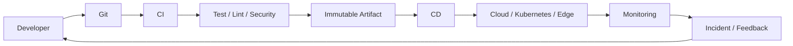
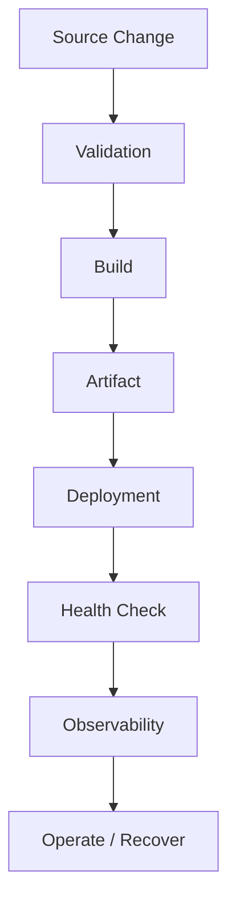
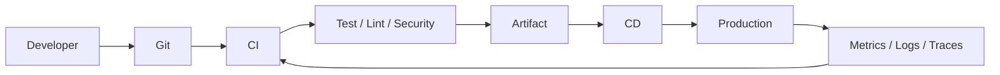
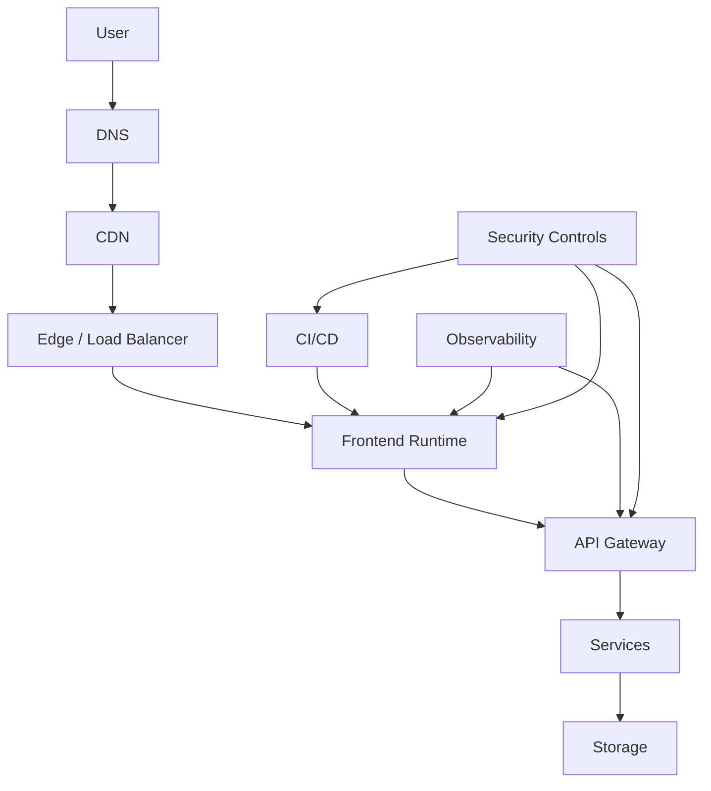
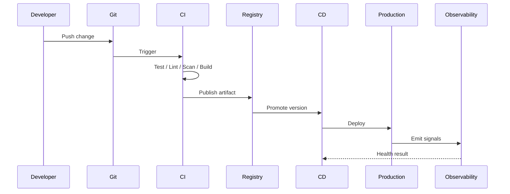

# DEVOPS, CLOUD, CI/CD & FRONTEND INFRASTRUCTURE MASTER HANDBOOK

> Publication-quality enterprise reference for Frontend Developers, Senior Engineers, DevOps Engineers, Platform Engineers, SREs, Technical Leads, Staff Engineers, Principal Engineers and Frontend Architects.

## Source Basis

The uploaded curriculum defines the required 20-module structure, DevOps/Git/Docker/Kubernetes/CI/CD/cloud/frontend deployment/monitoring/CDN/build/secrets/security/release/SRE/operations/cost/case-study coverage and the required infrastructure code and diagram formats. fileciteturn13file0L932-L1020

## Publication Note

Markdown has no fixed printed page count. The requested 4,000+ pages depend on page size, typography, diagrams, code layout and publishing configuration. This file contains the full 20-module curriculum and a consistent detailed treatment for every specified topic.

## Master DevOps Architecture



## Enterprise Delivery Model

```text
PLAN → CODE → REVIEW → BUILD → TEST → SCAN → PACKAGE → DEPLOY → VERIFY → OBSERVE → IMPROVE
```

## Core Principles

| Principle | Goal |
|---|---|
| Automation | Reduce manual risk |
| Immutable artifacts | Reproducible releases |
| Least privilege | Reduce blast radius |
| Observability | Detect and diagnose |
| Tested rollback | Recover safely |
| Infrastructure as Code | Reproducibility |
| Cost awareness | Sustainable cloud usage |
| Developer experience | Fast feedback |

# Module 1 – DevOps Fundamentals

## Module Overview

This module contains **13 topics** from the uploaded curriculum. Each topic follows the requested 41-part structure and includes production, cloud, security, reliability, debugging and interview perspectives.

### Module Workflow




## DevOps

### 1. Introduction
**DevOps** is a core concept in **DevOps Fundamentals**. It should be understood from developer, infrastructure, cloud, reliability, security and enterprise perspectives.

### 2. Definition
DevOps is a mechanism or practice used to make software delivery, infrastructure, operations, security or reliability more predictable and scalable.

### 3. Why it exists
It addresses recurring production problems such as manual work, configuration drift, slow feedback, deployment risk, inconsistent environments, outages or uncontrolled cost.

### 4. History
Modern DevOps evolved from system administration, agile development, continuous integration, infrastructure automation, cloud computing and site reliability practices.

### 5. Real-world problem
Teams need a repeatable path from source change to validated production software with measurable health and a recovery strategy.

### 6. Internal Architecture
```text
Developer → Git → CI → Build/Test/Scan → Artifact → CD → Runtime → Observability
```

### 7. Internal Working
A change moves through automated validation, artifact creation, controlled promotion and runtime verification.

### 8. Step-by-step workflow
1. Change source code or infrastructure.
2. Commit and review the change.
3. Install dependencies deterministically.
4. Execute linting and tests.
5. Run security checks.
6. Build an immutable artifact.
7. Publish the artifact.
8. Promote to an environment.
9. Verify health.
10. Monitor and recover if needed.

### 9. Production Flow


### 10. Browser Perspective
The browser consumes DNS, TLS, CDN responses, HTML, JavaScript, CSS, images and API responses. Infrastructure choices affect cache behavior, startup time and Web Vitals.

### 11. Frontend Perspective
Frontend infrastructure must consider bundle size, deterministic builds, source maps, runtime configuration, CDN caching, deployment ordering and rollback.

### 12. Backend Perspective
Backend dependencies require API availability, authentication, health checks, retries, timeouts, observability and compatible contracts.

### 13. Infrastructure Perspective
Infrastructure provides networking, compute, storage, identity, secrets, orchestration, routing and monitoring.

### 14. Enterprise Perspective
Enterprise environments add RBAC, audit trails, approvals, compliance, environment promotion, incident response, ownership and governance.

### 15. Cloud Perspective
Cloud choices involve regions, availability zones, CDN, compute, storage, networking, identity, managed services and cost.

### 16. Advantages
- Repeatability
- Automation
- Faster feedback
- Safer releases
- Better observability
- Scalable operations

### 17. Disadvantages
- Initial complexity
- Platform maintenance
- Learning curve
- Potential cloud cost
- Configuration mistakes can propagate quickly

### 18. Trade-offs
| Decision | Benefit | Trade-off |
|---|---|---|
| Managed service | Lower operational burden | Vendor dependency |
| Kubernetes | Flexible orchestration | Higher complexity |
| CDN caching | Lower latency | Invalidation complexity |
| More CI checks | Higher confidence | Longer feedback |
| Multi-cloud | Reduced single-provider dependency | More operational complexity |

### 19. Performance Impact
Measure build duration, deployment duration, cache hit rate, bundle size, startup time, request latency and Web Vitals.

### 20. Cost Impact
Track compute, storage, CDN egress, monitoring, CI runners, artifact storage and idle environments.

### 21. Security Impact
Use least privilege, secret isolation, TLS, dependency scanning, container scanning, network controls and audit logs.

### 22. Scalability
```text
Traffic → CDN / Load Balancer → Stateless Runtime → API → Data
```
Prefer horizontal scaling for stateless workloads and define explicit limits.

### 23. High Availability
Use multiple instances or zones where justified, health checks, graceful degradation and automated recovery.

### 24. Disaster Recovery
Define RPO, RTO, backup strategy, restore procedures, dependency recovery and tested runbooks.

### 25. Monitoring
Monitor availability, latency, error rate, saturation, deployment health, frontend Web Vitals and business-critical journeys.

### 26. Logging
Use structured logs, timestamps, environment and correlation identifiers. Never log secrets or unnecessary personal data.

### 27. Folder Structure
```text
infrastructure/
├── docker/
├── kubernetes/
├── terraform/
├── ci/
│   ├── github/
│   ├── azure/
│   ├── gitlab/
│   └── jenkins/
├── scripts/
├── monitoring/
└── docs/
```

### 28. Enterprise Architecture


### 29. Production Example
Use versioned immutable artifacts, automated verification, environment-specific configuration, health validation and an explicit rollback path.

### 30. Best Practices
1. Automate repeatable work.
2. Version infrastructure.
3. Prefer immutable artifacts.
4. Make deployments observable.
5. Use least privilege.
6. Separate runtime and build-time configuration.
7. Test rollback.
8. Keep pipelines fast.
9. Track cost.
10. Document runbooks.

### 31. Anti-patterns
- Manual production changes
- Secrets committed to Git
- Mutable production artifacts
- No health checks
- No rollback
- One giant opaque pipeline
- Unbounded cloud resources
- Alerts without actionable ownership

### 32. Common Mistakes
- Treating DevOps as only CI/CD
- Delaying security until production
- Using mutable `latest` artifacts
- Ignoring CDN invalidation
- Not testing recovery
- Ignoring operational ownership

### 33. Debugging
```text
What changed?
    ↓
Is CI green?
    ↓
Is the artifact correct?
    ↓
Did deployment succeed?
    ↓
Is networking healthy?
    ↓
Are dependencies healthy?
    ↓
What do metrics/logs/traces show?
```

### 34. Troubleshooting
Capture deployment version, timestamp, environment, affected region, recent configuration changes, error rate and correlation identifiers before making another production change.

### 35. Interview Questions
1. What problem does DevOps solve?
2. How does it work internally?
3. When should you use it?
4. When should you avoid it?
5. What are the failure modes?
6. How does it affect cost?
7. How do you secure it?
8. How do you monitor it?
9. How do you recover from failure?
10. How does it affect frontend delivery?

### 36. Senior Engineer Questions
- How would you scale it?
- How would you migrate from a legacy system?
- Which metrics determine success?
- What should be standardized?

### 37. Staff Engineer Questions
- What belongs in the platform?
- What belongs to product teams?
- How do you reduce developer cognitive load?
- How do you balance standardization and autonomy?
- What is the long-term operating cost?

### 38. Principal Engineer Questions
- What organizational constraints shape the design?
- What are vendor and lock-in risks?
- How does the architecture evolve over five years?
- How would you govern it across teams and regions?

### 39. FAANG Questions
- Design this for global traffic.
- Design zero-downtime deployment.
- Design disaster recovery.
- Design secure multi-environment promotion.
- Design observability for a critical frontend.

### 40. Cheat Sheet
```text
SOURCE → BUILD → TEST → SCAN → PACKAGE → DEPLOY → VERIFY → OBSERVE → RECOVER
```

### 41. Revision Notes
- Automation reduces repeated manual risk.
- Immutable artifacts improve consistency.
- Observability closes the production feedback loop.
- Security belongs in every stage.
- Reliability requires tested recovery.
- Cost is an architecture constraint.

### Shell / Bash
```bash
set -euo pipefail
echo "Running DevOps"
```

### Docker
```dockerfile
FROM node:22-alpine AS build
WORKDIR /app
COPY package*.json ./
RUN npm ci
COPY . .
RUN npm run build

FROM nginx:alpine
COPY --from=build /app/dist /usr/share/nginx/html
EXPOSE 80
```

### Docker Compose
```yaml
services:
  web:
    build: .
    ports:
      - "8080:80"
    restart: unless-stopped
    healthcheck:
      test: ["CMD", "wget", "--spider", "-q", "http://localhost"]
      interval: 30s
      timeout: 5s
      retries: 3
```

### Kubernetes YAML
```yaml
apiVersion: apps/v1
kind: Deployment
metadata:
  name: frontend
spec:
  replicas: 3
  selector:
    matchLabels:
      app: frontend
  template:
    metadata:
      labels:
        app: frontend
    spec:
      containers:
        - name: web
          image: example/frontend:1.0.0
          ports:
            - containerPort: 80
          readinessProbe:
            httpGet:
              path: /
              port: 80
          livenessProbe:
            httpGet:
              path: /
              port: 80
---
apiVersion: v1
kind: Service
metadata:
  name: frontend
spec:
  selector:
    app: frontend
  ports:
    - port: 80
      targetPort: 80
```

### GitHub Actions
```yaml
name: frontend-ci
on:
  pull_request:
  push:
    branches: [main]
jobs:
  verify:
    runs-on: ubuntu-latest
    steps:
      - uses: actions/checkout@v4
      - uses: actions/setup-node@v4
        with:
          node-version: 22
          cache: npm
      - run: npm ci
      - run: npm run lint
      - run: npm test -- --runInBand
      - run: npm run build
```

### Azure DevOps
```yaml
trigger:
- main
pool:
  vmImage: ubuntu-latest
steps:
- checkout: self
- task: NodeTool@0
  inputs:
    versionSpec: '22.x'
- script: npm ci
- script: npm run lint
- script: npm test -- --runInBand
- script: npm run build
```

### GitLab CI
```yaml
stages:
  - verify
  - build
verify:
  stage: verify
  image: node:22
  script:
    - npm ci
    - npm run lint
    - npm test -- --runInBand
build:
  stage: build
  image: node:22
  script:
    - npm ci
    - npm run build
  artifacts:
    paths:
      - dist/
```

### Jenkins
```groovy
pipeline {
  agent any
  stages {
    stage('Verify') {
      steps {
        sh 'npm ci'
        sh 'npm run lint'
        sh 'npm test -- --runInBand'
      }
    }
    stage('Build') {
      steps {
        sh 'npm run build'
      }
    }
  }
}
```

### Terraform
```hcl
terraform {
  required_version = ">= 1.6.0"
}

variable "environment" {
  type    = string
  default = "staging"
}

output "environment" {
  value = var.environment
}
```

### AWS CLI
```bash
aws sts get-caller-identity
```

### Azure CLI
```bash
az account show
```

### GCloud CLI
```bash
gcloud auth list
```

### JavaScript
```javascript
export function getRuntimeConfig(config) {
  if (!config || typeof config !== "object") {
    throw new TypeError("Invalid runtime configuration");
  }

  return Object.freeze({
    apiBaseUrl: String(config.apiBaseUrl ?? ""),
    environment: String(config.environment ?? "development"),
  });
}
```

### TypeScript
```typescript
export interface RuntimeConfig {
  apiBaseUrl: string;
  environment: "development" | "staging" | "production";
}

export function validateConfig(input: Partial<RuntimeConfig>): RuntimeConfig {
  if (!input.apiBaseUrl) throw new Error("apiBaseUrl is required");

  const environment = input.environment ?? "development";
  if (!["development", "staging", "production"].includes(environment)) {
    throw new Error("Invalid environment");
  }

  return { apiBaseUrl: input.apiBaseUrl, environment };
}
```

### React
```tsx
export function InfrastructureStatus({ healthy }: { healthy: boolean }) {
  return (
    <section aria-labelledby="infra-status">
      <h2 id="infra-status">Infrastructure status</h2>
      <p role="status">
        {healthy ? "Service healthy" : "Service requires attention"}
      </p>
    </section>
  );
}
```

### Next.js
```text
Build → Server/Static Output → CDN/Edge → Runtime Config → APIs → Observability
```

### Production Version
Use deterministic dependencies, immutable artifacts, health checks, security scanning, automated tests and deployment verification.

### Enterprise Version
Add RBAC, policy enforcement, audit trails, environment promotion, centralized observability, cost controls, approvals where required and documented incident procedures.

### Deployment Sequence


### Hands-on Exercise
Build a React/Vite or Next.js deployment pipeline that installs deterministic dependencies, runs tests and linting, performs security checks, creates an immutable artifact, performs a smoke test and exposes rollback.

### Infrastructure Lab
Containerize the application locally, run it with Docker Compose, then deploy the same artifact to Kubernetes with readiness and liveness probes.

### Production Scenario
A deployment is successful but users receive an older JavaScript bundle. Investigate HTML caching, asset hashing, CDN cache keys, cache-control headers and deployment ordering before using broad invalidation.

### Mini Project
Build an enterprise frontend platform with React or Next.js, Docker, CI/CD, artifact storage, Kubernetes, CDN, health checks, monitoring, security controls and rollback.

### Case Study
Design infrastructure for a global frontend and document architecture, deployment, CDN, DNS, cloud services, security, observability, disaster recovery, cost and migration.


## DevSecOps

### 1. Introduction
**DevSecOps** is a core concept in **DevOps Fundamentals**. It should be understood from developer, infrastructure, cloud, reliability, security and enterprise perspectives.

### 2. Definition
DevSecOps is a mechanism or practice used to make software delivery, infrastructure, operations, security or reliability more predictable and scalable.

### 3. Why it exists
It addresses recurring production problems such as manual work, configuration drift, slow feedback, deployment risk, inconsistent environments, outages or uncontrolled cost.

### 4. History
Modern DevOps evolved from system administration, agile development, continuous integration, infrastructure automation, cloud computing and site reliability practices.

### 5. Real-world problem
Teams need a repeatable path from source change to validated production software with measurable health and a recovery strategy.

### 6. Internal Architecture
```text
Developer → Git → CI → Build/Test/Scan → Artifact → CD → Runtime → Observability
```

### 7. Internal Working
A change moves through automated validation, artifact creation, controlled promotion and runtime verification.

### 8. Step-by-step workflow
1. Change source code or infrastructure.
2. Commit and review the change.
3. Install dependencies deterministically.
4. Execute linting and tests.
5. Run security checks.
6. Build an immutable artifact.
7. Publish the artifact.
8. Promote to an environment.
9. Verify health.
10. Monitor and recover if needed.

### 9. Production Flow


### 10. Browser Perspective
The browser consumes DNS, TLS, CDN responses, HTML, JavaScript, CSS, images and API responses. Infrastructure choices affect cache behavior, startup time and Web Vitals.

### 11. Frontend Perspective
Frontend infrastructure must consider bundle size, deterministic builds, source maps, runtime configuration, CDN caching, deployment ordering and rollback.

### 12. Backend Perspective
Backend dependencies require API availability, authentication, health checks, retries, timeouts, observability and compatible contracts.

### 13. Infrastructure Perspective
Infrastructure provides networking, compute, storage, identity, secrets, orchestration, routing and monitoring.

### 14. Enterprise Perspective
Enterprise environments add RBAC, audit trails, approvals, compliance, environment promotion, incident response, ownership and governance.

### 15. Cloud Perspective
Cloud choices involve regions, availability zones, CDN, compute, storage, networking, identity, managed services and cost.

### 16. Advantages
- Repeatability
- Automation
- Faster feedback
- Safer releases
- Better observability
- Scalable operations

### 17. Disadvantages
- Initial complexity
- Platform maintenance
- Learning curve
- Potential cloud cost
- Configuration mistakes can propagate quickly

### 18. Trade-offs
| Decision | Benefit | Trade-off |
|---|---|---|
| Managed service | Lower operational burden | Vendor dependency |
| Kubernetes | Flexible orchestration | Higher complexity |
| CDN caching | Lower latency | Invalidation complexity |
| More CI checks | Higher confidence | Longer feedback |
| Multi-cloud | Reduced single-provider dependency | More operational complexity |

### 19. Performance Impact
Measure build duration, deployment duration, cache hit rate, bundle size, startup time, request latency and Web Vitals.

### 20. Cost Impact
Track compute, storage, CDN egress, monitoring, CI runners, artifact storage and idle environments.

### 21. Security Impact
Use least privilege, secret isolation, TLS, dependency scanning, container scanning, network controls and audit logs.

### 22. Scalability
```text
Traffic → CDN / Load Balancer → Stateless Runtime → API → Data
```
Prefer horizontal scaling for stateless workloads and define explicit limits.

### 23. High Availability
Use multiple instances or zones where justified, health checks, graceful degradation and automated recovery.

### 24. Disaster Recovery
Define RPO, RTO, backup strategy, restore procedures, dependency recovery and tested runbooks.

### 25. Monitoring
Monitor availability, latency, error rate, saturation, deployment health, frontend Web Vitals and business-critical journeys.

### 26. Logging
Use structured logs, timestamps, environment and correlation identifiers. Never log secrets or unnecessary personal data.

### 27. Folder Structure
```text
infrastructure/
├── docker/
├── kubernetes/
├── terraform/
├── ci/
│   ├── github/
│   ├── azure/
│   ├── gitlab/
│   └── jenkins/
├── scripts/
├── monitoring/
└── docs/
```

### 28. Enterprise Architecture


### 29. Production Example
Use versioned immutable artifacts, automated verification, environment-specific configuration, health validation and an explicit rollback path.

### 30. Best Practices
1. Automate repeatable work.
2. Version infrastructure.
3. Prefer immutable artifacts.
4. Make deployments observable.
5. Use least privilege.
6. Separate runtime and build-time configuration.
7. Test rollback.
8. Keep pipelines fast.
9. Track cost.
10. Document runbooks.

### 31. Anti-patterns
- Manual production changes
- Secrets committed to Git
- Mutable production artifacts
- No health checks
- No rollback
- One giant opaque pipeline
- Unbounded cloud resources
- Alerts without actionable ownership

### 32. Common Mistakes
- Treating DevOps as only CI/CD
- Delaying security until production
- Using mutable `latest` artifacts
- Ignoring CDN invalidation
- Not testing recovery
- Ignoring operational ownership

### 33. Debugging
```text
What changed?
    ↓
Is CI green?
    ↓
Is the artifact correct?
    ↓
Did deployment succeed?
    ↓
Is networking healthy?
    ↓
Are dependencies healthy?
    ↓
What do metrics/logs/traces show?
```

### 34. Troubleshooting
Capture deployment version, timestamp, environment, affected region, recent configuration changes, error rate and correlation identifiers before making another production change.

### 35. Interview Questions
1. What problem does DevSecOps solve?
2. How does it work internally?
3. When should you use it?
4. When should you avoid it?
5. What are the failure modes?
6. How does it affect cost?
7. How do you secure it?
8. How do you monitor it?
9. How do you recover from failure?
10. How does it affect frontend delivery?

### 36. Senior Engineer Questions
- How would you scale it?
- How would you migrate from a legacy system?
- Which metrics determine success?
- What should be standardized?

### 37. Staff Engineer Questions
- What belongs in the platform?
- What belongs to product teams?
- How do you reduce developer cognitive load?
- How do you balance standardization and autonomy?
- What is the long-term operating cost?

### 38. Principal Engineer Questions
- What organizational constraints shape the design?
- What are vendor and lock-in risks?
- How does the architecture evolve over five years?
- How would you govern it across teams and regions?

### 39. FAANG Questions
- Design this for global traffic.
- Design zero-downtime deployment.
- Design disaster recovery.
- Design secure multi-environment promotion.
- Design observability for a critical frontend.

### 40. Cheat Sheet
```text
SOURCE → BUILD → TEST → SCAN → PACKAGE → DEPLOY → VERIFY → OBSERVE → RECOVER
```

### 41. Revision Notes
- Automation reduces repeated manual risk.
- Immutable artifacts improve consistency.
- Observability closes the production feedback loop.
- Security belongs in every stage.
- Reliability requires tested recovery.
- Cost is an architecture constraint.

### Shell / Bash
```bash
set -euo pipefail
echo "Running DevSecOps"
```

### Docker
```dockerfile
FROM node:22-alpine AS build
WORKDIR /app
COPY package*.json ./
RUN npm ci
COPY . .
RUN npm run build

FROM nginx:alpine
COPY --from=build /app/dist /usr/share/nginx/html
EXPOSE 80
```

### Docker Compose
```yaml
services:
  web:
    build: .
    ports:
      - "8080:80"
    restart: unless-stopped
    healthcheck:
      test: ["CMD", "wget", "--spider", "-q", "http://localhost"]
      interval: 30s
      timeout: 5s
      retries: 3
```

### Kubernetes YAML
```yaml
apiVersion: apps/v1
kind: Deployment
metadata:
  name: frontend
spec:
  replicas: 3
  selector:
    matchLabels:
      app: frontend
  template:
    metadata:
      labels:
        app: frontend
    spec:
      containers:
        - name: web
          image: example/frontend:1.0.0
          ports:
            - containerPort: 80
          readinessProbe:
            httpGet:
              path: /
              port: 80
          livenessProbe:
            httpGet:
              path: /
              port: 80
---
apiVersion: v1
kind: Service
metadata:
  name: frontend
spec:
  selector:
    app: frontend
  ports:
    - port: 80
      targetPort: 80
```

### GitHub Actions
```yaml
name: frontend-ci
on:
  pull_request:
  push:
    branches: [main]
jobs:
  verify:
    runs-on: ubuntu-latest
    steps:
      - uses: actions/checkout@v4
      - uses: actions/setup-node@v4
        with:
          node-version: 22
          cache: npm
      - run: npm ci
      - run: npm run lint
      - run: npm test -- --runInBand
      - run: npm run build
```

### Azure DevOps
```yaml
trigger:
- main
pool:
  vmImage: ubuntu-latest
steps:
- checkout: self
- task: NodeTool@0
  inputs:
    versionSpec: '22.x'
- script: npm ci
- script: npm run lint
- script: npm test -- --runInBand
- script: npm run build
```

### GitLab CI
```yaml
stages:
  - verify
  - build
verify:
  stage: verify
  image: node:22
  script:
    - npm ci
    - npm run lint
    - npm test -- --runInBand
build:
  stage: build
  image: node:22
  script:
    - npm ci
    - npm run build
  artifacts:
    paths:
      - dist/
```

### Jenkins
```groovy
pipeline {
  agent any
  stages {
    stage('Verify') {
      steps {
        sh 'npm ci'
        sh 'npm run lint'
        sh 'npm test -- --runInBand'
      }
    }
    stage('Build') {
      steps {
        sh 'npm run build'
      }
    }
  }
}
```

### Terraform
```hcl
terraform {
  required_version = ">= 1.6.0"
}

variable "environment" {
  type    = string
  default = "staging"
}

output "environment" {
  value = var.environment
}
```

### AWS CLI
```bash
aws sts get-caller-identity
```

### Azure CLI
```bash
az account show
```

### GCloud CLI
```bash
gcloud auth list
```

### JavaScript
```javascript
export function getRuntimeConfig(config) {
  if (!config || typeof config !== "object") {
    throw new TypeError("Invalid runtime configuration");
  }

  return Object.freeze({
    apiBaseUrl: String(config.apiBaseUrl ?? ""),
    environment: String(config.environment ?? "development"),
  });
}
```

### TypeScript
```typescript
export interface RuntimeConfig {
  apiBaseUrl: string;
  environment: "development" | "staging" | "production";
}

export function validateConfig(input: Partial<RuntimeConfig>): RuntimeConfig {
  if (!input.apiBaseUrl) throw new Error("apiBaseUrl is required");

  const environment = input.environment ?? "development";
  if (!["development", "staging", "production"].includes(environment)) {
    throw new Error("Invalid environment");
  }

  return { apiBaseUrl: input.apiBaseUrl, environment };
}
```

### React
```tsx
export function InfrastructureStatus({ healthy }: { healthy: boolean }) {
  return (
    <section aria-labelledby="infra-status">
      <h2 id="infra-status">Infrastructure status</h2>
      <p role="status">
        {healthy ? "Service healthy" : "Service requires attention"}
      </p>
    </section>
  );
}
```

### Next.js
```text
Build → Server/Static Output → CDN/Edge → Runtime Config → APIs → Observability
```

### Production Version
Use deterministic dependencies, immutable artifacts, health checks, security scanning, automated tests and deployment verification.

### Enterprise Version
Add RBAC, policy enforcement, audit trails, environment promotion, centralized observability, cost controls, approvals where required and documented incident procedures.

### Deployment Sequence


### Hands-on Exercise
Build a React/Vite or Next.js deployment pipeline that installs deterministic dependencies, runs tests and linting, performs security checks, creates an immutable artifact, performs a smoke test and exposes rollback.

### Infrastructure Lab
Containerize the application locally, run it with Docker Compose, then deploy the same artifact to Kubernetes with readiness and liveness probes.

### Production Scenario
A deployment is successful but users receive an older JavaScript bundle. Investigate HTML caching, asset hashing, CDN cache keys, cache-control headers and deployment ordering before using broad invalidation.

### Mini Project
Build an enterprise frontend platform with React or Next.js, Docker, CI/CD, artifact storage, Kubernetes, CDN, health checks, monitoring, security controls and rollback.

### Case Study
Design infrastructure for a global frontend and document architecture, deployment, CDN, DNS, cloud services, security, observability, disaster recovery, cost and migration.


## GitOps

### 1. Introduction
**GitOps** is a core concept in **DevOps Fundamentals**. It should be understood from developer, infrastructure, cloud, reliability, security and enterprise perspectives.

### 2. Definition
GitOps is a mechanism or practice used to make software delivery, infrastructure, operations, security or reliability more predictable and scalable.

### 3. Why it exists
It addresses recurring production problems such as manual work, configuration drift, slow feedback, deployment risk, inconsistent environments, outages or uncontrolled cost.

### 4. History
Modern DevOps evolved from system administration, agile development, continuous integration, infrastructure automation, cloud computing and site reliability practices.

### 5. Real-world problem
Teams need a repeatable path from source change to validated production software with measurable health and a recovery strategy.

### 6. Internal Architecture
```text
Developer → Git → CI → Build/Test/Scan → Artifact → CD → Runtime → Observability
```

### 7. Internal Working
A change moves through automated validation, artifact creation, controlled promotion and runtime verification.

### 8. Step-by-step workflow
1. Change source code or infrastructure.
2. Commit and review the change.
3. Install dependencies deterministically.
4. Execute linting and tests.
5. Run security checks.
6. Build an immutable artifact.
7. Publish the artifact.
8. Promote to an environment.
9. Verify health.
10. Monitor and recover if needed.

### 9. Production Flow


### 10. Browser Perspective
The browser consumes DNS, TLS, CDN responses, HTML, JavaScript, CSS, images and API responses. Infrastructure choices affect cache behavior, startup time and Web Vitals.

### 11. Frontend Perspective
Frontend infrastructure must consider bundle size, deterministic builds, source maps, runtime configuration, CDN caching, deployment ordering and rollback.

### 12. Backend Perspective
Backend dependencies require API availability, authentication, health checks, retries, timeouts, observability and compatible contracts.

### 13. Infrastructure Perspective
Infrastructure provides networking, compute, storage, identity, secrets, orchestration, routing and monitoring.

### 14. Enterprise Perspective
Enterprise environments add RBAC, audit trails, approvals, compliance, environment promotion, incident response, ownership and governance.

### 15. Cloud Perspective
Cloud choices involve regions, availability zones, CDN, compute, storage, networking, identity, managed services and cost.

### 16. Advantages
- Repeatability
- Automation
- Faster feedback
- Safer releases
- Better observability
- Scalable operations

### 17. Disadvantages
- Initial complexity
- Platform maintenance
- Learning curve
- Potential cloud cost
- Configuration mistakes can propagate quickly

### 18. Trade-offs
| Decision | Benefit | Trade-off |
|---|---|---|
| Managed service | Lower operational burden | Vendor dependency |
| Kubernetes | Flexible orchestration | Higher complexity |
| CDN caching | Lower latency | Invalidation complexity |
| More CI checks | Higher confidence | Longer feedback |
| Multi-cloud | Reduced single-provider dependency | More operational complexity |

### 19. Performance Impact
Measure build duration, deployment duration, cache hit rate, bundle size, startup time, request latency and Web Vitals.

### 20. Cost Impact
Track compute, storage, CDN egress, monitoring, CI runners, artifact storage and idle environments.

### 21. Security Impact
Use least privilege, secret isolation, TLS, dependency scanning, container scanning, network controls and audit logs.

### 22. Scalability
```text
Traffic → CDN / Load Balancer → Stateless Runtime → API → Data
```
Prefer horizontal scaling for stateless workloads and define explicit limits.

### 23. High Availability
Use multiple instances or zones where justified, health checks, graceful degradation and automated recovery.

### 24. Disaster Recovery
Define RPO, RTO, backup strategy, restore procedures, dependency recovery and tested runbooks.

### 25. Monitoring
Monitor availability, latency, error rate, saturation, deployment health, frontend Web Vitals and business-critical journeys.

### 26. Logging
Use structured logs, timestamps, environment and correlation identifiers. Never log secrets or unnecessary personal data.

### 27. Folder Structure
```text
infrastructure/
├── docker/
├── kubernetes/
├── terraform/
├── ci/
│   ├── github/
│   ├── azure/
│   ├── gitlab/
│   └── jenkins/
├── scripts/
├── monitoring/
└── docs/
```

### 28. Enterprise Architecture


### 29. Production Example
Use versioned immutable artifacts, automated verification, environment-specific configuration, health validation and an explicit rollback path.

### 30. Best Practices
1. Automate repeatable work.
2. Version infrastructure.
3. Prefer immutable artifacts.
4. Make deployments observable.
5. Use least privilege.
6. Separate runtime and build-time configuration.
7. Test rollback.
8. Keep pipelines fast.
9. Track cost.
10. Document runbooks.

### 31. Anti-patterns
- Manual production changes
- Secrets committed to Git
- Mutable production artifacts
- No health checks
- No rollback
- One giant opaque pipeline
- Unbounded cloud resources
- Alerts without actionable ownership

### 32. Common Mistakes
- Treating DevOps as only CI/CD
- Delaying security until production
- Using mutable `latest` artifacts
- Ignoring CDN invalidation
- Not testing recovery
- Ignoring operational ownership

### 33. Debugging
```text
What changed?
    ↓
Is CI green?
    ↓
Is the artifact correct?
    ↓
Did deployment succeed?
    ↓
Is networking healthy?
    ↓
Are dependencies healthy?
    ↓
What do metrics/logs/traces show?
```

### 34. Troubleshooting
Capture deployment version, timestamp, environment, affected region, recent configuration changes, error rate and correlation identifiers before making another production change.

### 35. Interview Questions
1. What problem does GitOps solve?
2. How does it work internally?
3. When should you use it?
4. When should you avoid it?
5. What are the failure modes?
6. How does it affect cost?
7. How do you secure it?
8. How do you monitor it?
9. How do you recover from failure?
10. How does it affect frontend delivery?

### 36. Senior Engineer Questions
- How would you scale it?
- How would you migrate from a legacy system?
- Which metrics determine success?
- What should be standardized?

### 37. Staff Engineer Questions
- What belongs in the platform?
- What belongs to product teams?
- How do you reduce developer cognitive load?
- How do you balance standardization and autonomy?
- What is the long-term operating cost?

### 38. Principal Engineer Questions
- What organizational constraints shape the design?
- What are vendor and lock-in risks?
- How does the architecture evolve over five years?
- How would you govern it across teams and regions?

### 39. FAANG Questions
- Design this for global traffic.
- Design zero-downtime deployment.
- Design disaster recovery.
- Design secure multi-environment promotion.
- Design observability for a critical frontend.

### 40. Cheat Sheet
```text
SOURCE → BUILD → TEST → SCAN → PACKAGE → DEPLOY → VERIFY → OBSERVE → RECOVER
```

### 41. Revision Notes
- Automation reduces repeated manual risk.
- Immutable artifacts improve consistency.
- Observability closes the production feedback loop.
- Security belongs in every stage.
- Reliability requires tested recovery.
- Cost is an architecture constraint.

### Shell / Bash
```bash
set -euo pipefail
echo "Running GitOps"
```

### Docker
```dockerfile
FROM node:22-alpine AS build
WORKDIR /app
COPY package*.json ./
RUN npm ci
COPY . .
RUN npm run build

FROM nginx:alpine
COPY --from=build /app/dist /usr/share/nginx/html
EXPOSE 80
```

### Docker Compose
```yaml
services:
  web:
    build: .
    ports:
      - "8080:80"
    restart: unless-stopped
    healthcheck:
      test: ["CMD", "wget", "--spider", "-q", "http://localhost"]
      interval: 30s
      timeout: 5s
      retries: 3
```

### Kubernetes YAML
```yaml
apiVersion: apps/v1
kind: Deployment
metadata:
  name: frontend
spec:
  replicas: 3
  selector:
    matchLabels:
      app: frontend
  template:
    metadata:
      labels:
        app: frontend
    spec:
      containers:
        - name: web
          image: example/frontend:1.0.0
          ports:
            - containerPort: 80
          readinessProbe:
            httpGet:
              path: /
              port: 80
          livenessProbe:
            httpGet:
              path: /
              port: 80
---
apiVersion: v1
kind: Service
metadata:
  name: frontend
spec:
  selector:
    app: frontend
  ports:
    - port: 80
      targetPort: 80
```

### GitHub Actions
```yaml
name: frontend-ci
on:
  pull_request:
  push:
    branches: [main]
jobs:
  verify:
    runs-on: ubuntu-latest
    steps:
      - uses: actions/checkout@v4
      - uses: actions/setup-node@v4
        with:
          node-version: 22
          cache: npm
      - run: npm ci
      - run: npm run lint
      - run: npm test -- --runInBand
      - run: npm run build
```

### Azure DevOps
```yaml
trigger:
- main
pool:
  vmImage: ubuntu-latest
steps:
- checkout: self
- task: NodeTool@0
  inputs:
    versionSpec: '22.x'
- script: npm ci
- script: npm run lint
- script: npm test -- --runInBand
- script: npm run build
```

### GitLab CI
```yaml
stages:
  - verify
  - build
verify:
  stage: verify
  image: node:22
  script:
    - npm ci
    - npm run lint
    - npm test -- --runInBand
build:
  stage: build
  image: node:22
  script:
    - npm ci
    - npm run build
  artifacts:
    paths:
      - dist/
```

### Jenkins
```groovy
pipeline {
  agent any
  stages {
    stage('Verify') {
      steps {
        sh 'npm ci'
        sh 'npm run lint'
        sh 'npm test -- --runInBand'
      }
    }
    stage('Build') {
      steps {
        sh 'npm run build'
      }
    }
  }
}
```

### Terraform
```hcl
terraform {
  required_version = ">= 1.6.0"
}

variable "environment" {
  type    = string
  default = "staging"
}

output "environment" {
  value = var.environment
}
```

### AWS CLI
```bash
aws sts get-caller-identity
```

### Azure CLI
```bash
az account show
```

### GCloud CLI
```bash
gcloud auth list
```

### JavaScript
```javascript
export function getRuntimeConfig(config) {
  if (!config || typeof config !== "object") {
    throw new TypeError("Invalid runtime configuration");
  }

  return Object.freeze({
    apiBaseUrl: String(config.apiBaseUrl ?? ""),
    environment: String(config.environment ?? "development"),
  });
}
```

### TypeScript
```typescript
export interface RuntimeConfig {
  apiBaseUrl: string;
  environment: "development" | "staging" | "production";
}

export function validateConfig(input: Partial<RuntimeConfig>): RuntimeConfig {
  if (!input.apiBaseUrl) throw new Error("apiBaseUrl is required");

  const environment = input.environment ?? "development";
  if (!["development", "staging", "production"].includes(environment)) {
    throw new Error("Invalid environment");
  }

  return { apiBaseUrl: input.apiBaseUrl, environment };
}
```

### React
```tsx
export function InfrastructureStatus({ healthy }: { healthy: boolean }) {
  return (
    <section aria-labelledby="infra-status">
      <h2 id="infra-status">Infrastructure status</h2>
      <p role="status">
        {healthy ? "Service healthy" : "Service requires attention"}
      </p>
    </section>
  );
}
```

### Next.js
```text
Build → Server/Static Output → CDN/Edge → Runtime Config → APIs → Observability
```

### Production Version
Use deterministic dependencies, immutable artifacts, health checks, security scanning, automated tests and deployment verification.

### Enterprise Version
Add RBAC, policy enforcement, audit trails, environment promotion, centralized observability, cost controls, approvals where required and documented incident procedures.

### Deployment Sequence


### Hands-on Exercise
Build a React/Vite or Next.js deployment pipeline that installs deterministic dependencies, runs tests and linting, performs security checks, creates an immutable artifact, performs a smoke test and exposes rollback.

### Infrastructure Lab
Containerize the application locally, run it with Docker Compose, then deploy the same artifact to Kubernetes with readiness and liveness probes.

### Production Scenario
A deployment is successful but users receive an older JavaScript bundle. Investigate HTML caching, asset hashing, CDN cache keys, cache-control headers and deployment ordering before using broad invalidation.

### Mini Project
Build an enterprise frontend platform with React or Next.js, Docker, CI/CD, artifact storage, Kubernetes, CDN, health checks, monitoring, security controls and rollback.

### Case Study
Design infrastructure for a global frontend and document architecture, deployment, CDN, DNS, cloud services, security, observability, disaster recovery, cost and migration.


## Infrastructure as Code

### 1. Introduction
**Infrastructure as Code** is a core concept in **DevOps Fundamentals**. It should be understood from developer, infrastructure, cloud, reliability, security and enterprise perspectives.

### 2. Definition
Infrastructure as Code is a mechanism or practice used to make software delivery, infrastructure, operations, security or reliability more predictable and scalable.

### 3. Why it exists
It addresses recurring production problems such as manual work, configuration drift, slow feedback, deployment risk, inconsistent environments, outages or uncontrolled cost.

### 4. History
Modern DevOps evolved from system administration, agile development, continuous integration, infrastructure automation, cloud computing and site reliability practices.

### 5. Real-world problem
Teams need a repeatable path from source change to validated production software with measurable health and a recovery strategy.

### 6. Internal Architecture
```text
Developer → Git → CI → Build/Test/Scan → Artifact → CD → Runtime → Observability
```

### 7. Internal Working
A change moves through automated validation, artifact creation, controlled promotion and runtime verification.

### 8. Step-by-step workflow
1. Change source code or infrastructure.
2. Commit and review the change.
3. Install dependencies deterministically.
4. Execute linting and tests.
5. Run security checks.
6. Build an immutable artifact.
7. Publish the artifact.
8. Promote to an environment.
9. Verify health.
10. Monitor and recover if needed.

### 9. Production Flow


### 10. Browser Perspective
The browser consumes DNS, TLS, CDN responses, HTML, JavaScript, CSS, images and API responses. Infrastructure choices affect cache behavior, startup time and Web Vitals.

### 11. Frontend Perspective
Frontend infrastructure must consider bundle size, deterministic builds, source maps, runtime configuration, CDN caching, deployment ordering and rollback.

### 12. Backend Perspective
Backend dependencies require API availability, authentication, health checks, retries, timeouts, observability and compatible contracts.

### 13. Infrastructure Perspective
Infrastructure provides networking, compute, storage, identity, secrets, orchestration, routing and monitoring.

### 14. Enterprise Perspective
Enterprise environments add RBAC, audit trails, approvals, compliance, environment promotion, incident response, ownership and governance.

### 15. Cloud Perspective
Cloud choices involve regions, availability zones, CDN, compute, storage, networking, identity, managed services and cost.

### 16. Advantages
- Repeatability
- Automation
- Faster feedback
- Safer releases
- Better observability
- Scalable operations

### 17. Disadvantages
- Initial complexity
- Platform maintenance
- Learning curve
- Potential cloud cost
- Configuration mistakes can propagate quickly

### 18. Trade-offs
| Decision | Benefit | Trade-off |
|---|---|---|
| Managed service | Lower operational burden | Vendor dependency |
| Kubernetes | Flexible orchestration | Higher complexity |
| CDN caching | Lower latency | Invalidation complexity |
| More CI checks | Higher confidence | Longer feedback |
| Multi-cloud | Reduced single-provider dependency | More operational complexity |

### 19. Performance Impact
Measure build duration, deployment duration, cache hit rate, bundle size, startup time, request latency and Web Vitals.

### 20. Cost Impact
Track compute, storage, CDN egress, monitoring, CI runners, artifact storage and idle environments.

### 21. Security Impact
Use least privilege, secret isolation, TLS, dependency scanning, container scanning, network controls and audit logs.

### 22. Scalability
```text
Traffic → CDN / Load Balancer → Stateless Runtime → API → Data
```
Prefer horizontal scaling for stateless workloads and define explicit limits.

### 23. High Availability
Use multiple instances or zones where justified, health checks, graceful degradation and automated recovery.

### 24. Disaster Recovery
Define RPO, RTO, backup strategy, restore procedures, dependency recovery and tested runbooks.

### 25. Monitoring
Monitor availability, latency, error rate, saturation, deployment health, frontend Web Vitals and business-critical journeys.

### 26. Logging
Use structured logs, timestamps, environment and correlation identifiers. Never log secrets or unnecessary personal data.

### 27. Folder Structure
```text
infrastructure/
├── docker/
├── kubernetes/
├── terraform/
├── ci/
│   ├── github/
│   ├── azure/
│   ├── gitlab/
│   └── jenkins/
├── scripts/
├── monitoring/
└── docs/
```

### 28. Enterprise Architecture


### 29. Production Example
Use versioned immutable artifacts, automated verification, environment-specific configuration, health validation and an explicit rollback path.

### 30. Best Practices
1. Automate repeatable work.
2. Version infrastructure.
3. Prefer immutable artifacts.
4. Make deployments observable.
5. Use least privilege.
6. Separate runtime and build-time configuration.
7. Test rollback.
8. Keep pipelines fast.
9. Track cost.
10. Document runbooks.

### 31. Anti-patterns
- Manual production changes
- Secrets committed to Git
- Mutable production artifacts
- No health checks
- No rollback
- One giant opaque pipeline
- Unbounded cloud resources
- Alerts without actionable ownership

### 32. Common Mistakes
- Treating DevOps as only CI/CD
- Delaying security until production
- Using mutable `latest` artifacts
- Ignoring CDN invalidation
- Not testing recovery
- Ignoring operational ownership

### 33. Debugging
```text
What changed?
    ↓
Is CI green?
    ↓
Is the artifact correct?
    ↓
Did deployment succeed?
    ↓
Is networking healthy?
    ↓
Are dependencies healthy?
    ↓
What do metrics/logs/traces show?
```

### 34. Troubleshooting
Capture deployment version, timestamp, environment, affected region, recent configuration changes, error rate and correlation identifiers before making another production change.

### 35. Interview Questions
1. What problem does Infrastructure as Code solve?
2. How does it work internally?
3. When should you use it?
4. When should you avoid it?
5. What are the failure modes?
6. How does it affect cost?
7. How do you secure it?
8. How do you monitor it?
9. How do you recover from failure?
10. How does it affect frontend delivery?

### 36. Senior Engineer Questions
- How would you scale it?
- How would you migrate from a legacy system?
- Which metrics determine success?
- What should be standardized?

### 37. Staff Engineer Questions
- What belongs in the platform?
- What belongs to product teams?
- How do you reduce developer cognitive load?
- How do you balance standardization and autonomy?
- What is the long-term operating cost?

### 38. Principal Engineer Questions
- What organizational constraints shape the design?
- What are vendor and lock-in risks?
- How does the architecture evolve over five years?
- How would you govern it across teams and regions?

### 39. FAANG Questions
- Design this for global traffic.
- Design zero-downtime deployment.
- Design disaster recovery.
- Design secure multi-environment promotion.
- Design observability for a critical frontend.

### 40. Cheat Sheet
```text
SOURCE → BUILD → TEST → SCAN → PACKAGE → DEPLOY → VERIFY → OBSERVE → RECOVER
```

### 41. Revision Notes
- Automation reduces repeated manual risk.
- Immutable artifacts improve consistency.
- Observability closes the production feedback loop.
- Security belongs in every stage.
- Reliability requires tested recovery.
- Cost is an architecture constraint.

### Shell / Bash
```bash
set -euo pipefail
echo "Running Infrastructure as Code"
```

### Docker
```dockerfile
FROM node:22-alpine AS build
WORKDIR /app
COPY package*.json ./
RUN npm ci
COPY . .
RUN npm run build

FROM nginx:alpine
COPY --from=build /app/dist /usr/share/nginx/html
EXPOSE 80
```

### Docker Compose
```yaml
services:
  web:
    build: .
    ports:
      - "8080:80"
    restart: unless-stopped
    healthcheck:
      test: ["CMD", "wget", "--spider", "-q", "http://localhost"]
      interval: 30s
      timeout: 5s
      retries: 3
```

### Kubernetes YAML
```yaml
apiVersion: apps/v1
kind: Deployment
metadata:
  name: frontend
spec:
  replicas: 3
  selector:
    matchLabels:
      app: frontend
  template:
    metadata:
      labels:
        app: frontend
    spec:
      containers:
        - name: web
          image: example/frontend:1.0.0
          ports:
            - containerPort: 80
          readinessProbe:
            httpGet:
              path: /
              port: 80
          livenessProbe:
            httpGet:
              path: /
              port: 80
---
apiVersion: v1
kind: Service
metadata:
  name: frontend
spec:
  selector:
    app: frontend
  ports:
    - port: 80
      targetPort: 80
```

### GitHub Actions
```yaml
name: frontend-ci
on:
  pull_request:
  push:
    branches: [main]
jobs:
  verify:
    runs-on: ubuntu-latest
    steps:
      - uses: actions/checkout@v4
      - uses: actions/setup-node@v4
        with:
          node-version: 22
          cache: npm
      - run: npm ci
      - run: npm run lint
      - run: npm test -- --runInBand
      - run: npm run build
```

### Azure DevOps
```yaml
trigger:
- main
pool:
  vmImage: ubuntu-latest
steps:
- checkout: self
- task: NodeTool@0
  inputs:
    versionSpec: '22.x'
- script: npm ci
- script: npm run lint
- script: npm test -- --runInBand
- script: npm run build
```

### GitLab CI
```yaml
stages:
  - verify
  - build
verify:
  stage: verify
  image: node:22
  script:
    - npm ci
    - npm run lint
    - npm test -- --runInBand
build:
  stage: build
  image: node:22
  script:
    - npm ci
    - npm run build
  artifacts:
    paths:
      - dist/
```

### Jenkins
```groovy
pipeline {
  agent any
  stages {
    stage('Verify') {
      steps {
        sh 'npm ci'
        sh 'npm run lint'
        sh 'npm test -- --runInBand'
      }
    }
    stage('Build') {
      steps {
        sh 'npm run build'
      }
    }
  }
}
```

### Terraform
```hcl
terraform {
  required_version = ">= 1.6.0"
}

variable "environment" {
  type    = string
  default = "staging"
}

output "environment" {
  value = var.environment
}
```

### AWS CLI
```bash
aws sts get-caller-identity
```

### Azure CLI
```bash
az account show
```

### GCloud CLI
```bash
gcloud auth list
```

### JavaScript
```javascript
export function getRuntimeConfig(config) {
  if (!config || typeof config !== "object") {
    throw new TypeError("Invalid runtime configuration");
  }

  return Object.freeze({
    apiBaseUrl: String(config.apiBaseUrl ?? ""),
    environment: String(config.environment ?? "development"),
  });
}
```

### TypeScript
```typescript
export interface RuntimeConfig {
  apiBaseUrl: string;
  environment: "development" | "staging" | "production";
}

export function validateConfig(input: Partial<RuntimeConfig>): RuntimeConfig {
  if (!input.apiBaseUrl) throw new Error("apiBaseUrl is required");

  const environment = input.environment ?? "development";
  if (!["development", "staging", "production"].includes(environment)) {
    throw new Error("Invalid environment");
  }

  return { apiBaseUrl: input.apiBaseUrl, environment };
}
```

### React
```tsx
export function InfrastructureStatus({ healthy }: { healthy: boolean }) {
  return (
    <section aria-labelledby="infra-status">
      <h2 id="infra-status">Infrastructure status</h2>
      <p role="status">
        {healthy ? "Service healthy" : "Service requires attention"}
      </p>
    </section>
  );
}
```

### Next.js
```text
Build → Server/Static Output → CDN/Edge → Runtime Config → APIs → Observability
```

### Production Version
Use deterministic dependencies, immutable artifacts, health checks, security scanning, automated tests and deployment verification.

### Enterprise Version
Add RBAC, policy enforcement, audit trails, environment promotion, centralized observability, cost controls, approvals where required and documented incident procedures.

### Deployment Sequence


### Hands-on Exercise
Build a React/Vite or Next.js deployment pipeline that installs deterministic dependencies, runs tests and linting, performs security checks, creates an immutable artifact, performs a smoke test and exposes rollback.

### Infrastructure Lab
Containerize the application locally, run it with Docker Compose, then deploy the same artifact to Kubernetes with readiness and liveness probes.

### Production Scenario
A deployment is successful but users receive an older JavaScript bundle. Investigate HTML caching, asset hashing, CDN cache keys, cache-control headers and deployment ordering before using broad invalidation.

### Mini Project
Build an enterprise frontend platform with React or Next.js, Docker, CI/CD, artifact storage, Kubernetes, CDN, health checks, monitoring, security controls and rollback.

### Case Study
Design infrastructure for a global frontend and document architecture, deployment, CDN, DNS, cloud services, security, observability, disaster recovery, cost and migration.


## Automation

### 1. Introduction
**Automation** is a core concept in **DevOps Fundamentals**. It should be understood from developer, infrastructure, cloud, reliability, security and enterprise perspectives.

### 2. Definition
Automation is a mechanism or practice used to make software delivery, infrastructure, operations, security or reliability more predictable and scalable.

### 3. Why it exists
It addresses recurring production problems such as manual work, configuration drift, slow feedback, deployment risk, inconsistent environments, outages or uncontrolled cost.

### 4. History
Modern DevOps evolved from system administration, agile development, continuous integration, infrastructure automation, cloud computing and site reliability practices.

### 5. Real-world problem
Teams need a repeatable path from source change to validated production software with measurable health and a recovery strategy.

### 6. Internal Architecture
```text
Developer → Git → CI → Build/Test/Scan → Artifact → CD → Runtime → Observability
```

### 7. Internal Working
A change moves through automated validation, artifact creation, controlled promotion and runtime verification.

### 8. Step-by-step workflow
1. Change source code or infrastructure.
2. Commit and review the change.
3. Install dependencies deterministically.
4. Execute linting and tests.
5. Run security checks.
6. Build an immutable artifact.
7. Publish the artifact.
8. Promote to an environment.
9. Verify health.
10. Monitor and recover if needed.

### 9. Production Flow


### 10. Browser Perspective
The browser consumes DNS, TLS, CDN responses, HTML, JavaScript, CSS, images and API responses. Infrastructure choices affect cache behavior, startup time and Web Vitals.

### 11. Frontend Perspective
Frontend infrastructure must consider bundle size, deterministic builds, source maps, runtime configuration, CDN caching, deployment ordering and rollback.

### 12. Backend Perspective
Backend dependencies require API availability, authentication, health checks, retries, timeouts, observability and compatible contracts.

### 13. Infrastructure Perspective
Infrastructure provides networking, compute, storage, identity, secrets, orchestration, routing and monitoring.

### 14. Enterprise Perspective
Enterprise environments add RBAC, audit trails, approvals, compliance, environment promotion, incident response, ownership and governance.

### 15. Cloud Perspective
Cloud choices involve regions, availability zones, CDN, compute, storage, networking, identity, managed services and cost.

### 16. Advantages
- Repeatability
- Automation
- Faster feedback
- Safer releases
- Better observability
- Scalable operations

### 17. Disadvantages
- Initial complexity
- Platform maintenance
- Learning curve
- Potential cloud cost
- Configuration mistakes can propagate quickly

### 18. Trade-offs
| Decision | Benefit | Trade-off |
|---|---|---|
| Managed service | Lower operational burden | Vendor dependency |
| Kubernetes | Flexible orchestration | Higher complexity |
| CDN caching | Lower latency | Invalidation complexity |
| More CI checks | Higher confidence | Longer feedback |
| Multi-cloud | Reduced single-provider dependency | More operational complexity |

### 19. Performance Impact
Measure build duration, deployment duration, cache hit rate, bundle size, startup time, request latency and Web Vitals.

### 20. Cost Impact
Track compute, storage, CDN egress, monitoring, CI runners, artifact storage and idle environments.

### 21. Security Impact
Use least privilege, secret isolation, TLS, dependency scanning, container scanning, network controls and audit logs.

### 22. Scalability
```text
Traffic → CDN / Load Balancer → Stateless Runtime → API → Data
```
Prefer horizontal scaling for stateless workloads and define explicit limits.

### 23. High Availability
Use multiple instances or zones where justified, health checks, graceful degradation and automated recovery.

### 24. Disaster Recovery
Define RPO, RTO, backup strategy, restore procedures, dependency recovery and tested runbooks.

### 25. Monitoring
Monitor availability, latency, error rate, saturation, deployment health, frontend Web Vitals and business-critical journeys.

### 26. Logging
Use structured logs, timestamps, environment and correlation identifiers. Never log secrets or unnecessary personal data.

### 27. Folder Structure
```text
infrastructure/
├── docker/
├── kubernetes/
├── terraform/
├── ci/
│   ├── github/
│   ├── azure/
│   ├── gitlab/
│   └── jenkins/
├── scripts/
├── monitoring/
└── docs/
```

### 28. Enterprise Architecture


### 29. Production Example
Use versioned immutable artifacts, automated verification, environment-specific configuration, health validation and an explicit rollback path.

### 30. Best Practices
1. Automate repeatable work.
2. Version infrastructure.
3. Prefer immutable artifacts.
4. Make deployments observable.
5. Use least privilege.
6. Separate runtime and build-time configuration.
7. Test rollback.
8. Keep pipelines fast.
9. Track cost.
10. Document runbooks.

### 31. Anti-patterns
- Manual production changes
- Secrets committed to Git
- Mutable production artifacts
- No health checks
- No rollback
- One giant opaque pipeline
- Unbounded cloud resources
- Alerts without actionable ownership

### 32. Common Mistakes
- Treating DevOps as only CI/CD
- Delaying security until production
- Using mutable `latest` artifacts
- Ignoring CDN invalidation
- Not testing recovery
- Ignoring operational ownership

### 33. Debugging
```text
What changed?
    ↓
Is CI green?
    ↓
Is the artifact correct?
    ↓
Did deployment succeed?
    ↓
Is networking healthy?
    ↓
Are dependencies healthy?
    ↓
What do metrics/logs/traces show?
```

### 34. Troubleshooting
Capture deployment version, timestamp, environment, affected region, recent configuration changes, error rate and correlation identifiers before making another production change.

### 35. Interview Questions
1. What problem does Automation solve?
2. How does it work internally?
3. When should you use it?
4. When should you avoid it?
5. What are the failure modes?
6. How does it affect cost?
7. How do you secure it?
8. How do you monitor it?
9. How do you recover from failure?
10. How does it affect frontend delivery?

### 36. Senior Engineer Questions
- How would you scale it?
- How would you migrate from a legacy system?
- Which metrics determine success?
- What should be standardized?

### 37. Staff Engineer Questions
- What belongs in the platform?
- What belongs to product teams?
- How do you reduce developer cognitive load?
- How do you balance standardization and autonomy?
- What is the long-term operating cost?

### 38. Principal Engineer Questions
- What organizational constraints shape the design?
- What are vendor and lock-in risks?
- How does the architecture evolve over five years?
- How would you govern it across teams and regions?

### 39. FAANG Questions
- Design this for global traffic.
- Design zero-downtime deployment.
- Design disaster recovery.
- Design secure multi-environment promotion.
- Design observability for a critical frontend.

### 40. Cheat Sheet
```text
SOURCE → BUILD → TEST → SCAN → PACKAGE → DEPLOY → VERIFY → OBSERVE → RECOVER
```

### 41. Revision Notes
- Automation reduces repeated manual risk.
- Immutable artifacts improve consistency.
- Observability closes the production feedback loop.
- Security belongs in every stage.
- Reliability requires tested recovery.
- Cost is an architecture constraint.

### Shell / Bash
```bash
set -euo pipefail
echo "Running Automation"
```

### Docker
```dockerfile
FROM node:22-alpine AS build
WORKDIR /app
COPY package*.json ./
RUN npm ci
COPY . .
RUN npm run build

FROM nginx:alpine
COPY --from=build /app/dist /usr/share/nginx/html
EXPOSE 80
```

### Docker Compose
```yaml
services:
  web:
    build: .
    ports:
      - "8080:80"
    restart: unless-stopped
    healthcheck:
      test: ["CMD", "wget", "--spider", "-q", "http://localhost"]
      interval: 30s
      timeout: 5s
      retries: 3
```

### Kubernetes YAML
```yaml
apiVersion: apps/v1
kind: Deployment
metadata:
  name: frontend
spec:
  replicas: 3
  selector:
    matchLabels:
      app: frontend
  template:
    metadata:
      labels:
        app: frontend
    spec:
      containers:
        - name: web
          image: example/frontend:1.0.0
          ports:
            - containerPort: 80
          readinessProbe:
            httpGet:
              path: /
              port: 80
          livenessProbe:
            httpGet:
              path: /
              port: 80
---
apiVersion: v1
kind: Service
metadata:
  name: frontend
spec:
  selector:
    app: frontend
  ports:
    - port: 80
      targetPort: 80
```

### GitHub Actions
```yaml
name: frontend-ci
on:
  pull_request:
  push:
    branches: [main]
jobs:
  verify:
    runs-on: ubuntu-latest
    steps:
      - uses: actions/checkout@v4
      - uses: actions/setup-node@v4
        with:
          node-version: 22
          cache: npm
      - run: npm ci
      - run: npm run lint
      - run: npm test -- --runInBand
      - run: npm run build
```

### Azure DevOps
```yaml
trigger:
- main
pool:
  vmImage: ubuntu-latest
steps:
- checkout: self
- task: NodeTool@0
  inputs:
    versionSpec: '22.x'
- script: npm ci
- script: npm run lint
- script: npm test -- --runInBand
- script: npm run build
```

### GitLab CI
```yaml
stages:
  - verify
  - build
verify:
  stage: verify
  image: node:22
  script:
    - npm ci
    - npm run lint
    - npm test -- --runInBand
build:
  stage: build
  image: node:22
  script:
    - npm ci
    - npm run build
  artifacts:
    paths:
      - dist/
```

### Jenkins
```groovy
pipeline {
  agent any
  stages {
    stage('Verify') {
      steps {
        sh 'npm ci'
        sh 'npm run lint'
        sh 'npm test -- --runInBand'
      }
    }
    stage('Build') {
      steps {
        sh 'npm run build'
      }
    }
  }
}
```

### Terraform
```hcl
terraform {
  required_version = ">= 1.6.0"
}

variable "environment" {
  type    = string
  default = "staging"
}

output "environment" {
  value = var.environment
}
```

### AWS CLI
```bash
aws sts get-caller-identity
```

### Azure CLI
```bash
az account show
```

### GCloud CLI
```bash
gcloud auth list
```

### JavaScript
```javascript
export function getRuntimeConfig(config) {
  if (!config || typeof config !== "object") {
    throw new TypeError("Invalid runtime configuration");
  }

  return Object.freeze({
    apiBaseUrl: String(config.apiBaseUrl ?? ""),
    environment: String(config.environment ?? "development"),
  });
}
```

### TypeScript
```typescript
export interface RuntimeConfig {
  apiBaseUrl: string;
  environment: "development" | "staging" | "production";
}

export function validateConfig(input: Partial<RuntimeConfig>): RuntimeConfig {
  if (!input.apiBaseUrl) throw new Error("apiBaseUrl is required");

  const environment = input.environment ?? "development";
  if (!["development", "staging", "production"].includes(environment)) {
    throw new Error("Invalid environment");
  }

  return { apiBaseUrl: input.apiBaseUrl, environment };
}
```

### React
```tsx
export function InfrastructureStatus({ healthy }: { healthy: boolean }) {
  return (
    <section aria-labelledby="infra-status">
      <h2 id="infra-status">Infrastructure status</h2>
      <p role="status">
        {healthy ? "Service healthy" : "Service requires attention"}
      </p>
    </section>
  );
}
```

### Next.js
```text
Build → Server/Static Output → CDN/Edge → Runtime Config → APIs → Observability
```

### Production Version
Use deterministic dependencies, immutable artifacts, health checks, security scanning, automated tests and deployment verification.

### Enterprise Version
Add RBAC, policy enforcement, audit trails, environment promotion, centralized observability, cost controls, approvals where required and documented incident procedures.

### Deployment Sequence


### Hands-on Exercise
Build a React/Vite or Next.js deployment pipeline that installs deterministic dependencies, runs tests and linting, performs security checks, creates an immutable artifact, performs a smoke test and exposes rollback.

### Infrastructure Lab
Containerize the application locally, run it with Docker Compose, then deploy the same artifact to Kubernetes with readiness and liveness probes.

### Production Scenario
A deployment is successful but users receive an older JavaScript bundle. Investigate HTML caching, asset hashing, CDN cache keys, cache-control headers and deployment ordering before using broad invalidation.

### Mini Project
Build an enterprise frontend platform with React or Next.js, Docker, CI/CD, artifact storage, Kubernetes, CDN, health checks, monitoring, security controls and rollback.

### Case Study
Design infrastructure for a global frontend and document architecture, deployment, CDN, DNS, cloud services, security, observability, disaster recovery, cost and migration.


## Release Engineering

### 1. Introduction
**Release Engineering** is a core concept in **DevOps Fundamentals**. It should be understood from developer, infrastructure, cloud, reliability, security and enterprise perspectives.

### 2. Definition
Release Engineering is a mechanism or practice used to make software delivery, infrastructure, operations, security or reliability more predictable and scalable.

### 3. Why it exists
It addresses recurring production problems such as manual work, configuration drift, slow feedback, deployment risk, inconsistent environments, outages or uncontrolled cost.

### 4. History
Modern DevOps evolved from system administration, agile development, continuous integration, infrastructure automation, cloud computing and site reliability practices.

### 5. Real-world problem
Teams need a repeatable path from source change to validated production software with measurable health and a recovery strategy.

### 6. Internal Architecture
```text
Developer → Git → CI → Build/Test/Scan → Artifact → CD → Runtime → Observability
```

### 7. Internal Working
A change moves through automated validation, artifact creation, controlled promotion and runtime verification.

### 8. Step-by-step workflow
1. Change source code or infrastructure.
2. Commit and review the change.
3. Install dependencies deterministically.
4. Execute linting and tests.
5. Run security checks.
6. Build an immutable artifact.
7. Publish the artifact.
8. Promote to an environment.
9. Verify health.
10. Monitor and recover if needed.

### 9. Production Flow


### 10. Browser Perspective
The browser consumes DNS, TLS, CDN responses, HTML, JavaScript, CSS, images and API responses. Infrastructure choices affect cache behavior, startup time and Web Vitals.

### 11. Frontend Perspective
Frontend infrastructure must consider bundle size, deterministic builds, source maps, runtime configuration, CDN caching, deployment ordering and rollback.

### 12. Backend Perspective
Backend dependencies require API availability, authentication, health checks, retries, timeouts, observability and compatible contracts.

### 13. Infrastructure Perspective
Infrastructure provides networking, compute, storage, identity, secrets, orchestration, routing and monitoring.

### 14. Enterprise Perspective
Enterprise environments add RBAC, audit trails, approvals, compliance, environment promotion, incident response, ownership and governance.

### 15. Cloud Perspective
Cloud choices involve regions, availability zones, CDN, compute, storage, networking, identity, managed services and cost.

### 16. Advantages
- Repeatability
- Automation
- Faster feedback
- Safer releases
- Better observability
- Scalable operations

### 17. Disadvantages
- Initial complexity
- Platform maintenance
- Learning curve
- Potential cloud cost
- Configuration mistakes can propagate quickly

### 18. Trade-offs
| Decision | Benefit | Trade-off |
|---|---|---|
| Managed service | Lower operational burden | Vendor dependency |
| Kubernetes | Flexible orchestration | Higher complexity |
| CDN caching | Lower latency | Invalidation complexity |
| More CI checks | Higher confidence | Longer feedback |
| Multi-cloud | Reduced single-provider dependency | More operational complexity |

### 19. Performance Impact
Measure build duration, deployment duration, cache hit rate, bundle size, startup time, request latency and Web Vitals.

### 20. Cost Impact
Track compute, storage, CDN egress, monitoring, CI runners, artifact storage and idle environments.

### 21. Security Impact
Use least privilege, secret isolation, TLS, dependency scanning, container scanning, network controls and audit logs.

### 22. Scalability
```text
Traffic → CDN / Load Balancer → Stateless Runtime → API → Data
```
Prefer horizontal scaling for stateless workloads and define explicit limits.

### 23. High Availability
Use multiple instances or zones where justified, health checks, graceful degradation and automated recovery.

### 24. Disaster Recovery
Define RPO, RTO, backup strategy, restore procedures, dependency recovery and tested runbooks.

### 25. Monitoring
Monitor availability, latency, error rate, saturation, deployment health, frontend Web Vitals and business-critical journeys.

### 26. Logging
Use structured logs, timestamps, environment and correlation identifiers. Never log secrets or unnecessary personal data.

### 27. Folder Structure
```text
infrastructure/
├── docker/
├── kubernetes/
├── terraform/
├── ci/
│   ├── github/
│   ├── azure/
│   ├── gitlab/
│   └── jenkins/
├── scripts/
├── monitoring/
└── docs/
```

### 28. Enterprise Architecture


### 29. Production Example
Use versioned immutable artifacts, automated verification, environment-specific configuration, health validation and an explicit rollback path.

### 30. Best Practices
1. Automate repeatable work.
2. Version infrastructure.
3. Prefer immutable artifacts.
4. Make deployments observable.
5. Use least privilege.
6. Separate runtime and build-time configuration.
7. Test rollback.
8. Keep pipelines fast.
9. Track cost.
10. Document runbooks.

### 31. Anti-patterns
- Manual production changes
- Secrets committed to Git
- Mutable production artifacts
- No health checks
- No rollback
- One giant opaque pipeline
- Unbounded cloud resources
- Alerts without actionable ownership

### 32. Common Mistakes
- Treating DevOps as only CI/CD
- Delaying security until production
- Using mutable `latest` artifacts
- Ignoring CDN invalidation
- Not testing recovery
- Ignoring operational ownership

### 33. Debugging
```text
What changed?
    ↓
Is CI green?
    ↓
Is the artifact correct?
    ↓
Did deployment succeed?
    ↓
Is networking healthy?
    ↓
Are dependencies healthy?
    ↓
What do metrics/logs/traces show?
```

### 34. Troubleshooting
Capture deployment version, timestamp, environment, affected region, recent configuration changes, error rate and correlation identifiers before making another production change.

### 35. Interview Questions
1. What problem does Release Engineering solve?
2. How does it work internally?
3. When should you use it?
4. When should you avoid it?
5. What are the failure modes?
6. How does it affect cost?
7. How do you secure it?
8. How do you monitor it?
9. How do you recover from failure?
10. How does it affect frontend delivery?

### 36. Senior Engineer Questions
- How would you scale it?
- How would you migrate from a legacy system?
- Which metrics determine success?
- What should be standardized?

### 37. Staff Engineer Questions
- What belongs in the platform?
- What belongs to product teams?
- How do you reduce developer cognitive load?
- How do you balance standardization and autonomy?
- What is the long-term operating cost?

### 38. Principal Engineer Questions
- What organizational constraints shape the design?
- What are vendor and lock-in risks?
- How does the architecture evolve over five years?
- How would you govern it across teams and regions?

### 39. FAANG Questions
- Design this for global traffic.
- Design zero-downtime deployment.
- Design disaster recovery.
- Design secure multi-environment promotion.
- Design observability for a critical frontend.

### 40. Cheat Sheet
```text
SOURCE → BUILD → TEST → SCAN → PACKAGE → DEPLOY → VERIFY → OBSERVE → RECOVER
```

### 41. Revision Notes
- Automation reduces repeated manual risk.
- Immutable artifacts improve consistency.
- Observability closes the production feedback loop.
- Security belongs in every stage.
- Reliability requires tested recovery.
- Cost is an architecture constraint.

### Shell / Bash
```bash
set -euo pipefail
echo "Running Release Engineering"
```

### Docker
```dockerfile
FROM node:22-alpine AS build
WORKDIR /app
COPY package*.json ./
RUN npm ci
COPY . .
RUN npm run build

FROM nginx:alpine
COPY --from=build /app/dist /usr/share/nginx/html
EXPOSE 80
```

### Docker Compose
```yaml
services:
  web:
    build: .
    ports:
      - "8080:80"
    restart: unless-stopped
    healthcheck:
      test: ["CMD", "wget", "--spider", "-q", "http://localhost"]
      interval: 30s
      timeout: 5s
      retries: 3
```

### Kubernetes YAML
```yaml
apiVersion: apps/v1
kind: Deployment
metadata:
  name: frontend
spec:
  replicas: 3
  selector:
    matchLabels:
      app: frontend
  template:
    metadata:
      labels:
        app: frontend
    spec:
      containers:
        - name: web
          image: example/frontend:1.0.0
          ports:
            - containerPort: 80
          readinessProbe:
            httpGet:
              path: /
              port: 80
          livenessProbe:
            httpGet:
              path: /
              port: 80
---
apiVersion: v1
kind: Service
metadata:
  name: frontend
spec:
  selector:
    app: frontend
  ports:
    - port: 80
      targetPort: 80
```

### GitHub Actions
```yaml
name: frontend-ci
on:
  pull_request:
  push:
    branches: [main]
jobs:
  verify:
    runs-on: ubuntu-latest
    steps:
      - uses: actions/checkout@v4
      - uses: actions/setup-node@v4
        with:
          node-version: 22
          cache: npm
      - run: npm ci
      - run: npm run lint
      - run: npm test -- --runInBand
      - run: npm run build
```

### Azure DevOps
```yaml
trigger:
- main
pool:
  vmImage: ubuntu-latest
steps:
- checkout: self
- task: NodeTool@0
  inputs:
    versionSpec: '22.x'
- script: npm ci
- script: npm run lint
- script: npm test -- --runInBand
- script: npm run build
```

### GitLab CI
```yaml
stages:
  - verify
  - build
verify:
  stage: verify
  image: node:22
  script:
    - npm ci
    - npm run lint
    - npm test -- --runInBand
build:
  stage: build
  image: node:22
  script:
    - npm ci
    - npm run build
  artifacts:
    paths:
      - dist/
```

### Jenkins
```groovy
pipeline {
  agent any
  stages {
    stage('Verify') {
      steps {
        sh 'npm ci'
        sh 'npm run lint'
        sh 'npm test -- --runInBand'
      }
    }
    stage('Build') {
      steps {
        sh 'npm run build'
      }
    }
  }
}
```

### Terraform
```hcl
terraform {
  required_version = ">= 1.6.0"
}

variable "environment" {
  type    = string
  default = "staging"
}

output "environment" {
  value = var.environment
}
```

### AWS CLI
```bash
aws sts get-caller-identity
```

### Azure CLI
```bash
az account show
```

### GCloud CLI
```bash
gcloud auth list
```

### JavaScript
```javascript
export function getRuntimeConfig(config) {
  if (!config || typeof config !== "object") {
    throw new TypeError("Invalid runtime configuration");
  }

  return Object.freeze({
    apiBaseUrl: String(config.apiBaseUrl ?? ""),
    environment: String(config.environment ?? "development"),
  });
}
```

### TypeScript
```typescript
export interface RuntimeConfig {
  apiBaseUrl: string;
  environment: "development" | "staging" | "production";
}

export function validateConfig(input: Partial<RuntimeConfig>): RuntimeConfig {
  if (!input.apiBaseUrl) throw new Error("apiBaseUrl is required");

  const environment = input.environment ?? "development";
  if (!["development", "staging", "production"].includes(environment)) {
    throw new Error("Invalid environment");
  }

  return { apiBaseUrl: input.apiBaseUrl, environment };
}
```

### React
```tsx
export function InfrastructureStatus({ healthy }: { healthy: boolean }) {
  return (
    <section aria-labelledby="infra-status">
      <h2 id="infra-status">Infrastructure status</h2>
      <p role="status">
        {healthy ? "Service healthy" : "Service requires attention"}
      </p>
    </section>
  );
}
```

### Next.js
```text
Build → Server/Static Output → CDN/Edge → Runtime Config → APIs → Observability
```

### Production Version
Use deterministic dependencies, immutable artifacts, health checks, security scanning, automated tests and deployment verification.

### Enterprise Version
Add RBAC, policy enforcement, audit trails, environment promotion, centralized observability, cost controls, approvals where required and documented incident procedures.

### Deployment Sequence


### Hands-on Exercise
Build a React/Vite or Next.js deployment pipeline that installs deterministic dependencies, runs tests and linting, performs security checks, creates an immutable artifact, performs a smoke test and exposes rollback.

### Infrastructure Lab
Containerize the application locally, run it with Docker Compose, then deploy the same artifact to Kubernetes with readiness and liveness probes.

### Production Scenario
A deployment is successful but users receive an older JavaScript bundle. Investigate HTML caching, asset hashing, CDN cache keys, cache-control headers and deployment ordering before using broad invalidation.

### Mini Project
Build an enterprise frontend platform with React or Next.js, Docker, CI/CD, artifact storage, Kubernetes, CDN, health checks, monitoring, security controls and rollback.

### Case Study
Design infrastructure for a global frontend and document architecture, deployment, CDN, DNS, cloud services, security, observability, disaster recovery, cost and migration.


## Continuous Integration

### 1. Introduction
**Continuous Integration** is a core concept in **DevOps Fundamentals**. It should be understood from developer, infrastructure, cloud, reliability, security and enterprise perspectives.

### 2. Definition
Continuous Integration is a mechanism or practice used to make software delivery, infrastructure, operations, security or reliability more predictable and scalable.

### 3. Why it exists
It addresses recurring production problems such as manual work, configuration drift, slow feedback, deployment risk, inconsistent environments, outages or uncontrolled cost.

### 4. History
Modern DevOps evolved from system administration, agile development, continuous integration, infrastructure automation, cloud computing and site reliability practices.

### 5. Real-world problem
Teams need a repeatable path from source change to validated production software with measurable health and a recovery strategy.

### 6. Internal Architecture
```text
Developer → Git → CI → Build/Test/Scan → Artifact → CD → Runtime → Observability
```

### 7. Internal Working
A change moves through automated validation, artifact creation, controlled promotion and runtime verification.

### 8. Step-by-step workflow
1. Change source code or infrastructure.
2. Commit and review the change.
3. Install dependencies deterministically.
4. Execute linting and tests.
5. Run security checks.
6. Build an immutable artifact.
7. Publish the artifact.
8. Promote to an environment.
9. Verify health.
10. Monitor and recover if needed.

### 9. Production Flow
```mermaid
flowchart LR
    A[Developer] --> B[Git]
    B --> C[CI]
    C --> D[Test / Lint / Security]
    D --> E[Artifact]
    E --> F[CD]
    F --> G[Production]
    G --> H[Metrics / Logs / Traces]
    H --> C
```

### 10. Browser Perspective
The browser consumes DNS, TLS, CDN responses, HTML, JavaScript, CSS, images and API responses. Infrastructure choices affect cache behavior, startup time and Web Vitals.

### 11. Frontend Perspective
Frontend infrastructure must consider bundle size, deterministic builds, source maps, runtime configuration, CDN caching, deployment ordering and rollback.

### 12. Backend Perspective
Backend dependencies require API availability, authentication, health checks, retries, timeouts, observability and compatible contracts.

### 13. Infrastructure Perspective
Infrastructure provides networking, compute, storage, identity, secrets, orchestration, routing and monitoring.

### 14. Enterprise Perspective
Enterprise environments add RBAC, audit trails, approvals, compliance, environment promotion, incident response, ownership and governance.

### 15. Cloud Perspective
Cloud choices involve regions, availability zones, CDN, compute, storage, networking, identity, managed services and cost.

### 16. Advantages
- Repeatability
- Automation
- Faster feedback
- Safer releases
- Better observability
- Scalable operations

### 17. Disadvantages
- Initial complexity
- Platform maintenance
- Learning curve
- Potential cloud cost
- Configuration mistakes can propagate quickly

### 18. Trade-offs
| Decision | Benefit | Trade-off |
|---|---|---|
| Managed service | Lower operational burden | Vendor dependency |
| Kubernetes | Flexible orchestration | Higher complexity |
| CDN caching | Lower latency | Invalidation complexity |
| More CI checks | Higher confidence | Longer feedback |
| Multi-cloud | Reduced single-provider dependency | More operational complexity |

### 19. Performance Impact
Measure build duration, deployment duration, cache hit rate, bundle size, startup time, request latency and Web Vitals.

### 20. Cost Impact
Track compute, storage, CDN egress, monitoring, CI runners, artifact storage and idle environments.

### 21. Security Impact
Use least privilege, secret isolation, TLS, dependency scanning, container scanning, network controls and audit logs.

### 22. Scalability
```text
Traffic → CDN / Load Balancer → Stateless Runtime → API → Data
```
Prefer horizontal scaling for stateless workloads and define explicit limits.

### 23. High Availability
Use multiple instances or zones where justified, health checks, graceful degradation and automated recovery.

### 24. Disaster Recovery
Define RPO, RTO, backup strategy, restore procedures, dependency recovery and tested runbooks.

### 25. Monitoring
Monitor availability, latency, error rate, saturation, deployment health, frontend Web Vitals and business-critical journeys.

### 26. Logging
Use structured logs, timestamps, environment and correlation identifiers. Never log secrets or unnecessary personal data.

### 27. Folder Structure
```text
infrastructure/
├── docker/
├── kubernetes/
├── terraform/
├── ci/
│   ├── github/
│   ├── azure/
│   ├── gitlab/
│   └── jenkins/
├── scripts/
├── monitoring/
└── docs/
```

### 28. Enterprise Architecture
```mermaid
flowchart TD
    User --> DNS
    DNS --> CDN
    CDN --> Edge[Edge / Load Balancer]
    Edge --> Web[Frontend Runtime]
    Web --> API[API Gateway]
    API --> Services
    Services --> Data[Storage]
    CI[CI/CD] --> Web
    Obs[Observability] --> Web
    Obs --> API
    Sec[Security Controls] --> CI
    Sec --> Web
    Sec --> API
```

### 29. Production Example
Use versioned immutable artifacts, automated verification, environment-specific configuration, health validation and an explicit rollback path.

### 30. Best Practices
1. Automate repeatable work.
2. Version infrastructure.
3. Prefer immutable artifacts.
4. Make deployments observable.
5. Use least privilege.
6. Separate runtime and build-time configuration.
7. Test rollback.
8. Keep pipelines fast.
9. Track cost.
10. Document runbooks.

### 31. Anti-patterns
- Manual production changes
- Secrets committed to Git
- Mutable production artifacts
- No health checks
- No rollback
- One giant opaque pipeline
- Unbounded cloud resources
- Alerts without actionable ownership

### 32. Common Mistakes
- Treating DevOps as only CI/CD
- Delaying security until production
- Using mutable `latest` artifacts
- Ignoring CDN invalidation
- Not testing recovery
- Ignoring operational ownership

### 33. Debugging
```text
What changed?
    ↓
Is CI green?
    ↓
Is the artifact correct?
    ↓
Did deployment succeed?
    ↓
Is networking healthy?
    ↓
Are dependencies healthy?
    ↓
What do metrics/logs/traces show?
```

### 34. Troubleshooting
Capture deployment version, timestamp, environment, affected region, recent configuration changes, error rate and correlation identifiers before making another production change.

### 35. Interview Questions
1. What problem does Continuous Integration solve?
2. How does it work internally?
3. When should you use it?
4. When should you avoid it?
5. What are the failure modes?
6. How does it affect cost?
7. How do you secure it?
8. How do you monitor it?
9. How do you recover from failure?
10. How does it affect frontend delivery?

### 36. Senior Engineer Questions
- How would you scale it?
- How would you migrate from a legacy system?
- Which metrics determine success?
- What should be standardized?

### 37. Staff Engineer Questions
- What belongs in the platform?
- What belongs to product teams?
- How do you reduce developer cognitive load?
- How do you balance standardization and autonomy?
- What is the long-term operating cost?

### 38. Principal Engineer Questions
- What organizational constraints shape the design?
- What are vendor and lock-in risks?
- How does the architecture evolve over five years?
- How would you govern it across teams and regions?

### 39. FAANG Questions
- Design this for global traffic.
- Design zero-downtime deployment.
- Design disaster recovery.
- Design secure multi-environment promotion.
- Design observability for a critical frontend.

### 40. Cheat Sheet
```text
SOURCE → BUILD → TEST → SCAN → PACKAGE → DEPLOY → VERIFY → OBSERVE → RECOVER
```

### 41. Revision Notes
- Automation reduces repeated manual risk.
- Immutable artifacts improve consistency.
- Observability closes the production feedback loop.
- Security belongs in every stage.
- Reliability requires tested recovery.
- Cost is an architecture constraint.

### Shell / Bash
```bash
set -euo pipefail
echo "Running Continuous Integration"
```

### Docker
```dockerfile
FROM node:22-alpine AS build
WORKDIR /app
COPY package*.json ./
RUN npm ci
COPY . .
RUN npm run build

FROM nginx:alpine
COPY --from=build /app/dist /usr/share/nginx/html
EXPOSE 80
```

### Docker Compose
```yaml
services:
  web:
    build: .
    ports:
      - "8080:80"
    restart: unless-stopped
    healthcheck:
      test: ["CMD", "wget", "--spider", "-q", "http://localhost"]
      interval: 30s
      timeout: 5s
      retries: 3
```

### Kubernetes YAML
```yaml
apiVersion: apps/v1
kind: Deployment
metadata:
  name: frontend
spec:
  replicas: 3
  selector:
    matchLabels:
      app: frontend
  template:
    metadata:
      labels:
        app: frontend
    spec:
      containers:
        - name: web
          image: example/frontend:1.0.0
          ports:
            - containerPort: 80
          readinessProbe:
            httpGet:
              path: /
              port: 80
          livenessProbe:
            httpGet:
              path: /
              port: 80
---
apiVersion: v1
kind: Service
metadata:
  name: frontend
spec:
  selector:
    app: frontend
  ports:
    - port: 80
      targetPort: 80
```

### GitHub Actions
```yaml
name: frontend-ci
on:
  pull_request:
  push:
    branches: [main]
jobs:
  verify:
    runs-on: ubuntu-latest
    steps:
      - uses: actions/checkout@v4
      - uses: actions/setup-node@v4
        with:
          node-version: 22
          cache: npm
      - run: npm ci
      - run: npm run lint
      - run: npm test -- --runInBand
      - run: npm run build
```

### Azure DevOps
```yaml
trigger:
- main
pool:
  vmImage: ubuntu-latest
steps:
- checkout: self
- task: NodeTool@0
  inputs:
    versionSpec: '22.x'
- script: npm ci
- script: npm run lint
- script: npm test -- --runInBand
- script: npm run build
```

### GitLab CI
```yaml
stages:
  - verify
  - build
verify:
  stage: verify
  image: node:22
  script:
    - npm ci
    - npm run lint
    - npm test -- --runInBand
build:
  stage: build
  image: node:22
  script:
    - npm ci
    - npm run build
  artifacts:
    paths:
      - dist/
```

### Jenkins
```groovy
pipeline {
  agent any
  stages {
    stage('Verify') {
      steps {
        sh 'npm ci'
        sh 'npm run lint'
        sh 'npm test -- --runInBand'
      }
    }
    stage('Build') {
      steps {
        sh 'npm run build'
      }
    }
  }
}
```

### Terraform
```hcl
terraform {
  required_version = ">= 1.6.0"
}

variable "environment" {
  type    = string
  default = "staging"
}

output "environment" {
  value = var.environment
}
```

### AWS CLI
```bash
aws sts get-caller-identity
```

### Azure CLI
```bash
az account show
```

### GCloud CLI
```bash
gcloud auth list
```

### JavaScript
```javascript
export function getRuntimeConfig(config) {
  if (!config || typeof config !== "object") {
    throw new TypeError("Invalid runtime configuration");
  }

  return Object.freeze({
    apiBaseUrl: String(config.apiBaseUrl ?? ""),
    environment: String(config.environment ?? "development"),
  });
}
```

### TypeScript
```typescript
export interface RuntimeConfig {
  apiBaseUrl: string;
  environment: "development" | "staging" | "production";
}

export function validateConfig(input: Partial<RuntimeConfig>): RuntimeConfig {
  if (!input.apiBaseUrl) throw new Error("apiBaseUrl is required");

  const environment = input.environment ?? "development";
  if (!["development", "staging", "production"].includes(environment)) {
    throw new Error("Invalid environment");
  }

  return { apiBaseUrl: input.apiBaseUrl, environment };
}
```

### React
```tsx
export function InfrastructureStatus({ healthy }: { healthy: boolean }) {
  return (
    <section aria-labelledby="infra-status">
      <h2 id="infra-status">Infrastructure status</h2>
      <p role="status">
        {healthy ? "Service healthy" : "Service requires attention"}
      </p>
    </section>
  );
}
```

### Next.js
```text
Build → Server/Static Output → CDN/Edge → Runtime Config → APIs → Observability
```

### Production Version
Use deterministic dependencies, immutable artifacts, health checks, security scanning, automated tests and deployment verification.

### Enterprise Version
Add RBAC, policy enforcement, audit trails, environment promotion, centralized observability, cost controls, approvals where required and documented incident procedures.

### Deployment Sequence
```mermaid
sequenceDiagram
    participant Dev as Developer
    participant Git as Git
    participant CI as CI
    participant Reg as Registry
    participant CD as CD
    participant Prod as Production
    participant Obs as Observability
    Dev->>Git: Push change
    Git->>CI: Trigger
    CI->>CI: Test / Lint / Scan / Build
    CI->>Reg: Publish artifact
    Reg->>CD: Promote version
    CD->>Prod: Deploy
    Prod->>Obs: Emit signals
    Obs-->>CD: Health result
```

### Hands-on Exercise
Build a React/Vite or Next.js deployment pipeline that installs deterministic dependencies, runs tests and linting, performs security checks, creates an immutable artifact, performs a smoke test and exposes rollback.

### Infrastructure Lab
Containerize the application locally, run it with Docker Compose, then deploy the same artifact to Kubernetes with readiness and liveness probes.

### Production Scenario
A deployment is successful but users receive an older JavaScript bundle. Investigate HTML caching, asset hashing, CDN cache keys, cache-control headers and deployment ordering before using broad invalidation.

### Mini Project
Build an enterprise frontend platform with React or Next.js, Docker, CI/CD, artifact storage, Kubernetes, CDN, health checks, monitoring, security controls and rollback.

### Case Study
Design infrastructure for a global frontend and document architecture, deployment, CDN, DNS, cloud services, security, observability, disaster recovery, cost and migration.


## Continuous Delivery

### 1. Introduction
**Continuous Delivery** is a core concept in **DevOps Fundamentals**. It should be understood from developer, infrastructure, cloud, reliability, security and enterprise perspectives.

### 2. Definition
Continuous Delivery is a mechanism or practice used to make software delivery, infrastructure, operations, security or reliability more predictable and scalable.

### 3. Why it exists
It addresses recurring production problems such as manual work, configuration drift, slow feedback, deployment risk, inconsistent environments, outages or uncontrolled cost.

### 4. History
Modern DevOps evolved from system administration, agile development, continuous integration, infrastructure automation, cloud computing and site reliability practices.

### 5. Real-world problem
Teams need a repeatable path from source change to validated production software with measurable health and a recovery strategy.

### 6. Internal Architecture
```text
Developer → Git → CI → Build/Test/Scan → Artifact → CD → Runtime → Observability
```

### 7. Internal Working
A change moves through automated validation, artifact creation, controlled promotion and runtime verification.

### 8. Step-by-step workflow
1. Change source code or infrastructure.
2. Commit and review the change.
3. Install dependencies deterministically.
4. Execute linting and tests.
5. Run security checks.
6. Build an immutable artifact.
7. Publish the artifact.
8. Promote to an environment.
9. Verify health.
10. Monitor and recover if needed.

### 9. Production Flow
```mermaid
flowchart LR
    A[Developer] --> B[Git]
    B --> C[CI]
    C --> D[Test / Lint / Security]
    D --> E[Artifact]
    E --> F[CD]
    F --> G[Production]
    G --> H[Metrics / Logs / Traces]
    H --> C
```

### 10. Browser Perspective
The browser consumes DNS, TLS, CDN responses, HTML, JavaScript, CSS, images and API responses. Infrastructure choices affect cache behavior, startup time and Web Vitals.

### 11. Frontend Perspective
Frontend infrastructure must consider bundle size, deterministic builds, source maps, runtime configuration, CDN caching, deployment ordering and rollback.

### 12. Backend Perspective
Backend dependencies require API availability, authentication, health checks, retries, timeouts, observability and compatible contracts.

### 13. Infrastructure Perspective
Infrastructure provides networking, compute, storage, identity, secrets, orchestration, routing and monitoring.

### 14. Enterprise Perspective
Enterprise environments add RBAC, audit trails, approvals, compliance, environment promotion, incident response, ownership and governance.

### 15. Cloud Perspective
Cloud choices involve regions, availability zones, CDN, compute, storage, networking, identity, managed services and cost.

### 16. Advantages
- Repeatability
- Automation
- Faster feedback
- Safer releases
- Better observability
- Scalable operations

### 17. Disadvantages
- Initial complexity
- Platform maintenance
- Learning curve
- Potential cloud cost
- Configuration mistakes can propagate quickly

### 18. Trade-offs
| Decision | Benefit | Trade-off |
|---|---|---|
| Managed service | Lower operational burden | Vendor dependency |
| Kubernetes | Flexible orchestration | Higher complexity |
| CDN caching | Lower latency | Invalidation complexity |
| More CI checks | Higher confidence | Longer feedback |
| Multi-cloud | Reduced single-provider dependency | More operational complexity |

### 19. Performance Impact
Measure build duration, deployment duration, cache hit rate, bundle size, startup time, request latency and Web Vitals.

### 20. Cost Impact
Track compute, storage, CDN egress, monitoring, CI runners, artifact storage and idle environments.

### 21. Security Impact
Use least privilege, secret isolation, TLS, dependency scanning, container scanning, network controls and audit logs.

### 22. Scalability
```text
Traffic → CDN / Load Balancer → Stateless Runtime → API → Data
```
Prefer horizontal scaling for stateless workloads and define explicit limits.

### 23. High Availability
Use multiple instances or zones where justified, health checks, graceful degradation and automated recovery.

### 24. Disaster Recovery
Define RPO, RTO, backup strategy, restore procedures, dependency recovery and tested runbooks.

### 25. Monitoring
Monitor availability, latency, error rate, saturation, deployment health, frontend Web Vitals and business-critical journeys.

### 26. Logging
Use structured logs, timestamps, environment and correlation identifiers. Never log secrets or unnecessary personal data.

### 27. Folder Structure
```text
infrastructure/
├── docker/
├── kubernetes/
├── terraform/
├── ci/
│   ├── github/
│   ├── azure/
│   ├── gitlab/
│   └── jenkins/
├── scripts/
├── monitoring/
└── docs/
```

### 28. Enterprise Architecture
```mermaid
flowchart TD
    User --> DNS
    DNS --> CDN
    CDN --> Edge[Edge / Load Balancer]
    Edge --> Web[Frontend Runtime]
    Web --> API[API Gateway]
    API --> Services
    Services --> Data[Storage]
    CI[CI/CD] --> Web
    Obs[Observability] --> Web
    Obs --> API
    Sec[Security Controls] --> CI
    Sec --> Web
    Sec --> API
```

### 29. Production Example
Use versioned immutable artifacts, automated verification, environment-specific configuration, health validation and an explicit rollback path.

### 30. Best Practices
1. Automate repeatable work.
2. Version infrastructure.
3. Prefer immutable artifacts.
4. Make deployments observable.
5. Use least privilege.
6. Separate runtime and build-time configuration.
7. Test rollback.
8. Keep pipelines fast.
9. Track cost.
10. Document runbooks.

### 31. Anti-patterns
- Manual production changes
- Secrets committed to Git
- Mutable production artifacts
- No health checks
- No rollback
- One giant opaque pipeline
- Unbounded cloud resources
- Alerts without actionable ownership

### 32. Common Mistakes
- Treating DevOps as only CI/CD
- Delaying security until production
- Using mutable `latest` artifacts
- Ignoring CDN invalidation
- Not testing recovery
- Ignoring operational ownership

### 33. Debugging
```text
What changed?
    ↓
Is CI green?
    ↓
Is the artifact correct?
    ↓
Did deployment succeed?
    ↓
Is networking healthy?
    ↓
Are dependencies healthy?
    ↓
What do metrics/logs/traces show?
```

### 34. Troubleshooting
Capture deployment version, timestamp, environment, affected region, recent configuration changes, error rate and correlation identifiers before making another production change.

### 35. Interview Questions
1. What problem does Continuous Delivery solve?
2. How does it work internally?
3. When should you use it?
4. When should you avoid it?
5. What are the failure modes?
6. How does it affect cost?
7. How do you secure it?
8. How do you monitor it?
9. How do you recover from failure?
10. How does it affect frontend delivery?

### 36. Senior Engineer Questions
- How would you scale it?
- How would you migrate from a legacy system?
- Which metrics determine success?
- What should be standardized?

### 37. Staff Engineer Questions
- What belongs in the platform?
- What belongs to product teams?
- How do you reduce developer cognitive load?
- How do you balance standardization and autonomy?
- What is the long-term operating cost?

### 38. Principal Engineer Questions
- What organizational constraints shape the design?
- What are vendor and lock-in risks?
- How does the architecture evolve over five years?
- How would you govern it across teams and regions?

### 39. FAANG Questions
- Design this for global traffic.
- Design zero-downtime deployment.
- Design disaster recovery.
- Design secure multi-environment promotion.
- Design observability for a critical frontend.

### 40. Cheat Sheet
```text
SOURCE → BUILD → TEST → SCAN → PACKAGE → DEPLOY → VERIFY → OBSERVE → RECOVER
```

### 41. Revision Notes
- Automation reduces repeated manual risk.
- Immutable artifacts improve consistency.
- Observability closes the production feedback loop.
- Security belongs in every stage.
- Reliability requires tested recovery.
- Cost is an architecture constraint.

### Shell / Bash
```bash
set -euo pipefail
echo "Running Continuous Delivery"
```

### Docker
```dockerfile
FROM node:22-alpine AS build
WORKDIR /app
COPY package*.json ./
RUN npm ci
COPY . .
RUN npm run build

FROM nginx:alpine
COPY --from=build /app/dist /usr/share/nginx/html
EXPOSE 80
```

### Docker Compose
```yaml
services:
  web:
    build: .
    ports:
      - "8080:80"
    restart: unless-stopped
    healthcheck:
      test: ["CMD", "wget", "--spider", "-q", "http://localhost"]
      interval: 30s
      timeout: 5s
      retries: 3
```

### Kubernetes YAML
```yaml
apiVersion: apps/v1
kind: Deployment
metadata:
  name: frontend
spec:
  replicas: 3
  selector:
    matchLabels:
      app: frontend
  template:
    metadata:
      labels:
        app: frontend
    spec:
      containers:
        - name: web
          image: example/frontend:1.0.0
          ports:
            - containerPort: 80
          readinessProbe:
            httpGet:
              path: /
              port: 80
          livenessProbe:
            httpGet:
              path: /
              port: 80
---
apiVersion: v1
kind: Service
metadata:
  name: frontend
spec:
  selector:
    app: frontend
  ports:
    - port: 80
      targetPort: 80
```

### GitHub Actions
```yaml
name: frontend-ci
on:
  pull_request:
  push:
    branches: [main]
jobs:
  verify:
    runs-on: ubuntu-latest
    steps:
      - uses: actions/checkout@v4
      - uses: actions/setup-node@v4
        with:
          node-version: 22
          cache: npm
      - run: npm ci
      - run: npm run lint
      - run: npm test -- --runInBand
      - run: npm run build
```

### Azure DevOps
```yaml
trigger:
- main
pool:
  vmImage: ubuntu-latest
steps:
- checkout: self
- task: NodeTool@0
  inputs:
    versionSpec: '22.x'
- script: npm ci
- script: npm run lint
- script: npm test -- --runInBand
- script: npm run build
```

### GitLab CI
```yaml
stages:
  - verify
  - build
verify:
  stage: verify
  image: node:22
  script:
    - npm ci
    - npm run lint
    - npm test -- --runInBand
build:
  stage: build
  image: node:22
  script:
    - npm ci
    - npm run build
  artifacts:
    paths:
      - dist/
```

### Jenkins
```groovy
pipeline {
  agent any
  stages {
    stage('Verify') {
      steps {
        sh 'npm ci'
        sh 'npm run lint'
        sh 'npm test -- --runInBand'
      }
    }
    stage('Build') {
      steps {
        sh 'npm run build'
      }
    }
  }
}
```

### Terraform
```hcl
terraform {
  required_version = ">= 1.6.0"
}

variable "environment" {
  type    = string
  default = "staging"
}

output "environment" {
  value = var.environment
}
```

### AWS CLI
```bash
aws sts get-caller-identity
```

### Azure CLI
```bash
az account show
```

### GCloud CLI
```bash
gcloud auth list
```

### JavaScript
```javascript
export function getRuntimeConfig(config) {
  if (!config || typeof config !== "object") {
    throw new TypeError("Invalid runtime configuration");
  }

  return Object.freeze({
    apiBaseUrl: String(config.apiBaseUrl ?? ""),
    environment: String(config.environment ?? "development"),
  });
}
```

### TypeScript
```typescript
export interface RuntimeConfig {
  apiBaseUrl: string;
  environment: "development" | "staging" | "production";
}

export function validateConfig(input: Partial<RuntimeConfig>): RuntimeConfig {
  if (!input.apiBaseUrl) throw new Error("apiBaseUrl is required");

  const environment = input.environment ?? "development";
  if (!["development", "staging", "production"].includes(environment)) {
    throw new Error("Invalid environment");
  }

  return { apiBaseUrl: input.apiBaseUrl, environment };
}
```

### React
```tsx
export function InfrastructureStatus({ healthy }: { healthy: boolean }) {
  return (
    <section aria-labelledby="infra-status">
      <h2 id="infra-status">Infrastructure status</h2>
      <p role="status">
        {healthy ? "Service healthy" : "Service requires attention"}
      </p>
    </section>
  );
}
```

### Next.js
```text
Build → Server/Static Output → CDN/Edge → Runtime Config → APIs → Observability
```

### Production Version
Use deterministic dependencies, immutable artifacts, health checks, security scanning, automated tests and deployment verification.

### Enterprise Version
Add RBAC, policy enforcement, audit trails, environment promotion, centralized observability, cost controls, approvals where required and documented incident procedures.

### Deployment Sequence
```mermaid
sequenceDiagram
    participant Dev as Developer
    participant Git as Git
    participant CI as CI
    participant Reg as Registry
    participant CD as CD
    participant Prod as Production
    participant Obs as Observability
    Dev->>Git: Push change
    Git->>CI: Trigger
    CI->>CI: Test / Lint / Scan / Build
    CI->>Reg: Publish artifact
    Reg->>CD: Promote version
    CD->>Prod: Deploy
    Prod->>Obs: Emit signals
    Obs-->>CD: Health result
```

### Hands-on Exercise
Build a React/Vite or Next.js deployment pipeline that installs deterministic dependencies, runs tests and linting, performs security checks, creates an immutable artifact, performs a smoke test and exposes rollback.

### Infrastructure Lab
Containerize the application locally, run it with Docker Compose, then deploy the same artifact to Kubernetes with readiness and liveness probes.

### Production Scenario
A deployment is successful but users receive an older JavaScript bundle. Investigate HTML caching, asset hashing, CDN cache keys, cache-control headers and deployment ordering before using broad invalidation.

### Mini Project
Build an enterprise frontend platform with React or Next.js, Docker, CI/CD, artifact storage, Kubernetes, CDN, health checks, monitoring, security controls and rollback.

### Case Study
Design infrastructure for a global frontend and document architecture, deployment, CDN, DNS, cloud services, security, observability, disaster recovery, cost and migration.


## Continuous Deployment

### 1. Introduction
**Continuous Deployment** is a core concept in **DevOps Fundamentals**. It should be understood from developer, infrastructure, cloud, reliability, security and enterprise perspectives.

### 2. Definition
Continuous Deployment is a mechanism or practice used to make software delivery, infrastructure, operations, security or reliability more predictable and scalable.

### 3. Why it exists
It addresses recurring production problems such as manual work, configuration drift, slow feedback, deployment risk, inconsistent environments, outages or uncontrolled cost.

### 4. History
Modern DevOps evolved from system administration, agile development, continuous integration, infrastructure automation, cloud computing and site reliability practices.

### 5. Real-world problem
Teams need a repeatable path from source change to validated production software with measurable health and a recovery strategy.

### 6. Internal Architecture
```text
Developer → Git → CI → Build/Test/Scan → Artifact → CD → Runtime → Observability
```

### 7. Internal Working
A change moves through automated validation, artifact creation, controlled promotion and runtime verification.

### 8. Step-by-step workflow
1. Change source code or infrastructure.
2. Commit and review the change.
3. Install dependencies deterministically.
4. Execute linting and tests.
5. Run security checks.
6. Build an immutable artifact.
7. Publish the artifact.
8. Promote to an environment.
9. Verify health.
10. Monitor and recover if needed.

### 9. Production Flow
```mermaid
flowchart LR
    A[Developer] --> B[Git]
    B --> C[CI]
    C --> D[Test / Lint / Security]
    D --> E[Artifact]
    E --> F[CD]
    F --> G[Production]
    G --> H[Metrics / Logs / Traces]
    H --> C
```

### 10. Browser Perspective
The browser consumes DNS, TLS, CDN responses, HTML, JavaScript, CSS, images and API responses. Infrastructure choices affect cache behavior, startup time and Web Vitals.

### 11. Frontend Perspective
Frontend infrastructure must consider bundle size, deterministic builds, source maps, runtime configuration, CDN caching, deployment ordering and rollback.

### 12. Backend Perspective
Backend dependencies require API availability, authentication, health checks, retries, timeouts, observability and compatible contracts.

### 13. Infrastructure Perspective
Infrastructure provides networking, compute, storage, identity, secrets, orchestration, routing and monitoring.

### 14. Enterprise Perspective
Enterprise environments add RBAC, audit trails, approvals, compliance, environment promotion, incident response, ownership and governance.

### 15. Cloud Perspective
Cloud choices involve regions, availability zones, CDN, compute, storage, networking, identity, managed services and cost.

### 16. Advantages
- Repeatability
- Automation
- Faster feedback
- Safer releases
- Better observability
- Scalable operations

### 17. Disadvantages
- Initial complexity
- Platform maintenance
- Learning curve
- Potential cloud cost
- Configuration mistakes can propagate quickly

### 18. Trade-offs
| Decision | Benefit | Trade-off |
|---|---|---|
| Managed service | Lower operational burden | Vendor dependency |
| Kubernetes | Flexible orchestration | Higher complexity |
| CDN caching | Lower latency | Invalidation complexity |
| More CI checks | Higher confidence | Longer feedback |
| Multi-cloud | Reduced single-provider dependency | More operational complexity |

### 19. Performance Impact
Measure build duration, deployment duration, cache hit rate, bundle size, startup time, request latency and Web Vitals.

### 20. Cost Impact
Track compute, storage, CDN egress, monitoring, CI runners, artifact storage and idle environments.

### 21. Security Impact
Use least privilege, secret isolation, TLS, dependency scanning, container scanning, network controls and audit logs.

### 22. Scalability
```text
Traffic → CDN / Load Balancer → Stateless Runtime → API → Data
```
Prefer horizontal scaling for stateless workloads and define explicit limits.

### 23. High Availability
Use multiple instances or zones where justified, health checks, graceful degradation and automated recovery.

### 24. Disaster Recovery
Define RPO, RTO, backup strategy, restore procedures, dependency recovery and tested runbooks.

### 25. Monitoring
Monitor availability, latency, error rate, saturation, deployment health, frontend Web Vitals and business-critical journeys.

### 26. Logging
Use structured logs, timestamps, environment and correlation identifiers. Never log secrets or unnecessary personal data.

### 27. Folder Structure
```text
infrastructure/
├── docker/
├── kubernetes/
├── terraform/
├── ci/
│   ├── github/
│   ├── azure/
│   ├── gitlab/
│   └── jenkins/
├── scripts/
├── monitoring/
└── docs/
```

### 28. Enterprise Architecture
```mermaid
flowchart TD
    User --> DNS
    DNS --> CDN
    CDN --> Edge[Edge / Load Balancer]
    Edge --> Web[Frontend Runtime]
    Web --> API[API Gateway]
    API --> Services
    Services --> Data[Storage]
    CI[CI/CD] --> Web
    Obs[Observability] --> Web
    Obs --> API
    Sec[Security Controls] --> CI
    Sec --> Web
    Sec --> API
```

### 29. Production Example
Use versioned immutable artifacts, automated verification, environment-specific configuration, health validation and an explicit rollback path.

### 30. Best Practices
1. Automate repeatable work.
2. Version infrastructure.
3. Prefer immutable artifacts.
4. Make deployments observable.
5. Use least privilege.
6. Separate runtime and build-time configuration.
7. Test rollback.
8. Keep pipelines fast.
9. Track cost.
10. Document runbooks.

### 31. Anti-patterns
- Manual production changes
- Secrets committed to Git
- Mutable production artifacts
- No health checks
- No rollback
- One giant opaque pipeline
- Unbounded cloud resources
- Alerts without actionable ownership

### 32. Common Mistakes
- Treating DevOps as only CI/CD
- Delaying security until production
- Using mutable `latest` artifacts
- Ignoring CDN invalidation
- Not testing recovery
- Ignoring operational ownership

### 33. Debugging
```text
What changed?
    ↓
Is CI green?
    ↓
Is the artifact correct?
    ↓
Did deployment succeed?
    ↓
Is networking healthy?
    ↓
Are dependencies healthy?
    ↓
What do metrics/logs/traces show?
```

### 34. Troubleshooting
Capture deployment version, timestamp, environment, affected region, recent configuration changes, error rate and correlation identifiers before making another production change.

### 35. Interview Questions
1. What problem does Continuous Deployment solve?
2. How does it work internally?
3. When should you use it?
4. When should you avoid it?
5. What are the failure modes?
6. How does it affect cost?
7. How do you secure it?
8. How do you monitor it?
9. How do you recover from failure?
10. How does it affect frontend delivery?

### 36. Senior Engineer Questions
- How would you scale it?
- How would you migrate from a legacy system?
- Which metrics determine success?
- What should be standardized?

### 37. Staff Engineer Questions
- What belongs in the platform?
- What belongs to product teams?
- How do you reduce developer cognitive load?
- How do you balance standardization and autonomy?
- What is the long-term operating cost?

### 38. Principal Engineer Questions
- What organizational constraints shape the design?
- What are vendor and lock-in risks?
- How does the architecture evolve over five years?
- How would you govern it across teams and regions?

### 39. FAANG Questions
- Design this for global traffic.
- Design zero-downtime deployment.
- Design disaster recovery.
- Design secure multi-environment promotion.
- Design observability for a critical frontend.

### 40. Cheat Sheet
```text
SOURCE → BUILD → TEST → SCAN → PACKAGE → DEPLOY → VERIFY → OBSERVE → RECOVER
```

### 41. Revision Notes
- Automation reduces repeated manual risk.
- Immutable artifacts improve consistency.
- Observability closes the production feedback loop.
- Security belongs in every stage.
- Reliability requires tested recovery.
- Cost is an architecture constraint.

### Shell / Bash
```bash
set -euo pipefail
echo "Running Continuous Deployment"
```

### Docker
```dockerfile
FROM node:22-alpine AS build
WORKDIR /app
COPY package*.json ./
RUN npm ci
COPY . .
RUN npm run build

FROM nginx:alpine
COPY --from=build /app/dist /usr/share/nginx/html
EXPOSE 80
```

### Docker Compose
```yaml
services:
  web:
    build: .
    ports:
      - "8080:80"
    restart: unless-stopped
    healthcheck:
      test: ["CMD", "wget", "--spider", "-q", "http://localhost"]
      interval: 30s
      timeout: 5s
      retries: 3
```

### Kubernetes YAML
```yaml
apiVersion: apps/v1
kind: Deployment
metadata:
  name: frontend
spec:
  replicas: 3
  selector:
    matchLabels:
      app: frontend
  template:
    metadata:
      labels:
        app: frontend
    spec:
      containers:
        - name: web
          image: example/frontend:1.0.0
          ports:
            - containerPort: 80
          readinessProbe:
            httpGet:
              path: /
              port: 80
          livenessProbe:
            httpGet:
              path: /
              port: 80
---
apiVersion: v1
kind: Service
metadata:
  name: frontend
spec:
  selector:
    app: frontend
  ports:
    - port: 80
      targetPort: 80
```

### GitHub Actions
```yaml
name: frontend-ci
on:
  pull_request:
  push:
    branches: [main]
jobs:
  verify:
    runs-on: ubuntu-latest
    steps:
      - uses: actions/checkout@v4
      - uses: actions/setup-node@v4
        with:
          node-version: 22
          cache: npm
      - run: npm ci
      - run: npm run lint
      - run: npm test -- --runInBand
      - run: npm run build
```

### Azure DevOps
```yaml
trigger:
- main
pool:
  vmImage: ubuntu-latest
steps:
- checkout: self
- task: NodeTool@0
  inputs:
    versionSpec: '22.x'
- script: npm ci
- script: npm run lint
- script: npm test -- --runInBand
- script: npm run build
```

### GitLab CI
```yaml
stages:
  - verify
  - build
verify:
  stage: verify
  image: node:22
  script:
    - npm ci
    - npm run lint
    - npm test -- --runInBand
build:
  stage: build
  image: node:22
  script:
    - npm ci
    - npm run build
  artifacts:
    paths:
      - dist/
```

### Jenkins
```groovy
pipeline {
  agent any
  stages {
    stage('Verify') {
      steps {
        sh 'npm ci'
        sh 'npm run lint'
        sh 'npm test -- --runInBand'
      }
    }
    stage('Build') {
      steps {
        sh 'npm run build'
      }
    }
  }
}
```

### Terraform
```hcl
terraform {
  required_version = ">= 1.6.0"
}

variable "environment" {
  type    = string
  default = "staging"
}

output "environment" {
  value = var.environment
}
```

### AWS CLI
```bash
aws sts get-caller-identity
```

### Azure CLI
```bash
az account show
```

### GCloud CLI
```bash
gcloud auth list
```

### JavaScript
```javascript
export function getRuntimeConfig(config) {
  if (!config || typeof config !== "object") {
    throw new TypeError("Invalid runtime configuration");
  }

  return Object.freeze({
    apiBaseUrl: String(config.apiBaseUrl ?? ""),
    environment: String(config.environment ?? "development"),
  });
}
```

### TypeScript
```typescript
export interface RuntimeConfig {
  apiBaseUrl: string;
  environment: "development" | "staging" | "production";
}

export function validateConfig(input: Partial<RuntimeConfig>): RuntimeConfig {
  if (!input.apiBaseUrl) throw new Error("apiBaseUrl is required");

  const environment = input.environment ?? "development";
  if (!["development", "staging", "production"].includes(environment)) {
    throw new Error("Invalid environment");
  }

  return { apiBaseUrl: input.apiBaseUrl, environment };
}
```

### React
```tsx
export function InfrastructureStatus({ healthy }: { healthy: boolean }) {
  return (
    <section aria-labelledby="infra-status">
      <h2 id="infra-status">Infrastructure status</h2>
      <p role="status">
        {healthy ? "Service healthy" : "Service requires attention"}
      </p>
    </section>
  );
}
```

### Next.js
```text
Build → Server/Static Output → CDN/Edge → Runtime Config → APIs → Observability
```

### Production Version
Use deterministic dependencies, immutable artifacts, health checks, security scanning, automated tests and deployment verification.

### Enterprise Version
Add RBAC, policy enforcement, audit trails, environment promotion, centralized observability, cost controls, approvals where required and documented incident procedures.

### Deployment Sequence
```mermaid
sequenceDiagram
    participant Dev as Developer
    participant Git as Git
    participant CI as CI
    participant Reg as Registry
    participant CD as CD
    participant Prod as Production
    participant Obs as Observability
    Dev->>Git: Push change
    Git->>CI: Trigger
    CI->>CI: Test / Lint / Scan / Build
    CI->>Reg: Publish artifact
    Reg->>CD: Promote version
    CD->>Prod: Deploy
    Prod->>Obs: Emit signals
    Obs-->>CD: Health result
```

### Hands-on Exercise
Build a React/Vite or Next.js deployment pipeline that installs deterministic dependencies, runs tests and linting, performs security checks, creates an immutable artifact, performs a smoke test and exposes rollback.

### Infrastructure Lab
Containerize the application locally, run it with Docker Compose, then deploy the same artifact to Kubernetes with readiness and liveness probes.

### Production Scenario
A deployment is successful but users receive an older JavaScript bundle. Investigate HTML caching, asset hashing, CDN cache keys, cache-control headers and deployment ordering before using broad invalidation.

### Mini Project
Build an enterprise frontend platform with React or Next.js, Docker, CI/CD, artifact storage, Kubernetes, CDN, health checks, monitoring, security controls and rollback.

### Case Study
Design infrastructure for a global frontend and document architecture, deployment, CDN, DNS, cloud services, security, observability, disaster recovery, cost and migration.


## Configuration Management

### 1. Introduction
**Configuration Management** is a core concept in **DevOps Fundamentals**. It should be understood from developer, infrastructure, cloud, reliability, security and enterprise perspectives.

### 2. Definition
Configuration Management is a mechanism or practice used to make software delivery, infrastructure, operations, security or reliability more predictable and scalable.

### 3. Why it exists
It addresses recurring production problems such as manual work, configuration drift, slow feedback, deployment risk, inconsistent environments, outages or uncontrolled cost.

### 4. History
Modern DevOps evolved from system administration, agile development, continuous integration, infrastructure automation, cloud computing and site reliability practices.

### 5. Real-world problem
Teams need a repeatable path from source change to validated production software with measurable health and a recovery strategy.

### 6. Internal Architecture
```text
Developer → Git → CI → Build/Test/Scan → Artifact → CD → Runtime → Observability
```

### 7. Internal Working
A change moves through automated validation, artifact creation, controlled promotion and runtime verification.

### 8. Step-by-step workflow
1. Change source code or infrastructure.
2. Commit and review the change.
3. Install dependencies deterministically.
4. Execute linting and tests.
5. Run security checks.
6. Build an immutable artifact.
7. Publish the artifact.
8. Promote to an environment.
9. Verify health.
10. Monitor and recover if needed.

### 9. Production Flow
```mermaid
flowchart LR
    A[Developer] --> B[Git]
    B --> C[CI]
    C --> D[Test / Lint / Security]
    D --> E[Artifact]
    E --> F[CD]
    F --> G[Production]
    G --> H[Metrics / Logs / Traces]
    H --> C
```

### 10. Browser Perspective
The browser consumes DNS, TLS, CDN responses, HTML, JavaScript, CSS, images and API responses. Infrastructure choices affect cache behavior, startup time and Web Vitals.

### 11. Frontend Perspective
Frontend infrastructure must consider bundle size, deterministic builds, source maps, runtime configuration, CDN caching, deployment ordering and rollback.

### 12. Backend Perspective
Backend dependencies require API availability, authentication, health checks, retries, timeouts, observability and compatible contracts.

### 13. Infrastructure Perspective
Infrastructure provides networking, compute, storage, identity, secrets, orchestration, routing and monitoring.

### 14. Enterprise Perspective
Enterprise environments add RBAC, audit trails, approvals, compliance, environment promotion, incident response, ownership and governance.

### 15. Cloud Perspective
Cloud choices involve regions, availability zones, CDN, compute, storage, networking, identity, managed services and cost.

### 16. Advantages
- Repeatability
- Automation
- Faster feedback
- Safer releases
- Better observability
- Scalable operations

### 17. Disadvantages
- Initial complexity
- Platform maintenance
- Learning curve
- Potential cloud cost
- Configuration mistakes can propagate quickly

### 18. Trade-offs
| Decision | Benefit | Trade-off |
|---|---|---|
| Managed service | Lower operational burden | Vendor dependency |
| Kubernetes | Flexible orchestration | Higher complexity |
| CDN caching | Lower latency | Invalidation complexity |
| More CI checks | Higher confidence | Longer feedback |
| Multi-cloud | Reduced single-provider dependency | More operational complexity |

### 19. Performance Impact
Measure build duration, deployment duration, cache hit rate, bundle size, startup time, request latency and Web Vitals.

### 20. Cost Impact
Track compute, storage, CDN egress, monitoring, CI runners, artifact storage and idle environments.

### 21. Security Impact
Use least privilege, secret isolation, TLS, dependency scanning, container scanning, network controls and audit logs.

### 22. Scalability
```text
Traffic → CDN / Load Balancer → Stateless Runtime → API → Data
```
Prefer horizontal scaling for stateless workloads and define explicit limits.

### 23. High Availability
Use multiple instances or zones where justified, health checks, graceful degradation and automated recovery.

### 24. Disaster Recovery
Define RPO, RTO, backup strategy, restore procedures, dependency recovery and tested runbooks.

### 25. Monitoring
Monitor availability, latency, error rate, saturation, deployment health, frontend Web Vitals and business-critical journeys.

### 26. Logging
Use structured logs, timestamps, environment and correlation identifiers. Never log secrets or unnecessary personal data.

### 27. Folder Structure
```text
infrastructure/
├── docker/
├── kubernetes/
├── terraform/
├── ci/
│   ├── github/
│   ├── azure/
│   ├── gitlab/
│   └── jenkins/
├── scripts/
├── monitoring/
└── docs/
```

### 28. Enterprise Architecture
```mermaid
flowchart TD
    User --> DNS
    DNS --> CDN
    CDN --> Edge[Edge / Load Balancer]
    Edge --> Web[Frontend Runtime]
    Web --> API[API Gateway]
    API --> Services
    Services --> Data[Storage]
    CI[CI/CD] --> Web
    Obs[Observability] --> Web
    Obs --> API
    Sec[Security Controls] --> CI
    Sec --> Web
    Sec --> API
```

### 29. Production Example
Use versioned immutable artifacts, automated verification, environment-specific configuration, health validation and an explicit rollback path.

### 30. Best Practices
1. Automate repeatable work.
2. Version infrastructure.
3. Prefer immutable artifacts.
4. Make deployments observable.
5. Use least privilege.
6. Separate runtime and build-time configuration.
7. Test rollback.
8. Keep pipelines fast.
9. Track cost.
10. Document runbooks.

### 31. Anti-patterns
- Manual production changes
- Secrets committed to Git
- Mutable production artifacts
- No health checks
- No rollback
- One giant opaque pipeline
- Unbounded cloud resources
- Alerts without actionable ownership

### 32. Common Mistakes
- Treating DevOps as only CI/CD
- Delaying security until production
- Using mutable `latest` artifacts
- Ignoring CDN invalidation
- Not testing recovery
- Ignoring operational ownership

### 33. Debugging
```text
What changed?
    ↓
Is CI green?
    ↓
Is the artifact correct?
    ↓
Did deployment succeed?
    ↓
Is networking healthy?
    ↓
Are dependencies healthy?
    ↓
What do metrics/logs/traces show?
```

### 34. Troubleshooting
Capture deployment version, timestamp, environment, affected region, recent configuration changes, error rate and correlation identifiers before making another production change.

### 35. Interview Questions
1. What problem does Configuration Management solve?
2. How does it work internally?
3. When should you use it?
4. When should you avoid it?
5. What are the failure modes?
6. How does it affect cost?
7. How do you secure it?
8. How do you monitor it?
9. How do you recover from failure?
10. How does it affect frontend delivery?

### 36. Senior Engineer Questions
- How would you scale it?
- How would you migrate from a legacy system?
- Which metrics determine success?
- What should be standardized?

### 37. Staff Engineer Questions
- What belongs in the platform?
- What belongs to product teams?
- How do you reduce developer cognitive load?
- How do you balance standardization and autonomy?
- What is the long-term operating cost?

### 38. Principal Engineer Questions
- What organizational constraints shape the design?
- What are vendor and lock-in risks?
- How does the architecture evolve over five years?
- How would you govern it across teams and regions?

### 39. FAANG Questions
- Design this for global traffic.
- Design zero-downtime deployment.
- Design disaster recovery.
- Design secure multi-environment promotion.
- Design observability for a critical frontend.

### 40. Cheat Sheet
```text
SOURCE → BUILD → TEST → SCAN → PACKAGE → DEPLOY → VERIFY → OBSERVE → RECOVER
```

### 41. Revision Notes
- Automation reduces repeated manual risk.
- Immutable artifacts improve consistency.
- Observability closes the production feedback loop.
- Security belongs in every stage.
- Reliability requires tested recovery.
- Cost is an architecture constraint.

### Shell / Bash
```bash
set -euo pipefail
echo "Running Configuration Management"
```

### Docker
```dockerfile
FROM node:22-alpine AS build
WORKDIR /app
COPY package*.json ./
RUN npm ci
COPY . .
RUN npm run build

FROM nginx:alpine
COPY --from=build /app/dist /usr/share/nginx/html
EXPOSE 80
```

### Docker Compose
```yaml
services:
  web:
    build: .
    ports:
      - "8080:80"
    restart: unless-stopped
    healthcheck:
      test: ["CMD", "wget", "--spider", "-q", "http://localhost"]
      interval: 30s
      timeout: 5s
      retries: 3
```

### Kubernetes YAML
```yaml
apiVersion: apps/v1
kind: Deployment
metadata:
  name: frontend
spec:
  replicas: 3
  selector:
    matchLabels:
      app: frontend
  template:
    metadata:
      labels:
        app: frontend
    spec:
      containers:
        - name: web
          image: example/frontend:1.0.0
          ports:
            - containerPort: 80
          readinessProbe:
            httpGet:
              path: /
              port: 80
          livenessProbe:
            httpGet:
              path: /
              port: 80
---
apiVersion: v1
kind: Service
metadata:
  name: frontend
spec:
  selector:
    app: frontend
  ports:
    - port: 80
      targetPort: 80
```

### GitHub Actions
```yaml
name: frontend-ci
on:
  pull_request:
  push:
    branches: [main]
jobs:
  verify:
    runs-on: ubuntu-latest
    steps:
      - uses: actions/checkout@v4
      - uses: actions/setup-node@v4
        with:
          node-version: 22
          cache: npm
      - run: npm ci
      - run: npm run lint
      - run: npm test -- --runInBand
      - run: npm run build
```

### Azure DevOps
```yaml
trigger:
- main
pool:
  vmImage: ubuntu-latest
steps:
- checkout: self
- task: NodeTool@0
  inputs:
    versionSpec: '22.x'
- script: npm ci
- script: npm run lint
- script: npm test -- --runInBand
- script: npm run build
```

### GitLab CI
```yaml
stages:
  - verify
  - build
verify:
  stage: verify
  image: node:22
  script:
    - npm ci
    - npm run lint
    - npm test -- --runInBand
build:
  stage: build
  image: node:22
  script:
    - npm ci
    - npm run build
  artifacts:
    paths:
      - dist/
```

### Jenkins
```groovy
pipeline {
  agent any
  stages {
    stage('Verify') {
      steps {
        sh 'npm ci'
        sh 'npm run lint'
        sh 'npm test -- --runInBand'
      }
    }
    stage('Build') {
      steps {
        sh 'npm run build'
      }
    }
  }
}
```

### Terraform
```hcl
terraform {
  required_version = ">= 1.6.0"
}

variable "environment" {
  type    = string
  default = "staging"
}

output "environment" {
  value = var.environment
}
```

### AWS CLI
```bash
aws sts get-caller-identity
```

### Azure CLI
```bash
az account show
```

### GCloud CLI
```bash
gcloud auth list
```

### JavaScript
```javascript
export function getRuntimeConfig(config) {
  if (!config || typeof config !== "object") {
    throw new TypeError("Invalid runtime configuration");
  }

  return Object.freeze({
    apiBaseUrl: String(config.apiBaseUrl ?? ""),
    environment: String(config.environment ?? "development"),
  });
}
```

### TypeScript
```typescript
export interface RuntimeConfig {
  apiBaseUrl: string;
  environment: "development" | "staging" | "production";
}

export function validateConfig(input: Partial<RuntimeConfig>): RuntimeConfig {
  if (!input.apiBaseUrl) throw new Error("apiBaseUrl is required");

  const environment = input.environment ?? "development";
  if (!["development", "staging", "production"].includes(environment)) {
    throw new Error("Invalid environment");
  }

  return { apiBaseUrl: input.apiBaseUrl, environment };
}
```

### React
```tsx
export function InfrastructureStatus({ healthy }: { healthy: boolean }) {
  return (
    <section aria-labelledby="infra-status">
      <h2 id="infra-status">Infrastructure status</h2>
      <p role="status">
        {healthy ? "Service healthy" : "Service requires attention"}
      </p>
    </section>
  );
}
```

### Next.js
```text
Build → Server/Static Output → CDN/Edge → Runtime Config → APIs → Observability
```

### Production Version
Use deterministic dependencies, immutable artifacts, health checks, security scanning, automated tests and deployment verification.

### Enterprise Version
Add RBAC, policy enforcement, audit trails, environment promotion, centralized observability, cost controls, approvals where required and documented incident procedures.

### Deployment Sequence
```mermaid
sequenceDiagram
    participant Dev as Developer
    participant Git as Git
    participant CI as CI
    participant Reg as Registry
    participant CD as CD
    participant Prod as Production
    participant Obs as Observability
    Dev->>Git: Push change
    Git->>CI: Trigger
    CI->>CI: Test / Lint / Scan / Build
    CI->>Reg: Publish artifact
    Reg->>CD: Promote version
    CD->>Prod: Deploy
    Prod->>Obs: Emit signals
    Obs-->>CD: Health result
```

### Hands-on Exercise
Build a React/Vite or Next.js deployment pipeline that installs deterministic dependencies, runs tests and linting, performs security checks, creates an immutable artifact, performs a smoke test and exposes rollback.

### Infrastructure Lab
Containerize the application locally, run it with Docker Compose, then deploy the same artifact to Kubernetes with readiness and liveness probes.

### Production Scenario
A deployment is successful but users receive an older JavaScript bundle. Investigate HTML caching, asset hashing, CDN cache keys, cache-control headers and deployment ordering before using broad invalidation.

### Mini Project
Build an enterprise frontend platform with React or Next.js, Docker, CI/CD, artifact storage, Kubernetes, CDN, health checks, monitoring, security controls and rollback.

### Case Study
Design infrastructure for a global frontend and document architecture, deployment, CDN, DNS, cloud services, security, observability, disaster recovery, cost and migration.


## Observability

### 1. Introduction
**Observability** is a core concept in **DevOps Fundamentals**. It should be understood from developer, infrastructure, cloud, reliability, security and enterprise perspectives.

### 2. Definition
Observability is a mechanism or practice used to make software delivery, infrastructure, operations, security or reliability more predictable and scalable.

### 3. Why it exists
It addresses recurring production problems such as manual work, configuration drift, slow feedback, deployment risk, inconsistent environments, outages or uncontrolled cost.

### 4. History
Modern DevOps evolved from system administration, agile development, continuous integration, infrastructure automation, cloud computing and site reliability practices.

### 5. Real-world problem
Teams need a repeatable path from source change to validated production software with measurable health and a recovery strategy.

### 6. Internal Architecture
```text
Developer → Git → CI → Build/Test/Scan → Artifact → CD → Runtime → Observability
```

### 7. Internal Working
A change moves through automated validation, artifact creation, controlled promotion and runtime verification.

### 8. Step-by-step workflow
1. Change source code or infrastructure.
2. Commit and review the change.
3. Install dependencies deterministically.
4. Execute linting and tests.
5. Run security checks.
6. Build an immutable artifact.
7. Publish the artifact.
8. Promote to an environment.
9. Verify health.
10. Monitor and recover if needed.

### 9. Production Flow
```mermaid
flowchart LR
    A[Developer] --> B[Git]
    B --> C[CI]
    C --> D[Test / Lint / Security]
    D --> E[Artifact]
    E --> F[CD]
    F --> G[Production]
    G --> H[Metrics / Logs / Traces]
    H --> C
```

### 10. Browser Perspective
The browser consumes DNS, TLS, CDN responses, HTML, JavaScript, CSS, images and API responses. Infrastructure choices affect cache behavior, startup time and Web Vitals.

### 11. Frontend Perspective
Frontend infrastructure must consider bundle size, deterministic builds, source maps, runtime configuration, CDN caching, deployment ordering and rollback.

### 12. Backend Perspective
Backend dependencies require API availability, authentication, health checks, retries, timeouts, observability and compatible contracts.

### 13. Infrastructure Perspective
Infrastructure provides networking, compute, storage, identity, secrets, orchestration, routing and monitoring.

### 14. Enterprise Perspective
Enterprise environments add RBAC, audit trails, approvals, compliance, environment promotion, incident response, ownership and governance.

### 15. Cloud Perspective
Cloud choices involve regions, availability zones, CDN, compute, storage, networking, identity, managed services and cost.

### 16. Advantages
- Repeatability
- Automation
- Faster feedback
- Safer releases
- Better observability
- Scalable operations

### 17. Disadvantages
- Initial complexity
- Platform maintenance
- Learning curve
- Potential cloud cost
- Configuration mistakes can propagate quickly

### 18. Trade-offs
| Decision | Benefit | Trade-off |
|---|---|---|
| Managed service | Lower operational burden | Vendor dependency |
| Kubernetes | Flexible orchestration | Higher complexity |
| CDN caching | Lower latency | Invalidation complexity |
| More CI checks | Higher confidence | Longer feedback |
| Multi-cloud | Reduced single-provider dependency | More operational complexity |

### 19. Performance Impact
Measure build duration, deployment duration, cache hit rate, bundle size, startup time, request latency and Web Vitals.

### 20. Cost Impact
Track compute, storage, CDN egress, monitoring, CI runners, artifact storage and idle environments.

### 21. Security Impact
Use least privilege, secret isolation, TLS, dependency scanning, container scanning, network controls and audit logs.

### 22. Scalability
```text
Traffic → CDN / Load Balancer → Stateless Runtime → API → Data
```
Prefer horizontal scaling for stateless workloads and define explicit limits.

### 23. High Availability
Use multiple instances or zones where justified, health checks, graceful degradation and automated recovery.

### 24. Disaster Recovery
Define RPO, RTO, backup strategy, restore procedures, dependency recovery and tested runbooks.

### 25. Monitoring
Monitor availability, latency, error rate, saturation, deployment health, frontend Web Vitals and business-critical journeys.

### 26. Logging
Use structured logs, timestamps, environment and correlation identifiers. Never log secrets or unnecessary personal data.

### 27. Folder Structure
```text
infrastructure/
├── docker/
├── kubernetes/
├── terraform/
├── ci/
│   ├── github/
│   ├── azure/
│   ├── gitlab/
│   └── jenkins/
├── scripts/
├── monitoring/
└── docs/
```

### 28. Enterprise Architecture
```mermaid
flowchart TD
    User --> DNS
    DNS --> CDN
    CDN --> Edge[Edge / Load Balancer]
    Edge --> Web[Frontend Runtime]
    Web --> API[API Gateway]
    API --> Services
    Services --> Data[Storage]
    CI[CI/CD] --> Web
    Obs[Observability] --> Web
    Obs --> API
    Sec[Security Controls] --> CI
    Sec --> Web
    Sec --> API
```

### 29. Production Example
Use versioned immutable artifacts, automated verification, environment-specific configuration, health validation and an explicit rollback path.

### 30. Best Practices
1. Automate repeatable work.
2. Version infrastructure.
3. Prefer immutable artifacts.
4. Make deployments observable.
5. Use least privilege.
6. Separate runtime and build-time configuration.
7. Test rollback.
8. Keep pipelines fast.
9. Track cost.
10. Document runbooks.

### 31. Anti-patterns
- Manual production changes
- Secrets committed to Git
- Mutable production artifacts
- No health checks
- No rollback
- One giant opaque pipeline
- Unbounded cloud resources
- Alerts without actionable ownership

### 32. Common Mistakes
- Treating DevOps as only CI/CD
- Delaying security until production
- Using mutable `latest` artifacts
- Ignoring CDN invalidation
- Not testing recovery
- Ignoring operational ownership

### 33. Debugging
```text
What changed?
    ↓
Is CI green?
    ↓
Is the artifact correct?
    ↓
Did deployment succeed?
    ↓
Is networking healthy?
    ↓
Are dependencies healthy?
    ↓
What do metrics/logs/traces show?
```

### 34. Troubleshooting
Capture deployment version, timestamp, environment, affected region, recent configuration changes, error rate and correlation identifiers before making another production change.

### 35. Interview Questions
1. What problem does Observability solve?
2. How does it work internally?
3. When should you use it?
4. When should you avoid it?
5. What are the failure modes?
6. How does it affect cost?
7. How do you secure it?
8. How do you monitor it?
9. How do you recover from failure?
10. How does it affect frontend delivery?

### 36. Senior Engineer Questions
- How would you scale it?
- How would you migrate from a legacy system?
- Which metrics determine success?
- What should be standardized?

### 37. Staff Engineer Questions
- What belongs in the platform?
- What belongs to product teams?
- How do you reduce developer cognitive load?
- How do you balance standardization and autonomy?
- What is the long-term operating cost?

### 38. Principal Engineer Questions
- What organizational constraints shape the design?
- What are vendor and lock-in risks?
- How does the architecture evolve over five years?
- How would you govern it across teams and regions?

### 39. FAANG Questions
- Design this for global traffic.
- Design zero-downtime deployment.
- Design disaster recovery.
- Design secure multi-environment promotion.
- Design observability for a critical frontend.

### 40. Cheat Sheet
```text
SOURCE → BUILD → TEST → SCAN → PACKAGE → DEPLOY → VERIFY → OBSERVE → RECOVER
```

### 41. Revision Notes
- Automation reduces repeated manual risk.
- Immutable artifacts improve consistency.
- Observability closes the production feedback loop.
- Security belongs in every stage.
- Reliability requires tested recovery.
- Cost is an architecture constraint.

### Shell / Bash
```bash
set -euo pipefail
echo "Running Observability"
```

### Docker
```dockerfile
FROM node:22-alpine AS build
WORKDIR /app
COPY package*.json ./
RUN npm ci
COPY . .
RUN npm run build

FROM nginx:alpine
COPY --from=build /app/dist /usr/share/nginx/html
EXPOSE 80
```

### Docker Compose
```yaml
services:
  web:
    build: .
    ports:
      - "8080:80"
    restart: unless-stopped
    healthcheck:
      test: ["CMD", "wget", "--spider", "-q", "http://localhost"]
      interval: 30s
      timeout: 5s
      retries: 3
```

### Kubernetes YAML
```yaml
apiVersion: apps/v1
kind: Deployment
metadata:
  name: frontend
spec:
  replicas: 3
  selector:
    matchLabels:
      app: frontend
  template:
    metadata:
      labels:
        app: frontend
    spec:
      containers:
        - name: web
          image: example/frontend:1.0.0
          ports:
            - containerPort: 80
          readinessProbe:
            httpGet:
              path: /
              port: 80
          livenessProbe:
            httpGet:
              path: /
              port: 80
---
apiVersion: v1
kind: Service
metadata:
  name: frontend
spec:
  selector:
    app: frontend
  ports:
    - port: 80
      targetPort: 80
```

### GitHub Actions
```yaml
name: frontend-ci
on:
  pull_request:
  push:
    branches: [main]
jobs:
  verify:
    runs-on: ubuntu-latest
    steps:
      - uses: actions/checkout@v4
      - uses: actions/setup-node@v4
        with:
          node-version: 22
          cache: npm
      - run: npm ci
      - run: npm run lint
      - run: npm test -- --runInBand
      - run: npm run build
```

### Azure DevOps
```yaml
trigger:
- main
pool:
  vmImage: ubuntu-latest
steps:
- checkout: self
- task: NodeTool@0
  inputs:
    versionSpec: '22.x'
- script: npm ci
- script: npm run lint
- script: npm test -- --runInBand
- script: npm run build
```

### GitLab CI
```yaml
stages:
  - verify
  - build
verify:
  stage: verify
  image: node:22
  script:
    - npm ci
    - npm run lint
    - npm test -- --runInBand
build:
  stage: build
  image: node:22
  script:
    - npm ci
    - npm run build
  artifacts:
    paths:
      - dist/
```

### Jenkins
```groovy
pipeline {
  agent any
  stages {
    stage('Verify') {
      steps {
        sh 'npm ci'
        sh 'npm run lint'
        sh 'npm test -- --runInBand'
      }
    }
    stage('Build') {
      steps {
        sh 'npm run build'
      }
    }
  }
}
```

### Terraform
```hcl
terraform {
  required_version = ">= 1.6.0"
}

variable "environment" {
  type    = string
  default = "staging"
}

output "environment" {
  value = var.environment
}
```

### AWS CLI
```bash
aws sts get-caller-identity
```

### Azure CLI
```bash
az account show
```

### GCloud CLI
```bash
gcloud auth list
```

### JavaScript
```javascript
export function getRuntimeConfig(config) {
  if (!config || typeof config !== "object") {
    throw new TypeError("Invalid runtime configuration");
  }

  return Object.freeze({
    apiBaseUrl: String(config.apiBaseUrl ?? ""),
    environment: String(config.environment ?? "development"),
  });
}
```

### TypeScript
```typescript
export interface RuntimeConfig {
  apiBaseUrl: string;
  environment: "development" | "staging" | "production";
}

export function validateConfig(input: Partial<RuntimeConfig>): RuntimeConfig {
  if (!input.apiBaseUrl) throw new Error("apiBaseUrl is required");

  const environment = input.environment ?? "development";
  if (!["development", "staging", "production"].includes(environment)) {
    throw new Error("Invalid environment");
  }

  return { apiBaseUrl: input.apiBaseUrl, environment };
}
```

### React
```tsx
export function InfrastructureStatus({ healthy }: { healthy: boolean }) {
  return (
    <section aria-labelledby="infra-status">
      <h2 id="infra-status">Infrastructure status</h2>
      <p role="status">
        {healthy ? "Service healthy" : "Service requires attention"}
      </p>
    </section>
  );
}
```

### Next.js
```text
Build → Server/Static Output → CDN/Edge → Runtime Config → APIs → Observability
```

### Production Version
Use deterministic dependencies, immutable artifacts, health checks, security scanning, automated tests and deployment verification.

### Enterprise Version
Add RBAC, policy enforcement, audit trails, environment promotion, centralized observability, cost controls, approvals where required and documented incident procedures.

### Deployment Sequence
```mermaid
sequenceDiagram
    participant Dev as Developer
    participant Git as Git
    participant CI as CI
    participant Reg as Registry
    participant CD as CD
    participant Prod as Production
    participant Obs as Observability
    Dev->>Git: Push change
    Git->>CI: Trigger
    CI->>CI: Test / Lint / Scan / Build
    CI->>Reg: Publish artifact
    Reg->>CD: Promote version
    CD->>Prod: Deploy
    Prod->>Obs: Emit signals
    Obs-->>CD: Health result
```

### Hands-on Exercise
Build a React/Vite or Next.js deployment pipeline that installs deterministic dependencies, runs tests and linting, performs security checks, creates an immutable artifact, performs a smoke test and exposes rollback.

### Infrastructure Lab
Containerize the application locally, run it with Docker Compose, then deploy the same artifact to Kubernetes with readiness and liveness probes.

### Production Scenario
A deployment is successful but users receive an older JavaScript bundle. Investigate HTML caching, asset hashing, CDN cache keys, cache-control headers and deployment ordering before using broad invalidation.

### Mini Project
Build an enterprise frontend platform with React or Next.js, Docker, CI/CD, artifact storage, Kubernetes, CDN, health checks, monitoring, security controls and rollback.

### Case Study
Design infrastructure for a global frontend and document architecture, deployment, CDN, DNS, cloud services, security, observability, disaster recovery, cost and migration.


## SRE

### 1. Introduction
**SRE** is a core concept in **DevOps Fundamentals**. It should be understood from developer, infrastructure, cloud, reliability, security and enterprise perspectives.

### 2. Definition
SRE is a mechanism or practice used to make software delivery, infrastructure, operations, security or reliability more predictable and scalable.

### 3. Why it exists
It addresses recurring production problems such as manual work, configuration drift, slow feedback, deployment risk, inconsistent environments, outages or uncontrolled cost.

### 4. History
Modern DevOps evolved from system administration, agile development, continuous integration, infrastructure automation, cloud computing and site reliability practices.

### 5. Real-world problem
Teams need a repeatable path from source change to validated production software with measurable health and a recovery strategy.

### 6. Internal Architecture
```text
Developer → Git → CI → Build/Test/Scan → Artifact → CD → Runtime → Observability
```

### 7. Internal Working
A change moves through automated validation, artifact creation, controlled promotion and runtime verification.

### 8. Step-by-step workflow
1. Change source code or infrastructure.
2. Commit and review the change.
3. Install dependencies deterministically.
4. Execute linting and tests.
5. Run security checks.
6. Build an immutable artifact.
7. Publish the artifact.
8. Promote to an environment.
9. Verify health.
10. Monitor and recover if needed.

### 9. Production Flow
```mermaid
flowchart LR
    A[Developer] --> B[Git]
    B --> C[CI]
    C --> D[Test / Lint / Security]
    D --> E[Artifact]
    E --> F[CD]
    F --> G[Production]
    G --> H[Metrics / Logs / Traces]
    H --> C
```

### 10. Browser Perspective
The browser consumes DNS, TLS, CDN responses, HTML, JavaScript, CSS, images and API responses. Infrastructure choices affect cache behavior, startup time and Web Vitals.

### 11. Frontend Perspective
Frontend infrastructure must consider bundle size, deterministic builds, source maps, runtime configuration, CDN caching, deployment ordering and rollback.

### 12. Backend Perspective
Backend dependencies require API availability, authentication, health checks, retries, timeouts, observability and compatible contracts.

### 13. Infrastructure Perspective
Infrastructure provides networking, compute, storage, identity, secrets, orchestration, routing and monitoring.

### 14. Enterprise Perspective
Enterprise environments add RBAC, audit trails, approvals, compliance, environment promotion, incident response, ownership and governance.

### 15. Cloud Perspective
Cloud choices involve regions, availability zones, CDN, compute, storage, networking, identity, managed services and cost.

### 16. Advantages
- Repeatability
- Automation
- Faster feedback
- Safer releases
- Better observability
- Scalable operations

### 17. Disadvantages
- Initial complexity
- Platform maintenance
- Learning curve
- Potential cloud cost
- Configuration mistakes can propagate quickly

### 18. Trade-offs
| Decision | Benefit | Trade-off |
|---|---|---|
| Managed service | Lower operational burden | Vendor dependency |
| Kubernetes | Flexible orchestration | Higher complexity |
| CDN caching | Lower latency | Invalidation complexity |
| More CI checks | Higher confidence | Longer feedback |
| Multi-cloud | Reduced single-provider dependency | More operational complexity |

### 19. Performance Impact
Measure build duration, deployment duration, cache hit rate, bundle size, startup time, request latency and Web Vitals.

### 20. Cost Impact
Track compute, storage, CDN egress, monitoring, CI runners, artifact storage and idle environments.

### 21. Security Impact
Use least privilege, secret isolation, TLS, dependency scanning, container scanning, network controls and audit logs.

### 22. Scalability
```text
Traffic → CDN / Load Balancer → Stateless Runtime → API → Data
```
Prefer horizontal scaling for stateless workloads and define explicit limits.

### 23. High Availability
Use multiple instances or zones where justified, health checks, graceful degradation and automated recovery.

### 24. Disaster Recovery
Define RPO, RTO, backup strategy, restore procedures, dependency recovery and tested runbooks.

### 25. Monitoring
Monitor availability, latency, error rate, saturation, deployment health, frontend Web Vitals and business-critical journeys.

### 26. Logging
Use structured logs, timestamps, environment and correlation identifiers. Never log secrets or unnecessary personal data.

### 27. Folder Structure
```text
infrastructure/
├── docker/
├── kubernetes/
├── terraform/
├── ci/
│   ├── github/
│   ├── azure/
│   ├── gitlab/
│   └── jenkins/
├── scripts/
├── monitoring/
└── docs/
```

### 28. Enterprise Architecture
```mermaid
flowchart TD
    User --> DNS
    DNS --> CDN
    CDN --> Edge[Edge / Load Balancer]
    Edge --> Web[Frontend Runtime]
    Web --> API[API Gateway]
    API --> Services
    Services --> Data[Storage]
    CI[CI/CD] --> Web
    Obs[Observability] --> Web
    Obs --> API
    Sec[Security Controls] --> CI
    Sec --> Web
    Sec --> API
```

### 29. Production Example
Use versioned immutable artifacts, automated verification, environment-specific configuration, health validation and an explicit rollback path.

### 30. Best Practices
1. Automate repeatable work.
2. Version infrastructure.
3. Prefer immutable artifacts.
4. Make deployments observable.
5. Use least privilege.
6. Separate runtime and build-time configuration.
7. Test rollback.
8. Keep pipelines fast.
9. Track cost.
10. Document runbooks.

### 31. Anti-patterns
- Manual production changes
- Secrets committed to Git
- Mutable production artifacts
- No health checks
- No rollback
- One giant opaque pipeline
- Unbounded cloud resources
- Alerts without actionable ownership

### 32. Common Mistakes
- Treating DevOps as only CI/CD
- Delaying security until production
- Using mutable `latest` artifacts
- Ignoring CDN invalidation
- Not testing recovery
- Ignoring operational ownership

### 33. Debugging
```text
What changed?
    ↓
Is CI green?
    ↓
Is the artifact correct?
    ↓
Did deployment succeed?
    ↓
Is networking healthy?
    ↓
Are dependencies healthy?
    ↓
What do metrics/logs/traces show?
```

### 34. Troubleshooting
Capture deployment version, timestamp, environment, affected region, recent configuration changes, error rate and correlation identifiers before making another production change.

### 35. Interview Questions
1. What problem does SRE solve?
2. How does it work internally?
3. When should you use it?
4. When should you avoid it?
5. What are the failure modes?
6. How does it affect cost?
7. How do you secure it?
8. How do you monitor it?
9. How do you recover from failure?
10. How does it affect frontend delivery?

### 36. Senior Engineer Questions
- How would you scale it?
- How would you migrate from a legacy system?
- Which metrics determine success?
- What should be standardized?

### 37. Staff Engineer Questions
- What belongs in the platform?
- What belongs to product teams?
- How do you reduce developer cognitive load?
- How do you balance standardization and autonomy?
- What is the long-term operating cost?

### 38. Principal Engineer Questions
- What organizational constraints shape the design?
- What are vendor and lock-in risks?
- How does the architecture evolve over five years?
- How would you govern it across teams and regions?

### 39. FAANG Questions
- Design this for global traffic.
- Design zero-downtime deployment.
- Design disaster recovery.
- Design secure multi-environment promotion.
- Design observability for a critical frontend.

### 40. Cheat Sheet
```text
SOURCE → BUILD → TEST → SCAN → PACKAGE → DEPLOY → VERIFY → OBSERVE → RECOVER
```

### 41. Revision Notes
- Automation reduces repeated manual risk.
- Immutable artifacts improve consistency.
- Observability closes the production feedback loop.
- Security belongs in every stage.
- Reliability requires tested recovery.
- Cost is an architecture constraint.

### Shell / Bash
```bash
set -euo pipefail
echo "Running SRE"
```

### Docker
```dockerfile
FROM node:22-alpine AS build
WORKDIR /app
COPY package*.json ./
RUN npm ci
COPY . .
RUN npm run build

FROM nginx:alpine
COPY --from=build /app/dist /usr/share/nginx/html
EXPOSE 80
```

### Docker Compose
```yaml
services:
  web:
    build: .
    ports:
      - "8080:80"
    restart: unless-stopped
    healthcheck:
      test: ["CMD", "wget", "--spider", "-q", "http://localhost"]
      interval: 30s
      timeout: 5s
      retries: 3
```

### Kubernetes YAML
```yaml
apiVersion: apps/v1
kind: Deployment
metadata:
  name: frontend
spec:
  replicas: 3
  selector:
    matchLabels:
      app: frontend
  template:
    metadata:
      labels:
        app: frontend
    spec:
      containers:
        - name: web
          image: example/frontend:1.0.0
          ports:
            - containerPort: 80
          readinessProbe:
            httpGet:
              path: /
              port: 80
          livenessProbe:
            httpGet:
              path: /
              port: 80
---
apiVersion: v1
kind: Service
metadata:
  name: frontend
spec:
  selector:
    app: frontend
  ports:
    - port: 80
      targetPort: 80
```

### GitHub Actions
```yaml
name: frontend-ci
on:
  pull_request:
  push:
    branches: [main]
jobs:
  verify:
    runs-on: ubuntu-latest
    steps:
      - uses: actions/checkout@v4
      - uses: actions/setup-node@v4
        with:
          node-version: 22
          cache: npm
      - run: npm ci
      - run: npm run lint
      - run: npm test -- --runInBand
      - run: npm run build
```

### Azure DevOps
```yaml
trigger:
- main
pool:
  vmImage: ubuntu-latest
steps:
- checkout: self
- task: NodeTool@0
  inputs:
    versionSpec: '22.x'
- script: npm ci
- script: npm run lint
- script: npm test -- --runInBand
- script: npm run build
```

### GitLab CI
```yaml
stages:
  - verify
  - build
verify:
  stage: verify
  image: node:22
  script:
    - npm ci
    - npm run lint
    - npm test -- --runInBand
build:
  stage: build
  image: node:22
  script:
    - npm ci
    - npm run build
  artifacts:
    paths:
      - dist/
```

### Jenkins
```groovy
pipeline {
  agent any
  stages {
    stage('Verify') {
      steps {
        sh 'npm ci'
        sh 'npm run lint'
        sh 'npm test -- --runInBand'
      }
    }
    stage('Build') {
      steps {
        sh 'npm run build'
      }
    }
  }
}
```

### Terraform
```hcl
terraform {
  required_version = ">= 1.6.0"
}

variable "environment" {
  type    = string
  default = "staging"
}

output "environment" {
  value = var.environment
}
```

### AWS CLI
```bash
aws sts get-caller-identity
```

### Azure CLI
```bash
az account show
```

### GCloud CLI
```bash
gcloud auth list
```

### JavaScript
```javascript
export function getRuntimeConfig(config) {
  if (!config || typeof config !== "object") {
    throw new TypeError("Invalid runtime configuration");
  }

  return Object.freeze({
    apiBaseUrl: String(config.apiBaseUrl ?? ""),
    environment: String(config.environment ?? "development"),
  });
}
```

### TypeScript
```typescript
export interface RuntimeConfig {
  apiBaseUrl: string;
  environment: "development" | "staging" | "production";
}

export function validateConfig(input: Partial<RuntimeConfig>): RuntimeConfig {
  if (!input.apiBaseUrl) throw new Error("apiBaseUrl is required");

  const environment = input.environment ?? "development";
  if (!["development", "staging", "production"].includes(environment)) {
    throw new Error("Invalid environment");
  }

  return { apiBaseUrl: input.apiBaseUrl, environment };
}
```

### React
```tsx
export function InfrastructureStatus({ healthy }: { healthy: boolean }) {
  return (
    <section aria-labelledby="infra-status">
      <h2 id="infra-status">Infrastructure status</h2>
      <p role="status">
        {healthy ? "Service healthy" : "Service requires attention"}
      </p>
    </section>
  );
}
```

### Next.js
```text
Build → Server/Static Output → CDN/Edge → Runtime Config → APIs → Observability
```

### Production Version
Use deterministic dependencies, immutable artifacts, health checks, security scanning, automated tests and deployment verification.

### Enterprise Version
Add RBAC, policy enforcement, audit trails, environment promotion, centralized observability, cost controls, approvals where required and documented incident procedures.

### Deployment Sequence
```mermaid
sequenceDiagram
    participant Dev as Developer
    participant Git as Git
    participant CI as CI
    participant Reg as Registry
    participant CD as CD
    participant Prod as Production
    participant Obs as Observability
    Dev->>Git: Push change
    Git->>CI: Trigger
    CI->>CI: Test / Lint / Scan / Build
    CI->>Reg: Publish artifact
    Reg->>CD: Promote version
    CD->>Prod: Deploy
    Prod->>Obs: Emit signals
    Obs-->>CD: Health result
```

### Hands-on Exercise
Build a React/Vite or Next.js deployment pipeline that installs deterministic dependencies, runs tests and linting, performs security checks, creates an immutable artifact, performs a smoke test and exposes rollback.

### Infrastructure Lab
Containerize the application locally, run it with Docker Compose, then deploy the same artifact to Kubernetes with readiness and liveness probes.

### Production Scenario
A deployment is successful but users receive an older JavaScript bundle. Investigate HTML caching, asset hashing, CDN cache keys, cache-control headers and deployment ordering before using broad invalidation.

### Mini Project
Build an enterprise frontend platform with React or Next.js, Docker, CI/CD, artifact storage, Kubernetes, CDN, health checks, monitoring, security controls and rollback.

### Case Study
Design infrastructure for a global frontend and document architecture, deployment, CDN, DNS, cloud services, security, observability, disaster recovery, cost and migration.


## Platform Engineering

### 1. Introduction
**Platform Engineering** is a core concept in **DevOps Fundamentals**. It should be understood from developer, infrastructure, cloud, reliability, security and enterprise perspectives.

### 2. Definition
Platform Engineering is a mechanism or practice used to make software delivery, infrastructure, operations, security or reliability more predictable and scalable.

### 3. Why it exists
It addresses recurring production problems such as manual work, configuration drift, slow feedback, deployment risk, inconsistent environments, outages or uncontrolled cost.

### 4. History
Modern DevOps evolved from system administration, agile development, continuous integration, infrastructure automation, cloud computing and site reliability practices.

### 5. Real-world problem
Teams need a repeatable path from source change to validated production software with measurable health and a recovery strategy.

### 6. Internal Architecture
```text
Developer → Git → CI → Build/Test/Scan → Artifact → CD → Runtime → Observability
```

### 7. Internal Working
A change moves through automated validation, artifact creation, controlled promotion and runtime verification.

### 8. Step-by-step workflow
1. Change source code or infrastructure.
2. Commit and review the change.
3. Install dependencies deterministically.
4. Execute linting and tests.
5. Run security checks.
6. Build an immutable artifact.
7. Publish the artifact.
8. Promote to an environment.
9. Verify health.
10. Monitor and recover if needed.

### 9. Production Flow
```mermaid
flowchart LR
    A[Developer] --> B[Git]
    B --> C[CI]
    C --> D[Test / Lint / Security]
    D --> E[Artifact]
    E --> F[CD]
    F --> G[Production]
    G --> H[Metrics / Logs / Traces]
    H --> C
```

### 10. Browser Perspective
The browser consumes DNS, TLS, CDN responses, HTML, JavaScript, CSS, images and API responses. Infrastructure choices affect cache behavior, startup time and Web Vitals.

### 11. Frontend Perspective
Frontend infrastructure must consider bundle size, deterministic builds, source maps, runtime configuration, CDN caching, deployment ordering and rollback.

### 12. Backend Perspective
Backend dependencies require API availability, authentication, health checks, retries, timeouts, observability and compatible contracts.

### 13. Infrastructure Perspective
Infrastructure provides networking, compute, storage, identity, secrets, orchestration, routing and monitoring.

### 14. Enterprise Perspective
Enterprise environments add RBAC, audit trails, approvals, compliance, environment promotion, incident response, ownership and governance.

### 15. Cloud Perspective
Cloud choices involve regions, availability zones, CDN, compute, storage, networking, identity, managed services and cost.

### 16. Advantages
- Repeatability
- Automation
- Faster feedback
- Safer releases
- Better observability
- Scalable operations

### 17. Disadvantages
- Initial complexity
- Platform maintenance
- Learning curve
- Potential cloud cost
- Configuration mistakes can propagate quickly

### 18. Trade-offs
| Decision | Benefit | Trade-off |
|---|---|---|
| Managed service | Lower operational burden | Vendor dependency |
| Kubernetes | Flexible orchestration | Higher complexity |
| CDN caching | Lower latency | Invalidation complexity |
| More CI checks | Higher confidence | Longer feedback |
| Multi-cloud | Reduced single-provider dependency | More operational complexity |

### 19. Performance Impact
Measure build duration, deployment duration, cache hit rate, bundle size, startup time, request latency and Web Vitals.

### 20. Cost Impact
Track compute, storage, CDN egress, monitoring, CI runners, artifact storage and idle environments.

### 21. Security Impact
Use least privilege, secret isolation, TLS, dependency scanning, container scanning, network controls and audit logs.

### 22. Scalability
```text
Traffic → CDN / Load Balancer → Stateless Runtime → API → Data
```
Prefer horizontal scaling for stateless workloads and define explicit limits.

### 23. High Availability
Use multiple instances or zones where justified, health checks, graceful degradation and automated recovery.

### 24. Disaster Recovery
Define RPO, RTO, backup strategy, restore procedures, dependency recovery and tested runbooks.

### 25. Monitoring
Monitor availability, latency, error rate, saturation, deployment health, frontend Web Vitals and business-critical journeys.

### 26. Logging
Use structured logs, timestamps, environment and correlation identifiers. Never log secrets or unnecessary personal data.

### 27. Folder Structure
```text
infrastructure/
├── docker/
├── kubernetes/
├── terraform/
├── ci/
│   ├── github/
│   ├── azure/
│   ├── gitlab/
│   └── jenkins/
├── scripts/
├── monitoring/
└── docs/
```

### 28. Enterprise Architecture
```mermaid
flowchart TD
    User --> DNS
    DNS --> CDN
    CDN --> Edge[Edge / Load Balancer]
    Edge --> Web[Frontend Runtime]
    Web --> API[API Gateway]
    API --> Services
    Services --> Data[Storage]
    CI[CI/CD] --> Web
    Obs[Observability] --> Web
    Obs --> API
    Sec[Security Controls] --> CI
    Sec --> Web
    Sec --> API
```

### 29. Production Example
Use versioned immutable artifacts, automated verification, environment-specific configuration, health validation and an explicit rollback path.

### 30. Best Practices
1. Automate repeatable work.
2. Version infrastructure.
3. Prefer immutable artifacts.
4. Make deployments observable.
5. Use least privilege.
6. Separate runtime and build-time configuration.
7. Test rollback.
8. Keep pipelines fast.
9. Track cost.
10. Document runbooks.

### 31. Anti-patterns
- Manual production changes
- Secrets committed to Git
- Mutable production artifacts
- No health checks
- No rollback
- One giant opaque pipeline
- Unbounded cloud resources
- Alerts without actionable ownership

### 32. Common Mistakes
- Treating DevOps as only CI/CD
- Delaying security until production
- Using mutable `latest` artifacts
- Ignoring CDN invalidation
- Not testing recovery
- Ignoring operational ownership

### 33. Debugging
```text
What changed?
    ↓
Is CI green?
    ↓
Is the artifact correct?
    ↓
Did deployment succeed?
    ↓
Is networking healthy?
    ↓
Are dependencies healthy?
    ↓
What do metrics/logs/traces show?
```

### 34. Troubleshooting
Capture deployment version, timestamp, environment, affected region, recent configuration changes, error rate and correlation identifiers before making another production change.

### 35. Interview Questions
1. What problem does Platform Engineering solve?
2. How does it work internally?
3. When should you use it?
4. When should you avoid it?
5. What are the failure modes?
6. How does it affect cost?
7. How do you secure it?
8. How do you monitor it?
9. How do you recover from failure?
10. How does it affect frontend delivery?

### 36. Senior Engineer Questions
- How would you scale it?
- How would you migrate from a legacy system?
- Which metrics determine success?
- What should be standardized?

### 37. Staff Engineer Questions
- What belongs in the platform?
- What belongs to product teams?
- How do you reduce developer cognitive load?
- How do you balance standardization and autonomy?
- What is the long-term operating cost?

### 38. Principal Engineer Questions
- What organizational constraints shape the design?
- What are vendor and lock-in risks?
- How does the architecture evolve over five years?
- How would you govern it across teams and regions?

### 39. FAANG Questions
- Design this for global traffic.
- Design zero-downtime deployment.
- Design disaster recovery.
- Design secure multi-environment promotion.
- Design observability for a critical frontend.

### 40. Cheat Sheet
```text
SOURCE → BUILD → TEST → SCAN → PACKAGE → DEPLOY → VERIFY → OBSERVE → RECOVER
```

### 41. Revision Notes
- Automation reduces repeated manual risk.
- Immutable artifacts improve consistency.
- Observability closes the production feedback loop.
- Security belongs in every stage.
- Reliability requires tested recovery.
- Cost is an architecture constraint.

### Shell / Bash
```bash
set -euo pipefail
echo "Running Platform Engineering"
```

### Docker
```dockerfile
FROM node:22-alpine AS build
WORKDIR /app
COPY package*.json ./
RUN npm ci
COPY . .
RUN npm run build

FROM nginx:alpine
COPY --from=build /app/dist /usr/share/nginx/html
EXPOSE 80
```

### Docker Compose
```yaml
services:
  web:
    build: .
    ports:
      - "8080:80"
    restart: unless-stopped
    healthcheck:
      test: ["CMD", "wget", "--spider", "-q", "http://localhost"]
      interval: 30s
      timeout: 5s
      retries: 3
```

### Kubernetes YAML
```yaml
apiVersion: apps/v1
kind: Deployment
metadata:
  name: frontend
spec:
  replicas: 3
  selector:
    matchLabels:
      app: frontend
  template:
    metadata:
      labels:
        app: frontend
    spec:
      containers:
        - name: web
          image: example/frontend:1.0.0
          ports:
            - containerPort: 80
          readinessProbe:
            httpGet:
              path: /
              port: 80
          livenessProbe:
            httpGet:
              path: /
              port: 80
---
apiVersion: v1
kind: Service
metadata:
  name: frontend
spec:
  selector:
    app: frontend
  ports:
    - port: 80
      targetPort: 80
```

### GitHub Actions
```yaml
name: frontend-ci
on:
  pull_request:
  push:
    branches: [main]
jobs:
  verify:
    runs-on: ubuntu-latest
    steps:
      - uses: actions/checkout@v4
      - uses: actions/setup-node@v4
        with:
          node-version: 22
          cache: npm
      - run: npm ci
      - run: npm run lint
      - run: npm test -- --runInBand
      - run: npm run build
```

### Azure DevOps
```yaml
trigger:
- main
pool:
  vmImage: ubuntu-latest
steps:
- checkout: self
- task: NodeTool@0
  inputs:
    versionSpec: '22.x'
- script: npm ci
- script: npm run lint
- script: npm test -- --runInBand
- script: npm run build
```

### GitLab CI
```yaml
stages:
  - verify
  - build
verify:
  stage: verify
  image: node:22
  script:
    - npm ci
    - npm run lint
    - npm test -- --runInBand
build:
  stage: build
  image: node:22
  script:
    - npm ci
    - npm run build
  artifacts:
    paths:
      - dist/
```

### Jenkins
```groovy
pipeline {
  agent any
  stages {
    stage('Verify') {
      steps {
        sh 'npm ci'
        sh 'npm run lint'
        sh 'npm test -- --runInBand'
      }
    }
    stage('Build') {
      steps {
        sh 'npm run build'
      }
    }
  }
}
```

### Terraform
```hcl
terraform {
  required_version = ">= 1.6.0"
}

variable "environment" {
  type    = string
  default = "staging"
}

output "environment" {
  value = var.environment
}
```

### AWS CLI
```bash
aws sts get-caller-identity
```

### Azure CLI
```bash
az account show
```

### GCloud CLI
```bash
gcloud auth list
```

### JavaScript
```javascript
export function getRuntimeConfig(config) {
  if (!config || typeof config !== "object") {
    throw new TypeError("Invalid runtime configuration");
  }

  return Object.freeze({
    apiBaseUrl: String(config.apiBaseUrl ?? ""),
    environment: String(config.environment ?? "development"),
  });
}
```

### TypeScript
```typescript
export interface RuntimeConfig {
  apiBaseUrl: string;
  environment: "development" | "staging" | "production";
}

export function validateConfig(input: Partial<RuntimeConfig>): RuntimeConfig {
  if (!input.apiBaseUrl) throw new Error("apiBaseUrl is required");

  const environment = input.environment ?? "development";
  if (!["development", "staging", "production"].includes(environment)) {
    throw new Error("Invalid environment");
  }

  return { apiBaseUrl: input.apiBaseUrl, environment };
}
```

### React
```tsx
export function InfrastructureStatus({ healthy }: { healthy: boolean }) {
  return (
    <section aria-labelledby="infra-status">
      <h2 id="infra-status">Infrastructure status</h2>
      <p role="status">
        {healthy ? "Service healthy" : "Service requires attention"}
      </p>
    </section>
  );
}
```

### Next.js
```text
Build → Server/Static Output → CDN/Edge → Runtime Config → APIs → Observability
```

### Production Version
Use deterministic dependencies, immutable artifacts, health checks, security scanning, automated tests and deployment verification.

### Enterprise Version
Add RBAC, policy enforcement, audit trails, environment promotion, centralized observability, cost controls, approvals where required and documented incident procedures.

### Deployment Sequence
```mermaid
sequenceDiagram
    participant Dev as Developer
    participant Git as Git
    participant CI as CI
    participant Reg as Registry
    participant CD as CD
    participant Prod as Production
    participant Obs as Observability
    Dev->>Git: Push change
    Git->>CI: Trigger
    CI->>CI: Test / Lint / Scan / Build
    CI->>Reg: Publish artifact
    Reg->>CD: Promote version
    CD->>Prod: Deploy
    Prod->>Obs: Emit signals
    Obs-->>CD: Health result
```

### Hands-on Exercise
Build a React/Vite or Next.js deployment pipeline that installs deterministic dependencies, runs tests and linting, performs security checks, creates an immutable artifact, performs a smoke test and exposes rollback.

### Infrastructure Lab
Containerize the application locally, run it with Docker Compose, then deploy the same artifact to Kubernetes with readiness and liveness probes.

### Production Scenario
A deployment is successful but users receive an older JavaScript bundle. Investigate HTML caching, asset hashing, CDN cache keys, cache-control headers and deployment ordering before using broad invalidation.

### Mini Project
Build an enterprise frontend platform with React or Next.js, Docker, CI/CD, artifact storage, Kubernetes, CDN, health checks, monitoring, security controls and rollback.

### Case Study
Design infrastructure for a global frontend and document architecture, deployment, CDN, DNS, cloud services, security, observability, disaster recovery, cost and migration.


## Module 1 – End-of-Module Review

### Summary
Use this reasoning model:

```text
WHY → HOW → WHEN → WHEN NOT → SECURITY → SCALE → COST → RECOVERY
```

### Enterprise Checklist
- [ ] Version controlled
- [ ] Automated
- [ ] Observable
- [ ] Secure
- [ ] Reversible
- [ ] Auditable
- [ ] Cost reviewed
- [ ] Ownership defined
- [ ] Recovery tested

### Deployment Checklist
- [ ] Artifact versioned
- [ ] Tests passed
- [ ] Security scan passed
- [ ] Configuration validated
- [ ] Health checks configured
- [ ] Rollback available
- [ ] Smoke test passed

### Production Checklist
- [ ] Metrics
- [ ] Logs
- [ ] Traces where needed
- [ ] Alerts
- [ ] Runbook
- [ ] On-call ownership
- [ ] Incident escalation

### Monitoring Checklist
- [ ] Availability
- [ ] Latency
- [ ] Error rate
- [ ] Saturation
- [ ] Deployment health
- [ ] Frontend Web Vitals

### Security Checklist
- [ ] Least privilege
- [ ] Secrets protected
- [ ] TLS
- [ ] Dependency scanning
- [ ] Image scanning
- [ ] Audit logging
- [ ] Network controls

### Interview Questions
1. Explain the architecture.
2. What are the failure modes?
3. How would you secure it?
4. How would you scale it?
5. How would you reduce cost?
6. How would you monitor it?
7. How would you recover from failure?

### Senior Questions
- How would you migrate a legacy implementation?
- What should be centralized?
- What should teams own independently?

### Staff Questions
- How would you create platform standards without slowing teams?
- What metrics prove platform success?
- How would you handle multi-team adoption?

### Principal Questions
- What are the long-term cost, vendor, organizational and reliability implications?
- How would you govern the architecture across regions and business units?

### FAANG Questions
- Design the system globally.
- Design zero-downtime deployment.
- Design disaster recovery.
- Design secure multi-environment promotion.
- Design observability for a critical frontend.

### Hands-on Exercises
1. Build a minimal version locally.
2. Containerize it.
3. Add CI.
4. Add security scanning.
5. Deploy to a test environment.
6. Add monitoring.
7. Introduce a controlled failure.
8. Recover using the runbook.

### Infrastructure Lab
Document architecture, commands, manifests, pipeline, observability, failure modes and recovery steps.

### Case Study
Design an enterprise frontend platform using this module's concepts and defend it in an architecture review.

### Mini Project
Implement a production-style feature or platform component using the module's primary DevOps concept.

# Module 2 – Git Advanced

## Module Overview

This module contains **23 topics** from the uploaded curriculum. Each topic follows the requested 41-part structure and includes production, cloud, security, reliability, debugging and interview perspectives.

### Module Workflow

```mermaid
flowchart TD
    A[Source Change] --> B[Validation]
    B --> C[Build]
    C --> D[Artifact]
    D --> E[Deployment]
    E --> F[Health Check]
    F --> G[Observability]
    G --> H[Operate / Recover]
```


## Git Internals

### 1. Introduction
**Git Internals** is a core concept in **Git Advanced**. It should be understood from developer, infrastructure, cloud, reliability, security and enterprise perspectives.

### 2. Definition
Git Internals is a mechanism or practice used to make software delivery, infrastructure, operations, security or reliability more predictable and scalable.

### 3. Why it exists
It addresses recurring production problems such as manual work, configuration drift, slow feedback, deployment risk, inconsistent environments, outages or uncontrolled cost.

### 4. History
Modern DevOps evolved from system administration, agile development, continuous integration, infrastructure automation, cloud computing and site reliability practices.

### 5. Real-world problem
Teams need a repeatable path from source change to validated production software with measurable health and a recovery strategy.

### 6. Internal Architecture
```text
Developer → Git → CI → Build/Test/Scan → Artifact → CD → Runtime → Observability
```

### 7. Internal Working
A change moves through automated validation, artifact creation, controlled promotion and runtime verification.

### 8. Step-by-step workflow
1. Change source code or infrastructure.
2. Commit and review the change.
3. Install dependencies deterministically.
4. Execute linting and tests.
5. Run security checks.
6. Build an immutable artifact.
7. Publish the artifact.
8. Promote to an environment.
9. Verify health.
10. Monitor and recover if needed.

### 9. Production Flow
```mermaid
flowchart LR
    A[Developer] --> B[Git]
    B --> C[CI]
    C --> D[Test / Lint / Security]
    D --> E[Artifact]
    E --> F[CD]
    F --> G[Production]
    G --> H[Metrics / Logs / Traces]
    H --> C
```

### 10. Browser Perspective
The browser consumes DNS, TLS, CDN responses, HTML, JavaScript, CSS, images and API responses. Infrastructure choices affect cache behavior, startup time and Web Vitals.

### 11. Frontend Perspective
Frontend infrastructure must consider bundle size, deterministic builds, source maps, runtime configuration, CDN caching, deployment ordering and rollback.

### 12. Backend Perspective
Backend dependencies require API availability, authentication, health checks, retries, timeouts, observability and compatible contracts.

### 13. Infrastructure Perspective
Infrastructure provides networking, compute, storage, identity, secrets, orchestration, routing and monitoring.

### 14. Enterprise Perspective
Enterprise environments add RBAC, audit trails, approvals, compliance, environment promotion, incident response, ownership and governance.

### 15. Cloud Perspective
Cloud choices involve regions, availability zones, CDN, compute, storage, networking, identity, managed services and cost.

### 16. Advantages
- Repeatability
- Automation
- Faster feedback
- Safer releases
- Better observability
- Scalable operations

### 17. Disadvantages
- Initial complexity
- Platform maintenance
- Learning curve
- Potential cloud cost
- Configuration mistakes can propagate quickly

### 18. Trade-offs
| Decision | Benefit | Trade-off |
|---|---|---|
| Managed service | Lower operational burden | Vendor dependency |
| Kubernetes | Flexible orchestration | Higher complexity |
| CDN caching | Lower latency | Invalidation complexity |
| More CI checks | Higher confidence | Longer feedback |
| Multi-cloud | Reduced single-provider dependency | More operational complexity |

### 19. Performance Impact
Measure build duration, deployment duration, cache hit rate, bundle size, startup time, request latency and Web Vitals.

### 20. Cost Impact
Track compute, storage, CDN egress, monitoring, CI runners, artifact storage and idle environments.

### 21. Security Impact
Use least privilege, secret isolation, TLS, dependency scanning, container scanning, network controls and audit logs.

### 22. Scalability
```text
Traffic → CDN / Load Balancer → Stateless Runtime → API → Data
```
Prefer horizontal scaling for stateless workloads and define explicit limits.

### 23. High Availability
Use multiple instances or zones where justified, health checks, graceful degradation and automated recovery.

### 24. Disaster Recovery
Define RPO, RTO, backup strategy, restore procedures, dependency recovery and tested runbooks.

### 25. Monitoring
Monitor availability, latency, error rate, saturation, deployment health, frontend Web Vitals and business-critical journeys.

### 26. Logging
Use structured logs, timestamps, environment and correlation identifiers. Never log secrets or unnecessary personal data.

### 27. Folder Structure
```text
infrastructure/
├── docker/
├── kubernetes/
├── terraform/
├── ci/
│   ├── github/
│   ├── azure/
│   ├── gitlab/
│   └── jenkins/
├── scripts/
├── monitoring/
└── docs/
```

### 28. Enterprise Architecture
```mermaid
flowchart TD
    User --> DNS
    DNS --> CDN
    CDN --> Edge[Edge / Load Balancer]
    Edge --> Web[Frontend Runtime]
    Web --> API[API Gateway]
    API --> Services
    Services --> Data[Storage]
    CI[CI/CD] --> Web
    Obs[Observability] --> Web
    Obs --> API
    Sec[Security Controls] --> CI
    Sec --> Web
    Sec --> API
```

### 29. Production Example
Use versioned immutable artifacts, automated verification, environment-specific configuration, health validation and an explicit rollback path.

### 30. Best Practices
1. Automate repeatable work.
2. Version infrastructure.
3. Prefer immutable artifacts.
4. Make deployments observable.
5. Use least privilege.
6. Separate runtime and build-time configuration.
7. Test rollback.
8. Keep pipelines fast.
9. Track cost.
10. Document runbooks.

### 31. Anti-patterns
- Manual production changes
- Secrets committed to Git
- Mutable production artifacts
- No health checks
- No rollback
- One giant opaque pipeline
- Unbounded cloud resources
- Alerts without actionable ownership

### 32. Common Mistakes
- Treating DevOps as only CI/CD
- Delaying security until production
- Using mutable `latest` artifacts
- Ignoring CDN invalidation
- Not testing recovery
- Ignoring operational ownership

### 33. Debugging
```text
What changed?
    ↓
Is CI green?
    ↓
Is the artifact correct?
    ↓
Did deployment succeed?
    ↓
Is networking healthy?
    ↓
Are dependencies healthy?
    ↓
What do metrics/logs/traces show?
```

### 34. Troubleshooting
Capture deployment version, timestamp, environment, affected region, recent configuration changes, error rate and correlation identifiers before making another production change.

### 35. Interview Questions
1. What problem does Git Internals solve?
2. How does it work internally?
3. When should you use it?
4. When should you avoid it?
5. What are the failure modes?
6. How does it affect cost?
7. How do you secure it?
8. How do you monitor it?
9. How do you recover from failure?
10. How does it affect frontend delivery?

### 36. Senior Engineer Questions
- How would you scale it?
- How would you migrate from a legacy system?
- Which metrics determine success?
- What should be standardized?

### 37. Staff Engineer Questions
- What belongs in the platform?
- What belongs to product teams?
- How do you reduce developer cognitive load?
- How do you balance standardization and autonomy?
- What is the long-term operating cost?

### 38. Principal Engineer Questions
- What organizational constraints shape the design?
- What are vendor and lock-in risks?
- How does the architecture evolve over five years?
- How would you govern it across teams and regions?

### 39. FAANG Questions
- Design this for global traffic.
- Design zero-downtime deployment.
- Design disaster recovery.
- Design secure multi-environment promotion.
- Design observability for a critical frontend.

### 40. Cheat Sheet
```text
SOURCE → BUILD → TEST → SCAN → PACKAGE → DEPLOY → VERIFY → OBSERVE → RECOVER
```

### 41. Revision Notes
- Automation reduces repeated manual risk.
- Immutable artifacts improve consistency.
- Observability closes the production feedback loop.
- Security belongs in every stage.
- Reliability requires tested recovery.
- Cost is an architecture constraint.

### Shell / Bash
```bash
set -euo pipefail
echo "Running Git Internals"
```

### Docker
```dockerfile
FROM node:22-alpine AS build
WORKDIR /app
COPY package*.json ./
RUN npm ci
COPY . .
RUN npm run build

FROM nginx:alpine
COPY --from=build /app/dist /usr/share/nginx/html
EXPOSE 80
```

### Docker Compose
```yaml
services:
  web:
    build: .
    ports:
      - "8080:80"
    restart: unless-stopped
    healthcheck:
      test: ["CMD", "wget", "--spider", "-q", "http://localhost"]
      interval: 30s
      timeout: 5s
      retries: 3
```

### Kubernetes YAML
```yaml
apiVersion: apps/v1
kind: Deployment
metadata:
  name: frontend
spec:
  replicas: 3
  selector:
    matchLabels:
      app: frontend
  template:
    metadata:
      labels:
        app: frontend
    spec:
      containers:
        - name: web
          image: example/frontend:1.0.0
          ports:
            - containerPort: 80
          readinessProbe:
            httpGet:
              path: /
              port: 80
          livenessProbe:
            httpGet:
              path: /
              port: 80
---
apiVersion: v1
kind: Service
metadata:
  name: frontend
spec:
  selector:
    app: frontend
  ports:
    - port: 80
      targetPort: 80
```

### GitHub Actions
```yaml
name: frontend-ci
on:
  pull_request:
  push:
    branches: [main]
jobs:
  verify:
    runs-on: ubuntu-latest
    steps:
      - uses: actions/checkout@v4
      - uses: actions/setup-node@v4
        with:
          node-version: 22
          cache: npm
      - run: npm ci
      - run: npm run lint
      - run: npm test -- --runInBand
      - run: npm run build
```

### Azure DevOps
```yaml
trigger:
- main
pool:
  vmImage: ubuntu-latest
steps:
- checkout: self
- task: NodeTool@0
  inputs:
    versionSpec: '22.x'
- script: npm ci
- script: npm run lint
- script: npm test -- --runInBand
- script: npm run build
```

### GitLab CI
```yaml
stages:
  - verify
  - build
verify:
  stage: verify
  image: node:22
  script:
    - npm ci
    - npm run lint
    - npm test -- --runInBand
build:
  stage: build
  image: node:22
  script:
    - npm ci
    - npm run build
  artifacts:
    paths:
      - dist/
```

### Jenkins
```groovy
pipeline {
  agent any
  stages {
    stage('Verify') {
      steps {
        sh 'npm ci'
        sh 'npm run lint'
        sh 'npm test -- --runInBand'
      }
    }
    stage('Build') {
      steps {
        sh 'npm run build'
      }
    }
  }
}
```

### Terraform
```hcl
terraform {
  required_version = ">= 1.6.0"
}

variable "environment" {
  type    = string
  default = "staging"
}

output "environment" {
  value = var.environment
}
```

### AWS CLI
```bash
aws sts get-caller-identity
```

### Azure CLI
```bash
az account show
```

### GCloud CLI
```bash
gcloud auth list
```

### JavaScript
```javascript
export function getRuntimeConfig(config) {
  if (!config || typeof config !== "object") {
    throw new TypeError("Invalid runtime configuration");
  }

  return Object.freeze({
    apiBaseUrl: String(config.apiBaseUrl ?? ""),
    environment: String(config.environment ?? "development"),
  });
}
```

### TypeScript
```typescript
export interface RuntimeConfig {
  apiBaseUrl: string;
  environment: "development" | "staging" | "production";
}

export function validateConfig(input: Partial<RuntimeConfig>): RuntimeConfig {
  if (!input.apiBaseUrl) throw new Error("apiBaseUrl is required");

  const environment = input.environment ?? "development";
  if (!["development", "staging", "production"].includes(environment)) {
    throw new Error("Invalid environment");
  }

  return { apiBaseUrl: input.apiBaseUrl, environment };
}
```

### React
```tsx
export function InfrastructureStatus({ healthy }: { healthy: boolean }) {
  return (
    <section aria-labelledby="infra-status">
      <h2 id="infra-status">Infrastructure status</h2>
      <p role="status">
        {healthy ? "Service healthy" : "Service requires attention"}
      </p>
    </section>
  );
}
```

### Next.js
```text
Build → Server/Static Output → CDN/Edge → Runtime Config → APIs → Observability
```

### Production Version
Use deterministic dependencies, immutable artifacts, health checks, security scanning, automated tests and deployment verification.

### Enterprise Version
Add RBAC, policy enforcement, audit trails, environment promotion, centralized observability, cost controls, approvals where required and documented incident procedures.

### Deployment Sequence
```mermaid
sequenceDiagram
    participant Dev as Developer
    participant Git as Git
    participant CI as CI
    participant Reg as Registry
    participant CD as CD
    participant Prod as Production
    participant Obs as Observability
    Dev->>Git: Push change
    Git->>CI: Trigger
    CI->>CI: Test / Lint / Scan / Build
    CI->>Reg: Publish artifact
    Reg->>CD: Promote version
    CD->>Prod: Deploy
    Prod->>Obs: Emit signals
    Obs-->>CD: Health result
```

### Hands-on Exercise
Build a React/Vite or Next.js deployment pipeline that installs deterministic dependencies, runs tests and linting, performs security checks, creates an immutable artifact, performs a smoke test and exposes rollback.

### Infrastructure Lab
Containerize the application locally, run it with Docker Compose, then deploy the same artifact to Kubernetes with readiness and liveness probes.

### Production Scenario
A deployment is successful but users receive an older JavaScript bundle. Investigate HTML caching, asset hashing, CDN cache keys, cache-control headers and deployment ordering before using broad invalidation.

### Mini Project
Build an enterprise frontend platform with React or Next.js, Docker, CI/CD, artifact storage, Kubernetes, CDN, health checks, monitoring, security controls and rollback.

### Case Study
Design infrastructure for a global frontend and document architecture, deployment, CDN, DNS, cloud services, security, observability, disaster recovery, cost and migration.


## Git Objects

### 1. Introduction
**Git Objects** is a core concept in **Git Advanced**. It should be understood from developer, infrastructure, cloud, reliability, security and enterprise perspectives.

### 2. Definition
Git Objects is a mechanism or practice used to make software delivery, infrastructure, operations, security or reliability more predictable and scalable.

### 3. Why it exists
It addresses recurring production problems such as manual work, configuration drift, slow feedback, deployment risk, inconsistent environments, outages or uncontrolled cost.

### 4. History
Modern DevOps evolved from system administration, agile development, continuous integration, infrastructure automation, cloud computing and site reliability practices.

### 5. Real-world problem
Teams need a repeatable path from source change to validated production software with measurable health and a recovery strategy.

### 6. Internal Architecture
```text
Developer → Git → CI → Build/Test/Scan → Artifact → CD → Runtime → Observability
```

### 7. Internal Working
A change moves through automated validation, artifact creation, controlled promotion and runtime verification.

### 8. Step-by-step workflow
1. Change source code or infrastructure.
2. Commit and review the change.
3. Install dependencies deterministically.
4. Execute linting and tests.
5. Run security checks.
6. Build an immutable artifact.
7. Publish the artifact.
8. Promote to an environment.
9. Verify health.
10. Monitor and recover if needed.

### 9. Production Flow
```mermaid
flowchart LR
    A[Developer] --> B[Git]
    B --> C[CI]
    C --> D[Test / Lint / Security]
    D --> E[Artifact]
    E --> F[CD]
    F --> G[Production]
    G --> H[Metrics / Logs / Traces]
    H --> C
```

### 10. Browser Perspective
The browser consumes DNS, TLS, CDN responses, HTML, JavaScript, CSS, images and API responses. Infrastructure choices affect cache behavior, startup time and Web Vitals.

### 11. Frontend Perspective
Frontend infrastructure must consider bundle size, deterministic builds, source maps, runtime configuration, CDN caching, deployment ordering and rollback.

### 12. Backend Perspective
Backend dependencies require API availability, authentication, health checks, retries, timeouts, observability and compatible contracts.

### 13. Infrastructure Perspective
Infrastructure provides networking, compute, storage, identity, secrets, orchestration, routing and monitoring.

### 14. Enterprise Perspective
Enterprise environments add RBAC, audit trails, approvals, compliance, environment promotion, incident response, ownership and governance.

### 15. Cloud Perspective
Cloud choices involve regions, availability zones, CDN, compute, storage, networking, identity, managed services and cost.

### 16. Advantages
- Repeatability
- Automation
- Faster feedback
- Safer releases
- Better observability
- Scalable operations

### 17. Disadvantages
- Initial complexity
- Platform maintenance
- Learning curve
- Potential cloud cost
- Configuration mistakes can propagate quickly

### 18. Trade-offs
| Decision | Benefit | Trade-off |
|---|---|---|
| Managed service | Lower operational burden | Vendor dependency |
| Kubernetes | Flexible orchestration | Higher complexity |
| CDN caching | Lower latency | Invalidation complexity |
| More CI checks | Higher confidence | Longer feedback |
| Multi-cloud | Reduced single-provider dependency | More operational complexity |

### 19. Performance Impact
Measure build duration, deployment duration, cache hit rate, bundle size, startup time, request latency and Web Vitals.

### 20. Cost Impact
Track compute, storage, CDN egress, monitoring, CI runners, artifact storage and idle environments.

### 21. Security Impact
Use least privilege, secret isolation, TLS, dependency scanning, container scanning, network controls and audit logs.

### 22. Scalability
```text
Traffic → CDN / Load Balancer → Stateless Runtime → API → Data
```
Prefer horizontal scaling for stateless workloads and define explicit limits.

### 23. High Availability
Use multiple instances or zones where justified, health checks, graceful degradation and automated recovery.

### 24. Disaster Recovery
Define RPO, RTO, backup strategy, restore procedures, dependency recovery and tested runbooks.

### 25. Monitoring
Monitor availability, latency, error rate, saturation, deployment health, frontend Web Vitals and business-critical journeys.

### 26. Logging
Use structured logs, timestamps, environment and correlation identifiers. Never log secrets or unnecessary personal data.

### 27. Folder Structure
```text
infrastructure/
├── docker/
├── kubernetes/
├── terraform/
├── ci/
│   ├── github/
│   ├── azure/
│   ├── gitlab/
│   └── jenkins/
├── scripts/
├── monitoring/
└── docs/
```

### 28. Enterprise Architecture
```mermaid
flowchart TD
    User --> DNS
    DNS --> CDN
    CDN --> Edge[Edge / Load Balancer]
    Edge --> Web[Frontend Runtime]
    Web --> API[API Gateway]
    API --> Services
    Services --> Data[Storage]
    CI[CI/CD] --> Web
    Obs[Observability] --> Web
    Obs --> API
    Sec[Security Controls] --> CI
    Sec --> Web
    Sec --> API
```

### 29. Production Example
Use versioned immutable artifacts, automated verification, environment-specific configuration, health validation and an explicit rollback path.

### 30. Best Practices
1. Automate repeatable work.
2. Version infrastructure.
3. Prefer immutable artifacts.
4. Make deployments observable.
5. Use least privilege.
6. Separate runtime and build-time configuration.
7. Test rollback.
8. Keep pipelines fast.
9. Track cost.
10. Document runbooks.

### 31. Anti-patterns
- Manual production changes
- Secrets committed to Git
- Mutable production artifacts
- No health checks
- No rollback
- One giant opaque pipeline
- Unbounded cloud resources
- Alerts without actionable ownership

### 32. Common Mistakes
- Treating DevOps as only CI/CD
- Delaying security until production
- Using mutable `latest` artifacts
- Ignoring CDN invalidation
- Not testing recovery
- Ignoring operational ownership

### 33. Debugging
```text
What changed?
    ↓
Is CI green?
    ↓
Is the artifact correct?
    ↓
Did deployment succeed?
    ↓
Is networking healthy?
    ↓
Are dependencies healthy?
    ↓
What do metrics/logs/traces show?
```

### 34. Troubleshooting
Capture deployment version, timestamp, environment, affected region, recent configuration changes, error rate and correlation identifiers before making another production change.

### 35. Interview Questions
1. What problem does Git Objects solve?
2. How does it work internally?
3. When should you use it?
4. When should you avoid it?
5. What are the failure modes?
6. How does it affect cost?
7. How do you secure it?
8. How do you monitor it?
9. How do you recover from failure?
10. How does it affect frontend delivery?

### 36. Senior Engineer Questions
- How would you scale it?
- How would you migrate from a legacy system?
- Which metrics determine success?
- What should be standardized?

### 37. Staff Engineer Questions
- What belongs in the platform?
- What belongs to product teams?
- How do you reduce developer cognitive load?
- How do you balance standardization and autonomy?
- What is the long-term operating cost?

### 38. Principal Engineer Questions
- What organizational constraints shape the design?
- What are vendor and lock-in risks?
- How does the architecture evolve over five years?
- How would you govern it across teams and regions?

### 39. FAANG Questions
- Design this for global traffic.
- Design zero-downtime deployment.
- Design disaster recovery.
- Design secure multi-environment promotion.
- Design observability for a critical frontend.

### 40. Cheat Sheet
```text
SOURCE → BUILD → TEST → SCAN → PACKAGE → DEPLOY → VERIFY → OBSERVE → RECOVER
```

### 41. Revision Notes
- Automation reduces repeated manual risk.
- Immutable artifacts improve consistency.
- Observability closes the production feedback loop.
- Security belongs in every stage.
- Reliability requires tested recovery.
- Cost is an architecture constraint.

### Shell / Bash
```bash
set -euo pipefail
echo "Running Git Objects"
```

### Docker
```dockerfile
FROM node:22-alpine AS build
WORKDIR /app
COPY package*.json ./
RUN npm ci
COPY . .
RUN npm run build

FROM nginx:alpine
COPY --from=build /app/dist /usr/share/nginx/html
EXPOSE 80
```

### Docker Compose
```yaml
services:
  web:
    build: .
    ports:
      - "8080:80"
    restart: unless-stopped
    healthcheck:
      test: ["CMD", "wget", "--spider", "-q", "http://localhost"]
      interval: 30s
      timeout: 5s
      retries: 3
```

### Kubernetes YAML
```yaml
apiVersion: apps/v1
kind: Deployment
metadata:
  name: frontend
spec:
  replicas: 3
  selector:
    matchLabels:
      app: frontend
  template:
    metadata:
      labels:
        app: frontend
    spec:
      containers:
        - name: web
          image: example/frontend:1.0.0
          ports:
            - containerPort: 80
          readinessProbe:
            httpGet:
              path: /
              port: 80
          livenessProbe:
            httpGet:
              path: /
              port: 80
---
apiVersion: v1
kind: Service
metadata:
  name: frontend
spec:
  selector:
    app: frontend
  ports:
    - port: 80
      targetPort: 80
```

### GitHub Actions
```yaml
name: frontend-ci
on:
  pull_request:
  push:
    branches: [main]
jobs:
  verify:
    runs-on: ubuntu-latest
    steps:
      - uses: actions/checkout@v4
      - uses: actions/setup-node@v4
        with:
          node-version: 22
          cache: npm
      - run: npm ci
      - run: npm run lint
      - run: npm test -- --runInBand
      - run: npm run build
```

### Azure DevOps
```yaml
trigger:
- main
pool:
  vmImage: ubuntu-latest
steps:
- checkout: self
- task: NodeTool@0
  inputs:
    versionSpec: '22.x'
- script: npm ci
- script: npm run lint
- script: npm test -- --runInBand
- script: npm run build
```

### GitLab CI
```yaml
stages:
  - verify
  - build
verify:
  stage: verify
  image: node:22
  script:
    - npm ci
    - npm run lint
    - npm test -- --runInBand
build:
  stage: build
  image: node:22
  script:
    - npm ci
    - npm run build
  artifacts:
    paths:
      - dist/
```

### Jenkins
```groovy
pipeline {
  agent any
  stages {
    stage('Verify') {
      steps {
        sh 'npm ci'
        sh 'npm run lint'
        sh 'npm test -- --runInBand'
      }
    }
    stage('Build') {
      steps {
        sh 'npm run build'
      }
    }
  }
}
```

### Terraform
```hcl
terraform {
  required_version = ">= 1.6.0"
}

variable "environment" {
  type    = string
  default = "staging"
}

output "environment" {
  value = var.environment
}
```

### AWS CLI
```bash
aws sts get-caller-identity
```

### Azure CLI
```bash
az account show
```

### GCloud CLI
```bash
gcloud auth list
```

### JavaScript
```javascript
export function getRuntimeConfig(config) {
  if (!config || typeof config !== "object") {
    throw new TypeError("Invalid runtime configuration");
  }

  return Object.freeze({
    apiBaseUrl: String(config.apiBaseUrl ?? ""),
    environment: String(config.environment ?? "development"),
  });
}
```

### TypeScript
```typescript
export interface RuntimeConfig {
  apiBaseUrl: string;
  environment: "development" | "staging" | "production";
}

export function validateConfig(input: Partial<RuntimeConfig>): RuntimeConfig {
  if (!input.apiBaseUrl) throw new Error("apiBaseUrl is required");

  const environment = input.environment ?? "development";
  if (!["development", "staging", "production"].includes(environment)) {
    throw new Error("Invalid environment");
  }

  return { apiBaseUrl: input.apiBaseUrl, environment };
}
```

### React
```tsx
export function InfrastructureStatus({ healthy }: { healthy: boolean }) {
  return (
    <section aria-labelledby="infra-status">
      <h2 id="infra-status">Infrastructure status</h2>
      <p role="status">
        {healthy ? "Service healthy" : "Service requires attention"}
      </p>
    </section>
  );
}
```

### Next.js
```text
Build → Server/Static Output → CDN/Edge → Runtime Config → APIs → Observability
```

### Production Version
Use deterministic dependencies, immutable artifacts, health checks, security scanning, automated tests and deployment verification.

### Enterprise Version
Add RBAC, policy enforcement, audit trails, environment promotion, centralized observability, cost controls, approvals where required and documented incident procedures.

### Deployment Sequence
```mermaid
sequenceDiagram
    participant Dev as Developer
    participant Git as Git
    participant CI as CI
    participant Reg as Registry
    participant CD as CD
    participant Prod as Production
    participant Obs as Observability
    Dev->>Git: Push change
    Git->>CI: Trigger
    CI->>CI: Test / Lint / Scan / Build
    CI->>Reg: Publish artifact
    Reg->>CD: Promote version
    CD->>Prod: Deploy
    Prod->>Obs: Emit signals
    Obs-->>CD: Health result
```

### Hands-on Exercise
Build a React/Vite or Next.js deployment pipeline that installs deterministic dependencies, runs tests and linting, performs security checks, creates an immutable artifact, performs a smoke test and exposes rollback.

### Infrastructure Lab
Containerize the application locally, run it with Docker Compose, then deploy the same artifact to Kubernetes with readiness and liveness probes.

### Production Scenario
A deployment is successful but users receive an older JavaScript bundle. Investigate HTML caching, asset hashing, CDN cache keys, cache-control headers and deployment ordering before using broad invalidation.

### Mini Project
Build an enterprise frontend platform with React or Next.js, Docker, CI/CD, artifact storage, Kubernetes, CDN, health checks, monitoring, security controls and rollback.

### Case Study
Design infrastructure for a global frontend and document architecture, deployment, CDN, DNS, cloud services, security, observability, disaster recovery, cost and migration.


## HEAD

### 1. Introduction
**HEAD** is a core concept in **Git Advanced**. It should be understood from developer, infrastructure, cloud, reliability, security and enterprise perspectives.

### 2. Definition
HEAD is a mechanism or practice used to make software delivery, infrastructure, operations, security or reliability more predictable and scalable.

### 3. Why it exists
It addresses recurring production problems such as manual work, configuration drift, slow feedback, deployment risk, inconsistent environments, outages or uncontrolled cost.

### 4. History
Modern DevOps evolved from system administration, agile development, continuous integration, infrastructure automation, cloud computing and site reliability practices.

### 5. Real-world problem
Teams need a repeatable path from source change to validated production software with measurable health and a recovery strategy.

### 6. Internal Architecture
```text
Developer → Git → CI → Build/Test/Scan → Artifact → CD → Runtime → Observability
```

### 7. Internal Working
A change moves through automated validation, artifact creation, controlled promotion and runtime verification.

### 8. Step-by-step workflow
1. Change source code or infrastructure.
2. Commit and review the change.
3. Install dependencies deterministically.
4. Execute linting and tests.
5. Run security checks.
6. Build an immutable artifact.
7. Publish the artifact.
8. Promote to an environment.
9. Verify health.
10. Monitor and recover if needed.

### 9. Production Flow
```mermaid
flowchart LR
    A[Developer] --> B[Git]
    B --> C[CI]
    C --> D[Test / Lint / Security]
    D --> E[Artifact]
    E --> F[CD]
    F --> G[Production]
    G --> H[Metrics / Logs / Traces]
    H --> C
```

### 10. Browser Perspective
The browser consumes DNS, TLS, CDN responses, HTML, JavaScript, CSS, images and API responses. Infrastructure choices affect cache behavior, startup time and Web Vitals.

### 11. Frontend Perspective
Frontend infrastructure must consider bundle size, deterministic builds, source maps, runtime configuration, CDN caching, deployment ordering and rollback.

### 12. Backend Perspective
Backend dependencies require API availability, authentication, health checks, retries, timeouts, observability and compatible contracts.

### 13. Infrastructure Perspective
Infrastructure provides networking, compute, storage, identity, secrets, orchestration, routing and monitoring.

### 14. Enterprise Perspective
Enterprise environments add RBAC, audit trails, approvals, compliance, environment promotion, incident response, ownership and governance.

### 15. Cloud Perspective
Cloud choices involve regions, availability zones, CDN, compute, storage, networking, identity, managed services and cost.

### 16. Advantages
- Repeatability
- Automation
- Faster feedback
- Safer releases
- Better observability
- Scalable operations

### 17. Disadvantages
- Initial complexity
- Platform maintenance
- Learning curve
- Potential cloud cost
- Configuration mistakes can propagate quickly

### 18. Trade-offs
| Decision | Benefit | Trade-off |
|---|---|---|
| Managed service | Lower operational burden | Vendor dependency |
| Kubernetes | Flexible orchestration | Higher complexity |
| CDN caching | Lower latency | Invalidation complexity |
| More CI checks | Higher confidence | Longer feedback |
| Multi-cloud | Reduced single-provider dependency | More operational complexity |

### 19. Performance Impact
Measure build duration, deployment duration, cache hit rate, bundle size, startup time, request latency and Web Vitals.

### 20. Cost Impact
Track compute, storage, CDN egress, monitoring, CI runners, artifact storage and idle environments.

### 21. Security Impact
Use least privilege, secret isolation, TLS, dependency scanning, container scanning, network controls and audit logs.

### 22. Scalability
```text
Traffic → CDN / Load Balancer → Stateless Runtime → API → Data
```
Prefer horizontal scaling for stateless workloads and define explicit limits.

### 23. High Availability
Use multiple instances or zones where justified, health checks, graceful degradation and automated recovery.

### 24. Disaster Recovery
Define RPO, RTO, backup strategy, restore procedures, dependency recovery and tested runbooks.

### 25. Monitoring
Monitor availability, latency, error rate, saturation, deployment health, frontend Web Vitals and business-critical journeys.

### 26. Logging
Use structured logs, timestamps, environment and correlation identifiers. Never log secrets or unnecessary personal data.

### 27. Folder Structure
```text
infrastructure/
├── docker/
├── kubernetes/
├── terraform/
├── ci/
│   ├── github/
│   ├── azure/
│   ├── gitlab/
│   └── jenkins/
├── scripts/
├── monitoring/
└── docs/
```

### 28. Enterprise Architecture
```mermaid
flowchart TD
    User --> DNS
    DNS --> CDN
    CDN --> Edge[Edge / Load Balancer]
    Edge --> Web[Frontend Runtime]
    Web --> API[API Gateway]
    API --> Services
    Services --> Data[Storage]
    CI[CI/CD] --> Web
    Obs[Observability] --> Web
    Obs --> API
    Sec[Security Controls] --> CI
    Sec --> Web
    Sec --> API
```

### 29. Production Example
Use versioned immutable artifacts, automated verification, environment-specific configuration, health validation and an explicit rollback path.

### 30. Best Practices
1. Automate repeatable work.
2. Version infrastructure.
3. Prefer immutable artifacts.
4. Make deployments observable.
5. Use least privilege.
6. Separate runtime and build-time configuration.
7. Test rollback.
8. Keep pipelines fast.
9. Track cost.
10. Document runbooks.

### 31. Anti-patterns
- Manual production changes
- Secrets committed to Git
- Mutable production artifacts
- No health checks
- No rollback
- One giant opaque pipeline
- Unbounded cloud resources
- Alerts without actionable ownership

### 32. Common Mistakes
- Treating DevOps as only CI/CD
- Delaying security until production
- Using mutable `latest` artifacts
- Ignoring CDN invalidation
- Not testing recovery
- Ignoring operational ownership

### 33. Debugging
```text
What changed?
    ↓
Is CI green?
    ↓
Is the artifact correct?
    ↓
Did deployment succeed?
    ↓
Is networking healthy?
    ↓
Are dependencies healthy?
    ↓
What do metrics/logs/traces show?
```

### 34. Troubleshooting
Capture deployment version, timestamp, environment, affected region, recent configuration changes, error rate and correlation identifiers before making another production change.

### 35. Interview Questions
1. What problem does HEAD solve?
2. How does it work internally?
3. When should you use it?
4. When should you avoid it?
5. What are the failure modes?
6. How does it affect cost?
7. How do you secure it?
8. How do you monitor it?
9. How do you recover from failure?
10. How does it affect frontend delivery?

### 36. Senior Engineer Questions
- How would you scale it?
- How would you migrate from a legacy system?
- Which metrics determine success?
- What should be standardized?

### 37. Staff Engineer Questions
- What belongs in the platform?
- What belongs to product teams?
- How do you reduce developer cognitive load?
- How do you balance standardization and autonomy?
- What is the long-term operating cost?

### 38. Principal Engineer Questions
- What organizational constraints shape the design?
- What are vendor and lock-in risks?
- How does the architecture evolve over five years?
- How would you govern it across teams and regions?

### 39. FAANG Questions
- Design this for global traffic.
- Design zero-downtime deployment.
- Design disaster recovery.
- Design secure multi-environment promotion.
- Design observability for a critical frontend.

### 40. Cheat Sheet
```text
SOURCE → BUILD → TEST → SCAN → PACKAGE → DEPLOY → VERIFY → OBSERVE → RECOVER
```

### 41. Revision Notes
- Automation reduces repeated manual risk.
- Immutable artifacts improve consistency.
- Observability closes the production feedback loop.
- Security belongs in every stage.
- Reliability requires tested recovery.
- Cost is an architecture constraint.

### Shell / Bash
```bash
set -euo pipefail
echo "Running HEAD"
```

### Docker
```dockerfile
FROM node:22-alpine AS build
WORKDIR /app
COPY package*.json ./
RUN npm ci
COPY . .
RUN npm run build

FROM nginx:alpine
COPY --from=build /app/dist /usr/share/nginx/html
EXPOSE 80
```

### Docker Compose
```yaml
services:
  web:
    build: .
    ports:
      - "8080:80"
    restart: unless-stopped
    healthcheck:
      test: ["CMD", "wget", "--spider", "-q", "http://localhost"]
      interval: 30s
      timeout: 5s
      retries: 3
```

### Kubernetes YAML
```yaml
apiVersion: apps/v1
kind: Deployment
metadata:
  name: frontend
spec:
  replicas: 3
  selector:
    matchLabels:
      app: frontend
  template:
    metadata:
      labels:
        app: frontend
    spec:
      containers:
        - name: web
          image: example/frontend:1.0.0
          ports:
            - containerPort: 80
          readinessProbe:
            httpGet:
              path: /
              port: 80
          livenessProbe:
            httpGet:
              path: /
              port: 80
---
apiVersion: v1
kind: Service
metadata:
  name: frontend
spec:
  selector:
    app: frontend
  ports:
    - port: 80
      targetPort: 80
```

### GitHub Actions
```yaml
name: frontend-ci
on:
  pull_request:
  push:
    branches: [main]
jobs:
  verify:
    runs-on: ubuntu-latest
    steps:
      - uses: actions/checkout@v4
      - uses: actions/setup-node@v4
        with:
          node-version: 22
          cache: npm
      - run: npm ci
      - run: npm run lint
      - run: npm test -- --runInBand
      - run: npm run build
```

### Azure DevOps
```yaml
trigger:
- main
pool:
  vmImage: ubuntu-latest
steps:
- checkout: self
- task: NodeTool@0
  inputs:
    versionSpec: '22.x'
- script: npm ci
- script: npm run lint
- script: npm test -- --runInBand
- script: npm run build
```

### GitLab CI
```yaml
stages:
  - verify
  - build
verify:
  stage: verify
  image: node:22
  script:
    - npm ci
    - npm run lint
    - npm test -- --runInBand
build:
  stage: build
  image: node:22
  script:
    - npm ci
    - npm run build
  artifacts:
    paths:
      - dist/
```

### Jenkins
```groovy
pipeline {
  agent any
  stages {
    stage('Verify') {
      steps {
        sh 'npm ci'
        sh 'npm run lint'
        sh 'npm test -- --runInBand'
      }
    }
    stage('Build') {
      steps {
        sh 'npm run build'
      }
    }
  }
}
```

### Terraform
```hcl
terraform {
  required_version = ">= 1.6.0"
}

variable "environment" {
  type    = string
  default = "staging"
}

output "environment" {
  value = var.environment
}
```

### AWS CLI
```bash
aws sts get-caller-identity
```

### Azure CLI
```bash
az account show
```

### GCloud CLI
```bash
gcloud auth list
```

### JavaScript
```javascript
export function getRuntimeConfig(config) {
  if (!config || typeof config !== "object") {
    throw new TypeError("Invalid runtime configuration");
  }

  return Object.freeze({
    apiBaseUrl: String(config.apiBaseUrl ?? ""),
    environment: String(config.environment ?? "development"),
  });
}
```

### TypeScript
```typescript
export interface RuntimeConfig {
  apiBaseUrl: string;
  environment: "development" | "staging" | "production";
}

export function validateConfig(input: Partial<RuntimeConfig>): RuntimeConfig {
  if (!input.apiBaseUrl) throw new Error("apiBaseUrl is required");

  const environment = input.environment ?? "development";
  if (!["development", "staging", "production"].includes(environment)) {
    throw new Error("Invalid environment");
  }

  return { apiBaseUrl: input.apiBaseUrl, environment };
}
```

### React
```tsx
export function InfrastructureStatus({ healthy }: { healthy: boolean }) {
  return (
    <section aria-labelledby="infra-status">
      <h2 id="infra-status">Infrastructure status</h2>
      <p role="status">
        {healthy ? "Service healthy" : "Service requires attention"}
      </p>
    </section>
  );
}
```

### Next.js
```text
Build → Server/Static Output → CDN/Edge → Runtime Config → APIs → Observability
```

### Production Version
Use deterministic dependencies, immutable artifacts, health checks, security scanning, automated tests and deployment verification.

### Enterprise Version
Add RBAC, policy enforcement, audit trails, environment promotion, centralized observability, cost controls, approvals where required and documented incident procedures.

### Deployment Sequence
```mermaid
sequenceDiagram
    participant Dev as Developer
    participant Git as Git
    participant CI as CI
    participant Reg as Registry
    participant CD as CD
    participant Prod as Production
    participant Obs as Observability
    Dev->>Git: Push change
    Git->>CI: Trigger
    CI->>CI: Test / Lint / Scan / Build
    CI->>Reg: Publish artifact
    Reg->>CD: Promote version
    CD->>Prod: Deploy
    Prod->>Obs: Emit signals
    Obs-->>CD: Health result
```

### Hands-on Exercise
Build a React/Vite or Next.js deployment pipeline that installs deterministic dependencies, runs tests and linting, performs security checks, creates an immutable artifact, performs a smoke test and exposes rollback.

### Infrastructure Lab
Containerize the application locally, run it with Docker Compose, then deploy the same artifact to Kubernetes with readiness and liveness probes.

### Production Scenario
A deployment is successful but users receive an older JavaScript bundle. Investigate HTML caching, asset hashing, CDN cache keys, cache-control headers and deployment ordering before using broad invalidation.

### Mini Project
Build an enterprise frontend platform with React or Next.js, Docker, CI/CD, artifact storage, Kubernetes, CDN, health checks, monitoring, security controls and rollback.

### Case Study
Design infrastructure for a global frontend and document architecture, deployment, CDN, DNS, cloud services, security, observability, disaster recovery, cost and migration.


## Refs

### 1. Introduction
**Refs** is a core concept in **Git Advanced**. It should be understood from developer, infrastructure, cloud, reliability, security and enterprise perspectives.

### 2. Definition
Refs is a mechanism or practice used to make software delivery, infrastructure, operations, security or reliability more predictable and scalable.

### 3. Why it exists
It addresses recurring production problems such as manual work, configuration drift, slow feedback, deployment risk, inconsistent environments, outages or uncontrolled cost.

### 4. History
Modern DevOps evolved from system administration, agile development, continuous integration, infrastructure automation, cloud computing and site reliability practices.

### 5. Real-world problem
Teams need a repeatable path from source change to validated production software with measurable health and a recovery strategy.

### 6. Internal Architecture
```text
Developer → Git → CI → Build/Test/Scan → Artifact → CD → Runtime → Observability
```

### 7. Internal Working
A change moves through automated validation, artifact creation, controlled promotion and runtime verification.

### 8. Step-by-step workflow
1. Change source code or infrastructure.
2. Commit and review the change.
3. Install dependencies deterministically.
4. Execute linting and tests.
5. Run security checks.
6. Build an immutable artifact.
7. Publish the artifact.
8. Promote to an environment.
9. Verify health.
10. Monitor and recover if needed.

### 9. Production Flow
```mermaid
flowchart LR
    A[Developer] --> B[Git]
    B --> C[CI]
    C --> D[Test / Lint / Security]
    D --> E[Artifact]
    E --> F[CD]
    F --> G[Production]
    G --> H[Metrics / Logs / Traces]
    H --> C
```

### 10. Browser Perspective
The browser consumes DNS, TLS, CDN responses, HTML, JavaScript, CSS, images and API responses. Infrastructure choices affect cache behavior, startup time and Web Vitals.

### 11. Frontend Perspective
Frontend infrastructure must consider bundle size, deterministic builds, source maps, runtime configuration, CDN caching, deployment ordering and rollback.

### 12. Backend Perspective
Backend dependencies require API availability, authentication, health checks, retries, timeouts, observability and compatible contracts.

### 13. Infrastructure Perspective
Infrastructure provides networking, compute, storage, identity, secrets, orchestration, routing and monitoring.

### 14. Enterprise Perspective
Enterprise environments add RBAC, audit trails, approvals, compliance, environment promotion, incident response, ownership and governance.

### 15. Cloud Perspective
Cloud choices involve regions, availability zones, CDN, compute, storage, networking, identity, managed services and cost.

### 16. Advantages
- Repeatability
- Automation
- Faster feedback
- Safer releases
- Better observability
- Scalable operations

### 17. Disadvantages
- Initial complexity
- Platform maintenance
- Learning curve
- Potential cloud cost
- Configuration mistakes can propagate quickly

### 18. Trade-offs
| Decision | Benefit | Trade-off |
|---|---|---|
| Managed service | Lower operational burden | Vendor dependency |
| Kubernetes | Flexible orchestration | Higher complexity |
| CDN caching | Lower latency | Invalidation complexity |
| More CI checks | Higher confidence | Longer feedback |
| Multi-cloud | Reduced single-provider dependency | More operational complexity |

### 19. Performance Impact
Measure build duration, deployment duration, cache hit rate, bundle size, startup time, request latency and Web Vitals.

### 20. Cost Impact
Track compute, storage, CDN egress, monitoring, CI runners, artifact storage and idle environments.

### 21. Security Impact
Use least privilege, secret isolation, TLS, dependency scanning, container scanning, network controls and audit logs.

### 22. Scalability
```text
Traffic → CDN / Load Balancer → Stateless Runtime → API → Data
```
Prefer horizontal scaling for stateless workloads and define explicit limits.

### 23. High Availability
Use multiple instances or zones where justified, health checks, graceful degradation and automated recovery.

### 24. Disaster Recovery
Define RPO, RTO, backup strategy, restore procedures, dependency recovery and tested runbooks.

### 25. Monitoring
Monitor availability, latency, error rate, saturation, deployment health, frontend Web Vitals and business-critical journeys.

### 26. Logging
Use structured logs, timestamps, environment and correlation identifiers. Never log secrets or unnecessary personal data.

### 27. Folder Structure
```text
infrastructure/
├── docker/
├── kubernetes/
├── terraform/
├── ci/
│   ├── github/
│   ├── azure/
│   ├── gitlab/
│   └── jenkins/
├── scripts/
├── monitoring/
└── docs/
```

### 28. Enterprise Architecture
```mermaid
flowchart TD
    User --> DNS
    DNS --> CDN
    CDN --> Edge[Edge / Load Balancer]
    Edge --> Web[Frontend Runtime]
    Web --> API[API Gateway]
    API --> Services
    Services --> Data[Storage]
    CI[CI/CD] --> Web
    Obs[Observability] --> Web
    Obs --> API
    Sec[Security Controls] --> CI
    Sec --> Web
    Sec --> API
```

### 29. Production Example
Use versioned immutable artifacts, automated verification, environment-specific configuration, health validation and an explicit rollback path.

### 30. Best Practices
1. Automate repeatable work.
2. Version infrastructure.
3. Prefer immutable artifacts.
4. Make deployments observable.
5. Use least privilege.
6. Separate runtime and build-time configuration.
7. Test rollback.
8. Keep pipelines fast.
9. Track cost.
10. Document runbooks.

### 31. Anti-patterns
- Manual production changes
- Secrets committed to Git
- Mutable production artifacts
- No health checks
- No rollback
- One giant opaque pipeline
- Unbounded cloud resources
- Alerts without actionable ownership

### 32. Common Mistakes
- Treating DevOps as only CI/CD
- Delaying security until production
- Using mutable `latest` artifacts
- Ignoring CDN invalidation
- Not testing recovery
- Ignoring operational ownership

### 33. Debugging
```text
What changed?
    ↓
Is CI green?
    ↓
Is the artifact correct?
    ↓
Did deployment succeed?
    ↓
Is networking healthy?
    ↓
Are dependencies healthy?
    ↓
What do metrics/logs/traces show?
```

### 34. Troubleshooting
Capture deployment version, timestamp, environment, affected region, recent configuration changes, error rate and correlation identifiers before making another production change.

### 35. Interview Questions
1. What problem does Refs solve?
2. How does it work internally?
3. When should you use it?
4. When should you avoid it?
5. What are the failure modes?
6. How does it affect cost?
7. How do you secure it?
8. How do you monitor it?
9. How do you recover from failure?
10. How does it affect frontend delivery?

### 36. Senior Engineer Questions
- How would you scale it?
- How would you migrate from a legacy system?
- Which metrics determine success?
- What should be standardized?

### 37. Staff Engineer Questions
- What belongs in the platform?
- What belongs to product teams?
- How do you reduce developer cognitive load?
- How do you balance standardization and autonomy?
- What is the long-term operating cost?

### 38. Principal Engineer Questions
- What organizational constraints shape the design?
- What are vendor and lock-in risks?
- How does the architecture evolve over five years?
- How would you govern it across teams and regions?

### 39. FAANG Questions
- Design this for global traffic.
- Design zero-downtime deployment.
- Design disaster recovery.
- Design secure multi-environment promotion.
- Design observability for a critical frontend.

### 40. Cheat Sheet
```text
SOURCE → BUILD → TEST → SCAN → PACKAGE → DEPLOY → VERIFY → OBSERVE → RECOVER
```

### 41. Revision Notes
- Automation reduces repeated manual risk.
- Immutable artifacts improve consistency.
- Observability closes the production feedback loop.
- Security belongs in every stage.
- Reliability requires tested recovery.
- Cost is an architecture constraint.

### Shell / Bash
```bash
set -euo pipefail
echo "Running Refs"
```

### Docker
```dockerfile
FROM node:22-alpine AS build
WORKDIR /app
COPY package*.json ./
RUN npm ci
COPY . .
RUN npm run build

FROM nginx:alpine
COPY --from=build /app/dist /usr/share/nginx/html
EXPOSE 80
```

### Docker Compose
```yaml
services:
  web:
    build: .
    ports:
      - "8080:80"
    restart: unless-stopped
    healthcheck:
      test: ["CMD", "wget", "--spider", "-q", "http://localhost"]
      interval: 30s
      timeout: 5s
      retries: 3
```

### Kubernetes YAML
```yaml
apiVersion: apps/v1
kind: Deployment
metadata:
  name: frontend
spec:
  replicas: 3
  selector:
    matchLabels:
      app: frontend
  template:
    metadata:
      labels:
        app: frontend
    spec:
      containers:
        - name: web
          image: example/frontend:1.0.0
          ports:
            - containerPort: 80
          readinessProbe:
            httpGet:
              path: /
              port: 80
          livenessProbe:
            httpGet:
              path: /
              port: 80
---
apiVersion: v1
kind: Service
metadata:
  name: frontend
spec:
  selector:
    app: frontend
  ports:
    - port: 80
      targetPort: 80
```

### GitHub Actions
```yaml
name: frontend-ci
on:
  pull_request:
  push:
    branches: [main]
jobs:
  verify:
    runs-on: ubuntu-latest
    steps:
      - uses: actions/checkout@v4
      - uses: actions/setup-node@v4
        with:
          node-version: 22
          cache: npm
      - run: npm ci
      - run: npm run lint
      - run: npm test -- --runInBand
      - run: npm run build
```

### Azure DevOps
```yaml
trigger:
- main
pool:
  vmImage: ubuntu-latest
steps:
- checkout: self
- task: NodeTool@0
  inputs:
    versionSpec: '22.x'
- script: npm ci
- script: npm run lint
- script: npm test -- --runInBand
- script: npm run build
```

### GitLab CI
```yaml
stages:
  - verify
  - build
verify:
  stage: verify
  image: node:22
  script:
    - npm ci
    - npm run lint
    - npm test -- --runInBand
build:
  stage: build
  image: node:22
  script:
    - npm ci
    - npm run build
  artifacts:
    paths:
      - dist/
```

### Jenkins
```groovy
pipeline {
  agent any
  stages {
    stage('Verify') {
      steps {
        sh 'npm ci'
        sh 'npm run lint'
        sh 'npm test -- --runInBand'
      }
    }
    stage('Build') {
      steps {
        sh 'npm run build'
      }
    }
  }
}
```

### Terraform
```hcl
terraform {
  required_version = ">= 1.6.0"
}

variable "environment" {
  type    = string
  default = "staging"
}

output "environment" {
  value = var.environment
}
```

### AWS CLI
```bash
aws sts get-caller-identity
```

### Azure CLI
```bash
az account show
```

### GCloud CLI
```bash
gcloud auth list
```

### JavaScript
```javascript
export function getRuntimeConfig(config) {
  if (!config || typeof config !== "object") {
    throw new TypeError("Invalid runtime configuration");
  }

  return Object.freeze({
    apiBaseUrl: String(config.apiBaseUrl ?? ""),
    environment: String(config.environment ?? "development"),
  });
}
```

### TypeScript
```typescript
export interface RuntimeConfig {
  apiBaseUrl: string;
  environment: "development" | "staging" | "production";
}

export function validateConfig(input: Partial<RuntimeConfig>): RuntimeConfig {
  if (!input.apiBaseUrl) throw new Error("apiBaseUrl is required");

  const environment = input.environment ?? "development";
  if (!["development", "staging", "production"].includes(environment)) {
    throw new Error("Invalid environment");
  }

  return { apiBaseUrl: input.apiBaseUrl, environment };
}
```

### React
```tsx
export function InfrastructureStatus({ healthy }: { healthy: boolean }) {
  return (
    <section aria-labelledby="infra-status">
      <h2 id="infra-status">Infrastructure status</h2>
      <p role="status">
        {healthy ? "Service healthy" : "Service requires attention"}
      </p>
    </section>
  );
}
```

### Next.js
```text
Build → Server/Static Output → CDN/Edge → Runtime Config → APIs → Observability
```

### Production Version
Use deterministic dependencies, immutable artifacts, health checks, security scanning, automated tests and deployment verification.

### Enterprise Version
Add RBAC, policy enforcement, audit trails, environment promotion, centralized observability, cost controls, approvals where required and documented incident procedures.

### Deployment Sequence
```mermaid
sequenceDiagram
    participant Dev as Developer
    participant Git as Git
    participant CI as CI
    participant Reg as Registry
    participant CD as CD
    participant Prod as Production
    participant Obs as Observability
    Dev->>Git: Push change
    Git->>CI: Trigger
    CI->>CI: Test / Lint / Scan / Build
    CI->>Reg: Publish artifact
    Reg->>CD: Promote version
    CD->>Prod: Deploy
    Prod->>Obs: Emit signals
    Obs-->>CD: Health result
```

### Hands-on Exercise
Build a React/Vite or Next.js deployment pipeline that installs deterministic dependencies, runs tests and linting, performs security checks, creates an immutable artifact, performs a smoke test and exposes rollback.

### Infrastructure Lab
Containerize the application locally, run it with Docker Compose, then deploy the same artifact to Kubernetes with readiness and liveness probes.

### Production Scenario
A deployment is successful but users receive an older JavaScript bundle. Investigate HTML caching, asset hashing, CDN cache keys, cache-control headers and deployment ordering before using broad invalidation.

### Mini Project
Build an enterprise frontend platform with React or Next.js, Docker, CI/CD, artifact storage, Kubernetes, CDN, health checks, monitoring, security controls and rollback.

### Case Study
Design infrastructure for a global frontend and document architecture, deployment, CDN, DNS, cloud services, security, observability, disaster recovery, cost and migration.


## Commits

### 1. Introduction
**Commits** is a core concept in **Git Advanced**. It should be understood from developer, infrastructure, cloud, reliability, security and enterprise perspectives.

### 2. Definition
Commits is a mechanism or practice used to make software delivery, infrastructure, operations, security or reliability more predictable and scalable.

### 3. Why it exists
It addresses recurring production problems such as manual work, configuration drift, slow feedback, deployment risk, inconsistent environments, outages or uncontrolled cost.

### 4. History
Modern DevOps evolved from system administration, agile development, continuous integration, infrastructure automation, cloud computing and site reliability practices.

### 5. Real-world problem
Teams need a repeatable path from source change to validated production software with measurable health and a recovery strategy.

### 6. Internal Architecture
```text
Developer → Git → CI → Build/Test/Scan → Artifact → CD → Runtime → Observability
```

### 7. Internal Working
A change moves through automated validation, artifact creation, controlled promotion and runtime verification.

### 8. Step-by-step workflow
1. Change source code or infrastructure.
2. Commit and review the change.
3. Install dependencies deterministically.
4. Execute linting and tests.
5. Run security checks.
6. Build an immutable artifact.
7. Publish the artifact.
8. Promote to an environment.
9. Verify health.
10. Monitor and recover if needed.

### 9. Production Flow
```mermaid
flowchart LR
    A[Developer] --> B[Git]
    B --> C[CI]
    C --> D[Test / Lint / Security]
    D --> E[Artifact]
    E --> F[CD]
    F --> G[Production]
    G --> H[Metrics / Logs / Traces]
    H --> C
```

### 10. Browser Perspective
The browser consumes DNS, TLS, CDN responses, HTML, JavaScript, CSS, images and API responses. Infrastructure choices affect cache behavior, startup time and Web Vitals.

### 11. Frontend Perspective
Frontend infrastructure must consider bundle size, deterministic builds, source maps, runtime configuration, CDN caching, deployment ordering and rollback.

### 12. Backend Perspective
Backend dependencies require API availability, authentication, health checks, retries, timeouts, observability and compatible contracts.

### 13. Infrastructure Perspective
Infrastructure provides networking, compute, storage, identity, secrets, orchestration, routing and monitoring.

### 14. Enterprise Perspective
Enterprise environments add RBAC, audit trails, approvals, compliance, environment promotion, incident response, ownership and governance.

### 15. Cloud Perspective
Cloud choices involve regions, availability zones, CDN, compute, storage, networking, identity, managed services and cost.

### 16. Advantages
- Repeatability
- Automation
- Faster feedback
- Safer releases
- Better observability
- Scalable operations

### 17. Disadvantages
- Initial complexity
- Platform maintenance
- Learning curve
- Potential cloud cost
- Configuration mistakes can propagate quickly

### 18. Trade-offs
| Decision | Benefit | Trade-off |
|---|---|---|
| Managed service | Lower operational burden | Vendor dependency |
| Kubernetes | Flexible orchestration | Higher complexity |
| CDN caching | Lower latency | Invalidation complexity |
| More CI checks | Higher confidence | Longer feedback |
| Multi-cloud | Reduced single-provider dependency | More operational complexity |

### 19. Performance Impact
Measure build duration, deployment duration, cache hit rate, bundle size, startup time, request latency and Web Vitals.

### 20. Cost Impact
Track compute, storage, CDN egress, monitoring, CI runners, artifact storage and idle environments.

### 21. Security Impact
Use least privilege, secret isolation, TLS, dependency scanning, container scanning, network controls and audit logs.

### 22. Scalability
```text
Traffic → CDN / Load Balancer → Stateless Runtime → API → Data
```
Prefer horizontal scaling for stateless workloads and define explicit limits.

### 23. High Availability
Use multiple instances or zones where justified, health checks, graceful degradation and automated recovery.

### 24. Disaster Recovery
Define RPO, RTO, backup strategy, restore procedures, dependency recovery and tested runbooks.

### 25. Monitoring
Monitor availability, latency, error rate, saturation, deployment health, frontend Web Vitals and business-critical journeys.

### 26. Logging
Use structured logs, timestamps, environment and correlation identifiers. Never log secrets or unnecessary personal data.

### 27. Folder Structure
```text
infrastructure/
├── docker/
├── kubernetes/
├── terraform/
├── ci/
│   ├── github/
│   ├── azure/
│   ├── gitlab/
│   └── jenkins/
├── scripts/
├── monitoring/
└── docs/
```

### 28. Enterprise Architecture
```mermaid
flowchart TD
    User --> DNS
    DNS --> CDN
    CDN --> Edge[Edge / Load Balancer]
    Edge --> Web[Frontend Runtime]
    Web --> API[API Gateway]
    API --> Services
    Services --> Data[Storage]
    CI[CI/CD] --> Web
    Obs[Observability] --> Web
    Obs --> API
    Sec[Security Controls] --> CI
    Sec --> Web
    Sec --> API
```

### 29. Production Example
Use versioned immutable artifacts, automated verification, environment-specific configuration, health validation and an explicit rollback path.

### 30. Best Practices
1. Automate repeatable work.
2. Version infrastructure.
3. Prefer immutable artifacts.
4. Make deployments observable.
5. Use least privilege.
6. Separate runtime and build-time configuration.
7. Test rollback.
8. Keep pipelines fast.
9. Track cost.
10. Document runbooks.

### 31. Anti-patterns
- Manual production changes
- Secrets committed to Git
- Mutable production artifacts
- No health checks
- No rollback
- One giant opaque pipeline
- Unbounded cloud resources
- Alerts without actionable ownership

### 32. Common Mistakes
- Treating DevOps as only CI/CD
- Delaying security until production
- Using mutable `latest` artifacts
- Ignoring CDN invalidation
- Not testing recovery
- Ignoring operational ownership

### 33. Debugging
```text
What changed?
    ↓
Is CI green?
    ↓
Is the artifact correct?
    ↓
Did deployment succeed?
    ↓
Is networking healthy?
    ↓
Are dependencies healthy?
    ↓
What do metrics/logs/traces show?
```

### 34. Troubleshooting
Capture deployment version, timestamp, environment, affected region, recent configuration changes, error rate and correlation identifiers before making another production change.

### 35. Interview Questions
1. What problem does Commits solve?
2. How does it work internally?
3. When should you use it?
4. When should you avoid it?
5. What are the failure modes?
6. How does it affect cost?
7. How do you secure it?
8. How do you monitor it?
9. How do you recover from failure?
10. How does it affect frontend delivery?

### 36. Senior Engineer Questions
- How would you scale it?
- How would you migrate from a legacy system?
- Which metrics determine success?
- What should be standardized?

### 37. Staff Engineer Questions
- What belongs in the platform?
- What belongs to product teams?
- How do you reduce developer cognitive load?
- How do you balance standardization and autonomy?
- What is the long-term operating cost?

### 38. Principal Engineer Questions
- What organizational constraints shape the design?
- What are vendor and lock-in risks?
- How does the architecture evolve over five years?
- How would you govern it across teams and regions?

### 39. FAANG Questions
- Design this for global traffic.
- Design zero-downtime deployment.
- Design disaster recovery.
- Design secure multi-environment promotion.
- Design observability for a critical frontend.

### 40. Cheat Sheet
```text
SOURCE → BUILD → TEST → SCAN → PACKAGE → DEPLOY → VERIFY → OBSERVE → RECOVER
```

### 41. Revision Notes
- Automation reduces repeated manual risk.
- Immutable artifacts improve consistency.
- Observability closes the production feedback loop.
- Security belongs in every stage.
- Reliability requires tested recovery.
- Cost is an architecture constraint.

### Shell / Bash
```bash
set -euo pipefail
echo "Running Commits"
```

### Docker
```dockerfile
FROM node:22-alpine AS build
WORKDIR /app
COPY package*.json ./
RUN npm ci
COPY . .
RUN npm run build

FROM nginx:alpine
COPY --from=build /app/dist /usr/share/nginx/html
EXPOSE 80
```

### Docker Compose
```yaml
services:
  web:
    build: .
    ports:
      - "8080:80"
    restart: unless-stopped
    healthcheck:
      test: ["CMD", "wget", "--spider", "-q", "http://localhost"]
      interval: 30s
      timeout: 5s
      retries: 3
```

### Kubernetes YAML
```yaml
apiVersion: apps/v1
kind: Deployment
metadata:
  name: frontend
spec:
  replicas: 3
  selector:
    matchLabels:
      app: frontend
  template:
    metadata:
      labels:
        app: frontend
    spec:
      containers:
        - name: web
          image: example/frontend:1.0.0
          ports:
            - containerPort: 80
          readinessProbe:
            httpGet:
              path: /
              port: 80
          livenessProbe:
            httpGet:
              path: /
              port: 80
---
apiVersion: v1
kind: Service
metadata:
  name: frontend
spec:
  selector:
    app: frontend
  ports:
    - port: 80
      targetPort: 80
```

### GitHub Actions
```yaml
name: frontend-ci
on:
  pull_request:
  push:
    branches: [main]
jobs:
  verify:
    runs-on: ubuntu-latest
    steps:
      - uses: actions/checkout@v4
      - uses: actions/setup-node@v4
        with:
          node-version: 22
          cache: npm
      - run: npm ci
      - run: npm run lint
      - run: npm test -- --runInBand
      - run: npm run build
```

### Azure DevOps
```yaml
trigger:
- main
pool:
  vmImage: ubuntu-latest
steps:
- checkout: self
- task: NodeTool@0
  inputs:
    versionSpec: '22.x'
- script: npm ci
- script: npm run lint
- script: npm test -- --runInBand
- script: npm run build
```

### GitLab CI
```yaml
stages:
  - verify
  - build
verify:
  stage: verify
  image: node:22
  script:
    - npm ci
    - npm run lint
    - npm test -- --runInBand
build:
  stage: build
  image: node:22
  script:
    - npm ci
    - npm run build
  artifacts:
    paths:
      - dist/
```

### Jenkins
```groovy
pipeline {
  agent any
  stages {
    stage('Verify') {
      steps {
        sh 'npm ci'
        sh 'npm run lint'
        sh 'npm test -- --runInBand'
      }
    }
    stage('Build') {
      steps {
        sh 'npm run build'
      }
    }
  }
}
```

### Terraform
```hcl
terraform {
  required_version = ">= 1.6.0"
}

variable "environment" {
  type    = string
  default = "staging"
}

output "environment" {
  value = var.environment
}
```

### AWS CLI
```bash
aws sts get-caller-identity
```

### Azure CLI
```bash
az account show
```

### GCloud CLI
```bash
gcloud auth list
```

### JavaScript
```javascript
export function getRuntimeConfig(config) {
  if (!config || typeof config !== "object") {
    throw new TypeError("Invalid runtime configuration");
  }

  return Object.freeze({
    apiBaseUrl: String(config.apiBaseUrl ?? ""),
    environment: String(config.environment ?? "development"),
  });
}
```

### TypeScript
```typescript
export interface RuntimeConfig {
  apiBaseUrl: string;
  environment: "development" | "staging" | "production";
}

export function validateConfig(input: Partial<RuntimeConfig>): RuntimeConfig {
  if (!input.apiBaseUrl) throw new Error("apiBaseUrl is required");

  const environment = input.environment ?? "development";
  if (!["development", "staging", "production"].includes(environment)) {
    throw new Error("Invalid environment");
  }

  return { apiBaseUrl: input.apiBaseUrl, environment };
}
```

### React
```tsx
export function InfrastructureStatus({ healthy }: { healthy: boolean }) {
  return (
    <section aria-labelledby="infra-status">
      <h2 id="infra-status">Infrastructure status</h2>
      <p role="status">
        {healthy ? "Service healthy" : "Service requires attention"}
      </p>
    </section>
  );
}
```

### Next.js
```text
Build → Server/Static Output → CDN/Edge → Runtime Config → APIs → Observability
```

### Production Version
Use deterministic dependencies, immutable artifacts, health checks, security scanning, automated tests and deployment verification.

### Enterprise Version
Add RBAC, policy enforcement, audit trails, environment promotion, centralized observability, cost controls, approvals where required and documented incident procedures.

### Deployment Sequence
```mermaid
sequenceDiagram
    participant Dev as Developer
    participant Git as Git
    participant CI as CI
    participant Reg as Registry
    participant CD as CD
    participant Prod as Production
    participant Obs as Observability
    Dev->>Git: Push change
    Git->>CI: Trigger
    CI->>CI: Test / Lint / Scan / Build
    CI->>Reg: Publish artifact
    Reg->>CD: Promote version
    CD->>Prod: Deploy
    Prod->>Obs: Emit signals
    Obs-->>CD: Health result
```

### Hands-on Exercise
Build a React/Vite or Next.js deployment pipeline that installs deterministic dependencies, runs tests and linting, performs security checks, creates an immutable artifact, performs a smoke test and exposes rollback.

### Infrastructure Lab
Containerize the application locally, run it with Docker Compose, then deploy the same artifact to Kubernetes with readiness and liveness probes.

### Production Scenario
A deployment is successful but users receive an older JavaScript bundle. Investigate HTML caching, asset hashing, CDN cache keys, cache-control headers and deployment ordering before using broad invalidation.

### Mini Project
Build an enterprise frontend platform with React or Next.js, Docker, CI/CD, artifact storage, Kubernetes, CDN, health checks, monitoring, security controls and rollback.

### Case Study
Design infrastructure for a global frontend and document architecture, deployment, CDN, DNS, cloud services, security, observability, disaster recovery, cost and migration.


## Trees

### 1. Introduction
**Trees** is a core concept in **Git Advanced**. It should be understood from developer, infrastructure, cloud, reliability, security and enterprise perspectives.

### 2. Definition
Trees is a mechanism or practice used to make software delivery, infrastructure, operations, security or reliability more predictable and scalable.

### 3. Why it exists
It addresses recurring production problems such as manual work, configuration drift, slow feedback, deployment risk, inconsistent environments, outages or uncontrolled cost.

### 4. History
Modern DevOps evolved from system administration, agile development, continuous integration, infrastructure automation, cloud computing and site reliability practices.

### 5. Real-world problem
Teams need a repeatable path from source change to validated production software with measurable health and a recovery strategy.

### 6. Internal Architecture
```text
Developer → Git → CI → Build/Test/Scan → Artifact → CD → Runtime → Observability
```

### 7. Internal Working
A change moves through automated validation, artifact creation, controlled promotion and runtime verification.

### 8. Step-by-step workflow
1. Change source code or infrastructure.
2. Commit and review the change.
3. Install dependencies deterministically.
4. Execute linting and tests.
5. Run security checks.
6. Build an immutable artifact.
7. Publish the artifact.
8. Promote to an environment.
9. Verify health.
10. Monitor and recover if needed.

### 9. Production Flow
```mermaid
flowchart LR
    A[Developer] --> B[Git]
    B --> C[CI]
    C --> D[Test / Lint / Security]
    D --> E[Artifact]
    E --> F[CD]
    F --> G[Production]
    G --> H[Metrics / Logs / Traces]
    H --> C
```

### 10. Browser Perspective
The browser consumes DNS, TLS, CDN responses, HTML, JavaScript, CSS, images and API responses. Infrastructure choices affect cache behavior, startup time and Web Vitals.

### 11. Frontend Perspective
Frontend infrastructure must consider bundle size, deterministic builds, source maps, runtime configuration, CDN caching, deployment ordering and rollback.

### 12. Backend Perspective
Backend dependencies require API availability, authentication, health checks, retries, timeouts, observability and compatible contracts.

### 13. Infrastructure Perspective
Infrastructure provides networking, compute, storage, identity, secrets, orchestration, routing and monitoring.

### 14. Enterprise Perspective
Enterprise environments add RBAC, audit trails, approvals, compliance, environment promotion, incident response, ownership and governance.

### 15. Cloud Perspective
Cloud choices involve regions, availability zones, CDN, compute, storage, networking, identity, managed services and cost.

### 16. Advantages
- Repeatability
- Automation
- Faster feedback
- Safer releases
- Better observability
- Scalable operations

### 17. Disadvantages
- Initial complexity
- Platform maintenance
- Learning curve
- Potential cloud cost
- Configuration mistakes can propagate quickly

### 18. Trade-offs
| Decision | Benefit | Trade-off |
|---|---|---|
| Managed service | Lower operational burden | Vendor dependency |
| Kubernetes | Flexible orchestration | Higher complexity |
| CDN caching | Lower latency | Invalidation complexity |
| More CI checks | Higher confidence | Longer feedback |
| Multi-cloud | Reduced single-provider dependency | More operational complexity |

### 19. Performance Impact
Measure build duration, deployment duration, cache hit rate, bundle size, startup time, request latency and Web Vitals.

### 20. Cost Impact
Track compute, storage, CDN egress, monitoring, CI runners, artifact storage and idle environments.

### 21. Security Impact
Use least privilege, secret isolation, TLS, dependency scanning, container scanning, network controls and audit logs.

### 22. Scalability
```text
Traffic → CDN / Load Balancer → Stateless Runtime → API → Data
```
Prefer horizontal scaling for stateless workloads and define explicit limits.

### 23. High Availability
Use multiple instances or zones where justified, health checks, graceful degradation and automated recovery.

### 24. Disaster Recovery
Define RPO, RTO, backup strategy, restore procedures, dependency recovery and tested runbooks.

### 25. Monitoring
Monitor availability, latency, error rate, saturation, deployment health, frontend Web Vitals and business-critical journeys.

### 26. Logging
Use structured logs, timestamps, environment and correlation identifiers. Never log secrets or unnecessary personal data.

### 27. Folder Structure
```text
infrastructure/
├── docker/
├── kubernetes/
├── terraform/
├── ci/
│   ├── github/
│   ├── azure/
│   ├── gitlab/
│   └── jenkins/
├── scripts/
├── monitoring/
└── docs/
```

### 28. Enterprise Architecture
```mermaid
flowchart TD
    User --> DNS
    DNS --> CDN
    CDN --> Edge[Edge / Load Balancer]
    Edge --> Web[Frontend Runtime]
    Web --> API[API Gateway]
    API --> Services
    Services --> Data[Storage]
    CI[CI/CD] --> Web
    Obs[Observability] --> Web
    Obs --> API
    Sec[Security Controls] --> CI
    Sec --> Web
    Sec --> API
```

### 29. Production Example
Use versioned immutable artifacts, automated verification, environment-specific configuration, health validation and an explicit rollback path.

### 30. Best Practices
1. Automate repeatable work.
2. Version infrastructure.
3. Prefer immutable artifacts.
4. Make deployments observable.
5. Use least privilege.
6. Separate runtime and build-time configuration.
7. Test rollback.
8. Keep pipelines fast.
9. Track cost.
10. Document runbooks.

### 31. Anti-patterns
- Manual production changes
- Secrets committed to Git
- Mutable production artifacts
- No health checks
- No rollback
- One giant opaque pipeline
- Unbounded cloud resources
- Alerts without actionable ownership

### 32. Common Mistakes
- Treating DevOps as only CI/CD
- Delaying security until production
- Using mutable `latest` artifacts
- Ignoring CDN invalidation
- Not testing recovery
- Ignoring operational ownership

### 33. Debugging
```text
What changed?
    ↓
Is CI green?
    ↓
Is the artifact correct?
    ↓
Did deployment succeed?
    ↓
Is networking healthy?
    ↓
Are dependencies healthy?
    ↓
What do metrics/logs/traces show?
```

### 34. Troubleshooting
Capture deployment version, timestamp, environment, affected region, recent configuration changes, error rate and correlation identifiers before making another production change.

### 35. Interview Questions
1. What problem does Trees solve?
2. How does it work internally?
3. When should you use it?
4. When should you avoid it?
5. What are the failure modes?
6. How does it affect cost?
7. How do you secure it?
8. How do you monitor it?
9. How do you recover from failure?
10. How does it affect frontend delivery?

### 36. Senior Engineer Questions
- How would you scale it?
- How would you migrate from a legacy system?
- Which metrics determine success?
- What should be standardized?

### 37. Staff Engineer Questions
- What belongs in the platform?
- What belongs to product teams?
- How do you reduce developer cognitive load?
- How do you balance standardization and autonomy?
- What is the long-term operating cost?

### 38. Principal Engineer Questions
- What organizational constraints shape the design?
- What are vendor and lock-in risks?
- How does the architecture evolve over five years?
- How would you govern it across teams and regions?

### 39. FAANG Questions
- Design this for global traffic.
- Design zero-downtime deployment.
- Design disaster recovery.
- Design secure multi-environment promotion.
- Design observability for a critical frontend.

### 40. Cheat Sheet
```text
SOURCE → BUILD → TEST → SCAN → PACKAGE → DEPLOY → VERIFY → OBSERVE → RECOVER
```

### 41. Revision Notes
- Automation reduces repeated manual risk.
- Immutable artifacts improve consistency.
- Observability closes the production feedback loop.
- Security belongs in every stage.
- Reliability requires tested recovery.
- Cost is an architecture constraint.

### Shell / Bash
```bash
set -euo pipefail
echo "Running Trees"
```

### Docker
```dockerfile
FROM node:22-alpine AS build
WORKDIR /app
COPY package*.json ./
RUN npm ci
COPY . .
RUN npm run build

FROM nginx:alpine
COPY --from=build /app/dist /usr/share/nginx/html
EXPOSE 80
```

### Docker Compose
```yaml
services:
  web:
    build: .
    ports:
      - "8080:80"
    restart: unless-stopped
    healthcheck:
      test: ["CMD", "wget", "--spider", "-q", "http://localhost"]
      interval: 30s
      timeout: 5s
      retries: 3
```

### Kubernetes YAML
```yaml
apiVersion: apps/v1
kind: Deployment
metadata:
  name: frontend
spec:
  replicas: 3
  selector:
    matchLabels:
      app: frontend
  template:
    metadata:
      labels:
        app: frontend
    spec:
      containers:
        - name: web
          image: example/frontend:1.0.0
          ports:
            - containerPort: 80
          readinessProbe:
            httpGet:
              path: /
              port: 80
          livenessProbe:
            httpGet:
              path: /
              port: 80
---
apiVersion: v1
kind: Service
metadata:
  name: frontend
spec:
  selector:
    app: frontend
  ports:
    - port: 80
      targetPort: 80
```

### GitHub Actions
```yaml
name: frontend-ci
on:
  pull_request:
  push:
    branches: [main]
jobs:
  verify:
    runs-on: ubuntu-latest
    steps:
      - uses: actions/checkout@v4
      - uses: actions/setup-node@v4
        with:
          node-version: 22
          cache: npm
      - run: npm ci
      - run: npm run lint
      - run: npm test -- --runInBand
      - run: npm run build
```

### Azure DevOps
```yaml
trigger:
- main
pool:
  vmImage: ubuntu-latest
steps:
- checkout: self
- task: NodeTool@0
  inputs:
    versionSpec: '22.x'
- script: npm ci
- script: npm run lint
- script: npm test -- --runInBand
- script: npm run build
```

### GitLab CI
```yaml
stages:
  - verify
  - build
verify:
  stage: verify
  image: node:22
  script:
    - npm ci
    - npm run lint
    - npm test -- --runInBand
build:
  stage: build
  image: node:22
  script:
    - npm ci
    - npm run build
  artifacts:
    paths:
      - dist/
```

### Jenkins
```groovy
pipeline {
  agent any
  stages {
    stage('Verify') {
      steps {
        sh 'npm ci'
        sh 'npm run lint'
        sh 'npm test -- --runInBand'
      }
    }
    stage('Build') {
      steps {
        sh 'npm run build'
      }
    }
  }
}
```

### Terraform
```hcl
terraform {
  required_version = ">= 1.6.0"
}

variable "environment" {
  type    = string
  default = "staging"
}

output "environment" {
  value = var.environment
}
```

### AWS CLI
```bash
aws sts get-caller-identity
```

### Azure CLI
```bash
az account show
```

### GCloud CLI
```bash
gcloud auth list
```

### JavaScript
```javascript
export function getRuntimeConfig(config) {
  if (!config || typeof config !== "object") {
    throw new TypeError("Invalid runtime configuration");
  }

  return Object.freeze({
    apiBaseUrl: String(config.apiBaseUrl ?? ""),
    environment: String(config.environment ?? "development"),
  });
}
```

### TypeScript
```typescript
export interface RuntimeConfig {
  apiBaseUrl: string;
  environment: "development" | "staging" | "production";
}

export function validateConfig(input: Partial<RuntimeConfig>): RuntimeConfig {
  if (!input.apiBaseUrl) throw new Error("apiBaseUrl is required");

  const environment = input.environment ?? "development";
  if (!["development", "staging", "production"].includes(environment)) {
    throw new Error("Invalid environment");
  }

  return { apiBaseUrl: input.apiBaseUrl, environment };
}
```

### React
```tsx
export function InfrastructureStatus({ healthy }: { healthy: boolean }) {
  return (
    <section aria-labelledby="infra-status">
      <h2 id="infra-status">Infrastructure status</h2>
      <p role="status">
        {healthy ? "Service healthy" : "Service requires attention"}
      </p>
    </section>
  );
}
```

### Next.js
```text
Build → Server/Static Output → CDN/Edge → Runtime Config → APIs → Observability
```

### Production Version
Use deterministic dependencies, immutable artifacts, health checks, security scanning, automated tests and deployment verification.

### Enterprise Version
Add RBAC, policy enforcement, audit trails, environment promotion, centralized observability, cost controls, approvals where required and documented incident procedures.

### Deployment Sequence
```mermaid
sequenceDiagram
    participant Dev as Developer
    participant Git as Git
    participant CI as CI
    participant Reg as Registry
    participant CD as CD
    participant Prod as Production
    participant Obs as Observability
    Dev->>Git: Push change
    Git->>CI: Trigger
    CI->>CI: Test / Lint / Scan / Build
    CI->>Reg: Publish artifact
    Reg->>CD: Promote version
    CD->>Prod: Deploy
    Prod->>Obs: Emit signals
    Obs-->>CD: Health result
```

### Hands-on Exercise
Build a React/Vite or Next.js deployment pipeline that installs deterministic dependencies, runs tests and linting, performs security checks, creates an immutable artifact, performs a smoke test and exposes rollback.

### Infrastructure Lab
Containerize the application locally, run it with Docker Compose, then deploy the same artifact to Kubernetes with readiness and liveness probes.

### Production Scenario
A deployment is successful but users receive an older JavaScript bundle. Investigate HTML caching, asset hashing, CDN cache keys, cache-control headers and deployment ordering before using broad invalidation.

### Mini Project
Build an enterprise frontend platform with React or Next.js, Docker, CI/CD, artifact storage, Kubernetes, CDN, health checks, monitoring, security controls and rollback.

### Case Study
Design infrastructure for a global frontend and document architecture, deployment, CDN, DNS, cloud services, security, observability, disaster recovery, cost and migration.


## Blobs

### 1. Introduction
**Blobs** is a core concept in **Git Advanced**. It should be understood from developer, infrastructure, cloud, reliability, security and enterprise perspectives.

### 2. Definition
Blobs is a mechanism or practice used to make software delivery, infrastructure, operations, security or reliability more predictable and scalable.

### 3. Why it exists
It addresses recurring production problems such as manual work, configuration drift, slow feedback, deployment risk, inconsistent environments, outages or uncontrolled cost.

### 4. History
Modern DevOps evolved from system administration, agile development, continuous integration, infrastructure automation, cloud computing and site reliability practices.

### 5. Real-world problem
Teams need a repeatable path from source change to validated production software with measurable health and a recovery strategy.

### 6. Internal Architecture
```text
Developer → Git → CI → Build/Test/Scan → Artifact → CD → Runtime → Observability
```

### 7. Internal Working
A change moves through automated validation, artifact creation, controlled promotion and runtime verification.

### 8. Step-by-step workflow
1. Change source code or infrastructure.
2. Commit and review the change.
3. Install dependencies deterministically.
4. Execute linting and tests.
5. Run security checks.
6. Build an immutable artifact.
7. Publish the artifact.
8. Promote to an environment.
9. Verify health.
10. Monitor and recover if needed.

### 9. Production Flow
```mermaid
flowchart LR
    A[Developer] --> B[Git]
    B --> C[CI]
    C --> D[Test / Lint / Security]
    D --> E[Artifact]
    E --> F[CD]
    F --> G[Production]
    G --> H[Metrics / Logs / Traces]
    H --> C
```

### 10. Browser Perspective
The browser consumes DNS, TLS, CDN responses, HTML, JavaScript, CSS, images and API responses. Infrastructure choices affect cache behavior, startup time and Web Vitals.

### 11. Frontend Perspective
Frontend infrastructure must consider bundle size, deterministic builds, source maps, runtime configuration, CDN caching, deployment ordering and rollback.

### 12. Backend Perspective
Backend dependencies require API availability, authentication, health checks, retries, timeouts, observability and compatible contracts.

### 13. Infrastructure Perspective
Infrastructure provides networking, compute, storage, identity, secrets, orchestration, routing and monitoring.

### 14. Enterprise Perspective
Enterprise environments add RBAC, audit trails, approvals, compliance, environment promotion, incident response, ownership and governance.

### 15. Cloud Perspective
Cloud choices involve regions, availability zones, CDN, compute, storage, networking, identity, managed services and cost.

### 16. Advantages
- Repeatability
- Automation
- Faster feedback
- Safer releases
- Better observability
- Scalable operations

### 17. Disadvantages
- Initial complexity
- Platform maintenance
- Learning curve
- Potential cloud cost
- Configuration mistakes can propagate quickly

### 18. Trade-offs
| Decision | Benefit | Trade-off |
|---|---|---|
| Managed service | Lower operational burden | Vendor dependency |
| Kubernetes | Flexible orchestration | Higher complexity |
| CDN caching | Lower latency | Invalidation complexity |
| More CI checks | Higher confidence | Longer feedback |
| Multi-cloud | Reduced single-provider dependency | More operational complexity |

### 19. Performance Impact
Measure build duration, deployment duration, cache hit rate, bundle size, startup time, request latency and Web Vitals.

### 20. Cost Impact
Track compute, storage, CDN egress, monitoring, CI runners, artifact storage and idle environments.

### 21. Security Impact
Use least privilege, secret isolation, TLS, dependency scanning, container scanning, network controls and audit logs.

### 22. Scalability
```text
Traffic → CDN / Load Balancer → Stateless Runtime → API → Data
```
Prefer horizontal scaling for stateless workloads and define explicit limits.

### 23. High Availability
Use multiple instances or zones where justified, health checks, graceful degradation and automated recovery.

### 24. Disaster Recovery
Define RPO, RTO, backup strategy, restore procedures, dependency recovery and tested runbooks.

### 25. Monitoring
Monitor availability, latency, error rate, saturation, deployment health, frontend Web Vitals and business-critical journeys.

### 26. Logging
Use structured logs, timestamps, environment and correlation identifiers. Never log secrets or unnecessary personal data.

### 27. Folder Structure
```text
infrastructure/
├── docker/
├── kubernetes/
├── terraform/
├── ci/
│   ├── github/
│   ├── azure/
│   ├── gitlab/
│   └── jenkins/
├── scripts/
├── monitoring/
└── docs/
```

### 28. Enterprise Architecture
```mermaid
flowchart TD
    User --> DNS
    DNS --> CDN
    CDN --> Edge[Edge / Load Balancer]
    Edge --> Web[Frontend Runtime]
    Web --> API[API Gateway]
    API --> Services
    Services --> Data[Storage]
    CI[CI/CD] --> Web
    Obs[Observability] --> Web
    Obs --> API
    Sec[Security Controls] --> CI
    Sec --> Web
    Sec --> API
```

### 29. Production Example
Use versioned immutable artifacts, automated verification, environment-specific configuration, health validation and an explicit rollback path.

### 30. Best Practices
1. Automate repeatable work.
2. Version infrastructure.
3. Prefer immutable artifacts.
4. Make deployments observable.
5. Use least privilege.
6. Separate runtime and build-time configuration.
7. Test rollback.
8. Keep pipelines fast.
9. Track cost.
10. Document runbooks.

### 31. Anti-patterns
- Manual production changes
- Secrets committed to Git
- Mutable production artifacts
- No health checks
- No rollback
- One giant opaque pipeline
- Unbounded cloud resources
- Alerts without actionable ownership

### 32. Common Mistakes
- Treating DevOps as only CI/CD
- Delaying security until production
- Using mutable `latest` artifacts
- Ignoring CDN invalidation
- Not testing recovery
- Ignoring operational ownership

### 33. Debugging
```text
What changed?
    ↓
Is CI green?
    ↓
Is the artifact correct?
    ↓
Did deployment succeed?
    ↓
Is networking healthy?
    ↓
Are dependencies healthy?
    ↓
What do metrics/logs/traces show?
```

### 34. Troubleshooting
Capture deployment version, timestamp, environment, affected region, recent configuration changes, error rate and correlation identifiers before making another production change.

### 35. Interview Questions
1. What problem does Blobs solve?
2. How does it work internally?
3. When should you use it?
4. When should you avoid it?
5. What are the failure modes?
6. How does it affect cost?
7. How do you secure it?
8. How do you monitor it?
9. How do you recover from failure?
10. How does it affect frontend delivery?

### 36. Senior Engineer Questions
- How would you scale it?
- How would you migrate from a legacy system?
- Which metrics determine success?
- What should be standardized?

### 37. Staff Engineer Questions
- What belongs in the platform?
- What belongs to product teams?
- How do you reduce developer cognitive load?
- How do you balance standardization and autonomy?
- What is the long-term operating cost?

### 38. Principal Engineer Questions
- What organizational constraints shape the design?
- What are vendor and lock-in risks?
- How does the architecture evolve over five years?
- How would you govern it across teams and regions?

### 39. FAANG Questions
- Design this for global traffic.
- Design zero-downtime deployment.
- Design disaster recovery.
- Design secure multi-environment promotion.
- Design observability for a critical frontend.

### 40. Cheat Sheet
```text
SOURCE → BUILD → TEST → SCAN → PACKAGE → DEPLOY → VERIFY → OBSERVE → RECOVER
```

### 41. Revision Notes
- Automation reduces repeated manual risk.
- Immutable artifacts improve consistency.
- Observability closes the production feedback loop.
- Security belongs in every stage.
- Reliability requires tested recovery.
- Cost is an architecture constraint.

### Shell / Bash
```bash
set -euo pipefail
echo "Running Blobs"
```

### Docker
```dockerfile
FROM node:22-alpine AS build
WORKDIR /app
COPY package*.json ./
RUN npm ci
COPY . .
RUN npm run build

FROM nginx:alpine
COPY --from=build /app/dist /usr/share/nginx/html
EXPOSE 80
```

### Docker Compose
```yaml
services:
  web:
    build: .
    ports:
      - "8080:80"
    restart: unless-stopped
    healthcheck:
      test: ["CMD", "wget", "--spider", "-q", "http://localhost"]
      interval: 30s
      timeout: 5s
      retries: 3
```

### Kubernetes YAML
```yaml
apiVersion: apps/v1
kind: Deployment
metadata:
  name: frontend
spec:
  replicas: 3
  selector:
    matchLabels:
      app: frontend
  template:
    metadata:
      labels:
        app: frontend
    spec:
      containers:
        - name: web
          image: example/frontend:1.0.0
          ports:
            - containerPort: 80
          readinessProbe:
            httpGet:
              path: /
              port: 80
          livenessProbe:
            httpGet:
              path: /
              port: 80
---
apiVersion: v1
kind: Service
metadata:
  name: frontend
spec:
  selector:
    app: frontend
  ports:
    - port: 80
      targetPort: 80
```

### GitHub Actions
```yaml
name: frontend-ci
on:
  pull_request:
  push:
    branches: [main]
jobs:
  verify:
    runs-on: ubuntu-latest
    steps:
      - uses: actions/checkout@v4
      - uses: actions/setup-node@v4
        with:
          node-version: 22
          cache: npm
      - run: npm ci
      - run: npm run lint
      - run: npm test -- --runInBand
      - run: npm run build
```

### Azure DevOps
```yaml
trigger:
- main
pool:
  vmImage: ubuntu-latest
steps:
- checkout: self
- task: NodeTool@0
  inputs:
    versionSpec: '22.x'
- script: npm ci
- script: npm run lint
- script: npm test -- --runInBand
- script: npm run build
```

### GitLab CI
```yaml
stages:
  - verify
  - build
verify:
  stage: verify
  image: node:22
  script:
    - npm ci
    - npm run lint
    - npm test -- --runInBand
build:
  stage: build
  image: node:22
  script:
    - npm ci
    - npm run build
  artifacts:
    paths:
      - dist/
```

### Jenkins
```groovy
pipeline {
  agent any
  stages {
    stage('Verify') {
      steps {
        sh 'npm ci'
        sh 'npm run lint'
        sh 'npm test -- --runInBand'
      }
    }
    stage('Build') {
      steps {
        sh 'npm run build'
      }
    }
  }
}
```

### Terraform
```hcl
terraform {
  required_version = ">= 1.6.0"
}

variable "environment" {
  type    = string
  default = "staging"
}

output "environment" {
  value = var.environment
}
```

### AWS CLI
```bash
aws sts get-caller-identity
```

### Azure CLI
```bash
az account show
```

### GCloud CLI
```bash
gcloud auth list
```

### JavaScript
```javascript
export function getRuntimeConfig(config) {
  if (!config || typeof config !== "object") {
    throw new TypeError("Invalid runtime configuration");
  }

  return Object.freeze({
    apiBaseUrl: String(config.apiBaseUrl ?? ""),
    environment: String(config.environment ?? "development"),
  });
}
```

### TypeScript
```typescript
export interface RuntimeConfig {
  apiBaseUrl: string;
  environment: "development" | "staging" | "production";
}

export function validateConfig(input: Partial<RuntimeConfig>): RuntimeConfig {
  if (!input.apiBaseUrl) throw new Error("apiBaseUrl is required");

  const environment = input.environment ?? "development";
  if (!["development", "staging", "production"].includes(environment)) {
    throw new Error("Invalid environment");
  }

  return { apiBaseUrl: input.apiBaseUrl, environment };
}
```

### React
```tsx
export function InfrastructureStatus({ healthy }: { healthy: boolean }) {
  return (
    <section aria-labelledby="infra-status">
      <h2 id="infra-status">Infrastructure status</h2>
      <p role="status">
        {healthy ? "Service healthy" : "Service requires attention"}
      </p>
    </section>
  );
}
```

### Next.js
```text
Build → Server/Static Output → CDN/Edge → Runtime Config → APIs → Observability
```

### Production Version
Use deterministic dependencies, immutable artifacts, health checks, security scanning, automated tests and deployment verification.

### Enterprise Version
Add RBAC, policy enforcement, audit trails, environment promotion, centralized observability, cost controls, approvals where required and documented incident procedures.

### Deployment Sequence
```mermaid
sequenceDiagram
    participant Dev as Developer
    participant Git as Git
    participant CI as CI
    participant Reg as Registry
    participant CD as CD
    participant Prod as Production
    participant Obs as Observability
    Dev->>Git: Push change
    Git->>CI: Trigger
    CI->>CI: Test / Lint / Scan / Build
    CI->>Reg: Publish artifact
    Reg->>CD: Promote version
    CD->>Prod: Deploy
    Prod->>Obs: Emit signals
    Obs-->>CD: Health result
```

### Hands-on Exercise
Build a React/Vite or Next.js deployment pipeline that installs deterministic dependencies, runs tests and linting, performs security checks, creates an immutable artifact, performs a smoke test and exposes rollback.

### Infrastructure Lab
Containerize the application locally, run it with Docker Compose, then deploy the same artifact to Kubernetes with readiness and liveness probes.

### Production Scenario
A deployment is successful but users receive an older JavaScript bundle. Investigate HTML caching, asset hashing, CDN cache keys, cache-control headers and deployment ordering before using broad invalidation.

### Mini Project
Build an enterprise frontend platform with React or Next.js, Docker, CI/CD, artifact storage, Kubernetes, CDN, health checks, monitoring, security controls and rollback.

### Case Study
Design infrastructure for a global frontend and document architecture, deployment, CDN, DNS, cloud services, security, observability, disaster recovery, cost and migration.


## Index

### 1. Introduction
**Index** is a core concept in **Git Advanced**. It should be understood from developer, infrastructure, cloud, reliability, security and enterprise perspectives.

### 2. Definition
Index is a mechanism or practice used to make software delivery, infrastructure, operations, security or reliability more predictable and scalable.

### 3. Why it exists
It addresses recurring production problems such as manual work, configuration drift, slow feedback, deployment risk, inconsistent environments, outages or uncontrolled cost.

### 4. History
Modern DevOps evolved from system administration, agile development, continuous integration, infrastructure automation, cloud computing and site reliability practices.

### 5. Real-world problem
Teams need a repeatable path from source change to validated production software with measurable health and a recovery strategy.

### 6. Internal Architecture
```text
Developer → Git → CI → Build/Test/Scan → Artifact → CD → Runtime → Observability
```

### 7. Internal Working
A change moves through automated validation, artifact creation, controlled promotion and runtime verification.

### 8. Step-by-step workflow
1. Change source code or infrastructure.
2. Commit and review the change.
3. Install dependencies deterministically.
4. Execute linting and tests.
5. Run security checks.
6. Build an immutable artifact.
7. Publish the artifact.
8. Promote to an environment.
9. Verify health.
10. Monitor and recover if needed.

### 9. Production Flow
```mermaid
flowchart LR
    A[Developer] --> B[Git]
    B --> C[CI]
    C --> D[Test / Lint / Security]
    D --> E[Artifact]
    E --> F[CD]
    F --> G[Production]
    G --> H[Metrics / Logs / Traces]
    H --> C
```

### 10. Browser Perspective
The browser consumes DNS, TLS, CDN responses, HTML, JavaScript, CSS, images and API responses. Infrastructure choices affect cache behavior, startup time and Web Vitals.

### 11. Frontend Perspective
Frontend infrastructure must consider bundle size, deterministic builds, source maps, runtime configuration, CDN caching, deployment ordering and rollback.

### 12. Backend Perspective
Backend dependencies require API availability, authentication, health checks, retries, timeouts, observability and compatible contracts.

### 13. Infrastructure Perspective
Infrastructure provides networking, compute, storage, identity, secrets, orchestration, routing and monitoring.

### 14. Enterprise Perspective
Enterprise environments add RBAC, audit trails, approvals, compliance, environment promotion, incident response, ownership and governance.

### 15. Cloud Perspective
Cloud choices involve regions, availability zones, CDN, compute, storage, networking, identity, managed services and cost.

### 16. Advantages
- Repeatability
- Automation
- Faster feedback
- Safer releases
- Better observability
- Scalable operations

### 17. Disadvantages
- Initial complexity
- Platform maintenance
- Learning curve
- Potential cloud cost
- Configuration mistakes can propagate quickly

### 18. Trade-offs
| Decision | Benefit | Trade-off |
|---|---|---|
| Managed service | Lower operational burden | Vendor dependency |
| Kubernetes | Flexible orchestration | Higher complexity |
| CDN caching | Lower latency | Invalidation complexity |
| More CI checks | Higher confidence | Longer feedback |
| Multi-cloud | Reduced single-provider dependency | More operational complexity |

### 19. Performance Impact
Measure build duration, deployment duration, cache hit rate, bundle size, startup time, request latency and Web Vitals.

### 20. Cost Impact
Track compute, storage, CDN egress, monitoring, CI runners, artifact storage and idle environments.

### 21. Security Impact
Use least privilege, secret isolation, TLS, dependency scanning, container scanning, network controls and audit logs.

### 22. Scalability
```text
Traffic → CDN / Load Balancer → Stateless Runtime → API → Data
```
Prefer horizontal scaling for stateless workloads and define explicit limits.

### 23. High Availability
Use multiple instances or zones where justified, health checks, graceful degradation and automated recovery.

### 24. Disaster Recovery
Define RPO, RTO, backup strategy, restore procedures, dependency recovery and tested runbooks.

### 25. Monitoring
Monitor availability, latency, error rate, saturation, deployment health, frontend Web Vitals and business-critical journeys.

### 26. Logging
Use structured logs, timestamps, environment and correlation identifiers. Never log secrets or unnecessary personal data.

### 27. Folder Structure
```text
infrastructure/
├── docker/
├── kubernetes/
├── terraform/
├── ci/
│   ├── github/
│   ├── azure/
│   ├── gitlab/
│   └── jenkins/
├── scripts/
├── monitoring/
└── docs/
```

### 28. Enterprise Architecture
```mermaid
flowchart TD
    User --> DNS
    DNS --> CDN
    CDN --> Edge[Edge / Load Balancer]
    Edge --> Web[Frontend Runtime]
    Web --> API[API Gateway]
    API --> Services
    Services --> Data[Storage]
    CI[CI/CD] --> Web
    Obs[Observability] --> Web
    Obs --> API
    Sec[Security Controls] --> CI
    Sec --> Web
    Sec --> API
```

### 29. Production Example
Use versioned immutable artifacts, automated verification, environment-specific configuration, health validation and an explicit rollback path.

### 30. Best Practices
1. Automate repeatable work.
2. Version infrastructure.
3. Prefer immutable artifacts.
4. Make deployments observable.
5. Use least privilege.
6. Separate runtime and build-time configuration.
7. Test rollback.
8. Keep pipelines fast.
9. Track cost.
10. Document runbooks.

### 31. Anti-patterns
- Manual production changes
- Secrets committed to Git
- Mutable production artifacts
- No health checks
- No rollback
- One giant opaque pipeline
- Unbounded cloud resources
- Alerts without actionable ownership

### 32. Common Mistakes
- Treating DevOps as only CI/CD
- Delaying security until production
- Using mutable `latest` artifacts
- Ignoring CDN invalidation
- Not testing recovery
- Ignoring operational ownership

### 33. Debugging
```text
What changed?
    ↓
Is CI green?
    ↓
Is the artifact correct?
    ↓
Did deployment succeed?
    ↓
Is networking healthy?
    ↓
Are dependencies healthy?
    ↓
What do metrics/logs/traces show?
```

### 34. Troubleshooting
Capture deployment version, timestamp, environment, affected region, recent configuration changes, error rate and correlation identifiers before making another production change.

### 35. Interview Questions
1. What problem does Index solve?
2. How does it work internally?
3. When should you use it?
4. When should you avoid it?
5. What are the failure modes?
6. How does it affect cost?
7. How do you secure it?
8. How do you monitor it?
9. How do you recover from failure?
10. How does it affect frontend delivery?

### 36. Senior Engineer Questions
- How would you scale it?
- How would you migrate from a legacy system?
- Which metrics determine success?
- What should be standardized?

### 37. Staff Engineer Questions
- What belongs in the platform?
- What belongs to product teams?
- How do you reduce developer cognitive load?
- How do you balance standardization and autonomy?
- What is the long-term operating cost?

### 38. Principal Engineer Questions
- What organizational constraints shape the design?
- What are vendor and lock-in risks?
- How does the architecture evolve over five years?
- How would you govern it across teams and regions?

### 39. FAANG Questions
- Design this for global traffic.
- Design zero-downtime deployment.
- Design disaster recovery.
- Design secure multi-environment promotion.
- Design observability for a critical frontend.

### 40. Cheat Sheet
```text
SOURCE → BUILD → TEST → SCAN → PACKAGE → DEPLOY → VERIFY → OBSERVE → RECOVER
```

### 41. Revision Notes
- Automation reduces repeated manual risk.
- Immutable artifacts improve consistency.
- Observability closes the production feedback loop.
- Security belongs in every stage.
- Reliability requires tested recovery.
- Cost is an architecture constraint.

### Shell / Bash
```bash
set -euo pipefail
echo "Running Index"
```

### Docker
```dockerfile
FROM node:22-alpine AS build
WORKDIR /app
COPY package*.json ./
RUN npm ci
COPY . .
RUN npm run build

FROM nginx:alpine
COPY --from=build /app/dist /usr/share/nginx/html
EXPOSE 80
```

### Docker Compose
```yaml
services:
  web:
    build: .
    ports:
      - "8080:80"
    restart: unless-stopped
    healthcheck:
      test: ["CMD", "wget", "--spider", "-q", "http://localhost"]
      interval: 30s
      timeout: 5s
      retries: 3
```

### Kubernetes YAML
```yaml
apiVersion: apps/v1
kind: Deployment
metadata:
  name: frontend
spec:
  replicas: 3
  selector:
    matchLabels:
      app: frontend
  template:
    metadata:
      labels:
        app: frontend
    spec:
      containers:
        - name: web
          image: example/frontend:1.0.0
          ports:
            - containerPort: 80
          readinessProbe:
            httpGet:
              path: /
              port: 80
          livenessProbe:
            httpGet:
              path: /
              port: 80
---
apiVersion: v1
kind: Service
metadata:
  name: frontend
spec:
  selector:
    app: frontend
  ports:
    - port: 80
      targetPort: 80
```

### GitHub Actions
```yaml
name: frontend-ci
on:
  pull_request:
  push:
    branches: [main]
jobs:
  verify:
    runs-on: ubuntu-latest
    steps:
      - uses: actions/checkout@v4
      - uses: actions/setup-node@v4
        with:
          node-version: 22
          cache: npm
      - run: npm ci
      - run: npm run lint
      - run: npm test -- --runInBand
      - run: npm run build
```

### Azure DevOps
```yaml
trigger:
- main
pool:
  vmImage: ubuntu-latest
steps:
- checkout: self
- task: NodeTool@0
  inputs:
    versionSpec: '22.x'
- script: npm ci
- script: npm run lint
- script: npm test -- --runInBand
- script: npm run build
```

### GitLab CI
```yaml
stages:
  - verify
  - build
verify:
  stage: verify
  image: node:22
  script:
    - npm ci
    - npm run lint
    - npm test -- --runInBand
build:
  stage: build
  image: node:22
  script:
    - npm ci
    - npm run build
  artifacts:
    paths:
      - dist/
```

### Jenkins
```groovy
pipeline {
  agent any
  stages {
    stage('Verify') {
      steps {
        sh 'npm ci'
        sh 'npm run lint'
        sh 'npm test -- --runInBand'
      }
    }
    stage('Build') {
      steps {
        sh 'npm run build'
      }
    }
  }
}
```

### Terraform
```hcl
terraform {
  required_version = ">= 1.6.0"
}

variable "environment" {
  type    = string
  default = "staging"
}

output "environment" {
  value = var.environment
}
```

### AWS CLI
```bash
aws sts get-caller-identity
```

### Azure CLI
```bash
az account show
```

### GCloud CLI
```bash
gcloud auth list
```

### JavaScript
```javascript
export function getRuntimeConfig(config) {
  if (!config || typeof config !== "object") {
    throw new TypeError("Invalid runtime configuration");
  }

  return Object.freeze({
    apiBaseUrl: String(config.apiBaseUrl ?? ""),
    environment: String(config.environment ?? "development"),
  });
}
```

### TypeScript
```typescript
export interface RuntimeConfig {
  apiBaseUrl: string;
  environment: "development" | "staging" | "production";
}

export function validateConfig(input: Partial<RuntimeConfig>): RuntimeConfig {
  if (!input.apiBaseUrl) throw new Error("apiBaseUrl is required");

  const environment = input.environment ?? "development";
  if (!["development", "staging", "production"].includes(environment)) {
    throw new Error("Invalid environment");
  }

  return { apiBaseUrl: input.apiBaseUrl, environment };
}
```

### React
```tsx
export function InfrastructureStatus({ healthy }: { healthy: boolean }) {
  return (
    <section aria-labelledby="infra-status">
      <h2 id="infra-status">Infrastructure status</h2>
      <p role="status">
        {healthy ? "Service healthy" : "Service requires attention"}
      </p>
    </section>
  );
}
```

### Next.js
```text
Build → Server/Static Output → CDN/Edge → Runtime Config → APIs → Observability
```

### Production Version
Use deterministic dependencies, immutable artifacts, health checks, security scanning, automated tests and deployment verification.

### Enterprise Version
Add RBAC, policy enforcement, audit trails, environment promotion, centralized observability, cost controls, approvals where required and documented incident procedures.

### Deployment Sequence
```mermaid
sequenceDiagram
    participant Dev as Developer
    participant Git as Git
    participant CI as CI
    participant Reg as Registry
    participant CD as CD
    participant Prod as Production
    participant Obs as Observability
    Dev->>Git: Push change
    Git->>CI: Trigger
    CI->>CI: Test / Lint / Scan / Build
    CI->>Reg: Publish artifact
    Reg->>CD: Promote version
    CD->>Prod: Deploy
    Prod->>Obs: Emit signals
    Obs-->>CD: Health result
```

### Hands-on Exercise
Build a React/Vite or Next.js deployment pipeline that installs deterministic dependencies, runs tests and linting, performs security checks, creates an immutable artifact, performs a smoke test and exposes rollback.

### Infrastructure Lab
Containerize the application locally, run it with Docker Compose, then deploy the same artifact to Kubernetes with readiness and liveness probes.

### Production Scenario
A deployment is successful but users receive an older JavaScript bundle. Investigate HTML caching, asset hashing, CDN cache keys, cache-control headers and deployment ordering before using broad invalidation.

### Mini Project
Build an enterprise frontend platform with React or Next.js, Docker, CI/CD, artifact storage, Kubernetes, CDN, health checks, monitoring, security controls and rollback.

### Case Study
Design infrastructure for a global frontend and document architecture, deployment, CDN, DNS, cloud services, security, observability, disaster recovery, cost and migration.


## Interactive Rebase

### 1. Introduction
**Interactive Rebase** is a core concept in **Git Advanced**. It should be understood from developer, infrastructure, cloud, reliability, security and enterprise perspectives.

### 2. Definition
Interactive Rebase is a mechanism or practice used to make software delivery, infrastructure, operations, security or reliability more predictable and scalable.

### 3. Why it exists
It addresses recurring production problems such as manual work, configuration drift, slow feedback, deployment risk, inconsistent environments, outages or uncontrolled cost.

### 4. History
Modern DevOps evolved from system administration, agile development, continuous integration, infrastructure automation, cloud computing and site reliability practices.

### 5. Real-world problem
Teams need a repeatable path from source change to validated production software with measurable health and a recovery strategy.

### 6. Internal Architecture
```text
Developer → Git → CI → Build/Test/Scan → Artifact → CD → Runtime → Observability
```

### 7. Internal Working
A change moves through automated validation, artifact creation, controlled promotion and runtime verification.

### 8. Step-by-step workflow
1. Change source code or infrastructure.
2. Commit and review the change.
3. Install dependencies deterministically.
4. Execute linting and tests.
5. Run security checks.
6. Build an immutable artifact.
7. Publish the artifact.
8. Promote to an environment.
9. Verify health.
10. Monitor and recover if needed.

### 9. Production Flow
```mermaid
flowchart LR
    A[Developer] --> B[Git]
    B --> C[CI]
    C --> D[Test / Lint / Security]
    D --> E[Artifact]
    E --> F[CD]
    F --> G[Production]
    G --> H[Metrics / Logs / Traces]
    H --> C
```

### 10. Browser Perspective
The browser consumes DNS, TLS, CDN responses, HTML, JavaScript, CSS, images and API responses. Infrastructure choices affect cache behavior, startup time and Web Vitals.

### 11. Frontend Perspective
Frontend infrastructure must consider bundle size, deterministic builds, source maps, runtime configuration, CDN caching, deployment ordering and rollback.

### 12. Backend Perspective
Backend dependencies require API availability, authentication, health checks, retries, timeouts, observability and compatible contracts.

### 13. Infrastructure Perspective
Infrastructure provides networking, compute, storage, identity, secrets, orchestration, routing and monitoring.

### 14. Enterprise Perspective
Enterprise environments add RBAC, audit trails, approvals, compliance, environment promotion, incident response, ownership and governance.

### 15. Cloud Perspective
Cloud choices involve regions, availability zones, CDN, compute, storage, networking, identity, managed services and cost.

### 16. Advantages
- Repeatability
- Automation
- Faster feedback
- Safer releases
- Better observability
- Scalable operations

### 17. Disadvantages
- Initial complexity
- Platform maintenance
- Learning curve
- Potential cloud cost
- Configuration mistakes can propagate quickly

### 18. Trade-offs
| Decision | Benefit | Trade-off |
|---|---|---|
| Managed service | Lower operational burden | Vendor dependency |
| Kubernetes | Flexible orchestration | Higher complexity |
| CDN caching | Lower latency | Invalidation complexity |
| More CI checks | Higher confidence | Longer feedback |
| Multi-cloud | Reduced single-provider dependency | More operational complexity |

### 19. Performance Impact
Measure build duration, deployment duration, cache hit rate, bundle size, startup time, request latency and Web Vitals.

### 20. Cost Impact
Track compute, storage, CDN egress, monitoring, CI runners, artifact storage and idle environments.

### 21. Security Impact
Use least privilege, secret isolation, TLS, dependency scanning, container scanning, network controls and audit logs.

### 22. Scalability
```text
Traffic → CDN / Load Balancer → Stateless Runtime → API → Data
```
Prefer horizontal scaling for stateless workloads and define explicit limits.

### 23. High Availability
Use multiple instances or zones where justified, health checks, graceful degradation and automated recovery.

### 24. Disaster Recovery
Define RPO, RTO, backup strategy, restore procedures, dependency recovery and tested runbooks.

### 25. Monitoring
Monitor availability, latency, error rate, saturation, deployment health, frontend Web Vitals and business-critical journeys.

### 26. Logging
Use structured logs, timestamps, environment and correlation identifiers. Never log secrets or unnecessary personal data.

### 27. Folder Structure
```text
infrastructure/
├── docker/
├── kubernetes/
├── terraform/
├── ci/
│   ├── github/
│   ├── azure/
│   ├── gitlab/
│   └── jenkins/
├── scripts/
├── monitoring/
└── docs/
```

### 28. Enterprise Architecture
```mermaid
flowchart TD
    User --> DNS
    DNS --> CDN
    CDN --> Edge[Edge / Load Balancer]
    Edge --> Web[Frontend Runtime]
    Web --> API[API Gateway]
    API --> Services
    Services --> Data[Storage]
    CI[CI/CD] --> Web
    Obs[Observability] --> Web
    Obs --> API
    Sec[Security Controls] --> CI
    Sec --> Web
    Sec --> API
```

### 29. Production Example
Use versioned immutable artifacts, automated verification, environment-specific configuration, health validation and an explicit rollback path.

### 30. Best Practices
1. Automate repeatable work.
2. Version infrastructure.
3. Prefer immutable artifacts.
4. Make deployments observable.
5. Use least privilege.
6. Separate runtime and build-time configuration.
7. Test rollback.
8. Keep pipelines fast.
9. Track cost.
10. Document runbooks.

### 31. Anti-patterns
- Manual production changes
- Secrets committed to Git
- Mutable production artifacts
- No health checks
- No rollback
- One giant opaque pipeline
- Unbounded cloud resources
- Alerts without actionable ownership

### 32. Common Mistakes
- Treating DevOps as only CI/CD
- Delaying security until production
- Using mutable `latest` artifacts
- Ignoring CDN invalidation
- Not testing recovery
- Ignoring operational ownership

### 33. Debugging
```text
What changed?
    ↓
Is CI green?
    ↓
Is the artifact correct?
    ↓
Did deployment succeed?
    ↓
Is networking healthy?
    ↓
Are dependencies healthy?
    ↓
What do metrics/logs/traces show?
```

### 34. Troubleshooting
Capture deployment version, timestamp, environment, affected region, recent configuration changes, error rate and correlation identifiers before making another production change.

### 35. Interview Questions
1. What problem does Interactive Rebase solve?
2. How does it work internally?
3. When should you use it?
4. When should you avoid it?
5. What are the failure modes?
6. How does it affect cost?
7. How do you secure it?
8. How do you monitor it?
9. How do you recover from failure?
10. How does it affect frontend delivery?

### 36. Senior Engineer Questions
- How would you scale it?
- How would you migrate from a legacy system?
- Which metrics determine success?
- What should be standardized?

### 37. Staff Engineer Questions
- What belongs in the platform?
- What belongs to product teams?
- How do you reduce developer cognitive load?
- How do you balance standardization and autonomy?
- What is the long-term operating cost?

### 38. Principal Engineer Questions
- What organizational constraints shape the design?
- What are vendor and lock-in risks?
- How does the architecture evolve over five years?
- How would you govern it across teams and regions?

### 39. FAANG Questions
- Design this for global traffic.
- Design zero-downtime deployment.
- Design disaster recovery.
- Design secure multi-environment promotion.
- Design observability for a critical frontend.

### 40. Cheat Sheet
```text
SOURCE → BUILD → TEST → SCAN → PACKAGE → DEPLOY → VERIFY → OBSERVE → RECOVER
```

### 41. Revision Notes
- Automation reduces repeated manual risk.
- Immutable artifacts improve consistency.
- Observability closes the production feedback loop.
- Security belongs in every stage.
- Reliability requires tested recovery.
- Cost is an architecture constraint.

### Shell / Bash
```bash
set -euo pipefail
echo "Running Interactive Rebase"
```

### Docker
```dockerfile
FROM node:22-alpine AS build
WORKDIR /app
COPY package*.json ./
RUN npm ci
COPY . .
RUN npm run build

FROM nginx:alpine
COPY --from=build /app/dist /usr/share/nginx/html
EXPOSE 80
```

### Docker Compose
```yaml
services:
  web:
    build: .
    ports:
      - "8080:80"
    restart: unless-stopped
    healthcheck:
      test: ["CMD", "wget", "--spider", "-q", "http://localhost"]
      interval: 30s
      timeout: 5s
      retries: 3
```

### Kubernetes YAML
```yaml
apiVersion: apps/v1
kind: Deployment
metadata:
  name: frontend
spec:
  replicas: 3
  selector:
    matchLabels:
      app: frontend
  template:
    metadata:
      labels:
        app: frontend
    spec:
      containers:
        - name: web
          image: example/frontend:1.0.0
          ports:
            - containerPort: 80
          readinessProbe:
            httpGet:
              path: /
              port: 80
          livenessProbe:
            httpGet:
              path: /
              port: 80
---
apiVersion: v1
kind: Service
metadata:
  name: frontend
spec:
  selector:
    app: frontend
  ports:
    - port: 80
      targetPort: 80
```

### GitHub Actions
```yaml
name: frontend-ci
on:
  pull_request:
  push:
    branches: [main]
jobs:
  verify:
    runs-on: ubuntu-latest
    steps:
      - uses: actions/checkout@v4
      - uses: actions/setup-node@v4
        with:
          node-version: 22
          cache: npm
      - run: npm ci
      - run: npm run lint
      - run: npm test -- --runInBand
      - run: npm run build
```

### Azure DevOps
```yaml
trigger:
- main
pool:
  vmImage: ubuntu-latest
steps:
- checkout: self
- task: NodeTool@0
  inputs:
    versionSpec: '22.x'
- script: npm ci
- script: npm run lint
- script: npm test -- --runInBand
- script: npm run build
```

### GitLab CI
```yaml
stages:
  - verify
  - build
verify:
  stage: verify
  image: node:22
  script:
    - npm ci
    - npm run lint
    - npm test -- --runInBand
build:
  stage: build
  image: node:22
  script:
    - npm ci
    - npm run build
  artifacts:
    paths:
      - dist/
```

### Jenkins
```groovy
pipeline {
  agent any
  stages {
    stage('Verify') {
      steps {
        sh 'npm ci'
        sh 'npm run lint'
        sh 'npm test -- --runInBand'
      }
    }
    stage('Build') {
      steps {
        sh 'npm run build'
      }
    }
  }
}
```

### Terraform
```hcl
terraform {
  required_version = ">= 1.6.0"
}

variable "environment" {
  type    = string
  default = "staging"
}

output "environment" {
  value = var.environment
}
```

### AWS CLI
```bash
aws sts get-caller-identity
```

### Azure CLI
```bash
az account show
```

### GCloud CLI
```bash
gcloud auth list
```

### JavaScript
```javascript
export function getRuntimeConfig(config) {
  if (!config || typeof config !== "object") {
    throw new TypeError("Invalid runtime configuration");
  }

  return Object.freeze({
    apiBaseUrl: String(config.apiBaseUrl ?? ""),
    environment: String(config.environment ?? "development"),
  });
}
```

### TypeScript
```typescript
export interface RuntimeConfig {
  apiBaseUrl: string;
  environment: "development" | "staging" | "production";
}

export function validateConfig(input: Partial<RuntimeConfig>): RuntimeConfig {
  if (!input.apiBaseUrl) throw new Error("apiBaseUrl is required");

  const environment = input.environment ?? "development";
  if (!["development", "staging", "production"].includes(environment)) {
    throw new Error("Invalid environment");
  }

  return { apiBaseUrl: input.apiBaseUrl, environment };
}
```

### React
```tsx
export function InfrastructureStatus({ healthy }: { healthy: boolean }) {
  return (
    <section aria-labelledby="infra-status">
      <h2 id="infra-status">Infrastructure status</h2>
      <p role="status">
        {healthy ? "Service healthy" : "Service requires attention"}
      </p>
    </section>
  );
}
```

### Next.js
```text
Build → Server/Static Output → CDN/Edge → Runtime Config → APIs → Observability
```

### Production Version
Use deterministic dependencies, immutable artifacts, health checks, security scanning, automated tests and deployment verification.

### Enterprise Version
Add RBAC, policy enforcement, audit trails, environment promotion, centralized observability, cost controls, approvals where required and documented incident procedures.

### Deployment Sequence
```mermaid
sequenceDiagram
    participant Dev as Developer
    participant Git as Git
    participant CI as CI
    participant Reg as Registry
    participant CD as CD
    participant Prod as Production
    participant Obs as Observability
    Dev->>Git: Push change
    Git->>CI: Trigger
    CI->>CI: Test / Lint / Scan / Build
    CI->>Reg: Publish artifact
    Reg->>CD: Promote version
    CD->>Prod: Deploy
    Prod->>Obs: Emit signals
    Obs-->>CD: Health result
```

### Hands-on Exercise
Build a React/Vite or Next.js deployment pipeline that installs deterministic dependencies, runs tests and linting, performs security checks, creates an immutable artifact, performs a smoke test and exposes rollback.

### Infrastructure Lab
Containerize the application locally, run it with Docker Compose, then deploy the same artifact to Kubernetes with readiness and liveness probes.

### Production Scenario
A deployment is successful but users receive an older JavaScript bundle. Investigate HTML caching, asset hashing, CDN cache keys, cache-control headers and deployment ordering before using broad invalidation.

### Mini Project
Build an enterprise frontend platform with React or Next.js, Docker, CI/CD, artifact storage, Kubernetes, CDN, health checks, monitoring, security controls and rollback.

### Case Study
Design infrastructure for a global frontend and document architecture, deployment, CDN, DNS, cloud services, security, observability, disaster recovery, cost and migration.


## Cherry Pick

### 1. Introduction
**Cherry Pick** is a core concept in **Git Advanced**. It should be understood from developer, infrastructure, cloud, reliability, security and enterprise perspectives.

### 2. Definition
Cherry Pick is a mechanism or practice used to make software delivery, infrastructure, operations, security or reliability more predictable and scalable.

### 3. Why it exists
It addresses recurring production problems such as manual work, configuration drift, slow feedback, deployment risk, inconsistent environments, outages or uncontrolled cost.

### 4. History
Modern DevOps evolved from system administration, agile development, continuous integration, infrastructure automation, cloud computing and site reliability practices.

### 5. Real-world problem
Teams need a repeatable path from source change to validated production software with measurable health and a recovery strategy.

### 6. Internal Architecture
```text
Developer → Git → CI → Build/Test/Scan → Artifact → CD → Runtime → Observability
```

### 7. Internal Working
A change moves through automated validation, artifact creation, controlled promotion and runtime verification.

### 8. Step-by-step workflow
1. Change source code or infrastructure.
2. Commit and review the change.
3. Install dependencies deterministically.
4. Execute linting and tests.
5. Run security checks.
6. Build an immutable artifact.
7. Publish the artifact.
8. Promote to an environment.
9. Verify health.
10. Monitor and recover if needed.

### 9. Production Flow
```mermaid
flowchart LR
    A[Developer] --> B[Git]
    B --> C[CI]
    C --> D[Test / Lint / Security]
    D --> E[Artifact]
    E --> F[CD]
    F --> G[Production]
    G --> H[Metrics / Logs / Traces]
    H --> C
```

### 10. Browser Perspective
The browser consumes DNS, TLS, CDN responses, HTML, JavaScript, CSS, images and API responses. Infrastructure choices affect cache behavior, startup time and Web Vitals.

### 11. Frontend Perspective
Frontend infrastructure must consider bundle size, deterministic builds, source maps, runtime configuration, CDN caching, deployment ordering and rollback.

### 12. Backend Perspective
Backend dependencies require API availability, authentication, health checks, retries, timeouts, observability and compatible contracts.

### 13. Infrastructure Perspective
Infrastructure provides networking, compute, storage, identity, secrets, orchestration, routing and monitoring.

### 14. Enterprise Perspective
Enterprise environments add RBAC, audit trails, approvals, compliance, environment promotion, incident response, ownership and governance.

### 15. Cloud Perspective
Cloud choices involve regions, availability zones, CDN, compute, storage, networking, identity, managed services and cost.

### 16. Advantages
- Repeatability
- Automation
- Faster feedback
- Safer releases
- Better observability
- Scalable operations

### 17. Disadvantages
- Initial complexity
- Platform maintenance
- Learning curve
- Potential cloud cost
- Configuration mistakes can propagate quickly

### 18. Trade-offs
| Decision | Benefit | Trade-off |
|---|---|---|
| Managed service | Lower operational burden | Vendor dependency |
| Kubernetes | Flexible orchestration | Higher complexity |
| CDN caching | Lower latency | Invalidation complexity |
| More CI checks | Higher confidence | Longer feedback |
| Multi-cloud | Reduced single-provider dependency | More operational complexity |

### 19. Performance Impact
Measure build duration, deployment duration, cache hit rate, bundle size, startup time, request latency and Web Vitals.

### 20. Cost Impact
Track compute, storage, CDN egress, monitoring, CI runners, artifact storage and idle environments.

### 21. Security Impact
Use least privilege, secret isolation, TLS, dependency scanning, container scanning, network controls and audit logs.

### 22. Scalability
```text
Traffic → CDN / Load Balancer → Stateless Runtime → API → Data
```
Prefer horizontal scaling for stateless workloads and define explicit limits.

### 23. High Availability
Use multiple instances or zones where justified, health checks, graceful degradation and automated recovery.

### 24. Disaster Recovery
Define RPO, RTO, backup strategy, restore procedures, dependency recovery and tested runbooks.

### 25. Monitoring
Monitor availability, latency, error rate, saturation, deployment health, frontend Web Vitals and business-critical journeys.

### 26. Logging
Use structured logs, timestamps, environment and correlation identifiers. Never log secrets or unnecessary personal data.

### 27. Folder Structure
```text
infrastructure/
├── docker/
├── kubernetes/
├── terraform/
├── ci/
│   ├── github/
│   ├── azure/
│   ├── gitlab/
│   └── jenkins/
├── scripts/
├── monitoring/
└── docs/
```

### 28. Enterprise Architecture
```mermaid
flowchart TD
    User --> DNS
    DNS --> CDN
    CDN --> Edge[Edge / Load Balancer]
    Edge --> Web[Frontend Runtime]
    Web --> API[API Gateway]
    API --> Services
    Services --> Data[Storage]
    CI[CI/CD] --> Web
    Obs[Observability] --> Web
    Obs --> API
    Sec[Security Controls] --> CI
    Sec --> Web
    Sec --> API
```

### 29. Production Example
Use versioned immutable artifacts, automated verification, environment-specific configuration, health validation and an explicit rollback path.

### 30. Best Practices
1. Automate repeatable work.
2. Version infrastructure.
3. Prefer immutable artifacts.
4. Make deployments observable.
5. Use least privilege.
6. Separate runtime and build-time configuration.
7. Test rollback.
8. Keep pipelines fast.
9. Track cost.
10. Document runbooks.

### 31. Anti-patterns
- Manual production changes
- Secrets committed to Git
- Mutable production artifacts
- No health checks
- No rollback
- One giant opaque pipeline
- Unbounded cloud resources
- Alerts without actionable ownership

### 32. Common Mistakes
- Treating DevOps as only CI/CD
- Delaying security until production
- Using mutable `latest` artifacts
- Ignoring CDN invalidation
- Not testing recovery
- Ignoring operational ownership

### 33. Debugging
```text
What changed?
    ↓
Is CI green?
    ↓
Is the artifact correct?
    ↓
Did deployment succeed?
    ↓
Is networking healthy?
    ↓
Are dependencies healthy?
    ↓
What do metrics/logs/traces show?
```

### 34. Troubleshooting
Capture deployment version, timestamp, environment, affected region, recent configuration changes, error rate and correlation identifiers before making another production change.

### 35. Interview Questions
1. What problem does Cherry Pick solve?
2. How does it work internally?
3. When should you use it?
4. When should you avoid it?
5. What are the failure modes?
6. How does it affect cost?
7. How do you secure it?
8. How do you monitor it?
9. How do you recover from failure?
10. How does it affect frontend delivery?

### 36. Senior Engineer Questions
- How would you scale it?
- How would you migrate from a legacy system?
- Which metrics determine success?
- What should be standardized?

### 37. Staff Engineer Questions
- What belongs in the platform?
- What belongs to product teams?
- How do you reduce developer cognitive load?
- How do you balance standardization and autonomy?
- What is the long-term operating cost?

### 38. Principal Engineer Questions
- What organizational constraints shape the design?
- What are vendor and lock-in risks?
- How does the architecture evolve over five years?
- How would you govern it across teams and regions?

### 39. FAANG Questions
- Design this for global traffic.
- Design zero-downtime deployment.
- Design disaster recovery.
- Design secure multi-environment promotion.
- Design observability for a critical frontend.

### 40. Cheat Sheet
```text
SOURCE → BUILD → TEST → SCAN → PACKAGE → DEPLOY → VERIFY → OBSERVE → RECOVER
```

### 41. Revision Notes
- Automation reduces repeated manual risk.
- Immutable artifacts improve consistency.
- Observability closes the production feedback loop.
- Security belongs in every stage.
- Reliability requires tested recovery.
- Cost is an architecture constraint.

### Shell / Bash
```bash
set -euo pipefail
echo "Running Cherry Pick"
```

### Docker
```dockerfile
FROM node:22-alpine AS build
WORKDIR /app
COPY package*.json ./
RUN npm ci
COPY . .
RUN npm run build

FROM nginx:alpine
COPY --from=build /app/dist /usr/share/nginx/html
EXPOSE 80
```

### Docker Compose
```yaml
services:
  web:
    build: .
    ports:
      - "8080:80"
    restart: unless-stopped
    healthcheck:
      test: ["CMD", "wget", "--spider", "-q", "http://localhost"]
      interval: 30s
      timeout: 5s
      retries: 3
```

### Kubernetes YAML
```yaml
apiVersion: apps/v1
kind: Deployment
metadata:
  name: frontend
spec:
  replicas: 3
  selector:
    matchLabels:
      app: frontend
  template:
    metadata:
      labels:
        app: frontend
    spec:
      containers:
        - name: web
          image: example/frontend:1.0.0
          ports:
            - containerPort: 80
          readinessProbe:
            httpGet:
              path: /
              port: 80
          livenessProbe:
            httpGet:
              path: /
              port: 80
---
apiVersion: v1
kind: Service
metadata:
  name: frontend
spec:
  selector:
    app: frontend
  ports:
    - port: 80
      targetPort: 80
```

### GitHub Actions
```yaml
name: frontend-ci
on:
  pull_request:
  push:
    branches: [main]
jobs:
  verify:
    runs-on: ubuntu-latest
    steps:
      - uses: actions/checkout@v4
      - uses: actions/setup-node@v4
        with:
          node-version: 22
          cache: npm
      - run: npm ci
      - run: npm run lint
      - run: npm test -- --runInBand
      - run: npm run build
```

### Azure DevOps
```yaml
trigger:
- main
pool:
  vmImage: ubuntu-latest
steps:
- checkout: self
- task: NodeTool@0
  inputs:
    versionSpec: '22.x'
- script: npm ci
- script: npm run lint
- script: npm test -- --runInBand
- script: npm run build
```

### GitLab CI
```yaml
stages:
  - verify
  - build
verify:
  stage: verify
  image: node:22
  script:
    - npm ci
    - npm run lint
    - npm test -- --runInBand
build:
  stage: build
  image: node:22
  script:
    - npm ci
    - npm run build
  artifacts:
    paths:
      - dist/
```

### Jenkins
```groovy
pipeline {
  agent any
  stages {
    stage('Verify') {
      steps {
        sh 'npm ci'
        sh 'npm run lint'
        sh 'npm test -- --runInBand'
      }
    }
    stage('Build') {
      steps {
        sh 'npm run build'
      }
    }
  }
}
```

### Terraform
```hcl
terraform {
  required_version = ">= 1.6.0"
}

variable "environment" {
  type    = string
  default = "staging"
}

output "environment" {
  value = var.environment
}
```

### AWS CLI
```bash
aws sts get-caller-identity
```

### Azure CLI
```bash
az account show
```

### GCloud CLI
```bash
gcloud auth list
```

### JavaScript
```javascript
export function getRuntimeConfig(config) {
  if (!config || typeof config !== "object") {
    throw new TypeError("Invalid runtime configuration");
  }

  return Object.freeze({
    apiBaseUrl: String(config.apiBaseUrl ?? ""),
    environment: String(config.environment ?? "development"),
  });
}
```

### TypeScript
```typescript
export interface RuntimeConfig {
  apiBaseUrl: string;
  environment: "development" | "staging" | "production";
}

export function validateConfig(input: Partial<RuntimeConfig>): RuntimeConfig {
  if (!input.apiBaseUrl) throw new Error("apiBaseUrl is required");

  const environment = input.environment ?? "development";
  if (!["development", "staging", "production"].includes(environment)) {
    throw new Error("Invalid environment");
  }

  return { apiBaseUrl: input.apiBaseUrl, environment };
}
```

### React
```tsx
export function InfrastructureStatus({ healthy }: { healthy: boolean }) {
  return (
    <section aria-labelledby="infra-status">
      <h2 id="infra-status">Infrastructure status</h2>
      <p role="status">
        {healthy ? "Service healthy" : "Service requires attention"}
      </p>
    </section>
  );
}
```

### Next.js
```text
Build → Server/Static Output → CDN/Edge → Runtime Config → APIs → Observability
```

### Production Version
Use deterministic dependencies, immutable artifacts, health checks, security scanning, automated tests and deployment verification.

### Enterprise Version
Add RBAC, policy enforcement, audit trails, environment promotion, centralized observability, cost controls, approvals where required and documented incident procedures.

### Deployment Sequence
```mermaid
sequenceDiagram
    participant Dev as Developer
    participant Git as Git
    participant CI as CI
    participant Reg as Registry
    participant CD as CD
    participant Prod as Production
    participant Obs as Observability
    Dev->>Git: Push change
    Git->>CI: Trigger
    CI->>CI: Test / Lint / Scan / Build
    CI->>Reg: Publish artifact
    Reg->>CD: Promote version
    CD->>Prod: Deploy
    Prod->>Obs: Emit signals
    Obs-->>CD: Health result
```

### Hands-on Exercise
Build a React/Vite or Next.js deployment pipeline that installs deterministic dependencies, runs tests and linting, performs security checks, creates an immutable artifact, performs a smoke test and exposes rollback.

### Infrastructure Lab
Containerize the application locally, run it with Docker Compose, then deploy the same artifact to Kubernetes with readiness and liveness probes.

### Production Scenario
A deployment is successful but users receive an older JavaScript bundle. Investigate HTML caching, asset hashing, CDN cache keys, cache-control headers and deployment ordering before using broad invalidation.

### Mini Project
Build an enterprise frontend platform with React or Next.js, Docker, CI/CD, artifact storage, Kubernetes, CDN, health checks, monitoring, security controls and rollback.

### Case Study
Design infrastructure for a global frontend and document architecture, deployment, CDN, DNS, cloud services, security, observability, disaster recovery, cost and migration.


## Reflog

### 1. Introduction
**Reflog** is a core concept in **Git Advanced**. It should be understood from developer, infrastructure, cloud, reliability, security and enterprise perspectives.

### 2. Definition
Reflog is a mechanism or practice used to make software delivery, infrastructure, operations, security or reliability more predictable and scalable.

### 3. Why it exists
It addresses recurring production problems such as manual work, configuration drift, slow feedback, deployment risk, inconsistent environments, outages or uncontrolled cost.

### 4. History
Modern DevOps evolved from system administration, agile development, continuous integration, infrastructure automation, cloud computing and site reliability practices.

### 5. Real-world problem
Teams need a repeatable path from source change to validated production software with measurable health and a recovery strategy.

### 6. Internal Architecture
```text
Developer → Git → CI → Build/Test/Scan → Artifact → CD → Runtime → Observability
```

### 7. Internal Working
A change moves through automated validation, artifact creation, controlled promotion and runtime verification.

### 8. Step-by-step workflow
1. Change source code or infrastructure.
2. Commit and review the change.
3. Install dependencies deterministically.
4. Execute linting and tests.
5. Run security checks.
6. Build an immutable artifact.
7. Publish the artifact.
8. Promote to an environment.
9. Verify health.
10. Monitor and recover if needed.

### 9. Production Flow
```mermaid
flowchart LR
    A[Developer] --> B[Git]
    B --> C[CI]
    C --> D[Test / Lint / Security]
    D --> E[Artifact]
    E --> F[CD]
    F --> G[Production]
    G --> H[Metrics / Logs / Traces]
    H --> C
```

### 10. Browser Perspective
The browser consumes DNS, TLS, CDN responses, HTML, JavaScript, CSS, images and API responses. Infrastructure choices affect cache behavior, startup time and Web Vitals.

### 11. Frontend Perspective
Frontend infrastructure must consider bundle size, deterministic builds, source maps, runtime configuration, CDN caching, deployment ordering and rollback.

### 12. Backend Perspective
Backend dependencies require API availability, authentication, health checks, retries, timeouts, observability and compatible contracts.

### 13. Infrastructure Perspective
Infrastructure provides networking, compute, storage, identity, secrets, orchestration, routing and monitoring.

### 14. Enterprise Perspective
Enterprise environments add RBAC, audit trails, approvals, compliance, environment promotion, incident response, ownership and governance.

### 15. Cloud Perspective
Cloud choices involve regions, availability zones, CDN, compute, storage, networking, identity, managed services and cost.

### 16. Advantages
- Repeatability
- Automation
- Faster feedback
- Safer releases
- Better observability
- Scalable operations

### 17. Disadvantages
- Initial complexity
- Platform maintenance
- Learning curve
- Potential cloud cost
- Configuration mistakes can propagate quickly

### 18. Trade-offs
| Decision | Benefit | Trade-off |
|---|---|---|
| Managed service | Lower operational burden | Vendor dependency |
| Kubernetes | Flexible orchestration | Higher complexity |
| CDN caching | Lower latency | Invalidation complexity |
| More CI checks | Higher confidence | Longer feedback |
| Multi-cloud | Reduced single-provider dependency | More operational complexity |

### 19. Performance Impact
Measure build duration, deployment duration, cache hit rate, bundle size, startup time, request latency and Web Vitals.

### 20. Cost Impact
Track compute, storage, CDN egress, monitoring, CI runners, artifact storage and idle environments.

### 21. Security Impact
Use least privilege, secret isolation, TLS, dependency scanning, container scanning, network controls and audit logs.

### 22. Scalability
```text
Traffic → CDN / Load Balancer → Stateless Runtime → API → Data
```
Prefer horizontal scaling for stateless workloads and define explicit limits.

### 23. High Availability
Use multiple instances or zones where justified, health checks, graceful degradation and automated recovery.

### 24. Disaster Recovery
Define RPO, RTO, backup strategy, restore procedures, dependency recovery and tested runbooks.

### 25. Monitoring
Monitor availability, latency, error rate, saturation, deployment health, frontend Web Vitals and business-critical journeys.

### 26. Logging
Use structured logs, timestamps, environment and correlation identifiers. Never log secrets or unnecessary personal data.

### 27. Folder Structure
```text
infrastructure/
├── docker/
├── kubernetes/
├── terraform/
├── ci/
│   ├── github/
│   ├── azure/
│   ├── gitlab/
│   └── jenkins/
├── scripts/
├── monitoring/
└── docs/
```

### 28. Enterprise Architecture
```mermaid
flowchart TD
    User --> DNS
    DNS --> CDN
    CDN --> Edge[Edge / Load Balancer]
    Edge --> Web[Frontend Runtime]
    Web --> API[API Gateway]
    API --> Services
    Services --> Data[Storage]
    CI[CI/CD] --> Web
    Obs[Observability] --> Web
    Obs --> API
    Sec[Security Controls] --> CI
    Sec --> Web
    Sec --> API
```

### 29. Production Example
Use versioned immutable artifacts, automated verification, environment-specific configuration, health validation and an explicit rollback path.

### 30. Best Practices
1. Automate repeatable work.
2. Version infrastructure.
3. Prefer immutable artifacts.
4. Make deployments observable.
5. Use least privilege.
6. Separate runtime and build-time configuration.
7. Test rollback.
8. Keep pipelines fast.
9. Track cost.
10. Document runbooks.

### 31. Anti-patterns
- Manual production changes
- Secrets committed to Git
- Mutable production artifacts
- No health checks
- No rollback
- One giant opaque pipeline
- Unbounded cloud resources
- Alerts without actionable ownership

### 32. Common Mistakes
- Treating DevOps as only CI/CD
- Delaying security until production
- Using mutable `latest` artifacts
- Ignoring CDN invalidation
- Not testing recovery
- Ignoring operational ownership

### 33. Debugging
```text
What changed?
    ↓
Is CI green?
    ↓
Is the artifact correct?
    ↓
Did deployment succeed?
    ↓
Is networking healthy?
    ↓
Are dependencies healthy?
    ↓
What do metrics/logs/traces show?
```

### 34. Troubleshooting
Capture deployment version, timestamp, environment, affected region, recent configuration changes, error rate and correlation identifiers before making another production change.

### 35. Interview Questions
1. What problem does Reflog solve?
2. How does it work internally?
3. When should you use it?
4. When should you avoid it?
5. What are the failure modes?
6. How does it affect cost?
7. How do you secure it?
8. How do you monitor it?
9. How do you recover from failure?
10. How does it affect frontend delivery?

### 36. Senior Engineer Questions
- How would you scale it?
- How would you migrate from a legacy system?
- Which metrics determine success?
- What should be standardized?

### 37. Staff Engineer Questions
- What belongs in the platform?
- What belongs to product teams?
- How do you reduce developer cognitive load?
- How do you balance standardization and autonomy?
- What is the long-term operating cost?

### 38. Principal Engineer Questions
- What organizational constraints shape the design?
- What are vendor and lock-in risks?
- How does the architecture evolve over five years?
- How would you govern it across teams and regions?

### 39. FAANG Questions
- Design this for global traffic.
- Design zero-downtime deployment.
- Design disaster recovery.
- Design secure multi-environment promotion.
- Design observability for a critical frontend.

### 40. Cheat Sheet
```text
SOURCE → BUILD → TEST → SCAN → PACKAGE → DEPLOY → VERIFY → OBSERVE → RECOVER
```

### 41. Revision Notes
- Automation reduces repeated manual risk.
- Immutable artifacts improve consistency.
- Observability closes the production feedback loop.
- Security belongs in every stage.
- Reliability requires tested recovery.
- Cost is an architecture constraint.

### Shell / Bash
```bash
set -euo pipefail
echo "Running Reflog"
```

### Docker
```dockerfile
FROM node:22-alpine AS build
WORKDIR /app
COPY package*.json ./
RUN npm ci
COPY . .
RUN npm run build

FROM nginx:alpine
COPY --from=build /app/dist /usr/share/nginx/html
EXPOSE 80
```

### Docker Compose
```yaml
services:
  web:
    build: .
    ports:
      - "8080:80"
    restart: unless-stopped
    healthcheck:
      test: ["CMD", "wget", "--spider", "-q", "http://localhost"]
      interval: 30s
      timeout: 5s
      retries: 3
```

### Kubernetes YAML
```yaml
apiVersion: apps/v1
kind: Deployment
metadata:
  name: frontend
spec:
  replicas: 3
  selector:
    matchLabels:
      app: frontend
  template:
    metadata:
      labels:
        app: frontend
    spec:
      containers:
        - name: web
          image: example/frontend:1.0.0
          ports:
            - containerPort: 80
          readinessProbe:
            httpGet:
              path: /
              port: 80
          livenessProbe:
            httpGet:
              path: /
              port: 80
---
apiVersion: v1
kind: Service
metadata:
  name: frontend
spec:
  selector:
    app: frontend
  ports:
    - port: 80
      targetPort: 80
```

### GitHub Actions
```yaml
name: frontend-ci
on:
  pull_request:
  push:
    branches: [main]
jobs:
  verify:
    runs-on: ubuntu-latest
    steps:
      - uses: actions/checkout@v4
      - uses: actions/setup-node@v4
        with:
          node-version: 22
          cache: npm
      - run: npm ci
      - run: npm run lint
      - run: npm test -- --runInBand
      - run: npm run build
```

### Azure DevOps
```yaml
trigger:
- main
pool:
  vmImage: ubuntu-latest
steps:
- checkout: self
- task: NodeTool@0
  inputs:
    versionSpec: '22.x'
- script: npm ci
- script: npm run lint
- script: npm test -- --runInBand
- script: npm run build
```

### GitLab CI
```yaml
stages:
  - verify
  - build
verify:
  stage: verify
  image: node:22
  script:
    - npm ci
    - npm run lint
    - npm test -- --runInBand
build:
  stage: build
  image: node:22
  script:
    - npm ci
    - npm run build
  artifacts:
    paths:
      - dist/
```

### Jenkins
```groovy
pipeline {
  agent any
  stages {
    stage('Verify') {
      steps {
        sh 'npm ci'
        sh 'npm run lint'
        sh 'npm test -- --runInBand'
      }
    }
    stage('Build') {
      steps {
        sh 'npm run build'
      }
    }
  }
}
```

### Terraform
```hcl
terraform {
  required_version = ">= 1.6.0"
}

variable "environment" {
  type    = string
  default = "staging"
}

output "environment" {
  value = var.environment
}
```

### AWS CLI
```bash
aws sts get-caller-identity
```

### Azure CLI
```bash
az account show
```

### GCloud CLI
```bash
gcloud auth list
```

### JavaScript
```javascript
export function getRuntimeConfig(config) {
  if (!config || typeof config !== "object") {
    throw new TypeError("Invalid runtime configuration");
  }

  return Object.freeze({
    apiBaseUrl: String(config.apiBaseUrl ?? ""),
    environment: String(config.environment ?? "development"),
  });
}
```

### TypeScript
```typescript
export interface RuntimeConfig {
  apiBaseUrl: string;
  environment: "development" | "staging" | "production";
}

export function validateConfig(input: Partial<RuntimeConfig>): RuntimeConfig {
  if (!input.apiBaseUrl) throw new Error("apiBaseUrl is required");

  const environment = input.environment ?? "development";
  if (!["development", "staging", "production"].includes(environment)) {
    throw new Error("Invalid environment");
  }

  return { apiBaseUrl: input.apiBaseUrl, environment };
}
```

### React
```tsx
export function InfrastructureStatus({ healthy }: { healthy: boolean }) {
  return (
    <section aria-labelledby="infra-status">
      <h2 id="infra-status">Infrastructure status</h2>
      <p role="status">
        {healthy ? "Service healthy" : "Service requires attention"}
      </p>
    </section>
  );
}
```

### Next.js
```text
Build → Server/Static Output → CDN/Edge → Runtime Config → APIs → Observability
```

### Production Version
Use deterministic dependencies, immutable artifacts, health checks, security scanning, automated tests and deployment verification.

### Enterprise Version
Add RBAC, policy enforcement, audit trails, environment promotion, centralized observability, cost controls, approvals where required and documented incident procedures.

### Deployment Sequence
```mermaid
sequenceDiagram
    participant Dev as Developer
    participant Git as Git
    participant CI as CI
    participant Reg as Registry
    participant CD as CD
    participant Prod as Production
    participant Obs as Observability
    Dev->>Git: Push change
    Git->>CI: Trigger
    CI->>CI: Test / Lint / Scan / Build
    CI->>Reg: Publish artifact
    Reg->>CD: Promote version
    CD->>Prod: Deploy
    Prod->>Obs: Emit signals
    Obs-->>CD: Health result
```

### Hands-on Exercise
Build a React/Vite or Next.js deployment pipeline that installs deterministic dependencies, runs tests and linting, performs security checks, creates an immutable artifact, performs a smoke test and exposes rollback.

### Infrastructure Lab
Containerize the application locally, run it with Docker Compose, then deploy the same artifact to Kubernetes with readiness and liveness probes.

### Production Scenario
A deployment is successful but users receive an older JavaScript bundle. Investigate HTML caching, asset hashing, CDN cache keys, cache-control headers and deployment ordering before using broad invalidation.

### Mini Project
Build an enterprise frontend platform with React or Next.js, Docker, CI/CD, artifact storage, Kubernetes, CDN, health checks, monitoring, security controls and rollback.

### Case Study
Design infrastructure for a global frontend and document architecture, deployment, CDN, DNS, cloud services, security, observability, disaster recovery, cost and migration.


## Reset

### 1. Introduction
**Reset** is a core concept in **Git Advanced**. It should be understood from developer, infrastructure, cloud, reliability, security and enterprise perspectives.

### 2. Definition
Reset is a mechanism or practice used to make software delivery, infrastructure, operations, security or reliability more predictable and scalable.

### 3. Why it exists
It addresses recurring production problems such as manual work, configuration drift, slow feedback, deployment risk, inconsistent environments, outages or uncontrolled cost.

### 4. History
Modern DevOps evolved from system administration, agile development, continuous integration, infrastructure automation, cloud computing and site reliability practices.

### 5. Real-world problem
Teams need a repeatable path from source change to validated production software with measurable health and a recovery strategy.

### 6. Internal Architecture
```text
Developer → Git → CI → Build/Test/Scan → Artifact → CD → Runtime → Observability
```

### 7. Internal Working
A change moves through automated validation, artifact creation, controlled promotion and runtime verification.

### 8. Step-by-step workflow
1. Change source code or infrastructure.
2. Commit and review the change.
3. Install dependencies deterministically.
4. Execute linting and tests.
5. Run security checks.
6. Build an immutable artifact.
7. Publish the artifact.
8. Promote to an environment.
9. Verify health.
10. Monitor and recover if needed.

### 9. Production Flow
```mermaid
flowchart LR
    A[Developer] --> B[Git]
    B --> C[CI]
    C --> D[Test / Lint / Security]
    D --> E[Artifact]
    E --> F[CD]
    F --> G[Production]
    G --> H[Metrics / Logs / Traces]
    H --> C
```

### 10. Browser Perspective
The browser consumes DNS, TLS, CDN responses, HTML, JavaScript, CSS, images and API responses. Infrastructure choices affect cache behavior, startup time and Web Vitals.

### 11. Frontend Perspective
Frontend infrastructure must consider bundle size, deterministic builds, source maps, runtime configuration, CDN caching, deployment ordering and rollback.

### 12. Backend Perspective
Backend dependencies require API availability, authentication, health checks, retries, timeouts, observability and compatible contracts.

### 13. Infrastructure Perspective
Infrastructure provides networking, compute, storage, identity, secrets, orchestration, routing and monitoring.

### 14. Enterprise Perspective
Enterprise environments add RBAC, audit trails, approvals, compliance, environment promotion, incident response, ownership and governance.

### 15. Cloud Perspective
Cloud choices involve regions, availability zones, CDN, compute, storage, networking, identity, managed services and cost.

### 16. Advantages
- Repeatability
- Automation
- Faster feedback
- Safer releases
- Better observability
- Scalable operations

### 17. Disadvantages
- Initial complexity
- Platform maintenance
- Learning curve
- Potential cloud cost
- Configuration mistakes can propagate quickly

### 18. Trade-offs
| Decision | Benefit | Trade-off |
|---|---|---|
| Managed service | Lower operational burden | Vendor dependency |
| Kubernetes | Flexible orchestration | Higher complexity |
| CDN caching | Lower latency | Invalidation complexity |
| More CI checks | Higher confidence | Longer feedback |
| Multi-cloud | Reduced single-provider dependency | More operational complexity |

### 19. Performance Impact
Measure build duration, deployment duration, cache hit rate, bundle size, startup time, request latency and Web Vitals.

### 20. Cost Impact
Track compute, storage, CDN egress, monitoring, CI runners, artifact storage and idle environments.

### 21. Security Impact
Use least privilege, secret isolation, TLS, dependency scanning, container scanning, network controls and audit logs.

### 22. Scalability
```text
Traffic → CDN / Load Balancer → Stateless Runtime → API → Data
```
Prefer horizontal scaling for stateless workloads and define explicit limits.

### 23. High Availability
Use multiple instances or zones where justified, health checks, graceful degradation and automated recovery.

### 24. Disaster Recovery
Define RPO, RTO, backup strategy, restore procedures, dependency recovery and tested runbooks.

### 25. Monitoring
Monitor availability, latency, error rate, saturation, deployment health, frontend Web Vitals and business-critical journeys.

### 26. Logging
Use structured logs, timestamps, environment and correlation identifiers. Never log secrets or unnecessary personal data.

### 27. Folder Structure
```text
infrastructure/
├── docker/
├── kubernetes/
├── terraform/
├── ci/
│   ├── github/
│   ├── azure/
│   ├── gitlab/
│   └── jenkins/
├── scripts/
├── monitoring/
└── docs/
```

### 28. Enterprise Architecture
```mermaid
flowchart TD
    User --> DNS
    DNS --> CDN
    CDN --> Edge[Edge / Load Balancer]
    Edge --> Web[Frontend Runtime]
    Web --> API[API Gateway]
    API --> Services
    Services --> Data[Storage]
    CI[CI/CD] --> Web
    Obs[Observability] --> Web
    Obs --> API
    Sec[Security Controls] --> CI
    Sec --> Web
    Sec --> API
```

### 29. Production Example
Use versioned immutable artifacts, automated verification, environment-specific configuration, health validation and an explicit rollback path.

### 30. Best Practices
1. Automate repeatable work.
2. Version infrastructure.
3. Prefer immutable artifacts.
4. Make deployments observable.
5. Use least privilege.
6. Separate runtime and build-time configuration.
7. Test rollback.
8. Keep pipelines fast.
9. Track cost.
10. Document runbooks.

### 31. Anti-patterns
- Manual production changes
- Secrets committed to Git
- Mutable production artifacts
- No health checks
- No rollback
- One giant opaque pipeline
- Unbounded cloud resources
- Alerts without actionable ownership

### 32. Common Mistakes
- Treating DevOps as only CI/CD
- Delaying security until production
- Using mutable `latest` artifacts
- Ignoring CDN invalidation
- Not testing recovery
- Ignoring operational ownership

### 33. Debugging
```text
What changed?
    ↓
Is CI green?
    ↓
Is the artifact correct?
    ↓
Did deployment succeed?
    ↓
Is networking healthy?
    ↓
Are dependencies healthy?
    ↓
What do metrics/logs/traces show?
```

### 34. Troubleshooting
Capture deployment version, timestamp, environment, affected region, recent configuration changes, error rate and correlation identifiers before making another production change.

### 35. Interview Questions
1. What problem does Reset solve?
2. How does it work internally?
3. When should you use it?
4. When should you avoid it?
5. What are the failure modes?
6. How does it affect cost?
7. How do you secure it?
8. How do you monitor it?
9. How do you recover from failure?
10. How does it affect frontend delivery?

### 36. Senior Engineer Questions
- How would you scale it?
- How would you migrate from a legacy system?
- Which metrics determine success?
- What should be standardized?

### 37. Staff Engineer Questions
- What belongs in the platform?
- What belongs to product teams?
- How do you reduce developer cognitive load?
- How do you balance standardization and autonomy?
- What is the long-term operating cost?

### 38. Principal Engineer Questions
- What organizational constraints shape the design?
- What are vendor and lock-in risks?
- How does the architecture evolve over five years?
- How would you govern it across teams and regions?

### 39. FAANG Questions
- Design this for global traffic.
- Design zero-downtime deployment.
- Design disaster recovery.
- Design secure multi-environment promotion.
- Design observability for a critical frontend.

### 40. Cheat Sheet
```text
SOURCE → BUILD → TEST → SCAN → PACKAGE → DEPLOY → VERIFY → OBSERVE → RECOVER
```

### 41. Revision Notes
- Automation reduces repeated manual risk.
- Immutable artifacts improve consistency.
- Observability closes the production feedback loop.
- Security belongs in every stage.
- Reliability requires tested recovery.
- Cost is an architecture constraint.

### Shell / Bash
```bash
set -euo pipefail
echo "Running Reset"
```

### Docker
```dockerfile
FROM node:22-alpine AS build
WORKDIR /app
COPY package*.json ./
RUN npm ci
COPY . .
RUN npm run build

FROM nginx:alpine
COPY --from=build /app/dist /usr/share/nginx/html
EXPOSE 80
```

### Docker Compose
```yaml
services:
  web:
    build: .
    ports:
      - "8080:80"
    restart: unless-stopped
    healthcheck:
      test: ["CMD", "wget", "--spider", "-q", "http://localhost"]
      interval: 30s
      timeout: 5s
      retries: 3
```

### Kubernetes YAML
```yaml
apiVersion: apps/v1
kind: Deployment
metadata:
  name: frontend
spec:
  replicas: 3
  selector:
    matchLabels:
      app: frontend
  template:
    metadata:
      labels:
        app: frontend
    spec:
      containers:
        - name: web
          image: example/frontend:1.0.0
          ports:
            - containerPort: 80
          readinessProbe:
            httpGet:
              path: /
              port: 80
          livenessProbe:
            httpGet:
              path: /
              port: 80
---
apiVersion: v1
kind: Service
metadata:
  name: frontend
spec:
  selector:
    app: frontend
  ports:
    - port: 80
      targetPort: 80
```

### GitHub Actions
```yaml
name: frontend-ci
on:
  pull_request:
  push:
    branches: [main]
jobs:
  verify:
    runs-on: ubuntu-latest
    steps:
      - uses: actions/checkout@v4
      - uses: actions/setup-node@v4
        with:
          node-version: 22
          cache: npm
      - run: npm ci
      - run: npm run lint
      - run: npm test -- --runInBand
      - run: npm run build
```

### Azure DevOps
```yaml
trigger:
- main
pool:
  vmImage: ubuntu-latest
steps:
- checkout: self
- task: NodeTool@0
  inputs:
    versionSpec: '22.x'
- script: npm ci
- script: npm run lint
- script: npm test -- --runInBand
- script: npm run build
```

### GitLab CI
```yaml
stages:
  - verify
  - build
verify:
  stage: verify
  image: node:22
  script:
    - npm ci
    - npm run lint
    - npm test -- --runInBand
build:
  stage: build
  image: node:22
  script:
    - npm ci
    - npm run build
  artifacts:
    paths:
      - dist/
```

### Jenkins
```groovy
pipeline {
  agent any
  stages {
    stage('Verify') {
      steps {
        sh 'npm ci'
        sh 'npm run lint'
        sh 'npm test -- --runInBand'
      }
    }
    stage('Build') {
      steps {
        sh 'npm run build'
      }
    }
  }
}
```

### Terraform
```hcl
terraform {
  required_version = ">= 1.6.0"
}

variable "environment" {
  type    = string
  default = "staging"
}

output "environment" {
  value = var.environment
}
```

### AWS CLI
```bash
aws sts get-caller-identity
```

### Azure CLI
```bash
az account show
```

### GCloud CLI
```bash
gcloud auth list
```

### JavaScript
```javascript
export function getRuntimeConfig(config) {
  if (!config || typeof config !== "object") {
    throw new TypeError("Invalid runtime configuration");
  }

  return Object.freeze({
    apiBaseUrl: String(config.apiBaseUrl ?? ""),
    environment: String(config.environment ?? "development"),
  });
}
```

### TypeScript
```typescript
export interface RuntimeConfig {
  apiBaseUrl: string;
  environment: "development" | "staging" | "production";
}

export function validateConfig(input: Partial<RuntimeConfig>): RuntimeConfig {
  if (!input.apiBaseUrl) throw new Error("apiBaseUrl is required");

  const environment = input.environment ?? "development";
  if (!["development", "staging", "production"].includes(environment)) {
    throw new Error("Invalid environment");
  }

  return { apiBaseUrl: input.apiBaseUrl, environment };
}
```

### React
```tsx
export function InfrastructureStatus({ healthy }: { healthy: boolean }) {
  return (
    <section aria-labelledby="infra-status">
      <h2 id="infra-status">Infrastructure status</h2>
      <p role="status">
        {healthy ? "Service healthy" : "Service requires attention"}
      </p>
    </section>
  );
}
```

### Next.js
```text
Build → Server/Static Output → CDN/Edge → Runtime Config → APIs → Observability
```

### Production Version
Use deterministic dependencies, immutable artifacts, health checks, security scanning, automated tests and deployment verification.

### Enterprise Version
Add RBAC, policy enforcement, audit trails, environment promotion, centralized observability, cost controls, approvals where required and documented incident procedures.

### Deployment Sequence
```mermaid
sequenceDiagram
    participant Dev as Developer
    participant Git as Git
    participant CI as CI
    participant Reg as Registry
    participant CD as CD
    participant Prod as Production
    participant Obs as Observability
    Dev->>Git: Push change
    Git->>CI: Trigger
    CI->>CI: Test / Lint / Scan / Build
    CI->>Reg: Publish artifact
    Reg->>CD: Promote version
    CD->>Prod: Deploy
    Prod->>Obs: Emit signals
    Obs-->>CD: Health result
```

### Hands-on Exercise
Build a React/Vite or Next.js deployment pipeline that installs deterministic dependencies, runs tests and linting, performs security checks, creates an immutable artifact, performs a smoke test and exposes rollback.

### Infrastructure Lab
Containerize the application locally, run it with Docker Compose, then deploy the same artifact to Kubernetes with readiness and liveness probes.

### Production Scenario
A deployment is successful but users receive an older JavaScript bundle. Investigate HTML caching, asset hashing, CDN cache keys, cache-control headers and deployment ordering before using broad invalidation.

### Mini Project
Build an enterprise frontend platform with React or Next.js, Docker, CI/CD, artifact storage, Kubernetes, CDN, health checks, monitoring, security controls and rollback.

### Case Study
Design infrastructure for a global frontend and document architecture, deployment, CDN, DNS, cloud services, security, observability, disaster recovery, cost and migration.


## Restore

### 1. Introduction
**Restore** is a core concept in **Git Advanced**. It should be understood from developer, infrastructure, cloud, reliability, security and enterprise perspectives.

### 2. Definition
Restore is a mechanism or practice used to make software delivery, infrastructure, operations, security or reliability more predictable and scalable.

### 3. Why it exists
It addresses recurring production problems such as manual work, configuration drift, slow feedback, deployment risk, inconsistent environments, outages or uncontrolled cost.

### 4. History
Modern DevOps evolved from system administration, agile development, continuous integration, infrastructure automation, cloud computing and site reliability practices.

### 5. Real-world problem
Teams need a repeatable path from source change to validated production software with measurable health and a recovery strategy.

### 6. Internal Architecture
```text
Developer → Git → CI → Build/Test/Scan → Artifact → CD → Runtime → Observability
```

### 7. Internal Working
A change moves through automated validation, artifact creation, controlled promotion and runtime verification.

### 8. Step-by-step workflow
1. Change source code or infrastructure.
2. Commit and review the change.
3. Install dependencies deterministically.
4. Execute linting and tests.
5. Run security checks.
6. Build an immutable artifact.
7. Publish the artifact.
8. Promote to an environment.
9. Verify health.
10. Monitor and recover if needed.

### 9. Production Flow
```mermaid
flowchart LR
    A[Developer] --> B[Git]
    B --> C[CI]
    C --> D[Test / Lint / Security]
    D --> E[Artifact]
    E --> F[CD]
    F --> G[Production]
    G --> H[Metrics / Logs / Traces]
    H --> C
```

### 10. Browser Perspective
The browser consumes DNS, TLS, CDN responses, HTML, JavaScript, CSS, images and API responses. Infrastructure choices affect cache behavior, startup time and Web Vitals.

### 11. Frontend Perspective
Frontend infrastructure must consider bundle size, deterministic builds, source maps, runtime configuration, CDN caching, deployment ordering and rollback.

### 12. Backend Perspective
Backend dependencies require API availability, authentication, health checks, retries, timeouts, observability and compatible contracts.

### 13. Infrastructure Perspective
Infrastructure provides networking, compute, storage, identity, secrets, orchestration, routing and monitoring.

### 14. Enterprise Perspective
Enterprise environments add RBAC, audit trails, approvals, compliance, environment promotion, incident response, ownership and governance.

### 15. Cloud Perspective
Cloud choices involve regions, availability zones, CDN, compute, storage, networking, identity, managed services and cost.

### 16. Advantages
- Repeatability
- Automation
- Faster feedback
- Safer releases
- Better observability
- Scalable operations

### 17. Disadvantages
- Initial complexity
- Platform maintenance
- Learning curve
- Potential cloud cost
- Configuration mistakes can propagate quickly

### 18. Trade-offs
| Decision | Benefit | Trade-off |
|---|---|---|
| Managed service | Lower operational burden | Vendor dependency |
| Kubernetes | Flexible orchestration | Higher complexity |
| CDN caching | Lower latency | Invalidation complexity |
| More CI checks | Higher confidence | Longer feedback |
| Multi-cloud | Reduced single-provider dependency | More operational complexity |

### 19. Performance Impact
Measure build duration, deployment duration, cache hit rate, bundle size, startup time, request latency and Web Vitals.

### 20. Cost Impact
Track compute, storage, CDN egress, monitoring, CI runners, artifact storage and idle environments.

### 21. Security Impact
Use least privilege, secret isolation, TLS, dependency scanning, container scanning, network controls and audit logs.

### 22. Scalability
```text
Traffic → CDN / Load Balancer → Stateless Runtime → API → Data
```
Prefer horizontal scaling for stateless workloads and define explicit limits.

### 23. High Availability
Use multiple instances or zones where justified, health checks, graceful degradation and automated recovery.

### 24. Disaster Recovery
Define RPO, RTO, backup strategy, restore procedures, dependency recovery and tested runbooks.

### 25. Monitoring
Monitor availability, latency, error rate, saturation, deployment health, frontend Web Vitals and business-critical journeys.

### 26. Logging
Use structured logs, timestamps, environment and correlation identifiers. Never log secrets or unnecessary personal data.

### 27. Folder Structure
```text
infrastructure/
├── docker/
├── kubernetes/
├── terraform/
├── ci/
│   ├── github/
│   ├── azure/
│   ├── gitlab/
│   └── jenkins/
├── scripts/
├── monitoring/
└── docs/
```

### 28. Enterprise Architecture
```mermaid
flowchart TD
    User --> DNS
    DNS --> CDN
    CDN --> Edge[Edge / Load Balancer]
    Edge --> Web[Frontend Runtime]
    Web --> API[API Gateway]
    API --> Services
    Services --> Data[Storage]
    CI[CI/CD] --> Web
    Obs[Observability] --> Web
    Obs --> API
    Sec[Security Controls] --> CI
    Sec --> Web
    Sec --> API
```

### 29. Production Example
Use versioned immutable artifacts, automated verification, environment-specific configuration, health validation and an explicit rollback path.

### 30. Best Practices
1. Automate repeatable work.
2. Version infrastructure.
3. Prefer immutable artifacts.
4. Make deployments observable.
5. Use least privilege.
6. Separate runtime and build-time configuration.
7. Test rollback.
8. Keep pipelines fast.
9. Track cost.
10. Document runbooks.

### 31. Anti-patterns
- Manual production changes
- Secrets committed to Git
- Mutable production artifacts
- No health checks
- No rollback
- One giant opaque pipeline
- Unbounded cloud resources
- Alerts without actionable ownership

### 32. Common Mistakes
- Treating DevOps as only CI/CD
- Delaying security until production
- Using mutable `latest` artifacts
- Ignoring CDN invalidation
- Not testing recovery
- Ignoring operational ownership

### 33. Debugging
```text
What changed?
    ↓
Is CI green?
    ↓
Is the artifact correct?
    ↓
Did deployment succeed?
    ↓
Is networking healthy?
    ↓
Are dependencies healthy?
    ↓
What do metrics/logs/traces show?
```

### 34. Troubleshooting
Capture deployment version, timestamp, environment, affected region, recent configuration changes, error rate and correlation identifiers before making another production change.

### 35. Interview Questions
1. What problem does Restore solve?
2. How does it work internally?
3. When should you use it?
4. When should you avoid it?
5. What are the failure modes?
6. How does it affect cost?
7. How do you secure it?
8. How do you monitor it?
9. How do you recover from failure?
10. How does it affect frontend delivery?

### 36. Senior Engineer Questions
- How would you scale it?
- How would you migrate from a legacy system?
- Which metrics determine success?
- What should be standardized?

### 37. Staff Engineer Questions
- What belongs in the platform?
- What belongs to product teams?
- How do you reduce developer cognitive load?
- How do you balance standardization and autonomy?
- What is the long-term operating cost?

### 38. Principal Engineer Questions
- What organizational constraints shape the design?
- What are vendor and lock-in risks?
- How does the architecture evolve over five years?
- How would you govern it across teams and regions?

### 39. FAANG Questions
- Design this for global traffic.
- Design zero-downtime deployment.
- Design disaster recovery.
- Design secure multi-environment promotion.
- Design observability for a critical frontend.

### 40. Cheat Sheet
```text
SOURCE → BUILD → TEST → SCAN → PACKAGE → DEPLOY → VERIFY → OBSERVE → RECOVER
```

### 41. Revision Notes
- Automation reduces repeated manual risk.
- Immutable artifacts improve consistency.
- Observability closes the production feedback loop.
- Security belongs in every stage.
- Reliability requires tested recovery.
- Cost is an architecture constraint.

### Shell / Bash
```bash
set -euo pipefail
echo "Running Restore"
```

### Docker
```dockerfile
FROM node:22-alpine AS build
WORKDIR /app
COPY package*.json ./
RUN npm ci
COPY . .
RUN npm run build

FROM nginx:alpine
COPY --from=build /app/dist /usr/share/nginx/html
EXPOSE 80
```

### Docker Compose
```yaml
services:
  web:
    build: .
    ports:
      - "8080:80"
    restart: unless-stopped
    healthcheck:
      test: ["CMD", "wget", "--spider", "-q", "http://localhost"]
      interval: 30s
      timeout: 5s
      retries: 3
```

### Kubernetes YAML
```yaml
apiVersion: apps/v1
kind: Deployment
metadata:
  name: frontend
spec:
  replicas: 3
  selector:
    matchLabels:
      app: frontend
  template:
    metadata:
      labels:
        app: frontend
    spec:
      containers:
        - name: web
          image: example/frontend:1.0.0
          ports:
            - containerPort: 80
          readinessProbe:
            httpGet:
              path: /
              port: 80
          livenessProbe:
            httpGet:
              path: /
              port: 80
---
apiVersion: v1
kind: Service
metadata:
  name: frontend
spec:
  selector:
    app: frontend
  ports:
    - port: 80
      targetPort: 80
```

### GitHub Actions
```yaml
name: frontend-ci
on:
  pull_request:
  push:
    branches: [main]
jobs:
  verify:
    runs-on: ubuntu-latest
    steps:
      - uses: actions/checkout@v4
      - uses: actions/setup-node@v4
        with:
          node-version: 22
          cache: npm
      - run: npm ci
      - run: npm run lint
      - run: npm test -- --runInBand
      - run: npm run build
```

### Azure DevOps
```yaml
trigger:
- main
pool:
  vmImage: ubuntu-latest
steps:
- checkout: self
- task: NodeTool@0
  inputs:
    versionSpec: '22.x'
- script: npm ci
- script: npm run lint
- script: npm test -- --runInBand
- script: npm run build
```

### GitLab CI
```yaml
stages:
  - verify
  - build
verify:
  stage: verify
  image: node:22
  script:
    - npm ci
    - npm run lint
    - npm test -- --runInBand
build:
  stage: build
  image: node:22
  script:
    - npm ci
    - npm run build
  artifacts:
    paths:
      - dist/
```

### Jenkins
```groovy
pipeline {
  agent any
  stages {
    stage('Verify') {
      steps {
        sh 'npm ci'
        sh 'npm run lint'
        sh 'npm test -- --runInBand'
      }
    }
    stage('Build') {
      steps {
        sh 'npm run build'
      }
    }
  }
}
```

### Terraform
```hcl
terraform {
  required_version = ">= 1.6.0"
}

variable "environment" {
  type    = string
  default = "staging"
}

output "environment" {
  value = var.environment
}
```

### AWS CLI
```bash
aws sts get-caller-identity
```

### Azure CLI
```bash
az account show
```

### GCloud CLI
```bash
gcloud auth list
```

### JavaScript
```javascript
export function getRuntimeConfig(config) {
  if (!config || typeof config !== "object") {
    throw new TypeError("Invalid runtime configuration");
  }

  return Object.freeze({
    apiBaseUrl: String(config.apiBaseUrl ?? ""),
    environment: String(config.environment ?? "development"),
  });
}
```

### TypeScript
```typescript
export interface RuntimeConfig {
  apiBaseUrl: string;
  environment: "development" | "staging" | "production";
}

export function validateConfig(input: Partial<RuntimeConfig>): RuntimeConfig {
  if (!input.apiBaseUrl) throw new Error("apiBaseUrl is required");

  const environment = input.environment ?? "development";
  if (!["development", "staging", "production"].includes(environment)) {
    throw new Error("Invalid environment");
  }

  return { apiBaseUrl: input.apiBaseUrl, environment };
}
```

### React
```tsx
export function InfrastructureStatus({ healthy }: { healthy: boolean }) {
  return (
    <section aria-labelledby="infra-status">
      <h2 id="infra-status">Infrastructure status</h2>
      <p role="status">
        {healthy ? "Service healthy" : "Service requires attention"}
      </p>
    </section>
  );
}
```

### Next.js
```text
Build → Server/Static Output → CDN/Edge → Runtime Config → APIs → Observability
```

### Production Version
Use deterministic dependencies, immutable artifacts, health checks, security scanning, automated tests and deployment verification.

### Enterprise Version
Add RBAC, policy enforcement, audit trails, environment promotion, centralized observability, cost controls, approvals where required and documented incident procedures.

### Deployment Sequence
```mermaid
sequenceDiagram
    participant Dev as Developer
    participant Git as Git
    participant CI as CI
    participant Reg as Registry
    participant CD as CD
    participant Prod as Production
    participant Obs as Observability
    Dev->>Git: Push change
    Git->>CI: Trigger
    CI->>CI: Test / Lint / Scan / Build
    CI->>Reg: Publish artifact
    Reg->>CD: Promote version
    CD->>Prod: Deploy
    Prod->>Obs: Emit signals
    Obs-->>CD: Health result
```

### Hands-on Exercise
Build a React/Vite or Next.js deployment pipeline that installs deterministic dependencies, runs tests and linting, performs security checks, creates an immutable artifact, performs a smoke test and exposes rollback.

### Infrastructure Lab
Containerize the application locally, run it with Docker Compose, then deploy the same artifact to Kubernetes with readiness and liveness probes.

### Production Scenario
A deployment is successful but users receive an older JavaScript bundle. Investigate HTML caching, asset hashing, CDN cache keys, cache-control headers and deployment ordering before using broad invalidation.

### Mini Project
Build an enterprise frontend platform with React or Next.js, Docker, CI/CD, artifact storage, Kubernetes, CDN, health checks, monitoring, security controls and rollback.

### Case Study
Design infrastructure for a global frontend and document architecture, deployment, CDN, DNS, cloud services, security, observability, disaster recovery, cost and migration.


## Worktree

### 1. Introduction
**Worktree** is a core concept in **Git Advanced**. It should be understood from developer, infrastructure, cloud, reliability, security and enterprise perspectives.

### 2. Definition
Worktree is a mechanism or practice used to make software delivery, infrastructure, operations, security or reliability more predictable and scalable.

### 3. Why it exists
It addresses recurring production problems such as manual work, configuration drift, slow feedback, deployment risk, inconsistent environments, outages or uncontrolled cost.

### 4. History
Modern DevOps evolved from system administration, agile development, continuous integration, infrastructure automation, cloud computing and site reliability practices.

### 5. Real-world problem
Teams need a repeatable path from source change to validated production software with measurable health and a recovery strategy.

### 6. Internal Architecture
```text
Developer → Git → CI → Build/Test/Scan → Artifact → CD → Runtime → Observability
```

### 7. Internal Working
A change moves through automated validation, artifact creation, controlled promotion and runtime verification.

### 8. Step-by-step workflow
1. Change source code or infrastructure.
2. Commit and review the change.
3. Install dependencies deterministically.
4. Execute linting and tests.
5. Run security checks.
6. Build an immutable artifact.
7. Publish the artifact.
8. Promote to an environment.
9. Verify health.
10. Monitor and recover if needed.

### 9. Production Flow
```mermaid
flowchart LR
    A[Developer] --> B[Git]
    B --> C[CI]
    C --> D[Test / Lint / Security]
    D --> E[Artifact]
    E --> F[CD]
    F --> G[Production]
    G --> H[Metrics / Logs / Traces]
    H --> C
```

### 10. Browser Perspective
The browser consumes DNS, TLS, CDN responses, HTML, JavaScript, CSS, images and API responses. Infrastructure choices affect cache behavior, startup time and Web Vitals.

### 11. Frontend Perspective
Frontend infrastructure must consider bundle size, deterministic builds, source maps, runtime configuration, CDN caching, deployment ordering and rollback.

### 12. Backend Perspective
Backend dependencies require API availability, authentication, health checks, retries, timeouts, observability and compatible contracts.

### 13. Infrastructure Perspective
Infrastructure provides networking, compute, storage, identity, secrets, orchestration, routing and monitoring.

### 14. Enterprise Perspective
Enterprise environments add RBAC, audit trails, approvals, compliance, environment promotion, incident response, ownership and governance.

### 15. Cloud Perspective
Cloud choices involve regions, availability zones, CDN, compute, storage, networking, identity, managed services and cost.

### 16. Advantages
- Repeatability
- Automation
- Faster feedback
- Safer releases
- Better observability
- Scalable operations

### 17. Disadvantages
- Initial complexity
- Platform maintenance
- Learning curve
- Potential cloud cost
- Configuration mistakes can propagate quickly

### 18. Trade-offs
| Decision | Benefit | Trade-off |
|---|---|---|
| Managed service | Lower operational burden | Vendor dependency |
| Kubernetes | Flexible orchestration | Higher complexity |
| CDN caching | Lower latency | Invalidation complexity |
| More CI checks | Higher confidence | Longer feedback |
| Multi-cloud | Reduced single-provider dependency | More operational complexity |

### 19. Performance Impact
Measure build duration, deployment duration, cache hit rate, bundle size, startup time, request latency and Web Vitals.

### 20. Cost Impact
Track compute, storage, CDN egress, monitoring, CI runners, artifact storage and idle environments.

### 21. Security Impact
Use least privilege, secret isolation, TLS, dependency scanning, container scanning, network controls and audit logs.

### 22. Scalability
```text
Traffic → CDN / Load Balancer → Stateless Runtime → API → Data
```
Prefer horizontal scaling for stateless workloads and define explicit limits.

### 23. High Availability
Use multiple instances or zones where justified, health checks, graceful degradation and automated recovery.

### 24. Disaster Recovery
Define RPO, RTO, backup strategy, restore procedures, dependency recovery and tested runbooks.

### 25. Monitoring
Monitor availability, latency, error rate, saturation, deployment health, frontend Web Vitals and business-critical journeys.

### 26. Logging
Use structured logs, timestamps, environment and correlation identifiers. Never log secrets or unnecessary personal data.

### 27. Folder Structure
```text
infrastructure/
├── docker/
├── kubernetes/
├── terraform/
├── ci/
│   ├── github/
│   ├── azure/
│   ├── gitlab/
│   └── jenkins/
├── scripts/
├── monitoring/
└── docs/
```

### 28. Enterprise Architecture
```mermaid
flowchart TD
    User --> DNS
    DNS --> CDN
    CDN --> Edge[Edge / Load Balancer]
    Edge --> Web[Frontend Runtime]
    Web --> API[API Gateway]
    API --> Services
    Services --> Data[Storage]
    CI[CI/CD] --> Web
    Obs[Observability] --> Web
    Obs --> API
    Sec[Security Controls] --> CI
    Sec --> Web
    Sec --> API
```

### 29. Production Example
Use versioned immutable artifacts, automated verification, environment-specific configuration, health validation and an explicit rollback path.

### 30. Best Practices
1. Automate repeatable work.
2. Version infrastructure.
3. Prefer immutable artifacts.
4. Make deployments observable.
5. Use least privilege.
6. Separate runtime and build-time configuration.
7. Test rollback.
8. Keep pipelines fast.
9. Track cost.
10. Document runbooks.

### 31. Anti-patterns
- Manual production changes
- Secrets committed to Git
- Mutable production artifacts
- No health checks
- No rollback
- One giant opaque pipeline
- Unbounded cloud resources
- Alerts without actionable ownership

### 32. Common Mistakes
- Treating DevOps as only CI/CD
- Delaying security until production
- Using mutable `latest` artifacts
- Ignoring CDN invalidation
- Not testing recovery
- Ignoring operational ownership

### 33. Debugging
```text
What changed?
    ↓
Is CI green?
    ↓
Is the artifact correct?
    ↓
Did deployment succeed?
    ↓
Is networking healthy?
    ↓
Are dependencies healthy?
    ↓
What do metrics/logs/traces show?
```

### 34. Troubleshooting
Capture deployment version, timestamp, environment, affected region, recent configuration changes, error rate and correlation identifiers before making another production change.

### 35. Interview Questions
1. What problem does Worktree solve?
2. How does it work internally?
3. When should you use it?
4. When should you avoid it?
5. What are the failure modes?
6. How does it affect cost?
7. How do you secure it?
8. How do you monitor it?
9. How do you recover from failure?
10. How does it affect frontend delivery?

### 36. Senior Engineer Questions
- How would you scale it?
- How would you migrate from a legacy system?
- Which metrics determine success?
- What should be standardized?

### 37. Staff Engineer Questions
- What belongs in the platform?
- What belongs to product teams?
- How do you reduce developer cognitive load?
- How do you balance standardization and autonomy?
- What is the long-term operating cost?

### 38. Principal Engineer Questions
- What organizational constraints shape the design?
- What are vendor and lock-in risks?
- How does the architecture evolve over five years?
- How would you govern it across teams and regions?

### 39. FAANG Questions
- Design this for global traffic.
- Design zero-downtime deployment.
- Design disaster recovery.
- Design secure multi-environment promotion.
- Design observability for a critical frontend.

### 40. Cheat Sheet
```text
SOURCE → BUILD → TEST → SCAN → PACKAGE → DEPLOY → VERIFY → OBSERVE → RECOVER
```

### 41. Revision Notes
- Automation reduces repeated manual risk.
- Immutable artifacts improve consistency.
- Observability closes the production feedback loop.
- Security belongs in every stage.
- Reliability requires tested recovery.
- Cost is an architecture constraint.

### Shell / Bash
```bash
set -euo pipefail
echo "Running Worktree"
```

### Docker
```dockerfile
FROM node:22-alpine AS build
WORKDIR /app
COPY package*.json ./
RUN npm ci
COPY . .
RUN npm run build

FROM nginx:alpine
COPY --from=build /app/dist /usr/share/nginx/html
EXPOSE 80
```

### Docker Compose
```yaml
services:
  web:
    build: .
    ports:
      - "8080:80"
    restart: unless-stopped
    healthcheck:
      test: ["CMD", "wget", "--spider", "-q", "http://localhost"]
      interval: 30s
      timeout: 5s
      retries: 3
```

### Kubernetes YAML
```yaml
apiVersion: apps/v1
kind: Deployment
metadata:
  name: frontend
spec:
  replicas: 3
  selector:
    matchLabels:
      app: frontend
  template:
    metadata:
      labels:
        app: frontend
    spec:
      containers:
        - name: web
          image: example/frontend:1.0.0
          ports:
            - containerPort: 80
          readinessProbe:
            httpGet:
              path: /
              port: 80
          livenessProbe:
            httpGet:
              path: /
              port: 80
---
apiVersion: v1
kind: Service
metadata:
  name: frontend
spec:
  selector:
    app: frontend
  ports:
    - port: 80
      targetPort: 80
```

### GitHub Actions
```yaml
name: frontend-ci
on:
  pull_request:
  push:
    branches: [main]
jobs:
  verify:
    runs-on: ubuntu-latest
    steps:
      - uses: actions/checkout@v4
      - uses: actions/setup-node@v4
        with:
          node-version: 22
          cache: npm
      - run: npm ci
      - run: npm run lint
      - run: npm test -- --runInBand
      - run: npm run build
```

### Azure DevOps
```yaml
trigger:
- main
pool:
  vmImage: ubuntu-latest
steps:
- checkout: self
- task: NodeTool@0
  inputs:
    versionSpec: '22.x'
- script: npm ci
- script: npm run lint
- script: npm test -- --runInBand
- script: npm run build
```

### GitLab CI
```yaml
stages:
  - verify
  - build
verify:
  stage: verify
  image: node:22
  script:
    - npm ci
    - npm run lint
    - npm test -- --runInBand
build:
  stage: build
  image: node:22
  script:
    - npm ci
    - npm run build
  artifacts:
    paths:
      - dist/
```

### Jenkins
```groovy
pipeline {
  agent any
  stages {
    stage('Verify') {
      steps {
        sh 'npm ci'
        sh 'npm run lint'
        sh 'npm test -- --runInBand'
      }
    }
    stage('Build') {
      steps {
        sh 'npm run build'
      }
    }
  }
}
```

### Terraform
```hcl
terraform {
  required_version = ">= 1.6.0"
}

variable "environment" {
  type    = string
  default = "staging"
}

output "environment" {
  value = var.environment
}
```

### AWS CLI
```bash
aws sts get-caller-identity
```

### Azure CLI
```bash
az account show
```

### GCloud CLI
```bash
gcloud auth list
```

### JavaScript
```javascript
export function getRuntimeConfig(config) {
  if (!config || typeof config !== "object") {
    throw new TypeError("Invalid runtime configuration");
  }

  return Object.freeze({
    apiBaseUrl: String(config.apiBaseUrl ?? ""),
    environment: String(config.environment ?? "development"),
  });
}
```

### TypeScript
```typescript
export interface RuntimeConfig {
  apiBaseUrl: string;
  environment: "development" | "staging" | "production";
}

export function validateConfig(input: Partial<RuntimeConfig>): RuntimeConfig {
  if (!input.apiBaseUrl) throw new Error("apiBaseUrl is required");

  const environment = input.environment ?? "development";
  if (!["development", "staging", "production"].includes(environment)) {
    throw new Error("Invalid environment");
  }

  return { apiBaseUrl: input.apiBaseUrl, environment };
}
```

### React
```tsx
export function InfrastructureStatus({ healthy }: { healthy: boolean }) {
  return (
    <section aria-labelledby="infra-status">
      <h2 id="infra-status">Infrastructure status</h2>
      <p role="status">
        {healthy ? "Service healthy" : "Service requires attention"}
      </p>
    </section>
  );
}
```

### Next.js
```text
Build → Server/Static Output → CDN/Edge → Runtime Config → APIs → Observability
```

### Production Version
Use deterministic dependencies, immutable artifacts, health checks, security scanning, automated tests and deployment verification.

### Enterprise Version
Add RBAC, policy enforcement, audit trails, environment promotion, centralized observability, cost controls, approvals where required and documented incident procedures.

### Deployment Sequence
```mermaid
sequenceDiagram
    participant Dev as Developer
    participant Git as Git
    participant CI as CI
    participant Reg as Registry
    participant CD as CD
    participant Prod as Production
    participant Obs as Observability
    Dev->>Git: Push change
    Git->>CI: Trigger
    CI->>CI: Test / Lint / Scan / Build
    CI->>Reg: Publish artifact
    Reg->>CD: Promote version
    CD->>Prod: Deploy
    Prod->>Obs: Emit signals
    Obs-->>CD: Health result
```

### Hands-on Exercise
Build a React/Vite or Next.js deployment pipeline that installs deterministic dependencies, runs tests and linting, performs security checks, creates an immutable artifact, performs a smoke test and exposes rollback.

### Infrastructure Lab
Containerize the application locally, run it with Docker Compose, then deploy the same artifact to Kubernetes with readiness and liveness probes.

### Production Scenario
A deployment is successful but users receive an older JavaScript bundle. Investigate HTML caching, asset hashing, CDN cache keys, cache-control headers and deployment ordering before using broad invalidation.

### Mini Project
Build an enterprise frontend platform with React or Next.js, Docker, CI/CD, artifact storage, Kubernetes, CDN, health checks, monitoring, security controls and rollback.

### Case Study
Design infrastructure for a global frontend and document architecture, deployment, CDN, DNS, cloud services, security, observability, disaster recovery, cost and migration.


## Bisect

### 1. Introduction
**Bisect** is a core concept in **Git Advanced**. It should be understood from developer, infrastructure, cloud, reliability, security and enterprise perspectives.

### 2. Definition
Bisect is a mechanism or practice used to make software delivery, infrastructure, operations, security or reliability more predictable and scalable.

### 3. Why it exists
It addresses recurring production problems such as manual work, configuration drift, slow feedback, deployment risk, inconsistent environments, outages or uncontrolled cost.

### 4. History
Modern DevOps evolved from system administration, agile development, continuous integration, infrastructure automation, cloud computing and site reliability practices.

### 5. Real-world problem
Teams need a repeatable path from source change to validated production software with measurable health and a recovery strategy.

### 6. Internal Architecture
```text
Developer → Git → CI → Build/Test/Scan → Artifact → CD → Runtime → Observability
```

### 7. Internal Working
A change moves through automated validation, artifact creation, controlled promotion and runtime verification.

### 8. Step-by-step workflow
1. Change source code or infrastructure.
2. Commit and review the change.
3. Install dependencies deterministically.
4. Execute linting and tests.
5. Run security checks.
6. Build an immutable artifact.
7. Publish the artifact.
8. Promote to an environment.
9. Verify health.
10. Monitor and recover if needed.

### 9. Production Flow
```mermaid
flowchart LR
    A[Developer] --> B[Git]
    B --> C[CI]
    C --> D[Test / Lint / Security]
    D --> E[Artifact]
    E --> F[CD]
    F --> G[Production]
    G --> H[Metrics / Logs / Traces]
    H --> C
```

### 10. Browser Perspective
The browser consumes DNS, TLS, CDN responses, HTML, JavaScript, CSS, images and API responses. Infrastructure choices affect cache behavior, startup time and Web Vitals.

### 11. Frontend Perspective
Frontend infrastructure must consider bundle size, deterministic builds, source maps, runtime configuration, CDN caching, deployment ordering and rollback.

### 12. Backend Perspective
Backend dependencies require API availability, authentication, health checks, retries, timeouts, observability and compatible contracts.

### 13. Infrastructure Perspective
Infrastructure provides networking, compute, storage, identity, secrets, orchestration, routing and monitoring.

### 14. Enterprise Perspective
Enterprise environments add RBAC, audit trails, approvals, compliance, environment promotion, incident response, ownership and governance.

### 15. Cloud Perspective
Cloud choices involve regions, availability zones, CDN, compute, storage, networking, identity, managed services and cost.

### 16. Advantages
- Repeatability
- Automation
- Faster feedback
- Safer releases
- Better observability
- Scalable operations

### 17. Disadvantages
- Initial complexity
- Platform maintenance
- Learning curve
- Potential cloud cost
- Configuration mistakes can propagate quickly

### 18. Trade-offs
| Decision | Benefit | Trade-off |
|---|---|---|
| Managed service | Lower operational burden | Vendor dependency |
| Kubernetes | Flexible orchestration | Higher complexity |
| CDN caching | Lower latency | Invalidation complexity |
| More CI checks | Higher confidence | Longer feedback |
| Multi-cloud | Reduced single-provider dependency | More operational complexity |

### 19. Performance Impact
Measure build duration, deployment duration, cache hit rate, bundle size, startup time, request latency and Web Vitals.

### 20. Cost Impact
Track compute, storage, CDN egress, monitoring, CI runners, artifact storage and idle environments.

### 21. Security Impact
Use least privilege, secret isolation, TLS, dependency scanning, container scanning, network controls and audit logs.

### 22. Scalability
```text
Traffic → CDN / Load Balancer → Stateless Runtime → API → Data
```
Prefer horizontal scaling for stateless workloads and define explicit limits.

### 23. High Availability
Use multiple instances or zones where justified, health checks, graceful degradation and automated recovery.

### 24. Disaster Recovery
Define RPO, RTO, backup strategy, restore procedures, dependency recovery and tested runbooks.

### 25. Monitoring
Monitor availability, latency, error rate, saturation, deployment health, frontend Web Vitals and business-critical journeys.

### 26. Logging
Use structured logs, timestamps, environment and correlation identifiers. Never log secrets or unnecessary personal data.

### 27. Folder Structure
```text
infrastructure/
├── docker/
├── kubernetes/
├── terraform/
├── ci/
│   ├── github/
│   ├── azure/
│   ├── gitlab/
│   └── jenkins/
├── scripts/
├── monitoring/
└── docs/
```

### 28. Enterprise Architecture
```mermaid
flowchart TD
    User --> DNS
    DNS --> CDN
    CDN --> Edge[Edge / Load Balancer]
    Edge --> Web[Frontend Runtime]
    Web --> API[API Gateway]
    API --> Services
    Services --> Data[Storage]
    CI[CI/CD] --> Web
    Obs[Observability] --> Web
    Obs --> API
    Sec[Security Controls] --> CI
    Sec --> Web
    Sec --> API
```

### 29. Production Example
Use versioned immutable artifacts, automated verification, environment-specific configuration, health validation and an explicit rollback path.

### 30. Best Practices
1. Automate repeatable work.
2. Version infrastructure.
3. Prefer immutable artifacts.
4. Make deployments observable.
5. Use least privilege.
6. Separate runtime and build-time configuration.
7. Test rollback.
8. Keep pipelines fast.
9. Track cost.
10. Document runbooks.

### 31. Anti-patterns
- Manual production changes
- Secrets committed to Git
- Mutable production artifacts
- No health checks
- No rollback
- One giant opaque pipeline
- Unbounded cloud resources
- Alerts without actionable ownership

### 32. Common Mistakes
- Treating DevOps as only CI/CD
- Delaying security until production
- Using mutable `latest` artifacts
- Ignoring CDN invalidation
- Not testing recovery
- Ignoring operational ownership

### 33. Debugging
```text
What changed?
    ↓
Is CI green?
    ↓
Is the artifact correct?
    ↓
Did deployment succeed?
    ↓
Is networking healthy?
    ↓
Are dependencies healthy?
    ↓
What do metrics/logs/traces show?
```

### 34. Troubleshooting
Capture deployment version, timestamp, environment, affected region, recent configuration changes, error rate and correlation identifiers before making another production change.

### 35. Interview Questions
1. What problem does Bisect solve?
2. How does it work internally?
3. When should you use it?
4. When should you avoid it?
5. What are the failure modes?
6. How does it affect cost?
7. How do you secure it?
8. How do you monitor it?
9. How do you recover from failure?
10. How does it affect frontend delivery?

### 36. Senior Engineer Questions
- How would you scale it?
- How would you migrate from a legacy system?
- Which metrics determine success?
- What should be standardized?

### 37. Staff Engineer Questions
- What belongs in the platform?
- What belongs to product teams?
- How do you reduce developer cognitive load?
- How do you balance standardization and autonomy?
- What is the long-term operating cost?

### 38. Principal Engineer Questions
- What organizational constraints shape the design?
- What are vendor and lock-in risks?
- How does the architecture evolve over five years?
- How would you govern it across teams and regions?

### 39. FAANG Questions
- Design this for global traffic.
- Design zero-downtime deployment.
- Design disaster recovery.
- Design secure multi-environment promotion.
- Design observability for a critical frontend.

### 40. Cheat Sheet
```text
SOURCE → BUILD → TEST → SCAN → PACKAGE → DEPLOY → VERIFY → OBSERVE → RECOVER
```

### 41. Revision Notes
- Automation reduces repeated manual risk.
- Immutable artifacts improve consistency.
- Observability closes the production feedback loop.
- Security belongs in every stage.
- Reliability requires tested recovery.
- Cost is an architecture constraint.

### Shell / Bash
```bash
set -euo pipefail
echo "Running Bisect"
```

### Docker
```dockerfile
FROM node:22-alpine AS build
WORKDIR /app
COPY package*.json ./
RUN npm ci
COPY . .
RUN npm run build

FROM nginx:alpine
COPY --from=build /app/dist /usr/share/nginx/html
EXPOSE 80
```

### Docker Compose
```yaml
services:
  web:
    build: .
    ports:
      - "8080:80"
    restart: unless-stopped
    healthcheck:
      test: ["CMD", "wget", "--spider", "-q", "http://localhost"]
      interval: 30s
      timeout: 5s
      retries: 3
```

### Kubernetes YAML
```yaml
apiVersion: apps/v1
kind: Deployment
metadata:
  name: frontend
spec:
  replicas: 3
  selector:
    matchLabels:
      app: frontend
  template:
    metadata:
      labels:
        app: frontend
    spec:
      containers:
        - name: web
          image: example/frontend:1.0.0
          ports:
            - containerPort: 80
          readinessProbe:
            httpGet:
              path: /
              port: 80
          livenessProbe:
            httpGet:
              path: /
              port: 80
---
apiVersion: v1
kind: Service
metadata:
  name: frontend
spec:
  selector:
    app: frontend
  ports:
    - port: 80
      targetPort: 80
```

### GitHub Actions
```yaml
name: frontend-ci
on:
  pull_request:
  push:
    branches: [main]
jobs:
  verify:
    runs-on: ubuntu-latest
    steps:
      - uses: actions/checkout@v4
      - uses: actions/setup-node@v4
        with:
          node-version: 22
          cache: npm
      - run: npm ci
      - run: npm run lint
      - run: npm test -- --runInBand
      - run: npm run build
```

### Azure DevOps
```yaml
trigger:
- main
pool:
  vmImage: ubuntu-latest
steps:
- checkout: self
- task: NodeTool@0
  inputs:
    versionSpec: '22.x'
- script: npm ci
- script: npm run lint
- script: npm test -- --runInBand
- script: npm run build
```

### GitLab CI
```yaml
stages:
  - verify
  - build
verify:
  stage: verify
  image: node:22
  script:
    - npm ci
    - npm run lint
    - npm test -- --runInBand
build:
  stage: build
  image: node:22
  script:
    - npm ci
    - npm run build
  artifacts:
    paths:
      - dist/
```

### Jenkins
```groovy
pipeline {
  agent any
  stages {
    stage('Verify') {
      steps {
        sh 'npm ci'
        sh 'npm run lint'
        sh 'npm test -- --runInBand'
      }
    }
    stage('Build') {
      steps {
        sh 'npm run build'
      }
    }
  }
}
```

### Terraform
```hcl
terraform {
  required_version = ">= 1.6.0"
}

variable "environment" {
  type    = string
  default = "staging"
}

output "environment" {
  value = var.environment
}
```

### AWS CLI
```bash
aws sts get-caller-identity
```

### Azure CLI
```bash
az account show
```

### GCloud CLI
```bash
gcloud auth list
```

### JavaScript
```javascript
export function getRuntimeConfig(config) {
  if (!config || typeof config !== "object") {
    throw new TypeError("Invalid runtime configuration");
  }

  return Object.freeze({
    apiBaseUrl: String(config.apiBaseUrl ?? ""),
    environment: String(config.environment ?? "development"),
  });
}
```

### TypeScript
```typescript
export interface RuntimeConfig {
  apiBaseUrl: string;
  environment: "development" | "staging" | "production";
}

export function validateConfig(input: Partial<RuntimeConfig>): RuntimeConfig {
  if (!input.apiBaseUrl) throw new Error("apiBaseUrl is required");

  const environment = input.environment ?? "development";
  if (!["development", "staging", "production"].includes(environment)) {
    throw new Error("Invalid environment");
  }

  return { apiBaseUrl: input.apiBaseUrl, environment };
}
```

### React
```tsx
export function InfrastructureStatus({ healthy }: { healthy: boolean }) {
  return (
    <section aria-labelledby="infra-status">
      <h2 id="infra-status">Infrastructure status</h2>
      <p role="status">
        {healthy ? "Service healthy" : "Service requires attention"}
      </p>
    </section>
  );
}
```

### Next.js
```text
Build → Server/Static Output → CDN/Edge → Runtime Config → APIs → Observability
```

### Production Version
Use deterministic dependencies, immutable artifacts, health checks, security scanning, automated tests and deployment verification.

### Enterprise Version
Add RBAC, policy enforcement, audit trails, environment promotion, centralized observability, cost controls, approvals where required and documented incident procedures.

### Deployment Sequence
```mermaid
sequenceDiagram
    participant Dev as Developer
    participant Git as Git
    participant CI as CI
    participant Reg as Registry
    participant CD as CD
    participant Prod as Production
    participant Obs as Observability
    Dev->>Git: Push change
    Git->>CI: Trigger
    CI->>CI: Test / Lint / Scan / Build
    CI->>Reg: Publish artifact
    Reg->>CD: Promote version
    CD->>Prod: Deploy
    Prod->>Obs: Emit signals
    Obs-->>CD: Health result
```

### Hands-on Exercise
Build a React/Vite or Next.js deployment pipeline that installs deterministic dependencies, runs tests and linting, performs security checks, creates an immutable artifact, performs a smoke test and exposes rollback.

### Infrastructure Lab
Containerize the application locally, run it with Docker Compose, then deploy the same artifact to Kubernetes with readiness and liveness probes.

### Production Scenario
A deployment is successful but users receive an older JavaScript bundle. Investigate HTML caching, asset hashing, CDN cache keys, cache-control headers and deployment ordering before using broad invalidation.

### Mini Project
Build an enterprise frontend platform with React or Next.js, Docker, CI/CD, artifact storage, Kubernetes, CDN, health checks, monitoring, security controls and rollback.

### Case Study
Design infrastructure for a global frontend and document architecture, deployment, CDN, DNS, cloud services, security, observability, disaster recovery, cost and migration.


## Hooks

### 1. Introduction
**Hooks** is a core concept in **Git Advanced**. It should be understood from developer, infrastructure, cloud, reliability, security and enterprise perspectives.

### 2. Definition
Hooks is a mechanism or practice used to make software delivery, infrastructure, operations, security or reliability more predictable and scalable.

### 3. Why it exists
It addresses recurring production problems such as manual work, configuration drift, slow feedback, deployment risk, inconsistent environments, outages or uncontrolled cost.

### 4. History
Modern DevOps evolved from system administration, agile development, continuous integration, infrastructure automation, cloud computing and site reliability practices.

### 5. Real-world problem
Teams need a repeatable path from source change to validated production software with measurable health and a recovery strategy.

### 6. Internal Architecture
```text
Developer → Git → CI → Build/Test/Scan → Artifact → CD → Runtime → Observability
```

### 7. Internal Working
A change moves through automated validation, artifact creation, controlled promotion and runtime verification.

### 8. Step-by-step workflow
1. Change source code or infrastructure.
2. Commit and review the change.
3. Install dependencies deterministically.
4. Execute linting and tests.
5. Run security checks.
6. Build an immutable artifact.
7. Publish the artifact.
8. Promote to an environment.
9. Verify health.
10. Monitor and recover if needed.

### 9. Production Flow
```mermaid
flowchart LR
    A[Developer] --> B[Git]
    B --> C[CI]
    C --> D[Test / Lint / Security]
    D --> E[Artifact]
    E --> F[CD]
    F --> G[Production]
    G --> H[Metrics / Logs / Traces]
    H --> C
```

### 10. Browser Perspective
The browser consumes DNS, TLS, CDN responses, HTML, JavaScript, CSS, images and API responses. Infrastructure choices affect cache behavior, startup time and Web Vitals.

### 11. Frontend Perspective
Frontend infrastructure must consider bundle size, deterministic builds, source maps, runtime configuration, CDN caching, deployment ordering and rollback.

### 12. Backend Perspective
Backend dependencies require API availability, authentication, health checks, retries, timeouts, observability and compatible contracts.

### 13. Infrastructure Perspective
Infrastructure provides networking, compute, storage, identity, secrets, orchestration, routing and monitoring.

### 14. Enterprise Perspective
Enterprise environments add RBAC, audit trails, approvals, compliance, environment promotion, incident response, ownership and governance.

### 15. Cloud Perspective
Cloud choices involve regions, availability zones, CDN, compute, storage, networking, identity, managed services and cost.

### 16. Advantages
- Repeatability
- Automation
- Faster feedback
- Safer releases
- Better observability
- Scalable operations

### 17. Disadvantages
- Initial complexity
- Platform maintenance
- Learning curve
- Potential cloud cost
- Configuration mistakes can propagate quickly

### 18. Trade-offs
| Decision | Benefit | Trade-off |
|---|---|---|
| Managed service | Lower operational burden | Vendor dependency |
| Kubernetes | Flexible orchestration | Higher complexity |
| CDN caching | Lower latency | Invalidation complexity |
| More CI checks | Higher confidence | Longer feedback |
| Multi-cloud | Reduced single-provider dependency | More operational complexity |

### 19. Performance Impact
Measure build duration, deployment duration, cache hit rate, bundle size, startup time, request latency and Web Vitals.

### 20. Cost Impact
Track compute, storage, CDN egress, monitoring, CI runners, artifact storage and idle environments.

### 21. Security Impact
Use least privilege, secret isolation, TLS, dependency scanning, container scanning, network controls and audit logs.

### 22. Scalability
```text
Traffic → CDN / Load Balancer → Stateless Runtime → API → Data
```
Prefer horizontal scaling for stateless workloads and define explicit limits.

### 23. High Availability
Use multiple instances or zones where justified, health checks, graceful degradation and automated recovery.

### 24. Disaster Recovery
Define RPO, RTO, backup strategy, restore procedures, dependency recovery and tested runbooks.

### 25. Monitoring
Monitor availability, latency, error rate, saturation, deployment health, frontend Web Vitals and business-critical journeys.

### 26. Logging
Use structured logs, timestamps, environment and correlation identifiers. Never log secrets or unnecessary personal data.

### 27. Folder Structure
```text
infrastructure/
├── docker/
├── kubernetes/
├── terraform/
├── ci/
│   ├── github/
│   ├── azure/
│   ├── gitlab/
│   └── jenkins/
├── scripts/
├── monitoring/
└── docs/
```

### 28. Enterprise Architecture
```mermaid
flowchart TD
    User --> DNS
    DNS --> CDN
    CDN --> Edge[Edge / Load Balancer]
    Edge --> Web[Frontend Runtime]
    Web --> API[API Gateway]
    API --> Services
    Services --> Data[Storage]
    CI[CI/CD] --> Web
    Obs[Observability] --> Web
    Obs --> API
    Sec[Security Controls] --> CI
    Sec --> Web
    Sec --> API
```

### 29. Production Example
Use versioned immutable artifacts, automated verification, environment-specific configuration, health validation and an explicit rollback path.

### 30. Best Practices
1. Automate repeatable work.
2. Version infrastructure.
3. Prefer immutable artifacts.
4. Make deployments observable.
5. Use least privilege.
6. Separate runtime and build-time configuration.
7. Test rollback.
8. Keep pipelines fast.
9. Track cost.
10. Document runbooks.

### 31. Anti-patterns
- Manual production changes
- Secrets committed to Git
- Mutable production artifacts
- No health checks
- No rollback
- One giant opaque pipeline
- Unbounded cloud resources
- Alerts without actionable ownership

### 32. Common Mistakes
- Treating DevOps as only CI/CD
- Delaying security until production
- Using mutable `latest` artifacts
- Ignoring CDN invalidation
- Not testing recovery
- Ignoring operational ownership

### 33. Debugging
```text
What changed?
    ↓
Is CI green?
    ↓
Is the artifact correct?
    ↓
Did deployment succeed?
    ↓
Is networking healthy?
    ↓
Are dependencies healthy?
    ↓
What do metrics/logs/traces show?
```

### 34. Troubleshooting
Capture deployment version, timestamp, environment, affected region, recent configuration changes, error rate and correlation identifiers before making another production change.

### 35. Interview Questions
1. What problem does Hooks solve?
2. How does it work internally?
3. When should you use it?
4. When should you avoid it?
5. What are the failure modes?
6. How does it affect cost?
7. How do you secure it?
8. How do you monitor it?
9. How do you recover from failure?
10. How does it affect frontend delivery?

### 36. Senior Engineer Questions
- How would you scale it?
- How would you migrate from a legacy system?
- Which metrics determine success?
- What should be standardized?

### 37. Staff Engineer Questions
- What belongs in the platform?
- What belongs to product teams?
- How do you reduce developer cognitive load?
- How do you balance standardization and autonomy?
- What is the long-term operating cost?

### 38. Principal Engineer Questions
- What organizational constraints shape the design?
- What are vendor and lock-in risks?
- How does the architecture evolve over five years?
- How would you govern it across teams and regions?

### 39. FAANG Questions
- Design this for global traffic.
- Design zero-downtime deployment.
- Design disaster recovery.
- Design secure multi-environment promotion.
- Design observability for a critical frontend.

### 40. Cheat Sheet
```text
SOURCE → BUILD → TEST → SCAN → PACKAGE → DEPLOY → VERIFY → OBSERVE → RECOVER
```

### 41. Revision Notes
- Automation reduces repeated manual risk.
- Immutable artifacts improve consistency.
- Observability closes the production feedback loop.
- Security belongs in every stage.
- Reliability requires tested recovery.
- Cost is an architecture constraint.

### Shell / Bash
```bash
set -euo pipefail
echo "Running Hooks"
```

### Docker
```dockerfile
FROM node:22-alpine AS build
WORKDIR /app
COPY package*.json ./
RUN npm ci
COPY . .
RUN npm run build

FROM nginx:alpine
COPY --from=build /app/dist /usr/share/nginx/html
EXPOSE 80
```

### Docker Compose
```yaml
services:
  web:
    build: .
    ports:
      - "8080:80"
    restart: unless-stopped
    healthcheck:
      test: ["CMD", "wget", "--spider", "-q", "http://localhost"]
      interval: 30s
      timeout: 5s
      retries: 3
```

### Kubernetes YAML
```yaml
apiVersion: apps/v1
kind: Deployment
metadata:
  name: frontend
spec:
  replicas: 3
  selector:
    matchLabels:
      app: frontend
  template:
    metadata:
      labels:
        app: frontend
    spec:
      containers:
        - name: web
          image: example/frontend:1.0.0
          ports:
            - containerPort: 80
          readinessProbe:
            httpGet:
              path: /
              port: 80
          livenessProbe:
            httpGet:
              path: /
              port: 80
---
apiVersion: v1
kind: Service
metadata:
  name: frontend
spec:
  selector:
    app: frontend
  ports:
    - port: 80
      targetPort: 80
```

### GitHub Actions
```yaml
name: frontend-ci
on:
  pull_request:
  push:
    branches: [main]
jobs:
  verify:
    runs-on: ubuntu-latest
    steps:
      - uses: actions/checkout@v4
      - uses: actions/setup-node@v4
        with:
          node-version: 22
          cache: npm
      - run: npm ci
      - run: npm run lint
      - run: npm test -- --runInBand
      - run: npm run build
```

### Azure DevOps
```yaml
trigger:
- main
pool:
  vmImage: ubuntu-latest
steps:
- checkout: self
- task: NodeTool@0
  inputs:
    versionSpec: '22.x'
- script: npm ci
- script: npm run lint
- script: npm test -- --runInBand
- script: npm run build
```

### GitLab CI
```yaml
stages:
  - verify
  - build
verify:
  stage: verify
  image: node:22
  script:
    - npm ci
    - npm run lint
    - npm test -- --runInBand
build:
  stage: build
  image: node:22
  script:
    - npm ci
    - npm run build
  artifacts:
    paths:
      - dist/
```

### Jenkins
```groovy
pipeline {
  agent any
  stages {
    stage('Verify') {
      steps {
        sh 'npm ci'
        sh 'npm run lint'
        sh 'npm test -- --runInBand'
      }
    }
    stage('Build') {
      steps {
        sh 'npm run build'
      }
    }
  }
}
```

### Terraform
```hcl
terraform {
  required_version = ">= 1.6.0"
}

variable "environment" {
  type    = string
  default = "staging"
}

output "environment" {
  value = var.environment
}
```

### AWS CLI
```bash
aws sts get-caller-identity
```

### Azure CLI
```bash
az account show
```

### GCloud CLI
```bash
gcloud auth list
```

### JavaScript
```javascript
export function getRuntimeConfig(config) {
  if (!config || typeof config !== "object") {
    throw new TypeError("Invalid runtime configuration");
  }

  return Object.freeze({
    apiBaseUrl: String(config.apiBaseUrl ?? ""),
    environment: String(config.environment ?? "development"),
  });
}
```

### TypeScript
```typescript
export interface RuntimeConfig {
  apiBaseUrl: string;
  environment: "development" | "staging" | "production";
}

export function validateConfig(input: Partial<RuntimeConfig>): RuntimeConfig {
  if (!input.apiBaseUrl) throw new Error("apiBaseUrl is required");

  const environment = input.environment ?? "development";
  if (!["development", "staging", "production"].includes(environment)) {
    throw new Error("Invalid environment");
  }

  return { apiBaseUrl: input.apiBaseUrl, environment };
}
```

### React
```tsx
export function InfrastructureStatus({ healthy }: { healthy: boolean }) {
  return (
    <section aria-labelledby="infra-status">
      <h2 id="infra-status">Infrastructure status</h2>
      <p role="status">
        {healthy ? "Service healthy" : "Service requires attention"}
      </p>
    </section>
  );
}
```

### Next.js
```text
Build → Server/Static Output → CDN/Edge → Runtime Config → APIs → Observability
```

### Production Version
Use deterministic dependencies, immutable artifacts, health checks, security scanning, automated tests and deployment verification.

### Enterprise Version
Add RBAC, policy enforcement, audit trails, environment promotion, centralized observability, cost controls, approvals where required and documented incident procedures.

### Deployment Sequence
```mermaid
sequenceDiagram
    participant Dev as Developer
    participant Git as Git
    participant CI as CI
    participant Reg as Registry
    participant CD as CD
    participant Prod as Production
    participant Obs as Observability
    Dev->>Git: Push change
    Git->>CI: Trigger
    CI->>CI: Test / Lint / Scan / Build
    CI->>Reg: Publish artifact
    Reg->>CD: Promote version
    CD->>Prod: Deploy
    Prod->>Obs: Emit signals
    Obs-->>CD: Health result
```

### Hands-on Exercise
Build a React/Vite or Next.js deployment pipeline that installs deterministic dependencies, runs tests and linting, performs security checks, creates an immutable artifact, performs a smoke test and exposes rollback.

### Infrastructure Lab
Containerize the application locally, run it with Docker Compose, then deploy the same artifact to Kubernetes with readiness and liveness probes.

### Production Scenario
A deployment is successful but users receive an older JavaScript bundle. Investigate HTML caching, asset hashing, CDN cache keys, cache-control headers and deployment ordering before using broad invalidation.

### Mini Project
Build an enterprise frontend platform with React or Next.js, Docker, CI/CD, artifact storage, Kubernetes, CDN, health checks, monitoring, security controls and rollback.

### Case Study
Design infrastructure for a global frontend and document architecture, deployment, CDN, DNS, cloud services, security, observability, disaster recovery, cost and migration.


## Submodules

### 1. Introduction
**Submodules** is a core concept in **Git Advanced**. It should be understood from developer, infrastructure, cloud, reliability, security and enterprise perspectives.

### 2. Definition
Submodules is a mechanism or practice used to make software delivery, infrastructure, operations, security or reliability more predictable and scalable.

### 3. Why it exists
It addresses recurring production problems such as manual work, configuration drift, slow feedback, deployment risk, inconsistent environments, outages or uncontrolled cost.

### 4. History
Modern DevOps evolved from system administration, agile development, continuous integration, infrastructure automation, cloud computing and site reliability practices.

### 5. Real-world problem
Teams need a repeatable path from source change to validated production software with measurable health and a recovery strategy.

### 6. Internal Architecture
```text
Developer → Git → CI → Build/Test/Scan → Artifact → CD → Runtime → Observability
```

### 7. Internal Working
A change moves through automated validation, artifact creation, controlled promotion and runtime verification.

### 8. Step-by-step workflow
1. Change source code or infrastructure.
2. Commit and review the change.
3. Install dependencies deterministically.
4. Execute linting and tests.
5. Run security checks.
6. Build an immutable artifact.
7. Publish the artifact.
8. Promote to an environment.
9. Verify health.
10. Monitor and recover if needed.

### 9. Production Flow
```mermaid
flowchart LR
    A[Developer] --> B[Git]
    B --> C[CI]
    C --> D[Test / Lint / Security]
    D --> E[Artifact]
    E --> F[CD]
    F --> G[Production]
    G --> H[Metrics / Logs / Traces]
    H --> C
```

### 10. Browser Perspective
The browser consumes DNS, TLS, CDN responses, HTML, JavaScript, CSS, images and API responses. Infrastructure choices affect cache behavior, startup time and Web Vitals.

### 11. Frontend Perspective
Frontend infrastructure must consider bundle size, deterministic builds, source maps, runtime configuration, CDN caching, deployment ordering and rollback.

### 12. Backend Perspective
Backend dependencies require API availability, authentication, health checks, retries, timeouts, observability and compatible contracts.

### 13. Infrastructure Perspective
Infrastructure provides networking, compute, storage, identity, secrets, orchestration, routing and monitoring.

### 14. Enterprise Perspective
Enterprise environments add RBAC, audit trails, approvals, compliance, environment promotion, incident response, ownership and governance.

### 15. Cloud Perspective
Cloud choices involve regions, availability zones, CDN, compute, storage, networking, identity, managed services and cost.

### 16. Advantages
- Repeatability
- Automation
- Faster feedback
- Safer releases
- Better observability
- Scalable operations

### 17. Disadvantages
- Initial complexity
- Platform maintenance
- Learning curve
- Potential cloud cost
- Configuration mistakes can propagate quickly

### 18. Trade-offs
| Decision | Benefit | Trade-off |
|---|---|---|
| Managed service | Lower operational burden | Vendor dependency |
| Kubernetes | Flexible orchestration | Higher complexity |
| CDN caching | Lower latency | Invalidation complexity |
| More CI checks | Higher confidence | Longer feedback |
| Multi-cloud | Reduced single-provider dependency | More operational complexity |

### 19. Performance Impact
Measure build duration, deployment duration, cache hit rate, bundle size, startup time, request latency and Web Vitals.

### 20. Cost Impact
Track compute, storage, CDN egress, monitoring, CI runners, artifact storage and idle environments.

### 21. Security Impact
Use least privilege, secret isolation, TLS, dependency scanning, container scanning, network controls and audit logs.

### 22. Scalability
```text
Traffic → CDN / Load Balancer → Stateless Runtime → API → Data
```
Prefer horizontal scaling for stateless workloads and define explicit limits.

### 23. High Availability
Use multiple instances or zones where justified, health checks, graceful degradation and automated recovery.

### 24. Disaster Recovery
Define RPO, RTO, backup strategy, restore procedures, dependency recovery and tested runbooks.

### 25. Monitoring
Monitor availability, latency, error rate, saturation, deployment health, frontend Web Vitals and business-critical journeys.

### 26. Logging
Use structured logs, timestamps, environment and correlation identifiers. Never log secrets or unnecessary personal data.

### 27. Folder Structure
```text
infrastructure/
├── docker/
├── kubernetes/
├── terraform/
├── ci/
│   ├── github/
│   ├── azure/
│   ├── gitlab/
│   └── jenkins/
├── scripts/
├── monitoring/
└── docs/
```

### 28. Enterprise Architecture
```mermaid
flowchart TD
    User --> DNS
    DNS --> CDN
    CDN --> Edge[Edge / Load Balancer]
    Edge --> Web[Frontend Runtime]
    Web --> API[API Gateway]
    API --> Services
    Services --> Data[Storage]
    CI[CI/CD] --> Web
    Obs[Observability] --> Web
    Obs --> API
    Sec[Security Controls] --> CI
    Sec --> Web
    Sec --> API
```

### 29. Production Example
Use versioned immutable artifacts, automated verification, environment-specific configuration, health validation and an explicit rollback path.

### 30. Best Practices
1. Automate repeatable work.
2. Version infrastructure.
3. Prefer immutable artifacts.
4. Make deployments observable.
5. Use least privilege.
6. Separate runtime and build-time configuration.
7. Test rollback.
8. Keep pipelines fast.
9. Track cost.
10. Document runbooks.

### 31. Anti-patterns
- Manual production changes
- Secrets committed to Git
- Mutable production artifacts
- No health checks
- No rollback
- One giant opaque pipeline
- Unbounded cloud resources
- Alerts without actionable ownership

### 32. Common Mistakes
- Treating DevOps as only CI/CD
- Delaying security until production
- Using mutable `latest` artifacts
- Ignoring CDN invalidation
- Not testing recovery
- Ignoring operational ownership

### 33. Debugging
```text
What changed?
    ↓
Is CI green?
    ↓
Is the artifact correct?
    ↓
Did deployment succeed?
    ↓
Is networking healthy?
    ↓
Are dependencies healthy?
    ↓
What do metrics/logs/traces show?
```

### 34. Troubleshooting
Capture deployment version, timestamp, environment, affected region, recent configuration changes, error rate and correlation identifiers before making another production change.

### 35. Interview Questions
1. What problem does Submodules solve?
2. How does it work internally?
3. When should you use it?
4. When should you avoid it?
5. What are the failure modes?
6. How does it affect cost?
7. How do you secure it?
8. How do you monitor it?
9. How do you recover from failure?
10. How does it affect frontend delivery?

### 36. Senior Engineer Questions
- How would you scale it?
- How would you migrate from a legacy system?
- Which metrics determine success?
- What should be standardized?

### 37. Staff Engineer Questions
- What belongs in the platform?
- What belongs to product teams?
- How do you reduce developer cognitive load?
- How do you balance standardization and autonomy?
- What is the long-term operating cost?

### 38. Principal Engineer Questions
- What organizational constraints shape the design?
- What are vendor and lock-in risks?
- How does the architecture evolve over five years?
- How would you govern it across teams and regions?

### 39. FAANG Questions
- Design this for global traffic.
- Design zero-downtime deployment.
- Design disaster recovery.
- Design secure multi-environment promotion.
- Design observability for a critical frontend.

### 40. Cheat Sheet
```text
SOURCE → BUILD → TEST → SCAN → PACKAGE → DEPLOY → VERIFY → OBSERVE → RECOVER
```

### 41. Revision Notes
- Automation reduces repeated manual risk.
- Immutable artifacts improve consistency.
- Observability closes the production feedback loop.
- Security belongs in every stage.
- Reliability requires tested recovery.
- Cost is an architecture constraint.

### Shell / Bash
```bash
set -euo pipefail
echo "Running Submodules"
```

### Docker
```dockerfile
FROM node:22-alpine AS build
WORKDIR /app
COPY package*.json ./
RUN npm ci
COPY . .
RUN npm run build

FROM nginx:alpine
COPY --from=build /app/dist /usr/share/nginx/html
EXPOSE 80
```

### Docker Compose
```yaml
services:
  web:
    build: .
    ports:
      - "8080:80"
    restart: unless-stopped
    healthcheck:
      test: ["CMD", "wget", "--spider", "-q", "http://localhost"]
      interval: 30s
      timeout: 5s
      retries: 3
```

### Kubernetes YAML
```yaml
apiVersion: apps/v1
kind: Deployment
metadata:
  name: frontend
spec:
  replicas: 3
  selector:
    matchLabels:
      app: frontend
  template:
    metadata:
      labels:
        app: frontend
    spec:
      containers:
        - name: web
          image: example/frontend:1.0.0
          ports:
            - containerPort: 80
          readinessProbe:
            httpGet:
              path: /
              port: 80
          livenessProbe:
            httpGet:
              path: /
              port: 80
---
apiVersion: v1
kind: Service
metadata:
  name: frontend
spec:
  selector:
    app: frontend
  ports:
    - port: 80
      targetPort: 80
```

### GitHub Actions
```yaml
name: frontend-ci
on:
  pull_request:
  push:
    branches: [main]
jobs:
  verify:
    runs-on: ubuntu-latest
    steps:
      - uses: actions/checkout@v4
      - uses: actions/setup-node@v4
        with:
          node-version: 22
          cache: npm
      - run: npm ci
      - run: npm run lint
      - run: npm test -- --runInBand
      - run: npm run build
```

### Azure DevOps
```yaml
trigger:
- main
pool:
  vmImage: ubuntu-latest
steps:
- checkout: self
- task: NodeTool@0
  inputs:
    versionSpec: '22.x'
- script: npm ci
- script: npm run lint
- script: npm test -- --runInBand
- script: npm run build
```

### GitLab CI
```yaml
stages:
  - verify
  - build
verify:
  stage: verify
  image: node:22
  script:
    - npm ci
    - npm run lint
    - npm test -- --runInBand
build:
  stage: build
  image: node:22
  script:
    - npm ci
    - npm run build
  artifacts:
    paths:
      - dist/
```

### Jenkins
```groovy
pipeline {
  agent any
  stages {
    stage('Verify') {
      steps {
        sh 'npm ci'
        sh 'npm run lint'
        sh 'npm test -- --runInBand'
      }
    }
    stage('Build') {
      steps {
        sh 'npm run build'
      }
    }
  }
}
```

### Terraform
```hcl
terraform {
  required_version = ">= 1.6.0"
}

variable "environment" {
  type    = string
  default = "staging"
}

output "environment" {
  value = var.environment
}
```

### AWS CLI
```bash
aws sts get-caller-identity
```

### Azure CLI
```bash
az account show
```

### GCloud CLI
```bash
gcloud auth list
```

### JavaScript
```javascript
export function getRuntimeConfig(config) {
  if (!config || typeof config !== "object") {
    throw new TypeError("Invalid runtime configuration");
  }

  return Object.freeze({
    apiBaseUrl: String(config.apiBaseUrl ?? ""),
    environment: String(config.environment ?? "development"),
  });
}
```

### TypeScript
```typescript
export interface RuntimeConfig {
  apiBaseUrl: string;
  environment: "development" | "staging" | "production";
}

export function validateConfig(input: Partial<RuntimeConfig>): RuntimeConfig {
  if (!input.apiBaseUrl) throw new Error("apiBaseUrl is required");

  const environment = input.environment ?? "development";
  if (!["development", "staging", "production"].includes(environment)) {
    throw new Error("Invalid environment");
  }

  return { apiBaseUrl: input.apiBaseUrl, environment };
}
```

### React
```tsx
export function InfrastructureStatus({ healthy }: { healthy: boolean }) {
  return (
    <section aria-labelledby="infra-status">
      <h2 id="infra-status">Infrastructure status</h2>
      <p role="status">
        {healthy ? "Service healthy" : "Service requires attention"}
      </p>
    </section>
  );
}
```

### Next.js
```text
Build → Server/Static Output → CDN/Edge → Runtime Config → APIs → Observability
```

### Production Version
Use deterministic dependencies, immutable artifacts, health checks, security scanning, automated tests and deployment verification.

### Enterprise Version
Add RBAC, policy enforcement, audit trails, environment promotion, centralized observability, cost controls, approvals where required and documented incident procedures.

### Deployment Sequence
```mermaid
sequenceDiagram
    participant Dev as Developer
    participant Git as Git
    participant CI as CI
    participant Reg as Registry
    participant CD as CD
    participant Prod as Production
    participant Obs as Observability
    Dev->>Git: Push change
    Git->>CI: Trigger
    CI->>CI: Test / Lint / Scan / Build
    CI->>Reg: Publish artifact
    Reg->>CD: Promote version
    CD->>Prod: Deploy
    Prod->>Obs: Emit signals
    Obs-->>CD: Health result
```

### Hands-on Exercise
Build a React/Vite or Next.js deployment pipeline that installs deterministic dependencies, runs tests and linting, performs security checks, creates an immutable artifact, performs a smoke test and exposes rollback.

### Infrastructure Lab
Containerize the application locally, run it with Docker Compose, then deploy the same artifact to Kubernetes with readiness and liveness probes.

### Production Scenario
A deployment is successful but users receive an older JavaScript bundle. Investigate HTML caching, asset hashing, CDN cache keys, cache-control headers and deployment ordering before using broad invalidation.

### Mini Project
Build an enterprise frontend platform with React or Next.js, Docker, CI/CD, artifact storage, Kubernetes, CDN, health checks, monitoring, security controls and rollback.

### Case Study
Design infrastructure for a global frontend and document architecture, deployment, CDN, DNS, cloud services, security, observability, disaster recovery, cost and migration.


## Subtree

### 1. Introduction
**Subtree** is a core concept in **Git Advanced**. It should be understood from developer, infrastructure, cloud, reliability, security and enterprise perspectives.

### 2. Definition
Subtree is a mechanism or practice used to make software delivery, infrastructure, operations, security or reliability more predictable and scalable.

### 3. Why it exists
It addresses recurring production problems such as manual work, configuration drift, slow feedback, deployment risk, inconsistent environments, outages or uncontrolled cost.

### 4. History
Modern DevOps evolved from system administration, agile development, continuous integration, infrastructure automation, cloud computing and site reliability practices.

### 5. Real-world problem
Teams need a repeatable path from source change to validated production software with measurable health and a recovery strategy.

### 6. Internal Architecture
```text
Developer → Git → CI → Build/Test/Scan → Artifact → CD → Runtime → Observability
```

### 7. Internal Working
A change moves through automated validation, artifact creation, controlled promotion and runtime verification.

### 8. Step-by-step workflow
1. Change source code or infrastructure.
2. Commit and review the change.
3. Install dependencies deterministically.
4. Execute linting and tests.
5. Run security checks.
6. Build an immutable artifact.
7. Publish the artifact.
8. Promote to an environment.
9. Verify health.
10. Monitor and recover if needed.

### 9. Production Flow
```mermaid
flowchart LR
    A[Developer] --> B[Git]
    B --> C[CI]
    C --> D[Test / Lint / Security]
    D --> E[Artifact]
    E --> F[CD]
    F --> G[Production]
    G --> H[Metrics / Logs / Traces]
    H --> C
```

### 10. Browser Perspective
The browser consumes DNS, TLS, CDN responses, HTML, JavaScript, CSS, images and API responses. Infrastructure choices affect cache behavior, startup time and Web Vitals.

### 11. Frontend Perspective
Frontend infrastructure must consider bundle size, deterministic builds, source maps, runtime configuration, CDN caching, deployment ordering and rollback.

### 12. Backend Perspective
Backend dependencies require API availability, authentication, health checks, retries, timeouts, observability and compatible contracts.

### 13. Infrastructure Perspective
Infrastructure provides networking, compute, storage, identity, secrets, orchestration, routing and monitoring.

### 14. Enterprise Perspective
Enterprise environments add RBAC, audit trails, approvals, compliance, environment promotion, incident response, ownership and governance.

### 15. Cloud Perspective
Cloud choices involve regions, availability zones, CDN, compute, storage, networking, identity, managed services and cost.

### 16. Advantages
- Repeatability
- Automation
- Faster feedback
- Safer releases
- Better observability
- Scalable operations

### 17. Disadvantages
- Initial complexity
- Platform maintenance
- Learning curve
- Potential cloud cost
- Configuration mistakes can propagate quickly

### 18. Trade-offs
| Decision | Benefit | Trade-off |
|---|---|---|
| Managed service | Lower operational burden | Vendor dependency |
| Kubernetes | Flexible orchestration | Higher complexity |
| CDN caching | Lower latency | Invalidation complexity |
| More CI checks | Higher confidence | Longer feedback |
| Multi-cloud | Reduced single-provider dependency | More operational complexity |

### 19. Performance Impact
Measure build duration, deployment duration, cache hit rate, bundle size, startup time, request latency and Web Vitals.

### 20. Cost Impact
Track compute, storage, CDN egress, monitoring, CI runners, artifact storage and idle environments.

### 21. Security Impact
Use least privilege, secret isolation, TLS, dependency scanning, container scanning, network controls and audit logs.

### 22. Scalability
```text
Traffic → CDN / Load Balancer → Stateless Runtime → API → Data
```
Prefer horizontal scaling for stateless workloads and define explicit limits.

### 23. High Availability
Use multiple instances or zones where justified, health checks, graceful degradation and automated recovery.

### 24. Disaster Recovery
Define RPO, RTO, backup strategy, restore procedures, dependency recovery and tested runbooks.

### 25. Monitoring
Monitor availability, latency, error rate, saturation, deployment health, frontend Web Vitals and business-critical journeys.

### 26. Logging
Use structured logs, timestamps, environment and correlation identifiers. Never log secrets or unnecessary personal data.

### 27. Folder Structure
```text
infrastructure/
├── docker/
├── kubernetes/
├── terraform/
├── ci/
│   ├── github/
│   ├── azure/
│   ├── gitlab/
│   └── jenkins/
├── scripts/
├── monitoring/
└── docs/
```

### 28. Enterprise Architecture
```mermaid
flowchart TD
    User --> DNS
    DNS --> CDN
    CDN --> Edge[Edge / Load Balancer]
    Edge --> Web[Frontend Runtime]
    Web --> API[API Gateway]
    API --> Services
    Services --> Data[Storage]
    CI[CI/CD] --> Web
    Obs[Observability] --> Web
    Obs --> API
    Sec[Security Controls] --> CI
    Sec --> Web
    Sec --> API
```

### 29. Production Example
Use versioned immutable artifacts, automated verification, environment-specific configuration, health validation and an explicit rollback path.

### 30. Best Practices
1. Automate repeatable work.
2. Version infrastructure.
3. Prefer immutable artifacts.
4. Make deployments observable.
5. Use least privilege.
6. Separate runtime and build-time configuration.
7. Test rollback.
8. Keep pipelines fast.
9. Track cost.
10. Document runbooks.

### 31. Anti-patterns
- Manual production changes
- Secrets committed to Git
- Mutable production artifacts
- No health checks
- No rollback
- One giant opaque pipeline
- Unbounded cloud resources
- Alerts without actionable ownership

### 32. Common Mistakes
- Treating DevOps as only CI/CD
- Delaying security until production
- Using mutable `latest` artifacts
- Ignoring CDN invalidation
- Not testing recovery
- Ignoring operational ownership

### 33. Debugging
```text
What changed?
    ↓
Is CI green?
    ↓
Is the artifact correct?
    ↓
Did deployment succeed?
    ↓
Is networking healthy?
    ↓
Are dependencies healthy?
    ↓
What do metrics/logs/traces show?
```

### 34. Troubleshooting
Capture deployment version, timestamp, environment, affected region, recent configuration changes, error rate and correlation identifiers before making another production change.

### 35. Interview Questions
1. What problem does Subtree solve?
2. How does it work internally?
3. When should you use it?
4. When should you avoid it?
5. What are the failure modes?
6. How does it affect cost?
7. How do you secure it?
8. How do you monitor it?
9. How do you recover from failure?
10. How does it affect frontend delivery?

### 36. Senior Engineer Questions
- How would you scale it?
- How would you migrate from a legacy system?
- Which metrics determine success?
- What should be standardized?

### 37. Staff Engineer Questions
- What belongs in the platform?
- What belongs to product teams?
- How do you reduce developer cognitive load?
- How do you balance standardization and autonomy?
- What is the long-term operating cost?

### 38. Principal Engineer Questions
- What organizational constraints shape the design?
- What are vendor and lock-in risks?
- How does the architecture evolve over five years?
- How would you govern it across teams and regions?

### 39. FAANG Questions
- Design this for global traffic.
- Design zero-downtime deployment.
- Design disaster recovery.
- Design secure multi-environment promotion.
- Design observability for a critical frontend.

### 40. Cheat Sheet
```text
SOURCE → BUILD → TEST → SCAN → PACKAGE → DEPLOY → VERIFY → OBSERVE → RECOVER
```

### 41. Revision Notes
- Automation reduces repeated manual risk.
- Immutable artifacts improve consistency.
- Observability closes the production feedback loop.
- Security belongs in every stage.
- Reliability requires tested recovery.
- Cost is an architecture constraint.

### Shell / Bash
```bash
set -euo pipefail
echo "Running Subtree"
```

### Docker
```dockerfile
FROM node:22-alpine AS build
WORKDIR /app
COPY package*.json ./
RUN npm ci
COPY . .
RUN npm run build

FROM nginx:alpine
COPY --from=build /app/dist /usr/share/nginx/html
EXPOSE 80
```

### Docker Compose
```yaml
services:
  web:
    build: .
    ports:
      - "8080:80"
    restart: unless-stopped
    healthcheck:
      test: ["CMD", "wget", "--spider", "-q", "http://localhost"]
      interval: 30s
      timeout: 5s
      retries: 3
```

### Kubernetes YAML
```yaml
apiVersion: apps/v1
kind: Deployment
metadata:
  name: frontend
spec:
  replicas: 3
  selector:
    matchLabels:
      app: frontend
  template:
    metadata:
      labels:
        app: frontend
    spec:
      containers:
        - name: web
          image: example/frontend:1.0.0
          ports:
            - containerPort: 80
          readinessProbe:
            httpGet:
              path: /
              port: 80
          livenessProbe:
            httpGet:
              path: /
              port: 80
---
apiVersion: v1
kind: Service
metadata:
  name: frontend
spec:
  selector:
    app: frontend
  ports:
    - port: 80
      targetPort: 80
```

### GitHub Actions
```yaml
name: frontend-ci
on:
  pull_request:
  push:
    branches: [main]
jobs:
  verify:
    runs-on: ubuntu-latest
    steps:
      - uses: actions/checkout@v4
      - uses: actions/setup-node@v4
        with:
          node-version: 22
          cache: npm
      - run: npm ci
      - run: npm run lint
      - run: npm test -- --runInBand
      - run: npm run build
```

### Azure DevOps
```yaml
trigger:
- main
pool:
  vmImage: ubuntu-latest
steps:
- checkout: self
- task: NodeTool@0
  inputs:
    versionSpec: '22.x'
- script: npm ci
- script: npm run lint
- script: npm test -- --runInBand
- script: npm run build
```

### GitLab CI
```yaml
stages:
  - verify
  - build
verify:
  stage: verify
  image: node:22
  script:
    - npm ci
    - npm run lint
    - npm test -- --runInBand
build:
  stage: build
  image: node:22
  script:
    - npm ci
    - npm run build
  artifacts:
    paths:
      - dist/
```

### Jenkins
```groovy
pipeline {
  agent any
  stages {
    stage('Verify') {
      steps {
        sh 'npm ci'
        sh 'npm run lint'
        sh 'npm test -- --runInBand'
      }
    }
    stage('Build') {
      steps {
        sh 'npm run build'
      }
    }
  }
}
```

### Terraform
```hcl
terraform {
  required_version = ">= 1.6.0"
}

variable "environment" {
  type    = string
  default = "staging"
}

output "environment" {
  value = var.environment
}
```

### AWS CLI
```bash
aws sts get-caller-identity
```

### Azure CLI
```bash
az account show
```

### GCloud CLI
```bash
gcloud auth list
```

### JavaScript
```javascript
export function getRuntimeConfig(config) {
  if (!config || typeof config !== "object") {
    throw new TypeError("Invalid runtime configuration");
  }

  return Object.freeze({
    apiBaseUrl: String(config.apiBaseUrl ?? ""),
    environment: String(config.environment ?? "development"),
  });
}
```

### TypeScript
```typescript
export interface RuntimeConfig {
  apiBaseUrl: string;
  environment: "development" | "staging" | "production";
}

export function validateConfig(input: Partial<RuntimeConfig>): RuntimeConfig {
  if (!input.apiBaseUrl) throw new Error("apiBaseUrl is required");

  const environment = input.environment ?? "development";
  if (!["development", "staging", "production"].includes(environment)) {
    throw new Error("Invalid environment");
  }

  return { apiBaseUrl: input.apiBaseUrl, environment };
}
```

### React
```tsx
export function InfrastructureStatus({ healthy }: { healthy: boolean }) {
  return (
    <section aria-labelledby="infra-status">
      <h2 id="infra-status">Infrastructure status</h2>
      <p role="status">
        {healthy ? "Service healthy" : "Service requires attention"}
      </p>
    </section>
  );
}
```

### Next.js
```text
Build → Server/Static Output → CDN/Edge → Runtime Config → APIs → Observability
```

### Production Version
Use deterministic dependencies, immutable artifacts, health checks, security scanning, automated tests and deployment verification.

### Enterprise Version
Add RBAC, policy enforcement, audit trails, environment promotion, centralized observability, cost controls, approvals where required and documented incident procedures.

### Deployment Sequence
```mermaid
sequenceDiagram
    participant Dev as Developer
    participant Git as Git
    participant CI as CI
    participant Reg as Registry
    participant CD as CD
    participant Prod as Production
    participant Obs as Observability
    Dev->>Git: Push change
    Git->>CI: Trigger
    CI->>CI: Test / Lint / Scan / Build
    CI->>Reg: Publish artifact
    Reg->>CD: Promote version
    CD->>Prod: Deploy
    Prod->>Obs: Emit signals
    Obs-->>CD: Health result
```

### Hands-on Exercise
Build a React/Vite or Next.js deployment pipeline that installs deterministic dependencies, runs tests and linting, performs security checks, creates an immutable artifact, performs a smoke test and exposes rollback.

### Infrastructure Lab
Containerize the application locally, run it with Docker Compose, then deploy the same artifact to Kubernetes with readiness and liveness probes.

### Production Scenario
A deployment is successful but users receive an older JavaScript bundle. Investigate HTML caching, asset hashing, CDN cache keys, cache-control headers and deployment ordering before using broad invalidation.

### Mini Project
Build an enterprise frontend platform with React or Next.js, Docker, CI/CD, artifact storage, Kubernetes, CDN, health checks, monitoring, security controls and rollback.

### Case Study
Design infrastructure for a global frontend and document architecture, deployment, CDN, DNS, cloud services, security, observability, disaster recovery, cost and migration.


## Large Repositories

### 1. Introduction
**Large Repositories** is a core concept in **Git Advanced**. It should be understood from developer, infrastructure, cloud, reliability, security and enterprise perspectives.

### 2. Definition
Large Repositories is a mechanism or practice used to make software delivery, infrastructure, operations, security or reliability more predictable and scalable.

### 3. Why it exists
It addresses recurring production problems such as manual work, configuration drift, slow feedback, deployment risk, inconsistent environments, outages or uncontrolled cost.

### 4. History
Modern DevOps evolved from system administration, agile development, continuous integration, infrastructure automation, cloud computing and site reliability practices.

### 5. Real-world problem
Teams need a repeatable path from source change to validated production software with measurable health and a recovery strategy.

### 6. Internal Architecture
```text
Developer → Git → CI → Build/Test/Scan → Artifact → CD → Runtime → Observability
```

### 7. Internal Working
A change moves through automated validation, artifact creation, controlled promotion and runtime verification.

### 8. Step-by-step workflow
1. Change source code or infrastructure.
2. Commit and review the change.
3. Install dependencies deterministically.
4. Execute linting and tests.
5. Run security checks.
6. Build an immutable artifact.
7. Publish the artifact.
8. Promote to an environment.
9. Verify health.
10. Monitor and recover if needed.

### 9. Production Flow
```mermaid
flowchart LR
    A[Developer] --> B[Git]
    B --> C[CI]
    C --> D[Test / Lint / Security]
    D --> E[Artifact]
    E --> F[CD]
    F --> G[Production]
    G --> H[Metrics / Logs / Traces]
    H --> C
```

### 10. Browser Perspective
The browser consumes DNS, TLS, CDN responses, HTML, JavaScript, CSS, images and API responses. Infrastructure choices affect cache behavior, startup time and Web Vitals.

### 11. Frontend Perspective
Frontend infrastructure must consider bundle size, deterministic builds, source maps, runtime configuration, CDN caching, deployment ordering and rollback.

### 12. Backend Perspective
Backend dependencies require API availability, authentication, health checks, retries, timeouts, observability and compatible contracts.

### 13. Infrastructure Perspective
Infrastructure provides networking, compute, storage, identity, secrets, orchestration, routing and monitoring.

### 14. Enterprise Perspective
Enterprise environments add RBAC, audit trails, approvals, compliance, environment promotion, incident response, ownership and governance.

### 15. Cloud Perspective
Cloud choices involve regions, availability zones, CDN, compute, storage, networking, identity, managed services and cost.

### 16. Advantages
- Repeatability
- Automation
- Faster feedback
- Safer releases
- Better observability
- Scalable operations

### 17. Disadvantages
- Initial complexity
- Platform maintenance
- Learning curve
- Potential cloud cost
- Configuration mistakes can propagate quickly

### 18. Trade-offs
| Decision | Benefit | Trade-off |
|---|---|---|
| Managed service | Lower operational burden | Vendor dependency |
| Kubernetes | Flexible orchestration | Higher complexity |
| CDN caching | Lower latency | Invalidation complexity |
| More CI checks | Higher confidence | Longer feedback |
| Multi-cloud | Reduced single-provider dependency | More operational complexity |

### 19. Performance Impact
Measure build duration, deployment duration, cache hit rate, bundle size, startup time, request latency and Web Vitals.

### 20. Cost Impact
Track compute, storage, CDN egress, monitoring, CI runners, artifact storage and idle environments.

### 21. Security Impact
Use least privilege, secret isolation, TLS, dependency scanning, container scanning, network controls and audit logs.

### 22. Scalability
```text
Traffic → CDN / Load Balancer → Stateless Runtime → API → Data
```
Prefer horizontal scaling for stateless workloads and define explicit limits.

### 23. High Availability
Use multiple instances or zones where justified, health checks, graceful degradation and automated recovery.

### 24. Disaster Recovery
Define RPO, RTO, backup strategy, restore procedures, dependency recovery and tested runbooks.

### 25. Monitoring
Monitor availability, latency, error rate, saturation, deployment health, frontend Web Vitals and business-critical journeys.

### 26. Logging
Use structured logs, timestamps, environment and correlation identifiers. Never log secrets or unnecessary personal data.

### 27. Folder Structure
```text
infrastructure/
├── docker/
├── kubernetes/
├── terraform/
├── ci/
│   ├── github/
│   ├── azure/
│   ├── gitlab/
│   └── jenkins/
├── scripts/
├── monitoring/
└── docs/
```

### 28. Enterprise Architecture
```mermaid
flowchart TD
    User --> DNS
    DNS --> CDN
    CDN --> Edge[Edge / Load Balancer]
    Edge --> Web[Frontend Runtime]
    Web --> API[API Gateway]
    API --> Services
    Services --> Data[Storage]
    CI[CI/CD] --> Web
    Obs[Observability] --> Web
    Obs --> API
    Sec[Security Controls] --> CI
    Sec --> Web
    Sec --> API
```

### 29. Production Example
Use versioned immutable artifacts, automated verification, environment-specific configuration, health validation and an explicit rollback path.

### 30. Best Practices
1. Automate repeatable work.
2. Version infrastructure.
3. Prefer immutable artifacts.
4. Make deployments observable.
5. Use least privilege.
6. Separate runtime and build-time configuration.
7. Test rollback.
8. Keep pipelines fast.
9. Track cost.
10. Document runbooks.

### 31. Anti-patterns
- Manual production changes
- Secrets committed to Git
- Mutable production artifacts
- No health checks
- No rollback
- One giant opaque pipeline
- Unbounded cloud resources
- Alerts without actionable ownership

### 32. Common Mistakes
- Treating DevOps as only CI/CD
- Delaying security until production
- Using mutable `latest` artifacts
- Ignoring CDN invalidation
- Not testing recovery
- Ignoring operational ownership

### 33. Debugging
```text
What changed?
    ↓
Is CI green?
    ↓
Is the artifact correct?
    ↓
Did deployment succeed?
    ↓
Is networking healthy?
    ↓
Are dependencies healthy?
    ↓
What do metrics/logs/traces show?
```

### 34. Troubleshooting
Capture deployment version, timestamp, environment, affected region, recent configuration changes, error rate and correlation identifiers before making another production change.

### 35. Interview Questions
1. What problem does Large Repositories solve?
2. How does it work internally?
3. When should you use it?
4. When should you avoid it?
5. What are the failure modes?
6. How does it affect cost?
7. How do you secure it?
8. How do you monitor it?
9. How do you recover from failure?
10. How does it affect frontend delivery?

### 36. Senior Engineer Questions
- How would you scale it?
- How would you migrate from a legacy system?
- Which metrics determine success?
- What should be standardized?

### 37. Staff Engineer Questions
- What belongs in the platform?
- What belongs to product teams?
- How do you reduce developer cognitive load?
- How do you balance standardization and autonomy?
- What is the long-term operating cost?

### 38. Principal Engineer Questions
- What organizational constraints shape the design?
- What are vendor and lock-in risks?
- How does the architecture evolve over five years?
- How would you govern it across teams and regions?

### 39. FAANG Questions
- Design this for global traffic.
- Design zero-downtime deployment.
- Design disaster recovery.
- Design secure multi-environment promotion.
- Design observability for a critical frontend.

### 40. Cheat Sheet
```text
SOURCE → BUILD → TEST → SCAN → PACKAGE → DEPLOY → VERIFY → OBSERVE → RECOVER
```

### 41. Revision Notes
- Automation reduces repeated manual risk.
- Immutable artifacts improve consistency.
- Observability closes the production feedback loop.
- Security belongs in every stage.
- Reliability requires tested recovery.
- Cost is an architecture constraint.

### Shell / Bash
```bash
set -euo pipefail
echo "Running Large Repositories"
```

### Docker
```dockerfile
FROM node:22-alpine AS build
WORKDIR /app
COPY package*.json ./
RUN npm ci
COPY . .
RUN npm run build

FROM nginx:alpine
COPY --from=build /app/dist /usr/share/nginx/html
EXPOSE 80
```

### Docker Compose
```yaml
services:
  web:
    build: .
    ports:
      - "8080:80"
    restart: unless-stopped
    healthcheck:
      test: ["CMD", "wget", "--spider", "-q", "http://localhost"]
      interval: 30s
      timeout: 5s
      retries: 3
```

### Kubernetes YAML
```yaml
apiVersion: apps/v1
kind: Deployment
metadata:
  name: frontend
spec:
  replicas: 3
  selector:
    matchLabels:
      app: frontend
  template:
    metadata:
      labels:
        app: frontend
    spec:
      containers:
        - name: web
          image: example/frontend:1.0.0
          ports:
            - containerPort: 80
          readinessProbe:
            httpGet:
              path: /
              port: 80
          livenessProbe:
            httpGet:
              path: /
              port: 80
---
apiVersion: v1
kind: Service
metadata:
  name: frontend
spec:
  selector:
    app: frontend
  ports:
    - port: 80
      targetPort: 80
```

### GitHub Actions
```yaml
name: frontend-ci
on:
  pull_request:
  push:
    branches: [main]
jobs:
  verify:
    runs-on: ubuntu-latest
    steps:
      - uses: actions/checkout@v4
      - uses: actions/setup-node@v4
        with:
          node-version: 22
          cache: npm
      - run: npm ci
      - run: npm run lint
      - run: npm test -- --runInBand
      - run: npm run build
```

### Azure DevOps
```yaml
trigger:
- main
pool:
  vmImage: ubuntu-latest
steps:
- checkout: self
- task: NodeTool@0
  inputs:
    versionSpec: '22.x'
- script: npm ci
- script: npm run lint
- script: npm test -- --runInBand
- script: npm run build
```

### GitLab CI
```yaml
stages:
  - verify
  - build
verify:
  stage: verify
  image: node:22
  script:
    - npm ci
    - npm run lint
    - npm test -- --runInBand
build:
  stage: build
  image: node:22
  script:
    - npm ci
    - npm run build
  artifacts:
    paths:
      - dist/
```

### Jenkins
```groovy
pipeline {
  agent any
  stages {
    stage('Verify') {
      steps {
        sh 'npm ci'
        sh 'npm run lint'
        sh 'npm test -- --runInBand'
      }
    }
    stage('Build') {
      steps {
        sh 'npm run build'
      }
    }
  }
}
```

### Terraform
```hcl
terraform {
  required_version = ">= 1.6.0"
}

variable "environment" {
  type    = string
  default = "staging"
}

output "environment" {
  value = var.environment
}
```

### AWS CLI
```bash
aws sts get-caller-identity
```

### Azure CLI
```bash
az account show
```

### GCloud CLI
```bash
gcloud auth list
```

### JavaScript
```javascript
export function getRuntimeConfig(config) {
  if (!config || typeof config !== "object") {
    throw new TypeError("Invalid runtime configuration");
  }

  return Object.freeze({
    apiBaseUrl: String(config.apiBaseUrl ?? ""),
    environment: String(config.environment ?? "development"),
  });
}
```

### TypeScript
```typescript
export interface RuntimeConfig {
  apiBaseUrl: string;
  environment: "development" | "staging" | "production";
}

export function validateConfig(input: Partial<RuntimeConfig>): RuntimeConfig {
  if (!input.apiBaseUrl) throw new Error("apiBaseUrl is required");

  const environment = input.environment ?? "development";
  if (!["development", "staging", "production"].includes(environment)) {
    throw new Error("Invalid environment");
  }

  return { apiBaseUrl: input.apiBaseUrl, environment };
}
```

### React
```tsx
export function InfrastructureStatus({ healthy }: { healthy: boolean }) {
  return (
    <section aria-labelledby="infra-status">
      <h2 id="infra-status">Infrastructure status</h2>
      <p role="status">
        {healthy ? "Service healthy" : "Service requires attention"}
      </p>
    </section>
  );
}
```

### Next.js
```text
Build → Server/Static Output → CDN/Edge → Runtime Config → APIs → Observability
```

### Production Version
Use deterministic dependencies, immutable artifacts, health checks, security scanning, automated tests and deployment verification.

### Enterprise Version
Add RBAC, policy enforcement, audit trails, environment promotion, centralized observability, cost controls, approvals where required and documented incident procedures.

### Deployment Sequence
```mermaid
sequenceDiagram
    participant Dev as Developer
    participant Git as Git
    participant CI as CI
    participant Reg as Registry
    participant CD as CD
    participant Prod as Production
    participant Obs as Observability
    Dev->>Git: Push change
    Git->>CI: Trigger
    CI->>CI: Test / Lint / Scan / Build
    CI->>Reg: Publish artifact
    Reg->>CD: Promote version
    CD->>Prod: Deploy
    Prod->>Obs: Emit signals
    Obs-->>CD: Health result
```

### Hands-on Exercise
Build a React/Vite or Next.js deployment pipeline that installs deterministic dependencies, runs tests and linting, performs security checks, creates an immutable artifact, performs a smoke test and exposes rollback.

### Infrastructure Lab
Containerize the application locally, run it with Docker Compose, then deploy the same artifact to Kubernetes with readiness and liveness probes.

### Production Scenario
A deployment is successful but users receive an older JavaScript bundle. Investigate HTML caching, asset hashing, CDN cache keys, cache-control headers and deployment ordering before using broad invalidation.

### Mini Project
Build an enterprise frontend platform with React or Next.js, Docker, CI/CD, artifact storage, Kubernetes, CDN, health checks, monitoring, security controls and rollback.

### Case Study
Design infrastructure for a global frontend and document architecture, deployment, CDN, DNS, cloud services, security, observability, disaster recovery, cost and migration.


## Monorepos

### 1. Introduction
**Monorepos** is a core concept in **Git Advanced**. It should be understood from developer, infrastructure, cloud, reliability, security and enterprise perspectives.

### 2. Definition
Monorepos is a mechanism or practice used to make software delivery, infrastructure, operations, security or reliability more predictable and scalable.

### 3. Why it exists
It addresses recurring production problems such as manual work, configuration drift, slow feedback, deployment risk, inconsistent environments, outages or uncontrolled cost.

### 4. History
Modern DevOps evolved from system administration, agile development, continuous integration, infrastructure automation, cloud computing and site reliability practices.

### 5. Real-world problem
Teams need a repeatable path from source change to validated production software with measurable health and a recovery strategy.

### 6. Internal Architecture
```text
Developer → Git → CI → Build/Test/Scan → Artifact → CD → Runtime → Observability
```

### 7. Internal Working
A change moves through automated validation, artifact creation, controlled promotion and runtime verification.

### 8. Step-by-step workflow
1. Change source code or infrastructure.
2. Commit and review the change.
3. Install dependencies deterministically.
4. Execute linting and tests.
5. Run security checks.
6. Build an immutable artifact.
7. Publish the artifact.
8. Promote to an environment.
9. Verify health.
10. Monitor and recover if needed.

### 9. Production Flow
```mermaid
flowchart LR
    A[Developer] --> B[Git]
    B --> C[CI]
    C --> D[Test / Lint / Security]
    D --> E[Artifact]
    E --> F[CD]
    F --> G[Production]
    G --> H[Metrics / Logs / Traces]
    H --> C
```

### 10. Browser Perspective
The browser consumes DNS, TLS, CDN responses, HTML, JavaScript, CSS, images and API responses. Infrastructure choices affect cache behavior, startup time and Web Vitals.

### 11. Frontend Perspective
Frontend infrastructure must consider bundle size, deterministic builds, source maps, runtime configuration, CDN caching, deployment ordering and rollback.

### 12. Backend Perspective
Backend dependencies require API availability, authentication, health checks, retries, timeouts, observability and compatible contracts.

### 13. Infrastructure Perspective
Infrastructure provides networking, compute, storage, identity, secrets, orchestration, routing and monitoring.

### 14. Enterprise Perspective
Enterprise environments add RBAC, audit trails, approvals, compliance, environment promotion, incident response, ownership and governance.

### 15. Cloud Perspective
Cloud choices involve regions, availability zones, CDN, compute, storage, networking, identity, managed services and cost.

### 16. Advantages
- Repeatability
- Automation
- Faster feedback
- Safer releases
- Better observability
- Scalable operations

### 17. Disadvantages
- Initial complexity
- Platform maintenance
- Learning curve
- Potential cloud cost
- Configuration mistakes can propagate quickly

### 18. Trade-offs
| Decision | Benefit | Trade-off |
|---|---|---|
| Managed service | Lower operational burden | Vendor dependency |
| Kubernetes | Flexible orchestration | Higher complexity |
| CDN caching | Lower latency | Invalidation complexity |
| More CI checks | Higher confidence | Longer feedback |
| Multi-cloud | Reduced single-provider dependency | More operational complexity |

### 19. Performance Impact
Measure build duration, deployment duration, cache hit rate, bundle size, startup time, request latency and Web Vitals.

### 20. Cost Impact
Track compute, storage, CDN egress, monitoring, CI runners, artifact storage and idle environments.

### 21. Security Impact
Use least privilege, secret isolation, TLS, dependency scanning, container scanning, network controls and audit logs.

### 22. Scalability
```text
Traffic → CDN / Load Balancer → Stateless Runtime → API → Data
```
Prefer horizontal scaling for stateless workloads and define explicit limits.

### 23. High Availability
Use multiple instances or zones where justified, health checks, graceful degradation and automated recovery.

### 24. Disaster Recovery
Define RPO, RTO, backup strategy, restore procedures, dependency recovery and tested runbooks.

### 25. Monitoring
Monitor availability, latency, error rate, saturation, deployment health, frontend Web Vitals and business-critical journeys.

### 26. Logging
Use structured logs, timestamps, environment and correlation identifiers. Never log secrets or unnecessary personal data.

### 27. Folder Structure
```text
infrastructure/
├── docker/
├── kubernetes/
├── terraform/
├── ci/
│   ├── github/
│   ├── azure/
│   ├── gitlab/
│   └── jenkins/
├── scripts/
├── monitoring/
└── docs/
```

### 28. Enterprise Architecture
```mermaid
flowchart TD
    User --> DNS
    DNS --> CDN
    CDN --> Edge[Edge / Load Balancer]
    Edge --> Web[Frontend Runtime]
    Web --> API[API Gateway]
    API --> Services
    Services --> Data[Storage]
    CI[CI/CD] --> Web
    Obs[Observability] --> Web
    Obs --> API
    Sec[Security Controls] --> CI
    Sec --> Web
    Sec --> API
```

### 29. Production Example
Use versioned immutable artifacts, automated verification, environment-specific configuration, health validation and an explicit rollback path.

### 30. Best Practices
1. Automate repeatable work.
2. Version infrastructure.
3. Prefer immutable artifacts.
4. Make deployments observable.
5. Use least privilege.
6. Separate runtime and build-time configuration.
7. Test rollback.
8. Keep pipelines fast.
9. Track cost.
10. Document runbooks.

### 31. Anti-patterns
- Manual production changes
- Secrets committed to Git
- Mutable production artifacts
- No health checks
- No rollback
- One giant opaque pipeline
- Unbounded cloud resources
- Alerts without actionable ownership

### 32. Common Mistakes
- Treating DevOps as only CI/CD
- Delaying security until production
- Using mutable `latest` artifacts
- Ignoring CDN invalidation
- Not testing recovery
- Ignoring operational ownership

### 33. Debugging
```text
What changed?
    ↓
Is CI green?
    ↓
Is the artifact correct?
    ↓
Did deployment succeed?
    ↓
Is networking healthy?
    ↓
Are dependencies healthy?
    ↓
What do metrics/logs/traces show?
```

### 34. Troubleshooting
Capture deployment version, timestamp, environment, affected region, recent configuration changes, error rate and correlation identifiers before making another production change.

### 35. Interview Questions
1. What problem does Monorepos solve?
2. How does it work internally?
3. When should you use it?
4. When should you avoid it?
5. What are the failure modes?
6. How does it affect cost?
7. How do you secure it?
8. How do you monitor it?
9. How do you recover from failure?
10. How does it affect frontend delivery?

### 36. Senior Engineer Questions
- How would you scale it?
- How would you migrate from a legacy system?
- Which metrics determine success?
- What should be standardized?

### 37. Staff Engineer Questions
- What belongs in the platform?
- What belongs to product teams?
- How do you reduce developer cognitive load?
- How do you balance standardization and autonomy?
- What is the long-term operating cost?

### 38. Principal Engineer Questions
- What organizational constraints shape the design?
- What are vendor and lock-in risks?
- How does the architecture evolve over five years?
- How would you govern it across teams and regions?

### 39. FAANG Questions
- Design this for global traffic.
- Design zero-downtime deployment.
- Design disaster recovery.
- Design secure multi-environment promotion.
- Design observability for a critical frontend.

### 40. Cheat Sheet
```text
SOURCE → BUILD → TEST → SCAN → PACKAGE → DEPLOY → VERIFY → OBSERVE → RECOVER
```

### 41. Revision Notes
- Automation reduces repeated manual risk.
- Immutable artifacts improve consistency.
- Observability closes the production feedback loop.
- Security belongs in every stage.
- Reliability requires tested recovery.
- Cost is an architecture constraint.

### Shell / Bash
```bash
set -euo pipefail
echo "Running Monorepos"
```

### Docker
```dockerfile
FROM node:22-alpine AS build
WORKDIR /app
COPY package*.json ./
RUN npm ci
COPY . .
RUN npm run build

FROM nginx:alpine
COPY --from=build /app/dist /usr/share/nginx/html
EXPOSE 80
```

### Docker Compose
```yaml
services:
  web:
    build: .
    ports:
      - "8080:80"
    restart: unless-stopped
    healthcheck:
      test: ["CMD", "wget", "--spider", "-q", "http://localhost"]
      interval: 30s
      timeout: 5s
      retries: 3
```

### Kubernetes YAML
```yaml
apiVersion: apps/v1
kind: Deployment
metadata:
  name: frontend
spec:
  replicas: 3
  selector:
    matchLabels:
      app: frontend
  template:
    metadata:
      labels:
        app: frontend
    spec:
      containers:
        - name: web
          image: example/frontend:1.0.0
          ports:
            - containerPort: 80
          readinessProbe:
            httpGet:
              path: /
              port: 80
          livenessProbe:
            httpGet:
              path: /
              port: 80
---
apiVersion: v1
kind: Service
metadata:
  name: frontend
spec:
  selector:
    app: frontend
  ports:
    - port: 80
      targetPort: 80
```

### GitHub Actions
```yaml
name: frontend-ci
on:
  pull_request:
  push:
    branches: [main]
jobs:
  verify:
    runs-on: ubuntu-latest
    steps:
      - uses: actions/checkout@v4
      - uses: actions/setup-node@v4
        with:
          node-version: 22
          cache: npm
      - run: npm ci
      - run: npm run lint
      - run: npm test -- --runInBand
      - run: npm run build
```

### Azure DevOps
```yaml
trigger:
- main
pool:
  vmImage: ubuntu-latest
steps:
- checkout: self
- task: NodeTool@0
  inputs:
    versionSpec: '22.x'
- script: npm ci
- script: npm run lint
- script: npm test -- --runInBand
- script: npm run build
```

### GitLab CI
```yaml
stages:
  - verify
  - build
verify:
  stage: verify
  image: node:22
  script:
    - npm ci
    - npm run lint
    - npm test -- --runInBand
build:
  stage: build
  image: node:22
  script:
    - npm ci
    - npm run build
  artifacts:
    paths:
      - dist/
```

### Jenkins
```groovy
pipeline {
  agent any
  stages {
    stage('Verify') {
      steps {
        sh 'npm ci'
        sh 'npm run lint'
        sh 'npm test -- --runInBand'
      }
    }
    stage('Build') {
      steps {
        sh 'npm run build'
      }
    }
  }
}
```

### Terraform
```hcl
terraform {
  required_version = ">= 1.6.0"
}

variable "environment" {
  type    = string
  default = "staging"
}

output "environment" {
  value = var.environment
}
```

### AWS CLI
```bash
aws sts get-caller-identity
```

### Azure CLI
```bash
az account show
```

### GCloud CLI
```bash
gcloud auth list
```

### JavaScript
```javascript
export function getRuntimeConfig(config) {
  if (!config || typeof config !== "object") {
    throw new TypeError("Invalid runtime configuration");
  }

  return Object.freeze({
    apiBaseUrl: String(config.apiBaseUrl ?? ""),
    environment: String(config.environment ?? "development"),
  });
}
```

### TypeScript
```typescript
export interface RuntimeConfig {
  apiBaseUrl: string;
  environment: "development" | "staging" | "production";
}

export function validateConfig(input: Partial<RuntimeConfig>): RuntimeConfig {
  if (!input.apiBaseUrl) throw new Error("apiBaseUrl is required");

  const environment = input.environment ?? "development";
  if (!["development", "staging", "production"].includes(environment)) {
    throw new Error("Invalid environment");
  }

  return { apiBaseUrl: input.apiBaseUrl, environment };
}
```

### React
```tsx
export function InfrastructureStatus({ healthy }: { healthy: boolean }) {
  return (
    <section aria-labelledby="infra-status">
      <h2 id="infra-status">Infrastructure status</h2>
      <p role="status">
        {healthy ? "Service healthy" : "Service requires attention"}
      </p>
    </section>
  );
}
```

### Next.js
```text
Build → Server/Static Output → CDN/Edge → Runtime Config → APIs → Observability
```

### Production Version
Use deterministic dependencies, immutable artifacts, health checks, security scanning, automated tests and deployment verification.

### Enterprise Version
Add RBAC, policy enforcement, audit trails, environment promotion, centralized observability, cost controls, approvals where required and documented incident procedures.

### Deployment Sequence
```mermaid
sequenceDiagram
    participant Dev as Developer
    participant Git as Git
    participant CI as CI
    participant Reg as Registry
    participant CD as CD
    participant Prod as Production
    participant Obs as Observability
    Dev->>Git: Push change
    Git->>CI: Trigger
    CI->>CI: Test / Lint / Scan / Build
    CI->>Reg: Publish artifact
    Reg->>CD: Promote version
    CD->>Prod: Deploy
    Prod->>Obs: Emit signals
    Obs-->>CD: Health result
```

### Hands-on Exercise
Build a React/Vite or Next.js deployment pipeline that installs deterministic dependencies, runs tests and linting, performs security checks, creates an immutable artifact, performs a smoke test and exposes rollback.

### Infrastructure Lab
Containerize the application locally, run it with Docker Compose, then deploy the same artifact to Kubernetes with readiness and liveness probes.

### Production Scenario
A deployment is successful but users receive an older JavaScript bundle. Investigate HTML caching, asset hashing, CDN cache keys, cache-control headers and deployment ordering before using broad invalidation.

### Mini Project
Build an enterprise frontend platform with React or Next.js, Docker, CI/CD, artifact storage, Kubernetes, CDN, health checks, monitoring, security controls and rollback.

### Case Study
Design infrastructure for a global frontend and document architecture, deployment, CDN, DNS, cloud services, security, observability, disaster recovery, cost and migration.


## Git Flow

### 1. Introduction
**Git Flow** is a core concept in **Git Advanced**. It should be understood from developer, infrastructure, cloud, reliability, security and enterprise perspectives.

### 2. Definition
Git Flow is a mechanism or practice used to make software delivery, infrastructure, operations, security or reliability more predictable and scalable.

### 3. Why it exists
It addresses recurring production problems such as manual work, configuration drift, slow feedback, deployment risk, inconsistent environments, outages or uncontrolled cost.

### 4. History
Modern DevOps evolved from system administration, agile development, continuous integration, infrastructure automation, cloud computing and site reliability practices.

### 5. Real-world problem
Teams need a repeatable path from source change to validated production software with measurable health and a recovery strategy.

### 6. Internal Architecture
```text
Developer → Git → CI → Build/Test/Scan → Artifact → CD → Runtime → Observability
```

### 7. Internal Working
A change moves through automated validation, artifact creation, controlled promotion and runtime verification.

### 8. Step-by-step workflow
1. Change source code or infrastructure.
2. Commit and review the change.
3. Install dependencies deterministically.
4. Execute linting and tests.
5. Run security checks.
6. Build an immutable artifact.
7. Publish the artifact.
8. Promote to an environment.
9. Verify health.
10. Monitor and recover if needed.

### 9. Production Flow
```mermaid
flowchart LR
    A[Developer] --> B[Git]
    B --> C[CI]
    C --> D[Test / Lint / Security]
    D --> E[Artifact]
    E --> F[CD]
    F --> G[Production]
    G --> H[Metrics / Logs / Traces]
    H --> C
```

### 10. Browser Perspective
The browser consumes DNS, TLS, CDN responses, HTML, JavaScript, CSS, images and API responses. Infrastructure choices affect cache behavior, startup time and Web Vitals.

### 11. Frontend Perspective
Frontend infrastructure must consider bundle size, deterministic builds, source maps, runtime configuration, CDN caching, deployment ordering and rollback.

### 12. Backend Perspective
Backend dependencies require API availability, authentication, health checks, retries, timeouts, observability and compatible contracts.

### 13. Infrastructure Perspective
Infrastructure provides networking, compute, storage, identity, secrets, orchestration, routing and monitoring.

### 14. Enterprise Perspective
Enterprise environments add RBAC, audit trails, approvals, compliance, environment promotion, incident response, ownership and governance.

### 15. Cloud Perspective
Cloud choices involve regions, availability zones, CDN, compute, storage, networking, identity, managed services and cost.

### 16. Advantages
- Repeatability
- Automation
- Faster feedback
- Safer releases
- Better observability
- Scalable operations

### 17. Disadvantages
- Initial complexity
- Platform maintenance
- Learning curve
- Potential cloud cost
- Configuration mistakes can propagate quickly

### 18. Trade-offs
| Decision | Benefit | Trade-off |
|---|---|---|
| Managed service | Lower operational burden | Vendor dependency |
| Kubernetes | Flexible orchestration | Higher complexity |
| CDN caching | Lower latency | Invalidation complexity |
| More CI checks | Higher confidence | Longer feedback |
| Multi-cloud | Reduced single-provider dependency | More operational complexity |

### 19. Performance Impact
Measure build duration, deployment duration, cache hit rate, bundle size, startup time, request latency and Web Vitals.

### 20. Cost Impact
Track compute, storage, CDN egress, monitoring, CI runners, artifact storage and idle environments.

### 21. Security Impact
Use least privilege, secret isolation, TLS, dependency scanning, container scanning, network controls and audit logs.

### 22. Scalability
```text
Traffic → CDN / Load Balancer → Stateless Runtime → API → Data
```
Prefer horizontal scaling for stateless workloads and define explicit limits.

### 23. High Availability
Use multiple instances or zones where justified, health checks, graceful degradation and automated recovery.

### 24. Disaster Recovery
Define RPO, RTO, backup strategy, restore procedures, dependency recovery and tested runbooks.

### 25. Monitoring
Monitor availability, latency, error rate, saturation, deployment health, frontend Web Vitals and business-critical journeys.

### 26. Logging
Use structured logs, timestamps, environment and correlation identifiers. Never log secrets or unnecessary personal data.

### 27. Folder Structure
```text
infrastructure/
├── docker/
├── kubernetes/
├── terraform/
├── ci/
│   ├── github/
│   ├── azure/
│   ├── gitlab/
│   └── jenkins/
├── scripts/
├── monitoring/
└── docs/
```

### 28. Enterprise Architecture
```mermaid
flowchart TD
    User --> DNS
    DNS --> CDN
    CDN --> Edge[Edge / Load Balancer]
    Edge --> Web[Frontend Runtime]
    Web --> API[API Gateway]
    API --> Services
    Services --> Data[Storage]
    CI[CI/CD] --> Web
    Obs[Observability] --> Web
    Obs --> API
    Sec[Security Controls] --> CI
    Sec --> Web
    Sec --> API
```

### 29. Production Example
Use versioned immutable artifacts, automated verification, environment-specific configuration, health validation and an explicit rollback path.

### 30. Best Practices
1. Automate repeatable work.
2. Version infrastructure.
3. Prefer immutable artifacts.
4. Make deployments observable.
5. Use least privilege.
6. Separate runtime and build-time configuration.
7. Test rollback.
8. Keep pipelines fast.
9. Track cost.
10. Document runbooks.

### 31. Anti-patterns
- Manual production changes
- Secrets committed to Git
- Mutable production artifacts
- No health checks
- No rollback
- One giant opaque pipeline
- Unbounded cloud resources
- Alerts without actionable ownership

### 32. Common Mistakes
- Treating DevOps as only CI/CD
- Delaying security until production
- Using mutable `latest` artifacts
- Ignoring CDN invalidation
- Not testing recovery
- Ignoring operational ownership

### 33. Debugging
```text
What changed?
    ↓
Is CI green?
    ↓
Is the artifact correct?
    ↓
Did deployment succeed?
    ↓
Is networking healthy?
    ↓
Are dependencies healthy?
    ↓
What do metrics/logs/traces show?
```

### 34. Troubleshooting
Capture deployment version, timestamp, environment, affected region, recent configuration changes, error rate and correlation identifiers before making another production change.

### 35. Interview Questions
1. What problem does Git Flow solve?
2. How does it work internally?
3. When should you use it?
4. When should you avoid it?
5. What are the failure modes?
6. How does it affect cost?
7. How do you secure it?
8. How do you monitor it?
9. How do you recover from failure?
10. How does it affect frontend delivery?

### 36. Senior Engineer Questions
- How would you scale it?
- How would you migrate from a legacy system?
- Which metrics determine success?
- What should be standardized?

### 37. Staff Engineer Questions
- What belongs in the platform?
- What belongs to product teams?
- How do you reduce developer cognitive load?
- How do you balance standardization and autonomy?
- What is the long-term operating cost?

### 38. Principal Engineer Questions
- What organizational constraints shape the design?
- What are vendor and lock-in risks?
- How does the architecture evolve over five years?
- How would you govern it across teams and regions?

### 39. FAANG Questions
- Design this for global traffic.
- Design zero-downtime deployment.
- Design disaster recovery.
- Design secure multi-environment promotion.
- Design observability for a critical frontend.

### 40. Cheat Sheet
```text
SOURCE → BUILD → TEST → SCAN → PACKAGE → DEPLOY → VERIFY → OBSERVE → RECOVER
```

### 41. Revision Notes
- Automation reduces repeated manual risk.
- Immutable artifacts improve consistency.
- Observability closes the production feedback loop.
- Security belongs in every stage.
- Reliability requires tested recovery.
- Cost is an architecture constraint.

### Shell / Bash
```bash
set -euo pipefail
echo "Running Git Flow"
```

### Docker
```dockerfile
FROM node:22-alpine AS build
WORKDIR /app
COPY package*.json ./
RUN npm ci
COPY . .
RUN npm run build

FROM nginx:alpine
COPY --from=build /app/dist /usr/share/nginx/html
EXPOSE 80
```

### Docker Compose
```yaml
services:
  web:
    build: .
    ports:
      - "8080:80"
    restart: unless-stopped
    healthcheck:
      test: ["CMD", "wget", "--spider", "-q", "http://localhost"]
      interval: 30s
      timeout: 5s
      retries: 3
```

### Kubernetes YAML
```yaml
apiVersion: apps/v1
kind: Deployment
metadata:
  name: frontend
spec:
  replicas: 3
  selector:
    matchLabels:
      app: frontend
  template:
    metadata:
      labels:
        app: frontend
    spec:
      containers:
        - name: web
          image: example/frontend:1.0.0
          ports:
            - containerPort: 80
          readinessProbe:
            httpGet:
              path: /
              port: 80
          livenessProbe:
            httpGet:
              path: /
              port: 80
---
apiVersion: v1
kind: Service
metadata:
  name: frontend
spec:
  selector:
    app: frontend
  ports:
    - port: 80
      targetPort: 80
```

### GitHub Actions
```yaml
name: frontend-ci
on:
  pull_request:
  push:
    branches: [main]
jobs:
  verify:
    runs-on: ubuntu-latest
    steps:
      - uses: actions/checkout@v4
      - uses: actions/setup-node@v4
        with:
          node-version: 22
          cache: npm
      - run: npm ci
      - run: npm run lint
      - run: npm test -- --runInBand
      - run: npm run build
```

### Azure DevOps
```yaml
trigger:
- main
pool:
  vmImage: ubuntu-latest
steps:
- checkout: self
- task: NodeTool@0
  inputs:
    versionSpec: '22.x'
- script: npm ci
- script: npm run lint
- script: npm test -- --runInBand
- script: npm run build
```

### GitLab CI
```yaml
stages:
  - verify
  - build
verify:
  stage: verify
  image: node:22
  script:
    - npm ci
    - npm run lint
    - npm test -- --runInBand
build:
  stage: build
  image: node:22
  script:
    - npm ci
    - npm run build
  artifacts:
    paths:
      - dist/
```

### Jenkins
```groovy
pipeline {
  agent any
  stages {
    stage('Verify') {
      steps {
        sh 'npm ci'
        sh 'npm run lint'
        sh 'npm test -- --runInBand'
      }
    }
    stage('Build') {
      steps {
        sh 'npm run build'
      }
    }
  }
}
```

### Terraform
```hcl
terraform {
  required_version = ">= 1.6.0"
}

variable "environment" {
  type    = string
  default = "staging"
}

output "environment" {
  value = var.environment
}
```

### AWS CLI
```bash
aws sts get-caller-identity
```

### Azure CLI
```bash
az account show
```

### GCloud CLI
```bash
gcloud auth list
```

### JavaScript
```javascript
export function getRuntimeConfig(config) {
  if (!config || typeof config !== "object") {
    throw new TypeError("Invalid runtime configuration");
  }

  return Object.freeze({
    apiBaseUrl: String(config.apiBaseUrl ?? ""),
    environment: String(config.environment ?? "development"),
  });
}
```

### TypeScript
```typescript
export interface RuntimeConfig {
  apiBaseUrl: string;
  environment: "development" | "staging" | "production";
}

export function validateConfig(input: Partial<RuntimeConfig>): RuntimeConfig {
  if (!input.apiBaseUrl) throw new Error("apiBaseUrl is required");

  const environment = input.environment ?? "development";
  if (!["development", "staging", "production"].includes(environment)) {
    throw new Error("Invalid environment");
  }

  return { apiBaseUrl: input.apiBaseUrl, environment };
}
```

### React
```tsx
export function InfrastructureStatus({ healthy }: { healthy: boolean }) {
  return (
    <section aria-labelledby="infra-status">
      <h2 id="infra-status">Infrastructure status</h2>
      <p role="status">
        {healthy ? "Service healthy" : "Service requires attention"}
      </p>
    </section>
  );
}
```

### Next.js
```text
Build → Server/Static Output → CDN/Edge → Runtime Config → APIs → Observability
```

### Production Version
Use deterministic dependencies, immutable artifacts, health checks, security scanning, automated tests and deployment verification.

### Enterprise Version
Add RBAC, policy enforcement, audit trails, environment promotion, centralized observability, cost controls, approvals where required and documented incident procedures.

### Deployment Sequence
```mermaid
sequenceDiagram
    participant Dev as Developer
    participant Git as Git
    participant CI as CI
    participant Reg as Registry
    participant CD as CD
    participant Prod as Production
    participant Obs as Observability
    Dev->>Git: Push change
    Git->>CI: Trigger
    CI->>CI: Test / Lint / Scan / Build
    CI->>Reg: Publish artifact
    Reg->>CD: Promote version
    CD->>Prod: Deploy
    Prod->>Obs: Emit signals
    Obs-->>CD: Health result
```

### Hands-on Exercise
Build a React/Vite or Next.js deployment pipeline that installs deterministic dependencies, runs tests and linting, performs security checks, creates an immutable artifact, performs a smoke test and exposes rollback.

### Infrastructure Lab
Containerize the application locally, run it with Docker Compose, then deploy the same artifact to Kubernetes with readiness and liveness probes.

### Production Scenario
A deployment is successful but users receive an older JavaScript bundle. Investigate HTML caching, asset hashing, CDN cache keys, cache-control headers and deployment ordering before using broad invalidation.

### Mini Project
Build an enterprise frontend platform with React or Next.js, Docker, CI/CD, artifact storage, Kubernetes, CDN, health checks, monitoring, security controls and rollback.

### Case Study
Design infrastructure for a global frontend and document architecture, deployment, CDN, DNS, cloud services, security, observability, disaster recovery, cost and migration.


## Trunk Based Development

### 1. Introduction
**Trunk Based Development** is a core concept in **Git Advanced**. It should be understood from developer, infrastructure, cloud, reliability, security and enterprise perspectives.

### 2. Definition
Trunk Based Development is a mechanism or practice used to make software delivery, infrastructure, operations, security or reliability more predictable and scalable.

### 3. Why it exists
It addresses recurring production problems such as manual work, configuration drift, slow feedback, deployment risk, inconsistent environments, outages or uncontrolled cost.

### 4. History
Modern DevOps evolved from system administration, agile development, continuous integration, infrastructure automation, cloud computing and site reliability practices.

### 5. Real-world problem
Teams need a repeatable path from source change to validated production software with measurable health and a recovery strategy.

### 6. Internal Architecture
```text
Developer → Git → CI → Build/Test/Scan → Artifact → CD → Runtime → Observability
```

### 7. Internal Working
A change moves through automated validation, artifact creation, controlled promotion and runtime verification.

### 8. Step-by-step workflow
1. Change source code or infrastructure.
2. Commit and review the change.
3. Install dependencies deterministically.
4. Execute linting and tests.
5. Run security checks.
6. Build an immutable artifact.
7. Publish the artifact.
8. Promote to an environment.
9. Verify health.
10. Monitor and recover if needed.

### 9. Production Flow
```mermaid
flowchart LR
    A[Developer] --> B[Git]
    B --> C[CI]
    C --> D[Test / Lint / Security]
    D --> E[Artifact]
    E --> F[CD]
    F --> G[Production]
    G --> H[Metrics / Logs / Traces]
    H --> C
```

### 10. Browser Perspective
The browser consumes DNS, TLS, CDN responses, HTML, JavaScript, CSS, images and API responses. Infrastructure choices affect cache behavior, startup time and Web Vitals.

### 11. Frontend Perspective
Frontend infrastructure must consider bundle size, deterministic builds, source maps, runtime configuration, CDN caching, deployment ordering and rollback.

### 12. Backend Perspective
Backend dependencies require API availability, authentication, health checks, retries, timeouts, observability and compatible contracts.

### 13. Infrastructure Perspective
Infrastructure provides networking, compute, storage, identity, secrets, orchestration, routing and monitoring.

### 14. Enterprise Perspective
Enterprise environments add RBAC, audit trails, approvals, compliance, environment promotion, incident response, ownership and governance.

### 15. Cloud Perspective
Cloud choices involve regions, availability zones, CDN, compute, storage, networking, identity, managed services and cost.

### 16. Advantages
- Repeatability
- Automation
- Faster feedback
- Safer releases
- Better observability
- Scalable operations

### 17. Disadvantages
- Initial complexity
- Platform maintenance
- Learning curve
- Potential cloud cost
- Configuration mistakes can propagate quickly

### 18. Trade-offs
| Decision | Benefit | Trade-off |
|---|---|---|
| Managed service | Lower operational burden | Vendor dependency |
| Kubernetes | Flexible orchestration | Higher complexity |
| CDN caching | Lower latency | Invalidation complexity |
| More CI checks | Higher confidence | Longer feedback |
| Multi-cloud | Reduced single-provider dependency | More operational complexity |

### 19. Performance Impact
Measure build duration, deployment duration, cache hit rate, bundle size, startup time, request latency and Web Vitals.

### 20. Cost Impact
Track compute, storage, CDN egress, monitoring, CI runners, artifact storage and idle environments.

### 21. Security Impact
Use least privilege, secret isolation, TLS, dependency scanning, container scanning, network controls and audit logs.

### 22. Scalability
```text
Traffic → CDN / Load Balancer → Stateless Runtime → API → Data
```
Prefer horizontal scaling for stateless workloads and define explicit limits.

### 23. High Availability
Use multiple instances or zones where justified, health checks, graceful degradation and automated recovery.

### 24. Disaster Recovery
Define RPO, RTO, backup strategy, restore procedures, dependency recovery and tested runbooks.

### 25. Monitoring
Monitor availability, latency, error rate, saturation, deployment health, frontend Web Vitals and business-critical journeys.

### 26. Logging
Use structured logs, timestamps, environment and correlation identifiers. Never log secrets or unnecessary personal data.

### 27. Folder Structure
```text
infrastructure/
├── docker/
├── kubernetes/
├── terraform/
├── ci/
│   ├── github/
│   ├── azure/
│   ├── gitlab/
│   └── jenkins/
├── scripts/
├── monitoring/
└── docs/
```

### 28. Enterprise Architecture
```mermaid
flowchart TD
    User --> DNS
    DNS --> CDN
    CDN --> Edge[Edge / Load Balancer]
    Edge --> Web[Frontend Runtime]
    Web --> API[API Gateway]
    API --> Services
    Services --> Data[Storage]
    CI[CI/CD] --> Web
    Obs[Observability] --> Web
    Obs --> API
    Sec[Security Controls] --> CI
    Sec --> Web
    Sec --> API
```

### 29. Production Example
Use versioned immutable artifacts, automated verification, environment-specific configuration, health validation and an explicit rollback path.

### 30. Best Practices
1. Automate repeatable work.
2. Version infrastructure.
3. Prefer immutable artifacts.
4. Make deployments observable.
5. Use least privilege.
6. Separate runtime and build-time configuration.
7. Test rollback.
8. Keep pipelines fast.
9. Track cost.
10. Document runbooks.

### 31. Anti-patterns
- Manual production changes
- Secrets committed to Git
- Mutable production artifacts
- No health checks
- No rollback
- One giant opaque pipeline
- Unbounded cloud resources
- Alerts without actionable ownership

### 32. Common Mistakes
- Treating DevOps as only CI/CD
- Delaying security until production
- Using mutable `latest` artifacts
- Ignoring CDN invalidation
- Not testing recovery
- Ignoring operational ownership

### 33. Debugging
```text
What changed?
    ↓
Is CI green?
    ↓
Is the artifact correct?
    ↓
Did deployment succeed?
    ↓
Is networking healthy?
    ↓
Are dependencies healthy?
    ↓
What do metrics/logs/traces show?
```

### 34. Troubleshooting
Capture deployment version, timestamp, environment, affected region, recent configuration changes, error rate and correlation identifiers before making another production change.

### 35. Interview Questions
1. What problem does Trunk Based Development solve?
2. How does it work internally?
3. When should you use it?
4. When should you avoid it?
5. What are the failure modes?
6. How does it affect cost?
7. How do you secure it?
8. How do you monitor it?
9. How do you recover from failure?
10. How does it affect frontend delivery?

### 36. Senior Engineer Questions
- How would you scale it?
- How would you migrate from a legacy system?
- Which metrics determine success?
- What should be standardized?

### 37. Staff Engineer Questions
- What belongs in the platform?
- What belongs to product teams?
- How do you reduce developer cognitive load?
- How do you balance standardization and autonomy?
- What is the long-term operating cost?

### 38. Principal Engineer Questions
- What organizational constraints shape the design?
- What are vendor and lock-in risks?
- How does the architecture evolve over five years?
- How would you govern it across teams and regions?

### 39. FAANG Questions
- Design this for global traffic.
- Design zero-downtime deployment.
- Design disaster recovery.
- Design secure multi-environment promotion.
- Design observability for a critical frontend.

### 40. Cheat Sheet
```text
SOURCE → BUILD → TEST → SCAN → PACKAGE → DEPLOY → VERIFY → OBSERVE → RECOVER
```

### 41. Revision Notes
- Automation reduces repeated manual risk.
- Immutable artifacts improve consistency.
- Observability closes the production feedback loop.
- Security belongs in every stage.
- Reliability requires tested recovery.
- Cost is an architecture constraint.

### Shell / Bash
```bash
set -euo pipefail
echo "Running Trunk Based Development"
```

### Docker
```dockerfile
FROM node:22-alpine AS build
WORKDIR /app
COPY package*.json ./
RUN npm ci
COPY . .
RUN npm run build

FROM nginx:alpine
COPY --from=build /app/dist /usr/share/nginx/html
EXPOSE 80
```

### Docker Compose
```yaml
services:
  web:
    build: .
    ports:
      - "8080:80"
    restart: unless-stopped
    healthcheck:
      test: ["CMD", "wget", "--spider", "-q", "http://localhost"]
      interval: 30s
      timeout: 5s
      retries: 3
```

### Kubernetes YAML
```yaml
apiVersion: apps/v1
kind: Deployment
metadata:
  name: frontend
spec:
  replicas: 3
  selector:
    matchLabels:
      app: frontend
  template:
    metadata:
      labels:
        app: frontend
    spec:
      containers:
        - name: web
          image: example/frontend:1.0.0
          ports:
            - containerPort: 80
          readinessProbe:
            httpGet:
              path: /
              port: 80
          livenessProbe:
            httpGet:
              path: /
              port: 80
---
apiVersion: v1
kind: Service
metadata:
  name: frontend
spec:
  selector:
    app: frontend
  ports:
    - port: 80
      targetPort: 80
```

### GitHub Actions
```yaml
name: frontend-ci
on:
  pull_request:
  push:
    branches: [main]
jobs:
  verify:
    runs-on: ubuntu-latest
    steps:
      - uses: actions/checkout@v4
      - uses: actions/setup-node@v4
        with:
          node-version: 22
          cache: npm
      - run: npm ci
      - run: npm run lint
      - run: npm test -- --runInBand
      - run: npm run build
```

### Azure DevOps
```yaml
trigger:
- main
pool:
  vmImage: ubuntu-latest
steps:
- checkout: self
- task: NodeTool@0
  inputs:
    versionSpec: '22.x'
- script: npm ci
- script: npm run lint
- script: npm test -- --runInBand
- script: npm run build
```

### GitLab CI
```yaml
stages:
  - verify
  - build
verify:
  stage: verify
  image: node:22
  script:
    - npm ci
    - npm run lint
    - npm test -- --runInBand
build:
  stage: build
  image: node:22
  script:
    - npm ci
    - npm run build
  artifacts:
    paths:
      - dist/
```

### Jenkins
```groovy
pipeline {
  agent any
  stages {
    stage('Verify') {
      steps {
        sh 'npm ci'
        sh 'npm run lint'
        sh 'npm test -- --runInBand'
      }
    }
    stage('Build') {
      steps {
        sh 'npm run build'
      }
    }
  }
}
```

### Terraform
```hcl
terraform {
  required_version = ">= 1.6.0"
}

variable "environment" {
  type    = string
  default = "staging"
}

output "environment" {
  value = var.environment
}
```

### AWS CLI
```bash
aws sts get-caller-identity
```

### Azure CLI
```bash
az account show
```

### GCloud CLI
```bash
gcloud auth list
```

### JavaScript
```javascript
export function getRuntimeConfig(config) {
  if (!config || typeof config !== "object") {
    throw new TypeError("Invalid runtime configuration");
  }

  return Object.freeze({
    apiBaseUrl: String(config.apiBaseUrl ?? ""),
    environment: String(config.environment ?? "development"),
  });
}
```

### TypeScript
```typescript
export interface RuntimeConfig {
  apiBaseUrl: string;
  environment: "development" | "staging" | "production";
}

export function validateConfig(input: Partial<RuntimeConfig>): RuntimeConfig {
  if (!input.apiBaseUrl) throw new Error("apiBaseUrl is required");

  const environment = input.environment ?? "development";
  if (!["development", "staging", "production"].includes(environment)) {
    throw new Error("Invalid environment");
  }

  return { apiBaseUrl: input.apiBaseUrl, environment };
}
```

### React
```tsx
export function InfrastructureStatus({ healthy }: { healthy: boolean }) {
  return (
    <section aria-labelledby="infra-status">
      <h2 id="infra-status">Infrastructure status</h2>
      <p role="status">
        {healthy ? "Service healthy" : "Service requires attention"}
      </p>
    </section>
  );
}
```

### Next.js
```text
Build → Server/Static Output → CDN/Edge → Runtime Config → APIs → Observability
```

### Production Version
Use deterministic dependencies, immutable artifacts, health checks, security scanning, automated tests and deployment verification.

### Enterprise Version
Add RBAC, policy enforcement, audit trails, environment promotion, centralized observability, cost controls, approvals where required and documented incident procedures.

### Deployment Sequence
```mermaid
sequenceDiagram
    participant Dev as Developer
    participant Git as Git
    participant CI as CI
    participant Reg as Registry
    participant CD as CD
    participant Prod as Production
    participant Obs as Observability
    Dev->>Git: Push change
    Git->>CI: Trigger
    CI->>CI: Test / Lint / Scan / Build
    CI->>Reg: Publish artifact
    Reg->>CD: Promote version
    CD->>Prod: Deploy
    Prod->>Obs: Emit signals
    Obs-->>CD: Health result
```

### Hands-on Exercise
Build a React/Vite or Next.js deployment pipeline that installs deterministic dependencies, runs tests and linting, performs security checks, creates an immutable artifact, performs a smoke test and exposes rollback.

### Infrastructure Lab
Containerize the application locally, run it with Docker Compose, then deploy the same artifact to Kubernetes with readiness and liveness probes.

### Production Scenario
A deployment is successful but users receive an older JavaScript bundle. Investigate HTML caching, asset hashing, CDN cache keys, cache-control headers and deployment ordering before using broad invalidation.

### Mini Project
Build an enterprise frontend platform with React or Next.js, Docker, CI/CD, artifact storage, Kubernetes, CDN, health checks, monitoring, security controls and rollback.

### Case Study
Design infrastructure for a global frontend and document architecture, deployment, CDN, DNS, cloud services, security, observability, disaster recovery, cost and migration.


## Enterprise Git Strategy

### 1. Introduction
**Enterprise Git Strategy** is a core concept in **Git Advanced**. It should be understood from developer, infrastructure, cloud, reliability, security and enterprise perspectives.

### 2. Definition
Enterprise Git Strategy is a mechanism or practice used to make software delivery, infrastructure, operations, security or reliability more predictable and scalable.

### 3. Why it exists
It addresses recurring production problems such as manual work, configuration drift, slow feedback, deployment risk, inconsistent environments, outages or uncontrolled cost.

### 4. History
Modern DevOps evolved from system administration, agile development, continuous integration, infrastructure automation, cloud computing and site reliability practices.

### 5. Real-world problem
Teams need a repeatable path from source change to validated production software with measurable health and a recovery strategy.

### 6. Internal Architecture
```text
Developer → Git → CI → Build/Test/Scan → Artifact → CD → Runtime → Observability
```

### 7. Internal Working
A change moves through automated validation, artifact creation, controlled promotion and runtime verification.

### 8. Step-by-step workflow
1. Change source code or infrastructure.
2. Commit and review the change.
3. Install dependencies deterministically.
4. Execute linting and tests.
5. Run security checks.
6. Build an immutable artifact.
7. Publish the artifact.
8. Promote to an environment.
9. Verify health.
10. Monitor and recover if needed.

### 9. Production Flow
```mermaid
flowchart LR
    A[Developer] --> B[Git]
    B --> C[CI]
    C --> D[Test / Lint / Security]
    D --> E[Artifact]
    E --> F[CD]
    F --> G[Production]
    G --> H[Metrics / Logs / Traces]
    H --> C
```

### 10. Browser Perspective
The browser consumes DNS, TLS, CDN responses, HTML, JavaScript, CSS, images and API responses. Infrastructure choices affect cache behavior, startup time and Web Vitals.

### 11. Frontend Perspective
Frontend infrastructure must consider bundle size, deterministic builds, source maps, runtime configuration, CDN caching, deployment ordering and rollback.

### 12. Backend Perspective
Backend dependencies require API availability, authentication, health checks, retries, timeouts, observability and compatible contracts.

### 13. Infrastructure Perspective
Infrastructure provides networking, compute, storage, identity, secrets, orchestration, routing and monitoring.

### 14. Enterprise Perspective
Enterprise environments add RBAC, audit trails, approvals, compliance, environment promotion, incident response, ownership and governance.

### 15. Cloud Perspective
Cloud choices involve regions, availability zones, CDN, compute, storage, networking, identity, managed services and cost.

### 16. Advantages
- Repeatability
- Automation
- Faster feedback
- Safer releases
- Better observability
- Scalable operations

### 17. Disadvantages
- Initial complexity
- Platform maintenance
- Learning curve
- Potential cloud cost
- Configuration mistakes can propagate quickly

### 18. Trade-offs
| Decision | Benefit | Trade-off |
|---|---|---|
| Managed service | Lower operational burden | Vendor dependency |
| Kubernetes | Flexible orchestration | Higher complexity |
| CDN caching | Lower latency | Invalidation complexity |
| More CI checks | Higher confidence | Longer feedback |
| Multi-cloud | Reduced single-provider dependency | More operational complexity |

### 19. Performance Impact
Measure build duration, deployment duration, cache hit rate, bundle size, startup time, request latency and Web Vitals.

### 20. Cost Impact
Track compute, storage, CDN egress, monitoring, CI runners, artifact storage and idle environments.

### 21. Security Impact
Use least privilege, secret isolation, TLS, dependency scanning, container scanning, network controls and audit logs.

### 22. Scalability
```text
Traffic → CDN / Load Balancer → Stateless Runtime → API → Data
```
Prefer horizontal scaling for stateless workloads and define explicit limits.

### 23. High Availability
Use multiple instances or zones where justified, health checks, graceful degradation and automated recovery.

### 24. Disaster Recovery
Define RPO, RTO, backup strategy, restore procedures, dependency recovery and tested runbooks.

### 25. Monitoring
Monitor availability, latency, error rate, saturation, deployment health, frontend Web Vitals and business-critical journeys.

### 26. Logging
Use structured logs, timestamps, environment and correlation identifiers. Never log secrets or unnecessary personal data.

### 27. Folder Structure
```text
infrastructure/
├── docker/
├── kubernetes/
├── terraform/
├── ci/
│   ├── github/
│   ├── azure/
│   ├── gitlab/
│   └── jenkins/
├── scripts/
├── monitoring/
└── docs/
```

### 28. Enterprise Architecture
```mermaid
flowchart TD
    User --> DNS
    DNS --> CDN
    CDN --> Edge[Edge / Load Balancer]
    Edge --> Web[Frontend Runtime]
    Web --> API[API Gateway]
    API --> Services
    Services --> Data[Storage]
    CI[CI/CD] --> Web
    Obs[Observability] --> Web
    Obs --> API
    Sec[Security Controls] --> CI
    Sec --> Web
    Sec --> API
```

### 29. Production Example
Use versioned immutable artifacts, automated verification, environment-specific configuration, health validation and an explicit rollback path.

### 30. Best Practices
1. Automate repeatable work.
2. Version infrastructure.
3. Prefer immutable artifacts.
4. Make deployments observable.
5. Use least privilege.
6. Separate runtime and build-time configuration.
7. Test rollback.
8. Keep pipelines fast.
9. Track cost.
10. Document runbooks.

### 31. Anti-patterns
- Manual production changes
- Secrets committed to Git
- Mutable production artifacts
- No health checks
- No rollback
- One giant opaque pipeline
- Unbounded cloud resources
- Alerts without actionable ownership

### 32. Common Mistakes
- Treating DevOps as only CI/CD
- Delaying security until production
- Using mutable `latest` artifacts
- Ignoring CDN invalidation
- Not testing recovery
- Ignoring operational ownership

### 33. Debugging
```text
What changed?
    ↓
Is CI green?
    ↓
Is the artifact correct?
    ↓
Did deployment succeed?
    ↓
Is networking healthy?
    ↓
Are dependencies healthy?
    ↓
What do metrics/logs/traces show?
```

### 34. Troubleshooting
Capture deployment version, timestamp, environment, affected region, recent configuration changes, error rate and correlation identifiers before making another production change.

### 35. Interview Questions
1. What problem does Enterprise Git Strategy solve?
2. How does it work internally?
3. When should you use it?
4. When should you avoid it?
5. What are the failure modes?
6. How does it affect cost?
7. How do you secure it?
8. How do you monitor it?
9. How do you recover from failure?
10. How does it affect frontend delivery?

### 36. Senior Engineer Questions
- How would you scale it?
- How would you migrate from a legacy system?
- Which metrics determine success?
- What should be standardized?

### 37. Staff Engineer Questions
- What belongs in the platform?
- What belongs to product teams?
- How do you reduce developer cognitive load?
- How do you balance standardization and autonomy?
- What is the long-term operating cost?

### 38. Principal Engineer Questions
- What organizational constraints shape the design?
- What are vendor and lock-in risks?
- How does the architecture evolve over five years?
- How would you govern it across teams and regions?

### 39. FAANG Questions
- Design this for global traffic.
- Design zero-downtime deployment.
- Design disaster recovery.
- Design secure multi-environment promotion.
- Design observability for a critical frontend.

### 40. Cheat Sheet
```text
SOURCE → BUILD → TEST → SCAN → PACKAGE → DEPLOY → VERIFY → OBSERVE → RECOVER
```

### 41. Revision Notes
- Automation reduces repeated manual risk.
- Immutable artifacts improve consistency.
- Observability closes the production feedback loop.
- Security belongs in every stage.
- Reliability requires tested recovery.
- Cost is an architecture constraint.

### Shell / Bash
```bash
set -euo pipefail
echo "Running Enterprise Git Strategy"
```

### Docker
```dockerfile
FROM node:22-alpine AS build
WORKDIR /app
COPY package*.json ./
RUN npm ci
COPY . .
RUN npm run build

FROM nginx:alpine
COPY --from=build /app/dist /usr/share/nginx/html
EXPOSE 80
```

### Docker Compose
```yaml
services:
  web:
    build: .
    ports:
      - "8080:80"
    restart: unless-stopped
    healthcheck:
      test: ["CMD", "wget", "--spider", "-q", "http://localhost"]
      interval: 30s
      timeout: 5s
      retries: 3
```

### Kubernetes YAML
```yaml
apiVersion: apps/v1
kind: Deployment
metadata:
  name: frontend
spec:
  replicas: 3
  selector:
    matchLabels:
      app: frontend
  template:
    metadata:
      labels:
        app: frontend
    spec:
      containers:
        - name: web
          image: example/frontend:1.0.0
          ports:
            - containerPort: 80
          readinessProbe:
            httpGet:
              path: /
              port: 80
          livenessProbe:
            httpGet:
              path: /
              port: 80
---
apiVersion: v1
kind: Service
metadata:
  name: frontend
spec:
  selector:
    app: frontend
  ports:
    - port: 80
      targetPort: 80
```

### GitHub Actions
```yaml
name: frontend-ci
on:
  pull_request:
  push:
    branches: [main]
jobs:
  verify:
    runs-on: ubuntu-latest
    steps:
      - uses: actions/checkout@v4
      - uses: actions/setup-node@v4
        with:
          node-version: 22
          cache: npm
      - run: npm ci
      - run: npm run lint
      - run: npm test -- --runInBand
      - run: npm run build
```

### Azure DevOps
```yaml
trigger:
- main
pool:
  vmImage: ubuntu-latest
steps:
- checkout: self
- task: NodeTool@0
  inputs:
    versionSpec: '22.x'
- script: npm ci
- script: npm run lint
- script: npm test -- --runInBand
- script: npm run build
```

### GitLab CI
```yaml
stages:
  - verify
  - build
verify:
  stage: verify
  image: node:22
  script:
    - npm ci
    - npm run lint
    - npm test -- --runInBand
build:
  stage: build
  image: node:22
  script:
    - npm ci
    - npm run build
  artifacts:
    paths:
      - dist/
```

### Jenkins
```groovy
pipeline {
  agent any
  stages {
    stage('Verify') {
      steps {
        sh 'npm ci'
        sh 'npm run lint'
        sh 'npm test -- --runInBand'
      }
    }
    stage('Build') {
      steps {
        sh 'npm run build'
      }
    }
  }
}
```

### Terraform
```hcl
terraform {
  required_version = ">= 1.6.0"
}

variable "environment" {
  type    = string
  default = "staging"
}

output "environment" {
  value = var.environment
}
```

### AWS CLI
```bash
aws sts get-caller-identity
```

### Azure CLI
```bash
az account show
```

### GCloud CLI
```bash
gcloud auth list
```

### JavaScript
```javascript
export function getRuntimeConfig(config) {
  if (!config || typeof config !== "object") {
    throw new TypeError("Invalid runtime configuration");
  }

  return Object.freeze({
    apiBaseUrl: String(config.apiBaseUrl ?? ""),
    environment: String(config.environment ?? "development"),
  });
}
```

### TypeScript
```typescript
export interface RuntimeConfig {
  apiBaseUrl: string;
  environment: "development" | "staging" | "production";
}

export function validateConfig(input: Partial<RuntimeConfig>): RuntimeConfig {
  if (!input.apiBaseUrl) throw new Error("apiBaseUrl is required");

  const environment = input.environment ?? "development";
  if (!["development", "staging", "production"].includes(environment)) {
    throw new Error("Invalid environment");
  }

  return { apiBaseUrl: input.apiBaseUrl, environment };
}
```

### React
```tsx
export function InfrastructureStatus({ healthy }: { healthy: boolean }) {
  return (
    <section aria-labelledby="infra-status">
      <h2 id="infra-status">Infrastructure status</h2>
      <p role="status">
        {healthy ? "Service healthy" : "Service requires attention"}
      </p>
    </section>
  );
}
```

### Next.js
```text
Build → Server/Static Output → CDN/Edge → Runtime Config → APIs → Observability
```

### Production Version
Use deterministic dependencies, immutable artifacts, health checks, security scanning, automated tests and deployment verification.

### Enterprise Version
Add RBAC, policy enforcement, audit trails, environment promotion, centralized observability, cost controls, approvals where required and documented incident procedures.

### Deployment Sequence
```mermaid
sequenceDiagram
    participant Dev as Developer
    participant Git as Git
    participant CI as CI
    participant Reg as Registry
    participant CD as CD
    participant Prod as Production
    participant Obs as Observability
    Dev->>Git: Push change
    Git->>CI: Trigger
    CI->>CI: Test / Lint / Scan / Build
    CI->>Reg: Publish artifact
    Reg->>CD: Promote version
    CD->>Prod: Deploy
    Prod->>Obs: Emit signals
    Obs-->>CD: Health result
```

### Hands-on Exercise
Build a React/Vite or Next.js deployment pipeline that installs deterministic dependencies, runs tests and linting, performs security checks, creates an immutable artifact, performs a smoke test and exposes rollback.

### Infrastructure Lab
Containerize the application locally, run it with Docker Compose, then deploy the same artifact to Kubernetes with readiness and liveness probes.

### Production Scenario
A deployment is successful but users receive an older JavaScript bundle. Investigate HTML caching, asset hashing, CDN cache keys, cache-control headers and deployment ordering before using broad invalidation.

### Mini Project
Build an enterprise frontend platform with React or Next.js, Docker, CI/CD, artifact storage, Kubernetes, CDN, health checks, monitoring, security controls and rollback.

### Case Study
Design infrastructure for a global frontend and document architecture, deployment, CDN, DNS, cloud services, security, observability, disaster recovery, cost and migration.


## Module 2 – End-of-Module Review

### Summary
Use this reasoning model:

```text
WHY → HOW → WHEN → WHEN NOT → SECURITY → SCALE → COST → RECOVERY
```

### Enterprise Checklist
- [ ] Version controlled
- [ ] Automated
- [ ] Observable
- [ ] Secure
- [ ] Reversible
- [ ] Auditable
- [ ] Cost reviewed
- [ ] Ownership defined
- [ ] Recovery tested

### Deployment Checklist
- [ ] Artifact versioned
- [ ] Tests passed
- [ ] Security scan passed
- [ ] Configuration validated
- [ ] Health checks configured
- [ ] Rollback available
- [ ] Smoke test passed

### Production Checklist
- [ ] Metrics
- [ ] Logs
- [ ] Traces where needed
- [ ] Alerts
- [ ] Runbook
- [ ] On-call ownership
- [ ] Incident escalation

### Monitoring Checklist
- [ ] Availability
- [ ] Latency
- [ ] Error rate
- [ ] Saturation
- [ ] Deployment health
- [ ] Frontend Web Vitals

### Security Checklist
- [ ] Least privilege
- [ ] Secrets protected
- [ ] TLS
- [ ] Dependency scanning
- [ ] Image scanning
- [ ] Audit logging
- [ ] Network controls

### Interview Questions
1. Explain the architecture.
2. What are the failure modes?
3. How would you secure it?
4. How would you scale it?
5. How would you reduce cost?
6. How would you monitor it?
7. How would you recover from failure?

### Senior Questions
- How would you migrate a legacy implementation?
- What should be centralized?
- What should teams own independently?

### Staff Questions
- How would you create platform standards without slowing teams?
- What metrics prove platform success?
- How would you handle multi-team adoption?

### Principal Questions
- What are the long-term cost, vendor, organizational and reliability implications?
- How would you govern the architecture across regions and business units?

### FAANG Questions
- Design the system globally.
- Design zero-downtime deployment.
- Design disaster recovery.
- Design secure multi-environment promotion.
- Design observability for a critical frontend.

### Hands-on Exercises
1. Build a minimal version locally.
2. Containerize it.
3. Add CI.
4. Add security scanning.
5. Deploy to a test environment.
6. Add monitoring.
7. Introduce a controlled failure.
8. Recover using the runbook.

### Infrastructure Lab
Document architecture, commands, manifests, pipeline, observability, failure modes and recovery steps.

### Case Study
Design an enterprise frontend platform using this module's concepts and defend it in an architecture review.

### Mini Project
Implement a production-style feature or platform component using the module's primary DevOps concept.

# Module 3 – Docker

## Module Overview

This module contains **16 topics** from the uploaded curriculum. Each topic follows the requested 41-part structure and includes production, cloud, security, reliability, debugging and interview perspectives.

### Module Workflow

```mermaid
flowchart TD
    A[Source Change] --> B[Validation]
    B --> C[Build]
    C --> D[Artifact]
    D --> E[Deployment]
    E --> F[Health Check]
    F --> G[Observability]
    G --> H[Operate / Recover]
```


## Containers

### 1. Introduction
**Containers** is a core concept in **Docker**. It should be understood from developer, infrastructure, cloud, reliability, security and enterprise perspectives.

### 2. Definition
Containers is a mechanism or practice used to make software delivery, infrastructure, operations, security or reliability more predictable and scalable.

### 3. Why it exists
It addresses recurring production problems such as manual work, configuration drift, slow feedback, deployment risk, inconsistent environments, outages or uncontrolled cost.

### 4. History
Modern DevOps evolved from system administration, agile development, continuous integration, infrastructure automation, cloud computing and site reliability practices.

### 5. Real-world problem
Teams need a repeatable path from source change to validated production software with measurable health and a recovery strategy.

### 6. Internal Architecture
```text
Developer → Git → CI → Build/Test/Scan → Artifact → CD → Runtime → Observability
```

### 7. Internal Working
A change moves through automated validation, artifact creation, controlled promotion and runtime verification.

### 8. Step-by-step workflow
1. Change source code or infrastructure.
2. Commit and review the change.
3. Install dependencies deterministically.
4. Execute linting and tests.
5. Run security checks.
6. Build an immutable artifact.
7. Publish the artifact.
8. Promote to an environment.
9. Verify health.
10. Monitor and recover if needed.

### 9. Production Flow
```mermaid
flowchart LR
    A[Developer] --> B[Git]
    B --> C[CI]
    C --> D[Test / Lint / Security]
    D --> E[Artifact]
    E --> F[CD]
    F --> G[Production]
    G --> H[Metrics / Logs / Traces]
    H --> C
```

### 10. Browser Perspective
The browser consumes DNS, TLS, CDN responses, HTML, JavaScript, CSS, images and API responses. Infrastructure choices affect cache behavior, startup time and Web Vitals.

### 11. Frontend Perspective
Frontend infrastructure must consider bundle size, deterministic builds, source maps, runtime configuration, CDN caching, deployment ordering and rollback.

### 12. Backend Perspective
Backend dependencies require API availability, authentication, health checks, retries, timeouts, observability and compatible contracts.

### 13. Infrastructure Perspective
Infrastructure provides networking, compute, storage, identity, secrets, orchestration, routing and monitoring.

### 14. Enterprise Perspective
Enterprise environments add RBAC, audit trails, approvals, compliance, environment promotion, incident response, ownership and governance.

### 15. Cloud Perspective
Cloud choices involve regions, availability zones, CDN, compute, storage, networking, identity, managed services and cost.

### 16. Advantages
- Repeatability
- Automation
- Faster feedback
- Safer releases
- Better observability
- Scalable operations

### 17. Disadvantages
- Initial complexity
- Platform maintenance
- Learning curve
- Potential cloud cost
- Configuration mistakes can propagate quickly

### 18. Trade-offs
| Decision | Benefit | Trade-off |
|---|---|---|
| Managed service | Lower operational burden | Vendor dependency |
| Kubernetes | Flexible orchestration | Higher complexity |
| CDN caching | Lower latency | Invalidation complexity |
| More CI checks | Higher confidence | Longer feedback |
| Multi-cloud | Reduced single-provider dependency | More operational complexity |

### 19. Performance Impact
Measure build duration, deployment duration, cache hit rate, bundle size, startup time, request latency and Web Vitals.

### 20. Cost Impact
Track compute, storage, CDN egress, monitoring, CI runners, artifact storage and idle environments.

### 21. Security Impact
Use least privilege, secret isolation, TLS, dependency scanning, container scanning, network controls and audit logs.

### 22. Scalability
```text
Traffic → CDN / Load Balancer → Stateless Runtime → API → Data
```
Prefer horizontal scaling for stateless workloads and define explicit limits.

### 23. High Availability
Use multiple instances or zones where justified, health checks, graceful degradation and automated recovery.

### 24. Disaster Recovery
Define RPO, RTO, backup strategy, restore procedures, dependency recovery and tested runbooks.

### 25. Monitoring
Monitor availability, latency, error rate, saturation, deployment health, frontend Web Vitals and business-critical journeys.

### 26. Logging
Use structured logs, timestamps, environment and correlation identifiers. Never log secrets or unnecessary personal data.

### 27. Folder Structure
```text
infrastructure/
├── docker/
├── kubernetes/
├── terraform/
├── ci/
│   ├── github/
│   ├── azure/
│   ├── gitlab/
│   └── jenkins/
├── scripts/
├── monitoring/
└── docs/
```

### 28. Enterprise Architecture
```mermaid
flowchart TD
    User --> DNS
    DNS --> CDN
    CDN --> Edge[Edge / Load Balancer]
    Edge --> Web[Frontend Runtime]
    Web --> API[API Gateway]
    API --> Services
    Services --> Data[Storage]
    CI[CI/CD] --> Web
    Obs[Observability] --> Web
    Obs --> API
    Sec[Security Controls] --> CI
    Sec --> Web
    Sec --> API
```

### 29. Production Example
Use versioned immutable artifacts, automated verification, environment-specific configuration, health validation and an explicit rollback path.

### 30. Best Practices
1. Automate repeatable work.
2. Version infrastructure.
3. Prefer immutable artifacts.
4. Make deployments observable.
5. Use least privilege.
6. Separate runtime and build-time configuration.
7. Test rollback.
8. Keep pipelines fast.
9. Track cost.
10. Document runbooks.

### 31. Anti-patterns
- Manual production changes
- Secrets committed to Git
- Mutable production artifacts
- No health checks
- No rollback
- One giant opaque pipeline
- Unbounded cloud resources
- Alerts without actionable ownership

### 32. Common Mistakes
- Treating DevOps as only CI/CD
- Delaying security until production
- Using mutable `latest` artifacts
- Ignoring CDN invalidation
- Not testing recovery
- Ignoring operational ownership

### 33. Debugging
```text
What changed?
    ↓
Is CI green?
    ↓
Is the artifact correct?
    ↓
Did deployment succeed?
    ↓
Is networking healthy?
    ↓
Are dependencies healthy?
    ↓
What do metrics/logs/traces show?
```

### 34. Troubleshooting
Capture deployment version, timestamp, environment, affected region, recent configuration changes, error rate and correlation identifiers before making another production change.

### 35. Interview Questions
1. What problem does Containers solve?
2. How does it work internally?
3. When should you use it?
4. When should you avoid it?
5. What are the failure modes?
6. How does it affect cost?
7. How do you secure it?
8. How do you monitor it?
9. How do you recover from failure?
10. How does it affect frontend delivery?

### 36. Senior Engineer Questions
- How would you scale it?
- How would you migrate from a legacy system?
- Which metrics determine success?
- What should be standardized?

### 37. Staff Engineer Questions
- What belongs in the platform?
- What belongs to product teams?
- How do you reduce developer cognitive load?
- How do you balance standardization and autonomy?
- What is the long-term operating cost?

### 38. Principal Engineer Questions
- What organizational constraints shape the design?
- What are vendor and lock-in risks?
- How does the architecture evolve over five years?
- How would you govern it across teams and regions?

### 39. FAANG Questions
- Design this for global traffic.
- Design zero-downtime deployment.
- Design disaster recovery.
- Design secure multi-environment promotion.
- Design observability for a critical frontend.

### 40. Cheat Sheet
```text
SOURCE → BUILD → TEST → SCAN → PACKAGE → DEPLOY → VERIFY → OBSERVE → RECOVER
```

### 41. Revision Notes
- Automation reduces repeated manual risk.
- Immutable artifacts improve consistency.
- Observability closes the production feedback loop.
- Security belongs in every stage.
- Reliability requires tested recovery.
- Cost is an architecture constraint.

### Shell / Bash
```bash
set -euo pipefail
echo "Running Containers"
```

### Docker
```dockerfile
FROM node:22-alpine AS build
WORKDIR /app
COPY package*.json ./
RUN npm ci
COPY . .
RUN npm run build

FROM nginx:alpine
COPY --from=build /app/dist /usr/share/nginx/html
EXPOSE 80
```

### Docker Compose
```yaml
services:
  web:
    build: .
    ports:
      - "8080:80"
    restart: unless-stopped
    healthcheck:
      test: ["CMD", "wget", "--spider", "-q", "http://localhost"]
      interval: 30s
      timeout: 5s
      retries: 3
```

### Kubernetes YAML
```yaml
apiVersion: apps/v1
kind: Deployment
metadata:
  name: frontend
spec:
  replicas: 3
  selector:
    matchLabels:
      app: frontend
  template:
    metadata:
      labels:
        app: frontend
    spec:
      containers:
        - name: web
          image: example/frontend:1.0.0
          ports:
            - containerPort: 80
          readinessProbe:
            httpGet:
              path: /
              port: 80
          livenessProbe:
            httpGet:
              path: /
              port: 80
---
apiVersion: v1
kind: Service
metadata:
  name: frontend
spec:
  selector:
    app: frontend
  ports:
    - port: 80
      targetPort: 80
```

### GitHub Actions
```yaml
name: frontend-ci
on:
  pull_request:
  push:
    branches: [main]
jobs:
  verify:
    runs-on: ubuntu-latest
    steps:
      - uses: actions/checkout@v4
      - uses: actions/setup-node@v4
        with:
          node-version: 22
          cache: npm
      - run: npm ci
      - run: npm run lint
      - run: npm test -- --runInBand
      - run: npm run build
```

### Azure DevOps
```yaml
trigger:
- main
pool:
  vmImage: ubuntu-latest
steps:
- checkout: self
- task: NodeTool@0
  inputs:
    versionSpec: '22.x'
- script: npm ci
- script: npm run lint
- script: npm test -- --runInBand
- script: npm run build
```

### GitLab CI
```yaml
stages:
  - verify
  - build
verify:
  stage: verify
  image: node:22
  script:
    - npm ci
    - npm run lint
    - npm test -- --runInBand
build:
  stage: build
  image: node:22
  script:
    - npm ci
    - npm run build
  artifacts:
    paths:
      - dist/
```

### Jenkins
```groovy
pipeline {
  agent any
  stages {
    stage('Verify') {
      steps {
        sh 'npm ci'
        sh 'npm run lint'
        sh 'npm test -- --runInBand'
      }
    }
    stage('Build') {
      steps {
        sh 'npm run build'
      }
    }
  }
}
```

### Terraform
```hcl
terraform {
  required_version = ">= 1.6.0"
}

variable "environment" {
  type    = string
  default = "staging"
}

output "environment" {
  value = var.environment
}
```

### AWS CLI
```bash
aws sts get-caller-identity
```

### Azure CLI
```bash
az account show
```

### GCloud CLI
```bash
gcloud auth list
```

### JavaScript
```javascript
export function getRuntimeConfig(config) {
  if (!config || typeof config !== "object") {
    throw new TypeError("Invalid runtime configuration");
  }

  return Object.freeze({
    apiBaseUrl: String(config.apiBaseUrl ?? ""),
    environment: String(config.environment ?? "development"),
  });
}
```

### TypeScript
```typescript
export interface RuntimeConfig {
  apiBaseUrl: string;
  environment: "development" | "staging" | "production";
}

export function validateConfig(input: Partial<RuntimeConfig>): RuntimeConfig {
  if (!input.apiBaseUrl) throw new Error("apiBaseUrl is required");

  const environment = input.environment ?? "development";
  if (!["development", "staging", "production"].includes(environment)) {
    throw new Error("Invalid environment");
  }

  return { apiBaseUrl: input.apiBaseUrl, environment };
}
```

### React
```tsx
export function InfrastructureStatus({ healthy }: { healthy: boolean }) {
  return (
    <section aria-labelledby="infra-status">
      <h2 id="infra-status">Infrastructure status</h2>
      <p role="status">
        {healthy ? "Service healthy" : "Service requires attention"}
      </p>
    </section>
  );
}
```

### Next.js
```text
Build → Server/Static Output → CDN/Edge → Runtime Config → APIs → Observability
```

### Production Version
Use deterministic dependencies, immutable artifacts, health checks, security scanning, automated tests and deployment verification.

### Enterprise Version
Add RBAC, policy enforcement, audit trails, environment promotion, centralized observability, cost controls, approvals where required and documented incident procedures.

### Deployment Sequence
```mermaid
sequenceDiagram
    participant Dev as Developer
    participant Git as Git
    participant CI as CI
    participant Reg as Registry
    participant CD as CD
    participant Prod as Production
    participant Obs as Observability
    Dev->>Git: Push change
    Git->>CI: Trigger
    CI->>CI: Test / Lint / Scan / Build
    CI->>Reg: Publish artifact
    Reg->>CD: Promote version
    CD->>Prod: Deploy
    Prod->>Obs: Emit signals
    Obs-->>CD: Health result
```

### Hands-on Exercise
Build a React/Vite or Next.js deployment pipeline that installs deterministic dependencies, runs tests and linting, performs security checks, creates an immutable artifact, performs a smoke test and exposes rollback.

### Infrastructure Lab
Containerize the application locally, run it with Docker Compose, then deploy the same artifact to Kubernetes with readiness and liveness probes.

### Production Scenario
A deployment is successful but users receive an older JavaScript bundle. Investigate HTML caching, asset hashing, CDN cache keys, cache-control headers and deployment ordering before using broad invalidation.

### Mini Project
Build an enterprise frontend platform with React or Next.js, Docker, CI/CD, artifact storage, Kubernetes, CDN, health checks, monitoring, security controls and rollback.

### Case Study
Design infrastructure for a global frontend and document architecture, deployment, CDN, DNS, cloud services, security, observability, disaster recovery, cost and migration.


## Images

### 1. Introduction
**Images** is a core concept in **Docker**. It should be understood from developer, infrastructure, cloud, reliability, security and enterprise perspectives.

### 2. Definition
Images is a mechanism or practice used to make software delivery, infrastructure, operations, security or reliability more predictable and scalable.

### 3. Why it exists
It addresses recurring production problems such as manual work, configuration drift, slow feedback, deployment risk, inconsistent environments, outages or uncontrolled cost.

### 4. History
Modern DevOps evolved from system administration, agile development, continuous integration, infrastructure automation, cloud computing and site reliability practices.

### 5. Real-world problem
Teams need a repeatable path from source change to validated production software with measurable health and a recovery strategy.

### 6. Internal Architecture
```text
Developer → Git → CI → Build/Test/Scan → Artifact → CD → Runtime → Observability
```

### 7. Internal Working
A change moves through automated validation, artifact creation, controlled promotion and runtime verification.

### 8. Step-by-step workflow
1. Change source code or infrastructure.
2. Commit and review the change.
3. Install dependencies deterministically.
4. Execute linting and tests.
5. Run security checks.
6. Build an immutable artifact.
7. Publish the artifact.
8. Promote to an environment.
9. Verify health.
10. Monitor and recover if needed.

### 9. Production Flow
```mermaid
flowchart LR
    A[Developer] --> B[Git]
    B --> C[CI]
    C --> D[Test / Lint / Security]
    D --> E[Artifact]
    E --> F[CD]
    F --> G[Production]
    G --> H[Metrics / Logs / Traces]
    H --> C
```

### 10. Browser Perspective
The browser consumes DNS, TLS, CDN responses, HTML, JavaScript, CSS, images and API responses. Infrastructure choices affect cache behavior, startup time and Web Vitals.

### 11. Frontend Perspective
Frontend infrastructure must consider bundle size, deterministic builds, source maps, runtime configuration, CDN caching, deployment ordering and rollback.

### 12. Backend Perspective
Backend dependencies require API availability, authentication, health checks, retries, timeouts, observability and compatible contracts.

### 13. Infrastructure Perspective
Infrastructure provides networking, compute, storage, identity, secrets, orchestration, routing and monitoring.

### 14. Enterprise Perspective
Enterprise environments add RBAC, audit trails, approvals, compliance, environment promotion, incident response, ownership and governance.

### 15. Cloud Perspective
Cloud choices involve regions, availability zones, CDN, compute, storage, networking, identity, managed services and cost.

### 16. Advantages
- Repeatability
- Automation
- Faster feedback
- Safer releases
- Better observability
- Scalable operations

### 17. Disadvantages
- Initial complexity
- Platform maintenance
- Learning curve
- Potential cloud cost
- Configuration mistakes can propagate quickly

### 18. Trade-offs
| Decision | Benefit | Trade-off |
|---|---|---|
| Managed service | Lower operational burden | Vendor dependency |
| Kubernetes | Flexible orchestration | Higher complexity |
| CDN caching | Lower latency | Invalidation complexity |
| More CI checks | Higher confidence | Longer feedback |
| Multi-cloud | Reduced single-provider dependency | More operational complexity |

### 19. Performance Impact
Measure build duration, deployment duration, cache hit rate, bundle size, startup time, request latency and Web Vitals.

### 20. Cost Impact
Track compute, storage, CDN egress, monitoring, CI runners, artifact storage and idle environments.

### 21. Security Impact
Use least privilege, secret isolation, TLS, dependency scanning, container scanning, network controls and audit logs.

### 22. Scalability
```text
Traffic → CDN / Load Balancer → Stateless Runtime → API → Data
```
Prefer horizontal scaling for stateless workloads and define explicit limits.

### 23. High Availability
Use multiple instances or zones where justified, health checks, graceful degradation and automated recovery.

### 24. Disaster Recovery
Define RPO, RTO, backup strategy, restore procedures, dependency recovery and tested runbooks.

### 25. Monitoring
Monitor availability, latency, error rate, saturation, deployment health, frontend Web Vitals and business-critical journeys.

### 26. Logging
Use structured logs, timestamps, environment and correlation identifiers. Never log secrets or unnecessary personal data.

### 27. Folder Structure
```text
infrastructure/
├── docker/
├── kubernetes/
├── terraform/
├── ci/
│   ├── github/
│   ├── azure/
│   ├── gitlab/
│   └── jenkins/
├── scripts/
├── monitoring/
└── docs/
```

### 28. Enterprise Architecture
```mermaid
flowchart TD
    User --> DNS
    DNS --> CDN
    CDN --> Edge[Edge / Load Balancer]
    Edge --> Web[Frontend Runtime]
    Web --> API[API Gateway]
    API --> Services
    Services --> Data[Storage]
    CI[CI/CD] --> Web
    Obs[Observability] --> Web
    Obs --> API
    Sec[Security Controls] --> CI
    Sec --> Web
    Sec --> API
```

### 29. Production Example
Use versioned immutable artifacts, automated verification, environment-specific configuration, health validation and an explicit rollback path.

### 30. Best Practices
1. Automate repeatable work.
2. Version infrastructure.
3. Prefer immutable artifacts.
4. Make deployments observable.
5. Use least privilege.
6. Separate runtime and build-time configuration.
7. Test rollback.
8. Keep pipelines fast.
9. Track cost.
10. Document runbooks.

### 31. Anti-patterns
- Manual production changes
- Secrets committed to Git
- Mutable production artifacts
- No health checks
- No rollback
- One giant opaque pipeline
- Unbounded cloud resources
- Alerts without actionable ownership

### 32. Common Mistakes
- Treating DevOps as only CI/CD
- Delaying security until production
- Using mutable `latest` artifacts
- Ignoring CDN invalidation
- Not testing recovery
- Ignoring operational ownership

### 33. Debugging
```text
What changed?
    ↓
Is CI green?
    ↓
Is the artifact correct?
    ↓
Did deployment succeed?
    ↓
Is networking healthy?
    ↓
Are dependencies healthy?
    ↓
What do metrics/logs/traces show?
```

### 34. Troubleshooting
Capture deployment version, timestamp, environment, affected region, recent configuration changes, error rate and correlation identifiers before making another production change.

### 35. Interview Questions
1. What problem does Images solve?
2. How does it work internally?
3. When should you use it?
4. When should you avoid it?
5. What are the failure modes?
6. How does it affect cost?
7. How do you secure it?
8. How do you monitor it?
9. How do you recover from failure?
10. How does it affect frontend delivery?

### 36. Senior Engineer Questions
- How would you scale it?
- How would you migrate from a legacy system?
- Which metrics determine success?
- What should be standardized?

### 37. Staff Engineer Questions
- What belongs in the platform?
- What belongs to product teams?
- How do you reduce developer cognitive load?
- How do you balance standardization and autonomy?
- What is the long-term operating cost?

### 38. Principal Engineer Questions
- What organizational constraints shape the design?
- What are vendor and lock-in risks?
- How does the architecture evolve over five years?
- How would you govern it across teams and regions?

### 39. FAANG Questions
- Design this for global traffic.
- Design zero-downtime deployment.
- Design disaster recovery.
- Design secure multi-environment promotion.
- Design observability for a critical frontend.

### 40. Cheat Sheet
```text
SOURCE → BUILD → TEST → SCAN → PACKAGE → DEPLOY → VERIFY → OBSERVE → RECOVER
```

### 41. Revision Notes
- Automation reduces repeated manual risk.
- Immutable artifacts improve consistency.
- Observability closes the production feedback loop.
- Security belongs in every stage.
- Reliability requires tested recovery.
- Cost is an architecture constraint.

### Shell / Bash
```bash
set -euo pipefail
echo "Running Images"
```

### Docker
```dockerfile
FROM node:22-alpine AS build
WORKDIR /app
COPY package*.json ./
RUN npm ci
COPY . .
RUN npm run build

FROM nginx:alpine
COPY --from=build /app/dist /usr/share/nginx/html
EXPOSE 80
```

### Docker Compose
```yaml
services:
  web:
    build: .
    ports:
      - "8080:80"
    restart: unless-stopped
    healthcheck:
      test: ["CMD", "wget", "--spider", "-q", "http://localhost"]
      interval: 30s
      timeout: 5s
      retries: 3
```

### Kubernetes YAML
```yaml
apiVersion: apps/v1
kind: Deployment
metadata:
  name: frontend
spec:
  replicas: 3
  selector:
    matchLabels:
      app: frontend
  template:
    metadata:
      labels:
        app: frontend
    spec:
      containers:
        - name: web
          image: example/frontend:1.0.0
          ports:
            - containerPort: 80
          readinessProbe:
            httpGet:
              path: /
              port: 80
          livenessProbe:
            httpGet:
              path: /
              port: 80
---
apiVersion: v1
kind: Service
metadata:
  name: frontend
spec:
  selector:
    app: frontend
  ports:
    - port: 80
      targetPort: 80
```

### GitHub Actions
```yaml
name: frontend-ci
on:
  pull_request:
  push:
    branches: [main]
jobs:
  verify:
    runs-on: ubuntu-latest
    steps:
      - uses: actions/checkout@v4
      - uses: actions/setup-node@v4
        with:
          node-version: 22
          cache: npm
      - run: npm ci
      - run: npm run lint
      - run: npm test -- --runInBand
      - run: npm run build
```

### Azure DevOps
```yaml
trigger:
- main
pool:
  vmImage: ubuntu-latest
steps:
- checkout: self
- task: NodeTool@0
  inputs:
    versionSpec: '22.x'
- script: npm ci
- script: npm run lint
- script: npm test -- --runInBand
- script: npm run build
```

### GitLab CI
```yaml
stages:
  - verify
  - build
verify:
  stage: verify
  image: node:22
  script:
    - npm ci
    - npm run lint
    - npm test -- --runInBand
build:
  stage: build
  image: node:22
  script:
    - npm ci
    - npm run build
  artifacts:
    paths:
      - dist/
```

### Jenkins
```groovy
pipeline {
  agent any
  stages {
    stage('Verify') {
      steps {
        sh 'npm ci'
        sh 'npm run lint'
        sh 'npm test -- --runInBand'
      }
    }
    stage('Build') {
      steps {
        sh 'npm run build'
      }
    }
  }
}
```

### Terraform
```hcl
terraform {
  required_version = ">= 1.6.0"
}

variable "environment" {
  type    = string
  default = "staging"
}

output "environment" {
  value = var.environment
}
```

### AWS CLI
```bash
aws sts get-caller-identity
```

### Azure CLI
```bash
az account show
```

### GCloud CLI
```bash
gcloud auth list
```

### JavaScript
```javascript
export function getRuntimeConfig(config) {
  if (!config || typeof config !== "object") {
    throw new TypeError("Invalid runtime configuration");
  }

  return Object.freeze({
    apiBaseUrl: String(config.apiBaseUrl ?? ""),
    environment: String(config.environment ?? "development"),
  });
}
```

### TypeScript
```typescript
export interface RuntimeConfig {
  apiBaseUrl: string;
  environment: "development" | "staging" | "production";
}

export function validateConfig(input: Partial<RuntimeConfig>): RuntimeConfig {
  if (!input.apiBaseUrl) throw new Error("apiBaseUrl is required");

  const environment = input.environment ?? "development";
  if (!["development", "staging", "production"].includes(environment)) {
    throw new Error("Invalid environment");
  }

  return { apiBaseUrl: input.apiBaseUrl, environment };
}
```

### React
```tsx
export function InfrastructureStatus({ healthy }: { healthy: boolean }) {
  return (
    <section aria-labelledby="infra-status">
      <h2 id="infra-status">Infrastructure status</h2>
      <p role="status">
        {healthy ? "Service healthy" : "Service requires attention"}
      </p>
    </section>
  );
}
```

### Next.js
```text
Build → Server/Static Output → CDN/Edge → Runtime Config → APIs → Observability
```

### Production Version
Use deterministic dependencies, immutable artifacts, health checks, security scanning, automated tests and deployment verification.

### Enterprise Version
Add RBAC, policy enforcement, audit trails, environment promotion, centralized observability, cost controls, approvals where required and documented incident procedures.

### Deployment Sequence
```mermaid
sequenceDiagram
    participant Dev as Developer
    participant Git as Git
    participant CI as CI
    participant Reg as Registry
    participant CD as CD
    participant Prod as Production
    participant Obs as Observability
    Dev->>Git: Push change
    Git->>CI: Trigger
    CI->>CI: Test / Lint / Scan / Build
    CI->>Reg: Publish artifact
    Reg->>CD: Promote version
    CD->>Prod: Deploy
    Prod->>Obs: Emit signals
    Obs-->>CD: Health result
```

### Hands-on Exercise
Build a React/Vite or Next.js deployment pipeline that installs deterministic dependencies, runs tests and linting, performs security checks, creates an immutable artifact, performs a smoke test and exposes rollback.

### Infrastructure Lab
Containerize the application locally, run it with Docker Compose, then deploy the same artifact to Kubernetes with readiness and liveness probes.

### Production Scenario
A deployment is successful but users receive an older JavaScript bundle. Investigate HTML caching, asset hashing, CDN cache keys, cache-control headers and deployment ordering before using broad invalidation.

### Mini Project
Build an enterprise frontend platform with React or Next.js, Docker, CI/CD, artifact storage, Kubernetes, CDN, health checks, monitoring, security controls and rollback.

### Case Study
Design infrastructure for a global frontend and document architecture, deployment, CDN, DNS, cloud services, security, observability, disaster recovery, cost and migration.


## Layers

### 1. Introduction
**Layers** is a core concept in **Docker**. It should be understood from developer, infrastructure, cloud, reliability, security and enterprise perspectives.

### 2. Definition
Layers is a mechanism or practice used to make software delivery, infrastructure, operations, security or reliability more predictable and scalable.

### 3. Why it exists
It addresses recurring production problems such as manual work, configuration drift, slow feedback, deployment risk, inconsistent environments, outages or uncontrolled cost.

### 4. History
Modern DevOps evolved from system administration, agile development, continuous integration, infrastructure automation, cloud computing and site reliability practices.

### 5. Real-world problem
Teams need a repeatable path from source change to validated production software with measurable health and a recovery strategy.

### 6. Internal Architecture
```text
Developer → Git → CI → Build/Test/Scan → Artifact → CD → Runtime → Observability
```

### 7. Internal Working
A change moves through automated validation, artifact creation, controlled promotion and runtime verification.

### 8. Step-by-step workflow
1. Change source code or infrastructure.
2. Commit and review the change.
3. Install dependencies deterministically.
4. Execute linting and tests.
5. Run security checks.
6. Build an immutable artifact.
7. Publish the artifact.
8. Promote to an environment.
9. Verify health.
10. Monitor and recover if needed.

### 9. Production Flow
```mermaid
flowchart LR
    A[Developer] --> B[Git]
    B --> C[CI]
    C --> D[Test / Lint / Security]
    D --> E[Artifact]
    E --> F[CD]
    F --> G[Production]
    G --> H[Metrics / Logs / Traces]
    H --> C
```

### 10. Browser Perspective
The browser consumes DNS, TLS, CDN responses, HTML, JavaScript, CSS, images and API responses. Infrastructure choices affect cache behavior, startup time and Web Vitals.

### 11. Frontend Perspective
Frontend infrastructure must consider bundle size, deterministic builds, source maps, runtime configuration, CDN caching, deployment ordering and rollback.

### 12. Backend Perspective
Backend dependencies require API availability, authentication, health checks, retries, timeouts, observability and compatible contracts.

### 13. Infrastructure Perspective
Infrastructure provides networking, compute, storage, identity, secrets, orchestration, routing and monitoring.

### 14. Enterprise Perspective
Enterprise environments add RBAC, audit trails, approvals, compliance, environment promotion, incident response, ownership and governance.

### 15. Cloud Perspective
Cloud choices involve regions, availability zones, CDN, compute, storage, networking, identity, managed services and cost.

### 16. Advantages
- Repeatability
- Automation
- Faster feedback
- Safer releases
- Better observability
- Scalable operations

### 17. Disadvantages
- Initial complexity
- Platform maintenance
- Learning curve
- Potential cloud cost
- Configuration mistakes can propagate quickly

### 18. Trade-offs
| Decision | Benefit | Trade-off |
|---|---|---|
| Managed service | Lower operational burden | Vendor dependency |
| Kubernetes | Flexible orchestration | Higher complexity |
| CDN caching | Lower latency | Invalidation complexity |
| More CI checks | Higher confidence | Longer feedback |
| Multi-cloud | Reduced single-provider dependency | More operational complexity |

### 19. Performance Impact
Measure build duration, deployment duration, cache hit rate, bundle size, startup time, request latency and Web Vitals.

### 20. Cost Impact
Track compute, storage, CDN egress, monitoring, CI runners, artifact storage and idle environments.

### 21. Security Impact
Use least privilege, secret isolation, TLS, dependency scanning, container scanning, network controls and audit logs.

### 22. Scalability
```text
Traffic → CDN / Load Balancer → Stateless Runtime → API → Data
```
Prefer horizontal scaling for stateless workloads and define explicit limits.

### 23. High Availability
Use multiple instances or zones where justified, health checks, graceful degradation and automated recovery.

### 24. Disaster Recovery
Define RPO, RTO, backup strategy, restore procedures, dependency recovery and tested runbooks.

### 25. Monitoring
Monitor availability, latency, error rate, saturation, deployment health, frontend Web Vitals and business-critical journeys.

### 26. Logging
Use structured logs, timestamps, environment and correlation identifiers. Never log secrets or unnecessary personal data.

### 27. Folder Structure
```text
infrastructure/
├── docker/
├── kubernetes/
├── terraform/
├── ci/
│   ├── github/
│   ├── azure/
│   ├── gitlab/
│   └── jenkins/
├── scripts/
├── monitoring/
└── docs/
```

### 28. Enterprise Architecture
```mermaid
flowchart TD
    User --> DNS
    DNS --> CDN
    CDN --> Edge[Edge / Load Balancer]
    Edge --> Web[Frontend Runtime]
    Web --> API[API Gateway]
    API --> Services
    Services --> Data[Storage]
    CI[CI/CD] --> Web
    Obs[Observability] --> Web
    Obs --> API
    Sec[Security Controls] --> CI
    Sec --> Web
    Sec --> API
```

### 29. Production Example
Use versioned immutable artifacts, automated verification, environment-specific configuration, health validation and an explicit rollback path.

### 30. Best Practices
1. Automate repeatable work.
2. Version infrastructure.
3. Prefer immutable artifacts.
4. Make deployments observable.
5. Use least privilege.
6. Separate runtime and build-time configuration.
7. Test rollback.
8. Keep pipelines fast.
9. Track cost.
10. Document runbooks.

### 31. Anti-patterns
- Manual production changes
- Secrets committed to Git
- Mutable production artifacts
- No health checks
- No rollback
- One giant opaque pipeline
- Unbounded cloud resources
- Alerts without actionable ownership

### 32. Common Mistakes
- Treating DevOps as only CI/CD
- Delaying security until production
- Using mutable `latest` artifacts
- Ignoring CDN invalidation
- Not testing recovery
- Ignoring operational ownership

### 33. Debugging
```text
What changed?
    ↓
Is CI green?
    ↓
Is the artifact correct?
    ↓
Did deployment succeed?
    ↓
Is networking healthy?
    ↓
Are dependencies healthy?
    ↓
What do metrics/logs/traces show?
```

### 34. Troubleshooting
Capture deployment version, timestamp, environment, affected region, recent configuration changes, error rate and correlation identifiers before making another production change.

### 35. Interview Questions
1. What problem does Layers solve?
2. How does it work internally?
3. When should you use it?
4. When should you avoid it?
5. What are the failure modes?
6. How does it affect cost?
7. How do you secure it?
8. How do you monitor it?
9. How do you recover from failure?
10. How does it affect frontend delivery?

### 36. Senior Engineer Questions
- How would you scale it?
- How would you migrate from a legacy system?
- Which metrics determine success?
- What should be standardized?

### 37. Staff Engineer Questions
- What belongs in the platform?
- What belongs to product teams?
- How do you reduce developer cognitive load?
- How do you balance standardization and autonomy?
- What is the long-term operating cost?

### 38. Principal Engineer Questions
- What organizational constraints shape the design?
- What are vendor and lock-in risks?
- How does the architecture evolve over five years?
- How would you govern it across teams and regions?

### 39. FAANG Questions
- Design this for global traffic.
- Design zero-downtime deployment.
- Design disaster recovery.
- Design secure multi-environment promotion.
- Design observability for a critical frontend.

### 40. Cheat Sheet
```text
SOURCE → BUILD → TEST → SCAN → PACKAGE → DEPLOY → VERIFY → OBSERVE → RECOVER
```

### 41. Revision Notes
- Automation reduces repeated manual risk.
- Immutable artifacts improve consistency.
- Observability closes the production feedback loop.
- Security belongs in every stage.
- Reliability requires tested recovery.
- Cost is an architecture constraint.

### Shell / Bash
```bash
set -euo pipefail
echo "Running Layers"
```

### Docker
```dockerfile
FROM node:22-alpine AS build
WORKDIR /app
COPY package*.json ./
RUN npm ci
COPY . .
RUN npm run build

FROM nginx:alpine
COPY --from=build /app/dist /usr/share/nginx/html
EXPOSE 80
```

### Docker Compose
```yaml
services:
  web:
    build: .
    ports:
      - "8080:80"
    restart: unless-stopped
    healthcheck:
      test: ["CMD", "wget", "--spider", "-q", "http://localhost"]
      interval: 30s
      timeout: 5s
      retries: 3
```

### Kubernetes YAML
```yaml
apiVersion: apps/v1
kind: Deployment
metadata:
  name: frontend
spec:
  replicas: 3
  selector:
    matchLabels:
      app: frontend
  template:
    metadata:
      labels:
        app: frontend
    spec:
      containers:
        - name: web
          image: example/frontend:1.0.0
          ports:
            - containerPort: 80
          readinessProbe:
            httpGet:
              path: /
              port: 80
          livenessProbe:
            httpGet:
              path: /
              port: 80
---
apiVersion: v1
kind: Service
metadata:
  name: frontend
spec:
  selector:
    app: frontend
  ports:
    - port: 80
      targetPort: 80
```

### GitHub Actions
```yaml
name: frontend-ci
on:
  pull_request:
  push:
    branches: [main]
jobs:
  verify:
    runs-on: ubuntu-latest
    steps:
      - uses: actions/checkout@v4
      - uses: actions/setup-node@v4
        with:
          node-version: 22
          cache: npm
      - run: npm ci
      - run: npm run lint
      - run: npm test -- --runInBand
      - run: npm run build
```

### Azure DevOps
```yaml
trigger:
- main
pool:
  vmImage: ubuntu-latest
steps:
- checkout: self
- task: NodeTool@0
  inputs:
    versionSpec: '22.x'
- script: npm ci
- script: npm run lint
- script: npm test -- --runInBand
- script: npm run build
```

### GitLab CI
```yaml
stages:
  - verify
  - build
verify:
  stage: verify
  image: node:22
  script:
    - npm ci
    - npm run lint
    - npm test -- --runInBand
build:
  stage: build
  image: node:22
  script:
    - npm ci
    - npm run build
  artifacts:
    paths:
      - dist/
```

### Jenkins
```groovy
pipeline {
  agent any
  stages {
    stage('Verify') {
      steps {
        sh 'npm ci'
        sh 'npm run lint'
        sh 'npm test -- --runInBand'
      }
    }
    stage('Build') {
      steps {
        sh 'npm run build'
      }
    }
  }
}
```

### Terraform
```hcl
terraform {
  required_version = ">= 1.6.0"
}

variable "environment" {
  type    = string
  default = "staging"
}

output "environment" {
  value = var.environment
}
```

### AWS CLI
```bash
aws sts get-caller-identity
```

### Azure CLI
```bash
az account show
```

### GCloud CLI
```bash
gcloud auth list
```

### JavaScript
```javascript
export function getRuntimeConfig(config) {
  if (!config || typeof config !== "object") {
    throw new TypeError("Invalid runtime configuration");
  }

  return Object.freeze({
    apiBaseUrl: String(config.apiBaseUrl ?? ""),
    environment: String(config.environment ?? "development"),
  });
}
```

### TypeScript
```typescript
export interface RuntimeConfig {
  apiBaseUrl: string;
  environment: "development" | "staging" | "production";
}

export function validateConfig(input: Partial<RuntimeConfig>): RuntimeConfig {
  if (!input.apiBaseUrl) throw new Error("apiBaseUrl is required");

  const environment = input.environment ?? "development";
  if (!["development", "staging", "production"].includes(environment)) {
    throw new Error("Invalid environment");
  }

  return { apiBaseUrl: input.apiBaseUrl, environment };
}
```

### React
```tsx
export function InfrastructureStatus({ healthy }: { healthy: boolean }) {
  return (
    <section aria-labelledby="infra-status">
      <h2 id="infra-status">Infrastructure status</h2>
      <p role="status">
        {healthy ? "Service healthy" : "Service requires attention"}
      </p>
    </section>
  );
}
```

### Next.js
```text
Build → Server/Static Output → CDN/Edge → Runtime Config → APIs → Observability
```

### Production Version
Use deterministic dependencies, immutable artifacts, health checks, security scanning, automated tests and deployment verification.

### Enterprise Version
Add RBAC, policy enforcement, audit trails, environment promotion, centralized observability, cost controls, approvals where required and documented incident procedures.

### Deployment Sequence
```mermaid
sequenceDiagram
    participant Dev as Developer
    participant Git as Git
    participant CI as CI
    participant Reg as Registry
    participant CD as CD
    participant Prod as Production
    participant Obs as Observability
    Dev->>Git: Push change
    Git->>CI: Trigger
    CI->>CI: Test / Lint / Scan / Build
    CI->>Reg: Publish artifact
    Reg->>CD: Promote version
    CD->>Prod: Deploy
    Prod->>Obs: Emit signals
    Obs-->>CD: Health result
```

### Hands-on Exercise
Build a React/Vite or Next.js deployment pipeline that installs deterministic dependencies, runs tests and linting, performs security checks, creates an immutable artifact, performs a smoke test and exposes rollback.

### Infrastructure Lab
Containerize the application locally, run it with Docker Compose, then deploy the same artifact to Kubernetes with readiness and liveness probes.

### Production Scenario
A deployment is successful but users receive an older JavaScript bundle. Investigate HTML caching, asset hashing, CDN cache keys, cache-control headers and deployment ordering before using broad invalidation.

### Mini Project
Build an enterprise frontend platform with React or Next.js, Docker, CI/CD, artifact storage, Kubernetes, CDN, health checks, monitoring, security controls and rollback.

### Case Study
Design infrastructure for a global frontend and document architecture, deployment, CDN, DNS, cloud services, security, observability, disaster recovery, cost and migration.


## Registries

### 1. Introduction
**Registries** is a core concept in **Docker**. It should be understood from developer, infrastructure, cloud, reliability, security and enterprise perspectives.

### 2. Definition
Registries is a mechanism or practice used to make software delivery, infrastructure, operations, security or reliability more predictable and scalable.

### 3. Why it exists
It addresses recurring production problems such as manual work, configuration drift, slow feedback, deployment risk, inconsistent environments, outages or uncontrolled cost.

### 4. History
Modern DevOps evolved from system administration, agile development, continuous integration, infrastructure automation, cloud computing and site reliability practices.

### 5. Real-world problem
Teams need a repeatable path from source change to validated production software with measurable health and a recovery strategy.

### 6. Internal Architecture
```text
Developer → Git → CI → Build/Test/Scan → Artifact → CD → Runtime → Observability
```

### 7. Internal Working
A change moves through automated validation, artifact creation, controlled promotion and runtime verification.

### 8. Step-by-step workflow
1. Change source code or infrastructure.
2. Commit and review the change.
3. Install dependencies deterministically.
4. Execute linting and tests.
5. Run security checks.
6. Build an immutable artifact.
7. Publish the artifact.
8. Promote to an environment.
9. Verify health.
10. Monitor and recover if needed.

### 9. Production Flow
```mermaid
flowchart LR
    A[Developer] --> B[Git]
    B --> C[CI]
    C --> D[Test / Lint / Security]
    D --> E[Artifact]
    E --> F[CD]
    F --> G[Production]
    G --> H[Metrics / Logs / Traces]
    H --> C
```

### 10. Browser Perspective
The browser consumes DNS, TLS, CDN responses, HTML, JavaScript, CSS, images and API responses. Infrastructure choices affect cache behavior, startup time and Web Vitals.

### 11. Frontend Perspective
Frontend infrastructure must consider bundle size, deterministic builds, source maps, runtime configuration, CDN caching, deployment ordering and rollback.

### 12. Backend Perspective
Backend dependencies require API availability, authentication, health checks, retries, timeouts, observability and compatible contracts.

### 13. Infrastructure Perspective
Infrastructure provides networking, compute, storage, identity, secrets, orchestration, routing and monitoring.

### 14. Enterprise Perspective
Enterprise environments add RBAC, audit trails, approvals, compliance, environment promotion, incident response, ownership and governance.

### 15. Cloud Perspective
Cloud choices involve regions, availability zones, CDN, compute, storage, networking, identity, managed services and cost.

### 16. Advantages
- Repeatability
- Automation
- Faster feedback
- Safer releases
- Better observability
- Scalable operations

### 17. Disadvantages
- Initial complexity
- Platform maintenance
- Learning curve
- Potential cloud cost
- Configuration mistakes can propagate quickly

### 18. Trade-offs
| Decision | Benefit | Trade-off |
|---|---|---|
| Managed service | Lower operational burden | Vendor dependency |
| Kubernetes | Flexible orchestration | Higher complexity |
| CDN caching | Lower latency | Invalidation complexity |
| More CI checks | Higher confidence | Longer feedback |
| Multi-cloud | Reduced single-provider dependency | More operational complexity |

### 19. Performance Impact
Measure build duration, deployment duration, cache hit rate, bundle size, startup time, request latency and Web Vitals.

### 20. Cost Impact
Track compute, storage, CDN egress, monitoring, CI runners, artifact storage and idle environments.

### 21. Security Impact
Use least privilege, secret isolation, TLS, dependency scanning, container scanning, network controls and audit logs.

### 22. Scalability
```text
Traffic → CDN / Load Balancer → Stateless Runtime → API → Data
```
Prefer horizontal scaling for stateless workloads and define explicit limits.

### 23. High Availability
Use multiple instances or zones where justified, health checks, graceful degradation and automated recovery.

### 24. Disaster Recovery
Define RPO, RTO, backup strategy, restore procedures, dependency recovery and tested runbooks.

### 25. Monitoring
Monitor availability, latency, error rate, saturation, deployment health, frontend Web Vitals and business-critical journeys.

### 26. Logging
Use structured logs, timestamps, environment and correlation identifiers. Never log secrets or unnecessary personal data.

### 27. Folder Structure
```text
infrastructure/
├── docker/
├── kubernetes/
├── terraform/
├── ci/
│   ├── github/
│   ├── azure/
│   ├── gitlab/
│   └── jenkins/
├── scripts/
├── monitoring/
└── docs/
```

### 28. Enterprise Architecture
```mermaid
flowchart TD
    User --> DNS
    DNS --> CDN
    CDN --> Edge[Edge / Load Balancer]
    Edge --> Web[Frontend Runtime]
    Web --> API[API Gateway]
    API --> Services
    Services --> Data[Storage]
    CI[CI/CD] --> Web
    Obs[Observability] --> Web
    Obs --> API
    Sec[Security Controls] --> CI
    Sec --> Web
    Sec --> API
```

### 29. Production Example
Use versioned immutable artifacts, automated verification, environment-specific configuration, health validation and an explicit rollback path.

### 30. Best Practices
1. Automate repeatable work.
2. Version infrastructure.
3. Prefer immutable artifacts.
4. Make deployments observable.
5. Use least privilege.
6. Separate runtime and build-time configuration.
7. Test rollback.
8. Keep pipelines fast.
9. Track cost.
10. Document runbooks.

### 31. Anti-patterns
- Manual production changes
- Secrets committed to Git
- Mutable production artifacts
- No health checks
- No rollback
- One giant opaque pipeline
- Unbounded cloud resources
- Alerts without actionable ownership

### 32. Common Mistakes
- Treating DevOps as only CI/CD
- Delaying security until production
- Using mutable `latest` artifacts
- Ignoring CDN invalidation
- Not testing recovery
- Ignoring operational ownership

### 33. Debugging
```text
What changed?
    ↓
Is CI green?
    ↓
Is the artifact correct?
    ↓
Did deployment succeed?
    ↓
Is networking healthy?
    ↓
Are dependencies healthy?
    ↓
What do metrics/logs/traces show?
```

### 34. Troubleshooting
Capture deployment version, timestamp, environment, affected region, recent configuration changes, error rate and correlation identifiers before making another production change.

### 35. Interview Questions
1. What problem does Registries solve?
2. How does it work internally?
3. When should you use it?
4. When should you avoid it?
5. What are the failure modes?
6. How does it affect cost?
7. How do you secure it?
8. How do you monitor it?
9. How do you recover from failure?
10. How does it affect frontend delivery?

### 36. Senior Engineer Questions
- How would you scale it?
- How would you migrate from a legacy system?
- Which metrics determine success?
- What should be standardized?

### 37. Staff Engineer Questions
- What belongs in the platform?
- What belongs to product teams?
- How do you reduce developer cognitive load?
- How do you balance standardization and autonomy?
- What is the long-term operating cost?

### 38. Principal Engineer Questions
- What organizational constraints shape the design?
- What are vendor and lock-in risks?
- How does the architecture evolve over five years?
- How would you govern it across teams and regions?

### 39. FAANG Questions
- Design this for global traffic.
- Design zero-downtime deployment.
- Design disaster recovery.
- Design secure multi-environment promotion.
- Design observability for a critical frontend.

### 40. Cheat Sheet
```text
SOURCE → BUILD → TEST → SCAN → PACKAGE → DEPLOY → VERIFY → OBSERVE → RECOVER
```

### 41. Revision Notes
- Automation reduces repeated manual risk.
- Immutable artifacts improve consistency.
- Observability closes the production feedback loop.
- Security belongs in every stage.
- Reliability requires tested recovery.
- Cost is an architecture constraint.

### Shell / Bash
```bash
set -euo pipefail
echo "Running Registries"
```

### Docker
```dockerfile
FROM node:22-alpine AS build
WORKDIR /app
COPY package*.json ./
RUN npm ci
COPY . .
RUN npm run build

FROM nginx:alpine
COPY --from=build /app/dist /usr/share/nginx/html
EXPOSE 80
```

### Docker Compose
```yaml
services:
  web:
    build: .
    ports:
      - "8080:80"
    restart: unless-stopped
    healthcheck:
      test: ["CMD", "wget", "--spider", "-q", "http://localhost"]
      interval: 30s
      timeout: 5s
      retries: 3
```

### Kubernetes YAML
```yaml
apiVersion: apps/v1
kind: Deployment
metadata:
  name: frontend
spec:
  replicas: 3
  selector:
    matchLabels:
      app: frontend
  template:
    metadata:
      labels:
        app: frontend
    spec:
      containers:
        - name: web
          image: example/frontend:1.0.0
          ports:
            - containerPort: 80
          readinessProbe:
            httpGet:
              path: /
              port: 80
          livenessProbe:
            httpGet:
              path: /
              port: 80
---
apiVersion: v1
kind: Service
metadata:
  name: frontend
spec:
  selector:
    app: frontend
  ports:
    - port: 80
      targetPort: 80
```

### GitHub Actions
```yaml
name: frontend-ci
on:
  pull_request:
  push:
    branches: [main]
jobs:
  verify:
    runs-on: ubuntu-latest
    steps:
      - uses: actions/checkout@v4
      - uses: actions/setup-node@v4
        with:
          node-version: 22
          cache: npm
      - run: npm ci
      - run: npm run lint
      - run: npm test -- --runInBand
      - run: npm run build
```

### Azure DevOps
```yaml
trigger:
- main
pool:
  vmImage: ubuntu-latest
steps:
- checkout: self
- task: NodeTool@0
  inputs:
    versionSpec: '22.x'
- script: npm ci
- script: npm run lint
- script: npm test -- --runInBand
- script: npm run build
```

### GitLab CI
```yaml
stages:
  - verify
  - build
verify:
  stage: verify
  image: node:22
  script:
    - npm ci
    - npm run lint
    - npm test -- --runInBand
build:
  stage: build
  image: node:22
  script:
    - npm ci
    - npm run build
  artifacts:
    paths:
      - dist/
```

### Jenkins
```groovy
pipeline {
  agent any
  stages {
    stage('Verify') {
      steps {
        sh 'npm ci'
        sh 'npm run lint'
        sh 'npm test -- --runInBand'
      }
    }
    stage('Build') {
      steps {
        sh 'npm run build'
      }
    }
  }
}
```

### Terraform
```hcl
terraform {
  required_version = ">= 1.6.0"
}

variable "environment" {
  type    = string
  default = "staging"
}

output "environment" {
  value = var.environment
}
```

### AWS CLI
```bash
aws sts get-caller-identity
```

### Azure CLI
```bash
az account show
```

### GCloud CLI
```bash
gcloud auth list
```

### JavaScript
```javascript
export function getRuntimeConfig(config) {
  if (!config || typeof config !== "object") {
    throw new TypeError("Invalid runtime configuration");
  }

  return Object.freeze({
    apiBaseUrl: String(config.apiBaseUrl ?? ""),
    environment: String(config.environment ?? "development"),
  });
}
```

### TypeScript
```typescript
export interface RuntimeConfig {
  apiBaseUrl: string;
  environment: "development" | "staging" | "production";
}

export function validateConfig(input: Partial<RuntimeConfig>): RuntimeConfig {
  if (!input.apiBaseUrl) throw new Error("apiBaseUrl is required");

  const environment = input.environment ?? "development";
  if (!["development", "staging", "production"].includes(environment)) {
    throw new Error("Invalid environment");
  }

  return { apiBaseUrl: input.apiBaseUrl, environment };
}
```

### React
```tsx
export function InfrastructureStatus({ healthy }: { healthy: boolean }) {
  return (
    <section aria-labelledby="infra-status">
      <h2 id="infra-status">Infrastructure status</h2>
      <p role="status">
        {healthy ? "Service healthy" : "Service requires attention"}
      </p>
    </section>
  );
}
```

### Next.js
```text
Build → Server/Static Output → CDN/Edge → Runtime Config → APIs → Observability
```

### Production Version
Use deterministic dependencies, immutable artifacts, health checks, security scanning, automated tests and deployment verification.

### Enterprise Version
Add RBAC, policy enforcement, audit trails, environment promotion, centralized observability, cost controls, approvals where required and documented incident procedures.

### Deployment Sequence
```mermaid
sequenceDiagram
    participant Dev as Developer
    participant Git as Git
    participant CI as CI
    participant Reg as Registry
    participant CD as CD
    participant Prod as Production
    participant Obs as Observability
    Dev->>Git: Push change
    Git->>CI: Trigger
    CI->>CI: Test / Lint / Scan / Build
    CI->>Reg: Publish artifact
    Reg->>CD: Promote version
    CD->>Prod: Deploy
    Prod->>Obs: Emit signals
    Obs-->>CD: Health result
```

### Hands-on Exercise
Build a React/Vite or Next.js deployment pipeline that installs deterministic dependencies, runs tests and linting, performs security checks, creates an immutable artifact, performs a smoke test and exposes rollback.

### Infrastructure Lab
Containerize the application locally, run it with Docker Compose, then deploy the same artifact to Kubernetes with readiness and liveness probes.

### Production Scenario
A deployment is successful but users receive an older JavaScript bundle. Investigate HTML caching, asset hashing, CDN cache keys, cache-control headers and deployment ordering before using broad invalidation.

### Mini Project
Build an enterprise frontend platform with React or Next.js, Docker, CI/CD, artifact storage, Kubernetes, CDN, health checks, monitoring, security controls and rollback.

### Case Study
Design infrastructure for a global frontend and document architecture, deployment, CDN, DNS, cloud services, security, observability, disaster recovery, cost and migration.


## Dockerfile

### 1. Introduction
**Dockerfile** is a core concept in **Docker**. It should be understood from developer, infrastructure, cloud, reliability, security and enterprise perspectives.

### 2. Definition
Dockerfile is a mechanism or practice used to make software delivery, infrastructure, operations, security or reliability more predictable and scalable.

### 3. Why it exists
It addresses recurring production problems such as manual work, configuration drift, slow feedback, deployment risk, inconsistent environments, outages or uncontrolled cost.

### 4. History
Modern DevOps evolved from system administration, agile development, continuous integration, infrastructure automation, cloud computing and site reliability practices.

### 5. Real-world problem
Teams need a repeatable path from source change to validated production software with measurable health and a recovery strategy.

### 6. Internal Architecture
```text
Developer → Git → CI → Build/Test/Scan → Artifact → CD → Runtime → Observability
```

### 7. Internal Working
A change moves through automated validation, artifact creation, controlled promotion and runtime verification.

### 8. Step-by-step workflow
1. Change source code or infrastructure.
2. Commit and review the change.
3. Install dependencies deterministically.
4. Execute linting and tests.
5. Run security checks.
6. Build an immutable artifact.
7. Publish the artifact.
8. Promote to an environment.
9. Verify health.
10. Monitor and recover if needed.

### 9. Production Flow
```mermaid
flowchart LR
    A[Developer] --> B[Git]
    B --> C[CI]
    C --> D[Test / Lint / Security]
    D --> E[Artifact]
    E --> F[CD]
    F --> G[Production]
    G --> H[Metrics / Logs / Traces]
    H --> C
```

### 10. Browser Perspective
The browser consumes DNS, TLS, CDN responses, HTML, JavaScript, CSS, images and API responses. Infrastructure choices affect cache behavior, startup time and Web Vitals.

### 11. Frontend Perspective
Frontend infrastructure must consider bundle size, deterministic builds, source maps, runtime configuration, CDN caching, deployment ordering and rollback.

### 12. Backend Perspective
Backend dependencies require API availability, authentication, health checks, retries, timeouts, observability and compatible contracts.

### 13. Infrastructure Perspective
Infrastructure provides networking, compute, storage, identity, secrets, orchestration, routing and monitoring.

### 14. Enterprise Perspective
Enterprise environments add RBAC, audit trails, approvals, compliance, environment promotion, incident response, ownership and governance.

### 15. Cloud Perspective
Cloud choices involve regions, availability zones, CDN, compute, storage, networking, identity, managed services and cost.

### 16. Advantages
- Repeatability
- Automation
- Faster feedback
- Safer releases
- Better observability
- Scalable operations

### 17. Disadvantages
- Initial complexity
- Platform maintenance
- Learning curve
- Potential cloud cost
- Configuration mistakes can propagate quickly

### 18. Trade-offs
| Decision | Benefit | Trade-off |
|---|---|---|
| Managed service | Lower operational burden | Vendor dependency |
| Kubernetes | Flexible orchestration | Higher complexity |
| CDN caching | Lower latency | Invalidation complexity |
| More CI checks | Higher confidence | Longer feedback |
| Multi-cloud | Reduced single-provider dependency | More operational complexity |

### 19. Performance Impact
Measure build duration, deployment duration, cache hit rate, bundle size, startup time, request latency and Web Vitals.

### 20. Cost Impact
Track compute, storage, CDN egress, monitoring, CI runners, artifact storage and idle environments.

### 21. Security Impact
Use least privilege, secret isolation, TLS, dependency scanning, container scanning, network controls and audit logs.

### 22. Scalability
```text
Traffic → CDN / Load Balancer → Stateless Runtime → API → Data
```
Prefer horizontal scaling for stateless workloads and define explicit limits.

### 23. High Availability
Use multiple instances or zones where justified, health checks, graceful degradation and automated recovery.

### 24. Disaster Recovery
Define RPO, RTO, backup strategy, restore procedures, dependency recovery and tested runbooks.

### 25. Monitoring
Monitor availability, latency, error rate, saturation, deployment health, frontend Web Vitals and business-critical journeys.

### 26. Logging
Use structured logs, timestamps, environment and correlation identifiers. Never log secrets or unnecessary personal data.

### 27. Folder Structure
```text
infrastructure/
├── docker/
├── kubernetes/
├── terraform/
├── ci/
│   ├── github/
│   ├── azure/
│   ├── gitlab/
│   └── jenkins/
├── scripts/
├── monitoring/
└── docs/
```

### 28. Enterprise Architecture
```mermaid
flowchart TD
    User --> DNS
    DNS --> CDN
    CDN --> Edge[Edge / Load Balancer]
    Edge --> Web[Frontend Runtime]
    Web --> API[API Gateway]
    API --> Services
    Services --> Data[Storage]
    CI[CI/CD] --> Web
    Obs[Observability] --> Web
    Obs --> API
    Sec[Security Controls] --> CI
    Sec --> Web
    Sec --> API
```

### 29. Production Example
Use versioned immutable artifacts, automated verification, environment-specific configuration, health validation and an explicit rollback path.

### 30. Best Practices
1. Automate repeatable work.
2. Version infrastructure.
3. Prefer immutable artifacts.
4. Make deployments observable.
5. Use least privilege.
6. Separate runtime and build-time configuration.
7. Test rollback.
8. Keep pipelines fast.
9. Track cost.
10. Document runbooks.

### 31. Anti-patterns
- Manual production changes
- Secrets committed to Git
- Mutable production artifacts
- No health checks
- No rollback
- One giant opaque pipeline
- Unbounded cloud resources
- Alerts without actionable ownership

### 32. Common Mistakes
- Treating DevOps as only CI/CD
- Delaying security until production
- Using mutable `latest` artifacts
- Ignoring CDN invalidation
- Not testing recovery
- Ignoring operational ownership

### 33. Debugging
```text
What changed?
    ↓
Is CI green?
    ↓
Is the artifact correct?
    ↓
Did deployment succeed?
    ↓
Is networking healthy?
    ↓
Are dependencies healthy?
    ↓
What do metrics/logs/traces show?
```

### 34. Troubleshooting
Capture deployment version, timestamp, environment, affected region, recent configuration changes, error rate and correlation identifiers before making another production change.

### 35. Interview Questions
1. What problem does Dockerfile solve?
2. How does it work internally?
3. When should you use it?
4. When should you avoid it?
5. What are the failure modes?
6. How does it affect cost?
7. How do you secure it?
8. How do you monitor it?
9. How do you recover from failure?
10. How does it affect frontend delivery?

### 36. Senior Engineer Questions
- How would you scale it?
- How would you migrate from a legacy system?
- Which metrics determine success?
- What should be standardized?

### 37. Staff Engineer Questions
- What belongs in the platform?
- What belongs to product teams?
- How do you reduce developer cognitive load?
- How do you balance standardization and autonomy?
- What is the long-term operating cost?

### 38. Principal Engineer Questions
- What organizational constraints shape the design?
- What are vendor and lock-in risks?
- How does the architecture evolve over five years?
- How would you govern it across teams and regions?

### 39. FAANG Questions
- Design this for global traffic.
- Design zero-downtime deployment.
- Design disaster recovery.
- Design secure multi-environment promotion.
- Design observability for a critical frontend.

### 40. Cheat Sheet
```text
SOURCE → BUILD → TEST → SCAN → PACKAGE → DEPLOY → VERIFY → OBSERVE → RECOVER
```

### 41. Revision Notes
- Automation reduces repeated manual risk.
- Immutable artifacts improve consistency.
- Observability closes the production feedback loop.
- Security belongs in every stage.
- Reliability requires tested recovery.
- Cost is an architecture constraint.

### Shell / Bash
```bash
set -euo pipefail
echo "Running Dockerfile"
```

### Docker
```dockerfile
FROM node:22-alpine AS build
WORKDIR /app
COPY package*.json ./
RUN npm ci
COPY . .
RUN npm run build

FROM nginx:alpine
COPY --from=build /app/dist /usr/share/nginx/html
EXPOSE 80
```

### Docker Compose
```yaml
services:
  web:
    build: .
    ports:
      - "8080:80"
    restart: unless-stopped
    healthcheck:
      test: ["CMD", "wget", "--spider", "-q", "http://localhost"]
      interval: 30s
      timeout: 5s
      retries: 3
```

### Kubernetes YAML
```yaml
apiVersion: apps/v1
kind: Deployment
metadata:
  name: frontend
spec:
  replicas: 3
  selector:
    matchLabels:
      app: frontend
  template:
    metadata:
      labels:
        app: frontend
    spec:
      containers:
        - name: web
          image: example/frontend:1.0.0
          ports:
            - containerPort: 80
          readinessProbe:
            httpGet:
              path: /
              port: 80
          livenessProbe:
            httpGet:
              path: /
              port: 80
---
apiVersion: v1
kind: Service
metadata:
  name: frontend
spec:
  selector:
    app: frontend
  ports:
    - port: 80
      targetPort: 80
```

### GitHub Actions
```yaml
name: frontend-ci
on:
  pull_request:
  push:
    branches: [main]
jobs:
  verify:
    runs-on: ubuntu-latest
    steps:
      - uses: actions/checkout@v4
      - uses: actions/setup-node@v4
        with:
          node-version: 22
          cache: npm
      - run: npm ci
      - run: npm run lint
      - run: npm test -- --runInBand
      - run: npm run build
```

### Azure DevOps
```yaml
trigger:
- main
pool:
  vmImage: ubuntu-latest
steps:
- checkout: self
- task: NodeTool@0
  inputs:
    versionSpec: '22.x'
- script: npm ci
- script: npm run lint
- script: npm test -- --runInBand
- script: npm run build
```

### GitLab CI
```yaml
stages:
  - verify
  - build
verify:
  stage: verify
  image: node:22
  script:
    - npm ci
    - npm run lint
    - npm test -- --runInBand
build:
  stage: build
  image: node:22
  script:
    - npm ci
    - npm run build
  artifacts:
    paths:
      - dist/
```

### Jenkins
```groovy
pipeline {
  agent any
  stages {
    stage('Verify') {
      steps {
        sh 'npm ci'
        sh 'npm run lint'
        sh 'npm test -- --runInBand'
      }
    }
    stage('Build') {
      steps {
        sh 'npm run build'
      }
    }
  }
}
```

### Terraform
```hcl
terraform {
  required_version = ">= 1.6.0"
}

variable "environment" {
  type    = string
  default = "staging"
}

output "environment" {
  value = var.environment
}
```

### AWS CLI
```bash
aws sts get-caller-identity
```

### Azure CLI
```bash
az account show
```

### GCloud CLI
```bash
gcloud auth list
```

### JavaScript
```javascript
export function getRuntimeConfig(config) {
  if (!config || typeof config !== "object") {
    throw new TypeError("Invalid runtime configuration");
  }

  return Object.freeze({
    apiBaseUrl: String(config.apiBaseUrl ?? ""),
    environment: String(config.environment ?? "development"),
  });
}
```

### TypeScript
```typescript
export interface RuntimeConfig {
  apiBaseUrl: string;
  environment: "development" | "staging" | "production";
}

export function validateConfig(input: Partial<RuntimeConfig>): RuntimeConfig {
  if (!input.apiBaseUrl) throw new Error("apiBaseUrl is required");

  const environment = input.environment ?? "development";
  if (!["development", "staging", "production"].includes(environment)) {
    throw new Error("Invalid environment");
  }

  return { apiBaseUrl: input.apiBaseUrl, environment };
}
```

### React
```tsx
export function InfrastructureStatus({ healthy }: { healthy: boolean }) {
  return (
    <section aria-labelledby="infra-status">
      <h2 id="infra-status">Infrastructure status</h2>
      <p role="status">
        {healthy ? "Service healthy" : "Service requires attention"}
      </p>
    </section>
  );
}
```

### Next.js
```text
Build → Server/Static Output → CDN/Edge → Runtime Config → APIs → Observability
```

### Production Version
Use deterministic dependencies, immutable artifacts, health checks, security scanning, automated tests and deployment verification.

### Enterprise Version
Add RBAC, policy enforcement, audit trails, environment promotion, centralized observability, cost controls, approvals where required and documented incident procedures.

### Deployment Sequence
```mermaid
sequenceDiagram
    participant Dev as Developer
    participant Git as Git
    participant CI as CI
    participant Reg as Registry
    participant CD as CD
    participant Prod as Production
    participant Obs as Observability
    Dev->>Git: Push change
    Git->>CI: Trigger
    CI->>CI: Test / Lint / Scan / Build
    CI->>Reg: Publish artifact
    Reg->>CD: Promote version
    CD->>Prod: Deploy
    Prod->>Obs: Emit signals
    Obs-->>CD: Health result
```

### Hands-on Exercise
Build a React/Vite or Next.js deployment pipeline that installs deterministic dependencies, runs tests and linting, performs security checks, creates an immutable artifact, performs a smoke test and exposes rollback.

### Infrastructure Lab
Containerize the application locally, run it with Docker Compose, then deploy the same artifact to Kubernetes with readiness and liveness probes.

### Production Scenario
A deployment is successful but users receive an older JavaScript bundle. Investigate HTML caching, asset hashing, CDN cache keys, cache-control headers and deployment ordering before using broad invalidation.

### Mini Project
Build an enterprise frontend platform with React or Next.js, Docker, CI/CD, artifact storage, Kubernetes, CDN, health checks, monitoring, security controls and rollback.

### Case Study
Design infrastructure for a global frontend and document architecture, deployment, CDN, DNS, cloud services, security, observability, disaster recovery, cost and migration.


## Volumes

### 1. Introduction
**Volumes** is a core concept in **Docker**. It should be understood from developer, infrastructure, cloud, reliability, security and enterprise perspectives.

### 2. Definition
Volumes is a mechanism or practice used to make software delivery, infrastructure, operations, security or reliability more predictable and scalable.

### 3. Why it exists
It addresses recurring production problems such as manual work, configuration drift, slow feedback, deployment risk, inconsistent environments, outages or uncontrolled cost.

### 4. History
Modern DevOps evolved from system administration, agile development, continuous integration, infrastructure automation, cloud computing and site reliability practices.

### 5. Real-world problem
Teams need a repeatable path from source change to validated production software with measurable health and a recovery strategy.

### 6. Internal Architecture
```text
Developer → Git → CI → Build/Test/Scan → Artifact → CD → Runtime → Observability
```

### 7. Internal Working
A change moves through automated validation, artifact creation, controlled promotion and runtime verification.

### 8. Step-by-step workflow
1. Change source code or infrastructure.
2. Commit and review the change.
3. Install dependencies deterministically.
4. Execute linting and tests.
5. Run security checks.
6. Build an immutable artifact.
7. Publish the artifact.
8. Promote to an environment.
9. Verify health.
10. Monitor and recover if needed.

### 9. Production Flow
```mermaid
flowchart LR
    A[Developer] --> B[Git]
    B --> C[CI]
    C --> D[Test / Lint / Security]
    D --> E[Artifact]
    E --> F[CD]
    F --> G[Production]
    G --> H[Metrics / Logs / Traces]
    H --> C
```

### 10. Browser Perspective
The browser consumes DNS, TLS, CDN responses, HTML, JavaScript, CSS, images and API responses. Infrastructure choices affect cache behavior, startup time and Web Vitals.

### 11. Frontend Perspective
Frontend infrastructure must consider bundle size, deterministic builds, source maps, runtime configuration, CDN caching, deployment ordering and rollback.

### 12. Backend Perspective
Backend dependencies require API availability, authentication, health checks, retries, timeouts, observability and compatible contracts.

### 13. Infrastructure Perspective
Infrastructure provides networking, compute, storage, identity, secrets, orchestration, routing and monitoring.

### 14. Enterprise Perspective
Enterprise environments add RBAC, audit trails, approvals, compliance, environment promotion, incident response, ownership and governance.

### 15. Cloud Perspective
Cloud choices involve regions, availability zones, CDN, compute, storage, networking, identity, managed services and cost.

### 16. Advantages
- Repeatability
- Automation
- Faster feedback
- Safer releases
- Better observability
- Scalable operations

### 17. Disadvantages
- Initial complexity
- Platform maintenance
- Learning curve
- Potential cloud cost
- Configuration mistakes can propagate quickly

### 18. Trade-offs
| Decision | Benefit | Trade-off |
|---|---|---|
| Managed service | Lower operational burden | Vendor dependency |
| Kubernetes | Flexible orchestration | Higher complexity |
| CDN caching | Lower latency | Invalidation complexity |
| More CI checks | Higher confidence | Longer feedback |
| Multi-cloud | Reduced single-provider dependency | More operational complexity |

### 19. Performance Impact
Measure build duration, deployment duration, cache hit rate, bundle size, startup time, request latency and Web Vitals.

### 20. Cost Impact
Track compute, storage, CDN egress, monitoring, CI runners, artifact storage and idle environments.

### 21. Security Impact
Use least privilege, secret isolation, TLS, dependency scanning, container scanning, network controls and audit logs.

### 22. Scalability
```text
Traffic → CDN / Load Balancer → Stateless Runtime → API → Data
```
Prefer horizontal scaling for stateless workloads and define explicit limits.

### 23. High Availability
Use multiple instances or zones where justified, health checks, graceful degradation and automated recovery.

### 24. Disaster Recovery
Define RPO, RTO, backup strategy, restore procedures, dependency recovery and tested runbooks.

### 25. Monitoring
Monitor availability, latency, error rate, saturation, deployment health, frontend Web Vitals and business-critical journeys.

### 26. Logging
Use structured logs, timestamps, environment and correlation identifiers. Never log secrets or unnecessary personal data.

### 27. Folder Structure
```text
infrastructure/
├── docker/
├── kubernetes/
├── terraform/
├── ci/
│   ├── github/
│   ├── azure/
│   ├── gitlab/
│   └── jenkins/
├── scripts/
├── monitoring/
└── docs/
```

### 28. Enterprise Architecture
```mermaid
flowchart TD
    User --> DNS
    DNS --> CDN
    CDN --> Edge[Edge / Load Balancer]
    Edge --> Web[Frontend Runtime]
    Web --> API[API Gateway]
    API --> Services
    Services --> Data[Storage]
    CI[CI/CD] --> Web
    Obs[Observability] --> Web
    Obs --> API
    Sec[Security Controls] --> CI
    Sec --> Web
    Sec --> API
```

### 29. Production Example
Use versioned immutable artifacts, automated verification, environment-specific configuration, health validation and an explicit rollback path.

### 30. Best Practices
1. Automate repeatable work.
2. Version infrastructure.
3. Prefer immutable artifacts.
4. Make deployments observable.
5. Use least privilege.
6. Separate runtime and build-time configuration.
7. Test rollback.
8. Keep pipelines fast.
9. Track cost.
10. Document runbooks.

### 31. Anti-patterns
- Manual production changes
- Secrets committed to Git
- Mutable production artifacts
- No health checks
- No rollback
- One giant opaque pipeline
- Unbounded cloud resources
- Alerts without actionable ownership

### 32. Common Mistakes
- Treating DevOps as only CI/CD
- Delaying security until production
- Using mutable `latest` artifacts
- Ignoring CDN invalidation
- Not testing recovery
- Ignoring operational ownership

### 33. Debugging
```text
What changed?
    ↓
Is CI green?
    ↓
Is the artifact correct?
    ↓
Did deployment succeed?
    ↓
Is networking healthy?
    ↓
Are dependencies healthy?
    ↓
What do metrics/logs/traces show?
```

### 34. Troubleshooting
Capture deployment version, timestamp, environment, affected region, recent configuration changes, error rate and correlation identifiers before making another production change.

### 35. Interview Questions
1. What problem does Volumes solve?
2. How does it work internally?
3. When should you use it?
4. When should you avoid it?
5. What are the failure modes?
6. How does it affect cost?
7. How do you secure it?
8. How do you monitor it?
9. How do you recover from failure?
10. How does it affect frontend delivery?

### 36. Senior Engineer Questions
- How would you scale it?
- How would you migrate from a legacy system?
- Which metrics determine success?
- What should be standardized?

### 37. Staff Engineer Questions
- What belongs in the platform?
- What belongs to product teams?
- How do you reduce developer cognitive load?
- How do you balance standardization and autonomy?
- What is the long-term operating cost?

### 38. Principal Engineer Questions
- What organizational constraints shape the design?
- What are vendor and lock-in risks?
- How does the architecture evolve over five years?
- How would you govern it across teams and regions?

### 39. FAANG Questions
- Design this for global traffic.
- Design zero-downtime deployment.
- Design disaster recovery.
- Design secure multi-environment promotion.
- Design observability for a critical frontend.

### 40. Cheat Sheet
```text
SOURCE → BUILD → TEST → SCAN → PACKAGE → DEPLOY → VERIFY → OBSERVE → RECOVER
```

### 41. Revision Notes
- Automation reduces repeated manual risk.
- Immutable artifacts improve consistency.
- Observability closes the production feedback loop.
- Security belongs in every stage.
- Reliability requires tested recovery.
- Cost is an architecture constraint.

### Shell / Bash
```bash
set -euo pipefail
echo "Running Volumes"
```

### Docker
```dockerfile
FROM node:22-alpine AS build
WORKDIR /app
COPY package*.json ./
RUN npm ci
COPY . .
RUN npm run build

FROM nginx:alpine
COPY --from=build /app/dist /usr/share/nginx/html
EXPOSE 80
```

### Docker Compose
```yaml
services:
  web:
    build: .
    ports:
      - "8080:80"
    restart: unless-stopped
    healthcheck:
      test: ["CMD", "wget", "--spider", "-q", "http://localhost"]
      interval: 30s
      timeout: 5s
      retries: 3
```

### Kubernetes YAML
```yaml
apiVersion: apps/v1
kind: Deployment
metadata:
  name: frontend
spec:
  replicas: 3
  selector:
    matchLabels:
      app: frontend
  template:
    metadata:
      labels:
        app: frontend
    spec:
      containers:
        - name: web
          image: example/frontend:1.0.0
          ports:
            - containerPort: 80
          readinessProbe:
            httpGet:
              path: /
              port: 80
          livenessProbe:
            httpGet:
              path: /
              port: 80
---
apiVersion: v1
kind: Service
metadata:
  name: frontend
spec:
  selector:
    app: frontend
  ports:
    - port: 80
      targetPort: 80
```

### GitHub Actions
```yaml
name: frontend-ci
on:
  pull_request:
  push:
    branches: [main]
jobs:
  verify:
    runs-on: ubuntu-latest
    steps:
      - uses: actions/checkout@v4
      - uses: actions/setup-node@v4
        with:
          node-version: 22
          cache: npm
      - run: npm ci
      - run: npm run lint
      - run: npm test -- --runInBand
      - run: npm run build
```

### Azure DevOps
```yaml
trigger:
- main
pool:
  vmImage: ubuntu-latest
steps:
- checkout: self
- task: NodeTool@0
  inputs:
    versionSpec: '22.x'
- script: npm ci
- script: npm run lint
- script: npm test -- --runInBand
- script: npm run build
```

### GitLab CI
```yaml
stages:
  - verify
  - build
verify:
  stage: verify
  image: node:22
  script:
    - npm ci
    - npm run lint
    - npm test -- --runInBand
build:
  stage: build
  image: node:22
  script:
    - npm ci
    - npm run build
  artifacts:
    paths:
      - dist/
```

### Jenkins
```groovy
pipeline {
  agent any
  stages {
    stage('Verify') {
      steps {
        sh 'npm ci'
        sh 'npm run lint'
        sh 'npm test -- --runInBand'
      }
    }
    stage('Build') {
      steps {
        sh 'npm run build'
      }
    }
  }
}
```

### Terraform
```hcl
terraform {
  required_version = ">= 1.6.0"
}

variable "environment" {
  type    = string
  default = "staging"
}

output "environment" {
  value = var.environment
}
```

### AWS CLI
```bash
aws sts get-caller-identity
```

### Azure CLI
```bash
az account show
```

### GCloud CLI
```bash
gcloud auth list
```

### JavaScript
```javascript
export function getRuntimeConfig(config) {
  if (!config || typeof config !== "object") {
    throw new TypeError("Invalid runtime configuration");
  }

  return Object.freeze({
    apiBaseUrl: String(config.apiBaseUrl ?? ""),
    environment: String(config.environment ?? "development"),
  });
}
```

### TypeScript
```typescript
export interface RuntimeConfig {
  apiBaseUrl: string;
  environment: "development" | "staging" | "production";
}

export function validateConfig(input: Partial<RuntimeConfig>): RuntimeConfig {
  if (!input.apiBaseUrl) throw new Error("apiBaseUrl is required");

  const environment = input.environment ?? "development";
  if (!["development", "staging", "production"].includes(environment)) {
    throw new Error("Invalid environment");
  }

  return { apiBaseUrl: input.apiBaseUrl, environment };
}
```

### React
```tsx
export function InfrastructureStatus({ healthy }: { healthy: boolean }) {
  return (
    <section aria-labelledby="infra-status">
      <h2 id="infra-status">Infrastructure status</h2>
      <p role="status">
        {healthy ? "Service healthy" : "Service requires attention"}
      </p>
    </section>
  );
}
```

### Next.js
```text
Build → Server/Static Output → CDN/Edge → Runtime Config → APIs → Observability
```

### Production Version
Use deterministic dependencies, immutable artifacts, health checks, security scanning, automated tests and deployment verification.

### Enterprise Version
Add RBAC, policy enforcement, audit trails, environment promotion, centralized observability, cost controls, approvals where required and documented incident procedures.

### Deployment Sequence
```mermaid
sequenceDiagram
    participant Dev as Developer
    participant Git as Git
    participant CI as CI
    participant Reg as Registry
    participant CD as CD
    participant Prod as Production
    participant Obs as Observability
    Dev->>Git: Push change
    Git->>CI: Trigger
    CI->>CI: Test / Lint / Scan / Build
    CI->>Reg: Publish artifact
    Reg->>CD: Promote version
    CD->>Prod: Deploy
    Prod->>Obs: Emit signals
    Obs-->>CD: Health result
```

### Hands-on Exercise
Build a React/Vite or Next.js deployment pipeline that installs deterministic dependencies, runs tests and linting, performs security checks, creates an immutable artifact, performs a smoke test and exposes rollback.

### Infrastructure Lab
Containerize the application locally, run it with Docker Compose, then deploy the same artifact to Kubernetes with readiness and liveness probes.

### Production Scenario
A deployment is successful but users receive an older JavaScript bundle. Investigate HTML caching, asset hashing, CDN cache keys, cache-control headers and deployment ordering before using broad invalidation.

### Mini Project
Build an enterprise frontend platform with React or Next.js, Docker, CI/CD, artifact storage, Kubernetes, CDN, health checks, monitoring, security controls and rollback.

### Case Study
Design infrastructure for a global frontend and document architecture, deployment, CDN, DNS, cloud services, security, observability, disaster recovery, cost and migration.


## Networking

### 1. Introduction
**Networking** is a core concept in **Docker**. It should be understood from developer, infrastructure, cloud, reliability, security and enterprise perspectives.

### 2. Definition
Networking is a mechanism or practice used to make software delivery, infrastructure, operations, security or reliability more predictable and scalable.

### 3. Why it exists
It addresses recurring production problems such as manual work, configuration drift, slow feedback, deployment risk, inconsistent environments, outages or uncontrolled cost.

### 4. History
Modern DevOps evolved from system administration, agile development, continuous integration, infrastructure automation, cloud computing and site reliability practices.

### 5. Real-world problem
Teams need a repeatable path from source change to validated production software with measurable health and a recovery strategy.

### 6. Internal Architecture
```text
Developer → Git → CI → Build/Test/Scan → Artifact → CD → Runtime → Observability
```

### 7. Internal Working
A change moves through automated validation, artifact creation, controlled promotion and runtime verification.

### 8. Step-by-step workflow
1. Change source code or infrastructure.
2. Commit and review the change.
3. Install dependencies deterministically.
4. Execute linting and tests.
5. Run security checks.
6. Build an immutable artifact.
7. Publish the artifact.
8. Promote to an environment.
9. Verify health.
10. Monitor and recover if needed.

### 9. Production Flow
```mermaid
flowchart LR
    A[Developer] --> B[Git]
    B --> C[CI]
    C --> D[Test / Lint / Security]
    D --> E[Artifact]
    E --> F[CD]
    F --> G[Production]
    G --> H[Metrics / Logs / Traces]
    H --> C
```

### 10. Browser Perspective
The browser consumes DNS, TLS, CDN responses, HTML, JavaScript, CSS, images and API responses. Infrastructure choices affect cache behavior, startup time and Web Vitals.

### 11. Frontend Perspective
Frontend infrastructure must consider bundle size, deterministic builds, source maps, runtime configuration, CDN caching, deployment ordering and rollback.

### 12. Backend Perspective
Backend dependencies require API availability, authentication, health checks, retries, timeouts, observability and compatible contracts.

### 13. Infrastructure Perspective
Infrastructure provides networking, compute, storage, identity, secrets, orchestration, routing and monitoring.

### 14. Enterprise Perspective
Enterprise environments add RBAC, audit trails, approvals, compliance, environment promotion, incident response, ownership and governance.

### 15. Cloud Perspective
Cloud choices involve regions, availability zones, CDN, compute, storage, networking, identity, managed services and cost.

### 16. Advantages
- Repeatability
- Automation
- Faster feedback
- Safer releases
- Better observability
- Scalable operations

### 17. Disadvantages
- Initial complexity
- Platform maintenance
- Learning curve
- Potential cloud cost
- Configuration mistakes can propagate quickly

### 18. Trade-offs
| Decision | Benefit | Trade-off |
|---|---|---|
| Managed service | Lower operational burden | Vendor dependency |
| Kubernetes | Flexible orchestration | Higher complexity |
| CDN caching | Lower latency | Invalidation complexity |
| More CI checks | Higher confidence | Longer feedback |
| Multi-cloud | Reduced single-provider dependency | More operational complexity |

### 19. Performance Impact
Measure build duration, deployment duration, cache hit rate, bundle size, startup time, request latency and Web Vitals.

### 20. Cost Impact
Track compute, storage, CDN egress, monitoring, CI runners, artifact storage and idle environments.

### 21. Security Impact
Use least privilege, secret isolation, TLS, dependency scanning, container scanning, network controls and audit logs.

### 22. Scalability
```text
Traffic → CDN / Load Balancer → Stateless Runtime → API → Data
```
Prefer horizontal scaling for stateless workloads and define explicit limits.

### 23. High Availability
Use multiple instances or zones where justified, health checks, graceful degradation and automated recovery.

### 24. Disaster Recovery
Define RPO, RTO, backup strategy, restore procedures, dependency recovery and tested runbooks.

### 25. Monitoring
Monitor availability, latency, error rate, saturation, deployment health, frontend Web Vitals and business-critical journeys.

### 26. Logging
Use structured logs, timestamps, environment and correlation identifiers. Never log secrets or unnecessary personal data.

### 27. Folder Structure
```text
infrastructure/
├── docker/
├── kubernetes/
├── terraform/
├── ci/
│   ├── github/
│   ├── azure/
│   ├── gitlab/
│   └── jenkins/
├── scripts/
├── monitoring/
└── docs/
```

### 28. Enterprise Architecture
```mermaid
flowchart TD
    User --> DNS
    DNS --> CDN
    CDN --> Edge[Edge / Load Balancer]
    Edge --> Web[Frontend Runtime]
    Web --> API[API Gateway]
    API --> Services
    Services --> Data[Storage]
    CI[CI/CD] --> Web
    Obs[Observability] --> Web
    Obs --> API
    Sec[Security Controls] --> CI
    Sec --> Web
    Sec --> API
```

### 29. Production Example
Use versioned immutable artifacts, automated verification, environment-specific configuration, health validation and an explicit rollback path.

### 30. Best Practices
1. Automate repeatable work.
2. Version infrastructure.
3. Prefer immutable artifacts.
4. Make deployments observable.
5. Use least privilege.
6. Separate runtime and build-time configuration.
7. Test rollback.
8. Keep pipelines fast.
9. Track cost.
10. Document runbooks.

### 31. Anti-patterns
- Manual production changes
- Secrets committed to Git
- Mutable production artifacts
- No health checks
- No rollback
- One giant opaque pipeline
- Unbounded cloud resources
- Alerts without actionable ownership

### 32. Common Mistakes
- Treating DevOps as only CI/CD
- Delaying security until production
- Using mutable `latest` artifacts
- Ignoring CDN invalidation
- Not testing recovery
- Ignoring operational ownership

### 33. Debugging
```text
What changed?
    ↓
Is CI green?
    ↓
Is the artifact correct?
    ↓
Did deployment succeed?
    ↓
Is networking healthy?
    ↓
Are dependencies healthy?
    ↓
What do metrics/logs/traces show?
```

### 34. Troubleshooting
Capture deployment version, timestamp, environment, affected region, recent configuration changes, error rate and correlation identifiers before making another production change.

### 35. Interview Questions
1. What problem does Networking solve?
2. How does it work internally?
3. When should you use it?
4. When should you avoid it?
5. What are the failure modes?
6. How does it affect cost?
7. How do you secure it?
8. How do you monitor it?
9. How do you recover from failure?
10. How does it affect frontend delivery?

### 36. Senior Engineer Questions
- How would you scale it?
- How would you migrate from a legacy system?
- Which metrics determine success?
- What should be standardized?

### 37. Staff Engineer Questions
- What belongs in the platform?
- What belongs to product teams?
- How do you reduce developer cognitive load?
- How do you balance standardization and autonomy?
- What is the long-term operating cost?

### 38. Principal Engineer Questions
- What organizational constraints shape the design?
- What are vendor and lock-in risks?
- How does the architecture evolve over five years?
- How would you govern it across teams and regions?

### 39. FAANG Questions
- Design this for global traffic.
- Design zero-downtime deployment.
- Design disaster recovery.
- Design secure multi-environment promotion.
- Design observability for a critical frontend.

### 40. Cheat Sheet
```text
SOURCE → BUILD → TEST → SCAN → PACKAGE → DEPLOY → VERIFY → OBSERVE → RECOVER
```

### 41. Revision Notes
- Automation reduces repeated manual risk.
- Immutable artifacts improve consistency.
- Observability closes the production feedback loop.
- Security belongs in every stage.
- Reliability requires tested recovery.
- Cost is an architecture constraint.

### Shell / Bash
```bash
set -euo pipefail
echo "Running Networking"
```

### Docker
```dockerfile
FROM node:22-alpine AS build
WORKDIR /app
COPY package*.json ./
RUN npm ci
COPY . .
RUN npm run build

FROM nginx:alpine
COPY --from=build /app/dist /usr/share/nginx/html
EXPOSE 80
```

### Docker Compose
```yaml
services:
  web:
    build: .
    ports:
      - "8080:80"
    restart: unless-stopped
    healthcheck:
      test: ["CMD", "wget", "--spider", "-q", "http://localhost"]
      interval: 30s
      timeout: 5s
      retries: 3
```

### Kubernetes YAML
```yaml
apiVersion: apps/v1
kind: Deployment
metadata:
  name: frontend
spec:
  replicas: 3
  selector:
    matchLabels:
      app: frontend
  template:
    metadata:
      labels:
        app: frontend
    spec:
      containers:
        - name: web
          image: example/frontend:1.0.0
          ports:
            - containerPort: 80
          readinessProbe:
            httpGet:
              path: /
              port: 80
          livenessProbe:
            httpGet:
              path: /
              port: 80
---
apiVersion: v1
kind: Service
metadata:
  name: frontend
spec:
  selector:
    app: frontend
  ports:
    - port: 80
      targetPort: 80
```

### GitHub Actions
```yaml
name: frontend-ci
on:
  pull_request:
  push:
    branches: [main]
jobs:
  verify:
    runs-on: ubuntu-latest
    steps:
      - uses: actions/checkout@v4
      - uses: actions/setup-node@v4
        with:
          node-version: 22
          cache: npm
      - run: npm ci
      - run: npm run lint
      - run: npm test -- --runInBand
      - run: npm run build
```

### Azure DevOps
```yaml
trigger:
- main
pool:
  vmImage: ubuntu-latest
steps:
- checkout: self
- task: NodeTool@0
  inputs:
    versionSpec: '22.x'
- script: npm ci
- script: npm run lint
- script: npm test -- --runInBand
- script: npm run build
```

### GitLab CI
```yaml
stages:
  - verify
  - build
verify:
  stage: verify
  image: node:22
  script:
    - npm ci
    - npm run lint
    - npm test -- --runInBand
build:
  stage: build
  image: node:22
  script:
    - npm ci
    - npm run build
  artifacts:
    paths:
      - dist/
```

### Jenkins
```groovy
pipeline {
  agent any
  stages {
    stage('Verify') {
      steps {
        sh 'npm ci'
        sh 'npm run lint'
        sh 'npm test -- --runInBand'
      }
    }
    stage('Build') {
      steps {
        sh 'npm run build'
      }
    }
  }
}
```

### Terraform
```hcl
terraform {
  required_version = ">= 1.6.0"
}

variable "environment" {
  type    = string
  default = "staging"
}

output "environment" {
  value = var.environment
}
```

### AWS CLI
```bash
aws sts get-caller-identity
```

### Azure CLI
```bash
az account show
```

### GCloud CLI
```bash
gcloud auth list
```

### JavaScript
```javascript
export function getRuntimeConfig(config) {
  if (!config || typeof config !== "object") {
    throw new TypeError("Invalid runtime configuration");
  }

  return Object.freeze({
    apiBaseUrl: String(config.apiBaseUrl ?? ""),
    environment: String(config.environment ?? "development"),
  });
}
```

### TypeScript
```typescript
export interface RuntimeConfig {
  apiBaseUrl: string;
  environment: "development" | "staging" | "production";
}

export function validateConfig(input: Partial<RuntimeConfig>): RuntimeConfig {
  if (!input.apiBaseUrl) throw new Error("apiBaseUrl is required");

  const environment = input.environment ?? "development";
  if (!["development", "staging", "production"].includes(environment)) {
    throw new Error("Invalid environment");
  }

  return { apiBaseUrl: input.apiBaseUrl, environment };
}
```

### React
```tsx
export function InfrastructureStatus({ healthy }: { healthy: boolean }) {
  return (
    <section aria-labelledby="infra-status">
      <h2 id="infra-status">Infrastructure status</h2>
      <p role="status">
        {healthy ? "Service healthy" : "Service requires attention"}
      </p>
    </section>
  );
}
```

### Next.js
```text
Build → Server/Static Output → CDN/Edge → Runtime Config → APIs → Observability
```

### Production Version
Use deterministic dependencies, immutable artifacts, health checks, security scanning, automated tests and deployment verification.

### Enterprise Version
Add RBAC, policy enforcement, audit trails, environment promotion, centralized observability, cost controls, approvals where required and documented incident procedures.

### Deployment Sequence
```mermaid
sequenceDiagram
    participant Dev as Developer
    participant Git as Git
    participant CI as CI
    participant Reg as Registry
    participant CD as CD
    participant Prod as Production
    participant Obs as Observability
    Dev->>Git: Push change
    Git->>CI: Trigger
    CI->>CI: Test / Lint / Scan / Build
    CI->>Reg: Publish artifact
    Reg->>CD: Promote version
    CD->>Prod: Deploy
    Prod->>Obs: Emit signals
    Obs-->>CD: Health result
```

### Hands-on Exercise
Build a React/Vite or Next.js deployment pipeline that installs deterministic dependencies, runs tests and linting, performs security checks, creates an immutable artifact, performs a smoke test and exposes rollback.

### Infrastructure Lab
Containerize the application locally, run it with Docker Compose, then deploy the same artifact to Kubernetes with readiness and liveness probes.

### Production Scenario
A deployment is successful but users receive an older JavaScript bundle. Investigate HTML caching, asset hashing, CDN cache keys, cache-control headers and deployment ordering before using broad invalidation.

### Mini Project
Build an enterprise frontend platform with React or Next.js, Docker, CI/CD, artifact storage, Kubernetes, CDN, health checks, monitoring, security controls and rollback.

### Case Study
Design infrastructure for a global frontend and document architecture, deployment, CDN, DNS, cloud services, security, observability, disaster recovery, cost and migration.


## Compose

### 1. Introduction
**Compose** is a core concept in **Docker**. It should be understood from developer, infrastructure, cloud, reliability, security and enterprise perspectives.

### 2. Definition
Compose is a mechanism or practice used to make software delivery, infrastructure, operations, security or reliability more predictable and scalable.

### 3. Why it exists
It addresses recurring production problems such as manual work, configuration drift, slow feedback, deployment risk, inconsistent environments, outages or uncontrolled cost.

### 4. History
Modern DevOps evolved from system administration, agile development, continuous integration, infrastructure automation, cloud computing and site reliability practices.

### 5. Real-world problem
Teams need a repeatable path from source change to validated production software with measurable health and a recovery strategy.

### 6. Internal Architecture
```text
Developer → Git → CI → Build/Test/Scan → Artifact → CD → Runtime → Observability
```

### 7. Internal Working
A change moves through automated validation, artifact creation, controlled promotion and runtime verification.

### 8. Step-by-step workflow
1. Change source code or infrastructure.
2. Commit and review the change.
3. Install dependencies deterministically.
4. Execute linting and tests.
5. Run security checks.
6. Build an immutable artifact.
7. Publish the artifact.
8. Promote to an environment.
9. Verify health.
10. Monitor and recover if needed.

### 9. Production Flow
```mermaid
flowchart LR
    A[Developer] --> B[Git]
    B --> C[CI]
    C --> D[Test / Lint / Security]
    D --> E[Artifact]
    E --> F[CD]
    F --> G[Production]
    G --> H[Metrics / Logs / Traces]
    H --> C
```

### 10. Browser Perspective
The browser consumes DNS, TLS, CDN responses, HTML, JavaScript, CSS, images and API responses. Infrastructure choices affect cache behavior, startup time and Web Vitals.

### 11. Frontend Perspective
Frontend infrastructure must consider bundle size, deterministic builds, source maps, runtime configuration, CDN caching, deployment ordering and rollback.

### 12. Backend Perspective
Backend dependencies require API availability, authentication, health checks, retries, timeouts, observability and compatible contracts.

### 13. Infrastructure Perspective
Infrastructure provides networking, compute, storage, identity, secrets, orchestration, routing and monitoring.

### 14. Enterprise Perspective
Enterprise environments add RBAC, audit trails, approvals, compliance, environment promotion, incident response, ownership and governance.

### 15. Cloud Perspective
Cloud choices involve regions, availability zones, CDN, compute, storage, networking, identity, managed services and cost.

### 16. Advantages
- Repeatability
- Automation
- Faster feedback
- Safer releases
- Better observability
- Scalable operations

### 17. Disadvantages
- Initial complexity
- Platform maintenance
- Learning curve
- Potential cloud cost
- Configuration mistakes can propagate quickly

### 18. Trade-offs
| Decision | Benefit | Trade-off |
|---|---|---|
| Managed service | Lower operational burden | Vendor dependency |
| Kubernetes | Flexible orchestration | Higher complexity |
| CDN caching | Lower latency | Invalidation complexity |
| More CI checks | Higher confidence | Longer feedback |
| Multi-cloud | Reduced single-provider dependency | More operational complexity |

### 19. Performance Impact
Measure build duration, deployment duration, cache hit rate, bundle size, startup time, request latency and Web Vitals.

### 20. Cost Impact
Track compute, storage, CDN egress, monitoring, CI runners, artifact storage and idle environments.

### 21. Security Impact
Use least privilege, secret isolation, TLS, dependency scanning, container scanning, network controls and audit logs.

### 22. Scalability
```text
Traffic → CDN / Load Balancer → Stateless Runtime → API → Data
```
Prefer horizontal scaling for stateless workloads and define explicit limits.

### 23. High Availability
Use multiple instances or zones where justified, health checks, graceful degradation and automated recovery.

### 24. Disaster Recovery
Define RPO, RTO, backup strategy, restore procedures, dependency recovery and tested runbooks.

### 25. Monitoring
Monitor availability, latency, error rate, saturation, deployment health, frontend Web Vitals and business-critical journeys.

### 26. Logging
Use structured logs, timestamps, environment and correlation identifiers. Never log secrets or unnecessary personal data.

### 27. Folder Structure
```text
infrastructure/
├── docker/
├── kubernetes/
├── terraform/
├── ci/
│   ├── github/
│   ├── azure/
│   ├── gitlab/
│   └── jenkins/
├── scripts/
├── monitoring/
└── docs/
```

### 28. Enterprise Architecture
```mermaid
flowchart TD
    User --> DNS
    DNS --> CDN
    CDN --> Edge[Edge / Load Balancer]
    Edge --> Web[Frontend Runtime]
    Web --> API[API Gateway]
    API --> Services
    Services --> Data[Storage]
    CI[CI/CD] --> Web
    Obs[Observability] --> Web
    Obs --> API
    Sec[Security Controls] --> CI
    Sec --> Web
    Sec --> API
```

### 29. Production Example
Use versioned immutable artifacts, automated verification, environment-specific configuration, health validation and an explicit rollback path.

### 30. Best Practices
1. Automate repeatable work.
2. Version infrastructure.
3. Prefer immutable artifacts.
4. Make deployments observable.
5. Use least privilege.
6. Separate runtime and build-time configuration.
7. Test rollback.
8. Keep pipelines fast.
9. Track cost.
10. Document runbooks.

### 31. Anti-patterns
- Manual production changes
- Secrets committed to Git
- Mutable production artifacts
- No health checks
- No rollback
- One giant opaque pipeline
- Unbounded cloud resources
- Alerts without actionable ownership

### 32. Common Mistakes
- Treating DevOps as only CI/CD
- Delaying security until production
- Using mutable `latest` artifacts
- Ignoring CDN invalidation
- Not testing recovery
- Ignoring operational ownership

### 33. Debugging
```text
What changed?
    ↓
Is CI green?
    ↓
Is the artifact correct?
    ↓
Did deployment succeed?
    ↓
Is networking healthy?
    ↓
Are dependencies healthy?
    ↓
What do metrics/logs/traces show?
```

### 34. Troubleshooting
Capture deployment version, timestamp, environment, affected region, recent configuration changes, error rate and correlation identifiers before making another production change.

### 35. Interview Questions
1. What problem does Compose solve?
2. How does it work internally?
3. When should you use it?
4. When should you avoid it?
5. What are the failure modes?
6. How does it affect cost?
7. How do you secure it?
8. How do you monitor it?
9. How do you recover from failure?
10. How does it affect frontend delivery?

### 36. Senior Engineer Questions
- How would you scale it?
- How would you migrate from a legacy system?
- Which metrics determine success?
- What should be standardized?

### 37. Staff Engineer Questions
- What belongs in the platform?
- What belongs to product teams?
- How do you reduce developer cognitive load?
- How do you balance standardization and autonomy?
- What is the long-term operating cost?

### 38. Principal Engineer Questions
- What organizational constraints shape the design?
- What are vendor and lock-in risks?
- How does the architecture evolve over five years?
- How would you govern it across teams and regions?

### 39. FAANG Questions
- Design this for global traffic.
- Design zero-downtime deployment.
- Design disaster recovery.
- Design secure multi-environment promotion.
- Design observability for a critical frontend.

### 40. Cheat Sheet
```text
SOURCE → BUILD → TEST → SCAN → PACKAGE → DEPLOY → VERIFY → OBSERVE → RECOVER
```

### 41. Revision Notes
- Automation reduces repeated manual risk.
- Immutable artifacts improve consistency.
- Observability closes the production feedback loop.
- Security belongs in every stage.
- Reliability requires tested recovery.
- Cost is an architecture constraint.

### Shell / Bash
```bash
set -euo pipefail
echo "Running Compose"
```

### Docker
```dockerfile
FROM node:22-alpine AS build
WORKDIR /app
COPY package*.json ./
RUN npm ci
COPY . .
RUN npm run build

FROM nginx:alpine
COPY --from=build /app/dist /usr/share/nginx/html
EXPOSE 80
```

### Docker Compose
```yaml
services:
  web:
    build: .
    ports:
      - "8080:80"
    restart: unless-stopped
    healthcheck:
      test: ["CMD", "wget", "--spider", "-q", "http://localhost"]
      interval: 30s
      timeout: 5s
      retries: 3
```

### Kubernetes YAML
```yaml
apiVersion: apps/v1
kind: Deployment
metadata:
  name: frontend
spec:
  replicas: 3
  selector:
    matchLabels:
      app: frontend
  template:
    metadata:
      labels:
        app: frontend
    spec:
      containers:
        - name: web
          image: example/frontend:1.0.0
          ports:
            - containerPort: 80
          readinessProbe:
            httpGet:
              path: /
              port: 80
          livenessProbe:
            httpGet:
              path: /
              port: 80
---
apiVersion: v1
kind: Service
metadata:
  name: frontend
spec:
  selector:
    app: frontend
  ports:
    - port: 80
      targetPort: 80
```

### GitHub Actions
```yaml
name: frontend-ci
on:
  pull_request:
  push:
    branches: [main]
jobs:
  verify:
    runs-on: ubuntu-latest
    steps:
      - uses: actions/checkout@v4
      - uses: actions/setup-node@v4
        with:
          node-version: 22
          cache: npm
      - run: npm ci
      - run: npm run lint
      - run: npm test -- --runInBand
      - run: npm run build
```

### Azure DevOps
```yaml
trigger:
- main
pool:
  vmImage: ubuntu-latest
steps:
- checkout: self
- task: NodeTool@0
  inputs:
    versionSpec: '22.x'
- script: npm ci
- script: npm run lint
- script: npm test -- --runInBand
- script: npm run build
```

### GitLab CI
```yaml
stages:
  - verify
  - build
verify:
  stage: verify
  image: node:22
  script:
    - npm ci
    - npm run lint
    - npm test -- --runInBand
build:
  stage: build
  image: node:22
  script:
    - npm ci
    - npm run build
  artifacts:
    paths:
      - dist/
```

### Jenkins
```groovy
pipeline {
  agent any
  stages {
    stage('Verify') {
      steps {
        sh 'npm ci'
        sh 'npm run lint'
        sh 'npm test -- --runInBand'
      }
    }
    stage('Build') {
      steps {
        sh 'npm run build'
      }
    }
  }
}
```

### Terraform
```hcl
terraform {
  required_version = ">= 1.6.0"
}

variable "environment" {
  type    = string
  default = "staging"
}

output "environment" {
  value = var.environment
}
```

### AWS CLI
```bash
aws sts get-caller-identity
```

### Azure CLI
```bash
az account show
```

### GCloud CLI
```bash
gcloud auth list
```

### JavaScript
```javascript
export function getRuntimeConfig(config) {
  if (!config || typeof config !== "object") {
    throw new TypeError("Invalid runtime configuration");
  }

  return Object.freeze({
    apiBaseUrl: String(config.apiBaseUrl ?? ""),
    environment: String(config.environment ?? "development"),
  });
}
```

### TypeScript
```typescript
export interface RuntimeConfig {
  apiBaseUrl: string;
  environment: "development" | "staging" | "production";
}

export function validateConfig(input: Partial<RuntimeConfig>): RuntimeConfig {
  if (!input.apiBaseUrl) throw new Error("apiBaseUrl is required");

  const environment = input.environment ?? "development";
  if (!["development", "staging", "production"].includes(environment)) {
    throw new Error("Invalid environment");
  }

  return { apiBaseUrl: input.apiBaseUrl, environment };
}
```

### React
```tsx
export function InfrastructureStatus({ healthy }: { healthy: boolean }) {
  return (
    <section aria-labelledby="infra-status">
      <h2 id="infra-status">Infrastructure status</h2>
      <p role="status">
        {healthy ? "Service healthy" : "Service requires attention"}
      </p>
    </section>
  );
}
```

### Next.js
```text
Build → Server/Static Output → CDN/Edge → Runtime Config → APIs → Observability
```

### Production Version
Use deterministic dependencies, immutable artifacts, health checks, security scanning, automated tests and deployment verification.

### Enterprise Version
Add RBAC, policy enforcement, audit trails, environment promotion, centralized observability, cost controls, approvals where required and documented incident procedures.

### Deployment Sequence
```mermaid
sequenceDiagram
    participant Dev as Developer
    participant Git as Git
    participant CI as CI
    participant Reg as Registry
    participant CD as CD
    participant Prod as Production
    participant Obs as Observability
    Dev->>Git: Push change
    Git->>CI: Trigger
    CI->>CI: Test / Lint / Scan / Build
    CI->>Reg: Publish artifact
    Reg->>CD: Promote version
    CD->>Prod: Deploy
    Prod->>Obs: Emit signals
    Obs-->>CD: Health result
```

### Hands-on Exercise
Build a React/Vite or Next.js deployment pipeline that installs deterministic dependencies, runs tests and linting, performs security checks, creates an immutable artifact, performs a smoke test and exposes rollback.

### Infrastructure Lab
Containerize the application locally, run it with Docker Compose, then deploy the same artifact to Kubernetes with readiness and liveness probes.

### Production Scenario
A deployment is successful but users receive an older JavaScript bundle. Investigate HTML caching, asset hashing, CDN cache keys, cache-control headers and deployment ordering before using broad invalidation.

### Mini Project
Build an enterprise frontend platform with React or Next.js, Docker, CI/CD, artifact storage, Kubernetes, CDN, health checks, monitoring, security controls and rollback.

### Case Study
Design infrastructure for a global frontend and document architecture, deployment, CDN, DNS, cloud services, security, observability, disaster recovery, cost and migration.


## Build Cache

### 1. Introduction
**Build Cache** is a core concept in **Docker**. It should be understood from developer, infrastructure, cloud, reliability, security and enterprise perspectives.

### 2. Definition
Build Cache is a mechanism or practice used to make software delivery, infrastructure, operations, security or reliability more predictable and scalable.

### 3. Why it exists
It addresses recurring production problems such as manual work, configuration drift, slow feedback, deployment risk, inconsistent environments, outages or uncontrolled cost.

### 4. History
Modern DevOps evolved from system administration, agile development, continuous integration, infrastructure automation, cloud computing and site reliability practices.

### 5. Real-world problem
Teams need a repeatable path from source change to validated production software with measurable health and a recovery strategy.

### 6. Internal Architecture
```text
Developer → Git → CI → Build/Test/Scan → Artifact → CD → Runtime → Observability
```

### 7. Internal Working
A change moves through automated validation, artifact creation, controlled promotion and runtime verification.

### 8. Step-by-step workflow
1. Change source code or infrastructure.
2. Commit and review the change.
3. Install dependencies deterministically.
4. Execute linting and tests.
5. Run security checks.
6. Build an immutable artifact.
7. Publish the artifact.
8. Promote to an environment.
9. Verify health.
10. Monitor and recover if needed.

### 9. Production Flow
```mermaid
flowchart LR
    A[Developer] --> B[Git]
    B --> C[CI]
    C --> D[Test / Lint / Security]
    D --> E[Artifact]
    E --> F[CD]
    F --> G[Production]
    G --> H[Metrics / Logs / Traces]
    H --> C
```

### 10. Browser Perspective
The browser consumes DNS, TLS, CDN responses, HTML, JavaScript, CSS, images and API responses. Infrastructure choices affect cache behavior, startup time and Web Vitals.

### 11. Frontend Perspective
Frontend infrastructure must consider bundle size, deterministic builds, source maps, runtime configuration, CDN caching, deployment ordering and rollback.

### 12. Backend Perspective
Backend dependencies require API availability, authentication, health checks, retries, timeouts, observability and compatible contracts.

### 13. Infrastructure Perspective
Infrastructure provides networking, compute, storage, identity, secrets, orchestration, routing and monitoring.

### 14. Enterprise Perspective
Enterprise environments add RBAC, audit trails, approvals, compliance, environment promotion, incident response, ownership and governance.

### 15. Cloud Perspective
Cloud choices involve regions, availability zones, CDN, compute, storage, networking, identity, managed services and cost.

### 16. Advantages
- Repeatability
- Automation
- Faster feedback
- Safer releases
- Better observability
- Scalable operations

### 17. Disadvantages
- Initial complexity
- Platform maintenance
- Learning curve
- Potential cloud cost
- Configuration mistakes can propagate quickly

### 18. Trade-offs
| Decision | Benefit | Trade-off |
|---|---|---|
| Managed service | Lower operational burden | Vendor dependency |
| Kubernetes | Flexible orchestration | Higher complexity |
| CDN caching | Lower latency | Invalidation complexity |
| More CI checks | Higher confidence | Longer feedback |
| Multi-cloud | Reduced single-provider dependency | More operational complexity |

### 19. Performance Impact
Measure build duration, deployment duration, cache hit rate, bundle size, startup time, request latency and Web Vitals.

### 20. Cost Impact
Track compute, storage, CDN egress, monitoring, CI runners, artifact storage and idle environments.

### 21. Security Impact
Use least privilege, secret isolation, TLS, dependency scanning, container scanning, network controls and audit logs.

### 22. Scalability
```text
Traffic → CDN / Load Balancer → Stateless Runtime → API → Data
```
Prefer horizontal scaling for stateless workloads and define explicit limits.

### 23. High Availability
Use multiple instances or zones where justified, health checks, graceful degradation and automated recovery.

### 24. Disaster Recovery
Define RPO, RTO, backup strategy, restore procedures, dependency recovery and tested runbooks.

### 25. Monitoring
Monitor availability, latency, error rate, saturation, deployment health, frontend Web Vitals and business-critical journeys.

### 26. Logging
Use structured logs, timestamps, environment and correlation identifiers. Never log secrets or unnecessary personal data.

### 27. Folder Structure
```text
infrastructure/
├── docker/
├── kubernetes/
├── terraform/
├── ci/
│   ├── github/
│   ├── azure/
│   ├── gitlab/
│   └── jenkins/
├── scripts/
├── monitoring/
└── docs/
```

### 28. Enterprise Architecture
```mermaid
flowchart TD
    User --> DNS
    DNS --> CDN
    CDN --> Edge[Edge / Load Balancer]
    Edge --> Web[Frontend Runtime]
    Web --> API[API Gateway]
    API --> Services
    Services --> Data[Storage]
    CI[CI/CD] --> Web
    Obs[Observability] --> Web
    Obs --> API
    Sec[Security Controls] --> CI
    Sec --> Web
    Sec --> API
```

### 29. Production Example
Use versioned immutable artifacts, automated verification, environment-specific configuration, health validation and an explicit rollback path.

### 30. Best Practices
1. Automate repeatable work.
2. Version infrastructure.
3. Prefer immutable artifacts.
4. Make deployments observable.
5. Use least privilege.
6. Separate runtime and build-time configuration.
7. Test rollback.
8. Keep pipelines fast.
9. Track cost.
10. Document runbooks.

### 31. Anti-patterns
- Manual production changes
- Secrets committed to Git
- Mutable production artifacts
- No health checks
- No rollback
- One giant opaque pipeline
- Unbounded cloud resources
- Alerts without actionable ownership

### 32. Common Mistakes
- Treating DevOps as only CI/CD
- Delaying security until production
- Using mutable `latest` artifacts
- Ignoring CDN invalidation
- Not testing recovery
- Ignoring operational ownership

### 33. Debugging
```text
What changed?
    ↓
Is CI green?
    ↓
Is the artifact correct?
    ↓
Did deployment succeed?
    ↓
Is networking healthy?
    ↓
Are dependencies healthy?
    ↓
What do metrics/logs/traces show?
```

### 34. Troubleshooting
Capture deployment version, timestamp, environment, affected region, recent configuration changes, error rate and correlation identifiers before making another production change.

### 35. Interview Questions
1. What problem does Build Cache solve?
2. How does it work internally?
3. When should you use it?
4. When should you avoid it?
5. What are the failure modes?
6. How does it affect cost?
7. How do you secure it?
8. How do you monitor it?
9. How do you recover from failure?
10. How does it affect frontend delivery?

### 36. Senior Engineer Questions
- How would you scale it?
- How would you migrate from a legacy system?
- Which metrics determine success?
- What should be standardized?

### 37. Staff Engineer Questions
- What belongs in the platform?
- What belongs to product teams?
- How do you reduce developer cognitive load?
- How do you balance standardization and autonomy?
- What is the long-term operating cost?

### 38. Principal Engineer Questions
- What organizational constraints shape the design?
- What are vendor and lock-in risks?
- How does the architecture evolve over five years?
- How would you govern it across teams and regions?

### 39. FAANG Questions
- Design this for global traffic.
- Design zero-downtime deployment.
- Design disaster recovery.
- Design secure multi-environment promotion.
- Design observability for a critical frontend.

### 40. Cheat Sheet
```text
SOURCE → BUILD → TEST → SCAN → PACKAGE → DEPLOY → VERIFY → OBSERVE → RECOVER
```

### 41. Revision Notes
- Automation reduces repeated manual risk.
- Immutable artifacts improve consistency.
- Observability closes the production feedback loop.
- Security belongs in every stage.
- Reliability requires tested recovery.
- Cost is an architecture constraint.

### Shell / Bash
```bash
set -euo pipefail
echo "Running Build Cache"
```

### Docker
```dockerfile
FROM node:22-alpine AS build
WORKDIR /app
COPY package*.json ./
RUN npm ci
COPY . .
RUN npm run build

FROM nginx:alpine
COPY --from=build /app/dist /usr/share/nginx/html
EXPOSE 80
```

### Docker Compose
```yaml
services:
  web:
    build: .
    ports:
      - "8080:80"
    restart: unless-stopped
    healthcheck:
      test: ["CMD", "wget", "--spider", "-q", "http://localhost"]
      interval: 30s
      timeout: 5s
      retries: 3
```

### Kubernetes YAML
```yaml
apiVersion: apps/v1
kind: Deployment
metadata:
  name: frontend
spec:
  replicas: 3
  selector:
    matchLabels:
      app: frontend
  template:
    metadata:
      labels:
        app: frontend
    spec:
      containers:
        - name: web
          image: example/frontend:1.0.0
          ports:
            - containerPort: 80
          readinessProbe:
            httpGet:
              path: /
              port: 80
          livenessProbe:
            httpGet:
              path: /
              port: 80
---
apiVersion: v1
kind: Service
metadata:
  name: frontend
spec:
  selector:
    app: frontend
  ports:
    - port: 80
      targetPort: 80
```

### GitHub Actions
```yaml
name: frontend-ci
on:
  pull_request:
  push:
    branches: [main]
jobs:
  verify:
    runs-on: ubuntu-latest
    steps:
      - uses: actions/checkout@v4
      - uses: actions/setup-node@v4
        with:
          node-version: 22
          cache: npm
      - run: npm ci
      - run: npm run lint
      - run: npm test -- --runInBand
      - run: npm run build
```

### Azure DevOps
```yaml
trigger:
- main
pool:
  vmImage: ubuntu-latest
steps:
- checkout: self
- task: NodeTool@0
  inputs:
    versionSpec: '22.x'
- script: npm ci
- script: npm run lint
- script: npm test -- --runInBand
- script: npm run build
```

### GitLab CI
```yaml
stages:
  - verify
  - build
verify:
  stage: verify
  image: node:22
  script:
    - npm ci
    - npm run lint
    - npm test -- --runInBand
build:
  stage: build
  image: node:22
  script:
    - npm ci
    - npm run build
  artifacts:
    paths:
      - dist/
```

### Jenkins
```groovy
pipeline {
  agent any
  stages {
    stage('Verify') {
      steps {
        sh 'npm ci'
        sh 'npm run lint'
        sh 'npm test -- --runInBand'
      }
    }
    stage('Build') {
      steps {
        sh 'npm run build'
      }
    }
  }
}
```

### Terraform
```hcl
terraform {
  required_version = ">= 1.6.0"
}

variable "environment" {
  type    = string
  default = "staging"
}

output "environment" {
  value = var.environment
}
```

### AWS CLI
```bash
aws sts get-caller-identity
```

### Azure CLI
```bash
az account show
```

### GCloud CLI
```bash
gcloud auth list
```

### JavaScript
```javascript
export function getRuntimeConfig(config) {
  if (!config || typeof config !== "object") {
    throw new TypeError("Invalid runtime configuration");
  }

  return Object.freeze({
    apiBaseUrl: String(config.apiBaseUrl ?? ""),
    environment: String(config.environment ?? "development"),
  });
}
```

### TypeScript
```typescript
export interface RuntimeConfig {
  apiBaseUrl: string;
  environment: "development" | "staging" | "production";
}

export function validateConfig(input: Partial<RuntimeConfig>): RuntimeConfig {
  if (!input.apiBaseUrl) throw new Error("apiBaseUrl is required");

  const environment = input.environment ?? "development";
  if (!["development", "staging", "production"].includes(environment)) {
    throw new Error("Invalid environment");
  }

  return { apiBaseUrl: input.apiBaseUrl, environment };
}
```

### React
```tsx
export function InfrastructureStatus({ healthy }: { healthy: boolean }) {
  return (
    <section aria-labelledby="infra-status">
      <h2 id="infra-status">Infrastructure status</h2>
      <p role="status">
        {healthy ? "Service healthy" : "Service requires attention"}
      </p>
    </section>
  );
}
```

### Next.js
```text
Build → Server/Static Output → CDN/Edge → Runtime Config → APIs → Observability
```

### Production Version
Use deterministic dependencies, immutable artifacts, health checks, security scanning, automated tests and deployment verification.

### Enterprise Version
Add RBAC, policy enforcement, audit trails, environment promotion, centralized observability, cost controls, approvals where required and documented incident procedures.

### Deployment Sequence
```mermaid
sequenceDiagram
    participant Dev as Developer
    participant Git as Git
    participant CI as CI
    participant Reg as Registry
    participant CD as CD
    participant Prod as Production
    participant Obs as Observability
    Dev->>Git: Push change
    Git->>CI: Trigger
    CI->>CI: Test / Lint / Scan / Build
    CI->>Reg: Publish artifact
    Reg->>CD: Promote version
    CD->>Prod: Deploy
    Prod->>Obs: Emit signals
    Obs-->>CD: Health result
```

### Hands-on Exercise
Build a React/Vite or Next.js deployment pipeline that installs deterministic dependencies, runs tests and linting, performs security checks, creates an immutable artifact, performs a smoke test and exposes rollback.

### Infrastructure Lab
Containerize the application locally, run it with Docker Compose, then deploy the same artifact to Kubernetes with readiness and liveness probes.

### Production Scenario
A deployment is successful but users receive an older JavaScript bundle. Investigate HTML caching, asset hashing, CDN cache keys, cache-control headers and deployment ordering before using broad invalidation.

### Mini Project
Build an enterprise frontend platform with React or Next.js, Docker, CI/CD, artifact storage, Kubernetes, CDN, health checks, monitoring, security controls and rollback.

### Case Study
Design infrastructure for a global frontend and document architecture, deployment, CDN, DNS, cloud services, security, observability, disaster recovery, cost and migration.


## BuildKit

### 1. Introduction
**BuildKit** is a core concept in **Docker**. It should be understood from developer, infrastructure, cloud, reliability, security and enterprise perspectives.

### 2. Definition
BuildKit is a mechanism or practice used to make software delivery, infrastructure, operations, security or reliability more predictable and scalable.

### 3. Why it exists
It addresses recurring production problems such as manual work, configuration drift, slow feedback, deployment risk, inconsistent environments, outages or uncontrolled cost.

### 4. History
Modern DevOps evolved from system administration, agile development, continuous integration, infrastructure automation, cloud computing and site reliability practices.

### 5. Real-world problem
Teams need a repeatable path from source change to validated production software with measurable health and a recovery strategy.

### 6. Internal Architecture
```text
Developer → Git → CI → Build/Test/Scan → Artifact → CD → Runtime → Observability
```

### 7. Internal Working
A change moves through automated validation, artifact creation, controlled promotion and runtime verification.

### 8. Step-by-step workflow
1. Change source code or infrastructure.
2. Commit and review the change.
3. Install dependencies deterministically.
4. Execute linting and tests.
5. Run security checks.
6. Build an immutable artifact.
7. Publish the artifact.
8. Promote to an environment.
9. Verify health.
10. Monitor and recover if needed.

### 9. Production Flow
```mermaid
flowchart LR
    A[Developer] --> B[Git]
    B --> C[CI]
    C --> D[Test / Lint / Security]
    D --> E[Artifact]
    E --> F[CD]
    F --> G[Production]
    G --> H[Metrics / Logs / Traces]
    H --> C
```

### 10. Browser Perspective
The browser consumes DNS, TLS, CDN responses, HTML, JavaScript, CSS, images and API responses. Infrastructure choices affect cache behavior, startup time and Web Vitals.

### 11. Frontend Perspective
Frontend infrastructure must consider bundle size, deterministic builds, source maps, runtime configuration, CDN caching, deployment ordering and rollback.

### 12. Backend Perspective
Backend dependencies require API availability, authentication, health checks, retries, timeouts, observability and compatible contracts.

### 13. Infrastructure Perspective
Infrastructure provides networking, compute, storage, identity, secrets, orchestration, routing and monitoring.

### 14. Enterprise Perspective
Enterprise environments add RBAC, audit trails, approvals, compliance, environment promotion, incident response, ownership and governance.

### 15. Cloud Perspective
Cloud choices involve regions, availability zones, CDN, compute, storage, networking, identity, managed services and cost.

### 16. Advantages
- Repeatability
- Automation
- Faster feedback
- Safer releases
- Better observability
- Scalable operations

### 17. Disadvantages
- Initial complexity
- Platform maintenance
- Learning curve
- Potential cloud cost
- Configuration mistakes can propagate quickly

### 18. Trade-offs
| Decision | Benefit | Trade-off |
|---|---|---|
| Managed service | Lower operational burden | Vendor dependency |
| Kubernetes | Flexible orchestration | Higher complexity |
| CDN caching | Lower latency | Invalidation complexity |
| More CI checks | Higher confidence | Longer feedback |
| Multi-cloud | Reduced single-provider dependency | More operational complexity |

### 19. Performance Impact
Measure build duration, deployment duration, cache hit rate, bundle size, startup time, request latency and Web Vitals.

### 20. Cost Impact
Track compute, storage, CDN egress, monitoring, CI runners, artifact storage and idle environments.

### 21. Security Impact
Use least privilege, secret isolation, TLS, dependency scanning, container scanning, network controls and audit logs.

### 22. Scalability
```text
Traffic → CDN / Load Balancer → Stateless Runtime → API → Data
```
Prefer horizontal scaling for stateless workloads and define explicit limits.

### 23. High Availability
Use multiple instances or zones where justified, health checks, graceful degradation and automated recovery.

### 24. Disaster Recovery
Define RPO, RTO, backup strategy, restore procedures, dependency recovery and tested runbooks.

### 25. Monitoring
Monitor availability, latency, error rate, saturation, deployment health, frontend Web Vitals and business-critical journeys.

### 26. Logging
Use structured logs, timestamps, environment and correlation identifiers. Never log secrets or unnecessary personal data.

### 27. Folder Structure
```text
infrastructure/
├── docker/
├── kubernetes/
├── terraform/
├── ci/
│   ├── github/
│   ├── azure/
│   ├── gitlab/
│   └── jenkins/
├── scripts/
├── monitoring/
└── docs/
```

### 28. Enterprise Architecture
```mermaid
flowchart TD
    User --> DNS
    DNS --> CDN
    CDN --> Edge[Edge / Load Balancer]
    Edge --> Web[Frontend Runtime]
    Web --> API[API Gateway]
    API --> Services
    Services --> Data[Storage]
    CI[CI/CD] --> Web
    Obs[Observability] --> Web
    Obs --> API
    Sec[Security Controls] --> CI
    Sec --> Web
    Sec --> API
```

### 29. Production Example
Use versioned immutable artifacts, automated verification, environment-specific configuration, health validation and an explicit rollback path.

### 30. Best Practices
1. Automate repeatable work.
2. Version infrastructure.
3. Prefer immutable artifacts.
4. Make deployments observable.
5. Use least privilege.
6. Separate runtime and build-time configuration.
7. Test rollback.
8. Keep pipelines fast.
9. Track cost.
10. Document runbooks.

### 31. Anti-patterns
- Manual production changes
- Secrets committed to Git
- Mutable production artifacts
- No health checks
- No rollback
- One giant opaque pipeline
- Unbounded cloud resources
- Alerts without actionable ownership

### 32. Common Mistakes
- Treating DevOps as only CI/CD
- Delaying security until production
- Using mutable `latest` artifacts
- Ignoring CDN invalidation
- Not testing recovery
- Ignoring operational ownership

### 33. Debugging
```text
What changed?
    ↓
Is CI green?
    ↓
Is the artifact correct?
    ↓
Did deployment succeed?
    ↓
Is networking healthy?
    ↓
Are dependencies healthy?
    ↓
What do metrics/logs/traces show?
```

### 34. Troubleshooting
Capture deployment version, timestamp, environment, affected region, recent configuration changes, error rate and correlation identifiers before making another production change.

### 35. Interview Questions
1. What problem does BuildKit solve?
2. How does it work internally?
3. When should you use it?
4. When should you avoid it?
5. What are the failure modes?
6. How does it affect cost?
7. How do you secure it?
8. How do you monitor it?
9. How do you recover from failure?
10. How does it affect frontend delivery?

### 36. Senior Engineer Questions
- How would you scale it?
- How would you migrate from a legacy system?
- Which metrics determine success?
- What should be standardized?

### 37. Staff Engineer Questions
- What belongs in the platform?
- What belongs to product teams?
- How do you reduce developer cognitive load?
- How do you balance standardization and autonomy?
- What is the long-term operating cost?

### 38. Principal Engineer Questions
- What organizational constraints shape the design?
- What are vendor and lock-in risks?
- How does the architecture evolve over five years?
- How would you govern it across teams and regions?

### 39. FAANG Questions
- Design this for global traffic.
- Design zero-downtime deployment.
- Design disaster recovery.
- Design secure multi-environment promotion.
- Design observability for a critical frontend.

### 40. Cheat Sheet
```text
SOURCE → BUILD → TEST → SCAN → PACKAGE → DEPLOY → VERIFY → OBSERVE → RECOVER
```

### 41. Revision Notes
- Automation reduces repeated manual risk.
- Immutable artifacts improve consistency.
- Observability closes the production feedback loop.
- Security belongs in every stage.
- Reliability requires tested recovery.
- Cost is an architecture constraint.

### Shell / Bash
```bash
set -euo pipefail
echo "Running BuildKit"
```

### Docker
```dockerfile
FROM node:22-alpine AS build
WORKDIR /app
COPY package*.json ./
RUN npm ci
COPY . .
RUN npm run build

FROM nginx:alpine
COPY --from=build /app/dist /usr/share/nginx/html
EXPOSE 80
```

### Docker Compose
```yaml
services:
  web:
    build: .
    ports:
      - "8080:80"
    restart: unless-stopped
    healthcheck:
      test: ["CMD", "wget", "--spider", "-q", "http://localhost"]
      interval: 30s
      timeout: 5s
      retries: 3
```

### Kubernetes YAML
```yaml
apiVersion: apps/v1
kind: Deployment
metadata:
  name: frontend
spec:
  replicas: 3
  selector:
    matchLabels:
      app: frontend
  template:
    metadata:
      labels:
        app: frontend
    spec:
      containers:
        - name: web
          image: example/frontend:1.0.0
          ports:
            - containerPort: 80
          readinessProbe:
            httpGet:
              path: /
              port: 80
          livenessProbe:
            httpGet:
              path: /
              port: 80
---
apiVersion: v1
kind: Service
metadata:
  name: frontend
spec:
  selector:
    app: frontend
  ports:
    - port: 80
      targetPort: 80
```

### GitHub Actions
```yaml
name: frontend-ci
on:
  pull_request:
  push:
    branches: [main]
jobs:
  verify:
    runs-on: ubuntu-latest
    steps:
      - uses: actions/checkout@v4
      - uses: actions/setup-node@v4
        with:
          node-version: 22
          cache: npm
      - run: npm ci
      - run: npm run lint
      - run: npm test -- --runInBand
      - run: npm run build
```

### Azure DevOps
```yaml
trigger:
- main
pool:
  vmImage: ubuntu-latest
steps:
- checkout: self
- task: NodeTool@0
  inputs:
    versionSpec: '22.x'
- script: npm ci
- script: npm run lint
- script: npm test -- --runInBand
- script: npm run build
```

### GitLab CI
```yaml
stages:
  - verify
  - build
verify:
  stage: verify
  image: node:22
  script:
    - npm ci
    - npm run lint
    - npm test -- --runInBand
build:
  stage: build
  image: node:22
  script:
    - npm ci
    - npm run build
  artifacts:
    paths:
      - dist/
```

### Jenkins
```groovy
pipeline {
  agent any
  stages {
    stage('Verify') {
      steps {
        sh 'npm ci'
        sh 'npm run lint'
        sh 'npm test -- --runInBand'
      }
    }
    stage('Build') {
      steps {
        sh 'npm run build'
      }
    }
  }
}
```

### Terraform
```hcl
terraform {
  required_version = ">= 1.6.0"
}

variable "environment" {
  type    = string
  default = "staging"
}

output "environment" {
  value = var.environment
}
```

### AWS CLI
```bash
aws sts get-caller-identity
```

### Azure CLI
```bash
az account show
```

### GCloud CLI
```bash
gcloud auth list
```

### JavaScript
```javascript
export function getRuntimeConfig(config) {
  if (!config || typeof config !== "object") {
    throw new TypeError("Invalid runtime configuration");
  }

  return Object.freeze({
    apiBaseUrl: String(config.apiBaseUrl ?? ""),
    environment: String(config.environment ?? "development"),
  });
}
```

### TypeScript
```typescript
export interface RuntimeConfig {
  apiBaseUrl: string;
  environment: "development" | "staging" | "production";
}

export function validateConfig(input: Partial<RuntimeConfig>): RuntimeConfig {
  if (!input.apiBaseUrl) throw new Error("apiBaseUrl is required");

  const environment = input.environment ?? "development";
  if (!["development", "staging", "production"].includes(environment)) {
    throw new Error("Invalid environment");
  }

  return { apiBaseUrl: input.apiBaseUrl, environment };
}
```

### React
```tsx
export function InfrastructureStatus({ healthy }: { healthy: boolean }) {
  return (
    <section aria-labelledby="infra-status">
      <h2 id="infra-status">Infrastructure status</h2>
      <p role="status">
        {healthy ? "Service healthy" : "Service requires attention"}
      </p>
    </section>
  );
}
```

### Next.js
```text
Build → Server/Static Output → CDN/Edge → Runtime Config → APIs → Observability
```

### Production Version
Use deterministic dependencies, immutable artifacts, health checks, security scanning, automated tests and deployment verification.

### Enterprise Version
Add RBAC, policy enforcement, audit trails, environment promotion, centralized observability, cost controls, approvals where required and documented incident procedures.

### Deployment Sequence
```mermaid
sequenceDiagram
    participant Dev as Developer
    participant Git as Git
    participant CI as CI
    participant Reg as Registry
    participant CD as CD
    participant Prod as Production
    participant Obs as Observability
    Dev->>Git: Push change
    Git->>CI: Trigger
    CI->>CI: Test / Lint / Scan / Build
    CI->>Reg: Publish artifact
    Reg->>CD: Promote version
    CD->>Prod: Deploy
    Prod->>Obs: Emit signals
    Obs-->>CD: Health result
```

### Hands-on Exercise
Build a React/Vite or Next.js deployment pipeline that installs deterministic dependencies, runs tests and linting, performs security checks, creates an immutable artifact, performs a smoke test and exposes rollback.

### Infrastructure Lab
Containerize the application locally, run it with Docker Compose, then deploy the same artifact to Kubernetes with readiness and liveness probes.

### Production Scenario
A deployment is successful but users receive an older JavaScript bundle. Investigate HTML caching, asset hashing, CDN cache keys, cache-control headers and deployment ordering before using broad invalidation.

### Mini Project
Build an enterprise frontend platform with React or Next.js, Docker, CI/CD, artifact storage, Kubernetes, CDN, health checks, monitoring, security controls and rollback.

### Case Study
Design infrastructure for a global frontend and document architecture, deployment, CDN, DNS, cloud services, security, observability, disaster recovery, cost and migration.


## Multi-stage Builds

### 1. Introduction
**Multi-stage Builds** is a core concept in **Docker**. It should be understood from developer, infrastructure, cloud, reliability, security and enterprise perspectives.

### 2. Definition
Multi-stage Builds is a mechanism or practice used to make software delivery, infrastructure, operations, security or reliability more predictable and scalable.

### 3. Why it exists
It addresses recurring production problems such as manual work, configuration drift, slow feedback, deployment risk, inconsistent environments, outages or uncontrolled cost.

### 4. History
Modern DevOps evolved from system administration, agile development, continuous integration, infrastructure automation, cloud computing and site reliability practices.

### 5. Real-world problem
Teams need a repeatable path from source change to validated production software with measurable health and a recovery strategy.

### 6. Internal Architecture
```text
Developer → Git → CI → Build/Test/Scan → Artifact → CD → Runtime → Observability
```

### 7. Internal Working
A change moves through automated validation, artifact creation, controlled promotion and runtime verification.

### 8. Step-by-step workflow
1. Change source code or infrastructure.
2. Commit and review the change.
3. Install dependencies deterministically.
4. Execute linting and tests.
5. Run security checks.
6. Build an immutable artifact.
7. Publish the artifact.
8. Promote to an environment.
9. Verify health.
10. Monitor and recover if needed.

### 9. Production Flow
```mermaid
flowchart LR
    A[Developer] --> B[Git]
    B --> C[CI]
    C --> D[Test / Lint / Security]
    D --> E[Artifact]
    E --> F[CD]
    F --> G[Production]
    G --> H[Metrics / Logs / Traces]
    H --> C
```

### 10. Browser Perspective
The browser consumes DNS, TLS, CDN responses, HTML, JavaScript, CSS, images and API responses. Infrastructure choices affect cache behavior, startup time and Web Vitals.

### 11. Frontend Perspective
Frontend infrastructure must consider bundle size, deterministic builds, source maps, runtime configuration, CDN caching, deployment ordering and rollback.

### 12. Backend Perspective
Backend dependencies require API availability, authentication, health checks, retries, timeouts, observability and compatible contracts.

### 13. Infrastructure Perspective
Infrastructure provides networking, compute, storage, identity, secrets, orchestration, routing and monitoring.

### 14. Enterprise Perspective
Enterprise environments add RBAC, audit trails, approvals, compliance, environment promotion, incident response, ownership and governance.

### 15. Cloud Perspective
Cloud choices involve regions, availability zones, CDN, compute, storage, networking, identity, managed services and cost.

### 16. Advantages
- Repeatability
- Automation
- Faster feedback
- Safer releases
- Better observability
- Scalable operations

### 17. Disadvantages
- Initial complexity
- Platform maintenance
- Learning curve
- Potential cloud cost
- Configuration mistakes can propagate quickly

### 18. Trade-offs
| Decision | Benefit | Trade-off |
|---|---|---|
| Managed service | Lower operational burden | Vendor dependency |
| Kubernetes | Flexible orchestration | Higher complexity |
| CDN caching | Lower latency | Invalidation complexity |
| More CI checks | Higher confidence | Longer feedback |
| Multi-cloud | Reduced single-provider dependency | More operational complexity |

### 19. Performance Impact
Measure build duration, deployment duration, cache hit rate, bundle size, startup time, request latency and Web Vitals.

### 20. Cost Impact
Track compute, storage, CDN egress, monitoring, CI runners, artifact storage and idle environments.

### 21. Security Impact
Use least privilege, secret isolation, TLS, dependency scanning, container scanning, network controls and audit logs.

### 22. Scalability
```text
Traffic → CDN / Load Balancer → Stateless Runtime → API → Data
```
Prefer horizontal scaling for stateless workloads and define explicit limits.

### 23. High Availability
Use multiple instances or zones where justified, health checks, graceful degradation and automated recovery.

### 24. Disaster Recovery
Define RPO, RTO, backup strategy, restore procedures, dependency recovery and tested runbooks.

### 25. Monitoring
Monitor availability, latency, error rate, saturation, deployment health, frontend Web Vitals and business-critical journeys.

### 26. Logging
Use structured logs, timestamps, environment and correlation identifiers. Never log secrets or unnecessary personal data.

### 27. Folder Structure
```text
infrastructure/
├── docker/
├── kubernetes/
├── terraform/
├── ci/
│   ├── github/
│   ├── azure/
│   ├── gitlab/
│   └── jenkins/
├── scripts/
├── monitoring/
└── docs/
```

### 28. Enterprise Architecture
```mermaid
flowchart TD
    User --> DNS
    DNS --> CDN
    CDN --> Edge[Edge / Load Balancer]
    Edge --> Web[Frontend Runtime]
    Web --> API[API Gateway]
    API --> Services
    Services --> Data[Storage]
    CI[CI/CD] --> Web
    Obs[Observability] --> Web
    Obs --> API
    Sec[Security Controls] --> CI
    Sec --> Web
    Sec --> API
```

### 29. Production Example
Use versioned immutable artifacts, automated verification, environment-specific configuration, health validation and an explicit rollback path.

### 30. Best Practices
1. Automate repeatable work.
2. Version infrastructure.
3. Prefer immutable artifacts.
4. Make deployments observable.
5. Use least privilege.
6. Separate runtime and build-time configuration.
7. Test rollback.
8. Keep pipelines fast.
9. Track cost.
10. Document runbooks.

### 31. Anti-patterns
- Manual production changes
- Secrets committed to Git
- Mutable production artifacts
- No health checks
- No rollback
- One giant opaque pipeline
- Unbounded cloud resources
- Alerts without actionable ownership

### 32. Common Mistakes
- Treating DevOps as only CI/CD
- Delaying security until production
- Using mutable `latest` artifacts
- Ignoring CDN invalidation
- Not testing recovery
- Ignoring operational ownership

### 33. Debugging
```text
What changed?
    ↓
Is CI green?
    ↓
Is the artifact correct?
    ↓
Did deployment succeed?
    ↓
Is networking healthy?
    ↓
Are dependencies healthy?
    ↓
What do metrics/logs/traces show?
```

### 34. Troubleshooting
Capture deployment version, timestamp, environment, affected region, recent configuration changes, error rate and correlation identifiers before making another production change.

### 35. Interview Questions
1. What problem does Multi-stage Builds solve?
2. How does it work internally?
3. When should you use it?
4. When should you avoid it?
5. What are the failure modes?
6. How does it affect cost?
7. How do you secure it?
8. How do you monitor it?
9. How do you recover from failure?
10. How does it affect frontend delivery?

### 36. Senior Engineer Questions
- How would you scale it?
- How would you migrate from a legacy system?
- Which metrics determine success?
- What should be standardized?

### 37. Staff Engineer Questions
- What belongs in the platform?
- What belongs to product teams?
- How do you reduce developer cognitive load?
- How do you balance standardization and autonomy?
- What is the long-term operating cost?

### 38. Principal Engineer Questions
- What organizational constraints shape the design?
- What are vendor and lock-in risks?
- How does the architecture evolve over five years?
- How would you govern it across teams and regions?

### 39. FAANG Questions
- Design this for global traffic.
- Design zero-downtime deployment.
- Design disaster recovery.
- Design secure multi-environment promotion.
- Design observability for a critical frontend.

### 40. Cheat Sheet
```text
SOURCE → BUILD → TEST → SCAN → PACKAGE → DEPLOY → VERIFY → OBSERVE → RECOVER
```

### 41. Revision Notes
- Automation reduces repeated manual risk.
- Immutable artifacts improve consistency.
- Observability closes the production feedback loop.
- Security belongs in every stage.
- Reliability requires tested recovery.
- Cost is an architecture constraint.

### Shell / Bash
```bash
set -euo pipefail
echo "Running Multi-stage Builds"
```

### Docker
```dockerfile
FROM node:22-alpine AS build
WORKDIR /app
COPY package*.json ./
RUN npm ci
COPY . .
RUN npm run build

FROM nginx:alpine
COPY --from=build /app/dist /usr/share/nginx/html
EXPOSE 80
```

### Docker Compose
```yaml
services:
  web:
    build: .
    ports:
      - "8080:80"
    restart: unless-stopped
    healthcheck:
      test: ["CMD", "wget", "--spider", "-q", "http://localhost"]
      interval: 30s
      timeout: 5s
      retries: 3
```

### Kubernetes YAML
```yaml
apiVersion: apps/v1
kind: Deployment
metadata:
  name: frontend
spec:
  replicas: 3
  selector:
    matchLabels:
      app: frontend
  template:
    metadata:
      labels:
        app: frontend
    spec:
      containers:
        - name: web
          image: example/frontend:1.0.0
          ports:
            - containerPort: 80
          readinessProbe:
            httpGet:
              path: /
              port: 80
          livenessProbe:
            httpGet:
              path: /
              port: 80
---
apiVersion: v1
kind: Service
metadata:
  name: frontend
spec:
  selector:
    app: frontend
  ports:
    - port: 80
      targetPort: 80
```

### GitHub Actions
```yaml
name: frontend-ci
on:
  pull_request:
  push:
    branches: [main]
jobs:
  verify:
    runs-on: ubuntu-latest
    steps:
      - uses: actions/checkout@v4
      - uses: actions/setup-node@v4
        with:
          node-version: 22
          cache: npm
      - run: npm ci
      - run: npm run lint
      - run: npm test -- --runInBand
      - run: npm run build
```

### Azure DevOps
```yaml
trigger:
- main
pool:
  vmImage: ubuntu-latest
steps:
- checkout: self
- task: NodeTool@0
  inputs:
    versionSpec: '22.x'
- script: npm ci
- script: npm run lint
- script: npm test -- --runInBand
- script: npm run build
```

### GitLab CI
```yaml
stages:
  - verify
  - build
verify:
  stage: verify
  image: node:22
  script:
    - npm ci
    - npm run lint
    - npm test -- --runInBand
build:
  stage: build
  image: node:22
  script:
    - npm ci
    - npm run build
  artifacts:
    paths:
      - dist/
```

### Jenkins
```groovy
pipeline {
  agent any
  stages {
    stage('Verify') {
      steps {
        sh 'npm ci'
        sh 'npm run lint'
        sh 'npm test -- --runInBand'
      }
    }
    stage('Build') {
      steps {
        sh 'npm run build'
      }
    }
  }
}
```

### Terraform
```hcl
terraform {
  required_version = ">= 1.6.0"
}

variable "environment" {
  type    = string
  default = "staging"
}

output "environment" {
  value = var.environment
}
```

### AWS CLI
```bash
aws sts get-caller-identity
```

### Azure CLI
```bash
az account show
```

### GCloud CLI
```bash
gcloud auth list
```

### JavaScript
```javascript
export function getRuntimeConfig(config) {
  if (!config || typeof config !== "object") {
    throw new TypeError("Invalid runtime configuration");
  }

  return Object.freeze({
    apiBaseUrl: String(config.apiBaseUrl ?? ""),
    environment: String(config.environment ?? "development"),
  });
}
```

### TypeScript
```typescript
export interface RuntimeConfig {
  apiBaseUrl: string;
  environment: "development" | "staging" | "production";
}

export function validateConfig(input: Partial<RuntimeConfig>): RuntimeConfig {
  if (!input.apiBaseUrl) throw new Error("apiBaseUrl is required");

  const environment = input.environment ?? "development";
  if (!["development", "staging", "production"].includes(environment)) {
    throw new Error("Invalid environment");
  }

  return { apiBaseUrl: input.apiBaseUrl, environment };
}
```

### React
```tsx
export function InfrastructureStatus({ healthy }: { healthy: boolean }) {
  return (
    <section aria-labelledby="infra-status">
      <h2 id="infra-status">Infrastructure status</h2>
      <p role="status">
        {healthy ? "Service healthy" : "Service requires attention"}
      </p>
    </section>
  );
}
```

### Next.js
```text
Build → Server/Static Output → CDN/Edge → Runtime Config → APIs → Observability
```

### Production Version
Use deterministic dependencies, immutable artifacts, health checks, security scanning, automated tests and deployment verification.

### Enterprise Version
Add RBAC, policy enforcement, audit trails, environment promotion, centralized observability, cost controls, approvals where required and documented incident procedures.

### Deployment Sequence
```mermaid
sequenceDiagram
    participant Dev as Developer
    participant Git as Git
    participant CI as CI
    participant Reg as Registry
    participant CD as CD
    participant Prod as Production
    participant Obs as Observability
    Dev->>Git: Push change
    Git->>CI: Trigger
    CI->>CI: Test / Lint / Scan / Build
    CI->>Reg: Publish artifact
    Reg->>CD: Promote version
    CD->>Prod: Deploy
    Prod->>Obs: Emit signals
    Obs-->>CD: Health result
```

### Hands-on Exercise
Build a React/Vite or Next.js deployment pipeline that installs deterministic dependencies, runs tests and linting, performs security checks, creates an immutable artifact, performs a smoke test and exposes rollback.

### Infrastructure Lab
Containerize the application locally, run it with Docker Compose, then deploy the same artifact to Kubernetes with readiness and liveness probes.

### Production Scenario
A deployment is successful but users receive an older JavaScript bundle. Investigate HTML caching, asset hashing, CDN cache keys, cache-control headers and deployment ordering before using broad invalidation.

### Mini Project
Build an enterprise frontend platform with React or Next.js, Docker, CI/CD, artifact storage, Kubernetes, CDN, health checks, monitoring, security controls and rollback.

### Case Study
Design infrastructure for a global frontend and document architecture, deployment, CDN, DNS, cloud services, security, observability, disaster recovery, cost and migration.


## Optimization

### 1. Introduction
**Optimization** is a core concept in **Docker**. It should be understood from developer, infrastructure, cloud, reliability, security and enterprise perspectives.

### 2. Definition
Optimization is a mechanism or practice used to make software delivery, infrastructure, operations, security or reliability more predictable and scalable.

### 3. Why it exists
It addresses recurring production problems such as manual work, configuration drift, slow feedback, deployment risk, inconsistent environments, outages or uncontrolled cost.

### 4. History
Modern DevOps evolved from system administration, agile development, continuous integration, infrastructure automation, cloud computing and site reliability practices.

### 5. Real-world problem
Teams need a repeatable path from source change to validated production software with measurable health and a recovery strategy.

### 6. Internal Architecture
```text
Developer → Git → CI → Build/Test/Scan → Artifact → CD → Runtime → Observability
```

### 7. Internal Working
A change moves through automated validation, artifact creation, controlled promotion and runtime verification.

### 8. Step-by-step workflow
1. Change source code or infrastructure.
2. Commit and review the change.
3. Install dependencies deterministically.
4. Execute linting and tests.
5. Run security checks.
6. Build an immutable artifact.
7. Publish the artifact.
8. Promote to an environment.
9. Verify health.
10. Monitor and recover if needed.

### 9. Production Flow
```mermaid
flowchart LR
    A[Developer] --> B[Git]
    B --> C[CI]
    C --> D[Test / Lint / Security]
    D --> E[Artifact]
    E --> F[CD]
    F --> G[Production]
    G --> H[Metrics / Logs / Traces]
    H --> C
```

### 10. Browser Perspective
The browser consumes DNS, TLS, CDN responses, HTML, JavaScript, CSS, images and API responses. Infrastructure choices affect cache behavior, startup time and Web Vitals.

### 11. Frontend Perspective
Frontend infrastructure must consider bundle size, deterministic builds, source maps, runtime configuration, CDN caching, deployment ordering and rollback.

### 12. Backend Perspective
Backend dependencies require API availability, authentication, health checks, retries, timeouts, observability and compatible contracts.

### 13. Infrastructure Perspective
Infrastructure provides networking, compute, storage, identity, secrets, orchestration, routing and monitoring.

### 14. Enterprise Perspective
Enterprise environments add RBAC, audit trails, approvals, compliance, environment promotion, incident response, ownership and governance.

### 15. Cloud Perspective
Cloud choices involve regions, availability zones, CDN, compute, storage, networking, identity, managed services and cost.

### 16. Advantages
- Repeatability
- Automation
- Faster feedback
- Safer releases
- Better observability
- Scalable operations

### 17. Disadvantages
- Initial complexity
- Platform maintenance
- Learning curve
- Potential cloud cost
- Configuration mistakes can propagate quickly

### 18. Trade-offs
| Decision | Benefit | Trade-off |
|---|---|---|
| Managed service | Lower operational burden | Vendor dependency |
| Kubernetes | Flexible orchestration | Higher complexity |
| CDN caching | Lower latency | Invalidation complexity |
| More CI checks | Higher confidence | Longer feedback |
| Multi-cloud | Reduced single-provider dependency | More operational complexity |

### 19. Performance Impact
Measure build duration, deployment duration, cache hit rate, bundle size, startup time, request latency and Web Vitals.

### 20. Cost Impact
Track compute, storage, CDN egress, monitoring, CI runners, artifact storage and idle environments.

### 21. Security Impact
Use least privilege, secret isolation, TLS, dependency scanning, container scanning, network controls and audit logs.

### 22. Scalability
```text
Traffic → CDN / Load Balancer → Stateless Runtime → API → Data
```
Prefer horizontal scaling for stateless workloads and define explicit limits.

### 23. High Availability
Use multiple instances or zones where justified, health checks, graceful degradation and automated recovery.

### 24. Disaster Recovery
Define RPO, RTO, backup strategy, restore procedures, dependency recovery and tested runbooks.

### 25. Monitoring
Monitor availability, latency, error rate, saturation, deployment health, frontend Web Vitals and business-critical journeys.

### 26. Logging
Use structured logs, timestamps, environment and correlation identifiers. Never log secrets or unnecessary personal data.

### 27. Folder Structure
```text
infrastructure/
├── docker/
├── kubernetes/
├── terraform/
├── ci/
│   ├── github/
│   ├── azure/
│   ├── gitlab/
│   └── jenkins/
├── scripts/
├── monitoring/
└── docs/
```

### 28. Enterprise Architecture
```mermaid
flowchart TD
    User --> DNS
    DNS --> CDN
    CDN --> Edge[Edge / Load Balancer]
    Edge --> Web[Frontend Runtime]
    Web --> API[API Gateway]
    API --> Services
    Services --> Data[Storage]
    CI[CI/CD] --> Web
    Obs[Observability] --> Web
    Obs --> API
    Sec[Security Controls] --> CI
    Sec --> Web
    Sec --> API
```

### 29. Production Example
Use versioned immutable artifacts, automated verification, environment-specific configuration, health validation and an explicit rollback path.

### 30. Best Practices
1. Automate repeatable work.
2. Version infrastructure.
3. Prefer immutable artifacts.
4. Make deployments observable.
5. Use least privilege.
6. Separate runtime and build-time configuration.
7. Test rollback.
8. Keep pipelines fast.
9. Track cost.
10. Document runbooks.

### 31. Anti-patterns
- Manual production changes
- Secrets committed to Git
- Mutable production artifacts
- No health checks
- No rollback
- One giant opaque pipeline
- Unbounded cloud resources
- Alerts without actionable ownership

### 32. Common Mistakes
- Treating DevOps as only CI/CD
- Delaying security until production
- Using mutable `latest` artifacts
- Ignoring CDN invalidation
- Not testing recovery
- Ignoring operational ownership

### 33. Debugging
```text
What changed?
    ↓
Is CI green?
    ↓
Is the artifact correct?
    ↓
Did deployment succeed?
    ↓
Is networking healthy?
    ↓
Are dependencies healthy?
    ↓
What do metrics/logs/traces show?
```

### 34. Troubleshooting
Capture deployment version, timestamp, environment, affected region, recent configuration changes, error rate and correlation identifiers before making another production change.

### 35. Interview Questions
1. What problem does Optimization solve?
2. How does it work internally?
3. When should you use it?
4. When should you avoid it?
5. What are the failure modes?
6. How does it affect cost?
7. How do you secure it?
8. How do you monitor it?
9. How do you recover from failure?
10. How does it affect frontend delivery?

### 36. Senior Engineer Questions
- How would you scale it?
- How would you migrate from a legacy system?
- Which metrics determine success?
- What should be standardized?

### 37. Staff Engineer Questions
- What belongs in the platform?
- What belongs to product teams?
- How do you reduce developer cognitive load?
- How do you balance standardization and autonomy?
- What is the long-term operating cost?

### 38. Principal Engineer Questions
- What organizational constraints shape the design?
- What are vendor and lock-in risks?
- How does the architecture evolve over five years?
- How would you govern it across teams and regions?

### 39. FAANG Questions
- Design this for global traffic.
- Design zero-downtime deployment.
- Design disaster recovery.
- Design secure multi-environment promotion.
- Design observability for a critical frontend.

### 40. Cheat Sheet
```text
SOURCE → BUILD → TEST → SCAN → PACKAGE → DEPLOY → VERIFY → OBSERVE → RECOVER
```

### 41. Revision Notes
- Automation reduces repeated manual risk.
- Immutable artifacts improve consistency.
- Observability closes the production feedback loop.
- Security belongs in every stage.
- Reliability requires tested recovery.
- Cost is an architecture constraint.

### Shell / Bash
```bash
set -euo pipefail
echo "Running Optimization"
```

### Docker
```dockerfile
FROM node:22-alpine AS build
WORKDIR /app
COPY package*.json ./
RUN npm ci
COPY . .
RUN npm run build

FROM nginx:alpine
COPY --from=build /app/dist /usr/share/nginx/html
EXPOSE 80
```

### Docker Compose
```yaml
services:
  web:
    build: .
    ports:
      - "8080:80"
    restart: unless-stopped
    healthcheck:
      test: ["CMD", "wget", "--spider", "-q", "http://localhost"]
      interval: 30s
      timeout: 5s
      retries: 3
```

### Kubernetes YAML
```yaml
apiVersion: apps/v1
kind: Deployment
metadata:
  name: frontend
spec:
  replicas: 3
  selector:
    matchLabels:
      app: frontend
  template:
    metadata:
      labels:
        app: frontend
    spec:
      containers:
        - name: web
          image: example/frontend:1.0.0
          ports:
            - containerPort: 80
          readinessProbe:
            httpGet:
              path: /
              port: 80
          livenessProbe:
            httpGet:
              path: /
              port: 80
---
apiVersion: v1
kind: Service
metadata:
  name: frontend
spec:
  selector:
    app: frontend
  ports:
    - port: 80
      targetPort: 80
```

### GitHub Actions
```yaml
name: frontend-ci
on:
  pull_request:
  push:
    branches: [main]
jobs:
  verify:
    runs-on: ubuntu-latest
    steps:
      - uses: actions/checkout@v4
      - uses: actions/setup-node@v4
        with:
          node-version: 22
          cache: npm
      - run: npm ci
      - run: npm run lint
      - run: npm test -- --runInBand
      - run: npm run build
```

### Azure DevOps
```yaml
trigger:
- main
pool:
  vmImage: ubuntu-latest
steps:
- checkout: self
- task: NodeTool@0
  inputs:
    versionSpec: '22.x'
- script: npm ci
- script: npm run lint
- script: npm test -- --runInBand
- script: npm run build
```

### GitLab CI
```yaml
stages:
  - verify
  - build
verify:
  stage: verify
  image: node:22
  script:
    - npm ci
    - npm run lint
    - npm test -- --runInBand
build:
  stage: build
  image: node:22
  script:
    - npm ci
    - npm run build
  artifacts:
    paths:
      - dist/
```

### Jenkins
```groovy
pipeline {
  agent any
  stages {
    stage('Verify') {
      steps {
        sh 'npm ci'
        sh 'npm run lint'
        sh 'npm test -- --runInBand'
      }
    }
    stage('Build') {
      steps {
        sh 'npm run build'
      }
    }
  }
}
```

### Terraform
```hcl
terraform {
  required_version = ">= 1.6.0"
}

variable "environment" {
  type    = string
  default = "staging"
}

output "environment" {
  value = var.environment
}
```

### AWS CLI
```bash
aws sts get-caller-identity
```

### Azure CLI
```bash
az account show
```

### GCloud CLI
```bash
gcloud auth list
```

### JavaScript
```javascript
export function getRuntimeConfig(config) {
  if (!config || typeof config !== "object") {
    throw new TypeError("Invalid runtime configuration");
  }

  return Object.freeze({
    apiBaseUrl: String(config.apiBaseUrl ?? ""),
    environment: String(config.environment ?? "development"),
  });
}
```

### TypeScript
```typescript
export interface RuntimeConfig {
  apiBaseUrl: string;
  environment: "development" | "staging" | "production";
}

export function validateConfig(input: Partial<RuntimeConfig>): RuntimeConfig {
  if (!input.apiBaseUrl) throw new Error("apiBaseUrl is required");

  const environment = input.environment ?? "development";
  if (!["development", "staging", "production"].includes(environment)) {
    throw new Error("Invalid environment");
  }

  return { apiBaseUrl: input.apiBaseUrl, environment };
}
```

### React
```tsx
export function InfrastructureStatus({ healthy }: { healthy: boolean }) {
  return (
    <section aria-labelledby="infra-status">
      <h2 id="infra-status">Infrastructure status</h2>
      <p role="status">
        {healthy ? "Service healthy" : "Service requires attention"}
      </p>
    </section>
  );
}
```

### Next.js
```text
Build → Server/Static Output → CDN/Edge → Runtime Config → APIs → Observability
```

### Production Version
Use deterministic dependencies, immutable artifacts, health checks, security scanning, automated tests and deployment verification.

### Enterprise Version
Add RBAC, policy enforcement, audit trails, environment promotion, centralized observability, cost controls, approvals where required and documented incident procedures.

### Deployment Sequence
```mermaid
sequenceDiagram
    participant Dev as Developer
    participant Git as Git
    participant CI as CI
    participant Reg as Registry
    participant CD as CD
    participant Prod as Production
    participant Obs as Observability
    Dev->>Git: Push change
    Git->>CI: Trigger
    CI->>CI: Test / Lint / Scan / Build
    CI->>Reg: Publish artifact
    Reg->>CD: Promote version
    CD->>Prod: Deploy
    Prod->>Obs: Emit signals
    Obs-->>CD: Health result
```

### Hands-on Exercise
Build a React/Vite or Next.js deployment pipeline that installs deterministic dependencies, runs tests and linting, performs security checks, creates an immutable artifact, performs a smoke test and exposes rollback.

### Infrastructure Lab
Containerize the application locally, run it with Docker Compose, then deploy the same artifact to Kubernetes with readiness and liveness probes.

### Production Scenario
A deployment is successful but users receive an older JavaScript bundle. Investigate HTML caching, asset hashing, CDN cache keys, cache-control headers and deployment ordering before using broad invalidation.

### Mini Project
Build an enterprise frontend platform with React or Next.js, Docker, CI/CD, artifact storage, Kubernetes, CDN, health checks, monitoring, security controls and rollback.

### Case Study
Design infrastructure for a global frontend and document architecture, deployment, CDN, DNS, cloud services, security, observability, disaster recovery, cost and migration.


## Security

### 1. Introduction
**Security** is a core concept in **Docker**. It should be understood from developer, infrastructure, cloud, reliability, security and enterprise perspectives.

### 2. Definition
Security is a mechanism or practice used to make software delivery, infrastructure, operations, security or reliability more predictable and scalable.

### 3. Why it exists
It addresses recurring production problems such as manual work, configuration drift, slow feedback, deployment risk, inconsistent environments, outages or uncontrolled cost.

### 4. History
Modern DevOps evolved from system administration, agile development, continuous integration, infrastructure automation, cloud computing and site reliability practices.

### 5. Real-world problem
Teams need a repeatable path from source change to validated production software with measurable health and a recovery strategy.

### 6. Internal Architecture
```text
Developer → Git → CI → Build/Test/Scan → Artifact → CD → Runtime → Observability
```

### 7. Internal Working
A change moves through automated validation, artifact creation, controlled promotion and runtime verification.

### 8. Step-by-step workflow
1. Change source code or infrastructure.
2. Commit and review the change.
3. Install dependencies deterministically.
4. Execute linting and tests.
5. Run security checks.
6. Build an immutable artifact.
7. Publish the artifact.
8. Promote to an environment.
9. Verify health.
10. Monitor and recover if needed.

### 9. Production Flow
```mermaid
flowchart LR
    A[Developer] --> B[Git]
    B --> C[CI]
    C --> D[Test / Lint / Security]
    D --> E[Artifact]
    E --> F[CD]
    F --> G[Production]
    G --> H[Metrics / Logs / Traces]
    H --> C
```

### 10. Browser Perspective
The browser consumes DNS, TLS, CDN responses, HTML, JavaScript, CSS, images and API responses. Infrastructure choices affect cache behavior, startup time and Web Vitals.

### 11. Frontend Perspective
Frontend infrastructure must consider bundle size, deterministic builds, source maps, runtime configuration, CDN caching, deployment ordering and rollback.

### 12. Backend Perspective
Backend dependencies require API availability, authentication, health checks, retries, timeouts, observability and compatible contracts.

### 13. Infrastructure Perspective
Infrastructure provides networking, compute, storage, identity, secrets, orchestration, routing and monitoring.

### 14. Enterprise Perspective
Enterprise environments add RBAC, audit trails, approvals, compliance, environment promotion, incident response, ownership and governance.

### 15. Cloud Perspective
Cloud choices involve regions, availability zones, CDN, compute, storage, networking, identity, managed services and cost.

### 16. Advantages
- Repeatability
- Automation
- Faster feedback
- Safer releases
- Better observability
- Scalable operations

### 17. Disadvantages
- Initial complexity
- Platform maintenance
- Learning curve
- Potential cloud cost
- Configuration mistakes can propagate quickly

### 18. Trade-offs
| Decision | Benefit | Trade-off |
|---|---|---|
| Managed service | Lower operational burden | Vendor dependency |
| Kubernetes | Flexible orchestration | Higher complexity |
| CDN caching | Lower latency | Invalidation complexity |
| More CI checks | Higher confidence | Longer feedback |
| Multi-cloud | Reduced single-provider dependency | More operational complexity |

### 19. Performance Impact
Measure build duration, deployment duration, cache hit rate, bundle size, startup time, request latency and Web Vitals.

### 20. Cost Impact
Track compute, storage, CDN egress, monitoring, CI runners, artifact storage and idle environments.

### 21. Security Impact
Use least privilege, secret isolation, TLS, dependency scanning, container scanning, network controls and audit logs.

### 22. Scalability
```text
Traffic → CDN / Load Balancer → Stateless Runtime → API → Data
```
Prefer horizontal scaling for stateless workloads and define explicit limits.

### 23. High Availability
Use multiple instances or zones where justified, health checks, graceful degradation and automated recovery.

### 24. Disaster Recovery
Define RPO, RTO, backup strategy, restore procedures, dependency recovery and tested runbooks.

### 25. Monitoring
Monitor availability, latency, error rate, saturation, deployment health, frontend Web Vitals and business-critical journeys.

### 26. Logging
Use structured logs, timestamps, environment and correlation identifiers. Never log secrets or unnecessary personal data.

### 27. Folder Structure
```text
infrastructure/
├── docker/
├── kubernetes/
├── terraform/
├── ci/
│   ├── github/
│   ├── azure/
│   ├── gitlab/
│   └── jenkins/
├── scripts/
├── monitoring/
└── docs/
```

### 28. Enterprise Architecture
```mermaid
flowchart TD
    User --> DNS
    DNS --> CDN
    CDN --> Edge[Edge / Load Balancer]
    Edge --> Web[Frontend Runtime]
    Web --> API[API Gateway]
    API --> Services
    Services --> Data[Storage]
    CI[CI/CD] --> Web
    Obs[Observability] --> Web
    Obs --> API
    Sec[Security Controls] --> CI
    Sec --> Web
    Sec --> API
```

### 29. Production Example
Use versioned immutable artifacts, automated verification, environment-specific configuration, health validation and an explicit rollback path.

### 30. Best Practices
1. Automate repeatable work.
2. Version infrastructure.
3. Prefer immutable artifacts.
4. Make deployments observable.
5. Use least privilege.
6. Separate runtime and build-time configuration.
7. Test rollback.
8. Keep pipelines fast.
9. Track cost.
10. Document runbooks.

### 31. Anti-patterns
- Manual production changes
- Secrets committed to Git
- Mutable production artifacts
- No health checks
- No rollback
- One giant opaque pipeline
- Unbounded cloud resources
- Alerts without actionable ownership

### 32. Common Mistakes
- Treating DevOps as only CI/CD
- Delaying security until production
- Using mutable `latest` artifacts
- Ignoring CDN invalidation
- Not testing recovery
- Ignoring operational ownership

### 33. Debugging
```text
What changed?
    ↓
Is CI green?
    ↓
Is the artifact correct?
    ↓
Did deployment succeed?
    ↓
Is networking healthy?
    ↓
Are dependencies healthy?
    ↓
What do metrics/logs/traces show?
```

### 34. Troubleshooting
Capture deployment version, timestamp, environment, affected region, recent configuration changes, error rate and correlation identifiers before making another production change.

### 35. Interview Questions
1. What problem does Security solve?
2. How does it work internally?
3. When should you use it?
4. When should you avoid it?
5. What are the failure modes?
6. How does it affect cost?
7. How do you secure it?
8. How do you monitor it?
9. How do you recover from failure?
10. How does it affect frontend delivery?

### 36. Senior Engineer Questions
- How would you scale it?
- How would you migrate from a legacy system?
- Which metrics determine success?
- What should be standardized?

### 37. Staff Engineer Questions
- What belongs in the platform?
- What belongs to product teams?
- How do you reduce developer cognitive load?
- How do you balance standardization and autonomy?
- What is the long-term operating cost?

### 38. Principal Engineer Questions
- What organizational constraints shape the design?
- What are vendor and lock-in risks?
- How does the architecture evolve over five years?
- How would you govern it across teams and regions?

### 39. FAANG Questions
- Design this for global traffic.
- Design zero-downtime deployment.
- Design disaster recovery.
- Design secure multi-environment promotion.
- Design observability for a critical frontend.

### 40. Cheat Sheet
```text
SOURCE → BUILD → TEST → SCAN → PACKAGE → DEPLOY → VERIFY → OBSERVE → RECOVER
```

### 41. Revision Notes
- Automation reduces repeated manual risk.
- Immutable artifacts improve consistency.
- Observability closes the production feedback loop.
- Security belongs in every stage.
- Reliability requires tested recovery.
- Cost is an architecture constraint.

### Shell / Bash
```bash
set -euo pipefail
echo "Running Security"
```

### Docker
```dockerfile
FROM node:22-alpine AS build
WORKDIR /app
COPY package*.json ./
RUN npm ci
COPY . .
RUN npm run build

FROM nginx:alpine
COPY --from=build /app/dist /usr/share/nginx/html
EXPOSE 80
```

### Docker Compose
```yaml
services:
  web:
    build: .
    ports:
      - "8080:80"
    restart: unless-stopped
    healthcheck:
      test: ["CMD", "wget", "--spider", "-q", "http://localhost"]
      interval: 30s
      timeout: 5s
      retries: 3
```

### Kubernetes YAML
```yaml
apiVersion: apps/v1
kind: Deployment
metadata:
  name: frontend
spec:
  replicas: 3
  selector:
    matchLabels:
      app: frontend
  template:
    metadata:
      labels:
        app: frontend
    spec:
      containers:
        - name: web
          image: example/frontend:1.0.0
          ports:
            - containerPort: 80
          readinessProbe:
            httpGet:
              path: /
              port: 80
          livenessProbe:
            httpGet:
              path: /
              port: 80
---
apiVersion: v1
kind: Service
metadata:
  name: frontend
spec:
  selector:
    app: frontend
  ports:
    - port: 80
      targetPort: 80
```

### GitHub Actions
```yaml
name: frontend-ci
on:
  pull_request:
  push:
    branches: [main]
jobs:
  verify:
    runs-on: ubuntu-latest
    steps:
      - uses: actions/checkout@v4
      - uses: actions/setup-node@v4
        with:
          node-version: 22
          cache: npm
      - run: npm ci
      - run: npm run lint
      - run: npm test -- --runInBand
      - run: npm run build
```

### Azure DevOps
```yaml
trigger:
- main
pool:
  vmImage: ubuntu-latest
steps:
- checkout: self
- task: NodeTool@0
  inputs:
    versionSpec: '22.x'
- script: npm ci
- script: npm run lint
- script: npm test -- --runInBand
- script: npm run build
```

### GitLab CI
```yaml
stages:
  - verify
  - build
verify:
  stage: verify
  image: node:22
  script:
    - npm ci
    - npm run lint
    - npm test -- --runInBand
build:
  stage: build
  image: node:22
  script:
    - npm ci
    - npm run build
  artifacts:
    paths:
      - dist/
```

### Jenkins
```groovy
pipeline {
  agent any
  stages {
    stage('Verify') {
      steps {
        sh 'npm ci'
        sh 'npm run lint'
        sh 'npm test -- --runInBand'
      }
    }
    stage('Build') {
      steps {
        sh 'npm run build'
      }
    }
  }
}
```

### Terraform
```hcl
terraform {
  required_version = ">= 1.6.0"
}

variable "environment" {
  type    = string
  default = "staging"
}

output "environment" {
  value = var.environment
}
```

### AWS CLI
```bash
aws sts get-caller-identity
```

### Azure CLI
```bash
az account show
```

### GCloud CLI
```bash
gcloud auth list
```

### JavaScript
```javascript
export function getRuntimeConfig(config) {
  if (!config || typeof config !== "object") {
    throw new TypeError("Invalid runtime configuration");
  }

  return Object.freeze({
    apiBaseUrl: String(config.apiBaseUrl ?? ""),
    environment: String(config.environment ?? "development"),
  });
}
```

### TypeScript
```typescript
export interface RuntimeConfig {
  apiBaseUrl: string;
  environment: "development" | "staging" | "production";
}

export function validateConfig(input: Partial<RuntimeConfig>): RuntimeConfig {
  if (!input.apiBaseUrl) throw new Error("apiBaseUrl is required");

  const environment = input.environment ?? "development";
  if (!["development", "staging", "production"].includes(environment)) {
    throw new Error("Invalid environment");
  }

  return { apiBaseUrl: input.apiBaseUrl, environment };
}
```

### React
```tsx
export function InfrastructureStatus({ healthy }: { healthy: boolean }) {
  return (
    <section aria-labelledby="infra-status">
      <h2 id="infra-status">Infrastructure status</h2>
      <p role="status">
        {healthy ? "Service healthy" : "Service requires attention"}
      </p>
    </section>
  );
}
```

### Next.js
```text
Build → Server/Static Output → CDN/Edge → Runtime Config → APIs → Observability
```

### Production Version
Use deterministic dependencies, immutable artifacts, health checks, security scanning, automated tests and deployment verification.

### Enterprise Version
Add RBAC, policy enforcement, audit trails, environment promotion, centralized observability, cost controls, approvals where required and documented incident procedures.

### Deployment Sequence
```mermaid
sequenceDiagram
    participant Dev as Developer
    participant Git as Git
    participant CI as CI
    participant Reg as Registry
    participant CD as CD
    participant Prod as Production
    participant Obs as Observability
    Dev->>Git: Push change
    Git->>CI: Trigger
    CI->>CI: Test / Lint / Scan / Build
    CI->>Reg: Publish artifact
    Reg->>CD: Promote version
    CD->>Prod: Deploy
    Prod->>Obs: Emit signals
    Obs-->>CD: Health result
```

### Hands-on Exercise
Build a React/Vite or Next.js deployment pipeline that installs deterministic dependencies, runs tests and linting, performs security checks, creates an immutable artifact, performs a smoke test and exposes rollback.

### Infrastructure Lab
Containerize the application locally, run it with Docker Compose, then deploy the same artifact to Kubernetes with readiness and liveness probes.

### Production Scenario
A deployment is successful but users receive an older JavaScript bundle. Investigate HTML caching, asset hashing, CDN cache keys, cache-control headers and deployment ordering before using broad invalidation.

### Mini Project
Build an enterprise frontend platform with React or Next.js, Docker, CI/CD, artifact storage, Kubernetes, CDN, health checks, monitoring, security controls and rollback.

### Case Study
Design infrastructure for a global frontend and document architecture, deployment, CDN, DNS, cloud services, security, observability, disaster recovery, cost and migration.


## Scanning

### 1. Introduction
**Scanning** is a core concept in **Docker**. It should be understood from developer, infrastructure, cloud, reliability, security and enterprise perspectives.

### 2. Definition
Scanning is a mechanism or practice used to make software delivery, infrastructure, operations, security or reliability more predictable and scalable.

### 3. Why it exists
It addresses recurring production problems such as manual work, configuration drift, slow feedback, deployment risk, inconsistent environments, outages or uncontrolled cost.

### 4. History
Modern DevOps evolved from system administration, agile development, continuous integration, infrastructure automation, cloud computing and site reliability practices.

### 5. Real-world problem
Teams need a repeatable path from source change to validated production software with measurable health and a recovery strategy.

### 6. Internal Architecture
```text
Developer → Git → CI → Build/Test/Scan → Artifact → CD → Runtime → Observability
```

### 7. Internal Working
A change moves through automated validation, artifact creation, controlled promotion and runtime verification.

### 8. Step-by-step workflow
1. Change source code or infrastructure.
2. Commit and review the change.
3. Install dependencies deterministically.
4. Execute linting and tests.
5. Run security checks.
6. Build an immutable artifact.
7. Publish the artifact.
8. Promote to an environment.
9. Verify health.
10. Monitor and recover if needed.

### 9. Production Flow
```mermaid
flowchart LR
    A[Developer] --> B[Git]
    B --> C[CI]
    C --> D[Test / Lint / Security]
    D --> E[Artifact]
    E --> F[CD]
    F --> G[Production]
    G --> H[Metrics / Logs / Traces]
    H --> C
```

### 10. Browser Perspective
The browser consumes DNS, TLS, CDN responses, HTML, JavaScript, CSS, images and API responses. Infrastructure choices affect cache behavior, startup time and Web Vitals.

### 11. Frontend Perspective
Frontend infrastructure must consider bundle size, deterministic builds, source maps, runtime configuration, CDN caching, deployment ordering and rollback.

### 12. Backend Perspective
Backend dependencies require API availability, authentication, health checks, retries, timeouts, observability and compatible contracts.

### 13. Infrastructure Perspective
Infrastructure provides networking, compute, storage, identity, secrets, orchestration, routing and monitoring.

### 14. Enterprise Perspective
Enterprise environments add RBAC, audit trails, approvals, compliance, environment promotion, incident response, ownership and governance.

### 15. Cloud Perspective
Cloud choices involve regions, availability zones, CDN, compute, storage, networking, identity, managed services and cost.

### 16. Advantages
- Repeatability
- Automation
- Faster feedback
- Safer releases
- Better observability
- Scalable operations

### 17. Disadvantages
- Initial complexity
- Platform maintenance
- Learning curve
- Potential cloud cost
- Configuration mistakes can propagate quickly

### 18. Trade-offs
| Decision | Benefit | Trade-off |
|---|---|---|
| Managed service | Lower operational burden | Vendor dependency |
| Kubernetes | Flexible orchestration | Higher complexity |
| CDN caching | Lower latency | Invalidation complexity |
| More CI checks | Higher confidence | Longer feedback |
| Multi-cloud | Reduced single-provider dependency | More operational complexity |

### 19. Performance Impact
Measure build duration, deployment duration, cache hit rate, bundle size, startup time, request latency and Web Vitals.

### 20. Cost Impact
Track compute, storage, CDN egress, monitoring, CI runners, artifact storage and idle environments.

### 21. Security Impact
Use least privilege, secret isolation, TLS, dependency scanning, container scanning, network controls and audit logs.

### 22. Scalability
```text
Traffic → CDN / Load Balancer → Stateless Runtime → API → Data
```
Prefer horizontal scaling for stateless workloads and define explicit limits.

### 23. High Availability
Use multiple instances or zones where justified, health checks, graceful degradation and automated recovery.

### 24. Disaster Recovery
Define RPO, RTO, backup strategy, restore procedures, dependency recovery and tested runbooks.

### 25. Monitoring
Monitor availability, latency, error rate, saturation, deployment health, frontend Web Vitals and business-critical journeys.

### 26. Logging
Use structured logs, timestamps, environment and correlation identifiers. Never log secrets or unnecessary personal data.

### 27. Folder Structure
```text
infrastructure/
├── docker/
├── kubernetes/
├── terraform/
├── ci/
│   ├── github/
│   ├── azure/
│   ├── gitlab/
│   └── jenkins/
├── scripts/
├── monitoring/
└── docs/
```

### 28. Enterprise Architecture
```mermaid
flowchart TD
    User --> DNS
    DNS --> CDN
    CDN --> Edge[Edge / Load Balancer]
    Edge --> Web[Frontend Runtime]
    Web --> API[API Gateway]
    API --> Services
    Services --> Data[Storage]
    CI[CI/CD] --> Web
    Obs[Observability] --> Web
    Obs --> API
    Sec[Security Controls] --> CI
    Sec --> Web
    Sec --> API
```

### 29. Production Example
Use versioned immutable artifacts, automated verification, environment-specific configuration, health validation and an explicit rollback path.

### 30. Best Practices
1. Automate repeatable work.
2. Version infrastructure.
3. Prefer immutable artifacts.
4. Make deployments observable.
5. Use least privilege.
6. Separate runtime and build-time configuration.
7. Test rollback.
8. Keep pipelines fast.
9. Track cost.
10. Document runbooks.

### 31. Anti-patterns
- Manual production changes
- Secrets committed to Git
- Mutable production artifacts
- No health checks
- No rollback
- One giant opaque pipeline
- Unbounded cloud resources
- Alerts without actionable ownership

### 32. Common Mistakes
- Treating DevOps as only CI/CD
- Delaying security until production
- Using mutable `latest` artifacts
- Ignoring CDN invalidation
- Not testing recovery
- Ignoring operational ownership

### 33. Debugging
```text
What changed?
    ↓
Is CI green?
    ↓
Is the artifact correct?
    ↓
Did deployment succeed?
    ↓
Is networking healthy?
    ↓
Are dependencies healthy?
    ↓
What do metrics/logs/traces show?
```

### 34. Troubleshooting
Capture deployment version, timestamp, environment, affected region, recent configuration changes, error rate and correlation identifiers before making another production change.

### 35. Interview Questions
1. What problem does Scanning solve?
2. How does it work internally?
3. When should you use it?
4. When should you avoid it?
5. What are the failure modes?
6. How does it affect cost?
7. How do you secure it?
8. How do you monitor it?
9. How do you recover from failure?
10. How does it affect frontend delivery?

### 36. Senior Engineer Questions
- How would you scale it?
- How would you migrate from a legacy system?
- Which metrics determine success?
- What should be standardized?

### 37. Staff Engineer Questions
- What belongs in the platform?
- What belongs to product teams?
- How do you reduce developer cognitive load?
- How do you balance standardization and autonomy?
- What is the long-term operating cost?

### 38. Principal Engineer Questions
- What organizational constraints shape the design?
- What are vendor and lock-in risks?
- How does the architecture evolve over five years?
- How would you govern it across teams and regions?

### 39. FAANG Questions
- Design this for global traffic.
- Design zero-downtime deployment.
- Design disaster recovery.
- Design secure multi-environment promotion.
- Design observability for a critical frontend.

### 40. Cheat Sheet
```text
SOURCE → BUILD → TEST → SCAN → PACKAGE → DEPLOY → VERIFY → OBSERVE → RECOVER
```

### 41. Revision Notes
- Automation reduces repeated manual risk.
- Immutable artifacts improve consistency.
- Observability closes the production feedback loop.
- Security belongs in every stage.
- Reliability requires tested recovery.
- Cost is an architecture constraint.

### Shell / Bash
```bash
set -euo pipefail
echo "Running Scanning"
```

### Docker
```dockerfile
FROM node:22-alpine AS build
WORKDIR /app
COPY package*.json ./
RUN npm ci
COPY . .
RUN npm run build

FROM nginx:alpine
COPY --from=build /app/dist /usr/share/nginx/html
EXPOSE 80
```

### Docker Compose
```yaml
services:
  web:
    build: .
    ports:
      - "8080:80"
    restart: unless-stopped
    healthcheck:
      test: ["CMD", "wget", "--spider", "-q", "http://localhost"]
      interval: 30s
      timeout: 5s
      retries: 3
```

### Kubernetes YAML
```yaml
apiVersion: apps/v1
kind: Deployment
metadata:
  name: frontend
spec:
  replicas: 3
  selector:
    matchLabels:
      app: frontend
  template:
    metadata:
      labels:
        app: frontend
    spec:
      containers:
        - name: web
          image: example/frontend:1.0.0
          ports:
            - containerPort: 80
          readinessProbe:
            httpGet:
              path: /
              port: 80
          livenessProbe:
            httpGet:
              path: /
              port: 80
---
apiVersion: v1
kind: Service
metadata:
  name: frontend
spec:
  selector:
    app: frontend
  ports:
    - port: 80
      targetPort: 80
```

### GitHub Actions
```yaml
name: frontend-ci
on:
  pull_request:
  push:
    branches: [main]
jobs:
  verify:
    runs-on: ubuntu-latest
    steps:
      - uses: actions/checkout@v4
      - uses: actions/setup-node@v4
        with:
          node-version: 22
          cache: npm
      - run: npm ci
      - run: npm run lint
      - run: npm test -- --runInBand
      - run: npm run build
```

### Azure DevOps
```yaml
trigger:
- main
pool:
  vmImage: ubuntu-latest
steps:
- checkout: self
- task: NodeTool@0
  inputs:
    versionSpec: '22.x'
- script: npm ci
- script: npm run lint
- script: npm test -- --runInBand
- script: npm run build
```

### GitLab CI
```yaml
stages:
  - verify
  - build
verify:
  stage: verify
  image: node:22
  script:
    - npm ci
    - npm run lint
    - npm test -- --runInBand
build:
  stage: build
  image: node:22
  script:
    - npm ci
    - npm run build
  artifacts:
    paths:
      - dist/
```

### Jenkins
```groovy
pipeline {
  agent any
  stages {
    stage('Verify') {
      steps {
        sh 'npm ci'
        sh 'npm run lint'
        sh 'npm test -- --runInBand'
      }
    }
    stage('Build') {
      steps {
        sh 'npm run build'
      }
    }
  }
}
```

### Terraform
```hcl
terraform {
  required_version = ">= 1.6.0"
}

variable "environment" {
  type    = string
  default = "staging"
}

output "environment" {
  value = var.environment
}
```

### AWS CLI
```bash
aws sts get-caller-identity
```

### Azure CLI
```bash
az account show
```

### GCloud CLI
```bash
gcloud auth list
```

### JavaScript
```javascript
export function getRuntimeConfig(config) {
  if (!config || typeof config !== "object") {
    throw new TypeError("Invalid runtime configuration");
  }

  return Object.freeze({
    apiBaseUrl: String(config.apiBaseUrl ?? ""),
    environment: String(config.environment ?? "development"),
  });
}
```

### TypeScript
```typescript
export interface RuntimeConfig {
  apiBaseUrl: string;
  environment: "development" | "staging" | "production";
}

export function validateConfig(input: Partial<RuntimeConfig>): RuntimeConfig {
  if (!input.apiBaseUrl) throw new Error("apiBaseUrl is required");

  const environment = input.environment ?? "development";
  if (!["development", "staging", "production"].includes(environment)) {
    throw new Error("Invalid environment");
  }

  return { apiBaseUrl: input.apiBaseUrl, environment };
}
```

### React
```tsx
export function InfrastructureStatus({ healthy }: { healthy: boolean }) {
  return (
    <section aria-labelledby="infra-status">
      <h2 id="infra-status">Infrastructure status</h2>
      <p role="status">
        {healthy ? "Service healthy" : "Service requires attention"}
      </p>
    </section>
  );
}
```

### Next.js
```text
Build → Server/Static Output → CDN/Edge → Runtime Config → APIs → Observability
```

### Production Version
Use deterministic dependencies, immutable artifacts, health checks, security scanning, automated tests and deployment verification.

### Enterprise Version
Add RBAC, policy enforcement, audit trails, environment promotion, centralized observability, cost controls, approvals where required and documented incident procedures.

### Deployment Sequence
```mermaid
sequenceDiagram
    participant Dev as Developer
    participant Git as Git
    participant CI as CI
    participant Reg as Registry
    participant CD as CD
    participant Prod as Production
    participant Obs as Observability
    Dev->>Git: Push change
    Git->>CI: Trigger
    CI->>CI: Test / Lint / Scan / Build
    CI->>Reg: Publish artifact
    Reg->>CD: Promote version
    CD->>Prod: Deploy
    Prod->>Obs: Emit signals
    Obs-->>CD: Health result
```

### Hands-on Exercise
Build a React/Vite or Next.js deployment pipeline that installs deterministic dependencies, runs tests and linting, performs security checks, creates an immutable artifact, performs a smoke test and exposes rollback.

### Infrastructure Lab
Containerize the application locally, run it with Docker Compose, then deploy the same artifact to Kubernetes with readiness and liveness probes.

### Production Scenario
A deployment is successful but users receive an older JavaScript bundle. Investigate HTML caching, asset hashing, CDN cache keys, cache-control headers and deployment ordering before using broad invalidation.

### Mini Project
Build an enterprise frontend platform with React or Next.js, Docker, CI/CD, artifact storage, Kubernetes, CDN, health checks, monitoring, security controls and rollback.

### Case Study
Design infrastructure for a global frontend and document architecture, deployment, CDN, DNS, cloud services, security, observability, disaster recovery, cost and migration.


## Debugging

### 1. Introduction
**Debugging** is a core concept in **Docker**. It should be understood from developer, infrastructure, cloud, reliability, security and enterprise perspectives.

### 2. Definition
Debugging is a mechanism or practice used to make software delivery, infrastructure, operations, security or reliability more predictable and scalable.

### 3. Why it exists
It addresses recurring production problems such as manual work, configuration drift, slow feedback, deployment risk, inconsistent environments, outages or uncontrolled cost.

### 4. History
Modern DevOps evolved from system administration, agile development, continuous integration, infrastructure automation, cloud computing and site reliability practices.

### 5. Real-world problem
Teams need a repeatable path from source change to validated production software with measurable health and a recovery strategy.

### 6. Internal Architecture
```text
Developer → Git → CI → Build/Test/Scan → Artifact → CD → Runtime → Observability
```

### 7. Internal Working
A change moves through automated validation, artifact creation, controlled promotion and runtime verification.

### 8. Step-by-step workflow
1. Change source code or infrastructure.
2. Commit and review the change.
3. Install dependencies deterministically.
4. Execute linting and tests.
5. Run security checks.
6. Build an immutable artifact.
7. Publish the artifact.
8. Promote to an environment.
9. Verify health.
10. Monitor and recover if needed.

### 9. Production Flow
```mermaid
flowchart LR
    A[Developer] --> B[Git]
    B --> C[CI]
    C --> D[Test / Lint / Security]
    D --> E[Artifact]
    E --> F[CD]
    F --> G[Production]
    G --> H[Metrics / Logs / Traces]
    H --> C
```

### 10. Browser Perspective
The browser consumes DNS, TLS, CDN responses, HTML, JavaScript, CSS, images and API responses. Infrastructure choices affect cache behavior, startup time and Web Vitals.

### 11. Frontend Perspective
Frontend infrastructure must consider bundle size, deterministic builds, source maps, runtime configuration, CDN caching, deployment ordering and rollback.

### 12. Backend Perspective
Backend dependencies require API availability, authentication, health checks, retries, timeouts, observability and compatible contracts.

### 13. Infrastructure Perspective
Infrastructure provides networking, compute, storage, identity, secrets, orchestration, routing and monitoring.

### 14. Enterprise Perspective
Enterprise environments add RBAC, audit trails, approvals, compliance, environment promotion, incident response, ownership and governance.

### 15. Cloud Perspective
Cloud choices involve regions, availability zones, CDN, compute, storage, networking, identity, managed services and cost.

### 16. Advantages
- Repeatability
- Automation
- Faster feedback
- Safer releases
- Better observability
- Scalable operations

### 17. Disadvantages
- Initial complexity
- Platform maintenance
- Learning curve
- Potential cloud cost
- Configuration mistakes can propagate quickly

### 18. Trade-offs
| Decision | Benefit | Trade-off |
|---|---|---|
| Managed service | Lower operational burden | Vendor dependency |
| Kubernetes | Flexible orchestration | Higher complexity |
| CDN caching | Lower latency | Invalidation complexity |
| More CI checks | Higher confidence | Longer feedback |
| Multi-cloud | Reduced single-provider dependency | More operational complexity |

### 19. Performance Impact
Measure build duration, deployment duration, cache hit rate, bundle size, startup time, request latency and Web Vitals.

### 20. Cost Impact
Track compute, storage, CDN egress, monitoring, CI runners, artifact storage and idle environments.

### 21. Security Impact
Use least privilege, secret isolation, TLS, dependency scanning, container scanning, network controls and audit logs.

### 22. Scalability
```text
Traffic → CDN / Load Balancer → Stateless Runtime → API → Data
```
Prefer horizontal scaling for stateless workloads and define explicit limits.

### 23. High Availability
Use multiple instances or zones where justified, health checks, graceful degradation and automated recovery.

### 24. Disaster Recovery
Define RPO, RTO, backup strategy, restore procedures, dependency recovery and tested runbooks.

### 25. Monitoring
Monitor availability, latency, error rate, saturation, deployment health, frontend Web Vitals and business-critical journeys.

### 26. Logging
Use structured logs, timestamps, environment and correlation identifiers. Never log secrets or unnecessary personal data.

### 27. Folder Structure
```text
infrastructure/
├── docker/
├── kubernetes/
├── terraform/
├── ci/
│   ├── github/
│   ├── azure/
│   ├── gitlab/
│   └── jenkins/
├── scripts/
├── monitoring/
└── docs/
```

### 28. Enterprise Architecture
```mermaid
flowchart TD
    User --> DNS
    DNS --> CDN
    CDN --> Edge[Edge / Load Balancer]
    Edge --> Web[Frontend Runtime]
    Web --> API[API Gateway]
    API --> Services
    Services --> Data[Storage]
    CI[CI/CD] --> Web
    Obs[Observability] --> Web
    Obs --> API
    Sec[Security Controls] --> CI
    Sec --> Web
    Sec --> API
```

### 29. Production Example
Use versioned immutable artifacts, automated verification, environment-specific configuration, health validation and an explicit rollback path.

### 30. Best Practices
1. Automate repeatable work.
2. Version infrastructure.
3. Prefer immutable artifacts.
4. Make deployments observable.
5. Use least privilege.
6. Separate runtime and build-time configuration.
7. Test rollback.
8. Keep pipelines fast.
9. Track cost.
10. Document runbooks.

### 31. Anti-patterns
- Manual production changes
- Secrets committed to Git
- Mutable production artifacts
- No health checks
- No rollback
- One giant opaque pipeline
- Unbounded cloud resources
- Alerts without actionable ownership

### 32. Common Mistakes
- Treating DevOps as only CI/CD
- Delaying security until production
- Using mutable `latest` artifacts
- Ignoring CDN invalidation
- Not testing recovery
- Ignoring operational ownership

### 33. Debugging
```text
What changed?
    ↓
Is CI green?
    ↓
Is the artifact correct?
    ↓
Did deployment succeed?
    ↓
Is networking healthy?
    ↓
Are dependencies healthy?
    ↓
What do metrics/logs/traces show?
```

### 34. Troubleshooting
Capture deployment version, timestamp, environment, affected region, recent configuration changes, error rate and correlation identifiers before making another production change.

### 35. Interview Questions
1. What problem does Debugging solve?
2. How does it work internally?
3. When should you use it?
4. When should you avoid it?
5. What are the failure modes?
6. How does it affect cost?
7. How do you secure it?
8. How do you monitor it?
9. How do you recover from failure?
10. How does it affect frontend delivery?

### 36. Senior Engineer Questions
- How would you scale it?
- How would you migrate from a legacy system?
- Which metrics determine success?
- What should be standardized?

### 37. Staff Engineer Questions
- What belongs in the platform?
- What belongs to product teams?
- How do you reduce developer cognitive load?
- How do you balance standardization and autonomy?
- What is the long-term operating cost?

### 38. Principal Engineer Questions
- What organizational constraints shape the design?
- What are vendor and lock-in risks?
- How does the architecture evolve over five years?
- How would you govern it across teams and regions?

### 39. FAANG Questions
- Design this for global traffic.
- Design zero-downtime deployment.
- Design disaster recovery.
- Design secure multi-environment promotion.
- Design observability for a critical frontend.

### 40. Cheat Sheet
```text
SOURCE → BUILD → TEST → SCAN → PACKAGE → DEPLOY → VERIFY → OBSERVE → RECOVER
```

### 41. Revision Notes
- Automation reduces repeated manual risk.
- Immutable artifacts improve consistency.
- Observability closes the production feedback loop.
- Security belongs in every stage.
- Reliability requires tested recovery.
- Cost is an architecture constraint.

### Shell / Bash
```bash
set -euo pipefail
echo "Running Debugging"
```

### Docker
```dockerfile
FROM node:22-alpine AS build
WORKDIR /app
COPY package*.json ./
RUN npm ci
COPY . .
RUN npm run build

FROM nginx:alpine
COPY --from=build /app/dist /usr/share/nginx/html
EXPOSE 80
```

### Docker Compose
```yaml
services:
  web:
    build: .
    ports:
      - "8080:80"
    restart: unless-stopped
    healthcheck:
      test: ["CMD", "wget", "--spider", "-q", "http://localhost"]
      interval: 30s
      timeout: 5s
      retries: 3
```

### Kubernetes YAML
```yaml
apiVersion: apps/v1
kind: Deployment
metadata:
  name: frontend
spec:
  replicas: 3
  selector:
    matchLabels:
      app: frontend
  template:
    metadata:
      labels:
        app: frontend
    spec:
      containers:
        - name: web
          image: example/frontend:1.0.0
          ports:
            - containerPort: 80
          readinessProbe:
            httpGet:
              path: /
              port: 80
          livenessProbe:
            httpGet:
              path: /
              port: 80
---
apiVersion: v1
kind: Service
metadata:
  name: frontend
spec:
  selector:
    app: frontend
  ports:
    - port: 80
      targetPort: 80
```

### GitHub Actions
```yaml
name: frontend-ci
on:
  pull_request:
  push:
    branches: [main]
jobs:
  verify:
    runs-on: ubuntu-latest
    steps:
      - uses: actions/checkout@v4
      - uses: actions/setup-node@v4
        with:
          node-version: 22
          cache: npm
      - run: npm ci
      - run: npm run lint
      - run: npm test -- --runInBand
      - run: npm run build
```

### Azure DevOps
```yaml
trigger:
- main
pool:
  vmImage: ubuntu-latest
steps:
- checkout: self
- task: NodeTool@0
  inputs:
    versionSpec: '22.x'
- script: npm ci
- script: npm run lint
- script: npm test -- --runInBand
- script: npm run build
```

### GitLab CI
```yaml
stages:
  - verify
  - build
verify:
  stage: verify
  image: node:22
  script:
    - npm ci
    - npm run lint
    - npm test -- --runInBand
build:
  stage: build
  image: node:22
  script:
    - npm ci
    - npm run build
  artifacts:
    paths:
      - dist/
```

### Jenkins
```groovy
pipeline {
  agent any
  stages {
    stage('Verify') {
      steps {
        sh 'npm ci'
        sh 'npm run lint'
        sh 'npm test -- --runInBand'
      }
    }
    stage('Build') {
      steps {
        sh 'npm run build'
      }
    }
  }
}
```

### Terraform
```hcl
terraform {
  required_version = ">= 1.6.0"
}

variable "environment" {
  type    = string
  default = "staging"
}

output "environment" {
  value = var.environment
}
```

### AWS CLI
```bash
aws sts get-caller-identity
```

### Azure CLI
```bash
az account show
```

### GCloud CLI
```bash
gcloud auth list
```

### JavaScript
```javascript
export function getRuntimeConfig(config) {
  if (!config || typeof config !== "object") {
    throw new TypeError("Invalid runtime configuration");
  }

  return Object.freeze({
    apiBaseUrl: String(config.apiBaseUrl ?? ""),
    environment: String(config.environment ?? "development"),
  });
}
```

### TypeScript
```typescript
export interface RuntimeConfig {
  apiBaseUrl: string;
  environment: "development" | "staging" | "production";
}

export function validateConfig(input: Partial<RuntimeConfig>): RuntimeConfig {
  if (!input.apiBaseUrl) throw new Error("apiBaseUrl is required");

  const environment = input.environment ?? "development";
  if (!["development", "staging", "production"].includes(environment)) {
    throw new Error("Invalid environment");
  }

  return { apiBaseUrl: input.apiBaseUrl, environment };
}
```

### React
```tsx
export function InfrastructureStatus({ healthy }: { healthy: boolean }) {
  return (
    <section aria-labelledby="infra-status">
      <h2 id="infra-status">Infrastructure status</h2>
      <p role="status">
        {healthy ? "Service healthy" : "Service requires attention"}
      </p>
    </section>
  );
}
```

### Next.js
```text
Build → Server/Static Output → CDN/Edge → Runtime Config → APIs → Observability
```

### Production Version
Use deterministic dependencies, immutable artifacts, health checks, security scanning, automated tests and deployment verification.

### Enterprise Version
Add RBAC, policy enforcement, audit trails, environment promotion, centralized observability, cost controls, approvals where required and documented incident procedures.

### Deployment Sequence
```mermaid
sequenceDiagram
    participant Dev as Developer
    participant Git as Git
    participant CI as CI
    participant Reg as Registry
    participant CD as CD
    participant Prod as Production
    participant Obs as Observability
    Dev->>Git: Push change
    Git->>CI: Trigger
    CI->>CI: Test / Lint / Scan / Build
    CI->>Reg: Publish artifact
    Reg->>CD: Promote version
    CD->>Prod: Deploy
    Prod->>Obs: Emit signals
    Obs-->>CD: Health result
```

### Hands-on Exercise
Build a React/Vite or Next.js deployment pipeline that installs deterministic dependencies, runs tests and linting, performs security checks, creates an immutable artifact, performs a smoke test and exposes rollback.

### Infrastructure Lab
Containerize the application locally, run it with Docker Compose, then deploy the same artifact to Kubernetes with readiness and liveness probes.

### Production Scenario
A deployment is successful but users receive an older JavaScript bundle. Investigate HTML caching, asset hashing, CDN cache keys, cache-control headers and deployment ordering before using broad invalidation.

### Mini Project
Build an enterprise frontend platform with React or Next.js, Docker, CI/CD, artifact storage, Kubernetes, CDN, health checks, monitoring, security controls and rollback.

### Case Study
Design infrastructure for a global frontend and document architecture, deployment, CDN, DNS, cloud services, security, observability, disaster recovery, cost and migration.


## Production Deployment

### 1. Introduction
**Production Deployment** is a core concept in **Docker**. It should be understood from developer, infrastructure, cloud, reliability, security and enterprise perspectives.

### 2. Definition
Production Deployment is a mechanism or practice used to make software delivery, infrastructure, operations, security or reliability more predictable and scalable.

### 3. Why it exists
It addresses recurring production problems such as manual work, configuration drift, slow feedback, deployment risk, inconsistent environments, outages or uncontrolled cost.

### 4. History
Modern DevOps evolved from system administration, agile development, continuous integration, infrastructure automation, cloud computing and site reliability practices.

### 5. Real-world problem
Teams need a repeatable path from source change to validated production software with measurable health and a recovery strategy.

### 6. Internal Architecture
```text
Developer → Git → CI → Build/Test/Scan → Artifact → CD → Runtime → Observability
```

### 7. Internal Working
A change moves through automated validation, artifact creation, controlled promotion and runtime verification.

### 8. Step-by-step workflow
1. Change source code or infrastructure.
2. Commit and review the change.
3. Install dependencies deterministically.
4. Execute linting and tests.
5. Run security checks.
6. Build an immutable artifact.
7. Publish the artifact.
8. Promote to an environment.
9. Verify health.
10. Monitor and recover if needed.

### 9. Production Flow
```mermaid
flowchart LR
    A[Developer] --> B[Git]
    B --> C[CI]
    C --> D[Test / Lint / Security]
    D --> E[Artifact]
    E --> F[CD]
    F --> G[Production]
    G --> H[Metrics / Logs / Traces]
    H --> C
```

### 10. Browser Perspective
The browser consumes DNS, TLS, CDN responses, HTML, JavaScript, CSS, images and API responses. Infrastructure choices affect cache behavior, startup time and Web Vitals.

### 11. Frontend Perspective
Frontend infrastructure must consider bundle size, deterministic builds, source maps, runtime configuration, CDN caching, deployment ordering and rollback.

### 12. Backend Perspective
Backend dependencies require API availability, authentication, health checks, retries, timeouts, observability and compatible contracts.

### 13. Infrastructure Perspective
Infrastructure provides networking, compute, storage, identity, secrets, orchestration, routing and monitoring.

### 14. Enterprise Perspective
Enterprise environments add RBAC, audit trails, approvals, compliance, environment promotion, incident response, ownership and governance.

### 15. Cloud Perspective
Cloud choices involve regions, availability zones, CDN, compute, storage, networking, identity, managed services and cost.

### 16. Advantages
- Repeatability
- Automation
- Faster feedback
- Safer releases
- Better observability
- Scalable operations

### 17. Disadvantages
- Initial complexity
- Platform maintenance
- Learning curve
- Potential cloud cost
- Configuration mistakes can propagate quickly

### 18. Trade-offs
| Decision | Benefit | Trade-off |
|---|---|---|
| Managed service | Lower operational burden | Vendor dependency |
| Kubernetes | Flexible orchestration | Higher complexity |
| CDN caching | Lower latency | Invalidation complexity |
| More CI checks | Higher confidence | Longer feedback |
| Multi-cloud | Reduced single-provider dependency | More operational complexity |

### 19. Performance Impact
Measure build duration, deployment duration, cache hit rate, bundle size, startup time, request latency and Web Vitals.

### 20. Cost Impact
Track compute, storage, CDN egress, monitoring, CI runners, artifact storage and idle environments.

### 21. Security Impact
Use least privilege, secret isolation, TLS, dependency scanning, container scanning, network controls and audit logs.

### 22. Scalability
```text
Traffic → CDN / Load Balancer → Stateless Runtime → API → Data
```
Prefer horizontal scaling for stateless workloads and define explicit limits.

### 23. High Availability
Use multiple instances or zones where justified, health checks, graceful degradation and automated recovery.

### 24. Disaster Recovery
Define RPO, RTO, backup strategy, restore procedures, dependency recovery and tested runbooks.

### 25. Monitoring
Monitor availability, latency, error rate, saturation, deployment health, frontend Web Vitals and business-critical journeys.

### 26. Logging
Use structured logs, timestamps, environment and correlation identifiers. Never log secrets or unnecessary personal data.

### 27. Folder Structure
```text
infrastructure/
├── docker/
├── kubernetes/
├── terraform/
├── ci/
│   ├── github/
│   ├── azure/
│   ├── gitlab/
│   └── jenkins/
├── scripts/
├── monitoring/
└── docs/
```

### 28. Enterprise Architecture
```mermaid
flowchart TD
    User --> DNS
    DNS --> CDN
    CDN --> Edge[Edge / Load Balancer]
    Edge --> Web[Frontend Runtime]
    Web --> API[API Gateway]
    API --> Services
    Services --> Data[Storage]
    CI[CI/CD] --> Web
    Obs[Observability] --> Web
    Obs --> API
    Sec[Security Controls] --> CI
    Sec --> Web
    Sec --> API
```

### 29. Production Example
Use versioned immutable artifacts, automated verification, environment-specific configuration, health validation and an explicit rollback path.

### 30. Best Practices
1. Automate repeatable work.
2. Version infrastructure.
3. Prefer immutable artifacts.
4. Make deployments observable.
5. Use least privilege.
6. Separate runtime and build-time configuration.
7. Test rollback.
8. Keep pipelines fast.
9. Track cost.
10. Document runbooks.

### 31. Anti-patterns
- Manual production changes
- Secrets committed to Git
- Mutable production artifacts
- No health checks
- No rollback
- One giant opaque pipeline
- Unbounded cloud resources
- Alerts without actionable ownership

### 32. Common Mistakes
- Treating DevOps as only CI/CD
- Delaying security until production
- Using mutable `latest` artifacts
- Ignoring CDN invalidation
- Not testing recovery
- Ignoring operational ownership

### 33. Debugging
```text
What changed?
    ↓
Is CI green?
    ↓
Is the artifact correct?
    ↓
Did deployment succeed?
    ↓
Is networking healthy?
    ↓
Are dependencies healthy?
    ↓
What do metrics/logs/traces show?
```

### 34. Troubleshooting
Capture deployment version, timestamp, environment, affected region, recent configuration changes, error rate and correlation identifiers before making another production change.

### 35. Interview Questions
1. What problem does Production Deployment solve?
2. How does it work internally?
3. When should you use it?
4. When should you avoid it?
5. What are the failure modes?
6. How does it affect cost?
7. How do you secure it?
8. How do you monitor it?
9. How do you recover from failure?
10. How does it affect frontend delivery?

### 36. Senior Engineer Questions
- How would you scale it?
- How would you migrate from a legacy system?
- Which metrics determine success?
- What should be standardized?

### 37. Staff Engineer Questions
- What belongs in the platform?
- What belongs to product teams?
- How do you reduce developer cognitive load?
- How do you balance standardization and autonomy?
- What is the long-term operating cost?

### 38. Principal Engineer Questions
- What organizational constraints shape the design?
- What are vendor and lock-in risks?
- How does the architecture evolve over five years?
- How would you govern it across teams and regions?

### 39. FAANG Questions
- Design this for global traffic.
- Design zero-downtime deployment.
- Design disaster recovery.
- Design secure multi-environment promotion.
- Design observability for a critical frontend.

### 40. Cheat Sheet
```text
SOURCE → BUILD → TEST → SCAN → PACKAGE → DEPLOY → VERIFY → OBSERVE → RECOVER
```

### 41. Revision Notes
- Automation reduces repeated manual risk.
- Immutable artifacts improve consistency.
- Observability closes the production feedback loop.
- Security belongs in every stage.
- Reliability requires tested recovery.
- Cost is an architecture constraint.

### Shell / Bash
```bash
set -euo pipefail
echo "Running Production Deployment"
```

### Docker
```dockerfile
FROM node:22-alpine AS build
WORKDIR /app
COPY package*.json ./
RUN npm ci
COPY . .
RUN npm run build

FROM nginx:alpine
COPY --from=build /app/dist /usr/share/nginx/html
EXPOSE 80
```

### Docker Compose
```yaml
services:
  web:
    build: .
    ports:
      - "8080:80"
    restart: unless-stopped
    healthcheck:
      test: ["CMD", "wget", "--spider", "-q", "http://localhost"]
      interval: 30s
      timeout: 5s
      retries: 3
```

### Kubernetes YAML
```yaml
apiVersion: apps/v1
kind: Deployment
metadata:
  name: frontend
spec:
  replicas: 3
  selector:
    matchLabels:
      app: frontend
  template:
    metadata:
      labels:
        app: frontend
    spec:
      containers:
        - name: web
          image: example/frontend:1.0.0
          ports:
            - containerPort: 80
          readinessProbe:
            httpGet:
              path: /
              port: 80
          livenessProbe:
            httpGet:
              path: /
              port: 80
---
apiVersion: v1
kind: Service
metadata:
  name: frontend
spec:
  selector:
    app: frontend
  ports:
    - port: 80
      targetPort: 80
```

### GitHub Actions
```yaml
name: frontend-ci
on:
  pull_request:
  push:
    branches: [main]
jobs:
  verify:
    runs-on: ubuntu-latest
    steps:
      - uses: actions/checkout@v4
      - uses: actions/setup-node@v4
        with:
          node-version: 22
          cache: npm
      - run: npm ci
      - run: npm run lint
      - run: npm test -- --runInBand
      - run: npm run build
```

### Azure DevOps
```yaml
trigger:
- main
pool:
  vmImage: ubuntu-latest
steps:
- checkout: self
- task: NodeTool@0
  inputs:
    versionSpec: '22.x'
- script: npm ci
- script: npm run lint
- script: npm test -- --runInBand
- script: npm run build
```

### GitLab CI
```yaml
stages:
  - verify
  - build
verify:
  stage: verify
  image: node:22
  script:
    - npm ci
    - npm run lint
    - npm test -- --runInBand
build:
  stage: build
  image: node:22
  script:
    - npm ci
    - npm run build
  artifacts:
    paths:
      - dist/
```

### Jenkins
```groovy
pipeline {
  agent any
  stages {
    stage('Verify') {
      steps {
        sh 'npm ci'
        sh 'npm run lint'
        sh 'npm test -- --runInBand'
      }
    }
    stage('Build') {
      steps {
        sh 'npm run build'
      }
    }
  }
}
```

### Terraform
```hcl
terraform {
  required_version = ">= 1.6.0"
}

variable "environment" {
  type    = string
  default = "staging"
}

output "environment" {
  value = var.environment
}
```

### AWS CLI
```bash
aws sts get-caller-identity
```

### Azure CLI
```bash
az account show
```

### GCloud CLI
```bash
gcloud auth list
```

### JavaScript
```javascript
export function getRuntimeConfig(config) {
  if (!config || typeof config !== "object") {
    throw new TypeError("Invalid runtime configuration");
  }

  return Object.freeze({
    apiBaseUrl: String(config.apiBaseUrl ?? ""),
    environment: String(config.environment ?? "development"),
  });
}
```

### TypeScript
```typescript
export interface RuntimeConfig {
  apiBaseUrl: string;
  environment: "development" | "staging" | "production";
}

export function validateConfig(input: Partial<RuntimeConfig>): RuntimeConfig {
  if (!input.apiBaseUrl) throw new Error("apiBaseUrl is required");

  const environment = input.environment ?? "development";
  if (!["development", "staging", "production"].includes(environment)) {
    throw new Error("Invalid environment");
  }

  return { apiBaseUrl: input.apiBaseUrl, environment };
}
```

### React
```tsx
export function InfrastructureStatus({ healthy }: { healthy: boolean }) {
  return (
    <section aria-labelledby="infra-status">
      <h2 id="infra-status">Infrastructure status</h2>
      <p role="status">
        {healthy ? "Service healthy" : "Service requires attention"}
      </p>
    </section>
  );
}
```

### Next.js
```text
Build → Server/Static Output → CDN/Edge → Runtime Config → APIs → Observability
```

### Production Version
Use deterministic dependencies, immutable artifacts, health checks, security scanning, automated tests and deployment verification.

### Enterprise Version
Add RBAC, policy enforcement, audit trails, environment promotion, centralized observability, cost controls, approvals where required and documented incident procedures.

### Deployment Sequence
```mermaid
sequenceDiagram
    participant Dev as Developer
    participant Git as Git
    participant CI as CI
    participant Reg as Registry
    participant CD as CD
    participant Prod as Production
    participant Obs as Observability
    Dev->>Git: Push change
    Git->>CI: Trigger
    CI->>CI: Test / Lint / Scan / Build
    CI->>Reg: Publish artifact
    Reg->>CD: Promote version
    CD->>Prod: Deploy
    Prod->>Obs: Emit signals
    Obs-->>CD: Health result
```

### Hands-on Exercise
Build a React/Vite or Next.js deployment pipeline that installs deterministic dependencies, runs tests and linting, performs security checks, creates an immutable artifact, performs a smoke test and exposes rollback.

### Infrastructure Lab
Containerize the application locally, run it with Docker Compose, then deploy the same artifact to Kubernetes with readiness and liveness probes.

### Production Scenario
A deployment is successful but users receive an older JavaScript bundle. Investigate HTML caching, asset hashing, CDN cache keys, cache-control headers and deployment ordering before using broad invalidation.

### Mini Project
Build an enterprise frontend platform with React or Next.js, Docker, CI/CD, artifact storage, Kubernetes, CDN, health checks, monitoring, security controls and rollback.

### Case Study
Design infrastructure for a global frontend and document architecture, deployment, CDN, DNS, cloud services, security, observability, disaster recovery, cost and migration.


## Module 3 – End-of-Module Review

### Summary
Use this reasoning model:

```text
WHY → HOW → WHEN → WHEN NOT → SECURITY → SCALE → COST → RECOVERY
```

### Enterprise Checklist
- [ ] Version controlled
- [ ] Automated
- [ ] Observable
- [ ] Secure
- [ ] Reversible
- [ ] Auditable
- [ ] Cost reviewed
- [ ] Ownership defined
- [ ] Recovery tested

### Deployment Checklist
- [ ] Artifact versioned
- [ ] Tests passed
- [ ] Security scan passed
- [ ] Configuration validated
- [ ] Health checks configured
- [ ] Rollback available
- [ ] Smoke test passed

### Production Checklist
- [ ] Metrics
- [ ] Logs
- [ ] Traces where needed
- [ ] Alerts
- [ ] Runbook
- [ ] On-call ownership
- [ ] Incident escalation

### Monitoring Checklist
- [ ] Availability
- [ ] Latency
- [ ] Error rate
- [ ] Saturation
- [ ] Deployment health
- [ ] Frontend Web Vitals

### Security Checklist
- [ ] Least privilege
- [ ] Secrets protected
- [ ] TLS
- [ ] Dependency scanning
- [ ] Image scanning
- [ ] Audit logging
- [ ] Network controls

### Interview Questions
1. Explain the architecture.
2. What are the failure modes?
3. How would you secure it?
4. How would you scale it?
5. How would you reduce cost?
6. How would you monitor it?
7. How would you recover from failure?

### Senior Questions
- How would you migrate a legacy implementation?
- What should be centralized?
- What should teams own independently?

### Staff Questions
- How would you create platform standards without slowing teams?
- What metrics prove platform success?
- How would you handle multi-team adoption?

### Principal Questions
- What are the long-term cost, vendor, organizational and reliability implications?
- How would you govern the architecture across regions and business units?

### FAANG Questions
- Design the system globally.
- Design zero-downtime deployment.
- Design disaster recovery.
- Design secure multi-environment promotion.
- Design observability for a critical frontend.

### Hands-on Exercises
1. Build a minimal version locally.
2. Containerize it.
3. Add CI.
4. Add security scanning.
5. Deploy to a test environment.
6. Add monitoring.
7. Introduce a controlled failure.
8. Recover using the runbook.

### Infrastructure Lab
Document architecture, commands, manifests, pipeline, observability, failure modes and recovery steps.

### Case Study
Design an enterprise frontend platform using this module's concepts and defend it in an architecture review.

### Mini Project
Implement a production-style feature or platform component using the module's primary DevOps concept.

# Module 4 – Kubernetes

## Module Overview

This module contains **20 topics** from the uploaded curriculum. Each topic follows the requested 41-part structure and includes production, cloud, security, reliability, debugging and interview perspectives.

### Module Workflow

```mermaid
flowchart TD
    A[Source Change] --> B[Validation]
    B --> C[Build]
    C --> D[Artifact]
    D --> E[Deployment]
    E --> F[Health Check]
    F --> G[Observability]
    G --> H[Operate / Recover]
```


## Pods

### 1. Introduction
**Pods** is a core concept in **Kubernetes**. It should be understood from developer, infrastructure, cloud, reliability, security and enterprise perspectives.

### 2. Definition
Pods is a mechanism or practice used to make software delivery, infrastructure, operations, security or reliability more predictable and scalable.

### 3. Why it exists
It addresses recurring production problems such as manual work, configuration drift, slow feedback, deployment risk, inconsistent environments, outages or uncontrolled cost.

### 4. History
Modern DevOps evolved from system administration, agile development, continuous integration, infrastructure automation, cloud computing and site reliability practices.

### 5. Real-world problem
Teams need a repeatable path from source change to validated production software with measurable health and a recovery strategy.

### 6. Internal Architecture
```text
Developer → Git → CI → Build/Test/Scan → Artifact → CD → Runtime → Observability
```

### 7. Internal Working
A change moves through automated validation, artifact creation, controlled promotion and runtime verification.

### 8. Step-by-step workflow
1. Change source code or infrastructure.
2. Commit and review the change.
3. Install dependencies deterministically.
4. Execute linting and tests.
5. Run security checks.
6. Build an immutable artifact.
7. Publish the artifact.
8. Promote to an environment.
9. Verify health.
10. Monitor and recover if needed.

### 9. Production Flow
```mermaid
flowchart LR
    A[Developer] --> B[Git]
    B --> C[CI]
    C --> D[Test / Lint / Security]
    D --> E[Artifact]
    E --> F[CD]
    F --> G[Production]
    G --> H[Metrics / Logs / Traces]
    H --> C
```

### 10. Browser Perspective
The browser consumes DNS, TLS, CDN responses, HTML, JavaScript, CSS, images and API responses. Infrastructure choices affect cache behavior, startup time and Web Vitals.

### 11. Frontend Perspective
Frontend infrastructure must consider bundle size, deterministic builds, source maps, runtime configuration, CDN caching, deployment ordering and rollback.

### 12. Backend Perspective
Backend dependencies require API availability, authentication, health checks, retries, timeouts, observability and compatible contracts.

### 13. Infrastructure Perspective
Infrastructure provides networking, compute, storage, identity, secrets, orchestration, routing and monitoring.

### 14. Enterprise Perspective
Enterprise environments add RBAC, audit trails, approvals, compliance, environment promotion, incident response, ownership and governance.

### 15. Cloud Perspective
Cloud choices involve regions, availability zones, CDN, compute, storage, networking, identity, managed services and cost.

### 16. Advantages
- Repeatability
- Automation
- Faster feedback
- Safer releases
- Better observability
- Scalable operations

### 17. Disadvantages
- Initial complexity
- Platform maintenance
- Learning curve
- Potential cloud cost
- Configuration mistakes can propagate quickly

### 18. Trade-offs
| Decision | Benefit | Trade-off |
|---|---|---|
| Managed service | Lower operational burden | Vendor dependency |
| Kubernetes | Flexible orchestration | Higher complexity |
| CDN caching | Lower latency | Invalidation complexity |
| More CI checks | Higher confidence | Longer feedback |
| Multi-cloud | Reduced single-provider dependency | More operational complexity |

### 19. Performance Impact
Measure build duration, deployment duration, cache hit rate, bundle size, startup time, request latency and Web Vitals.

### 20. Cost Impact
Track compute, storage, CDN egress, monitoring, CI runners, artifact storage and idle environments.

### 21. Security Impact
Use least privilege, secret isolation, TLS, dependency scanning, container scanning, network controls and audit logs.

### 22. Scalability
```text
Traffic → CDN / Load Balancer → Stateless Runtime → API → Data
```
Prefer horizontal scaling for stateless workloads and define explicit limits.

### 23. High Availability
Use multiple instances or zones where justified, health checks, graceful degradation and automated recovery.

### 24. Disaster Recovery
Define RPO, RTO, backup strategy, restore procedures, dependency recovery and tested runbooks.

### 25. Monitoring
Monitor availability, latency, error rate, saturation, deployment health, frontend Web Vitals and business-critical journeys.

### 26. Logging
Use structured logs, timestamps, environment and correlation identifiers. Never log secrets or unnecessary personal data.

### 27. Folder Structure
```text
infrastructure/
├── docker/
├── kubernetes/
├── terraform/
├── ci/
│   ├── github/
│   ├── azure/
│   ├── gitlab/
│   └── jenkins/
├── scripts/
├── monitoring/
└── docs/
```

### 28. Enterprise Architecture
```mermaid
flowchart TD
    User --> DNS
    DNS --> CDN
    CDN --> Edge[Edge / Load Balancer]
    Edge --> Web[Frontend Runtime]
    Web --> API[API Gateway]
    API --> Services
    Services --> Data[Storage]
    CI[CI/CD] --> Web
    Obs[Observability] --> Web
    Obs --> API
    Sec[Security Controls] --> CI
    Sec --> Web
    Sec --> API
```

### 29. Production Example
Use versioned immutable artifacts, automated verification, environment-specific configuration, health validation and an explicit rollback path.

### 30. Best Practices
1. Automate repeatable work.
2. Version infrastructure.
3. Prefer immutable artifacts.
4. Make deployments observable.
5. Use least privilege.
6. Separate runtime and build-time configuration.
7. Test rollback.
8. Keep pipelines fast.
9. Track cost.
10. Document runbooks.

### 31. Anti-patterns
- Manual production changes
- Secrets committed to Git
- Mutable production artifacts
- No health checks
- No rollback
- One giant opaque pipeline
- Unbounded cloud resources
- Alerts without actionable ownership

### 32. Common Mistakes
- Treating DevOps as only CI/CD
- Delaying security until production
- Using mutable `latest` artifacts
- Ignoring CDN invalidation
- Not testing recovery
- Ignoring operational ownership

### 33. Debugging
```text
What changed?
    ↓
Is CI green?
    ↓
Is the artifact correct?
    ↓
Did deployment succeed?
    ↓
Is networking healthy?
    ↓
Are dependencies healthy?
    ↓
What do metrics/logs/traces show?
```

### 34. Troubleshooting
Capture deployment version, timestamp, environment, affected region, recent configuration changes, error rate and correlation identifiers before making another production change.

### 35. Interview Questions
1. What problem does Pods solve?
2. How does it work internally?
3. When should you use it?
4. When should you avoid it?
5. What are the failure modes?
6. How does it affect cost?
7. How do you secure it?
8. How do you monitor it?
9. How do you recover from failure?
10. How does it affect frontend delivery?

### 36. Senior Engineer Questions
- How would you scale it?
- How would you migrate from a legacy system?
- Which metrics determine success?
- What should be standardized?

### 37. Staff Engineer Questions
- What belongs in the platform?
- What belongs to product teams?
- How do you reduce developer cognitive load?
- How do you balance standardization and autonomy?
- What is the long-term operating cost?

### 38. Principal Engineer Questions
- What organizational constraints shape the design?
- What are vendor and lock-in risks?
- How does the architecture evolve over five years?
- How would you govern it across teams and regions?

### 39. FAANG Questions
- Design this for global traffic.
- Design zero-downtime deployment.
- Design disaster recovery.
- Design secure multi-environment promotion.
- Design observability for a critical frontend.

### 40. Cheat Sheet
```text
SOURCE → BUILD → TEST → SCAN → PACKAGE → DEPLOY → VERIFY → OBSERVE → RECOVER
```

### 41. Revision Notes
- Automation reduces repeated manual risk.
- Immutable artifacts improve consistency.
- Observability closes the production feedback loop.
- Security belongs in every stage.
- Reliability requires tested recovery.
- Cost is an architecture constraint.

### Shell / Bash
```bash
set -euo pipefail
echo "Running Pods"
```

### Docker
```dockerfile
FROM node:22-alpine AS build
WORKDIR /app
COPY package*.json ./
RUN npm ci
COPY . .
RUN npm run build

FROM nginx:alpine
COPY --from=build /app/dist /usr/share/nginx/html
EXPOSE 80
```

### Docker Compose
```yaml
services:
  web:
    build: .
    ports:
      - "8080:80"
    restart: unless-stopped
    healthcheck:
      test: ["CMD", "wget", "--spider", "-q", "http://localhost"]
      interval: 30s
      timeout: 5s
      retries: 3
```

### Kubernetes YAML
```yaml
apiVersion: apps/v1
kind: Deployment
metadata:
  name: frontend
spec:
  replicas: 3
  selector:
    matchLabels:
      app: frontend
  template:
    metadata:
      labels:
        app: frontend
    spec:
      containers:
        - name: web
          image: example/frontend:1.0.0
          ports:
            - containerPort: 80
          readinessProbe:
            httpGet:
              path: /
              port: 80
          livenessProbe:
            httpGet:
              path: /
              port: 80
---
apiVersion: v1
kind: Service
metadata:
  name: frontend
spec:
  selector:
    app: frontend
  ports:
    - port: 80
      targetPort: 80
```

### GitHub Actions
```yaml
name: frontend-ci
on:
  pull_request:
  push:
    branches: [main]
jobs:
  verify:
    runs-on: ubuntu-latest
    steps:
      - uses: actions/checkout@v4
      - uses: actions/setup-node@v4
        with:
          node-version: 22
          cache: npm
      - run: npm ci
      - run: npm run lint
      - run: npm test -- --runInBand
      - run: npm run build
```

### Azure DevOps
```yaml
trigger:
- main
pool:
  vmImage: ubuntu-latest
steps:
- checkout: self
- task: NodeTool@0
  inputs:
    versionSpec: '22.x'
- script: npm ci
- script: npm run lint
- script: npm test -- --runInBand
- script: npm run build
```

### GitLab CI
```yaml
stages:
  - verify
  - build
verify:
  stage: verify
  image: node:22
  script:
    - npm ci
    - npm run lint
    - npm test -- --runInBand
build:
  stage: build
  image: node:22
  script:
    - npm ci
    - npm run build
  artifacts:
    paths:
      - dist/
```

### Jenkins
```groovy
pipeline {
  agent any
  stages {
    stage('Verify') {
      steps {
        sh 'npm ci'
        sh 'npm run lint'
        sh 'npm test -- --runInBand'
      }
    }
    stage('Build') {
      steps {
        sh 'npm run build'
      }
    }
  }
}
```

### Terraform
```hcl
terraform {
  required_version = ">= 1.6.0"
}

variable "environment" {
  type    = string
  default = "staging"
}

output "environment" {
  value = var.environment
}
```

### AWS CLI
```bash
aws sts get-caller-identity
```

### Azure CLI
```bash
az account show
```

### GCloud CLI
```bash
gcloud auth list
```

### JavaScript
```javascript
export function getRuntimeConfig(config) {
  if (!config || typeof config !== "object") {
    throw new TypeError("Invalid runtime configuration");
  }

  return Object.freeze({
    apiBaseUrl: String(config.apiBaseUrl ?? ""),
    environment: String(config.environment ?? "development"),
  });
}
```

### TypeScript
```typescript
export interface RuntimeConfig {
  apiBaseUrl: string;
  environment: "development" | "staging" | "production";
}

export function validateConfig(input: Partial<RuntimeConfig>): RuntimeConfig {
  if (!input.apiBaseUrl) throw new Error("apiBaseUrl is required");

  const environment = input.environment ?? "development";
  if (!["development", "staging", "production"].includes(environment)) {
    throw new Error("Invalid environment");
  }

  return { apiBaseUrl: input.apiBaseUrl, environment };
}
```

### React
```tsx
export function InfrastructureStatus({ healthy }: { healthy: boolean }) {
  return (
    <section aria-labelledby="infra-status">
      <h2 id="infra-status">Infrastructure status</h2>
      <p role="status">
        {healthy ? "Service healthy" : "Service requires attention"}
      </p>
    </section>
  );
}
```

### Next.js
```text
Build → Server/Static Output → CDN/Edge → Runtime Config → APIs → Observability
```

### Production Version
Use deterministic dependencies, immutable artifacts, health checks, security scanning, automated tests and deployment verification.

### Enterprise Version
Add RBAC, policy enforcement, audit trails, environment promotion, centralized observability, cost controls, approvals where required and documented incident procedures.

### Deployment Sequence
```mermaid
sequenceDiagram
    participant Dev as Developer
    participant Git as Git
    participant CI as CI
    participant Reg as Registry
    participant CD as CD
    participant Prod as Production
    participant Obs as Observability
    Dev->>Git: Push change
    Git->>CI: Trigger
    CI->>CI: Test / Lint / Scan / Build
    CI->>Reg: Publish artifact
    Reg->>CD: Promote version
    CD->>Prod: Deploy
    Prod->>Obs: Emit signals
    Obs-->>CD: Health result
```

### Hands-on Exercise
Build a React/Vite or Next.js deployment pipeline that installs deterministic dependencies, runs tests and linting, performs security checks, creates an immutable artifact, performs a smoke test and exposes rollback.

### Infrastructure Lab
Containerize the application locally, run it with Docker Compose, then deploy the same artifact to Kubernetes with readiness and liveness probes.

### Production Scenario
A deployment is successful but users receive an older JavaScript bundle. Investigate HTML caching, asset hashing, CDN cache keys, cache-control headers and deployment ordering before using broad invalidation.

### Mini Project
Build an enterprise frontend platform with React or Next.js, Docker, CI/CD, artifact storage, Kubernetes, CDN, health checks, monitoring, security controls and rollback.

### Case Study
Design infrastructure for a global frontend and document architecture, deployment, CDN, DNS, cloud services, security, observability, disaster recovery, cost and migration.


## ReplicaSets

### 1. Introduction
**ReplicaSets** is a core concept in **Kubernetes**. It should be understood from developer, infrastructure, cloud, reliability, security and enterprise perspectives.

### 2. Definition
ReplicaSets is a mechanism or practice used to make software delivery, infrastructure, operations, security or reliability more predictable and scalable.

### 3. Why it exists
It addresses recurring production problems such as manual work, configuration drift, slow feedback, deployment risk, inconsistent environments, outages or uncontrolled cost.

### 4. History
Modern DevOps evolved from system administration, agile development, continuous integration, infrastructure automation, cloud computing and site reliability practices.

### 5. Real-world problem
Teams need a repeatable path from source change to validated production software with measurable health and a recovery strategy.

### 6. Internal Architecture
```text
Developer → Git → CI → Build/Test/Scan → Artifact → CD → Runtime → Observability
```

### 7. Internal Working
A change moves through automated validation, artifact creation, controlled promotion and runtime verification.

### 8. Step-by-step workflow
1. Change source code or infrastructure.
2. Commit and review the change.
3. Install dependencies deterministically.
4. Execute linting and tests.
5. Run security checks.
6. Build an immutable artifact.
7. Publish the artifact.
8. Promote to an environment.
9. Verify health.
10. Monitor and recover if needed.

### 9. Production Flow
```mermaid
flowchart LR
    A[Developer] --> B[Git]
    B --> C[CI]
    C --> D[Test / Lint / Security]
    D --> E[Artifact]
    E --> F[CD]
    F --> G[Production]
    G --> H[Metrics / Logs / Traces]
    H --> C
```

### 10. Browser Perspective
The browser consumes DNS, TLS, CDN responses, HTML, JavaScript, CSS, images and API responses. Infrastructure choices affect cache behavior, startup time and Web Vitals.

### 11. Frontend Perspective
Frontend infrastructure must consider bundle size, deterministic builds, source maps, runtime configuration, CDN caching, deployment ordering and rollback.

### 12. Backend Perspective
Backend dependencies require API availability, authentication, health checks, retries, timeouts, observability and compatible contracts.

### 13. Infrastructure Perspective
Infrastructure provides networking, compute, storage, identity, secrets, orchestration, routing and monitoring.

### 14. Enterprise Perspective
Enterprise environments add RBAC, audit trails, approvals, compliance, environment promotion, incident response, ownership and governance.

### 15. Cloud Perspective
Cloud choices involve regions, availability zones, CDN, compute, storage, networking, identity, managed services and cost.

### 16. Advantages
- Repeatability
- Automation
- Faster feedback
- Safer releases
- Better observability
- Scalable operations

### 17. Disadvantages
- Initial complexity
- Platform maintenance
- Learning curve
- Potential cloud cost
- Configuration mistakes can propagate quickly

### 18. Trade-offs
| Decision | Benefit | Trade-off |
|---|---|---|
| Managed service | Lower operational burden | Vendor dependency |
| Kubernetes | Flexible orchestration | Higher complexity |
| CDN caching | Lower latency | Invalidation complexity |
| More CI checks | Higher confidence | Longer feedback |
| Multi-cloud | Reduced single-provider dependency | More operational complexity |

### 19. Performance Impact
Measure build duration, deployment duration, cache hit rate, bundle size, startup time, request latency and Web Vitals.

### 20. Cost Impact
Track compute, storage, CDN egress, monitoring, CI runners, artifact storage and idle environments.

### 21. Security Impact
Use least privilege, secret isolation, TLS, dependency scanning, container scanning, network controls and audit logs.

### 22. Scalability
```text
Traffic → CDN / Load Balancer → Stateless Runtime → API → Data
```
Prefer horizontal scaling for stateless workloads and define explicit limits.

### 23. High Availability
Use multiple instances or zones where justified, health checks, graceful degradation and automated recovery.

### 24. Disaster Recovery
Define RPO, RTO, backup strategy, restore procedures, dependency recovery and tested runbooks.

### 25. Monitoring
Monitor availability, latency, error rate, saturation, deployment health, frontend Web Vitals and business-critical journeys.

### 26. Logging
Use structured logs, timestamps, environment and correlation identifiers. Never log secrets or unnecessary personal data.

### 27. Folder Structure
```text
infrastructure/
├── docker/
├── kubernetes/
├── terraform/
├── ci/
│   ├── github/
│   ├── azure/
│   ├── gitlab/
│   └── jenkins/
├── scripts/
├── monitoring/
└── docs/
```

### 28. Enterprise Architecture
```mermaid
flowchart TD
    User --> DNS
    DNS --> CDN
    CDN --> Edge[Edge / Load Balancer]
    Edge --> Web[Frontend Runtime]
    Web --> API[API Gateway]
    API --> Services
    Services --> Data[Storage]
    CI[CI/CD] --> Web
    Obs[Observability] --> Web
    Obs --> API
    Sec[Security Controls] --> CI
    Sec --> Web
    Sec --> API
```

### 29. Production Example
Use versioned immutable artifacts, automated verification, environment-specific configuration, health validation and an explicit rollback path.

### 30. Best Practices
1. Automate repeatable work.
2. Version infrastructure.
3. Prefer immutable artifacts.
4. Make deployments observable.
5. Use least privilege.
6. Separate runtime and build-time configuration.
7. Test rollback.
8. Keep pipelines fast.
9. Track cost.
10. Document runbooks.

### 31. Anti-patterns
- Manual production changes
- Secrets committed to Git
- Mutable production artifacts
- No health checks
- No rollback
- One giant opaque pipeline
- Unbounded cloud resources
- Alerts without actionable ownership

### 32. Common Mistakes
- Treating DevOps as only CI/CD
- Delaying security until production
- Using mutable `latest` artifacts
- Ignoring CDN invalidation
- Not testing recovery
- Ignoring operational ownership

### 33. Debugging
```text
What changed?
    ↓
Is CI green?
    ↓
Is the artifact correct?
    ↓
Did deployment succeed?
    ↓
Is networking healthy?
    ↓
Are dependencies healthy?
    ↓
What do metrics/logs/traces show?
```

### 34. Troubleshooting
Capture deployment version, timestamp, environment, affected region, recent configuration changes, error rate and correlation identifiers before making another production change.

### 35. Interview Questions
1. What problem does ReplicaSets solve?
2. How does it work internally?
3. When should you use it?
4. When should you avoid it?
5. What are the failure modes?
6. How does it affect cost?
7. How do you secure it?
8. How do you monitor it?
9. How do you recover from failure?
10. How does it affect frontend delivery?

### 36. Senior Engineer Questions
- How would you scale it?
- How would you migrate from a legacy system?
- Which metrics determine success?
- What should be standardized?

### 37. Staff Engineer Questions
- What belongs in the platform?
- What belongs to product teams?
- How do you reduce developer cognitive load?
- How do you balance standardization and autonomy?
- What is the long-term operating cost?

### 38. Principal Engineer Questions
- What organizational constraints shape the design?
- What are vendor and lock-in risks?
- How does the architecture evolve over five years?
- How would you govern it across teams and regions?

### 39. FAANG Questions
- Design this for global traffic.
- Design zero-downtime deployment.
- Design disaster recovery.
- Design secure multi-environment promotion.
- Design observability for a critical frontend.

### 40. Cheat Sheet
```text
SOURCE → BUILD → TEST → SCAN → PACKAGE → DEPLOY → VERIFY → OBSERVE → RECOVER
```

### 41. Revision Notes
- Automation reduces repeated manual risk.
- Immutable artifacts improve consistency.
- Observability closes the production feedback loop.
- Security belongs in every stage.
- Reliability requires tested recovery.
- Cost is an architecture constraint.

### Shell / Bash
```bash
set -euo pipefail
echo "Running ReplicaSets"
```

### Docker
```dockerfile
FROM node:22-alpine AS build
WORKDIR /app
COPY package*.json ./
RUN npm ci
COPY . .
RUN npm run build

FROM nginx:alpine
COPY --from=build /app/dist /usr/share/nginx/html
EXPOSE 80
```

### Docker Compose
```yaml
services:
  web:
    build: .
    ports:
      - "8080:80"
    restart: unless-stopped
    healthcheck:
      test: ["CMD", "wget", "--spider", "-q", "http://localhost"]
      interval: 30s
      timeout: 5s
      retries: 3
```

### Kubernetes YAML
```yaml
apiVersion: apps/v1
kind: Deployment
metadata:
  name: frontend
spec:
  replicas: 3
  selector:
    matchLabels:
      app: frontend
  template:
    metadata:
      labels:
        app: frontend
    spec:
      containers:
        - name: web
          image: example/frontend:1.0.0
          ports:
            - containerPort: 80
          readinessProbe:
            httpGet:
              path: /
              port: 80
          livenessProbe:
            httpGet:
              path: /
              port: 80
---
apiVersion: v1
kind: Service
metadata:
  name: frontend
spec:
  selector:
    app: frontend
  ports:
    - port: 80
      targetPort: 80
```

### GitHub Actions
```yaml
name: frontend-ci
on:
  pull_request:
  push:
    branches: [main]
jobs:
  verify:
    runs-on: ubuntu-latest
    steps:
      - uses: actions/checkout@v4
      - uses: actions/setup-node@v4
        with:
          node-version: 22
          cache: npm
      - run: npm ci
      - run: npm run lint
      - run: npm test -- --runInBand
      - run: npm run build
```

### Azure DevOps
```yaml
trigger:
- main
pool:
  vmImage: ubuntu-latest
steps:
- checkout: self
- task: NodeTool@0
  inputs:
    versionSpec: '22.x'
- script: npm ci
- script: npm run lint
- script: npm test -- --runInBand
- script: npm run build
```

### GitLab CI
```yaml
stages:
  - verify
  - build
verify:
  stage: verify
  image: node:22
  script:
    - npm ci
    - npm run lint
    - npm test -- --runInBand
build:
  stage: build
  image: node:22
  script:
    - npm ci
    - npm run build
  artifacts:
    paths:
      - dist/
```

### Jenkins
```groovy
pipeline {
  agent any
  stages {
    stage('Verify') {
      steps {
        sh 'npm ci'
        sh 'npm run lint'
        sh 'npm test -- --runInBand'
      }
    }
    stage('Build') {
      steps {
        sh 'npm run build'
      }
    }
  }
}
```

### Terraform
```hcl
terraform {
  required_version = ">= 1.6.0"
}

variable "environment" {
  type    = string
  default = "staging"
}

output "environment" {
  value = var.environment
}
```

### AWS CLI
```bash
aws sts get-caller-identity
```

### Azure CLI
```bash
az account show
```

### GCloud CLI
```bash
gcloud auth list
```

### JavaScript
```javascript
export function getRuntimeConfig(config) {
  if (!config || typeof config !== "object") {
    throw new TypeError("Invalid runtime configuration");
  }

  return Object.freeze({
    apiBaseUrl: String(config.apiBaseUrl ?? ""),
    environment: String(config.environment ?? "development"),
  });
}
```

### TypeScript
```typescript
export interface RuntimeConfig {
  apiBaseUrl: string;
  environment: "development" | "staging" | "production";
}

export function validateConfig(input: Partial<RuntimeConfig>): RuntimeConfig {
  if (!input.apiBaseUrl) throw new Error("apiBaseUrl is required");

  const environment = input.environment ?? "development";
  if (!["development", "staging", "production"].includes(environment)) {
    throw new Error("Invalid environment");
  }

  return { apiBaseUrl: input.apiBaseUrl, environment };
}
```

### React
```tsx
export function InfrastructureStatus({ healthy }: { healthy: boolean }) {
  return (
    <section aria-labelledby="infra-status">
      <h2 id="infra-status">Infrastructure status</h2>
      <p role="status">
        {healthy ? "Service healthy" : "Service requires attention"}
      </p>
    </section>
  );
}
```

### Next.js
```text
Build → Server/Static Output → CDN/Edge → Runtime Config → APIs → Observability
```

### Production Version
Use deterministic dependencies, immutable artifacts, health checks, security scanning, automated tests and deployment verification.

### Enterprise Version
Add RBAC, policy enforcement, audit trails, environment promotion, centralized observability, cost controls, approvals where required and documented incident procedures.

### Deployment Sequence
```mermaid
sequenceDiagram
    participant Dev as Developer
    participant Git as Git
    participant CI as CI
    participant Reg as Registry
    participant CD as CD
    participant Prod as Production
    participant Obs as Observability
    Dev->>Git: Push change
    Git->>CI: Trigger
    CI->>CI: Test / Lint / Scan / Build
    CI->>Reg: Publish artifact
    Reg->>CD: Promote version
    CD->>Prod: Deploy
    Prod->>Obs: Emit signals
    Obs-->>CD: Health result
```

### Hands-on Exercise
Build a React/Vite or Next.js deployment pipeline that installs deterministic dependencies, runs tests and linting, performs security checks, creates an immutable artifact, performs a smoke test and exposes rollback.

### Infrastructure Lab
Containerize the application locally, run it with Docker Compose, then deploy the same artifact to Kubernetes with readiness and liveness probes.

### Production Scenario
A deployment is successful but users receive an older JavaScript bundle. Investigate HTML caching, asset hashing, CDN cache keys, cache-control headers and deployment ordering before using broad invalidation.

### Mini Project
Build an enterprise frontend platform with React or Next.js, Docker, CI/CD, artifact storage, Kubernetes, CDN, health checks, monitoring, security controls and rollback.

### Case Study
Design infrastructure for a global frontend and document architecture, deployment, CDN, DNS, cloud services, security, observability, disaster recovery, cost and migration.


## Deployments

### 1. Introduction
**Deployments** is a core concept in **Kubernetes**. It should be understood from developer, infrastructure, cloud, reliability, security and enterprise perspectives.

### 2. Definition
Deployments is a mechanism or practice used to make software delivery, infrastructure, operations, security or reliability more predictable and scalable.

### 3. Why it exists
It addresses recurring production problems such as manual work, configuration drift, slow feedback, deployment risk, inconsistent environments, outages or uncontrolled cost.

### 4. History
Modern DevOps evolved from system administration, agile development, continuous integration, infrastructure automation, cloud computing and site reliability practices.

### 5. Real-world problem
Teams need a repeatable path from source change to validated production software with measurable health and a recovery strategy.

### 6. Internal Architecture
```text
Developer → Git → CI → Build/Test/Scan → Artifact → CD → Runtime → Observability
```

### 7. Internal Working
A change moves through automated validation, artifact creation, controlled promotion and runtime verification.

### 8. Step-by-step workflow
1. Change source code or infrastructure.
2. Commit and review the change.
3. Install dependencies deterministically.
4. Execute linting and tests.
5. Run security checks.
6. Build an immutable artifact.
7. Publish the artifact.
8. Promote to an environment.
9. Verify health.
10. Monitor and recover if needed.

### 9. Production Flow
```mermaid
flowchart LR
    A[Developer] --> B[Git]
    B --> C[CI]
    C --> D[Test / Lint / Security]
    D --> E[Artifact]
    E --> F[CD]
    F --> G[Production]
    G --> H[Metrics / Logs / Traces]
    H --> C
```

### 10. Browser Perspective
The browser consumes DNS, TLS, CDN responses, HTML, JavaScript, CSS, images and API responses. Infrastructure choices affect cache behavior, startup time and Web Vitals.

### 11. Frontend Perspective
Frontend infrastructure must consider bundle size, deterministic builds, source maps, runtime configuration, CDN caching, deployment ordering and rollback.

### 12. Backend Perspective
Backend dependencies require API availability, authentication, health checks, retries, timeouts, observability and compatible contracts.

### 13. Infrastructure Perspective
Infrastructure provides networking, compute, storage, identity, secrets, orchestration, routing and monitoring.

### 14. Enterprise Perspective
Enterprise environments add RBAC, audit trails, approvals, compliance, environment promotion, incident response, ownership and governance.

### 15. Cloud Perspective
Cloud choices involve regions, availability zones, CDN, compute, storage, networking, identity, managed services and cost.

### 16. Advantages
- Repeatability
- Automation
- Faster feedback
- Safer releases
- Better observability
- Scalable operations

### 17. Disadvantages
- Initial complexity
- Platform maintenance
- Learning curve
- Potential cloud cost
- Configuration mistakes can propagate quickly

### 18. Trade-offs
| Decision | Benefit | Trade-off |
|---|---|---|
| Managed service | Lower operational burden | Vendor dependency |
| Kubernetes | Flexible orchestration | Higher complexity |
| CDN caching | Lower latency | Invalidation complexity |
| More CI checks | Higher confidence | Longer feedback |
| Multi-cloud | Reduced single-provider dependency | More operational complexity |

### 19. Performance Impact
Measure build duration, deployment duration, cache hit rate, bundle size, startup time, request latency and Web Vitals.

### 20. Cost Impact
Track compute, storage, CDN egress, monitoring, CI runners, artifact storage and idle environments.

### 21. Security Impact
Use least privilege, secret isolation, TLS, dependency scanning, container scanning, network controls and audit logs.

### 22. Scalability
```text
Traffic → CDN / Load Balancer → Stateless Runtime → API → Data
```
Prefer horizontal scaling for stateless workloads and define explicit limits.

### 23. High Availability
Use multiple instances or zones where justified, health checks, graceful degradation and automated recovery.

### 24. Disaster Recovery
Define RPO, RTO, backup strategy, restore procedures, dependency recovery and tested runbooks.

### 25. Monitoring
Monitor availability, latency, error rate, saturation, deployment health, frontend Web Vitals and business-critical journeys.

### 26. Logging
Use structured logs, timestamps, environment and correlation identifiers. Never log secrets or unnecessary personal data.

### 27. Folder Structure
```text
infrastructure/
├── docker/
├── kubernetes/
├── terraform/
├── ci/
│   ├── github/
│   ├── azure/
│   ├── gitlab/
│   └── jenkins/
├── scripts/
├── monitoring/
└── docs/
```

### 28. Enterprise Architecture
```mermaid
flowchart TD
    User --> DNS
    DNS --> CDN
    CDN --> Edge[Edge / Load Balancer]
    Edge --> Web[Frontend Runtime]
    Web --> API[API Gateway]
    API --> Services
    Services --> Data[Storage]
    CI[CI/CD] --> Web
    Obs[Observability] --> Web
    Obs --> API
    Sec[Security Controls] --> CI
    Sec --> Web
    Sec --> API
```

### 29. Production Example
Use versioned immutable artifacts, automated verification, environment-specific configuration, health validation and an explicit rollback path.

### 30. Best Practices
1. Automate repeatable work.
2. Version infrastructure.
3. Prefer immutable artifacts.
4. Make deployments observable.
5. Use least privilege.
6. Separate runtime and build-time configuration.
7. Test rollback.
8. Keep pipelines fast.
9. Track cost.
10. Document runbooks.

### 31. Anti-patterns
- Manual production changes
- Secrets committed to Git
- Mutable production artifacts
- No health checks
- No rollback
- One giant opaque pipeline
- Unbounded cloud resources
- Alerts without actionable ownership

### 32. Common Mistakes
- Treating DevOps as only CI/CD
- Delaying security until production
- Using mutable `latest` artifacts
- Ignoring CDN invalidation
- Not testing recovery
- Ignoring operational ownership

### 33. Debugging
```text
What changed?
    ↓
Is CI green?
    ↓
Is the artifact correct?
    ↓
Did deployment succeed?
    ↓
Is networking healthy?
    ↓
Are dependencies healthy?
    ↓
What do metrics/logs/traces show?
```

### 34. Troubleshooting
Capture deployment version, timestamp, environment, affected region, recent configuration changes, error rate and correlation identifiers before making another production change.

### 35. Interview Questions
1. What problem does Deployments solve?
2. How does it work internally?
3. When should you use it?
4. When should you avoid it?
5. What are the failure modes?
6. How does it affect cost?
7. How do you secure it?
8. How do you monitor it?
9. How do you recover from failure?
10. How does it affect frontend delivery?

### 36. Senior Engineer Questions
- How would you scale it?
- How would you migrate from a legacy system?
- Which metrics determine success?
- What should be standardized?

### 37. Staff Engineer Questions
- What belongs in the platform?
- What belongs to product teams?
- How do you reduce developer cognitive load?
- How do you balance standardization and autonomy?
- What is the long-term operating cost?

### 38. Principal Engineer Questions
- What organizational constraints shape the design?
- What are vendor and lock-in risks?
- How does the architecture evolve over five years?
- How would you govern it across teams and regions?

### 39. FAANG Questions
- Design this for global traffic.
- Design zero-downtime deployment.
- Design disaster recovery.
- Design secure multi-environment promotion.
- Design observability for a critical frontend.

### 40. Cheat Sheet
```text
SOURCE → BUILD → TEST → SCAN → PACKAGE → DEPLOY → VERIFY → OBSERVE → RECOVER
```

### 41. Revision Notes
- Automation reduces repeated manual risk.
- Immutable artifacts improve consistency.
- Observability closes the production feedback loop.
- Security belongs in every stage.
- Reliability requires tested recovery.
- Cost is an architecture constraint.

### Shell / Bash
```bash
set -euo pipefail
echo "Running Deployments"
```

### Docker
```dockerfile
FROM node:22-alpine AS build
WORKDIR /app
COPY package*.json ./
RUN npm ci
COPY . .
RUN npm run build

FROM nginx:alpine
COPY --from=build /app/dist /usr/share/nginx/html
EXPOSE 80
```

### Docker Compose
```yaml
services:
  web:
    build: .
    ports:
      - "8080:80"
    restart: unless-stopped
    healthcheck:
      test: ["CMD", "wget", "--spider", "-q", "http://localhost"]
      interval: 30s
      timeout: 5s
      retries: 3
```

### Kubernetes YAML
```yaml
apiVersion: apps/v1
kind: Deployment
metadata:
  name: frontend
spec:
  replicas: 3
  selector:
    matchLabels:
      app: frontend
  template:
    metadata:
      labels:
        app: frontend
    spec:
      containers:
        - name: web
          image: example/frontend:1.0.0
          ports:
            - containerPort: 80
          readinessProbe:
            httpGet:
              path: /
              port: 80
          livenessProbe:
            httpGet:
              path: /
              port: 80
---
apiVersion: v1
kind: Service
metadata:
  name: frontend
spec:
  selector:
    app: frontend
  ports:
    - port: 80
      targetPort: 80
```

### GitHub Actions
```yaml
name: frontend-ci
on:
  pull_request:
  push:
    branches: [main]
jobs:
  verify:
    runs-on: ubuntu-latest
    steps:
      - uses: actions/checkout@v4
      - uses: actions/setup-node@v4
        with:
          node-version: 22
          cache: npm
      - run: npm ci
      - run: npm run lint
      - run: npm test -- --runInBand
      - run: npm run build
```

### Azure DevOps
```yaml
trigger:
- main
pool:
  vmImage: ubuntu-latest
steps:
- checkout: self
- task: NodeTool@0
  inputs:
    versionSpec: '22.x'
- script: npm ci
- script: npm run lint
- script: npm test -- --runInBand
- script: npm run build
```

### GitLab CI
```yaml
stages:
  - verify
  - build
verify:
  stage: verify
  image: node:22
  script:
    - npm ci
    - npm run lint
    - npm test -- --runInBand
build:
  stage: build
  image: node:22
  script:
    - npm ci
    - npm run build
  artifacts:
    paths:
      - dist/
```

### Jenkins
```groovy
pipeline {
  agent any
  stages {
    stage('Verify') {
      steps {
        sh 'npm ci'
        sh 'npm run lint'
        sh 'npm test -- --runInBand'
      }
    }
    stage('Build') {
      steps {
        sh 'npm run build'
      }
    }
  }
}
```

### Terraform
```hcl
terraform {
  required_version = ">= 1.6.0"
}

variable "environment" {
  type    = string
  default = "staging"
}

output "environment" {
  value = var.environment
}
```

### AWS CLI
```bash
aws sts get-caller-identity
```

### Azure CLI
```bash
az account show
```

### GCloud CLI
```bash
gcloud auth list
```

### JavaScript
```javascript
export function getRuntimeConfig(config) {
  if (!config || typeof config !== "object") {
    throw new TypeError("Invalid runtime configuration");
  }

  return Object.freeze({
    apiBaseUrl: String(config.apiBaseUrl ?? ""),
    environment: String(config.environment ?? "development"),
  });
}
```

### TypeScript
```typescript
export interface RuntimeConfig {
  apiBaseUrl: string;
  environment: "development" | "staging" | "production";
}

export function validateConfig(input: Partial<RuntimeConfig>): RuntimeConfig {
  if (!input.apiBaseUrl) throw new Error("apiBaseUrl is required");

  const environment = input.environment ?? "development";
  if (!["development", "staging", "production"].includes(environment)) {
    throw new Error("Invalid environment");
  }

  return { apiBaseUrl: input.apiBaseUrl, environment };
}
```

### React
```tsx
export function InfrastructureStatus({ healthy }: { healthy: boolean }) {
  return (
    <section aria-labelledby="infra-status">
      <h2 id="infra-status">Infrastructure status</h2>
      <p role="status">
        {healthy ? "Service healthy" : "Service requires attention"}
      </p>
    </section>
  );
}
```

### Next.js
```text
Build → Server/Static Output → CDN/Edge → Runtime Config → APIs → Observability
```

### Production Version
Use deterministic dependencies, immutable artifacts, health checks, security scanning, automated tests and deployment verification.

### Enterprise Version
Add RBAC, policy enforcement, audit trails, environment promotion, centralized observability, cost controls, approvals where required and documented incident procedures.

### Deployment Sequence
```mermaid
sequenceDiagram
    participant Dev as Developer
    participant Git as Git
    participant CI as CI
    participant Reg as Registry
    participant CD as CD
    participant Prod as Production
    participant Obs as Observability
    Dev->>Git: Push change
    Git->>CI: Trigger
    CI->>CI: Test / Lint / Scan / Build
    CI->>Reg: Publish artifact
    Reg->>CD: Promote version
    CD->>Prod: Deploy
    Prod->>Obs: Emit signals
    Obs-->>CD: Health result
```

### Hands-on Exercise
Build a React/Vite or Next.js deployment pipeline that installs deterministic dependencies, runs tests and linting, performs security checks, creates an immutable artifact, performs a smoke test and exposes rollback.

### Infrastructure Lab
Containerize the application locally, run it with Docker Compose, then deploy the same artifact to Kubernetes with readiness and liveness probes.

### Production Scenario
A deployment is successful but users receive an older JavaScript bundle. Investigate HTML caching, asset hashing, CDN cache keys, cache-control headers and deployment ordering before using broad invalidation.

### Mini Project
Build an enterprise frontend platform with React or Next.js, Docker, CI/CD, artifact storage, Kubernetes, CDN, health checks, monitoring, security controls and rollback.

### Case Study
Design infrastructure for a global frontend and document architecture, deployment, CDN, DNS, cloud services, security, observability, disaster recovery, cost and migration.


## DaemonSets

### 1. Introduction
**DaemonSets** is a core concept in **Kubernetes**. It should be understood from developer, infrastructure, cloud, reliability, security and enterprise perspectives.

### 2. Definition
DaemonSets is a mechanism or practice used to make software delivery, infrastructure, operations, security or reliability more predictable and scalable.

### 3. Why it exists
It addresses recurring production problems such as manual work, configuration drift, slow feedback, deployment risk, inconsistent environments, outages or uncontrolled cost.

### 4. History
Modern DevOps evolved from system administration, agile development, continuous integration, infrastructure automation, cloud computing and site reliability practices.

### 5. Real-world problem
Teams need a repeatable path from source change to validated production software with measurable health and a recovery strategy.

### 6. Internal Architecture
```text
Developer → Git → CI → Build/Test/Scan → Artifact → CD → Runtime → Observability
```

### 7. Internal Working
A change moves through automated validation, artifact creation, controlled promotion and runtime verification.

### 8. Step-by-step workflow
1. Change source code or infrastructure.
2. Commit and review the change.
3. Install dependencies deterministically.
4. Execute linting and tests.
5. Run security checks.
6. Build an immutable artifact.
7. Publish the artifact.
8. Promote to an environment.
9. Verify health.
10. Monitor and recover if needed.

### 9. Production Flow
```mermaid
flowchart LR
    A[Developer] --> B[Git]
    B --> C[CI]
    C --> D[Test / Lint / Security]
    D --> E[Artifact]
    E --> F[CD]
    F --> G[Production]
    G --> H[Metrics / Logs / Traces]
    H --> C
```

### 10. Browser Perspective
The browser consumes DNS, TLS, CDN responses, HTML, JavaScript, CSS, images and API responses. Infrastructure choices affect cache behavior, startup time and Web Vitals.

### 11. Frontend Perspective
Frontend infrastructure must consider bundle size, deterministic builds, source maps, runtime configuration, CDN caching, deployment ordering and rollback.

### 12. Backend Perspective
Backend dependencies require API availability, authentication, health checks, retries, timeouts, observability and compatible contracts.

### 13. Infrastructure Perspective
Infrastructure provides networking, compute, storage, identity, secrets, orchestration, routing and monitoring.

### 14. Enterprise Perspective
Enterprise environments add RBAC, audit trails, approvals, compliance, environment promotion, incident response, ownership and governance.

### 15. Cloud Perspective
Cloud choices involve regions, availability zones, CDN, compute, storage, networking, identity, managed services and cost.

### 16. Advantages
- Repeatability
- Automation
- Faster feedback
- Safer releases
- Better observability
- Scalable operations

### 17. Disadvantages
- Initial complexity
- Platform maintenance
- Learning curve
- Potential cloud cost
- Configuration mistakes can propagate quickly

### 18. Trade-offs
| Decision | Benefit | Trade-off |
|---|---|---|
| Managed service | Lower operational burden | Vendor dependency |
| Kubernetes | Flexible orchestration | Higher complexity |
| CDN caching | Lower latency | Invalidation complexity |
| More CI checks | Higher confidence | Longer feedback |
| Multi-cloud | Reduced single-provider dependency | More operational complexity |

### 19. Performance Impact
Measure build duration, deployment duration, cache hit rate, bundle size, startup time, request latency and Web Vitals.

### 20. Cost Impact
Track compute, storage, CDN egress, monitoring, CI runners, artifact storage and idle environments.

### 21. Security Impact
Use least privilege, secret isolation, TLS, dependency scanning, container scanning, network controls and audit logs.

### 22. Scalability
```text
Traffic → CDN / Load Balancer → Stateless Runtime → API → Data
```
Prefer horizontal scaling for stateless workloads and define explicit limits.

### 23. High Availability
Use multiple instances or zones where justified, health checks, graceful degradation and automated recovery.

### 24. Disaster Recovery
Define RPO, RTO, backup strategy, restore procedures, dependency recovery and tested runbooks.

### 25. Monitoring
Monitor availability, latency, error rate, saturation, deployment health, frontend Web Vitals and business-critical journeys.

### 26. Logging
Use structured logs, timestamps, environment and correlation identifiers. Never log secrets or unnecessary personal data.

### 27. Folder Structure
```text
infrastructure/
├── docker/
├── kubernetes/
├── terraform/
├── ci/
│   ├── github/
│   ├── azure/
│   ├── gitlab/
│   └── jenkins/
├── scripts/
├── monitoring/
└── docs/
```

### 28. Enterprise Architecture
```mermaid
flowchart TD
    User --> DNS
    DNS --> CDN
    CDN --> Edge[Edge / Load Balancer]
    Edge --> Web[Frontend Runtime]
    Web --> API[API Gateway]
    API --> Services
    Services --> Data[Storage]
    CI[CI/CD] --> Web
    Obs[Observability] --> Web
    Obs --> API
    Sec[Security Controls] --> CI
    Sec --> Web
    Sec --> API
```

### 29. Production Example
Use versioned immutable artifacts, automated verification, environment-specific configuration, health validation and an explicit rollback path.

### 30. Best Practices
1. Automate repeatable work.
2. Version infrastructure.
3. Prefer immutable artifacts.
4. Make deployments observable.
5. Use least privilege.
6. Separate runtime and build-time configuration.
7. Test rollback.
8. Keep pipelines fast.
9. Track cost.
10. Document runbooks.

### 31. Anti-patterns
- Manual production changes
- Secrets committed to Git
- Mutable production artifacts
- No health checks
- No rollback
- One giant opaque pipeline
- Unbounded cloud resources
- Alerts without actionable ownership

### 32. Common Mistakes
- Treating DevOps as only CI/CD
- Delaying security until production
- Using mutable `latest` artifacts
- Ignoring CDN invalidation
- Not testing recovery
- Ignoring operational ownership

### 33. Debugging
```text
What changed?
    ↓
Is CI green?
    ↓
Is the artifact correct?
    ↓
Did deployment succeed?
    ↓
Is networking healthy?
    ↓
Are dependencies healthy?
    ↓
What do metrics/logs/traces show?
```

### 34. Troubleshooting
Capture deployment version, timestamp, environment, affected region, recent configuration changes, error rate and correlation identifiers before making another production change.

### 35. Interview Questions
1. What problem does DaemonSets solve?
2. How does it work internally?
3. When should you use it?
4. When should you avoid it?
5. What are the failure modes?
6. How does it affect cost?
7. How do you secure it?
8. How do you monitor it?
9. How do you recover from failure?
10. How does it affect frontend delivery?

### 36. Senior Engineer Questions
- How would you scale it?
- How would you migrate from a legacy system?
- Which metrics determine success?
- What should be standardized?

### 37. Staff Engineer Questions
- What belongs in the platform?
- What belongs to product teams?
- How do you reduce developer cognitive load?
- How do you balance standardization and autonomy?
- What is the long-term operating cost?

### 38. Principal Engineer Questions
- What organizational constraints shape the design?
- What are vendor and lock-in risks?
- How does the architecture evolve over five years?
- How would you govern it across teams and regions?

### 39. FAANG Questions
- Design this for global traffic.
- Design zero-downtime deployment.
- Design disaster recovery.
- Design secure multi-environment promotion.
- Design observability for a critical frontend.

### 40. Cheat Sheet
```text
SOURCE → BUILD → TEST → SCAN → PACKAGE → DEPLOY → VERIFY → OBSERVE → RECOVER
```

### 41. Revision Notes
- Automation reduces repeated manual risk.
- Immutable artifacts improve consistency.
- Observability closes the production feedback loop.
- Security belongs in every stage.
- Reliability requires tested recovery.
- Cost is an architecture constraint.

### Shell / Bash
```bash
set -euo pipefail
echo "Running DaemonSets"
```

### Docker
```dockerfile
FROM node:22-alpine AS build
WORKDIR /app
COPY package*.json ./
RUN npm ci
COPY . .
RUN npm run build

FROM nginx:alpine
COPY --from=build /app/dist /usr/share/nginx/html
EXPOSE 80
```

### Docker Compose
```yaml
services:
  web:
    build: .
    ports:
      - "8080:80"
    restart: unless-stopped
    healthcheck:
      test: ["CMD", "wget", "--spider", "-q", "http://localhost"]
      interval: 30s
      timeout: 5s
      retries: 3
```

### Kubernetes YAML
```yaml
apiVersion: apps/v1
kind: Deployment
metadata:
  name: frontend
spec:
  replicas: 3
  selector:
    matchLabels:
      app: frontend
  template:
    metadata:
      labels:
        app: frontend
    spec:
      containers:
        - name: web
          image: example/frontend:1.0.0
          ports:
            - containerPort: 80
          readinessProbe:
            httpGet:
              path: /
              port: 80
          livenessProbe:
            httpGet:
              path: /
              port: 80
---
apiVersion: v1
kind: Service
metadata:
  name: frontend
spec:
  selector:
    app: frontend
  ports:
    - port: 80
      targetPort: 80
```

### GitHub Actions
```yaml
name: frontend-ci
on:
  pull_request:
  push:
    branches: [main]
jobs:
  verify:
    runs-on: ubuntu-latest
    steps:
      - uses: actions/checkout@v4
      - uses: actions/setup-node@v4
        with:
          node-version: 22
          cache: npm
      - run: npm ci
      - run: npm run lint
      - run: npm test -- --runInBand
      - run: npm run build
```

### Azure DevOps
```yaml
trigger:
- main
pool:
  vmImage: ubuntu-latest
steps:
- checkout: self
- task: NodeTool@0
  inputs:
    versionSpec: '22.x'
- script: npm ci
- script: npm run lint
- script: npm test -- --runInBand
- script: npm run build
```

### GitLab CI
```yaml
stages:
  - verify
  - build
verify:
  stage: verify
  image: node:22
  script:
    - npm ci
    - npm run lint
    - npm test -- --runInBand
build:
  stage: build
  image: node:22
  script:
    - npm ci
    - npm run build
  artifacts:
    paths:
      - dist/
```

### Jenkins
```groovy
pipeline {
  agent any
  stages {
    stage('Verify') {
      steps {
        sh 'npm ci'
        sh 'npm run lint'
        sh 'npm test -- --runInBand'
      }
    }
    stage('Build') {
      steps {
        sh 'npm run build'
      }
    }
  }
}
```

### Terraform
```hcl
terraform {
  required_version = ">= 1.6.0"
}

variable "environment" {
  type    = string
  default = "staging"
}

output "environment" {
  value = var.environment
}
```

### AWS CLI
```bash
aws sts get-caller-identity
```

### Azure CLI
```bash
az account show
```

### GCloud CLI
```bash
gcloud auth list
```

### JavaScript
```javascript
export function getRuntimeConfig(config) {
  if (!config || typeof config !== "object") {
    throw new TypeError("Invalid runtime configuration");
  }

  return Object.freeze({
    apiBaseUrl: String(config.apiBaseUrl ?? ""),
    environment: String(config.environment ?? "development"),
  });
}
```

### TypeScript
```typescript
export interface RuntimeConfig {
  apiBaseUrl: string;
  environment: "development" | "staging" | "production";
}

export function validateConfig(input: Partial<RuntimeConfig>): RuntimeConfig {
  if (!input.apiBaseUrl) throw new Error("apiBaseUrl is required");

  const environment = input.environment ?? "development";
  if (!["development", "staging", "production"].includes(environment)) {
    throw new Error("Invalid environment");
  }

  return { apiBaseUrl: input.apiBaseUrl, environment };
}
```

### React
```tsx
export function InfrastructureStatus({ healthy }: { healthy: boolean }) {
  return (
    <section aria-labelledby="infra-status">
      <h2 id="infra-status">Infrastructure status</h2>
      <p role="status">
        {healthy ? "Service healthy" : "Service requires attention"}
      </p>
    </section>
  );
}
```

### Next.js
```text
Build → Server/Static Output → CDN/Edge → Runtime Config → APIs → Observability
```

### Production Version
Use deterministic dependencies, immutable artifacts, health checks, security scanning, automated tests and deployment verification.

### Enterprise Version
Add RBAC, policy enforcement, audit trails, environment promotion, centralized observability, cost controls, approvals where required and documented incident procedures.

### Deployment Sequence
```mermaid
sequenceDiagram
    participant Dev as Developer
    participant Git as Git
    participant CI as CI
    participant Reg as Registry
    participant CD as CD
    participant Prod as Production
    participant Obs as Observability
    Dev->>Git: Push change
    Git->>CI: Trigger
    CI->>CI: Test / Lint / Scan / Build
    CI->>Reg: Publish artifact
    Reg->>CD: Promote version
    CD->>Prod: Deploy
    Prod->>Obs: Emit signals
    Obs-->>CD: Health result
```

### Hands-on Exercise
Build a React/Vite or Next.js deployment pipeline that installs deterministic dependencies, runs tests and linting, performs security checks, creates an immutable artifact, performs a smoke test and exposes rollback.

### Infrastructure Lab
Containerize the application locally, run it with Docker Compose, then deploy the same artifact to Kubernetes with readiness and liveness probes.

### Production Scenario
A deployment is successful but users receive an older JavaScript bundle. Investigate HTML caching, asset hashing, CDN cache keys, cache-control headers and deployment ordering before using broad invalidation.

### Mini Project
Build an enterprise frontend platform with React or Next.js, Docker, CI/CD, artifact storage, Kubernetes, CDN, health checks, monitoring, security controls and rollback.

### Case Study
Design infrastructure for a global frontend and document architecture, deployment, CDN, DNS, cloud services, security, observability, disaster recovery, cost and migration.


## StatefulSets

### 1. Introduction
**StatefulSets** is a core concept in **Kubernetes**. It should be understood from developer, infrastructure, cloud, reliability, security and enterprise perspectives.

### 2. Definition
StatefulSets is a mechanism or practice used to make software delivery, infrastructure, operations, security or reliability more predictable and scalable.

### 3. Why it exists
It addresses recurring production problems such as manual work, configuration drift, slow feedback, deployment risk, inconsistent environments, outages or uncontrolled cost.

### 4. History
Modern DevOps evolved from system administration, agile development, continuous integration, infrastructure automation, cloud computing and site reliability practices.

### 5. Real-world problem
Teams need a repeatable path from source change to validated production software with measurable health and a recovery strategy.

### 6. Internal Architecture
```text
Developer → Git → CI → Build/Test/Scan → Artifact → CD → Runtime → Observability
```

### 7. Internal Working
A change moves through automated validation, artifact creation, controlled promotion and runtime verification.

### 8. Step-by-step workflow
1. Change source code or infrastructure.
2. Commit and review the change.
3. Install dependencies deterministically.
4. Execute linting and tests.
5. Run security checks.
6. Build an immutable artifact.
7. Publish the artifact.
8. Promote to an environment.
9. Verify health.
10. Monitor and recover if needed.

### 9. Production Flow
```mermaid
flowchart LR
    A[Developer] --> B[Git]
    B --> C[CI]
    C --> D[Test / Lint / Security]
    D --> E[Artifact]
    E --> F[CD]
    F --> G[Production]
    G --> H[Metrics / Logs / Traces]
    H --> C
```

### 10. Browser Perspective
The browser consumes DNS, TLS, CDN responses, HTML, JavaScript, CSS, images and API responses. Infrastructure choices affect cache behavior, startup time and Web Vitals.

### 11. Frontend Perspective
Frontend infrastructure must consider bundle size, deterministic builds, source maps, runtime configuration, CDN caching, deployment ordering and rollback.

### 12. Backend Perspective
Backend dependencies require API availability, authentication, health checks, retries, timeouts, observability and compatible contracts.

### 13. Infrastructure Perspective
Infrastructure provides networking, compute, storage, identity, secrets, orchestration, routing and monitoring.

### 14. Enterprise Perspective
Enterprise environments add RBAC, audit trails, approvals, compliance, environment promotion, incident response, ownership and governance.

### 15. Cloud Perspective
Cloud choices involve regions, availability zones, CDN, compute, storage, networking, identity, managed services and cost.

### 16. Advantages
- Repeatability
- Automation
- Faster feedback
- Safer releases
- Better observability
- Scalable operations

### 17. Disadvantages
- Initial complexity
- Platform maintenance
- Learning curve
- Potential cloud cost
- Configuration mistakes can propagate quickly

### 18. Trade-offs
| Decision | Benefit | Trade-off |
|---|---|---|
| Managed service | Lower operational burden | Vendor dependency |
| Kubernetes | Flexible orchestration | Higher complexity |
| CDN caching | Lower latency | Invalidation complexity |
| More CI checks | Higher confidence | Longer feedback |
| Multi-cloud | Reduced single-provider dependency | More operational complexity |

### 19. Performance Impact
Measure build duration, deployment duration, cache hit rate, bundle size, startup time, request latency and Web Vitals.

### 20. Cost Impact
Track compute, storage, CDN egress, monitoring, CI runners, artifact storage and idle environments.

### 21. Security Impact
Use least privilege, secret isolation, TLS, dependency scanning, container scanning, network controls and audit logs.

### 22. Scalability
```text
Traffic → CDN / Load Balancer → Stateless Runtime → API → Data
```
Prefer horizontal scaling for stateless workloads and define explicit limits.

### 23. High Availability
Use multiple instances or zones where justified, health checks, graceful degradation and automated recovery.

### 24. Disaster Recovery
Define RPO, RTO, backup strategy, restore procedures, dependency recovery and tested runbooks.

### 25. Monitoring
Monitor availability, latency, error rate, saturation, deployment health, frontend Web Vitals and business-critical journeys.

### 26. Logging
Use structured logs, timestamps, environment and correlation identifiers. Never log secrets or unnecessary personal data.

### 27. Folder Structure
```text
infrastructure/
├── docker/
├── kubernetes/
├── terraform/
├── ci/
│   ├── github/
│   ├── azure/
│   ├── gitlab/
│   └── jenkins/
├── scripts/
├── monitoring/
└── docs/
```

### 28. Enterprise Architecture
```mermaid
flowchart TD
    User --> DNS
    DNS --> CDN
    CDN --> Edge[Edge / Load Balancer]
    Edge --> Web[Frontend Runtime]
    Web --> API[API Gateway]
    API --> Services
    Services --> Data[Storage]
    CI[CI/CD] --> Web
    Obs[Observability] --> Web
    Obs --> API
    Sec[Security Controls] --> CI
    Sec --> Web
    Sec --> API
```

### 29. Production Example
Use versioned immutable artifacts, automated verification, environment-specific configuration, health validation and an explicit rollback path.

### 30. Best Practices
1. Automate repeatable work.
2. Version infrastructure.
3. Prefer immutable artifacts.
4. Make deployments observable.
5. Use least privilege.
6. Separate runtime and build-time configuration.
7. Test rollback.
8. Keep pipelines fast.
9. Track cost.
10. Document runbooks.

### 31. Anti-patterns
- Manual production changes
- Secrets committed to Git
- Mutable production artifacts
- No health checks
- No rollback
- One giant opaque pipeline
- Unbounded cloud resources
- Alerts without actionable ownership

### 32. Common Mistakes
- Treating DevOps as only CI/CD
- Delaying security until production
- Using mutable `latest` artifacts
- Ignoring CDN invalidation
- Not testing recovery
- Ignoring operational ownership

### 33. Debugging
```text
What changed?
    ↓
Is CI green?
    ↓
Is the artifact correct?
    ↓
Did deployment succeed?
    ↓
Is networking healthy?
    ↓
Are dependencies healthy?
    ↓
What do metrics/logs/traces show?
```

### 34. Troubleshooting
Capture deployment version, timestamp, environment, affected region, recent configuration changes, error rate and correlation identifiers before making another production change.

### 35. Interview Questions
1. What problem does StatefulSets solve?
2. How does it work internally?
3. When should you use it?
4. When should you avoid it?
5. What are the failure modes?
6. How does it affect cost?
7. How do you secure it?
8. How do you monitor it?
9. How do you recover from failure?
10. How does it affect frontend delivery?

### 36. Senior Engineer Questions
- How would you scale it?
- How would you migrate from a legacy system?
- Which metrics determine success?
- What should be standardized?

### 37. Staff Engineer Questions
- What belongs in the platform?
- What belongs to product teams?
- How do you reduce developer cognitive load?
- How do you balance standardization and autonomy?
- What is the long-term operating cost?

### 38. Principal Engineer Questions
- What organizational constraints shape the design?
- What are vendor and lock-in risks?
- How does the architecture evolve over five years?
- How would you govern it across teams and regions?

### 39. FAANG Questions
- Design this for global traffic.
- Design zero-downtime deployment.
- Design disaster recovery.
- Design secure multi-environment promotion.
- Design observability for a critical frontend.

### 40. Cheat Sheet
```text
SOURCE → BUILD → TEST → SCAN → PACKAGE → DEPLOY → VERIFY → OBSERVE → RECOVER
```

### 41. Revision Notes
- Automation reduces repeated manual risk.
- Immutable artifacts improve consistency.
- Observability closes the production feedback loop.
- Security belongs in every stage.
- Reliability requires tested recovery.
- Cost is an architecture constraint.

### Shell / Bash
```bash
set -euo pipefail
echo "Running StatefulSets"
```

### Docker
```dockerfile
FROM node:22-alpine AS build
WORKDIR /app
COPY package*.json ./
RUN npm ci
COPY . .
RUN npm run build

FROM nginx:alpine
COPY --from=build /app/dist /usr/share/nginx/html
EXPOSE 80
```

### Docker Compose
```yaml
services:
  web:
    build: .
    ports:
      - "8080:80"
    restart: unless-stopped
    healthcheck:
      test: ["CMD", "wget", "--spider", "-q", "http://localhost"]
      interval: 30s
      timeout: 5s
      retries: 3
```

### Kubernetes YAML
```yaml
apiVersion: apps/v1
kind: Deployment
metadata:
  name: frontend
spec:
  replicas: 3
  selector:
    matchLabels:
      app: frontend
  template:
    metadata:
      labels:
        app: frontend
    spec:
      containers:
        - name: web
          image: example/frontend:1.0.0
          ports:
            - containerPort: 80
          readinessProbe:
            httpGet:
              path: /
              port: 80
          livenessProbe:
            httpGet:
              path: /
              port: 80
---
apiVersion: v1
kind: Service
metadata:
  name: frontend
spec:
  selector:
    app: frontend
  ports:
    - port: 80
      targetPort: 80
```

### GitHub Actions
```yaml
name: frontend-ci
on:
  pull_request:
  push:
    branches: [main]
jobs:
  verify:
    runs-on: ubuntu-latest
    steps:
      - uses: actions/checkout@v4
      - uses: actions/setup-node@v4
        with:
          node-version: 22
          cache: npm
      - run: npm ci
      - run: npm run lint
      - run: npm test -- --runInBand
      - run: npm run build
```

### Azure DevOps
```yaml
trigger:
- main
pool:
  vmImage: ubuntu-latest
steps:
- checkout: self
- task: NodeTool@0
  inputs:
    versionSpec: '22.x'
- script: npm ci
- script: npm run lint
- script: npm test -- --runInBand
- script: npm run build
```

### GitLab CI
```yaml
stages:
  - verify
  - build
verify:
  stage: verify
  image: node:22
  script:
    - npm ci
    - npm run lint
    - npm test -- --runInBand
build:
  stage: build
  image: node:22
  script:
    - npm ci
    - npm run build
  artifacts:
    paths:
      - dist/
```

### Jenkins
```groovy
pipeline {
  agent any
  stages {
    stage('Verify') {
      steps {
        sh 'npm ci'
        sh 'npm run lint'
        sh 'npm test -- --runInBand'
      }
    }
    stage('Build') {
      steps {
        sh 'npm run build'
      }
    }
  }
}
```

### Terraform
```hcl
terraform {
  required_version = ">= 1.6.0"
}

variable "environment" {
  type    = string
  default = "staging"
}

output "environment" {
  value = var.environment
}
```

### AWS CLI
```bash
aws sts get-caller-identity
```

### Azure CLI
```bash
az account show
```

### GCloud CLI
```bash
gcloud auth list
```

### JavaScript
```javascript
export function getRuntimeConfig(config) {
  if (!config || typeof config !== "object") {
    throw new TypeError("Invalid runtime configuration");
  }

  return Object.freeze({
    apiBaseUrl: String(config.apiBaseUrl ?? ""),
    environment: String(config.environment ?? "development"),
  });
}
```

### TypeScript
```typescript
export interface RuntimeConfig {
  apiBaseUrl: string;
  environment: "development" | "staging" | "production";
}

export function validateConfig(input: Partial<RuntimeConfig>): RuntimeConfig {
  if (!input.apiBaseUrl) throw new Error("apiBaseUrl is required");

  const environment = input.environment ?? "development";
  if (!["development", "staging", "production"].includes(environment)) {
    throw new Error("Invalid environment");
  }

  return { apiBaseUrl: input.apiBaseUrl, environment };
}
```

### React
```tsx
export function InfrastructureStatus({ healthy }: { healthy: boolean }) {
  return (
    <section aria-labelledby="infra-status">
      <h2 id="infra-status">Infrastructure status</h2>
      <p role="status">
        {healthy ? "Service healthy" : "Service requires attention"}
      </p>
    </section>
  );
}
```

### Next.js
```text
Build → Server/Static Output → CDN/Edge → Runtime Config → APIs → Observability
```

### Production Version
Use deterministic dependencies, immutable artifacts, health checks, security scanning, automated tests and deployment verification.

### Enterprise Version
Add RBAC, policy enforcement, audit trails, environment promotion, centralized observability, cost controls, approvals where required and documented incident procedures.

### Deployment Sequence
```mermaid
sequenceDiagram
    participant Dev as Developer
    participant Git as Git
    participant CI as CI
    participant Reg as Registry
    participant CD as CD
    participant Prod as Production
    participant Obs as Observability
    Dev->>Git: Push change
    Git->>CI: Trigger
    CI->>CI: Test / Lint / Scan / Build
    CI->>Reg: Publish artifact
    Reg->>CD: Promote version
    CD->>Prod: Deploy
    Prod->>Obs: Emit signals
    Obs-->>CD: Health result
```

### Hands-on Exercise
Build a React/Vite or Next.js deployment pipeline that installs deterministic dependencies, runs tests and linting, performs security checks, creates an immutable artifact, performs a smoke test and exposes rollback.

### Infrastructure Lab
Containerize the application locally, run it with Docker Compose, then deploy the same artifact to Kubernetes with readiness and liveness probes.

### Production Scenario
A deployment is successful but users receive an older JavaScript bundle. Investigate HTML caching, asset hashing, CDN cache keys, cache-control headers and deployment ordering before using broad invalidation.

### Mini Project
Build an enterprise frontend platform with React or Next.js, Docker, CI/CD, artifact storage, Kubernetes, CDN, health checks, monitoring, security controls and rollback.

### Case Study
Design infrastructure for a global frontend and document architecture, deployment, CDN, DNS, cloud services, security, observability, disaster recovery, cost and migration.


## Namespaces

### 1. Introduction
**Namespaces** is a core concept in **Kubernetes**. It should be understood from developer, infrastructure, cloud, reliability, security and enterprise perspectives.

### 2. Definition
Namespaces is a mechanism or practice used to make software delivery, infrastructure, operations, security or reliability more predictable and scalable.

### 3. Why it exists
It addresses recurring production problems such as manual work, configuration drift, slow feedback, deployment risk, inconsistent environments, outages or uncontrolled cost.

### 4. History
Modern DevOps evolved from system administration, agile development, continuous integration, infrastructure automation, cloud computing and site reliability practices.

### 5. Real-world problem
Teams need a repeatable path from source change to validated production software with measurable health and a recovery strategy.

### 6. Internal Architecture
```text
Developer → Git → CI → Build/Test/Scan → Artifact → CD → Runtime → Observability
```

### 7. Internal Working
A change moves through automated validation, artifact creation, controlled promotion and runtime verification.

### 8. Step-by-step workflow
1. Change source code or infrastructure.
2. Commit and review the change.
3. Install dependencies deterministically.
4. Execute linting and tests.
5. Run security checks.
6. Build an immutable artifact.
7. Publish the artifact.
8. Promote to an environment.
9. Verify health.
10. Monitor and recover if needed.

### 9. Production Flow
```mermaid
flowchart LR
    A[Developer] --> B[Git]
    B --> C[CI]
    C --> D[Test / Lint / Security]
    D --> E[Artifact]
    E --> F[CD]
    F --> G[Production]
    G --> H[Metrics / Logs / Traces]
    H --> C
```

### 10. Browser Perspective
The browser consumes DNS, TLS, CDN responses, HTML, JavaScript, CSS, images and API responses. Infrastructure choices affect cache behavior, startup time and Web Vitals.

### 11. Frontend Perspective
Frontend infrastructure must consider bundle size, deterministic builds, source maps, runtime configuration, CDN caching, deployment ordering and rollback.

### 12. Backend Perspective
Backend dependencies require API availability, authentication, health checks, retries, timeouts, observability and compatible contracts.

### 13. Infrastructure Perspective
Infrastructure provides networking, compute, storage, identity, secrets, orchestration, routing and monitoring.

### 14. Enterprise Perspective
Enterprise environments add RBAC, audit trails, approvals, compliance, environment promotion, incident response, ownership and governance.

### 15. Cloud Perspective
Cloud choices involve regions, availability zones, CDN, compute, storage, networking, identity, managed services and cost.

### 16. Advantages
- Repeatability
- Automation
- Faster feedback
- Safer releases
- Better observability
- Scalable operations

### 17. Disadvantages
- Initial complexity
- Platform maintenance
- Learning curve
- Potential cloud cost
- Configuration mistakes can propagate quickly

### 18. Trade-offs
| Decision | Benefit | Trade-off |
|---|---|---|
| Managed service | Lower operational burden | Vendor dependency |
| Kubernetes | Flexible orchestration | Higher complexity |
| CDN caching | Lower latency | Invalidation complexity |
| More CI checks | Higher confidence | Longer feedback |
| Multi-cloud | Reduced single-provider dependency | More operational complexity |

### 19. Performance Impact
Measure build duration, deployment duration, cache hit rate, bundle size, startup time, request latency and Web Vitals.

### 20. Cost Impact
Track compute, storage, CDN egress, monitoring, CI runners, artifact storage and idle environments.

### 21. Security Impact
Use least privilege, secret isolation, TLS, dependency scanning, container scanning, network controls and audit logs.

### 22. Scalability
```text
Traffic → CDN / Load Balancer → Stateless Runtime → API → Data
```
Prefer horizontal scaling for stateless workloads and define explicit limits.

### 23. High Availability
Use multiple instances or zones where justified, health checks, graceful degradation and automated recovery.

### 24. Disaster Recovery
Define RPO, RTO, backup strategy, restore procedures, dependency recovery and tested runbooks.

### 25. Monitoring
Monitor availability, latency, error rate, saturation, deployment health, frontend Web Vitals and business-critical journeys.

### 26. Logging
Use structured logs, timestamps, environment and correlation identifiers. Never log secrets or unnecessary personal data.

### 27. Folder Structure
```text
infrastructure/
├── docker/
├── kubernetes/
├── terraform/
├── ci/
│   ├── github/
│   ├── azure/
│   ├── gitlab/
│   └── jenkins/
├── scripts/
├── monitoring/
└── docs/
```

### 28. Enterprise Architecture
```mermaid
flowchart TD
    User --> DNS
    DNS --> CDN
    CDN --> Edge[Edge / Load Balancer]
    Edge --> Web[Frontend Runtime]
    Web --> API[API Gateway]
    API --> Services
    Services --> Data[Storage]
    CI[CI/CD] --> Web
    Obs[Observability] --> Web
    Obs --> API
    Sec[Security Controls] --> CI
    Sec --> Web
    Sec --> API
```

### 29. Production Example
Use versioned immutable artifacts, automated verification, environment-specific configuration, health validation and an explicit rollback path.

### 30. Best Practices
1. Automate repeatable work.
2. Version infrastructure.
3. Prefer immutable artifacts.
4. Make deployments observable.
5. Use least privilege.
6. Separate runtime and build-time configuration.
7. Test rollback.
8. Keep pipelines fast.
9. Track cost.
10. Document runbooks.

### 31. Anti-patterns
- Manual production changes
- Secrets committed to Git
- Mutable production artifacts
- No health checks
- No rollback
- One giant opaque pipeline
- Unbounded cloud resources
- Alerts without actionable ownership

### 32. Common Mistakes
- Treating DevOps as only CI/CD
- Delaying security until production
- Using mutable `latest` artifacts
- Ignoring CDN invalidation
- Not testing recovery
- Ignoring operational ownership

### 33. Debugging
```text
What changed?
    ↓
Is CI green?
    ↓
Is the artifact correct?
    ↓
Did deployment succeed?
    ↓
Is networking healthy?
    ↓
Are dependencies healthy?
    ↓
What do metrics/logs/traces show?
```

### 34. Troubleshooting
Capture deployment version, timestamp, environment, affected region, recent configuration changes, error rate and correlation identifiers before making another production change.

### 35. Interview Questions
1. What problem does Namespaces solve?
2. How does it work internally?
3. When should you use it?
4. When should you avoid it?
5. What are the failure modes?
6. How does it affect cost?
7. How do you secure it?
8. How do you monitor it?
9. How do you recover from failure?
10. How does it affect frontend delivery?

### 36. Senior Engineer Questions
- How would you scale it?
- How would you migrate from a legacy system?
- Which metrics determine success?
- What should be standardized?

### 37. Staff Engineer Questions
- What belongs in the platform?
- What belongs to product teams?
- How do you reduce developer cognitive load?
- How do you balance standardization and autonomy?
- What is the long-term operating cost?

### 38. Principal Engineer Questions
- What organizational constraints shape the design?
- What are vendor and lock-in risks?
- How does the architecture evolve over five years?
- How would you govern it across teams and regions?

### 39. FAANG Questions
- Design this for global traffic.
- Design zero-downtime deployment.
- Design disaster recovery.
- Design secure multi-environment promotion.
- Design observability for a critical frontend.

### 40. Cheat Sheet
```text
SOURCE → BUILD → TEST → SCAN → PACKAGE → DEPLOY → VERIFY → OBSERVE → RECOVER
```

### 41. Revision Notes
- Automation reduces repeated manual risk.
- Immutable artifacts improve consistency.
- Observability closes the production feedback loop.
- Security belongs in every stage.
- Reliability requires tested recovery.
- Cost is an architecture constraint.

### Shell / Bash
```bash
set -euo pipefail
echo "Running Namespaces"
```

### Docker
```dockerfile
FROM node:22-alpine AS build
WORKDIR /app
COPY package*.json ./
RUN npm ci
COPY . .
RUN npm run build

FROM nginx:alpine
COPY --from=build /app/dist /usr/share/nginx/html
EXPOSE 80
```

### Docker Compose
```yaml
services:
  web:
    build: .
    ports:
      - "8080:80"
    restart: unless-stopped
    healthcheck:
      test: ["CMD", "wget", "--spider", "-q", "http://localhost"]
      interval: 30s
      timeout: 5s
      retries: 3
```

### Kubernetes YAML
```yaml
apiVersion: apps/v1
kind: Deployment
metadata:
  name: frontend
spec:
  replicas: 3
  selector:
    matchLabels:
      app: frontend
  template:
    metadata:
      labels:
        app: frontend
    spec:
      containers:
        - name: web
          image: example/frontend:1.0.0
          ports:
            - containerPort: 80
          readinessProbe:
            httpGet:
              path: /
              port: 80
          livenessProbe:
            httpGet:
              path: /
              port: 80
---
apiVersion: v1
kind: Service
metadata:
  name: frontend
spec:
  selector:
    app: frontend
  ports:
    - port: 80
      targetPort: 80
```

### GitHub Actions
```yaml
name: frontend-ci
on:
  pull_request:
  push:
    branches: [main]
jobs:
  verify:
    runs-on: ubuntu-latest
    steps:
      - uses: actions/checkout@v4
      - uses: actions/setup-node@v4
        with:
          node-version: 22
          cache: npm
      - run: npm ci
      - run: npm run lint
      - run: npm test -- --runInBand
      - run: npm run build
```

### Azure DevOps
```yaml
trigger:
- main
pool:
  vmImage: ubuntu-latest
steps:
- checkout: self
- task: NodeTool@0
  inputs:
    versionSpec: '22.x'
- script: npm ci
- script: npm run lint
- script: npm test -- --runInBand
- script: npm run build
```

### GitLab CI
```yaml
stages:
  - verify
  - build
verify:
  stage: verify
  image: node:22
  script:
    - npm ci
    - npm run lint
    - npm test -- --runInBand
build:
  stage: build
  image: node:22
  script:
    - npm ci
    - npm run build
  artifacts:
    paths:
      - dist/
```

### Jenkins
```groovy
pipeline {
  agent any
  stages {
    stage('Verify') {
      steps {
        sh 'npm ci'
        sh 'npm run lint'
        sh 'npm test -- --runInBand'
      }
    }
    stage('Build') {
      steps {
        sh 'npm run build'
      }
    }
  }
}
```

### Terraform
```hcl
terraform {
  required_version = ">= 1.6.0"
}

variable "environment" {
  type    = string
  default = "staging"
}

output "environment" {
  value = var.environment
}
```

### AWS CLI
```bash
aws sts get-caller-identity
```

### Azure CLI
```bash
az account show
```

### GCloud CLI
```bash
gcloud auth list
```

### JavaScript
```javascript
export function getRuntimeConfig(config) {
  if (!config || typeof config !== "object") {
    throw new TypeError("Invalid runtime configuration");
  }

  return Object.freeze({
    apiBaseUrl: String(config.apiBaseUrl ?? ""),
    environment: String(config.environment ?? "development"),
  });
}
```

### TypeScript
```typescript
export interface RuntimeConfig {
  apiBaseUrl: string;
  environment: "development" | "staging" | "production";
}

export function validateConfig(input: Partial<RuntimeConfig>): RuntimeConfig {
  if (!input.apiBaseUrl) throw new Error("apiBaseUrl is required");

  const environment = input.environment ?? "development";
  if (!["development", "staging", "production"].includes(environment)) {
    throw new Error("Invalid environment");
  }

  return { apiBaseUrl: input.apiBaseUrl, environment };
}
```

### React
```tsx
export function InfrastructureStatus({ healthy }: { healthy: boolean }) {
  return (
    <section aria-labelledby="infra-status">
      <h2 id="infra-status">Infrastructure status</h2>
      <p role="status">
        {healthy ? "Service healthy" : "Service requires attention"}
      </p>
    </section>
  );
}
```

### Next.js
```text
Build → Server/Static Output → CDN/Edge → Runtime Config → APIs → Observability
```

### Production Version
Use deterministic dependencies, immutable artifacts, health checks, security scanning, automated tests and deployment verification.

### Enterprise Version
Add RBAC, policy enforcement, audit trails, environment promotion, centralized observability, cost controls, approvals where required and documented incident procedures.

### Deployment Sequence
```mermaid
sequenceDiagram
    participant Dev as Developer
    participant Git as Git
    participant CI as CI
    participant Reg as Registry
    participant CD as CD
    participant Prod as Production
    participant Obs as Observability
    Dev->>Git: Push change
    Git->>CI: Trigger
    CI->>CI: Test / Lint / Scan / Build
    CI->>Reg: Publish artifact
    Reg->>CD: Promote version
    CD->>Prod: Deploy
    Prod->>Obs: Emit signals
    Obs-->>CD: Health result
```

### Hands-on Exercise
Build a React/Vite or Next.js deployment pipeline that installs deterministic dependencies, runs tests and linting, performs security checks, creates an immutable artifact, performs a smoke test and exposes rollback.

### Infrastructure Lab
Containerize the application locally, run it with Docker Compose, then deploy the same artifact to Kubernetes with readiness and liveness probes.

### Production Scenario
A deployment is successful but users receive an older JavaScript bundle. Investigate HTML caching, asset hashing, CDN cache keys, cache-control headers and deployment ordering before using broad invalidation.

### Mini Project
Build an enterprise frontend platform with React or Next.js, Docker, CI/CD, artifact storage, Kubernetes, CDN, health checks, monitoring, security controls and rollback.

### Case Study
Design infrastructure for a global frontend and document architecture, deployment, CDN, DNS, cloud services, security, observability, disaster recovery, cost and migration.


## Services

### 1. Introduction
**Services** is a core concept in **Kubernetes**. It should be understood from developer, infrastructure, cloud, reliability, security and enterprise perspectives.

### 2. Definition
Services is a mechanism or practice used to make software delivery, infrastructure, operations, security or reliability more predictable and scalable.

### 3. Why it exists
It addresses recurring production problems such as manual work, configuration drift, slow feedback, deployment risk, inconsistent environments, outages or uncontrolled cost.

### 4. History
Modern DevOps evolved from system administration, agile development, continuous integration, infrastructure automation, cloud computing and site reliability practices.

### 5. Real-world problem
Teams need a repeatable path from source change to validated production software with measurable health and a recovery strategy.

### 6. Internal Architecture
```text
Developer → Git → CI → Build/Test/Scan → Artifact → CD → Runtime → Observability
```

### 7. Internal Working
A change moves through automated validation, artifact creation, controlled promotion and runtime verification.

### 8. Step-by-step workflow
1. Change source code or infrastructure.
2. Commit and review the change.
3. Install dependencies deterministically.
4. Execute linting and tests.
5. Run security checks.
6. Build an immutable artifact.
7. Publish the artifact.
8. Promote to an environment.
9. Verify health.
10. Monitor and recover if needed.

### 9. Production Flow
```mermaid
flowchart LR
    A[Developer] --> B[Git]
    B --> C[CI]
    C --> D[Test / Lint / Security]
    D --> E[Artifact]
    E --> F[CD]
    F --> G[Production]
    G --> H[Metrics / Logs / Traces]
    H --> C
```

### 10. Browser Perspective
The browser consumes DNS, TLS, CDN responses, HTML, JavaScript, CSS, images and API responses. Infrastructure choices affect cache behavior, startup time and Web Vitals.

### 11. Frontend Perspective
Frontend infrastructure must consider bundle size, deterministic builds, source maps, runtime configuration, CDN caching, deployment ordering and rollback.

### 12. Backend Perspective
Backend dependencies require API availability, authentication, health checks, retries, timeouts, observability and compatible contracts.

### 13. Infrastructure Perspective
Infrastructure provides networking, compute, storage, identity, secrets, orchestration, routing and monitoring.

### 14. Enterprise Perspective
Enterprise environments add RBAC, audit trails, approvals, compliance, environment promotion, incident response, ownership and governance.

### 15. Cloud Perspective
Cloud choices involve regions, availability zones, CDN, compute, storage, networking, identity, managed services and cost.

### 16. Advantages
- Repeatability
- Automation
- Faster feedback
- Safer releases
- Better observability
- Scalable operations

### 17. Disadvantages
- Initial complexity
- Platform maintenance
- Learning curve
- Potential cloud cost
- Configuration mistakes can propagate quickly

### 18. Trade-offs
| Decision | Benefit | Trade-off |
|---|---|---|
| Managed service | Lower operational burden | Vendor dependency |
| Kubernetes | Flexible orchestration | Higher complexity |
| CDN caching | Lower latency | Invalidation complexity |
| More CI checks | Higher confidence | Longer feedback |
| Multi-cloud | Reduced single-provider dependency | More operational complexity |

### 19. Performance Impact
Measure build duration, deployment duration, cache hit rate, bundle size, startup time, request latency and Web Vitals.

### 20. Cost Impact
Track compute, storage, CDN egress, monitoring, CI runners, artifact storage and idle environments.

### 21. Security Impact
Use least privilege, secret isolation, TLS, dependency scanning, container scanning, network controls and audit logs.

### 22. Scalability
```text
Traffic → CDN / Load Balancer → Stateless Runtime → API → Data
```
Prefer horizontal scaling for stateless workloads and define explicit limits.

### 23. High Availability
Use multiple instances or zones where justified, health checks, graceful degradation and automated recovery.

### 24. Disaster Recovery
Define RPO, RTO, backup strategy, restore procedures, dependency recovery and tested runbooks.

### 25. Monitoring
Monitor availability, latency, error rate, saturation, deployment health, frontend Web Vitals and business-critical journeys.

### 26. Logging
Use structured logs, timestamps, environment and correlation identifiers. Never log secrets or unnecessary personal data.

### 27. Folder Structure
```text
infrastructure/
├── docker/
├── kubernetes/
├── terraform/
├── ci/
│   ├── github/
│   ├── azure/
│   ├── gitlab/
│   └── jenkins/
├── scripts/
├── monitoring/
└── docs/
```

### 28. Enterprise Architecture
```mermaid
flowchart TD
    User --> DNS
    DNS --> CDN
    CDN --> Edge[Edge / Load Balancer]
    Edge --> Web[Frontend Runtime]
    Web --> API[API Gateway]
    API --> Services
    Services --> Data[Storage]
    CI[CI/CD] --> Web
    Obs[Observability] --> Web
    Obs --> API
    Sec[Security Controls] --> CI
    Sec --> Web
    Sec --> API
```

### 29. Production Example
Use versioned immutable artifacts, automated verification, environment-specific configuration, health validation and an explicit rollback path.

### 30. Best Practices
1. Automate repeatable work.
2. Version infrastructure.
3. Prefer immutable artifacts.
4. Make deployments observable.
5. Use least privilege.
6. Separate runtime and build-time configuration.
7. Test rollback.
8. Keep pipelines fast.
9. Track cost.
10. Document runbooks.

### 31. Anti-patterns
- Manual production changes
- Secrets committed to Git
- Mutable production artifacts
- No health checks
- No rollback
- One giant opaque pipeline
- Unbounded cloud resources
- Alerts without actionable ownership

### 32. Common Mistakes
- Treating DevOps as only CI/CD
- Delaying security until production
- Using mutable `latest` artifacts
- Ignoring CDN invalidation
- Not testing recovery
- Ignoring operational ownership

### 33. Debugging
```text
What changed?
    ↓
Is CI green?
    ↓
Is the artifact correct?
    ↓
Did deployment succeed?
    ↓
Is networking healthy?
    ↓
Are dependencies healthy?
    ↓
What do metrics/logs/traces show?
```

### 34. Troubleshooting
Capture deployment version, timestamp, environment, affected region, recent configuration changes, error rate and correlation identifiers before making another production change.

### 35. Interview Questions
1. What problem does Services solve?
2. How does it work internally?
3. When should you use it?
4. When should you avoid it?
5. What are the failure modes?
6. How does it affect cost?
7. How do you secure it?
8. How do you monitor it?
9. How do you recover from failure?
10. How does it affect frontend delivery?

### 36. Senior Engineer Questions
- How would you scale it?
- How would you migrate from a legacy system?
- Which metrics determine success?
- What should be standardized?

### 37. Staff Engineer Questions
- What belongs in the platform?
- What belongs to product teams?
- How do you reduce developer cognitive load?
- How do you balance standardization and autonomy?
- What is the long-term operating cost?

### 38. Principal Engineer Questions
- What organizational constraints shape the design?
- What are vendor and lock-in risks?
- How does the architecture evolve over five years?
- How would you govern it across teams and regions?

### 39. FAANG Questions
- Design this for global traffic.
- Design zero-downtime deployment.
- Design disaster recovery.
- Design secure multi-environment promotion.
- Design observability for a critical frontend.

### 40. Cheat Sheet
```text
SOURCE → BUILD → TEST → SCAN → PACKAGE → DEPLOY → VERIFY → OBSERVE → RECOVER
```

### 41. Revision Notes
- Automation reduces repeated manual risk.
- Immutable artifacts improve consistency.
- Observability closes the production feedback loop.
- Security belongs in every stage.
- Reliability requires tested recovery.
- Cost is an architecture constraint.

### Shell / Bash
```bash
set -euo pipefail
echo "Running Services"
```

### Docker
```dockerfile
FROM node:22-alpine AS build
WORKDIR /app
COPY package*.json ./
RUN npm ci
COPY . .
RUN npm run build

FROM nginx:alpine
COPY --from=build /app/dist /usr/share/nginx/html
EXPOSE 80
```

### Docker Compose
```yaml
services:
  web:
    build: .
    ports:
      - "8080:80"
    restart: unless-stopped
    healthcheck:
      test: ["CMD", "wget", "--spider", "-q", "http://localhost"]
      interval: 30s
      timeout: 5s
      retries: 3
```

### Kubernetes YAML
```yaml
apiVersion: apps/v1
kind: Deployment
metadata:
  name: frontend
spec:
  replicas: 3
  selector:
    matchLabels:
      app: frontend
  template:
    metadata:
      labels:
        app: frontend
    spec:
      containers:
        - name: web
          image: example/frontend:1.0.0
          ports:
            - containerPort: 80
          readinessProbe:
            httpGet:
              path: /
              port: 80
          livenessProbe:
            httpGet:
              path: /
              port: 80
---
apiVersion: v1
kind: Service
metadata:
  name: frontend
spec:
  selector:
    app: frontend
  ports:
    - port: 80
      targetPort: 80
```

### GitHub Actions
```yaml
name: frontend-ci
on:
  pull_request:
  push:
    branches: [main]
jobs:
  verify:
    runs-on: ubuntu-latest
    steps:
      - uses: actions/checkout@v4
      - uses: actions/setup-node@v4
        with:
          node-version: 22
          cache: npm
      - run: npm ci
      - run: npm run lint
      - run: npm test -- --runInBand
      - run: npm run build
```

### Azure DevOps
```yaml
trigger:
- main
pool:
  vmImage: ubuntu-latest
steps:
- checkout: self
- task: NodeTool@0
  inputs:
    versionSpec: '22.x'
- script: npm ci
- script: npm run lint
- script: npm test -- --runInBand
- script: npm run build
```

### GitLab CI
```yaml
stages:
  - verify
  - build
verify:
  stage: verify
  image: node:22
  script:
    - npm ci
    - npm run lint
    - npm test -- --runInBand
build:
  stage: build
  image: node:22
  script:
    - npm ci
    - npm run build
  artifacts:
    paths:
      - dist/
```

### Jenkins
```groovy
pipeline {
  agent any
  stages {
    stage('Verify') {
      steps {
        sh 'npm ci'
        sh 'npm run lint'
        sh 'npm test -- --runInBand'
      }
    }
    stage('Build') {
      steps {
        sh 'npm run build'
      }
    }
  }
}
```

### Terraform
```hcl
terraform {
  required_version = ">= 1.6.0"
}

variable "environment" {
  type    = string
  default = "staging"
}

output "environment" {
  value = var.environment
}
```

### AWS CLI
```bash
aws sts get-caller-identity
```

### Azure CLI
```bash
az account show
```

### GCloud CLI
```bash
gcloud auth list
```

### JavaScript
```javascript
export function getRuntimeConfig(config) {
  if (!config || typeof config !== "object") {
    throw new TypeError("Invalid runtime configuration");
  }

  return Object.freeze({
    apiBaseUrl: String(config.apiBaseUrl ?? ""),
    environment: String(config.environment ?? "development"),
  });
}
```

### TypeScript
```typescript
export interface RuntimeConfig {
  apiBaseUrl: string;
  environment: "development" | "staging" | "production";
}

export function validateConfig(input: Partial<RuntimeConfig>): RuntimeConfig {
  if (!input.apiBaseUrl) throw new Error("apiBaseUrl is required");

  const environment = input.environment ?? "development";
  if (!["development", "staging", "production"].includes(environment)) {
    throw new Error("Invalid environment");
  }

  return { apiBaseUrl: input.apiBaseUrl, environment };
}
```

### React
```tsx
export function InfrastructureStatus({ healthy }: { healthy: boolean }) {
  return (
    <section aria-labelledby="infra-status">
      <h2 id="infra-status">Infrastructure status</h2>
      <p role="status">
        {healthy ? "Service healthy" : "Service requires attention"}
      </p>
    </section>
  );
}
```

### Next.js
```text
Build → Server/Static Output → CDN/Edge → Runtime Config → APIs → Observability
```

### Production Version
Use deterministic dependencies, immutable artifacts, health checks, security scanning, automated tests and deployment verification.

### Enterprise Version
Add RBAC, policy enforcement, audit trails, environment promotion, centralized observability, cost controls, approvals where required and documented incident procedures.

### Deployment Sequence
```mermaid
sequenceDiagram
    participant Dev as Developer
    participant Git as Git
    participant CI as CI
    participant Reg as Registry
    participant CD as CD
    participant Prod as Production
    participant Obs as Observability
    Dev->>Git: Push change
    Git->>CI: Trigger
    CI->>CI: Test / Lint / Scan / Build
    CI->>Reg: Publish artifact
    Reg->>CD: Promote version
    CD->>Prod: Deploy
    Prod->>Obs: Emit signals
    Obs-->>CD: Health result
```

### Hands-on Exercise
Build a React/Vite or Next.js deployment pipeline that installs deterministic dependencies, runs tests and linting, performs security checks, creates an immutable artifact, performs a smoke test and exposes rollback.

### Infrastructure Lab
Containerize the application locally, run it with Docker Compose, then deploy the same artifact to Kubernetes with readiness and liveness probes.

### Production Scenario
A deployment is successful but users receive an older JavaScript bundle. Investigate HTML caching, asset hashing, CDN cache keys, cache-control headers and deployment ordering before using broad invalidation.

### Mini Project
Build an enterprise frontend platform with React or Next.js, Docker, CI/CD, artifact storage, Kubernetes, CDN, health checks, monitoring, security controls and rollback.

### Case Study
Design infrastructure for a global frontend and document architecture, deployment, CDN, DNS, cloud services, security, observability, disaster recovery, cost and migration.


## Ingress

### 1. Introduction
**Ingress** is a core concept in **Kubernetes**. It should be understood from developer, infrastructure, cloud, reliability, security and enterprise perspectives.

### 2. Definition
Ingress is a mechanism or practice used to make software delivery, infrastructure, operations, security or reliability more predictable and scalable.

### 3. Why it exists
It addresses recurring production problems such as manual work, configuration drift, slow feedback, deployment risk, inconsistent environments, outages or uncontrolled cost.

### 4. History
Modern DevOps evolved from system administration, agile development, continuous integration, infrastructure automation, cloud computing and site reliability practices.

### 5. Real-world problem
Teams need a repeatable path from source change to validated production software with measurable health and a recovery strategy.

### 6. Internal Architecture
```text
Developer → Git → CI → Build/Test/Scan → Artifact → CD → Runtime → Observability
```

### 7. Internal Working
A change moves through automated validation, artifact creation, controlled promotion and runtime verification.

### 8. Step-by-step workflow
1. Change source code or infrastructure.
2. Commit and review the change.
3. Install dependencies deterministically.
4. Execute linting and tests.
5. Run security checks.
6. Build an immutable artifact.
7. Publish the artifact.
8. Promote to an environment.
9. Verify health.
10. Monitor and recover if needed.

### 9. Production Flow
```mermaid
flowchart LR
    A[Developer] --> B[Git]
    B --> C[CI]
    C --> D[Test / Lint / Security]
    D --> E[Artifact]
    E --> F[CD]
    F --> G[Production]
    G --> H[Metrics / Logs / Traces]
    H --> C
```

### 10. Browser Perspective
The browser consumes DNS, TLS, CDN responses, HTML, JavaScript, CSS, images and API responses. Infrastructure choices affect cache behavior, startup time and Web Vitals.

### 11. Frontend Perspective
Frontend infrastructure must consider bundle size, deterministic builds, source maps, runtime configuration, CDN caching, deployment ordering and rollback.

### 12. Backend Perspective
Backend dependencies require API availability, authentication, health checks, retries, timeouts, observability and compatible contracts.

### 13. Infrastructure Perspective
Infrastructure provides networking, compute, storage, identity, secrets, orchestration, routing and monitoring.

### 14. Enterprise Perspective
Enterprise environments add RBAC, audit trails, approvals, compliance, environment promotion, incident response, ownership and governance.

### 15. Cloud Perspective
Cloud choices involve regions, availability zones, CDN, compute, storage, networking, identity, managed services and cost.

### 16. Advantages
- Repeatability
- Automation
- Faster feedback
- Safer releases
- Better observability
- Scalable operations

### 17. Disadvantages
- Initial complexity
- Platform maintenance
- Learning curve
- Potential cloud cost
- Configuration mistakes can propagate quickly

### 18. Trade-offs
| Decision | Benefit | Trade-off |
|---|---|---|
| Managed service | Lower operational burden | Vendor dependency |
| Kubernetes | Flexible orchestration | Higher complexity |
| CDN caching | Lower latency | Invalidation complexity |
| More CI checks | Higher confidence | Longer feedback |
| Multi-cloud | Reduced single-provider dependency | More operational complexity |

### 19. Performance Impact
Measure build duration, deployment duration, cache hit rate, bundle size, startup time, request latency and Web Vitals.

### 20. Cost Impact
Track compute, storage, CDN egress, monitoring, CI runners, artifact storage and idle environments.

### 21. Security Impact
Use least privilege, secret isolation, TLS, dependency scanning, container scanning, network controls and audit logs.

### 22. Scalability
```text
Traffic → CDN / Load Balancer → Stateless Runtime → API → Data
```
Prefer horizontal scaling for stateless workloads and define explicit limits.

### 23. High Availability
Use multiple instances or zones where justified, health checks, graceful degradation and automated recovery.

### 24. Disaster Recovery
Define RPO, RTO, backup strategy, restore procedures, dependency recovery and tested runbooks.

### 25. Monitoring
Monitor availability, latency, error rate, saturation, deployment health, frontend Web Vitals and business-critical journeys.

### 26. Logging
Use structured logs, timestamps, environment and correlation identifiers. Never log secrets or unnecessary personal data.

### 27. Folder Structure
```text
infrastructure/
├── docker/
├── kubernetes/
├── terraform/
├── ci/
│   ├── github/
│   ├── azure/
│   ├── gitlab/
│   └── jenkins/
├── scripts/
├── monitoring/
└── docs/
```

### 28. Enterprise Architecture
```mermaid
flowchart TD
    User --> DNS
    DNS --> CDN
    CDN --> Edge[Edge / Load Balancer]
    Edge --> Web[Frontend Runtime]
    Web --> API[API Gateway]
    API --> Services
    Services --> Data[Storage]
    CI[CI/CD] --> Web
    Obs[Observability] --> Web
    Obs --> API
    Sec[Security Controls] --> CI
    Sec --> Web
    Sec --> API
```

### 29. Production Example
Use versioned immutable artifacts, automated verification, environment-specific configuration, health validation and an explicit rollback path.

### 30. Best Practices
1. Automate repeatable work.
2. Version infrastructure.
3. Prefer immutable artifacts.
4. Make deployments observable.
5. Use least privilege.
6. Separate runtime and build-time configuration.
7. Test rollback.
8. Keep pipelines fast.
9. Track cost.
10. Document runbooks.

### 31. Anti-patterns
- Manual production changes
- Secrets committed to Git
- Mutable production artifacts
- No health checks
- No rollback
- One giant opaque pipeline
- Unbounded cloud resources
- Alerts without actionable ownership

### 32. Common Mistakes
- Treating DevOps as only CI/CD
- Delaying security until production
- Using mutable `latest` artifacts
- Ignoring CDN invalidation
- Not testing recovery
- Ignoring operational ownership

### 33. Debugging
```text
What changed?
    ↓
Is CI green?
    ↓
Is the artifact correct?
    ↓
Did deployment succeed?
    ↓
Is networking healthy?
    ↓
Are dependencies healthy?
    ↓
What do metrics/logs/traces show?
```

### 34. Troubleshooting
Capture deployment version, timestamp, environment, affected region, recent configuration changes, error rate and correlation identifiers before making another production change.

### 35. Interview Questions
1. What problem does Ingress solve?
2. How does it work internally?
3. When should you use it?
4. When should you avoid it?
5. What are the failure modes?
6. How does it affect cost?
7. How do you secure it?
8. How do you monitor it?
9. How do you recover from failure?
10. How does it affect frontend delivery?

### 36. Senior Engineer Questions
- How would you scale it?
- How would you migrate from a legacy system?
- Which metrics determine success?
- What should be standardized?

### 37. Staff Engineer Questions
- What belongs in the platform?
- What belongs to product teams?
- How do you reduce developer cognitive load?
- How do you balance standardization and autonomy?
- What is the long-term operating cost?

### 38. Principal Engineer Questions
- What organizational constraints shape the design?
- What are vendor and lock-in risks?
- How does the architecture evolve over five years?
- How would you govern it across teams and regions?

### 39. FAANG Questions
- Design this for global traffic.
- Design zero-downtime deployment.
- Design disaster recovery.
- Design secure multi-environment promotion.
- Design observability for a critical frontend.

### 40. Cheat Sheet
```text
SOURCE → BUILD → TEST → SCAN → PACKAGE → DEPLOY → VERIFY → OBSERVE → RECOVER
```

### 41. Revision Notes
- Automation reduces repeated manual risk.
- Immutable artifacts improve consistency.
- Observability closes the production feedback loop.
- Security belongs in every stage.
- Reliability requires tested recovery.
- Cost is an architecture constraint.

### Shell / Bash
```bash
set -euo pipefail
echo "Running Ingress"
```

### Docker
```dockerfile
FROM node:22-alpine AS build
WORKDIR /app
COPY package*.json ./
RUN npm ci
COPY . .
RUN npm run build

FROM nginx:alpine
COPY --from=build /app/dist /usr/share/nginx/html
EXPOSE 80
```

### Docker Compose
```yaml
services:
  web:
    build: .
    ports:
      - "8080:80"
    restart: unless-stopped
    healthcheck:
      test: ["CMD", "wget", "--spider", "-q", "http://localhost"]
      interval: 30s
      timeout: 5s
      retries: 3
```

### Kubernetes YAML
```yaml
apiVersion: apps/v1
kind: Deployment
metadata:
  name: frontend
spec:
  replicas: 3
  selector:
    matchLabels:
      app: frontend
  template:
    metadata:
      labels:
        app: frontend
    spec:
      containers:
        - name: web
          image: example/frontend:1.0.0
          ports:
            - containerPort: 80
          readinessProbe:
            httpGet:
              path: /
              port: 80
          livenessProbe:
            httpGet:
              path: /
              port: 80
---
apiVersion: v1
kind: Service
metadata:
  name: frontend
spec:
  selector:
    app: frontend
  ports:
    - port: 80
      targetPort: 80
```

### GitHub Actions
```yaml
name: frontend-ci
on:
  pull_request:
  push:
    branches: [main]
jobs:
  verify:
    runs-on: ubuntu-latest
    steps:
      - uses: actions/checkout@v4
      - uses: actions/setup-node@v4
        with:
          node-version: 22
          cache: npm
      - run: npm ci
      - run: npm run lint
      - run: npm test -- --runInBand
      - run: npm run build
```

### Azure DevOps
```yaml
trigger:
- main
pool:
  vmImage: ubuntu-latest
steps:
- checkout: self
- task: NodeTool@0
  inputs:
    versionSpec: '22.x'
- script: npm ci
- script: npm run lint
- script: npm test -- --runInBand
- script: npm run build
```

### GitLab CI
```yaml
stages:
  - verify
  - build
verify:
  stage: verify
  image: node:22
  script:
    - npm ci
    - npm run lint
    - npm test -- --runInBand
build:
  stage: build
  image: node:22
  script:
    - npm ci
    - npm run build
  artifacts:
    paths:
      - dist/
```

### Jenkins
```groovy
pipeline {
  agent any
  stages {
    stage('Verify') {
      steps {
        sh 'npm ci'
        sh 'npm run lint'
        sh 'npm test -- --runInBand'
      }
    }
    stage('Build') {
      steps {
        sh 'npm run build'
      }
    }
  }
}
```

### Terraform
```hcl
terraform {
  required_version = ">= 1.6.0"
}

variable "environment" {
  type    = string
  default = "staging"
}

output "environment" {
  value = var.environment
}
```

### AWS CLI
```bash
aws sts get-caller-identity
```

### Azure CLI
```bash
az account show
```

### GCloud CLI
```bash
gcloud auth list
```

### JavaScript
```javascript
export function getRuntimeConfig(config) {
  if (!config || typeof config !== "object") {
    throw new TypeError("Invalid runtime configuration");
  }

  return Object.freeze({
    apiBaseUrl: String(config.apiBaseUrl ?? ""),
    environment: String(config.environment ?? "development"),
  });
}
```

### TypeScript
```typescript
export interface RuntimeConfig {
  apiBaseUrl: string;
  environment: "development" | "staging" | "production";
}

export function validateConfig(input: Partial<RuntimeConfig>): RuntimeConfig {
  if (!input.apiBaseUrl) throw new Error("apiBaseUrl is required");

  const environment = input.environment ?? "development";
  if (!["development", "staging", "production"].includes(environment)) {
    throw new Error("Invalid environment");
  }

  return { apiBaseUrl: input.apiBaseUrl, environment };
}
```

### React
```tsx
export function InfrastructureStatus({ healthy }: { healthy: boolean }) {
  return (
    <section aria-labelledby="infra-status">
      <h2 id="infra-status">Infrastructure status</h2>
      <p role="status">
        {healthy ? "Service healthy" : "Service requires attention"}
      </p>
    </section>
  );
}
```

### Next.js
```text
Build → Server/Static Output → CDN/Edge → Runtime Config → APIs → Observability
```

### Production Version
Use deterministic dependencies, immutable artifacts, health checks, security scanning, automated tests and deployment verification.

### Enterprise Version
Add RBAC, policy enforcement, audit trails, environment promotion, centralized observability, cost controls, approvals where required and documented incident procedures.

### Deployment Sequence
```mermaid
sequenceDiagram
    participant Dev as Developer
    participant Git as Git
    participant CI as CI
    participant Reg as Registry
    participant CD as CD
    participant Prod as Production
    participant Obs as Observability
    Dev->>Git: Push change
    Git->>CI: Trigger
    CI->>CI: Test / Lint / Scan / Build
    CI->>Reg: Publish artifact
    Reg->>CD: Promote version
    CD->>Prod: Deploy
    Prod->>Obs: Emit signals
    Obs-->>CD: Health result
```

### Hands-on Exercise
Build a React/Vite or Next.js deployment pipeline that installs deterministic dependencies, runs tests and linting, performs security checks, creates an immutable artifact, performs a smoke test and exposes rollback.

### Infrastructure Lab
Containerize the application locally, run it with Docker Compose, then deploy the same artifact to Kubernetes with readiness and liveness probes.

### Production Scenario
A deployment is successful but users receive an older JavaScript bundle. Investigate HTML caching, asset hashing, CDN cache keys, cache-control headers and deployment ordering before using broad invalidation.

### Mini Project
Build an enterprise frontend platform with React or Next.js, Docker, CI/CD, artifact storage, Kubernetes, CDN, health checks, monitoring, security controls and rollback.

### Case Study
Design infrastructure for a global frontend and document architecture, deployment, CDN, DNS, cloud services, security, observability, disaster recovery, cost and migration.


## ConfigMaps

### 1. Introduction
**ConfigMaps** is a core concept in **Kubernetes**. It should be understood from developer, infrastructure, cloud, reliability, security and enterprise perspectives.

### 2. Definition
ConfigMaps is a mechanism or practice used to make software delivery, infrastructure, operations, security or reliability more predictable and scalable.

### 3. Why it exists
It addresses recurring production problems such as manual work, configuration drift, slow feedback, deployment risk, inconsistent environments, outages or uncontrolled cost.

### 4. History
Modern DevOps evolved from system administration, agile development, continuous integration, infrastructure automation, cloud computing and site reliability practices.

### 5. Real-world problem
Teams need a repeatable path from source change to validated production software with measurable health and a recovery strategy.

### 6. Internal Architecture
```text
Developer → Git → CI → Build/Test/Scan → Artifact → CD → Runtime → Observability
```

### 7. Internal Working
A change moves through automated validation, artifact creation, controlled promotion and runtime verification.

### 8. Step-by-step workflow
1. Change source code or infrastructure.
2. Commit and review the change.
3. Install dependencies deterministically.
4. Execute linting and tests.
5. Run security checks.
6. Build an immutable artifact.
7. Publish the artifact.
8. Promote to an environment.
9. Verify health.
10. Monitor and recover if needed.

### 9. Production Flow
```mermaid
flowchart LR
    A[Developer] --> B[Git]
    B --> C[CI]
    C --> D[Test / Lint / Security]
    D --> E[Artifact]
    E --> F[CD]
    F --> G[Production]
    G --> H[Metrics / Logs / Traces]
    H --> C
```

### 10. Browser Perspective
The browser consumes DNS, TLS, CDN responses, HTML, JavaScript, CSS, images and API responses. Infrastructure choices affect cache behavior, startup time and Web Vitals.

### 11. Frontend Perspective
Frontend infrastructure must consider bundle size, deterministic builds, source maps, runtime configuration, CDN caching, deployment ordering and rollback.

### 12. Backend Perspective
Backend dependencies require API availability, authentication, health checks, retries, timeouts, observability and compatible contracts.

### 13. Infrastructure Perspective
Infrastructure provides networking, compute, storage, identity, secrets, orchestration, routing and monitoring.

### 14. Enterprise Perspective
Enterprise environments add RBAC, audit trails, approvals, compliance, environment promotion, incident response, ownership and governance.

### 15. Cloud Perspective
Cloud choices involve regions, availability zones, CDN, compute, storage, networking, identity, managed services and cost.

### 16. Advantages
- Repeatability
- Automation
- Faster feedback
- Safer releases
- Better observability
- Scalable operations

### 17. Disadvantages
- Initial complexity
- Platform maintenance
- Learning curve
- Potential cloud cost
- Configuration mistakes can propagate quickly

### 18. Trade-offs
| Decision | Benefit | Trade-off |
|---|---|---|
| Managed service | Lower operational burden | Vendor dependency |
| Kubernetes | Flexible orchestration | Higher complexity |
| CDN caching | Lower latency | Invalidation complexity |
| More CI checks | Higher confidence | Longer feedback |
| Multi-cloud | Reduced single-provider dependency | More operational complexity |

### 19. Performance Impact
Measure build duration, deployment duration, cache hit rate, bundle size, startup time, request latency and Web Vitals.

### 20. Cost Impact
Track compute, storage, CDN egress, monitoring, CI runners, artifact storage and idle environments.

### 21. Security Impact
Use least privilege, secret isolation, TLS, dependency scanning, container scanning, network controls and audit logs.

### 22. Scalability
```text
Traffic → CDN / Load Balancer → Stateless Runtime → API → Data
```
Prefer horizontal scaling for stateless workloads and define explicit limits.

### 23. High Availability
Use multiple instances or zones where justified, health checks, graceful degradation and automated recovery.

### 24. Disaster Recovery
Define RPO, RTO, backup strategy, restore procedures, dependency recovery and tested runbooks.

### 25. Monitoring
Monitor availability, latency, error rate, saturation, deployment health, frontend Web Vitals and business-critical journeys.

### 26. Logging
Use structured logs, timestamps, environment and correlation identifiers. Never log secrets or unnecessary personal data.

### 27. Folder Structure
```text
infrastructure/
├── docker/
├── kubernetes/
├── terraform/
├── ci/
│   ├── github/
│   ├── azure/
│   ├── gitlab/
│   └── jenkins/
├── scripts/
├── monitoring/
└── docs/
```

### 28. Enterprise Architecture
```mermaid
flowchart TD
    User --> DNS
    DNS --> CDN
    CDN --> Edge[Edge / Load Balancer]
    Edge --> Web[Frontend Runtime]
    Web --> API[API Gateway]
    API --> Services
    Services --> Data[Storage]
    CI[CI/CD] --> Web
    Obs[Observability] --> Web
    Obs --> API
    Sec[Security Controls] --> CI
    Sec --> Web
    Sec --> API
```

### 29. Production Example
Use versioned immutable artifacts, automated verification, environment-specific configuration, health validation and an explicit rollback path.

### 30. Best Practices
1. Automate repeatable work.
2. Version infrastructure.
3. Prefer immutable artifacts.
4. Make deployments observable.
5. Use least privilege.
6. Separate runtime and build-time configuration.
7. Test rollback.
8. Keep pipelines fast.
9. Track cost.
10. Document runbooks.

### 31. Anti-patterns
- Manual production changes
- Secrets committed to Git
- Mutable production artifacts
- No health checks
- No rollback
- One giant opaque pipeline
- Unbounded cloud resources
- Alerts without actionable ownership

### 32. Common Mistakes
- Treating DevOps as only CI/CD
- Delaying security until production
- Using mutable `latest` artifacts
- Ignoring CDN invalidation
- Not testing recovery
- Ignoring operational ownership

### 33. Debugging
```text
What changed?
    ↓
Is CI green?
    ↓
Is the artifact correct?
    ↓
Did deployment succeed?
    ↓
Is networking healthy?
    ↓
Are dependencies healthy?
    ↓
What do metrics/logs/traces show?
```

### 34. Troubleshooting
Capture deployment version, timestamp, environment, affected region, recent configuration changes, error rate and correlation identifiers before making another production change.

### 35. Interview Questions
1. What problem does ConfigMaps solve?
2. How does it work internally?
3. When should you use it?
4. When should you avoid it?
5. What are the failure modes?
6. How does it affect cost?
7. How do you secure it?
8. How do you monitor it?
9. How do you recover from failure?
10. How does it affect frontend delivery?

### 36. Senior Engineer Questions
- How would you scale it?
- How would you migrate from a legacy system?
- Which metrics determine success?
- What should be standardized?

### 37. Staff Engineer Questions
- What belongs in the platform?
- What belongs to product teams?
- How do you reduce developer cognitive load?
- How do you balance standardization and autonomy?
- What is the long-term operating cost?

### 38. Principal Engineer Questions
- What organizational constraints shape the design?
- What are vendor and lock-in risks?
- How does the architecture evolve over five years?
- How would you govern it across teams and regions?

### 39. FAANG Questions
- Design this for global traffic.
- Design zero-downtime deployment.
- Design disaster recovery.
- Design secure multi-environment promotion.
- Design observability for a critical frontend.

### 40. Cheat Sheet
```text
SOURCE → BUILD → TEST → SCAN → PACKAGE → DEPLOY → VERIFY → OBSERVE → RECOVER
```

### 41. Revision Notes
- Automation reduces repeated manual risk.
- Immutable artifacts improve consistency.
- Observability closes the production feedback loop.
- Security belongs in every stage.
- Reliability requires tested recovery.
- Cost is an architecture constraint.

### Shell / Bash
```bash
set -euo pipefail
echo "Running ConfigMaps"
```

### Docker
```dockerfile
FROM node:22-alpine AS build
WORKDIR /app
COPY package*.json ./
RUN npm ci
COPY . .
RUN npm run build

FROM nginx:alpine
COPY --from=build /app/dist /usr/share/nginx/html
EXPOSE 80
```

### Docker Compose
```yaml
services:
  web:
    build: .
    ports:
      - "8080:80"
    restart: unless-stopped
    healthcheck:
      test: ["CMD", "wget", "--spider", "-q", "http://localhost"]
      interval: 30s
      timeout: 5s
      retries: 3
```

### Kubernetes YAML
```yaml
apiVersion: apps/v1
kind: Deployment
metadata:
  name: frontend
spec:
  replicas: 3
  selector:
    matchLabels:
      app: frontend
  template:
    metadata:
      labels:
        app: frontend
    spec:
      containers:
        - name: web
          image: example/frontend:1.0.0
          ports:
            - containerPort: 80
          readinessProbe:
            httpGet:
              path: /
              port: 80
          livenessProbe:
            httpGet:
              path: /
              port: 80
---
apiVersion: v1
kind: Service
metadata:
  name: frontend
spec:
  selector:
    app: frontend
  ports:
    - port: 80
      targetPort: 80
```

### GitHub Actions
```yaml
name: frontend-ci
on:
  pull_request:
  push:
    branches: [main]
jobs:
  verify:
    runs-on: ubuntu-latest
    steps:
      - uses: actions/checkout@v4
      - uses: actions/setup-node@v4
        with:
          node-version: 22
          cache: npm
      - run: npm ci
      - run: npm run lint
      - run: npm test -- --runInBand
      - run: npm run build
```

### Azure DevOps
```yaml
trigger:
- main
pool:
  vmImage: ubuntu-latest
steps:
- checkout: self
- task: NodeTool@0
  inputs:
    versionSpec: '22.x'
- script: npm ci
- script: npm run lint
- script: npm test -- --runInBand
- script: npm run build
```

### GitLab CI
```yaml
stages:
  - verify
  - build
verify:
  stage: verify
  image: node:22
  script:
    - npm ci
    - npm run lint
    - npm test -- --runInBand
build:
  stage: build
  image: node:22
  script:
    - npm ci
    - npm run build
  artifacts:
    paths:
      - dist/
```

### Jenkins
```groovy
pipeline {
  agent any
  stages {
    stage('Verify') {
      steps {
        sh 'npm ci'
        sh 'npm run lint'
        sh 'npm test -- --runInBand'
      }
    }
    stage('Build') {
      steps {
        sh 'npm run build'
      }
    }
  }
}
```

### Terraform
```hcl
terraform {
  required_version = ">= 1.6.0"
}

variable "environment" {
  type    = string
  default = "staging"
}

output "environment" {
  value = var.environment
}
```

### AWS CLI
```bash
aws sts get-caller-identity
```

### Azure CLI
```bash
az account show
```

### GCloud CLI
```bash
gcloud auth list
```

### JavaScript
```javascript
export function getRuntimeConfig(config) {
  if (!config || typeof config !== "object") {
    throw new TypeError("Invalid runtime configuration");
  }

  return Object.freeze({
    apiBaseUrl: String(config.apiBaseUrl ?? ""),
    environment: String(config.environment ?? "development"),
  });
}
```

### TypeScript
```typescript
export interface RuntimeConfig {
  apiBaseUrl: string;
  environment: "development" | "staging" | "production";
}

export function validateConfig(input: Partial<RuntimeConfig>): RuntimeConfig {
  if (!input.apiBaseUrl) throw new Error("apiBaseUrl is required");

  const environment = input.environment ?? "development";
  if (!["development", "staging", "production"].includes(environment)) {
    throw new Error("Invalid environment");
  }

  return { apiBaseUrl: input.apiBaseUrl, environment };
}
```

### React
```tsx
export function InfrastructureStatus({ healthy }: { healthy: boolean }) {
  return (
    <section aria-labelledby="infra-status">
      <h2 id="infra-status">Infrastructure status</h2>
      <p role="status">
        {healthy ? "Service healthy" : "Service requires attention"}
      </p>
    </section>
  );
}
```

### Next.js
```text
Build → Server/Static Output → CDN/Edge → Runtime Config → APIs → Observability
```

### Production Version
Use deterministic dependencies, immutable artifacts, health checks, security scanning, automated tests and deployment verification.

### Enterprise Version
Add RBAC, policy enforcement, audit trails, environment promotion, centralized observability, cost controls, approvals where required and documented incident procedures.

### Deployment Sequence
```mermaid
sequenceDiagram
    participant Dev as Developer
    participant Git as Git
    participant CI as CI
    participant Reg as Registry
    participant CD as CD
    participant Prod as Production
    participant Obs as Observability
    Dev->>Git: Push change
    Git->>CI: Trigger
    CI->>CI: Test / Lint / Scan / Build
    CI->>Reg: Publish artifact
    Reg->>CD: Promote version
    CD->>Prod: Deploy
    Prod->>Obs: Emit signals
    Obs-->>CD: Health result
```

### Hands-on Exercise
Build a React/Vite or Next.js deployment pipeline that installs deterministic dependencies, runs tests and linting, performs security checks, creates an immutable artifact, performs a smoke test and exposes rollback.

### Infrastructure Lab
Containerize the application locally, run it with Docker Compose, then deploy the same artifact to Kubernetes with readiness and liveness probes.

### Production Scenario
A deployment is successful but users receive an older JavaScript bundle. Investigate HTML caching, asset hashing, CDN cache keys, cache-control headers and deployment ordering before using broad invalidation.

### Mini Project
Build an enterprise frontend platform with React or Next.js, Docker, CI/CD, artifact storage, Kubernetes, CDN, health checks, monitoring, security controls and rollback.

### Case Study
Design infrastructure for a global frontend and document architecture, deployment, CDN, DNS, cloud services, security, observability, disaster recovery, cost and migration.


## Secrets

### 1. Introduction
**Secrets** is a core concept in **Kubernetes**. It should be understood from developer, infrastructure, cloud, reliability, security and enterprise perspectives.

### 2. Definition
Secrets is a mechanism or practice used to make software delivery, infrastructure, operations, security or reliability more predictable and scalable.

### 3. Why it exists
It addresses recurring production problems such as manual work, configuration drift, slow feedback, deployment risk, inconsistent environments, outages or uncontrolled cost.

### 4. History
Modern DevOps evolved from system administration, agile development, continuous integration, infrastructure automation, cloud computing and site reliability practices.

### 5. Real-world problem
Teams need a repeatable path from source change to validated production software with measurable health and a recovery strategy.

### 6. Internal Architecture
```text
Developer → Git → CI → Build/Test/Scan → Artifact → CD → Runtime → Observability
```

### 7. Internal Working
A change moves through automated validation, artifact creation, controlled promotion and runtime verification.

### 8. Step-by-step workflow
1. Change source code or infrastructure.
2. Commit and review the change.
3. Install dependencies deterministically.
4. Execute linting and tests.
5. Run security checks.
6. Build an immutable artifact.
7. Publish the artifact.
8. Promote to an environment.
9. Verify health.
10. Monitor and recover if needed.

### 9. Production Flow
```mermaid
flowchart LR
    A[Developer] --> B[Git]
    B --> C[CI]
    C --> D[Test / Lint / Security]
    D --> E[Artifact]
    E --> F[CD]
    F --> G[Production]
    G --> H[Metrics / Logs / Traces]
    H --> C
```

### 10. Browser Perspective
The browser consumes DNS, TLS, CDN responses, HTML, JavaScript, CSS, images and API responses. Infrastructure choices affect cache behavior, startup time and Web Vitals.

### 11. Frontend Perspective
Frontend infrastructure must consider bundle size, deterministic builds, source maps, runtime configuration, CDN caching, deployment ordering and rollback.

### 12. Backend Perspective
Backend dependencies require API availability, authentication, health checks, retries, timeouts, observability and compatible contracts.

### 13. Infrastructure Perspective
Infrastructure provides networking, compute, storage, identity, secrets, orchestration, routing and monitoring.

### 14. Enterprise Perspective
Enterprise environments add RBAC, audit trails, approvals, compliance, environment promotion, incident response, ownership and governance.

### 15. Cloud Perspective
Cloud choices involve regions, availability zones, CDN, compute, storage, networking, identity, managed services and cost.

### 16. Advantages
- Repeatability
- Automation
- Faster feedback
- Safer releases
- Better observability
- Scalable operations

### 17. Disadvantages
- Initial complexity
- Platform maintenance
- Learning curve
- Potential cloud cost
- Configuration mistakes can propagate quickly

### 18. Trade-offs
| Decision | Benefit | Trade-off |
|---|---|---|
| Managed service | Lower operational burden | Vendor dependency |
| Kubernetes | Flexible orchestration | Higher complexity |
| CDN caching | Lower latency | Invalidation complexity |
| More CI checks | Higher confidence | Longer feedback |
| Multi-cloud | Reduced single-provider dependency | More operational complexity |

### 19. Performance Impact
Measure build duration, deployment duration, cache hit rate, bundle size, startup time, request latency and Web Vitals.

### 20. Cost Impact
Track compute, storage, CDN egress, monitoring, CI runners, artifact storage and idle environments.

### 21. Security Impact
Use least privilege, secret isolation, TLS, dependency scanning, container scanning, network controls and audit logs.

### 22. Scalability
```text
Traffic → CDN / Load Balancer → Stateless Runtime → API → Data
```
Prefer horizontal scaling for stateless workloads and define explicit limits.

### 23. High Availability
Use multiple instances or zones where justified, health checks, graceful degradation and automated recovery.

### 24. Disaster Recovery
Define RPO, RTO, backup strategy, restore procedures, dependency recovery and tested runbooks.

### 25. Monitoring
Monitor availability, latency, error rate, saturation, deployment health, frontend Web Vitals and business-critical journeys.

### 26. Logging
Use structured logs, timestamps, environment and correlation identifiers. Never log secrets or unnecessary personal data.

### 27. Folder Structure
```text
infrastructure/
├── docker/
├── kubernetes/
├── terraform/
├── ci/
│   ├── github/
│   ├── azure/
│   ├── gitlab/
│   └── jenkins/
├── scripts/
├── monitoring/
└── docs/
```

### 28. Enterprise Architecture
```mermaid
flowchart TD
    User --> DNS
    DNS --> CDN
    CDN --> Edge[Edge / Load Balancer]
    Edge --> Web[Frontend Runtime]
    Web --> API[API Gateway]
    API --> Services
    Services --> Data[Storage]
    CI[CI/CD] --> Web
    Obs[Observability] --> Web
    Obs --> API
    Sec[Security Controls] --> CI
    Sec --> Web
    Sec --> API
```

### 29. Production Example
Use versioned immutable artifacts, automated verification, environment-specific configuration, health validation and an explicit rollback path.

### 30. Best Practices
1. Automate repeatable work.
2. Version infrastructure.
3. Prefer immutable artifacts.
4. Make deployments observable.
5. Use least privilege.
6. Separate runtime and build-time configuration.
7. Test rollback.
8. Keep pipelines fast.
9. Track cost.
10. Document runbooks.

### 31. Anti-patterns
- Manual production changes
- Secrets committed to Git
- Mutable production artifacts
- No health checks
- No rollback
- One giant opaque pipeline
- Unbounded cloud resources
- Alerts without actionable ownership

### 32. Common Mistakes
- Treating DevOps as only CI/CD
- Delaying security until production
- Using mutable `latest` artifacts
- Ignoring CDN invalidation
- Not testing recovery
- Ignoring operational ownership

### 33. Debugging
```text
What changed?
    ↓
Is CI green?
    ↓
Is the artifact correct?
    ↓
Did deployment succeed?
    ↓
Is networking healthy?
    ↓
Are dependencies healthy?
    ↓
What do metrics/logs/traces show?
```

### 34. Troubleshooting
Capture deployment version, timestamp, environment, affected region, recent configuration changes, error rate and correlation identifiers before making another production change.

### 35. Interview Questions
1. What problem does Secrets solve?
2. How does it work internally?
3. When should you use it?
4. When should you avoid it?
5. What are the failure modes?
6. How does it affect cost?
7. How do you secure it?
8. How do you monitor it?
9. How do you recover from failure?
10. How does it affect frontend delivery?

### 36. Senior Engineer Questions
- How would you scale it?
- How would you migrate from a legacy system?
- Which metrics determine success?
- What should be standardized?

### 37. Staff Engineer Questions
- What belongs in the platform?
- What belongs to product teams?
- How do you reduce developer cognitive load?
- How do you balance standardization and autonomy?
- What is the long-term operating cost?

### 38. Principal Engineer Questions
- What organizational constraints shape the design?
- What are vendor and lock-in risks?
- How does the architecture evolve over five years?
- How would you govern it across teams and regions?

### 39. FAANG Questions
- Design this for global traffic.
- Design zero-downtime deployment.
- Design disaster recovery.
- Design secure multi-environment promotion.
- Design observability for a critical frontend.

### 40. Cheat Sheet
```text
SOURCE → BUILD → TEST → SCAN → PACKAGE → DEPLOY → VERIFY → OBSERVE → RECOVER
```

### 41. Revision Notes
- Automation reduces repeated manual risk.
- Immutable artifacts improve consistency.
- Observability closes the production feedback loop.
- Security belongs in every stage.
- Reliability requires tested recovery.
- Cost is an architecture constraint.

### Shell / Bash
```bash
set -euo pipefail
echo "Running Secrets"
```

### Docker
```dockerfile
FROM node:22-alpine AS build
WORKDIR /app
COPY package*.json ./
RUN npm ci
COPY . .
RUN npm run build

FROM nginx:alpine
COPY --from=build /app/dist /usr/share/nginx/html
EXPOSE 80
```

### Docker Compose
```yaml
services:
  web:
    build: .
    ports:
      - "8080:80"
    restart: unless-stopped
    healthcheck:
      test: ["CMD", "wget", "--spider", "-q", "http://localhost"]
      interval: 30s
      timeout: 5s
      retries: 3
```

### Kubernetes YAML
```yaml
apiVersion: apps/v1
kind: Deployment
metadata:
  name: frontend
spec:
  replicas: 3
  selector:
    matchLabels:
      app: frontend
  template:
    metadata:
      labels:
        app: frontend
    spec:
      containers:
        - name: web
          image: example/frontend:1.0.0
          ports:
            - containerPort: 80
          readinessProbe:
            httpGet:
              path: /
              port: 80
          livenessProbe:
            httpGet:
              path: /
              port: 80
---
apiVersion: v1
kind: Service
metadata:
  name: frontend
spec:
  selector:
    app: frontend
  ports:
    - port: 80
      targetPort: 80
```

### GitHub Actions
```yaml
name: frontend-ci
on:
  pull_request:
  push:
    branches: [main]
jobs:
  verify:
    runs-on: ubuntu-latest
    steps:
      - uses: actions/checkout@v4
      - uses: actions/setup-node@v4
        with:
          node-version: 22
          cache: npm
      - run: npm ci
      - run: npm run lint
      - run: npm test -- --runInBand
      - run: npm run build
```

### Azure DevOps
```yaml
trigger:
- main
pool:
  vmImage: ubuntu-latest
steps:
- checkout: self
- task: NodeTool@0
  inputs:
    versionSpec: '22.x'
- script: npm ci
- script: npm run lint
- script: npm test -- --runInBand
- script: npm run build
```

### GitLab CI
```yaml
stages:
  - verify
  - build
verify:
  stage: verify
  image: node:22
  script:
    - npm ci
    - npm run lint
    - npm test -- --runInBand
build:
  stage: build
  image: node:22
  script:
    - npm ci
    - npm run build
  artifacts:
    paths:
      - dist/
```

### Jenkins
```groovy
pipeline {
  agent any
  stages {
    stage('Verify') {
      steps {
        sh 'npm ci'
        sh 'npm run lint'
        sh 'npm test -- --runInBand'
      }
    }
    stage('Build') {
      steps {
        sh 'npm run build'
      }
    }
  }
}
```

### Terraform
```hcl
terraform {
  required_version = ">= 1.6.0"
}

variable "environment" {
  type    = string
  default = "staging"
}

output "environment" {
  value = var.environment
}
```

### AWS CLI
```bash
aws sts get-caller-identity
```

### Azure CLI
```bash
az account show
```

### GCloud CLI
```bash
gcloud auth list
```

### JavaScript
```javascript
export function getRuntimeConfig(config) {
  if (!config || typeof config !== "object") {
    throw new TypeError("Invalid runtime configuration");
  }

  return Object.freeze({
    apiBaseUrl: String(config.apiBaseUrl ?? ""),
    environment: String(config.environment ?? "development"),
  });
}
```

### TypeScript
```typescript
export interface RuntimeConfig {
  apiBaseUrl: string;
  environment: "development" | "staging" | "production";
}

export function validateConfig(input: Partial<RuntimeConfig>): RuntimeConfig {
  if (!input.apiBaseUrl) throw new Error("apiBaseUrl is required");

  const environment = input.environment ?? "development";
  if (!["development", "staging", "production"].includes(environment)) {
    throw new Error("Invalid environment");
  }

  return { apiBaseUrl: input.apiBaseUrl, environment };
}
```

### React
```tsx
export function InfrastructureStatus({ healthy }: { healthy: boolean }) {
  return (
    <section aria-labelledby="infra-status">
      <h2 id="infra-status">Infrastructure status</h2>
      <p role="status">
        {healthy ? "Service healthy" : "Service requires attention"}
      </p>
    </section>
  );
}
```

### Next.js
```text
Build → Server/Static Output → CDN/Edge → Runtime Config → APIs → Observability
```

### Production Version
Use deterministic dependencies, immutable artifacts, health checks, security scanning, automated tests and deployment verification.

### Enterprise Version
Add RBAC, policy enforcement, audit trails, environment promotion, centralized observability, cost controls, approvals where required and documented incident procedures.

### Deployment Sequence
```mermaid
sequenceDiagram
    participant Dev as Developer
    participant Git as Git
    participant CI as CI
    participant Reg as Registry
    participant CD as CD
    participant Prod as Production
    participant Obs as Observability
    Dev->>Git: Push change
    Git->>CI: Trigger
    CI->>CI: Test / Lint / Scan / Build
    CI->>Reg: Publish artifact
    Reg->>CD: Promote version
    CD->>Prod: Deploy
    Prod->>Obs: Emit signals
    Obs-->>CD: Health result
```

### Hands-on Exercise
Build a React/Vite or Next.js deployment pipeline that installs deterministic dependencies, runs tests and linting, performs security checks, creates an immutable artifact, performs a smoke test and exposes rollback.

### Infrastructure Lab
Containerize the application locally, run it with Docker Compose, then deploy the same artifact to Kubernetes with readiness and liveness probes.

### Production Scenario
A deployment is successful but users receive an older JavaScript bundle. Investigate HTML caching, asset hashing, CDN cache keys, cache-control headers and deployment ordering before using broad invalidation.

### Mini Project
Build an enterprise frontend platform with React or Next.js, Docker, CI/CD, artifact storage, Kubernetes, CDN, health checks, monitoring, security controls and rollback.

### Case Study
Design infrastructure for a global frontend and document architecture, deployment, CDN, DNS, cloud services, security, observability, disaster recovery, cost and migration.


## Volumes

### 1. Introduction
**Volumes** is a core concept in **Kubernetes**. It should be understood from developer, infrastructure, cloud, reliability, security and enterprise perspectives.

### 2. Definition
Volumes is a mechanism or practice used to make software delivery, infrastructure, operations, security or reliability more predictable and scalable.

### 3. Why it exists
It addresses recurring production problems such as manual work, configuration drift, slow feedback, deployment risk, inconsistent environments, outages or uncontrolled cost.

### 4. History
Modern DevOps evolved from system administration, agile development, continuous integration, infrastructure automation, cloud computing and site reliability practices.

### 5. Real-world problem
Teams need a repeatable path from source change to validated production software with measurable health and a recovery strategy.

### 6. Internal Architecture
```text
Developer → Git → CI → Build/Test/Scan → Artifact → CD → Runtime → Observability
```

### 7. Internal Working
A change moves through automated validation, artifact creation, controlled promotion and runtime verification.

### 8. Step-by-step workflow
1. Change source code or infrastructure.
2. Commit and review the change.
3. Install dependencies deterministically.
4. Execute linting and tests.
5. Run security checks.
6. Build an immutable artifact.
7. Publish the artifact.
8. Promote to an environment.
9. Verify health.
10. Monitor and recover if needed.

### 9. Production Flow
```mermaid
flowchart LR
    A[Developer] --> B[Git]
    B --> C[CI]
    C --> D[Test / Lint / Security]
    D --> E[Artifact]
    E --> F[CD]
    F --> G[Production]
    G --> H[Metrics / Logs / Traces]
    H --> C
```

### 10. Browser Perspective
The browser consumes DNS, TLS, CDN responses, HTML, JavaScript, CSS, images and API responses. Infrastructure choices affect cache behavior, startup time and Web Vitals.

### 11. Frontend Perspective
Frontend infrastructure must consider bundle size, deterministic builds, source maps, runtime configuration, CDN caching, deployment ordering and rollback.

### 12. Backend Perspective
Backend dependencies require API availability, authentication, health checks, retries, timeouts, observability and compatible contracts.

### 13. Infrastructure Perspective
Infrastructure provides networking, compute, storage, identity, secrets, orchestration, routing and monitoring.

### 14. Enterprise Perspective
Enterprise environments add RBAC, audit trails, approvals, compliance, environment promotion, incident response, ownership and governance.

### 15. Cloud Perspective
Cloud choices involve regions, availability zones, CDN, compute, storage, networking, identity, managed services and cost.

### 16. Advantages
- Repeatability
- Automation
- Faster feedback
- Safer releases
- Better observability
- Scalable operations

### 17. Disadvantages
- Initial complexity
- Platform maintenance
- Learning curve
- Potential cloud cost
- Configuration mistakes can propagate quickly

### 18. Trade-offs
| Decision | Benefit | Trade-off |
|---|---|---|
| Managed service | Lower operational burden | Vendor dependency |
| Kubernetes | Flexible orchestration | Higher complexity |
| CDN caching | Lower latency | Invalidation complexity |
| More CI checks | Higher confidence | Longer feedback |
| Multi-cloud | Reduced single-provider dependency | More operational complexity |

### 19. Performance Impact
Measure build duration, deployment duration, cache hit rate, bundle size, startup time, request latency and Web Vitals.

### 20. Cost Impact
Track compute, storage, CDN egress, monitoring, CI runners, artifact storage and idle environments.

### 21. Security Impact
Use least privilege, secret isolation, TLS, dependency scanning, container scanning, network controls and audit logs.

### 22. Scalability
```text
Traffic → CDN / Load Balancer → Stateless Runtime → API → Data
```
Prefer horizontal scaling for stateless workloads and define explicit limits.

### 23. High Availability
Use multiple instances or zones where justified, health checks, graceful degradation and automated recovery.

### 24. Disaster Recovery
Define RPO, RTO, backup strategy, restore procedures, dependency recovery and tested runbooks.

### 25. Monitoring
Monitor availability, latency, error rate, saturation, deployment health, frontend Web Vitals and business-critical journeys.

### 26. Logging
Use structured logs, timestamps, environment and correlation identifiers. Never log secrets or unnecessary personal data.

### 27. Folder Structure
```text
infrastructure/
├── docker/
├── kubernetes/
├── terraform/
├── ci/
│   ├── github/
│   ├── azure/
│   ├── gitlab/
│   └── jenkins/
├── scripts/
├── monitoring/
└── docs/
```

### 28. Enterprise Architecture
```mermaid
flowchart TD
    User --> DNS
    DNS --> CDN
    CDN --> Edge[Edge / Load Balancer]
    Edge --> Web[Frontend Runtime]
    Web --> API[API Gateway]
    API --> Services
    Services --> Data[Storage]
    CI[CI/CD] --> Web
    Obs[Observability] --> Web
    Obs --> API
    Sec[Security Controls] --> CI
    Sec --> Web
    Sec --> API
```

### 29. Production Example
Use versioned immutable artifacts, automated verification, environment-specific configuration, health validation and an explicit rollback path.

### 30. Best Practices
1. Automate repeatable work.
2. Version infrastructure.
3. Prefer immutable artifacts.
4. Make deployments observable.
5. Use least privilege.
6. Separate runtime and build-time configuration.
7. Test rollback.
8. Keep pipelines fast.
9. Track cost.
10. Document runbooks.

### 31. Anti-patterns
- Manual production changes
- Secrets committed to Git
- Mutable production artifacts
- No health checks
- No rollback
- One giant opaque pipeline
- Unbounded cloud resources
- Alerts without actionable ownership

### 32. Common Mistakes
- Treating DevOps as only CI/CD
- Delaying security until production
- Using mutable `latest` artifacts
- Ignoring CDN invalidation
- Not testing recovery
- Ignoring operational ownership

### 33. Debugging
```text
What changed?
    ↓
Is CI green?
    ↓
Is the artifact correct?
    ↓
Did deployment succeed?
    ↓
Is networking healthy?
    ↓
Are dependencies healthy?
    ↓
What do metrics/logs/traces show?
```

### 34. Troubleshooting
Capture deployment version, timestamp, environment, affected region, recent configuration changes, error rate and correlation identifiers before making another production change.

### 35. Interview Questions
1. What problem does Volumes solve?
2. How does it work internally?
3. When should you use it?
4. When should you avoid it?
5. What are the failure modes?
6. How does it affect cost?
7. How do you secure it?
8. How do you monitor it?
9. How do you recover from failure?
10. How does it affect frontend delivery?

### 36. Senior Engineer Questions
- How would you scale it?
- How would you migrate from a legacy system?
- Which metrics determine success?
- What should be standardized?

### 37. Staff Engineer Questions
- What belongs in the platform?
- What belongs to product teams?
- How do you reduce developer cognitive load?
- How do you balance standardization and autonomy?
- What is the long-term operating cost?

### 38. Principal Engineer Questions
- What organizational constraints shape the design?
- What are vendor and lock-in risks?
- How does the architecture evolve over five years?
- How would you govern it across teams and regions?

### 39. FAANG Questions
- Design this for global traffic.
- Design zero-downtime deployment.
- Design disaster recovery.
- Design secure multi-environment promotion.
- Design observability for a critical frontend.

### 40. Cheat Sheet
```text
SOURCE → BUILD → TEST → SCAN → PACKAGE → DEPLOY → VERIFY → OBSERVE → RECOVER
```

### 41. Revision Notes
- Automation reduces repeated manual risk.
- Immutable artifacts improve consistency.
- Observability closes the production feedback loop.
- Security belongs in every stage.
- Reliability requires tested recovery.
- Cost is an architecture constraint.

### Shell / Bash
```bash
set -euo pipefail
echo "Running Volumes"
```

### Docker
```dockerfile
FROM node:22-alpine AS build
WORKDIR /app
COPY package*.json ./
RUN npm ci
COPY . .
RUN npm run build

FROM nginx:alpine
COPY --from=build /app/dist /usr/share/nginx/html
EXPOSE 80
```

### Docker Compose
```yaml
services:
  web:
    build: .
    ports:
      - "8080:80"
    restart: unless-stopped
    healthcheck:
      test: ["CMD", "wget", "--spider", "-q", "http://localhost"]
      interval: 30s
      timeout: 5s
      retries: 3
```

### Kubernetes YAML
```yaml
apiVersion: apps/v1
kind: Deployment
metadata:
  name: frontend
spec:
  replicas: 3
  selector:
    matchLabels:
      app: frontend
  template:
    metadata:
      labels:
        app: frontend
    spec:
      containers:
        - name: web
          image: example/frontend:1.0.0
          ports:
            - containerPort: 80
          readinessProbe:
            httpGet:
              path: /
              port: 80
          livenessProbe:
            httpGet:
              path: /
              port: 80
---
apiVersion: v1
kind: Service
metadata:
  name: frontend
spec:
  selector:
    app: frontend
  ports:
    - port: 80
      targetPort: 80
```

### GitHub Actions
```yaml
name: frontend-ci
on:
  pull_request:
  push:
    branches: [main]
jobs:
  verify:
    runs-on: ubuntu-latest
    steps:
      - uses: actions/checkout@v4
      - uses: actions/setup-node@v4
        with:
          node-version: 22
          cache: npm
      - run: npm ci
      - run: npm run lint
      - run: npm test -- --runInBand
      - run: npm run build
```

### Azure DevOps
```yaml
trigger:
- main
pool:
  vmImage: ubuntu-latest
steps:
- checkout: self
- task: NodeTool@0
  inputs:
    versionSpec: '22.x'
- script: npm ci
- script: npm run lint
- script: npm test -- --runInBand
- script: npm run build
```

### GitLab CI
```yaml
stages:
  - verify
  - build
verify:
  stage: verify
  image: node:22
  script:
    - npm ci
    - npm run lint
    - npm test -- --runInBand
build:
  stage: build
  image: node:22
  script:
    - npm ci
    - npm run build
  artifacts:
    paths:
      - dist/
```

### Jenkins
```groovy
pipeline {
  agent any
  stages {
    stage('Verify') {
      steps {
        sh 'npm ci'
        sh 'npm run lint'
        sh 'npm test -- --runInBand'
      }
    }
    stage('Build') {
      steps {
        sh 'npm run build'
      }
    }
  }
}
```

### Terraform
```hcl
terraform {
  required_version = ">= 1.6.0"
}

variable "environment" {
  type    = string
  default = "staging"
}

output "environment" {
  value = var.environment
}
```

### AWS CLI
```bash
aws sts get-caller-identity
```

### Azure CLI
```bash
az account show
```

### GCloud CLI
```bash
gcloud auth list
```

### JavaScript
```javascript
export function getRuntimeConfig(config) {
  if (!config || typeof config !== "object") {
    throw new TypeError("Invalid runtime configuration");
  }

  return Object.freeze({
    apiBaseUrl: String(config.apiBaseUrl ?? ""),
    environment: String(config.environment ?? "development"),
  });
}
```

### TypeScript
```typescript
export interface RuntimeConfig {
  apiBaseUrl: string;
  environment: "development" | "staging" | "production";
}

export function validateConfig(input: Partial<RuntimeConfig>): RuntimeConfig {
  if (!input.apiBaseUrl) throw new Error("apiBaseUrl is required");

  const environment = input.environment ?? "development";
  if (!["development", "staging", "production"].includes(environment)) {
    throw new Error("Invalid environment");
  }

  return { apiBaseUrl: input.apiBaseUrl, environment };
}
```

### React
```tsx
export function InfrastructureStatus({ healthy }: { healthy: boolean }) {
  return (
    <section aria-labelledby="infra-status">
      <h2 id="infra-status">Infrastructure status</h2>
      <p role="status">
        {healthy ? "Service healthy" : "Service requires attention"}
      </p>
    </section>
  );
}
```

### Next.js
```text
Build → Server/Static Output → CDN/Edge → Runtime Config → APIs → Observability
```

### Production Version
Use deterministic dependencies, immutable artifacts, health checks, security scanning, automated tests and deployment verification.

### Enterprise Version
Add RBAC, policy enforcement, audit trails, environment promotion, centralized observability, cost controls, approvals where required and documented incident procedures.

### Deployment Sequence
```mermaid
sequenceDiagram
    participant Dev as Developer
    participant Git as Git
    participant CI as CI
    participant Reg as Registry
    participant CD as CD
    participant Prod as Production
    participant Obs as Observability
    Dev->>Git: Push change
    Git->>CI: Trigger
    CI->>CI: Test / Lint / Scan / Build
    CI->>Reg: Publish artifact
    Reg->>CD: Promote version
    CD->>Prod: Deploy
    Prod->>Obs: Emit signals
    Obs-->>CD: Health result
```

### Hands-on Exercise
Build a React/Vite or Next.js deployment pipeline that installs deterministic dependencies, runs tests and linting, performs security checks, creates an immutable artifact, performs a smoke test and exposes rollback.

### Infrastructure Lab
Containerize the application locally, run it with Docker Compose, then deploy the same artifact to Kubernetes with readiness and liveness probes.

### Production Scenario
A deployment is successful but users receive an older JavaScript bundle. Investigate HTML caching, asset hashing, CDN cache keys, cache-control headers and deployment ordering before using broad invalidation.

### Mini Project
Build an enterprise frontend platform with React or Next.js, Docker, CI/CD, artifact storage, Kubernetes, CDN, health checks, monitoring, security controls and rollback.

### Case Study
Design infrastructure for a global frontend and document architecture, deployment, CDN, DNS, cloud services, security, observability, disaster recovery, cost and migration.


## Autoscaling

### 1. Introduction
**Autoscaling** is a core concept in **Kubernetes**. It should be understood from developer, infrastructure, cloud, reliability, security and enterprise perspectives.

### 2. Definition
Autoscaling is a mechanism or practice used to make software delivery, infrastructure, operations, security or reliability more predictable and scalable.

### 3. Why it exists
It addresses recurring production problems such as manual work, configuration drift, slow feedback, deployment risk, inconsistent environments, outages or uncontrolled cost.

### 4. History
Modern DevOps evolved from system administration, agile development, continuous integration, infrastructure automation, cloud computing and site reliability practices.

### 5. Real-world problem
Teams need a repeatable path from source change to validated production software with measurable health and a recovery strategy.

### 6. Internal Architecture
```text
Developer → Git → CI → Build/Test/Scan → Artifact → CD → Runtime → Observability
```

### 7. Internal Working
A change moves through automated validation, artifact creation, controlled promotion and runtime verification.

### 8. Step-by-step workflow
1. Change source code or infrastructure.
2. Commit and review the change.
3. Install dependencies deterministically.
4. Execute linting and tests.
5. Run security checks.
6. Build an immutable artifact.
7. Publish the artifact.
8. Promote to an environment.
9. Verify health.
10. Monitor and recover if needed.

### 9. Production Flow
```mermaid
flowchart LR
    A[Developer] --> B[Git]
    B --> C[CI]
    C --> D[Test / Lint / Security]
    D --> E[Artifact]
    E --> F[CD]
    F --> G[Production]
    G --> H[Metrics / Logs / Traces]
    H --> C
```

### 10. Browser Perspective
The browser consumes DNS, TLS, CDN responses, HTML, JavaScript, CSS, images and API responses. Infrastructure choices affect cache behavior, startup time and Web Vitals.

### 11. Frontend Perspective
Frontend infrastructure must consider bundle size, deterministic builds, source maps, runtime configuration, CDN caching, deployment ordering and rollback.

### 12. Backend Perspective
Backend dependencies require API availability, authentication, health checks, retries, timeouts, observability and compatible contracts.

### 13. Infrastructure Perspective
Infrastructure provides networking, compute, storage, identity, secrets, orchestration, routing and monitoring.

### 14. Enterprise Perspective
Enterprise environments add RBAC, audit trails, approvals, compliance, environment promotion, incident response, ownership and governance.

### 15. Cloud Perspective
Cloud choices involve regions, availability zones, CDN, compute, storage, networking, identity, managed services and cost.

### 16. Advantages
- Repeatability
- Automation
- Faster feedback
- Safer releases
- Better observability
- Scalable operations

### 17. Disadvantages
- Initial complexity
- Platform maintenance
- Learning curve
- Potential cloud cost
- Configuration mistakes can propagate quickly

### 18. Trade-offs
| Decision | Benefit | Trade-off |
|---|---|---|
| Managed service | Lower operational burden | Vendor dependency |
| Kubernetes | Flexible orchestration | Higher complexity |
| CDN caching | Lower latency | Invalidation complexity |
| More CI checks | Higher confidence | Longer feedback |
| Multi-cloud | Reduced single-provider dependency | More operational complexity |

### 19. Performance Impact
Measure build duration, deployment duration, cache hit rate, bundle size, startup time, request latency and Web Vitals.

### 20. Cost Impact
Track compute, storage, CDN egress, monitoring, CI runners, artifact storage and idle environments.

### 21. Security Impact
Use least privilege, secret isolation, TLS, dependency scanning, container scanning, network controls and audit logs.

### 22. Scalability
```text
Traffic → CDN / Load Balancer → Stateless Runtime → API → Data
```
Prefer horizontal scaling for stateless workloads and define explicit limits.

### 23. High Availability
Use multiple instances or zones where justified, health checks, graceful degradation and automated recovery.

### 24. Disaster Recovery
Define RPO, RTO, backup strategy, restore procedures, dependency recovery and tested runbooks.

### 25. Monitoring
Monitor availability, latency, error rate, saturation, deployment health, frontend Web Vitals and business-critical journeys.

### 26. Logging
Use structured logs, timestamps, environment and correlation identifiers. Never log secrets or unnecessary personal data.

### 27. Folder Structure
```text
infrastructure/
├── docker/
├── kubernetes/
├── terraform/
├── ci/
│   ├── github/
│   ├── azure/
│   ├── gitlab/
│   └── jenkins/
├── scripts/
├── monitoring/
└── docs/
```

### 28. Enterprise Architecture
```mermaid
flowchart TD
    User --> DNS
    DNS --> CDN
    CDN --> Edge[Edge / Load Balancer]
    Edge --> Web[Frontend Runtime]
    Web --> API[API Gateway]
    API --> Services
    Services --> Data[Storage]
    CI[CI/CD] --> Web
    Obs[Observability] --> Web
    Obs --> API
    Sec[Security Controls] --> CI
    Sec --> Web
    Sec --> API
```

### 29. Production Example
Use versioned immutable artifacts, automated verification, environment-specific configuration, health validation and an explicit rollback path.

### 30. Best Practices
1. Automate repeatable work.
2. Version infrastructure.
3. Prefer immutable artifacts.
4. Make deployments observable.
5. Use least privilege.
6. Separate runtime and build-time configuration.
7. Test rollback.
8. Keep pipelines fast.
9. Track cost.
10. Document runbooks.

### 31. Anti-patterns
- Manual production changes
- Secrets committed to Git
- Mutable production artifacts
- No health checks
- No rollback
- One giant opaque pipeline
- Unbounded cloud resources
- Alerts without actionable ownership

### 32. Common Mistakes
- Treating DevOps as only CI/CD
- Delaying security until production
- Using mutable `latest` artifacts
- Ignoring CDN invalidation
- Not testing recovery
- Ignoring operational ownership

### 33. Debugging
```text
What changed?
    ↓
Is CI green?
    ↓
Is the artifact correct?
    ↓
Did deployment succeed?
    ↓
Is networking healthy?
    ↓
Are dependencies healthy?
    ↓
What do metrics/logs/traces show?
```

### 34. Troubleshooting
Capture deployment version, timestamp, environment, affected region, recent configuration changes, error rate and correlation identifiers before making another production change.

### 35. Interview Questions
1. What problem does Autoscaling solve?
2. How does it work internally?
3. When should you use it?
4. When should you avoid it?
5. What are the failure modes?
6. How does it affect cost?
7. How do you secure it?
8. How do you monitor it?
9. How do you recover from failure?
10. How does it affect frontend delivery?

### 36. Senior Engineer Questions
- How would you scale it?
- How would you migrate from a legacy system?
- Which metrics determine success?
- What should be standardized?

### 37. Staff Engineer Questions
- What belongs in the platform?
- What belongs to product teams?
- How do you reduce developer cognitive load?
- How do you balance standardization and autonomy?
- What is the long-term operating cost?

### 38. Principal Engineer Questions
- What organizational constraints shape the design?
- What are vendor and lock-in risks?
- How does the architecture evolve over five years?
- How would you govern it across teams and regions?

### 39. FAANG Questions
- Design this for global traffic.
- Design zero-downtime deployment.
- Design disaster recovery.
- Design secure multi-environment promotion.
- Design observability for a critical frontend.

### 40. Cheat Sheet
```text
SOURCE → BUILD → TEST → SCAN → PACKAGE → DEPLOY → VERIFY → OBSERVE → RECOVER
```

### 41. Revision Notes
- Automation reduces repeated manual risk.
- Immutable artifacts improve consistency.
- Observability closes the production feedback loop.
- Security belongs in every stage.
- Reliability requires tested recovery.
- Cost is an architecture constraint.

### Shell / Bash
```bash
set -euo pipefail
echo "Running Autoscaling"
```

### Docker
```dockerfile
FROM node:22-alpine AS build
WORKDIR /app
COPY package*.json ./
RUN npm ci
COPY . .
RUN npm run build

FROM nginx:alpine
COPY --from=build /app/dist /usr/share/nginx/html
EXPOSE 80
```

### Docker Compose
```yaml
services:
  web:
    build: .
    ports:
      - "8080:80"
    restart: unless-stopped
    healthcheck:
      test: ["CMD", "wget", "--spider", "-q", "http://localhost"]
      interval: 30s
      timeout: 5s
      retries: 3
```

### Kubernetes YAML
```yaml
apiVersion: apps/v1
kind: Deployment
metadata:
  name: frontend
spec:
  replicas: 3
  selector:
    matchLabels:
      app: frontend
  template:
    metadata:
      labels:
        app: frontend
    spec:
      containers:
        - name: web
          image: example/frontend:1.0.0
          ports:
            - containerPort: 80
          readinessProbe:
            httpGet:
              path: /
              port: 80
          livenessProbe:
            httpGet:
              path: /
              port: 80
---
apiVersion: v1
kind: Service
metadata:
  name: frontend
spec:
  selector:
    app: frontend
  ports:
    - port: 80
      targetPort: 80
```

### GitHub Actions
```yaml
name: frontend-ci
on:
  pull_request:
  push:
    branches: [main]
jobs:
  verify:
    runs-on: ubuntu-latest
    steps:
      - uses: actions/checkout@v4
      - uses: actions/setup-node@v4
        with:
          node-version: 22
          cache: npm
      - run: npm ci
      - run: npm run lint
      - run: npm test -- --runInBand
      - run: npm run build
```

### Azure DevOps
```yaml
trigger:
- main
pool:
  vmImage: ubuntu-latest
steps:
- checkout: self
- task: NodeTool@0
  inputs:
    versionSpec: '22.x'
- script: npm ci
- script: npm run lint
- script: npm test -- --runInBand
- script: npm run build
```

### GitLab CI
```yaml
stages:
  - verify
  - build
verify:
  stage: verify
  image: node:22
  script:
    - npm ci
    - npm run lint
    - npm test -- --runInBand
build:
  stage: build
  image: node:22
  script:
    - npm ci
    - npm run build
  artifacts:
    paths:
      - dist/
```

### Jenkins
```groovy
pipeline {
  agent any
  stages {
    stage('Verify') {
      steps {
        sh 'npm ci'
        sh 'npm run lint'
        sh 'npm test -- --runInBand'
      }
    }
    stage('Build') {
      steps {
        sh 'npm run build'
      }
    }
  }
}
```

### Terraform
```hcl
terraform {
  required_version = ">= 1.6.0"
}

variable "environment" {
  type    = string
  default = "staging"
}

output "environment" {
  value = var.environment
}
```

### AWS CLI
```bash
aws sts get-caller-identity
```

### Azure CLI
```bash
az account show
```

### GCloud CLI
```bash
gcloud auth list
```

### JavaScript
```javascript
export function getRuntimeConfig(config) {
  if (!config || typeof config !== "object") {
    throw new TypeError("Invalid runtime configuration");
  }

  return Object.freeze({
    apiBaseUrl: String(config.apiBaseUrl ?? ""),
    environment: String(config.environment ?? "development"),
  });
}
```

### TypeScript
```typescript
export interface RuntimeConfig {
  apiBaseUrl: string;
  environment: "development" | "staging" | "production";
}

export function validateConfig(input: Partial<RuntimeConfig>): RuntimeConfig {
  if (!input.apiBaseUrl) throw new Error("apiBaseUrl is required");

  const environment = input.environment ?? "development";
  if (!["development", "staging", "production"].includes(environment)) {
    throw new Error("Invalid environment");
  }

  return { apiBaseUrl: input.apiBaseUrl, environment };
}
```

### React
```tsx
export function InfrastructureStatus({ healthy }: { healthy: boolean }) {
  return (
    <section aria-labelledby="infra-status">
      <h2 id="infra-status">Infrastructure status</h2>
      <p role="status">
        {healthy ? "Service healthy" : "Service requires attention"}
      </p>
    </section>
  );
}
```

### Next.js
```text
Build → Server/Static Output → CDN/Edge → Runtime Config → APIs → Observability
```

### Production Version
Use deterministic dependencies, immutable artifacts, health checks, security scanning, automated tests and deployment verification.

### Enterprise Version
Add RBAC, policy enforcement, audit trails, environment promotion, centralized observability, cost controls, approvals where required and documented incident procedures.

### Deployment Sequence
```mermaid
sequenceDiagram
    participant Dev as Developer
    participant Git as Git
    participant CI as CI
    participant Reg as Registry
    participant CD as CD
    participant Prod as Production
    participant Obs as Observability
    Dev->>Git: Push change
    Git->>CI: Trigger
    CI->>CI: Test / Lint / Scan / Build
    CI->>Reg: Publish artifact
    Reg->>CD: Promote version
    CD->>Prod: Deploy
    Prod->>Obs: Emit signals
    Obs-->>CD: Health result
```

### Hands-on Exercise
Build a React/Vite or Next.js deployment pipeline that installs deterministic dependencies, runs tests and linting, performs security checks, creates an immutable artifact, performs a smoke test and exposes rollback.

### Infrastructure Lab
Containerize the application locally, run it with Docker Compose, then deploy the same artifact to Kubernetes with readiness and liveness probes.

### Production Scenario
A deployment is successful but users receive an older JavaScript bundle. Investigate HTML caching, asset hashing, CDN cache keys, cache-control headers and deployment ordering before using broad invalidation.

### Mini Project
Build an enterprise frontend platform with React or Next.js, Docker, CI/CD, artifact storage, Kubernetes, CDN, health checks, monitoring, security controls and rollback.

### Case Study
Design infrastructure for a global frontend and document architecture, deployment, CDN, DNS, cloud services, security, observability, disaster recovery, cost and migration.


## Health Checks

### 1. Introduction
**Health Checks** is a core concept in **Kubernetes**. It should be understood from developer, infrastructure, cloud, reliability, security and enterprise perspectives.

### 2. Definition
Health Checks is a mechanism or practice used to make software delivery, infrastructure, operations, security or reliability more predictable and scalable.

### 3. Why it exists
It addresses recurring production problems such as manual work, configuration drift, slow feedback, deployment risk, inconsistent environments, outages or uncontrolled cost.

### 4. History
Modern DevOps evolved from system administration, agile development, continuous integration, infrastructure automation, cloud computing and site reliability practices.

### 5. Real-world problem
Teams need a repeatable path from source change to validated production software with measurable health and a recovery strategy.

### 6. Internal Architecture
```text
Developer → Git → CI → Build/Test/Scan → Artifact → CD → Runtime → Observability
```

### 7. Internal Working
A change moves through automated validation, artifact creation, controlled promotion and runtime verification.

### 8. Step-by-step workflow
1. Change source code or infrastructure.
2. Commit and review the change.
3. Install dependencies deterministically.
4. Execute linting and tests.
5. Run security checks.
6. Build an immutable artifact.
7. Publish the artifact.
8. Promote to an environment.
9. Verify health.
10. Monitor and recover if needed.

### 9. Production Flow
```mermaid
flowchart LR
    A[Developer] --> B[Git]
    B --> C[CI]
    C --> D[Test / Lint / Security]
    D --> E[Artifact]
    E --> F[CD]
    F --> G[Production]
    G --> H[Metrics / Logs / Traces]
    H --> C
```

### 10. Browser Perspective
The browser consumes DNS, TLS, CDN responses, HTML, JavaScript, CSS, images and API responses. Infrastructure choices affect cache behavior, startup time and Web Vitals.

### 11. Frontend Perspective
Frontend infrastructure must consider bundle size, deterministic builds, source maps, runtime configuration, CDN caching, deployment ordering and rollback.

### 12. Backend Perspective
Backend dependencies require API availability, authentication, health checks, retries, timeouts, observability and compatible contracts.

### 13. Infrastructure Perspective
Infrastructure provides networking, compute, storage, identity, secrets, orchestration, routing and monitoring.

### 14. Enterprise Perspective
Enterprise environments add RBAC, audit trails, approvals, compliance, environment promotion, incident response, ownership and governance.

### 15. Cloud Perspective
Cloud choices involve regions, availability zones, CDN, compute, storage, networking, identity, managed services and cost.

### 16. Advantages
- Repeatability
- Automation
- Faster feedback
- Safer releases
- Better observability
- Scalable operations

### 17. Disadvantages
- Initial complexity
- Platform maintenance
- Learning curve
- Potential cloud cost
- Configuration mistakes can propagate quickly

### 18. Trade-offs
| Decision | Benefit | Trade-off |
|---|---|---|
| Managed service | Lower operational burden | Vendor dependency |
| Kubernetes | Flexible orchestration | Higher complexity |
| CDN caching | Lower latency | Invalidation complexity |
| More CI checks | Higher confidence | Longer feedback |
| Multi-cloud | Reduced single-provider dependency | More operational complexity |

### 19. Performance Impact
Measure build duration, deployment duration, cache hit rate, bundle size, startup time, request latency and Web Vitals.

### 20. Cost Impact
Track compute, storage, CDN egress, monitoring, CI runners, artifact storage and idle environments.

### 21. Security Impact
Use least privilege, secret isolation, TLS, dependency scanning, container scanning, network controls and audit logs.

### 22. Scalability
```text
Traffic → CDN / Load Balancer → Stateless Runtime → API → Data
```
Prefer horizontal scaling for stateless workloads and define explicit limits.

### 23. High Availability
Use multiple instances or zones where justified, health checks, graceful degradation and automated recovery.

### 24. Disaster Recovery
Define RPO, RTO, backup strategy, restore procedures, dependency recovery and tested runbooks.

### 25. Monitoring
Monitor availability, latency, error rate, saturation, deployment health, frontend Web Vitals and business-critical journeys.

### 26. Logging
Use structured logs, timestamps, environment and correlation identifiers. Never log secrets or unnecessary personal data.

### 27. Folder Structure
```text
infrastructure/
├── docker/
├── kubernetes/
├── terraform/
├── ci/
│   ├── github/
│   ├── azure/
│   ├── gitlab/
│   └── jenkins/
├── scripts/
├── monitoring/
└── docs/
```

### 28. Enterprise Architecture
```mermaid
flowchart TD
    User --> DNS
    DNS --> CDN
    CDN --> Edge[Edge / Load Balancer]
    Edge --> Web[Frontend Runtime]
    Web --> API[API Gateway]
    API --> Services
    Services --> Data[Storage]
    CI[CI/CD] --> Web
    Obs[Observability] --> Web
    Obs --> API
    Sec[Security Controls] --> CI
    Sec --> Web
    Sec --> API
```

### 29. Production Example
Use versioned immutable artifacts, automated verification, environment-specific configuration, health validation and an explicit rollback path.

### 30. Best Practices
1. Automate repeatable work.
2. Version infrastructure.
3. Prefer immutable artifacts.
4. Make deployments observable.
5. Use least privilege.
6. Separate runtime and build-time configuration.
7. Test rollback.
8. Keep pipelines fast.
9. Track cost.
10. Document runbooks.

### 31. Anti-patterns
- Manual production changes
- Secrets committed to Git
- Mutable production artifacts
- No health checks
- No rollback
- One giant opaque pipeline
- Unbounded cloud resources
- Alerts without actionable ownership

### 32. Common Mistakes
- Treating DevOps as only CI/CD
- Delaying security until production
- Using mutable `latest` artifacts
- Ignoring CDN invalidation
- Not testing recovery
- Ignoring operational ownership

### 33. Debugging
```text
What changed?
    ↓
Is CI green?
    ↓
Is the artifact correct?
    ↓
Did deployment succeed?
    ↓
Is networking healthy?
    ↓
Are dependencies healthy?
    ↓
What do metrics/logs/traces show?
```

### 34. Troubleshooting
Capture deployment version, timestamp, environment, affected region, recent configuration changes, error rate and correlation identifiers before making another production change.

### 35. Interview Questions
1. What problem does Health Checks solve?
2. How does it work internally?
3. When should you use it?
4. When should you avoid it?
5. What are the failure modes?
6. How does it affect cost?
7. How do you secure it?
8. How do you monitor it?
9. How do you recover from failure?
10. How does it affect frontend delivery?

### 36. Senior Engineer Questions
- How would you scale it?
- How would you migrate from a legacy system?
- Which metrics determine success?
- What should be standardized?

### 37. Staff Engineer Questions
- What belongs in the platform?
- What belongs to product teams?
- How do you reduce developer cognitive load?
- How do you balance standardization and autonomy?
- What is the long-term operating cost?

### 38. Principal Engineer Questions
- What organizational constraints shape the design?
- What are vendor and lock-in risks?
- How does the architecture evolve over five years?
- How would you govern it across teams and regions?

### 39. FAANG Questions
- Design this for global traffic.
- Design zero-downtime deployment.
- Design disaster recovery.
- Design secure multi-environment promotion.
- Design observability for a critical frontend.

### 40. Cheat Sheet
```text
SOURCE → BUILD → TEST → SCAN → PACKAGE → DEPLOY → VERIFY → OBSERVE → RECOVER
```

### 41. Revision Notes
- Automation reduces repeated manual risk.
- Immutable artifacts improve consistency.
- Observability closes the production feedback loop.
- Security belongs in every stage.
- Reliability requires tested recovery.
- Cost is an architecture constraint.

### Shell / Bash
```bash
set -euo pipefail
echo "Running Health Checks"
```

### Docker
```dockerfile
FROM node:22-alpine AS build
WORKDIR /app
COPY package*.json ./
RUN npm ci
COPY . .
RUN npm run build

FROM nginx:alpine
COPY --from=build /app/dist /usr/share/nginx/html
EXPOSE 80
```

### Docker Compose
```yaml
services:
  web:
    build: .
    ports:
      - "8080:80"
    restart: unless-stopped
    healthcheck:
      test: ["CMD", "wget", "--spider", "-q", "http://localhost"]
      interval: 30s
      timeout: 5s
      retries: 3
```

### Kubernetes YAML
```yaml
apiVersion: apps/v1
kind: Deployment
metadata:
  name: frontend
spec:
  replicas: 3
  selector:
    matchLabels:
      app: frontend
  template:
    metadata:
      labels:
        app: frontend
    spec:
      containers:
        - name: web
          image: example/frontend:1.0.0
          ports:
            - containerPort: 80
          readinessProbe:
            httpGet:
              path: /
              port: 80
          livenessProbe:
            httpGet:
              path: /
              port: 80
---
apiVersion: v1
kind: Service
metadata:
  name: frontend
spec:
  selector:
    app: frontend
  ports:
    - port: 80
      targetPort: 80
```

### GitHub Actions
```yaml
name: frontend-ci
on:
  pull_request:
  push:
    branches: [main]
jobs:
  verify:
    runs-on: ubuntu-latest
    steps:
      - uses: actions/checkout@v4
      - uses: actions/setup-node@v4
        with:
          node-version: 22
          cache: npm
      - run: npm ci
      - run: npm run lint
      - run: npm test -- --runInBand
      - run: npm run build
```

### Azure DevOps
```yaml
trigger:
- main
pool:
  vmImage: ubuntu-latest
steps:
- checkout: self
- task: NodeTool@0
  inputs:
    versionSpec: '22.x'
- script: npm ci
- script: npm run lint
- script: npm test -- --runInBand
- script: npm run build
```

### GitLab CI
```yaml
stages:
  - verify
  - build
verify:
  stage: verify
  image: node:22
  script:
    - npm ci
    - npm run lint
    - npm test -- --runInBand
build:
  stage: build
  image: node:22
  script:
    - npm ci
    - npm run build
  artifacts:
    paths:
      - dist/
```

### Jenkins
```groovy
pipeline {
  agent any
  stages {
    stage('Verify') {
      steps {
        sh 'npm ci'
        sh 'npm run lint'
        sh 'npm test -- --runInBand'
      }
    }
    stage('Build') {
      steps {
        sh 'npm run build'
      }
    }
  }
}
```

### Terraform
```hcl
terraform {
  required_version = ">= 1.6.0"
}

variable "environment" {
  type    = string
  default = "staging"
}

output "environment" {
  value = var.environment
}
```

### AWS CLI
```bash
aws sts get-caller-identity
```

### Azure CLI
```bash
az account show
```

### GCloud CLI
```bash
gcloud auth list
```

### JavaScript
```javascript
export function getRuntimeConfig(config) {
  if (!config || typeof config !== "object") {
    throw new TypeError("Invalid runtime configuration");
  }

  return Object.freeze({
    apiBaseUrl: String(config.apiBaseUrl ?? ""),
    environment: String(config.environment ?? "development"),
  });
}
```

### TypeScript
```typescript
export interface RuntimeConfig {
  apiBaseUrl: string;
  environment: "development" | "staging" | "production";
}

export function validateConfig(input: Partial<RuntimeConfig>): RuntimeConfig {
  if (!input.apiBaseUrl) throw new Error("apiBaseUrl is required");

  const environment = input.environment ?? "development";
  if (!["development", "staging", "production"].includes(environment)) {
    throw new Error("Invalid environment");
  }

  return { apiBaseUrl: input.apiBaseUrl, environment };
}
```

### React
```tsx
export function InfrastructureStatus({ healthy }: { healthy: boolean }) {
  return (
    <section aria-labelledby="infra-status">
      <h2 id="infra-status">Infrastructure status</h2>
      <p role="status">
        {healthy ? "Service healthy" : "Service requires attention"}
      </p>
    </section>
  );
}
```

### Next.js
```text
Build → Server/Static Output → CDN/Edge → Runtime Config → APIs → Observability
```

### Production Version
Use deterministic dependencies, immutable artifacts, health checks, security scanning, automated tests and deployment verification.

### Enterprise Version
Add RBAC, policy enforcement, audit trails, environment promotion, centralized observability, cost controls, approvals where required and documented incident procedures.

### Deployment Sequence
```mermaid
sequenceDiagram
    participant Dev as Developer
    participant Git as Git
    participant CI as CI
    participant Reg as Registry
    participant CD as CD
    participant Prod as Production
    participant Obs as Observability
    Dev->>Git: Push change
    Git->>CI: Trigger
    CI->>CI: Test / Lint / Scan / Build
    CI->>Reg: Publish artifact
    Reg->>CD: Promote version
    CD->>Prod: Deploy
    Prod->>Obs: Emit signals
    Obs-->>CD: Health result
```

### Hands-on Exercise
Build a React/Vite or Next.js deployment pipeline that installs deterministic dependencies, runs tests and linting, performs security checks, creates an immutable artifact, performs a smoke test and exposes rollback.

### Infrastructure Lab
Containerize the application locally, run it with Docker Compose, then deploy the same artifact to Kubernetes with readiness and liveness probes.

### Production Scenario
A deployment is successful but users receive an older JavaScript bundle. Investigate HTML caching, asset hashing, CDN cache keys, cache-control headers and deployment ordering before using broad invalidation.

### Mini Project
Build an enterprise frontend platform with React or Next.js, Docker, CI/CD, artifact storage, Kubernetes, CDN, health checks, monitoring, security controls and rollback.

### Case Study
Design infrastructure for a global frontend and document architecture, deployment, CDN, DNS, cloud services, security, observability, disaster recovery, cost and migration.


## Liveness

### 1. Introduction
**Liveness** is a core concept in **Kubernetes**. It should be understood from developer, infrastructure, cloud, reliability, security and enterprise perspectives.

### 2. Definition
Liveness is a mechanism or practice used to make software delivery, infrastructure, operations, security or reliability more predictable and scalable.

### 3. Why it exists
It addresses recurring production problems such as manual work, configuration drift, slow feedback, deployment risk, inconsistent environments, outages or uncontrolled cost.

### 4. History
Modern DevOps evolved from system administration, agile development, continuous integration, infrastructure automation, cloud computing and site reliability practices.

### 5. Real-world problem
Teams need a repeatable path from source change to validated production software with measurable health and a recovery strategy.

### 6. Internal Architecture
```text
Developer → Git → CI → Build/Test/Scan → Artifact → CD → Runtime → Observability
```

### 7. Internal Working
A change moves through automated validation, artifact creation, controlled promotion and runtime verification.

### 8. Step-by-step workflow
1. Change source code or infrastructure.
2. Commit and review the change.
3. Install dependencies deterministically.
4. Execute linting and tests.
5. Run security checks.
6. Build an immutable artifact.
7. Publish the artifact.
8. Promote to an environment.
9. Verify health.
10. Monitor and recover if needed.

### 9. Production Flow
```mermaid
flowchart LR
    A[Developer] --> B[Git]
    B --> C[CI]
    C --> D[Test / Lint / Security]
    D --> E[Artifact]
    E --> F[CD]
    F --> G[Production]
    G --> H[Metrics / Logs / Traces]
    H --> C
```

### 10. Browser Perspective
The browser consumes DNS, TLS, CDN responses, HTML, JavaScript, CSS, images and API responses. Infrastructure choices affect cache behavior, startup time and Web Vitals.

### 11. Frontend Perspective
Frontend infrastructure must consider bundle size, deterministic builds, source maps, runtime configuration, CDN caching, deployment ordering and rollback.

### 12. Backend Perspective
Backend dependencies require API availability, authentication, health checks, retries, timeouts, observability and compatible contracts.

### 13. Infrastructure Perspective
Infrastructure provides networking, compute, storage, identity, secrets, orchestration, routing and monitoring.

### 14. Enterprise Perspective
Enterprise environments add RBAC, audit trails, approvals, compliance, environment promotion, incident response, ownership and governance.

### 15. Cloud Perspective
Cloud choices involve regions, availability zones, CDN, compute, storage, networking, identity, managed services and cost.

### 16. Advantages
- Repeatability
- Automation
- Faster feedback
- Safer releases
- Better observability
- Scalable operations

### 17. Disadvantages
- Initial complexity
- Platform maintenance
- Learning curve
- Potential cloud cost
- Configuration mistakes can propagate quickly

### 18. Trade-offs
| Decision | Benefit | Trade-off |
|---|---|---|
| Managed service | Lower operational burden | Vendor dependency |
| Kubernetes | Flexible orchestration | Higher complexity |
| CDN caching | Lower latency | Invalidation complexity |
| More CI checks | Higher confidence | Longer feedback |
| Multi-cloud | Reduced single-provider dependency | More operational complexity |

### 19. Performance Impact
Measure build duration, deployment duration, cache hit rate, bundle size, startup time, request latency and Web Vitals.

### 20. Cost Impact
Track compute, storage, CDN egress, monitoring, CI runners, artifact storage and idle environments.

### 21. Security Impact
Use least privilege, secret isolation, TLS, dependency scanning, container scanning, network controls and audit logs.

### 22. Scalability
```text
Traffic → CDN / Load Balancer → Stateless Runtime → API → Data
```
Prefer horizontal scaling for stateless workloads and define explicit limits.

### 23. High Availability
Use multiple instances or zones where justified, health checks, graceful degradation and automated recovery.

### 24. Disaster Recovery
Define RPO, RTO, backup strategy, restore procedures, dependency recovery and tested runbooks.

### 25. Monitoring
Monitor availability, latency, error rate, saturation, deployment health, frontend Web Vitals and business-critical journeys.

### 26. Logging
Use structured logs, timestamps, environment and correlation identifiers. Never log secrets or unnecessary personal data.

### 27. Folder Structure
```text
infrastructure/
├── docker/
├── kubernetes/
├── terraform/
├── ci/
│   ├── github/
│   ├── azure/
│   ├── gitlab/
│   └── jenkins/
├── scripts/
├── monitoring/
└── docs/
```

### 28. Enterprise Architecture
```mermaid
flowchart TD
    User --> DNS
    DNS --> CDN
    CDN --> Edge[Edge / Load Balancer]
    Edge --> Web[Frontend Runtime]
    Web --> API[API Gateway]
    API --> Services
    Services --> Data[Storage]
    CI[CI/CD] --> Web
    Obs[Observability] --> Web
    Obs --> API
    Sec[Security Controls] --> CI
    Sec --> Web
    Sec --> API
```

### 29. Production Example
Use versioned immutable artifacts, automated verification, environment-specific configuration, health validation and an explicit rollback path.

### 30. Best Practices
1. Automate repeatable work.
2. Version infrastructure.
3. Prefer immutable artifacts.
4. Make deployments observable.
5. Use least privilege.
6. Separate runtime and build-time configuration.
7. Test rollback.
8. Keep pipelines fast.
9. Track cost.
10. Document runbooks.

### 31. Anti-patterns
- Manual production changes
- Secrets committed to Git
- Mutable production artifacts
- No health checks
- No rollback
- One giant opaque pipeline
- Unbounded cloud resources
- Alerts without actionable ownership

### 32. Common Mistakes
- Treating DevOps as only CI/CD
- Delaying security until production
- Using mutable `latest` artifacts
- Ignoring CDN invalidation
- Not testing recovery
- Ignoring operational ownership

### 33. Debugging
```text
What changed?
    ↓
Is CI green?
    ↓
Is the artifact correct?
    ↓
Did deployment succeed?
    ↓
Is networking healthy?
    ↓
Are dependencies healthy?
    ↓
What do metrics/logs/traces show?
```

### 34. Troubleshooting
Capture deployment version, timestamp, environment, affected region, recent configuration changes, error rate and correlation identifiers before making another production change.

### 35. Interview Questions
1. What problem does Liveness solve?
2. How does it work internally?
3. When should you use it?
4. When should you avoid it?
5. What are the failure modes?
6. How does it affect cost?
7. How do you secure it?
8. How do you monitor it?
9. How do you recover from failure?
10. How does it affect frontend delivery?

### 36. Senior Engineer Questions
- How would you scale it?
- How would you migrate from a legacy system?
- Which metrics determine success?
- What should be standardized?

### 37. Staff Engineer Questions
- What belongs in the platform?
- What belongs to product teams?
- How do you reduce developer cognitive load?
- How do you balance standardization and autonomy?
- What is the long-term operating cost?

### 38. Principal Engineer Questions
- What organizational constraints shape the design?
- What are vendor and lock-in risks?
- How does the architecture evolve over five years?
- How would you govern it across teams and regions?

### 39. FAANG Questions
- Design this for global traffic.
- Design zero-downtime deployment.
- Design disaster recovery.
- Design secure multi-environment promotion.
- Design observability for a critical frontend.

### 40. Cheat Sheet
```text
SOURCE → BUILD → TEST → SCAN → PACKAGE → DEPLOY → VERIFY → OBSERVE → RECOVER
```

### 41. Revision Notes
- Automation reduces repeated manual risk.
- Immutable artifacts improve consistency.
- Observability closes the production feedback loop.
- Security belongs in every stage.
- Reliability requires tested recovery.
- Cost is an architecture constraint.

### Shell / Bash
```bash
set -euo pipefail
echo "Running Liveness"
```

### Docker
```dockerfile
FROM node:22-alpine AS build
WORKDIR /app
COPY package*.json ./
RUN npm ci
COPY . .
RUN npm run build

FROM nginx:alpine
COPY --from=build /app/dist /usr/share/nginx/html
EXPOSE 80
```

### Docker Compose
```yaml
services:
  web:
    build: .
    ports:
      - "8080:80"
    restart: unless-stopped
    healthcheck:
      test: ["CMD", "wget", "--spider", "-q", "http://localhost"]
      interval: 30s
      timeout: 5s
      retries: 3
```

### Kubernetes YAML
```yaml
apiVersion: apps/v1
kind: Deployment
metadata:
  name: frontend
spec:
  replicas: 3
  selector:
    matchLabels:
      app: frontend
  template:
    metadata:
      labels:
        app: frontend
    spec:
      containers:
        - name: web
          image: example/frontend:1.0.0
          ports:
            - containerPort: 80
          readinessProbe:
            httpGet:
              path: /
              port: 80
          livenessProbe:
            httpGet:
              path: /
              port: 80
---
apiVersion: v1
kind: Service
metadata:
  name: frontend
spec:
  selector:
    app: frontend
  ports:
    - port: 80
      targetPort: 80
```

### GitHub Actions
```yaml
name: frontend-ci
on:
  pull_request:
  push:
    branches: [main]
jobs:
  verify:
    runs-on: ubuntu-latest
    steps:
      - uses: actions/checkout@v4
      - uses: actions/setup-node@v4
        with:
          node-version: 22
          cache: npm
      - run: npm ci
      - run: npm run lint
      - run: npm test -- --runInBand
      - run: npm run build
```

### Azure DevOps
```yaml
trigger:
- main
pool:
  vmImage: ubuntu-latest
steps:
- checkout: self
- task: NodeTool@0
  inputs:
    versionSpec: '22.x'
- script: npm ci
- script: npm run lint
- script: npm test -- --runInBand
- script: npm run build
```

### GitLab CI
```yaml
stages:
  - verify
  - build
verify:
  stage: verify
  image: node:22
  script:
    - npm ci
    - npm run lint
    - npm test -- --runInBand
build:
  stage: build
  image: node:22
  script:
    - npm ci
    - npm run build
  artifacts:
    paths:
      - dist/
```

### Jenkins
```groovy
pipeline {
  agent any
  stages {
    stage('Verify') {
      steps {
        sh 'npm ci'
        sh 'npm run lint'
        sh 'npm test -- --runInBand'
      }
    }
    stage('Build') {
      steps {
        sh 'npm run build'
      }
    }
  }
}
```

### Terraform
```hcl
terraform {
  required_version = ">= 1.6.0"
}

variable "environment" {
  type    = string
  default = "staging"
}

output "environment" {
  value = var.environment
}
```

### AWS CLI
```bash
aws sts get-caller-identity
```

### Azure CLI
```bash
az account show
```

### GCloud CLI
```bash
gcloud auth list
```

### JavaScript
```javascript
export function getRuntimeConfig(config) {
  if (!config || typeof config !== "object") {
    throw new TypeError("Invalid runtime configuration");
  }

  return Object.freeze({
    apiBaseUrl: String(config.apiBaseUrl ?? ""),
    environment: String(config.environment ?? "development"),
  });
}
```

### TypeScript
```typescript
export interface RuntimeConfig {
  apiBaseUrl: string;
  environment: "development" | "staging" | "production";
}

export function validateConfig(input: Partial<RuntimeConfig>): RuntimeConfig {
  if (!input.apiBaseUrl) throw new Error("apiBaseUrl is required");

  const environment = input.environment ?? "development";
  if (!["development", "staging", "production"].includes(environment)) {
    throw new Error("Invalid environment");
  }

  return { apiBaseUrl: input.apiBaseUrl, environment };
}
```

### React
```tsx
export function InfrastructureStatus({ healthy }: { healthy: boolean }) {
  return (
    <section aria-labelledby="infra-status">
      <h2 id="infra-status">Infrastructure status</h2>
      <p role="status">
        {healthy ? "Service healthy" : "Service requires attention"}
      </p>
    </section>
  );
}
```

### Next.js
```text
Build → Server/Static Output → CDN/Edge → Runtime Config → APIs → Observability
```

### Production Version
Use deterministic dependencies, immutable artifacts, health checks, security scanning, automated tests and deployment verification.

### Enterprise Version
Add RBAC, policy enforcement, audit trails, environment promotion, centralized observability, cost controls, approvals where required and documented incident procedures.

### Deployment Sequence
```mermaid
sequenceDiagram
    participant Dev as Developer
    participant Git as Git
    participant CI as CI
    participant Reg as Registry
    participant CD as CD
    participant Prod as Production
    participant Obs as Observability
    Dev->>Git: Push change
    Git->>CI: Trigger
    CI->>CI: Test / Lint / Scan / Build
    CI->>Reg: Publish artifact
    Reg->>CD: Promote version
    CD->>Prod: Deploy
    Prod->>Obs: Emit signals
    Obs-->>CD: Health result
```

### Hands-on Exercise
Build a React/Vite or Next.js deployment pipeline that installs deterministic dependencies, runs tests and linting, performs security checks, creates an immutable artifact, performs a smoke test and exposes rollback.

### Infrastructure Lab
Containerize the application locally, run it with Docker Compose, then deploy the same artifact to Kubernetes with readiness and liveness probes.

### Production Scenario
A deployment is successful but users receive an older JavaScript bundle. Investigate HTML caching, asset hashing, CDN cache keys, cache-control headers and deployment ordering before using broad invalidation.

### Mini Project
Build an enterprise frontend platform with React or Next.js, Docker, CI/CD, artifact storage, Kubernetes, CDN, health checks, monitoring, security controls and rollback.

### Case Study
Design infrastructure for a global frontend and document architecture, deployment, CDN, DNS, cloud services, security, observability, disaster recovery, cost and migration.


## Readiness

### 1. Introduction
**Readiness** is a core concept in **Kubernetes**. It should be understood from developer, infrastructure, cloud, reliability, security and enterprise perspectives.

### 2. Definition
Readiness is a mechanism or practice used to make software delivery, infrastructure, operations, security or reliability more predictable and scalable.

### 3. Why it exists
It addresses recurring production problems such as manual work, configuration drift, slow feedback, deployment risk, inconsistent environments, outages or uncontrolled cost.

### 4. History
Modern DevOps evolved from system administration, agile development, continuous integration, infrastructure automation, cloud computing and site reliability practices.

### 5. Real-world problem
Teams need a repeatable path from source change to validated production software with measurable health and a recovery strategy.

### 6. Internal Architecture
```text
Developer → Git → CI → Build/Test/Scan → Artifact → CD → Runtime → Observability
```

### 7. Internal Working
A change moves through automated validation, artifact creation, controlled promotion and runtime verification.

### 8. Step-by-step workflow
1. Change source code or infrastructure.
2. Commit and review the change.
3. Install dependencies deterministically.
4. Execute linting and tests.
5. Run security checks.
6. Build an immutable artifact.
7. Publish the artifact.
8. Promote to an environment.
9. Verify health.
10. Monitor and recover if needed.

### 9. Production Flow
```mermaid
flowchart LR
    A[Developer] --> B[Git]
    B --> C[CI]
    C --> D[Test / Lint / Security]
    D --> E[Artifact]
    E --> F[CD]
    F --> G[Production]
    G --> H[Metrics / Logs / Traces]
    H --> C
```

### 10. Browser Perspective
The browser consumes DNS, TLS, CDN responses, HTML, JavaScript, CSS, images and API responses. Infrastructure choices affect cache behavior, startup time and Web Vitals.

### 11. Frontend Perspective
Frontend infrastructure must consider bundle size, deterministic builds, source maps, runtime configuration, CDN caching, deployment ordering and rollback.

### 12. Backend Perspective
Backend dependencies require API availability, authentication, health checks, retries, timeouts, observability and compatible contracts.

### 13. Infrastructure Perspective
Infrastructure provides networking, compute, storage, identity, secrets, orchestration, routing and monitoring.

### 14. Enterprise Perspective
Enterprise environments add RBAC, audit trails, approvals, compliance, environment promotion, incident response, ownership and governance.

### 15. Cloud Perspective
Cloud choices involve regions, availability zones, CDN, compute, storage, networking, identity, managed services and cost.

### 16. Advantages
- Repeatability
- Automation
- Faster feedback
- Safer releases
- Better observability
- Scalable operations

### 17. Disadvantages
- Initial complexity
- Platform maintenance
- Learning curve
- Potential cloud cost
- Configuration mistakes can propagate quickly

### 18. Trade-offs
| Decision | Benefit | Trade-off |
|---|---|---|
| Managed service | Lower operational burden | Vendor dependency |
| Kubernetes | Flexible orchestration | Higher complexity |
| CDN caching | Lower latency | Invalidation complexity |
| More CI checks | Higher confidence | Longer feedback |
| Multi-cloud | Reduced single-provider dependency | More operational complexity |

### 19. Performance Impact
Measure build duration, deployment duration, cache hit rate, bundle size, startup time, request latency and Web Vitals.

### 20. Cost Impact
Track compute, storage, CDN egress, monitoring, CI runners, artifact storage and idle environments.

### 21. Security Impact
Use least privilege, secret isolation, TLS, dependency scanning, container scanning, network controls and audit logs.

### 22. Scalability
```text
Traffic → CDN / Load Balancer → Stateless Runtime → API → Data
```
Prefer horizontal scaling for stateless workloads and define explicit limits.

### 23. High Availability
Use multiple instances or zones where justified, health checks, graceful degradation and automated recovery.

### 24. Disaster Recovery
Define RPO, RTO, backup strategy, restore procedures, dependency recovery and tested runbooks.

### 25. Monitoring
Monitor availability, latency, error rate, saturation, deployment health, frontend Web Vitals and business-critical journeys.

### 26. Logging
Use structured logs, timestamps, environment and correlation identifiers. Never log secrets or unnecessary personal data.

### 27. Folder Structure
```text
infrastructure/
├── docker/
├── kubernetes/
├── terraform/
├── ci/
│   ├── github/
│   ├── azure/
│   ├── gitlab/
│   └── jenkins/
├── scripts/
├── monitoring/
└── docs/
```

### 28. Enterprise Architecture
```mermaid
flowchart TD
    User --> DNS
    DNS --> CDN
    CDN --> Edge[Edge / Load Balancer]
    Edge --> Web[Frontend Runtime]
    Web --> API[API Gateway]
    API --> Services
    Services --> Data[Storage]
    CI[CI/CD] --> Web
    Obs[Observability] --> Web
    Obs --> API
    Sec[Security Controls] --> CI
    Sec --> Web
    Sec --> API
```

### 29. Production Example
Use versioned immutable artifacts, automated verification, environment-specific configuration, health validation and an explicit rollback path.

### 30. Best Practices
1. Automate repeatable work.
2. Version infrastructure.
3. Prefer immutable artifacts.
4. Make deployments observable.
5. Use least privilege.
6. Separate runtime and build-time configuration.
7. Test rollback.
8. Keep pipelines fast.
9. Track cost.
10. Document runbooks.

### 31. Anti-patterns
- Manual production changes
- Secrets committed to Git
- Mutable production artifacts
- No health checks
- No rollback
- One giant opaque pipeline
- Unbounded cloud resources
- Alerts without actionable ownership

### 32. Common Mistakes
- Treating DevOps as only CI/CD
- Delaying security until production
- Using mutable `latest` artifacts
- Ignoring CDN invalidation
- Not testing recovery
- Ignoring operational ownership

### 33. Debugging
```text
What changed?
    ↓
Is CI green?
    ↓
Is the artifact correct?
    ↓
Did deployment succeed?
    ↓
Is networking healthy?
    ↓
Are dependencies healthy?
    ↓
What do metrics/logs/traces show?
```

### 34. Troubleshooting
Capture deployment version, timestamp, environment, affected region, recent configuration changes, error rate and correlation identifiers before making another production change.

### 35. Interview Questions
1. What problem does Readiness solve?
2. How does it work internally?
3. When should you use it?
4. When should you avoid it?
5. What are the failure modes?
6. How does it affect cost?
7. How do you secure it?
8. How do you monitor it?
9. How do you recover from failure?
10. How does it affect frontend delivery?

### 36. Senior Engineer Questions
- How would you scale it?
- How would you migrate from a legacy system?
- Which metrics determine success?
- What should be standardized?

### 37. Staff Engineer Questions
- What belongs in the platform?
- What belongs to product teams?
- How do you reduce developer cognitive load?
- How do you balance standardization and autonomy?
- What is the long-term operating cost?

### 38. Principal Engineer Questions
- What organizational constraints shape the design?
- What are vendor and lock-in risks?
- How does the architecture evolve over five years?
- How would you govern it across teams and regions?

### 39. FAANG Questions
- Design this for global traffic.
- Design zero-downtime deployment.
- Design disaster recovery.
- Design secure multi-environment promotion.
- Design observability for a critical frontend.

### 40. Cheat Sheet
```text
SOURCE → BUILD → TEST → SCAN → PACKAGE → DEPLOY → VERIFY → OBSERVE → RECOVER
```

### 41. Revision Notes
- Automation reduces repeated manual risk.
- Immutable artifacts improve consistency.
- Observability closes the production feedback loop.
- Security belongs in every stage.
- Reliability requires tested recovery.
- Cost is an architecture constraint.

### Shell / Bash
```bash
set -euo pipefail
echo "Running Readiness"
```

### Docker
```dockerfile
FROM node:22-alpine AS build
WORKDIR /app
COPY package*.json ./
RUN npm ci
COPY . .
RUN npm run build

FROM nginx:alpine
COPY --from=build /app/dist /usr/share/nginx/html
EXPOSE 80
```

### Docker Compose
```yaml
services:
  web:
    build: .
    ports:
      - "8080:80"
    restart: unless-stopped
    healthcheck:
      test: ["CMD", "wget", "--spider", "-q", "http://localhost"]
      interval: 30s
      timeout: 5s
      retries: 3
```

### Kubernetes YAML
```yaml
apiVersion: apps/v1
kind: Deployment
metadata:
  name: frontend
spec:
  replicas: 3
  selector:
    matchLabels:
      app: frontend
  template:
    metadata:
      labels:
        app: frontend
    spec:
      containers:
        - name: web
          image: example/frontend:1.0.0
          ports:
            - containerPort: 80
          readinessProbe:
            httpGet:
              path: /
              port: 80
          livenessProbe:
            httpGet:
              path: /
              port: 80
---
apiVersion: v1
kind: Service
metadata:
  name: frontend
spec:
  selector:
    app: frontend
  ports:
    - port: 80
      targetPort: 80
```

### GitHub Actions
```yaml
name: frontend-ci
on:
  pull_request:
  push:
    branches: [main]
jobs:
  verify:
    runs-on: ubuntu-latest
    steps:
      - uses: actions/checkout@v4
      - uses: actions/setup-node@v4
        with:
          node-version: 22
          cache: npm
      - run: npm ci
      - run: npm run lint
      - run: npm test -- --runInBand
      - run: npm run build
```

### Azure DevOps
```yaml
trigger:
- main
pool:
  vmImage: ubuntu-latest
steps:
- checkout: self
- task: NodeTool@0
  inputs:
    versionSpec: '22.x'
- script: npm ci
- script: npm run lint
- script: npm test -- --runInBand
- script: npm run build
```

### GitLab CI
```yaml
stages:
  - verify
  - build
verify:
  stage: verify
  image: node:22
  script:
    - npm ci
    - npm run lint
    - npm test -- --runInBand
build:
  stage: build
  image: node:22
  script:
    - npm ci
    - npm run build
  artifacts:
    paths:
      - dist/
```

### Jenkins
```groovy
pipeline {
  agent any
  stages {
    stage('Verify') {
      steps {
        sh 'npm ci'
        sh 'npm run lint'
        sh 'npm test -- --runInBand'
      }
    }
    stage('Build') {
      steps {
        sh 'npm run build'
      }
    }
  }
}
```

### Terraform
```hcl
terraform {
  required_version = ">= 1.6.0"
}

variable "environment" {
  type    = string
  default = "staging"
}

output "environment" {
  value = var.environment
}
```

### AWS CLI
```bash
aws sts get-caller-identity
```

### Azure CLI
```bash
az account show
```

### GCloud CLI
```bash
gcloud auth list
```

### JavaScript
```javascript
export function getRuntimeConfig(config) {
  if (!config || typeof config !== "object") {
    throw new TypeError("Invalid runtime configuration");
  }

  return Object.freeze({
    apiBaseUrl: String(config.apiBaseUrl ?? ""),
    environment: String(config.environment ?? "development"),
  });
}
```

### TypeScript
```typescript
export interface RuntimeConfig {
  apiBaseUrl: string;
  environment: "development" | "staging" | "production";
}

export function validateConfig(input: Partial<RuntimeConfig>): RuntimeConfig {
  if (!input.apiBaseUrl) throw new Error("apiBaseUrl is required");

  const environment = input.environment ?? "development";
  if (!["development", "staging", "production"].includes(environment)) {
    throw new Error("Invalid environment");
  }

  return { apiBaseUrl: input.apiBaseUrl, environment };
}
```

### React
```tsx
export function InfrastructureStatus({ healthy }: { healthy: boolean }) {
  return (
    <section aria-labelledby="infra-status">
      <h2 id="infra-status">Infrastructure status</h2>
      <p role="status">
        {healthy ? "Service healthy" : "Service requires attention"}
      </p>
    </section>
  );
}
```

### Next.js
```text
Build → Server/Static Output → CDN/Edge → Runtime Config → APIs → Observability
```

### Production Version
Use deterministic dependencies, immutable artifacts, health checks, security scanning, automated tests and deployment verification.

### Enterprise Version
Add RBAC, policy enforcement, audit trails, environment promotion, centralized observability, cost controls, approvals where required and documented incident procedures.

### Deployment Sequence
```mermaid
sequenceDiagram
    participant Dev as Developer
    participant Git as Git
    participant CI as CI
    participant Reg as Registry
    participant CD as CD
    participant Prod as Production
    participant Obs as Observability
    Dev->>Git: Push change
    Git->>CI: Trigger
    CI->>CI: Test / Lint / Scan / Build
    CI->>Reg: Publish artifact
    Reg->>CD: Promote version
    CD->>Prod: Deploy
    Prod->>Obs: Emit signals
    Obs-->>CD: Health result
```

### Hands-on Exercise
Build a React/Vite or Next.js deployment pipeline that installs deterministic dependencies, runs tests and linting, performs security checks, creates an immutable artifact, performs a smoke test and exposes rollback.

### Infrastructure Lab
Containerize the application locally, run it with Docker Compose, then deploy the same artifact to Kubernetes with readiness and liveness probes.

### Production Scenario
A deployment is successful but users receive an older JavaScript bundle. Investigate HTML caching, asset hashing, CDN cache keys, cache-control headers and deployment ordering before using broad invalidation.

### Mini Project
Build an enterprise frontend platform with React or Next.js, Docker, CI/CD, artifact storage, Kubernetes, CDN, health checks, monitoring, security controls and rollback.

### Case Study
Design infrastructure for a global frontend and document architecture, deployment, CDN, DNS, cloud services, security, observability, disaster recovery, cost and migration.


## Jobs

### 1. Introduction
**Jobs** is a core concept in **Kubernetes**. It should be understood from developer, infrastructure, cloud, reliability, security and enterprise perspectives.

### 2. Definition
Jobs is a mechanism or practice used to make software delivery, infrastructure, operations, security or reliability more predictable and scalable.

### 3. Why it exists
It addresses recurring production problems such as manual work, configuration drift, slow feedback, deployment risk, inconsistent environments, outages or uncontrolled cost.

### 4. History
Modern DevOps evolved from system administration, agile development, continuous integration, infrastructure automation, cloud computing and site reliability practices.

### 5. Real-world problem
Teams need a repeatable path from source change to validated production software with measurable health and a recovery strategy.

### 6. Internal Architecture
```text
Developer → Git → CI → Build/Test/Scan → Artifact → CD → Runtime → Observability
```

### 7. Internal Working
A change moves through automated validation, artifact creation, controlled promotion and runtime verification.

### 8. Step-by-step workflow
1. Change source code or infrastructure.
2. Commit and review the change.
3. Install dependencies deterministically.
4. Execute linting and tests.
5. Run security checks.
6. Build an immutable artifact.
7. Publish the artifact.
8. Promote to an environment.
9. Verify health.
10. Monitor and recover if needed.

### 9. Production Flow
```mermaid
flowchart LR
    A[Developer] --> B[Git]
    B --> C[CI]
    C --> D[Test / Lint / Security]
    D --> E[Artifact]
    E --> F[CD]
    F --> G[Production]
    G --> H[Metrics / Logs / Traces]
    H --> C
```

### 10. Browser Perspective
The browser consumes DNS, TLS, CDN responses, HTML, JavaScript, CSS, images and API responses. Infrastructure choices affect cache behavior, startup time and Web Vitals.

### 11. Frontend Perspective
Frontend infrastructure must consider bundle size, deterministic builds, source maps, runtime configuration, CDN caching, deployment ordering and rollback.

### 12. Backend Perspective
Backend dependencies require API availability, authentication, health checks, retries, timeouts, observability and compatible contracts.

### 13. Infrastructure Perspective
Infrastructure provides networking, compute, storage, identity, secrets, orchestration, routing and monitoring.

### 14. Enterprise Perspective
Enterprise environments add RBAC, audit trails, approvals, compliance, environment promotion, incident response, ownership and governance.

### 15. Cloud Perspective
Cloud choices involve regions, availability zones, CDN, compute, storage, networking, identity, managed services and cost.

### 16. Advantages
- Repeatability
- Automation
- Faster feedback
- Safer releases
- Better observability
- Scalable operations

### 17. Disadvantages
- Initial complexity
- Platform maintenance
- Learning curve
- Potential cloud cost
- Configuration mistakes can propagate quickly

### 18. Trade-offs
| Decision | Benefit | Trade-off |
|---|---|---|
| Managed service | Lower operational burden | Vendor dependency |
| Kubernetes | Flexible orchestration | Higher complexity |
| CDN caching | Lower latency | Invalidation complexity |
| More CI checks | Higher confidence | Longer feedback |
| Multi-cloud | Reduced single-provider dependency | More operational complexity |

### 19. Performance Impact
Measure build duration, deployment duration, cache hit rate, bundle size, startup time, request latency and Web Vitals.

### 20. Cost Impact
Track compute, storage, CDN egress, monitoring, CI runners, artifact storage and idle environments.

### 21. Security Impact
Use least privilege, secret isolation, TLS, dependency scanning, container scanning, network controls and audit logs.

### 22. Scalability
```text
Traffic → CDN / Load Balancer → Stateless Runtime → API → Data
```
Prefer horizontal scaling for stateless workloads and define explicit limits.

### 23. High Availability
Use multiple instances or zones where justified, health checks, graceful degradation and automated recovery.

### 24. Disaster Recovery
Define RPO, RTO, backup strategy, restore procedures, dependency recovery and tested runbooks.

### 25. Monitoring
Monitor availability, latency, error rate, saturation, deployment health, frontend Web Vitals and business-critical journeys.

### 26. Logging
Use structured logs, timestamps, environment and correlation identifiers. Never log secrets or unnecessary personal data.

### 27. Folder Structure
```text
infrastructure/
├── docker/
├── kubernetes/
├── terraform/
├── ci/
│   ├── github/
│   ├── azure/
│   ├── gitlab/
│   └── jenkins/
├── scripts/
├── monitoring/
└── docs/
```

### 28. Enterprise Architecture
```mermaid
flowchart TD
    User --> DNS
    DNS --> CDN
    CDN --> Edge[Edge / Load Balancer]
    Edge --> Web[Frontend Runtime]
    Web --> API[API Gateway]
    API --> Services
    Services --> Data[Storage]
    CI[CI/CD] --> Web
    Obs[Observability] --> Web
    Obs --> API
    Sec[Security Controls] --> CI
    Sec --> Web
    Sec --> API
```

### 29. Production Example
Use versioned immutable artifacts, automated verification, environment-specific configuration, health validation and an explicit rollback path.

### 30. Best Practices
1. Automate repeatable work.
2. Version infrastructure.
3. Prefer immutable artifacts.
4. Make deployments observable.
5. Use least privilege.
6. Separate runtime and build-time configuration.
7. Test rollback.
8. Keep pipelines fast.
9. Track cost.
10. Document runbooks.

### 31. Anti-patterns
- Manual production changes
- Secrets committed to Git
- Mutable production artifacts
- No health checks
- No rollback
- One giant opaque pipeline
- Unbounded cloud resources
- Alerts without actionable ownership

### 32. Common Mistakes
- Treating DevOps as only CI/CD
- Delaying security until production
- Using mutable `latest` artifacts
- Ignoring CDN invalidation
- Not testing recovery
- Ignoring operational ownership

### 33. Debugging
```text
What changed?
    ↓
Is CI green?
    ↓
Is the artifact correct?
    ↓
Did deployment succeed?
    ↓
Is networking healthy?
    ↓
Are dependencies healthy?
    ↓
What do metrics/logs/traces show?
```

### 34. Troubleshooting
Capture deployment version, timestamp, environment, affected region, recent configuration changes, error rate and correlation identifiers before making another production change.

### 35. Interview Questions
1. What problem does Jobs solve?
2. How does it work internally?
3. When should you use it?
4. When should you avoid it?
5. What are the failure modes?
6. How does it affect cost?
7. How do you secure it?
8. How do you monitor it?
9. How do you recover from failure?
10. How does it affect frontend delivery?

### 36. Senior Engineer Questions
- How would you scale it?
- How would you migrate from a legacy system?
- Which metrics determine success?
- What should be standardized?

### 37. Staff Engineer Questions
- What belongs in the platform?
- What belongs to product teams?
- How do you reduce developer cognitive load?
- How do you balance standardization and autonomy?
- What is the long-term operating cost?

### 38. Principal Engineer Questions
- What organizational constraints shape the design?
- What are vendor and lock-in risks?
- How does the architecture evolve over five years?
- How would you govern it across teams and regions?

### 39. FAANG Questions
- Design this for global traffic.
- Design zero-downtime deployment.
- Design disaster recovery.
- Design secure multi-environment promotion.
- Design observability for a critical frontend.

### 40. Cheat Sheet
```text
SOURCE → BUILD → TEST → SCAN → PACKAGE → DEPLOY → VERIFY → OBSERVE → RECOVER
```

### 41. Revision Notes
- Automation reduces repeated manual risk.
- Immutable artifacts improve consistency.
- Observability closes the production feedback loop.
- Security belongs in every stage.
- Reliability requires tested recovery.
- Cost is an architecture constraint.

### Shell / Bash
```bash
set -euo pipefail
echo "Running Jobs"
```

### Docker
```dockerfile
FROM node:22-alpine AS build
WORKDIR /app
COPY package*.json ./
RUN npm ci
COPY . .
RUN npm run build

FROM nginx:alpine
COPY --from=build /app/dist /usr/share/nginx/html
EXPOSE 80
```

### Docker Compose
```yaml
services:
  web:
    build: .
    ports:
      - "8080:80"
    restart: unless-stopped
    healthcheck:
      test: ["CMD", "wget", "--spider", "-q", "http://localhost"]
      interval: 30s
      timeout: 5s
      retries: 3
```

### Kubernetes YAML
```yaml
apiVersion: apps/v1
kind: Deployment
metadata:
  name: frontend
spec:
  replicas: 3
  selector:
    matchLabels:
      app: frontend
  template:
    metadata:
      labels:
        app: frontend
    spec:
      containers:
        - name: web
          image: example/frontend:1.0.0
          ports:
            - containerPort: 80
          readinessProbe:
            httpGet:
              path: /
              port: 80
          livenessProbe:
            httpGet:
              path: /
              port: 80
---
apiVersion: v1
kind: Service
metadata:
  name: frontend
spec:
  selector:
    app: frontend
  ports:
    - port: 80
      targetPort: 80
```

### GitHub Actions
```yaml
name: frontend-ci
on:
  pull_request:
  push:
    branches: [main]
jobs:
  verify:
    runs-on: ubuntu-latest
    steps:
      - uses: actions/checkout@v4
      - uses: actions/setup-node@v4
        with:
          node-version: 22
          cache: npm
      - run: npm ci
      - run: npm run lint
      - run: npm test -- --runInBand
      - run: npm run build
```

### Azure DevOps
```yaml
trigger:
- main
pool:
  vmImage: ubuntu-latest
steps:
- checkout: self
- task: NodeTool@0
  inputs:
    versionSpec: '22.x'
- script: npm ci
- script: npm run lint
- script: npm test -- --runInBand
- script: npm run build
```

### GitLab CI
```yaml
stages:
  - verify
  - build
verify:
  stage: verify
  image: node:22
  script:
    - npm ci
    - npm run lint
    - npm test -- --runInBand
build:
  stage: build
  image: node:22
  script:
    - npm ci
    - npm run build
  artifacts:
    paths:
      - dist/
```

### Jenkins
```groovy
pipeline {
  agent any
  stages {
    stage('Verify') {
      steps {
        sh 'npm ci'
        sh 'npm run lint'
        sh 'npm test -- --runInBand'
      }
    }
    stage('Build') {
      steps {
        sh 'npm run build'
      }
    }
  }
}
```

### Terraform
```hcl
terraform {
  required_version = ">= 1.6.0"
}

variable "environment" {
  type    = string
  default = "staging"
}

output "environment" {
  value = var.environment
}
```

### AWS CLI
```bash
aws sts get-caller-identity
```

### Azure CLI
```bash
az account show
```

### GCloud CLI
```bash
gcloud auth list
```

### JavaScript
```javascript
export function getRuntimeConfig(config) {
  if (!config || typeof config !== "object") {
    throw new TypeError("Invalid runtime configuration");
  }

  return Object.freeze({
    apiBaseUrl: String(config.apiBaseUrl ?? ""),
    environment: String(config.environment ?? "development"),
  });
}
```

### TypeScript
```typescript
export interface RuntimeConfig {
  apiBaseUrl: string;
  environment: "development" | "staging" | "production";
}

export function validateConfig(input: Partial<RuntimeConfig>): RuntimeConfig {
  if (!input.apiBaseUrl) throw new Error("apiBaseUrl is required");

  const environment = input.environment ?? "development";
  if (!["development", "staging", "production"].includes(environment)) {
    throw new Error("Invalid environment");
  }

  return { apiBaseUrl: input.apiBaseUrl, environment };
}
```

### React
```tsx
export function InfrastructureStatus({ healthy }: { healthy: boolean }) {
  return (
    <section aria-labelledby="infra-status">
      <h2 id="infra-status">Infrastructure status</h2>
      <p role="status">
        {healthy ? "Service healthy" : "Service requires attention"}
      </p>
    </section>
  );
}
```

### Next.js
```text
Build → Server/Static Output → CDN/Edge → Runtime Config → APIs → Observability
```

### Production Version
Use deterministic dependencies, immutable artifacts, health checks, security scanning, automated tests and deployment verification.

### Enterprise Version
Add RBAC, policy enforcement, audit trails, environment promotion, centralized observability, cost controls, approvals where required and documented incident procedures.

### Deployment Sequence
```mermaid
sequenceDiagram
    participant Dev as Developer
    participant Git as Git
    participant CI as CI
    participant Reg as Registry
    participant CD as CD
    participant Prod as Production
    participant Obs as Observability
    Dev->>Git: Push change
    Git->>CI: Trigger
    CI->>CI: Test / Lint / Scan / Build
    CI->>Reg: Publish artifact
    Reg->>CD: Promote version
    CD->>Prod: Deploy
    Prod->>Obs: Emit signals
    Obs-->>CD: Health result
```

### Hands-on Exercise
Build a React/Vite or Next.js deployment pipeline that installs deterministic dependencies, runs tests and linting, performs security checks, creates an immutable artifact, performs a smoke test and exposes rollback.

### Infrastructure Lab
Containerize the application locally, run it with Docker Compose, then deploy the same artifact to Kubernetes with readiness and liveness probes.

### Production Scenario
A deployment is successful but users receive an older JavaScript bundle. Investigate HTML caching, asset hashing, CDN cache keys, cache-control headers and deployment ordering before using broad invalidation.

### Mini Project
Build an enterprise frontend platform with React or Next.js, Docker, CI/CD, artifact storage, Kubernetes, CDN, health checks, monitoring, security controls and rollback.

### Case Study
Design infrastructure for a global frontend and document architecture, deployment, CDN, DNS, cloud services, security, observability, disaster recovery, cost and migration.


## CronJobs

### 1. Introduction
**CronJobs** is a core concept in **Kubernetes**. It should be understood from developer, infrastructure, cloud, reliability, security and enterprise perspectives.

### 2. Definition
CronJobs is a mechanism or practice used to make software delivery, infrastructure, operations, security or reliability more predictable and scalable.

### 3. Why it exists
It addresses recurring production problems such as manual work, configuration drift, slow feedback, deployment risk, inconsistent environments, outages or uncontrolled cost.

### 4. History
Modern DevOps evolved from system administration, agile development, continuous integration, infrastructure automation, cloud computing and site reliability practices.

### 5. Real-world problem
Teams need a repeatable path from source change to validated production software with measurable health and a recovery strategy.

### 6. Internal Architecture
```text
Developer → Git → CI → Build/Test/Scan → Artifact → CD → Runtime → Observability
```

### 7. Internal Working
A change moves through automated validation, artifact creation, controlled promotion and runtime verification.

### 8. Step-by-step workflow
1. Change source code or infrastructure.
2. Commit and review the change.
3. Install dependencies deterministically.
4. Execute linting and tests.
5. Run security checks.
6. Build an immutable artifact.
7. Publish the artifact.
8. Promote to an environment.
9. Verify health.
10. Monitor and recover if needed.

### 9. Production Flow
```mermaid
flowchart LR
    A[Developer] --> B[Git]
    B --> C[CI]
    C --> D[Test / Lint / Security]
    D --> E[Artifact]
    E --> F[CD]
    F --> G[Production]
    G --> H[Metrics / Logs / Traces]
    H --> C
```

### 10. Browser Perspective
The browser consumes DNS, TLS, CDN responses, HTML, JavaScript, CSS, images and API responses. Infrastructure choices affect cache behavior, startup time and Web Vitals.

### 11. Frontend Perspective
Frontend infrastructure must consider bundle size, deterministic builds, source maps, runtime configuration, CDN caching, deployment ordering and rollback.

### 12. Backend Perspective
Backend dependencies require API availability, authentication, health checks, retries, timeouts, observability and compatible contracts.

### 13. Infrastructure Perspective
Infrastructure provides networking, compute, storage, identity, secrets, orchestration, routing and monitoring.

### 14. Enterprise Perspective
Enterprise environments add RBAC, audit trails, approvals, compliance, environment promotion, incident response, ownership and governance.

### 15. Cloud Perspective
Cloud choices involve regions, availability zones, CDN, compute, storage, networking, identity, managed services and cost.

### 16. Advantages
- Repeatability
- Automation
- Faster feedback
- Safer releases
- Better observability
- Scalable operations

### 17. Disadvantages
- Initial complexity
- Platform maintenance
- Learning curve
- Potential cloud cost
- Configuration mistakes can propagate quickly

### 18. Trade-offs
| Decision | Benefit | Trade-off |
|---|---|---|
| Managed service | Lower operational burden | Vendor dependency |
| Kubernetes | Flexible orchestration | Higher complexity |
| CDN caching | Lower latency | Invalidation complexity |
| More CI checks | Higher confidence | Longer feedback |
| Multi-cloud | Reduced single-provider dependency | More operational complexity |

### 19. Performance Impact
Measure build duration, deployment duration, cache hit rate, bundle size, startup time, request latency and Web Vitals.

### 20. Cost Impact
Track compute, storage, CDN egress, monitoring, CI runners, artifact storage and idle environments.

### 21. Security Impact
Use least privilege, secret isolation, TLS, dependency scanning, container scanning, network controls and audit logs.

### 22. Scalability
```text
Traffic → CDN / Load Balancer → Stateless Runtime → API → Data
```
Prefer horizontal scaling for stateless workloads and define explicit limits.

### 23. High Availability
Use multiple instances or zones where justified, health checks, graceful degradation and automated recovery.

### 24. Disaster Recovery
Define RPO, RTO, backup strategy, restore procedures, dependency recovery and tested runbooks.

### 25. Monitoring
Monitor availability, latency, error rate, saturation, deployment health, frontend Web Vitals and business-critical journeys.

### 26. Logging
Use structured logs, timestamps, environment and correlation identifiers. Never log secrets or unnecessary personal data.

### 27. Folder Structure
```text
infrastructure/
├── docker/
├── kubernetes/
├── terraform/
├── ci/
│   ├── github/
│   ├── azure/
│   ├── gitlab/
│   └── jenkins/
├── scripts/
├── monitoring/
└── docs/
```

### 28. Enterprise Architecture
```mermaid
flowchart TD
    User --> DNS
    DNS --> CDN
    CDN --> Edge[Edge / Load Balancer]
    Edge --> Web[Frontend Runtime]
    Web --> API[API Gateway]
    API --> Services
    Services --> Data[Storage]
    CI[CI/CD] --> Web
    Obs[Observability] --> Web
    Obs --> API
    Sec[Security Controls] --> CI
    Sec --> Web
    Sec --> API
```

### 29. Production Example
Use versioned immutable artifacts, automated verification, environment-specific configuration, health validation and an explicit rollback path.

### 30. Best Practices
1. Automate repeatable work.
2. Version infrastructure.
3. Prefer immutable artifacts.
4. Make deployments observable.
5. Use least privilege.
6. Separate runtime and build-time configuration.
7. Test rollback.
8. Keep pipelines fast.
9. Track cost.
10. Document runbooks.

### 31. Anti-patterns
- Manual production changes
- Secrets committed to Git
- Mutable production artifacts
- No health checks
- No rollback
- One giant opaque pipeline
- Unbounded cloud resources
- Alerts without actionable ownership

### 32. Common Mistakes
- Treating DevOps as only CI/CD
- Delaying security until production
- Using mutable `latest` artifacts
- Ignoring CDN invalidation
- Not testing recovery
- Ignoring operational ownership

### 33. Debugging
```text
What changed?
    ↓
Is CI green?
    ↓
Is the artifact correct?
    ↓
Did deployment succeed?
    ↓
Is networking healthy?
    ↓
Are dependencies healthy?
    ↓
What do metrics/logs/traces show?
```

### 34. Troubleshooting
Capture deployment version, timestamp, environment, affected region, recent configuration changes, error rate and correlation identifiers before making another production change.

### 35. Interview Questions
1. What problem does CronJobs solve?
2. How does it work internally?
3. When should you use it?
4. When should you avoid it?
5. What are the failure modes?
6. How does it affect cost?
7. How do you secure it?
8. How do you monitor it?
9. How do you recover from failure?
10. How does it affect frontend delivery?

### 36. Senior Engineer Questions
- How would you scale it?
- How would you migrate from a legacy system?
- Which metrics determine success?
- What should be standardized?

### 37. Staff Engineer Questions
- What belongs in the platform?
- What belongs to product teams?
- How do you reduce developer cognitive load?
- How do you balance standardization and autonomy?
- What is the long-term operating cost?

### 38. Principal Engineer Questions
- What organizational constraints shape the design?
- What are vendor and lock-in risks?
- How does the architecture evolve over five years?
- How would you govern it across teams and regions?

### 39. FAANG Questions
- Design this for global traffic.
- Design zero-downtime deployment.
- Design disaster recovery.
- Design secure multi-environment promotion.
- Design observability for a critical frontend.

### 40. Cheat Sheet
```text
SOURCE → BUILD → TEST → SCAN → PACKAGE → DEPLOY → VERIFY → OBSERVE → RECOVER
```

### 41. Revision Notes
- Automation reduces repeated manual risk.
- Immutable artifacts improve consistency.
- Observability closes the production feedback loop.
- Security belongs in every stage.
- Reliability requires tested recovery.
- Cost is an architecture constraint.

### Shell / Bash
```bash
set -euo pipefail
echo "Running CronJobs"
```

### Docker
```dockerfile
FROM node:22-alpine AS build
WORKDIR /app
COPY package*.json ./
RUN npm ci
COPY . .
RUN npm run build

FROM nginx:alpine
COPY --from=build /app/dist /usr/share/nginx/html
EXPOSE 80
```

### Docker Compose
```yaml
services:
  web:
    build: .
    ports:
      - "8080:80"
    restart: unless-stopped
    healthcheck:
      test: ["CMD", "wget", "--spider", "-q", "http://localhost"]
      interval: 30s
      timeout: 5s
      retries: 3
```

### Kubernetes YAML
```yaml
apiVersion: apps/v1
kind: Deployment
metadata:
  name: frontend
spec:
  replicas: 3
  selector:
    matchLabels:
      app: frontend
  template:
    metadata:
      labels:
        app: frontend
    spec:
      containers:
        - name: web
          image: example/frontend:1.0.0
          ports:
            - containerPort: 80
          readinessProbe:
            httpGet:
              path: /
              port: 80
          livenessProbe:
            httpGet:
              path: /
              port: 80
---
apiVersion: v1
kind: Service
metadata:
  name: frontend
spec:
  selector:
    app: frontend
  ports:
    - port: 80
      targetPort: 80
```

### GitHub Actions
```yaml
name: frontend-ci
on:
  pull_request:
  push:
    branches: [main]
jobs:
  verify:
    runs-on: ubuntu-latest
    steps:
      - uses: actions/checkout@v4
      - uses: actions/setup-node@v4
        with:
          node-version: 22
          cache: npm
      - run: npm ci
      - run: npm run lint
      - run: npm test -- --runInBand
      - run: npm run build
```

### Azure DevOps
```yaml
trigger:
- main
pool:
  vmImage: ubuntu-latest
steps:
- checkout: self
- task: NodeTool@0
  inputs:
    versionSpec: '22.x'
- script: npm ci
- script: npm run lint
- script: npm test -- --runInBand
- script: npm run build
```

### GitLab CI
```yaml
stages:
  - verify
  - build
verify:
  stage: verify
  image: node:22
  script:
    - npm ci
    - npm run lint
    - npm test -- --runInBand
build:
  stage: build
  image: node:22
  script:
    - npm ci
    - npm run build
  artifacts:
    paths:
      - dist/
```

### Jenkins
```groovy
pipeline {
  agent any
  stages {
    stage('Verify') {
      steps {
        sh 'npm ci'
        sh 'npm run lint'
        sh 'npm test -- --runInBand'
      }
    }
    stage('Build') {
      steps {
        sh 'npm run build'
      }
    }
  }
}
```

### Terraform
```hcl
terraform {
  required_version = ">= 1.6.0"
}

variable "environment" {
  type    = string
  default = "staging"
}

output "environment" {
  value = var.environment
}
```

### AWS CLI
```bash
aws sts get-caller-identity
```

### Azure CLI
```bash
az account show
```

### GCloud CLI
```bash
gcloud auth list
```

### JavaScript
```javascript
export function getRuntimeConfig(config) {
  if (!config || typeof config !== "object") {
    throw new TypeError("Invalid runtime configuration");
  }

  return Object.freeze({
    apiBaseUrl: String(config.apiBaseUrl ?? ""),
    environment: String(config.environment ?? "development"),
  });
}
```

### TypeScript
```typescript
export interface RuntimeConfig {
  apiBaseUrl: string;
  environment: "development" | "staging" | "production";
}

export function validateConfig(input: Partial<RuntimeConfig>): RuntimeConfig {
  if (!input.apiBaseUrl) throw new Error("apiBaseUrl is required");

  const environment = input.environment ?? "development";
  if (!["development", "staging", "production"].includes(environment)) {
    throw new Error("Invalid environment");
  }

  return { apiBaseUrl: input.apiBaseUrl, environment };
}
```

### React
```tsx
export function InfrastructureStatus({ healthy }: { healthy: boolean }) {
  return (
    <section aria-labelledby="infra-status">
      <h2 id="infra-status">Infrastructure status</h2>
      <p role="status">
        {healthy ? "Service healthy" : "Service requires attention"}
      </p>
    </section>
  );
}
```

### Next.js
```text
Build → Server/Static Output → CDN/Edge → Runtime Config → APIs → Observability
```

### Production Version
Use deterministic dependencies, immutable artifacts, health checks, security scanning, automated tests and deployment verification.

### Enterprise Version
Add RBAC, policy enforcement, audit trails, environment promotion, centralized observability, cost controls, approvals where required and documented incident procedures.

### Deployment Sequence
```mermaid
sequenceDiagram
    participant Dev as Developer
    participant Git as Git
    participant CI as CI
    participant Reg as Registry
    participant CD as CD
    participant Prod as Production
    participant Obs as Observability
    Dev->>Git: Push change
    Git->>CI: Trigger
    CI->>CI: Test / Lint / Scan / Build
    CI->>Reg: Publish artifact
    Reg->>CD: Promote version
    CD->>Prod: Deploy
    Prod->>Obs: Emit signals
    Obs-->>CD: Health result
```

### Hands-on Exercise
Build a React/Vite or Next.js deployment pipeline that installs deterministic dependencies, runs tests and linting, performs security checks, creates an immutable artifact, performs a smoke test and exposes rollback.

### Infrastructure Lab
Containerize the application locally, run it with Docker Compose, then deploy the same artifact to Kubernetes with readiness and liveness probes.

### Production Scenario
A deployment is successful but users receive an older JavaScript bundle. Investigate HTML caching, asset hashing, CDN cache keys, cache-control headers and deployment ordering before using broad invalidation.

### Mini Project
Build an enterprise frontend platform with React or Next.js, Docker, CI/CD, artifact storage, Kubernetes, CDN, health checks, monitoring, security controls and rollback.

### Case Study
Design infrastructure for a global frontend and document architecture, deployment, CDN, DNS, cloud services, security, observability, disaster recovery, cost and migration.


## Networking

### 1. Introduction
**Networking** is a core concept in **Kubernetes**. It should be understood from developer, infrastructure, cloud, reliability, security and enterprise perspectives.

### 2. Definition
Networking is a mechanism or practice used to make software delivery, infrastructure, operations, security or reliability more predictable and scalable.

### 3. Why it exists
It addresses recurring production problems such as manual work, configuration drift, slow feedback, deployment risk, inconsistent environments, outages or uncontrolled cost.

### 4. History
Modern DevOps evolved from system administration, agile development, continuous integration, infrastructure automation, cloud computing and site reliability practices.

### 5. Real-world problem
Teams need a repeatable path from source change to validated production software with measurable health and a recovery strategy.

### 6. Internal Architecture
```text
Developer → Git → CI → Build/Test/Scan → Artifact → CD → Runtime → Observability
```

### 7. Internal Working
A change moves through automated validation, artifact creation, controlled promotion and runtime verification.

### 8. Step-by-step workflow
1. Change source code or infrastructure.
2. Commit and review the change.
3. Install dependencies deterministically.
4. Execute linting and tests.
5. Run security checks.
6. Build an immutable artifact.
7. Publish the artifact.
8. Promote to an environment.
9. Verify health.
10. Monitor and recover if needed.

### 9. Production Flow
```mermaid
flowchart LR
    A[Developer] --> B[Git]
    B --> C[CI]
    C --> D[Test / Lint / Security]
    D --> E[Artifact]
    E --> F[CD]
    F --> G[Production]
    G --> H[Metrics / Logs / Traces]
    H --> C
```

### 10. Browser Perspective
The browser consumes DNS, TLS, CDN responses, HTML, JavaScript, CSS, images and API responses. Infrastructure choices affect cache behavior, startup time and Web Vitals.

### 11. Frontend Perspective
Frontend infrastructure must consider bundle size, deterministic builds, source maps, runtime configuration, CDN caching, deployment ordering and rollback.

### 12. Backend Perspective
Backend dependencies require API availability, authentication, health checks, retries, timeouts, observability and compatible contracts.

### 13. Infrastructure Perspective
Infrastructure provides networking, compute, storage, identity, secrets, orchestration, routing and monitoring.

### 14. Enterprise Perspective
Enterprise environments add RBAC, audit trails, approvals, compliance, environment promotion, incident response, ownership and governance.

### 15. Cloud Perspective
Cloud choices involve regions, availability zones, CDN, compute, storage, networking, identity, managed services and cost.

### 16. Advantages
- Repeatability
- Automation
- Faster feedback
- Safer releases
- Better observability
- Scalable operations

### 17. Disadvantages
- Initial complexity
- Platform maintenance
- Learning curve
- Potential cloud cost
- Configuration mistakes can propagate quickly

### 18. Trade-offs
| Decision | Benefit | Trade-off |
|---|---|---|
| Managed service | Lower operational burden | Vendor dependency |
| Kubernetes | Flexible orchestration | Higher complexity |
| CDN caching | Lower latency | Invalidation complexity |
| More CI checks | Higher confidence | Longer feedback |
| Multi-cloud | Reduced single-provider dependency | More operational complexity |

### 19. Performance Impact
Measure build duration, deployment duration, cache hit rate, bundle size, startup time, request latency and Web Vitals.

### 20. Cost Impact
Track compute, storage, CDN egress, monitoring, CI runners, artifact storage and idle environments.

### 21. Security Impact
Use least privilege, secret isolation, TLS, dependency scanning, container scanning, network controls and audit logs.

### 22. Scalability
```text
Traffic → CDN / Load Balancer → Stateless Runtime → API → Data
```
Prefer horizontal scaling for stateless workloads and define explicit limits.

### 23. High Availability
Use multiple instances or zones where justified, health checks, graceful degradation and automated recovery.

### 24. Disaster Recovery
Define RPO, RTO, backup strategy, restore procedures, dependency recovery and tested runbooks.

### 25. Monitoring
Monitor availability, latency, error rate, saturation, deployment health, frontend Web Vitals and business-critical journeys.

### 26. Logging
Use structured logs, timestamps, environment and correlation identifiers. Never log secrets or unnecessary personal data.

### 27. Folder Structure
```text
infrastructure/
├── docker/
├── kubernetes/
├── terraform/
├── ci/
│   ├── github/
│   ├── azure/
│   ├── gitlab/
│   └── jenkins/
├── scripts/
├── monitoring/
└── docs/
```

### 28. Enterprise Architecture
```mermaid
flowchart TD
    User --> DNS
    DNS --> CDN
    CDN --> Edge[Edge / Load Balancer]
    Edge --> Web[Frontend Runtime]
    Web --> API[API Gateway]
    API --> Services
    Services --> Data[Storage]
    CI[CI/CD] --> Web
    Obs[Observability] --> Web
    Obs --> API
    Sec[Security Controls] --> CI
    Sec --> Web
    Sec --> API
```

### 29. Production Example
Use versioned immutable artifacts, automated verification, environment-specific configuration, health validation and an explicit rollback path.

### 30. Best Practices
1. Automate repeatable work.
2. Version infrastructure.
3. Prefer immutable artifacts.
4. Make deployments observable.
5. Use least privilege.
6. Separate runtime and build-time configuration.
7. Test rollback.
8. Keep pipelines fast.
9. Track cost.
10. Document runbooks.

### 31. Anti-patterns
- Manual production changes
- Secrets committed to Git
- Mutable production artifacts
- No health checks
- No rollback
- One giant opaque pipeline
- Unbounded cloud resources
- Alerts without actionable ownership

### 32. Common Mistakes
- Treating DevOps as only CI/CD
- Delaying security until production
- Using mutable `latest` artifacts
- Ignoring CDN invalidation
- Not testing recovery
- Ignoring operational ownership

### 33. Debugging
```text
What changed?
    ↓
Is CI green?
    ↓
Is the artifact correct?
    ↓
Did deployment succeed?
    ↓
Is networking healthy?
    ↓
Are dependencies healthy?
    ↓
What do metrics/logs/traces show?
```

### 34. Troubleshooting
Capture deployment version, timestamp, environment, affected region, recent configuration changes, error rate and correlation identifiers before making another production change.

### 35. Interview Questions
1. What problem does Networking solve?
2. How does it work internally?
3. When should you use it?
4. When should you avoid it?
5. What are the failure modes?
6. How does it affect cost?
7. How do you secure it?
8. How do you monitor it?
9. How do you recover from failure?
10. How does it affect frontend delivery?

### 36. Senior Engineer Questions
- How would you scale it?
- How would you migrate from a legacy system?
- Which metrics determine success?
- What should be standardized?

### 37. Staff Engineer Questions
- What belongs in the platform?
- What belongs to product teams?
- How do you reduce developer cognitive load?
- How do you balance standardization and autonomy?
- What is the long-term operating cost?

### 38. Principal Engineer Questions
- What organizational constraints shape the design?
- What are vendor and lock-in risks?
- How does the architecture evolve over five years?
- How would you govern it across teams and regions?

### 39. FAANG Questions
- Design this for global traffic.
- Design zero-downtime deployment.
- Design disaster recovery.
- Design secure multi-environment promotion.
- Design observability for a critical frontend.

### 40. Cheat Sheet
```text
SOURCE → BUILD → TEST → SCAN → PACKAGE → DEPLOY → VERIFY → OBSERVE → RECOVER
```

### 41. Revision Notes
- Automation reduces repeated manual risk.
- Immutable artifacts improve consistency.
- Observability closes the production feedback loop.
- Security belongs in every stage.
- Reliability requires tested recovery.
- Cost is an architecture constraint.

### Shell / Bash
```bash
set -euo pipefail
echo "Running Networking"
```

### Docker
```dockerfile
FROM node:22-alpine AS build
WORKDIR /app
COPY package*.json ./
RUN npm ci
COPY . .
RUN npm run build

FROM nginx:alpine
COPY --from=build /app/dist /usr/share/nginx/html
EXPOSE 80
```

### Docker Compose
```yaml
services:
  web:
    build: .
    ports:
      - "8080:80"
    restart: unless-stopped
    healthcheck:
      test: ["CMD", "wget", "--spider", "-q", "http://localhost"]
      interval: 30s
      timeout: 5s
      retries: 3
```

### Kubernetes YAML
```yaml
apiVersion: apps/v1
kind: Deployment
metadata:
  name: frontend
spec:
  replicas: 3
  selector:
    matchLabels:
      app: frontend
  template:
    metadata:
      labels:
        app: frontend
    spec:
      containers:
        - name: web
          image: example/frontend:1.0.0
          ports:
            - containerPort: 80
          readinessProbe:
            httpGet:
              path: /
              port: 80
          livenessProbe:
            httpGet:
              path: /
              port: 80
---
apiVersion: v1
kind: Service
metadata:
  name: frontend
spec:
  selector:
    app: frontend
  ports:
    - port: 80
      targetPort: 80
```

### GitHub Actions
```yaml
name: frontend-ci
on:
  pull_request:
  push:
    branches: [main]
jobs:
  verify:
    runs-on: ubuntu-latest
    steps:
      - uses: actions/checkout@v4
      - uses: actions/setup-node@v4
        with:
          node-version: 22
          cache: npm
      - run: npm ci
      - run: npm run lint
      - run: npm test -- --runInBand
      - run: npm run build
```

### Azure DevOps
```yaml
trigger:
- main
pool:
  vmImage: ubuntu-latest
steps:
- checkout: self
- task: NodeTool@0
  inputs:
    versionSpec: '22.x'
- script: npm ci
- script: npm run lint
- script: npm test -- --runInBand
- script: npm run build
```

### GitLab CI
```yaml
stages:
  - verify
  - build
verify:
  stage: verify
  image: node:22
  script:
    - npm ci
    - npm run lint
    - npm test -- --runInBand
build:
  stage: build
  image: node:22
  script:
    - npm ci
    - npm run build
  artifacts:
    paths:
      - dist/
```

### Jenkins
```groovy
pipeline {
  agent any
  stages {
    stage('Verify') {
      steps {
        sh 'npm ci'
        sh 'npm run lint'
        sh 'npm test -- --runInBand'
      }
    }
    stage('Build') {
      steps {
        sh 'npm run build'
      }
    }
  }
}
```

### Terraform
```hcl
terraform {
  required_version = ">= 1.6.0"
}

variable "environment" {
  type    = string
  default = "staging"
}

output "environment" {
  value = var.environment
}
```

### AWS CLI
```bash
aws sts get-caller-identity
```

### Azure CLI
```bash
az account show
```

### GCloud CLI
```bash
gcloud auth list
```

### JavaScript
```javascript
export function getRuntimeConfig(config) {
  if (!config || typeof config !== "object") {
    throw new TypeError("Invalid runtime configuration");
  }

  return Object.freeze({
    apiBaseUrl: String(config.apiBaseUrl ?? ""),
    environment: String(config.environment ?? "development"),
  });
}
```

### TypeScript
```typescript
export interface RuntimeConfig {
  apiBaseUrl: string;
  environment: "development" | "staging" | "production";
}

export function validateConfig(input: Partial<RuntimeConfig>): RuntimeConfig {
  if (!input.apiBaseUrl) throw new Error("apiBaseUrl is required");

  const environment = input.environment ?? "development";
  if (!["development", "staging", "production"].includes(environment)) {
    throw new Error("Invalid environment");
  }

  return { apiBaseUrl: input.apiBaseUrl, environment };
}
```

### React
```tsx
export function InfrastructureStatus({ healthy }: { healthy: boolean }) {
  return (
    <section aria-labelledby="infra-status">
      <h2 id="infra-status">Infrastructure status</h2>
      <p role="status">
        {healthy ? "Service healthy" : "Service requires attention"}
      </p>
    </section>
  );
}
```

### Next.js
```text
Build → Server/Static Output → CDN/Edge → Runtime Config → APIs → Observability
```

### Production Version
Use deterministic dependencies, immutable artifacts, health checks, security scanning, automated tests and deployment verification.

### Enterprise Version
Add RBAC, policy enforcement, audit trails, environment promotion, centralized observability, cost controls, approvals where required and documented incident procedures.

### Deployment Sequence
```mermaid
sequenceDiagram
    participant Dev as Developer
    participant Git as Git
    participant CI as CI
    participant Reg as Registry
    participant CD as CD
    participant Prod as Production
    participant Obs as Observability
    Dev->>Git: Push change
    Git->>CI: Trigger
    CI->>CI: Test / Lint / Scan / Build
    CI->>Reg: Publish artifact
    Reg->>CD: Promote version
    CD->>Prod: Deploy
    Prod->>Obs: Emit signals
    Obs-->>CD: Health result
```

### Hands-on Exercise
Build a React/Vite or Next.js deployment pipeline that installs deterministic dependencies, runs tests and linting, performs security checks, creates an immutable artifact, performs a smoke test and exposes rollback.

### Infrastructure Lab
Containerize the application locally, run it with Docker Compose, then deploy the same artifact to Kubernetes with readiness and liveness probes.

### Production Scenario
A deployment is successful but users receive an older JavaScript bundle. Investigate HTML caching, asset hashing, CDN cache keys, cache-control headers and deployment ordering before using broad invalidation.

### Mini Project
Build an enterprise frontend platform with React or Next.js, Docker, CI/CD, artifact storage, Kubernetes, CDN, health checks, monitoring, security controls and rollback.

### Case Study
Design infrastructure for a global frontend and document architecture, deployment, CDN, DNS, cloud services, security, observability, disaster recovery, cost and migration.


## Service Mesh Overview

### 1. Introduction
**Service Mesh Overview** is a core concept in **Kubernetes**. It should be understood from developer, infrastructure, cloud, reliability, security and enterprise perspectives.

### 2. Definition
Service Mesh Overview is a mechanism or practice used to make software delivery, infrastructure, operations, security or reliability more predictable and scalable.

### 3. Why it exists
It addresses recurring production problems such as manual work, configuration drift, slow feedback, deployment risk, inconsistent environments, outages or uncontrolled cost.

### 4. History
Modern DevOps evolved from system administration, agile development, continuous integration, infrastructure automation, cloud computing and site reliability practices.

### 5. Real-world problem
Teams need a repeatable path from source change to validated production software with measurable health and a recovery strategy.

### 6. Internal Architecture
```text
Developer → Git → CI → Build/Test/Scan → Artifact → CD → Runtime → Observability
```

### 7. Internal Working
A change moves through automated validation, artifact creation, controlled promotion and runtime verification.

### 8. Step-by-step workflow
1. Change source code or infrastructure.
2. Commit and review the change.
3. Install dependencies deterministically.
4. Execute linting and tests.
5. Run security checks.
6. Build an immutable artifact.
7. Publish the artifact.
8. Promote to an environment.
9. Verify health.
10. Monitor and recover if needed.

### 9. Production Flow
```mermaid
flowchart LR
    A[Developer] --> B[Git]
    B --> C[CI]
    C --> D[Test / Lint / Security]
    D --> E[Artifact]
    E --> F[CD]
    F --> G[Production]
    G --> H[Metrics / Logs / Traces]
    H --> C
```

### 10. Browser Perspective
The browser consumes DNS, TLS, CDN responses, HTML, JavaScript, CSS, images and API responses. Infrastructure choices affect cache behavior, startup time and Web Vitals.

### 11. Frontend Perspective
Frontend infrastructure must consider bundle size, deterministic builds, source maps, runtime configuration, CDN caching, deployment ordering and rollback.

### 12. Backend Perspective
Backend dependencies require API availability, authentication, health checks, retries, timeouts, observability and compatible contracts.

### 13. Infrastructure Perspective
Infrastructure provides networking, compute, storage, identity, secrets, orchestration, routing and monitoring.

### 14. Enterprise Perspective
Enterprise environments add RBAC, audit trails, approvals, compliance, environment promotion, incident response, ownership and governance.

### 15. Cloud Perspective
Cloud choices involve regions, availability zones, CDN, compute, storage, networking, identity, managed services and cost.

### 16. Advantages
- Repeatability
- Automation
- Faster feedback
- Safer releases
- Better observability
- Scalable operations

### 17. Disadvantages
- Initial complexity
- Platform maintenance
- Learning curve
- Potential cloud cost
- Configuration mistakes can propagate quickly

### 18. Trade-offs
| Decision | Benefit | Trade-off |
|---|---|---|
| Managed service | Lower operational burden | Vendor dependency |
| Kubernetes | Flexible orchestration | Higher complexity |
| CDN caching | Lower latency | Invalidation complexity |
| More CI checks | Higher confidence | Longer feedback |
| Multi-cloud | Reduced single-provider dependency | More operational complexity |

### 19. Performance Impact
Measure build duration, deployment duration, cache hit rate, bundle size, startup time, request latency and Web Vitals.

### 20. Cost Impact
Track compute, storage, CDN egress, monitoring, CI runners, artifact storage and idle environments.

### 21. Security Impact
Use least privilege, secret isolation, TLS, dependency scanning, container scanning, network controls and audit logs.

### 22. Scalability
```text
Traffic → CDN / Load Balancer → Stateless Runtime → API → Data
```
Prefer horizontal scaling for stateless workloads and define explicit limits.

### 23. High Availability
Use multiple instances or zones where justified, health checks, graceful degradation and automated recovery.

### 24. Disaster Recovery
Define RPO, RTO, backup strategy, restore procedures, dependency recovery and tested runbooks.

### 25. Monitoring
Monitor availability, latency, error rate, saturation, deployment health, frontend Web Vitals and business-critical journeys.

### 26. Logging
Use structured logs, timestamps, environment and correlation identifiers. Never log secrets or unnecessary personal data.

### 27. Folder Structure
```text
infrastructure/
├── docker/
├── kubernetes/
├── terraform/
├── ci/
│   ├── github/
│   ├── azure/
│   ├── gitlab/
│   └── jenkins/
├── scripts/
├── monitoring/
└── docs/
```

### 28. Enterprise Architecture
```mermaid
flowchart TD
    User --> DNS
    DNS --> CDN
    CDN --> Edge[Edge / Load Balancer]
    Edge --> Web[Frontend Runtime]
    Web --> API[API Gateway]
    API --> Services
    Services --> Data[Storage]
    CI[CI/CD] --> Web
    Obs[Observability] --> Web
    Obs --> API
    Sec[Security Controls] --> CI
    Sec --> Web
    Sec --> API
```

### 29. Production Example
Use versioned immutable artifacts, automated verification, environment-specific configuration, health validation and an explicit rollback path.

### 30. Best Practices
1. Automate repeatable work.
2. Version infrastructure.
3. Prefer immutable artifacts.
4. Make deployments observable.
5. Use least privilege.
6. Separate runtime and build-time configuration.
7. Test rollback.
8. Keep pipelines fast.
9. Track cost.
10. Document runbooks.

### 31. Anti-patterns
- Manual production changes
- Secrets committed to Git
- Mutable production artifacts
- No health checks
- No rollback
- One giant opaque pipeline
- Unbounded cloud resources
- Alerts without actionable ownership

### 32. Common Mistakes
- Treating DevOps as only CI/CD
- Delaying security until production
- Using mutable `latest` artifacts
- Ignoring CDN invalidation
- Not testing recovery
- Ignoring operational ownership

### 33. Debugging
```text
What changed?
    ↓
Is CI green?
    ↓
Is the artifact correct?
    ↓
Did deployment succeed?
    ↓
Is networking healthy?
    ↓
Are dependencies healthy?
    ↓
What do metrics/logs/traces show?
```

### 34. Troubleshooting
Capture deployment version, timestamp, environment, affected region, recent configuration changes, error rate and correlation identifiers before making another production change.

### 35. Interview Questions
1. What problem does Service Mesh Overview solve?
2. How does it work internally?
3. When should you use it?
4. When should you avoid it?
5. What are the failure modes?
6. How does it affect cost?
7. How do you secure it?
8. How do you monitor it?
9. How do you recover from failure?
10. How does it affect frontend delivery?

### 36. Senior Engineer Questions
- How would you scale it?
- How would you migrate from a legacy system?
- Which metrics determine success?
- What should be standardized?

### 37. Staff Engineer Questions
- What belongs in the platform?
- What belongs to product teams?
- How do you reduce developer cognitive load?
- How do you balance standardization and autonomy?
- What is the long-term operating cost?

### 38. Principal Engineer Questions
- What organizational constraints shape the design?
- What are vendor and lock-in risks?
- How does the architecture evolve over five years?
- How would you govern it across teams and regions?

### 39. FAANG Questions
- Design this for global traffic.
- Design zero-downtime deployment.
- Design disaster recovery.
- Design secure multi-environment promotion.
- Design observability for a critical frontend.

### 40. Cheat Sheet
```text
SOURCE → BUILD → TEST → SCAN → PACKAGE → DEPLOY → VERIFY → OBSERVE → RECOVER
```

### 41. Revision Notes
- Automation reduces repeated manual risk.
- Immutable artifacts improve consistency.
- Observability closes the production feedback loop.
- Security belongs in every stage.
- Reliability requires tested recovery.
- Cost is an architecture constraint.

### Shell / Bash
```bash
set -euo pipefail
echo "Running Service Mesh Overview"
```

### Docker
```dockerfile
FROM node:22-alpine AS build
WORKDIR /app
COPY package*.json ./
RUN npm ci
COPY . .
RUN npm run build

FROM nginx:alpine
COPY --from=build /app/dist /usr/share/nginx/html
EXPOSE 80
```

### Docker Compose
```yaml
services:
  web:
    build: .
    ports:
      - "8080:80"
    restart: unless-stopped
    healthcheck:
      test: ["CMD", "wget", "--spider", "-q", "http://localhost"]
      interval: 30s
      timeout: 5s
      retries: 3
```

### Kubernetes YAML
```yaml
apiVersion: apps/v1
kind: Deployment
metadata:
  name: frontend
spec:
  replicas: 3
  selector:
    matchLabels:
      app: frontend
  template:
    metadata:
      labels:
        app: frontend
    spec:
      containers:
        - name: web
          image: example/frontend:1.0.0
          ports:
            - containerPort: 80
          readinessProbe:
            httpGet:
              path: /
              port: 80
          livenessProbe:
            httpGet:
              path: /
              port: 80
---
apiVersion: v1
kind: Service
metadata:
  name: frontend
spec:
  selector:
    app: frontend
  ports:
    - port: 80
      targetPort: 80
```

### GitHub Actions
```yaml
name: frontend-ci
on:
  pull_request:
  push:
    branches: [main]
jobs:
  verify:
    runs-on: ubuntu-latest
    steps:
      - uses: actions/checkout@v4
      - uses: actions/setup-node@v4
        with:
          node-version: 22
          cache: npm
      - run: npm ci
      - run: npm run lint
      - run: npm test -- --runInBand
      - run: npm run build
```

### Azure DevOps
```yaml
trigger:
- main
pool:
  vmImage: ubuntu-latest
steps:
- checkout: self
- task: NodeTool@0
  inputs:
    versionSpec: '22.x'
- script: npm ci
- script: npm run lint
- script: npm test -- --runInBand
- script: npm run build
```

### GitLab CI
```yaml
stages:
  - verify
  - build
verify:
  stage: verify
  image: node:22
  script:
    - npm ci
    - npm run lint
    - npm test -- --runInBand
build:
  stage: build
  image: node:22
  script:
    - npm ci
    - npm run build
  artifacts:
    paths:
      - dist/
```

### Jenkins
```groovy
pipeline {
  agent any
  stages {
    stage('Verify') {
      steps {
        sh 'npm ci'
        sh 'npm run lint'
        sh 'npm test -- --runInBand'
      }
    }
    stage('Build') {
      steps {
        sh 'npm run build'
      }
    }
  }
}
```

### Terraform
```hcl
terraform {
  required_version = ">= 1.6.0"
}

variable "environment" {
  type    = string
  default = "staging"
}

output "environment" {
  value = var.environment
}
```

### AWS CLI
```bash
aws sts get-caller-identity
```

### Azure CLI
```bash
az account show
```

### GCloud CLI
```bash
gcloud auth list
```

### JavaScript
```javascript
export function getRuntimeConfig(config) {
  if (!config || typeof config !== "object") {
    throw new TypeError("Invalid runtime configuration");
  }

  return Object.freeze({
    apiBaseUrl: String(config.apiBaseUrl ?? ""),
    environment: String(config.environment ?? "development"),
  });
}
```

### TypeScript
```typescript
export interface RuntimeConfig {
  apiBaseUrl: string;
  environment: "development" | "staging" | "production";
}

export function validateConfig(input: Partial<RuntimeConfig>): RuntimeConfig {
  if (!input.apiBaseUrl) throw new Error("apiBaseUrl is required");

  const environment = input.environment ?? "development";
  if (!["development", "staging", "production"].includes(environment)) {
    throw new Error("Invalid environment");
  }

  return { apiBaseUrl: input.apiBaseUrl, environment };
}
```

### React
```tsx
export function InfrastructureStatus({ healthy }: { healthy: boolean }) {
  return (
    <section aria-labelledby="infra-status">
      <h2 id="infra-status">Infrastructure status</h2>
      <p role="status">
        {healthy ? "Service healthy" : "Service requires attention"}
      </p>
    </section>
  );
}
```

### Next.js
```text
Build → Server/Static Output → CDN/Edge → Runtime Config → APIs → Observability
```

### Production Version
Use deterministic dependencies, immutable artifacts, health checks, security scanning, automated tests and deployment verification.

### Enterprise Version
Add RBAC, policy enforcement, audit trails, environment promotion, centralized observability, cost controls, approvals where required and documented incident procedures.

### Deployment Sequence
```mermaid
sequenceDiagram
    participant Dev as Developer
    participant Git as Git
    participant CI as CI
    participant Reg as Registry
    participant CD as CD
    participant Prod as Production
    participant Obs as Observability
    Dev->>Git: Push change
    Git->>CI: Trigger
    CI->>CI: Test / Lint / Scan / Build
    CI->>Reg: Publish artifact
    Reg->>CD: Promote version
    CD->>Prod: Deploy
    Prod->>Obs: Emit signals
    Obs-->>CD: Health result
```

### Hands-on Exercise
Build a React/Vite or Next.js deployment pipeline that installs deterministic dependencies, runs tests and linting, performs security checks, creates an immutable artifact, performs a smoke test and exposes rollback.

### Infrastructure Lab
Containerize the application locally, run it with Docker Compose, then deploy the same artifact to Kubernetes with readiness and liveness probes.

### Production Scenario
A deployment is successful but users receive an older JavaScript bundle. Investigate HTML caching, asset hashing, CDN cache keys, cache-control headers and deployment ordering before using broad invalidation.

### Mini Project
Build an enterprise frontend platform with React or Next.js, Docker, CI/CD, artifact storage, Kubernetes, CDN, health checks, monitoring, security controls and rollback.

### Case Study
Design infrastructure for a global frontend and document architecture, deployment, CDN, DNS, cloud services, security, observability, disaster recovery, cost and migration.


## Production Architecture

### 1. Introduction
**Production Architecture** is a core concept in **Kubernetes**. It should be understood from developer, infrastructure, cloud, reliability, security and enterprise perspectives.

### 2. Definition
Production Architecture is a mechanism or practice used to make software delivery, infrastructure, operations, security or reliability more predictable and scalable.

### 3. Why it exists
It addresses recurring production problems such as manual work, configuration drift, slow feedback, deployment risk, inconsistent environments, outages or uncontrolled cost.

### 4. History
Modern DevOps evolved from system administration, agile development, continuous integration, infrastructure automation, cloud computing and site reliability practices.

### 5. Real-world problem
Teams need a repeatable path from source change to validated production software with measurable health and a recovery strategy.

### 6. Internal Architecture
```text
Developer → Git → CI → Build/Test/Scan → Artifact → CD → Runtime → Observability
```

### 7. Internal Working
A change moves through automated validation, artifact creation, controlled promotion and runtime verification.

### 8. Step-by-step workflow
1. Change source code or infrastructure.
2. Commit and review the change.
3. Install dependencies deterministically.
4. Execute linting and tests.
5. Run security checks.
6. Build an immutable artifact.
7. Publish the artifact.
8. Promote to an environment.
9. Verify health.
10. Monitor and recover if needed.

### 9. Production Flow
```mermaid
flowchart LR
    A[Developer] --> B[Git]
    B --> C[CI]
    C --> D[Test / Lint / Security]
    D --> E[Artifact]
    E --> F[CD]
    F --> G[Production]
    G --> H[Metrics / Logs / Traces]
    H --> C
```

### 10. Browser Perspective
The browser consumes DNS, TLS, CDN responses, HTML, JavaScript, CSS, images and API responses. Infrastructure choices affect cache behavior, startup time and Web Vitals.

### 11. Frontend Perspective
Frontend infrastructure must consider bundle size, deterministic builds, source maps, runtime configuration, CDN caching, deployment ordering and rollback.

### 12. Backend Perspective
Backend dependencies require API availability, authentication, health checks, retries, timeouts, observability and compatible contracts.

### 13. Infrastructure Perspective
Infrastructure provides networking, compute, storage, identity, secrets, orchestration, routing and monitoring.

### 14. Enterprise Perspective
Enterprise environments add RBAC, audit trails, approvals, compliance, environment promotion, incident response, ownership and governance.

### 15. Cloud Perspective
Cloud choices involve regions, availability zones, CDN, compute, storage, networking, identity, managed services and cost.

### 16. Advantages
- Repeatability
- Automation
- Faster feedback
- Safer releases
- Better observability
- Scalable operations

### 17. Disadvantages
- Initial complexity
- Platform maintenance
- Learning curve
- Potential cloud cost
- Configuration mistakes can propagate quickly

### 18. Trade-offs
| Decision | Benefit | Trade-off |
|---|---|---|
| Managed service | Lower operational burden | Vendor dependency |
| Kubernetes | Flexible orchestration | Higher complexity |
| CDN caching | Lower latency | Invalidation complexity |
| More CI checks | Higher confidence | Longer feedback |
| Multi-cloud | Reduced single-provider dependency | More operational complexity |

### 19. Performance Impact
Measure build duration, deployment duration, cache hit rate, bundle size, startup time, request latency and Web Vitals.

### 20. Cost Impact
Track compute, storage, CDN egress, monitoring, CI runners, artifact storage and idle environments.

### 21. Security Impact
Use least privilege, secret isolation, TLS, dependency scanning, container scanning, network controls and audit logs.

### 22. Scalability
```text
Traffic → CDN / Load Balancer → Stateless Runtime → API → Data
```
Prefer horizontal scaling for stateless workloads and define explicit limits.

### 23. High Availability
Use multiple instances or zones where justified, health checks, graceful degradation and automated recovery.

### 24. Disaster Recovery
Define RPO, RTO, backup strategy, restore procedures, dependency recovery and tested runbooks.

### 25. Monitoring
Monitor availability, latency, error rate, saturation, deployment health, frontend Web Vitals and business-critical journeys.

### 26. Logging
Use structured logs, timestamps, environment and correlation identifiers. Never log secrets or unnecessary personal data.

### 27. Folder Structure
```text
infrastructure/
├── docker/
├── kubernetes/
├── terraform/
├── ci/
│   ├── github/
│   ├── azure/
│   ├── gitlab/
│   └── jenkins/
├── scripts/
├── monitoring/
└── docs/
```

### 28. Enterprise Architecture
```mermaid
flowchart TD
    User --> DNS
    DNS --> CDN
    CDN --> Edge[Edge / Load Balancer]
    Edge --> Web[Frontend Runtime]
    Web --> API[API Gateway]
    API --> Services
    Services --> Data[Storage]
    CI[CI/CD] --> Web
    Obs[Observability] --> Web
    Obs --> API
    Sec[Security Controls] --> CI
    Sec --> Web
    Sec --> API
```

### 29. Production Example
Use versioned immutable artifacts, automated verification, environment-specific configuration, health validation and an explicit rollback path.

### 30. Best Practices
1. Automate repeatable work.
2. Version infrastructure.
3. Prefer immutable artifacts.
4. Make deployments observable.
5. Use least privilege.
6. Separate runtime and build-time configuration.
7. Test rollback.
8. Keep pipelines fast.
9. Track cost.
10. Document runbooks.

### 31. Anti-patterns
- Manual production changes
- Secrets committed to Git
- Mutable production artifacts
- No health checks
- No rollback
- One giant opaque pipeline
- Unbounded cloud resources
- Alerts without actionable ownership

### 32. Common Mistakes
- Treating DevOps as only CI/CD
- Delaying security until production
- Using mutable `latest` artifacts
- Ignoring CDN invalidation
- Not testing recovery
- Ignoring operational ownership

### 33. Debugging
```text
What changed?
    ↓
Is CI green?
    ↓
Is the artifact correct?
    ↓
Did deployment succeed?
    ↓
Is networking healthy?
    ↓
Are dependencies healthy?
    ↓
What do metrics/logs/traces show?
```

### 34. Troubleshooting
Capture deployment version, timestamp, environment, affected region, recent configuration changes, error rate and correlation identifiers before making another production change.

### 35. Interview Questions
1. What problem does Production Architecture solve?
2. How does it work internally?
3. When should you use it?
4. When should you avoid it?
5. What are the failure modes?
6. How does it affect cost?
7. How do you secure it?
8. How do you monitor it?
9. How do you recover from failure?
10. How does it affect frontend delivery?

### 36. Senior Engineer Questions
- How would you scale it?
- How would you migrate from a legacy system?
- Which metrics determine success?
- What should be standardized?

### 37. Staff Engineer Questions
- What belongs in the platform?
- What belongs to product teams?
- How do you reduce developer cognitive load?
- How do you balance standardization and autonomy?
- What is the long-term operating cost?

### 38. Principal Engineer Questions
- What organizational constraints shape the design?
- What are vendor and lock-in risks?
- How does the architecture evolve over five years?
- How would you govern it across teams and regions?

### 39. FAANG Questions
- Design this for global traffic.
- Design zero-downtime deployment.
- Design disaster recovery.
- Design secure multi-environment promotion.
- Design observability for a critical frontend.

### 40. Cheat Sheet
```text
SOURCE → BUILD → TEST → SCAN → PACKAGE → DEPLOY → VERIFY → OBSERVE → RECOVER
```

### 41. Revision Notes
- Automation reduces repeated manual risk.
- Immutable artifacts improve consistency.
- Observability closes the production feedback loop.
- Security belongs in every stage.
- Reliability requires tested recovery.
- Cost is an architecture constraint.

### Shell / Bash
```bash
set -euo pipefail
echo "Running Production Architecture"
```

### Docker
```dockerfile
FROM node:22-alpine AS build
WORKDIR /app
COPY package*.json ./
RUN npm ci
COPY . .
RUN npm run build

FROM nginx:alpine
COPY --from=build /app/dist /usr/share/nginx/html
EXPOSE 80
```

### Docker Compose
```yaml
services:
  web:
    build: .
    ports:
      - "8080:80"
    restart: unless-stopped
    healthcheck:
      test: ["CMD", "wget", "--spider", "-q", "http://localhost"]
      interval: 30s
      timeout: 5s
      retries: 3
```

### Kubernetes YAML
```yaml
apiVersion: apps/v1
kind: Deployment
metadata:
  name: frontend
spec:
  replicas: 3
  selector:
    matchLabels:
      app: frontend
  template:
    metadata:
      labels:
        app: frontend
    spec:
      containers:
        - name: web
          image: example/frontend:1.0.0
          ports:
            - containerPort: 80
          readinessProbe:
            httpGet:
              path: /
              port: 80
          livenessProbe:
            httpGet:
              path: /
              port: 80
---
apiVersion: v1
kind: Service
metadata:
  name: frontend
spec:
  selector:
    app: frontend
  ports:
    - port: 80
      targetPort: 80
```

### GitHub Actions
```yaml
name: frontend-ci
on:
  pull_request:
  push:
    branches: [main]
jobs:
  verify:
    runs-on: ubuntu-latest
    steps:
      - uses: actions/checkout@v4
      - uses: actions/setup-node@v4
        with:
          node-version: 22
          cache: npm
      - run: npm ci
      - run: npm run lint
      - run: npm test -- --runInBand
      - run: npm run build
```

### Azure DevOps
```yaml
trigger:
- main
pool:
  vmImage: ubuntu-latest
steps:
- checkout: self
- task: NodeTool@0
  inputs:
    versionSpec: '22.x'
- script: npm ci
- script: npm run lint
- script: npm test -- --runInBand
- script: npm run build
```

### GitLab CI
```yaml
stages:
  - verify
  - build
verify:
  stage: verify
  image: node:22
  script:
    - npm ci
    - npm run lint
    - npm test -- --runInBand
build:
  stage: build
  image: node:22
  script:
    - npm ci
    - npm run build
  artifacts:
    paths:
      - dist/
```

### Jenkins
```groovy
pipeline {
  agent any
  stages {
    stage('Verify') {
      steps {
        sh 'npm ci'
        sh 'npm run lint'
        sh 'npm test -- --runInBand'
      }
    }
    stage('Build') {
      steps {
        sh 'npm run build'
      }
    }
  }
}
```

### Terraform
```hcl
terraform {
  required_version = ">= 1.6.0"
}

variable "environment" {
  type    = string
  default = "staging"
}

output "environment" {
  value = var.environment
}
```

### AWS CLI
```bash
aws sts get-caller-identity
```

### Azure CLI
```bash
az account show
```

### GCloud CLI
```bash
gcloud auth list
```

### JavaScript
```javascript
export function getRuntimeConfig(config) {
  if (!config || typeof config !== "object") {
    throw new TypeError("Invalid runtime configuration");
  }

  return Object.freeze({
    apiBaseUrl: String(config.apiBaseUrl ?? ""),
    environment: String(config.environment ?? "development"),
  });
}
```

### TypeScript
```typescript
export interface RuntimeConfig {
  apiBaseUrl: string;
  environment: "development" | "staging" | "production";
}

export function validateConfig(input: Partial<RuntimeConfig>): RuntimeConfig {
  if (!input.apiBaseUrl) throw new Error("apiBaseUrl is required");

  const environment = input.environment ?? "development";
  if (!["development", "staging", "production"].includes(environment)) {
    throw new Error("Invalid environment");
  }

  return { apiBaseUrl: input.apiBaseUrl, environment };
}
```

### React
```tsx
export function InfrastructureStatus({ healthy }: { healthy: boolean }) {
  return (
    <section aria-labelledby="infra-status">
      <h2 id="infra-status">Infrastructure status</h2>
      <p role="status">
        {healthy ? "Service healthy" : "Service requires attention"}
      </p>
    </section>
  );
}
```

### Next.js
```text
Build → Server/Static Output → CDN/Edge → Runtime Config → APIs → Observability
```

### Production Version
Use deterministic dependencies, immutable artifacts, health checks, security scanning, automated tests and deployment verification.

### Enterprise Version
Add RBAC, policy enforcement, audit trails, environment promotion, centralized observability, cost controls, approvals where required and documented incident procedures.

### Deployment Sequence
```mermaid
sequenceDiagram
    participant Dev as Developer
    participant Git as Git
    participant CI as CI
    participant Reg as Registry
    participant CD as CD
    participant Prod as Production
    participant Obs as Observability
    Dev->>Git: Push change
    Git->>CI: Trigger
    CI->>CI: Test / Lint / Scan / Build
    CI->>Reg: Publish artifact
    Reg->>CD: Promote version
    CD->>Prod: Deploy
    Prod->>Obs: Emit signals
    Obs-->>CD: Health result
```

### Hands-on Exercise
Build a React/Vite or Next.js deployment pipeline that installs deterministic dependencies, runs tests and linting, performs security checks, creates an immutable artifact, performs a smoke test and exposes rollback.

### Infrastructure Lab
Containerize the application locally, run it with Docker Compose, then deploy the same artifact to Kubernetes with readiness and liveness probes.

### Production Scenario
A deployment is successful but users receive an older JavaScript bundle. Investigate HTML caching, asset hashing, CDN cache keys, cache-control headers and deployment ordering before using broad invalidation.

### Mini Project
Build an enterprise frontend platform with React or Next.js, Docker, CI/CD, artifact storage, Kubernetes, CDN, health checks, monitoring, security controls and rollback.

### Case Study
Design infrastructure for a global frontend and document architecture, deployment, CDN, DNS, cloud services, security, observability, disaster recovery, cost and migration.


## Module 4 – End-of-Module Review

### Summary
Use this reasoning model:

```text
WHY → HOW → WHEN → WHEN NOT → SECURITY → SCALE → COST → RECOVERY
```

### Enterprise Checklist
- [ ] Version controlled
- [ ] Automated
- [ ] Observable
- [ ] Secure
- [ ] Reversible
- [ ] Auditable
- [ ] Cost reviewed
- [ ] Ownership defined
- [ ] Recovery tested

### Deployment Checklist
- [ ] Artifact versioned
- [ ] Tests passed
- [ ] Security scan passed
- [ ] Configuration validated
- [ ] Health checks configured
- [ ] Rollback available
- [ ] Smoke test passed

### Production Checklist
- [ ] Metrics
- [ ] Logs
- [ ] Traces where needed
- [ ] Alerts
- [ ] Runbook
- [ ] On-call ownership
- [ ] Incident escalation

### Monitoring Checklist
- [ ] Availability
- [ ] Latency
- [ ] Error rate
- [ ] Saturation
- [ ] Deployment health
- [ ] Frontend Web Vitals

### Security Checklist
- [ ] Least privilege
- [ ] Secrets protected
- [ ] TLS
- [ ] Dependency scanning
- [ ] Image scanning
- [ ] Audit logging
- [ ] Network controls

### Interview Questions
1. Explain the architecture.
2. What are the failure modes?
3. How would you secure it?
4. How would you scale it?
5. How would you reduce cost?
6. How would you monitor it?
7. How would you recover from failure?

### Senior Questions
- How would you migrate a legacy implementation?
- What should be centralized?
- What should teams own independently?

### Staff Questions
- How would you create platform standards without slowing teams?
- What metrics prove platform success?
- How would you handle multi-team adoption?

### Principal Questions
- What are the long-term cost, vendor, organizational and reliability implications?
- How would you govern the architecture across regions and business units?

### FAANG Questions
- Design the system globally.
- Design zero-downtime deployment.
- Design disaster recovery.
- Design secure multi-environment promotion.
- Design observability for a critical frontend.

### Hands-on Exercises
1. Build a minimal version locally.
2. Containerize it.
3. Add CI.
4. Add security scanning.
5. Deploy to a test environment.
6. Add monitoring.
7. Introduce a controlled failure.
8. Recover using the runbook.

### Infrastructure Lab
Document architecture, commands, manifests, pipeline, observability, failure modes and recovery steps.

### Case Study
Design an enterprise frontend platform using this module's concepts and defend it in an architecture review.

### Mini Project
Implement a production-style feature or platform component using the module's primary DevOps concept.

# Module 5 – CI/CD Pipelines

## Module Overview

This module contains **16 topics** from the uploaded curriculum. Each topic follows the requested 41-part structure and includes production, cloud, security, reliability, debugging and interview perspectives.

### Module Workflow

```mermaid
flowchart TD
    A[Source Change] --> B[Validation]
    B --> C[Build]
    C --> D[Artifact]
    D --> E[Deployment]
    E --> F[Health Check]
    F --> G[Observability]
    G --> H[Operate / Recover]
```


## GitHub Actions

### 1. Introduction
**GitHub Actions** is a core concept in **CI/CD Pipelines**. It should be understood from developer, infrastructure, cloud, reliability, security and enterprise perspectives.

### 2. Definition
GitHub Actions is a mechanism or practice used to make software delivery, infrastructure, operations, security or reliability more predictable and scalable.

### 3. Why it exists
It addresses recurring production problems such as manual work, configuration drift, slow feedback, deployment risk, inconsistent environments, outages or uncontrolled cost.

### 4. History
Modern DevOps evolved from system administration, agile development, continuous integration, infrastructure automation, cloud computing and site reliability practices.

### 5. Real-world problem
Teams need a repeatable path from source change to validated production software with measurable health and a recovery strategy.

### 6. Internal Architecture
```text
Developer → Git → CI → Build/Test/Scan → Artifact → CD → Runtime → Observability
```

### 7. Internal Working
A change moves through automated validation, artifact creation, controlled promotion and runtime verification.

### 8. Step-by-step workflow
1. Change source code or infrastructure.
2. Commit and review the change.
3. Install dependencies deterministically.
4. Execute linting and tests.
5. Run security checks.
6. Build an immutable artifact.
7. Publish the artifact.
8. Promote to an environment.
9. Verify health.
10. Monitor and recover if needed.

### 9. Production Flow
```mermaid
flowchart LR
    A[Developer] --> B[Git]
    B --> C[CI]
    C --> D[Test / Lint / Security]
    D --> E[Artifact]
    E --> F[CD]
    F --> G[Production]
    G --> H[Metrics / Logs / Traces]
    H --> C
```

### 10. Browser Perspective
The browser consumes DNS, TLS, CDN responses, HTML, JavaScript, CSS, images and API responses. Infrastructure choices affect cache behavior, startup time and Web Vitals.

### 11. Frontend Perspective
Frontend infrastructure must consider bundle size, deterministic builds, source maps, runtime configuration, CDN caching, deployment ordering and rollback.

### 12. Backend Perspective
Backend dependencies require API availability, authentication, health checks, retries, timeouts, observability and compatible contracts.

### 13. Infrastructure Perspective
Infrastructure provides networking, compute, storage, identity, secrets, orchestration, routing and monitoring.

### 14. Enterprise Perspective
Enterprise environments add RBAC, audit trails, approvals, compliance, environment promotion, incident response, ownership and governance.

### 15. Cloud Perspective
Cloud choices involve regions, availability zones, CDN, compute, storage, networking, identity, managed services and cost.

### 16. Advantages
- Repeatability
- Automation
- Faster feedback
- Safer releases
- Better observability
- Scalable operations

### 17. Disadvantages
- Initial complexity
- Platform maintenance
- Learning curve
- Potential cloud cost
- Configuration mistakes can propagate quickly

### 18. Trade-offs
| Decision | Benefit | Trade-off |
|---|---|---|
| Managed service | Lower operational burden | Vendor dependency |
| Kubernetes | Flexible orchestration | Higher complexity |
| CDN caching | Lower latency | Invalidation complexity |
| More CI checks | Higher confidence | Longer feedback |
| Multi-cloud | Reduced single-provider dependency | More operational complexity |

### 19. Performance Impact
Measure build duration, deployment duration, cache hit rate, bundle size, startup time, request latency and Web Vitals.

### 20. Cost Impact
Track compute, storage, CDN egress, monitoring, CI runners, artifact storage and idle environments.

### 21. Security Impact
Use least privilege, secret isolation, TLS, dependency scanning, container scanning, network controls and audit logs.

### 22. Scalability
```text
Traffic → CDN / Load Balancer → Stateless Runtime → API → Data
```
Prefer horizontal scaling for stateless workloads and define explicit limits.

### 23. High Availability
Use multiple instances or zones where justified, health checks, graceful degradation and automated recovery.

### 24. Disaster Recovery
Define RPO, RTO, backup strategy, restore procedures, dependency recovery and tested runbooks.

### 25. Monitoring
Monitor availability, latency, error rate, saturation, deployment health, frontend Web Vitals and business-critical journeys.

### 26. Logging
Use structured logs, timestamps, environment and correlation identifiers. Never log secrets or unnecessary personal data.

### 27. Folder Structure
```text
infrastructure/
├── docker/
├── kubernetes/
├── terraform/
├── ci/
│   ├── github/
│   ├── azure/
│   ├── gitlab/
│   └── jenkins/
├── scripts/
├── monitoring/
└── docs/
```

### 28. Enterprise Architecture
```mermaid
flowchart TD
    User --> DNS
    DNS --> CDN
    CDN --> Edge[Edge / Load Balancer]
    Edge --> Web[Frontend Runtime]
    Web --> API[API Gateway]
    API --> Services
    Services --> Data[Storage]
    CI[CI/CD] --> Web
    Obs[Observability] --> Web
    Obs --> API
    Sec[Security Controls] --> CI
    Sec --> Web
    Sec --> API
```

### 29. Production Example
Use versioned immutable artifacts, automated verification, environment-specific configuration, health validation and an explicit rollback path.

### 30. Best Practices
1. Automate repeatable work.
2. Version infrastructure.
3. Prefer immutable artifacts.
4. Make deployments observable.
5. Use least privilege.
6. Separate runtime and build-time configuration.
7. Test rollback.
8. Keep pipelines fast.
9. Track cost.
10. Document runbooks.

### 31. Anti-patterns
- Manual production changes
- Secrets committed to Git
- Mutable production artifacts
- No health checks
- No rollback
- One giant opaque pipeline
- Unbounded cloud resources
- Alerts without actionable ownership

### 32. Common Mistakes
- Treating DevOps as only CI/CD
- Delaying security until production
- Using mutable `latest` artifacts
- Ignoring CDN invalidation
- Not testing recovery
- Ignoring operational ownership

### 33. Debugging
```text
What changed?
    ↓
Is CI green?
    ↓
Is the artifact correct?
    ↓
Did deployment succeed?
    ↓
Is networking healthy?
    ↓
Are dependencies healthy?
    ↓
What do metrics/logs/traces show?
```

### 34. Troubleshooting
Capture deployment version, timestamp, environment, affected region, recent configuration changes, error rate and correlation identifiers before making another production change.

### 35. Interview Questions
1. What problem does GitHub Actions solve?
2. How does it work internally?
3. When should you use it?
4. When should you avoid it?
5. What are the failure modes?
6. How does it affect cost?
7. How do you secure it?
8. How do you monitor it?
9. How do you recover from failure?
10. How does it affect frontend delivery?

### 36. Senior Engineer Questions
- How would you scale it?
- How would you migrate from a legacy system?
- Which metrics determine success?
- What should be standardized?

### 37. Staff Engineer Questions
- What belongs in the platform?
- What belongs to product teams?
- How do you reduce developer cognitive load?
- How do you balance standardization and autonomy?
- What is the long-term operating cost?

### 38. Principal Engineer Questions
- What organizational constraints shape the design?
- What are vendor and lock-in risks?
- How does the architecture evolve over five years?
- How would you govern it across teams and regions?

### 39. FAANG Questions
- Design this for global traffic.
- Design zero-downtime deployment.
- Design disaster recovery.
- Design secure multi-environment promotion.
- Design observability for a critical frontend.

### 40. Cheat Sheet
```text
SOURCE → BUILD → TEST → SCAN → PACKAGE → DEPLOY → VERIFY → OBSERVE → RECOVER
```

### 41. Revision Notes
- Automation reduces repeated manual risk.
- Immutable artifacts improve consistency.
- Observability closes the production feedback loop.
- Security belongs in every stage.
- Reliability requires tested recovery.
- Cost is an architecture constraint.

### Shell / Bash
```bash
set -euo pipefail
echo "Running GitHub Actions"
```

### Docker
```dockerfile
FROM node:22-alpine AS build
WORKDIR /app
COPY package*.json ./
RUN npm ci
COPY . .
RUN npm run build

FROM nginx:alpine
COPY --from=build /app/dist /usr/share/nginx/html
EXPOSE 80
```

### Docker Compose
```yaml
services:
  web:
    build: .
    ports:
      - "8080:80"
    restart: unless-stopped
    healthcheck:
      test: ["CMD", "wget", "--spider", "-q", "http://localhost"]
      interval: 30s
      timeout: 5s
      retries: 3
```

### Kubernetes YAML
```yaml
apiVersion: apps/v1
kind: Deployment
metadata:
  name: frontend
spec:
  replicas: 3
  selector:
    matchLabels:
      app: frontend
  template:
    metadata:
      labels:
        app: frontend
    spec:
      containers:
        - name: web
          image: example/frontend:1.0.0
          ports:
            - containerPort: 80
          readinessProbe:
            httpGet:
              path: /
              port: 80
          livenessProbe:
            httpGet:
              path: /
              port: 80
---
apiVersion: v1
kind: Service
metadata:
  name: frontend
spec:
  selector:
    app: frontend
  ports:
    - port: 80
      targetPort: 80
```

### GitHub Actions
```yaml
name: frontend-ci
on:
  pull_request:
  push:
    branches: [main]
jobs:
  verify:
    runs-on: ubuntu-latest
    steps:
      - uses: actions/checkout@v4
      - uses: actions/setup-node@v4
        with:
          node-version: 22
          cache: npm
      - run: npm ci
      - run: npm run lint
      - run: npm test -- --runInBand
      - run: npm run build
```

### Azure DevOps
```yaml
trigger:
- main
pool:
  vmImage: ubuntu-latest
steps:
- checkout: self
- task: NodeTool@0
  inputs:
    versionSpec: '22.x'
- script: npm ci
- script: npm run lint
- script: npm test -- --runInBand
- script: npm run build
```

### GitLab CI
```yaml
stages:
  - verify
  - build
verify:
  stage: verify
  image: node:22
  script:
    - npm ci
    - npm run lint
    - npm test -- --runInBand
build:
  stage: build
  image: node:22
  script:
    - npm ci
    - npm run build
  artifacts:
    paths:
      - dist/
```

### Jenkins
```groovy
pipeline {
  agent any
  stages {
    stage('Verify') {
      steps {
        sh 'npm ci'
        sh 'npm run lint'
        sh 'npm test -- --runInBand'
      }
    }
    stage('Build') {
      steps {
        sh 'npm run build'
      }
    }
  }
}
```

### Terraform
```hcl
terraform {
  required_version = ">= 1.6.0"
}

variable "environment" {
  type    = string
  default = "staging"
}

output "environment" {
  value = var.environment
}
```

### AWS CLI
```bash
aws sts get-caller-identity
```

### Azure CLI
```bash
az account show
```

### GCloud CLI
```bash
gcloud auth list
```

### JavaScript
```javascript
export function getRuntimeConfig(config) {
  if (!config || typeof config !== "object") {
    throw new TypeError("Invalid runtime configuration");
  }

  return Object.freeze({
    apiBaseUrl: String(config.apiBaseUrl ?? ""),
    environment: String(config.environment ?? "development"),
  });
}
```

### TypeScript
```typescript
export interface RuntimeConfig {
  apiBaseUrl: string;
  environment: "development" | "staging" | "production";
}

export function validateConfig(input: Partial<RuntimeConfig>): RuntimeConfig {
  if (!input.apiBaseUrl) throw new Error("apiBaseUrl is required");

  const environment = input.environment ?? "development";
  if (!["development", "staging", "production"].includes(environment)) {
    throw new Error("Invalid environment");
  }

  return { apiBaseUrl: input.apiBaseUrl, environment };
}
```

### React
```tsx
export function InfrastructureStatus({ healthy }: { healthy: boolean }) {
  return (
    <section aria-labelledby="infra-status">
      <h2 id="infra-status">Infrastructure status</h2>
      <p role="status">
        {healthy ? "Service healthy" : "Service requires attention"}
      </p>
    </section>
  );
}
```

### Next.js
```text
Build → Server/Static Output → CDN/Edge → Runtime Config → APIs → Observability
```

### Production Version
Use deterministic dependencies, immutable artifacts, health checks, security scanning, automated tests and deployment verification.

### Enterprise Version
Add RBAC, policy enforcement, audit trails, environment promotion, centralized observability, cost controls, approvals where required and documented incident procedures.

### Deployment Sequence
```mermaid
sequenceDiagram
    participant Dev as Developer
    participant Git as Git
    participant CI as CI
    participant Reg as Registry
    participant CD as CD
    participant Prod as Production
    participant Obs as Observability
    Dev->>Git: Push change
    Git->>CI: Trigger
    CI->>CI: Test / Lint / Scan / Build
    CI->>Reg: Publish artifact
    Reg->>CD: Promote version
    CD->>Prod: Deploy
    Prod->>Obs: Emit signals
    Obs-->>CD: Health result
```

### Hands-on Exercise
Build a React/Vite or Next.js deployment pipeline that installs deterministic dependencies, runs tests and linting, performs security checks, creates an immutable artifact, performs a smoke test and exposes rollback.

### Infrastructure Lab
Containerize the application locally, run it with Docker Compose, then deploy the same artifact to Kubernetes with readiness and liveness probes.

### Production Scenario
A deployment is successful but users receive an older JavaScript bundle. Investigate HTML caching, asset hashing, CDN cache keys, cache-control headers and deployment ordering before using broad invalidation.

### Mini Project
Build an enterprise frontend platform with React or Next.js, Docker, CI/CD, artifact storage, Kubernetes, CDN, health checks, monitoring, security controls and rollback.

### Case Study
Design infrastructure for a global frontend and document architecture, deployment, CDN, DNS, cloud services, security, observability, disaster recovery, cost and migration.


## Azure DevOps

### 1. Introduction
**Azure DevOps** is a core concept in **CI/CD Pipelines**. It should be understood from developer, infrastructure, cloud, reliability, security and enterprise perspectives.

### 2. Definition
Azure DevOps is a mechanism or practice used to make software delivery, infrastructure, operations, security or reliability more predictable and scalable.

### 3. Why it exists
It addresses recurring production problems such as manual work, configuration drift, slow feedback, deployment risk, inconsistent environments, outages or uncontrolled cost.

### 4. History
Modern DevOps evolved from system administration, agile development, continuous integration, infrastructure automation, cloud computing and site reliability practices.

### 5. Real-world problem
Teams need a repeatable path from source change to validated production software with measurable health and a recovery strategy.

### 6. Internal Architecture
```text
Developer → Git → CI → Build/Test/Scan → Artifact → CD → Runtime → Observability
```

### 7. Internal Working
A change moves through automated validation, artifact creation, controlled promotion and runtime verification.

### 8. Step-by-step workflow
1. Change source code or infrastructure.
2. Commit and review the change.
3. Install dependencies deterministically.
4. Execute linting and tests.
5. Run security checks.
6. Build an immutable artifact.
7. Publish the artifact.
8. Promote to an environment.
9. Verify health.
10. Monitor and recover if needed.

### 9. Production Flow
```mermaid
flowchart LR
    A[Developer] --> B[Git]
    B --> C[CI]
    C --> D[Test / Lint / Security]
    D --> E[Artifact]
    E --> F[CD]
    F --> G[Production]
    G --> H[Metrics / Logs / Traces]
    H --> C
```

### 10. Browser Perspective
The browser consumes DNS, TLS, CDN responses, HTML, JavaScript, CSS, images and API responses. Infrastructure choices affect cache behavior, startup time and Web Vitals.

### 11. Frontend Perspective
Frontend infrastructure must consider bundle size, deterministic builds, source maps, runtime configuration, CDN caching, deployment ordering and rollback.

### 12. Backend Perspective
Backend dependencies require API availability, authentication, health checks, retries, timeouts, observability and compatible contracts.

### 13. Infrastructure Perspective
Infrastructure provides networking, compute, storage, identity, secrets, orchestration, routing and monitoring.

### 14. Enterprise Perspective
Enterprise environments add RBAC, audit trails, approvals, compliance, environment promotion, incident response, ownership and governance.

### 15. Cloud Perspective
Cloud choices involve regions, availability zones, CDN, compute, storage, networking, identity, managed services and cost.

### 16. Advantages
- Repeatability
- Automation
- Faster feedback
- Safer releases
- Better observability
- Scalable operations

### 17. Disadvantages
- Initial complexity
- Platform maintenance
- Learning curve
- Potential cloud cost
- Configuration mistakes can propagate quickly

### 18. Trade-offs
| Decision | Benefit | Trade-off |
|---|---|---|
| Managed service | Lower operational burden | Vendor dependency |
| Kubernetes | Flexible orchestration | Higher complexity |
| CDN caching | Lower latency | Invalidation complexity |
| More CI checks | Higher confidence | Longer feedback |
| Multi-cloud | Reduced single-provider dependency | More operational complexity |

### 19. Performance Impact
Measure build duration, deployment duration, cache hit rate, bundle size, startup time, request latency and Web Vitals.

### 20. Cost Impact
Track compute, storage, CDN egress, monitoring, CI runners, artifact storage and idle environments.

### 21. Security Impact
Use least privilege, secret isolation, TLS, dependency scanning, container scanning, network controls and audit logs.

### 22. Scalability
```text
Traffic → CDN / Load Balancer → Stateless Runtime → API → Data
```
Prefer horizontal scaling for stateless workloads and define explicit limits.

### 23. High Availability
Use multiple instances or zones where justified, health checks, graceful degradation and automated recovery.

### 24. Disaster Recovery
Define RPO, RTO, backup strategy, restore procedures, dependency recovery and tested runbooks.

### 25. Monitoring
Monitor availability, latency, error rate, saturation, deployment health, frontend Web Vitals and business-critical journeys.

### 26. Logging
Use structured logs, timestamps, environment and correlation identifiers. Never log secrets or unnecessary personal data.

### 27. Folder Structure
```text
infrastructure/
├── docker/
├── kubernetes/
├── terraform/
├── ci/
│   ├── github/
│   ├── azure/
│   ├── gitlab/
│   └── jenkins/
├── scripts/
├── monitoring/
└── docs/
```

### 28. Enterprise Architecture
```mermaid
flowchart TD
    User --> DNS
    DNS --> CDN
    CDN --> Edge[Edge / Load Balancer]
    Edge --> Web[Frontend Runtime]
    Web --> API[API Gateway]
    API --> Services
    Services --> Data[Storage]
    CI[CI/CD] --> Web
    Obs[Observability] --> Web
    Obs --> API
    Sec[Security Controls] --> CI
    Sec --> Web
    Sec --> API
```

### 29. Production Example
Use versioned immutable artifacts, automated verification, environment-specific configuration, health validation and an explicit rollback path.

### 30. Best Practices
1. Automate repeatable work.
2. Version infrastructure.
3. Prefer immutable artifacts.
4. Make deployments observable.
5. Use least privilege.
6. Separate runtime and build-time configuration.
7. Test rollback.
8. Keep pipelines fast.
9. Track cost.
10. Document runbooks.

### 31. Anti-patterns
- Manual production changes
- Secrets committed to Git
- Mutable production artifacts
- No health checks
- No rollback
- One giant opaque pipeline
- Unbounded cloud resources
- Alerts without actionable ownership

### 32. Common Mistakes
- Treating DevOps as only CI/CD
- Delaying security until production
- Using mutable `latest` artifacts
- Ignoring CDN invalidation
- Not testing recovery
- Ignoring operational ownership

### 33. Debugging
```text
What changed?
    ↓
Is CI green?
    ↓
Is the artifact correct?
    ↓
Did deployment succeed?
    ↓
Is networking healthy?
    ↓
Are dependencies healthy?
    ↓
What do metrics/logs/traces show?
```

### 34. Troubleshooting
Capture deployment version, timestamp, environment, affected region, recent configuration changes, error rate and correlation identifiers before making another production change.

### 35. Interview Questions
1. What problem does Azure DevOps solve?
2. How does it work internally?
3. When should you use it?
4. When should you avoid it?
5. What are the failure modes?
6. How does it affect cost?
7. How do you secure it?
8. How do you monitor it?
9. How do you recover from failure?
10. How does it affect frontend delivery?

### 36. Senior Engineer Questions
- How would you scale it?
- How would you migrate from a legacy system?
- Which metrics determine success?
- What should be standardized?

### 37. Staff Engineer Questions
- What belongs in the platform?
- What belongs to product teams?
- How do you reduce developer cognitive load?
- How do you balance standardization and autonomy?
- What is the long-term operating cost?

### 38. Principal Engineer Questions
- What organizational constraints shape the design?
- What are vendor and lock-in risks?
- How does the architecture evolve over five years?
- How would you govern it across teams and regions?

### 39. FAANG Questions
- Design this for global traffic.
- Design zero-downtime deployment.
- Design disaster recovery.
- Design secure multi-environment promotion.
- Design observability for a critical frontend.

### 40. Cheat Sheet
```text
SOURCE → BUILD → TEST → SCAN → PACKAGE → DEPLOY → VERIFY → OBSERVE → RECOVER
```

### 41. Revision Notes
- Automation reduces repeated manual risk.
- Immutable artifacts improve consistency.
- Observability closes the production feedback loop.
- Security belongs in every stage.
- Reliability requires tested recovery.
- Cost is an architecture constraint.

### Shell / Bash
```bash
set -euo pipefail
echo "Running Azure DevOps"
```

### Docker
```dockerfile
FROM node:22-alpine AS build
WORKDIR /app
COPY package*.json ./
RUN npm ci
COPY . .
RUN npm run build

FROM nginx:alpine
COPY --from=build /app/dist /usr/share/nginx/html
EXPOSE 80
```

### Docker Compose
```yaml
services:
  web:
    build: .
    ports:
      - "8080:80"
    restart: unless-stopped
    healthcheck:
      test: ["CMD", "wget", "--spider", "-q", "http://localhost"]
      interval: 30s
      timeout: 5s
      retries: 3
```

### Kubernetes YAML
```yaml
apiVersion: apps/v1
kind: Deployment
metadata:
  name: frontend
spec:
  replicas: 3
  selector:
    matchLabels:
      app: frontend
  template:
    metadata:
      labels:
        app: frontend
    spec:
      containers:
        - name: web
          image: example/frontend:1.0.0
          ports:
            - containerPort: 80
          readinessProbe:
            httpGet:
              path: /
              port: 80
          livenessProbe:
            httpGet:
              path: /
              port: 80
---
apiVersion: v1
kind: Service
metadata:
  name: frontend
spec:
  selector:
    app: frontend
  ports:
    - port: 80
      targetPort: 80
```

### GitHub Actions
```yaml
name: frontend-ci
on:
  pull_request:
  push:
    branches: [main]
jobs:
  verify:
    runs-on: ubuntu-latest
    steps:
      - uses: actions/checkout@v4
      - uses: actions/setup-node@v4
        with:
          node-version: 22
          cache: npm
      - run: npm ci
      - run: npm run lint
      - run: npm test -- --runInBand
      - run: npm run build
```

### Azure DevOps
```yaml
trigger:
- main
pool:
  vmImage: ubuntu-latest
steps:
- checkout: self
- task: NodeTool@0
  inputs:
    versionSpec: '22.x'
- script: npm ci
- script: npm run lint
- script: npm test -- --runInBand
- script: npm run build
```

### GitLab CI
```yaml
stages:
  - verify
  - build
verify:
  stage: verify
  image: node:22
  script:
    - npm ci
    - npm run lint
    - npm test -- --runInBand
build:
  stage: build
  image: node:22
  script:
    - npm ci
    - npm run build
  artifacts:
    paths:
      - dist/
```

### Jenkins
```groovy
pipeline {
  agent any
  stages {
    stage('Verify') {
      steps {
        sh 'npm ci'
        sh 'npm run lint'
        sh 'npm test -- --runInBand'
      }
    }
    stage('Build') {
      steps {
        sh 'npm run build'
      }
    }
  }
}
```

### Terraform
```hcl
terraform {
  required_version = ">= 1.6.0"
}

variable "environment" {
  type    = string
  default = "staging"
}

output "environment" {
  value = var.environment
}
```

### AWS CLI
```bash
aws sts get-caller-identity
```

### Azure CLI
```bash
az account show
```

### GCloud CLI
```bash
gcloud auth list
```

### JavaScript
```javascript
export function getRuntimeConfig(config) {
  if (!config || typeof config !== "object") {
    throw new TypeError("Invalid runtime configuration");
  }

  return Object.freeze({
    apiBaseUrl: String(config.apiBaseUrl ?? ""),
    environment: String(config.environment ?? "development"),
  });
}
```

### TypeScript
```typescript
export interface RuntimeConfig {
  apiBaseUrl: string;
  environment: "development" | "staging" | "production";
}

export function validateConfig(input: Partial<RuntimeConfig>): RuntimeConfig {
  if (!input.apiBaseUrl) throw new Error("apiBaseUrl is required");

  const environment = input.environment ?? "development";
  if (!["development", "staging", "production"].includes(environment)) {
    throw new Error("Invalid environment");
  }

  return { apiBaseUrl: input.apiBaseUrl, environment };
}
```

### React
```tsx
export function InfrastructureStatus({ healthy }: { healthy: boolean }) {
  return (
    <section aria-labelledby="infra-status">
      <h2 id="infra-status">Infrastructure status</h2>
      <p role="status">
        {healthy ? "Service healthy" : "Service requires attention"}
      </p>
    </section>
  );
}
```

### Next.js
```text
Build → Server/Static Output → CDN/Edge → Runtime Config → APIs → Observability
```

### Production Version
Use deterministic dependencies, immutable artifacts, health checks, security scanning, automated tests and deployment verification.

### Enterprise Version
Add RBAC, policy enforcement, audit trails, environment promotion, centralized observability, cost controls, approvals where required and documented incident procedures.

### Deployment Sequence
```mermaid
sequenceDiagram
    participant Dev as Developer
    participant Git as Git
    participant CI as CI
    participant Reg as Registry
    participant CD as CD
    participant Prod as Production
    participant Obs as Observability
    Dev->>Git: Push change
    Git->>CI: Trigger
    CI->>CI: Test / Lint / Scan / Build
    CI->>Reg: Publish artifact
    Reg->>CD: Promote version
    CD->>Prod: Deploy
    Prod->>Obs: Emit signals
    Obs-->>CD: Health result
```

### Hands-on Exercise
Build a React/Vite or Next.js deployment pipeline that installs deterministic dependencies, runs tests and linting, performs security checks, creates an immutable artifact, performs a smoke test and exposes rollback.

### Infrastructure Lab
Containerize the application locally, run it with Docker Compose, then deploy the same artifact to Kubernetes with readiness and liveness probes.

### Production Scenario
A deployment is successful but users receive an older JavaScript bundle. Investigate HTML caching, asset hashing, CDN cache keys, cache-control headers and deployment ordering before using broad invalidation.

### Mini Project
Build an enterprise frontend platform with React or Next.js, Docker, CI/CD, artifact storage, Kubernetes, CDN, health checks, monitoring, security controls and rollback.

### Case Study
Design infrastructure for a global frontend and document architecture, deployment, CDN, DNS, cloud services, security, observability, disaster recovery, cost and migration.


## GitLab CI

### 1. Introduction
**GitLab CI** is a core concept in **CI/CD Pipelines**. It should be understood from developer, infrastructure, cloud, reliability, security and enterprise perspectives.

### 2. Definition
GitLab CI is a mechanism or practice used to make software delivery, infrastructure, operations, security or reliability more predictable and scalable.

### 3. Why it exists
It addresses recurring production problems such as manual work, configuration drift, slow feedback, deployment risk, inconsistent environments, outages or uncontrolled cost.

### 4. History
Modern DevOps evolved from system administration, agile development, continuous integration, infrastructure automation, cloud computing and site reliability practices.

### 5. Real-world problem
Teams need a repeatable path from source change to validated production software with measurable health and a recovery strategy.

### 6. Internal Architecture
```text
Developer → Git → CI → Build/Test/Scan → Artifact → CD → Runtime → Observability
```

### 7. Internal Working
A change moves through automated validation, artifact creation, controlled promotion and runtime verification.

### 8. Step-by-step workflow
1. Change source code or infrastructure.
2. Commit and review the change.
3. Install dependencies deterministically.
4. Execute linting and tests.
5. Run security checks.
6. Build an immutable artifact.
7. Publish the artifact.
8. Promote to an environment.
9. Verify health.
10. Monitor and recover if needed.

### 9. Production Flow
```mermaid
flowchart LR
    A[Developer] --> B[Git]
    B --> C[CI]
    C --> D[Test / Lint / Security]
    D --> E[Artifact]
    E --> F[CD]
    F --> G[Production]
    G --> H[Metrics / Logs / Traces]
    H --> C
```

### 10. Browser Perspective
The browser consumes DNS, TLS, CDN responses, HTML, JavaScript, CSS, images and API responses. Infrastructure choices affect cache behavior, startup time and Web Vitals.

### 11. Frontend Perspective
Frontend infrastructure must consider bundle size, deterministic builds, source maps, runtime configuration, CDN caching, deployment ordering and rollback.

### 12. Backend Perspective
Backend dependencies require API availability, authentication, health checks, retries, timeouts, observability and compatible contracts.

### 13. Infrastructure Perspective
Infrastructure provides networking, compute, storage, identity, secrets, orchestration, routing and monitoring.

### 14. Enterprise Perspective
Enterprise environments add RBAC, audit trails, approvals, compliance, environment promotion, incident response, ownership and governance.

### 15. Cloud Perspective
Cloud choices involve regions, availability zones, CDN, compute, storage, networking, identity, managed services and cost.

### 16. Advantages
- Repeatability
- Automation
- Faster feedback
- Safer releases
- Better observability
- Scalable operations

### 17. Disadvantages
- Initial complexity
- Platform maintenance
- Learning curve
- Potential cloud cost
- Configuration mistakes can propagate quickly

### 18. Trade-offs
| Decision | Benefit | Trade-off |
|---|---|---|
| Managed service | Lower operational burden | Vendor dependency |
| Kubernetes | Flexible orchestration | Higher complexity |
| CDN caching | Lower latency | Invalidation complexity |
| More CI checks | Higher confidence | Longer feedback |
| Multi-cloud | Reduced single-provider dependency | More operational complexity |

### 19. Performance Impact
Measure build duration, deployment duration, cache hit rate, bundle size, startup time, request latency and Web Vitals.

### 20. Cost Impact
Track compute, storage, CDN egress, monitoring, CI runners, artifact storage and idle environments.

### 21. Security Impact
Use least privilege, secret isolation, TLS, dependency scanning, container scanning, network controls and audit logs.

### 22. Scalability
```text
Traffic → CDN / Load Balancer → Stateless Runtime → API → Data
```
Prefer horizontal scaling for stateless workloads and define explicit limits.

### 23. High Availability
Use multiple instances or zones where justified, health checks, graceful degradation and automated recovery.

### 24. Disaster Recovery
Define RPO, RTO, backup strategy, restore procedures, dependency recovery and tested runbooks.

### 25. Monitoring
Monitor availability, latency, error rate, saturation, deployment health, frontend Web Vitals and business-critical journeys.

### 26. Logging
Use structured logs, timestamps, environment and correlation identifiers. Never log secrets or unnecessary personal data.

### 27. Folder Structure
```text
infrastructure/
├── docker/
├── kubernetes/
├── terraform/
├── ci/
│   ├── github/
│   ├── azure/
│   ├── gitlab/
│   └── jenkins/
├── scripts/
├── monitoring/
└── docs/
```

### 28. Enterprise Architecture
```mermaid
flowchart TD
    User --> DNS
    DNS --> CDN
    CDN --> Edge[Edge / Load Balancer]
    Edge --> Web[Frontend Runtime]
    Web --> API[API Gateway]
    API --> Services
    Services --> Data[Storage]
    CI[CI/CD] --> Web
    Obs[Observability] --> Web
    Obs --> API
    Sec[Security Controls] --> CI
    Sec --> Web
    Sec --> API
```

### 29. Production Example
Use versioned immutable artifacts, automated verification, environment-specific configuration, health validation and an explicit rollback path.

### 30. Best Practices
1. Automate repeatable work.
2. Version infrastructure.
3. Prefer immutable artifacts.
4. Make deployments observable.
5. Use least privilege.
6. Separate runtime and build-time configuration.
7. Test rollback.
8. Keep pipelines fast.
9. Track cost.
10. Document runbooks.

### 31. Anti-patterns
- Manual production changes
- Secrets committed to Git
- Mutable production artifacts
- No health checks
- No rollback
- One giant opaque pipeline
- Unbounded cloud resources
- Alerts without actionable ownership

### 32. Common Mistakes
- Treating DevOps as only CI/CD
- Delaying security until production
- Using mutable `latest` artifacts
- Ignoring CDN invalidation
- Not testing recovery
- Ignoring operational ownership

### 33. Debugging
```text
What changed?
    ↓
Is CI green?
    ↓
Is the artifact correct?
    ↓
Did deployment succeed?
    ↓
Is networking healthy?
    ↓
Are dependencies healthy?
    ↓
What do metrics/logs/traces show?
```

### 34. Troubleshooting
Capture deployment version, timestamp, environment, affected region, recent configuration changes, error rate and correlation identifiers before making another production change.

### 35. Interview Questions
1. What problem does GitLab CI solve?
2. How does it work internally?
3. When should you use it?
4. When should you avoid it?
5. What are the failure modes?
6. How does it affect cost?
7. How do you secure it?
8. How do you monitor it?
9. How do you recover from failure?
10. How does it affect frontend delivery?

### 36. Senior Engineer Questions
- How would you scale it?
- How would you migrate from a legacy system?
- Which metrics determine success?
- What should be standardized?

### 37. Staff Engineer Questions
- What belongs in the platform?
- What belongs to product teams?
- How do you reduce developer cognitive load?
- How do you balance standardization and autonomy?
- What is the long-term operating cost?

### 38. Principal Engineer Questions
- What organizational constraints shape the design?
- What are vendor and lock-in risks?
- How does the architecture evolve over five years?
- How would you govern it across teams and regions?

### 39. FAANG Questions
- Design this for global traffic.
- Design zero-downtime deployment.
- Design disaster recovery.
- Design secure multi-environment promotion.
- Design observability for a critical frontend.

### 40. Cheat Sheet
```text
SOURCE → BUILD → TEST → SCAN → PACKAGE → DEPLOY → VERIFY → OBSERVE → RECOVER
```

### 41. Revision Notes
- Automation reduces repeated manual risk.
- Immutable artifacts improve consistency.
- Observability closes the production feedback loop.
- Security belongs in every stage.
- Reliability requires tested recovery.
- Cost is an architecture constraint.

### Shell / Bash
```bash
set -euo pipefail
echo "Running GitLab CI"
```

### Docker
```dockerfile
FROM node:22-alpine AS build
WORKDIR /app
COPY package*.json ./
RUN npm ci
COPY . .
RUN npm run build

FROM nginx:alpine
COPY --from=build /app/dist /usr/share/nginx/html
EXPOSE 80
```

### Docker Compose
```yaml
services:
  web:
    build: .
    ports:
      - "8080:80"
    restart: unless-stopped
    healthcheck:
      test: ["CMD", "wget", "--spider", "-q", "http://localhost"]
      interval: 30s
      timeout: 5s
      retries: 3
```

### Kubernetes YAML
```yaml
apiVersion: apps/v1
kind: Deployment
metadata:
  name: frontend
spec:
  replicas: 3
  selector:
    matchLabels:
      app: frontend
  template:
    metadata:
      labels:
        app: frontend
    spec:
      containers:
        - name: web
          image: example/frontend:1.0.0
          ports:
            - containerPort: 80
          readinessProbe:
            httpGet:
              path: /
              port: 80
          livenessProbe:
            httpGet:
              path: /
              port: 80
---
apiVersion: v1
kind: Service
metadata:
  name: frontend
spec:
  selector:
    app: frontend
  ports:
    - port: 80
      targetPort: 80
```

### GitHub Actions
```yaml
name: frontend-ci
on:
  pull_request:
  push:
    branches: [main]
jobs:
  verify:
    runs-on: ubuntu-latest
    steps:
      - uses: actions/checkout@v4
      - uses: actions/setup-node@v4
        with:
          node-version: 22
          cache: npm
      - run: npm ci
      - run: npm run lint
      - run: npm test -- --runInBand
      - run: npm run build
```

### Azure DevOps
```yaml
trigger:
- main
pool:
  vmImage: ubuntu-latest
steps:
- checkout: self
- task: NodeTool@0
  inputs:
    versionSpec: '22.x'
- script: npm ci
- script: npm run lint
- script: npm test -- --runInBand
- script: npm run build
```

### GitLab CI
```yaml
stages:
  - verify
  - build
verify:
  stage: verify
  image: node:22
  script:
    - npm ci
    - npm run lint
    - npm test -- --runInBand
build:
  stage: build
  image: node:22
  script:
    - npm ci
    - npm run build
  artifacts:
    paths:
      - dist/
```

### Jenkins
```groovy
pipeline {
  agent any
  stages {
    stage('Verify') {
      steps {
        sh 'npm ci'
        sh 'npm run lint'
        sh 'npm test -- --runInBand'
      }
    }
    stage('Build') {
      steps {
        sh 'npm run build'
      }
    }
  }
}
```

### Terraform
```hcl
terraform {
  required_version = ">= 1.6.0"
}

variable "environment" {
  type    = string
  default = "staging"
}

output "environment" {
  value = var.environment
}
```

### AWS CLI
```bash
aws sts get-caller-identity
```

### Azure CLI
```bash
az account show
```

### GCloud CLI
```bash
gcloud auth list
```

### JavaScript
```javascript
export function getRuntimeConfig(config) {
  if (!config || typeof config !== "object") {
    throw new TypeError("Invalid runtime configuration");
  }

  return Object.freeze({
    apiBaseUrl: String(config.apiBaseUrl ?? ""),
    environment: String(config.environment ?? "development"),
  });
}
```

### TypeScript
```typescript
export interface RuntimeConfig {
  apiBaseUrl: string;
  environment: "development" | "staging" | "production";
}

export function validateConfig(input: Partial<RuntimeConfig>): RuntimeConfig {
  if (!input.apiBaseUrl) throw new Error("apiBaseUrl is required");

  const environment = input.environment ?? "development";
  if (!["development", "staging", "production"].includes(environment)) {
    throw new Error("Invalid environment");
  }

  return { apiBaseUrl: input.apiBaseUrl, environment };
}
```

### React
```tsx
export function InfrastructureStatus({ healthy }: { healthy: boolean }) {
  return (
    <section aria-labelledby="infra-status">
      <h2 id="infra-status">Infrastructure status</h2>
      <p role="status">
        {healthy ? "Service healthy" : "Service requires attention"}
      </p>
    </section>
  );
}
```

### Next.js
```text
Build → Server/Static Output → CDN/Edge → Runtime Config → APIs → Observability
```

### Production Version
Use deterministic dependencies, immutable artifacts, health checks, security scanning, automated tests and deployment verification.

### Enterprise Version
Add RBAC, policy enforcement, audit trails, environment promotion, centralized observability, cost controls, approvals where required and documented incident procedures.

### Deployment Sequence
```mermaid
sequenceDiagram
    participant Dev as Developer
    participant Git as Git
    participant CI as CI
    participant Reg as Registry
    participant CD as CD
    participant Prod as Production
    participant Obs as Observability
    Dev->>Git: Push change
    Git->>CI: Trigger
    CI->>CI: Test / Lint / Scan / Build
    CI->>Reg: Publish artifact
    Reg->>CD: Promote version
    CD->>Prod: Deploy
    Prod->>Obs: Emit signals
    Obs-->>CD: Health result
```

### Hands-on Exercise
Build a React/Vite or Next.js deployment pipeline that installs deterministic dependencies, runs tests and linting, performs security checks, creates an immutable artifact, performs a smoke test and exposes rollback.

### Infrastructure Lab
Containerize the application locally, run it with Docker Compose, then deploy the same artifact to Kubernetes with readiness and liveness probes.

### Production Scenario
A deployment is successful but users receive an older JavaScript bundle. Investigate HTML caching, asset hashing, CDN cache keys, cache-control headers and deployment ordering before using broad invalidation.

### Mini Project
Build an enterprise frontend platform with React or Next.js, Docker, CI/CD, artifact storage, Kubernetes, CDN, health checks, monitoring, security controls and rollback.

### Case Study
Design infrastructure for a global frontend and document architecture, deployment, CDN, DNS, cloud services, security, observability, disaster recovery, cost and migration.


## Jenkins

### 1. Introduction
**Jenkins** is a core concept in **CI/CD Pipelines**. It should be understood from developer, infrastructure, cloud, reliability, security and enterprise perspectives.

### 2. Definition
Jenkins is a mechanism or practice used to make software delivery, infrastructure, operations, security or reliability more predictable and scalable.

### 3. Why it exists
It addresses recurring production problems such as manual work, configuration drift, slow feedback, deployment risk, inconsistent environments, outages or uncontrolled cost.

### 4. History
Modern DevOps evolved from system administration, agile development, continuous integration, infrastructure automation, cloud computing and site reliability practices.

### 5. Real-world problem
Teams need a repeatable path from source change to validated production software with measurable health and a recovery strategy.

### 6. Internal Architecture
```text
Developer → Git → CI → Build/Test/Scan → Artifact → CD → Runtime → Observability
```

### 7. Internal Working
A change moves through automated validation, artifact creation, controlled promotion and runtime verification.

### 8. Step-by-step workflow
1. Change source code or infrastructure.
2. Commit and review the change.
3. Install dependencies deterministically.
4. Execute linting and tests.
5. Run security checks.
6. Build an immutable artifact.
7. Publish the artifact.
8. Promote to an environment.
9. Verify health.
10. Monitor and recover if needed.

### 9. Production Flow
```mermaid
flowchart LR
    A[Developer] --> B[Git]
    B --> C[CI]
    C --> D[Test / Lint / Security]
    D --> E[Artifact]
    E --> F[CD]
    F --> G[Production]
    G --> H[Metrics / Logs / Traces]
    H --> C
```

### 10. Browser Perspective
The browser consumes DNS, TLS, CDN responses, HTML, JavaScript, CSS, images and API responses. Infrastructure choices affect cache behavior, startup time and Web Vitals.

### 11. Frontend Perspective
Frontend infrastructure must consider bundle size, deterministic builds, source maps, runtime configuration, CDN caching, deployment ordering and rollback.

### 12. Backend Perspective
Backend dependencies require API availability, authentication, health checks, retries, timeouts, observability and compatible contracts.

### 13. Infrastructure Perspective
Infrastructure provides networking, compute, storage, identity, secrets, orchestration, routing and monitoring.

### 14. Enterprise Perspective
Enterprise environments add RBAC, audit trails, approvals, compliance, environment promotion, incident response, ownership and governance.

### 15. Cloud Perspective
Cloud choices involve regions, availability zones, CDN, compute, storage, networking, identity, managed services and cost.

### 16. Advantages
- Repeatability
- Automation
- Faster feedback
- Safer releases
- Better observability
- Scalable operations

### 17. Disadvantages
- Initial complexity
- Platform maintenance
- Learning curve
- Potential cloud cost
- Configuration mistakes can propagate quickly

### 18. Trade-offs
| Decision | Benefit | Trade-off |
|---|---|---|
| Managed service | Lower operational burden | Vendor dependency |
| Kubernetes | Flexible orchestration | Higher complexity |
| CDN caching | Lower latency | Invalidation complexity |
| More CI checks | Higher confidence | Longer feedback |
| Multi-cloud | Reduced single-provider dependency | More operational complexity |

### 19. Performance Impact
Measure build duration, deployment duration, cache hit rate, bundle size, startup time, request latency and Web Vitals.

### 20. Cost Impact
Track compute, storage, CDN egress, monitoring, CI runners, artifact storage and idle environments.

### 21. Security Impact
Use least privilege, secret isolation, TLS, dependency scanning, container scanning, network controls and audit logs.

### 22. Scalability
```text
Traffic → CDN / Load Balancer → Stateless Runtime → API → Data
```
Prefer horizontal scaling for stateless workloads and define explicit limits.

### 23. High Availability
Use multiple instances or zones where justified, health checks, graceful degradation and automated recovery.

### 24. Disaster Recovery
Define RPO, RTO, backup strategy, restore procedures, dependency recovery and tested runbooks.

### 25. Monitoring
Monitor availability, latency, error rate, saturation, deployment health, frontend Web Vitals and business-critical journeys.

### 26. Logging
Use structured logs, timestamps, environment and correlation identifiers. Never log secrets or unnecessary personal data.

### 27. Folder Structure
```text
infrastructure/
├── docker/
├── kubernetes/
├── terraform/
├── ci/
│   ├── github/
│   ├── azure/
│   ├── gitlab/
│   └── jenkins/
├── scripts/
├── monitoring/
└── docs/
```

### 28. Enterprise Architecture
```mermaid
flowchart TD
    User --> DNS
    DNS --> CDN
    CDN --> Edge[Edge / Load Balancer]
    Edge --> Web[Frontend Runtime]
    Web --> API[API Gateway]
    API --> Services
    Services --> Data[Storage]
    CI[CI/CD] --> Web
    Obs[Observability] --> Web
    Obs --> API
    Sec[Security Controls] --> CI
    Sec --> Web
    Sec --> API
```

### 29. Production Example
Use versioned immutable artifacts, automated verification, environment-specific configuration, health validation and an explicit rollback path.

### 30. Best Practices
1. Automate repeatable work.
2. Version infrastructure.
3. Prefer immutable artifacts.
4. Make deployments observable.
5. Use least privilege.
6. Separate runtime and build-time configuration.
7. Test rollback.
8. Keep pipelines fast.
9. Track cost.
10. Document runbooks.

### 31. Anti-patterns
- Manual production changes
- Secrets committed to Git
- Mutable production artifacts
- No health checks
- No rollback
- One giant opaque pipeline
- Unbounded cloud resources
- Alerts without actionable ownership

### 32. Common Mistakes
- Treating DevOps as only CI/CD
- Delaying security until production
- Using mutable `latest` artifacts
- Ignoring CDN invalidation
- Not testing recovery
- Ignoring operational ownership

### 33. Debugging
```text
What changed?
    ↓
Is CI green?
    ↓
Is the artifact correct?
    ↓
Did deployment succeed?
    ↓
Is networking healthy?
    ↓
Are dependencies healthy?
    ↓
What do metrics/logs/traces show?
```

### 34. Troubleshooting
Capture deployment version, timestamp, environment, affected region, recent configuration changes, error rate and correlation identifiers before making another production change.

### 35. Interview Questions
1. What problem does Jenkins solve?
2. How does it work internally?
3. When should you use it?
4. When should you avoid it?
5. What are the failure modes?
6. How does it affect cost?
7. How do you secure it?
8. How do you monitor it?
9. How do you recover from failure?
10. How does it affect frontend delivery?

### 36. Senior Engineer Questions
- How would you scale it?
- How would you migrate from a legacy system?
- Which metrics determine success?
- What should be standardized?

### 37. Staff Engineer Questions
- What belongs in the platform?
- What belongs to product teams?
- How do you reduce developer cognitive load?
- How do you balance standardization and autonomy?
- What is the long-term operating cost?

### 38. Principal Engineer Questions
- What organizational constraints shape the design?
- What are vendor and lock-in risks?
- How does the architecture evolve over five years?
- How would you govern it across teams and regions?

### 39. FAANG Questions
- Design this for global traffic.
- Design zero-downtime deployment.
- Design disaster recovery.
- Design secure multi-environment promotion.
- Design observability for a critical frontend.

### 40. Cheat Sheet
```text
SOURCE → BUILD → TEST → SCAN → PACKAGE → DEPLOY → VERIFY → OBSERVE → RECOVER
```

### 41. Revision Notes
- Automation reduces repeated manual risk.
- Immutable artifacts improve consistency.
- Observability closes the production feedback loop.
- Security belongs in every stage.
- Reliability requires tested recovery.
- Cost is an architecture constraint.

### Shell / Bash
```bash
set -euo pipefail
echo "Running Jenkins"
```

### Docker
```dockerfile
FROM node:22-alpine AS build
WORKDIR /app
COPY package*.json ./
RUN npm ci
COPY . .
RUN npm run build

FROM nginx:alpine
COPY --from=build /app/dist /usr/share/nginx/html
EXPOSE 80
```

### Docker Compose
```yaml
services:
  web:
    build: .
    ports:
      - "8080:80"
    restart: unless-stopped
    healthcheck:
      test: ["CMD", "wget", "--spider", "-q", "http://localhost"]
      interval: 30s
      timeout: 5s
      retries: 3
```

### Kubernetes YAML
```yaml
apiVersion: apps/v1
kind: Deployment
metadata:
  name: frontend
spec:
  replicas: 3
  selector:
    matchLabels:
      app: frontend
  template:
    metadata:
      labels:
        app: frontend
    spec:
      containers:
        - name: web
          image: example/frontend:1.0.0
          ports:
            - containerPort: 80
          readinessProbe:
            httpGet:
              path: /
              port: 80
          livenessProbe:
            httpGet:
              path: /
              port: 80
---
apiVersion: v1
kind: Service
metadata:
  name: frontend
spec:
  selector:
    app: frontend
  ports:
    - port: 80
      targetPort: 80
```

### GitHub Actions
```yaml
name: frontend-ci
on:
  pull_request:
  push:
    branches: [main]
jobs:
  verify:
    runs-on: ubuntu-latest
    steps:
      - uses: actions/checkout@v4
      - uses: actions/setup-node@v4
        with:
          node-version: 22
          cache: npm
      - run: npm ci
      - run: npm run lint
      - run: npm test -- --runInBand
      - run: npm run build
```

### Azure DevOps
```yaml
trigger:
- main
pool:
  vmImage: ubuntu-latest
steps:
- checkout: self
- task: NodeTool@0
  inputs:
    versionSpec: '22.x'
- script: npm ci
- script: npm run lint
- script: npm test -- --runInBand
- script: npm run build
```

### GitLab CI
```yaml
stages:
  - verify
  - build
verify:
  stage: verify
  image: node:22
  script:
    - npm ci
    - npm run lint
    - npm test -- --runInBand
build:
  stage: build
  image: node:22
  script:
    - npm ci
    - npm run build
  artifacts:
    paths:
      - dist/
```

### Jenkins
```groovy
pipeline {
  agent any
  stages {
    stage('Verify') {
      steps {
        sh 'npm ci'
        sh 'npm run lint'
        sh 'npm test -- --runInBand'
      }
    }
    stage('Build') {
      steps {
        sh 'npm run build'
      }
    }
  }
}
```

### Terraform
```hcl
terraform {
  required_version = ">= 1.6.0"
}

variable "environment" {
  type    = string
  default = "staging"
}

output "environment" {
  value = var.environment
}
```

### AWS CLI
```bash
aws sts get-caller-identity
```

### Azure CLI
```bash
az account show
```

### GCloud CLI
```bash
gcloud auth list
```

### JavaScript
```javascript
export function getRuntimeConfig(config) {
  if (!config || typeof config !== "object") {
    throw new TypeError("Invalid runtime configuration");
  }

  return Object.freeze({
    apiBaseUrl: String(config.apiBaseUrl ?? ""),
    environment: String(config.environment ?? "development"),
  });
}
```

### TypeScript
```typescript
export interface RuntimeConfig {
  apiBaseUrl: string;
  environment: "development" | "staging" | "production";
}

export function validateConfig(input: Partial<RuntimeConfig>): RuntimeConfig {
  if (!input.apiBaseUrl) throw new Error("apiBaseUrl is required");

  const environment = input.environment ?? "development";
  if (!["development", "staging", "production"].includes(environment)) {
    throw new Error("Invalid environment");
  }

  return { apiBaseUrl: input.apiBaseUrl, environment };
}
```

### React
```tsx
export function InfrastructureStatus({ healthy }: { healthy: boolean }) {
  return (
    <section aria-labelledby="infra-status">
      <h2 id="infra-status">Infrastructure status</h2>
      <p role="status">
        {healthy ? "Service healthy" : "Service requires attention"}
      </p>
    </section>
  );
}
```

### Next.js
```text
Build → Server/Static Output → CDN/Edge → Runtime Config → APIs → Observability
```

### Production Version
Use deterministic dependencies, immutable artifacts, health checks, security scanning, automated tests and deployment verification.

### Enterprise Version
Add RBAC, policy enforcement, audit trails, environment promotion, centralized observability, cost controls, approvals where required and documented incident procedures.

### Deployment Sequence
```mermaid
sequenceDiagram
    participant Dev as Developer
    participant Git as Git
    participant CI as CI
    participant Reg as Registry
    participant CD as CD
    participant Prod as Production
    participant Obs as Observability
    Dev->>Git: Push change
    Git->>CI: Trigger
    CI->>CI: Test / Lint / Scan / Build
    CI->>Reg: Publish artifact
    Reg->>CD: Promote version
    CD->>Prod: Deploy
    Prod->>Obs: Emit signals
    Obs-->>CD: Health result
```

### Hands-on Exercise
Build a React/Vite or Next.js deployment pipeline that installs deterministic dependencies, runs tests and linting, performs security checks, creates an immutable artifact, performs a smoke test and exposes rollback.

### Infrastructure Lab
Containerize the application locally, run it with Docker Compose, then deploy the same artifact to Kubernetes with readiness and liveness probes.

### Production Scenario
A deployment is successful but users receive an older JavaScript bundle. Investigate HTML caching, asset hashing, CDN cache keys, cache-control headers and deployment ordering before using broad invalidation.

### Mini Project
Build an enterprise frontend platform with React or Next.js, Docker, CI/CD, artifact storage, Kubernetes, CDN, health checks, monitoring, security controls and rollback.

### Case Study
Design infrastructure for a global frontend and document architecture, deployment, CDN, DNS, cloud services, security, observability, disaster recovery, cost and migration.


## Build Pipelines

### 1. Introduction
**Build Pipelines** is a core concept in **CI/CD Pipelines**. It should be understood from developer, infrastructure, cloud, reliability, security and enterprise perspectives.

### 2. Definition
Build Pipelines is a mechanism or practice used to make software delivery, infrastructure, operations, security or reliability more predictable and scalable.

### 3. Why it exists
It addresses recurring production problems such as manual work, configuration drift, slow feedback, deployment risk, inconsistent environments, outages or uncontrolled cost.

### 4. History
Modern DevOps evolved from system administration, agile development, continuous integration, infrastructure automation, cloud computing and site reliability practices.

### 5. Real-world problem
Teams need a repeatable path from source change to validated production software with measurable health and a recovery strategy.

### 6. Internal Architecture
```text
Developer → Git → CI → Build/Test/Scan → Artifact → CD → Runtime → Observability
```

### 7. Internal Working
A change moves through automated validation, artifact creation, controlled promotion and runtime verification.

### 8. Step-by-step workflow
1. Change source code or infrastructure.
2. Commit and review the change.
3. Install dependencies deterministically.
4. Execute linting and tests.
5. Run security checks.
6. Build an immutable artifact.
7. Publish the artifact.
8. Promote to an environment.
9. Verify health.
10. Monitor and recover if needed.

### 9. Production Flow
```mermaid
flowchart LR
    A[Developer] --> B[Git]
    B --> C[CI]
    C --> D[Test / Lint / Security]
    D --> E[Artifact]
    E --> F[CD]
    F --> G[Production]
    G --> H[Metrics / Logs / Traces]
    H --> C
```

### 10. Browser Perspective
The browser consumes DNS, TLS, CDN responses, HTML, JavaScript, CSS, images and API responses. Infrastructure choices affect cache behavior, startup time and Web Vitals.

### 11. Frontend Perspective
Frontend infrastructure must consider bundle size, deterministic builds, source maps, runtime configuration, CDN caching, deployment ordering and rollback.

### 12. Backend Perspective
Backend dependencies require API availability, authentication, health checks, retries, timeouts, observability and compatible contracts.

### 13. Infrastructure Perspective
Infrastructure provides networking, compute, storage, identity, secrets, orchestration, routing and monitoring.

### 14. Enterprise Perspective
Enterprise environments add RBAC, audit trails, approvals, compliance, environment promotion, incident response, ownership and governance.

### 15. Cloud Perspective
Cloud choices involve regions, availability zones, CDN, compute, storage, networking, identity, managed services and cost.

### 16. Advantages
- Repeatability
- Automation
- Faster feedback
- Safer releases
- Better observability
- Scalable operations

### 17. Disadvantages
- Initial complexity
- Platform maintenance
- Learning curve
- Potential cloud cost
- Configuration mistakes can propagate quickly

### 18. Trade-offs
| Decision | Benefit | Trade-off |
|---|---|---|
| Managed service | Lower operational burden | Vendor dependency |
| Kubernetes | Flexible orchestration | Higher complexity |
| CDN caching | Lower latency | Invalidation complexity |
| More CI checks | Higher confidence | Longer feedback |
| Multi-cloud | Reduced single-provider dependency | More operational complexity |

### 19. Performance Impact
Measure build duration, deployment duration, cache hit rate, bundle size, startup time, request latency and Web Vitals.

### 20. Cost Impact
Track compute, storage, CDN egress, monitoring, CI runners, artifact storage and idle environments.

### 21. Security Impact
Use least privilege, secret isolation, TLS, dependency scanning, container scanning, network controls and audit logs.

### 22. Scalability
```text
Traffic → CDN / Load Balancer → Stateless Runtime → API → Data
```
Prefer horizontal scaling for stateless workloads and define explicit limits.

### 23. High Availability
Use multiple instances or zones where justified, health checks, graceful degradation and automated recovery.

### 24. Disaster Recovery
Define RPO, RTO, backup strategy, restore procedures, dependency recovery and tested runbooks.

### 25. Monitoring
Monitor availability, latency, error rate, saturation, deployment health, frontend Web Vitals and business-critical journeys.

### 26. Logging
Use structured logs, timestamps, environment and correlation identifiers. Never log secrets or unnecessary personal data.

### 27. Folder Structure
```text
infrastructure/
├── docker/
├── kubernetes/
├── terraform/
├── ci/
│   ├── github/
│   ├── azure/
│   ├── gitlab/
│   └── jenkins/
├── scripts/
├── monitoring/
└── docs/
```

### 28. Enterprise Architecture
```mermaid
flowchart TD
    User --> DNS
    DNS --> CDN
    CDN --> Edge[Edge / Load Balancer]
    Edge --> Web[Frontend Runtime]
    Web --> API[API Gateway]
    API --> Services
    Services --> Data[Storage]
    CI[CI/CD] --> Web
    Obs[Observability] --> Web
    Obs --> API
    Sec[Security Controls] --> CI
    Sec --> Web
    Sec --> API
```

### 29. Production Example
Use versioned immutable artifacts, automated verification, environment-specific configuration, health validation and an explicit rollback path.

### 30. Best Practices
1. Automate repeatable work.
2. Version infrastructure.
3. Prefer immutable artifacts.
4. Make deployments observable.
5. Use least privilege.
6. Separate runtime and build-time configuration.
7. Test rollback.
8. Keep pipelines fast.
9. Track cost.
10. Document runbooks.

### 31. Anti-patterns
- Manual production changes
- Secrets committed to Git
- Mutable production artifacts
- No health checks
- No rollback
- One giant opaque pipeline
- Unbounded cloud resources
- Alerts without actionable ownership

### 32. Common Mistakes
- Treating DevOps as only CI/CD
- Delaying security until production
- Using mutable `latest` artifacts
- Ignoring CDN invalidation
- Not testing recovery
- Ignoring operational ownership

### 33. Debugging
```text
What changed?
    ↓
Is CI green?
    ↓
Is the artifact correct?
    ↓
Did deployment succeed?
    ↓
Is networking healthy?
    ↓
Are dependencies healthy?
    ↓
What do metrics/logs/traces show?
```

### 34. Troubleshooting
Capture deployment version, timestamp, environment, affected region, recent configuration changes, error rate and correlation identifiers before making another production change.

### 35. Interview Questions
1. What problem does Build Pipelines solve?
2. How does it work internally?
3. When should you use it?
4. When should you avoid it?
5. What are the failure modes?
6. How does it affect cost?
7. How do you secure it?
8. How do you monitor it?
9. How do you recover from failure?
10. How does it affect frontend delivery?

### 36. Senior Engineer Questions
- How would you scale it?
- How would you migrate from a legacy system?
- Which metrics determine success?
- What should be standardized?

### 37. Staff Engineer Questions
- What belongs in the platform?
- What belongs to product teams?
- How do you reduce developer cognitive load?
- How do you balance standardization and autonomy?
- What is the long-term operating cost?

### 38. Principal Engineer Questions
- What organizational constraints shape the design?
- What are vendor and lock-in risks?
- How does the architecture evolve over five years?
- How would you govern it across teams and regions?

### 39. FAANG Questions
- Design this for global traffic.
- Design zero-downtime deployment.
- Design disaster recovery.
- Design secure multi-environment promotion.
- Design observability for a critical frontend.

### 40. Cheat Sheet
```text
SOURCE → BUILD → TEST → SCAN → PACKAGE → DEPLOY → VERIFY → OBSERVE → RECOVER
```

### 41. Revision Notes
- Automation reduces repeated manual risk.
- Immutable artifacts improve consistency.
- Observability closes the production feedback loop.
- Security belongs in every stage.
- Reliability requires tested recovery.
- Cost is an architecture constraint.

### Shell / Bash
```bash
set -euo pipefail
echo "Running Build Pipelines"
```

### Docker
```dockerfile
FROM node:22-alpine AS build
WORKDIR /app
COPY package*.json ./
RUN npm ci
COPY . .
RUN npm run build

FROM nginx:alpine
COPY --from=build /app/dist /usr/share/nginx/html
EXPOSE 80
```

### Docker Compose
```yaml
services:
  web:
    build: .
    ports:
      - "8080:80"
    restart: unless-stopped
    healthcheck:
      test: ["CMD", "wget", "--spider", "-q", "http://localhost"]
      interval: 30s
      timeout: 5s
      retries: 3
```

### Kubernetes YAML
```yaml
apiVersion: apps/v1
kind: Deployment
metadata:
  name: frontend
spec:
  replicas: 3
  selector:
    matchLabels:
      app: frontend
  template:
    metadata:
      labels:
        app: frontend
    spec:
      containers:
        - name: web
          image: example/frontend:1.0.0
          ports:
            - containerPort: 80
          readinessProbe:
            httpGet:
              path: /
              port: 80
          livenessProbe:
            httpGet:
              path: /
              port: 80
---
apiVersion: v1
kind: Service
metadata:
  name: frontend
spec:
  selector:
    app: frontend
  ports:
    - port: 80
      targetPort: 80
```

### GitHub Actions
```yaml
name: frontend-ci
on:
  pull_request:
  push:
    branches: [main]
jobs:
  verify:
    runs-on: ubuntu-latest
    steps:
      - uses: actions/checkout@v4
      - uses: actions/setup-node@v4
        with:
          node-version: 22
          cache: npm
      - run: npm ci
      - run: npm run lint
      - run: npm test -- --runInBand
      - run: npm run build
```

### Azure DevOps
```yaml
trigger:
- main
pool:
  vmImage: ubuntu-latest
steps:
- checkout: self
- task: NodeTool@0
  inputs:
    versionSpec: '22.x'
- script: npm ci
- script: npm run lint
- script: npm test -- --runInBand
- script: npm run build
```

### GitLab CI
```yaml
stages:
  - verify
  - build
verify:
  stage: verify
  image: node:22
  script:
    - npm ci
    - npm run lint
    - npm test -- --runInBand
build:
  stage: build
  image: node:22
  script:
    - npm ci
    - npm run build
  artifacts:
    paths:
      - dist/
```

### Jenkins
```groovy
pipeline {
  agent any
  stages {
    stage('Verify') {
      steps {
        sh 'npm ci'
        sh 'npm run lint'
        sh 'npm test -- --runInBand'
      }
    }
    stage('Build') {
      steps {
        sh 'npm run build'
      }
    }
  }
}
```

### Terraform
```hcl
terraform {
  required_version = ">= 1.6.0"
}

variable "environment" {
  type    = string
  default = "staging"
}

output "environment" {
  value = var.environment
}
```

### AWS CLI
```bash
aws sts get-caller-identity
```

### Azure CLI
```bash
az account show
```

### GCloud CLI
```bash
gcloud auth list
```

### JavaScript
```javascript
export function getRuntimeConfig(config) {
  if (!config || typeof config !== "object") {
    throw new TypeError("Invalid runtime configuration");
  }

  return Object.freeze({
    apiBaseUrl: String(config.apiBaseUrl ?? ""),
    environment: String(config.environment ?? "development"),
  });
}
```

### TypeScript
```typescript
export interface RuntimeConfig {
  apiBaseUrl: string;
  environment: "development" | "staging" | "production";
}

export function validateConfig(input: Partial<RuntimeConfig>): RuntimeConfig {
  if (!input.apiBaseUrl) throw new Error("apiBaseUrl is required");

  const environment = input.environment ?? "development";
  if (!["development", "staging", "production"].includes(environment)) {
    throw new Error("Invalid environment");
  }

  return { apiBaseUrl: input.apiBaseUrl, environment };
}
```

### React
```tsx
export function InfrastructureStatus({ healthy }: { healthy: boolean }) {
  return (
    <section aria-labelledby="infra-status">
      <h2 id="infra-status">Infrastructure status</h2>
      <p role="status">
        {healthy ? "Service healthy" : "Service requires attention"}
      </p>
    </section>
  );
}
```

### Next.js
```text
Build → Server/Static Output → CDN/Edge → Runtime Config → APIs → Observability
```

### Production Version
Use deterministic dependencies, immutable artifacts, health checks, security scanning, automated tests and deployment verification.

### Enterprise Version
Add RBAC, policy enforcement, audit trails, environment promotion, centralized observability, cost controls, approvals where required and documented incident procedures.

### Deployment Sequence
```mermaid
sequenceDiagram
    participant Dev as Developer
    participant Git as Git
    participant CI as CI
    participant Reg as Registry
    participant CD as CD
    participant Prod as Production
    participant Obs as Observability
    Dev->>Git: Push change
    Git->>CI: Trigger
    CI->>CI: Test / Lint / Scan / Build
    CI->>Reg: Publish artifact
    Reg->>CD: Promote version
    CD->>Prod: Deploy
    Prod->>Obs: Emit signals
    Obs-->>CD: Health result
```

### Hands-on Exercise
Build a React/Vite or Next.js deployment pipeline that installs deterministic dependencies, runs tests and linting, performs security checks, creates an immutable artifact, performs a smoke test and exposes rollback.

### Infrastructure Lab
Containerize the application locally, run it with Docker Compose, then deploy the same artifact to Kubernetes with readiness and liveness probes.

### Production Scenario
A deployment is successful but users receive an older JavaScript bundle. Investigate HTML caching, asset hashing, CDN cache keys, cache-control headers and deployment ordering before using broad invalidation.

### Mini Project
Build an enterprise frontend platform with React or Next.js, Docker, CI/CD, artifact storage, Kubernetes, CDN, health checks, monitoring, security controls and rollback.

### Case Study
Design infrastructure for a global frontend and document architecture, deployment, CDN, DNS, cloud services, security, observability, disaster recovery, cost and migration.


## Test Pipelines

### 1. Introduction
**Test Pipelines** is a core concept in **CI/CD Pipelines**. It should be understood from developer, infrastructure, cloud, reliability, security and enterprise perspectives.

### 2. Definition
Test Pipelines is a mechanism or practice used to make software delivery, infrastructure, operations, security or reliability more predictable and scalable.

### 3. Why it exists
It addresses recurring production problems such as manual work, configuration drift, slow feedback, deployment risk, inconsistent environments, outages or uncontrolled cost.

### 4. History
Modern DevOps evolved from system administration, agile development, continuous integration, infrastructure automation, cloud computing and site reliability practices.

### 5. Real-world problem
Teams need a repeatable path from source change to validated production software with measurable health and a recovery strategy.

### 6. Internal Architecture
```text
Developer → Git → CI → Build/Test/Scan → Artifact → CD → Runtime → Observability
```

### 7. Internal Working
A change moves through automated validation, artifact creation, controlled promotion and runtime verification.

### 8. Step-by-step workflow
1. Change source code or infrastructure.
2. Commit and review the change.
3. Install dependencies deterministically.
4. Execute linting and tests.
5. Run security checks.
6. Build an immutable artifact.
7. Publish the artifact.
8. Promote to an environment.
9. Verify health.
10. Monitor and recover if needed.

### 9. Production Flow
```mermaid
flowchart LR
    A[Developer] --> B[Git]
    B --> C[CI]
    C --> D[Test / Lint / Security]
    D --> E[Artifact]
    E --> F[CD]
    F --> G[Production]
    G --> H[Metrics / Logs / Traces]
    H --> C
```

### 10. Browser Perspective
The browser consumes DNS, TLS, CDN responses, HTML, JavaScript, CSS, images and API responses. Infrastructure choices affect cache behavior, startup time and Web Vitals.

### 11. Frontend Perspective
Frontend infrastructure must consider bundle size, deterministic builds, source maps, runtime configuration, CDN caching, deployment ordering and rollback.

### 12. Backend Perspective
Backend dependencies require API availability, authentication, health checks, retries, timeouts, observability and compatible contracts.

### 13. Infrastructure Perspective
Infrastructure provides networking, compute, storage, identity, secrets, orchestration, routing and monitoring.

### 14. Enterprise Perspective
Enterprise environments add RBAC, audit trails, approvals, compliance, environment promotion, incident response, ownership and governance.

### 15. Cloud Perspective
Cloud choices involve regions, availability zones, CDN, compute, storage, networking, identity, managed services and cost.

### 16. Advantages
- Repeatability
- Automation
- Faster feedback
- Safer releases
- Better observability
- Scalable operations

### 17. Disadvantages
- Initial complexity
- Platform maintenance
- Learning curve
- Potential cloud cost
- Configuration mistakes can propagate quickly

### 18. Trade-offs
| Decision | Benefit | Trade-off |
|---|---|---|
| Managed service | Lower operational burden | Vendor dependency |
| Kubernetes | Flexible orchestration | Higher complexity |
| CDN caching | Lower latency | Invalidation complexity |
| More CI checks | Higher confidence | Longer feedback |
| Multi-cloud | Reduced single-provider dependency | More operational complexity |

### 19. Performance Impact
Measure build duration, deployment duration, cache hit rate, bundle size, startup time, request latency and Web Vitals.

### 20. Cost Impact
Track compute, storage, CDN egress, monitoring, CI runners, artifact storage and idle environments.

### 21. Security Impact
Use least privilege, secret isolation, TLS, dependency scanning, container scanning, network controls and audit logs.

### 22. Scalability
```text
Traffic → CDN / Load Balancer → Stateless Runtime → API → Data
```
Prefer horizontal scaling for stateless workloads and define explicit limits.

### 23. High Availability
Use multiple instances or zones where justified, health checks, graceful degradation and automated recovery.

### 24. Disaster Recovery
Define RPO, RTO, backup strategy, restore procedures, dependency recovery and tested runbooks.

### 25. Monitoring
Monitor availability, latency, error rate, saturation, deployment health, frontend Web Vitals and business-critical journeys.

### 26. Logging
Use structured logs, timestamps, environment and correlation identifiers. Never log secrets or unnecessary personal data.

### 27. Folder Structure
```text
infrastructure/
├── docker/
├── kubernetes/
├── terraform/
├── ci/
│   ├── github/
│   ├── azure/
│   ├── gitlab/
│   └── jenkins/
├── scripts/
├── monitoring/
└── docs/
```

### 28. Enterprise Architecture
```mermaid
flowchart TD
    User --> DNS
    DNS --> CDN
    CDN --> Edge[Edge / Load Balancer]
    Edge --> Web[Frontend Runtime]
    Web --> API[API Gateway]
    API --> Services
    Services --> Data[Storage]
    CI[CI/CD] --> Web
    Obs[Observability] --> Web
    Obs --> API
    Sec[Security Controls] --> CI
    Sec --> Web
    Sec --> API
```

### 29. Production Example
Use versioned immutable artifacts, automated verification, environment-specific configuration, health validation and an explicit rollback path.

### 30. Best Practices
1. Automate repeatable work.
2. Version infrastructure.
3. Prefer immutable artifacts.
4. Make deployments observable.
5. Use least privilege.
6. Separate runtime and build-time configuration.
7. Test rollback.
8. Keep pipelines fast.
9. Track cost.
10. Document runbooks.

### 31. Anti-patterns
- Manual production changes
- Secrets committed to Git
- Mutable production artifacts
- No health checks
- No rollback
- One giant opaque pipeline
- Unbounded cloud resources
- Alerts without actionable ownership

### 32. Common Mistakes
- Treating DevOps as only CI/CD
- Delaying security until production
- Using mutable `latest` artifacts
- Ignoring CDN invalidation
- Not testing recovery
- Ignoring operational ownership

### 33. Debugging
```text
What changed?
    ↓
Is CI green?
    ↓
Is the artifact correct?
    ↓
Did deployment succeed?
    ↓
Is networking healthy?
    ↓
Are dependencies healthy?
    ↓
What do metrics/logs/traces show?
```

### 34. Troubleshooting
Capture deployment version, timestamp, environment, affected region, recent configuration changes, error rate and correlation identifiers before making another production change.

### 35. Interview Questions
1. What problem does Test Pipelines solve?
2. How does it work internally?
3. When should you use it?
4. When should you avoid it?
5. What are the failure modes?
6. How does it affect cost?
7. How do you secure it?
8. How do you monitor it?
9. How do you recover from failure?
10. How does it affect frontend delivery?

### 36. Senior Engineer Questions
- How would you scale it?
- How would you migrate from a legacy system?
- Which metrics determine success?
- What should be standardized?

### 37. Staff Engineer Questions
- What belongs in the platform?
- What belongs to product teams?
- How do you reduce developer cognitive load?
- How do you balance standardization and autonomy?
- What is the long-term operating cost?

### 38. Principal Engineer Questions
- What organizational constraints shape the design?
- What are vendor and lock-in risks?
- How does the architecture evolve over five years?
- How would you govern it across teams and regions?

### 39. FAANG Questions
- Design this for global traffic.
- Design zero-downtime deployment.
- Design disaster recovery.
- Design secure multi-environment promotion.
- Design observability for a critical frontend.

### 40. Cheat Sheet
```text
SOURCE → BUILD → TEST → SCAN → PACKAGE → DEPLOY → VERIFY → OBSERVE → RECOVER
```

### 41. Revision Notes
- Automation reduces repeated manual risk.
- Immutable artifacts improve consistency.
- Observability closes the production feedback loop.
- Security belongs in every stage.
- Reliability requires tested recovery.
- Cost is an architecture constraint.

### Shell / Bash
```bash
set -euo pipefail
echo "Running Test Pipelines"
```

### Docker
```dockerfile
FROM node:22-alpine AS build
WORKDIR /app
COPY package*.json ./
RUN npm ci
COPY . .
RUN npm run build

FROM nginx:alpine
COPY --from=build /app/dist /usr/share/nginx/html
EXPOSE 80
```

### Docker Compose
```yaml
services:
  web:
    build: .
    ports:
      - "8080:80"
    restart: unless-stopped
    healthcheck:
      test: ["CMD", "wget", "--spider", "-q", "http://localhost"]
      interval: 30s
      timeout: 5s
      retries: 3
```

### Kubernetes YAML
```yaml
apiVersion: apps/v1
kind: Deployment
metadata:
  name: frontend
spec:
  replicas: 3
  selector:
    matchLabels:
      app: frontend
  template:
    metadata:
      labels:
        app: frontend
    spec:
      containers:
        - name: web
          image: example/frontend:1.0.0
          ports:
            - containerPort: 80
          readinessProbe:
            httpGet:
              path: /
              port: 80
          livenessProbe:
            httpGet:
              path: /
              port: 80
---
apiVersion: v1
kind: Service
metadata:
  name: frontend
spec:
  selector:
    app: frontend
  ports:
    - port: 80
      targetPort: 80
```

### GitHub Actions
```yaml
name: frontend-ci
on:
  pull_request:
  push:
    branches: [main]
jobs:
  verify:
    runs-on: ubuntu-latest
    steps:
      - uses: actions/checkout@v4
      - uses: actions/setup-node@v4
        with:
          node-version: 22
          cache: npm
      - run: npm ci
      - run: npm run lint
      - run: npm test -- --runInBand
      - run: npm run build
```

### Azure DevOps
```yaml
trigger:
- main
pool:
  vmImage: ubuntu-latest
steps:
- checkout: self
- task: NodeTool@0
  inputs:
    versionSpec: '22.x'
- script: npm ci
- script: npm run lint
- script: npm test -- --runInBand
- script: npm run build
```

### GitLab CI
```yaml
stages:
  - verify
  - build
verify:
  stage: verify
  image: node:22
  script:
    - npm ci
    - npm run lint
    - npm test -- --runInBand
build:
  stage: build
  image: node:22
  script:
    - npm ci
    - npm run build
  artifacts:
    paths:
      - dist/
```

### Jenkins
```groovy
pipeline {
  agent any
  stages {
    stage('Verify') {
      steps {
        sh 'npm ci'
        sh 'npm run lint'
        sh 'npm test -- --runInBand'
      }
    }
    stage('Build') {
      steps {
        sh 'npm run build'
      }
    }
  }
}
```

### Terraform
```hcl
terraform {
  required_version = ">= 1.6.0"
}

variable "environment" {
  type    = string
  default = "staging"
}

output "environment" {
  value = var.environment
}
```

### AWS CLI
```bash
aws sts get-caller-identity
```

### Azure CLI
```bash
az account show
```

### GCloud CLI
```bash
gcloud auth list
```

### JavaScript
```javascript
export function getRuntimeConfig(config) {
  if (!config || typeof config !== "object") {
    throw new TypeError("Invalid runtime configuration");
  }

  return Object.freeze({
    apiBaseUrl: String(config.apiBaseUrl ?? ""),
    environment: String(config.environment ?? "development"),
  });
}
```

### TypeScript
```typescript
export interface RuntimeConfig {
  apiBaseUrl: string;
  environment: "development" | "staging" | "production";
}

export function validateConfig(input: Partial<RuntimeConfig>): RuntimeConfig {
  if (!input.apiBaseUrl) throw new Error("apiBaseUrl is required");

  const environment = input.environment ?? "development";
  if (!["development", "staging", "production"].includes(environment)) {
    throw new Error("Invalid environment");
  }

  return { apiBaseUrl: input.apiBaseUrl, environment };
}
```

### React
```tsx
export function InfrastructureStatus({ healthy }: { healthy: boolean }) {
  return (
    <section aria-labelledby="infra-status">
      <h2 id="infra-status">Infrastructure status</h2>
      <p role="status">
        {healthy ? "Service healthy" : "Service requires attention"}
      </p>
    </section>
  );
}
```

### Next.js
```text
Build → Server/Static Output → CDN/Edge → Runtime Config → APIs → Observability
```

### Production Version
Use deterministic dependencies, immutable artifacts, health checks, security scanning, automated tests and deployment verification.

### Enterprise Version
Add RBAC, policy enforcement, audit trails, environment promotion, centralized observability, cost controls, approvals where required and documented incident procedures.

### Deployment Sequence
```mermaid
sequenceDiagram
    participant Dev as Developer
    participant Git as Git
    participant CI as CI
    participant Reg as Registry
    participant CD as CD
    participant Prod as Production
    participant Obs as Observability
    Dev->>Git: Push change
    Git->>CI: Trigger
    CI->>CI: Test / Lint / Scan / Build
    CI->>Reg: Publish artifact
    Reg->>CD: Promote version
    CD->>Prod: Deploy
    Prod->>Obs: Emit signals
    Obs-->>CD: Health result
```

### Hands-on Exercise
Build a React/Vite or Next.js deployment pipeline that installs deterministic dependencies, runs tests and linting, performs security checks, creates an immutable artifact, performs a smoke test and exposes rollback.

### Infrastructure Lab
Containerize the application locally, run it with Docker Compose, then deploy the same artifact to Kubernetes with readiness and liveness probes.

### Production Scenario
A deployment is successful but users receive an older JavaScript bundle. Investigate HTML caching, asset hashing, CDN cache keys, cache-control headers and deployment ordering before using broad invalidation.

### Mini Project
Build an enterprise frontend platform with React or Next.js, Docker, CI/CD, artifact storage, Kubernetes, CDN, health checks, monitoring, security controls and rollback.

### Case Study
Design infrastructure for a global frontend and document architecture, deployment, CDN, DNS, cloud services, security, observability, disaster recovery, cost and migration.


## Lint Pipelines

### 1. Introduction
**Lint Pipelines** is a core concept in **CI/CD Pipelines**. It should be understood from developer, infrastructure, cloud, reliability, security and enterprise perspectives.

### 2. Definition
Lint Pipelines is a mechanism or practice used to make software delivery, infrastructure, operations, security or reliability more predictable and scalable.

### 3. Why it exists
It addresses recurring production problems such as manual work, configuration drift, slow feedback, deployment risk, inconsistent environments, outages or uncontrolled cost.

### 4. History
Modern DevOps evolved from system administration, agile development, continuous integration, infrastructure automation, cloud computing and site reliability practices.

### 5. Real-world problem
Teams need a repeatable path from source change to validated production software with measurable health and a recovery strategy.

### 6. Internal Architecture
```text
Developer → Git → CI → Build/Test/Scan → Artifact → CD → Runtime → Observability
```

### 7. Internal Working
A change moves through automated validation, artifact creation, controlled promotion and runtime verification.

### 8. Step-by-step workflow
1. Change source code or infrastructure.
2. Commit and review the change.
3. Install dependencies deterministically.
4. Execute linting and tests.
5. Run security checks.
6. Build an immutable artifact.
7. Publish the artifact.
8. Promote to an environment.
9. Verify health.
10. Monitor and recover if needed.

### 9. Production Flow
```mermaid
flowchart LR
    A[Developer] --> B[Git]
    B --> C[CI]
    C --> D[Test / Lint / Security]
    D --> E[Artifact]
    E --> F[CD]
    F --> G[Production]
    G --> H[Metrics / Logs / Traces]
    H --> C
```

### 10. Browser Perspective
The browser consumes DNS, TLS, CDN responses, HTML, JavaScript, CSS, images and API responses. Infrastructure choices affect cache behavior, startup time and Web Vitals.

### 11. Frontend Perspective
Frontend infrastructure must consider bundle size, deterministic builds, source maps, runtime configuration, CDN caching, deployment ordering and rollback.

### 12. Backend Perspective
Backend dependencies require API availability, authentication, health checks, retries, timeouts, observability and compatible contracts.

### 13. Infrastructure Perspective
Infrastructure provides networking, compute, storage, identity, secrets, orchestration, routing and monitoring.

### 14. Enterprise Perspective
Enterprise environments add RBAC, audit trails, approvals, compliance, environment promotion, incident response, ownership and governance.

### 15. Cloud Perspective
Cloud choices involve regions, availability zones, CDN, compute, storage, networking, identity, managed services and cost.

### 16. Advantages
- Repeatability
- Automation
- Faster feedback
- Safer releases
- Better observability
- Scalable operations

### 17. Disadvantages
- Initial complexity
- Platform maintenance
- Learning curve
- Potential cloud cost
- Configuration mistakes can propagate quickly

### 18. Trade-offs
| Decision | Benefit | Trade-off |
|---|---|---|
| Managed service | Lower operational burden | Vendor dependency |
| Kubernetes | Flexible orchestration | Higher complexity |
| CDN caching | Lower latency | Invalidation complexity |
| More CI checks | Higher confidence | Longer feedback |
| Multi-cloud | Reduced single-provider dependency | More operational complexity |

### 19. Performance Impact
Measure build duration, deployment duration, cache hit rate, bundle size, startup time, request latency and Web Vitals.

### 20. Cost Impact
Track compute, storage, CDN egress, monitoring, CI runners, artifact storage and idle environments.

### 21. Security Impact
Use least privilege, secret isolation, TLS, dependency scanning, container scanning, network controls and audit logs.

### 22. Scalability
```text
Traffic → CDN / Load Balancer → Stateless Runtime → API → Data
```
Prefer horizontal scaling for stateless workloads and define explicit limits.

### 23. High Availability
Use multiple instances or zones where justified, health checks, graceful degradation and automated recovery.

### 24. Disaster Recovery
Define RPO, RTO, backup strategy, restore procedures, dependency recovery and tested runbooks.

### 25. Monitoring
Monitor availability, latency, error rate, saturation, deployment health, frontend Web Vitals and business-critical journeys.

### 26. Logging
Use structured logs, timestamps, environment and correlation identifiers. Never log secrets or unnecessary personal data.

### 27. Folder Structure
```text
infrastructure/
├── docker/
├── kubernetes/
├── terraform/
├── ci/
│   ├── github/
│   ├── azure/
│   ├── gitlab/
│   └── jenkins/
├── scripts/
├── monitoring/
└── docs/
```

### 28. Enterprise Architecture
```mermaid
flowchart TD
    User --> DNS
    DNS --> CDN
    CDN --> Edge[Edge / Load Balancer]
    Edge --> Web[Frontend Runtime]
    Web --> API[API Gateway]
    API --> Services
    Services --> Data[Storage]
    CI[CI/CD] --> Web
    Obs[Observability] --> Web
    Obs --> API
    Sec[Security Controls] --> CI
    Sec --> Web
    Sec --> API
```

### 29. Production Example
Use versioned immutable artifacts, automated verification, environment-specific configuration, health validation and an explicit rollback path.

### 30. Best Practices
1. Automate repeatable work.
2. Version infrastructure.
3. Prefer immutable artifacts.
4. Make deployments observable.
5. Use least privilege.
6. Separate runtime and build-time configuration.
7. Test rollback.
8. Keep pipelines fast.
9. Track cost.
10. Document runbooks.

### 31. Anti-patterns
- Manual production changes
- Secrets committed to Git
- Mutable production artifacts
- No health checks
- No rollback
- One giant opaque pipeline
- Unbounded cloud resources
- Alerts without actionable ownership

### 32. Common Mistakes
- Treating DevOps as only CI/CD
- Delaying security until production
- Using mutable `latest` artifacts
- Ignoring CDN invalidation
- Not testing recovery
- Ignoring operational ownership

### 33. Debugging
```text
What changed?
    ↓
Is CI green?
    ↓
Is the artifact correct?
    ↓
Did deployment succeed?
    ↓
Is networking healthy?
    ↓
Are dependencies healthy?
    ↓
What do metrics/logs/traces show?
```

### 34. Troubleshooting
Capture deployment version, timestamp, environment, affected region, recent configuration changes, error rate and correlation identifiers before making another production change.

### 35. Interview Questions
1. What problem does Lint Pipelines solve?
2. How does it work internally?
3. When should you use it?
4. When should you avoid it?
5. What are the failure modes?
6. How does it affect cost?
7. How do you secure it?
8. How do you monitor it?
9. How do you recover from failure?
10. How does it affect frontend delivery?

### 36. Senior Engineer Questions
- How would you scale it?
- How would you migrate from a legacy system?
- Which metrics determine success?
- What should be standardized?

### 37. Staff Engineer Questions
- What belongs in the platform?
- What belongs to product teams?
- How do you reduce developer cognitive load?
- How do you balance standardization and autonomy?
- What is the long-term operating cost?

### 38. Principal Engineer Questions
- What organizational constraints shape the design?
- What are vendor and lock-in risks?
- How does the architecture evolve over five years?
- How would you govern it across teams and regions?

### 39. FAANG Questions
- Design this for global traffic.
- Design zero-downtime deployment.
- Design disaster recovery.
- Design secure multi-environment promotion.
- Design observability for a critical frontend.

### 40. Cheat Sheet
```text
SOURCE → BUILD → TEST → SCAN → PACKAGE → DEPLOY → VERIFY → OBSERVE → RECOVER
```

### 41. Revision Notes
- Automation reduces repeated manual risk.
- Immutable artifacts improve consistency.
- Observability closes the production feedback loop.
- Security belongs in every stage.
- Reliability requires tested recovery.
- Cost is an architecture constraint.

### Shell / Bash
```bash
set -euo pipefail
echo "Running Lint Pipelines"
```

### Docker
```dockerfile
FROM node:22-alpine AS build
WORKDIR /app
COPY package*.json ./
RUN npm ci
COPY . .
RUN npm run build

FROM nginx:alpine
COPY --from=build /app/dist /usr/share/nginx/html
EXPOSE 80
```

### Docker Compose
```yaml
services:
  web:
    build: .
    ports:
      - "8080:80"
    restart: unless-stopped
    healthcheck:
      test: ["CMD", "wget", "--spider", "-q", "http://localhost"]
      interval: 30s
      timeout: 5s
      retries: 3
```

### Kubernetes YAML
```yaml
apiVersion: apps/v1
kind: Deployment
metadata:
  name: frontend
spec:
  replicas: 3
  selector:
    matchLabels:
      app: frontend
  template:
    metadata:
      labels:
        app: frontend
    spec:
      containers:
        - name: web
          image: example/frontend:1.0.0
          ports:
            - containerPort: 80
          readinessProbe:
            httpGet:
              path: /
              port: 80
          livenessProbe:
            httpGet:
              path: /
              port: 80
---
apiVersion: v1
kind: Service
metadata:
  name: frontend
spec:
  selector:
    app: frontend
  ports:
    - port: 80
      targetPort: 80
```

### GitHub Actions
```yaml
name: frontend-ci
on:
  pull_request:
  push:
    branches: [main]
jobs:
  verify:
    runs-on: ubuntu-latest
    steps:
      - uses: actions/checkout@v4
      - uses: actions/setup-node@v4
        with:
          node-version: 22
          cache: npm
      - run: npm ci
      - run: npm run lint
      - run: npm test -- --runInBand
      - run: npm run build
```

### Azure DevOps
```yaml
trigger:
- main
pool:
  vmImage: ubuntu-latest
steps:
- checkout: self
- task: NodeTool@0
  inputs:
    versionSpec: '22.x'
- script: npm ci
- script: npm run lint
- script: npm test -- --runInBand
- script: npm run build
```

### GitLab CI
```yaml
stages:
  - verify
  - build
verify:
  stage: verify
  image: node:22
  script:
    - npm ci
    - npm run lint
    - npm test -- --runInBand
build:
  stage: build
  image: node:22
  script:
    - npm ci
    - npm run build
  artifacts:
    paths:
      - dist/
```

### Jenkins
```groovy
pipeline {
  agent any
  stages {
    stage('Verify') {
      steps {
        sh 'npm ci'
        sh 'npm run lint'
        sh 'npm test -- --runInBand'
      }
    }
    stage('Build') {
      steps {
        sh 'npm run build'
      }
    }
  }
}
```

### Terraform
```hcl
terraform {
  required_version = ">= 1.6.0"
}

variable "environment" {
  type    = string
  default = "staging"
}

output "environment" {
  value = var.environment
}
```

### AWS CLI
```bash
aws sts get-caller-identity
```

### Azure CLI
```bash
az account show
```

### GCloud CLI
```bash
gcloud auth list
```

### JavaScript
```javascript
export function getRuntimeConfig(config) {
  if (!config || typeof config !== "object") {
    throw new TypeError("Invalid runtime configuration");
  }

  return Object.freeze({
    apiBaseUrl: String(config.apiBaseUrl ?? ""),
    environment: String(config.environment ?? "development"),
  });
}
```

### TypeScript
```typescript
export interface RuntimeConfig {
  apiBaseUrl: string;
  environment: "development" | "staging" | "production";
}

export function validateConfig(input: Partial<RuntimeConfig>): RuntimeConfig {
  if (!input.apiBaseUrl) throw new Error("apiBaseUrl is required");

  const environment = input.environment ?? "development";
  if (!["development", "staging", "production"].includes(environment)) {
    throw new Error("Invalid environment");
  }

  return { apiBaseUrl: input.apiBaseUrl, environment };
}
```

### React
```tsx
export function InfrastructureStatus({ healthy }: { healthy: boolean }) {
  return (
    <section aria-labelledby="infra-status">
      <h2 id="infra-status">Infrastructure status</h2>
      <p role="status">
        {healthy ? "Service healthy" : "Service requires attention"}
      </p>
    </section>
  );
}
```

### Next.js
```text
Build → Server/Static Output → CDN/Edge → Runtime Config → APIs → Observability
```

### Production Version
Use deterministic dependencies, immutable artifacts, health checks, security scanning, automated tests and deployment verification.

### Enterprise Version
Add RBAC, policy enforcement, audit trails, environment promotion, centralized observability, cost controls, approvals where required and documented incident procedures.

### Deployment Sequence
```mermaid
sequenceDiagram
    participant Dev as Developer
    participant Git as Git
    participant CI as CI
    participant Reg as Registry
    participant CD as CD
    participant Prod as Production
    participant Obs as Observability
    Dev->>Git: Push change
    Git->>CI: Trigger
    CI->>CI: Test / Lint / Scan / Build
    CI->>Reg: Publish artifact
    Reg->>CD: Promote version
    CD->>Prod: Deploy
    Prod->>Obs: Emit signals
    Obs-->>CD: Health result
```

### Hands-on Exercise
Build a React/Vite or Next.js deployment pipeline that installs deterministic dependencies, runs tests and linting, performs security checks, creates an immutable artifact, performs a smoke test and exposes rollback.

### Infrastructure Lab
Containerize the application locally, run it with Docker Compose, then deploy the same artifact to Kubernetes with readiness and liveness probes.

### Production Scenario
A deployment is successful but users receive an older JavaScript bundle. Investigate HTML caching, asset hashing, CDN cache keys, cache-control headers and deployment ordering before using broad invalidation.

### Mini Project
Build an enterprise frontend platform with React or Next.js, Docker, CI/CD, artifact storage, Kubernetes, CDN, health checks, monitoring, security controls and rollback.

### Case Study
Design infrastructure for a global frontend and document architecture, deployment, CDN, DNS, cloud services, security, observability, disaster recovery, cost and migration.


## Security Pipelines

### 1. Introduction
**Security Pipelines** is a core concept in **CI/CD Pipelines**. It should be understood from developer, infrastructure, cloud, reliability, security and enterprise perspectives.

### 2. Definition
Security Pipelines is a mechanism or practice used to make software delivery, infrastructure, operations, security or reliability more predictable and scalable.

### 3. Why it exists
It addresses recurring production problems such as manual work, configuration drift, slow feedback, deployment risk, inconsistent environments, outages or uncontrolled cost.

### 4. History
Modern DevOps evolved from system administration, agile development, continuous integration, infrastructure automation, cloud computing and site reliability practices.

### 5. Real-world problem
Teams need a repeatable path from source change to validated production software with measurable health and a recovery strategy.

### 6. Internal Architecture
```text
Developer → Git → CI → Build/Test/Scan → Artifact → CD → Runtime → Observability
```

### 7. Internal Working
A change moves through automated validation, artifact creation, controlled promotion and runtime verification.

### 8. Step-by-step workflow
1. Change source code or infrastructure.
2. Commit and review the change.
3. Install dependencies deterministically.
4. Execute linting and tests.
5. Run security checks.
6. Build an immutable artifact.
7. Publish the artifact.
8. Promote to an environment.
9. Verify health.
10. Monitor and recover if needed.

### 9. Production Flow
```mermaid
flowchart LR
    A[Developer] --> B[Git]
    B --> C[CI]
    C --> D[Test / Lint / Security]
    D --> E[Artifact]
    E --> F[CD]
    F --> G[Production]
    G --> H[Metrics / Logs / Traces]
    H --> C
```

### 10. Browser Perspective
The browser consumes DNS, TLS, CDN responses, HTML, JavaScript, CSS, images and API responses. Infrastructure choices affect cache behavior, startup time and Web Vitals.

### 11. Frontend Perspective
Frontend infrastructure must consider bundle size, deterministic builds, source maps, runtime configuration, CDN caching, deployment ordering and rollback.

### 12. Backend Perspective
Backend dependencies require API availability, authentication, health checks, retries, timeouts, observability and compatible contracts.

### 13. Infrastructure Perspective
Infrastructure provides networking, compute, storage, identity, secrets, orchestration, routing and monitoring.

### 14. Enterprise Perspective
Enterprise environments add RBAC, audit trails, approvals, compliance, environment promotion, incident response, ownership and governance.

### 15. Cloud Perspective
Cloud choices involve regions, availability zones, CDN, compute, storage, networking, identity, managed services and cost.

### 16. Advantages
- Repeatability
- Automation
- Faster feedback
- Safer releases
- Better observability
- Scalable operations

### 17. Disadvantages
- Initial complexity
- Platform maintenance
- Learning curve
- Potential cloud cost
- Configuration mistakes can propagate quickly

### 18. Trade-offs
| Decision | Benefit | Trade-off |
|---|---|---|
| Managed service | Lower operational burden | Vendor dependency |
| Kubernetes | Flexible orchestration | Higher complexity |
| CDN caching | Lower latency | Invalidation complexity |
| More CI checks | Higher confidence | Longer feedback |
| Multi-cloud | Reduced single-provider dependency | More operational complexity |

### 19. Performance Impact
Measure build duration, deployment duration, cache hit rate, bundle size, startup time, request latency and Web Vitals.

### 20. Cost Impact
Track compute, storage, CDN egress, monitoring, CI runners, artifact storage and idle environments.

### 21. Security Impact
Use least privilege, secret isolation, TLS, dependency scanning, container scanning, network controls and audit logs.

### 22. Scalability
```text
Traffic → CDN / Load Balancer → Stateless Runtime → API → Data
```
Prefer horizontal scaling for stateless workloads and define explicit limits.

### 23. High Availability
Use multiple instances or zones where justified, health checks, graceful degradation and automated recovery.

### 24. Disaster Recovery
Define RPO, RTO, backup strategy, restore procedures, dependency recovery and tested runbooks.

### 25. Monitoring
Monitor availability, latency, error rate, saturation, deployment health, frontend Web Vitals and business-critical journeys.

### 26. Logging
Use structured logs, timestamps, environment and correlation identifiers. Never log secrets or unnecessary personal data.

### 27. Folder Structure
```text
infrastructure/
├── docker/
├── kubernetes/
├── terraform/
├── ci/
│   ├── github/
│   ├── azure/
│   ├── gitlab/
│   └── jenkins/
├── scripts/
├── monitoring/
└── docs/
```

### 28. Enterprise Architecture
```mermaid
flowchart TD
    User --> DNS
    DNS --> CDN
    CDN --> Edge[Edge / Load Balancer]
    Edge --> Web[Frontend Runtime]
    Web --> API[API Gateway]
    API --> Services
    Services --> Data[Storage]
    CI[CI/CD] --> Web
    Obs[Observability] --> Web
    Obs --> API
    Sec[Security Controls] --> CI
    Sec --> Web
    Sec --> API
```

### 29. Production Example
Use versioned immutable artifacts, automated verification, environment-specific configuration, health validation and an explicit rollback path.

### 30. Best Practices
1. Automate repeatable work.
2. Version infrastructure.
3. Prefer immutable artifacts.
4. Make deployments observable.
5. Use least privilege.
6. Separate runtime and build-time configuration.
7. Test rollback.
8. Keep pipelines fast.
9. Track cost.
10. Document runbooks.

### 31. Anti-patterns
- Manual production changes
- Secrets committed to Git
- Mutable production artifacts
- No health checks
- No rollback
- One giant opaque pipeline
- Unbounded cloud resources
- Alerts without actionable ownership

### 32. Common Mistakes
- Treating DevOps as only CI/CD
- Delaying security until production
- Using mutable `latest` artifacts
- Ignoring CDN invalidation
- Not testing recovery
- Ignoring operational ownership

### 33. Debugging
```text
What changed?
    ↓
Is CI green?
    ↓
Is the artifact correct?
    ↓
Did deployment succeed?
    ↓
Is networking healthy?
    ↓
Are dependencies healthy?
    ↓
What do metrics/logs/traces show?
```

### 34. Troubleshooting
Capture deployment version, timestamp, environment, affected region, recent configuration changes, error rate and correlation identifiers before making another production change.

### 35. Interview Questions
1. What problem does Security Pipelines solve?
2. How does it work internally?
3. When should you use it?
4. When should you avoid it?
5. What are the failure modes?
6. How does it affect cost?
7. How do you secure it?
8. How do you monitor it?
9. How do you recover from failure?
10. How does it affect frontend delivery?

### 36. Senior Engineer Questions
- How would you scale it?
- How would you migrate from a legacy system?
- Which metrics determine success?
- What should be standardized?

### 37. Staff Engineer Questions
- What belongs in the platform?
- What belongs to product teams?
- How do you reduce developer cognitive load?
- How do you balance standardization and autonomy?
- What is the long-term operating cost?

### 38. Principal Engineer Questions
- What organizational constraints shape the design?
- What are vendor and lock-in risks?
- How does the architecture evolve over five years?
- How would you govern it across teams and regions?

### 39. FAANG Questions
- Design this for global traffic.
- Design zero-downtime deployment.
- Design disaster recovery.
- Design secure multi-environment promotion.
- Design observability for a critical frontend.

### 40. Cheat Sheet
```text
SOURCE → BUILD → TEST → SCAN → PACKAGE → DEPLOY → VERIFY → OBSERVE → RECOVER
```

### 41. Revision Notes
- Automation reduces repeated manual risk.
- Immutable artifacts improve consistency.
- Observability closes the production feedback loop.
- Security belongs in every stage.
- Reliability requires tested recovery.
- Cost is an architecture constraint.

### Shell / Bash
```bash
set -euo pipefail
echo "Running Security Pipelines"
```

### Docker
```dockerfile
FROM node:22-alpine AS build
WORKDIR /app
COPY package*.json ./
RUN npm ci
COPY . .
RUN npm run build

FROM nginx:alpine
COPY --from=build /app/dist /usr/share/nginx/html
EXPOSE 80
```

### Docker Compose
```yaml
services:
  web:
    build: .
    ports:
      - "8080:80"
    restart: unless-stopped
    healthcheck:
      test: ["CMD", "wget", "--spider", "-q", "http://localhost"]
      interval: 30s
      timeout: 5s
      retries: 3
```

### Kubernetes YAML
```yaml
apiVersion: apps/v1
kind: Deployment
metadata:
  name: frontend
spec:
  replicas: 3
  selector:
    matchLabels:
      app: frontend
  template:
    metadata:
      labels:
        app: frontend
    spec:
      containers:
        - name: web
          image: example/frontend:1.0.0
          ports:
            - containerPort: 80
          readinessProbe:
            httpGet:
              path: /
              port: 80
          livenessProbe:
            httpGet:
              path: /
              port: 80
---
apiVersion: v1
kind: Service
metadata:
  name: frontend
spec:
  selector:
    app: frontend
  ports:
    - port: 80
      targetPort: 80
```

### GitHub Actions
```yaml
name: frontend-ci
on:
  pull_request:
  push:
    branches: [main]
jobs:
  verify:
    runs-on: ubuntu-latest
    steps:
      - uses: actions/checkout@v4
      - uses: actions/setup-node@v4
        with:
          node-version: 22
          cache: npm
      - run: npm ci
      - run: npm run lint
      - run: npm test -- --runInBand
      - run: npm run build
```

### Azure DevOps
```yaml
trigger:
- main
pool:
  vmImage: ubuntu-latest
steps:
- checkout: self
- task: NodeTool@0
  inputs:
    versionSpec: '22.x'
- script: npm ci
- script: npm run lint
- script: npm test -- --runInBand
- script: npm run build
```

### GitLab CI
```yaml
stages:
  - verify
  - build
verify:
  stage: verify
  image: node:22
  script:
    - npm ci
    - npm run lint
    - npm test -- --runInBand
build:
  stage: build
  image: node:22
  script:
    - npm ci
    - npm run build
  artifacts:
    paths:
      - dist/
```

### Jenkins
```groovy
pipeline {
  agent any
  stages {
    stage('Verify') {
      steps {
        sh 'npm ci'
        sh 'npm run lint'
        sh 'npm test -- --runInBand'
      }
    }
    stage('Build') {
      steps {
        sh 'npm run build'
      }
    }
  }
}
```

### Terraform
```hcl
terraform {
  required_version = ">= 1.6.0"
}

variable "environment" {
  type    = string
  default = "staging"
}

output "environment" {
  value = var.environment
}
```

### AWS CLI
```bash
aws sts get-caller-identity
```

### Azure CLI
```bash
az account show
```

### GCloud CLI
```bash
gcloud auth list
```

### JavaScript
```javascript
export function getRuntimeConfig(config) {
  if (!config || typeof config !== "object") {
    throw new TypeError("Invalid runtime configuration");
  }

  return Object.freeze({
    apiBaseUrl: String(config.apiBaseUrl ?? ""),
    environment: String(config.environment ?? "development"),
  });
}
```

### TypeScript
```typescript
export interface RuntimeConfig {
  apiBaseUrl: string;
  environment: "development" | "staging" | "production";
}

export function validateConfig(input: Partial<RuntimeConfig>): RuntimeConfig {
  if (!input.apiBaseUrl) throw new Error("apiBaseUrl is required");

  const environment = input.environment ?? "development";
  if (!["development", "staging", "production"].includes(environment)) {
    throw new Error("Invalid environment");
  }

  return { apiBaseUrl: input.apiBaseUrl, environment };
}
```

### React
```tsx
export function InfrastructureStatus({ healthy }: { healthy: boolean }) {
  return (
    <section aria-labelledby="infra-status">
      <h2 id="infra-status">Infrastructure status</h2>
      <p role="status">
        {healthy ? "Service healthy" : "Service requires attention"}
      </p>
    </section>
  );
}
```

### Next.js
```text
Build → Server/Static Output → CDN/Edge → Runtime Config → APIs → Observability
```

### Production Version
Use deterministic dependencies, immutable artifacts, health checks, security scanning, automated tests and deployment verification.

### Enterprise Version
Add RBAC, policy enforcement, audit trails, environment promotion, centralized observability, cost controls, approvals where required and documented incident procedures.

### Deployment Sequence
```mermaid
sequenceDiagram
    participant Dev as Developer
    participant Git as Git
    participant CI as CI
    participant Reg as Registry
    participant CD as CD
    participant Prod as Production
    participant Obs as Observability
    Dev->>Git: Push change
    Git->>CI: Trigger
    CI->>CI: Test / Lint / Scan / Build
    CI->>Reg: Publish artifact
    Reg->>CD: Promote version
    CD->>Prod: Deploy
    Prod->>Obs: Emit signals
    Obs-->>CD: Health result
```

### Hands-on Exercise
Build a React/Vite or Next.js deployment pipeline that installs deterministic dependencies, runs tests and linting, performs security checks, creates an immutable artifact, performs a smoke test and exposes rollback.

### Infrastructure Lab
Containerize the application locally, run it with Docker Compose, then deploy the same artifact to Kubernetes with readiness and liveness probes.

### Production Scenario
A deployment is successful but users receive an older JavaScript bundle. Investigate HTML caching, asset hashing, CDN cache keys, cache-control headers and deployment ordering before using broad invalidation.

### Mini Project
Build an enterprise frontend platform with React or Next.js, Docker, CI/CD, artifact storage, Kubernetes, CDN, health checks, monitoring, security controls and rollback.

### Case Study
Design infrastructure for a global frontend and document architecture, deployment, CDN, DNS, cloud services, security, observability, disaster recovery, cost and migration.


## Performance Pipelines

### 1. Introduction
**Performance Pipelines** is a core concept in **CI/CD Pipelines**. It should be understood from developer, infrastructure, cloud, reliability, security and enterprise perspectives.

### 2. Definition
Performance Pipelines is a mechanism or practice used to make software delivery, infrastructure, operations, security or reliability more predictable and scalable.

### 3. Why it exists
It addresses recurring production problems such as manual work, configuration drift, slow feedback, deployment risk, inconsistent environments, outages or uncontrolled cost.

### 4. History
Modern DevOps evolved from system administration, agile development, continuous integration, infrastructure automation, cloud computing and site reliability practices.

### 5. Real-world problem
Teams need a repeatable path from source change to validated production software with measurable health and a recovery strategy.

### 6. Internal Architecture
```text
Developer → Git → CI → Build/Test/Scan → Artifact → CD → Runtime → Observability
```

### 7. Internal Working
A change moves through automated validation, artifact creation, controlled promotion and runtime verification.

### 8. Step-by-step workflow
1. Change source code or infrastructure.
2. Commit and review the change.
3. Install dependencies deterministically.
4. Execute linting and tests.
5. Run security checks.
6. Build an immutable artifact.
7. Publish the artifact.
8. Promote to an environment.
9. Verify health.
10. Monitor and recover if needed.

### 9. Production Flow
```mermaid
flowchart LR
    A[Developer] --> B[Git]
    B --> C[CI]
    C --> D[Test / Lint / Security]
    D --> E[Artifact]
    E --> F[CD]
    F --> G[Production]
    G --> H[Metrics / Logs / Traces]
    H --> C
```

### 10. Browser Perspective
The browser consumes DNS, TLS, CDN responses, HTML, JavaScript, CSS, images and API responses. Infrastructure choices affect cache behavior, startup time and Web Vitals.

### 11. Frontend Perspective
Frontend infrastructure must consider bundle size, deterministic builds, source maps, runtime configuration, CDN caching, deployment ordering and rollback.

### 12. Backend Perspective
Backend dependencies require API availability, authentication, health checks, retries, timeouts, observability and compatible contracts.

### 13. Infrastructure Perspective
Infrastructure provides networking, compute, storage, identity, secrets, orchestration, routing and monitoring.

### 14. Enterprise Perspective
Enterprise environments add RBAC, audit trails, approvals, compliance, environment promotion, incident response, ownership and governance.

### 15. Cloud Perspective
Cloud choices involve regions, availability zones, CDN, compute, storage, networking, identity, managed services and cost.

### 16. Advantages
- Repeatability
- Automation
- Faster feedback
- Safer releases
- Better observability
- Scalable operations

### 17. Disadvantages
- Initial complexity
- Platform maintenance
- Learning curve
- Potential cloud cost
- Configuration mistakes can propagate quickly

### 18. Trade-offs
| Decision | Benefit | Trade-off |
|---|---|---|
| Managed service | Lower operational burden | Vendor dependency |
| Kubernetes | Flexible orchestration | Higher complexity |
| CDN caching | Lower latency | Invalidation complexity |
| More CI checks | Higher confidence | Longer feedback |
| Multi-cloud | Reduced single-provider dependency | More operational complexity |

### 19. Performance Impact
Measure build duration, deployment duration, cache hit rate, bundle size, startup time, request latency and Web Vitals.

### 20. Cost Impact
Track compute, storage, CDN egress, monitoring, CI runners, artifact storage and idle environments.

### 21. Security Impact
Use least privilege, secret isolation, TLS, dependency scanning, container scanning, network controls and audit logs.

### 22. Scalability
```text
Traffic → CDN / Load Balancer → Stateless Runtime → API → Data
```
Prefer horizontal scaling for stateless workloads and define explicit limits.

### 23. High Availability
Use multiple instances or zones where justified, health checks, graceful degradation and automated recovery.

### 24. Disaster Recovery
Define RPO, RTO, backup strategy, restore procedures, dependency recovery and tested runbooks.

### 25. Monitoring
Monitor availability, latency, error rate, saturation, deployment health, frontend Web Vitals and business-critical journeys.

### 26. Logging
Use structured logs, timestamps, environment and correlation identifiers. Never log secrets or unnecessary personal data.

### 27. Folder Structure
```text
infrastructure/
├── docker/
├── kubernetes/
├── terraform/
├── ci/
│   ├── github/
│   ├── azure/
│   ├── gitlab/
│   └── jenkins/
├── scripts/
├── monitoring/
└── docs/
```

### 28. Enterprise Architecture
```mermaid
flowchart TD
    User --> DNS
    DNS --> CDN
    CDN --> Edge[Edge / Load Balancer]
    Edge --> Web[Frontend Runtime]
    Web --> API[API Gateway]
    API --> Services
    Services --> Data[Storage]
    CI[CI/CD] --> Web
    Obs[Observability] --> Web
    Obs --> API
    Sec[Security Controls] --> CI
    Sec --> Web
    Sec --> API
```

### 29. Production Example
Use versioned immutable artifacts, automated verification, environment-specific configuration, health validation and an explicit rollback path.

### 30. Best Practices
1. Automate repeatable work.
2. Version infrastructure.
3. Prefer immutable artifacts.
4. Make deployments observable.
5. Use least privilege.
6. Separate runtime and build-time configuration.
7. Test rollback.
8. Keep pipelines fast.
9. Track cost.
10. Document runbooks.

### 31. Anti-patterns
- Manual production changes
- Secrets committed to Git
- Mutable production artifacts
- No health checks
- No rollback
- One giant opaque pipeline
- Unbounded cloud resources
- Alerts without actionable ownership

### 32. Common Mistakes
- Treating DevOps as only CI/CD
- Delaying security until production
- Using mutable `latest` artifacts
- Ignoring CDN invalidation
- Not testing recovery
- Ignoring operational ownership

### 33. Debugging
```text
What changed?
    ↓
Is CI green?
    ↓
Is the artifact correct?
    ↓
Did deployment succeed?
    ↓
Is networking healthy?
    ↓
Are dependencies healthy?
    ↓
What do metrics/logs/traces show?
```

### 34. Troubleshooting
Capture deployment version, timestamp, environment, affected region, recent configuration changes, error rate and correlation identifiers before making another production change.

### 35. Interview Questions
1. What problem does Performance Pipelines solve?
2. How does it work internally?
3. When should you use it?
4. When should you avoid it?
5. What are the failure modes?
6. How does it affect cost?
7. How do you secure it?
8. How do you monitor it?
9. How do you recover from failure?
10. How does it affect frontend delivery?

### 36. Senior Engineer Questions
- How would you scale it?
- How would you migrate from a legacy system?
- Which metrics determine success?
- What should be standardized?

### 37. Staff Engineer Questions
- What belongs in the platform?
- What belongs to product teams?
- How do you reduce developer cognitive load?
- How do you balance standardization and autonomy?
- What is the long-term operating cost?

### 38. Principal Engineer Questions
- What organizational constraints shape the design?
- What are vendor and lock-in risks?
- How does the architecture evolve over five years?
- How would you govern it across teams and regions?

### 39. FAANG Questions
- Design this for global traffic.
- Design zero-downtime deployment.
- Design disaster recovery.
- Design secure multi-environment promotion.
- Design observability for a critical frontend.

### 40. Cheat Sheet
```text
SOURCE → BUILD → TEST → SCAN → PACKAGE → DEPLOY → VERIFY → OBSERVE → RECOVER
```

### 41. Revision Notes
- Automation reduces repeated manual risk.
- Immutable artifacts improve consistency.
- Observability closes the production feedback loop.
- Security belongs in every stage.
- Reliability requires tested recovery.
- Cost is an architecture constraint.

### Shell / Bash
```bash
set -euo pipefail
echo "Running Performance Pipelines"
```

### Docker
```dockerfile
FROM node:22-alpine AS build
WORKDIR /app
COPY package*.json ./
RUN npm ci
COPY . .
RUN npm run build

FROM nginx:alpine
COPY --from=build /app/dist /usr/share/nginx/html
EXPOSE 80
```

### Docker Compose
```yaml
services:
  web:
    build: .
    ports:
      - "8080:80"
    restart: unless-stopped
    healthcheck:
      test: ["CMD", "wget", "--spider", "-q", "http://localhost"]
      interval: 30s
      timeout: 5s
      retries: 3
```

### Kubernetes YAML
```yaml
apiVersion: apps/v1
kind: Deployment
metadata:
  name: frontend
spec:
  replicas: 3
  selector:
    matchLabels:
      app: frontend
  template:
    metadata:
      labels:
        app: frontend
    spec:
      containers:
        - name: web
          image: example/frontend:1.0.0
          ports:
            - containerPort: 80
          readinessProbe:
            httpGet:
              path: /
              port: 80
          livenessProbe:
            httpGet:
              path: /
              port: 80
---
apiVersion: v1
kind: Service
metadata:
  name: frontend
spec:
  selector:
    app: frontend
  ports:
    - port: 80
      targetPort: 80
```

### GitHub Actions
```yaml
name: frontend-ci
on:
  pull_request:
  push:
    branches: [main]
jobs:
  verify:
    runs-on: ubuntu-latest
    steps:
      - uses: actions/checkout@v4
      - uses: actions/setup-node@v4
        with:
          node-version: 22
          cache: npm
      - run: npm ci
      - run: npm run lint
      - run: npm test -- --runInBand
      - run: npm run build
```

### Azure DevOps
```yaml
trigger:
- main
pool:
  vmImage: ubuntu-latest
steps:
- checkout: self
- task: NodeTool@0
  inputs:
    versionSpec: '22.x'
- script: npm ci
- script: npm run lint
- script: npm test -- --runInBand
- script: npm run build
```

### GitLab CI
```yaml
stages:
  - verify
  - build
verify:
  stage: verify
  image: node:22
  script:
    - npm ci
    - npm run lint
    - npm test -- --runInBand
build:
  stage: build
  image: node:22
  script:
    - npm ci
    - npm run build
  artifacts:
    paths:
      - dist/
```

### Jenkins
```groovy
pipeline {
  agent any
  stages {
    stage('Verify') {
      steps {
        sh 'npm ci'
        sh 'npm run lint'
        sh 'npm test -- --runInBand'
      }
    }
    stage('Build') {
      steps {
        sh 'npm run build'
      }
    }
  }
}
```

### Terraform
```hcl
terraform {
  required_version = ">= 1.6.0"
}

variable "environment" {
  type    = string
  default = "staging"
}

output "environment" {
  value = var.environment
}
```

### AWS CLI
```bash
aws sts get-caller-identity
```

### Azure CLI
```bash
az account show
```

### GCloud CLI
```bash
gcloud auth list
```

### JavaScript
```javascript
export function getRuntimeConfig(config) {
  if (!config || typeof config !== "object") {
    throw new TypeError("Invalid runtime configuration");
  }

  return Object.freeze({
    apiBaseUrl: String(config.apiBaseUrl ?? ""),
    environment: String(config.environment ?? "development"),
  });
}
```

### TypeScript
```typescript
export interface RuntimeConfig {
  apiBaseUrl: string;
  environment: "development" | "staging" | "production";
}

export function validateConfig(input: Partial<RuntimeConfig>): RuntimeConfig {
  if (!input.apiBaseUrl) throw new Error("apiBaseUrl is required");

  const environment = input.environment ?? "development";
  if (!["development", "staging", "production"].includes(environment)) {
    throw new Error("Invalid environment");
  }

  return { apiBaseUrl: input.apiBaseUrl, environment };
}
```

### React
```tsx
export function InfrastructureStatus({ healthy }: { healthy: boolean }) {
  return (
    <section aria-labelledby="infra-status">
      <h2 id="infra-status">Infrastructure status</h2>
      <p role="status">
        {healthy ? "Service healthy" : "Service requires attention"}
      </p>
    </section>
  );
}
```

### Next.js
```text
Build → Server/Static Output → CDN/Edge → Runtime Config → APIs → Observability
```

### Production Version
Use deterministic dependencies, immutable artifacts, health checks, security scanning, automated tests and deployment verification.

### Enterprise Version
Add RBAC, policy enforcement, audit trails, environment promotion, centralized observability, cost controls, approvals where required and documented incident procedures.

### Deployment Sequence
```mermaid
sequenceDiagram
    participant Dev as Developer
    participant Git as Git
    participant CI as CI
    participant Reg as Registry
    participant CD as CD
    participant Prod as Production
    participant Obs as Observability
    Dev->>Git: Push change
    Git->>CI: Trigger
    CI->>CI: Test / Lint / Scan / Build
    CI->>Reg: Publish artifact
    Reg->>CD: Promote version
    CD->>Prod: Deploy
    Prod->>Obs: Emit signals
    Obs-->>CD: Health result
```

### Hands-on Exercise
Build a React/Vite or Next.js deployment pipeline that installs deterministic dependencies, runs tests and linting, performs security checks, creates an immutable artifact, performs a smoke test and exposes rollback.

### Infrastructure Lab
Containerize the application locally, run it with Docker Compose, then deploy the same artifact to Kubernetes with readiness and liveness probes.

### Production Scenario
A deployment is successful but users receive an older JavaScript bundle. Investigate HTML caching, asset hashing, CDN cache keys, cache-control headers and deployment ordering before using broad invalidation.

### Mini Project
Build an enterprise frontend platform with React or Next.js, Docker, CI/CD, artifact storage, Kubernetes, CDN, health checks, monitoring, security controls and rollback.

### Case Study
Design infrastructure for a global frontend and document architecture, deployment, CDN, DNS, cloud services, security, observability, disaster recovery, cost and migration.


## Release Pipelines

### 1. Introduction
**Release Pipelines** is a core concept in **CI/CD Pipelines**. It should be understood from developer, infrastructure, cloud, reliability, security and enterprise perspectives.

### 2. Definition
Release Pipelines is a mechanism or practice used to make software delivery, infrastructure, operations, security or reliability more predictable and scalable.

### 3. Why it exists
It addresses recurring production problems such as manual work, configuration drift, slow feedback, deployment risk, inconsistent environments, outages or uncontrolled cost.

### 4. History
Modern DevOps evolved from system administration, agile development, continuous integration, infrastructure automation, cloud computing and site reliability practices.

### 5. Real-world problem
Teams need a repeatable path from source change to validated production software with measurable health and a recovery strategy.

### 6. Internal Architecture
```text
Developer → Git → CI → Build/Test/Scan → Artifact → CD → Runtime → Observability
```

### 7. Internal Working
A change moves through automated validation, artifact creation, controlled promotion and runtime verification.

### 8. Step-by-step workflow
1. Change source code or infrastructure.
2. Commit and review the change.
3. Install dependencies deterministically.
4. Execute linting and tests.
5. Run security checks.
6. Build an immutable artifact.
7. Publish the artifact.
8. Promote to an environment.
9. Verify health.
10. Monitor and recover if needed.

### 9. Production Flow
```mermaid
flowchart LR
    A[Developer] --> B[Git]
    B --> C[CI]
    C --> D[Test / Lint / Security]
    D --> E[Artifact]
    E --> F[CD]
    F --> G[Production]
    G --> H[Metrics / Logs / Traces]
    H --> C
```

### 10. Browser Perspective
The browser consumes DNS, TLS, CDN responses, HTML, JavaScript, CSS, images and API responses. Infrastructure choices affect cache behavior, startup time and Web Vitals.

### 11. Frontend Perspective
Frontend infrastructure must consider bundle size, deterministic builds, source maps, runtime configuration, CDN caching, deployment ordering and rollback.

### 12. Backend Perspective
Backend dependencies require API availability, authentication, health checks, retries, timeouts, observability and compatible contracts.

### 13. Infrastructure Perspective
Infrastructure provides networking, compute, storage, identity, secrets, orchestration, routing and monitoring.

### 14. Enterprise Perspective
Enterprise environments add RBAC, audit trails, approvals, compliance, environment promotion, incident response, ownership and governance.

### 15. Cloud Perspective
Cloud choices involve regions, availability zones, CDN, compute, storage, networking, identity, managed services and cost.

### 16. Advantages
- Repeatability
- Automation
- Faster feedback
- Safer releases
- Better observability
- Scalable operations

### 17. Disadvantages
- Initial complexity
- Platform maintenance
- Learning curve
- Potential cloud cost
- Configuration mistakes can propagate quickly

### 18. Trade-offs
| Decision | Benefit | Trade-off |
|---|---|---|
| Managed service | Lower operational burden | Vendor dependency |
| Kubernetes | Flexible orchestration | Higher complexity |
| CDN caching | Lower latency | Invalidation complexity |
| More CI checks | Higher confidence | Longer feedback |
| Multi-cloud | Reduced single-provider dependency | More operational complexity |

### 19. Performance Impact
Measure build duration, deployment duration, cache hit rate, bundle size, startup time, request latency and Web Vitals.

### 20. Cost Impact
Track compute, storage, CDN egress, monitoring, CI runners, artifact storage and idle environments.

### 21. Security Impact
Use least privilege, secret isolation, TLS, dependency scanning, container scanning, network controls and audit logs.

### 22. Scalability
```text
Traffic → CDN / Load Balancer → Stateless Runtime → API → Data
```
Prefer horizontal scaling for stateless workloads and define explicit limits.

### 23. High Availability
Use multiple instances or zones where justified, health checks, graceful degradation and automated recovery.

### 24. Disaster Recovery
Define RPO, RTO, backup strategy, restore procedures, dependency recovery and tested runbooks.

### 25. Monitoring
Monitor availability, latency, error rate, saturation, deployment health, frontend Web Vitals and business-critical journeys.

### 26. Logging
Use structured logs, timestamps, environment and correlation identifiers. Never log secrets or unnecessary personal data.

### 27. Folder Structure
```text
infrastructure/
├── docker/
├── kubernetes/
├── terraform/
├── ci/
│   ├── github/
│   ├── azure/
│   ├── gitlab/
│   └── jenkins/
├── scripts/
├── monitoring/
└── docs/
```

### 28. Enterprise Architecture
```mermaid
flowchart TD
    User --> DNS
    DNS --> CDN
    CDN --> Edge[Edge / Load Balancer]
    Edge --> Web[Frontend Runtime]
    Web --> API[API Gateway]
    API --> Services
    Services --> Data[Storage]
    CI[CI/CD] --> Web
    Obs[Observability] --> Web
    Obs --> API
    Sec[Security Controls] --> CI
    Sec --> Web
    Sec --> API
```

### 29. Production Example
Use versioned immutable artifacts, automated verification, environment-specific configuration, health validation and an explicit rollback path.

### 30. Best Practices
1. Automate repeatable work.
2. Version infrastructure.
3. Prefer immutable artifacts.
4. Make deployments observable.
5. Use least privilege.
6. Separate runtime and build-time configuration.
7. Test rollback.
8. Keep pipelines fast.
9. Track cost.
10. Document runbooks.

### 31. Anti-patterns
- Manual production changes
- Secrets committed to Git
- Mutable production artifacts
- No health checks
- No rollback
- One giant opaque pipeline
- Unbounded cloud resources
- Alerts without actionable ownership

### 32. Common Mistakes
- Treating DevOps as only CI/CD
- Delaying security until production
- Using mutable `latest` artifacts
- Ignoring CDN invalidation
- Not testing recovery
- Ignoring operational ownership

### 33. Debugging
```text
What changed?
    ↓
Is CI green?
    ↓
Is the artifact correct?
    ↓
Did deployment succeed?
    ↓
Is networking healthy?
    ↓
Are dependencies healthy?
    ↓
What do metrics/logs/traces show?
```

### 34. Troubleshooting
Capture deployment version, timestamp, environment, affected region, recent configuration changes, error rate and correlation identifiers before making another production change.

### 35. Interview Questions
1. What problem does Release Pipelines solve?
2. How does it work internally?
3. When should you use it?
4. When should you avoid it?
5. What are the failure modes?
6. How does it affect cost?
7. How do you secure it?
8. How do you monitor it?
9. How do you recover from failure?
10. How does it affect frontend delivery?

### 36. Senior Engineer Questions
- How would you scale it?
- How would you migrate from a legacy system?
- Which metrics determine success?
- What should be standardized?

### 37. Staff Engineer Questions
- What belongs in the platform?
- What belongs to product teams?
- How do you reduce developer cognitive load?
- How do you balance standardization and autonomy?
- What is the long-term operating cost?

### 38. Principal Engineer Questions
- What organizational constraints shape the design?
- What are vendor and lock-in risks?
- How does the architecture evolve over five years?
- How would you govern it across teams and regions?

### 39. FAANG Questions
- Design this for global traffic.
- Design zero-downtime deployment.
- Design disaster recovery.
- Design secure multi-environment promotion.
- Design observability for a critical frontend.

### 40. Cheat Sheet
```text
SOURCE → BUILD → TEST → SCAN → PACKAGE → DEPLOY → VERIFY → OBSERVE → RECOVER
```

### 41. Revision Notes
- Automation reduces repeated manual risk.
- Immutable artifacts improve consistency.
- Observability closes the production feedback loop.
- Security belongs in every stage.
- Reliability requires tested recovery.
- Cost is an architecture constraint.

### Shell / Bash
```bash
set -euo pipefail
echo "Running Release Pipelines"
```

### Docker
```dockerfile
FROM node:22-alpine AS build
WORKDIR /app
COPY package*.json ./
RUN npm ci
COPY . .
RUN npm run build

FROM nginx:alpine
COPY --from=build /app/dist /usr/share/nginx/html
EXPOSE 80
```

### Docker Compose
```yaml
services:
  web:
    build: .
    ports:
      - "8080:80"
    restart: unless-stopped
    healthcheck:
      test: ["CMD", "wget", "--spider", "-q", "http://localhost"]
      interval: 30s
      timeout: 5s
      retries: 3
```

### Kubernetes YAML
```yaml
apiVersion: apps/v1
kind: Deployment
metadata:
  name: frontend
spec:
  replicas: 3
  selector:
    matchLabels:
      app: frontend
  template:
    metadata:
      labels:
        app: frontend
    spec:
      containers:
        - name: web
          image: example/frontend:1.0.0
          ports:
            - containerPort: 80
          readinessProbe:
            httpGet:
              path: /
              port: 80
          livenessProbe:
            httpGet:
              path: /
              port: 80
---
apiVersion: v1
kind: Service
metadata:
  name: frontend
spec:
  selector:
    app: frontend
  ports:
    - port: 80
      targetPort: 80
```

### GitHub Actions
```yaml
name: frontend-ci
on:
  pull_request:
  push:
    branches: [main]
jobs:
  verify:
    runs-on: ubuntu-latest
    steps:
      - uses: actions/checkout@v4
      - uses: actions/setup-node@v4
        with:
          node-version: 22
          cache: npm
      - run: npm ci
      - run: npm run lint
      - run: npm test -- --runInBand
      - run: npm run build
```

### Azure DevOps
```yaml
trigger:
- main
pool:
  vmImage: ubuntu-latest
steps:
- checkout: self
- task: NodeTool@0
  inputs:
    versionSpec: '22.x'
- script: npm ci
- script: npm run lint
- script: npm test -- --runInBand
- script: npm run build
```

### GitLab CI
```yaml
stages:
  - verify
  - build
verify:
  stage: verify
  image: node:22
  script:
    - npm ci
    - npm run lint
    - npm test -- --runInBand
build:
  stage: build
  image: node:22
  script:
    - npm ci
    - npm run build
  artifacts:
    paths:
      - dist/
```

### Jenkins
```groovy
pipeline {
  agent any
  stages {
    stage('Verify') {
      steps {
        sh 'npm ci'
        sh 'npm run lint'
        sh 'npm test -- --runInBand'
      }
    }
    stage('Build') {
      steps {
        sh 'npm run build'
      }
    }
  }
}
```

### Terraform
```hcl
terraform {
  required_version = ">= 1.6.0"
}

variable "environment" {
  type    = string
  default = "staging"
}

output "environment" {
  value = var.environment
}
```

### AWS CLI
```bash
aws sts get-caller-identity
```

### Azure CLI
```bash
az account show
```

### GCloud CLI
```bash
gcloud auth list
```

### JavaScript
```javascript
export function getRuntimeConfig(config) {
  if (!config || typeof config !== "object") {
    throw new TypeError("Invalid runtime configuration");
  }

  return Object.freeze({
    apiBaseUrl: String(config.apiBaseUrl ?? ""),
    environment: String(config.environment ?? "development"),
  });
}
```

### TypeScript
```typescript
export interface RuntimeConfig {
  apiBaseUrl: string;
  environment: "development" | "staging" | "production";
}

export function validateConfig(input: Partial<RuntimeConfig>): RuntimeConfig {
  if (!input.apiBaseUrl) throw new Error("apiBaseUrl is required");

  const environment = input.environment ?? "development";
  if (!["development", "staging", "production"].includes(environment)) {
    throw new Error("Invalid environment");
  }

  return { apiBaseUrl: input.apiBaseUrl, environment };
}
```

### React
```tsx
export function InfrastructureStatus({ healthy }: { healthy: boolean }) {
  return (
    <section aria-labelledby="infra-status">
      <h2 id="infra-status">Infrastructure status</h2>
      <p role="status">
        {healthy ? "Service healthy" : "Service requires attention"}
      </p>
    </section>
  );
}
```

### Next.js
```text
Build → Server/Static Output → CDN/Edge → Runtime Config → APIs → Observability
```

### Production Version
Use deterministic dependencies, immutable artifacts, health checks, security scanning, automated tests and deployment verification.

### Enterprise Version
Add RBAC, policy enforcement, audit trails, environment promotion, centralized observability, cost controls, approvals where required and documented incident procedures.

### Deployment Sequence
```mermaid
sequenceDiagram
    participant Dev as Developer
    participant Git as Git
    participant CI as CI
    participant Reg as Registry
    participant CD as CD
    participant Prod as Production
    participant Obs as Observability
    Dev->>Git: Push change
    Git->>CI: Trigger
    CI->>CI: Test / Lint / Scan / Build
    CI->>Reg: Publish artifact
    Reg->>CD: Promote version
    CD->>Prod: Deploy
    Prod->>Obs: Emit signals
    Obs-->>CD: Health result
```

### Hands-on Exercise
Build a React/Vite or Next.js deployment pipeline that installs deterministic dependencies, runs tests and linting, performs security checks, creates an immutable artifact, performs a smoke test and exposes rollback.

### Infrastructure Lab
Containerize the application locally, run it with Docker Compose, then deploy the same artifact to Kubernetes with readiness and liveness probes.

### Production Scenario
A deployment is successful but users receive an older JavaScript bundle. Investigate HTML caching, asset hashing, CDN cache keys, cache-control headers and deployment ordering before using broad invalidation.

### Mini Project
Build an enterprise frontend platform with React or Next.js, Docker, CI/CD, artifact storage, Kubernetes, CDN, health checks, monitoring, security controls and rollback.

### Case Study
Design infrastructure for a global frontend and document architecture, deployment, CDN, DNS, cloud services, security, observability, disaster recovery, cost and migration.


## Rollback

### 1. Introduction
**Rollback** is a core concept in **CI/CD Pipelines**. It should be understood from developer, infrastructure, cloud, reliability, security and enterprise perspectives.

### 2. Definition
Rollback is a mechanism or practice used to make software delivery, infrastructure, operations, security or reliability more predictable and scalable.

### 3. Why it exists
It addresses recurring production problems such as manual work, configuration drift, slow feedback, deployment risk, inconsistent environments, outages or uncontrolled cost.

### 4. History
Modern DevOps evolved from system administration, agile development, continuous integration, infrastructure automation, cloud computing and site reliability practices.

### 5. Real-world problem
Teams need a repeatable path from source change to validated production software with measurable health and a recovery strategy.

### 6. Internal Architecture
```text
Developer → Git → CI → Build/Test/Scan → Artifact → CD → Runtime → Observability
```

### 7. Internal Working
A change moves through automated validation, artifact creation, controlled promotion and runtime verification.

### 8. Step-by-step workflow
1. Change source code or infrastructure.
2. Commit and review the change.
3. Install dependencies deterministically.
4. Execute linting and tests.
5. Run security checks.
6. Build an immutable artifact.
7. Publish the artifact.
8. Promote to an environment.
9. Verify health.
10. Monitor and recover if needed.

### 9. Production Flow
```mermaid
flowchart LR
    A[Developer] --> B[Git]
    B --> C[CI]
    C --> D[Test / Lint / Security]
    D --> E[Artifact]
    E --> F[CD]
    F --> G[Production]
    G --> H[Metrics / Logs / Traces]
    H --> C
```

### 10. Browser Perspective
The browser consumes DNS, TLS, CDN responses, HTML, JavaScript, CSS, images and API responses. Infrastructure choices affect cache behavior, startup time and Web Vitals.

### 11. Frontend Perspective
Frontend infrastructure must consider bundle size, deterministic builds, source maps, runtime configuration, CDN caching, deployment ordering and rollback.

### 12. Backend Perspective
Backend dependencies require API availability, authentication, health checks, retries, timeouts, observability and compatible contracts.

### 13. Infrastructure Perspective
Infrastructure provides networking, compute, storage, identity, secrets, orchestration, routing and monitoring.

### 14. Enterprise Perspective
Enterprise environments add RBAC, audit trails, approvals, compliance, environment promotion, incident response, ownership and governance.

### 15. Cloud Perspective
Cloud choices involve regions, availability zones, CDN, compute, storage, networking, identity, managed services and cost.

### 16. Advantages
- Repeatability
- Automation
- Faster feedback
- Safer releases
- Better observability
- Scalable operations

### 17. Disadvantages
- Initial complexity
- Platform maintenance
- Learning curve
- Potential cloud cost
- Configuration mistakes can propagate quickly

### 18. Trade-offs
| Decision | Benefit | Trade-off |
|---|---|---|
| Managed service | Lower operational burden | Vendor dependency |
| Kubernetes | Flexible orchestration | Higher complexity |
| CDN caching | Lower latency | Invalidation complexity |
| More CI checks | Higher confidence | Longer feedback |
| Multi-cloud | Reduced single-provider dependency | More operational complexity |

### 19. Performance Impact
Measure build duration, deployment duration, cache hit rate, bundle size, startup time, request latency and Web Vitals.

### 20. Cost Impact
Track compute, storage, CDN egress, monitoring, CI runners, artifact storage and idle environments.

### 21. Security Impact
Use least privilege, secret isolation, TLS, dependency scanning, container scanning, network controls and audit logs.

### 22. Scalability
```text
Traffic → CDN / Load Balancer → Stateless Runtime → API → Data
```
Prefer horizontal scaling for stateless workloads and define explicit limits.

### 23. High Availability
Use multiple instances or zones where justified, health checks, graceful degradation and automated recovery.

### 24. Disaster Recovery
Define RPO, RTO, backup strategy, restore procedures, dependency recovery and tested runbooks.

### 25. Monitoring
Monitor availability, latency, error rate, saturation, deployment health, frontend Web Vitals and business-critical journeys.

### 26. Logging
Use structured logs, timestamps, environment and correlation identifiers. Never log secrets or unnecessary personal data.

### 27. Folder Structure
```text
infrastructure/
├── docker/
├── kubernetes/
├── terraform/
├── ci/
│   ├── github/
│   ├── azure/
│   ├── gitlab/
│   └── jenkins/
├── scripts/
├── monitoring/
└── docs/
```

### 28. Enterprise Architecture
```mermaid
flowchart TD
    User --> DNS
    DNS --> CDN
    CDN --> Edge[Edge / Load Balancer]
    Edge --> Web[Frontend Runtime]
    Web --> API[API Gateway]
    API --> Services
    Services --> Data[Storage]
    CI[CI/CD] --> Web
    Obs[Observability] --> Web
    Obs --> API
    Sec[Security Controls] --> CI
    Sec --> Web
    Sec --> API
```

### 29. Production Example
Use versioned immutable artifacts, automated verification, environment-specific configuration, health validation and an explicit rollback path.

### 30. Best Practices
1. Automate repeatable work.
2. Version infrastructure.
3. Prefer immutable artifacts.
4. Make deployments observable.
5. Use least privilege.
6. Separate runtime and build-time configuration.
7. Test rollback.
8. Keep pipelines fast.
9. Track cost.
10. Document runbooks.

### 31. Anti-patterns
- Manual production changes
- Secrets committed to Git
- Mutable production artifacts
- No health checks
- No rollback
- One giant opaque pipeline
- Unbounded cloud resources
- Alerts without actionable ownership

### 32. Common Mistakes
- Treating DevOps as only CI/CD
- Delaying security until production
- Using mutable `latest` artifacts
- Ignoring CDN invalidation
- Not testing recovery
- Ignoring operational ownership

### 33. Debugging
```text
What changed?
    ↓
Is CI green?
    ↓
Is the artifact correct?
    ↓
Did deployment succeed?
    ↓
Is networking healthy?
    ↓
Are dependencies healthy?
    ↓
What do metrics/logs/traces show?
```

### 34. Troubleshooting
Capture deployment version, timestamp, environment, affected region, recent configuration changes, error rate and correlation identifiers before making another production change.

### 35. Interview Questions
1. What problem does Rollback solve?
2. How does it work internally?
3. When should you use it?
4. When should you avoid it?
5. What are the failure modes?
6. How does it affect cost?
7. How do you secure it?
8. How do you monitor it?
9. How do you recover from failure?
10. How does it affect frontend delivery?

### 36. Senior Engineer Questions
- How would you scale it?
- How would you migrate from a legacy system?
- Which metrics determine success?
- What should be standardized?

### 37. Staff Engineer Questions
- What belongs in the platform?
- What belongs to product teams?
- How do you reduce developer cognitive load?
- How do you balance standardization and autonomy?
- What is the long-term operating cost?

### 38. Principal Engineer Questions
- What organizational constraints shape the design?
- What are vendor and lock-in risks?
- How does the architecture evolve over five years?
- How would you govern it across teams and regions?

### 39. FAANG Questions
- Design this for global traffic.
- Design zero-downtime deployment.
- Design disaster recovery.
- Design secure multi-environment promotion.
- Design observability for a critical frontend.

### 40. Cheat Sheet
```text
SOURCE → BUILD → TEST → SCAN → PACKAGE → DEPLOY → VERIFY → OBSERVE → RECOVER
```

### 41. Revision Notes
- Automation reduces repeated manual risk.
- Immutable artifacts improve consistency.
- Observability closes the production feedback loop.
- Security belongs in every stage.
- Reliability requires tested recovery.
- Cost is an architecture constraint.

### Shell / Bash
```bash
set -euo pipefail
echo "Running Rollback"
```

### Docker
```dockerfile
FROM node:22-alpine AS build
WORKDIR /app
COPY package*.json ./
RUN npm ci
COPY . .
RUN npm run build

FROM nginx:alpine
COPY --from=build /app/dist /usr/share/nginx/html
EXPOSE 80
```

### Docker Compose
```yaml
services:
  web:
    build: .
    ports:
      - "8080:80"
    restart: unless-stopped
    healthcheck:
      test: ["CMD", "wget", "--spider", "-q", "http://localhost"]
      interval: 30s
      timeout: 5s
      retries: 3
```

### Kubernetes YAML
```yaml
apiVersion: apps/v1
kind: Deployment
metadata:
  name: frontend
spec:
  replicas: 3
  selector:
    matchLabels:
      app: frontend
  template:
    metadata:
      labels:
        app: frontend
    spec:
      containers:
        - name: web
          image: example/frontend:1.0.0
          ports:
            - containerPort: 80
          readinessProbe:
            httpGet:
              path: /
              port: 80
          livenessProbe:
            httpGet:
              path: /
              port: 80
---
apiVersion: v1
kind: Service
metadata:
  name: frontend
spec:
  selector:
    app: frontend
  ports:
    - port: 80
      targetPort: 80
```

### GitHub Actions
```yaml
name: frontend-ci
on:
  pull_request:
  push:
    branches: [main]
jobs:
  verify:
    runs-on: ubuntu-latest
    steps:
      - uses: actions/checkout@v4
      - uses: actions/setup-node@v4
        with:
          node-version: 22
          cache: npm
      - run: npm ci
      - run: npm run lint
      - run: npm test -- --runInBand
      - run: npm run build
```

### Azure DevOps
```yaml
trigger:
- main
pool:
  vmImage: ubuntu-latest
steps:
- checkout: self
- task: NodeTool@0
  inputs:
    versionSpec: '22.x'
- script: npm ci
- script: npm run lint
- script: npm test -- --runInBand
- script: npm run build
```

### GitLab CI
```yaml
stages:
  - verify
  - build
verify:
  stage: verify
  image: node:22
  script:
    - npm ci
    - npm run lint
    - npm test -- --runInBand
build:
  stage: build
  image: node:22
  script:
    - npm ci
    - npm run build
  artifacts:
    paths:
      - dist/
```

### Jenkins
```groovy
pipeline {
  agent any
  stages {
    stage('Verify') {
      steps {
        sh 'npm ci'
        sh 'npm run lint'
        sh 'npm test -- --runInBand'
      }
    }
    stage('Build') {
      steps {
        sh 'npm run build'
      }
    }
  }
}
```

### Terraform
```hcl
terraform {
  required_version = ">= 1.6.0"
}

variable "environment" {
  type    = string
  default = "staging"
}

output "environment" {
  value = var.environment
}
```

### AWS CLI
```bash
aws sts get-caller-identity
```

### Azure CLI
```bash
az account show
```

### GCloud CLI
```bash
gcloud auth list
```

### JavaScript
```javascript
export function getRuntimeConfig(config) {
  if (!config || typeof config !== "object") {
    throw new TypeError("Invalid runtime configuration");
  }

  return Object.freeze({
    apiBaseUrl: String(config.apiBaseUrl ?? ""),
    environment: String(config.environment ?? "development"),
  });
}
```

### TypeScript
```typescript
export interface RuntimeConfig {
  apiBaseUrl: string;
  environment: "development" | "staging" | "production";
}

export function validateConfig(input: Partial<RuntimeConfig>): RuntimeConfig {
  if (!input.apiBaseUrl) throw new Error("apiBaseUrl is required");

  const environment = input.environment ?? "development";
  if (!["development", "staging", "production"].includes(environment)) {
    throw new Error("Invalid environment");
  }

  return { apiBaseUrl: input.apiBaseUrl, environment };
}
```

### React
```tsx
export function InfrastructureStatus({ healthy }: { healthy: boolean }) {
  return (
    <section aria-labelledby="infra-status">
      <h2 id="infra-status">Infrastructure status</h2>
      <p role="status">
        {healthy ? "Service healthy" : "Service requires attention"}
      </p>
    </section>
  );
}
```

### Next.js
```text
Build → Server/Static Output → CDN/Edge → Runtime Config → APIs → Observability
```

### Production Version
Use deterministic dependencies, immutable artifacts, health checks, security scanning, automated tests and deployment verification.

### Enterprise Version
Add RBAC, policy enforcement, audit trails, environment promotion, centralized observability, cost controls, approvals where required and documented incident procedures.

### Deployment Sequence
```mermaid
sequenceDiagram
    participant Dev as Developer
    participant Git as Git
    participant CI as CI
    participant Reg as Registry
    participant CD as CD
    participant Prod as Production
    participant Obs as Observability
    Dev->>Git: Push change
    Git->>CI: Trigger
    CI->>CI: Test / Lint / Scan / Build
    CI->>Reg: Publish artifact
    Reg->>CD: Promote version
    CD->>Prod: Deploy
    Prod->>Obs: Emit signals
    Obs-->>CD: Health result
```

### Hands-on Exercise
Build a React/Vite or Next.js deployment pipeline that installs deterministic dependencies, runs tests and linting, performs security checks, creates an immutable artifact, performs a smoke test and exposes rollback.

### Infrastructure Lab
Containerize the application locally, run it with Docker Compose, then deploy the same artifact to Kubernetes with readiness and liveness probes.

### Production Scenario
A deployment is successful but users receive an older JavaScript bundle. Investigate HTML caching, asset hashing, CDN cache keys, cache-control headers and deployment ordering before using broad invalidation.

### Mini Project
Build an enterprise frontend platform with React or Next.js, Docker, CI/CD, artifact storage, Kubernetes, CDN, health checks, monitoring, security controls and rollback.

### Case Study
Design infrastructure for a global frontend and document architecture, deployment, CDN, DNS, cloud services, security, observability, disaster recovery, cost and migration.


## Notifications

### 1. Introduction
**Notifications** is a core concept in **CI/CD Pipelines**. It should be understood from developer, infrastructure, cloud, reliability, security and enterprise perspectives.

### 2. Definition
Notifications is a mechanism or practice used to make software delivery, infrastructure, operations, security or reliability more predictable and scalable.

### 3. Why it exists
It addresses recurring production problems such as manual work, configuration drift, slow feedback, deployment risk, inconsistent environments, outages or uncontrolled cost.

### 4. History
Modern DevOps evolved from system administration, agile development, continuous integration, infrastructure automation, cloud computing and site reliability practices.

### 5. Real-world problem
Teams need a repeatable path from source change to validated production software with measurable health and a recovery strategy.

### 6. Internal Architecture
```text
Developer → Git → CI → Build/Test/Scan → Artifact → CD → Runtime → Observability
```

### 7. Internal Working
A change moves through automated validation, artifact creation, controlled promotion and runtime verification.

### 8. Step-by-step workflow
1. Change source code or infrastructure.
2. Commit and review the change.
3. Install dependencies deterministically.
4. Execute linting and tests.
5. Run security checks.
6. Build an immutable artifact.
7. Publish the artifact.
8. Promote to an environment.
9. Verify health.
10. Monitor and recover if needed.

### 9. Production Flow
```mermaid
flowchart LR
    A[Developer] --> B[Git]
    B --> C[CI]
    C --> D[Test / Lint / Security]
    D --> E[Artifact]
    E --> F[CD]
    F --> G[Production]
    G --> H[Metrics / Logs / Traces]
    H --> C
```

### 10. Browser Perspective
The browser consumes DNS, TLS, CDN responses, HTML, JavaScript, CSS, images and API responses. Infrastructure choices affect cache behavior, startup time and Web Vitals.

### 11. Frontend Perspective
Frontend infrastructure must consider bundle size, deterministic builds, source maps, runtime configuration, CDN caching, deployment ordering and rollback.

### 12. Backend Perspective
Backend dependencies require API availability, authentication, health checks, retries, timeouts, observability and compatible contracts.

### 13. Infrastructure Perspective
Infrastructure provides networking, compute, storage, identity, secrets, orchestration, routing and monitoring.

### 14. Enterprise Perspective
Enterprise environments add RBAC, audit trails, approvals, compliance, environment promotion, incident response, ownership and governance.

### 15. Cloud Perspective
Cloud choices involve regions, availability zones, CDN, compute, storage, networking, identity, managed services and cost.

### 16. Advantages
- Repeatability
- Automation
- Faster feedback
- Safer releases
- Better observability
- Scalable operations

### 17. Disadvantages
- Initial complexity
- Platform maintenance
- Learning curve
- Potential cloud cost
- Configuration mistakes can propagate quickly

### 18. Trade-offs
| Decision | Benefit | Trade-off |
|---|---|---|
| Managed service | Lower operational burden | Vendor dependency |
| Kubernetes | Flexible orchestration | Higher complexity |
| CDN caching | Lower latency | Invalidation complexity |
| More CI checks | Higher confidence | Longer feedback |
| Multi-cloud | Reduced single-provider dependency | More operational complexity |

### 19. Performance Impact
Measure build duration, deployment duration, cache hit rate, bundle size, startup time, request latency and Web Vitals.

### 20. Cost Impact
Track compute, storage, CDN egress, monitoring, CI runners, artifact storage and idle environments.

### 21. Security Impact
Use least privilege, secret isolation, TLS, dependency scanning, container scanning, network controls and audit logs.

### 22. Scalability
```text
Traffic → CDN / Load Balancer → Stateless Runtime → API → Data
```
Prefer horizontal scaling for stateless workloads and define explicit limits.

### 23. High Availability
Use multiple instances or zones where justified, health checks, graceful degradation and automated recovery.

### 24. Disaster Recovery
Define RPO, RTO, backup strategy, restore procedures, dependency recovery and tested runbooks.

### 25. Monitoring
Monitor availability, latency, error rate, saturation, deployment health, frontend Web Vitals and business-critical journeys.

### 26. Logging
Use structured logs, timestamps, environment and correlation identifiers. Never log secrets or unnecessary personal data.

### 27. Folder Structure
```text
infrastructure/
├── docker/
├── kubernetes/
├── terraform/
├── ci/
│   ├── github/
│   ├── azure/
│   ├── gitlab/
│   └── jenkins/
├── scripts/
├── monitoring/
└── docs/
```

### 28. Enterprise Architecture
```mermaid
flowchart TD
    User --> DNS
    DNS --> CDN
    CDN --> Edge[Edge / Load Balancer]
    Edge --> Web[Frontend Runtime]
    Web --> API[API Gateway]
    API --> Services
    Services --> Data[Storage]
    CI[CI/CD] --> Web
    Obs[Observability] --> Web
    Obs --> API
    Sec[Security Controls] --> CI
    Sec --> Web
    Sec --> API
```

### 29. Production Example
Use versioned immutable artifacts, automated verification, environment-specific configuration, health validation and an explicit rollback path.

### 30. Best Practices
1. Automate repeatable work.
2. Version infrastructure.
3. Prefer immutable artifacts.
4. Make deployments observable.
5. Use least privilege.
6. Separate runtime and build-time configuration.
7. Test rollback.
8. Keep pipelines fast.
9. Track cost.
10. Document runbooks.

### 31. Anti-patterns
- Manual production changes
- Secrets committed to Git
- Mutable production artifacts
- No health checks
- No rollback
- One giant opaque pipeline
- Unbounded cloud resources
- Alerts without actionable ownership

### 32. Common Mistakes
- Treating DevOps as only CI/CD
- Delaying security until production
- Using mutable `latest` artifacts
- Ignoring CDN invalidation
- Not testing recovery
- Ignoring operational ownership

### 33. Debugging
```text
What changed?
    ↓
Is CI green?
    ↓
Is the artifact correct?
    ↓
Did deployment succeed?
    ↓
Is networking healthy?
    ↓
Are dependencies healthy?
    ↓
What do metrics/logs/traces show?
```

### 34. Troubleshooting
Capture deployment version, timestamp, environment, affected region, recent configuration changes, error rate and correlation identifiers before making another production change.

### 35. Interview Questions
1. What problem does Notifications solve?
2. How does it work internally?
3. When should you use it?
4. When should you avoid it?
5. What are the failure modes?
6. How does it affect cost?
7. How do you secure it?
8. How do you monitor it?
9. How do you recover from failure?
10. How does it affect frontend delivery?

### 36. Senior Engineer Questions
- How would you scale it?
- How would you migrate from a legacy system?
- Which metrics determine success?
- What should be standardized?

### 37. Staff Engineer Questions
- What belongs in the platform?
- What belongs to product teams?
- How do you reduce developer cognitive load?
- How do you balance standardization and autonomy?
- What is the long-term operating cost?

### 38. Principal Engineer Questions
- What organizational constraints shape the design?
- What are vendor and lock-in risks?
- How does the architecture evolve over five years?
- How would you govern it across teams and regions?

### 39. FAANG Questions
- Design this for global traffic.
- Design zero-downtime deployment.
- Design disaster recovery.
- Design secure multi-environment promotion.
- Design observability for a critical frontend.

### 40. Cheat Sheet
```text
SOURCE → BUILD → TEST → SCAN → PACKAGE → DEPLOY → VERIFY → OBSERVE → RECOVER
```

### 41. Revision Notes
- Automation reduces repeated manual risk.
- Immutable artifacts improve consistency.
- Observability closes the production feedback loop.
- Security belongs in every stage.
- Reliability requires tested recovery.
- Cost is an architecture constraint.

### Shell / Bash
```bash
set -euo pipefail
echo "Running Notifications"
```

### Docker
```dockerfile
FROM node:22-alpine AS build
WORKDIR /app
COPY package*.json ./
RUN npm ci
COPY . .
RUN npm run build

FROM nginx:alpine
COPY --from=build /app/dist /usr/share/nginx/html
EXPOSE 80
```

### Docker Compose
```yaml
services:
  web:
    build: .
    ports:
      - "8080:80"
    restart: unless-stopped
    healthcheck:
      test: ["CMD", "wget", "--spider", "-q", "http://localhost"]
      interval: 30s
      timeout: 5s
      retries: 3
```

### Kubernetes YAML
```yaml
apiVersion: apps/v1
kind: Deployment
metadata:
  name: frontend
spec:
  replicas: 3
  selector:
    matchLabels:
      app: frontend
  template:
    metadata:
      labels:
        app: frontend
    spec:
      containers:
        - name: web
          image: example/frontend:1.0.0
          ports:
            - containerPort: 80
          readinessProbe:
            httpGet:
              path: /
              port: 80
          livenessProbe:
            httpGet:
              path: /
              port: 80
---
apiVersion: v1
kind: Service
metadata:
  name: frontend
spec:
  selector:
    app: frontend
  ports:
    - port: 80
      targetPort: 80
```

### GitHub Actions
```yaml
name: frontend-ci
on:
  pull_request:
  push:
    branches: [main]
jobs:
  verify:
    runs-on: ubuntu-latest
    steps:
      - uses: actions/checkout@v4
      - uses: actions/setup-node@v4
        with:
          node-version: 22
          cache: npm
      - run: npm ci
      - run: npm run lint
      - run: npm test -- --runInBand
      - run: npm run build
```

### Azure DevOps
```yaml
trigger:
- main
pool:
  vmImage: ubuntu-latest
steps:
- checkout: self
- task: NodeTool@0
  inputs:
    versionSpec: '22.x'
- script: npm ci
- script: npm run lint
- script: npm test -- --runInBand
- script: npm run build
```

### GitLab CI
```yaml
stages:
  - verify
  - build
verify:
  stage: verify
  image: node:22
  script:
    - npm ci
    - npm run lint
    - npm test -- --runInBand
build:
  stage: build
  image: node:22
  script:
    - npm ci
    - npm run build
  artifacts:
    paths:
      - dist/
```

### Jenkins
```groovy
pipeline {
  agent any
  stages {
    stage('Verify') {
      steps {
        sh 'npm ci'
        sh 'npm run lint'
        sh 'npm test -- --runInBand'
      }
    }
    stage('Build') {
      steps {
        sh 'npm run build'
      }
    }
  }
}
```

### Terraform
```hcl
terraform {
  required_version = ">= 1.6.0"
}

variable "environment" {
  type    = string
  default = "staging"
}

output "environment" {
  value = var.environment
}
```

### AWS CLI
```bash
aws sts get-caller-identity
```

### Azure CLI
```bash
az account show
```

### GCloud CLI
```bash
gcloud auth list
```

### JavaScript
```javascript
export function getRuntimeConfig(config) {
  if (!config || typeof config !== "object") {
    throw new TypeError("Invalid runtime configuration");
  }

  return Object.freeze({
    apiBaseUrl: String(config.apiBaseUrl ?? ""),
    environment: String(config.environment ?? "development"),
  });
}
```

### TypeScript
```typescript
export interface RuntimeConfig {
  apiBaseUrl: string;
  environment: "development" | "staging" | "production";
}

export function validateConfig(input: Partial<RuntimeConfig>): RuntimeConfig {
  if (!input.apiBaseUrl) throw new Error("apiBaseUrl is required");

  const environment = input.environment ?? "development";
  if (!["development", "staging", "production"].includes(environment)) {
    throw new Error("Invalid environment");
  }

  return { apiBaseUrl: input.apiBaseUrl, environment };
}
```

### React
```tsx
export function InfrastructureStatus({ healthy }: { healthy: boolean }) {
  return (
    <section aria-labelledby="infra-status">
      <h2 id="infra-status">Infrastructure status</h2>
      <p role="status">
        {healthy ? "Service healthy" : "Service requires attention"}
      </p>
    </section>
  );
}
```

### Next.js
```text
Build → Server/Static Output → CDN/Edge → Runtime Config → APIs → Observability
```

### Production Version
Use deterministic dependencies, immutable artifacts, health checks, security scanning, automated tests and deployment verification.

### Enterprise Version
Add RBAC, policy enforcement, audit trails, environment promotion, centralized observability, cost controls, approvals where required and documented incident procedures.

### Deployment Sequence
```mermaid
sequenceDiagram
    participant Dev as Developer
    participant Git as Git
    participant CI as CI
    participant Reg as Registry
    participant CD as CD
    participant Prod as Production
    participant Obs as Observability
    Dev->>Git: Push change
    Git->>CI: Trigger
    CI->>CI: Test / Lint / Scan / Build
    CI->>Reg: Publish artifact
    Reg->>CD: Promote version
    CD->>Prod: Deploy
    Prod->>Obs: Emit signals
    Obs-->>CD: Health result
```

### Hands-on Exercise
Build a React/Vite or Next.js deployment pipeline that installs deterministic dependencies, runs tests and linting, performs security checks, creates an immutable artifact, performs a smoke test and exposes rollback.

### Infrastructure Lab
Containerize the application locally, run it with Docker Compose, then deploy the same artifact to Kubernetes with readiness and liveness probes.

### Production Scenario
A deployment is successful but users receive an older JavaScript bundle. Investigate HTML caching, asset hashing, CDN cache keys, cache-control headers and deployment ordering before using broad invalidation.

### Mini Project
Build an enterprise frontend platform with React or Next.js, Docker, CI/CD, artifact storage, Kubernetes, CDN, health checks, monitoring, security controls and rollback.

### Case Study
Design infrastructure for a global frontend and document architecture, deployment, CDN, DNS, cloud services, security, observability, disaster recovery, cost and migration.


## Matrix Builds

### 1. Introduction
**Matrix Builds** is a core concept in **CI/CD Pipelines**. It should be understood from developer, infrastructure, cloud, reliability, security and enterprise perspectives.

### 2. Definition
Matrix Builds is a mechanism or practice used to make software delivery, infrastructure, operations, security or reliability more predictable and scalable.

### 3. Why it exists
It addresses recurring production problems such as manual work, configuration drift, slow feedback, deployment risk, inconsistent environments, outages or uncontrolled cost.

### 4. History
Modern DevOps evolved from system administration, agile development, continuous integration, infrastructure automation, cloud computing and site reliability practices.

### 5. Real-world problem
Teams need a repeatable path from source change to validated production software with measurable health and a recovery strategy.

### 6. Internal Architecture
```text
Developer → Git → CI → Build/Test/Scan → Artifact → CD → Runtime → Observability
```

### 7. Internal Working
A change moves through automated validation, artifact creation, controlled promotion and runtime verification.

### 8. Step-by-step workflow
1. Change source code or infrastructure.
2. Commit and review the change.
3. Install dependencies deterministically.
4. Execute linting and tests.
5. Run security checks.
6. Build an immutable artifact.
7. Publish the artifact.
8. Promote to an environment.
9. Verify health.
10. Monitor and recover if needed.

### 9. Production Flow
```mermaid
flowchart LR
    A[Developer] --> B[Git]
    B --> C[CI]
    C --> D[Test / Lint / Security]
    D --> E[Artifact]
    E --> F[CD]
    F --> G[Production]
    G --> H[Metrics / Logs / Traces]
    H --> C
```

### 10. Browser Perspective
The browser consumes DNS, TLS, CDN responses, HTML, JavaScript, CSS, images and API responses. Infrastructure choices affect cache behavior, startup time and Web Vitals.

### 11. Frontend Perspective
Frontend infrastructure must consider bundle size, deterministic builds, source maps, runtime configuration, CDN caching, deployment ordering and rollback.

### 12. Backend Perspective
Backend dependencies require API availability, authentication, health checks, retries, timeouts, observability and compatible contracts.

### 13. Infrastructure Perspective
Infrastructure provides networking, compute, storage, identity, secrets, orchestration, routing and monitoring.

### 14. Enterprise Perspective
Enterprise environments add RBAC, audit trails, approvals, compliance, environment promotion, incident response, ownership and governance.

### 15. Cloud Perspective
Cloud choices involve regions, availability zones, CDN, compute, storage, networking, identity, managed services and cost.

### 16. Advantages
- Repeatability
- Automation
- Faster feedback
- Safer releases
- Better observability
- Scalable operations

### 17. Disadvantages
- Initial complexity
- Platform maintenance
- Learning curve
- Potential cloud cost
- Configuration mistakes can propagate quickly

### 18. Trade-offs
| Decision | Benefit | Trade-off |
|---|---|---|
| Managed service | Lower operational burden | Vendor dependency |
| Kubernetes | Flexible orchestration | Higher complexity |
| CDN caching | Lower latency | Invalidation complexity |
| More CI checks | Higher confidence | Longer feedback |
| Multi-cloud | Reduced single-provider dependency | More operational complexity |

### 19. Performance Impact
Measure build duration, deployment duration, cache hit rate, bundle size, startup time, request latency and Web Vitals.

### 20. Cost Impact
Track compute, storage, CDN egress, monitoring, CI runners, artifact storage and idle environments.

### 21. Security Impact
Use least privilege, secret isolation, TLS, dependency scanning, container scanning, network controls and audit logs.

### 22. Scalability
```text
Traffic → CDN / Load Balancer → Stateless Runtime → API → Data
```
Prefer horizontal scaling for stateless workloads and define explicit limits.

### 23. High Availability
Use multiple instances or zones where justified, health checks, graceful degradation and automated recovery.

### 24. Disaster Recovery
Define RPO, RTO, backup strategy, restore procedures, dependency recovery and tested runbooks.

### 25. Monitoring
Monitor availability, latency, error rate, saturation, deployment health, frontend Web Vitals and business-critical journeys.

### 26. Logging
Use structured logs, timestamps, environment and correlation identifiers. Never log secrets or unnecessary personal data.

### 27. Folder Structure
```text
infrastructure/
├── docker/
├── kubernetes/
├── terraform/
├── ci/
│   ├── github/
│   ├── azure/
│   ├── gitlab/
│   └── jenkins/
├── scripts/
├── monitoring/
└── docs/
```

### 28. Enterprise Architecture
```mermaid
flowchart TD
    User --> DNS
    DNS --> CDN
    CDN --> Edge[Edge / Load Balancer]
    Edge --> Web[Frontend Runtime]
    Web --> API[API Gateway]
    API --> Services
    Services --> Data[Storage]
    CI[CI/CD] --> Web
    Obs[Observability] --> Web
    Obs --> API
    Sec[Security Controls] --> CI
    Sec --> Web
    Sec --> API
```

### 29. Production Example
Use versioned immutable artifacts, automated verification, environment-specific configuration, health validation and an explicit rollback path.

### 30. Best Practices
1. Automate repeatable work.
2. Version infrastructure.
3. Prefer immutable artifacts.
4. Make deployments observable.
5. Use least privilege.
6. Separate runtime and build-time configuration.
7. Test rollback.
8. Keep pipelines fast.
9. Track cost.
10. Document runbooks.

### 31. Anti-patterns
- Manual production changes
- Secrets committed to Git
- Mutable production artifacts
- No health checks
- No rollback
- One giant opaque pipeline
- Unbounded cloud resources
- Alerts without actionable ownership

### 32. Common Mistakes
- Treating DevOps as only CI/CD
- Delaying security until production
- Using mutable `latest` artifacts
- Ignoring CDN invalidation
- Not testing recovery
- Ignoring operational ownership

### 33. Debugging
```text
What changed?
    ↓
Is CI green?
    ↓
Is the artifact correct?
    ↓
Did deployment succeed?
    ↓
Is networking healthy?
    ↓
Are dependencies healthy?
    ↓
What do metrics/logs/traces show?
```

### 34. Troubleshooting
Capture deployment version, timestamp, environment, affected region, recent configuration changes, error rate and correlation identifiers before making another production change.

### 35. Interview Questions
1. What problem does Matrix Builds solve?
2. How does it work internally?
3. When should you use it?
4. When should you avoid it?
5. What are the failure modes?
6. How does it affect cost?
7. How do you secure it?
8. How do you monitor it?
9. How do you recover from failure?
10. How does it affect frontend delivery?

### 36. Senior Engineer Questions
- How would you scale it?
- How would you migrate from a legacy system?
- Which metrics determine success?
- What should be standardized?

### 37. Staff Engineer Questions
- What belongs in the platform?
- What belongs to product teams?
- How do you reduce developer cognitive load?
- How do you balance standardization and autonomy?
- What is the long-term operating cost?

### 38. Principal Engineer Questions
- What organizational constraints shape the design?
- What are vendor and lock-in risks?
- How does the architecture evolve over five years?
- How would you govern it across teams and regions?

### 39. FAANG Questions
- Design this for global traffic.
- Design zero-downtime deployment.
- Design disaster recovery.
- Design secure multi-environment promotion.
- Design observability for a critical frontend.

### 40. Cheat Sheet
```text
SOURCE → BUILD → TEST → SCAN → PACKAGE → DEPLOY → VERIFY → OBSERVE → RECOVER
```

### 41. Revision Notes
- Automation reduces repeated manual risk.
- Immutable artifacts improve consistency.
- Observability closes the production feedback loop.
- Security belongs in every stage.
- Reliability requires tested recovery.
- Cost is an architecture constraint.

### Shell / Bash
```bash
set -euo pipefail
echo "Running Matrix Builds"
```

### Docker
```dockerfile
FROM node:22-alpine AS build
WORKDIR /app
COPY package*.json ./
RUN npm ci
COPY . .
RUN npm run build

FROM nginx:alpine
COPY --from=build /app/dist /usr/share/nginx/html
EXPOSE 80
```

### Docker Compose
```yaml
services:
  web:
    build: .
    ports:
      - "8080:80"
    restart: unless-stopped
    healthcheck:
      test: ["CMD", "wget", "--spider", "-q", "http://localhost"]
      interval: 30s
      timeout: 5s
      retries: 3
```

### Kubernetes YAML
```yaml
apiVersion: apps/v1
kind: Deployment
metadata:
  name: frontend
spec:
  replicas: 3
  selector:
    matchLabels:
      app: frontend
  template:
    metadata:
      labels:
        app: frontend
    spec:
      containers:
        - name: web
          image: example/frontend:1.0.0
          ports:
            - containerPort: 80
          readinessProbe:
            httpGet:
              path: /
              port: 80
          livenessProbe:
            httpGet:
              path: /
              port: 80
---
apiVersion: v1
kind: Service
metadata:
  name: frontend
spec:
  selector:
    app: frontend
  ports:
    - port: 80
      targetPort: 80
```

### GitHub Actions
```yaml
name: frontend-ci
on:
  pull_request:
  push:
    branches: [main]
jobs:
  verify:
    runs-on: ubuntu-latest
    steps:
      - uses: actions/checkout@v4
      - uses: actions/setup-node@v4
        with:
          node-version: 22
          cache: npm
      - run: npm ci
      - run: npm run lint
      - run: npm test -- --runInBand
      - run: npm run build
```

### Azure DevOps
```yaml
trigger:
- main
pool:
  vmImage: ubuntu-latest
steps:
- checkout: self
- task: NodeTool@0
  inputs:
    versionSpec: '22.x'
- script: npm ci
- script: npm run lint
- script: npm test -- --runInBand
- script: npm run build
```

### GitLab CI
```yaml
stages:
  - verify
  - build
verify:
  stage: verify
  image: node:22
  script:
    - npm ci
    - npm run lint
    - npm test -- --runInBand
build:
  stage: build
  image: node:22
  script:
    - npm ci
    - npm run build
  artifacts:
    paths:
      - dist/
```

### Jenkins
```groovy
pipeline {
  agent any
  stages {
    stage('Verify') {
      steps {
        sh 'npm ci'
        sh 'npm run lint'
        sh 'npm test -- --runInBand'
      }
    }
    stage('Build') {
      steps {
        sh 'npm run build'
      }
    }
  }
}
```

### Terraform
```hcl
terraform {
  required_version = ">= 1.6.0"
}

variable "environment" {
  type    = string
  default = "staging"
}

output "environment" {
  value = var.environment
}
```

### AWS CLI
```bash
aws sts get-caller-identity
```

### Azure CLI
```bash
az account show
```

### GCloud CLI
```bash
gcloud auth list
```

### JavaScript
```javascript
export function getRuntimeConfig(config) {
  if (!config || typeof config !== "object") {
    throw new TypeError("Invalid runtime configuration");
  }

  return Object.freeze({
    apiBaseUrl: String(config.apiBaseUrl ?? ""),
    environment: String(config.environment ?? "development"),
  });
}
```

### TypeScript
```typescript
export interface RuntimeConfig {
  apiBaseUrl: string;
  environment: "development" | "staging" | "production";
}

export function validateConfig(input: Partial<RuntimeConfig>): RuntimeConfig {
  if (!input.apiBaseUrl) throw new Error("apiBaseUrl is required");

  const environment = input.environment ?? "development";
  if (!["development", "staging", "production"].includes(environment)) {
    throw new Error("Invalid environment");
  }

  return { apiBaseUrl: input.apiBaseUrl, environment };
}
```

### React
```tsx
export function InfrastructureStatus({ healthy }: { healthy: boolean }) {
  return (
    <section aria-labelledby="infra-status">
      <h2 id="infra-status">Infrastructure status</h2>
      <p role="status">
        {healthy ? "Service healthy" : "Service requires attention"}
      </p>
    </section>
  );
}
```

### Next.js
```text
Build → Server/Static Output → CDN/Edge → Runtime Config → APIs → Observability
```

### Production Version
Use deterministic dependencies, immutable artifacts, health checks, security scanning, automated tests and deployment verification.

### Enterprise Version
Add RBAC, policy enforcement, audit trails, environment promotion, centralized observability, cost controls, approvals where required and documented incident procedures.

### Deployment Sequence
```mermaid
sequenceDiagram
    participant Dev as Developer
    participant Git as Git
    participant CI as CI
    participant Reg as Registry
    participant CD as CD
    participant Prod as Production
    participant Obs as Observability
    Dev->>Git: Push change
    Git->>CI: Trigger
    CI->>CI: Test / Lint / Scan / Build
    CI->>Reg: Publish artifact
    Reg->>CD: Promote version
    CD->>Prod: Deploy
    Prod->>Obs: Emit signals
    Obs-->>CD: Health result
```

### Hands-on Exercise
Build a React/Vite or Next.js deployment pipeline that installs deterministic dependencies, runs tests and linting, performs security checks, creates an immutable artifact, performs a smoke test and exposes rollback.

### Infrastructure Lab
Containerize the application locally, run it with Docker Compose, then deploy the same artifact to Kubernetes with readiness and liveness probes.

### Production Scenario
A deployment is successful but users receive an older JavaScript bundle. Investigate HTML caching, asset hashing, CDN cache keys, cache-control headers and deployment ordering before using broad invalidation.

### Mini Project
Build an enterprise frontend platform with React or Next.js, Docker, CI/CD, artifact storage, Kubernetes, CDN, health checks, monitoring, security controls and rollback.

### Case Study
Design infrastructure for a global frontend and document architecture, deployment, CDN, DNS, cloud services, security, observability, disaster recovery, cost and migration.


## Caching

### 1. Introduction
**Caching** is a core concept in **CI/CD Pipelines**. It should be understood from developer, infrastructure, cloud, reliability, security and enterprise perspectives.

### 2. Definition
Caching is a mechanism or practice used to make software delivery, infrastructure, operations, security or reliability more predictable and scalable.

### 3. Why it exists
It addresses recurring production problems such as manual work, configuration drift, slow feedback, deployment risk, inconsistent environments, outages or uncontrolled cost.

### 4. History
Modern DevOps evolved from system administration, agile development, continuous integration, infrastructure automation, cloud computing and site reliability practices.

### 5. Real-world problem
Teams need a repeatable path from source change to validated production software with measurable health and a recovery strategy.

### 6. Internal Architecture
```text
Developer → Git → CI → Build/Test/Scan → Artifact → CD → Runtime → Observability
```

### 7. Internal Working
A change moves through automated validation, artifact creation, controlled promotion and runtime verification.

### 8. Step-by-step workflow
1. Change source code or infrastructure.
2. Commit and review the change.
3. Install dependencies deterministically.
4. Execute linting and tests.
5. Run security checks.
6. Build an immutable artifact.
7. Publish the artifact.
8. Promote to an environment.
9. Verify health.
10. Monitor and recover if needed.

### 9. Production Flow
```mermaid
flowchart LR
    A[Developer] --> B[Git]
    B --> C[CI]
    C --> D[Test / Lint / Security]
    D --> E[Artifact]
    E --> F[CD]
    F --> G[Production]
    G --> H[Metrics / Logs / Traces]
    H --> C
```

### 10. Browser Perspective
The browser consumes DNS, TLS, CDN responses, HTML, JavaScript, CSS, images and API responses. Infrastructure choices affect cache behavior, startup time and Web Vitals.

### 11. Frontend Perspective
Frontend infrastructure must consider bundle size, deterministic builds, source maps, runtime configuration, CDN caching, deployment ordering and rollback.

### 12. Backend Perspective
Backend dependencies require API availability, authentication, health checks, retries, timeouts, observability and compatible contracts.

### 13. Infrastructure Perspective
Infrastructure provides networking, compute, storage, identity, secrets, orchestration, routing and monitoring.

### 14. Enterprise Perspective
Enterprise environments add RBAC, audit trails, approvals, compliance, environment promotion, incident response, ownership and governance.

### 15. Cloud Perspective
Cloud choices involve regions, availability zones, CDN, compute, storage, networking, identity, managed services and cost.

### 16. Advantages
- Repeatability
- Automation
- Faster feedback
- Safer releases
- Better observability
- Scalable operations

### 17. Disadvantages
- Initial complexity
- Platform maintenance
- Learning curve
- Potential cloud cost
- Configuration mistakes can propagate quickly

### 18. Trade-offs
| Decision | Benefit | Trade-off |
|---|---|---|
| Managed service | Lower operational burden | Vendor dependency |
| Kubernetes | Flexible orchestration | Higher complexity |
| CDN caching | Lower latency | Invalidation complexity |
| More CI checks | Higher confidence | Longer feedback |
| Multi-cloud | Reduced single-provider dependency | More operational complexity |

### 19. Performance Impact
Measure build duration, deployment duration, cache hit rate, bundle size, startup time, request latency and Web Vitals.

### 20. Cost Impact
Track compute, storage, CDN egress, monitoring, CI runners, artifact storage and idle environments.

### 21. Security Impact
Use least privilege, secret isolation, TLS, dependency scanning, container scanning, network controls and audit logs.

### 22. Scalability
```text
Traffic → CDN / Load Balancer → Stateless Runtime → API → Data
```
Prefer horizontal scaling for stateless workloads and define explicit limits.

### 23. High Availability
Use multiple instances or zones where justified, health checks, graceful degradation and automated recovery.

### 24. Disaster Recovery
Define RPO, RTO, backup strategy, restore procedures, dependency recovery and tested runbooks.

### 25. Monitoring
Monitor availability, latency, error rate, saturation, deployment health, frontend Web Vitals and business-critical journeys.

### 26. Logging
Use structured logs, timestamps, environment and correlation identifiers. Never log secrets or unnecessary personal data.

### 27. Folder Structure
```text
infrastructure/
├── docker/
├── kubernetes/
├── terraform/
├── ci/
│   ├── github/
│   ├── azure/
│   ├── gitlab/
│   └── jenkins/
├── scripts/
├── monitoring/
└── docs/
```

### 28. Enterprise Architecture
```mermaid
flowchart TD
    User --> DNS
    DNS --> CDN
    CDN --> Edge[Edge / Load Balancer]
    Edge --> Web[Frontend Runtime]
    Web --> API[API Gateway]
    API --> Services
    Services --> Data[Storage]
    CI[CI/CD] --> Web
    Obs[Observability] --> Web
    Obs --> API
    Sec[Security Controls] --> CI
    Sec --> Web
    Sec --> API
```

### 29. Production Example
Use versioned immutable artifacts, automated verification, environment-specific configuration, health validation and an explicit rollback path.

### 30. Best Practices
1. Automate repeatable work.
2. Version infrastructure.
3. Prefer immutable artifacts.
4. Make deployments observable.
5. Use least privilege.
6. Separate runtime and build-time configuration.
7. Test rollback.
8. Keep pipelines fast.
9. Track cost.
10. Document runbooks.

### 31. Anti-patterns
- Manual production changes
- Secrets committed to Git
- Mutable production artifacts
- No health checks
- No rollback
- One giant opaque pipeline
- Unbounded cloud resources
- Alerts without actionable ownership

### 32. Common Mistakes
- Treating DevOps as only CI/CD
- Delaying security until production
- Using mutable `latest` artifacts
- Ignoring CDN invalidation
- Not testing recovery
- Ignoring operational ownership

### 33. Debugging
```text
What changed?
    ↓
Is CI green?
    ↓
Is the artifact correct?
    ↓
Did deployment succeed?
    ↓
Is networking healthy?
    ↓
Are dependencies healthy?
    ↓
What do metrics/logs/traces show?
```

### 34. Troubleshooting
Capture deployment version, timestamp, environment, affected region, recent configuration changes, error rate and correlation identifiers before making another production change.

### 35. Interview Questions
1. What problem does Caching solve?
2. How does it work internally?
3. When should you use it?
4. When should you avoid it?
5. What are the failure modes?
6. How does it affect cost?
7. How do you secure it?
8. How do you monitor it?
9. How do you recover from failure?
10. How does it affect frontend delivery?

### 36. Senior Engineer Questions
- How would you scale it?
- How would you migrate from a legacy system?
- Which metrics determine success?
- What should be standardized?

### 37. Staff Engineer Questions
- What belongs in the platform?
- What belongs to product teams?
- How do you reduce developer cognitive load?
- How do you balance standardization and autonomy?
- What is the long-term operating cost?

### 38. Principal Engineer Questions
- What organizational constraints shape the design?
- What are vendor and lock-in risks?
- How does the architecture evolve over five years?
- How would you govern it across teams and regions?

### 39. FAANG Questions
- Design this for global traffic.
- Design zero-downtime deployment.
- Design disaster recovery.
- Design secure multi-environment promotion.
- Design observability for a critical frontend.

### 40. Cheat Sheet
```text
SOURCE → BUILD → TEST → SCAN → PACKAGE → DEPLOY → VERIFY → OBSERVE → RECOVER
```

### 41. Revision Notes
- Automation reduces repeated manual risk.
- Immutable artifacts improve consistency.
- Observability closes the production feedback loop.
- Security belongs in every stage.
- Reliability requires tested recovery.
- Cost is an architecture constraint.

### Shell / Bash
```bash
set -euo pipefail
echo "Running Caching"
```

### Docker
```dockerfile
FROM node:22-alpine AS build
WORKDIR /app
COPY package*.json ./
RUN npm ci
COPY . .
RUN npm run build

FROM nginx:alpine
COPY --from=build /app/dist /usr/share/nginx/html
EXPOSE 80
```

### Docker Compose
```yaml
services:
  web:
    build: .
    ports:
      - "8080:80"
    restart: unless-stopped
    healthcheck:
      test: ["CMD", "wget", "--spider", "-q", "http://localhost"]
      interval: 30s
      timeout: 5s
      retries: 3
```

### Kubernetes YAML
```yaml
apiVersion: apps/v1
kind: Deployment
metadata:
  name: frontend
spec:
  replicas: 3
  selector:
    matchLabels:
      app: frontend
  template:
    metadata:
      labels:
        app: frontend
    spec:
      containers:
        - name: web
          image: example/frontend:1.0.0
          ports:
            - containerPort: 80
          readinessProbe:
            httpGet:
              path: /
              port: 80
          livenessProbe:
            httpGet:
              path: /
              port: 80
---
apiVersion: v1
kind: Service
metadata:
  name: frontend
spec:
  selector:
    app: frontend
  ports:
    - port: 80
      targetPort: 80
```

### GitHub Actions
```yaml
name: frontend-ci
on:
  pull_request:
  push:
    branches: [main]
jobs:
  verify:
    runs-on: ubuntu-latest
    steps:
      - uses: actions/checkout@v4
      - uses: actions/setup-node@v4
        with:
          node-version: 22
          cache: npm
      - run: npm ci
      - run: npm run lint
      - run: npm test -- --runInBand
      - run: npm run build
```

### Azure DevOps
```yaml
trigger:
- main
pool:
  vmImage: ubuntu-latest
steps:
- checkout: self
- task: NodeTool@0
  inputs:
    versionSpec: '22.x'
- script: npm ci
- script: npm run lint
- script: npm test -- --runInBand
- script: npm run build
```

### GitLab CI
```yaml
stages:
  - verify
  - build
verify:
  stage: verify
  image: node:22
  script:
    - npm ci
    - npm run lint
    - npm test -- --runInBand
build:
  stage: build
  image: node:22
  script:
    - npm ci
    - npm run build
  artifacts:
    paths:
      - dist/
```

### Jenkins
```groovy
pipeline {
  agent any
  stages {
    stage('Verify') {
      steps {
        sh 'npm ci'
        sh 'npm run lint'
        sh 'npm test -- --runInBand'
      }
    }
    stage('Build') {
      steps {
        sh 'npm run build'
      }
    }
  }
}
```

### Terraform
```hcl
terraform {
  required_version = ">= 1.6.0"
}

variable "environment" {
  type    = string
  default = "staging"
}

output "environment" {
  value = var.environment
}
```

### AWS CLI
```bash
aws sts get-caller-identity
```

### Azure CLI
```bash
az account show
```

### GCloud CLI
```bash
gcloud auth list
```

### JavaScript
```javascript
export function getRuntimeConfig(config) {
  if (!config || typeof config !== "object") {
    throw new TypeError("Invalid runtime configuration");
  }

  return Object.freeze({
    apiBaseUrl: String(config.apiBaseUrl ?? ""),
    environment: String(config.environment ?? "development"),
  });
}
```

### TypeScript
```typescript
export interface RuntimeConfig {
  apiBaseUrl: string;
  environment: "development" | "staging" | "production";
}

export function validateConfig(input: Partial<RuntimeConfig>): RuntimeConfig {
  if (!input.apiBaseUrl) throw new Error("apiBaseUrl is required");

  const environment = input.environment ?? "development";
  if (!["development", "staging", "production"].includes(environment)) {
    throw new Error("Invalid environment");
  }

  return { apiBaseUrl: input.apiBaseUrl, environment };
}
```

### React
```tsx
export function InfrastructureStatus({ healthy }: { healthy: boolean }) {
  return (
    <section aria-labelledby="infra-status">
      <h2 id="infra-status">Infrastructure status</h2>
      <p role="status">
        {healthy ? "Service healthy" : "Service requires attention"}
      </p>
    </section>
  );
}
```

### Next.js
```text
Build → Server/Static Output → CDN/Edge → Runtime Config → APIs → Observability
```

### Production Version
Use deterministic dependencies, immutable artifacts, health checks, security scanning, automated tests and deployment verification.

### Enterprise Version
Add RBAC, policy enforcement, audit trails, environment promotion, centralized observability, cost controls, approvals where required and documented incident procedures.

### Deployment Sequence
```mermaid
sequenceDiagram
    participant Dev as Developer
    participant Git as Git
    participant CI as CI
    participant Reg as Registry
    participant CD as CD
    participant Prod as Production
    participant Obs as Observability
    Dev->>Git: Push change
    Git->>CI: Trigger
    CI->>CI: Test / Lint / Scan / Build
    CI->>Reg: Publish artifact
    Reg->>CD: Promote version
    CD->>Prod: Deploy
    Prod->>Obs: Emit signals
    Obs-->>CD: Health result
```

### Hands-on Exercise
Build a React/Vite or Next.js deployment pipeline that installs deterministic dependencies, runs tests and linting, performs security checks, creates an immutable artifact, performs a smoke test and exposes rollback.

### Infrastructure Lab
Containerize the application locally, run it with Docker Compose, then deploy the same artifact to Kubernetes with readiness and liveness probes.

### Production Scenario
A deployment is successful but users receive an older JavaScript bundle. Investigate HTML caching, asset hashing, CDN cache keys, cache-control headers and deployment ordering before using broad invalidation.

### Mini Project
Build an enterprise frontend platform with React or Next.js, Docker, CI/CD, artifact storage, Kubernetes, CDN, health checks, monitoring, security controls and rollback.

### Case Study
Design infrastructure for a global frontend and document architecture, deployment, CDN, DNS, cloud services, security, observability, disaster recovery, cost and migration.


## Artifacts

### 1. Introduction
**Artifacts** is a core concept in **CI/CD Pipelines**. It should be understood from developer, infrastructure, cloud, reliability, security and enterprise perspectives.

### 2. Definition
Artifacts is a mechanism or practice used to make software delivery, infrastructure, operations, security or reliability more predictable and scalable.

### 3. Why it exists
It addresses recurring production problems such as manual work, configuration drift, slow feedback, deployment risk, inconsistent environments, outages or uncontrolled cost.

### 4. History
Modern DevOps evolved from system administration, agile development, continuous integration, infrastructure automation, cloud computing and site reliability practices.

### 5. Real-world problem
Teams need a repeatable path from source change to validated production software with measurable health and a recovery strategy.

### 6. Internal Architecture
```text
Developer → Git → CI → Build/Test/Scan → Artifact → CD → Runtime → Observability
```

### 7. Internal Working
A change moves through automated validation, artifact creation, controlled promotion and runtime verification.

### 8. Step-by-step workflow
1. Change source code or infrastructure.
2. Commit and review the change.
3. Install dependencies deterministically.
4. Execute linting and tests.
5. Run security checks.
6. Build an immutable artifact.
7. Publish the artifact.
8. Promote to an environment.
9. Verify health.
10. Monitor and recover if needed.

### 9. Production Flow
```mermaid
flowchart LR
    A[Developer] --> B[Git]
    B --> C[CI]
    C --> D[Test / Lint / Security]
    D --> E[Artifact]
    E --> F[CD]
    F --> G[Production]
    G --> H[Metrics / Logs / Traces]
    H --> C
```

### 10. Browser Perspective
The browser consumes DNS, TLS, CDN responses, HTML, JavaScript, CSS, images and API responses. Infrastructure choices affect cache behavior, startup time and Web Vitals.

### 11. Frontend Perspective
Frontend infrastructure must consider bundle size, deterministic builds, source maps, runtime configuration, CDN caching, deployment ordering and rollback.

### 12. Backend Perspective
Backend dependencies require API availability, authentication, health checks, retries, timeouts, observability and compatible contracts.

### 13. Infrastructure Perspective
Infrastructure provides networking, compute, storage, identity, secrets, orchestration, routing and monitoring.

### 14. Enterprise Perspective
Enterprise environments add RBAC, audit trails, approvals, compliance, environment promotion, incident response, ownership and governance.

### 15. Cloud Perspective
Cloud choices involve regions, availability zones, CDN, compute, storage, networking, identity, managed services and cost.

### 16. Advantages
- Repeatability
- Automation
- Faster feedback
- Safer releases
- Better observability
- Scalable operations

### 17. Disadvantages
- Initial complexity
- Platform maintenance
- Learning curve
- Potential cloud cost
- Configuration mistakes can propagate quickly

### 18. Trade-offs
| Decision | Benefit | Trade-off |
|---|---|---|
| Managed service | Lower operational burden | Vendor dependency |
| Kubernetes | Flexible orchestration | Higher complexity |
| CDN caching | Lower latency | Invalidation complexity |
| More CI checks | Higher confidence | Longer feedback |
| Multi-cloud | Reduced single-provider dependency | More operational complexity |

### 19. Performance Impact
Measure build duration, deployment duration, cache hit rate, bundle size, startup time, request latency and Web Vitals.

### 20. Cost Impact
Track compute, storage, CDN egress, monitoring, CI runners, artifact storage and idle environments.

### 21. Security Impact
Use least privilege, secret isolation, TLS, dependency scanning, container scanning, network controls and audit logs.

### 22. Scalability
```text
Traffic → CDN / Load Balancer → Stateless Runtime → API → Data
```
Prefer horizontal scaling for stateless workloads and define explicit limits.

### 23. High Availability
Use multiple instances or zones where justified, health checks, graceful degradation and automated recovery.

### 24. Disaster Recovery
Define RPO, RTO, backup strategy, restore procedures, dependency recovery and tested runbooks.

### 25. Monitoring
Monitor availability, latency, error rate, saturation, deployment health, frontend Web Vitals and business-critical journeys.

### 26. Logging
Use structured logs, timestamps, environment and correlation identifiers. Never log secrets or unnecessary personal data.

### 27. Folder Structure
```text
infrastructure/
├── docker/
├── kubernetes/
├── terraform/
├── ci/
│   ├── github/
│   ├── azure/
│   ├── gitlab/
│   └── jenkins/
├── scripts/
├── monitoring/
└── docs/
```

### 28. Enterprise Architecture
```mermaid
flowchart TD
    User --> DNS
    DNS --> CDN
    CDN --> Edge[Edge / Load Balancer]
    Edge --> Web[Frontend Runtime]
    Web --> API[API Gateway]
    API --> Services
    Services --> Data[Storage]
    CI[CI/CD] --> Web
    Obs[Observability] --> Web
    Obs --> API
    Sec[Security Controls] --> CI
    Sec --> Web
    Sec --> API
```

### 29. Production Example
Use versioned immutable artifacts, automated verification, environment-specific configuration, health validation and an explicit rollback path.

### 30. Best Practices
1. Automate repeatable work.
2. Version infrastructure.
3. Prefer immutable artifacts.
4. Make deployments observable.
5. Use least privilege.
6. Separate runtime and build-time configuration.
7. Test rollback.
8. Keep pipelines fast.
9. Track cost.
10. Document runbooks.

### 31. Anti-patterns
- Manual production changes
- Secrets committed to Git
- Mutable production artifacts
- No health checks
- No rollback
- One giant opaque pipeline
- Unbounded cloud resources
- Alerts without actionable ownership

### 32. Common Mistakes
- Treating DevOps as only CI/CD
- Delaying security until production
- Using mutable `latest` artifacts
- Ignoring CDN invalidation
- Not testing recovery
- Ignoring operational ownership

### 33. Debugging
```text
What changed?
    ↓
Is CI green?
    ↓
Is the artifact correct?
    ↓
Did deployment succeed?
    ↓
Is networking healthy?
    ↓
Are dependencies healthy?
    ↓
What do metrics/logs/traces show?
```

### 34. Troubleshooting
Capture deployment version, timestamp, environment, affected region, recent configuration changes, error rate and correlation identifiers before making another production change.

### 35. Interview Questions
1. What problem does Artifacts solve?
2. How does it work internally?
3. When should you use it?
4. When should you avoid it?
5. What are the failure modes?
6. How does it affect cost?
7. How do you secure it?
8. How do you monitor it?
9. How do you recover from failure?
10. How does it affect frontend delivery?

### 36. Senior Engineer Questions
- How would you scale it?
- How would you migrate from a legacy system?
- Which metrics determine success?
- What should be standardized?

### 37. Staff Engineer Questions
- What belongs in the platform?
- What belongs to product teams?
- How do you reduce developer cognitive load?
- How do you balance standardization and autonomy?
- What is the long-term operating cost?

### 38. Principal Engineer Questions
- What organizational constraints shape the design?
- What are vendor and lock-in risks?
- How does the architecture evolve over five years?
- How would you govern it across teams and regions?

### 39. FAANG Questions
- Design this for global traffic.
- Design zero-downtime deployment.
- Design disaster recovery.
- Design secure multi-environment promotion.
- Design observability for a critical frontend.

### 40. Cheat Sheet
```text
SOURCE → BUILD → TEST → SCAN → PACKAGE → DEPLOY → VERIFY → OBSERVE → RECOVER
```

### 41. Revision Notes
- Automation reduces repeated manual risk.
- Immutable artifacts improve consistency.
- Observability closes the production feedback loop.
- Security belongs in every stage.
- Reliability requires tested recovery.
- Cost is an architecture constraint.

### Shell / Bash
```bash
set -euo pipefail
echo "Running Artifacts"
```

### Docker
```dockerfile
FROM node:22-alpine AS build
WORKDIR /app
COPY package*.json ./
RUN npm ci
COPY . .
RUN npm run build

FROM nginx:alpine
COPY --from=build /app/dist /usr/share/nginx/html
EXPOSE 80
```

### Docker Compose
```yaml
services:
  web:
    build: .
    ports:
      - "8080:80"
    restart: unless-stopped
    healthcheck:
      test: ["CMD", "wget", "--spider", "-q", "http://localhost"]
      interval: 30s
      timeout: 5s
      retries: 3
```

### Kubernetes YAML
```yaml
apiVersion: apps/v1
kind: Deployment
metadata:
  name: frontend
spec:
  replicas: 3
  selector:
    matchLabels:
      app: frontend
  template:
    metadata:
      labels:
        app: frontend
    spec:
      containers:
        - name: web
          image: example/frontend:1.0.0
          ports:
            - containerPort: 80
          readinessProbe:
            httpGet:
              path: /
              port: 80
          livenessProbe:
            httpGet:
              path: /
              port: 80
---
apiVersion: v1
kind: Service
metadata:
  name: frontend
spec:
  selector:
    app: frontend
  ports:
    - port: 80
      targetPort: 80
```

### GitHub Actions
```yaml
name: frontend-ci
on:
  pull_request:
  push:
    branches: [main]
jobs:
  verify:
    runs-on: ubuntu-latest
    steps:
      - uses: actions/checkout@v4
      - uses: actions/setup-node@v4
        with:
          node-version: 22
          cache: npm
      - run: npm ci
      - run: npm run lint
      - run: npm test -- --runInBand
      - run: npm run build
```

### Azure DevOps
```yaml
trigger:
- main
pool:
  vmImage: ubuntu-latest
steps:
- checkout: self
- task: NodeTool@0
  inputs:
    versionSpec: '22.x'
- script: npm ci
- script: npm run lint
- script: npm test -- --runInBand
- script: npm run build
```

### GitLab CI
```yaml
stages:
  - verify
  - build
verify:
  stage: verify
  image: node:22
  script:
    - npm ci
    - npm run lint
    - npm test -- --runInBand
build:
  stage: build
  image: node:22
  script:
    - npm ci
    - npm run build
  artifacts:
    paths:
      - dist/
```

### Jenkins
```groovy
pipeline {
  agent any
  stages {
    stage('Verify') {
      steps {
        sh 'npm ci'
        sh 'npm run lint'
        sh 'npm test -- --runInBand'
      }
    }
    stage('Build') {
      steps {
        sh 'npm run build'
      }
    }
  }
}
```

### Terraform
```hcl
terraform {
  required_version = ">= 1.6.0"
}

variable "environment" {
  type    = string
  default = "staging"
}

output "environment" {
  value = var.environment
}
```

### AWS CLI
```bash
aws sts get-caller-identity
```

### Azure CLI
```bash
az account show
```

### GCloud CLI
```bash
gcloud auth list
```

### JavaScript
```javascript
export function getRuntimeConfig(config) {
  if (!config || typeof config !== "object") {
    throw new TypeError("Invalid runtime configuration");
  }

  return Object.freeze({
    apiBaseUrl: String(config.apiBaseUrl ?? ""),
    environment: String(config.environment ?? "development"),
  });
}
```

### TypeScript
```typescript
export interface RuntimeConfig {
  apiBaseUrl: string;
  environment: "development" | "staging" | "production";
}

export function validateConfig(input: Partial<RuntimeConfig>): RuntimeConfig {
  if (!input.apiBaseUrl) throw new Error("apiBaseUrl is required");

  const environment = input.environment ?? "development";
  if (!["development", "staging", "production"].includes(environment)) {
    throw new Error("Invalid environment");
  }

  return { apiBaseUrl: input.apiBaseUrl, environment };
}
```

### React
```tsx
export function InfrastructureStatus({ healthy }: { healthy: boolean }) {
  return (
    <section aria-labelledby="infra-status">
      <h2 id="infra-status">Infrastructure status</h2>
      <p role="status">
        {healthy ? "Service healthy" : "Service requires attention"}
      </p>
    </section>
  );
}
```

### Next.js
```text
Build → Server/Static Output → CDN/Edge → Runtime Config → APIs → Observability
```

### Production Version
Use deterministic dependencies, immutable artifacts, health checks, security scanning, automated tests and deployment verification.

### Enterprise Version
Add RBAC, policy enforcement, audit trails, environment promotion, centralized observability, cost controls, approvals where required and documented incident procedures.

### Deployment Sequence
```mermaid
sequenceDiagram
    participant Dev as Developer
    participant Git as Git
    participant CI as CI
    participant Reg as Registry
    participant CD as CD
    participant Prod as Production
    participant Obs as Observability
    Dev->>Git: Push change
    Git->>CI: Trigger
    CI->>CI: Test / Lint / Scan / Build
    CI->>Reg: Publish artifact
    Reg->>CD: Promote version
    CD->>Prod: Deploy
    Prod->>Obs: Emit signals
    Obs-->>CD: Health result
```

### Hands-on Exercise
Build a React/Vite or Next.js deployment pipeline that installs deterministic dependencies, runs tests and linting, performs security checks, creates an immutable artifact, performs a smoke test and exposes rollback.

### Infrastructure Lab
Containerize the application locally, run it with Docker Compose, then deploy the same artifact to Kubernetes with readiness and liveness probes.

### Production Scenario
A deployment is successful but users receive an older JavaScript bundle. Investigate HTML caching, asset hashing, CDN cache keys, cache-control headers and deployment ordering before using broad invalidation.

### Mini Project
Build an enterprise frontend platform with React or Next.js, Docker, CI/CD, artifact storage, Kubernetes, CDN, health checks, monitoring, security controls and rollback.

### Case Study
Design infrastructure for a global frontend and document architecture, deployment, CDN, DNS, cloud services, security, observability, disaster recovery, cost and migration.


## Environment Promotion

### 1. Introduction
**Environment Promotion** is a core concept in **CI/CD Pipelines**. It should be understood from developer, infrastructure, cloud, reliability, security and enterprise perspectives.

### 2. Definition
Environment Promotion is a mechanism or practice used to make software delivery, infrastructure, operations, security or reliability more predictable and scalable.

### 3. Why it exists
It addresses recurring production problems such as manual work, configuration drift, slow feedback, deployment risk, inconsistent environments, outages or uncontrolled cost.

### 4. History
Modern DevOps evolved from system administration, agile development, continuous integration, infrastructure automation, cloud computing and site reliability practices.

### 5. Real-world problem
Teams need a repeatable path from source change to validated production software with measurable health and a recovery strategy.

### 6. Internal Architecture
```text
Developer → Git → CI → Build/Test/Scan → Artifact → CD → Runtime → Observability
```

### 7. Internal Working
A change moves through automated validation, artifact creation, controlled promotion and runtime verification.

### 8. Step-by-step workflow
1. Change source code or infrastructure.
2. Commit and review the change.
3. Install dependencies deterministically.
4. Execute linting and tests.
5. Run security checks.
6. Build an immutable artifact.
7. Publish the artifact.
8. Promote to an environment.
9. Verify health.
10. Monitor and recover if needed.

### 9. Production Flow
```mermaid
flowchart LR
    A[Developer] --> B[Git]
    B --> C[CI]
    C --> D[Test / Lint / Security]
    D --> E[Artifact]
    E --> F[CD]
    F --> G[Production]
    G --> H[Metrics / Logs / Traces]
    H --> C
```

### 10. Browser Perspective
The browser consumes DNS, TLS, CDN responses, HTML, JavaScript, CSS, images and API responses. Infrastructure choices affect cache behavior, startup time and Web Vitals.

### 11. Frontend Perspective
Frontend infrastructure must consider bundle size, deterministic builds, source maps, runtime configuration, CDN caching, deployment ordering and rollback.

### 12. Backend Perspective
Backend dependencies require API availability, authentication, health checks, retries, timeouts, observability and compatible contracts.

### 13. Infrastructure Perspective
Infrastructure provides networking, compute, storage, identity, secrets, orchestration, routing and monitoring.

### 14. Enterprise Perspective
Enterprise environments add RBAC, audit trails, approvals, compliance, environment promotion, incident response, ownership and governance.

### 15. Cloud Perspective
Cloud choices involve regions, availability zones, CDN, compute, storage, networking, identity, managed services and cost.

### 16. Advantages
- Repeatability
- Automation
- Faster feedback
- Safer releases
- Better observability
- Scalable operations

### 17. Disadvantages
- Initial complexity
- Platform maintenance
- Learning curve
- Potential cloud cost
- Configuration mistakes can propagate quickly

### 18. Trade-offs
| Decision | Benefit | Trade-off |
|---|---|---|
| Managed service | Lower operational burden | Vendor dependency |
| Kubernetes | Flexible orchestration | Higher complexity |
| CDN caching | Lower latency | Invalidation complexity |
| More CI checks | Higher confidence | Longer feedback |
| Multi-cloud | Reduced single-provider dependency | More operational complexity |

### 19. Performance Impact
Measure build duration, deployment duration, cache hit rate, bundle size, startup time, request latency and Web Vitals.

### 20. Cost Impact
Track compute, storage, CDN egress, monitoring, CI runners, artifact storage and idle environments.

### 21. Security Impact
Use least privilege, secret isolation, TLS, dependency scanning, container scanning, network controls and audit logs.

### 22. Scalability
```text
Traffic → CDN / Load Balancer → Stateless Runtime → API → Data
```
Prefer horizontal scaling for stateless workloads and define explicit limits.

### 23. High Availability
Use multiple instances or zones where justified, health checks, graceful degradation and automated recovery.

### 24. Disaster Recovery
Define RPO, RTO, backup strategy, restore procedures, dependency recovery and tested runbooks.

### 25. Monitoring
Monitor availability, latency, error rate, saturation, deployment health, frontend Web Vitals and business-critical journeys.

### 26. Logging
Use structured logs, timestamps, environment and correlation identifiers. Never log secrets or unnecessary personal data.

### 27. Folder Structure
```text
infrastructure/
├── docker/
├── kubernetes/
├── terraform/
├── ci/
│   ├── github/
│   ├── azure/
│   ├── gitlab/
│   └── jenkins/
├── scripts/
├── monitoring/
└── docs/
```

### 28. Enterprise Architecture
```mermaid
flowchart TD
    User --> DNS
    DNS --> CDN
    CDN --> Edge[Edge / Load Balancer]
    Edge --> Web[Frontend Runtime]
    Web --> API[API Gateway]
    API --> Services
    Services --> Data[Storage]
    CI[CI/CD] --> Web
    Obs[Observability] --> Web
    Obs --> API
    Sec[Security Controls] --> CI
    Sec --> Web
    Sec --> API
```

### 29. Production Example
Use versioned immutable artifacts, automated verification, environment-specific configuration, health validation and an explicit rollback path.

### 30. Best Practices
1. Automate repeatable work.
2. Version infrastructure.
3. Prefer immutable artifacts.
4. Make deployments observable.
5. Use least privilege.
6. Separate runtime and build-time configuration.
7. Test rollback.
8. Keep pipelines fast.
9. Track cost.
10. Document runbooks.

### 31. Anti-patterns
- Manual production changes
- Secrets committed to Git
- Mutable production artifacts
- No health checks
- No rollback
- One giant opaque pipeline
- Unbounded cloud resources
- Alerts without actionable ownership

### 32. Common Mistakes
- Treating DevOps as only CI/CD
- Delaying security until production
- Using mutable `latest` artifacts
- Ignoring CDN invalidation
- Not testing recovery
- Ignoring operational ownership

### 33. Debugging
```text
What changed?
    ↓
Is CI green?
    ↓
Is the artifact correct?
    ↓
Did deployment succeed?
    ↓
Is networking healthy?
    ↓
Are dependencies healthy?
    ↓
What do metrics/logs/traces show?
```

### 34. Troubleshooting
Capture deployment version, timestamp, environment, affected region, recent configuration changes, error rate and correlation identifiers before making another production change.

### 35. Interview Questions
1. What problem does Environment Promotion solve?
2. How does it work internally?
3. When should you use it?
4. When should you avoid it?
5. What are the failure modes?
6. How does it affect cost?
7. How do you secure it?
8. How do you monitor it?
9. How do you recover from failure?
10. How does it affect frontend delivery?

### 36. Senior Engineer Questions
- How would you scale it?
- How would you migrate from a legacy system?
- Which metrics determine success?
- What should be standardized?

### 37. Staff Engineer Questions
- What belongs in the platform?
- What belongs to product teams?
- How do you reduce developer cognitive load?
- How do you balance standardization and autonomy?
- What is the long-term operating cost?

### 38. Principal Engineer Questions
- What organizational constraints shape the design?
- What are vendor and lock-in risks?
- How does the architecture evolve over five years?
- How would you govern it across teams and regions?

### 39. FAANG Questions
- Design this for global traffic.
- Design zero-downtime deployment.
- Design disaster recovery.
- Design secure multi-environment promotion.
- Design observability for a critical frontend.

### 40. Cheat Sheet
```text
SOURCE → BUILD → TEST → SCAN → PACKAGE → DEPLOY → VERIFY → OBSERVE → RECOVER
```

### 41. Revision Notes
- Automation reduces repeated manual risk.
- Immutable artifacts improve consistency.
- Observability closes the production feedback loop.
- Security belongs in every stage.
- Reliability requires tested recovery.
- Cost is an architecture constraint.

### Shell / Bash
```bash
set -euo pipefail
echo "Running Environment Promotion"
```

### Docker
```dockerfile
FROM node:22-alpine AS build
WORKDIR /app
COPY package*.json ./
RUN npm ci
COPY . .
RUN npm run build

FROM nginx:alpine
COPY --from=build /app/dist /usr/share/nginx/html
EXPOSE 80
```

### Docker Compose
```yaml
services:
  web:
    build: .
    ports:
      - "8080:80"
    restart: unless-stopped
    healthcheck:
      test: ["CMD", "wget", "--spider", "-q", "http://localhost"]
      interval: 30s
      timeout: 5s
      retries: 3
```

### Kubernetes YAML
```yaml
apiVersion: apps/v1
kind: Deployment
metadata:
  name: frontend
spec:
  replicas: 3
  selector:
    matchLabels:
      app: frontend
  template:
    metadata:
      labels:
        app: frontend
    spec:
      containers:
        - name: web
          image: example/frontend:1.0.0
          ports:
            - containerPort: 80
          readinessProbe:
            httpGet:
              path: /
              port: 80
          livenessProbe:
            httpGet:
              path: /
              port: 80
---
apiVersion: v1
kind: Service
metadata:
  name: frontend
spec:
  selector:
    app: frontend
  ports:
    - port: 80
      targetPort: 80
```

### GitHub Actions
```yaml
name: frontend-ci
on:
  pull_request:
  push:
    branches: [main]
jobs:
  verify:
    runs-on: ubuntu-latest
    steps:
      - uses: actions/checkout@v4
      - uses: actions/setup-node@v4
        with:
          node-version: 22
          cache: npm
      - run: npm ci
      - run: npm run lint
      - run: npm test -- --runInBand
      - run: npm run build
```

### Azure DevOps
```yaml
trigger:
- main
pool:
  vmImage: ubuntu-latest
steps:
- checkout: self
- task: NodeTool@0
  inputs:
    versionSpec: '22.x'
- script: npm ci
- script: npm run lint
- script: npm test -- --runInBand
- script: npm run build
```

### GitLab CI
```yaml
stages:
  - verify
  - build
verify:
  stage: verify
  image: node:22
  script:
    - npm ci
    - npm run lint
    - npm test -- --runInBand
build:
  stage: build
  image: node:22
  script:
    - npm ci
    - npm run build
  artifacts:
    paths:
      - dist/
```

### Jenkins
```groovy
pipeline {
  agent any
  stages {
    stage('Verify') {
      steps {
        sh 'npm ci'
        sh 'npm run lint'
        sh 'npm test -- --runInBand'
      }
    }
    stage('Build') {
      steps {
        sh 'npm run build'
      }
    }
  }
}
```

### Terraform
```hcl
terraform {
  required_version = ">= 1.6.0"
}

variable "environment" {
  type    = string
  default = "staging"
}

output "environment" {
  value = var.environment
}
```

### AWS CLI
```bash
aws sts get-caller-identity
```

### Azure CLI
```bash
az account show
```

### GCloud CLI
```bash
gcloud auth list
```

### JavaScript
```javascript
export function getRuntimeConfig(config) {
  if (!config || typeof config !== "object") {
    throw new TypeError("Invalid runtime configuration");
  }

  return Object.freeze({
    apiBaseUrl: String(config.apiBaseUrl ?? ""),
    environment: String(config.environment ?? "development"),
  });
}
```

### TypeScript
```typescript
export interface RuntimeConfig {
  apiBaseUrl: string;
  environment: "development" | "staging" | "production";
}

export function validateConfig(input: Partial<RuntimeConfig>): RuntimeConfig {
  if (!input.apiBaseUrl) throw new Error("apiBaseUrl is required");

  const environment = input.environment ?? "development";
  if (!["development", "staging", "production"].includes(environment)) {
    throw new Error("Invalid environment");
  }

  return { apiBaseUrl: input.apiBaseUrl, environment };
}
```

### React
```tsx
export function InfrastructureStatus({ healthy }: { healthy: boolean }) {
  return (
    <section aria-labelledby="infra-status">
      <h2 id="infra-status">Infrastructure status</h2>
      <p role="status">
        {healthy ? "Service healthy" : "Service requires attention"}
      </p>
    </section>
  );
}
```

### Next.js
```text
Build → Server/Static Output → CDN/Edge → Runtime Config → APIs → Observability
```

### Production Version
Use deterministic dependencies, immutable artifacts, health checks, security scanning, automated tests and deployment verification.

### Enterprise Version
Add RBAC, policy enforcement, audit trails, environment promotion, centralized observability, cost controls, approvals where required and documented incident procedures.

### Deployment Sequence
```mermaid
sequenceDiagram
    participant Dev as Developer
    participant Git as Git
    participant CI as CI
    participant Reg as Registry
    participant CD as CD
    participant Prod as Production
    participant Obs as Observability
    Dev->>Git: Push change
    Git->>CI: Trigger
    CI->>CI: Test / Lint / Scan / Build
    CI->>Reg: Publish artifact
    Reg->>CD: Promote version
    CD->>Prod: Deploy
    Prod->>Obs: Emit signals
    Obs-->>CD: Health result
```

### Hands-on Exercise
Build a React/Vite or Next.js deployment pipeline that installs deterministic dependencies, runs tests and linting, performs security checks, creates an immutable artifact, performs a smoke test and exposes rollback.

### Infrastructure Lab
Containerize the application locally, run it with Docker Compose, then deploy the same artifact to Kubernetes with readiness and liveness probes.

### Production Scenario
A deployment is successful but users receive an older JavaScript bundle. Investigate HTML caching, asset hashing, CDN cache keys, cache-control headers and deployment ordering before using broad invalidation.

### Mini Project
Build an enterprise frontend platform with React or Next.js, Docker, CI/CD, artifact storage, Kubernetes, CDN, health checks, monitoring, security controls and rollback.

### Case Study
Design infrastructure for a global frontend and document architecture, deployment, CDN, DNS, cloud services, security, observability, disaster recovery, cost and migration.


## Module 5 – End-of-Module Review

### Summary
Use this reasoning model:

```text
WHY → HOW → WHEN → WHEN NOT → SECURITY → SCALE → COST → RECOVERY
```

### Enterprise Checklist
- [ ] Version controlled
- [ ] Automated
- [ ] Observable
- [ ] Secure
- [ ] Reversible
- [ ] Auditable
- [ ] Cost reviewed
- [ ] Ownership defined
- [ ] Recovery tested

### Deployment Checklist
- [ ] Artifact versioned
- [ ] Tests passed
- [ ] Security scan passed
- [ ] Configuration validated
- [ ] Health checks configured
- [ ] Rollback available
- [ ] Smoke test passed

### Production Checklist
- [ ] Metrics
- [ ] Logs
- [ ] Traces where needed
- [ ] Alerts
- [ ] Runbook
- [ ] On-call ownership
- [ ] Incident escalation

### Monitoring Checklist
- [ ] Availability
- [ ] Latency
- [ ] Error rate
- [ ] Saturation
- [ ] Deployment health
- [ ] Frontend Web Vitals

### Security Checklist
- [ ] Least privilege
- [ ] Secrets protected
- [ ] TLS
- [ ] Dependency scanning
- [ ] Image scanning
- [ ] Audit logging
- [ ] Network controls

### Interview Questions
1. Explain the architecture.
2. What are the failure modes?
3. How would you secure it?
4. How would you scale it?
5. How would you reduce cost?
6. How would you monitor it?
7. How would you recover from failure?

### Senior Questions
- How would you migrate a legacy implementation?
- What should be centralized?
- What should teams own independently?

### Staff Questions
- How would you create platform standards without slowing teams?
- What metrics prove platform success?
- How would you handle multi-team adoption?

### Principal Questions
- What are the long-term cost, vendor, organizational and reliability implications?
- How would you govern the architecture across regions and business units?

### FAANG Questions
- Design the system globally.
- Design zero-downtime deployment.
- Design disaster recovery.
- Design secure multi-environment promotion.
- Design observability for a critical frontend.

### Hands-on Exercises
1. Build a minimal version locally.
2. Containerize it.
3. Add CI.
4. Add security scanning.
5. Deploy to a test environment.
6. Add monitoring.
7. Introduce a controlled failure.
8. Recover using the runbook.

### Infrastructure Lab
Document architecture, commands, manifests, pipeline, observability, failure modes and recovery steps.

### Case Study
Design an enterprise frontend platform using this module's concepts and defend it in an architecture review.

### Mini Project
Implement a production-style feature or platform component using the module's primary DevOps concept.

# Module 6 – Cloud Fundamentals

## Module Overview

This module contains **15 topics** from the uploaded curriculum. Each topic follows the requested 41-part structure and includes production, cloud, security, reliability, debugging and interview perspectives.

### Module Workflow

```mermaid
flowchart TD
    A[Source Change] --> B[Validation]
    B --> C[Build]
    C --> D[Artifact]
    D --> E[Deployment]
    E --> F[Health Check]
    F --> G[Observability]
    G --> H[Operate / Recover]
```


## Cloud Computing

### 1. Introduction
**Cloud Computing** is a core concept in **Cloud Fundamentals**. It should be understood from developer, infrastructure, cloud, reliability, security and enterprise perspectives.

### 2. Definition
Cloud Computing is a mechanism or practice used to make software delivery, infrastructure, operations, security or reliability more predictable and scalable.

### 3. Why it exists
It addresses recurring production problems such as manual work, configuration drift, slow feedback, deployment risk, inconsistent environments, outages or uncontrolled cost.

### 4. History
Modern DevOps evolved from system administration, agile development, continuous integration, infrastructure automation, cloud computing and site reliability practices.

### 5. Real-world problem
Teams need a repeatable path from source change to validated production software with measurable health and a recovery strategy.

### 6. Internal Architecture
```text
Developer → Git → CI → Build/Test/Scan → Artifact → CD → Runtime → Observability
```

### 7. Internal Working
A change moves through automated validation, artifact creation, controlled promotion and runtime verification.

### 8. Step-by-step workflow
1. Change source code or infrastructure.
2. Commit and review the change.
3. Install dependencies deterministically.
4. Execute linting and tests.
5. Run security checks.
6. Build an immutable artifact.
7. Publish the artifact.
8. Promote to an environment.
9. Verify health.
10. Monitor and recover if needed.

### 9. Production Flow
```mermaid
flowchart LR
    A[Developer] --> B[Git]
    B --> C[CI]
    C --> D[Test / Lint / Security]
    D --> E[Artifact]
    E --> F[CD]
    F --> G[Production]
    G --> H[Metrics / Logs / Traces]
    H --> C
```

### 10. Browser Perspective
The browser consumes DNS, TLS, CDN responses, HTML, JavaScript, CSS, images and API responses. Infrastructure choices affect cache behavior, startup time and Web Vitals.

### 11. Frontend Perspective
Frontend infrastructure must consider bundle size, deterministic builds, source maps, runtime configuration, CDN caching, deployment ordering and rollback.

### 12. Backend Perspective
Backend dependencies require API availability, authentication, health checks, retries, timeouts, observability and compatible contracts.

### 13. Infrastructure Perspective
Infrastructure provides networking, compute, storage, identity, secrets, orchestration, routing and monitoring.

### 14. Enterprise Perspective
Enterprise environments add RBAC, audit trails, approvals, compliance, environment promotion, incident response, ownership and governance.

### 15. Cloud Perspective
Cloud choices involve regions, availability zones, CDN, compute, storage, networking, identity, managed services and cost.

### 16. Advantages
- Repeatability
- Automation
- Faster feedback
- Safer releases
- Better observability
- Scalable operations

### 17. Disadvantages
- Initial complexity
- Platform maintenance
- Learning curve
- Potential cloud cost
- Configuration mistakes can propagate quickly

### 18. Trade-offs
| Decision | Benefit | Trade-off |
|---|---|---|
| Managed service | Lower operational burden | Vendor dependency |
| Kubernetes | Flexible orchestration | Higher complexity |
| CDN caching | Lower latency | Invalidation complexity |
| More CI checks | Higher confidence | Longer feedback |
| Multi-cloud | Reduced single-provider dependency | More operational complexity |

### 19. Performance Impact
Measure build duration, deployment duration, cache hit rate, bundle size, startup time, request latency and Web Vitals.

### 20. Cost Impact
Track compute, storage, CDN egress, monitoring, CI runners, artifact storage and idle environments.

### 21. Security Impact
Use least privilege, secret isolation, TLS, dependency scanning, container scanning, network controls and audit logs.

### 22. Scalability
```text
Traffic → CDN / Load Balancer → Stateless Runtime → API → Data
```
Prefer horizontal scaling for stateless workloads and define explicit limits.

### 23. High Availability
Use multiple instances or zones where justified, health checks, graceful degradation and automated recovery.

### 24. Disaster Recovery
Define RPO, RTO, backup strategy, restore procedures, dependency recovery and tested runbooks.

### 25. Monitoring
Monitor availability, latency, error rate, saturation, deployment health, frontend Web Vitals and business-critical journeys.

### 26. Logging
Use structured logs, timestamps, environment and correlation identifiers. Never log secrets or unnecessary personal data.

### 27. Folder Structure
```text
infrastructure/
├── docker/
├── kubernetes/
├── terraform/
├── ci/
│   ├── github/
│   ├── azure/
│   ├── gitlab/
│   └── jenkins/
├── scripts/
├── monitoring/
└── docs/
```

### 28. Enterprise Architecture
```mermaid
flowchart TD
    User --> DNS
    DNS --> CDN
    CDN --> Edge[Edge / Load Balancer]
    Edge --> Web[Frontend Runtime]
    Web --> API[API Gateway]
    API --> Services
    Services --> Data[Storage]
    CI[CI/CD] --> Web
    Obs[Observability] --> Web
    Obs --> API
    Sec[Security Controls] --> CI
    Sec --> Web
    Sec --> API
```

### 29. Production Example
Use versioned immutable artifacts, automated verification, environment-specific configuration, health validation and an explicit rollback path.

### 30. Best Practices
1. Automate repeatable work.
2. Version infrastructure.
3. Prefer immutable artifacts.
4. Make deployments observable.
5. Use least privilege.
6. Separate runtime and build-time configuration.
7. Test rollback.
8. Keep pipelines fast.
9. Track cost.
10. Document runbooks.

### 31. Anti-patterns
- Manual production changes
- Secrets committed to Git
- Mutable production artifacts
- No health checks
- No rollback
- One giant opaque pipeline
- Unbounded cloud resources
- Alerts without actionable ownership

### 32. Common Mistakes
- Treating DevOps as only CI/CD
- Delaying security until production
- Using mutable `latest` artifacts
- Ignoring CDN invalidation
- Not testing recovery
- Ignoring operational ownership

### 33. Debugging
```text
What changed?
    ↓
Is CI green?
    ↓
Is the artifact correct?
    ↓
Did deployment succeed?
    ↓
Is networking healthy?
    ↓
Are dependencies healthy?
    ↓
What do metrics/logs/traces show?
```

### 34. Troubleshooting
Capture deployment version, timestamp, environment, affected region, recent configuration changes, error rate and correlation identifiers before making another production change.

### 35. Interview Questions
1. What problem does Cloud Computing solve?
2. How does it work internally?
3. When should you use it?
4. When should you avoid it?
5. What are the failure modes?
6. How does it affect cost?
7. How do you secure it?
8. How do you monitor it?
9. How do you recover from failure?
10. How does it affect frontend delivery?

### 36. Senior Engineer Questions
- How would you scale it?
- How would you migrate from a legacy system?
- Which metrics determine success?
- What should be standardized?

### 37. Staff Engineer Questions
- What belongs in the platform?
- What belongs to product teams?
- How do you reduce developer cognitive load?
- How do you balance standardization and autonomy?
- What is the long-term operating cost?

### 38. Principal Engineer Questions
- What organizational constraints shape the design?
- What are vendor and lock-in risks?
- How does the architecture evolve over five years?
- How would you govern it across teams and regions?

### 39. FAANG Questions
- Design this for global traffic.
- Design zero-downtime deployment.
- Design disaster recovery.
- Design secure multi-environment promotion.
- Design observability for a critical frontend.

### 40. Cheat Sheet
```text
SOURCE → BUILD → TEST → SCAN → PACKAGE → DEPLOY → VERIFY → OBSERVE → RECOVER
```

### 41. Revision Notes
- Automation reduces repeated manual risk.
- Immutable artifacts improve consistency.
- Observability closes the production feedback loop.
- Security belongs in every stage.
- Reliability requires tested recovery.
- Cost is an architecture constraint.

### Shell / Bash
```bash
set -euo pipefail
echo "Running Cloud Computing"
```

### Docker
```dockerfile
FROM node:22-alpine AS build
WORKDIR /app
COPY package*.json ./
RUN npm ci
COPY . .
RUN npm run build

FROM nginx:alpine
COPY --from=build /app/dist /usr/share/nginx/html
EXPOSE 80
```

### Docker Compose
```yaml
services:
  web:
    build: .
    ports:
      - "8080:80"
    restart: unless-stopped
    healthcheck:
      test: ["CMD", "wget", "--spider", "-q", "http://localhost"]
      interval: 30s
      timeout: 5s
      retries: 3
```

### Kubernetes YAML
```yaml
apiVersion: apps/v1
kind: Deployment
metadata:
  name: frontend
spec:
  replicas: 3
  selector:
    matchLabels:
      app: frontend
  template:
    metadata:
      labels:
        app: frontend
    spec:
      containers:
        - name: web
          image: example/frontend:1.0.0
          ports:
            - containerPort: 80
          readinessProbe:
            httpGet:
              path: /
              port: 80
          livenessProbe:
            httpGet:
              path: /
              port: 80
---
apiVersion: v1
kind: Service
metadata:
  name: frontend
spec:
  selector:
    app: frontend
  ports:
    - port: 80
      targetPort: 80
```

### GitHub Actions
```yaml
name: frontend-ci
on:
  pull_request:
  push:
    branches: [main]
jobs:
  verify:
    runs-on: ubuntu-latest
    steps:
      - uses: actions/checkout@v4
      - uses: actions/setup-node@v4
        with:
          node-version: 22
          cache: npm
      - run: npm ci
      - run: npm run lint
      - run: npm test -- --runInBand
      - run: npm run build
```

### Azure DevOps
```yaml
trigger:
- main
pool:
  vmImage: ubuntu-latest
steps:
- checkout: self
- task: NodeTool@0
  inputs:
    versionSpec: '22.x'
- script: npm ci
- script: npm run lint
- script: npm test -- --runInBand
- script: npm run build
```

### GitLab CI
```yaml
stages:
  - verify
  - build
verify:
  stage: verify
  image: node:22
  script:
    - npm ci
    - npm run lint
    - npm test -- --runInBand
build:
  stage: build
  image: node:22
  script:
    - npm ci
    - npm run build
  artifacts:
    paths:
      - dist/
```

### Jenkins
```groovy
pipeline {
  agent any
  stages {
    stage('Verify') {
      steps {
        sh 'npm ci'
        sh 'npm run lint'
        sh 'npm test -- --runInBand'
      }
    }
    stage('Build') {
      steps {
        sh 'npm run build'
      }
    }
  }
}
```

### Terraform
```hcl
terraform {
  required_version = ">= 1.6.0"
}

variable "environment" {
  type    = string
  default = "staging"
}

output "environment" {
  value = var.environment
}
```

### AWS CLI
```bash
aws sts get-caller-identity
```

### Azure CLI
```bash
az account show
```

### GCloud CLI
```bash
gcloud auth list
```

### JavaScript
```javascript
export function getRuntimeConfig(config) {
  if (!config || typeof config !== "object") {
    throw new TypeError("Invalid runtime configuration");
  }

  return Object.freeze({
    apiBaseUrl: String(config.apiBaseUrl ?? ""),
    environment: String(config.environment ?? "development"),
  });
}
```

### TypeScript
```typescript
export interface RuntimeConfig {
  apiBaseUrl: string;
  environment: "development" | "staging" | "production";
}

export function validateConfig(input: Partial<RuntimeConfig>): RuntimeConfig {
  if (!input.apiBaseUrl) throw new Error("apiBaseUrl is required");

  const environment = input.environment ?? "development";
  if (!["development", "staging", "production"].includes(environment)) {
    throw new Error("Invalid environment");
  }

  return { apiBaseUrl: input.apiBaseUrl, environment };
}
```

### React
```tsx
export function InfrastructureStatus({ healthy }: { healthy: boolean }) {
  return (
    <section aria-labelledby="infra-status">
      <h2 id="infra-status">Infrastructure status</h2>
      <p role="status">
        {healthy ? "Service healthy" : "Service requires attention"}
      </p>
    </section>
  );
}
```

### Next.js
```text
Build → Server/Static Output → CDN/Edge → Runtime Config → APIs → Observability
```

### Production Version
Use deterministic dependencies, immutable artifacts, health checks, security scanning, automated tests and deployment verification.

### Enterprise Version
Add RBAC, policy enforcement, audit trails, environment promotion, centralized observability, cost controls, approvals where required and documented incident procedures.

### Deployment Sequence
```mermaid
sequenceDiagram
    participant Dev as Developer
    participant Git as Git
    participant CI as CI
    participant Reg as Registry
    participant CD as CD
    participant Prod as Production
    participant Obs as Observability
    Dev->>Git: Push change
    Git->>CI: Trigger
    CI->>CI: Test / Lint / Scan / Build
    CI->>Reg: Publish artifact
    Reg->>CD: Promote version
    CD->>Prod: Deploy
    Prod->>Obs: Emit signals
    Obs-->>CD: Health result
```

### Hands-on Exercise
Build a React/Vite or Next.js deployment pipeline that installs deterministic dependencies, runs tests and linting, performs security checks, creates an immutable artifact, performs a smoke test and exposes rollback.

### Infrastructure Lab
Containerize the application locally, run it with Docker Compose, then deploy the same artifact to Kubernetes with readiness and liveness probes.

### Production Scenario
A deployment is successful but users receive an older JavaScript bundle. Investigate HTML caching, asset hashing, CDN cache keys, cache-control headers and deployment ordering before using broad invalidation.

### Mini Project
Build an enterprise frontend platform with React or Next.js, Docker, CI/CD, artifact storage, Kubernetes, CDN, health checks, monitoring, security controls and rollback.

### Case Study
Design infrastructure for a global frontend and document architecture, deployment, CDN, DNS, cloud services, security, observability, disaster recovery, cost and migration.


## Public Cloud

### 1. Introduction
**Public Cloud** is a core concept in **Cloud Fundamentals**. It should be understood from developer, infrastructure, cloud, reliability, security and enterprise perspectives.

### 2. Definition
Public Cloud is a mechanism or practice used to make software delivery, infrastructure, operations, security or reliability more predictable and scalable.

### 3. Why it exists
It addresses recurring production problems such as manual work, configuration drift, slow feedback, deployment risk, inconsistent environments, outages or uncontrolled cost.

### 4. History
Modern DevOps evolved from system administration, agile development, continuous integration, infrastructure automation, cloud computing and site reliability practices.

### 5. Real-world problem
Teams need a repeatable path from source change to validated production software with measurable health and a recovery strategy.

### 6. Internal Architecture
```text
Developer → Git → CI → Build/Test/Scan → Artifact → CD → Runtime → Observability
```

### 7. Internal Working
A change moves through automated validation, artifact creation, controlled promotion and runtime verification.

### 8. Step-by-step workflow
1. Change source code or infrastructure.
2. Commit and review the change.
3. Install dependencies deterministically.
4. Execute linting and tests.
5. Run security checks.
6. Build an immutable artifact.
7. Publish the artifact.
8. Promote to an environment.
9. Verify health.
10. Monitor and recover if needed.

### 9. Production Flow
```mermaid
flowchart LR
    A[Developer] --> B[Git]
    B --> C[CI]
    C --> D[Test / Lint / Security]
    D --> E[Artifact]
    E --> F[CD]
    F --> G[Production]
    G --> H[Metrics / Logs / Traces]
    H --> C
```

### 10. Browser Perspective
The browser consumes DNS, TLS, CDN responses, HTML, JavaScript, CSS, images and API responses. Infrastructure choices affect cache behavior, startup time and Web Vitals.

### 11. Frontend Perspective
Frontend infrastructure must consider bundle size, deterministic builds, source maps, runtime configuration, CDN caching, deployment ordering and rollback.

### 12. Backend Perspective
Backend dependencies require API availability, authentication, health checks, retries, timeouts, observability and compatible contracts.

### 13. Infrastructure Perspective
Infrastructure provides networking, compute, storage, identity, secrets, orchestration, routing and monitoring.

### 14. Enterprise Perspective
Enterprise environments add RBAC, audit trails, approvals, compliance, environment promotion, incident response, ownership and governance.

### 15. Cloud Perspective
Cloud choices involve regions, availability zones, CDN, compute, storage, networking, identity, managed services and cost.

### 16. Advantages
- Repeatability
- Automation
- Faster feedback
- Safer releases
- Better observability
- Scalable operations

### 17. Disadvantages
- Initial complexity
- Platform maintenance
- Learning curve
- Potential cloud cost
- Configuration mistakes can propagate quickly

### 18. Trade-offs
| Decision | Benefit | Trade-off |
|---|---|---|
| Managed service | Lower operational burden | Vendor dependency |
| Kubernetes | Flexible orchestration | Higher complexity |
| CDN caching | Lower latency | Invalidation complexity |
| More CI checks | Higher confidence | Longer feedback |
| Multi-cloud | Reduced single-provider dependency | More operational complexity |

### 19. Performance Impact
Measure build duration, deployment duration, cache hit rate, bundle size, startup time, request latency and Web Vitals.

### 20. Cost Impact
Track compute, storage, CDN egress, monitoring, CI runners, artifact storage and idle environments.

### 21. Security Impact
Use least privilege, secret isolation, TLS, dependency scanning, container scanning, network controls and audit logs.

### 22. Scalability
```text
Traffic → CDN / Load Balancer → Stateless Runtime → API → Data
```
Prefer horizontal scaling for stateless workloads and define explicit limits.

### 23. High Availability
Use multiple instances or zones where justified, health checks, graceful degradation and automated recovery.

### 24. Disaster Recovery
Define RPO, RTO, backup strategy, restore procedures, dependency recovery and tested runbooks.

### 25. Monitoring
Monitor availability, latency, error rate, saturation, deployment health, frontend Web Vitals and business-critical journeys.

### 26. Logging
Use structured logs, timestamps, environment and correlation identifiers. Never log secrets or unnecessary personal data.

### 27. Folder Structure
```text
infrastructure/
├── docker/
├── kubernetes/
├── terraform/
├── ci/
│   ├── github/
│   ├── azure/
│   ├── gitlab/
│   └── jenkins/
├── scripts/
├── monitoring/
└── docs/
```

### 28. Enterprise Architecture
```mermaid
flowchart TD
    User --> DNS
    DNS --> CDN
    CDN --> Edge[Edge / Load Balancer]
    Edge --> Web[Frontend Runtime]
    Web --> API[API Gateway]
    API --> Services
    Services --> Data[Storage]
    CI[CI/CD] --> Web
    Obs[Observability] --> Web
    Obs --> API
    Sec[Security Controls] --> CI
    Sec --> Web
    Sec --> API
```

### 29. Production Example
Use versioned immutable artifacts, automated verification, environment-specific configuration, health validation and an explicit rollback path.

### 30. Best Practices
1. Automate repeatable work.
2. Version infrastructure.
3. Prefer immutable artifacts.
4. Make deployments observable.
5. Use least privilege.
6. Separate runtime and build-time configuration.
7. Test rollback.
8. Keep pipelines fast.
9. Track cost.
10. Document runbooks.

### 31. Anti-patterns
- Manual production changes
- Secrets committed to Git
- Mutable production artifacts
- No health checks
- No rollback
- One giant opaque pipeline
- Unbounded cloud resources
- Alerts without actionable ownership

### 32. Common Mistakes
- Treating DevOps as only CI/CD
- Delaying security until production
- Using mutable `latest` artifacts
- Ignoring CDN invalidation
- Not testing recovery
- Ignoring operational ownership

### 33. Debugging
```text
What changed?
    ↓
Is CI green?
    ↓
Is the artifact correct?
    ↓
Did deployment succeed?
    ↓
Is networking healthy?
    ↓
Are dependencies healthy?
    ↓
What do metrics/logs/traces show?
```

### 34. Troubleshooting
Capture deployment version, timestamp, environment, affected region, recent configuration changes, error rate and correlation identifiers before making another production change.

### 35. Interview Questions
1. What problem does Public Cloud solve?
2. How does it work internally?
3. When should you use it?
4. When should you avoid it?
5. What are the failure modes?
6. How does it affect cost?
7. How do you secure it?
8. How do you monitor it?
9. How do you recover from failure?
10. How does it affect frontend delivery?

### 36. Senior Engineer Questions
- How would you scale it?
- How would you migrate from a legacy system?
- Which metrics determine success?
- What should be standardized?

### 37. Staff Engineer Questions
- What belongs in the platform?
- What belongs to product teams?
- How do you reduce developer cognitive load?
- How do you balance standardization and autonomy?
- What is the long-term operating cost?

### 38. Principal Engineer Questions
- What organizational constraints shape the design?
- What are vendor and lock-in risks?
- How does the architecture evolve over five years?
- How would you govern it across teams and regions?

### 39. FAANG Questions
- Design this for global traffic.
- Design zero-downtime deployment.
- Design disaster recovery.
- Design secure multi-environment promotion.
- Design observability for a critical frontend.

### 40. Cheat Sheet
```text
SOURCE → BUILD → TEST → SCAN → PACKAGE → DEPLOY → VERIFY → OBSERVE → RECOVER
```

### 41. Revision Notes
- Automation reduces repeated manual risk.
- Immutable artifacts improve consistency.
- Observability closes the production feedback loop.
- Security belongs in every stage.
- Reliability requires tested recovery.
- Cost is an architecture constraint.

### Shell / Bash
```bash
set -euo pipefail
echo "Running Public Cloud"
```

### Docker
```dockerfile
FROM node:22-alpine AS build
WORKDIR /app
COPY package*.json ./
RUN npm ci
COPY . .
RUN npm run build

FROM nginx:alpine
COPY --from=build /app/dist /usr/share/nginx/html
EXPOSE 80
```

### Docker Compose
```yaml
services:
  web:
    build: .
    ports:
      - "8080:80"
    restart: unless-stopped
    healthcheck:
      test: ["CMD", "wget", "--spider", "-q", "http://localhost"]
      interval: 30s
      timeout: 5s
      retries: 3
```

### Kubernetes YAML
```yaml
apiVersion: apps/v1
kind: Deployment
metadata:
  name: frontend
spec:
  replicas: 3
  selector:
    matchLabels:
      app: frontend
  template:
    metadata:
      labels:
        app: frontend
    spec:
      containers:
        - name: web
          image: example/frontend:1.0.0
          ports:
            - containerPort: 80
          readinessProbe:
            httpGet:
              path: /
              port: 80
          livenessProbe:
            httpGet:
              path: /
              port: 80
---
apiVersion: v1
kind: Service
metadata:
  name: frontend
spec:
  selector:
    app: frontend
  ports:
    - port: 80
      targetPort: 80
```

### GitHub Actions
```yaml
name: frontend-ci
on:
  pull_request:
  push:
    branches: [main]
jobs:
  verify:
    runs-on: ubuntu-latest
    steps:
      - uses: actions/checkout@v4
      - uses: actions/setup-node@v4
        with:
          node-version: 22
          cache: npm
      - run: npm ci
      - run: npm run lint
      - run: npm test -- --runInBand
      - run: npm run build
```

### Azure DevOps
```yaml
trigger:
- main
pool:
  vmImage: ubuntu-latest
steps:
- checkout: self
- task: NodeTool@0
  inputs:
    versionSpec: '22.x'
- script: npm ci
- script: npm run lint
- script: npm test -- --runInBand
- script: npm run build
```

### GitLab CI
```yaml
stages:
  - verify
  - build
verify:
  stage: verify
  image: node:22
  script:
    - npm ci
    - npm run lint
    - npm test -- --runInBand
build:
  stage: build
  image: node:22
  script:
    - npm ci
    - npm run build
  artifacts:
    paths:
      - dist/
```

### Jenkins
```groovy
pipeline {
  agent any
  stages {
    stage('Verify') {
      steps {
        sh 'npm ci'
        sh 'npm run lint'
        sh 'npm test -- --runInBand'
      }
    }
    stage('Build') {
      steps {
        sh 'npm run build'
      }
    }
  }
}
```

### Terraform
```hcl
terraform {
  required_version = ">= 1.6.0"
}

variable "environment" {
  type    = string
  default = "staging"
}

output "environment" {
  value = var.environment
}
```

### AWS CLI
```bash
aws sts get-caller-identity
```

### Azure CLI
```bash
az account show
```

### GCloud CLI
```bash
gcloud auth list
```

### JavaScript
```javascript
export function getRuntimeConfig(config) {
  if (!config || typeof config !== "object") {
    throw new TypeError("Invalid runtime configuration");
  }

  return Object.freeze({
    apiBaseUrl: String(config.apiBaseUrl ?? ""),
    environment: String(config.environment ?? "development"),
  });
}
```

### TypeScript
```typescript
export interface RuntimeConfig {
  apiBaseUrl: string;
  environment: "development" | "staging" | "production";
}

export function validateConfig(input: Partial<RuntimeConfig>): RuntimeConfig {
  if (!input.apiBaseUrl) throw new Error("apiBaseUrl is required");

  const environment = input.environment ?? "development";
  if (!["development", "staging", "production"].includes(environment)) {
    throw new Error("Invalid environment");
  }

  return { apiBaseUrl: input.apiBaseUrl, environment };
}
```

### React
```tsx
export function InfrastructureStatus({ healthy }: { healthy: boolean }) {
  return (
    <section aria-labelledby="infra-status">
      <h2 id="infra-status">Infrastructure status</h2>
      <p role="status">
        {healthy ? "Service healthy" : "Service requires attention"}
      </p>
    </section>
  );
}
```

### Next.js
```text
Build → Server/Static Output → CDN/Edge → Runtime Config → APIs → Observability
```

### Production Version
Use deterministic dependencies, immutable artifacts, health checks, security scanning, automated tests and deployment verification.

### Enterprise Version
Add RBAC, policy enforcement, audit trails, environment promotion, centralized observability, cost controls, approvals where required and documented incident procedures.

### Deployment Sequence
```mermaid
sequenceDiagram
    participant Dev as Developer
    participant Git as Git
    participant CI as CI
    participant Reg as Registry
    participant CD as CD
    participant Prod as Production
    participant Obs as Observability
    Dev->>Git: Push change
    Git->>CI: Trigger
    CI->>CI: Test / Lint / Scan / Build
    CI->>Reg: Publish artifact
    Reg->>CD: Promote version
    CD->>Prod: Deploy
    Prod->>Obs: Emit signals
    Obs-->>CD: Health result
```

### Hands-on Exercise
Build a React/Vite or Next.js deployment pipeline that installs deterministic dependencies, runs tests and linting, performs security checks, creates an immutable artifact, performs a smoke test and exposes rollback.

### Infrastructure Lab
Containerize the application locally, run it with Docker Compose, then deploy the same artifact to Kubernetes with readiness and liveness probes.

### Production Scenario
A deployment is successful but users receive an older JavaScript bundle. Investigate HTML caching, asset hashing, CDN cache keys, cache-control headers and deployment ordering before using broad invalidation.

### Mini Project
Build an enterprise frontend platform with React or Next.js, Docker, CI/CD, artifact storage, Kubernetes, CDN, health checks, monitoring, security controls and rollback.

### Case Study
Design infrastructure for a global frontend and document architecture, deployment, CDN, DNS, cloud services, security, observability, disaster recovery, cost and migration.


## Private Cloud

### 1. Introduction
**Private Cloud** is a core concept in **Cloud Fundamentals**. It should be understood from developer, infrastructure, cloud, reliability, security and enterprise perspectives.

### 2. Definition
Private Cloud is a mechanism or practice used to make software delivery, infrastructure, operations, security or reliability more predictable and scalable.

### 3. Why it exists
It addresses recurring production problems such as manual work, configuration drift, slow feedback, deployment risk, inconsistent environments, outages or uncontrolled cost.

### 4. History
Modern DevOps evolved from system administration, agile development, continuous integration, infrastructure automation, cloud computing and site reliability practices.

### 5. Real-world problem
Teams need a repeatable path from source change to validated production software with measurable health and a recovery strategy.

### 6. Internal Architecture
```text
Developer → Git → CI → Build/Test/Scan → Artifact → CD → Runtime → Observability
```

### 7. Internal Working
A change moves through automated validation, artifact creation, controlled promotion and runtime verification.

### 8. Step-by-step workflow
1. Change source code or infrastructure.
2. Commit and review the change.
3. Install dependencies deterministically.
4. Execute linting and tests.
5. Run security checks.
6. Build an immutable artifact.
7. Publish the artifact.
8. Promote to an environment.
9. Verify health.
10. Monitor and recover if needed.

### 9. Production Flow
```mermaid
flowchart LR
    A[Developer] --> B[Git]
    B --> C[CI]
    C --> D[Test / Lint / Security]
    D --> E[Artifact]
    E --> F[CD]
    F --> G[Production]
    G --> H[Metrics / Logs / Traces]
    H --> C
```

### 10. Browser Perspective
The browser consumes DNS, TLS, CDN responses, HTML, JavaScript, CSS, images and API responses. Infrastructure choices affect cache behavior, startup time and Web Vitals.

### 11. Frontend Perspective
Frontend infrastructure must consider bundle size, deterministic builds, source maps, runtime configuration, CDN caching, deployment ordering and rollback.

### 12. Backend Perspective
Backend dependencies require API availability, authentication, health checks, retries, timeouts, observability and compatible contracts.

### 13. Infrastructure Perspective
Infrastructure provides networking, compute, storage, identity, secrets, orchestration, routing and monitoring.

### 14. Enterprise Perspective
Enterprise environments add RBAC, audit trails, approvals, compliance, environment promotion, incident response, ownership and governance.

### 15. Cloud Perspective
Cloud choices involve regions, availability zones, CDN, compute, storage, networking, identity, managed services and cost.

### 16. Advantages
- Repeatability
- Automation
- Faster feedback
- Safer releases
- Better observability
- Scalable operations

### 17. Disadvantages
- Initial complexity
- Platform maintenance
- Learning curve
- Potential cloud cost
- Configuration mistakes can propagate quickly

### 18. Trade-offs
| Decision | Benefit | Trade-off |
|---|---|---|
| Managed service | Lower operational burden | Vendor dependency |
| Kubernetes | Flexible orchestration | Higher complexity |
| CDN caching | Lower latency | Invalidation complexity |
| More CI checks | Higher confidence | Longer feedback |
| Multi-cloud | Reduced single-provider dependency | More operational complexity |

### 19. Performance Impact
Measure build duration, deployment duration, cache hit rate, bundle size, startup time, request latency and Web Vitals.

### 20. Cost Impact
Track compute, storage, CDN egress, monitoring, CI runners, artifact storage and idle environments.

### 21. Security Impact
Use least privilege, secret isolation, TLS, dependency scanning, container scanning, network controls and audit logs.

### 22. Scalability
```text
Traffic → CDN / Load Balancer → Stateless Runtime → API → Data
```
Prefer horizontal scaling for stateless workloads and define explicit limits.

### 23. High Availability
Use multiple instances or zones where justified, health checks, graceful degradation and automated recovery.

### 24. Disaster Recovery
Define RPO, RTO, backup strategy, restore procedures, dependency recovery and tested runbooks.

### 25. Monitoring
Monitor availability, latency, error rate, saturation, deployment health, frontend Web Vitals and business-critical journeys.

### 26. Logging
Use structured logs, timestamps, environment and correlation identifiers. Never log secrets or unnecessary personal data.

### 27. Folder Structure
```text
infrastructure/
├── docker/
├── kubernetes/
├── terraform/
├── ci/
│   ├── github/
│   ├── azure/
│   ├── gitlab/
│   └── jenkins/
├── scripts/
├── monitoring/
└── docs/
```

### 28. Enterprise Architecture
```mermaid
flowchart TD
    User --> DNS
    DNS --> CDN
    CDN --> Edge[Edge / Load Balancer]
    Edge --> Web[Frontend Runtime]
    Web --> API[API Gateway]
    API --> Services
    Services --> Data[Storage]
    CI[CI/CD] --> Web
    Obs[Observability] --> Web
    Obs --> API
    Sec[Security Controls] --> CI
    Sec --> Web
    Sec --> API
```

### 29. Production Example
Use versioned immutable artifacts, automated verification, environment-specific configuration, health validation and an explicit rollback path.

### 30. Best Practices
1. Automate repeatable work.
2. Version infrastructure.
3. Prefer immutable artifacts.
4. Make deployments observable.
5. Use least privilege.
6. Separate runtime and build-time configuration.
7. Test rollback.
8. Keep pipelines fast.
9. Track cost.
10. Document runbooks.

### 31. Anti-patterns
- Manual production changes
- Secrets committed to Git
- Mutable production artifacts
- No health checks
- No rollback
- One giant opaque pipeline
- Unbounded cloud resources
- Alerts without actionable ownership

### 32. Common Mistakes
- Treating DevOps as only CI/CD
- Delaying security until production
- Using mutable `latest` artifacts
- Ignoring CDN invalidation
- Not testing recovery
- Ignoring operational ownership

### 33. Debugging
```text
What changed?
    ↓
Is CI green?
    ↓
Is the artifact correct?
    ↓
Did deployment succeed?
    ↓
Is networking healthy?
    ↓
Are dependencies healthy?
    ↓
What do metrics/logs/traces show?
```

### 34. Troubleshooting
Capture deployment version, timestamp, environment, affected region, recent configuration changes, error rate and correlation identifiers before making another production change.

### 35. Interview Questions
1. What problem does Private Cloud solve?
2. How does it work internally?
3. When should you use it?
4. When should you avoid it?
5. What are the failure modes?
6. How does it affect cost?
7. How do you secure it?
8. How do you monitor it?
9. How do you recover from failure?
10. How does it affect frontend delivery?

### 36. Senior Engineer Questions
- How would you scale it?
- How would you migrate from a legacy system?
- Which metrics determine success?
- What should be standardized?

### 37. Staff Engineer Questions
- What belongs in the platform?
- What belongs to product teams?
- How do you reduce developer cognitive load?
- How do you balance standardization and autonomy?
- What is the long-term operating cost?

### 38. Principal Engineer Questions
- What organizational constraints shape the design?
- What are vendor and lock-in risks?
- How does the architecture evolve over five years?
- How would you govern it across teams and regions?

### 39. FAANG Questions
- Design this for global traffic.
- Design zero-downtime deployment.
- Design disaster recovery.
- Design secure multi-environment promotion.
- Design observability for a critical frontend.

### 40. Cheat Sheet
```text
SOURCE → BUILD → TEST → SCAN → PACKAGE → DEPLOY → VERIFY → OBSERVE → RECOVER
```

### 41. Revision Notes
- Automation reduces repeated manual risk.
- Immutable artifacts improve consistency.
- Observability closes the production feedback loop.
- Security belongs in every stage.
- Reliability requires tested recovery.
- Cost is an architecture constraint.

### Shell / Bash
```bash
set -euo pipefail
echo "Running Private Cloud"
```

### Docker
```dockerfile
FROM node:22-alpine AS build
WORKDIR /app
COPY package*.json ./
RUN npm ci
COPY . .
RUN npm run build

FROM nginx:alpine
COPY --from=build /app/dist /usr/share/nginx/html
EXPOSE 80
```

### Docker Compose
```yaml
services:
  web:
    build: .
    ports:
      - "8080:80"
    restart: unless-stopped
    healthcheck:
      test: ["CMD", "wget", "--spider", "-q", "http://localhost"]
      interval: 30s
      timeout: 5s
      retries: 3
```

### Kubernetes YAML
```yaml
apiVersion: apps/v1
kind: Deployment
metadata:
  name: frontend
spec:
  replicas: 3
  selector:
    matchLabels:
      app: frontend
  template:
    metadata:
      labels:
        app: frontend
    spec:
      containers:
        - name: web
          image: example/frontend:1.0.0
          ports:
            - containerPort: 80
          readinessProbe:
            httpGet:
              path: /
              port: 80
          livenessProbe:
            httpGet:
              path: /
              port: 80
---
apiVersion: v1
kind: Service
metadata:
  name: frontend
spec:
  selector:
    app: frontend
  ports:
    - port: 80
      targetPort: 80
```

### GitHub Actions
```yaml
name: frontend-ci
on:
  pull_request:
  push:
    branches: [main]
jobs:
  verify:
    runs-on: ubuntu-latest
    steps:
      - uses: actions/checkout@v4
      - uses: actions/setup-node@v4
        with:
          node-version: 22
          cache: npm
      - run: npm ci
      - run: npm run lint
      - run: npm test -- --runInBand
      - run: npm run build
```

### Azure DevOps
```yaml
trigger:
- main
pool:
  vmImage: ubuntu-latest
steps:
- checkout: self
- task: NodeTool@0
  inputs:
    versionSpec: '22.x'
- script: npm ci
- script: npm run lint
- script: npm test -- --runInBand
- script: npm run build
```

### GitLab CI
```yaml
stages:
  - verify
  - build
verify:
  stage: verify
  image: node:22
  script:
    - npm ci
    - npm run lint
    - npm test -- --runInBand
build:
  stage: build
  image: node:22
  script:
    - npm ci
    - npm run build
  artifacts:
    paths:
      - dist/
```

### Jenkins
```groovy
pipeline {
  agent any
  stages {
    stage('Verify') {
      steps {
        sh 'npm ci'
        sh 'npm run lint'
        sh 'npm test -- --runInBand'
      }
    }
    stage('Build') {
      steps {
        sh 'npm run build'
      }
    }
  }
}
```

### Terraform
```hcl
terraform {
  required_version = ">= 1.6.0"
}

variable "environment" {
  type    = string
  default = "staging"
}

output "environment" {
  value = var.environment
}
```

### AWS CLI
```bash
aws sts get-caller-identity
```

### Azure CLI
```bash
az account show
```

### GCloud CLI
```bash
gcloud auth list
```

### JavaScript
```javascript
export function getRuntimeConfig(config) {
  if (!config || typeof config !== "object") {
    throw new TypeError("Invalid runtime configuration");
  }

  return Object.freeze({
    apiBaseUrl: String(config.apiBaseUrl ?? ""),
    environment: String(config.environment ?? "development"),
  });
}
```

### TypeScript
```typescript
export interface RuntimeConfig {
  apiBaseUrl: string;
  environment: "development" | "staging" | "production";
}

export function validateConfig(input: Partial<RuntimeConfig>): RuntimeConfig {
  if (!input.apiBaseUrl) throw new Error("apiBaseUrl is required");

  const environment = input.environment ?? "development";
  if (!["development", "staging", "production"].includes(environment)) {
    throw new Error("Invalid environment");
  }

  return { apiBaseUrl: input.apiBaseUrl, environment };
}
```

### React
```tsx
export function InfrastructureStatus({ healthy }: { healthy: boolean }) {
  return (
    <section aria-labelledby="infra-status">
      <h2 id="infra-status">Infrastructure status</h2>
      <p role="status">
        {healthy ? "Service healthy" : "Service requires attention"}
      </p>
    </section>
  );
}
```

### Next.js
```text
Build → Server/Static Output → CDN/Edge → Runtime Config → APIs → Observability
```

### Production Version
Use deterministic dependencies, immutable artifacts, health checks, security scanning, automated tests and deployment verification.

### Enterprise Version
Add RBAC, policy enforcement, audit trails, environment promotion, centralized observability, cost controls, approvals where required and documented incident procedures.

### Deployment Sequence
```mermaid
sequenceDiagram
    participant Dev as Developer
    participant Git as Git
    participant CI as CI
    participant Reg as Registry
    participant CD as CD
    participant Prod as Production
    participant Obs as Observability
    Dev->>Git: Push change
    Git->>CI: Trigger
    CI->>CI: Test / Lint / Scan / Build
    CI->>Reg: Publish artifact
    Reg->>CD: Promote version
    CD->>Prod: Deploy
    Prod->>Obs: Emit signals
    Obs-->>CD: Health result
```

### Hands-on Exercise
Build a React/Vite or Next.js deployment pipeline that installs deterministic dependencies, runs tests and linting, performs security checks, creates an immutable artifact, performs a smoke test and exposes rollback.

### Infrastructure Lab
Containerize the application locally, run it with Docker Compose, then deploy the same artifact to Kubernetes with readiness and liveness probes.

### Production Scenario
A deployment is successful but users receive an older JavaScript bundle. Investigate HTML caching, asset hashing, CDN cache keys, cache-control headers and deployment ordering before using broad invalidation.

### Mini Project
Build an enterprise frontend platform with React or Next.js, Docker, CI/CD, artifact storage, Kubernetes, CDN, health checks, monitoring, security controls and rollback.

### Case Study
Design infrastructure for a global frontend and document architecture, deployment, CDN, DNS, cloud services, security, observability, disaster recovery, cost and migration.


## Hybrid Cloud

### 1. Introduction
**Hybrid Cloud** is a core concept in **Cloud Fundamentals**. It should be understood from developer, infrastructure, cloud, reliability, security and enterprise perspectives.

### 2. Definition
Hybrid Cloud is a mechanism or practice used to make software delivery, infrastructure, operations, security or reliability more predictable and scalable.

### 3. Why it exists
It addresses recurring production problems such as manual work, configuration drift, slow feedback, deployment risk, inconsistent environments, outages or uncontrolled cost.

### 4. History
Modern DevOps evolved from system administration, agile development, continuous integration, infrastructure automation, cloud computing and site reliability practices.

### 5. Real-world problem
Teams need a repeatable path from source change to validated production software with measurable health and a recovery strategy.

### 6. Internal Architecture
```text
Developer → Git → CI → Build/Test/Scan → Artifact → CD → Runtime → Observability
```

### 7. Internal Working
A change moves through automated validation, artifact creation, controlled promotion and runtime verification.

### 8. Step-by-step workflow
1. Change source code or infrastructure.
2. Commit and review the change.
3. Install dependencies deterministically.
4. Execute linting and tests.
5. Run security checks.
6. Build an immutable artifact.
7. Publish the artifact.
8. Promote to an environment.
9. Verify health.
10. Monitor and recover if needed.

### 9. Production Flow
```mermaid
flowchart LR
    A[Developer] --> B[Git]
    B --> C[CI]
    C --> D[Test / Lint / Security]
    D --> E[Artifact]
    E --> F[CD]
    F --> G[Production]
    G --> H[Metrics / Logs / Traces]
    H --> C
```

### 10. Browser Perspective
The browser consumes DNS, TLS, CDN responses, HTML, JavaScript, CSS, images and API responses. Infrastructure choices affect cache behavior, startup time and Web Vitals.

### 11. Frontend Perspective
Frontend infrastructure must consider bundle size, deterministic builds, source maps, runtime configuration, CDN caching, deployment ordering and rollback.

### 12. Backend Perspective
Backend dependencies require API availability, authentication, health checks, retries, timeouts, observability and compatible contracts.

### 13. Infrastructure Perspective
Infrastructure provides networking, compute, storage, identity, secrets, orchestration, routing and monitoring.

### 14. Enterprise Perspective
Enterprise environments add RBAC, audit trails, approvals, compliance, environment promotion, incident response, ownership and governance.

### 15. Cloud Perspective
Cloud choices involve regions, availability zones, CDN, compute, storage, networking, identity, managed services and cost.

### 16. Advantages
- Repeatability
- Automation
- Faster feedback
- Safer releases
- Better observability
- Scalable operations

### 17. Disadvantages
- Initial complexity
- Platform maintenance
- Learning curve
- Potential cloud cost
- Configuration mistakes can propagate quickly

### 18. Trade-offs
| Decision | Benefit | Trade-off |
|---|---|---|
| Managed service | Lower operational burden | Vendor dependency |
| Kubernetes | Flexible orchestration | Higher complexity |
| CDN caching | Lower latency | Invalidation complexity |
| More CI checks | Higher confidence | Longer feedback |
| Multi-cloud | Reduced single-provider dependency | More operational complexity |

### 19. Performance Impact
Measure build duration, deployment duration, cache hit rate, bundle size, startup time, request latency and Web Vitals.

### 20. Cost Impact
Track compute, storage, CDN egress, monitoring, CI runners, artifact storage and idle environments.

### 21. Security Impact
Use least privilege, secret isolation, TLS, dependency scanning, container scanning, network controls and audit logs.

### 22. Scalability
```text
Traffic → CDN / Load Balancer → Stateless Runtime → API → Data
```
Prefer horizontal scaling for stateless workloads and define explicit limits.

### 23. High Availability
Use multiple instances or zones where justified, health checks, graceful degradation and automated recovery.

### 24. Disaster Recovery
Define RPO, RTO, backup strategy, restore procedures, dependency recovery and tested runbooks.

### 25. Monitoring
Monitor availability, latency, error rate, saturation, deployment health, frontend Web Vitals and business-critical journeys.

### 26. Logging
Use structured logs, timestamps, environment and correlation identifiers. Never log secrets or unnecessary personal data.

### 27. Folder Structure
```text
infrastructure/
├── docker/
├── kubernetes/
├── terraform/
├── ci/
│   ├── github/
│   ├── azure/
│   ├── gitlab/
│   └── jenkins/
├── scripts/
├── monitoring/
└── docs/
```

### 28. Enterprise Architecture
```mermaid
flowchart TD
    User --> DNS
    DNS --> CDN
    CDN --> Edge[Edge / Load Balancer]
    Edge --> Web[Frontend Runtime]
    Web --> API[API Gateway]
    API --> Services
    Services --> Data[Storage]
    CI[CI/CD] --> Web
    Obs[Observability] --> Web
    Obs --> API
    Sec[Security Controls] --> CI
    Sec --> Web
    Sec --> API
```

### 29. Production Example
Use versioned immutable artifacts, automated verification, environment-specific configuration, health validation and an explicit rollback path.

### 30. Best Practices
1. Automate repeatable work.
2. Version infrastructure.
3. Prefer immutable artifacts.
4. Make deployments observable.
5. Use least privilege.
6. Separate runtime and build-time configuration.
7. Test rollback.
8. Keep pipelines fast.
9. Track cost.
10. Document runbooks.

### 31. Anti-patterns
- Manual production changes
- Secrets committed to Git
- Mutable production artifacts
- No health checks
- No rollback
- One giant opaque pipeline
- Unbounded cloud resources
- Alerts without actionable ownership

### 32. Common Mistakes
- Treating DevOps as only CI/CD
- Delaying security until production
- Using mutable `latest` artifacts
- Ignoring CDN invalidation
- Not testing recovery
- Ignoring operational ownership

### 33. Debugging
```text
What changed?
    ↓
Is CI green?
    ↓
Is the artifact correct?
    ↓
Did deployment succeed?
    ↓
Is networking healthy?
    ↓
Are dependencies healthy?
    ↓
What do metrics/logs/traces show?
```

### 34. Troubleshooting
Capture deployment version, timestamp, environment, affected region, recent configuration changes, error rate and correlation identifiers before making another production change.

### 35. Interview Questions
1. What problem does Hybrid Cloud solve?
2. How does it work internally?
3. When should you use it?
4. When should you avoid it?
5. What are the failure modes?
6. How does it affect cost?
7. How do you secure it?
8. How do you monitor it?
9. How do you recover from failure?
10. How does it affect frontend delivery?

### 36. Senior Engineer Questions
- How would you scale it?
- How would you migrate from a legacy system?
- Which metrics determine success?
- What should be standardized?

### 37. Staff Engineer Questions
- What belongs in the platform?
- What belongs to product teams?
- How do you reduce developer cognitive load?
- How do you balance standardization and autonomy?
- What is the long-term operating cost?

### 38. Principal Engineer Questions
- What organizational constraints shape the design?
- What are vendor and lock-in risks?
- How does the architecture evolve over five years?
- How would you govern it across teams and regions?

### 39. FAANG Questions
- Design this for global traffic.
- Design zero-downtime deployment.
- Design disaster recovery.
- Design secure multi-environment promotion.
- Design observability for a critical frontend.

### 40. Cheat Sheet
```text
SOURCE → BUILD → TEST → SCAN → PACKAGE → DEPLOY → VERIFY → OBSERVE → RECOVER
```

### 41. Revision Notes
- Automation reduces repeated manual risk.
- Immutable artifacts improve consistency.
- Observability closes the production feedback loop.
- Security belongs in every stage.
- Reliability requires tested recovery.
- Cost is an architecture constraint.

### Shell / Bash
```bash
set -euo pipefail
echo "Running Hybrid Cloud"
```

### Docker
```dockerfile
FROM node:22-alpine AS build
WORKDIR /app
COPY package*.json ./
RUN npm ci
COPY . .
RUN npm run build

FROM nginx:alpine
COPY --from=build /app/dist /usr/share/nginx/html
EXPOSE 80
```

### Docker Compose
```yaml
services:
  web:
    build: .
    ports:
      - "8080:80"
    restart: unless-stopped
    healthcheck:
      test: ["CMD", "wget", "--spider", "-q", "http://localhost"]
      interval: 30s
      timeout: 5s
      retries: 3
```

### Kubernetes YAML
```yaml
apiVersion: apps/v1
kind: Deployment
metadata:
  name: frontend
spec:
  replicas: 3
  selector:
    matchLabels:
      app: frontend
  template:
    metadata:
      labels:
        app: frontend
    spec:
      containers:
        - name: web
          image: example/frontend:1.0.0
          ports:
            - containerPort: 80
          readinessProbe:
            httpGet:
              path: /
              port: 80
          livenessProbe:
            httpGet:
              path: /
              port: 80
---
apiVersion: v1
kind: Service
metadata:
  name: frontend
spec:
  selector:
    app: frontend
  ports:
    - port: 80
      targetPort: 80
```

### GitHub Actions
```yaml
name: frontend-ci
on:
  pull_request:
  push:
    branches: [main]
jobs:
  verify:
    runs-on: ubuntu-latest
    steps:
      - uses: actions/checkout@v4
      - uses: actions/setup-node@v4
        with:
          node-version: 22
          cache: npm
      - run: npm ci
      - run: npm run lint
      - run: npm test -- --runInBand
      - run: npm run build
```

### Azure DevOps
```yaml
trigger:
- main
pool:
  vmImage: ubuntu-latest
steps:
- checkout: self
- task: NodeTool@0
  inputs:
    versionSpec: '22.x'
- script: npm ci
- script: npm run lint
- script: npm test -- --runInBand
- script: npm run build
```

### GitLab CI
```yaml
stages:
  - verify
  - build
verify:
  stage: verify
  image: node:22
  script:
    - npm ci
    - npm run lint
    - npm test -- --runInBand
build:
  stage: build
  image: node:22
  script:
    - npm ci
    - npm run build
  artifacts:
    paths:
      - dist/
```

### Jenkins
```groovy
pipeline {
  agent any
  stages {
    stage('Verify') {
      steps {
        sh 'npm ci'
        sh 'npm run lint'
        sh 'npm test -- --runInBand'
      }
    }
    stage('Build') {
      steps {
        sh 'npm run build'
      }
    }
  }
}
```

### Terraform
```hcl
terraform {
  required_version = ">= 1.6.0"
}

variable "environment" {
  type    = string
  default = "staging"
}

output "environment" {
  value = var.environment
}
```

### AWS CLI
```bash
aws sts get-caller-identity
```

### Azure CLI
```bash
az account show
```

### GCloud CLI
```bash
gcloud auth list
```

### JavaScript
```javascript
export function getRuntimeConfig(config) {
  if (!config || typeof config !== "object") {
    throw new TypeError("Invalid runtime configuration");
  }

  return Object.freeze({
    apiBaseUrl: String(config.apiBaseUrl ?? ""),
    environment: String(config.environment ?? "development"),
  });
}
```

### TypeScript
```typescript
export interface RuntimeConfig {
  apiBaseUrl: string;
  environment: "development" | "staging" | "production";
}

export function validateConfig(input: Partial<RuntimeConfig>): RuntimeConfig {
  if (!input.apiBaseUrl) throw new Error("apiBaseUrl is required");

  const environment = input.environment ?? "development";
  if (!["development", "staging", "production"].includes(environment)) {
    throw new Error("Invalid environment");
  }

  return { apiBaseUrl: input.apiBaseUrl, environment };
}
```

### React
```tsx
export function InfrastructureStatus({ healthy }: { healthy: boolean }) {
  return (
    <section aria-labelledby="infra-status">
      <h2 id="infra-status">Infrastructure status</h2>
      <p role="status">
        {healthy ? "Service healthy" : "Service requires attention"}
      </p>
    </section>
  );
}
```

### Next.js
```text
Build → Server/Static Output → CDN/Edge → Runtime Config → APIs → Observability
```

### Production Version
Use deterministic dependencies, immutable artifacts, health checks, security scanning, automated tests and deployment verification.

### Enterprise Version
Add RBAC, policy enforcement, audit trails, environment promotion, centralized observability, cost controls, approvals where required and documented incident procedures.

### Deployment Sequence
```mermaid
sequenceDiagram
    participant Dev as Developer
    participant Git as Git
    participant CI as CI
    participant Reg as Registry
    participant CD as CD
    participant Prod as Production
    participant Obs as Observability
    Dev->>Git: Push change
    Git->>CI: Trigger
    CI->>CI: Test / Lint / Scan / Build
    CI->>Reg: Publish artifact
    Reg->>CD: Promote version
    CD->>Prod: Deploy
    Prod->>Obs: Emit signals
    Obs-->>CD: Health result
```

### Hands-on Exercise
Build a React/Vite or Next.js deployment pipeline that installs deterministic dependencies, runs tests and linting, performs security checks, creates an immutable artifact, performs a smoke test and exposes rollback.

### Infrastructure Lab
Containerize the application locally, run it with Docker Compose, then deploy the same artifact to Kubernetes with readiness and liveness probes.

### Production Scenario
A deployment is successful but users receive an older JavaScript bundle. Investigate HTML caching, asset hashing, CDN cache keys, cache-control headers and deployment ordering before using broad invalidation.

### Mini Project
Build an enterprise frontend platform with React or Next.js, Docker, CI/CD, artifact storage, Kubernetes, CDN, health checks, monitoring, security controls and rollback.

### Case Study
Design infrastructure for a global frontend and document architecture, deployment, CDN, DNS, cloud services, security, observability, disaster recovery, cost and migration.


## Multi Cloud

### 1. Introduction
**Multi Cloud** is a core concept in **Cloud Fundamentals**. It should be understood from developer, infrastructure, cloud, reliability, security and enterprise perspectives.

### 2. Definition
Multi Cloud is a mechanism or practice used to make software delivery, infrastructure, operations, security or reliability more predictable and scalable.

### 3. Why it exists
It addresses recurring production problems such as manual work, configuration drift, slow feedback, deployment risk, inconsistent environments, outages or uncontrolled cost.

### 4. History
Modern DevOps evolved from system administration, agile development, continuous integration, infrastructure automation, cloud computing and site reliability practices.

### 5. Real-world problem
Teams need a repeatable path from source change to validated production software with measurable health and a recovery strategy.

### 6. Internal Architecture
```text
Developer → Git → CI → Build/Test/Scan → Artifact → CD → Runtime → Observability
```

### 7. Internal Working
A change moves through automated validation, artifact creation, controlled promotion and runtime verification.

### 8. Step-by-step workflow
1. Change source code or infrastructure.
2. Commit and review the change.
3. Install dependencies deterministically.
4. Execute linting and tests.
5. Run security checks.
6. Build an immutable artifact.
7. Publish the artifact.
8. Promote to an environment.
9. Verify health.
10. Monitor and recover if needed.

### 9. Production Flow
```mermaid
flowchart LR
    A[Developer] --> B[Git]
    B --> C[CI]
    C --> D[Test / Lint / Security]
    D --> E[Artifact]
    E --> F[CD]
    F --> G[Production]
    G --> H[Metrics / Logs / Traces]
    H --> C
```

### 10. Browser Perspective
The browser consumes DNS, TLS, CDN responses, HTML, JavaScript, CSS, images and API responses. Infrastructure choices affect cache behavior, startup time and Web Vitals.

### 11. Frontend Perspective
Frontend infrastructure must consider bundle size, deterministic builds, source maps, runtime configuration, CDN caching, deployment ordering and rollback.

### 12. Backend Perspective
Backend dependencies require API availability, authentication, health checks, retries, timeouts, observability and compatible contracts.

### 13. Infrastructure Perspective
Infrastructure provides networking, compute, storage, identity, secrets, orchestration, routing and monitoring.

### 14. Enterprise Perspective
Enterprise environments add RBAC, audit trails, approvals, compliance, environment promotion, incident response, ownership and governance.

### 15. Cloud Perspective
Cloud choices involve regions, availability zones, CDN, compute, storage, networking, identity, managed services and cost.

### 16. Advantages
- Repeatability
- Automation
- Faster feedback
- Safer releases
- Better observability
- Scalable operations

### 17. Disadvantages
- Initial complexity
- Platform maintenance
- Learning curve
- Potential cloud cost
- Configuration mistakes can propagate quickly

### 18. Trade-offs
| Decision | Benefit | Trade-off |
|---|---|---|
| Managed service | Lower operational burden | Vendor dependency |
| Kubernetes | Flexible orchestration | Higher complexity |
| CDN caching | Lower latency | Invalidation complexity |
| More CI checks | Higher confidence | Longer feedback |
| Multi-cloud | Reduced single-provider dependency | More operational complexity |

### 19. Performance Impact
Measure build duration, deployment duration, cache hit rate, bundle size, startup time, request latency and Web Vitals.

### 20. Cost Impact
Track compute, storage, CDN egress, monitoring, CI runners, artifact storage and idle environments.

### 21. Security Impact
Use least privilege, secret isolation, TLS, dependency scanning, container scanning, network controls and audit logs.

### 22. Scalability
```text
Traffic → CDN / Load Balancer → Stateless Runtime → API → Data
```
Prefer horizontal scaling for stateless workloads and define explicit limits.

### 23. High Availability
Use multiple instances or zones where justified, health checks, graceful degradation and automated recovery.

### 24. Disaster Recovery
Define RPO, RTO, backup strategy, restore procedures, dependency recovery and tested runbooks.

### 25. Monitoring
Monitor availability, latency, error rate, saturation, deployment health, frontend Web Vitals and business-critical journeys.

### 26. Logging
Use structured logs, timestamps, environment and correlation identifiers. Never log secrets or unnecessary personal data.

### 27. Folder Structure
```text
infrastructure/
├── docker/
├── kubernetes/
├── terraform/
├── ci/
│   ├── github/
│   ├── azure/
│   ├── gitlab/
│   └── jenkins/
├── scripts/
├── monitoring/
└── docs/
```

### 28. Enterprise Architecture
```mermaid
flowchart TD
    User --> DNS
    DNS --> CDN
    CDN --> Edge[Edge / Load Balancer]
    Edge --> Web[Frontend Runtime]
    Web --> API[API Gateway]
    API --> Services
    Services --> Data[Storage]
    CI[CI/CD] --> Web
    Obs[Observability] --> Web
    Obs --> API
    Sec[Security Controls] --> CI
    Sec --> Web
    Sec --> API
```

### 29. Production Example
Use versioned immutable artifacts, automated verification, environment-specific configuration, health validation and an explicit rollback path.

### 30. Best Practices
1. Automate repeatable work.
2. Version infrastructure.
3. Prefer immutable artifacts.
4. Make deployments observable.
5. Use least privilege.
6. Separate runtime and build-time configuration.
7. Test rollback.
8. Keep pipelines fast.
9. Track cost.
10. Document runbooks.

### 31. Anti-patterns
- Manual production changes
- Secrets committed to Git
- Mutable production artifacts
- No health checks
- No rollback
- One giant opaque pipeline
- Unbounded cloud resources
- Alerts without actionable ownership

### 32. Common Mistakes
- Treating DevOps as only CI/CD
- Delaying security until production
- Using mutable `latest` artifacts
- Ignoring CDN invalidation
- Not testing recovery
- Ignoring operational ownership

### 33. Debugging
```text
What changed?
    ↓
Is CI green?
    ↓
Is the artifact correct?
    ↓
Did deployment succeed?
    ↓
Is networking healthy?
    ↓
Are dependencies healthy?
    ↓
What do metrics/logs/traces show?
```

### 34. Troubleshooting
Capture deployment version, timestamp, environment, affected region, recent configuration changes, error rate and correlation identifiers before making another production change.

### 35. Interview Questions
1. What problem does Multi Cloud solve?
2. How does it work internally?
3. When should you use it?
4. When should you avoid it?
5. What are the failure modes?
6. How does it affect cost?
7. How do you secure it?
8. How do you monitor it?
9. How do you recover from failure?
10. How does it affect frontend delivery?

### 36. Senior Engineer Questions
- How would you scale it?
- How would you migrate from a legacy system?
- Which metrics determine success?
- What should be standardized?

### 37. Staff Engineer Questions
- What belongs in the platform?
- What belongs to product teams?
- How do you reduce developer cognitive load?
- How do you balance standardization and autonomy?
- What is the long-term operating cost?

### 38. Principal Engineer Questions
- What organizational constraints shape the design?
- What are vendor and lock-in risks?
- How does the architecture evolve over five years?
- How would you govern it across teams and regions?

### 39. FAANG Questions
- Design this for global traffic.
- Design zero-downtime deployment.
- Design disaster recovery.
- Design secure multi-environment promotion.
- Design observability for a critical frontend.

### 40. Cheat Sheet
```text
SOURCE → BUILD → TEST → SCAN → PACKAGE → DEPLOY → VERIFY → OBSERVE → RECOVER
```

### 41. Revision Notes
- Automation reduces repeated manual risk.
- Immutable artifacts improve consistency.
- Observability closes the production feedback loop.
- Security belongs in every stage.
- Reliability requires tested recovery.
- Cost is an architecture constraint.

### Shell / Bash
```bash
set -euo pipefail
echo "Running Multi Cloud"
```

### Docker
```dockerfile
FROM node:22-alpine AS build
WORKDIR /app
COPY package*.json ./
RUN npm ci
COPY . .
RUN npm run build

FROM nginx:alpine
COPY --from=build /app/dist /usr/share/nginx/html
EXPOSE 80
```

### Docker Compose
```yaml
services:
  web:
    build: .
    ports:
      - "8080:80"
    restart: unless-stopped
    healthcheck:
      test: ["CMD", "wget", "--spider", "-q", "http://localhost"]
      interval: 30s
      timeout: 5s
      retries: 3
```

### Kubernetes YAML
```yaml
apiVersion: apps/v1
kind: Deployment
metadata:
  name: frontend
spec:
  replicas: 3
  selector:
    matchLabels:
      app: frontend
  template:
    metadata:
      labels:
        app: frontend
    spec:
      containers:
        - name: web
          image: example/frontend:1.0.0
          ports:
            - containerPort: 80
          readinessProbe:
            httpGet:
              path: /
              port: 80
          livenessProbe:
            httpGet:
              path: /
              port: 80
---
apiVersion: v1
kind: Service
metadata:
  name: frontend
spec:
  selector:
    app: frontend
  ports:
    - port: 80
      targetPort: 80
```

### GitHub Actions
```yaml
name: frontend-ci
on:
  pull_request:
  push:
    branches: [main]
jobs:
  verify:
    runs-on: ubuntu-latest
    steps:
      - uses: actions/checkout@v4
      - uses: actions/setup-node@v4
        with:
          node-version: 22
          cache: npm
      - run: npm ci
      - run: npm run lint
      - run: npm test -- --runInBand
      - run: npm run build
```

### Azure DevOps
```yaml
trigger:
- main
pool:
  vmImage: ubuntu-latest
steps:
- checkout: self
- task: NodeTool@0
  inputs:
    versionSpec: '22.x'
- script: npm ci
- script: npm run lint
- script: npm test -- --runInBand
- script: npm run build
```

### GitLab CI
```yaml
stages:
  - verify
  - build
verify:
  stage: verify
  image: node:22
  script:
    - npm ci
    - npm run lint
    - npm test -- --runInBand
build:
  stage: build
  image: node:22
  script:
    - npm ci
    - npm run build
  artifacts:
    paths:
      - dist/
```

### Jenkins
```groovy
pipeline {
  agent any
  stages {
    stage('Verify') {
      steps {
        sh 'npm ci'
        sh 'npm run lint'
        sh 'npm test -- --runInBand'
      }
    }
    stage('Build') {
      steps {
        sh 'npm run build'
      }
    }
  }
}
```

### Terraform
```hcl
terraform {
  required_version = ">= 1.6.0"
}

variable "environment" {
  type    = string
  default = "staging"
}

output "environment" {
  value = var.environment
}
```

### AWS CLI
```bash
aws sts get-caller-identity
```

### Azure CLI
```bash
az account show
```

### GCloud CLI
```bash
gcloud auth list
```

### JavaScript
```javascript
export function getRuntimeConfig(config) {
  if (!config || typeof config !== "object") {
    throw new TypeError("Invalid runtime configuration");
  }

  return Object.freeze({
    apiBaseUrl: String(config.apiBaseUrl ?? ""),
    environment: String(config.environment ?? "development"),
  });
}
```

### TypeScript
```typescript
export interface RuntimeConfig {
  apiBaseUrl: string;
  environment: "development" | "staging" | "production";
}

export function validateConfig(input: Partial<RuntimeConfig>): RuntimeConfig {
  if (!input.apiBaseUrl) throw new Error("apiBaseUrl is required");

  const environment = input.environment ?? "development";
  if (!["development", "staging", "production"].includes(environment)) {
    throw new Error("Invalid environment");
  }

  return { apiBaseUrl: input.apiBaseUrl, environment };
}
```

### React
```tsx
export function InfrastructureStatus({ healthy }: { healthy: boolean }) {
  return (
    <section aria-labelledby="infra-status">
      <h2 id="infra-status">Infrastructure status</h2>
      <p role="status">
        {healthy ? "Service healthy" : "Service requires attention"}
      </p>
    </section>
  );
}
```

### Next.js
```text
Build → Server/Static Output → CDN/Edge → Runtime Config → APIs → Observability
```

### Production Version
Use deterministic dependencies, immutable artifacts, health checks, security scanning, automated tests and deployment verification.

### Enterprise Version
Add RBAC, policy enforcement, audit trails, environment promotion, centralized observability, cost controls, approvals where required and documented incident procedures.

### Deployment Sequence
```mermaid
sequenceDiagram
    participant Dev as Developer
    participant Git as Git
    participant CI as CI
    participant Reg as Registry
    participant CD as CD
    participant Prod as Production
    participant Obs as Observability
    Dev->>Git: Push change
    Git->>CI: Trigger
    CI->>CI: Test / Lint / Scan / Build
    CI->>Reg: Publish artifact
    Reg->>CD: Promote version
    CD->>Prod: Deploy
    Prod->>Obs: Emit signals
    Obs-->>CD: Health result
```

### Hands-on Exercise
Build a React/Vite or Next.js deployment pipeline that installs deterministic dependencies, runs tests and linting, performs security checks, creates an immutable artifact, performs a smoke test and exposes rollback.

### Infrastructure Lab
Containerize the application locally, run it with Docker Compose, then deploy the same artifact to Kubernetes with readiness and liveness probes.

### Production Scenario
A deployment is successful but users receive an older JavaScript bundle. Investigate HTML caching, asset hashing, CDN cache keys, cache-control headers and deployment ordering before using broad invalidation.

### Mini Project
Build an enterprise frontend platform with React or Next.js, Docker, CI/CD, artifact storage, Kubernetes, CDN, health checks, monitoring, security controls and rollback.

### Case Study
Design infrastructure for a global frontend and document architecture, deployment, CDN, DNS, cloud services, security, observability, disaster recovery, cost and migration.


## Regions

### 1. Introduction
**Regions** is a core concept in **Cloud Fundamentals**. It should be understood from developer, infrastructure, cloud, reliability, security and enterprise perspectives.

### 2. Definition
Regions is a mechanism or practice used to make software delivery, infrastructure, operations, security or reliability more predictable and scalable.

### 3. Why it exists
It addresses recurring production problems such as manual work, configuration drift, slow feedback, deployment risk, inconsistent environments, outages or uncontrolled cost.

### 4. History
Modern DevOps evolved from system administration, agile development, continuous integration, infrastructure automation, cloud computing and site reliability practices.

### 5. Real-world problem
Teams need a repeatable path from source change to validated production software with measurable health and a recovery strategy.

### 6. Internal Architecture
```text
Developer → Git → CI → Build/Test/Scan → Artifact → CD → Runtime → Observability
```

### 7. Internal Working
A change moves through automated validation, artifact creation, controlled promotion and runtime verification.

### 8. Step-by-step workflow
1. Change source code or infrastructure.
2. Commit and review the change.
3. Install dependencies deterministically.
4. Execute linting and tests.
5. Run security checks.
6. Build an immutable artifact.
7. Publish the artifact.
8. Promote to an environment.
9. Verify health.
10. Monitor and recover if needed.

### 9. Production Flow
```mermaid
flowchart LR
    A[Developer] --> B[Git]
    B --> C[CI]
    C --> D[Test / Lint / Security]
    D --> E[Artifact]
    E --> F[CD]
    F --> G[Production]
    G --> H[Metrics / Logs / Traces]
    H --> C
```

### 10. Browser Perspective
The browser consumes DNS, TLS, CDN responses, HTML, JavaScript, CSS, images and API responses. Infrastructure choices affect cache behavior, startup time and Web Vitals.

### 11. Frontend Perspective
Frontend infrastructure must consider bundle size, deterministic builds, source maps, runtime configuration, CDN caching, deployment ordering and rollback.

### 12. Backend Perspective
Backend dependencies require API availability, authentication, health checks, retries, timeouts, observability and compatible contracts.

### 13. Infrastructure Perspective
Infrastructure provides networking, compute, storage, identity, secrets, orchestration, routing and monitoring.

### 14. Enterprise Perspective
Enterprise environments add RBAC, audit trails, approvals, compliance, environment promotion, incident response, ownership and governance.

### 15. Cloud Perspective
Cloud choices involve regions, availability zones, CDN, compute, storage, networking, identity, managed services and cost.

### 16. Advantages
- Repeatability
- Automation
- Faster feedback
- Safer releases
- Better observability
- Scalable operations

### 17. Disadvantages
- Initial complexity
- Platform maintenance
- Learning curve
- Potential cloud cost
- Configuration mistakes can propagate quickly

### 18. Trade-offs
| Decision | Benefit | Trade-off |
|---|---|---|
| Managed service | Lower operational burden | Vendor dependency |
| Kubernetes | Flexible orchestration | Higher complexity |
| CDN caching | Lower latency | Invalidation complexity |
| More CI checks | Higher confidence | Longer feedback |
| Multi-cloud | Reduced single-provider dependency | More operational complexity |

### 19. Performance Impact
Measure build duration, deployment duration, cache hit rate, bundle size, startup time, request latency and Web Vitals.

### 20. Cost Impact
Track compute, storage, CDN egress, monitoring, CI runners, artifact storage and idle environments.

### 21. Security Impact
Use least privilege, secret isolation, TLS, dependency scanning, container scanning, network controls and audit logs.

### 22. Scalability
```text
Traffic → CDN / Load Balancer → Stateless Runtime → API → Data
```
Prefer horizontal scaling for stateless workloads and define explicit limits.

### 23. High Availability
Use multiple instances or zones where justified, health checks, graceful degradation and automated recovery.

### 24. Disaster Recovery
Define RPO, RTO, backup strategy, restore procedures, dependency recovery and tested runbooks.

### 25. Monitoring
Monitor availability, latency, error rate, saturation, deployment health, frontend Web Vitals and business-critical journeys.

### 26. Logging
Use structured logs, timestamps, environment and correlation identifiers. Never log secrets or unnecessary personal data.

### 27. Folder Structure
```text
infrastructure/
├── docker/
├── kubernetes/
├── terraform/
├── ci/
│   ├── github/
│   ├── azure/
│   ├── gitlab/
│   └── jenkins/
├── scripts/
├── monitoring/
└── docs/
```

### 28. Enterprise Architecture
```mermaid
flowchart TD
    User --> DNS
    DNS --> CDN
    CDN --> Edge[Edge / Load Balancer]
    Edge --> Web[Frontend Runtime]
    Web --> API[API Gateway]
    API --> Services
    Services --> Data[Storage]
    CI[CI/CD] --> Web
    Obs[Observability] --> Web
    Obs --> API
    Sec[Security Controls] --> CI
    Sec --> Web
    Sec --> API
```

### 29. Production Example
Use versioned immutable artifacts, automated verification, environment-specific configuration, health validation and an explicit rollback path.

### 30. Best Practices
1. Automate repeatable work.
2. Version infrastructure.
3. Prefer immutable artifacts.
4. Make deployments observable.
5. Use least privilege.
6. Separate runtime and build-time configuration.
7. Test rollback.
8. Keep pipelines fast.
9. Track cost.
10. Document runbooks.

### 31. Anti-patterns
- Manual production changes
- Secrets committed to Git
- Mutable production artifacts
- No health checks
- No rollback
- One giant opaque pipeline
- Unbounded cloud resources
- Alerts without actionable ownership

### 32. Common Mistakes
- Treating DevOps as only CI/CD
- Delaying security until production
- Using mutable `latest` artifacts
- Ignoring CDN invalidation
- Not testing recovery
- Ignoring operational ownership

### 33. Debugging
```text
What changed?
    ↓
Is CI green?
    ↓
Is the artifact correct?
    ↓
Did deployment succeed?
    ↓
Is networking healthy?
    ↓
Are dependencies healthy?
    ↓
What do metrics/logs/traces show?
```

### 34. Troubleshooting
Capture deployment version, timestamp, environment, affected region, recent configuration changes, error rate and correlation identifiers before making another production change.

### 35. Interview Questions
1. What problem does Regions solve?
2. How does it work internally?
3. When should you use it?
4. When should you avoid it?
5. What are the failure modes?
6. How does it affect cost?
7. How do you secure it?
8. How do you monitor it?
9. How do you recover from failure?
10. How does it affect frontend delivery?

### 36. Senior Engineer Questions
- How would you scale it?
- How would you migrate from a legacy system?
- Which metrics determine success?
- What should be standardized?

### 37. Staff Engineer Questions
- What belongs in the platform?
- What belongs to product teams?
- How do you reduce developer cognitive load?
- How do you balance standardization and autonomy?
- What is the long-term operating cost?

### 38. Principal Engineer Questions
- What organizational constraints shape the design?
- What are vendor and lock-in risks?
- How does the architecture evolve over five years?
- How would you govern it across teams and regions?

### 39. FAANG Questions
- Design this for global traffic.
- Design zero-downtime deployment.
- Design disaster recovery.
- Design secure multi-environment promotion.
- Design observability for a critical frontend.

### 40. Cheat Sheet
```text
SOURCE → BUILD → TEST → SCAN → PACKAGE → DEPLOY → VERIFY → OBSERVE → RECOVER
```

### 41. Revision Notes
- Automation reduces repeated manual risk.
- Immutable artifacts improve consistency.
- Observability closes the production feedback loop.
- Security belongs in every stage.
- Reliability requires tested recovery.
- Cost is an architecture constraint.

### Shell / Bash
```bash
set -euo pipefail
echo "Running Regions"
```

### Docker
```dockerfile
FROM node:22-alpine AS build
WORKDIR /app
COPY package*.json ./
RUN npm ci
COPY . .
RUN npm run build

FROM nginx:alpine
COPY --from=build /app/dist /usr/share/nginx/html
EXPOSE 80
```

### Docker Compose
```yaml
services:
  web:
    build: .
    ports:
      - "8080:80"
    restart: unless-stopped
    healthcheck:
      test: ["CMD", "wget", "--spider", "-q", "http://localhost"]
      interval: 30s
      timeout: 5s
      retries: 3
```

### Kubernetes YAML
```yaml
apiVersion: apps/v1
kind: Deployment
metadata:
  name: frontend
spec:
  replicas: 3
  selector:
    matchLabels:
      app: frontend
  template:
    metadata:
      labels:
        app: frontend
    spec:
      containers:
        - name: web
          image: example/frontend:1.0.0
          ports:
            - containerPort: 80
          readinessProbe:
            httpGet:
              path: /
              port: 80
          livenessProbe:
            httpGet:
              path: /
              port: 80
---
apiVersion: v1
kind: Service
metadata:
  name: frontend
spec:
  selector:
    app: frontend
  ports:
    - port: 80
      targetPort: 80
```

### GitHub Actions
```yaml
name: frontend-ci
on:
  pull_request:
  push:
    branches: [main]
jobs:
  verify:
    runs-on: ubuntu-latest
    steps:
      - uses: actions/checkout@v4
      - uses: actions/setup-node@v4
        with:
          node-version: 22
          cache: npm
      - run: npm ci
      - run: npm run lint
      - run: npm test -- --runInBand
      - run: npm run build
```

### Azure DevOps
```yaml
trigger:
- main
pool:
  vmImage: ubuntu-latest
steps:
- checkout: self
- task: NodeTool@0
  inputs:
    versionSpec: '22.x'
- script: npm ci
- script: npm run lint
- script: npm test -- --runInBand
- script: npm run build
```

### GitLab CI
```yaml
stages:
  - verify
  - build
verify:
  stage: verify
  image: node:22
  script:
    - npm ci
    - npm run lint
    - npm test -- --runInBand
build:
  stage: build
  image: node:22
  script:
    - npm ci
    - npm run build
  artifacts:
    paths:
      - dist/
```

### Jenkins
```groovy
pipeline {
  agent any
  stages {
    stage('Verify') {
      steps {
        sh 'npm ci'
        sh 'npm run lint'
        sh 'npm test -- --runInBand'
      }
    }
    stage('Build') {
      steps {
        sh 'npm run build'
      }
    }
  }
}
```

### Terraform
```hcl
terraform {
  required_version = ">= 1.6.0"
}

variable "environment" {
  type    = string
  default = "staging"
}

output "environment" {
  value = var.environment
}
```

### AWS CLI
```bash
aws sts get-caller-identity
```

### Azure CLI
```bash
az account show
```

### GCloud CLI
```bash
gcloud auth list
```

### JavaScript
```javascript
export function getRuntimeConfig(config) {
  if (!config || typeof config !== "object") {
    throw new TypeError("Invalid runtime configuration");
  }

  return Object.freeze({
    apiBaseUrl: String(config.apiBaseUrl ?? ""),
    environment: String(config.environment ?? "development"),
  });
}
```

### TypeScript
```typescript
export interface RuntimeConfig {
  apiBaseUrl: string;
  environment: "development" | "staging" | "production";
}

export function validateConfig(input: Partial<RuntimeConfig>): RuntimeConfig {
  if (!input.apiBaseUrl) throw new Error("apiBaseUrl is required");

  const environment = input.environment ?? "development";
  if (!["development", "staging", "production"].includes(environment)) {
    throw new Error("Invalid environment");
  }

  return { apiBaseUrl: input.apiBaseUrl, environment };
}
```

### React
```tsx
export function InfrastructureStatus({ healthy }: { healthy: boolean }) {
  return (
    <section aria-labelledby="infra-status">
      <h2 id="infra-status">Infrastructure status</h2>
      <p role="status">
        {healthy ? "Service healthy" : "Service requires attention"}
      </p>
    </section>
  );
}
```

### Next.js
```text
Build → Server/Static Output → CDN/Edge → Runtime Config → APIs → Observability
```

### Production Version
Use deterministic dependencies, immutable artifacts, health checks, security scanning, automated tests and deployment verification.

### Enterprise Version
Add RBAC, policy enforcement, audit trails, environment promotion, centralized observability, cost controls, approvals where required and documented incident procedures.

### Deployment Sequence
```mermaid
sequenceDiagram
    participant Dev as Developer
    participant Git as Git
    participant CI as CI
    participant Reg as Registry
    participant CD as CD
    participant Prod as Production
    participant Obs as Observability
    Dev->>Git: Push change
    Git->>CI: Trigger
    CI->>CI: Test / Lint / Scan / Build
    CI->>Reg: Publish artifact
    Reg->>CD: Promote version
    CD->>Prod: Deploy
    Prod->>Obs: Emit signals
    Obs-->>CD: Health result
```

### Hands-on Exercise
Build a React/Vite or Next.js deployment pipeline that installs deterministic dependencies, runs tests and linting, performs security checks, creates an immutable artifact, performs a smoke test and exposes rollback.

### Infrastructure Lab
Containerize the application locally, run it with Docker Compose, then deploy the same artifact to Kubernetes with readiness and liveness probes.

### Production Scenario
A deployment is successful but users receive an older JavaScript bundle. Investigate HTML caching, asset hashing, CDN cache keys, cache-control headers and deployment ordering before using broad invalidation.

### Mini Project
Build an enterprise frontend platform with React or Next.js, Docker, CI/CD, artifact storage, Kubernetes, CDN, health checks, monitoring, security controls and rollback.

### Case Study
Design infrastructure for a global frontend and document architecture, deployment, CDN, DNS, cloud services, security, observability, disaster recovery, cost and migration.


## Availability Zones

### 1. Introduction
**Availability Zones** is a core concept in **Cloud Fundamentals**. It should be understood from developer, infrastructure, cloud, reliability, security and enterprise perspectives.

### 2. Definition
Availability Zones is a mechanism or practice used to make software delivery, infrastructure, operations, security or reliability more predictable and scalable.

### 3. Why it exists
It addresses recurring production problems such as manual work, configuration drift, slow feedback, deployment risk, inconsistent environments, outages or uncontrolled cost.

### 4. History
Modern DevOps evolved from system administration, agile development, continuous integration, infrastructure automation, cloud computing and site reliability practices.

### 5. Real-world problem
Teams need a repeatable path from source change to validated production software with measurable health and a recovery strategy.

### 6. Internal Architecture
```text
Developer → Git → CI → Build/Test/Scan → Artifact → CD → Runtime → Observability
```

### 7. Internal Working
A change moves through automated validation, artifact creation, controlled promotion and runtime verification.

### 8. Step-by-step workflow
1. Change source code or infrastructure.
2. Commit and review the change.
3. Install dependencies deterministically.
4. Execute linting and tests.
5. Run security checks.
6. Build an immutable artifact.
7. Publish the artifact.
8. Promote to an environment.
9. Verify health.
10. Monitor and recover if needed.

### 9. Production Flow
```mermaid
flowchart LR
    A[Developer] --> B[Git]
    B --> C[CI]
    C --> D[Test / Lint / Security]
    D --> E[Artifact]
    E --> F[CD]
    F --> G[Production]
    G --> H[Metrics / Logs / Traces]
    H --> C
```

### 10. Browser Perspective
The browser consumes DNS, TLS, CDN responses, HTML, JavaScript, CSS, images and API responses. Infrastructure choices affect cache behavior, startup time and Web Vitals.

### 11. Frontend Perspective
Frontend infrastructure must consider bundle size, deterministic builds, source maps, runtime configuration, CDN caching, deployment ordering and rollback.

### 12. Backend Perspective
Backend dependencies require API availability, authentication, health checks, retries, timeouts, observability and compatible contracts.

### 13. Infrastructure Perspective
Infrastructure provides networking, compute, storage, identity, secrets, orchestration, routing and monitoring.

### 14. Enterprise Perspective
Enterprise environments add RBAC, audit trails, approvals, compliance, environment promotion, incident response, ownership and governance.

### 15. Cloud Perspective
Cloud choices involve regions, availability zones, CDN, compute, storage, networking, identity, managed services and cost.

### 16. Advantages
- Repeatability
- Automation
- Faster feedback
- Safer releases
- Better observability
- Scalable operations

### 17. Disadvantages
- Initial complexity
- Platform maintenance
- Learning curve
- Potential cloud cost
- Configuration mistakes can propagate quickly

### 18. Trade-offs
| Decision | Benefit | Trade-off |
|---|---|---|
| Managed service | Lower operational burden | Vendor dependency |
| Kubernetes | Flexible orchestration | Higher complexity |
| CDN caching | Lower latency | Invalidation complexity |
| More CI checks | Higher confidence | Longer feedback |
| Multi-cloud | Reduced single-provider dependency | More operational complexity |

### 19. Performance Impact
Measure build duration, deployment duration, cache hit rate, bundle size, startup time, request latency and Web Vitals.

### 20. Cost Impact
Track compute, storage, CDN egress, monitoring, CI runners, artifact storage and idle environments.

### 21. Security Impact
Use least privilege, secret isolation, TLS, dependency scanning, container scanning, network controls and audit logs.

### 22. Scalability
```text
Traffic → CDN / Load Balancer → Stateless Runtime → API → Data
```
Prefer horizontal scaling for stateless workloads and define explicit limits.

### 23. High Availability
Use multiple instances or zones where justified, health checks, graceful degradation and automated recovery.

### 24. Disaster Recovery
Define RPO, RTO, backup strategy, restore procedures, dependency recovery and tested runbooks.

### 25. Monitoring
Monitor availability, latency, error rate, saturation, deployment health, frontend Web Vitals and business-critical journeys.

### 26. Logging
Use structured logs, timestamps, environment and correlation identifiers. Never log secrets or unnecessary personal data.

### 27. Folder Structure
```text
infrastructure/
├── docker/
├── kubernetes/
├── terraform/
├── ci/
│   ├── github/
│   ├── azure/
│   ├── gitlab/
│   └── jenkins/
├── scripts/
├── monitoring/
└── docs/
```

### 28. Enterprise Architecture
```mermaid
flowchart TD
    User --> DNS
    DNS --> CDN
    CDN --> Edge[Edge / Load Balancer]
    Edge --> Web[Frontend Runtime]
    Web --> API[API Gateway]
    API --> Services
    Services --> Data[Storage]
    CI[CI/CD] --> Web
    Obs[Observability] --> Web
    Obs --> API
    Sec[Security Controls] --> CI
    Sec --> Web
    Sec --> API
```

### 29. Production Example
Use versioned immutable artifacts, automated verification, environment-specific configuration, health validation and an explicit rollback path.

### 30. Best Practices
1. Automate repeatable work.
2. Version infrastructure.
3. Prefer immutable artifacts.
4. Make deployments observable.
5. Use least privilege.
6. Separate runtime and build-time configuration.
7. Test rollback.
8. Keep pipelines fast.
9. Track cost.
10. Document runbooks.

### 31. Anti-patterns
- Manual production changes
- Secrets committed to Git
- Mutable production artifacts
- No health checks
- No rollback
- One giant opaque pipeline
- Unbounded cloud resources
- Alerts without actionable ownership

### 32. Common Mistakes
- Treating DevOps as only CI/CD
- Delaying security until production
- Using mutable `latest` artifacts
- Ignoring CDN invalidation
- Not testing recovery
- Ignoring operational ownership

### 33. Debugging
```text
What changed?
    ↓
Is CI green?
    ↓
Is the artifact correct?
    ↓
Did deployment succeed?
    ↓
Is networking healthy?
    ↓
Are dependencies healthy?
    ↓
What do metrics/logs/traces show?
```

### 34. Troubleshooting
Capture deployment version, timestamp, environment, affected region, recent configuration changes, error rate and correlation identifiers before making another production change.

### 35. Interview Questions
1. What problem does Availability Zones solve?
2. How does it work internally?
3. When should you use it?
4. When should you avoid it?
5. What are the failure modes?
6. How does it affect cost?
7. How do you secure it?
8. How do you monitor it?
9. How do you recover from failure?
10. How does it affect frontend delivery?

### 36. Senior Engineer Questions
- How would you scale it?
- How would you migrate from a legacy system?
- Which metrics determine success?
- What should be standardized?

### 37. Staff Engineer Questions
- What belongs in the platform?
- What belongs to product teams?
- How do you reduce developer cognitive load?
- How do you balance standardization and autonomy?
- What is the long-term operating cost?

### 38. Principal Engineer Questions
- What organizational constraints shape the design?
- What are vendor and lock-in risks?
- How does the architecture evolve over five years?
- How would you govern it across teams and regions?

### 39. FAANG Questions
- Design this for global traffic.
- Design zero-downtime deployment.
- Design disaster recovery.
- Design secure multi-environment promotion.
- Design observability for a critical frontend.

### 40. Cheat Sheet
```text
SOURCE → BUILD → TEST → SCAN → PACKAGE → DEPLOY → VERIFY → OBSERVE → RECOVER
```

### 41. Revision Notes
- Automation reduces repeated manual risk.
- Immutable artifacts improve consistency.
- Observability closes the production feedback loop.
- Security belongs in every stage.
- Reliability requires tested recovery.
- Cost is an architecture constraint.

### Shell / Bash
```bash
set -euo pipefail
echo "Running Availability Zones"
```

### Docker
```dockerfile
FROM node:22-alpine AS build
WORKDIR /app
COPY package*.json ./
RUN npm ci
COPY . .
RUN npm run build

FROM nginx:alpine
COPY --from=build /app/dist /usr/share/nginx/html
EXPOSE 80
```

### Docker Compose
```yaml
services:
  web:
    build: .
    ports:
      - "8080:80"
    restart: unless-stopped
    healthcheck:
      test: ["CMD", "wget", "--spider", "-q", "http://localhost"]
      interval: 30s
      timeout: 5s
      retries: 3
```

### Kubernetes YAML
```yaml
apiVersion: apps/v1
kind: Deployment
metadata:
  name: frontend
spec:
  replicas: 3
  selector:
    matchLabels:
      app: frontend
  template:
    metadata:
      labels:
        app: frontend
    spec:
      containers:
        - name: web
          image: example/frontend:1.0.0
          ports:
            - containerPort: 80
          readinessProbe:
            httpGet:
              path: /
              port: 80
          livenessProbe:
            httpGet:
              path: /
              port: 80
---
apiVersion: v1
kind: Service
metadata:
  name: frontend
spec:
  selector:
    app: frontend
  ports:
    - port: 80
      targetPort: 80
```

### GitHub Actions
```yaml
name: frontend-ci
on:
  pull_request:
  push:
    branches: [main]
jobs:
  verify:
    runs-on: ubuntu-latest
    steps:
      - uses: actions/checkout@v4
      - uses: actions/setup-node@v4
        with:
          node-version: 22
          cache: npm
      - run: npm ci
      - run: npm run lint
      - run: npm test -- --runInBand
      - run: npm run build
```

### Azure DevOps
```yaml
trigger:
- main
pool:
  vmImage: ubuntu-latest
steps:
- checkout: self
- task: NodeTool@0
  inputs:
    versionSpec: '22.x'
- script: npm ci
- script: npm run lint
- script: npm test -- --runInBand
- script: npm run build
```

### GitLab CI
```yaml
stages:
  - verify
  - build
verify:
  stage: verify
  image: node:22
  script:
    - npm ci
    - npm run lint
    - npm test -- --runInBand
build:
  stage: build
  image: node:22
  script:
    - npm ci
    - npm run build
  artifacts:
    paths:
      - dist/
```

### Jenkins
```groovy
pipeline {
  agent any
  stages {
    stage('Verify') {
      steps {
        sh 'npm ci'
        sh 'npm run lint'
        sh 'npm test -- --runInBand'
      }
    }
    stage('Build') {
      steps {
        sh 'npm run build'
      }
    }
  }
}
```

### Terraform
```hcl
terraform {
  required_version = ">= 1.6.0"
}

variable "environment" {
  type    = string
  default = "staging"
}

output "environment" {
  value = var.environment
}
```

### AWS CLI
```bash
aws sts get-caller-identity
```

### Azure CLI
```bash
az account show
```

### GCloud CLI
```bash
gcloud auth list
```

### JavaScript
```javascript
export function getRuntimeConfig(config) {
  if (!config || typeof config !== "object") {
    throw new TypeError("Invalid runtime configuration");
  }

  return Object.freeze({
    apiBaseUrl: String(config.apiBaseUrl ?? ""),
    environment: String(config.environment ?? "development"),
  });
}
```

### TypeScript
```typescript
export interface RuntimeConfig {
  apiBaseUrl: string;
  environment: "development" | "staging" | "production";
}

export function validateConfig(input: Partial<RuntimeConfig>): RuntimeConfig {
  if (!input.apiBaseUrl) throw new Error("apiBaseUrl is required");

  const environment = input.environment ?? "development";
  if (!["development", "staging", "production"].includes(environment)) {
    throw new Error("Invalid environment");
  }

  return { apiBaseUrl: input.apiBaseUrl, environment };
}
```

### React
```tsx
export function InfrastructureStatus({ healthy }: { healthy: boolean }) {
  return (
    <section aria-labelledby="infra-status">
      <h2 id="infra-status">Infrastructure status</h2>
      <p role="status">
        {healthy ? "Service healthy" : "Service requires attention"}
      </p>
    </section>
  );
}
```

### Next.js
```text
Build → Server/Static Output → CDN/Edge → Runtime Config → APIs → Observability
```

### Production Version
Use deterministic dependencies, immutable artifacts, health checks, security scanning, automated tests and deployment verification.

### Enterprise Version
Add RBAC, policy enforcement, audit trails, environment promotion, centralized observability, cost controls, approvals where required and documented incident procedures.

### Deployment Sequence
```mermaid
sequenceDiagram
    participant Dev as Developer
    participant Git as Git
    participant CI as CI
    participant Reg as Registry
    participant CD as CD
    participant Prod as Production
    participant Obs as Observability
    Dev->>Git: Push change
    Git->>CI: Trigger
    CI->>CI: Test / Lint / Scan / Build
    CI->>Reg: Publish artifact
    Reg->>CD: Promote version
    CD->>Prod: Deploy
    Prod->>Obs: Emit signals
    Obs-->>CD: Health result
```

### Hands-on Exercise
Build a React/Vite or Next.js deployment pipeline that installs deterministic dependencies, runs tests and linting, performs security checks, creates an immutable artifact, performs a smoke test and exposes rollback.

### Infrastructure Lab
Containerize the application locally, run it with Docker Compose, then deploy the same artifact to Kubernetes with readiness and liveness probes.

### Production Scenario
A deployment is successful but users receive an older JavaScript bundle. Investigate HTML caching, asset hashing, CDN cache keys, cache-control headers and deployment ordering before using broad invalidation.

### Mini Project
Build an enterprise frontend platform with React or Next.js, Docker, CI/CD, artifact storage, Kubernetes, CDN, health checks, monitoring, security controls and rollback.

### Case Study
Design infrastructure for a global frontend and document architecture, deployment, CDN, DNS, cloud services, security, observability, disaster recovery, cost and migration.


## CDN

### 1. Introduction
**CDN** is a core concept in **Cloud Fundamentals**. It should be understood from developer, infrastructure, cloud, reliability, security and enterprise perspectives.

### 2. Definition
CDN is a mechanism or practice used to make software delivery, infrastructure, operations, security or reliability more predictable and scalable.

### 3. Why it exists
It addresses recurring production problems such as manual work, configuration drift, slow feedback, deployment risk, inconsistent environments, outages or uncontrolled cost.

### 4. History
Modern DevOps evolved from system administration, agile development, continuous integration, infrastructure automation, cloud computing and site reliability practices.

### 5. Real-world problem
Teams need a repeatable path from source change to validated production software with measurable health and a recovery strategy.

### 6. Internal Architecture
```text
Developer → Git → CI → Build/Test/Scan → Artifact → CD → Runtime → Observability
```

### 7. Internal Working
A change moves through automated validation, artifact creation, controlled promotion and runtime verification.

### 8. Step-by-step workflow
1. Change source code or infrastructure.
2. Commit and review the change.
3. Install dependencies deterministically.
4. Execute linting and tests.
5. Run security checks.
6. Build an immutable artifact.
7. Publish the artifact.
8. Promote to an environment.
9. Verify health.
10. Monitor and recover if needed.

### 9. Production Flow
```mermaid
flowchart LR
    A[Developer] --> B[Git]
    B --> C[CI]
    C --> D[Test / Lint / Security]
    D --> E[Artifact]
    E --> F[CD]
    F --> G[Production]
    G --> H[Metrics / Logs / Traces]
    H --> C
```

### 10. Browser Perspective
The browser consumes DNS, TLS, CDN responses, HTML, JavaScript, CSS, images and API responses. Infrastructure choices affect cache behavior, startup time and Web Vitals.

### 11. Frontend Perspective
Frontend infrastructure must consider bundle size, deterministic builds, source maps, runtime configuration, CDN caching, deployment ordering and rollback.

### 12. Backend Perspective
Backend dependencies require API availability, authentication, health checks, retries, timeouts, observability and compatible contracts.

### 13. Infrastructure Perspective
Infrastructure provides networking, compute, storage, identity, secrets, orchestration, routing and monitoring.

### 14. Enterprise Perspective
Enterprise environments add RBAC, audit trails, approvals, compliance, environment promotion, incident response, ownership and governance.

### 15. Cloud Perspective
Cloud choices involve regions, availability zones, CDN, compute, storage, networking, identity, managed services and cost.

### 16. Advantages
- Repeatability
- Automation
- Faster feedback
- Safer releases
- Better observability
- Scalable operations

### 17. Disadvantages
- Initial complexity
- Platform maintenance
- Learning curve
- Potential cloud cost
- Configuration mistakes can propagate quickly

### 18. Trade-offs
| Decision | Benefit | Trade-off |
|---|---|---|
| Managed service | Lower operational burden | Vendor dependency |
| Kubernetes | Flexible orchestration | Higher complexity |
| CDN caching | Lower latency | Invalidation complexity |
| More CI checks | Higher confidence | Longer feedback |
| Multi-cloud | Reduced single-provider dependency | More operational complexity |

### 19. Performance Impact
Measure build duration, deployment duration, cache hit rate, bundle size, startup time, request latency and Web Vitals.

### 20. Cost Impact
Track compute, storage, CDN egress, monitoring, CI runners, artifact storage and idle environments.

### 21. Security Impact
Use least privilege, secret isolation, TLS, dependency scanning, container scanning, network controls and audit logs.

### 22. Scalability
```text
Traffic → CDN / Load Balancer → Stateless Runtime → API → Data
```
Prefer horizontal scaling for stateless workloads and define explicit limits.

### 23. High Availability
Use multiple instances or zones where justified, health checks, graceful degradation and automated recovery.

### 24. Disaster Recovery
Define RPO, RTO, backup strategy, restore procedures, dependency recovery and tested runbooks.

### 25. Monitoring
Monitor availability, latency, error rate, saturation, deployment health, frontend Web Vitals and business-critical journeys.

### 26. Logging
Use structured logs, timestamps, environment and correlation identifiers. Never log secrets or unnecessary personal data.

### 27. Folder Structure
```text
infrastructure/
├── docker/
├── kubernetes/
├── terraform/
├── ci/
│   ├── github/
│   ├── azure/
│   ├── gitlab/
│   └── jenkins/
├── scripts/
├── monitoring/
└── docs/
```

### 28. Enterprise Architecture
```mermaid
flowchart TD
    User --> DNS
    DNS --> CDN
    CDN --> Edge[Edge / Load Balancer]
    Edge --> Web[Frontend Runtime]
    Web --> API[API Gateway]
    API --> Services
    Services --> Data[Storage]
    CI[CI/CD] --> Web
    Obs[Observability] --> Web
    Obs --> API
    Sec[Security Controls] --> CI
    Sec --> Web
    Sec --> API
```

### 29. Production Example
Use versioned immutable artifacts, automated verification, environment-specific configuration, health validation and an explicit rollback path.

### 30. Best Practices
1. Automate repeatable work.
2. Version infrastructure.
3. Prefer immutable artifacts.
4. Make deployments observable.
5. Use least privilege.
6. Separate runtime and build-time configuration.
7. Test rollback.
8. Keep pipelines fast.
9. Track cost.
10. Document runbooks.

### 31. Anti-patterns
- Manual production changes
- Secrets committed to Git
- Mutable production artifacts
- No health checks
- No rollback
- One giant opaque pipeline
- Unbounded cloud resources
- Alerts without actionable ownership

### 32. Common Mistakes
- Treating DevOps as only CI/CD
- Delaying security until production
- Using mutable `latest` artifacts
- Ignoring CDN invalidation
- Not testing recovery
- Ignoring operational ownership

### 33. Debugging
```text
What changed?
    ↓
Is CI green?
    ↓
Is the artifact correct?
    ↓
Did deployment succeed?
    ↓
Is networking healthy?
    ↓
Are dependencies healthy?
    ↓
What do metrics/logs/traces show?
```

### 34. Troubleshooting
Capture deployment version, timestamp, environment, affected region, recent configuration changes, error rate and correlation identifiers before making another production change.

### 35. Interview Questions
1. What problem does CDN solve?
2. How does it work internally?
3. When should you use it?
4. When should you avoid it?
5. What are the failure modes?
6. How does it affect cost?
7. How do you secure it?
8. How do you monitor it?
9. How do you recover from failure?
10. How does it affect frontend delivery?

### 36. Senior Engineer Questions
- How would you scale it?
- How would you migrate from a legacy system?
- Which metrics determine success?
- What should be standardized?

### 37. Staff Engineer Questions
- What belongs in the platform?
- What belongs to product teams?
- How do you reduce developer cognitive load?
- How do you balance standardization and autonomy?
- What is the long-term operating cost?

### 38. Principal Engineer Questions
- What organizational constraints shape the design?
- What are vendor and lock-in risks?
- How does the architecture evolve over five years?
- How would you govern it across teams and regions?

### 39. FAANG Questions
- Design this for global traffic.
- Design zero-downtime deployment.
- Design disaster recovery.
- Design secure multi-environment promotion.
- Design observability for a critical frontend.

### 40. Cheat Sheet
```text
SOURCE → BUILD → TEST → SCAN → PACKAGE → DEPLOY → VERIFY → OBSERVE → RECOVER
```

### 41. Revision Notes
- Automation reduces repeated manual risk.
- Immutable artifacts improve consistency.
- Observability closes the production feedback loop.
- Security belongs in every stage.
- Reliability requires tested recovery.
- Cost is an architecture constraint.

### Shell / Bash
```bash
set -euo pipefail
echo "Running CDN"
```

### Docker
```dockerfile
FROM node:22-alpine AS build
WORKDIR /app
COPY package*.json ./
RUN npm ci
COPY . .
RUN npm run build

FROM nginx:alpine
COPY --from=build /app/dist /usr/share/nginx/html
EXPOSE 80
```

### Docker Compose
```yaml
services:
  web:
    build: .
    ports:
      - "8080:80"
    restart: unless-stopped
    healthcheck:
      test: ["CMD", "wget", "--spider", "-q", "http://localhost"]
      interval: 30s
      timeout: 5s
      retries: 3
```

### Kubernetes YAML
```yaml
apiVersion: apps/v1
kind: Deployment
metadata:
  name: frontend
spec:
  replicas: 3
  selector:
    matchLabels:
      app: frontend
  template:
    metadata:
      labels:
        app: frontend
    spec:
      containers:
        - name: web
          image: example/frontend:1.0.0
          ports:
            - containerPort: 80
          readinessProbe:
            httpGet:
              path: /
              port: 80
          livenessProbe:
            httpGet:
              path: /
              port: 80
---
apiVersion: v1
kind: Service
metadata:
  name: frontend
spec:
  selector:
    app: frontend
  ports:
    - port: 80
      targetPort: 80
```

### GitHub Actions
```yaml
name: frontend-ci
on:
  pull_request:
  push:
    branches: [main]
jobs:
  verify:
    runs-on: ubuntu-latest
    steps:
      - uses: actions/checkout@v4
      - uses: actions/setup-node@v4
        with:
          node-version: 22
          cache: npm
      - run: npm ci
      - run: npm run lint
      - run: npm test -- --runInBand
      - run: npm run build
```

### Azure DevOps
```yaml
trigger:
- main
pool:
  vmImage: ubuntu-latest
steps:
- checkout: self
- task: NodeTool@0
  inputs:
    versionSpec: '22.x'
- script: npm ci
- script: npm run lint
- script: npm test -- --runInBand
- script: npm run build
```

### GitLab CI
```yaml
stages:
  - verify
  - build
verify:
  stage: verify
  image: node:22
  script:
    - npm ci
    - npm run lint
    - npm test -- --runInBand
build:
  stage: build
  image: node:22
  script:
    - npm ci
    - npm run build
  artifacts:
    paths:
      - dist/
```

### Jenkins
```groovy
pipeline {
  agent any
  stages {
    stage('Verify') {
      steps {
        sh 'npm ci'
        sh 'npm run lint'
        sh 'npm test -- --runInBand'
      }
    }
    stage('Build') {
      steps {
        sh 'npm run build'
      }
    }
  }
}
```

### Terraform
```hcl
terraform {
  required_version = ">= 1.6.0"
}

variable "environment" {
  type    = string
  default = "staging"
}

output "environment" {
  value = var.environment
}
```

### AWS CLI
```bash
aws sts get-caller-identity
```

### Azure CLI
```bash
az account show
```

### GCloud CLI
```bash
gcloud auth list
```

### JavaScript
```javascript
export function getRuntimeConfig(config) {
  if (!config || typeof config !== "object") {
    throw new TypeError("Invalid runtime configuration");
  }

  return Object.freeze({
    apiBaseUrl: String(config.apiBaseUrl ?? ""),
    environment: String(config.environment ?? "development"),
  });
}
```

### TypeScript
```typescript
export interface RuntimeConfig {
  apiBaseUrl: string;
  environment: "development" | "staging" | "production";
}

export function validateConfig(input: Partial<RuntimeConfig>): RuntimeConfig {
  if (!input.apiBaseUrl) throw new Error("apiBaseUrl is required");

  const environment = input.environment ?? "development";
  if (!["development", "staging", "production"].includes(environment)) {
    throw new Error("Invalid environment");
  }

  return { apiBaseUrl: input.apiBaseUrl, environment };
}
```

### React
```tsx
export function InfrastructureStatus({ healthy }: { healthy: boolean }) {
  return (
    <section aria-labelledby="infra-status">
      <h2 id="infra-status">Infrastructure status</h2>
      <p role="status">
        {healthy ? "Service healthy" : "Service requires attention"}
      </p>
    </section>
  );
}
```

### Next.js
```text
Build → Server/Static Output → CDN/Edge → Runtime Config → APIs → Observability
```

### Production Version
Use deterministic dependencies, immutable artifacts, health checks, security scanning, automated tests and deployment verification.

### Enterprise Version
Add RBAC, policy enforcement, audit trails, environment promotion, centralized observability, cost controls, approvals where required and documented incident procedures.

### Deployment Sequence
```mermaid
sequenceDiagram
    participant Dev as Developer
    participant Git as Git
    participant CI as CI
    participant Reg as Registry
    participant CD as CD
    participant Prod as Production
    participant Obs as Observability
    Dev->>Git: Push change
    Git->>CI: Trigger
    CI->>CI: Test / Lint / Scan / Build
    CI->>Reg: Publish artifact
    Reg->>CD: Promote version
    CD->>Prod: Deploy
    Prod->>Obs: Emit signals
    Obs-->>CD: Health result
```

### Hands-on Exercise
Build a React/Vite or Next.js deployment pipeline that installs deterministic dependencies, runs tests and linting, performs security checks, creates an immutable artifact, performs a smoke test and exposes rollback.

### Infrastructure Lab
Containerize the application locally, run it with Docker Compose, then deploy the same artifact to Kubernetes with readiness and liveness probes.

### Production Scenario
A deployment is successful but users receive an older JavaScript bundle. Investigate HTML caching, asset hashing, CDN cache keys, cache-control headers and deployment ordering before using broad invalidation.

### Mini Project
Build an enterprise frontend platform with React or Next.js, Docker, CI/CD, artifact storage, Kubernetes, CDN, health checks, monitoring, security controls and rollback.

### Case Study
Design infrastructure for a global frontend and document architecture, deployment, CDN, DNS, cloud services, security, observability, disaster recovery, cost and migration.


## Load Balancers

### 1. Introduction
**Load Balancers** is a core concept in **Cloud Fundamentals**. It should be understood from developer, infrastructure, cloud, reliability, security and enterprise perspectives.

### 2. Definition
Load Balancers is a mechanism or practice used to make software delivery, infrastructure, operations, security or reliability more predictable and scalable.

### 3. Why it exists
It addresses recurring production problems such as manual work, configuration drift, slow feedback, deployment risk, inconsistent environments, outages or uncontrolled cost.

### 4. History
Modern DevOps evolved from system administration, agile development, continuous integration, infrastructure automation, cloud computing and site reliability practices.

### 5. Real-world problem
Teams need a repeatable path from source change to validated production software with measurable health and a recovery strategy.

### 6. Internal Architecture
```text
Developer → Git → CI → Build/Test/Scan → Artifact → CD → Runtime → Observability
```

### 7. Internal Working
A change moves through automated validation, artifact creation, controlled promotion and runtime verification.

### 8. Step-by-step workflow
1. Change source code or infrastructure.
2. Commit and review the change.
3. Install dependencies deterministically.
4. Execute linting and tests.
5. Run security checks.
6. Build an immutable artifact.
7. Publish the artifact.
8. Promote to an environment.
9. Verify health.
10. Monitor and recover if needed.

### 9. Production Flow
```mermaid
flowchart LR
    A[Developer] --> B[Git]
    B --> C[CI]
    C --> D[Test / Lint / Security]
    D --> E[Artifact]
    E --> F[CD]
    F --> G[Production]
    G --> H[Metrics / Logs / Traces]
    H --> C
```

### 10. Browser Perspective
The browser consumes DNS, TLS, CDN responses, HTML, JavaScript, CSS, images and API responses. Infrastructure choices affect cache behavior, startup time and Web Vitals.

### 11. Frontend Perspective
Frontend infrastructure must consider bundle size, deterministic builds, source maps, runtime configuration, CDN caching, deployment ordering and rollback.

### 12. Backend Perspective
Backend dependencies require API availability, authentication, health checks, retries, timeouts, observability and compatible contracts.

### 13. Infrastructure Perspective
Infrastructure provides networking, compute, storage, identity, secrets, orchestration, routing and monitoring.

### 14. Enterprise Perspective
Enterprise environments add RBAC, audit trails, approvals, compliance, environment promotion, incident response, ownership and governance.

### 15. Cloud Perspective
Cloud choices involve regions, availability zones, CDN, compute, storage, networking, identity, managed services and cost.

### 16. Advantages
- Repeatability
- Automation
- Faster feedback
- Safer releases
- Better observability
- Scalable operations

### 17. Disadvantages
- Initial complexity
- Platform maintenance
- Learning curve
- Potential cloud cost
- Configuration mistakes can propagate quickly

### 18. Trade-offs
| Decision | Benefit | Trade-off |
|---|---|---|
| Managed service | Lower operational burden | Vendor dependency |
| Kubernetes | Flexible orchestration | Higher complexity |
| CDN caching | Lower latency | Invalidation complexity |
| More CI checks | Higher confidence | Longer feedback |
| Multi-cloud | Reduced single-provider dependency | More operational complexity |

### 19. Performance Impact
Measure build duration, deployment duration, cache hit rate, bundle size, startup time, request latency and Web Vitals.

### 20. Cost Impact
Track compute, storage, CDN egress, monitoring, CI runners, artifact storage and idle environments.

### 21. Security Impact
Use least privilege, secret isolation, TLS, dependency scanning, container scanning, network controls and audit logs.

### 22. Scalability
```text
Traffic → CDN / Load Balancer → Stateless Runtime → API → Data
```
Prefer horizontal scaling for stateless workloads and define explicit limits.

### 23. High Availability
Use multiple instances or zones where justified, health checks, graceful degradation and automated recovery.

### 24. Disaster Recovery
Define RPO, RTO, backup strategy, restore procedures, dependency recovery and tested runbooks.

### 25. Monitoring
Monitor availability, latency, error rate, saturation, deployment health, frontend Web Vitals and business-critical journeys.

### 26. Logging
Use structured logs, timestamps, environment and correlation identifiers. Never log secrets or unnecessary personal data.

### 27. Folder Structure
```text
infrastructure/
├── docker/
├── kubernetes/
├── terraform/
├── ci/
│   ├── github/
│   ├── azure/
│   ├── gitlab/
│   └── jenkins/
├── scripts/
├── monitoring/
└── docs/
```

### 28. Enterprise Architecture
```mermaid
flowchart TD
    User --> DNS
    DNS --> CDN
    CDN --> Edge[Edge / Load Balancer]
    Edge --> Web[Frontend Runtime]
    Web --> API[API Gateway]
    API --> Services
    Services --> Data[Storage]
    CI[CI/CD] --> Web
    Obs[Observability] --> Web
    Obs --> API
    Sec[Security Controls] --> CI
    Sec --> Web
    Sec --> API
```

### 29. Production Example
Use versioned immutable artifacts, automated verification, environment-specific configuration, health validation and an explicit rollback path.

### 30. Best Practices
1. Automate repeatable work.
2. Version infrastructure.
3. Prefer immutable artifacts.
4. Make deployments observable.
5. Use least privilege.
6. Separate runtime and build-time configuration.
7. Test rollback.
8. Keep pipelines fast.
9. Track cost.
10. Document runbooks.

### 31. Anti-patterns
- Manual production changes
- Secrets committed to Git
- Mutable production artifacts
- No health checks
- No rollback
- One giant opaque pipeline
- Unbounded cloud resources
- Alerts without actionable ownership

### 32. Common Mistakes
- Treating DevOps as only CI/CD
- Delaying security until production
- Using mutable `latest` artifacts
- Ignoring CDN invalidation
- Not testing recovery
- Ignoring operational ownership

### 33. Debugging
```text
What changed?
    ↓
Is CI green?
    ↓
Is the artifact correct?
    ↓
Did deployment succeed?
    ↓
Is networking healthy?
    ↓
Are dependencies healthy?
    ↓
What do metrics/logs/traces show?
```

### 34. Troubleshooting
Capture deployment version, timestamp, environment, affected region, recent configuration changes, error rate and correlation identifiers before making another production change.

### 35. Interview Questions
1. What problem does Load Balancers solve?
2. How does it work internally?
3. When should you use it?
4. When should you avoid it?
5. What are the failure modes?
6. How does it affect cost?
7. How do you secure it?
8. How do you monitor it?
9. How do you recover from failure?
10. How does it affect frontend delivery?

### 36. Senior Engineer Questions
- How would you scale it?
- How would you migrate from a legacy system?
- Which metrics determine success?
- What should be standardized?

### 37. Staff Engineer Questions
- What belongs in the platform?
- What belongs to product teams?
- How do you reduce developer cognitive load?
- How do you balance standardization and autonomy?
- What is the long-term operating cost?

### 38. Principal Engineer Questions
- What organizational constraints shape the design?
- What are vendor and lock-in risks?
- How does the architecture evolve over five years?
- How would you govern it across teams and regions?

### 39. FAANG Questions
- Design this for global traffic.
- Design zero-downtime deployment.
- Design disaster recovery.
- Design secure multi-environment promotion.
- Design observability for a critical frontend.

### 40. Cheat Sheet
```text
SOURCE → BUILD → TEST → SCAN → PACKAGE → DEPLOY → VERIFY → OBSERVE → RECOVER
```

### 41. Revision Notes
- Automation reduces repeated manual risk.
- Immutable artifacts improve consistency.
- Observability closes the production feedback loop.
- Security belongs in every stage.
- Reliability requires tested recovery.
- Cost is an architecture constraint.

### Shell / Bash
```bash
set -euo pipefail
echo "Running Load Balancers"
```

### Docker
```dockerfile
FROM node:22-alpine AS build
WORKDIR /app
COPY package*.json ./
RUN npm ci
COPY . .
RUN npm run build

FROM nginx:alpine
COPY --from=build /app/dist /usr/share/nginx/html
EXPOSE 80
```

### Docker Compose
```yaml
services:
  web:
    build: .
    ports:
      - "8080:80"
    restart: unless-stopped
    healthcheck:
      test: ["CMD", "wget", "--spider", "-q", "http://localhost"]
      interval: 30s
      timeout: 5s
      retries: 3
```

### Kubernetes YAML
```yaml
apiVersion: apps/v1
kind: Deployment
metadata:
  name: frontend
spec:
  replicas: 3
  selector:
    matchLabels:
      app: frontend
  template:
    metadata:
      labels:
        app: frontend
    spec:
      containers:
        - name: web
          image: example/frontend:1.0.0
          ports:
            - containerPort: 80
          readinessProbe:
            httpGet:
              path: /
              port: 80
          livenessProbe:
            httpGet:
              path: /
              port: 80
---
apiVersion: v1
kind: Service
metadata:
  name: frontend
spec:
  selector:
    app: frontend
  ports:
    - port: 80
      targetPort: 80
```

### GitHub Actions
```yaml
name: frontend-ci
on:
  pull_request:
  push:
    branches: [main]
jobs:
  verify:
    runs-on: ubuntu-latest
    steps:
      - uses: actions/checkout@v4
      - uses: actions/setup-node@v4
        with:
          node-version: 22
          cache: npm
      - run: npm ci
      - run: npm run lint
      - run: npm test -- --runInBand
      - run: npm run build
```

### Azure DevOps
```yaml
trigger:
- main
pool:
  vmImage: ubuntu-latest
steps:
- checkout: self
- task: NodeTool@0
  inputs:
    versionSpec: '22.x'
- script: npm ci
- script: npm run lint
- script: npm test -- --runInBand
- script: npm run build
```

### GitLab CI
```yaml
stages:
  - verify
  - build
verify:
  stage: verify
  image: node:22
  script:
    - npm ci
    - npm run lint
    - npm test -- --runInBand
build:
  stage: build
  image: node:22
  script:
    - npm ci
    - npm run build
  artifacts:
    paths:
      - dist/
```

### Jenkins
```groovy
pipeline {
  agent any
  stages {
    stage('Verify') {
      steps {
        sh 'npm ci'
        sh 'npm run lint'
        sh 'npm test -- --runInBand'
      }
    }
    stage('Build') {
      steps {
        sh 'npm run build'
      }
    }
  }
}
```

### Terraform
```hcl
terraform {
  required_version = ">= 1.6.0"
}

variable "environment" {
  type    = string
  default = "staging"
}

output "environment" {
  value = var.environment
}
```

### AWS CLI
```bash
aws sts get-caller-identity
```

### Azure CLI
```bash
az account show
```

### GCloud CLI
```bash
gcloud auth list
```

### JavaScript
```javascript
export function getRuntimeConfig(config) {
  if (!config || typeof config !== "object") {
    throw new TypeError("Invalid runtime configuration");
  }

  return Object.freeze({
    apiBaseUrl: String(config.apiBaseUrl ?? ""),
    environment: String(config.environment ?? "development"),
  });
}
```

### TypeScript
```typescript
export interface RuntimeConfig {
  apiBaseUrl: string;
  environment: "development" | "staging" | "production";
}

export function validateConfig(input: Partial<RuntimeConfig>): RuntimeConfig {
  if (!input.apiBaseUrl) throw new Error("apiBaseUrl is required");

  const environment = input.environment ?? "development";
  if (!["development", "staging", "production"].includes(environment)) {
    throw new Error("Invalid environment");
  }

  return { apiBaseUrl: input.apiBaseUrl, environment };
}
```

### React
```tsx
export function InfrastructureStatus({ healthy }: { healthy: boolean }) {
  return (
    <section aria-labelledby="infra-status">
      <h2 id="infra-status">Infrastructure status</h2>
      <p role="status">
        {healthy ? "Service healthy" : "Service requires attention"}
      </p>
    </section>
  );
}
```

### Next.js
```text
Build → Server/Static Output → CDN/Edge → Runtime Config → APIs → Observability
```

### Production Version
Use deterministic dependencies, immutable artifacts, health checks, security scanning, automated tests and deployment verification.

### Enterprise Version
Add RBAC, policy enforcement, audit trails, environment promotion, centralized observability, cost controls, approvals where required and documented incident procedures.

### Deployment Sequence
```mermaid
sequenceDiagram
    participant Dev as Developer
    participant Git as Git
    participant CI as CI
    participant Reg as Registry
    participant CD as CD
    participant Prod as Production
    participant Obs as Observability
    Dev->>Git: Push change
    Git->>CI: Trigger
    CI->>CI: Test / Lint / Scan / Build
    CI->>Reg: Publish artifact
    Reg->>CD: Promote version
    CD->>Prod: Deploy
    Prod->>Obs: Emit signals
    Obs-->>CD: Health result
```

### Hands-on Exercise
Build a React/Vite or Next.js deployment pipeline that installs deterministic dependencies, runs tests and linting, performs security checks, creates an immutable artifact, performs a smoke test and exposes rollback.

### Infrastructure Lab
Containerize the application locally, run it with Docker Compose, then deploy the same artifact to Kubernetes with readiness and liveness probes.

### Production Scenario
A deployment is successful but users receive an older JavaScript bundle. Investigate HTML caching, asset hashing, CDN cache keys, cache-control headers and deployment ordering before using broad invalidation.

### Mini Project
Build an enterprise frontend platform with React or Next.js, Docker, CI/CD, artifact storage, Kubernetes, CDN, health checks, monitoring, security controls and rollback.

### Case Study
Design infrastructure for a global frontend and document architecture, deployment, CDN, DNS, cloud services, security, observability, disaster recovery, cost and migration.


## DNS

### 1. Introduction
**DNS** is a core concept in **Cloud Fundamentals**. It should be understood from developer, infrastructure, cloud, reliability, security and enterprise perspectives.

### 2. Definition
DNS is a mechanism or practice used to make software delivery, infrastructure, operations, security or reliability more predictable and scalable.

### 3. Why it exists
It addresses recurring production problems such as manual work, configuration drift, slow feedback, deployment risk, inconsistent environments, outages or uncontrolled cost.

### 4. History
Modern DevOps evolved from system administration, agile development, continuous integration, infrastructure automation, cloud computing and site reliability practices.

### 5. Real-world problem
Teams need a repeatable path from source change to validated production software with measurable health and a recovery strategy.

### 6. Internal Architecture
```text
Developer → Git → CI → Build/Test/Scan → Artifact → CD → Runtime → Observability
```

### 7. Internal Working
A change moves through automated validation, artifact creation, controlled promotion and runtime verification.

### 8. Step-by-step workflow
1. Change source code or infrastructure.
2. Commit and review the change.
3. Install dependencies deterministically.
4. Execute linting and tests.
5. Run security checks.
6. Build an immutable artifact.
7. Publish the artifact.
8. Promote to an environment.
9. Verify health.
10. Monitor and recover if needed.

### 9. Production Flow
```mermaid
flowchart LR
    A[Developer] --> B[Git]
    B --> C[CI]
    C --> D[Test / Lint / Security]
    D --> E[Artifact]
    E --> F[CD]
    F --> G[Production]
    G --> H[Metrics / Logs / Traces]
    H --> C
```

### 10. Browser Perspective
The browser consumes DNS, TLS, CDN responses, HTML, JavaScript, CSS, images and API responses. Infrastructure choices affect cache behavior, startup time and Web Vitals.

### 11. Frontend Perspective
Frontend infrastructure must consider bundle size, deterministic builds, source maps, runtime configuration, CDN caching, deployment ordering and rollback.

### 12. Backend Perspective
Backend dependencies require API availability, authentication, health checks, retries, timeouts, observability and compatible contracts.

### 13. Infrastructure Perspective
Infrastructure provides networking, compute, storage, identity, secrets, orchestration, routing and monitoring.

### 14. Enterprise Perspective
Enterprise environments add RBAC, audit trails, approvals, compliance, environment promotion, incident response, ownership and governance.

### 15. Cloud Perspective
Cloud choices involve regions, availability zones, CDN, compute, storage, networking, identity, managed services and cost.

### 16. Advantages
- Repeatability
- Automation
- Faster feedback
- Safer releases
- Better observability
- Scalable operations

### 17. Disadvantages
- Initial complexity
- Platform maintenance
- Learning curve
- Potential cloud cost
- Configuration mistakes can propagate quickly

### 18. Trade-offs
| Decision | Benefit | Trade-off |
|---|---|---|
| Managed service | Lower operational burden | Vendor dependency |
| Kubernetes | Flexible orchestration | Higher complexity |
| CDN caching | Lower latency | Invalidation complexity |
| More CI checks | Higher confidence | Longer feedback |
| Multi-cloud | Reduced single-provider dependency | More operational complexity |

### 19. Performance Impact
Measure build duration, deployment duration, cache hit rate, bundle size, startup time, request latency and Web Vitals.

### 20. Cost Impact
Track compute, storage, CDN egress, monitoring, CI runners, artifact storage and idle environments.

### 21. Security Impact
Use least privilege, secret isolation, TLS, dependency scanning, container scanning, network controls and audit logs.

### 22. Scalability
```text
Traffic → CDN / Load Balancer → Stateless Runtime → API → Data
```
Prefer horizontal scaling for stateless workloads and define explicit limits.

### 23. High Availability
Use multiple instances or zones where justified, health checks, graceful degradation and automated recovery.

### 24. Disaster Recovery
Define RPO, RTO, backup strategy, restore procedures, dependency recovery and tested runbooks.

### 25. Monitoring
Monitor availability, latency, error rate, saturation, deployment health, frontend Web Vitals and business-critical journeys.

### 26. Logging
Use structured logs, timestamps, environment and correlation identifiers. Never log secrets or unnecessary personal data.

### 27. Folder Structure
```text
infrastructure/
├── docker/
├── kubernetes/
├── terraform/
├── ci/
│   ├── github/
│   ├── azure/
│   ├── gitlab/
│   └── jenkins/
├── scripts/
├── monitoring/
└── docs/
```

### 28. Enterprise Architecture
```mermaid
flowchart TD
    User --> DNS
    DNS --> CDN
    CDN --> Edge[Edge / Load Balancer]
    Edge --> Web[Frontend Runtime]
    Web --> API[API Gateway]
    API --> Services
    Services --> Data[Storage]
    CI[CI/CD] --> Web
    Obs[Observability] --> Web
    Obs --> API
    Sec[Security Controls] --> CI
    Sec --> Web
    Sec --> API
```

### 29. Production Example
Use versioned immutable artifacts, automated verification, environment-specific configuration, health validation and an explicit rollback path.

### 30. Best Practices
1. Automate repeatable work.
2. Version infrastructure.
3. Prefer immutable artifacts.
4. Make deployments observable.
5. Use least privilege.
6. Separate runtime and build-time configuration.
7. Test rollback.
8. Keep pipelines fast.
9. Track cost.
10. Document runbooks.

### 31. Anti-patterns
- Manual production changes
- Secrets committed to Git
- Mutable production artifacts
- No health checks
- No rollback
- One giant opaque pipeline
- Unbounded cloud resources
- Alerts without actionable ownership

### 32. Common Mistakes
- Treating DevOps as only CI/CD
- Delaying security until production
- Using mutable `latest` artifacts
- Ignoring CDN invalidation
- Not testing recovery
- Ignoring operational ownership

### 33. Debugging
```text
What changed?
    ↓
Is CI green?
    ↓
Is the artifact correct?
    ↓
Did deployment succeed?
    ↓
Is networking healthy?
    ↓
Are dependencies healthy?
    ↓
What do metrics/logs/traces show?
```

### 34. Troubleshooting
Capture deployment version, timestamp, environment, affected region, recent configuration changes, error rate and correlation identifiers before making another production change.

### 35. Interview Questions
1. What problem does DNS solve?
2. How does it work internally?
3. When should you use it?
4. When should you avoid it?
5. What are the failure modes?
6. How does it affect cost?
7. How do you secure it?
8. How do you monitor it?
9. How do you recover from failure?
10. How does it affect frontend delivery?

### 36. Senior Engineer Questions
- How would you scale it?
- How would you migrate from a legacy system?
- Which metrics determine success?
- What should be standardized?

### 37. Staff Engineer Questions
- What belongs in the platform?
- What belongs to product teams?
- How do you reduce developer cognitive load?
- How do you balance standardization and autonomy?
- What is the long-term operating cost?

### 38. Principal Engineer Questions
- What organizational constraints shape the design?
- What are vendor and lock-in risks?
- How does the architecture evolve over five years?
- How would you govern it across teams and regions?

### 39. FAANG Questions
- Design this for global traffic.
- Design zero-downtime deployment.
- Design disaster recovery.
- Design secure multi-environment promotion.
- Design observability for a critical frontend.

### 40. Cheat Sheet
```text
SOURCE → BUILD → TEST → SCAN → PACKAGE → DEPLOY → VERIFY → OBSERVE → RECOVER
```

### 41. Revision Notes
- Automation reduces repeated manual risk.
- Immutable artifacts improve consistency.
- Observability closes the production feedback loop.
- Security belongs in every stage.
- Reliability requires tested recovery.
- Cost is an architecture constraint.

### Shell / Bash
```bash
set -euo pipefail
echo "Running DNS"
```

### Docker
```dockerfile
FROM node:22-alpine AS build
WORKDIR /app
COPY package*.json ./
RUN npm ci
COPY . .
RUN npm run build

FROM nginx:alpine
COPY --from=build /app/dist /usr/share/nginx/html
EXPOSE 80
```

### Docker Compose
```yaml
services:
  web:
    build: .
    ports:
      - "8080:80"
    restart: unless-stopped
    healthcheck:
      test: ["CMD", "wget", "--spider", "-q", "http://localhost"]
      interval: 30s
      timeout: 5s
      retries: 3
```

### Kubernetes YAML
```yaml
apiVersion: apps/v1
kind: Deployment
metadata:
  name: frontend
spec:
  replicas: 3
  selector:
    matchLabels:
      app: frontend
  template:
    metadata:
      labels:
        app: frontend
    spec:
      containers:
        - name: web
          image: example/frontend:1.0.0
          ports:
            - containerPort: 80
          readinessProbe:
            httpGet:
              path: /
              port: 80
          livenessProbe:
            httpGet:
              path: /
              port: 80
---
apiVersion: v1
kind: Service
metadata:
  name: frontend
spec:
  selector:
    app: frontend
  ports:
    - port: 80
      targetPort: 80
```

### GitHub Actions
```yaml
name: frontend-ci
on:
  pull_request:
  push:
    branches: [main]
jobs:
  verify:
    runs-on: ubuntu-latest
    steps:
      - uses: actions/checkout@v4
      - uses: actions/setup-node@v4
        with:
          node-version: 22
          cache: npm
      - run: npm ci
      - run: npm run lint
      - run: npm test -- --runInBand
      - run: npm run build
```

### Azure DevOps
```yaml
trigger:
- main
pool:
  vmImage: ubuntu-latest
steps:
- checkout: self
- task: NodeTool@0
  inputs:
    versionSpec: '22.x'
- script: npm ci
- script: npm run lint
- script: npm test -- --runInBand
- script: npm run build
```

### GitLab CI
```yaml
stages:
  - verify
  - build
verify:
  stage: verify
  image: node:22
  script:
    - npm ci
    - npm run lint
    - npm test -- --runInBand
build:
  stage: build
  image: node:22
  script:
    - npm ci
    - npm run build
  artifacts:
    paths:
      - dist/
```

### Jenkins
```groovy
pipeline {
  agent any
  stages {
    stage('Verify') {
      steps {
        sh 'npm ci'
        sh 'npm run lint'
        sh 'npm test -- --runInBand'
      }
    }
    stage('Build') {
      steps {
        sh 'npm run build'
      }
    }
  }
}
```

### Terraform
```hcl
terraform {
  required_version = ">= 1.6.0"
}

variable "environment" {
  type    = string
  default = "staging"
}

output "environment" {
  value = var.environment
}
```

### AWS CLI
```bash
aws sts get-caller-identity
```

### Azure CLI
```bash
az account show
```

### GCloud CLI
```bash
gcloud auth list
```

### JavaScript
```javascript
export function getRuntimeConfig(config) {
  if (!config || typeof config !== "object") {
    throw new TypeError("Invalid runtime configuration");
  }

  return Object.freeze({
    apiBaseUrl: String(config.apiBaseUrl ?? ""),
    environment: String(config.environment ?? "development"),
  });
}
```

### TypeScript
```typescript
export interface RuntimeConfig {
  apiBaseUrl: string;
  environment: "development" | "staging" | "production";
}

export function validateConfig(input: Partial<RuntimeConfig>): RuntimeConfig {
  if (!input.apiBaseUrl) throw new Error("apiBaseUrl is required");

  const environment = input.environment ?? "development";
  if (!["development", "staging", "production"].includes(environment)) {
    throw new Error("Invalid environment");
  }

  return { apiBaseUrl: input.apiBaseUrl, environment };
}
```

### React
```tsx
export function InfrastructureStatus({ healthy }: { healthy: boolean }) {
  return (
    <section aria-labelledby="infra-status">
      <h2 id="infra-status">Infrastructure status</h2>
      <p role="status">
        {healthy ? "Service healthy" : "Service requires attention"}
      </p>
    </section>
  );
}
```

### Next.js
```text
Build → Server/Static Output → CDN/Edge → Runtime Config → APIs → Observability
```

### Production Version
Use deterministic dependencies, immutable artifacts, health checks, security scanning, automated tests and deployment verification.

### Enterprise Version
Add RBAC, policy enforcement, audit trails, environment promotion, centralized observability, cost controls, approvals where required and documented incident procedures.

### Deployment Sequence
```mermaid
sequenceDiagram
    participant Dev as Developer
    participant Git as Git
    participant CI as CI
    participant Reg as Registry
    participant CD as CD
    participant Prod as Production
    participant Obs as Observability
    Dev->>Git: Push change
    Git->>CI: Trigger
    CI->>CI: Test / Lint / Scan / Build
    CI->>Reg: Publish artifact
    Reg->>CD: Promote version
    CD->>Prod: Deploy
    Prod->>Obs: Emit signals
    Obs-->>CD: Health result
```

### Hands-on Exercise
Build a React/Vite or Next.js deployment pipeline that installs deterministic dependencies, runs tests and linting, performs security checks, creates an immutable artifact, performs a smoke test and exposes rollback.

### Infrastructure Lab
Containerize the application locally, run it with Docker Compose, then deploy the same artifact to Kubernetes with readiness and liveness probes.

### Production Scenario
A deployment is successful but users receive an older JavaScript bundle. Investigate HTML caching, asset hashing, CDN cache keys, cache-control headers and deployment ordering before using broad invalidation.

### Mini Project
Build an enterprise frontend platform with React or Next.js, Docker, CI/CD, artifact storage, Kubernetes, CDN, health checks, monitoring, security controls and rollback.

### Case Study
Design infrastructure for a global frontend and document architecture, deployment, CDN, DNS, cloud services, security, observability, disaster recovery, cost and migration.


## Compute

### 1. Introduction
**Compute** is a core concept in **Cloud Fundamentals**. It should be understood from developer, infrastructure, cloud, reliability, security and enterprise perspectives.

### 2. Definition
Compute is a mechanism or practice used to make software delivery, infrastructure, operations, security or reliability more predictable and scalable.

### 3. Why it exists
It addresses recurring production problems such as manual work, configuration drift, slow feedback, deployment risk, inconsistent environments, outages or uncontrolled cost.

### 4. History
Modern DevOps evolved from system administration, agile development, continuous integration, infrastructure automation, cloud computing and site reliability practices.

### 5. Real-world problem
Teams need a repeatable path from source change to validated production software with measurable health and a recovery strategy.

### 6. Internal Architecture
```text
Developer → Git → CI → Build/Test/Scan → Artifact → CD → Runtime → Observability
```

### 7. Internal Working
A change moves through automated validation, artifact creation, controlled promotion and runtime verification.

### 8. Step-by-step workflow
1. Change source code or infrastructure.
2. Commit and review the change.
3. Install dependencies deterministically.
4. Execute linting and tests.
5. Run security checks.
6. Build an immutable artifact.
7. Publish the artifact.
8. Promote to an environment.
9. Verify health.
10. Monitor and recover if needed.

### 9. Production Flow
```mermaid
flowchart LR
    A[Developer] --> B[Git]
    B --> C[CI]
    C --> D[Test / Lint / Security]
    D --> E[Artifact]
    E --> F[CD]
    F --> G[Production]
    G --> H[Metrics / Logs / Traces]
    H --> C
```

### 10. Browser Perspective
The browser consumes DNS, TLS, CDN responses, HTML, JavaScript, CSS, images and API responses. Infrastructure choices affect cache behavior, startup time and Web Vitals.

### 11. Frontend Perspective
Frontend infrastructure must consider bundle size, deterministic builds, source maps, runtime configuration, CDN caching, deployment ordering and rollback.

### 12. Backend Perspective
Backend dependencies require API availability, authentication, health checks, retries, timeouts, observability and compatible contracts.

### 13. Infrastructure Perspective
Infrastructure provides networking, compute, storage, identity, secrets, orchestration, routing and monitoring.

### 14. Enterprise Perspective
Enterprise environments add RBAC, audit trails, approvals, compliance, environment promotion, incident response, ownership and governance.

### 15. Cloud Perspective
Cloud choices involve regions, availability zones, CDN, compute, storage, networking, identity, managed services and cost.

### 16. Advantages
- Repeatability
- Automation
- Faster feedback
- Safer releases
- Better observability
- Scalable operations

### 17. Disadvantages
- Initial complexity
- Platform maintenance
- Learning curve
- Potential cloud cost
- Configuration mistakes can propagate quickly

### 18. Trade-offs
| Decision | Benefit | Trade-off |
|---|---|---|
| Managed service | Lower operational burden | Vendor dependency |
| Kubernetes | Flexible orchestration | Higher complexity |
| CDN caching | Lower latency | Invalidation complexity |
| More CI checks | Higher confidence | Longer feedback |
| Multi-cloud | Reduced single-provider dependency | More operational complexity |

### 19. Performance Impact
Measure build duration, deployment duration, cache hit rate, bundle size, startup time, request latency and Web Vitals.

### 20. Cost Impact
Track compute, storage, CDN egress, monitoring, CI runners, artifact storage and idle environments.

### 21. Security Impact
Use least privilege, secret isolation, TLS, dependency scanning, container scanning, network controls and audit logs.

### 22. Scalability
```text
Traffic → CDN / Load Balancer → Stateless Runtime → API → Data
```
Prefer horizontal scaling for stateless workloads and define explicit limits.

### 23. High Availability
Use multiple instances or zones where justified, health checks, graceful degradation and automated recovery.

### 24. Disaster Recovery
Define RPO, RTO, backup strategy, restore procedures, dependency recovery and tested runbooks.

### 25. Monitoring
Monitor availability, latency, error rate, saturation, deployment health, frontend Web Vitals and business-critical journeys.

### 26. Logging
Use structured logs, timestamps, environment and correlation identifiers. Never log secrets or unnecessary personal data.

### 27. Folder Structure
```text
infrastructure/
├── docker/
├── kubernetes/
├── terraform/
├── ci/
│   ├── github/
│   ├── azure/
│   ├── gitlab/
│   └── jenkins/
├── scripts/
├── monitoring/
└── docs/
```

### 28. Enterprise Architecture
```mermaid
flowchart TD
    User --> DNS
    DNS --> CDN
    CDN --> Edge[Edge / Load Balancer]
    Edge --> Web[Frontend Runtime]
    Web --> API[API Gateway]
    API --> Services
    Services --> Data[Storage]
    CI[CI/CD] --> Web
    Obs[Observability] --> Web
    Obs --> API
    Sec[Security Controls] --> CI
    Sec --> Web
    Sec --> API
```

### 29. Production Example
Use versioned immutable artifacts, automated verification, environment-specific configuration, health validation and an explicit rollback path.

### 30. Best Practices
1. Automate repeatable work.
2. Version infrastructure.
3. Prefer immutable artifacts.
4. Make deployments observable.
5. Use least privilege.
6. Separate runtime and build-time configuration.
7. Test rollback.
8. Keep pipelines fast.
9. Track cost.
10. Document runbooks.

### 31. Anti-patterns
- Manual production changes
- Secrets committed to Git
- Mutable production artifacts
- No health checks
- No rollback
- One giant opaque pipeline
- Unbounded cloud resources
- Alerts without actionable ownership

### 32. Common Mistakes
- Treating DevOps as only CI/CD
- Delaying security until production
- Using mutable `latest` artifacts
- Ignoring CDN invalidation
- Not testing recovery
- Ignoring operational ownership

### 33. Debugging
```text
What changed?
    ↓
Is CI green?
    ↓
Is the artifact correct?
    ↓
Did deployment succeed?
    ↓
Is networking healthy?
    ↓
Are dependencies healthy?
    ↓
What do metrics/logs/traces show?
```

### 34. Troubleshooting
Capture deployment version, timestamp, environment, affected region, recent configuration changes, error rate and correlation identifiers before making another production change.

### 35. Interview Questions
1. What problem does Compute solve?
2. How does it work internally?
3. When should you use it?
4. When should you avoid it?
5. What are the failure modes?
6. How does it affect cost?
7. How do you secure it?
8. How do you monitor it?
9. How do you recover from failure?
10. How does it affect frontend delivery?

### 36. Senior Engineer Questions
- How would you scale it?
- How would you migrate from a legacy system?
- Which metrics determine success?
- What should be standardized?

### 37. Staff Engineer Questions
- What belongs in the platform?
- What belongs to product teams?
- How do you reduce developer cognitive load?
- How do you balance standardization and autonomy?
- What is the long-term operating cost?

### 38. Principal Engineer Questions
- What organizational constraints shape the design?
- What are vendor and lock-in risks?
- How does the architecture evolve over five years?
- How would you govern it across teams and regions?

### 39. FAANG Questions
- Design this for global traffic.
- Design zero-downtime deployment.
- Design disaster recovery.
- Design secure multi-environment promotion.
- Design observability for a critical frontend.

### 40. Cheat Sheet
```text
SOURCE → BUILD → TEST → SCAN → PACKAGE → DEPLOY → VERIFY → OBSERVE → RECOVER
```

### 41. Revision Notes
- Automation reduces repeated manual risk.
- Immutable artifacts improve consistency.
- Observability closes the production feedback loop.
- Security belongs in every stage.
- Reliability requires tested recovery.
- Cost is an architecture constraint.

### Shell / Bash
```bash
set -euo pipefail
echo "Running Compute"
```

### Docker
```dockerfile
FROM node:22-alpine AS build
WORKDIR /app
COPY package*.json ./
RUN npm ci
COPY . .
RUN npm run build

FROM nginx:alpine
COPY --from=build /app/dist /usr/share/nginx/html
EXPOSE 80
```

### Docker Compose
```yaml
services:
  web:
    build: .
    ports:
      - "8080:80"
    restart: unless-stopped
    healthcheck:
      test: ["CMD", "wget", "--spider", "-q", "http://localhost"]
      interval: 30s
      timeout: 5s
      retries: 3
```

### Kubernetes YAML
```yaml
apiVersion: apps/v1
kind: Deployment
metadata:
  name: frontend
spec:
  replicas: 3
  selector:
    matchLabels:
      app: frontend
  template:
    metadata:
      labels:
        app: frontend
    spec:
      containers:
        - name: web
          image: example/frontend:1.0.0
          ports:
            - containerPort: 80
          readinessProbe:
            httpGet:
              path: /
              port: 80
          livenessProbe:
            httpGet:
              path: /
              port: 80
---
apiVersion: v1
kind: Service
metadata:
  name: frontend
spec:
  selector:
    app: frontend
  ports:
    - port: 80
      targetPort: 80
```

### GitHub Actions
```yaml
name: frontend-ci
on:
  pull_request:
  push:
    branches: [main]
jobs:
  verify:
    runs-on: ubuntu-latest
    steps:
      - uses: actions/checkout@v4
      - uses: actions/setup-node@v4
        with:
          node-version: 22
          cache: npm
      - run: npm ci
      - run: npm run lint
      - run: npm test -- --runInBand
      - run: npm run build
```

### Azure DevOps
```yaml
trigger:
- main
pool:
  vmImage: ubuntu-latest
steps:
- checkout: self
- task: NodeTool@0
  inputs:
    versionSpec: '22.x'
- script: npm ci
- script: npm run lint
- script: npm test -- --runInBand
- script: npm run build
```

### GitLab CI
```yaml
stages:
  - verify
  - build
verify:
  stage: verify
  image: node:22
  script:
    - npm ci
    - npm run lint
    - npm test -- --runInBand
build:
  stage: build
  image: node:22
  script:
    - npm ci
    - npm run build
  artifacts:
    paths:
      - dist/
```

### Jenkins
```groovy
pipeline {
  agent any
  stages {
    stage('Verify') {
      steps {
        sh 'npm ci'
        sh 'npm run lint'
        sh 'npm test -- --runInBand'
      }
    }
    stage('Build') {
      steps {
        sh 'npm run build'
      }
    }
  }
}
```

### Terraform
```hcl
terraform {
  required_version = ">= 1.6.0"
}

variable "environment" {
  type    = string
  default = "staging"
}

output "environment" {
  value = var.environment
}
```

### AWS CLI
```bash
aws sts get-caller-identity
```

### Azure CLI
```bash
az account show
```

### GCloud CLI
```bash
gcloud auth list
```

### JavaScript
```javascript
export function getRuntimeConfig(config) {
  if (!config || typeof config !== "object") {
    throw new TypeError("Invalid runtime configuration");
  }

  return Object.freeze({
    apiBaseUrl: String(config.apiBaseUrl ?? ""),
    environment: String(config.environment ?? "development"),
  });
}
```

### TypeScript
```typescript
export interface RuntimeConfig {
  apiBaseUrl: string;
  environment: "development" | "staging" | "production";
}

export function validateConfig(input: Partial<RuntimeConfig>): RuntimeConfig {
  if (!input.apiBaseUrl) throw new Error("apiBaseUrl is required");

  const environment = input.environment ?? "development";
  if (!["development", "staging", "production"].includes(environment)) {
    throw new Error("Invalid environment");
  }

  return { apiBaseUrl: input.apiBaseUrl, environment };
}
```

### React
```tsx
export function InfrastructureStatus({ healthy }: { healthy: boolean }) {
  return (
    <section aria-labelledby="infra-status">
      <h2 id="infra-status">Infrastructure status</h2>
      <p role="status">
        {healthy ? "Service healthy" : "Service requires attention"}
      </p>
    </section>
  );
}
```

### Next.js
```text
Build → Server/Static Output → CDN/Edge → Runtime Config → APIs → Observability
```

### Production Version
Use deterministic dependencies, immutable artifacts, health checks, security scanning, automated tests and deployment verification.

### Enterprise Version
Add RBAC, policy enforcement, audit trails, environment promotion, centralized observability, cost controls, approvals where required and documented incident procedures.

### Deployment Sequence
```mermaid
sequenceDiagram
    participant Dev as Developer
    participant Git as Git
    participant CI as CI
    participant Reg as Registry
    participant CD as CD
    participant Prod as Production
    participant Obs as Observability
    Dev->>Git: Push change
    Git->>CI: Trigger
    CI->>CI: Test / Lint / Scan / Build
    CI->>Reg: Publish artifact
    Reg->>CD: Promote version
    CD->>Prod: Deploy
    Prod->>Obs: Emit signals
    Obs-->>CD: Health result
```

### Hands-on Exercise
Build a React/Vite or Next.js deployment pipeline that installs deterministic dependencies, runs tests and linting, performs security checks, creates an immutable artifact, performs a smoke test and exposes rollback.

### Infrastructure Lab
Containerize the application locally, run it with Docker Compose, then deploy the same artifact to Kubernetes with readiness and liveness probes.

### Production Scenario
A deployment is successful but users receive an older JavaScript bundle. Investigate HTML caching, asset hashing, CDN cache keys, cache-control headers and deployment ordering before using broad invalidation.

### Mini Project
Build an enterprise frontend platform with React or Next.js, Docker, CI/CD, artifact storage, Kubernetes, CDN, health checks, monitoring, security controls and rollback.

### Case Study
Design infrastructure for a global frontend and document architecture, deployment, CDN, DNS, cloud services, security, observability, disaster recovery, cost and migration.


## Object Storage

### 1. Introduction
**Object Storage** is a core concept in **Cloud Fundamentals**. It should be understood from developer, infrastructure, cloud, reliability, security and enterprise perspectives.

### 2. Definition
Object Storage is a mechanism or practice used to make software delivery, infrastructure, operations, security or reliability more predictable and scalable.

### 3. Why it exists
It addresses recurring production problems such as manual work, configuration drift, slow feedback, deployment risk, inconsistent environments, outages or uncontrolled cost.

### 4. History
Modern DevOps evolved from system administration, agile development, continuous integration, infrastructure automation, cloud computing and site reliability practices.

### 5. Real-world problem
Teams need a repeatable path from source change to validated production software with measurable health and a recovery strategy.

### 6. Internal Architecture
```text
Developer → Git → CI → Build/Test/Scan → Artifact → CD → Runtime → Observability
```

### 7. Internal Working
A change moves through automated validation, artifact creation, controlled promotion and runtime verification.

### 8. Step-by-step workflow
1. Change source code or infrastructure.
2. Commit and review the change.
3. Install dependencies deterministically.
4. Execute linting and tests.
5. Run security checks.
6. Build an immutable artifact.
7. Publish the artifact.
8. Promote to an environment.
9. Verify health.
10. Monitor and recover if needed.

### 9. Production Flow
```mermaid
flowchart LR
    A[Developer] --> B[Git]
    B --> C[CI]
    C --> D[Test / Lint / Security]
    D --> E[Artifact]
    E --> F[CD]
    F --> G[Production]
    G --> H[Metrics / Logs / Traces]
    H --> C
```

### 10. Browser Perspective
The browser consumes DNS, TLS, CDN responses, HTML, JavaScript, CSS, images and API responses. Infrastructure choices affect cache behavior, startup time and Web Vitals.

### 11. Frontend Perspective
Frontend infrastructure must consider bundle size, deterministic builds, source maps, runtime configuration, CDN caching, deployment ordering and rollback.

### 12. Backend Perspective
Backend dependencies require API availability, authentication, health checks, retries, timeouts, observability and compatible contracts.

### 13. Infrastructure Perspective
Infrastructure provides networking, compute, storage, identity, secrets, orchestration, routing and monitoring.

### 14. Enterprise Perspective
Enterprise environments add RBAC, audit trails, approvals, compliance, environment promotion, incident response, ownership and governance.

### 15. Cloud Perspective
Cloud choices involve regions, availability zones, CDN, compute, storage, networking, identity, managed services and cost.

### 16. Advantages
- Repeatability
- Automation
- Faster feedback
- Safer releases
- Better observability
- Scalable operations

### 17. Disadvantages
- Initial complexity
- Platform maintenance
- Learning curve
- Potential cloud cost
- Configuration mistakes can propagate quickly

### 18. Trade-offs
| Decision | Benefit | Trade-off |
|---|---|---|
| Managed service | Lower operational burden | Vendor dependency |
| Kubernetes | Flexible orchestration | Higher complexity |
| CDN caching | Lower latency | Invalidation complexity |
| More CI checks | Higher confidence | Longer feedback |
| Multi-cloud | Reduced single-provider dependency | More operational complexity |

### 19. Performance Impact
Measure build duration, deployment duration, cache hit rate, bundle size, startup time, request latency and Web Vitals.

### 20. Cost Impact
Track compute, storage, CDN egress, monitoring, CI runners, artifact storage and idle environments.

### 21. Security Impact
Use least privilege, secret isolation, TLS, dependency scanning, container scanning, network controls and audit logs.

### 22. Scalability
```text
Traffic → CDN / Load Balancer → Stateless Runtime → API → Data
```
Prefer horizontal scaling for stateless workloads and define explicit limits.

### 23. High Availability
Use multiple instances or zones where justified, health checks, graceful degradation and automated recovery.

### 24. Disaster Recovery
Define RPO, RTO, backup strategy, restore procedures, dependency recovery and tested runbooks.

### 25. Monitoring
Monitor availability, latency, error rate, saturation, deployment health, frontend Web Vitals and business-critical journeys.

### 26. Logging
Use structured logs, timestamps, environment and correlation identifiers. Never log secrets or unnecessary personal data.

### 27. Folder Structure
```text
infrastructure/
├── docker/
├── kubernetes/
├── terraform/
├── ci/
│   ├── github/
│   ├── azure/
│   ├── gitlab/
│   └── jenkins/
├── scripts/
├── monitoring/
└── docs/
```

### 28. Enterprise Architecture
```mermaid
flowchart TD
    User --> DNS
    DNS --> CDN
    CDN --> Edge[Edge / Load Balancer]
    Edge --> Web[Frontend Runtime]
    Web --> API[API Gateway]
    API --> Services
    Services --> Data[Storage]
    CI[CI/CD] --> Web
    Obs[Observability] --> Web
    Obs --> API
    Sec[Security Controls] --> CI
    Sec --> Web
    Sec --> API
```

### 29. Production Example
Use versioned immutable artifacts, automated verification, environment-specific configuration, health validation and an explicit rollback path.

### 30. Best Practices
1. Automate repeatable work.
2. Version infrastructure.
3. Prefer immutable artifacts.
4. Make deployments observable.
5. Use least privilege.
6. Separate runtime and build-time configuration.
7. Test rollback.
8. Keep pipelines fast.
9. Track cost.
10. Document runbooks.

### 31. Anti-patterns
- Manual production changes
- Secrets committed to Git
- Mutable production artifacts
- No health checks
- No rollback
- One giant opaque pipeline
- Unbounded cloud resources
- Alerts without actionable ownership

### 32. Common Mistakes
- Treating DevOps as only CI/CD
- Delaying security until production
- Using mutable `latest` artifacts
- Ignoring CDN invalidation
- Not testing recovery
- Ignoring operational ownership

### 33. Debugging
```text
What changed?
    ↓
Is CI green?
    ↓
Is the artifact correct?
    ↓
Did deployment succeed?
    ↓
Is networking healthy?
    ↓
Are dependencies healthy?
    ↓
What do metrics/logs/traces show?
```

### 34. Troubleshooting
Capture deployment version, timestamp, environment, affected region, recent configuration changes, error rate and correlation identifiers before making another production change.

### 35. Interview Questions
1. What problem does Object Storage solve?
2. How does it work internally?
3. When should you use it?
4. When should you avoid it?
5. What are the failure modes?
6. How does it affect cost?
7. How do you secure it?
8. How do you monitor it?
9. How do you recover from failure?
10. How does it affect frontend delivery?

### 36. Senior Engineer Questions
- How would you scale it?
- How would you migrate from a legacy system?
- Which metrics determine success?
- What should be standardized?

### 37. Staff Engineer Questions
- What belongs in the platform?
- What belongs to product teams?
- How do you reduce developer cognitive load?
- How do you balance standardization and autonomy?
- What is the long-term operating cost?

### 38. Principal Engineer Questions
- What organizational constraints shape the design?
- What are vendor and lock-in risks?
- How does the architecture evolve over five years?
- How would you govern it across teams and regions?

### 39. FAANG Questions
- Design this for global traffic.
- Design zero-downtime deployment.
- Design disaster recovery.
- Design secure multi-environment promotion.
- Design observability for a critical frontend.

### 40. Cheat Sheet
```text
SOURCE → BUILD → TEST → SCAN → PACKAGE → DEPLOY → VERIFY → OBSERVE → RECOVER
```

### 41. Revision Notes
- Automation reduces repeated manual risk.
- Immutable artifacts improve consistency.
- Observability closes the production feedback loop.
- Security belongs in every stage.
- Reliability requires tested recovery.
- Cost is an architecture constraint.

### Shell / Bash
```bash
set -euo pipefail
echo "Running Object Storage"
```

### Docker
```dockerfile
FROM node:22-alpine AS build
WORKDIR /app
COPY package*.json ./
RUN npm ci
COPY . .
RUN npm run build

FROM nginx:alpine
COPY --from=build /app/dist /usr/share/nginx/html
EXPOSE 80
```

### Docker Compose
```yaml
services:
  web:
    build: .
    ports:
      - "8080:80"
    restart: unless-stopped
    healthcheck:
      test: ["CMD", "wget", "--spider", "-q", "http://localhost"]
      interval: 30s
      timeout: 5s
      retries: 3
```

### Kubernetes YAML
```yaml
apiVersion: apps/v1
kind: Deployment
metadata:
  name: frontend
spec:
  replicas: 3
  selector:
    matchLabels:
      app: frontend
  template:
    metadata:
      labels:
        app: frontend
    spec:
      containers:
        - name: web
          image: example/frontend:1.0.0
          ports:
            - containerPort: 80
          readinessProbe:
            httpGet:
              path: /
              port: 80
          livenessProbe:
            httpGet:
              path: /
              port: 80
---
apiVersion: v1
kind: Service
metadata:
  name: frontend
spec:
  selector:
    app: frontend
  ports:
    - port: 80
      targetPort: 80
```

### GitHub Actions
```yaml
name: frontend-ci
on:
  pull_request:
  push:
    branches: [main]
jobs:
  verify:
    runs-on: ubuntu-latest
    steps:
      - uses: actions/checkout@v4
      - uses: actions/setup-node@v4
        with:
          node-version: 22
          cache: npm
      - run: npm ci
      - run: npm run lint
      - run: npm test -- --runInBand
      - run: npm run build
```

### Azure DevOps
```yaml
trigger:
- main
pool:
  vmImage: ubuntu-latest
steps:
- checkout: self
- task: NodeTool@0
  inputs:
    versionSpec: '22.x'
- script: npm ci
- script: npm run lint
- script: npm test -- --runInBand
- script: npm run build
```

### GitLab CI
```yaml
stages:
  - verify
  - build
verify:
  stage: verify
  image: node:22
  script:
    - npm ci
    - npm run lint
    - npm test -- --runInBand
build:
  stage: build
  image: node:22
  script:
    - npm ci
    - npm run build
  artifacts:
    paths:
      - dist/
```

### Jenkins
```groovy
pipeline {
  agent any
  stages {
    stage('Verify') {
      steps {
        sh 'npm ci'
        sh 'npm run lint'
        sh 'npm test -- --runInBand'
      }
    }
    stage('Build') {
      steps {
        sh 'npm run build'
      }
    }
  }
}
```

### Terraform
```hcl
terraform {
  required_version = ">= 1.6.0"
}

variable "environment" {
  type    = string
  default = "staging"
}

output "environment" {
  value = var.environment
}
```

### AWS CLI
```bash
aws sts get-caller-identity
```

### Azure CLI
```bash
az account show
```

### GCloud CLI
```bash
gcloud auth list
```

### JavaScript
```javascript
export function getRuntimeConfig(config) {
  if (!config || typeof config !== "object") {
    throw new TypeError("Invalid runtime configuration");
  }

  return Object.freeze({
    apiBaseUrl: String(config.apiBaseUrl ?? ""),
    environment: String(config.environment ?? "development"),
  });
}
```

### TypeScript
```typescript
export interface RuntimeConfig {
  apiBaseUrl: string;
  environment: "development" | "staging" | "production";
}

export function validateConfig(input: Partial<RuntimeConfig>): RuntimeConfig {
  if (!input.apiBaseUrl) throw new Error("apiBaseUrl is required");

  const environment = input.environment ?? "development";
  if (!["development", "staging", "production"].includes(environment)) {
    throw new Error("Invalid environment");
  }

  return { apiBaseUrl: input.apiBaseUrl, environment };
}
```

### React
```tsx
export function InfrastructureStatus({ healthy }: { healthy: boolean }) {
  return (
    <section aria-labelledby="infra-status">
      <h2 id="infra-status">Infrastructure status</h2>
      <p role="status">
        {healthy ? "Service healthy" : "Service requires attention"}
      </p>
    </section>
  );
}
```

### Next.js
```text
Build → Server/Static Output → CDN/Edge → Runtime Config → APIs → Observability
```

### Production Version
Use deterministic dependencies, immutable artifacts, health checks, security scanning, automated tests and deployment verification.

### Enterprise Version
Add RBAC, policy enforcement, audit trails, environment promotion, centralized observability, cost controls, approvals where required and documented incident procedures.

### Deployment Sequence
```mermaid
sequenceDiagram
    participant Dev as Developer
    participant Git as Git
    participant CI as CI
    participant Reg as Registry
    participant CD as CD
    participant Prod as Production
    participant Obs as Observability
    Dev->>Git: Push change
    Git->>CI: Trigger
    CI->>CI: Test / Lint / Scan / Build
    CI->>Reg: Publish artifact
    Reg->>CD: Promote version
    CD->>Prod: Deploy
    Prod->>Obs: Emit signals
    Obs-->>CD: Health result
```

### Hands-on Exercise
Build a React/Vite or Next.js deployment pipeline that installs deterministic dependencies, runs tests and linting, performs security checks, creates an immutable artifact, performs a smoke test and exposes rollback.

### Infrastructure Lab
Containerize the application locally, run it with Docker Compose, then deploy the same artifact to Kubernetes with readiness and liveness probes.

### Production Scenario
A deployment is successful but users receive an older JavaScript bundle. Investigate HTML caching, asset hashing, CDN cache keys, cache-control headers and deployment ordering before using broad invalidation.

### Mini Project
Build an enterprise frontend platform with React or Next.js, Docker, CI/CD, artifact storage, Kubernetes, CDN, health checks, monitoring, security controls and rollback.

### Case Study
Design infrastructure for a global frontend and document architecture, deployment, CDN, DNS, cloud services, security, observability, disaster recovery, cost and migration.


## Networking

### 1. Introduction
**Networking** is a core concept in **Cloud Fundamentals**. It should be understood from developer, infrastructure, cloud, reliability, security and enterprise perspectives.

### 2. Definition
Networking is a mechanism or practice used to make software delivery, infrastructure, operations, security or reliability more predictable and scalable.

### 3. Why it exists
It addresses recurring production problems such as manual work, configuration drift, slow feedback, deployment risk, inconsistent environments, outages or uncontrolled cost.

### 4. History
Modern DevOps evolved from system administration, agile development, continuous integration, infrastructure automation, cloud computing and site reliability practices.

### 5. Real-world problem
Teams need a repeatable path from source change to validated production software with measurable health and a recovery strategy.

### 6. Internal Architecture
```text
Developer → Git → CI → Build/Test/Scan → Artifact → CD → Runtime → Observability
```

### 7. Internal Working
A change moves through automated validation, artifact creation, controlled promotion and runtime verification.

### 8. Step-by-step workflow
1. Change source code or infrastructure.
2. Commit and review the change.
3. Install dependencies deterministically.
4. Execute linting and tests.
5. Run security checks.
6. Build an immutable artifact.
7. Publish the artifact.
8. Promote to an environment.
9. Verify health.
10. Monitor and recover if needed.

### 9. Production Flow
```mermaid
flowchart LR
    A[Developer] --> B[Git]
    B --> C[CI]
    C --> D[Test / Lint / Security]
    D --> E[Artifact]
    E --> F[CD]
    F --> G[Production]
    G --> H[Metrics / Logs / Traces]
    H --> C
```

### 10. Browser Perspective
The browser consumes DNS, TLS, CDN responses, HTML, JavaScript, CSS, images and API responses. Infrastructure choices affect cache behavior, startup time and Web Vitals.

### 11. Frontend Perspective
Frontend infrastructure must consider bundle size, deterministic builds, source maps, runtime configuration, CDN caching, deployment ordering and rollback.

### 12. Backend Perspective
Backend dependencies require API availability, authentication, health checks, retries, timeouts, observability and compatible contracts.

### 13. Infrastructure Perspective
Infrastructure provides networking, compute, storage, identity, secrets, orchestration, routing and monitoring.

### 14. Enterprise Perspective
Enterprise environments add RBAC, audit trails, approvals, compliance, environment promotion, incident response, ownership and governance.

### 15. Cloud Perspective
Cloud choices involve regions, availability zones, CDN, compute, storage, networking, identity, managed services and cost.

### 16. Advantages
- Repeatability
- Automation
- Faster feedback
- Safer releases
- Better observability
- Scalable operations

### 17. Disadvantages
- Initial complexity
- Platform maintenance
- Learning curve
- Potential cloud cost
- Configuration mistakes can propagate quickly

### 18. Trade-offs
| Decision | Benefit | Trade-off |
|---|---|---|
| Managed service | Lower operational burden | Vendor dependency |
| Kubernetes | Flexible orchestration | Higher complexity |
| CDN caching | Lower latency | Invalidation complexity |
| More CI checks | Higher confidence | Longer feedback |
| Multi-cloud | Reduced single-provider dependency | More operational complexity |

### 19. Performance Impact
Measure build duration, deployment duration, cache hit rate, bundle size, startup time, request latency and Web Vitals.

### 20. Cost Impact
Track compute, storage, CDN egress, monitoring, CI runners, artifact storage and idle environments.

### 21. Security Impact
Use least privilege, secret isolation, TLS, dependency scanning, container scanning, network controls and audit logs.

### 22. Scalability
```text
Traffic → CDN / Load Balancer → Stateless Runtime → API → Data
```
Prefer horizontal scaling for stateless workloads and define explicit limits.

### 23. High Availability
Use multiple instances or zones where justified, health checks, graceful degradation and automated recovery.

### 24. Disaster Recovery
Define RPO, RTO, backup strategy, restore procedures, dependency recovery and tested runbooks.

### 25. Monitoring
Monitor availability, latency, error rate, saturation, deployment health, frontend Web Vitals and business-critical journeys.

### 26. Logging
Use structured logs, timestamps, environment and correlation identifiers. Never log secrets or unnecessary personal data.

### 27. Folder Structure
```text
infrastructure/
├── docker/
├── kubernetes/
├── terraform/
├── ci/
│   ├── github/
│   ├── azure/
│   ├── gitlab/
│   └── jenkins/
├── scripts/
├── monitoring/
└── docs/
```

### 28. Enterprise Architecture
```mermaid
flowchart TD
    User --> DNS
    DNS --> CDN
    CDN --> Edge[Edge / Load Balancer]
    Edge --> Web[Frontend Runtime]
    Web --> API[API Gateway]
    API --> Services
    Services --> Data[Storage]
    CI[CI/CD] --> Web
    Obs[Observability] --> Web
    Obs --> API
    Sec[Security Controls] --> CI
    Sec --> Web
    Sec --> API
```

### 29. Production Example
Use versioned immutable artifacts, automated verification, environment-specific configuration, health validation and an explicit rollback path.

### 30. Best Practices
1. Automate repeatable work.
2. Version infrastructure.
3. Prefer immutable artifacts.
4. Make deployments observable.
5. Use least privilege.
6. Separate runtime and build-time configuration.
7. Test rollback.
8. Keep pipelines fast.
9. Track cost.
10. Document runbooks.

### 31. Anti-patterns
- Manual production changes
- Secrets committed to Git
- Mutable production artifacts
- No health checks
- No rollback
- One giant opaque pipeline
- Unbounded cloud resources
- Alerts without actionable ownership

### 32. Common Mistakes
- Treating DevOps as only CI/CD
- Delaying security until production
- Using mutable `latest` artifacts
- Ignoring CDN invalidation
- Not testing recovery
- Ignoring operational ownership

### 33. Debugging
```text
What changed?
    ↓
Is CI green?
    ↓
Is the artifact correct?
    ↓
Did deployment succeed?
    ↓
Is networking healthy?
    ↓
Are dependencies healthy?
    ↓
What do metrics/logs/traces show?
```

### 34. Troubleshooting
Capture deployment version, timestamp, environment, affected region, recent configuration changes, error rate and correlation identifiers before making another production change.

### 35. Interview Questions
1. What problem does Networking solve?
2. How does it work internally?
3. When should you use it?
4. When should you avoid it?
5. What are the failure modes?
6. How does it affect cost?
7. How do you secure it?
8. How do you monitor it?
9. How do you recover from failure?
10. How does it affect frontend delivery?

### 36. Senior Engineer Questions
- How would you scale it?
- How would you migrate from a legacy system?
- Which metrics determine success?
- What should be standardized?

### 37. Staff Engineer Questions
- What belongs in the platform?
- What belongs to product teams?
- How do you reduce developer cognitive load?
- How do you balance standardization and autonomy?
- What is the long-term operating cost?

### 38. Principal Engineer Questions
- What organizational constraints shape the design?
- What are vendor and lock-in risks?
- How does the architecture evolve over five years?
- How would you govern it across teams and regions?

### 39. FAANG Questions
- Design this for global traffic.
- Design zero-downtime deployment.
- Design disaster recovery.
- Design secure multi-environment promotion.
- Design observability for a critical frontend.

### 40. Cheat Sheet
```text
SOURCE → BUILD → TEST → SCAN → PACKAGE → DEPLOY → VERIFY → OBSERVE → RECOVER
```

### 41. Revision Notes
- Automation reduces repeated manual risk.
- Immutable artifacts improve consistency.
- Observability closes the production feedback loop.
- Security belongs in every stage.
- Reliability requires tested recovery.
- Cost is an architecture constraint.

### Shell / Bash
```bash
set -euo pipefail
echo "Running Networking"
```

### Docker
```dockerfile
FROM node:22-alpine AS build
WORKDIR /app
COPY package*.json ./
RUN npm ci
COPY . .
RUN npm run build

FROM nginx:alpine
COPY --from=build /app/dist /usr/share/nginx/html
EXPOSE 80
```

### Docker Compose
```yaml
services:
  web:
    build: .
    ports:
      - "8080:80"
    restart: unless-stopped
    healthcheck:
      test: ["CMD", "wget", "--spider", "-q", "http://localhost"]
      interval: 30s
      timeout: 5s
      retries: 3
```

### Kubernetes YAML
```yaml
apiVersion: apps/v1
kind: Deployment
metadata:
  name: frontend
spec:
  replicas: 3
  selector:
    matchLabels:
      app: frontend
  template:
    metadata:
      labels:
        app: frontend
    spec:
      containers:
        - name: web
          image: example/frontend:1.0.0
          ports:
            - containerPort: 80
          readinessProbe:
            httpGet:
              path: /
              port: 80
          livenessProbe:
            httpGet:
              path: /
              port: 80
---
apiVersion: v1
kind: Service
metadata:
  name: frontend
spec:
  selector:
    app: frontend
  ports:
    - port: 80
      targetPort: 80
```

### GitHub Actions
```yaml
name: frontend-ci
on:
  pull_request:
  push:
    branches: [main]
jobs:
  verify:
    runs-on: ubuntu-latest
    steps:
      - uses: actions/checkout@v4
      - uses: actions/setup-node@v4
        with:
          node-version: 22
          cache: npm
      - run: npm ci
      - run: npm run lint
      - run: npm test -- --runInBand
      - run: npm run build
```

### Azure DevOps
```yaml
trigger:
- main
pool:
  vmImage: ubuntu-latest
steps:
- checkout: self
- task: NodeTool@0
  inputs:
    versionSpec: '22.x'
- script: npm ci
- script: npm run lint
- script: npm test -- --runInBand
- script: npm run build
```

### GitLab CI
```yaml
stages:
  - verify
  - build
verify:
  stage: verify
  image: node:22
  script:
    - npm ci
    - npm run lint
    - npm test -- --runInBand
build:
  stage: build
  image: node:22
  script:
    - npm ci
    - npm run build
  artifacts:
    paths:
      - dist/
```

### Jenkins
```groovy
pipeline {
  agent any
  stages {
    stage('Verify') {
      steps {
        sh 'npm ci'
        sh 'npm run lint'
        sh 'npm test -- --runInBand'
      }
    }
    stage('Build') {
      steps {
        sh 'npm run build'
      }
    }
  }
}
```

### Terraform
```hcl
terraform {
  required_version = ">= 1.6.0"
}

variable "environment" {
  type    = string
  default = "staging"
}

output "environment" {
  value = var.environment
}
```

### AWS CLI
```bash
aws sts get-caller-identity
```

### Azure CLI
```bash
az account show
```

### GCloud CLI
```bash
gcloud auth list
```

### JavaScript
```javascript
export function getRuntimeConfig(config) {
  if (!config || typeof config !== "object") {
    throw new TypeError("Invalid runtime configuration");
  }

  return Object.freeze({
    apiBaseUrl: String(config.apiBaseUrl ?? ""),
    environment: String(config.environment ?? "development"),
  });
}
```

### TypeScript
```typescript
export interface RuntimeConfig {
  apiBaseUrl: string;
  environment: "development" | "staging" | "production";
}

export function validateConfig(input: Partial<RuntimeConfig>): RuntimeConfig {
  if (!input.apiBaseUrl) throw new Error("apiBaseUrl is required");

  const environment = input.environment ?? "development";
  if (!["development", "staging", "production"].includes(environment)) {
    throw new Error("Invalid environment");
  }

  return { apiBaseUrl: input.apiBaseUrl, environment };
}
```

### React
```tsx
export function InfrastructureStatus({ healthy }: { healthy: boolean }) {
  return (
    <section aria-labelledby="infra-status">
      <h2 id="infra-status">Infrastructure status</h2>
      <p role="status">
        {healthy ? "Service healthy" : "Service requires attention"}
      </p>
    </section>
  );
}
```

### Next.js
```text
Build → Server/Static Output → CDN/Edge → Runtime Config → APIs → Observability
```

### Production Version
Use deterministic dependencies, immutable artifacts, health checks, security scanning, automated tests and deployment verification.

### Enterprise Version
Add RBAC, policy enforcement, audit trails, environment promotion, centralized observability, cost controls, approvals where required and documented incident procedures.

### Deployment Sequence
```mermaid
sequenceDiagram
    participant Dev as Developer
    participant Git as Git
    participant CI as CI
    participant Reg as Registry
    participant CD as CD
    participant Prod as Production
    participant Obs as Observability
    Dev->>Git: Push change
    Git->>CI: Trigger
    CI->>CI: Test / Lint / Scan / Build
    CI->>Reg: Publish artifact
    Reg->>CD: Promote version
    CD->>Prod: Deploy
    Prod->>Obs: Emit signals
    Obs-->>CD: Health result
```

### Hands-on Exercise
Build a React/Vite or Next.js deployment pipeline that installs deterministic dependencies, runs tests and linting, performs security checks, creates an immutable artifact, performs a smoke test and exposes rollback.

### Infrastructure Lab
Containerize the application locally, run it with Docker Compose, then deploy the same artifact to Kubernetes with readiness and liveness probes.

### Production Scenario
A deployment is successful but users receive an older JavaScript bundle. Investigate HTML caching, asset hashing, CDN cache keys, cache-control headers and deployment ordering before using broad invalidation.

### Mini Project
Build an enterprise frontend platform with React or Next.js, Docker, CI/CD, artifact storage, Kubernetes, CDN, health checks, monitoring, security controls and rollback.

### Case Study
Design infrastructure for a global frontend and document architecture, deployment, CDN, DNS, cloud services, security, observability, disaster recovery, cost and migration.


## Security

### 1. Introduction
**Security** is a core concept in **Cloud Fundamentals**. It should be understood from developer, infrastructure, cloud, reliability, security and enterprise perspectives.

### 2. Definition
Security is a mechanism or practice used to make software delivery, infrastructure, operations, security or reliability more predictable and scalable.

### 3. Why it exists
It addresses recurring production problems such as manual work, configuration drift, slow feedback, deployment risk, inconsistent environments, outages or uncontrolled cost.

### 4. History
Modern DevOps evolved from system administration, agile development, continuous integration, infrastructure automation, cloud computing and site reliability practices.

### 5. Real-world problem
Teams need a repeatable path from source change to validated production software with measurable health and a recovery strategy.

### 6. Internal Architecture
```text
Developer → Git → CI → Build/Test/Scan → Artifact → CD → Runtime → Observability
```

### 7. Internal Working
A change moves through automated validation, artifact creation, controlled promotion and runtime verification.

### 8. Step-by-step workflow
1. Change source code or infrastructure.
2. Commit and review the change.
3. Install dependencies deterministically.
4. Execute linting and tests.
5. Run security checks.
6. Build an immutable artifact.
7. Publish the artifact.
8. Promote to an environment.
9. Verify health.
10. Monitor and recover if needed.

### 9. Production Flow
```mermaid
flowchart LR
    A[Developer] --> B[Git]
    B --> C[CI]
    C --> D[Test / Lint / Security]
    D --> E[Artifact]
    E --> F[CD]
    F --> G[Production]
    G --> H[Metrics / Logs / Traces]
    H --> C
```

### 10. Browser Perspective
The browser consumes DNS, TLS, CDN responses, HTML, JavaScript, CSS, images and API responses. Infrastructure choices affect cache behavior, startup time and Web Vitals.

### 11. Frontend Perspective
Frontend infrastructure must consider bundle size, deterministic builds, source maps, runtime configuration, CDN caching, deployment ordering and rollback.

### 12. Backend Perspective
Backend dependencies require API availability, authentication, health checks, retries, timeouts, observability and compatible contracts.

### 13. Infrastructure Perspective
Infrastructure provides networking, compute, storage, identity, secrets, orchestration, routing and monitoring.

### 14. Enterprise Perspective
Enterprise environments add RBAC, audit trails, approvals, compliance, environment promotion, incident response, ownership and governance.

### 15. Cloud Perspective
Cloud choices involve regions, availability zones, CDN, compute, storage, networking, identity, managed services and cost.

### 16. Advantages
- Repeatability
- Automation
- Faster feedback
- Safer releases
- Better observability
- Scalable operations

### 17. Disadvantages
- Initial complexity
- Platform maintenance
- Learning curve
- Potential cloud cost
- Configuration mistakes can propagate quickly

### 18. Trade-offs
| Decision | Benefit | Trade-off |
|---|---|---|
| Managed service | Lower operational burden | Vendor dependency |
| Kubernetes | Flexible orchestration | Higher complexity |
| CDN caching | Lower latency | Invalidation complexity |
| More CI checks | Higher confidence | Longer feedback |
| Multi-cloud | Reduced single-provider dependency | More operational complexity |

### 19. Performance Impact
Measure build duration, deployment duration, cache hit rate, bundle size, startup time, request latency and Web Vitals.

### 20. Cost Impact
Track compute, storage, CDN egress, monitoring, CI runners, artifact storage and idle environments.

### 21. Security Impact
Use least privilege, secret isolation, TLS, dependency scanning, container scanning, network controls and audit logs.

### 22. Scalability
```text
Traffic → CDN / Load Balancer → Stateless Runtime → API → Data
```
Prefer horizontal scaling for stateless workloads and define explicit limits.

### 23. High Availability
Use multiple instances or zones where justified, health checks, graceful degradation and automated recovery.

### 24. Disaster Recovery
Define RPO, RTO, backup strategy, restore procedures, dependency recovery and tested runbooks.

### 25. Monitoring
Monitor availability, latency, error rate, saturation, deployment health, frontend Web Vitals and business-critical journeys.

### 26. Logging
Use structured logs, timestamps, environment and correlation identifiers. Never log secrets or unnecessary personal data.

### 27. Folder Structure
```text
infrastructure/
├── docker/
├── kubernetes/
├── terraform/
├── ci/
│   ├── github/
│   ├── azure/
│   ├── gitlab/
│   └── jenkins/
├── scripts/
├── monitoring/
└── docs/
```

### 28. Enterprise Architecture
```mermaid
flowchart TD
    User --> DNS
    DNS --> CDN
    CDN --> Edge[Edge / Load Balancer]
    Edge --> Web[Frontend Runtime]
    Web --> API[API Gateway]
    API --> Services
    Services --> Data[Storage]
    CI[CI/CD] --> Web
    Obs[Observability] --> Web
    Obs --> API
    Sec[Security Controls] --> CI
    Sec --> Web
    Sec --> API
```

### 29. Production Example
Use versioned immutable artifacts, automated verification, environment-specific configuration, health validation and an explicit rollback path.

### 30. Best Practices
1. Automate repeatable work.
2. Version infrastructure.
3. Prefer immutable artifacts.
4. Make deployments observable.
5. Use least privilege.
6. Separate runtime and build-time configuration.
7. Test rollback.
8. Keep pipelines fast.
9. Track cost.
10. Document runbooks.

### 31. Anti-patterns
- Manual production changes
- Secrets committed to Git
- Mutable production artifacts
- No health checks
- No rollback
- One giant opaque pipeline
- Unbounded cloud resources
- Alerts without actionable ownership

### 32. Common Mistakes
- Treating DevOps as only CI/CD
- Delaying security until production
- Using mutable `latest` artifacts
- Ignoring CDN invalidation
- Not testing recovery
- Ignoring operational ownership

### 33. Debugging
```text
What changed?
    ↓
Is CI green?
    ↓
Is the artifact correct?
    ↓
Did deployment succeed?
    ↓
Is networking healthy?
    ↓
Are dependencies healthy?
    ↓
What do metrics/logs/traces show?
```

### 34. Troubleshooting
Capture deployment version, timestamp, environment, affected region, recent configuration changes, error rate and correlation identifiers before making another production change.

### 35. Interview Questions
1. What problem does Security solve?
2. How does it work internally?
3. When should you use it?
4. When should you avoid it?
5. What are the failure modes?
6. How does it affect cost?
7. How do you secure it?
8. How do you monitor it?
9. How do you recover from failure?
10. How does it affect frontend delivery?

### 36. Senior Engineer Questions
- How would you scale it?
- How would you migrate from a legacy system?
- Which metrics determine success?
- What should be standardized?

### 37. Staff Engineer Questions
- What belongs in the platform?
- What belongs to product teams?
- How do you reduce developer cognitive load?
- How do you balance standardization and autonomy?
- What is the long-term operating cost?

### 38. Principal Engineer Questions
- What organizational constraints shape the design?
- What are vendor and lock-in risks?
- How does the architecture evolve over five years?
- How would you govern it across teams and regions?

### 39. FAANG Questions
- Design this for global traffic.
- Design zero-downtime deployment.
- Design disaster recovery.
- Design secure multi-environment promotion.
- Design observability for a critical frontend.

### 40. Cheat Sheet
```text
SOURCE → BUILD → TEST → SCAN → PACKAGE → DEPLOY → VERIFY → OBSERVE → RECOVER
```

### 41. Revision Notes
- Automation reduces repeated manual risk.
- Immutable artifacts improve consistency.
- Observability closes the production feedback loop.
- Security belongs in every stage.
- Reliability requires tested recovery.
- Cost is an architecture constraint.

### Shell / Bash
```bash
set -euo pipefail
echo "Running Security"
```

### Docker
```dockerfile
FROM node:22-alpine AS build
WORKDIR /app
COPY package*.json ./
RUN npm ci
COPY . .
RUN npm run build

FROM nginx:alpine
COPY --from=build /app/dist /usr/share/nginx/html
EXPOSE 80
```

### Docker Compose
```yaml
services:
  web:
    build: .
    ports:
      - "8080:80"
    restart: unless-stopped
    healthcheck:
      test: ["CMD", "wget", "--spider", "-q", "http://localhost"]
      interval: 30s
      timeout: 5s
      retries: 3
```

### Kubernetes YAML
```yaml
apiVersion: apps/v1
kind: Deployment
metadata:
  name: frontend
spec:
  replicas: 3
  selector:
    matchLabels:
      app: frontend
  template:
    metadata:
      labels:
        app: frontend
    spec:
      containers:
        - name: web
          image: example/frontend:1.0.0
          ports:
            - containerPort: 80
          readinessProbe:
            httpGet:
              path: /
              port: 80
          livenessProbe:
            httpGet:
              path: /
              port: 80
---
apiVersion: v1
kind: Service
metadata:
  name: frontend
spec:
  selector:
    app: frontend
  ports:
    - port: 80
      targetPort: 80
```

### GitHub Actions
```yaml
name: frontend-ci
on:
  pull_request:
  push:
    branches: [main]
jobs:
  verify:
    runs-on: ubuntu-latest
    steps:
      - uses: actions/checkout@v4
      - uses: actions/setup-node@v4
        with:
          node-version: 22
          cache: npm
      - run: npm ci
      - run: npm run lint
      - run: npm test -- --runInBand
      - run: npm run build
```

### Azure DevOps
```yaml
trigger:
- main
pool:
  vmImage: ubuntu-latest
steps:
- checkout: self
- task: NodeTool@0
  inputs:
    versionSpec: '22.x'
- script: npm ci
- script: npm run lint
- script: npm test -- --runInBand
- script: npm run build
```

### GitLab CI
```yaml
stages:
  - verify
  - build
verify:
  stage: verify
  image: node:22
  script:
    - npm ci
    - npm run lint
    - npm test -- --runInBand
build:
  stage: build
  image: node:22
  script:
    - npm ci
    - npm run build
  artifacts:
    paths:
      - dist/
```

### Jenkins
```groovy
pipeline {
  agent any
  stages {
    stage('Verify') {
      steps {
        sh 'npm ci'
        sh 'npm run lint'
        sh 'npm test -- --runInBand'
      }
    }
    stage('Build') {
      steps {
        sh 'npm run build'
      }
    }
  }
}
```

### Terraform
```hcl
terraform {
  required_version = ">= 1.6.0"
}

variable "environment" {
  type    = string
  default = "staging"
}

output "environment" {
  value = var.environment
}
```

### AWS CLI
```bash
aws sts get-caller-identity
```

### Azure CLI
```bash
az account show
```

### GCloud CLI
```bash
gcloud auth list
```

### JavaScript
```javascript
export function getRuntimeConfig(config) {
  if (!config || typeof config !== "object") {
    throw new TypeError("Invalid runtime configuration");
  }

  return Object.freeze({
    apiBaseUrl: String(config.apiBaseUrl ?? ""),
    environment: String(config.environment ?? "development"),
  });
}
```

### TypeScript
```typescript
export interface RuntimeConfig {
  apiBaseUrl: string;
  environment: "development" | "staging" | "production";
}

export function validateConfig(input: Partial<RuntimeConfig>): RuntimeConfig {
  if (!input.apiBaseUrl) throw new Error("apiBaseUrl is required");

  const environment = input.environment ?? "development";
  if (!["development", "staging", "production"].includes(environment)) {
    throw new Error("Invalid environment");
  }

  return { apiBaseUrl: input.apiBaseUrl, environment };
}
```

### React
```tsx
export function InfrastructureStatus({ healthy }: { healthy: boolean }) {
  return (
    <section aria-labelledby="infra-status">
      <h2 id="infra-status">Infrastructure status</h2>
      <p role="status">
        {healthy ? "Service healthy" : "Service requires attention"}
      </p>
    </section>
  );
}
```

### Next.js
```text
Build → Server/Static Output → CDN/Edge → Runtime Config → APIs → Observability
```

### Production Version
Use deterministic dependencies, immutable artifacts, health checks, security scanning, automated tests and deployment verification.

### Enterprise Version
Add RBAC, policy enforcement, audit trails, environment promotion, centralized observability, cost controls, approvals where required and documented incident procedures.

### Deployment Sequence
```mermaid
sequenceDiagram
    participant Dev as Developer
    participant Git as Git
    participant CI as CI
    participant Reg as Registry
    participant CD as CD
    participant Prod as Production
    participant Obs as Observability
    Dev->>Git: Push change
    Git->>CI: Trigger
    CI->>CI: Test / Lint / Scan / Build
    CI->>Reg: Publish artifact
    Reg->>CD: Promote version
    CD->>Prod: Deploy
    Prod->>Obs: Emit signals
    Obs-->>CD: Health result
```

### Hands-on Exercise
Build a React/Vite or Next.js deployment pipeline that installs deterministic dependencies, runs tests and linting, performs security checks, creates an immutable artifact, performs a smoke test and exposes rollback.

### Infrastructure Lab
Containerize the application locally, run it with Docker Compose, then deploy the same artifact to Kubernetes with readiness and liveness probes.

### Production Scenario
A deployment is successful but users receive an older JavaScript bundle. Investigate HTML caching, asset hashing, CDN cache keys, cache-control headers and deployment ordering before using broad invalidation.

### Mini Project
Build an enterprise frontend platform with React or Next.js, Docker, CI/CD, artifact storage, Kubernetes, CDN, health checks, monitoring, security controls and rollback.

### Case Study
Design infrastructure for a global frontend and document architecture, deployment, CDN, DNS, cloud services, security, observability, disaster recovery, cost and migration.


## Cost Optimization

### 1. Introduction
**Cost Optimization** is a core concept in **Cloud Fundamentals**. It should be understood from developer, infrastructure, cloud, reliability, security and enterprise perspectives.

### 2. Definition
Cost Optimization is a mechanism or practice used to make software delivery, infrastructure, operations, security or reliability more predictable and scalable.

### 3. Why it exists
It addresses recurring production problems such as manual work, configuration drift, slow feedback, deployment risk, inconsistent environments, outages or uncontrolled cost.

### 4. History
Modern DevOps evolved from system administration, agile development, continuous integration, infrastructure automation, cloud computing and site reliability practices.

### 5. Real-world problem
Teams need a repeatable path from source change to validated production software with measurable health and a recovery strategy.

### 6. Internal Architecture
```text
Developer → Git → CI → Build/Test/Scan → Artifact → CD → Runtime → Observability
```

### 7. Internal Working
A change moves through automated validation, artifact creation, controlled promotion and runtime verification.

### 8. Step-by-step workflow
1. Change source code or infrastructure.
2. Commit and review the change.
3. Install dependencies deterministically.
4. Execute linting and tests.
5. Run security checks.
6. Build an immutable artifact.
7. Publish the artifact.
8. Promote to an environment.
9. Verify health.
10. Monitor and recover if needed.

### 9. Production Flow
```mermaid
flowchart LR
    A[Developer] --> B[Git]
    B --> C[CI]
    C --> D[Test / Lint / Security]
    D --> E[Artifact]
    E --> F[CD]
    F --> G[Production]
    G --> H[Metrics / Logs / Traces]
    H --> C
```

### 10. Browser Perspective
The browser consumes DNS, TLS, CDN responses, HTML, JavaScript, CSS, images and API responses. Infrastructure choices affect cache behavior, startup time and Web Vitals.

### 11. Frontend Perspective
Frontend infrastructure must consider bundle size, deterministic builds, source maps, runtime configuration, CDN caching, deployment ordering and rollback.

### 12. Backend Perspective
Backend dependencies require API availability, authentication, health checks, retries, timeouts, observability and compatible contracts.

### 13. Infrastructure Perspective
Infrastructure provides networking, compute, storage, identity, secrets, orchestration, routing and monitoring.

### 14. Enterprise Perspective
Enterprise environments add RBAC, audit trails, approvals, compliance, environment promotion, incident response, ownership and governance.

### 15. Cloud Perspective
Cloud choices involve regions, availability zones, CDN, compute, storage, networking, identity, managed services and cost.

### 16. Advantages
- Repeatability
- Automation
- Faster feedback
- Safer releases
- Better observability
- Scalable operations

### 17. Disadvantages
- Initial complexity
- Platform maintenance
- Learning curve
- Potential cloud cost
- Configuration mistakes can propagate quickly

### 18. Trade-offs
| Decision | Benefit | Trade-off |
|---|---|---|
| Managed service | Lower operational burden | Vendor dependency |
| Kubernetes | Flexible orchestration | Higher complexity |
| CDN caching | Lower latency | Invalidation complexity |
| More CI checks | Higher confidence | Longer feedback |
| Multi-cloud | Reduced single-provider dependency | More operational complexity |

### 19. Performance Impact
Measure build duration, deployment duration, cache hit rate, bundle size, startup time, request latency and Web Vitals.

### 20. Cost Impact
Track compute, storage, CDN egress, monitoring, CI runners, artifact storage and idle environments.

### 21. Security Impact
Use least privilege, secret isolation, TLS, dependency scanning, container scanning, network controls and audit logs.

### 22. Scalability
```text
Traffic → CDN / Load Balancer → Stateless Runtime → API → Data
```
Prefer horizontal scaling for stateless workloads and define explicit limits.

### 23. High Availability
Use multiple instances or zones where justified, health checks, graceful degradation and automated recovery.

### 24. Disaster Recovery
Define RPO, RTO, backup strategy, restore procedures, dependency recovery and tested runbooks.

### 25. Monitoring
Monitor availability, latency, error rate, saturation, deployment health, frontend Web Vitals and business-critical journeys.

### 26. Logging
Use structured logs, timestamps, environment and correlation identifiers. Never log secrets or unnecessary personal data.

### 27. Folder Structure
```text
infrastructure/
├── docker/
├── kubernetes/
├── terraform/
├── ci/
│   ├── github/
│   ├── azure/
│   ├── gitlab/
│   └── jenkins/
├── scripts/
├── monitoring/
└── docs/
```

### 28. Enterprise Architecture
```mermaid
flowchart TD
    User --> DNS
    DNS --> CDN
    CDN --> Edge[Edge / Load Balancer]
    Edge --> Web[Frontend Runtime]
    Web --> API[API Gateway]
    API --> Services
    Services --> Data[Storage]
    CI[CI/CD] --> Web
    Obs[Observability] --> Web
    Obs --> API
    Sec[Security Controls] --> CI
    Sec --> Web
    Sec --> API
```

### 29. Production Example
Use versioned immutable artifacts, automated verification, environment-specific configuration, health validation and an explicit rollback path.

### 30. Best Practices
1. Automate repeatable work.
2. Version infrastructure.
3. Prefer immutable artifacts.
4. Make deployments observable.
5. Use least privilege.
6. Separate runtime and build-time configuration.
7. Test rollback.
8. Keep pipelines fast.
9. Track cost.
10. Document runbooks.

### 31. Anti-patterns
- Manual production changes
- Secrets committed to Git
- Mutable production artifacts
- No health checks
- No rollback
- One giant opaque pipeline
- Unbounded cloud resources
- Alerts without actionable ownership

### 32. Common Mistakes
- Treating DevOps as only CI/CD
- Delaying security until production
- Using mutable `latest` artifacts
- Ignoring CDN invalidation
- Not testing recovery
- Ignoring operational ownership

### 33. Debugging
```text
What changed?
    ↓
Is CI green?
    ↓
Is the artifact correct?
    ↓
Did deployment succeed?
    ↓
Is networking healthy?
    ↓
Are dependencies healthy?
    ↓
What do metrics/logs/traces show?
```

### 34. Troubleshooting
Capture deployment version, timestamp, environment, affected region, recent configuration changes, error rate and correlation identifiers before making another production change.

### 35. Interview Questions
1. What problem does Cost Optimization solve?
2. How does it work internally?
3. When should you use it?
4. When should you avoid it?
5. What are the failure modes?
6. How does it affect cost?
7. How do you secure it?
8. How do you monitor it?
9. How do you recover from failure?
10. How does it affect frontend delivery?

### 36. Senior Engineer Questions
- How would you scale it?
- How would you migrate from a legacy system?
- Which metrics determine success?
- What should be standardized?

### 37. Staff Engineer Questions
- What belongs in the platform?
- What belongs to product teams?
- How do you reduce developer cognitive load?
- How do you balance standardization and autonomy?
- What is the long-term operating cost?

### 38. Principal Engineer Questions
- What organizational constraints shape the design?
- What are vendor and lock-in risks?
- How does the architecture evolve over five years?
- How would you govern it across teams and regions?

### 39. FAANG Questions
- Design this for global traffic.
- Design zero-downtime deployment.
- Design disaster recovery.
- Design secure multi-environment promotion.
- Design observability for a critical frontend.

### 40. Cheat Sheet
```text
SOURCE → BUILD → TEST → SCAN → PACKAGE → DEPLOY → VERIFY → OBSERVE → RECOVER
```

### 41. Revision Notes
- Automation reduces repeated manual risk.
- Immutable artifacts improve consistency.
- Observability closes the production feedback loop.
- Security belongs in every stage.
- Reliability requires tested recovery.
- Cost is an architecture constraint.

### Shell / Bash
```bash
set -euo pipefail
echo "Running Cost Optimization"
```

### Docker
```dockerfile
FROM node:22-alpine AS build
WORKDIR /app
COPY package*.json ./
RUN npm ci
COPY . .
RUN npm run build

FROM nginx:alpine
COPY --from=build /app/dist /usr/share/nginx/html
EXPOSE 80
```

### Docker Compose
```yaml
services:
  web:
    build: .
    ports:
      - "8080:80"
    restart: unless-stopped
    healthcheck:
      test: ["CMD", "wget", "--spider", "-q", "http://localhost"]
      interval: 30s
      timeout: 5s
      retries: 3
```

### Kubernetes YAML
```yaml
apiVersion: apps/v1
kind: Deployment
metadata:
  name: frontend
spec:
  replicas: 3
  selector:
    matchLabels:
      app: frontend
  template:
    metadata:
      labels:
        app: frontend
    spec:
      containers:
        - name: web
          image: example/frontend:1.0.0
          ports:
            - containerPort: 80
          readinessProbe:
            httpGet:
              path: /
              port: 80
          livenessProbe:
            httpGet:
              path: /
              port: 80
---
apiVersion: v1
kind: Service
metadata:
  name: frontend
spec:
  selector:
    app: frontend
  ports:
    - port: 80
      targetPort: 80
```

### GitHub Actions
```yaml
name: frontend-ci
on:
  pull_request:
  push:
    branches: [main]
jobs:
  verify:
    runs-on: ubuntu-latest
    steps:
      - uses: actions/checkout@v4
      - uses: actions/setup-node@v4
        with:
          node-version: 22
          cache: npm
      - run: npm ci
      - run: npm run lint
      - run: npm test -- --runInBand
      - run: npm run build
```

### Azure DevOps
```yaml
trigger:
- main
pool:
  vmImage: ubuntu-latest
steps:
- checkout: self
- task: NodeTool@0
  inputs:
    versionSpec: '22.x'
- script: npm ci
- script: npm run lint
- script: npm test -- --runInBand
- script: npm run build
```

### GitLab CI
```yaml
stages:
  - verify
  - build
verify:
  stage: verify
  image: node:22
  script:
    - npm ci
    - npm run lint
    - npm test -- --runInBand
build:
  stage: build
  image: node:22
  script:
    - npm ci
    - npm run build
  artifacts:
    paths:
      - dist/
```

### Jenkins
```groovy
pipeline {
  agent any
  stages {
    stage('Verify') {
      steps {
        sh 'npm ci'
        sh 'npm run lint'
        sh 'npm test -- --runInBand'
      }
    }
    stage('Build') {
      steps {
        sh 'npm run build'
      }
    }
  }
}
```

### Terraform
```hcl
terraform {
  required_version = ">= 1.6.0"
}

variable "environment" {
  type    = string
  default = "staging"
}

output "environment" {
  value = var.environment
}
```

### AWS CLI
```bash
aws sts get-caller-identity
```

### Azure CLI
```bash
az account show
```

### GCloud CLI
```bash
gcloud auth list
```

### JavaScript
```javascript
export function getRuntimeConfig(config) {
  if (!config || typeof config !== "object") {
    throw new TypeError("Invalid runtime configuration");
  }

  return Object.freeze({
    apiBaseUrl: String(config.apiBaseUrl ?? ""),
    environment: String(config.environment ?? "development"),
  });
}
```

### TypeScript
```typescript
export interface RuntimeConfig {
  apiBaseUrl: string;
  environment: "development" | "staging" | "production";
}

export function validateConfig(input: Partial<RuntimeConfig>): RuntimeConfig {
  if (!input.apiBaseUrl) throw new Error("apiBaseUrl is required");

  const environment = input.environment ?? "development";
  if (!["development", "staging", "production"].includes(environment)) {
    throw new Error("Invalid environment");
  }

  return { apiBaseUrl: input.apiBaseUrl, environment };
}
```

### React
```tsx
export function InfrastructureStatus({ healthy }: { healthy: boolean }) {
  return (
    <section aria-labelledby="infra-status">
      <h2 id="infra-status">Infrastructure status</h2>
      <p role="status">
        {healthy ? "Service healthy" : "Service requires attention"}
      </p>
    </section>
  );
}
```

### Next.js
```text
Build → Server/Static Output → CDN/Edge → Runtime Config → APIs → Observability
```

### Production Version
Use deterministic dependencies, immutable artifacts, health checks, security scanning, automated tests and deployment verification.

### Enterprise Version
Add RBAC, policy enforcement, audit trails, environment promotion, centralized observability, cost controls, approvals where required and documented incident procedures.

### Deployment Sequence
```mermaid
sequenceDiagram
    participant Dev as Developer
    participant Git as Git
    participant CI as CI
    participant Reg as Registry
    participant CD as CD
    participant Prod as Production
    participant Obs as Observability
    Dev->>Git: Push change
    Git->>CI: Trigger
    CI->>CI: Test / Lint / Scan / Build
    CI->>Reg: Publish artifact
    Reg->>CD: Promote version
    CD->>Prod: Deploy
    Prod->>Obs: Emit signals
    Obs-->>CD: Health result
```

### Hands-on Exercise
Build a React/Vite or Next.js deployment pipeline that installs deterministic dependencies, runs tests and linting, performs security checks, creates an immutable artifact, performs a smoke test and exposes rollback.

### Infrastructure Lab
Containerize the application locally, run it with Docker Compose, then deploy the same artifact to Kubernetes with readiness and liveness probes.

### Production Scenario
A deployment is successful but users receive an older JavaScript bundle. Investigate HTML caching, asset hashing, CDN cache keys, cache-control headers and deployment ordering before using broad invalidation.

### Mini Project
Build an enterprise frontend platform with React or Next.js, Docker, CI/CD, artifact storage, Kubernetes, CDN, health checks, monitoring, security controls and rollback.

### Case Study
Design infrastructure for a global frontend and document architecture, deployment, CDN, DNS, cloud services, security, observability, disaster recovery, cost and migration.


## Module 6 – End-of-Module Review

### Summary
Use this reasoning model:

```text
WHY → HOW → WHEN → WHEN NOT → SECURITY → SCALE → COST → RECOVERY
```

### Enterprise Checklist
- [ ] Version controlled
- [ ] Automated
- [ ] Observable
- [ ] Secure
- [ ] Reversible
- [ ] Auditable
- [ ] Cost reviewed
- [ ] Ownership defined
- [ ] Recovery tested

### Deployment Checklist
- [ ] Artifact versioned
- [ ] Tests passed
- [ ] Security scan passed
- [ ] Configuration validated
- [ ] Health checks configured
- [ ] Rollback available
- [ ] Smoke test passed

### Production Checklist
- [ ] Metrics
- [ ] Logs
- [ ] Traces where needed
- [ ] Alerts
- [ ] Runbook
- [ ] On-call ownership
- [ ] Incident escalation

### Monitoring Checklist
- [ ] Availability
- [ ] Latency
- [ ] Error rate
- [ ] Saturation
- [ ] Deployment health
- [ ] Frontend Web Vitals

### Security Checklist
- [ ] Least privilege
- [ ] Secrets protected
- [ ] TLS
- [ ] Dependency scanning
- [ ] Image scanning
- [ ] Audit logging
- [ ] Network controls

### Interview Questions
1. Explain the architecture.
2. What are the failure modes?
3. How would you secure it?
4. How would you scale it?
5. How would you reduce cost?
6. How would you monitor it?
7. How would you recover from failure?

### Senior Questions
- How would you migrate a legacy implementation?
- What should be centralized?
- What should teams own independently?

### Staff Questions
- How would you create platform standards without slowing teams?
- What metrics prove platform success?
- How would you handle multi-team adoption?

### Principal Questions
- What are the long-term cost, vendor, organizational and reliability implications?
- How would you govern the architecture across regions and business units?

### FAANG Questions
- Design the system globally.
- Design zero-downtime deployment.
- Design disaster recovery.
- Design secure multi-environment promotion.
- Design observability for a critical frontend.

### Hands-on Exercises
1. Build a minimal version locally.
2. Containerize it.
3. Add CI.
4. Add security scanning.
5. Deploy to a test environment.
6. Add monitoring.
7. Introduce a controlled failure.
8. Recover using the runbook.

### Infrastructure Lab
Document architecture, commands, manifests, pipeline, observability, failure modes and recovery steps.

### Case Study
Design an enterprise frontend platform using this module's concepts and defend it in an architecture review.

### Mini Project
Implement a production-style feature or platform component using the module's primary DevOps concept.

# Module 7 – AWS for Frontend

## Module Overview

This module contains **16 topics** from the uploaded curriculum. Each topic follows the requested 41-part structure and includes production, cloud, security, reliability, debugging and interview perspectives.

### Module Workflow

```mermaid
flowchart TD
    A[Source Change] --> B[Validation]
    B --> C[Build]
    C --> D[Artifact]
    D --> E[Deployment]
    E --> F[Health Check]
    F --> G[Observability]
    G --> H[Operate / Recover]
```


## S3

### 1. Introduction
**S3** is a core concept in **AWS for Frontend**. It should be understood from developer, infrastructure, cloud, reliability, security and enterprise perspectives.

### 2. Definition
S3 is a mechanism or practice used to make software delivery, infrastructure, operations, security or reliability more predictable and scalable.

### 3. Why it exists
It addresses recurring production problems such as manual work, configuration drift, slow feedback, deployment risk, inconsistent environments, outages or uncontrolled cost.

### 4. History
Modern DevOps evolved from system administration, agile development, continuous integration, infrastructure automation, cloud computing and site reliability practices.

### 5. Real-world problem
Teams need a repeatable path from source change to validated production software with measurable health and a recovery strategy.

### 6. Internal Architecture
```text
Developer → Git → CI → Build/Test/Scan → Artifact → CD → Runtime → Observability
```

### 7. Internal Working
A change moves through automated validation, artifact creation, controlled promotion and runtime verification.

### 8. Step-by-step workflow
1. Change source code or infrastructure.
2. Commit and review the change.
3. Install dependencies deterministically.
4. Execute linting and tests.
5. Run security checks.
6. Build an immutable artifact.
7. Publish the artifact.
8. Promote to an environment.
9. Verify health.
10. Monitor and recover if needed.

### 9. Production Flow
```mermaid
flowchart LR
    A[Developer] --> B[Git]
    B --> C[CI]
    C --> D[Test / Lint / Security]
    D --> E[Artifact]
    E --> F[CD]
    F --> G[Production]
    G --> H[Metrics / Logs / Traces]
    H --> C
```

### 10. Browser Perspective
The browser consumes DNS, TLS, CDN responses, HTML, JavaScript, CSS, images and API responses. Infrastructure choices affect cache behavior, startup time and Web Vitals.

### 11. Frontend Perspective
Frontend infrastructure must consider bundle size, deterministic builds, source maps, runtime configuration, CDN caching, deployment ordering and rollback.

### 12. Backend Perspective
Backend dependencies require API availability, authentication, health checks, retries, timeouts, observability and compatible contracts.

### 13. Infrastructure Perspective
Infrastructure provides networking, compute, storage, identity, secrets, orchestration, routing and monitoring.

### 14. Enterprise Perspective
Enterprise environments add RBAC, audit trails, approvals, compliance, environment promotion, incident response, ownership and governance.

### 15. Cloud Perspective
Cloud choices involve regions, availability zones, CDN, compute, storage, networking, identity, managed services and cost.

### 16. Advantages
- Repeatability
- Automation
- Faster feedback
- Safer releases
- Better observability
- Scalable operations

### 17. Disadvantages
- Initial complexity
- Platform maintenance
- Learning curve
- Potential cloud cost
- Configuration mistakes can propagate quickly

### 18. Trade-offs
| Decision | Benefit | Trade-off |
|---|---|---|
| Managed service | Lower operational burden | Vendor dependency |
| Kubernetes | Flexible orchestration | Higher complexity |
| CDN caching | Lower latency | Invalidation complexity |
| More CI checks | Higher confidence | Longer feedback |
| Multi-cloud | Reduced single-provider dependency | More operational complexity |

### 19. Performance Impact
Measure build duration, deployment duration, cache hit rate, bundle size, startup time, request latency and Web Vitals.

### 20. Cost Impact
Track compute, storage, CDN egress, monitoring, CI runners, artifact storage and idle environments.

### 21. Security Impact
Use least privilege, secret isolation, TLS, dependency scanning, container scanning, network controls and audit logs.

### 22. Scalability
```text
Traffic → CDN / Load Balancer → Stateless Runtime → API → Data
```
Prefer horizontal scaling for stateless workloads and define explicit limits.

### 23. High Availability
Use multiple instances or zones where justified, health checks, graceful degradation and automated recovery.

### 24. Disaster Recovery
Define RPO, RTO, backup strategy, restore procedures, dependency recovery and tested runbooks.

### 25. Monitoring
Monitor availability, latency, error rate, saturation, deployment health, frontend Web Vitals and business-critical journeys.

### 26. Logging
Use structured logs, timestamps, environment and correlation identifiers. Never log secrets or unnecessary personal data.

### 27. Folder Structure
```text
infrastructure/
├── docker/
├── kubernetes/
├── terraform/
├── ci/
│   ├── github/
│   ├── azure/
│   ├── gitlab/
│   └── jenkins/
├── scripts/
├── monitoring/
└── docs/
```

### 28. Enterprise Architecture
```mermaid
flowchart TD
    User --> DNS
    DNS --> CDN
    CDN --> Edge[Edge / Load Balancer]
    Edge --> Web[Frontend Runtime]
    Web --> API[API Gateway]
    API --> Services
    Services --> Data[Storage]
    CI[CI/CD] --> Web
    Obs[Observability] --> Web
    Obs --> API
    Sec[Security Controls] --> CI
    Sec --> Web
    Sec --> API
```

### 29. Production Example
Use versioned immutable artifacts, automated verification, environment-specific configuration, health validation and an explicit rollback path.

### 30. Best Practices
1. Automate repeatable work.
2. Version infrastructure.
3. Prefer immutable artifacts.
4. Make deployments observable.
5. Use least privilege.
6. Separate runtime and build-time configuration.
7. Test rollback.
8. Keep pipelines fast.
9. Track cost.
10. Document runbooks.

### 31. Anti-patterns
- Manual production changes
- Secrets committed to Git
- Mutable production artifacts
- No health checks
- No rollback
- One giant opaque pipeline
- Unbounded cloud resources
- Alerts without actionable ownership

### 32. Common Mistakes
- Treating DevOps as only CI/CD
- Delaying security until production
- Using mutable `latest` artifacts
- Ignoring CDN invalidation
- Not testing recovery
- Ignoring operational ownership

### 33. Debugging
```text
What changed?
    ↓
Is CI green?
    ↓
Is the artifact correct?
    ↓
Did deployment succeed?
    ↓
Is networking healthy?
    ↓
Are dependencies healthy?
    ↓
What do metrics/logs/traces show?
```

### 34. Troubleshooting
Capture deployment version, timestamp, environment, affected region, recent configuration changes, error rate and correlation identifiers before making another production change.

### 35. Interview Questions
1. What problem does S3 solve?
2. How does it work internally?
3. When should you use it?
4. When should you avoid it?
5. What are the failure modes?
6. How does it affect cost?
7. How do you secure it?
8. How do you monitor it?
9. How do you recover from failure?
10. How does it affect frontend delivery?

### 36. Senior Engineer Questions
- How would you scale it?
- How would you migrate from a legacy system?
- Which metrics determine success?
- What should be standardized?

### 37. Staff Engineer Questions
- What belongs in the platform?
- What belongs to product teams?
- How do you reduce developer cognitive load?
- How do you balance standardization and autonomy?
- What is the long-term operating cost?

### 38. Principal Engineer Questions
- What organizational constraints shape the design?
- What are vendor and lock-in risks?
- How does the architecture evolve over five years?
- How would you govern it across teams and regions?

### 39. FAANG Questions
- Design this for global traffic.
- Design zero-downtime deployment.
- Design disaster recovery.
- Design secure multi-environment promotion.
- Design observability for a critical frontend.

### 40. Cheat Sheet
```text
SOURCE → BUILD → TEST → SCAN → PACKAGE → DEPLOY → VERIFY → OBSERVE → RECOVER
```

### 41. Revision Notes
- Automation reduces repeated manual risk.
- Immutable artifacts improve consistency.
- Observability closes the production feedback loop.
- Security belongs in every stage.
- Reliability requires tested recovery.
- Cost is an architecture constraint.

### Shell / Bash
```bash
set -euo pipefail
echo "Running S3"
```

### Docker
```dockerfile
FROM node:22-alpine AS build
WORKDIR /app
COPY package*.json ./
RUN npm ci
COPY . .
RUN npm run build

FROM nginx:alpine
COPY --from=build /app/dist /usr/share/nginx/html
EXPOSE 80
```

### Docker Compose
```yaml
services:
  web:
    build: .
    ports:
      - "8080:80"
    restart: unless-stopped
    healthcheck:
      test: ["CMD", "wget", "--spider", "-q", "http://localhost"]
      interval: 30s
      timeout: 5s
      retries: 3
```

### Kubernetes YAML
```yaml
apiVersion: apps/v1
kind: Deployment
metadata:
  name: frontend
spec:
  replicas: 3
  selector:
    matchLabels:
      app: frontend
  template:
    metadata:
      labels:
        app: frontend
    spec:
      containers:
        - name: web
          image: example/frontend:1.0.0
          ports:
            - containerPort: 80
          readinessProbe:
            httpGet:
              path: /
              port: 80
          livenessProbe:
            httpGet:
              path: /
              port: 80
---
apiVersion: v1
kind: Service
metadata:
  name: frontend
spec:
  selector:
    app: frontend
  ports:
    - port: 80
      targetPort: 80
```

### GitHub Actions
```yaml
name: frontend-ci
on:
  pull_request:
  push:
    branches: [main]
jobs:
  verify:
    runs-on: ubuntu-latest
    steps:
      - uses: actions/checkout@v4
      - uses: actions/setup-node@v4
        with:
          node-version: 22
          cache: npm
      - run: npm ci
      - run: npm run lint
      - run: npm test -- --runInBand
      - run: npm run build
```

### Azure DevOps
```yaml
trigger:
- main
pool:
  vmImage: ubuntu-latest
steps:
- checkout: self
- task: NodeTool@0
  inputs:
    versionSpec: '22.x'
- script: npm ci
- script: npm run lint
- script: npm test -- --runInBand
- script: npm run build
```

### GitLab CI
```yaml
stages:
  - verify
  - build
verify:
  stage: verify
  image: node:22
  script:
    - npm ci
    - npm run lint
    - npm test -- --runInBand
build:
  stage: build
  image: node:22
  script:
    - npm ci
    - npm run build
  artifacts:
    paths:
      - dist/
```

### Jenkins
```groovy
pipeline {
  agent any
  stages {
    stage('Verify') {
      steps {
        sh 'npm ci'
        sh 'npm run lint'
        sh 'npm test -- --runInBand'
      }
    }
    stage('Build') {
      steps {
        sh 'npm run build'
      }
    }
  }
}
```

### Terraform
```hcl
terraform {
  required_version = ">= 1.6.0"
}

variable "environment" {
  type    = string
  default = "staging"
}

output "environment" {
  value = var.environment
}
```

### AWS CLI
```bash
aws sts get-caller-identity
```

### Azure CLI
```bash
az account show
```

### GCloud CLI
```bash
gcloud auth list
```

### JavaScript
```javascript
export function getRuntimeConfig(config) {
  if (!config || typeof config !== "object") {
    throw new TypeError("Invalid runtime configuration");
  }

  return Object.freeze({
    apiBaseUrl: String(config.apiBaseUrl ?? ""),
    environment: String(config.environment ?? "development"),
  });
}
```

### TypeScript
```typescript
export interface RuntimeConfig {
  apiBaseUrl: string;
  environment: "development" | "staging" | "production";
}

export function validateConfig(input: Partial<RuntimeConfig>): RuntimeConfig {
  if (!input.apiBaseUrl) throw new Error("apiBaseUrl is required");

  const environment = input.environment ?? "development";
  if (!["development", "staging", "production"].includes(environment)) {
    throw new Error("Invalid environment");
  }

  return { apiBaseUrl: input.apiBaseUrl, environment };
}
```

### React
```tsx
export function InfrastructureStatus({ healthy }: { healthy: boolean }) {
  return (
    <section aria-labelledby="infra-status">
      <h2 id="infra-status">Infrastructure status</h2>
      <p role="status">
        {healthy ? "Service healthy" : "Service requires attention"}
      </p>
    </section>
  );
}
```

### Next.js
```text
Build → Server/Static Output → CDN/Edge → Runtime Config → APIs → Observability
```

### Production Version
Use deterministic dependencies, immutable artifacts, health checks, security scanning, automated tests and deployment verification.

### Enterprise Version
Add RBAC, policy enforcement, audit trails, environment promotion, centralized observability, cost controls, approvals where required and documented incident procedures.

### Deployment Sequence
```mermaid
sequenceDiagram
    participant Dev as Developer
    participant Git as Git
    participant CI as CI
    participant Reg as Registry
    participant CD as CD
    participant Prod as Production
    participant Obs as Observability
    Dev->>Git: Push change
    Git->>CI: Trigger
    CI->>CI: Test / Lint / Scan / Build
    CI->>Reg: Publish artifact
    Reg->>CD: Promote version
    CD->>Prod: Deploy
    Prod->>Obs: Emit signals
    Obs-->>CD: Health result
```

### Hands-on Exercise
Build a React/Vite or Next.js deployment pipeline that installs deterministic dependencies, runs tests and linting, performs security checks, creates an immutable artifact, performs a smoke test and exposes rollback.

### Infrastructure Lab
Containerize the application locally, run it with Docker Compose, then deploy the same artifact to Kubernetes with readiness and liveness probes.

### Production Scenario
A deployment is successful but users receive an older JavaScript bundle. Investigate HTML caching, asset hashing, CDN cache keys, cache-control headers and deployment ordering before using broad invalidation.

### Mini Project
Build an enterprise frontend platform with React or Next.js, Docker, CI/CD, artifact storage, Kubernetes, CDN, health checks, monitoring, security controls and rollback.

### Case Study
Design infrastructure for a global frontend and document architecture, deployment, CDN, DNS, cloud services, security, observability, disaster recovery, cost and migration.


## CloudFront

### 1. Introduction
**CloudFront** is a core concept in **AWS for Frontend**. It should be understood from developer, infrastructure, cloud, reliability, security and enterprise perspectives.

### 2. Definition
CloudFront is a mechanism or practice used to make software delivery, infrastructure, operations, security or reliability more predictable and scalable.

### 3. Why it exists
It addresses recurring production problems such as manual work, configuration drift, slow feedback, deployment risk, inconsistent environments, outages or uncontrolled cost.

### 4. History
Modern DevOps evolved from system administration, agile development, continuous integration, infrastructure automation, cloud computing and site reliability practices.

### 5. Real-world problem
Teams need a repeatable path from source change to validated production software with measurable health and a recovery strategy.

### 6. Internal Architecture
```text
Developer → Git → CI → Build/Test/Scan → Artifact → CD → Runtime → Observability
```

### 7. Internal Working
A change moves through automated validation, artifact creation, controlled promotion and runtime verification.

### 8. Step-by-step workflow
1. Change source code or infrastructure.
2. Commit and review the change.
3. Install dependencies deterministically.
4. Execute linting and tests.
5. Run security checks.
6. Build an immutable artifact.
7. Publish the artifact.
8. Promote to an environment.
9. Verify health.
10. Monitor and recover if needed.

### 9. Production Flow
```mermaid
flowchart LR
    A[Developer] --> B[Git]
    B --> C[CI]
    C --> D[Test / Lint / Security]
    D --> E[Artifact]
    E --> F[CD]
    F --> G[Production]
    G --> H[Metrics / Logs / Traces]
    H --> C
```

### 10. Browser Perspective
The browser consumes DNS, TLS, CDN responses, HTML, JavaScript, CSS, images and API responses. Infrastructure choices affect cache behavior, startup time and Web Vitals.

### 11. Frontend Perspective
Frontend infrastructure must consider bundle size, deterministic builds, source maps, runtime configuration, CDN caching, deployment ordering and rollback.

### 12. Backend Perspective
Backend dependencies require API availability, authentication, health checks, retries, timeouts, observability and compatible contracts.

### 13. Infrastructure Perspective
Infrastructure provides networking, compute, storage, identity, secrets, orchestration, routing and monitoring.

### 14. Enterprise Perspective
Enterprise environments add RBAC, audit trails, approvals, compliance, environment promotion, incident response, ownership and governance.

### 15. Cloud Perspective
Cloud choices involve regions, availability zones, CDN, compute, storage, networking, identity, managed services and cost.

### 16. Advantages
- Repeatability
- Automation
- Faster feedback
- Safer releases
- Better observability
- Scalable operations

### 17. Disadvantages
- Initial complexity
- Platform maintenance
- Learning curve
- Potential cloud cost
- Configuration mistakes can propagate quickly

### 18. Trade-offs
| Decision | Benefit | Trade-off |
|---|---|---|
| Managed service | Lower operational burden | Vendor dependency |
| Kubernetes | Flexible orchestration | Higher complexity |
| CDN caching | Lower latency | Invalidation complexity |
| More CI checks | Higher confidence | Longer feedback |
| Multi-cloud | Reduced single-provider dependency | More operational complexity |

### 19. Performance Impact
Measure build duration, deployment duration, cache hit rate, bundle size, startup time, request latency and Web Vitals.

### 20. Cost Impact
Track compute, storage, CDN egress, monitoring, CI runners, artifact storage and idle environments.

### 21. Security Impact
Use least privilege, secret isolation, TLS, dependency scanning, container scanning, network controls and audit logs.

### 22. Scalability
```text
Traffic → CDN / Load Balancer → Stateless Runtime → API → Data
```
Prefer horizontal scaling for stateless workloads and define explicit limits.

### 23. High Availability
Use multiple instances or zones where justified, health checks, graceful degradation and automated recovery.

### 24. Disaster Recovery
Define RPO, RTO, backup strategy, restore procedures, dependency recovery and tested runbooks.

### 25. Monitoring
Monitor availability, latency, error rate, saturation, deployment health, frontend Web Vitals and business-critical journeys.

### 26. Logging
Use structured logs, timestamps, environment and correlation identifiers. Never log secrets or unnecessary personal data.

### 27. Folder Structure
```text
infrastructure/
├── docker/
├── kubernetes/
├── terraform/
├── ci/
│   ├── github/
│   ├── azure/
│   ├── gitlab/
│   └── jenkins/
├── scripts/
├── monitoring/
└── docs/
```

### 28. Enterprise Architecture
```mermaid
flowchart TD
    User --> DNS
    DNS --> CDN
    CDN --> Edge[Edge / Load Balancer]
    Edge --> Web[Frontend Runtime]
    Web --> API[API Gateway]
    API --> Services
    Services --> Data[Storage]
    CI[CI/CD] --> Web
    Obs[Observability] --> Web
    Obs --> API
    Sec[Security Controls] --> CI
    Sec --> Web
    Sec --> API
```

### 29. Production Example
Use versioned immutable artifacts, automated verification, environment-specific configuration, health validation and an explicit rollback path.

### 30. Best Practices
1. Automate repeatable work.
2. Version infrastructure.
3. Prefer immutable artifacts.
4. Make deployments observable.
5. Use least privilege.
6. Separate runtime and build-time configuration.
7. Test rollback.
8. Keep pipelines fast.
9. Track cost.
10. Document runbooks.

### 31. Anti-patterns
- Manual production changes
- Secrets committed to Git
- Mutable production artifacts
- No health checks
- No rollback
- One giant opaque pipeline
- Unbounded cloud resources
- Alerts without actionable ownership

### 32. Common Mistakes
- Treating DevOps as only CI/CD
- Delaying security until production
- Using mutable `latest` artifacts
- Ignoring CDN invalidation
- Not testing recovery
- Ignoring operational ownership

### 33. Debugging
```text
What changed?
    ↓
Is CI green?
    ↓
Is the artifact correct?
    ↓
Did deployment succeed?
    ↓
Is networking healthy?
    ↓
Are dependencies healthy?
    ↓
What do metrics/logs/traces show?
```

### 34. Troubleshooting
Capture deployment version, timestamp, environment, affected region, recent configuration changes, error rate and correlation identifiers before making another production change.

### 35. Interview Questions
1. What problem does CloudFront solve?
2. How does it work internally?
3. When should you use it?
4. When should you avoid it?
5. What are the failure modes?
6. How does it affect cost?
7. How do you secure it?
8. How do you monitor it?
9. How do you recover from failure?
10. How does it affect frontend delivery?

### 36. Senior Engineer Questions
- How would you scale it?
- How would you migrate from a legacy system?
- Which metrics determine success?
- What should be standardized?

### 37. Staff Engineer Questions
- What belongs in the platform?
- What belongs to product teams?
- How do you reduce developer cognitive load?
- How do you balance standardization and autonomy?
- What is the long-term operating cost?

### 38. Principal Engineer Questions
- What organizational constraints shape the design?
- What are vendor and lock-in risks?
- How does the architecture evolve over five years?
- How would you govern it across teams and regions?

### 39. FAANG Questions
- Design this for global traffic.
- Design zero-downtime deployment.
- Design disaster recovery.
- Design secure multi-environment promotion.
- Design observability for a critical frontend.

### 40. Cheat Sheet
```text
SOURCE → BUILD → TEST → SCAN → PACKAGE → DEPLOY → VERIFY → OBSERVE → RECOVER
```

### 41. Revision Notes
- Automation reduces repeated manual risk.
- Immutable artifacts improve consistency.
- Observability closes the production feedback loop.
- Security belongs in every stage.
- Reliability requires tested recovery.
- Cost is an architecture constraint.

### Shell / Bash
```bash
set -euo pipefail
echo "Running CloudFront"
```

### Docker
```dockerfile
FROM node:22-alpine AS build
WORKDIR /app
COPY package*.json ./
RUN npm ci
COPY . .
RUN npm run build

FROM nginx:alpine
COPY --from=build /app/dist /usr/share/nginx/html
EXPOSE 80
```

### Docker Compose
```yaml
services:
  web:
    build: .
    ports:
      - "8080:80"
    restart: unless-stopped
    healthcheck:
      test: ["CMD", "wget", "--spider", "-q", "http://localhost"]
      interval: 30s
      timeout: 5s
      retries: 3
```

### Kubernetes YAML
```yaml
apiVersion: apps/v1
kind: Deployment
metadata:
  name: frontend
spec:
  replicas: 3
  selector:
    matchLabels:
      app: frontend
  template:
    metadata:
      labels:
        app: frontend
    spec:
      containers:
        - name: web
          image: example/frontend:1.0.0
          ports:
            - containerPort: 80
          readinessProbe:
            httpGet:
              path: /
              port: 80
          livenessProbe:
            httpGet:
              path: /
              port: 80
---
apiVersion: v1
kind: Service
metadata:
  name: frontend
spec:
  selector:
    app: frontend
  ports:
    - port: 80
      targetPort: 80
```

### GitHub Actions
```yaml
name: frontend-ci
on:
  pull_request:
  push:
    branches: [main]
jobs:
  verify:
    runs-on: ubuntu-latest
    steps:
      - uses: actions/checkout@v4
      - uses: actions/setup-node@v4
        with:
          node-version: 22
          cache: npm
      - run: npm ci
      - run: npm run lint
      - run: npm test -- --runInBand
      - run: npm run build
```

### Azure DevOps
```yaml
trigger:
- main
pool:
  vmImage: ubuntu-latest
steps:
- checkout: self
- task: NodeTool@0
  inputs:
    versionSpec: '22.x'
- script: npm ci
- script: npm run lint
- script: npm test -- --runInBand
- script: npm run build
```

### GitLab CI
```yaml
stages:
  - verify
  - build
verify:
  stage: verify
  image: node:22
  script:
    - npm ci
    - npm run lint
    - npm test -- --runInBand
build:
  stage: build
  image: node:22
  script:
    - npm ci
    - npm run build
  artifacts:
    paths:
      - dist/
```

### Jenkins
```groovy
pipeline {
  agent any
  stages {
    stage('Verify') {
      steps {
        sh 'npm ci'
        sh 'npm run lint'
        sh 'npm test -- --runInBand'
      }
    }
    stage('Build') {
      steps {
        sh 'npm run build'
      }
    }
  }
}
```

### Terraform
```hcl
terraform {
  required_version = ">= 1.6.0"
}

variable "environment" {
  type    = string
  default = "staging"
}

output "environment" {
  value = var.environment
}
```

### AWS CLI
```bash
aws sts get-caller-identity
```

### Azure CLI
```bash
az account show
```

### GCloud CLI
```bash
gcloud auth list
```

### JavaScript
```javascript
export function getRuntimeConfig(config) {
  if (!config || typeof config !== "object") {
    throw new TypeError("Invalid runtime configuration");
  }

  return Object.freeze({
    apiBaseUrl: String(config.apiBaseUrl ?? ""),
    environment: String(config.environment ?? "development"),
  });
}
```

### TypeScript
```typescript
export interface RuntimeConfig {
  apiBaseUrl: string;
  environment: "development" | "staging" | "production";
}

export function validateConfig(input: Partial<RuntimeConfig>): RuntimeConfig {
  if (!input.apiBaseUrl) throw new Error("apiBaseUrl is required");

  const environment = input.environment ?? "development";
  if (!["development", "staging", "production"].includes(environment)) {
    throw new Error("Invalid environment");
  }

  return { apiBaseUrl: input.apiBaseUrl, environment };
}
```

### React
```tsx
export function InfrastructureStatus({ healthy }: { healthy: boolean }) {
  return (
    <section aria-labelledby="infra-status">
      <h2 id="infra-status">Infrastructure status</h2>
      <p role="status">
        {healthy ? "Service healthy" : "Service requires attention"}
      </p>
    </section>
  );
}
```

### Next.js
```text
Build → Server/Static Output → CDN/Edge → Runtime Config → APIs → Observability
```

### Production Version
Use deterministic dependencies, immutable artifacts, health checks, security scanning, automated tests and deployment verification.

### Enterprise Version
Add RBAC, policy enforcement, audit trails, environment promotion, centralized observability, cost controls, approvals where required and documented incident procedures.

### Deployment Sequence
```mermaid
sequenceDiagram
    participant Dev as Developer
    participant Git as Git
    participant CI as CI
    participant Reg as Registry
    participant CD as CD
    participant Prod as Production
    participant Obs as Observability
    Dev->>Git: Push change
    Git->>CI: Trigger
    CI->>CI: Test / Lint / Scan / Build
    CI->>Reg: Publish artifact
    Reg->>CD: Promote version
    CD->>Prod: Deploy
    Prod->>Obs: Emit signals
    Obs-->>CD: Health result
```

### Hands-on Exercise
Build a React/Vite or Next.js deployment pipeline that installs deterministic dependencies, runs tests and linting, performs security checks, creates an immutable artifact, performs a smoke test and exposes rollback.

### Infrastructure Lab
Containerize the application locally, run it with Docker Compose, then deploy the same artifact to Kubernetes with readiness and liveness probes.

### Production Scenario
A deployment is successful but users receive an older JavaScript bundle. Investigate HTML caching, asset hashing, CDN cache keys, cache-control headers and deployment ordering before using broad invalidation.

### Mini Project
Build an enterprise frontend platform with React or Next.js, Docker, CI/CD, artifact storage, Kubernetes, CDN, health checks, monitoring, security controls and rollback.

### Case Study
Design infrastructure for a global frontend and document architecture, deployment, CDN, DNS, cloud services, security, observability, disaster recovery, cost and migration.


## Route53

### 1. Introduction
**Route53** is a core concept in **AWS for Frontend**. It should be understood from developer, infrastructure, cloud, reliability, security and enterprise perspectives.

### 2. Definition
Route53 is a mechanism or practice used to make software delivery, infrastructure, operations, security or reliability more predictable and scalable.

### 3. Why it exists
It addresses recurring production problems such as manual work, configuration drift, slow feedback, deployment risk, inconsistent environments, outages or uncontrolled cost.

### 4. History
Modern DevOps evolved from system administration, agile development, continuous integration, infrastructure automation, cloud computing and site reliability practices.

### 5. Real-world problem
Teams need a repeatable path from source change to validated production software with measurable health and a recovery strategy.

### 6. Internal Architecture
```text
Developer → Git → CI → Build/Test/Scan → Artifact → CD → Runtime → Observability
```

### 7. Internal Working
A change moves through automated validation, artifact creation, controlled promotion and runtime verification.

### 8. Step-by-step workflow
1. Change source code or infrastructure.
2. Commit and review the change.
3. Install dependencies deterministically.
4. Execute linting and tests.
5. Run security checks.
6. Build an immutable artifact.
7. Publish the artifact.
8. Promote to an environment.
9. Verify health.
10. Monitor and recover if needed.

### 9. Production Flow
```mermaid
flowchart LR
    A[Developer] --> B[Git]
    B --> C[CI]
    C --> D[Test / Lint / Security]
    D --> E[Artifact]
    E --> F[CD]
    F --> G[Production]
    G --> H[Metrics / Logs / Traces]
    H --> C
```

### 10. Browser Perspective
The browser consumes DNS, TLS, CDN responses, HTML, JavaScript, CSS, images and API responses. Infrastructure choices affect cache behavior, startup time and Web Vitals.

### 11. Frontend Perspective
Frontend infrastructure must consider bundle size, deterministic builds, source maps, runtime configuration, CDN caching, deployment ordering and rollback.

### 12. Backend Perspective
Backend dependencies require API availability, authentication, health checks, retries, timeouts, observability and compatible contracts.

### 13. Infrastructure Perspective
Infrastructure provides networking, compute, storage, identity, secrets, orchestration, routing and monitoring.

### 14. Enterprise Perspective
Enterprise environments add RBAC, audit trails, approvals, compliance, environment promotion, incident response, ownership and governance.

### 15. Cloud Perspective
Cloud choices involve regions, availability zones, CDN, compute, storage, networking, identity, managed services and cost.

### 16. Advantages
- Repeatability
- Automation
- Faster feedback
- Safer releases
- Better observability
- Scalable operations

### 17. Disadvantages
- Initial complexity
- Platform maintenance
- Learning curve
- Potential cloud cost
- Configuration mistakes can propagate quickly

### 18. Trade-offs
| Decision | Benefit | Trade-off |
|---|---|---|
| Managed service | Lower operational burden | Vendor dependency |
| Kubernetes | Flexible orchestration | Higher complexity |
| CDN caching | Lower latency | Invalidation complexity |
| More CI checks | Higher confidence | Longer feedback |
| Multi-cloud | Reduced single-provider dependency | More operational complexity |

### 19. Performance Impact
Measure build duration, deployment duration, cache hit rate, bundle size, startup time, request latency and Web Vitals.

### 20. Cost Impact
Track compute, storage, CDN egress, monitoring, CI runners, artifact storage and idle environments.

### 21. Security Impact
Use least privilege, secret isolation, TLS, dependency scanning, container scanning, network controls and audit logs.

### 22. Scalability
```text
Traffic → CDN / Load Balancer → Stateless Runtime → API → Data
```
Prefer horizontal scaling for stateless workloads and define explicit limits.

### 23. High Availability
Use multiple instances or zones where justified, health checks, graceful degradation and automated recovery.

### 24. Disaster Recovery
Define RPO, RTO, backup strategy, restore procedures, dependency recovery and tested runbooks.

### 25. Monitoring
Monitor availability, latency, error rate, saturation, deployment health, frontend Web Vitals and business-critical journeys.

### 26. Logging
Use structured logs, timestamps, environment and correlation identifiers. Never log secrets or unnecessary personal data.

### 27. Folder Structure
```text
infrastructure/
├── docker/
├── kubernetes/
├── terraform/
├── ci/
│   ├── github/
│   ├── azure/
│   ├── gitlab/
│   └── jenkins/
├── scripts/
├── monitoring/
└── docs/
```

### 28. Enterprise Architecture
```mermaid
flowchart TD
    User --> DNS
    DNS --> CDN
    CDN --> Edge[Edge / Load Balancer]
    Edge --> Web[Frontend Runtime]
    Web --> API[API Gateway]
    API --> Services
    Services --> Data[Storage]
    CI[CI/CD] --> Web
    Obs[Observability] --> Web
    Obs --> API
    Sec[Security Controls] --> CI
    Sec --> Web
    Sec --> API
```

### 29. Production Example
Use versioned immutable artifacts, automated verification, environment-specific configuration, health validation and an explicit rollback path.

### 30. Best Practices
1. Automate repeatable work.
2. Version infrastructure.
3. Prefer immutable artifacts.
4. Make deployments observable.
5. Use least privilege.
6. Separate runtime and build-time configuration.
7. Test rollback.
8. Keep pipelines fast.
9. Track cost.
10. Document runbooks.

### 31. Anti-patterns
- Manual production changes
- Secrets committed to Git
- Mutable production artifacts
- No health checks
- No rollback
- One giant opaque pipeline
- Unbounded cloud resources
- Alerts without actionable ownership

### 32. Common Mistakes
- Treating DevOps as only CI/CD
- Delaying security until production
- Using mutable `latest` artifacts
- Ignoring CDN invalidation
- Not testing recovery
- Ignoring operational ownership

### 33. Debugging
```text
What changed?
    ↓
Is CI green?
    ↓
Is the artifact correct?
    ↓
Did deployment succeed?
    ↓
Is networking healthy?
    ↓
Are dependencies healthy?
    ↓
What do metrics/logs/traces show?
```

### 34. Troubleshooting
Capture deployment version, timestamp, environment, affected region, recent configuration changes, error rate and correlation identifiers before making another production change.

### 35. Interview Questions
1. What problem does Route53 solve?
2. How does it work internally?
3. When should you use it?
4. When should you avoid it?
5. What are the failure modes?
6. How does it affect cost?
7. How do you secure it?
8. How do you monitor it?
9. How do you recover from failure?
10. How does it affect frontend delivery?

### 36. Senior Engineer Questions
- How would you scale it?
- How would you migrate from a legacy system?
- Which metrics determine success?
- What should be standardized?

### 37. Staff Engineer Questions
- What belongs in the platform?
- What belongs to product teams?
- How do you reduce developer cognitive load?
- How do you balance standardization and autonomy?
- What is the long-term operating cost?

### 38. Principal Engineer Questions
- What organizational constraints shape the design?
- What are vendor and lock-in risks?
- How does the architecture evolve over five years?
- How would you govern it across teams and regions?

### 39. FAANG Questions
- Design this for global traffic.
- Design zero-downtime deployment.
- Design disaster recovery.
- Design secure multi-environment promotion.
- Design observability for a critical frontend.

### 40. Cheat Sheet
```text
SOURCE → BUILD → TEST → SCAN → PACKAGE → DEPLOY → VERIFY → OBSERVE → RECOVER
```

### 41. Revision Notes
- Automation reduces repeated manual risk.
- Immutable artifacts improve consistency.
- Observability closes the production feedback loop.
- Security belongs in every stage.
- Reliability requires tested recovery.
- Cost is an architecture constraint.

### Shell / Bash
```bash
set -euo pipefail
echo "Running Route53"
```

### Docker
```dockerfile
FROM node:22-alpine AS build
WORKDIR /app
COPY package*.json ./
RUN npm ci
COPY . .
RUN npm run build

FROM nginx:alpine
COPY --from=build /app/dist /usr/share/nginx/html
EXPOSE 80
```

### Docker Compose
```yaml
services:
  web:
    build: .
    ports:
      - "8080:80"
    restart: unless-stopped
    healthcheck:
      test: ["CMD", "wget", "--spider", "-q", "http://localhost"]
      interval: 30s
      timeout: 5s
      retries: 3
```

### Kubernetes YAML
```yaml
apiVersion: apps/v1
kind: Deployment
metadata:
  name: frontend
spec:
  replicas: 3
  selector:
    matchLabels:
      app: frontend
  template:
    metadata:
      labels:
        app: frontend
    spec:
      containers:
        - name: web
          image: example/frontend:1.0.0
          ports:
            - containerPort: 80
          readinessProbe:
            httpGet:
              path: /
              port: 80
          livenessProbe:
            httpGet:
              path: /
              port: 80
---
apiVersion: v1
kind: Service
metadata:
  name: frontend
spec:
  selector:
    app: frontend
  ports:
    - port: 80
      targetPort: 80
```

### GitHub Actions
```yaml
name: frontend-ci
on:
  pull_request:
  push:
    branches: [main]
jobs:
  verify:
    runs-on: ubuntu-latest
    steps:
      - uses: actions/checkout@v4
      - uses: actions/setup-node@v4
        with:
          node-version: 22
          cache: npm
      - run: npm ci
      - run: npm run lint
      - run: npm test -- --runInBand
      - run: npm run build
```

### Azure DevOps
```yaml
trigger:
- main
pool:
  vmImage: ubuntu-latest
steps:
- checkout: self
- task: NodeTool@0
  inputs:
    versionSpec: '22.x'
- script: npm ci
- script: npm run lint
- script: npm test -- --runInBand
- script: npm run build
```

### GitLab CI
```yaml
stages:
  - verify
  - build
verify:
  stage: verify
  image: node:22
  script:
    - npm ci
    - npm run lint
    - npm test -- --runInBand
build:
  stage: build
  image: node:22
  script:
    - npm ci
    - npm run build
  artifacts:
    paths:
      - dist/
```

### Jenkins
```groovy
pipeline {
  agent any
  stages {
    stage('Verify') {
      steps {
        sh 'npm ci'
        sh 'npm run lint'
        sh 'npm test -- --runInBand'
      }
    }
    stage('Build') {
      steps {
        sh 'npm run build'
      }
    }
  }
}
```

### Terraform
```hcl
terraform {
  required_version = ">= 1.6.0"
}

variable "environment" {
  type    = string
  default = "staging"
}

output "environment" {
  value = var.environment
}
```

### AWS CLI
```bash
aws sts get-caller-identity
```

### Azure CLI
```bash
az account show
```

### GCloud CLI
```bash
gcloud auth list
```

### JavaScript
```javascript
export function getRuntimeConfig(config) {
  if (!config || typeof config !== "object") {
    throw new TypeError("Invalid runtime configuration");
  }

  return Object.freeze({
    apiBaseUrl: String(config.apiBaseUrl ?? ""),
    environment: String(config.environment ?? "development"),
  });
}
```

### TypeScript
```typescript
export interface RuntimeConfig {
  apiBaseUrl: string;
  environment: "development" | "staging" | "production";
}

export function validateConfig(input: Partial<RuntimeConfig>): RuntimeConfig {
  if (!input.apiBaseUrl) throw new Error("apiBaseUrl is required");

  const environment = input.environment ?? "development";
  if (!["development", "staging", "production"].includes(environment)) {
    throw new Error("Invalid environment");
  }

  return { apiBaseUrl: input.apiBaseUrl, environment };
}
```

### React
```tsx
export function InfrastructureStatus({ healthy }: { healthy: boolean }) {
  return (
    <section aria-labelledby="infra-status">
      <h2 id="infra-status">Infrastructure status</h2>
      <p role="status">
        {healthy ? "Service healthy" : "Service requires attention"}
      </p>
    </section>
  );
}
```

### Next.js
```text
Build → Server/Static Output → CDN/Edge → Runtime Config → APIs → Observability
```

### Production Version
Use deterministic dependencies, immutable artifacts, health checks, security scanning, automated tests and deployment verification.

### Enterprise Version
Add RBAC, policy enforcement, audit trails, environment promotion, centralized observability, cost controls, approvals where required and documented incident procedures.

### Deployment Sequence
```mermaid
sequenceDiagram
    participant Dev as Developer
    participant Git as Git
    participant CI as CI
    participant Reg as Registry
    participant CD as CD
    participant Prod as Production
    participant Obs as Observability
    Dev->>Git: Push change
    Git->>CI: Trigger
    CI->>CI: Test / Lint / Scan / Build
    CI->>Reg: Publish artifact
    Reg->>CD: Promote version
    CD->>Prod: Deploy
    Prod->>Obs: Emit signals
    Obs-->>CD: Health result
```

### Hands-on Exercise
Build a React/Vite or Next.js deployment pipeline that installs deterministic dependencies, runs tests and linting, performs security checks, creates an immutable artifact, performs a smoke test and exposes rollback.

### Infrastructure Lab
Containerize the application locally, run it with Docker Compose, then deploy the same artifact to Kubernetes with readiness and liveness probes.

### Production Scenario
A deployment is successful but users receive an older JavaScript bundle. Investigate HTML caching, asset hashing, CDN cache keys, cache-control headers and deployment ordering before using broad invalidation.

### Mini Project
Build an enterprise frontend platform with React or Next.js, Docker, CI/CD, artifact storage, Kubernetes, CDN, health checks, monitoring, security controls and rollback.

### Case Study
Design infrastructure for a global frontend and document architecture, deployment, CDN, DNS, cloud services, security, observability, disaster recovery, cost and migration.


## Amplify

### 1. Introduction
**Amplify** is a core concept in **AWS for Frontend**. It should be understood from developer, infrastructure, cloud, reliability, security and enterprise perspectives.

### 2. Definition
Amplify is a mechanism or practice used to make software delivery, infrastructure, operations, security or reliability more predictable and scalable.

### 3. Why it exists
It addresses recurring production problems such as manual work, configuration drift, slow feedback, deployment risk, inconsistent environments, outages or uncontrolled cost.

### 4. History
Modern DevOps evolved from system administration, agile development, continuous integration, infrastructure automation, cloud computing and site reliability practices.

### 5. Real-world problem
Teams need a repeatable path from source change to validated production software with measurable health and a recovery strategy.

### 6. Internal Architecture
```text
Developer → Git → CI → Build/Test/Scan → Artifact → CD → Runtime → Observability
```

### 7. Internal Working
A change moves through automated validation, artifact creation, controlled promotion and runtime verification.

### 8. Step-by-step workflow
1. Change source code or infrastructure.
2. Commit and review the change.
3. Install dependencies deterministically.
4. Execute linting and tests.
5. Run security checks.
6. Build an immutable artifact.
7. Publish the artifact.
8. Promote to an environment.
9. Verify health.
10. Monitor and recover if needed.

### 9. Production Flow
```mermaid
flowchart LR
    A[Developer] --> B[Git]
    B --> C[CI]
    C --> D[Test / Lint / Security]
    D --> E[Artifact]
    E --> F[CD]
    F --> G[Production]
    G --> H[Metrics / Logs / Traces]
    H --> C
```

### 10. Browser Perspective
The browser consumes DNS, TLS, CDN responses, HTML, JavaScript, CSS, images and API responses. Infrastructure choices affect cache behavior, startup time and Web Vitals.

### 11. Frontend Perspective
Frontend infrastructure must consider bundle size, deterministic builds, source maps, runtime configuration, CDN caching, deployment ordering and rollback.

### 12. Backend Perspective
Backend dependencies require API availability, authentication, health checks, retries, timeouts, observability and compatible contracts.

### 13. Infrastructure Perspective
Infrastructure provides networking, compute, storage, identity, secrets, orchestration, routing and monitoring.

### 14. Enterprise Perspective
Enterprise environments add RBAC, audit trails, approvals, compliance, environment promotion, incident response, ownership and governance.

### 15. Cloud Perspective
Cloud choices involve regions, availability zones, CDN, compute, storage, networking, identity, managed services and cost.

### 16. Advantages
- Repeatability
- Automation
- Faster feedback
- Safer releases
- Better observability
- Scalable operations

### 17. Disadvantages
- Initial complexity
- Platform maintenance
- Learning curve
- Potential cloud cost
- Configuration mistakes can propagate quickly

### 18. Trade-offs
| Decision | Benefit | Trade-off |
|---|---|---|
| Managed service | Lower operational burden | Vendor dependency |
| Kubernetes | Flexible orchestration | Higher complexity |
| CDN caching | Lower latency | Invalidation complexity |
| More CI checks | Higher confidence | Longer feedback |
| Multi-cloud | Reduced single-provider dependency | More operational complexity |

### 19. Performance Impact
Measure build duration, deployment duration, cache hit rate, bundle size, startup time, request latency and Web Vitals.

### 20. Cost Impact
Track compute, storage, CDN egress, monitoring, CI runners, artifact storage and idle environments.

### 21. Security Impact
Use least privilege, secret isolation, TLS, dependency scanning, container scanning, network controls and audit logs.

### 22. Scalability
```text
Traffic → CDN / Load Balancer → Stateless Runtime → API → Data
```
Prefer horizontal scaling for stateless workloads and define explicit limits.

### 23. High Availability
Use multiple instances or zones where justified, health checks, graceful degradation and automated recovery.

### 24. Disaster Recovery
Define RPO, RTO, backup strategy, restore procedures, dependency recovery and tested runbooks.

### 25. Monitoring
Monitor availability, latency, error rate, saturation, deployment health, frontend Web Vitals and business-critical journeys.

### 26. Logging
Use structured logs, timestamps, environment and correlation identifiers. Never log secrets or unnecessary personal data.

### 27. Folder Structure
```text
infrastructure/
├── docker/
├── kubernetes/
├── terraform/
├── ci/
│   ├── github/
│   ├── azure/
│   ├── gitlab/
│   └── jenkins/
├── scripts/
├── monitoring/
└── docs/
```

### 28. Enterprise Architecture
```mermaid
flowchart TD
    User --> DNS
    DNS --> CDN
    CDN --> Edge[Edge / Load Balancer]
    Edge --> Web[Frontend Runtime]
    Web --> API[API Gateway]
    API --> Services
    Services --> Data[Storage]
    CI[CI/CD] --> Web
    Obs[Observability] --> Web
    Obs --> API
    Sec[Security Controls] --> CI
    Sec --> Web
    Sec --> API
```

### 29. Production Example
Use versioned immutable artifacts, automated verification, environment-specific configuration, health validation and an explicit rollback path.

### 30. Best Practices
1. Automate repeatable work.
2. Version infrastructure.
3. Prefer immutable artifacts.
4. Make deployments observable.
5. Use least privilege.
6. Separate runtime and build-time configuration.
7. Test rollback.
8. Keep pipelines fast.
9. Track cost.
10. Document runbooks.

### 31. Anti-patterns
- Manual production changes
- Secrets committed to Git
- Mutable production artifacts
- No health checks
- No rollback
- One giant opaque pipeline
- Unbounded cloud resources
- Alerts without actionable ownership

### 32. Common Mistakes
- Treating DevOps as only CI/CD
- Delaying security until production
- Using mutable `latest` artifacts
- Ignoring CDN invalidation
- Not testing recovery
- Ignoring operational ownership

### 33. Debugging
```text
What changed?
    ↓
Is CI green?
    ↓
Is the artifact correct?
    ↓
Did deployment succeed?
    ↓
Is networking healthy?
    ↓
Are dependencies healthy?
    ↓
What do metrics/logs/traces show?
```

### 34. Troubleshooting
Capture deployment version, timestamp, environment, affected region, recent configuration changes, error rate and correlation identifiers before making another production change.

### 35. Interview Questions
1. What problem does Amplify solve?
2. How does it work internally?
3. When should you use it?
4. When should you avoid it?
5. What are the failure modes?
6. How does it affect cost?
7. How do you secure it?
8. How do you monitor it?
9. How do you recover from failure?
10. How does it affect frontend delivery?

### 36. Senior Engineer Questions
- How would you scale it?
- How would you migrate from a legacy system?
- Which metrics determine success?
- What should be standardized?

### 37. Staff Engineer Questions
- What belongs in the platform?
- What belongs to product teams?
- How do you reduce developer cognitive load?
- How do you balance standardization and autonomy?
- What is the long-term operating cost?

### 38. Principal Engineer Questions
- What organizational constraints shape the design?
- What are vendor and lock-in risks?
- How does the architecture evolve over five years?
- How would you govern it across teams and regions?

### 39. FAANG Questions
- Design this for global traffic.
- Design zero-downtime deployment.
- Design disaster recovery.
- Design secure multi-environment promotion.
- Design observability for a critical frontend.

### 40. Cheat Sheet
```text
SOURCE → BUILD → TEST → SCAN → PACKAGE → DEPLOY → VERIFY → OBSERVE → RECOVER
```

### 41. Revision Notes
- Automation reduces repeated manual risk.
- Immutable artifacts improve consistency.
- Observability closes the production feedback loop.
- Security belongs in every stage.
- Reliability requires tested recovery.
- Cost is an architecture constraint.

### Shell / Bash
```bash
set -euo pipefail
echo "Running Amplify"
```

### Docker
```dockerfile
FROM node:22-alpine AS build
WORKDIR /app
COPY package*.json ./
RUN npm ci
COPY . .
RUN npm run build

FROM nginx:alpine
COPY --from=build /app/dist /usr/share/nginx/html
EXPOSE 80
```

### Docker Compose
```yaml
services:
  web:
    build: .
    ports:
      - "8080:80"
    restart: unless-stopped
    healthcheck:
      test: ["CMD", "wget", "--spider", "-q", "http://localhost"]
      interval: 30s
      timeout: 5s
      retries: 3
```

### Kubernetes YAML
```yaml
apiVersion: apps/v1
kind: Deployment
metadata:
  name: frontend
spec:
  replicas: 3
  selector:
    matchLabels:
      app: frontend
  template:
    metadata:
      labels:
        app: frontend
    spec:
      containers:
        - name: web
          image: example/frontend:1.0.0
          ports:
            - containerPort: 80
          readinessProbe:
            httpGet:
              path: /
              port: 80
          livenessProbe:
            httpGet:
              path: /
              port: 80
---
apiVersion: v1
kind: Service
metadata:
  name: frontend
spec:
  selector:
    app: frontend
  ports:
    - port: 80
      targetPort: 80
```

### GitHub Actions
```yaml
name: frontend-ci
on:
  pull_request:
  push:
    branches: [main]
jobs:
  verify:
    runs-on: ubuntu-latest
    steps:
      - uses: actions/checkout@v4
      - uses: actions/setup-node@v4
        with:
          node-version: 22
          cache: npm
      - run: npm ci
      - run: npm run lint
      - run: npm test -- --runInBand
      - run: npm run build
```

### Azure DevOps
```yaml
trigger:
- main
pool:
  vmImage: ubuntu-latest
steps:
- checkout: self
- task: NodeTool@0
  inputs:
    versionSpec: '22.x'
- script: npm ci
- script: npm run lint
- script: npm test -- --runInBand
- script: npm run build
```

### GitLab CI
```yaml
stages:
  - verify
  - build
verify:
  stage: verify
  image: node:22
  script:
    - npm ci
    - npm run lint
    - npm test -- --runInBand
build:
  stage: build
  image: node:22
  script:
    - npm ci
    - npm run build
  artifacts:
    paths:
      - dist/
```

### Jenkins
```groovy
pipeline {
  agent any
  stages {
    stage('Verify') {
      steps {
        sh 'npm ci'
        sh 'npm run lint'
        sh 'npm test -- --runInBand'
      }
    }
    stage('Build') {
      steps {
        sh 'npm run build'
      }
    }
  }
}
```

### Terraform
```hcl
terraform {
  required_version = ">= 1.6.0"
}

variable "environment" {
  type    = string
  default = "staging"
}

output "environment" {
  value = var.environment
}
```

### AWS CLI
```bash
aws sts get-caller-identity
```

### Azure CLI
```bash
az account show
```

### GCloud CLI
```bash
gcloud auth list
```

### JavaScript
```javascript
export function getRuntimeConfig(config) {
  if (!config || typeof config !== "object") {
    throw new TypeError("Invalid runtime configuration");
  }

  return Object.freeze({
    apiBaseUrl: String(config.apiBaseUrl ?? ""),
    environment: String(config.environment ?? "development"),
  });
}
```

### TypeScript
```typescript
export interface RuntimeConfig {
  apiBaseUrl: string;
  environment: "development" | "staging" | "production";
}

export function validateConfig(input: Partial<RuntimeConfig>): RuntimeConfig {
  if (!input.apiBaseUrl) throw new Error("apiBaseUrl is required");

  const environment = input.environment ?? "development";
  if (!["development", "staging", "production"].includes(environment)) {
    throw new Error("Invalid environment");
  }

  return { apiBaseUrl: input.apiBaseUrl, environment };
}
```

### React
```tsx
export function InfrastructureStatus({ healthy }: { healthy: boolean }) {
  return (
    <section aria-labelledby="infra-status">
      <h2 id="infra-status">Infrastructure status</h2>
      <p role="status">
        {healthy ? "Service healthy" : "Service requires attention"}
      </p>
    </section>
  );
}
```

### Next.js
```text
Build → Server/Static Output → CDN/Edge → Runtime Config → APIs → Observability
```

### Production Version
Use deterministic dependencies, immutable artifacts, health checks, security scanning, automated tests and deployment verification.

### Enterprise Version
Add RBAC, policy enforcement, audit trails, environment promotion, centralized observability, cost controls, approvals where required and documented incident procedures.

### Deployment Sequence
```mermaid
sequenceDiagram
    participant Dev as Developer
    participant Git as Git
    participant CI as CI
    participant Reg as Registry
    participant CD as CD
    participant Prod as Production
    participant Obs as Observability
    Dev->>Git: Push change
    Git->>CI: Trigger
    CI->>CI: Test / Lint / Scan / Build
    CI->>Reg: Publish artifact
    Reg->>CD: Promote version
    CD->>Prod: Deploy
    Prod->>Obs: Emit signals
    Obs-->>CD: Health result
```

### Hands-on Exercise
Build a React/Vite or Next.js deployment pipeline that installs deterministic dependencies, runs tests and linting, performs security checks, creates an immutable artifact, performs a smoke test and exposes rollback.

### Infrastructure Lab
Containerize the application locally, run it with Docker Compose, then deploy the same artifact to Kubernetes with readiness and liveness probes.

### Production Scenario
A deployment is successful but users receive an older JavaScript bundle. Investigate HTML caching, asset hashing, CDN cache keys, cache-control headers and deployment ordering before using broad invalidation.

### Mini Project
Build an enterprise frontend platform with React or Next.js, Docker, CI/CD, artifact storage, Kubernetes, CDN, health checks, monitoring, security controls and rollback.

### Case Study
Design infrastructure for a global frontend and document architecture, deployment, CDN, DNS, cloud services, security, observability, disaster recovery, cost and migration.


## Lambda

### 1. Introduction
**Lambda** is a core concept in **AWS for Frontend**. It should be understood from developer, infrastructure, cloud, reliability, security and enterprise perspectives.

### 2. Definition
Lambda is a mechanism or practice used to make software delivery, infrastructure, operations, security or reliability more predictable and scalable.

### 3. Why it exists
It addresses recurring production problems such as manual work, configuration drift, slow feedback, deployment risk, inconsistent environments, outages or uncontrolled cost.

### 4. History
Modern DevOps evolved from system administration, agile development, continuous integration, infrastructure automation, cloud computing and site reliability practices.

### 5. Real-world problem
Teams need a repeatable path from source change to validated production software with measurable health and a recovery strategy.

### 6. Internal Architecture
```text
Developer → Git → CI → Build/Test/Scan → Artifact → CD → Runtime → Observability
```

### 7. Internal Working
A change moves through automated validation, artifact creation, controlled promotion and runtime verification.

### 8. Step-by-step workflow
1. Change source code or infrastructure.
2. Commit and review the change.
3. Install dependencies deterministically.
4. Execute linting and tests.
5. Run security checks.
6. Build an immutable artifact.
7. Publish the artifact.
8. Promote to an environment.
9. Verify health.
10. Monitor and recover if needed.

### 9. Production Flow
```mermaid
flowchart LR
    A[Developer] --> B[Git]
    B --> C[CI]
    C --> D[Test / Lint / Security]
    D --> E[Artifact]
    E --> F[CD]
    F --> G[Production]
    G --> H[Metrics / Logs / Traces]
    H --> C
```

### 10. Browser Perspective
The browser consumes DNS, TLS, CDN responses, HTML, JavaScript, CSS, images and API responses. Infrastructure choices affect cache behavior, startup time and Web Vitals.

### 11. Frontend Perspective
Frontend infrastructure must consider bundle size, deterministic builds, source maps, runtime configuration, CDN caching, deployment ordering and rollback.

### 12. Backend Perspective
Backend dependencies require API availability, authentication, health checks, retries, timeouts, observability and compatible contracts.

### 13. Infrastructure Perspective
Infrastructure provides networking, compute, storage, identity, secrets, orchestration, routing and monitoring.

### 14. Enterprise Perspective
Enterprise environments add RBAC, audit trails, approvals, compliance, environment promotion, incident response, ownership and governance.

### 15. Cloud Perspective
Cloud choices involve regions, availability zones, CDN, compute, storage, networking, identity, managed services and cost.

### 16. Advantages
- Repeatability
- Automation
- Faster feedback
- Safer releases
- Better observability
- Scalable operations

### 17. Disadvantages
- Initial complexity
- Platform maintenance
- Learning curve
- Potential cloud cost
- Configuration mistakes can propagate quickly

### 18. Trade-offs
| Decision | Benefit | Trade-off |
|---|---|---|
| Managed service | Lower operational burden | Vendor dependency |
| Kubernetes | Flexible orchestration | Higher complexity |
| CDN caching | Lower latency | Invalidation complexity |
| More CI checks | Higher confidence | Longer feedback |
| Multi-cloud | Reduced single-provider dependency | More operational complexity |

### 19. Performance Impact
Measure build duration, deployment duration, cache hit rate, bundle size, startup time, request latency and Web Vitals.

### 20. Cost Impact
Track compute, storage, CDN egress, monitoring, CI runners, artifact storage and idle environments.

### 21. Security Impact
Use least privilege, secret isolation, TLS, dependency scanning, container scanning, network controls and audit logs.

### 22. Scalability
```text
Traffic → CDN / Load Balancer → Stateless Runtime → API → Data
```
Prefer horizontal scaling for stateless workloads and define explicit limits.

### 23. High Availability
Use multiple instances or zones where justified, health checks, graceful degradation and automated recovery.

### 24. Disaster Recovery
Define RPO, RTO, backup strategy, restore procedures, dependency recovery and tested runbooks.

### 25. Monitoring
Monitor availability, latency, error rate, saturation, deployment health, frontend Web Vitals and business-critical journeys.

### 26. Logging
Use structured logs, timestamps, environment and correlation identifiers. Never log secrets or unnecessary personal data.

### 27. Folder Structure
```text
infrastructure/
├── docker/
├── kubernetes/
├── terraform/
├── ci/
│   ├── github/
│   ├── azure/
│   ├── gitlab/
│   └── jenkins/
├── scripts/
├── monitoring/
└── docs/
```

### 28. Enterprise Architecture
```mermaid
flowchart TD
    User --> DNS
    DNS --> CDN
    CDN --> Edge[Edge / Load Balancer]
    Edge --> Web[Frontend Runtime]
    Web --> API[API Gateway]
    API --> Services
    Services --> Data[Storage]
    CI[CI/CD] --> Web
    Obs[Observability] --> Web
    Obs --> API
    Sec[Security Controls] --> CI
    Sec --> Web
    Sec --> API
```

### 29. Production Example
Use versioned immutable artifacts, automated verification, environment-specific configuration, health validation and an explicit rollback path.

### 30. Best Practices
1. Automate repeatable work.
2. Version infrastructure.
3. Prefer immutable artifacts.
4. Make deployments observable.
5. Use least privilege.
6. Separate runtime and build-time configuration.
7. Test rollback.
8. Keep pipelines fast.
9. Track cost.
10. Document runbooks.

### 31. Anti-patterns
- Manual production changes
- Secrets committed to Git
- Mutable production artifacts
- No health checks
- No rollback
- One giant opaque pipeline
- Unbounded cloud resources
- Alerts without actionable ownership

### 32. Common Mistakes
- Treating DevOps as only CI/CD
- Delaying security until production
- Using mutable `latest` artifacts
- Ignoring CDN invalidation
- Not testing recovery
- Ignoring operational ownership

### 33. Debugging
```text
What changed?
    ↓
Is CI green?
    ↓
Is the artifact correct?
    ↓
Did deployment succeed?
    ↓
Is networking healthy?
    ↓
Are dependencies healthy?
    ↓
What do metrics/logs/traces show?
```

### 34. Troubleshooting
Capture deployment version, timestamp, environment, affected region, recent configuration changes, error rate and correlation identifiers before making another production change.

### 35. Interview Questions
1. What problem does Lambda solve?
2. How does it work internally?
3. When should you use it?
4. When should you avoid it?
5. What are the failure modes?
6. How does it affect cost?
7. How do you secure it?
8. How do you monitor it?
9. How do you recover from failure?
10. How does it affect frontend delivery?

### 36. Senior Engineer Questions
- How would you scale it?
- How would you migrate from a legacy system?
- Which metrics determine success?
- What should be standardized?

### 37. Staff Engineer Questions
- What belongs in the platform?
- What belongs to product teams?
- How do you reduce developer cognitive load?
- How do you balance standardization and autonomy?
- What is the long-term operating cost?

### 38. Principal Engineer Questions
- What organizational constraints shape the design?
- What are vendor and lock-in risks?
- How does the architecture evolve over five years?
- How would you govern it across teams and regions?

### 39. FAANG Questions
- Design this for global traffic.
- Design zero-downtime deployment.
- Design disaster recovery.
- Design secure multi-environment promotion.
- Design observability for a critical frontend.

### 40. Cheat Sheet
```text
SOURCE → BUILD → TEST → SCAN → PACKAGE → DEPLOY → VERIFY → OBSERVE → RECOVER
```

### 41. Revision Notes
- Automation reduces repeated manual risk.
- Immutable artifacts improve consistency.
- Observability closes the production feedback loop.
- Security belongs in every stage.
- Reliability requires tested recovery.
- Cost is an architecture constraint.

### Shell / Bash
```bash
set -euo pipefail
echo "Running Lambda"
```

### Docker
```dockerfile
FROM node:22-alpine AS build
WORKDIR /app
COPY package*.json ./
RUN npm ci
COPY . .
RUN npm run build

FROM nginx:alpine
COPY --from=build /app/dist /usr/share/nginx/html
EXPOSE 80
```

### Docker Compose
```yaml
services:
  web:
    build: .
    ports:
      - "8080:80"
    restart: unless-stopped
    healthcheck:
      test: ["CMD", "wget", "--spider", "-q", "http://localhost"]
      interval: 30s
      timeout: 5s
      retries: 3
```

### Kubernetes YAML
```yaml
apiVersion: apps/v1
kind: Deployment
metadata:
  name: frontend
spec:
  replicas: 3
  selector:
    matchLabels:
      app: frontend
  template:
    metadata:
      labels:
        app: frontend
    spec:
      containers:
        - name: web
          image: example/frontend:1.0.0
          ports:
            - containerPort: 80
          readinessProbe:
            httpGet:
              path: /
              port: 80
          livenessProbe:
            httpGet:
              path: /
              port: 80
---
apiVersion: v1
kind: Service
metadata:
  name: frontend
spec:
  selector:
    app: frontend
  ports:
    - port: 80
      targetPort: 80
```

### GitHub Actions
```yaml
name: frontend-ci
on:
  pull_request:
  push:
    branches: [main]
jobs:
  verify:
    runs-on: ubuntu-latest
    steps:
      - uses: actions/checkout@v4
      - uses: actions/setup-node@v4
        with:
          node-version: 22
          cache: npm
      - run: npm ci
      - run: npm run lint
      - run: npm test -- --runInBand
      - run: npm run build
```

### Azure DevOps
```yaml
trigger:
- main
pool:
  vmImage: ubuntu-latest
steps:
- checkout: self
- task: NodeTool@0
  inputs:
    versionSpec: '22.x'
- script: npm ci
- script: npm run lint
- script: npm test -- --runInBand
- script: npm run build
```

### GitLab CI
```yaml
stages:
  - verify
  - build
verify:
  stage: verify
  image: node:22
  script:
    - npm ci
    - npm run lint
    - npm test -- --runInBand
build:
  stage: build
  image: node:22
  script:
    - npm ci
    - npm run build
  artifacts:
    paths:
      - dist/
```

### Jenkins
```groovy
pipeline {
  agent any
  stages {
    stage('Verify') {
      steps {
        sh 'npm ci'
        sh 'npm run lint'
        sh 'npm test -- --runInBand'
      }
    }
    stage('Build') {
      steps {
        sh 'npm run build'
      }
    }
  }
}
```

### Terraform
```hcl
terraform {
  required_version = ">= 1.6.0"
}

variable "environment" {
  type    = string
  default = "staging"
}

output "environment" {
  value = var.environment
}
```

### AWS CLI
```bash
aws sts get-caller-identity
```

### Azure CLI
```bash
az account show
```

### GCloud CLI
```bash
gcloud auth list
```

### JavaScript
```javascript
export function getRuntimeConfig(config) {
  if (!config || typeof config !== "object") {
    throw new TypeError("Invalid runtime configuration");
  }

  return Object.freeze({
    apiBaseUrl: String(config.apiBaseUrl ?? ""),
    environment: String(config.environment ?? "development"),
  });
}
```

### TypeScript
```typescript
export interface RuntimeConfig {
  apiBaseUrl: string;
  environment: "development" | "staging" | "production";
}

export function validateConfig(input: Partial<RuntimeConfig>): RuntimeConfig {
  if (!input.apiBaseUrl) throw new Error("apiBaseUrl is required");

  const environment = input.environment ?? "development";
  if (!["development", "staging", "production"].includes(environment)) {
    throw new Error("Invalid environment");
  }

  return { apiBaseUrl: input.apiBaseUrl, environment };
}
```

### React
```tsx
export function InfrastructureStatus({ healthy }: { healthy: boolean }) {
  return (
    <section aria-labelledby="infra-status">
      <h2 id="infra-status">Infrastructure status</h2>
      <p role="status">
        {healthy ? "Service healthy" : "Service requires attention"}
      </p>
    </section>
  );
}
```

### Next.js
```text
Build → Server/Static Output → CDN/Edge → Runtime Config → APIs → Observability
```

### Production Version
Use deterministic dependencies, immutable artifacts, health checks, security scanning, automated tests and deployment verification.

### Enterprise Version
Add RBAC, policy enforcement, audit trails, environment promotion, centralized observability, cost controls, approvals where required and documented incident procedures.

### Deployment Sequence
```mermaid
sequenceDiagram
    participant Dev as Developer
    participant Git as Git
    participant CI as CI
    participant Reg as Registry
    participant CD as CD
    participant Prod as Production
    participant Obs as Observability
    Dev->>Git: Push change
    Git->>CI: Trigger
    CI->>CI: Test / Lint / Scan / Build
    CI->>Reg: Publish artifact
    Reg->>CD: Promote version
    CD->>Prod: Deploy
    Prod->>Obs: Emit signals
    Obs-->>CD: Health result
```

### Hands-on Exercise
Build a React/Vite or Next.js deployment pipeline that installs deterministic dependencies, runs tests and linting, performs security checks, creates an immutable artifact, performs a smoke test and exposes rollback.

### Infrastructure Lab
Containerize the application locally, run it with Docker Compose, then deploy the same artifact to Kubernetes with readiness and liveness probes.

### Production Scenario
A deployment is successful but users receive an older JavaScript bundle. Investigate HTML caching, asset hashing, CDN cache keys, cache-control headers and deployment ordering before using broad invalidation.

### Mini Project
Build an enterprise frontend platform with React or Next.js, Docker, CI/CD, artifact storage, Kubernetes, CDN, health checks, monitoring, security controls and rollback.

### Case Study
Design infrastructure for a global frontend and document architecture, deployment, CDN, DNS, cloud services, security, observability, disaster recovery, cost and migration.


## API Gateway

### 1. Introduction
**API Gateway** is a core concept in **AWS for Frontend**. It should be understood from developer, infrastructure, cloud, reliability, security and enterprise perspectives.

### 2. Definition
API Gateway is a mechanism or practice used to make software delivery, infrastructure, operations, security or reliability more predictable and scalable.

### 3. Why it exists
It addresses recurring production problems such as manual work, configuration drift, slow feedback, deployment risk, inconsistent environments, outages or uncontrolled cost.

### 4. History
Modern DevOps evolved from system administration, agile development, continuous integration, infrastructure automation, cloud computing and site reliability practices.

### 5. Real-world problem
Teams need a repeatable path from source change to validated production software with measurable health and a recovery strategy.

### 6. Internal Architecture
```text
Developer → Git → CI → Build/Test/Scan → Artifact → CD → Runtime → Observability
```

### 7. Internal Working
A change moves through automated validation, artifact creation, controlled promotion and runtime verification.

### 8. Step-by-step workflow
1. Change source code or infrastructure.
2. Commit and review the change.
3. Install dependencies deterministically.
4. Execute linting and tests.
5. Run security checks.
6. Build an immutable artifact.
7. Publish the artifact.
8. Promote to an environment.
9. Verify health.
10. Monitor and recover if needed.

### 9. Production Flow
```mermaid
flowchart LR
    A[Developer] --> B[Git]
    B --> C[CI]
    C --> D[Test / Lint / Security]
    D --> E[Artifact]
    E --> F[CD]
    F --> G[Production]
    G --> H[Metrics / Logs / Traces]
    H --> C
```

### 10. Browser Perspective
The browser consumes DNS, TLS, CDN responses, HTML, JavaScript, CSS, images and API responses. Infrastructure choices affect cache behavior, startup time and Web Vitals.

### 11. Frontend Perspective
Frontend infrastructure must consider bundle size, deterministic builds, source maps, runtime configuration, CDN caching, deployment ordering and rollback.

### 12. Backend Perspective
Backend dependencies require API availability, authentication, health checks, retries, timeouts, observability and compatible contracts.

### 13. Infrastructure Perspective
Infrastructure provides networking, compute, storage, identity, secrets, orchestration, routing and monitoring.

### 14. Enterprise Perspective
Enterprise environments add RBAC, audit trails, approvals, compliance, environment promotion, incident response, ownership and governance.

### 15. Cloud Perspective
Cloud choices involve regions, availability zones, CDN, compute, storage, networking, identity, managed services and cost.

### 16. Advantages
- Repeatability
- Automation
- Faster feedback
- Safer releases
- Better observability
- Scalable operations

### 17. Disadvantages
- Initial complexity
- Platform maintenance
- Learning curve
- Potential cloud cost
- Configuration mistakes can propagate quickly

### 18. Trade-offs
| Decision | Benefit | Trade-off |
|---|---|---|
| Managed service | Lower operational burden | Vendor dependency |
| Kubernetes | Flexible orchestration | Higher complexity |
| CDN caching | Lower latency | Invalidation complexity |
| More CI checks | Higher confidence | Longer feedback |
| Multi-cloud | Reduced single-provider dependency | More operational complexity |

### 19. Performance Impact
Measure build duration, deployment duration, cache hit rate, bundle size, startup time, request latency and Web Vitals.

### 20. Cost Impact
Track compute, storage, CDN egress, monitoring, CI runners, artifact storage and idle environments.

### 21. Security Impact
Use least privilege, secret isolation, TLS, dependency scanning, container scanning, network controls and audit logs.

### 22. Scalability
```text
Traffic → CDN / Load Balancer → Stateless Runtime → API → Data
```
Prefer horizontal scaling for stateless workloads and define explicit limits.

### 23. High Availability
Use multiple instances or zones where justified, health checks, graceful degradation and automated recovery.

### 24. Disaster Recovery
Define RPO, RTO, backup strategy, restore procedures, dependency recovery and tested runbooks.

### 25. Monitoring
Monitor availability, latency, error rate, saturation, deployment health, frontend Web Vitals and business-critical journeys.

### 26. Logging
Use structured logs, timestamps, environment and correlation identifiers. Never log secrets or unnecessary personal data.

### 27. Folder Structure
```text
infrastructure/
├── docker/
├── kubernetes/
├── terraform/
├── ci/
│   ├── github/
│   ├── azure/
│   ├── gitlab/
│   └── jenkins/
├── scripts/
├── monitoring/
└── docs/
```

### 28. Enterprise Architecture
```mermaid
flowchart TD
    User --> DNS
    DNS --> CDN
    CDN --> Edge[Edge / Load Balancer]
    Edge --> Web[Frontend Runtime]
    Web --> API[API Gateway]
    API --> Services
    Services --> Data[Storage]
    CI[CI/CD] --> Web
    Obs[Observability] --> Web
    Obs --> API
    Sec[Security Controls] --> CI
    Sec --> Web
    Sec --> API
```

### 29. Production Example
Use versioned immutable artifacts, automated verification, environment-specific configuration, health validation and an explicit rollback path.

### 30. Best Practices
1. Automate repeatable work.
2. Version infrastructure.
3. Prefer immutable artifacts.
4. Make deployments observable.
5. Use least privilege.
6. Separate runtime and build-time configuration.
7. Test rollback.
8. Keep pipelines fast.
9. Track cost.
10. Document runbooks.

### 31. Anti-patterns
- Manual production changes
- Secrets committed to Git
- Mutable production artifacts
- No health checks
- No rollback
- One giant opaque pipeline
- Unbounded cloud resources
- Alerts without actionable ownership

### 32. Common Mistakes
- Treating DevOps as only CI/CD
- Delaying security until production
- Using mutable `latest` artifacts
- Ignoring CDN invalidation
- Not testing recovery
- Ignoring operational ownership

### 33. Debugging
```text
What changed?
    ↓
Is CI green?
    ↓
Is the artifact correct?
    ↓
Did deployment succeed?
    ↓
Is networking healthy?
    ↓
Are dependencies healthy?
    ↓
What do metrics/logs/traces show?
```

### 34. Troubleshooting
Capture deployment version, timestamp, environment, affected region, recent configuration changes, error rate and correlation identifiers before making another production change.

### 35. Interview Questions
1. What problem does API Gateway solve?
2. How does it work internally?
3. When should you use it?
4. When should you avoid it?
5. What are the failure modes?
6. How does it affect cost?
7. How do you secure it?
8. How do you monitor it?
9. How do you recover from failure?
10. How does it affect frontend delivery?

### 36. Senior Engineer Questions
- How would you scale it?
- How would you migrate from a legacy system?
- Which metrics determine success?
- What should be standardized?

### 37. Staff Engineer Questions
- What belongs in the platform?
- What belongs to product teams?
- How do you reduce developer cognitive load?
- How do you balance standardization and autonomy?
- What is the long-term operating cost?

### 38. Principal Engineer Questions
- What organizational constraints shape the design?
- What are vendor and lock-in risks?
- How does the architecture evolve over five years?
- How would you govern it across teams and regions?

### 39. FAANG Questions
- Design this for global traffic.
- Design zero-downtime deployment.
- Design disaster recovery.
- Design secure multi-environment promotion.
- Design observability for a critical frontend.

### 40. Cheat Sheet
```text
SOURCE → BUILD → TEST → SCAN → PACKAGE → DEPLOY → VERIFY → OBSERVE → RECOVER
```

### 41. Revision Notes
- Automation reduces repeated manual risk.
- Immutable artifacts improve consistency.
- Observability closes the production feedback loop.
- Security belongs in every stage.
- Reliability requires tested recovery.
- Cost is an architecture constraint.

### Shell / Bash
```bash
set -euo pipefail
echo "Running API Gateway"
```

### Docker
```dockerfile
FROM node:22-alpine AS build
WORKDIR /app
COPY package*.json ./
RUN npm ci
COPY . .
RUN npm run build

FROM nginx:alpine
COPY --from=build /app/dist /usr/share/nginx/html
EXPOSE 80
```

### Docker Compose
```yaml
services:
  web:
    build: .
    ports:
      - "8080:80"
    restart: unless-stopped
    healthcheck:
      test: ["CMD", "wget", "--spider", "-q", "http://localhost"]
      interval: 30s
      timeout: 5s
      retries: 3
```

### Kubernetes YAML
```yaml
apiVersion: apps/v1
kind: Deployment
metadata:
  name: frontend
spec:
  replicas: 3
  selector:
    matchLabels:
      app: frontend
  template:
    metadata:
      labels:
        app: frontend
    spec:
      containers:
        - name: web
          image: example/frontend:1.0.0
          ports:
            - containerPort: 80
          readinessProbe:
            httpGet:
              path: /
              port: 80
          livenessProbe:
            httpGet:
              path: /
              port: 80
---
apiVersion: v1
kind: Service
metadata:
  name: frontend
spec:
  selector:
    app: frontend
  ports:
    - port: 80
      targetPort: 80
```

### GitHub Actions
```yaml
name: frontend-ci
on:
  pull_request:
  push:
    branches: [main]
jobs:
  verify:
    runs-on: ubuntu-latest
    steps:
      - uses: actions/checkout@v4
      - uses: actions/setup-node@v4
        with:
          node-version: 22
          cache: npm
      - run: npm ci
      - run: npm run lint
      - run: npm test -- --runInBand
      - run: npm run build
```

### Azure DevOps
```yaml
trigger:
- main
pool:
  vmImage: ubuntu-latest
steps:
- checkout: self
- task: NodeTool@0
  inputs:
    versionSpec: '22.x'
- script: npm ci
- script: npm run lint
- script: npm test -- --runInBand
- script: npm run build
```

### GitLab CI
```yaml
stages:
  - verify
  - build
verify:
  stage: verify
  image: node:22
  script:
    - npm ci
    - npm run lint
    - npm test -- --runInBand
build:
  stage: build
  image: node:22
  script:
    - npm ci
    - npm run build
  artifacts:
    paths:
      - dist/
```

### Jenkins
```groovy
pipeline {
  agent any
  stages {
    stage('Verify') {
      steps {
        sh 'npm ci'
        sh 'npm run lint'
        sh 'npm test -- --runInBand'
      }
    }
    stage('Build') {
      steps {
        sh 'npm run build'
      }
    }
  }
}
```

### Terraform
```hcl
terraform {
  required_version = ">= 1.6.0"
}

variable "environment" {
  type    = string
  default = "staging"
}

output "environment" {
  value = var.environment
}
```

### AWS CLI
```bash
aws sts get-caller-identity
```

### Azure CLI
```bash
az account show
```

### GCloud CLI
```bash
gcloud auth list
```

### JavaScript
```javascript
export function getRuntimeConfig(config) {
  if (!config || typeof config !== "object") {
    throw new TypeError("Invalid runtime configuration");
  }

  return Object.freeze({
    apiBaseUrl: String(config.apiBaseUrl ?? ""),
    environment: String(config.environment ?? "development"),
  });
}
```

### TypeScript
```typescript
export interface RuntimeConfig {
  apiBaseUrl: string;
  environment: "development" | "staging" | "production";
}

export function validateConfig(input: Partial<RuntimeConfig>): RuntimeConfig {
  if (!input.apiBaseUrl) throw new Error("apiBaseUrl is required");

  const environment = input.environment ?? "development";
  if (!["development", "staging", "production"].includes(environment)) {
    throw new Error("Invalid environment");
  }

  return { apiBaseUrl: input.apiBaseUrl, environment };
}
```

### React
```tsx
export function InfrastructureStatus({ healthy }: { healthy: boolean }) {
  return (
    <section aria-labelledby="infra-status">
      <h2 id="infra-status">Infrastructure status</h2>
      <p role="status">
        {healthy ? "Service healthy" : "Service requires attention"}
      </p>
    </section>
  );
}
```

### Next.js
```text
Build → Server/Static Output → CDN/Edge → Runtime Config → APIs → Observability
```

### Production Version
Use deterministic dependencies, immutable artifacts, health checks, security scanning, automated tests and deployment verification.

### Enterprise Version
Add RBAC, policy enforcement, audit trails, environment promotion, centralized observability, cost controls, approvals where required and documented incident procedures.

### Deployment Sequence
```mermaid
sequenceDiagram
    participant Dev as Developer
    participant Git as Git
    participant CI as CI
    participant Reg as Registry
    participant CD as CD
    participant Prod as Production
    participant Obs as Observability
    Dev->>Git: Push change
    Git->>CI: Trigger
    CI->>CI: Test / Lint / Scan / Build
    CI->>Reg: Publish artifact
    Reg->>CD: Promote version
    CD->>Prod: Deploy
    Prod->>Obs: Emit signals
    Obs-->>CD: Health result
```

### Hands-on Exercise
Build a React/Vite or Next.js deployment pipeline that installs deterministic dependencies, runs tests and linting, performs security checks, creates an immutable artifact, performs a smoke test and exposes rollback.

### Infrastructure Lab
Containerize the application locally, run it with Docker Compose, then deploy the same artifact to Kubernetes with readiness and liveness probes.

### Production Scenario
A deployment is successful but users receive an older JavaScript bundle. Investigate HTML caching, asset hashing, CDN cache keys, cache-control headers and deployment ordering before using broad invalidation.

### Mini Project
Build an enterprise frontend platform with React or Next.js, Docker, CI/CD, artifact storage, Kubernetes, CDN, health checks, monitoring, security controls and rollback.

### Case Study
Design infrastructure for a global frontend and document architecture, deployment, CDN, DNS, cloud services, security, observability, disaster recovery, cost and migration.


## IAM

### 1. Introduction
**IAM** is a core concept in **AWS for Frontend**. It should be understood from developer, infrastructure, cloud, reliability, security and enterprise perspectives.

### 2. Definition
IAM is a mechanism or practice used to make software delivery, infrastructure, operations, security or reliability more predictable and scalable.

### 3. Why it exists
It addresses recurring production problems such as manual work, configuration drift, slow feedback, deployment risk, inconsistent environments, outages or uncontrolled cost.

### 4. History
Modern DevOps evolved from system administration, agile development, continuous integration, infrastructure automation, cloud computing and site reliability practices.

### 5. Real-world problem
Teams need a repeatable path from source change to validated production software with measurable health and a recovery strategy.

### 6. Internal Architecture
```text
Developer → Git → CI → Build/Test/Scan → Artifact → CD → Runtime → Observability
```

### 7. Internal Working
A change moves through automated validation, artifact creation, controlled promotion and runtime verification.

### 8. Step-by-step workflow
1. Change source code or infrastructure.
2. Commit and review the change.
3. Install dependencies deterministically.
4. Execute linting and tests.
5. Run security checks.
6. Build an immutable artifact.
7. Publish the artifact.
8. Promote to an environment.
9. Verify health.
10. Monitor and recover if needed.

### 9. Production Flow
```mermaid
flowchart LR
    A[Developer] --> B[Git]
    B --> C[CI]
    C --> D[Test / Lint / Security]
    D --> E[Artifact]
    E --> F[CD]
    F --> G[Production]
    G --> H[Metrics / Logs / Traces]
    H --> C
```

### 10. Browser Perspective
The browser consumes DNS, TLS, CDN responses, HTML, JavaScript, CSS, images and API responses. Infrastructure choices affect cache behavior, startup time and Web Vitals.

### 11. Frontend Perspective
Frontend infrastructure must consider bundle size, deterministic builds, source maps, runtime configuration, CDN caching, deployment ordering and rollback.

### 12. Backend Perspective
Backend dependencies require API availability, authentication, health checks, retries, timeouts, observability and compatible contracts.

### 13. Infrastructure Perspective
Infrastructure provides networking, compute, storage, identity, secrets, orchestration, routing and monitoring.

### 14. Enterprise Perspective
Enterprise environments add RBAC, audit trails, approvals, compliance, environment promotion, incident response, ownership and governance.

### 15. Cloud Perspective
Cloud choices involve regions, availability zones, CDN, compute, storage, networking, identity, managed services and cost.

### 16. Advantages
- Repeatability
- Automation
- Faster feedback
- Safer releases
- Better observability
- Scalable operations

### 17. Disadvantages
- Initial complexity
- Platform maintenance
- Learning curve
- Potential cloud cost
- Configuration mistakes can propagate quickly

### 18. Trade-offs
| Decision | Benefit | Trade-off |
|---|---|---|
| Managed service | Lower operational burden | Vendor dependency |
| Kubernetes | Flexible orchestration | Higher complexity |
| CDN caching | Lower latency | Invalidation complexity |
| More CI checks | Higher confidence | Longer feedback |
| Multi-cloud | Reduced single-provider dependency | More operational complexity |

### 19. Performance Impact
Measure build duration, deployment duration, cache hit rate, bundle size, startup time, request latency and Web Vitals.

### 20. Cost Impact
Track compute, storage, CDN egress, monitoring, CI runners, artifact storage and idle environments.

### 21. Security Impact
Use least privilege, secret isolation, TLS, dependency scanning, container scanning, network controls and audit logs.

### 22. Scalability
```text
Traffic → CDN / Load Balancer → Stateless Runtime → API → Data
```
Prefer horizontal scaling for stateless workloads and define explicit limits.

### 23. High Availability
Use multiple instances or zones where justified, health checks, graceful degradation and automated recovery.

### 24. Disaster Recovery
Define RPO, RTO, backup strategy, restore procedures, dependency recovery and tested runbooks.

### 25. Monitoring
Monitor availability, latency, error rate, saturation, deployment health, frontend Web Vitals and business-critical journeys.

### 26. Logging
Use structured logs, timestamps, environment and correlation identifiers. Never log secrets or unnecessary personal data.

### 27. Folder Structure
```text
infrastructure/
├── docker/
├── kubernetes/
├── terraform/
├── ci/
│   ├── github/
│   ├── azure/
│   ├── gitlab/
│   └── jenkins/
├── scripts/
├── monitoring/
└── docs/
```

### 28. Enterprise Architecture
```mermaid
flowchart TD
    User --> DNS
    DNS --> CDN
    CDN --> Edge[Edge / Load Balancer]
    Edge --> Web[Frontend Runtime]
    Web --> API[API Gateway]
    API --> Services
    Services --> Data[Storage]
    CI[CI/CD] --> Web
    Obs[Observability] --> Web
    Obs --> API
    Sec[Security Controls] --> CI
    Sec --> Web
    Sec --> API
```

### 29. Production Example
Use versioned immutable artifacts, automated verification, environment-specific configuration, health validation and an explicit rollback path.

### 30. Best Practices
1. Automate repeatable work.
2. Version infrastructure.
3. Prefer immutable artifacts.
4. Make deployments observable.
5. Use least privilege.
6. Separate runtime and build-time configuration.
7. Test rollback.
8. Keep pipelines fast.
9. Track cost.
10. Document runbooks.

### 31. Anti-patterns
- Manual production changes
- Secrets committed to Git
- Mutable production artifacts
- No health checks
- No rollback
- One giant opaque pipeline
- Unbounded cloud resources
- Alerts without actionable ownership

### 32. Common Mistakes
- Treating DevOps as only CI/CD
- Delaying security until production
- Using mutable `latest` artifacts
- Ignoring CDN invalidation
- Not testing recovery
- Ignoring operational ownership

### 33. Debugging
```text
What changed?
    ↓
Is CI green?
    ↓
Is the artifact correct?
    ↓
Did deployment succeed?
    ↓
Is networking healthy?
    ↓
Are dependencies healthy?
    ↓
What do metrics/logs/traces show?
```

### 34. Troubleshooting
Capture deployment version, timestamp, environment, affected region, recent configuration changes, error rate and correlation identifiers before making another production change.

### 35. Interview Questions
1. What problem does IAM solve?
2. How does it work internally?
3. When should you use it?
4. When should you avoid it?
5. What are the failure modes?
6. How does it affect cost?
7. How do you secure it?
8. How do you monitor it?
9. How do you recover from failure?
10. How does it affect frontend delivery?

### 36. Senior Engineer Questions
- How would you scale it?
- How would you migrate from a legacy system?
- Which metrics determine success?
- What should be standardized?

### 37. Staff Engineer Questions
- What belongs in the platform?
- What belongs to product teams?
- How do you reduce developer cognitive load?
- How do you balance standardization and autonomy?
- What is the long-term operating cost?

### 38. Principal Engineer Questions
- What organizational constraints shape the design?
- What are vendor and lock-in risks?
- How does the architecture evolve over five years?
- How would you govern it across teams and regions?

### 39. FAANG Questions
- Design this for global traffic.
- Design zero-downtime deployment.
- Design disaster recovery.
- Design secure multi-environment promotion.
- Design observability for a critical frontend.

### 40. Cheat Sheet
```text
SOURCE → BUILD → TEST → SCAN → PACKAGE → DEPLOY → VERIFY → OBSERVE → RECOVER
```

### 41. Revision Notes
- Automation reduces repeated manual risk.
- Immutable artifacts improve consistency.
- Observability closes the production feedback loop.
- Security belongs in every stage.
- Reliability requires tested recovery.
- Cost is an architecture constraint.

### Shell / Bash
```bash
set -euo pipefail
echo "Running IAM"
```

### Docker
```dockerfile
FROM node:22-alpine AS build
WORKDIR /app
COPY package*.json ./
RUN npm ci
COPY . .
RUN npm run build

FROM nginx:alpine
COPY --from=build /app/dist /usr/share/nginx/html
EXPOSE 80
```

### Docker Compose
```yaml
services:
  web:
    build: .
    ports:
      - "8080:80"
    restart: unless-stopped
    healthcheck:
      test: ["CMD", "wget", "--spider", "-q", "http://localhost"]
      interval: 30s
      timeout: 5s
      retries: 3
```

### Kubernetes YAML
```yaml
apiVersion: apps/v1
kind: Deployment
metadata:
  name: frontend
spec:
  replicas: 3
  selector:
    matchLabels:
      app: frontend
  template:
    metadata:
      labels:
        app: frontend
    spec:
      containers:
        - name: web
          image: example/frontend:1.0.0
          ports:
            - containerPort: 80
          readinessProbe:
            httpGet:
              path: /
              port: 80
          livenessProbe:
            httpGet:
              path: /
              port: 80
---
apiVersion: v1
kind: Service
metadata:
  name: frontend
spec:
  selector:
    app: frontend
  ports:
    - port: 80
      targetPort: 80
```

### GitHub Actions
```yaml
name: frontend-ci
on:
  pull_request:
  push:
    branches: [main]
jobs:
  verify:
    runs-on: ubuntu-latest
    steps:
      - uses: actions/checkout@v4
      - uses: actions/setup-node@v4
        with:
          node-version: 22
          cache: npm
      - run: npm ci
      - run: npm run lint
      - run: npm test -- --runInBand
      - run: npm run build
```

### Azure DevOps
```yaml
trigger:
- main
pool:
  vmImage: ubuntu-latest
steps:
- checkout: self
- task: NodeTool@0
  inputs:
    versionSpec: '22.x'
- script: npm ci
- script: npm run lint
- script: npm test -- --runInBand
- script: npm run build
```

### GitLab CI
```yaml
stages:
  - verify
  - build
verify:
  stage: verify
  image: node:22
  script:
    - npm ci
    - npm run lint
    - npm test -- --runInBand
build:
  stage: build
  image: node:22
  script:
    - npm ci
    - npm run build
  artifacts:
    paths:
      - dist/
```

### Jenkins
```groovy
pipeline {
  agent any
  stages {
    stage('Verify') {
      steps {
        sh 'npm ci'
        sh 'npm run lint'
        sh 'npm test -- --runInBand'
      }
    }
    stage('Build') {
      steps {
        sh 'npm run build'
      }
    }
  }
}
```

### Terraform
```hcl
terraform {
  required_version = ">= 1.6.0"
}

variable "environment" {
  type    = string
  default = "staging"
}

output "environment" {
  value = var.environment
}
```

### AWS CLI
```bash
aws sts get-caller-identity
```

### Azure CLI
```bash
az account show
```

### GCloud CLI
```bash
gcloud auth list
```

### JavaScript
```javascript
export function getRuntimeConfig(config) {
  if (!config || typeof config !== "object") {
    throw new TypeError("Invalid runtime configuration");
  }

  return Object.freeze({
    apiBaseUrl: String(config.apiBaseUrl ?? ""),
    environment: String(config.environment ?? "development"),
  });
}
```

### TypeScript
```typescript
export interface RuntimeConfig {
  apiBaseUrl: string;
  environment: "development" | "staging" | "production";
}

export function validateConfig(input: Partial<RuntimeConfig>): RuntimeConfig {
  if (!input.apiBaseUrl) throw new Error("apiBaseUrl is required");

  const environment = input.environment ?? "development";
  if (!["development", "staging", "production"].includes(environment)) {
    throw new Error("Invalid environment");
  }

  return { apiBaseUrl: input.apiBaseUrl, environment };
}
```

### React
```tsx
export function InfrastructureStatus({ healthy }: { healthy: boolean }) {
  return (
    <section aria-labelledby="infra-status">
      <h2 id="infra-status">Infrastructure status</h2>
      <p role="status">
        {healthy ? "Service healthy" : "Service requires attention"}
      </p>
    </section>
  );
}
```

### Next.js
```text
Build → Server/Static Output → CDN/Edge → Runtime Config → APIs → Observability
```

### Production Version
Use deterministic dependencies, immutable artifacts, health checks, security scanning, automated tests and deployment verification.

### Enterprise Version
Add RBAC, policy enforcement, audit trails, environment promotion, centralized observability, cost controls, approvals where required and documented incident procedures.

### Deployment Sequence
```mermaid
sequenceDiagram
    participant Dev as Developer
    participant Git as Git
    participant CI as CI
    participant Reg as Registry
    participant CD as CD
    participant Prod as Production
    participant Obs as Observability
    Dev->>Git: Push change
    Git->>CI: Trigger
    CI->>CI: Test / Lint / Scan / Build
    CI->>Reg: Publish artifact
    Reg->>CD: Promote version
    CD->>Prod: Deploy
    Prod->>Obs: Emit signals
    Obs-->>CD: Health result
```

### Hands-on Exercise
Build a React/Vite or Next.js deployment pipeline that installs deterministic dependencies, runs tests and linting, performs security checks, creates an immutable artifact, performs a smoke test and exposes rollback.

### Infrastructure Lab
Containerize the application locally, run it with Docker Compose, then deploy the same artifact to Kubernetes with readiness and liveness probes.

### Production Scenario
A deployment is successful but users receive an older JavaScript bundle. Investigate HTML caching, asset hashing, CDN cache keys, cache-control headers and deployment ordering before using broad invalidation.

### Mini Project
Build an enterprise frontend platform with React or Next.js, Docker, CI/CD, artifact storage, Kubernetes, CDN, health checks, monitoring, security controls and rollback.

### Case Study
Design infrastructure for a global frontend and document architecture, deployment, CDN, DNS, cloud services, security, observability, disaster recovery, cost and migration.


## Cognito

### 1. Introduction
**Cognito** is a core concept in **AWS for Frontend**. It should be understood from developer, infrastructure, cloud, reliability, security and enterprise perspectives.

### 2. Definition
Cognito is a mechanism or practice used to make software delivery, infrastructure, operations, security or reliability more predictable and scalable.

### 3. Why it exists
It addresses recurring production problems such as manual work, configuration drift, slow feedback, deployment risk, inconsistent environments, outages or uncontrolled cost.

### 4. History
Modern DevOps evolved from system administration, agile development, continuous integration, infrastructure automation, cloud computing and site reliability practices.

### 5. Real-world problem
Teams need a repeatable path from source change to validated production software with measurable health and a recovery strategy.

### 6. Internal Architecture
```text
Developer → Git → CI → Build/Test/Scan → Artifact → CD → Runtime → Observability
```

### 7. Internal Working
A change moves through automated validation, artifact creation, controlled promotion and runtime verification.

### 8. Step-by-step workflow
1. Change source code or infrastructure.
2. Commit and review the change.
3. Install dependencies deterministically.
4. Execute linting and tests.
5. Run security checks.
6. Build an immutable artifact.
7. Publish the artifact.
8. Promote to an environment.
9. Verify health.
10. Monitor and recover if needed.

### 9. Production Flow
```mermaid
flowchart LR
    A[Developer] --> B[Git]
    B --> C[CI]
    C --> D[Test / Lint / Security]
    D --> E[Artifact]
    E --> F[CD]
    F --> G[Production]
    G --> H[Metrics / Logs / Traces]
    H --> C
```

### 10. Browser Perspective
The browser consumes DNS, TLS, CDN responses, HTML, JavaScript, CSS, images and API responses. Infrastructure choices affect cache behavior, startup time and Web Vitals.

### 11. Frontend Perspective
Frontend infrastructure must consider bundle size, deterministic builds, source maps, runtime configuration, CDN caching, deployment ordering and rollback.

### 12. Backend Perspective
Backend dependencies require API availability, authentication, health checks, retries, timeouts, observability and compatible contracts.

### 13. Infrastructure Perspective
Infrastructure provides networking, compute, storage, identity, secrets, orchestration, routing and monitoring.

### 14. Enterprise Perspective
Enterprise environments add RBAC, audit trails, approvals, compliance, environment promotion, incident response, ownership and governance.

### 15. Cloud Perspective
Cloud choices involve regions, availability zones, CDN, compute, storage, networking, identity, managed services and cost.

### 16. Advantages
- Repeatability
- Automation
- Faster feedback
- Safer releases
- Better observability
- Scalable operations

### 17. Disadvantages
- Initial complexity
- Platform maintenance
- Learning curve
- Potential cloud cost
- Configuration mistakes can propagate quickly

### 18. Trade-offs
| Decision | Benefit | Trade-off |
|---|---|---|
| Managed service | Lower operational burden | Vendor dependency |
| Kubernetes | Flexible orchestration | Higher complexity |
| CDN caching | Lower latency | Invalidation complexity |
| More CI checks | Higher confidence | Longer feedback |
| Multi-cloud | Reduced single-provider dependency | More operational complexity |

### 19. Performance Impact
Measure build duration, deployment duration, cache hit rate, bundle size, startup time, request latency and Web Vitals.

### 20. Cost Impact
Track compute, storage, CDN egress, monitoring, CI runners, artifact storage and idle environments.

### 21. Security Impact
Use least privilege, secret isolation, TLS, dependency scanning, container scanning, network controls and audit logs.

### 22. Scalability
```text
Traffic → CDN / Load Balancer → Stateless Runtime → API → Data
```
Prefer horizontal scaling for stateless workloads and define explicit limits.

### 23. High Availability
Use multiple instances or zones where justified, health checks, graceful degradation and automated recovery.

### 24. Disaster Recovery
Define RPO, RTO, backup strategy, restore procedures, dependency recovery and tested runbooks.

### 25. Monitoring
Monitor availability, latency, error rate, saturation, deployment health, frontend Web Vitals and business-critical journeys.

### 26. Logging
Use structured logs, timestamps, environment and correlation identifiers. Never log secrets or unnecessary personal data.

### 27. Folder Structure
```text
infrastructure/
├── docker/
├── kubernetes/
├── terraform/
├── ci/
│   ├── github/
│   ├── azure/
│   ├── gitlab/
│   └── jenkins/
├── scripts/
├── monitoring/
└── docs/
```

### 28. Enterprise Architecture
```mermaid
flowchart TD
    User --> DNS
    DNS --> CDN
    CDN --> Edge[Edge / Load Balancer]
    Edge --> Web[Frontend Runtime]
    Web --> API[API Gateway]
    API --> Services
    Services --> Data[Storage]
    CI[CI/CD] --> Web
    Obs[Observability] --> Web
    Obs --> API
    Sec[Security Controls] --> CI
    Sec --> Web
    Sec --> API
```

### 29. Production Example
Use versioned immutable artifacts, automated verification, environment-specific configuration, health validation and an explicit rollback path.

### 30. Best Practices
1. Automate repeatable work.
2. Version infrastructure.
3. Prefer immutable artifacts.
4. Make deployments observable.
5. Use least privilege.
6. Separate runtime and build-time configuration.
7. Test rollback.
8. Keep pipelines fast.
9. Track cost.
10. Document runbooks.

### 31. Anti-patterns
- Manual production changes
- Secrets committed to Git
- Mutable production artifacts
- No health checks
- No rollback
- One giant opaque pipeline
- Unbounded cloud resources
- Alerts without actionable ownership

### 32. Common Mistakes
- Treating DevOps as only CI/CD
- Delaying security until production
- Using mutable `latest` artifacts
- Ignoring CDN invalidation
- Not testing recovery
- Ignoring operational ownership

### 33. Debugging
```text
What changed?
    ↓
Is CI green?
    ↓
Is the artifact correct?
    ↓
Did deployment succeed?
    ↓
Is networking healthy?
    ↓
Are dependencies healthy?
    ↓
What do metrics/logs/traces show?
```

### 34. Troubleshooting
Capture deployment version, timestamp, environment, affected region, recent configuration changes, error rate and correlation identifiers before making another production change.

### 35. Interview Questions
1. What problem does Cognito solve?
2. How does it work internally?
3. When should you use it?
4. When should you avoid it?
5. What are the failure modes?
6. How does it affect cost?
7. How do you secure it?
8. How do you monitor it?
9. How do you recover from failure?
10. How does it affect frontend delivery?

### 36. Senior Engineer Questions
- How would you scale it?
- How would you migrate from a legacy system?
- Which metrics determine success?
- What should be standardized?

### 37. Staff Engineer Questions
- What belongs in the platform?
- What belongs to product teams?
- How do you reduce developer cognitive load?
- How do you balance standardization and autonomy?
- What is the long-term operating cost?

### 38. Principal Engineer Questions
- What organizational constraints shape the design?
- What are vendor and lock-in risks?
- How does the architecture evolve over five years?
- How would you govern it across teams and regions?

### 39. FAANG Questions
- Design this for global traffic.
- Design zero-downtime deployment.
- Design disaster recovery.
- Design secure multi-environment promotion.
- Design observability for a critical frontend.

### 40. Cheat Sheet
```text
SOURCE → BUILD → TEST → SCAN → PACKAGE → DEPLOY → VERIFY → OBSERVE → RECOVER
```

### 41. Revision Notes
- Automation reduces repeated manual risk.
- Immutable artifacts improve consistency.
- Observability closes the production feedback loop.
- Security belongs in every stage.
- Reliability requires tested recovery.
- Cost is an architecture constraint.

### Shell / Bash
```bash
set -euo pipefail
echo "Running Cognito"
```

### Docker
```dockerfile
FROM node:22-alpine AS build
WORKDIR /app
COPY package*.json ./
RUN npm ci
COPY . .
RUN npm run build

FROM nginx:alpine
COPY --from=build /app/dist /usr/share/nginx/html
EXPOSE 80
```

### Docker Compose
```yaml
services:
  web:
    build: .
    ports:
      - "8080:80"
    restart: unless-stopped
    healthcheck:
      test: ["CMD", "wget", "--spider", "-q", "http://localhost"]
      interval: 30s
      timeout: 5s
      retries: 3
```

### Kubernetes YAML
```yaml
apiVersion: apps/v1
kind: Deployment
metadata:
  name: frontend
spec:
  replicas: 3
  selector:
    matchLabels:
      app: frontend
  template:
    metadata:
      labels:
        app: frontend
    spec:
      containers:
        - name: web
          image: example/frontend:1.0.0
          ports:
            - containerPort: 80
          readinessProbe:
            httpGet:
              path: /
              port: 80
          livenessProbe:
            httpGet:
              path: /
              port: 80
---
apiVersion: v1
kind: Service
metadata:
  name: frontend
spec:
  selector:
    app: frontend
  ports:
    - port: 80
      targetPort: 80
```

### GitHub Actions
```yaml
name: frontend-ci
on:
  pull_request:
  push:
    branches: [main]
jobs:
  verify:
    runs-on: ubuntu-latest
    steps:
      - uses: actions/checkout@v4
      - uses: actions/setup-node@v4
        with:
          node-version: 22
          cache: npm
      - run: npm ci
      - run: npm run lint
      - run: npm test -- --runInBand
      - run: npm run build
```

### Azure DevOps
```yaml
trigger:
- main
pool:
  vmImage: ubuntu-latest
steps:
- checkout: self
- task: NodeTool@0
  inputs:
    versionSpec: '22.x'
- script: npm ci
- script: npm run lint
- script: npm test -- --runInBand
- script: npm run build
```

### GitLab CI
```yaml
stages:
  - verify
  - build
verify:
  stage: verify
  image: node:22
  script:
    - npm ci
    - npm run lint
    - npm test -- --runInBand
build:
  stage: build
  image: node:22
  script:
    - npm ci
    - npm run build
  artifacts:
    paths:
      - dist/
```

### Jenkins
```groovy
pipeline {
  agent any
  stages {
    stage('Verify') {
      steps {
        sh 'npm ci'
        sh 'npm run lint'
        sh 'npm test -- --runInBand'
      }
    }
    stage('Build') {
      steps {
        sh 'npm run build'
      }
    }
  }
}
```

### Terraform
```hcl
terraform {
  required_version = ">= 1.6.0"
}

variable "environment" {
  type    = string
  default = "staging"
}

output "environment" {
  value = var.environment
}
```

### AWS CLI
```bash
aws sts get-caller-identity
```

### Azure CLI
```bash
az account show
```

### GCloud CLI
```bash
gcloud auth list
```

### JavaScript
```javascript
export function getRuntimeConfig(config) {
  if (!config || typeof config !== "object") {
    throw new TypeError("Invalid runtime configuration");
  }

  return Object.freeze({
    apiBaseUrl: String(config.apiBaseUrl ?? ""),
    environment: String(config.environment ?? "development"),
  });
}
```

### TypeScript
```typescript
export interface RuntimeConfig {
  apiBaseUrl: string;
  environment: "development" | "staging" | "production";
}

export function validateConfig(input: Partial<RuntimeConfig>): RuntimeConfig {
  if (!input.apiBaseUrl) throw new Error("apiBaseUrl is required");

  const environment = input.environment ?? "development";
  if (!["development", "staging", "production"].includes(environment)) {
    throw new Error("Invalid environment");
  }

  return { apiBaseUrl: input.apiBaseUrl, environment };
}
```

### React
```tsx
export function InfrastructureStatus({ healthy }: { healthy: boolean }) {
  return (
    <section aria-labelledby="infra-status">
      <h2 id="infra-status">Infrastructure status</h2>
      <p role="status">
        {healthy ? "Service healthy" : "Service requires attention"}
      </p>
    </section>
  );
}
```

### Next.js
```text
Build → Server/Static Output → CDN/Edge → Runtime Config → APIs → Observability
```

### Production Version
Use deterministic dependencies, immutable artifacts, health checks, security scanning, automated tests and deployment verification.

### Enterprise Version
Add RBAC, policy enforcement, audit trails, environment promotion, centralized observability, cost controls, approvals where required and documented incident procedures.

### Deployment Sequence
```mermaid
sequenceDiagram
    participant Dev as Developer
    participant Git as Git
    participant CI as CI
    participant Reg as Registry
    participant CD as CD
    participant Prod as Production
    participant Obs as Observability
    Dev->>Git: Push change
    Git->>CI: Trigger
    CI->>CI: Test / Lint / Scan / Build
    CI->>Reg: Publish artifact
    Reg->>CD: Promote version
    CD->>Prod: Deploy
    Prod->>Obs: Emit signals
    Obs-->>CD: Health result
```

### Hands-on Exercise
Build a React/Vite or Next.js deployment pipeline that installs deterministic dependencies, runs tests and linting, performs security checks, creates an immutable artifact, performs a smoke test and exposes rollback.

### Infrastructure Lab
Containerize the application locally, run it with Docker Compose, then deploy the same artifact to Kubernetes with readiness and liveness probes.

### Production Scenario
A deployment is successful but users receive an older JavaScript bundle. Investigate HTML caching, asset hashing, CDN cache keys, cache-control headers and deployment ordering before using broad invalidation.

### Mini Project
Build an enterprise frontend platform with React or Next.js, Docker, CI/CD, artifact storage, Kubernetes, CDN, health checks, monitoring, security controls and rollback.

### Case Study
Design infrastructure for a global frontend and document architecture, deployment, CDN, DNS, cloud services, security, observability, disaster recovery, cost and migration.


## Secrets Manager

### 1. Introduction
**Secrets Manager** is a core concept in **AWS for Frontend**. It should be understood from developer, infrastructure, cloud, reliability, security and enterprise perspectives.

### 2. Definition
Secrets Manager is a mechanism or practice used to make software delivery, infrastructure, operations, security or reliability more predictable and scalable.

### 3. Why it exists
It addresses recurring production problems such as manual work, configuration drift, slow feedback, deployment risk, inconsistent environments, outages or uncontrolled cost.

### 4. History
Modern DevOps evolved from system administration, agile development, continuous integration, infrastructure automation, cloud computing and site reliability practices.

### 5. Real-world problem
Teams need a repeatable path from source change to validated production software with measurable health and a recovery strategy.

### 6. Internal Architecture
```text
Developer → Git → CI → Build/Test/Scan → Artifact → CD → Runtime → Observability
```

### 7. Internal Working
A change moves through automated validation, artifact creation, controlled promotion and runtime verification.

### 8. Step-by-step workflow
1. Change source code or infrastructure.
2. Commit and review the change.
3. Install dependencies deterministically.
4. Execute linting and tests.
5. Run security checks.
6. Build an immutable artifact.
7. Publish the artifact.
8. Promote to an environment.
9. Verify health.
10. Monitor and recover if needed.

### 9. Production Flow
```mermaid
flowchart LR
    A[Developer] --> B[Git]
    B --> C[CI]
    C --> D[Test / Lint / Security]
    D --> E[Artifact]
    E --> F[CD]
    F --> G[Production]
    G --> H[Metrics / Logs / Traces]
    H --> C
```

### 10. Browser Perspective
The browser consumes DNS, TLS, CDN responses, HTML, JavaScript, CSS, images and API responses. Infrastructure choices affect cache behavior, startup time and Web Vitals.

### 11. Frontend Perspective
Frontend infrastructure must consider bundle size, deterministic builds, source maps, runtime configuration, CDN caching, deployment ordering and rollback.

### 12. Backend Perspective
Backend dependencies require API availability, authentication, health checks, retries, timeouts, observability and compatible contracts.

### 13. Infrastructure Perspective
Infrastructure provides networking, compute, storage, identity, secrets, orchestration, routing and monitoring.

### 14. Enterprise Perspective
Enterprise environments add RBAC, audit trails, approvals, compliance, environment promotion, incident response, ownership and governance.

### 15. Cloud Perspective
Cloud choices involve regions, availability zones, CDN, compute, storage, networking, identity, managed services and cost.

### 16. Advantages
- Repeatability
- Automation
- Faster feedback
- Safer releases
- Better observability
- Scalable operations

### 17. Disadvantages
- Initial complexity
- Platform maintenance
- Learning curve
- Potential cloud cost
- Configuration mistakes can propagate quickly

### 18. Trade-offs
| Decision | Benefit | Trade-off |
|---|---|---|
| Managed service | Lower operational burden | Vendor dependency |
| Kubernetes | Flexible orchestration | Higher complexity |
| CDN caching | Lower latency | Invalidation complexity |
| More CI checks | Higher confidence | Longer feedback |
| Multi-cloud | Reduced single-provider dependency | More operational complexity |

### 19. Performance Impact
Measure build duration, deployment duration, cache hit rate, bundle size, startup time, request latency and Web Vitals.

### 20. Cost Impact
Track compute, storage, CDN egress, monitoring, CI runners, artifact storage and idle environments.

### 21. Security Impact
Use least privilege, secret isolation, TLS, dependency scanning, container scanning, network controls and audit logs.

### 22. Scalability
```text
Traffic → CDN / Load Balancer → Stateless Runtime → API → Data
```
Prefer horizontal scaling for stateless workloads and define explicit limits.

### 23. High Availability
Use multiple instances or zones where justified, health checks, graceful degradation and automated recovery.

### 24. Disaster Recovery
Define RPO, RTO, backup strategy, restore procedures, dependency recovery and tested runbooks.

### 25. Monitoring
Monitor availability, latency, error rate, saturation, deployment health, frontend Web Vitals and business-critical journeys.

### 26. Logging
Use structured logs, timestamps, environment and correlation identifiers. Never log secrets or unnecessary personal data.

### 27. Folder Structure
```text
infrastructure/
├── docker/
├── kubernetes/
├── terraform/
├── ci/
│   ├── github/
│   ├── azure/
│   ├── gitlab/
│   └── jenkins/
├── scripts/
├── monitoring/
└── docs/
```

### 28. Enterprise Architecture
```mermaid
flowchart TD
    User --> DNS
    DNS --> CDN
    CDN --> Edge[Edge / Load Balancer]
    Edge --> Web[Frontend Runtime]
    Web --> API[API Gateway]
    API --> Services
    Services --> Data[Storage]
    CI[CI/CD] --> Web
    Obs[Observability] --> Web
    Obs --> API
    Sec[Security Controls] --> CI
    Sec --> Web
    Sec --> API
```

### 29. Production Example
Use versioned immutable artifacts, automated verification, environment-specific configuration, health validation and an explicit rollback path.

### 30. Best Practices
1. Automate repeatable work.
2. Version infrastructure.
3. Prefer immutable artifacts.
4. Make deployments observable.
5. Use least privilege.
6. Separate runtime and build-time configuration.
7. Test rollback.
8. Keep pipelines fast.
9. Track cost.
10. Document runbooks.

### 31. Anti-patterns
- Manual production changes
- Secrets committed to Git
- Mutable production artifacts
- No health checks
- No rollback
- One giant opaque pipeline
- Unbounded cloud resources
- Alerts without actionable ownership

### 32. Common Mistakes
- Treating DevOps as only CI/CD
- Delaying security until production
- Using mutable `latest` artifacts
- Ignoring CDN invalidation
- Not testing recovery
- Ignoring operational ownership

### 33. Debugging
```text
What changed?
    ↓
Is CI green?
    ↓
Is the artifact correct?
    ↓
Did deployment succeed?
    ↓
Is networking healthy?
    ↓
Are dependencies healthy?
    ↓
What do metrics/logs/traces show?
```

### 34. Troubleshooting
Capture deployment version, timestamp, environment, affected region, recent configuration changes, error rate and correlation identifiers before making another production change.

### 35. Interview Questions
1. What problem does Secrets Manager solve?
2. How does it work internally?
3. When should you use it?
4. When should you avoid it?
5. What are the failure modes?
6. How does it affect cost?
7. How do you secure it?
8. How do you monitor it?
9. How do you recover from failure?
10. How does it affect frontend delivery?

### 36. Senior Engineer Questions
- How would you scale it?
- How would you migrate from a legacy system?
- Which metrics determine success?
- What should be standardized?

### 37. Staff Engineer Questions
- What belongs in the platform?
- What belongs to product teams?
- How do you reduce developer cognitive load?
- How do you balance standardization and autonomy?
- What is the long-term operating cost?

### 38. Principal Engineer Questions
- What organizational constraints shape the design?
- What are vendor and lock-in risks?
- How does the architecture evolve over five years?
- How would you govern it across teams and regions?

### 39. FAANG Questions
- Design this for global traffic.
- Design zero-downtime deployment.
- Design disaster recovery.
- Design secure multi-environment promotion.
- Design observability for a critical frontend.

### 40. Cheat Sheet
```text
SOURCE → BUILD → TEST → SCAN → PACKAGE → DEPLOY → VERIFY → OBSERVE → RECOVER
```

### 41. Revision Notes
- Automation reduces repeated manual risk.
- Immutable artifacts improve consistency.
- Observability closes the production feedback loop.
- Security belongs in every stage.
- Reliability requires tested recovery.
- Cost is an architecture constraint.

### Shell / Bash
```bash
set -euo pipefail
echo "Running Secrets Manager"
```

### Docker
```dockerfile
FROM node:22-alpine AS build
WORKDIR /app
COPY package*.json ./
RUN npm ci
COPY . .
RUN npm run build

FROM nginx:alpine
COPY --from=build /app/dist /usr/share/nginx/html
EXPOSE 80
```

### Docker Compose
```yaml
services:
  web:
    build: .
    ports:
      - "8080:80"
    restart: unless-stopped
    healthcheck:
      test: ["CMD", "wget", "--spider", "-q", "http://localhost"]
      interval: 30s
      timeout: 5s
      retries: 3
```

### Kubernetes YAML
```yaml
apiVersion: apps/v1
kind: Deployment
metadata:
  name: frontend
spec:
  replicas: 3
  selector:
    matchLabels:
      app: frontend
  template:
    metadata:
      labels:
        app: frontend
    spec:
      containers:
        - name: web
          image: example/frontend:1.0.0
          ports:
            - containerPort: 80
          readinessProbe:
            httpGet:
              path: /
              port: 80
          livenessProbe:
            httpGet:
              path: /
              port: 80
---
apiVersion: v1
kind: Service
metadata:
  name: frontend
spec:
  selector:
    app: frontend
  ports:
    - port: 80
      targetPort: 80
```

### GitHub Actions
```yaml
name: frontend-ci
on:
  pull_request:
  push:
    branches: [main]
jobs:
  verify:
    runs-on: ubuntu-latest
    steps:
      - uses: actions/checkout@v4
      - uses: actions/setup-node@v4
        with:
          node-version: 22
          cache: npm
      - run: npm ci
      - run: npm run lint
      - run: npm test -- --runInBand
      - run: npm run build
```

### Azure DevOps
```yaml
trigger:
- main
pool:
  vmImage: ubuntu-latest
steps:
- checkout: self
- task: NodeTool@0
  inputs:
    versionSpec: '22.x'
- script: npm ci
- script: npm run lint
- script: npm test -- --runInBand
- script: npm run build
```

### GitLab CI
```yaml
stages:
  - verify
  - build
verify:
  stage: verify
  image: node:22
  script:
    - npm ci
    - npm run lint
    - npm test -- --runInBand
build:
  stage: build
  image: node:22
  script:
    - npm ci
    - npm run build
  artifacts:
    paths:
      - dist/
```

### Jenkins
```groovy
pipeline {
  agent any
  stages {
    stage('Verify') {
      steps {
        sh 'npm ci'
        sh 'npm run lint'
        sh 'npm test -- --runInBand'
      }
    }
    stage('Build') {
      steps {
        sh 'npm run build'
      }
    }
  }
}
```

### Terraform
```hcl
terraform {
  required_version = ">= 1.6.0"
}

variable "environment" {
  type    = string
  default = "staging"
}

output "environment" {
  value = var.environment
}
```

### AWS CLI
```bash
aws sts get-caller-identity
```

### Azure CLI
```bash
az account show
```

### GCloud CLI
```bash
gcloud auth list
```

### JavaScript
```javascript
export function getRuntimeConfig(config) {
  if (!config || typeof config !== "object") {
    throw new TypeError("Invalid runtime configuration");
  }

  return Object.freeze({
    apiBaseUrl: String(config.apiBaseUrl ?? ""),
    environment: String(config.environment ?? "development"),
  });
}
```

### TypeScript
```typescript
export interface RuntimeConfig {
  apiBaseUrl: string;
  environment: "development" | "staging" | "production";
}

export function validateConfig(input: Partial<RuntimeConfig>): RuntimeConfig {
  if (!input.apiBaseUrl) throw new Error("apiBaseUrl is required");

  const environment = input.environment ?? "development";
  if (!["development", "staging", "production"].includes(environment)) {
    throw new Error("Invalid environment");
  }

  return { apiBaseUrl: input.apiBaseUrl, environment };
}
```

### React
```tsx
export function InfrastructureStatus({ healthy }: { healthy: boolean }) {
  return (
    <section aria-labelledby="infra-status">
      <h2 id="infra-status">Infrastructure status</h2>
      <p role="status">
        {healthy ? "Service healthy" : "Service requires attention"}
      </p>
    </section>
  );
}
```

### Next.js
```text
Build → Server/Static Output → CDN/Edge → Runtime Config → APIs → Observability
```

### Production Version
Use deterministic dependencies, immutable artifacts, health checks, security scanning, automated tests and deployment verification.

### Enterprise Version
Add RBAC, policy enforcement, audit trails, environment promotion, centralized observability, cost controls, approvals where required and documented incident procedures.

### Deployment Sequence
```mermaid
sequenceDiagram
    participant Dev as Developer
    participant Git as Git
    participant CI as CI
    participant Reg as Registry
    participant CD as CD
    participant Prod as Production
    participant Obs as Observability
    Dev->>Git: Push change
    Git->>CI: Trigger
    CI->>CI: Test / Lint / Scan / Build
    CI->>Reg: Publish artifact
    Reg->>CD: Promote version
    CD->>Prod: Deploy
    Prod->>Obs: Emit signals
    Obs-->>CD: Health result
```

### Hands-on Exercise
Build a React/Vite or Next.js deployment pipeline that installs deterministic dependencies, runs tests and linting, performs security checks, creates an immutable artifact, performs a smoke test and exposes rollback.

### Infrastructure Lab
Containerize the application locally, run it with Docker Compose, then deploy the same artifact to Kubernetes with readiness and liveness probes.

### Production Scenario
A deployment is successful but users receive an older JavaScript bundle. Investigate HTML caching, asset hashing, CDN cache keys, cache-control headers and deployment ordering before using broad invalidation.

### Mini Project
Build an enterprise frontend platform with React or Next.js, Docker, CI/CD, artifact storage, Kubernetes, CDN, health checks, monitoring, security controls and rollback.

### Case Study
Design infrastructure for a global frontend and document architecture, deployment, CDN, DNS, cloud services, security, observability, disaster recovery, cost and migration.


## CloudWatch

### 1. Introduction
**CloudWatch** is a core concept in **AWS for Frontend**. It should be understood from developer, infrastructure, cloud, reliability, security and enterprise perspectives.

### 2. Definition
CloudWatch is a mechanism or practice used to make software delivery, infrastructure, operations, security or reliability more predictable and scalable.

### 3. Why it exists
It addresses recurring production problems such as manual work, configuration drift, slow feedback, deployment risk, inconsistent environments, outages or uncontrolled cost.

### 4. History
Modern DevOps evolved from system administration, agile development, continuous integration, infrastructure automation, cloud computing and site reliability practices.

### 5. Real-world problem
Teams need a repeatable path from source change to validated production software with measurable health and a recovery strategy.

### 6. Internal Architecture
```text
Developer → Git → CI → Build/Test/Scan → Artifact → CD → Runtime → Observability
```

### 7. Internal Working
A change moves through automated validation, artifact creation, controlled promotion and runtime verification.

### 8. Step-by-step workflow
1. Change source code or infrastructure.
2. Commit and review the change.
3. Install dependencies deterministically.
4. Execute linting and tests.
5. Run security checks.
6. Build an immutable artifact.
7. Publish the artifact.
8. Promote to an environment.
9. Verify health.
10. Monitor and recover if needed.

### 9. Production Flow
```mermaid
flowchart LR
    A[Developer] --> B[Git]
    B --> C[CI]
    C --> D[Test / Lint / Security]
    D --> E[Artifact]
    E --> F[CD]
    F --> G[Production]
    G --> H[Metrics / Logs / Traces]
    H --> C
```

### 10. Browser Perspective
The browser consumes DNS, TLS, CDN responses, HTML, JavaScript, CSS, images and API responses. Infrastructure choices affect cache behavior, startup time and Web Vitals.

### 11. Frontend Perspective
Frontend infrastructure must consider bundle size, deterministic builds, source maps, runtime configuration, CDN caching, deployment ordering and rollback.

### 12. Backend Perspective
Backend dependencies require API availability, authentication, health checks, retries, timeouts, observability and compatible contracts.

### 13. Infrastructure Perspective
Infrastructure provides networking, compute, storage, identity, secrets, orchestration, routing and monitoring.

### 14. Enterprise Perspective
Enterprise environments add RBAC, audit trails, approvals, compliance, environment promotion, incident response, ownership and governance.

### 15. Cloud Perspective
Cloud choices involve regions, availability zones, CDN, compute, storage, networking, identity, managed services and cost.

### 16. Advantages
- Repeatability
- Automation
- Faster feedback
- Safer releases
- Better observability
- Scalable operations

### 17. Disadvantages
- Initial complexity
- Platform maintenance
- Learning curve
- Potential cloud cost
- Configuration mistakes can propagate quickly

### 18. Trade-offs
| Decision | Benefit | Trade-off |
|---|---|---|
| Managed service | Lower operational burden | Vendor dependency |
| Kubernetes | Flexible orchestration | Higher complexity |
| CDN caching | Lower latency | Invalidation complexity |
| More CI checks | Higher confidence | Longer feedback |
| Multi-cloud | Reduced single-provider dependency | More operational complexity |

### 19. Performance Impact
Measure build duration, deployment duration, cache hit rate, bundle size, startup time, request latency and Web Vitals.

### 20. Cost Impact
Track compute, storage, CDN egress, monitoring, CI runners, artifact storage and idle environments.

### 21. Security Impact
Use least privilege, secret isolation, TLS, dependency scanning, container scanning, network controls and audit logs.

### 22. Scalability
```text
Traffic → CDN / Load Balancer → Stateless Runtime → API → Data
```
Prefer horizontal scaling for stateless workloads and define explicit limits.

### 23. High Availability
Use multiple instances or zones where justified, health checks, graceful degradation and automated recovery.

### 24. Disaster Recovery
Define RPO, RTO, backup strategy, restore procedures, dependency recovery and tested runbooks.

### 25. Monitoring
Monitor availability, latency, error rate, saturation, deployment health, frontend Web Vitals and business-critical journeys.

### 26. Logging
Use structured logs, timestamps, environment and correlation identifiers. Never log secrets or unnecessary personal data.

### 27. Folder Structure
```text
infrastructure/
├── docker/
├── kubernetes/
├── terraform/
├── ci/
│   ├── github/
│   ├── azure/
│   ├── gitlab/
│   └── jenkins/
├── scripts/
├── monitoring/
└── docs/
```

### 28. Enterprise Architecture
```mermaid
flowchart TD
    User --> DNS
    DNS --> CDN
    CDN --> Edge[Edge / Load Balancer]
    Edge --> Web[Frontend Runtime]
    Web --> API[API Gateway]
    API --> Services
    Services --> Data[Storage]
    CI[CI/CD] --> Web
    Obs[Observability] --> Web
    Obs --> API
    Sec[Security Controls] --> CI
    Sec --> Web
    Sec --> API
```

### 29. Production Example
Use versioned immutable artifacts, automated verification, environment-specific configuration, health validation and an explicit rollback path.

### 30. Best Practices
1. Automate repeatable work.
2. Version infrastructure.
3. Prefer immutable artifacts.
4. Make deployments observable.
5. Use least privilege.
6. Separate runtime and build-time configuration.
7. Test rollback.
8. Keep pipelines fast.
9. Track cost.
10. Document runbooks.

### 31. Anti-patterns
- Manual production changes
- Secrets committed to Git
- Mutable production artifacts
- No health checks
- No rollback
- One giant opaque pipeline
- Unbounded cloud resources
- Alerts without actionable ownership

### 32. Common Mistakes
- Treating DevOps as only CI/CD
- Delaying security until production
- Using mutable `latest` artifacts
- Ignoring CDN invalidation
- Not testing recovery
- Ignoring operational ownership

### 33. Debugging
```text
What changed?
    ↓
Is CI green?
    ↓
Is the artifact correct?
    ↓
Did deployment succeed?
    ↓
Is networking healthy?
    ↓
Are dependencies healthy?
    ↓
What do metrics/logs/traces show?
```

### 34. Troubleshooting
Capture deployment version, timestamp, environment, affected region, recent configuration changes, error rate and correlation identifiers before making another production change.

### 35. Interview Questions
1. What problem does CloudWatch solve?
2. How does it work internally?
3. When should you use it?
4. When should you avoid it?
5. What are the failure modes?
6. How does it affect cost?
7. How do you secure it?
8. How do you monitor it?
9. How do you recover from failure?
10. How does it affect frontend delivery?

### 36. Senior Engineer Questions
- How would you scale it?
- How would you migrate from a legacy system?
- Which metrics determine success?
- What should be standardized?

### 37. Staff Engineer Questions
- What belongs in the platform?
- What belongs to product teams?
- How do you reduce developer cognitive load?
- How do you balance standardization and autonomy?
- What is the long-term operating cost?

### 38. Principal Engineer Questions
- What organizational constraints shape the design?
- What are vendor and lock-in risks?
- How does the architecture evolve over five years?
- How would you govern it across teams and regions?

### 39. FAANG Questions
- Design this for global traffic.
- Design zero-downtime deployment.
- Design disaster recovery.
- Design secure multi-environment promotion.
- Design observability for a critical frontend.

### 40. Cheat Sheet
```text
SOURCE → BUILD → TEST → SCAN → PACKAGE → DEPLOY → VERIFY → OBSERVE → RECOVER
```

### 41. Revision Notes
- Automation reduces repeated manual risk.
- Immutable artifacts improve consistency.
- Observability closes the production feedback loop.
- Security belongs in every stage.
- Reliability requires tested recovery.
- Cost is an architecture constraint.

### Shell / Bash
```bash
set -euo pipefail
echo "Running CloudWatch"
```

### Docker
```dockerfile
FROM node:22-alpine AS build
WORKDIR /app
COPY package*.json ./
RUN npm ci
COPY . .
RUN npm run build

FROM nginx:alpine
COPY --from=build /app/dist /usr/share/nginx/html
EXPOSE 80
```

### Docker Compose
```yaml
services:
  web:
    build: .
    ports:
      - "8080:80"
    restart: unless-stopped
    healthcheck:
      test: ["CMD", "wget", "--spider", "-q", "http://localhost"]
      interval: 30s
      timeout: 5s
      retries: 3
```

### Kubernetes YAML
```yaml
apiVersion: apps/v1
kind: Deployment
metadata:
  name: frontend
spec:
  replicas: 3
  selector:
    matchLabels:
      app: frontend
  template:
    metadata:
      labels:
        app: frontend
    spec:
      containers:
        - name: web
          image: example/frontend:1.0.0
          ports:
            - containerPort: 80
          readinessProbe:
            httpGet:
              path: /
              port: 80
          livenessProbe:
            httpGet:
              path: /
              port: 80
---
apiVersion: v1
kind: Service
metadata:
  name: frontend
spec:
  selector:
    app: frontend
  ports:
    - port: 80
      targetPort: 80
```

### GitHub Actions
```yaml
name: frontend-ci
on:
  pull_request:
  push:
    branches: [main]
jobs:
  verify:
    runs-on: ubuntu-latest
    steps:
      - uses: actions/checkout@v4
      - uses: actions/setup-node@v4
        with:
          node-version: 22
          cache: npm
      - run: npm ci
      - run: npm run lint
      - run: npm test -- --runInBand
      - run: npm run build
```

### Azure DevOps
```yaml
trigger:
- main
pool:
  vmImage: ubuntu-latest
steps:
- checkout: self
- task: NodeTool@0
  inputs:
    versionSpec: '22.x'
- script: npm ci
- script: npm run lint
- script: npm test -- --runInBand
- script: npm run build
```

### GitLab CI
```yaml
stages:
  - verify
  - build
verify:
  stage: verify
  image: node:22
  script:
    - npm ci
    - npm run lint
    - npm test -- --runInBand
build:
  stage: build
  image: node:22
  script:
    - npm ci
    - npm run build
  artifacts:
    paths:
      - dist/
```

### Jenkins
```groovy
pipeline {
  agent any
  stages {
    stage('Verify') {
      steps {
        sh 'npm ci'
        sh 'npm run lint'
        sh 'npm test -- --runInBand'
      }
    }
    stage('Build') {
      steps {
        sh 'npm run build'
      }
    }
  }
}
```

### Terraform
```hcl
terraform {
  required_version = ">= 1.6.0"
}

variable "environment" {
  type    = string
  default = "staging"
}

output "environment" {
  value = var.environment
}
```

### AWS CLI
```bash
aws sts get-caller-identity
```

### Azure CLI
```bash
az account show
```

### GCloud CLI
```bash
gcloud auth list
```

### JavaScript
```javascript
export function getRuntimeConfig(config) {
  if (!config || typeof config !== "object") {
    throw new TypeError("Invalid runtime configuration");
  }

  return Object.freeze({
    apiBaseUrl: String(config.apiBaseUrl ?? ""),
    environment: String(config.environment ?? "development"),
  });
}
```

### TypeScript
```typescript
export interface RuntimeConfig {
  apiBaseUrl: string;
  environment: "development" | "staging" | "production";
}

export function validateConfig(input: Partial<RuntimeConfig>): RuntimeConfig {
  if (!input.apiBaseUrl) throw new Error("apiBaseUrl is required");

  const environment = input.environment ?? "development";
  if (!["development", "staging", "production"].includes(environment)) {
    throw new Error("Invalid environment");
  }

  return { apiBaseUrl: input.apiBaseUrl, environment };
}
```

### React
```tsx
export function InfrastructureStatus({ healthy }: { healthy: boolean }) {
  return (
    <section aria-labelledby="infra-status">
      <h2 id="infra-status">Infrastructure status</h2>
      <p role="status">
        {healthy ? "Service healthy" : "Service requires attention"}
      </p>
    </section>
  );
}
```

### Next.js
```text
Build → Server/Static Output → CDN/Edge → Runtime Config → APIs → Observability
```

### Production Version
Use deterministic dependencies, immutable artifacts, health checks, security scanning, automated tests and deployment verification.

### Enterprise Version
Add RBAC, policy enforcement, audit trails, environment promotion, centralized observability, cost controls, approvals where required and documented incident procedures.

### Deployment Sequence
```mermaid
sequenceDiagram
    participant Dev as Developer
    participant Git as Git
    participant CI as CI
    participant Reg as Registry
    participant CD as CD
    participant Prod as Production
    participant Obs as Observability
    Dev->>Git: Push change
    Git->>CI: Trigger
    CI->>CI: Test / Lint / Scan / Build
    CI->>Reg: Publish artifact
    Reg->>CD: Promote version
    CD->>Prod: Deploy
    Prod->>Obs: Emit signals
    Obs-->>CD: Health result
```

### Hands-on Exercise
Build a React/Vite or Next.js deployment pipeline that installs deterministic dependencies, runs tests and linting, performs security checks, creates an immutable artifact, performs a smoke test and exposes rollback.

### Infrastructure Lab
Containerize the application locally, run it with Docker Compose, then deploy the same artifact to Kubernetes with readiness and liveness probes.

### Production Scenario
A deployment is successful but users receive an older JavaScript bundle. Investigate HTML caching, asset hashing, CDN cache keys, cache-control headers and deployment ordering before using broad invalidation.

### Mini Project
Build an enterprise frontend platform with React or Next.js, Docker, CI/CD, artifact storage, Kubernetes, CDN, health checks, monitoring, security controls and rollback.

### Case Study
Design infrastructure for a global frontend and document architecture, deployment, CDN, DNS, cloud services, security, observability, disaster recovery, cost and migration.


## ACM

### 1. Introduction
**ACM** is a core concept in **AWS for Frontend**. It should be understood from developer, infrastructure, cloud, reliability, security and enterprise perspectives.

### 2. Definition
ACM is a mechanism or practice used to make software delivery, infrastructure, operations, security or reliability more predictable and scalable.

### 3. Why it exists
It addresses recurring production problems such as manual work, configuration drift, slow feedback, deployment risk, inconsistent environments, outages or uncontrolled cost.

### 4. History
Modern DevOps evolved from system administration, agile development, continuous integration, infrastructure automation, cloud computing and site reliability practices.

### 5. Real-world problem
Teams need a repeatable path from source change to validated production software with measurable health and a recovery strategy.

### 6. Internal Architecture
```text
Developer → Git → CI → Build/Test/Scan → Artifact → CD → Runtime → Observability
```

### 7. Internal Working
A change moves through automated validation, artifact creation, controlled promotion and runtime verification.

### 8. Step-by-step workflow
1. Change source code or infrastructure.
2. Commit and review the change.
3. Install dependencies deterministically.
4. Execute linting and tests.
5. Run security checks.
6. Build an immutable artifact.
7. Publish the artifact.
8. Promote to an environment.
9. Verify health.
10. Monitor and recover if needed.

### 9. Production Flow
```mermaid
flowchart LR
    A[Developer] --> B[Git]
    B --> C[CI]
    C --> D[Test / Lint / Security]
    D --> E[Artifact]
    E --> F[CD]
    F --> G[Production]
    G --> H[Metrics / Logs / Traces]
    H --> C
```

### 10. Browser Perspective
The browser consumes DNS, TLS, CDN responses, HTML, JavaScript, CSS, images and API responses. Infrastructure choices affect cache behavior, startup time and Web Vitals.

### 11. Frontend Perspective
Frontend infrastructure must consider bundle size, deterministic builds, source maps, runtime configuration, CDN caching, deployment ordering and rollback.

### 12. Backend Perspective
Backend dependencies require API availability, authentication, health checks, retries, timeouts, observability and compatible contracts.

### 13. Infrastructure Perspective
Infrastructure provides networking, compute, storage, identity, secrets, orchestration, routing and monitoring.

### 14. Enterprise Perspective
Enterprise environments add RBAC, audit trails, approvals, compliance, environment promotion, incident response, ownership and governance.

### 15. Cloud Perspective
Cloud choices involve regions, availability zones, CDN, compute, storage, networking, identity, managed services and cost.

### 16. Advantages
- Repeatability
- Automation
- Faster feedback
- Safer releases
- Better observability
- Scalable operations

### 17. Disadvantages
- Initial complexity
- Platform maintenance
- Learning curve
- Potential cloud cost
- Configuration mistakes can propagate quickly

### 18. Trade-offs
| Decision | Benefit | Trade-off |
|---|---|---|
| Managed service | Lower operational burden | Vendor dependency |
| Kubernetes | Flexible orchestration | Higher complexity |
| CDN caching | Lower latency | Invalidation complexity |
| More CI checks | Higher confidence | Longer feedback |
| Multi-cloud | Reduced single-provider dependency | More operational complexity |

### 19. Performance Impact
Measure build duration, deployment duration, cache hit rate, bundle size, startup time, request latency and Web Vitals.

### 20. Cost Impact
Track compute, storage, CDN egress, monitoring, CI runners, artifact storage and idle environments.

### 21. Security Impact
Use least privilege, secret isolation, TLS, dependency scanning, container scanning, network controls and audit logs.

### 22. Scalability
```text
Traffic → CDN / Load Balancer → Stateless Runtime → API → Data
```
Prefer horizontal scaling for stateless workloads and define explicit limits.

### 23. High Availability
Use multiple instances or zones where justified, health checks, graceful degradation and automated recovery.

### 24. Disaster Recovery
Define RPO, RTO, backup strategy, restore procedures, dependency recovery and tested runbooks.

### 25. Monitoring
Monitor availability, latency, error rate, saturation, deployment health, frontend Web Vitals and business-critical journeys.

### 26. Logging
Use structured logs, timestamps, environment and correlation identifiers. Never log secrets or unnecessary personal data.

### 27. Folder Structure
```text
infrastructure/
├── docker/
├── kubernetes/
├── terraform/
├── ci/
│   ├── github/
│   ├── azure/
│   ├── gitlab/
│   └── jenkins/
├── scripts/
├── monitoring/
└── docs/
```

### 28. Enterprise Architecture
```mermaid
flowchart TD
    User --> DNS
    DNS --> CDN
    CDN --> Edge[Edge / Load Balancer]
    Edge --> Web[Frontend Runtime]
    Web --> API[API Gateway]
    API --> Services
    Services --> Data[Storage]
    CI[CI/CD] --> Web
    Obs[Observability] --> Web
    Obs --> API
    Sec[Security Controls] --> CI
    Sec --> Web
    Sec --> API
```

### 29. Production Example
Use versioned immutable artifacts, automated verification, environment-specific configuration, health validation and an explicit rollback path.

### 30. Best Practices
1. Automate repeatable work.
2. Version infrastructure.
3. Prefer immutable artifacts.
4. Make deployments observable.
5. Use least privilege.
6. Separate runtime and build-time configuration.
7. Test rollback.
8. Keep pipelines fast.
9. Track cost.
10. Document runbooks.

### 31. Anti-patterns
- Manual production changes
- Secrets committed to Git
- Mutable production artifacts
- No health checks
- No rollback
- One giant opaque pipeline
- Unbounded cloud resources
- Alerts without actionable ownership

### 32. Common Mistakes
- Treating DevOps as only CI/CD
- Delaying security until production
- Using mutable `latest` artifacts
- Ignoring CDN invalidation
- Not testing recovery
- Ignoring operational ownership

### 33. Debugging
```text
What changed?
    ↓
Is CI green?
    ↓
Is the artifact correct?
    ↓
Did deployment succeed?
    ↓
Is networking healthy?
    ↓
Are dependencies healthy?
    ↓
What do metrics/logs/traces show?
```

### 34. Troubleshooting
Capture deployment version, timestamp, environment, affected region, recent configuration changes, error rate and correlation identifiers before making another production change.

### 35. Interview Questions
1. What problem does ACM solve?
2. How does it work internally?
3. When should you use it?
4. When should you avoid it?
5. What are the failure modes?
6. How does it affect cost?
7. How do you secure it?
8. How do you monitor it?
9. How do you recover from failure?
10. How does it affect frontend delivery?

### 36. Senior Engineer Questions
- How would you scale it?
- How would you migrate from a legacy system?
- Which metrics determine success?
- What should be standardized?

### 37. Staff Engineer Questions
- What belongs in the platform?
- What belongs to product teams?
- How do you reduce developer cognitive load?
- How do you balance standardization and autonomy?
- What is the long-term operating cost?

### 38. Principal Engineer Questions
- What organizational constraints shape the design?
- What are vendor and lock-in risks?
- How does the architecture evolve over five years?
- How would you govern it across teams and regions?

### 39. FAANG Questions
- Design this for global traffic.
- Design zero-downtime deployment.
- Design disaster recovery.
- Design secure multi-environment promotion.
- Design observability for a critical frontend.

### 40. Cheat Sheet
```text
SOURCE → BUILD → TEST → SCAN → PACKAGE → DEPLOY → VERIFY → OBSERVE → RECOVER
```

### 41. Revision Notes
- Automation reduces repeated manual risk.
- Immutable artifacts improve consistency.
- Observability closes the production feedback loop.
- Security belongs in every stage.
- Reliability requires tested recovery.
- Cost is an architecture constraint.

### Shell / Bash
```bash
set -euo pipefail
echo "Running ACM"
```

### Docker
```dockerfile
FROM node:22-alpine AS build
WORKDIR /app
COPY package*.json ./
RUN npm ci
COPY . .
RUN npm run build

FROM nginx:alpine
COPY --from=build /app/dist /usr/share/nginx/html
EXPOSE 80
```

### Docker Compose
```yaml
services:
  web:
    build: .
    ports:
      - "8080:80"
    restart: unless-stopped
    healthcheck:
      test: ["CMD", "wget", "--spider", "-q", "http://localhost"]
      interval: 30s
      timeout: 5s
      retries: 3
```

### Kubernetes YAML
```yaml
apiVersion: apps/v1
kind: Deployment
metadata:
  name: frontend
spec:
  replicas: 3
  selector:
    matchLabels:
      app: frontend
  template:
    metadata:
      labels:
        app: frontend
    spec:
      containers:
        - name: web
          image: example/frontend:1.0.0
          ports:
            - containerPort: 80
          readinessProbe:
            httpGet:
              path: /
              port: 80
          livenessProbe:
            httpGet:
              path: /
              port: 80
---
apiVersion: v1
kind: Service
metadata:
  name: frontend
spec:
  selector:
    app: frontend
  ports:
    - port: 80
      targetPort: 80
```

### GitHub Actions
```yaml
name: frontend-ci
on:
  pull_request:
  push:
    branches: [main]
jobs:
  verify:
    runs-on: ubuntu-latest
    steps:
      - uses: actions/checkout@v4
      - uses: actions/setup-node@v4
        with:
          node-version: 22
          cache: npm
      - run: npm ci
      - run: npm run lint
      - run: npm test -- --runInBand
      - run: npm run build
```

### Azure DevOps
```yaml
trigger:
- main
pool:
  vmImage: ubuntu-latest
steps:
- checkout: self
- task: NodeTool@0
  inputs:
    versionSpec: '22.x'
- script: npm ci
- script: npm run lint
- script: npm test -- --runInBand
- script: npm run build
```

### GitLab CI
```yaml
stages:
  - verify
  - build
verify:
  stage: verify
  image: node:22
  script:
    - npm ci
    - npm run lint
    - npm test -- --runInBand
build:
  stage: build
  image: node:22
  script:
    - npm ci
    - npm run build
  artifacts:
    paths:
      - dist/
```

### Jenkins
```groovy
pipeline {
  agent any
  stages {
    stage('Verify') {
      steps {
        sh 'npm ci'
        sh 'npm run lint'
        sh 'npm test -- --runInBand'
      }
    }
    stage('Build') {
      steps {
        sh 'npm run build'
      }
    }
  }
}
```

### Terraform
```hcl
terraform {
  required_version = ">= 1.6.0"
}

variable "environment" {
  type    = string
  default = "staging"
}

output "environment" {
  value = var.environment
}
```

### AWS CLI
```bash
aws sts get-caller-identity
```

### Azure CLI
```bash
az account show
```

### GCloud CLI
```bash
gcloud auth list
```

### JavaScript
```javascript
export function getRuntimeConfig(config) {
  if (!config || typeof config !== "object") {
    throw new TypeError("Invalid runtime configuration");
  }

  return Object.freeze({
    apiBaseUrl: String(config.apiBaseUrl ?? ""),
    environment: String(config.environment ?? "development"),
  });
}
```

### TypeScript
```typescript
export interface RuntimeConfig {
  apiBaseUrl: string;
  environment: "development" | "staging" | "production";
}

export function validateConfig(input: Partial<RuntimeConfig>): RuntimeConfig {
  if (!input.apiBaseUrl) throw new Error("apiBaseUrl is required");

  const environment = input.environment ?? "development";
  if (!["development", "staging", "production"].includes(environment)) {
    throw new Error("Invalid environment");
  }

  return { apiBaseUrl: input.apiBaseUrl, environment };
}
```

### React
```tsx
export function InfrastructureStatus({ healthy }: { healthy: boolean }) {
  return (
    <section aria-labelledby="infra-status">
      <h2 id="infra-status">Infrastructure status</h2>
      <p role="status">
        {healthy ? "Service healthy" : "Service requires attention"}
      </p>
    </section>
  );
}
```

### Next.js
```text
Build → Server/Static Output → CDN/Edge → Runtime Config → APIs → Observability
```

### Production Version
Use deterministic dependencies, immutable artifacts, health checks, security scanning, automated tests and deployment verification.

### Enterprise Version
Add RBAC, policy enforcement, audit trails, environment promotion, centralized observability, cost controls, approvals where required and documented incident procedures.

### Deployment Sequence
```mermaid
sequenceDiagram
    participant Dev as Developer
    participant Git as Git
    participant CI as CI
    participant Reg as Registry
    participant CD as CD
    participant Prod as Production
    participant Obs as Observability
    Dev->>Git: Push change
    Git->>CI: Trigger
    CI->>CI: Test / Lint / Scan / Build
    CI->>Reg: Publish artifact
    Reg->>CD: Promote version
    CD->>Prod: Deploy
    Prod->>Obs: Emit signals
    Obs-->>CD: Health result
```

### Hands-on Exercise
Build a React/Vite or Next.js deployment pipeline that installs deterministic dependencies, runs tests and linting, performs security checks, creates an immutable artifact, performs a smoke test and exposes rollback.

### Infrastructure Lab
Containerize the application locally, run it with Docker Compose, then deploy the same artifact to Kubernetes with readiness and liveness probes.

### Production Scenario
A deployment is successful but users receive an older JavaScript bundle. Investigate HTML caching, asset hashing, CDN cache keys, cache-control headers and deployment ordering before using broad invalidation.

### Mini Project
Build an enterprise frontend platform with React or Next.js, Docker, CI/CD, artifact storage, Kubernetes, CDN, health checks, monitoring, security controls and rollback.

### Case Study
Design infrastructure for a global frontend and document architecture, deployment, CDN, DNS, cloud services, security, observability, disaster recovery, cost and migration.


## WAF

### 1. Introduction
**WAF** is a core concept in **AWS for Frontend**. It should be understood from developer, infrastructure, cloud, reliability, security and enterprise perspectives.

### 2. Definition
WAF is a mechanism or practice used to make software delivery, infrastructure, operations, security or reliability more predictable and scalable.

### 3. Why it exists
It addresses recurring production problems such as manual work, configuration drift, slow feedback, deployment risk, inconsistent environments, outages or uncontrolled cost.

### 4. History
Modern DevOps evolved from system administration, agile development, continuous integration, infrastructure automation, cloud computing and site reliability practices.

### 5. Real-world problem
Teams need a repeatable path from source change to validated production software with measurable health and a recovery strategy.

### 6. Internal Architecture
```text
Developer → Git → CI → Build/Test/Scan → Artifact → CD → Runtime → Observability
```

### 7. Internal Working
A change moves through automated validation, artifact creation, controlled promotion and runtime verification.

### 8. Step-by-step workflow
1. Change source code or infrastructure.
2. Commit and review the change.
3. Install dependencies deterministically.
4. Execute linting and tests.
5. Run security checks.
6. Build an immutable artifact.
7. Publish the artifact.
8. Promote to an environment.
9. Verify health.
10. Monitor and recover if needed.

### 9. Production Flow
```mermaid
flowchart LR
    A[Developer] --> B[Git]
    B --> C[CI]
    C --> D[Test / Lint / Security]
    D --> E[Artifact]
    E --> F[CD]
    F --> G[Production]
    G --> H[Metrics / Logs / Traces]
    H --> C
```

### 10. Browser Perspective
The browser consumes DNS, TLS, CDN responses, HTML, JavaScript, CSS, images and API responses. Infrastructure choices affect cache behavior, startup time and Web Vitals.

### 11. Frontend Perspective
Frontend infrastructure must consider bundle size, deterministic builds, source maps, runtime configuration, CDN caching, deployment ordering and rollback.

### 12. Backend Perspective
Backend dependencies require API availability, authentication, health checks, retries, timeouts, observability and compatible contracts.

### 13. Infrastructure Perspective
Infrastructure provides networking, compute, storage, identity, secrets, orchestration, routing and monitoring.

### 14. Enterprise Perspective
Enterprise environments add RBAC, audit trails, approvals, compliance, environment promotion, incident response, ownership and governance.

### 15. Cloud Perspective
Cloud choices involve regions, availability zones, CDN, compute, storage, networking, identity, managed services and cost.

### 16. Advantages
- Repeatability
- Automation
- Faster feedback
- Safer releases
- Better observability
- Scalable operations

### 17. Disadvantages
- Initial complexity
- Platform maintenance
- Learning curve
- Potential cloud cost
- Configuration mistakes can propagate quickly

### 18. Trade-offs
| Decision | Benefit | Trade-off |
|---|---|---|
| Managed service | Lower operational burden | Vendor dependency |
| Kubernetes | Flexible orchestration | Higher complexity |
| CDN caching | Lower latency | Invalidation complexity |
| More CI checks | Higher confidence | Longer feedback |
| Multi-cloud | Reduced single-provider dependency | More operational complexity |

### 19. Performance Impact
Measure build duration, deployment duration, cache hit rate, bundle size, startup time, request latency and Web Vitals.

### 20. Cost Impact
Track compute, storage, CDN egress, monitoring, CI runners, artifact storage and idle environments.

### 21. Security Impact
Use least privilege, secret isolation, TLS, dependency scanning, container scanning, network controls and audit logs.

### 22. Scalability
```text
Traffic → CDN / Load Balancer → Stateless Runtime → API → Data
```
Prefer horizontal scaling for stateless workloads and define explicit limits.

### 23. High Availability
Use multiple instances or zones where justified, health checks, graceful degradation and automated recovery.

### 24. Disaster Recovery
Define RPO, RTO, backup strategy, restore procedures, dependency recovery and tested runbooks.

### 25. Monitoring
Monitor availability, latency, error rate, saturation, deployment health, frontend Web Vitals and business-critical journeys.

### 26. Logging
Use structured logs, timestamps, environment and correlation identifiers. Never log secrets or unnecessary personal data.

### 27. Folder Structure
```text
infrastructure/
├── docker/
├── kubernetes/
├── terraform/
├── ci/
│   ├── github/
│   ├── azure/
│   ├── gitlab/
│   └── jenkins/
├── scripts/
├── monitoring/
└── docs/
```

### 28. Enterprise Architecture
```mermaid
flowchart TD
    User --> DNS
    DNS --> CDN
    CDN --> Edge[Edge / Load Balancer]
    Edge --> Web[Frontend Runtime]
    Web --> API[API Gateway]
    API --> Services
    Services --> Data[Storage]
    CI[CI/CD] --> Web
    Obs[Observability] --> Web
    Obs --> API
    Sec[Security Controls] --> CI
    Sec --> Web
    Sec --> API
```

### 29. Production Example
Use versioned immutable artifacts, automated verification, environment-specific configuration, health validation and an explicit rollback path.

### 30. Best Practices
1. Automate repeatable work.
2. Version infrastructure.
3. Prefer immutable artifacts.
4. Make deployments observable.
5. Use least privilege.
6. Separate runtime and build-time configuration.
7. Test rollback.
8. Keep pipelines fast.
9. Track cost.
10. Document runbooks.

### 31. Anti-patterns
- Manual production changes
- Secrets committed to Git
- Mutable production artifacts
- No health checks
- No rollback
- One giant opaque pipeline
- Unbounded cloud resources
- Alerts without actionable ownership

### 32. Common Mistakes
- Treating DevOps as only CI/CD
- Delaying security until production
- Using mutable `latest` artifacts
- Ignoring CDN invalidation
- Not testing recovery
- Ignoring operational ownership

### 33. Debugging
```text
What changed?
    ↓
Is CI green?
    ↓
Is the artifact correct?
    ↓
Did deployment succeed?
    ↓
Is networking healthy?
    ↓
Are dependencies healthy?
    ↓
What do metrics/logs/traces show?
```

### 34. Troubleshooting
Capture deployment version, timestamp, environment, affected region, recent configuration changes, error rate and correlation identifiers before making another production change.

### 35. Interview Questions
1. What problem does WAF solve?
2. How does it work internally?
3. When should you use it?
4. When should you avoid it?
5. What are the failure modes?
6. How does it affect cost?
7. How do you secure it?
8. How do you monitor it?
9. How do you recover from failure?
10. How does it affect frontend delivery?

### 36. Senior Engineer Questions
- How would you scale it?
- How would you migrate from a legacy system?
- Which metrics determine success?
- What should be standardized?

### 37. Staff Engineer Questions
- What belongs in the platform?
- What belongs to product teams?
- How do you reduce developer cognitive load?
- How do you balance standardization and autonomy?
- What is the long-term operating cost?

### 38. Principal Engineer Questions
- What organizational constraints shape the design?
- What are vendor and lock-in risks?
- How does the architecture evolve over five years?
- How would you govern it across teams and regions?

### 39. FAANG Questions
- Design this for global traffic.
- Design zero-downtime deployment.
- Design disaster recovery.
- Design secure multi-environment promotion.
- Design observability for a critical frontend.

### 40. Cheat Sheet
```text
SOURCE → BUILD → TEST → SCAN → PACKAGE → DEPLOY → VERIFY → OBSERVE → RECOVER
```

### 41. Revision Notes
- Automation reduces repeated manual risk.
- Immutable artifacts improve consistency.
- Observability closes the production feedback loop.
- Security belongs in every stage.
- Reliability requires tested recovery.
- Cost is an architecture constraint.

### Shell / Bash
```bash
set -euo pipefail
echo "Running WAF"
```

### Docker
```dockerfile
FROM node:22-alpine AS build
WORKDIR /app
COPY package*.json ./
RUN npm ci
COPY . .
RUN npm run build

FROM nginx:alpine
COPY --from=build /app/dist /usr/share/nginx/html
EXPOSE 80
```

### Docker Compose
```yaml
services:
  web:
    build: .
    ports:
      - "8080:80"
    restart: unless-stopped
    healthcheck:
      test: ["CMD", "wget", "--spider", "-q", "http://localhost"]
      interval: 30s
      timeout: 5s
      retries: 3
```

### Kubernetes YAML
```yaml
apiVersion: apps/v1
kind: Deployment
metadata:
  name: frontend
spec:
  replicas: 3
  selector:
    matchLabels:
      app: frontend
  template:
    metadata:
      labels:
        app: frontend
    spec:
      containers:
        - name: web
          image: example/frontend:1.0.0
          ports:
            - containerPort: 80
          readinessProbe:
            httpGet:
              path: /
              port: 80
          livenessProbe:
            httpGet:
              path: /
              port: 80
---
apiVersion: v1
kind: Service
metadata:
  name: frontend
spec:
  selector:
    app: frontend
  ports:
    - port: 80
      targetPort: 80
```

### GitHub Actions
```yaml
name: frontend-ci
on:
  pull_request:
  push:
    branches: [main]
jobs:
  verify:
    runs-on: ubuntu-latest
    steps:
      - uses: actions/checkout@v4
      - uses: actions/setup-node@v4
        with:
          node-version: 22
          cache: npm
      - run: npm ci
      - run: npm run lint
      - run: npm test -- --runInBand
      - run: npm run build
```

### Azure DevOps
```yaml
trigger:
- main
pool:
  vmImage: ubuntu-latest
steps:
- checkout: self
- task: NodeTool@0
  inputs:
    versionSpec: '22.x'
- script: npm ci
- script: npm run lint
- script: npm test -- --runInBand
- script: npm run build
```

### GitLab CI
```yaml
stages:
  - verify
  - build
verify:
  stage: verify
  image: node:22
  script:
    - npm ci
    - npm run lint
    - npm test -- --runInBand
build:
  stage: build
  image: node:22
  script:
    - npm ci
    - npm run build
  artifacts:
    paths:
      - dist/
```

### Jenkins
```groovy
pipeline {
  agent any
  stages {
    stage('Verify') {
      steps {
        sh 'npm ci'
        sh 'npm run lint'
        sh 'npm test -- --runInBand'
      }
    }
    stage('Build') {
      steps {
        sh 'npm run build'
      }
    }
  }
}
```

### Terraform
```hcl
terraform {
  required_version = ">= 1.6.0"
}

variable "environment" {
  type    = string
  default = "staging"
}

output "environment" {
  value = var.environment
}
```

### AWS CLI
```bash
aws sts get-caller-identity
```

### Azure CLI
```bash
az account show
```

### GCloud CLI
```bash
gcloud auth list
```

### JavaScript
```javascript
export function getRuntimeConfig(config) {
  if (!config || typeof config !== "object") {
    throw new TypeError("Invalid runtime configuration");
  }

  return Object.freeze({
    apiBaseUrl: String(config.apiBaseUrl ?? ""),
    environment: String(config.environment ?? "development"),
  });
}
```

### TypeScript
```typescript
export interface RuntimeConfig {
  apiBaseUrl: string;
  environment: "development" | "staging" | "production";
}

export function validateConfig(input: Partial<RuntimeConfig>): RuntimeConfig {
  if (!input.apiBaseUrl) throw new Error("apiBaseUrl is required");

  const environment = input.environment ?? "development";
  if (!["development", "staging", "production"].includes(environment)) {
    throw new Error("Invalid environment");
  }

  return { apiBaseUrl: input.apiBaseUrl, environment };
}
```

### React
```tsx
export function InfrastructureStatus({ healthy }: { healthy: boolean }) {
  return (
    <section aria-labelledby="infra-status">
      <h2 id="infra-status">Infrastructure status</h2>
      <p role="status">
        {healthy ? "Service healthy" : "Service requires attention"}
      </p>
    </section>
  );
}
```

### Next.js
```text
Build → Server/Static Output → CDN/Edge → Runtime Config → APIs → Observability
```

### Production Version
Use deterministic dependencies, immutable artifacts, health checks, security scanning, automated tests and deployment verification.

### Enterprise Version
Add RBAC, policy enforcement, audit trails, environment promotion, centralized observability, cost controls, approvals where required and documented incident procedures.

### Deployment Sequence
```mermaid
sequenceDiagram
    participant Dev as Developer
    participant Git as Git
    participant CI as CI
    participant Reg as Registry
    participant CD as CD
    participant Prod as Production
    participant Obs as Observability
    Dev->>Git: Push change
    Git->>CI: Trigger
    CI->>CI: Test / Lint / Scan / Build
    CI->>Reg: Publish artifact
    Reg->>CD: Promote version
    CD->>Prod: Deploy
    Prod->>Obs: Emit signals
    Obs-->>CD: Health result
```

### Hands-on Exercise
Build a React/Vite or Next.js deployment pipeline that installs deterministic dependencies, runs tests and linting, performs security checks, creates an immutable artifact, performs a smoke test and exposes rollback.

### Infrastructure Lab
Containerize the application locally, run it with Docker Compose, then deploy the same artifact to Kubernetes with readiness and liveness probes.

### Production Scenario
A deployment is successful but users receive an older JavaScript bundle. Investigate HTML caching, asset hashing, CDN cache keys, cache-control headers and deployment ordering before using broad invalidation.

### Mini Project
Build an enterprise frontend platform with React or Next.js, Docker, CI/CD, artifact storage, Kubernetes, CDN, health checks, monitoring, security controls and rollback.

### Case Study
Design infrastructure for a global frontend and document architecture, deployment, CDN, DNS, cloud services, security, observability, disaster recovery, cost and migration.


## Monitoring

### 1. Introduction
**Monitoring** is a core concept in **AWS for Frontend**. It should be understood from developer, infrastructure, cloud, reliability, security and enterprise perspectives.

### 2. Definition
Monitoring is a mechanism or practice used to make software delivery, infrastructure, operations, security or reliability more predictable and scalable.

### 3. Why it exists
It addresses recurring production problems such as manual work, configuration drift, slow feedback, deployment risk, inconsistent environments, outages or uncontrolled cost.

### 4. History
Modern DevOps evolved from system administration, agile development, continuous integration, infrastructure automation, cloud computing and site reliability practices.

### 5. Real-world problem
Teams need a repeatable path from source change to validated production software with measurable health and a recovery strategy.

### 6. Internal Architecture
```text
Developer → Git → CI → Build/Test/Scan → Artifact → CD → Runtime → Observability
```

### 7. Internal Working
A change moves through automated validation, artifact creation, controlled promotion and runtime verification.

### 8. Step-by-step workflow
1. Change source code or infrastructure.
2. Commit and review the change.
3. Install dependencies deterministically.
4. Execute linting and tests.
5. Run security checks.
6. Build an immutable artifact.
7. Publish the artifact.
8. Promote to an environment.
9. Verify health.
10. Monitor and recover if needed.

### 9. Production Flow
```mermaid
flowchart LR
    A[Developer] --> B[Git]
    B --> C[CI]
    C --> D[Test / Lint / Security]
    D --> E[Artifact]
    E --> F[CD]
    F --> G[Production]
    G --> H[Metrics / Logs / Traces]
    H --> C
```

### 10. Browser Perspective
The browser consumes DNS, TLS, CDN responses, HTML, JavaScript, CSS, images and API responses. Infrastructure choices affect cache behavior, startup time and Web Vitals.

### 11. Frontend Perspective
Frontend infrastructure must consider bundle size, deterministic builds, source maps, runtime configuration, CDN caching, deployment ordering and rollback.

### 12. Backend Perspective
Backend dependencies require API availability, authentication, health checks, retries, timeouts, observability and compatible contracts.

### 13. Infrastructure Perspective
Infrastructure provides networking, compute, storage, identity, secrets, orchestration, routing and monitoring.

### 14. Enterprise Perspective
Enterprise environments add RBAC, audit trails, approvals, compliance, environment promotion, incident response, ownership and governance.

### 15. Cloud Perspective
Cloud choices involve regions, availability zones, CDN, compute, storage, networking, identity, managed services and cost.

### 16. Advantages
- Repeatability
- Automation
- Faster feedback
- Safer releases
- Better observability
- Scalable operations

### 17. Disadvantages
- Initial complexity
- Platform maintenance
- Learning curve
- Potential cloud cost
- Configuration mistakes can propagate quickly

### 18. Trade-offs
| Decision | Benefit | Trade-off |
|---|---|---|
| Managed service | Lower operational burden | Vendor dependency |
| Kubernetes | Flexible orchestration | Higher complexity |
| CDN caching | Lower latency | Invalidation complexity |
| More CI checks | Higher confidence | Longer feedback |
| Multi-cloud | Reduced single-provider dependency | More operational complexity |

### 19. Performance Impact
Measure build duration, deployment duration, cache hit rate, bundle size, startup time, request latency and Web Vitals.

### 20. Cost Impact
Track compute, storage, CDN egress, monitoring, CI runners, artifact storage and idle environments.

### 21. Security Impact
Use least privilege, secret isolation, TLS, dependency scanning, container scanning, network controls and audit logs.

### 22. Scalability
```text
Traffic → CDN / Load Balancer → Stateless Runtime → API → Data
```
Prefer horizontal scaling for stateless workloads and define explicit limits.

### 23. High Availability
Use multiple instances or zones where justified, health checks, graceful degradation and automated recovery.

### 24. Disaster Recovery
Define RPO, RTO, backup strategy, restore procedures, dependency recovery and tested runbooks.

### 25. Monitoring
Monitor availability, latency, error rate, saturation, deployment health, frontend Web Vitals and business-critical journeys.

### 26. Logging
Use structured logs, timestamps, environment and correlation identifiers. Never log secrets or unnecessary personal data.

### 27. Folder Structure
```text
infrastructure/
├── docker/
├── kubernetes/
├── terraform/
├── ci/
│   ├── github/
│   ├── azure/
│   ├── gitlab/
│   └── jenkins/
├── scripts/
├── monitoring/
└── docs/
```

### 28. Enterprise Architecture
```mermaid
flowchart TD
    User --> DNS
    DNS --> CDN
    CDN --> Edge[Edge / Load Balancer]
    Edge --> Web[Frontend Runtime]
    Web --> API[API Gateway]
    API --> Services
    Services --> Data[Storage]
    CI[CI/CD] --> Web
    Obs[Observability] --> Web
    Obs --> API
    Sec[Security Controls] --> CI
    Sec --> Web
    Sec --> API
```

### 29. Production Example
Use versioned immutable artifacts, automated verification, environment-specific configuration, health validation and an explicit rollback path.

### 30. Best Practices
1. Automate repeatable work.
2. Version infrastructure.
3. Prefer immutable artifacts.
4. Make deployments observable.
5. Use least privilege.
6. Separate runtime and build-time configuration.
7. Test rollback.
8. Keep pipelines fast.
9. Track cost.
10. Document runbooks.

### 31. Anti-patterns
- Manual production changes
- Secrets committed to Git
- Mutable production artifacts
- No health checks
- No rollback
- One giant opaque pipeline
- Unbounded cloud resources
- Alerts without actionable ownership

### 32. Common Mistakes
- Treating DevOps as only CI/CD
- Delaying security until production
- Using mutable `latest` artifacts
- Ignoring CDN invalidation
- Not testing recovery
- Ignoring operational ownership

### 33. Debugging
```text
What changed?
    ↓
Is CI green?
    ↓
Is the artifact correct?
    ↓
Did deployment succeed?
    ↓
Is networking healthy?
    ↓
Are dependencies healthy?
    ↓
What do metrics/logs/traces show?
```

### 34. Troubleshooting
Capture deployment version, timestamp, environment, affected region, recent configuration changes, error rate and correlation identifiers before making another production change.

### 35. Interview Questions
1. What problem does Monitoring solve?
2. How does it work internally?
3. When should you use it?
4. When should you avoid it?
5. What are the failure modes?
6. How does it affect cost?
7. How do you secure it?
8. How do you monitor it?
9. How do you recover from failure?
10. How does it affect frontend delivery?

### 36. Senior Engineer Questions
- How would you scale it?
- How would you migrate from a legacy system?
- Which metrics determine success?
- What should be standardized?

### 37. Staff Engineer Questions
- What belongs in the platform?
- What belongs to product teams?
- How do you reduce developer cognitive load?
- How do you balance standardization and autonomy?
- What is the long-term operating cost?

### 38. Principal Engineer Questions
- What organizational constraints shape the design?
- What are vendor and lock-in risks?
- How does the architecture evolve over five years?
- How would you govern it across teams and regions?

### 39. FAANG Questions
- Design this for global traffic.
- Design zero-downtime deployment.
- Design disaster recovery.
- Design secure multi-environment promotion.
- Design observability for a critical frontend.

### 40. Cheat Sheet
```text
SOURCE → BUILD → TEST → SCAN → PACKAGE → DEPLOY → VERIFY → OBSERVE → RECOVER
```

### 41. Revision Notes
- Automation reduces repeated manual risk.
- Immutable artifacts improve consistency.
- Observability closes the production feedback loop.
- Security belongs in every stage.
- Reliability requires tested recovery.
- Cost is an architecture constraint.

### Shell / Bash
```bash
set -euo pipefail
echo "Running Monitoring"
```

### Docker
```dockerfile
FROM node:22-alpine AS build
WORKDIR /app
COPY package*.json ./
RUN npm ci
COPY . .
RUN npm run build

FROM nginx:alpine
COPY --from=build /app/dist /usr/share/nginx/html
EXPOSE 80
```

### Docker Compose
```yaml
services:
  web:
    build: .
    ports:
      - "8080:80"
    restart: unless-stopped
    healthcheck:
      test: ["CMD", "wget", "--spider", "-q", "http://localhost"]
      interval: 30s
      timeout: 5s
      retries: 3
```

### Kubernetes YAML
```yaml
apiVersion: apps/v1
kind: Deployment
metadata:
  name: frontend
spec:
  replicas: 3
  selector:
    matchLabels:
      app: frontend
  template:
    metadata:
      labels:
        app: frontend
    spec:
      containers:
        - name: web
          image: example/frontend:1.0.0
          ports:
            - containerPort: 80
          readinessProbe:
            httpGet:
              path: /
              port: 80
          livenessProbe:
            httpGet:
              path: /
              port: 80
---
apiVersion: v1
kind: Service
metadata:
  name: frontend
spec:
  selector:
    app: frontend
  ports:
    - port: 80
      targetPort: 80
```

### GitHub Actions
```yaml
name: frontend-ci
on:
  pull_request:
  push:
    branches: [main]
jobs:
  verify:
    runs-on: ubuntu-latest
    steps:
      - uses: actions/checkout@v4
      - uses: actions/setup-node@v4
        with:
          node-version: 22
          cache: npm
      - run: npm ci
      - run: npm run lint
      - run: npm test -- --runInBand
      - run: npm run build
```

### Azure DevOps
```yaml
trigger:
- main
pool:
  vmImage: ubuntu-latest
steps:
- checkout: self
- task: NodeTool@0
  inputs:
    versionSpec: '22.x'
- script: npm ci
- script: npm run lint
- script: npm test -- --runInBand
- script: npm run build
```

### GitLab CI
```yaml
stages:
  - verify
  - build
verify:
  stage: verify
  image: node:22
  script:
    - npm ci
    - npm run lint
    - npm test -- --runInBand
build:
  stage: build
  image: node:22
  script:
    - npm ci
    - npm run build
  artifacts:
    paths:
      - dist/
```

### Jenkins
```groovy
pipeline {
  agent any
  stages {
    stage('Verify') {
      steps {
        sh 'npm ci'
        sh 'npm run lint'
        sh 'npm test -- --runInBand'
      }
    }
    stage('Build') {
      steps {
        sh 'npm run build'
      }
    }
  }
}
```

### Terraform
```hcl
terraform {
  required_version = ">= 1.6.0"
}

variable "environment" {
  type    = string
  default = "staging"
}

output "environment" {
  value = var.environment
}
```

### AWS CLI
```bash
aws sts get-caller-identity
```

### Azure CLI
```bash
az account show
```

### GCloud CLI
```bash
gcloud auth list
```

### JavaScript
```javascript
export function getRuntimeConfig(config) {
  if (!config || typeof config !== "object") {
    throw new TypeError("Invalid runtime configuration");
  }

  return Object.freeze({
    apiBaseUrl: String(config.apiBaseUrl ?? ""),
    environment: String(config.environment ?? "development"),
  });
}
```

### TypeScript
```typescript
export interface RuntimeConfig {
  apiBaseUrl: string;
  environment: "development" | "staging" | "production";
}

export function validateConfig(input: Partial<RuntimeConfig>): RuntimeConfig {
  if (!input.apiBaseUrl) throw new Error("apiBaseUrl is required");

  const environment = input.environment ?? "development";
  if (!["development", "staging", "production"].includes(environment)) {
    throw new Error("Invalid environment");
  }

  return { apiBaseUrl: input.apiBaseUrl, environment };
}
```

### React
```tsx
export function InfrastructureStatus({ healthy }: { healthy: boolean }) {
  return (
    <section aria-labelledby="infra-status">
      <h2 id="infra-status">Infrastructure status</h2>
      <p role="status">
        {healthy ? "Service healthy" : "Service requires attention"}
      </p>
    </section>
  );
}
```

### Next.js
```text
Build → Server/Static Output → CDN/Edge → Runtime Config → APIs → Observability
```

### Production Version
Use deterministic dependencies, immutable artifacts, health checks, security scanning, automated tests and deployment verification.

### Enterprise Version
Add RBAC, policy enforcement, audit trails, environment promotion, centralized observability, cost controls, approvals where required and documented incident procedures.

### Deployment Sequence
```mermaid
sequenceDiagram
    participant Dev as Developer
    participant Git as Git
    participant CI as CI
    participant Reg as Registry
    participant CD as CD
    participant Prod as Production
    participant Obs as Observability
    Dev->>Git: Push change
    Git->>CI: Trigger
    CI->>CI: Test / Lint / Scan / Build
    CI->>Reg: Publish artifact
    Reg->>CD: Promote version
    CD->>Prod: Deploy
    Prod->>Obs: Emit signals
    Obs-->>CD: Health result
```

### Hands-on Exercise
Build a React/Vite or Next.js deployment pipeline that installs deterministic dependencies, runs tests and linting, performs security checks, creates an immutable artifact, performs a smoke test and exposes rollback.

### Infrastructure Lab
Containerize the application locally, run it with Docker Compose, then deploy the same artifact to Kubernetes with readiness and liveness probes.

### Production Scenario
A deployment is successful but users receive an older JavaScript bundle. Investigate HTML caching, asset hashing, CDN cache keys, cache-control headers and deployment ordering before using broad invalidation.

### Mini Project
Build an enterprise frontend platform with React or Next.js, Docker, CI/CD, artifact storage, Kubernetes, CDN, health checks, monitoring, security controls and rollback.

### Case Study
Design infrastructure for a global frontend and document architecture, deployment, CDN, DNS, cloud services, security, observability, disaster recovery, cost and migration.


## Deployment

### 1. Introduction
**Deployment** is a core concept in **AWS for Frontend**. It should be understood from developer, infrastructure, cloud, reliability, security and enterprise perspectives.

### 2. Definition
Deployment is a mechanism or practice used to make software delivery, infrastructure, operations, security or reliability more predictable and scalable.

### 3. Why it exists
It addresses recurring production problems such as manual work, configuration drift, slow feedback, deployment risk, inconsistent environments, outages or uncontrolled cost.

### 4. History
Modern DevOps evolved from system administration, agile development, continuous integration, infrastructure automation, cloud computing and site reliability practices.

### 5. Real-world problem
Teams need a repeatable path from source change to validated production software with measurable health and a recovery strategy.

### 6. Internal Architecture
```text
Developer → Git → CI → Build/Test/Scan → Artifact → CD → Runtime → Observability
```

### 7. Internal Working
A change moves through automated validation, artifact creation, controlled promotion and runtime verification.

### 8. Step-by-step workflow
1. Change source code or infrastructure.
2. Commit and review the change.
3. Install dependencies deterministically.
4. Execute linting and tests.
5. Run security checks.
6. Build an immutable artifact.
7. Publish the artifact.
8. Promote to an environment.
9. Verify health.
10. Monitor and recover if needed.

### 9. Production Flow
```mermaid
flowchart LR
    A[Developer] --> B[Git]
    B --> C[CI]
    C --> D[Test / Lint / Security]
    D --> E[Artifact]
    E --> F[CD]
    F --> G[Production]
    G --> H[Metrics / Logs / Traces]
    H --> C
```

### 10. Browser Perspective
The browser consumes DNS, TLS, CDN responses, HTML, JavaScript, CSS, images and API responses. Infrastructure choices affect cache behavior, startup time and Web Vitals.

### 11. Frontend Perspective
Frontend infrastructure must consider bundle size, deterministic builds, source maps, runtime configuration, CDN caching, deployment ordering and rollback.

### 12. Backend Perspective
Backend dependencies require API availability, authentication, health checks, retries, timeouts, observability and compatible contracts.

### 13. Infrastructure Perspective
Infrastructure provides networking, compute, storage, identity, secrets, orchestration, routing and monitoring.

### 14. Enterprise Perspective
Enterprise environments add RBAC, audit trails, approvals, compliance, environment promotion, incident response, ownership and governance.

### 15. Cloud Perspective
Cloud choices involve regions, availability zones, CDN, compute, storage, networking, identity, managed services and cost.

### 16. Advantages
- Repeatability
- Automation
- Faster feedback
- Safer releases
- Better observability
- Scalable operations

### 17. Disadvantages
- Initial complexity
- Platform maintenance
- Learning curve
- Potential cloud cost
- Configuration mistakes can propagate quickly

### 18. Trade-offs
| Decision | Benefit | Trade-off |
|---|---|---|
| Managed service | Lower operational burden | Vendor dependency |
| Kubernetes | Flexible orchestration | Higher complexity |
| CDN caching | Lower latency | Invalidation complexity |
| More CI checks | Higher confidence | Longer feedback |
| Multi-cloud | Reduced single-provider dependency | More operational complexity |

### 19. Performance Impact
Measure build duration, deployment duration, cache hit rate, bundle size, startup time, request latency and Web Vitals.

### 20. Cost Impact
Track compute, storage, CDN egress, monitoring, CI runners, artifact storage and idle environments.

### 21. Security Impact
Use least privilege, secret isolation, TLS, dependency scanning, container scanning, network controls and audit logs.

### 22. Scalability
```text
Traffic → CDN / Load Balancer → Stateless Runtime → API → Data
```
Prefer horizontal scaling for stateless workloads and define explicit limits.

### 23. High Availability
Use multiple instances or zones where justified, health checks, graceful degradation and automated recovery.

### 24. Disaster Recovery
Define RPO, RTO, backup strategy, restore procedures, dependency recovery and tested runbooks.

### 25. Monitoring
Monitor availability, latency, error rate, saturation, deployment health, frontend Web Vitals and business-critical journeys.

### 26. Logging
Use structured logs, timestamps, environment and correlation identifiers. Never log secrets or unnecessary personal data.

### 27. Folder Structure
```text
infrastructure/
├── docker/
├── kubernetes/
├── terraform/
├── ci/
│   ├── github/
│   ├── azure/
│   ├── gitlab/
│   └── jenkins/
├── scripts/
├── monitoring/
└── docs/
```

### 28. Enterprise Architecture
```mermaid
flowchart TD
    User --> DNS
    DNS --> CDN
    CDN --> Edge[Edge / Load Balancer]
    Edge --> Web[Frontend Runtime]
    Web --> API[API Gateway]
    API --> Services
    Services --> Data[Storage]
    CI[CI/CD] --> Web
    Obs[Observability] --> Web
    Obs --> API
    Sec[Security Controls] --> CI
    Sec --> Web
    Sec --> API
```

### 29. Production Example
Use versioned immutable artifacts, automated verification, environment-specific configuration, health validation and an explicit rollback path.

### 30. Best Practices
1. Automate repeatable work.
2. Version infrastructure.
3. Prefer immutable artifacts.
4. Make deployments observable.
5. Use least privilege.
6. Separate runtime and build-time configuration.
7. Test rollback.
8. Keep pipelines fast.
9. Track cost.
10. Document runbooks.

### 31. Anti-patterns
- Manual production changes
- Secrets committed to Git
- Mutable production artifacts
- No health checks
- No rollback
- One giant opaque pipeline
- Unbounded cloud resources
- Alerts without actionable ownership

### 32. Common Mistakes
- Treating DevOps as only CI/CD
- Delaying security until production
- Using mutable `latest` artifacts
- Ignoring CDN invalidation
- Not testing recovery
- Ignoring operational ownership

### 33. Debugging
```text
What changed?
    ↓
Is CI green?
    ↓
Is the artifact correct?
    ↓
Did deployment succeed?
    ↓
Is networking healthy?
    ↓
Are dependencies healthy?
    ↓
What do metrics/logs/traces show?
```

### 34. Troubleshooting
Capture deployment version, timestamp, environment, affected region, recent configuration changes, error rate and correlation identifiers before making another production change.

### 35. Interview Questions
1. What problem does Deployment solve?
2. How does it work internally?
3. When should you use it?
4. When should you avoid it?
5. What are the failure modes?
6. How does it affect cost?
7. How do you secure it?
8. How do you monitor it?
9. How do you recover from failure?
10. How does it affect frontend delivery?

### 36. Senior Engineer Questions
- How would you scale it?
- How would you migrate from a legacy system?
- Which metrics determine success?
- What should be standardized?

### 37. Staff Engineer Questions
- What belongs in the platform?
- What belongs to product teams?
- How do you reduce developer cognitive load?
- How do you balance standardization and autonomy?
- What is the long-term operating cost?

### 38. Principal Engineer Questions
- What organizational constraints shape the design?
- What are vendor and lock-in risks?
- How does the architecture evolve over five years?
- How would you govern it across teams and regions?

### 39. FAANG Questions
- Design this for global traffic.
- Design zero-downtime deployment.
- Design disaster recovery.
- Design secure multi-environment promotion.
- Design observability for a critical frontend.

### 40. Cheat Sheet
```text
SOURCE → BUILD → TEST → SCAN → PACKAGE → DEPLOY → VERIFY → OBSERVE → RECOVER
```

### 41. Revision Notes
- Automation reduces repeated manual risk.
- Immutable artifacts improve consistency.
- Observability closes the production feedback loop.
- Security belongs in every stage.
- Reliability requires tested recovery.
- Cost is an architecture constraint.

### Shell / Bash
```bash
set -euo pipefail
echo "Running Deployment"
```

### Docker
```dockerfile
FROM node:22-alpine AS build
WORKDIR /app
COPY package*.json ./
RUN npm ci
COPY . .
RUN npm run build

FROM nginx:alpine
COPY --from=build /app/dist /usr/share/nginx/html
EXPOSE 80
```

### Docker Compose
```yaml
services:
  web:
    build: .
    ports:
      - "8080:80"
    restart: unless-stopped
    healthcheck:
      test: ["CMD", "wget", "--spider", "-q", "http://localhost"]
      interval: 30s
      timeout: 5s
      retries: 3
```

### Kubernetes YAML
```yaml
apiVersion: apps/v1
kind: Deployment
metadata:
  name: frontend
spec:
  replicas: 3
  selector:
    matchLabels:
      app: frontend
  template:
    metadata:
      labels:
        app: frontend
    spec:
      containers:
        - name: web
          image: example/frontend:1.0.0
          ports:
            - containerPort: 80
          readinessProbe:
            httpGet:
              path: /
              port: 80
          livenessProbe:
            httpGet:
              path: /
              port: 80
---
apiVersion: v1
kind: Service
metadata:
  name: frontend
spec:
  selector:
    app: frontend
  ports:
    - port: 80
      targetPort: 80
```

### GitHub Actions
```yaml
name: frontend-ci
on:
  pull_request:
  push:
    branches: [main]
jobs:
  verify:
    runs-on: ubuntu-latest
    steps:
      - uses: actions/checkout@v4
      - uses: actions/setup-node@v4
        with:
          node-version: 22
          cache: npm
      - run: npm ci
      - run: npm run lint
      - run: npm test -- --runInBand
      - run: npm run build
```

### Azure DevOps
```yaml
trigger:
- main
pool:
  vmImage: ubuntu-latest
steps:
- checkout: self
- task: NodeTool@0
  inputs:
    versionSpec: '22.x'
- script: npm ci
- script: npm run lint
- script: npm test -- --runInBand
- script: npm run build
```

### GitLab CI
```yaml
stages:
  - verify
  - build
verify:
  stage: verify
  image: node:22
  script:
    - npm ci
    - npm run lint
    - npm test -- --runInBand
build:
  stage: build
  image: node:22
  script:
    - npm ci
    - npm run build
  artifacts:
    paths:
      - dist/
```

### Jenkins
```groovy
pipeline {
  agent any
  stages {
    stage('Verify') {
      steps {
        sh 'npm ci'
        sh 'npm run lint'
        sh 'npm test -- --runInBand'
      }
    }
    stage('Build') {
      steps {
        sh 'npm run build'
      }
    }
  }
}
```

### Terraform
```hcl
terraform {
  required_version = ">= 1.6.0"
}

variable "environment" {
  type    = string
  default = "staging"
}

output "environment" {
  value = var.environment
}
```

### AWS CLI
```bash
aws sts get-caller-identity
```

### Azure CLI
```bash
az account show
```

### GCloud CLI
```bash
gcloud auth list
```

### JavaScript
```javascript
export function getRuntimeConfig(config) {
  if (!config || typeof config !== "object") {
    throw new TypeError("Invalid runtime configuration");
  }

  return Object.freeze({
    apiBaseUrl: String(config.apiBaseUrl ?? ""),
    environment: String(config.environment ?? "development"),
  });
}
```

### TypeScript
```typescript
export interface RuntimeConfig {
  apiBaseUrl: string;
  environment: "development" | "staging" | "production";
}

export function validateConfig(input: Partial<RuntimeConfig>): RuntimeConfig {
  if (!input.apiBaseUrl) throw new Error("apiBaseUrl is required");

  const environment = input.environment ?? "development";
  if (!["development", "staging", "production"].includes(environment)) {
    throw new Error("Invalid environment");
  }

  return { apiBaseUrl: input.apiBaseUrl, environment };
}
```

### React
```tsx
export function InfrastructureStatus({ healthy }: { healthy: boolean }) {
  return (
    <section aria-labelledby="infra-status">
      <h2 id="infra-status">Infrastructure status</h2>
      <p role="status">
        {healthy ? "Service healthy" : "Service requires attention"}
      </p>
    </section>
  );
}
```

### Next.js
```text
Build → Server/Static Output → CDN/Edge → Runtime Config → APIs → Observability
```

### Production Version
Use deterministic dependencies, immutable artifacts, health checks, security scanning, automated tests and deployment verification.

### Enterprise Version
Add RBAC, policy enforcement, audit trails, environment promotion, centralized observability, cost controls, approvals where required and documented incident procedures.

### Deployment Sequence
```mermaid
sequenceDiagram
    participant Dev as Developer
    participant Git as Git
    participant CI as CI
    participant Reg as Registry
    participant CD as CD
    participant Prod as Production
    participant Obs as Observability
    Dev->>Git: Push change
    Git->>CI: Trigger
    CI->>CI: Test / Lint / Scan / Build
    CI->>Reg: Publish artifact
    Reg->>CD: Promote version
    CD->>Prod: Deploy
    Prod->>Obs: Emit signals
    Obs-->>CD: Health result
```

### Hands-on Exercise
Build a React/Vite or Next.js deployment pipeline that installs deterministic dependencies, runs tests and linting, performs security checks, creates an immutable artifact, performs a smoke test and exposes rollback.

### Infrastructure Lab
Containerize the application locally, run it with Docker Compose, then deploy the same artifact to Kubernetes with readiness and liveness probes.

### Production Scenario
A deployment is successful but users receive an older JavaScript bundle. Investigate HTML caching, asset hashing, CDN cache keys, cache-control headers and deployment ordering before using broad invalidation.

### Mini Project
Build an enterprise frontend platform with React or Next.js, Docker, CI/CD, artifact storage, Kubernetes, CDN, health checks, monitoring, security controls and rollback.

### Case Study
Design infrastructure for a global frontend and document architecture, deployment, CDN, DNS, cloud services, security, observability, disaster recovery, cost and migration.


## Architecture

### 1. Introduction
**Architecture** is a core concept in **AWS for Frontend**. It should be understood from developer, infrastructure, cloud, reliability, security and enterprise perspectives.

### 2. Definition
Architecture is a mechanism or practice used to make software delivery, infrastructure, operations, security or reliability more predictable and scalable.

### 3. Why it exists
It addresses recurring production problems such as manual work, configuration drift, slow feedback, deployment risk, inconsistent environments, outages or uncontrolled cost.

### 4. History
Modern DevOps evolved from system administration, agile development, continuous integration, infrastructure automation, cloud computing and site reliability practices.

### 5. Real-world problem
Teams need a repeatable path from source change to validated production software with measurable health and a recovery strategy.

### 6. Internal Architecture
```text
Developer → Git → CI → Build/Test/Scan → Artifact → CD → Runtime → Observability
```

### 7. Internal Working
A change moves through automated validation, artifact creation, controlled promotion and runtime verification.

### 8. Step-by-step workflow
1. Change source code or infrastructure.
2. Commit and review the change.
3. Install dependencies deterministically.
4. Execute linting and tests.
5. Run security checks.
6. Build an immutable artifact.
7. Publish the artifact.
8. Promote to an environment.
9. Verify health.
10. Monitor and recover if needed.

### 9. Production Flow
```mermaid
flowchart LR
    A[Developer] --> B[Git]
    B --> C[CI]
    C --> D[Test / Lint / Security]
    D --> E[Artifact]
    E --> F[CD]
    F --> G[Production]
    G --> H[Metrics / Logs / Traces]
    H --> C
```

### 10. Browser Perspective
The browser consumes DNS, TLS, CDN responses, HTML, JavaScript, CSS, images and API responses. Infrastructure choices affect cache behavior, startup time and Web Vitals.

### 11. Frontend Perspective
Frontend infrastructure must consider bundle size, deterministic builds, source maps, runtime configuration, CDN caching, deployment ordering and rollback.

### 12. Backend Perspective
Backend dependencies require API availability, authentication, health checks, retries, timeouts, observability and compatible contracts.

### 13. Infrastructure Perspective
Infrastructure provides networking, compute, storage, identity, secrets, orchestration, routing and monitoring.

### 14. Enterprise Perspective
Enterprise environments add RBAC, audit trails, approvals, compliance, environment promotion, incident response, ownership and governance.

### 15. Cloud Perspective
Cloud choices involve regions, availability zones, CDN, compute, storage, networking, identity, managed services and cost.

### 16. Advantages
- Repeatability
- Automation
- Faster feedback
- Safer releases
- Better observability
- Scalable operations

### 17. Disadvantages
- Initial complexity
- Platform maintenance
- Learning curve
- Potential cloud cost
- Configuration mistakes can propagate quickly

### 18. Trade-offs
| Decision | Benefit | Trade-off |
|---|---|---|
| Managed service | Lower operational burden | Vendor dependency |
| Kubernetes | Flexible orchestration | Higher complexity |
| CDN caching | Lower latency | Invalidation complexity |
| More CI checks | Higher confidence | Longer feedback |
| Multi-cloud | Reduced single-provider dependency | More operational complexity |

### 19. Performance Impact
Measure build duration, deployment duration, cache hit rate, bundle size, startup time, request latency and Web Vitals.

### 20. Cost Impact
Track compute, storage, CDN egress, monitoring, CI runners, artifact storage and idle environments.

### 21. Security Impact
Use least privilege, secret isolation, TLS, dependency scanning, container scanning, network controls and audit logs.

### 22. Scalability
```text
Traffic → CDN / Load Balancer → Stateless Runtime → API → Data
```
Prefer horizontal scaling for stateless workloads and define explicit limits.

### 23. High Availability
Use multiple instances or zones where justified, health checks, graceful degradation and automated recovery.

### 24. Disaster Recovery
Define RPO, RTO, backup strategy, restore procedures, dependency recovery and tested runbooks.

### 25. Monitoring
Monitor availability, latency, error rate, saturation, deployment health, frontend Web Vitals and business-critical journeys.

### 26. Logging
Use structured logs, timestamps, environment and correlation identifiers. Never log secrets or unnecessary personal data.

### 27. Folder Structure
```text
infrastructure/
├── docker/
├── kubernetes/
├── terraform/
├── ci/
│   ├── github/
│   ├── azure/
│   ├── gitlab/
│   └── jenkins/
├── scripts/
├── monitoring/
└── docs/
```

### 28. Enterprise Architecture
```mermaid
flowchart TD
    User --> DNS
    DNS --> CDN
    CDN --> Edge[Edge / Load Balancer]
    Edge --> Web[Frontend Runtime]
    Web --> API[API Gateway]
    API --> Services
    Services --> Data[Storage]
    CI[CI/CD] --> Web
    Obs[Observability] --> Web
    Obs --> API
    Sec[Security Controls] --> CI
    Sec --> Web
    Sec --> API
```

### 29. Production Example
Use versioned immutable artifacts, automated verification, environment-specific configuration, health validation and an explicit rollback path.

### 30. Best Practices
1. Automate repeatable work.
2. Version infrastructure.
3. Prefer immutable artifacts.
4. Make deployments observable.
5. Use least privilege.
6. Separate runtime and build-time configuration.
7. Test rollback.
8. Keep pipelines fast.
9. Track cost.
10. Document runbooks.

### 31. Anti-patterns
- Manual production changes
- Secrets committed to Git
- Mutable production artifacts
- No health checks
- No rollback
- One giant opaque pipeline
- Unbounded cloud resources
- Alerts without actionable ownership

### 32. Common Mistakes
- Treating DevOps as only CI/CD
- Delaying security until production
- Using mutable `latest` artifacts
- Ignoring CDN invalidation
- Not testing recovery
- Ignoring operational ownership

### 33. Debugging
```text
What changed?
    ↓
Is CI green?
    ↓
Is the artifact correct?
    ↓
Did deployment succeed?
    ↓
Is networking healthy?
    ↓
Are dependencies healthy?
    ↓
What do metrics/logs/traces show?
```

### 34. Troubleshooting
Capture deployment version, timestamp, environment, affected region, recent configuration changes, error rate and correlation identifiers before making another production change.

### 35. Interview Questions
1. What problem does Architecture solve?
2. How does it work internally?
3. When should you use it?
4. When should you avoid it?
5. What are the failure modes?
6. How does it affect cost?
7. How do you secure it?
8. How do you monitor it?
9. How do you recover from failure?
10. How does it affect frontend delivery?

### 36. Senior Engineer Questions
- How would you scale it?
- How would you migrate from a legacy system?
- Which metrics determine success?
- What should be standardized?

### 37. Staff Engineer Questions
- What belongs in the platform?
- What belongs to product teams?
- How do you reduce developer cognitive load?
- How do you balance standardization and autonomy?
- What is the long-term operating cost?

### 38. Principal Engineer Questions
- What organizational constraints shape the design?
- What are vendor and lock-in risks?
- How does the architecture evolve over five years?
- How would you govern it across teams and regions?

### 39. FAANG Questions
- Design this for global traffic.
- Design zero-downtime deployment.
- Design disaster recovery.
- Design secure multi-environment promotion.
- Design observability for a critical frontend.

### 40. Cheat Sheet
```text
SOURCE → BUILD → TEST → SCAN → PACKAGE → DEPLOY → VERIFY → OBSERVE → RECOVER
```

### 41. Revision Notes
- Automation reduces repeated manual risk.
- Immutable artifacts improve consistency.
- Observability closes the production feedback loop.
- Security belongs in every stage.
- Reliability requires tested recovery.
- Cost is an architecture constraint.

### Shell / Bash
```bash
set -euo pipefail
echo "Running Architecture"
```

### Docker
```dockerfile
FROM node:22-alpine AS build
WORKDIR /app
COPY package*.json ./
RUN npm ci
COPY . .
RUN npm run build

FROM nginx:alpine
COPY --from=build /app/dist /usr/share/nginx/html
EXPOSE 80
```

### Docker Compose
```yaml
services:
  web:
    build: .
    ports:
      - "8080:80"
    restart: unless-stopped
    healthcheck:
      test: ["CMD", "wget", "--spider", "-q", "http://localhost"]
      interval: 30s
      timeout: 5s
      retries: 3
```

### Kubernetes YAML
```yaml
apiVersion: apps/v1
kind: Deployment
metadata:
  name: frontend
spec:
  replicas: 3
  selector:
    matchLabels:
      app: frontend
  template:
    metadata:
      labels:
        app: frontend
    spec:
      containers:
        - name: web
          image: example/frontend:1.0.0
          ports:
            - containerPort: 80
          readinessProbe:
            httpGet:
              path: /
              port: 80
          livenessProbe:
            httpGet:
              path: /
              port: 80
---
apiVersion: v1
kind: Service
metadata:
  name: frontend
spec:
  selector:
    app: frontend
  ports:
    - port: 80
      targetPort: 80
```

### GitHub Actions
```yaml
name: frontend-ci
on:
  pull_request:
  push:
    branches: [main]
jobs:
  verify:
    runs-on: ubuntu-latest
    steps:
      - uses: actions/checkout@v4
      - uses: actions/setup-node@v4
        with:
          node-version: 22
          cache: npm
      - run: npm ci
      - run: npm run lint
      - run: npm test -- --runInBand
      - run: npm run build
```

### Azure DevOps
```yaml
trigger:
- main
pool:
  vmImage: ubuntu-latest
steps:
- checkout: self
- task: NodeTool@0
  inputs:
    versionSpec: '22.x'
- script: npm ci
- script: npm run lint
- script: npm test -- --runInBand
- script: npm run build
```

### GitLab CI
```yaml
stages:
  - verify
  - build
verify:
  stage: verify
  image: node:22
  script:
    - npm ci
    - npm run lint
    - npm test -- --runInBand
build:
  stage: build
  image: node:22
  script:
    - npm ci
    - npm run build
  artifacts:
    paths:
      - dist/
```

### Jenkins
```groovy
pipeline {
  agent any
  stages {
    stage('Verify') {
      steps {
        sh 'npm ci'
        sh 'npm run lint'
        sh 'npm test -- --runInBand'
      }
    }
    stage('Build') {
      steps {
        sh 'npm run build'
      }
    }
  }
}
```

### Terraform
```hcl
terraform {
  required_version = ">= 1.6.0"
}

variable "environment" {
  type    = string
  default = "staging"
}

output "environment" {
  value = var.environment
}
```

### AWS CLI
```bash
aws sts get-caller-identity
```

### Azure CLI
```bash
az account show
```

### GCloud CLI
```bash
gcloud auth list
```

### JavaScript
```javascript
export function getRuntimeConfig(config) {
  if (!config || typeof config !== "object") {
    throw new TypeError("Invalid runtime configuration");
  }

  return Object.freeze({
    apiBaseUrl: String(config.apiBaseUrl ?? ""),
    environment: String(config.environment ?? "development"),
  });
}
```

### TypeScript
```typescript
export interface RuntimeConfig {
  apiBaseUrl: string;
  environment: "development" | "staging" | "production";
}

export function validateConfig(input: Partial<RuntimeConfig>): RuntimeConfig {
  if (!input.apiBaseUrl) throw new Error("apiBaseUrl is required");

  const environment = input.environment ?? "development";
  if (!["development", "staging", "production"].includes(environment)) {
    throw new Error("Invalid environment");
  }

  return { apiBaseUrl: input.apiBaseUrl, environment };
}
```

### React
```tsx
export function InfrastructureStatus({ healthy }: { healthy: boolean }) {
  return (
    <section aria-labelledby="infra-status">
      <h2 id="infra-status">Infrastructure status</h2>
      <p role="status">
        {healthy ? "Service healthy" : "Service requires attention"}
      </p>
    </section>
  );
}
```

### Next.js
```text
Build → Server/Static Output → CDN/Edge → Runtime Config → APIs → Observability
```

### Production Version
Use deterministic dependencies, immutable artifacts, health checks, security scanning, automated tests and deployment verification.

### Enterprise Version
Add RBAC, policy enforcement, audit trails, environment promotion, centralized observability, cost controls, approvals where required and documented incident procedures.

### Deployment Sequence
```mermaid
sequenceDiagram
    participant Dev as Developer
    participant Git as Git
    participant CI as CI
    participant Reg as Registry
    participant CD as CD
    participant Prod as Production
    participant Obs as Observability
    Dev->>Git: Push change
    Git->>CI: Trigger
    CI->>CI: Test / Lint / Scan / Build
    CI->>Reg: Publish artifact
    Reg->>CD: Promote version
    CD->>Prod: Deploy
    Prod->>Obs: Emit signals
    Obs-->>CD: Health result
```

### Hands-on Exercise
Build a React/Vite or Next.js deployment pipeline that installs deterministic dependencies, runs tests and linting, performs security checks, creates an immutable artifact, performs a smoke test and exposes rollback.

### Infrastructure Lab
Containerize the application locally, run it with Docker Compose, then deploy the same artifact to Kubernetes with readiness and liveness probes.

### Production Scenario
A deployment is successful but users receive an older JavaScript bundle. Investigate HTML caching, asset hashing, CDN cache keys, cache-control headers and deployment ordering before using broad invalidation.

### Mini Project
Build an enterprise frontend platform with React or Next.js, Docker, CI/CD, artifact storage, Kubernetes, CDN, health checks, monitoring, security controls and rollback.

### Case Study
Design infrastructure for a global frontend and document architecture, deployment, CDN, DNS, cloud services, security, observability, disaster recovery, cost and migration.


## Enterprise Patterns

### 1. Introduction
**Enterprise Patterns** is a core concept in **AWS for Frontend**. It should be understood from developer, infrastructure, cloud, reliability, security and enterprise perspectives.

### 2. Definition
Enterprise Patterns is a mechanism or practice used to make software delivery, infrastructure, operations, security or reliability more predictable and scalable.

### 3. Why it exists
It addresses recurring production problems such as manual work, configuration drift, slow feedback, deployment risk, inconsistent environments, outages or uncontrolled cost.

### 4. History
Modern DevOps evolved from system administration, agile development, continuous integration, infrastructure automation, cloud computing and site reliability practices.

### 5. Real-world problem
Teams need a repeatable path from source change to validated production software with measurable health and a recovery strategy.

### 6. Internal Architecture
```text
Developer → Git → CI → Build/Test/Scan → Artifact → CD → Runtime → Observability
```

### 7. Internal Working
A change moves through automated validation, artifact creation, controlled promotion and runtime verification.

### 8. Step-by-step workflow
1. Change source code or infrastructure.
2. Commit and review the change.
3. Install dependencies deterministically.
4. Execute linting and tests.
5. Run security checks.
6. Build an immutable artifact.
7. Publish the artifact.
8. Promote to an environment.
9. Verify health.
10. Monitor and recover if needed.

### 9. Production Flow
```mermaid
flowchart LR
    A[Developer] --> B[Git]
    B --> C[CI]
    C --> D[Test / Lint / Security]
    D --> E[Artifact]
    E --> F[CD]
    F --> G[Production]
    G --> H[Metrics / Logs / Traces]
    H --> C
```

### 10. Browser Perspective
The browser consumes DNS, TLS, CDN responses, HTML, JavaScript, CSS, images and API responses. Infrastructure choices affect cache behavior, startup time and Web Vitals.

### 11. Frontend Perspective
Frontend infrastructure must consider bundle size, deterministic builds, source maps, runtime configuration, CDN caching, deployment ordering and rollback.

### 12. Backend Perspective
Backend dependencies require API availability, authentication, health checks, retries, timeouts, observability and compatible contracts.

### 13. Infrastructure Perspective
Infrastructure provides networking, compute, storage, identity, secrets, orchestration, routing and monitoring.

### 14. Enterprise Perspective
Enterprise environments add RBAC, audit trails, approvals, compliance, environment promotion, incident response, ownership and governance.

### 15. Cloud Perspective
Cloud choices involve regions, availability zones, CDN, compute, storage, networking, identity, managed services and cost.

### 16. Advantages
- Repeatability
- Automation
- Faster feedback
- Safer releases
- Better observability
- Scalable operations

### 17. Disadvantages
- Initial complexity
- Platform maintenance
- Learning curve
- Potential cloud cost
- Configuration mistakes can propagate quickly

### 18. Trade-offs
| Decision | Benefit | Trade-off |
|---|---|---|
| Managed service | Lower operational burden | Vendor dependency |
| Kubernetes | Flexible orchestration | Higher complexity |
| CDN caching | Lower latency | Invalidation complexity |
| More CI checks | Higher confidence | Longer feedback |
| Multi-cloud | Reduced single-provider dependency | More operational complexity |

### 19. Performance Impact
Measure build duration, deployment duration, cache hit rate, bundle size, startup time, request latency and Web Vitals.

### 20. Cost Impact
Track compute, storage, CDN egress, monitoring, CI runners, artifact storage and idle environments.

### 21. Security Impact
Use least privilege, secret isolation, TLS, dependency scanning, container scanning, network controls and audit logs.

### 22. Scalability
```text
Traffic → CDN / Load Balancer → Stateless Runtime → API → Data
```
Prefer horizontal scaling for stateless workloads and define explicit limits.

### 23. High Availability
Use multiple instances or zones where justified, health checks, graceful degradation and automated recovery.

### 24. Disaster Recovery
Define RPO, RTO, backup strategy, restore procedures, dependency recovery and tested runbooks.

### 25. Monitoring
Monitor availability, latency, error rate, saturation, deployment health, frontend Web Vitals and business-critical journeys.

### 26. Logging
Use structured logs, timestamps, environment and correlation identifiers. Never log secrets or unnecessary personal data.

### 27. Folder Structure
```text
infrastructure/
├── docker/
├── kubernetes/
├── terraform/
├── ci/
│   ├── github/
│   ├── azure/
│   ├── gitlab/
│   └── jenkins/
├── scripts/
├── monitoring/
└── docs/
```

### 28. Enterprise Architecture
```mermaid
flowchart TD
    User --> DNS
    DNS --> CDN
    CDN --> Edge[Edge / Load Balancer]
    Edge --> Web[Frontend Runtime]
    Web --> API[API Gateway]
    API --> Services
    Services --> Data[Storage]
    CI[CI/CD] --> Web
    Obs[Observability] --> Web
    Obs --> API
    Sec[Security Controls] --> CI
    Sec --> Web
    Sec --> API
```

### 29. Production Example
Use versioned immutable artifacts, automated verification, environment-specific configuration, health validation and an explicit rollback path.

### 30. Best Practices
1. Automate repeatable work.
2. Version infrastructure.
3. Prefer immutable artifacts.
4. Make deployments observable.
5. Use least privilege.
6. Separate runtime and build-time configuration.
7. Test rollback.
8. Keep pipelines fast.
9. Track cost.
10. Document runbooks.

### 31. Anti-patterns
- Manual production changes
- Secrets committed to Git
- Mutable production artifacts
- No health checks
- No rollback
- One giant opaque pipeline
- Unbounded cloud resources
- Alerts without actionable ownership

### 32. Common Mistakes
- Treating DevOps as only CI/CD
- Delaying security until production
- Using mutable `latest` artifacts
- Ignoring CDN invalidation
- Not testing recovery
- Ignoring operational ownership

### 33. Debugging
```text
What changed?
    ↓
Is CI green?
    ↓
Is the artifact correct?
    ↓
Did deployment succeed?
    ↓
Is networking healthy?
    ↓
Are dependencies healthy?
    ↓
What do metrics/logs/traces show?
```

### 34. Troubleshooting
Capture deployment version, timestamp, environment, affected region, recent configuration changes, error rate and correlation identifiers before making another production change.

### 35. Interview Questions
1. What problem does Enterprise Patterns solve?
2. How does it work internally?
3. When should you use it?
4. When should you avoid it?
5. What are the failure modes?
6. How does it affect cost?
7. How do you secure it?
8. How do you monitor it?
9. How do you recover from failure?
10. How does it affect frontend delivery?

### 36. Senior Engineer Questions
- How would you scale it?
- How would you migrate from a legacy system?
- Which metrics determine success?
- What should be standardized?

### 37. Staff Engineer Questions
- What belongs in the platform?
- What belongs to product teams?
- How do you reduce developer cognitive load?
- How do you balance standardization and autonomy?
- What is the long-term operating cost?

### 38. Principal Engineer Questions
- What organizational constraints shape the design?
- What are vendor and lock-in risks?
- How does the architecture evolve over five years?
- How would you govern it across teams and regions?

### 39. FAANG Questions
- Design this for global traffic.
- Design zero-downtime deployment.
- Design disaster recovery.
- Design secure multi-environment promotion.
- Design observability for a critical frontend.

### 40. Cheat Sheet
```text
SOURCE → BUILD → TEST → SCAN → PACKAGE → DEPLOY → VERIFY → OBSERVE → RECOVER
```

### 41. Revision Notes
- Automation reduces repeated manual risk.
- Immutable artifacts improve consistency.
- Observability closes the production feedback loop.
- Security belongs in every stage.
- Reliability requires tested recovery.
- Cost is an architecture constraint.

### Shell / Bash
```bash
set -euo pipefail
echo "Running Enterprise Patterns"
```

### Docker
```dockerfile
FROM node:22-alpine AS build
WORKDIR /app
COPY package*.json ./
RUN npm ci
COPY . .
RUN npm run build

FROM nginx:alpine
COPY --from=build /app/dist /usr/share/nginx/html
EXPOSE 80
```

### Docker Compose
```yaml
services:
  web:
    build: .
    ports:
      - "8080:80"
    restart: unless-stopped
    healthcheck:
      test: ["CMD", "wget", "--spider", "-q", "http://localhost"]
      interval: 30s
      timeout: 5s
      retries: 3
```

### Kubernetes YAML
```yaml
apiVersion: apps/v1
kind: Deployment
metadata:
  name: frontend
spec:
  replicas: 3
  selector:
    matchLabels:
      app: frontend
  template:
    metadata:
      labels:
        app: frontend
    spec:
      containers:
        - name: web
          image: example/frontend:1.0.0
          ports:
            - containerPort: 80
          readinessProbe:
            httpGet:
              path: /
              port: 80
          livenessProbe:
            httpGet:
              path: /
              port: 80
---
apiVersion: v1
kind: Service
metadata:
  name: frontend
spec:
  selector:
    app: frontend
  ports:
    - port: 80
      targetPort: 80
```

### GitHub Actions
```yaml
name: frontend-ci
on:
  pull_request:
  push:
    branches: [main]
jobs:
  verify:
    runs-on: ubuntu-latest
    steps:
      - uses: actions/checkout@v4
      - uses: actions/setup-node@v4
        with:
          node-version: 22
          cache: npm
      - run: npm ci
      - run: npm run lint
      - run: npm test -- --runInBand
      - run: npm run build
```

### Azure DevOps
```yaml
trigger:
- main
pool:
  vmImage: ubuntu-latest
steps:
- checkout: self
- task: NodeTool@0
  inputs:
    versionSpec: '22.x'
- script: npm ci
- script: npm run lint
- script: npm test -- --runInBand
- script: npm run build
```

### GitLab CI
```yaml
stages:
  - verify
  - build
verify:
  stage: verify
  image: node:22
  script:
    - npm ci
    - npm run lint
    - npm test -- --runInBand
build:
  stage: build
  image: node:22
  script:
    - npm ci
    - npm run build
  artifacts:
    paths:
      - dist/
```

### Jenkins
```groovy
pipeline {
  agent any
  stages {
    stage('Verify') {
      steps {
        sh 'npm ci'
        sh 'npm run lint'
        sh 'npm test -- --runInBand'
      }
    }
    stage('Build') {
      steps {
        sh 'npm run build'
      }
    }
  }
}
```

### Terraform
```hcl
terraform {
  required_version = ">= 1.6.0"
}

variable "environment" {
  type    = string
  default = "staging"
}

output "environment" {
  value = var.environment
}
```

### AWS CLI
```bash
aws sts get-caller-identity
```

### Azure CLI
```bash
az account show
```

### GCloud CLI
```bash
gcloud auth list
```

### JavaScript
```javascript
export function getRuntimeConfig(config) {
  if (!config || typeof config !== "object") {
    throw new TypeError("Invalid runtime configuration");
  }

  return Object.freeze({
    apiBaseUrl: String(config.apiBaseUrl ?? ""),
    environment: String(config.environment ?? "development"),
  });
}
```

### TypeScript
```typescript
export interface RuntimeConfig {
  apiBaseUrl: string;
  environment: "development" | "staging" | "production";
}

export function validateConfig(input: Partial<RuntimeConfig>): RuntimeConfig {
  if (!input.apiBaseUrl) throw new Error("apiBaseUrl is required");

  const environment = input.environment ?? "development";
  if (!["development", "staging", "production"].includes(environment)) {
    throw new Error("Invalid environment");
  }

  return { apiBaseUrl: input.apiBaseUrl, environment };
}
```

### React
```tsx
export function InfrastructureStatus({ healthy }: { healthy: boolean }) {
  return (
    <section aria-labelledby="infra-status">
      <h2 id="infra-status">Infrastructure status</h2>
      <p role="status">
        {healthy ? "Service healthy" : "Service requires attention"}
      </p>
    </section>
  );
}
```

### Next.js
```text
Build → Server/Static Output → CDN/Edge → Runtime Config → APIs → Observability
```

### Production Version
Use deterministic dependencies, immutable artifacts, health checks, security scanning, automated tests and deployment verification.

### Enterprise Version
Add RBAC, policy enforcement, audit trails, environment promotion, centralized observability, cost controls, approvals where required and documented incident procedures.

### Deployment Sequence
```mermaid
sequenceDiagram
    participant Dev as Developer
    participant Git as Git
    participant CI as CI
    participant Reg as Registry
    participant CD as CD
    participant Prod as Production
    participant Obs as Observability
    Dev->>Git: Push change
    Git->>CI: Trigger
    CI->>CI: Test / Lint / Scan / Build
    CI->>Reg: Publish artifact
    Reg->>CD: Promote version
    CD->>Prod: Deploy
    Prod->>Obs: Emit signals
    Obs-->>CD: Health result
```

### Hands-on Exercise
Build a React/Vite or Next.js deployment pipeline that installs deterministic dependencies, runs tests and linting, performs security checks, creates an immutable artifact, performs a smoke test and exposes rollback.

### Infrastructure Lab
Containerize the application locally, run it with Docker Compose, then deploy the same artifact to Kubernetes with readiness and liveness probes.

### Production Scenario
A deployment is successful but users receive an older JavaScript bundle. Investigate HTML caching, asset hashing, CDN cache keys, cache-control headers and deployment ordering before using broad invalidation.

### Mini Project
Build an enterprise frontend platform with React or Next.js, Docker, CI/CD, artifact storage, Kubernetes, CDN, health checks, monitoring, security controls and rollback.

### Case Study
Design infrastructure for a global frontend and document architecture, deployment, CDN, DNS, cloud services, security, observability, disaster recovery, cost and migration.


## Module 7 – End-of-Module Review

### Summary
Use this reasoning model:

```text
WHY → HOW → WHEN → WHEN NOT → SECURITY → SCALE → COST → RECOVERY
```

### Enterprise Checklist
- [ ] Version controlled
- [ ] Automated
- [ ] Observable
- [ ] Secure
- [ ] Reversible
- [ ] Auditable
- [ ] Cost reviewed
- [ ] Ownership defined
- [ ] Recovery tested

### Deployment Checklist
- [ ] Artifact versioned
- [ ] Tests passed
- [ ] Security scan passed
- [ ] Configuration validated
- [ ] Health checks configured
- [ ] Rollback available
- [ ] Smoke test passed

### Production Checklist
- [ ] Metrics
- [ ] Logs
- [ ] Traces where needed
- [ ] Alerts
- [ ] Runbook
- [ ] On-call ownership
- [ ] Incident escalation

### Monitoring Checklist
- [ ] Availability
- [ ] Latency
- [ ] Error rate
- [ ] Saturation
- [ ] Deployment health
- [ ] Frontend Web Vitals

### Security Checklist
- [ ] Least privilege
- [ ] Secrets protected
- [ ] TLS
- [ ] Dependency scanning
- [ ] Image scanning
- [ ] Audit logging
- [ ] Network controls

### Interview Questions
1. Explain the architecture.
2. What are the failure modes?
3. How would you secure it?
4. How would you scale it?
5. How would you reduce cost?
6. How would you monitor it?
7. How would you recover from failure?

### Senior Questions
- How would you migrate a legacy implementation?
- What should be centralized?
- What should teams own independently?

### Staff Questions
- How would you create platform standards without slowing teams?
- What metrics prove platform success?
- How would you handle multi-team adoption?

### Principal Questions
- What are the long-term cost, vendor, organizational and reliability implications?
- How would you govern the architecture across regions and business units?

### FAANG Questions
- Design the system globally.
- Design zero-downtime deployment.
- Design disaster recovery.
- Design secure multi-environment promotion.
- Design observability for a critical frontend.

### Hands-on Exercises
1. Build a minimal version locally.
2. Containerize it.
3. Add CI.
4. Add security scanning.
5. Deploy to a test environment.
6. Add monitoring.
7. Introduce a controlled failure.
8. Recover using the runbook.

### Infrastructure Lab
Document architecture, commands, manifests, pipeline, observability, failure modes and recovery steps.

### Case Study
Design an enterprise frontend platform using this module's concepts and defend it in an architecture review.

### Mini Project
Implement a production-style feature or platform component using the module's primary DevOps concept.

# Module 8 – Azure & GCP

## Module Overview

This module contains **18 topics** from the uploaded curriculum. Each topic follows the requested 41-part structure and includes production, cloud, security, reliability, debugging and interview perspectives.

### Module Workflow

```mermaid
flowchart TD
    A[Source Change] --> B[Validation]
    B --> C[Build]
    C --> D[Artifact]
    D --> E[Deployment]
    E --> F[Health Check]
    F --> G[Observability]
    G --> H[Operate / Recover]
```


## Azure Static Web Apps

### 1. Introduction
**Azure Static Web Apps** is a core concept in **Azure & GCP**. It should be understood from developer, infrastructure, cloud, reliability, security and enterprise perspectives.

### 2. Definition
Azure Static Web Apps is a mechanism or practice used to make software delivery, infrastructure, operations, security or reliability more predictable and scalable.

### 3. Why it exists
It addresses recurring production problems such as manual work, configuration drift, slow feedback, deployment risk, inconsistent environments, outages or uncontrolled cost.

### 4. History
Modern DevOps evolved from system administration, agile development, continuous integration, infrastructure automation, cloud computing and site reliability practices.

### 5. Real-world problem
Teams need a repeatable path from source change to validated production software with measurable health and a recovery strategy.

### 6. Internal Architecture
```text
Developer → Git → CI → Build/Test/Scan → Artifact → CD → Runtime → Observability
```

### 7. Internal Working
A change moves through automated validation, artifact creation, controlled promotion and runtime verification.

### 8. Step-by-step workflow
1. Change source code or infrastructure.
2. Commit and review the change.
3. Install dependencies deterministically.
4. Execute linting and tests.
5. Run security checks.
6. Build an immutable artifact.
7. Publish the artifact.
8. Promote to an environment.
9. Verify health.
10. Monitor and recover if needed.

### 9. Production Flow
```mermaid
flowchart LR
    A[Developer] --> B[Git]
    B --> C[CI]
    C --> D[Test / Lint / Security]
    D --> E[Artifact]
    E --> F[CD]
    F --> G[Production]
    G --> H[Metrics / Logs / Traces]
    H --> C
```

### 10. Browser Perspective
The browser consumes DNS, TLS, CDN responses, HTML, JavaScript, CSS, images and API responses. Infrastructure choices affect cache behavior, startup time and Web Vitals.

### 11. Frontend Perspective
Frontend infrastructure must consider bundle size, deterministic builds, source maps, runtime configuration, CDN caching, deployment ordering and rollback.

### 12. Backend Perspective
Backend dependencies require API availability, authentication, health checks, retries, timeouts, observability and compatible contracts.

### 13. Infrastructure Perspective
Infrastructure provides networking, compute, storage, identity, secrets, orchestration, routing and monitoring.

### 14. Enterprise Perspective
Enterprise environments add RBAC, audit trails, approvals, compliance, environment promotion, incident response, ownership and governance.

### 15. Cloud Perspective
Cloud choices involve regions, availability zones, CDN, compute, storage, networking, identity, managed services and cost.

### 16. Advantages
- Repeatability
- Automation
- Faster feedback
- Safer releases
- Better observability
- Scalable operations

### 17. Disadvantages
- Initial complexity
- Platform maintenance
- Learning curve
- Potential cloud cost
- Configuration mistakes can propagate quickly

### 18. Trade-offs
| Decision | Benefit | Trade-off |
|---|---|---|
| Managed service | Lower operational burden | Vendor dependency |
| Kubernetes | Flexible orchestration | Higher complexity |
| CDN caching | Lower latency | Invalidation complexity |
| More CI checks | Higher confidence | Longer feedback |
| Multi-cloud | Reduced single-provider dependency | More operational complexity |

### 19. Performance Impact
Measure build duration, deployment duration, cache hit rate, bundle size, startup time, request latency and Web Vitals.

### 20. Cost Impact
Track compute, storage, CDN egress, monitoring, CI runners, artifact storage and idle environments.

### 21. Security Impact
Use least privilege, secret isolation, TLS, dependency scanning, container scanning, network controls and audit logs.

### 22. Scalability
```text
Traffic → CDN / Load Balancer → Stateless Runtime → API → Data
```
Prefer horizontal scaling for stateless workloads and define explicit limits.

### 23. High Availability
Use multiple instances or zones where justified, health checks, graceful degradation and automated recovery.

### 24. Disaster Recovery
Define RPO, RTO, backup strategy, restore procedures, dependency recovery and tested runbooks.

### 25. Monitoring
Monitor availability, latency, error rate, saturation, deployment health, frontend Web Vitals and business-critical journeys.

### 26. Logging
Use structured logs, timestamps, environment and correlation identifiers. Never log secrets or unnecessary personal data.

### 27. Folder Structure
```text
infrastructure/
├── docker/
├── kubernetes/
├── terraform/
├── ci/
│   ├── github/
│   ├── azure/
│   ├── gitlab/
│   └── jenkins/
├── scripts/
├── monitoring/
└── docs/
```

### 28. Enterprise Architecture
```mermaid
flowchart TD
    User --> DNS
    DNS --> CDN
    CDN --> Edge[Edge / Load Balancer]
    Edge --> Web[Frontend Runtime]
    Web --> API[API Gateway]
    API --> Services
    Services --> Data[Storage]
    CI[CI/CD] --> Web
    Obs[Observability] --> Web
    Obs --> API
    Sec[Security Controls] --> CI
    Sec --> Web
    Sec --> API
```

### 29. Production Example
Use versioned immutable artifacts, automated verification, environment-specific configuration, health validation and an explicit rollback path.

### 30. Best Practices
1. Automate repeatable work.
2. Version infrastructure.
3. Prefer immutable artifacts.
4. Make deployments observable.
5. Use least privilege.
6. Separate runtime and build-time configuration.
7. Test rollback.
8. Keep pipelines fast.
9. Track cost.
10. Document runbooks.

### 31. Anti-patterns
- Manual production changes
- Secrets committed to Git
- Mutable production artifacts
- No health checks
- No rollback
- One giant opaque pipeline
- Unbounded cloud resources
- Alerts without actionable ownership

### 32. Common Mistakes
- Treating DevOps as only CI/CD
- Delaying security until production
- Using mutable `latest` artifacts
- Ignoring CDN invalidation
- Not testing recovery
- Ignoring operational ownership

### 33. Debugging
```text
What changed?
    ↓
Is CI green?
    ↓
Is the artifact correct?
    ↓
Did deployment succeed?
    ↓
Is networking healthy?
    ↓
Are dependencies healthy?
    ↓
What do metrics/logs/traces show?
```

### 34. Troubleshooting
Capture deployment version, timestamp, environment, affected region, recent configuration changes, error rate and correlation identifiers before making another production change.

### 35. Interview Questions
1. What problem does Azure Static Web Apps solve?
2. How does it work internally?
3. When should you use it?
4. When should you avoid it?
5. What are the failure modes?
6. How does it affect cost?
7. How do you secure it?
8. How do you monitor it?
9. How do you recover from failure?
10. How does it affect frontend delivery?

### 36. Senior Engineer Questions
- How would you scale it?
- How would you migrate from a legacy system?
- Which metrics determine success?
- What should be standardized?

### 37. Staff Engineer Questions
- What belongs in the platform?
- What belongs to product teams?
- How do you reduce developer cognitive load?
- How do you balance standardization and autonomy?
- What is the long-term operating cost?

### 38. Principal Engineer Questions
- What organizational constraints shape the design?
- What are vendor and lock-in risks?
- How does the architecture evolve over five years?
- How would you govern it across teams and regions?

### 39. FAANG Questions
- Design this for global traffic.
- Design zero-downtime deployment.
- Design disaster recovery.
- Design secure multi-environment promotion.
- Design observability for a critical frontend.

### 40. Cheat Sheet
```text
SOURCE → BUILD → TEST → SCAN → PACKAGE → DEPLOY → VERIFY → OBSERVE → RECOVER
```

### 41. Revision Notes
- Automation reduces repeated manual risk.
- Immutable artifacts improve consistency.
- Observability closes the production feedback loop.
- Security belongs in every stage.
- Reliability requires tested recovery.
- Cost is an architecture constraint.

### Shell / Bash
```bash
set -euo pipefail
echo "Running Azure Static Web Apps"
```

### Docker
```dockerfile
FROM node:22-alpine AS build
WORKDIR /app
COPY package*.json ./
RUN npm ci
COPY . .
RUN npm run build

FROM nginx:alpine
COPY --from=build /app/dist /usr/share/nginx/html
EXPOSE 80
```

### Docker Compose
```yaml
services:
  web:
    build: .
    ports:
      - "8080:80"
    restart: unless-stopped
    healthcheck:
      test: ["CMD", "wget", "--spider", "-q", "http://localhost"]
      interval: 30s
      timeout: 5s
      retries: 3
```

### Kubernetes YAML
```yaml
apiVersion: apps/v1
kind: Deployment
metadata:
  name: frontend
spec:
  replicas: 3
  selector:
    matchLabels:
      app: frontend
  template:
    metadata:
      labels:
        app: frontend
    spec:
      containers:
        - name: web
          image: example/frontend:1.0.0
          ports:
            - containerPort: 80
          readinessProbe:
            httpGet:
              path: /
              port: 80
          livenessProbe:
            httpGet:
              path: /
              port: 80
---
apiVersion: v1
kind: Service
metadata:
  name: frontend
spec:
  selector:
    app: frontend
  ports:
    - port: 80
      targetPort: 80
```

### GitHub Actions
```yaml
name: frontend-ci
on:
  pull_request:
  push:
    branches: [main]
jobs:
  verify:
    runs-on: ubuntu-latest
    steps:
      - uses: actions/checkout@v4
      - uses: actions/setup-node@v4
        with:
          node-version: 22
          cache: npm
      - run: npm ci
      - run: npm run lint
      - run: npm test -- --runInBand
      - run: npm run build
```

### Azure DevOps
```yaml
trigger:
- main
pool:
  vmImage: ubuntu-latest
steps:
- checkout: self
- task: NodeTool@0
  inputs:
    versionSpec: '22.x'
- script: npm ci
- script: npm run lint
- script: npm test -- --runInBand
- script: npm run build
```

### GitLab CI
```yaml
stages:
  - verify
  - build
verify:
  stage: verify
  image: node:22
  script:
    - npm ci
    - npm run lint
    - npm test -- --runInBand
build:
  stage: build
  image: node:22
  script:
    - npm ci
    - npm run build
  artifacts:
    paths:
      - dist/
```

### Jenkins
```groovy
pipeline {
  agent any
  stages {
    stage('Verify') {
      steps {
        sh 'npm ci'
        sh 'npm run lint'
        sh 'npm test -- --runInBand'
      }
    }
    stage('Build') {
      steps {
        sh 'npm run build'
      }
    }
  }
}
```

### Terraform
```hcl
terraform {
  required_version = ">= 1.6.0"
}

variable "environment" {
  type    = string
  default = "staging"
}

output "environment" {
  value = var.environment
}
```

### AWS CLI
```bash
aws sts get-caller-identity
```

### Azure CLI
```bash
az account show
```

### GCloud CLI
```bash
gcloud auth list
```

### JavaScript
```javascript
export function getRuntimeConfig(config) {
  if (!config || typeof config !== "object") {
    throw new TypeError("Invalid runtime configuration");
  }

  return Object.freeze({
    apiBaseUrl: String(config.apiBaseUrl ?? ""),
    environment: String(config.environment ?? "development"),
  });
}
```

### TypeScript
```typescript
export interface RuntimeConfig {
  apiBaseUrl: string;
  environment: "development" | "staging" | "production";
}

export function validateConfig(input: Partial<RuntimeConfig>): RuntimeConfig {
  if (!input.apiBaseUrl) throw new Error("apiBaseUrl is required");

  const environment = input.environment ?? "development";
  if (!["development", "staging", "production"].includes(environment)) {
    throw new Error("Invalid environment");
  }

  return { apiBaseUrl: input.apiBaseUrl, environment };
}
```

### React
```tsx
export function InfrastructureStatus({ healthy }: { healthy: boolean }) {
  return (
    <section aria-labelledby="infra-status">
      <h2 id="infra-status">Infrastructure status</h2>
      <p role="status">
        {healthy ? "Service healthy" : "Service requires attention"}
      </p>
    </section>
  );
}
```

### Next.js
```text
Build → Server/Static Output → CDN/Edge → Runtime Config → APIs → Observability
```

### Production Version
Use deterministic dependencies, immutable artifacts, health checks, security scanning, automated tests and deployment verification.

### Enterprise Version
Add RBAC, policy enforcement, audit trails, environment promotion, centralized observability, cost controls, approvals where required and documented incident procedures.

### Deployment Sequence
```mermaid
sequenceDiagram
    participant Dev as Developer
    participant Git as Git
    participant CI as CI
    participant Reg as Registry
    participant CD as CD
    participant Prod as Production
    participant Obs as Observability
    Dev->>Git: Push change
    Git->>CI: Trigger
    CI->>CI: Test / Lint / Scan / Build
    CI->>Reg: Publish artifact
    Reg->>CD: Promote version
    CD->>Prod: Deploy
    Prod->>Obs: Emit signals
    Obs-->>CD: Health result
```

### Hands-on Exercise
Build a React/Vite or Next.js deployment pipeline that installs deterministic dependencies, runs tests and linting, performs security checks, creates an immutable artifact, performs a smoke test and exposes rollback.

### Infrastructure Lab
Containerize the application locally, run it with Docker Compose, then deploy the same artifact to Kubernetes with readiness and liveness probes.

### Production Scenario
A deployment is successful but users receive an older JavaScript bundle. Investigate HTML caching, asset hashing, CDN cache keys, cache-control headers and deployment ordering before using broad invalidation.

### Mini Project
Build an enterprise frontend platform with React or Next.js, Docker, CI/CD, artifact storage, Kubernetes, CDN, health checks, monitoring, security controls and rollback.

### Case Study
Design infrastructure for a global frontend and document architecture, deployment, CDN, DNS, cloud services, security, observability, disaster recovery, cost and migration.


## Azure App Service

### 1. Introduction
**Azure App Service** is a core concept in **Azure & GCP**. It should be understood from developer, infrastructure, cloud, reliability, security and enterprise perspectives.

### 2. Definition
Azure App Service is a mechanism or practice used to make software delivery, infrastructure, operations, security or reliability more predictable and scalable.

### 3. Why it exists
It addresses recurring production problems such as manual work, configuration drift, slow feedback, deployment risk, inconsistent environments, outages or uncontrolled cost.

### 4. History
Modern DevOps evolved from system administration, agile development, continuous integration, infrastructure automation, cloud computing and site reliability practices.

### 5. Real-world problem
Teams need a repeatable path from source change to validated production software with measurable health and a recovery strategy.

### 6. Internal Architecture
```text
Developer → Git → CI → Build/Test/Scan → Artifact → CD → Runtime → Observability
```

### 7. Internal Working
A change moves through automated validation, artifact creation, controlled promotion and runtime verification.

### 8. Step-by-step workflow
1. Change source code or infrastructure.
2. Commit and review the change.
3. Install dependencies deterministically.
4. Execute linting and tests.
5. Run security checks.
6. Build an immutable artifact.
7. Publish the artifact.
8. Promote to an environment.
9. Verify health.
10. Monitor and recover if needed.

### 9. Production Flow
```mermaid
flowchart LR
    A[Developer] --> B[Git]
    B --> C[CI]
    C --> D[Test / Lint / Security]
    D --> E[Artifact]
    E --> F[CD]
    F --> G[Production]
    G --> H[Metrics / Logs / Traces]
    H --> C
```

### 10. Browser Perspective
The browser consumes DNS, TLS, CDN responses, HTML, JavaScript, CSS, images and API responses. Infrastructure choices affect cache behavior, startup time and Web Vitals.

### 11. Frontend Perspective
Frontend infrastructure must consider bundle size, deterministic builds, source maps, runtime configuration, CDN caching, deployment ordering and rollback.

### 12. Backend Perspective
Backend dependencies require API availability, authentication, health checks, retries, timeouts, observability and compatible contracts.

### 13. Infrastructure Perspective
Infrastructure provides networking, compute, storage, identity, secrets, orchestration, routing and monitoring.

### 14. Enterprise Perspective
Enterprise environments add RBAC, audit trails, approvals, compliance, environment promotion, incident response, ownership and governance.

### 15. Cloud Perspective
Cloud choices involve regions, availability zones, CDN, compute, storage, networking, identity, managed services and cost.

### 16. Advantages
- Repeatability
- Automation
- Faster feedback
- Safer releases
- Better observability
- Scalable operations

### 17. Disadvantages
- Initial complexity
- Platform maintenance
- Learning curve
- Potential cloud cost
- Configuration mistakes can propagate quickly

### 18. Trade-offs
| Decision | Benefit | Trade-off |
|---|---|---|
| Managed service | Lower operational burden | Vendor dependency |
| Kubernetes | Flexible orchestration | Higher complexity |
| CDN caching | Lower latency | Invalidation complexity |
| More CI checks | Higher confidence | Longer feedback |
| Multi-cloud | Reduced single-provider dependency | More operational complexity |

### 19. Performance Impact
Measure build duration, deployment duration, cache hit rate, bundle size, startup time, request latency and Web Vitals.

### 20. Cost Impact
Track compute, storage, CDN egress, monitoring, CI runners, artifact storage and idle environments.

### 21. Security Impact
Use least privilege, secret isolation, TLS, dependency scanning, container scanning, network controls and audit logs.

### 22. Scalability
```text
Traffic → CDN / Load Balancer → Stateless Runtime → API → Data
```
Prefer horizontal scaling for stateless workloads and define explicit limits.

### 23. High Availability
Use multiple instances or zones where justified, health checks, graceful degradation and automated recovery.

### 24. Disaster Recovery
Define RPO, RTO, backup strategy, restore procedures, dependency recovery and tested runbooks.

### 25. Monitoring
Monitor availability, latency, error rate, saturation, deployment health, frontend Web Vitals and business-critical journeys.

### 26. Logging
Use structured logs, timestamps, environment and correlation identifiers. Never log secrets or unnecessary personal data.

### 27. Folder Structure
```text
infrastructure/
├── docker/
├── kubernetes/
├── terraform/
├── ci/
│   ├── github/
│   ├── azure/
│   ├── gitlab/
│   └── jenkins/
├── scripts/
├── monitoring/
└── docs/
```

### 28. Enterprise Architecture
```mermaid
flowchart TD
    User --> DNS
    DNS --> CDN
    CDN --> Edge[Edge / Load Balancer]
    Edge --> Web[Frontend Runtime]
    Web --> API[API Gateway]
    API --> Services
    Services --> Data[Storage]
    CI[CI/CD] --> Web
    Obs[Observability] --> Web
    Obs --> API
    Sec[Security Controls] --> CI
    Sec --> Web
    Sec --> API
```

### 29. Production Example
Use versioned immutable artifacts, automated verification, environment-specific configuration, health validation and an explicit rollback path.

### 30. Best Practices
1. Automate repeatable work.
2. Version infrastructure.
3. Prefer immutable artifacts.
4. Make deployments observable.
5. Use least privilege.
6. Separate runtime and build-time configuration.
7. Test rollback.
8. Keep pipelines fast.
9. Track cost.
10. Document runbooks.

### 31. Anti-patterns
- Manual production changes
- Secrets committed to Git
- Mutable production artifacts
- No health checks
- No rollback
- One giant opaque pipeline
- Unbounded cloud resources
- Alerts without actionable ownership

### 32. Common Mistakes
- Treating DevOps as only CI/CD
- Delaying security until production
- Using mutable `latest` artifacts
- Ignoring CDN invalidation
- Not testing recovery
- Ignoring operational ownership

### 33. Debugging
```text
What changed?
    ↓
Is CI green?
    ↓
Is the artifact correct?
    ↓
Did deployment succeed?
    ↓
Is networking healthy?
    ↓
Are dependencies healthy?
    ↓
What do metrics/logs/traces show?
```

### 34. Troubleshooting
Capture deployment version, timestamp, environment, affected region, recent configuration changes, error rate and correlation identifiers before making another production change.

### 35. Interview Questions
1. What problem does Azure App Service solve?
2. How does it work internally?
3. When should you use it?
4. When should you avoid it?
5. What are the failure modes?
6. How does it affect cost?
7. How do you secure it?
8. How do you monitor it?
9. How do you recover from failure?
10. How does it affect frontend delivery?

### 36. Senior Engineer Questions
- How would you scale it?
- How would you migrate from a legacy system?
- Which metrics determine success?
- What should be standardized?

### 37. Staff Engineer Questions
- What belongs in the platform?
- What belongs to product teams?
- How do you reduce developer cognitive load?
- How do you balance standardization and autonomy?
- What is the long-term operating cost?

### 38. Principal Engineer Questions
- What organizational constraints shape the design?
- What are vendor and lock-in risks?
- How does the architecture evolve over five years?
- How would you govern it across teams and regions?

### 39. FAANG Questions
- Design this for global traffic.
- Design zero-downtime deployment.
- Design disaster recovery.
- Design secure multi-environment promotion.
- Design observability for a critical frontend.

### 40. Cheat Sheet
```text
SOURCE → BUILD → TEST → SCAN → PACKAGE → DEPLOY → VERIFY → OBSERVE → RECOVER
```

### 41. Revision Notes
- Automation reduces repeated manual risk.
- Immutable artifacts improve consistency.
- Observability closes the production feedback loop.
- Security belongs in every stage.
- Reliability requires tested recovery.
- Cost is an architecture constraint.

### Shell / Bash
```bash
set -euo pipefail
echo "Running Azure App Service"
```

### Docker
```dockerfile
FROM node:22-alpine AS build
WORKDIR /app
COPY package*.json ./
RUN npm ci
COPY . .
RUN npm run build

FROM nginx:alpine
COPY --from=build /app/dist /usr/share/nginx/html
EXPOSE 80
```

### Docker Compose
```yaml
services:
  web:
    build: .
    ports:
      - "8080:80"
    restart: unless-stopped
    healthcheck:
      test: ["CMD", "wget", "--spider", "-q", "http://localhost"]
      interval: 30s
      timeout: 5s
      retries: 3
```

### Kubernetes YAML
```yaml
apiVersion: apps/v1
kind: Deployment
metadata:
  name: frontend
spec:
  replicas: 3
  selector:
    matchLabels:
      app: frontend
  template:
    metadata:
      labels:
        app: frontend
    spec:
      containers:
        - name: web
          image: example/frontend:1.0.0
          ports:
            - containerPort: 80
          readinessProbe:
            httpGet:
              path: /
              port: 80
          livenessProbe:
            httpGet:
              path: /
              port: 80
---
apiVersion: v1
kind: Service
metadata:
  name: frontend
spec:
  selector:
    app: frontend
  ports:
    - port: 80
      targetPort: 80
```

### GitHub Actions
```yaml
name: frontend-ci
on:
  pull_request:
  push:
    branches: [main]
jobs:
  verify:
    runs-on: ubuntu-latest
    steps:
      - uses: actions/checkout@v4
      - uses: actions/setup-node@v4
        with:
          node-version: 22
          cache: npm
      - run: npm ci
      - run: npm run lint
      - run: npm test -- --runInBand
      - run: npm run build
```

### Azure DevOps
```yaml
trigger:
- main
pool:
  vmImage: ubuntu-latest
steps:
- checkout: self
- task: NodeTool@0
  inputs:
    versionSpec: '22.x'
- script: npm ci
- script: npm run lint
- script: npm test -- --runInBand
- script: npm run build
```

### GitLab CI
```yaml
stages:
  - verify
  - build
verify:
  stage: verify
  image: node:22
  script:
    - npm ci
    - npm run lint
    - npm test -- --runInBand
build:
  stage: build
  image: node:22
  script:
    - npm ci
    - npm run build
  artifacts:
    paths:
      - dist/
```

### Jenkins
```groovy
pipeline {
  agent any
  stages {
    stage('Verify') {
      steps {
        sh 'npm ci'
        sh 'npm run lint'
        sh 'npm test -- --runInBand'
      }
    }
    stage('Build') {
      steps {
        sh 'npm run build'
      }
    }
  }
}
```

### Terraform
```hcl
terraform {
  required_version = ">= 1.6.0"
}

variable "environment" {
  type    = string
  default = "staging"
}

output "environment" {
  value = var.environment
}
```

### AWS CLI
```bash
aws sts get-caller-identity
```

### Azure CLI
```bash
az account show
```

### GCloud CLI
```bash
gcloud auth list
```

### JavaScript
```javascript
export function getRuntimeConfig(config) {
  if (!config || typeof config !== "object") {
    throw new TypeError("Invalid runtime configuration");
  }

  return Object.freeze({
    apiBaseUrl: String(config.apiBaseUrl ?? ""),
    environment: String(config.environment ?? "development"),
  });
}
```

### TypeScript
```typescript
export interface RuntimeConfig {
  apiBaseUrl: string;
  environment: "development" | "staging" | "production";
}

export function validateConfig(input: Partial<RuntimeConfig>): RuntimeConfig {
  if (!input.apiBaseUrl) throw new Error("apiBaseUrl is required");

  const environment = input.environment ?? "development";
  if (!["development", "staging", "production"].includes(environment)) {
    throw new Error("Invalid environment");
  }

  return { apiBaseUrl: input.apiBaseUrl, environment };
}
```

### React
```tsx
export function InfrastructureStatus({ healthy }: { healthy: boolean }) {
  return (
    <section aria-labelledby="infra-status">
      <h2 id="infra-status">Infrastructure status</h2>
      <p role="status">
        {healthy ? "Service healthy" : "Service requires attention"}
      </p>
    </section>
  );
}
```

### Next.js
```text
Build → Server/Static Output → CDN/Edge → Runtime Config → APIs → Observability
```

### Production Version
Use deterministic dependencies, immutable artifacts, health checks, security scanning, automated tests and deployment verification.

### Enterprise Version
Add RBAC, policy enforcement, audit trails, environment promotion, centralized observability, cost controls, approvals where required and documented incident procedures.

### Deployment Sequence
```mermaid
sequenceDiagram
    participant Dev as Developer
    participant Git as Git
    participant CI as CI
    participant Reg as Registry
    participant CD as CD
    participant Prod as Production
    participant Obs as Observability
    Dev->>Git: Push change
    Git->>CI: Trigger
    CI->>CI: Test / Lint / Scan / Build
    CI->>Reg: Publish artifact
    Reg->>CD: Promote version
    CD->>Prod: Deploy
    Prod->>Obs: Emit signals
    Obs-->>CD: Health result
```

### Hands-on Exercise
Build a React/Vite or Next.js deployment pipeline that installs deterministic dependencies, runs tests and linting, performs security checks, creates an immutable artifact, performs a smoke test and exposes rollback.

### Infrastructure Lab
Containerize the application locally, run it with Docker Compose, then deploy the same artifact to Kubernetes with readiness and liveness probes.

### Production Scenario
A deployment is successful but users receive an older JavaScript bundle. Investigate HTML caching, asset hashing, CDN cache keys, cache-control headers and deployment ordering before using broad invalidation.

### Mini Project
Build an enterprise frontend platform with React or Next.js, Docker, CI/CD, artifact storage, Kubernetes, CDN, health checks, monitoring, security controls and rollback.

### Case Study
Design infrastructure for a global frontend and document architecture, deployment, CDN, DNS, cloud services, security, observability, disaster recovery, cost and migration.


## Azure DevOps

### 1. Introduction
**Azure DevOps** is a core concept in **Azure & GCP**. It should be understood from developer, infrastructure, cloud, reliability, security and enterprise perspectives.

### 2. Definition
Azure DevOps is a mechanism or practice used to make software delivery, infrastructure, operations, security or reliability more predictable and scalable.

### 3. Why it exists
It addresses recurring production problems such as manual work, configuration drift, slow feedback, deployment risk, inconsistent environments, outages or uncontrolled cost.

### 4. History
Modern DevOps evolved from system administration, agile development, continuous integration, infrastructure automation, cloud computing and site reliability practices.

### 5. Real-world problem
Teams need a repeatable path from source change to validated production software with measurable health and a recovery strategy.

### 6. Internal Architecture
```text
Developer → Git → CI → Build/Test/Scan → Artifact → CD → Runtime → Observability
```

### 7. Internal Working
A change moves through automated validation, artifact creation, controlled promotion and runtime verification.

### 8. Step-by-step workflow
1. Change source code or infrastructure.
2. Commit and review the change.
3. Install dependencies deterministically.
4. Execute linting and tests.
5. Run security checks.
6. Build an immutable artifact.
7. Publish the artifact.
8. Promote to an environment.
9. Verify health.
10. Monitor and recover if needed.

### 9. Production Flow
```mermaid
flowchart LR
    A[Developer] --> B[Git]
    B --> C[CI]
    C --> D[Test / Lint / Security]
    D --> E[Artifact]
    E --> F[CD]
    F --> G[Production]
    G --> H[Metrics / Logs / Traces]
    H --> C
```

### 10. Browser Perspective
The browser consumes DNS, TLS, CDN responses, HTML, JavaScript, CSS, images and API responses. Infrastructure choices affect cache behavior, startup time and Web Vitals.

### 11. Frontend Perspective
Frontend infrastructure must consider bundle size, deterministic builds, source maps, runtime configuration, CDN caching, deployment ordering and rollback.

### 12. Backend Perspective
Backend dependencies require API availability, authentication, health checks, retries, timeouts, observability and compatible contracts.

### 13. Infrastructure Perspective
Infrastructure provides networking, compute, storage, identity, secrets, orchestration, routing and monitoring.

### 14. Enterprise Perspective
Enterprise environments add RBAC, audit trails, approvals, compliance, environment promotion, incident response, ownership and governance.

### 15. Cloud Perspective
Cloud choices involve regions, availability zones, CDN, compute, storage, networking, identity, managed services and cost.

### 16. Advantages
- Repeatability
- Automation
- Faster feedback
- Safer releases
- Better observability
- Scalable operations

### 17. Disadvantages
- Initial complexity
- Platform maintenance
- Learning curve
- Potential cloud cost
- Configuration mistakes can propagate quickly

### 18. Trade-offs
| Decision | Benefit | Trade-off |
|---|---|---|
| Managed service | Lower operational burden | Vendor dependency |
| Kubernetes | Flexible orchestration | Higher complexity |
| CDN caching | Lower latency | Invalidation complexity |
| More CI checks | Higher confidence | Longer feedback |
| Multi-cloud | Reduced single-provider dependency | More operational complexity |

### 19. Performance Impact
Measure build duration, deployment duration, cache hit rate, bundle size, startup time, request latency and Web Vitals.

### 20. Cost Impact
Track compute, storage, CDN egress, monitoring, CI runners, artifact storage and idle environments.

### 21. Security Impact
Use least privilege, secret isolation, TLS, dependency scanning, container scanning, network controls and audit logs.

### 22. Scalability
```text
Traffic → CDN / Load Balancer → Stateless Runtime → API → Data
```
Prefer horizontal scaling for stateless workloads and define explicit limits.

### 23. High Availability
Use multiple instances or zones where justified, health checks, graceful degradation and automated recovery.

### 24. Disaster Recovery
Define RPO, RTO, backup strategy, restore procedures, dependency recovery and tested runbooks.

### 25. Monitoring
Monitor availability, latency, error rate, saturation, deployment health, frontend Web Vitals and business-critical journeys.

### 26. Logging
Use structured logs, timestamps, environment and correlation identifiers. Never log secrets or unnecessary personal data.

### 27. Folder Structure
```text
infrastructure/
├── docker/
├── kubernetes/
├── terraform/
├── ci/
│   ├── github/
│   ├── azure/
│   ├── gitlab/
│   └── jenkins/
├── scripts/
├── monitoring/
└── docs/
```

### 28. Enterprise Architecture
```mermaid
flowchart TD
    User --> DNS
    DNS --> CDN
    CDN --> Edge[Edge / Load Balancer]
    Edge --> Web[Frontend Runtime]
    Web --> API[API Gateway]
    API --> Services
    Services --> Data[Storage]
    CI[CI/CD] --> Web
    Obs[Observability] --> Web
    Obs --> API
    Sec[Security Controls] --> CI
    Sec --> Web
    Sec --> API
```

### 29. Production Example
Use versioned immutable artifacts, automated verification, environment-specific configuration, health validation and an explicit rollback path.

### 30. Best Practices
1. Automate repeatable work.
2. Version infrastructure.
3. Prefer immutable artifacts.
4. Make deployments observable.
5. Use least privilege.
6. Separate runtime and build-time configuration.
7. Test rollback.
8. Keep pipelines fast.
9. Track cost.
10. Document runbooks.

### 31. Anti-patterns
- Manual production changes
- Secrets committed to Git
- Mutable production artifacts
- No health checks
- No rollback
- One giant opaque pipeline
- Unbounded cloud resources
- Alerts without actionable ownership

### 32. Common Mistakes
- Treating DevOps as only CI/CD
- Delaying security until production
- Using mutable `latest` artifacts
- Ignoring CDN invalidation
- Not testing recovery
- Ignoring operational ownership

### 33. Debugging
```text
What changed?
    ↓
Is CI green?
    ↓
Is the artifact correct?
    ↓
Did deployment succeed?
    ↓
Is networking healthy?
    ↓
Are dependencies healthy?
    ↓
What do metrics/logs/traces show?
```

### 34. Troubleshooting
Capture deployment version, timestamp, environment, affected region, recent configuration changes, error rate and correlation identifiers before making another production change.

### 35. Interview Questions
1. What problem does Azure DevOps solve?
2. How does it work internally?
3. When should you use it?
4. When should you avoid it?
5. What are the failure modes?
6. How does it affect cost?
7. How do you secure it?
8. How do you monitor it?
9. How do you recover from failure?
10. How does it affect frontend delivery?

### 36. Senior Engineer Questions
- How would you scale it?
- How would you migrate from a legacy system?
- Which metrics determine success?
- What should be standardized?

### 37. Staff Engineer Questions
- What belongs in the platform?
- What belongs to product teams?
- How do you reduce developer cognitive load?
- How do you balance standardization and autonomy?
- What is the long-term operating cost?

### 38. Principal Engineer Questions
- What organizational constraints shape the design?
- What are vendor and lock-in risks?
- How does the architecture evolve over five years?
- How would you govern it across teams and regions?

### 39. FAANG Questions
- Design this for global traffic.
- Design zero-downtime deployment.
- Design disaster recovery.
- Design secure multi-environment promotion.
- Design observability for a critical frontend.

### 40. Cheat Sheet
```text
SOURCE → BUILD → TEST → SCAN → PACKAGE → DEPLOY → VERIFY → OBSERVE → RECOVER
```

### 41. Revision Notes
- Automation reduces repeated manual risk.
- Immutable artifacts improve consistency.
- Observability closes the production feedback loop.
- Security belongs in every stage.
- Reliability requires tested recovery.
- Cost is an architecture constraint.

### Shell / Bash
```bash
set -euo pipefail
echo "Running Azure DevOps"
```

### Docker
```dockerfile
FROM node:22-alpine AS build
WORKDIR /app
COPY package*.json ./
RUN npm ci
COPY . .
RUN npm run build

FROM nginx:alpine
COPY --from=build /app/dist /usr/share/nginx/html
EXPOSE 80
```

### Docker Compose
```yaml
services:
  web:
    build: .
    ports:
      - "8080:80"
    restart: unless-stopped
    healthcheck:
      test: ["CMD", "wget", "--spider", "-q", "http://localhost"]
      interval: 30s
      timeout: 5s
      retries: 3
```

### Kubernetes YAML
```yaml
apiVersion: apps/v1
kind: Deployment
metadata:
  name: frontend
spec:
  replicas: 3
  selector:
    matchLabels:
      app: frontend
  template:
    metadata:
      labels:
        app: frontend
    spec:
      containers:
        - name: web
          image: example/frontend:1.0.0
          ports:
            - containerPort: 80
          readinessProbe:
            httpGet:
              path: /
              port: 80
          livenessProbe:
            httpGet:
              path: /
              port: 80
---
apiVersion: v1
kind: Service
metadata:
  name: frontend
spec:
  selector:
    app: frontend
  ports:
    - port: 80
      targetPort: 80
```

### GitHub Actions
```yaml
name: frontend-ci
on:
  pull_request:
  push:
    branches: [main]
jobs:
  verify:
    runs-on: ubuntu-latest
    steps:
      - uses: actions/checkout@v4
      - uses: actions/setup-node@v4
        with:
          node-version: 22
          cache: npm
      - run: npm ci
      - run: npm run lint
      - run: npm test -- --runInBand
      - run: npm run build
```

### Azure DevOps
```yaml
trigger:
- main
pool:
  vmImage: ubuntu-latest
steps:
- checkout: self
- task: NodeTool@0
  inputs:
    versionSpec: '22.x'
- script: npm ci
- script: npm run lint
- script: npm test -- --runInBand
- script: npm run build
```

### GitLab CI
```yaml
stages:
  - verify
  - build
verify:
  stage: verify
  image: node:22
  script:
    - npm ci
    - npm run lint
    - npm test -- --runInBand
build:
  stage: build
  image: node:22
  script:
    - npm ci
    - npm run build
  artifacts:
    paths:
      - dist/
```

### Jenkins
```groovy
pipeline {
  agent any
  stages {
    stage('Verify') {
      steps {
        sh 'npm ci'
        sh 'npm run lint'
        sh 'npm test -- --runInBand'
      }
    }
    stage('Build') {
      steps {
        sh 'npm run build'
      }
    }
  }
}
```

### Terraform
```hcl
terraform {
  required_version = ">= 1.6.0"
}

variable "environment" {
  type    = string
  default = "staging"
}

output "environment" {
  value = var.environment
}
```

### AWS CLI
```bash
aws sts get-caller-identity
```

### Azure CLI
```bash
az account show
```

### GCloud CLI
```bash
gcloud auth list
```

### JavaScript
```javascript
export function getRuntimeConfig(config) {
  if (!config || typeof config !== "object") {
    throw new TypeError("Invalid runtime configuration");
  }

  return Object.freeze({
    apiBaseUrl: String(config.apiBaseUrl ?? ""),
    environment: String(config.environment ?? "development"),
  });
}
```

### TypeScript
```typescript
export interface RuntimeConfig {
  apiBaseUrl: string;
  environment: "development" | "staging" | "production";
}

export function validateConfig(input: Partial<RuntimeConfig>): RuntimeConfig {
  if (!input.apiBaseUrl) throw new Error("apiBaseUrl is required");

  const environment = input.environment ?? "development";
  if (!["development", "staging", "production"].includes(environment)) {
    throw new Error("Invalid environment");
  }

  return { apiBaseUrl: input.apiBaseUrl, environment };
}
```

### React
```tsx
export function InfrastructureStatus({ healthy }: { healthy: boolean }) {
  return (
    <section aria-labelledby="infra-status">
      <h2 id="infra-status">Infrastructure status</h2>
      <p role="status">
        {healthy ? "Service healthy" : "Service requires attention"}
      </p>
    </section>
  );
}
```

### Next.js
```text
Build → Server/Static Output → CDN/Edge → Runtime Config → APIs → Observability
```

### Production Version
Use deterministic dependencies, immutable artifacts, health checks, security scanning, automated tests and deployment verification.

### Enterprise Version
Add RBAC, policy enforcement, audit trails, environment promotion, centralized observability, cost controls, approvals where required and documented incident procedures.

### Deployment Sequence
```mermaid
sequenceDiagram
    participant Dev as Developer
    participant Git as Git
    participant CI as CI
    participant Reg as Registry
    participant CD as CD
    participant Prod as Production
    participant Obs as Observability
    Dev->>Git: Push change
    Git->>CI: Trigger
    CI->>CI: Test / Lint / Scan / Build
    CI->>Reg: Publish artifact
    Reg->>CD: Promote version
    CD->>Prod: Deploy
    Prod->>Obs: Emit signals
    Obs-->>CD: Health result
```

### Hands-on Exercise
Build a React/Vite or Next.js deployment pipeline that installs deterministic dependencies, runs tests and linting, performs security checks, creates an immutable artifact, performs a smoke test and exposes rollback.

### Infrastructure Lab
Containerize the application locally, run it with Docker Compose, then deploy the same artifact to Kubernetes with readiness and liveness probes.

### Production Scenario
A deployment is successful but users receive an older JavaScript bundle. Investigate HTML caching, asset hashing, CDN cache keys, cache-control headers and deployment ordering before using broad invalidation.

### Mini Project
Build an enterprise frontend platform with React or Next.js, Docker, CI/CD, artifact storage, Kubernetes, CDN, health checks, monitoring, security controls and rollback.

### Case Study
Design infrastructure for a global frontend and document architecture, deployment, CDN, DNS, cloud services, security, observability, disaster recovery, cost and migration.


## Blob Storage

### 1. Introduction
**Blob Storage** is a core concept in **Azure & GCP**. It should be understood from developer, infrastructure, cloud, reliability, security and enterprise perspectives.

### 2. Definition
Blob Storage is a mechanism or practice used to make software delivery, infrastructure, operations, security or reliability more predictable and scalable.

### 3. Why it exists
It addresses recurring production problems such as manual work, configuration drift, slow feedback, deployment risk, inconsistent environments, outages or uncontrolled cost.

### 4. History
Modern DevOps evolved from system administration, agile development, continuous integration, infrastructure automation, cloud computing and site reliability practices.

### 5. Real-world problem
Teams need a repeatable path from source change to validated production software with measurable health and a recovery strategy.

### 6. Internal Architecture
```text
Developer → Git → CI → Build/Test/Scan → Artifact → CD → Runtime → Observability
```

### 7. Internal Working
A change moves through automated validation, artifact creation, controlled promotion and runtime verification.

### 8. Step-by-step workflow
1. Change source code or infrastructure.
2. Commit and review the change.
3. Install dependencies deterministically.
4. Execute linting and tests.
5. Run security checks.
6. Build an immutable artifact.
7. Publish the artifact.
8. Promote to an environment.
9. Verify health.
10. Monitor and recover if needed.

### 9. Production Flow
```mermaid
flowchart LR
    A[Developer] --> B[Git]
    B --> C[CI]
    C --> D[Test / Lint / Security]
    D --> E[Artifact]
    E --> F[CD]
    F --> G[Production]
    G --> H[Metrics / Logs / Traces]
    H --> C
```

### 10. Browser Perspective
The browser consumes DNS, TLS, CDN responses, HTML, JavaScript, CSS, images and API responses. Infrastructure choices affect cache behavior, startup time and Web Vitals.

### 11. Frontend Perspective
Frontend infrastructure must consider bundle size, deterministic builds, source maps, runtime configuration, CDN caching, deployment ordering and rollback.

### 12. Backend Perspective
Backend dependencies require API availability, authentication, health checks, retries, timeouts, observability and compatible contracts.

### 13. Infrastructure Perspective
Infrastructure provides networking, compute, storage, identity, secrets, orchestration, routing and monitoring.

### 14. Enterprise Perspective
Enterprise environments add RBAC, audit trails, approvals, compliance, environment promotion, incident response, ownership and governance.

### 15. Cloud Perspective
Cloud choices involve regions, availability zones, CDN, compute, storage, networking, identity, managed services and cost.

### 16. Advantages
- Repeatability
- Automation
- Faster feedback
- Safer releases
- Better observability
- Scalable operations

### 17. Disadvantages
- Initial complexity
- Platform maintenance
- Learning curve
- Potential cloud cost
- Configuration mistakes can propagate quickly

### 18. Trade-offs
| Decision | Benefit | Trade-off |
|---|---|---|
| Managed service | Lower operational burden | Vendor dependency |
| Kubernetes | Flexible orchestration | Higher complexity |
| CDN caching | Lower latency | Invalidation complexity |
| More CI checks | Higher confidence | Longer feedback |
| Multi-cloud | Reduced single-provider dependency | More operational complexity |

### 19. Performance Impact
Measure build duration, deployment duration, cache hit rate, bundle size, startup time, request latency and Web Vitals.

### 20. Cost Impact
Track compute, storage, CDN egress, monitoring, CI runners, artifact storage and idle environments.

### 21. Security Impact
Use least privilege, secret isolation, TLS, dependency scanning, container scanning, network controls and audit logs.

### 22. Scalability
```text
Traffic → CDN / Load Balancer → Stateless Runtime → API → Data
```
Prefer horizontal scaling for stateless workloads and define explicit limits.

### 23. High Availability
Use multiple instances or zones where justified, health checks, graceful degradation and automated recovery.

### 24. Disaster Recovery
Define RPO, RTO, backup strategy, restore procedures, dependency recovery and tested runbooks.

### 25. Monitoring
Monitor availability, latency, error rate, saturation, deployment health, frontend Web Vitals and business-critical journeys.

### 26. Logging
Use structured logs, timestamps, environment and correlation identifiers. Never log secrets or unnecessary personal data.

### 27. Folder Structure
```text
infrastructure/
├── docker/
├── kubernetes/
├── terraform/
├── ci/
│   ├── github/
│   ├── azure/
│   ├── gitlab/
│   └── jenkins/
├── scripts/
├── monitoring/
└── docs/
```

### 28. Enterprise Architecture
```mermaid
flowchart TD
    User --> DNS
    DNS --> CDN
    CDN --> Edge[Edge / Load Balancer]
    Edge --> Web[Frontend Runtime]
    Web --> API[API Gateway]
    API --> Services
    Services --> Data[Storage]
    CI[CI/CD] --> Web
    Obs[Observability] --> Web
    Obs --> API
    Sec[Security Controls] --> CI
    Sec --> Web
    Sec --> API
```

### 29. Production Example
Use versioned immutable artifacts, automated verification, environment-specific configuration, health validation and an explicit rollback path.

### 30. Best Practices
1. Automate repeatable work.
2. Version infrastructure.
3. Prefer immutable artifacts.
4. Make deployments observable.
5. Use least privilege.
6. Separate runtime and build-time configuration.
7. Test rollback.
8. Keep pipelines fast.
9. Track cost.
10. Document runbooks.

### 31. Anti-patterns
- Manual production changes
- Secrets committed to Git
- Mutable production artifacts
- No health checks
- No rollback
- One giant opaque pipeline
- Unbounded cloud resources
- Alerts without actionable ownership

### 32. Common Mistakes
- Treating DevOps as only CI/CD
- Delaying security until production
- Using mutable `latest` artifacts
- Ignoring CDN invalidation
- Not testing recovery
- Ignoring operational ownership

### 33. Debugging
```text
What changed?
    ↓
Is CI green?
    ↓
Is the artifact correct?
    ↓
Did deployment succeed?
    ↓
Is networking healthy?
    ↓
Are dependencies healthy?
    ↓
What do metrics/logs/traces show?
```

### 34. Troubleshooting
Capture deployment version, timestamp, environment, affected region, recent configuration changes, error rate and correlation identifiers before making another production change.

### 35. Interview Questions
1. What problem does Blob Storage solve?
2. How does it work internally?
3. When should you use it?
4. When should you avoid it?
5. What are the failure modes?
6. How does it affect cost?
7. How do you secure it?
8. How do you monitor it?
9. How do you recover from failure?
10. How does it affect frontend delivery?

### 36. Senior Engineer Questions
- How would you scale it?
- How would you migrate from a legacy system?
- Which metrics determine success?
- What should be standardized?

### 37. Staff Engineer Questions
- What belongs in the platform?
- What belongs to product teams?
- How do you reduce developer cognitive load?
- How do you balance standardization and autonomy?
- What is the long-term operating cost?

### 38. Principal Engineer Questions
- What organizational constraints shape the design?
- What are vendor and lock-in risks?
- How does the architecture evolve over five years?
- How would you govern it across teams and regions?

### 39. FAANG Questions
- Design this for global traffic.
- Design zero-downtime deployment.
- Design disaster recovery.
- Design secure multi-environment promotion.
- Design observability for a critical frontend.

### 40. Cheat Sheet
```text
SOURCE → BUILD → TEST → SCAN → PACKAGE → DEPLOY → VERIFY → OBSERVE → RECOVER
```

### 41. Revision Notes
- Automation reduces repeated manual risk.
- Immutable artifacts improve consistency.
- Observability closes the production feedback loop.
- Security belongs in every stage.
- Reliability requires tested recovery.
- Cost is an architecture constraint.

### Shell / Bash
```bash
set -euo pipefail
echo "Running Blob Storage"
```

### Docker
```dockerfile
FROM node:22-alpine AS build
WORKDIR /app
COPY package*.json ./
RUN npm ci
COPY . .
RUN npm run build

FROM nginx:alpine
COPY --from=build /app/dist /usr/share/nginx/html
EXPOSE 80
```

### Docker Compose
```yaml
services:
  web:
    build: .
    ports:
      - "8080:80"
    restart: unless-stopped
    healthcheck:
      test: ["CMD", "wget", "--spider", "-q", "http://localhost"]
      interval: 30s
      timeout: 5s
      retries: 3
```

### Kubernetes YAML
```yaml
apiVersion: apps/v1
kind: Deployment
metadata:
  name: frontend
spec:
  replicas: 3
  selector:
    matchLabels:
      app: frontend
  template:
    metadata:
      labels:
        app: frontend
    spec:
      containers:
        - name: web
          image: example/frontend:1.0.0
          ports:
            - containerPort: 80
          readinessProbe:
            httpGet:
              path: /
              port: 80
          livenessProbe:
            httpGet:
              path: /
              port: 80
---
apiVersion: v1
kind: Service
metadata:
  name: frontend
spec:
  selector:
    app: frontend
  ports:
    - port: 80
      targetPort: 80
```

### GitHub Actions
```yaml
name: frontend-ci
on:
  pull_request:
  push:
    branches: [main]
jobs:
  verify:
    runs-on: ubuntu-latest
    steps:
      - uses: actions/checkout@v4
      - uses: actions/setup-node@v4
        with:
          node-version: 22
          cache: npm
      - run: npm ci
      - run: npm run lint
      - run: npm test -- --runInBand
      - run: npm run build
```

### Azure DevOps
```yaml
trigger:
- main
pool:
  vmImage: ubuntu-latest
steps:
- checkout: self
- task: NodeTool@0
  inputs:
    versionSpec: '22.x'
- script: npm ci
- script: npm run lint
- script: npm test -- --runInBand
- script: npm run build
```

### GitLab CI
```yaml
stages:
  - verify
  - build
verify:
  stage: verify
  image: node:22
  script:
    - npm ci
    - npm run lint
    - npm test -- --runInBand
build:
  stage: build
  image: node:22
  script:
    - npm ci
    - npm run build
  artifacts:
    paths:
      - dist/
```

### Jenkins
```groovy
pipeline {
  agent any
  stages {
    stage('Verify') {
      steps {
        sh 'npm ci'
        sh 'npm run lint'
        sh 'npm test -- --runInBand'
      }
    }
    stage('Build') {
      steps {
        sh 'npm run build'
      }
    }
  }
}
```

### Terraform
```hcl
terraform {
  required_version = ">= 1.6.0"
}

variable "environment" {
  type    = string
  default = "staging"
}

output "environment" {
  value = var.environment
}
```

### AWS CLI
```bash
aws sts get-caller-identity
```

### Azure CLI
```bash
az account show
```

### GCloud CLI
```bash
gcloud auth list
```

### JavaScript
```javascript
export function getRuntimeConfig(config) {
  if (!config || typeof config !== "object") {
    throw new TypeError("Invalid runtime configuration");
  }

  return Object.freeze({
    apiBaseUrl: String(config.apiBaseUrl ?? ""),
    environment: String(config.environment ?? "development"),
  });
}
```

### TypeScript
```typescript
export interface RuntimeConfig {
  apiBaseUrl: string;
  environment: "development" | "staging" | "production";
}

export function validateConfig(input: Partial<RuntimeConfig>): RuntimeConfig {
  if (!input.apiBaseUrl) throw new Error("apiBaseUrl is required");

  const environment = input.environment ?? "development";
  if (!["development", "staging", "production"].includes(environment)) {
    throw new Error("Invalid environment");
  }

  return { apiBaseUrl: input.apiBaseUrl, environment };
}
```

### React
```tsx
export function InfrastructureStatus({ healthy }: { healthy: boolean }) {
  return (
    <section aria-labelledby="infra-status">
      <h2 id="infra-status">Infrastructure status</h2>
      <p role="status">
        {healthy ? "Service healthy" : "Service requires attention"}
      </p>
    </section>
  );
}
```

### Next.js
```text
Build → Server/Static Output → CDN/Edge → Runtime Config → APIs → Observability
```

### Production Version
Use deterministic dependencies, immutable artifacts, health checks, security scanning, automated tests and deployment verification.

### Enterprise Version
Add RBAC, policy enforcement, audit trails, environment promotion, centralized observability, cost controls, approvals where required and documented incident procedures.

### Deployment Sequence
```mermaid
sequenceDiagram
    participant Dev as Developer
    participant Git as Git
    participant CI as CI
    participant Reg as Registry
    participant CD as CD
    participant Prod as Production
    participant Obs as Observability
    Dev->>Git: Push change
    Git->>CI: Trigger
    CI->>CI: Test / Lint / Scan / Build
    CI->>Reg: Publish artifact
    Reg->>CD: Promote version
    CD->>Prod: Deploy
    Prod->>Obs: Emit signals
    Obs-->>CD: Health result
```

### Hands-on Exercise
Build a React/Vite or Next.js deployment pipeline that installs deterministic dependencies, runs tests and linting, performs security checks, creates an immutable artifact, performs a smoke test and exposes rollback.

### Infrastructure Lab
Containerize the application locally, run it with Docker Compose, then deploy the same artifact to Kubernetes with readiness and liveness probes.

### Production Scenario
A deployment is successful but users receive an older JavaScript bundle. Investigate HTML caching, asset hashing, CDN cache keys, cache-control headers and deployment ordering before using broad invalidation.

### Mini Project
Build an enterprise frontend platform with React or Next.js, Docker, CI/CD, artifact storage, Kubernetes, CDN, health checks, monitoring, security controls and rollback.

### Case Study
Design infrastructure for a global frontend and document architecture, deployment, CDN, DNS, cloud services, security, observability, disaster recovery, cost and migration.


## Azure CDN

### 1. Introduction
**Azure CDN** is a core concept in **Azure & GCP**. It should be understood from developer, infrastructure, cloud, reliability, security and enterprise perspectives.

### 2. Definition
Azure CDN is a mechanism or practice used to make software delivery, infrastructure, operations, security or reliability more predictable and scalable.

### 3. Why it exists
It addresses recurring production problems such as manual work, configuration drift, slow feedback, deployment risk, inconsistent environments, outages or uncontrolled cost.

### 4. History
Modern DevOps evolved from system administration, agile development, continuous integration, infrastructure automation, cloud computing and site reliability practices.

### 5. Real-world problem
Teams need a repeatable path from source change to validated production software with measurable health and a recovery strategy.

### 6. Internal Architecture
```text
Developer → Git → CI → Build/Test/Scan → Artifact → CD → Runtime → Observability
```

### 7. Internal Working
A change moves through automated validation, artifact creation, controlled promotion and runtime verification.

### 8. Step-by-step workflow
1. Change source code or infrastructure.
2. Commit and review the change.
3. Install dependencies deterministically.
4. Execute linting and tests.
5. Run security checks.
6. Build an immutable artifact.
7. Publish the artifact.
8. Promote to an environment.
9. Verify health.
10. Monitor and recover if needed.

### 9. Production Flow
```mermaid
flowchart LR
    A[Developer] --> B[Git]
    B --> C[CI]
    C --> D[Test / Lint / Security]
    D --> E[Artifact]
    E --> F[CD]
    F --> G[Production]
    G --> H[Metrics / Logs / Traces]
    H --> C
```

### 10. Browser Perspective
The browser consumes DNS, TLS, CDN responses, HTML, JavaScript, CSS, images and API responses. Infrastructure choices affect cache behavior, startup time and Web Vitals.

### 11. Frontend Perspective
Frontend infrastructure must consider bundle size, deterministic builds, source maps, runtime configuration, CDN caching, deployment ordering and rollback.

### 12. Backend Perspective
Backend dependencies require API availability, authentication, health checks, retries, timeouts, observability and compatible contracts.

### 13. Infrastructure Perspective
Infrastructure provides networking, compute, storage, identity, secrets, orchestration, routing and monitoring.

### 14. Enterprise Perspective
Enterprise environments add RBAC, audit trails, approvals, compliance, environment promotion, incident response, ownership and governance.

### 15. Cloud Perspective
Cloud choices involve regions, availability zones, CDN, compute, storage, networking, identity, managed services and cost.

### 16. Advantages
- Repeatability
- Automation
- Faster feedback
- Safer releases
- Better observability
- Scalable operations

### 17. Disadvantages
- Initial complexity
- Platform maintenance
- Learning curve
- Potential cloud cost
- Configuration mistakes can propagate quickly

### 18. Trade-offs
| Decision | Benefit | Trade-off |
|---|---|---|
| Managed service | Lower operational burden | Vendor dependency |
| Kubernetes | Flexible orchestration | Higher complexity |
| CDN caching | Lower latency | Invalidation complexity |
| More CI checks | Higher confidence | Longer feedback |
| Multi-cloud | Reduced single-provider dependency | More operational complexity |

### 19. Performance Impact
Measure build duration, deployment duration, cache hit rate, bundle size, startup time, request latency and Web Vitals.

### 20. Cost Impact
Track compute, storage, CDN egress, monitoring, CI runners, artifact storage and idle environments.

### 21. Security Impact
Use least privilege, secret isolation, TLS, dependency scanning, container scanning, network controls and audit logs.

### 22. Scalability
```text
Traffic → CDN / Load Balancer → Stateless Runtime → API → Data
```
Prefer horizontal scaling for stateless workloads and define explicit limits.

### 23. High Availability
Use multiple instances or zones where justified, health checks, graceful degradation and automated recovery.

### 24. Disaster Recovery
Define RPO, RTO, backup strategy, restore procedures, dependency recovery and tested runbooks.

### 25. Monitoring
Monitor availability, latency, error rate, saturation, deployment health, frontend Web Vitals and business-critical journeys.

### 26. Logging
Use structured logs, timestamps, environment and correlation identifiers. Never log secrets or unnecessary personal data.

### 27. Folder Structure
```text
infrastructure/
├── docker/
├── kubernetes/
├── terraform/
├── ci/
│   ├── github/
│   ├── azure/
│   ├── gitlab/
│   └── jenkins/
├── scripts/
├── monitoring/
└── docs/
```

### 28. Enterprise Architecture
```mermaid
flowchart TD
    User --> DNS
    DNS --> CDN
    CDN --> Edge[Edge / Load Balancer]
    Edge --> Web[Frontend Runtime]
    Web --> API[API Gateway]
    API --> Services
    Services --> Data[Storage]
    CI[CI/CD] --> Web
    Obs[Observability] --> Web
    Obs --> API
    Sec[Security Controls] --> CI
    Sec --> Web
    Sec --> API
```

### 29. Production Example
Use versioned immutable artifacts, automated verification, environment-specific configuration, health validation and an explicit rollback path.

### 30. Best Practices
1. Automate repeatable work.
2. Version infrastructure.
3. Prefer immutable artifacts.
4. Make deployments observable.
5. Use least privilege.
6. Separate runtime and build-time configuration.
7. Test rollback.
8. Keep pipelines fast.
9. Track cost.
10. Document runbooks.

### 31. Anti-patterns
- Manual production changes
- Secrets committed to Git
- Mutable production artifacts
- No health checks
- No rollback
- One giant opaque pipeline
- Unbounded cloud resources
- Alerts without actionable ownership

### 32. Common Mistakes
- Treating DevOps as only CI/CD
- Delaying security until production
- Using mutable `latest` artifacts
- Ignoring CDN invalidation
- Not testing recovery
- Ignoring operational ownership

### 33. Debugging
```text
What changed?
    ↓
Is CI green?
    ↓
Is the artifact correct?
    ↓
Did deployment succeed?
    ↓
Is networking healthy?
    ↓
Are dependencies healthy?
    ↓
What do metrics/logs/traces show?
```

### 34. Troubleshooting
Capture deployment version, timestamp, environment, affected region, recent configuration changes, error rate and correlation identifiers before making another production change.

### 35. Interview Questions
1. What problem does Azure CDN solve?
2. How does it work internally?
3. When should you use it?
4. When should you avoid it?
5. What are the failure modes?
6. How does it affect cost?
7. How do you secure it?
8. How do you monitor it?
9. How do you recover from failure?
10. How does it affect frontend delivery?

### 36. Senior Engineer Questions
- How would you scale it?
- How would you migrate from a legacy system?
- Which metrics determine success?
- What should be standardized?

### 37. Staff Engineer Questions
- What belongs in the platform?
- What belongs to product teams?
- How do you reduce developer cognitive load?
- How do you balance standardization and autonomy?
- What is the long-term operating cost?

### 38. Principal Engineer Questions
- What organizational constraints shape the design?
- What are vendor and lock-in risks?
- How does the architecture evolve over five years?
- How would you govern it across teams and regions?

### 39. FAANG Questions
- Design this for global traffic.
- Design zero-downtime deployment.
- Design disaster recovery.
- Design secure multi-environment promotion.
- Design observability for a critical frontend.

### 40. Cheat Sheet
```text
SOURCE → BUILD → TEST → SCAN → PACKAGE → DEPLOY → VERIFY → OBSERVE → RECOVER
```

### 41. Revision Notes
- Automation reduces repeated manual risk.
- Immutable artifacts improve consistency.
- Observability closes the production feedback loop.
- Security belongs in every stage.
- Reliability requires tested recovery.
- Cost is an architecture constraint.

### Shell / Bash
```bash
set -euo pipefail
echo "Running Azure CDN"
```

### Docker
```dockerfile
FROM node:22-alpine AS build
WORKDIR /app
COPY package*.json ./
RUN npm ci
COPY . .
RUN npm run build

FROM nginx:alpine
COPY --from=build /app/dist /usr/share/nginx/html
EXPOSE 80
```

### Docker Compose
```yaml
services:
  web:
    build: .
    ports:
      - "8080:80"
    restart: unless-stopped
    healthcheck:
      test: ["CMD", "wget", "--spider", "-q", "http://localhost"]
      interval: 30s
      timeout: 5s
      retries: 3
```

### Kubernetes YAML
```yaml
apiVersion: apps/v1
kind: Deployment
metadata:
  name: frontend
spec:
  replicas: 3
  selector:
    matchLabels:
      app: frontend
  template:
    metadata:
      labels:
        app: frontend
    spec:
      containers:
        - name: web
          image: example/frontend:1.0.0
          ports:
            - containerPort: 80
          readinessProbe:
            httpGet:
              path: /
              port: 80
          livenessProbe:
            httpGet:
              path: /
              port: 80
---
apiVersion: v1
kind: Service
metadata:
  name: frontend
spec:
  selector:
    app: frontend
  ports:
    - port: 80
      targetPort: 80
```

### GitHub Actions
```yaml
name: frontend-ci
on:
  pull_request:
  push:
    branches: [main]
jobs:
  verify:
    runs-on: ubuntu-latest
    steps:
      - uses: actions/checkout@v4
      - uses: actions/setup-node@v4
        with:
          node-version: 22
          cache: npm
      - run: npm ci
      - run: npm run lint
      - run: npm test -- --runInBand
      - run: npm run build
```

### Azure DevOps
```yaml
trigger:
- main
pool:
  vmImage: ubuntu-latest
steps:
- checkout: self
- task: NodeTool@0
  inputs:
    versionSpec: '22.x'
- script: npm ci
- script: npm run lint
- script: npm test -- --runInBand
- script: npm run build
```

### GitLab CI
```yaml
stages:
  - verify
  - build
verify:
  stage: verify
  image: node:22
  script:
    - npm ci
    - npm run lint
    - npm test -- --runInBand
build:
  stage: build
  image: node:22
  script:
    - npm ci
    - npm run build
  artifacts:
    paths:
      - dist/
```

### Jenkins
```groovy
pipeline {
  agent any
  stages {
    stage('Verify') {
      steps {
        sh 'npm ci'
        sh 'npm run lint'
        sh 'npm test -- --runInBand'
      }
    }
    stage('Build') {
      steps {
        sh 'npm run build'
      }
    }
  }
}
```

### Terraform
```hcl
terraform {
  required_version = ">= 1.6.0"
}

variable "environment" {
  type    = string
  default = "staging"
}

output "environment" {
  value = var.environment
}
```

### AWS CLI
```bash
aws sts get-caller-identity
```

### Azure CLI
```bash
az account show
```

### GCloud CLI
```bash
gcloud auth list
```

### JavaScript
```javascript
export function getRuntimeConfig(config) {
  if (!config || typeof config !== "object") {
    throw new TypeError("Invalid runtime configuration");
  }

  return Object.freeze({
    apiBaseUrl: String(config.apiBaseUrl ?? ""),
    environment: String(config.environment ?? "development"),
  });
}
```

### TypeScript
```typescript
export interface RuntimeConfig {
  apiBaseUrl: string;
  environment: "development" | "staging" | "production";
}

export function validateConfig(input: Partial<RuntimeConfig>): RuntimeConfig {
  if (!input.apiBaseUrl) throw new Error("apiBaseUrl is required");

  const environment = input.environment ?? "development";
  if (!["development", "staging", "production"].includes(environment)) {
    throw new Error("Invalid environment");
  }

  return { apiBaseUrl: input.apiBaseUrl, environment };
}
```

### React
```tsx
export function InfrastructureStatus({ healthy }: { healthy: boolean }) {
  return (
    <section aria-labelledby="infra-status">
      <h2 id="infra-status">Infrastructure status</h2>
      <p role="status">
        {healthy ? "Service healthy" : "Service requires attention"}
      </p>
    </section>
  );
}
```

### Next.js
```text
Build → Server/Static Output → CDN/Edge → Runtime Config → APIs → Observability
```

### Production Version
Use deterministic dependencies, immutable artifacts, health checks, security scanning, automated tests and deployment verification.

### Enterprise Version
Add RBAC, policy enforcement, audit trails, environment promotion, centralized observability, cost controls, approvals where required and documented incident procedures.

### Deployment Sequence
```mermaid
sequenceDiagram
    participant Dev as Developer
    participant Git as Git
    participant CI as CI
    participant Reg as Registry
    participant CD as CD
    participant Prod as Production
    participant Obs as Observability
    Dev->>Git: Push change
    Git->>CI: Trigger
    CI->>CI: Test / Lint / Scan / Build
    CI->>Reg: Publish artifact
    Reg->>CD: Promote version
    CD->>Prod: Deploy
    Prod->>Obs: Emit signals
    Obs-->>CD: Health result
```

### Hands-on Exercise
Build a React/Vite or Next.js deployment pipeline that installs deterministic dependencies, runs tests and linting, performs security checks, creates an immutable artifact, performs a smoke test and exposes rollback.

### Infrastructure Lab
Containerize the application locally, run it with Docker Compose, then deploy the same artifact to Kubernetes with readiness and liveness probes.

### Production Scenario
A deployment is successful but users receive an older JavaScript bundle. Investigate HTML caching, asset hashing, CDN cache keys, cache-control headers and deployment ordering before using broad invalidation.

### Mini Project
Build an enterprise frontend platform with React or Next.js, Docker, CI/CD, artifact storage, Kubernetes, CDN, health checks, monitoring, security controls and rollback.

### Case Study
Design infrastructure for a global frontend and document architecture, deployment, CDN, DNS, cloud services, security, observability, disaster recovery, cost and migration.


## Azure Monitor

### 1. Introduction
**Azure Monitor** is a core concept in **Azure & GCP**. It should be understood from developer, infrastructure, cloud, reliability, security and enterprise perspectives.

### 2. Definition
Azure Monitor is a mechanism or practice used to make software delivery, infrastructure, operations, security or reliability more predictable and scalable.

### 3. Why it exists
It addresses recurring production problems such as manual work, configuration drift, slow feedback, deployment risk, inconsistent environments, outages or uncontrolled cost.

### 4. History
Modern DevOps evolved from system administration, agile development, continuous integration, infrastructure automation, cloud computing and site reliability practices.

### 5. Real-world problem
Teams need a repeatable path from source change to validated production software with measurable health and a recovery strategy.

### 6. Internal Architecture
```text
Developer → Git → CI → Build/Test/Scan → Artifact → CD → Runtime → Observability
```

### 7. Internal Working
A change moves through automated validation, artifact creation, controlled promotion and runtime verification.

### 8. Step-by-step workflow
1. Change source code or infrastructure.
2. Commit and review the change.
3. Install dependencies deterministically.
4. Execute linting and tests.
5. Run security checks.
6. Build an immutable artifact.
7. Publish the artifact.
8. Promote to an environment.
9. Verify health.
10. Monitor and recover if needed.

### 9. Production Flow
```mermaid
flowchart LR
    A[Developer] --> B[Git]
    B --> C[CI]
    C --> D[Test / Lint / Security]
    D --> E[Artifact]
    E --> F[CD]
    F --> G[Production]
    G --> H[Metrics / Logs / Traces]
    H --> C
```

### 10. Browser Perspective
The browser consumes DNS, TLS, CDN responses, HTML, JavaScript, CSS, images and API responses. Infrastructure choices affect cache behavior, startup time and Web Vitals.

### 11. Frontend Perspective
Frontend infrastructure must consider bundle size, deterministic builds, source maps, runtime configuration, CDN caching, deployment ordering and rollback.

### 12. Backend Perspective
Backend dependencies require API availability, authentication, health checks, retries, timeouts, observability and compatible contracts.

### 13. Infrastructure Perspective
Infrastructure provides networking, compute, storage, identity, secrets, orchestration, routing and monitoring.

### 14. Enterprise Perspective
Enterprise environments add RBAC, audit trails, approvals, compliance, environment promotion, incident response, ownership and governance.

### 15. Cloud Perspective
Cloud choices involve regions, availability zones, CDN, compute, storage, networking, identity, managed services and cost.

### 16. Advantages
- Repeatability
- Automation
- Faster feedback
- Safer releases
- Better observability
- Scalable operations

### 17. Disadvantages
- Initial complexity
- Platform maintenance
- Learning curve
- Potential cloud cost
- Configuration mistakes can propagate quickly

### 18. Trade-offs
| Decision | Benefit | Trade-off |
|---|---|---|
| Managed service | Lower operational burden | Vendor dependency |
| Kubernetes | Flexible orchestration | Higher complexity |
| CDN caching | Lower latency | Invalidation complexity |
| More CI checks | Higher confidence | Longer feedback |
| Multi-cloud | Reduced single-provider dependency | More operational complexity |

### 19. Performance Impact
Measure build duration, deployment duration, cache hit rate, bundle size, startup time, request latency and Web Vitals.

### 20. Cost Impact
Track compute, storage, CDN egress, monitoring, CI runners, artifact storage and idle environments.

### 21. Security Impact
Use least privilege, secret isolation, TLS, dependency scanning, container scanning, network controls and audit logs.

### 22. Scalability
```text
Traffic → CDN / Load Balancer → Stateless Runtime → API → Data
```
Prefer horizontal scaling for stateless workloads and define explicit limits.

### 23. High Availability
Use multiple instances or zones where justified, health checks, graceful degradation and automated recovery.

### 24. Disaster Recovery
Define RPO, RTO, backup strategy, restore procedures, dependency recovery and tested runbooks.

### 25. Monitoring
Monitor availability, latency, error rate, saturation, deployment health, frontend Web Vitals and business-critical journeys.

### 26. Logging
Use structured logs, timestamps, environment and correlation identifiers. Never log secrets or unnecessary personal data.

### 27. Folder Structure
```text
infrastructure/
├── docker/
├── kubernetes/
├── terraform/
├── ci/
│   ├── github/
│   ├── azure/
│   ├── gitlab/
│   └── jenkins/
├── scripts/
├── monitoring/
└── docs/
```

### 28. Enterprise Architecture
```mermaid
flowchart TD
    User --> DNS
    DNS --> CDN
    CDN --> Edge[Edge / Load Balancer]
    Edge --> Web[Frontend Runtime]
    Web --> API[API Gateway]
    API --> Services
    Services --> Data[Storage]
    CI[CI/CD] --> Web
    Obs[Observability] --> Web
    Obs --> API
    Sec[Security Controls] --> CI
    Sec --> Web
    Sec --> API
```

### 29. Production Example
Use versioned immutable artifacts, automated verification, environment-specific configuration, health validation and an explicit rollback path.

### 30. Best Practices
1. Automate repeatable work.
2. Version infrastructure.
3. Prefer immutable artifacts.
4. Make deployments observable.
5. Use least privilege.
6. Separate runtime and build-time configuration.
7. Test rollback.
8. Keep pipelines fast.
9. Track cost.
10. Document runbooks.

### 31. Anti-patterns
- Manual production changes
- Secrets committed to Git
- Mutable production artifacts
- No health checks
- No rollback
- One giant opaque pipeline
- Unbounded cloud resources
- Alerts without actionable ownership

### 32. Common Mistakes
- Treating DevOps as only CI/CD
- Delaying security until production
- Using mutable `latest` artifacts
- Ignoring CDN invalidation
- Not testing recovery
- Ignoring operational ownership

### 33. Debugging
```text
What changed?
    ↓
Is CI green?
    ↓
Is the artifact correct?
    ↓
Did deployment succeed?
    ↓
Is networking healthy?
    ↓
Are dependencies healthy?
    ↓
What do metrics/logs/traces show?
```

### 34. Troubleshooting
Capture deployment version, timestamp, environment, affected region, recent configuration changes, error rate and correlation identifiers before making another production change.

### 35. Interview Questions
1. What problem does Azure Monitor solve?
2. How does it work internally?
3. When should you use it?
4. When should you avoid it?
5. What are the failure modes?
6. How does it affect cost?
7. How do you secure it?
8. How do you monitor it?
9. How do you recover from failure?
10. How does it affect frontend delivery?

### 36. Senior Engineer Questions
- How would you scale it?
- How would you migrate from a legacy system?
- Which metrics determine success?
- What should be standardized?

### 37. Staff Engineer Questions
- What belongs in the platform?
- What belongs to product teams?
- How do you reduce developer cognitive load?
- How do you balance standardization and autonomy?
- What is the long-term operating cost?

### 38. Principal Engineer Questions
- What organizational constraints shape the design?
- What are vendor and lock-in risks?
- How does the architecture evolve over five years?
- How would you govern it across teams and regions?

### 39. FAANG Questions
- Design this for global traffic.
- Design zero-downtime deployment.
- Design disaster recovery.
- Design secure multi-environment promotion.
- Design observability for a critical frontend.

### 40. Cheat Sheet
```text
SOURCE → BUILD → TEST → SCAN → PACKAGE → DEPLOY → VERIFY → OBSERVE → RECOVER
```

### 41. Revision Notes
- Automation reduces repeated manual risk.
- Immutable artifacts improve consistency.
- Observability closes the production feedback loop.
- Security belongs in every stage.
- Reliability requires tested recovery.
- Cost is an architecture constraint.

### Shell / Bash
```bash
set -euo pipefail
echo "Running Azure Monitor"
```

### Docker
```dockerfile
FROM node:22-alpine AS build
WORKDIR /app
COPY package*.json ./
RUN npm ci
COPY . .
RUN npm run build

FROM nginx:alpine
COPY --from=build /app/dist /usr/share/nginx/html
EXPOSE 80
```

### Docker Compose
```yaml
services:
  web:
    build: .
    ports:
      - "8080:80"
    restart: unless-stopped
    healthcheck:
      test: ["CMD", "wget", "--spider", "-q", "http://localhost"]
      interval: 30s
      timeout: 5s
      retries: 3
```

### Kubernetes YAML
```yaml
apiVersion: apps/v1
kind: Deployment
metadata:
  name: frontend
spec:
  replicas: 3
  selector:
    matchLabels:
      app: frontend
  template:
    metadata:
      labels:
        app: frontend
    spec:
      containers:
        - name: web
          image: example/frontend:1.0.0
          ports:
            - containerPort: 80
          readinessProbe:
            httpGet:
              path: /
              port: 80
          livenessProbe:
            httpGet:
              path: /
              port: 80
---
apiVersion: v1
kind: Service
metadata:
  name: frontend
spec:
  selector:
    app: frontend
  ports:
    - port: 80
      targetPort: 80
```

### GitHub Actions
```yaml
name: frontend-ci
on:
  pull_request:
  push:
    branches: [main]
jobs:
  verify:
    runs-on: ubuntu-latest
    steps:
      - uses: actions/checkout@v4
      - uses: actions/setup-node@v4
        with:
          node-version: 22
          cache: npm
      - run: npm ci
      - run: npm run lint
      - run: npm test -- --runInBand
      - run: npm run build
```

### Azure DevOps
```yaml
trigger:
- main
pool:
  vmImage: ubuntu-latest
steps:
- checkout: self
- task: NodeTool@0
  inputs:
    versionSpec: '22.x'
- script: npm ci
- script: npm run lint
- script: npm test -- --runInBand
- script: npm run build
```

### GitLab CI
```yaml
stages:
  - verify
  - build
verify:
  stage: verify
  image: node:22
  script:
    - npm ci
    - npm run lint
    - npm test -- --runInBand
build:
  stage: build
  image: node:22
  script:
    - npm ci
    - npm run build
  artifacts:
    paths:
      - dist/
```

### Jenkins
```groovy
pipeline {
  agent any
  stages {
    stage('Verify') {
      steps {
        sh 'npm ci'
        sh 'npm run lint'
        sh 'npm test -- --runInBand'
      }
    }
    stage('Build') {
      steps {
        sh 'npm run build'
      }
    }
  }
}
```

### Terraform
```hcl
terraform {
  required_version = ">= 1.6.0"
}

variable "environment" {
  type    = string
  default = "staging"
}

output "environment" {
  value = var.environment
}
```

### AWS CLI
```bash
aws sts get-caller-identity
```

### Azure CLI
```bash
az account show
```

### GCloud CLI
```bash
gcloud auth list
```

### JavaScript
```javascript
export function getRuntimeConfig(config) {
  if (!config || typeof config !== "object") {
    throw new TypeError("Invalid runtime configuration");
  }

  return Object.freeze({
    apiBaseUrl: String(config.apiBaseUrl ?? ""),
    environment: String(config.environment ?? "development"),
  });
}
```

### TypeScript
```typescript
export interface RuntimeConfig {
  apiBaseUrl: string;
  environment: "development" | "staging" | "production";
}

export function validateConfig(input: Partial<RuntimeConfig>): RuntimeConfig {
  if (!input.apiBaseUrl) throw new Error("apiBaseUrl is required");

  const environment = input.environment ?? "development";
  if (!["development", "staging", "production"].includes(environment)) {
    throw new Error("Invalid environment");
  }

  return { apiBaseUrl: input.apiBaseUrl, environment };
}
```

### React
```tsx
export function InfrastructureStatus({ healthy }: { healthy: boolean }) {
  return (
    <section aria-labelledby="infra-status">
      <h2 id="infra-status">Infrastructure status</h2>
      <p role="status">
        {healthy ? "Service healthy" : "Service requires attention"}
      </p>
    </section>
  );
}
```

### Next.js
```text
Build → Server/Static Output → CDN/Edge → Runtime Config → APIs → Observability
```

### Production Version
Use deterministic dependencies, immutable artifacts, health checks, security scanning, automated tests and deployment verification.

### Enterprise Version
Add RBAC, policy enforcement, audit trails, environment promotion, centralized observability, cost controls, approvals where required and documented incident procedures.

### Deployment Sequence
```mermaid
sequenceDiagram
    participant Dev as Developer
    participant Git as Git
    participant CI as CI
    participant Reg as Registry
    participant CD as CD
    participant Prod as Production
    participant Obs as Observability
    Dev->>Git: Push change
    Git->>CI: Trigger
    CI->>CI: Test / Lint / Scan / Build
    CI->>Reg: Publish artifact
    Reg->>CD: Promote version
    CD->>Prod: Deploy
    Prod->>Obs: Emit signals
    Obs-->>CD: Health result
```

### Hands-on Exercise
Build a React/Vite or Next.js deployment pipeline that installs deterministic dependencies, runs tests and linting, performs security checks, creates an immutable artifact, performs a smoke test and exposes rollback.

### Infrastructure Lab
Containerize the application locally, run it with Docker Compose, then deploy the same artifact to Kubernetes with readiness and liveness probes.

### Production Scenario
A deployment is successful but users receive an older JavaScript bundle. Investigate HTML caching, asset hashing, CDN cache keys, cache-control headers and deployment ordering before using broad invalidation.

### Mini Project
Build an enterprise frontend platform with React or Next.js, Docker, CI/CD, artifact storage, Kubernetes, CDN, health checks, monitoring, security controls and rollback.

### Case Study
Design infrastructure for a global frontend and document architecture, deployment, CDN, DNS, cloud services, security, observability, disaster recovery, cost and migration.


## Key Vault

### 1. Introduction
**Key Vault** is a core concept in **Azure & GCP**. It should be understood from developer, infrastructure, cloud, reliability, security and enterprise perspectives.

### 2. Definition
Key Vault is a mechanism or practice used to make software delivery, infrastructure, operations, security or reliability more predictable and scalable.

### 3. Why it exists
It addresses recurring production problems such as manual work, configuration drift, slow feedback, deployment risk, inconsistent environments, outages or uncontrolled cost.

### 4. History
Modern DevOps evolved from system administration, agile development, continuous integration, infrastructure automation, cloud computing and site reliability practices.

### 5. Real-world problem
Teams need a repeatable path from source change to validated production software with measurable health and a recovery strategy.

### 6. Internal Architecture
```text
Developer → Git → CI → Build/Test/Scan → Artifact → CD → Runtime → Observability
```

### 7. Internal Working
A change moves through automated validation, artifact creation, controlled promotion and runtime verification.

### 8. Step-by-step workflow
1. Change source code or infrastructure.
2. Commit and review the change.
3. Install dependencies deterministically.
4. Execute linting and tests.
5. Run security checks.
6. Build an immutable artifact.
7. Publish the artifact.
8. Promote to an environment.
9. Verify health.
10. Monitor and recover if needed.

### 9. Production Flow
```mermaid
flowchart LR
    A[Developer] --> B[Git]
    B --> C[CI]
    C --> D[Test / Lint / Security]
    D --> E[Artifact]
    E --> F[CD]
    F --> G[Production]
    G --> H[Metrics / Logs / Traces]
    H --> C
```

### 10. Browser Perspective
The browser consumes DNS, TLS, CDN responses, HTML, JavaScript, CSS, images and API responses. Infrastructure choices affect cache behavior, startup time and Web Vitals.

### 11. Frontend Perspective
Frontend infrastructure must consider bundle size, deterministic builds, source maps, runtime configuration, CDN caching, deployment ordering and rollback.

### 12. Backend Perspective
Backend dependencies require API availability, authentication, health checks, retries, timeouts, observability and compatible contracts.

### 13. Infrastructure Perspective
Infrastructure provides networking, compute, storage, identity, secrets, orchestration, routing and monitoring.

### 14. Enterprise Perspective
Enterprise environments add RBAC, audit trails, approvals, compliance, environment promotion, incident response, ownership and governance.

### 15. Cloud Perspective
Cloud choices involve regions, availability zones, CDN, compute, storage, networking, identity, managed services and cost.

### 16. Advantages
- Repeatability
- Automation
- Faster feedback
- Safer releases
- Better observability
- Scalable operations

### 17. Disadvantages
- Initial complexity
- Platform maintenance
- Learning curve
- Potential cloud cost
- Configuration mistakes can propagate quickly

### 18. Trade-offs
| Decision | Benefit | Trade-off |
|---|---|---|
| Managed service | Lower operational burden | Vendor dependency |
| Kubernetes | Flexible orchestration | Higher complexity |
| CDN caching | Lower latency | Invalidation complexity |
| More CI checks | Higher confidence | Longer feedback |
| Multi-cloud | Reduced single-provider dependency | More operational complexity |

### 19. Performance Impact
Measure build duration, deployment duration, cache hit rate, bundle size, startup time, request latency and Web Vitals.

### 20. Cost Impact
Track compute, storage, CDN egress, monitoring, CI runners, artifact storage and idle environments.

### 21. Security Impact
Use least privilege, secret isolation, TLS, dependency scanning, container scanning, network controls and audit logs.

### 22. Scalability
```text
Traffic → CDN / Load Balancer → Stateless Runtime → API → Data
```
Prefer horizontal scaling for stateless workloads and define explicit limits.

### 23. High Availability
Use multiple instances or zones where justified, health checks, graceful degradation and automated recovery.

### 24. Disaster Recovery
Define RPO, RTO, backup strategy, restore procedures, dependency recovery and tested runbooks.

### 25. Monitoring
Monitor availability, latency, error rate, saturation, deployment health, frontend Web Vitals and business-critical journeys.

### 26. Logging
Use structured logs, timestamps, environment and correlation identifiers. Never log secrets or unnecessary personal data.

### 27. Folder Structure
```text
infrastructure/
├── docker/
├── kubernetes/
├── terraform/
├── ci/
│   ├── github/
│   ├── azure/
│   ├── gitlab/
│   └── jenkins/
├── scripts/
├── monitoring/
└── docs/
```

### 28. Enterprise Architecture
```mermaid
flowchart TD
    User --> DNS
    DNS --> CDN
    CDN --> Edge[Edge / Load Balancer]
    Edge --> Web[Frontend Runtime]
    Web --> API[API Gateway]
    API --> Services
    Services --> Data[Storage]
    CI[CI/CD] --> Web
    Obs[Observability] --> Web
    Obs --> API
    Sec[Security Controls] --> CI
    Sec --> Web
    Sec --> API
```

### 29. Production Example
Use versioned immutable artifacts, automated verification, environment-specific configuration, health validation and an explicit rollback path.

### 30. Best Practices
1. Automate repeatable work.
2. Version infrastructure.
3. Prefer immutable artifacts.
4. Make deployments observable.
5. Use least privilege.
6. Separate runtime and build-time configuration.
7. Test rollback.
8. Keep pipelines fast.
9. Track cost.
10. Document runbooks.

### 31. Anti-patterns
- Manual production changes
- Secrets committed to Git
- Mutable production artifacts
- No health checks
- No rollback
- One giant opaque pipeline
- Unbounded cloud resources
- Alerts without actionable ownership

### 32. Common Mistakes
- Treating DevOps as only CI/CD
- Delaying security until production
- Using mutable `latest` artifacts
- Ignoring CDN invalidation
- Not testing recovery
- Ignoring operational ownership

### 33. Debugging
```text
What changed?
    ↓
Is CI green?
    ↓
Is the artifact correct?
    ↓
Did deployment succeed?
    ↓
Is networking healthy?
    ↓
Are dependencies healthy?
    ↓
What do metrics/logs/traces show?
```

### 34. Troubleshooting
Capture deployment version, timestamp, environment, affected region, recent configuration changes, error rate and correlation identifiers before making another production change.

### 35. Interview Questions
1. What problem does Key Vault solve?
2. How does it work internally?
3. When should you use it?
4. When should you avoid it?
5. What are the failure modes?
6. How does it affect cost?
7. How do you secure it?
8. How do you monitor it?
9. How do you recover from failure?
10. How does it affect frontend delivery?

### 36. Senior Engineer Questions
- How would you scale it?
- How would you migrate from a legacy system?
- Which metrics determine success?
- What should be standardized?

### 37. Staff Engineer Questions
- What belongs in the platform?
- What belongs to product teams?
- How do you reduce developer cognitive load?
- How do you balance standardization and autonomy?
- What is the long-term operating cost?

### 38. Principal Engineer Questions
- What organizational constraints shape the design?
- What are vendor and lock-in risks?
- How does the architecture evolve over five years?
- How would you govern it across teams and regions?

### 39. FAANG Questions
- Design this for global traffic.
- Design zero-downtime deployment.
- Design disaster recovery.
- Design secure multi-environment promotion.
- Design observability for a critical frontend.

### 40. Cheat Sheet
```text
SOURCE → BUILD → TEST → SCAN → PACKAGE → DEPLOY → VERIFY → OBSERVE → RECOVER
```

### 41. Revision Notes
- Automation reduces repeated manual risk.
- Immutable artifacts improve consistency.
- Observability closes the production feedback loop.
- Security belongs in every stage.
- Reliability requires tested recovery.
- Cost is an architecture constraint.

### Shell / Bash
```bash
set -euo pipefail
echo "Running Key Vault"
```

### Docker
```dockerfile
FROM node:22-alpine AS build
WORKDIR /app
COPY package*.json ./
RUN npm ci
COPY . .
RUN npm run build

FROM nginx:alpine
COPY --from=build /app/dist /usr/share/nginx/html
EXPOSE 80
```

### Docker Compose
```yaml
services:
  web:
    build: .
    ports:
      - "8080:80"
    restart: unless-stopped
    healthcheck:
      test: ["CMD", "wget", "--spider", "-q", "http://localhost"]
      interval: 30s
      timeout: 5s
      retries: 3
```

### Kubernetes YAML
```yaml
apiVersion: apps/v1
kind: Deployment
metadata:
  name: frontend
spec:
  replicas: 3
  selector:
    matchLabels:
      app: frontend
  template:
    metadata:
      labels:
        app: frontend
    spec:
      containers:
        - name: web
          image: example/frontend:1.0.0
          ports:
            - containerPort: 80
          readinessProbe:
            httpGet:
              path: /
              port: 80
          livenessProbe:
            httpGet:
              path: /
              port: 80
---
apiVersion: v1
kind: Service
metadata:
  name: frontend
spec:
  selector:
    app: frontend
  ports:
    - port: 80
      targetPort: 80
```

### GitHub Actions
```yaml
name: frontend-ci
on:
  pull_request:
  push:
    branches: [main]
jobs:
  verify:
    runs-on: ubuntu-latest
    steps:
      - uses: actions/checkout@v4
      - uses: actions/setup-node@v4
        with:
          node-version: 22
          cache: npm
      - run: npm ci
      - run: npm run lint
      - run: npm test -- --runInBand
      - run: npm run build
```

### Azure DevOps
```yaml
trigger:
- main
pool:
  vmImage: ubuntu-latest
steps:
- checkout: self
- task: NodeTool@0
  inputs:
    versionSpec: '22.x'
- script: npm ci
- script: npm run lint
- script: npm test -- --runInBand
- script: npm run build
```

### GitLab CI
```yaml
stages:
  - verify
  - build
verify:
  stage: verify
  image: node:22
  script:
    - npm ci
    - npm run lint
    - npm test -- --runInBand
build:
  stage: build
  image: node:22
  script:
    - npm ci
    - npm run build
  artifacts:
    paths:
      - dist/
```

### Jenkins
```groovy
pipeline {
  agent any
  stages {
    stage('Verify') {
      steps {
        sh 'npm ci'
        sh 'npm run lint'
        sh 'npm test -- --runInBand'
      }
    }
    stage('Build') {
      steps {
        sh 'npm run build'
      }
    }
  }
}
```

### Terraform
```hcl
terraform {
  required_version = ">= 1.6.0"
}

variable "environment" {
  type    = string
  default = "staging"
}

output "environment" {
  value = var.environment
}
```

### AWS CLI
```bash
aws sts get-caller-identity
```

### Azure CLI
```bash
az account show
```

### GCloud CLI
```bash
gcloud auth list
```

### JavaScript
```javascript
export function getRuntimeConfig(config) {
  if (!config || typeof config !== "object") {
    throw new TypeError("Invalid runtime configuration");
  }

  return Object.freeze({
    apiBaseUrl: String(config.apiBaseUrl ?? ""),
    environment: String(config.environment ?? "development"),
  });
}
```

### TypeScript
```typescript
export interface RuntimeConfig {
  apiBaseUrl: string;
  environment: "development" | "staging" | "production";
}

export function validateConfig(input: Partial<RuntimeConfig>): RuntimeConfig {
  if (!input.apiBaseUrl) throw new Error("apiBaseUrl is required");

  const environment = input.environment ?? "development";
  if (!["development", "staging", "production"].includes(environment)) {
    throw new Error("Invalid environment");
  }

  return { apiBaseUrl: input.apiBaseUrl, environment };
}
```

### React
```tsx
export function InfrastructureStatus({ healthy }: { healthy: boolean }) {
  return (
    <section aria-labelledby="infra-status">
      <h2 id="infra-status">Infrastructure status</h2>
      <p role="status">
        {healthy ? "Service healthy" : "Service requires attention"}
      </p>
    </section>
  );
}
```

### Next.js
```text
Build → Server/Static Output → CDN/Edge → Runtime Config → APIs → Observability
```

### Production Version
Use deterministic dependencies, immutable artifacts, health checks, security scanning, automated tests and deployment verification.

### Enterprise Version
Add RBAC, policy enforcement, audit trails, environment promotion, centralized observability, cost controls, approvals where required and documented incident procedures.

### Deployment Sequence
```mermaid
sequenceDiagram
    participant Dev as Developer
    participant Git as Git
    participant CI as CI
    participant Reg as Registry
    participant CD as CD
    participant Prod as Production
    participant Obs as Observability
    Dev->>Git: Push change
    Git->>CI: Trigger
    CI->>CI: Test / Lint / Scan / Build
    CI->>Reg: Publish artifact
    Reg->>CD: Promote version
    CD->>Prod: Deploy
    Prod->>Obs: Emit signals
    Obs-->>CD: Health result
```

### Hands-on Exercise
Build a React/Vite or Next.js deployment pipeline that installs deterministic dependencies, runs tests and linting, performs security checks, creates an immutable artifact, performs a smoke test and exposes rollback.

### Infrastructure Lab
Containerize the application locally, run it with Docker Compose, then deploy the same artifact to Kubernetes with readiness and liveness probes.

### Production Scenario
A deployment is successful but users receive an older JavaScript bundle. Investigate HTML caching, asset hashing, CDN cache keys, cache-control headers and deployment ordering before using broad invalidation.

### Mini Project
Build an enterprise frontend platform with React or Next.js, Docker, CI/CD, artifact storage, Kubernetes, CDN, health checks, monitoring, security controls and rollback.

### Case Study
Design infrastructure for a global frontend and document architecture, deployment, CDN, DNS, cloud services, security, observability, disaster recovery, cost and migration.


## Entra ID (Azure AD)

### 1. Introduction
**Entra ID (Azure AD)** is a core concept in **Azure & GCP**. It should be understood from developer, infrastructure, cloud, reliability, security and enterprise perspectives.

### 2. Definition
Entra ID (Azure AD) is a mechanism or practice used to make software delivery, infrastructure, operations, security or reliability more predictable and scalable.

### 3. Why it exists
It addresses recurring production problems such as manual work, configuration drift, slow feedback, deployment risk, inconsistent environments, outages or uncontrolled cost.

### 4. History
Modern DevOps evolved from system administration, agile development, continuous integration, infrastructure automation, cloud computing and site reliability practices.

### 5. Real-world problem
Teams need a repeatable path from source change to validated production software with measurable health and a recovery strategy.

### 6. Internal Architecture
```text
Developer → Git → CI → Build/Test/Scan → Artifact → CD → Runtime → Observability
```

### 7. Internal Working
A change moves through automated validation, artifact creation, controlled promotion and runtime verification.

### 8. Step-by-step workflow
1. Change source code or infrastructure.
2. Commit and review the change.
3. Install dependencies deterministically.
4. Execute linting and tests.
5. Run security checks.
6. Build an immutable artifact.
7. Publish the artifact.
8. Promote to an environment.
9. Verify health.
10. Monitor and recover if needed.

### 9. Production Flow
```mermaid
flowchart LR
    A[Developer] --> B[Git]
    B --> C[CI]
    C --> D[Test / Lint / Security]
    D --> E[Artifact]
    E --> F[CD]
    F --> G[Production]
    G --> H[Metrics / Logs / Traces]
    H --> C
```

### 10. Browser Perspective
The browser consumes DNS, TLS, CDN responses, HTML, JavaScript, CSS, images and API responses. Infrastructure choices affect cache behavior, startup time and Web Vitals.

### 11. Frontend Perspective
Frontend infrastructure must consider bundle size, deterministic builds, source maps, runtime configuration, CDN caching, deployment ordering and rollback.

### 12. Backend Perspective
Backend dependencies require API availability, authentication, health checks, retries, timeouts, observability and compatible contracts.

### 13. Infrastructure Perspective
Infrastructure provides networking, compute, storage, identity, secrets, orchestration, routing and monitoring.

### 14. Enterprise Perspective
Enterprise environments add RBAC, audit trails, approvals, compliance, environment promotion, incident response, ownership and governance.

### 15. Cloud Perspective
Cloud choices involve regions, availability zones, CDN, compute, storage, networking, identity, managed services and cost.

### 16. Advantages
- Repeatability
- Automation
- Faster feedback
- Safer releases
- Better observability
- Scalable operations

### 17. Disadvantages
- Initial complexity
- Platform maintenance
- Learning curve
- Potential cloud cost
- Configuration mistakes can propagate quickly

### 18. Trade-offs
| Decision | Benefit | Trade-off |
|---|---|---|
| Managed service | Lower operational burden | Vendor dependency |
| Kubernetes | Flexible orchestration | Higher complexity |
| CDN caching | Lower latency | Invalidation complexity |
| More CI checks | Higher confidence | Longer feedback |
| Multi-cloud | Reduced single-provider dependency | More operational complexity |

### 19. Performance Impact
Measure build duration, deployment duration, cache hit rate, bundle size, startup time, request latency and Web Vitals.

### 20. Cost Impact
Track compute, storage, CDN egress, monitoring, CI runners, artifact storage and idle environments.

### 21. Security Impact
Use least privilege, secret isolation, TLS, dependency scanning, container scanning, network controls and audit logs.

### 22. Scalability
```text
Traffic → CDN / Load Balancer → Stateless Runtime → API → Data
```
Prefer horizontal scaling for stateless workloads and define explicit limits.

### 23. High Availability
Use multiple instances or zones where justified, health checks, graceful degradation and automated recovery.

### 24. Disaster Recovery
Define RPO, RTO, backup strategy, restore procedures, dependency recovery and tested runbooks.

### 25. Monitoring
Monitor availability, latency, error rate, saturation, deployment health, frontend Web Vitals and business-critical journeys.

### 26. Logging
Use structured logs, timestamps, environment and correlation identifiers. Never log secrets or unnecessary personal data.

### 27. Folder Structure
```text
infrastructure/
├── docker/
├── kubernetes/
├── terraform/
├── ci/
│   ├── github/
│   ├── azure/
│   ├── gitlab/
│   └── jenkins/
├── scripts/
├── monitoring/
└── docs/
```

### 28. Enterprise Architecture
```mermaid
flowchart TD
    User --> DNS
    DNS --> CDN
    CDN --> Edge[Edge / Load Balancer]
    Edge --> Web[Frontend Runtime]
    Web --> API[API Gateway]
    API --> Services
    Services --> Data[Storage]
    CI[CI/CD] --> Web
    Obs[Observability] --> Web
    Obs --> API
    Sec[Security Controls] --> CI
    Sec --> Web
    Sec --> API
```

### 29. Production Example
Use versioned immutable artifacts, automated verification, environment-specific configuration, health validation and an explicit rollback path.

### 30. Best Practices
1. Automate repeatable work.
2. Version infrastructure.
3. Prefer immutable artifacts.
4. Make deployments observable.
5. Use least privilege.
6. Separate runtime and build-time configuration.
7. Test rollback.
8. Keep pipelines fast.
9. Track cost.
10. Document runbooks.

### 31. Anti-patterns
- Manual production changes
- Secrets committed to Git
- Mutable production artifacts
- No health checks
- No rollback
- One giant opaque pipeline
- Unbounded cloud resources
- Alerts without actionable ownership

### 32. Common Mistakes
- Treating DevOps as only CI/CD
- Delaying security until production
- Using mutable `latest` artifacts
- Ignoring CDN invalidation
- Not testing recovery
- Ignoring operational ownership

### 33. Debugging
```text
What changed?
    ↓
Is CI green?
    ↓
Is the artifact correct?
    ↓
Did deployment succeed?
    ↓
Is networking healthy?
    ↓
Are dependencies healthy?
    ↓
What do metrics/logs/traces show?
```

### 34. Troubleshooting
Capture deployment version, timestamp, environment, affected region, recent configuration changes, error rate and correlation identifiers before making another production change.

### 35. Interview Questions
1. What problem does Entra ID (Azure AD) solve?
2. How does it work internally?
3. When should you use it?
4. When should you avoid it?
5. What are the failure modes?
6. How does it affect cost?
7. How do you secure it?
8. How do you monitor it?
9. How do you recover from failure?
10. How does it affect frontend delivery?

### 36. Senior Engineer Questions
- How would you scale it?
- How would you migrate from a legacy system?
- Which metrics determine success?
- What should be standardized?

### 37. Staff Engineer Questions
- What belongs in the platform?
- What belongs to product teams?
- How do you reduce developer cognitive load?
- How do you balance standardization and autonomy?
- What is the long-term operating cost?

### 38. Principal Engineer Questions
- What organizational constraints shape the design?
- What are vendor and lock-in risks?
- How does the architecture evolve over five years?
- How would you govern it across teams and regions?

### 39. FAANG Questions
- Design this for global traffic.
- Design zero-downtime deployment.
- Design disaster recovery.
- Design secure multi-environment promotion.
- Design observability for a critical frontend.

### 40. Cheat Sheet
```text
SOURCE → BUILD → TEST → SCAN → PACKAGE → DEPLOY → VERIFY → OBSERVE → RECOVER
```

### 41. Revision Notes
- Automation reduces repeated manual risk.
- Immutable artifacts improve consistency.
- Observability closes the production feedback loop.
- Security belongs in every stage.
- Reliability requires tested recovery.
- Cost is an architecture constraint.

### Shell / Bash
```bash
set -euo pipefail
echo "Running Entra ID (Azure AD)"
```

### Docker
```dockerfile
FROM node:22-alpine AS build
WORKDIR /app
COPY package*.json ./
RUN npm ci
COPY . .
RUN npm run build

FROM nginx:alpine
COPY --from=build /app/dist /usr/share/nginx/html
EXPOSE 80
```

### Docker Compose
```yaml
services:
  web:
    build: .
    ports:
      - "8080:80"
    restart: unless-stopped
    healthcheck:
      test: ["CMD", "wget", "--spider", "-q", "http://localhost"]
      interval: 30s
      timeout: 5s
      retries: 3
```

### Kubernetes YAML
```yaml
apiVersion: apps/v1
kind: Deployment
metadata:
  name: frontend
spec:
  replicas: 3
  selector:
    matchLabels:
      app: frontend
  template:
    metadata:
      labels:
        app: frontend
    spec:
      containers:
        - name: web
          image: example/frontend:1.0.0
          ports:
            - containerPort: 80
          readinessProbe:
            httpGet:
              path: /
              port: 80
          livenessProbe:
            httpGet:
              path: /
              port: 80
---
apiVersion: v1
kind: Service
metadata:
  name: frontend
spec:
  selector:
    app: frontend
  ports:
    - port: 80
      targetPort: 80
```

### GitHub Actions
```yaml
name: frontend-ci
on:
  pull_request:
  push:
    branches: [main]
jobs:
  verify:
    runs-on: ubuntu-latest
    steps:
      - uses: actions/checkout@v4
      - uses: actions/setup-node@v4
        with:
          node-version: 22
          cache: npm
      - run: npm ci
      - run: npm run lint
      - run: npm test -- --runInBand
      - run: npm run build
```

### Azure DevOps
```yaml
trigger:
- main
pool:
  vmImage: ubuntu-latest
steps:
- checkout: self
- task: NodeTool@0
  inputs:
    versionSpec: '22.x'
- script: npm ci
- script: npm run lint
- script: npm test -- --runInBand
- script: npm run build
```

### GitLab CI
```yaml
stages:
  - verify
  - build
verify:
  stage: verify
  image: node:22
  script:
    - npm ci
    - npm run lint
    - npm test -- --runInBand
build:
  stage: build
  image: node:22
  script:
    - npm ci
    - npm run build
  artifacts:
    paths:
      - dist/
```

### Jenkins
```groovy
pipeline {
  agent any
  stages {
    stage('Verify') {
      steps {
        sh 'npm ci'
        sh 'npm run lint'
        sh 'npm test -- --runInBand'
      }
    }
    stage('Build') {
      steps {
        sh 'npm run build'
      }
    }
  }
}
```

### Terraform
```hcl
terraform {
  required_version = ">= 1.6.0"
}

variable "environment" {
  type    = string
  default = "staging"
}

output "environment" {
  value = var.environment
}
```

### AWS CLI
```bash
aws sts get-caller-identity
```

### Azure CLI
```bash
az account show
```

### GCloud CLI
```bash
gcloud auth list
```

### JavaScript
```javascript
export function getRuntimeConfig(config) {
  if (!config || typeof config !== "object") {
    throw new TypeError("Invalid runtime configuration");
  }

  return Object.freeze({
    apiBaseUrl: String(config.apiBaseUrl ?? ""),
    environment: String(config.environment ?? "development"),
  });
}
```

### TypeScript
```typescript
export interface RuntimeConfig {
  apiBaseUrl: string;
  environment: "development" | "staging" | "production";
}

export function validateConfig(input: Partial<RuntimeConfig>): RuntimeConfig {
  if (!input.apiBaseUrl) throw new Error("apiBaseUrl is required");

  const environment = input.environment ?? "development";
  if (!["development", "staging", "production"].includes(environment)) {
    throw new Error("Invalid environment");
  }

  return { apiBaseUrl: input.apiBaseUrl, environment };
}
```

### React
```tsx
export function InfrastructureStatus({ healthy }: { healthy: boolean }) {
  return (
    <section aria-labelledby="infra-status">
      <h2 id="infra-status">Infrastructure status</h2>
      <p role="status">
        {healthy ? "Service healthy" : "Service requires attention"}
      </p>
    </section>
  );
}
```

### Next.js
```text
Build → Server/Static Output → CDN/Edge → Runtime Config → APIs → Observability
```

### Production Version
Use deterministic dependencies, immutable artifacts, health checks, security scanning, automated tests and deployment verification.

### Enterprise Version
Add RBAC, policy enforcement, audit trails, environment promotion, centralized observability, cost controls, approvals where required and documented incident procedures.

### Deployment Sequence
```mermaid
sequenceDiagram
    participant Dev as Developer
    participant Git as Git
    participant CI as CI
    participant Reg as Registry
    participant CD as CD
    participant Prod as Production
    participant Obs as Observability
    Dev->>Git: Push change
    Git->>CI: Trigger
    CI->>CI: Test / Lint / Scan / Build
    CI->>Reg: Publish artifact
    Reg->>CD: Promote version
    CD->>Prod: Deploy
    Prod->>Obs: Emit signals
    Obs-->>CD: Health result
```

### Hands-on Exercise
Build a React/Vite or Next.js deployment pipeline that installs deterministic dependencies, runs tests and linting, performs security checks, creates an immutable artifact, performs a smoke test and exposes rollback.

### Infrastructure Lab
Containerize the application locally, run it with Docker Compose, then deploy the same artifact to Kubernetes with readiness and liveness probes.

### Production Scenario
A deployment is successful but users receive an older JavaScript bundle. Investigate HTML caching, asset hashing, CDN cache keys, cache-control headers and deployment ordering before using broad invalidation.

### Mini Project
Build an enterprise frontend platform with React or Next.js, Docker, CI/CD, artifact storage, Kubernetes, CDN, health checks, monitoring, security controls and rollback.

### Case Study
Design infrastructure for a global frontend and document architecture, deployment, CDN, DNS, cloud services, security, observability, disaster recovery, cost and migration.


## Enterprise Deployment

### 1. Introduction
**Enterprise Deployment** is a core concept in **Azure & GCP**. It should be understood from developer, infrastructure, cloud, reliability, security and enterprise perspectives.

### 2. Definition
Enterprise Deployment is a mechanism or practice used to make software delivery, infrastructure, operations, security or reliability more predictable and scalable.

### 3. Why it exists
It addresses recurring production problems such as manual work, configuration drift, slow feedback, deployment risk, inconsistent environments, outages or uncontrolled cost.

### 4. History
Modern DevOps evolved from system administration, agile development, continuous integration, infrastructure automation, cloud computing and site reliability practices.

### 5. Real-world problem
Teams need a repeatable path from source change to validated production software with measurable health and a recovery strategy.

### 6. Internal Architecture
```text
Developer → Git → CI → Build/Test/Scan → Artifact → CD → Runtime → Observability
```

### 7. Internal Working
A change moves through automated validation, artifact creation, controlled promotion and runtime verification.

### 8. Step-by-step workflow
1. Change source code or infrastructure.
2. Commit and review the change.
3. Install dependencies deterministically.
4. Execute linting and tests.
5. Run security checks.
6. Build an immutable artifact.
7. Publish the artifact.
8. Promote to an environment.
9. Verify health.
10. Monitor and recover if needed.

### 9. Production Flow
```mermaid
flowchart LR
    A[Developer] --> B[Git]
    B --> C[CI]
    C --> D[Test / Lint / Security]
    D --> E[Artifact]
    E --> F[CD]
    F --> G[Production]
    G --> H[Metrics / Logs / Traces]
    H --> C
```

### 10. Browser Perspective
The browser consumes DNS, TLS, CDN responses, HTML, JavaScript, CSS, images and API responses. Infrastructure choices affect cache behavior, startup time and Web Vitals.

### 11. Frontend Perspective
Frontend infrastructure must consider bundle size, deterministic builds, source maps, runtime configuration, CDN caching, deployment ordering and rollback.

### 12. Backend Perspective
Backend dependencies require API availability, authentication, health checks, retries, timeouts, observability and compatible contracts.

### 13. Infrastructure Perspective
Infrastructure provides networking, compute, storage, identity, secrets, orchestration, routing and monitoring.

### 14. Enterprise Perspective
Enterprise environments add RBAC, audit trails, approvals, compliance, environment promotion, incident response, ownership and governance.

### 15. Cloud Perspective
Cloud choices involve regions, availability zones, CDN, compute, storage, networking, identity, managed services and cost.

### 16. Advantages
- Repeatability
- Automation
- Faster feedback
- Safer releases
- Better observability
- Scalable operations

### 17. Disadvantages
- Initial complexity
- Platform maintenance
- Learning curve
- Potential cloud cost
- Configuration mistakes can propagate quickly

### 18. Trade-offs
| Decision | Benefit | Trade-off |
|---|---|---|
| Managed service | Lower operational burden | Vendor dependency |
| Kubernetes | Flexible orchestration | Higher complexity |
| CDN caching | Lower latency | Invalidation complexity |
| More CI checks | Higher confidence | Longer feedback |
| Multi-cloud | Reduced single-provider dependency | More operational complexity |

### 19. Performance Impact
Measure build duration, deployment duration, cache hit rate, bundle size, startup time, request latency and Web Vitals.

### 20. Cost Impact
Track compute, storage, CDN egress, monitoring, CI runners, artifact storage and idle environments.

### 21. Security Impact
Use least privilege, secret isolation, TLS, dependency scanning, container scanning, network controls and audit logs.

### 22. Scalability
```text
Traffic → CDN / Load Balancer → Stateless Runtime → API → Data
```
Prefer horizontal scaling for stateless workloads and define explicit limits.

### 23. High Availability
Use multiple instances or zones where justified, health checks, graceful degradation and automated recovery.

### 24. Disaster Recovery
Define RPO, RTO, backup strategy, restore procedures, dependency recovery and tested runbooks.

### 25. Monitoring
Monitor availability, latency, error rate, saturation, deployment health, frontend Web Vitals and business-critical journeys.

### 26. Logging
Use structured logs, timestamps, environment and correlation identifiers. Never log secrets or unnecessary personal data.

### 27. Folder Structure
```text
infrastructure/
├── docker/
├── kubernetes/
├── terraform/
├── ci/
│   ├── github/
│   ├── azure/
│   ├── gitlab/
│   └── jenkins/
├── scripts/
├── monitoring/
└── docs/
```

### 28. Enterprise Architecture
```mermaid
flowchart TD
    User --> DNS
    DNS --> CDN
    CDN --> Edge[Edge / Load Balancer]
    Edge --> Web[Frontend Runtime]
    Web --> API[API Gateway]
    API --> Services
    Services --> Data[Storage]
    CI[CI/CD] --> Web
    Obs[Observability] --> Web
    Obs --> API
    Sec[Security Controls] --> CI
    Sec --> Web
    Sec --> API
```

### 29. Production Example
Use versioned immutable artifacts, automated verification, environment-specific configuration, health validation and an explicit rollback path.

### 30. Best Practices
1. Automate repeatable work.
2. Version infrastructure.
3. Prefer immutable artifacts.
4. Make deployments observable.
5. Use least privilege.
6. Separate runtime and build-time configuration.
7. Test rollback.
8. Keep pipelines fast.
9. Track cost.
10. Document runbooks.

### 31. Anti-patterns
- Manual production changes
- Secrets committed to Git
- Mutable production artifacts
- No health checks
- No rollback
- One giant opaque pipeline
- Unbounded cloud resources
- Alerts without actionable ownership

### 32. Common Mistakes
- Treating DevOps as only CI/CD
- Delaying security until production
- Using mutable `latest` artifacts
- Ignoring CDN invalidation
- Not testing recovery
- Ignoring operational ownership

### 33. Debugging
```text
What changed?
    ↓
Is CI green?
    ↓
Is the artifact correct?
    ↓
Did deployment succeed?
    ↓
Is networking healthy?
    ↓
Are dependencies healthy?
    ↓
What do metrics/logs/traces show?
```

### 34. Troubleshooting
Capture deployment version, timestamp, environment, affected region, recent configuration changes, error rate and correlation identifiers before making another production change.

### 35. Interview Questions
1. What problem does Enterprise Deployment solve?
2. How does it work internally?
3. When should you use it?
4. When should you avoid it?
5. What are the failure modes?
6. How does it affect cost?
7. How do you secure it?
8. How do you monitor it?
9. How do you recover from failure?
10. How does it affect frontend delivery?

### 36. Senior Engineer Questions
- How would you scale it?
- How would you migrate from a legacy system?
- Which metrics determine success?
- What should be standardized?

### 37. Staff Engineer Questions
- What belongs in the platform?
- What belongs to product teams?
- How do you reduce developer cognitive load?
- How do you balance standardization and autonomy?
- What is the long-term operating cost?

### 38. Principal Engineer Questions
- What organizational constraints shape the design?
- What are vendor and lock-in risks?
- How does the architecture evolve over five years?
- How would you govern it across teams and regions?

### 39. FAANG Questions
- Design this for global traffic.
- Design zero-downtime deployment.
- Design disaster recovery.
- Design secure multi-environment promotion.
- Design observability for a critical frontend.

### 40. Cheat Sheet
```text
SOURCE → BUILD → TEST → SCAN → PACKAGE → DEPLOY → VERIFY → OBSERVE → RECOVER
```

### 41. Revision Notes
- Automation reduces repeated manual risk.
- Immutable artifacts improve consistency.
- Observability closes the production feedback loop.
- Security belongs in every stage.
- Reliability requires tested recovery.
- Cost is an architecture constraint.

### Shell / Bash
```bash
set -euo pipefail
echo "Running Enterprise Deployment"
```

### Docker
```dockerfile
FROM node:22-alpine AS build
WORKDIR /app
COPY package*.json ./
RUN npm ci
COPY . .
RUN npm run build

FROM nginx:alpine
COPY --from=build /app/dist /usr/share/nginx/html
EXPOSE 80
```

### Docker Compose
```yaml
services:
  web:
    build: .
    ports:
      - "8080:80"
    restart: unless-stopped
    healthcheck:
      test: ["CMD", "wget", "--spider", "-q", "http://localhost"]
      interval: 30s
      timeout: 5s
      retries: 3
```

### Kubernetes YAML
```yaml
apiVersion: apps/v1
kind: Deployment
metadata:
  name: frontend
spec:
  replicas: 3
  selector:
    matchLabels:
      app: frontend
  template:
    metadata:
      labels:
        app: frontend
    spec:
      containers:
        - name: web
          image: example/frontend:1.0.0
          ports:
            - containerPort: 80
          readinessProbe:
            httpGet:
              path: /
              port: 80
          livenessProbe:
            httpGet:
              path: /
              port: 80
---
apiVersion: v1
kind: Service
metadata:
  name: frontend
spec:
  selector:
    app: frontend
  ports:
    - port: 80
      targetPort: 80
```

### GitHub Actions
```yaml
name: frontend-ci
on:
  pull_request:
  push:
    branches: [main]
jobs:
  verify:
    runs-on: ubuntu-latest
    steps:
      - uses: actions/checkout@v4
      - uses: actions/setup-node@v4
        with:
          node-version: 22
          cache: npm
      - run: npm ci
      - run: npm run lint
      - run: npm test -- --runInBand
      - run: npm run build
```

### Azure DevOps
```yaml
trigger:
- main
pool:
  vmImage: ubuntu-latest
steps:
- checkout: self
- task: NodeTool@0
  inputs:
    versionSpec: '22.x'
- script: npm ci
- script: npm run lint
- script: npm test -- --runInBand
- script: npm run build
```

### GitLab CI
```yaml
stages:
  - verify
  - build
verify:
  stage: verify
  image: node:22
  script:
    - npm ci
    - npm run lint
    - npm test -- --runInBand
build:
  stage: build
  image: node:22
  script:
    - npm ci
    - npm run build
  artifacts:
    paths:
      - dist/
```

### Jenkins
```groovy
pipeline {
  agent any
  stages {
    stage('Verify') {
      steps {
        sh 'npm ci'
        sh 'npm run lint'
        sh 'npm test -- --runInBand'
      }
    }
    stage('Build') {
      steps {
        sh 'npm run build'
      }
    }
  }
}
```

### Terraform
```hcl
terraform {
  required_version = ">= 1.6.0"
}

variable "environment" {
  type    = string
  default = "staging"
}

output "environment" {
  value = var.environment
}
```

### AWS CLI
```bash
aws sts get-caller-identity
```

### Azure CLI
```bash
az account show
```

### GCloud CLI
```bash
gcloud auth list
```

### JavaScript
```javascript
export function getRuntimeConfig(config) {
  if (!config || typeof config !== "object") {
    throw new TypeError("Invalid runtime configuration");
  }

  return Object.freeze({
    apiBaseUrl: String(config.apiBaseUrl ?? ""),
    environment: String(config.environment ?? "development"),
  });
}
```

### TypeScript
```typescript
export interface RuntimeConfig {
  apiBaseUrl: string;
  environment: "development" | "staging" | "production";
}

export function validateConfig(input: Partial<RuntimeConfig>): RuntimeConfig {
  if (!input.apiBaseUrl) throw new Error("apiBaseUrl is required");

  const environment = input.environment ?? "development";
  if (!["development", "staging", "production"].includes(environment)) {
    throw new Error("Invalid environment");
  }

  return { apiBaseUrl: input.apiBaseUrl, environment };
}
```

### React
```tsx
export function InfrastructureStatus({ healthy }: { healthy: boolean }) {
  return (
    <section aria-labelledby="infra-status">
      <h2 id="infra-status">Infrastructure status</h2>
      <p role="status">
        {healthy ? "Service healthy" : "Service requires attention"}
      </p>
    </section>
  );
}
```

### Next.js
```text
Build → Server/Static Output → CDN/Edge → Runtime Config → APIs → Observability
```

### Production Version
Use deterministic dependencies, immutable artifacts, health checks, security scanning, automated tests and deployment verification.

### Enterprise Version
Add RBAC, policy enforcement, audit trails, environment promotion, centralized observability, cost controls, approvals where required and documented incident procedures.

### Deployment Sequence
```mermaid
sequenceDiagram
    participant Dev as Developer
    participant Git as Git
    participant CI as CI
    participant Reg as Registry
    participant CD as CD
    participant Prod as Production
    participant Obs as Observability
    Dev->>Git: Push change
    Git->>CI: Trigger
    CI->>CI: Test / Lint / Scan / Build
    CI->>Reg: Publish artifact
    Reg->>CD: Promote version
    CD->>Prod: Deploy
    Prod->>Obs: Emit signals
    Obs-->>CD: Health result
```

### Hands-on Exercise
Build a React/Vite or Next.js deployment pipeline that installs deterministic dependencies, runs tests and linting, performs security checks, creates an immutable artifact, performs a smoke test and exposes rollback.

### Infrastructure Lab
Containerize the application locally, run it with Docker Compose, then deploy the same artifact to Kubernetes with readiness and liveness probes.

### Production Scenario
A deployment is successful but users receive an older JavaScript bundle. Investigate HTML caching, asset hashing, CDN cache keys, cache-control headers and deployment ordering before using broad invalidation.

### Mini Project
Build an enterprise frontend platform with React or Next.js, Docker, CI/CD, artifact storage, Kubernetes, CDN, health checks, monitoring, security controls and rollback.

### Case Study
Design infrastructure for a global frontend and document architecture, deployment, CDN, DNS, cloud services, security, observability, disaster recovery, cost and migration.


## Google Cloud Storage

### 1. Introduction
**Google Cloud Storage** is a core concept in **Azure & GCP**. It should be understood from developer, infrastructure, cloud, reliability, security and enterprise perspectives.

### 2. Definition
Google Cloud Storage is a mechanism or practice used to make software delivery, infrastructure, operations, security or reliability more predictable and scalable.

### 3. Why it exists
It addresses recurring production problems such as manual work, configuration drift, slow feedback, deployment risk, inconsistent environments, outages or uncontrolled cost.

### 4. History
Modern DevOps evolved from system administration, agile development, continuous integration, infrastructure automation, cloud computing and site reliability practices.

### 5. Real-world problem
Teams need a repeatable path from source change to validated production software with measurable health and a recovery strategy.

### 6. Internal Architecture
```text
Developer → Git → CI → Build/Test/Scan → Artifact → CD → Runtime → Observability
```

### 7. Internal Working
A change moves through automated validation, artifact creation, controlled promotion and runtime verification.

### 8. Step-by-step workflow
1. Change source code or infrastructure.
2. Commit and review the change.
3. Install dependencies deterministically.
4. Execute linting and tests.
5. Run security checks.
6. Build an immutable artifact.
7. Publish the artifact.
8. Promote to an environment.
9. Verify health.
10. Monitor and recover if needed.

### 9. Production Flow
```mermaid
flowchart LR
    A[Developer] --> B[Git]
    B --> C[CI]
    C --> D[Test / Lint / Security]
    D --> E[Artifact]
    E --> F[CD]
    F --> G[Production]
    G --> H[Metrics / Logs / Traces]
    H --> C
```

### 10. Browser Perspective
The browser consumes DNS, TLS, CDN responses, HTML, JavaScript, CSS, images and API responses. Infrastructure choices affect cache behavior, startup time and Web Vitals.

### 11. Frontend Perspective
Frontend infrastructure must consider bundle size, deterministic builds, source maps, runtime configuration, CDN caching, deployment ordering and rollback.

### 12. Backend Perspective
Backend dependencies require API availability, authentication, health checks, retries, timeouts, observability and compatible contracts.

### 13. Infrastructure Perspective
Infrastructure provides networking, compute, storage, identity, secrets, orchestration, routing and monitoring.

### 14. Enterprise Perspective
Enterprise environments add RBAC, audit trails, approvals, compliance, environment promotion, incident response, ownership and governance.

### 15. Cloud Perspective
Cloud choices involve regions, availability zones, CDN, compute, storage, networking, identity, managed services and cost.

### 16. Advantages
- Repeatability
- Automation
- Faster feedback
- Safer releases
- Better observability
- Scalable operations

### 17. Disadvantages
- Initial complexity
- Platform maintenance
- Learning curve
- Potential cloud cost
- Configuration mistakes can propagate quickly

### 18. Trade-offs
| Decision | Benefit | Trade-off |
|---|---|---|
| Managed service | Lower operational burden | Vendor dependency |
| Kubernetes | Flexible orchestration | Higher complexity |
| CDN caching | Lower latency | Invalidation complexity |
| More CI checks | Higher confidence | Longer feedback |
| Multi-cloud | Reduced single-provider dependency | More operational complexity |

### 19. Performance Impact
Measure build duration, deployment duration, cache hit rate, bundle size, startup time, request latency and Web Vitals.

### 20. Cost Impact
Track compute, storage, CDN egress, monitoring, CI runners, artifact storage and idle environments.

### 21. Security Impact
Use least privilege, secret isolation, TLS, dependency scanning, container scanning, network controls and audit logs.

### 22. Scalability
```text
Traffic → CDN / Load Balancer → Stateless Runtime → API → Data
```
Prefer horizontal scaling for stateless workloads and define explicit limits.

### 23. High Availability
Use multiple instances or zones where justified, health checks, graceful degradation and automated recovery.

### 24. Disaster Recovery
Define RPO, RTO, backup strategy, restore procedures, dependency recovery and tested runbooks.

### 25. Monitoring
Monitor availability, latency, error rate, saturation, deployment health, frontend Web Vitals and business-critical journeys.

### 26. Logging
Use structured logs, timestamps, environment and correlation identifiers. Never log secrets or unnecessary personal data.

### 27. Folder Structure
```text
infrastructure/
├── docker/
├── kubernetes/
├── terraform/
├── ci/
│   ├── github/
│   ├── azure/
│   ├── gitlab/
│   └── jenkins/
├── scripts/
├── monitoring/
└── docs/
```

### 28. Enterprise Architecture
```mermaid
flowchart TD
    User --> DNS
    DNS --> CDN
    CDN --> Edge[Edge / Load Balancer]
    Edge --> Web[Frontend Runtime]
    Web --> API[API Gateway]
    API --> Services
    Services --> Data[Storage]
    CI[CI/CD] --> Web
    Obs[Observability] --> Web
    Obs --> API
    Sec[Security Controls] --> CI
    Sec --> Web
    Sec --> API
```

### 29. Production Example
Use versioned immutable artifacts, automated verification, environment-specific configuration, health validation and an explicit rollback path.

### 30. Best Practices
1. Automate repeatable work.
2. Version infrastructure.
3. Prefer immutable artifacts.
4. Make deployments observable.
5. Use least privilege.
6. Separate runtime and build-time configuration.
7. Test rollback.
8. Keep pipelines fast.
9. Track cost.
10. Document runbooks.

### 31. Anti-patterns
- Manual production changes
- Secrets committed to Git
- Mutable production artifacts
- No health checks
- No rollback
- One giant opaque pipeline
- Unbounded cloud resources
- Alerts without actionable ownership

### 32. Common Mistakes
- Treating DevOps as only CI/CD
- Delaying security until production
- Using mutable `latest` artifacts
- Ignoring CDN invalidation
- Not testing recovery
- Ignoring operational ownership

### 33. Debugging
```text
What changed?
    ↓
Is CI green?
    ↓
Is the artifact correct?
    ↓
Did deployment succeed?
    ↓
Is networking healthy?
    ↓
Are dependencies healthy?
    ↓
What do metrics/logs/traces show?
```

### 34. Troubleshooting
Capture deployment version, timestamp, environment, affected region, recent configuration changes, error rate and correlation identifiers before making another production change.

### 35. Interview Questions
1. What problem does Google Cloud Storage solve?
2. How does it work internally?
3. When should you use it?
4. When should you avoid it?
5. What are the failure modes?
6. How does it affect cost?
7. How do you secure it?
8. How do you monitor it?
9. How do you recover from failure?
10. How does it affect frontend delivery?

### 36. Senior Engineer Questions
- How would you scale it?
- How would you migrate from a legacy system?
- Which metrics determine success?
- What should be standardized?

### 37. Staff Engineer Questions
- What belongs in the platform?
- What belongs to product teams?
- How do you reduce developer cognitive load?
- How do you balance standardization and autonomy?
- What is the long-term operating cost?

### 38. Principal Engineer Questions
- What organizational constraints shape the design?
- What are vendor and lock-in risks?
- How does the architecture evolve over five years?
- How would you govern it across teams and regions?

### 39. FAANG Questions
- Design this for global traffic.
- Design zero-downtime deployment.
- Design disaster recovery.
- Design secure multi-environment promotion.
- Design observability for a critical frontend.

### 40. Cheat Sheet
```text
SOURCE → BUILD → TEST → SCAN → PACKAGE → DEPLOY → VERIFY → OBSERVE → RECOVER
```

### 41. Revision Notes
- Automation reduces repeated manual risk.
- Immutable artifacts improve consistency.
- Observability closes the production feedback loop.
- Security belongs in every stage.
- Reliability requires tested recovery.
- Cost is an architecture constraint.

### Shell / Bash
```bash
set -euo pipefail
echo "Running Google Cloud Storage"
```

### Docker
```dockerfile
FROM node:22-alpine AS build
WORKDIR /app
COPY package*.json ./
RUN npm ci
COPY . .
RUN npm run build

FROM nginx:alpine
COPY --from=build /app/dist /usr/share/nginx/html
EXPOSE 80
```

### Docker Compose
```yaml
services:
  web:
    build: .
    ports:
      - "8080:80"
    restart: unless-stopped
    healthcheck:
      test: ["CMD", "wget", "--spider", "-q", "http://localhost"]
      interval: 30s
      timeout: 5s
      retries: 3
```

### Kubernetes YAML
```yaml
apiVersion: apps/v1
kind: Deployment
metadata:
  name: frontend
spec:
  replicas: 3
  selector:
    matchLabels:
      app: frontend
  template:
    metadata:
      labels:
        app: frontend
    spec:
      containers:
        - name: web
          image: example/frontend:1.0.0
          ports:
            - containerPort: 80
          readinessProbe:
            httpGet:
              path: /
              port: 80
          livenessProbe:
            httpGet:
              path: /
              port: 80
---
apiVersion: v1
kind: Service
metadata:
  name: frontend
spec:
  selector:
    app: frontend
  ports:
    - port: 80
      targetPort: 80
```

### GitHub Actions
```yaml
name: frontend-ci
on:
  pull_request:
  push:
    branches: [main]
jobs:
  verify:
    runs-on: ubuntu-latest
    steps:
      - uses: actions/checkout@v4
      - uses: actions/setup-node@v4
        with:
          node-version: 22
          cache: npm
      - run: npm ci
      - run: npm run lint
      - run: npm test -- --runInBand
      - run: npm run build
```

### Azure DevOps
```yaml
trigger:
- main
pool:
  vmImage: ubuntu-latest
steps:
- checkout: self
- task: NodeTool@0
  inputs:
    versionSpec: '22.x'
- script: npm ci
- script: npm run lint
- script: npm test -- --runInBand
- script: npm run build
```

### GitLab CI
```yaml
stages:
  - verify
  - build
verify:
  stage: verify
  image: node:22
  script:
    - npm ci
    - npm run lint
    - npm test -- --runInBand
build:
  stage: build
  image: node:22
  script:
    - npm ci
    - npm run build
  artifacts:
    paths:
      - dist/
```

### Jenkins
```groovy
pipeline {
  agent any
  stages {
    stage('Verify') {
      steps {
        sh 'npm ci'
        sh 'npm run lint'
        sh 'npm test -- --runInBand'
      }
    }
    stage('Build') {
      steps {
        sh 'npm run build'
      }
    }
  }
}
```

### Terraform
```hcl
terraform {
  required_version = ">= 1.6.0"
}

variable "environment" {
  type    = string
  default = "staging"
}

output "environment" {
  value = var.environment
}
```

### AWS CLI
```bash
aws sts get-caller-identity
```

### Azure CLI
```bash
az account show
```

### GCloud CLI
```bash
gcloud auth list
```

### JavaScript
```javascript
export function getRuntimeConfig(config) {
  if (!config || typeof config !== "object") {
    throw new TypeError("Invalid runtime configuration");
  }

  return Object.freeze({
    apiBaseUrl: String(config.apiBaseUrl ?? ""),
    environment: String(config.environment ?? "development"),
  });
}
```

### TypeScript
```typescript
export interface RuntimeConfig {
  apiBaseUrl: string;
  environment: "development" | "staging" | "production";
}

export function validateConfig(input: Partial<RuntimeConfig>): RuntimeConfig {
  if (!input.apiBaseUrl) throw new Error("apiBaseUrl is required");

  const environment = input.environment ?? "development";
  if (!["development", "staging", "production"].includes(environment)) {
    throw new Error("Invalid environment");
  }

  return { apiBaseUrl: input.apiBaseUrl, environment };
}
```

### React
```tsx
export function InfrastructureStatus({ healthy }: { healthy: boolean }) {
  return (
    <section aria-labelledby="infra-status">
      <h2 id="infra-status">Infrastructure status</h2>
      <p role="status">
        {healthy ? "Service healthy" : "Service requires attention"}
      </p>
    </section>
  );
}
```

### Next.js
```text
Build → Server/Static Output → CDN/Edge → Runtime Config → APIs → Observability
```

### Production Version
Use deterministic dependencies, immutable artifacts, health checks, security scanning, automated tests and deployment verification.

### Enterprise Version
Add RBAC, policy enforcement, audit trails, environment promotion, centralized observability, cost controls, approvals where required and documented incident procedures.

### Deployment Sequence
```mermaid
sequenceDiagram
    participant Dev as Developer
    participant Git as Git
    participant CI as CI
    participant Reg as Registry
    participant CD as CD
    participant Prod as Production
    participant Obs as Observability
    Dev->>Git: Push change
    Git->>CI: Trigger
    CI->>CI: Test / Lint / Scan / Build
    CI->>Reg: Publish artifact
    Reg->>CD: Promote version
    CD->>Prod: Deploy
    Prod->>Obs: Emit signals
    Obs-->>CD: Health result
```

### Hands-on Exercise
Build a React/Vite or Next.js deployment pipeline that installs deterministic dependencies, runs tests and linting, performs security checks, creates an immutable artifact, performs a smoke test and exposes rollback.

### Infrastructure Lab
Containerize the application locally, run it with Docker Compose, then deploy the same artifact to Kubernetes with readiness and liveness probes.

### Production Scenario
A deployment is successful but users receive an older JavaScript bundle. Investigate HTML caching, asset hashing, CDN cache keys, cache-control headers and deployment ordering before using broad invalidation.

### Mini Project
Build an enterprise frontend platform with React or Next.js, Docker, CI/CD, artifact storage, Kubernetes, CDN, health checks, monitoring, security controls and rollback.

### Case Study
Design infrastructure for a global frontend and document architecture, deployment, CDN, DNS, cloud services, security, observability, disaster recovery, cost and migration.


## Firebase Hosting

### 1. Introduction
**Firebase Hosting** is a core concept in **Azure & GCP**. It should be understood from developer, infrastructure, cloud, reliability, security and enterprise perspectives.

### 2. Definition
Firebase Hosting is a mechanism or practice used to make software delivery, infrastructure, operations, security or reliability more predictable and scalable.

### 3. Why it exists
It addresses recurring production problems such as manual work, configuration drift, slow feedback, deployment risk, inconsistent environments, outages or uncontrolled cost.

### 4. History
Modern DevOps evolved from system administration, agile development, continuous integration, infrastructure automation, cloud computing and site reliability practices.

### 5. Real-world problem
Teams need a repeatable path from source change to validated production software with measurable health and a recovery strategy.

### 6. Internal Architecture
```text
Developer → Git → CI → Build/Test/Scan → Artifact → CD → Runtime → Observability
```

### 7. Internal Working
A change moves through automated validation, artifact creation, controlled promotion and runtime verification.

### 8. Step-by-step workflow
1. Change source code or infrastructure.
2. Commit and review the change.
3. Install dependencies deterministically.
4. Execute linting and tests.
5. Run security checks.
6. Build an immutable artifact.
7. Publish the artifact.
8. Promote to an environment.
9. Verify health.
10. Monitor and recover if needed.

### 9. Production Flow
```mermaid
flowchart LR
    A[Developer] --> B[Git]
    B --> C[CI]
    C --> D[Test / Lint / Security]
    D --> E[Artifact]
    E --> F[CD]
    F --> G[Production]
    G --> H[Metrics / Logs / Traces]
    H --> C
```

### 10. Browser Perspective
The browser consumes DNS, TLS, CDN responses, HTML, JavaScript, CSS, images and API responses. Infrastructure choices affect cache behavior, startup time and Web Vitals.

### 11. Frontend Perspective
Frontend infrastructure must consider bundle size, deterministic builds, source maps, runtime configuration, CDN caching, deployment ordering and rollback.

### 12. Backend Perspective
Backend dependencies require API availability, authentication, health checks, retries, timeouts, observability and compatible contracts.

### 13. Infrastructure Perspective
Infrastructure provides networking, compute, storage, identity, secrets, orchestration, routing and monitoring.

### 14. Enterprise Perspective
Enterprise environments add RBAC, audit trails, approvals, compliance, environment promotion, incident response, ownership and governance.

### 15. Cloud Perspective
Cloud choices involve regions, availability zones, CDN, compute, storage, networking, identity, managed services and cost.

### 16. Advantages
- Repeatability
- Automation
- Faster feedback
- Safer releases
- Better observability
- Scalable operations

### 17. Disadvantages
- Initial complexity
- Platform maintenance
- Learning curve
- Potential cloud cost
- Configuration mistakes can propagate quickly

### 18. Trade-offs
| Decision | Benefit | Trade-off |
|---|---|---|
| Managed service | Lower operational burden | Vendor dependency |
| Kubernetes | Flexible orchestration | Higher complexity |
| CDN caching | Lower latency | Invalidation complexity |
| More CI checks | Higher confidence | Longer feedback |
| Multi-cloud | Reduced single-provider dependency | More operational complexity |

### 19. Performance Impact
Measure build duration, deployment duration, cache hit rate, bundle size, startup time, request latency and Web Vitals.

### 20. Cost Impact
Track compute, storage, CDN egress, monitoring, CI runners, artifact storage and idle environments.

### 21. Security Impact
Use least privilege, secret isolation, TLS, dependency scanning, container scanning, network controls and audit logs.

### 22. Scalability
```text
Traffic → CDN / Load Balancer → Stateless Runtime → API → Data
```
Prefer horizontal scaling for stateless workloads and define explicit limits.

### 23. High Availability
Use multiple instances or zones where justified, health checks, graceful degradation and automated recovery.

### 24. Disaster Recovery
Define RPO, RTO, backup strategy, restore procedures, dependency recovery and tested runbooks.

### 25. Monitoring
Monitor availability, latency, error rate, saturation, deployment health, frontend Web Vitals and business-critical journeys.

### 26. Logging
Use structured logs, timestamps, environment and correlation identifiers. Never log secrets or unnecessary personal data.

### 27. Folder Structure
```text
infrastructure/
├── docker/
├── kubernetes/
├── terraform/
├── ci/
│   ├── github/
│   ├── azure/
│   ├── gitlab/
│   └── jenkins/
├── scripts/
├── monitoring/
└── docs/
```

### 28. Enterprise Architecture
```mermaid
flowchart TD
    User --> DNS
    DNS --> CDN
    CDN --> Edge[Edge / Load Balancer]
    Edge --> Web[Frontend Runtime]
    Web --> API[API Gateway]
    API --> Services
    Services --> Data[Storage]
    CI[CI/CD] --> Web
    Obs[Observability] --> Web
    Obs --> API
    Sec[Security Controls] --> CI
    Sec --> Web
    Sec --> API
```

### 29. Production Example
Use versioned immutable artifacts, automated verification, environment-specific configuration, health validation and an explicit rollback path.

### 30. Best Practices
1. Automate repeatable work.
2. Version infrastructure.
3. Prefer immutable artifacts.
4. Make deployments observable.
5. Use least privilege.
6. Separate runtime and build-time configuration.
7. Test rollback.
8. Keep pipelines fast.
9. Track cost.
10. Document runbooks.

### 31. Anti-patterns
- Manual production changes
- Secrets committed to Git
- Mutable production artifacts
- No health checks
- No rollback
- One giant opaque pipeline
- Unbounded cloud resources
- Alerts without actionable ownership

### 32. Common Mistakes
- Treating DevOps as only CI/CD
- Delaying security until production
- Using mutable `latest` artifacts
- Ignoring CDN invalidation
- Not testing recovery
- Ignoring operational ownership

### 33. Debugging
```text
What changed?
    ↓
Is CI green?
    ↓
Is the artifact correct?
    ↓
Did deployment succeed?
    ↓
Is networking healthy?
    ↓
Are dependencies healthy?
    ↓
What do metrics/logs/traces show?
```

### 34. Troubleshooting
Capture deployment version, timestamp, environment, affected region, recent configuration changes, error rate and correlation identifiers before making another production change.

### 35. Interview Questions
1. What problem does Firebase Hosting solve?
2. How does it work internally?
3. When should you use it?
4. When should you avoid it?
5. What are the failure modes?
6. How does it affect cost?
7. How do you secure it?
8. How do you monitor it?
9. How do you recover from failure?
10. How does it affect frontend delivery?

### 36. Senior Engineer Questions
- How would you scale it?
- How would you migrate from a legacy system?
- Which metrics determine success?
- What should be standardized?

### 37. Staff Engineer Questions
- What belongs in the platform?
- What belongs to product teams?
- How do you reduce developer cognitive load?
- How do you balance standardization and autonomy?
- What is the long-term operating cost?

### 38. Principal Engineer Questions
- What organizational constraints shape the design?
- What are vendor and lock-in risks?
- How does the architecture evolve over five years?
- How would you govern it across teams and regions?

### 39. FAANG Questions
- Design this for global traffic.
- Design zero-downtime deployment.
- Design disaster recovery.
- Design secure multi-environment promotion.
- Design observability for a critical frontend.

### 40. Cheat Sheet
```text
SOURCE → BUILD → TEST → SCAN → PACKAGE → DEPLOY → VERIFY → OBSERVE → RECOVER
```

### 41. Revision Notes
- Automation reduces repeated manual risk.
- Immutable artifacts improve consistency.
- Observability closes the production feedback loop.
- Security belongs in every stage.
- Reliability requires tested recovery.
- Cost is an architecture constraint.

### Shell / Bash
```bash
set -euo pipefail
echo "Running Firebase Hosting"
```

### Docker
```dockerfile
FROM node:22-alpine AS build
WORKDIR /app
COPY package*.json ./
RUN npm ci
COPY . .
RUN npm run build

FROM nginx:alpine
COPY --from=build /app/dist /usr/share/nginx/html
EXPOSE 80
```

### Docker Compose
```yaml
services:
  web:
    build: .
    ports:
      - "8080:80"
    restart: unless-stopped
    healthcheck:
      test: ["CMD", "wget", "--spider", "-q", "http://localhost"]
      interval: 30s
      timeout: 5s
      retries: 3
```

### Kubernetes YAML
```yaml
apiVersion: apps/v1
kind: Deployment
metadata:
  name: frontend
spec:
  replicas: 3
  selector:
    matchLabels:
      app: frontend
  template:
    metadata:
      labels:
        app: frontend
    spec:
      containers:
        - name: web
          image: example/frontend:1.0.0
          ports:
            - containerPort: 80
          readinessProbe:
            httpGet:
              path: /
              port: 80
          livenessProbe:
            httpGet:
              path: /
              port: 80
---
apiVersion: v1
kind: Service
metadata:
  name: frontend
spec:
  selector:
    app: frontend
  ports:
    - port: 80
      targetPort: 80
```

### GitHub Actions
```yaml
name: frontend-ci
on:
  pull_request:
  push:
    branches: [main]
jobs:
  verify:
    runs-on: ubuntu-latest
    steps:
      - uses: actions/checkout@v4
      - uses: actions/setup-node@v4
        with:
          node-version: 22
          cache: npm
      - run: npm ci
      - run: npm run lint
      - run: npm test -- --runInBand
      - run: npm run build
```

### Azure DevOps
```yaml
trigger:
- main
pool:
  vmImage: ubuntu-latest
steps:
- checkout: self
- task: NodeTool@0
  inputs:
    versionSpec: '22.x'
- script: npm ci
- script: npm run lint
- script: npm test -- --runInBand
- script: npm run build
```

### GitLab CI
```yaml
stages:
  - verify
  - build
verify:
  stage: verify
  image: node:22
  script:
    - npm ci
    - npm run lint
    - npm test -- --runInBand
build:
  stage: build
  image: node:22
  script:
    - npm ci
    - npm run build
  artifacts:
    paths:
      - dist/
```

### Jenkins
```groovy
pipeline {
  agent any
  stages {
    stage('Verify') {
      steps {
        sh 'npm ci'
        sh 'npm run lint'
        sh 'npm test -- --runInBand'
      }
    }
    stage('Build') {
      steps {
        sh 'npm run build'
      }
    }
  }
}
```

### Terraform
```hcl
terraform {
  required_version = ">= 1.6.0"
}

variable "environment" {
  type    = string
  default = "staging"
}

output "environment" {
  value = var.environment
}
```

### AWS CLI
```bash
aws sts get-caller-identity
```

### Azure CLI
```bash
az account show
```

### GCloud CLI
```bash
gcloud auth list
```

### JavaScript
```javascript
export function getRuntimeConfig(config) {
  if (!config || typeof config !== "object") {
    throw new TypeError("Invalid runtime configuration");
  }

  return Object.freeze({
    apiBaseUrl: String(config.apiBaseUrl ?? ""),
    environment: String(config.environment ?? "development"),
  });
}
```

### TypeScript
```typescript
export interface RuntimeConfig {
  apiBaseUrl: string;
  environment: "development" | "staging" | "production";
}

export function validateConfig(input: Partial<RuntimeConfig>): RuntimeConfig {
  if (!input.apiBaseUrl) throw new Error("apiBaseUrl is required");

  const environment = input.environment ?? "development";
  if (!["development", "staging", "production"].includes(environment)) {
    throw new Error("Invalid environment");
  }

  return { apiBaseUrl: input.apiBaseUrl, environment };
}
```

### React
```tsx
export function InfrastructureStatus({ healthy }: { healthy: boolean }) {
  return (
    <section aria-labelledby="infra-status">
      <h2 id="infra-status">Infrastructure status</h2>
      <p role="status">
        {healthy ? "Service healthy" : "Service requires attention"}
      </p>
    </section>
  );
}
```

### Next.js
```text
Build → Server/Static Output → CDN/Edge → Runtime Config → APIs → Observability
```

### Production Version
Use deterministic dependencies, immutable artifacts, health checks, security scanning, automated tests and deployment verification.

### Enterprise Version
Add RBAC, policy enforcement, audit trails, environment promotion, centralized observability, cost controls, approvals where required and documented incident procedures.

### Deployment Sequence
```mermaid
sequenceDiagram
    participant Dev as Developer
    participant Git as Git
    participant CI as CI
    participant Reg as Registry
    participant CD as CD
    participant Prod as Production
    participant Obs as Observability
    Dev->>Git: Push change
    Git->>CI: Trigger
    CI->>CI: Test / Lint / Scan / Build
    CI->>Reg: Publish artifact
    Reg->>CD: Promote version
    CD->>Prod: Deploy
    Prod->>Obs: Emit signals
    Obs-->>CD: Health result
```

### Hands-on Exercise
Build a React/Vite or Next.js deployment pipeline that installs deterministic dependencies, runs tests and linting, performs security checks, creates an immutable artifact, performs a smoke test and exposes rollback.

### Infrastructure Lab
Containerize the application locally, run it with Docker Compose, then deploy the same artifact to Kubernetes with readiness and liveness probes.

### Production Scenario
A deployment is successful but users receive an older JavaScript bundle. Investigate HTML caching, asset hashing, CDN cache keys, cache-control headers and deployment ordering before using broad invalidation.

### Mini Project
Build an enterprise frontend platform with React or Next.js, Docker, CI/CD, artifact storage, Kubernetes, CDN, health checks, monitoring, security controls and rollback.

### Case Study
Design infrastructure for a global frontend and document architecture, deployment, CDN, DNS, cloud services, security, observability, disaster recovery, cost and migration.


## Firebase Authentication

### 1. Introduction
**Firebase Authentication** is a core concept in **Azure & GCP**. It should be understood from developer, infrastructure, cloud, reliability, security and enterprise perspectives.

### 2. Definition
Firebase Authentication is a mechanism or practice used to make software delivery, infrastructure, operations, security or reliability more predictable and scalable.

### 3. Why it exists
It addresses recurring production problems such as manual work, configuration drift, slow feedback, deployment risk, inconsistent environments, outages or uncontrolled cost.

### 4. History
Modern DevOps evolved from system administration, agile development, continuous integration, infrastructure automation, cloud computing and site reliability practices.

### 5. Real-world problem
Teams need a repeatable path from source change to validated production software with measurable health and a recovery strategy.

### 6. Internal Architecture
```text
Developer → Git → CI → Build/Test/Scan → Artifact → CD → Runtime → Observability
```

### 7. Internal Working
A change moves through automated validation, artifact creation, controlled promotion and runtime verification.

### 8. Step-by-step workflow
1. Change source code or infrastructure.
2. Commit and review the change.
3. Install dependencies deterministically.
4. Execute linting and tests.
5. Run security checks.
6. Build an immutable artifact.
7. Publish the artifact.
8. Promote to an environment.
9. Verify health.
10. Monitor and recover if needed.

### 9. Production Flow
```mermaid
flowchart LR
    A[Developer] --> B[Git]
    B --> C[CI]
    C --> D[Test / Lint / Security]
    D --> E[Artifact]
    E --> F[CD]
    F --> G[Production]
    G --> H[Metrics / Logs / Traces]
    H --> C
```

### 10. Browser Perspective
The browser consumes DNS, TLS, CDN responses, HTML, JavaScript, CSS, images and API responses. Infrastructure choices affect cache behavior, startup time and Web Vitals.

### 11. Frontend Perspective
Frontend infrastructure must consider bundle size, deterministic builds, source maps, runtime configuration, CDN caching, deployment ordering and rollback.

### 12. Backend Perspective
Backend dependencies require API availability, authentication, health checks, retries, timeouts, observability and compatible contracts.

### 13. Infrastructure Perspective
Infrastructure provides networking, compute, storage, identity, secrets, orchestration, routing and monitoring.

### 14. Enterprise Perspective
Enterprise environments add RBAC, audit trails, approvals, compliance, environment promotion, incident response, ownership and governance.

### 15. Cloud Perspective
Cloud choices involve regions, availability zones, CDN, compute, storage, networking, identity, managed services and cost.

### 16. Advantages
- Repeatability
- Automation
- Faster feedback
- Safer releases
- Better observability
- Scalable operations

### 17. Disadvantages
- Initial complexity
- Platform maintenance
- Learning curve
- Potential cloud cost
- Configuration mistakes can propagate quickly

### 18. Trade-offs
| Decision | Benefit | Trade-off |
|---|---|---|
| Managed service | Lower operational burden | Vendor dependency |
| Kubernetes | Flexible orchestration | Higher complexity |
| CDN caching | Lower latency | Invalidation complexity |
| More CI checks | Higher confidence | Longer feedback |
| Multi-cloud | Reduced single-provider dependency | More operational complexity |

### 19. Performance Impact
Measure build duration, deployment duration, cache hit rate, bundle size, startup time, request latency and Web Vitals.

### 20. Cost Impact
Track compute, storage, CDN egress, monitoring, CI runners, artifact storage and idle environments.

### 21. Security Impact
Use least privilege, secret isolation, TLS, dependency scanning, container scanning, network controls and audit logs.

### 22. Scalability
```text
Traffic → CDN / Load Balancer → Stateless Runtime → API → Data
```
Prefer horizontal scaling for stateless workloads and define explicit limits.

### 23. High Availability
Use multiple instances or zones where justified, health checks, graceful degradation and automated recovery.

### 24. Disaster Recovery
Define RPO, RTO, backup strategy, restore procedures, dependency recovery and tested runbooks.

### 25. Monitoring
Monitor availability, latency, error rate, saturation, deployment health, frontend Web Vitals and business-critical journeys.

### 26. Logging
Use structured logs, timestamps, environment and correlation identifiers. Never log secrets or unnecessary personal data.

### 27. Folder Structure
```text
infrastructure/
├── docker/
├── kubernetes/
├── terraform/
├── ci/
│   ├── github/
│   ├── azure/
│   ├── gitlab/
│   └── jenkins/
├── scripts/
├── monitoring/
└── docs/
```

### 28. Enterprise Architecture
```mermaid
flowchart TD
    User --> DNS
    DNS --> CDN
    CDN --> Edge[Edge / Load Balancer]
    Edge --> Web[Frontend Runtime]
    Web --> API[API Gateway]
    API --> Services
    Services --> Data[Storage]
    CI[CI/CD] --> Web
    Obs[Observability] --> Web
    Obs --> API
    Sec[Security Controls] --> CI
    Sec --> Web
    Sec --> API
```

### 29. Production Example
Use versioned immutable artifacts, automated verification, environment-specific configuration, health validation and an explicit rollback path.

### 30. Best Practices
1. Automate repeatable work.
2. Version infrastructure.
3. Prefer immutable artifacts.
4. Make deployments observable.
5. Use least privilege.
6. Separate runtime and build-time configuration.
7. Test rollback.
8. Keep pipelines fast.
9. Track cost.
10. Document runbooks.

### 31. Anti-patterns
- Manual production changes
- Secrets committed to Git
- Mutable production artifacts
- No health checks
- No rollback
- One giant opaque pipeline
- Unbounded cloud resources
- Alerts without actionable ownership

### 32. Common Mistakes
- Treating DevOps as only CI/CD
- Delaying security until production
- Using mutable `latest` artifacts
- Ignoring CDN invalidation
- Not testing recovery
- Ignoring operational ownership

### 33. Debugging
```text
What changed?
    ↓
Is CI green?
    ↓
Is the artifact correct?
    ↓
Did deployment succeed?
    ↓
Is networking healthy?
    ↓
Are dependencies healthy?
    ↓
What do metrics/logs/traces show?
```

### 34. Troubleshooting
Capture deployment version, timestamp, environment, affected region, recent configuration changes, error rate and correlation identifiers before making another production change.

### 35. Interview Questions
1. What problem does Firebase Authentication solve?
2. How does it work internally?
3. When should you use it?
4. When should you avoid it?
5. What are the failure modes?
6. How does it affect cost?
7. How do you secure it?
8. How do you monitor it?
9. How do you recover from failure?
10. How does it affect frontend delivery?

### 36. Senior Engineer Questions
- How would you scale it?
- How would you migrate from a legacy system?
- Which metrics determine success?
- What should be standardized?

### 37. Staff Engineer Questions
- What belongs in the platform?
- What belongs to product teams?
- How do you reduce developer cognitive load?
- How do you balance standardization and autonomy?
- What is the long-term operating cost?

### 38. Principal Engineer Questions
- What organizational constraints shape the design?
- What are vendor and lock-in risks?
- How does the architecture evolve over five years?
- How would you govern it across teams and regions?

### 39. FAANG Questions
- Design this for global traffic.
- Design zero-downtime deployment.
- Design disaster recovery.
- Design secure multi-environment promotion.
- Design observability for a critical frontend.

### 40. Cheat Sheet
```text
SOURCE → BUILD → TEST → SCAN → PACKAGE → DEPLOY → VERIFY → OBSERVE → RECOVER
```

### 41. Revision Notes
- Automation reduces repeated manual risk.
- Immutable artifacts improve consistency.
- Observability closes the production feedback loop.
- Security belongs in every stage.
- Reliability requires tested recovery.
- Cost is an architecture constraint.

### Shell / Bash
```bash
set -euo pipefail
echo "Running Firebase Authentication"
```

### Docker
```dockerfile
FROM node:22-alpine AS build
WORKDIR /app
COPY package*.json ./
RUN npm ci
COPY . .
RUN npm run build

FROM nginx:alpine
COPY --from=build /app/dist /usr/share/nginx/html
EXPOSE 80
```

### Docker Compose
```yaml
services:
  web:
    build: .
    ports:
      - "8080:80"
    restart: unless-stopped
    healthcheck:
      test: ["CMD", "wget", "--spider", "-q", "http://localhost"]
      interval: 30s
      timeout: 5s
      retries: 3
```

### Kubernetes YAML
```yaml
apiVersion: apps/v1
kind: Deployment
metadata:
  name: frontend
spec:
  replicas: 3
  selector:
    matchLabels:
      app: frontend
  template:
    metadata:
      labels:
        app: frontend
    spec:
      containers:
        - name: web
          image: example/frontend:1.0.0
          ports:
            - containerPort: 80
          readinessProbe:
            httpGet:
              path: /
              port: 80
          livenessProbe:
            httpGet:
              path: /
              port: 80
---
apiVersion: v1
kind: Service
metadata:
  name: frontend
spec:
  selector:
    app: frontend
  ports:
    - port: 80
      targetPort: 80
```

### GitHub Actions
```yaml
name: frontend-ci
on:
  pull_request:
  push:
    branches: [main]
jobs:
  verify:
    runs-on: ubuntu-latest
    steps:
      - uses: actions/checkout@v4
      - uses: actions/setup-node@v4
        with:
          node-version: 22
          cache: npm
      - run: npm ci
      - run: npm run lint
      - run: npm test -- --runInBand
      - run: npm run build
```

### Azure DevOps
```yaml
trigger:
- main
pool:
  vmImage: ubuntu-latest
steps:
- checkout: self
- task: NodeTool@0
  inputs:
    versionSpec: '22.x'
- script: npm ci
- script: npm run lint
- script: npm test -- --runInBand
- script: npm run build
```

### GitLab CI
```yaml
stages:
  - verify
  - build
verify:
  stage: verify
  image: node:22
  script:
    - npm ci
    - npm run lint
    - npm test -- --runInBand
build:
  stage: build
  image: node:22
  script:
    - npm ci
    - npm run build
  artifacts:
    paths:
      - dist/
```

### Jenkins
```groovy
pipeline {
  agent any
  stages {
    stage('Verify') {
      steps {
        sh 'npm ci'
        sh 'npm run lint'
        sh 'npm test -- --runInBand'
      }
    }
    stage('Build') {
      steps {
        sh 'npm run build'
      }
    }
  }
}
```

### Terraform
```hcl
terraform {
  required_version = ">= 1.6.0"
}

variable "environment" {
  type    = string
  default = "staging"
}

output "environment" {
  value = var.environment
}
```

### AWS CLI
```bash
aws sts get-caller-identity
```

### Azure CLI
```bash
az account show
```

### GCloud CLI
```bash
gcloud auth list
```

### JavaScript
```javascript
export function getRuntimeConfig(config) {
  if (!config || typeof config !== "object") {
    throw new TypeError("Invalid runtime configuration");
  }

  return Object.freeze({
    apiBaseUrl: String(config.apiBaseUrl ?? ""),
    environment: String(config.environment ?? "development"),
  });
}
```

### TypeScript
```typescript
export interface RuntimeConfig {
  apiBaseUrl: string;
  environment: "development" | "staging" | "production";
}

export function validateConfig(input: Partial<RuntimeConfig>): RuntimeConfig {
  if (!input.apiBaseUrl) throw new Error("apiBaseUrl is required");

  const environment = input.environment ?? "development";
  if (!["development", "staging", "production"].includes(environment)) {
    throw new Error("Invalid environment");
  }

  return { apiBaseUrl: input.apiBaseUrl, environment };
}
```

### React
```tsx
export function InfrastructureStatus({ healthy }: { healthy: boolean }) {
  return (
    <section aria-labelledby="infra-status">
      <h2 id="infra-status">Infrastructure status</h2>
      <p role="status">
        {healthy ? "Service healthy" : "Service requires attention"}
      </p>
    </section>
  );
}
```

### Next.js
```text
Build → Server/Static Output → CDN/Edge → Runtime Config → APIs → Observability
```

### Production Version
Use deterministic dependencies, immutable artifacts, health checks, security scanning, automated tests and deployment verification.

### Enterprise Version
Add RBAC, policy enforcement, audit trails, environment promotion, centralized observability, cost controls, approvals where required and documented incident procedures.

### Deployment Sequence
```mermaid
sequenceDiagram
    participant Dev as Developer
    participant Git as Git
    participant CI as CI
    participant Reg as Registry
    participant CD as CD
    participant Prod as Production
    participant Obs as Observability
    Dev->>Git: Push change
    Git->>CI: Trigger
    CI->>CI: Test / Lint / Scan / Build
    CI->>Reg: Publish artifact
    Reg->>CD: Promote version
    CD->>Prod: Deploy
    Prod->>Obs: Emit signals
    Obs-->>CD: Health result
```

### Hands-on Exercise
Build a React/Vite or Next.js deployment pipeline that installs deterministic dependencies, runs tests and linting, performs security checks, creates an immutable artifact, performs a smoke test and exposes rollback.

### Infrastructure Lab
Containerize the application locally, run it with Docker Compose, then deploy the same artifact to Kubernetes with readiness and liveness probes.

### Production Scenario
A deployment is successful but users receive an older JavaScript bundle. Investigate HTML caching, asset hashing, CDN cache keys, cache-control headers and deployment ordering before using broad invalidation.

### Mini Project
Build an enterprise frontend platform with React or Next.js, Docker, CI/CD, artifact storage, Kubernetes, CDN, health checks, monitoring, security controls and rollback.

### Case Study
Design infrastructure for a global frontend and document architecture, deployment, CDN, DNS, cloud services, security, observability, disaster recovery, cost and migration.


## Cloud Run

### 1. Introduction
**Cloud Run** is a core concept in **Azure & GCP**. It should be understood from developer, infrastructure, cloud, reliability, security and enterprise perspectives.

### 2. Definition
Cloud Run is a mechanism or practice used to make software delivery, infrastructure, operations, security or reliability more predictable and scalable.

### 3. Why it exists
It addresses recurring production problems such as manual work, configuration drift, slow feedback, deployment risk, inconsistent environments, outages or uncontrolled cost.

### 4. History
Modern DevOps evolved from system administration, agile development, continuous integration, infrastructure automation, cloud computing and site reliability practices.

### 5. Real-world problem
Teams need a repeatable path from source change to validated production software with measurable health and a recovery strategy.

### 6. Internal Architecture
```text
Developer → Git → CI → Build/Test/Scan → Artifact → CD → Runtime → Observability
```

### 7. Internal Working
A change moves through automated validation, artifact creation, controlled promotion and runtime verification.

### 8. Step-by-step workflow
1. Change source code or infrastructure.
2. Commit and review the change.
3. Install dependencies deterministically.
4. Execute linting and tests.
5. Run security checks.
6. Build an immutable artifact.
7. Publish the artifact.
8. Promote to an environment.
9. Verify health.
10. Monitor and recover if needed.

### 9. Production Flow
```mermaid
flowchart LR
    A[Developer] --> B[Git]
    B --> C[CI]
    C --> D[Test / Lint / Security]
    D --> E[Artifact]
    E --> F[CD]
    F --> G[Production]
    G --> H[Metrics / Logs / Traces]
    H --> C
```

### 10. Browser Perspective
The browser consumes DNS, TLS, CDN responses, HTML, JavaScript, CSS, images and API responses. Infrastructure choices affect cache behavior, startup time and Web Vitals.

### 11. Frontend Perspective
Frontend infrastructure must consider bundle size, deterministic builds, source maps, runtime configuration, CDN caching, deployment ordering and rollback.

### 12. Backend Perspective
Backend dependencies require API availability, authentication, health checks, retries, timeouts, observability and compatible contracts.

### 13. Infrastructure Perspective
Infrastructure provides networking, compute, storage, identity, secrets, orchestration, routing and monitoring.

### 14. Enterprise Perspective
Enterprise environments add RBAC, audit trails, approvals, compliance, environment promotion, incident response, ownership and governance.

### 15. Cloud Perspective
Cloud choices involve regions, availability zones, CDN, compute, storage, networking, identity, managed services and cost.

### 16. Advantages
- Repeatability
- Automation
- Faster feedback
- Safer releases
- Better observability
- Scalable operations

### 17. Disadvantages
- Initial complexity
- Platform maintenance
- Learning curve
- Potential cloud cost
- Configuration mistakes can propagate quickly

### 18. Trade-offs
| Decision | Benefit | Trade-off |
|---|---|---|
| Managed service | Lower operational burden | Vendor dependency |
| Kubernetes | Flexible orchestration | Higher complexity |
| CDN caching | Lower latency | Invalidation complexity |
| More CI checks | Higher confidence | Longer feedback |
| Multi-cloud | Reduced single-provider dependency | More operational complexity |

### 19. Performance Impact
Measure build duration, deployment duration, cache hit rate, bundle size, startup time, request latency and Web Vitals.

### 20. Cost Impact
Track compute, storage, CDN egress, monitoring, CI runners, artifact storage and idle environments.

### 21. Security Impact
Use least privilege, secret isolation, TLS, dependency scanning, container scanning, network controls and audit logs.

### 22. Scalability
```text
Traffic → CDN / Load Balancer → Stateless Runtime → API → Data
```
Prefer horizontal scaling for stateless workloads and define explicit limits.

### 23. High Availability
Use multiple instances or zones where justified, health checks, graceful degradation and automated recovery.

### 24. Disaster Recovery
Define RPO, RTO, backup strategy, restore procedures, dependency recovery and tested runbooks.

### 25. Monitoring
Monitor availability, latency, error rate, saturation, deployment health, frontend Web Vitals and business-critical journeys.

### 26. Logging
Use structured logs, timestamps, environment and correlation identifiers. Never log secrets or unnecessary personal data.

### 27. Folder Structure
```text
infrastructure/
├── docker/
├── kubernetes/
├── terraform/
├── ci/
│   ├── github/
│   ├── azure/
│   ├── gitlab/
│   └── jenkins/
├── scripts/
├── monitoring/
└── docs/
```

### 28. Enterprise Architecture
```mermaid
flowchart TD
    User --> DNS
    DNS --> CDN
    CDN --> Edge[Edge / Load Balancer]
    Edge --> Web[Frontend Runtime]
    Web --> API[API Gateway]
    API --> Services
    Services --> Data[Storage]
    CI[CI/CD] --> Web
    Obs[Observability] --> Web
    Obs --> API
    Sec[Security Controls] --> CI
    Sec --> Web
    Sec --> API
```

### 29. Production Example
Use versioned immutable artifacts, automated verification, environment-specific configuration, health validation and an explicit rollback path.

### 30. Best Practices
1. Automate repeatable work.
2. Version infrastructure.
3. Prefer immutable artifacts.
4. Make deployments observable.
5. Use least privilege.
6. Separate runtime and build-time configuration.
7. Test rollback.
8. Keep pipelines fast.
9. Track cost.
10. Document runbooks.

### 31. Anti-patterns
- Manual production changes
- Secrets committed to Git
- Mutable production artifacts
- No health checks
- No rollback
- One giant opaque pipeline
- Unbounded cloud resources
- Alerts without actionable ownership

### 32. Common Mistakes
- Treating DevOps as only CI/CD
- Delaying security until production
- Using mutable `latest` artifacts
- Ignoring CDN invalidation
- Not testing recovery
- Ignoring operational ownership

### 33. Debugging
```text
What changed?
    ↓
Is CI green?
    ↓
Is the artifact correct?
    ↓
Did deployment succeed?
    ↓
Is networking healthy?
    ↓
Are dependencies healthy?
    ↓
What do metrics/logs/traces show?
```

### 34. Troubleshooting
Capture deployment version, timestamp, environment, affected region, recent configuration changes, error rate and correlation identifiers before making another production change.

### 35. Interview Questions
1. What problem does Cloud Run solve?
2. How does it work internally?
3. When should you use it?
4. When should you avoid it?
5. What are the failure modes?
6. How does it affect cost?
7. How do you secure it?
8. How do you monitor it?
9. How do you recover from failure?
10. How does it affect frontend delivery?

### 36. Senior Engineer Questions
- How would you scale it?
- How would you migrate from a legacy system?
- Which metrics determine success?
- What should be standardized?

### 37. Staff Engineer Questions
- What belongs in the platform?
- What belongs to product teams?
- How do you reduce developer cognitive load?
- How do you balance standardization and autonomy?
- What is the long-term operating cost?

### 38. Principal Engineer Questions
- What organizational constraints shape the design?
- What are vendor and lock-in risks?
- How does the architecture evolve over five years?
- How would you govern it across teams and regions?

### 39. FAANG Questions
- Design this for global traffic.
- Design zero-downtime deployment.
- Design disaster recovery.
- Design secure multi-environment promotion.
- Design observability for a critical frontend.

### 40. Cheat Sheet
```text
SOURCE → BUILD → TEST → SCAN → PACKAGE → DEPLOY → VERIFY → OBSERVE → RECOVER
```

### 41. Revision Notes
- Automation reduces repeated manual risk.
- Immutable artifacts improve consistency.
- Observability closes the production feedback loop.
- Security belongs in every stage.
- Reliability requires tested recovery.
- Cost is an architecture constraint.

### Shell / Bash
```bash
set -euo pipefail
echo "Running Cloud Run"
```

### Docker
```dockerfile
FROM node:22-alpine AS build
WORKDIR /app
COPY package*.json ./
RUN npm ci
COPY . .
RUN npm run build

FROM nginx:alpine
COPY --from=build /app/dist /usr/share/nginx/html
EXPOSE 80
```

### Docker Compose
```yaml
services:
  web:
    build: .
    ports:
      - "8080:80"
    restart: unless-stopped
    healthcheck:
      test: ["CMD", "wget", "--spider", "-q", "http://localhost"]
      interval: 30s
      timeout: 5s
      retries: 3
```

### Kubernetes YAML
```yaml
apiVersion: apps/v1
kind: Deployment
metadata:
  name: frontend
spec:
  replicas: 3
  selector:
    matchLabels:
      app: frontend
  template:
    metadata:
      labels:
        app: frontend
    spec:
      containers:
        - name: web
          image: example/frontend:1.0.0
          ports:
            - containerPort: 80
          readinessProbe:
            httpGet:
              path: /
              port: 80
          livenessProbe:
            httpGet:
              path: /
              port: 80
---
apiVersion: v1
kind: Service
metadata:
  name: frontend
spec:
  selector:
    app: frontend
  ports:
    - port: 80
      targetPort: 80
```

### GitHub Actions
```yaml
name: frontend-ci
on:
  pull_request:
  push:
    branches: [main]
jobs:
  verify:
    runs-on: ubuntu-latest
    steps:
      - uses: actions/checkout@v4
      - uses: actions/setup-node@v4
        with:
          node-version: 22
          cache: npm
      - run: npm ci
      - run: npm run lint
      - run: npm test -- --runInBand
      - run: npm run build
```

### Azure DevOps
```yaml
trigger:
- main
pool:
  vmImage: ubuntu-latest
steps:
- checkout: self
- task: NodeTool@0
  inputs:
    versionSpec: '22.x'
- script: npm ci
- script: npm run lint
- script: npm test -- --runInBand
- script: npm run build
```

### GitLab CI
```yaml
stages:
  - verify
  - build
verify:
  stage: verify
  image: node:22
  script:
    - npm ci
    - npm run lint
    - npm test -- --runInBand
build:
  stage: build
  image: node:22
  script:
    - npm ci
    - npm run build
  artifacts:
    paths:
      - dist/
```

### Jenkins
```groovy
pipeline {
  agent any
  stages {
    stage('Verify') {
      steps {
        sh 'npm ci'
        sh 'npm run lint'
        sh 'npm test -- --runInBand'
      }
    }
    stage('Build') {
      steps {
        sh 'npm run build'
      }
    }
  }
}
```

### Terraform
```hcl
terraform {
  required_version = ">= 1.6.0"
}

variable "environment" {
  type    = string
  default = "staging"
}

output "environment" {
  value = var.environment
}
```

### AWS CLI
```bash
aws sts get-caller-identity
```

### Azure CLI
```bash
az account show
```

### GCloud CLI
```bash
gcloud auth list
```

### JavaScript
```javascript
export function getRuntimeConfig(config) {
  if (!config || typeof config !== "object") {
    throw new TypeError("Invalid runtime configuration");
  }

  return Object.freeze({
    apiBaseUrl: String(config.apiBaseUrl ?? ""),
    environment: String(config.environment ?? "development"),
  });
}
```

### TypeScript
```typescript
export interface RuntimeConfig {
  apiBaseUrl: string;
  environment: "development" | "staging" | "production";
}

export function validateConfig(input: Partial<RuntimeConfig>): RuntimeConfig {
  if (!input.apiBaseUrl) throw new Error("apiBaseUrl is required");

  const environment = input.environment ?? "development";
  if (!["development", "staging", "production"].includes(environment)) {
    throw new Error("Invalid environment");
  }

  return { apiBaseUrl: input.apiBaseUrl, environment };
}
```

### React
```tsx
export function InfrastructureStatus({ healthy }: { healthy: boolean }) {
  return (
    <section aria-labelledby="infra-status">
      <h2 id="infra-status">Infrastructure status</h2>
      <p role="status">
        {healthy ? "Service healthy" : "Service requires attention"}
      </p>
    </section>
  );
}
```

### Next.js
```text
Build → Server/Static Output → CDN/Edge → Runtime Config → APIs → Observability
```

### Production Version
Use deterministic dependencies, immutable artifacts, health checks, security scanning, automated tests and deployment verification.

### Enterprise Version
Add RBAC, policy enforcement, audit trails, environment promotion, centralized observability, cost controls, approvals where required and documented incident procedures.

### Deployment Sequence
```mermaid
sequenceDiagram
    participant Dev as Developer
    participant Git as Git
    participant CI as CI
    participant Reg as Registry
    participant CD as CD
    participant Prod as Production
    participant Obs as Observability
    Dev->>Git: Push change
    Git->>CI: Trigger
    CI->>CI: Test / Lint / Scan / Build
    CI->>Reg: Publish artifact
    Reg->>CD: Promote version
    CD->>Prod: Deploy
    Prod->>Obs: Emit signals
    Obs-->>CD: Health result
```

### Hands-on Exercise
Build a React/Vite or Next.js deployment pipeline that installs deterministic dependencies, runs tests and linting, performs security checks, creates an immutable artifact, performs a smoke test and exposes rollback.

### Infrastructure Lab
Containerize the application locally, run it with Docker Compose, then deploy the same artifact to Kubernetes with readiness and liveness probes.

### Production Scenario
A deployment is successful but users receive an older JavaScript bundle. Investigate HTML caching, asset hashing, CDN cache keys, cache-control headers and deployment ordering before using broad invalidation.

### Mini Project
Build an enterprise frontend platform with React or Next.js, Docker, CI/CD, artifact storage, Kubernetes, CDN, health checks, monitoring, security controls and rollback.

### Case Study
Design infrastructure for a global frontend and document architecture, deployment, CDN, DNS, cloud services, security, observability, disaster recovery, cost and migration.


## Cloud Functions

### 1. Introduction
**Cloud Functions** is a core concept in **Azure & GCP**. It should be understood from developer, infrastructure, cloud, reliability, security and enterprise perspectives.

### 2. Definition
Cloud Functions is a mechanism or practice used to make software delivery, infrastructure, operations, security or reliability more predictable and scalable.

### 3. Why it exists
It addresses recurring production problems such as manual work, configuration drift, slow feedback, deployment risk, inconsistent environments, outages or uncontrolled cost.

### 4. History
Modern DevOps evolved from system administration, agile development, continuous integration, infrastructure automation, cloud computing and site reliability practices.

### 5. Real-world problem
Teams need a repeatable path from source change to validated production software with measurable health and a recovery strategy.

### 6. Internal Architecture
```text
Developer → Git → CI → Build/Test/Scan → Artifact → CD → Runtime → Observability
```

### 7. Internal Working
A change moves through automated validation, artifact creation, controlled promotion and runtime verification.

### 8. Step-by-step workflow
1. Change source code or infrastructure.
2. Commit and review the change.
3. Install dependencies deterministically.
4. Execute linting and tests.
5. Run security checks.
6. Build an immutable artifact.
7. Publish the artifact.
8. Promote to an environment.
9. Verify health.
10. Monitor and recover if needed.

### 9. Production Flow
```mermaid
flowchart LR
    A[Developer] --> B[Git]
    B --> C[CI]
    C --> D[Test / Lint / Security]
    D --> E[Artifact]
    E --> F[CD]
    F --> G[Production]
    G --> H[Metrics / Logs / Traces]
    H --> C
```

### 10. Browser Perspective
The browser consumes DNS, TLS, CDN responses, HTML, JavaScript, CSS, images and API responses. Infrastructure choices affect cache behavior, startup time and Web Vitals.

### 11. Frontend Perspective
Frontend infrastructure must consider bundle size, deterministic builds, source maps, runtime configuration, CDN caching, deployment ordering and rollback.

### 12. Backend Perspective
Backend dependencies require API availability, authentication, health checks, retries, timeouts, observability and compatible contracts.

### 13. Infrastructure Perspective
Infrastructure provides networking, compute, storage, identity, secrets, orchestration, routing and monitoring.

### 14. Enterprise Perspective
Enterprise environments add RBAC, audit trails, approvals, compliance, environment promotion, incident response, ownership and governance.

### 15. Cloud Perspective
Cloud choices involve regions, availability zones, CDN, compute, storage, networking, identity, managed services and cost.

### 16. Advantages
- Repeatability
- Automation
- Faster feedback
- Safer releases
- Better observability
- Scalable operations

### 17. Disadvantages
- Initial complexity
- Platform maintenance
- Learning curve
- Potential cloud cost
- Configuration mistakes can propagate quickly

### 18. Trade-offs
| Decision | Benefit | Trade-off |
|---|---|---|
| Managed service | Lower operational burden | Vendor dependency |
| Kubernetes | Flexible orchestration | Higher complexity |
| CDN caching | Lower latency | Invalidation complexity |
| More CI checks | Higher confidence | Longer feedback |
| Multi-cloud | Reduced single-provider dependency | More operational complexity |

### 19. Performance Impact
Measure build duration, deployment duration, cache hit rate, bundle size, startup time, request latency and Web Vitals.

### 20. Cost Impact
Track compute, storage, CDN egress, monitoring, CI runners, artifact storage and idle environments.

### 21. Security Impact
Use least privilege, secret isolation, TLS, dependency scanning, container scanning, network controls and audit logs.

### 22. Scalability
```text
Traffic → CDN / Load Balancer → Stateless Runtime → API → Data
```
Prefer horizontal scaling for stateless workloads and define explicit limits.

### 23. High Availability
Use multiple instances or zones where justified, health checks, graceful degradation and automated recovery.

### 24. Disaster Recovery
Define RPO, RTO, backup strategy, restore procedures, dependency recovery and tested runbooks.

### 25. Monitoring
Monitor availability, latency, error rate, saturation, deployment health, frontend Web Vitals and business-critical journeys.

### 26. Logging
Use structured logs, timestamps, environment and correlation identifiers. Never log secrets or unnecessary personal data.

### 27. Folder Structure
```text
infrastructure/
├── docker/
├── kubernetes/
├── terraform/
├── ci/
│   ├── github/
│   ├── azure/
│   ├── gitlab/
│   └── jenkins/
├── scripts/
├── monitoring/
└── docs/
```

### 28. Enterprise Architecture
```mermaid
flowchart TD
    User --> DNS
    DNS --> CDN
    CDN --> Edge[Edge / Load Balancer]
    Edge --> Web[Frontend Runtime]
    Web --> API[API Gateway]
    API --> Services
    Services --> Data[Storage]
    CI[CI/CD] --> Web
    Obs[Observability] --> Web
    Obs --> API
    Sec[Security Controls] --> CI
    Sec --> Web
    Sec --> API
```

### 29. Production Example
Use versioned immutable artifacts, automated verification, environment-specific configuration, health validation and an explicit rollback path.

### 30. Best Practices
1. Automate repeatable work.
2. Version infrastructure.
3. Prefer immutable artifacts.
4. Make deployments observable.
5. Use least privilege.
6. Separate runtime and build-time configuration.
7. Test rollback.
8. Keep pipelines fast.
9. Track cost.
10. Document runbooks.

### 31. Anti-patterns
- Manual production changes
- Secrets committed to Git
- Mutable production artifacts
- No health checks
- No rollback
- One giant opaque pipeline
- Unbounded cloud resources
- Alerts without actionable ownership

### 32. Common Mistakes
- Treating DevOps as only CI/CD
- Delaying security until production
- Using mutable `latest` artifacts
- Ignoring CDN invalidation
- Not testing recovery
- Ignoring operational ownership

### 33. Debugging
```text
What changed?
    ↓
Is CI green?
    ↓
Is the artifact correct?
    ↓
Did deployment succeed?
    ↓
Is networking healthy?
    ↓
Are dependencies healthy?
    ↓
What do metrics/logs/traces show?
```

### 34. Troubleshooting
Capture deployment version, timestamp, environment, affected region, recent configuration changes, error rate and correlation identifiers before making another production change.

### 35. Interview Questions
1. What problem does Cloud Functions solve?
2. How does it work internally?
3. When should you use it?
4. When should you avoid it?
5. What are the failure modes?
6. How does it affect cost?
7. How do you secure it?
8. How do you monitor it?
9. How do you recover from failure?
10. How does it affect frontend delivery?

### 36. Senior Engineer Questions
- How would you scale it?
- How would you migrate from a legacy system?
- Which metrics determine success?
- What should be standardized?

### 37. Staff Engineer Questions
- What belongs in the platform?
- What belongs to product teams?
- How do you reduce developer cognitive load?
- How do you balance standardization and autonomy?
- What is the long-term operating cost?

### 38. Principal Engineer Questions
- What organizational constraints shape the design?
- What are vendor and lock-in risks?
- How does the architecture evolve over five years?
- How would you govern it across teams and regions?

### 39. FAANG Questions
- Design this for global traffic.
- Design zero-downtime deployment.
- Design disaster recovery.
- Design secure multi-environment promotion.
- Design observability for a critical frontend.

### 40. Cheat Sheet
```text
SOURCE → BUILD → TEST → SCAN → PACKAGE → DEPLOY → VERIFY → OBSERVE → RECOVER
```

### 41. Revision Notes
- Automation reduces repeated manual risk.
- Immutable artifacts improve consistency.
- Observability closes the production feedback loop.
- Security belongs in every stage.
- Reliability requires tested recovery.
- Cost is an architecture constraint.

### Shell / Bash
```bash
set -euo pipefail
echo "Running Cloud Functions"
```

### Docker
```dockerfile
FROM node:22-alpine AS build
WORKDIR /app
COPY package*.json ./
RUN npm ci
COPY . .
RUN npm run build

FROM nginx:alpine
COPY --from=build /app/dist /usr/share/nginx/html
EXPOSE 80
```

### Docker Compose
```yaml
services:
  web:
    build: .
    ports:
      - "8080:80"
    restart: unless-stopped
    healthcheck:
      test: ["CMD", "wget", "--spider", "-q", "http://localhost"]
      interval: 30s
      timeout: 5s
      retries: 3
```

### Kubernetes YAML
```yaml
apiVersion: apps/v1
kind: Deployment
metadata:
  name: frontend
spec:
  replicas: 3
  selector:
    matchLabels:
      app: frontend
  template:
    metadata:
      labels:
        app: frontend
    spec:
      containers:
        - name: web
          image: example/frontend:1.0.0
          ports:
            - containerPort: 80
          readinessProbe:
            httpGet:
              path: /
              port: 80
          livenessProbe:
            httpGet:
              path: /
              port: 80
---
apiVersion: v1
kind: Service
metadata:
  name: frontend
spec:
  selector:
    app: frontend
  ports:
    - port: 80
      targetPort: 80
```

### GitHub Actions
```yaml
name: frontend-ci
on:
  pull_request:
  push:
    branches: [main]
jobs:
  verify:
    runs-on: ubuntu-latest
    steps:
      - uses: actions/checkout@v4
      - uses: actions/setup-node@v4
        with:
          node-version: 22
          cache: npm
      - run: npm ci
      - run: npm run lint
      - run: npm test -- --runInBand
      - run: npm run build
```

### Azure DevOps
```yaml
trigger:
- main
pool:
  vmImage: ubuntu-latest
steps:
- checkout: self
- task: NodeTool@0
  inputs:
    versionSpec: '22.x'
- script: npm ci
- script: npm run lint
- script: npm test -- --runInBand
- script: npm run build
```

### GitLab CI
```yaml
stages:
  - verify
  - build
verify:
  stage: verify
  image: node:22
  script:
    - npm ci
    - npm run lint
    - npm test -- --runInBand
build:
  stage: build
  image: node:22
  script:
    - npm ci
    - npm run build
  artifacts:
    paths:
      - dist/
```

### Jenkins
```groovy
pipeline {
  agent any
  stages {
    stage('Verify') {
      steps {
        sh 'npm ci'
        sh 'npm run lint'
        sh 'npm test -- --runInBand'
      }
    }
    stage('Build') {
      steps {
        sh 'npm run build'
      }
    }
  }
}
```

### Terraform
```hcl
terraform {
  required_version = ">= 1.6.0"
}

variable "environment" {
  type    = string
  default = "staging"
}

output "environment" {
  value = var.environment
}
```

### AWS CLI
```bash
aws sts get-caller-identity
```

### Azure CLI
```bash
az account show
```

### GCloud CLI
```bash
gcloud auth list
```

### JavaScript
```javascript
export function getRuntimeConfig(config) {
  if (!config || typeof config !== "object") {
    throw new TypeError("Invalid runtime configuration");
  }

  return Object.freeze({
    apiBaseUrl: String(config.apiBaseUrl ?? ""),
    environment: String(config.environment ?? "development"),
  });
}
```

### TypeScript
```typescript
export interface RuntimeConfig {
  apiBaseUrl: string;
  environment: "development" | "staging" | "production";
}

export function validateConfig(input: Partial<RuntimeConfig>): RuntimeConfig {
  if (!input.apiBaseUrl) throw new Error("apiBaseUrl is required");

  const environment = input.environment ?? "development";
  if (!["development", "staging", "production"].includes(environment)) {
    throw new Error("Invalid environment");
  }

  return { apiBaseUrl: input.apiBaseUrl, environment };
}
```

### React
```tsx
export function InfrastructureStatus({ healthy }: { healthy: boolean }) {
  return (
    <section aria-labelledby="infra-status">
      <h2 id="infra-status">Infrastructure status</h2>
      <p role="status">
        {healthy ? "Service healthy" : "Service requires attention"}
      </p>
    </section>
  );
}
```

### Next.js
```text
Build → Server/Static Output → CDN/Edge → Runtime Config → APIs → Observability
```

### Production Version
Use deterministic dependencies, immutable artifacts, health checks, security scanning, automated tests and deployment verification.

### Enterprise Version
Add RBAC, policy enforcement, audit trails, environment promotion, centralized observability, cost controls, approvals where required and documented incident procedures.

### Deployment Sequence
```mermaid
sequenceDiagram
    participant Dev as Developer
    participant Git as Git
    participant CI as CI
    participant Reg as Registry
    participant CD as CD
    participant Prod as Production
    participant Obs as Observability
    Dev->>Git: Push change
    Git->>CI: Trigger
    CI->>CI: Test / Lint / Scan / Build
    CI->>Reg: Publish artifact
    Reg->>CD: Promote version
    CD->>Prod: Deploy
    Prod->>Obs: Emit signals
    Obs-->>CD: Health result
```

### Hands-on Exercise
Build a React/Vite or Next.js deployment pipeline that installs deterministic dependencies, runs tests and linting, performs security checks, creates an immutable artifact, performs a smoke test and exposes rollback.

### Infrastructure Lab
Containerize the application locally, run it with Docker Compose, then deploy the same artifact to Kubernetes with readiness and liveness probes.

### Production Scenario
A deployment is successful but users receive an older JavaScript bundle. Investigate HTML caching, asset hashing, CDN cache keys, cache-control headers and deployment ordering before using broad invalidation.

### Mini Project
Build an enterprise frontend platform with React or Next.js, Docker, CI/CD, artifact storage, Kubernetes, CDN, health checks, monitoring, security controls and rollback.

### Case Study
Design infrastructure for a global frontend and document architecture, deployment, CDN, DNS, cloud services, security, observability, disaster recovery, cost and migration.


## Cloud CDN

### 1. Introduction
**Cloud CDN** is a core concept in **Azure & GCP**. It should be understood from developer, infrastructure, cloud, reliability, security and enterprise perspectives.

### 2. Definition
Cloud CDN is a mechanism or practice used to make software delivery, infrastructure, operations, security or reliability more predictable and scalable.

### 3. Why it exists
It addresses recurring production problems such as manual work, configuration drift, slow feedback, deployment risk, inconsistent environments, outages or uncontrolled cost.

### 4. History
Modern DevOps evolved from system administration, agile development, continuous integration, infrastructure automation, cloud computing and site reliability practices.

### 5. Real-world problem
Teams need a repeatable path from source change to validated production software with measurable health and a recovery strategy.

### 6. Internal Architecture
```text
Developer → Git → CI → Build/Test/Scan → Artifact → CD → Runtime → Observability
```

### 7. Internal Working
A change moves through automated validation, artifact creation, controlled promotion and runtime verification.

### 8. Step-by-step workflow
1. Change source code or infrastructure.
2. Commit and review the change.
3. Install dependencies deterministically.
4. Execute linting and tests.
5. Run security checks.
6. Build an immutable artifact.
7. Publish the artifact.
8. Promote to an environment.
9. Verify health.
10. Monitor and recover if needed.

### 9. Production Flow
```mermaid
flowchart LR
    A[Developer] --> B[Git]
    B --> C[CI]
    C --> D[Test / Lint / Security]
    D --> E[Artifact]
    E --> F[CD]
    F --> G[Production]
    G --> H[Metrics / Logs / Traces]
    H --> C
```

### 10. Browser Perspective
The browser consumes DNS, TLS, CDN responses, HTML, JavaScript, CSS, images and API responses. Infrastructure choices affect cache behavior, startup time and Web Vitals.

### 11. Frontend Perspective
Frontend infrastructure must consider bundle size, deterministic builds, source maps, runtime configuration, CDN caching, deployment ordering and rollback.

### 12. Backend Perspective
Backend dependencies require API availability, authentication, health checks, retries, timeouts, observability and compatible contracts.

### 13. Infrastructure Perspective
Infrastructure provides networking, compute, storage, identity, secrets, orchestration, routing and monitoring.

### 14. Enterprise Perspective
Enterprise environments add RBAC, audit trails, approvals, compliance, environment promotion, incident response, ownership and governance.

### 15. Cloud Perspective
Cloud choices involve regions, availability zones, CDN, compute, storage, networking, identity, managed services and cost.

### 16. Advantages
- Repeatability
- Automation
- Faster feedback
- Safer releases
- Better observability
- Scalable operations

### 17. Disadvantages
- Initial complexity
- Platform maintenance
- Learning curve
- Potential cloud cost
- Configuration mistakes can propagate quickly

### 18. Trade-offs
| Decision | Benefit | Trade-off |
|---|---|---|
| Managed service | Lower operational burden | Vendor dependency |
| Kubernetes | Flexible orchestration | Higher complexity |
| CDN caching | Lower latency | Invalidation complexity |
| More CI checks | Higher confidence | Longer feedback |
| Multi-cloud | Reduced single-provider dependency | More operational complexity |

### 19. Performance Impact
Measure build duration, deployment duration, cache hit rate, bundle size, startup time, request latency and Web Vitals.

### 20. Cost Impact
Track compute, storage, CDN egress, monitoring, CI runners, artifact storage and idle environments.

### 21. Security Impact
Use least privilege, secret isolation, TLS, dependency scanning, container scanning, network controls and audit logs.

### 22. Scalability
```text
Traffic → CDN / Load Balancer → Stateless Runtime → API → Data
```
Prefer horizontal scaling for stateless workloads and define explicit limits.

### 23. High Availability
Use multiple instances or zones where justified, health checks, graceful degradation and automated recovery.

### 24. Disaster Recovery
Define RPO, RTO, backup strategy, restore procedures, dependency recovery and tested runbooks.

### 25. Monitoring
Monitor availability, latency, error rate, saturation, deployment health, frontend Web Vitals and business-critical journeys.

### 26. Logging
Use structured logs, timestamps, environment and correlation identifiers. Never log secrets or unnecessary personal data.

### 27. Folder Structure
```text
infrastructure/
├── docker/
├── kubernetes/
├── terraform/
├── ci/
│   ├── github/
│   ├── azure/
│   ├── gitlab/
│   └── jenkins/
├── scripts/
├── monitoring/
└── docs/
```

### 28. Enterprise Architecture
```mermaid
flowchart TD
    User --> DNS
    DNS --> CDN
    CDN --> Edge[Edge / Load Balancer]
    Edge --> Web[Frontend Runtime]
    Web --> API[API Gateway]
    API --> Services
    Services --> Data[Storage]
    CI[CI/CD] --> Web
    Obs[Observability] --> Web
    Obs --> API
    Sec[Security Controls] --> CI
    Sec --> Web
    Sec --> API
```

### 29. Production Example
Use versioned immutable artifacts, automated verification, environment-specific configuration, health validation and an explicit rollback path.

### 30. Best Practices
1. Automate repeatable work.
2. Version infrastructure.
3. Prefer immutable artifacts.
4. Make deployments observable.
5. Use least privilege.
6. Separate runtime and build-time configuration.
7. Test rollback.
8. Keep pipelines fast.
9. Track cost.
10. Document runbooks.

### 31. Anti-patterns
- Manual production changes
- Secrets committed to Git
- Mutable production artifacts
- No health checks
- No rollback
- One giant opaque pipeline
- Unbounded cloud resources
- Alerts without actionable ownership

### 32. Common Mistakes
- Treating DevOps as only CI/CD
- Delaying security until production
- Using mutable `latest` artifacts
- Ignoring CDN invalidation
- Not testing recovery
- Ignoring operational ownership

### 33. Debugging
```text
What changed?
    ↓
Is CI green?
    ↓
Is the artifact correct?
    ↓
Did deployment succeed?
    ↓
Is networking healthy?
    ↓
Are dependencies healthy?
    ↓
What do metrics/logs/traces show?
```

### 34. Troubleshooting
Capture deployment version, timestamp, environment, affected region, recent configuration changes, error rate and correlation identifiers before making another production change.

### 35. Interview Questions
1. What problem does Cloud CDN solve?
2. How does it work internally?
3. When should you use it?
4. When should you avoid it?
5. What are the failure modes?
6. How does it affect cost?
7. How do you secure it?
8. How do you monitor it?
9. How do you recover from failure?
10. How does it affect frontend delivery?

### 36. Senior Engineer Questions
- How would you scale it?
- How would you migrate from a legacy system?
- Which metrics determine success?
- What should be standardized?

### 37. Staff Engineer Questions
- What belongs in the platform?
- What belongs to product teams?
- How do you reduce developer cognitive load?
- How do you balance standardization and autonomy?
- What is the long-term operating cost?

### 38. Principal Engineer Questions
- What organizational constraints shape the design?
- What are vendor and lock-in risks?
- How does the architecture evolve over five years?
- How would you govern it across teams and regions?

### 39. FAANG Questions
- Design this for global traffic.
- Design zero-downtime deployment.
- Design disaster recovery.
- Design secure multi-environment promotion.
- Design observability for a critical frontend.

### 40. Cheat Sheet
```text
SOURCE → BUILD → TEST → SCAN → PACKAGE → DEPLOY → VERIFY → OBSERVE → RECOVER
```

### 41. Revision Notes
- Automation reduces repeated manual risk.
- Immutable artifacts improve consistency.
- Observability closes the production feedback loop.
- Security belongs in every stage.
- Reliability requires tested recovery.
- Cost is an architecture constraint.

### Shell / Bash
```bash
set -euo pipefail
echo "Running Cloud CDN"
```

### Docker
```dockerfile
FROM node:22-alpine AS build
WORKDIR /app
COPY package*.json ./
RUN npm ci
COPY . .
RUN npm run build

FROM nginx:alpine
COPY --from=build /app/dist /usr/share/nginx/html
EXPOSE 80
```

### Docker Compose
```yaml
services:
  web:
    build: .
    ports:
      - "8080:80"
    restart: unless-stopped
    healthcheck:
      test: ["CMD", "wget", "--spider", "-q", "http://localhost"]
      interval: 30s
      timeout: 5s
      retries: 3
```

### Kubernetes YAML
```yaml
apiVersion: apps/v1
kind: Deployment
metadata:
  name: frontend
spec:
  replicas: 3
  selector:
    matchLabels:
      app: frontend
  template:
    metadata:
      labels:
        app: frontend
    spec:
      containers:
        - name: web
          image: example/frontend:1.0.0
          ports:
            - containerPort: 80
          readinessProbe:
            httpGet:
              path: /
              port: 80
          livenessProbe:
            httpGet:
              path: /
              port: 80
---
apiVersion: v1
kind: Service
metadata:
  name: frontend
spec:
  selector:
    app: frontend
  ports:
    - port: 80
      targetPort: 80
```

### GitHub Actions
```yaml
name: frontend-ci
on:
  pull_request:
  push:
    branches: [main]
jobs:
  verify:
    runs-on: ubuntu-latest
    steps:
      - uses: actions/checkout@v4
      - uses: actions/setup-node@v4
        with:
          node-version: 22
          cache: npm
      - run: npm ci
      - run: npm run lint
      - run: npm test -- --runInBand
      - run: npm run build
```

### Azure DevOps
```yaml
trigger:
- main
pool:
  vmImage: ubuntu-latest
steps:
- checkout: self
- task: NodeTool@0
  inputs:
    versionSpec: '22.x'
- script: npm ci
- script: npm run lint
- script: npm test -- --runInBand
- script: npm run build
```

### GitLab CI
```yaml
stages:
  - verify
  - build
verify:
  stage: verify
  image: node:22
  script:
    - npm ci
    - npm run lint
    - npm test -- --runInBand
build:
  stage: build
  image: node:22
  script:
    - npm ci
    - npm run build
  artifacts:
    paths:
      - dist/
```

### Jenkins
```groovy
pipeline {
  agent any
  stages {
    stage('Verify') {
      steps {
        sh 'npm ci'
        sh 'npm run lint'
        sh 'npm test -- --runInBand'
      }
    }
    stage('Build') {
      steps {
        sh 'npm run build'
      }
    }
  }
}
```

### Terraform
```hcl
terraform {
  required_version = ">= 1.6.0"
}

variable "environment" {
  type    = string
  default = "staging"
}

output "environment" {
  value = var.environment
}
```

### AWS CLI
```bash
aws sts get-caller-identity
```

### Azure CLI
```bash
az account show
```

### GCloud CLI
```bash
gcloud auth list
```

### JavaScript
```javascript
export function getRuntimeConfig(config) {
  if (!config || typeof config !== "object") {
    throw new TypeError("Invalid runtime configuration");
  }

  return Object.freeze({
    apiBaseUrl: String(config.apiBaseUrl ?? ""),
    environment: String(config.environment ?? "development"),
  });
}
```

### TypeScript
```typescript
export interface RuntimeConfig {
  apiBaseUrl: string;
  environment: "development" | "staging" | "production";
}

export function validateConfig(input: Partial<RuntimeConfig>): RuntimeConfig {
  if (!input.apiBaseUrl) throw new Error("apiBaseUrl is required");

  const environment = input.environment ?? "development";
  if (!["development", "staging", "production"].includes(environment)) {
    throw new Error("Invalid environment");
  }

  return { apiBaseUrl: input.apiBaseUrl, environment };
}
```

### React
```tsx
export function InfrastructureStatus({ healthy }: { healthy: boolean }) {
  return (
    <section aria-labelledby="infra-status">
      <h2 id="infra-status">Infrastructure status</h2>
      <p role="status">
        {healthy ? "Service healthy" : "Service requires attention"}
      </p>
    </section>
  );
}
```

### Next.js
```text
Build → Server/Static Output → CDN/Edge → Runtime Config → APIs → Observability
```

### Production Version
Use deterministic dependencies, immutable artifacts, health checks, security scanning, automated tests and deployment verification.

### Enterprise Version
Add RBAC, policy enforcement, audit trails, environment promotion, centralized observability, cost controls, approvals where required and documented incident procedures.

### Deployment Sequence
```mermaid
sequenceDiagram
    participant Dev as Developer
    participant Git as Git
    participant CI as CI
    participant Reg as Registry
    participant CD as CD
    participant Prod as Production
    participant Obs as Observability
    Dev->>Git: Push change
    Git->>CI: Trigger
    CI->>CI: Test / Lint / Scan / Build
    CI->>Reg: Publish artifact
    Reg->>CD: Promote version
    CD->>Prod: Deploy
    Prod->>Obs: Emit signals
    Obs-->>CD: Health result
```

### Hands-on Exercise
Build a React/Vite or Next.js deployment pipeline that installs deterministic dependencies, runs tests and linting, performs security checks, creates an immutable artifact, performs a smoke test and exposes rollback.

### Infrastructure Lab
Containerize the application locally, run it with Docker Compose, then deploy the same artifact to Kubernetes with readiness and liveness probes.

### Production Scenario
A deployment is successful but users receive an older JavaScript bundle. Investigate HTML caching, asset hashing, CDN cache keys, cache-control headers and deployment ordering before using broad invalidation.

### Mini Project
Build an enterprise frontend platform with React or Next.js, Docker, CI/CD, artifact storage, Kubernetes, CDN, health checks, monitoring, security controls and rollback.

### Case Study
Design infrastructure for a global frontend and document architecture, deployment, CDN, DNS, cloud services, security, observability, disaster recovery, cost and migration.


## GCP Monitoring

### 1. Introduction
**GCP Monitoring** is a core concept in **Azure & GCP**. It should be understood from developer, infrastructure, cloud, reliability, security and enterprise perspectives.

### 2. Definition
GCP Monitoring is a mechanism or practice used to make software delivery, infrastructure, operations, security or reliability more predictable and scalable.

### 3. Why it exists
It addresses recurring production problems such as manual work, configuration drift, slow feedback, deployment risk, inconsistent environments, outages or uncontrolled cost.

### 4. History
Modern DevOps evolved from system administration, agile development, continuous integration, infrastructure automation, cloud computing and site reliability practices.

### 5. Real-world problem
Teams need a repeatable path from source change to validated production software with measurable health and a recovery strategy.

### 6. Internal Architecture
```text
Developer → Git → CI → Build/Test/Scan → Artifact → CD → Runtime → Observability
```

### 7. Internal Working
A change moves through automated validation, artifact creation, controlled promotion and runtime verification.

### 8. Step-by-step workflow
1. Change source code or infrastructure.
2. Commit and review the change.
3. Install dependencies deterministically.
4. Execute linting and tests.
5. Run security checks.
6. Build an immutable artifact.
7. Publish the artifact.
8. Promote to an environment.
9. Verify health.
10. Monitor and recover if needed.

### 9. Production Flow
```mermaid
flowchart LR
    A[Developer] --> B[Git]
    B --> C[CI]
    C --> D[Test / Lint / Security]
    D --> E[Artifact]
    E --> F[CD]
    F --> G[Production]
    G --> H[Metrics / Logs / Traces]
    H --> C
```

### 10. Browser Perspective
The browser consumes DNS, TLS, CDN responses, HTML, JavaScript, CSS, images and API responses. Infrastructure choices affect cache behavior, startup time and Web Vitals.

### 11. Frontend Perspective
Frontend infrastructure must consider bundle size, deterministic builds, source maps, runtime configuration, CDN caching, deployment ordering and rollback.

### 12. Backend Perspective
Backend dependencies require API availability, authentication, health checks, retries, timeouts, observability and compatible contracts.

### 13. Infrastructure Perspective
Infrastructure provides networking, compute, storage, identity, secrets, orchestration, routing and monitoring.

### 14. Enterprise Perspective
Enterprise environments add RBAC, audit trails, approvals, compliance, environment promotion, incident response, ownership and governance.

### 15. Cloud Perspective
Cloud choices involve regions, availability zones, CDN, compute, storage, networking, identity, managed services and cost.

### 16. Advantages
- Repeatability
- Automation
- Faster feedback
- Safer releases
- Better observability
- Scalable operations

### 17. Disadvantages
- Initial complexity
- Platform maintenance
- Learning curve
- Potential cloud cost
- Configuration mistakes can propagate quickly

### 18. Trade-offs
| Decision | Benefit | Trade-off |
|---|---|---|
| Managed service | Lower operational burden | Vendor dependency |
| Kubernetes | Flexible orchestration | Higher complexity |
| CDN caching | Lower latency | Invalidation complexity |
| More CI checks | Higher confidence | Longer feedback |
| Multi-cloud | Reduced single-provider dependency | More operational complexity |

### 19. Performance Impact
Measure build duration, deployment duration, cache hit rate, bundle size, startup time, request latency and Web Vitals.

### 20. Cost Impact
Track compute, storage, CDN egress, monitoring, CI runners, artifact storage and idle environments.

### 21. Security Impact
Use least privilege, secret isolation, TLS, dependency scanning, container scanning, network controls and audit logs.

### 22. Scalability
```text
Traffic → CDN / Load Balancer → Stateless Runtime → API → Data
```
Prefer horizontal scaling for stateless workloads and define explicit limits.

### 23. High Availability
Use multiple instances or zones where justified, health checks, graceful degradation and automated recovery.

### 24. Disaster Recovery
Define RPO, RTO, backup strategy, restore procedures, dependency recovery and tested runbooks.

### 25. Monitoring
Monitor availability, latency, error rate, saturation, deployment health, frontend Web Vitals and business-critical journeys.

### 26. Logging
Use structured logs, timestamps, environment and correlation identifiers. Never log secrets or unnecessary personal data.

### 27. Folder Structure
```text
infrastructure/
├── docker/
├── kubernetes/
├── terraform/
├── ci/
│   ├── github/
│   ├── azure/
│   ├── gitlab/
│   └── jenkins/
├── scripts/
├── monitoring/
└── docs/
```

### 28. Enterprise Architecture
```mermaid
flowchart TD
    User --> DNS
    DNS --> CDN
    CDN --> Edge[Edge / Load Balancer]
    Edge --> Web[Frontend Runtime]
    Web --> API[API Gateway]
    API --> Services
    Services --> Data[Storage]
    CI[CI/CD] --> Web
    Obs[Observability] --> Web
    Obs --> API
    Sec[Security Controls] --> CI
    Sec --> Web
    Sec --> API
```

### 29. Production Example
Use versioned immutable artifacts, automated verification, environment-specific configuration, health validation and an explicit rollback path.

### 30. Best Practices
1. Automate repeatable work.
2. Version infrastructure.
3. Prefer immutable artifacts.
4. Make deployments observable.
5. Use least privilege.
6. Separate runtime and build-time configuration.
7. Test rollback.
8. Keep pipelines fast.
9. Track cost.
10. Document runbooks.

### 31. Anti-patterns
- Manual production changes
- Secrets committed to Git
- Mutable production artifacts
- No health checks
- No rollback
- One giant opaque pipeline
- Unbounded cloud resources
- Alerts without actionable ownership

### 32. Common Mistakes
- Treating DevOps as only CI/CD
- Delaying security until production
- Using mutable `latest` artifacts
- Ignoring CDN invalidation
- Not testing recovery
- Ignoring operational ownership

### 33. Debugging
```text
What changed?
    ↓
Is CI green?
    ↓
Is the artifact correct?
    ↓
Did deployment succeed?
    ↓
Is networking healthy?
    ↓
Are dependencies healthy?
    ↓
What do metrics/logs/traces show?
```

### 34. Troubleshooting
Capture deployment version, timestamp, environment, affected region, recent configuration changes, error rate and correlation identifiers before making another production change.

### 35. Interview Questions
1. What problem does GCP Monitoring solve?
2. How does it work internally?
3. When should you use it?
4. When should you avoid it?
5. What are the failure modes?
6. How does it affect cost?
7. How do you secure it?
8. How do you monitor it?
9. How do you recover from failure?
10. How does it affect frontend delivery?

### 36. Senior Engineer Questions
- How would you scale it?
- How would you migrate from a legacy system?
- Which metrics determine success?
- What should be standardized?

### 37. Staff Engineer Questions
- What belongs in the platform?
- What belongs to product teams?
- How do you reduce developer cognitive load?
- How do you balance standardization and autonomy?
- What is the long-term operating cost?

### 38. Principal Engineer Questions
- What organizational constraints shape the design?
- What are vendor and lock-in risks?
- How does the architecture evolve over five years?
- How would you govern it across teams and regions?

### 39. FAANG Questions
- Design this for global traffic.
- Design zero-downtime deployment.
- Design disaster recovery.
- Design secure multi-environment promotion.
- Design observability for a critical frontend.

### 40. Cheat Sheet
```text
SOURCE → BUILD → TEST → SCAN → PACKAGE → DEPLOY → VERIFY → OBSERVE → RECOVER
```

### 41. Revision Notes
- Automation reduces repeated manual risk.
- Immutable artifacts improve consistency.
- Observability closes the production feedback loop.
- Security belongs in every stage.
- Reliability requires tested recovery.
- Cost is an architecture constraint.

### Shell / Bash
```bash
set -euo pipefail
echo "Running GCP Monitoring"
```

### Docker
```dockerfile
FROM node:22-alpine AS build
WORKDIR /app
COPY package*.json ./
RUN npm ci
COPY . .
RUN npm run build

FROM nginx:alpine
COPY --from=build /app/dist /usr/share/nginx/html
EXPOSE 80
```

### Docker Compose
```yaml
services:
  web:
    build: .
    ports:
      - "8080:80"
    restart: unless-stopped
    healthcheck:
      test: ["CMD", "wget", "--spider", "-q", "http://localhost"]
      interval: 30s
      timeout: 5s
      retries: 3
```

### Kubernetes YAML
```yaml
apiVersion: apps/v1
kind: Deployment
metadata:
  name: frontend
spec:
  replicas: 3
  selector:
    matchLabels:
      app: frontend
  template:
    metadata:
      labels:
        app: frontend
    spec:
      containers:
        - name: web
          image: example/frontend:1.0.0
          ports:
            - containerPort: 80
          readinessProbe:
            httpGet:
              path: /
              port: 80
          livenessProbe:
            httpGet:
              path: /
              port: 80
---
apiVersion: v1
kind: Service
metadata:
  name: frontend
spec:
  selector:
    app: frontend
  ports:
    - port: 80
      targetPort: 80
```

### GitHub Actions
```yaml
name: frontend-ci
on:
  pull_request:
  push:
    branches: [main]
jobs:
  verify:
    runs-on: ubuntu-latest
    steps:
      - uses: actions/checkout@v4
      - uses: actions/setup-node@v4
        with:
          node-version: 22
          cache: npm
      - run: npm ci
      - run: npm run lint
      - run: npm test -- --runInBand
      - run: npm run build
```

### Azure DevOps
```yaml
trigger:
- main
pool:
  vmImage: ubuntu-latest
steps:
- checkout: self
- task: NodeTool@0
  inputs:
    versionSpec: '22.x'
- script: npm ci
- script: npm run lint
- script: npm test -- --runInBand
- script: npm run build
```

### GitLab CI
```yaml
stages:
  - verify
  - build
verify:
  stage: verify
  image: node:22
  script:
    - npm ci
    - npm run lint
    - npm test -- --runInBand
build:
  stage: build
  image: node:22
  script:
    - npm ci
    - npm run build
  artifacts:
    paths:
      - dist/
```

### Jenkins
```groovy
pipeline {
  agent any
  stages {
    stage('Verify') {
      steps {
        sh 'npm ci'
        sh 'npm run lint'
        sh 'npm test -- --runInBand'
      }
    }
    stage('Build') {
      steps {
        sh 'npm run build'
      }
    }
  }
}
```

### Terraform
```hcl
terraform {
  required_version = ">= 1.6.0"
}

variable "environment" {
  type    = string
  default = "staging"
}

output "environment" {
  value = var.environment
}
```

### AWS CLI
```bash
aws sts get-caller-identity
```

### Azure CLI
```bash
az account show
```

### GCloud CLI
```bash
gcloud auth list
```

### JavaScript
```javascript
export function getRuntimeConfig(config) {
  if (!config || typeof config !== "object") {
    throw new TypeError("Invalid runtime configuration");
  }

  return Object.freeze({
    apiBaseUrl: String(config.apiBaseUrl ?? ""),
    environment: String(config.environment ?? "development"),
  });
}
```

### TypeScript
```typescript
export interface RuntimeConfig {
  apiBaseUrl: string;
  environment: "development" | "staging" | "production";
}

export function validateConfig(input: Partial<RuntimeConfig>): RuntimeConfig {
  if (!input.apiBaseUrl) throw new Error("apiBaseUrl is required");

  const environment = input.environment ?? "development";
  if (!["development", "staging", "production"].includes(environment)) {
    throw new Error("Invalid environment");
  }

  return { apiBaseUrl: input.apiBaseUrl, environment };
}
```

### React
```tsx
export function InfrastructureStatus({ healthy }: { healthy: boolean }) {
  return (
    <section aria-labelledby="infra-status">
      <h2 id="infra-status">Infrastructure status</h2>
      <p role="status">
        {healthy ? "Service healthy" : "Service requires attention"}
      </p>
    </section>
  );
}
```

### Next.js
```text
Build → Server/Static Output → CDN/Edge → Runtime Config → APIs → Observability
```

### Production Version
Use deterministic dependencies, immutable artifacts, health checks, security scanning, automated tests and deployment verification.

### Enterprise Version
Add RBAC, policy enforcement, audit trails, environment promotion, centralized observability, cost controls, approvals where required and documented incident procedures.

### Deployment Sequence
```mermaid
sequenceDiagram
    participant Dev as Developer
    participant Git as Git
    participant CI as CI
    participant Reg as Registry
    participant CD as CD
    participant Prod as Production
    participant Obs as Observability
    Dev->>Git: Push change
    Git->>CI: Trigger
    CI->>CI: Test / Lint / Scan / Build
    CI->>Reg: Publish artifact
    Reg->>CD: Promote version
    CD->>Prod: Deploy
    Prod->>Obs: Emit signals
    Obs-->>CD: Health result
```

### Hands-on Exercise
Build a React/Vite or Next.js deployment pipeline that installs deterministic dependencies, runs tests and linting, performs security checks, creates an immutable artifact, performs a smoke test and exposes rollback.

### Infrastructure Lab
Containerize the application locally, run it with Docker Compose, then deploy the same artifact to Kubernetes with readiness and liveness probes.

### Production Scenario
A deployment is successful but users receive an older JavaScript bundle. Investigate HTML caching, asset hashing, CDN cache keys, cache-control headers and deployment ordering before using broad invalidation.

### Mini Project
Build an enterprise frontend platform with React or Next.js, Docker, CI/CD, artifact storage, Kubernetes, CDN, health checks, monitoring, security controls and rollback.

### Case Study
Design infrastructure for a global frontend and document architecture, deployment, CDN, DNS, cloud services, security, observability, disaster recovery, cost and migration.


## GCP Identity

### 1. Introduction
**GCP Identity** is a core concept in **Azure & GCP**. It should be understood from developer, infrastructure, cloud, reliability, security and enterprise perspectives.

### 2. Definition
GCP Identity is a mechanism or practice used to make software delivery, infrastructure, operations, security or reliability more predictable and scalable.

### 3. Why it exists
It addresses recurring production problems such as manual work, configuration drift, slow feedback, deployment risk, inconsistent environments, outages or uncontrolled cost.

### 4. History
Modern DevOps evolved from system administration, agile development, continuous integration, infrastructure automation, cloud computing and site reliability practices.

### 5. Real-world problem
Teams need a repeatable path from source change to validated production software with measurable health and a recovery strategy.

### 6. Internal Architecture
```text
Developer → Git → CI → Build/Test/Scan → Artifact → CD → Runtime → Observability
```

### 7. Internal Working
A change moves through automated validation, artifact creation, controlled promotion and runtime verification.

### 8. Step-by-step workflow
1. Change source code or infrastructure.
2. Commit and review the change.
3. Install dependencies deterministically.
4. Execute linting and tests.
5. Run security checks.
6. Build an immutable artifact.
7. Publish the artifact.
8. Promote to an environment.
9. Verify health.
10. Monitor and recover if needed.

### 9. Production Flow
```mermaid
flowchart LR
    A[Developer] --> B[Git]
    B --> C[CI]
    C --> D[Test / Lint / Security]
    D --> E[Artifact]
    E --> F[CD]
    F --> G[Production]
    G --> H[Metrics / Logs / Traces]
    H --> C
```

### 10. Browser Perspective
The browser consumes DNS, TLS, CDN responses, HTML, JavaScript, CSS, images and API responses. Infrastructure choices affect cache behavior, startup time and Web Vitals.

### 11. Frontend Perspective
Frontend infrastructure must consider bundle size, deterministic builds, source maps, runtime configuration, CDN caching, deployment ordering and rollback.

### 12. Backend Perspective
Backend dependencies require API availability, authentication, health checks, retries, timeouts, observability and compatible contracts.

### 13. Infrastructure Perspective
Infrastructure provides networking, compute, storage, identity, secrets, orchestration, routing and monitoring.

### 14. Enterprise Perspective
Enterprise environments add RBAC, audit trails, approvals, compliance, environment promotion, incident response, ownership and governance.

### 15. Cloud Perspective
Cloud choices involve regions, availability zones, CDN, compute, storage, networking, identity, managed services and cost.

### 16. Advantages
- Repeatability
- Automation
- Faster feedback
- Safer releases
- Better observability
- Scalable operations

### 17. Disadvantages
- Initial complexity
- Platform maintenance
- Learning curve
- Potential cloud cost
- Configuration mistakes can propagate quickly

### 18. Trade-offs
| Decision | Benefit | Trade-off |
|---|---|---|
| Managed service | Lower operational burden | Vendor dependency |
| Kubernetes | Flexible orchestration | Higher complexity |
| CDN caching | Lower latency | Invalidation complexity |
| More CI checks | Higher confidence | Longer feedback |
| Multi-cloud | Reduced single-provider dependency | More operational complexity |

### 19. Performance Impact
Measure build duration, deployment duration, cache hit rate, bundle size, startup time, request latency and Web Vitals.

### 20. Cost Impact
Track compute, storage, CDN egress, monitoring, CI runners, artifact storage and idle environments.

### 21. Security Impact
Use least privilege, secret isolation, TLS, dependency scanning, container scanning, network controls and audit logs.

### 22. Scalability
```text
Traffic → CDN / Load Balancer → Stateless Runtime → API → Data
```
Prefer horizontal scaling for stateless workloads and define explicit limits.

### 23. High Availability
Use multiple instances or zones where justified, health checks, graceful degradation and automated recovery.

### 24. Disaster Recovery
Define RPO, RTO, backup strategy, restore procedures, dependency recovery and tested runbooks.

### 25. Monitoring
Monitor availability, latency, error rate, saturation, deployment health, frontend Web Vitals and business-critical journeys.

### 26. Logging
Use structured logs, timestamps, environment and correlation identifiers. Never log secrets or unnecessary personal data.

### 27. Folder Structure
```text
infrastructure/
├── docker/
├── kubernetes/
├── terraform/
├── ci/
│   ├── github/
│   ├── azure/
│   ├── gitlab/
│   └── jenkins/
├── scripts/
├── monitoring/
└── docs/
```

### 28. Enterprise Architecture
```mermaid
flowchart TD
    User --> DNS
    DNS --> CDN
    CDN --> Edge[Edge / Load Balancer]
    Edge --> Web[Frontend Runtime]
    Web --> API[API Gateway]
    API --> Services
    Services --> Data[Storage]
    CI[CI/CD] --> Web
    Obs[Observability] --> Web
    Obs --> API
    Sec[Security Controls] --> CI
    Sec --> Web
    Sec --> API
```

### 29. Production Example
Use versioned immutable artifacts, automated verification, environment-specific configuration, health validation and an explicit rollback path.

### 30. Best Practices
1. Automate repeatable work.
2. Version infrastructure.
3. Prefer immutable artifacts.
4. Make deployments observable.
5. Use least privilege.
6. Separate runtime and build-time configuration.
7. Test rollback.
8. Keep pipelines fast.
9. Track cost.
10. Document runbooks.

### 31. Anti-patterns
- Manual production changes
- Secrets committed to Git
- Mutable production artifacts
- No health checks
- No rollback
- One giant opaque pipeline
- Unbounded cloud resources
- Alerts without actionable ownership

### 32. Common Mistakes
- Treating DevOps as only CI/CD
- Delaying security until production
- Using mutable `latest` artifacts
- Ignoring CDN invalidation
- Not testing recovery
- Ignoring operational ownership

### 33. Debugging
```text
What changed?
    ↓
Is CI green?
    ↓
Is the artifact correct?
    ↓
Did deployment succeed?
    ↓
Is networking healthy?
    ↓
Are dependencies healthy?
    ↓
What do metrics/logs/traces show?
```

### 34. Troubleshooting
Capture deployment version, timestamp, environment, affected region, recent configuration changes, error rate and correlation identifiers before making another production change.

### 35. Interview Questions
1. What problem does GCP Identity solve?
2. How does it work internally?
3. When should you use it?
4. When should you avoid it?
5. What are the failure modes?
6. How does it affect cost?
7. How do you secure it?
8. How do you monitor it?
9. How do you recover from failure?
10. How does it affect frontend delivery?

### 36. Senior Engineer Questions
- How would you scale it?
- How would you migrate from a legacy system?
- Which metrics determine success?
- What should be standardized?

### 37. Staff Engineer Questions
- What belongs in the platform?
- What belongs to product teams?
- How do you reduce developer cognitive load?
- How do you balance standardization and autonomy?
- What is the long-term operating cost?

### 38. Principal Engineer Questions
- What organizational constraints shape the design?
- What are vendor and lock-in risks?
- How does the architecture evolve over five years?
- How would you govern it across teams and regions?

### 39. FAANG Questions
- Design this for global traffic.
- Design zero-downtime deployment.
- Design disaster recovery.
- Design secure multi-environment promotion.
- Design observability for a critical frontend.

### 40. Cheat Sheet
```text
SOURCE → BUILD → TEST → SCAN → PACKAGE → DEPLOY → VERIFY → OBSERVE → RECOVER
```

### 41. Revision Notes
- Automation reduces repeated manual risk.
- Immutable artifacts improve consistency.
- Observability closes the production feedback loop.
- Security belongs in every stage.
- Reliability requires tested recovery.
- Cost is an architecture constraint.

### Shell / Bash
```bash
set -euo pipefail
echo "Running GCP Identity"
```

### Docker
```dockerfile
FROM node:22-alpine AS build
WORKDIR /app
COPY package*.json ./
RUN npm ci
COPY . .
RUN npm run build

FROM nginx:alpine
COPY --from=build /app/dist /usr/share/nginx/html
EXPOSE 80
```

### Docker Compose
```yaml
services:
  web:
    build: .
    ports:
      - "8080:80"
    restart: unless-stopped
    healthcheck:
      test: ["CMD", "wget", "--spider", "-q", "http://localhost"]
      interval: 30s
      timeout: 5s
      retries: 3
```

### Kubernetes YAML
```yaml
apiVersion: apps/v1
kind: Deployment
metadata:
  name: frontend
spec:
  replicas: 3
  selector:
    matchLabels:
      app: frontend
  template:
    metadata:
      labels:
        app: frontend
    spec:
      containers:
        - name: web
          image: example/frontend:1.0.0
          ports:
            - containerPort: 80
          readinessProbe:
            httpGet:
              path: /
              port: 80
          livenessProbe:
            httpGet:
              path: /
              port: 80
---
apiVersion: v1
kind: Service
metadata:
  name: frontend
spec:
  selector:
    app: frontend
  ports:
    - port: 80
      targetPort: 80
```

### GitHub Actions
```yaml
name: frontend-ci
on:
  pull_request:
  push:
    branches: [main]
jobs:
  verify:
    runs-on: ubuntu-latest
    steps:
      - uses: actions/checkout@v4
      - uses: actions/setup-node@v4
        with:
          node-version: 22
          cache: npm
      - run: npm ci
      - run: npm run lint
      - run: npm test -- --runInBand
      - run: npm run build
```

### Azure DevOps
```yaml
trigger:
- main
pool:
  vmImage: ubuntu-latest
steps:
- checkout: self
- task: NodeTool@0
  inputs:
    versionSpec: '22.x'
- script: npm ci
- script: npm run lint
- script: npm test -- --runInBand
- script: npm run build
```

### GitLab CI
```yaml
stages:
  - verify
  - build
verify:
  stage: verify
  image: node:22
  script:
    - npm ci
    - npm run lint
    - npm test -- --runInBand
build:
  stage: build
  image: node:22
  script:
    - npm ci
    - npm run build
  artifacts:
    paths:
      - dist/
```

### Jenkins
```groovy
pipeline {
  agent any
  stages {
    stage('Verify') {
      steps {
        sh 'npm ci'
        sh 'npm run lint'
        sh 'npm test -- --runInBand'
      }
    }
    stage('Build') {
      steps {
        sh 'npm run build'
      }
    }
  }
}
```

### Terraform
```hcl
terraform {
  required_version = ">= 1.6.0"
}

variable "environment" {
  type    = string
  default = "staging"
}

output "environment" {
  value = var.environment
}
```

### AWS CLI
```bash
aws sts get-caller-identity
```

### Azure CLI
```bash
az account show
```

### GCloud CLI
```bash
gcloud auth list
```

### JavaScript
```javascript
export function getRuntimeConfig(config) {
  if (!config || typeof config !== "object") {
    throw new TypeError("Invalid runtime configuration");
  }

  return Object.freeze({
    apiBaseUrl: String(config.apiBaseUrl ?? ""),
    environment: String(config.environment ?? "development"),
  });
}
```

### TypeScript
```typescript
export interface RuntimeConfig {
  apiBaseUrl: string;
  environment: "development" | "staging" | "production";
}

export function validateConfig(input: Partial<RuntimeConfig>): RuntimeConfig {
  if (!input.apiBaseUrl) throw new Error("apiBaseUrl is required");

  const environment = input.environment ?? "development";
  if (!["development", "staging", "production"].includes(environment)) {
    throw new Error("Invalid environment");
  }

  return { apiBaseUrl: input.apiBaseUrl, environment };
}
```

### React
```tsx
export function InfrastructureStatus({ healthy }: { healthy: boolean }) {
  return (
    <section aria-labelledby="infra-status">
      <h2 id="infra-status">Infrastructure status</h2>
      <p role="status">
        {healthy ? "Service healthy" : "Service requires attention"}
      </p>
    </section>
  );
}
```

### Next.js
```text
Build → Server/Static Output → CDN/Edge → Runtime Config → APIs → Observability
```

### Production Version
Use deterministic dependencies, immutable artifacts, health checks, security scanning, automated tests and deployment verification.

### Enterprise Version
Add RBAC, policy enforcement, audit trails, environment promotion, centralized observability, cost controls, approvals where required and documented incident procedures.

### Deployment Sequence
```mermaid
sequenceDiagram
    participant Dev as Developer
    participant Git as Git
    participant CI as CI
    participant Reg as Registry
    participant CD as CD
    participant Prod as Production
    participant Obs as Observability
    Dev->>Git: Push change
    Git->>CI: Trigger
    CI->>CI: Test / Lint / Scan / Build
    CI->>Reg: Publish artifact
    Reg->>CD: Promote version
    CD->>Prod: Deploy
    Prod->>Obs: Emit signals
    Obs-->>CD: Health result
```

### Hands-on Exercise
Build a React/Vite or Next.js deployment pipeline that installs deterministic dependencies, runs tests and linting, performs security checks, creates an immutable artifact, performs a smoke test and exposes rollback.

### Infrastructure Lab
Containerize the application locally, run it with Docker Compose, then deploy the same artifact to Kubernetes with readiness and liveness probes.

### Production Scenario
A deployment is successful but users receive an older JavaScript bundle. Investigate HTML caching, asset hashing, CDN cache keys, cache-control headers and deployment ordering before using broad invalidation.

### Mini Project
Build an enterprise frontend platform with React or Next.js, Docker, CI/CD, artifact storage, Kubernetes, CDN, health checks, monitoring, security controls and rollback.

### Case Study
Design infrastructure for a global frontend and document architecture, deployment, CDN, DNS, cloud services, security, observability, disaster recovery, cost and migration.


## GCP Deployment

### 1. Introduction
**GCP Deployment** is a core concept in **Azure & GCP**. It should be understood from developer, infrastructure, cloud, reliability, security and enterprise perspectives.

### 2. Definition
GCP Deployment is a mechanism or practice used to make software delivery, infrastructure, operations, security or reliability more predictable and scalable.

### 3. Why it exists
It addresses recurring production problems such as manual work, configuration drift, slow feedback, deployment risk, inconsistent environments, outages or uncontrolled cost.

### 4. History
Modern DevOps evolved from system administration, agile development, continuous integration, infrastructure automation, cloud computing and site reliability practices.

### 5. Real-world problem
Teams need a repeatable path from source change to validated production software with measurable health and a recovery strategy.

### 6. Internal Architecture
```text
Developer → Git → CI → Build/Test/Scan → Artifact → CD → Runtime → Observability
```

### 7. Internal Working
A change moves through automated validation, artifact creation, controlled promotion and runtime verification.

### 8. Step-by-step workflow
1. Change source code or infrastructure.
2. Commit and review the change.
3. Install dependencies deterministically.
4. Execute linting and tests.
5. Run security checks.
6. Build an immutable artifact.
7. Publish the artifact.
8. Promote to an environment.
9. Verify health.
10. Monitor and recover if needed.

### 9. Production Flow
```mermaid
flowchart LR
    A[Developer] --> B[Git]
    B --> C[CI]
    C --> D[Test / Lint / Security]
    D --> E[Artifact]
    E --> F[CD]
    F --> G[Production]
    G --> H[Metrics / Logs / Traces]
    H --> C
```

### 10. Browser Perspective
The browser consumes DNS, TLS, CDN responses, HTML, JavaScript, CSS, images and API responses. Infrastructure choices affect cache behavior, startup time and Web Vitals.

### 11. Frontend Perspective
Frontend infrastructure must consider bundle size, deterministic builds, source maps, runtime configuration, CDN caching, deployment ordering and rollback.

### 12. Backend Perspective
Backend dependencies require API availability, authentication, health checks, retries, timeouts, observability and compatible contracts.

### 13. Infrastructure Perspective
Infrastructure provides networking, compute, storage, identity, secrets, orchestration, routing and monitoring.

### 14. Enterprise Perspective
Enterprise environments add RBAC, audit trails, approvals, compliance, environment promotion, incident response, ownership and governance.

### 15. Cloud Perspective
Cloud choices involve regions, availability zones, CDN, compute, storage, networking, identity, managed services and cost.

### 16. Advantages
- Repeatability
- Automation
- Faster feedback
- Safer releases
- Better observability
- Scalable operations

### 17. Disadvantages
- Initial complexity
- Platform maintenance
- Learning curve
- Potential cloud cost
- Configuration mistakes can propagate quickly

### 18. Trade-offs
| Decision | Benefit | Trade-off |
|---|---|---|
| Managed service | Lower operational burden | Vendor dependency |
| Kubernetes | Flexible orchestration | Higher complexity |
| CDN caching | Lower latency | Invalidation complexity |
| More CI checks | Higher confidence | Longer feedback |
| Multi-cloud | Reduced single-provider dependency | More operational complexity |

### 19. Performance Impact
Measure build duration, deployment duration, cache hit rate, bundle size, startup time, request latency and Web Vitals.

### 20. Cost Impact
Track compute, storage, CDN egress, monitoring, CI runners, artifact storage and idle environments.

### 21. Security Impact
Use least privilege, secret isolation, TLS, dependency scanning, container scanning, network controls and audit logs.

### 22. Scalability
```text
Traffic → CDN / Load Balancer → Stateless Runtime → API → Data
```
Prefer horizontal scaling for stateless workloads and define explicit limits.

### 23. High Availability
Use multiple instances or zones where justified, health checks, graceful degradation and automated recovery.

### 24. Disaster Recovery
Define RPO, RTO, backup strategy, restore procedures, dependency recovery and tested runbooks.

### 25. Monitoring
Monitor availability, latency, error rate, saturation, deployment health, frontend Web Vitals and business-critical journeys.

### 26. Logging
Use structured logs, timestamps, environment and correlation identifiers. Never log secrets or unnecessary personal data.

### 27. Folder Structure
```text
infrastructure/
├── docker/
├── kubernetes/
├── terraform/
├── ci/
│   ├── github/
│   ├── azure/
│   ├── gitlab/
│   └── jenkins/
├── scripts/
├── monitoring/
└── docs/
```

### 28. Enterprise Architecture
```mermaid
flowchart TD
    User --> DNS
    DNS --> CDN
    CDN --> Edge[Edge / Load Balancer]
    Edge --> Web[Frontend Runtime]
    Web --> API[API Gateway]
    API --> Services
    Services --> Data[Storage]
    CI[CI/CD] --> Web
    Obs[Observability] --> Web
    Obs --> API
    Sec[Security Controls] --> CI
    Sec --> Web
    Sec --> API
```

### 29. Production Example
Use versioned immutable artifacts, automated verification, environment-specific configuration, health validation and an explicit rollback path.

### 30. Best Practices
1. Automate repeatable work.
2. Version infrastructure.
3. Prefer immutable artifacts.
4. Make deployments observable.
5. Use least privilege.
6. Separate runtime and build-time configuration.
7. Test rollback.
8. Keep pipelines fast.
9. Track cost.
10. Document runbooks.

### 31. Anti-patterns
- Manual production changes
- Secrets committed to Git
- Mutable production artifacts
- No health checks
- No rollback
- One giant opaque pipeline
- Unbounded cloud resources
- Alerts without actionable ownership

### 32. Common Mistakes
- Treating DevOps as only CI/CD
- Delaying security until production
- Using mutable `latest` artifacts
- Ignoring CDN invalidation
- Not testing recovery
- Ignoring operational ownership

### 33. Debugging
```text
What changed?
    ↓
Is CI green?
    ↓
Is the artifact correct?
    ↓
Did deployment succeed?
    ↓
Is networking healthy?
    ↓
Are dependencies healthy?
    ↓
What do metrics/logs/traces show?
```

### 34. Troubleshooting
Capture deployment version, timestamp, environment, affected region, recent configuration changes, error rate and correlation identifiers before making another production change.

### 35. Interview Questions
1. What problem does GCP Deployment solve?
2. How does it work internally?
3. When should you use it?
4. When should you avoid it?
5. What are the failure modes?
6. How does it affect cost?
7. How do you secure it?
8. How do you monitor it?
9. How do you recover from failure?
10. How does it affect frontend delivery?

### 36. Senior Engineer Questions
- How would you scale it?
- How would you migrate from a legacy system?
- Which metrics determine success?
- What should be standardized?

### 37. Staff Engineer Questions
- What belongs in the platform?
- What belongs to product teams?
- How do you reduce developer cognitive load?
- How do you balance standardization and autonomy?
- What is the long-term operating cost?

### 38. Principal Engineer Questions
- What organizational constraints shape the design?
- What are vendor and lock-in risks?
- How does the architecture evolve over five years?
- How would you govern it across teams and regions?

### 39. FAANG Questions
- Design this for global traffic.
- Design zero-downtime deployment.
- Design disaster recovery.
- Design secure multi-environment promotion.
- Design observability for a critical frontend.

### 40. Cheat Sheet
```text
SOURCE → BUILD → TEST → SCAN → PACKAGE → DEPLOY → VERIFY → OBSERVE → RECOVER
```

### 41. Revision Notes
- Automation reduces repeated manual risk.
- Immutable artifacts improve consistency.
- Observability closes the production feedback loop.
- Security belongs in every stage.
- Reliability requires tested recovery.
- Cost is an architecture constraint.

### Shell / Bash
```bash
set -euo pipefail
echo "Running GCP Deployment"
```

### Docker
```dockerfile
FROM node:22-alpine AS build
WORKDIR /app
COPY package*.json ./
RUN npm ci
COPY . .
RUN npm run build

FROM nginx:alpine
COPY --from=build /app/dist /usr/share/nginx/html
EXPOSE 80
```

### Docker Compose
```yaml
services:
  web:
    build: .
    ports:
      - "8080:80"
    restart: unless-stopped
    healthcheck:
      test: ["CMD", "wget", "--spider", "-q", "http://localhost"]
      interval: 30s
      timeout: 5s
      retries: 3
```

### Kubernetes YAML
```yaml
apiVersion: apps/v1
kind: Deployment
metadata:
  name: frontend
spec:
  replicas: 3
  selector:
    matchLabels:
      app: frontend
  template:
    metadata:
      labels:
        app: frontend
    spec:
      containers:
        - name: web
          image: example/frontend:1.0.0
          ports:
            - containerPort: 80
          readinessProbe:
            httpGet:
              path: /
              port: 80
          livenessProbe:
            httpGet:
              path: /
              port: 80
---
apiVersion: v1
kind: Service
metadata:
  name: frontend
spec:
  selector:
    app: frontend
  ports:
    - port: 80
      targetPort: 80
```

### GitHub Actions
```yaml
name: frontend-ci
on:
  pull_request:
  push:
    branches: [main]
jobs:
  verify:
    runs-on: ubuntu-latest
    steps:
      - uses: actions/checkout@v4
      - uses: actions/setup-node@v4
        with:
          node-version: 22
          cache: npm
      - run: npm ci
      - run: npm run lint
      - run: npm test -- --runInBand
      - run: npm run build
```

### Azure DevOps
```yaml
trigger:
- main
pool:
  vmImage: ubuntu-latest
steps:
- checkout: self
- task: NodeTool@0
  inputs:
    versionSpec: '22.x'
- script: npm ci
- script: npm run lint
- script: npm test -- --runInBand
- script: npm run build
```

### GitLab CI
```yaml
stages:
  - verify
  - build
verify:
  stage: verify
  image: node:22
  script:
    - npm ci
    - npm run lint
    - npm test -- --runInBand
build:
  stage: build
  image: node:22
  script:
    - npm ci
    - npm run build
  artifacts:
    paths:
      - dist/
```

### Jenkins
```groovy
pipeline {
  agent any
  stages {
    stage('Verify') {
      steps {
        sh 'npm ci'
        sh 'npm run lint'
        sh 'npm test -- --runInBand'
      }
    }
    stage('Build') {
      steps {
        sh 'npm run build'
      }
    }
  }
}
```

### Terraform
```hcl
terraform {
  required_version = ">= 1.6.0"
}

variable "environment" {
  type    = string
  default = "staging"
}

output "environment" {
  value = var.environment
}
```

### AWS CLI
```bash
aws sts get-caller-identity
```

### Azure CLI
```bash
az account show
```

### GCloud CLI
```bash
gcloud auth list
```

### JavaScript
```javascript
export function getRuntimeConfig(config) {
  if (!config || typeof config !== "object") {
    throw new TypeError("Invalid runtime configuration");
  }

  return Object.freeze({
    apiBaseUrl: String(config.apiBaseUrl ?? ""),
    environment: String(config.environment ?? "development"),
  });
}
```

### TypeScript
```typescript
export interface RuntimeConfig {
  apiBaseUrl: string;
  environment: "development" | "staging" | "production";
}

export function validateConfig(input: Partial<RuntimeConfig>): RuntimeConfig {
  if (!input.apiBaseUrl) throw new Error("apiBaseUrl is required");

  const environment = input.environment ?? "development";
  if (!["development", "staging", "production"].includes(environment)) {
    throw new Error("Invalid environment");
  }

  return { apiBaseUrl: input.apiBaseUrl, environment };
}
```

### React
```tsx
export function InfrastructureStatus({ healthy }: { healthy: boolean }) {
  return (
    <section aria-labelledby="infra-status">
      <h2 id="infra-status">Infrastructure status</h2>
      <p role="status">
        {healthy ? "Service healthy" : "Service requires attention"}
      </p>
    </section>
  );
}
```

### Next.js
```text
Build → Server/Static Output → CDN/Edge → Runtime Config → APIs → Observability
```

### Production Version
Use deterministic dependencies, immutable artifacts, health checks, security scanning, automated tests and deployment verification.

### Enterprise Version
Add RBAC, policy enforcement, audit trails, environment promotion, centralized observability, cost controls, approvals where required and documented incident procedures.

### Deployment Sequence
```mermaid
sequenceDiagram
    participant Dev as Developer
    participant Git as Git
    participant CI as CI
    participant Reg as Registry
    participant CD as CD
    participant Prod as Production
    participant Obs as Observability
    Dev->>Git: Push change
    Git->>CI: Trigger
    CI->>CI: Test / Lint / Scan / Build
    CI->>Reg: Publish artifact
    Reg->>CD: Promote version
    CD->>Prod: Deploy
    Prod->>Obs: Emit signals
    Obs-->>CD: Health result
```

### Hands-on Exercise
Build a React/Vite or Next.js deployment pipeline that installs deterministic dependencies, runs tests and linting, performs security checks, creates an immutable artifact, performs a smoke test and exposes rollback.

### Infrastructure Lab
Containerize the application locally, run it with Docker Compose, then deploy the same artifact to Kubernetes with readiness and liveness probes.

### Production Scenario
A deployment is successful but users receive an older JavaScript bundle. Investigate HTML caching, asset hashing, CDN cache keys, cache-control headers and deployment ordering before using broad invalidation.

### Mini Project
Build an enterprise frontend platform with React or Next.js, Docker, CI/CD, artifact storage, Kubernetes, CDN, health checks, monitoring, security controls and rollback.

### Case Study
Design infrastructure for a global frontend and document architecture, deployment, CDN, DNS, cloud services, security, observability, disaster recovery, cost and migration.


## Module 8 – End-of-Module Review

### Summary
Use this reasoning model:

```text
WHY → HOW → WHEN → WHEN NOT → SECURITY → SCALE → COST → RECOVERY
```

### Enterprise Checklist
- [ ] Version controlled
- [ ] Automated
- [ ] Observable
- [ ] Secure
- [ ] Reversible
- [ ] Auditable
- [ ] Cost reviewed
- [ ] Ownership defined
- [ ] Recovery tested

### Deployment Checklist
- [ ] Artifact versioned
- [ ] Tests passed
- [ ] Security scan passed
- [ ] Configuration validated
- [ ] Health checks configured
- [ ] Rollback available
- [ ] Smoke test passed

### Production Checklist
- [ ] Metrics
- [ ] Logs
- [ ] Traces where needed
- [ ] Alerts
- [ ] Runbook
- [ ] On-call ownership
- [ ] Incident escalation

### Monitoring Checklist
- [ ] Availability
- [ ] Latency
- [ ] Error rate
- [ ] Saturation
- [ ] Deployment health
- [ ] Frontend Web Vitals

### Security Checklist
- [ ] Least privilege
- [ ] Secrets protected
- [ ] TLS
- [ ] Dependency scanning
- [ ] Image scanning
- [ ] Audit logging
- [ ] Network controls

### Interview Questions
1. Explain the architecture.
2. What are the failure modes?
3. How would you secure it?
4. How would you scale it?
5. How would you reduce cost?
6. How would you monitor it?
7. How would you recover from failure?

### Senior Questions
- How would you migrate a legacy implementation?
- What should be centralized?
- What should teams own independently?

### Staff Questions
- How would you create platform standards without slowing teams?
- What metrics prove platform success?
- How would you handle multi-team adoption?

### Principal Questions
- What are the long-term cost, vendor, organizational and reliability implications?
- How would you govern the architecture across regions and business units?

### FAANG Questions
- Design the system globally.
- Design zero-downtime deployment.
- Design disaster recovery.
- Design secure multi-environment promotion.
- Design observability for a critical frontend.

### Hands-on Exercises
1. Build a minimal version locally.
2. Containerize it.
3. Add CI.
4. Add security scanning.
5. Deploy to a test environment.
6. Add monitoring.
7. Introduce a controlled failure.
8. Recover using the runbook.

### Infrastructure Lab
Document architecture, commands, manifests, pipeline, observability, failure modes and recovery steps.

### Case Study
Design an enterprise frontend platform using this module's concepts and defend it in an architecture review.

### Mini Project
Implement a production-style feature or platform component using the module's primary DevOps concept.

# Module 9 – Frontend Deployment

## Module Overview

This module contains **14 topics** from the uploaded curriculum. Each topic follows the requested 41-part structure and includes production, cloud, security, reliability, debugging and interview perspectives.

### Module Workflow

```mermaid
flowchart TD
    A[Source Change] --> B[Validation]
    B --> C[Build]
    C --> D[Artifact]
    D --> E[Deployment]
    E --> F[Health Check]
    F --> G[Observability]
    G --> H[Operate / Recover]
```


## React Deployment

### 1. Introduction
**React Deployment** is a core concept in **Frontend Deployment**. It should be understood from developer, infrastructure, cloud, reliability, security and enterprise perspectives.

### 2. Definition
React Deployment is a mechanism or practice used to make software delivery, infrastructure, operations, security or reliability more predictable and scalable.

### 3. Why it exists
It addresses recurring production problems such as manual work, configuration drift, slow feedback, deployment risk, inconsistent environments, outages or uncontrolled cost.

### 4. History
Modern DevOps evolved from system administration, agile development, continuous integration, infrastructure automation, cloud computing and site reliability practices.

### 5. Real-world problem
Teams need a repeatable path from source change to validated production software with measurable health and a recovery strategy.

### 6. Internal Architecture
```text
Developer → Git → CI → Build/Test/Scan → Artifact → CD → Runtime → Observability
```

### 7. Internal Working
A change moves through automated validation, artifact creation, controlled promotion and runtime verification.

### 8. Step-by-step workflow
1. Change source code or infrastructure.
2. Commit and review the change.
3. Install dependencies deterministically.
4. Execute linting and tests.
5. Run security checks.
6. Build an immutable artifact.
7. Publish the artifact.
8. Promote to an environment.
9. Verify health.
10. Monitor and recover if needed.

### 9. Production Flow
```mermaid
flowchart LR
    A[Developer] --> B[Git]
    B --> C[CI]
    C --> D[Test / Lint / Security]
    D --> E[Artifact]
    E --> F[CD]
    F --> G[Production]
    G --> H[Metrics / Logs / Traces]
    H --> C
```

### 10. Browser Perspective
The browser consumes DNS, TLS, CDN responses, HTML, JavaScript, CSS, images and API responses. Infrastructure choices affect cache behavior, startup time and Web Vitals.

### 11. Frontend Perspective
Frontend infrastructure must consider bundle size, deterministic builds, source maps, runtime configuration, CDN caching, deployment ordering and rollback.

### 12. Backend Perspective
Backend dependencies require API availability, authentication, health checks, retries, timeouts, observability and compatible contracts.

### 13. Infrastructure Perspective
Infrastructure provides networking, compute, storage, identity, secrets, orchestration, routing and monitoring.

### 14. Enterprise Perspective
Enterprise environments add RBAC, audit trails, approvals, compliance, environment promotion, incident response, ownership and governance.

### 15. Cloud Perspective
Cloud choices involve regions, availability zones, CDN, compute, storage, networking, identity, managed services and cost.

### 16. Advantages
- Repeatability
- Automation
- Faster feedback
- Safer releases
- Better observability
- Scalable operations

### 17. Disadvantages
- Initial complexity
- Platform maintenance
- Learning curve
- Potential cloud cost
- Configuration mistakes can propagate quickly

### 18. Trade-offs
| Decision | Benefit | Trade-off |
|---|---|---|
| Managed service | Lower operational burden | Vendor dependency |
| Kubernetes | Flexible orchestration | Higher complexity |
| CDN caching | Lower latency | Invalidation complexity |
| More CI checks | Higher confidence | Longer feedback |
| Multi-cloud | Reduced single-provider dependency | More operational complexity |

### 19. Performance Impact
Measure build duration, deployment duration, cache hit rate, bundle size, startup time, request latency and Web Vitals.

### 20. Cost Impact
Track compute, storage, CDN egress, monitoring, CI runners, artifact storage and idle environments.

### 21. Security Impact
Use least privilege, secret isolation, TLS, dependency scanning, container scanning, network controls and audit logs.

### 22. Scalability
```text
Traffic → CDN / Load Balancer → Stateless Runtime → API → Data
```
Prefer horizontal scaling for stateless workloads and define explicit limits.

### 23. High Availability
Use multiple instances or zones where justified, health checks, graceful degradation and automated recovery.

### 24. Disaster Recovery
Define RPO, RTO, backup strategy, restore procedures, dependency recovery and tested runbooks.

### 25. Monitoring
Monitor availability, latency, error rate, saturation, deployment health, frontend Web Vitals and business-critical journeys.

### 26. Logging
Use structured logs, timestamps, environment and correlation identifiers. Never log secrets or unnecessary personal data.

### 27. Folder Structure
```text
infrastructure/
├── docker/
├── kubernetes/
├── terraform/
├── ci/
│   ├── github/
│   ├── azure/
│   ├── gitlab/
│   └── jenkins/
├── scripts/
├── monitoring/
└── docs/
```

### 28. Enterprise Architecture
```mermaid
flowchart TD
    User --> DNS
    DNS --> CDN
    CDN --> Edge[Edge / Load Balancer]
    Edge --> Web[Frontend Runtime]
    Web --> API[API Gateway]
    API --> Services
    Services --> Data[Storage]
    CI[CI/CD] --> Web
    Obs[Observability] --> Web
    Obs --> API
    Sec[Security Controls] --> CI
    Sec --> Web
    Sec --> API
```

### 29. Production Example
Use versioned immutable artifacts, automated verification, environment-specific configuration, health validation and an explicit rollback path.

### 30. Best Practices
1. Automate repeatable work.
2. Version infrastructure.
3. Prefer immutable artifacts.
4. Make deployments observable.
5. Use least privilege.
6. Separate runtime and build-time configuration.
7. Test rollback.
8. Keep pipelines fast.
9. Track cost.
10. Document runbooks.

### 31. Anti-patterns
- Manual production changes
- Secrets committed to Git
- Mutable production artifacts
- No health checks
- No rollback
- One giant opaque pipeline
- Unbounded cloud resources
- Alerts without actionable ownership

### 32. Common Mistakes
- Treating DevOps as only CI/CD
- Delaying security until production
- Using mutable `latest` artifacts
- Ignoring CDN invalidation
- Not testing recovery
- Ignoring operational ownership

### 33. Debugging
```text
What changed?
    ↓
Is CI green?
    ↓
Is the artifact correct?
    ↓
Did deployment succeed?
    ↓
Is networking healthy?
    ↓
Are dependencies healthy?
    ↓
What do metrics/logs/traces show?
```

### 34. Troubleshooting
Capture deployment version, timestamp, environment, affected region, recent configuration changes, error rate and correlation identifiers before making another production change.

### 35. Interview Questions
1. What problem does React Deployment solve?
2. How does it work internally?
3. When should you use it?
4. When should you avoid it?
5. What are the failure modes?
6. How does it affect cost?
7. How do you secure it?
8. How do you monitor it?
9. How do you recover from failure?
10. How does it affect frontend delivery?

### 36. Senior Engineer Questions
- How would you scale it?
- How would you migrate from a legacy system?
- Which metrics determine success?
- What should be standardized?

### 37. Staff Engineer Questions
- What belongs in the platform?
- What belongs to product teams?
- How do you reduce developer cognitive load?
- How do you balance standardization and autonomy?
- What is the long-term operating cost?

### 38. Principal Engineer Questions
- What organizational constraints shape the design?
- What are vendor and lock-in risks?
- How does the architecture evolve over five years?
- How would you govern it across teams and regions?

### 39. FAANG Questions
- Design this for global traffic.
- Design zero-downtime deployment.
- Design disaster recovery.
- Design secure multi-environment promotion.
- Design observability for a critical frontend.

### 40. Cheat Sheet
```text
SOURCE → BUILD → TEST → SCAN → PACKAGE → DEPLOY → VERIFY → OBSERVE → RECOVER
```

### 41. Revision Notes
- Automation reduces repeated manual risk.
- Immutable artifacts improve consistency.
- Observability closes the production feedback loop.
- Security belongs in every stage.
- Reliability requires tested recovery.
- Cost is an architecture constraint.

### Shell / Bash
```bash
set -euo pipefail
echo "Running React Deployment"
```

### Docker
```dockerfile
FROM node:22-alpine AS build
WORKDIR /app
COPY package*.json ./
RUN npm ci
COPY . .
RUN npm run build

FROM nginx:alpine
COPY --from=build /app/dist /usr/share/nginx/html
EXPOSE 80
```

### Docker Compose
```yaml
services:
  web:
    build: .
    ports:
      - "8080:80"
    restart: unless-stopped
    healthcheck:
      test: ["CMD", "wget", "--spider", "-q", "http://localhost"]
      interval: 30s
      timeout: 5s
      retries: 3
```

### Kubernetes YAML
```yaml
apiVersion: apps/v1
kind: Deployment
metadata:
  name: frontend
spec:
  replicas: 3
  selector:
    matchLabels:
      app: frontend
  template:
    metadata:
      labels:
        app: frontend
    spec:
      containers:
        - name: web
          image: example/frontend:1.0.0
          ports:
            - containerPort: 80
          readinessProbe:
            httpGet:
              path: /
              port: 80
          livenessProbe:
            httpGet:
              path: /
              port: 80
---
apiVersion: v1
kind: Service
metadata:
  name: frontend
spec:
  selector:
    app: frontend
  ports:
    - port: 80
      targetPort: 80
```

### GitHub Actions
```yaml
name: frontend-ci
on:
  pull_request:
  push:
    branches: [main]
jobs:
  verify:
    runs-on: ubuntu-latest
    steps:
      - uses: actions/checkout@v4
      - uses: actions/setup-node@v4
        with:
          node-version: 22
          cache: npm
      - run: npm ci
      - run: npm run lint
      - run: npm test -- --runInBand
      - run: npm run build
```

### Azure DevOps
```yaml
trigger:
- main
pool:
  vmImage: ubuntu-latest
steps:
- checkout: self
- task: NodeTool@0
  inputs:
    versionSpec: '22.x'
- script: npm ci
- script: npm run lint
- script: npm test -- --runInBand
- script: npm run build
```

### GitLab CI
```yaml
stages:
  - verify
  - build
verify:
  stage: verify
  image: node:22
  script:
    - npm ci
    - npm run lint
    - npm test -- --runInBand
build:
  stage: build
  image: node:22
  script:
    - npm ci
    - npm run build
  artifacts:
    paths:
      - dist/
```

### Jenkins
```groovy
pipeline {
  agent any
  stages {
    stage('Verify') {
      steps {
        sh 'npm ci'
        sh 'npm run lint'
        sh 'npm test -- --runInBand'
      }
    }
    stage('Build') {
      steps {
        sh 'npm run build'
      }
    }
  }
}
```

### Terraform
```hcl
terraform {
  required_version = ">= 1.6.0"
}

variable "environment" {
  type    = string
  default = "staging"
}

output "environment" {
  value = var.environment
}
```

### AWS CLI
```bash
aws sts get-caller-identity
```

### Azure CLI
```bash
az account show
```

### GCloud CLI
```bash
gcloud auth list
```

### JavaScript
```javascript
export function getRuntimeConfig(config) {
  if (!config || typeof config !== "object") {
    throw new TypeError("Invalid runtime configuration");
  }

  return Object.freeze({
    apiBaseUrl: String(config.apiBaseUrl ?? ""),
    environment: String(config.environment ?? "development"),
  });
}
```

### TypeScript
```typescript
export interface RuntimeConfig {
  apiBaseUrl: string;
  environment: "development" | "staging" | "production";
}

export function validateConfig(input: Partial<RuntimeConfig>): RuntimeConfig {
  if (!input.apiBaseUrl) throw new Error("apiBaseUrl is required");

  const environment = input.environment ?? "development";
  if (!["development", "staging", "production"].includes(environment)) {
    throw new Error("Invalid environment");
  }

  return { apiBaseUrl: input.apiBaseUrl, environment };
}
```

### React
```tsx
export function InfrastructureStatus({ healthy }: { healthy: boolean }) {
  return (
    <section aria-labelledby="infra-status">
      <h2 id="infra-status">Infrastructure status</h2>
      <p role="status">
        {healthy ? "Service healthy" : "Service requires attention"}
      </p>
    </section>
  );
}
```

### Next.js
```text
Build → Server/Static Output → CDN/Edge → Runtime Config → APIs → Observability
```

### Production Version
Use deterministic dependencies, immutable artifacts, health checks, security scanning, automated tests and deployment verification.

### Enterprise Version
Add RBAC, policy enforcement, audit trails, environment promotion, centralized observability, cost controls, approvals where required and documented incident procedures.

### Deployment Sequence
```mermaid
sequenceDiagram
    participant Dev as Developer
    participant Git as Git
    participant CI as CI
    participant Reg as Registry
    participant CD as CD
    participant Prod as Production
    participant Obs as Observability
    Dev->>Git: Push change
    Git->>CI: Trigger
    CI->>CI: Test / Lint / Scan / Build
    CI->>Reg: Publish artifact
    Reg->>CD: Promote version
    CD->>Prod: Deploy
    Prod->>Obs: Emit signals
    Obs-->>CD: Health result
```

### Hands-on Exercise
Build a React/Vite or Next.js deployment pipeline that installs deterministic dependencies, runs tests and linting, performs security checks, creates an immutable artifact, performs a smoke test and exposes rollback.

### Infrastructure Lab
Containerize the application locally, run it with Docker Compose, then deploy the same artifact to Kubernetes with readiness and liveness probes.

### Production Scenario
A deployment is successful but users receive an older JavaScript bundle. Investigate HTML caching, asset hashing, CDN cache keys, cache-control headers and deployment ordering before using broad invalidation.

### Mini Project
Build an enterprise frontend platform with React or Next.js, Docker, CI/CD, artifact storage, Kubernetes, CDN, health checks, monitoring, security controls and rollback.

### Case Study
Design infrastructure for a global frontend and document architecture, deployment, CDN, DNS, cloud services, security, observability, disaster recovery, cost and migration.


## Vite Deployment

### 1. Introduction
**Vite Deployment** is a core concept in **Frontend Deployment**. It should be understood from developer, infrastructure, cloud, reliability, security and enterprise perspectives.

### 2. Definition
Vite Deployment is a mechanism or practice used to make software delivery, infrastructure, operations, security or reliability more predictable and scalable.

### 3. Why it exists
It addresses recurring production problems such as manual work, configuration drift, slow feedback, deployment risk, inconsistent environments, outages or uncontrolled cost.

### 4. History
Modern DevOps evolved from system administration, agile development, continuous integration, infrastructure automation, cloud computing and site reliability practices.

### 5. Real-world problem
Teams need a repeatable path from source change to validated production software with measurable health and a recovery strategy.

### 6. Internal Architecture
```text
Developer → Git → CI → Build/Test/Scan → Artifact → CD → Runtime → Observability
```

### 7. Internal Working
A change moves through automated validation, artifact creation, controlled promotion and runtime verification.

### 8. Step-by-step workflow
1. Change source code or infrastructure.
2. Commit and review the change.
3. Install dependencies deterministically.
4. Execute linting and tests.
5. Run security checks.
6. Build an immutable artifact.
7. Publish the artifact.
8. Promote to an environment.
9. Verify health.
10. Monitor and recover if needed.

### 9. Production Flow
```mermaid
flowchart LR
    A[Developer] --> B[Git]
    B --> C[CI]
    C --> D[Test / Lint / Security]
    D --> E[Artifact]
    E --> F[CD]
    F --> G[Production]
    G --> H[Metrics / Logs / Traces]
    H --> C
```

### 10. Browser Perspective
The browser consumes DNS, TLS, CDN responses, HTML, JavaScript, CSS, images and API responses. Infrastructure choices affect cache behavior, startup time and Web Vitals.

### 11. Frontend Perspective
Frontend infrastructure must consider bundle size, deterministic builds, source maps, runtime configuration, CDN caching, deployment ordering and rollback.

### 12. Backend Perspective
Backend dependencies require API availability, authentication, health checks, retries, timeouts, observability and compatible contracts.

### 13. Infrastructure Perspective
Infrastructure provides networking, compute, storage, identity, secrets, orchestration, routing and monitoring.

### 14. Enterprise Perspective
Enterprise environments add RBAC, audit trails, approvals, compliance, environment promotion, incident response, ownership and governance.

### 15. Cloud Perspective
Cloud choices involve regions, availability zones, CDN, compute, storage, networking, identity, managed services and cost.

### 16. Advantages
- Repeatability
- Automation
- Faster feedback
- Safer releases
- Better observability
- Scalable operations

### 17. Disadvantages
- Initial complexity
- Platform maintenance
- Learning curve
- Potential cloud cost
- Configuration mistakes can propagate quickly

### 18. Trade-offs
| Decision | Benefit | Trade-off |
|---|---|---|
| Managed service | Lower operational burden | Vendor dependency |
| Kubernetes | Flexible orchestration | Higher complexity |
| CDN caching | Lower latency | Invalidation complexity |
| More CI checks | Higher confidence | Longer feedback |
| Multi-cloud | Reduced single-provider dependency | More operational complexity |

### 19. Performance Impact
Measure build duration, deployment duration, cache hit rate, bundle size, startup time, request latency and Web Vitals.

### 20. Cost Impact
Track compute, storage, CDN egress, monitoring, CI runners, artifact storage and idle environments.

### 21. Security Impact
Use least privilege, secret isolation, TLS, dependency scanning, container scanning, network controls and audit logs.

### 22. Scalability
```text
Traffic → CDN / Load Balancer → Stateless Runtime → API → Data
```
Prefer horizontal scaling for stateless workloads and define explicit limits.

### 23. High Availability
Use multiple instances or zones where justified, health checks, graceful degradation and automated recovery.

### 24. Disaster Recovery
Define RPO, RTO, backup strategy, restore procedures, dependency recovery and tested runbooks.

### 25. Monitoring
Monitor availability, latency, error rate, saturation, deployment health, frontend Web Vitals and business-critical journeys.

### 26. Logging
Use structured logs, timestamps, environment and correlation identifiers. Never log secrets or unnecessary personal data.

### 27. Folder Structure
```text
infrastructure/
├── docker/
├── kubernetes/
├── terraform/
├── ci/
│   ├── github/
│   ├── azure/
│   ├── gitlab/
│   └── jenkins/
├── scripts/
├── monitoring/
└── docs/
```

### 28. Enterprise Architecture
```mermaid
flowchart TD
    User --> DNS
    DNS --> CDN
    CDN --> Edge[Edge / Load Balancer]
    Edge --> Web[Frontend Runtime]
    Web --> API[API Gateway]
    API --> Services
    Services --> Data[Storage]
    CI[CI/CD] --> Web
    Obs[Observability] --> Web
    Obs --> API
    Sec[Security Controls] --> CI
    Sec --> Web
    Sec --> API
```

### 29. Production Example
Use versioned immutable artifacts, automated verification, environment-specific configuration, health validation and an explicit rollback path.

### 30. Best Practices
1. Automate repeatable work.
2. Version infrastructure.
3. Prefer immutable artifacts.
4. Make deployments observable.
5. Use least privilege.
6. Separate runtime and build-time configuration.
7. Test rollback.
8. Keep pipelines fast.
9. Track cost.
10. Document runbooks.

### 31. Anti-patterns
- Manual production changes
- Secrets committed to Git
- Mutable production artifacts
- No health checks
- No rollback
- One giant opaque pipeline
- Unbounded cloud resources
- Alerts without actionable ownership

### 32. Common Mistakes
- Treating DevOps as only CI/CD
- Delaying security until production
- Using mutable `latest` artifacts
- Ignoring CDN invalidation
- Not testing recovery
- Ignoring operational ownership

### 33. Debugging
```text
What changed?
    ↓
Is CI green?
    ↓
Is the artifact correct?
    ↓
Did deployment succeed?
    ↓
Is networking healthy?
    ↓
Are dependencies healthy?
    ↓
What do metrics/logs/traces show?
```

### 34. Troubleshooting
Capture deployment version, timestamp, environment, affected region, recent configuration changes, error rate and correlation identifiers before making another production change.

### 35. Interview Questions
1. What problem does Vite Deployment solve?
2. How does it work internally?
3. When should you use it?
4. When should you avoid it?
5. What are the failure modes?
6. How does it affect cost?
7. How do you secure it?
8. How do you monitor it?
9. How do you recover from failure?
10. How does it affect frontend delivery?

### 36. Senior Engineer Questions
- How would you scale it?
- How would you migrate from a legacy system?
- Which metrics determine success?
- What should be standardized?

### 37. Staff Engineer Questions
- What belongs in the platform?
- What belongs to product teams?
- How do you reduce developer cognitive load?
- How do you balance standardization and autonomy?
- What is the long-term operating cost?

### 38. Principal Engineer Questions
- What organizational constraints shape the design?
- What are vendor and lock-in risks?
- How does the architecture evolve over five years?
- How would you govern it across teams and regions?

### 39. FAANG Questions
- Design this for global traffic.
- Design zero-downtime deployment.
- Design disaster recovery.
- Design secure multi-environment promotion.
- Design observability for a critical frontend.

### 40. Cheat Sheet
```text
SOURCE → BUILD → TEST → SCAN → PACKAGE → DEPLOY → VERIFY → OBSERVE → RECOVER
```

### 41. Revision Notes
- Automation reduces repeated manual risk.
- Immutable artifacts improve consistency.
- Observability closes the production feedback loop.
- Security belongs in every stage.
- Reliability requires tested recovery.
- Cost is an architecture constraint.

### Shell / Bash
```bash
set -euo pipefail
echo "Running Vite Deployment"
```

### Docker
```dockerfile
FROM node:22-alpine AS build
WORKDIR /app
COPY package*.json ./
RUN npm ci
COPY . .
RUN npm run build

FROM nginx:alpine
COPY --from=build /app/dist /usr/share/nginx/html
EXPOSE 80
```

### Docker Compose
```yaml
services:
  web:
    build: .
    ports:
      - "8080:80"
    restart: unless-stopped
    healthcheck:
      test: ["CMD", "wget", "--spider", "-q", "http://localhost"]
      interval: 30s
      timeout: 5s
      retries: 3
```

### Kubernetes YAML
```yaml
apiVersion: apps/v1
kind: Deployment
metadata:
  name: frontend
spec:
  replicas: 3
  selector:
    matchLabels:
      app: frontend
  template:
    metadata:
      labels:
        app: frontend
    spec:
      containers:
        - name: web
          image: example/frontend:1.0.0
          ports:
            - containerPort: 80
          readinessProbe:
            httpGet:
              path: /
              port: 80
          livenessProbe:
            httpGet:
              path: /
              port: 80
---
apiVersion: v1
kind: Service
metadata:
  name: frontend
spec:
  selector:
    app: frontend
  ports:
    - port: 80
      targetPort: 80
```

### GitHub Actions
```yaml
name: frontend-ci
on:
  pull_request:
  push:
    branches: [main]
jobs:
  verify:
    runs-on: ubuntu-latest
    steps:
      - uses: actions/checkout@v4
      - uses: actions/setup-node@v4
        with:
          node-version: 22
          cache: npm
      - run: npm ci
      - run: npm run lint
      - run: npm test -- --runInBand
      - run: npm run build
```

### Azure DevOps
```yaml
trigger:
- main
pool:
  vmImage: ubuntu-latest
steps:
- checkout: self
- task: NodeTool@0
  inputs:
    versionSpec: '22.x'
- script: npm ci
- script: npm run lint
- script: npm test -- --runInBand
- script: npm run build
```

### GitLab CI
```yaml
stages:
  - verify
  - build
verify:
  stage: verify
  image: node:22
  script:
    - npm ci
    - npm run lint
    - npm test -- --runInBand
build:
  stage: build
  image: node:22
  script:
    - npm ci
    - npm run build
  artifacts:
    paths:
      - dist/
```

### Jenkins
```groovy
pipeline {
  agent any
  stages {
    stage('Verify') {
      steps {
        sh 'npm ci'
        sh 'npm run lint'
        sh 'npm test -- --runInBand'
      }
    }
    stage('Build') {
      steps {
        sh 'npm run build'
      }
    }
  }
}
```

### Terraform
```hcl
terraform {
  required_version = ">= 1.6.0"
}

variable "environment" {
  type    = string
  default = "staging"
}

output "environment" {
  value = var.environment
}
```

### AWS CLI
```bash
aws sts get-caller-identity
```

### Azure CLI
```bash
az account show
```

### GCloud CLI
```bash
gcloud auth list
```

### JavaScript
```javascript
export function getRuntimeConfig(config) {
  if (!config || typeof config !== "object") {
    throw new TypeError("Invalid runtime configuration");
  }

  return Object.freeze({
    apiBaseUrl: String(config.apiBaseUrl ?? ""),
    environment: String(config.environment ?? "development"),
  });
}
```

### TypeScript
```typescript
export interface RuntimeConfig {
  apiBaseUrl: string;
  environment: "development" | "staging" | "production";
}

export function validateConfig(input: Partial<RuntimeConfig>): RuntimeConfig {
  if (!input.apiBaseUrl) throw new Error("apiBaseUrl is required");

  const environment = input.environment ?? "development";
  if (!["development", "staging", "production"].includes(environment)) {
    throw new Error("Invalid environment");
  }

  return { apiBaseUrl: input.apiBaseUrl, environment };
}
```

### React
```tsx
export function InfrastructureStatus({ healthy }: { healthy: boolean }) {
  return (
    <section aria-labelledby="infra-status">
      <h2 id="infra-status">Infrastructure status</h2>
      <p role="status">
        {healthy ? "Service healthy" : "Service requires attention"}
      </p>
    </section>
  );
}
```

### Next.js
```text
Build → Server/Static Output → CDN/Edge → Runtime Config → APIs → Observability
```

### Production Version
Use deterministic dependencies, immutable artifacts, health checks, security scanning, automated tests and deployment verification.

### Enterprise Version
Add RBAC, policy enforcement, audit trails, environment promotion, centralized observability, cost controls, approvals where required and documented incident procedures.

### Deployment Sequence
```mermaid
sequenceDiagram
    participant Dev as Developer
    participant Git as Git
    participant CI as CI
    participant Reg as Registry
    participant CD as CD
    participant Prod as Production
    participant Obs as Observability
    Dev->>Git: Push change
    Git->>CI: Trigger
    CI->>CI: Test / Lint / Scan / Build
    CI->>Reg: Publish artifact
    Reg->>CD: Promote version
    CD->>Prod: Deploy
    Prod->>Obs: Emit signals
    Obs-->>CD: Health result
```

### Hands-on Exercise
Build a React/Vite or Next.js deployment pipeline that installs deterministic dependencies, runs tests and linting, performs security checks, creates an immutable artifact, performs a smoke test and exposes rollback.

### Infrastructure Lab
Containerize the application locally, run it with Docker Compose, then deploy the same artifact to Kubernetes with readiness and liveness probes.

### Production Scenario
A deployment is successful but users receive an older JavaScript bundle. Investigate HTML caching, asset hashing, CDN cache keys, cache-control headers and deployment ordering before using broad invalidation.

### Mini Project
Build an enterprise frontend platform with React or Next.js, Docker, CI/CD, artifact storage, Kubernetes, CDN, health checks, monitoring, security controls and rollback.

### Case Study
Design infrastructure for a global frontend and document architecture, deployment, CDN, DNS, cloud services, security, observability, disaster recovery, cost and migration.


## Next.js Deployment

### 1. Introduction
**Next.js Deployment** is a core concept in **Frontend Deployment**. It should be understood from developer, infrastructure, cloud, reliability, security and enterprise perspectives.

### 2. Definition
Next.js Deployment is a mechanism or practice used to make software delivery, infrastructure, operations, security or reliability more predictable and scalable.

### 3. Why it exists
It addresses recurring production problems such as manual work, configuration drift, slow feedback, deployment risk, inconsistent environments, outages or uncontrolled cost.

### 4. History
Modern DevOps evolved from system administration, agile development, continuous integration, infrastructure automation, cloud computing and site reliability practices.

### 5. Real-world problem
Teams need a repeatable path from source change to validated production software with measurable health and a recovery strategy.

### 6. Internal Architecture
```text
Developer → Git → CI → Build/Test/Scan → Artifact → CD → Runtime → Observability
```

### 7. Internal Working
A change moves through automated validation, artifact creation, controlled promotion and runtime verification.

### 8. Step-by-step workflow
1. Change source code or infrastructure.
2. Commit and review the change.
3. Install dependencies deterministically.
4. Execute linting and tests.
5. Run security checks.
6. Build an immutable artifact.
7. Publish the artifact.
8. Promote to an environment.
9. Verify health.
10. Monitor and recover if needed.

### 9. Production Flow
```mermaid
flowchart LR
    A[Developer] --> B[Git]
    B --> C[CI]
    C --> D[Test / Lint / Security]
    D --> E[Artifact]
    E --> F[CD]
    F --> G[Production]
    G --> H[Metrics / Logs / Traces]
    H --> C
```

### 10. Browser Perspective
The browser consumes DNS, TLS, CDN responses, HTML, JavaScript, CSS, images and API responses. Infrastructure choices affect cache behavior, startup time and Web Vitals.

### 11. Frontend Perspective
Frontend infrastructure must consider bundle size, deterministic builds, source maps, runtime configuration, CDN caching, deployment ordering and rollback.

### 12. Backend Perspective
Backend dependencies require API availability, authentication, health checks, retries, timeouts, observability and compatible contracts.

### 13. Infrastructure Perspective
Infrastructure provides networking, compute, storage, identity, secrets, orchestration, routing and monitoring.

### 14. Enterprise Perspective
Enterprise environments add RBAC, audit trails, approvals, compliance, environment promotion, incident response, ownership and governance.

### 15. Cloud Perspective
Cloud choices involve regions, availability zones, CDN, compute, storage, networking, identity, managed services and cost.

### 16. Advantages
- Repeatability
- Automation
- Faster feedback
- Safer releases
- Better observability
- Scalable operations

### 17. Disadvantages
- Initial complexity
- Platform maintenance
- Learning curve
- Potential cloud cost
- Configuration mistakes can propagate quickly

### 18. Trade-offs
| Decision | Benefit | Trade-off |
|---|---|---|
| Managed service | Lower operational burden | Vendor dependency |
| Kubernetes | Flexible orchestration | Higher complexity |
| CDN caching | Lower latency | Invalidation complexity |
| More CI checks | Higher confidence | Longer feedback |
| Multi-cloud | Reduced single-provider dependency | More operational complexity |

### 19. Performance Impact
Measure build duration, deployment duration, cache hit rate, bundle size, startup time, request latency and Web Vitals.

### 20. Cost Impact
Track compute, storage, CDN egress, monitoring, CI runners, artifact storage and idle environments.

### 21. Security Impact
Use least privilege, secret isolation, TLS, dependency scanning, container scanning, network controls and audit logs.

### 22. Scalability
```text
Traffic → CDN / Load Balancer → Stateless Runtime → API → Data
```
Prefer horizontal scaling for stateless workloads and define explicit limits.

### 23. High Availability
Use multiple instances or zones where justified, health checks, graceful degradation and automated recovery.

### 24. Disaster Recovery
Define RPO, RTO, backup strategy, restore procedures, dependency recovery and tested runbooks.

### 25. Monitoring
Monitor availability, latency, error rate, saturation, deployment health, frontend Web Vitals and business-critical journeys.

### 26. Logging
Use structured logs, timestamps, environment and correlation identifiers. Never log secrets or unnecessary personal data.

### 27. Folder Structure
```text
infrastructure/
├── docker/
├── kubernetes/
├── terraform/
├── ci/
│   ├── github/
│   ├── azure/
│   ├── gitlab/
│   └── jenkins/
├── scripts/
├── monitoring/
└── docs/
```

### 28. Enterprise Architecture
```mermaid
flowchart TD
    User --> DNS
    DNS --> CDN
    CDN --> Edge[Edge / Load Balancer]
    Edge --> Web[Frontend Runtime]
    Web --> API[API Gateway]
    API --> Services
    Services --> Data[Storage]
    CI[CI/CD] --> Web
    Obs[Observability] --> Web
    Obs --> API
    Sec[Security Controls] --> CI
    Sec --> Web
    Sec --> API
```

### 29. Production Example
Use versioned immutable artifacts, automated verification, environment-specific configuration, health validation and an explicit rollback path.

### 30. Best Practices
1. Automate repeatable work.
2. Version infrastructure.
3. Prefer immutable artifacts.
4. Make deployments observable.
5. Use least privilege.
6. Separate runtime and build-time configuration.
7. Test rollback.
8. Keep pipelines fast.
9. Track cost.
10. Document runbooks.

### 31. Anti-patterns
- Manual production changes
- Secrets committed to Git
- Mutable production artifacts
- No health checks
- No rollback
- One giant opaque pipeline
- Unbounded cloud resources
- Alerts without actionable ownership

### 32. Common Mistakes
- Treating DevOps as only CI/CD
- Delaying security until production
- Using mutable `latest` artifacts
- Ignoring CDN invalidation
- Not testing recovery
- Ignoring operational ownership

### 33. Debugging
```text
What changed?
    ↓
Is CI green?
    ↓
Is the artifact correct?
    ↓
Did deployment succeed?
    ↓
Is networking healthy?
    ↓
Are dependencies healthy?
    ↓
What do metrics/logs/traces show?
```

### 34. Troubleshooting
Capture deployment version, timestamp, environment, affected region, recent configuration changes, error rate and correlation identifiers before making another production change.

### 35. Interview Questions
1. What problem does Next.js Deployment solve?
2. How does it work internally?
3. When should you use it?
4. When should you avoid it?
5. What are the failure modes?
6. How does it affect cost?
7. How do you secure it?
8. How do you monitor it?
9. How do you recover from failure?
10. How does it affect frontend delivery?

### 36. Senior Engineer Questions
- How would you scale it?
- How would you migrate from a legacy system?
- Which metrics determine success?
- What should be standardized?

### 37. Staff Engineer Questions
- What belongs in the platform?
- What belongs to product teams?
- How do you reduce developer cognitive load?
- How do you balance standardization and autonomy?
- What is the long-term operating cost?

### 38. Principal Engineer Questions
- What organizational constraints shape the design?
- What are vendor and lock-in risks?
- How does the architecture evolve over five years?
- How would you govern it across teams and regions?

### 39. FAANG Questions
- Design this for global traffic.
- Design zero-downtime deployment.
- Design disaster recovery.
- Design secure multi-environment promotion.
- Design observability for a critical frontend.

### 40. Cheat Sheet
```text
SOURCE → BUILD → TEST → SCAN → PACKAGE → DEPLOY → VERIFY → OBSERVE → RECOVER
```

### 41. Revision Notes
- Automation reduces repeated manual risk.
- Immutable artifacts improve consistency.
- Observability closes the production feedback loop.
- Security belongs in every stage.
- Reliability requires tested recovery.
- Cost is an architecture constraint.

### Shell / Bash
```bash
set -euo pipefail
echo "Running Next.js Deployment"
```

### Docker
```dockerfile
FROM node:22-alpine AS build
WORKDIR /app
COPY package*.json ./
RUN npm ci
COPY . .
RUN npm run build

FROM nginx:alpine
COPY --from=build /app/dist /usr/share/nginx/html
EXPOSE 80
```

### Docker Compose
```yaml
services:
  web:
    build: .
    ports:
      - "8080:80"
    restart: unless-stopped
    healthcheck:
      test: ["CMD", "wget", "--spider", "-q", "http://localhost"]
      interval: 30s
      timeout: 5s
      retries: 3
```

### Kubernetes YAML
```yaml
apiVersion: apps/v1
kind: Deployment
metadata:
  name: frontend
spec:
  replicas: 3
  selector:
    matchLabels:
      app: frontend
  template:
    metadata:
      labels:
        app: frontend
    spec:
      containers:
        - name: web
          image: example/frontend:1.0.0
          ports:
            - containerPort: 80
          readinessProbe:
            httpGet:
              path: /
              port: 80
          livenessProbe:
            httpGet:
              path: /
              port: 80
---
apiVersion: v1
kind: Service
metadata:
  name: frontend
spec:
  selector:
    app: frontend
  ports:
    - port: 80
      targetPort: 80
```

### GitHub Actions
```yaml
name: frontend-ci
on:
  pull_request:
  push:
    branches: [main]
jobs:
  verify:
    runs-on: ubuntu-latest
    steps:
      - uses: actions/checkout@v4
      - uses: actions/setup-node@v4
        with:
          node-version: 22
          cache: npm
      - run: npm ci
      - run: npm run lint
      - run: npm test -- --runInBand
      - run: npm run build
```

### Azure DevOps
```yaml
trigger:
- main
pool:
  vmImage: ubuntu-latest
steps:
- checkout: self
- task: NodeTool@0
  inputs:
    versionSpec: '22.x'
- script: npm ci
- script: npm run lint
- script: npm test -- --runInBand
- script: npm run build
```

### GitLab CI
```yaml
stages:
  - verify
  - build
verify:
  stage: verify
  image: node:22
  script:
    - npm ci
    - npm run lint
    - npm test -- --runInBand
build:
  stage: build
  image: node:22
  script:
    - npm ci
    - npm run build
  artifacts:
    paths:
      - dist/
```

### Jenkins
```groovy
pipeline {
  agent any
  stages {
    stage('Verify') {
      steps {
        sh 'npm ci'
        sh 'npm run lint'
        sh 'npm test -- --runInBand'
      }
    }
    stage('Build') {
      steps {
        sh 'npm run build'
      }
    }
  }
}
```

### Terraform
```hcl
terraform {
  required_version = ">= 1.6.0"
}

variable "environment" {
  type    = string
  default = "staging"
}

output "environment" {
  value = var.environment
}
```

### AWS CLI
```bash
aws sts get-caller-identity
```

### Azure CLI
```bash
az account show
```

### GCloud CLI
```bash
gcloud auth list
```

### JavaScript
```javascript
export function getRuntimeConfig(config) {
  if (!config || typeof config !== "object") {
    throw new TypeError("Invalid runtime configuration");
  }

  return Object.freeze({
    apiBaseUrl: String(config.apiBaseUrl ?? ""),
    environment: String(config.environment ?? "development"),
  });
}
```

### TypeScript
```typescript
export interface RuntimeConfig {
  apiBaseUrl: string;
  environment: "development" | "staging" | "production";
}

export function validateConfig(input: Partial<RuntimeConfig>): RuntimeConfig {
  if (!input.apiBaseUrl) throw new Error("apiBaseUrl is required");

  const environment = input.environment ?? "development";
  if (!["development", "staging", "production"].includes(environment)) {
    throw new Error("Invalid environment");
  }

  return { apiBaseUrl: input.apiBaseUrl, environment };
}
```

### React
```tsx
export function InfrastructureStatus({ healthy }: { healthy: boolean }) {
  return (
    <section aria-labelledby="infra-status">
      <h2 id="infra-status">Infrastructure status</h2>
      <p role="status">
        {healthy ? "Service healthy" : "Service requires attention"}
      </p>
    </section>
  );
}
```

### Next.js
```text
Build → Server/Static Output → CDN/Edge → Runtime Config → APIs → Observability
```

### Production Version
Use deterministic dependencies, immutable artifacts, health checks, security scanning, automated tests and deployment verification.

### Enterprise Version
Add RBAC, policy enforcement, audit trails, environment promotion, centralized observability, cost controls, approvals where required and documented incident procedures.

### Deployment Sequence
```mermaid
sequenceDiagram
    participant Dev as Developer
    participant Git as Git
    participant CI as CI
    participant Reg as Registry
    participant CD as CD
    participant Prod as Production
    participant Obs as Observability
    Dev->>Git: Push change
    Git->>CI: Trigger
    CI->>CI: Test / Lint / Scan / Build
    CI->>Reg: Publish artifact
    Reg->>CD: Promote version
    CD->>Prod: Deploy
    Prod->>Obs: Emit signals
    Obs-->>CD: Health result
```

### Hands-on Exercise
Build a React/Vite or Next.js deployment pipeline that installs deterministic dependencies, runs tests and linting, performs security checks, creates an immutable artifact, performs a smoke test and exposes rollback.

### Infrastructure Lab
Containerize the application locally, run it with Docker Compose, then deploy the same artifact to Kubernetes with readiness and liveness probes.

### Production Scenario
A deployment is successful but users receive an older JavaScript bundle. Investigate HTML caching, asset hashing, CDN cache keys, cache-control headers and deployment ordering before using broad invalidation.

### Mini Project
Build an enterprise frontend platform with React or Next.js, Docker, CI/CD, artifact storage, Kubernetes, CDN, health checks, monitoring, security controls and rollback.

### Case Study
Design infrastructure for a global frontend and document architecture, deployment, CDN, DNS, cloud services, security, observability, disaster recovery, cost and migration.


## SSR

### 1. Introduction
**SSR** is a core concept in **Frontend Deployment**. It should be understood from developer, infrastructure, cloud, reliability, security and enterprise perspectives.

### 2. Definition
SSR is a mechanism or practice used to make software delivery, infrastructure, operations, security or reliability more predictable and scalable.

### 3. Why it exists
It addresses recurring production problems such as manual work, configuration drift, slow feedback, deployment risk, inconsistent environments, outages or uncontrolled cost.

### 4. History
Modern DevOps evolved from system administration, agile development, continuous integration, infrastructure automation, cloud computing and site reliability practices.

### 5. Real-world problem
Teams need a repeatable path from source change to validated production software with measurable health and a recovery strategy.

### 6. Internal Architecture
```text
Developer → Git → CI → Build/Test/Scan → Artifact → CD → Runtime → Observability
```

### 7. Internal Working
A change moves through automated validation, artifact creation, controlled promotion and runtime verification.

### 8. Step-by-step workflow
1. Change source code or infrastructure.
2. Commit and review the change.
3. Install dependencies deterministically.
4. Execute linting and tests.
5. Run security checks.
6. Build an immutable artifact.
7. Publish the artifact.
8. Promote to an environment.
9. Verify health.
10. Monitor and recover if needed.

### 9. Production Flow
```mermaid
flowchart LR
    A[Developer] --> B[Git]
    B --> C[CI]
    C --> D[Test / Lint / Security]
    D --> E[Artifact]
    E --> F[CD]
    F --> G[Production]
    G --> H[Metrics / Logs / Traces]
    H --> C
```

### 10. Browser Perspective
The browser consumes DNS, TLS, CDN responses, HTML, JavaScript, CSS, images and API responses. Infrastructure choices affect cache behavior, startup time and Web Vitals.

### 11. Frontend Perspective
Frontend infrastructure must consider bundle size, deterministic builds, source maps, runtime configuration, CDN caching, deployment ordering and rollback.

### 12. Backend Perspective
Backend dependencies require API availability, authentication, health checks, retries, timeouts, observability and compatible contracts.

### 13. Infrastructure Perspective
Infrastructure provides networking, compute, storage, identity, secrets, orchestration, routing and monitoring.

### 14. Enterprise Perspective
Enterprise environments add RBAC, audit trails, approvals, compliance, environment promotion, incident response, ownership and governance.

### 15. Cloud Perspective
Cloud choices involve regions, availability zones, CDN, compute, storage, networking, identity, managed services and cost.

### 16. Advantages
- Repeatability
- Automation
- Faster feedback
- Safer releases
- Better observability
- Scalable operations

### 17. Disadvantages
- Initial complexity
- Platform maintenance
- Learning curve
- Potential cloud cost
- Configuration mistakes can propagate quickly

### 18. Trade-offs
| Decision | Benefit | Trade-off |
|---|---|---|
| Managed service | Lower operational burden | Vendor dependency |
| Kubernetes | Flexible orchestration | Higher complexity |
| CDN caching | Lower latency | Invalidation complexity |
| More CI checks | Higher confidence | Longer feedback |
| Multi-cloud | Reduced single-provider dependency | More operational complexity |

### 19. Performance Impact
Measure build duration, deployment duration, cache hit rate, bundle size, startup time, request latency and Web Vitals.

### 20. Cost Impact
Track compute, storage, CDN egress, monitoring, CI runners, artifact storage and idle environments.

### 21. Security Impact
Use least privilege, secret isolation, TLS, dependency scanning, container scanning, network controls and audit logs.

### 22. Scalability
```text
Traffic → CDN / Load Balancer → Stateless Runtime → API → Data
```
Prefer horizontal scaling for stateless workloads and define explicit limits.

### 23. High Availability
Use multiple instances or zones where justified, health checks, graceful degradation and automated recovery.

### 24. Disaster Recovery
Define RPO, RTO, backup strategy, restore procedures, dependency recovery and tested runbooks.

### 25. Monitoring
Monitor availability, latency, error rate, saturation, deployment health, frontend Web Vitals and business-critical journeys.

### 26. Logging
Use structured logs, timestamps, environment and correlation identifiers. Never log secrets or unnecessary personal data.

### 27. Folder Structure
```text
infrastructure/
├── docker/
├── kubernetes/
├── terraform/
├── ci/
│   ├── github/
│   ├── azure/
│   ├── gitlab/
│   └── jenkins/
├── scripts/
├── monitoring/
└── docs/
```

### 28. Enterprise Architecture
```mermaid
flowchart TD
    User --> DNS
    DNS --> CDN
    CDN --> Edge[Edge / Load Balancer]
    Edge --> Web[Frontend Runtime]
    Web --> API[API Gateway]
    API --> Services
    Services --> Data[Storage]
    CI[CI/CD] --> Web
    Obs[Observability] --> Web
    Obs --> API
    Sec[Security Controls] --> CI
    Sec --> Web
    Sec --> API
```

### 29. Production Example
Use versioned immutable artifacts, automated verification, environment-specific configuration, health validation and an explicit rollback path.

### 30. Best Practices
1. Automate repeatable work.
2. Version infrastructure.
3. Prefer immutable artifacts.
4. Make deployments observable.
5. Use least privilege.
6. Separate runtime and build-time configuration.
7. Test rollback.
8. Keep pipelines fast.
9. Track cost.
10. Document runbooks.

### 31. Anti-patterns
- Manual production changes
- Secrets committed to Git
- Mutable production artifacts
- No health checks
- No rollback
- One giant opaque pipeline
- Unbounded cloud resources
- Alerts without actionable ownership

### 32. Common Mistakes
- Treating DevOps as only CI/CD
- Delaying security until production
- Using mutable `latest` artifacts
- Ignoring CDN invalidation
- Not testing recovery
- Ignoring operational ownership

### 33. Debugging
```text
What changed?
    ↓
Is CI green?
    ↓
Is the artifact correct?
    ↓
Did deployment succeed?
    ↓
Is networking healthy?
    ↓
Are dependencies healthy?
    ↓
What do metrics/logs/traces show?
```

### 34. Troubleshooting
Capture deployment version, timestamp, environment, affected region, recent configuration changes, error rate and correlation identifiers before making another production change.

### 35. Interview Questions
1. What problem does SSR solve?
2. How does it work internally?
3. When should you use it?
4. When should you avoid it?
5. What are the failure modes?
6. How does it affect cost?
7. How do you secure it?
8. How do you monitor it?
9. How do you recover from failure?
10. How does it affect frontend delivery?

### 36. Senior Engineer Questions
- How would you scale it?
- How would you migrate from a legacy system?
- Which metrics determine success?
- What should be standardized?

### 37. Staff Engineer Questions
- What belongs in the platform?
- What belongs to product teams?
- How do you reduce developer cognitive load?
- How do you balance standardization and autonomy?
- What is the long-term operating cost?

### 38. Principal Engineer Questions
- What organizational constraints shape the design?
- What are vendor and lock-in risks?
- How does the architecture evolve over five years?
- How would you govern it across teams and regions?

### 39. FAANG Questions
- Design this for global traffic.
- Design zero-downtime deployment.
- Design disaster recovery.
- Design secure multi-environment promotion.
- Design observability for a critical frontend.

### 40. Cheat Sheet
```text
SOURCE → BUILD → TEST → SCAN → PACKAGE → DEPLOY → VERIFY → OBSERVE → RECOVER
```

### 41. Revision Notes
- Automation reduces repeated manual risk.
- Immutable artifacts improve consistency.
- Observability closes the production feedback loop.
- Security belongs in every stage.
- Reliability requires tested recovery.
- Cost is an architecture constraint.

### Shell / Bash
```bash
set -euo pipefail
echo "Running SSR"
```

### Docker
```dockerfile
FROM node:22-alpine AS build
WORKDIR /app
COPY package*.json ./
RUN npm ci
COPY . .
RUN npm run build

FROM nginx:alpine
COPY --from=build /app/dist /usr/share/nginx/html
EXPOSE 80
```

### Docker Compose
```yaml
services:
  web:
    build: .
    ports:
      - "8080:80"
    restart: unless-stopped
    healthcheck:
      test: ["CMD", "wget", "--spider", "-q", "http://localhost"]
      interval: 30s
      timeout: 5s
      retries: 3
```

### Kubernetes YAML
```yaml
apiVersion: apps/v1
kind: Deployment
metadata:
  name: frontend
spec:
  replicas: 3
  selector:
    matchLabels:
      app: frontend
  template:
    metadata:
      labels:
        app: frontend
    spec:
      containers:
        - name: web
          image: example/frontend:1.0.0
          ports:
            - containerPort: 80
          readinessProbe:
            httpGet:
              path: /
              port: 80
          livenessProbe:
            httpGet:
              path: /
              port: 80
---
apiVersion: v1
kind: Service
metadata:
  name: frontend
spec:
  selector:
    app: frontend
  ports:
    - port: 80
      targetPort: 80
```

### GitHub Actions
```yaml
name: frontend-ci
on:
  pull_request:
  push:
    branches: [main]
jobs:
  verify:
    runs-on: ubuntu-latest
    steps:
      - uses: actions/checkout@v4
      - uses: actions/setup-node@v4
        with:
          node-version: 22
          cache: npm
      - run: npm ci
      - run: npm run lint
      - run: npm test -- --runInBand
      - run: npm run build
```

### Azure DevOps
```yaml
trigger:
- main
pool:
  vmImage: ubuntu-latest
steps:
- checkout: self
- task: NodeTool@0
  inputs:
    versionSpec: '22.x'
- script: npm ci
- script: npm run lint
- script: npm test -- --runInBand
- script: npm run build
```

### GitLab CI
```yaml
stages:
  - verify
  - build
verify:
  stage: verify
  image: node:22
  script:
    - npm ci
    - npm run lint
    - npm test -- --runInBand
build:
  stage: build
  image: node:22
  script:
    - npm ci
    - npm run build
  artifacts:
    paths:
      - dist/
```

### Jenkins
```groovy
pipeline {
  agent any
  stages {
    stage('Verify') {
      steps {
        sh 'npm ci'
        sh 'npm run lint'
        sh 'npm test -- --runInBand'
      }
    }
    stage('Build') {
      steps {
        sh 'npm run build'
      }
    }
  }
}
```

### Terraform
```hcl
terraform {
  required_version = ">= 1.6.0"
}

variable "environment" {
  type    = string
  default = "staging"
}

output "environment" {
  value = var.environment
}
```

### AWS CLI
```bash
aws sts get-caller-identity
```

### Azure CLI
```bash
az account show
```

### GCloud CLI
```bash
gcloud auth list
```

### JavaScript
```javascript
export function getRuntimeConfig(config) {
  if (!config || typeof config !== "object") {
    throw new TypeError("Invalid runtime configuration");
  }

  return Object.freeze({
    apiBaseUrl: String(config.apiBaseUrl ?? ""),
    environment: String(config.environment ?? "development"),
  });
}
```

### TypeScript
```typescript
export interface RuntimeConfig {
  apiBaseUrl: string;
  environment: "development" | "staging" | "production";
}

export function validateConfig(input: Partial<RuntimeConfig>): RuntimeConfig {
  if (!input.apiBaseUrl) throw new Error("apiBaseUrl is required");

  const environment = input.environment ?? "development";
  if (!["development", "staging", "production"].includes(environment)) {
    throw new Error("Invalid environment");
  }

  return { apiBaseUrl: input.apiBaseUrl, environment };
}
```

### React
```tsx
export function InfrastructureStatus({ healthy }: { healthy: boolean }) {
  return (
    <section aria-labelledby="infra-status">
      <h2 id="infra-status">Infrastructure status</h2>
      <p role="status">
        {healthy ? "Service healthy" : "Service requires attention"}
      </p>
    </section>
  );
}
```

### Next.js
```text
Build → Server/Static Output → CDN/Edge → Runtime Config → APIs → Observability
```

### Production Version
Use deterministic dependencies, immutable artifacts, health checks, security scanning, automated tests and deployment verification.

### Enterprise Version
Add RBAC, policy enforcement, audit trails, environment promotion, centralized observability, cost controls, approvals where required and documented incident procedures.

### Deployment Sequence
```mermaid
sequenceDiagram
    participant Dev as Developer
    participant Git as Git
    participant CI as CI
    participant Reg as Registry
    participant CD as CD
    participant Prod as Production
    participant Obs as Observability
    Dev->>Git: Push change
    Git->>CI: Trigger
    CI->>CI: Test / Lint / Scan / Build
    CI->>Reg: Publish artifact
    Reg->>CD: Promote version
    CD->>Prod: Deploy
    Prod->>Obs: Emit signals
    Obs-->>CD: Health result
```

### Hands-on Exercise
Build a React/Vite or Next.js deployment pipeline that installs deterministic dependencies, runs tests and linting, performs security checks, creates an immutable artifact, performs a smoke test and exposes rollback.

### Infrastructure Lab
Containerize the application locally, run it with Docker Compose, then deploy the same artifact to Kubernetes with readiness and liveness probes.

### Production Scenario
A deployment is successful but users receive an older JavaScript bundle. Investigate HTML caching, asset hashing, CDN cache keys, cache-control headers and deployment ordering before using broad invalidation.

### Mini Project
Build an enterprise frontend platform with React or Next.js, Docker, CI/CD, artifact storage, Kubernetes, CDN, health checks, monitoring, security controls and rollback.

### Case Study
Design infrastructure for a global frontend and document architecture, deployment, CDN, DNS, cloud services, security, observability, disaster recovery, cost and migration.


## SSG

### 1. Introduction
**SSG** is a core concept in **Frontend Deployment**. It should be understood from developer, infrastructure, cloud, reliability, security and enterprise perspectives.

### 2. Definition
SSG is a mechanism or practice used to make software delivery, infrastructure, operations, security or reliability more predictable and scalable.

### 3. Why it exists
It addresses recurring production problems such as manual work, configuration drift, slow feedback, deployment risk, inconsistent environments, outages or uncontrolled cost.

### 4. History
Modern DevOps evolved from system administration, agile development, continuous integration, infrastructure automation, cloud computing and site reliability practices.

### 5. Real-world problem
Teams need a repeatable path from source change to validated production software with measurable health and a recovery strategy.

### 6. Internal Architecture
```text
Developer → Git → CI → Build/Test/Scan → Artifact → CD → Runtime → Observability
```

### 7. Internal Working
A change moves through automated validation, artifact creation, controlled promotion and runtime verification.

### 8. Step-by-step workflow
1. Change source code or infrastructure.
2. Commit and review the change.
3. Install dependencies deterministically.
4. Execute linting and tests.
5. Run security checks.
6. Build an immutable artifact.
7. Publish the artifact.
8. Promote to an environment.
9. Verify health.
10. Monitor and recover if needed.

### 9. Production Flow
```mermaid
flowchart LR
    A[Developer] --> B[Git]
    B --> C[CI]
    C --> D[Test / Lint / Security]
    D --> E[Artifact]
    E --> F[CD]
    F --> G[Production]
    G --> H[Metrics / Logs / Traces]
    H --> C
```

### 10. Browser Perspective
The browser consumes DNS, TLS, CDN responses, HTML, JavaScript, CSS, images and API responses. Infrastructure choices affect cache behavior, startup time and Web Vitals.

### 11. Frontend Perspective
Frontend infrastructure must consider bundle size, deterministic builds, source maps, runtime configuration, CDN caching, deployment ordering and rollback.

### 12. Backend Perspective
Backend dependencies require API availability, authentication, health checks, retries, timeouts, observability and compatible contracts.

### 13. Infrastructure Perspective
Infrastructure provides networking, compute, storage, identity, secrets, orchestration, routing and monitoring.

### 14. Enterprise Perspective
Enterprise environments add RBAC, audit trails, approvals, compliance, environment promotion, incident response, ownership and governance.

### 15. Cloud Perspective
Cloud choices involve regions, availability zones, CDN, compute, storage, networking, identity, managed services and cost.

### 16. Advantages
- Repeatability
- Automation
- Faster feedback
- Safer releases
- Better observability
- Scalable operations

### 17. Disadvantages
- Initial complexity
- Platform maintenance
- Learning curve
- Potential cloud cost
- Configuration mistakes can propagate quickly

### 18. Trade-offs
| Decision | Benefit | Trade-off |
|---|---|---|
| Managed service | Lower operational burden | Vendor dependency |
| Kubernetes | Flexible orchestration | Higher complexity |
| CDN caching | Lower latency | Invalidation complexity |
| More CI checks | Higher confidence | Longer feedback |
| Multi-cloud | Reduced single-provider dependency | More operational complexity |

### 19. Performance Impact
Measure build duration, deployment duration, cache hit rate, bundle size, startup time, request latency and Web Vitals.

### 20. Cost Impact
Track compute, storage, CDN egress, monitoring, CI runners, artifact storage and idle environments.

### 21. Security Impact
Use least privilege, secret isolation, TLS, dependency scanning, container scanning, network controls and audit logs.

### 22. Scalability
```text
Traffic → CDN / Load Balancer → Stateless Runtime → API → Data
```
Prefer horizontal scaling for stateless workloads and define explicit limits.

### 23. High Availability
Use multiple instances or zones where justified, health checks, graceful degradation and automated recovery.

### 24. Disaster Recovery
Define RPO, RTO, backup strategy, restore procedures, dependency recovery and tested runbooks.

### 25. Monitoring
Monitor availability, latency, error rate, saturation, deployment health, frontend Web Vitals and business-critical journeys.

### 26. Logging
Use structured logs, timestamps, environment and correlation identifiers. Never log secrets or unnecessary personal data.

### 27. Folder Structure
```text
infrastructure/
├── docker/
├── kubernetes/
├── terraform/
├── ci/
│   ├── github/
│   ├── azure/
│   ├── gitlab/
│   └── jenkins/
├── scripts/
├── monitoring/
└── docs/
```

### 28. Enterprise Architecture
```mermaid
flowchart TD
    User --> DNS
    DNS --> CDN
    CDN --> Edge[Edge / Load Balancer]
    Edge --> Web[Frontend Runtime]
    Web --> API[API Gateway]
    API --> Services
    Services --> Data[Storage]
    CI[CI/CD] --> Web
    Obs[Observability] --> Web
    Obs --> API
    Sec[Security Controls] --> CI
    Sec --> Web
    Sec --> API
```

### 29. Production Example
Use versioned immutable artifacts, automated verification, environment-specific configuration, health validation and an explicit rollback path.

### 30. Best Practices
1. Automate repeatable work.
2. Version infrastructure.
3. Prefer immutable artifacts.
4. Make deployments observable.
5. Use least privilege.
6. Separate runtime and build-time configuration.
7. Test rollback.
8. Keep pipelines fast.
9. Track cost.
10. Document runbooks.

### 31. Anti-patterns
- Manual production changes
- Secrets committed to Git
- Mutable production artifacts
- No health checks
- No rollback
- One giant opaque pipeline
- Unbounded cloud resources
- Alerts without actionable ownership

### 32. Common Mistakes
- Treating DevOps as only CI/CD
- Delaying security until production
- Using mutable `latest` artifacts
- Ignoring CDN invalidation
- Not testing recovery
- Ignoring operational ownership

### 33. Debugging
```text
What changed?
    ↓
Is CI green?
    ↓
Is the artifact correct?
    ↓
Did deployment succeed?
    ↓
Is networking healthy?
    ↓
Are dependencies healthy?
    ↓
What do metrics/logs/traces show?
```

### 34. Troubleshooting
Capture deployment version, timestamp, environment, affected region, recent configuration changes, error rate and correlation identifiers before making another production change.

### 35. Interview Questions
1. What problem does SSG solve?
2. How does it work internally?
3. When should you use it?
4. When should you avoid it?
5. What are the failure modes?
6. How does it affect cost?
7. How do you secure it?
8. How do you monitor it?
9. How do you recover from failure?
10. How does it affect frontend delivery?

### 36. Senior Engineer Questions
- How would you scale it?
- How would you migrate from a legacy system?
- Which metrics determine success?
- What should be standardized?

### 37. Staff Engineer Questions
- What belongs in the platform?
- What belongs to product teams?
- How do you reduce developer cognitive load?
- How do you balance standardization and autonomy?
- What is the long-term operating cost?

### 38. Principal Engineer Questions
- What organizational constraints shape the design?
- What are vendor and lock-in risks?
- How does the architecture evolve over five years?
- How would you govern it across teams and regions?

### 39. FAANG Questions
- Design this for global traffic.
- Design zero-downtime deployment.
- Design disaster recovery.
- Design secure multi-environment promotion.
- Design observability for a critical frontend.

### 40. Cheat Sheet
```text
SOURCE → BUILD → TEST → SCAN → PACKAGE → DEPLOY → VERIFY → OBSERVE → RECOVER
```

### 41. Revision Notes
- Automation reduces repeated manual risk.
- Immutable artifacts improve consistency.
- Observability closes the production feedback loop.
- Security belongs in every stage.
- Reliability requires tested recovery.
- Cost is an architecture constraint.

### Shell / Bash
```bash
set -euo pipefail
echo "Running SSG"
```

### Docker
```dockerfile
FROM node:22-alpine AS build
WORKDIR /app
COPY package*.json ./
RUN npm ci
COPY . .
RUN npm run build

FROM nginx:alpine
COPY --from=build /app/dist /usr/share/nginx/html
EXPOSE 80
```

### Docker Compose
```yaml
services:
  web:
    build: .
    ports:
      - "8080:80"
    restart: unless-stopped
    healthcheck:
      test: ["CMD", "wget", "--spider", "-q", "http://localhost"]
      interval: 30s
      timeout: 5s
      retries: 3
```

### Kubernetes YAML
```yaml
apiVersion: apps/v1
kind: Deployment
metadata:
  name: frontend
spec:
  replicas: 3
  selector:
    matchLabels:
      app: frontend
  template:
    metadata:
      labels:
        app: frontend
    spec:
      containers:
        - name: web
          image: example/frontend:1.0.0
          ports:
            - containerPort: 80
          readinessProbe:
            httpGet:
              path: /
              port: 80
          livenessProbe:
            httpGet:
              path: /
              port: 80
---
apiVersion: v1
kind: Service
metadata:
  name: frontend
spec:
  selector:
    app: frontend
  ports:
    - port: 80
      targetPort: 80
```

### GitHub Actions
```yaml
name: frontend-ci
on:
  pull_request:
  push:
    branches: [main]
jobs:
  verify:
    runs-on: ubuntu-latest
    steps:
      - uses: actions/checkout@v4
      - uses: actions/setup-node@v4
        with:
          node-version: 22
          cache: npm
      - run: npm ci
      - run: npm run lint
      - run: npm test -- --runInBand
      - run: npm run build
```

### Azure DevOps
```yaml
trigger:
- main
pool:
  vmImage: ubuntu-latest
steps:
- checkout: self
- task: NodeTool@0
  inputs:
    versionSpec: '22.x'
- script: npm ci
- script: npm run lint
- script: npm test -- --runInBand
- script: npm run build
```

### GitLab CI
```yaml
stages:
  - verify
  - build
verify:
  stage: verify
  image: node:22
  script:
    - npm ci
    - npm run lint
    - npm test -- --runInBand
build:
  stage: build
  image: node:22
  script:
    - npm ci
    - npm run build
  artifacts:
    paths:
      - dist/
```

### Jenkins
```groovy
pipeline {
  agent any
  stages {
    stage('Verify') {
      steps {
        sh 'npm ci'
        sh 'npm run lint'
        sh 'npm test -- --runInBand'
      }
    }
    stage('Build') {
      steps {
        sh 'npm run build'
      }
    }
  }
}
```

### Terraform
```hcl
terraform {
  required_version = ">= 1.6.0"
}

variable "environment" {
  type    = string
  default = "staging"
}

output "environment" {
  value = var.environment
}
```

### AWS CLI
```bash
aws sts get-caller-identity
```

### Azure CLI
```bash
az account show
```

### GCloud CLI
```bash
gcloud auth list
```

### JavaScript
```javascript
export function getRuntimeConfig(config) {
  if (!config || typeof config !== "object") {
    throw new TypeError("Invalid runtime configuration");
  }

  return Object.freeze({
    apiBaseUrl: String(config.apiBaseUrl ?? ""),
    environment: String(config.environment ?? "development"),
  });
}
```

### TypeScript
```typescript
export interface RuntimeConfig {
  apiBaseUrl: string;
  environment: "development" | "staging" | "production";
}

export function validateConfig(input: Partial<RuntimeConfig>): RuntimeConfig {
  if (!input.apiBaseUrl) throw new Error("apiBaseUrl is required");

  const environment = input.environment ?? "development";
  if (!["development", "staging", "production"].includes(environment)) {
    throw new Error("Invalid environment");
  }

  return { apiBaseUrl: input.apiBaseUrl, environment };
}
```

### React
```tsx
export function InfrastructureStatus({ healthy }: { healthy: boolean }) {
  return (
    <section aria-labelledby="infra-status">
      <h2 id="infra-status">Infrastructure status</h2>
      <p role="status">
        {healthy ? "Service healthy" : "Service requires attention"}
      </p>
    </section>
  );
}
```

### Next.js
```text
Build → Server/Static Output → CDN/Edge → Runtime Config → APIs → Observability
```

### Production Version
Use deterministic dependencies, immutable artifacts, health checks, security scanning, automated tests and deployment verification.

### Enterprise Version
Add RBAC, policy enforcement, audit trails, environment promotion, centralized observability, cost controls, approvals where required and documented incident procedures.

### Deployment Sequence
```mermaid
sequenceDiagram
    participant Dev as Developer
    participant Git as Git
    participant CI as CI
    participant Reg as Registry
    participant CD as CD
    participant Prod as Production
    participant Obs as Observability
    Dev->>Git: Push change
    Git->>CI: Trigger
    CI->>CI: Test / Lint / Scan / Build
    CI->>Reg: Publish artifact
    Reg->>CD: Promote version
    CD->>Prod: Deploy
    Prod->>Obs: Emit signals
    Obs-->>CD: Health result
```

### Hands-on Exercise
Build a React/Vite or Next.js deployment pipeline that installs deterministic dependencies, runs tests and linting, performs security checks, creates an immutable artifact, performs a smoke test and exposes rollback.

### Infrastructure Lab
Containerize the application locally, run it with Docker Compose, then deploy the same artifact to Kubernetes with readiness and liveness probes.

### Production Scenario
A deployment is successful but users receive an older JavaScript bundle. Investigate HTML caching, asset hashing, CDN cache keys, cache-control headers and deployment ordering before using broad invalidation.

### Mini Project
Build an enterprise frontend platform with React or Next.js, Docker, CI/CD, artifact storage, Kubernetes, CDN, health checks, monitoring, security controls and rollback.

### Case Study
Design infrastructure for a global frontend and document architecture, deployment, CDN, DNS, cloud services, security, observability, disaster recovery, cost and migration.


## ISR

### 1. Introduction
**ISR** is a core concept in **Frontend Deployment**. It should be understood from developer, infrastructure, cloud, reliability, security and enterprise perspectives.

### 2. Definition
ISR is a mechanism or practice used to make software delivery, infrastructure, operations, security or reliability more predictable and scalable.

### 3. Why it exists
It addresses recurring production problems such as manual work, configuration drift, slow feedback, deployment risk, inconsistent environments, outages or uncontrolled cost.

### 4. History
Modern DevOps evolved from system administration, agile development, continuous integration, infrastructure automation, cloud computing and site reliability practices.

### 5. Real-world problem
Teams need a repeatable path from source change to validated production software with measurable health and a recovery strategy.

### 6. Internal Architecture
```text
Developer → Git → CI → Build/Test/Scan → Artifact → CD → Runtime → Observability
```

### 7. Internal Working
A change moves through automated validation, artifact creation, controlled promotion and runtime verification.

### 8. Step-by-step workflow
1. Change source code or infrastructure.
2. Commit and review the change.
3. Install dependencies deterministically.
4. Execute linting and tests.
5. Run security checks.
6. Build an immutable artifact.
7. Publish the artifact.
8. Promote to an environment.
9. Verify health.
10. Monitor and recover if needed.

### 9. Production Flow
```mermaid
flowchart LR
    A[Developer] --> B[Git]
    B --> C[CI]
    C --> D[Test / Lint / Security]
    D --> E[Artifact]
    E --> F[CD]
    F --> G[Production]
    G --> H[Metrics / Logs / Traces]
    H --> C
```

### 10. Browser Perspective
The browser consumes DNS, TLS, CDN responses, HTML, JavaScript, CSS, images and API responses. Infrastructure choices affect cache behavior, startup time and Web Vitals.

### 11. Frontend Perspective
Frontend infrastructure must consider bundle size, deterministic builds, source maps, runtime configuration, CDN caching, deployment ordering and rollback.

### 12. Backend Perspective
Backend dependencies require API availability, authentication, health checks, retries, timeouts, observability and compatible contracts.

### 13. Infrastructure Perspective
Infrastructure provides networking, compute, storage, identity, secrets, orchestration, routing and monitoring.

### 14. Enterprise Perspective
Enterprise environments add RBAC, audit trails, approvals, compliance, environment promotion, incident response, ownership and governance.

### 15. Cloud Perspective
Cloud choices involve regions, availability zones, CDN, compute, storage, networking, identity, managed services and cost.

### 16. Advantages
- Repeatability
- Automation
- Faster feedback
- Safer releases
- Better observability
- Scalable operations

### 17. Disadvantages
- Initial complexity
- Platform maintenance
- Learning curve
- Potential cloud cost
- Configuration mistakes can propagate quickly

### 18. Trade-offs
| Decision | Benefit | Trade-off |
|---|---|---|
| Managed service | Lower operational burden | Vendor dependency |
| Kubernetes | Flexible orchestration | Higher complexity |
| CDN caching | Lower latency | Invalidation complexity |
| More CI checks | Higher confidence | Longer feedback |
| Multi-cloud | Reduced single-provider dependency | More operational complexity |

### 19. Performance Impact
Measure build duration, deployment duration, cache hit rate, bundle size, startup time, request latency and Web Vitals.

### 20. Cost Impact
Track compute, storage, CDN egress, monitoring, CI runners, artifact storage and idle environments.

### 21. Security Impact
Use least privilege, secret isolation, TLS, dependency scanning, container scanning, network controls and audit logs.

### 22. Scalability
```text
Traffic → CDN / Load Balancer → Stateless Runtime → API → Data
```
Prefer horizontal scaling for stateless workloads and define explicit limits.

### 23. High Availability
Use multiple instances or zones where justified, health checks, graceful degradation and automated recovery.

### 24. Disaster Recovery
Define RPO, RTO, backup strategy, restore procedures, dependency recovery and tested runbooks.

### 25. Monitoring
Monitor availability, latency, error rate, saturation, deployment health, frontend Web Vitals and business-critical journeys.

### 26. Logging
Use structured logs, timestamps, environment and correlation identifiers. Never log secrets or unnecessary personal data.

### 27. Folder Structure
```text
infrastructure/
├── docker/
├── kubernetes/
├── terraform/
├── ci/
│   ├── github/
│   ├── azure/
│   ├── gitlab/
│   └── jenkins/
├── scripts/
├── monitoring/
└── docs/
```

### 28. Enterprise Architecture
```mermaid
flowchart TD
    User --> DNS
    DNS --> CDN
    CDN --> Edge[Edge / Load Balancer]
    Edge --> Web[Frontend Runtime]
    Web --> API[API Gateway]
    API --> Services
    Services --> Data[Storage]
    CI[CI/CD] --> Web
    Obs[Observability] --> Web
    Obs --> API
    Sec[Security Controls] --> CI
    Sec --> Web
    Sec --> API
```

### 29. Production Example
Use versioned immutable artifacts, automated verification, environment-specific configuration, health validation and an explicit rollback path.

### 30. Best Practices
1. Automate repeatable work.
2. Version infrastructure.
3. Prefer immutable artifacts.
4. Make deployments observable.
5. Use least privilege.
6. Separate runtime and build-time configuration.
7. Test rollback.
8. Keep pipelines fast.
9. Track cost.
10. Document runbooks.

### 31. Anti-patterns
- Manual production changes
- Secrets committed to Git
- Mutable production artifacts
- No health checks
- No rollback
- One giant opaque pipeline
- Unbounded cloud resources
- Alerts without actionable ownership

### 32. Common Mistakes
- Treating DevOps as only CI/CD
- Delaying security until production
- Using mutable `latest` artifacts
- Ignoring CDN invalidation
- Not testing recovery
- Ignoring operational ownership

### 33. Debugging
```text
What changed?
    ↓
Is CI green?
    ↓
Is the artifact correct?
    ↓
Did deployment succeed?
    ↓
Is networking healthy?
    ↓
Are dependencies healthy?
    ↓
What do metrics/logs/traces show?
```

### 34. Troubleshooting
Capture deployment version, timestamp, environment, affected region, recent configuration changes, error rate and correlation identifiers before making another production change.

### 35. Interview Questions
1. What problem does ISR solve?
2. How does it work internally?
3. When should you use it?
4. When should you avoid it?
5. What are the failure modes?
6. How does it affect cost?
7. How do you secure it?
8. How do you monitor it?
9. How do you recover from failure?
10. How does it affect frontend delivery?

### 36. Senior Engineer Questions
- How would you scale it?
- How would you migrate from a legacy system?
- Which metrics determine success?
- What should be standardized?

### 37. Staff Engineer Questions
- What belongs in the platform?
- What belongs to product teams?
- How do you reduce developer cognitive load?
- How do you balance standardization and autonomy?
- What is the long-term operating cost?

### 38. Principal Engineer Questions
- What organizational constraints shape the design?
- What are vendor and lock-in risks?
- How does the architecture evolve over five years?
- How would you govern it across teams and regions?

### 39. FAANG Questions
- Design this for global traffic.
- Design zero-downtime deployment.
- Design disaster recovery.
- Design secure multi-environment promotion.
- Design observability for a critical frontend.

### 40. Cheat Sheet
```text
SOURCE → BUILD → TEST → SCAN → PACKAGE → DEPLOY → VERIFY → OBSERVE → RECOVER
```

### 41. Revision Notes
- Automation reduces repeated manual risk.
- Immutable artifacts improve consistency.
- Observability closes the production feedback loop.
- Security belongs in every stage.
- Reliability requires tested recovery.
- Cost is an architecture constraint.

### Shell / Bash
```bash
set -euo pipefail
echo "Running ISR"
```

### Docker
```dockerfile
FROM node:22-alpine AS build
WORKDIR /app
COPY package*.json ./
RUN npm ci
COPY . .
RUN npm run build

FROM nginx:alpine
COPY --from=build /app/dist /usr/share/nginx/html
EXPOSE 80
```

### Docker Compose
```yaml
services:
  web:
    build: .
    ports:
      - "8080:80"
    restart: unless-stopped
    healthcheck:
      test: ["CMD", "wget", "--spider", "-q", "http://localhost"]
      interval: 30s
      timeout: 5s
      retries: 3
```

### Kubernetes YAML
```yaml
apiVersion: apps/v1
kind: Deployment
metadata:
  name: frontend
spec:
  replicas: 3
  selector:
    matchLabels:
      app: frontend
  template:
    metadata:
      labels:
        app: frontend
    spec:
      containers:
        - name: web
          image: example/frontend:1.0.0
          ports:
            - containerPort: 80
          readinessProbe:
            httpGet:
              path: /
              port: 80
          livenessProbe:
            httpGet:
              path: /
              port: 80
---
apiVersion: v1
kind: Service
metadata:
  name: frontend
spec:
  selector:
    app: frontend
  ports:
    - port: 80
      targetPort: 80
```

### GitHub Actions
```yaml
name: frontend-ci
on:
  pull_request:
  push:
    branches: [main]
jobs:
  verify:
    runs-on: ubuntu-latest
    steps:
      - uses: actions/checkout@v4
      - uses: actions/setup-node@v4
        with:
          node-version: 22
          cache: npm
      - run: npm ci
      - run: npm run lint
      - run: npm test -- --runInBand
      - run: npm run build
```

### Azure DevOps
```yaml
trigger:
- main
pool:
  vmImage: ubuntu-latest
steps:
- checkout: self
- task: NodeTool@0
  inputs:
    versionSpec: '22.x'
- script: npm ci
- script: npm run lint
- script: npm test -- --runInBand
- script: npm run build
```

### GitLab CI
```yaml
stages:
  - verify
  - build
verify:
  stage: verify
  image: node:22
  script:
    - npm ci
    - npm run lint
    - npm test -- --runInBand
build:
  stage: build
  image: node:22
  script:
    - npm ci
    - npm run build
  artifacts:
    paths:
      - dist/
```

### Jenkins
```groovy
pipeline {
  agent any
  stages {
    stage('Verify') {
      steps {
        sh 'npm ci'
        sh 'npm run lint'
        sh 'npm test -- --runInBand'
      }
    }
    stage('Build') {
      steps {
        sh 'npm run build'
      }
    }
  }
}
```

### Terraform
```hcl
terraform {
  required_version = ">= 1.6.0"
}

variable "environment" {
  type    = string
  default = "staging"
}

output "environment" {
  value = var.environment
}
```

### AWS CLI
```bash
aws sts get-caller-identity
```

### Azure CLI
```bash
az account show
```

### GCloud CLI
```bash
gcloud auth list
```

### JavaScript
```javascript
export function getRuntimeConfig(config) {
  if (!config || typeof config !== "object") {
    throw new TypeError("Invalid runtime configuration");
  }

  return Object.freeze({
    apiBaseUrl: String(config.apiBaseUrl ?? ""),
    environment: String(config.environment ?? "development"),
  });
}
```

### TypeScript
```typescript
export interface RuntimeConfig {
  apiBaseUrl: string;
  environment: "development" | "staging" | "production";
}

export function validateConfig(input: Partial<RuntimeConfig>): RuntimeConfig {
  if (!input.apiBaseUrl) throw new Error("apiBaseUrl is required");

  const environment = input.environment ?? "development";
  if (!["development", "staging", "production"].includes(environment)) {
    throw new Error("Invalid environment");
  }

  return { apiBaseUrl: input.apiBaseUrl, environment };
}
```

### React
```tsx
export function InfrastructureStatus({ healthy }: { healthy: boolean }) {
  return (
    <section aria-labelledby="infra-status">
      <h2 id="infra-status">Infrastructure status</h2>
      <p role="status">
        {healthy ? "Service healthy" : "Service requires attention"}
      </p>
    </section>
  );
}
```

### Next.js
```text
Build → Server/Static Output → CDN/Edge → Runtime Config → APIs → Observability
```

### Production Version
Use deterministic dependencies, immutable artifacts, health checks, security scanning, automated tests and deployment verification.

### Enterprise Version
Add RBAC, policy enforcement, audit trails, environment promotion, centralized observability, cost controls, approvals where required and documented incident procedures.

### Deployment Sequence
```mermaid
sequenceDiagram
    participant Dev as Developer
    participant Git as Git
    participant CI as CI
    participant Reg as Registry
    participant CD as CD
    participant Prod as Production
    participant Obs as Observability
    Dev->>Git: Push change
    Git->>CI: Trigger
    CI->>CI: Test / Lint / Scan / Build
    CI->>Reg: Publish artifact
    Reg->>CD: Promote version
    CD->>Prod: Deploy
    Prod->>Obs: Emit signals
    Obs-->>CD: Health result
```

### Hands-on Exercise
Build a React/Vite or Next.js deployment pipeline that installs deterministic dependencies, runs tests and linting, performs security checks, creates an immutable artifact, performs a smoke test and exposes rollback.

### Infrastructure Lab
Containerize the application locally, run it with Docker Compose, then deploy the same artifact to Kubernetes with readiness and liveness probes.

### Production Scenario
A deployment is successful but users receive an older JavaScript bundle. Investigate HTML caching, asset hashing, CDN cache keys, cache-control headers and deployment ordering before using broad invalidation.

### Mini Project
Build an enterprise frontend platform with React or Next.js, Docker, CI/CD, artifact storage, Kubernetes, CDN, health checks, monitoring, security controls and rollback.

### Case Study
Design infrastructure for a global frontend and document architecture, deployment, CDN, DNS, cloud services, security, observability, disaster recovery, cost and migration.


## Edge Deployment

### 1. Introduction
**Edge Deployment** is a core concept in **Frontend Deployment**. It should be understood from developer, infrastructure, cloud, reliability, security and enterprise perspectives.

### 2. Definition
Edge Deployment is a mechanism or practice used to make software delivery, infrastructure, operations, security or reliability more predictable and scalable.

### 3. Why it exists
It addresses recurring production problems such as manual work, configuration drift, slow feedback, deployment risk, inconsistent environments, outages or uncontrolled cost.

### 4. History
Modern DevOps evolved from system administration, agile development, continuous integration, infrastructure automation, cloud computing and site reliability practices.

### 5. Real-world problem
Teams need a repeatable path from source change to validated production software with measurable health and a recovery strategy.

### 6. Internal Architecture
```text
Developer → Git → CI → Build/Test/Scan → Artifact → CD → Runtime → Observability
```

### 7. Internal Working
A change moves through automated validation, artifact creation, controlled promotion and runtime verification.

### 8. Step-by-step workflow
1. Change source code or infrastructure.
2. Commit and review the change.
3. Install dependencies deterministically.
4. Execute linting and tests.
5. Run security checks.
6. Build an immutable artifact.
7. Publish the artifact.
8. Promote to an environment.
9. Verify health.
10. Monitor and recover if needed.

### 9. Production Flow
```mermaid
flowchart LR
    A[Developer] --> B[Git]
    B --> C[CI]
    C --> D[Test / Lint / Security]
    D --> E[Artifact]
    E --> F[CD]
    F --> G[Production]
    G --> H[Metrics / Logs / Traces]
    H --> C
```

### 10. Browser Perspective
The browser consumes DNS, TLS, CDN responses, HTML, JavaScript, CSS, images and API responses. Infrastructure choices affect cache behavior, startup time and Web Vitals.

### 11. Frontend Perspective
Frontend infrastructure must consider bundle size, deterministic builds, source maps, runtime configuration, CDN caching, deployment ordering and rollback.

### 12. Backend Perspective
Backend dependencies require API availability, authentication, health checks, retries, timeouts, observability and compatible contracts.

### 13. Infrastructure Perspective
Infrastructure provides networking, compute, storage, identity, secrets, orchestration, routing and monitoring.

### 14. Enterprise Perspective
Enterprise environments add RBAC, audit trails, approvals, compliance, environment promotion, incident response, ownership and governance.

### 15. Cloud Perspective
Cloud choices involve regions, availability zones, CDN, compute, storage, networking, identity, managed services and cost.

### 16. Advantages
- Repeatability
- Automation
- Faster feedback
- Safer releases
- Better observability
- Scalable operations

### 17. Disadvantages
- Initial complexity
- Platform maintenance
- Learning curve
- Potential cloud cost
- Configuration mistakes can propagate quickly

### 18. Trade-offs
| Decision | Benefit | Trade-off |
|---|---|---|
| Managed service | Lower operational burden | Vendor dependency |
| Kubernetes | Flexible orchestration | Higher complexity |
| CDN caching | Lower latency | Invalidation complexity |
| More CI checks | Higher confidence | Longer feedback |
| Multi-cloud | Reduced single-provider dependency | More operational complexity |

### 19. Performance Impact
Measure build duration, deployment duration, cache hit rate, bundle size, startup time, request latency and Web Vitals.

### 20. Cost Impact
Track compute, storage, CDN egress, monitoring, CI runners, artifact storage and idle environments.

### 21. Security Impact
Use least privilege, secret isolation, TLS, dependency scanning, container scanning, network controls and audit logs.

### 22. Scalability
```text
Traffic → CDN / Load Balancer → Stateless Runtime → API → Data
```
Prefer horizontal scaling for stateless workloads and define explicit limits.

### 23. High Availability
Use multiple instances or zones where justified, health checks, graceful degradation and automated recovery.

### 24. Disaster Recovery
Define RPO, RTO, backup strategy, restore procedures, dependency recovery and tested runbooks.

### 25. Monitoring
Monitor availability, latency, error rate, saturation, deployment health, frontend Web Vitals and business-critical journeys.

### 26. Logging
Use structured logs, timestamps, environment and correlation identifiers. Never log secrets or unnecessary personal data.

### 27. Folder Structure
```text
infrastructure/
├── docker/
├── kubernetes/
├── terraform/
├── ci/
│   ├── github/
│   ├── azure/
│   ├── gitlab/
│   └── jenkins/
├── scripts/
├── monitoring/
└── docs/
```

### 28. Enterprise Architecture
```mermaid
flowchart TD
    User --> DNS
    DNS --> CDN
    CDN --> Edge[Edge / Load Balancer]
    Edge --> Web[Frontend Runtime]
    Web --> API[API Gateway]
    API --> Services
    Services --> Data[Storage]
    CI[CI/CD] --> Web
    Obs[Observability] --> Web
    Obs --> API
    Sec[Security Controls] --> CI
    Sec --> Web
    Sec --> API
```

### 29. Production Example
Use versioned immutable artifacts, automated verification, environment-specific configuration, health validation and an explicit rollback path.

### 30. Best Practices
1. Automate repeatable work.
2. Version infrastructure.
3. Prefer immutable artifacts.
4. Make deployments observable.
5. Use least privilege.
6. Separate runtime and build-time configuration.
7. Test rollback.
8. Keep pipelines fast.
9. Track cost.
10. Document runbooks.

### 31. Anti-patterns
- Manual production changes
- Secrets committed to Git
- Mutable production artifacts
- No health checks
- No rollback
- One giant opaque pipeline
- Unbounded cloud resources
- Alerts without actionable ownership

### 32. Common Mistakes
- Treating DevOps as only CI/CD
- Delaying security until production
- Using mutable `latest` artifacts
- Ignoring CDN invalidation
- Not testing recovery
- Ignoring operational ownership

### 33. Debugging
```text
What changed?
    ↓
Is CI green?
    ↓
Is the artifact correct?
    ↓
Did deployment succeed?
    ↓
Is networking healthy?
    ↓
Are dependencies healthy?
    ↓
What do metrics/logs/traces show?
```

### 34. Troubleshooting
Capture deployment version, timestamp, environment, affected region, recent configuration changes, error rate and correlation identifiers before making another production change.

### 35. Interview Questions
1. What problem does Edge Deployment solve?
2. How does it work internally?
3. When should you use it?
4. When should you avoid it?
5. What are the failure modes?
6. How does it affect cost?
7. How do you secure it?
8. How do you monitor it?
9. How do you recover from failure?
10. How does it affect frontend delivery?

### 36. Senior Engineer Questions
- How would you scale it?
- How would you migrate from a legacy system?
- Which metrics determine success?
- What should be standardized?

### 37. Staff Engineer Questions
- What belongs in the platform?
- What belongs to product teams?
- How do you reduce developer cognitive load?
- How do you balance standardization and autonomy?
- What is the long-term operating cost?

### 38. Principal Engineer Questions
- What organizational constraints shape the design?
- What are vendor and lock-in risks?
- How does the architecture evolve over five years?
- How would you govern it across teams and regions?

### 39. FAANG Questions
- Design this for global traffic.
- Design zero-downtime deployment.
- Design disaster recovery.
- Design secure multi-environment promotion.
- Design observability for a critical frontend.

### 40. Cheat Sheet
```text
SOURCE → BUILD → TEST → SCAN → PACKAGE → DEPLOY → VERIFY → OBSERVE → RECOVER
```

### 41. Revision Notes
- Automation reduces repeated manual risk.
- Immutable artifacts improve consistency.
- Observability closes the production feedback loop.
- Security belongs in every stage.
- Reliability requires tested recovery.
- Cost is an architecture constraint.

### Shell / Bash
```bash
set -euo pipefail
echo "Running Edge Deployment"
```

### Docker
```dockerfile
FROM node:22-alpine AS build
WORKDIR /app
COPY package*.json ./
RUN npm ci
COPY . .
RUN npm run build

FROM nginx:alpine
COPY --from=build /app/dist /usr/share/nginx/html
EXPOSE 80
```

### Docker Compose
```yaml
services:
  web:
    build: .
    ports:
      - "8080:80"
    restart: unless-stopped
    healthcheck:
      test: ["CMD", "wget", "--spider", "-q", "http://localhost"]
      interval: 30s
      timeout: 5s
      retries: 3
```

### Kubernetes YAML
```yaml
apiVersion: apps/v1
kind: Deployment
metadata:
  name: frontend
spec:
  replicas: 3
  selector:
    matchLabels:
      app: frontend
  template:
    metadata:
      labels:
        app: frontend
    spec:
      containers:
        - name: web
          image: example/frontend:1.0.0
          ports:
            - containerPort: 80
          readinessProbe:
            httpGet:
              path: /
              port: 80
          livenessProbe:
            httpGet:
              path: /
              port: 80
---
apiVersion: v1
kind: Service
metadata:
  name: frontend
spec:
  selector:
    app: frontend
  ports:
    - port: 80
      targetPort: 80
```

### GitHub Actions
```yaml
name: frontend-ci
on:
  pull_request:
  push:
    branches: [main]
jobs:
  verify:
    runs-on: ubuntu-latest
    steps:
      - uses: actions/checkout@v4
      - uses: actions/setup-node@v4
        with:
          node-version: 22
          cache: npm
      - run: npm ci
      - run: npm run lint
      - run: npm test -- --runInBand
      - run: npm run build
```

### Azure DevOps
```yaml
trigger:
- main
pool:
  vmImage: ubuntu-latest
steps:
- checkout: self
- task: NodeTool@0
  inputs:
    versionSpec: '22.x'
- script: npm ci
- script: npm run lint
- script: npm test -- --runInBand
- script: npm run build
```

### GitLab CI
```yaml
stages:
  - verify
  - build
verify:
  stage: verify
  image: node:22
  script:
    - npm ci
    - npm run lint
    - npm test -- --runInBand
build:
  stage: build
  image: node:22
  script:
    - npm ci
    - npm run build
  artifacts:
    paths:
      - dist/
```

### Jenkins
```groovy
pipeline {
  agent any
  stages {
    stage('Verify') {
      steps {
        sh 'npm ci'
        sh 'npm run lint'
        sh 'npm test -- --runInBand'
      }
    }
    stage('Build') {
      steps {
        sh 'npm run build'
      }
    }
  }
}
```

### Terraform
```hcl
terraform {
  required_version = ">= 1.6.0"
}

variable "environment" {
  type    = string
  default = "staging"
}

output "environment" {
  value = var.environment
}
```

### AWS CLI
```bash
aws sts get-caller-identity
```

### Azure CLI
```bash
az account show
```

### GCloud CLI
```bash
gcloud auth list
```

### JavaScript
```javascript
export function getRuntimeConfig(config) {
  if (!config || typeof config !== "object") {
    throw new TypeError("Invalid runtime configuration");
  }

  return Object.freeze({
    apiBaseUrl: String(config.apiBaseUrl ?? ""),
    environment: String(config.environment ?? "development"),
  });
}
```

### TypeScript
```typescript
export interface RuntimeConfig {
  apiBaseUrl: string;
  environment: "development" | "staging" | "production";
}

export function validateConfig(input: Partial<RuntimeConfig>): RuntimeConfig {
  if (!input.apiBaseUrl) throw new Error("apiBaseUrl is required");

  const environment = input.environment ?? "development";
  if (!["development", "staging", "production"].includes(environment)) {
    throw new Error("Invalid environment");
  }

  return { apiBaseUrl: input.apiBaseUrl, environment };
}
```

### React
```tsx
export function InfrastructureStatus({ healthy }: { healthy: boolean }) {
  return (
    <section aria-labelledby="infra-status">
      <h2 id="infra-status">Infrastructure status</h2>
      <p role="status">
        {healthy ? "Service healthy" : "Service requires attention"}
      </p>
    </section>
  );
}
```

### Next.js
```text
Build → Server/Static Output → CDN/Edge → Runtime Config → APIs → Observability
```

### Production Version
Use deterministic dependencies, immutable artifacts, health checks, security scanning, automated tests and deployment verification.

### Enterprise Version
Add RBAC, policy enforcement, audit trails, environment promotion, centralized observability, cost controls, approvals where required and documented incident procedures.

### Deployment Sequence
```mermaid
sequenceDiagram
    participant Dev as Developer
    participant Git as Git
    participant CI as CI
    participant Reg as Registry
    participant CD as CD
    participant Prod as Production
    participant Obs as Observability
    Dev->>Git: Push change
    Git->>CI: Trigger
    CI->>CI: Test / Lint / Scan / Build
    CI->>Reg: Publish artifact
    Reg->>CD: Promote version
    CD->>Prod: Deploy
    Prod->>Obs: Emit signals
    Obs-->>CD: Health result
```

### Hands-on Exercise
Build a React/Vite or Next.js deployment pipeline that installs deterministic dependencies, runs tests and linting, performs security checks, creates an immutable artifact, performs a smoke test and exposes rollback.

### Infrastructure Lab
Containerize the application locally, run it with Docker Compose, then deploy the same artifact to Kubernetes with readiness and liveness probes.

### Production Scenario
A deployment is successful but users receive an older JavaScript bundle. Investigate HTML caching, asset hashing, CDN cache keys, cache-control headers and deployment ordering before using broad invalidation.

### Mini Project
Build an enterprise frontend platform with React or Next.js, Docker, CI/CD, artifact storage, Kubernetes, CDN, health checks, monitoring, security controls and rollback.

### Case Study
Design infrastructure for a global frontend and document architecture, deployment, CDN, DNS, cloud services, security, observability, disaster recovery, cost and migration.


## Cloudflare Pages

### 1. Introduction
**Cloudflare Pages** is a core concept in **Frontend Deployment**. It should be understood from developer, infrastructure, cloud, reliability, security and enterprise perspectives.

### 2. Definition
Cloudflare Pages is a mechanism or practice used to make software delivery, infrastructure, operations, security or reliability more predictable and scalable.

### 3. Why it exists
It addresses recurring production problems such as manual work, configuration drift, slow feedback, deployment risk, inconsistent environments, outages or uncontrolled cost.

### 4. History
Modern DevOps evolved from system administration, agile development, continuous integration, infrastructure automation, cloud computing and site reliability practices.

### 5. Real-world problem
Teams need a repeatable path from source change to validated production software with measurable health and a recovery strategy.

### 6. Internal Architecture
```text
Developer → Git → CI → Build/Test/Scan → Artifact → CD → Runtime → Observability
```

### 7. Internal Working
A change moves through automated validation, artifact creation, controlled promotion and runtime verification.

### 8. Step-by-step workflow
1. Change source code or infrastructure.
2. Commit and review the change.
3. Install dependencies deterministically.
4. Execute linting and tests.
5. Run security checks.
6. Build an immutable artifact.
7. Publish the artifact.
8. Promote to an environment.
9. Verify health.
10. Monitor and recover if needed.

### 9. Production Flow
```mermaid
flowchart LR
    A[Developer] --> B[Git]
    B --> C[CI]
    C --> D[Test / Lint / Security]
    D --> E[Artifact]
    E --> F[CD]
    F --> G[Production]
    G --> H[Metrics / Logs / Traces]
    H --> C
```

### 10. Browser Perspective
The browser consumes DNS, TLS, CDN responses, HTML, JavaScript, CSS, images and API responses. Infrastructure choices affect cache behavior, startup time and Web Vitals.

### 11. Frontend Perspective
Frontend infrastructure must consider bundle size, deterministic builds, source maps, runtime configuration, CDN caching, deployment ordering and rollback.

### 12. Backend Perspective
Backend dependencies require API availability, authentication, health checks, retries, timeouts, observability and compatible contracts.

### 13. Infrastructure Perspective
Infrastructure provides networking, compute, storage, identity, secrets, orchestration, routing and monitoring.

### 14. Enterprise Perspective
Enterprise environments add RBAC, audit trails, approvals, compliance, environment promotion, incident response, ownership and governance.

### 15. Cloud Perspective
Cloud choices involve regions, availability zones, CDN, compute, storage, networking, identity, managed services and cost.

### 16. Advantages
- Repeatability
- Automation
- Faster feedback
- Safer releases
- Better observability
- Scalable operations

### 17. Disadvantages
- Initial complexity
- Platform maintenance
- Learning curve
- Potential cloud cost
- Configuration mistakes can propagate quickly

### 18. Trade-offs
| Decision | Benefit | Trade-off |
|---|---|---|
| Managed service | Lower operational burden | Vendor dependency |
| Kubernetes | Flexible orchestration | Higher complexity |
| CDN caching | Lower latency | Invalidation complexity |
| More CI checks | Higher confidence | Longer feedback |
| Multi-cloud | Reduced single-provider dependency | More operational complexity |

### 19. Performance Impact
Measure build duration, deployment duration, cache hit rate, bundle size, startup time, request latency and Web Vitals.

### 20. Cost Impact
Track compute, storage, CDN egress, monitoring, CI runners, artifact storage and idle environments.

### 21. Security Impact
Use least privilege, secret isolation, TLS, dependency scanning, container scanning, network controls and audit logs.

### 22. Scalability
```text
Traffic → CDN / Load Balancer → Stateless Runtime → API → Data
```
Prefer horizontal scaling for stateless workloads and define explicit limits.

### 23. High Availability
Use multiple instances or zones where justified, health checks, graceful degradation and automated recovery.

### 24. Disaster Recovery
Define RPO, RTO, backup strategy, restore procedures, dependency recovery and tested runbooks.

### 25. Monitoring
Monitor availability, latency, error rate, saturation, deployment health, frontend Web Vitals and business-critical journeys.

### 26. Logging
Use structured logs, timestamps, environment and correlation identifiers. Never log secrets or unnecessary personal data.

### 27. Folder Structure
```text
infrastructure/
├── docker/
├── kubernetes/
├── terraform/
├── ci/
│   ├── github/
│   ├── azure/
│   ├── gitlab/
│   └── jenkins/
├── scripts/
├── monitoring/
└── docs/
```

### 28. Enterprise Architecture
```mermaid
flowchart TD
    User --> DNS
    DNS --> CDN
    CDN --> Edge[Edge / Load Balancer]
    Edge --> Web[Frontend Runtime]
    Web --> API[API Gateway]
    API --> Services
    Services --> Data[Storage]
    CI[CI/CD] --> Web
    Obs[Observability] --> Web
    Obs --> API
    Sec[Security Controls] --> CI
    Sec --> Web
    Sec --> API
```

### 29. Production Example
Use versioned immutable artifacts, automated verification, environment-specific configuration, health validation and an explicit rollback path.

### 30. Best Practices
1. Automate repeatable work.
2. Version infrastructure.
3. Prefer immutable artifacts.
4. Make deployments observable.
5. Use least privilege.
6. Separate runtime and build-time configuration.
7. Test rollback.
8. Keep pipelines fast.
9. Track cost.
10. Document runbooks.

### 31. Anti-patterns
- Manual production changes
- Secrets committed to Git
- Mutable production artifacts
- No health checks
- No rollback
- One giant opaque pipeline
- Unbounded cloud resources
- Alerts without actionable ownership

### 32. Common Mistakes
- Treating DevOps as only CI/CD
- Delaying security until production
- Using mutable `latest` artifacts
- Ignoring CDN invalidation
- Not testing recovery
- Ignoring operational ownership

### 33. Debugging
```text
What changed?
    ↓
Is CI green?
    ↓
Is the artifact correct?
    ↓
Did deployment succeed?
    ↓
Is networking healthy?
    ↓
Are dependencies healthy?
    ↓
What do metrics/logs/traces show?
```

### 34. Troubleshooting
Capture deployment version, timestamp, environment, affected region, recent configuration changes, error rate and correlation identifiers before making another production change.

### 35. Interview Questions
1. What problem does Cloudflare Pages solve?
2. How does it work internally?
3. When should you use it?
4. When should you avoid it?
5. What are the failure modes?
6. How does it affect cost?
7. How do you secure it?
8. How do you monitor it?
9. How do you recover from failure?
10. How does it affect frontend delivery?

### 36. Senior Engineer Questions
- How would you scale it?
- How would you migrate from a legacy system?
- Which metrics determine success?
- What should be standardized?

### 37. Staff Engineer Questions
- What belongs in the platform?
- What belongs to product teams?
- How do you reduce developer cognitive load?
- How do you balance standardization and autonomy?
- What is the long-term operating cost?

### 38. Principal Engineer Questions
- What organizational constraints shape the design?
- What are vendor and lock-in risks?
- How does the architecture evolve over five years?
- How would you govern it across teams and regions?

### 39. FAANG Questions
- Design this for global traffic.
- Design zero-downtime deployment.
- Design disaster recovery.
- Design secure multi-environment promotion.
- Design observability for a critical frontend.

### 40. Cheat Sheet
```text
SOURCE → BUILD → TEST → SCAN → PACKAGE → DEPLOY → VERIFY → OBSERVE → RECOVER
```

### 41. Revision Notes
- Automation reduces repeated manual risk.
- Immutable artifacts improve consistency.
- Observability closes the production feedback loop.
- Security belongs in every stage.
- Reliability requires tested recovery.
- Cost is an architecture constraint.

### Shell / Bash
```bash
set -euo pipefail
echo "Running Cloudflare Pages"
```

### Docker
```dockerfile
FROM node:22-alpine AS build
WORKDIR /app
COPY package*.json ./
RUN npm ci
COPY . .
RUN npm run build

FROM nginx:alpine
COPY --from=build /app/dist /usr/share/nginx/html
EXPOSE 80
```

### Docker Compose
```yaml
services:
  web:
    build: .
    ports:
      - "8080:80"
    restart: unless-stopped
    healthcheck:
      test: ["CMD", "wget", "--spider", "-q", "http://localhost"]
      interval: 30s
      timeout: 5s
      retries: 3
```

### Kubernetes YAML
```yaml
apiVersion: apps/v1
kind: Deployment
metadata:
  name: frontend
spec:
  replicas: 3
  selector:
    matchLabels:
      app: frontend
  template:
    metadata:
      labels:
        app: frontend
    spec:
      containers:
        - name: web
          image: example/frontend:1.0.0
          ports:
            - containerPort: 80
          readinessProbe:
            httpGet:
              path: /
              port: 80
          livenessProbe:
            httpGet:
              path: /
              port: 80
---
apiVersion: v1
kind: Service
metadata:
  name: frontend
spec:
  selector:
    app: frontend
  ports:
    - port: 80
      targetPort: 80
```

### GitHub Actions
```yaml
name: frontend-ci
on:
  pull_request:
  push:
    branches: [main]
jobs:
  verify:
    runs-on: ubuntu-latest
    steps:
      - uses: actions/checkout@v4
      - uses: actions/setup-node@v4
        with:
          node-version: 22
          cache: npm
      - run: npm ci
      - run: npm run lint
      - run: npm test -- --runInBand
      - run: npm run build
```

### Azure DevOps
```yaml
trigger:
- main
pool:
  vmImage: ubuntu-latest
steps:
- checkout: self
- task: NodeTool@0
  inputs:
    versionSpec: '22.x'
- script: npm ci
- script: npm run lint
- script: npm test -- --runInBand
- script: npm run build
```

### GitLab CI
```yaml
stages:
  - verify
  - build
verify:
  stage: verify
  image: node:22
  script:
    - npm ci
    - npm run lint
    - npm test -- --runInBand
build:
  stage: build
  image: node:22
  script:
    - npm ci
    - npm run build
  artifacts:
    paths:
      - dist/
```

### Jenkins
```groovy
pipeline {
  agent any
  stages {
    stage('Verify') {
      steps {
        sh 'npm ci'
        sh 'npm run lint'
        sh 'npm test -- --runInBand'
      }
    }
    stage('Build') {
      steps {
        sh 'npm run build'
      }
    }
  }
}
```

### Terraform
```hcl
terraform {
  required_version = ">= 1.6.0"
}

variable "environment" {
  type    = string
  default = "staging"
}

output "environment" {
  value = var.environment
}
```

### AWS CLI
```bash
aws sts get-caller-identity
```

### Azure CLI
```bash
az account show
```

### GCloud CLI
```bash
gcloud auth list
```

### JavaScript
```javascript
export function getRuntimeConfig(config) {
  if (!config || typeof config !== "object") {
    throw new TypeError("Invalid runtime configuration");
  }

  return Object.freeze({
    apiBaseUrl: String(config.apiBaseUrl ?? ""),
    environment: String(config.environment ?? "development"),
  });
}
```

### TypeScript
```typescript
export interface RuntimeConfig {
  apiBaseUrl: string;
  environment: "development" | "staging" | "production";
}

export function validateConfig(input: Partial<RuntimeConfig>): RuntimeConfig {
  if (!input.apiBaseUrl) throw new Error("apiBaseUrl is required");

  const environment = input.environment ?? "development";
  if (!["development", "staging", "production"].includes(environment)) {
    throw new Error("Invalid environment");
  }

  return { apiBaseUrl: input.apiBaseUrl, environment };
}
```

### React
```tsx
export function InfrastructureStatus({ healthy }: { healthy: boolean }) {
  return (
    <section aria-labelledby="infra-status">
      <h2 id="infra-status">Infrastructure status</h2>
      <p role="status">
        {healthy ? "Service healthy" : "Service requires attention"}
      </p>
    </section>
  );
}
```

### Next.js
```text
Build → Server/Static Output → CDN/Edge → Runtime Config → APIs → Observability
```

### Production Version
Use deterministic dependencies, immutable artifacts, health checks, security scanning, automated tests and deployment verification.

### Enterprise Version
Add RBAC, policy enforcement, audit trails, environment promotion, centralized observability, cost controls, approvals where required and documented incident procedures.

### Deployment Sequence
```mermaid
sequenceDiagram
    participant Dev as Developer
    participant Git as Git
    participant CI as CI
    participant Reg as Registry
    participant CD as CD
    participant Prod as Production
    participant Obs as Observability
    Dev->>Git: Push change
    Git->>CI: Trigger
    CI->>CI: Test / Lint / Scan / Build
    CI->>Reg: Publish artifact
    Reg->>CD: Promote version
    CD->>Prod: Deploy
    Prod->>Obs: Emit signals
    Obs-->>CD: Health result
```

### Hands-on Exercise
Build a React/Vite or Next.js deployment pipeline that installs deterministic dependencies, runs tests and linting, performs security checks, creates an immutable artifact, performs a smoke test and exposes rollback.

### Infrastructure Lab
Containerize the application locally, run it with Docker Compose, then deploy the same artifact to Kubernetes with readiness and liveness probes.

### Production Scenario
A deployment is successful but users receive an older JavaScript bundle. Investigate HTML caching, asset hashing, CDN cache keys, cache-control headers and deployment ordering before using broad invalidation.

### Mini Project
Build an enterprise frontend platform with React or Next.js, Docker, CI/CD, artifact storage, Kubernetes, CDN, health checks, monitoring, security controls and rollback.

### Case Study
Design infrastructure for a global frontend and document architecture, deployment, CDN, DNS, cloud services, security, observability, disaster recovery, cost and migration.


## Vercel

### 1. Introduction
**Vercel** is a core concept in **Frontend Deployment**. It should be understood from developer, infrastructure, cloud, reliability, security and enterprise perspectives.

### 2. Definition
Vercel is a mechanism or practice used to make software delivery, infrastructure, operations, security or reliability more predictable and scalable.

### 3. Why it exists
It addresses recurring production problems such as manual work, configuration drift, slow feedback, deployment risk, inconsistent environments, outages or uncontrolled cost.

### 4. History
Modern DevOps evolved from system administration, agile development, continuous integration, infrastructure automation, cloud computing and site reliability practices.

### 5. Real-world problem
Teams need a repeatable path from source change to validated production software with measurable health and a recovery strategy.

### 6. Internal Architecture
```text
Developer → Git → CI → Build/Test/Scan → Artifact → CD → Runtime → Observability
```

### 7. Internal Working
A change moves through automated validation, artifact creation, controlled promotion and runtime verification.

### 8. Step-by-step workflow
1. Change source code or infrastructure.
2. Commit and review the change.
3. Install dependencies deterministically.
4. Execute linting and tests.
5. Run security checks.
6. Build an immutable artifact.
7. Publish the artifact.
8. Promote to an environment.
9. Verify health.
10. Monitor and recover if needed.

### 9. Production Flow
```mermaid
flowchart LR
    A[Developer] --> B[Git]
    B --> C[CI]
    C --> D[Test / Lint / Security]
    D --> E[Artifact]
    E --> F[CD]
    F --> G[Production]
    G --> H[Metrics / Logs / Traces]
    H --> C
```

### 10. Browser Perspective
The browser consumes DNS, TLS, CDN responses, HTML, JavaScript, CSS, images and API responses. Infrastructure choices affect cache behavior, startup time and Web Vitals.

### 11. Frontend Perspective
Frontend infrastructure must consider bundle size, deterministic builds, source maps, runtime configuration, CDN caching, deployment ordering and rollback.

### 12. Backend Perspective
Backend dependencies require API availability, authentication, health checks, retries, timeouts, observability and compatible contracts.

### 13. Infrastructure Perspective
Infrastructure provides networking, compute, storage, identity, secrets, orchestration, routing and monitoring.

### 14. Enterprise Perspective
Enterprise environments add RBAC, audit trails, approvals, compliance, environment promotion, incident response, ownership and governance.

### 15. Cloud Perspective
Cloud choices involve regions, availability zones, CDN, compute, storage, networking, identity, managed services and cost.

### 16. Advantages
- Repeatability
- Automation
- Faster feedback
- Safer releases
- Better observability
- Scalable operations

### 17. Disadvantages
- Initial complexity
- Platform maintenance
- Learning curve
- Potential cloud cost
- Configuration mistakes can propagate quickly

### 18. Trade-offs
| Decision | Benefit | Trade-off |
|---|---|---|
| Managed service | Lower operational burden | Vendor dependency |
| Kubernetes | Flexible orchestration | Higher complexity |
| CDN caching | Lower latency | Invalidation complexity |
| More CI checks | Higher confidence | Longer feedback |
| Multi-cloud | Reduced single-provider dependency | More operational complexity |

### 19. Performance Impact
Measure build duration, deployment duration, cache hit rate, bundle size, startup time, request latency and Web Vitals.

### 20. Cost Impact
Track compute, storage, CDN egress, monitoring, CI runners, artifact storage and idle environments.

### 21. Security Impact
Use least privilege, secret isolation, TLS, dependency scanning, container scanning, network controls and audit logs.

### 22. Scalability
```text
Traffic → CDN / Load Balancer → Stateless Runtime → API → Data
```
Prefer horizontal scaling for stateless workloads and define explicit limits.

### 23. High Availability
Use multiple instances or zones where justified, health checks, graceful degradation and automated recovery.

### 24. Disaster Recovery
Define RPO, RTO, backup strategy, restore procedures, dependency recovery and tested runbooks.

### 25. Monitoring
Monitor availability, latency, error rate, saturation, deployment health, frontend Web Vitals and business-critical journeys.

### 26. Logging
Use structured logs, timestamps, environment and correlation identifiers. Never log secrets or unnecessary personal data.

### 27. Folder Structure
```text
infrastructure/
├── docker/
├── kubernetes/
├── terraform/
├── ci/
│   ├── github/
│   ├── azure/
│   ├── gitlab/
│   └── jenkins/
├── scripts/
├── monitoring/
└── docs/
```

### 28. Enterprise Architecture
```mermaid
flowchart TD
    User --> DNS
    DNS --> CDN
    CDN --> Edge[Edge / Load Balancer]
    Edge --> Web[Frontend Runtime]
    Web --> API[API Gateway]
    API --> Services
    Services --> Data[Storage]
    CI[CI/CD] --> Web
    Obs[Observability] --> Web
    Obs --> API
    Sec[Security Controls] --> CI
    Sec --> Web
    Sec --> API
```

### 29. Production Example
Use versioned immutable artifacts, automated verification, environment-specific configuration, health validation and an explicit rollback path.

### 30. Best Practices
1. Automate repeatable work.
2. Version infrastructure.
3. Prefer immutable artifacts.
4. Make deployments observable.
5. Use least privilege.
6. Separate runtime and build-time configuration.
7. Test rollback.
8. Keep pipelines fast.
9. Track cost.
10. Document runbooks.

### 31. Anti-patterns
- Manual production changes
- Secrets committed to Git
- Mutable production artifacts
- No health checks
- No rollback
- One giant opaque pipeline
- Unbounded cloud resources
- Alerts without actionable ownership

### 32. Common Mistakes
- Treating DevOps as only CI/CD
- Delaying security until production
- Using mutable `latest` artifacts
- Ignoring CDN invalidation
- Not testing recovery
- Ignoring operational ownership

### 33. Debugging
```text
What changed?
    ↓
Is CI green?
    ↓
Is the artifact correct?
    ↓
Did deployment succeed?
    ↓
Is networking healthy?
    ↓
Are dependencies healthy?
    ↓
What do metrics/logs/traces show?
```

### 34. Troubleshooting
Capture deployment version, timestamp, environment, affected region, recent configuration changes, error rate and correlation identifiers before making another production change.

### 35. Interview Questions
1. What problem does Vercel solve?
2. How does it work internally?
3. When should you use it?
4. When should you avoid it?
5. What are the failure modes?
6. How does it affect cost?
7. How do you secure it?
8. How do you monitor it?
9. How do you recover from failure?
10. How does it affect frontend delivery?

### 36. Senior Engineer Questions
- How would you scale it?
- How would you migrate from a legacy system?
- Which metrics determine success?
- What should be standardized?

### 37. Staff Engineer Questions
- What belongs in the platform?
- What belongs to product teams?
- How do you reduce developer cognitive load?
- How do you balance standardization and autonomy?
- What is the long-term operating cost?

### 38. Principal Engineer Questions
- What organizational constraints shape the design?
- What are vendor and lock-in risks?
- How does the architecture evolve over five years?
- How would you govern it across teams and regions?

### 39. FAANG Questions
- Design this for global traffic.
- Design zero-downtime deployment.
- Design disaster recovery.
- Design secure multi-environment promotion.
- Design observability for a critical frontend.

### 40. Cheat Sheet
```text
SOURCE → BUILD → TEST → SCAN → PACKAGE → DEPLOY → VERIFY → OBSERVE → RECOVER
```

### 41. Revision Notes
- Automation reduces repeated manual risk.
- Immutable artifacts improve consistency.
- Observability closes the production feedback loop.
- Security belongs in every stage.
- Reliability requires tested recovery.
- Cost is an architecture constraint.

### Shell / Bash
```bash
set -euo pipefail
echo "Running Vercel"
```

### Docker
```dockerfile
FROM node:22-alpine AS build
WORKDIR /app
COPY package*.json ./
RUN npm ci
COPY . .
RUN npm run build

FROM nginx:alpine
COPY --from=build /app/dist /usr/share/nginx/html
EXPOSE 80
```

### Docker Compose
```yaml
services:
  web:
    build: .
    ports:
      - "8080:80"
    restart: unless-stopped
    healthcheck:
      test: ["CMD", "wget", "--spider", "-q", "http://localhost"]
      interval: 30s
      timeout: 5s
      retries: 3
```

### Kubernetes YAML
```yaml
apiVersion: apps/v1
kind: Deployment
metadata:
  name: frontend
spec:
  replicas: 3
  selector:
    matchLabels:
      app: frontend
  template:
    metadata:
      labels:
        app: frontend
    spec:
      containers:
        - name: web
          image: example/frontend:1.0.0
          ports:
            - containerPort: 80
          readinessProbe:
            httpGet:
              path: /
              port: 80
          livenessProbe:
            httpGet:
              path: /
              port: 80
---
apiVersion: v1
kind: Service
metadata:
  name: frontend
spec:
  selector:
    app: frontend
  ports:
    - port: 80
      targetPort: 80
```

### GitHub Actions
```yaml
name: frontend-ci
on:
  pull_request:
  push:
    branches: [main]
jobs:
  verify:
    runs-on: ubuntu-latest
    steps:
      - uses: actions/checkout@v4
      - uses: actions/setup-node@v4
        with:
          node-version: 22
          cache: npm
      - run: npm ci
      - run: npm run lint
      - run: npm test -- --runInBand
      - run: npm run build
```

### Azure DevOps
```yaml
trigger:
- main
pool:
  vmImage: ubuntu-latest
steps:
- checkout: self
- task: NodeTool@0
  inputs:
    versionSpec: '22.x'
- script: npm ci
- script: npm run lint
- script: npm test -- --runInBand
- script: npm run build
```

### GitLab CI
```yaml
stages:
  - verify
  - build
verify:
  stage: verify
  image: node:22
  script:
    - npm ci
    - npm run lint
    - npm test -- --runInBand
build:
  stage: build
  image: node:22
  script:
    - npm ci
    - npm run build
  artifacts:
    paths:
      - dist/
```

### Jenkins
```groovy
pipeline {
  agent any
  stages {
    stage('Verify') {
      steps {
        sh 'npm ci'
        sh 'npm run lint'
        sh 'npm test -- --runInBand'
      }
    }
    stage('Build') {
      steps {
        sh 'npm run build'
      }
    }
  }
}
```

### Terraform
```hcl
terraform {
  required_version = ">= 1.6.0"
}

variable "environment" {
  type    = string
  default = "staging"
}

output "environment" {
  value = var.environment
}
```

### AWS CLI
```bash
aws sts get-caller-identity
```

### Azure CLI
```bash
az account show
```

### GCloud CLI
```bash
gcloud auth list
```

### JavaScript
```javascript
export function getRuntimeConfig(config) {
  if (!config || typeof config !== "object") {
    throw new TypeError("Invalid runtime configuration");
  }

  return Object.freeze({
    apiBaseUrl: String(config.apiBaseUrl ?? ""),
    environment: String(config.environment ?? "development"),
  });
}
```

### TypeScript
```typescript
export interface RuntimeConfig {
  apiBaseUrl: string;
  environment: "development" | "staging" | "production";
}

export function validateConfig(input: Partial<RuntimeConfig>): RuntimeConfig {
  if (!input.apiBaseUrl) throw new Error("apiBaseUrl is required");

  const environment = input.environment ?? "development";
  if (!["development", "staging", "production"].includes(environment)) {
    throw new Error("Invalid environment");
  }

  return { apiBaseUrl: input.apiBaseUrl, environment };
}
```

### React
```tsx
export function InfrastructureStatus({ healthy }: { healthy: boolean }) {
  return (
    <section aria-labelledby="infra-status">
      <h2 id="infra-status">Infrastructure status</h2>
      <p role="status">
        {healthy ? "Service healthy" : "Service requires attention"}
      </p>
    </section>
  );
}
```

### Next.js
```text
Build → Server/Static Output → CDN/Edge → Runtime Config → APIs → Observability
```

### Production Version
Use deterministic dependencies, immutable artifacts, health checks, security scanning, automated tests and deployment verification.

### Enterprise Version
Add RBAC, policy enforcement, audit trails, environment promotion, centralized observability, cost controls, approvals where required and documented incident procedures.

### Deployment Sequence
```mermaid
sequenceDiagram
    participant Dev as Developer
    participant Git as Git
    participant CI as CI
    participant Reg as Registry
    participant CD as CD
    participant Prod as Production
    participant Obs as Observability
    Dev->>Git: Push change
    Git->>CI: Trigger
    CI->>CI: Test / Lint / Scan / Build
    CI->>Reg: Publish artifact
    Reg->>CD: Promote version
    CD->>Prod: Deploy
    Prod->>Obs: Emit signals
    Obs-->>CD: Health result
```

### Hands-on Exercise
Build a React/Vite or Next.js deployment pipeline that installs deterministic dependencies, runs tests and linting, performs security checks, creates an immutable artifact, performs a smoke test and exposes rollback.

### Infrastructure Lab
Containerize the application locally, run it with Docker Compose, then deploy the same artifact to Kubernetes with readiness and liveness probes.

### Production Scenario
A deployment is successful but users receive an older JavaScript bundle. Investigate HTML caching, asset hashing, CDN cache keys, cache-control headers and deployment ordering before using broad invalidation.

### Mini Project
Build an enterprise frontend platform with React or Next.js, Docker, CI/CD, artifact storage, Kubernetes, CDN, health checks, monitoring, security controls and rollback.

### Case Study
Design infrastructure for a global frontend and document architecture, deployment, CDN, DNS, cloud services, security, observability, disaster recovery, cost and migration.


## Netlify

### 1. Introduction
**Netlify** is a core concept in **Frontend Deployment**. It should be understood from developer, infrastructure, cloud, reliability, security and enterprise perspectives.

### 2. Definition
Netlify is a mechanism or practice used to make software delivery, infrastructure, operations, security or reliability more predictable and scalable.

### 3. Why it exists
It addresses recurring production problems such as manual work, configuration drift, slow feedback, deployment risk, inconsistent environments, outages or uncontrolled cost.

### 4. History
Modern DevOps evolved from system administration, agile development, continuous integration, infrastructure automation, cloud computing and site reliability practices.

### 5. Real-world problem
Teams need a repeatable path from source change to validated production software with measurable health and a recovery strategy.

### 6. Internal Architecture
```text
Developer → Git → CI → Build/Test/Scan → Artifact → CD → Runtime → Observability
```

### 7. Internal Working
A change moves through automated validation, artifact creation, controlled promotion and runtime verification.

### 8. Step-by-step workflow
1. Change source code or infrastructure.
2. Commit and review the change.
3. Install dependencies deterministically.
4. Execute linting and tests.
5. Run security checks.
6. Build an immutable artifact.
7. Publish the artifact.
8. Promote to an environment.
9. Verify health.
10. Monitor and recover if needed.

### 9. Production Flow
```mermaid
flowchart LR
    A[Developer] --> B[Git]
    B --> C[CI]
    C --> D[Test / Lint / Security]
    D --> E[Artifact]
    E --> F[CD]
    F --> G[Production]
    G --> H[Metrics / Logs / Traces]
    H --> C
```

### 10. Browser Perspective
The browser consumes DNS, TLS, CDN responses, HTML, JavaScript, CSS, images and API responses. Infrastructure choices affect cache behavior, startup time and Web Vitals.

### 11. Frontend Perspective
Frontend infrastructure must consider bundle size, deterministic builds, source maps, runtime configuration, CDN caching, deployment ordering and rollback.

### 12. Backend Perspective
Backend dependencies require API availability, authentication, health checks, retries, timeouts, observability and compatible contracts.

### 13. Infrastructure Perspective
Infrastructure provides networking, compute, storage, identity, secrets, orchestration, routing and monitoring.

### 14. Enterprise Perspective
Enterprise environments add RBAC, audit trails, approvals, compliance, environment promotion, incident response, ownership and governance.

### 15. Cloud Perspective
Cloud choices involve regions, availability zones, CDN, compute, storage, networking, identity, managed services and cost.

### 16. Advantages
- Repeatability
- Automation
- Faster feedback
- Safer releases
- Better observability
- Scalable operations

### 17. Disadvantages
- Initial complexity
- Platform maintenance
- Learning curve
- Potential cloud cost
- Configuration mistakes can propagate quickly

### 18. Trade-offs
| Decision | Benefit | Trade-off |
|---|---|---|
| Managed service | Lower operational burden | Vendor dependency |
| Kubernetes | Flexible orchestration | Higher complexity |
| CDN caching | Lower latency | Invalidation complexity |
| More CI checks | Higher confidence | Longer feedback |
| Multi-cloud | Reduced single-provider dependency | More operational complexity |

### 19. Performance Impact
Measure build duration, deployment duration, cache hit rate, bundle size, startup time, request latency and Web Vitals.

### 20. Cost Impact
Track compute, storage, CDN egress, monitoring, CI runners, artifact storage and idle environments.

### 21. Security Impact
Use least privilege, secret isolation, TLS, dependency scanning, container scanning, network controls and audit logs.

### 22. Scalability
```text
Traffic → CDN / Load Balancer → Stateless Runtime → API → Data
```
Prefer horizontal scaling for stateless workloads and define explicit limits.

### 23. High Availability
Use multiple instances or zones where justified, health checks, graceful degradation and automated recovery.

### 24. Disaster Recovery
Define RPO, RTO, backup strategy, restore procedures, dependency recovery and tested runbooks.

### 25. Monitoring
Monitor availability, latency, error rate, saturation, deployment health, frontend Web Vitals and business-critical journeys.

### 26. Logging
Use structured logs, timestamps, environment and correlation identifiers. Never log secrets or unnecessary personal data.

### 27. Folder Structure
```text
infrastructure/
├── docker/
├── kubernetes/
├── terraform/
├── ci/
│   ├── github/
│   ├── azure/
│   ├── gitlab/
│   └── jenkins/
├── scripts/
├── monitoring/
└── docs/
```

### 28. Enterprise Architecture
```mermaid
flowchart TD
    User --> DNS
    DNS --> CDN
    CDN --> Edge[Edge / Load Balancer]
    Edge --> Web[Frontend Runtime]
    Web --> API[API Gateway]
    API --> Services
    Services --> Data[Storage]
    CI[CI/CD] --> Web
    Obs[Observability] --> Web
    Obs --> API
    Sec[Security Controls] --> CI
    Sec --> Web
    Sec --> API
```

### 29. Production Example
Use versioned immutable artifacts, automated verification, environment-specific configuration, health validation and an explicit rollback path.

### 30. Best Practices
1. Automate repeatable work.
2. Version infrastructure.
3. Prefer immutable artifacts.
4. Make deployments observable.
5. Use least privilege.
6. Separate runtime and build-time configuration.
7. Test rollback.
8. Keep pipelines fast.
9. Track cost.
10. Document runbooks.

### 31. Anti-patterns
- Manual production changes
- Secrets committed to Git
- Mutable production artifacts
- No health checks
- No rollback
- One giant opaque pipeline
- Unbounded cloud resources
- Alerts without actionable ownership

### 32. Common Mistakes
- Treating DevOps as only CI/CD
- Delaying security until production
- Using mutable `latest` artifacts
- Ignoring CDN invalidation
- Not testing recovery
- Ignoring operational ownership

### 33. Debugging
```text
What changed?
    ↓
Is CI green?
    ↓
Is the artifact correct?
    ↓
Did deployment succeed?
    ↓
Is networking healthy?
    ↓
Are dependencies healthy?
    ↓
What do metrics/logs/traces show?
```

### 34. Troubleshooting
Capture deployment version, timestamp, environment, affected region, recent configuration changes, error rate and correlation identifiers before making another production change.

### 35. Interview Questions
1. What problem does Netlify solve?
2. How does it work internally?
3. When should you use it?
4. When should you avoid it?
5. What are the failure modes?
6. How does it affect cost?
7. How do you secure it?
8. How do you monitor it?
9. How do you recover from failure?
10. How does it affect frontend delivery?

### 36. Senior Engineer Questions
- How would you scale it?
- How would you migrate from a legacy system?
- Which metrics determine success?
- What should be standardized?

### 37. Staff Engineer Questions
- What belongs in the platform?
- What belongs to product teams?
- How do you reduce developer cognitive load?
- How do you balance standardization and autonomy?
- What is the long-term operating cost?

### 38. Principal Engineer Questions
- What organizational constraints shape the design?
- What are vendor and lock-in risks?
- How does the architecture evolve over five years?
- How would you govern it across teams and regions?

### 39. FAANG Questions
- Design this for global traffic.
- Design zero-downtime deployment.
- Design disaster recovery.
- Design secure multi-environment promotion.
- Design observability for a critical frontend.

### 40. Cheat Sheet
```text
SOURCE → BUILD → TEST → SCAN → PACKAGE → DEPLOY → VERIFY → OBSERVE → RECOVER
```

### 41. Revision Notes
- Automation reduces repeated manual risk.
- Immutable artifacts improve consistency.
- Observability closes the production feedback loop.
- Security belongs in every stage.
- Reliability requires tested recovery.
- Cost is an architecture constraint.

### Shell / Bash
```bash
set -euo pipefail
echo "Running Netlify"
```

### Docker
```dockerfile
FROM node:22-alpine AS build
WORKDIR /app
COPY package*.json ./
RUN npm ci
COPY . .
RUN npm run build

FROM nginx:alpine
COPY --from=build /app/dist /usr/share/nginx/html
EXPOSE 80
```

### Docker Compose
```yaml
services:
  web:
    build: .
    ports:
      - "8080:80"
    restart: unless-stopped
    healthcheck:
      test: ["CMD", "wget", "--spider", "-q", "http://localhost"]
      interval: 30s
      timeout: 5s
      retries: 3
```

### Kubernetes YAML
```yaml
apiVersion: apps/v1
kind: Deployment
metadata:
  name: frontend
spec:
  replicas: 3
  selector:
    matchLabels:
      app: frontend
  template:
    metadata:
      labels:
        app: frontend
    spec:
      containers:
        - name: web
          image: example/frontend:1.0.0
          ports:
            - containerPort: 80
          readinessProbe:
            httpGet:
              path: /
              port: 80
          livenessProbe:
            httpGet:
              path: /
              port: 80
---
apiVersion: v1
kind: Service
metadata:
  name: frontend
spec:
  selector:
    app: frontend
  ports:
    - port: 80
      targetPort: 80
```

### GitHub Actions
```yaml
name: frontend-ci
on:
  pull_request:
  push:
    branches: [main]
jobs:
  verify:
    runs-on: ubuntu-latest
    steps:
      - uses: actions/checkout@v4
      - uses: actions/setup-node@v4
        with:
          node-version: 22
          cache: npm
      - run: npm ci
      - run: npm run lint
      - run: npm test -- --runInBand
      - run: npm run build
```

### Azure DevOps
```yaml
trigger:
- main
pool:
  vmImage: ubuntu-latest
steps:
- checkout: self
- task: NodeTool@0
  inputs:
    versionSpec: '22.x'
- script: npm ci
- script: npm run lint
- script: npm test -- --runInBand
- script: npm run build
```

### GitLab CI
```yaml
stages:
  - verify
  - build
verify:
  stage: verify
  image: node:22
  script:
    - npm ci
    - npm run lint
    - npm test -- --runInBand
build:
  stage: build
  image: node:22
  script:
    - npm ci
    - npm run build
  artifacts:
    paths:
      - dist/
```

### Jenkins
```groovy
pipeline {
  agent any
  stages {
    stage('Verify') {
      steps {
        sh 'npm ci'
        sh 'npm run lint'
        sh 'npm test -- --runInBand'
      }
    }
    stage('Build') {
      steps {
        sh 'npm run build'
      }
    }
  }
}
```

### Terraform
```hcl
terraform {
  required_version = ">= 1.6.0"
}

variable "environment" {
  type    = string
  default = "staging"
}

output "environment" {
  value = var.environment
}
```

### AWS CLI
```bash
aws sts get-caller-identity
```

### Azure CLI
```bash
az account show
```

### GCloud CLI
```bash
gcloud auth list
```

### JavaScript
```javascript
export function getRuntimeConfig(config) {
  if (!config || typeof config !== "object") {
    throw new TypeError("Invalid runtime configuration");
  }

  return Object.freeze({
    apiBaseUrl: String(config.apiBaseUrl ?? ""),
    environment: String(config.environment ?? "development"),
  });
}
```

### TypeScript
```typescript
export interface RuntimeConfig {
  apiBaseUrl: string;
  environment: "development" | "staging" | "production";
}

export function validateConfig(input: Partial<RuntimeConfig>): RuntimeConfig {
  if (!input.apiBaseUrl) throw new Error("apiBaseUrl is required");

  const environment = input.environment ?? "development";
  if (!["development", "staging", "production"].includes(environment)) {
    throw new Error("Invalid environment");
  }

  return { apiBaseUrl: input.apiBaseUrl, environment };
}
```

### React
```tsx
export function InfrastructureStatus({ healthy }: { healthy: boolean }) {
  return (
    <section aria-labelledby="infra-status">
      <h2 id="infra-status">Infrastructure status</h2>
      <p role="status">
        {healthy ? "Service healthy" : "Service requires attention"}
      </p>
    </section>
  );
}
```

### Next.js
```text
Build → Server/Static Output → CDN/Edge → Runtime Config → APIs → Observability
```

### Production Version
Use deterministic dependencies, immutable artifacts, health checks, security scanning, automated tests and deployment verification.

### Enterprise Version
Add RBAC, policy enforcement, audit trails, environment promotion, centralized observability, cost controls, approvals where required and documented incident procedures.

### Deployment Sequence
```mermaid
sequenceDiagram
    participant Dev as Developer
    participant Git as Git
    participant CI as CI
    participant Reg as Registry
    participant CD as CD
    participant Prod as Production
    participant Obs as Observability
    Dev->>Git: Push change
    Git->>CI: Trigger
    CI->>CI: Test / Lint / Scan / Build
    CI->>Reg: Publish artifact
    Reg->>CD: Promote version
    CD->>Prod: Deploy
    Prod->>Obs: Emit signals
    Obs-->>CD: Health result
```

### Hands-on Exercise
Build a React/Vite or Next.js deployment pipeline that installs deterministic dependencies, runs tests and linting, performs security checks, creates an immutable artifact, performs a smoke test and exposes rollback.

### Infrastructure Lab
Containerize the application locally, run it with Docker Compose, then deploy the same artifact to Kubernetes with readiness and liveness probes.

### Production Scenario
A deployment is successful but users receive an older JavaScript bundle. Investigate HTML caching, asset hashing, CDN cache keys, cache-control headers and deployment ordering before using broad invalidation.

### Mini Project
Build an enterprise frontend platform with React or Next.js, Docker, CI/CD, artifact storage, Kubernetes, CDN, health checks, monitoring, security controls and rollback.

### Case Study
Design infrastructure for a global frontend and document architecture, deployment, CDN, DNS, cloud services, security, observability, disaster recovery, cost and migration.


## Firebase Hosting

### 1. Introduction
**Firebase Hosting** is a core concept in **Frontend Deployment**. It should be understood from developer, infrastructure, cloud, reliability, security and enterprise perspectives.

### 2. Definition
Firebase Hosting is a mechanism or practice used to make software delivery, infrastructure, operations, security or reliability more predictable and scalable.

### 3. Why it exists
It addresses recurring production problems such as manual work, configuration drift, slow feedback, deployment risk, inconsistent environments, outages or uncontrolled cost.

### 4. History
Modern DevOps evolved from system administration, agile development, continuous integration, infrastructure automation, cloud computing and site reliability practices.

### 5. Real-world problem
Teams need a repeatable path from source change to validated production software with measurable health and a recovery strategy.

### 6. Internal Architecture
```text
Developer → Git → CI → Build/Test/Scan → Artifact → CD → Runtime → Observability
```

### 7. Internal Working
A change moves through automated validation, artifact creation, controlled promotion and runtime verification.

### 8. Step-by-step workflow
1. Change source code or infrastructure.
2. Commit and review the change.
3. Install dependencies deterministically.
4. Execute linting and tests.
5. Run security checks.
6. Build an immutable artifact.
7. Publish the artifact.
8. Promote to an environment.
9. Verify health.
10. Monitor and recover if needed.

### 9. Production Flow
```mermaid
flowchart LR
    A[Developer] --> B[Git]
    B --> C[CI]
    C --> D[Test / Lint / Security]
    D --> E[Artifact]
    E --> F[CD]
    F --> G[Production]
    G --> H[Metrics / Logs / Traces]
    H --> C
```

### 10. Browser Perspective
The browser consumes DNS, TLS, CDN responses, HTML, JavaScript, CSS, images and API responses. Infrastructure choices affect cache behavior, startup time and Web Vitals.

### 11. Frontend Perspective
Frontend infrastructure must consider bundle size, deterministic builds, source maps, runtime configuration, CDN caching, deployment ordering and rollback.

### 12. Backend Perspective
Backend dependencies require API availability, authentication, health checks, retries, timeouts, observability and compatible contracts.

### 13. Infrastructure Perspective
Infrastructure provides networking, compute, storage, identity, secrets, orchestration, routing and monitoring.

### 14. Enterprise Perspective
Enterprise environments add RBAC, audit trails, approvals, compliance, environment promotion, incident response, ownership and governance.

### 15. Cloud Perspective
Cloud choices involve regions, availability zones, CDN, compute, storage, networking, identity, managed services and cost.

### 16. Advantages
- Repeatability
- Automation
- Faster feedback
- Safer releases
- Better observability
- Scalable operations

### 17. Disadvantages
- Initial complexity
- Platform maintenance
- Learning curve
- Potential cloud cost
- Configuration mistakes can propagate quickly

### 18. Trade-offs
| Decision | Benefit | Trade-off |
|---|---|---|
| Managed service | Lower operational burden | Vendor dependency |
| Kubernetes | Flexible orchestration | Higher complexity |
| CDN caching | Lower latency | Invalidation complexity |
| More CI checks | Higher confidence | Longer feedback |
| Multi-cloud | Reduced single-provider dependency | More operational complexity |

### 19. Performance Impact
Measure build duration, deployment duration, cache hit rate, bundle size, startup time, request latency and Web Vitals.

### 20. Cost Impact
Track compute, storage, CDN egress, monitoring, CI runners, artifact storage and idle environments.

### 21. Security Impact
Use least privilege, secret isolation, TLS, dependency scanning, container scanning, network controls and audit logs.

### 22. Scalability
```text
Traffic → CDN / Load Balancer → Stateless Runtime → API → Data
```
Prefer horizontal scaling for stateless workloads and define explicit limits.

### 23. High Availability
Use multiple instances or zones where justified, health checks, graceful degradation and automated recovery.

### 24. Disaster Recovery
Define RPO, RTO, backup strategy, restore procedures, dependency recovery and tested runbooks.

### 25. Monitoring
Monitor availability, latency, error rate, saturation, deployment health, frontend Web Vitals and business-critical journeys.

### 26. Logging
Use structured logs, timestamps, environment and correlation identifiers. Never log secrets or unnecessary personal data.

### 27. Folder Structure
```text
infrastructure/
├── docker/
├── kubernetes/
├── terraform/
├── ci/
│   ├── github/
│   ├── azure/
│   ├── gitlab/
│   └── jenkins/
├── scripts/
├── monitoring/
└── docs/
```

### 28. Enterprise Architecture
```mermaid
flowchart TD
    User --> DNS
    DNS --> CDN
    CDN --> Edge[Edge / Load Balancer]
    Edge --> Web[Frontend Runtime]
    Web --> API[API Gateway]
    API --> Services
    Services --> Data[Storage]
    CI[CI/CD] --> Web
    Obs[Observability] --> Web
    Obs --> API
    Sec[Security Controls] --> CI
    Sec --> Web
    Sec --> API
```

### 29. Production Example
Use versioned immutable artifacts, automated verification, environment-specific configuration, health validation and an explicit rollback path.

### 30. Best Practices
1. Automate repeatable work.
2. Version infrastructure.
3. Prefer immutable artifacts.
4. Make deployments observable.
5. Use least privilege.
6. Separate runtime and build-time configuration.
7. Test rollback.
8. Keep pipelines fast.
9. Track cost.
10. Document runbooks.

### 31. Anti-patterns
- Manual production changes
- Secrets committed to Git
- Mutable production artifacts
- No health checks
- No rollback
- One giant opaque pipeline
- Unbounded cloud resources
- Alerts without actionable ownership

### 32. Common Mistakes
- Treating DevOps as only CI/CD
- Delaying security until production
- Using mutable `latest` artifacts
- Ignoring CDN invalidation
- Not testing recovery
- Ignoring operational ownership

### 33. Debugging
```text
What changed?
    ↓
Is CI green?
    ↓
Is the artifact correct?
    ↓
Did deployment succeed?
    ↓
Is networking healthy?
    ↓
Are dependencies healthy?
    ↓
What do metrics/logs/traces show?
```

### 34. Troubleshooting
Capture deployment version, timestamp, environment, affected region, recent configuration changes, error rate and correlation identifiers before making another production change.

### 35. Interview Questions
1. What problem does Firebase Hosting solve?
2. How does it work internally?
3. When should you use it?
4. When should you avoid it?
5. What are the failure modes?
6. How does it affect cost?
7. How do you secure it?
8. How do you monitor it?
9. How do you recover from failure?
10. How does it affect frontend delivery?

### 36. Senior Engineer Questions
- How would you scale it?
- How would you migrate from a legacy system?
- Which metrics determine success?
- What should be standardized?

### 37. Staff Engineer Questions
- What belongs in the platform?
- What belongs to product teams?
- How do you reduce developer cognitive load?
- How do you balance standardization and autonomy?
- What is the long-term operating cost?

### 38. Principal Engineer Questions
- What organizational constraints shape the design?
- What are vendor and lock-in risks?
- How does the architecture evolve over five years?
- How would you govern it across teams and regions?

### 39. FAANG Questions
- Design this for global traffic.
- Design zero-downtime deployment.
- Design disaster recovery.
- Design secure multi-environment promotion.
- Design observability for a critical frontend.

### 40. Cheat Sheet
```text
SOURCE → BUILD → TEST → SCAN → PACKAGE → DEPLOY → VERIFY → OBSERVE → RECOVER
```

### 41. Revision Notes
- Automation reduces repeated manual risk.
- Immutable artifacts improve consistency.
- Observability closes the production feedback loop.
- Security belongs in every stage.
- Reliability requires tested recovery.
- Cost is an architecture constraint.

### Shell / Bash
```bash
set -euo pipefail
echo "Running Firebase Hosting"
```

### Docker
```dockerfile
FROM node:22-alpine AS build
WORKDIR /app
COPY package*.json ./
RUN npm ci
COPY . .
RUN npm run build

FROM nginx:alpine
COPY --from=build /app/dist /usr/share/nginx/html
EXPOSE 80
```

### Docker Compose
```yaml
services:
  web:
    build: .
    ports:
      - "8080:80"
    restart: unless-stopped
    healthcheck:
      test: ["CMD", "wget", "--spider", "-q", "http://localhost"]
      interval: 30s
      timeout: 5s
      retries: 3
```

### Kubernetes YAML
```yaml
apiVersion: apps/v1
kind: Deployment
metadata:
  name: frontend
spec:
  replicas: 3
  selector:
    matchLabels:
      app: frontend
  template:
    metadata:
      labels:
        app: frontend
    spec:
      containers:
        - name: web
          image: example/frontend:1.0.0
          ports:
            - containerPort: 80
          readinessProbe:
            httpGet:
              path: /
              port: 80
          livenessProbe:
            httpGet:
              path: /
              port: 80
---
apiVersion: v1
kind: Service
metadata:
  name: frontend
spec:
  selector:
    app: frontend
  ports:
    - port: 80
      targetPort: 80
```

### GitHub Actions
```yaml
name: frontend-ci
on:
  pull_request:
  push:
    branches: [main]
jobs:
  verify:
    runs-on: ubuntu-latest
    steps:
      - uses: actions/checkout@v4
      - uses: actions/setup-node@v4
        with:
          node-version: 22
          cache: npm
      - run: npm ci
      - run: npm run lint
      - run: npm test -- --runInBand
      - run: npm run build
```

### Azure DevOps
```yaml
trigger:
- main
pool:
  vmImage: ubuntu-latest
steps:
- checkout: self
- task: NodeTool@0
  inputs:
    versionSpec: '22.x'
- script: npm ci
- script: npm run lint
- script: npm test -- --runInBand
- script: npm run build
```

### GitLab CI
```yaml
stages:
  - verify
  - build
verify:
  stage: verify
  image: node:22
  script:
    - npm ci
    - npm run lint
    - npm test -- --runInBand
build:
  stage: build
  image: node:22
  script:
    - npm ci
    - npm run build
  artifacts:
    paths:
      - dist/
```

### Jenkins
```groovy
pipeline {
  agent any
  stages {
    stage('Verify') {
      steps {
        sh 'npm ci'
        sh 'npm run lint'
        sh 'npm test -- --runInBand'
      }
    }
    stage('Build') {
      steps {
        sh 'npm run build'
      }
    }
  }
}
```

### Terraform
```hcl
terraform {
  required_version = ">= 1.6.0"
}

variable "environment" {
  type    = string
  default = "staging"
}

output "environment" {
  value = var.environment
}
```

### AWS CLI
```bash
aws sts get-caller-identity
```

### Azure CLI
```bash
az account show
```

### GCloud CLI
```bash
gcloud auth list
```

### JavaScript
```javascript
export function getRuntimeConfig(config) {
  if (!config || typeof config !== "object") {
    throw new TypeError("Invalid runtime configuration");
  }

  return Object.freeze({
    apiBaseUrl: String(config.apiBaseUrl ?? ""),
    environment: String(config.environment ?? "development"),
  });
}
```

### TypeScript
```typescript
export interface RuntimeConfig {
  apiBaseUrl: string;
  environment: "development" | "staging" | "production";
}

export function validateConfig(input: Partial<RuntimeConfig>): RuntimeConfig {
  if (!input.apiBaseUrl) throw new Error("apiBaseUrl is required");

  const environment = input.environment ?? "development";
  if (!["development", "staging", "production"].includes(environment)) {
    throw new Error("Invalid environment");
  }

  return { apiBaseUrl: input.apiBaseUrl, environment };
}
```

### React
```tsx
export function InfrastructureStatus({ healthy }: { healthy: boolean }) {
  return (
    <section aria-labelledby="infra-status">
      <h2 id="infra-status">Infrastructure status</h2>
      <p role="status">
        {healthy ? "Service healthy" : "Service requires attention"}
      </p>
    </section>
  );
}
```

### Next.js
```text
Build → Server/Static Output → CDN/Edge → Runtime Config → APIs → Observability
```

### Production Version
Use deterministic dependencies, immutable artifacts, health checks, security scanning, automated tests and deployment verification.

### Enterprise Version
Add RBAC, policy enforcement, audit trails, environment promotion, centralized observability, cost controls, approvals where required and documented incident procedures.

### Deployment Sequence
```mermaid
sequenceDiagram
    participant Dev as Developer
    participant Git as Git
    participant CI as CI
    participant Reg as Registry
    participant CD as CD
    participant Prod as Production
    participant Obs as Observability
    Dev->>Git: Push change
    Git->>CI: Trigger
    CI->>CI: Test / Lint / Scan / Build
    CI->>Reg: Publish artifact
    Reg->>CD: Promote version
    CD->>Prod: Deploy
    Prod->>Obs: Emit signals
    Obs-->>CD: Health result
```

### Hands-on Exercise
Build a React/Vite or Next.js deployment pipeline that installs deterministic dependencies, runs tests and linting, performs security checks, creates an immutable artifact, performs a smoke test and exposes rollback.

### Infrastructure Lab
Containerize the application locally, run it with Docker Compose, then deploy the same artifact to Kubernetes with readiness and liveness probes.

### Production Scenario
A deployment is successful but users receive an older JavaScript bundle. Investigate HTML caching, asset hashing, CDN cache keys, cache-control headers and deployment ordering before using broad invalidation.

### Mini Project
Build an enterprise frontend platform with React or Next.js, Docker, CI/CD, artifact storage, Kubernetes, CDN, health checks, monitoring, security controls and rollback.

### Case Study
Design infrastructure for a global frontend and document architecture, deployment, CDN, DNS, cloud services, security, observability, disaster recovery, cost and migration.


## AWS Amplify

### 1. Introduction
**AWS Amplify** is a core concept in **Frontend Deployment**. It should be understood from developer, infrastructure, cloud, reliability, security and enterprise perspectives.

### 2. Definition
AWS Amplify is a mechanism or practice used to make software delivery, infrastructure, operations, security or reliability more predictable and scalable.

### 3. Why it exists
It addresses recurring production problems such as manual work, configuration drift, slow feedback, deployment risk, inconsistent environments, outages or uncontrolled cost.

### 4. History
Modern DevOps evolved from system administration, agile development, continuous integration, infrastructure automation, cloud computing and site reliability practices.

### 5. Real-world problem
Teams need a repeatable path from source change to validated production software with measurable health and a recovery strategy.

### 6. Internal Architecture
```text
Developer → Git → CI → Build/Test/Scan → Artifact → CD → Runtime → Observability
```

### 7. Internal Working
A change moves through automated validation, artifact creation, controlled promotion and runtime verification.

### 8. Step-by-step workflow
1. Change source code or infrastructure.
2. Commit and review the change.
3. Install dependencies deterministically.
4. Execute linting and tests.
5. Run security checks.
6. Build an immutable artifact.
7. Publish the artifact.
8. Promote to an environment.
9. Verify health.
10. Monitor and recover if needed.

### 9. Production Flow
```mermaid
flowchart LR
    A[Developer] --> B[Git]
    B --> C[CI]
    C --> D[Test / Lint / Security]
    D --> E[Artifact]
    E --> F[CD]
    F --> G[Production]
    G --> H[Metrics / Logs / Traces]
    H --> C
```

### 10. Browser Perspective
The browser consumes DNS, TLS, CDN responses, HTML, JavaScript, CSS, images and API responses. Infrastructure choices affect cache behavior, startup time and Web Vitals.

### 11. Frontend Perspective
Frontend infrastructure must consider bundle size, deterministic builds, source maps, runtime configuration, CDN caching, deployment ordering and rollback.

### 12. Backend Perspective
Backend dependencies require API availability, authentication, health checks, retries, timeouts, observability and compatible contracts.

### 13. Infrastructure Perspective
Infrastructure provides networking, compute, storage, identity, secrets, orchestration, routing and monitoring.

### 14. Enterprise Perspective
Enterprise environments add RBAC, audit trails, approvals, compliance, environment promotion, incident response, ownership and governance.

### 15. Cloud Perspective
Cloud choices involve regions, availability zones, CDN, compute, storage, networking, identity, managed services and cost.

### 16. Advantages
- Repeatability
- Automation
- Faster feedback
- Safer releases
- Better observability
- Scalable operations

### 17. Disadvantages
- Initial complexity
- Platform maintenance
- Learning curve
- Potential cloud cost
- Configuration mistakes can propagate quickly

### 18. Trade-offs
| Decision | Benefit | Trade-off |
|---|---|---|
| Managed service | Lower operational burden | Vendor dependency |
| Kubernetes | Flexible orchestration | Higher complexity |
| CDN caching | Lower latency | Invalidation complexity |
| More CI checks | Higher confidence | Longer feedback |
| Multi-cloud | Reduced single-provider dependency | More operational complexity |

### 19. Performance Impact
Measure build duration, deployment duration, cache hit rate, bundle size, startup time, request latency and Web Vitals.

### 20. Cost Impact
Track compute, storage, CDN egress, monitoring, CI runners, artifact storage and idle environments.

### 21. Security Impact
Use least privilege, secret isolation, TLS, dependency scanning, container scanning, network controls and audit logs.

### 22. Scalability
```text
Traffic → CDN / Load Balancer → Stateless Runtime → API → Data
```
Prefer horizontal scaling for stateless workloads and define explicit limits.

### 23. High Availability
Use multiple instances or zones where justified, health checks, graceful degradation and automated recovery.

### 24. Disaster Recovery
Define RPO, RTO, backup strategy, restore procedures, dependency recovery and tested runbooks.

### 25. Monitoring
Monitor availability, latency, error rate, saturation, deployment health, frontend Web Vitals and business-critical journeys.

### 26. Logging
Use structured logs, timestamps, environment and correlation identifiers. Never log secrets or unnecessary personal data.

### 27. Folder Structure
```text
infrastructure/
├── docker/
├── kubernetes/
├── terraform/
├── ci/
│   ├── github/
│   ├── azure/
│   ├── gitlab/
│   └── jenkins/
├── scripts/
├── monitoring/
└── docs/
```

### 28. Enterprise Architecture
```mermaid
flowchart TD
    User --> DNS
    DNS --> CDN
    CDN --> Edge[Edge / Load Balancer]
    Edge --> Web[Frontend Runtime]
    Web --> API[API Gateway]
    API --> Services
    Services --> Data[Storage]
    CI[CI/CD] --> Web
    Obs[Observability] --> Web
    Obs --> API
    Sec[Security Controls] --> CI
    Sec --> Web
    Sec --> API
```

### 29. Production Example
Use versioned immutable artifacts, automated verification, environment-specific configuration, health validation and an explicit rollback path.

### 30. Best Practices
1. Automate repeatable work.
2. Version infrastructure.
3. Prefer immutable artifacts.
4. Make deployments observable.
5. Use least privilege.
6. Separate runtime and build-time configuration.
7. Test rollback.
8. Keep pipelines fast.
9. Track cost.
10. Document runbooks.

### 31. Anti-patterns
- Manual production changes
- Secrets committed to Git
- Mutable production artifacts
- No health checks
- No rollback
- One giant opaque pipeline
- Unbounded cloud resources
- Alerts without actionable ownership

### 32. Common Mistakes
- Treating DevOps as only CI/CD
- Delaying security until production
- Using mutable `latest` artifacts
- Ignoring CDN invalidation
- Not testing recovery
- Ignoring operational ownership

### 33. Debugging
```text
What changed?
    ↓
Is CI green?
    ↓
Is the artifact correct?
    ↓
Did deployment succeed?
    ↓
Is networking healthy?
    ↓
Are dependencies healthy?
    ↓
What do metrics/logs/traces show?
```

### 34. Troubleshooting
Capture deployment version, timestamp, environment, affected region, recent configuration changes, error rate and correlation identifiers before making another production change.

### 35. Interview Questions
1. What problem does AWS Amplify solve?
2. How does it work internally?
3. When should you use it?
4. When should you avoid it?
5. What are the failure modes?
6. How does it affect cost?
7. How do you secure it?
8. How do you monitor it?
9. How do you recover from failure?
10. How does it affect frontend delivery?

### 36. Senior Engineer Questions
- How would you scale it?
- How would you migrate from a legacy system?
- Which metrics determine success?
- What should be standardized?

### 37. Staff Engineer Questions
- What belongs in the platform?
- What belongs to product teams?
- How do you reduce developer cognitive load?
- How do you balance standardization and autonomy?
- What is the long-term operating cost?

### 38. Principal Engineer Questions
- What organizational constraints shape the design?
- What are vendor and lock-in risks?
- How does the architecture evolve over five years?
- How would you govern it across teams and regions?

### 39. FAANG Questions
- Design this for global traffic.
- Design zero-downtime deployment.
- Design disaster recovery.
- Design secure multi-environment promotion.
- Design observability for a critical frontend.

### 40. Cheat Sheet
```text
SOURCE → BUILD → TEST → SCAN → PACKAGE → DEPLOY → VERIFY → OBSERVE → RECOVER
```

### 41. Revision Notes
- Automation reduces repeated manual risk.
- Immutable artifacts improve consistency.
- Observability closes the production feedback loop.
- Security belongs in every stage.
- Reliability requires tested recovery.
- Cost is an architecture constraint.

### Shell / Bash
```bash
set -euo pipefail
echo "Running AWS Amplify"
```

### Docker
```dockerfile
FROM node:22-alpine AS build
WORKDIR /app
COPY package*.json ./
RUN npm ci
COPY . .
RUN npm run build

FROM nginx:alpine
COPY --from=build /app/dist /usr/share/nginx/html
EXPOSE 80
```

### Docker Compose
```yaml
services:
  web:
    build: .
    ports:
      - "8080:80"
    restart: unless-stopped
    healthcheck:
      test: ["CMD", "wget", "--spider", "-q", "http://localhost"]
      interval: 30s
      timeout: 5s
      retries: 3
```

### Kubernetes YAML
```yaml
apiVersion: apps/v1
kind: Deployment
metadata:
  name: frontend
spec:
  replicas: 3
  selector:
    matchLabels:
      app: frontend
  template:
    metadata:
      labels:
        app: frontend
    spec:
      containers:
        - name: web
          image: example/frontend:1.0.0
          ports:
            - containerPort: 80
          readinessProbe:
            httpGet:
              path: /
              port: 80
          livenessProbe:
            httpGet:
              path: /
              port: 80
---
apiVersion: v1
kind: Service
metadata:
  name: frontend
spec:
  selector:
    app: frontend
  ports:
    - port: 80
      targetPort: 80
```

### GitHub Actions
```yaml
name: frontend-ci
on:
  pull_request:
  push:
    branches: [main]
jobs:
  verify:
    runs-on: ubuntu-latest
    steps:
      - uses: actions/checkout@v4
      - uses: actions/setup-node@v4
        with:
          node-version: 22
          cache: npm
      - run: npm ci
      - run: npm run lint
      - run: npm test -- --runInBand
      - run: npm run build
```

### Azure DevOps
```yaml
trigger:
- main
pool:
  vmImage: ubuntu-latest
steps:
- checkout: self
- task: NodeTool@0
  inputs:
    versionSpec: '22.x'
- script: npm ci
- script: npm run lint
- script: npm test -- --runInBand
- script: npm run build
```

### GitLab CI
```yaml
stages:
  - verify
  - build
verify:
  stage: verify
  image: node:22
  script:
    - npm ci
    - npm run lint
    - npm test -- --runInBand
build:
  stage: build
  image: node:22
  script:
    - npm ci
    - npm run build
  artifacts:
    paths:
      - dist/
```

### Jenkins
```groovy
pipeline {
  agent any
  stages {
    stage('Verify') {
      steps {
        sh 'npm ci'
        sh 'npm run lint'
        sh 'npm test -- --runInBand'
      }
    }
    stage('Build') {
      steps {
        sh 'npm run build'
      }
    }
  }
}
```

### Terraform
```hcl
terraform {
  required_version = ">= 1.6.0"
}

variable "environment" {
  type    = string
  default = "staging"
}

output "environment" {
  value = var.environment
}
```

### AWS CLI
```bash
aws sts get-caller-identity
```

### Azure CLI
```bash
az account show
```

### GCloud CLI
```bash
gcloud auth list
```

### JavaScript
```javascript
export function getRuntimeConfig(config) {
  if (!config || typeof config !== "object") {
    throw new TypeError("Invalid runtime configuration");
  }

  return Object.freeze({
    apiBaseUrl: String(config.apiBaseUrl ?? ""),
    environment: String(config.environment ?? "development"),
  });
}
```

### TypeScript
```typescript
export interface RuntimeConfig {
  apiBaseUrl: string;
  environment: "development" | "staging" | "production";
}

export function validateConfig(input: Partial<RuntimeConfig>): RuntimeConfig {
  if (!input.apiBaseUrl) throw new Error("apiBaseUrl is required");

  const environment = input.environment ?? "development";
  if (!["development", "staging", "production"].includes(environment)) {
    throw new Error("Invalid environment");
  }

  return { apiBaseUrl: input.apiBaseUrl, environment };
}
```

### React
```tsx
export function InfrastructureStatus({ healthy }: { healthy: boolean }) {
  return (
    <section aria-labelledby="infra-status">
      <h2 id="infra-status">Infrastructure status</h2>
      <p role="status">
        {healthy ? "Service healthy" : "Service requires attention"}
      </p>
    </section>
  );
}
```

### Next.js
```text
Build → Server/Static Output → CDN/Edge → Runtime Config → APIs → Observability
```

### Production Version
Use deterministic dependencies, immutable artifacts, health checks, security scanning, automated tests and deployment verification.

### Enterprise Version
Add RBAC, policy enforcement, audit trails, environment promotion, centralized observability, cost controls, approvals where required and documented incident procedures.

### Deployment Sequence
```mermaid
sequenceDiagram
    participant Dev as Developer
    participant Git as Git
    participant CI as CI
    participant Reg as Registry
    participant CD as CD
    participant Prod as Production
    participant Obs as Observability
    Dev->>Git: Push change
    Git->>CI: Trigger
    CI->>CI: Test / Lint / Scan / Build
    CI->>Reg: Publish artifact
    Reg->>CD: Promote version
    CD->>Prod: Deploy
    Prod->>Obs: Emit signals
    Obs-->>CD: Health result
```

### Hands-on Exercise
Build a React/Vite or Next.js deployment pipeline that installs deterministic dependencies, runs tests and linting, performs security checks, creates an immutable artifact, performs a smoke test and exposes rollback.

### Infrastructure Lab
Containerize the application locally, run it with Docker Compose, then deploy the same artifact to Kubernetes with readiness and liveness probes.

### Production Scenario
A deployment is successful but users receive an older JavaScript bundle. Investigate HTML caching, asset hashing, CDN cache keys, cache-control headers and deployment ordering before using broad invalidation.

### Mini Project
Build an enterprise frontend platform with React or Next.js, Docker, CI/CD, artifact storage, Kubernetes, CDN, health checks, monitoring, security controls and rollback.

### Case Study
Design infrastructure for a global frontend and document architecture, deployment, CDN, DNS, cloud services, security, observability, disaster recovery, cost and migration.


## Docker

### 1. Introduction
**Docker** is a core concept in **Frontend Deployment**. It should be understood from developer, infrastructure, cloud, reliability, security and enterprise perspectives.

### 2. Definition
Docker is a mechanism or practice used to make software delivery, infrastructure, operations, security or reliability more predictable and scalable.

### 3. Why it exists
It addresses recurring production problems such as manual work, configuration drift, slow feedback, deployment risk, inconsistent environments, outages or uncontrolled cost.

### 4. History
Modern DevOps evolved from system administration, agile development, continuous integration, infrastructure automation, cloud computing and site reliability practices.

### 5. Real-world problem
Teams need a repeatable path from source change to validated production software with measurable health and a recovery strategy.

### 6. Internal Architecture
```text
Developer → Git → CI → Build/Test/Scan → Artifact → CD → Runtime → Observability
```

### 7. Internal Working
A change moves through automated validation, artifact creation, controlled promotion and runtime verification.

### 8. Step-by-step workflow
1. Change source code or infrastructure.
2. Commit and review the change.
3. Install dependencies deterministically.
4. Execute linting and tests.
5. Run security checks.
6. Build an immutable artifact.
7. Publish the artifact.
8. Promote to an environment.
9. Verify health.
10. Monitor and recover if needed.

### 9. Production Flow
```mermaid
flowchart LR
    A[Developer] --> B[Git]
    B --> C[CI]
    C --> D[Test / Lint / Security]
    D --> E[Artifact]
    E --> F[CD]
    F --> G[Production]
    G --> H[Metrics / Logs / Traces]
    H --> C
```

### 10. Browser Perspective
The browser consumes DNS, TLS, CDN responses, HTML, JavaScript, CSS, images and API responses. Infrastructure choices affect cache behavior, startup time and Web Vitals.

### 11. Frontend Perspective
Frontend infrastructure must consider bundle size, deterministic builds, source maps, runtime configuration, CDN caching, deployment ordering and rollback.

### 12. Backend Perspective
Backend dependencies require API availability, authentication, health checks, retries, timeouts, observability and compatible contracts.

### 13. Infrastructure Perspective
Infrastructure provides networking, compute, storage, identity, secrets, orchestration, routing and monitoring.

### 14. Enterprise Perspective
Enterprise environments add RBAC, audit trails, approvals, compliance, environment promotion, incident response, ownership and governance.

### 15. Cloud Perspective
Cloud choices involve regions, availability zones, CDN, compute, storage, networking, identity, managed services and cost.

### 16. Advantages
- Repeatability
- Automation
- Faster feedback
- Safer releases
- Better observability
- Scalable operations

### 17. Disadvantages
- Initial complexity
- Platform maintenance
- Learning curve
- Potential cloud cost
- Configuration mistakes can propagate quickly

### 18. Trade-offs
| Decision | Benefit | Trade-off |
|---|---|---|
| Managed service | Lower operational burden | Vendor dependency |
| Kubernetes | Flexible orchestration | Higher complexity |
| CDN caching | Lower latency | Invalidation complexity |
| More CI checks | Higher confidence | Longer feedback |
| Multi-cloud | Reduced single-provider dependency | More operational complexity |

### 19. Performance Impact
Measure build duration, deployment duration, cache hit rate, bundle size, startup time, request latency and Web Vitals.

### 20. Cost Impact
Track compute, storage, CDN egress, monitoring, CI runners, artifact storage and idle environments.

### 21. Security Impact
Use least privilege, secret isolation, TLS, dependency scanning, container scanning, network controls and audit logs.

### 22. Scalability
```text
Traffic → CDN / Load Balancer → Stateless Runtime → API → Data
```
Prefer horizontal scaling for stateless workloads and define explicit limits.

### 23. High Availability
Use multiple instances or zones where justified, health checks, graceful degradation and automated recovery.

### 24. Disaster Recovery
Define RPO, RTO, backup strategy, restore procedures, dependency recovery and tested runbooks.

### 25. Monitoring
Monitor availability, latency, error rate, saturation, deployment health, frontend Web Vitals and business-critical journeys.

### 26. Logging
Use structured logs, timestamps, environment and correlation identifiers. Never log secrets or unnecessary personal data.

### 27. Folder Structure
```text
infrastructure/
├── docker/
├── kubernetes/
├── terraform/
├── ci/
│   ├── github/
│   ├── azure/
│   ├── gitlab/
│   └── jenkins/
├── scripts/
├── monitoring/
└── docs/
```

### 28. Enterprise Architecture
```mermaid
flowchart TD
    User --> DNS
    DNS --> CDN
    CDN --> Edge[Edge / Load Balancer]
    Edge --> Web[Frontend Runtime]
    Web --> API[API Gateway]
    API --> Services
    Services --> Data[Storage]
    CI[CI/CD] --> Web
    Obs[Observability] --> Web
    Obs --> API
    Sec[Security Controls] --> CI
    Sec --> Web
    Sec --> API
```

### 29. Production Example
Use versioned immutable artifacts, automated verification, environment-specific configuration, health validation and an explicit rollback path.

### 30. Best Practices
1. Automate repeatable work.
2. Version infrastructure.
3. Prefer immutable artifacts.
4. Make deployments observable.
5. Use least privilege.
6. Separate runtime and build-time configuration.
7. Test rollback.
8. Keep pipelines fast.
9. Track cost.
10. Document runbooks.

### 31. Anti-patterns
- Manual production changes
- Secrets committed to Git
- Mutable production artifacts
- No health checks
- No rollback
- One giant opaque pipeline
- Unbounded cloud resources
- Alerts without actionable ownership

### 32. Common Mistakes
- Treating DevOps as only CI/CD
- Delaying security until production
- Using mutable `latest` artifacts
- Ignoring CDN invalidation
- Not testing recovery
- Ignoring operational ownership

### 33. Debugging
```text
What changed?
    ↓
Is CI green?
    ↓
Is the artifact correct?
    ↓
Did deployment succeed?
    ↓
Is networking healthy?
    ↓
Are dependencies healthy?
    ↓
What do metrics/logs/traces show?
```

### 34. Troubleshooting
Capture deployment version, timestamp, environment, affected region, recent configuration changes, error rate and correlation identifiers before making another production change.

### 35. Interview Questions
1. What problem does Docker solve?
2. How does it work internally?
3. When should you use it?
4. When should you avoid it?
5. What are the failure modes?
6. How does it affect cost?
7. How do you secure it?
8. How do you monitor it?
9. How do you recover from failure?
10. How does it affect frontend delivery?

### 36. Senior Engineer Questions
- How would you scale it?
- How would you migrate from a legacy system?
- Which metrics determine success?
- What should be standardized?

### 37. Staff Engineer Questions
- What belongs in the platform?
- What belongs to product teams?
- How do you reduce developer cognitive load?
- How do you balance standardization and autonomy?
- What is the long-term operating cost?

### 38. Principal Engineer Questions
- What organizational constraints shape the design?
- What are vendor and lock-in risks?
- How does the architecture evolve over five years?
- How would you govern it across teams and regions?

### 39. FAANG Questions
- Design this for global traffic.
- Design zero-downtime deployment.
- Design disaster recovery.
- Design secure multi-environment promotion.
- Design observability for a critical frontend.

### 40. Cheat Sheet
```text
SOURCE → BUILD → TEST → SCAN → PACKAGE → DEPLOY → VERIFY → OBSERVE → RECOVER
```

### 41. Revision Notes
- Automation reduces repeated manual risk.
- Immutable artifacts improve consistency.
- Observability closes the production feedback loop.
- Security belongs in every stage.
- Reliability requires tested recovery.
- Cost is an architecture constraint.

### Shell / Bash
```bash
set -euo pipefail
echo "Running Docker"
```

### Docker
```dockerfile
FROM node:22-alpine AS build
WORKDIR /app
COPY package*.json ./
RUN npm ci
COPY . .
RUN npm run build

FROM nginx:alpine
COPY --from=build /app/dist /usr/share/nginx/html
EXPOSE 80
```

### Docker Compose
```yaml
services:
  web:
    build: .
    ports:
      - "8080:80"
    restart: unless-stopped
    healthcheck:
      test: ["CMD", "wget", "--spider", "-q", "http://localhost"]
      interval: 30s
      timeout: 5s
      retries: 3
```

### Kubernetes YAML
```yaml
apiVersion: apps/v1
kind: Deployment
metadata:
  name: frontend
spec:
  replicas: 3
  selector:
    matchLabels:
      app: frontend
  template:
    metadata:
      labels:
        app: frontend
    spec:
      containers:
        - name: web
          image: example/frontend:1.0.0
          ports:
            - containerPort: 80
          readinessProbe:
            httpGet:
              path: /
              port: 80
          livenessProbe:
            httpGet:
              path: /
              port: 80
---
apiVersion: v1
kind: Service
metadata:
  name: frontend
spec:
  selector:
    app: frontend
  ports:
    - port: 80
      targetPort: 80
```

### GitHub Actions
```yaml
name: frontend-ci
on:
  pull_request:
  push:
    branches: [main]
jobs:
  verify:
    runs-on: ubuntu-latest
    steps:
      - uses: actions/checkout@v4
      - uses: actions/setup-node@v4
        with:
          node-version: 22
          cache: npm
      - run: npm ci
      - run: npm run lint
      - run: npm test -- --runInBand
      - run: npm run build
```

### Azure DevOps
```yaml
trigger:
- main
pool:
  vmImage: ubuntu-latest
steps:
- checkout: self
- task: NodeTool@0
  inputs:
    versionSpec: '22.x'
- script: npm ci
- script: npm run lint
- script: npm test -- --runInBand
- script: npm run build
```

### GitLab CI
```yaml
stages:
  - verify
  - build
verify:
  stage: verify
  image: node:22
  script:
    - npm ci
    - npm run lint
    - npm test -- --runInBand
build:
  stage: build
  image: node:22
  script:
    - npm ci
    - npm run build
  artifacts:
    paths:
      - dist/
```

### Jenkins
```groovy
pipeline {
  agent any
  stages {
    stage('Verify') {
      steps {
        sh 'npm ci'
        sh 'npm run lint'
        sh 'npm test -- --runInBand'
      }
    }
    stage('Build') {
      steps {
        sh 'npm run build'
      }
    }
  }
}
```

### Terraform
```hcl
terraform {
  required_version = ">= 1.6.0"
}

variable "environment" {
  type    = string
  default = "staging"
}

output "environment" {
  value = var.environment
}
```

### AWS CLI
```bash
aws sts get-caller-identity
```

### Azure CLI
```bash
az account show
```

### GCloud CLI
```bash
gcloud auth list
```

### JavaScript
```javascript
export function getRuntimeConfig(config) {
  if (!config || typeof config !== "object") {
    throw new TypeError("Invalid runtime configuration");
  }

  return Object.freeze({
    apiBaseUrl: String(config.apiBaseUrl ?? ""),
    environment: String(config.environment ?? "development"),
  });
}
```

### TypeScript
```typescript
export interface RuntimeConfig {
  apiBaseUrl: string;
  environment: "development" | "staging" | "production";
}

export function validateConfig(input: Partial<RuntimeConfig>): RuntimeConfig {
  if (!input.apiBaseUrl) throw new Error("apiBaseUrl is required");

  const environment = input.environment ?? "development";
  if (!["development", "staging", "production"].includes(environment)) {
    throw new Error("Invalid environment");
  }

  return { apiBaseUrl: input.apiBaseUrl, environment };
}
```

### React
```tsx
export function InfrastructureStatus({ healthy }: { healthy: boolean }) {
  return (
    <section aria-labelledby="infra-status">
      <h2 id="infra-status">Infrastructure status</h2>
      <p role="status">
        {healthy ? "Service healthy" : "Service requires attention"}
      </p>
    </section>
  );
}
```

### Next.js
```text
Build → Server/Static Output → CDN/Edge → Runtime Config → APIs → Observability
```

### Production Version
Use deterministic dependencies, immutable artifacts, health checks, security scanning, automated tests and deployment verification.

### Enterprise Version
Add RBAC, policy enforcement, audit trails, environment promotion, centralized observability, cost controls, approvals where required and documented incident procedures.

### Deployment Sequence
```mermaid
sequenceDiagram
    participant Dev as Developer
    participant Git as Git
    participant CI as CI
    participant Reg as Registry
    participant CD as CD
    participant Prod as Production
    participant Obs as Observability
    Dev->>Git: Push change
    Git->>CI: Trigger
    CI->>CI: Test / Lint / Scan / Build
    CI->>Reg: Publish artifact
    Reg->>CD: Promote version
    CD->>Prod: Deploy
    Prod->>Obs: Emit signals
    Obs-->>CD: Health result
```

### Hands-on Exercise
Build a React/Vite or Next.js deployment pipeline that installs deterministic dependencies, runs tests and linting, performs security checks, creates an immutable artifact, performs a smoke test and exposes rollback.

### Infrastructure Lab
Containerize the application locally, run it with Docker Compose, then deploy the same artifact to Kubernetes with readiness and liveness probes.

### Production Scenario
A deployment is successful but users receive an older JavaScript bundle. Investigate HTML caching, asset hashing, CDN cache keys, cache-control headers and deployment ordering before using broad invalidation.

### Mini Project
Build an enterprise frontend platform with React or Next.js, Docker, CI/CD, artifact storage, Kubernetes, CDN, health checks, monitoring, security controls and rollback.

### Case Study
Design infrastructure for a global frontend and document architecture, deployment, CDN, DNS, cloud services, security, observability, disaster recovery, cost and migration.


## Kubernetes

### 1. Introduction
**Kubernetes** is a core concept in **Frontend Deployment**. It should be understood from developer, infrastructure, cloud, reliability, security and enterprise perspectives.

### 2. Definition
Kubernetes is a mechanism or practice used to make software delivery, infrastructure, operations, security or reliability more predictable and scalable.

### 3. Why it exists
It addresses recurring production problems such as manual work, configuration drift, slow feedback, deployment risk, inconsistent environments, outages or uncontrolled cost.

### 4. History
Modern DevOps evolved from system administration, agile development, continuous integration, infrastructure automation, cloud computing and site reliability practices.

### 5. Real-world problem
Teams need a repeatable path from source change to validated production software with measurable health and a recovery strategy.

### 6. Internal Architecture
```text
Developer → Git → CI → Build/Test/Scan → Artifact → CD → Runtime → Observability
```

### 7. Internal Working
A change moves through automated validation, artifact creation, controlled promotion and runtime verification.

### 8. Step-by-step workflow
1. Change source code or infrastructure.
2. Commit and review the change.
3. Install dependencies deterministically.
4. Execute linting and tests.
5. Run security checks.
6. Build an immutable artifact.
7. Publish the artifact.
8. Promote to an environment.
9. Verify health.
10. Monitor and recover if needed.

### 9. Production Flow
```mermaid
flowchart LR
    A[Developer] --> B[Git]
    B --> C[CI]
    C --> D[Test / Lint / Security]
    D --> E[Artifact]
    E --> F[CD]
    F --> G[Production]
    G --> H[Metrics / Logs / Traces]
    H --> C
```

### 10. Browser Perspective
The browser consumes DNS, TLS, CDN responses, HTML, JavaScript, CSS, images and API responses. Infrastructure choices affect cache behavior, startup time and Web Vitals.

### 11. Frontend Perspective
Frontend infrastructure must consider bundle size, deterministic builds, source maps, runtime configuration, CDN caching, deployment ordering and rollback.

### 12. Backend Perspective
Backend dependencies require API availability, authentication, health checks, retries, timeouts, observability and compatible contracts.

### 13. Infrastructure Perspective
Infrastructure provides networking, compute, storage, identity, secrets, orchestration, routing and monitoring.

### 14. Enterprise Perspective
Enterprise environments add RBAC, audit trails, approvals, compliance, environment promotion, incident response, ownership and governance.

### 15. Cloud Perspective
Cloud choices involve regions, availability zones, CDN, compute, storage, networking, identity, managed services and cost.

### 16. Advantages
- Repeatability
- Automation
- Faster feedback
- Safer releases
- Better observability
- Scalable operations

### 17. Disadvantages
- Initial complexity
- Platform maintenance
- Learning curve
- Potential cloud cost
- Configuration mistakes can propagate quickly

### 18. Trade-offs
| Decision | Benefit | Trade-off |
|---|---|---|
| Managed service | Lower operational burden | Vendor dependency |
| Kubernetes | Flexible orchestration | Higher complexity |
| CDN caching | Lower latency | Invalidation complexity |
| More CI checks | Higher confidence | Longer feedback |
| Multi-cloud | Reduced single-provider dependency | More operational complexity |

### 19. Performance Impact
Measure build duration, deployment duration, cache hit rate, bundle size, startup time, request latency and Web Vitals.

### 20. Cost Impact
Track compute, storage, CDN egress, monitoring, CI runners, artifact storage and idle environments.

### 21. Security Impact
Use least privilege, secret isolation, TLS, dependency scanning, container scanning, network controls and audit logs.

### 22. Scalability
```text
Traffic → CDN / Load Balancer → Stateless Runtime → API → Data
```
Prefer horizontal scaling for stateless workloads and define explicit limits.

### 23. High Availability
Use multiple instances or zones where justified, health checks, graceful degradation and automated recovery.

### 24. Disaster Recovery
Define RPO, RTO, backup strategy, restore procedures, dependency recovery and tested runbooks.

### 25. Monitoring
Monitor availability, latency, error rate, saturation, deployment health, frontend Web Vitals and business-critical journeys.

### 26. Logging
Use structured logs, timestamps, environment and correlation identifiers. Never log secrets or unnecessary personal data.

### 27. Folder Structure
```text
infrastructure/
├── docker/
├── kubernetes/
├── terraform/
├── ci/
│   ├── github/
│   ├── azure/
│   ├── gitlab/
│   └── jenkins/
├── scripts/
├── monitoring/
└── docs/
```

### 28. Enterprise Architecture
```mermaid
flowchart TD
    User --> DNS
    DNS --> CDN
    CDN --> Edge[Edge / Load Balancer]
    Edge --> Web[Frontend Runtime]
    Web --> API[API Gateway]
    API --> Services
    Services --> Data[Storage]
    CI[CI/CD] --> Web
    Obs[Observability] --> Web
    Obs --> API
    Sec[Security Controls] --> CI
    Sec --> Web
    Sec --> API
```

### 29. Production Example
Use versioned immutable artifacts, automated verification, environment-specific configuration, health validation and an explicit rollback path.

### 30. Best Practices
1. Automate repeatable work.
2. Version infrastructure.
3. Prefer immutable artifacts.
4. Make deployments observable.
5. Use least privilege.
6. Separate runtime and build-time configuration.
7. Test rollback.
8. Keep pipelines fast.
9. Track cost.
10. Document runbooks.

### 31. Anti-patterns
- Manual production changes
- Secrets committed to Git
- Mutable production artifacts
- No health checks
- No rollback
- One giant opaque pipeline
- Unbounded cloud resources
- Alerts without actionable ownership

### 32. Common Mistakes
- Treating DevOps as only CI/CD
- Delaying security until production
- Using mutable `latest` artifacts
- Ignoring CDN invalidation
- Not testing recovery
- Ignoring operational ownership

### 33. Debugging
```text
What changed?
    ↓
Is CI green?
    ↓
Is the artifact correct?
    ↓
Did deployment succeed?
    ↓
Is networking healthy?
    ↓
Are dependencies healthy?
    ↓
What do metrics/logs/traces show?
```

### 34. Troubleshooting
Capture deployment version, timestamp, environment, affected region, recent configuration changes, error rate and correlation identifiers before making another production change.

### 35. Interview Questions
1. What problem does Kubernetes solve?
2. How does it work internally?
3. When should you use it?
4. When should you avoid it?
5. What are the failure modes?
6. How does it affect cost?
7. How do you secure it?
8. How do you monitor it?
9. How do you recover from failure?
10. How does it affect frontend delivery?

### 36. Senior Engineer Questions
- How would you scale it?
- How would you migrate from a legacy system?
- Which metrics determine success?
- What should be standardized?

### 37. Staff Engineer Questions
- What belongs in the platform?
- What belongs to product teams?
- How do you reduce developer cognitive load?
- How do you balance standardization and autonomy?
- What is the long-term operating cost?

### 38. Principal Engineer Questions
- What organizational constraints shape the design?
- What are vendor and lock-in risks?
- How does the architecture evolve over five years?
- How would you govern it across teams and regions?

### 39. FAANG Questions
- Design this for global traffic.
- Design zero-downtime deployment.
- Design disaster recovery.
- Design secure multi-environment promotion.
- Design observability for a critical frontend.

### 40. Cheat Sheet
```text
SOURCE → BUILD → TEST → SCAN → PACKAGE → DEPLOY → VERIFY → OBSERVE → RECOVER
```

### 41. Revision Notes
- Automation reduces repeated manual risk.
- Immutable artifacts improve consistency.
- Observability closes the production feedback loop.
- Security belongs in every stage.
- Reliability requires tested recovery.
- Cost is an architecture constraint.

### Shell / Bash
```bash
set -euo pipefail
echo "Running Kubernetes"
```

### Docker
```dockerfile
FROM node:22-alpine AS build
WORKDIR /app
COPY package*.json ./
RUN npm ci
COPY . .
RUN npm run build

FROM nginx:alpine
COPY --from=build /app/dist /usr/share/nginx/html
EXPOSE 80
```

### Docker Compose
```yaml
services:
  web:
    build: .
    ports:
      - "8080:80"
    restart: unless-stopped
    healthcheck:
      test: ["CMD", "wget", "--spider", "-q", "http://localhost"]
      interval: 30s
      timeout: 5s
      retries: 3
```

### Kubernetes YAML
```yaml
apiVersion: apps/v1
kind: Deployment
metadata:
  name: frontend
spec:
  replicas: 3
  selector:
    matchLabels:
      app: frontend
  template:
    metadata:
      labels:
        app: frontend
    spec:
      containers:
        - name: web
          image: example/frontend:1.0.0
          ports:
            - containerPort: 80
          readinessProbe:
            httpGet:
              path: /
              port: 80
          livenessProbe:
            httpGet:
              path: /
              port: 80
---
apiVersion: v1
kind: Service
metadata:
  name: frontend
spec:
  selector:
    app: frontend
  ports:
    - port: 80
      targetPort: 80
```

### GitHub Actions
```yaml
name: frontend-ci
on:
  pull_request:
  push:
    branches: [main]
jobs:
  verify:
    runs-on: ubuntu-latest
    steps:
      - uses: actions/checkout@v4
      - uses: actions/setup-node@v4
        with:
          node-version: 22
          cache: npm
      - run: npm ci
      - run: npm run lint
      - run: npm test -- --runInBand
      - run: npm run build
```

### Azure DevOps
```yaml
trigger:
- main
pool:
  vmImage: ubuntu-latest
steps:
- checkout: self
- task: NodeTool@0
  inputs:
    versionSpec: '22.x'
- script: npm ci
- script: npm run lint
- script: npm test -- --runInBand
- script: npm run build
```

### GitLab CI
```yaml
stages:
  - verify
  - build
verify:
  stage: verify
  image: node:22
  script:
    - npm ci
    - npm run lint
    - npm test -- --runInBand
build:
  stage: build
  image: node:22
  script:
    - npm ci
    - npm run build
  artifacts:
    paths:
      - dist/
```

### Jenkins
```groovy
pipeline {
  agent any
  stages {
    stage('Verify') {
      steps {
        sh 'npm ci'
        sh 'npm run lint'
        sh 'npm test -- --runInBand'
      }
    }
    stage('Build') {
      steps {
        sh 'npm run build'
      }
    }
  }
}
```

### Terraform
```hcl
terraform {
  required_version = ">= 1.6.0"
}

variable "environment" {
  type    = string
  default = "staging"
}

output "environment" {
  value = var.environment
}
```

### AWS CLI
```bash
aws sts get-caller-identity
```

### Azure CLI
```bash
az account show
```

### GCloud CLI
```bash
gcloud auth list
```

### JavaScript
```javascript
export function getRuntimeConfig(config) {
  if (!config || typeof config !== "object") {
    throw new TypeError("Invalid runtime configuration");
  }

  return Object.freeze({
    apiBaseUrl: String(config.apiBaseUrl ?? ""),
    environment: String(config.environment ?? "development"),
  });
}
```

### TypeScript
```typescript
export interface RuntimeConfig {
  apiBaseUrl: string;
  environment: "development" | "staging" | "production";
}

export function validateConfig(input: Partial<RuntimeConfig>): RuntimeConfig {
  if (!input.apiBaseUrl) throw new Error("apiBaseUrl is required");

  const environment = input.environment ?? "development";
  if (!["development", "staging", "production"].includes(environment)) {
    throw new Error("Invalid environment");
  }

  return { apiBaseUrl: input.apiBaseUrl, environment };
}
```

### React
```tsx
export function InfrastructureStatus({ healthy }: { healthy: boolean }) {
  return (
    <section aria-labelledby="infra-status">
      <h2 id="infra-status">Infrastructure status</h2>
      <p role="status">
        {healthy ? "Service healthy" : "Service requires attention"}
      </p>
    </section>
  );
}
```

### Next.js
```text
Build → Server/Static Output → CDN/Edge → Runtime Config → APIs → Observability
```

### Production Version
Use deterministic dependencies, immutable artifacts, health checks, security scanning, automated tests and deployment verification.

### Enterprise Version
Add RBAC, policy enforcement, audit trails, environment promotion, centralized observability, cost controls, approvals where required and documented incident procedures.

### Deployment Sequence
```mermaid
sequenceDiagram
    participant Dev as Developer
    participant Git as Git
    participant CI as CI
    participant Reg as Registry
    participant CD as CD
    participant Prod as Production
    participant Obs as Observability
    Dev->>Git: Push change
    Git->>CI: Trigger
    CI->>CI: Test / Lint / Scan / Build
    CI->>Reg: Publish artifact
    Reg->>CD: Promote version
    CD->>Prod: Deploy
    Prod->>Obs: Emit signals
    Obs-->>CD: Health result
```

### Hands-on Exercise
Build a React/Vite or Next.js deployment pipeline that installs deterministic dependencies, runs tests and linting, performs security checks, creates an immutable artifact, performs a smoke test and exposes rollback.

### Infrastructure Lab
Containerize the application locally, run it with Docker Compose, then deploy the same artifact to Kubernetes with readiness and liveness probes.

### Production Scenario
A deployment is successful but users receive an older JavaScript bundle. Investigate HTML caching, asset hashing, CDN cache keys, cache-control headers and deployment ordering before using broad invalidation.

### Mini Project
Build an enterprise frontend platform with React or Next.js, Docker, CI/CD, artifact storage, Kubernetes, CDN, health checks, monitoring, security controls and rollback.

### Case Study
Design infrastructure for a global frontend and document architecture, deployment, CDN, DNS, cloud services, security, observability, disaster recovery, cost and migration.


## Module 9 – End-of-Module Review

### Summary
Use this reasoning model:

```text
WHY → HOW → WHEN → WHEN NOT → SECURITY → SCALE → COST → RECOVERY
```

### Enterprise Checklist
- [ ] Version controlled
- [ ] Automated
- [ ] Observable
- [ ] Secure
- [ ] Reversible
- [ ] Auditable
- [ ] Cost reviewed
- [ ] Ownership defined
- [ ] Recovery tested

### Deployment Checklist
- [ ] Artifact versioned
- [ ] Tests passed
- [ ] Security scan passed
- [ ] Configuration validated
- [ ] Health checks configured
- [ ] Rollback available
- [ ] Smoke test passed

### Production Checklist
- [ ] Metrics
- [ ] Logs
- [ ] Traces where needed
- [ ] Alerts
- [ ] Runbook
- [ ] On-call ownership
- [ ] Incident escalation

### Monitoring Checklist
- [ ] Availability
- [ ] Latency
- [ ] Error rate
- [ ] Saturation
- [ ] Deployment health
- [ ] Frontend Web Vitals

### Security Checklist
- [ ] Least privilege
- [ ] Secrets protected
- [ ] TLS
- [ ] Dependency scanning
- [ ] Image scanning
- [ ] Audit logging
- [ ] Network controls

### Interview Questions
1. Explain the architecture.
2. What are the failure modes?
3. How would you secure it?
4. How would you scale it?
5. How would you reduce cost?
6. How would you monitor it?
7. How would you recover from failure?

### Senior Questions
- How would you migrate a legacy implementation?
- What should be centralized?
- What should teams own independently?

### Staff Questions
- How would you create platform standards without slowing teams?
- What metrics prove platform success?
- How would you handle multi-team adoption?

### Principal Questions
- What are the long-term cost, vendor, organizational and reliability implications?
- How would you govern the architecture across regions and business units?

### FAANG Questions
- Design the system globally.
- Design zero-downtime deployment.
- Design disaster recovery.
- Design secure multi-environment promotion.
- Design observability for a critical frontend.

### Hands-on Exercises
1. Build a minimal version locally.
2. Containerize it.
3. Add CI.
4. Add security scanning.
5. Deploy to a test environment.
6. Add monitoring.
7. Introduce a controlled failure.
8. Recover using the runbook.

### Infrastructure Lab
Document architecture, commands, manifests, pipeline, observability, failure modes and recovery steps.

### Case Study
Design an enterprise frontend platform using this module's concepts and defend it in an architecture review.

### Mini Project
Implement a production-style feature or platform component using the module's primary DevOps concept.

# Module 10 – Infrastructure Monitoring

## Module Overview

This module contains **12 topics** from the uploaded curriculum. Each topic follows the requested 41-part structure and includes production, cloud, security, reliability, debugging and interview perspectives.

### Module Workflow

```mermaid
flowchart TD
    A[Source Change] --> B[Validation]
    B --> C[Build]
    C --> D[Artifact]
    D --> E[Deployment]
    E --> F[Health Check]
    F --> G[Observability]
    G --> H[Operate / Recover]
```


## Metrics

### 1. Introduction
**Metrics** is a core concept in **Infrastructure Monitoring**. It should be understood from developer, infrastructure, cloud, reliability, security and enterprise perspectives.

### 2. Definition
Metrics is a mechanism or practice used to make software delivery, infrastructure, operations, security or reliability more predictable and scalable.

### 3. Why it exists
It addresses recurring production problems such as manual work, configuration drift, slow feedback, deployment risk, inconsistent environments, outages or uncontrolled cost.

### 4. History
Modern DevOps evolved from system administration, agile development, continuous integration, infrastructure automation, cloud computing and site reliability practices.

### 5. Real-world problem
Teams need a repeatable path from source change to validated production software with measurable health and a recovery strategy.

### 6. Internal Architecture
```text
Developer → Git → CI → Build/Test/Scan → Artifact → CD → Runtime → Observability
```

### 7. Internal Working
A change moves through automated validation, artifact creation, controlled promotion and runtime verification.

### 8. Step-by-step workflow
1. Change source code or infrastructure.
2. Commit and review the change.
3. Install dependencies deterministically.
4. Execute linting and tests.
5. Run security checks.
6. Build an immutable artifact.
7. Publish the artifact.
8. Promote to an environment.
9. Verify health.
10. Monitor and recover if needed.

### 9. Production Flow
```mermaid
flowchart LR
    A[Developer] --> B[Git]
    B --> C[CI]
    C --> D[Test / Lint / Security]
    D --> E[Artifact]
    E --> F[CD]
    F --> G[Production]
    G --> H[Metrics / Logs / Traces]
    H --> C
```

### 10. Browser Perspective
The browser consumes DNS, TLS, CDN responses, HTML, JavaScript, CSS, images and API responses. Infrastructure choices affect cache behavior, startup time and Web Vitals.

### 11. Frontend Perspective
Frontend infrastructure must consider bundle size, deterministic builds, source maps, runtime configuration, CDN caching, deployment ordering and rollback.

### 12. Backend Perspective
Backend dependencies require API availability, authentication, health checks, retries, timeouts, observability and compatible contracts.

### 13. Infrastructure Perspective
Infrastructure provides networking, compute, storage, identity, secrets, orchestration, routing and monitoring.

### 14. Enterprise Perspective
Enterprise environments add RBAC, audit trails, approvals, compliance, environment promotion, incident response, ownership and governance.

### 15. Cloud Perspective
Cloud choices involve regions, availability zones, CDN, compute, storage, networking, identity, managed services and cost.

### 16. Advantages
- Repeatability
- Automation
- Faster feedback
- Safer releases
- Better observability
- Scalable operations

### 17. Disadvantages
- Initial complexity
- Platform maintenance
- Learning curve
- Potential cloud cost
- Configuration mistakes can propagate quickly

### 18. Trade-offs
| Decision | Benefit | Trade-off |
|---|---|---|
| Managed service | Lower operational burden | Vendor dependency |
| Kubernetes | Flexible orchestration | Higher complexity |
| CDN caching | Lower latency | Invalidation complexity |
| More CI checks | Higher confidence | Longer feedback |
| Multi-cloud | Reduced single-provider dependency | More operational complexity |

### 19. Performance Impact
Measure build duration, deployment duration, cache hit rate, bundle size, startup time, request latency and Web Vitals.

### 20. Cost Impact
Track compute, storage, CDN egress, monitoring, CI runners, artifact storage and idle environments.

### 21. Security Impact
Use least privilege, secret isolation, TLS, dependency scanning, container scanning, network controls and audit logs.

### 22. Scalability
```text
Traffic → CDN / Load Balancer → Stateless Runtime → API → Data
```
Prefer horizontal scaling for stateless workloads and define explicit limits.

### 23. High Availability
Use multiple instances or zones where justified, health checks, graceful degradation and automated recovery.

### 24. Disaster Recovery
Define RPO, RTO, backup strategy, restore procedures, dependency recovery and tested runbooks.

### 25. Monitoring
Monitor availability, latency, error rate, saturation, deployment health, frontend Web Vitals and business-critical journeys.

### 26. Logging
Use structured logs, timestamps, environment and correlation identifiers. Never log secrets or unnecessary personal data.

### 27. Folder Structure
```text
infrastructure/
├── docker/
├── kubernetes/
├── terraform/
├── ci/
│   ├── github/
│   ├── azure/
│   ├── gitlab/
│   └── jenkins/
├── scripts/
├── monitoring/
└── docs/
```

### 28. Enterprise Architecture
```mermaid
flowchart TD
    User --> DNS
    DNS --> CDN
    CDN --> Edge[Edge / Load Balancer]
    Edge --> Web[Frontend Runtime]
    Web --> API[API Gateway]
    API --> Services
    Services --> Data[Storage]
    CI[CI/CD] --> Web
    Obs[Observability] --> Web
    Obs --> API
    Sec[Security Controls] --> CI
    Sec --> Web
    Sec --> API
```

### 29. Production Example
Use versioned immutable artifacts, automated verification, environment-specific configuration, health validation and an explicit rollback path.

### 30. Best Practices
1. Automate repeatable work.
2. Version infrastructure.
3. Prefer immutable artifacts.
4. Make deployments observable.
5. Use least privilege.
6. Separate runtime and build-time configuration.
7. Test rollback.
8. Keep pipelines fast.
9. Track cost.
10. Document runbooks.

### 31. Anti-patterns
- Manual production changes
- Secrets committed to Git
- Mutable production artifacts
- No health checks
- No rollback
- One giant opaque pipeline
- Unbounded cloud resources
- Alerts without actionable ownership

### 32. Common Mistakes
- Treating DevOps as only CI/CD
- Delaying security until production
- Using mutable `latest` artifacts
- Ignoring CDN invalidation
- Not testing recovery
- Ignoring operational ownership

### 33. Debugging
```text
What changed?
    ↓
Is CI green?
    ↓
Is the artifact correct?
    ↓
Did deployment succeed?
    ↓
Is networking healthy?
    ↓
Are dependencies healthy?
    ↓
What do metrics/logs/traces show?
```

### 34. Troubleshooting
Capture deployment version, timestamp, environment, affected region, recent configuration changes, error rate and correlation identifiers before making another production change.

### 35. Interview Questions
1. What problem does Metrics solve?
2. How does it work internally?
3. When should you use it?
4. When should you avoid it?
5. What are the failure modes?
6. How does it affect cost?
7. How do you secure it?
8. How do you monitor it?
9. How do you recover from failure?
10. How does it affect frontend delivery?

### 36. Senior Engineer Questions
- How would you scale it?
- How would you migrate from a legacy system?
- Which metrics determine success?
- What should be standardized?

### 37. Staff Engineer Questions
- What belongs in the platform?
- What belongs to product teams?
- How do you reduce developer cognitive load?
- How do you balance standardization and autonomy?
- What is the long-term operating cost?

### 38. Principal Engineer Questions
- What organizational constraints shape the design?
- What are vendor and lock-in risks?
- How does the architecture evolve over five years?
- How would you govern it across teams and regions?

### 39. FAANG Questions
- Design this for global traffic.
- Design zero-downtime deployment.
- Design disaster recovery.
- Design secure multi-environment promotion.
- Design observability for a critical frontend.

### 40. Cheat Sheet
```text
SOURCE → BUILD → TEST → SCAN → PACKAGE → DEPLOY → VERIFY → OBSERVE → RECOVER
```

### 41. Revision Notes
- Automation reduces repeated manual risk.
- Immutable artifacts improve consistency.
- Observability closes the production feedback loop.
- Security belongs in every stage.
- Reliability requires tested recovery.
- Cost is an architecture constraint.

### Shell / Bash
```bash
set -euo pipefail
echo "Running Metrics"
```

### Docker
```dockerfile
FROM node:22-alpine AS build
WORKDIR /app
COPY package*.json ./
RUN npm ci
COPY . .
RUN npm run build

FROM nginx:alpine
COPY --from=build /app/dist /usr/share/nginx/html
EXPOSE 80
```

### Docker Compose
```yaml
services:
  web:
    build: .
    ports:
      - "8080:80"
    restart: unless-stopped
    healthcheck:
      test: ["CMD", "wget", "--spider", "-q", "http://localhost"]
      interval: 30s
      timeout: 5s
      retries: 3
```

### Kubernetes YAML
```yaml
apiVersion: apps/v1
kind: Deployment
metadata:
  name: frontend
spec:
  replicas: 3
  selector:
    matchLabels:
      app: frontend
  template:
    metadata:
      labels:
        app: frontend
    spec:
      containers:
        - name: web
          image: example/frontend:1.0.0
          ports:
            - containerPort: 80
          readinessProbe:
            httpGet:
              path: /
              port: 80
          livenessProbe:
            httpGet:
              path: /
              port: 80
---
apiVersion: v1
kind: Service
metadata:
  name: frontend
spec:
  selector:
    app: frontend
  ports:
    - port: 80
      targetPort: 80
```

### GitHub Actions
```yaml
name: frontend-ci
on:
  pull_request:
  push:
    branches: [main]
jobs:
  verify:
    runs-on: ubuntu-latest
    steps:
      - uses: actions/checkout@v4
      - uses: actions/setup-node@v4
        with:
          node-version: 22
          cache: npm
      - run: npm ci
      - run: npm run lint
      - run: npm test -- --runInBand
      - run: npm run build
```

### Azure DevOps
```yaml
trigger:
- main
pool:
  vmImage: ubuntu-latest
steps:
- checkout: self
- task: NodeTool@0
  inputs:
    versionSpec: '22.x'
- script: npm ci
- script: npm run lint
- script: npm test -- --runInBand
- script: npm run build
```

### GitLab CI
```yaml
stages:
  - verify
  - build
verify:
  stage: verify
  image: node:22
  script:
    - npm ci
    - npm run lint
    - npm test -- --runInBand
build:
  stage: build
  image: node:22
  script:
    - npm ci
    - npm run build
  artifacts:
    paths:
      - dist/
```

### Jenkins
```groovy
pipeline {
  agent any
  stages {
    stage('Verify') {
      steps {
        sh 'npm ci'
        sh 'npm run lint'
        sh 'npm test -- --runInBand'
      }
    }
    stage('Build') {
      steps {
        sh 'npm run build'
      }
    }
  }
}
```

### Terraform
```hcl
terraform {
  required_version = ">= 1.6.0"
}

variable "environment" {
  type    = string
  default = "staging"
}

output "environment" {
  value = var.environment
}
```

### AWS CLI
```bash
aws sts get-caller-identity
```

### Azure CLI
```bash
az account show
```

### GCloud CLI
```bash
gcloud auth list
```

### JavaScript
```javascript
export function getRuntimeConfig(config) {
  if (!config || typeof config !== "object") {
    throw new TypeError("Invalid runtime configuration");
  }

  return Object.freeze({
    apiBaseUrl: String(config.apiBaseUrl ?? ""),
    environment: String(config.environment ?? "development"),
  });
}
```

### TypeScript
```typescript
export interface RuntimeConfig {
  apiBaseUrl: string;
  environment: "development" | "staging" | "production";
}

export function validateConfig(input: Partial<RuntimeConfig>): RuntimeConfig {
  if (!input.apiBaseUrl) throw new Error("apiBaseUrl is required");

  const environment = input.environment ?? "development";
  if (!["development", "staging", "production"].includes(environment)) {
    throw new Error("Invalid environment");
  }

  return { apiBaseUrl: input.apiBaseUrl, environment };
}
```

### React
```tsx
export function InfrastructureStatus({ healthy }: { healthy: boolean }) {
  return (
    <section aria-labelledby="infra-status">
      <h2 id="infra-status">Infrastructure status</h2>
      <p role="status">
        {healthy ? "Service healthy" : "Service requires attention"}
      </p>
    </section>
  );
}
```

### Next.js
```text
Build → Server/Static Output → CDN/Edge → Runtime Config → APIs → Observability
```

### Production Version
Use deterministic dependencies, immutable artifacts, health checks, security scanning, automated tests and deployment verification.

### Enterprise Version
Add RBAC, policy enforcement, audit trails, environment promotion, centralized observability, cost controls, approvals where required and documented incident procedures.

### Deployment Sequence
```mermaid
sequenceDiagram
    participant Dev as Developer
    participant Git as Git
    participant CI as CI
    participant Reg as Registry
    participant CD as CD
    participant Prod as Production
    participant Obs as Observability
    Dev->>Git: Push change
    Git->>CI: Trigger
    CI->>CI: Test / Lint / Scan / Build
    CI->>Reg: Publish artifact
    Reg->>CD: Promote version
    CD->>Prod: Deploy
    Prod->>Obs: Emit signals
    Obs-->>CD: Health result
```

### Hands-on Exercise
Build a React/Vite or Next.js deployment pipeline that installs deterministic dependencies, runs tests and linting, performs security checks, creates an immutable artifact, performs a smoke test and exposes rollback.

### Infrastructure Lab
Containerize the application locally, run it with Docker Compose, then deploy the same artifact to Kubernetes with readiness and liveness probes.

### Production Scenario
A deployment is successful but users receive an older JavaScript bundle. Investigate HTML caching, asset hashing, CDN cache keys, cache-control headers and deployment ordering before using broad invalidation.

### Mini Project
Build an enterprise frontend platform with React or Next.js, Docker, CI/CD, artifact storage, Kubernetes, CDN, health checks, monitoring, security controls and rollback.

### Case Study
Design infrastructure for a global frontend and document architecture, deployment, CDN, DNS, cloud services, security, observability, disaster recovery, cost and migration.


## Logs

### 1. Introduction
**Logs** is a core concept in **Infrastructure Monitoring**. It should be understood from developer, infrastructure, cloud, reliability, security and enterprise perspectives.

### 2. Definition
Logs is a mechanism or practice used to make software delivery, infrastructure, operations, security or reliability more predictable and scalable.

### 3. Why it exists
It addresses recurring production problems such as manual work, configuration drift, slow feedback, deployment risk, inconsistent environments, outages or uncontrolled cost.

### 4. History
Modern DevOps evolved from system administration, agile development, continuous integration, infrastructure automation, cloud computing and site reliability practices.

### 5. Real-world problem
Teams need a repeatable path from source change to validated production software with measurable health and a recovery strategy.

### 6. Internal Architecture
```text
Developer → Git → CI → Build/Test/Scan → Artifact → CD → Runtime → Observability
```

### 7. Internal Working
A change moves through automated validation, artifact creation, controlled promotion and runtime verification.

### 8. Step-by-step workflow
1. Change source code or infrastructure.
2. Commit and review the change.
3. Install dependencies deterministically.
4. Execute linting and tests.
5. Run security checks.
6. Build an immutable artifact.
7. Publish the artifact.
8. Promote to an environment.
9. Verify health.
10. Monitor and recover if needed.

### 9. Production Flow
```mermaid
flowchart LR
    A[Developer] --> B[Git]
    B --> C[CI]
    C --> D[Test / Lint / Security]
    D --> E[Artifact]
    E --> F[CD]
    F --> G[Production]
    G --> H[Metrics / Logs / Traces]
    H --> C
```

### 10. Browser Perspective
The browser consumes DNS, TLS, CDN responses, HTML, JavaScript, CSS, images and API responses. Infrastructure choices affect cache behavior, startup time and Web Vitals.

### 11. Frontend Perspective
Frontend infrastructure must consider bundle size, deterministic builds, source maps, runtime configuration, CDN caching, deployment ordering and rollback.

### 12. Backend Perspective
Backend dependencies require API availability, authentication, health checks, retries, timeouts, observability and compatible contracts.

### 13. Infrastructure Perspective
Infrastructure provides networking, compute, storage, identity, secrets, orchestration, routing and monitoring.

### 14. Enterprise Perspective
Enterprise environments add RBAC, audit trails, approvals, compliance, environment promotion, incident response, ownership and governance.

### 15. Cloud Perspective
Cloud choices involve regions, availability zones, CDN, compute, storage, networking, identity, managed services and cost.

### 16. Advantages
- Repeatability
- Automation
- Faster feedback
- Safer releases
- Better observability
- Scalable operations

### 17. Disadvantages
- Initial complexity
- Platform maintenance
- Learning curve
- Potential cloud cost
- Configuration mistakes can propagate quickly

### 18. Trade-offs
| Decision | Benefit | Trade-off |
|---|---|---|
| Managed service | Lower operational burden | Vendor dependency |
| Kubernetes | Flexible orchestration | Higher complexity |
| CDN caching | Lower latency | Invalidation complexity |
| More CI checks | Higher confidence | Longer feedback |
| Multi-cloud | Reduced single-provider dependency | More operational complexity |

### 19. Performance Impact
Measure build duration, deployment duration, cache hit rate, bundle size, startup time, request latency and Web Vitals.

### 20. Cost Impact
Track compute, storage, CDN egress, monitoring, CI runners, artifact storage and idle environments.

### 21. Security Impact
Use least privilege, secret isolation, TLS, dependency scanning, container scanning, network controls and audit logs.

### 22. Scalability
```text
Traffic → CDN / Load Balancer → Stateless Runtime → API → Data
```
Prefer horizontal scaling for stateless workloads and define explicit limits.

### 23. High Availability
Use multiple instances or zones where justified, health checks, graceful degradation and automated recovery.

### 24. Disaster Recovery
Define RPO, RTO, backup strategy, restore procedures, dependency recovery and tested runbooks.

### 25. Monitoring
Monitor availability, latency, error rate, saturation, deployment health, frontend Web Vitals and business-critical journeys.

### 26. Logging
Use structured logs, timestamps, environment and correlation identifiers. Never log secrets or unnecessary personal data.

### 27. Folder Structure
```text
infrastructure/
├── docker/
├── kubernetes/
├── terraform/
├── ci/
│   ├── github/
│   ├── azure/
│   ├── gitlab/
│   └── jenkins/
├── scripts/
├── monitoring/
└── docs/
```

### 28. Enterprise Architecture
```mermaid
flowchart TD
    User --> DNS
    DNS --> CDN
    CDN --> Edge[Edge / Load Balancer]
    Edge --> Web[Frontend Runtime]
    Web --> API[API Gateway]
    API --> Services
    Services --> Data[Storage]
    CI[CI/CD] --> Web
    Obs[Observability] --> Web
    Obs --> API
    Sec[Security Controls] --> CI
    Sec --> Web
    Sec --> API
```

### 29. Production Example
Use versioned immutable artifacts, automated verification, environment-specific configuration, health validation and an explicit rollback path.

### 30. Best Practices
1. Automate repeatable work.
2. Version infrastructure.
3. Prefer immutable artifacts.
4. Make deployments observable.
5. Use least privilege.
6. Separate runtime and build-time configuration.
7. Test rollback.
8. Keep pipelines fast.
9. Track cost.
10. Document runbooks.

### 31. Anti-patterns
- Manual production changes
- Secrets committed to Git
- Mutable production artifacts
- No health checks
- No rollback
- One giant opaque pipeline
- Unbounded cloud resources
- Alerts without actionable ownership

### 32. Common Mistakes
- Treating DevOps as only CI/CD
- Delaying security until production
- Using mutable `latest` artifacts
- Ignoring CDN invalidation
- Not testing recovery
- Ignoring operational ownership

### 33. Debugging
```text
What changed?
    ↓
Is CI green?
    ↓
Is the artifact correct?
    ↓
Did deployment succeed?
    ↓
Is networking healthy?
    ↓
Are dependencies healthy?
    ↓
What do metrics/logs/traces show?
```

### 34. Troubleshooting
Capture deployment version, timestamp, environment, affected region, recent configuration changes, error rate and correlation identifiers before making another production change.

### 35. Interview Questions
1. What problem does Logs solve?
2. How does it work internally?
3. When should you use it?
4. When should you avoid it?
5. What are the failure modes?
6. How does it affect cost?
7. How do you secure it?
8. How do you monitor it?
9. How do you recover from failure?
10. How does it affect frontend delivery?

### 36. Senior Engineer Questions
- How would you scale it?
- How would you migrate from a legacy system?
- Which metrics determine success?
- What should be standardized?

### 37. Staff Engineer Questions
- What belongs in the platform?
- What belongs to product teams?
- How do you reduce developer cognitive load?
- How do you balance standardization and autonomy?
- What is the long-term operating cost?

### 38. Principal Engineer Questions
- What organizational constraints shape the design?
- What are vendor and lock-in risks?
- How does the architecture evolve over five years?
- How would you govern it across teams and regions?

### 39. FAANG Questions
- Design this for global traffic.
- Design zero-downtime deployment.
- Design disaster recovery.
- Design secure multi-environment promotion.
- Design observability for a critical frontend.

### 40. Cheat Sheet
```text
SOURCE → BUILD → TEST → SCAN → PACKAGE → DEPLOY → VERIFY → OBSERVE → RECOVER
```

### 41. Revision Notes
- Automation reduces repeated manual risk.
- Immutable artifacts improve consistency.
- Observability closes the production feedback loop.
- Security belongs in every stage.
- Reliability requires tested recovery.
- Cost is an architecture constraint.

### Shell / Bash
```bash
set -euo pipefail
echo "Running Logs"
```

### Docker
```dockerfile
FROM node:22-alpine AS build
WORKDIR /app
COPY package*.json ./
RUN npm ci
COPY . .
RUN npm run build

FROM nginx:alpine
COPY --from=build /app/dist /usr/share/nginx/html
EXPOSE 80
```

### Docker Compose
```yaml
services:
  web:
    build: .
    ports:
      - "8080:80"
    restart: unless-stopped
    healthcheck:
      test: ["CMD", "wget", "--spider", "-q", "http://localhost"]
      interval: 30s
      timeout: 5s
      retries: 3
```

### Kubernetes YAML
```yaml
apiVersion: apps/v1
kind: Deployment
metadata:
  name: frontend
spec:
  replicas: 3
  selector:
    matchLabels:
      app: frontend
  template:
    metadata:
      labels:
        app: frontend
    spec:
      containers:
        - name: web
          image: example/frontend:1.0.0
          ports:
            - containerPort: 80
          readinessProbe:
            httpGet:
              path: /
              port: 80
          livenessProbe:
            httpGet:
              path: /
              port: 80
---
apiVersion: v1
kind: Service
metadata:
  name: frontend
spec:
  selector:
    app: frontend
  ports:
    - port: 80
      targetPort: 80
```

### GitHub Actions
```yaml
name: frontend-ci
on:
  pull_request:
  push:
    branches: [main]
jobs:
  verify:
    runs-on: ubuntu-latest
    steps:
      - uses: actions/checkout@v4
      - uses: actions/setup-node@v4
        with:
          node-version: 22
          cache: npm
      - run: npm ci
      - run: npm run lint
      - run: npm test -- --runInBand
      - run: npm run build
```

### Azure DevOps
```yaml
trigger:
- main
pool:
  vmImage: ubuntu-latest
steps:
- checkout: self
- task: NodeTool@0
  inputs:
    versionSpec: '22.x'
- script: npm ci
- script: npm run lint
- script: npm test -- --runInBand
- script: npm run build
```

### GitLab CI
```yaml
stages:
  - verify
  - build
verify:
  stage: verify
  image: node:22
  script:
    - npm ci
    - npm run lint
    - npm test -- --runInBand
build:
  stage: build
  image: node:22
  script:
    - npm ci
    - npm run build
  artifacts:
    paths:
      - dist/
```

### Jenkins
```groovy
pipeline {
  agent any
  stages {
    stage('Verify') {
      steps {
        sh 'npm ci'
        sh 'npm run lint'
        sh 'npm test -- --runInBand'
      }
    }
    stage('Build') {
      steps {
        sh 'npm run build'
      }
    }
  }
}
```

### Terraform
```hcl
terraform {
  required_version = ">= 1.6.0"
}

variable "environment" {
  type    = string
  default = "staging"
}

output "environment" {
  value = var.environment
}
```

### AWS CLI
```bash
aws sts get-caller-identity
```

### Azure CLI
```bash
az account show
```

### GCloud CLI
```bash
gcloud auth list
```

### JavaScript
```javascript
export function getRuntimeConfig(config) {
  if (!config || typeof config !== "object") {
    throw new TypeError("Invalid runtime configuration");
  }

  return Object.freeze({
    apiBaseUrl: String(config.apiBaseUrl ?? ""),
    environment: String(config.environment ?? "development"),
  });
}
```

### TypeScript
```typescript
export interface RuntimeConfig {
  apiBaseUrl: string;
  environment: "development" | "staging" | "production";
}

export function validateConfig(input: Partial<RuntimeConfig>): RuntimeConfig {
  if (!input.apiBaseUrl) throw new Error("apiBaseUrl is required");

  const environment = input.environment ?? "development";
  if (!["development", "staging", "production"].includes(environment)) {
    throw new Error("Invalid environment");
  }

  return { apiBaseUrl: input.apiBaseUrl, environment };
}
```

### React
```tsx
export function InfrastructureStatus({ healthy }: { healthy: boolean }) {
  return (
    <section aria-labelledby="infra-status">
      <h2 id="infra-status">Infrastructure status</h2>
      <p role="status">
        {healthy ? "Service healthy" : "Service requires attention"}
      </p>
    </section>
  );
}
```

### Next.js
```text
Build → Server/Static Output → CDN/Edge → Runtime Config → APIs → Observability
```

### Production Version
Use deterministic dependencies, immutable artifacts, health checks, security scanning, automated tests and deployment verification.

### Enterprise Version
Add RBAC, policy enforcement, audit trails, environment promotion, centralized observability, cost controls, approvals where required and documented incident procedures.

### Deployment Sequence
```mermaid
sequenceDiagram
    participant Dev as Developer
    participant Git as Git
    participant CI as CI
    participant Reg as Registry
    participant CD as CD
    participant Prod as Production
    participant Obs as Observability
    Dev->>Git: Push change
    Git->>CI: Trigger
    CI->>CI: Test / Lint / Scan / Build
    CI->>Reg: Publish artifact
    Reg->>CD: Promote version
    CD->>Prod: Deploy
    Prod->>Obs: Emit signals
    Obs-->>CD: Health result
```

### Hands-on Exercise
Build a React/Vite or Next.js deployment pipeline that installs deterministic dependencies, runs tests and linting, performs security checks, creates an immutable artifact, performs a smoke test and exposes rollback.

### Infrastructure Lab
Containerize the application locally, run it with Docker Compose, then deploy the same artifact to Kubernetes with readiness and liveness probes.

### Production Scenario
A deployment is successful but users receive an older JavaScript bundle. Investigate HTML caching, asset hashing, CDN cache keys, cache-control headers and deployment ordering before using broad invalidation.

### Mini Project
Build an enterprise frontend platform with React or Next.js, Docker, CI/CD, artifact storage, Kubernetes, CDN, health checks, monitoring, security controls and rollback.

### Case Study
Design infrastructure for a global frontend and document architecture, deployment, CDN, DNS, cloud services, security, observability, disaster recovery, cost and migration.


## Tracing

### 1. Introduction
**Tracing** is a core concept in **Infrastructure Monitoring**. It should be understood from developer, infrastructure, cloud, reliability, security and enterprise perspectives.

### 2. Definition
Tracing is a mechanism or practice used to make software delivery, infrastructure, operations, security or reliability more predictable and scalable.

### 3. Why it exists
It addresses recurring production problems such as manual work, configuration drift, slow feedback, deployment risk, inconsistent environments, outages or uncontrolled cost.

### 4. History
Modern DevOps evolved from system administration, agile development, continuous integration, infrastructure automation, cloud computing and site reliability practices.

### 5. Real-world problem
Teams need a repeatable path from source change to validated production software with measurable health and a recovery strategy.

### 6. Internal Architecture
```text
Developer → Git → CI → Build/Test/Scan → Artifact → CD → Runtime → Observability
```

### 7. Internal Working
A change moves through automated validation, artifact creation, controlled promotion and runtime verification.

### 8. Step-by-step workflow
1. Change source code or infrastructure.
2. Commit and review the change.
3. Install dependencies deterministically.
4. Execute linting and tests.
5. Run security checks.
6. Build an immutable artifact.
7. Publish the artifact.
8. Promote to an environment.
9. Verify health.
10. Monitor and recover if needed.

### 9. Production Flow
```mermaid
flowchart LR
    A[Developer] --> B[Git]
    B --> C[CI]
    C --> D[Test / Lint / Security]
    D --> E[Artifact]
    E --> F[CD]
    F --> G[Production]
    G --> H[Metrics / Logs / Traces]
    H --> C
```

### 10. Browser Perspective
The browser consumes DNS, TLS, CDN responses, HTML, JavaScript, CSS, images and API responses. Infrastructure choices affect cache behavior, startup time and Web Vitals.

### 11. Frontend Perspective
Frontend infrastructure must consider bundle size, deterministic builds, source maps, runtime configuration, CDN caching, deployment ordering and rollback.

### 12. Backend Perspective
Backend dependencies require API availability, authentication, health checks, retries, timeouts, observability and compatible contracts.

### 13. Infrastructure Perspective
Infrastructure provides networking, compute, storage, identity, secrets, orchestration, routing and monitoring.

### 14. Enterprise Perspective
Enterprise environments add RBAC, audit trails, approvals, compliance, environment promotion, incident response, ownership and governance.

### 15. Cloud Perspective
Cloud choices involve regions, availability zones, CDN, compute, storage, networking, identity, managed services and cost.

### 16. Advantages
- Repeatability
- Automation
- Faster feedback
- Safer releases
- Better observability
- Scalable operations

### 17. Disadvantages
- Initial complexity
- Platform maintenance
- Learning curve
- Potential cloud cost
- Configuration mistakes can propagate quickly

### 18. Trade-offs
| Decision | Benefit | Trade-off |
|---|---|---|
| Managed service | Lower operational burden | Vendor dependency |
| Kubernetes | Flexible orchestration | Higher complexity |
| CDN caching | Lower latency | Invalidation complexity |
| More CI checks | Higher confidence | Longer feedback |
| Multi-cloud | Reduced single-provider dependency | More operational complexity |

### 19. Performance Impact
Measure build duration, deployment duration, cache hit rate, bundle size, startup time, request latency and Web Vitals.

### 20. Cost Impact
Track compute, storage, CDN egress, monitoring, CI runners, artifact storage and idle environments.

### 21. Security Impact
Use least privilege, secret isolation, TLS, dependency scanning, container scanning, network controls and audit logs.

### 22. Scalability
```text
Traffic → CDN / Load Balancer → Stateless Runtime → API → Data
```
Prefer horizontal scaling for stateless workloads and define explicit limits.

### 23. High Availability
Use multiple instances or zones where justified, health checks, graceful degradation and automated recovery.

### 24. Disaster Recovery
Define RPO, RTO, backup strategy, restore procedures, dependency recovery and tested runbooks.

### 25. Monitoring
Monitor availability, latency, error rate, saturation, deployment health, frontend Web Vitals and business-critical journeys.

### 26. Logging
Use structured logs, timestamps, environment and correlation identifiers. Never log secrets or unnecessary personal data.

### 27. Folder Structure
```text
infrastructure/
├── docker/
├── kubernetes/
├── terraform/
├── ci/
│   ├── github/
│   ├── azure/
│   ├── gitlab/
│   └── jenkins/
├── scripts/
├── monitoring/
└── docs/
```

### 28. Enterprise Architecture
```mermaid
flowchart TD
    User --> DNS
    DNS --> CDN
    CDN --> Edge[Edge / Load Balancer]
    Edge --> Web[Frontend Runtime]
    Web --> API[API Gateway]
    API --> Services
    Services --> Data[Storage]
    CI[CI/CD] --> Web
    Obs[Observability] --> Web
    Obs --> API
    Sec[Security Controls] --> CI
    Sec --> Web
    Sec --> API
```

### 29. Production Example
Use versioned immutable artifacts, automated verification, environment-specific configuration, health validation and an explicit rollback path.

### 30. Best Practices
1. Automate repeatable work.
2. Version infrastructure.
3. Prefer immutable artifacts.
4. Make deployments observable.
5. Use least privilege.
6. Separate runtime and build-time configuration.
7. Test rollback.
8. Keep pipelines fast.
9. Track cost.
10. Document runbooks.

### 31. Anti-patterns
- Manual production changes
- Secrets committed to Git
- Mutable production artifacts
- No health checks
- No rollback
- One giant opaque pipeline
- Unbounded cloud resources
- Alerts without actionable ownership

### 32. Common Mistakes
- Treating DevOps as only CI/CD
- Delaying security until production
- Using mutable `latest` artifacts
- Ignoring CDN invalidation
- Not testing recovery
- Ignoring operational ownership

### 33. Debugging
```text
What changed?
    ↓
Is CI green?
    ↓
Is the artifact correct?
    ↓
Did deployment succeed?
    ↓
Is networking healthy?
    ↓
Are dependencies healthy?
    ↓
What do metrics/logs/traces show?
```

### 34. Troubleshooting
Capture deployment version, timestamp, environment, affected region, recent configuration changes, error rate and correlation identifiers before making another production change.

### 35. Interview Questions
1. What problem does Tracing solve?
2. How does it work internally?
3. When should you use it?
4. When should you avoid it?
5. What are the failure modes?
6. How does it affect cost?
7. How do you secure it?
8. How do you monitor it?
9. How do you recover from failure?
10. How does it affect frontend delivery?

### 36. Senior Engineer Questions
- How would you scale it?
- How would you migrate from a legacy system?
- Which metrics determine success?
- What should be standardized?

### 37. Staff Engineer Questions
- What belongs in the platform?
- What belongs to product teams?
- How do you reduce developer cognitive load?
- How do you balance standardization and autonomy?
- What is the long-term operating cost?

### 38. Principal Engineer Questions
- What organizational constraints shape the design?
- What are vendor and lock-in risks?
- How does the architecture evolve over five years?
- How would you govern it across teams and regions?

### 39. FAANG Questions
- Design this for global traffic.
- Design zero-downtime deployment.
- Design disaster recovery.
- Design secure multi-environment promotion.
- Design observability for a critical frontend.

### 40. Cheat Sheet
```text
SOURCE → BUILD → TEST → SCAN → PACKAGE → DEPLOY → VERIFY → OBSERVE → RECOVER
```

### 41. Revision Notes
- Automation reduces repeated manual risk.
- Immutable artifacts improve consistency.
- Observability closes the production feedback loop.
- Security belongs in every stage.
- Reliability requires tested recovery.
- Cost is an architecture constraint.

### Shell / Bash
```bash
set -euo pipefail
echo "Running Tracing"
```

### Docker
```dockerfile
FROM node:22-alpine AS build
WORKDIR /app
COPY package*.json ./
RUN npm ci
COPY . .
RUN npm run build

FROM nginx:alpine
COPY --from=build /app/dist /usr/share/nginx/html
EXPOSE 80
```

### Docker Compose
```yaml
services:
  web:
    build: .
    ports:
      - "8080:80"
    restart: unless-stopped
    healthcheck:
      test: ["CMD", "wget", "--spider", "-q", "http://localhost"]
      interval: 30s
      timeout: 5s
      retries: 3
```

### Kubernetes YAML
```yaml
apiVersion: apps/v1
kind: Deployment
metadata:
  name: frontend
spec:
  replicas: 3
  selector:
    matchLabels:
      app: frontend
  template:
    metadata:
      labels:
        app: frontend
    spec:
      containers:
        - name: web
          image: example/frontend:1.0.0
          ports:
            - containerPort: 80
          readinessProbe:
            httpGet:
              path: /
              port: 80
          livenessProbe:
            httpGet:
              path: /
              port: 80
---
apiVersion: v1
kind: Service
metadata:
  name: frontend
spec:
  selector:
    app: frontend
  ports:
    - port: 80
      targetPort: 80
```

### GitHub Actions
```yaml
name: frontend-ci
on:
  pull_request:
  push:
    branches: [main]
jobs:
  verify:
    runs-on: ubuntu-latest
    steps:
      - uses: actions/checkout@v4
      - uses: actions/setup-node@v4
        with:
          node-version: 22
          cache: npm
      - run: npm ci
      - run: npm run lint
      - run: npm test -- --runInBand
      - run: npm run build
```

### Azure DevOps
```yaml
trigger:
- main
pool:
  vmImage: ubuntu-latest
steps:
- checkout: self
- task: NodeTool@0
  inputs:
    versionSpec: '22.x'
- script: npm ci
- script: npm run lint
- script: npm test -- --runInBand
- script: npm run build
```

### GitLab CI
```yaml
stages:
  - verify
  - build
verify:
  stage: verify
  image: node:22
  script:
    - npm ci
    - npm run lint
    - npm test -- --runInBand
build:
  stage: build
  image: node:22
  script:
    - npm ci
    - npm run build
  artifacts:
    paths:
      - dist/
```

### Jenkins
```groovy
pipeline {
  agent any
  stages {
    stage('Verify') {
      steps {
        sh 'npm ci'
        sh 'npm run lint'
        sh 'npm test -- --runInBand'
      }
    }
    stage('Build') {
      steps {
        sh 'npm run build'
      }
    }
  }
}
```

### Terraform
```hcl
terraform {
  required_version = ">= 1.6.0"
}

variable "environment" {
  type    = string
  default = "staging"
}

output "environment" {
  value = var.environment
}
```

### AWS CLI
```bash
aws sts get-caller-identity
```

### Azure CLI
```bash
az account show
```

### GCloud CLI
```bash
gcloud auth list
```

### JavaScript
```javascript
export function getRuntimeConfig(config) {
  if (!config || typeof config !== "object") {
    throw new TypeError("Invalid runtime configuration");
  }

  return Object.freeze({
    apiBaseUrl: String(config.apiBaseUrl ?? ""),
    environment: String(config.environment ?? "development"),
  });
}
```

### TypeScript
```typescript
export interface RuntimeConfig {
  apiBaseUrl: string;
  environment: "development" | "staging" | "production";
}

export function validateConfig(input: Partial<RuntimeConfig>): RuntimeConfig {
  if (!input.apiBaseUrl) throw new Error("apiBaseUrl is required");

  const environment = input.environment ?? "development";
  if (!["development", "staging", "production"].includes(environment)) {
    throw new Error("Invalid environment");
  }

  return { apiBaseUrl: input.apiBaseUrl, environment };
}
```

### React
```tsx
export function InfrastructureStatus({ healthy }: { healthy: boolean }) {
  return (
    <section aria-labelledby="infra-status">
      <h2 id="infra-status">Infrastructure status</h2>
      <p role="status">
        {healthy ? "Service healthy" : "Service requires attention"}
      </p>
    </section>
  );
}
```

### Next.js
```text
Build → Server/Static Output → CDN/Edge → Runtime Config → APIs → Observability
```

### Production Version
Use deterministic dependencies, immutable artifacts, health checks, security scanning, automated tests and deployment verification.

### Enterprise Version
Add RBAC, policy enforcement, audit trails, environment promotion, centralized observability, cost controls, approvals where required and documented incident procedures.

### Deployment Sequence
```mermaid
sequenceDiagram
    participant Dev as Developer
    participant Git as Git
    participant CI as CI
    participant Reg as Registry
    participant CD as CD
    participant Prod as Production
    participant Obs as Observability
    Dev->>Git: Push change
    Git->>CI: Trigger
    CI->>CI: Test / Lint / Scan / Build
    CI->>Reg: Publish artifact
    Reg->>CD: Promote version
    CD->>Prod: Deploy
    Prod->>Obs: Emit signals
    Obs-->>CD: Health result
```

### Hands-on Exercise
Build a React/Vite or Next.js deployment pipeline that installs deterministic dependencies, runs tests and linting, performs security checks, creates an immutable artifact, performs a smoke test and exposes rollback.

### Infrastructure Lab
Containerize the application locally, run it with Docker Compose, then deploy the same artifact to Kubernetes with readiness and liveness probes.

### Production Scenario
A deployment is successful but users receive an older JavaScript bundle. Investigate HTML caching, asset hashing, CDN cache keys, cache-control headers and deployment ordering before using broad invalidation.

### Mini Project
Build an enterprise frontend platform with React or Next.js, Docker, CI/CD, artifact storage, Kubernetes, CDN, health checks, monitoring, security controls and rollback.

### Case Study
Design infrastructure for a global frontend and document architecture, deployment, CDN, DNS, cloud services, security, observability, disaster recovery, cost and migration.


## OpenTelemetry

### 1. Introduction
**OpenTelemetry** is a core concept in **Infrastructure Monitoring**. It should be understood from developer, infrastructure, cloud, reliability, security and enterprise perspectives.

### 2. Definition
OpenTelemetry is a mechanism or practice used to make software delivery, infrastructure, operations, security or reliability more predictable and scalable.

### 3. Why it exists
It addresses recurring production problems such as manual work, configuration drift, slow feedback, deployment risk, inconsistent environments, outages or uncontrolled cost.

### 4. History
Modern DevOps evolved from system administration, agile development, continuous integration, infrastructure automation, cloud computing and site reliability practices.

### 5. Real-world problem
Teams need a repeatable path from source change to validated production software with measurable health and a recovery strategy.

### 6. Internal Architecture
```text
Developer → Git → CI → Build/Test/Scan → Artifact → CD → Runtime → Observability
```

### 7. Internal Working
A change moves through automated validation, artifact creation, controlled promotion and runtime verification.

### 8. Step-by-step workflow
1. Change source code or infrastructure.
2. Commit and review the change.
3. Install dependencies deterministically.
4. Execute linting and tests.
5. Run security checks.
6. Build an immutable artifact.
7. Publish the artifact.
8. Promote to an environment.
9. Verify health.
10. Monitor and recover if needed.

### 9. Production Flow
```mermaid
flowchart LR
    A[Developer] --> B[Git]
    B --> C[CI]
    C --> D[Test / Lint / Security]
    D --> E[Artifact]
    E --> F[CD]
    F --> G[Production]
    G --> H[Metrics / Logs / Traces]
    H --> C
```

### 10. Browser Perspective
The browser consumes DNS, TLS, CDN responses, HTML, JavaScript, CSS, images and API responses. Infrastructure choices affect cache behavior, startup time and Web Vitals.

### 11. Frontend Perspective
Frontend infrastructure must consider bundle size, deterministic builds, source maps, runtime configuration, CDN caching, deployment ordering and rollback.

### 12. Backend Perspective
Backend dependencies require API availability, authentication, health checks, retries, timeouts, observability and compatible contracts.

### 13. Infrastructure Perspective
Infrastructure provides networking, compute, storage, identity, secrets, orchestration, routing and monitoring.

### 14. Enterprise Perspective
Enterprise environments add RBAC, audit trails, approvals, compliance, environment promotion, incident response, ownership and governance.

### 15. Cloud Perspective
Cloud choices involve regions, availability zones, CDN, compute, storage, networking, identity, managed services and cost.

### 16. Advantages
- Repeatability
- Automation
- Faster feedback
- Safer releases
- Better observability
- Scalable operations

### 17. Disadvantages
- Initial complexity
- Platform maintenance
- Learning curve
- Potential cloud cost
- Configuration mistakes can propagate quickly

### 18. Trade-offs
| Decision | Benefit | Trade-off |
|---|---|---|
| Managed service | Lower operational burden | Vendor dependency |
| Kubernetes | Flexible orchestration | Higher complexity |
| CDN caching | Lower latency | Invalidation complexity |
| More CI checks | Higher confidence | Longer feedback |
| Multi-cloud | Reduced single-provider dependency | More operational complexity |

### 19. Performance Impact
Measure build duration, deployment duration, cache hit rate, bundle size, startup time, request latency and Web Vitals.

### 20. Cost Impact
Track compute, storage, CDN egress, monitoring, CI runners, artifact storage and idle environments.

### 21. Security Impact
Use least privilege, secret isolation, TLS, dependency scanning, container scanning, network controls and audit logs.

### 22. Scalability
```text
Traffic → CDN / Load Balancer → Stateless Runtime → API → Data
```
Prefer horizontal scaling for stateless workloads and define explicit limits.

### 23. High Availability
Use multiple instances or zones where justified, health checks, graceful degradation and automated recovery.

### 24. Disaster Recovery
Define RPO, RTO, backup strategy, restore procedures, dependency recovery and tested runbooks.

### 25. Monitoring
Monitor availability, latency, error rate, saturation, deployment health, frontend Web Vitals and business-critical journeys.

### 26. Logging
Use structured logs, timestamps, environment and correlation identifiers. Never log secrets or unnecessary personal data.

### 27. Folder Structure
```text
infrastructure/
├── docker/
├── kubernetes/
├── terraform/
├── ci/
│   ├── github/
│   ├── azure/
│   ├── gitlab/
│   └── jenkins/
├── scripts/
├── monitoring/
└── docs/
```

### 28. Enterprise Architecture
```mermaid
flowchart TD
    User --> DNS
    DNS --> CDN
    CDN --> Edge[Edge / Load Balancer]
    Edge --> Web[Frontend Runtime]
    Web --> API[API Gateway]
    API --> Services
    Services --> Data[Storage]
    CI[CI/CD] --> Web
    Obs[Observability] --> Web
    Obs --> API
    Sec[Security Controls] --> CI
    Sec --> Web
    Sec --> API
```

### 29. Production Example
Use versioned immutable artifacts, automated verification, environment-specific configuration, health validation and an explicit rollback path.

### 30. Best Practices
1. Automate repeatable work.
2. Version infrastructure.
3. Prefer immutable artifacts.
4. Make deployments observable.
5. Use least privilege.
6. Separate runtime and build-time configuration.
7. Test rollback.
8. Keep pipelines fast.
9. Track cost.
10. Document runbooks.

### 31. Anti-patterns
- Manual production changes
- Secrets committed to Git
- Mutable production artifacts
- No health checks
- No rollback
- One giant opaque pipeline
- Unbounded cloud resources
- Alerts without actionable ownership

### 32. Common Mistakes
- Treating DevOps as only CI/CD
- Delaying security until production
- Using mutable `latest` artifacts
- Ignoring CDN invalidation
- Not testing recovery
- Ignoring operational ownership

### 33. Debugging
```text
What changed?
    ↓
Is CI green?
    ↓
Is the artifact correct?
    ↓
Did deployment succeed?
    ↓
Is networking healthy?
    ↓
Are dependencies healthy?
    ↓
What do metrics/logs/traces show?
```

### 34. Troubleshooting
Capture deployment version, timestamp, environment, affected region, recent configuration changes, error rate and correlation identifiers before making another production change.

### 35. Interview Questions
1. What problem does OpenTelemetry solve?
2. How does it work internally?
3. When should you use it?
4. When should you avoid it?
5. What are the failure modes?
6. How does it affect cost?
7. How do you secure it?
8. How do you monitor it?
9. How do you recover from failure?
10. How does it affect frontend delivery?

### 36. Senior Engineer Questions
- How would you scale it?
- How would you migrate from a legacy system?
- Which metrics determine success?
- What should be standardized?

### 37. Staff Engineer Questions
- What belongs in the platform?
- What belongs to product teams?
- How do you reduce developer cognitive load?
- How do you balance standardization and autonomy?
- What is the long-term operating cost?

### 38. Principal Engineer Questions
- What organizational constraints shape the design?
- What are vendor and lock-in risks?
- How does the architecture evolve over five years?
- How would you govern it across teams and regions?

### 39. FAANG Questions
- Design this for global traffic.
- Design zero-downtime deployment.
- Design disaster recovery.
- Design secure multi-environment promotion.
- Design observability for a critical frontend.

### 40. Cheat Sheet
```text
SOURCE → BUILD → TEST → SCAN → PACKAGE → DEPLOY → VERIFY → OBSERVE → RECOVER
```

### 41. Revision Notes
- Automation reduces repeated manual risk.
- Immutable artifacts improve consistency.
- Observability closes the production feedback loop.
- Security belongs in every stage.
- Reliability requires tested recovery.
- Cost is an architecture constraint.

### Shell / Bash
```bash
set -euo pipefail
echo "Running OpenTelemetry"
```

### Docker
```dockerfile
FROM node:22-alpine AS build
WORKDIR /app
COPY package*.json ./
RUN npm ci
COPY . .
RUN npm run build

FROM nginx:alpine
COPY --from=build /app/dist /usr/share/nginx/html
EXPOSE 80
```

### Docker Compose
```yaml
services:
  web:
    build: .
    ports:
      - "8080:80"
    restart: unless-stopped
    healthcheck:
      test: ["CMD", "wget", "--spider", "-q", "http://localhost"]
      interval: 30s
      timeout: 5s
      retries: 3
```

### Kubernetes YAML
```yaml
apiVersion: apps/v1
kind: Deployment
metadata:
  name: frontend
spec:
  replicas: 3
  selector:
    matchLabels:
      app: frontend
  template:
    metadata:
      labels:
        app: frontend
    spec:
      containers:
        - name: web
          image: example/frontend:1.0.0
          ports:
            - containerPort: 80
          readinessProbe:
            httpGet:
              path: /
              port: 80
          livenessProbe:
            httpGet:
              path: /
              port: 80
---
apiVersion: v1
kind: Service
metadata:
  name: frontend
spec:
  selector:
    app: frontend
  ports:
    - port: 80
      targetPort: 80
```

### GitHub Actions
```yaml
name: frontend-ci
on:
  pull_request:
  push:
    branches: [main]
jobs:
  verify:
    runs-on: ubuntu-latest
    steps:
      - uses: actions/checkout@v4
      - uses: actions/setup-node@v4
        with:
          node-version: 22
          cache: npm
      - run: npm ci
      - run: npm run lint
      - run: npm test -- --runInBand
      - run: npm run build
```

### Azure DevOps
```yaml
trigger:
- main
pool:
  vmImage: ubuntu-latest
steps:
- checkout: self
- task: NodeTool@0
  inputs:
    versionSpec: '22.x'
- script: npm ci
- script: npm run lint
- script: npm test -- --runInBand
- script: npm run build
```

### GitLab CI
```yaml
stages:
  - verify
  - build
verify:
  stage: verify
  image: node:22
  script:
    - npm ci
    - npm run lint
    - npm test -- --runInBand
build:
  stage: build
  image: node:22
  script:
    - npm ci
    - npm run build
  artifacts:
    paths:
      - dist/
```

### Jenkins
```groovy
pipeline {
  agent any
  stages {
    stage('Verify') {
      steps {
        sh 'npm ci'
        sh 'npm run lint'
        sh 'npm test -- --runInBand'
      }
    }
    stage('Build') {
      steps {
        sh 'npm run build'
      }
    }
  }
}
```

### Terraform
```hcl
terraform {
  required_version = ">= 1.6.0"
}

variable "environment" {
  type    = string
  default = "staging"
}

output "environment" {
  value = var.environment
}
```

### AWS CLI
```bash
aws sts get-caller-identity
```

### Azure CLI
```bash
az account show
```

### GCloud CLI
```bash
gcloud auth list
```

### JavaScript
```javascript
export function getRuntimeConfig(config) {
  if (!config || typeof config !== "object") {
    throw new TypeError("Invalid runtime configuration");
  }

  return Object.freeze({
    apiBaseUrl: String(config.apiBaseUrl ?? ""),
    environment: String(config.environment ?? "development"),
  });
}
```

### TypeScript
```typescript
export interface RuntimeConfig {
  apiBaseUrl: string;
  environment: "development" | "staging" | "production";
}

export function validateConfig(input: Partial<RuntimeConfig>): RuntimeConfig {
  if (!input.apiBaseUrl) throw new Error("apiBaseUrl is required");

  const environment = input.environment ?? "development";
  if (!["development", "staging", "production"].includes(environment)) {
    throw new Error("Invalid environment");
  }

  return { apiBaseUrl: input.apiBaseUrl, environment };
}
```

### React
```tsx
export function InfrastructureStatus({ healthy }: { healthy: boolean }) {
  return (
    <section aria-labelledby="infra-status">
      <h2 id="infra-status">Infrastructure status</h2>
      <p role="status">
        {healthy ? "Service healthy" : "Service requires attention"}
      </p>
    </section>
  );
}
```

### Next.js
```text
Build → Server/Static Output → CDN/Edge → Runtime Config → APIs → Observability
```

### Production Version
Use deterministic dependencies, immutable artifacts, health checks, security scanning, automated tests and deployment verification.

### Enterprise Version
Add RBAC, policy enforcement, audit trails, environment promotion, centralized observability, cost controls, approvals where required and documented incident procedures.

### Deployment Sequence
```mermaid
sequenceDiagram
    participant Dev as Developer
    participant Git as Git
    participant CI as CI
    participant Reg as Registry
    participant CD as CD
    participant Prod as Production
    participant Obs as Observability
    Dev->>Git: Push change
    Git->>CI: Trigger
    CI->>CI: Test / Lint / Scan / Build
    CI->>Reg: Publish artifact
    Reg->>CD: Promote version
    CD->>Prod: Deploy
    Prod->>Obs: Emit signals
    Obs-->>CD: Health result
```

### Hands-on Exercise
Build a React/Vite or Next.js deployment pipeline that installs deterministic dependencies, runs tests and linting, performs security checks, creates an immutable artifact, performs a smoke test and exposes rollback.

### Infrastructure Lab
Containerize the application locally, run it with Docker Compose, then deploy the same artifact to Kubernetes with readiness and liveness probes.

### Production Scenario
A deployment is successful but users receive an older JavaScript bundle. Investigate HTML caching, asset hashing, CDN cache keys, cache-control headers and deployment ordering before using broad invalidation.

### Mini Project
Build an enterprise frontend platform with React or Next.js, Docker, CI/CD, artifact storage, Kubernetes, CDN, health checks, monitoring, security controls and rollback.

### Case Study
Design infrastructure for a global frontend and document architecture, deployment, CDN, DNS, cloud services, security, observability, disaster recovery, cost and migration.


## Grafana

### 1. Introduction
**Grafana** is a core concept in **Infrastructure Monitoring**. It should be understood from developer, infrastructure, cloud, reliability, security and enterprise perspectives.

### 2. Definition
Grafana is a mechanism or practice used to make software delivery, infrastructure, operations, security or reliability more predictable and scalable.

### 3. Why it exists
It addresses recurring production problems such as manual work, configuration drift, slow feedback, deployment risk, inconsistent environments, outages or uncontrolled cost.

### 4. History
Modern DevOps evolved from system administration, agile development, continuous integration, infrastructure automation, cloud computing and site reliability practices.

### 5. Real-world problem
Teams need a repeatable path from source change to validated production software with measurable health and a recovery strategy.

### 6. Internal Architecture
```text
Developer → Git → CI → Build/Test/Scan → Artifact → CD → Runtime → Observability
```

### 7. Internal Working
A change moves through automated validation, artifact creation, controlled promotion and runtime verification.

### 8. Step-by-step workflow
1. Change source code or infrastructure.
2. Commit and review the change.
3. Install dependencies deterministically.
4. Execute linting and tests.
5. Run security checks.
6. Build an immutable artifact.
7. Publish the artifact.
8. Promote to an environment.
9. Verify health.
10. Monitor and recover if needed.

### 9. Production Flow
```mermaid
flowchart LR
    A[Developer] --> B[Git]
    B --> C[CI]
    C --> D[Test / Lint / Security]
    D --> E[Artifact]
    E --> F[CD]
    F --> G[Production]
    G --> H[Metrics / Logs / Traces]
    H --> C
```

### 10. Browser Perspective
The browser consumes DNS, TLS, CDN responses, HTML, JavaScript, CSS, images and API responses. Infrastructure choices affect cache behavior, startup time and Web Vitals.

### 11. Frontend Perspective
Frontend infrastructure must consider bundle size, deterministic builds, source maps, runtime configuration, CDN caching, deployment ordering and rollback.

### 12. Backend Perspective
Backend dependencies require API availability, authentication, health checks, retries, timeouts, observability and compatible contracts.

### 13. Infrastructure Perspective
Infrastructure provides networking, compute, storage, identity, secrets, orchestration, routing and monitoring.

### 14. Enterprise Perspective
Enterprise environments add RBAC, audit trails, approvals, compliance, environment promotion, incident response, ownership and governance.

### 15. Cloud Perspective
Cloud choices involve regions, availability zones, CDN, compute, storage, networking, identity, managed services and cost.

### 16. Advantages
- Repeatability
- Automation
- Faster feedback
- Safer releases
- Better observability
- Scalable operations

### 17. Disadvantages
- Initial complexity
- Platform maintenance
- Learning curve
- Potential cloud cost
- Configuration mistakes can propagate quickly

### 18. Trade-offs
| Decision | Benefit | Trade-off |
|---|---|---|
| Managed service | Lower operational burden | Vendor dependency |
| Kubernetes | Flexible orchestration | Higher complexity |
| CDN caching | Lower latency | Invalidation complexity |
| More CI checks | Higher confidence | Longer feedback |
| Multi-cloud | Reduced single-provider dependency | More operational complexity |

### 19. Performance Impact
Measure build duration, deployment duration, cache hit rate, bundle size, startup time, request latency and Web Vitals.

### 20. Cost Impact
Track compute, storage, CDN egress, monitoring, CI runners, artifact storage and idle environments.

### 21. Security Impact
Use least privilege, secret isolation, TLS, dependency scanning, container scanning, network controls and audit logs.

### 22. Scalability
```text
Traffic → CDN / Load Balancer → Stateless Runtime → API → Data
```
Prefer horizontal scaling for stateless workloads and define explicit limits.

### 23. High Availability
Use multiple instances or zones where justified, health checks, graceful degradation and automated recovery.

### 24. Disaster Recovery
Define RPO, RTO, backup strategy, restore procedures, dependency recovery and tested runbooks.

### 25. Monitoring
Monitor availability, latency, error rate, saturation, deployment health, frontend Web Vitals and business-critical journeys.

### 26. Logging
Use structured logs, timestamps, environment and correlation identifiers. Never log secrets or unnecessary personal data.

### 27. Folder Structure
```text
infrastructure/
├── docker/
├── kubernetes/
├── terraform/
├── ci/
│   ├── github/
│   ├── azure/
│   ├── gitlab/
│   └── jenkins/
├── scripts/
├── monitoring/
└── docs/
```

### 28. Enterprise Architecture
```mermaid
flowchart TD
    User --> DNS
    DNS --> CDN
    CDN --> Edge[Edge / Load Balancer]
    Edge --> Web[Frontend Runtime]
    Web --> API[API Gateway]
    API --> Services
    Services --> Data[Storage]
    CI[CI/CD] --> Web
    Obs[Observability] --> Web
    Obs --> API
    Sec[Security Controls] --> CI
    Sec --> Web
    Sec --> API
```

### 29. Production Example
Use versioned immutable artifacts, automated verification, environment-specific configuration, health validation and an explicit rollback path.

### 30. Best Practices
1. Automate repeatable work.
2. Version infrastructure.
3. Prefer immutable artifacts.
4. Make deployments observable.
5. Use least privilege.
6. Separate runtime and build-time configuration.
7. Test rollback.
8. Keep pipelines fast.
9. Track cost.
10. Document runbooks.

### 31. Anti-patterns
- Manual production changes
- Secrets committed to Git
- Mutable production artifacts
- No health checks
- No rollback
- One giant opaque pipeline
- Unbounded cloud resources
- Alerts without actionable ownership

### 32. Common Mistakes
- Treating DevOps as only CI/CD
- Delaying security until production
- Using mutable `latest` artifacts
- Ignoring CDN invalidation
- Not testing recovery
- Ignoring operational ownership

### 33. Debugging
```text
What changed?
    ↓
Is CI green?
    ↓
Is the artifact correct?
    ↓
Did deployment succeed?
    ↓
Is networking healthy?
    ↓
Are dependencies healthy?
    ↓
What do metrics/logs/traces show?
```

### 34. Troubleshooting
Capture deployment version, timestamp, environment, affected region, recent configuration changes, error rate and correlation identifiers before making another production change.

### 35. Interview Questions
1. What problem does Grafana solve?
2. How does it work internally?
3. When should you use it?
4. When should you avoid it?
5. What are the failure modes?
6. How does it affect cost?
7. How do you secure it?
8. How do you monitor it?
9. How do you recover from failure?
10. How does it affect frontend delivery?

### 36. Senior Engineer Questions
- How would you scale it?
- How would you migrate from a legacy system?
- Which metrics determine success?
- What should be standardized?

### 37. Staff Engineer Questions
- What belongs in the platform?
- What belongs to product teams?
- How do you reduce developer cognitive load?
- How do you balance standardization and autonomy?
- What is the long-term operating cost?

### 38. Principal Engineer Questions
- What organizational constraints shape the design?
- What are vendor and lock-in risks?
- How does the architecture evolve over five years?
- How would you govern it across teams and regions?

### 39. FAANG Questions
- Design this for global traffic.
- Design zero-downtime deployment.
- Design disaster recovery.
- Design secure multi-environment promotion.
- Design observability for a critical frontend.

### 40. Cheat Sheet
```text
SOURCE → BUILD → TEST → SCAN → PACKAGE → DEPLOY → VERIFY → OBSERVE → RECOVER
```

### 41. Revision Notes
- Automation reduces repeated manual risk.
- Immutable artifacts improve consistency.
- Observability closes the production feedback loop.
- Security belongs in every stage.
- Reliability requires tested recovery.
- Cost is an architecture constraint.

### Shell / Bash
```bash
set -euo pipefail
echo "Running Grafana"
```

### Docker
```dockerfile
FROM node:22-alpine AS build
WORKDIR /app
COPY package*.json ./
RUN npm ci
COPY . .
RUN npm run build

FROM nginx:alpine
COPY --from=build /app/dist /usr/share/nginx/html
EXPOSE 80
```

### Docker Compose
```yaml
services:
  web:
    build: .
    ports:
      - "8080:80"
    restart: unless-stopped
    healthcheck:
      test: ["CMD", "wget", "--spider", "-q", "http://localhost"]
      interval: 30s
      timeout: 5s
      retries: 3
```

### Kubernetes YAML
```yaml
apiVersion: apps/v1
kind: Deployment
metadata:
  name: frontend
spec:
  replicas: 3
  selector:
    matchLabels:
      app: frontend
  template:
    metadata:
      labels:
        app: frontend
    spec:
      containers:
        - name: web
          image: example/frontend:1.0.0
          ports:
            - containerPort: 80
          readinessProbe:
            httpGet:
              path: /
              port: 80
          livenessProbe:
            httpGet:
              path: /
              port: 80
---
apiVersion: v1
kind: Service
metadata:
  name: frontend
spec:
  selector:
    app: frontend
  ports:
    - port: 80
      targetPort: 80
```

### GitHub Actions
```yaml
name: frontend-ci
on:
  pull_request:
  push:
    branches: [main]
jobs:
  verify:
    runs-on: ubuntu-latest
    steps:
      - uses: actions/checkout@v4
      - uses: actions/setup-node@v4
        with:
          node-version: 22
          cache: npm
      - run: npm ci
      - run: npm run lint
      - run: npm test -- --runInBand
      - run: npm run build
```

### Azure DevOps
```yaml
trigger:
- main
pool:
  vmImage: ubuntu-latest
steps:
- checkout: self
- task: NodeTool@0
  inputs:
    versionSpec: '22.x'
- script: npm ci
- script: npm run lint
- script: npm test -- --runInBand
- script: npm run build
```

### GitLab CI
```yaml
stages:
  - verify
  - build
verify:
  stage: verify
  image: node:22
  script:
    - npm ci
    - npm run lint
    - npm test -- --runInBand
build:
  stage: build
  image: node:22
  script:
    - npm ci
    - npm run build
  artifacts:
    paths:
      - dist/
```

### Jenkins
```groovy
pipeline {
  agent any
  stages {
    stage('Verify') {
      steps {
        sh 'npm ci'
        sh 'npm run lint'
        sh 'npm test -- --runInBand'
      }
    }
    stage('Build') {
      steps {
        sh 'npm run build'
      }
    }
  }
}
```

### Terraform
```hcl
terraform {
  required_version = ">= 1.6.0"
}

variable "environment" {
  type    = string
  default = "staging"
}

output "environment" {
  value = var.environment
}
```

### AWS CLI
```bash
aws sts get-caller-identity
```

### Azure CLI
```bash
az account show
```

### GCloud CLI
```bash
gcloud auth list
```

### JavaScript
```javascript
export function getRuntimeConfig(config) {
  if (!config || typeof config !== "object") {
    throw new TypeError("Invalid runtime configuration");
  }

  return Object.freeze({
    apiBaseUrl: String(config.apiBaseUrl ?? ""),
    environment: String(config.environment ?? "development"),
  });
}
```

### TypeScript
```typescript
export interface RuntimeConfig {
  apiBaseUrl: string;
  environment: "development" | "staging" | "production";
}

export function validateConfig(input: Partial<RuntimeConfig>): RuntimeConfig {
  if (!input.apiBaseUrl) throw new Error("apiBaseUrl is required");

  const environment = input.environment ?? "development";
  if (!["development", "staging", "production"].includes(environment)) {
    throw new Error("Invalid environment");
  }

  return { apiBaseUrl: input.apiBaseUrl, environment };
}
```

### React
```tsx
export function InfrastructureStatus({ healthy }: { healthy: boolean }) {
  return (
    <section aria-labelledby="infra-status">
      <h2 id="infra-status">Infrastructure status</h2>
      <p role="status">
        {healthy ? "Service healthy" : "Service requires attention"}
      </p>
    </section>
  );
}
```

### Next.js
```text
Build → Server/Static Output → CDN/Edge → Runtime Config → APIs → Observability
```

### Production Version
Use deterministic dependencies, immutable artifacts, health checks, security scanning, automated tests and deployment verification.

### Enterprise Version
Add RBAC, policy enforcement, audit trails, environment promotion, centralized observability, cost controls, approvals where required and documented incident procedures.

### Deployment Sequence
```mermaid
sequenceDiagram
    participant Dev as Developer
    participant Git as Git
    participant CI as CI
    participant Reg as Registry
    participant CD as CD
    participant Prod as Production
    participant Obs as Observability
    Dev->>Git: Push change
    Git->>CI: Trigger
    CI->>CI: Test / Lint / Scan / Build
    CI->>Reg: Publish artifact
    Reg->>CD: Promote version
    CD->>Prod: Deploy
    Prod->>Obs: Emit signals
    Obs-->>CD: Health result
```

### Hands-on Exercise
Build a React/Vite or Next.js deployment pipeline that installs deterministic dependencies, runs tests and linting, performs security checks, creates an immutable artifact, performs a smoke test and exposes rollback.

### Infrastructure Lab
Containerize the application locally, run it with Docker Compose, then deploy the same artifact to Kubernetes with readiness and liveness probes.

### Production Scenario
A deployment is successful but users receive an older JavaScript bundle. Investigate HTML caching, asset hashing, CDN cache keys, cache-control headers and deployment ordering before using broad invalidation.

### Mini Project
Build an enterprise frontend platform with React or Next.js, Docker, CI/CD, artifact storage, Kubernetes, CDN, health checks, monitoring, security controls and rollback.

### Case Study
Design infrastructure for a global frontend and document architecture, deployment, CDN, DNS, cloud services, security, observability, disaster recovery, cost and migration.


## Prometheus

### 1. Introduction
**Prometheus** is a core concept in **Infrastructure Monitoring**. It should be understood from developer, infrastructure, cloud, reliability, security and enterprise perspectives.

### 2. Definition
Prometheus is a mechanism or practice used to make software delivery, infrastructure, operations, security or reliability more predictable and scalable.

### 3. Why it exists
It addresses recurring production problems such as manual work, configuration drift, slow feedback, deployment risk, inconsistent environments, outages or uncontrolled cost.

### 4. History
Modern DevOps evolved from system administration, agile development, continuous integration, infrastructure automation, cloud computing and site reliability practices.

### 5. Real-world problem
Teams need a repeatable path from source change to validated production software with measurable health and a recovery strategy.

### 6. Internal Architecture
```text
Developer → Git → CI → Build/Test/Scan → Artifact → CD → Runtime → Observability
```

### 7. Internal Working
A change moves through automated validation, artifact creation, controlled promotion and runtime verification.

### 8. Step-by-step workflow
1. Change source code or infrastructure.
2. Commit and review the change.
3. Install dependencies deterministically.
4. Execute linting and tests.
5. Run security checks.
6. Build an immutable artifact.
7. Publish the artifact.
8. Promote to an environment.
9. Verify health.
10. Monitor and recover if needed.

### 9. Production Flow
```mermaid
flowchart LR
    A[Developer] --> B[Git]
    B --> C[CI]
    C --> D[Test / Lint / Security]
    D --> E[Artifact]
    E --> F[CD]
    F --> G[Production]
    G --> H[Metrics / Logs / Traces]
    H --> C
```

### 10. Browser Perspective
The browser consumes DNS, TLS, CDN responses, HTML, JavaScript, CSS, images and API responses. Infrastructure choices affect cache behavior, startup time and Web Vitals.

### 11. Frontend Perspective
Frontend infrastructure must consider bundle size, deterministic builds, source maps, runtime configuration, CDN caching, deployment ordering and rollback.

### 12. Backend Perspective
Backend dependencies require API availability, authentication, health checks, retries, timeouts, observability and compatible contracts.

### 13. Infrastructure Perspective
Infrastructure provides networking, compute, storage, identity, secrets, orchestration, routing and monitoring.

### 14. Enterprise Perspective
Enterprise environments add RBAC, audit trails, approvals, compliance, environment promotion, incident response, ownership and governance.

### 15. Cloud Perspective
Cloud choices involve regions, availability zones, CDN, compute, storage, networking, identity, managed services and cost.

### 16. Advantages
- Repeatability
- Automation
- Faster feedback
- Safer releases
- Better observability
- Scalable operations

### 17. Disadvantages
- Initial complexity
- Platform maintenance
- Learning curve
- Potential cloud cost
- Configuration mistakes can propagate quickly

### 18. Trade-offs
| Decision | Benefit | Trade-off |
|---|---|---|
| Managed service | Lower operational burden | Vendor dependency |
| Kubernetes | Flexible orchestration | Higher complexity |
| CDN caching | Lower latency | Invalidation complexity |
| More CI checks | Higher confidence | Longer feedback |
| Multi-cloud | Reduced single-provider dependency | More operational complexity |

### 19. Performance Impact
Measure build duration, deployment duration, cache hit rate, bundle size, startup time, request latency and Web Vitals.

### 20. Cost Impact
Track compute, storage, CDN egress, monitoring, CI runners, artifact storage and idle environments.

### 21. Security Impact
Use least privilege, secret isolation, TLS, dependency scanning, container scanning, network controls and audit logs.

### 22. Scalability
```text
Traffic → CDN / Load Balancer → Stateless Runtime → API → Data
```
Prefer horizontal scaling for stateless workloads and define explicit limits.

### 23. High Availability
Use multiple instances or zones where justified, health checks, graceful degradation and automated recovery.

### 24. Disaster Recovery
Define RPO, RTO, backup strategy, restore procedures, dependency recovery and tested runbooks.

### 25. Monitoring
Monitor availability, latency, error rate, saturation, deployment health, frontend Web Vitals and business-critical journeys.

### 26. Logging
Use structured logs, timestamps, environment and correlation identifiers. Never log secrets or unnecessary personal data.

### 27. Folder Structure
```text
infrastructure/
├── docker/
├── kubernetes/
├── terraform/
├── ci/
│   ├── github/
│   ├── azure/
│   ├── gitlab/
│   └── jenkins/
├── scripts/
├── monitoring/
└── docs/
```

### 28. Enterprise Architecture
```mermaid
flowchart TD
    User --> DNS
    DNS --> CDN
    CDN --> Edge[Edge / Load Balancer]
    Edge --> Web[Frontend Runtime]
    Web --> API[API Gateway]
    API --> Services
    Services --> Data[Storage]
    CI[CI/CD] --> Web
    Obs[Observability] --> Web
    Obs --> API
    Sec[Security Controls] --> CI
    Sec --> Web
    Sec --> API
```

### 29. Production Example
Use versioned immutable artifacts, automated verification, environment-specific configuration, health validation and an explicit rollback path.

### 30. Best Practices
1. Automate repeatable work.
2. Version infrastructure.
3. Prefer immutable artifacts.
4. Make deployments observable.
5. Use least privilege.
6. Separate runtime and build-time configuration.
7. Test rollback.
8. Keep pipelines fast.
9. Track cost.
10. Document runbooks.

### 31. Anti-patterns
- Manual production changes
- Secrets committed to Git
- Mutable production artifacts
- No health checks
- No rollback
- One giant opaque pipeline
- Unbounded cloud resources
- Alerts without actionable ownership

### 32. Common Mistakes
- Treating DevOps as only CI/CD
- Delaying security until production
- Using mutable `latest` artifacts
- Ignoring CDN invalidation
- Not testing recovery
- Ignoring operational ownership

### 33. Debugging
```text
What changed?
    ↓
Is CI green?
    ↓
Is the artifact correct?
    ↓
Did deployment succeed?
    ↓
Is networking healthy?
    ↓
Are dependencies healthy?
    ↓
What do metrics/logs/traces show?
```

### 34. Troubleshooting
Capture deployment version, timestamp, environment, affected region, recent configuration changes, error rate and correlation identifiers before making another production change.

### 35. Interview Questions
1. What problem does Prometheus solve?
2. How does it work internally?
3. When should you use it?
4. When should you avoid it?
5. What are the failure modes?
6. How does it affect cost?
7. How do you secure it?
8. How do you monitor it?
9. How do you recover from failure?
10. How does it affect frontend delivery?

### 36. Senior Engineer Questions
- How would you scale it?
- How would you migrate from a legacy system?
- Which metrics determine success?
- What should be standardized?

### 37. Staff Engineer Questions
- What belongs in the platform?
- What belongs to product teams?
- How do you reduce developer cognitive load?
- How do you balance standardization and autonomy?
- What is the long-term operating cost?

### 38. Principal Engineer Questions
- What organizational constraints shape the design?
- What are vendor and lock-in risks?
- How does the architecture evolve over five years?
- How would you govern it across teams and regions?

### 39. FAANG Questions
- Design this for global traffic.
- Design zero-downtime deployment.
- Design disaster recovery.
- Design secure multi-environment promotion.
- Design observability for a critical frontend.

### 40. Cheat Sheet
```text
SOURCE → BUILD → TEST → SCAN → PACKAGE → DEPLOY → VERIFY → OBSERVE → RECOVER
```

### 41. Revision Notes
- Automation reduces repeated manual risk.
- Immutable artifacts improve consistency.
- Observability closes the production feedback loop.
- Security belongs in every stage.
- Reliability requires tested recovery.
- Cost is an architecture constraint.

### Shell / Bash
```bash
set -euo pipefail
echo "Running Prometheus"
```

### Docker
```dockerfile
FROM node:22-alpine AS build
WORKDIR /app
COPY package*.json ./
RUN npm ci
COPY . .
RUN npm run build

FROM nginx:alpine
COPY --from=build /app/dist /usr/share/nginx/html
EXPOSE 80
```

### Docker Compose
```yaml
services:
  web:
    build: .
    ports:
      - "8080:80"
    restart: unless-stopped
    healthcheck:
      test: ["CMD", "wget", "--spider", "-q", "http://localhost"]
      interval: 30s
      timeout: 5s
      retries: 3
```

### Kubernetes YAML
```yaml
apiVersion: apps/v1
kind: Deployment
metadata:
  name: frontend
spec:
  replicas: 3
  selector:
    matchLabels:
      app: frontend
  template:
    metadata:
      labels:
        app: frontend
    spec:
      containers:
        - name: web
          image: example/frontend:1.0.0
          ports:
            - containerPort: 80
          readinessProbe:
            httpGet:
              path: /
              port: 80
          livenessProbe:
            httpGet:
              path: /
              port: 80
---
apiVersion: v1
kind: Service
metadata:
  name: frontend
spec:
  selector:
    app: frontend
  ports:
    - port: 80
      targetPort: 80
```

### GitHub Actions
```yaml
name: frontend-ci
on:
  pull_request:
  push:
    branches: [main]
jobs:
  verify:
    runs-on: ubuntu-latest
    steps:
      - uses: actions/checkout@v4
      - uses: actions/setup-node@v4
        with:
          node-version: 22
          cache: npm
      - run: npm ci
      - run: npm run lint
      - run: npm test -- --runInBand
      - run: npm run build
```

### Azure DevOps
```yaml
trigger:
- main
pool:
  vmImage: ubuntu-latest
steps:
- checkout: self
- task: NodeTool@0
  inputs:
    versionSpec: '22.x'
- script: npm ci
- script: npm run lint
- script: npm test -- --runInBand
- script: npm run build
```

### GitLab CI
```yaml
stages:
  - verify
  - build
verify:
  stage: verify
  image: node:22
  script:
    - npm ci
    - npm run lint
    - npm test -- --runInBand
build:
  stage: build
  image: node:22
  script:
    - npm ci
    - npm run build
  artifacts:
    paths:
      - dist/
```

### Jenkins
```groovy
pipeline {
  agent any
  stages {
    stage('Verify') {
      steps {
        sh 'npm ci'
        sh 'npm run lint'
        sh 'npm test -- --runInBand'
      }
    }
    stage('Build') {
      steps {
        sh 'npm run build'
      }
    }
  }
}
```

### Terraform
```hcl
terraform {
  required_version = ">= 1.6.0"
}

variable "environment" {
  type    = string
  default = "staging"
}

output "environment" {
  value = var.environment
}
```

### AWS CLI
```bash
aws sts get-caller-identity
```

### Azure CLI
```bash
az account show
```

### GCloud CLI
```bash
gcloud auth list
```

### JavaScript
```javascript
export function getRuntimeConfig(config) {
  if (!config || typeof config !== "object") {
    throw new TypeError("Invalid runtime configuration");
  }

  return Object.freeze({
    apiBaseUrl: String(config.apiBaseUrl ?? ""),
    environment: String(config.environment ?? "development"),
  });
}
```

### TypeScript
```typescript
export interface RuntimeConfig {
  apiBaseUrl: string;
  environment: "development" | "staging" | "production";
}

export function validateConfig(input: Partial<RuntimeConfig>): RuntimeConfig {
  if (!input.apiBaseUrl) throw new Error("apiBaseUrl is required");

  const environment = input.environment ?? "development";
  if (!["development", "staging", "production"].includes(environment)) {
    throw new Error("Invalid environment");
  }

  return { apiBaseUrl: input.apiBaseUrl, environment };
}
```

### React
```tsx
export function InfrastructureStatus({ healthy }: { healthy: boolean }) {
  return (
    <section aria-labelledby="infra-status">
      <h2 id="infra-status">Infrastructure status</h2>
      <p role="status">
        {healthy ? "Service healthy" : "Service requires attention"}
      </p>
    </section>
  );
}
```

### Next.js
```text
Build → Server/Static Output → CDN/Edge → Runtime Config → APIs → Observability
```

### Production Version
Use deterministic dependencies, immutable artifacts, health checks, security scanning, automated tests and deployment verification.

### Enterprise Version
Add RBAC, policy enforcement, audit trails, environment promotion, centralized observability, cost controls, approvals where required and documented incident procedures.

### Deployment Sequence
```mermaid
sequenceDiagram
    participant Dev as Developer
    participant Git as Git
    participant CI as CI
    participant Reg as Registry
    participant CD as CD
    participant Prod as Production
    participant Obs as Observability
    Dev->>Git: Push change
    Git->>CI: Trigger
    CI->>CI: Test / Lint / Scan / Build
    CI->>Reg: Publish artifact
    Reg->>CD: Promote version
    CD->>Prod: Deploy
    Prod->>Obs: Emit signals
    Obs-->>CD: Health result
```

### Hands-on Exercise
Build a React/Vite or Next.js deployment pipeline that installs deterministic dependencies, runs tests and linting, performs security checks, creates an immutable artifact, performs a smoke test and exposes rollback.

### Infrastructure Lab
Containerize the application locally, run it with Docker Compose, then deploy the same artifact to Kubernetes with readiness and liveness probes.

### Production Scenario
A deployment is successful but users receive an older JavaScript bundle. Investigate HTML caching, asset hashing, CDN cache keys, cache-control headers and deployment ordering before using broad invalidation.

### Mini Project
Build an enterprise frontend platform with React or Next.js, Docker, CI/CD, artifact storage, Kubernetes, CDN, health checks, monitoring, security controls and rollback.

### Case Study
Design infrastructure for a global frontend and document architecture, deployment, CDN, DNS, cloud services, security, observability, disaster recovery, cost and migration.


## Sentry

### 1. Introduction
**Sentry** is a core concept in **Infrastructure Monitoring**. It should be understood from developer, infrastructure, cloud, reliability, security and enterprise perspectives.

### 2. Definition
Sentry is a mechanism or practice used to make software delivery, infrastructure, operations, security or reliability more predictable and scalable.

### 3. Why it exists
It addresses recurring production problems such as manual work, configuration drift, slow feedback, deployment risk, inconsistent environments, outages or uncontrolled cost.

### 4. History
Modern DevOps evolved from system administration, agile development, continuous integration, infrastructure automation, cloud computing and site reliability practices.

### 5. Real-world problem
Teams need a repeatable path from source change to validated production software with measurable health and a recovery strategy.

### 6. Internal Architecture
```text
Developer → Git → CI → Build/Test/Scan → Artifact → CD → Runtime → Observability
```

### 7. Internal Working
A change moves through automated validation, artifact creation, controlled promotion and runtime verification.

### 8. Step-by-step workflow
1. Change source code or infrastructure.
2. Commit and review the change.
3. Install dependencies deterministically.
4. Execute linting and tests.
5. Run security checks.
6. Build an immutable artifact.
7. Publish the artifact.
8. Promote to an environment.
9. Verify health.
10. Monitor and recover if needed.

### 9. Production Flow
```mermaid
flowchart LR
    A[Developer] --> B[Git]
    B --> C[CI]
    C --> D[Test / Lint / Security]
    D --> E[Artifact]
    E --> F[CD]
    F --> G[Production]
    G --> H[Metrics / Logs / Traces]
    H --> C
```

### 10. Browser Perspective
The browser consumes DNS, TLS, CDN responses, HTML, JavaScript, CSS, images and API responses. Infrastructure choices affect cache behavior, startup time and Web Vitals.

### 11. Frontend Perspective
Frontend infrastructure must consider bundle size, deterministic builds, source maps, runtime configuration, CDN caching, deployment ordering and rollback.

### 12. Backend Perspective
Backend dependencies require API availability, authentication, health checks, retries, timeouts, observability and compatible contracts.

### 13. Infrastructure Perspective
Infrastructure provides networking, compute, storage, identity, secrets, orchestration, routing and monitoring.

### 14. Enterprise Perspective
Enterprise environments add RBAC, audit trails, approvals, compliance, environment promotion, incident response, ownership and governance.

### 15. Cloud Perspective
Cloud choices involve regions, availability zones, CDN, compute, storage, networking, identity, managed services and cost.

### 16. Advantages
- Repeatability
- Automation
- Faster feedback
- Safer releases
- Better observability
- Scalable operations

### 17. Disadvantages
- Initial complexity
- Platform maintenance
- Learning curve
- Potential cloud cost
- Configuration mistakes can propagate quickly

### 18. Trade-offs
| Decision | Benefit | Trade-off |
|---|---|---|
| Managed service | Lower operational burden | Vendor dependency |
| Kubernetes | Flexible orchestration | Higher complexity |
| CDN caching | Lower latency | Invalidation complexity |
| More CI checks | Higher confidence | Longer feedback |
| Multi-cloud | Reduced single-provider dependency | More operational complexity |

### 19. Performance Impact
Measure build duration, deployment duration, cache hit rate, bundle size, startup time, request latency and Web Vitals.

### 20. Cost Impact
Track compute, storage, CDN egress, monitoring, CI runners, artifact storage and idle environments.

### 21. Security Impact
Use least privilege, secret isolation, TLS, dependency scanning, container scanning, network controls and audit logs.

### 22. Scalability
```text
Traffic → CDN / Load Balancer → Stateless Runtime → API → Data
```
Prefer horizontal scaling for stateless workloads and define explicit limits.

### 23. High Availability
Use multiple instances or zones where justified, health checks, graceful degradation and automated recovery.

### 24. Disaster Recovery
Define RPO, RTO, backup strategy, restore procedures, dependency recovery and tested runbooks.

### 25. Monitoring
Monitor availability, latency, error rate, saturation, deployment health, frontend Web Vitals and business-critical journeys.

### 26. Logging
Use structured logs, timestamps, environment and correlation identifiers. Never log secrets or unnecessary personal data.

### 27. Folder Structure
```text
infrastructure/
├── docker/
├── kubernetes/
├── terraform/
├── ci/
│   ├── github/
│   ├── azure/
│   ├── gitlab/
│   └── jenkins/
├── scripts/
├── monitoring/
└── docs/
```

### 28. Enterprise Architecture
```mermaid
flowchart TD
    User --> DNS
    DNS --> CDN
    CDN --> Edge[Edge / Load Balancer]
    Edge --> Web[Frontend Runtime]
    Web --> API[API Gateway]
    API --> Services
    Services --> Data[Storage]
    CI[CI/CD] --> Web
    Obs[Observability] --> Web
    Obs --> API
    Sec[Security Controls] --> CI
    Sec --> Web
    Sec --> API
```

### 29. Production Example
Use versioned immutable artifacts, automated verification, environment-specific configuration, health validation and an explicit rollback path.

### 30. Best Practices
1. Automate repeatable work.
2. Version infrastructure.
3. Prefer immutable artifacts.
4. Make deployments observable.
5. Use least privilege.
6. Separate runtime and build-time configuration.
7. Test rollback.
8. Keep pipelines fast.
9. Track cost.
10. Document runbooks.

### 31. Anti-patterns
- Manual production changes
- Secrets committed to Git
- Mutable production artifacts
- No health checks
- No rollback
- One giant opaque pipeline
- Unbounded cloud resources
- Alerts without actionable ownership

### 32. Common Mistakes
- Treating DevOps as only CI/CD
- Delaying security until production
- Using mutable `latest` artifacts
- Ignoring CDN invalidation
- Not testing recovery
- Ignoring operational ownership

### 33. Debugging
```text
What changed?
    ↓
Is CI green?
    ↓
Is the artifact correct?
    ↓
Did deployment succeed?
    ↓
Is networking healthy?
    ↓
Are dependencies healthy?
    ↓
What do metrics/logs/traces show?
```

### 34. Troubleshooting
Capture deployment version, timestamp, environment, affected region, recent configuration changes, error rate and correlation identifiers before making another production change.

### 35. Interview Questions
1. What problem does Sentry solve?
2. How does it work internally?
3. When should you use it?
4. When should you avoid it?
5. What are the failure modes?
6. How does it affect cost?
7. How do you secure it?
8. How do you monitor it?
9. How do you recover from failure?
10. How does it affect frontend delivery?

### 36. Senior Engineer Questions
- How would you scale it?
- How would you migrate from a legacy system?
- Which metrics determine success?
- What should be standardized?

### 37. Staff Engineer Questions
- What belongs in the platform?
- What belongs to product teams?
- How do you reduce developer cognitive load?
- How do you balance standardization and autonomy?
- What is the long-term operating cost?

### 38. Principal Engineer Questions
- What organizational constraints shape the design?
- What are vendor and lock-in risks?
- How does the architecture evolve over five years?
- How would you govern it across teams and regions?

### 39. FAANG Questions
- Design this for global traffic.
- Design zero-downtime deployment.
- Design disaster recovery.
- Design secure multi-environment promotion.
- Design observability for a critical frontend.

### 40. Cheat Sheet
```text
SOURCE → BUILD → TEST → SCAN → PACKAGE → DEPLOY → VERIFY → OBSERVE → RECOVER
```

### 41. Revision Notes
- Automation reduces repeated manual risk.
- Immutable artifacts improve consistency.
- Observability closes the production feedback loop.
- Security belongs in every stage.
- Reliability requires tested recovery.
- Cost is an architecture constraint.

### Shell / Bash
```bash
set -euo pipefail
echo "Running Sentry"
```

### Docker
```dockerfile
FROM node:22-alpine AS build
WORKDIR /app
COPY package*.json ./
RUN npm ci
COPY . .
RUN npm run build

FROM nginx:alpine
COPY --from=build /app/dist /usr/share/nginx/html
EXPOSE 80
```

### Docker Compose
```yaml
services:
  web:
    build: .
    ports:
      - "8080:80"
    restart: unless-stopped
    healthcheck:
      test: ["CMD", "wget", "--spider", "-q", "http://localhost"]
      interval: 30s
      timeout: 5s
      retries: 3
```

### Kubernetes YAML
```yaml
apiVersion: apps/v1
kind: Deployment
metadata:
  name: frontend
spec:
  replicas: 3
  selector:
    matchLabels:
      app: frontend
  template:
    metadata:
      labels:
        app: frontend
    spec:
      containers:
        - name: web
          image: example/frontend:1.0.0
          ports:
            - containerPort: 80
          readinessProbe:
            httpGet:
              path: /
              port: 80
          livenessProbe:
            httpGet:
              path: /
              port: 80
---
apiVersion: v1
kind: Service
metadata:
  name: frontend
spec:
  selector:
    app: frontend
  ports:
    - port: 80
      targetPort: 80
```

### GitHub Actions
```yaml
name: frontend-ci
on:
  pull_request:
  push:
    branches: [main]
jobs:
  verify:
    runs-on: ubuntu-latest
    steps:
      - uses: actions/checkout@v4
      - uses: actions/setup-node@v4
        with:
          node-version: 22
          cache: npm
      - run: npm ci
      - run: npm run lint
      - run: npm test -- --runInBand
      - run: npm run build
```

### Azure DevOps
```yaml
trigger:
- main
pool:
  vmImage: ubuntu-latest
steps:
- checkout: self
- task: NodeTool@0
  inputs:
    versionSpec: '22.x'
- script: npm ci
- script: npm run lint
- script: npm test -- --runInBand
- script: npm run build
```

### GitLab CI
```yaml
stages:
  - verify
  - build
verify:
  stage: verify
  image: node:22
  script:
    - npm ci
    - npm run lint
    - npm test -- --runInBand
build:
  stage: build
  image: node:22
  script:
    - npm ci
    - npm run build
  artifacts:
    paths:
      - dist/
```

### Jenkins
```groovy
pipeline {
  agent any
  stages {
    stage('Verify') {
      steps {
        sh 'npm ci'
        sh 'npm run lint'
        sh 'npm test -- --runInBand'
      }
    }
    stage('Build') {
      steps {
        sh 'npm run build'
      }
    }
  }
}
```

### Terraform
```hcl
terraform {
  required_version = ">= 1.6.0"
}

variable "environment" {
  type    = string
  default = "staging"
}

output "environment" {
  value = var.environment
}
```

### AWS CLI
```bash
aws sts get-caller-identity
```

### Azure CLI
```bash
az account show
```

### GCloud CLI
```bash
gcloud auth list
```

### JavaScript
```javascript
export function getRuntimeConfig(config) {
  if (!config || typeof config !== "object") {
    throw new TypeError("Invalid runtime configuration");
  }

  return Object.freeze({
    apiBaseUrl: String(config.apiBaseUrl ?? ""),
    environment: String(config.environment ?? "development"),
  });
}
```

### TypeScript
```typescript
export interface RuntimeConfig {
  apiBaseUrl: string;
  environment: "development" | "staging" | "production";
}

export function validateConfig(input: Partial<RuntimeConfig>): RuntimeConfig {
  if (!input.apiBaseUrl) throw new Error("apiBaseUrl is required");

  const environment = input.environment ?? "development";
  if (!["development", "staging", "production"].includes(environment)) {
    throw new Error("Invalid environment");
  }

  return { apiBaseUrl: input.apiBaseUrl, environment };
}
```

### React
```tsx
export function InfrastructureStatus({ healthy }: { healthy: boolean }) {
  return (
    <section aria-labelledby="infra-status">
      <h2 id="infra-status">Infrastructure status</h2>
      <p role="status">
        {healthy ? "Service healthy" : "Service requires attention"}
      </p>
    </section>
  );
}
```

### Next.js
```text
Build → Server/Static Output → CDN/Edge → Runtime Config → APIs → Observability
```

### Production Version
Use deterministic dependencies, immutable artifacts, health checks, security scanning, automated tests and deployment verification.

### Enterprise Version
Add RBAC, policy enforcement, audit trails, environment promotion, centralized observability, cost controls, approvals where required and documented incident procedures.

### Deployment Sequence
```mermaid
sequenceDiagram
    participant Dev as Developer
    participant Git as Git
    participant CI as CI
    participant Reg as Registry
    participant CD as CD
    participant Prod as Production
    participant Obs as Observability
    Dev->>Git: Push change
    Git->>CI: Trigger
    CI->>CI: Test / Lint / Scan / Build
    CI->>Reg: Publish artifact
    Reg->>CD: Promote version
    CD->>Prod: Deploy
    Prod->>Obs: Emit signals
    Obs-->>CD: Health result
```

### Hands-on Exercise
Build a React/Vite or Next.js deployment pipeline that installs deterministic dependencies, runs tests and linting, performs security checks, creates an immutable artifact, performs a smoke test and exposes rollback.

### Infrastructure Lab
Containerize the application locally, run it with Docker Compose, then deploy the same artifact to Kubernetes with readiness and liveness probes.

### Production Scenario
A deployment is successful but users receive an older JavaScript bundle. Investigate HTML caching, asset hashing, CDN cache keys, cache-control headers and deployment ordering before using broad invalidation.

### Mini Project
Build an enterprise frontend platform with React or Next.js, Docker, CI/CD, artifact storage, Kubernetes, CDN, health checks, monitoring, security controls and rollback.

### Case Study
Design infrastructure for a global frontend and document architecture, deployment, CDN, DNS, cloud services, security, observability, disaster recovery, cost and migration.


## Datadog

### 1. Introduction
**Datadog** is a core concept in **Infrastructure Monitoring**. It should be understood from developer, infrastructure, cloud, reliability, security and enterprise perspectives.

### 2. Definition
Datadog is a mechanism or practice used to make software delivery, infrastructure, operations, security or reliability more predictable and scalable.

### 3. Why it exists
It addresses recurring production problems such as manual work, configuration drift, slow feedback, deployment risk, inconsistent environments, outages or uncontrolled cost.

### 4. History
Modern DevOps evolved from system administration, agile development, continuous integration, infrastructure automation, cloud computing and site reliability practices.

### 5. Real-world problem
Teams need a repeatable path from source change to validated production software with measurable health and a recovery strategy.

### 6. Internal Architecture
```text
Developer → Git → CI → Build/Test/Scan → Artifact → CD → Runtime → Observability
```

### 7. Internal Working
A change moves through automated validation, artifact creation, controlled promotion and runtime verification.

### 8. Step-by-step workflow
1. Change source code or infrastructure.
2. Commit and review the change.
3. Install dependencies deterministically.
4. Execute linting and tests.
5. Run security checks.
6. Build an immutable artifact.
7. Publish the artifact.
8. Promote to an environment.
9. Verify health.
10. Monitor and recover if needed.

### 9. Production Flow
```mermaid
flowchart LR
    A[Developer] --> B[Git]
    B --> C[CI]
    C --> D[Test / Lint / Security]
    D --> E[Artifact]
    E --> F[CD]
    F --> G[Production]
    G --> H[Metrics / Logs / Traces]
    H --> C
```

### 10. Browser Perspective
The browser consumes DNS, TLS, CDN responses, HTML, JavaScript, CSS, images and API responses. Infrastructure choices affect cache behavior, startup time and Web Vitals.

### 11. Frontend Perspective
Frontend infrastructure must consider bundle size, deterministic builds, source maps, runtime configuration, CDN caching, deployment ordering and rollback.

### 12. Backend Perspective
Backend dependencies require API availability, authentication, health checks, retries, timeouts, observability and compatible contracts.

### 13. Infrastructure Perspective
Infrastructure provides networking, compute, storage, identity, secrets, orchestration, routing and monitoring.

### 14. Enterprise Perspective
Enterprise environments add RBAC, audit trails, approvals, compliance, environment promotion, incident response, ownership and governance.

### 15. Cloud Perspective
Cloud choices involve regions, availability zones, CDN, compute, storage, networking, identity, managed services and cost.

### 16. Advantages
- Repeatability
- Automation
- Faster feedback
- Safer releases
- Better observability
- Scalable operations

### 17. Disadvantages
- Initial complexity
- Platform maintenance
- Learning curve
- Potential cloud cost
- Configuration mistakes can propagate quickly

### 18. Trade-offs
| Decision | Benefit | Trade-off |
|---|---|---|
| Managed service | Lower operational burden | Vendor dependency |
| Kubernetes | Flexible orchestration | Higher complexity |
| CDN caching | Lower latency | Invalidation complexity |
| More CI checks | Higher confidence | Longer feedback |
| Multi-cloud | Reduced single-provider dependency | More operational complexity |

### 19. Performance Impact
Measure build duration, deployment duration, cache hit rate, bundle size, startup time, request latency and Web Vitals.

### 20. Cost Impact
Track compute, storage, CDN egress, monitoring, CI runners, artifact storage and idle environments.

### 21. Security Impact
Use least privilege, secret isolation, TLS, dependency scanning, container scanning, network controls and audit logs.

### 22. Scalability
```text
Traffic → CDN / Load Balancer → Stateless Runtime → API → Data
```
Prefer horizontal scaling for stateless workloads and define explicit limits.

### 23. High Availability
Use multiple instances or zones where justified, health checks, graceful degradation and automated recovery.

### 24. Disaster Recovery
Define RPO, RTO, backup strategy, restore procedures, dependency recovery and tested runbooks.

### 25. Monitoring
Monitor availability, latency, error rate, saturation, deployment health, frontend Web Vitals and business-critical journeys.

### 26. Logging
Use structured logs, timestamps, environment and correlation identifiers. Never log secrets or unnecessary personal data.

### 27. Folder Structure
```text
infrastructure/
├── docker/
├── kubernetes/
├── terraform/
├── ci/
│   ├── github/
│   ├── azure/
│   ├── gitlab/
│   └── jenkins/
├── scripts/
├── monitoring/
└── docs/
```

### 28. Enterprise Architecture
```mermaid
flowchart TD
    User --> DNS
    DNS --> CDN
    CDN --> Edge[Edge / Load Balancer]
    Edge --> Web[Frontend Runtime]
    Web --> API[API Gateway]
    API --> Services
    Services --> Data[Storage]
    CI[CI/CD] --> Web
    Obs[Observability] --> Web
    Obs --> API
    Sec[Security Controls] --> CI
    Sec --> Web
    Sec --> API
```

### 29. Production Example
Use versioned immutable artifacts, automated verification, environment-specific configuration, health validation and an explicit rollback path.

### 30. Best Practices
1. Automate repeatable work.
2. Version infrastructure.
3. Prefer immutable artifacts.
4. Make deployments observable.
5. Use least privilege.
6. Separate runtime and build-time configuration.
7. Test rollback.
8. Keep pipelines fast.
9. Track cost.
10. Document runbooks.

### 31. Anti-patterns
- Manual production changes
- Secrets committed to Git
- Mutable production artifacts
- No health checks
- No rollback
- One giant opaque pipeline
- Unbounded cloud resources
- Alerts without actionable ownership

### 32. Common Mistakes
- Treating DevOps as only CI/CD
- Delaying security until production
- Using mutable `latest` artifacts
- Ignoring CDN invalidation
- Not testing recovery
- Ignoring operational ownership

### 33. Debugging
```text
What changed?
    ↓
Is CI green?
    ↓
Is the artifact correct?
    ↓
Did deployment succeed?
    ↓
Is networking healthy?
    ↓
Are dependencies healthy?
    ↓
What do metrics/logs/traces show?
```

### 34. Troubleshooting
Capture deployment version, timestamp, environment, affected region, recent configuration changes, error rate and correlation identifiers before making another production change.

### 35. Interview Questions
1. What problem does Datadog solve?
2. How does it work internally?
3. When should you use it?
4. When should you avoid it?
5. What are the failure modes?
6. How does it affect cost?
7. How do you secure it?
8. How do you monitor it?
9. How do you recover from failure?
10. How does it affect frontend delivery?

### 36. Senior Engineer Questions
- How would you scale it?
- How would you migrate from a legacy system?
- Which metrics determine success?
- What should be standardized?

### 37. Staff Engineer Questions
- What belongs in the platform?
- What belongs to product teams?
- How do you reduce developer cognitive load?
- How do you balance standardization and autonomy?
- What is the long-term operating cost?

### 38. Principal Engineer Questions
- What organizational constraints shape the design?
- What are vendor and lock-in risks?
- How does the architecture evolve over five years?
- How would you govern it across teams and regions?

### 39. FAANG Questions
- Design this for global traffic.
- Design zero-downtime deployment.
- Design disaster recovery.
- Design secure multi-environment promotion.
- Design observability for a critical frontend.

### 40. Cheat Sheet
```text
SOURCE → BUILD → TEST → SCAN → PACKAGE → DEPLOY → VERIFY → OBSERVE → RECOVER
```

### 41. Revision Notes
- Automation reduces repeated manual risk.
- Immutable artifacts improve consistency.
- Observability closes the production feedback loop.
- Security belongs in every stage.
- Reliability requires tested recovery.
- Cost is an architecture constraint.

### Shell / Bash
```bash
set -euo pipefail
echo "Running Datadog"
```

### Docker
```dockerfile
FROM node:22-alpine AS build
WORKDIR /app
COPY package*.json ./
RUN npm ci
COPY . .
RUN npm run build

FROM nginx:alpine
COPY --from=build /app/dist /usr/share/nginx/html
EXPOSE 80
```

### Docker Compose
```yaml
services:
  web:
    build: .
    ports:
      - "8080:80"
    restart: unless-stopped
    healthcheck:
      test: ["CMD", "wget", "--spider", "-q", "http://localhost"]
      interval: 30s
      timeout: 5s
      retries: 3
```

### Kubernetes YAML
```yaml
apiVersion: apps/v1
kind: Deployment
metadata:
  name: frontend
spec:
  replicas: 3
  selector:
    matchLabels:
      app: frontend
  template:
    metadata:
      labels:
        app: frontend
    spec:
      containers:
        - name: web
          image: example/frontend:1.0.0
          ports:
            - containerPort: 80
          readinessProbe:
            httpGet:
              path: /
              port: 80
          livenessProbe:
            httpGet:
              path: /
              port: 80
---
apiVersion: v1
kind: Service
metadata:
  name: frontend
spec:
  selector:
    app: frontend
  ports:
    - port: 80
      targetPort: 80
```

### GitHub Actions
```yaml
name: frontend-ci
on:
  pull_request:
  push:
    branches: [main]
jobs:
  verify:
    runs-on: ubuntu-latest
    steps:
      - uses: actions/checkout@v4
      - uses: actions/setup-node@v4
        with:
          node-version: 22
          cache: npm
      - run: npm ci
      - run: npm run lint
      - run: npm test -- --runInBand
      - run: npm run build
```

### Azure DevOps
```yaml
trigger:
- main
pool:
  vmImage: ubuntu-latest
steps:
- checkout: self
- task: NodeTool@0
  inputs:
    versionSpec: '22.x'
- script: npm ci
- script: npm run lint
- script: npm test -- --runInBand
- script: npm run build
```

### GitLab CI
```yaml
stages:
  - verify
  - build
verify:
  stage: verify
  image: node:22
  script:
    - npm ci
    - npm run lint
    - npm test -- --runInBand
build:
  stage: build
  image: node:22
  script:
    - npm ci
    - npm run build
  artifacts:
    paths:
      - dist/
```

### Jenkins
```groovy
pipeline {
  agent any
  stages {
    stage('Verify') {
      steps {
        sh 'npm ci'
        sh 'npm run lint'
        sh 'npm test -- --runInBand'
      }
    }
    stage('Build') {
      steps {
        sh 'npm run build'
      }
    }
  }
}
```

### Terraform
```hcl
terraform {
  required_version = ">= 1.6.0"
}

variable "environment" {
  type    = string
  default = "staging"
}

output "environment" {
  value = var.environment
}
```

### AWS CLI
```bash
aws sts get-caller-identity
```

### Azure CLI
```bash
az account show
```

### GCloud CLI
```bash
gcloud auth list
```

### JavaScript
```javascript
export function getRuntimeConfig(config) {
  if (!config || typeof config !== "object") {
    throw new TypeError("Invalid runtime configuration");
  }

  return Object.freeze({
    apiBaseUrl: String(config.apiBaseUrl ?? ""),
    environment: String(config.environment ?? "development"),
  });
}
```

### TypeScript
```typescript
export interface RuntimeConfig {
  apiBaseUrl: string;
  environment: "development" | "staging" | "production";
}

export function validateConfig(input: Partial<RuntimeConfig>): RuntimeConfig {
  if (!input.apiBaseUrl) throw new Error("apiBaseUrl is required");

  const environment = input.environment ?? "development";
  if (!["development", "staging", "production"].includes(environment)) {
    throw new Error("Invalid environment");
  }

  return { apiBaseUrl: input.apiBaseUrl, environment };
}
```

### React
```tsx
export function InfrastructureStatus({ healthy }: { healthy: boolean }) {
  return (
    <section aria-labelledby="infra-status">
      <h2 id="infra-status">Infrastructure status</h2>
      <p role="status">
        {healthy ? "Service healthy" : "Service requires attention"}
      </p>
    </section>
  );
}
```

### Next.js
```text
Build → Server/Static Output → CDN/Edge → Runtime Config → APIs → Observability
```

### Production Version
Use deterministic dependencies, immutable artifacts, health checks, security scanning, automated tests and deployment verification.

### Enterprise Version
Add RBAC, policy enforcement, audit trails, environment promotion, centralized observability, cost controls, approvals where required and documented incident procedures.

### Deployment Sequence
```mermaid
sequenceDiagram
    participant Dev as Developer
    participant Git as Git
    participant CI as CI
    participant Reg as Registry
    participant CD as CD
    participant Prod as Production
    participant Obs as Observability
    Dev->>Git: Push change
    Git->>CI: Trigger
    CI->>CI: Test / Lint / Scan / Build
    CI->>Reg: Publish artifact
    Reg->>CD: Promote version
    CD->>Prod: Deploy
    Prod->>Obs: Emit signals
    Obs-->>CD: Health result
```

### Hands-on Exercise
Build a React/Vite or Next.js deployment pipeline that installs deterministic dependencies, runs tests and linting, performs security checks, creates an immutable artifact, performs a smoke test and exposes rollback.

### Infrastructure Lab
Containerize the application locally, run it with Docker Compose, then deploy the same artifact to Kubernetes with readiness and liveness probes.

### Production Scenario
A deployment is successful but users receive an older JavaScript bundle. Investigate HTML caching, asset hashing, CDN cache keys, cache-control headers and deployment ordering before using broad invalidation.

### Mini Project
Build an enterprise frontend platform with React or Next.js, Docker, CI/CD, artifact storage, Kubernetes, CDN, health checks, monitoring, security controls and rollback.

### Case Study
Design infrastructure for a global frontend and document architecture, deployment, CDN, DNS, cloud services, security, observability, disaster recovery, cost and migration.


## New Relic

### 1. Introduction
**New Relic** is a core concept in **Infrastructure Monitoring**. It should be understood from developer, infrastructure, cloud, reliability, security and enterprise perspectives.

### 2. Definition
New Relic is a mechanism or practice used to make software delivery, infrastructure, operations, security or reliability more predictable and scalable.

### 3. Why it exists
It addresses recurring production problems such as manual work, configuration drift, slow feedback, deployment risk, inconsistent environments, outages or uncontrolled cost.

### 4. History
Modern DevOps evolved from system administration, agile development, continuous integration, infrastructure automation, cloud computing and site reliability practices.

### 5. Real-world problem
Teams need a repeatable path from source change to validated production software with measurable health and a recovery strategy.

### 6. Internal Architecture
```text
Developer → Git → CI → Build/Test/Scan → Artifact → CD → Runtime → Observability
```

### 7. Internal Working
A change moves through automated validation, artifact creation, controlled promotion and runtime verification.

### 8. Step-by-step workflow
1. Change source code or infrastructure.
2. Commit and review the change.
3. Install dependencies deterministically.
4. Execute linting and tests.
5. Run security checks.
6. Build an immutable artifact.
7. Publish the artifact.
8. Promote to an environment.
9. Verify health.
10. Monitor and recover if needed.

### 9. Production Flow
```mermaid
flowchart LR
    A[Developer] --> B[Git]
    B --> C[CI]
    C --> D[Test / Lint / Security]
    D --> E[Artifact]
    E --> F[CD]
    F --> G[Production]
    G --> H[Metrics / Logs / Traces]
    H --> C
```

### 10. Browser Perspective
The browser consumes DNS, TLS, CDN responses, HTML, JavaScript, CSS, images and API responses. Infrastructure choices affect cache behavior, startup time and Web Vitals.

### 11. Frontend Perspective
Frontend infrastructure must consider bundle size, deterministic builds, source maps, runtime configuration, CDN caching, deployment ordering and rollback.

### 12. Backend Perspective
Backend dependencies require API availability, authentication, health checks, retries, timeouts, observability and compatible contracts.

### 13. Infrastructure Perspective
Infrastructure provides networking, compute, storage, identity, secrets, orchestration, routing and monitoring.

### 14. Enterprise Perspective
Enterprise environments add RBAC, audit trails, approvals, compliance, environment promotion, incident response, ownership and governance.

### 15. Cloud Perspective
Cloud choices involve regions, availability zones, CDN, compute, storage, networking, identity, managed services and cost.

### 16. Advantages
- Repeatability
- Automation
- Faster feedback
- Safer releases
- Better observability
- Scalable operations

### 17. Disadvantages
- Initial complexity
- Platform maintenance
- Learning curve
- Potential cloud cost
- Configuration mistakes can propagate quickly

### 18. Trade-offs
| Decision | Benefit | Trade-off |
|---|---|---|
| Managed service | Lower operational burden | Vendor dependency |
| Kubernetes | Flexible orchestration | Higher complexity |
| CDN caching | Lower latency | Invalidation complexity |
| More CI checks | Higher confidence | Longer feedback |
| Multi-cloud | Reduced single-provider dependency | More operational complexity |

### 19. Performance Impact
Measure build duration, deployment duration, cache hit rate, bundle size, startup time, request latency and Web Vitals.

### 20. Cost Impact
Track compute, storage, CDN egress, monitoring, CI runners, artifact storage and idle environments.

### 21. Security Impact
Use least privilege, secret isolation, TLS, dependency scanning, container scanning, network controls and audit logs.

### 22. Scalability
```text
Traffic → CDN / Load Balancer → Stateless Runtime → API → Data
```
Prefer horizontal scaling for stateless workloads and define explicit limits.

### 23. High Availability
Use multiple instances or zones where justified, health checks, graceful degradation and automated recovery.

### 24. Disaster Recovery
Define RPO, RTO, backup strategy, restore procedures, dependency recovery and tested runbooks.

### 25. Monitoring
Monitor availability, latency, error rate, saturation, deployment health, frontend Web Vitals and business-critical journeys.

### 26. Logging
Use structured logs, timestamps, environment and correlation identifiers. Never log secrets or unnecessary personal data.

### 27. Folder Structure
```text
infrastructure/
├── docker/
├── kubernetes/
├── terraform/
├── ci/
│   ├── github/
│   ├── azure/
│   ├── gitlab/
│   └── jenkins/
├── scripts/
├── monitoring/
└── docs/
```

### 28. Enterprise Architecture
```mermaid
flowchart TD
    User --> DNS
    DNS --> CDN
    CDN --> Edge[Edge / Load Balancer]
    Edge --> Web[Frontend Runtime]
    Web --> API[API Gateway]
    API --> Services
    Services --> Data[Storage]
    CI[CI/CD] --> Web
    Obs[Observability] --> Web
    Obs --> API
    Sec[Security Controls] --> CI
    Sec --> Web
    Sec --> API
```

### 29. Production Example
Use versioned immutable artifacts, automated verification, environment-specific configuration, health validation and an explicit rollback path.

### 30. Best Practices
1. Automate repeatable work.
2. Version infrastructure.
3. Prefer immutable artifacts.
4. Make deployments observable.
5. Use least privilege.
6. Separate runtime and build-time configuration.
7. Test rollback.
8. Keep pipelines fast.
9. Track cost.
10. Document runbooks.

### 31. Anti-patterns
- Manual production changes
- Secrets committed to Git
- Mutable production artifacts
- No health checks
- No rollback
- One giant opaque pipeline
- Unbounded cloud resources
- Alerts without actionable ownership

### 32. Common Mistakes
- Treating DevOps as only CI/CD
- Delaying security until production
- Using mutable `latest` artifacts
- Ignoring CDN invalidation
- Not testing recovery
- Ignoring operational ownership

### 33. Debugging
```text
What changed?
    ↓
Is CI green?
    ↓
Is the artifact correct?
    ↓
Did deployment succeed?
    ↓
Is networking healthy?
    ↓
Are dependencies healthy?
    ↓
What do metrics/logs/traces show?
```

### 34. Troubleshooting
Capture deployment version, timestamp, environment, affected region, recent configuration changes, error rate and correlation identifiers before making another production change.

### 35. Interview Questions
1. What problem does New Relic solve?
2. How does it work internally?
3. When should you use it?
4. When should you avoid it?
5. What are the failure modes?
6. How does it affect cost?
7. How do you secure it?
8. How do you monitor it?
9. How do you recover from failure?
10. How does it affect frontend delivery?

### 36. Senior Engineer Questions
- How would you scale it?
- How would you migrate from a legacy system?
- Which metrics determine success?
- What should be standardized?

### 37. Staff Engineer Questions
- What belongs in the platform?
- What belongs to product teams?
- How do you reduce developer cognitive load?
- How do you balance standardization and autonomy?
- What is the long-term operating cost?

### 38. Principal Engineer Questions
- What organizational constraints shape the design?
- What are vendor and lock-in risks?
- How does the architecture evolve over five years?
- How would you govern it across teams and regions?

### 39. FAANG Questions
- Design this for global traffic.
- Design zero-downtime deployment.
- Design disaster recovery.
- Design secure multi-environment promotion.
- Design observability for a critical frontend.

### 40. Cheat Sheet
```text
SOURCE → BUILD → TEST → SCAN → PACKAGE → DEPLOY → VERIFY → OBSERVE → RECOVER
```

### 41. Revision Notes
- Automation reduces repeated manual risk.
- Immutable artifacts improve consistency.
- Observability closes the production feedback loop.
- Security belongs in every stage.
- Reliability requires tested recovery.
- Cost is an architecture constraint.

### Shell / Bash
```bash
set -euo pipefail
echo "Running New Relic"
```

### Docker
```dockerfile
FROM node:22-alpine AS build
WORKDIR /app
COPY package*.json ./
RUN npm ci
COPY . .
RUN npm run build

FROM nginx:alpine
COPY --from=build /app/dist /usr/share/nginx/html
EXPOSE 80
```

### Docker Compose
```yaml
services:
  web:
    build: .
    ports:
      - "8080:80"
    restart: unless-stopped
    healthcheck:
      test: ["CMD", "wget", "--spider", "-q", "http://localhost"]
      interval: 30s
      timeout: 5s
      retries: 3
```

### Kubernetes YAML
```yaml
apiVersion: apps/v1
kind: Deployment
metadata:
  name: frontend
spec:
  replicas: 3
  selector:
    matchLabels:
      app: frontend
  template:
    metadata:
      labels:
        app: frontend
    spec:
      containers:
        - name: web
          image: example/frontend:1.0.0
          ports:
            - containerPort: 80
          readinessProbe:
            httpGet:
              path: /
              port: 80
          livenessProbe:
            httpGet:
              path: /
              port: 80
---
apiVersion: v1
kind: Service
metadata:
  name: frontend
spec:
  selector:
    app: frontend
  ports:
    - port: 80
      targetPort: 80
```

### GitHub Actions
```yaml
name: frontend-ci
on:
  pull_request:
  push:
    branches: [main]
jobs:
  verify:
    runs-on: ubuntu-latest
    steps:
      - uses: actions/checkout@v4
      - uses: actions/setup-node@v4
        with:
          node-version: 22
          cache: npm
      - run: npm ci
      - run: npm run lint
      - run: npm test -- --runInBand
      - run: npm run build
```

### Azure DevOps
```yaml
trigger:
- main
pool:
  vmImage: ubuntu-latest
steps:
- checkout: self
- task: NodeTool@0
  inputs:
    versionSpec: '22.x'
- script: npm ci
- script: npm run lint
- script: npm test -- --runInBand
- script: npm run build
```

### GitLab CI
```yaml
stages:
  - verify
  - build
verify:
  stage: verify
  image: node:22
  script:
    - npm ci
    - npm run lint
    - npm test -- --runInBand
build:
  stage: build
  image: node:22
  script:
    - npm ci
    - npm run build
  artifacts:
    paths:
      - dist/
```

### Jenkins
```groovy
pipeline {
  agent any
  stages {
    stage('Verify') {
      steps {
        sh 'npm ci'
        sh 'npm run lint'
        sh 'npm test -- --runInBand'
      }
    }
    stage('Build') {
      steps {
        sh 'npm run build'
      }
    }
  }
}
```

### Terraform
```hcl
terraform {
  required_version = ">= 1.6.0"
}

variable "environment" {
  type    = string
  default = "staging"
}

output "environment" {
  value = var.environment
}
```

### AWS CLI
```bash
aws sts get-caller-identity
```

### Azure CLI
```bash
az account show
```

### GCloud CLI
```bash
gcloud auth list
```

### JavaScript
```javascript
export function getRuntimeConfig(config) {
  if (!config || typeof config !== "object") {
    throw new TypeError("Invalid runtime configuration");
  }

  return Object.freeze({
    apiBaseUrl: String(config.apiBaseUrl ?? ""),
    environment: String(config.environment ?? "development"),
  });
}
```

### TypeScript
```typescript
export interface RuntimeConfig {
  apiBaseUrl: string;
  environment: "development" | "staging" | "production";
}

export function validateConfig(input: Partial<RuntimeConfig>): RuntimeConfig {
  if (!input.apiBaseUrl) throw new Error("apiBaseUrl is required");

  const environment = input.environment ?? "development";
  if (!["development", "staging", "production"].includes(environment)) {
    throw new Error("Invalid environment");
  }

  return { apiBaseUrl: input.apiBaseUrl, environment };
}
```

### React
```tsx
export function InfrastructureStatus({ healthy }: { healthy: boolean }) {
  return (
    <section aria-labelledby="infra-status">
      <h2 id="infra-status">Infrastructure status</h2>
      <p role="status">
        {healthy ? "Service healthy" : "Service requires attention"}
      </p>
    </section>
  );
}
```

### Next.js
```text
Build → Server/Static Output → CDN/Edge → Runtime Config → APIs → Observability
```

### Production Version
Use deterministic dependencies, immutable artifacts, health checks, security scanning, automated tests and deployment verification.

### Enterprise Version
Add RBAC, policy enforcement, audit trails, environment promotion, centralized observability, cost controls, approvals where required and documented incident procedures.

### Deployment Sequence
```mermaid
sequenceDiagram
    participant Dev as Developer
    participant Git as Git
    participant CI as CI
    participant Reg as Registry
    participant CD as CD
    participant Prod as Production
    participant Obs as Observability
    Dev->>Git: Push change
    Git->>CI: Trigger
    CI->>CI: Test / Lint / Scan / Build
    CI->>Reg: Publish artifact
    Reg->>CD: Promote version
    CD->>Prod: Deploy
    Prod->>Obs: Emit signals
    Obs-->>CD: Health result
```

### Hands-on Exercise
Build a React/Vite or Next.js deployment pipeline that installs deterministic dependencies, runs tests and linting, performs security checks, creates an immutable artifact, performs a smoke test and exposes rollback.

### Infrastructure Lab
Containerize the application locally, run it with Docker Compose, then deploy the same artifact to Kubernetes with readiness and liveness probes.

### Production Scenario
A deployment is successful but users receive an older JavaScript bundle. Investigate HTML caching, asset hashing, CDN cache keys, cache-control headers and deployment ordering before using broad invalidation.

### Mini Project
Build an enterprise frontend platform with React or Next.js, Docker, CI/CD, artifact storage, Kubernetes, CDN, health checks, monitoring, security controls and rollback.

### Case Study
Design infrastructure for a global frontend and document architecture, deployment, CDN, DNS, cloud services, security, observability, disaster recovery, cost and migration.


## Alerting

### 1. Introduction
**Alerting** is a core concept in **Infrastructure Monitoring**. It should be understood from developer, infrastructure, cloud, reliability, security and enterprise perspectives.

### 2. Definition
Alerting is a mechanism or practice used to make software delivery, infrastructure, operations, security or reliability more predictable and scalable.

### 3. Why it exists
It addresses recurring production problems such as manual work, configuration drift, slow feedback, deployment risk, inconsistent environments, outages or uncontrolled cost.

### 4. History
Modern DevOps evolved from system administration, agile development, continuous integration, infrastructure automation, cloud computing and site reliability practices.

### 5. Real-world problem
Teams need a repeatable path from source change to validated production software with measurable health and a recovery strategy.

### 6. Internal Architecture
```text
Developer → Git → CI → Build/Test/Scan → Artifact → CD → Runtime → Observability
```

### 7. Internal Working
A change moves through automated validation, artifact creation, controlled promotion and runtime verification.

### 8. Step-by-step workflow
1. Change source code or infrastructure.
2. Commit and review the change.
3. Install dependencies deterministically.
4. Execute linting and tests.
5. Run security checks.
6. Build an immutable artifact.
7. Publish the artifact.
8. Promote to an environment.
9. Verify health.
10. Monitor and recover if needed.

### 9. Production Flow
```mermaid
flowchart LR
    A[Developer] --> B[Git]
    B --> C[CI]
    C --> D[Test / Lint / Security]
    D --> E[Artifact]
    E --> F[CD]
    F --> G[Production]
    G --> H[Metrics / Logs / Traces]
    H --> C
```

### 10. Browser Perspective
The browser consumes DNS, TLS, CDN responses, HTML, JavaScript, CSS, images and API responses. Infrastructure choices affect cache behavior, startup time and Web Vitals.

### 11. Frontend Perspective
Frontend infrastructure must consider bundle size, deterministic builds, source maps, runtime configuration, CDN caching, deployment ordering and rollback.

### 12. Backend Perspective
Backend dependencies require API availability, authentication, health checks, retries, timeouts, observability and compatible contracts.

### 13. Infrastructure Perspective
Infrastructure provides networking, compute, storage, identity, secrets, orchestration, routing and monitoring.

### 14. Enterprise Perspective
Enterprise environments add RBAC, audit trails, approvals, compliance, environment promotion, incident response, ownership and governance.

### 15. Cloud Perspective
Cloud choices involve regions, availability zones, CDN, compute, storage, networking, identity, managed services and cost.

### 16. Advantages
- Repeatability
- Automation
- Faster feedback
- Safer releases
- Better observability
- Scalable operations

### 17. Disadvantages
- Initial complexity
- Platform maintenance
- Learning curve
- Potential cloud cost
- Configuration mistakes can propagate quickly

### 18. Trade-offs
| Decision | Benefit | Trade-off |
|---|---|---|
| Managed service | Lower operational burden | Vendor dependency |
| Kubernetes | Flexible orchestration | Higher complexity |
| CDN caching | Lower latency | Invalidation complexity |
| More CI checks | Higher confidence | Longer feedback |
| Multi-cloud | Reduced single-provider dependency | More operational complexity |

### 19. Performance Impact
Measure build duration, deployment duration, cache hit rate, bundle size, startup time, request latency and Web Vitals.

### 20. Cost Impact
Track compute, storage, CDN egress, monitoring, CI runners, artifact storage and idle environments.

### 21. Security Impact
Use least privilege, secret isolation, TLS, dependency scanning, container scanning, network controls and audit logs.

### 22. Scalability
```text
Traffic → CDN / Load Balancer → Stateless Runtime → API → Data
```
Prefer horizontal scaling for stateless workloads and define explicit limits.

### 23. High Availability
Use multiple instances or zones where justified, health checks, graceful degradation and automated recovery.

### 24. Disaster Recovery
Define RPO, RTO, backup strategy, restore procedures, dependency recovery and tested runbooks.

### 25. Monitoring
Monitor availability, latency, error rate, saturation, deployment health, frontend Web Vitals and business-critical journeys.

### 26. Logging
Use structured logs, timestamps, environment and correlation identifiers. Never log secrets or unnecessary personal data.

### 27. Folder Structure
```text
infrastructure/
├── docker/
├── kubernetes/
├── terraform/
├── ci/
│   ├── github/
│   ├── azure/
│   ├── gitlab/
│   └── jenkins/
├── scripts/
├── monitoring/
└── docs/
```

### 28. Enterprise Architecture
```mermaid
flowchart TD
    User --> DNS
    DNS --> CDN
    CDN --> Edge[Edge / Load Balancer]
    Edge --> Web[Frontend Runtime]
    Web --> API[API Gateway]
    API --> Services
    Services --> Data[Storage]
    CI[CI/CD] --> Web
    Obs[Observability] --> Web
    Obs --> API
    Sec[Security Controls] --> CI
    Sec --> Web
    Sec --> API
```

### 29. Production Example
Use versioned immutable artifacts, automated verification, environment-specific configuration, health validation and an explicit rollback path.

### 30. Best Practices
1. Automate repeatable work.
2. Version infrastructure.
3. Prefer immutable artifacts.
4. Make deployments observable.
5. Use least privilege.
6. Separate runtime and build-time configuration.
7. Test rollback.
8. Keep pipelines fast.
9. Track cost.
10. Document runbooks.

### 31. Anti-patterns
- Manual production changes
- Secrets committed to Git
- Mutable production artifacts
- No health checks
- No rollback
- One giant opaque pipeline
- Unbounded cloud resources
- Alerts without actionable ownership

### 32. Common Mistakes
- Treating DevOps as only CI/CD
- Delaying security until production
- Using mutable `latest` artifacts
- Ignoring CDN invalidation
- Not testing recovery
- Ignoring operational ownership

### 33. Debugging
```text
What changed?
    ↓
Is CI green?
    ↓
Is the artifact correct?
    ↓
Did deployment succeed?
    ↓
Is networking healthy?
    ↓
Are dependencies healthy?
    ↓
What do metrics/logs/traces show?
```

### 34. Troubleshooting
Capture deployment version, timestamp, environment, affected region, recent configuration changes, error rate and correlation identifiers before making another production change.

### 35. Interview Questions
1. What problem does Alerting solve?
2. How does it work internally?
3. When should you use it?
4. When should you avoid it?
5. What are the failure modes?
6. How does it affect cost?
7. How do you secure it?
8. How do you monitor it?
9. How do you recover from failure?
10. How does it affect frontend delivery?

### 36. Senior Engineer Questions
- How would you scale it?
- How would you migrate from a legacy system?
- Which metrics determine success?
- What should be standardized?

### 37. Staff Engineer Questions
- What belongs in the platform?
- What belongs to product teams?
- How do you reduce developer cognitive load?
- How do you balance standardization and autonomy?
- What is the long-term operating cost?

### 38. Principal Engineer Questions
- What organizational constraints shape the design?
- What are vendor and lock-in risks?
- How does the architecture evolve over five years?
- How would you govern it across teams and regions?

### 39. FAANG Questions
- Design this for global traffic.
- Design zero-downtime deployment.
- Design disaster recovery.
- Design secure multi-environment promotion.
- Design observability for a critical frontend.

### 40. Cheat Sheet
```text
SOURCE → BUILD → TEST → SCAN → PACKAGE → DEPLOY → VERIFY → OBSERVE → RECOVER
```

### 41. Revision Notes
- Automation reduces repeated manual risk.
- Immutable artifacts improve consistency.
- Observability closes the production feedback loop.
- Security belongs in every stage.
- Reliability requires tested recovery.
- Cost is an architecture constraint.

### Shell / Bash
```bash
set -euo pipefail
echo "Running Alerting"
```

### Docker
```dockerfile
FROM node:22-alpine AS build
WORKDIR /app
COPY package*.json ./
RUN npm ci
COPY . .
RUN npm run build

FROM nginx:alpine
COPY --from=build /app/dist /usr/share/nginx/html
EXPOSE 80
```

### Docker Compose
```yaml
services:
  web:
    build: .
    ports:
      - "8080:80"
    restart: unless-stopped
    healthcheck:
      test: ["CMD", "wget", "--spider", "-q", "http://localhost"]
      interval: 30s
      timeout: 5s
      retries: 3
```

### Kubernetes YAML
```yaml
apiVersion: apps/v1
kind: Deployment
metadata:
  name: frontend
spec:
  replicas: 3
  selector:
    matchLabels:
      app: frontend
  template:
    metadata:
      labels:
        app: frontend
    spec:
      containers:
        - name: web
          image: example/frontend:1.0.0
          ports:
            - containerPort: 80
          readinessProbe:
            httpGet:
              path: /
              port: 80
          livenessProbe:
            httpGet:
              path: /
              port: 80
---
apiVersion: v1
kind: Service
metadata:
  name: frontend
spec:
  selector:
    app: frontend
  ports:
    - port: 80
      targetPort: 80
```

### GitHub Actions
```yaml
name: frontend-ci
on:
  pull_request:
  push:
    branches: [main]
jobs:
  verify:
    runs-on: ubuntu-latest
    steps:
      - uses: actions/checkout@v4
      - uses: actions/setup-node@v4
        with:
          node-version: 22
          cache: npm
      - run: npm ci
      - run: npm run lint
      - run: npm test -- --runInBand
      - run: npm run build
```

### Azure DevOps
```yaml
trigger:
- main
pool:
  vmImage: ubuntu-latest
steps:
- checkout: self
- task: NodeTool@0
  inputs:
    versionSpec: '22.x'
- script: npm ci
- script: npm run lint
- script: npm test -- --runInBand
- script: npm run build
```

### GitLab CI
```yaml
stages:
  - verify
  - build
verify:
  stage: verify
  image: node:22
  script:
    - npm ci
    - npm run lint
    - npm test -- --runInBand
build:
  stage: build
  image: node:22
  script:
    - npm ci
    - npm run build
  artifacts:
    paths:
      - dist/
```

### Jenkins
```groovy
pipeline {
  agent any
  stages {
    stage('Verify') {
      steps {
        sh 'npm ci'
        sh 'npm run lint'
        sh 'npm test -- --runInBand'
      }
    }
    stage('Build') {
      steps {
        sh 'npm run build'
      }
    }
  }
}
```

### Terraform
```hcl
terraform {
  required_version = ">= 1.6.0"
}

variable "environment" {
  type    = string
  default = "staging"
}

output "environment" {
  value = var.environment
}
```

### AWS CLI
```bash
aws sts get-caller-identity
```

### Azure CLI
```bash
az account show
```

### GCloud CLI
```bash
gcloud auth list
```

### JavaScript
```javascript
export function getRuntimeConfig(config) {
  if (!config || typeof config !== "object") {
    throw new TypeError("Invalid runtime configuration");
  }

  return Object.freeze({
    apiBaseUrl: String(config.apiBaseUrl ?? ""),
    environment: String(config.environment ?? "development"),
  });
}
```

### TypeScript
```typescript
export interface RuntimeConfig {
  apiBaseUrl: string;
  environment: "development" | "staging" | "production";
}

export function validateConfig(input: Partial<RuntimeConfig>): RuntimeConfig {
  if (!input.apiBaseUrl) throw new Error("apiBaseUrl is required");

  const environment = input.environment ?? "development";
  if (!["development", "staging", "production"].includes(environment)) {
    throw new Error("Invalid environment");
  }

  return { apiBaseUrl: input.apiBaseUrl, environment };
}
```

### React
```tsx
export function InfrastructureStatus({ healthy }: { healthy: boolean }) {
  return (
    <section aria-labelledby="infra-status">
      <h2 id="infra-status">Infrastructure status</h2>
      <p role="status">
        {healthy ? "Service healthy" : "Service requires attention"}
      </p>
    </section>
  );
}
```

### Next.js
```text
Build → Server/Static Output → CDN/Edge → Runtime Config → APIs → Observability
```

### Production Version
Use deterministic dependencies, immutable artifacts, health checks, security scanning, automated tests and deployment verification.

### Enterprise Version
Add RBAC, policy enforcement, audit trails, environment promotion, centralized observability, cost controls, approvals where required and documented incident procedures.

### Deployment Sequence
```mermaid
sequenceDiagram
    participant Dev as Developer
    participant Git as Git
    participant CI as CI
    participant Reg as Registry
    participant CD as CD
    participant Prod as Production
    participant Obs as Observability
    Dev->>Git: Push change
    Git->>CI: Trigger
    CI->>CI: Test / Lint / Scan / Build
    CI->>Reg: Publish artifact
    Reg->>CD: Promote version
    CD->>Prod: Deploy
    Prod->>Obs: Emit signals
    Obs-->>CD: Health result
```

### Hands-on Exercise
Build a React/Vite or Next.js deployment pipeline that installs deterministic dependencies, runs tests and linting, performs security checks, creates an immutable artifact, performs a smoke test and exposes rollback.

### Infrastructure Lab
Containerize the application locally, run it with Docker Compose, then deploy the same artifact to Kubernetes with readiness and liveness probes.

### Production Scenario
A deployment is successful but users receive an older JavaScript bundle. Investigate HTML caching, asset hashing, CDN cache keys, cache-control headers and deployment ordering before using broad invalidation.

### Mini Project
Build an enterprise frontend platform with React or Next.js, Docker, CI/CD, artifact storage, Kubernetes, CDN, health checks, monitoring, security controls and rollback.

### Case Study
Design infrastructure for a global frontend and document architecture, deployment, CDN, DNS, cloud services, security, observability, disaster recovery, cost and migration.


## Dashboards

### 1. Introduction
**Dashboards** is a core concept in **Infrastructure Monitoring**. It should be understood from developer, infrastructure, cloud, reliability, security and enterprise perspectives.

### 2. Definition
Dashboards is a mechanism or practice used to make software delivery, infrastructure, operations, security or reliability more predictable and scalable.

### 3. Why it exists
It addresses recurring production problems such as manual work, configuration drift, slow feedback, deployment risk, inconsistent environments, outages or uncontrolled cost.

### 4. History
Modern DevOps evolved from system administration, agile development, continuous integration, infrastructure automation, cloud computing and site reliability practices.

### 5. Real-world problem
Teams need a repeatable path from source change to validated production software with measurable health and a recovery strategy.

### 6. Internal Architecture
```text
Developer → Git → CI → Build/Test/Scan → Artifact → CD → Runtime → Observability
```

### 7. Internal Working
A change moves through automated validation, artifact creation, controlled promotion and runtime verification.

### 8. Step-by-step workflow
1. Change source code or infrastructure.
2. Commit and review the change.
3. Install dependencies deterministically.
4. Execute linting and tests.
5. Run security checks.
6. Build an immutable artifact.
7. Publish the artifact.
8. Promote to an environment.
9. Verify health.
10. Monitor and recover if needed.

### 9. Production Flow
```mermaid
flowchart LR
    A[Developer] --> B[Git]
    B --> C[CI]
    C --> D[Test / Lint / Security]
    D --> E[Artifact]
    E --> F[CD]
    F --> G[Production]
    G --> H[Metrics / Logs / Traces]
    H --> C
```

### 10. Browser Perspective
The browser consumes DNS, TLS, CDN responses, HTML, JavaScript, CSS, images and API responses. Infrastructure choices affect cache behavior, startup time and Web Vitals.

### 11. Frontend Perspective
Frontend infrastructure must consider bundle size, deterministic builds, source maps, runtime configuration, CDN caching, deployment ordering and rollback.

### 12. Backend Perspective
Backend dependencies require API availability, authentication, health checks, retries, timeouts, observability and compatible contracts.

### 13. Infrastructure Perspective
Infrastructure provides networking, compute, storage, identity, secrets, orchestration, routing and monitoring.

### 14. Enterprise Perspective
Enterprise environments add RBAC, audit trails, approvals, compliance, environment promotion, incident response, ownership and governance.

### 15. Cloud Perspective
Cloud choices involve regions, availability zones, CDN, compute, storage, networking, identity, managed services and cost.

### 16. Advantages
- Repeatability
- Automation
- Faster feedback
- Safer releases
- Better observability
- Scalable operations

### 17. Disadvantages
- Initial complexity
- Platform maintenance
- Learning curve
- Potential cloud cost
- Configuration mistakes can propagate quickly

### 18. Trade-offs
| Decision | Benefit | Trade-off |
|---|---|---|
| Managed service | Lower operational burden | Vendor dependency |
| Kubernetes | Flexible orchestration | Higher complexity |
| CDN caching | Lower latency | Invalidation complexity |
| More CI checks | Higher confidence | Longer feedback |
| Multi-cloud | Reduced single-provider dependency | More operational complexity |

### 19. Performance Impact
Measure build duration, deployment duration, cache hit rate, bundle size, startup time, request latency and Web Vitals.

### 20. Cost Impact
Track compute, storage, CDN egress, monitoring, CI runners, artifact storage and idle environments.

### 21. Security Impact
Use least privilege, secret isolation, TLS, dependency scanning, container scanning, network controls and audit logs.

### 22. Scalability
```text
Traffic → CDN / Load Balancer → Stateless Runtime → API → Data
```
Prefer horizontal scaling for stateless workloads and define explicit limits.

### 23. High Availability
Use multiple instances or zones where justified, health checks, graceful degradation and automated recovery.

### 24. Disaster Recovery
Define RPO, RTO, backup strategy, restore procedures, dependency recovery and tested runbooks.

### 25. Monitoring
Monitor availability, latency, error rate, saturation, deployment health, frontend Web Vitals and business-critical journeys.

### 26. Logging
Use structured logs, timestamps, environment and correlation identifiers. Never log secrets or unnecessary personal data.

### 27. Folder Structure
```text
infrastructure/
├── docker/
├── kubernetes/
├── terraform/
├── ci/
│   ├── github/
│   ├── azure/
│   ├── gitlab/
│   └── jenkins/
├── scripts/
├── monitoring/
└── docs/
```

### 28. Enterprise Architecture
```mermaid
flowchart TD
    User --> DNS
    DNS --> CDN
    CDN --> Edge[Edge / Load Balancer]
    Edge --> Web[Frontend Runtime]
    Web --> API[API Gateway]
    API --> Services
    Services --> Data[Storage]
    CI[CI/CD] --> Web
    Obs[Observability] --> Web
    Obs --> API
    Sec[Security Controls] --> CI
    Sec --> Web
    Sec --> API
```

### 29. Production Example
Use versioned immutable artifacts, automated verification, environment-specific configuration, health validation and an explicit rollback path.

### 30. Best Practices
1. Automate repeatable work.
2. Version infrastructure.
3. Prefer immutable artifacts.
4. Make deployments observable.
5. Use least privilege.
6. Separate runtime and build-time configuration.
7. Test rollback.
8. Keep pipelines fast.
9. Track cost.
10. Document runbooks.

### 31. Anti-patterns
- Manual production changes
- Secrets committed to Git
- Mutable production artifacts
- No health checks
- No rollback
- One giant opaque pipeline
- Unbounded cloud resources
- Alerts without actionable ownership

### 32. Common Mistakes
- Treating DevOps as only CI/CD
- Delaying security until production
- Using mutable `latest` artifacts
- Ignoring CDN invalidation
- Not testing recovery
- Ignoring operational ownership

### 33. Debugging
```text
What changed?
    ↓
Is CI green?
    ↓
Is the artifact correct?
    ↓
Did deployment succeed?
    ↓
Is networking healthy?
    ↓
Are dependencies healthy?
    ↓
What do metrics/logs/traces show?
```

### 34. Troubleshooting
Capture deployment version, timestamp, environment, affected region, recent configuration changes, error rate and correlation identifiers before making another production change.

### 35. Interview Questions
1. What problem does Dashboards solve?
2. How does it work internally?
3. When should you use it?
4. When should you avoid it?
5. What are the failure modes?
6. How does it affect cost?
7. How do you secure it?
8. How do you monitor it?
9. How do you recover from failure?
10. How does it affect frontend delivery?

### 36. Senior Engineer Questions
- How would you scale it?
- How would you migrate from a legacy system?
- Which metrics determine success?
- What should be standardized?

### 37. Staff Engineer Questions
- What belongs in the platform?
- What belongs to product teams?
- How do you reduce developer cognitive load?
- How do you balance standardization and autonomy?
- What is the long-term operating cost?

### 38. Principal Engineer Questions
- What organizational constraints shape the design?
- What are vendor and lock-in risks?
- How does the architecture evolve over five years?
- How would you govern it across teams and regions?

### 39. FAANG Questions
- Design this for global traffic.
- Design zero-downtime deployment.
- Design disaster recovery.
- Design secure multi-environment promotion.
- Design observability for a critical frontend.

### 40. Cheat Sheet
```text
SOURCE → BUILD → TEST → SCAN → PACKAGE → DEPLOY → VERIFY → OBSERVE → RECOVER
```

### 41. Revision Notes
- Automation reduces repeated manual risk.
- Immutable artifacts improve consistency.
- Observability closes the production feedback loop.
- Security belongs in every stage.
- Reliability requires tested recovery.
- Cost is an architecture constraint.

### Shell / Bash
```bash
set -euo pipefail
echo "Running Dashboards"
```

### Docker
```dockerfile
FROM node:22-alpine AS build
WORKDIR /app
COPY package*.json ./
RUN npm ci
COPY . .
RUN npm run build

FROM nginx:alpine
COPY --from=build /app/dist /usr/share/nginx/html
EXPOSE 80
```

### Docker Compose
```yaml
services:
  web:
    build: .
    ports:
      - "8080:80"
    restart: unless-stopped
    healthcheck:
      test: ["CMD", "wget", "--spider", "-q", "http://localhost"]
      interval: 30s
      timeout: 5s
      retries: 3
```

### Kubernetes YAML
```yaml
apiVersion: apps/v1
kind: Deployment
metadata:
  name: frontend
spec:
  replicas: 3
  selector:
    matchLabels:
      app: frontend
  template:
    metadata:
      labels:
        app: frontend
    spec:
      containers:
        - name: web
          image: example/frontend:1.0.0
          ports:
            - containerPort: 80
          readinessProbe:
            httpGet:
              path: /
              port: 80
          livenessProbe:
            httpGet:
              path: /
              port: 80
---
apiVersion: v1
kind: Service
metadata:
  name: frontend
spec:
  selector:
    app: frontend
  ports:
    - port: 80
      targetPort: 80
```

### GitHub Actions
```yaml
name: frontend-ci
on:
  pull_request:
  push:
    branches: [main]
jobs:
  verify:
    runs-on: ubuntu-latest
    steps:
      - uses: actions/checkout@v4
      - uses: actions/setup-node@v4
        with:
          node-version: 22
          cache: npm
      - run: npm ci
      - run: npm run lint
      - run: npm test -- --runInBand
      - run: npm run build
```

### Azure DevOps
```yaml
trigger:
- main
pool:
  vmImage: ubuntu-latest
steps:
- checkout: self
- task: NodeTool@0
  inputs:
    versionSpec: '22.x'
- script: npm ci
- script: npm run lint
- script: npm test -- --runInBand
- script: npm run build
```

### GitLab CI
```yaml
stages:
  - verify
  - build
verify:
  stage: verify
  image: node:22
  script:
    - npm ci
    - npm run lint
    - npm test -- --runInBand
build:
  stage: build
  image: node:22
  script:
    - npm ci
    - npm run build
  artifacts:
    paths:
      - dist/
```

### Jenkins
```groovy
pipeline {
  agent any
  stages {
    stage('Verify') {
      steps {
        sh 'npm ci'
        sh 'npm run lint'
        sh 'npm test -- --runInBand'
      }
    }
    stage('Build') {
      steps {
        sh 'npm run build'
      }
    }
  }
}
```

### Terraform
```hcl
terraform {
  required_version = ">= 1.6.0"
}

variable "environment" {
  type    = string
  default = "staging"
}

output "environment" {
  value = var.environment
}
```

### AWS CLI
```bash
aws sts get-caller-identity
```

### Azure CLI
```bash
az account show
```

### GCloud CLI
```bash
gcloud auth list
```

### JavaScript
```javascript
export function getRuntimeConfig(config) {
  if (!config || typeof config !== "object") {
    throw new TypeError("Invalid runtime configuration");
  }

  return Object.freeze({
    apiBaseUrl: String(config.apiBaseUrl ?? ""),
    environment: String(config.environment ?? "development"),
  });
}
```

### TypeScript
```typescript
export interface RuntimeConfig {
  apiBaseUrl: string;
  environment: "development" | "staging" | "production";
}

export function validateConfig(input: Partial<RuntimeConfig>): RuntimeConfig {
  if (!input.apiBaseUrl) throw new Error("apiBaseUrl is required");

  const environment = input.environment ?? "development";
  if (!["development", "staging", "production"].includes(environment)) {
    throw new Error("Invalid environment");
  }

  return { apiBaseUrl: input.apiBaseUrl, environment };
}
```

### React
```tsx
export function InfrastructureStatus({ healthy }: { healthy: boolean }) {
  return (
    <section aria-labelledby="infra-status">
      <h2 id="infra-status">Infrastructure status</h2>
      <p role="status">
        {healthy ? "Service healthy" : "Service requires attention"}
      </p>
    </section>
  );
}
```

### Next.js
```text
Build → Server/Static Output → CDN/Edge → Runtime Config → APIs → Observability
```

### Production Version
Use deterministic dependencies, immutable artifacts, health checks, security scanning, automated tests and deployment verification.

### Enterprise Version
Add RBAC, policy enforcement, audit trails, environment promotion, centralized observability, cost controls, approvals where required and documented incident procedures.

### Deployment Sequence
```mermaid
sequenceDiagram
    participant Dev as Developer
    participant Git as Git
    participant CI as CI
    participant Reg as Registry
    participant CD as CD
    participant Prod as Production
    participant Obs as Observability
    Dev->>Git: Push change
    Git->>CI: Trigger
    CI->>CI: Test / Lint / Scan / Build
    CI->>Reg: Publish artifact
    Reg->>CD: Promote version
    CD->>Prod: Deploy
    Prod->>Obs: Emit signals
    Obs-->>CD: Health result
```

### Hands-on Exercise
Build a React/Vite or Next.js deployment pipeline that installs deterministic dependencies, runs tests and linting, performs security checks, creates an immutable artifact, performs a smoke test and exposes rollback.

### Infrastructure Lab
Containerize the application locally, run it with Docker Compose, then deploy the same artifact to Kubernetes with readiness and liveness probes.

### Production Scenario
A deployment is successful but users receive an older JavaScript bundle. Investigate HTML caching, asset hashing, CDN cache keys, cache-control headers and deployment ordering before using broad invalidation.

### Mini Project
Build an enterprise frontend platform with React or Next.js, Docker, CI/CD, artifact storage, Kubernetes, CDN, health checks, monitoring, security controls and rollback.

### Case Study
Design infrastructure for a global frontend and document architecture, deployment, CDN, DNS, cloud services, security, observability, disaster recovery, cost and migration.


## Incident Response

### 1. Introduction
**Incident Response** is a core concept in **Infrastructure Monitoring**. It should be understood from developer, infrastructure, cloud, reliability, security and enterprise perspectives.

### 2. Definition
Incident Response is a mechanism or practice used to make software delivery, infrastructure, operations, security or reliability more predictable and scalable.

### 3. Why it exists
It addresses recurring production problems such as manual work, configuration drift, slow feedback, deployment risk, inconsistent environments, outages or uncontrolled cost.

### 4. History
Modern DevOps evolved from system administration, agile development, continuous integration, infrastructure automation, cloud computing and site reliability practices.

### 5. Real-world problem
Teams need a repeatable path from source change to validated production software with measurable health and a recovery strategy.

### 6. Internal Architecture
```text
Developer → Git → CI → Build/Test/Scan → Artifact → CD → Runtime → Observability
```

### 7. Internal Working
A change moves through automated validation, artifact creation, controlled promotion and runtime verification.

### 8. Step-by-step workflow
1. Change source code or infrastructure.
2. Commit and review the change.
3. Install dependencies deterministically.
4. Execute linting and tests.
5. Run security checks.
6. Build an immutable artifact.
7. Publish the artifact.
8. Promote to an environment.
9. Verify health.
10. Monitor and recover if needed.

### 9. Production Flow
```mermaid
flowchart LR
    A[Developer] --> B[Git]
    B --> C[CI]
    C --> D[Test / Lint / Security]
    D --> E[Artifact]
    E --> F[CD]
    F --> G[Production]
    G --> H[Metrics / Logs / Traces]
    H --> C
```

### 10. Browser Perspective
The browser consumes DNS, TLS, CDN responses, HTML, JavaScript, CSS, images and API responses. Infrastructure choices affect cache behavior, startup time and Web Vitals.

### 11. Frontend Perspective
Frontend infrastructure must consider bundle size, deterministic builds, source maps, runtime configuration, CDN caching, deployment ordering and rollback.

### 12. Backend Perspective
Backend dependencies require API availability, authentication, health checks, retries, timeouts, observability and compatible contracts.

### 13. Infrastructure Perspective
Infrastructure provides networking, compute, storage, identity, secrets, orchestration, routing and monitoring.

### 14. Enterprise Perspective
Enterprise environments add RBAC, audit trails, approvals, compliance, environment promotion, incident response, ownership and governance.

### 15. Cloud Perspective
Cloud choices involve regions, availability zones, CDN, compute, storage, networking, identity, managed services and cost.

### 16. Advantages
- Repeatability
- Automation
- Faster feedback
- Safer releases
- Better observability
- Scalable operations

### 17. Disadvantages
- Initial complexity
- Platform maintenance
- Learning curve
- Potential cloud cost
- Configuration mistakes can propagate quickly

### 18. Trade-offs
| Decision | Benefit | Trade-off |
|---|---|---|
| Managed service | Lower operational burden | Vendor dependency |
| Kubernetes | Flexible orchestration | Higher complexity |
| CDN caching | Lower latency | Invalidation complexity |
| More CI checks | Higher confidence | Longer feedback |
| Multi-cloud | Reduced single-provider dependency | More operational complexity |

### 19. Performance Impact
Measure build duration, deployment duration, cache hit rate, bundle size, startup time, request latency and Web Vitals.

### 20. Cost Impact
Track compute, storage, CDN egress, monitoring, CI runners, artifact storage and idle environments.

### 21. Security Impact
Use least privilege, secret isolation, TLS, dependency scanning, container scanning, network controls and audit logs.

### 22. Scalability
```text
Traffic → CDN / Load Balancer → Stateless Runtime → API → Data
```
Prefer horizontal scaling for stateless workloads and define explicit limits.

### 23. High Availability
Use multiple instances or zones where justified, health checks, graceful degradation and automated recovery.

### 24. Disaster Recovery
Define RPO, RTO, backup strategy, restore procedures, dependency recovery and tested runbooks.

### 25. Monitoring
Monitor availability, latency, error rate, saturation, deployment health, frontend Web Vitals and business-critical journeys.

### 26. Logging
Use structured logs, timestamps, environment and correlation identifiers. Never log secrets or unnecessary personal data.

### 27. Folder Structure
```text
infrastructure/
├── docker/
├── kubernetes/
├── terraform/
├── ci/
│   ├── github/
│   ├── azure/
│   ├── gitlab/
│   └── jenkins/
├── scripts/
├── monitoring/
└── docs/
```

### 28. Enterprise Architecture
```mermaid
flowchart TD
    User --> DNS
    DNS --> CDN
    CDN --> Edge[Edge / Load Balancer]
    Edge --> Web[Frontend Runtime]
    Web --> API[API Gateway]
    API --> Services
    Services --> Data[Storage]
    CI[CI/CD] --> Web
    Obs[Observability] --> Web
    Obs --> API
    Sec[Security Controls] --> CI
    Sec --> Web
    Sec --> API
```

### 29. Production Example
Use versioned immutable artifacts, automated verification, environment-specific configuration, health validation and an explicit rollback path.

### 30. Best Practices
1. Automate repeatable work.
2. Version infrastructure.
3. Prefer immutable artifacts.
4. Make deployments observable.
5. Use least privilege.
6. Separate runtime and build-time configuration.
7. Test rollback.
8. Keep pipelines fast.
9. Track cost.
10. Document runbooks.

### 31. Anti-patterns
- Manual production changes
- Secrets committed to Git
- Mutable production artifacts
- No health checks
- No rollback
- One giant opaque pipeline
- Unbounded cloud resources
- Alerts without actionable ownership

### 32. Common Mistakes
- Treating DevOps as only CI/CD
- Delaying security until production
- Using mutable `latest` artifacts
- Ignoring CDN invalidation
- Not testing recovery
- Ignoring operational ownership

### 33. Debugging
```text
What changed?
    ↓
Is CI green?
    ↓
Is the artifact correct?
    ↓
Did deployment succeed?
    ↓
Is networking healthy?
    ↓
Are dependencies healthy?
    ↓
What do metrics/logs/traces show?
```

### 34. Troubleshooting
Capture deployment version, timestamp, environment, affected region, recent configuration changes, error rate and correlation identifiers before making another production change.

### 35. Interview Questions
1. What problem does Incident Response solve?
2. How does it work internally?
3. When should you use it?
4. When should you avoid it?
5. What are the failure modes?
6. How does it affect cost?
7. How do you secure it?
8. How do you monitor it?
9. How do you recover from failure?
10. How does it affect frontend delivery?

### 36. Senior Engineer Questions
- How would you scale it?
- How would you migrate from a legacy system?
- Which metrics determine success?
- What should be standardized?

### 37. Staff Engineer Questions
- What belongs in the platform?
- What belongs to product teams?
- How do you reduce developer cognitive load?
- How do you balance standardization and autonomy?
- What is the long-term operating cost?

### 38. Principal Engineer Questions
- What organizational constraints shape the design?
- What are vendor and lock-in risks?
- How does the architecture evolve over five years?
- How would you govern it across teams and regions?

### 39. FAANG Questions
- Design this for global traffic.
- Design zero-downtime deployment.
- Design disaster recovery.
- Design secure multi-environment promotion.
- Design observability for a critical frontend.

### 40. Cheat Sheet
```text
SOURCE → BUILD → TEST → SCAN → PACKAGE → DEPLOY → VERIFY → OBSERVE → RECOVER
```

### 41. Revision Notes
- Automation reduces repeated manual risk.
- Immutable artifacts improve consistency.
- Observability closes the production feedback loop.
- Security belongs in every stage.
- Reliability requires tested recovery.
- Cost is an architecture constraint.

### Shell / Bash
```bash
set -euo pipefail
echo "Running Incident Response"
```

### Docker
```dockerfile
FROM node:22-alpine AS build
WORKDIR /app
COPY package*.json ./
RUN npm ci
COPY . .
RUN npm run build

FROM nginx:alpine
COPY --from=build /app/dist /usr/share/nginx/html
EXPOSE 80
```

### Docker Compose
```yaml
services:
  web:
    build: .
    ports:
      - "8080:80"
    restart: unless-stopped
    healthcheck:
      test: ["CMD", "wget", "--spider", "-q", "http://localhost"]
      interval: 30s
      timeout: 5s
      retries: 3
```

### Kubernetes YAML
```yaml
apiVersion: apps/v1
kind: Deployment
metadata:
  name: frontend
spec:
  replicas: 3
  selector:
    matchLabels:
      app: frontend
  template:
    metadata:
      labels:
        app: frontend
    spec:
      containers:
        - name: web
          image: example/frontend:1.0.0
          ports:
            - containerPort: 80
          readinessProbe:
            httpGet:
              path: /
              port: 80
          livenessProbe:
            httpGet:
              path: /
              port: 80
---
apiVersion: v1
kind: Service
metadata:
  name: frontend
spec:
  selector:
    app: frontend
  ports:
    - port: 80
      targetPort: 80
```

### GitHub Actions
```yaml
name: frontend-ci
on:
  pull_request:
  push:
    branches: [main]
jobs:
  verify:
    runs-on: ubuntu-latest
    steps:
      - uses: actions/checkout@v4
      - uses: actions/setup-node@v4
        with:
          node-version: 22
          cache: npm
      - run: npm ci
      - run: npm run lint
      - run: npm test -- --runInBand
      - run: npm run build
```

### Azure DevOps
```yaml
trigger:
- main
pool:
  vmImage: ubuntu-latest
steps:
- checkout: self
- task: NodeTool@0
  inputs:
    versionSpec: '22.x'
- script: npm ci
- script: npm run lint
- script: npm test -- --runInBand
- script: npm run build
```

### GitLab CI
```yaml
stages:
  - verify
  - build
verify:
  stage: verify
  image: node:22
  script:
    - npm ci
    - npm run lint
    - npm test -- --runInBand
build:
  stage: build
  image: node:22
  script:
    - npm ci
    - npm run build
  artifacts:
    paths:
      - dist/
```

### Jenkins
```groovy
pipeline {
  agent any
  stages {
    stage('Verify') {
      steps {
        sh 'npm ci'
        sh 'npm run lint'
        sh 'npm test -- --runInBand'
      }
    }
    stage('Build') {
      steps {
        sh 'npm run build'
      }
    }
  }
}
```

### Terraform
```hcl
terraform {
  required_version = ">= 1.6.0"
}

variable "environment" {
  type    = string
  default = "staging"
}

output "environment" {
  value = var.environment
}
```

### AWS CLI
```bash
aws sts get-caller-identity
```

### Azure CLI
```bash
az account show
```

### GCloud CLI
```bash
gcloud auth list
```

### JavaScript
```javascript
export function getRuntimeConfig(config) {
  if (!config || typeof config !== "object") {
    throw new TypeError("Invalid runtime configuration");
  }

  return Object.freeze({
    apiBaseUrl: String(config.apiBaseUrl ?? ""),
    environment: String(config.environment ?? "development"),
  });
}
```

### TypeScript
```typescript
export interface RuntimeConfig {
  apiBaseUrl: string;
  environment: "development" | "staging" | "production";
}

export function validateConfig(input: Partial<RuntimeConfig>): RuntimeConfig {
  if (!input.apiBaseUrl) throw new Error("apiBaseUrl is required");

  const environment = input.environment ?? "development";
  if (!["development", "staging", "production"].includes(environment)) {
    throw new Error("Invalid environment");
  }

  return { apiBaseUrl: input.apiBaseUrl, environment };
}
```

### React
```tsx
export function InfrastructureStatus({ healthy }: { healthy: boolean }) {
  return (
    <section aria-labelledby="infra-status">
      <h2 id="infra-status">Infrastructure status</h2>
      <p role="status">
        {healthy ? "Service healthy" : "Service requires attention"}
      </p>
    </section>
  );
}
```

### Next.js
```text
Build → Server/Static Output → CDN/Edge → Runtime Config → APIs → Observability
```

### Production Version
Use deterministic dependencies, immutable artifacts, health checks, security scanning, automated tests and deployment verification.

### Enterprise Version
Add RBAC, policy enforcement, audit trails, environment promotion, centralized observability, cost controls, approvals where required and documented incident procedures.

### Deployment Sequence
```mermaid
sequenceDiagram
    participant Dev as Developer
    participant Git as Git
    participant CI as CI
    participant Reg as Registry
    participant CD as CD
    participant Prod as Production
    participant Obs as Observability
    Dev->>Git: Push change
    Git->>CI: Trigger
    CI->>CI: Test / Lint / Scan / Build
    CI->>Reg: Publish artifact
    Reg->>CD: Promote version
    CD->>Prod: Deploy
    Prod->>Obs: Emit signals
    Obs-->>CD: Health result
```

### Hands-on Exercise
Build a React/Vite or Next.js deployment pipeline that installs deterministic dependencies, runs tests and linting, performs security checks, creates an immutable artifact, performs a smoke test and exposes rollback.

### Infrastructure Lab
Containerize the application locally, run it with Docker Compose, then deploy the same artifact to Kubernetes with readiness and liveness probes.

### Production Scenario
A deployment is successful but users receive an older JavaScript bundle. Investigate HTML caching, asset hashing, CDN cache keys, cache-control headers and deployment ordering before using broad invalidation.

### Mini Project
Build an enterprise frontend platform with React or Next.js, Docker, CI/CD, artifact storage, Kubernetes, CDN, health checks, monitoring, security controls and rollback.

### Case Study
Design infrastructure for a global frontend and document architecture, deployment, CDN, DNS, cloud services, security, observability, disaster recovery, cost and migration.


## Module 10 – End-of-Module Review

### Summary
Use this reasoning model:

```text
WHY → HOW → WHEN → WHEN NOT → SECURITY → SCALE → COST → RECOVERY
```

### Enterprise Checklist
- [ ] Version controlled
- [ ] Automated
- [ ] Observable
- [ ] Secure
- [ ] Reversible
- [ ] Auditable
- [ ] Cost reviewed
- [ ] Ownership defined
- [ ] Recovery tested

### Deployment Checklist
- [ ] Artifact versioned
- [ ] Tests passed
- [ ] Security scan passed
- [ ] Configuration validated
- [ ] Health checks configured
- [ ] Rollback available
- [ ] Smoke test passed

### Production Checklist
- [ ] Metrics
- [ ] Logs
- [ ] Traces where needed
- [ ] Alerts
- [ ] Runbook
- [ ] On-call ownership
- [ ] Incident escalation

### Monitoring Checklist
- [ ] Availability
- [ ] Latency
- [ ] Error rate
- [ ] Saturation
- [ ] Deployment health
- [ ] Frontend Web Vitals

### Security Checklist
- [ ] Least privilege
- [ ] Secrets protected
- [ ] TLS
- [ ] Dependency scanning
- [ ] Image scanning
- [ ] Audit logging
- [ ] Network controls

### Interview Questions
1. Explain the architecture.
2. What are the failure modes?
3. How would you secure it?
4. How would you scale it?
5. How would you reduce cost?
6. How would you monitor it?
7. How would you recover from failure?

### Senior Questions
- How would you migrate a legacy implementation?
- What should be centralized?
- What should teams own independently?

### Staff Questions
- How would you create platform standards without slowing teams?
- What metrics prove platform success?
- How would you handle multi-team adoption?

### Principal Questions
- What are the long-term cost, vendor, organizational and reliability implications?
- How would you govern the architecture across regions and business units?

### FAANG Questions
- Design the system globally.
- Design zero-downtime deployment.
- Design disaster recovery.
- Design secure multi-environment promotion.
- Design observability for a critical frontend.

### Hands-on Exercises
1. Build a minimal version locally.
2. Containerize it.
3. Add CI.
4. Add security scanning.
5. Deploy to a test environment.
6. Add monitoring.
7. Introduce a controlled failure.
8. Recover using the runbook.

### Infrastructure Lab
Document architecture, commands, manifests, pipeline, observability, failure modes and recovery steps.

### Case Study
Design an enterprise frontend platform using this module's concepts and defend it in an architecture review.

### Mini Project
Implement a production-style feature or platform component using the module's primary DevOps concept.

# Module 11 – CDN & Edge Computing

## Module Overview

This module contains **11 topics** from the uploaded curriculum. Each topic follows the requested 41-part structure and includes production, cloud, security, reliability, debugging and interview perspectives.

### Module Workflow

```mermaid
flowchart TD
    A[Source Change] --> B[Validation]
    B --> C[Build]
    C --> D[Artifact]
    D --> E[Deployment]
    E --> F[Health Check]
    F --> G[Observability]
    G --> H[Operate / Recover]
```


## Cloudflare

### 1. Introduction
**Cloudflare** is a core concept in **CDN & Edge Computing**. It should be understood from developer, infrastructure, cloud, reliability, security and enterprise perspectives.

### 2. Definition
Cloudflare is a mechanism or practice used to make software delivery, infrastructure, operations, security or reliability more predictable and scalable.

### 3. Why it exists
It addresses recurring production problems such as manual work, configuration drift, slow feedback, deployment risk, inconsistent environments, outages or uncontrolled cost.

### 4. History
Modern DevOps evolved from system administration, agile development, continuous integration, infrastructure automation, cloud computing and site reliability practices.

### 5. Real-world problem
Teams need a repeatable path from source change to validated production software with measurable health and a recovery strategy.

### 6. Internal Architecture
```text
Developer → Git → CI → Build/Test/Scan → Artifact → CD → Runtime → Observability
```

### 7. Internal Working
A change moves through automated validation, artifact creation, controlled promotion and runtime verification.

### 8. Step-by-step workflow
1. Change source code or infrastructure.
2. Commit and review the change.
3. Install dependencies deterministically.
4. Execute linting and tests.
5. Run security checks.
6. Build an immutable artifact.
7. Publish the artifact.
8. Promote to an environment.
9. Verify health.
10. Monitor and recover if needed.

### 9. Production Flow
```mermaid
flowchart LR
    A[Developer] --> B[Git]
    B --> C[CI]
    C --> D[Test / Lint / Security]
    D --> E[Artifact]
    E --> F[CD]
    F --> G[Production]
    G --> H[Metrics / Logs / Traces]
    H --> C
```

### 10. Browser Perspective
The browser consumes DNS, TLS, CDN responses, HTML, JavaScript, CSS, images and API responses. Infrastructure choices affect cache behavior, startup time and Web Vitals.

### 11. Frontend Perspective
Frontend infrastructure must consider bundle size, deterministic builds, source maps, runtime configuration, CDN caching, deployment ordering and rollback.

### 12. Backend Perspective
Backend dependencies require API availability, authentication, health checks, retries, timeouts, observability and compatible contracts.

### 13. Infrastructure Perspective
Infrastructure provides networking, compute, storage, identity, secrets, orchestration, routing and monitoring.

### 14. Enterprise Perspective
Enterprise environments add RBAC, audit trails, approvals, compliance, environment promotion, incident response, ownership and governance.

### 15. Cloud Perspective
Cloud choices involve regions, availability zones, CDN, compute, storage, networking, identity, managed services and cost.

### 16. Advantages
- Repeatability
- Automation
- Faster feedback
- Safer releases
- Better observability
- Scalable operations

### 17. Disadvantages
- Initial complexity
- Platform maintenance
- Learning curve
- Potential cloud cost
- Configuration mistakes can propagate quickly

### 18. Trade-offs
| Decision | Benefit | Trade-off |
|---|---|---|
| Managed service | Lower operational burden | Vendor dependency |
| Kubernetes | Flexible orchestration | Higher complexity |
| CDN caching | Lower latency | Invalidation complexity |
| More CI checks | Higher confidence | Longer feedback |
| Multi-cloud | Reduced single-provider dependency | More operational complexity |

### 19. Performance Impact
Measure build duration, deployment duration, cache hit rate, bundle size, startup time, request latency and Web Vitals.

### 20. Cost Impact
Track compute, storage, CDN egress, monitoring, CI runners, artifact storage and idle environments.

### 21. Security Impact
Use least privilege, secret isolation, TLS, dependency scanning, container scanning, network controls and audit logs.

### 22. Scalability
```text
Traffic → CDN / Load Balancer → Stateless Runtime → API → Data
```
Prefer horizontal scaling for stateless workloads and define explicit limits.

### 23. High Availability
Use multiple instances or zones where justified, health checks, graceful degradation and automated recovery.

### 24. Disaster Recovery
Define RPO, RTO, backup strategy, restore procedures, dependency recovery and tested runbooks.

### 25. Monitoring
Monitor availability, latency, error rate, saturation, deployment health, frontend Web Vitals and business-critical journeys.

### 26. Logging
Use structured logs, timestamps, environment and correlation identifiers. Never log secrets or unnecessary personal data.

### 27. Folder Structure
```text
infrastructure/
├── docker/
├── kubernetes/
├── terraform/
├── ci/
│   ├── github/
│   ├── azure/
│   ├── gitlab/
│   └── jenkins/
├── scripts/
├── monitoring/
└── docs/
```

### 28. Enterprise Architecture
```mermaid
flowchart TD
    User --> DNS
    DNS --> CDN
    CDN --> Edge[Edge / Load Balancer]
    Edge --> Web[Frontend Runtime]
    Web --> API[API Gateway]
    API --> Services
    Services --> Data[Storage]
    CI[CI/CD] --> Web
    Obs[Observability] --> Web
    Obs --> API
    Sec[Security Controls] --> CI
    Sec --> Web
    Sec --> API
```

### 29. Production Example
Use versioned immutable artifacts, automated verification, environment-specific configuration, health validation and an explicit rollback path.

### 30. Best Practices
1. Automate repeatable work.
2. Version infrastructure.
3. Prefer immutable artifacts.
4. Make deployments observable.
5. Use least privilege.
6. Separate runtime and build-time configuration.
7. Test rollback.
8. Keep pipelines fast.
9. Track cost.
10. Document runbooks.

### 31. Anti-patterns
- Manual production changes
- Secrets committed to Git
- Mutable production artifacts
- No health checks
- No rollback
- One giant opaque pipeline
- Unbounded cloud resources
- Alerts without actionable ownership

### 32. Common Mistakes
- Treating DevOps as only CI/CD
- Delaying security until production
- Using mutable `latest` artifacts
- Ignoring CDN invalidation
- Not testing recovery
- Ignoring operational ownership

### 33. Debugging
```text
What changed?
    ↓
Is CI green?
    ↓
Is the artifact correct?
    ↓
Did deployment succeed?
    ↓
Is networking healthy?
    ↓
Are dependencies healthy?
    ↓
What do metrics/logs/traces show?
```

### 34. Troubleshooting
Capture deployment version, timestamp, environment, affected region, recent configuration changes, error rate and correlation identifiers before making another production change.

### 35. Interview Questions
1. What problem does Cloudflare solve?
2. How does it work internally?
3. When should you use it?
4. When should you avoid it?
5. What are the failure modes?
6. How does it affect cost?
7. How do you secure it?
8. How do you monitor it?
9. How do you recover from failure?
10. How does it affect frontend delivery?

### 36. Senior Engineer Questions
- How would you scale it?
- How would you migrate from a legacy system?
- Which metrics determine success?
- What should be standardized?

### 37. Staff Engineer Questions
- What belongs in the platform?
- What belongs to product teams?
- How do you reduce developer cognitive load?
- How do you balance standardization and autonomy?
- What is the long-term operating cost?

### 38. Principal Engineer Questions
- What organizational constraints shape the design?
- What are vendor and lock-in risks?
- How does the architecture evolve over five years?
- How would you govern it across teams and regions?

### 39. FAANG Questions
- Design this for global traffic.
- Design zero-downtime deployment.
- Design disaster recovery.
- Design secure multi-environment promotion.
- Design observability for a critical frontend.

### 40. Cheat Sheet
```text
SOURCE → BUILD → TEST → SCAN → PACKAGE → DEPLOY → VERIFY → OBSERVE → RECOVER
```

### 41. Revision Notes
- Automation reduces repeated manual risk.
- Immutable artifacts improve consistency.
- Observability closes the production feedback loop.
- Security belongs in every stage.
- Reliability requires tested recovery.
- Cost is an architecture constraint.

### Shell / Bash
```bash
set -euo pipefail
echo "Running Cloudflare"
```

### Docker
```dockerfile
FROM node:22-alpine AS build
WORKDIR /app
COPY package*.json ./
RUN npm ci
COPY . .
RUN npm run build

FROM nginx:alpine
COPY --from=build /app/dist /usr/share/nginx/html
EXPOSE 80
```

### Docker Compose
```yaml
services:
  web:
    build: .
    ports:
      - "8080:80"
    restart: unless-stopped
    healthcheck:
      test: ["CMD", "wget", "--spider", "-q", "http://localhost"]
      interval: 30s
      timeout: 5s
      retries: 3
```

### Kubernetes YAML
```yaml
apiVersion: apps/v1
kind: Deployment
metadata:
  name: frontend
spec:
  replicas: 3
  selector:
    matchLabels:
      app: frontend
  template:
    metadata:
      labels:
        app: frontend
    spec:
      containers:
        - name: web
          image: example/frontend:1.0.0
          ports:
            - containerPort: 80
          readinessProbe:
            httpGet:
              path: /
              port: 80
          livenessProbe:
            httpGet:
              path: /
              port: 80
---
apiVersion: v1
kind: Service
metadata:
  name: frontend
spec:
  selector:
    app: frontend
  ports:
    - port: 80
      targetPort: 80
```

### GitHub Actions
```yaml
name: frontend-ci
on:
  pull_request:
  push:
    branches: [main]
jobs:
  verify:
    runs-on: ubuntu-latest
    steps:
      - uses: actions/checkout@v4
      - uses: actions/setup-node@v4
        with:
          node-version: 22
          cache: npm
      - run: npm ci
      - run: npm run lint
      - run: npm test -- --runInBand
      - run: npm run build
```

### Azure DevOps
```yaml
trigger:
- main
pool:
  vmImage: ubuntu-latest
steps:
- checkout: self
- task: NodeTool@0
  inputs:
    versionSpec: '22.x'
- script: npm ci
- script: npm run lint
- script: npm test -- --runInBand
- script: npm run build
```

### GitLab CI
```yaml
stages:
  - verify
  - build
verify:
  stage: verify
  image: node:22
  script:
    - npm ci
    - npm run lint
    - npm test -- --runInBand
build:
  stage: build
  image: node:22
  script:
    - npm ci
    - npm run build
  artifacts:
    paths:
      - dist/
```

### Jenkins
```groovy
pipeline {
  agent any
  stages {
    stage('Verify') {
      steps {
        sh 'npm ci'
        sh 'npm run lint'
        sh 'npm test -- --runInBand'
      }
    }
    stage('Build') {
      steps {
        sh 'npm run build'
      }
    }
  }
}
```

### Terraform
```hcl
terraform {
  required_version = ">= 1.6.0"
}

variable "environment" {
  type    = string
  default = "staging"
}

output "environment" {
  value = var.environment
}
```

### AWS CLI
```bash
aws sts get-caller-identity
```

### Azure CLI
```bash
az account show
```

### GCloud CLI
```bash
gcloud auth list
```

### JavaScript
```javascript
export function getRuntimeConfig(config) {
  if (!config || typeof config !== "object") {
    throw new TypeError("Invalid runtime configuration");
  }

  return Object.freeze({
    apiBaseUrl: String(config.apiBaseUrl ?? ""),
    environment: String(config.environment ?? "development"),
  });
}
```

### TypeScript
```typescript
export interface RuntimeConfig {
  apiBaseUrl: string;
  environment: "development" | "staging" | "production";
}

export function validateConfig(input: Partial<RuntimeConfig>): RuntimeConfig {
  if (!input.apiBaseUrl) throw new Error("apiBaseUrl is required");

  const environment = input.environment ?? "development";
  if (!["development", "staging", "production"].includes(environment)) {
    throw new Error("Invalid environment");
  }

  return { apiBaseUrl: input.apiBaseUrl, environment };
}
```

### React
```tsx
export function InfrastructureStatus({ healthy }: { healthy: boolean }) {
  return (
    <section aria-labelledby="infra-status">
      <h2 id="infra-status">Infrastructure status</h2>
      <p role="status">
        {healthy ? "Service healthy" : "Service requires attention"}
      </p>
    </section>
  );
}
```

### Next.js
```text
Build → Server/Static Output → CDN/Edge → Runtime Config → APIs → Observability
```

### Production Version
Use deterministic dependencies, immutable artifacts, health checks, security scanning, automated tests and deployment verification.

### Enterprise Version
Add RBAC, policy enforcement, audit trails, environment promotion, centralized observability, cost controls, approvals where required and documented incident procedures.

### Deployment Sequence
```mermaid
sequenceDiagram
    participant Dev as Developer
    participant Git as Git
    participant CI as CI
    participant Reg as Registry
    participant CD as CD
    participant Prod as Production
    participant Obs as Observability
    Dev->>Git: Push change
    Git->>CI: Trigger
    CI->>CI: Test / Lint / Scan / Build
    CI->>Reg: Publish artifact
    Reg->>CD: Promote version
    CD->>Prod: Deploy
    Prod->>Obs: Emit signals
    Obs-->>CD: Health result
```

### Hands-on Exercise
Build a React/Vite or Next.js deployment pipeline that installs deterministic dependencies, runs tests and linting, performs security checks, creates an immutable artifact, performs a smoke test and exposes rollback.

### Infrastructure Lab
Containerize the application locally, run it with Docker Compose, then deploy the same artifact to Kubernetes with readiness and liveness probes.

### Production Scenario
A deployment is successful but users receive an older JavaScript bundle. Investigate HTML caching, asset hashing, CDN cache keys, cache-control headers and deployment ordering before using broad invalidation.

### Mini Project
Build an enterprise frontend platform with React or Next.js, Docker, CI/CD, artifact storage, Kubernetes, CDN, health checks, monitoring, security controls and rollback.

### Case Study
Design infrastructure for a global frontend and document architecture, deployment, CDN, DNS, cloud services, security, observability, disaster recovery, cost and migration.


## CloudFront

### 1. Introduction
**CloudFront** is a core concept in **CDN & Edge Computing**. It should be understood from developer, infrastructure, cloud, reliability, security and enterprise perspectives.

### 2. Definition
CloudFront is a mechanism or practice used to make software delivery, infrastructure, operations, security or reliability more predictable and scalable.

### 3. Why it exists
It addresses recurring production problems such as manual work, configuration drift, slow feedback, deployment risk, inconsistent environments, outages or uncontrolled cost.

### 4. History
Modern DevOps evolved from system administration, agile development, continuous integration, infrastructure automation, cloud computing and site reliability practices.

### 5. Real-world problem
Teams need a repeatable path from source change to validated production software with measurable health and a recovery strategy.

### 6. Internal Architecture
```text
Developer → Git → CI → Build/Test/Scan → Artifact → CD → Runtime → Observability
```

### 7. Internal Working
A change moves through automated validation, artifact creation, controlled promotion and runtime verification.

### 8. Step-by-step workflow
1. Change source code or infrastructure.
2. Commit and review the change.
3. Install dependencies deterministically.
4. Execute linting and tests.
5. Run security checks.
6. Build an immutable artifact.
7. Publish the artifact.
8. Promote to an environment.
9. Verify health.
10. Monitor and recover if needed.

### 9. Production Flow
```mermaid
flowchart LR
    A[Developer] --> B[Git]
    B --> C[CI]
    C --> D[Test / Lint / Security]
    D --> E[Artifact]
    E --> F[CD]
    F --> G[Production]
    G --> H[Metrics / Logs / Traces]
    H --> C
```

### 10. Browser Perspective
The browser consumes DNS, TLS, CDN responses, HTML, JavaScript, CSS, images and API responses. Infrastructure choices affect cache behavior, startup time and Web Vitals.

### 11. Frontend Perspective
Frontend infrastructure must consider bundle size, deterministic builds, source maps, runtime configuration, CDN caching, deployment ordering and rollback.

### 12. Backend Perspective
Backend dependencies require API availability, authentication, health checks, retries, timeouts, observability and compatible contracts.

### 13. Infrastructure Perspective
Infrastructure provides networking, compute, storage, identity, secrets, orchestration, routing and monitoring.

### 14. Enterprise Perspective
Enterprise environments add RBAC, audit trails, approvals, compliance, environment promotion, incident response, ownership and governance.

### 15. Cloud Perspective
Cloud choices involve regions, availability zones, CDN, compute, storage, networking, identity, managed services and cost.

### 16. Advantages
- Repeatability
- Automation
- Faster feedback
- Safer releases
- Better observability
- Scalable operations

### 17. Disadvantages
- Initial complexity
- Platform maintenance
- Learning curve
- Potential cloud cost
- Configuration mistakes can propagate quickly

### 18. Trade-offs
| Decision | Benefit | Trade-off |
|---|---|---|
| Managed service | Lower operational burden | Vendor dependency |
| Kubernetes | Flexible orchestration | Higher complexity |
| CDN caching | Lower latency | Invalidation complexity |
| More CI checks | Higher confidence | Longer feedback |
| Multi-cloud | Reduced single-provider dependency | More operational complexity |

### 19. Performance Impact
Measure build duration, deployment duration, cache hit rate, bundle size, startup time, request latency and Web Vitals.

### 20. Cost Impact
Track compute, storage, CDN egress, monitoring, CI runners, artifact storage and idle environments.

### 21. Security Impact
Use least privilege, secret isolation, TLS, dependency scanning, container scanning, network controls and audit logs.

### 22. Scalability
```text
Traffic → CDN / Load Balancer → Stateless Runtime → API → Data
```
Prefer horizontal scaling for stateless workloads and define explicit limits.

### 23. High Availability
Use multiple instances or zones where justified, health checks, graceful degradation and automated recovery.

### 24. Disaster Recovery
Define RPO, RTO, backup strategy, restore procedures, dependency recovery and tested runbooks.

### 25. Monitoring
Monitor availability, latency, error rate, saturation, deployment health, frontend Web Vitals and business-critical journeys.

### 26. Logging
Use structured logs, timestamps, environment and correlation identifiers. Never log secrets or unnecessary personal data.

### 27. Folder Structure
```text
infrastructure/
├── docker/
├── kubernetes/
├── terraform/
├── ci/
│   ├── github/
│   ├── azure/
│   ├── gitlab/
│   └── jenkins/
├── scripts/
├── monitoring/
└── docs/
```

### 28. Enterprise Architecture
```mermaid
flowchart TD
    User --> DNS
    DNS --> CDN
    CDN --> Edge[Edge / Load Balancer]
    Edge --> Web[Frontend Runtime]
    Web --> API[API Gateway]
    API --> Services
    Services --> Data[Storage]
    CI[CI/CD] --> Web
    Obs[Observability] --> Web
    Obs --> API
    Sec[Security Controls] --> CI
    Sec --> Web
    Sec --> API
```

### 29. Production Example
Use versioned immutable artifacts, automated verification, environment-specific configuration, health validation and an explicit rollback path.

### 30. Best Practices
1. Automate repeatable work.
2. Version infrastructure.
3. Prefer immutable artifacts.
4. Make deployments observable.
5. Use least privilege.
6. Separate runtime and build-time configuration.
7. Test rollback.
8. Keep pipelines fast.
9. Track cost.
10. Document runbooks.

### 31. Anti-patterns
- Manual production changes
- Secrets committed to Git
- Mutable production artifacts
- No health checks
- No rollback
- One giant opaque pipeline
- Unbounded cloud resources
- Alerts without actionable ownership

### 32. Common Mistakes
- Treating DevOps as only CI/CD
- Delaying security until production
- Using mutable `latest` artifacts
- Ignoring CDN invalidation
- Not testing recovery
- Ignoring operational ownership

### 33. Debugging
```text
What changed?
    ↓
Is CI green?
    ↓
Is the artifact correct?
    ↓
Did deployment succeed?
    ↓
Is networking healthy?
    ↓
Are dependencies healthy?
    ↓
What do metrics/logs/traces show?
```

### 34. Troubleshooting
Capture deployment version, timestamp, environment, affected region, recent configuration changes, error rate and correlation identifiers before making another production change.

### 35. Interview Questions
1. What problem does CloudFront solve?
2. How does it work internally?
3. When should you use it?
4. When should you avoid it?
5. What are the failure modes?
6. How does it affect cost?
7. How do you secure it?
8. How do you monitor it?
9. How do you recover from failure?
10. How does it affect frontend delivery?

### 36. Senior Engineer Questions
- How would you scale it?
- How would you migrate from a legacy system?
- Which metrics determine success?
- What should be standardized?

### 37. Staff Engineer Questions
- What belongs in the platform?
- What belongs to product teams?
- How do you reduce developer cognitive load?
- How do you balance standardization and autonomy?
- What is the long-term operating cost?

### 38. Principal Engineer Questions
- What organizational constraints shape the design?
- What are vendor and lock-in risks?
- How does the architecture evolve over five years?
- How would you govern it across teams and regions?

### 39. FAANG Questions
- Design this for global traffic.
- Design zero-downtime deployment.
- Design disaster recovery.
- Design secure multi-environment promotion.
- Design observability for a critical frontend.

### 40. Cheat Sheet
```text
SOURCE → BUILD → TEST → SCAN → PACKAGE → DEPLOY → VERIFY → OBSERVE → RECOVER
```

### 41. Revision Notes
- Automation reduces repeated manual risk.
- Immutable artifacts improve consistency.
- Observability closes the production feedback loop.
- Security belongs in every stage.
- Reliability requires tested recovery.
- Cost is an architecture constraint.

### Shell / Bash
```bash
set -euo pipefail
echo "Running CloudFront"
```

### Docker
```dockerfile
FROM node:22-alpine AS build
WORKDIR /app
COPY package*.json ./
RUN npm ci
COPY . .
RUN npm run build

FROM nginx:alpine
COPY --from=build /app/dist /usr/share/nginx/html
EXPOSE 80
```

### Docker Compose
```yaml
services:
  web:
    build: .
    ports:
      - "8080:80"
    restart: unless-stopped
    healthcheck:
      test: ["CMD", "wget", "--spider", "-q", "http://localhost"]
      interval: 30s
      timeout: 5s
      retries: 3
```

### Kubernetes YAML
```yaml
apiVersion: apps/v1
kind: Deployment
metadata:
  name: frontend
spec:
  replicas: 3
  selector:
    matchLabels:
      app: frontend
  template:
    metadata:
      labels:
        app: frontend
    spec:
      containers:
        - name: web
          image: example/frontend:1.0.0
          ports:
            - containerPort: 80
          readinessProbe:
            httpGet:
              path: /
              port: 80
          livenessProbe:
            httpGet:
              path: /
              port: 80
---
apiVersion: v1
kind: Service
metadata:
  name: frontend
spec:
  selector:
    app: frontend
  ports:
    - port: 80
      targetPort: 80
```

### GitHub Actions
```yaml
name: frontend-ci
on:
  pull_request:
  push:
    branches: [main]
jobs:
  verify:
    runs-on: ubuntu-latest
    steps:
      - uses: actions/checkout@v4
      - uses: actions/setup-node@v4
        with:
          node-version: 22
          cache: npm
      - run: npm ci
      - run: npm run lint
      - run: npm test -- --runInBand
      - run: npm run build
```

### Azure DevOps
```yaml
trigger:
- main
pool:
  vmImage: ubuntu-latest
steps:
- checkout: self
- task: NodeTool@0
  inputs:
    versionSpec: '22.x'
- script: npm ci
- script: npm run lint
- script: npm test -- --runInBand
- script: npm run build
```

### GitLab CI
```yaml
stages:
  - verify
  - build
verify:
  stage: verify
  image: node:22
  script:
    - npm ci
    - npm run lint
    - npm test -- --runInBand
build:
  stage: build
  image: node:22
  script:
    - npm ci
    - npm run build
  artifacts:
    paths:
      - dist/
```

### Jenkins
```groovy
pipeline {
  agent any
  stages {
    stage('Verify') {
      steps {
        sh 'npm ci'
        sh 'npm run lint'
        sh 'npm test -- --runInBand'
      }
    }
    stage('Build') {
      steps {
        sh 'npm run build'
      }
    }
  }
}
```

### Terraform
```hcl
terraform {
  required_version = ">= 1.6.0"
}

variable "environment" {
  type    = string
  default = "staging"
}

output "environment" {
  value = var.environment
}
```

### AWS CLI
```bash
aws sts get-caller-identity
```

### Azure CLI
```bash
az account show
```

### GCloud CLI
```bash
gcloud auth list
```

### JavaScript
```javascript
export function getRuntimeConfig(config) {
  if (!config || typeof config !== "object") {
    throw new TypeError("Invalid runtime configuration");
  }

  return Object.freeze({
    apiBaseUrl: String(config.apiBaseUrl ?? ""),
    environment: String(config.environment ?? "development"),
  });
}
```

### TypeScript
```typescript
export interface RuntimeConfig {
  apiBaseUrl: string;
  environment: "development" | "staging" | "production";
}

export function validateConfig(input: Partial<RuntimeConfig>): RuntimeConfig {
  if (!input.apiBaseUrl) throw new Error("apiBaseUrl is required");

  const environment = input.environment ?? "development";
  if (!["development", "staging", "production"].includes(environment)) {
    throw new Error("Invalid environment");
  }

  return { apiBaseUrl: input.apiBaseUrl, environment };
}
```

### React
```tsx
export function InfrastructureStatus({ healthy }: { healthy: boolean }) {
  return (
    <section aria-labelledby="infra-status">
      <h2 id="infra-status">Infrastructure status</h2>
      <p role="status">
        {healthy ? "Service healthy" : "Service requires attention"}
      </p>
    </section>
  );
}
```

### Next.js
```text
Build → Server/Static Output → CDN/Edge → Runtime Config → APIs → Observability
```

### Production Version
Use deterministic dependencies, immutable artifacts, health checks, security scanning, automated tests and deployment verification.

### Enterprise Version
Add RBAC, policy enforcement, audit trails, environment promotion, centralized observability, cost controls, approvals where required and documented incident procedures.

### Deployment Sequence
```mermaid
sequenceDiagram
    participant Dev as Developer
    participant Git as Git
    participant CI as CI
    participant Reg as Registry
    participant CD as CD
    participant Prod as Production
    participant Obs as Observability
    Dev->>Git: Push change
    Git->>CI: Trigger
    CI->>CI: Test / Lint / Scan / Build
    CI->>Reg: Publish artifact
    Reg->>CD: Promote version
    CD->>Prod: Deploy
    Prod->>Obs: Emit signals
    Obs-->>CD: Health result
```

### Hands-on Exercise
Build a React/Vite or Next.js deployment pipeline that installs deterministic dependencies, runs tests and linting, performs security checks, creates an immutable artifact, performs a smoke test and exposes rollback.

### Infrastructure Lab
Containerize the application locally, run it with Docker Compose, then deploy the same artifact to Kubernetes with readiness and liveness probes.

### Production Scenario
A deployment is successful but users receive an older JavaScript bundle. Investigate HTML caching, asset hashing, CDN cache keys, cache-control headers and deployment ordering before using broad invalidation.

### Mini Project
Build an enterprise frontend platform with React or Next.js, Docker, CI/CD, artifact storage, Kubernetes, CDN, health checks, monitoring, security controls and rollback.

### Case Study
Design infrastructure for a global frontend and document architecture, deployment, CDN, DNS, cloud services, security, observability, disaster recovery, cost and migration.


## Cache Keys

### 1. Introduction
**Cache Keys** is a core concept in **CDN & Edge Computing**. It should be understood from developer, infrastructure, cloud, reliability, security and enterprise perspectives.

### 2. Definition
Cache Keys is a mechanism or practice used to make software delivery, infrastructure, operations, security or reliability more predictable and scalable.

### 3. Why it exists
It addresses recurring production problems such as manual work, configuration drift, slow feedback, deployment risk, inconsistent environments, outages or uncontrolled cost.

### 4. History
Modern DevOps evolved from system administration, agile development, continuous integration, infrastructure automation, cloud computing and site reliability practices.

### 5. Real-world problem
Teams need a repeatable path from source change to validated production software with measurable health and a recovery strategy.

### 6. Internal Architecture
```text
Developer → Git → CI → Build/Test/Scan → Artifact → CD → Runtime → Observability
```

### 7. Internal Working
A change moves through automated validation, artifact creation, controlled promotion and runtime verification.

### 8. Step-by-step workflow
1. Change source code or infrastructure.
2. Commit and review the change.
3. Install dependencies deterministically.
4. Execute linting and tests.
5. Run security checks.
6. Build an immutable artifact.
7. Publish the artifact.
8. Promote to an environment.
9. Verify health.
10. Monitor and recover if needed.

### 9. Production Flow
```mermaid
flowchart LR
    A[Developer] --> B[Git]
    B --> C[CI]
    C --> D[Test / Lint / Security]
    D --> E[Artifact]
    E --> F[CD]
    F --> G[Production]
    G --> H[Metrics / Logs / Traces]
    H --> C
```

### 10. Browser Perspective
The browser consumes DNS, TLS, CDN responses, HTML, JavaScript, CSS, images and API responses. Infrastructure choices affect cache behavior, startup time and Web Vitals.

### 11. Frontend Perspective
Frontend infrastructure must consider bundle size, deterministic builds, source maps, runtime configuration, CDN caching, deployment ordering and rollback.

### 12. Backend Perspective
Backend dependencies require API availability, authentication, health checks, retries, timeouts, observability and compatible contracts.

### 13. Infrastructure Perspective
Infrastructure provides networking, compute, storage, identity, secrets, orchestration, routing and monitoring.

### 14. Enterprise Perspective
Enterprise environments add RBAC, audit trails, approvals, compliance, environment promotion, incident response, ownership and governance.

### 15. Cloud Perspective
Cloud choices involve regions, availability zones, CDN, compute, storage, networking, identity, managed services and cost.

### 16. Advantages
- Repeatability
- Automation
- Faster feedback
- Safer releases
- Better observability
- Scalable operations

### 17. Disadvantages
- Initial complexity
- Platform maintenance
- Learning curve
- Potential cloud cost
- Configuration mistakes can propagate quickly

### 18. Trade-offs
| Decision | Benefit | Trade-off |
|---|---|---|
| Managed service | Lower operational burden | Vendor dependency |
| Kubernetes | Flexible orchestration | Higher complexity |
| CDN caching | Lower latency | Invalidation complexity |
| More CI checks | Higher confidence | Longer feedback |
| Multi-cloud | Reduced single-provider dependency | More operational complexity |

### 19. Performance Impact
Measure build duration, deployment duration, cache hit rate, bundle size, startup time, request latency and Web Vitals.

### 20. Cost Impact
Track compute, storage, CDN egress, monitoring, CI runners, artifact storage and idle environments.

### 21. Security Impact
Use least privilege, secret isolation, TLS, dependency scanning, container scanning, network controls and audit logs.

### 22. Scalability
```text
Traffic → CDN / Load Balancer → Stateless Runtime → API → Data
```
Prefer horizontal scaling for stateless workloads and define explicit limits.

### 23. High Availability
Use multiple instances or zones where justified, health checks, graceful degradation and automated recovery.

### 24. Disaster Recovery
Define RPO, RTO, backup strategy, restore procedures, dependency recovery and tested runbooks.

### 25. Monitoring
Monitor availability, latency, error rate, saturation, deployment health, frontend Web Vitals and business-critical journeys.

### 26. Logging
Use structured logs, timestamps, environment and correlation identifiers. Never log secrets or unnecessary personal data.

### 27. Folder Structure
```text
infrastructure/
├── docker/
├── kubernetes/
├── terraform/
├── ci/
│   ├── github/
│   ├── azure/
│   ├── gitlab/
│   └── jenkins/
├── scripts/
├── monitoring/
└── docs/
```

### 28. Enterprise Architecture
```mermaid
flowchart TD
    User --> DNS
    DNS --> CDN
    CDN --> Edge[Edge / Load Balancer]
    Edge --> Web[Frontend Runtime]
    Web --> API[API Gateway]
    API --> Services
    Services --> Data[Storage]
    CI[CI/CD] --> Web
    Obs[Observability] --> Web
    Obs --> API
    Sec[Security Controls] --> CI
    Sec --> Web
    Sec --> API
```

### 29. Production Example
Use versioned immutable artifacts, automated verification, environment-specific configuration, health validation and an explicit rollback path.

### 30. Best Practices
1. Automate repeatable work.
2. Version infrastructure.
3. Prefer immutable artifacts.
4. Make deployments observable.
5. Use least privilege.
6. Separate runtime and build-time configuration.
7. Test rollback.
8. Keep pipelines fast.
9. Track cost.
10. Document runbooks.

### 31. Anti-patterns
- Manual production changes
- Secrets committed to Git
- Mutable production artifacts
- No health checks
- No rollback
- One giant opaque pipeline
- Unbounded cloud resources
- Alerts without actionable ownership

### 32. Common Mistakes
- Treating DevOps as only CI/CD
- Delaying security until production
- Using mutable `latest` artifacts
- Ignoring CDN invalidation
- Not testing recovery
- Ignoring operational ownership

### 33. Debugging
```text
What changed?
    ↓
Is CI green?
    ↓
Is the artifact correct?
    ↓
Did deployment succeed?
    ↓
Is networking healthy?
    ↓
Are dependencies healthy?
    ↓
What do metrics/logs/traces show?
```

### 34. Troubleshooting
Capture deployment version, timestamp, environment, affected region, recent configuration changes, error rate and correlation identifiers before making another production change.

### 35. Interview Questions
1. What problem does Cache Keys solve?
2. How does it work internally?
3. When should you use it?
4. When should you avoid it?
5. What are the failure modes?
6. How does it affect cost?
7. How do you secure it?
8. How do you monitor it?
9. How do you recover from failure?
10. How does it affect frontend delivery?

### 36. Senior Engineer Questions
- How would you scale it?
- How would you migrate from a legacy system?
- Which metrics determine success?
- What should be standardized?

### 37. Staff Engineer Questions
- What belongs in the platform?
- What belongs to product teams?
- How do you reduce developer cognitive load?
- How do you balance standardization and autonomy?
- What is the long-term operating cost?

### 38. Principal Engineer Questions
- What organizational constraints shape the design?
- What are vendor and lock-in risks?
- How does the architecture evolve over five years?
- How would you govern it across teams and regions?

### 39. FAANG Questions
- Design this for global traffic.
- Design zero-downtime deployment.
- Design disaster recovery.
- Design secure multi-environment promotion.
- Design observability for a critical frontend.

### 40. Cheat Sheet
```text
SOURCE → BUILD → TEST → SCAN → PACKAGE → DEPLOY → VERIFY → OBSERVE → RECOVER
```

### 41. Revision Notes
- Automation reduces repeated manual risk.
- Immutable artifacts improve consistency.
- Observability closes the production feedback loop.
- Security belongs in every stage.
- Reliability requires tested recovery.
- Cost is an architecture constraint.

### Shell / Bash
```bash
set -euo pipefail
echo "Running Cache Keys"
```

### Docker
```dockerfile
FROM node:22-alpine AS build
WORKDIR /app
COPY package*.json ./
RUN npm ci
COPY . .
RUN npm run build

FROM nginx:alpine
COPY --from=build /app/dist /usr/share/nginx/html
EXPOSE 80
```

### Docker Compose
```yaml
services:
  web:
    build: .
    ports:
      - "8080:80"
    restart: unless-stopped
    healthcheck:
      test: ["CMD", "wget", "--spider", "-q", "http://localhost"]
      interval: 30s
      timeout: 5s
      retries: 3
```

### Kubernetes YAML
```yaml
apiVersion: apps/v1
kind: Deployment
metadata:
  name: frontend
spec:
  replicas: 3
  selector:
    matchLabels:
      app: frontend
  template:
    metadata:
      labels:
        app: frontend
    spec:
      containers:
        - name: web
          image: example/frontend:1.0.0
          ports:
            - containerPort: 80
          readinessProbe:
            httpGet:
              path: /
              port: 80
          livenessProbe:
            httpGet:
              path: /
              port: 80
---
apiVersion: v1
kind: Service
metadata:
  name: frontend
spec:
  selector:
    app: frontend
  ports:
    - port: 80
      targetPort: 80
```

### GitHub Actions
```yaml
name: frontend-ci
on:
  pull_request:
  push:
    branches: [main]
jobs:
  verify:
    runs-on: ubuntu-latest
    steps:
      - uses: actions/checkout@v4
      - uses: actions/setup-node@v4
        with:
          node-version: 22
          cache: npm
      - run: npm ci
      - run: npm run lint
      - run: npm test -- --runInBand
      - run: npm run build
```

### Azure DevOps
```yaml
trigger:
- main
pool:
  vmImage: ubuntu-latest
steps:
- checkout: self
- task: NodeTool@0
  inputs:
    versionSpec: '22.x'
- script: npm ci
- script: npm run lint
- script: npm test -- --runInBand
- script: npm run build
```

### GitLab CI
```yaml
stages:
  - verify
  - build
verify:
  stage: verify
  image: node:22
  script:
    - npm ci
    - npm run lint
    - npm test -- --runInBand
build:
  stage: build
  image: node:22
  script:
    - npm ci
    - npm run build
  artifacts:
    paths:
      - dist/
```

### Jenkins
```groovy
pipeline {
  agent any
  stages {
    stage('Verify') {
      steps {
        sh 'npm ci'
        sh 'npm run lint'
        sh 'npm test -- --runInBand'
      }
    }
    stage('Build') {
      steps {
        sh 'npm run build'
      }
    }
  }
}
```

### Terraform
```hcl
terraform {
  required_version = ">= 1.6.0"
}

variable "environment" {
  type    = string
  default = "staging"
}

output "environment" {
  value = var.environment
}
```

### AWS CLI
```bash
aws sts get-caller-identity
```

### Azure CLI
```bash
az account show
```

### GCloud CLI
```bash
gcloud auth list
```

### JavaScript
```javascript
export function getRuntimeConfig(config) {
  if (!config || typeof config !== "object") {
    throw new TypeError("Invalid runtime configuration");
  }

  return Object.freeze({
    apiBaseUrl: String(config.apiBaseUrl ?? ""),
    environment: String(config.environment ?? "development"),
  });
}
```

### TypeScript
```typescript
export interface RuntimeConfig {
  apiBaseUrl: string;
  environment: "development" | "staging" | "production";
}

export function validateConfig(input: Partial<RuntimeConfig>): RuntimeConfig {
  if (!input.apiBaseUrl) throw new Error("apiBaseUrl is required");

  const environment = input.environment ?? "development";
  if (!["development", "staging", "production"].includes(environment)) {
    throw new Error("Invalid environment");
  }

  return { apiBaseUrl: input.apiBaseUrl, environment };
}
```

### React
```tsx
export function InfrastructureStatus({ healthy }: { healthy: boolean }) {
  return (
    <section aria-labelledby="infra-status">
      <h2 id="infra-status">Infrastructure status</h2>
      <p role="status">
        {healthy ? "Service healthy" : "Service requires attention"}
      </p>
    </section>
  );
}
```

### Next.js
```text
Build → Server/Static Output → CDN/Edge → Runtime Config → APIs → Observability
```

### Production Version
Use deterministic dependencies, immutable artifacts, health checks, security scanning, automated tests and deployment verification.

### Enterprise Version
Add RBAC, policy enforcement, audit trails, environment promotion, centralized observability, cost controls, approvals where required and documented incident procedures.

### Deployment Sequence
```mermaid
sequenceDiagram
    participant Dev as Developer
    participant Git as Git
    participant CI as CI
    participant Reg as Registry
    participant CD as CD
    participant Prod as Production
    participant Obs as Observability
    Dev->>Git: Push change
    Git->>CI: Trigger
    CI->>CI: Test / Lint / Scan / Build
    CI->>Reg: Publish artifact
    Reg->>CD: Promote version
    CD->>Prod: Deploy
    Prod->>Obs: Emit signals
    Obs-->>CD: Health result
```

### Hands-on Exercise
Build a React/Vite or Next.js deployment pipeline that installs deterministic dependencies, runs tests and linting, performs security checks, creates an immutable artifact, performs a smoke test and exposes rollback.

### Infrastructure Lab
Containerize the application locally, run it with Docker Compose, then deploy the same artifact to Kubernetes with readiness and liveness probes.

### Production Scenario
A deployment is successful but users receive an older JavaScript bundle. Investigate HTML caching, asset hashing, CDN cache keys, cache-control headers and deployment ordering before using broad invalidation.

### Mini Project
Build an enterprise frontend platform with React or Next.js, Docker, CI/CD, artifact storage, Kubernetes, CDN, health checks, monitoring, security controls and rollback.

### Case Study
Design infrastructure for a global frontend and document architecture, deployment, CDN, DNS, cloud services, security, observability, disaster recovery, cost and migration.


## Cache Invalidation

### 1. Introduction
**Cache Invalidation** is a core concept in **CDN & Edge Computing**. It should be understood from developer, infrastructure, cloud, reliability, security and enterprise perspectives.

### 2. Definition
Cache Invalidation is a mechanism or practice used to make software delivery, infrastructure, operations, security or reliability more predictable and scalable.

### 3. Why it exists
It addresses recurring production problems such as manual work, configuration drift, slow feedback, deployment risk, inconsistent environments, outages or uncontrolled cost.

### 4. History
Modern DevOps evolved from system administration, agile development, continuous integration, infrastructure automation, cloud computing and site reliability practices.

### 5. Real-world problem
Teams need a repeatable path from source change to validated production software with measurable health and a recovery strategy.

### 6. Internal Architecture
```text
Developer → Git → CI → Build/Test/Scan → Artifact → CD → Runtime → Observability
```

### 7. Internal Working
A change moves through automated validation, artifact creation, controlled promotion and runtime verification.

### 8. Step-by-step workflow
1. Change source code or infrastructure.
2. Commit and review the change.
3. Install dependencies deterministically.
4. Execute linting and tests.
5. Run security checks.
6. Build an immutable artifact.
7. Publish the artifact.
8. Promote to an environment.
9. Verify health.
10. Monitor and recover if needed.

### 9. Production Flow
```mermaid
flowchart LR
    A[Developer] --> B[Git]
    B --> C[CI]
    C --> D[Test / Lint / Security]
    D --> E[Artifact]
    E --> F[CD]
    F --> G[Production]
    G --> H[Metrics / Logs / Traces]
    H --> C
```

### 10. Browser Perspective
The browser consumes DNS, TLS, CDN responses, HTML, JavaScript, CSS, images and API responses. Infrastructure choices affect cache behavior, startup time and Web Vitals.

### 11. Frontend Perspective
Frontend infrastructure must consider bundle size, deterministic builds, source maps, runtime configuration, CDN caching, deployment ordering and rollback.

### 12. Backend Perspective
Backend dependencies require API availability, authentication, health checks, retries, timeouts, observability and compatible contracts.

### 13. Infrastructure Perspective
Infrastructure provides networking, compute, storage, identity, secrets, orchestration, routing and monitoring.

### 14. Enterprise Perspective
Enterprise environments add RBAC, audit trails, approvals, compliance, environment promotion, incident response, ownership and governance.

### 15. Cloud Perspective
Cloud choices involve regions, availability zones, CDN, compute, storage, networking, identity, managed services and cost.

### 16. Advantages
- Repeatability
- Automation
- Faster feedback
- Safer releases
- Better observability
- Scalable operations

### 17. Disadvantages
- Initial complexity
- Platform maintenance
- Learning curve
- Potential cloud cost
- Configuration mistakes can propagate quickly

### 18. Trade-offs
| Decision | Benefit | Trade-off |
|---|---|---|
| Managed service | Lower operational burden | Vendor dependency |
| Kubernetes | Flexible orchestration | Higher complexity |
| CDN caching | Lower latency | Invalidation complexity |
| More CI checks | Higher confidence | Longer feedback |
| Multi-cloud | Reduced single-provider dependency | More operational complexity |

### 19. Performance Impact
Measure build duration, deployment duration, cache hit rate, bundle size, startup time, request latency and Web Vitals.

### 20. Cost Impact
Track compute, storage, CDN egress, monitoring, CI runners, artifact storage and idle environments.

### 21. Security Impact
Use least privilege, secret isolation, TLS, dependency scanning, container scanning, network controls and audit logs.

### 22. Scalability
```text
Traffic → CDN / Load Balancer → Stateless Runtime → API → Data
```
Prefer horizontal scaling for stateless workloads and define explicit limits.

### 23. High Availability
Use multiple instances or zones where justified, health checks, graceful degradation and automated recovery.

### 24. Disaster Recovery
Define RPO, RTO, backup strategy, restore procedures, dependency recovery and tested runbooks.

### 25. Monitoring
Monitor availability, latency, error rate, saturation, deployment health, frontend Web Vitals and business-critical journeys.

### 26. Logging
Use structured logs, timestamps, environment and correlation identifiers. Never log secrets or unnecessary personal data.

### 27. Folder Structure
```text
infrastructure/
├── docker/
├── kubernetes/
├── terraform/
├── ci/
│   ├── github/
│   ├── azure/
│   ├── gitlab/
│   └── jenkins/
├── scripts/
├── monitoring/
└── docs/
```

### 28. Enterprise Architecture
```mermaid
flowchart TD
    User --> DNS
    DNS --> CDN
    CDN --> Edge[Edge / Load Balancer]
    Edge --> Web[Frontend Runtime]
    Web --> API[API Gateway]
    API --> Services
    Services --> Data[Storage]
    CI[CI/CD] --> Web
    Obs[Observability] --> Web
    Obs --> API
    Sec[Security Controls] --> CI
    Sec --> Web
    Sec --> API
```

### 29. Production Example
Use versioned immutable artifacts, automated verification, environment-specific configuration, health validation and an explicit rollback path.

### 30. Best Practices
1. Automate repeatable work.
2. Version infrastructure.
3. Prefer immutable artifacts.
4. Make deployments observable.
5. Use least privilege.
6. Separate runtime and build-time configuration.
7. Test rollback.
8. Keep pipelines fast.
9. Track cost.
10. Document runbooks.

### 31. Anti-patterns
- Manual production changes
- Secrets committed to Git
- Mutable production artifacts
- No health checks
- No rollback
- One giant opaque pipeline
- Unbounded cloud resources
- Alerts without actionable ownership

### 32. Common Mistakes
- Treating DevOps as only CI/CD
- Delaying security until production
- Using mutable `latest` artifacts
- Ignoring CDN invalidation
- Not testing recovery
- Ignoring operational ownership

### 33. Debugging
```text
What changed?
    ↓
Is CI green?
    ↓
Is the artifact correct?
    ↓
Did deployment succeed?
    ↓
Is networking healthy?
    ↓
Are dependencies healthy?
    ↓
What do metrics/logs/traces show?
```

### 34. Troubleshooting
Capture deployment version, timestamp, environment, affected region, recent configuration changes, error rate and correlation identifiers before making another production change.

### 35. Interview Questions
1. What problem does Cache Invalidation solve?
2. How does it work internally?
3. When should you use it?
4. When should you avoid it?
5. What are the failure modes?
6. How does it affect cost?
7. How do you secure it?
8. How do you monitor it?
9. How do you recover from failure?
10. How does it affect frontend delivery?

### 36. Senior Engineer Questions
- How would you scale it?
- How would you migrate from a legacy system?
- Which metrics determine success?
- What should be standardized?

### 37. Staff Engineer Questions
- What belongs in the platform?
- What belongs to product teams?
- How do you reduce developer cognitive load?
- How do you balance standardization and autonomy?
- What is the long-term operating cost?

### 38. Principal Engineer Questions
- What organizational constraints shape the design?
- What are vendor and lock-in risks?
- How does the architecture evolve over five years?
- How would you govern it across teams and regions?

### 39. FAANG Questions
- Design this for global traffic.
- Design zero-downtime deployment.
- Design disaster recovery.
- Design secure multi-environment promotion.
- Design observability for a critical frontend.

### 40. Cheat Sheet
```text
SOURCE → BUILD → TEST → SCAN → PACKAGE → DEPLOY → VERIFY → OBSERVE → RECOVER
```

### 41. Revision Notes
- Automation reduces repeated manual risk.
- Immutable artifacts improve consistency.
- Observability closes the production feedback loop.
- Security belongs in every stage.
- Reliability requires tested recovery.
- Cost is an architecture constraint.

### Shell / Bash
```bash
set -euo pipefail
echo "Running Cache Invalidation"
```

### Docker
```dockerfile
FROM node:22-alpine AS build
WORKDIR /app
COPY package*.json ./
RUN npm ci
COPY . .
RUN npm run build

FROM nginx:alpine
COPY --from=build /app/dist /usr/share/nginx/html
EXPOSE 80
```

### Docker Compose
```yaml
services:
  web:
    build: .
    ports:
      - "8080:80"
    restart: unless-stopped
    healthcheck:
      test: ["CMD", "wget", "--spider", "-q", "http://localhost"]
      interval: 30s
      timeout: 5s
      retries: 3
```

### Kubernetes YAML
```yaml
apiVersion: apps/v1
kind: Deployment
metadata:
  name: frontend
spec:
  replicas: 3
  selector:
    matchLabels:
      app: frontend
  template:
    metadata:
      labels:
        app: frontend
    spec:
      containers:
        - name: web
          image: example/frontend:1.0.0
          ports:
            - containerPort: 80
          readinessProbe:
            httpGet:
              path: /
              port: 80
          livenessProbe:
            httpGet:
              path: /
              port: 80
---
apiVersion: v1
kind: Service
metadata:
  name: frontend
spec:
  selector:
    app: frontend
  ports:
    - port: 80
      targetPort: 80
```

### GitHub Actions
```yaml
name: frontend-ci
on:
  pull_request:
  push:
    branches: [main]
jobs:
  verify:
    runs-on: ubuntu-latest
    steps:
      - uses: actions/checkout@v4
      - uses: actions/setup-node@v4
        with:
          node-version: 22
          cache: npm
      - run: npm ci
      - run: npm run lint
      - run: npm test -- --runInBand
      - run: npm run build
```

### Azure DevOps
```yaml
trigger:
- main
pool:
  vmImage: ubuntu-latest
steps:
- checkout: self
- task: NodeTool@0
  inputs:
    versionSpec: '22.x'
- script: npm ci
- script: npm run lint
- script: npm test -- --runInBand
- script: npm run build
```

### GitLab CI
```yaml
stages:
  - verify
  - build
verify:
  stage: verify
  image: node:22
  script:
    - npm ci
    - npm run lint
    - npm test -- --runInBand
build:
  stage: build
  image: node:22
  script:
    - npm ci
    - npm run build
  artifacts:
    paths:
      - dist/
```

### Jenkins
```groovy
pipeline {
  agent any
  stages {
    stage('Verify') {
      steps {
        sh 'npm ci'
        sh 'npm run lint'
        sh 'npm test -- --runInBand'
      }
    }
    stage('Build') {
      steps {
        sh 'npm run build'
      }
    }
  }
}
```

### Terraform
```hcl
terraform {
  required_version = ">= 1.6.0"
}

variable "environment" {
  type    = string
  default = "staging"
}

output "environment" {
  value = var.environment
}
```

### AWS CLI
```bash
aws sts get-caller-identity
```

### Azure CLI
```bash
az account show
```

### GCloud CLI
```bash
gcloud auth list
```

### JavaScript
```javascript
export function getRuntimeConfig(config) {
  if (!config || typeof config !== "object") {
    throw new TypeError("Invalid runtime configuration");
  }

  return Object.freeze({
    apiBaseUrl: String(config.apiBaseUrl ?? ""),
    environment: String(config.environment ?? "development"),
  });
}
```

### TypeScript
```typescript
export interface RuntimeConfig {
  apiBaseUrl: string;
  environment: "development" | "staging" | "production";
}

export function validateConfig(input: Partial<RuntimeConfig>): RuntimeConfig {
  if (!input.apiBaseUrl) throw new Error("apiBaseUrl is required");

  const environment = input.environment ?? "development";
  if (!["development", "staging", "production"].includes(environment)) {
    throw new Error("Invalid environment");
  }

  return { apiBaseUrl: input.apiBaseUrl, environment };
}
```

### React
```tsx
export function InfrastructureStatus({ healthy }: { healthy: boolean }) {
  return (
    <section aria-labelledby="infra-status">
      <h2 id="infra-status">Infrastructure status</h2>
      <p role="status">
        {healthy ? "Service healthy" : "Service requires attention"}
      </p>
    </section>
  );
}
```

### Next.js
```text
Build → Server/Static Output → CDN/Edge → Runtime Config → APIs → Observability
```

### Production Version
Use deterministic dependencies, immutable artifacts, health checks, security scanning, automated tests and deployment verification.

### Enterprise Version
Add RBAC, policy enforcement, audit trails, environment promotion, centralized observability, cost controls, approvals where required and documented incident procedures.

### Deployment Sequence
```mermaid
sequenceDiagram
    participant Dev as Developer
    participant Git as Git
    participant CI as CI
    participant Reg as Registry
    participant CD as CD
    participant Prod as Production
    participant Obs as Observability
    Dev->>Git: Push change
    Git->>CI: Trigger
    CI->>CI: Test / Lint / Scan / Build
    CI->>Reg: Publish artifact
    Reg->>CD: Promote version
    CD->>Prod: Deploy
    Prod->>Obs: Emit signals
    Obs-->>CD: Health result
```

### Hands-on Exercise
Build a React/Vite or Next.js deployment pipeline that installs deterministic dependencies, runs tests and linting, performs security checks, creates an immutable artifact, performs a smoke test and exposes rollback.

### Infrastructure Lab
Containerize the application locally, run it with Docker Compose, then deploy the same artifact to Kubernetes with readiness and liveness probes.

### Production Scenario
A deployment is successful but users receive an older JavaScript bundle. Investigate HTML caching, asset hashing, CDN cache keys, cache-control headers and deployment ordering before using broad invalidation.

### Mini Project
Build an enterprise frontend platform with React or Next.js, Docker, CI/CD, artifact storage, Kubernetes, CDN, health checks, monitoring, security controls and rollback.

### Case Study
Design infrastructure for a global frontend and document architecture, deployment, CDN, DNS, cloud services, security, observability, disaster recovery, cost and migration.


## Compression

### 1. Introduction
**Compression** is a core concept in **CDN & Edge Computing**. It should be understood from developer, infrastructure, cloud, reliability, security and enterprise perspectives.

### 2. Definition
Compression is a mechanism or practice used to make software delivery, infrastructure, operations, security or reliability more predictable and scalable.

### 3. Why it exists
It addresses recurring production problems such as manual work, configuration drift, slow feedback, deployment risk, inconsistent environments, outages or uncontrolled cost.

### 4. History
Modern DevOps evolved from system administration, agile development, continuous integration, infrastructure automation, cloud computing and site reliability practices.

### 5. Real-world problem
Teams need a repeatable path from source change to validated production software with measurable health and a recovery strategy.

### 6. Internal Architecture
```text
Developer → Git → CI → Build/Test/Scan → Artifact → CD → Runtime → Observability
```

### 7. Internal Working
A change moves through automated validation, artifact creation, controlled promotion and runtime verification.

### 8. Step-by-step workflow
1. Change source code or infrastructure.
2. Commit and review the change.
3. Install dependencies deterministically.
4. Execute linting and tests.
5. Run security checks.
6. Build an immutable artifact.
7. Publish the artifact.
8. Promote to an environment.
9. Verify health.
10. Monitor and recover if needed.

### 9. Production Flow
```mermaid
flowchart LR
    A[Developer] --> B[Git]
    B --> C[CI]
    C --> D[Test / Lint / Security]
    D --> E[Artifact]
    E --> F[CD]
    F --> G[Production]
    G --> H[Metrics / Logs / Traces]
    H --> C
```

### 10. Browser Perspective
The browser consumes DNS, TLS, CDN responses, HTML, JavaScript, CSS, images and API responses. Infrastructure choices affect cache behavior, startup time and Web Vitals.

### 11. Frontend Perspective
Frontend infrastructure must consider bundle size, deterministic builds, source maps, runtime configuration, CDN caching, deployment ordering and rollback.

### 12. Backend Perspective
Backend dependencies require API availability, authentication, health checks, retries, timeouts, observability and compatible contracts.

### 13. Infrastructure Perspective
Infrastructure provides networking, compute, storage, identity, secrets, orchestration, routing and monitoring.

### 14. Enterprise Perspective
Enterprise environments add RBAC, audit trails, approvals, compliance, environment promotion, incident response, ownership and governance.

### 15. Cloud Perspective
Cloud choices involve regions, availability zones, CDN, compute, storage, networking, identity, managed services and cost.

### 16. Advantages
- Repeatability
- Automation
- Faster feedback
- Safer releases
- Better observability
- Scalable operations

### 17. Disadvantages
- Initial complexity
- Platform maintenance
- Learning curve
- Potential cloud cost
- Configuration mistakes can propagate quickly

### 18. Trade-offs
| Decision | Benefit | Trade-off |
|---|---|---|
| Managed service | Lower operational burden | Vendor dependency |
| Kubernetes | Flexible orchestration | Higher complexity |
| CDN caching | Lower latency | Invalidation complexity |
| More CI checks | Higher confidence | Longer feedback |
| Multi-cloud | Reduced single-provider dependency | More operational complexity |

### 19. Performance Impact
Measure build duration, deployment duration, cache hit rate, bundle size, startup time, request latency and Web Vitals.

### 20. Cost Impact
Track compute, storage, CDN egress, monitoring, CI runners, artifact storage and idle environments.

### 21. Security Impact
Use least privilege, secret isolation, TLS, dependency scanning, container scanning, network controls and audit logs.

### 22. Scalability
```text
Traffic → CDN / Load Balancer → Stateless Runtime → API → Data
```
Prefer horizontal scaling for stateless workloads and define explicit limits.

### 23. High Availability
Use multiple instances or zones where justified, health checks, graceful degradation and automated recovery.

### 24. Disaster Recovery
Define RPO, RTO, backup strategy, restore procedures, dependency recovery and tested runbooks.

### 25. Monitoring
Monitor availability, latency, error rate, saturation, deployment health, frontend Web Vitals and business-critical journeys.

### 26. Logging
Use structured logs, timestamps, environment and correlation identifiers. Never log secrets or unnecessary personal data.

### 27. Folder Structure
```text
infrastructure/
├── docker/
├── kubernetes/
├── terraform/
├── ci/
│   ├── github/
│   ├── azure/
│   ├── gitlab/
│   └── jenkins/
├── scripts/
├── monitoring/
└── docs/
```

### 28. Enterprise Architecture
```mermaid
flowchart TD
    User --> DNS
    DNS --> CDN
    CDN --> Edge[Edge / Load Balancer]
    Edge --> Web[Frontend Runtime]
    Web --> API[API Gateway]
    API --> Services
    Services --> Data[Storage]
    CI[CI/CD] --> Web
    Obs[Observability] --> Web
    Obs --> API
    Sec[Security Controls] --> CI
    Sec --> Web
    Sec --> API
```

### 29. Production Example
Use versioned immutable artifacts, automated verification, environment-specific configuration, health validation and an explicit rollback path.

### 30. Best Practices
1. Automate repeatable work.
2. Version infrastructure.
3. Prefer immutable artifacts.
4. Make deployments observable.
5. Use least privilege.
6. Separate runtime and build-time configuration.
7. Test rollback.
8. Keep pipelines fast.
9. Track cost.
10. Document runbooks.

### 31. Anti-patterns
- Manual production changes
- Secrets committed to Git
- Mutable production artifacts
- No health checks
- No rollback
- One giant opaque pipeline
- Unbounded cloud resources
- Alerts without actionable ownership

### 32. Common Mistakes
- Treating DevOps as only CI/CD
- Delaying security until production
- Using mutable `latest` artifacts
- Ignoring CDN invalidation
- Not testing recovery
- Ignoring operational ownership

### 33. Debugging
```text
What changed?
    ↓
Is CI green?
    ↓
Is the artifact correct?
    ↓
Did deployment succeed?
    ↓
Is networking healthy?
    ↓
Are dependencies healthy?
    ↓
What do metrics/logs/traces show?
```

### 34. Troubleshooting
Capture deployment version, timestamp, environment, affected region, recent configuration changes, error rate and correlation identifiers before making another production change.

### 35. Interview Questions
1. What problem does Compression solve?
2. How does it work internally?
3. When should you use it?
4. When should you avoid it?
5. What are the failure modes?
6. How does it affect cost?
7. How do you secure it?
8. How do you monitor it?
9. How do you recover from failure?
10. How does it affect frontend delivery?

### 36. Senior Engineer Questions
- How would you scale it?
- How would you migrate from a legacy system?
- Which metrics determine success?
- What should be standardized?

### 37. Staff Engineer Questions
- What belongs in the platform?
- What belongs to product teams?
- How do you reduce developer cognitive load?
- How do you balance standardization and autonomy?
- What is the long-term operating cost?

### 38. Principal Engineer Questions
- What organizational constraints shape the design?
- What are vendor and lock-in risks?
- How does the architecture evolve over five years?
- How would you govern it across teams and regions?

### 39. FAANG Questions
- Design this for global traffic.
- Design zero-downtime deployment.
- Design disaster recovery.
- Design secure multi-environment promotion.
- Design observability for a critical frontend.

### 40. Cheat Sheet
```text
SOURCE → BUILD → TEST → SCAN → PACKAGE → DEPLOY → VERIFY → OBSERVE → RECOVER
```

### 41. Revision Notes
- Automation reduces repeated manual risk.
- Immutable artifacts improve consistency.
- Observability closes the production feedback loop.
- Security belongs in every stage.
- Reliability requires tested recovery.
- Cost is an architecture constraint.

### Shell / Bash
```bash
set -euo pipefail
echo "Running Compression"
```

### Docker
```dockerfile
FROM node:22-alpine AS build
WORKDIR /app
COPY package*.json ./
RUN npm ci
COPY . .
RUN npm run build

FROM nginx:alpine
COPY --from=build /app/dist /usr/share/nginx/html
EXPOSE 80
```

### Docker Compose
```yaml
services:
  web:
    build: .
    ports:
      - "8080:80"
    restart: unless-stopped
    healthcheck:
      test: ["CMD", "wget", "--spider", "-q", "http://localhost"]
      interval: 30s
      timeout: 5s
      retries: 3
```

### Kubernetes YAML
```yaml
apiVersion: apps/v1
kind: Deployment
metadata:
  name: frontend
spec:
  replicas: 3
  selector:
    matchLabels:
      app: frontend
  template:
    metadata:
      labels:
        app: frontend
    spec:
      containers:
        - name: web
          image: example/frontend:1.0.0
          ports:
            - containerPort: 80
          readinessProbe:
            httpGet:
              path: /
              port: 80
          livenessProbe:
            httpGet:
              path: /
              port: 80
---
apiVersion: v1
kind: Service
metadata:
  name: frontend
spec:
  selector:
    app: frontend
  ports:
    - port: 80
      targetPort: 80
```

### GitHub Actions
```yaml
name: frontend-ci
on:
  pull_request:
  push:
    branches: [main]
jobs:
  verify:
    runs-on: ubuntu-latest
    steps:
      - uses: actions/checkout@v4
      - uses: actions/setup-node@v4
        with:
          node-version: 22
          cache: npm
      - run: npm ci
      - run: npm run lint
      - run: npm test -- --runInBand
      - run: npm run build
```

### Azure DevOps
```yaml
trigger:
- main
pool:
  vmImage: ubuntu-latest
steps:
- checkout: self
- task: NodeTool@0
  inputs:
    versionSpec: '22.x'
- script: npm ci
- script: npm run lint
- script: npm test -- --runInBand
- script: npm run build
```

### GitLab CI
```yaml
stages:
  - verify
  - build
verify:
  stage: verify
  image: node:22
  script:
    - npm ci
    - npm run lint
    - npm test -- --runInBand
build:
  stage: build
  image: node:22
  script:
    - npm ci
    - npm run build
  artifacts:
    paths:
      - dist/
```

### Jenkins
```groovy
pipeline {
  agent any
  stages {
    stage('Verify') {
      steps {
        sh 'npm ci'
        sh 'npm run lint'
        sh 'npm test -- --runInBand'
      }
    }
    stage('Build') {
      steps {
        sh 'npm run build'
      }
    }
  }
}
```

### Terraform
```hcl
terraform {
  required_version = ">= 1.6.0"
}

variable "environment" {
  type    = string
  default = "staging"
}

output "environment" {
  value = var.environment
}
```

### AWS CLI
```bash
aws sts get-caller-identity
```

### Azure CLI
```bash
az account show
```

### GCloud CLI
```bash
gcloud auth list
```

### JavaScript
```javascript
export function getRuntimeConfig(config) {
  if (!config || typeof config !== "object") {
    throw new TypeError("Invalid runtime configuration");
  }

  return Object.freeze({
    apiBaseUrl: String(config.apiBaseUrl ?? ""),
    environment: String(config.environment ?? "development"),
  });
}
```

### TypeScript
```typescript
export interface RuntimeConfig {
  apiBaseUrl: string;
  environment: "development" | "staging" | "production";
}

export function validateConfig(input: Partial<RuntimeConfig>): RuntimeConfig {
  if (!input.apiBaseUrl) throw new Error("apiBaseUrl is required");

  const environment = input.environment ?? "development";
  if (!["development", "staging", "production"].includes(environment)) {
    throw new Error("Invalid environment");
  }

  return { apiBaseUrl: input.apiBaseUrl, environment };
}
```

### React
```tsx
export function InfrastructureStatus({ healthy }: { healthy: boolean }) {
  return (
    <section aria-labelledby="infra-status">
      <h2 id="infra-status">Infrastructure status</h2>
      <p role="status">
        {healthy ? "Service healthy" : "Service requires attention"}
      </p>
    </section>
  );
}
```

### Next.js
```text
Build → Server/Static Output → CDN/Edge → Runtime Config → APIs → Observability
```

### Production Version
Use deterministic dependencies, immutable artifacts, health checks, security scanning, automated tests and deployment verification.

### Enterprise Version
Add RBAC, policy enforcement, audit trails, environment promotion, centralized observability, cost controls, approvals where required and documented incident procedures.

### Deployment Sequence
```mermaid
sequenceDiagram
    participant Dev as Developer
    participant Git as Git
    participant CI as CI
    participant Reg as Registry
    participant CD as CD
    participant Prod as Production
    participant Obs as Observability
    Dev->>Git: Push change
    Git->>CI: Trigger
    CI->>CI: Test / Lint / Scan / Build
    CI->>Reg: Publish artifact
    Reg->>CD: Promote version
    CD->>Prod: Deploy
    Prod->>Obs: Emit signals
    Obs-->>CD: Health result
```

### Hands-on Exercise
Build a React/Vite or Next.js deployment pipeline that installs deterministic dependencies, runs tests and linting, performs security checks, creates an immutable artifact, performs a smoke test and exposes rollback.

### Infrastructure Lab
Containerize the application locally, run it with Docker Compose, then deploy the same artifact to Kubernetes with readiness and liveness probes.

### Production Scenario
A deployment is successful but users receive an older JavaScript bundle. Investigate HTML caching, asset hashing, CDN cache keys, cache-control headers and deployment ordering before using broad invalidation.

### Mini Project
Build an enterprise frontend platform with React or Next.js, Docker, CI/CD, artifact storage, Kubernetes, CDN, health checks, monitoring, security controls and rollback.

### Case Study
Design infrastructure for a global frontend and document architecture, deployment, CDN, DNS, cloud services, security, observability, disaster recovery, cost and migration.


## HTTP/3

### 1. Introduction
**HTTP/3** is a core concept in **CDN & Edge Computing**. It should be understood from developer, infrastructure, cloud, reliability, security and enterprise perspectives.

### 2. Definition
HTTP/3 is a mechanism or practice used to make software delivery, infrastructure, operations, security or reliability more predictable and scalable.

### 3. Why it exists
It addresses recurring production problems such as manual work, configuration drift, slow feedback, deployment risk, inconsistent environments, outages or uncontrolled cost.

### 4. History
Modern DevOps evolved from system administration, agile development, continuous integration, infrastructure automation, cloud computing and site reliability practices.

### 5. Real-world problem
Teams need a repeatable path from source change to validated production software with measurable health and a recovery strategy.

### 6. Internal Architecture
```text
Developer → Git → CI → Build/Test/Scan → Artifact → CD → Runtime → Observability
```

### 7. Internal Working
A change moves through automated validation, artifact creation, controlled promotion and runtime verification.

### 8. Step-by-step workflow
1. Change source code or infrastructure.
2. Commit and review the change.
3. Install dependencies deterministically.
4. Execute linting and tests.
5. Run security checks.
6. Build an immutable artifact.
7. Publish the artifact.
8. Promote to an environment.
9. Verify health.
10. Monitor and recover if needed.

### 9. Production Flow
```mermaid
flowchart LR
    A[Developer] --> B[Git]
    B --> C[CI]
    C --> D[Test / Lint / Security]
    D --> E[Artifact]
    E --> F[CD]
    F --> G[Production]
    G --> H[Metrics / Logs / Traces]
    H --> C
```

### 10. Browser Perspective
The browser consumes DNS, TLS, CDN responses, HTML, JavaScript, CSS, images and API responses. Infrastructure choices affect cache behavior, startup time and Web Vitals.

### 11. Frontend Perspective
Frontend infrastructure must consider bundle size, deterministic builds, source maps, runtime configuration, CDN caching, deployment ordering and rollback.

### 12. Backend Perspective
Backend dependencies require API availability, authentication, health checks, retries, timeouts, observability and compatible contracts.

### 13. Infrastructure Perspective
Infrastructure provides networking, compute, storage, identity, secrets, orchestration, routing and monitoring.

### 14. Enterprise Perspective
Enterprise environments add RBAC, audit trails, approvals, compliance, environment promotion, incident response, ownership and governance.

### 15. Cloud Perspective
Cloud choices involve regions, availability zones, CDN, compute, storage, networking, identity, managed services and cost.

### 16. Advantages
- Repeatability
- Automation
- Faster feedback
- Safer releases
- Better observability
- Scalable operations

### 17. Disadvantages
- Initial complexity
- Platform maintenance
- Learning curve
- Potential cloud cost
- Configuration mistakes can propagate quickly

### 18. Trade-offs
| Decision | Benefit | Trade-off |
|---|---|---|
| Managed service | Lower operational burden | Vendor dependency |
| Kubernetes | Flexible orchestration | Higher complexity |
| CDN caching | Lower latency | Invalidation complexity |
| More CI checks | Higher confidence | Longer feedback |
| Multi-cloud | Reduced single-provider dependency | More operational complexity |

### 19. Performance Impact
Measure build duration, deployment duration, cache hit rate, bundle size, startup time, request latency and Web Vitals.

### 20. Cost Impact
Track compute, storage, CDN egress, monitoring, CI runners, artifact storage and idle environments.

### 21. Security Impact
Use least privilege, secret isolation, TLS, dependency scanning, container scanning, network controls and audit logs.

### 22. Scalability
```text
Traffic → CDN / Load Balancer → Stateless Runtime → API → Data
```
Prefer horizontal scaling for stateless workloads and define explicit limits.

### 23. High Availability
Use multiple instances or zones where justified, health checks, graceful degradation and automated recovery.

### 24. Disaster Recovery
Define RPO, RTO, backup strategy, restore procedures, dependency recovery and tested runbooks.

### 25. Monitoring
Monitor availability, latency, error rate, saturation, deployment health, frontend Web Vitals and business-critical journeys.

### 26. Logging
Use structured logs, timestamps, environment and correlation identifiers. Never log secrets or unnecessary personal data.

### 27. Folder Structure
```text
infrastructure/
├── docker/
├── kubernetes/
├── terraform/
├── ci/
│   ├── github/
│   ├── azure/
│   ├── gitlab/
│   └── jenkins/
├── scripts/
├── monitoring/
└── docs/
```

### 28. Enterprise Architecture
```mermaid
flowchart TD
    User --> DNS
    DNS --> CDN
    CDN --> Edge[Edge / Load Balancer]
    Edge --> Web[Frontend Runtime]
    Web --> API[API Gateway]
    API --> Services
    Services --> Data[Storage]
    CI[CI/CD] --> Web
    Obs[Observability] --> Web
    Obs --> API
    Sec[Security Controls] --> CI
    Sec --> Web
    Sec --> API
```

### 29. Production Example
Use versioned immutable artifacts, automated verification, environment-specific configuration, health validation and an explicit rollback path.

### 30. Best Practices
1. Automate repeatable work.
2. Version infrastructure.
3. Prefer immutable artifacts.
4. Make deployments observable.
5. Use least privilege.
6. Separate runtime and build-time configuration.
7. Test rollback.
8. Keep pipelines fast.
9. Track cost.
10. Document runbooks.

### 31. Anti-patterns
- Manual production changes
- Secrets committed to Git
- Mutable production artifacts
- No health checks
- No rollback
- One giant opaque pipeline
- Unbounded cloud resources
- Alerts without actionable ownership

### 32. Common Mistakes
- Treating DevOps as only CI/CD
- Delaying security until production
- Using mutable `latest` artifacts
- Ignoring CDN invalidation
- Not testing recovery
- Ignoring operational ownership

### 33. Debugging
```text
What changed?
    ↓
Is CI green?
    ↓
Is the artifact correct?
    ↓
Did deployment succeed?
    ↓
Is networking healthy?
    ↓
Are dependencies healthy?
    ↓
What do metrics/logs/traces show?
```

### 34. Troubleshooting
Capture deployment version, timestamp, environment, affected region, recent configuration changes, error rate and correlation identifiers before making another production change.

### 35. Interview Questions
1. What problem does HTTP/3 solve?
2. How does it work internally?
3. When should you use it?
4. When should you avoid it?
5. What are the failure modes?
6. How does it affect cost?
7. How do you secure it?
8. How do you monitor it?
9. How do you recover from failure?
10. How does it affect frontend delivery?

### 36. Senior Engineer Questions
- How would you scale it?
- How would you migrate from a legacy system?
- Which metrics determine success?
- What should be standardized?

### 37. Staff Engineer Questions
- What belongs in the platform?
- What belongs to product teams?
- How do you reduce developer cognitive load?
- How do you balance standardization and autonomy?
- What is the long-term operating cost?

### 38. Principal Engineer Questions
- What organizational constraints shape the design?
- What are vendor and lock-in risks?
- How does the architecture evolve over five years?
- How would you govern it across teams and regions?

### 39. FAANG Questions
- Design this for global traffic.
- Design zero-downtime deployment.
- Design disaster recovery.
- Design secure multi-environment promotion.
- Design observability for a critical frontend.

### 40. Cheat Sheet
```text
SOURCE → BUILD → TEST → SCAN → PACKAGE → DEPLOY → VERIFY → OBSERVE → RECOVER
```

### 41. Revision Notes
- Automation reduces repeated manual risk.
- Immutable artifacts improve consistency.
- Observability closes the production feedback loop.
- Security belongs in every stage.
- Reliability requires tested recovery.
- Cost is an architecture constraint.

### Shell / Bash
```bash
set -euo pipefail
echo "Running HTTP/3"
```

### Docker
```dockerfile
FROM node:22-alpine AS build
WORKDIR /app
COPY package*.json ./
RUN npm ci
COPY . .
RUN npm run build

FROM nginx:alpine
COPY --from=build /app/dist /usr/share/nginx/html
EXPOSE 80
```

### Docker Compose
```yaml
services:
  web:
    build: .
    ports:
      - "8080:80"
    restart: unless-stopped
    healthcheck:
      test: ["CMD", "wget", "--spider", "-q", "http://localhost"]
      interval: 30s
      timeout: 5s
      retries: 3
```

### Kubernetes YAML
```yaml
apiVersion: apps/v1
kind: Deployment
metadata:
  name: frontend
spec:
  replicas: 3
  selector:
    matchLabels:
      app: frontend
  template:
    metadata:
      labels:
        app: frontend
    spec:
      containers:
        - name: web
          image: example/frontend:1.0.0
          ports:
            - containerPort: 80
          readinessProbe:
            httpGet:
              path: /
              port: 80
          livenessProbe:
            httpGet:
              path: /
              port: 80
---
apiVersion: v1
kind: Service
metadata:
  name: frontend
spec:
  selector:
    app: frontend
  ports:
    - port: 80
      targetPort: 80
```

### GitHub Actions
```yaml
name: frontend-ci
on:
  pull_request:
  push:
    branches: [main]
jobs:
  verify:
    runs-on: ubuntu-latest
    steps:
      - uses: actions/checkout@v4
      - uses: actions/setup-node@v4
        with:
          node-version: 22
          cache: npm
      - run: npm ci
      - run: npm run lint
      - run: npm test -- --runInBand
      - run: npm run build
```

### Azure DevOps
```yaml
trigger:
- main
pool:
  vmImage: ubuntu-latest
steps:
- checkout: self
- task: NodeTool@0
  inputs:
    versionSpec: '22.x'
- script: npm ci
- script: npm run lint
- script: npm test -- --runInBand
- script: npm run build
```

### GitLab CI
```yaml
stages:
  - verify
  - build
verify:
  stage: verify
  image: node:22
  script:
    - npm ci
    - npm run lint
    - npm test -- --runInBand
build:
  stage: build
  image: node:22
  script:
    - npm ci
    - npm run build
  artifacts:
    paths:
      - dist/
```

### Jenkins
```groovy
pipeline {
  agent any
  stages {
    stage('Verify') {
      steps {
        sh 'npm ci'
        sh 'npm run lint'
        sh 'npm test -- --runInBand'
      }
    }
    stage('Build') {
      steps {
        sh 'npm run build'
      }
    }
  }
}
```

### Terraform
```hcl
terraform {
  required_version = ">= 1.6.0"
}

variable "environment" {
  type    = string
  default = "staging"
}

output "environment" {
  value = var.environment
}
```

### AWS CLI
```bash
aws sts get-caller-identity
```

### Azure CLI
```bash
az account show
```

### GCloud CLI
```bash
gcloud auth list
```

### JavaScript
```javascript
export function getRuntimeConfig(config) {
  if (!config || typeof config !== "object") {
    throw new TypeError("Invalid runtime configuration");
  }

  return Object.freeze({
    apiBaseUrl: String(config.apiBaseUrl ?? ""),
    environment: String(config.environment ?? "development"),
  });
}
```

### TypeScript
```typescript
export interface RuntimeConfig {
  apiBaseUrl: string;
  environment: "development" | "staging" | "production";
}

export function validateConfig(input: Partial<RuntimeConfig>): RuntimeConfig {
  if (!input.apiBaseUrl) throw new Error("apiBaseUrl is required");

  const environment = input.environment ?? "development";
  if (!["development", "staging", "production"].includes(environment)) {
    throw new Error("Invalid environment");
  }

  return { apiBaseUrl: input.apiBaseUrl, environment };
}
```

### React
```tsx
export function InfrastructureStatus({ healthy }: { healthy: boolean }) {
  return (
    <section aria-labelledby="infra-status">
      <h2 id="infra-status">Infrastructure status</h2>
      <p role="status">
        {healthy ? "Service healthy" : "Service requires attention"}
      </p>
    </section>
  );
}
```

### Next.js
```text
Build → Server/Static Output → CDN/Edge → Runtime Config → APIs → Observability
```

### Production Version
Use deterministic dependencies, immutable artifacts, health checks, security scanning, automated tests and deployment verification.

### Enterprise Version
Add RBAC, policy enforcement, audit trails, environment promotion, centralized observability, cost controls, approvals where required and documented incident procedures.

### Deployment Sequence
```mermaid
sequenceDiagram
    participant Dev as Developer
    participant Git as Git
    participant CI as CI
    participant Reg as Registry
    participant CD as CD
    participant Prod as Production
    participant Obs as Observability
    Dev->>Git: Push change
    Git->>CI: Trigger
    CI->>CI: Test / Lint / Scan / Build
    CI->>Reg: Publish artifact
    Reg->>CD: Promote version
    CD->>Prod: Deploy
    Prod->>Obs: Emit signals
    Obs-->>CD: Health result
```

### Hands-on Exercise
Build a React/Vite or Next.js deployment pipeline that installs deterministic dependencies, runs tests and linting, performs security checks, creates an immutable artifact, performs a smoke test and exposes rollback.

### Infrastructure Lab
Containerize the application locally, run it with Docker Compose, then deploy the same artifact to Kubernetes with readiness and liveness probes.

### Production Scenario
A deployment is successful but users receive an older JavaScript bundle. Investigate HTML caching, asset hashing, CDN cache keys, cache-control headers and deployment ordering before using broad invalidation.

### Mini Project
Build an enterprise frontend platform with React or Next.js, Docker, CI/CD, artifact storage, Kubernetes, CDN, health checks, monitoring, security controls and rollback.

### Case Study
Design infrastructure for a global frontend and document architecture, deployment, CDN, DNS, cloud services, security, observability, disaster recovery, cost and migration.


## Edge Computing

### 1. Introduction
**Edge Computing** is a core concept in **CDN & Edge Computing**. It should be understood from developer, infrastructure, cloud, reliability, security and enterprise perspectives.

### 2. Definition
Edge Computing is a mechanism or practice used to make software delivery, infrastructure, operations, security or reliability more predictable and scalable.

### 3. Why it exists
It addresses recurring production problems such as manual work, configuration drift, slow feedback, deployment risk, inconsistent environments, outages or uncontrolled cost.

### 4. History
Modern DevOps evolved from system administration, agile development, continuous integration, infrastructure automation, cloud computing and site reliability practices.

### 5. Real-world problem
Teams need a repeatable path from source change to validated production software with measurable health and a recovery strategy.

### 6. Internal Architecture
```text
Developer → Git → CI → Build/Test/Scan → Artifact → CD → Runtime → Observability
```

### 7. Internal Working
A change moves through automated validation, artifact creation, controlled promotion and runtime verification.

### 8. Step-by-step workflow
1. Change source code or infrastructure.
2. Commit and review the change.
3. Install dependencies deterministically.
4. Execute linting and tests.
5. Run security checks.
6. Build an immutable artifact.
7. Publish the artifact.
8. Promote to an environment.
9. Verify health.
10. Monitor and recover if needed.

### 9. Production Flow
```mermaid
flowchart LR
    A[Developer] --> B[Git]
    B --> C[CI]
    C --> D[Test / Lint / Security]
    D --> E[Artifact]
    E --> F[CD]
    F --> G[Production]
    G --> H[Metrics / Logs / Traces]
    H --> C
```

### 10. Browser Perspective
The browser consumes DNS, TLS, CDN responses, HTML, JavaScript, CSS, images and API responses. Infrastructure choices affect cache behavior, startup time and Web Vitals.

### 11. Frontend Perspective
Frontend infrastructure must consider bundle size, deterministic builds, source maps, runtime configuration, CDN caching, deployment ordering and rollback.

### 12. Backend Perspective
Backend dependencies require API availability, authentication, health checks, retries, timeouts, observability and compatible contracts.

### 13. Infrastructure Perspective
Infrastructure provides networking, compute, storage, identity, secrets, orchestration, routing and monitoring.

### 14. Enterprise Perspective
Enterprise environments add RBAC, audit trails, approvals, compliance, environment promotion, incident response, ownership and governance.

### 15. Cloud Perspective
Cloud choices involve regions, availability zones, CDN, compute, storage, networking, identity, managed services and cost.

### 16. Advantages
- Repeatability
- Automation
- Faster feedback
- Safer releases
- Better observability
- Scalable operations

### 17. Disadvantages
- Initial complexity
- Platform maintenance
- Learning curve
- Potential cloud cost
- Configuration mistakes can propagate quickly

### 18. Trade-offs
| Decision | Benefit | Trade-off |
|---|---|---|
| Managed service | Lower operational burden | Vendor dependency |
| Kubernetes | Flexible orchestration | Higher complexity |
| CDN caching | Lower latency | Invalidation complexity |
| More CI checks | Higher confidence | Longer feedback |
| Multi-cloud | Reduced single-provider dependency | More operational complexity |

### 19. Performance Impact
Measure build duration, deployment duration, cache hit rate, bundle size, startup time, request latency and Web Vitals.

### 20. Cost Impact
Track compute, storage, CDN egress, monitoring, CI runners, artifact storage and idle environments.

### 21. Security Impact
Use least privilege, secret isolation, TLS, dependency scanning, container scanning, network controls and audit logs.

### 22. Scalability
```text
Traffic → CDN / Load Balancer → Stateless Runtime → API → Data
```
Prefer horizontal scaling for stateless workloads and define explicit limits.

### 23. High Availability
Use multiple instances or zones where justified, health checks, graceful degradation and automated recovery.

### 24. Disaster Recovery
Define RPO, RTO, backup strategy, restore procedures, dependency recovery and tested runbooks.

### 25. Monitoring
Monitor availability, latency, error rate, saturation, deployment health, frontend Web Vitals and business-critical journeys.

### 26. Logging
Use structured logs, timestamps, environment and correlation identifiers. Never log secrets or unnecessary personal data.

### 27. Folder Structure
```text
infrastructure/
├── docker/
├── kubernetes/
├── terraform/
├── ci/
│   ├── github/
│   ├── azure/
│   ├── gitlab/
│   └── jenkins/
├── scripts/
├── monitoring/
└── docs/
```

### 28. Enterprise Architecture
```mermaid
flowchart TD
    User --> DNS
    DNS --> CDN
    CDN --> Edge[Edge / Load Balancer]
    Edge --> Web[Frontend Runtime]
    Web --> API[API Gateway]
    API --> Services
    Services --> Data[Storage]
    CI[CI/CD] --> Web
    Obs[Observability] --> Web
    Obs --> API
    Sec[Security Controls] --> CI
    Sec --> Web
    Sec --> API
```

### 29. Production Example
Use versioned immutable artifacts, automated verification, environment-specific configuration, health validation and an explicit rollback path.

### 30. Best Practices
1. Automate repeatable work.
2. Version infrastructure.
3. Prefer immutable artifacts.
4. Make deployments observable.
5. Use least privilege.
6. Separate runtime and build-time configuration.
7. Test rollback.
8. Keep pipelines fast.
9. Track cost.
10. Document runbooks.

### 31. Anti-patterns
- Manual production changes
- Secrets committed to Git
- Mutable production artifacts
- No health checks
- No rollback
- One giant opaque pipeline
- Unbounded cloud resources
- Alerts without actionable ownership

### 32. Common Mistakes
- Treating DevOps as only CI/CD
- Delaying security until production
- Using mutable `latest` artifacts
- Ignoring CDN invalidation
- Not testing recovery
- Ignoring operational ownership

### 33. Debugging
```text
What changed?
    ↓
Is CI green?
    ↓
Is the artifact correct?
    ↓
Did deployment succeed?
    ↓
Is networking healthy?
    ↓
Are dependencies healthy?
    ↓
What do metrics/logs/traces show?
```

### 34. Troubleshooting
Capture deployment version, timestamp, environment, affected region, recent configuration changes, error rate and correlation identifiers before making another production change.

### 35. Interview Questions
1. What problem does Edge Computing solve?
2. How does it work internally?
3. When should you use it?
4. When should you avoid it?
5. What are the failure modes?
6. How does it affect cost?
7. How do you secure it?
8. How do you monitor it?
9. How do you recover from failure?
10. How does it affect frontend delivery?

### 36. Senior Engineer Questions
- How would you scale it?
- How would you migrate from a legacy system?
- Which metrics determine success?
- What should be standardized?

### 37. Staff Engineer Questions
- What belongs in the platform?
- What belongs to product teams?
- How do you reduce developer cognitive load?
- How do you balance standardization and autonomy?
- What is the long-term operating cost?

### 38. Principal Engineer Questions
- What organizational constraints shape the design?
- What are vendor and lock-in risks?
- How does the architecture evolve over five years?
- How would you govern it across teams and regions?

### 39. FAANG Questions
- Design this for global traffic.
- Design zero-downtime deployment.
- Design disaster recovery.
- Design secure multi-environment promotion.
- Design observability for a critical frontend.

### 40. Cheat Sheet
```text
SOURCE → BUILD → TEST → SCAN → PACKAGE → DEPLOY → VERIFY → OBSERVE → RECOVER
```

### 41. Revision Notes
- Automation reduces repeated manual risk.
- Immutable artifacts improve consistency.
- Observability closes the production feedback loop.
- Security belongs in every stage.
- Reliability requires tested recovery.
- Cost is an architecture constraint.

### Shell / Bash
```bash
set -euo pipefail
echo "Running Edge Computing"
```

### Docker
```dockerfile
FROM node:22-alpine AS build
WORKDIR /app
COPY package*.json ./
RUN npm ci
COPY . .
RUN npm run build

FROM nginx:alpine
COPY --from=build /app/dist /usr/share/nginx/html
EXPOSE 80
```

### Docker Compose
```yaml
services:
  web:
    build: .
    ports:
      - "8080:80"
    restart: unless-stopped
    healthcheck:
      test: ["CMD", "wget", "--spider", "-q", "http://localhost"]
      interval: 30s
      timeout: 5s
      retries: 3
```

### Kubernetes YAML
```yaml
apiVersion: apps/v1
kind: Deployment
metadata:
  name: frontend
spec:
  replicas: 3
  selector:
    matchLabels:
      app: frontend
  template:
    metadata:
      labels:
        app: frontend
    spec:
      containers:
        - name: web
          image: example/frontend:1.0.0
          ports:
            - containerPort: 80
          readinessProbe:
            httpGet:
              path: /
              port: 80
          livenessProbe:
            httpGet:
              path: /
              port: 80
---
apiVersion: v1
kind: Service
metadata:
  name: frontend
spec:
  selector:
    app: frontend
  ports:
    - port: 80
      targetPort: 80
```

### GitHub Actions
```yaml
name: frontend-ci
on:
  pull_request:
  push:
    branches: [main]
jobs:
  verify:
    runs-on: ubuntu-latest
    steps:
      - uses: actions/checkout@v4
      - uses: actions/setup-node@v4
        with:
          node-version: 22
          cache: npm
      - run: npm ci
      - run: npm run lint
      - run: npm test -- --runInBand
      - run: npm run build
```

### Azure DevOps
```yaml
trigger:
- main
pool:
  vmImage: ubuntu-latest
steps:
- checkout: self
- task: NodeTool@0
  inputs:
    versionSpec: '22.x'
- script: npm ci
- script: npm run lint
- script: npm test -- --runInBand
- script: npm run build
```

### GitLab CI
```yaml
stages:
  - verify
  - build
verify:
  stage: verify
  image: node:22
  script:
    - npm ci
    - npm run lint
    - npm test -- --runInBand
build:
  stage: build
  image: node:22
  script:
    - npm ci
    - npm run build
  artifacts:
    paths:
      - dist/
```

### Jenkins
```groovy
pipeline {
  agent any
  stages {
    stage('Verify') {
      steps {
        sh 'npm ci'
        sh 'npm run lint'
        sh 'npm test -- --runInBand'
      }
    }
    stage('Build') {
      steps {
        sh 'npm run build'
      }
    }
  }
}
```

### Terraform
```hcl
terraform {
  required_version = ">= 1.6.0"
}

variable "environment" {
  type    = string
  default = "staging"
}

output "environment" {
  value = var.environment
}
```

### AWS CLI
```bash
aws sts get-caller-identity
```

### Azure CLI
```bash
az account show
```

### GCloud CLI
```bash
gcloud auth list
```

### JavaScript
```javascript
export function getRuntimeConfig(config) {
  if (!config || typeof config !== "object") {
    throw new TypeError("Invalid runtime configuration");
  }

  return Object.freeze({
    apiBaseUrl: String(config.apiBaseUrl ?? ""),
    environment: String(config.environment ?? "development"),
  });
}
```

### TypeScript
```typescript
export interface RuntimeConfig {
  apiBaseUrl: string;
  environment: "development" | "staging" | "production";
}

export function validateConfig(input: Partial<RuntimeConfig>): RuntimeConfig {
  if (!input.apiBaseUrl) throw new Error("apiBaseUrl is required");

  const environment = input.environment ?? "development";
  if (!["development", "staging", "production"].includes(environment)) {
    throw new Error("Invalid environment");
  }

  return { apiBaseUrl: input.apiBaseUrl, environment };
}
```

### React
```tsx
export function InfrastructureStatus({ healthy }: { healthy: boolean }) {
  return (
    <section aria-labelledby="infra-status">
      <h2 id="infra-status">Infrastructure status</h2>
      <p role="status">
        {healthy ? "Service healthy" : "Service requires attention"}
      </p>
    </section>
  );
}
```

### Next.js
```text
Build → Server/Static Output → CDN/Edge → Runtime Config → APIs → Observability
```

### Production Version
Use deterministic dependencies, immutable artifacts, health checks, security scanning, automated tests and deployment verification.

### Enterprise Version
Add RBAC, policy enforcement, audit trails, environment promotion, centralized observability, cost controls, approvals where required and documented incident procedures.

### Deployment Sequence
```mermaid
sequenceDiagram
    participant Dev as Developer
    participant Git as Git
    participant CI as CI
    participant Reg as Registry
    participant CD as CD
    participant Prod as Production
    participant Obs as Observability
    Dev->>Git: Push change
    Git->>CI: Trigger
    CI->>CI: Test / Lint / Scan / Build
    CI->>Reg: Publish artifact
    Reg->>CD: Promote version
    CD->>Prod: Deploy
    Prod->>Obs: Emit signals
    Obs-->>CD: Health result
```

### Hands-on Exercise
Build a React/Vite or Next.js deployment pipeline that installs deterministic dependencies, runs tests and linting, performs security checks, creates an immutable artifact, performs a smoke test and exposes rollback.

### Infrastructure Lab
Containerize the application locally, run it with Docker Compose, then deploy the same artifact to Kubernetes with readiness and liveness probes.

### Production Scenario
A deployment is successful but users receive an older JavaScript bundle. Investigate HTML caching, asset hashing, CDN cache keys, cache-control headers and deployment ordering before using broad invalidation.

### Mini Project
Build an enterprise frontend platform with React or Next.js, Docker, CI/CD, artifact storage, Kubernetes, CDN, health checks, monitoring, security controls and rollback.

### Case Study
Design infrastructure for a global frontend and document architecture, deployment, CDN, DNS, cloud services, security, observability, disaster recovery, cost and migration.


## Lambda@Edge

### 1. Introduction
**Lambda@Edge** is a core concept in **CDN & Edge Computing**. It should be understood from developer, infrastructure, cloud, reliability, security and enterprise perspectives.

### 2. Definition
Lambda@Edge is a mechanism or practice used to make software delivery, infrastructure, operations, security or reliability more predictable and scalable.

### 3. Why it exists
It addresses recurring production problems such as manual work, configuration drift, slow feedback, deployment risk, inconsistent environments, outages or uncontrolled cost.

### 4. History
Modern DevOps evolved from system administration, agile development, continuous integration, infrastructure automation, cloud computing and site reliability practices.

### 5. Real-world problem
Teams need a repeatable path from source change to validated production software with measurable health and a recovery strategy.

### 6. Internal Architecture
```text
Developer → Git → CI → Build/Test/Scan → Artifact → CD → Runtime → Observability
```

### 7. Internal Working
A change moves through automated validation, artifact creation, controlled promotion and runtime verification.

### 8. Step-by-step workflow
1. Change source code or infrastructure.
2. Commit and review the change.
3. Install dependencies deterministically.
4. Execute linting and tests.
5. Run security checks.
6. Build an immutable artifact.
7. Publish the artifact.
8. Promote to an environment.
9. Verify health.
10. Monitor and recover if needed.

### 9. Production Flow
```mermaid
flowchart LR
    A[Developer] --> B[Git]
    B --> C[CI]
    C --> D[Test / Lint / Security]
    D --> E[Artifact]
    E --> F[CD]
    F --> G[Production]
    G --> H[Metrics / Logs / Traces]
    H --> C
```

### 10. Browser Perspective
The browser consumes DNS, TLS, CDN responses, HTML, JavaScript, CSS, images and API responses. Infrastructure choices affect cache behavior, startup time and Web Vitals.

### 11. Frontend Perspective
Frontend infrastructure must consider bundle size, deterministic builds, source maps, runtime configuration, CDN caching, deployment ordering and rollback.

### 12. Backend Perspective
Backend dependencies require API availability, authentication, health checks, retries, timeouts, observability and compatible contracts.

### 13. Infrastructure Perspective
Infrastructure provides networking, compute, storage, identity, secrets, orchestration, routing and monitoring.

### 14. Enterprise Perspective
Enterprise environments add RBAC, audit trails, approvals, compliance, environment promotion, incident response, ownership and governance.

### 15. Cloud Perspective
Cloud choices involve regions, availability zones, CDN, compute, storage, networking, identity, managed services and cost.

### 16. Advantages
- Repeatability
- Automation
- Faster feedback
- Safer releases
- Better observability
- Scalable operations

### 17. Disadvantages
- Initial complexity
- Platform maintenance
- Learning curve
- Potential cloud cost
- Configuration mistakes can propagate quickly

### 18. Trade-offs
| Decision | Benefit | Trade-off |
|---|---|---|
| Managed service | Lower operational burden | Vendor dependency |
| Kubernetes | Flexible orchestration | Higher complexity |
| CDN caching | Lower latency | Invalidation complexity |
| More CI checks | Higher confidence | Longer feedback |
| Multi-cloud | Reduced single-provider dependency | More operational complexity |

### 19. Performance Impact
Measure build duration, deployment duration, cache hit rate, bundle size, startup time, request latency and Web Vitals.

### 20. Cost Impact
Track compute, storage, CDN egress, monitoring, CI runners, artifact storage and idle environments.

### 21. Security Impact
Use least privilege, secret isolation, TLS, dependency scanning, container scanning, network controls and audit logs.

### 22. Scalability
```text
Traffic → CDN / Load Balancer → Stateless Runtime → API → Data
```
Prefer horizontal scaling for stateless workloads and define explicit limits.

### 23. High Availability
Use multiple instances or zones where justified, health checks, graceful degradation and automated recovery.

### 24. Disaster Recovery
Define RPO, RTO, backup strategy, restore procedures, dependency recovery and tested runbooks.

### 25. Monitoring
Monitor availability, latency, error rate, saturation, deployment health, frontend Web Vitals and business-critical journeys.

### 26. Logging
Use structured logs, timestamps, environment and correlation identifiers. Never log secrets or unnecessary personal data.

### 27. Folder Structure
```text
infrastructure/
├── docker/
├── kubernetes/
├── terraform/
├── ci/
│   ├── github/
│   ├── azure/
│   ├── gitlab/
│   └── jenkins/
├── scripts/
├── monitoring/
└── docs/
```

### 28. Enterprise Architecture
```mermaid
flowchart TD
    User --> DNS
    DNS --> CDN
    CDN --> Edge[Edge / Load Balancer]
    Edge --> Web[Frontend Runtime]
    Web --> API[API Gateway]
    API --> Services
    Services --> Data[Storage]
    CI[CI/CD] --> Web
    Obs[Observability] --> Web
    Obs --> API
    Sec[Security Controls] --> CI
    Sec --> Web
    Sec --> API
```

### 29. Production Example
Use versioned immutable artifacts, automated verification, environment-specific configuration, health validation and an explicit rollback path.

### 30. Best Practices
1. Automate repeatable work.
2. Version infrastructure.
3. Prefer immutable artifacts.
4. Make deployments observable.
5. Use least privilege.
6. Separate runtime and build-time configuration.
7. Test rollback.
8. Keep pipelines fast.
9. Track cost.
10. Document runbooks.

### 31. Anti-patterns
- Manual production changes
- Secrets committed to Git
- Mutable production artifacts
- No health checks
- No rollback
- One giant opaque pipeline
- Unbounded cloud resources
- Alerts without actionable ownership

### 32. Common Mistakes
- Treating DevOps as only CI/CD
- Delaying security until production
- Using mutable `latest` artifacts
- Ignoring CDN invalidation
- Not testing recovery
- Ignoring operational ownership

### 33. Debugging
```text
What changed?
    ↓
Is CI green?
    ↓
Is the artifact correct?
    ↓
Did deployment succeed?
    ↓
Is networking healthy?
    ↓
Are dependencies healthy?
    ↓
What do metrics/logs/traces show?
```

### 34. Troubleshooting
Capture deployment version, timestamp, environment, affected region, recent configuration changes, error rate and correlation identifiers before making another production change.

### 35. Interview Questions
1. What problem does Lambda@Edge solve?
2. How does it work internally?
3. When should you use it?
4. When should you avoid it?
5. What are the failure modes?
6. How does it affect cost?
7. How do you secure it?
8. How do you monitor it?
9. How do you recover from failure?
10. How does it affect frontend delivery?

### 36. Senior Engineer Questions
- How would you scale it?
- How would you migrate from a legacy system?
- Which metrics determine success?
- What should be standardized?

### 37. Staff Engineer Questions
- What belongs in the platform?
- What belongs to product teams?
- How do you reduce developer cognitive load?
- How do you balance standardization and autonomy?
- What is the long-term operating cost?

### 38. Principal Engineer Questions
- What organizational constraints shape the design?
- What are vendor and lock-in risks?
- How does the architecture evolve over five years?
- How would you govern it across teams and regions?

### 39. FAANG Questions
- Design this for global traffic.
- Design zero-downtime deployment.
- Design disaster recovery.
- Design secure multi-environment promotion.
- Design observability for a critical frontend.

### 40. Cheat Sheet
```text
SOURCE → BUILD → TEST → SCAN → PACKAGE → DEPLOY → VERIFY → OBSERVE → RECOVER
```

### 41. Revision Notes
- Automation reduces repeated manual risk.
- Immutable artifacts improve consistency.
- Observability closes the production feedback loop.
- Security belongs in every stage.
- Reliability requires tested recovery.
- Cost is an architecture constraint.

### Shell / Bash
```bash
set -euo pipefail
echo "Running Lambda@Edge"
```

### Docker
```dockerfile
FROM node:22-alpine AS build
WORKDIR /app
COPY package*.json ./
RUN npm ci
COPY . .
RUN npm run build

FROM nginx:alpine
COPY --from=build /app/dist /usr/share/nginx/html
EXPOSE 80
```

### Docker Compose
```yaml
services:
  web:
    build: .
    ports:
      - "8080:80"
    restart: unless-stopped
    healthcheck:
      test: ["CMD", "wget", "--spider", "-q", "http://localhost"]
      interval: 30s
      timeout: 5s
      retries: 3
```

### Kubernetes YAML
```yaml
apiVersion: apps/v1
kind: Deployment
metadata:
  name: frontend
spec:
  replicas: 3
  selector:
    matchLabels:
      app: frontend
  template:
    metadata:
      labels:
        app: frontend
    spec:
      containers:
        - name: web
          image: example/frontend:1.0.0
          ports:
            - containerPort: 80
          readinessProbe:
            httpGet:
              path: /
              port: 80
          livenessProbe:
            httpGet:
              path: /
              port: 80
---
apiVersion: v1
kind: Service
metadata:
  name: frontend
spec:
  selector:
    app: frontend
  ports:
    - port: 80
      targetPort: 80
```

### GitHub Actions
```yaml
name: frontend-ci
on:
  pull_request:
  push:
    branches: [main]
jobs:
  verify:
    runs-on: ubuntu-latest
    steps:
      - uses: actions/checkout@v4
      - uses: actions/setup-node@v4
        with:
          node-version: 22
          cache: npm
      - run: npm ci
      - run: npm run lint
      - run: npm test -- --runInBand
      - run: npm run build
```

### Azure DevOps
```yaml
trigger:
- main
pool:
  vmImage: ubuntu-latest
steps:
- checkout: self
- task: NodeTool@0
  inputs:
    versionSpec: '22.x'
- script: npm ci
- script: npm run lint
- script: npm test -- --runInBand
- script: npm run build
```

### GitLab CI
```yaml
stages:
  - verify
  - build
verify:
  stage: verify
  image: node:22
  script:
    - npm ci
    - npm run lint
    - npm test -- --runInBand
build:
  stage: build
  image: node:22
  script:
    - npm ci
    - npm run build
  artifacts:
    paths:
      - dist/
```

### Jenkins
```groovy
pipeline {
  agent any
  stages {
    stage('Verify') {
      steps {
        sh 'npm ci'
        sh 'npm run lint'
        sh 'npm test -- --runInBand'
      }
    }
    stage('Build') {
      steps {
        sh 'npm run build'
      }
    }
  }
}
```

### Terraform
```hcl
terraform {
  required_version = ">= 1.6.0"
}

variable "environment" {
  type    = string
  default = "staging"
}

output "environment" {
  value = var.environment
}
```

### AWS CLI
```bash
aws sts get-caller-identity
```

### Azure CLI
```bash
az account show
```

### GCloud CLI
```bash
gcloud auth list
```

### JavaScript
```javascript
export function getRuntimeConfig(config) {
  if (!config || typeof config !== "object") {
    throw new TypeError("Invalid runtime configuration");
  }

  return Object.freeze({
    apiBaseUrl: String(config.apiBaseUrl ?? ""),
    environment: String(config.environment ?? "development"),
  });
}
```

### TypeScript
```typescript
export interface RuntimeConfig {
  apiBaseUrl: string;
  environment: "development" | "staging" | "production";
}

export function validateConfig(input: Partial<RuntimeConfig>): RuntimeConfig {
  if (!input.apiBaseUrl) throw new Error("apiBaseUrl is required");

  const environment = input.environment ?? "development";
  if (!["development", "staging", "production"].includes(environment)) {
    throw new Error("Invalid environment");
  }

  return { apiBaseUrl: input.apiBaseUrl, environment };
}
```

### React
```tsx
export function InfrastructureStatus({ healthy }: { healthy: boolean }) {
  return (
    <section aria-labelledby="infra-status">
      <h2 id="infra-status">Infrastructure status</h2>
      <p role="status">
        {healthy ? "Service healthy" : "Service requires attention"}
      </p>
    </section>
  );
}
```

### Next.js
```text
Build → Server/Static Output → CDN/Edge → Runtime Config → APIs → Observability
```

### Production Version
Use deterministic dependencies, immutable artifacts, health checks, security scanning, automated tests and deployment verification.

### Enterprise Version
Add RBAC, policy enforcement, audit trails, environment promotion, centralized observability, cost controls, approvals where required and documented incident procedures.

### Deployment Sequence
```mermaid
sequenceDiagram
    participant Dev as Developer
    participant Git as Git
    participant CI as CI
    participant Reg as Registry
    participant CD as CD
    participant Prod as Production
    participant Obs as Observability
    Dev->>Git: Push change
    Git->>CI: Trigger
    CI->>CI: Test / Lint / Scan / Build
    CI->>Reg: Publish artifact
    Reg->>CD: Promote version
    CD->>Prod: Deploy
    Prod->>Obs: Emit signals
    Obs-->>CD: Health result
```

### Hands-on Exercise
Build a React/Vite or Next.js deployment pipeline that installs deterministic dependencies, runs tests and linting, performs security checks, creates an immutable artifact, performs a smoke test and exposes rollback.

### Infrastructure Lab
Containerize the application locally, run it with Docker Compose, then deploy the same artifact to Kubernetes with readiness and liveness probes.

### Production Scenario
A deployment is successful but users receive an older JavaScript bundle. Investigate HTML caching, asset hashing, CDN cache keys, cache-control headers and deployment ordering before using broad invalidation.

### Mini Project
Build an enterprise frontend platform with React or Next.js, Docker, CI/CD, artifact storage, Kubernetes, CDN, health checks, monitoring, security controls and rollback.

### Case Study
Design infrastructure for a global frontend and document architecture, deployment, CDN, DNS, cloud services, security, observability, disaster recovery, cost and migration.


## Cloudflare Workers

### 1. Introduction
**Cloudflare Workers** is a core concept in **CDN & Edge Computing**. It should be understood from developer, infrastructure, cloud, reliability, security and enterprise perspectives.

### 2. Definition
Cloudflare Workers is a mechanism or practice used to make software delivery, infrastructure, operations, security or reliability more predictable and scalable.

### 3. Why it exists
It addresses recurring production problems such as manual work, configuration drift, slow feedback, deployment risk, inconsistent environments, outages or uncontrolled cost.

### 4. History
Modern DevOps evolved from system administration, agile development, continuous integration, infrastructure automation, cloud computing and site reliability practices.

### 5. Real-world problem
Teams need a repeatable path from source change to validated production software with measurable health and a recovery strategy.

### 6. Internal Architecture
```text
Developer → Git → CI → Build/Test/Scan → Artifact → CD → Runtime → Observability
```

### 7. Internal Working
A change moves through automated validation, artifact creation, controlled promotion and runtime verification.

### 8. Step-by-step workflow
1. Change source code or infrastructure.
2. Commit and review the change.
3. Install dependencies deterministically.
4. Execute linting and tests.
5. Run security checks.
6. Build an immutable artifact.
7. Publish the artifact.
8. Promote to an environment.
9. Verify health.
10. Monitor and recover if needed.

### 9. Production Flow
```mermaid
flowchart LR
    A[Developer] --> B[Git]
    B --> C[CI]
    C --> D[Test / Lint / Security]
    D --> E[Artifact]
    E --> F[CD]
    F --> G[Production]
    G --> H[Metrics / Logs / Traces]
    H --> C
```

### 10. Browser Perspective
The browser consumes DNS, TLS, CDN responses, HTML, JavaScript, CSS, images and API responses. Infrastructure choices affect cache behavior, startup time and Web Vitals.

### 11. Frontend Perspective
Frontend infrastructure must consider bundle size, deterministic builds, source maps, runtime configuration, CDN caching, deployment ordering and rollback.

### 12. Backend Perspective
Backend dependencies require API availability, authentication, health checks, retries, timeouts, observability and compatible contracts.

### 13. Infrastructure Perspective
Infrastructure provides networking, compute, storage, identity, secrets, orchestration, routing and monitoring.

### 14. Enterprise Perspective
Enterprise environments add RBAC, audit trails, approvals, compliance, environment promotion, incident response, ownership and governance.

### 15. Cloud Perspective
Cloud choices involve regions, availability zones, CDN, compute, storage, networking, identity, managed services and cost.

### 16. Advantages
- Repeatability
- Automation
- Faster feedback
- Safer releases
- Better observability
- Scalable operations

### 17. Disadvantages
- Initial complexity
- Platform maintenance
- Learning curve
- Potential cloud cost
- Configuration mistakes can propagate quickly

### 18. Trade-offs
| Decision | Benefit | Trade-off |
|---|---|---|
| Managed service | Lower operational burden | Vendor dependency |
| Kubernetes | Flexible orchestration | Higher complexity |
| CDN caching | Lower latency | Invalidation complexity |
| More CI checks | Higher confidence | Longer feedback |
| Multi-cloud | Reduced single-provider dependency | More operational complexity |

### 19. Performance Impact
Measure build duration, deployment duration, cache hit rate, bundle size, startup time, request latency and Web Vitals.

### 20. Cost Impact
Track compute, storage, CDN egress, monitoring, CI runners, artifact storage and idle environments.

### 21. Security Impact
Use least privilege, secret isolation, TLS, dependency scanning, container scanning, network controls and audit logs.

### 22. Scalability
```text
Traffic → CDN / Load Balancer → Stateless Runtime → API → Data
```
Prefer horizontal scaling for stateless workloads and define explicit limits.

### 23. High Availability
Use multiple instances or zones where justified, health checks, graceful degradation and automated recovery.

### 24. Disaster Recovery
Define RPO, RTO, backup strategy, restore procedures, dependency recovery and tested runbooks.

### 25. Monitoring
Monitor availability, latency, error rate, saturation, deployment health, frontend Web Vitals and business-critical journeys.

### 26. Logging
Use structured logs, timestamps, environment and correlation identifiers. Never log secrets or unnecessary personal data.

### 27. Folder Structure
```text
infrastructure/
├── docker/
├── kubernetes/
├── terraform/
├── ci/
│   ├── github/
│   ├── azure/
│   ├── gitlab/
│   └── jenkins/
├── scripts/
├── monitoring/
└── docs/
```

### 28. Enterprise Architecture
```mermaid
flowchart TD
    User --> DNS
    DNS --> CDN
    CDN --> Edge[Edge / Load Balancer]
    Edge --> Web[Frontend Runtime]
    Web --> API[API Gateway]
    API --> Services
    Services --> Data[Storage]
    CI[CI/CD] --> Web
    Obs[Observability] --> Web
    Obs --> API
    Sec[Security Controls] --> CI
    Sec --> Web
    Sec --> API
```

### 29. Production Example
Use versioned immutable artifacts, automated verification, environment-specific configuration, health validation and an explicit rollback path.

### 30. Best Practices
1. Automate repeatable work.
2. Version infrastructure.
3. Prefer immutable artifacts.
4. Make deployments observable.
5. Use least privilege.
6. Separate runtime and build-time configuration.
7. Test rollback.
8. Keep pipelines fast.
9. Track cost.
10. Document runbooks.

### 31. Anti-patterns
- Manual production changes
- Secrets committed to Git
- Mutable production artifacts
- No health checks
- No rollback
- One giant opaque pipeline
- Unbounded cloud resources
- Alerts without actionable ownership

### 32. Common Mistakes
- Treating DevOps as only CI/CD
- Delaying security until production
- Using mutable `latest` artifacts
- Ignoring CDN invalidation
- Not testing recovery
- Ignoring operational ownership

### 33. Debugging
```text
What changed?
    ↓
Is CI green?
    ↓
Is the artifact correct?
    ↓
Did deployment succeed?
    ↓
Is networking healthy?
    ↓
Are dependencies healthy?
    ↓
What do metrics/logs/traces show?
```

### 34. Troubleshooting
Capture deployment version, timestamp, environment, affected region, recent configuration changes, error rate and correlation identifiers before making another production change.

### 35. Interview Questions
1. What problem does Cloudflare Workers solve?
2. How does it work internally?
3. When should you use it?
4. When should you avoid it?
5. What are the failure modes?
6. How does it affect cost?
7. How do you secure it?
8. How do you monitor it?
9. How do you recover from failure?
10. How does it affect frontend delivery?

### 36. Senior Engineer Questions
- How would you scale it?
- How would you migrate from a legacy system?
- Which metrics determine success?
- What should be standardized?

### 37. Staff Engineer Questions
- What belongs in the platform?
- What belongs to product teams?
- How do you reduce developer cognitive load?
- How do you balance standardization and autonomy?
- What is the long-term operating cost?

### 38. Principal Engineer Questions
- What organizational constraints shape the design?
- What are vendor and lock-in risks?
- How does the architecture evolve over five years?
- How would you govern it across teams and regions?

### 39. FAANG Questions
- Design this for global traffic.
- Design zero-downtime deployment.
- Design disaster recovery.
- Design secure multi-environment promotion.
- Design observability for a critical frontend.

### 40. Cheat Sheet
```text
SOURCE → BUILD → TEST → SCAN → PACKAGE → DEPLOY → VERIFY → OBSERVE → RECOVER
```

### 41. Revision Notes
- Automation reduces repeated manual risk.
- Immutable artifacts improve consistency.
- Observability closes the production feedback loop.
- Security belongs in every stage.
- Reliability requires tested recovery.
- Cost is an architecture constraint.

### Shell / Bash
```bash
set -euo pipefail
echo "Running Cloudflare Workers"
```

### Docker
```dockerfile
FROM node:22-alpine AS build
WORKDIR /app
COPY package*.json ./
RUN npm ci
COPY . .
RUN npm run build

FROM nginx:alpine
COPY --from=build /app/dist /usr/share/nginx/html
EXPOSE 80
```

### Docker Compose
```yaml
services:
  web:
    build: .
    ports:
      - "8080:80"
    restart: unless-stopped
    healthcheck:
      test: ["CMD", "wget", "--spider", "-q", "http://localhost"]
      interval: 30s
      timeout: 5s
      retries: 3
```

### Kubernetes YAML
```yaml
apiVersion: apps/v1
kind: Deployment
metadata:
  name: frontend
spec:
  replicas: 3
  selector:
    matchLabels:
      app: frontend
  template:
    metadata:
      labels:
        app: frontend
    spec:
      containers:
        - name: web
          image: example/frontend:1.0.0
          ports:
            - containerPort: 80
          readinessProbe:
            httpGet:
              path: /
              port: 80
          livenessProbe:
            httpGet:
              path: /
              port: 80
---
apiVersion: v1
kind: Service
metadata:
  name: frontend
spec:
  selector:
    app: frontend
  ports:
    - port: 80
      targetPort: 80
```

### GitHub Actions
```yaml
name: frontend-ci
on:
  pull_request:
  push:
    branches: [main]
jobs:
  verify:
    runs-on: ubuntu-latest
    steps:
      - uses: actions/checkout@v4
      - uses: actions/setup-node@v4
        with:
          node-version: 22
          cache: npm
      - run: npm ci
      - run: npm run lint
      - run: npm test -- --runInBand
      - run: npm run build
```

### Azure DevOps
```yaml
trigger:
- main
pool:
  vmImage: ubuntu-latest
steps:
- checkout: self
- task: NodeTool@0
  inputs:
    versionSpec: '22.x'
- script: npm ci
- script: npm run lint
- script: npm test -- --runInBand
- script: npm run build
```

### GitLab CI
```yaml
stages:
  - verify
  - build
verify:
  stage: verify
  image: node:22
  script:
    - npm ci
    - npm run lint
    - npm test -- --runInBand
build:
  stage: build
  image: node:22
  script:
    - npm ci
    - npm run build
  artifacts:
    paths:
      - dist/
```

### Jenkins
```groovy
pipeline {
  agent any
  stages {
    stage('Verify') {
      steps {
        sh 'npm ci'
        sh 'npm run lint'
        sh 'npm test -- --runInBand'
      }
    }
    stage('Build') {
      steps {
        sh 'npm run build'
      }
    }
  }
}
```

### Terraform
```hcl
terraform {
  required_version = ">= 1.6.0"
}

variable "environment" {
  type    = string
  default = "staging"
}

output "environment" {
  value = var.environment
}
```

### AWS CLI
```bash
aws sts get-caller-identity
```

### Azure CLI
```bash
az account show
```

### GCloud CLI
```bash
gcloud auth list
```

### JavaScript
```javascript
export function getRuntimeConfig(config) {
  if (!config || typeof config !== "object") {
    throw new TypeError("Invalid runtime configuration");
  }

  return Object.freeze({
    apiBaseUrl: String(config.apiBaseUrl ?? ""),
    environment: String(config.environment ?? "development"),
  });
}
```

### TypeScript
```typescript
export interface RuntimeConfig {
  apiBaseUrl: string;
  environment: "development" | "staging" | "production";
}

export function validateConfig(input: Partial<RuntimeConfig>): RuntimeConfig {
  if (!input.apiBaseUrl) throw new Error("apiBaseUrl is required");

  const environment = input.environment ?? "development";
  if (!["development", "staging", "production"].includes(environment)) {
    throw new Error("Invalid environment");
  }

  return { apiBaseUrl: input.apiBaseUrl, environment };
}
```

### React
```tsx
export function InfrastructureStatus({ healthy }: { healthy: boolean }) {
  return (
    <section aria-labelledby="infra-status">
      <h2 id="infra-status">Infrastructure status</h2>
      <p role="status">
        {healthy ? "Service healthy" : "Service requires attention"}
      </p>
    </section>
  );
}
```

### Next.js
```text
Build → Server/Static Output → CDN/Edge → Runtime Config → APIs → Observability
```

### Production Version
Use deterministic dependencies, immutable artifacts, health checks, security scanning, automated tests and deployment verification.

### Enterprise Version
Add RBAC, policy enforcement, audit trails, environment promotion, centralized observability, cost controls, approvals where required and documented incident procedures.

### Deployment Sequence
```mermaid
sequenceDiagram
    participant Dev as Developer
    participant Git as Git
    participant CI as CI
    participant Reg as Registry
    participant CD as CD
    participant Prod as Production
    participant Obs as Observability
    Dev->>Git: Push change
    Git->>CI: Trigger
    CI->>CI: Test / Lint / Scan / Build
    CI->>Reg: Publish artifact
    Reg->>CD: Promote version
    CD->>Prod: Deploy
    Prod->>Obs: Emit signals
    Obs-->>CD: Health result
```

### Hands-on Exercise
Build a React/Vite or Next.js deployment pipeline that installs deterministic dependencies, runs tests and linting, performs security checks, creates an immutable artifact, performs a smoke test and exposes rollback.

### Infrastructure Lab
Containerize the application locally, run it with Docker Compose, then deploy the same artifact to Kubernetes with readiness and liveness probes.

### Production Scenario
A deployment is successful but users receive an older JavaScript bundle. Investigate HTML caching, asset hashing, CDN cache keys, cache-control headers and deployment ordering before using broad invalidation.

### Mini Project
Build an enterprise frontend platform with React or Next.js, Docker, CI/CD, artifact storage, Kubernetes, CDN, health checks, monitoring, security controls and rollback.

### Case Study
Design infrastructure for a global frontend and document architecture, deployment, CDN, DNS, cloud services, security, observability, disaster recovery, cost and migration.


## Vercel Edge

### 1. Introduction
**Vercel Edge** is a core concept in **CDN & Edge Computing**. It should be understood from developer, infrastructure, cloud, reliability, security and enterprise perspectives.

### 2. Definition
Vercel Edge is a mechanism or practice used to make software delivery, infrastructure, operations, security or reliability more predictable and scalable.

### 3. Why it exists
It addresses recurring production problems such as manual work, configuration drift, slow feedback, deployment risk, inconsistent environments, outages or uncontrolled cost.

### 4. History
Modern DevOps evolved from system administration, agile development, continuous integration, infrastructure automation, cloud computing and site reliability practices.

### 5. Real-world problem
Teams need a repeatable path from source change to validated production software with measurable health and a recovery strategy.

### 6. Internal Architecture
```text
Developer → Git → CI → Build/Test/Scan → Artifact → CD → Runtime → Observability
```

### 7. Internal Working
A change moves through automated validation, artifact creation, controlled promotion and runtime verification.

### 8. Step-by-step workflow
1. Change source code or infrastructure.
2. Commit and review the change.
3. Install dependencies deterministically.
4. Execute linting and tests.
5. Run security checks.
6. Build an immutable artifact.
7. Publish the artifact.
8. Promote to an environment.
9. Verify health.
10. Monitor and recover if needed.

### 9. Production Flow
```mermaid
flowchart LR
    A[Developer] --> B[Git]
    B --> C[CI]
    C --> D[Test / Lint / Security]
    D --> E[Artifact]
    E --> F[CD]
    F --> G[Production]
    G --> H[Metrics / Logs / Traces]
    H --> C
```

### 10. Browser Perspective
The browser consumes DNS, TLS, CDN responses, HTML, JavaScript, CSS, images and API responses. Infrastructure choices affect cache behavior, startup time and Web Vitals.

### 11. Frontend Perspective
Frontend infrastructure must consider bundle size, deterministic builds, source maps, runtime configuration, CDN caching, deployment ordering and rollback.

### 12. Backend Perspective
Backend dependencies require API availability, authentication, health checks, retries, timeouts, observability and compatible contracts.

### 13. Infrastructure Perspective
Infrastructure provides networking, compute, storage, identity, secrets, orchestration, routing and monitoring.

### 14. Enterprise Perspective
Enterprise environments add RBAC, audit trails, approvals, compliance, environment promotion, incident response, ownership and governance.

### 15. Cloud Perspective
Cloud choices involve regions, availability zones, CDN, compute, storage, networking, identity, managed services and cost.

### 16. Advantages
- Repeatability
- Automation
- Faster feedback
- Safer releases
- Better observability
- Scalable operations

### 17. Disadvantages
- Initial complexity
- Platform maintenance
- Learning curve
- Potential cloud cost
- Configuration mistakes can propagate quickly

### 18. Trade-offs
| Decision | Benefit | Trade-off |
|---|---|---|
| Managed service | Lower operational burden | Vendor dependency |
| Kubernetes | Flexible orchestration | Higher complexity |
| CDN caching | Lower latency | Invalidation complexity |
| More CI checks | Higher confidence | Longer feedback |
| Multi-cloud | Reduced single-provider dependency | More operational complexity |

### 19. Performance Impact
Measure build duration, deployment duration, cache hit rate, bundle size, startup time, request latency and Web Vitals.

### 20. Cost Impact
Track compute, storage, CDN egress, monitoring, CI runners, artifact storage and idle environments.

### 21. Security Impact
Use least privilege, secret isolation, TLS, dependency scanning, container scanning, network controls and audit logs.

### 22. Scalability
```text
Traffic → CDN / Load Balancer → Stateless Runtime → API → Data
```
Prefer horizontal scaling for stateless workloads and define explicit limits.

### 23. High Availability
Use multiple instances or zones where justified, health checks, graceful degradation and automated recovery.

### 24. Disaster Recovery
Define RPO, RTO, backup strategy, restore procedures, dependency recovery and tested runbooks.

### 25. Monitoring
Monitor availability, latency, error rate, saturation, deployment health, frontend Web Vitals and business-critical journeys.

### 26. Logging
Use structured logs, timestamps, environment and correlation identifiers. Never log secrets or unnecessary personal data.

### 27. Folder Structure
```text
infrastructure/
├── docker/
├── kubernetes/
├── terraform/
├── ci/
│   ├── github/
│   ├── azure/
│   ├── gitlab/
│   └── jenkins/
├── scripts/
├── monitoring/
└── docs/
```

### 28. Enterprise Architecture
```mermaid
flowchart TD
    User --> DNS
    DNS --> CDN
    CDN --> Edge[Edge / Load Balancer]
    Edge --> Web[Frontend Runtime]
    Web --> API[API Gateway]
    API --> Services
    Services --> Data[Storage]
    CI[CI/CD] --> Web
    Obs[Observability] --> Web
    Obs --> API
    Sec[Security Controls] --> CI
    Sec --> Web
    Sec --> API
```

### 29. Production Example
Use versioned immutable artifacts, automated verification, environment-specific configuration, health validation and an explicit rollback path.

### 30. Best Practices
1. Automate repeatable work.
2. Version infrastructure.
3. Prefer immutable artifacts.
4. Make deployments observable.
5. Use least privilege.
6. Separate runtime and build-time configuration.
7. Test rollback.
8. Keep pipelines fast.
9. Track cost.
10. Document runbooks.

### 31. Anti-patterns
- Manual production changes
- Secrets committed to Git
- Mutable production artifacts
- No health checks
- No rollback
- One giant opaque pipeline
- Unbounded cloud resources
- Alerts without actionable ownership

### 32. Common Mistakes
- Treating DevOps as only CI/CD
- Delaying security until production
- Using mutable `latest` artifacts
- Ignoring CDN invalidation
- Not testing recovery
- Ignoring operational ownership

### 33. Debugging
```text
What changed?
    ↓
Is CI green?
    ↓
Is the artifact correct?
    ↓
Did deployment succeed?
    ↓
Is networking healthy?
    ↓
Are dependencies healthy?
    ↓
What do metrics/logs/traces show?
```

### 34. Troubleshooting
Capture deployment version, timestamp, environment, affected region, recent configuration changes, error rate and correlation identifiers before making another production change.

### 35. Interview Questions
1. What problem does Vercel Edge solve?
2. How does it work internally?
3. When should you use it?
4. When should you avoid it?
5. What are the failure modes?
6. How does it affect cost?
7. How do you secure it?
8. How do you monitor it?
9. How do you recover from failure?
10. How does it affect frontend delivery?

### 36. Senior Engineer Questions
- How would you scale it?
- How would you migrate from a legacy system?
- Which metrics determine success?
- What should be standardized?

### 37. Staff Engineer Questions
- What belongs in the platform?
- What belongs to product teams?
- How do you reduce developer cognitive load?
- How do you balance standardization and autonomy?
- What is the long-term operating cost?

### 38. Principal Engineer Questions
- What organizational constraints shape the design?
- What are vendor and lock-in risks?
- How does the architecture evolve over five years?
- How would you govern it across teams and regions?

### 39. FAANG Questions
- Design this for global traffic.
- Design zero-downtime deployment.
- Design disaster recovery.
- Design secure multi-environment promotion.
- Design observability for a critical frontend.

### 40. Cheat Sheet
```text
SOURCE → BUILD → TEST → SCAN → PACKAGE → DEPLOY → VERIFY → OBSERVE → RECOVER
```

### 41. Revision Notes
- Automation reduces repeated manual risk.
- Immutable artifacts improve consistency.
- Observability closes the production feedback loop.
- Security belongs in every stage.
- Reliability requires tested recovery.
- Cost is an architecture constraint.

### Shell / Bash
```bash
set -euo pipefail
echo "Running Vercel Edge"
```

### Docker
```dockerfile
FROM node:22-alpine AS build
WORKDIR /app
COPY package*.json ./
RUN npm ci
COPY . .
RUN npm run build

FROM nginx:alpine
COPY --from=build /app/dist /usr/share/nginx/html
EXPOSE 80
```

### Docker Compose
```yaml
services:
  web:
    build: .
    ports:
      - "8080:80"
    restart: unless-stopped
    healthcheck:
      test: ["CMD", "wget", "--spider", "-q", "http://localhost"]
      interval: 30s
      timeout: 5s
      retries: 3
```

### Kubernetes YAML
```yaml
apiVersion: apps/v1
kind: Deployment
metadata:
  name: frontend
spec:
  replicas: 3
  selector:
    matchLabels:
      app: frontend
  template:
    metadata:
      labels:
        app: frontend
    spec:
      containers:
        - name: web
          image: example/frontend:1.0.0
          ports:
            - containerPort: 80
          readinessProbe:
            httpGet:
              path: /
              port: 80
          livenessProbe:
            httpGet:
              path: /
              port: 80
---
apiVersion: v1
kind: Service
metadata:
  name: frontend
spec:
  selector:
    app: frontend
  ports:
    - port: 80
      targetPort: 80
```

### GitHub Actions
```yaml
name: frontend-ci
on:
  pull_request:
  push:
    branches: [main]
jobs:
  verify:
    runs-on: ubuntu-latest
    steps:
      - uses: actions/checkout@v4
      - uses: actions/setup-node@v4
        with:
          node-version: 22
          cache: npm
      - run: npm ci
      - run: npm run lint
      - run: npm test -- --runInBand
      - run: npm run build
```

### Azure DevOps
```yaml
trigger:
- main
pool:
  vmImage: ubuntu-latest
steps:
- checkout: self
- task: NodeTool@0
  inputs:
    versionSpec: '22.x'
- script: npm ci
- script: npm run lint
- script: npm test -- --runInBand
- script: npm run build
```

### GitLab CI
```yaml
stages:
  - verify
  - build
verify:
  stage: verify
  image: node:22
  script:
    - npm ci
    - npm run lint
    - npm test -- --runInBand
build:
  stage: build
  image: node:22
  script:
    - npm ci
    - npm run build
  artifacts:
    paths:
      - dist/
```

### Jenkins
```groovy
pipeline {
  agent any
  stages {
    stage('Verify') {
      steps {
        sh 'npm ci'
        sh 'npm run lint'
        sh 'npm test -- --runInBand'
      }
    }
    stage('Build') {
      steps {
        sh 'npm run build'
      }
    }
  }
}
```

### Terraform
```hcl
terraform {
  required_version = ">= 1.6.0"
}

variable "environment" {
  type    = string
  default = "staging"
}

output "environment" {
  value = var.environment
}
```

### AWS CLI
```bash
aws sts get-caller-identity
```

### Azure CLI
```bash
az account show
```

### GCloud CLI
```bash
gcloud auth list
```

### JavaScript
```javascript
export function getRuntimeConfig(config) {
  if (!config || typeof config !== "object") {
    throw new TypeError("Invalid runtime configuration");
  }

  return Object.freeze({
    apiBaseUrl: String(config.apiBaseUrl ?? ""),
    environment: String(config.environment ?? "development"),
  });
}
```

### TypeScript
```typescript
export interface RuntimeConfig {
  apiBaseUrl: string;
  environment: "development" | "staging" | "production";
}

export function validateConfig(input: Partial<RuntimeConfig>): RuntimeConfig {
  if (!input.apiBaseUrl) throw new Error("apiBaseUrl is required");

  const environment = input.environment ?? "development";
  if (!["development", "staging", "production"].includes(environment)) {
    throw new Error("Invalid environment");
  }

  return { apiBaseUrl: input.apiBaseUrl, environment };
}
```

### React
```tsx
export function InfrastructureStatus({ healthy }: { healthy: boolean }) {
  return (
    <section aria-labelledby="infra-status">
      <h2 id="infra-status">Infrastructure status</h2>
      <p role="status">
        {healthy ? "Service healthy" : "Service requires attention"}
      </p>
    </section>
  );
}
```

### Next.js
```text
Build → Server/Static Output → CDN/Edge → Runtime Config → APIs → Observability
```

### Production Version
Use deterministic dependencies, immutable artifacts, health checks, security scanning, automated tests and deployment verification.

### Enterprise Version
Add RBAC, policy enforcement, audit trails, environment promotion, centralized observability, cost controls, approvals where required and documented incident procedures.

### Deployment Sequence
```mermaid
sequenceDiagram
    participant Dev as Developer
    participant Git as Git
    participant CI as CI
    participant Reg as Registry
    participant CD as CD
    participant Prod as Production
    participant Obs as Observability
    Dev->>Git: Push change
    Git->>CI: Trigger
    CI->>CI: Test / Lint / Scan / Build
    CI->>Reg: Publish artifact
    Reg->>CD: Promote version
    CD->>Prod: Deploy
    Prod->>Obs: Emit signals
    Obs-->>CD: Health result
```

### Hands-on Exercise
Build a React/Vite or Next.js deployment pipeline that installs deterministic dependencies, runs tests and linting, performs security checks, creates an immutable artifact, performs a smoke test and exposes rollback.

### Infrastructure Lab
Containerize the application locally, run it with Docker Compose, then deploy the same artifact to Kubernetes with readiness and liveness probes.

### Production Scenario
A deployment is successful but users receive an older JavaScript bundle. Investigate HTML caching, asset hashing, CDN cache keys, cache-control headers and deployment ordering before using broad invalidation.

### Mini Project
Build an enterprise frontend platform with React or Next.js, Docker, CI/CD, artifact storage, Kubernetes, CDN, health checks, monitoring, security controls and rollback.

### Case Study
Design infrastructure for a global frontend and document architecture, deployment, CDN, DNS, cloud services, security, observability, disaster recovery, cost and migration.


## Image Optimization

### 1. Introduction
**Image Optimization** is a core concept in **CDN & Edge Computing**. It should be understood from developer, infrastructure, cloud, reliability, security and enterprise perspectives.

### 2. Definition
Image Optimization is a mechanism or practice used to make software delivery, infrastructure, operations, security or reliability more predictable and scalable.

### 3. Why it exists
It addresses recurring production problems such as manual work, configuration drift, slow feedback, deployment risk, inconsistent environments, outages or uncontrolled cost.

### 4. History
Modern DevOps evolved from system administration, agile development, continuous integration, infrastructure automation, cloud computing and site reliability practices.

### 5. Real-world problem
Teams need a repeatable path from source change to validated production software with measurable health and a recovery strategy.

### 6. Internal Architecture
```text
Developer → Git → CI → Build/Test/Scan → Artifact → CD → Runtime → Observability
```

### 7. Internal Working
A change moves through automated validation, artifact creation, controlled promotion and runtime verification.

### 8. Step-by-step workflow
1. Change source code or infrastructure.
2. Commit and review the change.
3. Install dependencies deterministically.
4. Execute linting and tests.
5. Run security checks.
6. Build an immutable artifact.
7. Publish the artifact.
8. Promote to an environment.
9. Verify health.
10. Monitor and recover if needed.

### 9. Production Flow
```mermaid
flowchart LR
    A[Developer] --> B[Git]
    B --> C[CI]
    C --> D[Test / Lint / Security]
    D --> E[Artifact]
    E --> F[CD]
    F --> G[Production]
    G --> H[Metrics / Logs / Traces]
    H --> C
```

### 10. Browser Perspective
The browser consumes DNS, TLS, CDN responses, HTML, JavaScript, CSS, images and API responses. Infrastructure choices affect cache behavior, startup time and Web Vitals.

### 11. Frontend Perspective
Frontend infrastructure must consider bundle size, deterministic builds, source maps, runtime configuration, CDN caching, deployment ordering and rollback.

### 12. Backend Perspective
Backend dependencies require API availability, authentication, health checks, retries, timeouts, observability and compatible contracts.

### 13. Infrastructure Perspective
Infrastructure provides networking, compute, storage, identity, secrets, orchestration, routing and monitoring.

### 14. Enterprise Perspective
Enterprise environments add RBAC, audit trails, approvals, compliance, environment promotion, incident response, ownership and governance.

### 15. Cloud Perspective
Cloud choices involve regions, availability zones, CDN, compute, storage, networking, identity, managed services and cost.

### 16. Advantages
- Repeatability
- Automation
- Faster feedback
- Safer releases
- Better observability
- Scalable operations

### 17. Disadvantages
- Initial complexity
- Platform maintenance
- Learning curve
- Potential cloud cost
- Configuration mistakes can propagate quickly

### 18. Trade-offs
| Decision | Benefit | Trade-off |
|---|---|---|
| Managed service | Lower operational burden | Vendor dependency |
| Kubernetes | Flexible orchestration | Higher complexity |
| CDN caching | Lower latency | Invalidation complexity |
| More CI checks | Higher confidence | Longer feedback |
| Multi-cloud | Reduced single-provider dependency | More operational complexity |

### 19. Performance Impact
Measure build duration, deployment duration, cache hit rate, bundle size, startup time, request latency and Web Vitals.

### 20. Cost Impact
Track compute, storage, CDN egress, monitoring, CI runners, artifact storage and idle environments.

### 21. Security Impact
Use least privilege, secret isolation, TLS, dependency scanning, container scanning, network controls and audit logs.

### 22. Scalability
```text
Traffic → CDN / Load Balancer → Stateless Runtime → API → Data
```
Prefer horizontal scaling for stateless workloads and define explicit limits.

### 23. High Availability
Use multiple instances or zones where justified, health checks, graceful degradation and automated recovery.

### 24. Disaster Recovery
Define RPO, RTO, backup strategy, restore procedures, dependency recovery and tested runbooks.

### 25. Monitoring
Monitor availability, latency, error rate, saturation, deployment health, frontend Web Vitals and business-critical journeys.

### 26. Logging
Use structured logs, timestamps, environment and correlation identifiers. Never log secrets or unnecessary personal data.

### 27. Folder Structure
```text
infrastructure/
├── docker/
├── kubernetes/
├── terraform/
├── ci/
│   ├── github/
│   ├── azure/
│   ├── gitlab/
│   └── jenkins/
├── scripts/
├── monitoring/
└── docs/
```

### 28. Enterprise Architecture
```mermaid
flowchart TD
    User --> DNS
    DNS --> CDN
    CDN --> Edge[Edge / Load Balancer]
    Edge --> Web[Frontend Runtime]
    Web --> API[API Gateway]
    API --> Services
    Services --> Data[Storage]
    CI[CI/CD] --> Web
    Obs[Observability] --> Web
    Obs --> API
    Sec[Security Controls] --> CI
    Sec --> Web
    Sec --> API
```

### 29. Production Example
Use versioned immutable artifacts, automated verification, environment-specific configuration, health validation and an explicit rollback path.

### 30. Best Practices
1. Automate repeatable work.
2. Version infrastructure.
3. Prefer immutable artifacts.
4. Make deployments observable.
5. Use least privilege.
6. Separate runtime and build-time configuration.
7. Test rollback.
8. Keep pipelines fast.
9. Track cost.
10. Document runbooks.

### 31. Anti-patterns
- Manual production changes
- Secrets committed to Git
- Mutable production artifacts
- No health checks
- No rollback
- One giant opaque pipeline
- Unbounded cloud resources
- Alerts without actionable ownership

### 32. Common Mistakes
- Treating DevOps as only CI/CD
- Delaying security until production
- Using mutable `latest` artifacts
- Ignoring CDN invalidation
- Not testing recovery
- Ignoring operational ownership

### 33. Debugging
```text
What changed?
    ↓
Is CI green?
    ↓
Is the artifact correct?
    ↓
Did deployment succeed?
    ↓
Is networking healthy?
    ↓
Are dependencies healthy?
    ↓
What do metrics/logs/traces show?
```

### 34. Troubleshooting
Capture deployment version, timestamp, environment, affected region, recent configuration changes, error rate and correlation identifiers before making another production change.

### 35. Interview Questions
1. What problem does Image Optimization solve?
2. How does it work internally?
3. When should you use it?
4. When should you avoid it?
5. What are the failure modes?
6. How does it affect cost?
7. How do you secure it?
8. How do you monitor it?
9. How do you recover from failure?
10. How does it affect frontend delivery?

### 36. Senior Engineer Questions
- How would you scale it?
- How would you migrate from a legacy system?
- Which metrics determine success?
- What should be standardized?

### 37. Staff Engineer Questions
- What belongs in the platform?
- What belongs to product teams?
- How do you reduce developer cognitive load?
- How do you balance standardization and autonomy?
- What is the long-term operating cost?

### 38. Principal Engineer Questions
- What organizational constraints shape the design?
- What are vendor and lock-in risks?
- How does the architecture evolve over five years?
- How would you govern it across teams and regions?

### 39. FAANG Questions
- Design this for global traffic.
- Design zero-downtime deployment.
- Design disaster recovery.
- Design secure multi-environment promotion.
- Design observability for a critical frontend.

### 40. Cheat Sheet
```text
SOURCE → BUILD → TEST → SCAN → PACKAGE → DEPLOY → VERIFY → OBSERVE → RECOVER
```

### 41. Revision Notes
- Automation reduces repeated manual risk.
- Immutable artifacts improve consistency.
- Observability closes the production feedback loop.
- Security belongs in every stage.
- Reliability requires tested recovery.
- Cost is an architecture constraint.

### Shell / Bash
```bash
set -euo pipefail
echo "Running Image Optimization"
```

### Docker
```dockerfile
FROM node:22-alpine AS build
WORKDIR /app
COPY package*.json ./
RUN npm ci
COPY . .
RUN npm run build

FROM nginx:alpine
COPY --from=build /app/dist /usr/share/nginx/html
EXPOSE 80
```

### Docker Compose
```yaml
services:
  web:
    build: .
    ports:
      - "8080:80"
    restart: unless-stopped
    healthcheck:
      test: ["CMD", "wget", "--spider", "-q", "http://localhost"]
      interval: 30s
      timeout: 5s
      retries: 3
```

### Kubernetes YAML
```yaml
apiVersion: apps/v1
kind: Deployment
metadata:
  name: frontend
spec:
  replicas: 3
  selector:
    matchLabels:
      app: frontend
  template:
    metadata:
      labels:
        app: frontend
    spec:
      containers:
        - name: web
          image: example/frontend:1.0.0
          ports:
            - containerPort: 80
          readinessProbe:
            httpGet:
              path: /
              port: 80
          livenessProbe:
            httpGet:
              path: /
              port: 80
---
apiVersion: v1
kind: Service
metadata:
  name: frontend
spec:
  selector:
    app: frontend
  ports:
    - port: 80
      targetPort: 80
```

### GitHub Actions
```yaml
name: frontend-ci
on:
  pull_request:
  push:
    branches: [main]
jobs:
  verify:
    runs-on: ubuntu-latest
    steps:
      - uses: actions/checkout@v4
      - uses: actions/setup-node@v4
        with:
          node-version: 22
          cache: npm
      - run: npm ci
      - run: npm run lint
      - run: npm test -- --runInBand
      - run: npm run build
```

### Azure DevOps
```yaml
trigger:
- main
pool:
  vmImage: ubuntu-latest
steps:
- checkout: self
- task: NodeTool@0
  inputs:
    versionSpec: '22.x'
- script: npm ci
- script: npm run lint
- script: npm test -- --runInBand
- script: npm run build
```

### GitLab CI
```yaml
stages:
  - verify
  - build
verify:
  stage: verify
  image: node:22
  script:
    - npm ci
    - npm run lint
    - npm test -- --runInBand
build:
  stage: build
  image: node:22
  script:
    - npm ci
    - npm run build
  artifacts:
    paths:
      - dist/
```

### Jenkins
```groovy
pipeline {
  agent any
  stages {
    stage('Verify') {
      steps {
        sh 'npm ci'
        sh 'npm run lint'
        sh 'npm test -- --runInBand'
      }
    }
    stage('Build') {
      steps {
        sh 'npm run build'
      }
    }
  }
}
```

### Terraform
```hcl
terraform {
  required_version = ">= 1.6.0"
}

variable "environment" {
  type    = string
  default = "staging"
}

output "environment" {
  value = var.environment
}
```

### AWS CLI
```bash
aws sts get-caller-identity
```

### Azure CLI
```bash
az account show
```

### GCloud CLI
```bash
gcloud auth list
```

### JavaScript
```javascript
export function getRuntimeConfig(config) {
  if (!config || typeof config !== "object") {
    throw new TypeError("Invalid runtime configuration");
  }

  return Object.freeze({
    apiBaseUrl: String(config.apiBaseUrl ?? ""),
    environment: String(config.environment ?? "development"),
  });
}
```

### TypeScript
```typescript
export interface RuntimeConfig {
  apiBaseUrl: string;
  environment: "development" | "staging" | "production";
}

export function validateConfig(input: Partial<RuntimeConfig>): RuntimeConfig {
  if (!input.apiBaseUrl) throw new Error("apiBaseUrl is required");

  const environment = input.environment ?? "development";
  if (!["development", "staging", "production"].includes(environment)) {
    throw new Error("Invalid environment");
  }

  return { apiBaseUrl: input.apiBaseUrl, environment };
}
```

### React
```tsx
export function InfrastructureStatus({ healthy }: { healthy: boolean }) {
  return (
    <section aria-labelledby="infra-status">
      <h2 id="infra-status">Infrastructure status</h2>
      <p role="status">
        {healthy ? "Service healthy" : "Service requires attention"}
      </p>
    </section>
  );
}
```

### Next.js
```text
Build → Server/Static Output → CDN/Edge → Runtime Config → APIs → Observability
```

### Production Version
Use deterministic dependencies, immutable artifacts, health checks, security scanning, automated tests and deployment verification.

### Enterprise Version
Add RBAC, policy enforcement, audit trails, environment promotion, centralized observability, cost controls, approvals where required and documented incident procedures.

### Deployment Sequence
```mermaid
sequenceDiagram
    participant Dev as Developer
    participant Git as Git
    participant CI as CI
    participant Reg as Registry
    participant CD as CD
    participant Prod as Production
    participant Obs as Observability
    Dev->>Git: Push change
    Git->>CI: Trigger
    CI->>CI: Test / Lint / Scan / Build
    CI->>Reg: Publish artifact
    Reg->>CD: Promote version
    CD->>Prod: Deploy
    Prod->>Obs: Emit signals
    Obs-->>CD: Health result
```

### Hands-on Exercise
Build a React/Vite or Next.js deployment pipeline that installs deterministic dependencies, runs tests and linting, performs security checks, creates an immutable artifact, performs a smoke test and exposes rollback.

### Infrastructure Lab
Containerize the application locally, run it with Docker Compose, then deploy the same artifact to Kubernetes with readiness and liveness probes.

### Production Scenario
A deployment is successful but users receive an older JavaScript bundle. Investigate HTML caching, asset hashing, CDN cache keys, cache-control headers and deployment ordering before using broad invalidation.

### Mini Project
Build an enterprise frontend platform with React or Next.js, Docker, CI/CD, artifact storage, Kubernetes, CDN, health checks, monitoring, security controls and rollback.

### Case Study
Design infrastructure for a global frontend and document architecture, deployment, CDN, DNS, cloud services, security, observability, disaster recovery, cost and migration.


## Module 11 – End-of-Module Review

### Summary
Use this reasoning model:

```text
WHY → HOW → WHEN → WHEN NOT → SECURITY → SCALE → COST → RECOVERY
```

### Enterprise Checklist
- [ ] Version controlled
- [ ] Automated
- [ ] Observable
- [ ] Secure
- [ ] Reversible
- [ ] Auditable
- [ ] Cost reviewed
- [ ] Ownership defined
- [ ] Recovery tested

### Deployment Checklist
- [ ] Artifact versioned
- [ ] Tests passed
- [ ] Security scan passed
- [ ] Configuration validated
- [ ] Health checks configured
- [ ] Rollback available
- [ ] Smoke test passed

### Production Checklist
- [ ] Metrics
- [ ] Logs
- [ ] Traces where needed
- [ ] Alerts
- [ ] Runbook
- [ ] On-call ownership
- [ ] Incident escalation

### Monitoring Checklist
- [ ] Availability
- [ ] Latency
- [ ] Error rate
- [ ] Saturation
- [ ] Deployment health
- [ ] Frontend Web Vitals

### Security Checklist
- [ ] Least privilege
- [ ] Secrets protected
- [ ] TLS
- [ ] Dependency scanning
- [ ] Image scanning
- [ ] Audit logging
- [ ] Network controls

### Interview Questions
1. Explain the architecture.
2. What are the failure modes?
3. How would you secure it?
4. How would you scale it?
5. How would you reduce cost?
6. How would you monitor it?
7. How would you recover from failure?

### Senior Questions
- How would you migrate a legacy implementation?
- What should be centralized?
- What should teams own independently?

### Staff Questions
- How would you create platform standards without slowing teams?
- What metrics prove platform success?
- How would you handle multi-team adoption?

### Principal Questions
- What are the long-term cost, vendor, organizational and reliability implications?
- How would you govern the architecture across regions and business units?

### FAANG Questions
- Design the system globally.
- Design zero-downtime deployment.
- Design disaster recovery.
- Design secure multi-environment promotion.
- Design observability for a critical frontend.

### Hands-on Exercises
1. Build a minimal version locally.
2. Containerize it.
3. Add CI.
4. Add security scanning.
5. Deploy to a test environment.
6. Add monitoring.
7. Introduce a controlled failure.
8. Recover using the runbook.

### Infrastructure Lab
Document architecture, commands, manifests, pipeline, observability, failure modes and recovery steps.

### Case Study
Design an enterprise frontend platform using this module's concepts and defend it in an architecture review.

### Mini Project
Implement a production-style feature or platform component using the module's primary DevOps concept.

# Module 12 – Build Systems

## Module Overview

This module contains **12 topics** from the uploaded curriculum. Each topic follows the requested 41-part structure and includes production, cloud, security, reliability, debugging and interview perspectives.

### Module Workflow

```mermaid
flowchart TD
    A[Source Change] --> B[Validation]
    B --> C[Build]
    C --> D[Artifact]
    D --> E[Deployment]
    E --> F[Health Check]
    F --> G[Observability]
    G --> H[Operate / Recover]
```


## Webpack

### 1. Introduction
**Webpack** is a core concept in **Build Systems**. It should be understood from developer, infrastructure, cloud, reliability, security and enterprise perspectives.

### 2. Definition
Webpack is a mechanism or practice used to make software delivery, infrastructure, operations, security or reliability more predictable and scalable.

### 3. Why it exists
It addresses recurring production problems such as manual work, configuration drift, slow feedback, deployment risk, inconsistent environments, outages or uncontrolled cost.

### 4. History
Modern DevOps evolved from system administration, agile development, continuous integration, infrastructure automation, cloud computing and site reliability practices.

### 5. Real-world problem
Teams need a repeatable path from source change to validated production software with measurable health and a recovery strategy.

### 6. Internal Architecture
```text
Developer → Git → CI → Build/Test/Scan → Artifact → CD → Runtime → Observability
```

### 7. Internal Working
A change moves through automated validation, artifact creation, controlled promotion and runtime verification.

### 8. Step-by-step workflow
1. Change source code or infrastructure.
2. Commit and review the change.
3. Install dependencies deterministically.
4. Execute linting and tests.
5. Run security checks.
6. Build an immutable artifact.
7. Publish the artifact.
8. Promote to an environment.
9. Verify health.
10. Monitor and recover if needed.

### 9. Production Flow
```mermaid
flowchart LR
    A[Developer] --> B[Git]
    B --> C[CI]
    C --> D[Test / Lint / Security]
    D --> E[Artifact]
    E --> F[CD]
    F --> G[Production]
    G --> H[Metrics / Logs / Traces]
    H --> C
```

### 10. Browser Perspective
The browser consumes DNS, TLS, CDN responses, HTML, JavaScript, CSS, images and API responses. Infrastructure choices affect cache behavior, startup time and Web Vitals.

### 11. Frontend Perspective
Frontend infrastructure must consider bundle size, deterministic builds, source maps, runtime configuration, CDN caching, deployment ordering and rollback.

### 12. Backend Perspective
Backend dependencies require API availability, authentication, health checks, retries, timeouts, observability and compatible contracts.

### 13. Infrastructure Perspective
Infrastructure provides networking, compute, storage, identity, secrets, orchestration, routing and monitoring.

### 14. Enterprise Perspective
Enterprise environments add RBAC, audit trails, approvals, compliance, environment promotion, incident response, ownership and governance.

### 15. Cloud Perspective
Cloud choices involve regions, availability zones, CDN, compute, storage, networking, identity, managed services and cost.

### 16. Advantages
- Repeatability
- Automation
- Faster feedback
- Safer releases
- Better observability
- Scalable operations

### 17. Disadvantages
- Initial complexity
- Platform maintenance
- Learning curve
- Potential cloud cost
- Configuration mistakes can propagate quickly

### 18. Trade-offs
| Decision | Benefit | Trade-off |
|---|---|---|
| Managed service | Lower operational burden | Vendor dependency |
| Kubernetes | Flexible orchestration | Higher complexity |
| CDN caching | Lower latency | Invalidation complexity |
| More CI checks | Higher confidence | Longer feedback |
| Multi-cloud | Reduced single-provider dependency | More operational complexity |

### 19. Performance Impact
Measure build duration, deployment duration, cache hit rate, bundle size, startup time, request latency and Web Vitals.

### 20. Cost Impact
Track compute, storage, CDN egress, monitoring, CI runners, artifact storage and idle environments.

### 21. Security Impact
Use least privilege, secret isolation, TLS, dependency scanning, container scanning, network controls and audit logs.

### 22. Scalability
```text
Traffic → CDN / Load Balancer → Stateless Runtime → API → Data
```
Prefer horizontal scaling for stateless workloads and define explicit limits.

### 23. High Availability
Use multiple instances or zones where justified, health checks, graceful degradation and automated recovery.

### 24. Disaster Recovery
Define RPO, RTO, backup strategy, restore procedures, dependency recovery and tested runbooks.

### 25. Monitoring
Monitor availability, latency, error rate, saturation, deployment health, frontend Web Vitals and business-critical journeys.

### 26. Logging
Use structured logs, timestamps, environment and correlation identifiers. Never log secrets or unnecessary personal data.

### 27. Folder Structure
```text
infrastructure/
├── docker/
├── kubernetes/
├── terraform/
├── ci/
│   ├── github/
│   ├── azure/
│   ├── gitlab/
│   └── jenkins/
├── scripts/
├── monitoring/
└── docs/
```

### 28. Enterprise Architecture
```mermaid
flowchart TD
    User --> DNS
    DNS --> CDN
    CDN --> Edge[Edge / Load Balancer]
    Edge --> Web[Frontend Runtime]
    Web --> API[API Gateway]
    API --> Services
    Services --> Data[Storage]
    CI[CI/CD] --> Web
    Obs[Observability] --> Web
    Obs --> API
    Sec[Security Controls] --> CI
    Sec --> Web
    Sec --> API
```

### 29. Production Example
Use versioned immutable artifacts, automated verification, environment-specific configuration, health validation and an explicit rollback path.

### 30. Best Practices
1. Automate repeatable work.
2. Version infrastructure.
3. Prefer immutable artifacts.
4. Make deployments observable.
5. Use least privilege.
6. Separate runtime and build-time configuration.
7. Test rollback.
8. Keep pipelines fast.
9. Track cost.
10. Document runbooks.

### 31. Anti-patterns
- Manual production changes
- Secrets committed to Git
- Mutable production artifacts
- No health checks
- No rollback
- One giant opaque pipeline
- Unbounded cloud resources
- Alerts without actionable ownership

### 32. Common Mistakes
- Treating DevOps as only CI/CD
- Delaying security until production
- Using mutable `latest` artifacts
- Ignoring CDN invalidation
- Not testing recovery
- Ignoring operational ownership

### 33. Debugging
```text
What changed?
    ↓
Is CI green?
    ↓
Is the artifact correct?
    ↓
Did deployment succeed?
    ↓
Is networking healthy?
    ↓
Are dependencies healthy?
    ↓
What do metrics/logs/traces show?
```

### 34. Troubleshooting
Capture deployment version, timestamp, environment, affected region, recent configuration changes, error rate and correlation identifiers before making another production change.

### 35. Interview Questions
1. What problem does Webpack solve?
2. How does it work internally?
3. When should you use it?
4. When should you avoid it?
5. What are the failure modes?
6. How does it affect cost?
7. How do you secure it?
8. How do you monitor it?
9. How do you recover from failure?
10. How does it affect frontend delivery?

### 36. Senior Engineer Questions
- How would you scale it?
- How would you migrate from a legacy system?
- Which metrics determine success?
- What should be standardized?

### 37. Staff Engineer Questions
- What belongs in the platform?
- What belongs to product teams?
- How do you reduce developer cognitive load?
- How do you balance standardization and autonomy?
- What is the long-term operating cost?

### 38. Principal Engineer Questions
- What organizational constraints shape the design?
- What are vendor and lock-in risks?
- How does the architecture evolve over five years?
- How would you govern it across teams and regions?

### 39. FAANG Questions
- Design this for global traffic.
- Design zero-downtime deployment.
- Design disaster recovery.
- Design secure multi-environment promotion.
- Design observability for a critical frontend.

### 40. Cheat Sheet
```text
SOURCE → BUILD → TEST → SCAN → PACKAGE → DEPLOY → VERIFY → OBSERVE → RECOVER
```

### 41. Revision Notes
- Automation reduces repeated manual risk.
- Immutable artifacts improve consistency.
- Observability closes the production feedback loop.
- Security belongs in every stage.
- Reliability requires tested recovery.
- Cost is an architecture constraint.

### Shell / Bash
```bash
set -euo pipefail
echo "Running Webpack"
```

### Docker
```dockerfile
FROM node:22-alpine AS build
WORKDIR /app
COPY package*.json ./
RUN npm ci
COPY . .
RUN npm run build

FROM nginx:alpine
COPY --from=build /app/dist /usr/share/nginx/html
EXPOSE 80
```

### Docker Compose
```yaml
services:
  web:
    build: .
    ports:
      - "8080:80"
    restart: unless-stopped
    healthcheck:
      test: ["CMD", "wget", "--spider", "-q", "http://localhost"]
      interval: 30s
      timeout: 5s
      retries: 3
```

### Kubernetes YAML
```yaml
apiVersion: apps/v1
kind: Deployment
metadata:
  name: frontend
spec:
  replicas: 3
  selector:
    matchLabels:
      app: frontend
  template:
    metadata:
      labels:
        app: frontend
    spec:
      containers:
        - name: web
          image: example/frontend:1.0.0
          ports:
            - containerPort: 80
          readinessProbe:
            httpGet:
              path: /
              port: 80
          livenessProbe:
            httpGet:
              path: /
              port: 80
---
apiVersion: v1
kind: Service
metadata:
  name: frontend
spec:
  selector:
    app: frontend
  ports:
    - port: 80
      targetPort: 80
```

### GitHub Actions
```yaml
name: frontend-ci
on:
  pull_request:
  push:
    branches: [main]
jobs:
  verify:
    runs-on: ubuntu-latest
    steps:
      - uses: actions/checkout@v4
      - uses: actions/setup-node@v4
        with:
          node-version: 22
          cache: npm
      - run: npm ci
      - run: npm run lint
      - run: npm test -- --runInBand
      - run: npm run build
```

### Azure DevOps
```yaml
trigger:
- main
pool:
  vmImage: ubuntu-latest
steps:
- checkout: self
- task: NodeTool@0
  inputs:
    versionSpec: '22.x'
- script: npm ci
- script: npm run lint
- script: npm test -- --runInBand
- script: npm run build
```

### GitLab CI
```yaml
stages:
  - verify
  - build
verify:
  stage: verify
  image: node:22
  script:
    - npm ci
    - npm run lint
    - npm test -- --runInBand
build:
  stage: build
  image: node:22
  script:
    - npm ci
    - npm run build
  artifacts:
    paths:
      - dist/
```

### Jenkins
```groovy
pipeline {
  agent any
  stages {
    stage('Verify') {
      steps {
        sh 'npm ci'
        sh 'npm run lint'
        sh 'npm test -- --runInBand'
      }
    }
    stage('Build') {
      steps {
        sh 'npm run build'
      }
    }
  }
}
```

### Terraform
```hcl
terraform {
  required_version = ">= 1.6.0"
}

variable "environment" {
  type    = string
  default = "staging"
}

output "environment" {
  value = var.environment
}
```

### AWS CLI
```bash
aws sts get-caller-identity
```

### Azure CLI
```bash
az account show
```

### GCloud CLI
```bash
gcloud auth list
```

### JavaScript
```javascript
export function getRuntimeConfig(config) {
  if (!config || typeof config !== "object") {
    throw new TypeError("Invalid runtime configuration");
  }

  return Object.freeze({
    apiBaseUrl: String(config.apiBaseUrl ?? ""),
    environment: String(config.environment ?? "development"),
  });
}
```

### TypeScript
```typescript
export interface RuntimeConfig {
  apiBaseUrl: string;
  environment: "development" | "staging" | "production";
}

export function validateConfig(input: Partial<RuntimeConfig>): RuntimeConfig {
  if (!input.apiBaseUrl) throw new Error("apiBaseUrl is required");

  const environment = input.environment ?? "development";
  if (!["development", "staging", "production"].includes(environment)) {
    throw new Error("Invalid environment");
  }

  return { apiBaseUrl: input.apiBaseUrl, environment };
}
```

### React
```tsx
export function InfrastructureStatus({ healthy }: { healthy: boolean }) {
  return (
    <section aria-labelledby="infra-status">
      <h2 id="infra-status">Infrastructure status</h2>
      <p role="status">
        {healthy ? "Service healthy" : "Service requires attention"}
      </p>
    </section>
  );
}
```

### Next.js
```text
Build → Server/Static Output → CDN/Edge → Runtime Config → APIs → Observability
```

### Production Version
Use deterministic dependencies, immutable artifacts, health checks, security scanning, automated tests and deployment verification.

### Enterprise Version
Add RBAC, policy enforcement, audit trails, environment promotion, centralized observability, cost controls, approvals where required and documented incident procedures.

### Deployment Sequence
```mermaid
sequenceDiagram
    participant Dev as Developer
    participant Git as Git
    participant CI as CI
    participant Reg as Registry
    participant CD as CD
    participant Prod as Production
    participant Obs as Observability
    Dev->>Git: Push change
    Git->>CI: Trigger
    CI->>CI: Test / Lint / Scan / Build
    CI->>Reg: Publish artifact
    Reg->>CD: Promote version
    CD->>Prod: Deploy
    Prod->>Obs: Emit signals
    Obs-->>CD: Health result
```

### Hands-on Exercise
Build a React/Vite or Next.js deployment pipeline that installs deterministic dependencies, runs tests and linting, performs security checks, creates an immutable artifact, performs a smoke test and exposes rollback.

### Infrastructure Lab
Containerize the application locally, run it with Docker Compose, then deploy the same artifact to Kubernetes with readiness and liveness probes.

### Production Scenario
A deployment is successful but users receive an older JavaScript bundle. Investigate HTML caching, asset hashing, CDN cache keys, cache-control headers and deployment ordering before using broad invalidation.

### Mini Project
Build an enterprise frontend platform with React or Next.js, Docker, CI/CD, artifact storage, Kubernetes, CDN, health checks, monitoring, security controls and rollback.

### Case Study
Design infrastructure for a global frontend and document architecture, deployment, CDN, DNS, cloud services, security, observability, disaster recovery, cost and migration.


## Vite

### 1. Introduction
**Vite** is a core concept in **Build Systems**. It should be understood from developer, infrastructure, cloud, reliability, security and enterprise perspectives.

### 2. Definition
Vite is a mechanism or practice used to make software delivery, infrastructure, operations, security or reliability more predictable and scalable.

### 3. Why it exists
It addresses recurring production problems such as manual work, configuration drift, slow feedback, deployment risk, inconsistent environments, outages or uncontrolled cost.

### 4. History
Modern DevOps evolved from system administration, agile development, continuous integration, infrastructure automation, cloud computing and site reliability practices.

### 5. Real-world problem
Teams need a repeatable path from source change to validated production software with measurable health and a recovery strategy.

### 6. Internal Architecture
```text
Developer → Git → CI → Build/Test/Scan → Artifact → CD → Runtime → Observability
```

### 7. Internal Working
A change moves through automated validation, artifact creation, controlled promotion and runtime verification.

### 8. Step-by-step workflow
1. Change source code or infrastructure.
2. Commit and review the change.
3. Install dependencies deterministically.
4. Execute linting and tests.
5. Run security checks.
6. Build an immutable artifact.
7. Publish the artifact.
8. Promote to an environment.
9. Verify health.
10. Monitor and recover if needed.

### 9. Production Flow
```mermaid
flowchart LR
    A[Developer] --> B[Git]
    B --> C[CI]
    C --> D[Test / Lint / Security]
    D --> E[Artifact]
    E --> F[CD]
    F --> G[Production]
    G --> H[Metrics / Logs / Traces]
    H --> C
```

### 10. Browser Perspective
The browser consumes DNS, TLS, CDN responses, HTML, JavaScript, CSS, images and API responses. Infrastructure choices affect cache behavior, startup time and Web Vitals.

### 11. Frontend Perspective
Frontend infrastructure must consider bundle size, deterministic builds, source maps, runtime configuration, CDN caching, deployment ordering and rollback.

### 12. Backend Perspective
Backend dependencies require API availability, authentication, health checks, retries, timeouts, observability and compatible contracts.

### 13. Infrastructure Perspective
Infrastructure provides networking, compute, storage, identity, secrets, orchestration, routing and monitoring.

### 14. Enterprise Perspective
Enterprise environments add RBAC, audit trails, approvals, compliance, environment promotion, incident response, ownership and governance.

### 15. Cloud Perspective
Cloud choices involve regions, availability zones, CDN, compute, storage, networking, identity, managed services and cost.

### 16. Advantages
- Repeatability
- Automation
- Faster feedback
- Safer releases
- Better observability
- Scalable operations

### 17. Disadvantages
- Initial complexity
- Platform maintenance
- Learning curve
- Potential cloud cost
- Configuration mistakes can propagate quickly

### 18. Trade-offs
| Decision | Benefit | Trade-off |
|---|---|---|
| Managed service | Lower operational burden | Vendor dependency |
| Kubernetes | Flexible orchestration | Higher complexity |
| CDN caching | Lower latency | Invalidation complexity |
| More CI checks | Higher confidence | Longer feedback |
| Multi-cloud | Reduced single-provider dependency | More operational complexity |

### 19. Performance Impact
Measure build duration, deployment duration, cache hit rate, bundle size, startup time, request latency and Web Vitals.

### 20. Cost Impact
Track compute, storage, CDN egress, monitoring, CI runners, artifact storage and idle environments.

### 21. Security Impact
Use least privilege, secret isolation, TLS, dependency scanning, container scanning, network controls and audit logs.

### 22. Scalability
```text
Traffic → CDN / Load Balancer → Stateless Runtime → API → Data
```
Prefer horizontal scaling for stateless workloads and define explicit limits.

### 23. High Availability
Use multiple instances or zones where justified, health checks, graceful degradation and automated recovery.

### 24. Disaster Recovery
Define RPO, RTO, backup strategy, restore procedures, dependency recovery and tested runbooks.

### 25. Monitoring
Monitor availability, latency, error rate, saturation, deployment health, frontend Web Vitals and business-critical journeys.

### 26. Logging
Use structured logs, timestamps, environment and correlation identifiers. Never log secrets or unnecessary personal data.

### 27. Folder Structure
```text
infrastructure/
├── docker/
├── kubernetes/
├── terraform/
├── ci/
│   ├── github/
│   ├── azure/
│   ├── gitlab/
│   └── jenkins/
├── scripts/
├── monitoring/
└── docs/
```

### 28. Enterprise Architecture
```mermaid
flowchart TD
    User --> DNS
    DNS --> CDN
    CDN --> Edge[Edge / Load Balancer]
    Edge --> Web[Frontend Runtime]
    Web --> API[API Gateway]
    API --> Services
    Services --> Data[Storage]
    CI[CI/CD] --> Web
    Obs[Observability] --> Web
    Obs --> API
    Sec[Security Controls] --> CI
    Sec --> Web
    Sec --> API
```

### 29. Production Example
Use versioned immutable artifacts, automated verification, environment-specific configuration, health validation and an explicit rollback path.

### 30. Best Practices
1. Automate repeatable work.
2. Version infrastructure.
3. Prefer immutable artifacts.
4. Make deployments observable.
5. Use least privilege.
6. Separate runtime and build-time configuration.
7. Test rollback.
8. Keep pipelines fast.
9. Track cost.
10. Document runbooks.

### 31. Anti-patterns
- Manual production changes
- Secrets committed to Git
- Mutable production artifacts
- No health checks
- No rollback
- One giant opaque pipeline
- Unbounded cloud resources
- Alerts without actionable ownership

### 32. Common Mistakes
- Treating DevOps as only CI/CD
- Delaying security until production
- Using mutable `latest` artifacts
- Ignoring CDN invalidation
- Not testing recovery
- Ignoring operational ownership

### 33. Debugging
```text
What changed?
    ↓
Is CI green?
    ↓
Is the artifact correct?
    ↓
Did deployment succeed?
    ↓
Is networking healthy?
    ↓
Are dependencies healthy?
    ↓
What do metrics/logs/traces show?
```

### 34. Troubleshooting
Capture deployment version, timestamp, environment, affected region, recent configuration changes, error rate and correlation identifiers before making another production change.

### 35. Interview Questions
1. What problem does Vite solve?
2. How does it work internally?
3. When should you use it?
4. When should you avoid it?
5. What are the failure modes?
6. How does it affect cost?
7. How do you secure it?
8. How do you monitor it?
9. How do you recover from failure?
10. How does it affect frontend delivery?

### 36. Senior Engineer Questions
- How would you scale it?
- How would you migrate from a legacy system?
- Which metrics determine success?
- What should be standardized?

### 37. Staff Engineer Questions
- What belongs in the platform?
- What belongs to product teams?
- How do you reduce developer cognitive load?
- How do you balance standardization and autonomy?
- What is the long-term operating cost?

### 38. Principal Engineer Questions
- What organizational constraints shape the design?
- What are vendor and lock-in risks?
- How does the architecture evolve over five years?
- How would you govern it across teams and regions?

### 39. FAANG Questions
- Design this for global traffic.
- Design zero-downtime deployment.
- Design disaster recovery.
- Design secure multi-environment promotion.
- Design observability for a critical frontend.

### 40. Cheat Sheet
```text
SOURCE → BUILD → TEST → SCAN → PACKAGE → DEPLOY → VERIFY → OBSERVE → RECOVER
```

### 41. Revision Notes
- Automation reduces repeated manual risk.
- Immutable artifacts improve consistency.
- Observability closes the production feedback loop.
- Security belongs in every stage.
- Reliability requires tested recovery.
- Cost is an architecture constraint.

### Shell / Bash
```bash
set -euo pipefail
echo "Running Vite"
```

### Docker
```dockerfile
FROM node:22-alpine AS build
WORKDIR /app
COPY package*.json ./
RUN npm ci
COPY . .
RUN npm run build

FROM nginx:alpine
COPY --from=build /app/dist /usr/share/nginx/html
EXPOSE 80
```

### Docker Compose
```yaml
services:
  web:
    build: .
    ports:
      - "8080:80"
    restart: unless-stopped
    healthcheck:
      test: ["CMD", "wget", "--spider", "-q", "http://localhost"]
      interval: 30s
      timeout: 5s
      retries: 3
```

### Kubernetes YAML
```yaml
apiVersion: apps/v1
kind: Deployment
metadata:
  name: frontend
spec:
  replicas: 3
  selector:
    matchLabels:
      app: frontend
  template:
    metadata:
      labels:
        app: frontend
    spec:
      containers:
        - name: web
          image: example/frontend:1.0.0
          ports:
            - containerPort: 80
          readinessProbe:
            httpGet:
              path: /
              port: 80
          livenessProbe:
            httpGet:
              path: /
              port: 80
---
apiVersion: v1
kind: Service
metadata:
  name: frontend
spec:
  selector:
    app: frontend
  ports:
    - port: 80
      targetPort: 80
```

### GitHub Actions
```yaml
name: frontend-ci
on:
  pull_request:
  push:
    branches: [main]
jobs:
  verify:
    runs-on: ubuntu-latest
    steps:
      - uses: actions/checkout@v4
      - uses: actions/setup-node@v4
        with:
          node-version: 22
          cache: npm
      - run: npm ci
      - run: npm run lint
      - run: npm test -- --runInBand
      - run: npm run build
```

### Azure DevOps
```yaml
trigger:
- main
pool:
  vmImage: ubuntu-latest
steps:
- checkout: self
- task: NodeTool@0
  inputs:
    versionSpec: '22.x'
- script: npm ci
- script: npm run lint
- script: npm test -- --runInBand
- script: npm run build
```

### GitLab CI
```yaml
stages:
  - verify
  - build
verify:
  stage: verify
  image: node:22
  script:
    - npm ci
    - npm run lint
    - npm test -- --runInBand
build:
  stage: build
  image: node:22
  script:
    - npm ci
    - npm run build
  artifacts:
    paths:
      - dist/
```

### Jenkins
```groovy
pipeline {
  agent any
  stages {
    stage('Verify') {
      steps {
        sh 'npm ci'
        sh 'npm run lint'
        sh 'npm test -- --runInBand'
      }
    }
    stage('Build') {
      steps {
        sh 'npm run build'
      }
    }
  }
}
```

### Terraform
```hcl
terraform {
  required_version = ">= 1.6.0"
}

variable "environment" {
  type    = string
  default = "staging"
}

output "environment" {
  value = var.environment
}
```

### AWS CLI
```bash
aws sts get-caller-identity
```

### Azure CLI
```bash
az account show
```

### GCloud CLI
```bash
gcloud auth list
```

### JavaScript
```javascript
export function getRuntimeConfig(config) {
  if (!config || typeof config !== "object") {
    throw new TypeError("Invalid runtime configuration");
  }

  return Object.freeze({
    apiBaseUrl: String(config.apiBaseUrl ?? ""),
    environment: String(config.environment ?? "development"),
  });
}
```

### TypeScript
```typescript
export interface RuntimeConfig {
  apiBaseUrl: string;
  environment: "development" | "staging" | "production";
}

export function validateConfig(input: Partial<RuntimeConfig>): RuntimeConfig {
  if (!input.apiBaseUrl) throw new Error("apiBaseUrl is required");

  const environment = input.environment ?? "development";
  if (!["development", "staging", "production"].includes(environment)) {
    throw new Error("Invalid environment");
  }

  return { apiBaseUrl: input.apiBaseUrl, environment };
}
```

### React
```tsx
export function InfrastructureStatus({ healthy }: { healthy: boolean }) {
  return (
    <section aria-labelledby="infra-status">
      <h2 id="infra-status">Infrastructure status</h2>
      <p role="status">
        {healthy ? "Service healthy" : "Service requires attention"}
      </p>
    </section>
  );
}
```

### Next.js
```text
Build → Server/Static Output → CDN/Edge → Runtime Config → APIs → Observability
```

### Production Version
Use deterministic dependencies, immutable artifacts, health checks, security scanning, automated tests and deployment verification.

### Enterprise Version
Add RBAC, policy enforcement, audit trails, environment promotion, centralized observability, cost controls, approvals where required and documented incident procedures.

### Deployment Sequence
```mermaid
sequenceDiagram
    participant Dev as Developer
    participant Git as Git
    participant CI as CI
    participant Reg as Registry
    participant CD as CD
    participant Prod as Production
    participant Obs as Observability
    Dev->>Git: Push change
    Git->>CI: Trigger
    CI->>CI: Test / Lint / Scan / Build
    CI->>Reg: Publish artifact
    Reg->>CD: Promote version
    CD->>Prod: Deploy
    Prod->>Obs: Emit signals
    Obs-->>CD: Health result
```

### Hands-on Exercise
Build a React/Vite or Next.js deployment pipeline that installs deterministic dependencies, runs tests and linting, performs security checks, creates an immutable artifact, performs a smoke test and exposes rollback.

### Infrastructure Lab
Containerize the application locally, run it with Docker Compose, then deploy the same artifact to Kubernetes with readiness and liveness probes.

### Production Scenario
A deployment is successful but users receive an older JavaScript bundle. Investigate HTML caching, asset hashing, CDN cache keys, cache-control headers and deployment ordering before using broad invalidation.

### Mini Project
Build an enterprise frontend platform with React or Next.js, Docker, CI/CD, artifact storage, Kubernetes, CDN, health checks, monitoring, security controls and rollback.

### Case Study
Design infrastructure for a global frontend and document architecture, deployment, CDN, DNS, cloud services, security, observability, disaster recovery, cost and migration.


## Rollup

### 1. Introduction
**Rollup** is a core concept in **Build Systems**. It should be understood from developer, infrastructure, cloud, reliability, security and enterprise perspectives.

### 2. Definition
Rollup is a mechanism or practice used to make software delivery, infrastructure, operations, security or reliability more predictable and scalable.

### 3. Why it exists
It addresses recurring production problems such as manual work, configuration drift, slow feedback, deployment risk, inconsistent environments, outages or uncontrolled cost.

### 4. History
Modern DevOps evolved from system administration, agile development, continuous integration, infrastructure automation, cloud computing and site reliability practices.

### 5. Real-world problem
Teams need a repeatable path from source change to validated production software with measurable health and a recovery strategy.

### 6. Internal Architecture
```text
Developer → Git → CI → Build/Test/Scan → Artifact → CD → Runtime → Observability
```

### 7. Internal Working
A change moves through automated validation, artifact creation, controlled promotion and runtime verification.

### 8. Step-by-step workflow
1. Change source code or infrastructure.
2. Commit and review the change.
3. Install dependencies deterministically.
4. Execute linting and tests.
5. Run security checks.
6. Build an immutable artifact.
7. Publish the artifact.
8. Promote to an environment.
9. Verify health.
10. Monitor and recover if needed.

### 9. Production Flow
```mermaid
flowchart LR
    A[Developer] --> B[Git]
    B --> C[CI]
    C --> D[Test / Lint / Security]
    D --> E[Artifact]
    E --> F[CD]
    F --> G[Production]
    G --> H[Metrics / Logs / Traces]
    H --> C
```

### 10. Browser Perspective
The browser consumes DNS, TLS, CDN responses, HTML, JavaScript, CSS, images and API responses. Infrastructure choices affect cache behavior, startup time and Web Vitals.

### 11. Frontend Perspective
Frontend infrastructure must consider bundle size, deterministic builds, source maps, runtime configuration, CDN caching, deployment ordering and rollback.

### 12. Backend Perspective
Backend dependencies require API availability, authentication, health checks, retries, timeouts, observability and compatible contracts.

### 13. Infrastructure Perspective
Infrastructure provides networking, compute, storage, identity, secrets, orchestration, routing and monitoring.

### 14. Enterprise Perspective
Enterprise environments add RBAC, audit trails, approvals, compliance, environment promotion, incident response, ownership and governance.

### 15. Cloud Perspective
Cloud choices involve regions, availability zones, CDN, compute, storage, networking, identity, managed services and cost.

### 16. Advantages
- Repeatability
- Automation
- Faster feedback
- Safer releases
- Better observability
- Scalable operations

### 17. Disadvantages
- Initial complexity
- Platform maintenance
- Learning curve
- Potential cloud cost
- Configuration mistakes can propagate quickly

### 18. Trade-offs
| Decision | Benefit | Trade-off |
|---|---|---|
| Managed service | Lower operational burden | Vendor dependency |
| Kubernetes | Flexible orchestration | Higher complexity |
| CDN caching | Lower latency | Invalidation complexity |
| More CI checks | Higher confidence | Longer feedback |
| Multi-cloud | Reduced single-provider dependency | More operational complexity |

### 19. Performance Impact
Measure build duration, deployment duration, cache hit rate, bundle size, startup time, request latency and Web Vitals.

### 20. Cost Impact
Track compute, storage, CDN egress, monitoring, CI runners, artifact storage and idle environments.

### 21. Security Impact
Use least privilege, secret isolation, TLS, dependency scanning, container scanning, network controls and audit logs.

### 22. Scalability
```text
Traffic → CDN / Load Balancer → Stateless Runtime → API → Data
```
Prefer horizontal scaling for stateless workloads and define explicit limits.

### 23. High Availability
Use multiple instances or zones where justified, health checks, graceful degradation and automated recovery.

### 24. Disaster Recovery
Define RPO, RTO, backup strategy, restore procedures, dependency recovery and tested runbooks.

### 25. Monitoring
Monitor availability, latency, error rate, saturation, deployment health, frontend Web Vitals and business-critical journeys.

### 26. Logging
Use structured logs, timestamps, environment and correlation identifiers. Never log secrets or unnecessary personal data.

### 27. Folder Structure
```text
infrastructure/
├── docker/
├── kubernetes/
├── terraform/
├── ci/
│   ├── github/
│   ├── azure/
│   ├── gitlab/
│   └── jenkins/
├── scripts/
├── monitoring/
└── docs/
```

### 28. Enterprise Architecture
```mermaid
flowchart TD
    User --> DNS
    DNS --> CDN
    CDN --> Edge[Edge / Load Balancer]
    Edge --> Web[Frontend Runtime]
    Web --> API[API Gateway]
    API --> Services
    Services --> Data[Storage]
    CI[CI/CD] --> Web
    Obs[Observability] --> Web
    Obs --> API
    Sec[Security Controls] --> CI
    Sec --> Web
    Sec --> API
```

### 29. Production Example
Use versioned immutable artifacts, automated verification, environment-specific configuration, health validation and an explicit rollback path.

### 30. Best Practices
1. Automate repeatable work.
2. Version infrastructure.
3. Prefer immutable artifacts.
4. Make deployments observable.
5. Use least privilege.
6. Separate runtime and build-time configuration.
7. Test rollback.
8. Keep pipelines fast.
9. Track cost.
10. Document runbooks.

### 31. Anti-patterns
- Manual production changes
- Secrets committed to Git
- Mutable production artifacts
- No health checks
- No rollback
- One giant opaque pipeline
- Unbounded cloud resources
- Alerts without actionable ownership

### 32. Common Mistakes
- Treating DevOps as only CI/CD
- Delaying security until production
- Using mutable `latest` artifacts
- Ignoring CDN invalidation
- Not testing recovery
- Ignoring operational ownership

### 33. Debugging
```text
What changed?
    ↓
Is CI green?
    ↓
Is the artifact correct?
    ↓
Did deployment succeed?
    ↓
Is networking healthy?
    ↓
Are dependencies healthy?
    ↓
What do metrics/logs/traces show?
```

### 34. Troubleshooting
Capture deployment version, timestamp, environment, affected region, recent configuration changes, error rate and correlation identifiers before making another production change.

### 35. Interview Questions
1. What problem does Rollup solve?
2. How does it work internally?
3. When should you use it?
4. When should you avoid it?
5. What are the failure modes?
6. How does it affect cost?
7. How do you secure it?
8. How do you monitor it?
9. How do you recover from failure?
10. How does it affect frontend delivery?

### 36. Senior Engineer Questions
- How would you scale it?
- How would you migrate from a legacy system?
- Which metrics determine success?
- What should be standardized?

### 37. Staff Engineer Questions
- What belongs in the platform?
- What belongs to product teams?
- How do you reduce developer cognitive load?
- How do you balance standardization and autonomy?
- What is the long-term operating cost?

### 38. Principal Engineer Questions
- What organizational constraints shape the design?
- What are vendor and lock-in risks?
- How does the architecture evolve over five years?
- How would you govern it across teams and regions?

### 39. FAANG Questions
- Design this for global traffic.
- Design zero-downtime deployment.
- Design disaster recovery.
- Design secure multi-environment promotion.
- Design observability for a critical frontend.

### 40. Cheat Sheet
```text
SOURCE → BUILD → TEST → SCAN → PACKAGE → DEPLOY → VERIFY → OBSERVE → RECOVER
```

### 41. Revision Notes
- Automation reduces repeated manual risk.
- Immutable artifacts improve consistency.
- Observability closes the production feedback loop.
- Security belongs in every stage.
- Reliability requires tested recovery.
- Cost is an architecture constraint.

### Shell / Bash
```bash
set -euo pipefail
echo "Running Rollup"
```

### Docker
```dockerfile
FROM node:22-alpine AS build
WORKDIR /app
COPY package*.json ./
RUN npm ci
COPY . .
RUN npm run build

FROM nginx:alpine
COPY --from=build /app/dist /usr/share/nginx/html
EXPOSE 80
```

### Docker Compose
```yaml
services:
  web:
    build: .
    ports:
      - "8080:80"
    restart: unless-stopped
    healthcheck:
      test: ["CMD", "wget", "--spider", "-q", "http://localhost"]
      interval: 30s
      timeout: 5s
      retries: 3
```

### Kubernetes YAML
```yaml
apiVersion: apps/v1
kind: Deployment
metadata:
  name: frontend
spec:
  replicas: 3
  selector:
    matchLabels:
      app: frontend
  template:
    metadata:
      labels:
        app: frontend
    spec:
      containers:
        - name: web
          image: example/frontend:1.0.0
          ports:
            - containerPort: 80
          readinessProbe:
            httpGet:
              path: /
              port: 80
          livenessProbe:
            httpGet:
              path: /
              port: 80
---
apiVersion: v1
kind: Service
metadata:
  name: frontend
spec:
  selector:
    app: frontend
  ports:
    - port: 80
      targetPort: 80
```

### GitHub Actions
```yaml
name: frontend-ci
on:
  pull_request:
  push:
    branches: [main]
jobs:
  verify:
    runs-on: ubuntu-latest
    steps:
      - uses: actions/checkout@v4
      - uses: actions/setup-node@v4
        with:
          node-version: 22
          cache: npm
      - run: npm ci
      - run: npm run lint
      - run: npm test -- --runInBand
      - run: npm run build
```

### Azure DevOps
```yaml
trigger:
- main
pool:
  vmImage: ubuntu-latest
steps:
- checkout: self
- task: NodeTool@0
  inputs:
    versionSpec: '22.x'
- script: npm ci
- script: npm run lint
- script: npm test -- --runInBand
- script: npm run build
```

### GitLab CI
```yaml
stages:
  - verify
  - build
verify:
  stage: verify
  image: node:22
  script:
    - npm ci
    - npm run lint
    - npm test -- --runInBand
build:
  stage: build
  image: node:22
  script:
    - npm ci
    - npm run build
  artifacts:
    paths:
      - dist/
```

### Jenkins
```groovy
pipeline {
  agent any
  stages {
    stage('Verify') {
      steps {
        sh 'npm ci'
        sh 'npm run lint'
        sh 'npm test -- --runInBand'
      }
    }
    stage('Build') {
      steps {
        sh 'npm run build'
      }
    }
  }
}
```

### Terraform
```hcl
terraform {
  required_version = ">= 1.6.0"
}

variable "environment" {
  type    = string
  default = "staging"
}

output "environment" {
  value = var.environment
}
```

### AWS CLI
```bash
aws sts get-caller-identity
```

### Azure CLI
```bash
az account show
```

### GCloud CLI
```bash
gcloud auth list
```

### JavaScript
```javascript
export function getRuntimeConfig(config) {
  if (!config || typeof config !== "object") {
    throw new TypeError("Invalid runtime configuration");
  }

  return Object.freeze({
    apiBaseUrl: String(config.apiBaseUrl ?? ""),
    environment: String(config.environment ?? "development"),
  });
}
```

### TypeScript
```typescript
export interface RuntimeConfig {
  apiBaseUrl: string;
  environment: "development" | "staging" | "production";
}

export function validateConfig(input: Partial<RuntimeConfig>): RuntimeConfig {
  if (!input.apiBaseUrl) throw new Error("apiBaseUrl is required");

  const environment = input.environment ?? "development";
  if (!["development", "staging", "production"].includes(environment)) {
    throw new Error("Invalid environment");
  }

  return { apiBaseUrl: input.apiBaseUrl, environment };
}
```

### React
```tsx
export function InfrastructureStatus({ healthy }: { healthy: boolean }) {
  return (
    <section aria-labelledby="infra-status">
      <h2 id="infra-status">Infrastructure status</h2>
      <p role="status">
        {healthy ? "Service healthy" : "Service requires attention"}
      </p>
    </section>
  );
}
```

### Next.js
```text
Build → Server/Static Output → CDN/Edge → Runtime Config → APIs → Observability
```

### Production Version
Use deterministic dependencies, immutable artifacts, health checks, security scanning, automated tests and deployment verification.

### Enterprise Version
Add RBAC, policy enforcement, audit trails, environment promotion, centralized observability, cost controls, approvals where required and documented incident procedures.

### Deployment Sequence
```mermaid
sequenceDiagram
    participant Dev as Developer
    participant Git as Git
    participant CI as CI
    participant Reg as Registry
    participant CD as CD
    participant Prod as Production
    participant Obs as Observability
    Dev->>Git: Push change
    Git->>CI: Trigger
    CI->>CI: Test / Lint / Scan / Build
    CI->>Reg: Publish artifact
    Reg->>CD: Promote version
    CD->>Prod: Deploy
    Prod->>Obs: Emit signals
    Obs-->>CD: Health result
```

### Hands-on Exercise
Build a React/Vite or Next.js deployment pipeline that installs deterministic dependencies, runs tests and linting, performs security checks, creates an immutable artifact, performs a smoke test and exposes rollback.

### Infrastructure Lab
Containerize the application locally, run it with Docker Compose, then deploy the same artifact to Kubernetes with readiness and liveness probes.

### Production Scenario
A deployment is successful but users receive an older JavaScript bundle. Investigate HTML caching, asset hashing, CDN cache keys, cache-control headers and deployment ordering before using broad invalidation.

### Mini Project
Build an enterprise frontend platform with React or Next.js, Docker, CI/CD, artifact storage, Kubernetes, CDN, health checks, monitoring, security controls and rollback.

### Case Study
Design infrastructure for a global frontend and document architecture, deployment, CDN, DNS, cloud services, security, observability, disaster recovery, cost and migration.


## Parcel

### 1. Introduction
**Parcel** is a core concept in **Build Systems**. It should be understood from developer, infrastructure, cloud, reliability, security and enterprise perspectives.

### 2. Definition
Parcel is a mechanism or practice used to make software delivery, infrastructure, operations, security or reliability more predictable and scalable.

### 3. Why it exists
It addresses recurring production problems such as manual work, configuration drift, slow feedback, deployment risk, inconsistent environments, outages or uncontrolled cost.

### 4. History
Modern DevOps evolved from system administration, agile development, continuous integration, infrastructure automation, cloud computing and site reliability practices.

### 5. Real-world problem
Teams need a repeatable path from source change to validated production software with measurable health and a recovery strategy.

### 6. Internal Architecture
```text
Developer → Git → CI → Build/Test/Scan → Artifact → CD → Runtime → Observability
```

### 7. Internal Working
A change moves through automated validation, artifact creation, controlled promotion and runtime verification.

### 8. Step-by-step workflow
1. Change source code or infrastructure.
2. Commit and review the change.
3. Install dependencies deterministically.
4. Execute linting and tests.
5. Run security checks.
6. Build an immutable artifact.
7. Publish the artifact.
8. Promote to an environment.
9. Verify health.
10. Monitor and recover if needed.

### 9. Production Flow
```mermaid
flowchart LR
    A[Developer] --> B[Git]
    B --> C[CI]
    C --> D[Test / Lint / Security]
    D --> E[Artifact]
    E --> F[CD]
    F --> G[Production]
    G --> H[Metrics / Logs / Traces]
    H --> C
```

### 10. Browser Perspective
The browser consumes DNS, TLS, CDN responses, HTML, JavaScript, CSS, images and API responses. Infrastructure choices affect cache behavior, startup time and Web Vitals.

### 11. Frontend Perspective
Frontend infrastructure must consider bundle size, deterministic builds, source maps, runtime configuration, CDN caching, deployment ordering and rollback.

### 12. Backend Perspective
Backend dependencies require API availability, authentication, health checks, retries, timeouts, observability and compatible contracts.

### 13. Infrastructure Perspective
Infrastructure provides networking, compute, storage, identity, secrets, orchestration, routing and monitoring.

### 14. Enterprise Perspective
Enterprise environments add RBAC, audit trails, approvals, compliance, environment promotion, incident response, ownership and governance.

### 15. Cloud Perspective
Cloud choices involve regions, availability zones, CDN, compute, storage, networking, identity, managed services and cost.

### 16. Advantages
- Repeatability
- Automation
- Faster feedback
- Safer releases
- Better observability
- Scalable operations

### 17. Disadvantages
- Initial complexity
- Platform maintenance
- Learning curve
- Potential cloud cost
- Configuration mistakes can propagate quickly

### 18. Trade-offs
| Decision | Benefit | Trade-off |
|---|---|---|
| Managed service | Lower operational burden | Vendor dependency |
| Kubernetes | Flexible orchestration | Higher complexity |
| CDN caching | Lower latency | Invalidation complexity |
| More CI checks | Higher confidence | Longer feedback |
| Multi-cloud | Reduced single-provider dependency | More operational complexity |

### 19. Performance Impact
Measure build duration, deployment duration, cache hit rate, bundle size, startup time, request latency and Web Vitals.

### 20. Cost Impact
Track compute, storage, CDN egress, monitoring, CI runners, artifact storage and idle environments.

### 21. Security Impact
Use least privilege, secret isolation, TLS, dependency scanning, container scanning, network controls and audit logs.

### 22. Scalability
```text
Traffic → CDN / Load Balancer → Stateless Runtime → API → Data
```
Prefer horizontal scaling for stateless workloads and define explicit limits.

### 23. High Availability
Use multiple instances or zones where justified, health checks, graceful degradation and automated recovery.

### 24. Disaster Recovery
Define RPO, RTO, backup strategy, restore procedures, dependency recovery and tested runbooks.

### 25. Monitoring
Monitor availability, latency, error rate, saturation, deployment health, frontend Web Vitals and business-critical journeys.

### 26. Logging
Use structured logs, timestamps, environment and correlation identifiers. Never log secrets or unnecessary personal data.

### 27. Folder Structure
```text
infrastructure/
├── docker/
├── kubernetes/
├── terraform/
├── ci/
│   ├── github/
│   ├── azure/
│   ├── gitlab/
│   └── jenkins/
├── scripts/
├── monitoring/
└── docs/
```

### 28. Enterprise Architecture
```mermaid
flowchart TD
    User --> DNS
    DNS --> CDN
    CDN --> Edge[Edge / Load Balancer]
    Edge --> Web[Frontend Runtime]
    Web --> API[API Gateway]
    API --> Services
    Services --> Data[Storage]
    CI[CI/CD] --> Web
    Obs[Observability] --> Web
    Obs --> API
    Sec[Security Controls] --> CI
    Sec --> Web
    Sec --> API
```

### 29. Production Example
Use versioned immutable artifacts, automated verification, environment-specific configuration, health validation and an explicit rollback path.

### 30. Best Practices
1. Automate repeatable work.
2. Version infrastructure.
3. Prefer immutable artifacts.
4. Make deployments observable.
5. Use least privilege.
6. Separate runtime and build-time configuration.
7. Test rollback.
8. Keep pipelines fast.
9. Track cost.
10. Document runbooks.

### 31. Anti-patterns
- Manual production changes
- Secrets committed to Git
- Mutable production artifacts
- No health checks
- No rollback
- One giant opaque pipeline
- Unbounded cloud resources
- Alerts without actionable ownership

### 32. Common Mistakes
- Treating DevOps as only CI/CD
- Delaying security until production
- Using mutable `latest` artifacts
- Ignoring CDN invalidation
- Not testing recovery
- Ignoring operational ownership

### 33. Debugging
```text
What changed?
    ↓
Is CI green?
    ↓
Is the artifact correct?
    ↓
Did deployment succeed?
    ↓
Is networking healthy?
    ↓
Are dependencies healthy?
    ↓
What do metrics/logs/traces show?
```

### 34. Troubleshooting
Capture deployment version, timestamp, environment, affected region, recent configuration changes, error rate and correlation identifiers before making another production change.

### 35. Interview Questions
1. What problem does Parcel solve?
2. How does it work internally?
3. When should you use it?
4. When should you avoid it?
5. What are the failure modes?
6. How does it affect cost?
7. How do you secure it?
8. How do you monitor it?
9. How do you recover from failure?
10. How does it affect frontend delivery?

### 36. Senior Engineer Questions
- How would you scale it?
- How would you migrate from a legacy system?
- Which metrics determine success?
- What should be standardized?

### 37. Staff Engineer Questions
- What belongs in the platform?
- What belongs to product teams?
- How do you reduce developer cognitive load?
- How do you balance standardization and autonomy?
- What is the long-term operating cost?

### 38. Principal Engineer Questions
- What organizational constraints shape the design?
- What are vendor and lock-in risks?
- How does the architecture evolve over five years?
- How would you govern it across teams and regions?

### 39. FAANG Questions
- Design this for global traffic.
- Design zero-downtime deployment.
- Design disaster recovery.
- Design secure multi-environment promotion.
- Design observability for a critical frontend.

### 40. Cheat Sheet
```text
SOURCE → BUILD → TEST → SCAN → PACKAGE → DEPLOY → VERIFY → OBSERVE → RECOVER
```

### 41. Revision Notes
- Automation reduces repeated manual risk.
- Immutable artifacts improve consistency.
- Observability closes the production feedback loop.
- Security belongs in every stage.
- Reliability requires tested recovery.
- Cost is an architecture constraint.

### Shell / Bash
```bash
set -euo pipefail
echo "Running Parcel"
```

### Docker
```dockerfile
FROM node:22-alpine AS build
WORKDIR /app
COPY package*.json ./
RUN npm ci
COPY . .
RUN npm run build

FROM nginx:alpine
COPY --from=build /app/dist /usr/share/nginx/html
EXPOSE 80
```

### Docker Compose
```yaml
services:
  web:
    build: .
    ports:
      - "8080:80"
    restart: unless-stopped
    healthcheck:
      test: ["CMD", "wget", "--spider", "-q", "http://localhost"]
      interval: 30s
      timeout: 5s
      retries: 3
```

### Kubernetes YAML
```yaml
apiVersion: apps/v1
kind: Deployment
metadata:
  name: frontend
spec:
  replicas: 3
  selector:
    matchLabels:
      app: frontend
  template:
    metadata:
      labels:
        app: frontend
    spec:
      containers:
        - name: web
          image: example/frontend:1.0.0
          ports:
            - containerPort: 80
          readinessProbe:
            httpGet:
              path: /
              port: 80
          livenessProbe:
            httpGet:
              path: /
              port: 80
---
apiVersion: v1
kind: Service
metadata:
  name: frontend
spec:
  selector:
    app: frontend
  ports:
    - port: 80
      targetPort: 80
```

### GitHub Actions
```yaml
name: frontend-ci
on:
  pull_request:
  push:
    branches: [main]
jobs:
  verify:
    runs-on: ubuntu-latest
    steps:
      - uses: actions/checkout@v4
      - uses: actions/setup-node@v4
        with:
          node-version: 22
          cache: npm
      - run: npm ci
      - run: npm run lint
      - run: npm test -- --runInBand
      - run: npm run build
```

### Azure DevOps
```yaml
trigger:
- main
pool:
  vmImage: ubuntu-latest
steps:
- checkout: self
- task: NodeTool@0
  inputs:
    versionSpec: '22.x'
- script: npm ci
- script: npm run lint
- script: npm test -- --runInBand
- script: npm run build
```

### GitLab CI
```yaml
stages:
  - verify
  - build
verify:
  stage: verify
  image: node:22
  script:
    - npm ci
    - npm run lint
    - npm test -- --runInBand
build:
  stage: build
  image: node:22
  script:
    - npm ci
    - npm run build
  artifacts:
    paths:
      - dist/
```

### Jenkins
```groovy
pipeline {
  agent any
  stages {
    stage('Verify') {
      steps {
        sh 'npm ci'
        sh 'npm run lint'
        sh 'npm test -- --runInBand'
      }
    }
    stage('Build') {
      steps {
        sh 'npm run build'
      }
    }
  }
}
```

### Terraform
```hcl
terraform {
  required_version = ">= 1.6.0"
}

variable "environment" {
  type    = string
  default = "staging"
}

output "environment" {
  value = var.environment
}
```

### AWS CLI
```bash
aws sts get-caller-identity
```

### Azure CLI
```bash
az account show
```

### GCloud CLI
```bash
gcloud auth list
```

### JavaScript
```javascript
export function getRuntimeConfig(config) {
  if (!config || typeof config !== "object") {
    throw new TypeError("Invalid runtime configuration");
  }

  return Object.freeze({
    apiBaseUrl: String(config.apiBaseUrl ?? ""),
    environment: String(config.environment ?? "development"),
  });
}
```

### TypeScript
```typescript
export interface RuntimeConfig {
  apiBaseUrl: string;
  environment: "development" | "staging" | "production";
}

export function validateConfig(input: Partial<RuntimeConfig>): RuntimeConfig {
  if (!input.apiBaseUrl) throw new Error("apiBaseUrl is required");

  const environment = input.environment ?? "development";
  if (!["development", "staging", "production"].includes(environment)) {
    throw new Error("Invalid environment");
  }

  return { apiBaseUrl: input.apiBaseUrl, environment };
}
```

### React
```tsx
export function InfrastructureStatus({ healthy }: { healthy: boolean }) {
  return (
    <section aria-labelledby="infra-status">
      <h2 id="infra-status">Infrastructure status</h2>
      <p role="status">
        {healthy ? "Service healthy" : "Service requires attention"}
      </p>
    </section>
  );
}
```

### Next.js
```text
Build → Server/Static Output → CDN/Edge → Runtime Config → APIs → Observability
```

### Production Version
Use deterministic dependencies, immutable artifacts, health checks, security scanning, automated tests and deployment verification.

### Enterprise Version
Add RBAC, policy enforcement, audit trails, environment promotion, centralized observability, cost controls, approvals where required and documented incident procedures.

### Deployment Sequence
```mermaid
sequenceDiagram
    participant Dev as Developer
    participant Git as Git
    participant CI as CI
    participant Reg as Registry
    participant CD as CD
    participant Prod as Production
    participant Obs as Observability
    Dev->>Git: Push change
    Git->>CI: Trigger
    CI->>CI: Test / Lint / Scan / Build
    CI->>Reg: Publish artifact
    Reg->>CD: Promote version
    CD->>Prod: Deploy
    Prod->>Obs: Emit signals
    Obs-->>CD: Health result
```

### Hands-on Exercise
Build a React/Vite or Next.js deployment pipeline that installs deterministic dependencies, runs tests and linting, performs security checks, creates an immutable artifact, performs a smoke test and exposes rollback.

### Infrastructure Lab
Containerize the application locally, run it with Docker Compose, then deploy the same artifact to Kubernetes with readiness and liveness probes.

### Production Scenario
A deployment is successful but users receive an older JavaScript bundle. Investigate HTML caching, asset hashing, CDN cache keys, cache-control headers and deployment ordering before using broad invalidation.

### Mini Project
Build an enterprise frontend platform with React or Next.js, Docker, CI/CD, artifact storage, Kubernetes, CDN, health checks, monitoring, security controls and rollback.

### Case Study
Design infrastructure for a global frontend and document architecture, deployment, CDN, DNS, cloud services, security, observability, disaster recovery, cost and migration.


## SWC

### 1. Introduction
**SWC** is a core concept in **Build Systems**. It should be understood from developer, infrastructure, cloud, reliability, security and enterprise perspectives.

### 2. Definition
SWC is a mechanism or practice used to make software delivery, infrastructure, operations, security or reliability more predictable and scalable.

### 3. Why it exists
It addresses recurring production problems such as manual work, configuration drift, slow feedback, deployment risk, inconsistent environments, outages or uncontrolled cost.

### 4. History
Modern DevOps evolved from system administration, agile development, continuous integration, infrastructure automation, cloud computing and site reliability practices.

### 5. Real-world problem
Teams need a repeatable path from source change to validated production software with measurable health and a recovery strategy.

### 6. Internal Architecture
```text
Developer → Git → CI → Build/Test/Scan → Artifact → CD → Runtime → Observability
```

### 7. Internal Working
A change moves through automated validation, artifact creation, controlled promotion and runtime verification.

### 8. Step-by-step workflow
1. Change source code or infrastructure.
2. Commit and review the change.
3. Install dependencies deterministically.
4. Execute linting and tests.
5. Run security checks.
6. Build an immutable artifact.
7. Publish the artifact.
8. Promote to an environment.
9. Verify health.
10. Monitor and recover if needed.

### 9. Production Flow
```mermaid
flowchart LR
    A[Developer] --> B[Git]
    B --> C[CI]
    C --> D[Test / Lint / Security]
    D --> E[Artifact]
    E --> F[CD]
    F --> G[Production]
    G --> H[Metrics / Logs / Traces]
    H --> C
```

### 10. Browser Perspective
The browser consumes DNS, TLS, CDN responses, HTML, JavaScript, CSS, images and API responses. Infrastructure choices affect cache behavior, startup time and Web Vitals.

### 11. Frontend Perspective
Frontend infrastructure must consider bundle size, deterministic builds, source maps, runtime configuration, CDN caching, deployment ordering and rollback.

### 12. Backend Perspective
Backend dependencies require API availability, authentication, health checks, retries, timeouts, observability and compatible contracts.

### 13. Infrastructure Perspective
Infrastructure provides networking, compute, storage, identity, secrets, orchestration, routing and monitoring.

### 14. Enterprise Perspective
Enterprise environments add RBAC, audit trails, approvals, compliance, environment promotion, incident response, ownership and governance.

### 15. Cloud Perspective
Cloud choices involve regions, availability zones, CDN, compute, storage, networking, identity, managed services and cost.

### 16. Advantages
- Repeatability
- Automation
- Faster feedback
- Safer releases
- Better observability
- Scalable operations

### 17. Disadvantages
- Initial complexity
- Platform maintenance
- Learning curve
- Potential cloud cost
- Configuration mistakes can propagate quickly

### 18. Trade-offs
| Decision | Benefit | Trade-off |
|---|---|---|
| Managed service | Lower operational burden | Vendor dependency |
| Kubernetes | Flexible orchestration | Higher complexity |
| CDN caching | Lower latency | Invalidation complexity |
| More CI checks | Higher confidence | Longer feedback |
| Multi-cloud | Reduced single-provider dependency | More operational complexity |

### 19. Performance Impact
Measure build duration, deployment duration, cache hit rate, bundle size, startup time, request latency and Web Vitals.

### 20. Cost Impact
Track compute, storage, CDN egress, monitoring, CI runners, artifact storage and idle environments.

### 21. Security Impact
Use least privilege, secret isolation, TLS, dependency scanning, container scanning, network controls and audit logs.

### 22. Scalability
```text
Traffic → CDN / Load Balancer → Stateless Runtime → API → Data
```
Prefer horizontal scaling for stateless workloads and define explicit limits.

### 23. High Availability
Use multiple instances or zones where justified, health checks, graceful degradation and automated recovery.

### 24. Disaster Recovery
Define RPO, RTO, backup strategy, restore procedures, dependency recovery and tested runbooks.

### 25. Monitoring
Monitor availability, latency, error rate, saturation, deployment health, frontend Web Vitals and business-critical journeys.

### 26. Logging
Use structured logs, timestamps, environment and correlation identifiers. Never log secrets or unnecessary personal data.

### 27. Folder Structure
```text
infrastructure/
├── docker/
├── kubernetes/
├── terraform/
├── ci/
│   ├── github/
│   ├── azure/
│   ├── gitlab/
│   └── jenkins/
├── scripts/
├── monitoring/
└── docs/
```

### 28. Enterprise Architecture
```mermaid
flowchart TD
    User --> DNS
    DNS --> CDN
    CDN --> Edge[Edge / Load Balancer]
    Edge --> Web[Frontend Runtime]
    Web --> API[API Gateway]
    API --> Services
    Services --> Data[Storage]
    CI[CI/CD] --> Web
    Obs[Observability] --> Web
    Obs --> API
    Sec[Security Controls] --> CI
    Sec --> Web
    Sec --> API
```

### 29. Production Example
Use versioned immutable artifacts, automated verification, environment-specific configuration, health validation and an explicit rollback path.

### 30. Best Practices
1. Automate repeatable work.
2. Version infrastructure.
3. Prefer immutable artifacts.
4. Make deployments observable.
5. Use least privilege.
6. Separate runtime and build-time configuration.
7. Test rollback.
8. Keep pipelines fast.
9. Track cost.
10. Document runbooks.

### 31. Anti-patterns
- Manual production changes
- Secrets committed to Git
- Mutable production artifacts
- No health checks
- No rollback
- One giant opaque pipeline
- Unbounded cloud resources
- Alerts without actionable ownership

### 32. Common Mistakes
- Treating DevOps as only CI/CD
- Delaying security until production
- Using mutable `latest` artifacts
- Ignoring CDN invalidation
- Not testing recovery
- Ignoring operational ownership

### 33. Debugging
```text
What changed?
    ↓
Is CI green?
    ↓
Is the artifact correct?
    ↓
Did deployment succeed?
    ↓
Is networking healthy?
    ↓
Are dependencies healthy?
    ↓
What do metrics/logs/traces show?
```

### 34. Troubleshooting
Capture deployment version, timestamp, environment, affected region, recent configuration changes, error rate and correlation identifiers before making another production change.

### 35. Interview Questions
1. What problem does SWC solve?
2. How does it work internally?
3. When should you use it?
4. When should you avoid it?
5. What are the failure modes?
6. How does it affect cost?
7. How do you secure it?
8. How do you monitor it?
9. How do you recover from failure?
10. How does it affect frontend delivery?

### 36. Senior Engineer Questions
- How would you scale it?
- How would you migrate from a legacy system?
- Which metrics determine success?
- What should be standardized?

### 37. Staff Engineer Questions
- What belongs in the platform?
- What belongs to product teams?
- How do you reduce developer cognitive load?
- How do you balance standardization and autonomy?
- What is the long-term operating cost?

### 38. Principal Engineer Questions
- What organizational constraints shape the design?
- What are vendor and lock-in risks?
- How does the architecture evolve over five years?
- How would you govern it across teams and regions?

### 39. FAANG Questions
- Design this for global traffic.
- Design zero-downtime deployment.
- Design disaster recovery.
- Design secure multi-environment promotion.
- Design observability for a critical frontend.

### 40. Cheat Sheet
```text
SOURCE → BUILD → TEST → SCAN → PACKAGE → DEPLOY → VERIFY → OBSERVE → RECOVER
```

### 41. Revision Notes
- Automation reduces repeated manual risk.
- Immutable artifacts improve consistency.
- Observability closes the production feedback loop.
- Security belongs in every stage.
- Reliability requires tested recovery.
- Cost is an architecture constraint.

### Shell / Bash
```bash
set -euo pipefail
echo "Running SWC"
```

### Docker
```dockerfile
FROM node:22-alpine AS build
WORKDIR /app
COPY package*.json ./
RUN npm ci
COPY . .
RUN npm run build

FROM nginx:alpine
COPY --from=build /app/dist /usr/share/nginx/html
EXPOSE 80
```

### Docker Compose
```yaml
services:
  web:
    build: .
    ports:
      - "8080:80"
    restart: unless-stopped
    healthcheck:
      test: ["CMD", "wget", "--spider", "-q", "http://localhost"]
      interval: 30s
      timeout: 5s
      retries: 3
```

### Kubernetes YAML
```yaml
apiVersion: apps/v1
kind: Deployment
metadata:
  name: frontend
spec:
  replicas: 3
  selector:
    matchLabels:
      app: frontend
  template:
    metadata:
      labels:
        app: frontend
    spec:
      containers:
        - name: web
          image: example/frontend:1.0.0
          ports:
            - containerPort: 80
          readinessProbe:
            httpGet:
              path: /
              port: 80
          livenessProbe:
            httpGet:
              path: /
              port: 80
---
apiVersion: v1
kind: Service
metadata:
  name: frontend
spec:
  selector:
    app: frontend
  ports:
    - port: 80
      targetPort: 80
```

### GitHub Actions
```yaml
name: frontend-ci
on:
  pull_request:
  push:
    branches: [main]
jobs:
  verify:
    runs-on: ubuntu-latest
    steps:
      - uses: actions/checkout@v4
      - uses: actions/setup-node@v4
        with:
          node-version: 22
          cache: npm
      - run: npm ci
      - run: npm run lint
      - run: npm test -- --runInBand
      - run: npm run build
```

### Azure DevOps
```yaml
trigger:
- main
pool:
  vmImage: ubuntu-latest
steps:
- checkout: self
- task: NodeTool@0
  inputs:
    versionSpec: '22.x'
- script: npm ci
- script: npm run lint
- script: npm test -- --runInBand
- script: npm run build
```

### GitLab CI
```yaml
stages:
  - verify
  - build
verify:
  stage: verify
  image: node:22
  script:
    - npm ci
    - npm run lint
    - npm test -- --runInBand
build:
  stage: build
  image: node:22
  script:
    - npm ci
    - npm run build
  artifacts:
    paths:
      - dist/
```

### Jenkins
```groovy
pipeline {
  agent any
  stages {
    stage('Verify') {
      steps {
        sh 'npm ci'
        sh 'npm run lint'
        sh 'npm test -- --runInBand'
      }
    }
    stage('Build') {
      steps {
        sh 'npm run build'
      }
    }
  }
}
```

### Terraform
```hcl
terraform {
  required_version = ">= 1.6.0"
}

variable "environment" {
  type    = string
  default = "staging"
}

output "environment" {
  value = var.environment
}
```

### AWS CLI
```bash
aws sts get-caller-identity
```

### Azure CLI
```bash
az account show
```

### GCloud CLI
```bash
gcloud auth list
```

### JavaScript
```javascript
export function getRuntimeConfig(config) {
  if (!config || typeof config !== "object") {
    throw new TypeError("Invalid runtime configuration");
  }

  return Object.freeze({
    apiBaseUrl: String(config.apiBaseUrl ?? ""),
    environment: String(config.environment ?? "development"),
  });
}
```

### TypeScript
```typescript
export interface RuntimeConfig {
  apiBaseUrl: string;
  environment: "development" | "staging" | "production";
}

export function validateConfig(input: Partial<RuntimeConfig>): RuntimeConfig {
  if (!input.apiBaseUrl) throw new Error("apiBaseUrl is required");

  const environment = input.environment ?? "development";
  if (!["development", "staging", "production"].includes(environment)) {
    throw new Error("Invalid environment");
  }

  return { apiBaseUrl: input.apiBaseUrl, environment };
}
```

### React
```tsx
export function InfrastructureStatus({ healthy }: { healthy: boolean }) {
  return (
    <section aria-labelledby="infra-status">
      <h2 id="infra-status">Infrastructure status</h2>
      <p role="status">
        {healthy ? "Service healthy" : "Service requires attention"}
      </p>
    </section>
  );
}
```

### Next.js
```text
Build → Server/Static Output → CDN/Edge → Runtime Config → APIs → Observability
```

### Production Version
Use deterministic dependencies, immutable artifacts, health checks, security scanning, automated tests and deployment verification.

### Enterprise Version
Add RBAC, policy enforcement, audit trails, environment promotion, centralized observability, cost controls, approvals where required and documented incident procedures.

### Deployment Sequence
```mermaid
sequenceDiagram
    participant Dev as Developer
    participant Git as Git
    participant CI as CI
    participant Reg as Registry
    participant CD as CD
    participant Prod as Production
    participant Obs as Observability
    Dev->>Git: Push change
    Git->>CI: Trigger
    CI->>CI: Test / Lint / Scan / Build
    CI->>Reg: Publish artifact
    Reg->>CD: Promote version
    CD->>Prod: Deploy
    Prod->>Obs: Emit signals
    Obs-->>CD: Health result
```

### Hands-on Exercise
Build a React/Vite or Next.js deployment pipeline that installs deterministic dependencies, runs tests and linting, performs security checks, creates an immutable artifact, performs a smoke test and exposes rollback.

### Infrastructure Lab
Containerize the application locally, run it with Docker Compose, then deploy the same artifact to Kubernetes with readiness and liveness probes.

### Production Scenario
A deployment is successful but users receive an older JavaScript bundle. Investigate HTML caching, asset hashing, CDN cache keys, cache-control headers and deployment ordering before using broad invalidation.

### Mini Project
Build an enterprise frontend platform with React or Next.js, Docker, CI/CD, artifact storage, Kubernetes, CDN, health checks, monitoring, security controls and rollback.

### Case Study
Design infrastructure for a global frontend and document architecture, deployment, CDN, DNS, cloud services, security, observability, disaster recovery, cost and migration.


## esbuild

### 1. Introduction
**esbuild** is a core concept in **Build Systems**. It should be understood from developer, infrastructure, cloud, reliability, security and enterprise perspectives.

### 2. Definition
esbuild is a mechanism or practice used to make software delivery, infrastructure, operations, security or reliability more predictable and scalable.

### 3. Why it exists
It addresses recurring production problems such as manual work, configuration drift, slow feedback, deployment risk, inconsistent environments, outages or uncontrolled cost.

### 4. History
Modern DevOps evolved from system administration, agile development, continuous integration, infrastructure automation, cloud computing and site reliability practices.

### 5. Real-world problem
Teams need a repeatable path from source change to validated production software with measurable health and a recovery strategy.

### 6. Internal Architecture
```text
Developer → Git → CI → Build/Test/Scan → Artifact → CD → Runtime → Observability
```

### 7. Internal Working
A change moves through automated validation, artifact creation, controlled promotion and runtime verification.

### 8. Step-by-step workflow
1. Change source code or infrastructure.
2. Commit and review the change.
3. Install dependencies deterministically.
4. Execute linting and tests.
5. Run security checks.
6. Build an immutable artifact.
7. Publish the artifact.
8. Promote to an environment.
9. Verify health.
10. Monitor and recover if needed.

### 9. Production Flow
```mermaid
flowchart LR
    A[Developer] --> B[Git]
    B --> C[CI]
    C --> D[Test / Lint / Security]
    D --> E[Artifact]
    E --> F[CD]
    F --> G[Production]
    G --> H[Metrics / Logs / Traces]
    H --> C
```

### 10. Browser Perspective
The browser consumes DNS, TLS, CDN responses, HTML, JavaScript, CSS, images and API responses. Infrastructure choices affect cache behavior, startup time and Web Vitals.

### 11. Frontend Perspective
Frontend infrastructure must consider bundle size, deterministic builds, source maps, runtime configuration, CDN caching, deployment ordering and rollback.

### 12. Backend Perspective
Backend dependencies require API availability, authentication, health checks, retries, timeouts, observability and compatible contracts.

### 13. Infrastructure Perspective
Infrastructure provides networking, compute, storage, identity, secrets, orchestration, routing and monitoring.

### 14. Enterprise Perspective
Enterprise environments add RBAC, audit trails, approvals, compliance, environment promotion, incident response, ownership and governance.

### 15. Cloud Perspective
Cloud choices involve regions, availability zones, CDN, compute, storage, networking, identity, managed services and cost.

### 16. Advantages
- Repeatability
- Automation
- Faster feedback
- Safer releases
- Better observability
- Scalable operations

### 17. Disadvantages
- Initial complexity
- Platform maintenance
- Learning curve
- Potential cloud cost
- Configuration mistakes can propagate quickly

### 18. Trade-offs
| Decision | Benefit | Trade-off |
|---|---|---|
| Managed service | Lower operational burden | Vendor dependency |
| Kubernetes | Flexible orchestration | Higher complexity |
| CDN caching | Lower latency | Invalidation complexity |
| More CI checks | Higher confidence | Longer feedback |
| Multi-cloud | Reduced single-provider dependency | More operational complexity |

### 19. Performance Impact
Measure build duration, deployment duration, cache hit rate, bundle size, startup time, request latency and Web Vitals.

### 20. Cost Impact
Track compute, storage, CDN egress, monitoring, CI runners, artifact storage and idle environments.

### 21. Security Impact
Use least privilege, secret isolation, TLS, dependency scanning, container scanning, network controls and audit logs.

### 22. Scalability
```text
Traffic → CDN / Load Balancer → Stateless Runtime → API → Data
```
Prefer horizontal scaling for stateless workloads and define explicit limits.

### 23. High Availability
Use multiple instances or zones where justified, health checks, graceful degradation and automated recovery.

### 24. Disaster Recovery
Define RPO, RTO, backup strategy, restore procedures, dependency recovery and tested runbooks.

### 25. Monitoring
Monitor availability, latency, error rate, saturation, deployment health, frontend Web Vitals and business-critical journeys.

### 26. Logging
Use structured logs, timestamps, environment and correlation identifiers. Never log secrets or unnecessary personal data.

### 27. Folder Structure
```text
infrastructure/
├── docker/
├── kubernetes/
├── terraform/
├── ci/
│   ├── github/
│   ├── azure/
│   ├── gitlab/
│   └── jenkins/
├── scripts/
├── monitoring/
└── docs/
```

### 28. Enterprise Architecture
```mermaid
flowchart TD
    User --> DNS
    DNS --> CDN
    CDN --> Edge[Edge / Load Balancer]
    Edge --> Web[Frontend Runtime]
    Web --> API[API Gateway]
    API --> Services
    Services --> Data[Storage]
    CI[CI/CD] --> Web
    Obs[Observability] --> Web
    Obs --> API
    Sec[Security Controls] --> CI
    Sec --> Web
    Sec --> API
```

### 29. Production Example
Use versioned immutable artifacts, automated verification, environment-specific configuration, health validation and an explicit rollback path.

### 30. Best Practices
1. Automate repeatable work.
2. Version infrastructure.
3. Prefer immutable artifacts.
4. Make deployments observable.
5. Use least privilege.
6. Separate runtime and build-time configuration.
7. Test rollback.
8. Keep pipelines fast.
9. Track cost.
10. Document runbooks.

### 31. Anti-patterns
- Manual production changes
- Secrets committed to Git
- Mutable production artifacts
- No health checks
- No rollback
- One giant opaque pipeline
- Unbounded cloud resources
- Alerts without actionable ownership

### 32. Common Mistakes
- Treating DevOps as only CI/CD
- Delaying security until production
- Using mutable `latest` artifacts
- Ignoring CDN invalidation
- Not testing recovery
- Ignoring operational ownership

### 33. Debugging
```text
What changed?
    ↓
Is CI green?
    ↓
Is the artifact correct?
    ↓
Did deployment succeed?
    ↓
Is networking healthy?
    ↓
Are dependencies healthy?
    ↓
What do metrics/logs/traces show?
```

### 34. Troubleshooting
Capture deployment version, timestamp, environment, affected region, recent configuration changes, error rate and correlation identifiers before making another production change.

### 35. Interview Questions
1. What problem does esbuild solve?
2. How does it work internally?
3. When should you use it?
4. When should you avoid it?
5. What are the failure modes?
6. How does it affect cost?
7. How do you secure it?
8. How do you monitor it?
9. How do you recover from failure?
10. How does it affect frontend delivery?

### 36. Senior Engineer Questions
- How would you scale it?
- How would you migrate from a legacy system?
- Which metrics determine success?
- What should be standardized?

### 37. Staff Engineer Questions
- What belongs in the platform?
- What belongs to product teams?
- How do you reduce developer cognitive load?
- How do you balance standardization and autonomy?
- What is the long-term operating cost?

### 38. Principal Engineer Questions
- What organizational constraints shape the design?
- What are vendor and lock-in risks?
- How does the architecture evolve over five years?
- How would you govern it across teams and regions?

### 39. FAANG Questions
- Design this for global traffic.
- Design zero-downtime deployment.
- Design disaster recovery.
- Design secure multi-environment promotion.
- Design observability for a critical frontend.

### 40. Cheat Sheet
```text
SOURCE → BUILD → TEST → SCAN → PACKAGE → DEPLOY → VERIFY → OBSERVE → RECOVER
```

### 41. Revision Notes
- Automation reduces repeated manual risk.
- Immutable artifacts improve consistency.
- Observability closes the production feedback loop.
- Security belongs in every stage.
- Reliability requires tested recovery.
- Cost is an architecture constraint.

### Shell / Bash
```bash
set -euo pipefail
echo "Running esbuild"
```

### Docker
```dockerfile
FROM node:22-alpine AS build
WORKDIR /app
COPY package*.json ./
RUN npm ci
COPY . .
RUN npm run build

FROM nginx:alpine
COPY --from=build /app/dist /usr/share/nginx/html
EXPOSE 80
```

### Docker Compose
```yaml
services:
  web:
    build: .
    ports:
      - "8080:80"
    restart: unless-stopped
    healthcheck:
      test: ["CMD", "wget", "--spider", "-q", "http://localhost"]
      interval: 30s
      timeout: 5s
      retries: 3
```

### Kubernetes YAML
```yaml
apiVersion: apps/v1
kind: Deployment
metadata:
  name: frontend
spec:
  replicas: 3
  selector:
    matchLabels:
      app: frontend
  template:
    metadata:
      labels:
        app: frontend
    spec:
      containers:
        - name: web
          image: example/frontend:1.0.0
          ports:
            - containerPort: 80
          readinessProbe:
            httpGet:
              path: /
              port: 80
          livenessProbe:
            httpGet:
              path: /
              port: 80
---
apiVersion: v1
kind: Service
metadata:
  name: frontend
spec:
  selector:
    app: frontend
  ports:
    - port: 80
      targetPort: 80
```

### GitHub Actions
```yaml
name: frontend-ci
on:
  pull_request:
  push:
    branches: [main]
jobs:
  verify:
    runs-on: ubuntu-latest
    steps:
      - uses: actions/checkout@v4
      - uses: actions/setup-node@v4
        with:
          node-version: 22
          cache: npm
      - run: npm ci
      - run: npm run lint
      - run: npm test -- --runInBand
      - run: npm run build
```

### Azure DevOps
```yaml
trigger:
- main
pool:
  vmImage: ubuntu-latest
steps:
- checkout: self
- task: NodeTool@0
  inputs:
    versionSpec: '22.x'
- script: npm ci
- script: npm run lint
- script: npm test -- --runInBand
- script: npm run build
```

### GitLab CI
```yaml
stages:
  - verify
  - build
verify:
  stage: verify
  image: node:22
  script:
    - npm ci
    - npm run lint
    - npm test -- --runInBand
build:
  stage: build
  image: node:22
  script:
    - npm ci
    - npm run build
  artifacts:
    paths:
      - dist/
```

### Jenkins
```groovy
pipeline {
  agent any
  stages {
    stage('Verify') {
      steps {
        sh 'npm ci'
        sh 'npm run lint'
        sh 'npm test -- --runInBand'
      }
    }
    stage('Build') {
      steps {
        sh 'npm run build'
      }
    }
  }
}
```

### Terraform
```hcl
terraform {
  required_version = ">= 1.6.0"
}

variable "environment" {
  type    = string
  default = "staging"
}

output "environment" {
  value = var.environment
}
```

### AWS CLI
```bash
aws sts get-caller-identity
```

### Azure CLI
```bash
az account show
```

### GCloud CLI
```bash
gcloud auth list
```

### JavaScript
```javascript
export function getRuntimeConfig(config) {
  if (!config || typeof config !== "object") {
    throw new TypeError("Invalid runtime configuration");
  }

  return Object.freeze({
    apiBaseUrl: String(config.apiBaseUrl ?? ""),
    environment: String(config.environment ?? "development"),
  });
}
```

### TypeScript
```typescript
export interface RuntimeConfig {
  apiBaseUrl: string;
  environment: "development" | "staging" | "production";
}

export function validateConfig(input: Partial<RuntimeConfig>): RuntimeConfig {
  if (!input.apiBaseUrl) throw new Error("apiBaseUrl is required");

  const environment = input.environment ?? "development";
  if (!["development", "staging", "production"].includes(environment)) {
    throw new Error("Invalid environment");
  }

  return { apiBaseUrl: input.apiBaseUrl, environment };
}
```

### React
```tsx
export function InfrastructureStatus({ healthy }: { healthy: boolean }) {
  return (
    <section aria-labelledby="infra-status">
      <h2 id="infra-status">Infrastructure status</h2>
      <p role="status">
        {healthy ? "Service healthy" : "Service requires attention"}
      </p>
    </section>
  );
}
```

### Next.js
```text
Build → Server/Static Output → CDN/Edge → Runtime Config → APIs → Observability
```

### Production Version
Use deterministic dependencies, immutable artifacts, health checks, security scanning, automated tests and deployment verification.

### Enterprise Version
Add RBAC, policy enforcement, audit trails, environment promotion, centralized observability, cost controls, approvals where required and documented incident procedures.

### Deployment Sequence
```mermaid
sequenceDiagram
    participant Dev as Developer
    participant Git as Git
    participant CI as CI
    participant Reg as Registry
    participant CD as CD
    participant Prod as Production
    participant Obs as Observability
    Dev->>Git: Push change
    Git->>CI: Trigger
    CI->>CI: Test / Lint / Scan / Build
    CI->>Reg: Publish artifact
    Reg->>CD: Promote version
    CD->>Prod: Deploy
    Prod->>Obs: Emit signals
    Obs-->>CD: Health result
```

### Hands-on Exercise
Build a React/Vite or Next.js deployment pipeline that installs deterministic dependencies, runs tests and linting, performs security checks, creates an immutable artifact, performs a smoke test and exposes rollback.

### Infrastructure Lab
Containerize the application locally, run it with Docker Compose, then deploy the same artifact to Kubernetes with readiness and liveness probes.

### Production Scenario
A deployment is successful but users receive an older JavaScript bundle. Investigate HTML caching, asset hashing, CDN cache keys, cache-control headers and deployment ordering before using broad invalidation.

### Mini Project
Build an enterprise frontend platform with React or Next.js, Docker, CI/CD, artifact storage, Kubernetes, CDN, health checks, monitoring, security controls and rollback.

### Case Study
Design infrastructure for a global frontend and document architecture, deployment, CDN, DNS, cloud services, security, observability, disaster recovery, cost and migration.


## Babel

### 1. Introduction
**Babel** is a core concept in **Build Systems**. It should be understood from developer, infrastructure, cloud, reliability, security and enterprise perspectives.

### 2. Definition
Babel is a mechanism or practice used to make software delivery, infrastructure, operations, security or reliability more predictable and scalable.

### 3. Why it exists
It addresses recurring production problems such as manual work, configuration drift, slow feedback, deployment risk, inconsistent environments, outages or uncontrolled cost.

### 4. History
Modern DevOps evolved from system administration, agile development, continuous integration, infrastructure automation, cloud computing and site reliability practices.

### 5. Real-world problem
Teams need a repeatable path from source change to validated production software with measurable health and a recovery strategy.

### 6. Internal Architecture
```text
Developer → Git → CI → Build/Test/Scan → Artifact → CD → Runtime → Observability
```

### 7. Internal Working
A change moves through automated validation, artifact creation, controlled promotion and runtime verification.

### 8. Step-by-step workflow
1. Change source code or infrastructure.
2. Commit and review the change.
3. Install dependencies deterministically.
4. Execute linting and tests.
5. Run security checks.
6. Build an immutable artifact.
7. Publish the artifact.
8. Promote to an environment.
9. Verify health.
10. Monitor and recover if needed.

### 9. Production Flow
```mermaid
flowchart LR
    A[Developer] --> B[Git]
    B --> C[CI]
    C --> D[Test / Lint / Security]
    D --> E[Artifact]
    E --> F[CD]
    F --> G[Production]
    G --> H[Metrics / Logs / Traces]
    H --> C
```

### 10. Browser Perspective
The browser consumes DNS, TLS, CDN responses, HTML, JavaScript, CSS, images and API responses. Infrastructure choices affect cache behavior, startup time and Web Vitals.

### 11. Frontend Perspective
Frontend infrastructure must consider bundle size, deterministic builds, source maps, runtime configuration, CDN caching, deployment ordering and rollback.

### 12. Backend Perspective
Backend dependencies require API availability, authentication, health checks, retries, timeouts, observability and compatible contracts.

### 13. Infrastructure Perspective
Infrastructure provides networking, compute, storage, identity, secrets, orchestration, routing and monitoring.

### 14. Enterprise Perspective
Enterprise environments add RBAC, audit trails, approvals, compliance, environment promotion, incident response, ownership and governance.

### 15. Cloud Perspective
Cloud choices involve regions, availability zones, CDN, compute, storage, networking, identity, managed services and cost.

### 16. Advantages
- Repeatability
- Automation
- Faster feedback
- Safer releases
- Better observability
- Scalable operations

### 17. Disadvantages
- Initial complexity
- Platform maintenance
- Learning curve
- Potential cloud cost
- Configuration mistakes can propagate quickly

### 18. Trade-offs
| Decision | Benefit | Trade-off |
|---|---|---|
| Managed service | Lower operational burden | Vendor dependency |
| Kubernetes | Flexible orchestration | Higher complexity |
| CDN caching | Lower latency | Invalidation complexity |
| More CI checks | Higher confidence | Longer feedback |
| Multi-cloud | Reduced single-provider dependency | More operational complexity |

### 19. Performance Impact
Measure build duration, deployment duration, cache hit rate, bundle size, startup time, request latency and Web Vitals.

### 20. Cost Impact
Track compute, storage, CDN egress, monitoring, CI runners, artifact storage and idle environments.

### 21. Security Impact
Use least privilege, secret isolation, TLS, dependency scanning, container scanning, network controls and audit logs.

### 22. Scalability
```text
Traffic → CDN / Load Balancer → Stateless Runtime → API → Data
```
Prefer horizontal scaling for stateless workloads and define explicit limits.

### 23. High Availability
Use multiple instances or zones where justified, health checks, graceful degradation and automated recovery.

### 24. Disaster Recovery
Define RPO, RTO, backup strategy, restore procedures, dependency recovery and tested runbooks.

### 25. Monitoring
Monitor availability, latency, error rate, saturation, deployment health, frontend Web Vitals and business-critical journeys.

### 26. Logging
Use structured logs, timestamps, environment and correlation identifiers. Never log secrets or unnecessary personal data.

### 27. Folder Structure
```text
infrastructure/
├── docker/
├── kubernetes/
├── terraform/
├── ci/
│   ├── github/
│   ├── azure/
│   ├── gitlab/
│   └── jenkins/
├── scripts/
├── monitoring/
└── docs/
```

### 28. Enterprise Architecture
```mermaid
flowchart TD
    User --> DNS
    DNS --> CDN
    CDN --> Edge[Edge / Load Balancer]
    Edge --> Web[Frontend Runtime]
    Web --> API[API Gateway]
    API --> Services
    Services --> Data[Storage]
    CI[CI/CD] --> Web
    Obs[Observability] --> Web
    Obs --> API
    Sec[Security Controls] --> CI
    Sec --> Web
    Sec --> API
```

### 29. Production Example
Use versioned immutable artifacts, automated verification, environment-specific configuration, health validation and an explicit rollback path.

### 30. Best Practices
1. Automate repeatable work.
2. Version infrastructure.
3. Prefer immutable artifacts.
4. Make deployments observable.
5. Use least privilege.
6. Separate runtime and build-time configuration.
7. Test rollback.
8. Keep pipelines fast.
9. Track cost.
10. Document runbooks.

### 31. Anti-patterns
- Manual production changes
- Secrets committed to Git
- Mutable production artifacts
- No health checks
- No rollback
- One giant opaque pipeline
- Unbounded cloud resources
- Alerts without actionable ownership

### 32. Common Mistakes
- Treating DevOps as only CI/CD
- Delaying security until production
- Using mutable `latest` artifacts
- Ignoring CDN invalidation
- Not testing recovery
- Ignoring operational ownership

### 33. Debugging
```text
What changed?
    ↓
Is CI green?
    ↓
Is the artifact correct?
    ↓
Did deployment succeed?
    ↓
Is networking healthy?
    ↓
Are dependencies healthy?
    ↓
What do metrics/logs/traces show?
```

### 34. Troubleshooting
Capture deployment version, timestamp, environment, affected region, recent configuration changes, error rate and correlation identifiers before making another production change.

### 35. Interview Questions
1. What problem does Babel solve?
2. How does it work internally?
3. When should you use it?
4. When should you avoid it?
5. What are the failure modes?
6. How does it affect cost?
7. How do you secure it?
8. How do you monitor it?
9. How do you recover from failure?
10. How does it affect frontend delivery?

### 36. Senior Engineer Questions
- How would you scale it?
- How would you migrate from a legacy system?
- Which metrics determine success?
- What should be standardized?

### 37. Staff Engineer Questions
- What belongs in the platform?
- What belongs to product teams?
- How do you reduce developer cognitive load?
- How do you balance standardization and autonomy?
- What is the long-term operating cost?

### 38. Principal Engineer Questions
- What organizational constraints shape the design?
- What are vendor and lock-in risks?
- How does the architecture evolve over five years?
- How would you govern it across teams and regions?

### 39. FAANG Questions
- Design this for global traffic.
- Design zero-downtime deployment.
- Design disaster recovery.
- Design secure multi-environment promotion.
- Design observability for a critical frontend.

### 40. Cheat Sheet
```text
SOURCE → BUILD → TEST → SCAN → PACKAGE → DEPLOY → VERIFY → OBSERVE → RECOVER
```

### 41. Revision Notes
- Automation reduces repeated manual risk.
- Immutable artifacts improve consistency.
- Observability closes the production feedback loop.
- Security belongs in every stage.
- Reliability requires tested recovery.
- Cost is an architecture constraint.

### Shell / Bash
```bash
set -euo pipefail
echo "Running Babel"
```

### Docker
```dockerfile
FROM node:22-alpine AS build
WORKDIR /app
COPY package*.json ./
RUN npm ci
COPY . .
RUN npm run build

FROM nginx:alpine
COPY --from=build /app/dist /usr/share/nginx/html
EXPOSE 80
```

### Docker Compose
```yaml
services:
  web:
    build: .
    ports:
      - "8080:80"
    restart: unless-stopped
    healthcheck:
      test: ["CMD", "wget", "--spider", "-q", "http://localhost"]
      interval: 30s
      timeout: 5s
      retries: 3
```

### Kubernetes YAML
```yaml
apiVersion: apps/v1
kind: Deployment
metadata:
  name: frontend
spec:
  replicas: 3
  selector:
    matchLabels:
      app: frontend
  template:
    metadata:
      labels:
        app: frontend
    spec:
      containers:
        - name: web
          image: example/frontend:1.0.0
          ports:
            - containerPort: 80
          readinessProbe:
            httpGet:
              path: /
              port: 80
          livenessProbe:
            httpGet:
              path: /
              port: 80
---
apiVersion: v1
kind: Service
metadata:
  name: frontend
spec:
  selector:
    app: frontend
  ports:
    - port: 80
      targetPort: 80
```

### GitHub Actions
```yaml
name: frontend-ci
on:
  pull_request:
  push:
    branches: [main]
jobs:
  verify:
    runs-on: ubuntu-latest
    steps:
      - uses: actions/checkout@v4
      - uses: actions/setup-node@v4
        with:
          node-version: 22
          cache: npm
      - run: npm ci
      - run: npm run lint
      - run: npm test -- --runInBand
      - run: npm run build
```

### Azure DevOps
```yaml
trigger:
- main
pool:
  vmImage: ubuntu-latest
steps:
- checkout: self
- task: NodeTool@0
  inputs:
    versionSpec: '22.x'
- script: npm ci
- script: npm run lint
- script: npm test -- --runInBand
- script: npm run build
```

### GitLab CI
```yaml
stages:
  - verify
  - build
verify:
  stage: verify
  image: node:22
  script:
    - npm ci
    - npm run lint
    - npm test -- --runInBand
build:
  stage: build
  image: node:22
  script:
    - npm ci
    - npm run build
  artifacts:
    paths:
      - dist/
```

### Jenkins
```groovy
pipeline {
  agent any
  stages {
    stage('Verify') {
      steps {
        sh 'npm ci'
        sh 'npm run lint'
        sh 'npm test -- --runInBand'
      }
    }
    stage('Build') {
      steps {
        sh 'npm run build'
      }
    }
  }
}
```

### Terraform
```hcl
terraform {
  required_version = ">= 1.6.0"
}

variable "environment" {
  type    = string
  default = "staging"
}

output "environment" {
  value = var.environment
}
```

### AWS CLI
```bash
aws sts get-caller-identity
```

### Azure CLI
```bash
az account show
```

### GCloud CLI
```bash
gcloud auth list
```

### JavaScript
```javascript
export function getRuntimeConfig(config) {
  if (!config || typeof config !== "object") {
    throw new TypeError("Invalid runtime configuration");
  }

  return Object.freeze({
    apiBaseUrl: String(config.apiBaseUrl ?? ""),
    environment: String(config.environment ?? "development"),
  });
}
```

### TypeScript
```typescript
export interface RuntimeConfig {
  apiBaseUrl: string;
  environment: "development" | "staging" | "production";
}

export function validateConfig(input: Partial<RuntimeConfig>): RuntimeConfig {
  if (!input.apiBaseUrl) throw new Error("apiBaseUrl is required");

  const environment = input.environment ?? "development";
  if (!["development", "staging", "production"].includes(environment)) {
    throw new Error("Invalid environment");
  }

  return { apiBaseUrl: input.apiBaseUrl, environment };
}
```

### React
```tsx
export function InfrastructureStatus({ healthy }: { healthy: boolean }) {
  return (
    <section aria-labelledby="infra-status">
      <h2 id="infra-status">Infrastructure status</h2>
      <p role="status">
        {healthy ? "Service healthy" : "Service requires attention"}
      </p>
    </section>
  );
}
```

### Next.js
```text
Build → Server/Static Output → CDN/Edge → Runtime Config → APIs → Observability
```

### Production Version
Use deterministic dependencies, immutable artifacts, health checks, security scanning, automated tests and deployment verification.

### Enterprise Version
Add RBAC, policy enforcement, audit trails, environment promotion, centralized observability, cost controls, approvals where required and documented incident procedures.

### Deployment Sequence
```mermaid
sequenceDiagram
    participant Dev as Developer
    participant Git as Git
    participant CI as CI
    participant Reg as Registry
    participant CD as CD
    participant Prod as Production
    participant Obs as Observability
    Dev->>Git: Push change
    Git->>CI: Trigger
    CI->>CI: Test / Lint / Scan / Build
    CI->>Reg: Publish artifact
    Reg->>CD: Promote version
    CD->>Prod: Deploy
    Prod->>Obs: Emit signals
    Obs-->>CD: Health result
```

### Hands-on Exercise
Build a React/Vite or Next.js deployment pipeline that installs deterministic dependencies, runs tests and linting, performs security checks, creates an immutable artifact, performs a smoke test and exposes rollback.

### Infrastructure Lab
Containerize the application locally, run it with Docker Compose, then deploy the same artifact to Kubernetes with readiness and liveness probes.

### Production Scenario
A deployment is successful but users receive an older JavaScript bundle. Investigate HTML caching, asset hashing, CDN cache keys, cache-control headers and deployment ordering before using broad invalidation.

### Mini Project
Build an enterprise frontend platform with React or Next.js, Docker, CI/CD, artifact storage, Kubernetes, CDN, health checks, monitoring, security controls and rollback.

### Case Study
Design infrastructure for a global frontend and document architecture, deployment, CDN, DNS, cloud services, security, observability, disaster recovery, cost and migration.


## Tree Shaking

### 1. Introduction
**Tree Shaking** is a core concept in **Build Systems**. It should be understood from developer, infrastructure, cloud, reliability, security and enterprise perspectives.

### 2. Definition
Tree Shaking is a mechanism or practice used to make software delivery, infrastructure, operations, security or reliability more predictable and scalable.

### 3. Why it exists
It addresses recurring production problems such as manual work, configuration drift, slow feedback, deployment risk, inconsistent environments, outages or uncontrolled cost.

### 4. History
Modern DevOps evolved from system administration, agile development, continuous integration, infrastructure automation, cloud computing and site reliability practices.

### 5. Real-world problem
Teams need a repeatable path from source change to validated production software with measurable health and a recovery strategy.

### 6. Internal Architecture
```text
Developer → Git → CI → Build/Test/Scan → Artifact → CD → Runtime → Observability
```

### 7. Internal Working
A change moves through automated validation, artifact creation, controlled promotion and runtime verification.

### 8. Step-by-step workflow
1. Change source code or infrastructure.
2. Commit and review the change.
3. Install dependencies deterministically.
4. Execute linting and tests.
5. Run security checks.
6. Build an immutable artifact.
7. Publish the artifact.
8. Promote to an environment.
9. Verify health.
10. Monitor and recover if needed.

### 9. Production Flow
```mermaid
flowchart LR
    A[Developer] --> B[Git]
    B --> C[CI]
    C --> D[Test / Lint / Security]
    D --> E[Artifact]
    E --> F[CD]
    F --> G[Production]
    G --> H[Metrics / Logs / Traces]
    H --> C
```

### 10. Browser Perspective
The browser consumes DNS, TLS, CDN responses, HTML, JavaScript, CSS, images and API responses. Infrastructure choices affect cache behavior, startup time and Web Vitals.

### 11. Frontend Perspective
Frontend infrastructure must consider bundle size, deterministic builds, source maps, runtime configuration, CDN caching, deployment ordering and rollback.

### 12. Backend Perspective
Backend dependencies require API availability, authentication, health checks, retries, timeouts, observability and compatible contracts.

### 13. Infrastructure Perspective
Infrastructure provides networking, compute, storage, identity, secrets, orchestration, routing and monitoring.

### 14. Enterprise Perspective
Enterprise environments add RBAC, audit trails, approvals, compliance, environment promotion, incident response, ownership and governance.

### 15. Cloud Perspective
Cloud choices involve regions, availability zones, CDN, compute, storage, networking, identity, managed services and cost.

### 16. Advantages
- Repeatability
- Automation
- Faster feedback
- Safer releases
- Better observability
- Scalable operations

### 17. Disadvantages
- Initial complexity
- Platform maintenance
- Learning curve
- Potential cloud cost
- Configuration mistakes can propagate quickly

### 18. Trade-offs
| Decision | Benefit | Trade-off |
|---|---|---|
| Managed service | Lower operational burden | Vendor dependency |
| Kubernetes | Flexible orchestration | Higher complexity |
| CDN caching | Lower latency | Invalidation complexity |
| More CI checks | Higher confidence | Longer feedback |
| Multi-cloud | Reduced single-provider dependency | More operational complexity |

### 19. Performance Impact
Measure build duration, deployment duration, cache hit rate, bundle size, startup time, request latency and Web Vitals.

### 20. Cost Impact
Track compute, storage, CDN egress, monitoring, CI runners, artifact storage and idle environments.

### 21. Security Impact
Use least privilege, secret isolation, TLS, dependency scanning, container scanning, network controls and audit logs.

### 22. Scalability
```text
Traffic → CDN / Load Balancer → Stateless Runtime → API → Data
```
Prefer horizontal scaling for stateless workloads and define explicit limits.

### 23. High Availability
Use multiple instances or zones where justified, health checks, graceful degradation and automated recovery.

### 24. Disaster Recovery
Define RPO, RTO, backup strategy, restore procedures, dependency recovery and tested runbooks.

### 25. Monitoring
Monitor availability, latency, error rate, saturation, deployment health, frontend Web Vitals and business-critical journeys.

### 26. Logging
Use structured logs, timestamps, environment and correlation identifiers. Never log secrets or unnecessary personal data.

### 27. Folder Structure
```text
infrastructure/
├── docker/
├── kubernetes/
├── terraform/
├── ci/
│   ├── github/
│   ├── azure/
│   ├── gitlab/
│   └── jenkins/
├── scripts/
├── monitoring/
└── docs/
```

### 28. Enterprise Architecture
```mermaid
flowchart TD
    User --> DNS
    DNS --> CDN
    CDN --> Edge[Edge / Load Balancer]
    Edge --> Web[Frontend Runtime]
    Web --> API[API Gateway]
    API --> Services
    Services --> Data[Storage]
    CI[CI/CD] --> Web
    Obs[Observability] --> Web
    Obs --> API
    Sec[Security Controls] --> CI
    Sec --> Web
    Sec --> API
```

### 29. Production Example
Use versioned immutable artifacts, automated verification, environment-specific configuration, health validation and an explicit rollback path.

### 30. Best Practices
1. Automate repeatable work.
2. Version infrastructure.
3. Prefer immutable artifacts.
4. Make deployments observable.
5. Use least privilege.
6. Separate runtime and build-time configuration.
7. Test rollback.
8. Keep pipelines fast.
9. Track cost.
10. Document runbooks.

### 31. Anti-patterns
- Manual production changes
- Secrets committed to Git
- Mutable production artifacts
- No health checks
- No rollback
- One giant opaque pipeline
- Unbounded cloud resources
- Alerts without actionable ownership

### 32. Common Mistakes
- Treating DevOps as only CI/CD
- Delaying security until production
- Using mutable `latest` artifacts
- Ignoring CDN invalidation
- Not testing recovery
- Ignoring operational ownership

### 33. Debugging
```text
What changed?
    ↓
Is CI green?
    ↓
Is the artifact correct?
    ↓
Did deployment succeed?
    ↓
Is networking healthy?
    ↓
Are dependencies healthy?
    ↓
What do metrics/logs/traces show?
```

### 34. Troubleshooting
Capture deployment version, timestamp, environment, affected region, recent configuration changes, error rate and correlation identifiers before making another production change.

### 35. Interview Questions
1. What problem does Tree Shaking solve?
2. How does it work internally?
3. When should you use it?
4. When should you avoid it?
5. What are the failure modes?
6. How does it affect cost?
7. How do you secure it?
8. How do you monitor it?
9. How do you recover from failure?
10. How does it affect frontend delivery?

### 36. Senior Engineer Questions
- How would you scale it?
- How would you migrate from a legacy system?
- Which metrics determine success?
- What should be standardized?

### 37. Staff Engineer Questions
- What belongs in the platform?
- What belongs to product teams?
- How do you reduce developer cognitive load?
- How do you balance standardization and autonomy?
- What is the long-term operating cost?

### 38. Principal Engineer Questions
- What organizational constraints shape the design?
- What are vendor and lock-in risks?
- How does the architecture evolve over five years?
- How would you govern it across teams and regions?

### 39. FAANG Questions
- Design this for global traffic.
- Design zero-downtime deployment.
- Design disaster recovery.
- Design secure multi-environment promotion.
- Design observability for a critical frontend.

### 40. Cheat Sheet
```text
SOURCE → BUILD → TEST → SCAN → PACKAGE → DEPLOY → VERIFY → OBSERVE → RECOVER
```

### 41. Revision Notes
- Automation reduces repeated manual risk.
- Immutable artifacts improve consistency.
- Observability closes the production feedback loop.
- Security belongs in every stage.
- Reliability requires tested recovery.
- Cost is an architecture constraint.

### Shell / Bash
```bash
set -euo pipefail
echo "Running Tree Shaking"
```

### Docker
```dockerfile
FROM node:22-alpine AS build
WORKDIR /app
COPY package*.json ./
RUN npm ci
COPY . .
RUN npm run build

FROM nginx:alpine
COPY --from=build /app/dist /usr/share/nginx/html
EXPOSE 80
```

### Docker Compose
```yaml
services:
  web:
    build: .
    ports:
      - "8080:80"
    restart: unless-stopped
    healthcheck:
      test: ["CMD", "wget", "--spider", "-q", "http://localhost"]
      interval: 30s
      timeout: 5s
      retries: 3
```

### Kubernetes YAML
```yaml
apiVersion: apps/v1
kind: Deployment
metadata:
  name: frontend
spec:
  replicas: 3
  selector:
    matchLabels:
      app: frontend
  template:
    metadata:
      labels:
        app: frontend
    spec:
      containers:
        - name: web
          image: example/frontend:1.0.0
          ports:
            - containerPort: 80
          readinessProbe:
            httpGet:
              path: /
              port: 80
          livenessProbe:
            httpGet:
              path: /
              port: 80
---
apiVersion: v1
kind: Service
metadata:
  name: frontend
spec:
  selector:
    app: frontend
  ports:
    - port: 80
      targetPort: 80
```

### GitHub Actions
```yaml
name: frontend-ci
on:
  pull_request:
  push:
    branches: [main]
jobs:
  verify:
    runs-on: ubuntu-latest
    steps:
      - uses: actions/checkout@v4
      - uses: actions/setup-node@v4
        with:
          node-version: 22
          cache: npm
      - run: npm ci
      - run: npm run lint
      - run: npm test -- --runInBand
      - run: npm run build
```

### Azure DevOps
```yaml
trigger:
- main
pool:
  vmImage: ubuntu-latest
steps:
- checkout: self
- task: NodeTool@0
  inputs:
    versionSpec: '22.x'
- script: npm ci
- script: npm run lint
- script: npm test -- --runInBand
- script: npm run build
```

### GitLab CI
```yaml
stages:
  - verify
  - build
verify:
  stage: verify
  image: node:22
  script:
    - npm ci
    - npm run lint
    - npm test -- --runInBand
build:
  stage: build
  image: node:22
  script:
    - npm ci
    - npm run build
  artifacts:
    paths:
      - dist/
```

### Jenkins
```groovy
pipeline {
  agent any
  stages {
    stage('Verify') {
      steps {
        sh 'npm ci'
        sh 'npm run lint'
        sh 'npm test -- --runInBand'
      }
    }
    stage('Build') {
      steps {
        sh 'npm run build'
      }
    }
  }
}
```

### Terraform
```hcl
terraform {
  required_version = ">= 1.6.0"
}

variable "environment" {
  type    = string
  default = "staging"
}

output "environment" {
  value = var.environment
}
```

### AWS CLI
```bash
aws sts get-caller-identity
```

### Azure CLI
```bash
az account show
```

### GCloud CLI
```bash
gcloud auth list
```

### JavaScript
```javascript
export function getRuntimeConfig(config) {
  if (!config || typeof config !== "object") {
    throw new TypeError("Invalid runtime configuration");
  }

  return Object.freeze({
    apiBaseUrl: String(config.apiBaseUrl ?? ""),
    environment: String(config.environment ?? "development"),
  });
}
```

### TypeScript
```typescript
export interface RuntimeConfig {
  apiBaseUrl: string;
  environment: "development" | "staging" | "production";
}

export function validateConfig(input: Partial<RuntimeConfig>): RuntimeConfig {
  if (!input.apiBaseUrl) throw new Error("apiBaseUrl is required");

  const environment = input.environment ?? "development";
  if (!["development", "staging", "production"].includes(environment)) {
    throw new Error("Invalid environment");
  }

  return { apiBaseUrl: input.apiBaseUrl, environment };
}
```

### React
```tsx
export function InfrastructureStatus({ healthy }: { healthy: boolean }) {
  return (
    <section aria-labelledby="infra-status">
      <h2 id="infra-status">Infrastructure status</h2>
      <p role="status">
        {healthy ? "Service healthy" : "Service requires attention"}
      </p>
    </section>
  );
}
```

### Next.js
```text
Build → Server/Static Output → CDN/Edge → Runtime Config → APIs → Observability
```

### Production Version
Use deterministic dependencies, immutable artifacts, health checks, security scanning, automated tests and deployment verification.

### Enterprise Version
Add RBAC, policy enforcement, audit trails, environment promotion, centralized observability, cost controls, approvals where required and documented incident procedures.

### Deployment Sequence
```mermaid
sequenceDiagram
    participant Dev as Developer
    participant Git as Git
    participant CI as CI
    participant Reg as Registry
    participant CD as CD
    participant Prod as Production
    participant Obs as Observability
    Dev->>Git: Push change
    Git->>CI: Trigger
    CI->>CI: Test / Lint / Scan / Build
    CI->>Reg: Publish artifact
    Reg->>CD: Promote version
    CD->>Prod: Deploy
    Prod->>Obs: Emit signals
    Obs-->>CD: Health result
```

### Hands-on Exercise
Build a React/Vite or Next.js deployment pipeline that installs deterministic dependencies, runs tests and linting, performs security checks, creates an immutable artifact, performs a smoke test and exposes rollback.

### Infrastructure Lab
Containerize the application locally, run it with Docker Compose, then deploy the same artifact to Kubernetes with readiness and liveness probes.

### Production Scenario
A deployment is successful but users receive an older JavaScript bundle. Investigate HTML caching, asset hashing, CDN cache keys, cache-control headers and deployment ordering before using broad invalidation.

### Mini Project
Build an enterprise frontend platform with React or Next.js, Docker, CI/CD, artifact storage, Kubernetes, CDN, health checks, monitoring, security controls and rollback.

### Case Study
Design infrastructure for a global frontend and document architecture, deployment, CDN, DNS, cloud services, security, observability, disaster recovery, cost and migration.


## Bundle Analysis

### 1. Introduction
**Bundle Analysis** is a core concept in **Build Systems**. It should be understood from developer, infrastructure, cloud, reliability, security and enterprise perspectives.

### 2. Definition
Bundle Analysis is a mechanism or practice used to make software delivery, infrastructure, operations, security or reliability more predictable and scalable.

### 3. Why it exists
It addresses recurring production problems such as manual work, configuration drift, slow feedback, deployment risk, inconsistent environments, outages or uncontrolled cost.

### 4. History
Modern DevOps evolved from system administration, agile development, continuous integration, infrastructure automation, cloud computing and site reliability practices.

### 5. Real-world problem
Teams need a repeatable path from source change to validated production software with measurable health and a recovery strategy.

### 6. Internal Architecture
```text
Developer → Git → CI → Build/Test/Scan → Artifact → CD → Runtime → Observability
```

### 7. Internal Working
A change moves through automated validation, artifact creation, controlled promotion and runtime verification.

### 8. Step-by-step workflow
1. Change source code or infrastructure.
2. Commit and review the change.
3. Install dependencies deterministically.
4. Execute linting and tests.
5. Run security checks.
6. Build an immutable artifact.
7. Publish the artifact.
8. Promote to an environment.
9. Verify health.
10. Monitor and recover if needed.

### 9. Production Flow
```mermaid
flowchart LR
    A[Developer] --> B[Git]
    B --> C[CI]
    C --> D[Test / Lint / Security]
    D --> E[Artifact]
    E --> F[CD]
    F --> G[Production]
    G --> H[Metrics / Logs / Traces]
    H --> C
```

### 10. Browser Perspective
The browser consumes DNS, TLS, CDN responses, HTML, JavaScript, CSS, images and API responses. Infrastructure choices affect cache behavior, startup time and Web Vitals.

### 11. Frontend Perspective
Frontend infrastructure must consider bundle size, deterministic builds, source maps, runtime configuration, CDN caching, deployment ordering and rollback.

### 12. Backend Perspective
Backend dependencies require API availability, authentication, health checks, retries, timeouts, observability and compatible contracts.

### 13. Infrastructure Perspective
Infrastructure provides networking, compute, storage, identity, secrets, orchestration, routing and monitoring.

### 14. Enterprise Perspective
Enterprise environments add RBAC, audit trails, approvals, compliance, environment promotion, incident response, ownership and governance.

### 15. Cloud Perspective
Cloud choices involve regions, availability zones, CDN, compute, storage, networking, identity, managed services and cost.

### 16. Advantages
- Repeatability
- Automation
- Faster feedback
- Safer releases
- Better observability
- Scalable operations

### 17. Disadvantages
- Initial complexity
- Platform maintenance
- Learning curve
- Potential cloud cost
- Configuration mistakes can propagate quickly

### 18. Trade-offs
| Decision | Benefit | Trade-off |
|---|---|---|
| Managed service | Lower operational burden | Vendor dependency |
| Kubernetes | Flexible orchestration | Higher complexity |
| CDN caching | Lower latency | Invalidation complexity |
| More CI checks | Higher confidence | Longer feedback |
| Multi-cloud | Reduced single-provider dependency | More operational complexity |

### 19. Performance Impact
Measure build duration, deployment duration, cache hit rate, bundle size, startup time, request latency and Web Vitals.

### 20. Cost Impact
Track compute, storage, CDN egress, monitoring, CI runners, artifact storage and idle environments.

### 21. Security Impact
Use least privilege, secret isolation, TLS, dependency scanning, container scanning, network controls and audit logs.

### 22. Scalability
```text
Traffic → CDN / Load Balancer → Stateless Runtime → API → Data
```
Prefer horizontal scaling for stateless workloads and define explicit limits.

### 23. High Availability
Use multiple instances or zones where justified, health checks, graceful degradation and automated recovery.

### 24. Disaster Recovery
Define RPO, RTO, backup strategy, restore procedures, dependency recovery and tested runbooks.

### 25. Monitoring
Monitor availability, latency, error rate, saturation, deployment health, frontend Web Vitals and business-critical journeys.

### 26. Logging
Use structured logs, timestamps, environment and correlation identifiers. Never log secrets or unnecessary personal data.

### 27. Folder Structure
```text
infrastructure/
├── docker/
├── kubernetes/
├── terraform/
├── ci/
│   ├── github/
│   ├── azure/
│   ├── gitlab/
│   └── jenkins/
├── scripts/
├── monitoring/
└── docs/
```

### 28. Enterprise Architecture
```mermaid
flowchart TD
    User --> DNS
    DNS --> CDN
    CDN --> Edge[Edge / Load Balancer]
    Edge --> Web[Frontend Runtime]
    Web --> API[API Gateway]
    API --> Services
    Services --> Data[Storage]
    CI[CI/CD] --> Web
    Obs[Observability] --> Web
    Obs --> API
    Sec[Security Controls] --> CI
    Sec --> Web
    Sec --> API
```

### 29. Production Example
Use versioned immutable artifacts, automated verification, environment-specific configuration, health validation and an explicit rollback path.

### 30. Best Practices
1. Automate repeatable work.
2. Version infrastructure.
3. Prefer immutable artifacts.
4. Make deployments observable.
5. Use least privilege.
6. Separate runtime and build-time configuration.
7. Test rollback.
8. Keep pipelines fast.
9. Track cost.
10. Document runbooks.

### 31. Anti-patterns
- Manual production changes
- Secrets committed to Git
- Mutable production artifacts
- No health checks
- No rollback
- One giant opaque pipeline
- Unbounded cloud resources
- Alerts without actionable ownership

### 32. Common Mistakes
- Treating DevOps as only CI/CD
- Delaying security until production
- Using mutable `latest` artifacts
- Ignoring CDN invalidation
- Not testing recovery
- Ignoring operational ownership

### 33. Debugging
```text
What changed?
    ↓
Is CI green?
    ↓
Is the artifact correct?
    ↓
Did deployment succeed?
    ↓
Is networking healthy?
    ↓
Are dependencies healthy?
    ↓
What do metrics/logs/traces show?
```

### 34. Troubleshooting
Capture deployment version, timestamp, environment, affected region, recent configuration changes, error rate and correlation identifiers before making another production change.

### 35. Interview Questions
1. What problem does Bundle Analysis solve?
2. How does it work internally?
3. When should you use it?
4. When should you avoid it?
5. What are the failure modes?
6. How does it affect cost?
7. How do you secure it?
8. How do you monitor it?
9. How do you recover from failure?
10. How does it affect frontend delivery?

### 36. Senior Engineer Questions
- How would you scale it?
- How would you migrate from a legacy system?
- Which metrics determine success?
- What should be standardized?

### 37. Staff Engineer Questions
- What belongs in the platform?
- What belongs to product teams?
- How do you reduce developer cognitive load?
- How do you balance standardization and autonomy?
- What is the long-term operating cost?

### 38. Principal Engineer Questions
- What organizational constraints shape the design?
- What are vendor and lock-in risks?
- How does the architecture evolve over five years?
- How would you govern it across teams and regions?

### 39. FAANG Questions
- Design this for global traffic.
- Design zero-downtime deployment.
- Design disaster recovery.
- Design secure multi-environment promotion.
- Design observability for a critical frontend.

### 40. Cheat Sheet
```text
SOURCE → BUILD → TEST → SCAN → PACKAGE → DEPLOY → VERIFY → OBSERVE → RECOVER
```

### 41. Revision Notes
- Automation reduces repeated manual risk.
- Immutable artifacts improve consistency.
- Observability closes the production feedback loop.
- Security belongs in every stage.
- Reliability requires tested recovery.
- Cost is an architecture constraint.

### Shell / Bash
```bash
set -euo pipefail
echo "Running Bundle Analysis"
```

### Docker
```dockerfile
FROM node:22-alpine AS build
WORKDIR /app
COPY package*.json ./
RUN npm ci
COPY . .
RUN npm run build

FROM nginx:alpine
COPY --from=build /app/dist /usr/share/nginx/html
EXPOSE 80
```

### Docker Compose
```yaml
services:
  web:
    build: .
    ports:
      - "8080:80"
    restart: unless-stopped
    healthcheck:
      test: ["CMD", "wget", "--spider", "-q", "http://localhost"]
      interval: 30s
      timeout: 5s
      retries: 3
```

### Kubernetes YAML
```yaml
apiVersion: apps/v1
kind: Deployment
metadata:
  name: frontend
spec:
  replicas: 3
  selector:
    matchLabels:
      app: frontend
  template:
    metadata:
      labels:
        app: frontend
    spec:
      containers:
        - name: web
          image: example/frontend:1.0.0
          ports:
            - containerPort: 80
          readinessProbe:
            httpGet:
              path: /
              port: 80
          livenessProbe:
            httpGet:
              path: /
              port: 80
---
apiVersion: v1
kind: Service
metadata:
  name: frontend
spec:
  selector:
    app: frontend
  ports:
    - port: 80
      targetPort: 80
```

### GitHub Actions
```yaml
name: frontend-ci
on:
  pull_request:
  push:
    branches: [main]
jobs:
  verify:
    runs-on: ubuntu-latest
    steps:
      - uses: actions/checkout@v4
      - uses: actions/setup-node@v4
        with:
          node-version: 22
          cache: npm
      - run: npm ci
      - run: npm run lint
      - run: npm test -- --runInBand
      - run: npm run build
```

### Azure DevOps
```yaml
trigger:
- main
pool:
  vmImage: ubuntu-latest
steps:
- checkout: self
- task: NodeTool@0
  inputs:
    versionSpec: '22.x'
- script: npm ci
- script: npm run lint
- script: npm test -- --runInBand
- script: npm run build
```

### GitLab CI
```yaml
stages:
  - verify
  - build
verify:
  stage: verify
  image: node:22
  script:
    - npm ci
    - npm run lint
    - npm test -- --runInBand
build:
  stage: build
  image: node:22
  script:
    - npm ci
    - npm run build
  artifacts:
    paths:
      - dist/
```

### Jenkins
```groovy
pipeline {
  agent any
  stages {
    stage('Verify') {
      steps {
        sh 'npm ci'
        sh 'npm run lint'
        sh 'npm test -- --runInBand'
      }
    }
    stage('Build') {
      steps {
        sh 'npm run build'
      }
    }
  }
}
```

### Terraform
```hcl
terraform {
  required_version = ">= 1.6.0"
}

variable "environment" {
  type    = string
  default = "staging"
}

output "environment" {
  value = var.environment
}
```

### AWS CLI
```bash
aws sts get-caller-identity
```

### Azure CLI
```bash
az account show
```

### GCloud CLI
```bash
gcloud auth list
```

### JavaScript
```javascript
export function getRuntimeConfig(config) {
  if (!config || typeof config !== "object") {
    throw new TypeError("Invalid runtime configuration");
  }

  return Object.freeze({
    apiBaseUrl: String(config.apiBaseUrl ?? ""),
    environment: String(config.environment ?? "development"),
  });
}
```

### TypeScript
```typescript
export interface RuntimeConfig {
  apiBaseUrl: string;
  environment: "development" | "staging" | "production";
}

export function validateConfig(input: Partial<RuntimeConfig>): RuntimeConfig {
  if (!input.apiBaseUrl) throw new Error("apiBaseUrl is required");

  const environment = input.environment ?? "development";
  if (!["development", "staging", "production"].includes(environment)) {
    throw new Error("Invalid environment");
  }

  return { apiBaseUrl: input.apiBaseUrl, environment };
}
```

### React
```tsx
export function InfrastructureStatus({ healthy }: { healthy: boolean }) {
  return (
    <section aria-labelledby="infra-status">
      <h2 id="infra-status">Infrastructure status</h2>
      <p role="status">
        {healthy ? "Service healthy" : "Service requires attention"}
      </p>
    </section>
  );
}
```

### Next.js
```text
Build → Server/Static Output → CDN/Edge → Runtime Config → APIs → Observability
```

### Production Version
Use deterministic dependencies, immutable artifacts, health checks, security scanning, automated tests and deployment verification.

### Enterprise Version
Add RBAC, policy enforcement, audit trails, environment promotion, centralized observability, cost controls, approvals where required and documented incident procedures.

### Deployment Sequence
```mermaid
sequenceDiagram
    participant Dev as Developer
    participant Git as Git
    participant CI as CI
    participant Reg as Registry
    participant CD as CD
    participant Prod as Production
    participant Obs as Observability
    Dev->>Git: Push change
    Git->>CI: Trigger
    CI->>CI: Test / Lint / Scan / Build
    CI->>Reg: Publish artifact
    Reg->>CD: Promote version
    CD->>Prod: Deploy
    Prod->>Obs: Emit signals
    Obs-->>CD: Health result
```

### Hands-on Exercise
Build a React/Vite or Next.js deployment pipeline that installs deterministic dependencies, runs tests and linting, performs security checks, creates an immutable artifact, performs a smoke test and exposes rollback.

### Infrastructure Lab
Containerize the application locally, run it with Docker Compose, then deploy the same artifact to Kubernetes with readiness and liveness probes.

### Production Scenario
A deployment is successful but users receive an older JavaScript bundle. Investigate HTML caching, asset hashing, CDN cache keys, cache-control headers and deployment ordering before using broad invalidation.

### Mini Project
Build an enterprise frontend platform with React or Next.js, Docker, CI/CD, artifact storage, Kubernetes, CDN, health checks, monitoring, security controls and rollback.

### Case Study
Design infrastructure for a global frontend and document architecture, deployment, CDN, DNS, cloud services, security, observability, disaster recovery, cost and migration.


## Optimization

### 1. Introduction
**Optimization** is a core concept in **Build Systems**. It should be understood from developer, infrastructure, cloud, reliability, security and enterprise perspectives.

### 2. Definition
Optimization is a mechanism or practice used to make software delivery, infrastructure, operations, security or reliability more predictable and scalable.

### 3. Why it exists
It addresses recurring production problems such as manual work, configuration drift, slow feedback, deployment risk, inconsistent environments, outages or uncontrolled cost.

### 4. History
Modern DevOps evolved from system administration, agile development, continuous integration, infrastructure automation, cloud computing and site reliability practices.

### 5. Real-world problem
Teams need a repeatable path from source change to validated production software with measurable health and a recovery strategy.

### 6. Internal Architecture
```text
Developer → Git → CI → Build/Test/Scan → Artifact → CD → Runtime → Observability
```

### 7. Internal Working
A change moves through automated validation, artifact creation, controlled promotion and runtime verification.

### 8. Step-by-step workflow
1. Change source code or infrastructure.
2. Commit and review the change.
3. Install dependencies deterministically.
4. Execute linting and tests.
5. Run security checks.
6. Build an immutable artifact.
7. Publish the artifact.
8. Promote to an environment.
9. Verify health.
10. Monitor and recover if needed.

### 9. Production Flow
```mermaid
flowchart LR
    A[Developer] --> B[Git]
    B --> C[CI]
    C --> D[Test / Lint / Security]
    D --> E[Artifact]
    E --> F[CD]
    F --> G[Production]
    G --> H[Metrics / Logs / Traces]
    H --> C
```

### 10. Browser Perspective
The browser consumes DNS, TLS, CDN responses, HTML, JavaScript, CSS, images and API responses. Infrastructure choices affect cache behavior, startup time and Web Vitals.

### 11. Frontend Perspective
Frontend infrastructure must consider bundle size, deterministic builds, source maps, runtime configuration, CDN caching, deployment ordering and rollback.

### 12. Backend Perspective
Backend dependencies require API availability, authentication, health checks, retries, timeouts, observability and compatible contracts.

### 13. Infrastructure Perspective
Infrastructure provides networking, compute, storage, identity, secrets, orchestration, routing and monitoring.

### 14. Enterprise Perspective
Enterprise environments add RBAC, audit trails, approvals, compliance, environment promotion, incident response, ownership and governance.

### 15. Cloud Perspective
Cloud choices involve regions, availability zones, CDN, compute, storage, networking, identity, managed services and cost.

### 16. Advantages
- Repeatability
- Automation
- Faster feedback
- Safer releases
- Better observability
- Scalable operations

### 17. Disadvantages
- Initial complexity
- Platform maintenance
- Learning curve
- Potential cloud cost
- Configuration mistakes can propagate quickly

### 18. Trade-offs
| Decision | Benefit | Trade-off |
|---|---|---|
| Managed service | Lower operational burden | Vendor dependency |
| Kubernetes | Flexible orchestration | Higher complexity |
| CDN caching | Lower latency | Invalidation complexity |
| More CI checks | Higher confidence | Longer feedback |
| Multi-cloud | Reduced single-provider dependency | More operational complexity |

### 19. Performance Impact
Measure build duration, deployment duration, cache hit rate, bundle size, startup time, request latency and Web Vitals.

### 20. Cost Impact
Track compute, storage, CDN egress, monitoring, CI runners, artifact storage and idle environments.

### 21. Security Impact
Use least privilege, secret isolation, TLS, dependency scanning, container scanning, network controls and audit logs.

### 22. Scalability
```text
Traffic → CDN / Load Balancer → Stateless Runtime → API → Data
```
Prefer horizontal scaling for stateless workloads and define explicit limits.

### 23. High Availability
Use multiple instances or zones where justified, health checks, graceful degradation and automated recovery.

### 24. Disaster Recovery
Define RPO, RTO, backup strategy, restore procedures, dependency recovery and tested runbooks.

### 25. Monitoring
Monitor availability, latency, error rate, saturation, deployment health, frontend Web Vitals and business-critical journeys.

### 26. Logging
Use structured logs, timestamps, environment and correlation identifiers. Never log secrets or unnecessary personal data.

### 27. Folder Structure
```text
infrastructure/
├── docker/
├── kubernetes/
├── terraform/
├── ci/
│   ├── github/
│   ├── azure/
│   ├── gitlab/
│   └── jenkins/
├── scripts/
├── monitoring/
└── docs/
```

### 28. Enterprise Architecture
```mermaid
flowchart TD
    User --> DNS
    DNS --> CDN
    CDN --> Edge[Edge / Load Balancer]
    Edge --> Web[Frontend Runtime]
    Web --> API[API Gateway]
    API --> Services
    Services --> Data[Storage]
    CI[CI/CD] --> Web
    Obs[Observability] --> Web
    Obs --> API
    Sec[Security Controls] --> CI
    Sec --> Web
    Sec --> API
```

### 29. Production Example
Use versioned immutable artifacts, automated verification, environment-specific configuration, health validation and an explicit rollback path.

### 30. Best Practices
1. Automate repeatable work.
2. Version infrastructure.
3. Prefer immutable artifacts.
4. Make deployments observable.
5. Use least privilege.
6. Separate runtime and build-time configuration.
7. Test rollback.
8. Keep pipelines fast.
9. Track cost.
10. Document runbooks.

### 31. Anti-patterns
- Manual production changes
- Secrets committed to Git
- Mutable production artifacts
- No health checks
- No rollback
- One giant opaque pipeline
- Unbounded cloud resources
- Alerts without actionable ownership

### 32. Common Mistakes
- Treating DevOps as only CI/CD
- Delaying security until production
- Using mutable `latest` artifacts
- Ignoring CDN invalidation
- Not testing recovery
- Ignoring operational ownership

### 33. Debugging
```text
What changed?
    ↓
Is CI green?
    ↓
Is the artifact correct?
    ↓
Did deployment succeed?
    ↓
Is networking healthy?
    ↓
Are dependencies healthy?
    ↓
What do metrics/logs/traces show?
```

### 34. Troubleshooting
Capture deployment version, timestamp, environment, affected region, recent configuration changes, error rate and correlation identifiers before making another production change.

### 35. Interview Questions
1. What problem does Optimization solve?
2. How does it work internally?
3. When should you use it?
4. When should you avoid it?
5. What are the failure modes?
6. How does it affect cost?
7. How do you secure it?
8. How do you monitor it?
9. How do you recover from failure?
10. How does it affect frontend delivery?

### 36. Senior Engineer Questions
- How would you scale it?
- How would you migrate from a legacy system?
- Which metrics determine success?
- What should be standardized?

### 37. Staff Engineer Questions
- What belongs in the platform?
- What belongs to product teams?
- How do you reduce developer cognitive load?
- How do you balance standardization and autonomy?
- What is the long-term operating cost?

### 38. Principal Engineer Questions
- What organizational constraints shape the design?
- What are vendor and lock-in risks?
- How does the architecture evolve over five years?
- How would you govern it across teams and regions?

### 39. FAANG Questions
- Design this for global traffic.
- Design zero-downtime deployment.
- Design disaster recovery.
- Design secure multi-environment promotion.
- Design observability for a critical frontend.

### 40. Cheat Sheet
```text
SOURCE → BUILD → TEST → SCAN → PACKAGE → DEPLOY → VERIFY → OBSERVE → RECOVER
```

### 41. Revision Notes
- Automation reduces repeated manual risk.
- Immutable artifacts improve consistency.
- Observability closes the production feedback loop.
- Security belongs in every stage.
- Reliability requires tested recovery.
- Cost is an architecture constraint.

### Shell / Bash
```bash
set -euo pipefail
echo "Running Optimization"
```

### Docker
```dockerfile
FROM node:22-alpine AS build
WORKDIR /app
COPY package*.json ./
RUN npm ci
COPY . .
RUN npm run build

FROM nginx:alpine
COPY --from=build /app/dist /usr/share/nginx/html
EXPOSE 80
```

### Docker Compose
```yaml
services:
  web:
    build: .
    ports:
      - "8080:80"
    restart: unless-stopped
    healthcheck:
      test: ["CMD", "wget", "--spider", "-q", "http://localhost"]
      interval: 30s
      timeout: 5s
      retries: 3
```

### Kubernetes YAML
```yaml
apiVersion: apps/v1
kind: Deployment
metadata:
  name: frontend
spec:
  replicas: 3
  selector:
    matchLabels:
      app: frontend
  template:
    metadata:
      labels:
        app: frontend
    spec:
      containers:
        - name: web
          image: example/frontend:1.0.0
          ports:
            - containerPort: 80
          readinessProbe:
            httpGet:
              path: /
              port: 80
          livenessProbe:
            httpGet:
              path: /
              port: 80
---
apiVersion: v1
kind: Service
metadata:
  name: frontend
spec:
  selector:
    app: frontend
  ports:
    - port: 80
      targetPort: 80
```

### GitHub Actions
```yaml
name: frontend-ci
on:
  pull_request:
  push:
    branches: [main]
jobs:
  verify:
    runs-on: ubuntu-latest
    steps:
      - uses: actions/checkout@v4
      - uses: actions/setup-node@v4
        with:
          node-version: 22
          cache: npm
      - run: npm ci
      - run: npm run lint
      - run: npm test -- --runInBand
      - run: npm run build
```

### Azure DevOps
```yaml
trigger:
- main
pool:
  vmImage: ubuntu-latest
steps:
- checkout: self
- task: NodeTool@0
  inputs:
    versionSpec: '22.x'
- script: npm ci
- script: npm run lint
- script: npm test -- --runInBand
- script: npm run build
```

### GitLab CI
```yaml
stages:
  - verify
  - build
verify:
  stage: verify
  image: node:22
  script:
    - npm ci
    - npm run lint
    - npm test -- --runInBand
build:
  stage: build
  image: node:22
  script:
    - npm ci
    - npm run build
  artifacts:
    paths:
      - dist/
```

### Jenkins
```groovy
pipeline {
  agent any
  stages {
    stage('Verify') {
      steps {
        sh 'npm ci'
        sh 'npm run lint'
        sh 'npm test -- --runInBand'
      }
    }
    stage('Build') {
      steps {
        sh 'npm run build'
      }
    }
  }
}
```

### Terraform
```hcl
terraform {
  required_version = ">= 1.6.0"
}

variable "environment" {
  type    = string
  default = "staging"
}

output "environment" {
  value = var.environment
}
```

### AWS CLI
```bash
aws sts get-caller-identity
```

### Azure CLI
```bash
az account show
```

### GCloud CLI
```bash
gcloud auth list
```

### JavaScript
```javascript
export function getRuntimeConfig(config) {
  if (!config || typeof config !== "object") {
    throw new TypeError("Invalid runtime configuration");
  }

  return Object.freeze({
    apiBaseUrl: String(config.apiBaseUrl ?? ""),
    environment: String(config.environment ?? "development"),
  });
}
```

### TypeScript
```typescript
export interface RuntimeConfig {
  apiBaseUrl: string;
  environment: "development" | "staging" | "production";
}

export function validateConfig(input: Partial<RuntimeConfig>): RuntimeConfig {
  if (!input.apiBaseUrl) throw new Error("apiBaseUrl is required");

  const environment = input.environment ?? "development";
  if (!["development", "staging", "production"].includes(environment)) {
    throw new Error("Invalid environment");
  }

  return { apiBaseUrl: input.apiBaseUrl, environment };
}
```

### React
```tsx
export function InfrastructureStatus({ healthy }: { healthy: boolean }) {
  return (
    <section aria-labelledby="infra-status">
      <h2 id="infra-status">Infrastructure status</h2>
      <p role="status">
        {healthy ? "Service healthy" : "Service requires attention"}
      </p>
    </section>
  );
}
```

### Next.js
```text
Build → Server/Static Output → CDN/Edge → Runtime Config → APIs → Observability
```

### Production Version
Use deterministic dependencies, immutable artifacts, health checks, security scanning, automated tests and deployment verification.

### Enterprise Version
Add RBAC, policy enforcement, audit trails, environment promotion, centralized observability, cost controls, approvals where required and documented incident procedures.

### Deployment Sequence
```mermaid
sequenceDiagram
    participant Dev as Developer
    participant Git as Git
    participant CI as CI
    participant Reg as Registry
    participant CD as CD
    participant Prod as Production
    participant Obs as Observability
    Dev->>Git: Push change
    Git->>CI: Trigger
    CI->>CI: Test / Lint / Scan / Build
    CI->>Reg: Publish artifact
    Reg->>CD: Promote version
    CD->>Prod: Deploy
    Prod->>Obs: Emit signals
    Obs-->>CD: Health result
```

### Hands-on Exercise
Build a React/Vite or Next.js deployment pipeline that installs deterministic dependencies, runs tests and linting, performs security checks, creates an immutable artifact, performs a smoke test and exposes rollback.

### Infrastructure Lab
Containerize the application locally, run it with Docker Compose, then deploy the same artifact to Kubernetes with readiness and liveness probes.

### Production Scenario
A deployment is successful but users receive an older JavaScript bundle. Investigate HTML caching, asset hashing, CDN cache keys, cache-control headers and deployment ordering before using broad invalidation.

### Mini Project
Build an enterprise frontend platform with React or Next.js, Docker, CI/CD, artifact storage, Kubernetes, CDN, health checks, monitoring, security controls and rollback.

### Case Study
Design infrastructure for a global frontend and document architecture, deployment, CDN, DNS, cloud services, security, observability, disaster recovery, cost and migration.


## Caching

### 1. Introduction
**Caching** is a core concept in **Build Systems**. It should be understood from developer, infrastructure, cloud, reliability, security and enterprise perspectives.

### 2. Definition
Caching is a mechanism or practice used to make software delivery, infrastructure, operations, security or reliability more predictable and scalable.

### 3. Why it exists
It addresses recurring production problems such as manual work, configuration drift, slow feedback, deployment risk, inconsistent environments, outages or uncontrolled cost.

### 4. History
Modern DevOps evolved from system administration, agile development, continuous integration, infrastructure automation, cloud computing and site reliability practices.

### 5. Real-world problem
Teams need a repeatable path from source change to validated production software with measurable health and a recovery strategy.

### 6. Internal Architecture
```text
Developer → Git → CI → Build/Test/Scan → Artifact → CD → Runtime → Observability
```

### 7. Internal Working
A change moves through automated validation, artifact creation, controlled promotion and runtime verification.

### 8. Step-by-step workflow
1. Change source code or infrastructure.
2. Commit and review the change.
3. Install dependencies deterministically.
4. Execute linting and tests.
5. Run security checks.
6. Build an immutable artifact.
7. Publish the artifact.
8. Promote to an environment.
9. Verify health.
10. Monitor and recover if needed.

### 9. Production Flow
```mermaid
flowchart LR
    A[Developer] --> B[Git]
    B --> C[CI]
    C --> D[Test / Lint / Security]
    D --> E[Artifact]
    E --> F[CD]
    F --> G[Production]
    G --> H[Metrics / Logs / Traces]
    H --> C
```

### 10. Browser Perspective
The browser consumes DNS, TLS, CDN responses, HTML, JavaScript, CSS, images and API responses. Infrastructure choices affect cache behavior, startup time and Web Vitals.

### 11. Frontend Perspective
Frontend infrastructure must consider bundle size, deterministic builds, source maps, runtime configuration, CDN caching, deployment ordering and rollback.

### 12. Backend Perspective
Backend dependencies require API availability, authentication, health checks, retries, timeouts, observability and compatible contracts.

### 13. Infrastructure Perspective
Infrastructure provides networking, compute, storage, identity, secrets, orchestration, routing and monitoring.

### 14. Enterprise Perspective
Enterprise environments add RBAC, audit trails, approvals, compliance, environment promotion, incident response, ownership and governance.

### 15. Cloud Perspective
Cloud choices involve regions, availability zones, CDN, compute, storage, networking, identity, managed services and cost.

### 16. Advantages
- Repeatability
- Automation
- Faster feedback
- Safer releases
- Better observability
- Scalable operations

### 17. Disadvantages
- Initial complexity
- Platform maintenance
- Learning curve
- Potential cloud cost
- Configuration mistakes can propagate quickly

### 18. Trade-offs
| Decision | Benefit | Trade-off |
|---|---|---|
| Managed service | Lower operational burden | Vendor dependency |
| Kubernetes | Flexible orchestration | Higher complexity |
| CDN caching | Lower latency | Invalidation complexity |
| More CI checks | Higher confidence | Longer feedback |
| Multi-cloud | Reduced single-provider dependency | More operational complexity |

### 19. Performance Impact
Measure build duration, deployment duration, cache hit rate, bundle size, startup time, request latency and Web Vitals.

### 20. Cost Impact
Track compute, storage, CDN egress, monitoring, CI runners, artifact storage and idle environments.

### 21. Security Impact
Use least privilege, secret isolation, TLS, dependency scanning, container scanning, network controls and audit logs.

### 22. Scalability
```text
Traffic → CDN / Load Balancer → Stateless Runtime → API → Data
```
Prefer horizontal scaling for stateless workloads and define explicit limits.

### 23. High Availability
Use multiple instances or zones where justified, health checks, graceful degradation and automated recovery.

### 24. Disaster Recovery
Define RPO, RTO, backup strategy, restore procedures, dependency recovery and tested runbooks.

### 25. Monitoring
Monitor availability, latency, error rate, saturation, deployment health, frontend Web Vitals and business-critical journeys.

### 26. Logging
Use structured logs, timestamps, environment and correlation identifiers. Never log secrets or unnecessary personal data.

### 27. Folder Structure
```text
infrastructure/
├── docker/
├── kubernetes/
├── terraform/
├── ci/
│   ├── github/
│   ├── azure/
│   ├── gitlab/
│   └── jenkins/
├── scripts/
├── monitoring/
└── docs/
```

### 28. Enterprise Architecture
```mermaid
flowchart TD
    User --> DNS
    DNS --> CDN
    CDN --> Edge[Edge / Load Balancer]
    Edge --> Web[Frontend Runtime]
    Web --> API[API Gateway]
    API --> Services
    Services --> Data[Storage]
    CI[CI/CD] --> Web
    Obs[Observability] --> Web
    Obs --> API
    Sec[Security Controls] --> CI
    Sec --> Web
    Sec --> API
```

### 29. Production Example
Use versioned immutable artifacts, automated verification, environment-specific configuration, health validation and an explicit rollback path.

### 30. Best Practices
1. Automate repeatable work.
2. Version infrastructure.
3. Prefer immutable artifacts.
4. Make deployments observable.
5. Use least privilege.
6. Separate runtime and build-time configuration.
7. Test rollback.
8. Keep pipelines fast.
9. Track cost.
10. Document runbooks.

### 31. Anti-patterns
- Manual production changes
- Secrets committed to Git
- Mutable production artifacts
- No health checks
- No rollback
- One giant opaque pipeline
- Unbounded cloud resources
- Alerts without actionable ownership

### 32. Common Mistakes
- Treating DevOps as only CI/CD
- Delaying security until production
- Using mutable `latest` artifacts
- Ignoring CDN invalidation
- Not testing recovery
- Ignoring operational ownership

### 33. Debugging
```text
What changed?
    ↓
Is CI green?
    ↓
Is the artifact correct?
    ↓
Did deployment succeed?
    ↓
Is networking healthy?
    ↓
Are dependencies healthy?
    ↓
What do metrics/logs/traces show?
```

### 34. Troubleshooting
Capture deployment version, timestamp, environment, affected region, recent configuration changes, error rate and correlation identifiers before making another production change.

### 35. Interview Questions
1. What problem does Caching solve?
2. How does it work internally?
3. When should you use it?
4. When should you avoid it?
5. What are the failure modes?
6. How does it affect cost?
7. How do you secure it?
8. How do you monitor it?
9. How do you recover from failure?
10. How does it affect frontend delivery?

### 36. Senior Engineer Questions
- How would you scale it?
- How would you migrate from a legacy system?
- Which metrics determine success?
- What should be standardized?

### 37. Staff Engineer Questions
- What belongs in the platform?
- What belongs to product teams?
- How do you reduce developer cognitive load?
- How do you balance standardization and autonomy?
- What is the long-term operating cost?

### 38. Principal Engineer Questions
- What organizational constraints shape the design?
- What are vendor and lock-in risks?
- How does the architecture evolve over five years?
- How would you govern it across teams and regions?

### 39. FAANG Questions
- Design this for global traffic.
- Design zero-downtime deployment.
- Design disaster recovery.
- Design secure multi-environment promotion.
- Design observability for a critical frontend.

### 40. Cheat Sheet
```text
SOURCE → BUILD → TEST → SCAN → PACKAGE → DEPLOY → VERIFY → OBSERVE → RECOVER
```

### 41. Revision Notes
- Automation reduces repeated manual risk.
- Immutable artifacts improve consistency.
- Observability closes the production feedback loop.
- Security belongs in every stage.
- Reliability requires tested recovery.
- Cost is an architecture constraint.

### Shell / Bash
```bash
set -euo pipefail
echo "Running Caching"
```

### Docker
```dockerfile
FROM node:22-alpine AS build
WORKDIR /app
COPY package*.json ./
RUN npm ci
COPY . .
RUN npm run build

FROM nginx:alpine
COPY --from=build /app/dist /usr/share/nginx/html
EXPOSE 80
```

### Docker Compose
```yaml
services:
  web:
    build: .
    ports:
      - "8080:80"
    restart: unless-stopped
    healthcheck:
      test: ["CMD", "wget", "--spider", "-q", "http://localhost"]
      interval: 30s
      timeout: 5s
      retries: 3
```

### Kubernetes YAML
```yaml
apiVersion: apps/v1
kind: Deployment
metadata:
  name: frontend
spec:
  replicas: 3
  selector:
    matchLabels:
      app: frontend
  template:
    metadata:
      labels:
        app: frontend
    spec:
      containers:
        - name: web
          image: example/frontend:1.0.0
          ports:
            - containerPort: 80
          readinessProbe:
            httpGet:
              path: /
              port: 80
          livenessProbe:
            httpGet:
              path: /
              port: 80
---
apiVersion: v1
kind: Service
metadata:
  name: frontend
spec:
  selector:
    app: frontend
  ports:
    - port: 80
      targetPort: 80
```

### GitHub Actions
```yaml
name: frontend-ci
on:
  pull_request:
  push:
    branches: [main]
jobs:
  verify:
    runs-on: ubuntu-latest
    steps:
      - uses: actions/checkout@v4
      - uses: actions/setup-node@v4
        with:
          node-version: 22
          cache: npm
      - run: npm ci
      - run: npm run lint
      - run: npm test -- --runInBand
      - run: npm run build
```

### Azure DevOps
```yaml
trigger:
- main
pool:
  vmImage: ubuntu-latest
steps:
- checkout: self
- task: NodeTool@0
  inputs:
    versionSpec: '22.x'
- script: npm ci
- script: npm run lint
- script: npm test -- --runInBand
- script: npm run build
```

### GitLab CI
```yaml
stages:
  - verify
  - build
verify:
  stage: verify
  image: node:22
  script:
    - npm ci
    - npm run lint
    - npm test -- --runInBand
build:
  stage: build
  image: node:22
  script:
    - npm ci
    - npm run build
  artifacts:
    paths:
      - dist/
```

### Jenkins
```groovy
pipeline {
  agent any
  stages {
    stage('Verify') {
      steps {
        sh 'npm ci'
        sh 'npm run lint'
        sh 'npm test -- --runInBand'
      }
    }
    stage('Build') {
      steps {
        sh 'npm run build'
      }
    }
  }
}
```

### Terraform
```hcl
terraform {
  required_version = ">= 1.6.0"
}

variable "environment" {
  type    = string
  default = "staging"
}

output "environment" {
  value = var.environment
}
```

### AWS CLI
```bash
aws sts get-caller-identity
```

### Azure CLI
```bash
az account show
```

### GCloud CLI
```bash
gcloud auth list
```

### JavaScript
```javascript
export function getRuntimeConfig(config) {
  if (!config || typeof config !== "object") {
    throw new TypeError("Invalid runtime configuration");
  }

  return Object.freeze({
    apiBaseUrl: String(config.apiBaseUrl ?? ""),
    environment: String(config.environment ?? "development"),
  });
}
```

### TypeScript
```typescript
export interface RuntimeConfig {
  apiBaseUrl: string;
  environment: "development" | "staging" | "production";
}

export function validateConfig(input: Partial<RuntimeConfig>): RuntimeConfig {
  if (!input.apiBaseUrl) throw new Error("apiBaseUrl is required");

  const environment = input.environment ?? "development";
  if (!["development", "staging", "production"].includes(environment)) {
    throw new Error("Invalid environment");
  }

  return { apiBaseUrl: input.apiBaseUrl, environment };
}
```

### React
```tsx
export function InfrastructureStatus({ healthy }: { healthy: boolean }) {
  return (
    <section aria-labelledby="infra-status">
      <h2 id="infra-status">Infrastructure status</h2>
      <p role="status">
        {healthy ? "Service healthy" : "Service requires attention"}
      </p>
    </section>
  );
}
```

### Next.js
```text
Build → Server/Static Output → CDN/Edge → Runtime Config → APIs → Observability
```

### Production Version
Use deterministic dependencies, immutable artifacts, health checks, security scanning, automated tests and deployment verification.

### Enterprise Version
Add RBAC, policy enforcement, audit trails, environment promotion, centralized observability, cost controls, approvals where required and documented incident procedures.

### Deployment Sequence
```mermaid
sequenceDiagram
    participant Dev as Developer
    participant Git as Git
    participant CI as CI
    participant Reg as Registry
    participant CD as CD
    participant Prod as Production
    participant Obs as Observability
    Dev->>Git: Push change
    Git->>CI: Trigger
    CI->>CI: Test / Lint / Scan / Build
    CI->>Reg: Publish artifact
    Reg->>CD: Promote version
    CD->>Prod: Deploy
    Prod->>Obs: Emit signals
    Obs-->>CD: Health result
```

### Hands-on Exercise
Build a React/Vite or Next.js deployment pipeline that installs deterministic dependencies, runs tests and linting, performs security checks, creates an immutable artifact, performs a smoke test and exposes rollback.

### Infrastructure Lab
Containerize the application locally, run it with Docker Compose, then deploy the same artifact to Kubernetes with readiness and liveness probes.

### Production Scenario
A deployment is successful but users receive an older JavaScript bundle. Investigate HTML caching, asset hashing, CDN cache keys, cache-control headers and deployment ordering before using broad invalidation.

### Mini Project
Build an enterprise frontend platform with React or Next.js, Docker, CI/CD, artifact storage, Kubernetes, CDN, health checks, monitoring, security controls and rollback.

### Case Study
Design infrastructure for a global frontend and document architecture, deployment, CDN, DNS, cloud services, security, observability, disaster recovery, cost and migration.


## Enterprise Build Systems

### 1. Introduction
**Enterprise Build Systems** is a core concept in **Build Systems**. It should be understood from developer, infrastructure, cloud, reliability, security and enterprise perspectives.

### 2. Definition
Enterprise Build Systems is a mechanism or practice used to make software delivery, infrastructure, operations, security or reliability more predictable and scalable.

### 3. Why it exists
It addresses recurring production problems such as manual work, configuration drift, slow feedback, deployment risk, inconsistent environments, outages or uncontrolled cost.

### 4. History
Modern DevOps evolved from system administration, agile development, continuous integration, infrastructure automation, cloud computing and site reliability practices.

### 5. Real-world problem
Teams need a repeatable path from source change to validated production software with measurable health and a recovery strategy.

### 6. Internal Architecture
```text
Developer → Git → CI → Build/Test/Scan → Artifact → CD → Runtime → Observability
```

### 7. Internal Working
A change moves through automated validation, artifact creation, controlled promotion and runtime verification.

### 8. Step-by-step workflow
1. Change source code or infrastructure.
2. Commit and review the change.
3. Install dependencies deterministically.
4. Execute linting and tests.
5. Run security checks.
6. Build an immutable artifact.
7. Publish the artifact.
8. Promote to an environment.
9. Verify health.
10. Monitor and recover if needed.

### 9. Production Flow
```mermaid
flowchart LR
    A[Developer] --> B[Git]
    B --> C[CI]
    C --> D[Test / Lint / Security]
    D --> E[Artifact]
    E --> F[CD]
    F --> G[Production]
    G --> H[Metrics / Logs / Traces]
    H --> C
```

### 10. Browser Perspective
The browser consumes DNS, TLS, CDN responses, HTML, JavaScript, CSS, images and API responses. Infrastructure choices affect cache behavior, startup time and Web Vitals.

### 11. Frontend Perspective
Frontend infrastructure must consider bundle size, deterministic builds, source maps, runtime configuration, CDN caching, deployment ordering and rollback.

### 12. Backend Perspective
Backend dependencies require API availability, authentication, health checks, retries, timeouts, observability and compatible contracts.

### 13. Infrastructure Perspective
Infrastructure provides networking, compute, storage, identity, secrets, orchestration, routing and monitoring.

### 14. Enterprise Perspective
Enterprise environments add RBAC, audit trails, approvals, compliance, environment promotion, incident response, ownership and governance.

### 15. Cloud Perspective
Cloud choices involve regions, availability zones, CDN, compute, storage, networking, identity, managed services and cost.

### 16. Advantages
- Repeatability
- Automation
- Faster feedback
- Safer releases
- Better observability
- Scalable operations

### 17. Disadvantages
- Initial complexity
- Platform maintenance
- Learning curve
- Potential cloud cost
- Configuration mistakes can propagate quickly

### 18. Trade-offs
| Decision | Benefit | Trade-off |
|---|---|---|
| Managed service | Lower operational burden | Vendor dependency |
| Kubernetes | Flexible orchestration | Higher complexity |
| CDN caching | Lower latency | Invalidation complexity |
| More CI checks | Higher confidence | Longer feedback |
| Multi-cloud | Reduced single-provider dependency | More operational complexity |

### 19. Performance Impact
Measure build duration, deployment duration, cache hit rate, bundle size, startup time, request latency and Web Vitals.

### 20. Cost Impact
Track compute, storage, CDN egress, monitoring, CI runners, artifact storage and idle environments.

### 21. Security Impact
Use least privilege, secret isolation, TLS, dependency scanning, container scanning, network controls and audit logs.

### 22. Scalability
```text
Traffic → CDN / Load Balancer → Stateless Runtime → API → Data
```
Prefer horizontal scaling for stateless workloads and define explicit limits.

### 23. High Availability
Use multiple instances or zones where justified, health checks, graceful degradation and automated recovery.

### 24. Disaster Recovery
Define RPO, RTO, backup strategy, restore procedures, dependency recovery and tested runbooks.

### 25. Monitoring
Monitor availability, latency, error rate, saturation, deployment health, frontend Web Vitals and business-critical journeys.

### 26. Logging
Use structured logs, timestamps, environment and correlation identifiers. Never log secrets or unnecessary personal data.

### 27. Folder Structure
```text
infrastructure/
├── docker/
├── kubernetes/
├── terraform/
├── ci/
│   ├── github/
│   ├── azure/
│   ├── gitlab/
│   └── jenkins/
├── scripts/
├── monitoring/
└── docs/
```

### 28. Enterprise Architecture
```mermaid
flowchart TD
    User --> DNS
    DNS --> CDN
    CDN --> Edge[Edge / Load Balancer]
    Edge --> Web[Frontend Runtime]
    Web --> API[API Gateway]
    API --> Services
    Services --> Data[Storage]
    CI[CI/CD] --> Web
    Obs[Observability] --> Web
    Obs --> API
    Sec[Security Controls] --> CI
    Sec --> Web
    Sec --> API
```

### 29. Production Example
Use versioned immutable artifacts, automated verification, environment-specific configuration, health validation and an explicit rollback path.

### 30. Best Practices
1. Automate repeatable work.
2. Version infrastructure.
3. Prefer immutable artifacts.
4. Make deployments observable.
5. Use least privilege.
6. Separate runtime and build-time configuration.
7. Test rollback.
8. Keep pipelines fast.
9. Track cost.
10. Document runbooks.

### 31. Anti-patterns
- Manual production changes
- Secrets committed to Git
- Mutable production artifacts
- No health checks
- No rollback
- One giant opaque pipeline
- Unbounded cloud resources
- Alerts without actionable ownership

### 32. Common Mistakes
- Treating DevOps as only CI/CD
- Delaying security until production
- Using mutable `latest` artifacts
- Ignoring CDN invalidation
- Not testing recovery
- Ignoring operational ownership

### 33. Debugging
```text
What changed?
    ↓
Is CI green?
    ↓
Is the artifact correct?
    ↓
Did deployment succeed?
    ↓
Is networking healthy?
    ↓
Are dependencies healthy?
    ↓
What do metrics/logs/traces show?
```

### 34. Troubleshooting
Capture deployment version, timestamp, environment, affected region, recent configuration changes, error rate and correlation identifiers before making another production change.

### 35. Interview Questions
1. What problem does Enterprise Build Systems solve?
2. How does it work internally?
3. When should you use it?
4. When should you avoid it?
5. What are the failure modes?
6. How does it affect cost?
7. How do you secure it?
8. How do you monitor it?
9. How do you recover from failure?
10. How does it affect frontend delivery?

### 36. Senior Engineer Questions
- How would you scale it?
- How would you migrate from a legacy system?
- Which metrics determine success?
- What should be standardized?

### 37. Staff Engineer Questions
- What belongs in the platform?
- What belongs to product teams?
- How do you reduce developer cognitive load?
- How do you balance standardization and autonomy?
- What is the long-term operating cost?

### 38. Principal Engineer Questions
- What organizational constraints shape the design?
- What are vendor and lock-in risks?
- How does the architecture evolve over five years?
- How would you govern it across teams and regions?

### 39. FAANG Questions
- Design this for global traffic.
- Design zero-downtime deployment.
- Design disaster recovery.
- Design secure multi-environment promotion.
- Design observability for a critical frontend.

### 40. Cheat Sheet
```text
SOURCE → BUILD → TEST → SCAN → PACKAGE → DEPLOY → VERIFY → OBSERVE → RECOVER
```

### 41. Revision Notes
- Automation reduces repeated manual risk.
- Immutable artifacts improve consistency.
- Observability closes the production feedback loop.
- Security belongs in every stage.
- Reliability requires tested recovery.
- Cost is an architecture constraint.

### Shell / Bash
```bash
set -euo pipefail
echo "Running Enterprise Build Systems"
```

### Docker
```dockerfile
FROM node:22-alpine AS build
WORKDIR /app
COPY package*.json ./
RUN npm ci
COPY . .
RUN npm run build

FROM nginx:alpine
COPY --from=build /app/dist /usr/share/nginx/html
EXPOSE 80
```

### Docker Compose
```yaml
services:
  web:
    build: .
    ports:
      - "8080:80"
    restart: unless-stopped
    healthcheck:
      test: ["CMD", "wget", "--spider", "-q", "http://localhost"]
      interval: 30s
      timeout: 5s
      retries: 3
```

### Kubernetes YAML
```yaml
apiVersion: apps/v1
kind: Deployment
metadata:
  name: frontend
spec:
  replicas: 3
  selector:
    matchLabels:
      app: frontend
  template:
    metadata:
      labels:
        app: frontend
    spec:
      containers:
        - name: web
          image: example/frontend:1.0.0
          ports:
            - containerPort: 80
          readinessProbe:
            httpGet:
              path: /
              port: 80
          livenessProbe:
            httpGet:
              path: /
              port: 80
---
apiVersion: v1
kind: Service
metadata:
  name: frontend
spec:
  selector:
    app: frontend
  ports:
    - port: 80
      targetPort: 80
```

### GitHub Actions
```yaml
name: frontend-ci
on:
  pull_request:
  push:
    branches: [main]
jobs:
  verify:
    runs-on: ubuntu-latest
    steps:
      - uses: actions/checkout@v4
      - uses: actions/setup-node@v4
        with:
          node-version: 22
          cache: npm
      - run: npm ci
      - run: npm run lint
      - run: npm test -- --runInBand
      - run: npm run build
```

### Azure DevOps
```yaml
trigger:
- main
pool:
  vmImage: ubuntu-latest
steps:
- checkout: self
- task: NodeTool@0
  inputs:
    versionSpec: '22.x'
- script: npm ci
- script: npm run lint
- script: npm test -- --runInBand
- script: npm run build
```

### GitLab CI
```yaml
stages:
  - verify
  - build
verify:
  stage: verify
  image: node:22
  script:
    - npm ci
    - npm run lint
    - npm test -- --runInBand
build:
  stage: build
  image: node:22
  script:
    - npm ci
    - npm run build
  artifacts:
    paths:
      - dist/
```

### Jenkins
```groovy
pipeline {
  agent any
  stages {
    stage('Verify') {
      steps {
        sh 'npm ci'
        sh 'npm run lint'
        sh 'npm test -- --runInBand'
      }
    }
    stage('Build') {
      steps {
        sh 'npm run build'
      }
    }
  }
}
```

### Terraform
```hcl
terraform {
  required_version = ">= 1.6.0"
}

variable "environment" {
  type    = string
  default = "staging"
}

output "environment" {
  value = var.environment
}
```

### AWS CLI
```bash
aws sts get-caller-identity
```

### Azure CLI
```bash
az account show
```

### GCloud CLI
```bash
gcloud auth list
```

### JavaScript
```javascript
export function getRuntimeConfig(config) {
  if (!config || typeof config !== "object") {
    throw new TypeError("Invalid runtime configuration");
  }

  return Object.freeze({
    apiBaseUrl: String(config.apiBaseUrl ?? ""),
    environment: String(config.environment ?? "development"),
  });
}
```

### TypeScript
```typescript
export interface RuntimeConfig {
  apiBaseUrl: string;
  environment: "development" | "staging" | "production";
}

export function validateConfig(input: Partial<RuntimeConfig>): RuntimeConfig {
  if (!input.apiBaseUrl) throw new Error("apiBaseUrl is required");

  const environment = input.environment ?? "development";
  if (!["development", "staging", "production"].includes(environment)) {
    throw new Error("Invalid environment");
  }

  return { apiBaseUrl: input.apiBaseUrl, environment };
}
```

### React
```tsx
export function InfrastructureStatus({ healthy }: { healthy: boolean }) {
  return (
    <section aria-labelledby="infra-status">
      <h2 id="infra-status">Infrastructure status</h2>
      <p role="status">
        {healthy ? "Service healthy" : "Service requires attention"}
      </p>
    </section>
  );
}
```

### Next.js
```text
Build → Server/Static Output → CDN/Edge → Runtime Config → APIs → Observability
```

### Production Version
Use deterministic dependencies, immutable artifacts, health checks, security scanning, automated tests and deployment verification.

### Enterprise Version
Add RBAC, policy enforcement, audit trails, environment promotion, centralized observability, cost controls, approvals where required and documented incident procedures.

### Deployment Sequence
```mermaid
sequenceDiagram
    participant Dev as Developer
    participant Git as Git
    participant CI as CI
    participant Reg as Registry
    participant CD as CD
    participant Prod as Production
    participant Obs as Observability
    Dev->>Git: Push change
    Git->>CI: Trigger
    CI->>CI: Test / Lint / Scan / Build
    CI->>Reg: Publish artifact
    Reg->>CD: Promote version
    CD->>Prod: Deploy
    Prod->>Obs: Emit signals
    Obs-->>CD: Health result
```

### Hands-on Exercise
Build a React/Vite or Next.js deployment pipeline that installs deterministic dependencies, runs tests and linting, performs security checks, creates an immutable artifact, performs a smoke test and exposes rollback.

### Infrastructure Lab
Containerize the application locally, run it with Docker Compose, then deploy the same artifact to Kubernetes with readiness and liveness probes.

### Production Scenario
A deployment is successful but users receive an older JavaScript bundle. Investigate HTML caching, asset hashing, CDN cache keys, cache-control headers and deployment ordering before using broad invalidation.

### Mini Project
Build an enterprise frontend platform with React or Next.js, Docker, CI/CD, artifact storage, Kubernetes, CDN, health checks, monitoring, security controls and rollback.

### Case Study
Design infrastructure for a global frontend and document architecture, deployment, CDN, DNS, cloud services, security, observability, disaster recovery, cost and migration.


## Module 12 – End-of-Module Review

### Summary
Use this reasoning model:

```text
WHY → HOW → WHEN → WHEN NOT → SECURITY → SCALE → COST → RECOVERY
```

### Enterprise Checklist
- [ ] Version controlled
- [ ] Automated
- [ ] Observable
- [ ] Secure
- [ ] Reversible
- [ ] Auditable
- [ ] Cost reviewed
- [ ] Ownership defined
- [ ] Recovery tested

### Deployment Checklist
- [ ] Artifact versioned
- [ ] Tests passed
- [ ] Security scan passed
- [ ] Configuration validated
- [ ] Health checks configured
- [ ] Rollback available
- [ ] Smoke test passed

### Production Checklist
- [ ] Metrics
- [ ] Logs
- [ ] Traces where needed
- [ ] Alerts
- [ ] Runbook
- [ ] On-call ownership
- [ ] Incident escalation

### Monitoring Checklist
- [ ] Availability
- [ ] Latency
- [ ] Error rate
- [ ] Saturation
- [ ] Deployment health
- [ ] Frontend Web Vitals

### Security Checklist
- [ ] Least privilege
- [ ] Secrets protected
- [ ] TLS
- [ ] Dependency scanning
- [ ] Image scanning
- [ ] Audit logging
- [ ] Network controls

### Interview Questions
1. Explain the architecture.
2. What are the failure modes?
3. How would you secure it?
4. How would you scale it?
5. How would you reduce cost?
6. How would you monitor it?
7. How would you recover from failure?

### Senior Questions
- How would you migrate a legacy implementation?
- What should be centralized?
- What should teams own independently?

### Staff Questions
- How would you create platform standards without slowing teams?
- What metrics prove platform success?
- How would you handle multi-team adoption?

### Principal Questions
- What are the long-term cost, vendor, organizational and reliability implications?
- How would you govern the architecture across regions and business units?

### FAANG Questions
- Design the system globally.
- Design zero-downtime deployment.
- Design disaster recovery.
- Design secure multi-environment promotion.
- Design observability for a critical frontend.

### Hands-on Exercises
1. Build a minimal version locally.
2. Containerize it.
3. Add CI.
4. Add security scanning.
5. Deploy to a test environment.
6. Add monitoring.
7. Introduce a controlled failure.
8. Recover using the runbook.

### Infrastructure Lab
Document architecture, commands, manifests, pipeline, observability, failure modes and recovery steps.

### Case Study
Design an enterprise frontend platform using this module's concepts and defend it in an architecture review.

### Mini Project
Implement a production-style feature or platform component using the module's primary DevOps concept.

# Module 13 – Secrets & Environment Management

## Module Overview

This module contains **10 topics** from the uploaded curriculum. Each topic follows the requested 41-part structure and includes production, cloud, security, reliability, debugging and interview perspectives.

### Module Workflow

```mermaid
flowchart TD
    A[Source Change] --> B[Validation]
    B --> C[Build]
    C --> D[Artifact]
    D --> E[Deployment]
    E --> F[Health Check]
    F --> G[Observability]
    G --> H[Operate / Recover]
```


## Environment Variables

### 1. Introduction
**Environment Variables** is a core concept in **Secrets & Environment Management**. It should be understood from developer, infrastructure, cloud, reliability, security and enterprise perspectives.

### 2. Definition
Environment Variables is a mechanism or practice used to make software delivery, infrastructure, operations, security or reliability more predictable and scalable.

### 3. Why it exists
It addresses recurring production problems such as manual work, configuration drift, slow feedback, deployment risk, inconsistent environments, outages or uncontrolled cost.

### 4. History
Modern DevOps evolved from system administration, agile development, continuous integration, infrastructure automation, cloud computing and site reliability practices.

### 5. Real-world problem
Teams need a repeatable path from source change to validated production software with measurable health and a recovery strategy.

### 6. Internal Architecture
```text
Developer → Git → CI → Build/Test/Scan → Artifact → CD → Runtime → Observability
```

### 7. Internal Working
A change moves through automated validation, artifact creation, controlled promotion and runtime verification.

### 8. Step-by-step workflow
1. Change source code or infrastructure.
2. Commit and review the change.
3. Install dependencies deterministically.
4. Execute linting and tests.
5. Run security checks.
6. Build an immutable artifact.
7. Publish the artifact.
8. Promote to an environment.
9. Verify health.
10. Monitor and recover if needed.

### 9. Production Flow
```mermaid
flowchart LR
    A[Developer] --> B[Git]
    B --> C[CI]
    C --> D[Test / Lint / Security]
    D --> E[Artifact]
    E --> F[CD]
    F --> G[Production]
    G --> H[Metrics / Logs / Traces]
    H --> C
```

### 10. Browser Perspective
The browser consumes DNS, TLS, CDN responses, HTML, JavaScript, CSS, images and API responses. Infrastructure choices affect cache behavior, startup time and Web Vitals.

### 11. Frontend Perspective
Frontend infrastructure must consider bundle size, deterministic builds, source maps, runtime configuration, CDN caching, deployment ordering and rollback.

### 12. Backend Perspective
Backend dependencies require API availability, authentication, health checks, retries, timeouts, observability and compatible contracts.

### 13. Infrastructure Perspective
Infrastructure provides networking, compute, storage, identity, secrets, orchestration, routing and monitoring.

### 14. Enterprise Perspective
Enterprise environments add RBAC, audit trails, approvals, compliance, environment promotion, incident response, ownership and governance.

### 15. Cloud Perspective
Cloud choices involve regions, availability zones, CDN, compute, storage, networking, identity, managed services and cost.

### 16. Advantages
- Repeatability
- Automation
- Faster feedback
- Safer releases
- Better observability
- Scalable operations

### 17. Disadvantages
- Initial complexity
- Platform maintenance
- Learning curve
- Potential cloud cost
- Configuration mistakes can propagate quickly

### 18. Trade-offs
| Decision | Benefit | Trade-off |
|---|---|---|
| Managed service | Lower operational burden | Vendor dependency |
| Kubernetes | Flexible orchestration | Higher complexity |
| CDN caching | Lower latency | Invalidation complexity |
| More CI checks | Higher confidence | Longer feedback |
| Multi-cloud | Reduced single-provider dependency | More operational complexity |

### 19. Performance Impact
Measure build duration, deployment duration, cache hit rate, bundle size, startup time, request latency and Web Vitals.

### 20. Cost Impact
Track compute, storage, CDN egress, monitoring, CI runners, artifact storage and idle environments.

### 21. Security Impact
Use least privilege, secret isolation, TLS, dependency scanning, container scanning, network controls and audit logs.

### 22. Scalability
```text
Traffic → CDN / Load Balancer → Stateless Runtime → API → Data
```
Prefer horizontal scaling for stateless workloads and define explicit limits.

### 23. High Availability
Use multiple instances or zones where justified, health checks, graceful degradation and automated recovery.

### 24. Disaster Recovery
Define RPO, RTO, backup strategy, restore procedures, dependency recovery and tested runbooks.

### 25. Monitoring
Monitor availability, latency, error rate, saturation, deployment health, frontend Web Vitals and business-critical journeys.

### 26. Logging
Use structured logs, timestamps, environment and correlation identifiers. Never log secrets or unnecessary personal data.

### 27. Folder Structure
```text
infrastructure/
├── docker/
├── kubernetes/
├── terraform/
├── ci/
│   ├── github/
│   ├── azure/
│   ├── gitlab/
│   └── jenkins/
├── scripts/
├── monitoring/
└── docs/
```

### 28. Enterprise Architecture
```mermaid
flowchart TD
    User --> DNS
    DNS --> CDN
    CDN --> Edge[Edge / Load Balancer]
    Edge --> Web[Frontend Runtime]
    Web --> API[API Gateway]
    API --> Services
    Services --> Data[Storage]
    CI[CI/CD] --> Web
    Obs[Observability] --> Web
    Obs --> API
    Sec[Security Controls] --> CI
    Sec --> Web
    Sec --> API
```

### 29. Production Example
Use versioned immutable artifacts, automated verification, environment-specific configuration, health validation and an explicit rollback path.

### 30. Best Practices
1. Automate repeatable work.
2. Version infrastructure.
3. Prefer immutable artifacts.
4. Make deployments observable.
5. Use least privilege.
6. Separate runtime and build-time configuration.
7. Test rollback.
8. Keep pipelines fast.
9. Track cost.
10. Document runbooks.

### 31. Anti-patterns
- Manual production changes
- Secrets committed to Git
- Mutable production artifacts
- No health checks
- No rollback
- One giant opaque pipeline
- Unbounded cloud resources
- Alerts without actionable ownership

### 32. Common Mistakes
- Treating DevOps as only CI/CD
- Delaying security until production
- Using mutable `latest` artifacts
- Ignoring CDN invalidation
- Not testing recovery
- Ignoring operational ownership

### 33. Debugging
```text
What changed?
    ↓
Is CI green?
    ↓
Is the artifact correct?
    ↓
Did deployment succeed?
    ↓
Is networking healthy?
    ↓
Are dependencies healthy?
    ↓
What do metrics/logs/traces show?
```

### 34. Troubleshooting
Capture deployment version, timestamp, environment, affected region, recent configuration changes, error rate and correlation identifiers before making another production change.

### 35. Interview Questions
1. What problem does Environment Variables solve?
2. How does it work internally?
3. When should you use it?
4. When should you avoid it?
5. What are the failure modes?
6. How does it affect cost?
7. How do you secure it?
8. How do you monitor it?
9. How do you recover from failure?
10. How does it affect frontend delivery?

### 36. Senior Engineer Questions
- How would you scale it?
- How would you migrate from a legacy system?
- Which metrics determine success?
- What should be standardized?

### 37. Staff Engineer Questions
- What belongs in the platform?
- What belongs to product teams?
- How do you reduce developer cognitive load?
- How do you balance standardization and autonomy?
- What is the long-term operating cost?

### 38. Principal Engineer Questions
- What organizational constraints shape the design?
- What are vendor and lock-in risks?
- How does the architecture evolve over five years?
- How would you govern it across teams and regions?

### 39. FAANG Questions
- Design this for global traffic.
- Design zero-downtime deployment.
- Design disaster recovery.
- Design secure multi-environment promotion.
- Design observability for a critical frontend.

### 40. Cheat Sheet
```text
SOURCE → BUILD → TEST → SCAN → PACKAGE → DEPLOY → VERIFY → OBSERVE → RECOVER
```

### 41. Revision Notes
- Automation reduces repeated manual risk.
- Immutable artifacts improve consistency.
- Observability closes the production feedback loop.
- Security belongs in every stage.
- Reliability requires tested recovery.
- Cost is an architecture constraint.

### Shell / Bash
```bash
set -euo pipefail
echo "Running Environment Variables"
```

### Docker
```dockerfile
FROM node:22-alpine AS build
WORKDIR /app
COPY package*.json ./
RUN npm ci
COPY . .
RUN npm run build

FROM nginx:alpine
COPY --from=build /app/dist /usr/share/nginx/html
EXPOSE 80
```

### Docker Compose
```yaml
services:
  web:
    build: .
    ports:
      - "8080:80"
    restart: unless-stopped
    healthcheck:
      test: ["CMD", "wget", "--spider", "-q", "http://localhost"]
      interval: 30s
      timeout: 5s
      retries: 3
```

### Kubernetes YAML
```yaml
apiVersion: apps/v1
kind: Deployment
metadata:
  name: frontend
spec:
  replicas: 3
  selector:
    matchLabels:
      app: frontend
  template:
    metadata:
      labels:
        app: frontend
    spec:
      containers:
        - name: web
          image: example/frontend:1.0.0
          ports:
            - containerPort: 80
          readinessProbe:
            httpGet:
              path: /
              port: 80
          livenessProbe:
            httpGet:
              path: /
              port: 80
---
apiVersion: v1
kind: Service
metadata:
  name: frontend
spec:
  selector:
    app: frontend
  ports:
    - port: 80
      targetPort: 80
```

### GitHub Actions
```yaml
name: frontend-ci
on:
  pull_request:
  push:
    branches: [main]
jobs:
  verify:
    runs-on: ubuntu-latest
    steps:
      - uses: actions/checkout@v4
      - uses: actions/setup-node@v4
        with:
          node-version: 22
          cache: npm
      - run: npm ci
      - run: npm run lint
      - run: npm test -- --runInBand
      - run: npm run build
```

### Azure DevOps
```yaml
trigger:
- main
pool:
  vmImage: ubuntu-latest
steps:
- checkout: self
- task: NodeTool@0
  inputs:
    versionSpec: '22.x'
- script: npm ci
- script: npm run lint
- script: npm test -- --runInBand
- script: npm run build
```

### GitLab CI
```yaml
stages:
  - verify
  - build
verify:
  stage: verify
  image: node:22
  script:
    - npm ci
    - npm run lint
    - npm test -- --runInBand
build:
  stage: build
  image: node:22
  script:
    - npm ci
    - npm run build
  artifacts:
    paths:
      - dist/
```

### Jenkins
```groovy
pipeline {
  agent any
  stages {
    stage('Verify') {
      steps {
        sh 'npm ci'
        sh 'npm run lint'
        sh 'npm test -- --runInBand'
      }
    }
    stage('Build') {
      steps {
        sh 'npm run build'
      }
    }
  }
}
```

### Terraform
```hcl
terraform {
  required_version = ">= 1.6.0"
}

variable "environment" {
  type    = string
  default = "staging"
}

output "environment" {
  value = var.environment
}
```

### AWS CLI
```bash
aws sts get-caller-identity
```

### Azure CLI
```bash
az account show
```

### GCloud CLI
```bash
gcloud auth list
```

### JavaScript
```javascript
export function getRuntimeConfig(config) {
  if (!config || typeof config !== "object") {
    throw new TypeError("Invalid runtime configuration");
  }

  return Object.freeze({
    apiBaseUrl: String(config.apiBaseUrl ?? ""),
    environment: String(config.environment ?? "development"),
  });
}
```

### TypeScript
```typescript
export interface RuntimeConfig {
  apiBaseUrl: string;
  environment: "development" | "staging" | "production";
}

export function validateConfig(input: Partial<RuntimeConfig>): RuntimeConfig {
  if (!input.apiBaseUrl) throw new Error("apiBaseUrl is required");

  const environment = input.environment ?? "development";
  if (!["development", "staging", "production"].includes(environment)) {
    throw new Error("Invalid environment");
  }

  return { apiBaseUrl: input.apiBaseUrl, environment };
}
```

### React
```tsx
export function InfrastructureStatus({ healthy }: { healthy: boolean }) {
  return (
    <section aria-labelledby="infra-status">
      <h2 id="infra-status">Infrastructure status</h2>
      <p role="status">
        {healthy ? "Service healthy" : "Service requires attention"}
      </p>
    </section>
  );
}
```

### Next.js
```text
Build → Server/Static Output → CDN/Edge → Runtime Config → APIs → Observability
```

### Production Version
Use deterministic dependencies, immutable artifacts, health checks, security scanning, automated tests and deployment verification.

### Enterprise Version
Add RBAC, policy enforcement, audit trails, environment promotion, centralized observability, cost controls, approvals where required and documented incident procedures.

### Deployment Sequence
```mermaid
sequenceDiagram
    participant Dev as Developer
    participant Git as Git
    participant CI as CI
    participant Reg as Registry
    participant CD as CD
    participant Prod as Production
    participant Obs as Observability
    Dev->>Git: Push change
    Git->>CI: Trigger
    CI->>CI: Test / Lint / Scan / Build
    CI->>Reg: Publish artifact
    Reg->>CD: Promote version
    CD->>Prod: Deploy
    Prod->>Obs: Emit signals
    Obs-->>CD: Health result
```

### Hands-on Exercise
Build a React/Vite or Next.js deployment pipeline that installs deterministic dependencies, runs tests and linting, performs security checks, creates an immutable artifact, performs a smoke test and exposes rollback.

### Infrastructure Lab
Containerize the application locally, run it with Docker Compose, then deploy the same artifact to Kubernetes with readiness and liveness probes.

### Production Scenario
A deployment is successful but users receive an older JavaScript bundle. Investigate HTML caching, asset hashing, CDN cache keys, cache-control headers and deployment ordering before using broad invalidation.

### Mini Project
Build an enterprise frontend platform with React or Next.js, Docker, CI/CD, artifact storage, Kubernetes, CDN, health checks, monitoring, security controls and rollback.

### Case Study
Design infrastructure for a global frontend and document architecture, deployment, CDN, DNS, cloud services, security, observability, disaster recovery, cost and migration.


## Runtime Config

### 1. Introduction
**Runtime Config** is a core concept in **Secrets & Environment Management**. It should be understood from developer, infrastructure, cloud, reliability, security and enterprise perspectives.

### 2. Definition
Runtime Config is a mechanism or practice used to make software delivery, infrastructure, operations, security or reliability more predictable and scalable.

### 3. Why it exists
It addresses recurring production problems such as manual work, configuration drift, slow feedback, deployment risk, inconsistent environments, outages or uncontrolled cost.

### 4. History
Modern DevOps evolved from system administration, agile development, continuous integration, infrastructure automation, cloud computing and site reliability practices.

### 5. Real-world problem
Teams need a repeatable path from source change to validated production software with measurable health and a recovery strategy.

### 6. Internal Architecture
```text
Developer → Git → CI → Build/Test/Scan → Artifact → CD → Runtime → Observability
```

### 7. Internal Working
A change moves through automated validation, artifact creation, controlled promotion and runtime verification.

### 8. Step-by-step workflow
1. Change source code or infrastructure.
2. Commit and review the change.
3. Install dependencies deterministically.
4. Execute linting and tests.
5. Run security checks.
6. Build an immutable artifact.
7. Publish the artifact.
8. Promote to an environment.
9. Verify health.
10. Monitor and recover if needed.

### 9. Production Flow
```mermaid
flowchart LR
    A[Developer] --> B[Git]
    B --> C[CI]
    C --> D[Test / Lint / Security]
    D --> E[Artifact]
    E --> F[CD]
    F --> G[Production]
    G --> H[Metrics / Logs / Traces]
    H --> C
```

### 10. Browser Perspective
The browser consumes DNS, TLS, CDN responses, HTML, JavaScript, CSS, images and API responses. Infrastructure choices affect cache behavior, startup time and Web Vitals.

### 11. Frontend Perspective
Frontend infrastructure must consider bundle size, deterministic builds, source maps, runtime configuration, CDN caching, deployment ordering and rollback.

### 12. Backend Perspective
Backend dependencies require API availability, authentication, health checks, retries, timeouts, observability and compatible contracts.

### 13. Infrastructure Perspective
Infrastructure provides networking, compute, storage, identity, secrets, orchestration, routing and monitoring.

### 14. Enterprise Perspective
Enterprise environments add RBAC, audit trails, approvals, compliance, environment promotion, incident response, ownership and governance.

### 15. Cloud Perspective
Cloud choices involve regions, availability zones, CDN, compute, storage, networking, identity, managed services and cost.

### 16. Advantages
- Repeatability
- Automation
- Faster feedback
- Safer releases
- Better observability
- Scalable operations

### 17. Disadvantages
- Initial complexity
- Platform maintenance
- Learning curve
- Potential cloud cost
- Configuration mistakes can propagate quickly

### 18. Trade-offs
| Decision | Benefit | Trade-off |
|---|---|---|
| Managed service | Lower operational burden | Vendor dependency |
| Kubernetes | Flexible orchestration | Higher complexity |
| CDN caching | Lower latency | Invalidation complexity |
| More CI checks | Higher confidence | Longer feedback |
| Multi-cloud | Reduced single-provider dependency | More operational complexity |

### 19. Performance Impact
Measure build duration, deployment duration, cache hit rate, bundle size, startup time, request latency and Web Vitals.

### 20. Cost Impact
Track compute, storage, CDN egress, monitoring, CI runners, artifact storage and idle environments.

### 21. Security Impact
Use least privilege, secret isolation, TLS, dependency scanning, container scanning, network controls and audit logs.

### 22. Scalability
```text
Traffic → CDN / Load Balancer → Stateless Runtime → API → Data
```
Prefer horizontal scaling for stateless workloads and define explicit limits.

### 23. High Availability
Use multiple instances or zones where justified, health checks, graceful degradation and automated recovery.

### 24. Disaster Recovery
Define RPO, RTO, backup strategy, restore procedures, dependency recovery and tested runbooks.

### 25. Monitoring
Monitor availability, latency, error rate, saturation, deployment health, frontend Web Vitals and business-critical journeys.

### 26. Logging
Use structured logs, timestamps, environment and correlation identifiers. Never log secrets or unnecessary personal data.

### 27. Folder Structure
```text
infrastructure/
├── docker/
├── kubernetes/
├── terraform/
├── ci/
│   ├── github/
│   ├── azure/
│   ├── gitlab/
│   └── jenkins/
├── scripts/
├── monitoring/
└── docs/
```

### 28. Enterprise Architecture
```mermaid
flowchart TD
    User --> DNS
    DNS --> CDN
    CDN --> Edge[Edge / Load Balancer]
    Edge --> Web[Frontend Runtime]
    Web --> API[API Gateway]
    API --> Services
    Services --> Data[Storage]
    CI[CI/CD] --> Web
    Obs[Observability] --> Web
    Obs --> API
    Sec[Security Controls] --> CI
    Sec --> Web
    Sec --> API
```

### 29. Production Example
Use versioned immutable artifacts, automated verification, environment-specific configuration, health validation and an explicit rollback path.

### 30. Best Practices
1. Automate repeatable work.
2. Version infrastructure.
3. Prefer immutable artifacts.
4. Make deployments observable.
5. Use least privilege.
6. Separate runtime and build-time configuration.
7. Test rollback.
8. Keep pipelines fast.
9. Track cost.
10. Document runbooks.

### 31. Anti-patterns
- Manual production changes
- Secrets committed to Git
- Mutable production artifacts
- No health checks
- No rollback
- One giant opaque pipeline
- Unbounded cloud resources
- Alerts without actionable ownership

### 32. Common Mistakes
- Treating DevOps as only CI/CD
- Delaying security until production
- Using mutable `latest` artifacts
- Ignoring CDN invalidation
- Not testing recovery
- Ignoring operational ownership

### 33. Debugging
```text
What changed?
    ↓
Is CI green?
    ↓
Is the artifact correct?
    ↓
Did deployment succeed?
    ↓
Is networking healthy?
    ↓
Are dependencies healthy?
    ↓
What do metrics/logs/traces show?
```

### 34. Troubleshooting
Capture deployment version, timestamp, environment, affected region, recent configuration changes, error rate and correlation identifiers before making another production change.

### 35. Interview Questions
1. What problem does Runtime Config solve?
2. How does it work internally?
3. When should you use it?
4. When should you avoid it?
5. What are the failure modes?
6. How does it affect cost?
7. How do you secure it?
8. How do you monitor it?
9. How do you recover from failure?
10. How does it affect frontend delivery?

### 36. Senior Engineer Questions
- How would you scale it?
- How would you migrate from a legacy system?
- Which metrics determine success?
- What should be standardized?

### 37. Staff Engineer Questions
- What belongs in the platform?
- What belongs to product teams?
- How do you reduce developer cognitive load?
- How do you balance standardization and autonomy?
- What is the long-term operating cost?

### 38. Principal Engineer Questions
- What organizational constraints shape the design?
- What are vendor and lock-in risks?
- How does the architecture evolve over five years?
- How would you govern it across teams and regions?

### 39. FAANG Questions
- Design this for global traffic.
- Design zero-downtime deployment.
- Design disaster recovery.
- Design secure multi-environment promotion.
- Design observability for a critical frontend.

### 40. Cheat Sheet
```text
SOURCE → BUILD → TEST → SCAN → PACKAGE → DEPLOY → VERIFY → OBSERVE → RECOVER
```

### 41. Revision Notes
- Automation reduces repeated manual risk.
- Immutable artifacts improve consistency.
- Observability closes the production feedback loop.
- Security belongs in every stage.
- Reliability requires tested recovery.
- Cost is an architecture constraint.

### Shell / Bash
```bash
set -euo pipefail
echo "Running Runtime Config"
```

### Docker
```dockerfile
FROM node:22-alpine AS build
WORKDIR /app
COPY package*.json ./
RUN npm ci
COPY . .
RUN npm run build

FROM nginx:alpine
COPY --from=build /app/dist /usr/share/nginx/html
EXPOSE 80
```

### Docker Compose
```yaml
services:
  web:
    build: .
    ports:
      - "8080:80"
    restart: unless-stopped
    healthcheck:
      test: ["CMD", "wget", "--spider", "-q", "http://localhost"]
      interval: 30s
      timeout: 5s
      retries: 3
```

### Kubernetes YAML
```yaml
apiVersion: apps/v1
kind: Deployment
metadata:
  name: frontend
spec:
  replicas: 3
  selector:
    matchLabels:
      app: frontend
  template:
    metadata:
      labels:
        app: frontend
    spec:
      containers:
        - name: web
          image: example/frontend:1.0.0
          ports:
            - containerPort: 80
          readinessProbe:
            httpGet:
              path: /
              port: 80
          livenessProbe:
            httpGet:
              path: /
              port: 80
---
apiVersion: v1
kind: Service
metadata:
  name: frontend
spec:
  selector:
    app: frontend
  ports:
    - port: 80
      targetPort: 80
```

### GitHub Actions
```yaml
name: frontend-ci
on:
  pull_request:
  push:
    branches: [main]
jobs:
  verify:
    runs-on: ubuntu-latest
    steps:
      - uses: actions/checkout@v4
      - uses: actions/setup-node@v4
        with:
          node-version: 22
          cache: npm
      - run: npm ci
      - run: npm run lint
      - run: npm test -- --runInBand
      - run: npm run build
```

### Azure DevOps
```yaml
trigger:
- main
pool:
  vmImage: ubuntu-latest
steps:
- checkout: self
- task: NodeTool@0
  inputs:
    versionSpec: '22.x'
- script: npm ci
- script: npm run lint
- script: npm test -- --runInBand
- script: npm run build
```

### GitLab CI
```yaml
stages:
  - verify
  - build
verify:
  stage: verify
  image: node:22
  script:
    - npm ci
    - npm run lint
    - npm test -- --runInBand
build:
  stage: build
  image: node:22
  script:
    - npm ci
    - npm run build
  artifacts:
    paths:
      - dist/
```

### Jenkins
```groovy
pipeline {
  agent any
  stages {
    stage('Verify') {
      steps {
        sh 'npm ci'
        sh 'npm run lint'
        sh 'npm test -- --runInBand'
      }
    }
    stage('Build') {
      steps {
        sh 'npm run build'
      }
    }
  }
}
```

### Terraform
```hcl
terraform {
  required_version = ">= 1.6.0"
}

variable "environment" {
  type    = string
  default = "staging"
}

output "environment" {
  value = var.environment
}
```

### AWS CLI
```bash
aws sts get-caller-identity
```

### Azure CLI
```bash
az account show
```

### GCloud CLI
```bash
gcloud auth list
```

### JavaScript
```javascript
export function getRuntimeConfig(config) {
  if (!config || typeof config !== "object") {
    throw new TypeError("Invalid runtime configuration");
  }

  return Object.freeze({
    apiBaseUrl: String(config.apiBaseUrl ?? ""),
    environment: String(config.environment ?? "development"),
  });
}
```

### TypeScript
```typescript
export interface RuntimeConfig {
  apiBaseUrl: string;
  environment: "development" | "staging" | "production";
}

export function validateConfig(input: Partial<RuntimeConfig>): RuntimeConfig {
  if (!input.apiBaseUrl) throw new Error("apiBaseUrl is required");

  const environment = input.environment ?? "development";
  if (!["development", "staging", "production"].includes(environment)) {
    throw new Error("Invalid environment");
  }

  return { apiBaseUrl: input.apiBaseUrl, environment };
}
```

### React
```tsx
export function InfrastructureStatus({ healthy }: { healthy: boolean }) {
  return (
    <section aria-labelledby="infra-status">
      <h2 id="infra-status">Infrastructure status</h2>
      <p role="status">
        {healthy ? "Service healthy" : "Service requires attention"}
      </p>
    </section>
  );
}
```

### Next.js
```text
Build → Server/Static Output → CDN/Edge → Runtime Config → APIs → Observability
```

### Production Version
Use deterministic dependencies, immutable artifacts, health checks, security scanning, automated tests and deployment verification.

### Enterprise Version
Add RBAC, policy enforcement, audit trails, environment promotion, centralized observability, cost controls, approvals where required and documented incident procedures.

### Deployment Sequence
```mermaid
sequenceDiagram
    participant Dev as Developer
    participant Git as Git
    participant CI as CI
    participant Reg as Registry
    participant CD as CD
    participant Prod as Production
    participant Obs as Observability
    Dev->>Git: Push change
    Git->>CI: Trigger
    CI->>CI: Test / Lint / Scan / Build
    CI->>Reg: Publish artifact
    Reg->>CD: Promote version
    CD->>Prod: Deploy
    Prod->>Obs: Emit signals
    Obs-->>CD: Health result
```

### Hands-on Exercise
Build a React/Vite or Next.js deployment pipeline that installs deterministic dependencies, runs tests and linting, performs security checks, creates an immutable artifact, performs a smoke test and exposes rollback.

### Infrastructure Lab
Containerize the application locally, run it with Docker Compose, then deploy the same artifact to Kubernetes with readiness and liveness probes.

### Production Scenario
A deployment is successful but users receive an older JavaScript bundle. Investigate HTML caching, asset hashing, CDN cache keys, cache-control headers and deployment ordering before using broad invalidation.

### Mini Project
Build an enterprise frontend platform with React or Next.js, Docker, CI/CD, artifact storage, Kubernetes, CDN, health checks, monitoring, security controls and rollback.

### Case Study
Design infrastructure for a global frontend and document architecture, deployment, CDN, DNS, cloud services, security, observability, disaster recovery, cost and migration.


## Build-time Config

### 1. Introduction
**Build-time Config** is a core concept in **Secrets & Environment Management**. It should be understood from developer, infrastructure, cloud, reliability, security and enterprise perspectives.

### 2. Definition
Build-time Config is a mechanism or practice used to make software delivery, infrastructure, operations, security or reliability more predictable and scalable.

### 3. Why it exists
It addresses recurring production problems such as manual work, configuration drift, slow feedback, deployment risk, inconsistent environments, outages or uncontrolled cost.

### 4. History
Modern DevOps evolved from system administration, agile development, continuous integration, infrastructure automation, cloud computing and site reliability practices.

### 5. Real-world problem
Teams need a repeatable path from source change to validated production software with measurable health and a recovery strategy.

### 6. Internal Architecture
```text
Developer → Git → CI → Build/Test/Scan → Artifact → CD → Runtime → Observability
```

### 7. Internal Working
A change moves through automated validation, artifact creation, controlled promotion and runtime verification.

### 8. Step-by-step workflow
1. Change source code or infrastructure.
2. Commit and review the change.
3. Install dependencies deterministically.
4. Execute linting and tests.
5. Run security checks.
6. Build an immutable artifact.
7. Publish the artifact.
8. Promote to an environment.
9. Verify health.
10. Monitor and recover if needed.

### 9. Production Flow
```mermaid
flowchart LR
    A[Developer] --> B[Git]
    B --> C[CI]
    C --> D[Test / Lint / Security]
    D --> E[Artifact]
    E --> F[CD]
    F --> G[Production]
    G --> H[Metrics / Logs / Traces]
    H --> C
```

### 10. Browser Perspective
The browser consumes DNS, TLS, CDN responses, HTML, JavaScript, CSS, images and API responses. Infrastructure choices affect cache behavior, startup time and Web Vitals.

### 11. Frontend Perspective
Frontend infrastructure must consider bundle size, deterministic builds, source maps, runtime configuration, CDN caching, deployment ordering and rollback.

### 12. Backend Perspective
Backend dependencies require API availability, authentication, health checks, retries, timeouts, observability and compatible contracts.

### 13. Infrastructure Perspective
Infrastructure provides networking, compute, storage, identity, secrets, orchestration, routing and monitoring.

### 14. Enterprise Perspective
Enterprise environments add RBAC, audit trails, approvals, compliance, environment promotion, incident response, ownership and governance.

### 15. Cloud Perspective
Cloud choices involve regions, availability zones, CDN, compute, storage, networking, identity, managed services and cost.

### 16. Advantages
- Repeatability
- Automation
- Faster feedback
- Safer releases
- Better observability
- Scalable operations

### 17. Disadvantages
- Initial complexity
- Platform maintenance
- Learning curve
- Potential cloud cost
- Configuration mistakes can propagate quickly

### 18. Trade-offs
| Decision | Benefit | Trade-off |
|---|---|---|
| Managed service | Lower operational burden | Vendor dependency |
| Kubernetes | Flexible orchestration | Higher complexity |
| CDN caching | Lower latency | Invalidation complexity |
| More CI checks | Higher confidence | Longer feedback |
| Multi-cloud | Reduced single-provider dependency | More operational complexity |

### 19. Performance Impact
Measure build duration, deployment duration, cache hit rate, bundle size, startup time, request latency and Web Vitals.

### 20. Cost Impact
Track compute, storage, CDN egress, monitoring, CI runners, artifact storage and idle environments.

### 21. Security Impact
Use least privilege, secret isolation, TLS, dependency scanning, container scanning, network controls and audit logs.

### 22. Scalability
```text
Traffic → CDN / Load Balancer → Stateless Runtime → API → Data
```
Prefer horizontal scaling for stateless workloads and define explicit limits.

### 23. High Availability
Use multiple instances or zones where justified, health checks, graceful degradation and automated recovery.

### 24. Disaster Recovery
Define RPO, RTO, backup strategy, restore procedures, dependency recovery and tested runbooks.

### 25. Monitoring
Monitor availability, latency, error rate, saturation, deployment health, frontend Web Vitals and business-critical journeys.

### 26. Logging
Use structured logs, timestamps, environment and correlation identifiers. Never log secrets or unnecessary personal data.

### 27. Folder Structure
```text
infrastructure/
├── docker/
├── kubernetes/
├── terraform/
├── ci/
│   ├── github/
│   ├── azure/
│   ├── gitlab/
│   └── jenkins/
├── scripts/
├── monitoring/
└── docs/
```

### 28. Enterprise Architecture
```mermaid
flowchart TD
    User --> DNS
    DNS --> CDN
    CDN --> Edge[Edge / Load Balancer]
    Edge --> Web[Frontend Runtime]
    Web --> API[API Gateway]
    API --> Services
    Services --> Data[Storage]
    CI[CI/CD] --> Web
    Obs[Observability] --> Web
    Obs --> API
    Sec[Security Controls] --> CI
    Sec --> Web
    Sec --> API
```

### 29. Production Example
Use versioned immutable artifacts, automated verification, environment-specific configuration, health validation and an explicit rollback path.

### 30. Best Practices
1. Automate repeatable work.
2. Version infrastructure.
3. Prefer immutable artifacts.
4. Make deployments observable.
5. Use least privilege.
6. Separate runtime and build-time configuration.
7. Test rollback.
8. Keep pipelines fast.
9. Track cost.
10. Document runbooks.

### 31. Anti-patterns
- Manual production changes
- Secrets committed to Git
- Mutable production artifacts
- No health checks
- No rollback
- One giant opaque pipeline
- Unbounded cloud resources
- Alerts without actionable ownership

### 32. Common Mistakes
- Treating DevOps as only CI/CD
- Delaying security until production
- Using mutable `latest` artifacts
- Ignoring CDN invalidation
- Not testing recovery
- Ignoring operational ownership

### 33. Debugging
```text
What changed?
    ↓
Is CI green?
    ↓
Is the artifact correct?
    ↓
Did deployment succeed?
    ↓
Is networking healthy?
    ↓
Are dependencies healthy?
    ↓
What do metrics/logs/traces show?
```

### 34. Troubleshooting
Capture deployment version, timestamp, environment, affected region, recent configuration changes, error rate and correlation identifiers before making another production change.

### 35. Interview Questions
1. What problem does Build-time Config solve?
2. How does it work internally?
3. When should you use it?
4. When should you avoid it?
5. What are the failure modes?
6. How does it affect cost?
7. How do you secure it?
8. How do you monitor it?
9. How do you recover from failure?
10. How does it affect frontend delivery?

### 36. Senior Engineer Questions
- How would you scale it?
- How would you migrate from a legacy system?
- Which metrics determine success?
- What should be standardized?

### 37. Staff Engineer Questions
- What belongs in the platform?
- What belongs to product teams?
- How do you reduce developer cognitive load?
- How do you balance standardization and autonomy?
- What is the long-term operating cost?

### 38. Principal Engineer Questions
- What organizational constraints shape the design?
- What are vendor and lock-in risks?
- How does the architecture evolve over five years?
- How would you govern it across teams and regions?

### 39. FAANG Questions
- Design this for global traffic.
- Design zero-downtime deployment.
- Design disaster recovery.
- Design secure multi-environment promotion.
- Design observability for a critical frontend.

### 40. Cheat Sheet
```text
SOURCE → BUILD → TEST → SCAN → PACKAGE → DEPLOY → VERIFY → OBSERVE → RECOVER
```

### 41. Revision Notes
- Automation reduces repeated manual risk.
- Immutable artifacts improve consistency.
- Observability closes the production feedback loop.
- Security belongs in every stage.
- Reliability requires tested recovery.
- Cost is an architecture constraint.

### Shell / Bash
```bash
set -euo pipefail
echo "Running Build-time Config"
```

### Docker
```dockerfile
FROM node:22-alpine AS build
WORKDIR /app
COPY package*.json ./
RUN npm ci
COPY . .
RUN npm run build

FROM nginx:alpine
COPY --from=build /app/dist /usr/share/nginx/html
EXPOSE 80
```

### Docker Compose
```yaml
services:
  web:
    build: .
    ports:
      - "8080:80"
    restart: unless-stopped
    healthcheck:
      test: ["CMD", "wget", "--spider", "-q", "http://localhost"]
      interval: 30s
      timeout: 5s
      retries: 3
```

### Kubernetes YAML
```yaml
apiVersion: apps/v1
kind: Deployment
metadata:
  name: frontend
spec:
  replicas: 3
  selector:
    matchLabels:
      app: frontend
  template:
    metadata:
      labels:
        app: frontend
    spec:
      containers:
        - name: web
          image: example/frontend:1.0.0
          ports:
            - containerPort: 80
          readinessProbe:
            httpGet:
              path: /
              port: 80
          livenessProbe:
            httpGet:
              path: /
              port: 80
---
apiVersion: v1
kind: Service
metadata:
  name: frontend
spec:
  selector:
    app: frontend
  ports:
    - port: 80
      targetPort: 80
```

### GitHub Actions
```yaml
name: frontend-ci
on:
  pull_request:
  push:
    branches: [main]
jobs:
  verify:
    runs-on: ubuntu-latest
    steps:
      - uses: actions/checkout@v4
      - uses: actions/setup-node@v4
        with:
          node-version: 22
          cache: npm
      - run: npm ci
      - run: npm run lint
      - run: npm test -- --runInBand
      - run: npm run build
```

### Azure DevOps
```yaml
trigger:
- main
pool:
  vmImage: ubuntu-latest
steps:
- checkout: self
- task: NodeTool@0
  inputs:
    versionSpec: '22.x'
- script: npm ci
- script: npm run lint
- script: npm test -- --runInBand
- script: npm run build
```

### GitLab CI
```yaml
stages:
  - verify
  - build
verify:
  stage: verify
  image: node:22
  script:
    - npm ci
    - npm run lint
    - npm test -- --runInBand
build:
  stage: build
  image: node:22
  script:
    - npm ci
    - npm run build
  artifacts:
    paths:
      - dist/
```

### Jenkins
```groovy
pipeline {
  agent any
  stages {
    stage('Verify') {
      steps {
        sh 'npm ci'
        sh 'npm run lint'
        sh 'npm test -- --runInBand'
      }
    }
    stage('Build') {
      steps {
        sh 'npm run build'
      }
    }
  }
}
```

### Terraform
```hcl
terraform {
  required_version = ">= 1.6.0"
}

variable "environment" {
  type    = string
  default = "staging"
}

output "environment" {
  value = var.environment
}
```

### AWS CLI
```bash
aws sts get-caller-identity
```

### Azure CLI
```bash
az account show
```

### GCloud CLI
```bash
gcloud auth list
```

### JavaScript
```javascript
export function getRuntimeConfig(config) {
  if (!config || typeof config !== "object") {
    throw new TypeError("Invalid runtime configuration");
  }

  return Object.freeze({
    apiBaseUrl: String(config.apiBaseUrl ?? ""),
    environment: String(config.environment ?? "development"),
  });
}
```

### TypeScript
```typescript
export interface RuntimeConfig {
  apiBaseUrl: string;
  environment: "development" | "staging" | "production";
}

export function validateConfig(input: Partial<RuntimeConfig>): RuntimeConfig {
  if (!input.apiBaseUrl) throw new Error("apiBaseUrl is required");

  const environment = input.environment ?? "development";
  if (!["development", "staging", "production"].includes(environment)) {
    throw new Error("Invalid environment");
  }

  return { apiBaseUrl: input.apiBaseUrl, environment };
}
```

### React
```tsx
export function InfrastructureStatus({ healthy }: { healthy: boolean }) {
  return (
    <section aria-labelledby="infra-status">
      <h2 id="infra-status">Infrastructure status</h2>
      <p role="status">
        {healthy ? "Service healthy" : "Service requires attention"}
      </p>
    </section>
  );
}
```

### Next.js
```text
Build → Server/Static Output → CDN/Edge → Runtime Config → APIs → Observability
```

### Production Version
Use deterministic dependencies, immutable artifacts, health checks, security scanning, automated tests and deployment verification.

### Enterprise Version
Add RBAC, policy enforcement, audit trails, environment promotion, centralized observability, cost controls, approvals where required and documented incident procedures.

### Deployment Sequence
```mermaid
sequenceDiagram
    participant Dev as Developer
    participant Git as Git
    participant CI as CI
    participant Reg as Registry
    participant CD as CD
    participant Prod as Production
    participant Obs as Observability
    Dev->>Git: Push change
    Git->>CI: Trigger
    CI->>CI: Test / Lint / Scan / Build
    CI->>Reg: Publish artifact
    Reg->>CD: Promote version
    CD->>Prod: Deploy
    Prod->>Obs: Emit signals
    Obs-->>CD: Health result
```

### Hands-on Exercise
Build a React/Vite or Next.js deployment pipeline that installs deterministic dependencies, runs tests and linting, performs security checks, creates an immutable artifact, performs a smoke test and exposes rollback.

### Infrastructure Lab
Containerize the application locally, run it with Docker Compose, then deploy the same artifact to Kubernetes with readiness and liveness probes.

### Production Scenario
A deployment is successful but users receive an older JavaScript bundle. Investigate HTML caching, asset hashing, CDN cache keys, cache-control headers and deployment ordering before using broad invalidation.

### Mini Project
Build an enterprise frontend platform with React or Next.js, Docker, CI/CD, artifact storage, Kubernetes, CDN, health checks, monitoring, security controls and rollback.

### Case Study
Design infrastructure for a global frontend and document architecture, deployment, CDN, DNS, cloud services, security, observability, disaster recovery, cost and migration.


## GitHub Secrets

### 1. Introduction
**GitHub Secrets** is a core concept in **Secrets & Environment Management**. It should be understood from developer, infrastructure, cloud, reliability, security and enterprise perspectives.

### 2. Definition
GitHub Secrets is a mechanism or practice used to make software delivery, infrastructure, operations, security or reliability more predictable and scalable.

### 3. Why it exists
It addresses recurring production problems such as manual work, configuration drift, slow feedback, deployment risk, inconsistent environments, outages or uncontrolled cost.

### 4. History
Modern DevOps evolved from system administration, agile development, continuous integration, infrastructure automation, cloud computing and site reliability practices.

### 5. Real-world problem
Teams need a repeatable path from source change to validated production software with measurable health and a recovery strategy.

### 6. Internal Architecture
```text
Developer → Git → CI → Build/Test/Scan → Artifact → CD → Runtime → Observability
```

### 7. Internal Working
A change moves through automated validation, artifact creation, controlled promotion and runtime verification.

### 8. Step-by-step workflow
1. Change source code or infrastructure.
2. Commit and review the change.
3. Install dependencies deterministically.
4. Execute linting and tests.
5. Run security checks.
6. Build an immutable artifact.
7. Publish the artifact.
8. Promote to an environment.
9. Verify health.
10. Monitor and recover if needed.

### 9. Production Flow
```mermaid
flowchart LR
    A[Developer] --> B[Git]
    B --> C[CI]
    C --> D[Test / Lint / Security]
    D --> E[Artifact]
    E --> F[CD]
    F --> G[Production]
    G --> H[Metrics / Logs / Traces]
    H --> C
```

### 10. Browser Perspective
The browser consumes DNS, TLS, CDN responses, HTML, JavaScript, CSS, images and API responses. Infrastructure choices affect cache behavior, startup time and Web Vitals.

### 11. Frontend Perspective
Frontend infrastructure must consider bundle size, deterministic builds, source maps, runtime configuration, CDN caching, deployment ordering and rollback.

### 12. Backend Perspective
Backend dependencies require API availability, authentication, health checks, retries, timeouts, observability and compatible contracts.

### 13. Infrastructure Perspective
Infrastructure provides networking, compute, storage, identity, secrets, orchestration, routing and monitoring.

### 14. Enterprise Perspective
Enterprise environments add RBAC, audit trails, approvals, compliance, environment promotion, incident response, ownership and governance.

### 15. Cloud Perspective
Cloud choices involve regions, availability zones, CDN, compute, storage, networking, identity, managed services and cost.

### 16. Advantages
- Repeatability
- Automation
- Faster feedback
- Safer releases
- Better observability
- Scalable operations

### 17. Disadvantages
- Initial complexity
- Platform maintenance
- Learning curve
- Potential cloud cost
- Configuration mistakes can propagate quickly

### 18. Trade-offs
| Decision | Benefit | Trade-off |
|---|---|---|
| Managed service | Lower operational burden | Vendor dependency |
| Kubernetes | Flexible orchestration | Higher complexity |
| CDN caching | Lower latency | Invalidation complexity |
| More CI checks | Higher confidence | Longer feedback |
| Multi-cloud | Reduced single-provider dependency | More operational complexity |

### 19. Performance Impact
Measure build duration, deployment duration, cache hit rate, bundle size, startup time, request latency and Web Vitals.

### 20. Cost Impact
Track compute, storage, CDN egress, monitoring, CI runners, artifact storage and idle environments.

### 21. Security Impact
Use least privilege, secret isolation, TLS, dependency scanning, container scanning, network controls and audit logs.

### 22. Scalability
```text
Traffic → CDN / Load Balancer → Stateless Runtime → API → Data
```
Prefer horizontal scaling for stateless workloads and define explicit limits.

### 23. High Availability
Use multiple instances or zones where justified, health checks, graceful degradation and automated recovery.

### 24. Disaster Recovery
Define RPO, RTO, backup strategy, restore procedures, dependency recovery and tested runbooks.

### 25. Monitoring
Monitor availability, latency, error rate, saturation, deployment health, frontend Web Vitals and business-critical journeys.

### 26. Logging
Use structured logs, timestamps, environment and correlation identifiers. Never log secrets or unnecessary personal data.

### 27. Folder Structure
```text
infrastructure/
├── docker/
├── kubernetes/
├── terraform/
├── ci/
│   ├── github/
│   ├── azure/
│   ├── gitlab/
│   └── jenkins/
├── scripts/
├── monitoring/
└── docs/
```

### 28. Enterprise Architecture
```mermaid
flowchart TD
    User --> DNS
    DNS --> CDN
    CDN --> Edge[Edge / Load Balancer]
    Edge --> Web[Frontend Runtime]
    Web --> API[API Gateway]
    API --> Services
    Services --> Data[Storage]
    CI[CI/CD] --> Web
    Obs[Observability] --> Web
    Obs --> API
    Sec[Security Controls] --> CI
    Sec --> Web
    Sec --> API
```

### 29. Production Example
Use versioned immutable artifacts, automated verification, environment-specific configuration, health validation and an explicit rollback path.

### 30. Best Practices
1. Automate repeatable work.
2. Version infrastructure.
3. Prefer immutable artifacts.
4. Make deployments observable.
5. Use least privilege.
6. Separate runtime and build-time configuration.
7. Test rollback.
8. Keep pipelines fast.
9. Track cost.
10. Document runbooks.

### 31. Anti-patterns
- Manual production changes
- Secrets committed to Git
- Mutable production artifacts
- No health checks
- No rollback
- One giant opaque pipeline
- Unbounded cloud resources
- Alerts without actionable ownership

### 32. Common Mistakes
- Treating DevOps as only CI/CD
- Delaying security until production
- Using mutable `latest` artifacts
- Ignoring CDN invalidation
- Not testing recovery
- Ignoring operational ownership

### 33. Debugging
```text
What changed?
    ↓
Is CI green?
    ↓
Is the artifact correct?
    ↓
Did deployment succeed?
    ↓
Is networking healthy?
    ↓
Are dependencies healthy?
    ↓
What do metrics/logs/traces show?
```

### 34. Troubleshooting
Capture deployment version, timestamp, environment, affected region, recent configuration changes, error rate and correlation identifiers before making another production change.

### 35. Interview Questions
1. What problem does GitHub Secrets solve?
2. How does it work internally?
3. When should you use it?
4. When should you avoid it?
5. What are the failure modes?
6. How does it affect cost?
7. How do you secure it?
8. How do you monitor it?
9. How do you recover from failure?
10. How does it affect frontend delivery?

### 36. Senior Engineer Questions
- How would you scale it?
- How would you migrate from a legacy system?
- Which metrics determine success?
- What should be standardized?

### 37. Staff Engineer Questions
- What belongs in the platform?
- What belongs to product teams?
- How do you reduce developer cognitive load?
- How do you balance standardization and autonomy?
- What is the long-term operating cost?

### 38. Principal Engineer Questions
- What organizational constraints shape the design?
- What are vendor and lock-in risks?
- How does the architecture evolve over five years?
- How would you govern it across teams and regions?

### 39. FAANG Questions
- Design this for global traffic.
- Design zero-downtime deployment.
- Design disaster recovery.
- Design secure multi-environment promotion.
- Design observability for a critical frontend.

### 40. Cheat Sheet
```text
SOURCE → BUILD → TEST → SCAN → PACKAGE → DEPLOY → VERIFY → OBSERVE → RECOVER
```

### 41. Revision Notes
- Automation reduces repeated manual risk.
- Immutable artifacts improve consistency.
- Observability closes the production feedback loop.
- Security belongs in every stage.
- Reliability requires tested recovery.
- Cost is an architecture constraint.

### Shell / Bash
```bash
set -euo pipefail
echo "Running GitHub Secrets"
```

### Docker
```dockerfile
FROM node:22-alpine AS build
WORKDIR /app
COPY package*.json ./
RUN npm ci
COPY . .
RUN npm run build

FROM nginx:alpine
COPY --from=build /app/dist /usr/share/nginx/html
EXPOSE 80
```

### Docker Compose
```yaml
services:
  web:
    build: .
    ports:
      - "8080:80"
    restart: unless-stopped
    healthcheck:
      test: ["CMD", "wget", "--spider", "-q", "http://localhost"]
      interval: 30s
      timeout: 5s
      retries: 3
```

### Kubernetes YAML
```yaml
apiVersion: apps/v1
kind: Deployment
metadata:
  name: frontend
spec:
  replicas: 3
  selector:
    matchLabels:
      app: frontend
  template:
    metadata:
      labels:
        app: frontend
    spec:
      containers:
        - name: web
          image: example/frontend:1.0.0
          ports:
            - containerPort: 80
          readinessProbe:
            httpGet:
              path: /
              port: 80
          livenessProbe:
            httpGet:
              path: /
              port: 80
---
apiVersion: v1
kind: Service
metadata:
  name: frontend
spec:
  selector:
    app: frontend
  ports:
    - port: 80
      targetPort: 80
```

### GitHub Actions
```yaml
name: frontend-ci
on:
  pull_request:
  push:
    branches: [main]
jobs:
  verify:
    runs-on: ubuntu-latest
    steps:
      - uses: actions/checkout@v4
      - uses: actions/setup-node@v4
        with:
          node-version: 22
          cache: npm
      - run: npm ci
      - run: npm run lint
      - run: npm test -- --runInBand
      - run: npm run build
```

### Azure DevOps
```yaml
trigger:
- main
pool:
  vmImage: ubuntu-latest
steps:
- checkout: self
- task: NodeTool@0
  inputs:
    versionSpec: '22.x'
- script: npm ci
- script: npm run lint
- script: npm test -- --runInBand
- script: npm run build
```

### GitLab CI
```yaml
stages:
  - verify
  - build
verify:
  stage: verify
  image: node:22
  script:
    - npm ci
    - npm run lint
    - npm test -- --runInBand
build:
  stage: build
  image: node:22
  script:
    - npm ci
    - npm run build
  artifacts:
    paths:
      - dist/
```

### Jenkins
```groovy
pipeline {
  agent any
  stages {
    stage('Verify') {
      steps {
        sh 'npm ci'
        sh 'npm run lint'
        sh 'npm test -- --runInBand'
      }
    }
    stage('Build') {
      steps {
        sh 'npm run build'
      }
    }
  }
}
```

### Terraform
```hcl
terraform {
  required_version = ">= 1.6.0"
}

variable "environment" {
  type    = string
  default = "staging"
}

output "environment" {
  value = var.environment
}
```

### AWS CLI
```bash
aws sts get-caller-identity
```

### Azure CLI
```bash
az account show
```

### GCloud CLI
```bash
gcloud auth list
```

### JavaScript
```javascript
export function getRuntimeConfig(config) {
  if (!config || typeof config !== "object") {
    throw new TypeError("Invalid runtime configuration");
  }

  return Object.freeze({
    apiBaseUrl: String(config.apiBaseUrl ?? ""),
    environment: String(config.environment ?? "development"),
  });
}
```

### TypeScript
```typescript
export interface RuntimeConfig {
  apiBaseUrl: string;
  environment: "development" | "staging" | "production";
}

export function validateConfig(input: Partial<RuntimeConfig>): RuntimeConfig {
  if (!input.apiBaseUrl) throw new Error("apiBaseUrl is required");

  const environment = input.environment ?? "development";
  if (!["development", "staging", "production"].includes(environment)) {
    throw new Error("Invalid environment");
  }

  return { apiBaseUrl: input.apiBaseUrl, environment };
}
```

### React
```tsx
export function InfrastructureStatus({ healthy }: { healthy: boolean }) {
  return (
    <section aria-labelledby="infra-status">
      <h2 id="infra-status">Infrastructure status</h2>
      <p role="status">
        {healthy ? "Service healthy" : "Service requires attention"}
      </p>
    </section>
  );
}
```

### Next.js
```text
Build → Server/Static Output → CDN/Edge → Runtime Config → APIs → Observability
```

### Production Version
Use deterministic dependencies, immutable artifacts, health checks, security scanning, automated tests and deployment verification.

### Enterprise Version
Add RBAC, policy enforcement, audit trails, environment promotion, centralized observability, cost controls, approvals where required and documented incident procedures.

### Deployment Sequence
```mermaid
sequenceDiagram
    participant Dev as Developer
    participant Git as Git
    participant CI as CI
    participant Reg as Registry
    participant CD as CD
    participant Prod as Production
    participant Obs as Observability
    Dev->>Git: Push change
    Git->>CI: Trigger
    CI->>CI: Test / Lint / Scan / Build
    CI->>Reg: Publish artifact
    Reg->>CD: Promote version
    CD->>Prod: Deploy
    Prod->>Obs: Emit signals
    Obs-->>CD: Health result
```

### Hands-on Exercise
Build a React/Vite or Next.js deployment pipeline that installs deterministic dependencies, runs tests and linting, performs security checks, creates an immutable artifact, performs a smoke test and exposes rollback.

### Infrastructure Lab
Containerize the application locally, run it with Docker Compose, then deploy the same artifact to Kubernetes with readiness and liveness probes.

### Production Scenario
A deployment is successful but users receive an older JavaScript bundle. Investigate HTML caching, asset hashing, CDN cache keys, cache-control headers and deployment ordering before using broad invalidation.

### Mini Project
Build an enterprise frontend platform with React or Next.js, Docker, CI/CD, artifact storage, Kubernetes, CDN, health checks, monitoring, security controls and rollback.

### Case Study
Design infrastructure for a global frontend and document architecture, deployment, CDN, DNS, cloud services, security, observability, disaster recovery, cost and migration.


## Azure Key Vault

### 1. Introduction
**Azure Key Vault** is a core concept in **Secrets & Environment Management**. It should be understood from developer, infrastructure, cloud, reliability, security and enterprise perspectives.

### 2. Definition
Azure Key Vault is a mechanism or practice used to make software delivery, infrastructure, operations, security or reliability more predictable and scalable.

### 3. Why it exists
It addresses recurring production problems such as manual work, configuration drift, slow feedback, deployment risk, inconsistent environments, outages or uncontrolled cost.

### 4. History
Modern DevOps evolved from system administration, agile development, continuous integration, infrastructure automation, cloud computing and site reliability practices.

### 5. Real-world problem
Teams need a repeatable path from source change to validated production software with measurable health and a recovery strategy.

### 6. Internal Architecture
```text
Developer → Git → CI → Build/Test/Scan → Artifact → CD → Runtime → Observability
```

### 7. Internal Working
A change moves through automated validation, artifact creation, controlled promotion and runtime verification.

### 8. Step-by-step workflow
1. Change source code or infrastructure.
2. Commit and review the change.
3. Install dependencies deterministically.
4. Execute linting and tests.
5. Run security checks.
6. Build an immutable artifact.
7. Publish the artifact.
8. Promote to an environment.
9. Verify health.
10. Monitor and recover if needed.

### 9. Production Flow
```mermaid
flowchart LR
    A[Developer] --> B[Git]
    B --> C[CI]
    C --> D[Test / Lint / Security]
    D --> E[Artifact]
    E --> F[CD]
    F --> G[Production]
    G --> H[Metrics / Logs / Traces]
    H --> C
```

### 10. Browser Perspective
The browser consumes DNS, TLS, CDN responses, HTML, JavaScript, CSS, images and API responses. Infrastructure choices affect cache behavior, startup time and Web Vitals.

### 11. Frontend Perspective
Frontend infrastructure must consider bundle size, deterministic builds, source maps, runtime configuration, CDN caching, deployment ordering and rollback.

### 12. Backend Perspective
Backend dependencies require API availability, authentication, health checks, retries, timeouts, observability and compatible contracts.

### 13. Infrastructure Perspective
Infrastructure provides networking, compute, storage, identity, secrets, orchestration, routing and monitoring.

### 14. Enterprise Perspective
Enterprise environments add RBAC, audit trails, approvals, compliance, environment promotion, incident response, ownership and governance.

### 15. Cloud Perspective
Cloud choices involve regions, availability zones, CDN, compute, storage, networking, identity, managed services and cost.

### 16. Advantages
- Repeatability
- Automation
- Faster feedback
- Safer releases
- Better observability
- Scalable operations

### 17. Disadvantages
- Initial complexity
- Platform maintenance
- Learning curve
- Potential cloud cost
- Configuration mistakes can propagate quickly

### 18. Trade-offs
| Decision | Benefit | Trade-off |
|---|---|---|
| Managed service | Lower operational burden | Vendor dependency |
| Kubernetes | Flexible orchestration | Higher complexity |
| CDN caching | Lower latency | Invalidation complexity |
| More CI checks | Higher confidence | Longer feedback |
| Multi-cloud | Reduced single-provider dependency | More operational complexity |

### 19. Performance Impact
Measure build duration, deployment duration, cache hit rate, bundle size, startup time, request latency and Web Vitals.

### 20. Cost Impact
Track compute, storage, CDN egress, monitoring, CI runners, artifact storage and idle environments.

### 21. Security Impact
Use least privilege, secret isolation, TLS, dependency scanning, container scanning, network controls and audit logs.

### 22. Scalability
```text
Traffic → CDN / Load Balancer → Stateless Runtime → API → Data
```
Prefer horizontal scaling for stateless workloads and define explicit limits.

### 23. High Availability
Use multiple instances or zones where justified, health checks, graceful degradation and automated recovery.

### 24. Disaster Recovery
Define RPO, RTO, backup strategy, restore procedures, dependency recovery and tested runbooks.

### 25. Monitoring
Monitor availability, latency, error rate, saturation, deployment health, frontend Web Vitals and business-critical journeys.

### 26. Logging
Use structured logs, timestamps, environment and correlation identifiers. Never log secrets or unnecessary personal data.

### 27. Folder Structure
```text
infrastructure/
├── docker/
├── kubernetes/
├── terraform/
├── ci/
│   ├── github/
│   ├── azure/
│   ├── gitlab/
│   └── jenkins/
├── scripts/
├── monitoring/
└── docs/
```

### 28. Enterprise Architecture
```mermaid
flowchart TD
    User --> DNS
    DNS --> CDN
    CDN --> Edge[Edge / Load Balancer]
    Edge --> Web[Frontend Runtime]
    Web --> API[API Gateway]
    API --> Services
    Services --> Data[Storage]
    CI[CI/CD] --> Web
    Obs[Observability] --> Web
    Obs --> API
    Sec[Security Controls] --> CI
    Sec --> Web
    Sec --> API
```

### 29. Production Example
Use versioned immutable artifacts, automated verification, environment-specific configuration, health validation and an explicit rollback path.

### 30. Best Practices
1. Automate repeatable work.
2. Version infrastructure.
3. Prefer immutable artifacts.
4. Make deployments observable.
5. Use least privilege.
6. Separate runtime and build-time configuration.
7. Test rollback.
8. Keep pipelines fast.
9. Track cost.
10. Document runbooks.

### 31. Anti-patterns
- Manual production changes
- Secrets committed to Git
- Mutable production artifacts
- No health checks
- No rollback
- One giant opaque pipeline
- Unbounded cloud resources
- Alerts without actionable ownership

### 32. Common Mistakes
- Treating DevOps as only CI/CD
- Delaying security until production
- Using mutable `latest` artifacts
- Ignoring CDN invalidation
- Not testing recovery
- Ignoring operational ownership

### 33. Debugging
```text
What changed?
    ↓
Is CI green?
    ↓
Is the artifact correct?
    ↓
Did deployment succeed?
    ↓
Is networking healthy?
    ↓
Are dependencies healthy?
    ↓
What do metrics/logs/traces show?
```

### 34. Troubleshooting
Capture deployment version, timestamp, environment, affected region, recent configuration changes, error rate and correlation identifiers before making another production change.

### 35. Interview Questions
1. What problem does Azure Key Vault solve?
2. How does it work internally?
3. When should you use it?
4. When should you avoid it?
5. What are the failure modes?
6. How does it affect cost?
7. How do you secure it?
8. How do you monitor it?
9. How do you recover from failure?
10. How does it affect frontend delivery?

### 36. Senior Engineer Questions
- How would you scale it?
- How would you migrate from a legacy system?
- Which metrics determine success?
- What should be standardized?

### 37. Staff Engineer Questions
- What belongs in the platform?
- What belongs to product teams?
- How do you reduce developer cognitive load?
- How do you balance standardization and autonomy?
- What is the long-term operating cost?

### 38. Principal Engineer Questions
- What organizational constraints shape the design?
- What are vendor and lock-in risks?
- How does the architecture evolve over five years?
- How would you govern it across teams and regions?

### 39. FAANG Questions
- Design this for global traffic.
- Design zero-downtime deployment.
- Design disaster recovery.
- Design secure multi-environment promotion.
- Design observability for a critical frontend.

### 40. Cheat Sheet
```text
SOURCE → BUILD → TEST → SCAN → PACKAGE → DEPLOY → VERIFY → OBSERVE → RECOVER
```

### 41. Revision Notes
- Automation reduces repeated manual risk.
- Immutable artifacts improve consistency.
- Observability closes the production feedback loop.
- Security belongs in every stage.
- Reliability requires tested recovery.
- Cost is an architecture constraint.

### Shell / Bash
```bash
set -euo pipefail
echo "Running Azure Key Vault"
```

### Docker
```dockerfile
FROM node:22-alpine AS build
WORKDIR /app
COPY package*.json ./
RUN npm ci
COPY . .
RUN npm run build

FROM nginx:alpine
COPY --from=build /app/dist /usr/share/nginx/html
EXPOSE 80
```

### Docker Compose
```yaml
services:
  web:
    build: .
    ports:
      - "8080:80"
    restart: unless-stopped
    healthcheck:
      test: ["CMD", "wget", "--spider", "-q", "http://localhost"]
      interval: 30s
      timeout: 5s
      retries: 3
```

### Kubernetes YAML
```yaml
apiVersion: apps/v1
kind: Deployment
metadata:
  name: frontend
spec:
  replicas: 3
  selector:
    matchLabels:
      app: frontend
  template:
    metadata:
      labels:
        app: frontend
    spec:
      containers:
        - name: web
          image: example/frontend:1.0.0
          ports:
            - containerPort: 80
          readinessProbe:
            httpGet:
              path: /
              port: 80
          livenessProbe:
            httpGet:
              path: /
              port: 80
---
apiVersion: v1
kind: Service
metadata:
  name: frontend
spec:
  selector:
    app: frontend
  ports:
    - port: 80
      targetPort: 80
```

### GitHub Actions
```yaml
name: frontend-ci
on:
  pull_request:
  push:
    branches: [main]
jobs:
  verify:
    runs-on: ubuntu-latest
    steps:
      - uses: actions/checkout@v4
      - uses: actions/setup-node@v4
        with:
          node-version: 22
          cache: npm
      - run: npm ci
      - run: npm run lint
      - run: npm test -- --runInBand
      - run: npm run build
```

### Azure DevOps
```yaml
trigger:
- main
pool:
  vmImage: ubuntu-latest
steps:
- checkout: self
- task: NodeTool@0
  inputs:
    versionSpec: '22.x'
- script: npm ci
- script: npm run lint
- script: npm test -- --runInBand
- script: npm run build
```

### GitLab CI
```yaml
stages:
  - verify
  - build
verify:
  stage: verify
  image: node:22
  script:
    - npm ci
    - npm run lint
    - npm test -- --runInBand
build:
  stage: build
  image: node:22
  script:
    - npm ci
    - npm run build
  artifacts:
    paths:
      - dist/
```

### Jenkins
```groovy
pipeline {
  agent any
  stages {
    stage('Verify') {
      steps {
        sh 'npm ci'
        sh 'npm run lint'
        sh 'npm test -- --runInBand'
      }
    }
    stage('Build') {
      steps {
        sh 'npm run build'
      }
    }
  }
}
```

### Terraform
```hcl
terraform {
  required_version = ">= 1.6.0"
}

variable "environment" {
  type    = string
  default = "staging"
}

output "environment" {
  value = var.environment
}
```

### AWS CLI
```bash
aws sts get-caller-identity
```

### Azure CLI
```bash
az account show
```

### GCloud CLI
```bash
gcloud auth list
```

### JavaScript
```javascript
export function getRuntimeConfig(config) {
  if (!config || typeof config !== "object") {
    throw new TypeError("Invalid runtime configuration");
  }

  return Object.freeze({
    apiBaseUrl: String(config.apiBaseUrl ?? ""),
    environment: String(config.environment ?? "development"),
  });
}
```

### TypeScript
```typescript
export interface RuntimeConfig {
  apiBaseUrl: string;
  environment: "development" | "staging" | "production";
}

export function validateConfig(input: Partial<RuntimeConfig>): RuntimeConfig {
  if (!input.apiBaseUrl) throw new Error("apiBaseUrl is required");

  const environment = input.environment ?? "development";
  if (!["development", "staging", "production"].includes(environment)) {
    throw new Error("Invalid environment");
  }

  return { apiBaseUrl: input.apiBaseUrl, environment };
}
```

### React
```tsx
export function InfrastructureStatus({ healthy }: { healthy: boolean }) {
  return (
    <section aria-labelledby="infra-status">
      <h2 id="infra-status">Infrastructure status</h2>
      <p role="status">
        {healthy ? "Service healthy" : "Service requires attention"}
      </p>
    </section>
  );
}
```

### Next.js
```text
Build → Server/Static Output → CDN/Edge → Runtime Config → APIs → Observability
```

### Production Version
Use deterministic dependencies, immutable artifacts, health checks, security scanning, automated tests and deployment verification.

### Enterprise Version
Add RBAC, policy enforcement, audit trails, environment promotion, centralized observability, cost controls, approvals where required and documented incident procedures.

### Deployment Sequence
```mermaid
sequenceDiagram
    participant Dev as Developer
    participant Git as Git
    participant CI as CI
    participant Reg as Registry
    participant CD as CD
    participant Prod as Production
    participant Obs as Observability
    Dev->>Git: Push change
    Git->>CI: Trigger
    CI->>CI: Test / Lint / Scan / Build
    CI->>Reg: Publish artifact
    Reg->>CD: Promote version
    CD->>Prod: Deploy
    Prod->>Obs: Emit signals
    Obs-->>CD: Health result
```

### Hands-on Exercise
Build a React/Vite or Next.js deployment pipeline that installs deterministic dependencies, runs tests and linting, performs security checks, creates an immutable artifact, performs a smoke test and exposes rollback.

### Infrastructure Lab
Containerize the application locally, run it with Docker Compose, then deploy the same artifact to Kubernetes with readiness and liveness probes.

### Production Scenario
A deployment is successful but users receive an older JavaScript bundle. Investigate HTML caching, asset hashing, CDN cache keys, cache-control headers and deployment ordering before using broad invalidation.

### Mini Project
Build an enterprise frontend platform with React or Next.js, Docker, CI/CD, artifact storage, Kubernetes, CDN, health checks, monitoring, security controls and rollback.

### Case Study
Design infrastructure for a global frontend and document architecture, deployment, CDN, DNS, cloud services, security, observability, disaster recovery, cost and migration.


## AWS Secrets Manager

### 1. Introduction
**AWS Secrets Manager** is a core concept in **Secrets & Environment Management**. It should be understood from developer, infrastructure, cloud, reliability, security and enterprise perspectives.

### 2. Definition
AWS Secrets Manager is a mechanism or practice used to make software delivery, infrastructure, operations, security or reliability more predictable and scalable.

### 3. Why it exists
It addresses recurring production problems such as manual work, configuration drift, slow feedback, deployment risk, inconsistent environments, outages or uncontrolled cost.

### 4. History
Modern DevOps evolved from system administration, agile development, continuous integration, infrastructure automation, cloud computing and site reliability practices.

### 5. Real-world problem
Teams need a repeatable path from source change to validated production software with measurable health and a recovery strategy.

### 6. Internal Architecture
```text
Developer → Git → CI → Build/Test/Scan → Artifact → CD → Runtime → Observability
```

### 7. Internal Working
A change moves through automated validation, artifact creation, controlled promotion and runtime verification.

### 8. Step-by-step workflow
1. Change source code or infrastructure.
2. Commit and review the change.
3. Install dependencies deterministically.
4. Execute linting and tests.
5. Run security checks.
6. Build an immutable artifact.
7. Publish the artifact.
8. Promote to an environment.
9. Verify health.
10. Monitor and recover if needed.

### 9. Production Flow
```mermaid
flowchart LR
    A[Developer] --> B[Git]
    B --> C[CI]
    C --> D[Test / Lint / Security]
    D --> E[Artifact]
    E --> F[CD]
    F --> G[Production]
    G --> H[Metrics / Logs / Traces]
    H --> C
```

### 10. Browser Perspective
The browser consumes DNS, TLS, CDN responses, HTML, JavaScript, CSS, images and API responses. Infrastructure choices affect cache behavior, startup time and Web Vitals.

### 11. Frontend Perspective
Frontend infrastructure must consider bundle size, deterministic builds, source maps, runtime configuration, CDN caching, deployment ordering and rollback.

### 12. Backend Perspective
Backend dependencies require API availability, authentication, health checks, retries, timeouts, observability and compatible contracts.

### 13. Infrastructure Perspective
Infrastructure provides networking, compute, storage, identity, secrets, orchestration, routing and monitoring.

### 14. Enterprise Perspective
Enterprise environments add RBAC, audit trails, approvals, compliance, environment promotion, incident response, ownership and governance.

### 15. Cloud Perspective
Cloud choices involve regions, availability zones, CDN, compute, storage, networking, identity, managed services and cost.

### 16. Advantages
- Repeatability
- Automation
- Faster feedback
- Safer releases
- Better observability
- Scalable operations

### 17. Disadvantages
- Initial complexity
- Platform maintenance
- Learning curve
- Potential cloud cost
- Configuration mistakes can propagate quickly

### 18. Trade-offs
| Decision | Benefit | Trade-off |
|---|---|---|
| Managed service | Lower operational burden | Vendor dependency |
| Kubernetes | Flexible orchestration | Higher complexity |
| CDN caching | Lower latency | Invalidation complexity |
| More CI checks | Higher confidence | Longer feedback |
| Multi-cloud | Reduced single-provider dependency | More operational complexity |

### 19. Performance Impact
Measure build duration, deployment duration, cache hit rate, bundle size, startup time, request latency and Web Vitals.

### 20. Cost Impact
Track compute, storage, CDN egress, monitoring, CI runners, artifact storage and idle environments.

### 21. Security Impact
Use least privilege, secret isolation, TLS, dependency scanning, container scanning, network controls and audit logs.

### 22. Scalability
```text
Traffic → CDN / Load Balancer → Stateless Runtime → API → Data
```
Prefer horizontal scaling for stateless workloads and define explicit limits.

### 23. High Availability
Use multiple instances or zones where justified, health checks, graceful degradation and automated recovery.

### 24. Disaster Recovery
Define RPO, RTO, backup strategy, restore procedures, dependency recovery and tested runbooks.

### 25. Monitoring
Monitor availability, latency, error rate, saturation, deployment health, frontend Web Vitals and business-critical journeys.

### 26. Logging
Use structured logs, timestamps, environment and correlation identifiers. Never log secrets or unnecessary personal data.

### 27. Folder Structure
```text
infrastructure/
├── docker/
├── kubernetes/
├── terraform/
├── ci/
│   ├── github/
│   ├── azure/
│   ├── gitlab/
│   └── jenkins/
├── scripts/
├── monitoring/
└── docs/
```

### 28. Enterprise Architecture
```mermaid
flowchart TD
    User --> DNS
    DNS --> CDN
    CDN --> Edge[Edge / Load Balancer]
    Edge --> Web[Frontend Runtime]
    Web --> API[API Gateway]
    API --> Services
    Services --> Data[Storage]
    CI[CI/CD] --> Web
    Obs[Observability] --> Web
    Obs --> API
    Sec[Security Controls] --> CI
    Sec --> Web
    Sec --> API
```

### 29. Production Example
Use versioned immutable artifacts, automated verification, environment-specific configuration, health validation and an explicit rollback path.

### 30. Best Practices
1. Automate repeatable work.
2. Version infrastructure.
3. Prefer immutable artifacts.
4. Make deployments observable.
5. Use least privilege.
6. Separate runtime and build-time configuration.
7. Test rollback.
8. Keep pipelines fast.
9. Track cost.
10. Document runbooks.

### 31. Anti-patterns
- Manual production changes
- Secrets committed to Git
- Mutable production artifacts
- No health checks
- No rollback
- One giant opaque pipeline
- Unbounded cloud resources
- Alerts without actionable ownership

### 32. Common Mistakes
- Treating DevOps as only CI/CD
- Delaying security until production
- Using mutable `latest` artifacts
- Ignoring CDN invalidation
- Not testing recovery
- Ignoring operational ownership

### 33. Debugging
```text
What changed?
    ↓
Is CI green?
    ↓
Is the artifact correct?
    ↓
Did deployment succeed?
    ↓
Is networking healthy?
    ↓
Are dependencies healthy?
    ↓
What do metrics/logs/traces show?
```

### 34. Troubleshooting
Capture deployment version, timestamp, environment, affected region, recent configuration changes, error rate and correlation identifiers before making another production change.

### 35. Interview Questions
1. What problem does AWS Secrets Manager solve?
2. How does it work internally?
3. When should you use it?
4. When should you avoid it?
5. What are the failure modes?
6. How does it affect cost?
7. How do you secure it?
8. How do you monitor it?
9. How do you recover from failure?
10. How does it affect frontend delivery?

### 36. Senior Engineer Questions
- How would you scale it?
- How would you migrate from a legacy system?
- Which metrics determine success?
- What should be standardized?

### 37. Staff Engineer Questions
- What belongs in the platform?
- What belongs to product teams?
- How do you reduce developer cognitive load?
- How do you balance standardization and autonomy?
- What is the long-term operating cost?

### 38. Principal Engineer Questions
- What organizational constraints shape the design?
- What are vendor and lock-in risks?
- How does the architecture evolve over five years?
- How would you govern it across teams and regions?

### 39. FAANG Questions
- Design this for global traffic.
- Design zero-downtime deployment.
- Design disaster recovery.
- Design secure multi-environment promotion.
- Design observability for a critical frontend.

### 40. Cheat Sheet
```text
SOURCE → BUILD → TEST → SCAN → PACKAGE → DEPLOY → VERIFY → OBSERVE → RECOVER
```

### 41. Revision Notes
- Automation reduces repeated manual risk.
- Immutable artifacts improve consistency.
- Observability closes the production feedback loop.
- Security belongs in every stage.
- Reliability requires tested recovery.
- Cost is an architecture constraint.

### Shell / Bash
```bash
set -euo pipefail
echo "Running AWS Secrets Manager"
```

### Docker
```dockerfile
FROM node:22-alpine AS build
WORKDIR /app
COPY package*.json ./
RUN npm ci
COPY . .
RUN npm run build

FROM nginx:alpine
COPY --from=build /app/dist /usr/share/nginx/html
EXPOSE 80
```

### Docker Compose
```yaml
services:
  web:
    build: .
    ports:
      - "8080:80"
    restart: unless-stopped
    healthcheck:
      test: ["CMD", "wget", "--spider", "-q", "http://localhost"]
      interval: 30s
      timeout: 5s
      retries: 3
```

### Kubernetes YAML
```yaml
apiVersion: apps/v1
kind: Deployment
metadata:
  name: frontend
spec:
  replicas: 3
  selector:
    matchLabels:
      app: frontend
  template:
    metadata:
      labels:
        app: frontend
    spec:
      containers:
        - name: web
          image: example/frontend:1.0.0
          ports:
            - containerPort: 80
          readinessProbe:
            httpGet:
              path: /
              port: 80
          livenessProbe:
            httpGet:
              path: /
              port: 80
---
apiVersion: v1
kind: Service
metadata:
  name: frontend
spec:
  selector:
    app: frontend
  ports:
    - port: 80
      targetPort: 80
```

### GitHub Actions
```yaml
name: frontend-ci
on:
  pull_request:
  push:
    branches: [main]
jobs:
  verify:
    runs-on: ubuntu-latest
    steps:
      - uses: actions/checkout@v4
      - uses: actions/setup-node@v4
        with:
          node-version: 22
          cache: npm
      - run: npm ci
      - run: npm run lint
      - run: npm test -- --runInBand
      - run: npm run build
```

### Azure DevOps
```yaml
trigger:
- main
pool:
  vmImage: ubuntu-latest
steps:
- checkout: self
- task: NodeTool@0
  inputs:
    versionSpec: '22.x'
- script: npm ci
- script: npm run lint
- script: npm test -- --runInBand
- script: npm run build
```

### GitLab CI
```yaml
stages:
  - verify
  - build
verify:
  stage: verify
  image: node:22
  script:
    - npm ci
    - npm run lint
    - npm test -- --runInBand
build:
  stage: build
  image: node:22
  script:
    - npm ci
    - npm run build
  artifacts:
    paths:
      - dist/
```

### Jenkins
```groovy
pipeline {
  agent any
  stages {
    stage('Verify') {
      steps {
        sh 'npm ci'
        sh 'npm run lint'
        sh 'npm test -- --runInBand'
      }
    }
    stage('Build') {
      steps {
        sh 'npm run build'
      }
    }
  }
}
```

### Terraform
```hcl
terraform {
  required_version = ">= 1.6.0"
}

variable "environment" {
  type    = string
  default = "staging"
}

output "environment" {
  value = var.environment
}
```

### AWS CLI
```bash
aws sts get-caller-identity
```

### Azure CLI
```bash
az account show
```

### GCloud CLI
```bash
gcloud auth list
```

### JavaScript
```javascript
export function getRuntimeConfig(config) {
  if (!config || typeof config !== "object") {
    throw new TypeError("Invalid runtime configuration");
  }

  return Object.freeze({
    apiBaseUrl: String(config.apiBaseUrl ?? ""),
    environment: String(config.environment ?? "development"),
  });
}
```

### TypeScript
```typescript
export interface RuntimeConfig {
  apiBaseUrl: string;
  environment: "development" | "staging" | "production";
}

export function validateConfig(input: Partial<RuntimeConfig>): RuntimeConfig {
  if (!input.apiBaseUrl) throw new Error("apiBaseUrl is required");

  const environment = input.environment ?? "development";
  if (!["development", "staging", "production"].includes(environment)) {
    throw new Error("Invalid environment");
  }

  return { apiBaseUrl: input.apiBaseUrl, environment };
}
```

### React
```tsx
export function InfrastructureStatus({ healthy }: { healthy: boolean }) {
  return (
    <section aria-labelledby="infra-status">
      <h2 id="infra-status">Infrastructure status</h2>
      <p role="status">
        {healthy ? "Service healthy" : "Service requires attention"}
      </p>
    </section>
  );
}
```

### Next.js
```text
Build → Server/Static Output → CDN/Edge → Runtime Config → APIs → Observability
```

### Production Version
Use deterministic dependencies, immutable artifacts, health checks, security scanning, automated tests and deployment verification.

### Enterprise Version
Add RBAC, policy enforcement, audit trails, environment promotion, centralized observability, cost controls, approvals where required and documented incident procedures.

### Deployment Sequence
```mermaid
sequenceDiagram
    participant Dev as Developer
    participant Git as Git
    participant CI as CI
    participant Reg as Registry
    participant CD as CD
    participant Prod as Production
    participant Obs as Observability
    Dev->>Git: Push change
    Git->>CI: Trigger
    CI->>CI: Test / Lint / Scan / Build
    CI->>Reg: Publish artifact
    Reg->>CD: Promote version
    CD->>Prod: Deploy
    Prod->>Obs: Emit signals
    Obs-->>CD: Health result
```

### Hands-on Exercise
Build a React/Vite or Next.js deployment pipeline that installs deterministic dependencies, runs tests and linting, performs security checks, creates an immutable artifact, performs a smoke test and exposes rollback.

### Infrastructure Lab
Containerize the application locally, run it with Docker Compose, then deploy the same artifact to Kubernetes with readiness and liveness probes.

### Production Scenario
A deployment is successful but users receive an older JavaScript bundle. Investigate HTML caching, asset hashing, CDN cache keys, cache-control headers and deployment ordering before using broad invalidation.

### Mini Project
Build an enterprise frontend platform with React or Next.js, Docker, CI/CD, artifact storage, Kubernetes, CDN, health checks, monitoring, security controls and rollback.

### Case Study
Design infrastructure for a global frontend and document architecture, deployment, CDN, DNS, cloud services, security, observability, disaster recovery, cost and migration.


## GCP Secret Manager

### 1. Introduction
**GCP Secret Manager** is a core concept in **Secrets & Environment Management**. It should be understood from developer, infrastructure, cloud, reliability, security and enterprise perspectives.

### 2. Definition
GCP Secret Manager is a mechanism or practice used to make software delivery, infrastructure, operations, security or reliability more predictable and scalable.

### 3. Why it exists
It addresses recurring production problems such as manual work, configuration drift, slow feedback, deployment risk, inconsistent environments, outages or uncontrolled cost.

### 4. History
Modern DevOps evolved from system administration, agile development, continuous integration, infrastructure automation, cloud computing and site reliability practices.

### 5. Real-world problem
Teams need a repeatable path from source change to validated production software with measurable health and a recovery strategy.

### 6. Internal Architecture
```text
Developer → Git → CI → Build/Test/Scan → Artifact → CD → Runtime → Observability
```

### 7. Internal Working
A change moves through automated validation, artifact creation, controlled promotion and runtime verification.

### 8. Step-by-step workflow
1. Change source code or infrastructure.
2. Commit and review the change.
3. Install dependencies deterministically.
4. Execute linting and tests.
5. Run security checks.
6. Build an immutable artifact.
7. Publish the artifact.
8. Promote to an environment.
9. Verify health.
10. Monitor and recover if needed.

### 9. Production Flow
```mermaid
flowchart LR
    A[Developer] --> B[Git]
    B --> C[CI]
    C --> D[Test / Lint / Security]
    D --> E[Artifact]
    E --> F[CD]
    F --> G[Production]
    G --> H[Metrics / Logs / Traces]
    H --> C
```

### 10. Browser Perspective
The browser consumes DNS, TLS, CDN responses, HTML, JavaScript, CSS, images and API responses. Infrastructure choices affect cache behavior, startup time and Web Vitals.

### 11. Frontend Perspective
Frontend infrastructure must consider bundle size, deterministic builds, source maps, runtime configuration, CDN caching, deployment ordering and rollback.

### 12. Backend Perspective
Backend dependencies require API availability, authentication, health checks, retries, timeouts, observability and compatible contracts.

### 13. Infrastructure Perspective
Infrastructure provides networking, compute, storage, identity, secrets, orchestration, routing and monitoring.

### 14. Enterprise Perspective
Enterprise environments add RBAC, audit trails, approvals, compliance, environment promotion, incident response, ownership and governance.

### 15. Cloud Perspective
Cloud choices involve regions, availability zones, CDN, compute, storage, networking, identity, managed services and cost.

### 16. Advantages
- Repeatability
- Automation
- Faster feedback
- Safer releases
- Better observability
- Scalable operations

### 17. Disadvantages
- Initial complexity
- Platform maintenance
- Learning curve
- Potential cloud cost
- Configuration mistakes can propagate quickly

### 18. Trade-offs
| Decision | Benefit | Trade-off |
|---|---|---|
| Managed service | Lower operational burden | Vendor dependency |
| Kubernetes | Flexible orchestration | Higher complexity |
| CDN caching | Lower latency | Invalidation complexity |
| More CI checks | Higher confidence | Longer feedback |
| Multi-cloud | Reduced single-provider dependency | More operational complexity |

### 19. Performance Impact
Measure build duration, deployment duration, cache hit rate, bundle size, startup time, request latency and Web Vitals.

### 20. Cost Impact
Track compute, storage, CDN egress, monitoring, CI runners, artifact storage and idle environments.

### 21. Security Impact
Use least privilege, secret isolation, TLS, dependency scanning, container scanning, network controls and audit logs.

### 22. Scalability
```text
Traffic → CDN / Load Balancer → Stateless Runtime → API → Data
```
Prefer horizontal scaling for stateless workloads and define explicit limits.

### 23. High Availability
Use multiple instances or zones where justified, health checks, graceful degradation and automated recovery.

### 24. Disaster Recovery
Define RPO, RTO, backup strategy, restore procedures, dependency recovery and tested runbooks.

### 25. Monitoring
Monitor availability, latency, error rate, saturation, deployment health, frontend Web Vitals and business-critical journeys.

### 26. Logging
Use structured logs, timestamps, environment and correlation identifiers. Never log secrets or unnecessary personal data.

### 27. Folder Structure
```text
infrastructure/
├── docker/
├── kubernetes/
├── terraform/
├── ci/
│   ├── github/
│   ├── azure/
│   ├── gitlab/
│   └── jenkins/
├── scripts/
├── monitoring/
└── docs/
```

### 28. Enterprise Architecture
```mermaid
flowchart TD
    User --> DNS
    DNS --> CDN
    CDN --> Edge[Edge / Load Balancer]
    Edge --> Web[Frontend Runtime]
    Web --> API[API Gateway]
    API --> Services
    Services --> Data[Storage]
    CI[CI/CD] --> Web
    Obs[Observability] --> Web
    Obs --> API
    Sec[Security Controls] --> CI
    Sec --> Web
    Sec --> API
```

### 29. Production Example
Use versioned immutable artifacts, automated verification, environment-specific configuration, health validation and an explicit rollback path.

### 30. Best Practices
1. Automate repeatable work.
2. Version infrastructure.
3. Prefer immutable artifacts.
4. Make deployments observable.
5. Use least privilege.
6. Separate runtime and build-time configuration.
7. Test rollback.
8. Keep pipelines fast.
9. Track cost.
10. Document runbooks.

### 31. Anti-patterns
- Manual production changes
- Secrets committed to Git
- Mutable production artifacts
- No health checks
- No rollback
- One giant opaque pipeline
- Unbounded cloud resources
- Alerts without actionable ownership

### 32. Common Mistakes
- Treating DevOps as only CI/CD
- Delaying security until production
- Using mutable `latest` artifacts
- Ignoring CDN invalidation
- Not testing recovery
- Ignoring operational ownership

### 33. Debugging
```text
What changed?
    ↓
Is CI green?
    ↓
Is the artifact correct?
    ↓
Did deployment succeed?
    ↓
Is networking healthy?
    ↓
Are dependencies healthy?
    ↓
What do metrics/logs/traces show?
```

### 34. Troubleshooting
Capture deployment version, timestamp, environment, affected region, recent configuration changes, error rate and correlation identifiers before making another production change.

### 35. Interview Questions
1. What problem does GCP Secret Manager solve?
2. How does it work internally?
3. When should you use it?
4. When should you avoid it?
5. What are the failure modes?
6. How does it affect cost?
7. How do you secure it?
8. How do you monitor it?
9. How do you recover from failure?
10. How does it affect frontend delivery?

### 36. Senior Engineer Questions
- How would you scale it?
- How would you migrate from a legacy system?
- Which metrics determine success?
- What should be standardized?

### 37. Staff Engineer Questions
- What belongs in the platform?
- What belongs to product teams?
- How do you reduce developer cognitive load?
- How do you balance standardization and autonomy?
- What is the long-term operating cost?

### 38. Principal Engineer Questions
- What organizational constraints shape the design?
- What are vendor and lock-in risks?
- How does the architecture evolve over five years?
- How would you govern it across teams and regions?

### 39. FAANG Questions
- Design this for global traffic.
- Design zero-downtime deployment.
- Design disaster recovery.
- Design secure multi-environment promotion.
- Design observability for a critical frontend.

### 40. Cheat Sheet
```text
SOURCE → BUILD → TEST → SCAN → PACKAGE → DEPLOY → VERIFY → OBSERVE → RECOVER
```

### 41. Revision Notes
- Automation reduces repeated manual risk.
- Immutable artifacts improve consistency.
- Observability closes the production feedback loop.
- Security belongs in every stage.
- Reliability requires tested recovery.
- Cost is an architecture constraint.

### Shell / Bash
```bash
set -euo pipefail
echo "Running GCP Secret Manager"
```

### Docker
```dockerfile
FROM node:22-alpine AS build
WORKDIR /app
COPY package*.json ./
RUN npm ci
COPY . .
RUN npm run build

FROM nginx:alpine
COPY --from=build /app/dist /usr/share/nginx/html
EXPOSE 80
```

### Docker Compose
```yaml
services:
  web:
    build: .
    ports:
      - "8080:80"
    restart: unless-stopped
    healthcheck:
      test: ["CMD", "wget", "--spider", "-q", "http://localhost"]
      interval: 30s
      timeout: 5s
      retries: 3
```

### Kubernetes YAML
```yaml
apiVersion: apps/v1
kind: Deployment
metadata:
  name: frontend
spec:
  replicas: 3
  selector:
    matchLabels:
      app: frontend
  template:
    metadata:
      labels:
        app: frontend
    spec:
      containers:
        - name: web
          image: example/frontend:1.0.0
          ports:
            - containerPort: 80
          readinessProbe:
            httpGet:
              path: /
              port: 80
          livenessProbe:
            httpGet:
              path: /
              port: 80
---
apiVersion: v1
kind: Service
metadata:
  name: frontend
spec:
  selector:
    app: frontend
  ports:
    - port: 80
      targetPort: 80
```

### GitHub Actions
```yaml
name: frontend-ci
on:
  pull_request:
  push:
    branches: [main]
jobs:
  verify:
    runs-on: ubuntu-latest
    steps:
      - uses: actions/checkout@v4
      - uses: actions/setup-node@v4
        with:
          node-version: 22
          cache: npm
      - run: npm ci
      - run: npm run lint
      - run: npm test -- --runInBand
      - run: npm run build
```

### Azure DevOps
```yaml
trigger:
- main
pool:
  vmImage: ubuntu-latest
steps:
- checkout: self
- task: NodeTool@0
  inputs:
    versionSpec: '22.x'
- script: npm ci
- script: npm run lint
- script: npm test -- --runInBand
- script: npm run build
```

### GitLab CI
```yaml
stages:
  - verify
  - build
verify:
  stage: verify
  image: node:22
  script:
    - npm ci
    - npm run lint
    - npm test -- --runInBand
build:
  stage: build
  image: node:22
  script:
    - npm ci
    - npm run build
  artifacts:
    paths:
      - dist/
```

### Jenkins
```groovy
pipeline {
  agent any
  stages {
    stage('Verify') {
      steps {
        sh 'npm ci'
        sh 'npm run lint'
        sh 'npm test -- --runInBand'
      }
    }
    stage('Build') {
      steps {
        sh 'npm run build'
      }
    }
  }
}
```

### Terraform
```hcl
terraform {
  required_version = ">= 1.6.0"
}

variable "environment" {
  type    = string
  default = "staging"
}

output "environment" {
  value = var.environment
}
```

### AWS CLI
```bash
aws sts get-caller-identity
```

### Azure CLI
```bash
az account show
```

### GCloud CLI
```bash
gcloud auth list
```

### JavaScript
```javascript
export function getRuntimeConfig(config) {
  if (!config || typeof config !== "object") {
    throw new TypeError("Invalid runtime configuration");
  }

  return Object.freeze({
    apiBaseUrl: String(config.apiBaseUrl ?? ""),
    environment: String(config.environment ?? "development"),
  });
}
```

### TypeScript
```typescript
export interface RuntimeConfig {
  apiBaseUrl: string;
  environment: "development" | "staging" | "production";
}

export function validateConfig(input: Partial<RuntimeConfig>): RuntimeConfig {
  if (!input.apiBaseUrl) throw new Error("apiBaseUrl is required");

  const environment = input.environment ?? "development";
  if (!["development", "staging", "production"].includes(environment)) {
    throw new Error("Invalid environment");
  }

  return { apiBaseUrl: input.apiBaseUrl, environment };
}
```

### React
```tsx
export function InfrastructureStatus({ healthy }: { healthy: boolean }) {
  return (
    <section aria-labelledby="infra-status">
      <h2 id="infra-status">Infrastructure status</h2>
      <p role="status">
        {healthy ? "Service healthy" : "Service requires attention"}
      </p>
    </section>
  );
}
```

### Next.js
```text
Build → Server/Static Output → CDN/Edge → Runtime Config → APIs → Observability
```

### Production Version
Use deterministic dependencies, immutable artifacts, health checks, security scanning, automated tests and deployment verification.

### Enterprise Version
Add RBAC, policy enforcement, audit trails, environment promotion, centralized observability, cost controls, approvals where required and documented incident procedures.

### Deployment Sequence
```mermaid
sequenceDiagram
    participant Dev as Developer
    participant Git as Git
    participant CI as CI
    participant Reg as Registry
    participant CD as CD
    participant Prod as Production
    participant Obs as Observability
    Dev->>Git: Push change
    Git->>CI: Trigger
    CI->>CI: Test / Lint / Scan / Build
    CI->>Reg: Publish artifact
    Reg->>CD: Promote version
    CD->>Prod: Deploy
    Prod->>Obs: Emit signals
    Obs-->>CD: Health result
```

### Hands-on Exercise
Build a React/Vite or Next.js deployment pipeline that installs deterministic dependencies, runs tests and linting, performs security checks, creates an immutable artifact, performs a smoke test and exposes rollback.

### Infrastructure Lab
Containerize the application locally, run it with Docker Compose, then deploy the same artifact to Kubernetes with readiness and liveness probes.

### Production Scenario
A deployment is successful but users receive an older JavaScript bundle. Investigate HTML caching, asset hashing, CDN cache keys, cache-control headers and deployment ordering before using broad invalidation.

### Mini Project
Build an enterprise frontend platform with React or Next.js, Docker, CI/CD, artifact storage, Kubernetes, CDN, health checks, monitoring, security controls and rollback.

### Case Study
Design infrastructure for a global frontend and document architecture, deployment, CDN, DNS, cloud services, security, observability, disaster recovery, cost and migration.


## Vault Concepts

### 1. Introduction
**Vault Concepts** is a core concept in **Secrets & Environment Management**. It should be understood from developer, infrastructure, cloud, reliability, security and enterprise perspectives.

### 2. Definition
Vault Concepts is a mechanism or practice used to make software delivery, infrastructure, operations, security or reliability more predictable and scalable.

### 3. Why it exists
It addresses recurring production problems such as manual work, configuration drift, slow feedback, deployment risk, inconsistent environments, outages or uncontrolled cost.

### 4. History
Modern DevOps evolved from system administration, agile development, continuous integration, infrastructure automation, cloud computing and site reliability practices.

### 5. Real-world problem
Teams need a repeatable path from source change to validated production software with measurable health and a recovery strategy.

### 6. Internal Architecture
```text
Developer → Git → CI → Build/Test/Scan → Artifact → CD → Runtime → Observability
```

### 7. Internal Working
A change moves through automated validation, artifact creation, controlled promotion and runtime verification.

### 8. Step-by-step workflow
1. Change source code or infrastructure.
2. Commit and review the change.
3. Install dependencies deterministically.
4. Execute linting and tests.
5. Run security checks.
6. Build an immutable artifact.
7. Publish the artifact.
8. Promote to an environment.
9. Verify health.
10. Monitor and recover if needed.

### 9. Production Flow
```mermaid
flowchart LR
    A[Developer] --> B[Git]
    B --> C[CI]
    C --> D[Test / Lint / Security]
    D --> E[Artifact]
    E --> F[CD]
    F --> G[Production]
    G --> H[Metrics / Logs / Traces]
    H --> C
```

### 10. Browser Perspective
The browser consumes DNS, TLS, CDN responses, HTML, JavaScript, CSS, images and API responses. Infrastructure choices affect cache behavior, startup time and Web Vitals.

### 11. Frontend Perspective
Frontend infrastructure must consider bundle size, deterministic builds, source maps, runtime configuration, CDN caching, deployment ordering and rollback.

### 12. Backend Perspective
Backend dependencies require API availability, authentication, health checks, retries, timeouts, observability and compatible contracts.

### 13. Infrastructure Perspective
Infrastructure provides networking, compute, storage, identity, secrets, orchestration, routing and monitoring.

### 14. Enterprise Perspective
Enterprise environments add RBAC, audit trails, approvals, compliance, environment promotion, incident response, ownership and governance.

### 15. Cloud Perspective
Cloud choices involve regions, availability zones, CDN, compute, storage, networking, identity, managed services and cost.

### 16. Advantages
- Repeatability
- Automation
- Faster feedback
- Safer releases
- Better observability
- Scalable operations

### 17. Disadvantages
- Initial complexity
- Platform maintenance
- Learning curve
- Potential cloud cost
- Configuration mistakes can propagate quickly

### 18. Trade-offs
| Decision | Benefit | Trade-off |
|---|---|---|
| Managed service | Lower operational burden | Vendor dependency |
| Kubernetes | Flexible orchestration | Higher complexity |
| CDN caching | Lower latency | Invalidation complexity |
| More CI checks | Higher confidence | Longer feedback |
| Multi-cloud | Reduced single-provider dependency | More operational complexity |

### 19. Performance Impact
Measure build duration, deployment duration, cache hit rate, bundle size, startup time, request latency and Web Vitals.

### 20. Cost Impact
Track compute, storage, CDN egress, monitoring, CI runners, artifact storage and idle environments.

### 21. Security Impact
Use least privilege, secret isolation, TLS, dependency scanning, container scanning, network controls and audit logs.

### 22. Scalability
```text
Traffic → CDN / Load Balancer → Stateless Runtime → API → Data
```
Prefer horizontal scaling for stateless workloads and define explicit limits.

### 23. High Availability
Use multiple instances or zones where justified, health checks, graceful degradation and automated recovery.

### 24. Disaster Recovery
Define RPO, RTO, backup strategy, restore procedures, dependency recovery and tested runbooks.

### 25. Monitoring
Monitor availability, latency, error rate, saturation, deployment health, frontend Web Vitals and business-critical journeys.

### 26. Logging
Use structured logs, timestamps, environment and correlation identifiers. Never log secrets or unnecessary personal data.

### 27. Folder Structure
```text
infrastructure/
├── docker/
├── kubernetes/
├── terraform/
├── ci/
│   ├── github/
│   ├── azure/
│   ├── gitlab/
│   └── jenkins/
├── scripts/
├── monitoring/
└── docs/
```

### 28. Enterprise Architecture
```mermaid
flowchart TD
    User --> DNS
    DNS --> CDN
    CDN --> Edge[Edge / Load Balancer]
    Edge --> Web[Frontend Runtime]
    Web --> API[API Gateway]
    API --> Services
    Services --> Data[Storage]
    CI[CI/CD] --> Web
    Obs[Observability] --> Web
    Obs --> API
    Sec[Security Controls] --> CI
    Sec --> Web
    Sec --> API
```

### 29. Production Example
Use versioned immutable artifacts, automated verification, environment-specific configuration, health validation and an explicit rollback path.

### 30. Best Practices
1. Automate repeatable work.
2. Version infrastructure.
3. Prefer immutable artifacts.
4. Make deployments observable.
5. Use least privilege.
6. Separate runtime and build-time configuration.
7. Test rollback.
8. Keep pipelines fast.
9. Track cost.
10. Document runbooks.

### 31. Anti-patterns
- Manual production changes
- Secrets committed to Git
- Mutable production artifacts
- No health checks
- No rollback
- One giant opaque pipeline
- Unbounded cloud resources
- Alerts without actionable ownership

### 32. Common Mistakes
- Treating DevOps as only CI/CD
- Delaying security until production
- Using mutable `latest` artifacts
- Ignoring CDN invalidation
- Not testing recovery
- Ignoring operational ownership

### 33. Debugging
```text
What changed?
    ↓
Is CI green?
    ↓
Is the artifact correct?
    ↓
Did deployment succeed?
    ↓
Is networking healthy?
    ↓
Are dependencies healthy?
    ↓
What do metrics/logs/traces show?
```

### 34. Troubleshooting
Capture deployment version, timestamp, environment, affected region, recent configuration changes, error rate and correlation identifiers before making another production change.

### 35. Interview Questions
1. What problem does Vault Concepts solve?
2. How does it work internally?
3. When should you use it?
4. When should you avoid it?
5. What are the failure modes?
6. How does it affect cost?
7. How do you secure it?
8. How do you monitor it?
9. How do you recover from failure?
10. How does it affect frontend delivery?

### 36. Senior Engineer Questions
- How would you scale it?
- How would you migrate from a legacy system?
- Which metrics determine success?
- What should be standardized?

### 37. Staff Engineer Questions
- What belongs in the platform?
- What belongs to product teams?
- How do you reduce developer cognitive load?
- How do you balance standardization and autonomy?
- What is the long-term operating cost?

### 38. Principal Engineer Questions
- What organizational constraints shape the design?
- What are vendor and lock-in risks?
- How does the architecture evolve over five years?
- How would you govern it across teams and regions?

### 39. FAANG Questions
- Design this for global traffic.
- Design zero-downtime deployment.
- Design disaster recovery.
- Design secure multi-environment promotion.
- Design observability for a critical frontend.

### 40. Cheat Sheet
```text
SOURCE → BUILD → TEST → SCAN → PACKAGE → DEPLOY → VERIFY → OBSERVE → RECOVER
```

### 41. Revision Notes
- Automation reduces repeated manual risk.
- Immutable artifacts improve consistency.
- Observability closes the production feedback loop.
- Security belongs in every stage.
- Reliability requires tested recovery.
- Cost is an architecture constraint.

### Shell / Bash
```bash
set -euo pipefail
echo "Running Vault Concepts"
```

### Docker
```dockerfile
FROM node:22-alpine AS build
WORKDIR /app
COPY package*.json ./
RUN npm ci
COPY . .
RUN npm run build

FROM nginx:alpine
COPY --from=build /app/dist /usr/share/nginx/html
EXPOSE 80
```

### Docker Compose
```yaml
services:
  web:
    build: .
    ports:
      - "8080:80"
    restart: unless-stopped
    healthcheck:
      test: ["CMD", "wget", "--spider", "-q", "http://localhost"]
      interval: 30s
      timeout: 5s
      retries: 3
```

### Kubernetes YAML
```yaml
apiVersion: apps/v1
kind: Deployment
metadata:
  name: frontend
spec:
  replicas: 3
  selector:
    matchLabels:
      app: frontend
  template:
    metadata:
      labels:
        app: frontend
    spec:
      containers:
        - name: web
          image: example/frontend:1.0.0
          ports:
            - containerPort: 80
          readinessProbe:
            httpGet:
              path: /
              port: 80
          livenessProbe:
            httpGet:
              path: /
              port: 80
---
apiVersion: v1
kind: Service
metadata:
  name: frontend
spec:
  selector:
    app: frontend
  ports:
    - port: 80
      targetPort: 80
```

### GitHub Actions
```yaml
name: frontend-ci
on:
  pull_request:
  push:
    branches: [main]
jobs:
  verify:
    runs-on: ubuntu-latest
    steps:
      - uses: actions/checkout@v4
      - uses: actions/setup-node@v4
        with:
          node-version: 22
          cache: npm
      - run: npm ci
      - run: npm run lint
      - run: npm test -- --runInBand
      - run: npm run build
```

### Azure DevOps
```yaml
trigger:
- main
pool:
  vmImage: ubuntu-latest
steps:
- checkout: self
- task: NodeTool@0
  inputs:
    versionSpec: '22.x'
- script: npm ci
- script: npm run lint
- script: npm test -- --runInBand
- script: npm run build
```

### GitLab CI
```yaml
stages:
  - verify
  - build
verify:
  stage: verify
  image: node:22
  script:
    - npm ci
    - npm run lint
    - npm test -- --runInBand
build:
  stage: build
  image: node:22
  script:
    - npm ci
    - npm run build
  artifacts:
    paths:
      - dist/
```

### Jenkins
```groovy
pipeline {
  agent any
  stages {
    stage('Verify') {
      steps {
        sh 'npm ci'
        sh 'npm run lint'
        sh 'npm test -- --runInBand'
      }
    }
    stage('Build') {
      steps {
        sh 'npm run build'
      }
    }
  }
}
```

### Terraform
```hcl
terraform {
  required_version = ">= 1.6.0"
}

variable "environment" {
  type    = string
  default = "staging"
}

output "environment" {
  value = var.environment
}
```

### AWS CLI
```bash
aws sts get-caller-identity
```

### Azure CLI
```bash
az account show
```

### GCloud CLI
```bash
gcloud auth list
```

### JavaScript
```javascript
export function getRuntimeConfig(config) {
  if (!config || typeof config !== "object") {
    throw new TypeError("Invalid runtime configuration");
  }

  return Object.freeze({
    apiBaseUrl: String(config.apiBaseUrl ?? ""),
    environment: String(config.environment ?? "development"),
  });
}
```

### TypeScript
```typescript
export interface RuntimeConfig {
  apiBaseUrl: string;
  environment: "development" | "staging" | "production";
}

export function validateConfig(input: Partial<RuntimeConfig>): RuntimeConfig {
  if (!input.apiBaseUrl) throw new Error("apiBaseUrl is required");

  const environment = input.environment ?? "development";
  if (!["development", "staging", "production"].includes(environment)) {
    throw new Error("Invalid environment");
  }

  return { apiBaseUrl: input.apiBaseUrl, environment };
}
```

### React
```tsx
export function InfrastructureStatus({ healthy }: { healthy: boolean }) {
  return (
    <section aria-labelledby="infra-status">
      <h2 id="infra-status">Infrastructure status</h2>
      <p role="status">
        {healthy ? "Service healthy" : "Service requires attention"}
      </p>
    </section>
  );
}
```

### Next.js
```text
Build → Server/Static Output → CDN/Edge → Runtime Config → APIs → Observability
```

### Production Version
Use deterministic dependencies, immutable artifacts, health checks, security scanning, automated tests and deployment verification.

### Enterprise Version
Add RBAC, policy enforcement, audit trails, environment promotion, centralized observability, cost controls, approvals where required and documented incident procedures.

### Deployment Sequence
```mermaid
sequenceDiagram
    participant Dev as Developer
    participant Git as Git
    participant CI as CI
    participant Reg as Registry
    participant CD as CD
    participant Prod as Production
    participant Obs as Observability
    Dev->>Git: Push change
    Git->>CI: Trigger
    CI->>CI: Test / Lint / Scan / Build
    CI->>Reg: Publish artifact
    Reg->>CD: Promote version
    CD->>Prod: Deploy
    Prod->>Obs: Emit signals
    Obs-->>CD: Health result
```

### Hands-on Exercise
Build a React/Vite or Next.js deployment pipeline that installs deterministic dependencies, runs tests and linting, performs security checks, creates an immutable artifact, performs a smoke test and exposes rollback.

### Infrastructure Lab
Containerize the application locally, run it with Docker Compose, then deploy the same artifact to Kubernetes with readiness and liveness probes.

### Production Scenario
A deployment is successful but users receive an older JavaScript bundle. Investigate HTML caching, asset hashing, CDN cache keys, cache-control headers and deployment ordering before using broad invalidation.

### Mini Project
Build an enterprise frontend platform with React or Next.js, Docker, CI/CD, artifact storage, Kubernetes, CDN, health checks, monitoring, security controls and rollback.

### Case Study
Design infrastructure for a global frontend and document architecture, deployment, CDN, DNS, cloud services, security, observability, disaster recovery, cost and migration.


## Rotation

### 1. Introduction
**Rotation** is a core concept in **Secrets & Environment Management**. It should be understood from developer, infrastructure, cloud, reliability, security and enterprise perspectives.

### 2. Definition
Rotation is a mechanism or practice used to make software delivery, infrastructure, operations, security or reliability more predictable and scalable.

### 3. Why it exists
It addresses recurring production problems such as manual work, configuration drift, slow feedback, deployment risk, inconsistent environments, outages or uncontrolled cost.

### 4. History
Modern DevOps evolved from system administration, agile development, continuous integration, infrastructure automation, cloud computing and site reliability practices.

### 5. Real-world problem
Teams need a repeatable path from source change to validated production software with measurable health and a recovery strategy.

### 6. Internal Architecture
```text
Developer → Git → CI → Build/Test/Scan → Artifact → CD → Runtime → Observability
```

### 7. Internal Working
A change moves through automated validation, artifact creation, controlled promotion and runtime verification.

### 8. Step-by-step workflow
1. Change source code or infrastructure.
2. Commit and review the change.
3. Install dependencies deterministically.
4. Execute linting and tests.
5. Run security checks.
6. Build an immutable artifact.
7. Publish the artifact.
8. Promote to an environment.
9. Verify health.
10. Monitor and recover if needed.

### 9. Production Flow
```mermaid
flowchart LR
    A[Developer] --> B[Git]
    B --> C[CI]
    C --> D[Test / Lint / Security]
    D --> E[Artifact]
    E --> F[CD]
    F --> G[Production]
    G --> H[Metrics / Logs / Traces]
    H --> C
```

### 10. Browser Perspective
The browser consumes DNS, TLS, CDN responses, HTML, JavaScript, CSS, images and API responses. Infrastructure choices affect cache behavior, startup time and Web Vitals.

### 11. Frontend Perspective
Frontend infrastructure must consider bundle size, deterministic builds, source maps, runtime configuration, CDN caching, deployment ordering and rollback.

### 12. Backend Perspective
Backend dependencies require API availability, authentication, health checks, retries, timeouts, observability and compatible contracts.

### 13. Infrastructure Perspective
Infrastructure provides networking, compute, storage, identity, secrets, orchestration, routing and monitoring.

### 14. Enterprise Perspective
Enterprise environments add RBAC, audit trails, approvals, compliance, environment promotion, incident response, ownership and governance.

### 15. Cloud Perspective
Cloud choices involve regions, availability zones, CDN, compute, storage, networking, identity, managed services and cost.

### 16. Advantages
- Repeatability
- Automation
- Faster feedback
- Safer releases
- Better observability
- Scalable operations

### 17. Disadvantages
- Initial complexity
- Platform maintenance
- Learning curve
- Potential cloud cost
- Configuration mistakes can propagate quickly

### 18. Trade-offs
| Decision | Benefit | Trade-off |
|---|---|---|
| Managed service | Lower operational burden | Vendor dependency |
| Kubernetes | Flexible orchestration | Higher complexity |
| CDN caching | Lower latency | Invalidation complexity |
| More CI checks | Higher confidence | Longer feedback |
| Multi-cloud | Reduced single-provider dependency | More operational complexity |

### 19. Performance Impact
Measure build duration, deployment duration, cache hit rate, bundle size, startup time, request latency and Web Vitals.

### 20. Cost Impact
Track compute, storage, CDN egress, monitoring, CI runners, artifact storage and idle environments.

### 21. Security Impact
Use least privilege, secret isolation, TLS, dependency scanning, container scanning, network controls and audit logs.

### 22. Scalability
```text
Traffic → CDN / Load Balancer → Stateless Runtime → API → Data
```
Prefer horizontal scaling for stateless workloads and define explicit limits.

### 23. High Availability
Use multiple instances or zones where justified, health checks, graceful degradation and automated recovery.

### 24. Disaster Recovery
Define RPO, RTO, backup strategy, restore procedures, dependency recovery and tested runbooks.

### 25. Monitoring
Monitor availability, latency, error rate, saturation, deployment health, frontend Web Vitals and business-critical journeys.

### 26. Logging
Use structured logs, timestamps, environment and correlation identifiers. Never log secrets or unnecessary personal data.

### 27. Folder Structure
```text
infrastructure/
├── docker/
├── kubernetes/
├── terraform/
├── ci/
│   ├── github/
│   ├── azure/
│   ├── gitlab/
│   └── jenkins/
├── scripts/
├── monitoring/
└── docs/
```

### 28. Enterprise Architecture
```mermaid
flowchart TD
    User --> DNS
    DNS --> CDN
    CDN --> Edge[Edge / Load Balancer]
    Edge --> Web[Frontend Runtime]
    Web --> API[API Gateway]
    API --> Services
    Services --> Data[Storage]
    CI[CI/CD] --> Web
    Obs[Observability] --> Web
    Obs --> API
    Sec[Security Controls] --> CI
    Sec --> Web
    Sec --> API
```

### 29. Production Example
Use versioned immutable artifacts, automated verification, environment-specific configuration, health validation and an explicit rollback path.

### 30. Best Practices
1. Automate repeatable work.
2. Version infrastructure.
3. Prefer immutable artifacts.
4. Make deployments observable.
5. Use least privilege.
6. Separate runtime and build-time configuration.
7. Test rollback.
8. Keep pipelines fast.
9. Track cost.
10. Document runbooks.

### 31. Anti-patterns
- Manual production changes
- Secrets committed to Git
- Mutable production artifacts
- No health checks
- No rollback
- One giant opaque pipeline
- Unbounded cloud resources
- Alerts without actionable ownership

### 32. Common Mistakes
- Treating DevOps as only CI/CD
- Delaying security until production
- Using mutable `latest` artifacts
- Ignoring CDN invalidation
- Not testing recovery
- Ignoring operational ownership

### 33. Debugging
```text
What changed?
    ↓
Is CI green?
    ↓
Is the artifact correct?
    ↓
Did deployment succeed?
    ↓
Is networking healthy?
    ↓
Are dependencies healthy?
    ↓
What do metrics/logs/traces show?
```

### 34. Troubleshooting
Capture deployment version, timestamp, environment, affected region, recent configuration changes, error rate and correlation identifiers before making another production change.

### 35. Interview Questions
1. What problem does Rotation solve?
2. How does it work internally?
3. When should you use it?
4. When should you avoid it?
5. What are the failure modes?
6. How does it affect cost?
7. How do you secure it?
8. How do you monitor it?
9. How do you recover from failure?
10. How does it affect frontend delivery?

### 36. Senior Engineer Questions
- How would you scale it?
- How would you migrate from a legacy system?
- Which metrics determine success?
- What should be standardized?

### 37. Staff Engineer Questions
- What belongs in the platform?
- What belongs to product teams?
- How do you reduce developer cognitive load?
- How do you balance standardization and autonomy?
- What is the long-term operating cost?

### 38. Principal Engineer Questions
- What organizational constraints shape the design?
- What are vendor and lock-in risks?
- How does the architecture evolve over five years?
- How would you govern it across teams and regions?

### 39. FAANG Questions
- Design this for global traffic.
- Design zero-downtime deployment.
- Design disaster recovery.
- Design secure multi-environment promotion.
- Design observability for a critical frontend.

### 40. Cheat Sheet
```text
SOURCE → BUILD → TEST → SCAN → PACKAGE → DEPLOY → VERIFY → OBSERVE → RECOVER
```

### 41. Revision Notes
- Automation reduces repeated manual risk.
- Immutable artifacts improve consistency.
- Observability closes the production feedback loop.
- Security belongs in every stage.
- Reliability requires tested recovery.
- Cost is an architecture constraint.

### Shell / Bash
```bash
set -euo pipefail
echo "Running Rotation"
```

### Docker
```dockerfile
FROM node:22-alpine AS build
WORKDIR /app
COPY package*.json ./
RUN npm ci
COPY . .
RUN npm run build

FROM nginx:alpine
COPY --from=build /app/dist /usr/share/nginx/html
EXPOSE 80
```

### Docker Compose
```yaml
services:
  web:
    build: .
    ports:
      - "8080:80"
    restart: unless-stopped
    healthcheck:
      test: ["CMD", "wget", "--spider", "-q", "http://localhost"]
      interval: 30s
      timeout: 5s
      retries: 3
```

### Kubernetes YAML
```yaml
apiVersion: apps/v1
kind: Deployment
metadata:
  name: frontend
spec:
  replicas: 3
  selector:
    matchLabels:
      app: frontend
  template:
    metadata:
      labels:
        app: frontend
    spec:
      containers:
        - name: web
          image: example/frontend:1.0.0
          ports:
            - containerPort: 80
          readinessProbe:
            httpGet:
              path: /
              port: 80
          livenessProbe:
            httpGet:
              path: /
              port: 80
---
apiVersion: v1
kind: Service
metadata:
  name: frontend
spec:
  selector:
    app: frontend
  ports:
    - port: 80
      targetPort: 80
```

### GitHub Actions
```yaml
name: frontend-ci
on:
  pull_request:
  push:
    branches: [main]
jobs:
  verify:
    runs-on: ubuntu-latest
    steps:
      - uses: actions/checkout@v4
      - uses: actions/setup-node@v4
        with:
          node-version: 22
          cache: npm
      - run: npm ci
      - run: npm run lint
      - run: npm test -- --runInBand
      - run: npm run build
```

### Azure DevOps
```yaml
trigger:
- main
pool:
  vmImage: ubuntu-latest
steps:
- checkout: self
- task: NodeTool@0
  inputs:
    versionSpec: '22.x'
- script: npm ci
- script: npm run lint
- script: npm test -- --runInBand
- script: npm run build
```

### GitLab CI
```yaml
stages:
  - verify
  - build
verify:
  stage: verify
  image: node:22
  script:
    - npm ci
    - npm run lint
    - npm test -- --runInBand
build:
  stage: build
  image: node:22
  script:
    - npm ci
    - npm run build
  artifacts:
    paths:
      - dist/
```

### Jenkins
```groovy
pipeline {
  agent any
  stages {
    stage('Verify') {
      steps {
        sh 'npm ci'
        sh 'npm run lint'
        sh 'npm test -- --runInBand'
      }
    }
    stage('Build') {
      steps {
        sh 'npm run build'
      }
    }
  }
}
```

### Terraform
```hcl
terraform {
  required_version = ">= 1.6.0"
}

variable "environment" {
  type    = string
  default = "staging"
}

output "environment" {
  value = var.environment
}
```

### AWS CLI
```bash
aws sts get-caller-identity
```

### Azure CLI
```bash
az account show
```

### GCloud CLI
```bash
gcloud auth list
```

### JavaScript
```javascript
export function getRuntimeConfig(config) {
  if (!config || typeof config !== "object") {
    throw new TypeError("Invalid runtime configuration");
  }

  return Object.freeze({
    apiBaseUrl: String(config.apiBaseUrl ?? ""),
    environment: String(config.environment ?? "development"),
  });
}
```

### TypeScript
```typescript
export interface RuntimeConfig {
  apiBaseUrl: string;
  environment: "development" | "staging" | "production";
}

export function validateConfig(input: Partial<RuntimeConfig>): RuntimeConfig {
  if (!input.apiBaseUrl) throw new Error("apiBaseUrl is required");

  const environment = input.environment ?? "development";
  if (!["development", "staging", "production"].includes(environment)) {
    throw new Error("Invalid environment");
  }

  return { apiBaseUrl: input.apiBaseUrl, environment };
}
```

### React
```tsx
export function InfrastructureStatus({ healthy }: { healthy: boolean }) {
  return (
    <section aria-labelledby="infra-status">
      <h2 id="infra-status">Infrastructure status</h2>
      <p role="status">
        {healthy ? "Service healthy" : "Service requires attention"}
      </p>
    </section>
  );
}
```

### Next.js
```text
Build → Server/Static Output → CDN/Edge → Runtime Config → APIs → Observability
```

### Production Version
Use deterministic dependencies, immutable artifacts, health checks, security scanning, automated tests and deployment verification.

### Enterprise Version
Add RBAC, policy enforcement, audit trails, environment promotion, centralized observability, cost controls, approvals where required and documented incident procedures.

### Deployment Sequence
```mermaid
sequenceDiagram
    participant Dev as Developer
    participant Git as Git
    participant CI as CI
    participant Reg as Registry
    participant CD as CD
    participant Prod as Production
    participant Obs as Observability
    Dev->>Git: Push change
    Git->>CI: Trigger
    CI->>CI: Test / Lint / Scan / Build
    CI->>Reg: Publish artifact
    Reg->>CD: Promote version
    CD->>Prod: Deploy
    Prod->>Obs: Emit signals
    Obs-->>CD: Health result
```

### Hands-on Exercise
Build a React/Vite or Next.js deployment pipeline that installs deterministic dependencies, runs tests and linting, performs security checks, creates an immutable artifact, performs a smoke test and exposes rollback.

### Infrastructure Lab
Containerize the application locally, run it with Docker Compose, then deploy the same artifact to Kubernetes with readiness and liveness probes.

### Production Scenario
A deployment is successful but users receive an older JavaScript bundle. Investigate HTML caching, asset hashing, CDN cache keys, cache-control headers and deployment ordering before using broad invalidation.

### Mini Project
Build an enterprise frontend platform with React or Next.js, Docker, CI/CD, artifact storage, Kubernetes, CDN, health checks, monitoring, security controls and rollback.

### Case Study
Design infrastructure for a global frontend and document architecture, deployment, CDN, DNS, cloud services, security, observability, disaster recovery, cost and migration.


## Secure Storage

### 1. Introduction
**Secure Storage** is a core concept in **Secrets & Environment Management**. It should be understood from developer, infrastructure, cloud, reliability, security and enterprise perspectives.

### 2. Definition
Secure Storage is a mechanism or practice used to make software delivery, infrastructure, operations, security or reliability more predictable and scalable.

### 3. Why it exists
It addresses recurring production problems such as manual work, configuration drift, slow feedback, deployment risk, inconsistent environments, outages or uncontrolled cost.

### 4. History
Modern DevOps evolved from system administration, agile development, continuous integration, infrastructure automation, cloud computing and site reliability practices.

### 5. Real-world problem
Teams need a repeatable path from source change to validated production software with measurable health and a recovery strategy.

### 6. Internal Architecture
```text
Developer → Git → CI → Build/Test/Scan → Artifact → CD → Runtime → Observability
```

### 7. Internal Working
A change moves through automated validation, artifact creation, controlled promotion and runtime verification.

### 8. Step-by-step workflow
1. Change source code or infrastructure.
2. Commit and review the change.
3. Install dependencies deterministically.
4. Execute linting and tests.
5. Run security checks.
6. Build an immutable artifact.
7. Publish the artifact.
8. Promote to an environment.
9. Verify health.
10. Monitor and recover if needed.

### 9. Production Flow
```mermaid
flowchart LR
    A[Developer] --> B[Git]
    B --> C[CI]
    C --> D[Test / Lint / Security]
    D --> E[Artifact]
    E --> F[CD]
    F --> G[Production]
    G --> H[Metrics / Logs / Traces]
    H --> C
```

### 10. Browser Perspective
The browser consumes DNS, TLS, CDN responses, HTML, JavaScript, CSS, images and API responses. Infrastructure choices affect cache behavior, startup time and Web Vitals.

### 11. Frontend Perspective
Frontend infrastructure must consider bundle size, deterministic builds, source maps, runtime configuration, CDN caching, deployment ordering and rollback.

### 12. Backend Perspective
Backend dependencies require API availability, authentication, health checks, retries, timeouts, observability and compatible contracts.

### 13. Infrastructure Perspective
Infrastructure provides networking, compute, storage, identity, secrets, orchestration, routing and monitoring.

### 14. Enterprise Perspective
Enterprise environments add RBAC, audit trails, approvals, compliance, environment promotion, incident response, ownership and governance.

### 15. Cloud Perspective
Cloud choices involve regions, availability zones, CDN, compute, storage, networking, identity, managed services and cost.

### 16. Advantages
- Repeatability
- Automation
- Faster feedback
- Safer releases
- Better observability
- Scalable operations

### 17. Disadvantages
- Initial complexity
- Platform maintenance
- Learning curve
- Potential cloud cost
- Configuration mistakes can propagate quickly

### 18. Trade-offs
| Decision | Benefit | Trade-off |
|---|---|---|
| Managed service | Lower operational burden | Vendor dependency |
| Kubernetes | Flexible orchestration | Higher complexity |
| CDN caching | Lower latency | Invalidation complexity |
| More CI checks | Higher confidence | Longer feedback |
| Multi-cloud | Reduced single-provider dependency | More operational complexity |

### 19. Performance Impact
Measure build duration, deployment duration, cache hit rate, bundle size, startup time, request latency and Web Vitals.

### 20. Cost Impact
Track compute, storage, CDN egress, monitoring, CI runners, artifact storage and idle environments.

### 21. Security Impact
Use least privilege, secret isolation, TLS, dependency scanning, container scanning, network controls and audit logs.

### 22. Scalability
```text
Traffic → CDN / Load Balancer → Stateless Runtime → API → Data
```
Prefer horizontal scaling for stateless workloads and define explicit limits.

### 23. High Availability
Use multiple instances or zones where justified, health checks, graceful degradation and automated recovery.

### 24. Disaster Recovery
Define RPO, RTO, backup strategy, restore procedures, dependency recovery and tested runbooks.

### 25. Monitoring
Monitor availability, latency, error rate, saturation, deployment health, frontend Web Vitals and business-critical journeys.

### 26. Logging
Use structured logs, timestamps, environment and correlation identifiers. Never log secrets or unnecessary personal data.

### 27. Folder Structure
```text
infrastructure/
├── docker/
├── kubernetes/
├── terraform/
├── ci/
│   ├── github/
│   ├── azure/
│   ├── gitlab/
│   └── jenkins/
├── scripts/
├── monitoring/
└── docs/
```

### 28. Enterprise Architecture
```mermaid
flowchart TD
    User --> DNS
    DNS --> CDN
    CDN --> Edge[Edge / Load Balancer]
    Edge --> Web[Frontend Runtime]
    Web --> API[API Gateway]
    API --> Services
    Services --> Data[Storage]
    CI[CI/CD] --> Web
    Obs[Observability] --> Web
    Obs --> API
    Sec[Security Controls] --> CI
    Sec --> Web
    Sec --> API
```

### 29. Production Example
Use versioned immutable artifacts, automated verification, environment-specific configuration, health validation and an explicit rollback path.

### 30. Best Practices
1. Automate repeatable work.
2. Version infrastructure.
3. Prefer immutable artifacts.
4. Make deployments observable.
5. Use least privilege.
6. Separate runtime and build-time configuration.
7. Test rollback.
8. Keep pipelines fast.
9. Track cost.
10. Document runbooks.

### 31. Anti-patterns
- Manual production changes
- Secrets committed to Git
- Mutable production artifacts
- No health checks
- No rollback
- One giant opaque pipeline
- Unbounded cloud resources
- Alerts without actionable ownership

### 32. Common Mistakes
- Treating DevOps as only CI/CD
- Delaying security until production
- Using mutable `latest` artifacts
- Ignoring CDN invalidation
- Not testing recovery
- Ignoring operational ownership

### 33. Debugging
```text
What changed?
    ↓
Is CI green?
    ↓
Is the artifact correct?
    ↓
Did deployment succeed?
    ↓
Is networking healthy?
    ↓
Are dependencies healthy?
    ↓
What do metrics/logs/traces show?
```

### 34. Troubleshooting
Capture deployment version, timestamp, environment, affected region, recent configuration changes, error rate and correlation identifiers before making another production change.

### 35. Interview Questions
1. What problem does Secure Storage solve?
2. How does it work internally?
3. When should you use it?
4. When should you avoid it?
5. What are the failure modes?
6. How does it affect cost?
7. How do you secure it?
8. How do you monitor it?
9. How do you recover from failure?
10. How does it affect frontend delivery?

### 36. Senior Engineer Questions
- How would you scale it?
- How would you migrate from a legacy system?
- Which metrics determine success?
- What should be standardized?

### 37. Staff Engineer Questions
- What belongs in the platform?
- What belongs to product teams?
- How do you reduce developer cognitive load?
- How do you balance standardization and autonomy?
- What is the long-term operating cost?

### 38. Principal Engineer Questions
- What organizational constraints shape the design?
- What are vendor and lock-in risks?
- How does the architecture evolve over five years?
- How would you govern it across teams and regions?

### 39. FAANG Questions
- Design this for global traffic.
- Design zero-downtime deployment.
- Design disaster recovery.
- Design secure multi-environment promotion.
- Design observability for a critical frontend.

### 40. Cheat Sheet
```text
SOURCE → BUILD → TEST → SCAN → PACKAGE → DEPLOY → VERIFY → OBSERVE → RECOVER
```

### 41. Revision Notes
- Automation reduces repeated manual risk.
- Immutable artifacts improve consistency.
- Observability closes the production feedback loop.
- Security belongs in every stage.
- Reliability requires tested recovery.
- Cost is an architecture constraint.

### Shell / Bash
```bash
set -euo pipefail
echo "Running Secure Storage"
```

### Docker
```dockerfile
FROM node:22-alpine AS build
WORKDIR /app
COPY package*.json ./
RUN npm ci
COPY . .
RUN npm run build

FROM nginx:alpine
COPY --from=build /app/dist /usr/share/nginx/html
EXPOSE 80
```

### Docker Compose
```yaml
services:
  web:
    build: .
    ports:
      - "8080:80"
    restart: unless-stopped
    healthcheck:
      test: ["CMD", "wget", "--spider", "-q", "http://localhost"]
      interval: 30s
      timeout: 5s
      retries: 3
```

### Kubernetes YAML
```yaml
apiVersion: apps/v1
kind: Deployment
metadata:
  name: frontend
spec:
  replicas: 3
  selector:
    matchLabels:
      app: frontend
  template:
    metadata:
      labels:
        app: frontend
    spec:
      containers:
        - name: web
          image: example/frontend:1.0.0
          ports:
            - containerPort: 80
          readinessProbe:
            httpGet:
              path: /
              port: 80
          livenessProbe:
            httpGet:
              path: /
              port: 80
---
apiVersion: v1
kind: Service
metadata:
  name: frontend
spec:
  selector:
    app: frontend
  ports:
    - port: 80
      targetPort: 80
```

### GitHub Actions
```yaml
name: frontend-ci
on:
  pull_request:
  push:
    branches: [main]
jobs:
  verify:
    runs-on: ubuntu-latest
    steps:
      - uses: actions/checkout@v4
      - uses: actions/setup-node@v4
        with:
          node-version: 22
          cache: npm
      - run: npm ci
      - run: npm run lint
      - run: npm test -- --runInBand
      - run: npm run build
```

### Azure DevOps
```yaml
trigger:
- main
pool:
  vmImage: ubuntu-latest
steps:
- checkout: self
- task: NodeTool@0
  inputs:
    versionSpec: '22.x'
- script: npm ci
- script: npm run lint
- script: npm test -- --runInBand
- script: npm run build
```

### GitLab CI
```yaml
stages:
  - verify
  - build
verify:
  stage: verify
  image: node:22
  script:
    - npm ci
    - npm run lint
    - npm test -- --runInBand
build:
  stage: build
  image: node:22
  script:
    - npm ci
    - npm run build
  artifacts:
    paths:
      - dist/
```

### Jenkins
```groovy
pipeline {
  agent any
  stages {
    stage('Verify') {
      steps {
        sh 'npm ci'
        sh 'npm run lint'
        sh 'npm test -- --runInBand'
      }
    }
    stage('Build') {
      steps {
        sh 'npm run build'
      }
    }
  }
}
```

### Terraform
```hcl
terraform {
  required_version = ">= 1.6.0"
}

variable "environment" {
  type    = string
  default = "staging"
}

output "environment" {
  value = var.environment
}
```

### AWS CLI
```bash
aws sts get-caller-identity
```

### Azure CLI
```bash
az account show
```

### GCloud CLI
```bash
gcloud auth list
```

### JavaScript
```javascript
export function getRuntimeConfig(config) {
  if (!config || typeof config !== "object") {
    throw new TypeError("Invalid runtime configuration");
  }

  return Object.freeze({
    apiBaseUrl: String(config.apiBaseUrl ?? ""),
    environment: String(config.environment ?? "development"),
  });
}
```

### TypeScript
```typescript
export interface RuntimeConfig {
  apiBaseUrl: string;
  environment: "development" | "staging" | "production";
}

export function validateConfig(input: Partial<RuntimeConfig>): RuntimeConfig {
  if (!input.apiBaseUrl) throw new Error("apiBaseUrl is required");

  const environment = input.environment ?? "development";
  if (!["development", "staging", "production"].includes(environment)) {
    throw new Error("Invalid environment");
  }

  return { apiBaseUrl: input.apiBaseUrl, environment };
}
```

### React
```tsx
export function InfrastructureStatus({ healthy }: { healthy: boolean }) {
  return (
    <section aria-labelledby="infra-status">
      <h2 id="infra-status">Infrastructure status</h2>
      <p role="status">
        {healthy ? "Service healthy" : "Service requires attention"}
      </p>
    </section>
  );
}
```

### Next.js
```text
Build → Server/Static Output → CDN/Edge → Runtime Config → APIs → Observability
```

### Production Version
Use deterministic dependencies, immutable artifacts, health checks, security scanning, automated tests and deployment verification.

### Enterprise Version
Add RBAC, policy enforcement, audit trails, environment promotion, centralized observability, cost controls, approvals where required and documented incident procedures.

### Deployment Sequence
```mermaid
sequenceDiagram
    participant Dev as Developer
    participant Git as Git
    participant CI as CI
    participant Reg as Registry
    participant CD as CD
    participant Prod as Production
    participant Obs as Observability
    Dev->>Git: Push change
    Git->>CI: Trigger
    CI->>CI: Test / Lint / Scan / Build
    CI->>Reg: Publish artifact
    Reg->>CD: Promote version
    CD->>Prod: Deploy
    Prod->>Obs: Emit signals
    Obs-->>CD: Health result
```

### Hands-on Exercise
Build a React/Vite or Next.js deployment pipeline that installs deterministic dependencies, runs tests and linting, performs security checks, creates an immutable artifact, performs a smoke test and exposes rollback.

### Infrastructure Lab
Containerize the application locally, run it with Docker Compose, then deploy the same artifact to Kubernetes with readiness and liveness probes.

### Production Scenario
A deployment is successful but users receive an older JavaScript bundle. Investigate HTML caching, asset hashing, CDN cache keys, cache-control headers and deployment ordering before using broad invalidation.

### Mini Project
Build an enterprise frontend platform with React or Next.js, Docker, CI/CD, artifact storage, Kubernetes, CDN, health checks, monitoring, security controls and rollback.

### Case Study
Design infrastructure for a global frontend and document architecture, deployment, CDN, DNS, cloud services, security, observability, disaster recovery, cost and migration.


## Module 13 – End-of-Module Review

### Summary
Use this reasoning model:

```text
WHY → HOW → WHEN → WHEN NOT → SECURITY → SCALE → COST → RECOVERY
```

### Enterprise Checklist
- [ ] Version controlled
- [ ] Automated
- [ ] Observable
- [ ] Secure
- [ ] Reversible
- [ ] Auditable
- [ ] Cost reviewed
- [ ] Ownership defined
- [ ] Recovery tested

### Deployment Checklist
- [ ] Artifact versioned
- [ ] Tests passed
- [ ] Security scan passed
- [ ] Configuration validated
- [ ] Health checks configured
- [ ] Rollback available
- [ ] Smoke test passed

### Production Checklist
- [ ] Metrics
- [ ] Logs
- [ ] Traces where needed
- [ ] Alerts
- [ ] Runbook
- [ ] On-call ownership
- [ ] Incident escalation

### Monitoring Checklist
- [ ] Availability
- [ ] Latency
- [ ] Error rate
- [ ] Saturation
- [ ] Deployment health
- [ ] Frontend Web Vitals

### Security Checklist
- [ ] Least privilege
- [ ] Secrets protected
- [ ] TLS
- [ ] Dependency scanning
- [ ] Image scanning
- [ ] Audit logging
- [ ] Network controls

### Interview Questions
1. Explain the architecture.
2. What are the failure modes?
3. How would you secure it?
4. How would you scale it?
5. How would you reduce cost?
6. How would you monitor it?
7. How would you recover from failure?

### Senior Questions
- How would you migrate a legacy implementation?
- What should be centralized?
- What should teams own independently?

### Staff Questions
- How would you create platform standards without slowing teams?
- What metrics prove platform success?
- How would you handle multi-team adoption?

### Principal Questions
- What are the long-term cost, vendor, organizational and reliability implications?
- How would you govern the architecture across regions and business units?

### FAANG Questions
- Design the system globally.
- Design zero-downtime deployment.
- Design disaster recovery.
- Design secure multi-environment promotion.
- Design observability for a critical frontend.

### Hands-on Exercises
1. Build a minimal version locally.
2. Containerize it.
3. Add CI.
4. Add security scanning.
5. Deploy to a test environment.
6. Add monitoring.
7. Introduce a controlled failure.
8. Recover using the runbook.

### Infrastructure Lab
Document architecture, commands, manifests, pipeline, observability, failure modes and recovery steps.

### Case Study
Design an enterprise frontend platform using this module's concepts and defend it in an architecture review.

### Mini Project
Implement a production-style feature or platform component using the module's primary DevOps concept.

# Module 14 – Infrastructure Security

## Module Overview

This module contains **14 topics** from the uploaded curriculum. Each topic follows the requested 41-part structure and includes production, cloud, security, reliability, debugging and interview perspectives.

### Module Workflow

```mermaid
flowchart TD
    A[Source Change] --> B[Validation]
    B --> C[Build]
    C --> D[Artifact]
    D --> E[Deployment]
    E --> F[Health Check]
    F --> G[Observability]
    G --> H[Operate / Recover]
```


## IAM

### 1. Introduction
**IAM** is a core concept in **Infrastructure Security**. It should be understood from developer, infrastructure, cloud, reliability, security and enterprise perspectives.

### 2. Definition
IAM is a mechanism or practice used to make software delivery, infrastructure, operations, security or reliability more predictable and scalable.

### 3. Why it exists
It addresses recurring production problems such as manual work, configuration drift, slow feedback, deployment risk, inconsistent environments, outages or uncontrolled cost.

### 4. History
Modern DevOps evolved from system administration, agile development, continuous integration, infrastructure automation, cloud computing and site reliability practices.

### 5. Real-world problem
Teams need a repeatable path from source change to validated production software with measurable health and a recovery strategy.

### 6. Internal Architecture
```text
Developer → Git → CI → Build/Test/Scan → Artifact → CD → Runtime → Observability
```

### 7. Internal Working
A change moves through automated validation, artifact creation, controlled promotion and runtime verification.

### 8. Step-by-step workflow
1. Change source code or infrastructure.
2. Commit and review the change.
3. Install dependencies deterministically.
4. Execute linting and tests.
5. Run security checks.
6. Build an immutable artifact.
7. Publish the artifact.
8. Promote to an environment.
9. Verify health.
10. Monitor and recover if needed.

### 9. Production Flow
```mermaid
flowchart LR
    A[Developer] --> B[Git]
    B --> C[CI]
    C --> D[Test / Lint / Security]
    D --> E[Artifact]
    E --> F[CD]
    F --> G[Production]
    G --> H[Metrics / Logs / Traces]
    H --> C
```

### 10. Browser Perspective
The browser consumes DNS, TLS, CDN responses, HTML, JavaScript, CSS, images and API responses. Infrastructure choices affect cache behavior, startup time and Web Vitals.

### 11. Frontend Perspective
Frontend infrastructure must consider bundle size, deterministic builds, source maps, runtime configuration, CDN caching, deployment ordering and rollback.

### 12. Backend Perspective
Backend dependencies require API availability, authentication, health checks, retries, timeouts, observability and compatible contracts.

### 13. Infrastructure Perspective
Infrastructure provides networking, compute, storage, identity, secrets, orchestration, routing and monitoring.

### 14. Enterprise Perspective
Enterprise environments add RBAC, audit trails, approvals, compliance, environment promotion, incident response, ownership and governance.

### 15. Cloud Perspective
Cloud choices involve regions, availability zones, CDN, compute, storage, networking, identity, managed services and cost.

### 16. Advantages
- Repeatability
- Automation
- Faster feedback
- Safer releases
- Better observability
- Scalable operations

### 17. Disadvantages
- Initial complexity
- Platform maintenance
- Learning curve
- Potential cloud cost
- Configuration mistakes can propagate quickly

### 18. Trade-offs
| Decision | Benefit | Trade-off |
|---|---|---|
| Managed service | Lower operational burden | Vendor dependency |
| Kubernetes | Flexible orchestration | Higher complexity |
| CDN caching | Lower latency | Invalidation complexity |
| More CI checks | Higher confidence | Longer feedback |
| Multi-cloud | Reduced single-provider dependency | More operational complexity |

### 19. Performance Impact
Measure build duration, deployment duration, cache hit rate, bundle size, startup time, request latency and Web Vitals.

### 20. Cost Impact
Track compute, storage, CDN egress, monitoring, CI runners, artifact storage and idle environments.

### 21. Security Impact
Use least privilege, secret isolation, TLS, dependency scanning, container scanning, network controls and audit logs.

### 22. Scalability
```text
Traffic → CDN / Load Balancer → Stateless Runtime → API → Data
```
Prefer horizontal scaling for stateless workloads and define explicit limits.

### 23. High Availability
Use multiple instances or zones where justified, health checks, graceful degradation and automated recovery.

### 24. Disaster Recovery
Define RPO, RTO, backup strategy, restore procedures, dependency recovery and tested runbooks.

### 25. Monitoring
Monitor availability, latency, error rate, saturation, deployment health, frontend Web Vitals and business-critical journeys.

### 26. Logging
Use structured logs, timestamps, environment and correlation identifiers. Never log secrets or unnecessary personal data.

### 27. Folder Structure
```text
infrastructure/
├── docker/
├── kubernetes/
├── terraform/
├── ci/
│   ├── github/
│   ├── azure/
│   ├── gitlab/
│   └── jenkins/
├── scripts/
├── monitoring/
└── docs/
```

### 28. Enterprise Architecture
```mermaid
flowchart TD
    User --> DNS
    DNS --> CDN
    CDN --> Edge[Edge / Load Balancer]
    Edge --> Web[Frontend Runtime]
    Web --> API[API Gateway]
    API --> Services
    Services --> Data[Storage]
    CI[CI/CD] --> Web
    Obs[Observability] --> Web
    Obs --> API
    Sec[Security Controls] --> CI
    Sec --> Web
    Sec --> API
```

### 29. Production Example
Use versioned immutable artifacts, automated verification, environment-specific configuration, health validation and an explicit rollback path.

### 30. Best Practices
1. Automate repeatable work.
2. Version infrastructure.
3. Prefer immutable artifacts.
4. Make deployments observable.
5. Use least privilege.
6. Separate runtime and build-time configuration.
7. Test rollback.
8. Keep pipelines fast.
9. Track cost.
10. Document runbooks.

### 31. Anti-patterns
- Manual production changes
- Secrets committed to Git
- Mutable production artifacts
- No health checks
- No rollback
- One giant opaque pipeline
- Unbounded cloud resources
- Alerts without actionable ownership

### 32. Common Mistakes
- Treating DevOps as only CI/CD
- Delaying security until production
- Using mutable `latest` artifacts
- Ignoring CDN invalidation
- Not testing recovery
- Ignoring operational ownership

### 33. Debugging
```text
What changed?
    ↓
Is CI green?
    ↓
Is the artifact correct?
    ↓
Did deployment succeed?
    ↓
Is networking healthy?
    ↓
Are dependencies healthy?
    ↓
What do metrics/logs/traces show?
```

### 34. Troubleshooting
Capture deployment version, timestamp, environment, affected region, recent configuration changes, error rate and correlation identifiers before making another production change.

### 35. Interview Questions
1. What problem does IAM solve?
2. How does it work internally?
3. When should you use it?
4. When should you avoid it?
5. What are the failure modes?
6. How does it affect cost?
7. How do you secure it?
8. How do you monitor it?
9. How do you recover from failure?
10. How does it affect frontend delivery?

### 36. Senior Engineer Questions
- How would you scale it?
- How would you migrate from a legacy system?
- Which metrics determine success?
- What should be standardized?

### 37. Staff Engineer Questions
- What belongs in the platform?
- What belongs to product teams?
- How do you reduce developer cognitive load?
- How do you balance standardization and autonomy?
- What is the long-term operating cost?

### 38. Principal Engineer Questions
- What organizational constraints shape the design?
- What are vendor and lock-in risks?
- How does the architecture evolve over five years?
- How would you govern it across teams and regions?

### 39. FAANG Questions
- Design this for global traffic.
- Design zero-downtime deployment.
- Design disaster recovery.
- Design secure multi-environment promotion.
- Design observability for a critical frontend.

### 40. Cheat Sheet
```text
SOURCE → BUILD → TEST → SCAN → PACKAGE → DEPLOY → VERIFY → OBSERVE → RECOVER
```

### 41. Revision Notes
- Automation reduces repeated manual risk.
- Immutable artifacts improve consistency.
- Observability closes the production feedback loop.
- Security belongs in every stage.
- Reliability requires tested recovery.
- Cost is an architecture constraint.

### Shell / Bash
```bash
set -euo pipefail
echo "Running IAM"
```

### Docker
```dockerfile
FROM node:22-alpine AS build
WORKDIR /app
COPY package*.json ./
RUN npm ci
COPY . .
RUN npm run build

FROM nginx:alpine
COPY --from=build /app/dist /usr/share/nginx/html
EXPOSE 80
```

### Docker Compose
```yaml
services:
  web:
    build: .
    ports:
      - "8080:80"
    restart: unless-stopped
    healthcheck:
      test: ["CMD", "wget", "--spider", "-q", "http://localhost"]
      interval: 30s
      timeout: 5s
      retries: 3
```

### Kubernetes YAML
```yaml
apiVersion: apps/v1
kind: Deployment
metadata:
  name: frontend
spec:
  replicas: 3
  selector:
    matchLabels:
      app: frontend
  template:
    metadata:
      labels:
        app: frontend
    spec:
      containers:
        - name: web
          image: example/frontend:1.0.0
          ports:
            - containerPort: 80
          readinessProbe:
            httpGet:
              path: /
              port: 80
          livenessProbe:
            httpGet:
              path: /
              port: 80
---
apiVersion: v1
kind: Service
metadata:
  name: frontend
spec:
  selector:
    app: frontend
  ports:
    - port: 80
      targetPort: 80
```

### GitHub Actions
```yaml
name: frontend-ci
on:
  pull_request:
  push:
    branches: [main]
jobs:
  verify:
    runs-on: ubuntu-latest
    steps:
      - uses: actions/checkout@v4
      - uses: actions/setup-node@v4
        with:
          node-version: 22
          cache: npm
      - run: npm ci
      - run: npm run lint
      - run: npm test -- --runInBand
      - run: npm run build
```

### Azure DevOps
```yaml
trigger:
- main
pool:
  vmImage: ubuntu-latest
steps:
- checkout: self
- task: NodeTool@0
  inputs:
    versionSpec: '22.x'
- script: npm ci
- script: npm run lint
- script: npm test -- --runInBand
- script: npm run build
```

### GitLab CI
```yaml
stages:
  - verify
  - build
verify:
  stage: verify
  image: node:22
  script:
    - npm ci
    - npm run lint
    - npm test -- --runInBand
build:
  stage: build
  image: node:22
  script:
    - npm ci
    - npm run build
  artifacts:
    paths:
      - dist/
```

### Jenkins
```groovy
pipeline {
  agent any
  stages {
    stage('Verify') {
      steps {
        sh 'npm ci'
        sh 'npm run lint'
        sh 'npm test -- --runInBand'
      }
    }
    stage('Build') {
      steps {
        sh 'npm run build'
      }
    }
  }
}
```

### Terraform
```hcl
terraform {
  required_version = ">= 1.6.0"
}

variable "environment" {
  type    = string
  default = "staging"
}

output "environment" {
  value = var.environment
}
```

### AWS CLI
```bash
aws sts get-caller-identity
```

### Azure CLI
```bash
az account show
```

### GCloud CLI
```bash
gcloud auth list
```

### JavaScript
```javascript
export function getRuntimeConfig(config) {
  if (!config || typeof config !== "object") {
    throw new TypeError("Invalid runtime configuration");
  }

  return Object.freeze({
    apiBaseUrl: String(config.apiBaseUrl ?? ""),
    environment: String(config.environment ?? "development"),
  });
}
```

### TypeScript
```typescript
export interface RuntimeConfig {
  apiBaseUrl: string;
  environment: "development" | "staging" | "production";
}

export function validateConfig(input: Partial<RuntimeConfig>): RuntimeConfig {
  if (!input.apiBaseUrl) throw new Error("apiBaseUrl is required");

  const environment = input.environment ?? "development";
  if (!["development", "staging", "production"].includes(environment)) {
    throw new Error("Invalid environment");
  }

  return { apiBaseUrl: input.apiBaseUrl, environment };
}
```

### React
```tsx
export function InfrastructureStatus({ healthy }: { healthy: boolean }) {
  return (
    <section aria-labelledby="infra-status">
      <h2 id="infra-status">Infrastructure status</h2>
      <p role="status">
        {healthy ? "Service healthy" : "Service requires attention"}
      </p>
    </section>
  );
}
```

### Next.js
```text
Build → Server/Static Output → CDN/Edge → Runtime Config → APIs → Observability
```

### Production Version
Use deterministic dependencies, immutable artifacts, health checks, security scanning, automated tests and deployment verification.

### Enterprise Version
Add RBAC, policy enforcement, audit trails, environment promotion, centralized observability, cost controls, approvals where required and documented incident procedures.

### Deployment Sequence
```mermaid
sequenceDiagram
    participant Dev as Developer
    participant Git as Git
    participant CI as CI
    participant Reg as Registry
    participant CD as CD
    participant Prod as Production
    participant Obs as Observability
    Dev->>Git: Push change
    Git->>CI: Trigger
    CI->>CI: Test / Lint / Scan / Build
    CI->>Reg: Publish artifact
    Reg->>CD: Promote version
    CD->>Prod: Deploy
    Prod->>Obs: Emit signals
    Obs-->>CD: Health result
```

### Hands-on Exercise
Build a React/Vite or Next.js deployment pipeline that installs deterministic dependencies, runs tests and linting, performs security checks, creates an immutable artifact, performs a smoke test and exposes rollback.

### Infrastructure Lab
Containerize the application locally, run it with Docker Compose, then deploy the same artifact to Kubernetes with readiness and liveness probes.

### Production Scenario
A deployment is successful but users receive an older JavaScript bundle. Investigate HTML caching, asset hashing, CDN cache keys, cache-control headers and deployment ordering before using broad invalidation.

### Mini Project
Build an enterprise frontend platform with React or Next.js, Docker, CI/CD, artifact storage, Kubernetes, CDN, health checks, monitoring, security controls and rollback.

### Case Study
Design infrastructure for a global frontend and document architecture, deployment, CDN, DNS, cloud services, security, observability, disaster recovery, cost and migration.


## RBAC

### 1. Introduction
**RBAC** is a core concept in **Infrastructure Security**. It should be understood from developer, infrastructure, cloud, reliability, security and enterprise perspectives.

### 2. Definition
RBAC is a mechanism or practice used to make software delivery, infrastructure, operations, security or reliability more predictable and scalable.

### 3. Why it exists
It addresses recurring production problems such as manual work, configuration drift, slow feedback, deployment risk, inconsistent environments, outages or uncontrolled cost.

### 4. History
Modern DevOps evolved from system administration, agile development, continuous integration, infrastructure automation, cloud computing and site reliability practices.

### 5. Real-world problem
Teams need a repeatable path from source change to validated production software with measurable health and a recovery strategy.

### 6. Internal Architecture
```text
Developer → Git → CI → Build/Test/Scan → Artifact → CD → Runtime → Observability
```

### 7. Internal Working
A change moves through automated validation, artifact creation, controlled promotion and runtime verification.

### 8. Step-by-step workflow
1. Change source code or infrastructure.
2. Commit and review the change.
3. Install dependencies deterministically.
4. Execute linting and tests.
5. Run security checks.
6. Build an immutable artifact.
7. Publish the artifact.
8. Promote to an environment.
9. Verify health.
10. Monitor and recover if needed.

### 9. Production Flow
```mermaid
flowchart LR
    A[Developer] --> B[Git]
    B --> C[CI]
    C --> D[Test / Lint / Security]
    D --> E[Artifact]
    E --> F[CD]
    F --> G[Production]
    G --> H[Metrics / Logs / Traces]
    H --> C
```

### 10. Browser Perspective
The browser consumes DNS, TLS, CDN responses, HTML, JavaScript, CSS, images and API responses. Infrastructure choices affect cache behavior, startup time and Web Vitals.

### 11. Frontend Perspective
Frontend infrastructure must consider bundle size, deterministic builds, source maps, runtime configuration, CDN caching, deployment ordering and rollback.

### 12. Backend Perspective
Backend dependencies require API availability, authentication, health checks, retries, timeouts, observability and compatible contracts.

### 13. Infrastructure Perspective
Infrastructure provides networking, compute, storage, identity, secrets, orchestration, routing and monitoring.

### 14. Enterprise Perspective
Enterprise environments add RBAC, audit trails, approvals, compliance, environment promotion, incident response, ownership and governance.

### 15. Cloud Perspective
Cloud choices involve regions, availability zones, CDN, compute, storage, networking, identity, managed services and cost.

### 16. Advantages
- Repeatability
- Automation
- Faster feedback
- Safer releases
- Better observability
- Scalable operations

### 17. Disadvantages
- Initial complexity
- Platform maintenance
- Learning curve
- Potential cloud cost
- Configuration mistakes can propagate quickly

### 18. Trade-offs
| Decision | Benefit | Trade-off |
|---|---|---|
| Managed service | Lower operational burden | Vendor dependency |
| Kubernetes | Flexible orchestration | Higher complexity |
| CDN caching | Lower latency | Invalidation complexity |
| More CI checks | Higher confidence | Longer feedback |
| Multi-cloud | Reduced single-provider dependency | More operational complexity |

### 19. Performance Impact
Measure build duration, deployment duration, cache hit rate, bundle size, startup time, request latency and Web Vitals.

### 20. Cost Impact
Track compute, storage, CDN egress, monitoring, CI runners, artifact storage and idle environments.

### 21. Security Impact
Use least privilege, secret isolation, TLS, dependency scanning, container scanning, network controls and audit logs.

### 22. Scalability
```text
Traffic → CDN / Load Balancer → Stateless Runtime → API → Data
```
Prefer horizontal scaling for stateless workloads and define explicit limits.

### 23. High Availability
Use multiple instances or zones where justified, health checks, graceful degradation and automated recovery.

### 24. Disaster Recovery
Define RPO, RTO, backup strategy, restore procedures, dependency recovery and tested runbooks.

### 25. Monitoring
Monitor availability, latency, error rate, saturation, deployment health, frontend Web Vitals and business-critical journeys.

### 26. Logging
Use structured logs, timestamps, environment and correlation identifiers. Never log secrets or unnecessary personal data.

### 27. Folder Structure
```text
infrastructure/
├── docker/
├── kubernetes/
├── terraform/
├── ci/
│   ├── github/
│   ├── azure/
│   ├── gitlab/
│   └── jenkins/
├── scripts/
├── monitoring/
└── docs/
```

### 28. Enterprise Architecture
```mermaid
flowchart TD
    User --> DNS
    DNS --> CDN
    CDN --> Edge[Edge / Load Balancer]
    Edge --> Web[Frontend Runtime]
    Web --> API[API Gateway]
    API --> Services
    Services --> Data[Storage]
    CI[CI/CD] --> Web
    Obs[Observability] --> Web
    Obs --> API
    Sec[Security Controls] --> CI
    Sec --> Web
    Sec --> API
```

### 29. Production Example
Use versioned immutable artifacts, automated verification, environment-specific configuration, health validation and an explicit rollback path.

### 30. Best Practices
1. Automate repeatable work.
2. Version infrastructure.
3. Prefer immutable artifacts.
4. Make deployments observable.
5. Use least privilege.
6. Separate runtime and build-time configuration.
7. Test rollback.
8. Keep pipelines fast.
9. Track cost.
10. Document runbooks.

### 31. Anti-patterns
- Manual production changes
- Secrets committed to Git
- Mutable production artifacts
- No health checks
- No rollback
- One giant opaque pipeline
- Unbounded cloud resources
- Alerts without actionable ownership

### 32. Common Mistakes
- Treating DevOps as only CI/CD
- Delaying security until production
- Using mutable `latest` artifacts
- Ignoring CDN invalidation
- Not testing recovery
- Ignoring operational ownership

### 33. Debugging
```text
What changed?
    ↓
Is CI green?
    ↓
Is the artifact correct?
    ↓
Did deployment succeed?
    ↓
Is networking healthy?
    ↓
Are dependencies healthy?
    ↓
What do metrics/logs/traces show?
```

### 34. Troubleshooting
Capture deployment version, timestamp, environment, affected region, recent configuration changes, error rate and correlation identifiers before making another production change.

### 35. Interview Questions
1. What problem does RBAC solve?
2. How does it work internally?
3. When should you use it?
4. When should you avoid it?
5. What are the failure modes?
6. How does it affect cost?
7. How do you secure it?
8. How do you monitor it?
9. How do you recover from failure?
10. How does it affect frontend delivery?

### 36. Senior Engineer Questions
- How would you scale it?
- How would you migrate from a legacy system?
- Which metrics determine success?
- What should be standardized?

### 37. Staff Engineer Questions
- What belongs in the platform?
- What belongs to product teams?
- How do you reduce developer cognitive load?
- How do you balance standardization and autonomy?
- What is the long-term operating cost?

### 38. Principal Engineer Questions
- What organizational constraints shape the design?
- What are vendor and lock-in risks?
- How does the architecture evolve over five years?
- How would you govern it across teams and regions?

### 39. FAANG Questions
- Design this for global traffic.
- Design zero-downtime deployment.
- Design disaster recovery.
- Design secure multi-environment promotion.
- Design observability for a critical frontend.

### 40. Cheat Sheet
```text
SOURCE → BUILD → TEST → SCAN → PACKAGE → DEPLOY → VERIFY → OBSERVE → RECOVER
```

### 41. Revision Notes
- Automation reduces repeated manual risk.
- Immutable artifacts improve consistency.
- Observability closes the production feedback loop.
- Security belongs in every stage.
- Reliability requires tested recovery.
- Cost is an architecture constraint.

### Shell / Bash
```bash
set -euo pipefail
echo "Running RBAC"
```

### Docker
```dockerfile
FROM node:22-alpine AS build
WORKDIR /app
COPY package*.json ./
RUN npm ci
COPY . .
RUN npm run build

FROM nginx:alpine
COPY --from=build /app/dist /usr/share/nginx/html
EXPOSE 80
```

### Docker Compose
```yaml
services:
  web:
    build: .
    ports:
      - "8080:80"
    restart: unless-stopped
    healthcheck:
      test: ["CMD", "wget", "--spider", "-q", "http://localhost"]
      interval: 30s
      timeout: 5s
      retries: 3
```

### Kubernetes YAML
```yaml
apiVersion: apps/v1
kind: Deployment
metadata:
  name: frontend
spec:
  replicas: 3
  selector:
    matchLabels:
      app: frontend
  template:
    metadata:
      labels:
        app: frontend
    spec:
      containers:
        - name: web
          image: example/frontend:1.0.0
          ports:
            - containerPort: 80
          readinessProbe:
            httpGet:
              path: /
              port: 80
          livenessProbe:
            httpGet:
              path: /
              port: 80
---
apiVersion: v1
kind: Service
metadata:
  name: frontend
spec:
  selector:
    app: frontend
  ports:
    - port: 80
      targetPort: 80
```

### GitHub Actions
```yaml
name: frontend-ci
on:
  pull_request:
  push:
    branches: [main]
jobs:
  verify:
    runs-on: ubuntu-latest
    steps:
      - uses: actions/checkout@v4
      - uses: actions/setup-node@v4
        with:
          node-version: 22
          cache: npm
      - run: npm ci
      - run: npm run lint
      - run: npm test -- --runInBand
      - run: npm run build
```

### Azure DevOps
```yaml
trigger:
- main
pool:
  vmImage: ubuntu-latest
steps:
- checkout: self
- task: NodeTool@0
  inputs:
    versionSpec: '22.x'
- script: npm ci
- script: npm run lint
- script: npm test -- --runInBand
- script: npm run build
```

### GitLab CI
```yaml
stages:
  - verify
  - build
verify:
  stage: verify
  image: node:22
  script:
    - npm ci
    - npm run lint
    - npm test -- --runInBand
build:
  stage: build
  image: node:22
  script:
    - npm ci
    - npm run build
  artifacts:
    paths:
      - dist/
```

### Jenkins
```groovy
pipeline {
  agent any
  stages {
    stage('Verify') {
      steps {
        sh 'npm ci'
        sh 'npm run lint'
        sh 'npm test -- --runInBand'
      }
    }
    stage('Build') {
      steps {
        sh 'npm run build'
      }
    }
  }
}
```

### Terraform
```hcl
terraform {
  required_version = ">= 1.6.0"
}

variable "environment" {
  type    = string
  default = "staging"
}

output "environment" {
  value = var.environment
}
```

### AWS CLI
```bash
aws sts get-caller-identity
```

### Azure CLI
```bash
az account show
```

### GCloud CLI
```bash
gcloud auth list
```

### JavaScript
```javascript
export function getRuntimeConfig(config) {
  if (!config || typeof config !== "object") {
    throw new TypeError("Invalid runtime configuration");
  }

  return Object.freeze({
    apiBaseUrl: String(config.apiBaseUrl ?? ""),
    environment: String(config.environment ?? "development"),
  });
}
```

### TypeScript
```typescript
export interface RuntimeConfig {
  apiBaseUrl: string;
  environment: "development" | "staging" | "production";
}

export function validateConfig(input: Partial<RuntimeConfig>): RuntimeConfig {
  if (!input.apiBaseUrl) throw new Error("apiBaseUrl is required");

  const environment = input.environment ?? "development";
  if (!["development", "staging", "production"].includes(environment)) {
    throw new Error("Invalid environment");
  }

  return { apiBaseUrl: input.apiBaseUrl, environment };
}
```

### React
```tsx
export function InfrastructureStatus({ healthy }: { healthy: boolean }) {
  return (
    <section aria-labelledby="infra-status">
      <h2 id="infra-status">Infrastructure status</h2>
      <p role="status">
        {healthy ? "Service healthy" : "Service requires attention"}
      </p>
    </section>
  );
}
```

### Next.js
```text
Build → Server/Static Output → CDN/Edge → Runtime Config → APIs → Observability
```

### Production Version
Use deterministic dependencies, immutable artifacts, health checks, security scanning, automated tests and deployment verification.

### Enterprise Version
Add RBAC, policy enforcement, audit trails, environment promotion, centralized observability, cost controls, approvals where required and documented incident procedures.

### Deployment Sequence
```mermaid
sequenceDiagram
    participant Dev as Developer
    participant Git as Git
    participant CI as CI
    participant Reg as Registry
    participant CD as CD
    participant Prod as Production
    participant Obs as Observability
    Dev->>Git: Push change
    Git->>CI: Trigger
    CI->>CI: Test / Lint / Scan / Build
    CI->>Reg: Publish artifact
    Reg->>CD: Promote version
    CD->>Prod: Deploy
    Prod->>Obs: Emit signals
    Obs-->>CD: Health result
```

### Hands-on Exercise
Build a React/Vite or Next.js deployment pipeline that installs deterministic dependencies, runs tests and linting, performs security checks, creates an immutable artifact, performs a smoke test and exposes rollback.

### Infrastructure Lab
Containerize the application locally, run it with Docker Compose, then deploy the same artifact to Kubernetes with readiness and liveness probes.

### Production Scenario
A deployment is successful but users receive an older JavaScript bundle. Investigate HTML caching, asset hashing, CDN cache keys, cache-control headers and deployment ordering before using broad invalidation.

### Mini Project
Build an enterprise frontend platform with React or Next.js, Docker, CI/CD, artifact storage, Kubernetes, CDN, health checks, monitoring, security controls and rollback.

### Case Study
Design infrastructure for a global frontend and document architecture, deployment, CDN, DNS, cloud services, security, observability, disaster recovery, cost and migration.


## Least Privilege

### 1. Introduction
**Least Privilege** is a core concept in **Infrastructure Security**. It should be understood from developer, infrastructure, cloud, reliability, security and enterprise perspectives.

### 2. Definition
Least Privilege is a mechanism or practice used to make software delivery, infrastructure, operations, security or reliability more predictable and scalable.

### 3. Why it exists
It addresses recurring production problems such as manual work, configuration drift, slow feedback, deployment risk, inconsistent environments, outages or uncontrolled cost.

### 4. History
Modern DevOps evolved from system administration, agile development, continuous integration, infrastructure automation, cloud computing and site reliability practices.

### 5. Real-world problem
Teams need a repeatable path from source change to validated production software with measurable health and a recovery strategy.

### 6. Internal Architecture
```text
Developer → Git → CI → Build/Test/Scan → Artifact → CD → Runtime → Observability
```

### 7. Internal Working
A change moves through automated validation, artifact creation, controlled promotion and runtime verification.

### 8. Step-by-step workflow
1. Change source code or infrastructure.
2. Commit and review the change.
3. Install dependencies deterministically.
4. Execute linting and tests.
5. Run security checks.
6. Build an immutable artifact.
7. Publish the artifact.
8. Promote to an environment.
9. Verify health.
10. Monitor and recover if needed.

### 9. Production Flow
```mermaid
flowchart LR
    A[Developer] --> B[Git]
    B --> C[CI]
    C --> D[Test / Lint / Security]
    D --> E[Artifact]
    E --> F[CD]
    F --> G[Production]
    G --> H[Metrics / Logs / Traces]
    H --> C
```

### 10. Browser Perspective
The browser consumes DNS, TLS, CDN responses, HTML, JavaScript, CSS, images and API responses. Infrastructure choices affect cache behavior, startup time and Web Vitals.

### 11. Frontend Perspective
Frontend infrastructure must consider bundle size, deterministic builds, source maps, runtime configuration, CDN caching, deployment ordering and rollback.

### 12. Backend Perspective
Backend dependencies require API availability, authentication, health checks, retries, timeouts, observability and compatible contracts.

### 13. Infrastructure Perspective
Infrastructure provides networking, compute, storage, identity, secrets, orchestration, routing and monitoring.

### 14. Enterprise Perspective
Enterprise environments add RBAC, audit trails, approvals, compliance, environment promotion, incident response, ownership and governance.

### 15. Cloud Perspective
Cloud choices involve regions, availability zones, CDN, compute, storage, networking, identity, managed services and cost.

### 16. Advantages
- Repeatability
- Automation
- Faster feedback
- Safer releases
- Better observability
- Scalable operations

### 17. Disadvantages
- Initial complexity
- Platform maintenance
- Learning curve
- Potential cloud cost
- Configuration mistakes can propagate quickly

### 18. Trade-offs
| Decision | Benefit | Trade-off |
|---|---|---|
| Managed service | Lower operational burden | Vendor dependency |
| Kubernetes | Flexible orchestration | Higher complexity |
| CDN caching | Lower latency | Invalidation complexity |
| More CI checks | Higher confidence | Longer feedback |
| Multi-cloud | Reduced single-provider dependency | More operational complexity |

### 19. Performance Impact
Measure build duration, deployment duration, cache hit rate, bundle size, startup time, request latency and Web Vitals.

### 20. Cost Impact
Track compute, storage, CDN egress, monitoring, CI runners, artifact storage and idle environments.

### 21. Security Impact
Use least privilege, secret isolation, TLS, dependency scanning, container scanning, network controls and audit logs.

### 22. Scalability
```text
Traffic → CDN / Load Balancer → Stateless Runtime → API → Data
```
Prefer horizontal scaling for stateless workloads and define explicit limits.

### 23. High Availability
Use multiple instances or zones where justified, health checks, graceful degradation and automated recovery.

### 24. Disaster Recovery
Define RPO, RTO, backup strategy, restore procedures, dependency recovery and tested runbooks.

### 25. Monitoring
Monitor availability, latency, error rate, saturation, deployment health, frontend Web Vitals and business-critical journeys.

### 26. Logging
Use structured logs, timestamps, environment and correlation identifiers. Never log secrets or unnecessary personal data.

### 27. Folder Structure
```text
infrastructure/
├── docker/
├── kubernetes/
├── terraform/
├── ci/
│   ├── github/
│   ├── azure/
│   ├── gitlab/
│   └── jenkins/
├── scripts/
├── monitoring/
└── docs/
```

### 28. Enterprise Architecture
```mermaid
flowchart TD
    User --> DNS
    DNS --> CDN
    CDN --> Edge[Edge / Load Balancer]
    Edge --> Web[Frontend Runtime]
    Web --> API[API Gateway]
    API --> Services
    Services --> Data[Storage]
    CI[CI/CD] --> Web
    Obs[Observability] --> Web
    Obs --> API
    Sec[Security Controls] --> CI
    Sec --> Web
    Sec --> API
```

### 29. Production Example
Use versioned immutable artifacts, automated verification, environment-specific configuration, health validation and an explicit rollback path.

### 30. Best Practices
1. Automate repeatable work.
2. Version infrastructure.
3. Prefer immutable artifacts.
4. Make deployments observable.
5. Use least privilege.
6. Separate runtime and build-time configuration.
7. Test rollback.
8. Keep pipelines fast.
9. Track cost.
10. Document runbooks.

### 31. Anti-patterns
- Manual production changes
- Secrets committed to Git
- Mutable production artifacts
- No health checks
- No rollback
- One giant opaque pipeline
- Unbounded cloud resources
- Alerts without actionable ownership

### 32. Common Mistakes
- Treating DevOps as only CI/CD
- Delaying security until production
- Using mutable `latest` artifacts
- Ignoring CDN invalidation
- Not testing recovery
- Ignoring operational ownership

### 33. Debugging
```text
What changed?
    ↓
Is CI green?
    ↓
Is the artifact correct?
    ↓
Did deployment succeed?
    ↓
Is networking healthy?
    ↓
Are dependencies healthy?
    ↓
What do metrics/logs/traces show?
```

### 34. Troubleshooting
Capture deployment version, timestamp, environment, affected region, recent configuration changes, error rate and correlation identifiers before making another production change.

### 35. Interview Questions
1. What problem does Least Privilege solve?
2. How does it work internally?
3. When should you use it?
4. When should you avoid it?
5. What are the failure modes?
6. How does it affect cost?
7. How do you secure it?
8. How do you monitor it?
9. How do you recover from failure?
10. How does it affect frontend delivery?

### 36. Senior Engineer Questions
- How would you scale it?
- How would you migrate from a legacy system?
- Which metrics determine success?
- What should be standardized?

### 37. Staff Engineer Questions
- What belongs in the platform?
- What belongs to product teams?
- How do you reduce developer cognitive load?
- How do you balance standardization and autonomy?
- What is the long-term operating cost?

### 38. Principal Engineer Questions
- What organizational constraints shape the design?
- What are vendor and lock-in risks?
- How does the architecture evolve over five years?
- How would you govern it across teams and regions?

### 39. FAANG Questions
- Design this for global traffic.
- Design zero-downtime deployment.
- Design disaster recovery.
- Design secure multi-environment promotion.
- Design observability for a critical frontend.

### 40. Cheat Sheet
```text
SOURCE → BUILD → TEST → SCAN → PACKAGE → DEPLOY → VERIFY → OBSERVE → RECOVER
```

### 41. Revision Notes
- Automation reduces repeated manual risk.
- Immutable artifacts improve consistency.
- Observability closes the production feedback loop.
- Security belongs in every stage.
- Reliability requires tested recovery.
- Cost is an architecture constraint.

### Shell / Bash
```bash
set -euo pipefail
echo "Running Least Privilege"
```

### Docker
```dockerfile
FROM node:22-alpine AS build
WORKDIR /app
COPY package*.json ./
RUN npm ci
COPY . .
RUN npm run build

FROM nginx:alpine
COPY --from=build /app/dist /usr/share/nginx/html
EXPOSE 80
```

### Docker Compose
```yaml
services:
  web:
    build: .
    ports:
      - "8080:80"
    restart: unless-stopped
    healthcheck:
      test: ["CMD", "wget", "--spider", "-q", "http://localhost"]
      interval: 30s
      timeout: 5s
      retries: 3
```

### Kubernetes YAML
```yaml
apiVersion: apps/v1
kind: Deployment
metadata:
  name: frontend
spec:
  replicas: 3
  selector:
    matchLabels:
      app: frontend
  template:
    metadata:
      labels:
        app: frontend
    spec:
      containers:
        - name: web
          image: example/frontend:1.0.0
          ports:
            - containerPort: 80
          readinessProbe:
            httpGet:
              path: /
              port: 80
          livenessProbe:
            httpGet:
              path: /
              port: 80
---
apiVersion: v1
kind: Service
metadata:
  name: frontend
spec:
  selector:
    app: frontend
  ports:
    - port: 80
      targetPort: 80
```

### GitHub Actions
```yaml
name: frontend-ci
on:
  pull_request:
  push:
    branches: [main]
jobs:
  verify:
    runs-on: ubuntu-latest
    steps:
      - uses: actions/checkout@v4
      - uses: actions/setup-node@v4
        with:
          node-version: 22
          cache: npm
      - run: npm ci
      - run: npm run lint
      - run: npm test -- --runInBand
      - run: npm run build
```

### Azure DevOps
```yaml
trigger:
- main
pool:
  vmImage: ubuntu-latest
steps:
- checkout: self
- task: NodeTool@0
  inputs:
    versionSpec: '22.x'
- script: npm ci
- script: npm run lint
- script: npm test -- --runInBand
- script: npm run build
```

### GitLab CI
```yaml
stages:
  - verify
  - build
verify:
  stage: verify
  image: node:22
  script:
    - npm ci
    - npm run lint
    - npm test -- --runInBand
build:
  stage: build
  image: node:22
  script:
    - npm ci
    - npm run build
  artifacts:
    paths:
      - dist/
```

### Jenkins
```groovy
pipeline {
  agent any
  stages {
    stage('Verify') {
      steps {
        sh 'npm ci'
        sh 'npm run lint'
        sh 'npm test -- --runInBand'
      }
    }
    stage('Build') {
      steps {
        sh 'npm run build'
      }
    }
  }
}
```

### Terraform
```hcl
terraform {
  required_version = ">= 1.6.0"
}

variable "environment" {
  type    = string
  default = "staging"
}

output "environment" {
  value = var.environment
}
```

### AWS CLI
```bash
aws sts get-caller-identity
```

### Azure CLI
```bash
az account show
```

### GCloud CLI
```bash
gcloud auth list
```

### JavaScript
```javascript
export function getRuntimeConfig(config) {
  if (!config || typeof config !== "object") {
    throw new TypeError("Invalid runtime configuration");
  }

  return Object.freeze({
    apiBaseUrl: String(config.apiBaseUrl ?? ""),
    environment: String(config.environment ?? "development"),
  });
}
```

### TypeScript
```typescript
export interface RuntimeConfig {
  apiBaseUrl: string;
  environment: "development" | "staging" | "production";
}

export function validateConfig(input: Partial<RuntimeConfig>): RuntimeConfig {
  if (!input.apiBaseUrl) throw new Error("apiBaseUrl is required");

  const environment = input.environment ?? "development";
  if (!["development", "staging", "production"].includes(environment)) {
    throw new Error("Invalid environment");
  }

  return { apiBaseUrl: input.apiBaseUrl, environment };
}
```

### React
```tsx
export function InfrastructureStatus({ healthy }: { healthy: boolean }) {
  return (
    <section aria-labelledby="infra-status">
      <h2 id="infra-status">Infrastructure status</h2>
      <p role="status">
        {healthy ? "Service healthy" : "Service requires attention"}
      </p>
    </section>
  );
}
```

### Next.js
```text
Build → Server/Static Output → CDN/Edge → Runtime Config → APIs → Observability
```

### Production Version
Use deterministic dependencies, immutable artifacts, health checks, security scanning, automated tests and deployment verification.

### Enterprise Version
Add RBAC, policy enforcement, audit trails, environment promotion, centralized observability, cost controls, approvals where required and documented incident procedures.

### Deployment Sequence
```mermaid
sequenceDiagram
    participant Dev as Developer
    participant Git as Git
    participant CI as CI
    participant Reg as Registry
    participant CD as CD
    participant Prod as Production
    participant Obs as Observability
    Dev->>Git: Push change
    Git->>CI: Trigger
    CI->>CI: Test / Lint / Scan / Build
    CI->>Reg: Publish artifact
    Reg->>CD: Promote version
    CD->>Prod: Deploy
    Prod->>Obs: Emit signals
    Obs-->>CD: Health result
```

### Hands-on Exercise
Build a React/Vite or Next.js deployment pipeline that installs deterministic dependencies, runs tests and linting, performs security checks, creates an immutable artifact, performs a smoke test and exposes rollback.

### Infrastructure Lab
Containerize the application locally, run it with Docker Compose, then deploy the same artifact to Kubernetes with readiness and liveness probes.

### Production Scenario
A deployment is successful but users receive an older JavaScript bundle. Investigate HTML caching, asset hashing, CDN cache keys, cache-control headers and deployment ordering before using broad invalidation.

### Mini Project
Build an enterprise frontend platform with React or Next.js, Docker, CI/CD, artifact storage, Kubernetes, CDN, health checks, monitoring, security controls and rollback.

### Case Study
Design infrastructure for a global frontend and document architecture, deployment, CDN, DNS, cloud services, security, observability, disaster recovery, cost and migration.


## TLS

### 1. Introduction
**TLS** is a core concept in **Infrastructure Security**. It should be understood from developer, infrastructure, cloud, reliability, security and enterprise perspectives.

### 2. Definition
TLS is a mechanism or practice used to make software delivery, infrastructure, operations, security or reliability more predictable and scalable.

### 3. Why it exists
It addresses recurring production problems such as manual work, configuration drift, slow feedback, deployment risk, inconsistent environments, outages or uncontrolled cost.

### 4. History
Modern DevOps evolved from system administration, agile development, continuous integration, infrastructure automation, cloud computing and site reliability practices.

### 5. Real-world problem
Teams need a repeatable path from source change to validated production software with measurable health and a recovery strategy.

### 6. Internal Architecture
```text
Developer → Git → CI → Build/Test/Scan → Artifact → CD → Runtime → Observability
```

### 7. Internal Working
A change moves through automated validation, artifact creation, controlled promotion and runtime verification.

### 8. Step-by-step workflow
1. Change source code or infrastructure.
2. Commit and review the change.
3. Install dependencies deterministically.
4. Execute linting and tests.
5. Run security checks.
6. Build an immutable artifact.
7. Publish the artifact.
8. Promote to an environment.
9. Verify health.
10. Monitor and recover if needed.

### 9. Production Flow
```mermaid
flowchart LR
    A[Developer] --> B[Git]
    B --> C[CI]
    C --> D[Test / Lint / Security]
    D --> E[Artifact]
    E --> F[CD]
    F --> G[Production]
    G --> H[Metrics / Logs / Traces]
    H --> C
```

### 10. Browser Perspective
The browser consumes DNS, TLS, CDN responses, HTML, JavaScript, CSS, images and API responses. Infrastructure choices affect cache behavior, startup time and Web Vitals.

### 11. Frontend Perspective
Frontend infrastructure must consider bundle size, deterministic builds, source maps, runtime configuration, CDN caching, deployment ordering and rollback.

### 12. Backend Perspective
Backend dependencies require API availability, authentication, health checks, retries, timeouts, observability and compatible contracts.

### 13. Infrastructure Perspective
Infrastructure provides networking, compute, storage, identity, secrets, orchestration, routing and monitoring.

### 14. Enterprise Perspective
Enterprise environments add RBAC, audit trails, approvals, compliance, environment promotion, incident response, ownership and governance.

### 15. Cloud Perspective
Cloud choices involve regions, availability zones, CDN, compute, storage, networking, identity, managed services and cost.

### 16. Advantages
- Repeatability
- Automation
- Faster feedback
- Safer releases
- Better observability
- Scalable operations

### 17. Disadvantages
- Initial complexity
- Platform maintenance
- Learning curve
- Potential cloud cost
- Configuration mistakes can propagate quickly

### 18. Trade-offs
| Decision | Benefit | Trade-off |
|---|---|---|
| Managed service | Lower operational burden | Vendor dependency |
| Kubernetes | Flexible orchestration | Higher complexity |
| CDN caching | Lower latency | Invalidation complexity |
| More CI checks | Higher confidence | Longer feedback |
| Multi-cloud | Reduced single-provider dependency | More operational complexity |

### 19. Performance Impact
Measure build duration, deployment duration, cache hit rate, bundle size, startup time, request latency and Web Vitals.

### 20. Cost Impact
Track compute, storage, CDN egress, monitoring, CI runners, artifact storage and idle environments.

### 21. Security Impact
Use least privilege, secret isolation, TLS, dependency scanning, container scanning, network controls and audit logs.

### 22. Scalability
```text
Traffic → CDN / Load Balancer → Stateless Runtime → API → Data
```
Prefer horizontal scaling for stateless workloads and define explicit limits.

### 23. High Availability
Use multiple instances or zones where justified, health checks, graceful degradation and automated recovery.

### 24. Disaster Recovery
Define RPO, RTO, backup strategy, restore procedures, dependency recovery and tested runbooks.

### 25. Monitoring
Monitor availability, latency, error rate, saturation, deployment health, frontend Web Vitals and business-critical journeys.

### 26. Logging
Use structured logs, timestamps, environment and correlation identifiers. Never log secrets or unnecessary personal data.

### 27. Folder Structure
```text
infrastructure/
├── docker/
├── kubernetes/
├── terraform/
├── ci/
│   ├── github/
│   ├── azure/
│   ├── gitlab/
│   └── jenkins/
├── scripts/
├── monitoring/
└── docs/
```

### 28. Enterprise Architecture
```mermaid
flowchart TD
    User --> DNS
    DNS --> CDN
    CDN --> Edge[Edge / Load Balancer]
    Edge --> Web[Frontend Runtime]
    Web --> API[API Gateway]
    API --> Services
    Services --> Data[Storage]
    CI[CI/CD] --> Web
    Obs[Observability] --> Web
    Obs --> API
    Sec[Security Controls] --> CI
    Sec --> Web
    Sec --> API
```

### 29. Production Example
Use versioned immutable artifacts, automated verification, environment-specific configuration, health validation and an explicit rollback path.

### 30. Best Practices
1. Automate repeatable work.
2. Version infrastructure.
3. Prefer immutable artifacts.
4. Make deployments observable.
5. Use least privilege.
6. Separate runtime and build-time configuration.
7. Test rollback.
8. Keep pipelines fast.
9. Track cost.
10. Document runbooks.

### 31. Anti-patterns
- Manual production changes
- Secrets committed to Git
- Mutable production artifacts
- No health checks
- No rollback
- One giant opaque pipeline
- Unbounded cloud resources
- Alerts without actionable ownership

### 32. Common Mistakes
- Treating DevOps as only CI/CD
- Delaying security until production
- Using mutable `latest` artifacts
- Ignoring CDN invalidation
- Not testing recovery
- Ignoring operational ownership

### 33. Debugging
```text
What changed?
    ↓
Is CI green?
    ↓
Is the artifact correct?
    ↓
Did deployment succeed?
    ↓
Is networking healthy?
    ↓
Are dependencies healthy?
    ↓
What do metrics/logs/traces show?
```

### 34. Troubleshooting
Capture deployment version, timestamp, environment, affected region, recent configuration changes, error rate and correlation identifiers before making another production change.

### 35. Interview Questions
1. What problem does TLS solve?
2. How does it work internally?
3. When should you use it?
4. When should you avoid it?
5. What are the failure modes?
6. How does it affect cost?
7. How do you secure it?
8. How do you monitor it?
9. How do you recover from failure?
10. How does it affect frontend delivery?

### 36. Senior Engineer Questions
- How would you scale it?
- How would you migrate from a legacy system?
- Which metrics determine success?
- What should be standardized?

### 37. Staff Engineer Questions
- What belongs in the platform?
- What belongs to product teams?
- How do you reduce developer cognitive load?
- How do you balance standardization and autonomy?
- What is the long-term operating cost?

### 38. Principal Engineer Questions
- What organizational constraints shape the design?
- What are vendor and lock-in risks?
- How does the architecture evolve over five years?
- How would you govern it across teams and regions?

### 39. FAANG Questions
- Design this for global traffic.
- Design zero-downtime deployment.
- Design disaster recovery.
- Design secure multi-environment promotion.
- Design observability for a critical frontend.

### 40. Cheat Sheet
```text
SOURCE → BUILD → TEST → SCAN → PACKAGE → DEPLOY → VERIFY → OBSERVE → RECOVER
```

### 41. Revision Notes
- Automation reduces repeated manual risk.
- Immutable artifacts improve consistency.
- Observability closes the production feedback loop.
- Security belongs in every stage.
- Reliability requires tested recovery.
- Cost is an architecture constraint.

### Shell / Bash
```bash
set -euo pipefail
echo "Running TLS"
```

### Docker
```dockerfile
FROM node:22-alpine AS build
WORKDIR /app
COPY package*.json ./
RUN npm ci
COPY . .
RUN npm run build

FROM nginx:alpine
COPY --from=build /app/dist /usr/share/nginx/html
EXPOSE 80
```

### Docker Compose
```yaml
services:
  web:
    build: .
    ports:
      - "8080:80"
    restart: unless-stopped
    healthcheck:
      test: ["CMD", "wget", "--spider", "-q", "http://localhost"]
      interval: 30s
      timeout: 5s
      retries: 3
```

### Kubernetes YAML
```yaml
apiVersion: apps/v1
kind: Deployment
metadata:
  name: frontend
spec:
  replicas: 3
  selector:
    matchLabels:
      app: frontend
  template:
    metadata:
      labels:
        app: frontend
    spec:
      containers:
        - name: web
          image: example/frontend:1.0.0
          ports:
            - containerPort: 80
          readinessProbe:
            httpGet:
              path: /
              port: 80
          livenessProbe:
            httpGet:
              path: /
              port: 80
---
apiVersion: v1
kind: Service
metadata:
  name: frontend
spec:
  selector:
    app: frontend
  ports:
    - port: 80
      targetPort: 80
```

### GitHub Actions
```yaml
name: frontend-ci
on:
  pull_request:
  push:
    branches: [main]
jobs:
  verify:
    runs-on: ubuntu-latest
    steps:
      - uses: actions/checkout@v4
      - uses: actions/setup-node@v4
        with:
          node-version: 22
          cache: npm
      - run: npm ci
      - run: npm run lint
      - run: npm test -- --runInBand
      - run: npm run build
```

### Azure DevOps
```yaml
trigger:
- main
pool:
  vmImage: ubuntu-latest
steps:
- checkout: self
- task: NodeTool@0
  inputs:
    versionSpec: '22.x'
- script: npm ci
- script: npm run lint
- script: npm test -- --runInBand
- script: npm run build
```

### GitLab CI
```yaml
stages:
  - verify
  - build
verify:
  stage: verify
  image: node:22
  script:
    - npm ci
    - npm run lint
    - npm test -- --runInBand
build:
  stage: build
  image: node:22
  script:
    - npm ci
    - npm run build
  artifacts:
    paths:
      - dist/
```

### Jenkins
```groovy
pipeline {
  agent any
  stages {
    stage('Verify') {
      steps {
        sh 'npm ci'
        sh 'npm run lint'
        sh 'npm test -- --runInBand'
      }
    }
    stage('Build') {
      steps {
        sh 'npm run build'
      }
    }
  }
}
```

### Terraform
```hcl
terraform {
  required_version = ">= 1.6.0"
}

variable "environment" {
  type    = string
  default = "staging"
}

output "environment" {
  value = var.environment
}
```

### AWS CLI
```bash
aws sts get-caller-identity
```

### Azure CLI
```bash
az account show
```

### GCloud CLI
```bash
gcloud auth list
```

### JavaScript
```javascript
export function getRuntimeConfig(config) {
  if (!config || typeof config !== "object") {
    throw new TypeError("Invalid runtime configuration");
  }

  return Object.freeze({
    apiBaseUrl: String(config.apiBaseUrl ?? ""),
    environment: String(config.environment ?? "development"),
  });
}
```

### TypeScript
```typescript
export interface RuntimeConfig {
  apiBaseUrl: string;
  environment: "development" | "staging" | "production";
}

export function validateConfig(input: Partial<RuntimeConfig>): RuntimeConfig {
  if (!input.apiBaseUrl) throw new Error("apiBaseUrl is required");

  const environment = input.environment ?? "development";
  if (!["development", "staging", "production"].includes(environment)) {
    throw new Error("Invalid environment");
  }

  return { apiBaseUrl: input.apiBaseUrl, environment };
}
```

### React
```tsx
export function InfrastructureStatus({ healthy }: { healthy: boolean }) {
  return (
    <section aria-labelledby="infra-status">
      <h2 id="infra-status">Infrastructure status</h2>
      <p role="status">
        {healthy ? "Service healthy" : "Service requires attention"}
      </p>
    </section>
  );
}
```

### Next.js
```text
Build → Server/Static Output → CDN/Edge → Runtime Config → APIs → Observability
```

### Production Version
Use deterministic dependencies, immutable artifacts, health checks, security scanning, automated tests and deployment verification.

### Enterprise Version
Add RBAC, policy enforcement, audit trails, environment promotion, centralized observability, cost controls, approvals where required and documented incident procedures.

### Deployment Sequence
```mermaid
sequenceDiagram
    participant Dev as Developer
    participant Git as Git
    participant CI as CI
    participant Reg as Registry
    participant CD as CD
    participant Prod as Production
    participant Obs as Observability
    Dev->>Git: Push change
    Git->>CI: Trigger
    CI->>CI: Test / Lint / Scan / Build
    CI->>Reg: Publish artifact
    Reg->>CD: Promote version
    CD->>Prod: Deploy
    Prod->>Obs: Emit signals
    Obs-->>CD: Health result
```

### Hands-on Exercise
Build a React/Vite or Next.js deployment pipeline that installs deterministic dependencies, runs tests and linting, performs security checks, creates an immutable artifact, performs a smoke test and exposes rollback.

### Infrastructure Lab
Containerize the application locally, run it with Docker Compose, then deploy the same artifact to Kubernetes with readiness and liveness probes.

### Production Scenario
A deployment is successful but users receive an older JavaScript bundle. Investigate HTML caching, asset hashing, CDN cache keys, cache-control headers and deployment ordering before using broad invalidation.

### Mini Project
Build an enterprise frontend platform with React or Next.js, Docker, CI/CD, artifact storage, Kubernetes, CDN, health checks, monitoring, security controls and rollback.

### Case Study
Design infrastructure for a global frontend and document architecture, deployment, CDN, DNS, cloud services, security, observability, disaster recovery, cost and migration.


## HTTPS

### 1. Introduction
**HTTPS** is a core concept in **Infrastructure Security**. It should be understood from developer, infrastructure, cloud, reliability, security and enterprise perspectives.

### 2. Definition
HTTPS is a mechanism or practice used to make software delivery, infrastructure, operations, security or reliability more predictable and scalable.

### 3. Why it exists
It addresses recurring production problems such as manual work, configuration drift, slow feedback, deployment risk, inconsistent environments, outages or uncontrolled cost.

### 4. History
Modern DevOps evolved from system administration, agile development, continuous integration, infrastructure automation, cloud computing and site reliability practices.

### 5. Real-world problem
Teams need a repeatable path from source change to validated production software with measurable health and a recovery strategy.

### 6. Internal Architecture
```text
Developer → Git → CI → Build/Test/Scan → Artifact → CD → Runtime → Observability
```

### 7. Internal Working
A change moves through automated validation, artifact creation, controlled promotion and runtime verification.

### 8. Step-by-step workflow
1. Change source code or infrastructure.
2. Commit and review the change.
3. Install dependencies deterministically.
4. Execute linting and tests.
5. Run security checks.
6. Build an immutable artifact.
7. Publish the artifact.
8. Promote to an environment.
9. Verify health.
10. Monitor and recover if needed.

### 9. Production Flow
```mermaid
flowchart LR
    A[Developer] --> B[Git]
    B --> C[CI]
    C --> D[Test / Lint / Security]
    D --> E[Artifact]
    E --> F[CD]
    F --> G[Production]
    G --> H[Metrics / Logs / Traces]
    H --> C
```

### 10. Browser Perspective
The browser consumes DNS, TLS, CDN responses, HTML, JavaScript, CSS, images and API responses. Infrastructure choices affect cache behavior, startup time and Web Vitals.

### 11. Frontend Perspective
Frontend infrastructure must consider bundle size, deterministic builds, source maps, runtime configuration, CDN caching, deployment ordering and rollback.

### 12. Backend Perspective
Backend dependencies require API availability, authentication, health checks, retries, timeouts, observability and compatible contracts.

### 13. Infrastructure Perspective
Infrastructure provides networking, compute, storage, identity, secrets, orchestration, routing and monitoring.

### 14. Enterprise Perspective
Enterprise environments add RBAC, audit trails, approvals, compliance, environment promotion, incident response, ownership and governance.

### 15. Cloud Perspective
Cloud choices involve regions, availability zones, CDN, compute, storage, networking, identity, managed services and cost.

### 16. Advantages
- Repeatability
- Automation
- Faster feedback
- Safer releases
- Better observability
- Scalable operations

### 17. Disadvantages
- Initial complexity
- Platform maintenance
- Learning curve
- Potential cloud cost
- Configuration mistakes can propagate quickly

### 18. Trade-offs
| Decision | Benefit | Trade-off |
|---|---|---|
| Managed service | Lower operational burden | Vendor dependency |
| Kubernetes | Flexible orchestration | Higher complexity |
| CDN caching | Lower latency | Invalidation complexity |
| More CI checks | Higher confidence | Longer feedback |
| Multi-cloud | Reduced single-provider dependency | More operational complexity |

### 19. Performance Impact
Measure build duration, deployment duration, cache hit rate, bundle size, startup time, request latency and Web Vitals.

### 20. Cost Impact
Track compute, storage, CDN egress, monitoring, CI runners, artifact storage and idle environments.

### 21. Security Impact
Use least privilege, secret isolation, TLS, dependency scanning, container scanning, network controls and audit logs.

### 22. Scalability
```text
Traffic → CDN / Load Balancer → Stateless Runtime → API → Data
```
Prefer horizontal scaling for stateless workloads and define explicit limits.

### 23. High Availability
Use multiple instances or zones where justified, health checks, graceful degradation and automated recovery.

### 24. Disaster Recovery
Define RPO, RTO, backup strategy, restore procedures, dependency recovery and tested runbooks.

### 25. Monitoring
Monitor availability, latency, error rate, saturation, deployment health, frontend Web Vitals and business-critical journeys.

### 26. Logging
Use structured logs, timestamps, environment and correlation identifiers. Never log secrets or unnecessary personal data.

### 27. Folder Structure
```text
infrastructure/
├── docker/
├── kubernetes/
├── terraform/
├── ci/
│   ├── github/
│   ├── azure/
│   ├── gitlab/
│   └── jenkins/
├── scripts/
├── monitoring/
└── docs/
```

### 28. Enterprise Architecture
```mermaid
flowchart TD
    User --> DNS
    DNS --> CDN
    CDN --> Edge[Edge / Load Balancer]
    Edge --> Web[Frontend Runtime]
    Web --> API[API Gateway]
    API --> Services
    Services --> Data[Storage]
    CI[CI/CD] --> Web
    Obs[Observability] --> Web
    Obs --> API
    Sec[Security Controls] --> CI
    Sec --> Web
    Sec --> API
```

### 29. Production Example
Use versioned immutable artifacts, automated verification, environment-specific configuration, health validation and an explicit rollback path.

### 30. Best Practices
1. Automate repeatable work.
2. Version infrastructure.
3. Prefer immutable artifacts.
4. Make deployments observable.
5. Use least privilege.
6. Separate runtime and build-time configuration.
7. Test rollback.
8. Keep pipelines fast.
9. Track cost.
10. Document runbooks.

### 31. Anti-patterns
- Manual production changes
- Secrets committed to Git
- Mutable production artifacts
- No health checks
- No rollback
- One giant opaque pipeline
- Unbounded cloud resources
- Alerts without actionable ownership

### 32. Common Mistakes
- Treating DevOps as only CI/CD
- Delaying security until production
- Using mutable `latest` artifacts
- Ignoring CDN invalidation
- Not testing recovery
- Ignoring operational ownership

### 33. Debugging
```text
What changed?
    ↓
Is CI green?
    ↓
Is the artifact correct?
    ↓
Did deployment succeed?
    ↓
Is networking healthy?
    ↓
Are dependencies healthy?
    ↓
What do metrics/logs/traces show?
```

### 34. Troubleshooting
Capture deployment version, timestamp, environment, affected region, recent configuration changes, error rate and correlation identifiers before making another production change.

### 35. Interview Questions
1. What problem does HTTPS solve?
2. How does it work internally?
3. When should you use it?
4. When should you avoid it?
5. What are the failure modes?
6. How does it affect cost?
7. How do you secure it?
8. How do you monitor it?
9. How do you recover from failure?
10. How does it affect frontend delivery?

### 36. Senior Engineer Questions
- How would you scale it?
- How would you migrate from a legacy system?
- Which metrics determine success?
- What should be standardized?

### 37. Staff Engineer Questions
- What belongs in the platform?
- What belongs to product teams?
- How do you reduce developer cognitive load?
- How do you balance standardization and autonomy?
- What is the long-term operating cost?

### 38. Principal Engineer Questions
- What organizational constraints shape the design?
- What are vendor and lock-in risks?
- How does the architecture evolve over five years?
- How would you govern it across teams and regions?

### 39. FAANG Questions
- Design this for global traffic.
- Design zero-downtime deployment.
- Design disaster recovery.
- Design secure multi-environment promotion.
- Design observability for a critical frontend.

### 40. Cheat Sheet
```text
SOURCE → BUILD → TEST → SCAN → PACKAGE → DEPLOY → VERIFY → OBSERVE → RECOVER
```

### 41. Revision Notes
- Automation reduces repeated manual risk.
- Immutable artifacts improve consistency.
- Observability closes the production feedback loop.
- Security belongs in every stage.
- Reliability requires tested recovery.
- Cost is an architecture constraint.

### Shell / Bash
```bash
set -euo pipefail
echo "Running HTTPS"
```

### Docker
```dockerfile
FROM node:22-alpine AS build
WORKDIR /app
COPY package*.json ./
RUN npm ci
COPY . .
RUN npm run build

FROM nginx:alpine
COPY --from=build /app/dist /usr/share/nginx/html
EXPOSE 80
```

### Docker Compose
```yaml
services:
  web:
    build: .
    ports:
      - "8080:80"
    restart: unless-stopped
    healthcheck:
      test: ["CMD", "wget", "--spider", "-q", "http://localhost"]
      interval: 30s
      timeout: 5s
      retries: 3
```

### Kubernetes YAML
```yaml
apiVersion: apps/v1
kind: Deployment
metadata:
  name: frontend
spec:
  replicas: 3
  selector:
    matchLabels:
      app: frontend
  template:
    metadata:
      labels:
        app: frontend
    spec:
      containers:
        - name: web
          image: example/frontend:1.0.0
          ports:
            - containerPort: 80
          readinessProbe:
            httpGet:
              path: /
              port: 80
          livenessProbe:
            httpGet:
              path: /
              port: 80
---
apiVersion: v1
kind: Service
metadata:
  name: frontend
spec:
  selector:
    app: frontend
  ports:
    - port: 80
      targetPort: 80
```

### GitHub Actions
```yaml
name: frontend-ci
on:
  pull_request:
  push:
    branches: [main]
jobs:
  verify:
    runs-on: ubuntu-latest
    steps:
      - uses: actions/checkout@v4
      - uses: actions/setup-node@v4
        with:
          node-version: 22
          cache: npm
      - run: npm ci
      - run: npm run lint
      - run: npm test -- --runInBand
      - run: npm run build
```

### Azure DevOps
```yaml
trigger:
- main
pool:
  vmImage: ubuntu-latest
steps:
- checkout: self
- task: NodeTool@0
  inputs:
    versionSpec: '22.x'
- script: npm ci
- script: npm run lint
- script: npm test -- --runInBand
- script: npm run build
```

### GitLab CI
```yaml
stages:
  - verify
  - build
verify:
  stage: verify
  image: node:22
  script:
    - npm ci
    - npm run lint
    - npm test -- --runInBand
build:
  stage: build
  image: node:22
  script:
    - npm ci
    - npm run build
  artifacts:
    paths:
      - dist/
```

### Jenkins
```groovy
pipeline {
  agent any
  stages {
    stage('Verify') {
      steps {
        sh 'npm ci'
        sh 'npm run lint'
        sh 'npm test -- --runInBand'
      }
    }
    stage('Build') {
      steps {
        sh 'npm run build'
      }
    }
  }
}
```

### Terraform
```hcl
terraform {
  required_version = ">= 1.6.0"
}

variable "environment" {
  type    = string
  default = "staging"
}

output "environment" {
  value = var.environment
}
```

### AWS CLI
```bash
aws sts get-caller-identity
```

### Azure CLI
```bash
az account show
```

### GCloud CLI
```bash
gcloud auth list
```

### JavaScript
```javascript
export function getRuntimeConfig(config) {
  if (!config || typeof config !== "object") {
    throw new TypeError("Invalid runtime configuration");
  }

  return Object.freeze({
    apiBaseUrl: String(config.apiBaseUrl ?? ""),
    environment: String(config.environment ?? "development"),
  });
}
```

### TypeScript
```typescript
export interface RuntimeConfig {
  apiBaseUrl: string;
  environment: "development" | "staging" | "production";
}

export function validateConfig(input: Partial<RuntimeConfig>): RuntimeConfig {
  if (!input.apiBaseUrl) throw new Error("apiBaseUrl is required");

  const environment = input.environment ?? "development";
  if (!["development", "staging", "production"].includes(environment)) {
    throw new Error("Invalid environment");
  }

  return { apiBaseUrl: input.apiBaseUrl, environment };
}
```

### React
```tsx
export function InfrastructureStatus({ healthy }: { healthy: boolean }) {
  return (
    <section aria-labelledby="infra-status">
      <h2 id="infra-status">Infrastructure status</h2>
      <p role="status">
        {healthy ? "Service healthy" : "Service requires attention"}
      </p>
    </section>
  );
}
```

### Next.js
```text
Build → Server/Static Output → CDN/Edge → Runtime Config → APIs → Observability
```

### Production Version
Use deterministic dependencies, immutable artifacts, health checks, security scanning, automated tests and deployment verification.

### Enterprise Version
Add RBAC, policy enforcement, audit trails, environment promotion, centralized observability, cost controls, approvals where required and documented incident procedures.

### Deployment Sequence
```mermaid
sequenceDiagram
    participant Dev as Developer
    participant Git as Git
    participant CI as CI
    participant Reg as Registry
    participant CD as CD
    participant Prod as Production
    participant Obs as Observability
    Dev->>Git: Push change
    Git->>CI: Trigger
    CI->>CI: Test / Lint / Scan / Build
    CI->>Reg: Publish artifact
    Reg->>CD: Promote version
    CD->>Prod: Deploy
    Prod->>Obs: Emit signals
    Obs-->>CD: Health result
```

### Hands-on Exercise
Build a React/Vite or Next.js deployment pipeline that installs deterministic dependencies, runs tests and linting, performs security checks, creates an immutable artifact, performs a smoke test and exposes rollback.

### Infrastructure Lab
Containerize the application locally, run it with Docker Compose, then deploy the same artifact to Kubernetes with readiness and liveness probes.

### Production Scenario
A deployment is successful but users receive an older JavaScript bundle. Investigate HTML caching, asset hashing, CDN cache keys, cache-control headers and deployment ordering before using broad invalidation.

### Mini Project
Build an enterprise frontend platform with React or Next.js, Docker, CI/CD, artifact storage, Kubernetes, CDN, health checks, monitoring, security controls and rollback.

### Case Study
Design infrastructure for a global frontend and document architecture, deployment, CDN, DNS, cloud services, security, observability, disaster recovery, cost and migration.


## Certificates

### 1. Introduction
**Certificates** is a core concept in **Infrastructure Security**. It should be understood from developer, infrastructure, cloud, reliability, security and enterprise perspectives.

### 2. Definition
Certificates is a mechanism or practice used to make software delivery, infrastructure, operations, security or reliability more predictable and scalable.

### 3. Why it exists
It addresses recurring production problems such as manual work, configuration drift, slow feedback, deployment risk, inconsistent environments, outages or uncontrolled cost.

### 4. History
Modern DevOps evolved from system administration, agile development, continuous integration, infrastructure automation, cloud computing and site reliability practices.

### 5. Real-world problem
Teams need a repeatable path from source change to validated production software with measurable health and a recovery strategy.

### 6. Internal Architecture
```text
Developer → Git → CI → Build/Test/Scan → Artifact → CD → Runtime → Observability
```

### 7. Internal Working
A change moves through automated validation, artifact creation, controlled promotion and runtime verification.

### 8. Step-by-step workflow
1. Change source code or infrastructure.
2. Commit and review the change.
3. Install dependencies deterministically.
4. Execute linting and tests.
5. Run security checks.
6. Build an immutable artifact.
7. Publish the artifact.
8. Promote to an environment.
9. Verify health.
10. Monitor and recover if needed.

### 9. Production Flow
```mermaid
flowchart LR
    A[Developer] --> B[Git]
    B --> C[CI]
    C --> D[Test / Lint / Security]
    D --> E[Artifact]
    E --> F[CD]
    F --> G[Production]
    G --> H[Metrics / Logs / Traces]
    H --> C
```

### 10. Browser Perspective
The browser consumes DNS, TLS, CDN responses, HTML, JavaScript, CSS, images and API responses. Infrastructure choices affect cache behavior, startup time and Web Vitals.

### 11. Frontend Perspective
Frontend infrastructure must consider bundle size, deterministic builds, source maps, runtime configuration, CDN caching, deployment ordering and rollback.

### 12. Backend Perspective
Backend dependencies require API availability, authentication, health checks, retries, timeouts, observability and compatible contracts.

### 13. Infrastructure Perspective
Infrastructure provides networking, compute, storage, identity, secrets, orchestration, routing and monitoring.

### 14. Enterprise Perspective
Enterprise environments add RBAC, audit trails, approvals, compliance, environment promotion, incident response, ownership and governance.

### 15. Cloud Perspective
Cloud choices involve regions, availability zones, CDN, compute, storage, networking, identity, managed services and cost.

### 16. Advantages
- Repeatability
- Automation
- Faster feedback
- Safer releases
- Better observability
- Scalable operations

### 17. Disadvantages
- Initial complexity
- Platform maintenance
- Learning curve
- Potential cloud cost
- Configuration mistakes can propagate quickly

### 18. Trade-offs
| Decision | Benefit | Trade-off |
|---|---|---|
| Managed service | Lower operational burden | Vendor dependency |
| Kubernetes | Flexible orchestration | Higher complexity |
| CDN caching | Lower latency | Invalidation complexity |
| More CI checks | Higher confidence | Longer feedback |
| Multi-cloud | Reduced single-provider dependency | More operational complexity |

### 19. Performance Impact
Measure build duration, deployment duration, cache hit rate, bundle size, startup time, request latency and Web Vitals.

### 20. Cost Impact
Track compute, storage, CDN egress, monitoring, CI runners, artifact storage and idle environments.

### 21. Security Impact
Use least privilege, secret isolation, TLS, dependency scanning, container scanning, network controls and audit logs.

### 22. Scalability
```text
Traffic → CDN / Load Balancer → Stateless Runtime → API → Data
```
Prefer horizontal scaling for stateless workloads and define explicit limits.

### 23. High Availability
Use multiple instances or zones where justified, health checks, graceful degradation and automated recovery.

### 24. Disaster Recovery
Define RPO, RTO, backup strategy, restore procedures, dependency recovery and tested runbooks.

### 25. Monitoring
Monitor availability, latency, error rate, saturation, deployment health, frontend Web Vitals and business-critical journeys.

### 26. Logging
Use structured logs, timestamps, environment and correlation identifiers. Never log secrets or unnecessary personal data.

### 27. Folder Structure
```text
infrastructure/
├── docker/
├── kubernetes/
├── terraform/
├── ci/
│   ├── github/
│   ├── azure/
│   ├── gitlab/
│   └── jenkins/
├── scripts/
├── monitoring/
└── docs/
```

### 28. Enterprise Architecture
```mermaid
flowchart TD
    User --> DNS
    DNS --> CDN
    CDN --> Edge[Edge / Load Balancer]
    Edge --> Web[Frontend Runtime]
    Web --> API[API Gateway]
    API --> Services
    Services --> Data[Storage]
    CI[CI/CD] --> Web
    Obs[Observability] --> Web
    Obs --> API
    Sec[Security Controls] --> CI
    Sec --> Web
    Sec --> API
```

### 29. Production Example
Use versioned immutable artifacts, automated verification, environment-specific configuration, health validation and an explicit rollback path.

### 30. Best Practices
1. Automate repeatable work.
2. Version infrastructure.
3. Prefer immutable artifacts.
4. Make deployments observable.
5. Use least privilege.
6. Separate runtime and build-time configuration.
7. Test rollback.
8. Keep pipelines fast.
9. Track cost.
10. Document runbooks.

### 31. Anti-patterns
- Manual production changes
- Secrets committed to Git
- Mutable production artifacts
- No health checks
- No rollback
- One giant opaque pipeline
- Unbounded cloud resources
- Alerts without actionable ownership

### 32. Common Mistakes
- Treating DevOps as only CI/CD
- Delaying security until production
- Using mutable `latest` artifacts
- Ignoring CDN invalidation
- Not testing recovery
- Ignoring operational ownership

### 33. Debugging
```text
What changed?
    ↓
Is CI green?
    ↓
Is the artifact correct?
    ↓
Did deployment succeed?
    ↓
Is networking healthy?
    ↓
Are dependencies healthy?
    ↓
What do metrics/logs/traces show?
```

### 34. Troubleshooting
Capture deployment version, timestamp, environment, affected region, recent configuration changes, error rate and correlation identifiers before making another production change.

### 35. Interview Questions
1. What problem does Certificates solve?
2. How does it work internally?
3. When should you use it?
4. When should you avoid it?
5. What are the failure modes?
6. How does it affect cost?
7. How do you secure it?
8. How do you monitor it?
9. How do you recover from failure?
10. How does it affect frontend delivery?

### 36. Senior Engineer Questions
- How would you scale it?
- How would you migrate from a legacy system?
- Which metrics determine success?
- What should be standardized?

### 37. Staff Engineer Questions
- What belongs in the platform?
- What belongs to product teams?
- How do you reduce developer cognitive load?
- How do you balance standardization and autonomy?
- What is the long-term operating cost?

### 38. Principal Engineer Questions
- What organizational constraints shape the design?
- What are vendor and lock-in risks?
- How does the architecture evolve over five years?
- How would you govern it across teams and regions?

### 39. FAANG Questions
- Design this for global traffic.
- Design zero-downtime deployment.
- Design disaster recovery.
- Design secure multi-environment promotion.
- Design observability for a critical frontend.

### 40. Cheat Sheet
```text
SOURCE → BUILD → TEST → SCAN → PACKAGE → DEPLOY → VERIFY → OBSERVE → RECOVER
```

### 41. Revision Notes
- Automation reduces repeated manual risk.
- Immutable artifacts improve consistency.
- Observability closes the production feedback loop.
- Security belongs in every stage.
- Reliability requires tested recovery.
- Cost is an architecture constraint.

### Shell / Bash
```bash
set -euo pipefail
echo "Running Certificates"
```

### Docker
```dockerfile
FROM node:22-alpine AS build
WORKDIR /app
COPY package*.json ./
RUN npm ci
COPY . .
RUN npm run build

FROM nginx:alpine
COPY --from=build /app/dist /usr/share/nginx/html
EXPOSE 80
```

### Docker Compose
```yaml
services:
  web:
    build: .
    ports:
      - "8080:80"
    restart: unless-stopped
    healthcheck:
      test: ["CMD", "wget", "--spider", "-q", "http://localhost"]
      interval: 30s
      timeout: 5s
      retries: 3
```

### Kubernetes YAML
```yaml
apiVersion: apps/v1
kind: Deployment
metadata:
  name: frontend
spec:
  replicas: 3
  selector:
    matchLabels:
      app: frontend
  template:
    metadata:
      labels:
        app: frontend
    spec:
      containers:
        - name: web
          image: example/frontend:1.0.0
          ports:
            - containerPort: 80
          readinessProbe:
            httpGet:
              path: /
              port: 80
          livenessProbe:
            httpGet:
              path: /
              port: 80
---
apiVersion: v1
kind: Service
metadata:
  name: frontend
spec:
  selector:
    app: frontend
  ports:
    - port: 80
      targetPort: 80
```

### GitHub Actions
```yaml
name: frontend-ci
on:
  pull_request:
  push:
    branches: [main]
jobs:
  verify:
    runs-on: ubuntu-latest
    steps:
      - uses: actions/checkout@v4
      - uses: actions/setup-node@v4
        with:
          node-version: 22
          cache: npm
      - run: npm ci
      - run: npm run lint
      - run: npm test -- --runInBand
      - run: npm run build
```

### Azure DevOps
```yaml
trigger:
- main
pool:
  vmImage: ubuntu-latest
steps:
- checkout: self
- task: NodeTool@0
  inputs:
    versionSpec: '22.x'
- script: npm ci
- script: npm run lint
- script: npm test -- --runInBand
- script: npm run build
```

### GitLab CI
```yaml
stages:
  - verify
  - build
verify:
  stage: verify
  image: node:22
  script:
    - npm ci
    - npm run lint
    - npm test -- --runInBand
build:
  stage: build
  image: node:22
  script:
    - npm ci
    - npm run build
  artifacts:
    paths:
      - dist/
```

### Jenkins
```groovy
pipeline {
  agent any
  stages {
    stage('Verify') {
      steps {
        sh 'npm ci'
        sh 'npm run lint'
        sh 'npm test -- --runInBand'
      }
    }
    stage('Build') {
      steps {
        sh 'npm run build'
      }
    }
  }
}
```

### Terraform
```hcl
terraform {
  required_version = ">= 1.6.0"
}

variable "environment" {
  type    = string
  default = "staging"
}

output "environment" {
  value = var.environment
}
```

### AWS CLI
```bash
aws sts get-caller-identity
```

### Azure CLI
```bash
az account show
```

### GCloud CLI
```bash
gcloud auth list
```

### JavaScript
```javascript
export function getRuntimeConfig(config) {
  if (!config || typeof config !== "object") {
    throw new TypeError("Invalid runtime configuration");
  }

  return Object.freeze({
    apiBaseUrl: String(config.apiBaseUrl ?? ""),
    environment: String(config.environment ?? "development"),
  });
}
```

### TypeScript
```typescript
export interface RuntimeConfig {
  apiBaseUrl: string;
  environment: "development" | "staging" | "production";
}

export function validateConfig(input: Partial<RuntimeConfig>): RuntimeConfig {
  if (!input.apiBaseUrl) throw new Error("apiBaseUrl is required");

  const environment = input.environment ?? "development";
  if (!["development", "staging", "production"].includes(environment)) {
    throw new Error("Invalid environment");
  }

  return { apiBaseUrl: input.apiBaseUrl, environment };
}
```

### React
```tsx
export function InfrastructureStatus({ healthy }: { healthy: boolean }) {
  return (
    <section aria-labelledby="infra-status">
      <h2 id="infra-status">Infrastructure status</h2>
      <p role="status">
        {healthy ? "Service healthy" : "Service requires attention"}
      </p>
    </section>
  );
}
```

### Next.js
```text
Build → Server/Static Output → CDN/Edge → Runtime Config → APIs → Observability
```

### Production Version
Use deterministic dependencies, immutable artifacts, health checks, security scanning, automated tests and deployment verification.

### Enterprise Version
Add RBAC, policy enforcement, audit trails, environment promotion, centralized observability, cost controls, approvals where required and documented incident procedures.

### Deployment Sequence
```mermaid
sequenceDiagram
    participant Dev as Developer
    participant Git as Git
    participant CI as CI
    participant Reg as Registry
    participant CD as CD
    participant Prod as Production
    participant Obs as Observability
    Dev->>Git: Push change
    Git->>CI: Trigger
    CI->>CI: Test / Lint / Scan / Build
    CI->>Reg: Publish artifact
    Reg->>CD: Promote version
    CD->>Prod: Deploy
    Prod->>Obs: Emit signals
    Obs-->>CD: Health result
```

### Hands-on Exercise
Build a React/Vite or Next.js deployment pipeline that installs deterministic dependencies, runs tests and linting, performs security checks, creates an immutable artifact, performs a smoke test and exposes rollback.

### Infrastructure Lab
Containerize the application locally, run it with Docker Compose, then deploy the same artifact to Kubernetes with readiness and liveness probes.

### Production Scenario
A deployment is successful but users receive an older JavaScript bundle. Investigate HTML caching, asset hashing, CDN cache keys, cache-control headers and deployment ordering before using broad invalidation.

### Mini Project
Build an enterprise frontend platform with React or Next.js, Docker, CI/CD, artifact storage, Kubernetes, CDN, health checks, monitoring, security controls and rollback.

### Case Study
Design infrastructure for a global frontend and document architecture, deployment, CDN, DNS, cloud services, security, observability, disaster recovery, cost and migration.


## Secrets

### 1. Introduction
**Secrets** is a core concept in **Infrastructure Security**. It should be understood from developer, infrastructure, cloud, reliability, security and enterprise perspectives.

### 2. Definition
Secrets is a mechanism or practice used to make software delivery, infrastructure, operations, security or reliability more predictable and scalable.

### 3. Why it exists
It addresses recurring production problems such as manual work, configuration drift, slow feedback, deployment risk, inconsistent environments, outages or uncontrolled cost.

### 4. History
Modern DevOps evolved from system administration, agile development, continuous integration, infrastructure automation, cloud computing and site reliability practices.

### 5. Real-world problem
Teams need a repeatable path from source change to validated production software with measurable health and a recovery strategy.

### 6. Internal Architecture
```text
Developer → Git → CI → Build/Test/Scan → Artifact → CD → Runtime → Observability
```

### 7. Internal Working
A change moves through automated validation, artifact creation, controlled promotion and runtime verification.

### 8. Step-by-step workflow
1. Change source code or infrastructure.
2. Commit and review the change.
3. Install dependencies deterministically.
4. Execute linting and tests.
5. Run security checks.
6. Build an immutable artifact.
7. Publish the artifact.
8. Promote to an environment.
9. Verify health.
10. Monitor and recover if needed.

### 9. Production Flow
```mermaid
flowchart LR
    A[Developer] --> B[Git]
    B --> C[CI]
    C --> D[Test / Lint / Security]
    D --> E[Artifact]
    E --> F[CD]
    F --> G[Production]
    G --> H[Metrics / Logs / Traces]
    H --> C
```

### 10. Browser Perspective
The browser consumes DNS, TLS, CDN responses, HTML, JavaScript, CSS, images and API responses. Infrastructure choices affect cache behavior, startup time and Web Vitals.

### 11. Frontend Perspective
Frontend infrastructure must consider bundle size, deterministic builds, source maps, runtime configuration, CDN caching, deployment ordering and rollback.

### 12. Backend Perspective
Backend dependencies require API availability, authentication, health checks, retries, timeouts, observability and compatible contracts.

### 13. Infrastructure Perspective
Infrastructure provides networking, compute, storage, identity, secrets, orchestration, routing and monitoring.

### 14. Enterprise Perspective
Enterprise environments add RBAC, audit trails, approvals, compliance, environment promotion, incident response, ownership and governance.

### 15. Cloud Perspective
Cloud choices involve regions, availability zones, CDN, compute, storage, networking, identity, managed services and cost.

### 16. Advantages
- Repeatability
- Automation
- Faster feedback
- Safer releases
- Better observability
- Scalable operations

### 17. Disadvantages
- Initial complexity
- Platform maintenance
- Learning curve
- Potential cloud cost
- Configuration mistakes can propagate quickly

### 18. Trade-offs
| Decision | Benefit | Trade-off |
|---|---|---|
| Managed service | Lower operational burden | Vendor dependency |
| Kubernetes | Flexible orchestration | Higher complexity |
| CDN caching | Lower latency | Invalidation complexity |
| More CI checks | Higher confidence | Longer feedback |
| Multi-cloud | Reduced single-provider dependency | More operational complexity |

### 19. Performance Impact
Measure build duration, deployment duration, cache hit rate, bundle size, startup time, request latency and Web Vitals.

### 20. Cost Impact
Track compute, storage, CDN egress, monitoring, CI runners, artifact storage and idle environments.

### 21. Security Impact
Use least privilege, secret isolation, TLS, dependency scanning, container scanning, network controls and audit logs.

### 22. Scalability
```text
Traffic → CDN / Load Balancer → Stateless Runtime → API → Data
```
Prefer horizontal scaling for stateless workloads and define explicit limits.

### 23. High Availability
Use multiple instances or zones where justified, health checks, graceful degradation and automated recovery.

### 24. Disaster Recovery
Define RPO, RTO, backup strategy, restore procedures, dependency recovery and tested runbooks.

### 25. Monitoring
Monitor availability, latency, error rate, saturation, deployment health, frontend Web Vitals and business-critical journeys.

### 26. Logging
Use structured logs, timestamps, environment and correlation identifiers. Never log secrets or unnecessary personal data.

### 27. Folder Structure
```text
infrastructure/
├── docker/
├── kubernetes/
├── terraform/
├── ci/
│   ├── github/
│   ├── azure/
│   ├── gitlab/
│   └── jenkins/
├── scripts/
├── monitoring/
└── docs/
```

### 28. Enterprise Architecture
```mermaid
flowchart TD
    User --> DNS
    DNS --> CDN
    CDN --> Edge[Edge / Load Balancer]
    Edge --> Web[Frontend Runtime]
    Web --> API[API Gateway]
    API --> Services
    Services --> Data[Storage]
    CI[CI/CD] --> Web
    Obs[Observability] --> Web
    Obs --> API
    Sec[Security Controls] --> CI
    Sec --> Web
    Sec --> API
```

### 29. Production Example
Use versioned immutable artifacts, automated verification, environment-specific configuration, health validation and an explicit rollback path.

### 30. Best Practices
1. Automate repeatable work.
2. Version infrastructure.
3. Prefer immutable artifacts.
4. Make deployments observable.
5. Use least privilege.
6. Separate runtime and build-time configuration.
7. Test rollback.
8. Keep pipelines fast.
9. Track cost.
10. Document runbooks.

### 31. Anti-patterns
- Manual production changes
- Secrets committed to Git
- Mutable production artifacts
- No health checks
- No rollback
- One giant opaque pipeline
- Unbounded cloud resources
- Alerts without actionable ownership

### 32. Common Mistakes
- Treating DevOps as only CI/CD
- Delaying security until production
- Using mutable `latest` artifacts
- Ignoring CDN invalidation
- Not testing recovery
- Ignoring operational ownership

### 33. Debugging
```text
What changed?
    ↓
Is CI green?
    ↓
Is the artifact correct?
    ↓
Did deployment succeed?
    ↓
Is networking healthy?
    ↓
Are dependencies healthy?
    ↓
What do metrics/logs/traces show?
```

### 34. Troubleshooting
Capture deployment version, timestamp, environment, affected region, recent configuration changes, error rate and correlation identifiers before making another production change.

### 35. Interview Questions
1. What problem does Secrets solve?
2. How does it work internally?
3. When should you use it?
4. When should you avoid it?
5. What are the failure modes?
6. How does it affect cost?
7. How do you secure it?
8. How do you monitor it?
9. How do you recover from failure?
10. How does it affect frontend delivery?

### 36. Senior Engineer Questions
- How would you scale it?
- How would you migrate from a legacy system?
- Which metrics determine success?
- What should be standardized?

### 37. Staff Engineer Questions
- What belongs in the platform?
- What belongs to product teams?
- How do you reduce developer cognitive load?
- How do you balance standardization and autonomy?
- What is the long-term operating cost?

### 38. Principal Engineer Questions
- What organizational constraints shape the design?
- What are vendor and lock-in risks?
- How does the architecture evolve over five years?
- How would you govern it across teams and regions?

### 39. FAANG Questions
- Design this for global traffic.
- Design zero-downtime deployment.
- Design disaster recovery.
- Design secure multi-environment promotion.
- Design observability for a critical frontend.

### 40. Cheat Sheet
```text
SOURCE → BUILD → TEST → SCAN → PACKAGE → DEPLOY → VERIFY → OBSERVE → RECOVER
```

### 41. Revision Notes
- Automation reduces repeated manual risk.
- Immutable artifacts improve consistency.
- Observability closes the production feedback loop.
- Security belongs in every stage.
- Reliability requires tested recovery.
- Cost is an architecture constraint.

### Shell / Bash
```bash
set -euo pipefail
echo "Running Secrets"
```

### Docker
```dockerfile
FROM node:22-alpine AS build
WORKDIR /app
COPY package*.json ./
RUN npm ci
COPY . .
RUN npm run build

FROM nginx:alpine
COPY --from=build /app/dist /usr/share/nginx/html
EXPOSE 80
```

### Docker Compose
```yaml
services:
  web:
    build: .
    ports:
      - "8080:80"
    restart: unless-stopped
    healthcheck:
      test: ["CMD", "wget", "--spider", "-q", "http://localhost"]
      interval: 30s
      timeout: 5s
      retries: 3
```

### Kubernetes YAML
```yaml
apiVersion: apps/v1
kind: Deployment
metadata:
  name: frontend
spec:
  replicas: 3
  selector:
    matchLabels:
      app: frontend
  template:
    metadata:
      labels:
        app: frontend
    spec:
      containers:
        - name: web
          image: example/frontend:1.0.0
          ports:
            - containerPort: 80
          readinessProbe:
            httpGet:
              path: /
              port: 80
          livenessProbe:
            httpGet:
              path: /
              port: 80
---
apiVersion: v1
kind: Service
metadata:
  name: frontend
spec:
  selector:
    app: frontend
  ports:
    - port: 80
      targetPort: 80
```

### GitHub Actions
```yaml
name: frontend-ci
on:
  pull_request:
  push:
    branches: [main]
jobs:
  verify:
    runs-on: ubuntu-latest
    steps:
      - uses: actions/checkout@v4
      - uses: actions/setup-node@v4
        with:
          node-version: 22
          cache: npm
      - run: npm ci
      - run: npm run lint
      - run: npm test -- --runInBand
      - run: npm run build
```

### Azure DevOps
```yaml
trigger:
- main
pool:
  vmImage: ubuntu-latest
steps:
- checkout: self
- task: NodeTool@0
  inputs:
    versionSpec: '22.x'
- script: npm ci
- script: npm run lint
- script: npm test -- --runInBand
- script: npm run build
```

### GitLab CI
```yaml
stages:
  - verify
  - build
verify:
  stage: verify
  image: node:22
  script:
    - npm ci
    - npm run lint
    - npm test -- --runInBand
build:
  stage: build
  image: node:22
  script:
    - npm ci
    - npm run build
  artifacts:
    paths:
      - dist/
```

### Jenkins
```groovy
pipeline {
  agent any
  stages {
    stage('Verify') {
      steps {
        sh 'npm ci'
        sh 'npm run lint'
        sh 'npm test -- --runInBand'
      }
    }
    stage('Build') {
      steps {
        sh 'npm run build'
      }
    }
  }
}
```

### Terraform
```hcl
terraform {
  required_version = ">= 1.6.0"
}

variable "environment" {
  type    = string
  default = "staging"
}

output "environment" {
  value = var.environment
}
```

### AWS CLI
```bash
aws sts get-caller-identity
```

### Azure CLI
```bash
az account show
```

### GCloud CLI
```bash
gcloud auth list
```

### JavaScript
```javascript
export function getRuntimeConfig(config) {
  if (!config || typeof config !== "object") {
    throw new TypeError("Invalid runtime configuration");
  }

  return Object.freeze({
    apiBaseUrl: String(config.apiBaseUrl ?? ""),
    environment: String(config.environment ?? "development"),
  });
}
```

### TypeScript
```typescript
export interface RuntimeConfig {
  apiBaseUrl: string;
  environment: "development" | "staging" | "production";
}

export function validateConfig(input: Partial<RuntimeConfig>): RuntimeConfig {
  if (!input.apiBaseUrl) throw new Error("apiBaseUrl is required");

  const environment = input.environment ?? "development";
  if (!["development", "staging", "production"].includes(environment)) {
    throw new Error("Invalid environment");
  }

  return { apiBaseUrl: input.apiBaseUrl, environment };
}
```

### React
```tsx
export function InfrastructureStatus({ healthy }: { healthy: boolean }) {
  return (
    <section aria-labelledby="infra-status">
      <h2 id="infra-status">Infrastructure status</h2>
      <p role="status">
        {healthy ? "Service healthy" : "Service requires attention"}
      </p>
    </section>
  );
}
```

### Next.js
```text
Build → Server/Static Output → CDN/Edge → Runtime Config → APIs → Observability
```

### Production Version
Use deterministic dependencies, immutable artifacts, health checks, security scanning, automated tests and deployment verification.

### Enterprise Version
Add RBAC, policy enforcement, audit trails, environment promotion, centralized observability, cost controls, approvals where required and documented incident procedures.

### Deployment Sequence
```mermaid
sequenceDiagram
    participant Dev as Developer
    participant Git as Git
    participant CI as CI
    participant Reg as Registry
    participant CD as CD
    participant Prod as Production
    participant Obs as Observability
    Dev->>Git: Push change
    Git->>CI: Trigger
    CI->>CI: Test / Lint / Scan / Build
    CI->>Reg: Publish artifact
    Reg->>CD: Promote version
    CD->>Prod: Deploy
    Prod->>Obs: Emit signals
    Obs-->>CD: Health result
```

### Hands-on Exercise
Build a React/Vite or Next.js deployment pipeline that installs deterministic dependencies, runs tests and linting, performs security checks, creates an immutable artifact, performs a smoke test and exposes rollback.

### Infrastructure Lab
Containerize the application locally, run it with Docker Compose, then deploy the same artifact to Kubernetes with readiness and liveness probes.

### Production Scenario
A deployment is successful but users receive an older JavaScript bundle. Investigate HTML caching, asset hashing, CDN cache keys, cache-control headers and deployment ordering before using broad invalidation.

### Mini Project
Build an enterprise frontend platform with React or Next.js, Docker, CI/CD, artifact storage, Kubernetes, CDN, health checks, monitoring, security controls and rollback.

### Case Study
Design infrastructure for a global frontend and document architecture, deployment, CDN, DNS, cloud services, security, observability, disaster recovery, cost and migration.


## Dependency Scanning

### 1. Introduction
**Dependency Scanning** is a core concept in **Infrastructure Security**. It should be understood from developer, infrastructure, cloud, reliability, security and enterprise perspectives.

### 2. Definition
Dependency Scanning is a mechanism or practice used to make software delivery, infrastructure, operations, security or reliability more predictable and scalable.

### 3. Why it exists
It addresses recurring production problems such as manual work, configuration drift, slow feedback, deployment risk, inconsistent environments, outages or uncontrolled cost.

### 4. History
Modern DevOps evolved from system administration, agile development, continuous integration, infrastructure automation, cloud computing and site reliability practices.

### 5. Real-world problem
Teams need a repeatable path from source change to validated production software with measurable health and a recovery strategy.

### 6. Internal Architecture
```text
Developer → Git → CI → Build/Test/Scan → Artifact → CD → Runtime → Observability
```

### 7. Internal Working
A change moves through automated validation, artifact creation, controlled promotion and runtime verification.

### 8. Step-by-step workflow
1. Change source code or infrastructure.
2. Commit and review the change.
3. Install dependencies deterministically.
4. Execute linting and tests.
5. Run security checks.
6. Build an immutable artifact.
7. Publish the artifact.
8. Promote to an environment.
9. Verify health.
10. Monitor and recover if needed.

### 9. Production Flow
```mermaid
flowchart LR
    A[Developer] --> B[Git]
    B --> C[CI]
    C --> D[Test / Lint / Security]
    D --> E[Artifact]
    E --> F[CD]
    F --> G[Production]
    G --> H[Metrics / Logs / Traces]
    H --> C
```

### 10. Browser Perspective
The browser consumes DNS, TLS, CDN responses, HTML, JavaScript, CSS, images and API responses. Infrastructure choices affect cache behavior, startup time and Web Vitals.

### 11. Frontend Perspective
Frontend infrastructure must consider bundle size, deterministic builds, source maps, runtime configuration, CDN caching, deployment ordering and rollback.

### 12. Backend Perspective
Backend dependencies require API availability, authentication, health checks, retries, timeouts, observability and compatible contracts.

### 13. Infrastructure Perspective
Infrastructure provides networking, compute, storage, identity, secrets, orchestration, routing and monitoring.

### 14. Enterprise Perspective
Enterprise environments add RBAC, audit trails, approvals, compliance, environment promotion, incident response, ownership and governance.

### 15. Cloud Perspective
Cloud choices involve regions, availability zones, CDN, compute, storage, networking, identity, managed services and cost.

### 16. Advantages
- Repeatability
- Automation
- Faster feedback
- Safer releases
- Better observability
- Scalable operations

### 17. Disadvantages
- Initial complexity
- Platform maintenance
- Learning curve
- Potential cloud cost
- Configuration mistakes can propagate quickly

### 18. Trade-offs
| Decision | Benefit | Trade-off |
|---|---|---|
| Managed service | Lower operational burden | Vendor dependency |
| Kubernetes | Flexible orchestration | Higher complexity |
| CDN caching | Lower latency | Invalidation complexity |
| More CI checks | Higher confidence | Longer feedback |
| Multi-cloud | Reduced single-provider dependency | More operational complexity |

### 19. Performance Impact
Measure build duration, deployment duration, cache hit rate, bundle size, startup time, request latency and Web Vitals.

### 20. Cost Impact
Track compute, storage, CDN egress, monitoring, CI runners, artifact storage and idle environments.

### 21. Security Impact
Use least privilege, secret isolation, TLS, dependency scanning, container scanning, network controls and audit logs.

### 22. Scalability
```text
Traffic → CDN / Load Balancer → Stateless Runtime → API → Data
```
Prefer horizontal scaling for stateless workloads and define explicit limits.

### 23. High Availability
Use multiple instances or zones where justified, health checks, graceful degradation and automated recovery.

### 24. Disaster Recovery
Define RPO, RTO, backup strategy, restore procedures, dependency recovery and tested runbooks.

### 25. Monitoring
Monitor availability, latency, error rate, saturation, deployment health, frontend Web Vitals and business-critical journeys.

### 26. Logging
Use structured logs, timestamps, environment and correlation identifiers. Never log secrets or unnecessary personal data.

### 27. Folder Structure
```text
infrastructure/
├── docker/
├── kubernetes/
├── terraform/
├── ci/
│   ├── github/
│   ├── azure/
│   ├── gitlab/
│   └── jenkins/
├── scripts/
├── monitoring/
└── docs/
```

### 28. Enterprise Architecture
```mermaid
flowchart TD
    User --> DNS
    DNS --> CDN
    CDN --> Edge[Edge / Load Balancer]
    Edge --> Web[Frontend Runtime]
    Web --> API[API Gateway]
    API --> Services
    Services --> Data[Storage]
    CI[CI/CD] --> Web
    Obs[Observability] --> Web
    Obs --> API
    Sec[Security Controls] --> CI
    Sec --> Web
    Sec --> API
```

### 29. Production Example
Use versioned immutable artifacts, automated verification, environment-specific configuration, health validation and an explicit rollback path.

### 30. Best Practices
1. Automate repeatable work.
2. Version infrastructure.
3. Prefer immutable artifacts.
4. Make deployments observable.
5. Use least privilege.
6. Separate runtime and build-time configuration.
7. Test rollback.
8. Keep pipelines fast.
9. Track cost.
10. Document runbooks.

### 31. Anti-patterns
- Manual production changes
- Secrets committed to Git
- Mutable production artifacts
- No health checks
- No rollback
- One giant opaque pipeline
- Unbounded cloud resources
- Alerts without actionable ownership

### 32. Common Mistakes
- Treating DevOps as only CI/CD
- Delaying security until production
- Using mutable `latest` artifacts
- Ignoring CDN invalidation
- Not testing recovery
- Ignoring operational ownership

### 33. Debugging
```text
What changed?
    ↓
Is CI green?
    ↓
Is the artifact correct?
    ↓
Did deployment succeed?
    ↓
Is networking healthy?
    ↓
Are dependencies healthy?
    ↓
What do metrics/logs/traces show?
```

### 34. Troubleshooting
Capture deployment version, timestamp, environment, affected region, recent configuration changes, error rate and correlation identifiers before making another production change.

### 35. Interview Questions
1. What problem does Dependency Scanning solve?
2. How does it work internally?
3. When should you use it?
4. When should you avoid it?
5. What are the failure modes?
6. How does it affect cost?
7. How do you secure it?
8. How do you monitor it?
9. How do you recover from failure?
10. How does it affect frontend delivery?

### 36. Senior Engineer Questions
- How would you scale it?
- How would you migrate from a legacy system?
- Which metrics determine success?
- What should be standardized?

### 37. Staff Engineer Questions
- What belongs in the platform?
- What belongs to product teams?
- How do you reduce developer cognitive load?
- How do you balance standardization and autonomy?
- What is the long-term operating cost?

### 38. Principal Engineer Questions
- What organizational constraints shape the design?
- What are vendor and lock-in risks?
- How does the architecture evolve over five years?
- How would you govern it across teams and regions?

### 39. FAANG Questions
- Design this for global traffic.
- Design zero-downtime deployment.
- Design disaster recovery.
- Design secure multi-environment promotion.
- Design observability for a critical frontend.

### 40. Cheat Sheet
```text
SOURCE → BUILD → TEST → SCAN → PACKAGE → DEPLOY → VERIFY → OBSERVE → RECOVER
```

### 41. Revision Notes
- Automation reduces repeated manual risk.
- Immutable artifacts improve consistency.
- Observability closes the production feedback loop.
- Security belongs in every stage.
- Reliability requires tested recovery.
- Cost is an architecture constraint.

### Shell / Bash
```bash
set -euo pipefail
echo "Running Dependency Scanning"
```

### Docker
```dockerfile
FROM node:22-alpine AS build
WORKDIR /app
COPY package*.json ./
RUN npm ci
COPY . .
RUN npm run build

FROM nginx:alpine
COPY --from=build /app/dist /usr/share/nginx/html
EXPOSE 80
```

### Docker Compose
```yaml
services:
  web:
    build: .
    ports:
      - "8080:80"
    restart: unless-stopped
    healthcheck:
      test: ["CMD", "wget", "--spider", "-q", "http://localhost"]
      interval: 30s
      timeout: 5s
      retries: 3
```

### Kubernetes YAML
```yaml
apiVersion: apps/v1
kind: Deployment
metadata:
  name: frontend
spec:
  replicas: 3
  selector:
    matchLabels:
      app: frontend
  template:
    metadata:
      labels:
        app: frontend
    spec:
      containers:
        - name: web
          image: example/frontend:1.0.0
          ports:
            - containerPort: 80
          readinessProbe:
            httpGet:
              path: /
              port: 80
          livenessProbe:
            httpGet:
              path: /
              port: 80
---
apiVersion: v1
kind: Service
metadata:
  name: frontend
spec:
  selector:
    app: frontend
  ports:
    - port: 80
      targetPort: 80
```

### GitHub Actions
```yaml
name: frontend-ci
on:
  pull_request:
  push:
    branches: [main]
jobs:
  verify:
    runs-on: ubuntu-latest
    steps:
      - uses: actions/checkout@v4
      - uses: actions/setup-node@v4
        with:
          node-version: 22
          cache: npm
      - run: npm ci
      - run: npm run lint
      - run: npm test -- --runInBand
      - run: npm run build
```

### Azure DevOps
```yaml
trigger:
- main
pool:
  vmImage: ubuntu-latest
steps:
- checkout: self
- task: NodeTool@0
  inputs:
    versionSpec: '22.x'
- script: npm ci
- script: npm run lint
- script: npm test -- --runInBand
- script: npm run build
```

### GitLab CI
```yaml
stages:
  - verify
  - build
verify:
  stage: verify
  image: node:22
  script:
    - npm ci
    - npm run lint
    - npm test -- --runInBand
build:
  stage: build
  image: node:22
  script:
    - npm ci
    - npm run build
  artifacts:
    paths:
      - dist/
```

### Jenkins
```groovy
pipeline {
  agent any
  stages {
    stage('Verify') {
      steps {
        sh 'npm ci'
        sh 'npm run lint'
        sh 'npm test -- --runInBand'
      }
    }
    stage('Build') {
      steps {
        sh 'npm run build'
      }
    }
  }
}
```

### Terraform
```hcl
terraform {
  required_version = ">= 1.6.0"
}

variable "environment" {
  type    = string
  default = "staging"
}

output "environment" {
  value = var.environment
}
```

### AWS CLI
```bash
aws sts get-caller-identity
```

### Azure CLI
```bash
az account show
```

### GCloud CLI
```bash
gcloud auth list
```

### JavaScript
```javascript
export function getRuntimeConfig(config) {
  if (!config || typeof config !== "object") {
    throw new TypeError("Invalid runtime configuration");
  }

  return Object.freeze({
    apiBaseUrl: String(config.apiBaseUrl ?? ""),
    environment: String(config.environment ?? "development"),
  });
}
```

### TypeScript
```typescript
export interface RuntimeConfig {
  apiBaseUrl: string;
  environment: "development" | "staging" | "production";
}

export function validateConfig(input: Partial<RuntimeConfig>): RuntimeConfig {
  if (!input.apiBaseUrl) throw new Error("apiBaseUrl is required");

  const environment = input.environment ?? "development";
  if (!["development", "staging", "production"].includes(environment)) {
    throw new Error("Invalid environment");
  }

  return { apiBaseUrl: input.apiBaseUrl, environment };
}
```

### React
```tsx
export function InfrastructureStatus({ healthy }: { healthy: boolean }) {
  return (
    <section aria-labelledby="infra-status">
      <h2 id="infra-status">Infrastructure status</h2>
      <p role="status">
        {healthy ? "Service healthy" : "Service requires attention"}
      </p>
    </section>
  );
}
```

### Next.js
```text
Build → Server/Static Output → CDN/Edge → Runtime Config → APIs → Observability
```

### Production Version
Use deterministic dependencies, immutable artifacts, health checks, security scanning, automated tests and deployment verification.

### Enterprise Version
Add RBAC, policy enforcement, audit trails, environment promotion, centralized observability, cost controls, approvals where required and documented incident procedures.

### Deployment Sequence
```mermaid
sequenceDiagram
    participant Dev as Developer
    participant Git as Git
    participant CI as CI
    participant Reg as Registry
    participant CD as CD
    participant Prod as Production
    participant Obs as Observability
    Dev->>Git: Push change
    Git->>CI: Trigger
    CI->>CI: Test / Lint / Scan / Build
    CI->>Reg: Publish artifact
    Reg->>CD: Promote version
    CD->>Prod: Deploy
    Prod->>Obs: Emit signals
    Obs-->>CD: Health result
```

### Hands-on Exercise
Build a React/Vite or Next.js deployment pipeline that installs deterministic dependencies, runs tests and linting, performs security checks, creates an immutable artifact, performs a smoke test and exposes rollback.

### Infrastructure Lab
Containerize the application locally, run it with Docker Compose, then deploy the same artifact to Kubernetes with readiness and liveness probes.

### Production Scenario
A deployment is successful but users receive an older JavaScript bundle. Investigate HTML caching, asset hashing, CDN cache keys, cache-control headers and deployment ordering before using broad invalidation.

### Mini Project
Build an enterprise frontend platform with React or Next.js, Docker, CI/CD, artifact storage, Kubernetes, CDN, health checks, monitoring, security controls and rollback.

### Case Study
Design infrastructure for a global frontend and document architecture, deployment, CDN, DNS, cloud services, security, observability, disaster recovery, cost and migration.


## Container Scanning

### 1. Introduction
**Container Scanning** is a core concept in **Infrastructure Security**. It should be understood from developer, infrastructure, cloud, reliability, security and enterprise perspectives.

### 2. Definition
Container Scanning is a mechanism or practice used to make software delivery, infrastructure, operations, security or reliability more predictable and scalable.

### 3. Why it exists
It addresses recurring production problems such as manual work, configuration drift, slow feedback, deployment risk, inconsistent environments, outages or uncontrolled cost.

### 4. History
Modern DevOps evolved from system administration, agile development, continuous integration, infrastructure automation, cloud computing and site reliability practices.

### 5. Real-world problem
Teams need a repeatable path from source change to validated production software with measurable health and a recovery strategy.

### 6. Internal Architecture
```text
Developer → Git → CI → Build/Test/Scan → Artifact → CD → Runtime → Observability
```

### 7. Internal Working
A change moves through automated validation, artifact creation, controlled promotion and runtime verification.

### 8. Step-by-step workflow
1. Change source code or infrastructure.
2. Commit and review the change.
3. Install dependencies deterministically.
4. Execute linting and tests.
5. Run security checks.
6. Build an immutable artifact.
7. Publish the artifact.
8. Promote to an environment.
9. Verify health.
10. Monitor and recover if needed.

### 9. Production Flow
```mermaid
flowchart LR
    A[Developer] --> B[Git]
    B --> C[CI]
    C --> D[Test / Lint / Security]
    D --> E[Artifact]
    E --> F[CD]
    F --> G[Production]
    G --> H[Metrics / Logs / Traces]
    H --> C
```

### 10. Browser Perspective
The browser consumes DNS, TLS, CDN responses, HTML, JavaScript, CSS, images and API responses. Infrastructure choices affect cache behavior, startup time and Web Vitals.

### 11. Frontend Perspective
Frontend infrastructure must consider bundle size, deterministic builds, source maps, runtime configuration, CDN caching, deployment ordering and rollback.

### 12. Backend Perspective
Backend dependencies require API availability, authentication, health checks, retries, timeouts, observability and compatible contracts.

### 13. Infrastructure Perspective
Infrastructure provides networking, compute, storage, identity, secrets, orchestration, routing and monitoring.

### 14. Enterprise Perspective
Enterprise environments add RBAC, audit trails, approvals, compliance, environment promotion, incident response, ownership and governance.

### 15. Cloud Perspective
Cloud choices involve regions, availability zones, CDN, compute, storage, networking, identity, managed services and cost.

### 16. Advantages
- Repeatability
- Automation
- Faster feedback
- Safer releases
- Better observability
- Scalable operations

### 17. Disadvantages
- Initial complexity
- Platform maintenance
- Learning curve
- Potential cloud cost
- Configuration mistakes can propagate quickly

### 18. Trade-offs
| Decision | Benefit | Trade-off |
|---|---|---|
| Managed service | Lower operational burden | Vendor dependency |
| Kubernetes | Flexible orchestration | Higher complexity |
| CDN caching | Lower latency | Invalidation complexity |
| More CI checks | Higher confidence | Longer feedback |
| Multi-cloud | Reduced single-provider dependency | More operational complexity |

### 19. Performance Impact
Measure build duration, deployment duration, cache hit rate, bundle size, startup time, request latency and Web Vitals.

### 20. Cost Impact
Track compute, storage, CDN egress, monitoring, CI runners, artifact storage and idle environments.

### 21. Security Impact
Use least privilege, secret isolation, TLS, dependency scanning, container scanning, network controls and audit logs.

### 22. Scalability
```text
Traffic → CDN / Load Balancer → Stateless Runtime → API → Data
```
Prefer horizontal scaling for stateless workloads and define explicit limits.

### 23. High Availability
Use multiple instances or zones where justified, health checks, graceful degradation and automated recovery.

### 24. Disaster Recovery
Define RPO, RTO, backup strategy, restore procedures, dependency recovery and tested runbooks.

### 25. Monitoring
Monitor availability, latency, error rate, saturation, deployment health, frontend Web Vitals and business-critical journeys.

### 26. Logging
Use structured logs, timestamps, environment and correlation identifiers. Never log secrets or unnecessary personal data.

### 27. Folder Structure
```text
infrastructure/
├── docker/
├── kubernetes/
├── terraform/
├── ci/
│   ├── github/
│   ├── azure/
│   ├── gitlab/
│   └── jenkins/
├── scripts/
├── monitoring/
└── docs/
```

### 28. Enterprise Architecture
```mermaid
flowchart TD
    User --> DNS
    DNS --> CDN
    CDN --> Edge[Edge / Load Balancer]
    Edge --> Web[Frontend Runtime]
    Web --> API[API Gateway]
    API --> Services
    Services --> Data[Storage]
    CI[CI/CD] --> Web
    Obs[Observability] --> Web
    Obs --> API
    Sec[Security Controls] --> CI
    Sec --> Web
    Sec --> API
```

### 29. Production Example
Use versioned immutable artifacts, automated verification, environment-specific configuration, health validation and an explicit rollback path.

### 30. Best Practices
1. Automate repeatable work.
2. Version infrastructure.
3. Prefer immutable artifacts.
4. Make deployments observable.
5. Use least privilege.
6. Separate runtime and build-time configuration.
7. Test rollback.
8. Keep pipelines fast.
9. Track cost.
10. Document runbooks.

### 31. Anti-patterns
- Manual production changes
- Secrets committed to Git
- Mutable production artifacts
- No health checks
- No rollback
- One giant opaque pipeline
- Unbounded cloud resources
- Alerts without actionable ownership

### 32. Common Mistakes
- Treating DevOps as only CI/CD
- Delaying security until production
- Using mutable `latest` artifacts
- Ignoring CDN invalidation
- Not testing recovery
- Ignoring operational ownership

### 33. Debugging
```text
What changed?
    ↓
Is CI green?
    ↓
Is the artifact correct?
    ↓
Did deployment succeed?
    ↓
Is networking healthy?
    ↓
Are dependencies healthy?
    ↓
What do metrics/logs/traces show?
```

### 34. Troubleshooting
Capture deployment version, timestamp, environment, affected region, recent configuration changes, error rate and correlation identifiers before making another production change.

### 35. Interview Questions
1. What problem does Container Scanning solve?
2. How does it work internally?
3. When should you use it?
4. When should you avoid it?
5. What are the failure modes?
6. How does it affect cost?
7. How do you secure it?
8. How do you monitor it?
9. How do you recover from failure?
10. How does it affect frontend delivery?

### 36. Senior Engineer Questions
- How would you scale it?
- How would you migrate from a legacy system?
- Which metrics determine success?
- What should be standardized?

### 37. Staff Engineer Questions
- What belongs in the platform?
- What belongs to product teams?
- How do you reduce developer cognitive load?
- How do you balance standardization and autonomy?
- What is the long-term operating cost?

### 38. Principal Engineer Questions
- What organizational constraints shape the design?
- What are vendor and lock-in risks?
- How does the architecture evolve over five years?
- How would you govern it across teams and regions?

### 39. FAANG Questions
- Design this for global traffic.
- Design zero-downtime deployment.
- Design disaster recovery.
- Design secure multi-environment promotion.
- Design observability for a critical frontend.

### 40. Cheat Sheet
```text
SOURCE → BUILD → TEST → SCAN → PACKAGE → DEPLOY → VERIFY → OBSERVE → RECOVER
```

### 41. Revision Notes
- Automation reduces repeated manual risk.
- Immutable artifacts improve consistency.
- Observability closes the production feedback loop.
- Security belongs in every stage.
- Reliability requires tested recovery.
- Cost is an architecture constraint.

### Shell / Bash
```bash
set -euo pipefail
echo "Running Container Scanning"
```

### Docker
```dockerfile
FROM node:22-alpine AS build
WORKDIR /app
COPY package*.json ./
RUN npm ci
COPY . .
RUN npm run build

FROM nginx:alpine
COPY --from=build /app/dist /usr/share/nginx/html
EXPOSE 80
```

### Docker Compose
```yaml
services:
  web:
    build: .
    ports:
      - "8080:80"
    restart: unless-stopped
    healthcheck:
      test: ["CMD", "wget", "--spider", "-q", "http://localhost"]
      interval: 30s
      timeout: 5s
      retries: 3
```

### Kubernetes YAML
```yaml
apiVersion: apps/v1
kind: Deployment
metadata:
  name: frontend
spec:
  replicas: 3
  selector:
    matchLabels:
      app: frontend
  template:
    metadata:
      labels:
        app: frontend
    spec:
      containers:
        - name: web
          image: example/frontend:1.0.0
          ports:
            - containerPort: 80
          readinessProbe:
            httpGet:
              path: /
              port: 80
          livenessProbe:
            httpGet:
              path: /
              port: 80
---
apiVersion: v1
kind: Service
metadata:
  name: frontend
spec:
  selector:
    app: frontend
  ports:
    - port: 80
      targetPort: 80
```

### GitHub Actions
```yaml
name: frontend-ci
on:
  pull_request:
  push:
    branches: [main]
jobs:
  verify:
    runs-on: ubuntu-latest
    steps:
      - uses: actions/checkout@v4
      - uses: actions/setup-node@v4
        with:
          node-version: 22
          cache: npm
      - run: npm ci
      - run: npm run lint
      - run: npm test -- --runInBand
      - run: npm run build
```

### Azure DevOps
```yaml
trigger:
- main
pool:
  vmImage: ubuntu-latest
steps:
- checkout: self
- task: NodeTool@0
  inputs:
    versionSpec: '22.x'
- script: npm ci
- script: npm run lint
- script: npm test -- --runInBand
- script: npm run build
```

### GitLab CI
```yaml
stages:
  - verify
  - build
verify:
  stage: verify
  image: node:22
  script:
    - npm ci
    - npm run lint
    - npm test -- --runInBand
build:
  stage: build
  image: node:22
  script:
    - npm ci
    - npm run build
  artifacts:
    paths:
      - dist/
```

### Jenkins
```groovy
pipeline {
  agent any
  stages {
    stage('Verify') {
      steps {
        sh 'npm ci'
        sh 'npm run lint'
        sh 'npm test -- --runInBand'
      }
    }
    stage('Build') {
      steps {
        sh 'npm run build'
      }
    }
  }
}
```

### Terraform
```hcl
terraform {
  required_version = ">= 1.6.0"
}

variable "environment" {
  type    = string
  default = "staging"
}

output "environment" {
  value = var.environment
}
```

### AWS CLI
```bash
aws sts get-caller-identity
```

### Azure CLI
```bash
az account show
```

### GCloud CLI
```bash
gcloud auth list
```

### JavaScript
```javascript
export function getRuntimeConfig(config) {
  if (!config || typeof config !== "object") {
    throw new TypeError("Invalid runtime configuration");
  }

  return Object.freeze({
    apiBaseUrl: String(config.apiBaseUrl ?? ""),
    environment: String(config.environment ?? "development"),
  });
}
```

### TypeScript
```typescript
export interface RuntimeConfig {
  apiBaseUrl: string;
  environment: "development" | "staging" | "production";
}

export function validateConfig(input: Partial<RuntimeConfig>): RuntimeConfig {
  if (!input.apiBaseUrl) throw new Error("apiBaseUrl is required");

  const environment = input.environment ?? "development";
  if (!["development", "staging", "production"].includes(environment)) {
    throw new Error("Invalid environment");
  }

  return { apiBaseUrl: input.apiBaseUrl, environment };
}
```

### React
```tsx
export function InfrastructureStatus({ healthy }: { healthy: boolean }) {
  return (
    <section aria-labelledby="infra-status">
      <h2 id="infra-status">Infrastructure status</h2>
      <p role="status">
        {healthy ? "Service healthy" : "Service requires attention"}
      </p>
    </section>
  );
}
```

### Next.js
```text
Build → Server/Static Output → CDN/Edge → Runtime Config → APIs → Observability
```

### Production Version
Use deterministic dependencies, immutable artifacts, health checks, security scanning, automated tests and deployment verification.

### Enterprise Version
Add RBAC, policy enforcement, audit trails, environment promotion, centralized observability, cost controls, approvals where required and documented incident procedures.

### Deployment Sequence
```mermaid
sequenceDiagram
    participant Dev as Developer
    participant Git as Git
    participant CI as CI
    participant Reg as Registry
    participant CD as CD
    participant Prod as Production
    participant Obs as Observability
    Dev->>Git: Push change
    Git->>CI: Trigger
    CI->>CI: Test / Lint / Scan / Build
    CI->>Reg: Publish artifact
    Reg->>CD: Promote version
    CD->>Prod: Deploy
    Prod->>Obs: Emit signals
    Obs-->>CD: Health result
```

### Hands-on Exercise
Build a React/Vite or Next.js deployment pipeline that installs deterministic dependencies, runs tests and linting, performs security checks, creates an immutable artifact, performs a smoke test and exposes rollback.

### Infrastructure Lab
Containerize the application locally, run it with Docker Compose, then deploy the same artifact to Kubernetes with readiness and liveness probes.

### Production Scenario
A deployment is successful but users receive an older JavaScript bundle. Investigate HTML caching, asset hashing, CDN cache keys, cache-control headers and deployment ordering before using broad invalidation.

### Mini Project
Build an enterprise frontend platform with React or Next.js, Docker, CI/CD, artifact storage, Kubernetes, CDN, health checks, monitoring, security controls and rollback.

### Case Study
Design infrastructure for a global frontend and document architecture, deployment, CDN, DNS, cloud services, security, observability, disaster recovery, cost and migration.


## Image Scanning

### 1. Introduction
**Image Scanning** is a core concept in **Infrastructure Security**. It should be understood from developer, infrastructure, cloud, reliability, security and enterprise perspectives.

### 2. Definition
Image Scanning is a mechanism or practice used to make software delivery, infrastructure, operations, security or reliability more predictable and scalable.

### 3. Why it exists
It addresses recurring production problems such as manual work, configuration drift, slow feedback, deployment risk, inconsistent environments, outages or uncontrolled cost.

### 4. History
Modern DevOps evolved from system administration, agile development, continuous integration, infrastructure automation, cloud computing and site reliability practices.

### 5. Real-world problem
Teams need a repeatable path from source change to validated production software with measurable health and a recovery strategy.

### 6. Internal Architecture
```text
Developer → Git → CI → Build/Test/Scan → Artifact → CD → Runtime → Observability
```

### 7. Internal Working
A change moves through automated validation, artifact creation, controlled promotion and runtime verification.

### 8. Step-by-step workflow
1. Change source code or infrastructure.
2. Commit and review the change.
3. Install dependencies deterministically.
4. Execute linting and tests.
5. Run security checks.
6. Build an immutable artifact.
7. Publish the artifact.
8. Promote to an environment.
9. Verify health.
10. Monitor and recover if needed.

### 9. Production Flow
```mermaid
flowchart LR
    A[Developer] --> B[Git]
    B --> C[CI]
    C --> D[Test / Lint / Security]
    D --> E[Artifact]
    E --> F[CD]
    F --> G[Production]
    G --> H[Metrics / Logs / Traces]
    H --> C
```

### 10. Browser Perspective
The browser consumes DNS, TLS, CDN responses, HTML, JavaScript, CSS, images and API responses. Infrastructure choices affect cache behavior, startup time and Web Vitals.

### 11. Frontend Perspective
Frontend infrastructure must consider bundle size, deterministic builds, source maps, runtime configuration, CDN caching, deployment ordering and rollback.

### 12. Backend Perspective
Backend dependencies require API availability, authentication, health checks, retries, timeouts, observability and compatible contracts.

### 13. Infrastructure Perspective
Infrastructure provides networking, compute, storage, identity, secrets, orchestration, routing and monitoring.

### 14. Enterprise Perspective
Enterprise environments add RBAC, audit trails, approvals, compliance, environment promotion, incident response, ownership and governance.

### 15. Cloud Perspective
Cloud choices involve regions, availability zones, CDN, compute, storage, networking, identity, managed services and cost.

### 16. Advantages
- Repeatability
- Automation
- Faster feedback
- Safer releases
- Better observability
- Scalable operations

### 17. Disadvantages
- Initial complexity
- Platform maintenance
- Learning curve
- Potential cloud cost
- Configuration mistakes can propagate quickly

### 18. Trade-offs
| Decision | Benefit | Trade-off |
|---|---|---|
| Managed service | Lower operational burden | Vendor dependency |
| Kubernetes | Flexible orchestration | Higher complexity |
| CDN caching | Lower latency | Invalidation complexity |
| More CI checks | Higher confidence | Longer feedback |
| Multi-cloud | Reduced single-provider dependency | More operational complexity |

### 19. Performance Impact
Measure build duration, deployment duration, cache hit rate, bundle size, startup time, request latency and Web Vitals.

### 20. Cost Impact
Track compute, storage, CDN egress, monitoring, CI runners, artifact storage and idle environments.

### 21. Security Impact
Use least privilege, secret isolation, TLS, dependency scanning, container scanning, network controls and audit logs.

### 22. Scalability
```text
Traffic → CDN / Load Balancer → Stateless Runtime → API → Data
```
Prefer horizontal scaling for stateless workloads and define explicit limits.

### 23. High Availability
Use multiple instances or zones where justified, health checks, graceful degradation and automated recovery.

### 24. Disaster Recovery
Define RPO, RTO, backup strategy, restore procedures, dependency recovery and tested runbooks.

### 25. Monitoring
Monitor availability, latency, error rate, saturation, deployment health, frontend Web Vitals and business-critical journeys.

### 26. Logging
Use structured logs, timestamps, environment and correlation identifiers. Never log secrets or unnecessary personal data.

### 27. Folder Structure
```text
infrastructure/
├── docker/
├── kubernetes/
├── terraform/
├── ci/
│   ├── github/
│   ├── azure/
│   ├── gitlab/
│   └── jenkins/
├── scripts/
├── monitoring/
└── docs/
```

### 28. Enterprise Architecture
```mermaid
flowchart TD
    User --> DNS
    DNS --> CDN
    CDN --> Edge[Edge / Load Balancer]
    Edge --> Web[Frontend Runtime]
    Web --> API[API Gateway]
    API --> Services
    Services --> Data[Storage]
    CI[CI/CD] --> Web
    Obs[Observability] --> Web
    Obs --> API
    Sec[Security Controls] --> CI
    Sec --> Web
    Sec --> API
```

### 29. Production Example
Use versioned immutable artifacts, automated verification, environment-specific configuration, health validation and an explicit rollback path.

### 30. Best Practices
1. Automate repeatable work.
2. Version infrastructure.
3. Prefer immutable artifacts.
4. Make deployments observable.
5. Use least privilege.
6. Separate runtime and build-time configuration.
7. Test rollback.
8. Keep pipelines fast.
9. Track cost.
10. Document runbooks.

### 31. Anti-patterns
- Manual production changes
- Secrets committed to Git
- Mutable production artifacts
- No health checks
- No rollback
- One giant opaque pipeline
- Unbounded cloud resources
- Alerts without actionable ownership

### 32. Common Mistakes
- Treating DevOps as only CI/CD
- Delaying security until production
- Using mutable `latest` artifacts
- Ignoring CDN invalidation
- Not testing recovery
- Ignoring operational ownership

### 33. Debugging
```text
What changed?
    ↓
Is CI green?
    ↓
Is the artifact correct?
    ↓
Did deployment succeed?
    ↓
Is networking healthy?
    ↓
Are dependencies healthy?
    ↓
What do metrics/logs/traces show?
```

### 34. Troubleshooting
Capture deployment version, timestamp, environment, affected region, recent configuration changes, error rate and correlation identifiers before making another production change.

### 35. Interview Questions
1. What problem does Image Scanning solve?
2. How does it work internally?
3. When should you use it?
4. When should you avoid it?
5. What are the failure modes?
6. How does it affect cost?
7. How do you secure it?
8. How do you monitor it?
9. How do you recover from failure?
10. How does it affect frontend delivery?

### 36. Senior Engineer Questions
- How would you scale it?
- How would you migrate from a legacy system?
- Which metrics determine success?
- What should be standardized?

### 37. Staff Engineer Questions
- What belongs in the platform?
- What belongs to product teams?
- How do you reduce developer cognitive load?
- How do you balance standardization and autonomy?
- What is the long-term operating cost?

### 38. Principal Engineer Questions
- What organizational constraints shape the design?
- What are vendor and lock-in risks?
- How does the architecture evolve over five years?
- How would you govern it across teams and regions?

### 39. FAANG Questions
- Design this for global traffic.
- Design zero-downtime deployment.
- Design disaster recovery.
- Design secure multi-environment promotion.
- Design observability for a critical frontend.

### 40. Cheat Sheet
```text
SOURCE → BUILD → TEST → SCAN → PACKAGE → DEPLOY → VERIFY → OBSERVE → RECOVER
```

### 41. Revision Notes
- Automation reduces repeated manual risk.
- Immutable artifacts improve consistency.
- Observability closes the production feedback loop.
- Security belongs in every stage.
- Reliability requires tested recovery.
- Cost is an architecture constraint.

### Shell / Bash
```bash
set -euo pipefail
echo "Running Image Scanning"
```

### Docker
```dockerfile
FROM node:22-alpine AS build
WORKDIR /app
COPY package*.json ./
RUN npm ci
COPY . .
RUN npm run build

FROM nginx:alpine
COPY --from=build /app/dist /usr/share/nginx/html
EXPOSE 80
```

### Docker Compose
```yaml
services:
  web:
    build: .
    ports:
      - "8080:80"
    restart: unless-stopped
    healthcheck:
      test: ["CMD", "wget", "--spider", "-q", "http://localhost"]
      interval: 30s
      timeout: 5s
      retries: 3
```

### Kubernetes YAML
```yaml
apiVersion: apps/v1
kind: Deployment
metadata:
  name: frontend
spec:
  replicas: 3
  selector:
    matchLabels:
      app: frontend
  template:
    metadata:
      labels:
        app: frontend
    spec:
      containers:
        - name: web
          image: example/frontend:1.0.0
          ports:
            - containerPort: 80
          readinessProbe:
            httpGet:
              path: /
              port: 80
          livenessProbe:
            httpGet:
              path: /
              port: 80
---
apiVersion: v1
kind: Service
metadata:
  name: frontend
spec:
  selector:
    app: frontend
  ports:
    - port: 80
      targetPort: 80
```

### GitHub Actions
```yaml
name: frontend-ci
on:
  pull_request:
  push:
    branches: [main]
jobs:
  verify:
    runs-on: ubuntu-latest
    steps:
      - uses: actions/checkout@v4
      - uses: actions/setup-node@v4
        with:
          node-version: 22
          cache: npm
      - run: npm ci
      - run: npm run lint
      - run: npm test -- --runInBand
      - run: npm run build
```

### Azure DevOps
```yaml
trigger:
- main
pool:
  vmImage: ubuntu-latest
steps:
- checkout: self
- task: NodeTool@0
  inputs:
    versionSpec: '22.x'
- script: npm ci
- script: npm run lint
- script: npm test -- --runInBand
- script: npm run build
```

### GitLab CI
```yaml
stages:
  - verify
  - build
verify:
  stage: verify
  image: node:22
  script:
    - npm ci
    - npm run lint
    - npm test -- --runInBand
build:
  stage: build
  image: node:22
  script:
    - npm ci
    - npm run build
  artifacts:
    paths:
      - dist/
```

### Jenkins
```groovy
pipeline {
  agent any
  stages {
    stage('Verify') {
      steps {
        sh 'npm ci'
        sh 'npm run lint'
        sh 'npm test -- --runInBand'
      }
    }
    stage('Build') {
      steps {
        sh 'npm run build'
      }
    }
  }
}
```

### Terraform
```hcl
terraform {
  required_version = ">= 1.6.0"
}

variable "environment" {
  type    = string
  default = "staging"
}

output "environment" {
  value = var.environment
}
```

### AWS CLI
```bash
aws sts get-caller-identity
```

### Azure CLI
```bash
az account show
```

### GCloud CLI
```bash
gcloud auth list
```

### JavaScript
```javascript
export function getRuntimeConfig(config) {
  if (!config || typeof config !== "object") {
    throw new TypeError("Invalid runtime configuration");
  }

  return Object.freeze({
    apiBaseUrl: String(config.apiBaseUrl ?? ""),
    environment: String(config.environment ?? "development"),
  });
}
```

### TypeScript
```typescript
export interface RuntimeConfig {
  apiBaseUrl: string;
  environment: "development" | "staging" | "production";
}

export function validateConfig(input: Partial<RuntimeConfig>): RuntimeConfig {
  if (!input.apiBaseUrl) throw new Error("apiBaseUrl is required");

  const environment = input.environment ?? "development";
  if (!["development", "staging", "production"].includes(environment)) {
    throw new Error("Invalid environment");
  }

  return { apiBaseUrl: input.apiBaseUrl, environment };
}
```

### React
```tsx
export function InfrastructureStatus({ healthy }: { healthy: boolean }) {
  return (
    <section aria-labelledby="infra-status">
      <h2 id="infra-status">Infrastructure status</h2>
      <p role="status">
        {healthy ? "Service healthy" : "Service requires attention"}
      </p>
    </section>
  );
}
```

### Next.js
```text
Build → Server/Static Output → CDN/Edge → Runtime Config → APIs → Observability
```

### Production Version
Use deterministic dependencies, immutable artifacts, health checks, security scanning, automated tests and deployment verification.

### Enterprise Version
Add RBAC, policy enforcement, audit trails, environment promotion, centralized observability, cost controls, approvals where required and documented incident procedures.

### Deployment Sequence
```mermaid
sequenceDiagram
    participant Dev as Developer
    participant Git as Git
    participant CI as CI
    participant Reg as Registry
    participant CD as CD
    participant Prod as Production
    participant Obs as Observability
    Dev->>Git: Push change
    Git->>CI: Trigger
    CI->>CI: Test / Lint / Scan / Build
    CI->>Reg: Publish artifact
    Reg->>CD: Promote version
    CD->>Prod: Deploy
    Prod->>Obs: Emit signals
    Obs-->>CD: Health result
```

### Hands-on Exercise
Build a React/Vite or Next.js deployment pipeline that installs deterministic dependencies, runs tests and linting, performs security checks, creates an immutable artifact, performs a smoke test and exposes rollback.

### Infrastructure Lab
Containerize the application locally, run it with Docker Compose, then deploy the same artifact to Kubernetes with readiness and liveness probes.

### Production Scenario
A deployment is successful but users receive an older JavaScript bundle. Investigate HTML caching, asset hashing, CDN cache keys, cache-control headers and deployment ordering before using broad invalidation.

### Mini Project
Build an enterprise frontend platform with React or Next.js, Docker, CI/CD, artifact storage, Kubernetes, CDN, health checks, monitoring, security controls and rollback.

### Case Study
Design infrastructure for a global frontend and document architecture, deployment, CDN, DNS, cloud services, security, observability, disaster recovery, cost and migration.


## WAF

### 1. Introduction
**WAF** is a core concept in **Infrastructure Security**. It should be understood from developer, infrastructure, cloud, reliability, security and enterprise perspectives.

### 2. Definition
WAF is a mechanism or practice used to make software delivery, infrastructure, operations, security or reliability more predictable and scalable.

### 3. Why it exists
It addresses recurring production problems such as manual work, configuration drift, slow feedback, deployment risk, inconsistent environments, outages or uncontrolled cost.

### 4. History
Modern DevOps evolved from system administration, agile development, continuous integration, infrastructure automation, cloud computing and site reliability practices.

### 5. Real-world problem
Teams need a repeatable path from source change to validated production software with measurable health and a recovery strategy.

### 6. Internal Architecture
```text
Developer → Git → CI → Build/Test/Scan → Artifact → CD → Runtime → Observability
```

### 7. Internal Working
A change moves through automated validation, artifact creation, controlled promotion and runtime verification.

### 8. Step-by-step workflow
1. Change source code or infrastructure.
2. Commit and review the change.
3. Install dependencies deterministically.
4. Execute linting and tests.
5. Run security checks.
6. Build an immutable artifact.
7. Publish the artifact.
8. Promote to an environment.
9. Verify health.
10. Monitor and recover if needed.

### 9. Production Flow
```mermaid
flowchart LR
    A[Developer] --> B[Git]
    B --> C[CI]
    C --> D[Test / Lint / Security]
    D --> E[Artifact]
    E --> F[CD]
    F --> G[Production]
    G --> H[Metrics / Logs / Traces]
    H --> C
```

### 10. Browser Perspective
The browser consumes DNS, TLS, CDN responses, HTML, JavaScript, CSS, images and API responses. Infrastructure choices affect cache behavior, startup time and Web Vitals.

### 11. Frontend Perspective
Frontend infrastructure must consider bundle size, deterministic builds, source maps, runtime configuration, CDN caching, deployment ordering and rollback.

### 12. Backend Perspective
Backend dependencies require API availability, authentication, health checks, retries, timeouts, observability and compatible contracts.

### 13. Infrastructure Perspective
Infrastructure provides networking, compute, storage, identity, secrets, orchestration, routing and monitoring.

### 14. Enterprise Perspective
Enterprise environments add RBAC, audit trails, approvals, compliance, environment promotion, incident response, ownership and governance.

### 15. Cloud Perspective
Cloud choices involve regions, availability zones, CDN, compute, storage, networking, identity, managed services and cost.

### 16. Advantages
- Repeatability
- Automation
- Faster feedback
- Safer releases
- Better observability
- Scalable operations

### 17. Disadvantages
- Initial complexity
- Platform maintenance
- Learning curve
- Potential cloud cost
- Configuration mistakes can propagate quickly

### 18. Trade-offs
| Decision | Benefit | Trade-off |
|---|---|---|
| Managed service | Lower operational burden | Vendor dependency |
| Kubernetes | Flexible orchestration | Higher complexity |
| CDN caching | Lower latency | Invalidation complexity |
| More CI checks | Higher confidence | Longer feedback |
| Multi-cloud | Reduced single-provider dependency | More operational complexity |

### 19. Performance Impact
Measure build duration, deployment duration, cache hit rate, bundle size, startup time, request latency and Web Vitals.

### 20. Cost Impact
Track compute, storage, CDN egress, monitoring, CI runners, artifact storage and idle environments.

### 21. Security Impact
Use least privilege, secret isolation, TLS, dependency scanning, container scanning, network controls and audit logs.

### 22. Scalability
```text
Traffic → CDN / Load Balancer → Stateless Runtime → API → Data
```
Prefer horizontal scaling for stateless workloads and define explicit limits.

### 23. High Availability
Use multiple instances or zones where justified, health checks, graceful degradation and automated recovery.

### 24. Disaster Recovery
Define RPO, RTO, backup strategy, restore procedures, dependency recovery and tested runbooks.

### 25. Monitoring
Monitor availability, latency, error rate, saturation, deployment health, frontend Web Vitals and business-critical journeys.

### 26. Logging
Use structured logs, timestamps, environment and correlation identifiers. Never log secrets or unnecessary personal data.

### 27. Folder Structure
```text
infrastructure/
├── docker/
├── kubernetes/
├── terraform/
├── ci/
│   ├── github/
│   ├── azure/
│   ├── gitlab/
│   └── jenkins/
├── scripts/
├── monitoring/
└── docs/
```

### 28. Enterprise Architecture
```mermaid
flowchart TD
    User --> DNS
    DNS --> CDN
    CDN --> Edge[Edge / Load Balancer]
    Edge --> Web[Frontend Runtime]
    Web --> API[API Gateway]
    API --> Services
    Services --> Data[Storage]
    CI[CI/CD] --> Web
    Obs[Observability] --> Web
    Obs --> API
    Sec[Security Controls] --> CI
    Sec --> Web
    Sec --> API
```

### 29. Production Example
Use versioned immutable artifacts, automated verification, environment-specific configuration, health validation and an explicit rollback path.

### 30. Best Practices
1. Automate repeatable work.
2. Version infrastructure.
3. Prefer immutable artifacts.
4. Make deployments observable.
5. Use least privilege.
6. Separate runtime and build-time configuration.
7. Test rollback.
8. Keep pipelines fast.
9. Track cost.
10. Document runbooks.

### 31. Anti-patterns
- Manual production changes
- Secrets committed to Git
- Mutable production artifacts
- No health checks
- No rollback
- One giant opaque pipeline
- Unbounded cloud resources
- Alerts without actionable ownership

### 32. Common Mistakes
- Treating DevOps as only CI/CD
- Delaying security until production
- Using mutable `latest` artifacts
- Ignoring CDN invalidation
- Not testing recovery
- Ignoring operational ownership

### 33. Debugging
```text
What changed?
    ↓
Is CI green?
    ↓
Is the artifact correct?
    ↓
Did deployment succeed?
    ↓
Is networking healthy?
    ↓
Are dependencies healthy?
    ↓
What do metrics/logs/traces show?
```

### 34. Troubleshooting
Capture deployment version, timestamp, environment, affected region, recent configuration changes, error rate and correlation identifiers before making another production change.

### 35. Interview Questions
1. What problem does WAF solve?
2. How does it work internally?
3. When should you use it?
4. When should you avoid it?
5. What are the failure modes?
6. How does it affect cost?
7. How do you secure it?
8. How do you monitor it?
9. How do you recover from failure?
10. How does it affect frontend delivery?

### 36. Senior Engineer Questions
- How would you scale it?
- How would you migrate from a legacy system?
- Which metrics determine success?
- What should be standardized?

### 37. Staff Engineer Questions
- What belongs in the platform?
- What belongs to product teams?
- How do you reduce developer cognitive load?
- How do you balance standardization and autonomy?
- What is the long-term operating cost?

### 38. Principal Engineer Questions
- What organizational constraints shape the design?
- What are vendor and lock-in risks?
- How does the architecture evolve over five years?
- How would you govern it across teams and regions?

### 39. FAANG Questions
- Design this for global traffic.
- Design zero-downtime deployment.
- Design disaster recovery.
- Design secure multi-environment promotion.
- Design observability for a critical frontend.

### 40. Cheat Sheet
```text
SOURCE → BUILD → TEST → SCAN → PACKAGE → DEPLOY → VERIFY → OBSERVE → RECOVER
```

### 41. Revision Notes
- Automation reduces repeated manual risk.
- Immutable artifacts improve consistency.
- Observability closes the production feedback loop.
- Security belongs in every stage.
- Reliability requires tested recovery.
- Cost is an architecture constraint.

### Shell / Bash
```bash
set -euo pipefail
echo "Running WAF"
```

### Docker
```dockerfile
FROM node:22-alpine AS build
WORKDIR /app
COPY package*.json ./
RUN npm ci
COPY . .
RUN npm run build

FROM nginx:alpine
COPY --from=build /app/dist /usr/share/nginx/html
EXPOSE 80
```

### Docker Compose
```yaml
services:
  web:
    build: .
    ports:
      - "8080:80"
    restart: unless-stopped
    healthcheck:
      test: ["CMD", "wget", "--spider", "-q", "http://localhost"]
      interval: 30s
      timeout: 5s
      retries: 3
```

### Kubernetes YAML
```yaml
apiVersion: apps/v1
kind: Deployment
metadata:
  name: frontend
spec:
  replicas: 3
  selector:
    matchLabels:
      app: frontend
  template:
    metadata:
      labels:
        app: frontend
    spec:
      containers:
        - name: web
          image: example/frontend:1.0.0
          ports:
            - containerPort: 80
          readinessProbe:
            httpGet:
              path: /
              port: 80
          livenessProbe:
            httpGet:
              path: /
              port: 80
---
apiVersion: v1
kind: Service
metadata:
  name: frontend
spec:
  selector:
    app: frontend
  ports:
    - port: 80
      targetPort: 80
```

### GitHub Actions
```yaml
name: frontend-ci
on:
  pull_request:
  push:
    branches: [main]
jobs:
  verify:
    runs-on: ubuntu-latest
    steps:
      - uses: actions/checkout@v4
      - uses: actions/setup-node@v4
        with:
          node-version: 22
          cache: npm
      - run: npm ci
      - run: npm run lint
      - run: npm test -- --runInBand
      - run: npm run build
```

### Azure DevOps
```yaml
trigger:
- main
pool:
  vmImage: ubuntu-latest
steps:
- checkout: self
- task: NodeTool@0
  inputs:
    versionSpec: '22.x'
- script: npm ci
- script: npm run lint
- script: npm test -- --runInBand
- script: npm run build
```

### GitLab CI
```yaml
stages:
  - verify
  - build
verify:
  stage: verify
  image: node:22
  script:
    - npm ci
    - npm run lint
    - npm test -- --runInBand
build:
  stage: build
  image: node:22
  script:
    - npm ci
    - npm run build
  artifacts:
    paths:
      - dist/
```

### Jenkins
```groovy
pipeline {
  agent any
  stages {
    stage('Verify') {
      steps {
        sh 'npm ci'
        sh 'npm run lint'
        sh 'npm test -- --runInBand'
      }
    }
    stage('Build') {
      steps {
        sh 'npm run build'
      }
    }
  }
}
```

### Terraform
```hcl
terraform {
  required_version = ">= 1.6.0"
}

variable "environment" {
  type    = string
  default = "staging"
}

output "environment" {
  value = var.environment
}
```

### AWS CLI
```bash
aws sts get-caller-identity
```

### Azure CLI
```bash
az account show
```

### GCloud CLI
```bash
gcloud auth list
```

### JavaScript
```javascript
export function getRuntimeConfig(config) {
  if (!config || typeof config !== "object") {
    throw new TypeError("Invalid runtime configuration");
  }

  return Object.freeze({
    apiBaseUrl: String(config.apiBaseUrl ?? ""),
    environment: String(config.environment ?? "development"),
  });
}
```

### TypeScript
```typescript
export interface RuntimeConfig {
  apiBaseUrl: string;
  environment: "development" | "staging" | "production";
}

export function validateConfig(input: Partial<RuntimeConfig>): RuntimeConfig {
  if (!input.apiBaseUrl) throw new Error("apiBaseUrl is required");

  const environment = input.environment ?? "development";
  if (!["development", "staging", "production"].includes(environment)) {
    throw new Error("Invalid environment");
  }

  return { apiBaseUrl: input.apiBaseUrl, environment };
}
```

### React
```tsx
export function InfrastructureStatus({ healthy }: { healthy: boolean }) {
  return (
    <section aria-labelledby="infra-status">
      <h2 id="infra-status">Infrastructure status</h2>
      <p role="status">
        {healthy ? "Service healthy" : "Service requires attention"}
      </p>
    </section>
  );
}
```

### Next.js
```text
Build → Server/Static Output → CDN/Edge → Runtime Config → APIs → Observability
```

### Production Version
Use deterministic dependencies, immutable artifacts, health checks, security scanning, automated tests and deployment verification.

### Enterprise Version
Add RBAC, policy enforcement, audit trails, environment promotion, centralized observability, cost controls, approvals where required and documented incident procedures.

### Deployment Sequence
```mermaid
sequenceDiagram
    participant Dev as Developer
    participant Git as Git
    participant CI as CI
    participant Reg as Registry
    participant CD as CD
    participant Prod as Production
    participant Obs as Observability
    Dev->>Git: Push change
    Git->>CI: Trigger
    CI->>CI: Test / Lint / Scan / Build
    CI->>Reg: Publish artifact
    Reg->>CD: Promote version
    CD->>Prod: Deploy
    Prod->>Obs: Emit signals
    Obs-->>CD: Health result
```

### Hands-on Exercise
Build a React/Vite or Next.js deployment pipeline that installs deterministic dependencies, runs tests and linting, performs security checks, creates an immutable artifact, performs a smoke test and exposes rollback.

### Infrastructure Lab
Containerize the application locally, run it with Docker Compose, then deploy the same artifact to Kubernetes with readiness and liveness probes.

### Production Scenario
A deployment is successful but users receive an older JavaScript bundle. Investigate HTML caching, asset hashing, CDN cache keys, cache-control headers and deployment ordering before using broad invalidation.

### Mini Project
Build an enterprise frontend platform with React or Next.js, Docker, CI/CD, artifact storage, Kubernetes, CDN, health checks, monitoring, security controls and rollback.

### Case Study
Design infrastructure for a global frontend and document architecture, deployment, CDN, DNS, cloud services, security, observability, disaster recovery, cost and migration.


## Network Policies

### 1. Introduction
**Network Policies** is a core concept in **Infrastructure Security**. It should be understood from developer, infrastructure, cloud, reliability, security and enterprise perspectives.

### 2. Definition
Network Policies is a mechanism or practice used to make software delivery, infrastructure, operations, security or reliability more predictable and scalable.

### 3. Why it exists
It addresses recurring production problems such as manual work, configuration drift, slow feedback, deployment risk, inconsistent environments, outages or uncontrolled cost.

### 4. History
Modern DevOps evolved from system administration, agile development, continuous integration, infrastructure automation, cloud computing and site reliability practices.

### 5. Real-world problem
Teams need a repeatable path from source change to validated production software with measurable health and a recovery strategy.

### 6. Internal Architecture
```text
Developer → Git → CI → Build/Test/Scan → Artifact → CD → Runtime → Observability
```

### 7. Internal Working
A change moves through automated validation, artifact creation, controlled promotion and runtime verification.

### 8. Step-by-step workflow
1. Change source code or infrastructure.
2. Commit and review the change.
3. Install dependencies deterministically.
4. Execute linting and tests.
5. Run security checks.
6. Build an immutable artifact.
7. Publish the artifact.
8. Promote to an environment.
9. Verify health.
10. Monitor and recover if needed.

### 9. Production Flow
```mermaid
flowchart LR
    A[Developer] --> B[Git]
    B --> C[CI]
    C --> D[Test / Lint / Security]
    D --> E[Artifact]
    E --> F[CD]
    F --> G[Production]
    G --> H[Metrics / Logs / Traces]
    H --> C
```

### 10. Browser Perspective
The browser consumes DNS, TLS, CDN responses, HTML, JavaScript, CSS, images and API responses. Infrastructure choices affect cache behavior, startup time and Web Vitals.

### 11. Frontend Perspective
Frontend infrastructure must consider bundle size, deterministic builds, source maps, runtime configuration, CDN caching, deployment ordering and rollback.

### 12. Backend Perspective
Backend dependencies require API availability, authentication, health checks, retries, timeouts, observability and compatible contracts.

### 13. Infrastructure Perspective
Infrastructure provides networking, compute, storage, identity, secrets, orchestration, routing and monitoring.

### 14. Enterprise Perspective
Enterprise environments add RBAC, audit trails, approvals, compliance, environment promotion, incident response, ownership and governance.

### 15. Cloud Perspective
Cloud choices involve regions, availability zones, CDN, compute, storage, networking, identity, managed services and cost.

### 16. Advantages
- Repeatability
- Automation
- Faster feedback
- Safer releases
- Better observability
- Scalable operations

### 17. Disadvantages
- Initial complexity
- Platform maintenance
- Learning curve
- Potential cloud cost
- Configuration mistakes can propagate quickly

### 18. Trade-offs
| Decision | Benefit | Trade-off |
|---|---|---|
| Managed service | Lower operational burden | Vendor dependency |
| Kubernetes | Flexible orchestration | Higher complexity |
| CDN caching | Lower latency | Invalidation complexity |
| More CI checks | Higher confidence | Longer feedback |
| Multi-cloud | Reduced single-provider dependency | More operational complexity |

### 19. Performance Impact
Measure build duration, deployment duration, cache hit rate, bundle size, startup time, request latency and Web Vitals.

### 20. Cost Impact
Track compute, storage, CDN egress, monitoring, CI runners, artifact storage and idle environments.

### 21. Security Impact
Use least privilege, secret isolation, TLS, dependency scanning, container scanning, network controls and audit logs.

### 22. Scalability
```text
Traffic → CDN / Load Balancer → Stateless Runtime → API → Data
```
Prefer horizontal scaling for stateless workloads and define explicit limits.

### 23. High Availability
Use multiple instances or zones where justified, health checks, graceful degradation and automated recovery.

### 24. Disaster Recovery
Define RPO, RTO, backup strategy, restore procedures, dependency recovery and tested runbooks.

### 25. Monitoring
Monitor availability, latency, error rate, saturation, deployment health, frontend Web Vitals and business-critical journeys.

### 26. Logging
Use structured logs, timestamps, environment and correlation identifiers. Never log secrets or unnecessary personal data.

### 27. Folder Structure
```text
infrastructure/
├── docker/
├── kubernetes/
├── terraform/
├── ci/
│   ├── github/
│   ├── azure/
│   ├── gitlab/
│   └── jenkins/
├── scripts/
├── monitoring/
└── docs/
```

### 28. Enterprise Architecture
```mermaid
flowchart TD
    User --> DNS
    DNS --> CDN
    CDN --> Edge[Edge / Load Balancer]
    Edge --> Web[Frontend Runtime]
    Web --> API[API Gateway]
    API --> Services
    Services --> Data[Storage]
    CI[CI/CD] --> Web
    Obs[Observability] --> Web
    Obs --> API
    Sec[Security Controls] --> CI
    Sec --> Web
    Sec --> API
```

### 29. Production Example
Use versioned immutable artifacts, automated verification, environment-specific configuration, health validation and an explicit rollback path.

### 30. Best Practices
1. Automate repeatable work.
2. Version infrastructure.
3. Prefer immutable artifacts.
4. Make deployments observable.
5. Use least privilege.
6. Separate runtime and build-time configuration.
7. Test rollback.
8. Keep pipelines fast.
9. Track cost.
10. Document runbooks.

### 31. Anti-patterns
- Manual production changes
- Secrets committed to Git
- Mutable production artifacts
- No health checks
- No rollback
- One giant opaque pipeline
- Unbounded cloud resources
- Alerts without actionable ownership

### 32. Common Mistakes
- Treating DevOps as only CI/CD
- Delaying security until production
- Using mutable `latest` artifacts
- Ignoring CDN invalidation
- Not testing recovery
- Ignoring operational ownership

### 33. Debugging
```text
What changed?
    ↓
Is CI green?
    ↓
Is the artifact correct?
    ↓
Did deployment succeed?
    ↓
Is networking healthy?
    ↓
Are dependencies healthy?
    ↓
What do metrics/logs/traces show?
```

### 34. Troubleshooting
Capture deployment version, timestamp, environment, affected region, recent configuration changes, error rate and correlation identifiers before making another production change.

### 35. Interview Questions
1. What problem does Network Policies solve?
2. How does it work internally?
3. When should you use it?
4. When should you avoid it?
5. What are the failure modes?
6. How does it affect cost?
7. How do you secure it?
8. How do you monitor it?
9. How do you recover from failure?
10. How does it affect frontend delivery?

### 36. Senior Engineer Questions
- How would you scale it?
- How would you migrate from a legacy system?
- Which metrics determine success?
- What should be standardized?

### 37. Staff Engineer Questions
- What belongs in the platform?
- What belongs to product teams?
- How do you reduce developer cognitive load?
- How do you balance standardization and autonomy?
- What is the long-term operating cost?

### 38. Principal Engineer Questions
- What organizational constraints shape the design?
- What are vendor and lock-in risks?
- How does the architecture evolve over five years?
- How would you govern it across teams and regions?

### 39. FAANG Questions
- Design this for global traffic.
- Design zero-downtime deployment.
- Design disaster recovery.
- Design secure multi-environment promotion.
- Design observability for a critical frontend.

### 40. Cheat Sheet
```text
SOURCE → BUILD → TEST → SCAN → PACKAGE → DEPLOY → VERIFY → OBSERVE → RECOVER
```

### 41. Revision Notes
- Automation reduces repeated manual risk.
- Immutable artifacts improve consistency.
- Observability closes the production feedback loop.
- Security belongs in every stage.
- Reliability requires tested recovery.
- Cost is an architecture constraint.

### Shell / Bash
```bash
set -euo pipefail
echo "Running Network Policies"
```

### Docker
```dockerfile
FROM node:22-alpine AS build
WORKDIR /app
COPY package*.json ./
RUN npm ci
COPY . .
RUN npm run build

FROM nginx:alpine
COPY --from=build /app/dist /usr/share/nginx/html
EXPOSE 80
```

### Docker Compose
```yaml
services:
  web:
    build: .
    ports:
      - "8080:80"
    restart: unless-stopped
    healthcheck:
      test: ["CMD", "wget", "--spider", "-q", "http://localhost"]
      interval: 30s
      timeout: 5s
      retries: 3
```

### Kubernetes YAML
```yaml
apiVersion: apps/v1
kind: Deployment
metadata:
  name: frontend
spec:
  replicas: 3
  selector:
    matchLabels:
      app: frontend
  template:
    metadata:
      labels:
        app: frontend
    spec:
      containers:
        - name: web
          image: example/frontend:1.0.0
          ports:
            - containerPort: 80
          readinessProbe:
            httpGet:
              path: /
              port: 80
          livenessProbe:
            httpGet:
              path: /
              port: 80
---
apiVersion: v1
kind: Service
metadata:
  name: frontend
spec:
  selector:
    app: frontend
  ports:
    - port: 80
      targetPort: 80
```

### GitHub Actions
```yaml
name: frontend-ci
on:
  pull_request:
  push:
    branches: [main]
jobs:
  verify:
    runs-on: ubuntu-latest
    steps:
      - uses: actions/checkout@v4
      - uses: actions/setup-node@v4
        with:
          node-version: 22
          cache: npm
      - run: npm ci
      - run: npm run lint
      - run: npm test -- --runInBand
      - run: npm run build
```

### Azure DevOps
```yaml
trigger:
- main
pool:
  vmImage: ubuntu-latest
steps:
- checkout: self
- task: NodeTool@0
  inputs:
    versionSpec: '22.x'
- script: npm ci
- script: npm run lint
- script: npm test -- --runInBand
- script: npm run build
```

### GitLab CI
```yaml
stages:
  - verify
  - build
verify:
  stage: verify
  image: node:22
  script:
    - npm ci
    - npm run lint
    - npm test -- --runInBand
build:
  stage: build
  image: node:22
  script:
    - npm ci
    - npm run build
  artifacts:
    paths:
      - dist/
```

### Jenkins
```groovy
pipeline {
  agent any
  stages {
    stage('Verify') {
      steps {
        sh 'npm ci'
        sh 'npm run lint'
        sh 'npm test -- --runInBand'
      }
    }
    stage('Build') {
      steps {
        sh 'npm run build'
      }
    }
  }
}
```

### Terraform
```hcl
terraform {
  required_version = ">= 1.6.0"
}

variable "environment" {
  type    = string
  default = "staging"
}

output "environment" {
  value = var.environment
}
```

### AWS CLI
```bash
aws sts get-caller-identity
```

### Azure CLI
```bash
az account show
```

### GCloud CLI
```bash
gcloud auth list
```

### JavaScript
```javascript
export function getRuntimeConfig(config) {
  if (!config || typeof config !== "object") {
    throw new TypeError("Invalid runtime configuration");
  }

  return Object.freeze({
    apiBaseUrl: String(config.apiBaseUrl ?? ""),
    environment: String(config.environment ?? "development"),
  });
}
```

### TypeScript
```typescript
export interface RuntimeConfig {
  apiBaseUrl: string;
  environment: "development" | "staging" | "production";
}

export function validateConfig(input: Partial<RuntimeConfig>): RuntimeConfig {
  if (!input.apiBaseUrl) throw new Error("apiBaseUrl is required");

  const environment = input.environment ?? "development";
  if (!["development", "staging", "production"].includes(environment)) {
    throw new Error("Invalid environment");
  }

  return { apiBaseUrl: input.apiBaseUrl, environment };
}
```

### React
```tsx
export function InfrastructureStatus({ healthy }: { healthy: boolean }) {
  return (
    <section aria-labelledby="infra-status">
      <h2 id="infra-status">Infrastructure status</h2>
      <p role="status">
        {healthy ? "Service healthy" : "Service requires attention"}
      </p>
    </section>
  );
}
```

### Next.js
```text
Build → Server/Static Output → CDN/Edge → Runtime Config → APIs → Observability
```

### Production Version
Use deterministic dependencies, immutable artifacts, health checks, security scanning, automated tests and deployment verification.

### Enterprise Version
Add RBAC, policy enforcement, audit trails, environment promotion, centralized observability, cost controls, approvals where required and documented incident procedures.

### Deployment Sequence
```mermaid
sequenceDiagram
    participant Dev as Developer
    participant Git as Git
    participant CI as CI
    participant Reg as Registry
    participant CD as CD
    participant Prod as Production
    participant Obs as Observability
    Dev->>Git: Push change
    Git->>CI: Trigger
    CI->>CI: Test / Lint / Scan / Build
    CI->>Reg: Publish artifact
    Reg->>CD: Promote version
    CD->>Prod: Deploy
    Prod->>Obs: Emit signals
    Obs-->>CD: Health result
```

### Hands-on Exercise
Build a React/Vite or Next.js deployment pipeline that installs deterministic dependencies, runs tests and linting, performs security checks, creates an immutable artifact, performs a smoke test and exposes rollback.

### Infrastructure Lab
Containerize the application locally, run it with Docker Compose, then deploy the same artifact to Kubernetes with readiness and liveness probes.

### Production Scenario
A deployment is successful but users receive an older JavaScript bundle. Investigate HTML caching, asset hashing, CDN cache keys, cache-control headers and deployment ordering before using broad invalidation.

### Mini Project
Build an enterprise frontend platform with React or Next.js, Docker, CI/CD, artifact storage, Kubernetes, CDN, health checks, monitoring, security controls and rollback.

### Case Study
Design infrastructure for a global frontend and document architecture, deployment, CDN, DNS, cloud services, security, observability, disaster recovery, cost and migration.


## Compliance

### 1. Introduction
**Compliance** is a core concept in **Infrastructure Security**. It should be understood from developer, infrastructure, cloud, reliability, security and enterprise perspectives.

### 2. Definition
Compliance is a mechanism or practice used to make software delivery, infrastructure, operations, security or reliability more predictable and scalable.

### 3. Why it exists
It addresses recurring production problems such as manual work, configuration drift, slow feedback, deployment risk, inconsistent environments, outages or uncontrolled cost.

### 4. History
Modern DevOps evolved from system administration, agile development, continuous integration, infrastructure automation, cloud computing and site reliability practices.

### 5. Real-world problem
Teams need a repeatable path from source change to validated production software with measurable health and a recovery strategy.

### 6. Internal Architecture
```text
Developer → Git → CI → Build/Test/Scan → Artifact → CD → Runtime → Observability
```

### 7. Internal Working
A change moves through automated validation, artifact creation, controlled promotion and runtime verification.

### 8. Step-by-step workflow
1. Change source code or infrastructure.
2. Commit and review the change.
3. Install dependencies deterministically.
4. Execute linting and tests.
5. Run security checks.
6. Build an immutable artifact.
7. Publish the artifact.
8. Promote to an environment.
9. Verify health.
10. Monitor and recover if needed.

### 9. Production Flow
```mermaid
flowchart LR
    A[Developer] --> B[Git]
    B --> C[CI]
    C --> D[Test / Lint / Security]
    D --> E[Artifact]
    E --> F[CD]
    F --> G[Production]
    G --> H[Metrics / Logs / Traces]
    H --> C
```

### 10. Browser Perspective
The browser consumes DNS, TLS, CDN responses, HTML, JavaScript, CSS, images and API responses. Infrastructure choices affect cache behavior, startup time and Web Vitals.

### 11. Frontend Perspective
Frontend infrastructure must consider bundle size, deterministic builds, source maps, runtime configuration, CDN caching, deployment ordering and rollback.

### 12. Backend Perspective
Backend dependencies require API availability, authentication, health checks, retries, timeouts, observability and compatible contracts.

### 13. Infrastructure Perspective
Infrastructure provides networking, compute, storage, identity, secrets, orchestration, routing and monitoring.

### 14. Enterprise Perspective
Enterprise environments add RBAC, audit trails, approvals, compliance, environment promotion, incident response, ownership and governance.

### 15. Cloud Perspective
Cloud choices involve regions, availability zones, CDN, compute, storage, networking, identity, managed services and cost.

### 16. Advantages
- Repeatability
- Automation
- Faster feedback
- Safer releases
- Better observability
- Scalable operations

### 17. Disadvantages
- Initial complexity
- Platform maintenance
- Learning curve
- Potential cloud cost
- Configuration mistakes can propagate quickly

### 18. Trade-offs
| Decision | Benefit | Trade-off |
|---|---|---|
| Managed service | Lower operational burden | Vendor dependency |
| Kubernetes | Flexible orchestration | Higher complexity |
| CDN caching | Lower latency | Invalidation complexity |
| More CI checks | Higher confidence | Longer feedback |
| Multi-cloud | Reduced single-provider dependency | More operational complexity |

### 19. Performance Impact
Measure build duration, deployment duration, cache hit rate, bundle size, startup time, request latency and Web Vitals.

### 20. Cost Impact
Track compute, storage, CDN egress, monitoring, CI runners, artifact storage and idle environments.

### 21. Security Impact
Use least privilege, secret isolation, TLS, dependency scanning, container scanning, network controls and audit logs.

### 22. Scalability
```text
Traffic → CDN / Load Balancer → Stateless Runtime → API → Data
```
Prefer horizontal scaling for stateless workloads and define explicit limits.

### 23. High Availability
Use multiple instances or zones where justified, health checks, graceful degradation and automated recovery.

### 24. Disaster Recovery
Define RPO, RTO, backup strategy, restore procedures, dependency recovery and tested runbooks.

### 25. Monitoring
Monitor availability, latency, error rate, saturation, deployment health, frontend Web Vitals and business-critical journeys.

### 26. Logging
Use structured logs, timestamps, environment and correlation identifiers. Never log secrets or unnecessary personal data.

### 27. Folder Structure
```text
infrastructure/
├── docker/
├── kubernetes/
├── terraform/
├── ci/
│   ├── github/
│   ├── azure/
│   ├── gitlab/
│   └── jenkins/
├── scripts/
├── monitoring/
└── docs/
```

### 28. Enterprise Architecture
```mermaid
flowchart TD
    User --> DNS
    DNS --> CDN
    CDN --> Edge[Edge / Load Balancer]
    Edge --> Web[Frontend Runtime]
    Web --> API[API Gateway]
    API --> Services
    Services --> Data[Storage]
    CI[CI/CD] --> Web
    Obs[Observability] --> Web
    Obs --> API
    Sec[Security Controls] --> CI
    Sec --> Web
    Sec --> API
```

### 29. Production Example
Use versioned immutable artifacts, automated verification, environment-specific configuration, health validation and an explicit rollback path.

### 30. Best Practices
1. Automate repeatable work.
2. Version infrastructure.
3. Prefer immutable artifacts.
4. Make deployments observable.
5. Use least privilege.
6. Separate runtime and build-time configuration.
7. Test rollback.
8. Keep pipelines fast.
9. Track cost.
10. Document runbooks.

### 31. Anti-patterns
- Manual production changes
- Secrets committed to Git
- Mutable production artifacts
- No health checks
- No rollback
- One giant opaque pipeline
- Unbounded cloud resources
- Alerts without actionable ownership

### 32. Common Mistakes
- Treating DevOps as only CI/CD
- Delaying security until production
- Using mutable `latest` artifacts
- Ignoring CDN invalidation
- Not testing recovery
- Ignoring operational ownership

### 33. Debugging
```text
What changed?
    ↓
Is CI green?
    ↓
Is the artifact correct?
    ↓
Did deployment succeed?
    ↓
Is networking healthy?
    ↓
Are dependencies healthy?
    ↓
What do metrics/logs/traces show?
```

### 34. Troubleshooting
Capture deployment version, timestamp, environment, affected region, recent configuration changes, error rate and correlation identifiers before making another production change.

### 35. Interview Questions
1. What problem does Compliance solve?
2. How does it work internally?
3. When should you use it?
4. When should you avoid it?
5. What are the failure modes?
6. How does it affect cost?
7. How do you secure it?
8. How do you monitor it?
9. How do you recover from failure?
10. How does it affect frontend delivery?

### 36. Senior Engineer Questions
- How would you scale it?
- How would you migrate from a legacy system?
- Which metrics determine success?
- What should be standardized?

### 37. Staff Engineer Questions
- What belongs in the platform?
- What belongs to product teams?
- How do you reduce developer cognitive load?
- How do you balance standardization and autonomy?
- What is the long-term operating cost?

### 38. Principal Engineer Questions
- What organizational constraints shape the design?
- What are vendor and lock-in risks?
- How does the architecture evolve over five years?
- How would you govern it across teams and regions?

### 39. FAANG Questions
- Design this for global traffic.
- Design zero-downtime deployment.
- Design disaster recovery.
- Design secure multi-environment promotion.
- Design observability for a critical frontend.

### 40. Cheat Sheet
```text
SOURCE → BUILD → TEST → SCAN → PACKAGE → DEPLOY → VERIFY → OBSERVE → RECOVER
```

### 41. Revision Notes
- Automation reduces repeated manual risk.
- Immutable artifacts improve consistency.
- Observability closes the production feedback loop.
- Security belongs in every stage.
- Reliability requires tested recovery.
- Cost is an architecture constraint.

### Shell / Bash
```bash
set -euo pipefail
echo "Running Compliance"
```

### Docker
```dockerfile
FROM node:22-alpine AS build
WORKDIR /app
COPY package*.json ./
RUN npm ci
COPY . .
RUN npm run build

FROM nginx:alpine
COPY --from=build /app/dist /usr/share/nginx/html
EXPOSE 80
```

### Docker Compose
```yaml
services:
  web:
    build: .
    ports:
      - "8080:80"
    restart: unless-stopped
    healthcheck:
      test: ["CMD", "wget", "--spider", "-q", "http://localhost"]
      interval: 30s
      timeout: 5s
      retries: 3
```

### Kubernetes YAML
```yaml
apiVersion: apps/v1
kind: Deployment
metadata:
  name: frontend
spec:
  replicas: 3
  selector:
    matchLabels:
      app: frontend
  template:
    metadata:
      labels:
        app: frontend
    spec:
      containers:
        - name: web
          image: example/frontend:1.0.0
          ports:
            - containerPort: 80
          readinessProbe:
            httpGet:
              path: /
              port: 80
          livenessProbe:
            httpGet:
              path: /
              port: 80
---
apiVersion: v1
kind: Service
metadata:
  name: frontend
spec:
  selector:
    app: frontend
  ports:
    - port: 80
      targetPort: 80
```

### GitHub Actions
```yaml
name: frontend-ci
on:
  pull_request:
  push:
    branches: [main]
jobs:
  verify:
    runs-on: ubuntu-latest
    steps:
      - uses: actions/checkout@v4
      - uses: actions/setup-node@v4
        with:
          node-version: 22
          cache: npm
      - run: npm ci
      - run: npm run lint
      - run: npm test -- --runInBand
      - run: npm run build
```

### Azure DevOps
```yaml
trigger:
- main
pool:
  vmImage: ubuntu-latest
steps:
- checkout: self
- task: NodeTool@0
  inputs:
    versionSpec: '22.x'
- script: npm ci
- script: npm run lint
- script: npm test -- --runInBand
- script: npm run build
```

### GitLab CI
```yaml
stages:
  - verify
  - build
verify:
  stage: verify
  image: node:22
  script:
    - npm ci
    - npm run lint
    - npm test -- --runInBand
build:
  stage: build
  image: node:22
  script:
    - npm ci
    - npm run build
  artifacts:
    paths:
      - dist/
```

### Jenkins
```groovy
pipeline {
  agent any
  stages {
    stage('Verify') {
      steps {
        sh 'npm ci'
        sh 'npm run lint'
        sh 'npm test -- --runInBand'
      }
    }
    stage('Build') {
      steps {
        sh 'npm run build'
      }
    }
  }
}
```

### Terraform
```hcl
terraform {
  required_version = ">= 1.6.0"
}

variable "environment" {
  type    = string
  default = "staging"
}

output "environment" {
  value = var.environment
}
```

### AWS CLI
```bash
aws sts get-caller-identity
```

### Azure CLI
```bash
az account show
```

### GCloud CLI
```bash
gcloud auth list
```

### JavaScript
```javascript
export function getRuntimeConfig(config) {
  if (!config || typeof config !== "object") {
    throw new TypeError("Invalid runtime configuration");
  }

  return Object.freeze({
    apiBaseUrl: String(config.apiBaseUrl ?? ""),
    environment: String(config.environment ?? "development"),
  });
}
```

### TypeScript
```typescript
export interface RuntimeConfig {
  apiBaseUrl: string;
  environment: "development" | "staging" | "production";
}

export function validateConfig(input: Partial<RuntimeConfig>): RuntimeConfig {
  if (!input.apiBaseUrl) throw new Error("apiBaseUrl is required");

  const environment = input.environment ?? "development";
  if (!["development", "staging", "production"].includes(environment)) {
    throw new Error("Invalid environment");
  }

  return { apiBaseUrl: input.apiBaseUrl, environment };
}
```

### React
```tsx
export function InfrastructureStatus({ healthy }: { healthy: boolean }) {
  return (
    <section aria-labelledby="infra-status">
      <h2 id="infra-status">Infrastructure status</h2>
      <p role="status">
        {healthy ? "Service healthy" : "Service requires attention"}
      </p>
    </section>
  );
}
```

### Next.js
```text
Build → Server/Static Output → CDN/Edge → Runtime Config → APIs → Observability
```

### Production Version
Use deterministic dependencies, immutable artifacts, health checks, security scanning, automated tests and deployment verification.

### Enterprise Version
Add RBAC, policy enforcement, audit trails, environment promotion, centralized observability, cost controls, approvals where required and documented incident procedures.

### Deployment Sequence
```mermaid
sequenceDiagram
    participant Dev as Developer
    participant Git as Git
    participant CI as CI
    participant Reg as Registry
    participant CD as CD
    participant Prod as Production
    participant Obs as Observability
    Dev->>Git: Push change
    Git->>CI: Trigger
    CI->>CI: Test / Lint / Scan / Build
    CI->>Reg: Publish artifact
    Reg->>CD: Promote version
    CD->>Prod: Deploy
    Prod->>Obs: Emit signals
    Obs-->>CD: Health result
```

### Hands-on Exercise
Build a React/Vite or Next.js deployment pipeline that installs deterministic dependencies, runs tests and linting, performs security checks, creates an immutable artifact, performs a smoke test and exposes rollback.

### Infrastructure Lab
Containerize the application locally, run it with Docker Compose, then deploy the same artifact to Kubernetes with readiness and liveness probes.

### Production Scenario
A deployment is successful but users receive an older JavaScript bundle. Investigate HTML caching, asset hashing, CDN cache keys, cache-control headers and deployment ordering before using broad invalidation.

### Mini Project
Build an enterprise frontend platform with React or Next.js, Docker, CI/CD, artifact storage, Kubernetes, CDN, health checks, monitoring, security controls and rollback.

### Case Study
Design infrastructure for a global frontend and document architecture, deployment, CDN, DNS, cloud services, security, observability, disaster recovery, cost and migration.


## Audit Logs

### 1. Introduction
**Audit Logs** is a core concept in **Infrastructure Security**. It should be understood from developer, infrastructure, cloud, reliability, security and enterprise perspectives.

### 2. Definition
Audit Logs is a mechanism or practice used to make software delivery, infrastructure, operations, security or reliability more predictable and scalable.

### 3. Why it exists
It addresses recurring production problems such as manual work, configuration drift, slow feedback, deployment risk, inconsistent environments, outages or uncontrolled cost.

### 4. History
Modern DevOps evolved from system administration, agile development, continuous integration, infrastructure automation, cloud computing and site reliability practices.

### 5. Real-world problem
Teams need a repeatable path from source change to validated production software with measurable health and a recovery strategy.

### 6. Internal Architecture
```text
Developer → Git → CI → Build/Test/Scan → Artifact → CD → Runtime → Observability
```

### 7. Internal Working
A change moves through automated validation, artifact creation, controlled promotion and runtime verification.

### 8. Step-by-step workflow
1. Change source code or infrastructure.
2. Commit and review the change.
3. Install dependencies deterministically.
4. Execute linting and tests.
5. Run security checks.
6. Build an immutable artifact.
7. Publish the artifact.
8. Promote to an environment.
9. Verify health.
10. Monitor and recover if needed.

### 9. Production Flow
```mermaid
flowchart LR
    A[Developer] --> B[Git]
    B --> C[CI]
    C --> D[Test / Lint / Security]
    D --> E[Artifact]
    E --> F[CD]
    F --> G[Production]
    G --> H[Metrics / Logs / Traces]
    H --> C
```

### 10. Browser Perspective
The browser consumes DNS, TLS, CDN responses, HTML, JavaScript, CSS, images and API responses. Infrastructure choices affect cache behavior, startup time and Web Vitals.

### 11. Frontend Perspective
Frontend infrastructure must consider bundle size, deterministic builds, source maps, runtime configuration, CDN caching, deployment ordering and rollback.

### 12. Backend Perspective
Backend dependencies require API availability, authentication, health checks, retries, timeouts, observability and compatible contracts.

### 13. Infrastructure Perspective
Infrastructure provides networking, compute, storage, identity, secrets, orchestration, routing and monitoring.

### 14. Enterprise Perspective
Enterprise environments add RBAC, audit trails, approvals, compliance, environment promotion, incident response, ownership and governance.

### 15. Cloud Perspective
Cloud choices involve regions, availability zones, CDN, compute, storage, networking, identity, managed services and cost.

### 16. Advantages
- Repeatability
- Automation
- Faster feedback
- Safer releases
- Better observability
- Scalable operations

### 17. Disadvantages
- Initial complexity
- Platform maintenance
- Learning curve
- Potential cloud cost
- Configuration mistakes can propagate quickly

### 18. Trade-offs
| Decision | Benefit | Trade-off |
|---|---|---|
| Managed service | Lower operational burden | Vendor dependency |
| Kubernetes | Flexible orchestration | Higher complexity |
| CDN caching | Lower latency | Invalidation complexity |
| More CI checks | Higher confidence | Longer feedback |
| Multi-cloud | Reduced single-provider dependency | More operational complexity |

### 19. Performance Impact
Measure build duration, deployment duration, cache hit rate, bundle size, startup time, request latency and Web Vitals.

### 20. Cost Impact
Track compute, storage, CDN egress, monitoring, CI runners, artifact storage and idle environments.

### 21. Security Impact
Use least privilege, secret isolation, TLS, dependency scanning, container scanning, network controls and audit logs.

### 22. Scalability
```text
Traffic → CDN / Load Balancer → Stateless Runtime → API → Data
```
Prefer horizontal scaling for stateless workloads and define explicit limits.

### 23. High Availability
Use multiple instances or zones where justified, health checks, graceful degradation and automated recovery.

### 24. Disaster Recovery
Define RPO, RTO, backup strategy, restore procedures, dependency recovery and tested runbooks.

### 25. Monitoring
Monitor availability, latency, error rate, saturation, deployment health, frontend Web Vitals and business-critical journeys.

### 26. Logging
Use structured logs, timestamps, environment and correlation identifiers. Never log secrets or unnecessary personal data.

### 27. Folder Structure
```text
infrastructure/
├── docker/
├── kubernetes/
├── terraform/
├── ci/
│   ├── github/
│   ├── azure/
│   ├── gitlab/
│   └── jenkins/
├── scripts/
├── monitoring/
└── docs/
```

### 28. Enterprise Architecture
```mermaid
flowchart TD
    User --> DNS
    DNS --> CDN
    CDN --> Edge[Edge / Load Balancer]
    Edge --> Web[Frontend Runtime]
    Web --> API[API Gateway]
    API --> Services
    Services --> Data[Storage]
    CI[CI/CD] --> Web
    Obs[Observability] --> Web
    Obs --> API
    Sec[Security Controls] --> CI
    Sec --> Web
    Sec --> API
```

### 29. Production Example
Use versioned immutable artifacts, automated verification, environment-specific configuration, health validation and an explicit rollback path.

### 30. Best Practices
1. Automate repeatable work.
2. Version infrastructure.
3. Prefer immutable artifacts.
4. Make deployments observable.
5. Use least privilege.
6. Separate runtime and build-time configuration.
7. Test rollback.
8. Keep pipelines fast.
9. Track cost.
10. Document runbooks.

### 31. Anti-patterns
- Manual production changes
- Secrets committed to Git
- Mutable production artifacts
- No health checks
- No rollback
- One giant opaque pipeline
- Unbounded cloud resources
- Alerts without actionable ownership

### 32. Common Mistakes
- Treating DevOps as only CI/CD
- Delaying security until production
- Using mutable `latest` artifacts
- Ignoring CDN invalidation
- Not testing recovery
- Ignoring operational ownership

### 33. Debugging
```text
What changed?
    ↓
Is CI green?
    ↓
Is the artifact correct?
    ↓
Did deployment succeed?
    ↓
Is networking healthy?
    ↓
Are dependencies healthy?
    ↓
What do metrics/logs/traces show?
```

### 34. Troubleshooting
Capture deployment version, timestamp, environment, affected region, recent configuration changes, error rate and correlation identifiers before making another production change.

### 35. Interview Questions
1. What problem does Audit Logs solve?
2. How does it work internally?
3. When should you use it?
4. When should you avoid it?
5. What are the failure modes?
6. How does it affect cost?
7. How do you secure it?
8. How do you monitor it?
9. How do you recover from failure?
10. How does it affect frontend delivery?

### 36. Senior Engineer Questions
- How would you scale it?
- How would you migrate from a legacy system?
- Which metrics determine success?
- What should be standardized?

### 37. Staff Engineer Questions
- What belongs in the platform?
- What belongs to product teams?
- How do you reduce developer cognitive load?
- How do you balance standardization and autonomy?
- What is the long-term operating cost?

### 38. Principal Engineer Questions
- What organizational constraints shape the design?
- What are vendor and lock-in risks?
- How does the architecture evolve over five years?
- How would you govern it across teams and regions?

### 39. FAANG Questions
- Design this for global traffic.
- Design zero-downtime deployment.
- Design disaster recovery.
- Design secure multi-environment promotion.
- Design observability for a critical frontend.

### 40. Cheat Sheet
```text
SOURCE → BUILD → TEST → SCAN → PACKAGE → DEPLOY → VERIFY → OBSERVE → RECOVER
```

### 41. Revision Notes
- Automation reduces repeated manual risk.
- Immutable artifacts improve consistency.
- Observability closes the production feedback loop.
- Security belongs in every stage.
- Reliability requires tested recovery.
- Cost is an architecture constraint.

### Shell / Bash
```bash
set -euo pipefail
echo "Running Audit Logs"
```

### Docker
```dockerfile
FROM node:22-alpine AS build
WORKDIR /app
COPY package*.json ./
RUN npm ci
COPY . .
RUN npm run build

FROM nginx:alpine
COPY --from=build /app/dist /usr/share/nginx/html
EXPOSE 80
```

### Docker Compose
```yaml
services:
  web:
    build: .
    ports:
      - "8080:80"
    restart: unless-stopped
    healthcheck:
      test: ["CMD", "wget", "--spider", "-q", "http://localhost"]
      interval: 30s
      timeout: 5s
      retries: 3
```

### Kubernetes YAML
```yaml
apiVersion: apps/v1
kind: Deployment
metadata:
  name: frontend
spec:
  replicas: 3
  selector:
    matchLabels:
      app: frontend
  template:
    metadata:
      labels:
        app: frontend
    spec:
      containers:
        - name: web
          image: example/frontend:1.0.0
          ports:
            - containerPort: 80
          readinessProbe:
            httpGet:
              path: /
              port: 80
          livenessProbe:
            httpGet:
              path: /
              port: 80
---
apiVersion: v1
kind: Service
metadata:
  name: frontend
spec:
  selector:
    app: frontend
  ports:
    - port: 80
      targetPort: 80
```

### GitHub Actions
```yaml
name: frontend-ci
on:
  pull_request:
  push:
    branches: [main]
jobs:
  verify:
    runs-on: ubuntu-latest
    steps:
      - uses: actions/checkout@v4
      - uses: actions/setup-node@v4
        with:
          node-version: 22
          cache: npm
      - run: npm ci
      - run: npm run lint
      - run: npm test -- --runInBand
      - run: npm run build
```

### Azure DevOps
```yaml
trigger:
- main
pool:
  vmImage: ubuntu-latest
steps:
- checkout: self
- task: NodeTool@0
  inputs:
    versionSpec: '22.x'
- script: npm ci
- script: npm run lint
- script: npm test -- --runInBand
- script: npm run build
```

### GitLab CI
```yaml
stages:
  - verify
  - build
verify:
  stage: verify
  image: node:22
  script:
    - npm ci
    - npm run lint
    - npm test -- --runInBand
build:
  stage: build
  image: node:22
  script:
    - npm ci
    - npm run build
  artifacts:
    paths:
      - dist/
```

### Jenkins
```groovy
pipeline {
  agent any
  stages {
    stage('Verify') {
      steps {
        sh 'npm ci'
        sh 'npm run lint'
        sh 'npm test -- --runInBand'
      }
    }
    stage('Build') {
      steps {
        sh 'npm run build'
      }
    }
  }
}
```

### Terraform
```hcl
terraform {
  required_version = ">= 1.6.0"
}

variable "environment" {
  type    = string
  default = "staging"
}

output "environment" {
  value = var.environment
}
```

### AWS CLI
```bash
aws sts get-caller-identity
```

### Azure CLI
```bash
az account show
```

### GCloud CLI
```bash
gcloud auth list
```

### JavaScript
```javascript
export function getRuntimeConfig(config) {
  if (!config || typeof config !== "object") {
    throw new TypeError("Invalid runtime configuration");
  }

  return Object.freeze({
    apiBaseUrl: String(config.apiBaseUrl ?? ""),
    environment: String(config.environment ?? "development"),
  });
}
```

### TypeScript
```typescript
export interface RuntimeConfig {
  apiBaseUrl: string;
  environment: "development" | "staging" | "production";
}

export function validateConfig(input: Partial<RuntimeConfig>): RuntimeConfig {
  if (!input.apiBaseUrl) throw new Error("apiBaseUrl is required");

  const environment = input.environment ?? "development";
  if (!["development", "staging", "production"].includes(environment)) {
    throw new Error("Invalid environment");
  }

  return { apiBaseUrl: input.apiBaseUrl, environment };
}
```

### React
```tsx
export function InfrastructureStatus({ healthy }: { healthy: boolean }) {
  return (
    <section aria-labelledby="infra-status">
      <h2 id="infra-status">Infrastructure status</h2>
      <p role="status">
        {healthy ? "Service healthy" : "Service requires attention"}
      </p>
    </section>
  );
}
```

### Next.js
```text
Build → Server/Static Output → CDN/Edge → Runtime Config → APIs → Observability
```

### Production Version
Use deterministic dependencies, immutable artifacts, health checks, security scanning, automated tests and deployment verification.

### Enterprise Version
Add RBAC, policy enforcement, audit trails, environment promotion, centralized observability, cost controls, approvals where required and documented incident procedures.

### Deployment Sequence
```mermaid
sequenceDiagram
    participant Dev as Developer
    participant Git as Git
    participant CI as CI
    participant Reg as Registry
    participant CD as CD
    participant Prod as Production
    participant Obs as Observability
    Dev->>Git: Push change
    Git->>CI: Trigger
    CI->>CI: Test / Lint / Scan / Build
    CI->>Reg: Publish artifact
    Reg->>CD: Promote version
    CD->>Prod: Deploy
    Prod->>Obs: Emit signals
    Obs-->>CD: Health result
```

### Hands-on Exercise
Build a React/Vite or Next.js deployment pipeline that installs deterministic dependencies, runs tests and linting, performs security checks, creates an immutable artifact, performs a smoke test and exposes rollback.

### Infrastructure Lab
Containerize the application locally, run it with Docker Compose, then deploy the same artifact to Kubernetes with readiness and liveness probes.

### Production Scenario
A deployment is successful but users receive an older JavaScript bundle. Investigate HTML caching, asset hashing, CDN cache keys, cache-control headers and deployment ordering before using broad invalidation.

### Mini Project
Build an enterprise frontend platform with React or Next.js, Docker, CI/CD, artifact storage, Kubernetes, CDN, health checks, monitoring, security controls and rollback.

### Case Study
Design infrastructure for a global frontend and document architecture, deployment, CDN, DNS, cloud services, security, observability, disaster recovery, cost and migration.


## Module 14 – End-of-Module Review

### Summary
Use this reasoning model:

```text
WHY → HOW → WHEN → WHEN NOT → SECURITY → SCALE → COST → RECOVERY
```

### Enterprise Checklist
- [ ] Version controlled
- [ ] Automated
- [ ] Observable
- [ ] Secure
- [ ] Reversible
- [ ] Auditable
- [ ] Cost reviewed
- [ ] Ownership defined
- [ ] Recovery tested

### Deployment Checklist
- [ ] Artifact versioned
- [ ] Tests passed
- [ ] Security scan passed
- [ ] Configuration validated
- [ ] Health checks configured
- [ ] Rollback available
- [ ] Smoke test passed

### Production Checklist
- [ ] Metrics
- [ ] Logs
- [ ] Traces where needed
- [ ] Alerts
- [ ] Runbook
- [ ] On-call ownership
- [ ] Incident escalation

### Monitoring Checklist
- [ ] Availability
- [ ] Latency
- [ ] Error rate
- [ ] Saturation
- [ ] Deployment health
- [ ] Frontend Web Vitals

### Security Checklist
- [ ] Least privilege
- [ ] Secrets protected
- [ ] TLS
- [ ] Dependency scanning
- [ ] Image scanning
- [ ] Audit logging
- [ ] Network controls

### Interview Questions
1. Explain the architecture.
2. What are the failure modes?
3. How would you secure it?
4. How would you scale it?
5. How would you reduce cost?
6. How would you monitor it?
7. How would you recover from failure?

### Senior Questions
- How would you migrate a legacy implementation?
- What should be centralized?
- What should teams own independently?

### Staff Questions
- How would you create platform standards without slowing teams?
- What metrics prove platform success?
- How would you handle multi-team adoption?

### Principal Questions
- What are the long-term cost, vendor, organizational and reliability implications?
- How would you govern the architecture across regions and business units?

### FAANG Questions
- Design the system globally.
- Design zero-downtime deployment.
- Design disaster recovery.
- Design secure multi-environment promotion.
- Design observability for a critical frontend.

### Hands-on Exercises
1. Build a minimal version locally.
2. Containerize it.
3. Add CI.
4. Add security scanning.
5. Deploy to a test environment.
6. Add monitoring.
7. Introduce a controlled failure.
8. Recover using the runbook.

### Infrastructure Lab
Document architecture, commands, manifests, pipeline, observability, failure modes and recovery steps.

### Case Study
Design an enterprise frontend platform using this module's concepts and defend it in an architecture review.

### Mini Project
Implement a production-style feature or platform component using the module's primary DevOps concept.

# Module 15 – Release Engineering

## Module Overview

This module contains **11 topics** from the uploaded curriculum. Each topic follows the requested 41-part structure and includes production, cloud, security, reliability, debugging and interview perspectives.

### Module Workflow

```mermaid
flowchart TD
    A[Source Change] --> B[Validation]
    B --> C[Build]
    C --> D[Artifact]
    D --> E[Deployment]
    E --> F[Health Check]
    F --> G[Observability]
    G --> H[Operate / Recover]
```


## Semantic Versioning

### 1. Introduction
**Semantic Versioning** is a core concept in **Release Engineering**. It should be understood from developer, infrastructure, cloud, reliability, security and enterprise perspectives.

### 2. Definition
Semantic Versioning is a mechanism or practice used to make software delivery, infrastructure, operations, security or reliability more predictable and scalable.

### 3. Why it exists
It addresses recurring production problems such as manual work, configuration drift, slow feedback, deployment risk, inconsistent environments, outages or uncontrolled cost.

### 4. History
Modern DevOps evolved from system administration, agile development, continuous integration, infrastructure automation, cloud computing and site reliability practices.

### 5. Real-world problem
Teams need a repeatable path from source change to validated production software with measurable health and a recovery strategy.

### 6. Internal Architecture
```text
Developer → Git → CI → Build/Test/Scan → Artifact → CD → Runtime → Observability
```

### 7. Internal Working
A change moves through automated validation, artifact creation, controlled promotion and runtime verification.

### 8. Step-by-step workflow
1. Change source code or infrastructure.
2. Commit and review the change.
3. Install dependencies deterministically.
4. Execute linting and tests.
5. Run security checks.
6. Build an immutable artifact.
7. Publish the artifact.
8. Promote to an environment.
9. Verify health.
10. Monitor and recover if needed.

### 9. Production Flow
```mermaid
flowchart LR
    A[Developer] --> B[Git]
    B --> C[CI]
    C --> D[Test / Lint / Security]
    D --> E[Artifact]
    E --> F[CD]
    F --> G[Production]
    G --> H[Metrics / Logs / Traces]
    H --> C
```

### 10. Browser Perspective
The browser consumes DNS, TLS, CDN responses, HTML, JavaScript, CSS, images and API responses. Infrastructure choices affect cache behavior, startup time and Web Vitals.

### 11. Frontend Perspective
Frontend infrastructure must consider bundle size, deterministic builds, source maps, runtime configuration, CDN caching, deployment ordering and rollback.

### 12. Backend Perspective
Backend dependencies require API availability, authentication, health checks, retries, timeouts, observability and compatible contracts.

### 13. Infrastructure Perspective
Infrastructure provides networking, compute, storage, identity, secrets, orchestration, routing and monitoring.

### 14. Enterprise Perspective
Enterprise environments add RBAC, audit trails, approvals, compliance, environment promotion, incident response, ownership and governance.

### 15. Cloud Perspective
Cloud choices involve regions, availability zones, CDN, compute, storage, networking, identity, managed services and cost.

### 16. Advantages
- Repeatability
- Automation
- Faster feedback
- Safer releases
- Better observability
- Scalable operations

### 17. Disadvantages
- Initial complexity
- Platform maintenance
- Learning curve
- Potential cloud cost
- Configuration mistakes can propagate quickly

### 18. Trade-offs
| Decision | Benefit | Trade-off |
|---|---|---|
| Managed service | Lower operational burden | Vendor dependency |
| Kubernetes | Flexible orchestration | Higher complexity |
| CDN caching | Lower latency | Invalidation complexity |
| More CI checks | Higher confidence | Longer feedback |
| Multi-cloud | Reduced single-provider dependency | More operational complexity |

### 19. Performance Impact
Measure build duration, deployment duration, cache hit rate, bundle size, startup time, request latency and Web Vitals.

### 20. Cost Impact
Track compute, storage, CDN egress, monitoring, CI runners, artifact storage and idle environments.

### 21. Security Impact
Use least privilege, secret isolation, TLS, dependency scanning, container scanning, network controls and audit logs.

### 22. Scalability
```text
Traffic → CDN / Load Balancer → Stateless Runtime → API → Data
```
Prefer horizontal scaling for stateless workloads and define explicit limits.

### 23. High Availability
Use multiple instances or zones where justified, health checks, graceful degradation and automated recovery.

### 24. Disaster Recovery
Define RPO, RTO, backup strategy, restore procedures, dependency recovery and tested runbooks.

### 25. Monitoring
Monitor availability, latency, error rate, saturation, deployment health, frontend Web Vitals and business-critical journeys.

### 26. Logging
Use structured logs, timestamps, environment and correlation identifiers. Never log secrets or unnecessary personal data.

### 27. Folder Structure
```text
infrastructure/
├── docker/
├── kubernetes/
├── terraform/
├── ci/
│   ├── github/
│   ├── azure/
│   ├── gitlab/
│   └── jenkins/
├── scripts/
├── monitoring/
└── docs/
```

### 28. Enterprise Architecture
```mermaid
flowchart TD
    User --> DNS
    DNS --> CDN
    CDN --> Edge[Edge / Load Balancer]
    Edge --> Web[Frontend Runtime]
    Web --> API[API Gateway]
    API --> Services
    Services --> Data[Storage]
    CI[CI/CD] --> Web
    Obs[Observability] --> Web
    Obs --> API
    Sec[Security Controls] --> CI
    Sec --> Web
    Sec --> API
```

### 29. Production Example
Use versioned immutable artifacts, automated verification, environment-specific configuration, health validation and an explicit rollback path.

### 30. Best Practices
1. Automate repeatable work.
2. Version infrastructure.
3. Prefer immutable artifacts.
4. Make deployments observable.
5. Use least privilege.
6. Separate runtime and build-time configuration.
7. Test rollback.
8. Keep pipelines fast.
9. Track cost.
10. Document runbooks.

### 31. Anti-patterns
- Manual production changes
- Secrets committed to Git
- Mutable production artifacts
- No health checks
- No rollback
- One giant opaque pipeline
- Unbounded cloud resources
- Alerts without actionable ownership

### 32. Common Mistakes
- Treating DevOps as only CI/CD
- Delaying security until production
- Using mutable `latest` artifacts
- Ignoring CDN invalidation
- Not testing recovery
- Ignoring operational ownership

### 33. Debugging
```text
What changed?
    ↓
Is CI green?
    ↓
Is the artifact correct?
    ↓
Did deployment succeed?
    ↓
Is networking healthy?
    ↓
Are dependencies healthy?
    ↓
What do metrics/logs/traces show?
```

### 34. Troubleshooting
Capture deployment version, timestamp, environment, affected region, recent configuration changes, error rate and correlation identifiers before making another production change.

### 35. Interview Questions
1. What problem does Semantic Versioning solve?
2. How does it work internally?
3. When should you use it?
4. When should you avoid it?
5. What are the failure modes?
6. How does it affect cost?
7. How do you secure it?
8. How do you monitor it?
9. How do you recover from failure?
10. How does it affect frontend delivery?

### 36. Senior Engineer Questions
- How would you scale it?
- How would you migrate from a legacy system?
- Which metrics determine success?
- What should be standardized?

### 37. Staff Engineer Questions
- What belongs in the platform?
- What belongs to product teams?
- How do you reduce developer cognitive load?
- How do you balance standardization and autonomy?
- What is the long-term operating cost?

### 38. Principal Engineer Questions
- What organizational constraints shape the design?
- What are vendor and lock-in risks?
- How does the architecture evolve over five years?
- How would you govern it across teams and regions?

### 39. FAANG Questions
- Design this for global traffic.
- Design zero-downtime deployment.
- Design disaster recovery.
- Design secure multi-environment promotion.
- Design observability for a critical frontend.

### 40. Cheat Sheet
```text
SOURCE → BUILD → TEST → SCAN → PACKAGE → DEPLOY → VERIFY → OBSERVE → RECOVER
```

### 41. Revision Notes
- Automation reduces repeated manual risk.
- Immutable artifacts improve consistency.
- Observability closes the production feedback loop.
- Security belongs in every stage.
- Reliability requires tested recovery.
- Cost is an architecture constraint.

### Shell / Bash
```bash
set -euo pipefail
echo "Running Semantic Versioning"
```

### Docker
```dockerfile
FROM node:22-alpine AS build
WORKDIR /app
COPY package*.json ./
RUN npm ci
COPY . .
RUN npm run build

FROM nginx:alpine
COPY --from=build /app/dist /usr/share/nginx/html
EXPOSE 80
```

### Docker Compose
```yaml
services:
  web:
    build: .
    ports:
      - "8080:80"
    restart: unless-stopped
    healthcheck:
      test: ["CMD", "wget", "--spider", "-q", "http://localhost"]
      interval: 30s
      timeout: 5s
      retries: 3
```

### Kubernetes YAML
```yaml
apiVersion: apps/v1
kind: Deployment
metadata:
  name: frontend
spec:
  replicas: 3
  selector:
    matchLabels:
      app: frontend
  template:
    metadata:
      labels:
        app: frontend
    spec:
      containers:
        - name: web
          image: example/frontend:1.0.0
          ports:
            - containerPort: 80
          readinessProbe:
            httpGet:
              path: /
              port: 80
          livenessProbe:
            httpGet:
              path: /
              port: 80
---
apiVersion: v1
kind: Service
metadata:
  name: frontend
spec:
  selector:
    app: frontend
  ports:
    - port: 80
      targetPort: 80
```

### GitHub Actions
```yaml
name: frontend-ci
on:
  pull_request:
  push:
    branches: [main]
jobs:
  verify:
    runs-on: ubuntu-latest
    steps:
      - uses: actions/checkout@v4
      - uses: actions/setup-node@v4
        with:
          node-version: 22
          cache: npm
      - run: npm ci
      - run: npm run lint
      - run: npm test -- --runInBand
      - run: npm run build
```

### Azure DevOps
```yaml
trigger:
- main
pool:
  vmImage: ubuntu-latest
steps:
- checkout: self
- task: NodeTool@0
  inputs:
    versionSpec: '22.x'
- script: npm ci
- script: npm run lint
- script: npm test -- --runInBand
- script: npm run build
```

### GitLab CI
```yaml
stages:
  - verify
  - build
verify:
  stage: verify
  image: node:22
  script:
    - npm ci
    - npm run lint
    - npm test -- --runInBand
build:
  stage: build
  image: node:22
  script:
    - npm ci
    - npm run build
  artifacts:
    paths:
      - dist/
```

### Jenkins
```groovy
pipeline {
  agent any
  stages {
    stage('Verify') {
      steps {
        sh 'npm ci'
        sh 'npm run lint'
        sh 'npm test -- --runInBand'
      }
    }
    stage('Build') {
      steps {
        sh 'npm run build'
      }
    }
  }
}
```

### Terraform
```hcl
terraform {
  required_version = ">= 1.6.0"
}

variable "environment" {
  type    = string
  default = "staging"
}

output "environment" {
  value = var.environment
}
```

### AWS CLI
```bash
aws sts get-caller-identity
```

### Azure CLI
```bash
az account show
```

### GCloud CLI
```bash
gcloud auth list
```

### JavaScript
```javascript
export function getRuntimeConfig(config) {
  if (!config || typeof config !== "object") {
    throw new TypeError("Invalid runtime configuration");
  }

  return Object.freeze({
    apiBaseUrl: String(config.apiBaseUrl ?? ""),
    environment: String(config.environment ?? "development"),
  });
}
```

### TypeScript
```typescript
export interface RuntimeConfig {
  apiBaseUrl: string;
  environment: "development" | "staging" | "production";
}

export function validateConfig(input: Partial<RuntimeConfig>): RuntimeConfig {
  if (!input.apiBaseUrl) throw new Error("apiBaseUrl is required");

  const environment = input.environment ?? "development";
  if (!["development", "staging", "production"].includes(environment)) {
    throw new Error("Invalid environment");
  }

  return { apiBaseUrl: input.apiBaseUrl, environment };
}
```

### React
```tsx
export function InfrastructureStatus({ healthy }: { healthy: boolean }) {
  return (
    <section aria-labelledby="infra-status">
      <h2 id="infra-status">Infrastructure status</h2>
      <p role="status">
        {healthy ? "Service healthy" : "Service requires attention"}
      </p>
    </section>
  );
}
```

### Next.js
```text
Build → Server/Static Output → CDN/Edge → Runtime Config → APIs → Observability
```

### Production Version
Use deterministic dependencies, immutable artifacts, health checks, security scanning, automated tests and deployment verification.

### Enterprise Version
Add RBAC, policy enforcement, audit trails, environment promotion, centralized observability, cost controls, approvals where required and documented incident procedures.

### Deployment Sequence
```mermaid
sequenceDiagram
    participant Dev as Developer
    participant Git as Git
    participant CI as CI
    participant Reg as Registry
    participant CD as CD
    participant Prod as Production
    participant Obs as Observability
    Dev->>Git: Push change
    Git->>CI: Trigger
    CI->>CI: Test / Lint / Scan / Build
    CI->>Reg: Publish artifact
    Reg->>CD: Promote version
    CD->>Prod: Deploy
    Prod->>Obs: Emit signals
    Obs-->>CD: Health result
```

### Hands-on Exercise
Build a React/Vite or Next.js deployment pipeline that installs deterministic dependencies, runs tests and linting, performs security checks, creates an immutable artifact, performs a smoke test and exposes rollback.

### Infrastructure Lab
Containerize the application locally, run it with Docker Compose, then deploy the same artifact to Kubernetes with readiness and liveness probes.

### Production Scenario
A deployment is successful but users receive an older JavaScript bundle. Investigate HTML caching, asset hashing, CDN cache keys, cache-control headers and deployment ordering before using broad invalidation.

### Mini Project
Build an enterprise frontend platform with React or Next.js, Docker, CI/CD, artifact storage, Kubernetes, CDN, health checks, monitoring, security controls and rollback.

### Case Study
Design infrastructure for a global frontend and document architecture, deployment, CDN, DNS, cloud services, security, observability, disaster recovery, cost and migration.


## Release Branches

### 1. Introduction
**Release Branches** is a core concept in **Release Engineering**. It should be understood from developer, infrastructure, cloud, reliability, security and enterprise perspectives.

### 2. Definition
Release Branches is a mechanism or practice used to make software delivery, infrastructure, operations, security or reliability more predictable and scalable.

### 3. Why it exists
It addresses recurring production problems such as manual work, configuration drift, slow feedback, deployment risk, inconsistent environments, outages or uncontrolled cost.

### 4. History
Modern DevOps evolved from system administration, agile development, continuous integration, infrastructure automation, cloud computing and site reliability practices.

### 5. Real-world problem
Teams need a repeatable path from source change to validated production software with measurable health and a recovery strategy.

### 6. Internal Architecture
```text
Developer → Git → CI → Build/Test/Scan → Artifact → CD → Runtime → Observability
```

### 7. Internal Working
A change moves through automated validation, artifact creation, controlled promotion and runtime verification.

### 8. Step-by-step workflow
1. Change source code or infrastructure.
2. Commit and review the change.
3. Install dependencies deterministically.
4. Execute linting and tests.
5. Run security checks.
6. Build an immutable artifact.
7. Publish the artifact.
8. Promote to an environment.
9. Verify health.
10. Monitor and recover if needed.

### 9. Production Flow
```mermaid
flowchart LR
    A[Developer] --> B[Git]
    B --> C[CI]
    C --> D[Test / Lint / Security]
    D --> E[Artifact]
    E --> F[CD]
    F --> G[Production]
    G --> H[Metrics / Logs / Traces]
    H --> C
```

### 10. Browser Perspective
The browser consumes DNS, TLS, CDN responses, HTML, JavaScript, CSS, images and API responses. Infrastructure choices affect cache behavior, startup time and Web Vitals.

### 11. Frontend Perspective
Frontend infrastructure must consider bundle size, deterministic builds, source maps, runtime configuration, CDN caching, deployment ordering and rollback.

### 12. Backend Perspective
Backend dependencies require API availability, authentication, health checks, retries, timeouts, observability and compatible contracts.

### 13. Infrastructure Perspective
Infrastructure provides networking, compute, storage, identity, secrets, orchestration, routing and monitoring.

### 14. Enterprise Perspective
Enterprise environments add RBAC, audit trails, approvals, compliance, environment promotion, incident response, ownership and governance.

### 15. Cloud Perspective
Cloud choices involve regions, availability zones, CDN, compute, storage, networking, identity, managed services and cost.

### 16. Advantages
- Repeatability
- Automation
- Faster feedback
- Safer releases
- Better observability
- Scalable operations

### 17. Disadvantages
- Initial complexity
- Platform maintenance
- Learning curve
- Potential cloud cost
- Configuration mistakes can propagate quickly

### 18. Trade-offs
| Decision | Benefit | Trade-off |
|---|---|---|
| Managed service | Lower operational burden | Vendor dependency |
| Kubernetes | Flexible orchestration | Higher complexity |
| CDN caching | Lower latency | Invalidation complexity |
| More CI checks | Higher confidence | Longer feedback |
| Multi-cloud | Reduced single-provider dependency | More operational complexity |

### 19. Performance Impact
Measure build duration, deployment duration, cache hit rate, bundle size, startup time, request latency and Web Vitals.

### 20. Cost Impact
Track compute, storage, CDN egress, monitoring, CI runners, artifact storage and idle environments.

### 21. Security Impact
Use least privilege, secret isolation, TLS, dependency scanning, container scanning, network controls and audit logs.

### 22. Scalability
```text
Traffic → CDN / Load Balancer → Stateless Runtime → API → Data
```
Prefer horizontal scaling for stateless workloads and define explicit limits.

### 23. High Availability
Use multiple instances or zones where justified, health checks, graceful degradation and automated recovery.

### 24. Disaster Recovery
Define RPO, RTO, backup strategy, restore procedures, dependency recovery and tested runbooks.

### 25. Monitoring
Monitor availability, latency, error rate, saturation, deployment health, frontend Web Vitals and business-critical journeys.

### 26. Logging
Use structured logs, timestamps, environment and correlation identifiers. Never log secrets or unnecessary personal data.

### 27. Folder Structure
```text
infrastructure/
├── docker/
├── kubernetes/
├── terraform/
├── ci/
│   ├── github/
│   ├── azure/
│   ├── gitlab/
│   └── jenkins/
├── scripts/
├── monitoring/
└── docs/
```

### 28. Enterprise Architecture
```mermaid
flowchart TD
    User --> DNS
    DNS --> CDN
    CDN --> Edge[Edge / Load Balancer]
    Edge --> Web[Frontend Runtime]
    Web --> API[API Gateway]
    API --> Services
    Services --> Data[Storage]
    CI[CI/CD] --> Web
    Obs[Observability] --> Web
    Obs --> API
    Sec[Security Controls] --> CI
    Sec --> Web
    Sec --> API
```

### 29. Production Example
Use versioned immutable artifacts, automated verification, environment-specific configuration, health validation and an explicit rollback path.

### 30. Best Practices
1. Automate repeatable work.
2. Version infrastructure.
3. Prefer immutable artifacts.
4. Make deployments observable.
5. Use least privilege.
6. Separate runtime and build-time configuration.
7. Test rollback.
8. Keep pipelines fast.
9. Track cost.
10. Document runbooks.

### 31. Anti-patterns
- Manual production changes
- Secrets committed to Git
- Mutable production artifacts
- No health checks
- No rollback
- One giant opaque pipeline
- Unbounded cloud resources
- Alerts without actionable ownership

### 32. Common Mistakes
- Treating DevOps as only CI/CD
- Delaying security until production
- Using mutable `latest` artifacts
- Ignoring CDN invalidation
- Not testing recovery
- Ignoring operational ownership

### 33. Debugging
```text
What changed?
    ↓
Is CI green?
    ↓
Is the artifact correct?
    ↓
Did deployment succeed?
    ↓
Is networking healthy?
    ↓
Are dependencies healthy?
    ↓
What do metrics/logs/traces show?
```

### 34. Troubleshooting
Capture deployment version, timestamp, environment, affected region, recent configuration changes, error rate and correlation identifiers before making another production change.

### 35. Interview Questions
1. What problem does Release Branches solve?
2. How does it work internally?
3. When should you use it?
4. When should you avoid it?
5. What are the failure modes?
6. How does it affect cost?
7. How do you secure it?
8. How do you monitor it?
9. How do you recover from failure?
10. How does it affect frontend delivery?

### 36. Senior Engineer Questions
- How would you scale it?
- How would you migrate from a legacy system?
- Which metrics determine success?
- What should be standardized?

### 37. Staff Engineer Questions
- What belongs in the platform?
- What belongs to product teams?
- How do you reduce developer cognitive load?
- How do you balance standardization and autonomy?
- What is the long-term operating cost?

### 38. Principal Engineer Questions
- What organizational constraints shape the design?
- What are vendor and lock-in risks?
- How does the architecture evolve over five years?
- How would you govern it across teams and regions?

### 39. FAANG Questions
- Design this for global traffic.
- Design zero-downtime deployment.
- Design disaster recovery.
- Design secure multi-environment promotion.
- Design observability for a critical frontend.

### 40. Cheat Sheet
```text
SOURCE → BUILD → TEST → SCAN → PACKAGE → DEPLOY → VERIFY → OBSERVE → RECOVER
```

### 41. Revision Notes
- Automation reduces repeated manual risk.
- Immutable artifacts improve consistency.
- Observability closes the production feedback loop.
- Security belongs in every stage.
- Reliability requires tested recovery.
- Cost is an architecture constraint.

### Shell / Bash
```bash
set -euo pipefail
echo "Running Release Branches"
```

### Docker
```dockerfile
FROM node:22-alpine AS build
WORKDIR /app
COPY package*.json ./
RUN npm ci
COPY . .
RUN npm run build

FROM nginx:alpine
COPY --from=build /app/dist /usr/share/nginx/html
EXPOSE 80
```

### Docker Compose
```yaml
services:
  web:
    build: .
    ports:
      - "8080:80"
    restart: unless-stopped
    healthcheck:
      test: ["CMD", "wget", "--spider", "-q", "http://localhost"]
      interval: 30s
      timeout: 5s
      retries: 3
```

### Kubernetes YAML
```yaml
apiVersion: apps/v1
kind: Deployment
metadata:
  name: frontend
spec:
  replicas: 3
  selector:
    matchLabels:
      app: frontend
  template:
    metadata:
      labels:
        app: frontend
    spec:
      containers:
        - name: web
          image: example/frontend:1.0.0
          ports:
            - containerPort: 80
          readinessProbe:
            httpGet:
              path: /
              port: 80
          livenessProbe:
            httpGet:
              path: /
              port: 80
---
apiVersion: v1
kind: Service
metadata:
  name: frontend
spec:
  selector:
    app: frontend
  ports:
    - port: 80
      targetPort: 80
```

### GitHub Actions
```yaml
name: frontend-ci
on:
  pull_request:
  push:
    branches: [main]
jobs:
  verify:
    runs-on: ubuntu-latest
    steps:
      - uses: actions/checkout@v4
      - uses: actions/setup-node@v4
        with:
          node-version: 22
          cache: npm
      - run: npm ci
      - run: npm run lint
      - run: npm test -- --runInBand
      - run: npm run build
```

### Azure DevOps
```yaml
trigger:
- main
pool:
  vmImage: ubuntu-latest
steps:
- checkout: self
- task: NodeTool@0
  inputs:
    versionSpec: '22.x'
- script: npm ci
- script: npm run lint
- script: npm test -- --runInBand
- script: npm run build
```

### GitLab CI
```yaml
stages:
  - verify
  - build
verify:
  stage: verify
  image: node:22
  script:
    - npm ci
    - npm run lint
    - npm test -- --runInBand
build:
  stage: build
  image: node:22
  script:
    - npm ci
    - npm run build
  artifacts:
    paths:
      - dist/
```

### Jenkins
```groovy
pipeline {
  agent any
  stages {
    stage('Verify') {
      steps {
        sh 'npm ci'
        sh 'npm run lint'
        sh 'npm test -- --runInBand'
      }
    }
    stage('Build') {
      steps {
        sh 'npm run build'
      }
    }
  }
}
```

### Terraform
```hcl
terraform {
  required_version = ">= 1.6.0"
}

variable "environment" {
  type    = string
  default = "staging"
}

output "environment" {
  value = var.environment
}
```

### AWS CLI
```bash
aws sts get-caller-identity
```

### Azure CLI
```bash
az account show
```

### GCloud CLI
```bash
gcloud auth list
```

### JavaScript
```javascript
export function getRuntimeConfig(config) {
  if (!config || typeof config !== "object") {
    throw new TypeError("Invalid runtime configuration");
  }

  return Object.freeze({
    apiBaseUrl: String(config.apiBaseUrl ?? ""),
    environment: String(config.environment ?? "development"),
  });
}
```

### TypeScript
```typescript
export interface RuntimeConfig {
  apiBaseUrl: string;
  environment: "development" | "staging" | "production";
}

export function validateConfig(input: Partial<RuntimeConfig>): RuntimeConfig {
  if (!input.apiBaseUrl) throw new Error("apiBaseUrl is required");

  const environment = input.environment ?? "development";
  if (!["development", "staging", "production"].includes(environment)) {
    throw new Error("Invalid environment");
  }

  return { apiBaseUrl: input.apiBaseUrl, environment };
}
```

### React
```tsx
export function InfrastructureStatus({ healthy }: { healthy: boolean }) {
  return (
    <section aria-labelledby="infra-status">
      <h2 id="infra-status">Infrastructure status</h2>
      <p role="status">
        {healthy ? "Service healthy" : "Service requires attention"}
      </p>
    </section>
  );
}
```

### Next.js
```text
Build → Server/Static Output → CDN/Edge → Runtime Config → APIs → Observability
```

### Production Version
Use deterministic dependencies, immutable artifacts, health checks, security scanning, automated tests and deployment verification.

### Enterprise Version
Add RBAC, policy enforcement, audit trails, environment promotion, centralized observability, cost controls, approvals where required and documented incident procedures.

### Deployment Sequence
```mermaid
sequenceDiagram
    participant Dev as Developer
    participant Git as Git
    participant CI as CI
    participant Reg as Registry
    participant CD as CD
    participant Prod as Production
    participant Obs as Observability
    Dev->>Git: Push change
    Git->>CI: Trigger
    CI->>CI: Test / Lint / Scan / Build
    CI->>Reg: Publish artifact
    Reg->>CD: Promote version
    CD->>Prod: Deploy
    Prod->>Obs: Emit signals
    Obs-->>CD: Health result
```

### Hands-on Exercise
Build a React/Vite or Next.js deployment pipeline that installs deterministic dependencies, runs tests and linting, performs security checks, creates an immutable artifact, performs a smoke test and exposes rollback.

### Infrastructure Lab
Containerize the application locally, run it with Docker Compose, then deploy the same artifact to Kubernetes with readiness and liveness probes.

### Production Scenario
A deployment is successful but users receive an older JavaScript bundle. Investigate HTML caching, asset hashing, CDN cache keys, cache-control headers and deployment ordering before using broad invalidation.

### Mini Project
Build an enterprise frontend platform with React or Next.js, Docker, CI/CD, artifact storage, Kubernetes, CDN, health checks, monitoring, security controls and rollback.

### Case Study
Design infrastructure for a global frontend and document architecture, deployment, CDN, DNS, cloud services, security, observability, disaster recovery, cost and migration.


## Canary

### 1. Introduction
**Canary** is a core concept in **Release Engineering**. It should be understood from developer, infrastructure, cloud, reliability, security and enterprise perspectives.

### 2. Definition
Canary is a mechanism or practice used to make software delivery, infrastructure, operations, security or reliability more predictable and scalable.

### 3. Why it exists
It addresses recurring production problems such as manual work, configuration drift, slow feedback, deployment risk, inconsistent environments, outages or uncontrolled cost.

### 4. History
Modern DevOps evolved from system administration, agile development, continuous integration, infrastructure automation, cloud computing and site reliability practices.

### 5. Real-world problem
Teams need a repeatable path from source change to validated production software with measurable health and a recovery strategy.

### 6. Internal Architecture
```text
Developer → Git → CI → Build/Test/Scan → Artifact → CD → Runtime → Observability
```

### 7. Internal Working
A change moves through automated validation, artifact creation, controlled promotion and runtime verification.

### 8. Step-by-step workflow
1. Change source code or infrastructure.
2. Commit and review the change.
3. Install dependencies deterministically.
4. Execute linting and tests.
5. Run security checks.
6. Build an immutable artifact.
7. Publish the artifact.
8. Promote to an environment.
9. Verify health.
10. Monitor and recover if needed.

### 9. Production Flow
```mermaid
flowchart LR
    A[Developer] --> B[Git]
    B --> C[CI]
    C --> D[Test / Lint / Security]
    D --> E[Artifact]
    E --> F[CD]
    F --> G[Production]
    G --> H[Metrics / Logs / Traces]
    H --> C
```

### 10. Browser Perspective
The browser consumes DNS, TLS, CDN responses, HTML, JavaScript, CSS, images and API responses. Infrastructure choices affect cache behavior, startup time and Web Vitals.

### 11. Frontend Perspective
Frontend infrastructure must consider bundle size, deterministic builds, source maps, runtime configuration, CDN caching, deployment ordering and rollback.

### 12. Backend Perspective
Backend dependencies require API availability, authentication, health checks, retries, timeouts, observability and compatible contracts.

### 13. Infrastructure Perspective
Infrastructure provides networking, compute, storage, identity, secrets, orchestration, routing and monitoring.

### 14. Enterprise Perspective
Enterprise environments add RBAC, audit trails, approvals, compliance, environment promotion, incident response, ownership and governance.

### 15. Cloud Perspective
Cloud choices involve regions, availability zones, CDN, compute, storage, networking, identity, managed services and cost.

### 16. Advantages
- Repeatability
- Automation
- Faster feedback
- Safer releases
- Better observability
- Scalable operations

### 17. Disadvantages
- Initial complexity
- Platform maintenance
- Learning curve
- Potential cloud cost
- Configuration mistakes can propagate quickly

### 18. Trade-offs
| Decision | Benefit | Trade-off |
|---|---|---|
| Managed service | Lower operational burden | Vendor dependency |
| Kubernetes | Flexible orchestration | Higher complexity |
| CDN caching | Lower latency | Invalidation complexity |
| More CI checks | Higher confidence | Longer feedback |
| Multi-cloud | Reduced single-provider dependency | More operational complexity |

### 19. Performance Impact
Measure build duration, deployment duration, cache hit rate, bundle size, startup time, request latency and Web Vitals.

### 20. Cost Impact
Track compute, storage, CDN egress, monitoring, CI runners, artifact storage and idle environments.

### 21. Security Impact
Use least privilege, secret isolation, TLS, dependency scanning, container scanning, network controls and audit logs.

### 22. Scalability
```text
Traffic → CDN / Load Balancer → Stateless Runtime → API → Data
```
Prefer horizontal scaling for stateless workloads and define explicit limits.

### 23. High Availability
Use multiple instances or zones where justified, health checks, graceful degradation and automated recovery.

### 24. Disaster Recovery
Define RPO, RTO, backup strategy, restore procedures, dependency recovery and tested runbooks.

### 25. Monitoring
Monitor availability, latency, error rate, saturation, deployment health, frontend Web Vitals and business-critical journeys.

### 26. Logging
Use structured logs, timestamps, environment and correlation identifiers. Never log secrets or unnecessary personal data.

### 27. Folder Structure
```text
infrastructure/
├── docker/
├── kubernetes/
├── terraform/
├── ci/
│   ├── github/
│   ├── azure/
│   ├── gitlab/
│   └── jenkins/
├── scripts/
├── monitoring/
└── docs/
```

### 28. Enterprise Architecture
```mermaid
flowchart TD
    User --> DNS
    DNS --> CDN
    CDN --> Edge[Edge / Load Balancer]
    Edge --> Web[Frontend Runtime]
    Web --> API[API Gateway]
    API --> Services
    Services --> Data[Storage]
    CI[CI/CD] --> Web
    Obs[Observability] --> Web
    Obs --> API
    Sec[Security Controls] --> CI
    Sec --> Web
    Sec --> API
```

### 29. Production Example
Use versioned immutable artifacts, automated verification, environment-specific configuration, health validation and an explicit rollback path.

### 30. Best Practices
1. Automate repeatable work.
2. Version infrastructure.
3. Prefer immutable artifacts.
4. Make deployments observable.
5. Use least privilege.
6. Separate runtime and build-time configuration.
7. Test rollback.
8. Keep pipelines fast.
9. Track cost.
10. Document runbooks.

### 31. Anti-patterns
- Manual production changes
- Secrets committed to Git
- Mutable production artifacts
- No health checks
- No rollback
- One giant opaque pipeline
- Unbounded cloud resources
- Alerts without actionable ownership

### 32. Common Mistakes
- Treating DevOps as only CI/CD
- Delaying security until production
- Using mutable `latest` artifacts
- Ignoring CDN invalidation
- Not testing recovery
- Ignoring operational ownership

### 33. Debugging
```text
What changed?
    ↓
Is CI green?
    ↓
Is the artifact correct?
    ↓
Did deployment succeed?
    ↓
Is networking healthy?
    ↓
Are dependencies healthy?
    ↓
What do metrics/logs/traces show?
```

### 34. Troubleshooting
Capture deployment version, timestamp, environment, affected region, recent configuration changes, error rate and correlation identifiers before making another production change.

### 35. Interview Questions
1. What problem does Canary solve?
2. How does it work internally?
3. When should you use it?
4. When should you avoid it?
5. What are the failure modes?
6. How does it affect cost?
7. How do you secure it?
8. How do you monitor it?
9. How do you recover from failure?
10. How does it affect frontend delivery?

### 36. Senior Engineer Questions
- How would you scale it?
- How would you migrate from a legacy system?
- Which metrics determine success?
- What should be standardized?

### 37. Staff Engineer Questions
- What belongs in the platform?
- What belongs to product teams?
- How do you reduce developer cognitive load?
- How do you balance standardization and autonomy?
- What is the long-term operating cost?

### 38. Principal Engineer Questions
- What organizational constraints shape the design?
- What are vendor and lock-in risks?
- How does the architecture evolve over five years?
- How would you govern it across teams and regions?

### 39. FAANG Questions
- Design this for global traffic.
- Design zero-downtime deployment.
- Design disaster recovery.
- Design secure multi-environment promotion.
- Design observability for a critical frontend.

### 40. Cheat Sheet
```text
SOURCE → BUILD → TEST → SCAN → PACKAGE → DEPLOY → VERIFY → OBSERVE → RECOVER
```

### 41. Revision Notes
- Automation reduces repeated manual risk.
- Immutable artifacts improve consistency.
- Observability closes the production feedback loop.
- Security belongs in every stage.
- Reliability requires tested recovery.
- Cost is an architecture constraint.

### Shell / Bash
```bash
set -euo pipefail
echo "Running Canary"
```

### Docker
```dockerfile
FROM node:22-alpine AS build
WORKDIR /app
COPY package*.json ./
RUN npm ci
COPY . .
RUN npm run build

FROM nginx:alpine
COPY --from=build /app/dist /usr/share/nginx/html
EXPOSE 80
```

### Docker Compose
```yaml
services:
  web:
    build: .
    ports:
      - "8080:80"
    restart: unless-stopped
    healthcheck:
      test: ["CMD", "wget", "--spider", "-q", "http://localhost"]
      interval: 30s
      timeout: 5s
      retries: 3
```

### Kubernetes YAML
```yaml
apiVersion: apps/v1
kind: Deployment
metadata:
  name: frontend
spec:
  replicas: 3
  selector:
    matchLabels:
      app: frontend
  template:
    metadata:
      labels:
        app: frontend
    spec:
      containers:
        - name: web
          image: example/frontend:1.0.0
          ports:
            - containerPort: 80
          readinessProbe:
            httpGet:
              path: /
              port: 80
          livenessProbe:
            httpGet:
              path: /
              port: 80
---
apiVersion: v1
kind: Service
metadata:
  name: frontend
spec:
  selector:
    app: frontend
  ports:
    - port: 80
      targetPort: 80
```

### GitHub Actions
```yaml
name: frontend-ci
on:
  pull_request:
  push:
    branches: [main]
jobs:
  verify:
    runs-on: ubuntu-latest
    steps:
      - uses: actions/checkout@v4
      - uses: actions/setup-node@v4
        with:
          node-version: 22
          cache: npm
      - run: npm ci
      - run: npm run lint
      - run: npm test -- --runInBand
      - run: npm run build
```

### Azure DevOps
```yaml
trigger:
- main
pool:
  vmImage: ubuntu-latest
steps:
- checkout: self
- task: NodeTool@0
  inputs:
    versionSpec: '22.x'
- script: npm ci
- script: npm run lint
- script: npm test -- --runInBand
- script: npm run build
```

### GitLab CI
```yaml
stages:
  - verify
  - build
verify:
  stage: verify
  image: node:22
  script:
    - npm ci
    - npm run lint
    - npm test -- --runInBand
build:
  stage: build
  image: node:22
  script:
    - npm ci
    - npm run build
  artifacts:
    paths:
      - dist/
```

### Jenkins
```groovy
pipeline {
  agent any
  stages {
    stage('Verify') {
      steps {
        sh 'npm ci'
        sh 'npm run lint'
        sh 'npm test -- --runInBand'
      }
    }
    stage('Build') {
      steps {
        sh 'npm run build'
      }
    }
  }
}
```

### Terraform
```hcl
terraform {
  required_version = ">= 1.6.0"
}

variable "environment" {
  type    = string
  default = "staging"
}

output "environment" {
  value = var.environment
}
```

### AWS CLI
```bash
aws sts get-caller-identity
```

### Azure CLI
```bash
az account show
```

### GCloud CLI
```bash
gcloud auth list
```

### JavaScript
```javascript
export function getRuntimeConfig(config) {
  if (!config || typeof config !== "object") {
    throw new TypeError("Invalid runtime configuration");
  }

  return Object.freeze({
    apiBaseUrl: String(config.apiBaseUrl ?? ""),
    environment: String(config.environment ?? "development"),
  });
}
```

### TypeScript
```typescript
export interface RuntimeConfig {
  apiBaseUrl: string;
  environment: "development" | "staging" | "production";
}

export function validateConfig(input: Partial<RuntimeConfig>): RuntimeConfig {
  if (!input.apiBaseUrl) throw new Error("apiBaseUrl is required");

  const environment = input.environment ?? "development";
  if (!["development", "staging", "production"].includes(environment)) {
    throw new Error("Invalid environment");
  }

  return { apiBaseUrl: input.apiBaseUrl, environment };
}
```

### React
```tsx
export function InfrastructureStatus({ healthy }: { healthy: boolean }) {
  return (
    <section aria-labelledby="infra-status">
      <h2 id="infra-status">Infrastructure status</h2>
      <p role="status">
        {healthy ? "Service healthy" : "Service requires attention"}
      </p>
    </section>
  );
}
```

### Next.js
```text
Build → Server/Static Output → CDN/Edge → Runtime Config → APIs → Observability
```

### Production Version
Use deterministic dependencies, immutable artifacts, health checks, security scanning, automated tests and deployment verification.

### Enterprise Version
Add RBAC, policy enforcement, audit trails, environment promotion, centralized observability, cost controls, approvals where required and documented incident procedures.

### Deployment Sequence
```mermaid
sequenceDiagram
    participant Dev as Developer
    participant Git as Git
    participant CI as CI
    participant Reg as Registry
    participant CD as CD
    participant Prod as Production
    participant Obs as Observability
    Dev->>Git: Push change
    Git->>CI: Trigger
    CI->>CI: Test / Lint / Scan / Build
    CI->>Reg: Publish artifact
    Reg->>CD: Promote version
    CD->>Prod: Deploy
    Prod->>Obs: Emit signals
    Obs-->>CD: Health result
```

### Hands-on Exercise
Build a React/Vite or Next.js deployment pipeline that installs deterministic dependencies, runs tests and linting, performs security checks, creates an immutable artifact, performs a smoke test and exposes rollback.

### Infrastructure Lab
Containerize the application locally, run it with Docker Compose, then deploy the same artifact to Kubernetes with readiness and liveness probes.

### Production Scenario
A deployment is successful but users receive an older JavaScript bundle. Investigate HTML caching, asset hashing, CDN cache keys, cache-control headers and deployment ordering before using broad invalidation.

### Mini Project
Build an enterprise frontend platform with React or Next.js, Docker, CI/CD, artifact storage, Kubernetes, CDN, health checks, monitoring, security controls and rollback.

### Case Study
Design infrastructure for a global frontend and document architecture, deployment, CDN, DNS, cloud services, security, observability, disaster recovery, cost and migration.


## Blue Green

### 1. Introduction
**Blue Green** is a core concept in **Release Engineering**. It should be understood from developer, infrastructure, cloud, reliability, security and enterprise perspectives.

### 2. Definition
Blue Green is a mechanism or practice used to make software delivery, infrastructure, operations, security or reliability more predictable and scalable.

### 3. Why it exists
It addresses recurring production problems such as manual work, configuration drift, slow feedback, deployment risk, inconsistent environments, outages or uncontrolled cost.

### 4. History
Modern DevOps evolved from system administration, agile development, continuous integration, infrastructure automation, cloud computing and site reliability practices.

### 5. Real-world problem
Teams need a repeatable path from source change to validated production software with measurable health and a recovery strategy.

### 6. Internal Architecture
```text
Developer → Git → CI → Build/Test/Scan → Artifact → CD → Runtime → Observability
```

### 7. Internal Working
A change moves through automated validation, artifact creation, controlled promotion and runtime verification.

### 8. Step-by-step workflow
1. Change source code or infrastructure.
2. Commit and review the change.
3. Install dependencies deterministically.
4. Execute linting and tests.
5. Run security checks.
6. Build an immutable artifact.
7. Publish the artifact.
8. Promote to an environment.
9. Verify health.
10. Monitor and recover if needed.

### 9. Production Flow
```mermaid
flowchart LR
    A[Developer] --> B[Git]
    B --> C[CI]
    C --> D[Test / Lint / Security]
    D --> E[Artifact]
    E --> F[CD]
    F --> G[Production]
    G --> H[Metrics / Logs / Traces]
    H --> C
```

### 10. Browser Perspective
The browser consumes DNS, TLS, CDN responses, HTML, JavaScript, CSS, images and API responses. Infrastructure choices affect cache behavior, startup time and Web Vitals.

### 11. Frontend Perspective
Frontend infrastructure must consider bundle size, deterministic builds, source maps, runtime configuration, CDN caching, deployment ordering and rollback.

### 12. Backend Perspective
Backend dependencies require API availability, authentication, health checks, retries, timeouts, observability and compatible contracts.

### 13. Infrastructure Perspective
Infrastructure provides networking, compute, storage, identity, secrets, orchestration, routing and monitoring.

### 14. Enterprise Perspective
Enterprise environments add RBAC, audit trails, approvals, compliance, environment promotion, incident response, ownership and governance.

### 15. Cloud Perspective
Cloud choices involve regions, availability zones, CDN, compute, storage, networking, identity, managed services and cost.

### 16. Advantages
- Repeatability
- Automation
- Faster feedback
- Safer releases
- Better observability
- Scalable operations

### 17. Disadvantages
- Initial complexity
- Platform maintenance
- Learning curve
- Potential cloud cost
- Configuration mistakes can propagate quickly

### 18. Trade-offs
| Decision | Benefit | Trade-off |
|---|---|---|
| Managed service | Lower operational burden | Vendor dependency |
| Kubernetes | Flexible orchestration | Higher complexity |
| CDN caching | Lower latency | Invalidation complexity |
| More CI checks | Higher confidence | Longer feedback |
| Multi-cloud | Reduced single-provider dependency | More operational complexity |

### 19. Performance Impact
Measure build duration, deployment duration, cache hit rate, bundle size, startup time, request latency and Web Vitals.

### 20. Cost Impact
Track compute, storage, CDN egress, monitoring, CI runners, artifact storage and idle environments.

### 21. Security Impact
Use least privilege, secret isolation, TLS, dependency scanning, container scanning, network controls and audit logs.

### 22. Scalability
```text
Traffic → CDN / Load Balancer → Stateless Runtime → API → Data
```
Prefer horizontal scaling for stateless workloads and define explicit limits.

### 23. High Availability
Use multiple instances or zones where justified, health checks, graceful degradation and automated recovery.

### 24. Disaster Recovery
Define RPO, RTO, backup strategy, restore procedures, dependency recovery and tested runbooks.

### 25. Monitoring
Monitor availability, latency, error rate, saturation, deployment health, frontend Web Vitals and business-critical journeys.

### 26. Logging
Use structured logs, timestamps, environment and correlation identifiers. Never log secrets or unnecessary personal data.

### 27. Folder Structure
```text
infrastructure/
├── docker/
├── kubernetes/
├── terraform/
├── ci/
│   ├── github/
│   ├── azure/
│   ├── gitlab/
│   └── jenkins/
├── scripts/
├── monitoring/
└── docs/
```

### 28. Enterprise Architecture
```mermaid
flowchart TD
    User --> DNS
    DNS --> CDN
    CDN --> Edge[Edge / Load Balancer]
    Edge --> Web[Frontend Runtime]
    Web --> API[API Gateway]
    API --> Services
    Services --> Data[Storage]
    CI[CI/CD] --> Web
    Obs[Observability] --> Web
    Obs --> API
    Sec[Security Controls] --> CI
    Sec --> Web
    Sec --> API
```

### 29. Production Example
Use versioned immutable artifacts, automated verification, environment-specific configuration, health validation and an explicit rollback path.

### 30. Best Practices
1. Automate repeatable work.
2. Version infrastructure.
3. Prefer immutable artifacts.
4. Make deployments observable.
5. Use least privilege.
6. Separate runtime and build-time configuration.
7. Test rollback.
8. Keep pipelines fast.
9. Track cost.
10. Document runbooks.

### 31. Anti-patterns
- Manual production changes
- Secrets committed to Git
- Mutable production artifacts
- No health checks
- No rollback
- One giant opaque pipeline
- Unbounded cloud resources
- Alerts without actionable ownership

### 32. Common Mistakes
- Treating DevOps as only CI/CD
- Delaying security until production
- Using mutable `latest` artifacts
- Ignoring CDN invalidation
- Not testing recovery
- Ignoring operational ownership

### 33. Debugging
```text
What changed?
    ↓
Is CI green?
    ↓
Is the artifact correct?
    ↓
Did deployment succeed?
    ↓
Is networking healthy?
    ↓
Are dependencies healthy?
    ↓
What do metrics/logs/traces show?
```

### 34. Troubleshooting
Capture deployment version, timestamp, environment, affected region, recent configuration changes, error rate and correlation identifiers before making another production change.

### 35. Interview Questions
1. What problem does Blue Green solve?
2. How does it work internally?
3. When should you use it?
4. When should you avoid it?
5. What are the failure modes?
6. How does it affect cost?
7. How do you secure it?
8. How do you monitor it?
9. How do you recover from failure?
10. How does it affect frontend delivery?

### 36. Senior Engineer Questions
- How would you scale it?
- How would you migrate from a legacy system?
- Which metrics determine success?
- What should be standardized?

### 37. Staff Engineer Questions
- What belongs in the platform?
- What belongs to product teams?
- How do you reduce developer cognitive load?
- How do you balance standardization and autonomy?
- What is the long-term operating cost?

### 38. Principal Engineer Questions
- What organizational constraints shape the design?
- What are vendor and lock-in risks?
- How does the architecture evolve over five years?
- How would you govern it across teams and regions?

### 39. FAANG Questions
- Design this for global traffic.
- Design zero-downtime deployment.
- Design disaster recovery.
- Design secure multi-environment promotion.
- Design observability for a critical frontend.

### 40. Cheat Sheet
```text
SOURCE → BUILD → TEST → SCAN → PACKAGE → DEPLOY → VERIFY → OBSERVE → RECOVER
```

### 41. Revision Notes
- Automation reduces repeated manual risk.
- Immutable artifacts improve consistency.
- Observability closes the production feedback loop.
- Security belongs in every stage.
- Reliability requires tested recovery.
- Cost is an architecture constraint.

### Shell / Bash
```bash
set -euo pipefail
echo "Running Blue Green"
```

### Docker
```dockerfile
FROM node:22-alpine AS build
WORKDIR /app
COPY package*.json ./
RUN npm ci
COPY . .
RUN npm run build

FROM nginx:alpine
COPY --from=build /app/dist /usr/share/nginx/html
EXPOSE 80
```

### Docker Compose
```yaml
services:
  web:
    build: .
    ports:
      - "8080:80"
    restart: unless-stopped
    healthcheck:
      test: ["CMD", "wget", "--spider", "-q", "http://localhost"]
      interval: 30s
      timeout: 5s
      retries: 3
```

### Kubernetes YAML
```yaml
apiVersion: apps/v1
kind: Deployment
metadata:
  name: frontend
spec:
  replicas: 3
  selector:
    matchLabels:
      app: frontend
  template:
    metadata:
      labels:
        app: frontend
    spec:
      containers:
        - name: web
          image: example/frontend:1.0.0
          ports:
            - containerPort: 80
          readinessProbe:
            httpGet:
              path: /
              port: 80
          livenessProbe:
            httpGet:
              path: /
              port: 80
---
apiVersion: v1
kind: Service
metadata:
  name: frontend
spec:
  selector:
    app: frontend
  ports:
    - port: 80
      targetPort: 80
```

### GitHub Actions
```yaml
name: frontend-ci
on:
  pull_request:
  push:
    branches: [main]
jobs:
  verify:
    runs-on: ubuntu-latest
    steps:
      - uses: actions/checkout@v4
      - uses: actions/setup-node@v4
        with:
          node-version: 22
          cache: npm
      - run: npm ci
      - run: npm run lint
      - run: npm test -- --runInBand
      - run: npm run build
```

### Azure DevOps
```yaml
trigger:
- main
pool:
  vmImage: ubuntu-latest
steps:
- checkout: self
- task: NodeTool@0
  inputs:
    versionSpec: '22.x'
- script: npm ci
- script: npm run lint
- script: npm test -- --runInBand
- script: npm run build
```

### GitLab CI
```yaml
stages:
  - verify
  - build
verify:
  stage: verify
  image: node:22
  script:
    - npm ci
    - npm run lint
    - npm test -- --runInBand
build:
  stage: build
  image: node:22
  script:
    - npm ci
    - npm run build
  artifacts:
    paths:
      - dist/
```

### Jenkins
```groovy
pipeline {
  agent any
  stages {
    stage('Verify') {
      steps {
        sh 'npm ci'
        sh 'npm run lint'
        sh 'npm test -- --runInBand'
      }
    }
    stage('Build') {
      steps {
        sh 'npm run build'
      }
    }
  }
}
```

### Terraform
```hcl
terraform {
  required_version = ">= 1.6.0"
}

variable "environment" {
  type    = string
  default = "staging"
}

output "environment" {
  value = var.environment
}
```

### AWS CLI
```bash
aws sts get-caller-identity
```

### Azure CLI
```bash
az account show
```

### GCloud CLI
```bash
gcloud auth list
```

### JavaScript
```javascript
export function getRuntimeConfig(config) {
  if (!config || typeof config !== "object") {
    throw new TypeError("Invalid runtime configuration");
  }

  return Object.freeze({
    apiBaseUrl: String(config.apiBaseUrl ?? ""),
    environment: String(config.environment ?? "development"),
  });
}
```

### TypeScript
```typescript
export interface RuntimeConfig {
  apiBaseUrl: string;
  environment: "development" | "staging" | "production";
}

export function validateConfig(input: Partial<RuntimeConfig>): RuntimeConfig {
  if (!input.apiBaseUrl) throw new Error("apiBaseUrl is required");

  const environment = input.environment ?? "development";
  if (!["development", "staging", "production"].includes(environment)) {
    throw new Error("Invalid environment");
  }

  return { apiBaseUrl: input.apiBaseUrl, environment };
}
```

### React
```tsx
export function InfrastructureStatus({ healthy }: { healthy: boolean }) {
  return (
    <section aria-labelledby="infra-status">
      <h2 id="infra-status">Infrastructure status</h2>
      <p role="status">
        {healthy ? "Service healthy" : "Service requires attention"}
      </p>
    </section>
  );
}
```

### Next.js
```text
Build → Server/Static Output → CDN/Edge → Runtime Config → APIs → Observability
```

### Production Version
Use deterministic dependencies, immutable artifacts, health checks, security scanning, automated tests and deployment verification.

### Enterprise Version
Add RBAC, policy enforcement, audit trails, environment promotion, centralized observability, cost controls, approvals where required and documented incident procedures.

### Deployment Sequence
```mermaid
sequenceDiagram
    participant Dev as Developer
    participant Git as Git
    participant CI as CI
    participant Reg as Registry
    participant CD as CD
    participant Prod as Production
    participant Obs as Observability
    Dev->>Git: Push change
    Git->>CI: Trigger
    CI->>CI: Test / Lint / Scan / Build
    CI->>Reg: Publish artifact
    Reg->>CD: Promote version
    CD->>Prod: Deploy
    Prod->>Obs: Emit signals
    Obs-->>CD: Health result
```

### Hands-on Exercise
Build a React/Vite or Next.js deployment pipeline that installs deterministic dependencies, runs tests and linting, performs security checks, creates an immutable artifact, performs a smoke test and exposes rollback.

### Infrastructure Lab
Containerize the application locally, run it with Docker Compose, then deploy the same artifact to Kubernetes with readiness and liveness probes.

### Production Scenario
A deployment is successful but users receive an older JavaScript bundle. Investigate HTML caching, asset hashing, CDN cache keys, cache-control headers and deployment ordering before using broad invalidation.

### Mini Project
Build an enterprise frontend platform with React or Next.js, Docker, CI/CD, artifact storage, Kubernetes, CDN, health checks, monitoring, security controls and rollback.

### Case Study
Design infrastructure for a global frontend and document architecture, deployment, CDN, DNS, cloud services, security, observability, disaster recovery, cost and migration.


## Rolling Deployments

### 1. Introduction
**Rolling Deployments** is a core concept in **Release Engineering**. It should be understood from developer, infrastructure, cloud, reliability, security and enterprise perspectives.

### 2. Definition
Rolling Deployments is a mechanism or practice used to make software delivery, infrastructure, operations, security or reliability more predictable and scalable.

### 3. Why it exists
It addresses recurring production problems such as manual work, configuration drift, slow feedback, deployment risk, inconsistent environments, outages or uncontrolled cost.

### 4. History
Modern DevOps evolved from system administration, agile development, continuous integration, infrastructure automation, cloud computing and site reliability practices.

### 5. Real-world problem
Teams need a repeatable path from source change to validated production software with measurable health and a recovery strategy.

### 6. Internal Architecture
```text
Developer → Git → CI → Build/Test/Scan → Artifact → CD → Runtime → Observability
```

### 7. Internal Working
A change moves through automated validation, artifact creation, controlled promotion and runtime verification.

### 8. Step-by-step workflow
1. Change source code or infrastructure.
2. Commit and review the change.
3. Install dependencies deterministically.
4. Execute linting and tests.
5. Run security checks.
6. Build an immutable artifact.
7. Publish the artifact.
8. Promote to an environment.
9. Verify health.
10. Monitor and recover if needed.

### 9. Production Flow
```mermaid
flowchart LR
    A[Developer] --> B[Git]
    B --> C[CI]
    C --> D[Test / Lint / Security]
    D --> E[Artifact]
    E --> F[CD]
    F --> G[Production]
    G --> H[Metrics / Logs / Traces]
    H --> C
```

### 10. Browser Perspective
The browser consumes DNS, TLS, CDN responses, HTML, JavaScript, CSS, images and API responses. Infrastructure choices affect cache behavior, startup time and Web Vitals.

### 11. Frontend Perspective
Frontend infrastructure must consider bundle size, deterministic builds, source maps, runtime configuration, CDN caching, deployment ordering and rollback.

### 12. Backend Perspective
Backend dependencies require API availability, authentication, health checks, retries, timeouts, observability and compatible contracts.

### 13. Infrastructure Perspective
Infrastructure provides networking, compute, storage, identity, secrets, orchestration, routing and monitoring.

### 14. Enterprise Perspective
Enterprise environments add RBAC, audit trails, approvals, compliance, environment promotion, incident response, ownership and governance.

### 15. Cloud Perspective
Cloud choices involve regions, availability zones, CDN, compute, storage, networking, identity, managed services and cost.

### 16. Advantages
- Repeatability
- Automation
- Faster feedback
- Safer releases
- Better observability
- Scalable operations

### 17. Disadvantages
- Initial complexity
- Platform maintenance
- Learning curve
- Potential cloud cost
- Configuration mistakes can propagate quickly

### 18. Trade-offs
| Decision | Benefit | Trade-off |
|---|---|---|
| Managed service | Lower operational burden | Vendor dependency |
| Kubernetes | Flexible orchestration | Higher complexity |
| CDN caching | Lower latency | Invalidation complexity |
| More CI checks | Higher confidence | Longer feedback |
| Multi-cloud | Reduced single-provider dependency | More operational complexity |

### 19. Performance Impact
Measure build duration, deployment duration, cache hit rate, bundle size, startup time, request latency and Web Vitals.

### 20. Cost Impact
Track compute, storage, CDN egress, monitoring, CI runners, artifact storage and idle environments.

### 21. Security Impact
Use least privilege, secret isolation, TLS, dependency scanning, container scanning, network controls and audit logs.

### 22. Scalability
```text
Traffic → CDN / Load Balancer → Stateless Runtime → API → Data
```
Prefer horizontal scaling for stateless workloads and define explicit limits.

### 23. High Availability
Use multiple instances or zones where justified, health checks, graceful degradation and automated recovery.

### 24. Disaster Recovery
Define RPO, RTO, backup strategy, restore procedures, dependency recovery and tested runbooks.

### 25. Monitoring
Monitor availability, latency, error rate, saturation, deployment health, frontend Web Vitals and business-critical journeys.

### 26. Logging
Use structured logs, timestamps, environment and correlation identifiers. Never log secrets or unnecessary personal data.

### 27. Folder Structure
```text
infrastructure/
├── docker/
├── kubernetes/
├── terraform/
├── ci/
│   ├── github/
│   ├── azure/
│   ├── gitlab/
│   └── jenkins/
├── scripts/
├── monitoring/
└── docs/
```

### 28. Enterprise Architecture
```mermaid
flowchart TD
    User --> DNS
    DNS --> CDN
    CDN --> Edge[Edge / Load Balancer]
    Edge --> Web[Frontend Runtime]
    Web --> API[API Gateway]
    API --> Services
    Services --> Data[Storage]
    CI[CI/CD] --> Web
    Obs[Observability] --> Web
    Obs --> API
    Sec[Security Controls] --> CI
    Sec --> Web
    Sec --> API
```

### 29. Production Example
Use versioned immutable artifacts, automated verification, environment-specific configuration, health validation and an explicit rollback path.

### 30. Best Practices
1. Automate repeatable work.
2. Version infrastructure.
3. Prefer immutable artifacts.
4. Make deployments observable.
5. Use least privilege.
6. Separate runtime and build-time configuration.
7. Test rollback.
8. Keep pipelines fast.
9. Track cost.
10. Document runbooks.

### 31. Anti-patterns
- Manual production changes
- Secrets committed to Git
- Mutable production artifacts
- No health checks
- No rollback
- One giant opaque pipeline
- Unbounded cloud resources
- Alerts without actionable ownership

### 32. Common Mistakes
- Treating DevOps as only CI/CD
- Delaying security until production
- Using mutable `latest` artifacts
- Ignoring CDN invalidation
- Not testing recovery
- Ignoring operational ownership

### 33. Debugging
```text
What changed?
    ↓
Is CI green?
    ↓
Is the artifact correct?
    ↓
Did deployment succeed?
    ↓
Is networking healthy?
    ↓
Are dependencies healthy?
    ↓
What do metrics/logs/traces show?
```

### 34. Troubleshooting
Capture deployment version, timestamp, environment, affected region, recent configuration changes, error rate and correlation identifiers before making another production change.

### 35. Interview Questions
1. What problem does Rolling Deployments solve?
2. How does it work internally?
3. When should you use it?
4. When should you avoid it?
5. What are the failure modes?
6. How does it affect cost?
7. How do you secure it?
8. How do you monitor it?
9. How do you recover from failure?
10. How does it affect frontend delivery?

### 36. Senior Engineer Questions
- How would you scale it?
- How would you migrate from a legacy system?
- Which metrics determine success?
- What should be standardized?

### 37. Staff Engineer Questions
- What belongs in the platform?
- What belongs to product teams?
- How do you reduce developer cognitive load?
- How do you balance standardization and autonomy?
- What is the long-term operating cost?

### 38. Principal Engineer Questions
- What organizational constraints shape the design?
- What are vendor and lock-in risks?
- How does the architecture evolve over five years?
- How would you govern it across teams and regions?

### 39. FAANG Questions
- Design this for global traffic.
- Design zero-downtime deployment.
- Design disaster recovery.
- Design secure multi-environment promotion.
- Design observability for a critical frontend.

### 40. Cheat Sheet
```text
SOURCE → BUILD → TEST → SCAN → PACKAGE → DEPLOY → VERIFY → OBSERVE → RECOVER
```

### 41. Revision Notes
- Automation reduces repeated manual risk.
- Immutable artifacts improve consistency.
- Observability closes the production feedback loop.
- Security belongs in every stage.
- Reliability requires tested recovery.
- Cost is an architecture constraint.

### Shell / Bash
```bash
set -euo pipefail
echo "Running Rolling Deployments"
```

### Docker
```dockerfile
FROM node:22-alpine AS build
WORKDIR /app
COPY package*.json ./
RUN npm ci
COPY . .
RUN npm run build

FROM nginx:alpine
COPY --from=build /app/dist /usr/share/nginx/html
EXPOSE 80
```

### Docker Compose
```yaml
services:
  web:
    build: .
    ports:
      - "8080:80"
    restart: unless-stopped
    healthcheck:
      test: ["CMD", "wget", "--spider", "-q", "http://localhost"]
      interval: 30s
      timeout: 5s
      retries: 3
```

### Kubernetes YAML
```yaml
apiVersion: apps/v1
kind: Deployment
metadata:
  name: frontend
spec:
  replicas: 3
  selector:
    matchLabels:
      app: frontend
  template:
    metadata:
      labels:
        app: frontend
    spec:
      containers:
        - name: web
          image: example/frontend:1.0.0
          ports:
            - containerPort: 80
          readinessProbe:
            httpGet:
              path: /
              port: 80
          livenessProbe:
            httpGet:
              path: /
              port: 80
---
apiVersion: v1
kind: Service
metadata:
  name: frontend
spec:
  selector:
    app: frontend
  ports:
    - port: 80
      targetPort: 80
```

### GitHub Actions
```yaml
name: frontend-ci
on:
  pull_request:
  push:
    branches: [main]
jobs:
  verify:
    runs-on: ubuntu-latest
    steps:
      - uses: actions/checkout@v4
      - uses: actions/setup-node@v4
        with:
          node-version: 22
          cache: npm
      - run: npm ci
      - run: npm run lint
      - run: npm test -- --runInBand
      - run: npm run build
```

### Azure DevOps
```yaml
trigger:
- main
pool:
  vmImage: ubuntu-latest
steps:
- checkout: self
- task: NodeTool@0
  inputs:
    versionSpec: '22.x'
- script: npm ci
- script: npm run lint
- script: npm test -- --runInBand
- script: npm run build
```

### GitLab CI
```yaml
stages:
  - verify
  - build
verify:
  stage: verify
  image: node:22
  script:
    - npm ci
    - npm run lint
    - npm test -- --runInBand
build:
  stage: build
  image: node:22
  script:
    - npm ci
    - npm run build
  artifacts:
    paths:
      - dist/
```

### Jenkins
```groovy
pipeline {
  agent any
  stages {
    stage('Verify') {
      steps {
        sh 'npm ci'
        sh 'npm run lint'
        sh 'npm test -- --runInBand'
      }
    }
    stage('Build') {
      steps {
        sh 'npm run build'
      }
    }
  }
}
```

### Terraform
```hcl
terraform {
  required_version = ">= 1.6.0"
}

variable "environment" {
  type    = string
  default = "staging"
}

output "environment" {
  value = var.environment
}
```

### AWS CLI
```bash
aws sts get-caller-identity
```

### Azure CLI
```bash
az account show
```

### GCloud CLI
```bash
gcloud auth list
```

### JavaScript
```javascript
export function getRuntimeConfig(config) {
  if (!config || typeof config !== "object") {
    throw new TypeError("Invalid runtime configuration");
  }

  return Object.freeze({
    apiBaseUrl: String(config.apiBaseUrl ?? ""),
    environment: String(config.environment ?? "development"),
  });
}
```

### TypeScript
```typescript
export interface RuntimeConfig {
  apiBaseUrl: string;
  environment: "development" | "staging" | "production";
}

export function validateConfig(input: Partial<RuntimeConfig>): RuntimeConfig {
  if (!input.apiBaseUrl) throw new Error("apiBaseUrl is required");

  const environment = input.environment ?? "development";
  if (!["development", "staging", "production"].includes(environment)) {
    throw new Error("Invalid environment");
  }

  return { apiBaseUrl: input.apiBaseUrl, environment };
}
```

### React
```tsx
export function InfrastructureStatus({ healthy }: { healthy: boolean }) {
  return (
    <section aria-labelledby="infra-status">
      <h2 id="infra-status">Infrastructure status</h2>
      <p role="status">
        {healthy ? "Service healthy" : "Service requires attention"}
      </p>
    </section>
  );
}
```

### Next.js
```text
Build → Server/Static Output → CDN/Edge → Runtime Config → APIs → Observability
```

### Production Version
Use deterministic dependencies, immutable artifacts, health checks, security scanning, automated tests and deployment verification.

### Enterprise Version
Add RBAC, policy enforcement, audit trails, environment promotion, centralized observability, cost controls, approvals where required and documented incident procedures.

### Deployment Sequence
```mermaid
sequenceDiagram
    participant Dev as Developer
    participant Git as Git
    participant CI as CI
    participant Reg as Registry
    participant CD as CD
    participant Prod as Production
    participant Obs as Observability
    Dev->>Git: Push change
    Git->>CI: Trigger
    CI->>CI: Test / Lint / Scan / Build
    CI->>Reg: Publish artifact
    Reg->>CD: Promote version
    CD->>Prod: Deploy
    Prod->>Obs: Emit signals
    Obs-->>CD: Health result
```

### Hands-on Exercise
Build a React/Vite or Next.js deployment pipeline that installs deterministic dependencies, runs tests and linting, performs security checks, creates an immutable artifact, performs a smoke test and exposes rollback.

### Infrastructure Lab
Containerize the application locally, run it with Docker Compose, then deploy the same artifact to Kubernetes with readiness and liveness probes.

### Production Scenario
A deployment is successful but users receive an older JavaScript bundle. Investigate HTML caching, asset hashing, CDN cache keys, cache-control headers and deployment ordering before using broad invalidation.

### Mini Project
Build an enterprise frontend platform with React or Next.js, Docker, CI/CD, artifact storage, Kubernetes, CDN, health checks, monitoring, security controls and rollback.

### Case Study
Design infrastructure for a global frontend and document architecture, deployment, CDN, DNS, cloud services, security, observability, disaster recovery, cost and migration.


## Feature Flags

### 1. Introduction
**Feature Flags** is a core concept in **Release Engineering**. It should be understood from developer, infrastructure, cloud, reliability, security and enterprise perspectives.

### 2. Definition
Feature Flags is a mechanism or practice used to make software delivery, infrastructure, operations, security or reliability more predictable and scalable.

### 3. Why it exists
It addresses recurring production problems such as manual work, configuration drift, slow feedback, deployment risk, inconsistent environments, outages or uncontrolled cost.

### 4. History
Modern DevOps evolved from system administration, agile development, continuous integration, infrastructure automation, cloud computing and site reliability practices.

### 5. Real-world problem
Teams need a repeatable path from source change to validated production software with measurable health and a recovery strategy.

### 6. Internal Architecture
```text
Developer → Git → CI → Build/Test/Scan → Artifact → CD → Runtime → Observability
```

### 7. Internal Working
A change moves through automated validation, artifact creation, controlled promotion and runtime verification.

### 8. Step-by-step workflow
1. Change source code or infrastructure.
2. Commit and review the change.
3. Install dependencies deterministically.
4. Execute linting and tests.
5. Run security checks.
6. Build an immutable artifact.
7. Publish the artifact.
8. Promote to an environment.
9. Verify health.
10. Monitor and recover if needed.

### 9. Production Flow
```mermaid
flowchart LR
    A[Developer] --> B[Git]
    B --> C[CI]
    C --> D[Test / Lint / Security]
    D --> E[Artifact]
    E --> F[CD]
    F --> G[Production]
    G --> H[Metrics / Logs / Traces]
    H --> C
```

### 10. Browser Perspective
The browser consumes DNS, TLS, CDN responses, HTML, JavaScript, CSS, images and API responses. Infrastructure choices affect cache behavior, startup time and Web Vitals.

### 11. Frontend Perspective
Frontend infrastructure must consider bundle size, deterministic builds, source maps, runtime configuration, CDN caching, deployment ordering and rollback.

### 12. Backend Perspective
Backend dependencies require API availability, authentication, health checks, retries, timeouts, observability and compatible contracts.

### 13. Infrastructure Perspective
Infrastructure provides networking, compute, storage, identity, secrets, orchestration, routing and monitoring.

### 14. Enterprise Perspective
Enterprise environments add RBAC, audit trails, approvals, compliance, environment promotion, incident response, ownership and governance.

### 15. Cloud Perspective
Cloud choices involve regions, availability zones, CDN, compute, storage, networking, identity, managed services and cost.

### 16. Advantages
- Repeatability
- Automation
- Faster feedback
- Safer releases
- Better observability
- Scalable operations

### 17. Disadvantages
- Initial complexity
- Platform maintenance
- Learning curve
- Potential cloud cost
- Configuration mistakes can propagate quickly

### 18. Trade-offs
| Decision | Benefit | Trade-off |
|---|---|---|
| Managed service | Lower operational burden | Vendor dependency |
| Kubernetes | Flexible orchestration | Higher complexity |
| CDN caching | Lower latency | Invalidation complexity |
| More CI checks | Higher confidence | Longer feedback |
| Multi-cloud | Reduced single-provider dependency | More operational complexity |

### 19. Performance Impact
Measure build duration, deployment duration, cache hit rate, bundle size, startup time, request latency and Web Vitals.

### 20. Cost Impact
Track compute, storage, CDN egress, monitoring, CI runners, artifact storage and idle environments.

### 21. Security Impact
Use least privilege, secret isolation, TLS, dependency scanning, container scanning, network controls and audit logs.

### 22. Scalability
```text
Traffic → CDN / Load Balancer → Stateless Runtime → API → Data
```
Prefer horizontal scaling for stateless workloads and define explicit limits.

### 23. High Availability
Use multiple instances or zones where justified, health checks, graceful degradation and automated recovery.

### 24. Disaster Recovery
Define RPO, RTO, backup strategy, restore procedures, dependency recovery and tested runbooks.

### 25. Monitoring
Monitor availability, latency, error rate, saturation, deployment health, frontend Web Vitals and business-critical journeys.

### 26. Logging
Use structured logs, timestamps, environment and correlation identifiers. Never log secrets or unnecessary personal data.

### 27. Folder Structure
```text
infrastructure/
├── docker/
├── kubernetes/
├── terraform/
├── ci/
│   ├── github/
│   ├── azure/
│   ├── gitlab/
│   └── jenkins/
├── scripts/
├── monitoring/
└── docs/
```

### 28. Enterprise Architecture
```mermaid
flowchart TD
    User --> DNS
    DNS --> CDN
    CDN --> Edge[Edge / Load Balancer]
    Edge --> Web[Frontend Runtime]
    Web --> API[API Gateway]
    API --> Services
    Services --> Data[Storage]
    CI[CI/CD] --> Web
    Obs[Observability] --> Web
    Obs --> API
    Sec[Security Controls] --> CI
    Sec --> Web
    Sec --> API
```

### 29. Production Example
Use versioned immutable artifacts, automated verification, environment-specific configuration, health validation and an explicit rollback path.

### 30. Best Practices
1. Automate repeatable work.
2. Version infrastructure.
3. Prefer immutable artifacts.
4. Make deployments observable.
5. Use least privilege.
6. Separate runtime and build-time configuration.
7. Test rollback.
8. Keep pipelines fast.
9. Track cost.
10. Document runbooks.

### 31. Anti-patterns
- Manual production changes
- Secrets committed to Git
- Mutable production artifacts
- No health checks
- No rollback
- One giant opaque pipeline
- Unbounded cloud resources
- Alerts without actionable ownership

### 32. Common Mistakes
- Treating DevOps as only CI/CD
- Delaying security until production
- Using mutable `latest` artifacts
- Ignoring CDN invalidation
- Not testing recovery
- Ignoring operational ownership

### 33. Debugging
```text
What changed?
    ↓
Is CI green?
    ↓
Is the artifact correct?
    ↓
Did deployment succeed?
    ↓
Is networking healthy?
    ↓
Are dependencies healthy?
    ↓
What do metrics/logs/traces show?
```

### 34. Troubleshooting
Capture deployment version, timestamp, environment, affected region, recent configuration changes, error rate and correlation identifiers before making another production change.

### 35. Interview Questions
1. What problem does Feature Flags solve?
2. How does it work internally?
3. When should you use it?
4. When should you avoid it?
5. What are the failure modes?
6. How does it affect cost?
7. How do you secure it?
8. How do you monitor it?
9. How do you recover from failure?
10. How does it affect frontend delivery?

### 36. Senior Engineer Questions
- How would you scale it?
- How would you migrate from a legacy system?
- Which metrics determine success?
- What should be standardized?

### 37. Staff Engineer Questions
- What belongs in the platform?
- What belongs to product teams?
- How do you reduce developer cognitive load?
- How do you balance standardization and autonomy?
- What is the long-term operating cost?

### 38. Principal Engineer Questions
- What organizational constraints shape the design?
- What are vendor and lock-in risks?
- How does the architecture evolve over five years?
- How would you govern it across teams and regions?

### 39. FAANG Questions
- Design this for global traffic.
- Design zero-downtime deployment.
- Design disaster recovery.
- Design secure multi-environment promotion.
- Design observability for a critical frontend.

### 40. Cheat Sheet
```text
SOURCE → BUILD → TEST → SCAN → PACKAGE → DEPLOY → VERIFY → OBSERVE → RECOVER
```

### 41. Revision Notes
- Automation reduces repeated manual risk.
- Immutable artifacts improve consistency.
- Observability closes the production feedback loop.
- Security belongs in every stage.
- Reliability requires tested recovery.
- Cost is an architecture constraint.

### Shell / Bash
```bash
set -euo pipefail
echo "Running Feature Flags"
```

### Docker
```dockerfile
FROM node:22-alpine AS build
WORKDIR /app
COPY package*.json ./
RUN npm ci
COPY . .
RUN npm run build

FROM nginx:alpine
COPY --from=build /app/dist /usr/share/nginx/html
EXPOSE 80
```

### Docker Compose
```yaml
services:
  web:
    build: .
    ports:
      - "8080:80"
    restart: unless-stopped
    healthcheck:
      test: ["CMD", "wget", "--spider", "-q", "http://localhost"]
      interval: 30s
      timeout: 5s
      retries: 3
```

### Kubernetes YAML
```yaml
apiVersion: apps/v1
kind: Deployment
metadata:
  name: frontend
spec:
  replicas: 3
  selector:
    matchLabels:
      app: frontend
  template:
    metadata:
      labels:
        app: frontend
    spec:
      containers:
        - name: web
          image: example/frontend:1.0.0
          ports:
            - containerPort: 80
          readinessProbe:
            httpGet:
              path: /
              port: 80
          livenessProbe:
            httpGet:
              path: /
              port: 80
---
apiVersion: v1
kind: Service
metadata:
  name: frontend
spec:
  selector:
    app: frontend
  ports:
    - port: 80
      targetPort: 80
```

### GitHub Actions
```yaml
name: frontend-ci
on:
  pull_request:
  push:
    branches: [main]
jobs:
  verify:
    runs-on: ubuntu-latest
    steps:
      - uses: actions/checkout@v4
      - uses: actions/setup-node@v4
        with:
          node-version: 22
          cache: npm
      - run: npm ci
      - run: npm run lint
      - run: npm test -- --runInBand
      - run: npm run build
```

### Azure DevOps
```yaml
trigger:
- main
pool:
  vmImage: ubuntu-latest
steps:
- checkout: self
- task: NodeTool@0
  inputs:
    versionSpec: '22.x'
- script: npm ci
- script: npm run lint
- script: npm test -- --runInBand
- script: npm run build
```

### GitLab CI
```yaml
stages:
  - verify
  - build
verify:
  stage: verify
  image: node:22
  script:
    - npm ci
    - npm run lint
    - npm test -- --runInBand
build:
  stage: build
  image: node:22
  script:
    - npm ci
    - npm run build
  artifacts:
    paths:
      - dist/
```

### Jenkins
```groovy
pipeline {
  agent any
  stages {
    stage('Verify') {
      steps {
        sh 'npm ci'
        sh 'npm run lint'
        sh 'npm test -- --runInBand'
      }
    }
    stage('Build') {
      steps {
        sh 'npm run build'
      }
    }
  }
}
```

### Terraform
```hcl
terraform {
  required_version = ">= 1.6.0"
}

variable "environment" {
  type    = string
  default = "staging"
}

output "environment" {
  value = var.environment
}
```

### AWS CLI
```bash
aws sts get-caller-identity
```

### Azure CLI
```bash
az account show
```

### GCloud CLI
```bash
gcloud auth list
```

### JavaScript
```javascript
export function getRuntimeConfig(config) {
  if (!config || typeof config !== "object") {
    throw new TypeError("Invalid runtime configuration");
  }

  return Object.freeze({
    apiBaseUrl: String(config.apiBaseUrl ?? ""),
    environment: String(config.environment ?? "development"),
  });
}
```

### TypeScript
```typescript
export interface RuntimeConfig {
  apiBaseUrl: string;
  environment: "development" | "staging" | "production";
}

export function validateConfig(input: Partial<RuntimeConfig>): RuntimeConfig {
  if (!input.apiBaseUrl) throw new Error("apiBaseUrl is required");

  const environment = input.environment ?? "development";
  if (!["development", "staging", "production"].includes(environment)) {
    throw new Error("Invalid environment");
  }

  return { apiBaseUrl: input.apiBaseUrl, environment };
}
```

### React
```tsx
export function InfrastructureStatus({ healthy }: { healthy: boolean }) {
  return (
    <section aria-labelledby="infra-status">
      <h2 id="infra-status">Infrastructure status</h2>
      <p role="status">
        {healthy ? "Service healthy" : "Service requires attention"}
      </p>
    </section>
  );
}
```

### Next.js
```text
Build → Server/Static Output → CDN/Edge → Runtime Config → APIs → Observability
```

### Production Version
Use deterministic dependencies, immutable artifacts, health checks, security scanning, automated tests and deployment verification.

### Enterprise Version
Add RBAC, policy enforcement, audit trails, environment promotion, centralized observability, cost controls, approvals where required and documented incident procedures.

### Deployment Sequence
```mermaid
sequenceDiagram
    participant Dev as Developer
    participant Git as Git
    participant CI as CI
    participant Reg as Registry
    participant CD as CD
    participant Prod as Production
    participant Obs as Observability
    Dev->>Git: Push change
    Git->>CI: Trigger
    CI->>CI: Test / Lint / Scan / Build
    CI->>Reg: Publish artifact
    Reg->>CD: Promote version
    CD->>Prod: Deploy
    Prod->>Obs: Emit signals
    Obs-->>CD: Health result
```

### Hands-on Exercise
Build a React/Vite or Next.js deployment pipeline that installs deterministic dependencies, runs tests and linting, performs security checks, creates an immutable artifact, performs a smoke test and exposes rollback.

### Infrastructure Lab
Containerize the application locally, run it with Docker Compose, then deploy the same artifact to Kubernetes with readiness and liveness probes.

### Production Scenario
A deployment is successful but users receive an older JavaScript bundle. Investigate HTML caching, asset hashing, CDN cache keys, cache-control headers and deployment ordering before using broad invalidation.

### Mini Project
Build an enterprise frontend platform with React or Next.js, Docker, CI/CD, artifact storage, Kubernetes, CDN, health checks, monitoring, security controls and rollback.

### Case Study
Design infrastructure for a global frontend and document architecture, deployment, CDN, DNS, cloud services, security, observability, disaster recovery, cost and migration.


## Rollback

### 1. Introduction
**Rollback** is a core concept in **Release Engineering**. It should be understood from developer, infrastructure, cloud, reliability, security and enterprise perspectives.

### 2. Definition
Rollback is a mechanism or practice used to make software delivery, infrastructure, operations, security or reliability more predictable and scalable.

### 3. Why it exists
It addresses recurring production problems such as manual work, configuration drift, slow feedback, deployment risk, inconsistent environments, outages or uncontrolled cost.

### 4. History
Modern DevOps evolved from system administration, agile development, continuous integration, infrastructure automation, cloud computing and site reliability practices.

### 5. Real-world problem
Teams need a repeatable path from source change to validated production software with measurable health and a recovery strategy.

### 6. Internal Architecture
```text
Developer → Git → CI → Build/Test/Scan → Artifact → CD → Runtime → Observability
```

### 7. Internal Working
A change moves through automated validation, artifact creation, controlled promotion and runtime verification.

### 8. Step-by-step workflow
1. Change source code or infrastructure.
2. Commit and review the change.
3. Install dependencies deterministically.
4. Execute linting and tests.
5. Run security checks.
6. Build an immutable artifact.
7. Publish the artifact.
8. Promote to an environment.
9. Verify health.
10. Monitor and recover if needed.

### 9. Production Flow
```mermaid
flowchart LR
    A[Developer] --> B[Git]
    B --> C[CI]
    C --> D[Test / Lint / Security]
    D --> E[Artifact]
    E --> F[CD]
    F --> G[Production]
    G --> H[Metrics / Logs / Traces]
    H --> C
```

### 10. Browser Perspective
The browser consumes DNS, TLS, CDN responses, HTML, JavaScript, CSS, images and API responses. Infrastructure choices affect cache behavior, startup time and Web Vitals.

### 11. Frontend Perspective
Frontend infrastructure must consider bundle size, deterministic builds, source maps, runtime configuration, CDN caching, deployment ordering and rollback.

### 12. Backend Perspective
Backend dependencies require API availability, authentication, health checks, retries, timeouts, observability and compatible contracts.

### 13. Infrastructure Perspective
Infrastructure provides networking, compute, storage, identity, secrets, orchestration, routing and monitoring.

### 14. Enterprise Perspective
Enterprise environments add RBAC, audit trails, approvals, compliance, environment promotion, incident response, ownership and governance.

### 15. Cloud Perspective
Cloud choices involve regions, availability zones, CDN, compute, storage, networking, identity, managed services and cost.

### 16. Advantages
- Repeatability
- Automation
- Faster feedback
- Safer releases
- Better observability
- Scalable operations

### 17. Disadvantages
- Initial complexity
- Platform maintenance
- Learning curve
- Potential cloud cost
- Configuration mistakes can propagate quickly

### 18. Trade-offs
| Decision | Benefit | Trade-off |
|---|---|---|
| Managed service | Lower operational burden | Vendor dependency |
| Kubernetes | Flexible orchestration | Higher complexity |
| CDN caching | Lower latency | Invalidation complexity |
| More CI checks | Higher confidence | Longer feedback |
| Multi-cloud | Reduced single-provider dependency | More operational complexity |

### 19. Performance Impact
Measure build duration, deployment duration, cache hit rate, bundle size, startup time, request latency and Web Vitals.

### 20. Cost Impact
Track compute, storage, CDN egress, monitoring, CI runners, artifact storage and idle environments.

### 21. Security Impact
Use least privilege, secret isolation, TLS, dependency scanning, container scanning, network controls and audit logs.

### 22. Scalability
```text
Traffic → CDN / Load Balancer → Stateless Runtime → API → Data
```
Prefer horizontal scaling for stateless workloads and define explicit limits.

### 23. High Availability
Use multiple instances or zones where justified, health checks, graceful degradation and automated recovery.

### 24. Disaster Recovery
Define RPO, RTO, backup strategy, restore procedures, dependency recovery and tested runbooks.

### 25. Monitoring
Monitor availability, latency, error rate, saturation, deployment health, frontend Web Vitals and business-critical journeys.

### 26. Logging
Use structured logs, timestamps, environment and correlation identifiers. Never log secrets or unnecessary personal data.

### 27. Folder Structure
```text
infrastructure/
├── docker/
├── kubernetes/
├── terraform/
├── ci/
│   ├── github/
│   ├── azure/
│   ├── gitlab/
│   └── jenkins/
├── scripts/
├── monitoring/
└── docs/
```

### 28. Enterprise Architecture
```mermaid
flowchart TD
    User --> DNS
    DNS --> CDN
    CDN --> Edge[Edge / Load Balancer]
    Edge --> Web[Frontend Runtime]
    Web --> API[API Gateway]
    API --> Services
    Services --> Data[Storage]
    CI[CI/CD] --> Web
    Obs[Observability] --> Web
    Obs --> API
    Sec[Security Controls] --> CI
    Sec --> Web
    Sec --> API
```

### 29. Production Example
Use versioned immutable artifacts, automated verification, environment-specific configuration, health validation and an explicit rollback path.

### 30. Best Practices
1. Automate repeatable work.
2. Version infrastructure.
3. Prefer immutable artifacts.
4. Make deployments observable.
5. Use least privilege.
6. Separate runtime and build-time configuration.
7. Test rollback.
8. Keep pipelines fast.
9. Track cost.
10. Document runbooks.

### 31. Anti-patterns
- Manual production changes
- Secrets committed to Git
- Mutable production artifacts
- No health checks
- No rollback
- One giant opaque pipeline
- Unbounded cloud resources
- Alerts without actionable ownership

### 32. Common Mistakes
- Treating DevOps as only CI/CD
- Delaying security until production
- Using mutable `latest` artifacts
- Ignoring CDN invalidation
- Not testing recovery
- Ignoring operational ownership

### 33. Debugging
```text
What changed?
    ↓
Is CI green?
    ↓
Is the artifact correct?
    ↓
Did deployment succeed?
    ↓
Is networking healthy?
    ↓
Are dependencies healthy?
    ↓
What do metrics/logs/traces show?
```

### 34. Troubleshooting
Capture deployment version, timestamp, environment, affected region, recent configuration changes, error rate and correlation identifiers before making another production change.

### 35. Interview Questions
1. What problem does Rollback solve?
2. How does it work internally?
3. When should you use it?
4. When should you avoid it?
5. What are the failure modes?
6. How does it affect cost?
7. How do you secure it?
8. How do you monitor it?
9. How do you recover from failure?
10. How does it affect frontend delivery?

### 36. Senior Engineer Questions
- How would you scale it?
- How would you migrate from a legacy system?
- Which metrics determine success?
- What should be standardized?

### 37. Staff Engineer Questions
- What belongs in the platform?
- What belongs to product teams?
- How do you reduce developer cognitive load?
- How do you balance standardization and autonomy?
- What is the long-term operating cost?

### 38. Principal Engineer Questions
- What organizational constraints shape the design?
- What are vendor and lock-in risks?
- How does the architecture evolve over five years?
- How would you govern it across teams and regions?

### 39. FAANG Questions
- Design this for global traffic.
- Design zero-downtime deployment.
- Design disaster recovery.
- Design secure multi-environment promotion.
- Design observability for a critical frontend.

### 40. Cheat Sheet
```text
SOURCE → BUILD → TEST → SCAN → PACKAGE → DEPLOY → VERIFY → OBSERVE → RECOVER
```

### 41. Revision Notes
- Automation reduces repeated manual risk.
- Immutable artifacts improve consistency.
- Observability closes the production feedback loop.
- Security belongs in every stage.
- Reliability requires tested recovery.
- Cost is an architecture constraint.

### Shell / Bash
```bash
set -euo pipefail
echo "Running Rollback"
```

### Docker
```dockerfile
FROM node:22-alpine AS build
WORKDIR /app
COPY package*.json ./
RUN npm ci
COPY . .
RUN npm run build

FROM nginx:alpine
COPY --from=build /app/dist /usr/share/nginx/html
EXPOSE 80
```

### Docker Compose
```yaml
services:
  web:
    build: .
    ports:
      - "8080:80"
    restart: unless-stopped
    healthcheck:
      test: ["CMD", "wget", "--spider", "-q", "http://localhost"]
      interval: 30s
      timeout: 5s
      retries: 3
```

### Kubernetes YAML
```yaml
apiVersion: apps/v1
kind: Deployment
metadata:
  name: frontend
spec:
  replicas: 3
  selector:
    matchLabels:
      app: frontend
  template:
    metadata:
      labels:
        app: frontend
    spec:
      containers:
        - name: web
          image: example/frontend:1.0.0
          ports:
            - containerPort: 80
          readinessProbe:
            httpGet:
              path: /
              port: 80
          livenessProbe:
            httpGet:
              path: /
              port: 80
---
apiVersion: v1
kind: Service
metadata:
  name: frontend
spec:
  selector:
    app: frontend
  ports:
    - port: 80
      targetPort: 80
```

### GitHub Actions
```yaml
name: frontend-ci
on:
  pull_request:
  push:
    branches: [main]
jobs:
  verify:
    runs-on: ubuntu-latest
    steps:
      - uses: actions/checkout@v4
      - uses: actions/setup-node@v4
        with:
          node-version: 22
          cache: npm
      - run: npm ci
      - run: npm run lint
      - run: npm test -- --runInBand
      - run: npm run build
```

### Azure DevOps
```yaml
trigger:
- main
pool:
  vmImage: ubuntu-latest
steps:
- checkout: self
- task: NodeTool@0
  inputs:
    versionSpec: '22.x'
- script: npm ci
- script: npm run lint
- script: npm test -- --runInBand
- script: npm run build
```

### GitLab CI
```yaml
stages:
  - verify
  - build
verify:
  stage: verify
  image: node:22
  script:
    - npm ci
    - npm run lint
    - npm test -- --runInBand
build:
  stage: build
  image: node:22
  script:
    - npm ci
    - npm run build
  artifacts:
    paths:
      - dist/
```

### Jenkins
```groovy
pipeline {
  agent any
  stages {
    stage('Verify') {
      steps {
        sh 'npm ci'
        sh 'npm run lint'
        sh 'npm test -- --runInBand'
      }
    }
    stage('Build') {
      steps {
        sh 'npm run build'
      }
    }
  }
}
```

### Terraform
```hcl
terraform {
  required_version = ">= 1.6.0"
}

variable "environment" {
  type    = string
  default = "staging"
}

output "environment" {
  value = var.environment
}
```

### AWS CLI
```bash
aws sts get-caller-identity
```

### Azure CLI
```bash
az account show
```

### GCloud CLI
```bash
gcloud auth list
```

### JavaScript
```javascript
export function getRuntimeConfig(config) {
  if (!config || typeof config !== "object") {
    throw new TypeError("Invalid runtime configuration");
  }

  return Object.freeze({
    apiBaseUrl: String(config.apiBaseUrl ?? ""),
    environment: String(config.environment ?? "development"),
  });
}
```

### TypeScript
```typescript
export interface RuntimeConfig {
  apiBaseUrl: string;
  environment: "development" | "staging" | "production";
}

export function validateConfig(input: Partial<RuntimeConfig>): RuntimeConfig {
  if (!input.apiBaseUrl) throw new Error("apiBaseUrl is required");

  const environment = input.environment ?? "development";
  if (!["development", "staging", "production"].includes(environment)) {
    throw new Error("Invalid environment");
  }

  return { apiBaseUrl: input.apiBaseUrl, environment };
}
```

### React
```tsx
export function InfrastructureStatus({ healthy }: { healthy: boolean }) {
  return (
    <section aria-labelledby="infra-status">
      <h2 id="infra-status">Infrastructure status</h2>
      <p role="status">
        {healthy ? "Service healthy" : "Service requires attention"}
      </p>
    </section>
  );
}
```

### Next.js
```text
Build → Server/Static Output → CDN/Edge → Runtime Config → APIs → Observability
```

### Production Version
Use deterministic dependencies, immutable artifacts, health checks, security scanning, automated tests and deployment verification.

### Enterprise Version
Add RBAC, policy enforcement, audit trails, environment promotion, centralized observability, cost controls, approvals where required and documented incident procedures.

### Deployment Sequence
```mermaid
sequenceDiagram
    participant Dev as Developer
    participant Git as Git
    participant CI as CI
    participant Reg as Registry
    participant CD as CD
    participant Prod as Production
    participant Obs as Observability
    Dev->>Git: Push change
    Git->>CI: Trigger
    CI->>CI: Test / Lint / Scan / Build
    CI->>Reg: Publish artifact
    Reg->>CD: Promote version
    CD->>Prod: Deploy
    Prod->>Obs: Emit signals
    Obs-->>CD: Health result
```

### Hands-on Exercise
Build a React/Vite or Next.js deployment pipeline that installs deterministic dependencies, runs tests and linting, performs security checks, creates an immutable artifact, performs a smoke test and exposes rollback.

### Infrastructure Lab
Containerize the application locally, run it with Docker Compose, then deploy the same artifact to Kubernetes with readiness and liveness probes.

### Production Scenario
A deployment is successful but users receive an older JavaScript bundle. Investigate HTML caching, asset hashing, CDN cache keys, cache-control headers and deployment ordering before using broad invalidation.

### Mini Project
Build an enterprise frontend platform with React or Next.js, Docker, CI/CD, artifact storage, Kubernetes, CDN, health checks, monitoring, security controls and rollback.

### Case Study
Design infrastructure for a global frontend and document architecture, deployment, CDN, DNS, cloud services, security, observability, disaster recovery, cost and migration.


## Hotfix

### 1. Introduction
**Hotfix** is a core concept in **Release Engineering**. It should be understood from developer, infrastructure, cloud, reliability, security and enterprise perspectives.

### 2. Definition
Hotfix is a mechanism or practice used to make software delivery, infrastructure, operations, security or reliability more predictable and scalable.

### 3. Why it exists
It addresses recurring production problems such as manual work, configuration drift, slow feedback, deployment risk, inconsistent environments, outages or uncontrolled cost.

### 4. History
Modern DevOps evolved from system administration, agile development, continuous integration, infrastructure automation, cloud computing and site reliability practices.

### 5. Real-world problem
Teams need a repeatable path from source change to validated production software with measurable health and a recovery strategy.

### 6. Internal Architecture
```text
Developer → Git → CI → Build/Test/Scan → Artifact → CD → Runtime → Observability
```

### 7. Internal Working
A change moves through automated validation, artifact creation, controlled promotion and runtime verification.

### 8. Step-by-step workflow
1. Change source code or infrastructure.
2. Commit and review the change.
3. Install dependencies deterministically.
4. Execute linting and tests.
5. Run security checks.
6. Build an immutable artifact.
7. Publish the artifact.
8. Promote to an environment.
9. Verify health.
10. Monitor and recover if needed.

### 9. Production Flow
```mermaid
flowchart LR
    A[Developer] --> B[Git]
    B --> C[CI]
    C --> D[Test / Lint / Security]
    D --> E[Artifact]
    E --> F[CD]
    F --> G[Production]
    G --> H[Metrics / Logs / Traces]
    H --> C
```

### 10. Browser Perspective
The browser consumes DNS, TLS, CDN responses, HTML, JavaScript, CSS, images and API responses. Infrastructure choices affect cache behavior, startup time and Web Vitals.

### 11. Frontend Perspective
Frontend infrastructure must consider bundle size, deterministic builds, source maps, runtime configuration, CDN caching, deployment ordering and rollback.

### 12. Backend Perspective
Backend dependencies require API availability, authentication, health checks, retries, timeouts, observability and compatible contracts.

### 13. Infrastructure Perspective
Infrastructure provides networking, compute, storage, identity, secrets, orchestration, routing and monitoring.

### 14. Enterprise Perspective
Enterprise environments add RBAC, audit trails, approvals, compliance, environment promotion, incident response, ownership and governance.

### 15. Cloud Perspective
Cloud choices involve regions, availability zones, CDN, compute, storage, networking, identity, managed services and cost.

### 16. Advantages
- Repeatability
- Automation
- Faster feedback
- Safer releases
- Better observability
- Scalable operations

### 17. Disadvantages
- Initial complexity
- Platform maintenance
- Learning curve
- Potential cloud cost
- Configuration mistakes can propagate quickly

### 18. Trade-offs
| Decision | Benefit | Trade-off |
|---|---|---|
| Managed service | Lower operational burden | Vendor dependency |
| Kubernetes | Flexible orchestration | Higher complexity |
| CDN caching | Lower latency | Invalidation complexity |
| More CI checks | Higher confidence | Longer feedback |
| Multi-cloud | Reduced single-provider dependency | More operational complexity |

### 19. Performance Impact
Measure build duration, deployment duration, cache hit rate, bundle size, startup time, request latency and Web Vitals.

### 20. Cost Impact
Track compute, storage, CDN egress, monitoring, CI runners, artifact storage and idle environments.

### 21. Security Impact
Use least privilege, secret isolation, TLS, dependency scanning, container scanning, network controls and audit logs.

### 22. Scalability
```text
Traffic → CDN / Load Balancer → Stateless Runtime → API → Data
```
Prefer horizontal scaling for stateless workloads and define explicit limits.

### 23. High Availability
Use multiple instances or zones where justified, health checks, graceful degradation and automated recovery.

### 24. Disaster Recovery
Define RPO, RTO, backup strategy, restore procedures, dependency recovery and tested runbooks.

### 25. Monitoring
Monitor availability, latency, error rate, saturation, deployment health, frontend Web Vitals and business-critical journeys.

### 26. Logging
Use structured logs, timestamps, environment and correlation identifiers. Never log secrets or unnecessary personal data.

### 27. Folder Structure
```text
infrastructure/
├── docker/
├── kubernetes/
├── terraform/
├── ci/
│   ├── github/
│   ├── azure/
│   ├── gitlab/
│   └── jenkins/
├── scripts/
├── monitoring/
└── docs/
```

### 28. Enterprise Architecture
```mermaid
flowchart TD
    User --> DNS
    DNS --> CDN
    CDN --> Edge[Edge / Load Balancer]
    Edge --> Web[Frontend Runtime]
    Web --> API[API Gateway]
    API --> Services
    Services --> Data[Storage]
    CI[CI/CD] --> Web
    Obs[Observability] --> Web
    Obs --> API
    Sec[Security Controls] --> CI
    Sec --> Web
    Sec --> API
```

### 29. Production Example
Use versioned immutable artifacts, automated verification, environment-specific configuration, health validation and an explicit rollback path.

### 30. Best Practices
1. Automate repeatable work.
2. Version infrastructure.
3. Prefer immutable artifacts.
4. Make deployments observable.
5. Use least privilege.
6. Separate runtime and build-time configuration.
7. Test rollback.
8. Keep pipelines fast.
9. Track cost.
10. Document runbooks.

### 31. Anti-patterns
- Manual production changes
- Secrets committed to Git
- Mutable production artifacts
- No health checks
- No rollback
- One giant opaque pipeline
- Unbounded cloud resources
- Alerts without actionable ownership

### 32. Common Mistakes
- Treating DevOps as only CI/CD
- Delaying security until production
- Using mutable `latest` artifacts
- Ignoring CDN invalidation
- Not testing recovery
- Ignoring operational ownership

### 33. Debugging
```text
What changed?
    ↓
Is CI green?
    ↓
Is the artifact correct?
    ↓
Did deployment succeed?
    ↓
Is networking healthy?
    ↓
Are dependencies healthy?
    ↓
What do metrics/logs/traces show?
```

### 34. Troubleshooting
Capture deployment version, timestamp, environment, affected region, recent configuration changes, error rate and correlation identifiers before making another production change.

### 35. Interview Questions
1. What problem does Hotfix solve?
2. How does it work internally?
3. When should you use it?
4. When should you avoid it?
5. What are the failure modes?
6. How does it affect cost?
7. How do you secure it?
8. How do you monitor it?
9. How do you recover from failure?
10. How does it affect frontend delivery?

### 36. Senior Engineer Questions
- How would you scale it?
- How would you migrate from a legacy system?
- Which metrics determine success?
- What should be standardized?

### 37. Staff Engineer Questions
- What belongs in the platform?
- What belongs to product teams?
- How do you reduce developer cognitive load?
- How do you balance standardization and autonomy?
- What is the long-term operating cost?

### 38. Principal Engineer Questions
- What organizational constraints shape the design?
- What are vendor and lock-in risks?
- How does the architecture evolve over five years?
- How would you govern it across teams and regions?

### 39. FAANG Questions
- Design this for global traffic.
- Design zero-downtime deployment.
- Design disaster recovery.
- Design secure multi-environment promotion.
- Design observability for a critical frontend.

### 40. Cheat Sheet
```text
SOURCE → BUILD → TEST → SCAN → PACKAGE → DEPLOY → VERIFY → OBSERVE → RECOVER
```

### 41. Revision Notes
- Automation reduces repeated manual risk.
- Immutable artifacts improve consistency.
- Observability closes the production feedback loop.
- Security belongs in every stage.
- Reliability requires tested recovery.
- Cost is an architecture constraint.

### Shell / Bash
```bash
set -euo pipefail
echo "Running Hotfix"
```

### Docker
```dockerfile
FROM node:22-alpine AS build
WORKDIR /app
COPY package*.json ./
RUN npm ci
COPY . .
RUN npm run build

FROM nginx:alpine
COPY --from=build /app/dist /usr/share/nginx/html
EXPOSE 80
```

### Docker Compose
```yaml
services:
  web:
    build: .
    ports:
      - "8080:80"
    restart: unless-stopped
    healthcheck:
      test: ["CMD", "wget", "--spider", "-q", "http://localhost"]
      interval: 30s
      timeout: 5s
      retries: 3
```

### Kubernetes YAML
```yaml
apiVersion: apps/v1
kind: Deployment
metadata:
  name: frontend
spec:
  replicas: 3
  selector:
    matchLabels:
      app: frontend
  template:
    metadata:
      labels:
        app: frontend
    spec:
      containers:
        - name: web
          image: example/frontend:1.0.0
          ports:
            - containerPort: 80
          readinessProbe:
            httpGet:
              path: /
              port: 80
          livenessProbe:
            httpGet:
              path: /
              port: 80
---
apiVersion: v1
kind: Service
metadata:
  name: frontend
spec:
  selector:
    app: frontend
  ports:
    - port: 80
      targetPort: 80
```

### GitHub Actions
```yaml
name: frontend-ci
on:
  pull_request:
  push:
    branches: [main]
jobs:
  verify:
    runs-on: ubuntu-latest
    steps:
      - uses: actions/checkout@v4
      - uses: actions/setup-node@v4
        with:
          node-version: 22
          cache: npm
      - run: npm ci
      - run: npm run lint
      - run: npm test -- --runInBand
      - run: npm run build
```

### Azure DevOps
```yaml
trigger:
- main
pool:
  vmImage: ubuntu-latest
steps:
- checkout: self
- task: NodeTool@0
  inputs:
    versionSpec: '22.x'
- script: npm ci
- script: npm run lint
- script: npm test -- --runInBand
- script: npm run build
```

### GitLab CI
```yaml
stages:
  - verify
  - build
verify:
  stage: verify
  image: node:22
  script:
    - npm ci
    - npm run lint
    - npm test -- --runInBand
build:
  stage: build
  image: node:22
  script:
    - npm ci
    - npm run build
  artifacts:
    paths:
      - dist/
```

### Jenkins
```groovy
pipeline {
  agent any
  stages {
    stage('Verify') {
      steps {
        sh 'npm ci'
        sh 'npm run lint'
        sh 'npm test -- --runInBand'
      }
    }
    stage('Build') {
      steps {
        sh 'npm run build'
      }
    }
  }
}
```

### Terraform
```hcl
terraform {
  required_version = ">= 1.6.0"
}

variable "environment" {
  type    = string
  default = "staging"
}

output "environment" {
  value = var.environment
}
```

### AWS CLI
```bash
aws sts get-caller-identity
```

### Azure CLI
```bash
az account show
```

### GCloud CLI
```bash
gcloud auth list
```

### JavaScript
```javascript
export function getRuntimeConfig(config) {
  if (!config || typeof config !== "object") {
    throw new TypeError("Invalid runtime configuration");
  }

  return Object.freeze({
    apiBaseUrl: String(config.apiBaseUrl ?? ""),
    environment: String(config.environment ?? "development"),
  });
}
```

### TypeScript
```typescript
export interface RuntimeConfig {
  apiBaseUrl: string;
  environment: "development" | "staging" | "production";
}

export function validateConfig(input: Partial<RuntimeConfig>): RuntimeConfig {
  if (!input.apiBaseUrl) throw new Error("apiBaseUrl is required");

  const environment = input.environment ?? "development";
  if (!["development", "staging", "production"].includes(environment)) {
    throw new Error("Invalid environment");
  }

  return { apiBaseUrl: input.apiBaseUrl, environment };
}
```

### React
```tsx
export function InfrastructureStatus({ healthy }: { healthy: boolean }) {
  return (
    <section aria-labelledby="infra-status">
      <h2 id="infra-status">Infrastructure status</h2>
      <p role="status">
        {healthy ? "Service healthy" : "Service requires attention"}
      </p>
    </section>
  );
}
```

### Next.js
```text
Build → Server/Static Output → CDN/Edge → Runtime Config → APIs → Observability
```

### Production Version
Use deterministic dependencies, immutable artifacts, health checks, security scanning, automated tests and deployment verification.

### Enterprise Version
Add RBAC, policy enforcement, audit trails, environment promotion, centralized observability, cost controls, approvals where required and documented incident procedures.

### Deployment Sequence
```mermaid
sequenceDiagram
    participant Dev as Developer
    participant Git as Git
    participant CI as CI
    participant Reg as Registry
    participant CD as CD
    participant Prod as Production
    participant Obs as Observability
    Dev->>Git: Push change
    Git->>CI: Trigger
    CI->>CI: Test / Lint / Scan / Build
    CI->>Reg: Publish artifact
    Reg->>CD: Promote version
    CD->>Prod: Deploy
    Prod->>Obs: Emit signals
    Obs-->>CD: Health result
```

### Hands-on Exercise
Build a React/Vite or Next.js deployment pipeline that installs deterministic dependencies, runs tests and linting, performs security checks, creates an immutable artifact, performs a smoke test and exposes rollback.

### Infrastructure Lab
Containerize the application locally, run it with Docker Compose, then deploy the same artifact to Kubernetes with readiness and liveness probes.

### Production Scenario
A deployment is successful but users receive an older JavaScript bundle. Investigate HTML caching, asset hashing, CDN cache keys, cache-control headers and deployment ordering before using broad invalidation.

### Mini Project
Build an enterprise frontend platform with React or Next.js, Docker, CI/CD, artifact storage, Kubernetes, CDN, health checks, monitoring, security controls and rollback.

### Case Study
Design infrastructure for a global frontend and document architecture, deployment, CDN, DNS, cloud services, security, observability, disaster recovery, cost and migration.


## Production Validation

### 1. Introduction
**Production Validation** is a core concept in **Release Engineering**. It should be understood from developer, infrastructure, cloud, reliability, security and enterprise perspectives.

### 2. Definition
Production Validation is a mechanism or practice used to make software delivery, infrastructure, operations, security or reliability more predictable and scalable.

### 3. Why it exists
It addresses recurring production problems such as manual work, configuration drift, slow feedback, deployment risk, inconsistent environments, outages or uncontrolled cost.

### 4. History
Modern DevOps evolved from system administration, agile development, continuous integration, infrastructure automation, cloud computing and site reliability practices.

### 5. Real-world problem
Teams need a repeatable path from source change to validated production software with measurable health and a recovery strategy.

### 6. Internal Architecture
```text
Developer → Git → CI → Build/Test/Scan → Artifact → CD → Runtime → Observability
```

### 7. Internal Working
A change moves through automated validation, artifact creation, controlled promotion and runtime verification.

### 8. Step-by-step workflow
1. Change source code or infrastructure.
2. Commit and review the change.
3. Install dependencies deterministically.
4. Execute linting and tests.
5. Run security checks.
6. Build an immutable artifact.
7. Publish the artifact.
8. Promote to an environment.
9. Verify health.
10. Monitor and recover if needed.

### 9. Production Flow
```mermaid
flowchart LR
    A[Developer] --> B[Git]
    B --> C[CI]
    C --> D[Test / Lint / Security]
    D --> E[Artifact]
    E --> F[CD]
    F --> G[Production]
    G --> H[Metrics / Logs / Traces]
    H --> C
```

### 10. Browser Perspective
The browser consumes DNS, TLS, CDN responses, HTML, JavaScript, CSS, images and API responses. Infrastructure choices affect cache behavior, startup time and Web Vitals.

### 11. Frontend Perspective
Frontend infrastructure must consider bundle size, deterministic builds, source maps, runtime configuration, CDN caching, deployment ordering and rollback.

### 12. Backend Perspective
Backend dependencies require API availability, authentication, health checks, retries, timeouts, observability and compatible contracts.

### 13. Infrastructure Perspective
Infrastructure provides networking, compute, storage, identity, secrets, orchestration, routing and monitoring.

### 14. Enterprise Perspective
Enterprise environments add RBAC, audit trails, approvals, compliance, environment promotion, incident response, ownership and governance.

### 15. Cloud Perspective
Cloud choices involve regions, availability zones, CDN, compute, storage, networking, identity, managed services and cost.

### 16. Advantages
- Repeatability
- Automation
- Faster feedback
- Safer releases
- Better observability
- Scalable operations

### 17. Disadvantages
- Initial complexity
- Platform maintenance
- Learning curve
- Potential cloud cost
- Configuration mistakes can propagate quickly

### 18. Trade-offs
| Decision | Benefit | Trade-off |
|---|---|---|
| Managed service | Lower operational burden | Vendor dependency |
| Kubernetes | Flexible orchestration | Higher complexity |
| CDN caching | Lower latency | Invalidation complexity |
| More CI checks | Higher confidence | Longer feedback |
| Multi-cloud | Reduced single-provider dependency | More operational complexity |

### 19. Performance Impact
Measure build duration, deployment duration, cache hit rate, bundle size, startup time, request latency and Web Vitals.

### 20. Cost Impact
Track compute, storage, CDN egress, monitoring, CI runners, artifact storage and idle environments.

### 21. Security Impact
Use least privilege, secret isolation, TLS, dependency scanning, container scanning, network controls and audit logs.

### 22. Scalability
```text
Traffic → CDN / Load Balancer → Stateless Runtime → API → Data
```
Prefer horizontal scaling for stateless workloads and define explicit limits.

### 23. High Availability
Use multiple instances or zones where justified, health checks, graceful degradation and automated recovery.

### 24. Disaster Recovery
Define RPO, RTO, backup strategy, restore procedures, dependency recovery and tested runbooks.

### 25. Monitoring
Monitor availability, latency, error rate, saturation, deployment health, frontend Web Vitals and business-critical journeys.

### 26. Logging
Use structured logs, timestamps, environment and correlation identifiers. Never log secrets or unnecessary personal data.

### 27. Folder Structure
```text
infrastructure/
├── docker/
├── kubernetes/
├── terraform/
├── ci/
│   ├── github/
│   ├── azure/
│   ├── gitlab/
│   └── jenkins/
├── scripts/
├── monitoring/
└── docs/
```

### 28. Enterprise Architecture
```mermaid
flowchart TD
    User --> DNS
    DNS --> CDN
    CDN --> Edge[Edge / Load Balancer]
    Edge --> Web[Frontend Runtime]
    Web --> API[API Gateway]
    API --> Services
    Services --> Data[Storage]
    CI[CI/CD] --> Web
    Obs[Observability] --> Web
    Obs --> API
    Sec[Security Controls] --> CI
    Sec --> Web
    Sec --> API
```

### 29. Production Example
Use versioned immutable artifacts, automated verification, environment-specific configuration, health validation and an explicit rollback path.

### 30. Best Practices
1. Automate repeatable work.
2. Version infrastructure.
3. Prefer immutable artifacts.
4. Make deployments observable.
5. Use least privilege.
6. Separate runtime and build-time configuration.
7. Test rollback.
8. Keep pipelines fast.
9. Track cost.
10. Document runbooks.

### 31. Anti-patterns
- Manual production changes
- Secrets committed to Git
- Mutable production artifacts
- No health checks
- No rollback
- One giant opaque pipeline
- Unbounded cloud resources
- Alerts without actionable ownership

### 32. Common Mistakes
- Treating DevOps as only CI/CD
- Delaying security until production
- Using mutable `latest` artifacts
- Ignoring CDN invalidation
- Not testing recovery
- Ignoring operational ownership

### 33. Debugging
```text
What changed?
    ↓
Is CI green?
    ↓
Is the artifact correct?
    ↓
Did deployment succeed?
    ↓
Is networking healthy?
    ↓
Are dependencies healthy?
    ↓
What do metrics/logs/traces show?
```

### 34. Troubleshooting
Capture deployment version, timestamp, environment, affected region, recent configuration changes, error rate and correlation identifiers before making another production change.

### 35. Interview Questions
1. What problem does Production Validation solve?
2. How does it work internally?
3. When should you use it?
4. When should you avoid it?
5. What are the failure modes?
6. How does it affect cost?
7. How do you secure it?
8. How do you monitor it?
9. How do you recover from failure?
10. How does it affect frontend delivery?

### 36. Senior Engineer Questions
- How would you scale it?
- How would you migrate from a legacy system?
- Which metrics determine success?
- What should be standardized?

### 37. Staff Engineer Questions
- What belongs in the platform?
- What belongs to product teams?
- How do you reduce developer cognitive load?
- How do you balance standardization and autonomy?
- What is the long-term operating cost?

### 38. Principal Engineer Questions
- What organizational constraints shape the design?
- What are vendor and lock-in risks?
- How does the architecture evolve over five years?
- How would you govern it across teams and regions?

### 39. FAANG Questions
- Design this for global traffic.
- Design zero-downtime deployment.
- Design disaster recovery.
- Design secure multi-environment promotion.
- Design observability for a critical frontend.

### 40. Cheat Sheet
```text
SOURCE → BUILD → TEST → SCAN → PACKAGE → DEPLOY → VERIFY → OBSERVE → RECOVER
```

### 41. Revision Notes
- Automation reduces repeated manual risk.
- Immutable artifacts improve consistency.
- Observability closes the production feedback loop.
- Security belongs in every stage.
- Reliability requires tested recovery.
- Cost is an architecture constraint.

### Shell / Bash
```bash
set -euo pipefail
echo "Running Production Validation"
```

### Docker
```dockerfile
FROM node:22-alpine AS build
WORKDIR /app
COPY package*.json ./
RUN npm ci
COPY . .
RUN npm run build

FROM nginx:alpine
COPY --from=build /app/dist /usr/share/nginx/html
EXPOSE 80
```

### Docker Compose
```yaml
services:
  web:
    build: .
    ports:
      - "8080:80"
    restart: unless-stopped
    healthcheck:
      test: ["CMD", "wget", "--spider", "-q", "http://localhost"]
      interval: 30s
      timeout: 5s
      retries: 3
```

### Kubernetes YAML
```yaml
apiVersion: apps/v1
kind: Deployment
metadata:
  name: frontend
spec:
  replicas: 3
  selector:
    matchLabels:
      app: frontend
  template:
    metadata:
      labels:
        app: frontend
    spec:
      containers:
        - name: web
          image: example/frontend:1.0.0
          ports:
            - containerPort: 80
          readinessProbe:
            httpGet:
              path: /
              port: 80
          livenessProbe:
            httpGet:
              path: /
              port: 80
---
apiVersion: v1
kind: Service
metadata:
  name: frontend
spec:
  selector:
    app: frontend
  ports:
    - port: 80
      targetPort: 80
```

### GitHub Actions
```yaml
name: frontend-ci
on:
  pull_request:
  push:
    branches: [main]
jobs:
  verify:
    runs-on: ubuntu-latest
    steps:
      - uses: actions/checkout@v4
      - uses: actions/setup-node@v4
        with:
          node-version: 22
          cache: npm
      - run: npm ci
      - run: npm run lint
      - run: npm test -- --runInBand
      - run: npm run build
```

### Azure DevOps
```yaml
trigger:
- main
pool:
  vmImage: ubuntu-latest
steps:
- checkout: self
- task: NodeTool@0
  inputs:
    versionSpec: '22.x'
- script: npm ci
- script: npm run lint
- script: npm test -- --runInBand
- script: npm run build
```

### GitLab CI
```yaml
stages:
  - verify
  - build
verify:
  stage: verify
  image: node:22
  script:
    - npm ci
    - npm run lint
    - npm test -- --runInBand
build:
  stage: build
  image: node:22
  script:
    - npm ci
    - npm run build
  artifacts:
    paths:
      - dist/
```

### Jenkins
```groovy
pipeline {
  agent any
  stages {
    stage('Verify') {
      steps {
        sh 'npm ci'
        sh 'npm run lint'
        sh 'npm test -- --runInBand'
      }
    }
    stage('Build') {
      steps {
        sh 'npm run build'
      }
    }
  }
}
```

### Terraform
```hcl
terraform {
  required_version = ">= 1.6.0"
}

variable "environment" {
  type    = string
  default = "staging"
}

output "environment" {
  value = var.environment
}
```

### AWS CLI
```bash
aws sts get-caller-identity
```

### Azure CLI
```bash
az account show
```

### GCloud CLI
```bash
gcloud auth list
```

### JavaScript
```javascript
export function getRuntimeConfig(config) {
  if (!config || typeof config !== "object") {
    throw new TypeError("Invalid runtime configuration");
  }

  return Object.freeze({
    apiBaseUrl: String(config.apiBaseUrl ?? ""),
    environment: String(config.environment ?? "development"),
  });
}
```

### TypeScript
```typescript
export interface RuntimeConfig {
  apiBaseUrl: string;
  environment: "development" | "staging" | "production";
}

export function validateConfig(input: Partial<RuntimeConfig>): RuntimeConfig {
  if (!input.apiBaseUrl) throw new Error("apiBaseUrl is required");

  const environment = input.environment ?? "development";
  if (!["development", "staging", "production"].includes(environment)) {
    throw new Error("Invalid environment");
  }

  return { apiBaseUrl: input.apiBaseUrl, environment };
}
```

### React
```tsx
export function InfrastructureStatus({ healthy }: { healthy: boolean }) {
  return (
    <section aria-labelledby="infra-status">
      <h2 id="infra-status">Infrastructure status</h2>
      <p role="status">
        {healthy ? "Service healthy" : "Service requires attention"}
      </p>
    </section>
  );
}
```

### Next.js
```text
Build → Server/Static Output → CDN/Edge → Runtime Config → APIs → Observability
```

### Production Version
Use deterministic dependencies, immutable artifacts, health checks, security scanning, automated tests and deployment verification.

### Enterprise Version
Add RBAC, policy enforcement, audit trails, environment promotion, centralized observability, cost controls, approvals where required and documented incident procedures.

### Deployment Sequence
```mermaid
sequenceDiagram
    participant Dev as Developer
    participant Git as Git
    participant CI as CI
    participant Reg as Registry
    participant CD as CD
    participant Prod as Production
    participant Obs as Observability
    Dev->>Git: Push change
    Git->>CI: Trigger
    CI->>CI: Test / Lint / Scan / Build
    CI->>Reg: Publish artifact
    Reg->>CD: Promote version
    CD->>Prod: Deploy
    Prod->>Obs: Emit signals
    Obs-->>CD: Health result
```

### Hands-on Exercise
Build a React/Vite or Next.js deployment pipeline that installs deterministic dependencies, runs tests and linting, performs security checks, creates an immutable artifact, performs a smoke test and exposes rollback.

### Infrastructure Lab
Containerize the application locally, run it with Docker Compose, then deploy the same artifact to Kubernetes with readiness and liveness probes.

### Production Scenario
A deployment is successful but users receive an older JavaScript bundle. Investigate HTML caching, asset hashing, CDN cache keys, cache-control headers and deployment ordering before using broad invalidation.

### Mini Project
Build an enterprise frontend platform with React or Next.js, Docker, CI/CD, artifact storage, Kubernetes, CDN, health checks, monitoring, security controls and rollback.

### Case Study
Design infrastructure for a global frontend and document architecture, deployment, CDN, DNS, cloud services, security, observability, disaster recovery, cost and migration.


## Smoke Tests

### 1. Introduction
**Smoke Tests** is a core concept in **Release Engineering**. It should be understood from developer, infrastructure, cloud, reliability, security and enterprise perspectives.

### 2. Definition
Smoke Tests is a mechanism or practice used to make software delivery, infrastructure, operations, security or reliability more predictable and scalable.

### 3. Why it exists
It addresses recurring production problems such as manual work, configuration drift, slow feedback, deployment risk, inconsistent environments, outages or uncontrolled cost.

### 4. History
Modern DevOps evolved from system administration, agile development, continuous integration, infrastructure automation, cloud computing and site reliability practices.

### 5. Real-world problem
Teams need a repeatable path from source change to validated production software with measurable health and a recovery strategy.

### 6. Internal Architecture
```text
Developer → Git → CI → Build/Test/Scan → Artifact → CD → Runtime → Observability
```

### 7. Internal Working
A change moves through automated validation, artifact creation, controlled promotion and runtime verification.

### 8. Step-by-step workflow
1. Change source code or infrastructure.
2. Commit and review the change.
3. Install dependencies deterministically.
4. Execute linting and tests.
5. Run security checks.
6. Build an immutable artifact.
7. Publish the artifact.
8. Promote to an environment.
9. Verify health.
10. Monitor and recover if needed.

### 9. Production Flow
```mermaid
flowchart LR
    A[Developer] --> B[Git]
    B --> C[CI]
    C --> D[Test / Lint / Security]
    D --> E[Artifact]
    E --> F[CD]
    F --> G[Production]
    G --> H[Metrics / Logs / Traces]
    H --> C
```

### 10. Browser Perspective
The browser consumes DNS, TLS, CDN responses, HTML, JavaScript, CSS, images and API responses. Infrastructure choices affect cache behavior, startup time and Web Vitals.

### 11. Frontend Perspective
Frontend infrastructure must consider bundle size, deterministic builds, source maps, runtime configuration, CDN caching, deployment ordering and rollback.

### 12. Backend Perspective
Backend dependencies require API availability, authentication, health checks, retries, timeouts, observability and compatible contracts.

### 13. Infrastructure Perspective
Infrastructure provides networking, compute, storage, identity, secrets, orchestration, routing and monitoring.

### 14. Enterprise Perspective
Enterprise environments add RBAC, audit trails, approvals, compliance, environment promotion, incident response, ownership and governance.

### 15. Cloud Perspective
Cloud choices involve regions, availability zones, CDN, compute, storage, networking, identity, managed services and cost.

### 16. Advantages
- Repeatability
- Automation
- Faster feedback
- Safer releases
- Better observability
- Scalable operations

### 17. Disadvantages
- Initial complexity
- Platform maintenance
- Learning curve
- Potential cloud cost
- Configuration mistakes can propagate quickly

### 18. Trade-offs
| Decision | Benefit | Trade-off |
|---|---|---|
| Managed service | Lower operational burden | Vendor dependency |
| Kubernetes | Flexible orchestration | Higher complexity |
| CDN caching | Lower latency | Invalidation complexity |
| More CI checks | Higher confidence | Longer feedback |
| Multi-cloud | Reduced single-provider dependency | More operational complexity |

### 19. Performance Impact
Measure build duration, deployment duration, cache hit rate, bundle size, startup time, request latency and Web Vitals.

### 20. Cost Impact
Track compute, storage, CDN egress, monitoring, CI runners, artifact storage and idle environments.

### 21. Security Impact
Use least privilege, secret isolation, TLS, dependency scanning, container scanning, network controls and audit logs.

### 22. Scalability
```text
Traffic → CDN / Load Balancer → Stateless Runtime → API → Data
```
Prefer horizontal scaling for stateless workloads and define explicit limits.

### 23. High Availability
Use multiple instances or zones where justified, health checks, graceful degradation and automated recovery.

### 24. Disaster Recovery
Define RPO, RTO, backup strategy, restore procedures, dependency recovery and tested runbooks.

### 25. Monitoring
Monitor availability, latency, error rate, saturation, deployment health, frontend Web Vitals and business-critical journeys.

### 26. Logging
Use structured logs, timestamps, environment and correlation identifiers. Never log secrets or unnecessary personal data.

### 27. Folder Structure
```text
infrastructure/
├── docker/
├── kubernetes/
├── terraform/
├── ci/
│   ├── github/
│   ├── azure/
│   ├── gitlab/
│   └── jenkins/
├── scripts/
├── monitoring/
└── docs/
```

### 28. Enterprise Architecture
```mermaid
flowchart TD
    User --> DNS
    DNS --> CDN
    CDN --> Edge[Edge / Load Balancer]
    Edge --> Web[Frontend Runtime]
    Web --> API[API Gateway]
    API --> Services
    Services --> Data[Storage]
    CI[CI/CD] --> Web
    Obs[Observability] --> Web
    Obs --> API
    Sec[Security Controls] --> CI
    Sec --> Web
    Sec --> API
```

### 29. Production Example
Use versioned immutable artifacts, automated verification, environment-specific configuration, health validation and an explicit rollback path.

### 30. Best Practices
1. Automate repeatable work.
2. Version infrastructure.
3. Prefer immutable artifacts.
4. Make deployments observable.
5. Use least privilege.
6. Separate runtime and build-time configuration.
7. Test rollback.
8. Keep pipelines fast.
9. Track cost.
10. Document runbooks.

### 31. Anti-patterns
- Manual production changes
- Secrets committed to Git
- Mutable production artifacts
- No health checks
- No rollback
- One giant opaque pipeline
- Unbounded cloud resources
- Alerts without actionable ownership

### 32. Common Mistakes
- Treating DevOps as only CI/CD
- Delaying security until production
- Using mutable `latest` artifacts
- Ignoring CDN invalidation
- Not testing recovery
- Ignoring operational ownership

### 33. Debugging
```text
What changed?
    ↓
Is CI green?
    ↓
Is the artifact correct?
    ↓
Did deployment succeed?
    ↓
Is networking healthy?
    ↓
Are dependencies healthy?
    ↓
What do metrics/logs/traces show?
```

### 34. Troubleshooting
Capture deployment version, timestamp, environment, affected region, recent configuration changes, error rate and correlation identifiers before making another production change.

### 35. Interview Questions
1. What problem does Smoke Tests solve?
2. How does it work internally?
3. When should you use it?
4. When should you avoid it?
5. What are the failure modes?
6. How does it affect cost?
7. How do you secure it?
8. How do you monitor it?
9. How do you recover from failure?
10. How does it affect frontend delivery?

### 36. Senior Engineer Questions
- How would you scale it?
- How would you migrate from a legacy system?
- Which metrics determine success?
- What should be standardized?

### 37. Staff Engineer Questions
- What belongs in the platform?
- What belongs to product teams?
- How do you reduce developer cognitive load?
- How do you balance standardization and autonomy?
- What is the long-term operating cost?

### 38. Principal Engineer Questions
- What organizational constraints shape the design?
- What are vendor and lock-in risks?
- How does the architecture evolve over five years?
- How would you govern it across teams and regions?

### 39. FAANG Questions
- Design this for global traffic.
- Design zero-downtime deployment.
- Design disaster recovery.
- Design secure multi-environment promotion.
- Design observability for a critical frontend.

### 40. Cheat Sheet
```text
SOURCE → BUILD → TEST → SCAN → PACKAGE → DEPLOY → VERIFY → OBSERVE → RECOVER
```

### 41. Revision Notes
- Automation reduces repeated manual risk.
- Immutable artifacts improve consistency.
- Observability closes the production feedback loop.
- Security belongs in every stage.
- Reliability requires tested recovery.
- Cost is an architecture constraint.

### Shell / Bash
```bash
set -euo pipefail
echo "Running Smoke Tests"
```

### Docker
```dockerfile
FROM node:22-alpine AS build
WORKDIR /app
COPY package*.json ./
RUN npm ci
COPY . .
RUN npm run build

FROM nginx:alpine
COPY --from=build /app/dist /usr/share/nginx/html
EXPOSE 80
```

### Docker Compose
```yaml
services:
  web:
    build: .
    ports:
      - "8080:80"
    restart: unless-stopped
    healthcheck:
      test: ["CMD", "wget", "--spider", "-q", "http://localhost"]
      interval: 30s
      timeout: 5s
      retries: 3
```

### Kubernetes YAML
```yaml
apiVersion: apps/v1
kind: Deployment
metadata:
  name: frontend
spec:
  replicas: 3
  selector:
    matchLabels:
      app: frontend
  template:
    metadata:
      labels:
        app: frontend
    spec:
      containers:
        - name: web
          image: example/frontend:1.0.0
          ports:
            - containerPort: 80
          readinessProbe:
            httpGet:
              path: /
              port: 80
          livenessProbe:
            httpGet:
              path: /
              port: 80
---
apiVersion: v1
kind: Service
metadata:
  name: frontend
spec:
  selector:
    app: frontend
  ports:
    - port: 80
      targetPort: 80
```

### GitHub Actions
```yaml
name: frontend-ci
on:
  pull_request:
  push:
    branches: [main]
jobs:
  verify:
    runs-on: ubuntu-latest
    steps:
      - uses: actions/checkout@v4
      - uses: actions/setup-node@v4
        with:
          node-version: 22
          cache: npm
      - run: npm ci
      - run: npm run lint
      - run: npm test -- --runInBand
      - run: npm run build
```

### Azure DevOps
```yaml
trigger:
- main
pool:
  vmImage: ubuntu-latest
steps:
- checkout: self
- task: NodeTool@0
  inputs:
    versionSpec: '22.x'
- script: npm ci
- script: npm run lint
- script: npm test -- --runInBand
- script: npm run build
```

### GitLab CI
```yaml
stages:
  - verify
  - build
verify:
  stage: verify
  image: node:22
  script:
    - npm ci
    - npm run lint
    - npm test -- --runInBand
build:
  stage: build
  image: node:22
  script:
    - npm ci
    - npm run build
  artifacts:
    paths:
      - dist/
```

### Jenkins
```groovy
pipeline {
  agent any
  stages {
    stage('Verify') {
      steps {
        sh 'npm ci'
        sh 'npm run lint'
        sh 'npm test -- --runInBand'
      }
    }
    stage('Build') {
      steps {
        sh 'npm run build'
      }
    }
  }
}
```

### Terraform
```hcl
terraform {
  required_version = ">= 1.6.0"
}

variable "environment" {
  type    = string
  default = "staging"
}

output "environment" {
  value = var.environment
}
```

### AWS CLI
```bash
aws sts get-caller-identity
```

### Azure CLI
```bash
az account show
```

### GCloud CLI
```bash
gcloud auth list
```

### JavaScript
```javascript
export function getRuntimeConfig(config) {
  if (!config || typeof config !== "object") {
    throw new TypeError("Invalid runtime configuration");
  }

  return Object.freeze({
    apiBaseUrl: String(config.apiBaseUrl ?? ""),
    environment: String(config.environment ?? "development"),
  });
}
```

### TypeScript
```typescript
export interface RuntimeConfig {
  apiBaseUrl: string;
  environment: "development" | "staging" | "production";
}

export function validateConfig(input: Partial<RuntimeConfig>): RuntimeConfig {
  if (!input.apiBaseUrl) throw new Error("apiBaseUrl is required");

  const environment = input.environment ?? "development";
  if (!["development", "staging", "production"].includes(environment)) {
    throw new Error("Invalid environment");
  }

  return { apiBaseUrl: input.apiBaseUrl, environment };
}
```

### React
```tsx
export function InfrastructureStatus({ healthy }: { healthy: boolean }) {
  return (
    <section aria-labelledby="infra-status">
      <h2 id="infra-status">Infrastructure status</h2>
      <p role="status">
        {healthy ? "Service healthy" : "Service requires attention"}
      </p>
    </section>
  );
}
```

### Next.js
```text
Build → Server/Static Output → CDN/Edge → Runtime Config → APIs → Observability
```

### Production Version
Use deterministic dependencies, immutable artifacts, health checks, security scanning, automated tests and deployment verification.

### Enterprise Version
Add RBAC, policy enforcement, audit trails, environment promotion, centralized observability, cost controls, approvals where required and documented incident procedures.

### Deployment Sequence
```mermaid
sequenceDiagram
    participant Dev as Developer
    participant Git as Git
    participant CI as CI
    participant Reg as Registry
    participant CD as CD
    participant Prod as Production
    participant Obs as Observability
    Dev->>Git: Push change
    Git->>CI: Trigger
    CI->>CI: Test / Lint / Scan / Build
    CI->>Reg: Publish artifact
    Reg->>CD: Promote version
    CD->>Prod: Deploy
    Prod->>Obs: Emit signals
    Obs-->>CD: Health result
```

### Hands-on Exercise
Build a React/Vite or Next.js deployment pipeline that installs deterministic dependencies, runs tests and linting, performs security checks, creates an immutable artifact, performs a smoke test and exposes rollback.

### Infrastructure Lab
Containerize the application locally, run it with Docker Compose, then deploy the same artifact to Kubernetes with readiness and liveness probes.

### Production Scenario
A deployment is successful but users receive an older JavaScript bundle. Investigate HTML caching, asset hashing, CDN cache keys, cache-control headers and deployment ordering before using broad invalidation.

### Mini Project
Build an enterprise frontend platform with React or Next.js, Docker, CI/CD, artifact storage, Kubernetes, CDN, health checks, monitoring, security controls and rollback.

### Case Study
Design infrastructure for a global frontend and document architecture, deployment, CDN, DNS, cloud services, security, observability, disaster recovery, cost and migration.


## Release Checklist

### 1. Introduction
**Release Checklist** is a core concept in **Release Engineering**. It should be understood from developer, infrastructure, cloud, reliability, security and enterprise perspectives.

### 2. Definition
Release Checklist is a mechanism or practice used to make software delivery, infrastructure, operations, security or reliability more predictable and scalable.

### 3. Why it exists
It addresses recurring production problems such as manual work, configuration drift, slow feedback, deployment risk, inconsistent environments, outages or uncontrolled cost.

### 4. History
Modern DevOps evolved from system administration, agile development, continuous integration, infrastructure automation, cloud computing and site reliability practices.

### 5. Real-world problem
Teams need a repeatable path from source change to validated production software with measurable health and a recovery strategy.

### 6. Internal Architecture
```text
Developer → Git → CI → Build/Test/Scan → Artifact → CD → Runtime → Observability
```

### 7. Internal Working
A change moves through automated validation, artifact creation, controlled promotion and runtime verification.

### 8. Step-by-step workflow
1. Change source code or infrastructure.
2. Commit and review the change.
3. Install dependencies deterministically.
4. Execute linting and tests.
5. Run security checks.
6. Build an immutable artifact.
7. Publish the artifact.
8. Promote to an environment.
9. Verify health.
10. Monitor and recover if needed.

### 9. Production Flow
```mermaid
flowchart LR
    A[Developer] --> B[Git]
    B --> C[CI]
    C --> D[Test / Lint / Security]
    D --> E[Artifact]
    E --> F[CD]
    F --> G[Production]
    G --> H[Metrics / Logs / Traces]
    H --> C
```

### 10. Browser Perspective
The browser consumes DNS, TLS, CDN responses, HTML, JavaScript, CSS, images and API responses. Infrastructure choices affect cache behavior, startup time and Web Vitals.

### 11. Frontend Perspective
Frontend infrastructure must consider bundle size, deterministic builds, source maps, runtime configuration, CDN caching, deployment ordering and rollback.

### 12. Backend Perspective
Backend dependencies require API availability, authentication, health checks, retries, timeouts, observability and compatible contracts.

### 13. Infrastructure Perspective
Infrastructure provides networking, compute, storage, identity, secrets, orchestration, routing and monitoring.

### 14. Enterprise Perspective
Enterprise environments add RBAC, audit trails, approvals, compliance, environment promotion, incident response, ownership and governance.

### 15. Cloud Perspective
Cloud choices involve regions, availability zones, CDN, compute, storage, networking, identity, managed services and cost.

### 16. Advantages
- Repeatability
- Automation
- Faster feedback
- Safer releases
- Better observability
- Scalable operations

### 17. Disadvantages
- Initial complexity
- Platform maintenance
- Learning curve
- Potential cloud cost
- Configuration mistakes can propagate quickly

### 18. Trade-offs
| Decision | Benefit | Trade-off |
|---|---|---|
| Managed service | Lower operational burden | Vendor dependency |
| Kubernetes | Flexible orchestration | Higher complexity |
| CDN caching | Lower latency | Invalidation complexity |
| More CI checks | Higher confidence | Longer feedback |
| Multi-cloud | Reduced single-provider dependency | More operational complexity |

### 19. Performance Impact
Measure build duration, deployment duration, cache hit rate, bundle size, startup time, request latency and Web Vitals.

### 20. Cost Impact
Track compute, storage, CDN egress, monitoring, CI runners, artifact storage and idle environments.

### 21. Security Impact
Use least privilege, secret isolation, TLS, dependency scanning, container scanning, network controls and audit logs.

### 22. Scalability
```text
Traffic → CDN / Load Balancer → Stateless Runtime → API → Data
```
Prefer horizontal scaling for stateless workloads and define explicit limits.

### 23. High Availability
Use multiple instances or zones where justified, health checks, graceful degradation and automated recovery.

### 24. Disaster Recovery
Define RPO, RTO, backup strategy, restore procedures, dependency recovery and tested runbooks.

### 25. Monitoring
Monitor availability, latency, error rate, saturation, deployment health, frontend Web Vitals and business-critical journeys.

### 26. Logging
Use structured logs, timestamps, environment and correlation identifiers. Never log secrets or unnecessary personal data.

### 27. Folder Structure
```text
infrastructure/
├── docker/
├── kubernetes/
├── terraform/
├── ci/
│   ├── github/
│   ├── azure/
│   ├── gitlab/
│   └── jenkins/
├── scripts/
├── monitoring/
└── docs/
```

### 28. Enterprise Architecture
```mermaid
flowchart TD
    User --> DNS
    DNS --> CDN
    CDN --> Edge[Edge / Load Balancer]
    Edge --> Web[Frontend Runtime]
    Web --> API[API Gateway]
    API --> Services
    Services --> Data[Storage]
    CI[CI/CD] --> Web
    Obs[Observability] --> Web
    Obs --> API
    Sec[Security Controls] --> CI
    Sec --> Web
    Sec --> API
```

### 29. Production Example
Use versioned immutable artifacts, automated verification, environment-specific configuration, health validation and an explicit rollback path.

### 30. Best Practices
1. Automate repeatable work.
2. Version infrastructure.
3. Prefer immutable artifacts.
4. Make deployments observable.
5. Use least privilege.
6. Separate runtime and build-time configuration.
7. Test rollback.
8. Keep pipelines fast.
9. Track cost.
10. Document runbooks.

### 31. Anti-patterns
- Manual production changes
- Secrets committed to Git
- Mutable production artifacts
- No health checks
- No rollback
- One giant opaque pipeline
- Unbounded cloud resources
- Alerts without actionable ownership

### 32. Common Mistakes
- Treating DevOps as only CI/CD
- Delaying security until production
- Using mutable `latest` artifacts
- Ignoring CDN invalidation
- Not testing recovery
- Ignoring operational ownership

### 33. Debugging
```text
What changed?
    ↓
Is CI green?
    ↓
Is the artifact correct?
    ↓
Did deployment succeed?
    ↓
Is networking healthy?
    ↓
Are dependencies healthy?
    ↓
What do metrics/logs/traces show?
```

### 34. Troubleshooting
Capture deployment version, timestamp, environment, affected region, recent configuration changes, error rate and correlation identifiers before making another production change.

### 35. Interview Questions
1. What problem does Release Checklist solve?
2. How does it work internally?
3. When should you use it?
4. When should you avoid it?
5. What are the failure modes?
6. How does it affect cost?
7. How do you secure it?
8. How do you monitor it?
9. How do you recover from failure?
10. How does it affect frontend delivery?

### 36. Senior Engineer Questions
- How would you scale it?
- How would you migrate from a legacy system?
- Which metrics determine success?
- What should be standardized?

### 37. Staff Engineer Questions
- What belongs in the platform?
- What belongs to product teams?
- How do you reduce developer cognitive load?
- How do you balance standardization and autonomy?
- What is the long-term operating cost?

### 38. Principal Engineer Questions
- What organizational constraints shape the design?
- What are vendor and lock-in risks?
- How does the architecture evolve over five years?
- How would you govern it across teams and regions?

### 39. FAANG Questions
- Design this for global traffic.
- Design zero-downtime deployment.
- Design disaster recovery.
- Design secure multi-environment promotion.
- Design observability for a critical frontend.

### 40. Cheat Sheet
```text
SOURCE → BUILD → TEST → SCAN → PACKAGE → DEPLOY → VERIFY → OBSERVE → RECOVER
```

### 41. Revision Notes
- Automation reduces repeated manual risk.
- Immutable artifacts improve consistency.
- Observability closes the production feedback loop.
- Security belongs in every stage.
- Reliability requires tested recovery.
- Cost is an architecture constraint.

### Shell / Bash
```bash
set -euo pipefail
echo "Running Release Checklist"
```

### Docker
```dockerfile
FROM node:22-alpine AS build
WORKDIR /app
COPY package*.json ./
RUN npm ci
COPY . .
RUN npm run build

FROM nginx:alpine
COPY --from=build /app/dist /usr/share/nginx/html
EXPOSE 80
```

### Docker Compose
```yaml
services:
  web:
    build: .
    ports:
      - "8080:80"
    restart: unless-stopped
    healthcheck:
      test: ["CMD", "wget", "--spider", "-q", "http://localhost"]
      interval: 30s
      timeout: 5s
      retries: 3
```

### Kubernetes YAML
```yaml
apiVersion: apps/v1
kind: Deployment
metadata:
  name: frontend
spec:
  replicas: 3
  selector:
    matchLabels:
      app: frontend
  template:
    metadata:
      labels:
        app: frontend
    spec:
      containers:
        - name: web
          image: example/frontend:1.0.0
          ports:
            - containerPort: 80
          readinessProbe:
            httpGet:
              path: /
              port: 80
          livenessProbe:
            httpGet:
              path: /
              port: 80
---
apiVersion: v1
kind: Service
metadata:
  name: frontend
spec:
  selector:
    app: frontend
  ports:
    - port: 80
      targetPort: 80
```

### GitHub Actions
```yaml
name: frontend-ci
on:
  pull_request:
  push:
    branches: [main]
jobs:
  verify:
    runs-on: ubuntu-latest
    steps:
      - uses: actions/checkout@v4
      - uses: actions/setup-node@v4
        with:
          node-version: 22
          cache: npm
      - run: npm ci
      - run: npm run lint
      - run: npm test -- --runInBand
      - run: npm run build
```

### Azure DevOps
```yaml
trigger:
- main
pool:
  vmImage: ubuntu-latest
steps:
- checkout: self
- task: NodeTool@0
  inputs:
    versionSpec: '22.x'
- script: npm ci
- script: npm run lint
- script: npm test -- --runInBand
- script: npm run build
```

### GitLab CI
```yaml
stages:
  - verify
  - build
verify:
  stage: verify
  image: node:22
  script:
    - npm ci
    - npm run lint
    - npm test -- --runInBand
build:
  stage: build
  image: node:22
  script:
    - npm ci
    - npm run build
  artifacts:
    paths:
      - dist/
```

### Jenkins
```groovy
pipeline {
  agent any
  stages {
    stage('Verify') {
      steps {
        sh 'npm ci'
        sh 'npm run lint'
        sh 'npm test -- --runInBand'
      }
    }
    stage('Build') {
      steps {
        sh 'npm run build'
      }
    }
  }
}
```

### Terraform
```hcl
terraform {
  required_version = ">= 1.6.0"
}

variable "environment" {
  type    = string
  default = "staging"
}

output "environment" {
  value = var.environment
}
```

### AWS CLI
```bash
aws sts get-caller-identity
```

### Azure CLI
```bash
az account show
```

### GCloud CLI
```bash
gcloud auth list
```

### JavaScript
```javascript
export function getRuntimeConfig(config) {
  if (!config || typeof config !== "object") {
    throw new TypeError("Invalid runtime configuration");
  }

  return Object.freeze({
    apiBaseUrl: String(config.apiBaseUrl ?? ""),
    environment: String(config.environment ?? "development"),
  });
}
```

### TypeScript
```typescript
export interface RuntimeConfig {
  apiBaseUrl: string;
  environment: "development" | "staging" | "production";
}

export function validateConfig(input: Partial<RuntimeConfig>): RuntimeConfig {
  if (!input.apiBaseUrl) throw new Error("apiBaseUrl is required");

  const environment = input.environment ?? "development";
  if (!["development", "staging", "production"].includes(environment)) {
    throw new Error("Invalid environment");
  }

  return { apiBaseUrl: input.apiBaseUrl, environment };
}
```

### React
```tsx
export function InfrastructureStatus({ healthy }: { healthy: boolean }) {
  return (
    <section aria-labelledby="infra-status">
      <h2 id="infra-status">Infrastructure status</h2>
      <p role="status">
        {healthy ? "Service healthy" : "Service requires attention"}
      </p>
    </section>
  );
}
```

### Next.js
```text
Build → Server/Static Output → CDN/Edge → Runtime Config → APIs → Observability
```

### Production Version
Use deterministic dependencies, immutable artifacts, health checks, security scanning, automated tests and deployment verification.

### Enterprise Version
Add RBAC, policy enforcement, audit trails, environment promotion, centralized observability, cost controls, approvals where required and documented incident procedures.

### Deployment Sequence
```mermaid
sequenceDiagram
    participant Dev as Developer
    participant Git as Git
    participant CI as CI
    participant Reg as Registry
    participant CD as CD
    participant Prod as Production
    participant Obs as Observability
    Dev->>Git: Push change
    Git->>CI: Trigger
    CI->>CI: Test / Lint / Scan / Build
    CI->>Reg: Publish artifact
    Reg->>CD: Promote version
    CD->>Prod: Deploy
    Prod->>Obs: Emit signals
    Obs-->>CD: Health result
```

### Hands-on Exercise
Build a React/Vite or Next.js deployment pipeline that installs deterministic dependencies, runs tests and linting, performs security checks, creates an immutable artifact, performs a smoke test and exposes rollback.

### Infrastructure Lab
Containerize the application locally, run it with Docker Compose, then deploy the same artifact to Kubernetes with readiness and liveness probes.

### Production Scenario
A deployment is successful but users receive an older JavaScript bundle. Investigate HTML caching, asset hashing, CDN cache keys, cache-control headers and deployment ordering before using broad invalidation.

### Mini Project
Build an enterprise frontend platform with React or Next.js, Docker, CI/CD, artifact storage, Kubernetes, CDN, health checks, monitoring, security controls and rollback.

### Case Study
Design infrastructure for a global frontend and document architecture, deployment, CDN, DNS, cloud services, security, observability, disaster recovery, cost and migration.


## Module 15 – End-of-Module Review

### Summary
Use this reasoning model:

```text
WHY → HOW → WHEN → WHEN NOT → SECURITY → SCALE → COST → RECOVERY
```

### Enterprise Checklist
- [ ] Version controlled
- [ ] Automated
- [ ] Observable
- [ ] Secure
- [ ] Reversible
- [ ] Auditable
- [ ] Cost reviewed
- [ ] Ownership defined
- [ ] Recovery tested

### Deployment Checklist
- [ ] Artifact versioned
- [ ] Tests passed
- [ ] Security scan passed
- [ ] Configuration validated
- [ ] Health checks configured
- [ ] Rollback available
- [ ] Smoke test passed

### Production Checklist
- [ ] Metrics
- [ ] Logs
- [ ] Traces where needed
- [ ] Alerts
- [ ] Runbook
- [ ] On-call ownership
- [ ] Incident escalation

### Monitoring Checklist
- [ ] Availability
- [ ] Latency
- [ ] Error rate
- [ ] Saturation
- [ ] Deployment health
- [ ] Frontend Web Vitals

### Security Checklist
- [ ] Least privilege
- [ ] Secrets protected
- [ ] TLS
- [ ] Dependency scanning
- [ ] Image scanning
- [ ] Audit logging
- [ ] Network controls

### Interview Questions
1. Explain the architecture.
2. What are the failure modes?
3. How would you secure it?
4. How would you scale it?
5. How would you reduce cost?
6. How would you monitor it?
7. How would you recover from failure?

### Senior Questions
- How would you migrate a legacy implementation?
- What should be centralized?
- What should teams own independently?

### Staff Questions
- How would you create platform standards without slowing teams?
- What metrics prove platform success?
- How would you handle multi-team adoption?

### Principal Questions
- What are the long-term cost, vendor, organizational and reliability implications?
- How would you govern the architecture across regions and business units?

### FAANG Questions
- Design the system globally.
- Design zero-downtime deployment.
- Design disaster recovery.
- Design secure multi-environment promotion.
- Design observability for a critical frontend.

### Hands-on Exercises
1. Build a minimal version locally.
2. Containerize it.
3. Add CI.
4. Add security scanning.
5. Deploy to a test environment.
6. Add monitoring.
7. Introduce a controlled failure.
8. Recover using the runbook.

### Infrastructure Lab
Document architecture, commands, manifests, pipeline, observability, failure modes and recovery steps.

### Case Study
Design an enterprise frontend platform using this module's concepts and defend it in an architecture review.

### Mini Project
Implement a production-style feature or platform component using the module's primary DevOps concept.

# Module 16 – Frontend Reliability Engineering

## Module Overview

This module contains **13 topics** from the uploaded curriculum. Each topic follows the requested 41-part structure and includes production, cloud, security, reliability, debugging and interview perspectives.

### Module Workflow

```mermaid
flowchart TD
    A[Source Change] --> B[Validation]
    B --> C[Build]
    C --> D[Artifact]
    D --> E[Deployment]
    E --> F[Health Check]
    F --> G[Observability]
    G --> H[Operate / Recover]
```


## SRE

### 1. Introduction
**SRE** is a core concept in **Frontend Reliability Engineering**. It should be understood from developer, infrastructure, cloud, reliability, security and enterprise perspectives.

### 2. Definition
SRE is a mechanism or practice used to make software delivery, infrastructure, operations, security or reliability more predictable and scalable.

### 3. Why it exists
It addresses recurring production problems such as manual work, configuration drift, slow feedback, deployment risk, inconsistent environments, outages or uncontrolled cost.

### 4. History
Modern DevOps evolved from system administration, agile development, continuous integration, infrastructure automation, cloud computing and site reliability practices.

### 5. Real-world problem
Teams need a repeatable path from source change to validated production software with measurable health and a recovery strategy.

### 6. Internal Architecture
```text
Developer → Git → CI → Build/Test/Scan → Artifact → CD → Runtime → Observability
```

### 7. Internal Working
A change moves through automated validation, artifact creation, controlled promotion and runtime verification.

### 8. Step-by-step workflow
1. Change source code or infrastructure.
2. Commit and review the change.
3. Install dependencies deterministically.
4. Execute linting and tests.
5. Run security checks.
6. Build an immutable artifact.
7. Publish the artifact.
8. Promote to an environment.
9. Verify health.
10. Monitor and recover if needed.

### 9. Production Flow
```mermaid
flowchart LR
    A[Developer] --> B[Git]
    B --> C[CI]
    C --> D[Test / Lint / Security]
    D --> E[Artifact]
    E --> F[CD]
    F --> G[Production]
    G --> H[Metrics / Logs / Traces]
    H --> C
```

### 10. Browser Perspective
The browser consumes DNS, TLS, CDN responses, HTML, JavaScript, CSS, images and API responses. Infrastructure choices affect cache behavior, startup time and Web Vitals.

### 11. Frontend Perspective
Frontend infrastructure must consider bundle size, deterministic builds, source maps, runtime configuration, CDN caching, deployment ordering and rollback.

### 12. Backend Perspective
Backend dependencies require API availability, authentication, health checks, retries, timeouts, observability and compatible contracts.

### 13. Infrastructure Perspective
Infrastructure provides networking, compute, storage, identity, secrets, orchestration, routing and monitoring.

### 14. Enterprise Perspective
Enterprise environments add RBAC, audit trails, approvals, compliance, environment promotion, incident response, ownership and governance.

### 15. Cloud Perspective
Cloud choices involve regions, availability zones, CDN, compute, storage, networking, identity, managed services and cost.

### 16. Advantages
- Repeatability
- Automation
- Faster feedback
- Safer releases
- Better observability
- Scalable operations

### 17. Disadvantages
- Initial complexity
- Platform maintenance
- Learning curve
- Potential cloud cost
- Configuration mistakes can propagate quickly

### 18. Trade-offs
| Decision | Benefit | Trade-off |
|---|---|---|
| Managed service | Lower operational burden | Vendor dependency |
| Kubernetes | Flexible orchestration | Higher complexity |
| CDN caching | Lower latency | Invalidation complexity |
| More CI checks | Higher confidence | Longer feedback |
| Multi-cloud | Reduced single-provider dependency | More operational complexity |

### 19. Performance Impact
Measure build duration, deployment duration, cache hit rate, bundle size, startup time, request latency and Web Vitals.

### 20. Cost Impact
Track compute, storage, CDN egress, monitoring, CI runners, artifact storage and idle environments.

### 21. Security Impact
Use least privilege, secret isolation, TLS, dependency scanning, container scanning, network controls and audit logs.

### 22. Scalability
```text
Traffic → CDN / Load Balancer → Stateless Runtime → API → Data
```
Prefer horizontal scaling for stateless workloads and define explicit limits.

### 23. High Availability
Use multiple instances or zones where justified, health checks, graceful degradation and automated recovery.

### 24. Disaster Recovery
Define RPO, RTO, backup strategy, restore procedures, dependency recovery and tested runbooks.

### 25. Monitoring
Monitor availability, latency, error rate, saturation, deployment health, frontend Web Vitals and business-critical journeys.

### 26. Logging
Use structured logs, timestamps, environment and correlation identifiers. Never log secrets or unnecessary personal data.

### 27. Folder Structure
```text
infrastructure/
├── docker/
├── kubernetes/
├── terraform/
├── ci/
│   ├── github/
│   ├── azure/
│   ├── gitlab/
│   └── jenkins/
├── scripts/
├── monitoring/
└── docs/
```

### 28. Enterprise Architecture
```mermaid
flowchart TD
    User --> DNS
    DNS --> CDN
    CDN --> Edge[Edge / Load Balancer]
    Edge --> Web[Frontend Runtime]
    Web --> API[API Gateway]
    API --> Services
    Services --> Data[Storage]
    CI[CI/CD] --> Web
    Obs[Observability] --> Web
    Obs --> API
    Sec[Security Controls] --> CI
    Sec --> Web
    Sec --> API
```

### 29. Production Example
Use versioned immutable artifacts, automated verification, environment-specific configuration, health validation and an explicit rollback path.

### 30. Best Practices
1. Automate repeatable work.
2. Version infrastructure.
3. Prefer immutable artifacts.
4. Make deployments observable.
5. Use least privilege.
6. Separate runtime and build-time configuration.
7. Test rollback.
8. Keep pipelines fast.
9. Track cost.
10. Document runbooks.

### 31. Anti-patterns
- Manual production changes
- Secrets committed to Git
- Mutable production artifacts
- No health checks
- No rollback
- One giant opaque pipeline
- Unbounded cloud resources
- Alerts without actionable ownership

### 32. Common Mistakes
- Treating DevOps as only CI/CD
- Delaying security until production
- Using mutable `latest` artifacts
- Ignoring CDN invalidation
- Not testing recovery
- Ignoring operational ownership

### 33. Debugging
```text
What changed?
    ↓
Is CI green?
    ↓
Is the artifact correct?
    ↓
Did deployment succeed?
    ↓
Is networking healthy?
    ↓
Are dependencies healthy?
    ↓
What do metrics/logs/traces show?
```

### 34. Troubleshooting
Capture deployment version, timestamp, environment, affected region, recent configuration changes, error rate and correlation identifiers before making another production change.

### 35. Interview Questions
1. What problem does SRE solve?
2. How does it work internally?
3. When should you use it?
4. When should you avoid it?
5. What are the failure modes?
6. How does it affect cost?
7. How do you secure it?
8. How do you monitor it?
9. How do you recover from failure?
10. How does it affect frontend delivery?

### 36. Senior Engineer Questions
- How would you scale it?
- How would you migrate from a legacy system?
- Which metrics determine success?
- What should be standardized?

### 37. Staff Engineer Questions
- What belongs in the platform?
- What belongs to product teams?
- How do you reduce developer cognitive load?
- How do you balance standardization and autonomy?
- What is the long-term operating cost?

### 38. Principal Engineer Questions
- What organizational constraints shape the design?
- What are vendor and lock-in risks?
- How does the architecture evolve over five years?
- How would you govern it across teams and regions?

### 39. FAANG Questions
- Design this for global traffic.
- Design zero-downtime deployment.
- Design disaster recovery.
- Design secure multi-environment promotion.
- Design observability for a critical frontend.

### 40. Cheat Sheet
```text
SOURCE → BUILD → TEST → SCAN → PACKAGE → DEPLOY → VERIFY → OBSERVE → RECOVER
```

### 41. Revision Notes
- Automation reduces repeated manual risk.
- Immutable artifacts improve consistency.
- Observability closes the production feedback loop.
- Security belongs in every stage.
- Reliability requires tested recovery.
- Cost is an architecture constraint.

### Shell / Bash
```bash
set -euo pipefail
echo "Running SRE"
```

### Docker
```dockerfile
FROM node:22-alpine AS build
WORKDIR /app
COPY package*.json ./
RUN npm ci
COPY . .
RUN npm run build

FROM nginx:alpine
COPY --from=build /app/dist /usr/share/nginx/html
EXPOSE 80
```

### Docker Compose
```yaml
services:
  web:
    build: .
    ports:
      - "8080:80"
    restart: unless-stopped
    healthcheck:
      test: ["CMD", "wget", "--spider", "-q", "http://localhost"]
      interval: 30s
      timeout: 5s
      retries: 3
```

### Kubernetes YAML
```yaml
apiVersion: apps/v1
kind: Deployment
metadata:
  name: frontend
spec:
  replicas: 3
  selector:
    matchLabels:
      app: frontend
  template:
    metadata:
      labels:
        app: frontend
    spec:
      containers:
        - name: web
          image: example/frontend:1.0.0
          ports:
            - containerPort: 80
          readinessProbe:
            httpGet:
              path: /
              port: 80
          livenessProbe:
            httpGet:
              path: /
              port: 80
---
apiVersion: v1
kind: Service
metadata:
  name: frontend
spec:
  selector:
    app: frontend
  ports:
    - port: 80
      targetPort: 80
```

### GitHub Actions
```yaml
name: frontend-ci
on:
  pull_request:
  push:
    branches: [main]
jobs:
  verify:
    runs-on: ubuntu-latest
    steps:
      - uses: actions/checkout@v4
      - uses: actions/setup-node@v4
        with:
          node-version: 22
          cache: npm
      - run: npm ci
      - run: npm run lint
      - run: npm test -- --runInBand
      - run: npm run build
```

### Azure DevOps
```yaml
trigger:
- main
pool:
  vmImage: ubuntu-latest
steps:
- checkout: self
- task: NodeTool@0
  inputs:
    versionSpec: '22.x'
- script: npm ci
- script: npm run lint
- script: npm test -- --runInBand
- script: npm run build
```

### GitLab CI
```yaml
stages:
  - verify
  - build
verify:
  stage: verify
  image: node:22
  script:
    - npm ci
    - npm run lint
    - npm test -- --runInBand
build:
  stage: build
  image: node:22
  script:
    - npm ci
    - npm run build
  artifacts:
    paths:
      - dist/
```

### Jenkins
```groovy
pipeline {
  agent any
  stages {
    stage('Verify') {
      steps {
        sh 'npm ci'
        sh 'npm run lint'
        sh 'npm test -- --runInBand'
      }
    }
    stage('Build') {
      steps {
        sh 'npm run build'
      }
    }
  }
}
```

### Terraform
```hcl
terraform {
  required_version = ">= 1.6.0"
}

variable "environment" {
  type    = string
  default = "staging"
}

output "environment" {
  value = var.environment
}
```

### AWS CLI
```bash
aws sts get-caller-identity
```

### Azure CLI
```bash
az account show
```

### GCloud CLI
```bash
gcloud auth list
```

### JavaScript
```javascript
export function getRuntimeConfig(config) {
  if (!config || typeof config !== "object") {
    throw new TypeError("Invalid runtime configuration");
  }

  return Object.freeze({
    apiBaseUrl: String(config.apiBaseUrl ?? ""),
    environment: String(config.environment ?? "development"),
  });
}
```

### TypeScript
```typescript
export interface RuntimeConfig {
  apiBaseUrl: string;
  environment: "development" | "staging" | "production";
}

export function validateConfig(input: Partial<RuntimeConfig>): RuntimeConfig {
  if (!input.apiBaseUrl) throw new Error("apiBaseUrl is required");

  const environment = input.environment ?? "development";
  if (!["development", "staging", "production"].includes(environment)) {
    throw new Error("Invalid environment");
  }

  return { apiBaseUrl: input.apiBaseUrl, environment };
}
```

### React
```tsx
export function InfrastructureStatus({ healthy }: { healthy: boolean }) {
  return (
    <section aria-labelledby="infra-status">
      <h2 id="infra-status">Infrastructure status</h2>
      <p role="status">
        {healthy ? "Service healthy" : "Service requires attention"}
      </p>
    </section>
  );
}
```

### Next.js
```text
Build → Server/Static Output → CDN/Edge → Runtime Config → APIs → Observability
```

### Production Version
Use deterministic dependencies, immutable artifacts, health checks, security scanning, automated tests and deployment verification.

### Enterprise Version
Add RBAC, policy enforcement, audit trails, environment promotion, centralized observability, cost controls, approvals where required and documented incident procedures.

### Deployment Sequence
```mermaid
sequenceDiagram
    participant Dev as Developer
    participant Git as Git
    participant CI as CI
    participant Reg as Registry
    participant CD as CD
    participant Prod as Production
    participant Obs as Observability
    Dev->>Git: Push change
    Git->>CI: Trigger
    CI->>CI: Test / Lint / Scan / Build
    CI->>Reg: Publish artifact
    Reg->>CD: Promote version
    CD->>Prod: Deploy
    Prod->>Obs: Emit signals
    Obs-->>CD: Health result
```

### Hands-on Exercise
Build a React/Vite or Next.js deployment pipeline that installs deterministic dependencies, runs tests and linting, performs security checks, creates an immutable artifact, performs a smoke test and exposes rollback.

### Infrastructure Lab
Containerize the application locally, run it with Docker Compose, then deploy the same artifact to Kubernetes with readiness and liveness probes.

### Production Scenario
A deployment is successful but users receive an older JavaScript bundle. Investigate HTML caching, asset hashing, CDN cache keys, cache-control headers and deployment ordering before using broad invalidation.

### Mini Project
Build an enterprise frontend platform with React or Next.js, Docker, CI/CD, artifact storage, Kubernetes, CDN, health checks, monitoring, security controls and rollback.

### Case Study
Design infrastructure for a global frontend and document architecture, deployment, CDN, DNS, cloud services, security, observability, disaster recovery, cost and migration.


## SLI

### 1. Introduction
**SLI** is a core concept in **Frontend Reliability Engineering**. It should be understood from developer, infrastructure, cloud, reliability, security and enterprise perspectives.

### 2. Definition
SLI is a mechanism or practice used to make software delivery, infrastructure, operations, security or reliability more predictable and scalable.

### 3. Why it exists
It addresses recurring production problems such as manual work, configuration drift, slow feedback, deployment risk, inconsistent environments, outages or uncontrolled cost.

### 4. History
Modern DevOps evolved from system administration, agile development, continuous integration, infrastructure automation, cloud computing and site reliability practices.

### 5. Real-world problem
Teams need a repeatable path from source change to validated production software with measurable health and a recovery strategy.

### 6. Internal Architecture
```text
Developer → Git → CI → Build/Test/Scan → Artifact → CD → Runtime → Observability
```

### 7. Internal Working
A change moves through automated validation, artifact creation, controlled promotion and runtime verification.

### 8. Step-by-step workflow
1. Change source code or infrastructure.
2. Commit and review the change.
3. Install dependencies deterministically.
4. Execute linting and tests.
5. Run security checks.
6. Build an immutable artifact.
7. Publish the artifact.
8. Promote to an environment.
9. Verify health.
10. Monitor and recover if needed.

### 9. Production Flow
```mermaid
flowchart LR
    A[Developer] --> B[Git]
    B --> C[CI]
    C --> D[Test / Lint / Security]
    D --> E[Artifact]
    E --> F[CD]
    F --> G[Production]
    G --> H[Metrics / Logs / Traces]
    H --> C
```

### 10. Browser Perspective
The browser consumes DNS, TLS, CDN responses, HTML, JavaScript, CSS, images and API responses. Infrastructure choices affect cache behavior, startup time and Web Vitals.

### 11. Frontend Perspective
Frontend infrastructure must consider bundle size, deterministic builds, source maps, runtime configuration, CDN caching, deployment ordering and rollback.

### 12. Backend Perspective
Backend dependencies require API availability, authentication, health checks, retries, timeouts, observability and compatible contracts.

### 13. Infrastructure Perspective
Infrastructure provides networking, compute, storage, identity, secrets, orchestration, routing and monitoring.

### 14. Enterprise Perspective
Enterprise environments add RBAC, audit trails, approvals, compliance, environment promotion, incident response, ownership and governance.

### 15. Cloud Perspective
Cloud choices involve regions, availability zones, CDN, compute, storage, networking, identity, managed services and cost.

### 16. Advantages
- Repeatability
- Automation
- Faster feedback
- Safer releases
- Better observability
- Scalable operations

### 17. Disadvantages
- Initial complexity
- Platform maintenance
- Learning curve
- Potential cloud cost
- Configuration mistakes can propagate quickly

### 18. Trade-offs
| Decision | Benefit | Trade-off |
|---|---|---|
| Managed service | Lower operational burden | Vendor dependency |
| Kubernetes | Flexible orchestration | Higher complexity |
| CDN caching | Lower latency | Invalidation complexity |
| More CI checks | Higher confidence | Longer feedback |
| Multi-cloud | Reduced single-provider dependency | More operational complexity |

### 19. Performance Impact
Measure build duration, deployment duration, cache hit rate, bundle size, startup time, request latency and Web Vitals.

### 20. Cost Impact
Track compute, storage, CDN egress, monitoring, CI runners, artifact storage and idle environments.

### 21. Security Impact
Use least privilege, secret isolation, TLS, dependency scanning, container scanning, network controls and audit logs.

### 22. Scalability
```text
Traffic → CDN / Load Balancer → Stateless Runtime → API → Data
```
Prefer horizontal scaling for stateless workloads and define explicit limits.

### 23. High Availability
Use multiple instances or zones where justified, health checks, graceful degradation and automated recovery.

### 24. Disaster Recovery
Define RPO, RTO, backup strategy, restore procedures, dependency recovery and tested runbooks.

### 25. Monitoring
Monitor availability, latency, error rate, saturation, deployment health, frontend Web Vitals and business-critical journeys.

### 26. Logging
Use structured logs, timestamps, environment and correlation identifiers. Never log secrets or unnecessary personal data.

### 27. Folder Structure
```text
infrastructure/
├── docker/
├── kubernetes/
├── terraform/
├── ci/
│   ├── github/
│   ├── azure/
│   ├── gitlab/
│   └── jenkins/
├── scripts/
├── monitoring/
└── docs/
```

### 28. Enterprise Architecture
```mermaid
flowchart TD
    User --> DNS
    DNS --> CDN
    CDN --> Edge[Edge / Load Balancer]
    Edge --> Web[Frontend Runtime]
    Web --> API[API Gateway]
    API --> Services
    Services --> Data[Storage]
    CI[CI/CD] --> Web
    Obs[Observability] --> Web
    Obs --> API
    Sec[Security Controls] --> CI
    Sec --> Web
    Sec --> API
```

### 29. Production Example
Use versioned immutable artifacts, automated verification, environment-specific configuration, health validation and an explicit rollback path.

### 30. Best Practices
1. Automate repeatable work.
2. Version infrastructure.
3. Prefer immutable artifacts.
4. Make deployments observable.
5. Use least privilege.
6. Separate runtime and build-time configuration.
7. Test rollback.
8. Keep pipelines fast.
9. Track cost.
10. Document runbooks.

### 31. Anti-patterns
- Manual production changes
- Secrets committed to Git
- Mutable production artifacts
- No health checks
- No rollback
- One giant opaque pipeline
- Unbounded cloud resources
- Alerts without actionable ownership

### 32. Common Mistakes
- Treating DevOps as only CI/CD
- Delaying security until production
- Using mutable `latest` artifacts
- Ignoring CDN invalidation
- Not testing recovery
- Ignoring operational ownership

### 33. Debugging
```text
What changed?
    ↓
Is CI green?
    ↓
Is the artifact correct?
    ↓
Did deployment succeed?
    ↓
Is networking healthy?
    ↓
Are dependencies healthy?
    ↓
What do metrics/logs/traces show?
```

### 34. Troubleshooting
Capture deployment version, timestamp, environment, affected region, recent configuration changes, error rate and correlation identifiers before making another production change.

### 35. Interview Questions
1. What problem does SLI solve?
2. How does it work internally?
3. When should you use it?
4. When should you avoid it?
5. What are the failure modes?
6. How does it affect cost?
7. How do you secure it?
8. How do you monitor it?
9. How do you recover from failure?
10. How does it affect frontend delivery?

### 36. Senior Engineer Questions
- How would you scale it?
- How would you migrate from a legacy system?
- Which metrics determine success?
- What should be standardized?

### 37. Staff Engineer Questions
- What belongs in the platform?
- What belongs to product teams?
- How do you reduce developer cognitive load?
- How do you balance standardization and autonomy?
- What is the long-term operating cost?

### 38. Principal Engineer Questions
- What organizational constraints shape the design?
- What are vendor and lock-in risks?
- How does the architecture evolve over five years?
- How would you govern it across teams and regions?

### 39. FAANG Questions
- Design this for global traffic.
- Design zero-downtime deployment.
- Design disaster recovery.
- Design secure multi-environment promotion.
- Design observability for a critical frontend.

### 40. Cheat Sheet
```text
SOURCE → BUILD → TEST → SCAN → PACKAGE → DEPLOY → VERIFY → OBSERVE → RECOVER
```

### 41. Revision Notes
- Automation reduces repeated manual risk.
- Immutable artifacts improve consistency.
- Observability closes the production feedback loop.
- Security belongs in every stage.
- Reliability requires tested recovery.
- Cost is an architecture constraint.

### Shell / Bash
```bash
set -euo pipefail
echo "Running SLI"
```

### Docker
```dockerfile
FROM node:22-alpine AS build
WORKDIR /app
COPY package*.json ./
RUN npm ci
COPY . .
RUN npm run build

FROM nginx:alpine
COPY --from=build /app/dist /usr/share/nginx/html
EXPOSE 80
```

### Docker Compose
```yaml
services:
  web:
    build: .
    ports:
      - "8080:80"
    restart: unless-stopped
    healthcheck:
      test: ["CMD", "wget", "--spider", "-q", "http://localhost"]
      interval: 30s
      timeout: 5s
      retries: 3
```

### Kubernetes YAML
```yaml
apiVersion: apps/v1
kind: Deployment
metadata:
  name: frontend
spec:
  replicas: 3
  selector:
    matchLabels:
      app: frontend
  template:
    metadata:
      labels:
        app: frontend
    spec:
      containers:
        - name: web
          image: example/frontend:1.0.0
          ports:
            - containerPort: 80
          readinessProbe:
            httpGet:
              path: /
              port: 80
          livenessProbe:
            httpGet:
              path: /
              port: 80
---
apiVersion: v1
kind: Service
metadata:
  name: frontend
spec:
  selector:
    app: frontend
  ports:
    - port: 80
      targetPort: 80
```

### GitHub Actions
```yaml
name: frontend-ci
on:
  pull_request:
  push:
    branches: [main]
jobs:
  verify:
    runs-on: ubuntu-latest
    steps:
      - uses: actions/checkout@v4
      - uses: actions/setup-node@v4
        with:
          node-version: 22
          cache: npm
      - run: npm ci
      - run: npm run lint
      - run: npm test -- --runInBand
      - run: npm run build
```

### Azure DevOps
```yaml
trigger:
- main
pool:
  vmImage: ubuntu-latest
steps:
- checkout: self
- task: NodeTool@0
  inputs:
    versionSpec: '22.x'
- script: npm ci
- script: npm run lint
- script: npm test -- --runInBand
- script: npm run build
```

### GitLab CI
```yaml
stages:
  - verify
  - build
verify:
  stage: verify
  image: node:22
  script:
    - npm ci
    - npm run lint
    - npm test -- --runInBand
build:
  stage: build
  image: node:22
  script:
    - npm ci
    - npm run build
  artifacts:
    paths:
      - dist/
```

### Jenkins
```groovy
pipeline {
  agent any
  stages {
    stage('Verify') {
      steps {
        sh 'npm ci'
        sh 'npm run lint'
        sh 'npm test -- --runInBand'
      }
    }
    stage('Build') {
      steps {
        sh 'npm run build'
      }
    }
  }
}
```

### Terraform
```hcl
terraform {
  required_version = ">= 1.6.0"
}

variable "environment" {
  type    = string
  default = "staging"
}

output "environment" {
  value = var.environment
}
```

### AWS CLI
```bash
aws sts get-caller-identity
```

### Azure CLI
```bash
az account show
```

### GCloud CLI
```bash
gcloud auth list
```

### JavaScript
```javascript
export function getRuntimeConfig(config) {
  if (!config || typeof config !== "object") {
    throw new TypeError("Invalid runtime configuration");
  }

  return Object.freeze({
    apiBaseUrl: String(config.apiBaseUrl ?? ""),
    environment: String(config.environment ?? "development"),
  });
}
```

### TypeScript
```typescript
export interface RuntimeConfig {
  apiBaseUrl: string;
  environment: "development" | "staging" | "production";
}

export function validateConfig(input: Partial<RuntimeConfig>): RuntimeConfig {
  if (!input.apiBaseUrl) throw new Error("apiBaseUrl is required");

  const environment = input.environment ?? "development";
  if (!["development", "staging", "production"].includes(environment)) {
    throw new Error("Invalid environment");
  }

  return { apiBaseUrl: input.apiBaseUrl, environment };
}
```

### React
```tsx
export function InfrastructureStatus({ healthy }: { healthy: boolean }) {
  return (
    <section aria-labelledby="infra-status">
      <h2 id="infra-status">Infrastructure status</h2>
      <p role="status">
        {healthy ? "Service healthy" : "Service requires attention"}
      </p>
    </section>
  );
}
```

### Next.js
```text
Build → Server/Static Output → CDN/Edge → Runtime Config → APIs → Observability
```

### Production Version
Use deterministic dependencies, immutable artifacts, health checks, security scanning, automated tests and deployment verification.

### Enterprise Version
Add RBAC, policy enforcement, audit trails, environment promotion, centralized observability, cost controls, approvals where required and documented incident procedures.

### Deployment Sequence
```mermaid
sequenceDiagram
    participant Dev as Developer
    participant Git as Git
    participant CI as CI
    participant Reg as Registry
    participant CD as CD
    participant Prod as Production
    participant Obs as Observability
    Dev->>Git: Push change
    Git->>CI: Trigger
    CI->>CI: Test / Lint / Scan / Build
    CI->>Reg: Publish artifact
    Reg->>CD: Promote version
    CD->>Prod: Deploy
    Prod->>Obs: Emit signals
    Obs-->>CD: Health result
```

### Hands-on Exercise
Build a React/Vite or Next.js deployment pipeline that installs deterministic dependencies, runs tests and linting, performs security checks, creates an immutable artifact, performs a smoke test and exposes rollback.

### Infrastructure Lab
Containerize the application locally, run it with Docker Compose, then deploy the same artifact to Kubernetes with readiness and liveness probes.

### Production Scenario
A deployment is successful but users receive an older JavaScript bundle. Investigate HTML caching, asset hashing, CDN cache keys, cache-control headers and deployment ordering before using broad invalidation.

### Mini Project
Build an enterprise frontend platform with React or Next.js, Docker, CI/CD, artifact storage, Kubernetes, CDN, health checks, monitoring, security controls and rollback.

### Case Study
Design infrastructure for a global frontend and document architecture, deployment, CDN, DNS, cloud services, security, observability, disaster recovery, cost and migration.


## SLO

### 1. Introduction
**SLO** is a core concept in **Frontend Reliability Engineering**. It should be understood from developer, infrastructure, cloud, reliability, security and enterprise perspectives.

### 2. Definition
SLO is a mechanism or practice used to make software delivery, infrastructure, operations, security or reliability more predictable and scalable.

### 3. Why it exists
It addresses recurring production problems such as manual work, configuration drift, slow feedback, deployment risk, inconsistent environments, outages or uncontrolled cost.

### 4. History
Modern DevOps evolved from system administration, agile development, continuous integration, infrastructure automation, cloud computing and site reliability practices.

### 5. Real-world problem
Teams need a repeatable path from source change to validated production software with measurable health and a recovery strategy.

### 6. Internal Architecture
```text
Developer → Git → CI → Build/Test/Scan → Artifact → CD → Runtime → Observability
```

### 7. Internal Working
A change moves through automated validation, artifact creation, controlled promotion and runtime verification.

### 8. Step-by-step workflow
1. Change source code or infrastructure.
2. Commit and review the change.
3. Install dependencies deterministically.
4. Execute linting and tests.
5. Run security checks.
6. Build an immutable artifact.
7. Publish the artifact.
8. Promote to an environment.
9. Verify health.
10. Monitor and recover if needed.

### 9. Production Flow
```mermaid
flowchart LR
    A[Developer] --> B[Git]
    B --> C[CI]
    C --> D[Test / Lint / Security]
    D --> E[Artifact]
    E --> F[CD]
    F --> G[Production]
    G --> H[Metrics / Logs / Traces]
    H --> C
```

### 10. Browser Perspective
The browser consumes DNS, TLS, CDN responses, HTML, JavaScript, CSS, images and API responses. Infrastructure choices affect cache behavior, startup time and Web Vitals.

### 11. Frontend Perspective
Frontend infrastructure must consider bundle size, deterministic builds, source maps, runtime configuration, CDN caching, deployment ordering and rollback.

### 12. Backend Perspective
Backend dependencies require API availability, authentication, health checks, retries, timeouts, observability and compatible contracts.

### 13. Infrastructure Perspective
Infrastructure provides networking, compute, storage, identity, secrets, orchestration, routing and monitoring.

### 14. Enterprise Perspective
Enterprise environments add RBAC, audit trails, approvals, compliance, environment promotion, incident response, ownership and governance.

### 15. Cloud Perspective
Cloud choices involve regions, availability zones, CDN, compute, storage, networking, identity, managed services and cost.

### 16. Advantages
- Repeatability
- Automation
- Faster feedback
- Safer releases
- Better observability
- Scalable operations

### 17. Disadvantages
- Initial complexity
- Platform maintenance
- Learning curve
- Potential cloud cost
- Configuration mistakes can propagate quickly

### 18. Trade-offs
| Decision | Benefit | Trade-off |
|---|---|---|
| Managed service | Lower operational burden | Vendor dependency |
| Kubernetes | Flexible orchestration | Higher complexity |
| CDN caching | Lower latency | Invalidation complexity |
| More CI checks | Higher confidence | Longer feedback |
| Multi-cloud | Reduced single-provider dependency | More operational complexity |

### 19. Performance Impact
Measure build duration, deployment duration, cache hit rate, bundle size, startup time, request latency and Web Vitals.

### 20. Cost Impact
Track compute, storage, CDN egress, monitoring, CI runners, artifact storage and idle environments.

### 21. Security Impact
Use least privilege, secret isolation, TLS, dependency scanning, container scanning, network controls and audit logs.

### 22. Scalability
```text
Traffic → CDN / Load Balancer → Stateless Runtime → API → Data
```
Prefer horizontal scaling for stateless workloads and define explicit limits.

### 23. High Availability
Use multiple instances or zones where justified, health checks, graceful degradation and automated recovery.

### 24. Disaster Recovery
Define RPO, RTO, backup strategy, restore procedures, dependency recovery and tested runbooks.

### 25. Monitoring
Monitor availability, latency, error rate, saturation, deployment health, frontend Web Vitals and business-critical journeys.

### 26. Logging
Use structured logs, timestamps, environment and correlation identifiers. Never log secrets or unnecessary personal data.

### 27. Folder Structure
```text
infrastructure/
├── docker/
├── kubernetes/
├── terraform/
├── ci/
│   ├── github/
│   ├── azure/
│   ├── gitlab/
│   └── jenkins/
├── scripts/
├── monitoring/
└── docs/
```

### 28. Enterprise Architecture
```mermaid
flowchart TD
    User --> DNS
    DNS --> CDN
    CDN --> Edge[Edge / Load Balancer]
    Edge --> Web[Frontend Runtime]
    Web --> API[API Gateway]
    API --> Services
    Services --> Data[Storage]
    CI[CI/CD] --> Web
    Obs[Observability] --> Web
    Obs --> API
    Sec[Security Controls] --> CI
    Sec --> Web
    Sec --> API
```

### 29. Production Example
Use versioned immutable artifacts, automated verification, environment-specific configuration, health validation and an explicit rollback path.

### 30. Best Practices
1. Automate repeatable work.
2. Version infrastructure.
3. Prefer immutable artifacts.
4. Make deployments observable.
5. Use least privilege.
6. Separate runtime and build-time configuration.
7. Test rollback.
8. Keep pipelines fast.
9. Track cost.
10. Document runbooks.

### 31. Anti-patterns
- Manual production changes
- Secrets committed to Git
- Mutable production artifacts
- No health checks
- No rollback
- One giant opaque pipeline
- Unbounded cloud resources
- Alerts without actionable ownership

### 32. Common Mistakes
- Treating DevOps as only CI/CD
- Delaying security until production
- Using mutable `latest` artifacts
- Ignoring CDN invalidation
- Not testing recovery
- Ignoring operational ownership

### 33. Debugging
```text
What changed?
    ↓
Is CI green?
    ↓
Is the artifact correct?
    ↓
Did deployment succeed?
    ↓
Is networking healthy?
    ↓
Are dependencies healthy?
    ↓
What do metrics/logs/traces show?
```

### 34. Troubleshooting
Capture deployment version, timestamp, environment, affected region, recent configuration changes, error rate and correlation identifiers before making another production change.

### 35. Interview Questions
1. What problem does SLO solve?
2. How does it work internally?
3. When should you use it?
4. When should you avoid it?
5. What are the failure modes?
6. How does it affect cost?
7. How do you secure it?
8. How do you monitor it?
9. How do you recover from failure?
10. How does it affect frontend delivery?

### 36. Senior Engineer Questions
- How would you scale it?
- How would you migrate from a legacy system?
- Which metrics determine success?
- What should be standardized?

### 37. Staff Engineer Questions
- What belongs in the platform?
- What belongs to product teams?
- How do you reduce developer cognitive load?
- How do you balance standardization and autonomy?
- What is the long-term operating cost?

### 38. Principal Engineer Questions
- What organizational constraints shape the design?
- What are vendor and lock-in risks?
- How does the architecture evolve over five years?
- How would you govern it across teams and regions?

### 39. FAANG Questions
- Design this for global traffic.
- Design zero-downtime deployment.
- Design disaster recovery.
- Design secure multi-environment promotion.
- Design observability for a critical frontend.

### 40. Cheat Sheet
```text
SOURCE → BUILD → TEST → SCAN → PACKAGE → DEPLOY → VERIFY → OBSERVE → RECOVER
```

### 41. Revision Notes
- Automation reduces repeated manual risk.
- Immutable artifacts improve consistency.
- Observability closes the production feedback loop.
- Security belongs in every stage.
- Reliability requires tested recovery.
- Cost is an architecture constraint.

### Shell / Bash
```bash
set -euo pipefail
echo "Running SLO"
```

### Docker
```dockerfile
FROM node:22-alpine AS build
WORKDIR /app
COPY package*.json ./
RUN npm ci
COPY . .
RUN npm run build

FROM nginx:alpine
COPY --from=build /app/dist /usr/share/nginx/html
EXPOSE 80
```

### Docker Compose
```yaml
services:
  web:
    build: .
    ports:
      - "8080:80"
    restart: unless-stopped
    healthcheck:
      test: ["CMD", "wget", "--spider", "-q", "http://localhost"]
      interval: 30s
      timeout: 5s
      retries: 3
```

### Kubernetes YAML
```yaml
apiVersion: apps/v1
kind: Deployment
metadata:
  name: frontend
spec:
  replicas: 3
  selector:
    matchLabels:
      app: frontend
  template:
    metadata:
      labels:
        app: frontend
    spec:
      containers:
        - name: web
          image: example/frontend:1.0.0
          ports:
            - containerPort: 80
          readinessProbe:
            httpGet:
              path: /
              port: 80
          livenessProbe:
            httpGet:
              path: /
              port: 80
---
apiVersion: v1
kind: Service
metadata:
  name: frontend
spec:
  selector:
    app: frontend
  ports:
    - port: 80
      targetPort: 80
```

### GitHub Actions
```yaml
name: frontend-ci
on:
  pull_request:
  push:
    branches: [main]
jobs:
  verify:
    runs-on: ubuntu-latest
    steps:
      - uses: actions/checkout@v4
      - uses: actions/setup-node@v4
        with:
          node-version: 22
          cache: npm
      - run: npm ci
      - run: npm run lint
      - run: npm test -- --runInBand
      - run: npm run build
```

### Azure DevOps
```yaml
trigger:
- main
pool:
  vmImage: ubuntu-latest
steps:
- checkout: self
- task: NodeTool@0
  inputs:
    versionSpec: '22.x'
- script: npm ci
- script: npm run lint
- script: npm test -- --runInBand
- script: npm run build
```

### GitLab CI
```yaml
stages:
  - verify
  - build
verify:
  stage: verify
  image: node:22
  script:
    - npm ci
    - npm run lint
    - npm test -- --runInBand
build:
  stage: build
  image: node:22
  script:
    - npm ci
    - npm run build
  artifacts:
    paths:
      - dist/
```

### Jenkins
```groovy
pipeline {
  agent any
  stages {
    stage('Verify') {
      steps {
        sh 'npm ci'
        sh 'npm run lint'
        sh 'npm test -- --runInBand'
      }
    }
    stage('Build') {
      steps {
        sh 'npm run build'
      }
    }
  }
}
```

### Terraform
```hcl
terraform {
  required_version = ">= 1.6.0"
}

variable "environment" {
  type    = string
  default = "staging"
}

output "environment" {
  value = var.environment
}
```

### AWS CLI
```bash
aws sts get-caller-identity
```

### Azure CLI
```bash
az account show
```

### GCloud CLI
```bash
gcloud auth list
```

### JavaScript
```javascript
export function getRuntimeConfig(config) {
  if (!config || typeof config !== "object") {
    throw new TypeError("Invalid runtime configuration");
  }

  return Object.freeze({
    apiBaseUrl: String(config.apiBaseUrl ?? ""),
    environment: String(config.environment ?? "development"),
  });
}
```

### TypeScript
```typescript
export interface RuntimeConfig {
  apiBaseUrl: string;
  environment: "development" | "staging" | "production";
}

export function validateConfig(input: Partial<RuntimeConfig>): RuntimeConfig {
  if (!input.apiBaseUrl) throw new Error("apiBaseUrl is required");

  const environment = input.environment ?? "development";
  if (!["development", "staging", "production"].includes(environment)) {
    throw new Error("Invalid environment");
  }

  return { apiBaseUrl: input.apiBaseUrl, environment };
}
```

### React
```tsx
export function InfrastructureStatus({ healthy }: { healthy: boolean }) {
  return (
    <section aria-labelledby="infra-status">
      <h2 id="infra-status">Infrastructure status</h2>
      <p role="status">
        {healthy ? "Service healthy" : "Service requires attention"}
      </p>
    </section>
  );
}
```

### Next.js
```text
Build → Server/Static Output → CDN/Edge → Runtime Config → APIs → Observability
```

### Production Version
Use deterministic dependencies, immutable artifacts, health checks, security scanning, automated tests and deployment verification.

### Enterprise Version
Add RBAC, policy enforcement, audit trails, environment promotion, centralized observability, cost controls, approvals where required and documented incident procedures.

### Deployment Sequence
```mermaid
sequenceDiagram
    participant Dev as Developer
    participant Git as Git
    participant CI as CI
    participant Reg as Registry
    participant CD as CD
    participant Prod as Production
    participant Obs as Observability
    Dev->>Git: Push change
    Git->>CI: Trigger
    CI->>CI: Test / Lint / Scan / Build
    CI->>Reg: Publish artifact
    Reg->>CD: Promote version
    CD->>Prod: Deploy
    Prod->>Obs: Emit signals
    Obs-->>CD: Health result
```

### Hands-on Exercise
Build a React/Vite or Next.js deployment pipeline that installs deterministic dependencies, runs tests and linting, performs security checks, creates an immutable artifact, performs a smoke test and exposes rollback.

### Infrastructure Lab
Containerize the application locally, run it with Docker Compose, then deploy the same artifact to Kubernetes with readiness and liveness probes.

### Production Scenario
A deployment is successful but users receive an older JavaScript bundle. Investigate HTML caching, asset hashing, CDN cache keys, cache-control headers and deployment ordering before using broad invalidation.

### Mini Project
Build an enterprise frontend platform with React or Next.js, Docker, CI/CD, artifact storage, Kubernetes, CDN, health checks, monitoring, security controls and rollback.

### Case Study
Design infrastructure for a global frontend and document architecture, deployment, CDN, DNS, cloud services, security, observability, disaster recovery, cost and migration.


## SLA

### 1. Introduction
**SLA** is a core concept in **Frontend Reliability Engineering**. It should be understood from developer, infrastructure, cloud, reliability, security and enterprise perspectives.

### 2. Definition
SLA is a mechanism or practice used to make software delivery, infrastructure, operations, security or reliability more predictable and scalable.

### 3. Why it exists
It addresses recurring production problems such as manual work, configuration drift, slow feedback, deployment risk, inconsistent environments, outages or uncontrolled cost.

### 4. History
Modern DevOps evolved from system administration, agile development, continuous integration, infrastructure automation, cloud computing and site reliability practices.

### 5. Real-world problem
Teams need a repeatable path from source change to validated production software with measurable health and a recovery strategy.

### 6. Internal Architecture
```text
Developer → Git → CI → Build/Test/Scan → Artifact → CD → Runtime → Observability
```

### 7. Internal Working
A change moves through automated validation, artifact creation, controlled promotion and runtime verification.

### 8. Step-by-step workflow
1. Change source code or infrastructure.
2. Commit and review the change.
3. Install dependencies deterministically.
4. Execute linting and tests.
5. Run security checks.
6. Build an immutable artifact.
7. Publish the artifact.
8. Promote to an environment.
9. Verify health.
10. Monitor and recover if needed.

### 9. Production Flow
```mermaid
flowchart LR
    A[Developer] --> B[Git]
    B --> C[CI]
    C --> D[Test / Lint / Security]
    D --> E[Artifact]
    E --> F[CD]
    F --> G[Production]
    G --> H[Metrics / Logs / Traces]
    H --> C
```

### 10. Browser Perspective
The browser consumes DNS, TLS, CDN responses, HTML, JavaScript, CSS, images and API responses. Infrastructure choices affect cache behavior, startup time and Web Vitals.

### 11. Frontend Perspective
Frontend infrastructure must consider bundle size, deterministic builds, source maps, runtime configuration, CDN caching, deployment ordering and rollback.

### 12. Backend Perspective
Backend dependencies require API availability, authentication, health checks, retries, timeouts, observability and compatible contracts.

### 13. Infrastructure Perspective
Infrastructure provides networking, compute, storage, identity, secrets, orchestration, routing and monitoring.

### 14. Enterprise Perspective
Enterprise environments add RBAC, audit trails, approvals, compliance, environment promotion, incident response, ownership and governance.

### 15. Cloud Perspective
Cloud choices involve regions, availability zones, CDN, compute, storage, networking, identity, managed services and cost.

### 16. Advantages
- Repeatability
- Automation
- Faster feedback
- Safer releases
- Better observability
- Scalable operations

### 17. Disadvantages
- Initial complexity
- Platform maintenance
- Learning curve
- Potential cloud cost
- Configuration mistakes can propagate quickly

### 18. Trade-offs
| Decision | Benefit | Trade-off |
|---|---|---|
| Managed service | Lower operational burden | Vendor dependency |
| Kubernetes | Flexible orchestration | Higher complexity |
| CDN caching | Lower latency | Invalidation complexity |
| More CI checks | Higher confidence | Longer feedback |
| Multi-cloud | Reduced single-provider dependency | More operational complexity |

### 19. Performance Impact
Measure build duration, deployment duration, cache hit rate, bundle size, startup time, request latency and Web Vitals.

### 20. Cost Impact
Track compute, storage, CDN egress, monitoring, CI runners, artifact storage and idle environments.

### 21. Security Impact
Use least privilege, secret isolation, TLS, dependency scanning, container scanning, network controls and audit logs.

### 22. Scalability
```text
Traffic → CDN / Load Balancer → Stateless Runtime → API → Data
```
Prefer horizontal scaling for stateless workloads and define explicit limits.

### 23. High Availability
Use multiple instances or zones where justified, health checks, graceful degradation and automated recovery.

### 24. Disaster Recovery
Define RPO, RTO, backup strategy, restore procedures, dependency recovery and tested runbooks.

### 25. Monitoring
Monitor availability, latency, error rate, saturation, deployment health, frontend Web Vitals and business-critical journeys.

### 26. Logging
Use structured logs, timestamps, environment and correlation identifiers. Never log secrets or unnecessary personal data.

### 27. Folder Structure
```text
infrastructure/
├── docker/
├── kubernetes/
├── terraform/
├── ci/
│   ├── github/
│   ├── azure/
│   ├── gitlab/
│   └── jenkins/
├── scripts/
├── monitoring/
└── docs/
```

### 28. Enterprise Architecture
```mermaid
flowchart TD
    User --> DNS
    DNS --> CDN
    CDN --> Edge[Edge / Load Balancer]
    Edge --> Web[Frontend Runtime]
    Web --> API[API Gateway]
    API --> Services
    Services --> Data[Storage]
    CI[CI/CD] --> Web
    Obs[Observability] --> Web
    Obs --> API
    Sec[Security Controls] --> CI
    Sec --> Web
    Sec --> API
```

### 29. Production Example
Use versioned immutable artifacts, automated verification, environment-specific configuration, health validation and an explicit rollback path.

### 30. Best Practices
1. Automate repeatable work.
2. Version infrastructure.
3. Prefer immutable artifacts.
4. Make deployments observable.
5. Use least privilege.
6. Separate runtime and build-time configuration.
7. Test rollback.
8. Keep pipelines fast.
9. Track cost.
10. Document runbooks.

### 31. Anti-patterns
- Manual production changes
- Secrets committed to Git
- Mutable production artifacts
- No health checks
- No rollback
- One giant opaque pipeline
- Unbounded cloud resources
- Alerts without actionable ownership

### 32. Common Mistakes
- Treating DevOps as only CI/CD
- Delaying security until production
- Using mutable `latest` artifacts
- Ignoring CDN invalidation
- Not testing recovery
- Ignoring operational ownership

### 33. Debugging
```text
What changed?
    ↓
Is CI green?
    ↓
Is the artifact correct?
    ↓
Did deployment succeed?
    ↓
Is networking healthy?
    ↓
Are dependencies healthy?
    ↓
What do metrics/logs/traces show?
```

### 34. Troubleshooting
Capture deployment version, timestamp, environment, affected region, recent configuration changes, error rate and correlation identifiers before making another production change.

### 35. Interview Questions
1. What problem does SLA solve?
2. How does it work internally?
3. When should you use it?
4. When should you avoid it?
5. What are the failure modes?
6. How does it affect cost?
7. How do you secure it?
8. How do you monitor it?
9. How do you recover from failure?
10. How does it affect frontend delivery?

### 36. Senior Engineer Questions
- How would you scale it?
- How would you migrate from a legacy system?
- Which metrics determine success?
- What should be standardized?

### 37. Staff Engineer Questions
- What belongs in the platform?
- What belongs to product teams?
- How do you reduce developer cognitive load?
- How do you balance standardization and autonomy?
- What is the long-term operating cost?

### 38. Principal Engineer Questions
- What organizational constraints shape the design?
- What are vendor and lock-in risks?
- How does the architecture evolve over five years?
- How would you govern it across teams and regions?

### 39. FAANG Questions
- Design this for global traffic.
- Design zero-downtime deployment.
- Design disaster recovery.
- Design secure multi-environment promotion.
- Design observability for a critical frontend.

### 40. Cheat Sheet
```text
SOURCE → BUILD → TEST → SCAN → PACKAGE → DEPLOY → VERIFY → OBSERVE → RECOVER
```

### 41. Revision Notes
- Automation reduces repeated manual risk.
- Immutable artifacts improve consistency.
- Observability closes the production feedback loop.
- Security belongs in every stage.
- Reliability requires tested recovery.
- Cost is an architecture constraint.

### Shell / Bash
```bash
set -euo pipefail
echo "Running SLA"
```

### Docker
```dockerfile
FROM node:22-alpine AS build
WORKDIR /app
COPY package*.json ./
RUN npm ci
COPY . .
RUN npm run build

FROM nginx:alpine
COPY --from=build /app/dist /usr/share/nginx/html
EXPOSE 80
```

### Docker Compose
```yaml
services:
  web:
    build: .
    ports:
      - "8080:80"
    restart: unless-stopped
    healthcheck:
      test: ["CMD", "wget", "--spider", "-q", "http://localhost"]
      interval: 30s
      timeout: 5s
      retries: 3
```

### Kubernetes YAML
```yaml
apiVersion: apps/v1
kind: Deployment
metadata:
  name: frontend
spec:
  replicas: 3
  selector:
    matchLabels:
      app: frontend
  template:
    metadata:
      labels:
        app: frontend
    spec:
      containers:
        - name: web
          image: example/frontend:1.0.0
          ports:
            - containerPort: 80
          readinessProbe:
            httpGet:
              path: /
              port: 80
          livenessProbe:
            httpGet:
              path: /
              port: 80
---
apiVersion: v1
kind: Service
metadata:
  name: frontend
spec:
  selector:
    app: frontend
  ports:
    - port: 80
      targetPort: 80
```

### GitHub Actions
```yaml
name: frontend-ci
on:
  pull_request:
  push:
    branches: [main]
jobs:
  verify:
    runs-on: ubuntu-latest
    steps:
      - uses: actions/checkout@v4
      - uses: actions/setup-node@v4
        with:
          node-version: 22
          cache: npm
      - run: npm ci
      - run: npm run lint
      - run: npm test -- --runInBand
      - run: npm run build
```

### Azure DevOps
```yaml
trigger:
- main
pool:
  vmImage: ubuntu-latest
steps:
- checkout: self
- task: NodeTool@0
  inputs:
    versionSpec: '22.x'
- script: npm ci
- script: npm run lint
- script: npm test -- --runInBand
- script: npm run build
```

### GitLab CI
```yaml
stages:
  - verify
  - build
verify:
  stage: verify
  image: node:22
  script:
    - npm ci
    - npm run lint
    - npm test -- --runInBand
build:
  stage: build
  image: node:22
  script:
    - npm ci
    - npm run build
  artifacts:
    paths:
      - dist/
```

### Jenkins
```groovy
pipeline {
  agent any
  stages {
    stage('Verify') {
      steps {
        sh 'npm ci'
        sh 'npm run lint'
        sh 'npm test -- --runInBand'
      }
    }
    stage('Build') {
      steps {
        sh 'npm run build'
      }
    }
  }
}
```

### Terraform
```hcl
terraform {
  required_version = ">= 1.6.0"
}

variable "environment" {
  type    = string
  default = "staging"
}

output "environment" {
  value = var.environment
}
```

### AWS CLI
```bash
aws sts get-caller-identity
```

### Azure CLI
```bash
az account show
```

### GCloud CLI
```bash
gcloud auth list
```

### JavaScript
```javascript
export function getRuntimeConfig(config) {
  if (!config || typeof config !== "object") {
    throw new TypeError("Invalid runtime configuration");
  }

  return Object.freeze({
    apiBaseUrl: String(config.apiBaseUrl ?? ""),
    environment: String(config.environment ?? "development"),
  });
}
```

### TypeScript
```typescript
export interface RuntimeConfig {
  apiBaseUrl: string;
  environment: "development" | "staging" | "production";
}

export function validateConfig(input: Partial<RuntimeConfig>): RuntimeConfig {
  if (!input.apiBaseUrl) throw new Error("apiBaseUrl is required");

  const environment = input.environment ?? "development";
  if (!["development", "staging", "production"].includes(environment)) {
    throw new Error("Invalid environment");
  }

  return { apiBaseUrl: input.apiBaseUrl, environment };
}
```

### React
```tsx
export function InfrastructureStatus({ healthy }: { healthy: boolean }) {
  return (
    <section aria-labelledby="infra-status">
      <h2 id="infra-status">Infrastructure status</h2>
      <p role="status">
        {healthy ? "Service healthy" : "Service requires attention"}
      </p>
    </section>
  );
}
```

### Next.js
```text
Build → Server/Static Output → CDN/Edge → Runtime Config → APIs → Observability
```

### Production Version
Use deterministic dependencies, immutable artifacts, health checks, security scanning, automated tests and deployment verification.

### Enterprise Version
Add RBAC, policy enforcement, audit trails, environment promotion, centralized observability, cost controls, approvals where required and documented incident procedures.

### Deployment Sequence
```mermaid
sequenceDiagram
    participant Dev as Developer
    participant Git as Git
    participant CI as CI
    participant Reg as Registry
    participant CD as CD
    participant Prod as Production
    participant Obs as Observability
    Dev->>Git: Push change
    Git->>CI: Trigger
    CI->>CI: Test / Lint / Scan / Build
    CI->>Reg: Publish artifact
    Reg->>CD: Promote version
    CD->>Prod: Deploy
    Prod->>Obs: Emit signals
    Obs-->>CD: Health result
```

### Hands-on Exercise
Build a React/Vite or Next.js deployment pipeline that installs deterministic dependencies, runs tests and linting, performs security checks, creates an immutable artifact, performs a smoke test and exposes rollback.

### Infrastructure Lab
Containerize the application locally, run it with Docker Compose, then deploy the same artifact to Kubernetes with readiness and liveness probes.

### Production Scenario
A deployment is successful but users receive an older JavaScript bundle. Investigate HTML caching, asset hashing, CDN cache keys, cache-control headers and deployment ordering before using broad invalidation.

### Mini Project
Build an enterprise frontend platform with React or Next.js, Docker, CI/CD, artifact storage, Kubernetes, CDN, health checks, monitoring, security controls and rollback.

### Case Study
Design infrastructure for a global frontend and document architecture, deployment, CDN, DNS, cloud services, security, observability, disaster recovery, cost and migration.


## Error Budgets

### 1. Introduction
**Error Budgets** is a core concept in **Frontend Reliability Engineering**. It should be understood from developer, infrastructure, cloud, reliability, security and enterprise perspectives.

### 2. Definition
Error Budgets is a mechanism or practice used to make software delivery, infrastructure, operations, security or reliability more predictable and scalable.

### 3. Why it exists
It addresses recurring production problems such as manual work, configuration drift, slow feedback, deployment risk, inconsistent environments, outages or uncontrolled cost.

### 4. History
Modern DevOps evolved from system administration, agile development, continuous integration, infrastructure automation, cloud computing and site reliability practices.

### 5. Real-world problem
Teams need a repeatable path from source change to validated production software with measurable health and a recovery strategy.

### 6. Internal Architecture
```text
Developer → Git → CI → Build/Test/Scan → Artifact → CD → Runtime → Observability
```

### 7. Internal Working
A change moves through automated validation, artifact creation, controlled promotion and runtime verification.

### 8. Step-by-step workflow
1. Change source code or infrastructure.
2. Commit and review the change.
3. Install dependencies deterministically.
4. Execute linting and tests.
5. Run security checks.
6. Build an immutable artifact.
7. Publish the artifact.
8. Promote to an environment.
9. Verify health.
10. Monitor and recover if needed.

### 9. Production Flow
```mermaid
flowchart LR
    A[Developer] --> B[Git]
    B --> C[CI]
    C --> D[Test / Lint / Security]
    D --> E[Artifact]
    E --> F[CD]
    F --> G[Production]
    G --> H[Metrics / Logs / Traces]
    H --> C
```

### 10. Browser Perspective
The browser consumes DNS, TLS, CDN responses, HTML, JavaScript, CSS, images and API responses. Infrastructure choices affect cache behavior, startup time and Web Vitals.

### 11. Frontend Perspective
Frontend infrastructure must consider bundle size, deterministic builds, source maps, runtime configuration, CDN caching, deployment ordering and rollback.

### 12. Backend Perspective
Backend dependencies require API availability, authentication, health checks, retries, timeouts, observability and compatible contracts.

### 13. Infrastructure Perspective
Infrastructure provides networking, compute, storage, identity, secrets, orchestration, routing and monitoring.

### 14. Enterprise Perspective
Enterprise environments add RBAC, audit trails, approvals, compliance, environment promotion, incident response, ownership and governance.

### 15. Cloud Perspective
Cloud choices involve regions, availability zones, CDN, compute, storage, networking, identity, managed services and cost.

### 16. Advantages
- Repeatability
- Automation
- Faster feedback
- Safer releases
- Better observability
- Scalable operations

### 17. Disadvantages
- Initial complexity
- Platform maintenance
- Learning curve
- Potential cloud cost
- Configuration mistakes can propagate quickly

### 18. Trade-offs
| Decision | Benefit | Trade-off |
|---|---|---|
| Managed service | Lower operational burden | Vendor dependency |
| Kubernetes | Flexible orchestration | Higher complexity |
| CDN caching | Lower latency | Invalidation complexity |
| More CI checks | Higher confidence | Longer feedback |
| Multi-cloud | Reduced single-provider dependency | More operational complexity |

### 19. Performance Impact
Measure build duration, deployment duration, cache hit rate, bundle size, startup time, request latency and Web Vitals.

### 20. Cost Impact
Track compute, storage, CDN egress, monitoring, CI runners, artifact storage and idle environments.

### 21. Security Impact
Use least privilege, secret isolation, TLS, dependency scanning, container scanning, network controls and audit logs.

### 22. Scalability
```text
Traffic → CDN / Load Balancer → Stateless Runtime → API → Data
```
Prefer horizontal scaling for stateless workloads and define explicit limits.

### 23. High Availability
Use multiple instances or zones where justified, health checks, graceful degradation and automated recovery.

### 24. Disaster Recovery
Define RPO, RTO, backup strategy, restore procedures, dependency recovery and tested runbooks.

### 25. Monitoring
Monitor availability, latency, error rate, saturation, deployment health, frontend Web Vitals and business-critical journeys.

### 26. Logging
Use structured logs, timestamps, environment and correlation identifiers. Never log secrets or unnecessary personal data.

### 27. Folder Structure
```text
infrastructure/
├── docker/
├── kubernetes/
├── terraform/
├── ci/
│   ├── github/
│   ├── azure/
│   ├── gitlab/
│   └── jenkins/
├── scripts/
├── monitoring/
└── docs/
```

### 28. Enterprise Architecture
```mermaid
flowchart TD
    User --> DNS
    DNS --> CDN
    CDN --> Edge[Edge / Load Balancer]
    Edge --> Web[Frontend Runtime]
    Web --> API[API Gateway]
    API --> Services
    Services --> Data[Storage]
    CI[CI/CD] --> Web
    Obs[Observability] --> Web
    Obs --> API
    Sec[Security Controls] --> CI
    Sec --> Web
    Sec --> API
```

### 29. Production Example
Use versioned immutable artifacts, automated verification, environment-specific configuration, health validation and an explicit rollback path.

### 30. Best Practices
1. Automate repeatable work.
2. Version infrastructure.
3. Prefer immutable artifacts.
4. Make deployments observable.
5. Use least privilege.
6. Separate runtime and build-time configuration.
7. Test rollback.
8. Keep pipelines fast.
9. Track cost.
10. Document runbooks.

### 31. Anti-patterns
- Manual production changes
- Secrets committed to Git
- Mutable production artifacts
- No health checks
- No rollback
- One giant opaque pipeline
- Unbounded cloud resources
- Alerts without actionable ownership

### 32. Common Mistakes
- Treating DevOps as only CI/CD
- Delaying security until production
- Using mutable `latest` artifacts
- Ignoring CDN invalidation
- Not testing recovery
- Ignoring operational ownership

### 33. Debugging
```text
What changed?
    ↓
Is CI green?
    ↓
Is the artifact correct?
    ↓
Did deployment succeed?
    ↓
Is networking healthy?
    ↓
Are dependencies healthy?
    ↓
What do metrics/logs/traces show?
```

### 34. Troubleshooting
Capture deployment version, timestamp, environment, affected region, recent configuration changes, error rate and correlation identifiers before making another production change.

### 35. Interview Questions
1. What problem does Error Budgets solve?
2. How does it work internally?
3. When should you use it?
4. When should you avoid it?
5. What are the failure modes?
6. How does it affect cost?
7. How do you secure it?
8. How do you monitor it?
9. How do you recover from failure?
10. How does it affect frontend delivery?

### 36. Senior Engineer Questions
- How would you scale it?
- How would you migrate from a legacy system?
- Which metrics determine success?
- What should be standardized?

### 37. Staff Engineer Questions
- What belongs in the platform?
- What belongs to product teams?
- How do you reduce developer cognitive load?
- How do you balance standardization and autonomy?
- What is the long-term operating cost?

### 38. Principal Engineer Questions
- What organizational constraints shape the design?
- What are vendor and lock-in risks?
- How does the architecture evolve over five years?
- How would you govern it across teams and regions?

### 39. FAANG Questions
- Design this for global traffic.
- Design zero-downtime deployment.
- Design disaster recovery.
- Design secure multi-environment promotion.
- Design observability for a critical frontend.

### 40. Cheat Sheet
```text
SOURCE → BUILD → TEST → SCAN → PACKAGE → DEPLOY → VERIFY → OBSERVE → RECOVER
```

### 41. Revision Notes
- Automation reduces repeated manual risk.
- Immutable artifacts improve consistency.
- Observability closes the production feedback loop.
- Security belongs in every stage.
- Reliability requires tested recovery.
- Cost is an architecture constraint.

### Shell / Bash
```bash
set -euo pipefail
echo "Running Error Budgets"
```

### Docker
```dockerfile
FROM node:22-alpine AS build
WORKDIR /app
COPY package*.json ./
RUN npm ci
COPY . .
RUN npm run build

FROM nginx:alpine
COPY --from=build /app/dist /usr/share/nginx/html
EXPOSE 80
```

### Docker Compose
```yaml
services:
  web:
    build: .
    ports:
      - "8080:80"
    restart: unless-stopped
    healthcheck:
      test: ["CMD", "wget", "--spider", "-q", "http://localhost"]
      interval: 30s
      timeout: 5s
      retries: 3
```

### Kubernetes YAML
```yaml
apiVersion: apps/v1
kind: Deployment
metadata:
  name: frontend
spec:
  replicas: 3
  selector:
    matchLabels:
      app: frontend
  template:
    metadata:
      labels:
        app: frontend
    spec:
      containers:
        - name: web
          image: example/frontend:1.0.0
          ports:
            - containerPort: 80
          readinessProbe:
            httpGet:
              path: /
              port: 80
          livenessProbe:
            httpGet:
              path: /
              port: 80
---
apiVersion: v1
kind: Service
metadata:
  name: frontend
spec:
  selector:
    app: frontend
  ports:
    - port: 80
      targetPort: 80
```

### GitHub Actions
```yaml
name: frontend-ci
on:
  pull_request:
  push:
    branches: [main]
jobs:
  verify:
    runs-on: ubuntu-latest
    steps:
      - uses: actions/checkout@v4
      - uses: actions/setup-node@v4
        with:
          node-version: 22
          cache: npm
      - run: npm ci
      - run: npm run lint
      - run: npm test -- --runInBand
      - run: npm run build
```

### Azure DevOps
```yaml
trigger:
- main
pool:
  vmImage: ubuntu-latest
steps:
- checkout: self
- task: NodeTool@0
  inputs:
    versionSpec: '22.x'
- script: npm ci
- script: npm run lint
- script: npm test -- --runInBand
- script: npm run build
```

### GitLab CI
```yaml
stages:
  - verify
  - build
verify:
  stage: verify
  image: node:22
  script:
    - npm ci
    - npm run lint
    - npm test -- --runInBand
build:
  stage: build
  image: node:22
  script:
    - npm ci
    - npm run build
  artifacts:
    paths:
      - dist/
```

### Jenkins
```groovy
pipeline {
  agent any
  stages {
    stage('Verify') {
      steps {
        sh 'npm ci'
        sh 'npm run lint'
        sh 'npm test -- --runInBand'
      }
    }
    stage('Build') {
      steps {
        sh 'npm run build'
      }
    }
  }
}
```

### Terraform
```hcl
terraform {
  required_version = ">= 1.6.0"
}

variable "environment" {
  type    = string
  default = "staging"
}

output "environment" {
  value = var.environment
}
```

### AWS CLI
```bash
aws sts get-caller-identity
```

### Azure CLI
```bash
az account show
```

### GCloud CLI
```bash
gcloud auth list
```

### JavaScript
```javascript
export function getRuntimeConfig(config) {
  if (!config || typeof config !== "object") {
    throw new TypeError("Invalid runtime configuration");
  }

  return Object.freeze({
    apiBaseUrl: String(config.apiBaseUrl ?? ""),
    environment: String(config.environment ?? "development"),
  });
}
```

### TypeScript
```typescript
export interface RuntimeConfig {
  apiBaseUrl: string;
  environment: "development" | "staging" | "production";
}

export function validateConfig(input: Partial<RuntimeConfig>): RuntimeConfig {
  if (!input.apiBaseUrl) throw new Error("apiBaseUrl is required");

  const environment = input.environment ?? "development";
  if (!["development", "staging", "production"].includes(environment)) {
    throw new Error("Invalid environment");
  }

  return { apiBaseUrl: input.apiBaseUrl, environment };
}
```

### React
```tsx
export function InfrastructureStatus({ healthy }: { healthy: boolean }) {
  return (
    <section aria-labelledby="infra-status">
      <h2 id="infra-status">Infrastructure status</h2>
      <p role="status">
        {healthy ? "Service healthy" : "Service requires attention"}
      </p>
    </section>
  );
}
```

### Next.js
```text
Build → Server/Static Output → CDN/Edge → Runtime Config → APIs → Observability
```

### Production Version
Use deterministic dependencies, immutable artifacts, health checks, security scanning, automated tests and deployment verification.

### Enterprise Version
Add RBAC, policy enforcement, audit trails, environment promotion, centralized observability, cost controls, approvals where required and documented incident procedures.

### Deployment Sequence
```mermaid
sequenceDiagram
    participant Dev as Developer
    participant Git as Git
    participant CI as CI
    participant Reg as Registry
    participant CD as CD
    participant Prod as Production
    participant Obs as Observability
    Dev->>Git: Push change
    Git->>CI: Trigger
    CI->>CI: Test / Lint / Scan / Build
    CI->>Reg: Publish artifact
    Reg->>CD: Promote version
    CD->>Prod: Deploy
    Prod->>Obs: Emit signals
    Obs-->>CD: Health result
```

### Hands-on Exercise
Build a React/Vite or Next.js deployment pipeline that installs deterministic dependencies, runs tests and linting, performs security checks, creates an immutable artifact, performs a smoke test and exposes rollback.

### Infrastructure Lab
Containerize the application locally, run it with Docker Compose, then deploy the same artifact to Kubernetes with readiness and liveness probes.

### Production Scenario
A deployment is successful but users receive an older JavaScript bundle. Investigate HTML caching, asset hashing, CDN cache keys, cache-control headers and deployment ordering before using broad invalidation.

### Mini Project
Build an enterprise frontend platform with React or Next.js, Docker, CI/CD, artifact storage, Kubernetes, CDN, health checks, monitoring, security controls and rollback.

### Case Study
Design infrastructure for a global frontend and document architecture, deployment, CDN, DNS, cloud services, security, observability, disaster recovery, cost and migration.


## High Availability

### 1. Introduction
**High Availability** is a core concept in **Frontend Reliability Engineering**. It should be understood from developer, infrastructure, cloud, reliability, security and enterprise perspectives.

### 2. Definition
High Availability is a mechanism or practice used to make software delivery, infrastructure, operations, security or reliability more predictable and scalable.

### 3. Why it exists
It addresses recurring production problems such as manual work, configuration drift, slow feedback, deployment risk, inconsistent environments, outages or uncontrolled cost.

### 4. History
Modern DevOps evolved from system administration, agile development, continuous integration, infrastructure automation, cloud computing and site reliability practices.

### 5. Real-world problem
Teams need a repeatable path from source change to validated production software with measurable health and a recovery strategy.

### 6. Internal Architecture
```text
Developer → Git → CI → Build/Test/Scan → Artifact → CD → Runtime → Observability
```

### 7. Internal Working
A change moves through automated validation, artifact creation, controlled promotion and runtime verification.

### 8. Step-by-step workflow
1. Change source code or infrastructure.
2. Commit and review the change.
3. Install dependencies deterministically.
4. Execute linting and tests.
5. Run security checks.
6. Build an immutable artifact.
7. Publish the artifact.
8. Promote to an environment.
9. Verify health.
10. Monitor and recover if needed.

### 9. Production Flow
```mermaid
flowchart LR
    A[Developer] --> B[Git]
    B --> C[CI]
    C --> D[Test / Lint / Security]
    D --> E[Artifact]
    E --> F[CD]
    F --> G[Production]
    G --> H[Metrics / Logs / Traces]
    H --> C
```

### 10. Browser Perspective
The browser consumes DNS, TLS, CDN responses, HTML, JavaScript, CSS, images and API responses. Infrastructure choices affect cache behavior, startup time and Web Vitals.

### 11. Frontend Perspective
Frontend infrastructure must consider bundle size, deterministic builds, source maps, runtime configuration, CDN caching, deployment ordering and rollback.

### 12. Backend Perspective
Backend dependencies require API availability, authentication, health checks, retries, timeouts, observability and compatible contracts.

### 13. Infrastructure Perspective
Infrastructure provides networking, compute, storage, identity, secrets, orchestration, routing and monitoring.

### 14. Enterprise Perspective
Enterprise environments add RBAC, audit trails, approvals, compliance, environment promotion, incident response, ownership and governance.

### 15. Cloud Perspective
Cloud choices involve regions, availability zones, CDN, compute, storage, networking, identity, managed services and cost.

### 16. Advantages
- Repeatability
- Automation
- Faster feedback
- Safer releases
- Better observability
- Scalable operations

### 17. Disadvantages
- Initial complexity
- Platform maintenance
- Learning curve
- Potential cloud cost
- Configuration mistakes can propagate quickly

### 18. Trade-offs
| Decision | Benefit | Trade-off |
|---|---|---|
| Managed service | Lower operational burden | Vendor dependency |
| Kubernetes | Flexible orchestration | Higher complexity |
| CDN caching | Lower latency | Invalidation complexity |
| More CI checks | Higher confidence | Longer feedback |
| Multi-cloud | Reduced single-provider dependency | More operational complexity |

### 19. Performance Impact
Measure build duration, deployment duration, cache hit rate, bundle size, startup time, request latency and Web Vitals.

### 20. Cost Impact
Track compute, storage, CDN egress, monitoring, CI runners, artifact storage and idle environments.

### 21. Security Impact
Use least privilege, secret isolation, TLS, dependency scanning, container scanning, network controls and audit logs.

### 22. Scalability
```text
Traffic → CDN / Load Balancer → Stateless Runtime → API → Data
```
Prefer horizontal scaling for stateless workloads and define explicit limits.

### 23. High Availability
Use multiple instances or zones where justified, health checks, graceful degradation and automated recovery.

### 24. Disaster Recovery
Define RPO, RTO, backup strategy, restore procedures, dependency recovery and tested runbooks.

### 25. Monitoring
Monitor availability, latency, error rate, saturation, deployment health, frontend Web Vitals and business-critical journeys.

### 26. Logging
Use structured logs, timestamps, environment and correlation identifiers. Never log secrets or unnecessary personal data.

### 27. Folder Structure
```text
infrastructure/
├── docker/
├── kubernetes/
├── terraform/
├── ci/
│   ├── github/
│   ├── azure/
│   ├── gitlab/
│   └── jenkins/
├── scripts/
├── monitoring/
└── docs/
```

### 28. Enterprise Architecture
```mermaid
flowchart TD
    User --> DNS
    DNS --> CDN
    CDN --> Edge[Edge / Load Balancer]
    Edge --> Web[Frontend Runtime]
    Web --> API[API Gateway]
    API --> Services
    Services --> Data[Storage]
    CI[CI/CD] --> Web
    Obs[Observability] --> Web
    Obs --> API
    Sec[Security Controls] --> CI
    Sec --> Web
    Sec --> API
```

### 29. Production Example
Use versioned immutable artifacts, automated verification, environment-specific configuration, health validation and an explicit rollback path.

### 30. Best Practices
1. Automate repeatable work.
2. Version infrastructure.
3. Prefer immutable artifacts.
4. Make deployments observable.
5. Use least privilege.
6. Separate runtime and build-time configuration.
7. Test rollback.
8. Keep pipelines fast.
9. Track cost.
10. Document runbooks.

### 31. Anti-patterns
- Manual production changes
- Secrets committed to Git
- Mutable production artifacts
- No health checks
- No rollback
- One giant opaque pipeline
- Unbounded cloud resources
- Alerts without actionable ownership

### 32. Common Mistakes
- Treating DevOps as only CI/CD
- Delaying security until production
- Using mutable `latest` artifacts
- Ignoring CDN invalidation
- Not testing recovery
- Ignoring operational ownership

### 33. Debugging
```text
What changed?
    ↓
Is CI green?
    ↓
Is the artifact correct?
    ↓
Did deployment succeed?
    ↓
Is networking healthy?
    ↓
Are dependencies healthy?
    ↓
What do metrics/logs/traces show?
```

### 34. Troubleshooting
Capture deployment version, timestamp, environment, affected region, recent configuration changes, error rate and correlation identifiers before making another production change.

### 35. Interview Questions
1. What problem does High Availability solve?
2. How does it work internally?
3. When should you use it?
4. When should you avoid it?
5. What are the failure modes?
6. How does it affect cost?
7. How do you secure it?
8. How do you monitor it?
9. How do you recover from failure?
10. How does it affect frontend delivery?

### 36. Senior Engineer Questions
- How would you scale it?
- How would you migrate from a legacy system?
- Which metrics determine success?
- What should be standardized?

### 37. Staff Engineer Questions
- What belongs in the platform?
- What belongs to product teams?
- How do you reduce developer cognitive load?
- How do you balance standardization and autonomy?
- What is the long-term operating cost?

### 38. Principal Engineer Questions
- What organizational constraints shape the design?
- What are vendor and lock-in risks?
- How does the architecture evolve over five years?
- How would you govern it across teams and regions?

### 39. FAANG Questions
- Design this for global traffic.
- Design zero-downtime deployment.
- Design disaster recovery.
- Design secure multi-environment promotion.
- Design observability for a critical frontend.

### 40. Cheat Sheet
```text
SOURCE → BUILD → TEST → SCAN → PACKAGE → DEPLOY → VERIFY → OBSERVE → RECOVER
```

### 41. Revision Notes
- Automation reduces repeated manual risk.
- Immutable artifacts improve consistency.
- Observability closes the production feedback loop.
- Security belongs in every stage.
- Reliability requires tested recovery.
- Cost is an architecture constraint.

### Shell / Bash
```bash
set -euo pipefail
echo "Running High Availability"
```

### Docker
```dockerfile
FROM node:22-alpine AS build
WORKDIR /app
COPY package*.json ./
RUN npm ci
COPY . .
RUN npm run build

FROM nginx:alpine
COPY --from=build /app/dist /usr/share/nginx/html
EXPOSE 80
```

### Docker Compose
```yaml
services:
  web:
    build: .
    ports:
      - "8080:80"
    restart: unless-stopped
    healthcheck:
      test: ["CMD", "wget", "--spider", "-q", "http://localhost"]
      interval: 30s
      timeout: 5s
      retries: 3
```

### Kubernetes YAML
```yaml
apiVersion: apps/v1
kind: Deployment
metadata:
  name: frontend
spec:
  replicas: 3
  selector:
    matchLabels:
      app: frontend
  template:
    metadata:
      labels:
        app: frontend
    spec:
      containers:
        - name: web
          image: example/frontend:1.0.0
          ports:
            - containerPort: 80
          readinessProbe:
            httpGet:
              path: /
              port: 80
          livenessProbe:
            httpGet:
              path: /
              port: 80
---
apiVersion: v1
kind: Service
metadata:
  name: frontend
spec:
  selector:
    app: frontend
  ports:
    - port: 80
      targetPort: 80
```

### GitHub Actions
```yaml
name: frontend-ci
on:
  pull_request:
  push:
    branches: [main]
jobs:
  verify:
    runs-on: ubuntu-latest
    steps:
      - uses: actions/checkout@v4
      - uses: actions/setup-node@v4
        with:
          node-version: 22
          cache: npm
      - run: npm ci
      - run: npm run lint
      - run: npm test -- --runInBand
      - run: npm run build
```

### Azure DevOps
```yaml
trigger:
- main
pool:
  vmImage: ubuntu-latest
steps:
- checkout: self
- task: NodeTool@0
  inputs:
    versionSpec: '22.x'
- script: npm ci
- script: npm run lint
- script: npm test -- --runInBand
- script: npm run build
```

### GitLab CI
```yaml
stages:
  - verify
  - build
verify:
  stage: verify
  image: node:22
  script:
    - npm ci
    - npm run lint
    - npm test -- --runInBand
build:
  stage: build
  image: node:22
  script:
    - npm ci
    - npm run build
  artifacts:
    paths:
      - dist/
```

### Jenkins
```groovy
pipeline {
  agent any
  stages {
    stage('Verify') {
      steps {
        sh 'npm ci'
        sh 'npm run lint'
        sh 'npm test -- --runInBand'
      }
    }
    stage('Build') {
      steps {
        sh 'npm run build'
      }
    }
  }
}
```

### Terraform
```hcl
terraform {
  required_version = ">= 1.6.0"
}

variable "environment" {
  type    = string
  default = "staging"
}

output "environment" {
  value = var.environment
}
```

### AWS CLI
```bash
aws sts get-caller-identity
```

### Azure CLI
```bash
az account show
```

### GCloud CLI
```bash
gcloud auth list
```

### JavaScript
```javascript
export function getRuntimeConfig(config) {
  if (!config || typeof config !== "object") {
    throw new TypeError("Invalid runtime configuration");
  }

  return Object.freeze({
    apiBaseUrl: String(config.apiBaseUrl ?? ""),
    environment: String(config.environment ?? "development"),
  });
}
```

### TypeScript
```typescript
export interface RuntimeConfig {
  apiBaseUrl: string;
  environment: "development" | "staging" | "production";
}

export function validateConfig(input: Partial<RuntimeConfig>): RuntimeConfig {
  if (!input.apiBaseUrl) throw new Error("apiBaseUrl is required");

  const environment = input.environment ?? "development";
  if (!["development", "staging", "production"].includes(environment)) {
    throw new Error("Invalid environment");
  }

  return { apiBaseUrl: input.apiBaseUrl, environment };
}
```

### React
```tsx
export function InfrastructureStatus({ healthy }: { healthy: boolean }) {
  return (
    <section aria-labelledby="infra-status">
      <h2 id="infra-status">Infrastructure status</h2>
      <p role="status">
        {healthy ? "Service healthy" : "Service requires attention"}
      </p>
    </section>
  );
}
```

### Next.js
```text
Build → Server/Static Output → CDN/Edge → Runtime Config → APIs → Observability
```

### Production Version
Use deterministic dependencies, immutable artifacts, health checks, security scanning, automated tests and deployment verification.

### Enterprise Version
Add RBAC, policy enforcement, audit trails, environment promotion, centralized observability, cost controls, approvals where required and documented incident procedures.

### Deployment Sequence
```mermaid
sequenceDiagram
    participant Dev as Developer
    participant Git as Git
    participant CI as CI
    participant Reg as Registry
    participant CD as CD
    participant Prod as Production
    participant Obs as Observability
    Dev->>Git: Push change
    Git->>CI: Trigger
    CI->>CI: Test / Lint / Scan / Build
    CI->>Reg: Publish artifact
    Reg->>CD: Promote version
    CD->>Prod: Deploy
    Prod->>Obs: Emit signals
    Obs-->>CD: Health result
```

### Hands-on Exercise
Build a React/Vite or Next.js deployment pipeline that installs deterministic dependencies, runs tests and linting, performs security checks, creates an immutable artifact, performs a smoke test and exposes rollback.

### Infrastructure Lab
Containerize the application locally, run it with Docker Compose, then deploy the same artifact to Kubernetes with readiness and liveness probes.

### Production Scenario
A deployment is successful but users receive an older JavaScript bundle. Investigate HTML caching, asset hashing, CDN cache keys, cache-control headers and deployment ordering before using broad invalidation.

### Mini Project
Build an enterprise frontend platform with React or Next.js, Docker, CI/CD, artifact storage, Kubernetes, CDN, health checks, monitoring, security controls and rollback.

### Case Study
Design infrastructure for a global frontend and document architecture, deployment, CDN, DNS, cloud services, security, observability, disaster recovery, cost and migration.


## Auto Scaling

### 1. Introduction
**Auto Scaling** is a core concept in **Frontend Reliability Engineering**. It should be understood from developer, infrastructure, cloud, reliability, security and enterprise perspectives.

### 2. Definition
Auto Scaling is a mechanism or practice used to make software delivery, infrastructure, operations, security or reliability more predictable and scalable.

### 3. Why it exists
It addresses recurring production problems such as manual work, configuration drift, slow feedback, deployment risk, inconsistent environments, outages or uncontrolled cost.

### 4. History
Modern DevOps evolved from system administration, agile development, continuous integration, infrastructure automation, cloud computing and site reliability practices.

### 5. Real-world problem
Teams need a repeatable path from source change to validated production software with measurable health and a recovery strategy.

### 6. Internal Architecture
```text
Developer → Git → CI → Build/Test/Scan → Artifact → CD → Runtime → Observability
```

### 7. Internal Working
A change moves through automated validation, artifact creation, controlled promotion and runtime verification.

### 8. Step-by-step workflow
1. Change source code or infrastructure.
2. Commit and review the change.
3. Install dependencies deterministically.
4. Execute linting and tests.
5. Run security checks.
6. Build an immutable artifact.
7. Publish the artifact.
8. Promote to an environment.
9. Verify health.
10. Monitor and recover if needed.

### 9. Production Flow
```mermaid
flowchart LR
    A[Developer] --> B[Git]
    B --> C[CI]
    C --> D[Test / Lint / Security]
    D --> E[Artifact]
    E --> F[CD]
    F --> G[Production]
    G --> H[Metrics / Logs / Traces]
    H --> C
```

### 10. Browser Perspective
The browser consumes DNS, TLS, CDN responses, HTML, JavaScript, CSS, images and API responses. Infrastructure choices affect cache behavior, startup time and Web Vitals.

### 11. Frontend Perspective
Frontend infrastructure must consider bundle size, deterministic builds, source maps, runtime configuration, CDN caching, deployment ordering and rollback.

### 12. Backend Perspective
Backend dependencies require API availability, authentication, health checks, retries, timeouts, observability and compatible contracts.

### 13. Infrastructure Perspective
Infrastructure provides networking, compute, storage, identity, secrets, orchestration, routing and monitoring.

### 14. Enterprise Perspective
Enterprise environments add RBAC, audit trails, approvals, compliance, environment promotion, incident response, ownership and governance.

### 15. Cloud Perspective
Cloud choices involve regions, availability zones, CDN, compute, storage, networking, identity, managed services and cost.

### 16. Advantages
- Repeatability
- Automation
- Faster feedback
- Safer releases
- Better observability
- Scalable operations

### 17. Disadvantages
- Initial complexity
- Platform maintenance
- Learning curve
- Potential cloud cost
- Configuration mistakes can propagate quickly

### 18. Trade-offs
| Decision | Benefit | Trade-off |
|---|---|---|
| Managed service | Lower operational burden | Vendor dependency |
| Kubernetes | Flexible orchestration | Higher complexity |
| CDN caching | Lower latency | Invalidation complexity |
| More CI checks | Higher confidence | Longer feedback |
| Multi-cloud | Reduced single-provider dependency | More operational complexity |

### 19. Performance Impact
Measure build duration, deployment duration, cache hit rate, bundle size, startup time, request latency and Web Vitals.

### 20. Cost Impact
Track compute, storage, CDN egress, monitoring, CI runners, artifact storage and idle environments.

### 21. Security Impact
Use least privilege, secret isolation, TLS, dependency scanning, container scanning, network controls and audit logs.

### 22. Scalability
```text
Traffic → CDN / Load Balancer → Stateless Runtime → API → Data
```
Prefer horizontal scaling for stateless workloads and define explicit limits.

### 23. High Availability
Use multiple instances or zones where justified, health checks, graceful degradation and automated recovery.

### 24. Disaster Recovery
Define RPO, RTO, backup strategy, restore procedures, dependency recovery and tested runbooks.

### 25. Monitoring
Monitor availability, latency, error rate, saturation, deployment health, frontend Web Vitals and business-critical journeys.

### 26. Logging
Use structured logs, timestamps, environment and correlation identifiers. Never log secrets or unnecessary personal data.

### 27. Folder Structure
```text
infrastructure/
├── docker/
├── kubernetes/
├── terraform/
├── ci/
│   ├── github/
│   ├── azure/
│   ├── gitlab/
│   └── jenkins/
├── scripts/
├── monitoring/
└── docs/
```

### 28. Enterprise Architecture
```mermaid
flowchart TD
    User --> DNS
    DNS --> CDN
    CDN --> Edge[Edge / Load Balancer]
    Edge --> Web[Frontend Runtime]
    Web --> API[API Gateway]
    API --> Services
    Services --> Data[Storage]
    CI[CI/CD] --> Web
    Obs[Observability] --> Web
    Obs --> API
    Sec[Security Controls] --> CI
    Sec --> Web
    Sec --> API
```

### 29. Production Example
Use versioned immutable artifacts, automated verification, environment-specific configuration, health validation and an explicit rollback path.

### 30. Best Practices
1. Automate repeatable work.
2. Version infrastructure.
3. Prefer immutable artifacts.
4. Make deployments observable.
5. Use least privilege.
6. Separate runtime and build-time configuration.
7. Test rollback.
8. Keep pipelines fast.
9. Track cost.
10. Document runbooks.

### 31. Anti-patterns
- Manual production changes
- Secrets committed to Git
- Mutable production artifacts
- No health checks
- No rollback
- One giant opaque pipeline
- Unbounded cloud resources
- Alerts without actionable ownership

### 32. Common Mistakes
- Treating DevOps as only CI/CD
- Delaying security until production
- Using mutable `latest` artifacts
- Ignoring CDN invalidation
- Not testing recovery
- Ignoring operational ownership

### 33. Debugging
```text
What changed?
    ↓
Is CI green?
    ↓
Is the artifact correct?
    ↓
Did deployment succeed?
    ↓
Is networking healthy?
    ↓
Are dependencies healthy?
    ↓
What do metrics/logs/traces show?
```

### 34. Troubleshooting
Capture deployment version, timestamp, environment, affected region, recent configuration changes, error rate and correlation identifiers before making another production change.

### 35. Interview Questions
1. What problem does Auto Scaling solve?
2. How does it work internally?
3. When should you use it?
4. When should you avoid it?
5. What are the failure modes?
6. How does it affect cost?
7. How do you secure it?
8. How do you monitor it?
9. How do you recover from failure?
10. How does it affect frontend delivery?

### 36. Senior Engineer Questions
- How would you scale it?
- How would you migrate from a legacy system?
- Which metrics determine success?
- What should be standardized?

### 37. Staff Engineer Questions
- What belongs in the platform?
- What belongs to product teams?
- How do you reduce developer cognitive load?
- How do you balance standardization and autonomy?
- What is the long-term operating cost?

### 38. Principal Engineer Questions
- What organizational constraints shape the design?
- What are vendor and lock-in risks?
- How does the architecture evolve over five years?
- How would you govern it across teams and regions?

### 39. FAANG Questions
- Design this for global traffic.
- Design zero-downtime deployment.
- Design disaster recovery.
- Design secure multi-environment promotion.
- Design observability for a critical frontend.

### 40. Cheat Sheet
```text
SOURCE → BUILD → TEST → SCAN → PACKAGE → DEPLOY → VERIFY → OBSERVE → RECOVER
```

### 41. Revision Notes
- Automation reduces repeated manual risk.
- Immutable artifacts improve consistency.
- Observability closes the production feedback loop.
- Security belongs in every stage.
- Reliability requires tested recovery.
- Cost is an architecture constraint.

### Shell / Bash
```bash
set -euo pipefail
echo "Running Auto Scaling"
```

### Docker
```dockerfile
FROM node:22-alpine AS build
WORKDIR /app
COPY package*.json ./
RUN npm ci
COPY . .
RUN npm run build

FROM nginx:alpine
COPY --from=build /app/dist /usr/share/nginx/html
EXPOSE 80
```

### Docker Compose
```yaml
services:
  web:
    build: .
    ports:
      - "8080:80"
    restart: unless-stopped
    healthcheck:
      test: ["CMD", "wget", "--spider", "-q", "http://localhost"]
      interval: 30s
      timeout: 5s
      retries: 3
```

### Kubernetes YAML
```yaml
apiVersion: apps/v1
kind: Deployment
metadata:
  name: frontend
spec:
  replicas: 3
  selector:
    matchLabels:
      app: frontend
  template:
    metadata:
      labels:
        app: frontend
    spec:
      containers:
        - name: web
          image: example/frontend:1.0.0
          ports:
            - containerPort: 80
          readinessProbe:
            httpGet:
              path: /
              port: 80
          livenessProbe:
            httpGet:
              path: /
              port: 80
---
apiVersion: v1
kind: Service
metadata:
  name: frontend
spec:
  selector:
    app: frontend
  ports:
    - port: 80
      targetPort: 80
```

### GitHub Actions
```yaml
name: frontend-ci
on:
  pull_request:
  push:
    branches: [main]
jobs:
  verify:
    runs-on: ubuntu-latest
    steps:
      - uses: actions/checkout@v4
      - uses: actions/setup-node@v4
        with:
          node-version: 22
          cache: npm
      - run: npm ci
      - run: npm run lint
      - run: npm test -- --runInBand
      - run: npm run build
```

### Azure DevOps
```yaml
trigger:
- main
pool:
  vmImage: ubuntu-latest
steps:
- checkout: self
- task: NodeTool@0
  inputs:
    versionSpec: '22.x'
- script: npm ci
- script: npm run lint
- script: npm test -- --runInBand
- script: npm run build
```

### GitLab CI
```yaml
stages:
  - verify
  - build
verify:
  stage: verify
  image: node:22
  script:
    - npm ci
    - npm run lint
    - npm test -- --runInBand
build:
  stage: build
  image: node:22
  script:
    - npm ci
    - npm run build
  artifacts:
    paths:
      - dist/
```

### Jenkins
```groovy
pipeline {
  agent any
  stages {
    stage('Verify') {
      steps {
        sh 'npm ci'
        sh 'npm run lint'
        sh 'npm test -- --runInBand'
      }
    }
    stage('Build') {
      steps {
        sh 'npm run build'
      }
    }
  }
}
```

### Terraform
```hcl
terraform {
  required_version = ">= 1.6.0"
}

variable "environment" {
  type    = string
  default = "staging"
}

output "environment" {
  value = var.environment
}
```

### AWS CLI
```bash
aws sts get-caller-identity
```

### Azure CLI
```bash
az account show
```

### GCloud CLI
```bash
gcloud auth list
```

### JavaScript
```javascript
export function getRuntimeConfig(config) {
  if (!config || typeof config !== "object") {
    throw new TypeError("Invalid runtime configuration");
  }

  return Object.freeze({
    apiBaseUrl: String(config.apiBaseUrl ?? ""),
    environment: String(config.environment ?? "development"),
  });
}
```

### TypeScript
```typescript
export interface RuntimeConfig {
  apiBaseUrl: string;
  environment: "development" | "staging" | "production";
}

export function validateConfig(input: Partial<RuntimeConfig>): RuntimeConfig {
  if (!input.apiBaseUrl) throw new Error("apiBaseUrl is required");

  const environment = input.environment ?? "development";
  if (!["development", "staging", "production"].includes(environment)) {
    throw new Error("Invalid environment");
  }

  return { apiBaseUrl: input.apiBaseUrl, environment };
}
```

### React
```tsx
export function InfrastructureStatus({ healthy }: { healthy: boolean }) {
  return (
    <section aria-labelledby="infra-status">
      <h2 id="infra-status">Infrastructure status</h2>
      <p role="status">
        {healthy ? "Service healthy" : "Service requires attention"}
      </p>
    </section>
  );
}
```

### Next.js
```text
Build → Server/Static Output → CDN/Edge → Runtime Config → APIs → Observability
```

### Production Version
Use deterministic dependencies, immutable artifacts, health checks, security scanning, automated tests and deployment verification.

### Enterprise Version
Add RBAC, policy enforcement, audit trails, environment promotion, centralized observability, cost controls, approvals where required and documented incident procedures.

### Deployment Sequence
```mermaid
sequenceDiagram
    participant Dev as Developer
    participant Git as Git
    participant CI as CI
    participant Reg as Registry
    participant CD as CD
    participant Prod as Production
    participant Obs as Observability
    Dev->>Git: Push change
    Git->>CI: Trigger
    CI->>CI: Test / Lint / Scan / Build
    CI->>Reg: Publish artifact
    Reg->>CD: Promote version
    CD->>Prod: Deploy
    Prod->>Obs: Emit signals
    Obs-->>CD: Health result
```

### Hands-on Exercise
Build a React/Vite or Next.js deployment pipeline that installs deterministic dependencies, runs tests and linting, performs security checks, creates an immutable artifact, performs a smoke test and exposes rollback.

### Infrastructure Lab
Containerize the application locally, run it with Docker Compose, then deploy the same artifact to Kubernetes with readiness and liveness probes.

### Production Scenario
A deployment is successful but users receive an older JavaScript bundle. Investigate HTML caching, asset hashing, CDN cache keys, cache-control headers and deployment ordering before using broad invalidation.

### Mini Project
Build an enterprise frontend platform with React or Next.js, Docker, CI/CD, artifact storage, Kubernetes, CDN, health checks, monitoring, security controls and rollback.

### Case Study
Design infrastructure for a global frontend and document architecture, deployment, CDN, DNS, cloud services, security, observability, disaster recovery, cost and migration.


## Health Checks

### 1. Introduction
**Health Checks** is a core concept in **Frontend Reliability Engineering**. It should be understood from developer, infrastructure, cloud, reliability, security and enterprise perspectives.

### 2. Definition
Health Checks is a mechanism or practice used to make software delivery, infrastructure, operations, security or reliability more predictable and scalable.

### 3. Why it exists
It addresses recurring production problems such as manual work, configuration drift, slow feedback, deployment risk, inconsistent environments, outages or uncontrolled cost.

### 4. History
Modern DevOps evolved from system administration, agile development, continuous integration, infrastructure automation, cloud computing and site reliability practices.

### 5. Real-world problem
Teams need a repeatable path from source change to validated production software with measurable health and a recovery strategy.

### 6. Internal Architecture
```text
Developer → Git → CI → Build/Test/Scan → Artifact → CD → Runtime → Observability
```

### 7. Internal Working
A change moves through automated validation, artifact creation, controlled promotion and runtime verification.

### 8. Step-by-step workflow
1. Change source code or infrastructure.
2. Commit and review the change.
3. Install dependencies deterministically.
4. Execute linting and tests.
5. Run security checks.
6. Build an immutable artifact.
7. Publish the artifact.
8. Promote to an environment.
9. Verify health.
10. Monitor and recover if needed.

### 9. Production Flow
```mermaid
flowchart LR
    A[Developer] --> B[Git]
    B --> C[CI]
    C --> D[Test / Lint / Security]
    D --> E[Artifact]
    E --> F[CD]
    F --> G[Production]
    G --> H[Metrics / Logs / Traces]
    H --> C
```

### 10. Browser Perspective
The browser consumes DNS, TLS, CDN responses, HTML, JavaScript, CSS, images and API responses. Infrastructure choices affect cache behavior, startup time and Web Vitals.

### 11. Frontend Perspective
Frontend infrastructure must consider bundle size, deterministic builds, source maps, runtime configuration, CDN caching, deployment ordering and rollback.

### 12. Backend Perspective
Backend dependencies require API availability, authentication, health checks, retries, timeouts, observability and compatible contracts.

### 13. Infrastructure Perspective
Infrastructure provides networking, compute, storage, identity, secrets, orchestration, routing and monitoring.

### 14. Enterprise Perspective
Enterprise environments add RBAC, audit trails, approvals, compliance, environment promotion, incident response, ownership and governance.

### 15. Cloud Perspective
Cloud choices involve regions, availability zones, CDN, compute, storage, networking, identity, managed services and cost.

### 16. Advantages
- Repeatability
- Automation
- Faster feedback
- Safer releases
- Better observability
- Scalable operations

### 17. Disadvantages
- Initial complexity
- Platform maintenance
- Learning curve
- Potential cloud cost
- Configuration mistakes can propagate quickly

### 18. Trade-offs
| Decision | Benefit | Trade-off |
|---|---|---|
| Managed service | Lower operational burden | Vendor dependency |
| Kubernetes | Flexible orchestration | Higher complexity |
| CDN caching | Lower latency | Invalidation complexity |
| More CI checks | Higher confidence | Longer feedback |
| Multi-cloud | Reduced single-provider dependency | More operational complexity |

### 19. Performance Impact
Measure build duration, deployment duration, cache hit rate, bundle size, startup time, request latency and Web Vitals.

### 20. Cost Impact
Track compute, storage, CDN egress, monitoring, CI runners, artifact storage and idle environments.

### 21. Security Impact
Use least privilege, secret isolation, TLS, dependency scanning, container scanning, network controls and audit logs.

### 22. Scalability
```text
Traffic → CDN / Load Balancer → Stateless Runtime → API → Data
```
Prefer horizontal scaling for stateless workloads and define explicit limits.

### 23. High Availability
Use multiple instances or zones where justified, health checks, graceful degradation and automated recovery.

### 24. Disaster Recovery
Define RPO, RTO, backup strategy, restore procedures, dependency recovery and tested runbooks.

### 25. Monitoring
Monitor availability, latency, error rate, saturation, deployment health, frontend Web Vitals and business-critical journeys.

### 26. Logging
Use structured logs, timestamps, environment and correlation identifiers. Never log secrets or unnecessary personal data.

### 27. Folder Structure
```text
infrastructure/
├── docker/
├── kubernetes/
├── terraform/
├── ci/
│   ├── github/
│   ├── azure/
│   ├── gitlab/
│   └── jenkins/
├── scripts/
├── monitoring/
└── docs/
```

### 28. Enterprise Architecture
```mermaid
flowchart TD
    User --> DNS
    DNS --> CDN
    CDN --> Edge[Edge / Load Balancer]
    Edge --> Web[Frontend Runtime]
    Web --> API[API Gateway]
    API --> Services
    Services --> Data[Storage]
    CI[CI/CD] --> Web
    Obs[Observability] --> Web
    Obs --> API
    Sec[Security Controls] --> CI
    Sec --> Web
    Sec --> API
```

### 29. Production Example
Use versioned immutable artifacts, automated verification, environment-specific configuration, health validation and an explicit rollback path.

### 30. Best Practices
1. Automate repeatable work.
2. Version infrastructure.
3. Prefer immutable artifacts.
4. Make deployments observable.
5. Use least privilege.
6. Separate runtime and build-time configuration.
7. Test rollback.
8. Keep pipelines fast.
9. Track cost.
10. Document runbooks.

### 31. Anti-patterns
- Manual production changes
- Secrets committed to Git
- Mutable production artifacts
- No health checks
- No rollback
- One giant opaque pipeline
- Unbounded cloud resources
- Alerts without actionable ownership

### 32. Common Mistakes
- Treating DevOps as only CI/CD
- Delaying security until production
- Using mutable `latest` artifacts
- Ignoring CDN invalidation
- Not testing recovery
- Ignoring operational ownership

### 33. Debugging
```text
What changed?
    ↓
Is CI green?
    ↓
Is the artifact correct?
    ↓
Did deployment succeed?
    ↓
Is networking healthy?
    ↓
Are dependencies healthy?
    ↓
What do metrics/logs/traces show?
```

### 34. Troubleshooting
Capture deployment version, timestamp, environment, affected region, recent configuration changes, error rate and correlation identifiers before making another production change.

### 35. Interview Questions
1. What problem does Health Checks solve?
2. How does it work internally?
3. When should you use it?
4. When should you avoid it?
5. What are the failure modes?
6. How does it affect cost?
7. How do you secure it?
8. How do you monitor it?
9. How do you recover from failure?
10. How does it affect frontend delivery?

### 36. Senior Engineer Questions
- How would you scale it?
- How would you migrate from a legacy system?
- Which metrics determine success?
- What should be standardized?

### 37. Staff Engineer Questions
- What belongs in the platform?
- What belongs to product teams?
- How do you reduce developer cognitive load?
- How do you balance standardization and autonomy?
- What is the long-term operating cost?

### 38. Principal Engineer Questions
- What organizational constraints shape the design?
- What are vendor and lock-in risks?
- How does the architecture evolve over five years?
- How would you govern it across teams and regions?

### 39. FAANG Questions
- Design this for global traffic.
- Design zero-downtime deployment.
- Design disaster recovery.
- Design secure multi-environment promotion.
- Design observability for a critical frontend.

### 40. Cheat Sheet
```text
SOURCE → BUILD → TEST → SCAN → PACKAGE → DEPLOY → VERIFY → OBSERVE → RECOVER
```

### 41. Revision Notes
- Automation reduces repeated manual risk.
- Immutable artifacts improve consistency.
- Observability closes the production feedback loop.
- Security belongs in every stage.
- Reliability requires tested recovery.
- Cost is an architecture constraint.

### Shell / Bash
```bash
set -euo pipefail
echo "Running Health Checks"
```

### Docker
```dockerfile
FROM node:22-alpine AS build
WORKDIR /app
COPY package*.json ./
RUN npm ci
COPY . .
RUN npm run build

FROM nginx:alpine
COPY --from=build /app/dist /usr/share/nginx/html
EXPOSE 80
```

### Docker Compose
```yaml
services:
  web:
    build: .
    ports:
      - "8080:80"
    restart: unless-stopped
    healthcheck:
      test: ["CMD", "wget", "--spider", "-q", "http://localhost"]
      interval: 30s
      timeout: 5s
      retries: 3
```

### Kubernetes YAML
```yaml
apiVersion: apps/v1
kind: Deployment
metadata:
  name: frontend
spec:
  replicas: 3
  selector:
    matchLabels:
      app: frontend
  template:
    metadata:
      labels:
        app: frontend
    spec:
      containers:
        - name: web
          image: example/frontend:1.0.0
          ports:
            - containerPort: 80
          readinessProbe:
            httpGet:
              path: /
              port: 80
          livenessProbe:
            httpGet:
              path: /
              port: 80
---
apiVersion: v1
kind: Service
metadata:
  name: frontend
spec:
  selector:
    app: frontend
  ports:
    - port: 80
      targetPort: 80
```

### GitHub Actions
```yaml
name: frontend-ci
on:
  pull_request:
  push:
    branches: [main]
jobs:
  verify:
    runs-on: ubuntu-latest
    steps:
      - uses: actions/checkout@v4
      - uses: actions/setup-node@v4
        with:
          node-version: 22
          cache: npm
      - run: npm ci
      - run: npm run lint
      - run: npm test -- --runInBand
      - run: npm run build
```

### Azure DevOps
```yaml
trigger:
- main
pool:
  vmImage: ubuntu-latest
steps:
- checkout: self
- task: NodeTool@0
  inputs:
    versionSpec: '22.x'
- script: npm ci
- script: npm run lint
- script: npm test -- --runInBand
- script: npm run build
```

### GitLab CI
```yaml
stages:
  - verify
  - build
verify:
  stage: verify
  image: node:22
  script:
    - npm ci
    - npm run lint
    - npm test -- --runInBand
build:
  stage: build
  image: node:22
  script:
    - npm ci
    - npm run build
  artifacts:
    paths:
      - dist/
```

### Jenkins
```groovy
pipeline {
  agent any
  stages {
    stage('Verify') {
      steps {
        sh 'npm ci'
        sh 'npm run lint'
        sh 'npm test -- --runInBand'
      }
    }
    stage('Build') {
      steps {
        sh 'npm run build'
      }
    }
  }
}
```

### Terraform
```hcl
terraform {
  required_version = ">= 1.6.0"
}

variable "environment" {
  type    = string
  default = "staging"
}

output "environment" {
  value = var.environment
}
```

### AWS CLI
```bash
aws sts get-caller-identity
```

### Azure CLI
```bash
az account show
```

### GCloud CLI
```bash
gcloud auth list
```

### JavaScript
```javascript
export function getRuntimeConfig(config) {
  if (!config || typeof config !== "object") {
    throw new TypeError("Invalid runtime configuration");
  }

  return Object.freeze({
    apiBaseUrl: String(config.apiBaseUrl ?? ""),
    environment: String(config.environment ?? "development"),
  });
}
```

### TypeScript
```typescript
export interface RuntimeConfig {
  apiBaseUrl: string;
  environment: "development" | "staging" | "production";
}

export function validateConfig(input: Partial<RuntimeConfig>): RuntimeConfig {
  if (!input.apiBaseUrl) throw new Error("apiBaseUrl is required");

  const environment = input.environment ?? "development";
  if (!["development", "staging", "production"].includes(environment)) {
    throw new Error("Invalid environment");
  }

  return { apiBaseUrl: input.apiBaseUrl, environment };
}
```

### React
```tsx
export function InfrastructureStatus({ healthy }: { healthy: boolean }) {
  return (
    <section aria-labelledby="infra-status">
      <h2 id="infra-status">Infrastructure status</h2>
      <p role="status">
        {healthy ? "Service healthy" : "Service requires attention"}
      </p>
    </section>
  );
}
```

### Next.js
```text
Build → Server/Static Output → CDN/Edge → Runtime Config → APIs → Observability
```

### Production Version
Use deterministic dependencies, immutable artifacts, health checks, security scanning, automated tests and deployment verification.

### Enterprise Version
Add RBAC, policy enforcement, audit trails, environment promotion, centralized observability, cost controls, approvals where required and documented incident procedures.

### Deployment Sequence
```mermaid
sequenceDiagram
    participant Dev as Developer
    participant Git as Git
    participant CI as CI
    participant Reg as Registry
    participant CD as CD
    participant Prod as Production
    participant Obs as Observability
    Dev->>Git: Push change
    Git->>CI: Trigger
    CI->>CI: Test / Lint / Scan / Build
    CI->>Reg: Publish artifact
    Reg->>CD: Promote version
    CD->>Prod: Deploy
    Prod->>Obs: Emit signals
    Obs-->>CD: Health result
```

### Hands-on Exercise
Build a React/Vite or Next.js deployment pipeline that installs deterministic dependencies, runs tests and linting, performs security checks, creates an immutable artifact, performs a smoke test and exposes rollback.

### Infrastructure Lab
Containerize the application locally, run it with Docker Compose, then deploy the same artifact to Kubernetes with readiness and liveness probes.

### Production Scenario
A deployment is successful but users receive an older JavaScript bundle. Investigate HTML caching, asset hashing, CDN cache keys, cache-control headers and deployment ordering before using broad invalidation.

### Mini Project
Build an enterprise frontend platform with React or Next.js, Docker, CI/CD, artifact storage, Kubernetes, CDN, health checks, monitoring, security controls and rollback.

### Case Study
Design infrastructure for a global frontend and document architecture, deployment, CDN, DNS, cloud services, security, observability, disaster recovery, cost and migration.


## Incident Management

### 1. Introduction
**Incident Management** is a core concept in **Frontend Reliability Engineering**. It should be understood from developer, infrastructure, cloud, reliability, security and enterprise perspectives.

### 2. Definition
Incident Management is a mechanism or practice used to make software delivery, infrastructure, operations, security or reliability more predictable and scalable.

### 3. Why it exists
It addresses recurring production problems such as manual work, configuration drift, slow feedback, deployment risk, inconsistent environments, outages or uncontrolled cost.

### 4. History
Modern DevOps evolved from system administration, agile development, continuous integration, infrastructure automation, cloud computing and site reliability practices.

### 5. Real-world problem
Teams need a repeatable path from source change to validated production software with measurable health and a recovery strategy.

### 6. Internal Architecture
```text
Developer → Git → CI → Build/Test/Scan → Artifact → CD → Runtime → Observability
```

### 7. Internal Working
A change moves through automated validation, artifact creation, controlled promotion and runtime verification.

### 8. Step-by-step workflow
1. Change source code or infrastructure.
2. Commit and review the change.
3. Install dependencies deterministically.
4. Execute linting and tests.
5. Run security checks.
6. Build an immutable artifact.
7. Publish the artifact.
8. Promote to an environment.
9. Verify health.
10. Monitor and recover if needed.

### 9. Production Flow
```mermaid
flowchart LR
    A[Developer] --> B[Git]
    B --> C[CI]
    C --> D[Test / Lint / Security]
    D --> E[Artifact]
    E --> F[CD]
    F --> G[Production]
    G --> H[Metrics / Logs / Traces]
    H --> C
```

### 10. Browser Perspective
The browser consumes DNS, TLS, CDN responses, HTML, JavaScript, CSS, images and API responses. Infrastructure choices affect cache behavior, startup time and Web Vitals.

### 11. Frontend Perspective
Frontend infrastructure must consider bundle size, deterministic builds, source maps, runtime configuration, CDN caching, deployment ordering and rollback.

### 12. Backend Perspective
Backend dependencies require API availability, authentication, health checks, retries, timeouts, observability and compatible contracts.

### 13. Infrastructure Perspective
Infrastructure provides networking, compute, storage, identity, secrets, orchestration, routing and monitoring.

### 14. Enterprise Perspective
Enterprise environments add RBAC, audit trails, approvals, compliance, environment promotion, incident response, ownership and governance.

### 15. Cloud Perspective
Cloud choices involve regions, availability zones, CDN, compute, storage, networking, identity, managed services and cost.

### 16. Advantages
- Repeatability
- Automation
- Faster feedback
- Safer releases
- Better observability
- Scalable operations

### 17. Disadvantages
- Initial complexity
- Platform maintenance
- Learning curve
- Potential cloud cost
- Configuration mistakes can propagate quickly

### 18. Trade-offs
| Decision | Benefit | Trade-off |
|---|---|---|
| Managed service | Lower operational burden | Vendor dependency |
| Kubernetes | Flexible orchestration | Higher complexity |
| CDN caching | Lower latency | Invalidation complexity |
| More CI checks | Higher confidence | Longer feedback |
| Multi-cloud | Reduced single-provider dependency | More operational complexity |

### 19. Performance Impact
Measure build duration, deployment duration, cache hit rate, bundle size, startup time, request latency and Web Vitals.

### 20. Cost Impact
Track compute, storage, CDN egress, monitoring, CI runners, artifact storage and idle environments.

### 21. Security Impact
Use least privilege, secret isolation, TLS, dependency scanning, container scanning, network controls and audit logs.

### 22. Scalability
```text
Traffic → CDN / Load Balancer → Stateless Runtime → API → Data
```
Prefer horizontal scaling for stateless workloads and define explicit limits.

### 23. High Availability
Use multiple instances or zones where justified, health checks, graceful degradation and automated recovery.

### 24. Disaster Recovery
Define RPO, RTO, backup strategy, restore procedures, dependency recovery and tested runbooks.

### 25. Monitoring
Monitor availability, latency, error rate, saturation, deployment health, frontend Web Vitals and business-critical journeys.

### 26. Logging
Use structured logs, timestamps, environment and correlation identifiers. Never log secrets or unnecessary personal data.

### 27. Folder Structure
```text
infrastructure/
├── docker/
├── kubernetes/
├── terraform/
├── ci/
│   ├── github/
│   ├── azure/
│   ├── gitlab/
│   └── jenkins/
├── scripts/
├── monitoring/
└── docs/
```

### 28. Enterprise Architecture
```mermaid
flowchart TD
    User --> DNS
    DNS --> CDN
    CDN --> Edge[Edge / Load Balancer]
    Edge --> Web[Frontend Runtime]
    Web --> API[API Gateway]
    API --> Services
    Services --> Data[Storage]
    CI[CI/CD] --> Web
    Obs[Observability] --> Web
    Obs --> API
    Sec[Security Controls] --> CI
    Sec --> Web
    Sec --> API
```

### 29. Production Example
Use versioned immutable artifacts, automated verification, environment-specific configuration, health validation and an explicit rollback path.

### 30. Best Practices
1. Automate repeatable work.
2. Version infrastructure.
3. Prefer immutable artifacts.
4. Make deployments observable.
5. Use least privilege.
6. Separate runtime and build-time configuration.
7. Test rollback.
8. Keep pipelines fast.
9. Track cost.
10. Document runbooks.

### 31. Anti-patterns
- Manual production changes
- Secrets committed to Git
- Mutable production artifacts
- No health checks
- No rollback
- One giant opaque pipeline
- Unbounded cloud resources
- Alerts without actionable ownership

### 32. Common Mistakes
- Treating DevOps as only CI/CD
- Delaying security until production
- Using mutable `latest` artifacts
- Ignoring CDN invalidation
- Not testing recovery
- Ignoring operational ownership

### 33. Debugging
```text
What changed?
    ↓
Is CI green?
    ↓
Is the artifact correct?
    ↓
Did deployment succeed?
    ↓
Is networking healthy?
    ↓
Are dependencies healthy?
    ↓
What do metrics/logs/traces show?
```

### 34. Troubleshooting
Capture deployment version, timestamp, environment, affected region, recent configuration changes, error rate and correlation identifiers before making another production change.

### 35. Interview Questions
1. What problem does Incident Management solve?
2. How does it work internally?
3. When should you use it?
4. When should you avoid it?
5. What are the failure modes?
6. How does it affect cost?
7. How do you secure it?
8. How do you monitor it?
9. How do you recover from failure?
10. How does it affect frontend delivery?

### 36. Senior Engineer Questions
- How would you scale it?
- How would you migrate from a legacy system?
- Which metrics determine success?
- What should be standardized?

### 37. Staff Engineer Questions
- What belongs in the platform?
- What belongs to product teams?
- How do you reduce developer cognitive load?
- How do you balance standardization and autonomy?
- What is the long-term operating cost?

### 38. Principal Engineer Questions
- What organizational constraints shape the design?
- What are vendor and lock-in risks?
- How does the architecture evolve over five years?
- How would you govern it across teams and regions?

### 39. FAANG Questions
- Design this for global traffic.
- Design zero-downtime deployment.
- Design disaster recovery.
- Design secure multi-environment promotion.
- Design observability for a critical frontend.

### 40. Cheat Sheet
```text
SOURCE → BUILD → TEST → SCAN → PACKAGE → DEPLOY → VERIFY → OBSERVE → RECOVER
```

### 41. Revision Notes
- Automation reduces repeated manual risk.
- Immutable artifacts improve consistency.
- Observability closes the production feedback loop.
- Security belongs in every stage.
- Reliability requires tested recovery.
- Cost is an architecture constraint.

### Shell / Bash
```bash
set -euo pipefail
echo "Running Incident Management"
```

### Docker
```dockerfile
FROM node:22-alpine AS build
WORKDIR /app
COPY package*.json ./
RUN npm ci
COPY . .
RUN npm run build

FROM nginx:alpine
COPY --from=build /app/dist /usr/share/nginx/html
EXPOSE 80
```

### Docker Compose
```yaml
services:
  web:
    build: .
    ports:
      - "8080:80"
    restart: unless-stopped
    healthcheck:
      test: ["CMD", "wget", "--spider", "-q", "http://localhost"]
      interval: 30s
      timeout: 5s
      retries: 3
```

### Kubernetes YAML
```yaml
apiVersion: apps/v1
kind: Deployment
metadata:
  name: frontend
spec:
  replicas: 3
  selector:
    matchLabels:
      app: frontend
  template:
    metadata:
      labels:
        app: frontend
    spec:
      containers:
        - name: web
          image: example/frontend:1.0.0
          ports:
            - containerPort: 80
          readinessProbe:
            httpGet:
              path: /
              port: 80
          livenessProbe:
            httpGet:
              path: /
              port: 80
---
apiVersion: v1
kind: Service
metadata:
  name: frontend
spec:
  selector:
    app: frontend
  ports:
    - port: 80
      targetPort: 80
```

### GitHub Actions
```yaml
name: frontend-ci
on:
  pull_request:
  push:
    branches: [main]
jobs:
  verify:
    runs-on: ubuntu-latest
    steps:
      - uses: actions/checkout@v4
      - uses: actions/setup-node@v4
        with:
          node-version: 22
          cache: npm
      - run: npm ci
      - run: npm run lint
      - run: npm test -- --runInBand
      - run: npm run build
```

### Azure DevOps
```yaml
trigger:
- main
pool:
  vmImage: ubuntu-latest
steps:
- checkout: self
- task: NodeTool@0
  inputs:
    versionSpec: '22.x'
- script: npm ci
- script: npm run lint
- script: npm test -- --runInBand
- script: npm run build
```

### GitLab CI
```yaml
stages:
  - verify
  - build
verify:
  stage: verify
  image: node:22
  script:
    - npm ci
    - npm run lint
    - npm test -- --runInBand
build:
  stage: build
  image: node:22
  script:
    - npm ci
    - npm run build
  artifacts:
    paths:
      - dist/
```

### Jenkins
```groovy
pipeline {
  agent any
  stages {
    stage('Verify') {
      steps {
        sh 'npm ci'
        sh 'npm run lint'
        sh 'npm test -- --runInBand'
      }
    }
    stage('Build') {
      steps {
        sh 'npm run build'
      }
    }
  }
}
```

### Terraform
```hcl
terraform {
  required_version = ">= 1.6.0"
}

variable "environment" {
  type    = string
  default = "staging"
}

output "environment" {
  value = var.environment
}
```

### AWS CLI
```bash
aws sts get-caller-identity
```

### Azure CLI
```bash
az account show
```

### GCloud CLI
```bash
gcloud auth list
```

### JavaScript
```javascript
export function getRuntimeConfig(config) {
  if (!config || typeof config !== "object") {
    throw new TypeError("Invalid runtime configuration");
  }

  return Object.freeze({
    apiBaseUrl: String(config.apiBaseUrl ?? ""),
    environment: String(config.environment ?? "development"),
  });
}
```

### TypeScript
```typescript
export interface RuntimeConfig {
  apiBaseUrl: string;
  environment: "development" | "staging" | "production";
}

export function validateConfig(input: Partial<RuntimeConfig>): RuntimeConfig {
  if (!input.apiBaseUrl) throw new Error("apiBaseUrl is required");

  const environment = input.environment ?? "development";
  if (!["development", "staging", "production"].includes(environment)) {
    throw new Error("Invalid environment");
  }

  return { apiBaseUrl: input.apiBaseUrl, environment };
}
```

### React
```tsx
export function InfrastructureStatus({ healthy }: { healthy: boolean }) {
  return (
    <section aria-labelledby="infra-status">
      <h2 id="infra-status">Infrastructure status</h2>
      <p role="status">
        {healthy ? "Service healthy" : "Service requires attention"}
      </p>
    </section>
  );
}
```

### Next.js
```text
Build → Server/Static Output → CDN/Edge → Runtime Config → APIs → Observability
```

### Production Version
Use deterministic dependencies, immutable artifacts, health checks, security scanning, automated tests and deployment verification.

### Enterprise Version
Add RBAC, policy enforcement, audit trails, environment promotion, centralized observability, cost controls, approvals where required and documented incident procedures.

### Deployment Sequence
```mermaid
sequenceDiagram
    participant Dev as Developer
    participant Git as Git
    participant CI as CI
    participant Reg as Registry
    participant CD as CD
    participant Prod as Production
    participant Obs as Observability
    Dev->>Git: Push change
    Git->>CI: Trigger
    CI->>CI: Test / Lint / Scan / Build
    CI->>Reg: Publish artifact
    Reg->>CD: Promote version
    CD->>Prod: Deploy
    Prod->>Obs: Emit signals
    Obs-->>CD: Health result
```

### Hands-on Exercise
Build a React/Vite or Next.js deployment pipeline that installs deterministic dependencies, runs tests and linting, performs security checks, creates an immutable artifact, performs a smoke test and exposes rollback.

### Infrastructure Lab
Containerize the application locally, run it with Docker Compose, then deploy the same artifact to Kubernetes with readiness and liveness probes.

### Production Scenario
A deployment is successful but users receive an older JavaScript bundle. Investigate HTML caching, asset hashing, CDN cache keys, cache-control headers and deployment ordering before using broad invalidation.

### Mini Project
Build an enterprise frontend platform with React or Next.js, Docker, CI/CD, artifact storage, Kubernetes, CDN, health checks, monitoring, security controls and rollback.

### Case Study
Design infrastructure for a global frontend and document architecture, deployment, CDN, DNS, cloud services, security, observability, disaster recovery, cost and migration.


## Root Cause Analysis

### 1. Introduction
**Root Cause Analysis** is a core concept in **Frontend Reliability Engineering**. It should be understood from developer, infrastructure, cloud, reliability, security and enterprise perspectives.

### 2. Definition
Root Cause Analysis is a mechanism or practice used to make software delivery, infrastructure, operations, security or reliability more predictable and scalable.

### 3. Why it exists
It addresses recurring production problems such as manual work, configuration drift, slow feedback, deployment risk, inconsistent environments, outages or uncontrolled cost.

### 4. History
Modern DevOps evolved from system administration, agile development, continuous integration, infrastructure automation, cloud computing and site reliability practices.

### 5. Real-world problem
Teams need a repeatable path from source change to validated production software with measurable health and a recovery strategy.

### 6. Internal Architecture
```text
Developer → Git → CI → Build/Test/Scan → Artifact → CD → Runtime → Observability
```

### 7. Internal Working
A change moves through automated validation, artifact creation, controlled promotion and runtime verification.

### 8. Step-by-step workflow
1. Change source code or infrastructure.
2. Commit and review the change.
3. Install dependencies deterministically.
4. Execute linting and tests.
5. Run security checks.
6. Build an immutable artifact.
7. Publish the artifact.
8. Promote to an environment.
9. Verify health.
10. Monitor and recover if needed.

### 9. Production Flow
```mermaid
flowchart LR
    A[Developer] --> B[Git]
    B --> C[CI]
    C --> D[Test / Lint / Security]
    D --> E[Artifact]
    E --> F[CD]
    F --> G[Production]
    G --> H[Metrics / Logs / Traces]
    H --> C
```

### 10. Browser Perspective
The browser consumes DNS, TLS, CDN responses, HTML, JavaScript, CSS, images and API responses. Infrastructure choices affect cache behavior, startup time and Web Vitals.

### 11. Frontend Perspective
Frontend infrastructure must consider bundle size, deterministic builds, source maps, runtime configuration, CDN caching, deployment ordering and rollback.

### 12. Backend Perspective
Backend dependencies require API availability, authentication, health checks, retries, timeouts, observability and compatible contracts.

### 13. Infrastructure Perspective
Infrastructure provides networking, compute, storage, identity, secrets, orchestration, routing and monitoring.

### 14. Enterprise Perspective
Enterprise environments add RBAC, audit trails, approvals, compliance, environment promotion, incident response, ownership and governance.

### 15. Cloud Perspective
Cloud choices involve regions, availability zones, CDN, compute, storage, networking, identity, managed services and cost.

### 16. Advantages
- Repeatability
- Automation
- Faster feedback
- Safer releases
- Better observability
- Scalable operations

### 17. Disadvantages
- Initial complexity
- Platform maintenance
- Learning curve
- Potential cloud cost
- Configuration mistakes can propagate quickly

### 18. Trade-offs
| Decision | Benefit | Trade-off |
|---|---|---|
| Managed service | Lower operational burden | Vendor dependency |
| Kubernetes | Flexible orchestration | Higher complexity |
| CDN caching | Lower latency | Invalidation complexity |
| More CI checks | Higher confidence | Longer feedback |
| Multi-cloud | Reduced single-provider dependency | More operational complexity |

### 19. Performance Impact
Measure build duration, deployment duration, cache hit rate, bundle size, startup time, request latency and Web Vitals.

### 20. Cost Impact
Track compute, storage, CDN egress, monitoring, CI runners, artifact storage and idle environments.

### 21. Security Impact
Use least privilege, secret isolation, TLS, dependency scanning, container scanning, network controls and audit logs.

### 22. Scalability
```text
Traffic → CDN / Load Balancer → Stateless Runtime → API → Data
```
Prefer horizontal scaling for stateless workloads and define explicit limits.

### 23. High Availability
Use multiple instances or zones where justified, health checks, graceful degradation and automated recovery.

### 24. Disaster Recovery
Define RPO, RTO, backup strategy, restore procedures, dependency recovery and tested runbooks.

### 25. Monitoring
Monitor availability, latency, error rate, saturation, deployment health, frontend Web Vitals and business-critical journeys.

### 26. Logging
Use structured logs, timestamps, environment and correlation identifiers. Never log secrets or unnecessary personal data.

### 27. Folder Structure
```text
infrastructure/
├── docker/
├── kubernetes/
├── terraform/
├── ci/
│   ├── github/
│   ├── azure/
│   ├── gitlab/
│   └── jenkins/
├── scripts/
├── monitoring/
└── docs/
```

### 28. Enterprise Architecture
```mermaid
flowchart TD
    User --> DNS
    DNS --> CDN
    CDN --> Edge[Edge / Load Balancer]
    Edge --> Web[Frontend Runtime]
    Web --> API[API Gateway]
    API --> Services
    Services --> Data[Storage]
    CI[CI/CD] --> Web
    Obs[Observability] --> Web
    Obs --> API
    Sec[Security Controls] --> CI
    Sec --> Web
    Sec --> API
```

### 29. Production Example
Use versioned immutable artifacts, automated verification, environment-specific configuration, health validation and an explicit rollback path.

### 30. Best Practices
1. Automate repeatable work.
2. Version infrastructure.
3. Prefer immutable artifacts.
4. Make deployments observable.
5. Use least privilege.
6. Separate runtime and build-time configuration.
7. Test rollback.
8. Keep pipelines fast.
9. Track cost.
10. Document runbooks.

### 31. Anti-patterns
- Manual production changes
- Secrets committed to Git
- Mutable production artifacts
- No health checks
- No rollback
- One giant opaque pipeline
- Unbounded cloud resources
- Alerts without actionable ownership

### 32. Common Mistakes
- Treating DevOps as only CI/CD
- Delaying security until production
- Using mutable `latest` artifacts
- Ignoring CDN invalidation
- Not testing recovery
- Ignoring operational ownership

### 33. Debugging
```text
What changed?
    ↓
Is CI green?
    ↓
Is the artifact correct?
    ↓
Did deployment succeed?
    ↓
Is networking healthy?
    ↓
Are dependencies healthy?
    ↓
What do metrics/logs/traces show?
```

### 34. Troubleshooting
Capture deployment version, timestamp, environment, affected region, recent configuration changes, error rate and correlation identifiers before making another production change.

### 35. Interview Questions
1. What problem does Root Cause Analysis solve?
2. How does it work internally?
3. When should you use it?
4. When should you avoid it?
5. What are the failure modes?
6. How does it affect cost?
7. How do you secure it?
8. How do you monitor it?
9. How do you recover from failure?
10. How does it affect frontend delivery?

### 36. Senior Engineer Questions
- How would you scale it?
- How would you migrate from a legacy system?
- Which metrics determine success?
- What should be standardized?

### 37. Staff Engineer Questions
- What belongs in the platform?
- What belongs to product teams?
- How do you reduce developer cognitive load?
- How do you balance standardization and autonomy?
- What is the long-term operating cost?

### 38. Principal Engineer Questions
- What organizational constraints shape the design?
- What are vendor and lock-in risks?
- How does the architecture evolve over five years?
- How would you govern it across teams and regions?

### 39. FAANG Questions
- Design this for global traffic.
- Design zero-downtime deployment.
- Design disaster recovery.
- Design secure multi-environment promotion.
- Design observability for a critical frontend.

### 40. Cheat Sheet
```text
SOURCE → BUILD → TEST → SCAN → PACKAGE → DEPLOY → VERIFY → OBSERVE → RECOVER
```

### 41. Revision Notes
- Automation reduces repeated manual risk.
- Immutable artifacts improve consistency.
- Observability closes the production feedback loop.
- Security belongs in every stage.
- Reliability requires tested recovery.
- Cost is an architecture constraint.

### Shell / Bash
```bash
set -euo pipefail
echo "Running Root Cause Analysis"
```

### Docker
```dockerfile
FROM node:22-alpine AS build
WORKDIR /app
COPY package*.json ./
RUN npm ci
COPY . .
RUN npm run build

FROM nginx:alpine
COPY --from=build /app/dist /usr/share/nginx/html
EXPOSE 80
```

### Docker Compose
```yaml
services:
  web:
    build: .
    ports:
      - "8080:80"
    restart: unless-stopped
    healthcheck:
      test: ["CMD", "wget", "--spider", "-q", "http://localhost"]
      interval: 30s
      timeout: 5s
      retries: 3
```

### Kubernetes YAML
```yaml
apiVersion: apps/v1
kind: Deployment
metadata:
  name: frontend
spec:
  replicas: 3
  selector:
    matchLabels:
      app: frontend
  template:
    metadata:
      labels:
        app: frontend
    spec:
      containers:
        - name: web
          image: example/frontend:1.0.0
          ports:
            - containerPort: 80
          readinessProbe:
            httpGet:
              path: /
              port: 80
          livenessProbe:
            httpGet:
              path: /
              port: 80
---
apiVersion: v1
kind: Service
metadata:
  name: frontend
spec:
  selector:
    app: frontend
  ports:
    - port: 80
      targetPort: 80
```

### GitHub Actions
```yaml
name: frontend-ci
on:
  pull_request:
  push:
    branches: [main]
jobs:
  verify:
    runs-on: ubuntu-latest
    steps:
      - uses: actions/checkout@v4
      - uses: actions/setup-node@v4
        with:
          node-version: 22
          cache: npm
      - run: npm ci
      - run: npm run lint
      - run: npm test -- --runInBand
      - run: npm run build
```

### Azure DevOps
```yaml
trigger:
- main
pool:
  vmImage: ubuntu-latest
steps:
- checkout: self
- task: NodeTool@0
  inputs:
    versionSpec: '22.x'
- script: npm ci
- script: npm run lint
- script: npm test -- --runInBand
- script: npm run build
```

### GitLab CI
```yaml
stages:
  - verify
  - build
verify:
  stage: verify
  image: node:22
  script:
    - npm ci
    - npm run lint
    - npm test -- --runInBand
build:
  stage: build
  image: node:22
  script:
    - npm ci
    - npm run build
  artifacts:
    paths:
      - dist/
```

### Jenkins
```groovy
pipeline {
  agent any
  stages {
    stage('Verify') {
      steps {
        sh 'npm ci'
        sh 'npm run lint'
        sh 'npm test -- --runInBand'
      }
    }
    stage('Build') {
      steps {
        sh 'npm run build'
      }
    }
  }
}
```

### Terraform
```hcl
terraform {
  required_version = ">= 1.6.0"
}

variable "environment" {
  type    = string
  default = "staging"
}

output "environment" {
  value = var.environment
}
```

### AWS CLI
```bash
aws sts get-caller-identity
```

### Azure CLI
```bash
az account show
```

### GCloud CLI
```bash
gcloud auth list
```

### JavaScript
```javascript
export function getRuntimeConfig(config) {
  if (!config || typeof config !== "object") {
    throw new TypeError("Invalid runtime configuration");
  }

  return Object.freeze({
    apiBaseUrl: String(config.apiBaseUrl ?? ""),
    environment: String(config.environment ?? "development"),
  });
}
```

### TypeScript
```typescript
export interface RuntimeConfig {
  apiBaseUrl: string;
  environment: "development" | "staging" | "production";
}

export function validateConfig(input: Partial<RuntimeConfig>): RuntimeConfig {
  if (!input.apiBaseUrl) throw new Error("apiBaseUrl is required");

  const environment = input.environment ?? "development";
  if (!["development", "staging", "production"].includes(environment)) {
    throw new Error("Invalid environment");
  }

  return { apiBaseUrl: input.apiBaseUrl, environment };
}
```

### React
```tsx
export function InfrastructureStatus({ healthy }: { healthy: boolean }) {
  return (
    <section aria-labelledby="infra-status">
      <h2 id="infra-status">Infrastructure status</h2>
      <p role="status">
        {healthy ? "Service healthy" : "Service requires attention"}
      </p>
    </section>
  );
}
```

### Next.js
```text
Build → Server/Static Output → CDN/Edge → Runtime Config → APIs → Observability
```

### Production Version
Use deterministic dependencies, immutable artifacts, health checks, security scanning, automated tests and deployment verification.

### Enterprise Version
Add RBAC, policy enforcement, audit trails, environment promotion, centralized observability, cost controls, approvals where required and documented incident procedures.

### Deployment Sequence
```mermaid
sequenceDiagram
    participant Dev as Developer
    participant Git as Git
    participant CI as CI
    participant Reg as Registry
    participant CD as CD
    participant Prod as Production
    participant Obs as Observability
    Dev->>Git: Push change
    Git->>CI: Trigger
    CI->>CI: Test / Lint / Scan / Build
    CI->>Reg: Publish artifact
    Reg->>CD: Promote version
    CD->>Prod: Deploy
    Prod->>Obs: Emit signals
    Obs-->>CD: Health result
```

### Hands-on Exercise
Build a React/Vite or Next.js deployment pipeline that installs deterministic dependencies, runs tests and linting, performs security checks, creates an immutable artifact, performs a smoke test and exposes rollback.

### Infrastructure Lab
Containerize the application locally, run it with Docker Compose, then deploy the same artifact to Kubernetes with readiness and liveness probes.

### Production Scenario
A deployment is successful but users receive an older JavaScript bundle. Investigate HTML caching, asset hashing, CDN cache keys, cache-control headers and deployment ordering before using broad invalidation.

### Mini Project
Build an enterprise frontend platform with React or Next.js, Docker, CI/CD, artifact storage, Kubernetes, CDN, health checks, monitoring, security controls and rollback.

### Case Study
Design infrastructure for a global frontend and document architecture, deployment, CDN, DNS, cloud services, security, observability, disaster recovery, cost and migration.


## Disaster Recovery

### 1. Introduction
**Disaster Recovery** is a core concept in **Frontend Reliability Engineering**. It should be understood from developer, infrastructure, cloud, reliability, security and enterprise perspectives.

### 2. Definition
Disaster Recovery is a mechanism or practice used to make software delivery, infrastructure, operations, security or reliability more predictable and scalable.

### 3. Why it exists
It addresses recurring production problems such as manual work, configuration drift, slow feedback, deployment risk, inconsistent environments, outages or uncontrolled cost.

### 4. History
Modern DevOps evolved from system administration, agile development, continuous integration, infrastructure automation, cloud computing and site reliability practices.

### 5. Real-world problem
Teams need a repeatable path from source change to validated production software with measurable health and a recovery strategy.

### 6. Internal Architecture
```text
Developer → Git → CI → Build/Test/Scan → Artifact → CD → Runtime → Observability
```

### 7. Internal Working
A change moves through automated validation, artifact creation, controlled promotion and runtime verification.

### 8. Step-by-step workflow
1. Change source code or infrastructure.
2. Commit and review the change.
3. Install dependencies deterministically.
4. Execute linting and tests.
5. Run security checks.
6. Build an immutable artifact.
7. Publish the artifact.
8. Promote to an environment.
9. Verify health.
10. Monitor and recover if needed.

### 9. Production Flow
```mermaid
flowchart LR
    A[Developer] --> B[Git]
    B --> C[CI]
    C --> D[Test / Lint / Security]
    D --> E[Artifact]
    E --> F[CD]
    F --> G[Production]
    G --> H[Metrics / Logs / Traces]
    H --> C
```

### 10. Browser Perspective
The browser consumes DNS, TLS, CDN responses, HTML, JavaScript, CSS, images and API responses. Infrastructure choices affect cache behavior, startup time and Web Vitals.

### 11. Frontend Perspective
Frontend infrastructure must consider bundle size, deterministic builds, source maps, runtime configuration, CDN caching, deployment ordering and rollback.

### 12. Backend Perspective
Backend dependencies require API availability, authentication, health checks, retries, timeouts, observability and compatible contracts.

### 13. Infrastructure Perspective
Infrastructure provides networking, compute, storage, identity, secrets, orchestration, routing and monitoring.

### 14. Enterprise Perspective
Enterprise environments add RBAC, audit trails, approvals, compliance, environment promotion, incident response, ownership and governance.

### 15. Cloud Perspective
Cloud choices involve regions, availability zones, CDN, compute, storage, networking, identity, managed services and cost.

### 16. Advantages
- Repeatability
- Automation
- Faster feedback
- Safer releases
- Better observability
- Scalable operations

### 17. Disadvantages
- Initial complexity
- Platform maintenance
- Learning curve
- Potential cloud cost
- Configuration mistakes can propagate quickly

### 18. Trade-offs
| Decision | Benefit | Trade-off |
|---|---|---|
| Managed service | Lower operational burden | Vendor dependency |
| Kubernetes | Flexible orchestration | Higher complexity |
| CDN caching | Lower latency | Invalidation complexity |
| More CI checks | Higher confidence | Longer feedback |
| Multi-cloud | Reduced single-provider dependency | More operational complexity |

### 19. Performance Impact
Measure build duration, deployment duration, cache hit rate, bundle size, startup time, request latency and Web Vitals.

### 20. Cost Impact
Track compute, storage, CDN egress, monitoring, CI runners, artifact storage and idle environments.

### 21. Security Impact
Use least privilege, secret isolation, TLS, dependency scanning, container scanning, network controls and audit logs.

### 22. Scalability
```text
Traffic → CDN / Load Balancer → Stateless Runtime → API → Data
```
Prefer horizontal scaling for stateless workloads and define explicit limits.

### 23. High Availability
Use multiple instances or zones where justified, health checks, graceful degradation and automated recovery.

### 24. Disaster Recovery
Define RPO, RTO, backup strategy, restore procedures, dependency recovery and tested runbooks.

### 25. Monitoring
Monitor availability, latency, error rate, saturation, deployment health, frontend Web Vitals and business-critical journeys.

### 26. Logging
Use structured logs, timestamps, environment and correlation identifiers. Never log secrets or unnecessary personal data.

### 27. Folder Structure
```text
infrastructure/
├── docker/
├── kubernetes/
├── terraform/
├── ci/
│   ├── github/
│   ├── azure/
│   ├── gitlab/
│   └── jenkins/
├── scripts/
├── monitoring/
└── docs/
```

### 28. Enterprise Architecture
```mermaid
flowchart TD
    User --> DNS
    DNS --> CDN
    CDN --> Edge[Edge / Load Balancer]
    Edge --> Web[Frontend Runtime]
    Web --> API[API Gateway]
    API --> Services
    Services --> Data[Storage]
    CI[CI/CD] --> Web
    Obs[Observability] --> Web
    Obs --> API
    Sec[Security Controls] --> CI
    Sec --> Web
    Sec --> API
```

### 29. Production Example
Use versioned immutable artifacts, automated verification, environment-specific configuration, health validation and an explicit rollback path.

### 30. Best Practices
1. Automate repeatable work.
2. Version infrastructure.
3. Prefer immutable artifacts.
4. Make deployments observable.
5. Use least privilege.
6. Separate runtime and build-time configuration.
7. Test rollback.
8. Keep pipelines fast.
9. Track cost.
10. Document runbooks.

### 31. Anti-patterns
- Manual production changes
- Secrets committed to Git
- Mutable production artifacts
- No health checks
- No rollback
- One giant opaque pipeline
- Unbounded cloud resources
- Alerts without actionable ownership

### 32. Common Mistakes
- Treating DevOps as only CI/CD
- Delaying security until production
- Using mutable `latest` artifacts
- Ignoring CDN invalidation
- Not testing recovery
- Ignoring operational ownership

### 33. Debugging
```text
What changed?
    ↓
Is CI green?
    ↓
Is the artifact correct?
    ↓
Did deployment succeed?
    ↓
Is networking healthy?
    ↓
Are dependencies healthy?
    ↓
What do metrics/logs/traces show?
```

### 34. Troubleshooting
Capture deployment version, timestamp, environment, affected region, recent configuration changes, error rate and correlation identifiers before making another production change.

### 35. Interview Questions
1. What problem does Disaster Recovery solve?
2. How does it work internally?
3. When should you use it?
4. When should you avoid it?
5. What are the failure modes?
6. How does it affect cost?
7. How do you secure it?
8. How do you monitor it?
9. How do you recover from failure?
10. How does it affect frontend delivery?

### 36. Senior Engineer Questions
- How would you scale it?
- How would you migrate from a legacy system?
- Which metrics determine success?
- What should be standardized?

### 37. Staff Engineer Questions
- What belongs in the platform?
- What belongs to product teams?
- How do you reduce developer cognitive load?
- How do you balance standardization and autonomy?
- What is the long-term operating cost?

### 38. Principal Engineer Questions
- What organizational constraints shape the design?
- What are vendor and lock-in risks?
- How does the architecture evolve over five years?
- How would you govern it across teams and regions?

### 39. FAANG Questions
- Design this for global traffic.
- Design zero-downtime deployment.
- Design disaster recovery.
- Design secure multi-environment promotion.
- Design observability for a critical frontend.

### 40. Cheat Sheet
```text
SOURCE → BUILD → TEST → SCAN → PACKAGE → DEPLOY → VERIFY → OBSERVE → RECOVER
```

### 41. Revision Notes
- Automation reduces repeated manual risk.
- Immutable artifacts improve consistency.
- Observability closes the production feedback loop.
- Security belongs in every stage.
- Reliability requires tested recovery.
- Cost is an architecture constraint.

### Shell / Bash
```bash
set -euo pipefail
echo "Running Disaster Recovery"
```

### Docker
```dockerfile
FROM node:22-alpine AS build
WORKDIR /app
COPY package*.json ./
RUN npm ci
COPY . .
RUN npm run build

FROM nginx:alpine
COPY --from=build /app/dist /usr/share/nginx/html
EXPOSE 80
```

### Docker Compose
```yaml
services:
  web:
    build: .
    ports:
      - "8080:80"
    restart: unless-stopped
    healthcheck:
      test: ["CMD", "wget", "--spider", "-q", "http://localhost"]
      interval: 30s
      timeout: 5s
      retries: 3
```

### Kubernetes YAML
```yaml
apiVersion: apps/v1
kind: Deployment
metadata:
  name: frontend
spec:
  replicas: 3
  selector:
    matchLabels:
      app: frontend
  template:
    metadata:
      labels:
        app: frontend
    spec:
      containers:
        - name: web
          image: example/frontend:1.0.0
          ports:
            - containerPort: 80
          readinessProbe:
            httpGet:
              path: /
              port: 80
          livenessProbe:
            httpGet:
              path: /
              port: 80
---
apiVersion: v1
kind: Service
metadata:
  name: frontend
spec:
  selector:
    app: frontend
  ports:
    - port: 80
      targetPort: 80
```

### GitHub Actions
```yaml
name: frontend-ci
on:
  pull_request:
  push:
    branches: [main]
jobs:
  verify:
    runs-on: ubuntu-latest
    steps:
      - uses: actions/checkout@v4
      - uses: actions/setup-node@v4
        with:
          node-version: 22
          cache: npm
      - run: npm ci
      - run: npm run lint
      - run: npm test -- --runInBand
      - run: npm run build
```

### Azure DevOps
```yaml
trigger:
- main
pool:
  vmImage: ubuntu-latest
steps:
- checkout: self
- task: NodeTool@0
  inputs:
    versionSpec: '22.x'
- script: npm ci
- script: npm run lint
- script: npm test -- --runInBand
- script: npm run build
```

### GitLab CI
```yaml
stages:
  - verify
  - build
verify:
  stage: verify
  image: node:22
  script:
    - npm ci
    - npm run lint
    - npm test -- --runInBand
build:
  stage: build
  image: node:22
  script:
    - npm ci
    - npm run build
  artifacts:
    paths:
      - dist/
```

### Jenkins
```groovy
pipeline {
  agent any
  stages {
    stage('Verify') {
      steps {
        sh 'npm ci'
        sh 'npm run lint'
        sh 'npm test -- --runInBand'
      }
    }
    stage('Build') {
      steps {
        sh 'npm run build'
      }
    }
  }
}
```

### Terraform
```hcl
terraform {
  required_version = ">= 1.6.0"
}

variable "environment" {
  type    = string
  default = "staging"
}

output "environment" {
  value = var.environment
}
```

### AWS CLI
```bash
aws sts get-caller-identity
```

### Azure CLI
```bash
az account show
```

### GCloud CLI
```bash
gcloud auth list
```

### JavaScript
```javascript
export function getRuntimeConfig(config) {
  if (!config || typeof config !== "object") {
    throw new TypeError("Invalid runtime configuration");
  }

  return Object.freeze({
    apiBaseUrl: String(config.apiBaseUrl ?? ""),
    environment: String(config.environment ?? "development"),
  });
}
```

### TypeScript
```typescript
export interface RuntimeConfig {
  apiBaseUrl: string;
  environment: "development" | "staging" | "production";
}

export function validateConfig(input: Partial<RuntimeConfig>): RuntimeConfig {
  if (!input.apiBaseUrl) throw new Error("apiBaseUrl is required");

  const environment = input.environment ?? "development";
  if (!["development", "staging", "production"].includes(environment)) {
    throw new Error("Invalid environment");
  }

  return { apiBaseUrl: input.apiBaseUrl, environment };
}
```

### React
```tsx
export function InfrastructureStatus({ healthy }: { healthy: boolean }) {
  return (
    <section aria-labelledby="infra-status">
      <h2 id="infra-status">Infrastructure status</h2>
      <p role="status">
        {healthy ? "Service healthy" : "Service requires attention"}
      </p>
    </section>
  );
}
```

### Next.js
```text
Build → Server/Static Output → CDN/Edge → Runtime Config → APIs → Observability
```

### Production Version
Use deterministic dependencies, immutable artifacts, health checks, security scanning, automated tests and deployment verification.

### Enterprise Version
Add RBAC, policy enforcement, audit trails, environment promotion, centralized observability, cost controls, approvals where required and documented incident procedures.

### Deployment Sequence
```mermaid
sequenceDiagram
    participant Dev as Developer
    participant Git as Git
    participant CI as CI
    participant Reg as Registry
    participant CD as CD
    participant Prod as Production
    participant Obs as Observability
    Dev->>Git: Push change
    Git->>CI: Trigger
    CI->>CI: Test / Lint / Scan / Build
    CI->>Reg: Publish artifact
    Reg->>CD: Promote version
    CD->>Prod: Deploy
    Prod->>Obs: Emit signals
    Obs-->>CD: Health result
```

### Hands-on Exercise
Build a React/Vite or Next.js deployment pipeline that installs deterministic dependencies, runs tests and linting, performs security checks, creates an immutable artifact, performs a smoke test and exposes rollback.

### Infrastructure Lab
Containerize the application locally, run it with Docker Compose, then deploy the same artifact to Kubernetes with readiness and liveness probes.

### Production Scenario
A deployment is successful but users receive an older JavaScript bundle. Investigate HTML caching, asset hashing, CDN cache keys, cache-control headers and deployment ordering before using broad invalidation.

### Mini Project
Build an enterprise frontend platform with React or Next.js, Docker, CI/CD, artifact storage, Kubernetes, CDN, health checks, monitoring, security controls and rollback.

### Case Study
Design infrastructure for a global frontend and document architecture, deployment, CDN, DNS, cloud services, security, observability, disaster recovery, cost and migration.


## Postmortems

### 1. Introduction
**Postmortems** is a core concept in **Frontend Reliability Engineering**. It should be understood from developer, infrastructure, cloud, reliability, security and enterprise perspectives.

### 2. Definition
Postmortems is a mechanism or practice used to make software delivery, infrastructure, operations, security or reliability more predictable and scalable.

### 3. Why it exists
It addresses recurring production problems such as manual work, configuration drift, slow feedback, deployment risk, inconsistent environments, outages or uncontrolled cost.

### 4. History
Modern DevOps evolved from system administration, agile development, continuous integration, infrastructure automation, cloud computing and site reliability practices.

### 5. Real-world problem
Teams need a repeatable path from source change to validated production software with measurable health and a recovery strategy.

### 6. Internal Architecture
```text
Developer → Git → CI → Build/Test/Scan → Artifact → CD → Runtime → Observability
```

### 7. Internal Working
A change moves through automated validation, artifact creation, controlled promotion and runtime verification.

### 8. Step-by-step workflow
1. Change source code or infrastructure.
2. Commit and review the change.
3. Install dependencies deterministically.
4. Execute linting and tests.
5. Run security checks.
6. Build an immutable artifact.
7. Publish the artifact.
8. Promote to an environment.
9. Verify health.
10. Monitor and recover if needed.

### 9. Production Flow
```mermaid
flowchart LR
    A[Developer] --> B[Git]
    B --> C[CI]
    C --> D[Test / Lint / Security]
    D --> E[Artifact]
    E --> F[CD]
    F --> G[Production]
    G --> H[Metrics / Logs / Traces]
    H --> C
```

### 10. Browser Perspective
The browser consumes DNS, TLS, CDN responses, HTML, JavaScript, CSS, images and API responses. Infrastructure choices affect cache behavior, startup time and Web Vitals.

### 11. Frontend Perspective
Frontend infrastructure must consider bundle size, deterministic builds, source maps, runtime configuration, CDN caching, deployment ordering and rollback.

### 12. Backend Perspective
Backend dependencies require API availability, authentication, health checks, retries, timeouts, observability and compatible contracts.

### 13. Infrastructure Perspective
Infrastructure provides networking, compute, storage, identity, secrets, orchestration, routing and monitoring.

### 14. Enterprise Perspective
Enterprise environments add RBAC, audit trails, approvals, compliance, environment promotion, incident response, ownership and governance.

### 15. Cloud Perspective
Cloud choices involve regions, availability zones, CDN, compute, storage, networking, identity, managed services and cost.

### 16. Advantages
- Repeatability
- Automation
- Faster feedback
- Safer releases
- Better observability
- Scalable operations

### 17. Disadvantages
- Initial complexity
- Platform maintenance
- Learning curve
- Potential cloud cost
- Configuration mistakes can propagate quickly

### 18. Trade-offs
| Decision | Benefit | Trade-off |
|---|---|---|
| Managed service | Lower operational burden | Vendor dependency |
| Kubernetes | Flexible orchestration | Higher complexity |
| CDN caching | Lower latency | Invalidation complexity |
| More CI checks | Higher confidence | Longer feedback |
| Multi-cloud | Reduced single-provider dependency | More operational complexity |

### 19. Performance Impact
Measure build duration, deployment duration, cache hit rate, bundle size, startup time, request latency and Web Vitals.

### 20. Cost Impact
Track compute, storage, CDN egress, monitoring, CI runners, artifact storage and idle environments.

### 21. Security Impact
Use least privilege, secret isolation, TLS, dependency scanning, container scanning, network controls and audit logs.

### 22. Scalability
```text
Traffic → CDN / Load Balancer → Stateless Runtime → API → Data
```
Prefer horizontal scaling for stateless workloads and define explicit limits.

### 23. High Availability
Use multiple instances or zones where justified, health checks, graceful degradation and automated recovery.

### 24. Disaster Recovery
Define RPO, RTO, backup strategy, restore procedures, dependency recovery and tested runbooks.

### 25. Monitoring
Monitor availability, latency, error rate, saturation, deployment health, frontend Web Vitals and business-critical journeys.

### 26. Logging
Use structured logs, timestamps, environment and correlation identifiers. Never log secrets or unnecessary personal data.

### 27. Folder Structure
```text
infrastructure/
├── docker/
├── kubernetes/
├── terraform/
├── ci/
│   ├── github/
│   ├── azure/
│   ├── gitlab/
│   └── jenkins/
├── scripts/
├── monitoring/
└── docs/
```

### 28. Enterprise Architecture
```mermaid
flowchart TD
    User --> DNS
    DNS --> CDN
    CDN --> Edge[Edge / Load Balancer]
    Edge --> Web[Frontend Runtime]
    Web --> API[API Gateway]
    API --> Services
    Services --> Data[Storage]
    CI[CI/CD] --> Web
    Obs[Observability] --> Web
    Obs --> API
    Sec[Security Controls] --> CI
    Sec --> Web
    Sec --> API
```

### 29. Production Example
Use versioned immutable artifacts, automated verification, environment-specific configuration, health validation and an explicit rollback path.

### 30. Best Practices
1. Automate repeatable work.
2. Version infrastructure.
3. Prefer immutable artifacts.
4. Make deployments observable.
5. Use least privilege.
6. Separate runtime and build-time configuration.
7. Test rollback.
8. Keep pipelines fast.
9. Track cost.
10. Document runbooks.

### 31. Anti-patterns
- Manual production changes
- Secrets committed to Git
- Mutable production artifacts
- No health checks
- No rollback
- One giant opaque pipeline
- Unbounded cloud resources
- Alerts without actionable ownership

### 32. Common Mistakes
- Treating DevOps as only CI/CD
- Delaying security until production
- Using mutable `latest` artifacts
- Ignoring CDN invalidation
- Not testing recovery
- Ignoring operational ownership

### 33. Debugging
```text
What changed?
    ↓
Is CI green?
    ↓
Is the artifact correct?
    ↓
Did deployment succeed?
    ↓
Is networking healthy?
    ↓
Are dependencies healthy?
    ↓
What do metrics/logs/traces show?
```

### 34. Troubleshooting
Capture deployment version, timestamp, environment, affected region, recent configuration changes, error rate and correlation identifiers before making another production change.

### 35. Interview Questions
1. What problem does Postmortems solve?
2. How does it work internally?
3. When should you use it?
4. When should you avoid it?
5. What are the failure modes?
6. How does it affect cost?
7. How do you secure it?
8. How do you monitor it?
9. How do you recover from failure?
10. How does it affect frontend delivery?

### 36. Senior Engineer Questions
- How would you scale it?
- How would you migrate from a legacy system?
- Which metrics determine success?
- What should be standardized?

### 37. Staff Engineer Questions
- What belongs in the platform?
- What belongs to product teams?
- How do you reduce developer cognitive load?
- How do you balance standardization and autonomy?
- What is the long-term operating cost?

### 38. Principal Engineer Questions
- What organizational constraints shape the design?
- What are vendor and lock-in risks?
- How does the architecture evolve over five years?
- How would you govern it across teams and regions?

### 39. FAANG Questions
- Design this for global traffic.
- Design zero-downtime deployment.
- Design disaster recovery.
- Design secure multi-environment promotion.
- Design observability for a critical frontend.

### 40. Cheat Sheet
```text
SOURCE → BUILD → TEST → SCAN → PACKAGE → DEPLOY → VERIFY → OBSERVE → RECOVER
```

### 41. Revision Notes
- Automation reduces repeated manual risk.
- Immutable artifacts improve consistency.
- Observability closes the production feedback loop.
- Security belongs in every stage.
- Reliability requires tested recovery.
- Cost is an architecture constraint.

### Shell / Bash
```bash
set -euo pipefail
echo "Running Postmortems"
```

### Docker
```dockerfile
FROM node:22-alpine AS build
WORKDIR /app
COPY package*.json ./
RUN npm ci
COPY . .
RUN npm run build

FROM nginx:alpine
COPY --from=build /app/dist /usr/share/nginx/html
EXPOSE 80
```

### Docker Compose
```yaml
services:
  web:
    build: .
    ports:
      - "8080:80"
    restart: unless-stopped
    healthcheck:
      test: ["CMD", "wget", "--spider", "-q", "http://localhost"]
      interval: 30s
      timeout: 5s
      retries: 3
```

### Kubernetes YAML
```yaml
apiVersion: apps/v1
kind: Deployment
metadata:
  name: frontend
spec:
  replicas: 3
  selector:
    matchLabels:
      app: frontend
  template:
    metadata:
      labels:
        app: frontend
    spec:
      containers:
        - name: web
          image: example/frontend:1.0.0
          ports:
            - containerPort: 80
          readinessProbe:
            httpGet:
              path: /
              port: 80
          livenessProbe:
            httpGet:
              path: /
              port: 80
---
apiVersion: v1
kind: Service
metadata:
  name: frontend
spec:
  selector:
    app: frontend
  ports:
    - port: 80
      targetPort: 80
```

### GitHub Actions
```yaml
name: frontend-ci
on:
  pull_request:
  push:
    branches: [main]
jobs:
  verify:
    runs-on: ubuntu-latest
    steps:
      - uses: actions/checkout@v4
      - uses: actions/setup-node@v4
        with:
          node-version: 22
          cache: npm
      - run: npm ci
      - run: npm run lint
      - run: npm test -- --runInBand
      - run: npm run build
```

### Azure DevOps
```yaml
trigger:
- main
pool:
  vmImage: ubuntu-latest
steps:
- checkout: self
- task: NodeTool@0
  inputs:
    versionSpec: '22.x'
- script: npm ci
- script: npm run lint
- script: npm test -- --runInBand
- script: npm run build
```

### GitLab CI
```yaml
stages:
  - verify
  - build
verify:
  stage: verify
  image: node:22
  script:
    - npm ci
    - npm run lint
    - npm test -- --runInBand
build:
  stage: build
  image: node:22
  script:
    - npm ci
    - npm run build
  artifacts:
    paths:
      - dist/
```

### Jenkins
```groovy
pipeline {
  agent any
  stages {
    stage('Verify') {
      steps {
        sh 'npm ci'
        sh 'npm run lint'
        sh 'npm test -- --runInBand'
      }
    }
    stage('Build') {
      steps {
        sh 'npm run build'
      }
    }
  }
}
```

### Terraform
```hcl
terraform {
  required_version = ">= 1.6.0"
}

variable "environment" {
  type    = string
  default = "staging"
}

output "environment" {
  value = var.environment
}
```

### AWS CLI
```bash
aws sts get-caller-identity
```

### Azure CLI
```bash
az account show
```

### GCloud CLI
```bash
gcloud auth list
```

### JavaScript
```javascript
export function getRuntimeConfig(config) {
  if (!config || typeof config !== "object") {
    throw new TypeError("Invalid runtime configuration");
  }

  return Object.freeze({
    apiBaseUrl: String(config.apiBaseUrl ?? ""),
    environment: String(config.environment ?? "development"),
  });
}
```

### TypeScript
```typescript
export interface RuntimeConfig {
  apiBaseUrl: string;
  environment: "development" | "staging" | "production";
}

export function validateConfig(input: Partial<RuntimeConfig>): RuntimeConfig {
  if (!input.apiBaseUrl) throw new Error("apiBaseUrl is required");

  const environment = input.environment ?? "development";
  if (!["development", "staging", "production"].includes(environment)) {
    throw new Error("Invalid environment");
  }

  return { apiBaseUrl: input.apiBaseUrl, environment };
}
```

### React
```tsx
export function InfrastructureStatus({ healthy }: { healthy: boolean }) {
  return (
    <section aria-labelledby="infra-status">
      <h2 id="infra-status">Infrastructure status</h2>
      <p role="status">
        {healthy ? "Service healthy" : "Service requires attention"}
      </p>
    </section>
  );
}
```

### Next.js
```text
Build → Server/Static Output → CDN/Edge → Runtime Config → APIs → Observability
```

### Production Version
Use deterministic dependencies, immutable artifacts, health checks, security scanning, automated tests and deployment verification.

### Enterprise Version
Add RBAC, policy enforcement, audit trails, environment promotion, centralized observability, cost controls, approvals where required and documented incident procedures.

### Deployment Sequence
```mermaid
sequenceDiagram
    participant Dev as Developer
    participant Git as Git
    participant CI as CI
    participant Reg as Registry
    participant CD as CD
    participant Prod as Production
    participant Obs as Observability
    Dev->>Git: Push change
    Git->>CI: Trigger
    CI->>CI: Test / Lint / Scan / Build
    CI->>Reg: Publish artifact
    Reg->>CD: Promote version
    CD->>Prod: Deploy
    Prod->>Obs: Emit signals
    Obs-->>CD: Health result
```

### Hands-on Exercise
Build a React/Vite or Next.js deployment pipeline that installs deterministic dependencies, runs tests and linting, performs security checks, creates an immutable artifact, performs a smoke test and exposes rollback.

### Infrastructure Lab
Containerize the application locally, run it with Docker Compose, then deploy the same artifact to Kubernetes with readiness and liveness probes.

### Production Scenario
A deployment is successful but users receive an older JavaScript bundle. Investigate HTML caching, asset hashing, CDN cache keys, cache-control headers and deployment ordering before using broad invalidation.

### Mini Project
Build an enterprise frontend platform with React or Next.js, Docker, CI/CD, artifact storage, Kubernetes, CDN, health checks, monitoring, security controls and rollback.

### Case Study
Design infrastructure for a global frontend and document architecture, deployment, CDN, DNS, cloud services, security, observability, disaster recovery, cost and migration.


## Observability

### 1. Introduction
**Observability** is a core concept in **Frontend Reliability Engineering**. It should be understood from developer, infrastructure, cloud, reliability, security and enterprise perspectives.

### 2. Definition
Observability is a mechanism or practice used to make software delivery, infrastructure, operations, security or reliability more predictable and scalable.

### 3. Why it exists
It addresses recurring production problems such as manual work, configuration drift, slow feedback, deployment risk, inconsistent environments, outages or uncontrolled cost.

### 4. History
Modern DevOps evolved from system administration, agile development, continuous integration, infrastructure automation, cloud computing and site reliability practices.

### 5. Real-world problem
Teams need a repeatable path from source change to validated production software with measurable health and a recovery strategy.

### 6. Internal Architecture
```text
Developer → Git → CI → Build/Test/Scan → Artifact → CD → Runtime → Observability
```

### 7. Internal Working
A change moves through automated validation, artifact creation, controlled promotion and runtime verification.

### 8. Step-by-step workflow
1. Change source code or infrastructure.
2. Commit and review the change.
3. Install dependencies deterministically.
4. Execute linting and tests.
5. Run security checks.
6. Build an immutable artifact.
7. Publish the artifact.
8. Promote to an environment.
9. Verify health.
10. Monitor and recover if needed.

### 9. Production Flow
```mermaid
flowchart LR
    A[Developer] --> B[Git]
    B --> C[CI]
    C --> D[Test / Lint / Security]
    D --> E[Artifact]
    E --> F[CD]
    F --> G[Production]
    G --> H[Metrics / Logs / Traces]
    H --> C
```

### 10. Browser Perspective
The browser consumes DNS, TLS, CDN responses, HTML, JavaScript, CSS, images and API responses. Infrastructure choices affect cache behavior, startup time and Web Vitals.

### 11. Frontend Perspective
Frontend infrastructure must consider bundle size, deterministic builds, source maps, runtime configuration, CDN caching, deployment ordering and rollback.

### 12. Backend Perspective
Backend dependencies require API availability, authentication, health checks, retries, timeouts, observability and compatible contracts.

### 13. Infrastructure Perspective
Infrastructure provides networking, compute, storage, identity, secrets, orchestration, routing and monitoring.

### 14. Enterprise Perspective
Enterprise environments add RBAC, audit trails, approvals, compliance, environment promotion, incident response, ownership and governance.

### 15. Cloud Perspective
Cloud choices involve regions, availability zones, CDN, compute, storage, networking, identity, managed services and cost.

### 16. Advantages
- Repeatability
- Automation
- Faster feedback
- Safer releases
- Better observability
- Scalable operations

### 17. Disadvantages
- Initial complexity
- Platform maintenance
- Learning curve
- Potential cloud cost
- Configuration mistakes can propagate quickly

### 18. Trade-offs
| Decision | Benefit | Trade-off |
|---|---|---|
| Managed service | Lower operational burden | Vendor dependency |
| Kubernetes | Flexible orchestration | Higher complexity |
| CDN caching | Lower latency | Invalidation complexity |
| More CI checks | Higher confidence | Longer feedback |
| Multi-cloud | Reduced single-provider dependency | More operational complexity |

### 19. Performance Impact
Measure build duration, deployment duration, cache hit rate, bundle size, startup time, request latency and Web Vitals.

### 20. Cost Impact
Track compute, storage, CDN egress, monitoring, CI runners, artifact storage and idle environments.

### 21. Security Impact
Use least privilege, secret isolation, TLS, dependency scanning, container scanning, network controls and audit logs.

### 22. Scalability
```text
Traffic → CDN / Load Balancer → Stateless Runtime → API → Data
```
Prefer horizontal scaling for stateless workloads and define explicit limits.

### 23. High Availability
Use multiple instances or zones where justified, health checks, graceful degradation and automated recovery.

### 24. Disaster Recovery
Define RPO, RTO, backup strategy, restore procedures, dependency recovery and tested runbooks.

### 25. Monitoring
Monitor availability, latency, error rate, saturation, deployment health, frontend Web Vitals and business-critical journeys.

### 26. Logging
Use structured logs, timestamps, environment and correlation identifiers. Never log secrets or unnecessary personal data.

### 27. Folder Structure
```text
infrastructure/
├── docker/
├── kubernetes/
├── terraform/
├── ci/
│   ├── github/
│   ├── azure/
│   ├── gitlab/
│   └── jenkins/
├── scripts/
├── monitoring/
└── docs/
```

### 28. Enterprise Architecture
```mermaid
flowchart TD
    User --> DNS
    DNS --> CDN
    CDN --> Edge[Edge / Load Balancer]
    Edge --> Web[Frontend Runtime]
    Web --> API[API Gateway]
    API --> Services
    Services --> Data[Storage]
    CI[CI/CD] --> Web
    Obs[Observability] --> Web
    Obs --> API
    Sec[Security Controls] --> CI
    Sec --> Web
    Sec --> API
```

### 29. Production Example
Use versioned immutable artifacts, automated verification, environment-specific configuration, health validation and an explicit rollback path.

### 30. Best Practices
1. Automate repeatable work.
2. Version infrastructure.
3. Prefer immutable artifacts.
4. Make deployments observable.
5. Use least privilege.
6. Separate runtime and build-time configuration.
7. Test rollback.
8. Keep pipelines fast.
9. Track cost.
10. Document runbooks.

### 31. Anti-patterns
- Manual production changes
- Secrets committed to Git
- Mutable production artifacts
- No health checks
- No rollback
- One giant opaque pipeline
- Unbounded cloud resources
- Alerts without actionable ownership

### 32. Common Mistakes
- Treating DevOps as only CI/CD
- Delaying security until production
- Using mutable `latest` artifacts
- Ignoring CDN invalidation
- Not testing recovery
- Ignoring operational ownership

### 33. Debugging
```text
What changed?
    ↓
Is CI green?
    ↓
Is the artifact correct?
    ↓
Did deployment succeed?
    ↓
Is networking healthy?
    ↓
Are dependencies healthy?
    ↓
What do metrics/logs/traces show?
```

### 34. Troubleshooting
Capture deployment version, timestamp, environment, affected region, recent configuration changes, error rate and correlation identifiers before making another production change.

### 35. Interview Questions
1. What problem does Observability solve?
2. How does it work internally?
3. When should you use it?
4. When should you avoid it?
5. What are the failure modes?
6. How does it affect cost?
7. How do you secure it?
8. How do you monitor it?
9. How do you recover from failure?
10. How does it affect frontend delivery?

### 36. Senior Engineer Questions
- How would you scale it?
- How would you migrate from a legacy system?
- Which metrics determine success?
- What should be standardized?

### 37. Staff Engineer Questions
- What belongs in the platform?
- What belongs to product teams?
- How do you reduce developer cognitive load?
- How do you balance standardization and autonomy?
- What is the long-term operating cost?

### 38. Principal Engineer Questions
- What organizational constraints shape the design?
- What are vendor and lock-in risks?
- How does the architecture evolve over five years?
- How would you govern it across teams and regions?

### 39. FAANG Questions
- Design this for global traffic.
- Design zero-downtime deployment.
- Design disaster recovery.
- Design secure multi-environment promotion.
- Design observability for a critical frontend.

### 40. Cheat Sheet
```text
SOURCE → BUILD → TEST → SCAN → PACKAGE → DEPLOY → VERIFY → OBSERVE → RECOVER
```

### 41. Revision Notes
- Automation reduces repeated manual risk.
- Immutable artifacts improve consistency.
- Observability closes the production feedback loop.
- Security belongs in every stage.
- Reliability requires tested recovery.
- Cost is an architecture constraint.

### Shell / Bash
```bash
set -euo pipefail
echo "Running Observability"
```

### Docker
```dockerfile
FROM node:22-alpine AS build
WORKDIR /app
COPY package*.json ./
RUN npm ci
COPY . .
RUN npm run build

FROM nginx:alpine
COPY --from=build /app/dist /usr/share/nginx/html
EXPOSE 80
```

### Docker Compose
```yaml
services:
  web:
    build: .
    ports:
      - "8080:80"
    restart: unless-stopped
    healthcheck:
      test: ["CMD", "wget", "--spider", "-q", "http://localhost"]
      interval: 30s
      timeout: 5s
      retries: 3
```

### Kubernetes YAML
```yaml
apiVersion: apps/v1
kind: Deployment
metadata:
  name: frontend
spec:
  replicas: 3
  selector:
    matchLabels:
      app: frontend
  template:
    metadata:
      labels:
        app: frontend
    spec:
      containers:
        - name: web
          image: example/frontend:1.0.0
          ports:
            - containerPort: 80
          readinessProbe:
            httpGet:
              path: /
              port: 80
          livenessProbe:
            httpGet:
              path: /
              port: 80
---
apiVersion: v1
kind: Service
metadata:
  name: frontend
spec:
  selector:
    app: frontend
  ports:
    - port: 80
      targetPort: 80
```

### GitHub Actions
```yaml
name: frontend-ci
on:
  pull_request:
  push:
    branches: [main]
jobs:
  verify:
    runs-on: ubuntu-latest
    steps:
      - uses: actions/checkout@v4
      - uses: actions/setup-node@v4
        with:
          node-version: 22
          cache: npm
      - run: npm ci
      - run: npm run lint
      - run: npm test -- --runInBand
      - run: npm run build
```

### Azure DevOps
```yaml
trigger:
- main
pool:
  vmImage: ubuntu-latest
steps:
- checkout: self
- task: NodeTool@0
  inputs:
    versionSpec: '22.x'
- script: npm ci
- script: npm run lint
- script: npm test -- --runInBand
- script: npm run build
```

### GitLab CI
```yaml
stages:
  - verify
  - build
verify:
  stage: verify
  image: node:22
  script:
    - npm ci
    - npm run lint
    - npm test -- --runInBand
build:
  stage: build
  image: node:22
  script:
    - npm ci
    - npm run build
  artifacts:
    paths:
      - dist/
```

### Jenkins
```groovy
pipeline {
  agent any
  stages {
    stage('Verify') {
      steps {
        sh 'npm ci'
        sh 'npm run lint'
        sh 'npm test -- --runInBand'
      }
    }
    stage('Build') {
      steps {
        sh 'npm run build'
      }
    }
  }
}
```

### Terraform
```hcl
terraform {
  required_version = ">= 1.6.0"
}

variable "environment" {
  type    = string
  default = "staging"
}

output "environment" {
  value = var.environment
}
```

### AWS CLI
```bash
aws sts get-caller-identity
```

### Azure CLI
```bash
az account show
```

### GCloud CLI
```bash
gcloud auth list
```

### JavaScript
```javascript
export function getRuntimeConfig(config) {
  if (!config || typeof config !== "object") {
    throw new TypeError("Invalid runtime configuration");
  }

  return Object.freeze({
    apiBaseUrl: String(config.apiBaseUrl ?? ""),
    environment: String(config.environment ?? "development"),
  });
}
```

### TypeScript
```typescript
export interface RuntimeConfig {
  apiBaseUrl: string;
  environment: "development" | "staging" | "production";
}

export function validateConfig(input: Partial<RuntimeConfig>): RuntimeConfig {
  if (!input.apiBaseUrl) throw new Error("apiBaseUrl is required");

  const environment = input.environment ?? "development";
  if (!["development", "staging", "production"].includes(environment)) {
    throw new Error("Invalid environment");
  }

  return { apiBaseUrl: input.apiBaseUrl, environment };
}
```

### React
```tsx
export function InfrastructureStatus({ healthy }: { healthy: boolean }) {
  return (
    <section aria-labelledby="infra-status">
      <h2 id="infra-status">Infrastructure status</h2>
      <p role="status">
        {healthy ? "Service healthy" : "Service requires attention"}
      </p>
    </section>
  );
}
```

### Next.js
```text
Build → Server/Static Output → CDN/Edge → Runtime Config → APIs → Observability
```

### Production Version
Use deterministic dependencies, immutable artifacts, health checks, security scanning, automated tests and deployment verification.

### Enterprise Version
Add RBAC, policy enforcement, audit trails, environment promotion, centralized observability, cost controls, approvals where required and documented incident procedures.

### Deployment Sequence
```mermaid
sequenceDiagram
    participant Dev as Developer
    participant Git as Git
    participant CI as CI
    participant Reg as Registry
    participant CD as CD
    participant Prod as Production
    participant Obs as Observability
    Dev->>Git: Push change
    Git->>CI: Trigger
    CI->>CI: Test / Lint / Scan / Build
    CI->>Reg: Publish artifact
    Reg->>CD: Promote version
    CD->>Prod: Deploy
    Prod->>Obs: Emit signals
    Obs-->>CD: Health result
```

### Hands-on Exercise
Build a React/Vite or Next.js deployment pipeline that installs deterministic dependencies, runs tests and linting, performs security checks, creates an immutable artifact, performs a smoke test and exposes rollback.

### Infrastructure Lab
Containerize the application locally, run it with Docker Compose, then deploy the same artifact to Kubernetes with readiness and liveness probes.

### Production Scenario
A deployment is successful but users receive an older JavaScript bundle. Investigate HTML caching, asset hashing, CDN cache keys, cache-control headers and deployment ordering before using broad invalidation.

### Mini Project
Build an enterprise frontend platform with React or Next.js, Docker, CI/CD, artifact storage, Kubernetes, CDN, health checks, monitoring, security controls and rollback.

### Case Study
Design infrastructure for a global frontend and document architecture, deployment, CDN, DNS, cloud services, security, observability, disaster recovery, cost and migration.


## Module 16 – End-of-Module Review

### Summary
Use this reasoning model:

```text
WHY → HOW → WHEN → WHEN NOT → SECURITY → SCALE → COST → RECOVERY
```

### Enterprise Checklist
- [ ] Version controlled
- [ ] Automated
- [ ] Observable
- [ ] Secure
- [ ] Reversible
- [ ] Auditable
- [ ] Cost reviewed
- [ ] Ownership defined
- [ ] Recovery tested

### Deployment Checklist
- [ ] Artifact versioned
- [ ] Tests passed
- [ ] Security scan passed
- [ ] Configuration validated
- [ ] Health checks configured
- [ ] Rollback available
- [ ] Smoke test passed

### Production Checklist
- [ ] Metrics
- [ ] Logs
- [ ] Traces where needed
- [ ] Alerts
- [ ] Runbook
- [ ] On-call ownership
- [ ] Incident escalation

### Monitoring Checklist
- [ ] Availability
- [ ] Latency
- [ ] Error rate
- [ ] Saturation
- [ ] Deployment health
- [ ] Frontend Web Vitals

### Security Checklist
- [ ] Least privilege
- [ ] Secrets protected
- [ ] TLS
- [ ] Dependency scanning
- [ ] Image scanning
- [ ] Audit logging
- [ ] Network controls

### Interview Questions
1. Explain the architecture.
2. What are the failure modes?
3. How would you secure it?
4. How would you scale it?
5. How would you reduce cost?
6. How would you monitor it?
7. How would you recover from failure?

### Senior Questions
- How would you migrate a legacy implementation?
- What should be centralized?
- What should teams own independently?

### Staff Questions
- How would you create platform standards without slowing teams?
- What metrics prove platform success?
- How would you handle multi-team adoption?

### Principal Questions
- What are the long-term cost, vendor, organizational and reliability implications?
- How would you govern the architecture across regions and business units?

### FAANG Questions
- Design the system globally.
- Design zero-downtime deployment.
- Design disaster recovery.
- Design secure multi-environment promotion.
- Design observability for a critical frontend.

### Hands-on Exercises
1. Build a minimal version locally.
2. Containerize it.
3. Add CI.
4. Add security scanning.
5. Deploy to a test environment.
6. Add monitoring.
7. Introduce a controlled failure.
8. Recover using the runbook.

### Infrastructure Lab
Document architecture, commands, manifests, pipeline, observability, failure modes and recovery steps.

### Case Study
Design an enterprise frontend platform using this module's concepts and defend it in an architecture review.

### Mini Project
Implement a production-style feature or platform component using the module's primary DevOps concept.

# Module 17 – Enterprise Frontend Operations

## Module Overview

This module contains **11 topics** from the uploaded curriculum. Each topic follows the requested 41-part structure and includes production, cloud, security, reliability, debugging and interview perspectives.

### Module Workflow

```mermaid
flowchart TD
    A[Source Change] --> B[Validation]
    B --> C[Build]
    C --> D[Artifact]
    D --> E[Deployment]
    E --> F[Health Check]
    F --> G[Observability]
    G --> H[Operate / Recover]
```


## Development

### 1. Introduction
**Development** is a core concept in **Enterprise Frontend Operations**. It should be understood from developer, infrastructure, cloud, reliability, security and enterprise perspectives.

### 2. Definition
Development is a mechanism or practice used to make software delivery, infrastructure, operations, security or reliability more predictable and scalable.

### 3. Why it exists
It addresses recurring production problems such as manual work, configuration drift, slow feedback, deployment risk, inconsistent environments, outages or uncontrolled cost.

### 4. History
Modern DevOps evolved from system administration, agile development, continuous integration, infrastructure automation, cloud computing and site reliability practices.

### 5. Real-world problem
Teams need a repeatable path from source change to validated production software with measurable health and a recovery strategy.

### 6. Internal Architecture
```text
Developer → Git → CI → Build/Test/Scan → Artifact → CD → Runtime → Observability
```

### 7. Internal Working
A change moves through automated validation, artifact creation, controlled promotion and runtime verification.

### 8. Step-by-step workflow
1. Change source code or infrastructure.
2. Commit and review the change.
3. Install dependencies deterministically.
4. Execute linting and tests.
5. Run security checks.
6. Build an immutable artifact.
7. Publish the artifact.
8. Promote to an environment.
9. Verify health.
10. Monitor and recover if needed.

### 9. Production Flow
```mermaid
flowchart LR
    A[Developer] --> B[Git]
    B --> C[CI]
    C --> D[Test / Lint / Security]
    D --> E[Artifact]
    E --> F[CD]
    F --> G[Production]
    G --> H[Metrics / Logs / Traces]
    H --> C
```

### 10. Browser Perspective
The browser consumes DNS, TLS, CDN responses, HTML, JavaScript, CSS, images and API responses. Infrastructure choices affect cache behavior, startup time and Web Vitals.

### 11. Frontend Perspective
Frontend infrastructure must consider bundle size, deterministic builds, source maps, runtime configuration, CDN caching, deployment ordering and rollback.

### 12. Backend Perspective
Backend dependencies require API availability, authentication, health checks, retries, timeouts, observability and compatible contracts.

### 13. Infrastructure Perspective
Infrastructure provides networking, compute, storage, identity, secrets, orchestration, routing and monitoring.

### 14. Enterprise Perspective
Enterprise environments add RBAC, audit trails, approvals, compliance, environment promotion, incident response, ownership and governance.

### 15. Cloud Perspective
Cloud choices involve regions, availability zones, CDN, compute, storage, networking, identity, managed services and cost.

### 16. Advantages
- Repeatability
- Automation
- Faster feedback
- Safer releases
- Better observability
- Scalable operations

### 17. Disadvantages
- Initial complexity
- Platform maintenance
- Learning curve
- Potential cloud cost
- Configuration mistakes can propagate quickly

### 18. Trade-offs
| Decision | Benefit | Trade-off |
|---|---|---|
| Managed service | Lower operational burden | Vendor dependency |
| Kubernetes | Flexible orchestration | Higher complexity |
| CDN caching | Lower latency | Invalidation complexity |
| More CI checks | Higher confidence | Longer feedback |
| Multi-cloud | Reduced single-provider dependency | More operational complexity |

### 19. Performance Impact
Measure build duration, deployment duration, cache hit rate, bundle size, startup time, request latency and Web Vitals.

### 20. Cost Impact
Track compute, storage, CDN egress, monitoring, CI runners, artifact storage and idle environments.

### 21. Security Impact
Use least privilege, secret isolation, TLS, dependency scanning, container scanning, network controls and audit logs.

### 22. Scalability
```text
Traffic → CDN / Load Balancer → Stateless Runtime → API → Data
```
Prefer horizontal scaling for stateless workloads and define explicit limits.

### 23. High Availability
Use multiple instances or zones where justified, health checks, graceful degradation and automated recovery.

### 24. Disaster Recovery
Define RPO, RTO, backup strategy, restore procedures, dependency recovery and tested runbooks.

### 25. Monitoring
Monitor availability, latency, error rate, saturation, deployment health, frontend Web Vitals and business-critical journeys.

### 26. Logging
Use structured logs, timestamps, environment and correlation identifiers. Never log secrets or unnecessary personal data.

### 27. Folder Structure
```text
infrastructure/
├── docker/
├── kubernetes/
├── terraform/
├── ci/
│   ├── github/
│   ├── azure/
│   ├── gitlab/
│   └── jenkins/
├── scripts/
├── monitoring/
└── docs/
```

### 28. Enterprise Architecture
```mermaid
flowchart TD
    User --> DNS
    DNS --> CDN
    CDN --> Edge[Edge / Load Balancer]
    Edge --> Web[Frontend Runtime]
    Web --> API[API Gateway]
    API --> Services
    Services --> Data[Storage]
    CI[CI/CD] --> Web
    Obs[Observability] --> Web
    Obs --> API
    Sec[Security Controls] --> CI
    Sec --> Web
    Sec --> API
```

### 29. Production Example
Use versioned immutable artifacts, automated verification, environment-specific configuration, health validation and an explicit rollback path.

### 30. Best Practices
1. Automate repeatable work.
2. Version infrastructure.
3. Prefer immutable artifacts.
4. Make deployments observable.
5. Use least privilege.
6. Separate runtime and build-time configuration.
7. Test rollback.
8. Keep pipelines fast.
9. Track cost.
10. Document runbooks.

### 31. Anti-patterns
- Manual production changes
- Secrets committed to Git
- Mutable production artifacts
- No health checks
- No rollback
- One giant opaque pipeline
- Unbounded cloud resources
- Alerts without actionable ownership

### 32. Common Mistakes
- Treating DevOps as only CI/CD
- Delaying security until production
- Using mutable `latest` artifacts
- Ignoring CDN invalidation
- Not testing recovery
- Ignoring operational ownership

### 33. Debugging
```text
What changed?
    ↓
Is CI green?
    ↓
Is the artifact correct?
    ↓
Did deployment succeed?
    ↓
Is networking healthy?
    ↓
Are dependencies healthy?
    ↓
What do metrics/logs/traces show?
```

### 34. Troubleshooting
Capture deployment version, timestamp, environment, affected region, recent configuration changes, error rate and correlation identifiers before making another production change.

### 35. Interview Questions
1. What problem does Development solve?
2. How does it work internally?
3. When should you use it?
4. When should you avoid it?
5. What are the failure modes?
6. How does it affect cost?
7. How do you secure it?
8. How do you monitor it?
9. How do you recover from failure?
10. How does it affect frontend delivery?

### 36. Senior Engineer Questions
- How would you scale it?
- How would you migrate from a legacy system?
- Which metrics determine success?
- What should be standardized?

### 37. Staff Engineer Questions
- What belongs in the platform?
- What belongs to product teams?
- How do you reduce developer cognitive load?
- How do you balance standardization and autonomy?
- What is the long-term operating cost?

### 38. Principal Engineer Questions
- What organizational constraints shape the design?
- What are vendor and lock-in risks?
- How does the architecture evolve over five years?
- How would you govern it across teams and regions?

### 39. FAANG Questions
- Design this for global traffic.
- Design zero-downtime deployment.
- Design disaster recovery.
- Design secure multi-environment promotion.
- Design observability for a critical frontend.

### 40. Cheat Sheet
```text
SOURCE → BUILD → TEST → SCAN → PACKAGE → DEPLOY → VERIFY → OBSERVE → RECOVER
```

### 41. Revision Notes
- Automation reduces repeated manual risk.
- Immutable artifacts improve consistency.
- Observability closes the production feedback loop.
- Security belongs in every stage.
- Reliability requires tested recovery.
- Cost is an architecture constraint.

### Shell / Bash
```bash
set -euo pipefail
echo "Running Development"
```

### Docker
```dockerfile
FROM node:22-alpine AS build
WORKDIR /app
COPY package*.json ./
RUN npm ci
COPY . .
RUN npm run build

FROM nginx:alpine
COPY --from=build /app/dist /usr/share/nginx/html
EXPOSE 80
```

### Docker Compose
```yaml
services:
  web:
    build: .
    ports:
      - "8080:80"
    restart: unless-stopped
    healthcheck:
      test: ["CMD", "wget", "--spider", "-q", "http://localhost"]
      interval: 30s
      timeout: 5s
      retries: 3
```

### Kubernetes YAML
```yaml
apiVersion: apps/v1
kind: Deployment
metadata:
  name: frontend
spec:
  replicas: 3
  selector:
    matchLabels:
      app: frontend
  template:
    metadata:
      labels:
        app: frontend
    spec:
      containers:
        - name: web
          image: example/frontend:1.0.0
          ports:
            - containerPort: 80
          readinessProbe:
            httpGet:
              path: /
              port: 80
          livenessProbe:
            httpGet:
              path: /
              port: 80
---
apiVersion: v1
kind: Service
metadata:
  name: frontend
spec:
  selector:
    app: frontend
  ports:
    - port: 80
      targetPort: 80
```

### GitHub Actions
```yaml
name: frontend-ci
on:
  pull_request:
  push:
    branches: [main]
jobs:
  verify:
    runs-on: ubuntu-latest
    steps:
      - uses: actions/checkout@v4
      - uses: actions/setup-node@v4
        with:
          node-version: 22
          cache: npm
      - run: npm ci
      - run: npm run lint
      - run: npm test -- --runInBand
      - run: npm run build
```

### Azure DevOps
```yaml
trigger:
- main
pool:
  vmImage: ubuntu-latest
steps:
- checkout: self
- task: NodeTool@0
  inputs:
    versionSpec: '22.x'
- script: npm ci
- script: npm run lint
- script: npm test -- --runInBand
- script: npm run build
```

### GitLab CI
```yaml
stages:
  - verify
  - build
verify:
  stage: verify
  image: node:22
  script:
    - npm ci
    - npm run lint
    - npm test -- --runInBand
build:
  stage: build
  image: node:22
  script:
    - npm ci
    - npm run build
  artifacts:
    paths:
      - dist/
```

### Jenkins
```groovy
pipeline {
  agent any
  stages {
    stage('Verify') {
      steps {
        sh 'npm ci'
        sh 'npm run lint'
        sh 'npm test -- --runInBand'
      }
    }
    stage('Build') {
      steps {
        sh 'npm run build'
      }
    }
  }
}
```

### Terraform
```hcl
terraform {
  required_version = ">= 1.6.0"
}

variable "environment" {
  type    = string
  default = "staging"
}

output "environment" {
  value = var.environment
}
```

### AWS CLI
```bash
aws sts get-caller-identity
```

### Azure CLI
```bash
az account show
```

### GCloud CLI
```bash
gcloud auth list
```

### JavaScript
```javascript
export function getRuntimeConfig(config) {
  if (!config || typeof config !== "object") {
    throw new TypeError("Invalid runtime configuration");
  }

  return Object.freeze({
    apiBaseUrl: String(config.apiBaseUrl ?? ""),
    environment: String(config.environment ?? "development"),
  });
}
```

### TypeScript
```typescript
export interface RuntimeConfig {
  apiBaseUrl: string;
  environment: "development" | "staging" | "production";
}

export function validateConfig(input: Partial<RuntimeConfig>): RuntimeConfig {
  if (!input.apiBaseUrl) throw new Error("apiBaseUrl is required");

  const environment = input.environment ?? "development";
  if (!["development", "staging", "production"].includes(environment)) {
    throw new Error("Invalid environment");
  }

  return { apiBaseUrl: input.apiBaseUrl, environment };
}
```

### React
```tsx
export function InfrastructureStatus({ healthy }: { healthy: boolean }) {
  return (
    <section aria-labelledby="infra-status">
      <h2 id="infra-status">Infrastructure status</h2>
      <p role="status">
        {healthy ? "Service healthy" : "Service requires attention"}
      </p>
    </section>
  );
}
```

### Next.js
```text
Build → Server/Static Output → CDN/Edge → Runtime Config → APIs → Observability
```

### Production Version
Use deterministic dependencies, immutable artifacts, health checks, security scanning, automated tests and deployment verification.

### Enterprise Version
Add RBAC, policy enforcement, audit trails, environment promotion, centralized observability, cost controls, approvals where required and documented incident procedures.

### Deployment Sequence
```mermaid
sequenceDiagram
    participant Dev as Developer
    participant Git as Git
    participant CI as CI
    participant Reg as Registry
    participant CD as CD
    participant Prod as Production
    participant Obs as Observability
    Dev->>Git: Push change
    Git->>CI: Trigger
    CI->>CI: Test / Lint / Scan / Build
    CI->>Reg: Publish artifact
    Reg->>CD: Promote version
    CD->>Prod: Deploy
    Prod->>Obs: Emit signals
    Obs-->>CD: Health result
```

### Hands-on Exercise
Build a React/Vite or Next.js deployment pipeline that installs deterministic dependencies, runs tests and linting, performs security checks, creates an immutable artifact, performs a smoke test and exposes rollback.

### Infrastructure Lab
Containerize the application locally, run it with Docker Compose, then deploy the same artifact to Kubernetes with readiness and liveness probes.

### Production Scenario
A deployment is successful but users receive an older JavaScript bundle. Investigate HTML caching, asset hashing, CDN cache keys, cache-control headers and deployment ordering before using broad invalidation.

### Mini Project
Build an enterprise frontend platform with React or Next.js, Docker, CI/CD, artifact storage, Kubernetes, CDN, health checks, monitoring, security controls and rollback.

### Case Study
Design infrastructure for a global frontend and document architecture, deployment, CDN, DNS, cloud services, security, observability, disaster recovery, cost and migration.


## QA

### 1. Introduction
**QA** is a core concept in **Enterprise Frontend Operations**. It should be understood from developer, infrastructure, cloud, reliability, security and enterprise perspectives.

### 2. Definition
QA is a mechanism or practice used to make software delivery, infrastructure, operations, security or reliability more predictable and scalable.

### 3. Why it exists
It addresses recurring production problems such as manual work, configuration drift, slow feedback, deployment risk, inconsistent environments, outages or uncontrolled cost.

### 4. History
Modern DevOps evolved from system administration, agile development, continuous integration, infrastructure automation, cloud computing and site reliability practices.

### 5. Real-world problem
Teams need a repeatable path from source change to validated production software with measurable health and a recovery strategy.

### 6. Internal Architecture
```text
Developer → Git → CI → Build/Test/Scan → Artifact → CD → Runtime → Observability
```

### 7. Internal Working
A change moves through automated validation, artifact creation, controlled promotion and runtime verification.

### 8. Step-by-step workflow
1. Change source code or infrastructure.
2. Commit and review the change.
3. Install dependencies deterministically.
4. Execute linting and tests.
5. Run security checks.
6. Build an immutable artifact.
7. Publish the artifact.
8. Promote to an environment.
9. Verify health.
10. Monitor and recover if needed.

### 9. Production Flow
```mermaid
flowchart LR
    A[Developer] --> B[Git]
    B --> C[CI]
    C --> D[Test / Lint / Security]
    D --> E[Artifact]
    E --> F[CD]
    F --> G[Production]
    G --> H[Metrics / Logs / Traces]
    H --> C
```

### 10. Browser Perspective
The browser consumes DNS, TLS, CDN responses, HTML, JavaScript, CSS, images and API responses. Infrastructure choices affect cache behavior, startup time and Web Vitals.

### 11. Frontend Perspective
Frontend infrastructure must consider bundle size, deterministic builds, source maps, runtime configuration, CDN caching, deployment ordering and rollback.

### 12. Backend Perspective
Backend dependencies require API availability, authentication, health checks, retries, timeouts, observability and compatible contracts.

### 13. Infrastructure Perspective
Infrastructure provides networking, compute, storage, identity, secrets, orchestration, routing and monitoring.

### 14. Enterprise Perspective
Enterprise environments add RBAC, audit trails, approvals, compliance, environment promotion, incident response, ownership and governance.

### 15. Cloud Perspective
Cloud choices involve regions, availability zones, CDN, compute, storage, networking, identity, managed services and cost.

### 16. Advantages
- Repeatability
- Automation
- Faster feedback
- Safer releases
- Better observability
- Scalable operations

### 17. Disadvantages
- Initial complexity
- Platform maintenance
- Learning curve
- Potential cloud cost
- Configuration mistakes can propagate quickly

### 18. Trade-offs
| Decision | Benefit | Trade-off |
|---|---|---|
| Managed service | Lower operational burden | Vendor dependency |
| Kubernetes | Flexible orchestration | Higher complexity |
| CDN caching | Lower latency | Invalidation complexity |
| More CI checks | Higher confidence | Longer feedback |
| Multi-cloud | Reduced single-provider dependency | More operational complexity |

### 19. Performance Impact
Measure build duration, deployment duration, cache hit rate, bundle size, startup time, request latency and Web Vitals.

### 20. Cost Impact
Track compute, storage, CDN egress, monitoring, CI runners, artifact storage and idle environments.

### 21. Security Impact
Use least privilege, secret isolation, TLS, dependency scanning, container scanning, network controls and audit logs.

### 22. Scalability
```text
Traffic → CDN / Load Balancer → Stateless Runtime → API → Data
```
Prefer horizontal scaling for stateless workloads and define explicit limits.

### 23. High Availability
Use multiple instances or zones where justified, health checks, graceful degradation and automated recovery.

### 24. Disaster Recovery
Define RPO, RTO, backup strategy, restore procedures, dependency recovery and tested runbooks.

### 25. Monitoring
Monitor availability, latency, error rate, saturation, deployment health, frontend Web Vitals and business-critical journeys.

### 26. Logging
Use structured logs, timestamps, environment and correlation identifiers. Never log secrets or unnecessary personal data.

### 27. Folder Structure
```text
infrastructure/
├── docker/
├── kubernetes/
├── terraform/
├── ci/
│   ├── github/
│   ├── azure/
│   ├── gitlab/
│   └── jenkins/
├── scripts/
├── monitoring/
└── docs/
```

### 28. Enterprise Architecture
```mermaid
flowchart TD
    User --> DNS
    DNS --> CDN
    CDN --> Edge[Edge / Load Balancer]
    Edge --> Web[Frontend Runtime]
    Web --> API[API Gateway]
    API --> Services
    Services --> Data[Storage]
    CI[CI/CD] --> Web
    Obs[Observability] --> Web
    Obs --> API
    Sec[Security Controls] --> CI
    Sec --> Web
    Sec --> API
```

### 29. Production Example
Use versioned immutable artifacts, automated verification, environment-specific configuration, health validation and an explicit rollback path.

### 30. Best Practices
1. Automate repeatable work.
2. Version infrastructure.
3. Prefer immutable artifacts.
4. Make deployments observable.
5. Use least privilege.
6. Separate runtime and build-time configuration.
7. Test rollback.
8. Keep pipelines fast.
9. Track cost.
10. Document runbooks.

### 31. Anti-patterns
- Manual production changes
- Secrets committed to Git
- Mutable production artifacts
- No health checks
- No rollback
- One giant opaque pipeline
- Unbounded cloud resources
- Alerts without actionable ownership

### 32. Common Mistakes
- Treating DevOps as only CI/CD
- Delaying security until production
- Using mutable `latest` artifacts
- Ignoring CDN invalidation
- Not testing recovery
- Ignoring operational ownership

### 33. Debugging
```text
What changed?
    ↓
Is CI green?
    ↓
Is the artifact correct?
    ↓
Did deployment succeed?
    ↓
Is networking healthy?
    ↓
Are dependencies healthy?
    ↓
What do metrics/logs/traces show?
```

### 34. Troubleshooting
Capture deployment version, timestamp, environment, affected region, recent configuration changes, error rate and correlation identifiers before making another production change.

### 35. Interview Questions
1. What problem does QA solve?
2. How does it work internally?
3. When should you use it?
4. When should you avoid it?
5. What are the failure modes?
6. How does it affect cost?
7. How do you secure it?
8. How do you monitor it?
9. How do you recover from failure?
10. How does it affect frontend delivery?

### 36. Senior Engineer Questions
- How would you scale it?
- How would you migrate from a legacy system?
- Which metrics determine success?
- What should be standardized?

### 37. Staff Engineer Questions
- What belongs in the platform?
- What belongs to product teams?
- How do you reduce developer cognitive load?
- How do you balance standardization and autonomy?
- What is the long-term operating cost?

### 38. Principal Engineer Questions
- What organizational constraints shape the design?
- What are vendor and lock-in risks?
- How does the architecture evolve over five years?
- How would you govern it across teams and regions?

### 39. FAANG Questions
- Design this for global traffic.
- Design zero-downtime deployment.
- Design disaster recovery.
- Design secure multi-environment promotion.
- Design observability for a critical frontend.

### 40. Cheat Sheet
```text
SOURCE → BUILD → TEST → SCAN → PACKAGE → DEPLOY → VERIFY → OBSERVE → RECOVER
```

### 41. Revision Notes
- Automation reduces repeated manual risk.
- Immutable artifacts improve consistency.
- Observability closes the production feedback loop.
- Security belongs in every stage.
- Reliability requires tested recovery.
- Cost is an architecture constraint.

### Shell / Bash
```bash
set -euo pipefail
echo "Running QA"
```

### Docker
```dockerfile
FROM node:22-alpine AS build
WORKDIR /app
COPY package*.json ./
RUN npm ci
COPY . .
RUN npm run build

FROM nginx:alpine
COPY --from=build /app/dist /usr/share/nginx/html
EXPOSE 80
```

### Docker Compose
```yaml
services:
  web:
    build: .
    ports:
      - "8080:80"
    restart: unless-stopped
    healthcheck:
      test: ["CMD", "wget", "--spider", "-q", "http://localhost"]
      interval: 30s
      timeout: 5s
      retries: 3
```

### Kubernetes YAML
```yaml
apiVersion: apps/v1
kind: Deployment
metadata:
  name: frontend
spec:
  replicas: 3
  selector:
    matchLabels:
      app: frontend
  template:
    metadata:
      labels:
        app: frontend
    spec:
      containers:
        - name: web
          image: example/frontend:1.0.0
          ports:
            - containerPort: 80
          readinessProbe:
            httpGet:
              path: /
              port: 80
          livenessProbe:
            httpGet:
              path: /
              port: 80
---
apiVersion: v1
kind: Service
metadata:
  name: frontend
spec:
  selector:
    app: frontend
  ports:
    - port: 80
      targetPort: 80
```

### GitHub Actions
```yaml
name: frontend-ci
on:
  pull_request:
  push:
    branches: [main]
jobs:
  verify:
    runs-on: ubuntu-latest
    steps:
      - uses: actions/checkout@v4
      - uses: actions/setup-node@v4
        with:
          node-version: 22
          cache: npm
      - run: npm ci
      - run: npm run lint
      - run: npm test -- --runInBand
      - run: npm run build
```

### Azure DevOps
```yaml
trigger:
- main
pool:
  vmImage: ubuntu-latest
steps:
- checkout: self
- task: NodeTool@0
  inputs:
    versionSpec: '22.x'
- script: npm ci
- script: npm run lint
- script: npm test -- --runInBand
- script: npm run build
```

### GitLab CI
```yaml
stages:
  - verify
  - build
verify:
  stage: verify
  image: node:22
  script:
    - npm ci
    - npm run lint
    - npm test -- --runInBand
build:
  stage: build
  image: node:22
  script:
    - npm ci
    - npm run build
  artifacts:
    paths:
      - dist/
```

### Jenkins
```groovy
pipeline {
  agent any
  stages {
    stage('Verify') {
      steps {
        sh 'npm ci'
        sh 'npm run lint'
        sh 'npm test -- --runInBand'
      }
    }
    stage('Build') {
      steps {
        sh 'npm run build'
      }
    }
  }
}
```

### Terraform
```hcl
terraform {
  required_version = ">= 1.6.0"
}

variable "environment" {
  type    = string
  default = "staging"
}

output "environment" {
  value = var.environment
}
```

### AWS CLI
```bash
aws sts get-caller-identity
```

### Azure CLI
```bash
az account show
```

### GCloud CLI
```bash
gcloud auth list
```

### JavaScript
```javascript
export function getRuntimeConfig(config) {
  if (!config || typeof config !== "object") {
    throw new TypeError("Invalid runtime configuration");
  }

  return Object.freeze({
    apiBaseUrl: String(config.apiBaseUrl ?? ""),
    environment: String(config.environment ?? "development"),
  });
}
```

### TypeScript
```typescript
export interface RuntimeConfig {
  apiBaseUrl: string;
  environment: "development" | "staging" | "production";
}

export function validateConfig(input: Partial<RuntimeConfig>): RuntimeConfig {
  if (!input.apiBaseUrl) throw new Error("apiBaseUrl is required");

  const environment = input.environment ?? "development";
  if (!["development", "staging", "production"].includes(environment)) {
    throw new Error("Invalid environment");
  }

  return { apiBaseUrl: input.apiBaseUrl, environment };
}
```

### React
```tsx
export function InfrastructureStatus({ healthy }: { healthy: boolean }) {
  return (
    <section aria-labelledby="infra-status">
      <h2 id="infra-status">Infrastructure status</h2>
      <p role="status">
        {healthy ? "Service healthy" : "Service requires attention"}
      </p>
    </section>
  );
}
```

### Next.js
```text
Build → Server/Static Output → CDN/Edge → Runtime Config → APIs → Observability
```

### Production Version
Use deterministic dependencies, immutable artifacts, health checks, security scanning, automated tests and deployment verification.

### Enterprise Version
Add RBAC, policy enforcement, audit trails, environment promotion, centralized observability, cost controls, approvals where required and documented incident procedures.

### Deployment Sequence
```mermaid
sequenceDiagram
    participant Dev as Developer
    participant Git as Git
    participant CI as CI
    participant Reg as Registry
    participant CD as CD
    participant Prod as Production
    participant Obs as Observability
    Dev->>Git: Push change
    Git->>CI: Trigger
    CI->>CI: Test / Lint / Scan / Build
    CI->>Reg: Publish artifact
    Reg->>CD: Promote version
    CD->>Prod: Deploy
    Prod->>Obs: Emit signals
    Obs-->>CD: Health result
```

### Hands-on Exercise
Build a React/Vite or Next.js deployment pipeline that installs deterministic dependencies, runs tests and linting, performs security checks, creates an immutable artifact, performs a smoke test and exposes rollback.

### Infrastructure Lab
Containerize the application locally, run it with Docker Compose, then deploy the same artifact to Kubernetes with readiness and liveness probes.

### Production Scenario
A deployment is successful but users receive an older JavaScript bundle. Investigate HTML caching, asset hashing, CDN cache keys, cache-control headers and deployment ordering before using broad invalidation.

### Mini Project
Build an enterprise frontend platform with React or Next.js, Docker, CI/CD, artifact storage, Kubernetes, CDN, health checks, monitoring, security controls and rollback.

### Case Study
Design infrastructure for a global frontend and document architecture, deployment, CDN, DNS, cloud services, security, observability, disaster recovery, cost and migration.


## UAT

### 1. Introduction
**UAT** is a core concept in **Enterprise Frontend Operations**. It should be understood from developer, infrastructure, cloud, reliability, security and enterprise perspectives.

### 2. Definition
UAT is a mechanism or practice used to make software delivery, infrastructure, operations, security or reliability more predictable and scalable.

### 3. Why it exists
It addresses recurring production problems such as manual work, configuration drift, slow feedback, deployment risk, inconsistent environments, outages or uncontrolled cost.

### 4. History
Modern DevOps evolved from system administration, agile development, continuous integration, infrastructure automation, cloud computing and site reliability practices.

### 5. Real-world problem
Teams need a repeatable path from source change to validated production software with measurable health and a recovery strategy.

### 6. Internal Architecture
```text
Developer → Git → CI → Build/Test/Scan → Artifact → CD → Runtime → Observability
```

### 7. Internal Working
A change moves through automated validation, artifact creation, controlled promotion and runtime verification.

### 8. Step-by-step workflow
1. Change source code or infrastructure.
2. Commit and review the change.
3. Install dependencies deterministically.
4. Execute linting and tests.
5. Run security checks.
6. Build an immutable artifact.
7. Publish the artifact.
8. Promote to an environment.
9. Verify health.
10. Monitor and recover if needed.

### 9. Production Flow
```mermaid
flowchart LR
    A[Developer] --> B[Git]
    B --> C[CI]
    C --> D[Test / Lint / Security]
    D --> E[Artifact]
    E --> F[CD]
    F --> G[Production]
    G --> H[Metrics / Logs / Traces]
    H --> C
```

### 10. Browser Perspective
The browser consumes DNS, TLS, CDN responses, HTML, JavaScript, CSS, images and API responses. Infrastructure choices affect cache behavior, startup time and Web Vitals.

### 11. Frontend Perspective
Frontend infrastructure must consider bundle size, deterministic builds, source maps, runtime configuration, CDN caching, deployment ordering and rollback.

### 12. Backend Perspective
Backend dependencies require API availability, authentication, health checks, retries, timeouts, observability and compatible contracts.

### 13. Infrastructure Perspective
Infrastructure provides networking, compute, storage, identity, secrets, orchestration, routing and monitoring.

### 14. Enterprise Perspective
Enterprise environments add RBAC, audit trails, approvals, compliance, environment promotion, incident response, ownership and governance.

### 15. Cloud Perspective
Cloud choices involve regions, availability zones, CDN, compute, storage, networking, identity, managed services and cost.

### 16. Advantages
- Repeatability
- Automation
- Faster feedback
- Safer releases
- Better observability
- Scalable operations

### 17. Disadvantages
- Initial complexity
- Platform maintenance
- Learning curve
- Potential cloud cost
- Configuration mistakes can propagate quickly

### 18. Trade-offs
| Decision | Benefit | Trade-off |
|---|---|---|
| Managed service | Lower operational burden | Vendor dependency |
| Kubernetes | Flexible orchestration | Higher complexity |
| CDN caching | Lower latency | Invalidation complexity |
| More CI checks | Higher confidence | Longer feedback |
| Multi-cloud | Reduced single-provider dependency | More operational complexity |

### 19. Performance Impact
Measure build duration, deployment duration, cache hit rate, bundle size, startup time, request latency and Web Vitals.

### 20. Cost Impact
Track compute, storage, CDN egress, monitoring, CI runners, artifact storage and idle environments.

### 21. Security Impact
Use least privilege, secret isolation, TLS, dependency scanning, container scanning, network controls and audit logs.

### 22. Scalability
```text
Traffic → CDN / Load Balancer → Stateless Runtime → API → Data
```
Prefer horizontal scaling for stateless workloads and define explicit limits.

### 23. High Availability
Use multiple instances or zones where justified, health checks, graceful degradation and automated recovery.

### 24. Disaster Recovery
Define RPO, RTO, backup strategy, restore procedures, dependency recovery and tested runbooks.

### 25. Monitoring
Monitor availability, latency, error rate, saturation, deployment health, frontend Web Vitals and business-critical journeys.

### 26. Logging
Use structured logs, timestamps, environment and correlation identifiers. Never log secrets or unnecessary personal data.

### 27. Folder Structure
```text
infrastructure/
├── docker/
├── kubernetes/
├── terraform/
├── ci/
│   ├── github/
│   ├── azure/
│   ├── gitlab/
│   └── jenkins/
├── scripts/
├── monitoring/
└── docs/
```

### 28. Enterprise Architecture
```mermaid
flowchart TD
    User --> DNS
    DNS --> CDN
    CDN --> Edge[Edge / Load Balancer]
    Edge --> Web[Frontend Runtime]
    Web --> API[API Gateway]
    API --> Services
    Services --> Data[Storage]
    CI[CI/CD] --> Web
    Obs[Observability] --> Web
    Obs --> API
    Sec[Security Controls] --> CI
    Sec --> Web
    Sec --> API
```

### 29. Production Example
Use versioned immutable artifacts, automated verification, environment-specific configuration, health validation and an explicit rollback path.

### 30. Best Practices
1. Automate repeatable work.
2. Version infrastructure.
3. Prefer immutable artifacts.
4. Make deployments observable.
5. Use least privilege.
6. Separate runtime and build-time configuration.
7. Test rollback.
8. Keep pipelines fast.
9. Track cost.
10. Document runbooks.

### 31. Anti-patterns
- Manual production changes
- Secrets committed to Git
- Mutable production artifacts
- No health checks
- No rollback
- One giant opaque pipeline
- Unbounded cloud resources
- Alerts without actionable ownership

### 32. Common Mistakes
- Treating DevOps as only CI/CD
- Delaying security until production
- Using mutable `latest` artifacts
- Ignoring CDN invalidation
- Not testing recovery
- Ignoring operational ownership

### 33. Debugging
```text
What changed?
    ↓
Is CI green?
    ↓
Is the artifact correct?
    ↓
Did deployment succeed?
    ↓
Is networking healthy?
    ↓
Are dependencies healthy?
    ↓
What do metrics/logs/traces show?
```

### 34. Troubleshooting
Capture deployment version, timestamp, environment, affected region, recent configuration changes, error rate and correlation identifiers before making another production change.

### 35. Interview Questions
1. What problem does UAT solve?
2. How does it work internally?
3. When should you use it?
4. When should you avoid it?
5. What are the failure modes?
6. How does it affect cost?
7. How do you secure it?
8. How do you monitor it?
9. How do you recover from failure?
10. How does it affect frontend delivery?

### 36. Senior Engineer Questions
- How would you scale it?
- How would you migrate from a legacy system?
- Which metrics determine success?
- What should be standardized?

### 37. Staff Engineer Questions
- What belongs in the platform?
- What belongs to product teams?
- How do you reduce developer cognitive load?
- How do you balance standardization and autonomy?
- What is the long-term operating cost?

### 38. Principal Engineer Questions
- What organizational constraints shape the design?
- What are vendor and lock-in risks?
- How does the architecture evolve over five years?
- How would you govern it across teams and regions?

### 39. FAANG Questions
- Design this for global traffic.
- Design zero-downtime deployment.
- Design disaster recovery.
- Design secure multi-environment promotion.
- Design observability for a critical frontend.

### 40. Cheat Sheet
```text
SOURCE → BUILD → TEST → SCAN → PACKAGE → DEPLOY → VERIFY → OBSERVE → RECOVER
```

### 41. Revision Notes
- Automation reduces repeated manual risk.
- Immutable artifacts improve consistency.
- Observability closes the production feedback loop.
- Security belongs in every stage.
- Reliability requires tested recovery.
- Cost is an architecture constraint.

### Shell / Bash
```bash
set -euo pipefail
echo "Running UAT"
```

### Docker
```dockerfile
FROM node:22-alpine AS build
WORKDIR /app
COPY package*.json ./
RUN npm ci
COPY . .
RUN npm run build

FROM nginx:alpine
COPY --from=build /app/dist /usr/share/nginx/html
EXPOSE 80
```

### Docker Compose
```yaml
services:
  web:
    build: .
    ports:
      - "8080:80"
    restart: unless-stopped
    healthcheck:
      test: ["CMD", "wget", "--spider", "-q", "http://localhost"]
      interval: 30s
      timeout: 5s
      retries: 3
```

### Kubernetes YAML
```yaml
apiVersion: apps/v1
kind: Deployment
metadata:
  name: frontend
spec:
  replicas: 3
  selector:
    matchLabels:
      app: frontend
  template:
    metadata:
      labels:
        app: frontend
    spec:
      containers:
        - name: web
          image: example/frontend:1.0.0
          ports:
            - containerPort: 80
          readinessProbe:
            httpGet:
              path: /
              port: 80
          livenessProbe:
            httpGet:
              path: /
              port: 80
---
apiVersion: v1
kind: Service
metadata:
  name: frontend
spec:
  selector:
    app: frontend
  ports:
    - port: 80
      targetPort: 80
```

### GitHub Actions
```yaml
name: frontend-ci
on:
  pull_request:
  push:
    branches: [main]
jobs:
  verify:
    runs-on: ubuntu-latest
    steps:
      - uses: actions/checkout@v4
      - uses: actions/setup-node@v4
        with:
          node-version: 22
          cache: npm
      - run: npm ci
      - run: npm run lint
      - run: npm test -- --runInBand
      - run: npm run build
```

### Azure DevOps
```yaml
trigger:
- main
pool:
  vmImage: ubuntu-latest
steps:
- checkout: self
- task: NodeTool@0
  inputs:
    versionSpec: '22.x'
- script: npm ci
- script: npm run lint
- script: npm test -- --runInBand
- script: npm run build
```

### GitLab CI
```yaml
stages:
  - verify
  - build
verify:
  stage: verify
  image: node:22
  script:
    - npm ci
    - npm run lint
    - npm test -- --runInBand
build:
  stage: build
  image: node:22
  script:
    - npm ci
    - npm run build
  artifacts:
    paths:
      - dist/
```

### Jenkins
```groovy
pipeline {
  agent any
  stages {
    stage('Verify') {
      steps {
        sh 'npm ci'
        sh 'npm run lint'
        sh 'npm test -- --runInBand'
      }
    }
    stage('Build') {
      steps {
        sh 'npm run build'
      }
    }
  }
}
```

### Terraform
```hcl
terraform {
  required_version = ">= 1.6.0"
}

variable "environment" {
  type    = string
  default = "staging"
}

output "environment" {
  value = var.environment
}
```

### AWS CLI
```bash
aws sts get-caller-identity
```

### Azure CLI
```bash
az account show
```

### GCloud CLI
```bash
gcloud auth list
```

### JavaScript
```javascript
export function getRuntimeConfig(config) {
  if (!config || typeof config !== "object") {
    throw new TypeError("Invalid runtime configuration");
  }

  return Object.freeze({
    apiBaseUrl: String(config.apiBaseUrl ?? ""),
    environment: String(config.environment ?? "development"),
  });
}
```

### TypeScript
```typescript
export interface RuntimeConfig {
  apiBaseUrl: string;
  environment: "development" | "staging" | "production";
}

export function validateConfig(input: Partial<RuntimeConfig>): RuntimeConfig {
  if (!input.apiBaseUrl) throw new Error("apiBaseUrl is required");

  const environment = input.environment ?? "development";
  if (!["development", "staging", "production"].includes(environment)) {
    throw new Error("Invalid environment");
  }

  return { apiBaseUrl: input.apiBaseUrl, environment };
}
```

### React
```tsx
export function InfrastructureStatus({ healthy }: { healthy: boolean }) {
  return (
    <section aria-labelledby="infra-status">
      <h2 id="infra-status">Infrastructure status</h2>
      <p role="status">
        {healthy ? "Service healthy" : "Service requires attention"}
      </p>
    </section>
  );
}
```

### Next.js
```text
Build → Server/Static Output → CDN/Edge → Runtime Config → APIs → Observability
```

### Production Version
Use deterministic dependencies, immutable artifacts, health checks, security scanning, automated tests and deployment verification.

### Enterprise Version
Add RBAC, policy enforcement, audit trails, environment promotion, centralized observability, cost controls, approvals where required and documented incident procedures.

### Deployment Sequence
```mermaid
sequenceDiagram
    participant Dev as Developer
    participant Git as Git
    participant CI as CI
    participant Reg as Registry
    participant CD as CD
    participant Prod as Production
    participant Obs as Observability
    Dev->>Git: Push change
    Git->>CI: Trigger
    CI->>CI: Test / Lint / Scan / Build
    CI->>Reg: Publish artifact
    Reg->>CD: Promote version
    CD->>Prod: Deploy
    Prod->>Obs: Emit signals
    Obs-->>CD: Health result
```

### Hands-on Exercise
Build a React/Vite or Next.js deployment pipeline that installs deterministic dependencies, runs tests and linting, performs security checks, creates an immutable artifact, performs a smoke test and exposes rollback.

### Infrastructure Lab
Containerize the application locally, run it with Docker Compose, then deploy the same artifact to Kubernetes with readiness and liveness probes.

### Production Scenario
A deployment is successful but users receive an older JavaScript bundle. Investigate HTML caching, asset hashing, CDN cache keys, cache-control headers and deployment ordering before using broad invalidation.

### Mini Project
Build an enterprise frontend platform with React or Next.js, Docker, CI/CD, artifact storage, Kubernetes, CDN, health checks, monitoring, security controls and rollback.

### Case Study
Design infrastructure for a global frontend and document architecture, deployment, CDN, DNS, cloud services, security, observability, disaster recovery, cost and migration.


## Staging

### 1. Introduction
**Staging** is a core concept in **Enterprise Frontend Operations**. It should be understood from developer, infrastructure, cloud, reliability, security and enterprise perspectives.

### 2. Definition
Staging is a mechanism or practice used to make software delivery, infrastructure, operations, security or reliability more predictable and scalable.

### 3. Why it exists
It addresses recurring production problems such as manual work, configuration drift, slow feedback, deployment risk, inconsistent environments, outages or uncontrolled cost.

### 4. History
Modern DevOps evolved from system administration, agile development, continuous integration, infrastructure automation, cloud computing and site reliability practices.

### 5. Real-world problem
Teams need a repeatable path from source change to validated production software with measurable health and a recovery strategy.

### 6. Internal Architecture
```text
Developer → Git → CI → Build/Test/Scan → Artifact → CD → Runtime → Observability
```

### 7. Internal Working
A change moves through automated validation, artifact creation, controlled promotion and runtime verification.

### 8. Step-by-step workflow
1. Change source code or infrastructure.
2. Commit and review the change.
3. Install dependencies deterministically.
4. Execute linting and tests.
5. Run security checks.
6. Build an immutable artifact.
7. Publish the artifact.
8. Promote to an environment.
9. Verify health.
10. Monitor and recover if needed.

### 9. Production Flow
```mermaid
flowchart LR
    A[Developer] --> B[Git]
    B --> C[CI]
    C --> D[Test / Lint / Security]
    D --> E[Artifact]
    E --> F[CD]
    F --> G[Production]
    G --> H[Metrics / Logs / Traces]
    H --> C
```

### 10. Browser Perspective
The browser consumes DNS, TLS, CDN responses, HTML, JavaScript, CSS, images and API responses. Infrastructure choices affect cache behavior, startup time and Web Vitals.

### 11. Frontend Perspective
Frontend infrastructure must consider bundle size, deterministic builds, source maps, runtime configuration, CDN caching, deployment ordering and rollback.

### 12. Backend Perspective
Backend dependencies require API availability, authentication, health checks, retries, timeouts, observability and compatible contracts.

### 13. Infrastructure Perspective
Infrastructure provides networking, compute, storage, identity, secrets, orchestration, routing and monitoring.

### 14. Enterprise Perspective
Enterprise environments add RBAC, audit trails, approvals, compliance, environment promotion, incident response, ownership and governance.

### 15. Cloud Perspective
Cloud choices involve regions, availability zones, CDN, compute, storage, networking, identity, managed services and cost.

### 16. Advantages
- Repeatability
- Automation
- Faster feedback
- Safer releases
- Better observability
- Scalable operations

### 17. Disadvantages
- Initial complexity
- Platform maintenance
- Learning curve
- Potential cloud cost
- Configuration mistakes can propagate quickly

### 18. Trade-offs
| Decision | Benefit | Trade-off |
|---|---|---|
| Managed service | Lower operational burden | Vendor dependency |
| Kubernetes | Flexible orchestration | Higher complexity |
| CDN caching | Lower latency | Invalidation complexity |
| More CI checks | Higher confidence | Longer feedback |
| Multi-cloud | Reduced single-provider dependency | More operational complexity |

### 19. Performance Impact
Measure build duration, deployment duration, cache hit rate, bundle size, startup time, request latency and Web Vitals.

### 20. Cost Impact
Track compute, storage, CDN egress, monitoring, CI runners, artifact storage and idle environments.

### 21. Security Impact
Use least privilege, secret isolation, TLS, dependency scanning, container scanning, network controls and audit logs.

### 22. Scalability
```text
Traffic → CDN / Load Balancer → Stateless Runtime → API → Data
```
Prefer horizontal scaling for stateless workloads and define explicit limits.

### 23. High Availability
Use multiple instances or zones where justified, health checks, graceful degradation and automated recovery.

### 24. Disaster Recovery
Define RPO, RTO, backup strategy, restore procedures, dependency recovery and tested runbooks.

### 25. Monitoring
Monitor availability, latency, error rate, saturation, deployment health, frontend Web Vitals and business-critical journeys.

### 26. Logging
Use structured logs, timestamps, environment and correlation identifiers. Never log secrets or unnecessary personal data.

### 27. Folder Structure
```text
infrastructure/
├── docker/
├── kubernetes/
├── terraform/
├── ci/
│   ├── github/
│   ├── azure/
│   ├── gitlab/
│   └── jenkins/
├── scripts/
├── monitoring/
└── docs/
```

### 28. Enterprise Architecture
```mermaid
flowchart TD
    User --> DNS
    DNS --> CDN
    CDN --> Edge[Edge / Load Balancer]
    Edge --> Web[Frontend Runtime]
    Web --> API[API Gateway]
    API --> Services
    Services --> Data[Storage]
    CI[CI/CD] --> Web
    Obs[Observability] --> Web
    Obs --> API
    Sec[Security Controls] --> CI
    Sec --> Web
    Sec --> API
```

### 29. Production Example
Use versioned immutable artifacts, automated verification, environment-specific configuration, health validation and an explicit rollback path.

### 30. Best Practices
1. Automate repeatable work.
2. Version infrastructure.
3. Prefer immutable artifacts.
4. Make deployments observable.
5. Use least privilege.
6. Separate runtime and build-time configuration.
7. Test rollback.
8. Keep pipelines fast.
9. Track cost.
10. Document runbooks.

### 31. Anti-patterns
- Manual production changes
- Secrets committed to Git
- Mutable production artifacts
- No health checks
- No rollback
- One giant opaque pipeline
- Unbounded cloud resources
- Alerts without actionable ownership

### 32. Common Mistakes
- Treating DevOps as only CI/CD
- Delaying security until production
- Using mutable `latest` artifacts
- Ignoring CDN invalidation
- Not testing recovery
- Ignoring operational ownership

### 33. Debugging
```text
What changed?
    ↓
Is CI green?
    ↓
Is the artifact correct?
    ↓
Did deployment succeed?
    ↓
Is networking healthy?
    ↓
Are dependencies healthy?
    ↓
What do metrics/logs/traces show?
```

### 34. Troubleshooting
Capture deployment version, timestamp, environment, affected region, recent configuration changes, error rate and correlation identifiers before making another production change.

### 35. Interview Questions
1. What problem does Staging solve?
2. How does it work internally?
3. When should you use it?
4. When should you avoid it?
5. What are the failure modes?
6. How does it affect cost?
7. How do you secure it?
8. How do you monitor it?
9. How do you recover from failure?
10. How does it affect frontend delivery?

### 36. Senior Engineer Questions
- How would you scale it?
- How would you migrate from a legacy system?
- Which metrics determine success?
- What should be standardized?

### 37. Staff Engineer Questions
- What belongs in the platform?
- What belongs to product teams?
- How do you reduce developer cognitive load?
- How do you balance standardization and autonomy?
- What is the long-term operating cost?

### 38. Principal Engineer Questions
- What organizational constraints shape the design?
- What are vendor and lock-in risks?
- How does the architecture evolve over five years?
- How would you govern it across teams and regions?

### 39. FAANG Questions
- Design this for global traffic.
- Design zero-downtime deployment.
- Design disaster recovery.
- Design secure multi-environment promotion.
- Design observability for a critical frontend.

### 40. Cheat Sheet
```text
SOURCE → BUILD → TEST → SCAN → PACKAGE → DEPLOY → VERIFY → OBSERVE → RECOVER
```

### 41. Revision Notes
- Automation reduces repeated manual risk.
- Immutable artifacts improve consistency.
- Observability closes the production feedback loop.
- Security belongs in every stage.
- Reliability requires tested recovery.
- Cost is an architecture constraint.

### Shell / Bash
```bash
set -euo pipefail
echo "Running Staging"
```

### Docker
```dockerfile
FROM node:22-alpine AS build
WORKDIR /app
COPY package*.json ./
RUN npm ci
COPY . .
RUN npm run build

FROM nginx:alpine
COPY --from=build /app/dist /usr/share/nginx/html
EXPOSE 80
```

### Docker Compose
```yaml
services:
  web:
    build: .
    ports:
      - "8080:80"
    restart: unless-stopped
    healthcheck:
      test: ["CMD", "wget", "--spider", "-q", "http://localhost"]
      interval: 30s
      timeout: 5s
      retries: 3
```

### Kubernetes YAML
```yaml
apiVersion: apps/v1
kind: Deployment
metadata:
  name: frontend
spec:
  replicas: 3
  selector:
    matchLabels:
      app: frontend
  template:
    metadata:
      labels:
        app: frontend
    spec:
      containers:
        - name: web
          image: example/frontend:1.0.0
          ports:
            - containerPort: 80
          readinessProbe:
            httpGet:
              path: /
              port: 80
          livenessProbe:
            httpGet:
              path: /
              port: 80
---
apiVersion: v1
kind: Service
metadata:
  name: frontend
spec:
  selector:
    app: frontend
  ports:
    - port: 80
      targetPort: 80
```

### GitHub Actions
```yaml
name: frontend-ci
on:
  pull_request:
  push:
    branches: [main]
jobs:
  verify:
    runs-on: ubuntu-latest
    steps:
      - uses: actions/checkout@v4
      - uses: actions/setup-node@v4
        with:
          node-version: 22
          cache: npm
      - run: npm ci
      - run: npm run lint
      - run: npm test -- --runInBand
      - run: npm run build
```

### Azure DevOps
```yaml
trigger:
- main
pool:
  vmImage: ubuntu-latest
steps:
- checkout: self
- task: NodeTool@0
  inputs:
    versionSpec: '22.x'
- script: npm ci
- script: npm run lint
- script: npm test -- --runInBand
- script: npm run build
```

### GitLab CI
```yaml
stages:
  - verify
  - build
verify:
  stage: verify
  image: node:22
  script:
    - npm ci
    - npm run lint
    - npm test -- --runInBand
build:
  stage: build
  image: node:22
  script:
    - npm ci
    - npm run build
  artifacts:
    paths:
      - dist/
```

### Jenkins
```groovy
pipeline {
  agent any
  stages {
    stage('Verify') {
      steps {
        sh 'npm ci'
        sh 'npm run lint'
        sh 'npm test -- --runInBand'
      }
    }
    stage('Build') {
      steps {
        sh 'npm run build'
      }
    }
  }
}
```

### Terraform
```hcl
terraform {
  required_version = ">= 1.6.0"
}

variable "environment" {
  type    = string
  default = "staging"
}

output "environment" {
  value = var.environment
}
```

### AWS CLI
```bash
aws sts get-caller-identity
```

### Azure CLI
```bash
az account show
```

### GCloud CLI
```bash
gcloud auth list
```

### JavaScript
```javascript
export function getRuntimeConfig(config) {
  if (!config || typeof config !== "object") {
    throw new TypeError("Invalid runtime configuration");
  }

  return Object.freeze({
    apiBaseUrl: String(config.apiBaseUrl ?? ""),
    environment: String(config.environment ?? "development"),
  });
}
```

### TypeScript
```typescript
export interface RuntimeConfig {
  apiBaseUrl: string;
  environment: "development" | "staging" | "production";
}

export function validateConfig(input: Partial<RuntimeConfig>): RuntimeConfig {
  if (!input.apiBaseUrl) throw new Error("apiBaseUrl is required");

  const environment = input.environment ?? "development";
  if (!["development", "staging", "production"].includes(environment)) {
    throw new Error("Invalid environment");
  }

  return { apiBaseUrl: input.apiBaseUrl, environment };
}
```

### React
```tsx
export function InfrastructureStatus({ healthy }: { healthy: boolean }) {
  return (
    <section aria-labelledby="infra-status">
      <h2 id="infra-status">Infrastructure status</h2>
      <p role="status">
        {healthy ? "Service healthy" : "Service requires attention"}
      </p>
    </section>
  );
}
```

### Next.js
```text
Build → Server/Static Output → CDN/Edge → Runtime Config → APIs → Observability
```

### Production Version
Use deterministic dependencies, immutable artifacts, health checks, security scanning, automated tests and deployment verification.

### Enterprise Version
Add RBAC, policy enforcement, audit trails, environment promotion, centralized observability, cost controls, approvals where required and documented incident procedures.

### Deployment Sequence
```mermaid
sequenceDiagram
    participant Dev as Developer
    participant Git as Git
    participant CI as CI
    participant Reg as Registry
    participant CD as CD
    participant Prod as Production
    participant Obs as Observability
    Dev->>Git: Push change
    Git->>CI: Trigger
    CI->>CI: Test / Lint / Scan / Build
    CI->>Reg: Publish artifact
    Reg->>CD: Promote version
    CD->>Prod: Deploy
    Prod->>Obs: Emit signals
    Obs-->>CD: Health result
```

### Hands-on Exercise
Build a React/Vite or Next.js deployment pipeline that installs deterministic dependencies, runs tests and linting, performs security checks, creates an immutable artifact, performs a smoke test and exposes rollback.

### Infrastructure Lab
Containerize the application locally, run it with Docker Compose, then deploy the same artifact to Kubernetes with readiness and liveness probes.

### Production Scenario
A deployment is successful but users receive an older JavaScript bundle. Investigate HTML caching, asset hashing, CDN cache keys, cache-control headers and deployment ordering before using broad invalidation.

### Mini Project
Build an enterprise frontend platform with React or Next.js, Docker, CI/CD, artifact storage, Kubernetes, CDN, health checks, monitoring, security controls and rollback.

### Case Study
Design infrastructure for a global frontend and document architecture, deployment, CDN, DNS, cloud services, security, observability, disaster recovery, cost and migration.


## Production

### 1. Introduction
**Production** is a core concept in **Enterprise Frontend Operations**. It should be understood from developer, infrastructure, cloud, reliability, security and enterprise perspectives.

### 2. Definition
Production is a mechanism or practice used to make software delivery, infrastructure, operations, security or reliability more predictable and scalable.

### 3. Why it exists
It addresses recurring production problems such as manual work, configuration drift, slow feedback, deployment risk, inconsistent environments, outages or uncontrolled cost.

### 4. History
Modern DevOps evolved from system administration, agile development, continuous integration, infrastructure automation, cloud computing and site reliability practices.

### 5. Real-world problem
Teams need a repeatable path from source change to validated production software with measurable health and a recovery strategy.

### 6. Internal Architecture
```text
Developer → Git → CI → Build/Test/Scan → Artifact → CD → Runtime → Observability
```

### 7. Internal Working
A change moves through automated validation, artifact creation, controlled promotion and runtime verification.

### 8. Step-by-step workflow
1. Change source code or infrastructure.
2. Commit and review the change.
3. Install dependencies deterministically.
4. Execute linting and tests.
5. Run security checks.
6. Build an immutable artifact.
7. Publish the artifact.
8. Promote to an environment.
9. Verify health.
10. Monitor and recover if needed.

### 9. Production Flow
```mermaid
flowchart LR
    A[Developer] --> B[Git]
    B --> C[CI]
    C --> D[Test / Lint / Security]
    D --> E[Artifact]
    E --> F[CD]
    F --> G[Production]
    G --> H[Metrics / Logs / Traces]
    H --> C
```

### 10. Browser Perspective
The browser consumes DNS, TLS, CDN responses, HTML, JavaScript, CSS, images and API responses. Infrastructure choices affect cache behavior, startup time and Web Vitals.

### 11. Frontend Perspective
Frontend infrastructure must consider bundle size, deterministic builds, source maps, runtime configuration, CDN caching, deployment ordering and rollback.

### 12. Backend Perspective
Backend dependencies require API availability, authentication, health checks, retries, timeouts, observability and compatible contracts.

### 13. Infrastructure Perspective
Infrastructure provides networking, compute, storage, identity, secrets, orchestration, routing and monitoring.

### 14. Enterprise Perspective
Enterprise environments add RBAC, audit trails, approvals, compliance, environment promotion, incident response, ownership and governance.

### 15. Cloud Perspective
Cloud choices involve regions, availability zones, CDN, compute, storage, networking, identity, managed services and cost.

### 16. Advantages
- Repeatability
- Automation
- Faster feedback
- Safer releases
- Better observability
- Scalable operations

### 17. Disadvantages
- Initial complexity
- Platform maintenance
- Learning curve
- Potential cloud cost
- Configuration mistakes can propagate quickly

### 18. Trade-offs
| Decision | Benefit | Trade-off |
|---|---|---|
| Managed service | Lower operational burden | Vendor dependency |
| Kubernetes | Flexible orchestration | Higher complexity |
| CDN caching | Lower latency | Invalidation complexity |
| More CI checks | Higher confidence | Longer feedback |
| Multi-cloud | Reduced single-provider dependency | More operational complexity |

### 19. Performance Impact
Measure build duration, deployment duration, cache hit rate, bundle size, startup time, request latency and Web Vitals.

### 20. Cost Impact
Track compute, storage, CDN egress, monitoring, CI runners, artifact storage and idle environments.

### 21. Security Impact
Use least privilege, secret isolation, TLS, dependency scanning, container scanning, network controls and audit logs.

### 22. Scalability
```text
Traffic → CDN / Load Balancer → Stateless Runtime → API → Data
```
Prefer horizontal scaling for stateless workloads and define explicit limits.

### 23. High Availability
Use multiple instances or zones where justified, health checks, graceful degradation and automated recovery.

### 24. Disaster Recovery
Define RPO, RTO, backup strategy, restore procedures, dependency recovery and tested runbooks.

### 25. Monitoring
Monitor availability, latency, error rate, saturation, deployment health, frontend Web Vitals and business-critical journeys.

### 26. Logging
Use structured logs, timestamps, environment and correlation identifiers. Never log secrets or unnecessary personal data.

### 27. Folder Structure
```text
infrastructure/
├── docker/
├── kubernetes/
├── terraform/
├── ci/
│   ├── github/
│   ├── azure/
│   ├── gitlab/
│   └── jenkins/
├── scripts/
├── monitoring/
└── docs/
```

### 28. Enterprise Architecture
```mermaid
flowchart TD
    User --> DNS
    DNS --> CDN
    CDN --> Edge[Edge / Load Balancer]
    Edge --> Web[Frontend Runtime]
    Web --> API[API Gateway]
    API --> Services
    Services --> Data[Storage]
    CI[CI/CD] --> Web
    Obs[Observability] --> Web
    Obs --> API
    Sec[Security Controls] --> CI
    Sec --> Web
    Sec --> API
```

### 29. Production Example
Use versioned immutable artifacts, automated verification, environment-specific configuration, health validation and an explicit rollback path.

### 30. Best Practices
1. Automate repeatable work.
2. Version infrastructure.
3. Prefer immutable artifacts.
4. Make deployments observable.
5. Use least privilege.
6. Separate runtime and build-time configuration.
7. Test rollback.
8. Keep pipelines fast.
9. Track cost.
10. Document runbooks.

### 31. Anti-patterns
- Manual production changes
- Secrets committed to Git
- Mutable production artifacts
- No health checks
- No rollback
- One giant opaque pipeline
- Unbounded cloud resources
- Alerts without actionable ownership

### 32. Common Mistakes
- Treating DevOps as only CI/CD
- Delaying security until production
- Using mutable `latest` artifacts
- Ignoring CDN invalidation
- Not testing recovery
- Ignoring operational ownership

### 33. Debugging
```text
What changed?
    ↓
Is CI green?
    ↓
Is the artifact correct?
    ↓
Did deployment succeed?
    ↓
Is networking healthy?
    ↓
Are dependencies healthy?
    ↓
What do metrics/logs/traces show?
```

### 34. Troubleshooting
Capture deployment version, timestamp, environment, affected region, recent configuration changes, error rate and correlation identifiers before making another production change.

### 35. Interview Questions
1. What problem does Production solve?
2. How does it work internally?
3. When should you use it?
4. When should you avoid it?
5. What are the failure modes?
6. How does it affect cost?
7. How do you secure it?
8. How do you monitor it?
9. How do you recover from failure?
10. How does it affect frontend delivery?

### 36. Senior Engineer Questions
- How would you scale it?
- How would you migrate from a legacy system?
- Which metrics determine success?
- What should be standardized?

### 37. Staff Engineer Questions
- What belongs in the platform?
- What belongs to product teams?
- How do you reduce developer cognitive load?
- How do you balance standardization and autonomy?
- What is the long-term operating cost?

### 38. Principal Engineer Questions
- What organizational constraints shape the design?
- What are vendor and lock-in risks?
- How does the architecture evolve over five years?
- How would you govern it across teams and regions?

### 39. FAANG Questions
- Design this for global traffic.
- Design zero-downtime deployment.
- Design disaster recovery.
- Design secure multi-environment promotion.
- Design observability for a critical frontend.

### 40. Cheat Sheet
```text
SOURCE → BUILD → TEST → SCAN → PACKAGE → DEPLOY → VERIFY → OBSERVE → RECOVER
```

### 41. Revision Notes
- Automation reduces repeated manual risk.
- Immutable artifacts improve consistency.
- Observability closes the production feedback loop.
- Security belongs in every stage.
- Reliability requires tested recovery.
- Cost is an architecture constraint.

### Shell / Bash
```bash
set -euo pipefail
echo "Running Production"
```

### Docker
```dockerfile
FROM node:22-alpine AS build
WORKDIR /app
COPY package*.json ./
RUN npm ci
COPY . .
RUN npm run build

FROM nginx:alpine
COPY --from=build /app/dist /usr/share/nginx/html
EXPOSE 80
```

### Docker Compose
```yaml
services:
  web:
    build: .
    ports:
      - "8080:80"
    restart: unless-stopped
    healthcheck:
      test: ["CMD", "wget", "--spider", "-q", "http://localhost"]
      interval: 30s
      timeout: 5s
      retries: 3
```

### Kubernetes YAML
```yaml
apiVersion: apps/v1
kind: Deployment
metadata:
  name: frontend
spec:
  replicas: 3
  selector:
    matchLabels:
      app: frontend
  template:
    metadata:
      labels:
        app: frontend
    spec:
      containers:
        - name: web
          image: example/frontend:1.0.0
          ports:
            - containerPort: 80
          readinessProbe:
            httpGet:
              path: /
              port: 80
          livenessProbe:
            httpGet:
              path: /
              port: 80
---
apiVersion: v1
kind: Service
metadata:
  name: frontend
spec:
  selector:
    app: frontend
  ports:
    - port: 80
      targetPort: 80
```

### GitHub Actions
```yaml
name: frontend-ci
on:
  pull_request:
  push:
    branches: [main]
jobs:
  verify:
    runs-on: ubuntu-latest
    steps:
      - uses: actions/checkout@v4
      - uses: actions/setup-node@v4
        with:
          node-version: 22
          cache: npm
      - run: npm ci
      - run: npm run lint
      - run: npm test -- --runInBand
      - run: npm run build
```

### Azure DevOps
```yaml
trigger:
- main
pool:
  vmImage: ubuntu-latest
steps:
- checkout: self
- task: NodeTool@0
  inputs:
    versionSpec: '22.x'
- script: npm ci
- script: npm run lint
- script: npm test -- --runInBand
- script: npm run build
```

### GitLab CI
```yaml
stages:
  - verify
  - build
verify:
  stage: verify
  image: node:22
  script:
    - npm ci
    - npm run lint
    - npm test -- --runInBand
build:
  stage: build
  image: node:22
  script:
    - npm ci
    - npm run build
  artifacts:
    paths:
      - dist/
```

### Jenkins
```groovy
pipeline {
  agent any
  stages {
    stage('Verify') {
      steps {
        sh 'npm ci'
        sh 'npm run lint'
        sh 'npm test -- --runInBand'
      }
    }
    stage('Build') {
      steps {
        sh 'npm run build'
      }
    }
  }
}
```

### Terraform
```hcl
terraform {
  required_version = ">= 1.6.0"
}

variable "environment" {
  type    = string
  default = "staging"
}

output "environment" {
  value = var.environment
}
```

### AWS CLI
```bash
aws sts get-caller-identity
```

### Azure CLI
```bash
az account show
```

### GCloud CLI
```bash
gcloud auth list
```

### JavaScript
```javascript
export function getRuntimeConfig(config) {
  if (!config || typeof config !== "object") {
    throw new TypeError("Invalid runtime configuration");
  }

  return Object.freeze({
    apiBaseUrl: String(config.apiBaseUrl ?? ""),
    environment: String(config.environment ?? "development"),
  });
}
```

### TypeScript
```typescript
export interface RuntimeConfig {
  apiBaseUrl: string;
  environment: "development" | "staging" | "production";
}

export function validateConfig(input: Partial<RuntimeConfig>): RuntimeConfig {
  if (!input.apiBaseUrl) throw new Error("apiBaseUrl is required");

  const environment = input.environment ?? "development";
  if (!["development", "staging", "production"].includes(environment)) {
    throw new Error("Invalid environment");
  }

  return { apiBaseUrl: input.apiBaseUrl, environment };
}
```

### React
```tsx
export function InfrastructureStatus({ healthy }: { healthy: boolean }) {
  return (
    <section aria-labelledby="infra-status">
      <h2 id="infra-status">Infrastructure status</h2>
      <p role="status">
        {healthy ? "Service healthy" : "Service requires attention"}
      </p>
    </section>
  );
}
```

### Next.js
```text
Build → Server/Static Output → CDN/Edge → Runtime Config → APIs → Observability
```

### Production Version
Use deterministic dependencies, immutable artifacts, health checks, security scanning, automated tests and deployment verification.

### Enterprise Version
Add RBAC, policy enforcement, audit trails, environment promotion, centralized observability, cost controls, approvals where required and documented incident procedures.

### Deployment Sequence
```mermaid
sequenceDiagram
    participant Dev as Developer
    participant Git as Git
    participant CI as CI
    participant Reg as Registry
    participant CD as CD
    participant Prod as Production
    participant Obs as Observability
    Dev->>Git: Push change
    Git->>CI: Trigger
    CI->>CI: Test / Lint / Scan / Build
    CI->>Reg: Publish artifact
    Reg->>CD: Promote version
    CD->>Prod: Deploy
    Prod->>Obs: Emit signals
    Obs-->>CD: Health result
```

### Hands-on Exercise
Build a React/Vite or Next.js deployment pipeline that installs deterministic dependencies, runs tests and linting, performs security checks, creates an immutable artifact, performs a smoke test and exposes rollback.

### Infrastructure Lab
Containerize the application locally, run it with Docker Compose, then deploy the same artifact to Kubernetes with readiness and liveness probes.

### Production Scenario
A deployment is successful but users receive an older JavaScript bundle. Investigate HTML caching, asset hashing, CDN cache keys, cache-control headers and deployment ordering before using broad invalidation.

### Mini Project
Build an enterprise frontend platform with React or Next.js, Docker, CI/CD, artifact storage, Kubernetes, CDN, health checks, monitoring, security controls and rollback.

### Case Study
Design infrastructure for a global frontend and document architecture, deployment, CDN, DNS, cloud services, security, observability, disaster recovery, cost and migration.


## Environment Promotion

### 1. Introduction
**Environment Promotion** is a core concept in **Enterprise Frontend Operations**. It should be understood from developer, infrastructure, cloud, reliability, security and enterprise perspectives.

### 2. Definition
Environment Promotion is a mechanism or practice used to make software delivery, infrastructure, operations, security or reliability more predictable and scalable.

### 3. Why it exists
It addresses recurring production problems such as manual work, configuration drift, slow feedback, deployment risk, inconsistent environments, outages or uncontrolled cost.

### 4. History
Modern DevOps evolved from system administration, agile development, continuous integration, infrastructure automation, cloud computing and site reliability practices.

### 5. Real-world problem
Teams need a repeatable path from source change to validated production software with measurable health and a recovery strategy.

### 6. Internal Architecture
```text
Developer → Git → CI → Build/Test/Scan → Artifact → CD → Runtime → Observability
```

### 7. Internal Working
A change moves through automated validation, artifact creation, controlled promotion and runtime verification.

### 8. Step-by-step workflow
1. Change source code or infrastructure.
2. Commit and review the change.
3. Install dependencies deterministically.
4. Execute linting and tests.
5. Run security checks.
6. Build an immutable artifact.
7. Publish the artifact.
8. Promote to an environment.
9. Verify health.
10. Monitor and recover if needed.

### 9. Production Flow
```mermaid
flowchart LR
    A[Developer] --> B[Git]
    B --> C[CI]
    C --> D[Test / Lint / Security]
    D --> E[Artifact]
    E --> F[CD]
    F --> G[Production]
    G --> H[Metrics / Logs / Traces]
    H --> C
```

### 10. Browser Perspective
The browser consumes DNS, TLS, CDN responses, HTML, JavaScript, CSS, images and API responses. Infrastructure choices affect cache behavior, startup time and Web Vitals.

### 11. Frontend Perspective
Frontend infrastructure must consider bundle size, deterministic builds, source maps, runtime configuration, CDN caching, deployment ordering and rollback.

### 12. Backend Perspective
Backend dependencies require API availability, authentication, health checks, retries, timeouts, observability and compatible contracts.

### 13. Infrastructure Perspective
Infrastructure provides networking, compute, storage, identity, secrets, orchestration, routing and monitoring.

### 14. Enterprise Perspective
Enterprise environments add RBAC, audit trails, approvals, compliance, environment promotion, incident response, ownership and governance.

### 15. Cloud Perspective
Cloud choices involve regions, availability zones, CDN, compute, storage, networking, identity, managed services and cost.

### 16. Advantages
- Repeatability
- Automation
- Faster feedback
- Safer releases
- Better observability
- Scalable operations

### 17. Disadvantages
- Initial complexity
- Platform maintenance
- Learning curve
- Potential cloud cost
- Configuration mistakes can propagate quickly

### 18. Trade-offs
| Decision | Benefit | Trade-off |
|---|---|---|
| Managed service | Lower operational burden | Vendor dependency |
| Kubernetes | Flexible orchestration | Higher complexity |
| CDN caching | Lower latency | Invalidation complexity |
| More CI checks | Higher confidence | Longer feedback |
| Multi-cloud | Reduced single-provider dependency | More operational complexity |

### 19. Performance Impact
Measure build duration, deployment duration, cache hit rate, bundle size, startup time, request latency and Web Vitals.

### 20. Cost Impact
Track compute, storage, CDN egress, monitoring, CI runners, artifact storage and idle environments.

### 21. Security Impact
Use least privilege, secret isolation, TLS, dependency scanning, container scanning, network controls and audit logs.

### 22. Scalability
```text
Traffic → CDN / Load Balancer → Stateless Runtime → API → Data
```
Prefer horizontal scaling for stateless workloads and define explicit limits.

### 23. High Availability
Use multiple instances or zones where justified, health checks, graceful degradation and automated recovery.

### 24. Disaster Recovery
Define RPO, RTO, backup strategy, restore procedures, dependency recovery and tested runbooks.

### 25. Monitoring
Monitor availability, latency, error rate, saturation, deployment health, frontend Web Vitals and business-critical journeys.

### 26. Logging
Use structured logs, timestamps, environment and correlation identifiers. Never log secrets or unnecessary personal data.

### 27. Folder Structure
```text
infrastructure/
├── docker/
├── kubernetes/
├── terraform/
├── ci/
│   ├── github/
│   ├── azure/
│   ├── gitlab/
│   └── jenkins/
├── scripts/
├── monitoring/
└── docs/
```

### 28. Enterprise Architecture
```mermaid
flowchart TD
    User --> DNS
    DNS --> CDN
    CDN --> Edge[Edge / Load Balancer]
    Edge --> Web[Frontend Runtime]
    Web --> API[API Gateway]
    API --> Services
    Services --> Data[Storage]
    CI[CI/CD] --> Web
    Obs[Observability] --> Web
    Obs --> API
    Sec[Security Controls] --> CI
    Sec --> Web
    Sec --> API
```

### 29. Production Example
Use versioned immutable artifacts, automated verification, environment-specific configuration, health validation and an explicit rollback path.

### 30. Best Practices
1. Automate repeatable work.
2. Version infrastructure.
3. Prefer immutable artifacts.
4. Make deployments observable.
5. Use least privilege.
6. Separate runtime and build-time configuration.
7. Test rollback.
8. Keep pipelines fast.
9. Track cost.
10. Document runbooks.

### 31. Anti-patterns
- Manual production changes
- Secrets committed to Git
- Mutable production artifacts
- No health checks
- No rollback
- One giant opaque pipeline
- Unbounded cloud resources
- Alerts without actionable ownership

### 32. Common Mistakes
- Treating DevOps as only CI/CD
- Delaying security until production
- Using mutable `latest` artifacts
- Ignoring CDN invalidation
- Not testing recovery
- Ignoring operational ownership

### 33. Debugging
```text
What changed?
    ↓
Is CI green?
    ↓
Is the artifact correct?
    ↓
Did deployment succeed?
    ↓
Is networking healthy?
    ↓
Are dependencies healthy?
    ↓
What do metrics/logs/traces show?
```

### 34. Troubleshooting
Capture deployment version, timestamp, environment, affected region, recent configuration changes, error rate and correlation identifiers before making another production change.

### 35. Interview Questions
1. What problem does Environment Promotion solve?
2. How does it work internally?
3. When should you use it?
4. When should you avoid it?
5. What are the failure modes?
6. How does it affect cost?
7. How do you secure it?
8. How do you monitor it?
9. How do you recover from failure?
10. How does it affect frontend delivery?

### 36. Senior Engineer Questions
- How would you scale it?
- How would you migrate from a legacy system?
- Which metrics determine success?
- What should be standardized?

### 37. Staff Engineer Questions
- What belongs in the platform?
- What belongs to product teams?
- How do you reduce developer cognitive load?
- How do you balance standardization and autonomy?
- What is the long-term operating cost?

### 38. Principal Engineer Questions
- What organizational constraints shape the design?
- What are vendor and lock-in risks?
- How does the architecture evolve over five years?
- How would you govern it across teams and regions?

### 39. FAANG Questions
- Design this for global traffic.
- Design zero-downtime deployment.
- Design disaster recovery.
- Design secure multi-environment promotion.
- Design observability for a critical frontend.

### 40. Cheat Sheet
```text
SOURCE → BUILD → TEST → SCAN → PACKAGE → DEPLOY → VERIFY → OBSERVE → RECOVER
```

### 41. Revision Notes
- Automation reduces repeated manual risk.
- Immutable artifacts improve consistency.
- Observability closes the production feedback loop.
- Security belongs in every stage.
- Reliability requires tested recovery.
- Cost is an architecture constraint.

### Shell / Bash
```bash
set -euo pipefail
echo "Running Environment Promotion"
```

### Docker
```dockerfile
FROM node:22-alpine AS build
WORKDIR /app
COPY package*.json ./
RUN npm ci
COPY . .
RUN npm run build

FROM nginx:alpine
COPY --from=build /app/dist /usr/share/nginx/html
EXPOSE 80
```

### Docker Compose
```yaml
services:
  web:
    build: .
    ports:
      - "8080:80"
    restart: unless-stopped
    healthcheck:
      test: ["CMD", "wget", "--spider", "-q", "http://localhost"]
      interval: 30s
      timeout: 5s
      retries: 3
```

### Kubernetes YAML
```yaml
apiVersion: apps/v1
kind: Deployment
metadata:
  name: frontend
spec:
  replicas: 3
  selector:
    matchLabels:
      app: frontend
  template:
    metadata:
      labels:
        app: frontend
    spec:
      containers:
        - name: web
          image: example/frontend:1.0.0
          ports:
            - containerPort: 80
          readinessProbe:
            httpGet:
              path: /
              port: 80
          livenessProbe:
            httpGet:
              path: /
              port: 80
---
apiVersion: v1
kind: Service
metadata:
  name: frontend
spec:
  selector:
    app: frontend
  ports:
    - port: 80
      targetPort: 80
```

### GitHub Actions
```yaml
name: frontend-ci
on:
  pull_request:
  push:
    branches: [main]
jobs:
  verify:
    runs-on: ubuntu-latest
    steps:
      - uses: actions/checkout@v4
      - uses: actions/setup-node@v4
        with:
          node-version: 22
          cache: npm
      - run: npm ci
      - run: npm run lint
      - run: npm test -- --runInBand
      - run: npm run build
```

### Azure DevOps
```yaml
trigger:
- main
pool:
  vmImage: ubuntu-latest
steps:
- checkout: self
- task: NodeTool@0
  inputs:
    versionSpec: '22.x'
- script: npm ci
- script: npm run lint
- script: npm test -- --runInBand
- script: npm run build
```

### GitLab CI
```yaml
stages:
  - verify
  - build
verify:
  stage: verify
  image: node:22
  script:
    - npm ci
    - npm run lint
    - npm test -- --runInBand
build:
  stage: build
  image: node:22
  script:
    - npm ci
    - npm run build
  artifacts:
    paths:
      - dist/
```

### Jenkins
```groovy
pipeline {
  agent any
  stages {
    stage('Verify') {
      steps {
        sh 'npm ci'
        sh 'npm run lint'
        sh 'npm test -- --runInBand'
      }
    }
    stage('Build') {
      steps {
        sh 'npm run build'
      }
    }
  }
}
```

### Terraform
```hcl
terraform {
  required_version = ">= 1.6.0"
}

variable "environment" {
  type    = string
  default = "staging"
}

output "environment" {
  value = var.environment
}
```

### AWS CLI
```bash
aws sts get-caller-identity
```

### Azure CLI
```bash
az account show
```

### GCloud CLI
```bash
gcloud auth list
```

### JavaScript
```javascript
export function getRuntimeConfig(config) {
  if (!config || typeof config !== "object") {
    throw new TypeError("Invalid runtime configuration");
  }

  return Object.freeze({
    apiBaseUrl: String(config.apiBaseUrl ?? ""),
    environment: String(config.environment ?? "development"),
  });
}
```

### TypeScript
```typescript
export interface RuntimeConfig {
  apiBaseUrl: string;
  environment: "development" | "staging" | "production";
}

export function validateConfig(input: Partial<RuntimeConfig>): RuntimeConfig {
  if (!input.apiBaseUrl) throw new Error("apiBaseUrl is required");

  const environment = input.environment ?? "development";
  if (!["development", "staging", "production"].includes(environment)) {
    throw new Error("Invalid environment");
  }

  return { apiBaseUrl: input.apiBaseUrl, environment };
}
```

### React
```tsx
export function InfrastructureStatus({ healthy }: { healthy: boolean }) {
  return (
    <section aria-labelledby="infra-status">
      <h2 id="infra-status">Infrastructure status</h2>
      <p role="status">
        {healthy ? "Service healthy" : "Service requires attention"}
      </p>
    </section>
  );
}
```

### Next.js
```text
Build → Server/Static Output → CDN/Edge → Runtime Config → APIs → Observability
```

### Production Version
Use deterministic dependencies, immutable artifacts, health checks, security scanning, automated tests and deployment verification.

### Enterprise Version
Add RBAC, policy enforcement, audit trails, environment promotion, centralized observability, cost controls, approvals where required and documented incident procedures.

### Deployment Sequence
```mermaid
sequenceDiagram
    participant Dev as Developer
    participant Git as Git
    participant CI as CI
    participant Reg as Registry
    participant CD as CD
    participant Prod as Production
    participant Obs as Observability
    Dev->>Git: Push change
    Git->>CI: Trigger
    CI->>CI: Test / Lint / Scan / Build
    CI->>Reg: Publish artifact
    Reg->>CD: Promote version
    CD->>Prod: Deploy
    Prod->>Obs: Emit signals
    Obs-->>CD: Health result
```

### Hands-on Exercise
Build a React/Vite or Next.js deployment pipeline that installs deterministic dependencies, runs tests and linting, performs security checks, creates an immutable artifact, performs a smoke test and exposes rollback.

### Infrastructure Lab
Containerize the application locally, run it with Docker Compose, then deploy the same artifact to Kubernetes with readiness and liveness probes.

### Production Scenario
A deployment is successful but users receive an older JavaScript bundle. Investigate HTML caching, asset hashing, CDN cache keys, cache-control headers and deployment ordering before using broad invalidation.

### Mini Project
Build an enterprise frontend platform with React or Next.js, Docker, CI/CD, artifact storage, Kubernetes, CDN, health checks, monitoring, security controls and rollback.

### Case Study
Design infrastructure for a global frontend and document architecture, deployment, CDN, DNS, cloud services, security, observability, disaster recovery, cost and migration.


## Governance

### 1. Introduction
**Governance** is a core concept in **Enterprise Frontend Operations**. It should be understood from developer, infrastructure, cloud, reliability, security and enterprise perspectives.

### 2. Definition
Governance is a mechanism or practice used to make software delivery, infrastructure, operations, security or reliability more predictable and scalable.

### 3. Why it exists
It addresses recurring production problems such as manual work, configuration drift, slow feedback, deployment risk, inconsistent environments, outages or uncontrolled cost.

### 4. History
Modern DevOps evolved from system administration, agile development, continuous integration, infrastructure automation, cloud computing and site reliability practices.

### 5. Real-world problem
Teams need a repeatable path from source change to validated production software with measurable health and a recovery strategy.

### 6. Internal Architecture
```text
Developer → Git → CI → Build/Test/Scan → Artifact → CD → Runtime → Observability
```

### 7. Internal Working
A change moves through automated validation, artifact creation, controlled promotion and runtime verification.

### 8. Step-by-step workflow
1. Change source code or infrastructure.
2. Commit and review the change.
3. Install dependencies deterministically.
4. Execute linting and tests.
5. Run security checks.
6. Build an immutable artifact.
7. Publish the artifact.
8. Promote to an environment.
9. Verify health.
10. Monitor and recover if needed.

### 9. Production Flow
```mermaid
flowchart LR
    A[Developer] --> B[Git]
    B --> C[CI]
    C --> D[Test / Lint / Security]
    D --> E[Artifact]
    E --> F[CD]
    F --> G[Production]
    G --> H[Metrics / Logs / Traces]
    H --> C
```

### 10. Browser Perspective
The browser consumes DNS, TLS, CDN responses, HTML, JavaScript, CSS, images and API responses. Infrastructure choices affect cache behavior, startup time and Web Vitals.

### 11. Frontend Perspective
Frontend infrastructure must consider bundle size, deterministic builds, source maps, runtime configuration, CDN caching, deployment ordering and rollback.

### 12. Backend Perspective
Backend dependencies require API availability, authentication, health checks, retries, timeouts, observability and compatible contracts.

### 13. Infrastructure Perspective
Infrastructure provides networking, compute, storage, identity, secrets, orchestration, routing and monitoring.

### 14. Enterprise Perspective
Enterprise environments add RBAC, audit trails, approvals, compliance, environment promotion, incident response, ownership and governance.

### 15. Cloud Perspective
Cloud choices involve regions, availability zones, CDN, compute, storage, networking, identity, managed services and cost.

### 16. Advantages
- Repeatability
- Automation
- Faster feedback
- Safer releases
- Better observability
- Scalable operations

### 17. Disadvantages
- Initial complexity
- Platform maintenance
- Learning curve
- Potential cloud cost
- Configuration mistakes can propagate quickly

### 18. Trade-offs
| Decision | Benefit | Trade-off |
|---|---|---|
| Managed service | Lower operational burden | Vendor dependency |
| Kubernetes | Flexible orchestration | Higher complexity |
| CDN caching | Lower latency | Invalidation complexity |
| More CI checks | Higher confidence | Longer feedback |
| Multi-cloud | Reduced single-provider dependency | More operational complexity |

### 19. Performance Impact
Measure build duration, deployment duration, cache hit rate, bundle size, startup time, request latency and Web Vitals.

### 20. Cost Impact
Track compute, storage, CDN egress, monitoring, CI runners, artifact storage and idle environments.

### 21. Security Impact
Use least privilege, secret isolation, TLS, dependency scanning, container scanning, network controls and audit logs.

### 22. Scalability
```text
Traffic → CDN / Load Balancer → Stateless Runtime → API → Data
```
Prefer horizontal scaling for stateless workloads and define explicit limits.

### 23. High Availability
Use multiple instances or zones where justified, health checks, graceful degradation and automated recovery.

### 24. Disaster Recovery
Define RPO, RTO, backup strategy, restore procedures, dependency recovery and tested runbooks.

### 25. Monitoring
Monitor availability, latency, error rate, saturation, deployment health, frontend Web Vitals and business-critical journeys.

### 26. Logging
Use structured logs, timestamps, environment and correlation identifiers. Never log secrets or unnecessary personal data.

### 27. Folder Structure
```text
infrastructure/
├── docker/
├── kubernetes/
├── terraform/
├── ci/
│   ├── github/
│   ├── azure/
│   ├── gitlab/
│   └── jenkins/
├── scripts/
├── monitoring/
└── docs/
```

### 28. Enterprise Architecture
```mermaid
flowchart TD
    User --> DNS
    DNS --> CDN
    CDN --> Edge[Edge / Load Balancer]
    Edge --> Web[Frontend Runtime]
    Web --> API[API Gateway]
    API --> Services
    Services --> Data[Storage]
    CI[CI/CD] --> Web
    Obs[Observability] --> Web
    Obs --> API
    Sec[Security Controls] --> CI
    Sec --> Web
    Sec --> API
```

### 29. Production Example
Use versioned immutable artifacts, automated verification, environment-specific configuration, health validation and an explicit rollback path.

### 30. Best Practices
1. Automate repeatable work.
2. Version infrastructure.
3. Prefer immutable artifacts.
4. Make deployments observable.
5. Use least privilege.
6. Separate runtime and build-time configuration.
7. Test rollback.
8. Keep pipelines fast.
9. Track cost.
10. Document runbooks.

### 31. Anti-patterns
- Manual production changes
- Secrets committed to Git
- Mutable production artifacts
- No health checks
- No rollback
- One giant opaque pipeline
- Unbounded cloud resources
- Alerts without actionable ownership

### 32. Common Mistakes
- Treating DevOps as only CI/CD
- Delaying security until production
- Using mutable `latest` artifacts
- Ignoring CDN invalidation
- Not testing recovery
- Ignoring operational ownership

### 33. Debugging
```text
What changed?
    ↓
Is CI green?
    ↓
Is the artifact correct?
    ↓
Did deployment succeed?
    ↓
Is networking healthy?
    ↓
Are dependencies healthy?
    ↓
What do metrics/logs/traces show?
```

### 34. Troubleshooting
Capture deployment version, timestamp, environment, affected region, recent configuration changes, error rate and correlation identifiers before making another production change.

### 35. Interview Questions
1. What problem does Governance solve?
2. How does it work internally?
3. When should you use it?
4. When should you avoid it?
5. What are the failure modes?
6. How does it affect cost?
7. How do you secure it?
8. How do you monitor it?
9. How do you recover from failure?
10. How does it affect frontend delivery?

### 36. Senior Engineer Questions
- How would you scale it?
- How would you migrate from a legacy system?
- Which metrics determine success?
- What should be standardized?

### 37. Staff Engineer Questions
- What belongs in the platform?
- What belongs to product teams?
- How do you reduce developer cognitive load?
- How do you balance standardization and autonomy?
- What is the long-term operating cost?

### 38. Principal Engineer Questions
- What organizational constraints shape the design?
- What are vendor and lock-in risks?
- How does the architecture evolve over five years?
- How would you govern it across teams and regions?

### 39. FAANG Questions
- Design this for global traffic.
- Design zero-downtime deployment.
- Design disaster recovery.
- Design secure multi-environment promotion.
- Design observability for a critical frontend.

### 40. Cheat Sheet
```text
SOURCE → BUILD → TEST → SCAN → PACKAGE → DEPLOY → VERIFY → OBSERVE → RECOVER
```

### 41. Revision Notes
- Automation reduces repeated manual risk.
- Immutable artifacts improve consistency.
- Observability closes the production feedback loop.
- Security belongs in every stage.
- Reliability requires tested recovery.
- Cost is an architecture constraint.

### Shell / Bash
```bash
set -euo pipefail
echo "Running Governance"
```

### Docker
```dockerfile
FROM node:22-alpine AS build
WORKDIR /app
COPY package*.json ./
RUN npm ci
COPY . .
RUN npm run build

FROM nginx:alpine
COPY --from=build /app/dist /usr/share/nginx/html
EXPOSE 80
```

### Docker Compose
```yaml
services:
  web:
    build: .
    ports:
      - "8080:80"
    restart: unless-stopped
    healthcheck:
      test: ["CMD", "wget", "--spider", "-q", "http://localhost"]
      interval: 30s
      timeout: 5s
      retries: 3
```

### Kubernetes YAML
```yaml
apiVersion: apps/v1
kind: Deployment
metadata:
  name: frontend
spec:
  replicas: 3
  selector:
    matchLabels:
      app: frontend
  template:
    metadata:
      labels:
        app: frontend
    spec:
      containers:
        - name: web
          image: example/frontend:1.0.0
          ports:
            - containerPort: 80
          readinessProbe:
            httpGet:
              path: /
              port: 80
          livenessProbe:
            httpGet:
              path: /
              port: 80
---
apiVersion: v1
kind: Service
metadata:
  name: frontend
spec:
  selector:
    app: frontend
  ports:
    - port: 80
      targetPort: 80
```

### GitHub Actions
```yaml
name: frontend-ci
on:
  pull_request:
  push:
    branches: [main]
jobs:
  verify:
    runs-on: ubuntu-latest
    steps:
      - uses: actions/checkout@v4
      - uses: actions/setup-node@v4
        with:
          node-version: 22
          cache: npm
      - run: npm ci
      - run: npm run lint
      - run: npm test -- --runInBand
      - run: npm run build
```

### Azure DevOps
```yaml
trigger:
- main
pool:
  vmImage: ubuntu-latest
steps:
- checkout: self
- task: NodeTool@0
  inputs:
    versionSpec: '22.x'
- script: npm ci
- script: npm run lint
- script: npm test -- --runInBand
- script: npm run build
```

### GitLab CI
```yaml
stages:
  - verify
  - build
verify:
  stage: verify
  image: node:22
  script:
    - npm ci
    - npm run lint
    - npm test -- --runInBand
build:
  stage: build
  image: node:22
  script:
    - npm ci
    - npm run build
  artifacts:
    paths:
      - dist/
```

### Jenkins
```groovy
pipeline {
  agent any
  stages {
    stage('Verify') {
      steps {
        sh 'npm ci'
        sh 'npm run lint'
        sh 'npm test -- --runInBand'
      }
    }
    stage('Build') {
      steps {
        sh 'npm run build'
      }
    }
  }
}
```

### Terraform
```hcl
terraform {
  required_version = ">= 1.6.0"
}

variable "environment" {
  type    = string
  default = "staging"
}

output "environment" {
  value = var.environment
}
```

### AWS CLI
```bash
aws sts get-caller-identity
```

### Azure CLI
```bash
az account show
```

### GCloud CLI
```bash
gcloud auth list
```

### JavaScript
```javascript
export function getRuntimeConfig(config) {
  if (!config || typeof config !== "object") {
    throw new TypeError("Invalid runtime configuration");
  }

  return Object.freeze({
    apiBaseUrl: String(config.apiBaseUrl ?? ""),
    environment: String(config.environment ?? "development"),
  });
}
```

### TypeScript
```typescript
export interface RuntimeConfig {
  apiBaseUrl: string;
  environment: "development" | "staging" | "production";
}

export function validateConfig(input: Partial<RuntimeConfig>): RuntimeConfig {
  if (!input.apiBaseUrl) throw new Error("apiBaseUrl is required");

  const environment = input.environment ?? "development";
  if (!["development", "staging", "production"].includes(environment)) {
    throw new Error("Invalid environment");
  }

  return { apiBaseUrl: input.apiBaseUrl, environment };
}
```

### React
```tsx
export function InfrastructureStatus({ healthy }: { healthy: boolean }) {
  return (
    <section aria-labelledby="infra-status">
      <h2 id="infra-status">Infrastructure status</h2>
      <p role="status">
        {healthy ? "Service healthy" : "Service requires attention"}
      </p>
    </section>
  );
}
```

### Next.js
```text
Build → Server/Static Output → CDN/Edge → Runtime Config → APIs → Observability
```

### Production Version
Use deterministic dependencies, immutable artifacts, health checks, security scanning, automated tests and deployment verification.

### Enterprise Version
Add RBAC, policy enforcement, audit trails, environment promotion, centralized observability, cost controls, approvals where required and documented incident procedures.

### Deployment Sequence
```mermaid
sequenceDiagram
    participant Dev as Developer
    participant Git as Git
    participant CI as CI
    participant Reg as Registry
    participant CD as CD
    participant Prod as Production
    participant Obs as Observability
    Dev->>Git: Push change
    Git->>CI: Trigger
    CI->>CI: Test / Lint / Scan / Build
    CI->>Reg: Publish artifact
    Reg->>CD: Promote version
    CD->>Prod: Deploy
    Prod->>Obs: Emit signals
    Obs-->>CD: Health result
```

### Hands-on Exercise
Build a React/Vite or Next.js deployment pipeline that installs deterministic dependencies, runs tests and linting, performs security checks, creates an immutable artifact, performs a smoke test and exposes rollback.

### Infrastructure Lab
Containerize the application locally, run it with Docker Compose, then deploy the same artifact to Kubernetes with readiness and liveness probes.

### Production Scenario
A deployment is successful but users receive an older JavaScript bundle. Investigate HTML caching, asset hashing, CDN cache keys, cache-control headers and deployment ordering before using broad invalidation.

### Mini Project
Build an enterprise frontend platform with React or Next.js, Docker, CI/CD, artifact storage, Kubernetes, CDN, health checks, monitoring, security controls and rollback.

### Case Study
Design infrastructure for a global frontend and document architecture, deployment, CDN, DNS, cloud services, security, observability, disaster recovery, cost and migration.


## Audit Trails

### 1. Introduction
**Audit Trails** is a core concept in **Enterprise Frontend Operations**. It should be understood from developer, infrastructure, cloud, reliability, security and enterprise perspectives.

### 2. Definition
Audit Trails is a mechanism or practice used to make software delivery, infrastructure, operations, security or reliability more predictable and scalable.

### 3. Why it exists
It addresses recurring production problems such as manual work, configuration drift, slow feedback, deployment risk, inconsistent environments, outages or uncontrolled cost.

### 4. History
Modern DevOps evolved from system administration, agile development, continuous integration, infrastructure automation, cloud computing and site reliability practices.

### 5. Real-world problem
Teams need a repeatable path from source change to validated production software with measurable health and a recovery strategy.

### 6. Internal Architecture
```text
Developer → Git → CI → Build/Test/Scan → Artifact → CD → Runtime → Observability
```

### 7. Internal Working
A change moves through automated validation, artifact creation, controlled promotion and runtime verification.

### 8. Step-by-step workflow
1. Change source code or infrastructure.
2. Commit and review the change.
3. Install dependencies deterministically.
4. Execute linting and tests.
5. Run security checks.
6. Build an immutable artifact.
7. Publish the artifact.
8. Promote to an environment.
9. Verify health.
10. Monitor and recover if needed.

### 9. Production Flow
```mermaid
flowchart LR
    A[Developer] --> B[Git]
    B --> C[CI]
    C --> D[Test / Lint / Security]
    D --> E[Artifact]
    E --> F[CD]
    F --> G[Production]
    G --> H[Metrics / Logs / Traces]
    H --> C
```

### 10. Browser Perspective
The browser consumes DNS, TLS, CDN responses, HTML, JavaScript, CSS, images and API responses. Infrastructure choices affect cache behavior, startup time and Web Vitals.

### 11. Frontend Perspective
Frontend infrastructure must consider bundle size, deterministic builds, source maps, runtime configuration, CDN caching, deployment ordering and rollback.

### 12. Backend Perspective
Backend dependencies require API availability, authentication, health checks, retries, timeouts, observability and compatible contracts.

### 13. Infrastructure Perspective
Infrastructure provides networking, compute, storage, identity, secrets, orchestration, routing and monitoring.

### 14. Enterprise Perspective
Enterprise environments add RBAC, audit trails, approvals, compliance, environment promotion, incident response, ownership and governance.

### 15. Cloud Perspective
Cloud choices involve regions, availability zones, CDN, compute, storage, networking, identity, managed services and cost.

### 16. Advantages
- Repeatability
- Automation
- Faster feedback
- Safer releases
- Better observability
- Scalable operations

### 17. Disadvantages
- Initial complexity
- Platform maintenance
- Learning curve
- Potential cloud cost
- Configuration mistakes can propagate quickly

### 18. Trade-offs
| Decision | Benefit | Trade-off |
|---|---|---|
| Managed service | Lower operational burden | Vendor dependency |
| Kubernetes | Flexible orchestration | Higher complexity |
| CDN caching | Lower latency | Invalidation complexity |
| More CI checks | Higher confidence | Longer feedback |
| Multi-cloud | Reduced single-provider dependency | More operational complexity |

### 19. Performance Impact
Measure build duration, deployment duration, cache hit rate, bundle size, startup time, request latency and Web Vitals.

### 20. Cost Impact
Track compute, storage, CDN egress, monitoring, CI runners, artifact storage and idle environments.

### 21. Security Impact
Use least privilege, secret isolation, TLS, dependency scanning, container scanning, network controls and audit logs.

### 22. Scalability
```text
Traffic → CDN / Load Balancer → Stateless Runtime → API → Data
```
Prefer horizontal scaling for stateless workloads and define explicit limits.

### 23. High Availability
Use multiple instances or zones where justified, health checks, graceful degradation and automated recovery.

### 24. Disaster Recovery
Define RPO, RTO, backup strategy, restore procedures, dependency recovery and tested runbooks.

### 25. Monitoring
Monitor availability, latency, error rate, saturation, deployment health, frontend Web Vitals and business-critical journeys.

### 26. Logging
Use structured logs, timestamps, environment and correlation identifiers. Never log secrets or unnecessary personal data.

### 27. Folder Structure
```text
infrastructure/
├── docker/
├── kubernetes/
├── terraform/
├── ci/
│   ├── github/
│   ├── azure/
│   ├── gitlab/
│   └── jenkins/
├── scripts/
├── monitoring/
└── docs/
```

### 28. Enterprise Architecture
```mermaid
flowchart TD
    User --> DNS
    DNS --> CDN
    CDN --> Edge[Edge / Load Balancer]
    Edge --> Web[Frontend Runtime]
    Web --> API[API Gateway]
    API --> Services
    Services --> Data[Storage]
    CI[CI/CD] --> Web
    Obs[Observability] --> Web
    Obs --> API
    Sec[Security Controls] --> CI
    Sec --> Web
    Sec --> API
```

### 29. Production Example
Use versioned immutable artifacts, automated verification, environment-specific configuration, health validation and an explicit rollback path.

### 30. Best Practices
1. Automate repeatable work.
2. Version infrastructure.
3. Prefer immutable artifacts.
4. Make deployments observable.
5. Use least privilege.
6. Separate runtime and build-time configuration.
7. Test rollback.
8. Keep pipelines fast.
9. Track cost.
10. Document runbooks.

### 31. Anti-patterns
- Manual production changes
- Secrets committed to Git
- Mutable production artifacts
- No health checks
- No rollback
- One giant opaque pipeline
- Unbounded cloud resources
- Alerts without actionable ownership

### 32. Common Mistakes
- Treating DevOps as only CI/CD
- Delaying security until production
- Using mutable `latest` artifacts
- Ignoring CDN invalidation
- Not testing recovery
- Ignoring operational ownership

### 33. Debugging
```text
What changed?
    ↓
Is CI green?
    ↓
Is the artifact correct?
    ↓
Did deployment succeed?
    ↓
Is networking healthy?
    ↓
Are dependencies healthy?
    ↓
What do metrics/logs/traces show?
```

### 34. Troubleshooting
Capture deployment version, timestamp, environment, affected region, recent configuration changes, error rate and correlation identifiers before making another production change.

### 35. Interview Questions
1. What problem does Audit Trails solve?
2. How does it work internally?
3. When should you use it?
4. When should you avoid it?
5. What are the failure modes?
6. How does it affect cost?
7. How do you secure it?
8. How do you monitor it?
9. How do you recover from failure?
10. How does it affect frontend delivery?

### 36. Senior Engineer Questions
- How would you scale it?
- How would you migrate from a legacy system?
- Which metrics determine success?
- What should be standardized?

### 37. Staff Engineer Questions
- What belongs in the platform?
- What belongs to product teams?
- How do you reduce developer cognitive load?
- How do you balance standardization and autonomy?
- What is the long-term operating cost?

### 38. Principal Engineer Questions
- What organizational constraints shape the design?
- What are vendor and lock-in risks?
- How does the architecture evolve over five years?
- How would you govern it across teams and regions?

### 39. FAANG Questions
- Design this for global traffic.
- Design zero-downtime deployment.
- Design disaster recovery.
- Design secure multi-environment promotion.
- Design observability for a critical frontend.

### 40. Cheat Sheet
```text
SOURCE → BUILD → TEST → SCAN → PACKAGE → DEPLOY → VERIFY → OBSERVE → RECOVER
```

### 41. Revision Notes
- Automation reduces repeated manual risk.
- Immutable artifacts improve consistency.
- Observability closes the production feedback loop.
- Security belongs in every stage.
- Reliability requires tested recovery.
- Cost is an architecture constraint.

### Shell / Bash
```bash
set -euo pipefail
echo "Running Audit Trails"
```

### Docker
```dockerfile
FROM node:22-alpine AS build
WORKDIR /app
COPY package*.json ./
RUN npm ci
COPY . .
RUN npm run build

FROM nginx:alpine
COPY --from=build /app/dist /usr/share/nginx/html
EXPOSE 80
```

### Docker Compose
```yaml
services:
  web:
    build: .
    ports:
      - "8080:80"
    restart: unless-stopped
    healthcheck:
      test: ["CMD", "wget", "--spider", "-q", "http://localhost"]
      interval: 30s
      timeout: 5s
      retries: 3
```

### Kubernetes YAML
```yaml
apiVersion: apps/v1
kind: Deployment
metadata:
  name: frontend
spec:
  replicas: 3
  selector:
    matchLabels:
      app: frontend
  template:
    metadata:
      labels:
        app: frontend
    spec:
      containers:
        - name: web
          image: example/frontend:1.0.0
          ports:
            - containerPort: 80
          readinessProbe:
            httpGet:
              path: /
              port: 80
          livenessProbe:
            httpGet:
              path: /
              port: 80
---
apiVersion: v1
kind: Service
metadata:
  name: frontend
spec:
  selector:
    app: frontend
  ports:
    - port: 80
      targetPort: 80
```

### GitHub Actions
```yaml
name: frontend-ci
on:
  pull_request:
  push:
    branches: [main]
jobs:
  verify:
    runs-on: ubuntu-latest
    steps:
      - uses: actions/checkout@v4
      - uses: actions/setup-node@v4
        with:
          node-version: 22
          cache: npm
      - run: npm ci
      - run: npm run lint
      - run: npm test -- --runInBand
      - run: npm run build
```

### Azure DevOps
```yaml
trigger:
- main
pool:
  vmImage: ubuntu-latest
steps:
- checkout: self
- task: NodeTool@0
  inputs:
    versionSpec: '22.x'
- script: npm ci
- script: npm run lint
- script: npm test -- --runInBand
- script: npm run build
```

### GitLab CI
```yaml
stages:
  - verify
  - build
verify:
  stage: verify
  image: node:22
  script:
    - npm ci
    - npm run lint
    - npm test -- --runInBand
build:
  stage: build
  image: node:22
  script:
    - npm ci
    - npm run build
  artifacts:
    paths:
      - dist/
```

### Jenkins
```groovy
pipeline {
  agent any
  stages {
    stage('Verify') {
      steps {
        sh 'npm ci'
        sh 'npm run lint'
        sh 'npm test -- --runInBand'
      }
    }
    stage('Build') {
      steps {
        sh 'npm run build'
      }
    }
  }
}
```

### Terraform
```hcl
terraform {
  required_version = ">= 1.6.0"
}

variable "environment" {
  type    = string
  default = "staging"
}

output "environment" {
  value = var.environment
}
```

### AWS CLI
```bash
aws sts get-caller-identity
```

### Azure CLI
```bash
az account show
```

### GCloud CLI
```bash
gcloud auth list
```

### JavaScript
```javascript
export function getRuntimeConfig(config) {
  if (!config || typeof config !== "object") {
    throw new TypeError("Invalid runtime configuration");
  }

  return Object.freeze({
    apiBaseUrl: String(config.apiBaseUrl ?? ""),
    environment: String(config.environment ?? "development"),
  });
}
```

### TypeScript
```typescript
export interface RuntimeConfig {
  apiBaseUrl: string;
  environment: "development" | "staging" | "production";
}

export function validateConfig(input: Partial<RuntimeConfig>): RuntimeConfig {
  if (!input.apiBaseUrl) throw new Error("apiBaseUrl is required");

  const environment = input.environment ?? "development";
  if (!["development", "staging", "production"].includes(environment)) {
    throw new Error("Invalid environment");
  }

  return { apiBaseUrl: input.apiBaseUrl, environment };
}
```

### React
```tsx
export function InfrastructureStatus({ healthy }: { healthy: boolean }) {
  return (
    <section aria-labelledby="infra-status">
      <h2 id="infra-status">Infrastructure status</h2>
      <p role="status">
        {healthy ? "Service healthy" : "Service requires attention"}
      </p>
    </section>
  );
}
```

### Next.js
```text
Build → Server/Static Output → CDN/Edge → Runtime Config → APIs → Observability
```

### Production Version
Use deterministic dependencies, immutable artifacts, health checks, security scanning, automated tests and deployment verification.

### Enterprise Version
Add RBAC, policy enforcement, audit trails, environment promotion, centralized observability, cost controls, approvals where required and documented incident procedures.

### Deployment Sequence
```mermaid
sequenceDiagram
    participant Dev as Developer
    participant Git as Git
    participant CI as CI
    participant Reg as Registry
    participant CD as CD
    participant Prod as Production
    participant Obs as Observability
    Dev->>Git: Push change
    Git->>CI: Trigger
    CI->>CI: Test / Lint / Scan / Build
    CI->>Reg: Publish artifact
    Reg->>CD: Promote version
    CD->>Prod: Deploy
    Prod->>Obs: Emit signals
    Obs-->>CD: Health result
```

### Hands-on Exercise
Build a React/Vite or Next.js deployment pipeline that installs deterministic dependencies, runs tests and linting, performs security checks, creates an immutable artifact, performs a smoke test and exposes rollback.

### Infrastructure Lab
Containerize the application locally, run it with Docker Compose, then deploy the same artifact to Kubernetes with readiness and liveness probes.

### Production Scenario
A deployment is successful but users receive an older JavaScript bundle. Investigate HTML caching, asset hashing, CDN cache keys, cache-control headers and deployment ordering before using broad invalidation.

### Mini Project
Build an enterprise frontend platform with React or Next.js, Docker, CI/CD, artifact storage, Kubernetes, CDN, health checks, monitoring, security controls and rollback.

### Case Study
Design infrastructure for a global frontend and document architecture, deployment, CDN, DNS, cloud services, security, observability, disaster recovery, cost and migration.


## Deployment Approvals

### 1. Introduction
**Deployment Approvals** is a core concept in **Enterprise Frontend Operations**. It should be understood from developer, infrastructure, cloud, reliability, security and enterprise perspectives.

### 2. Definition
Deployment Approvals is a mechanism or practice used to make software delivery, infrastructure, operations, security or reliability more predictable and scalable.

### 3. Why it exists
It addresses recurring production problems such as manual work, configuration drift, slow feedback, deployment risk, inconsistent environments, outages or uncontrolled cost.

### 4. History
Modern DevOps evolved from system administration, agile development, continuous integration, infrastructure automation, cloud computing and site reliability practices.

### 5. Real-world problem
Teams need a repeatable path from source change to validated production software with measurable health and a recovery strategy.

### 6. Internal Architecture
```text
Developer → Git → CI → Build/Test/Scan → Artifact → CD → Runtime → Observability
```

### 7. Internal Working
A change moves through automated validation, artifact creation, controlled promotion and runtime verification.

### 8. Step-by-step workflow
1. Change source code or infrastructure.
2. Commit and review the change.
3. Install dependencies deterministically.
4. Execute linting and tests.
5. Run security checks.
6. Build an immutable artifact.
7. Publish the artifact.
8. Promote to an environment.
9. Verify health.
10. Monitor and recover if needed.

### 9. Production Flow
```mermaid
flowchart LR
    A[Developer] --> B[Git]
    B --> C[CI]
    C --> D[Test / Lint / Security]
    D --> E[Artifact]
    E --> F[CD]
    F --> G[Production]
    G --> H[Metrics / Logs / Traces]
    H --> C
```

### 10. Browser Perspective
The browser consumes DNS, TLS, CDN responses, HTML, JavaScript, CSS, images and API responses. Infrastructure choices affect cache behavior, startup time and Web Vitals.

### 11. Frontend Perspective
Frontend infrastructure must consider bundle size, deterministic builds, source maps, runtime configuration, CDN caching, deployment ordering and rollback.

### 12. Backend Perspective
Backend dependencies require API availability, authentication, health checks, retries, timeouts, observability and compatible contracts.

### 13. Infrastructure Perspective
Infrastructure provides networking, compute, storage, identity, secrets, orchestration, routing and monitoring.

### 14. Enterprise Perspective
Enterprise environments add RBAC, audit trails, approvals, compliance, environment promotion, incident response, ownership and governance.

### 15. Cloud Perspective
Cloud choices involve regions, availability zones, CDN, compute, storage, networking, identity, managed services and cost.

### 16. Advantages
- Repeatability
- Automation
- Faster feedback
- Safer releases
- Better observability
- Scalable operations

### 17. Disadvantages
- Initial complexity
- Platform maintenance
- Learning curve
- Potential cloud cost
- Configuration mistakes can propagate quickly

### 18. Trade-offs
| Decision | Benefit | Trade-off |
|---|---|---|
| Managed service | Lower operational burden | Vendor dependency |
| Kubernetes | Flexible orchestration | Higher complexity |
| CDN caching | Lower latency | Invalidation complexity |
| More CI checks | Higher confidence | Longer feedback |
| Multi-cloud | Reduced single-provider dependency | More operational complexity |

### 19. Performance Impact
Measure build duration, deployment duration, cache hit rate, bundle size, startup time, request latency and Web Vitals.

### 20. Cost Impact
Track compute, storage, CDN egress, monitoring, CI runners, artifact storage and idle environments.

### 21. Security Impact
Use least privilege, secret isolation, TLS, dependency scanning, container scanning, network controls and audit logs.

### 22. Scalability
```text
Traffic → CDN / Load Balancer → Stateless Runtime → API → Data
```
Prefer horizontal scaling for stateless workloads and define explicit limits.

### 23. High Availability
Use multiple instances or zones where justified, health checks, graceful degradation and automated recovery.

### 24. Disaster Recovery
Define RPO, RTO, backup strategy, restore procedures, dependency recovery and tested runbooks.

### 25. Monitoring
Monitor availability, latency, error rate, saturation, deployment health, frontend Web Vitals and business-critical journeys.

### 26. Logging
Use structured logs, timestamps, environment and correlation identifiers. Never log secrets or unnecessary personal data.

### 27. Folder Structure
```text
infrastructure/
├── docker/
├── kubernetes/
├── terraform/
├── ci/
│   ├── github/
│   ├── azure/
│   ├── gitlab/
│   └── jenkins/
├── scripts/
├── monitoring/
└── docs/
```

### 28. Enterprise Architecture
```mermaid
flowchart TD
    User --> DNS
    DNS --> CDN
    CDN --> Edge[Edge / Load Balancer]
    Edge --> Web[Frontend Runtime]
    Web --> API[API Gateway]
    API --> Services
    Services --> Data[Storage]
    CI[CI/CD] --> Web
    Obs[Observability] --> Web
    Obs --> API
    Sec[Security Controls] --> CI
    Sec --> Web
    Sec --> API
```

### 29. Production Example
Use versioned immutable artifacts, automated verification, environment-specific configuration, health validation and an explicit rollback path.

### 30. Best Practices
1. Automate repeatable work.
2. Version infrastructure.
3. Prefer immutable artifacts.
4. Make deployments observable.
5. Use least privilege.
6. Separate runtime and build-time configuration.
7. Test rollback.
8. Keep pipelines fast.
9. Track cost.
10. Document runbooks.

### 31. Anti-patterns
- Manual production changes
- Secrets committed to Git
- Mutable production artifacts
- No health checks
- No rollback
- One giant opaque pipeline
- Unbounded cloud resources
- Alerts without actionable ownership

### 32. Common Mistakes
- Treating DevOps as only CI/CD
- Delaying security until production
- Using mutable `latest` artifacts
- Ignoring CDN invalidation
- Not testing recovery
- Ignoring operational ownership

### 33. Debugging
```text
What changed?
    ↓
Is CI green?
    ↓
Is the artifact correct?
    ↓
Did deployment succeed?
    ↓
Is networking healthy?
    ↓
Are dependencies healthy?
    ↓
What do metrics/logs/traces show?
```

### 34. Troubleshooting
Capture deployment version, timestamp, environment, affected region, recent configuration changes, error rate and correlation identifiers before making another production change.

### 35. Interview Questions
1. What problem does Deployment Approvals solve?
2. How does it work internally?
3. When should you use it?
4. When should you avoid it?
5. What are the failure modes?
6. How does it affect cost?
7. How do you secure it?
8. How do you monitor it?
9. How do you recover from failure?
10. How does it affect frontend delivery?

### 36. Senior Engineer Questions
- How would you scale it?
- How would you migrate from a legacy system?
- Which metrics determine success?
- What should be standardized?

### 37. Staff Engineer Questions
- What belongs in the platform?
- What belongs to product teams?
- How do you reduce developer cognitive load?
- How do you balance standardization and autonomy?
- What is the long-term operating cost?

### 38. Principal Engineer Questions
- What organizational constraints shape the design?
- What are vendor and lock-in risks?
- How does the architecture evolve over five years?
- How would you govern it across teams and regions?

### 39. FAANG Questions
- Design this for global traffic.
- Design zero-downtime deployment.
- Design disaster recovery.
- Design secure multi-environment promotion.
- Design observability for a critical frontend.

### 40. Cheat Sheet
```text
SOURCE → BUILD → TEST → SCAN → PACKAGE → DEPLOY → VERIFY → OBSERVE → RECOVER
```

### 41. Revision Notes
- Automation reduces repeated manual risk.
- Immutable artifacts improve consistency.
- Observability closes the production feedback loop.
- Security belongs in every stage.
- Reliability requires tested recovery.
- Cost is an architecture constraint.

### Shell / Bash
```bash
set -euo pipefail
echo "Running Deployment Approvals"
```

### Docker
```dockerfile
FROM node:22-alpine AS build
WORKDIR /app
COPY package*.json ./
RUN npm ci
COPY . .
RUN npm run build

FROM nginx:alpine
COPY --from=build /app/dist /usr/share/nginx/html
EXPOSE 80
```

### Docker Compose
```yaml
services:
  web:
    build: .
    ports:
      - "8080:80"
    restart: unless-stopped
    healthcheck:
      test: ["CMD", "wget", "--spider", "-q", "http://localhost"]
      interval: 30s
      timeout: 5s
      retries: 3
```

### Kubernetes YAML
```yaml
apiVersion: apps/v1
kind: Deployment
metadata:
  name: frontend
spec:
  replicas: 3
  selector:
    matchLabels:
      app: frontend
  template:
    metadata:
      labels:
        app: frontend
    spec:
      containers:
        - name: web
          image: example/frontend:1.0.0
          ports:
            - containerPort: 80
          readinessProbe:
            httpGet:
              path: /
              port: 80
          livenessProbe:
            httpGet:
              path: /
              port: 80
---
apiVersion: v1
kind: Service
metadata:
  name: frontend
spec:
  selector:
    app: frontend
  ports:
    - port: 80
      targetPort: 80
```

### GitHub Actions
```yaml
name: frontend-ci
on:
  pull_request:
  push:
    branches: [main]
jobs:
  verify:
    runs-on: ubuntu-latest
    steps:
      - uses: actions/checkout@v4
      - uses: actions/setup-node@v4
        with:
          node-version: 22
          cache: npm
      - run: npm ci
      - run: npm run lint
      - run: npm test -- --runInBand
      - run: npm run build
```

### Azure DevOps
```yaml
trigger:
- main
pool:
  vmImage: ubuntu-latest
steps:
- checkout: self
- task: NodeTool@0
  inputs:
    versionSpec: '22.x'
- script: npm ci
- script: npm run lint
- script: npm test -- --runInBand
- script: npm run build
```

### GitLab CI
```yaml
stages:
  - verify
  - build
verify:
  stage: verify
  image: node:22
  script:
    - npm ci
    - npm run lint
    - npm test -- --runInBand
build:
  stage: build
  image: node:22
  script:
    - npm ci
    - npm run build
  artifacts:
    paths:
      - dist/
```

### Jenkins
```groovy
pipeline {
  agent any
  stages {
    stage('Verify') {
      steps {
        sh 'npm ci'
        sh 'npm run lint'
        sh 'npm test -- --runInBand'
      }
    }
    stage('Build') {
      steps {
        sh 'npm run build'
      }
    }
  }
}
```

### Terraform
```hcl
terraform {
  required_version = ">= 1.6.0"
}

variable "environment" {
  type    = string
  default = "staging"
}

output "environment" {
  value = var.environment
}
```

### AWS CLI
```bash
aws sts get-caller-identity
```

### Azure CLI
```bash
az account show
```

### GCloud CLI
```bash
gcloud auth list
```

### JavaScript
```javascript
export function getRuntimeConfig(config) {
  if (!config || typeof config !== "object") {
    throw new TypeError("Invalid runtime configuration");
  }

  return Object.freeze({
    apiBaseUrl: String(config.apiBaseUrl ?? ""),
    environment: String(config.environment ?? "development"),
  });
}
```

### TypeScript
```typescript
export interface RuntimeConfig {
  apiBaseUrl: string;
  environment: "development" | "staging" | "production";
}

export function validateConfig(input: Partial<RuntimeConfig>): RuntimeConfig {
  if (!input.apiBaseUrl) throw new Error("apiBaseUrl is required");

  const environment = input.environment ?? "development";
  if (!["development", "staging", "production"].includes(environment)) {
    throw new Error("Invalid environment");
  }

  return { apiBaseUrl: input.apiBaseUrl, environment };
}
```

### React
```tsx
export function InfrastructureStatus({ healthy }: { healthy: boolean }) {
  return (
    <section aria-labelledby="infra-status">
      <h2 id="infra-status">Infrastructure status</h2>
      <p role="status">
        {healthy ? "Service healthy" : "Service requires attention"}
      </p>
    </section>
  );
}
```

### Next.js
```text
Build → Server/Static Output → CDN/Edge → Runtime Config → APIs → Observability
```

### Production Version
Use deterministic dependencies, immutable artifacts, health checks, security scanning, automated tests and deployment verification.

### Enterprise Version
Add RBAC, policy enforcement, audit trails, environment promotion, centralized observability, cost controls, approvals where required and documented incident procedures.

### Deployment Sequence
```mermaid
sequenceDiagram
    participant Dev as Developer
    participant Git as Git
    participant CI as CI
    participant Reg as Registry
    participant CD as CD
    participant Prod as Production
    participant Obs as Observability
    Dev->>Git: Push change
    Git->>CI: Trigger
    CI->>CI: Test / Lint / Scan / Build
    CI->>Reg: Publish artifact
    Reg->>CD: Promote version
    CD->>Prod: Deploy
    Prod->>Obs: Emit signals
    Obs-->>CD: Health result
```

### Hands-on Exercise
Build a React/Vite or Next.js deployment pipeline that installs deterministic dependencies, runs tests and linting, performs security checks, creates an immutable artifact, performs a smoke test and exposes rollback.

### Infrastructure Lab
Containerize the application locally, run it with Docker Compose, then deploy the same artifact to Kubernetes with readiness and liveness probes.

### Production Scenario
A deployment is successful but users receive an older JavaScript bundle. Investigate HTML caching, asset hashing, CDN cache keys, cache-control headers and deployment ordering before using broad invalidation.

### Mini Project
Build an enterprise frontend platform with React or Next.js, Docker, CI/CD, artifact storage, Kubernetes, CDN, health checks, monitoring, security controls and rollback.

### Case Study
Design infrastructure for a global frontend and document architecture, deployment, CDN, DNS, cloud services, security, observability, disaster recovery, cost and migration.


## Incident Escalation

### 1. Introduction
**Incident Escalation** is a core concept in **Enterprise Frontend Operations**. It should be understood from developer, infrastructure, cloud, reliability, security and enterprise perspectives.

### 2. Definition
Incident Escalation is a mechanism or practice used to make software delivery, infrastructure, operations, security or reliability more predictable and scalable.

### 3. Why it exists
It addresses recurring production problems such as manual work, configuration drift, slow feedback, deployment risk, inconsistent environments, outages or uncontrolled cost.

### 4. History
Modern DevOps evolved from system administration, agile development, continuous integration, infrastructure automation, cloud computing and site reliability practices.

### 5. Real-world problem
Teams need a repeatable path from source change to validated production software with measurable health and a recovery strategy.

### 6. Internal Architecture
```text
Developer → Git → CI → Build/Test/Scan → Artifact → CD → Runtime → Observability
```

### 7. Internal Working
A change moves through automated validation, artifact creation, controlled promotion and runtime verification.

### 8. Step-by-step workflow
1. Change source code or infrastructure.
2. Commit and review the change.
3. Install dependencies deterministically.
4. Execute linting and tests.
5. Run security checks.
6. Build an immutable artifact.
7. Publish the artifact.
8. Promote to an environment.
9. Verify health.
10. Monitor and recover if needed.

### 9. Production Flow
```mermaid
flowchart LR
    A[Developer] --> B[Git]
    B --> C[CI]
    C --> D[Test / Lint / Security]
    D --> E[Artifact]
    E --> F[CD]
    F --> G[Production]
    G --> H[Metrics / Logs / Traces]
    H --> C
```

### 10. Browser Perspective
The browser consumes DNS, TLS, CDN responses, HTML, JavaScript, CSS, images and API responses. Infrastructure choices affect cache behavior, startup time and Web Vitals.

### 11. Frontend Perspective
Frontend infrastructure must consider bundle size, deterministic builds, source maps, runtime configuration, CDN caching, deployment ordering and rollback.

### 12. Backend Perspective
Backend dependencies require API availability, authentication, health checks, retries, timeouts, observability and compatible contracts.

### 13. Infrastructure Perspective
Infrastructure provides networking, compute, storage, identity, secrets, orchestration, routing and monitoring.

### 14. Enterprise Perspective
Enterprise environments add RBAC, audit trails, approvals, compliance, environment promotion, incident response, ownership and governance.

### 15. Cloud Perspective
Cloud choices involve regions, availability zones, CDN, compute, storage, networking, identity, managed services and cost.

### 16. Advantages
- Repeatability
- Automation
- Faster feedback
- Safer releases
- Better observability
- Scalable operations

### 17. Disadvantages
- Initial complexity
- Platform maintenance
- Learning curve
- Potential cloud cost
- Configuration mistakes can propagate quickly

### 18. Trade-offs
| Decision | Benefit | Trade-off |
|---|---|---|
| Managed service | Lower operational burden | Vendor dependency |
| Kubernetes | Flexible orchestration | Higher complexity |
| CDN caching | Lower latency | Invalidation complexity |
| More CI checks | Higher confidence | Longer feedback |
| Multi-cloud | Reduced single-provider dependency | More operational complexity |

### 19. Performance Impact
Measure build duration, deployment duration, cache hit rate, bundle size, startup time, request latency and Web Vitals.

### 20. Cost Impact
Track compute, storage, CDN egress, monitoring, CI runners, artifact storage and idle environments.

### 21. Security Impact
Use least privilege, secret isolation, TLS, dependency scanning, container scanning, network controls and audit logs.

### 22. Scalability
```text
Traffic → CDN / Load Balancer → Stateless Runtime → API → Data
```
Prefer horizontal scaling for stateless workloads and define explicit limits.

### 23. High Availability
Use multiple instances or zones where justified, health checks, graceful degradation and automated recovery.

### 24. Disaster Recovery
Define RPO, RTO, backup strategy, restore procedures, dependency recovery and tested runbooks.

### 25. Monitoring
Monitor availability, latency, error rate, saturation, deployment health, frontend Web Vitals and business-critical journeys.

### 26. Logging
Use structured logs, timestamps, environment and correlation identifiers. Never log secrets or unnecessary personal data.

### 27. Folder Structure
```text
infrastructure/
├── docker/
├── kubernetes/
├── terraform/
├── ci/
│   ├── github/
│   ├── azure/
│   ├── gitlab/
│   └── jenkins/
├── scripts/
├── monitoring/
└── docs/
```

### 28. Enterprise Architecture
```mermaid
flowchart TD
    User --> DNS
    DNS --> CDN
    CDN --> Edge[Edge / Load Balancer]
    Edge --> Web[Frontend Runtime]
    Web --> API[API Gateway]
    API --> Services
    Services --> Data[Storage]
    CI[CI/CD] --> Web
    Obs[Observability] --> Web
    Obs --> API
    Sec[Security Controls] --> CI
    Sec --> Web
    Sec --> API
```

### 29. Production Example
Use versioned immutable artifacts, automated verification, environment-specific configuration, health validation and an explicit rollback path.

### 30. Best Practices
1. Automate repeatable work.
2. Version infrastructure.
3. Prefer immutable artifacts.
4. Make deployments observable.
5. Use least privilege.
6. Separate runtime and build-time configuration.
7. Test rollback.
8. Keep pipelines fast.
9. Track cost.
10. Document runbooks.

### 31. Anti-patterns
- Manual production changes
- Secrets committed to Git
- Mutable production artifacts
- No health checks
- No rollback
- One giant opaque pipeline
- Unbounded cloud resources
- Alerts without actionable ownership

### 32. Common Mistakes
- Treating DevOps as only CI/CD
- Delaying security until production
- Using mutable `latest` artifacts
- Ignoring CDN invalidation
- Not testing recovery
- Ignoring operational ownership

### 33. Debugging
```text
What changed?
    ↓
Is CI green?
    ↓
Is the artifact correct?
    ↓
Did deployment succeed?
    ↓
Is networking healthy?
    ↓
Are dependencies healthy?
    ↓
What do metrics/logs/traces show?
```

### 34. Troubleshooting
Capture deployment version, timestamp, environment, affected region, recent configuration changes, error rate and correlation identifiers before making another production change.

### 35. Interview Questions
1. What problem does Incident Escalation solve?
2. How does it work internally?
3. When should you use it?
4. When should you avoid it?
5. What are the failure modes?
6. How does it affect cost?
7. How do you secure it?
8. How do you monitor it?
9. How do you recover from failure?
10. How does it affect frontend delivery?

### 36. Senior Engineer Questions
- How would you scale it?
- How would you migrate from a legacy system?
- Which metrics determine success?
- What should be standardized?

### 37. Staff Engineer Questions
- What belongs in the platform?
- What belongs to product teams?
- How do you reduce developer cognitive load?
- How do you balance standardization and autonomy?
- What is the long-term operating cost?

### 38. Principal Engineer Questions
- What organizational constraints shape the design?
- What are vendor and lock-in risks?
- How does the architecture evolve over five years?
- How would you govern it across teams and regions?

### 39. FAANG Questions
- Design this for global traffic.
- Design zero-downtime deployment.
- Design disaster recovery.
- Design secure multi-environment promotion.
- Design observability for a critical frontend.

### 40. Cheat Sheet
```text
SOURCE → BUILD → TEST → SCAN → PACKAGE → DEPLOY → VERIFY → OBSERVE → RECOVER
```

### 41. Revision Notes
- Automation reduces repeated manual risk.
- Immutable artifacts improve consistency.
- Observability closes the production feedback loop.
- Security belongs in every stage.
- Reliability requires tested recovery.
- Cost is an architecture constraint.

### Shell / Bash
```bash
set -euo pipefail
echo "Running Incident Escalation"
```

### Docker
```dockerfile
FROM node:22-alpine AS build
WORKDIR /app
COPY package*.json ./
RUN npm ci
COPY . .
RUN npm run build

FROM nginx:alpine
COPY --from=build /app/dist /usr/share/nginx/html
EXPOSE 80
```

### Docker Compose
```yaml
services:
  web:
    build: .
    ports:
      - "8080:80"
    restart: unless-stopped
    healthcheck:
      test: ["CMD", "wget", "--spider", "-q", "http://localhost"]
      interval: 30s
      timeout: 5s
      retries: 3
```

### Kubernetes YAML
```yaml
apiVersion: apps/v1
kind: Deployment
metadata:
  name: frontend
spec:
  replicas: 3
  selector:
    matchLabels:
      app: frontend
  template:
    metadata:
      labels:
        app: frontend
    spec:
      containers:
        - name: web
          image: example/frontend:1.0.0
          ports:
            - containerPort: 80
          readinessProbe:
            httpGet:
              path: /
              port: 80
          livenessProbe:
            httpGet:
              path: /
              port: 80
---
apiVersion: v1
kind: Service
metadata:
  name: frontend
spec:
  selector:
    app: frontend
  ports:
    - port: 80
      targetPort: 80
```

### GitHub Actions
```yaml
name: frontend-ci
on:
  pull_request:
  push:
    branches: [main]
jobs:
  verify:
    runs-on: ubuntu-latest
    steps:
      - uses: actions/checkout@v4
      - uses: actions/setup-node@v4
        with:
          node-version: 22
          cache: npm
      - run: npm ci
      - run: npm run lint
      - run: npm test -- --runInBand
      - run: npm run build
```

### Azure DevOps
```yaml
trigger:
- main
pool:
  vmImage: ubuntu-latest
steps:
- checkout: self
- task: NodeTool@0
  inputs:
    versionSpec: '22.x'
- script: npm ci
- script: npm run lint
- script: npm test -- --runInBand
- script: npm run build
```

### GitLab CI
```yaml
stages:
  - verify
  - build
verify:
  stage: verify
  image: node:22
  script:
    - npm ci
    - npm run lint
    - npm test -- --runInBand
build:
  stage: build
  image: node:22
  script:
    - npm ci
    - npm run build
  artifacts:
    paths:
      - dist/
```

### Jenkins
```groovy
pipeline {
  agent any
  stages {
    stage('Verify') {
      steps {
        sh 'npm ci'
        sh 'npm run lint'
        sh 'npm test -- --runInBand'
      }
    }
    stage('Build') {
      steps {
        sh 'npm run build'
      }
    }
  }
}
```

### Terraform
```hcl
terraform {
  required_version = ">= 1.6.0"
}

variable "environment" {
  type    = string
  default = "staging"
}

output "environment" {
  value = var.environment
}
```

### AWS CLI
```bash
aws sts get-caller-identity
```

### Azure CLI
```bash
az account show
```

### GCloud CLI
```bash
gcloud auth list
```

### JavaScript
```javascript
export function getRuntimeConfig(config) {
  if (!config || typeof config !== "object") {
    throw new TypeError("Invalid runtime configuration");
  }

  return Object.freeze({
    apiBaseUrl: String(config.apiBaseUrl ?? ""),
    environment: String(config.environment ?? "development"),
  });
}
```

### TypeScript
```typescript
export interface RuntimeConfig {
  apiBaseUrl: string;
  environment: "development" | "staging" | "production";
}

export function validateConfig(input: Partial<RuntimeConfig>): RuntimeConfig {
  if (!input.apiBaseUrl) throw new Error("apiBaseUrl is required");

  const environment = input.environment ?? "development";
  if (!["development", "staging", "production"].includes(environment)) {
    throw new Error("Invalid environment");
  }

  return { apiBaseUrl: input.apiBaseUrl, environment };
}
```

### React
```tsx
export function InfrastructureStatus({ healthy }: { healthy: boolean }) {
  return (
    <section aria-labelledby="infra-status">
      <h2 id="infra-status">Infrastructure status</h2>
      <p role="status">
        {healthy ? "Service healthy" : "Service requires attention"}
      </p>
    </section>
  );
}
```

### Next.js
```text
Build → Server/Static Output → CDN/Edge → Runtime Config → APIs → Observability
```

### Production Version
Use deterministic dependencies, immutable artifacts, health checks, security scanning, automated tests and deployment verification.

### Enterprise Version
Add RBAC, policy enforcement, audit trails, environment promotion, centralized observability, cost controls, approvals where required and documented incident procedures.

### Deployment Sequence
```mermaid
sequenceDiagram
    participant Dev as Developer
    participant Git as Git
    participant CI as CI
    participant Reg as Registry
    participant CD as CD
    participant Prod as Production
    participant Obs as Observability
    Dev->>Git: Push change
    Git->>CI: Trigger
    CI->>CI: Test / Lint / Scan / Build
    CI->>Reg: Publish artifact
    Reg->>CD: Promote version
    CD->>Prod: Deploy
    Prod->>Obs: Emit signals
    Obs-->>CD: Health result
```

### Hands-on Exercise
Build a React/Vite or Next.js deployment pipeline that installs deterministic dependencies, runs tests and linting, performs security checks, creates an immutable artifact, performs a smoke test and exposes rollback.

### Infrastructure Lab
Containerize the application locally, run it with Docker Compose, then deploy the same artifact to Kubernetes with readiness and liveness probes.

### Production Scenario
A deployment is successful but users receive an older JavaScript bundle. Investigate HTML caching, asset hashing, CDN cache keys, cache-control headers and deployment ordering before using broad invalidation.

### Mini Project
Build an enterprise frontend platform with React or Next.js, Docker, CI/CD, artifact storage, Kubernetes, CDN, health checks, monitoring, security controls and rollback.

### Case Study
Design infrastructure for a global frontend and document architecture, deployment, CDN, DNS, cloud services, security, observability, disaster recovery, cost and migration.


## Production Support

### 1. Introduction
**Production Support** is a core concept in **Enterprise Frontend Operations**. It should be understood from developer, infrastructure, cloud, reliability, security and enterprise perspectives.

### 2. Definition
Production Support is a mechanism or practice used to make software delivery, infrastructure, operations, security or reliability more predictable and scalable.

### 3. Why it exists
It addresses recurring production problems such as manual work, configuration drift, slow feedback, deployment risk, inconsistent environments, outages or uncontrolled cost.

### 4. History
Modern DevOps evolved from system administration, agile development, continuous integration, infrastructure automation, cloud computing and site reliability practices.

### 5. Real-world problem
Teams need a repeatable path from source change to validated production software with measurable health and a recovery strategy.

### 6. Internal Architecture
```text
Developer → Git → CI → Build/Test/Scan → Artifact → CD → Runtime → Observability
```

### 7. Internal Working
A change moves through automated validation, artifact creation, controlled promotion and runtime verification.

### 8. Step-by-step workflow
1. Change source code or infrastructure.
2. Commit and review the change.
3. Install dependencies deterministically.
4. Execute linting and tests.
5. Run security checks.
6. Build an immutable artifact.
7. Publish the artifact.
8. Promote to an environment.
9. Verify health.
10. Monitor and recover if needed.

### 9. Production Flow
```mermaid
flowchart LR
    A[Developer] --> B[Git]
    B --> C[CI]
    C --> D[Test / Lint / Security]
    D --> E[Artifact]
    E --> F[CD]
    F --> G[Production]
    G --> H[Metrics / Logs / Traces]
    H --> C
```

### 10. Browser Perspective
The browser consumes DNS, TLS, CDN responses, HTML, JavaScript, CSS, images and API responses. Infrastructure choices affect cache behavior, startup time and Web Vitals.

### 11. Frontend Perspective
Frontend infrastructure must consider bundle size, deterministic builds, source maps, runtime configuration, CDN caching, deployment ordering and rollback.

### 12. Backend Perspective
Backend dependencies require API availability, authentication, health checks, retries, timeouts, observability and compatible contracts.

### 13. Infrastructure Perspective
Infrastructure provides networking, compute, storage, identity, secrets, orchestration, routing and monitoring.

### 14. Enterprise Perspective
Enterprise environments add RBAC, audit trails, approvals, compliance, environment promotion, incident response, ownership and governance.

### 15. Cloud Perspective
Cloud choices involve regions, availability zones, CDN, compute, storage, networking, identity, managed services and cost.

### 16. Advantages
- Repeatability
- Automation
- Faster feedback
- Safer releases
- Better observability
- Scalable operations

### 17. Disadvantages
- Initial complexity
- Platform maintenance
- Learning curve
- Potential cloud cost
- Configuration mistakes can propagate quickly

### 18. Trade-offs
| Decision | Benefit | Trade-off |
|---|---|---|
| Managed service | Lower operational burden | Vendor dependency |
| Kubernetes | Flexible orchestration | Higher complexity |
| CDN caching | Lower latency | Invalidation complexity |
| More CI checks | Higher confidence | Longer feedback |
| Multi-cloud | Reduced single-provider dependency | More operational complexity |

### 19. Performance Impact
Measure build duration, deployment duration, cache hit rate, bundle size, startup time, request latency and Web Vitals.

### 20. Cost Impact
Track compute, storage, CDN egress, monitoring, CI runners, artifact storage and idle environments.

### 21. Security Impact
Use least privilege, secret isolation, TLS, dependency scanning, container scanning, network controls and audit logs.

### 22. Scalability
```text
Traffic → CDN / Load Balancer → Stateless Runtime → API → Data
```
Prefer horizontal scaling for stateless workloads and define explicit limits.

### 23. High Availability
Use multiple instances or zones where justified, health checks, graceful degradation and automated recovery.

### 24. Disaster Recovery
Define RPO, RTO, backup strategy, restore procedures, dependency recovery and tested runbooks.

### 25. Monitoring
Monitor availability, latency, error rate, saturation, deployment health, frontend Web Vitals and business-critical journeys.

### 26. Logging
Use structured logs, timestamps, environment and correlation identifiers. Never log secrets or unnecessary personal data.

### 27. Folder Structure
```text
infrastructure/
├── docker/
├── kubernetes/
├── terraform/
├── ci/
│   ├── github/
│   ├── azure/
│   ├── gitlab/
│   └── jenkins/
├── scripts/
├── monitoring/
└── docs/
```

### 28. Enterprise Architecture
```mermaid
flowchart TD
    User --> DNS
    DNS --> CDN
    CDN --> Edge[Edge / Load Balancer]
    Edge --> Web[Frontend Runtime]
    Web --> API[API Gateway]
    API --> Services
    Services --> Data[Storage]
    CI[CI/CD] --> Web
    Obs[Observability] --> Web
    Obs --> API
    Sec[Security Controls] --> CI
    Sec --> Web
    Sec --> API
```

### 29. Production Example
Use versioned immutable artifacts, automated verification, environment-specific configuration, health validation and an explicit rollback path.

### 30. Best Practices
1. Automate repeatable work.
2. Version infrastructure.
3. Prefer immutable artifacts.
4. Make deployments observable.
5. Use least privilege.
6. Separate runtime and build-time configuration.
7. Test rollback.
8. Keep pipelines fast.
9. Track cost.
10. Document runbooks.

### 31. Anti-patterns
- Manual production changes
- Secrets committed to Git
- Mutable production artifacts
- No health checks
- No rollback
- One giant opaque pipeline
- Unbounded cloud resources
- Alerts without actionable ownership

### 32. Common Mistakes
- Treating DevOps as only CI/CD
- Delaying security until production
- Using mutable `latest` artifacts
- Ignoring CDN invalidation
- Not testing recovery
- Ignoring operational ownership

### 33. Debugging
```text
What changed?
    ↓
Is CI green?
    ↓
Is the artifact correct?
    ↓
Did deployment succeed?
    ↓
Is networking healthy?
    ↓
Are dependencies healthy?
    ↓
What do metrics/logs/traces show?
```

### 34. Troubleshooting
Capture deployment version, timestamp, environment, affected region, recent configuration changes, error rate and correlation identifiers before making another production change.

### 35. Interview Questions
1. What problem does Production Support solve?
2. How does it work internally?
3. When should you use it?
4. When should you avoid it?
5. What are the failure modes?
6. How does it affect cost?
7. How do you secure it?
8. How do you monitor it?
9. How do you recover from failure?
10. How does it affect frontend delivery?

### 36. Senior Engineer Questions
- How would you scale it?
- How would you migrate from a legacy system?
- Which metrics determine success?
- What should be standardized?

### 37. Staff Engineer Questions
- What belongs in the platform?
- What belongs to product teams?
- How do you reduce developer cognitive load?
- How do you balance standardization and autonomy?
- What is the long-term operating cost?

### 38. Principal Engineer Questions
- What organizational constraints shape the design?
- What are vendor and lock-in risks?
- How does the architecture evolve over five years?
- How would you govern it across teams and regions?

### 39. FAANG Questions
- Design this for global traffic.
- Design zero-downtime deployment.
- Design disaster recovery.
- Design secure multi-environment promotion.
- Design observability for a critical frontend.

### 40. Cheat Sheet
```text
SOURCE → BUILD → TEST → SCAN → PACKAGE → DEPLOY → VERIFY → OBSERVE → RECOVER
```

### 41. Revision Notes
- Automation reduces repeated manual risk.
- Immutable artifacts improve consistency.
- Observability closes the production feedback loop.
- Security belongs in every stage.
- Reliability requires tested recovery.
- Cost is an architecture constraint.

### Shell / Bash
```bash
set -euo pipefail
echo "Running Production Support"
```

### Docker
```dockerfile
FROM node:22-alpine AS build
WORKDIR /app
COPY package*.json ./
RUN npm ci
COPY . .
RUN npm run build

FROM nginx:alpine
COPY --from=build /app/dist /usr/share/nginx/html
EXPOSE 80
```

### Docker Compose
```yaml
services:
  web:
    build: .
    ports:
      - "8080:80"
    restart: unless-stopped
    healthcheck:
      test: ["CMD", "wget", "--spider", "-q", "http://localhost"]
      interval: 30s
      timeout: 5s
      retries: 3
```

### Kubernetes YAML
```yaml
apiVersion: apps/v1
kind: Deployment
metadata:
  name: frontend
spec:
  replicas: 3
  selector:
    matchLabels:
      app: frontend
  template:
    metadata:
      labels:
        app: frontend
    spec:
      containers:
        - name: web
          image: example/frontend:1.0.0
          ports:
            - containerPort: 80
          readinessProbe:
            httpGet:
              path: /
              port: 80
          livenessProbe:
            httpGet:
              path: /
              port: 80
---
apiVersion: v1
kind: Service
metadata:
  name: frontend
spec:
  selector:
    app: frontend
  ports:
    - port: 80
      targetPort: 80
```

### GitHub Actions
```yaml
name: frontend-ci
on:
  pull_request:
  push:
    branches: [main]
jobs:
  verify:
    runs-on: ubuntu-latest
    steps:
      - uses: actions/checkout@v4
      - uses: actions/setup-node@v4
        with:
          node-version: 22
          cache: npm
      - run: npm ci
      - run: npm run lint
      - run: npm test -- --runInBand
      - run: npm run build
```

### Azure DevOps
```yaml
trigger:
- main
pool:
  vmImage: ubuntu-latest
steps:
- checkout: self
- task: NodeTool@0
  inputs:
    versionSpec: '22.x'
- script: npm ci
- script: npm run lint
- script: npm test -- --runInBand
- script: npm run build
```

### GitLab CI
```yaml
stages:
  - verify
  - build
verify:
  stage: verify
  image: node:22
  script:
    - npm ci
    - npm run lint
    - npm test -- --runInBand
build:
  stage: build
  image: node:22
  script:
    - npm ci
    - npm run build
  artifacts:
    paths:
      - dist/
```

### Jenkins
```groovy
pipeline {
  agent any
  stages {
    stage('Verify') {
      steps {
        sh 'npm ci'
        sh 'npm run lint'
        sh 'npm test -- --runInBand'
      }
    }
    stage('Build') {
      steps {
        sh 'npm run build'
      }
    }
  }
}
```

### Terraform
```hcl
terraform {
  required_version = ">= 1.6.0"
}

variable "environment" {
  type    = string
  default = "staging"
}

output "environment" {
  value = var.environment
}
```

### AWS CLI
```bash
aws sts get-caller-identity
```

### Azure CLI
```bash
az account show
```

### GCloud CLI
```bash
gcloud auth list
```

### JavaScript
```javascript
export function getRuntimeConfig(config) {
  if (!config || typeof config !== "object") {
    throw new TypeError("Invalid runtime configuration");
  }

  return Object.freeze({
    apiBaseUrl: String(config.apiBaseUrl ?? ""),
    environment: String(config.environment ?? "development"),
  });
}
```

### TypeScript
```typescript
export interface RuntimeConfig {
  apiBaseUrl: string;
  environment: "development" | "staging" | "production";
}

export function validateConfig(input: Partial<RuntimeConfig>): RuntimeConfig {
  if (!input.apiBaseUrl) throw new Error("apiBaseUrl is required");

  const environment = input.environment ?? "development";
  if (!["development", "staging", "production"].includes(environment)) {
    throw new Error("Invalid environment");
  }

  return { apiBaseUrl: input.apiBaseUrl, environment };
}
```

### React
```tsx
export function InfrastructureStatus({ healthy }: { healthy: boolean }) {
  return (
    <section aria-labelledby="infra-status">
      <h2 id="infra-status">Infrastructure status</h2>
      <p role="status">
        {healthy ? "Service healthy" : "Service requires attention"}
      </p>
    </section>
  );
}
```

### Next.js
```text
Build → Server/Static Output → CDN/Edge → Runtime Config → APIs → Observability
```

### Production Version
Use deterministic dependencies, immutable artifacts, health checks, security scanning, automated tests and deployment verification.

### Enterprise Version
Add RBAC, policy enforcement, audit trails, environment promotion, centralized observability, cost controls, approvals where required and documented incident procedures.

### Deployment Sequence
```mermaid
sequenceDiagram
    participant Dev as Developer
    participant Git as Git
    participant CI as CI
    participant Reg as Registry
    participant CD as CD
    participant Prod as Production
    participant Obs as Observability
    Dev->>Git: Push change
    Git->>CI: Trigger
    CI->>CI: Test / Lint / Scan / Build
    CI->>Reg: Publish artifact
    Reg->>CD: Promote version
    CD->>Prod: Deploy
    Prod->>Obs: Emit signals
    Obs-->>CD: Health result
```

### Hands-on Exercise
Build a React/Vite or Next.js deployment pipeline that installs deterministic dependencies, runs tests and linting, performs security checks, creates an immutable artifact, performs a smoke test and exposes rollback.

### Infrastructure Lab
Containerize the application locally, run it with Docker Compose, then deploy the same artifact to Kubernetes with readiness and liveness probes.

### Production Scenario
A deployment is successful but users receive an older JavaScript bundle. Investigate HTML caching, asset hashing, CDN cache keys, cache-control headers and deployment ordering before using broad invalidation.

### Mini Project
Build an enterprise frontend platform with React or Next.js, Docker, CI/CD, artifact storage, Kubernetes, CDN, health checks, monitoring, security controls and rollback.

### Case Study
Design infrastructure for a global frontend and document architecture, deployment, CDN, DNS, cloud services, security, observability, disaster recovery, cost and migration.


## Module 17 – End-of-Module Review

### Summary
Use this reasoning model:

```text
WHY → HOW → WHEN → WHEN NOT → SECURITY → SCALE → COST → RECOVERY
```

### Enterprise Checklist
- [ ] Version controlled
- [ ] Automated
- [ ] Observable
- [ ] Secure
- [ ] Reversible
- [ ] Auditable
- [ ] Cost reviewed
- [ ] Ownership defined
- [ ] Recovery tested

### Deployment Checklist
- [ ] Artifact versioned
- [ ] Tests passed
- [ ] Security scan passed
- [ ] Configuration validated
- [ ] Health checks configured
- [ ] Rollback available
- [ ] Smoke test passed

### Production Checklist
- [ ] Metrics
- [ ] Logs
- [ ] Traces where needed
- [ ] Alerts
- [ ] Runbook
- [ ] On-call ownership
- [ ] Incident escalation

### Monitoring Checklist
- [ ] Availability
- [ ] Latency
- [ ] Error rate
- [ ] Saturation
- [ ] Deployment health
- [ ] Frontend Web Vitals

### Security Checklist
- [ ] Least privilege
- [ ] Secrets protected
- [ ] TLS
- [ ] Dependency scanning
- [ ] Image scanning
- [ ] Audit logging
- [ ] Network controls

### Interview Questions
1. Explain the architecture.
2. What are the failure modes?
3. How would you secure it?
4. How would you scale it?
5. How would you reduce cost?
6. How would you monitor it?
7. How would you recover from failure?

### Senior Questions
- How would you migrate a legacy implementation?
- What should be centralized?
- What should teams own independently?

### Staff Questions
- How would you create platform standards without slowing teams?
- What metrics prove platform success?
- How would you handle multi-team adoption?

### Principal Questions
- What are the long-term cost, vendor, organizational and reliability implications?
- How would you govern the architecture across regions and business units?

### FAANG Questions
- Design the system globally.
- Design zero-downtime deployment.
- Design disaster recovery.
- Design secure multi-environment promotion.
- Design observability for a critical frontend.

### Hands-on Exercises
1. Build a minimal version locally.
2. Containerize it.
3. Add CI.
4. Add security scanning.
5. Deploy to a test environment.
6. Add monitoring.
7. Introduce a controlled failure.
8. Recover using the runbook.

### Infrastructure Lab
Document architecture, commands, manifests, pipeline, observability, failure modes and recovery steps.

### Case Study
Design an enterprise frontend platform using this module's concepts and defend it in an architecture review.

### Mini Project
Implement a production-style feature or platform component using the module's primary DevOps concept.

# Module 18 – Cost Optimization

## Module Overview

This module contains **12 topics** from the uploaded curriculum. Each topic follows the requested 41-part structure and includes production, cloud, security, reliability, debugging and interview perspectives.

### Module Workflow

```mermaid
flowchart TD
    A[Source Change] --> B[Validation]
    B --> C[Build]
    C --> D[Artifact]
    D --> E[Deployment]
    E --> F[Health Check]
    F --> G[Observability]
    G --> H[Operate / Recover]
```


## FinOps

### 1. Introduction
**FinOps** is a core concept in **Cost Optimization**. It should be understood from developer, infrastructure, cloud, reliability, security and enterprise perspectives.

### 2. Definition
FinOps is a mechanism or practice used to make software delivery, infrastructure, operations, security or reliability more predictable and scalable.

### 3. Why it exists
It addresses recurring production problems such as manual work, configuration drift, slow feedback, deployment risk, inconsistent environments, outages or uncontrolled cost.

### 4. History
Modern DevOps evolved from system administration, agile development, continuous integration, infrastructure automation, cloud computing and site reliability practices.

### 5. Real-world problem
Teams need a repeatable path from source change to validated production software with measurable health and a recovery strategy.

### 6. Internal Architecture
```text
Developer → Git → CI → Build/Test/Scan → Artifact → CD → Runtime → Observability
```

### 7. Internal Working
A change moves through automated validation, artifact creation, controlled promotion and runtime verification.

### 8. Step-by-step workflow
1. Change source code or infrastructure.
2. Commit and review the change.
3. Install dependencies deterministically.
4. Execute linting and tests.
5. Run security checks.
6. Build an immutable artifact.
7. Publish the artifact.
8. Promote to an environment.
9. Verify health.
10. Monitor and recover if needed.

### 9. Production Flow
```mermaid
flowchart LR
    A[Developer] --> B[Git]
    B --> C[CI]
    C --> D[Test / Lint / Security]
    D --> E[Artifact]
    E --> F[CD]
    F --> G[Production]
    G --> H[Metrics / Logs / Traces]
    H --> C
```

### 10. Browser Perspective
The browser consumes DNS, TLS, CDN responses, HTML, JavaScript, CSS, images and API responses. Infrastructure choices affect cache behavior, startup time and Web Vitals.

### 11. Frontend Perspective
Frontend infrastructure must consider bundle size, deterministic builds, source maps, runtime configuration, CDN caching, deployment ordering and rollback.

### 12. Backend Perspective
Backend dependencies require API availability, authentication, health checks, retries, timeouts, observability and compatible contracts.

### 13. Infrastructure Perspective
Infrastructure provides networking, compute, storage, identity, secrets, orchestration, routing and monitoring.

### 14. Enterprise Perspective
Enterprise environments add RBAC, audit trails, approvals, compliance, environment promotion, incident response, ownership and governance.

### 15. Cloud Perspective
Cloud choices involve regions, availability zones, CDN, compute, storage, networking, identity, managed services and cost.

### 16. Advantages
- Repeatability
- Automation
- Faster feedback
- Safer releases
- Better observability
- Scalable operations

### 17. Disadvantages
- Initial complexity
- Platform maintenance
- Learning curve
- Potential cloud cost
- Configuration mistakes can propagate quickly

### 18. Trade-offs
| Decision | Benefit | Trade-off |
|---|---|---|
| Managed service | Lower operational burden | Vendor dependency |
| Kubernetes | Flexible orchestration | Higher complexity |
| CDN caching | Lower latency | Invalidation complexity |
| More CI checks | Higher confidence | Longer feedback |
| Multi-cloud | Reduced single-provider dependency | More operational complexity |

### 19. Performance Impact
Measure build duration, deployment duration, cache hit rate, bundle size, startup time, request latency and Web Vitals.

### 20. Cost Impact
Track compute, storage, CDN egress, monitoring, CI runners, artifact storage and idle environments.

### 21. Security Impact
Use least privilege, secret isolation, TLS, dependency scanning, container scanning, network controls and audit logs.

### 22. Scalability
```text
Traffic → CDN / Load Balancer → Stateless Runtime → API → Data
```
Prefer horizontal scaling for stateless workloads and define explicit limits.

### 23. High Availability
Use multiple instances or zones where justified, health checks, graceful degradation and automated recovery.

### 24. Disaster Recovery
Define RPO, RTO, backup strategy, restore procedures, dependency recovery and tested runbooks.

### 25. Monitoring
Monitor availability, latency, error rate, saturation, deployment health, frontend Web Vitals and business-critical journeys.

### 26. Logging
Use structured logs, timestamps, environment and correlation identifiers. Never log secrets or unnecessary personal data.

### 27. Folder Structure
```text
infrastructure/
├── docker/
├── kubernetes/
├── terraform/
├── ci/
│   ├── github/
│   ├── azure/
│   ├── gitlab/
│   └── jenkins/
├── scripts/
├── monitoring/
└── docs/
```

### 28. Enterprise Architecture
```mermaid
flowchart TD
    User --> DNS
    DNS --> CDN
    CDN --> Edge[Edge / Load Balancer]
    Edge --> Web[Frontend Runtime]
    Web --> API[API Gateway]
    API --> Services
    Services --> Data[Storage]
    CI[CI/CD] --> Web
    Obs[Observability] --> Web
    Obs --> API
    Sec[Security Controls] --> CI
    Sec --> Web
    Sec --> API
```

### 29. Production Example
Use versioned immutable artifacts, automated verification, environment-specific configuration, health validation and an explicit rollback path.

### 30. Best Practices
1. Automate repeatable work.
2. Version infrastructure.
3. Prefer immutable artifacts.
4. Make deployments observable.
5. Use least privilege.
6. Separate runtime and build-time configuration.
7. Test rollback.
8. Keep pipelines fast.
9. Track cost.
10. Document runbooks.

### 31. Anti-patterns
- Manual production changes
- Secrets committed to Git
- Mutable production artifacts
- No health checks
- No rollback
- One giant opaque pipeline
- Unbounded cloud resources
- Alerts without actionable ownership

### 32. Common Mistakes
- Treating DevOps as only CI/CD
- Delaying security until production
- Using mutable `latest` artifacts
- Ignoring CDN invalidation
- Not testing recovery
- Ignoring operational ownership

### 33. Debugging
```text
What changed?
    ↓
Is CI green?
    ↓
Is the artifact correct?
    ↓
Did deployment succeed?
    ↓
Is networking healthy?
    ↓
Are dependencies healthy?
    ↓
What do metrics/logs/traces show?
```

### 34. Troubleshooting
Capture deployment version, timestamp, environment, affected region, recent configuration changes, error rate and correlation identifiers before making another production change.

### 35. Interview Questions
1. What problem does FinOps solve?
2. How does it work internally?
3. When should you use it?
4. When should you avoid it?
5. What are the failure modes?
6. How does it affect cost?
7. How do you secure it?
8. How do you monitor it?
9. How do you recover from failure?
10. How does it affect frontend delivery?

### 36. Senior Engineer Questions
- How would you scale it?
- How would you migrate from a legacy system?
- Which metrics determine success?
- What should be standardized?

### 37. Staff Engineer Questions
- What belongs in the platform?
- What belongs to product teams?
- How do you reduce developer cognitive load?
- How do you balance standardization and autonomy?
- What is the long-term operating cost?

### 38. Principal Engineer Questions
- What organizational constraints shape the design?
- What are vendor and lock-in risks?
- How does the architecture evolve over five years?
- How would you govern it across teams and regions?

### 39. FAANG Questions
- Design this for global traffic.
- Design zero-downtime deployment.
- Design disaster recovery.
- Design secure multi-environment promotion.
- Design observability for a critical frontend.

### 40. Cheat Sheet
```text
SOURCE → BUILD → TEST → SCAN → PACKAGE → DEPLOY → VERIFY → OBSERVE → RECOVER
```

### 41. Revision Notes
- Automation reduces repeated manual risk.
- Immutable artifacts improve consistency.
- Observability closes the production feedback loop.
- Security belongs in every stage.
- Reliability requires tested recovery.
- Cost is an architecture constraint.

### Shell / Bash
```bash
set -euo pipefail
echo "Running FinOps"
```

### Docker
```dockerfile
FROM node:22-alpine AS build
WORKDIR /app
COPY package*.json ./
RUN npm ci
COPY . .
RUN npm run build

FROM nginx:alpine
COPY --from=build /app/dist /usr/share/nginx/html
EXPOSE 80
```

### Docker Compose
```yaml
services:
  web:
    build: .
    ports:
      - "8080:80"
    restart: unless-stopped
    healthcheck:
      test: ["CMD", "wget", "--spider", "-q", "http://localhost"]
      interval: 30s
      timeout: 5s
      retries: 3
```

### Kubernetes YAML
```yaml
apiVersion: apps/v1
kind: Deployment
metadata:
  name: frontend
spec:
  replicas: 3
  selector:
    matchLabels:
      app: frontend
  template:
    metadata:
      labels:
        app: frontend
    spec:
      containers:
        - name: web
          image: example/frontend:1.0.0
          ports:
            - containerPort: 80
          readinessProbe:
            httpGet:
              path: /
              port: 80
          livenessProbe:
            httpGet:
              path: /
              port: 80
---
apiVersion: v1
kind: Service
metadata:
  name: frontend
spec:
  selector:
    app: frontend
  ports:
    - port: 80
      targetPort: 80
```

### GitHub Actions
```yaml
name: frontend-ci
on:
  pull_request:
  push:
    branches: [main]
jobs:
  verify:
    runs-on: ubuntu-latest
    steps:
      - uses: actions/checkout@v4
      - uses: actions/setup-node@v4
        with:
          node-version: 22
          cache: npm
      - run: npm ci
      - run: npm run lint
      - run: npm test -- --runInBand
      - run: npm run build
```

### Azure DevOps
```yaml
trigger:
- main
pool:
  vmImage: ubuntu-latest
steps:
- checkout: self
- task: NodeTool@0
  inputs:
    versionSpec: '22.x'
- script: npm ci
- script: npm run lint
- script: npm test -- --runInBand
- script: npm run build
```

### GitLab CI
```yaml
stages:
  - verify
  - build
verify:
  stage: verify
  image: node:22
  script:
    - npm ci
    - npm run lint
    - npm test -- --runInBand
build:
  stage: build
  image: node:22
  script:
    - npm ci
    - npm run build
  artifacts:
    paths:
      - dist/
```

### Jenkins
```groovy
pipeline {
  agent any
  stages {
    stage('Verify') {
      steps {
        sh 'npm ci'
        sh 'npm run lint'
        sh 'npm test -- --runInBand'
      }
    }
    stage('Build') {
      steps {
        sh 'npm run build'
      }
    }
  }
}
```

### Terraform
```hcl
terraform {
  required_version = ">= 1.6.0"
}

variable "environment" {
  type    = string
  default = "staging"
}

output "environment" {
  value = var.environment
}
```

### AWS CLI
```bash
aws sts get-caller-identity
```

### Azure CLI
```bash
az account show
```

### GCloud CLI
```bash
gcloud auth list
```

### JavaScript
```javascript
export function getRuntimeConfig(config) {
  if (!config || typeof config !== "object") {
    throw new TypeError("Invalid runtime configuration");
  }

  return Object.freeze({
    apiBaseUrl: String(config.apiBaseUrl ?? ""),
    environment: String(config.environment ?? "development"),
  });
}
```

### TypeScript
```typescript
export interface RuntimeConfig {
  apiBaseUrl: string;
  environment: "development" | "staging" | "production";
}

export function validateConfig(input: Partial<RuntimeConfig>): RuntimeConfig {
  if (!input.apiBaseUrl) throw new Error("apiBaseUrl is required");

  const environment = input.environment ?? "development";
  if (!["development", "staging", "production"].includes(environment)) {
    throw new Error("Invalid environment");
  }

  return { apiBaseUrl: input.apiBaseUrl, environment };
}
```

### React
```tsx
export function InfrastructureStatus({ healthy }: { healthy: boolean }) {
  return (
    <section aria-labelledby="infra-status">
      <h2 id="infra-status">Infrastructure status</h2>
      <p role="status">
        {healthy ? "Service healthy" : "Service requires attention"}
      </p>
    </section>
  );
}
```

### Next.js
```text
Build → Server/Static Output → CDN/Edge → Runtime Config → APIs → Observability
```

### Production Version
Use deterministic dependencies, immutable artifacts, health checks, security scanning, automated tests and deployment verification.

### Enterprise Version
Add RBAC, policy enforcement, audit trails, environment promotion, centralized observability, cost controls, approvals where required and documented incident procedures.

### Deployment Sequence
```mermaid
sequenceDiagram
    participant Dev as Developer
    participant Git as Git
    participant CI as CI
    participant Reg as Registry
    participant CD as CD
    participant Prod as Production
    participant Obs as Observability
    Dev->>Git: Push change
    Git->>CI: Trigger
    CI->>CI: Test / Lint / Scan / Build
    CI->>Reg: Publish artifact
    Reg->>CD: Promote version
    CD->>Prod: Deploy
    Prod->>Obs: Emit signals
    Obs-->>CD: Health result
```

### Hands-on Exercise
Build a React/Vite or Next.js deployment pipeline that installs deterministic dependencies, runs tests and linting, performs security checks, creates an immutable artifact, performs a smoke test and exposes rollback.

### Infrastructure Lab
Containerize the application locally, run it with Docker Compose, then deploy the same artifact to Kubernetes with readiness and liveness probes.

### Production Scenario
A deployment is successful but users receive an older JavaScript bundle. Investigate HTML caching, asset hashing, CDN cache keys, cache-control headers and deployment ordering before using broad invalidation.

### Mini Project
Build an enterprise frontend platform with React or Next.js, Docker, CI/CD, artifact storage, Kubernetes, CDN, health checks, monitoring, security controls and rollback.

### Case Study
Design infrastructure for a global frontend and document architecture, deployment, CDN, DNS, cloud services, security, observability, disaster recovery, cost and migration.


## Autoscaling

### 1. Introduction
**Autoscaling** is a core concept in **Cost Optimization**. It should be understood from developer, infrastructure, cloud, reliability, security and enterprise perspectives.

### 2. Definition
Autoscaling is a mechanism or practice used to make software delivery, infrastructure, operations, security or reliability more predictable and scalable.

### 3. Why it exists
It addresses recurring production problems such as manual work, configuration drift, slow feedback, deployment risk, inconsistent environments, outages or uncontrolled cost.

### 4. History
Modern DevOps evolved from system administration, agile development, continuous integration, infrastructure automation, cloud computing and site reliability practices.

### 5. Real-world problem
Teams need a repeatable path from source change to validated production software with measurable health and a recovery strategy.

### 6. Internal Architecture
```text
Developer → Git → CI → Build/Test/Scan → Artifact → CD → Runtime → Observability
```

### 7. Internal Working
A change moves through automated validation, artifact creation, controlled promotion and runtime verification.

### 8. Step-by-step workflow
1. Change source code or infrastructure.
2. Commit and review the change.
3. Install dependencies deterministically.
4. Execute linting and tests.
5. Run security checks.
6. Build an immutable artifact.
7. Publish the artifact.
8. Promote to an environment.
9. Verify health.
10. Monitor and recover if needed.

### 9. Production Flow
```mermaid
flowchart LR
    A[Developer] --> B[Git]
    B --> C[CI]
    C --> D[Test / Lint / Security]
    D --> E[Artifact]
    E --> F[CD]
    F --> G[Production]
    G --> H[Metrics / Logs / Traces]
    H --> C
```

### 10. Browser Perspective
The browser consumes DNS, TLS, CDN responses, HTML, JavaScript, CSS, images and API responses. Infrastructure choices affect cache behavior, startup time and Web Vitals.

### 11. Frontend Perspective
Frontend infrastructure must consider bundle size, deterministic builds, source maps, runtime configuration, CDN caching, deployment ordering and rollback.

### 12. Backend Perspective
Backend dependencies require API availability, authentication, health checks, retries, timeouts, observability and compatible contracts.

### 13. Infrastructure Perspective
Infrastructure provides networking, compute, storage, identity, secrets, orchestration, routing and monitoring.

### 14. Enterprise Perspective
Enterprise environments add RBAC, audit trails, approvals, compliance, environment promotion, incident response, ownership and governance.

### 15. Cloud Perspective
Cloud choices involve regions, availability zones, CDN, compute, storage, networking, identity, managed services and cost.

### 16. Advantages
- Repeatability
- Automation
- Faster feedback
- Safer releases
- Better observability
- Scalable operations

### 17. Disadvantages
- Initial complexity
- Platform maintenance
- Learning curve
- Potential cloud cost
- Configuration mistakes can propagate quickly

### 18. Trade-offs
| Decision | Benefit | Trade-off |
|---|---|---|
| Managed service | Lower operational burden | Vendor dependency |
| Kubernetes | Flexible orchestration | Higher complexity |
| CDN caching | Lower latency | Invalidation complexity |
| More CI checks | Higher confidence | Longer feedback |
| Multi-cloud | Reduced single-provider dependency | More operational complexity |

### 19. Performance Impact
Measure build duration, deployment duration, cache hit rate, bundle size, startup time, request latency and Web Vitals.

### 20. Cost Impact
Track compute, storage, CDN egress, monitoring, CI runners, artifact storage and idle environments.

### 21. Security Impact
Use least privilege, secret isolation, TLS, dependency scanning, container scanning, network controls and audit logs.

### 22. Scalability
```text
Traffic → CDN / Load Balancer → Stateless Runtime → API → Data
```
Prefer horizontal scaling for stateless workloads and define explicit limits.

### 23. High Availability
Use multiple instances or zones where justified, health checks, graceful degradation and automated recovery.

### 24. Disaster Recovery
Define RPO, RTO, backup strategy, restore procedures, dependency recovery and tested runbooks.

### 25. Monitoring
Monitor availability, latency, error rate, saturation, deployment health, frontend Web Vitals and business-critical journeys.

### 26. Logging
Use structured logs, timestamps, environment and correlation identifiers. Never log secrets or unnecessary personal data.

### 27. Folder Structure
```text
infrastructure/
├── docker/
├── kubernetes/
├── terraform/
├── ci/
│   ├── github/
│   ├── azure/
│   ├── gitlab/
│   └── jenkins/
├── scripts/
├── monitoring/
└── docs/
```

### 28. Enterprise Architecture
```mermaid
flowchart TD
    User --> DNS
    DNS --> CDN
    CDN --> Edge[Edge / Load Balancer]
    Edge --> Web[Frontend Runtime]
    Web --> API[API Gateway]
    API --> Services
    Services --> Data[Storage]
    CI[CI/CD] --> Web
    Obs[Observability] --> Web
    Obs --> API
    Sec[Security Controls] --> CI
    Sec --> Web
    Sec --> API
```

### 29. Production Example
Use versioned immutable artifacts, automated verification, environment-specific configuration, health validation and an explicit rollback path.

### 30. Best Practices
1. Automate repeatable work.
2. Version infrastructure.
3. Prefer immutable artifacts.
4. Make deployments observable.
5. Use least privilege.
6. Separate runtime and build-time configuration.
7. Test rollback.
8. Keep pipelines fast.
9. Track cost.
10. Document runbooks.

### 31. Anti-patterns
- Manual production changes
- Secrets committed to Git
- Mutable production artifacts
- No health checks
- No rollback
- One giant opaque pipeline
- Unbounded cloud resources
- Alerts without actionable ownership

### 32. Common Mistakes
- Treating DevOps as only CI/CD
- Delaying security until production
- Using mutable `latest` artifacts
- Ignoring CDN invalidation
- Not testing recovery
- Ignoring operational ownership

### 33. Debugging
```text
What changed?
    ↓
Is CI green?
    ↓
Is the artifact correct?
    ↓
Did deployment succeed?
    ↓
Is networking healthy?
    ↓
Are dependencies healthy?
    ↓
What do metrics/logs/traces show?
```

### 34. Troubleshooting
Capture deployment version, timestamp, environment, affected region, recent configuration changes, error rate and correlation identifiers before making another production change.

### 35. Interview Questions
1. What problem does Autoscaling solve?
2. How does it work internally?
3. When should you use it?
4. When should you avoid it?
5. What are the failure modes?
6. How does it affect cost?
7. How do you secure it?
8. How do you monitor it?
9. How do you recover from failure?
10. How does it affect frontend delivery?

### 36. Senior Engineer Questions
- How would you scale it?
- How would you migrate from a legacy system?
- Which metrics determine success?
- What should be standardized?

### 37. Staff Engineer Questions
- What belongs in the platform?
- What belongs to product teams?
- How do you reduce developer cognitive load?
- How do you balance standardization and autonomy?
- What is the long-term operating cost?

### 38. Principal Engineer Questions
- What organizational constraints shape the design?
- What are vendor and lock-in risks?
- How does the architecture evolve over five years?
- How would you govern it across teams and regions?

### 39. FAANG Questions
- Design this for global traffic.
- Design zero-downtime deployment.
- Design disaster recovery.
- Design secure multi-environment promotion.
- Design observability for a critical frontend.

### 40. Cheat Sheet
```text
SOURCE → BUILD → TEST → SCAN → PACKAGE → DEPLOY → VERIFY → OBSERVE → RECOVER
```

### 41. Revision Notes
- Automation reduces repeated manual risk.
- Immutable artifacts improve consistency.
- Observability closes the production feedback loop.
- Security belongs in every stage.
- Reliability requires tested recovery.
- Cost is an architecture constraint.

### Shell / Bash
```bash
set -euo pipefail
echo "Running Autoscaling"
```

### Docker
```dockerfile
FROM node:22-alpine AS build
WORKDIR /app
COPY package*.json ./
RUN npm ci
COPY . .
RUN npm run build

FROM nginx:alpine
COPY --from=build /app/dist /usr/share/nginx/html
EXPOSE 80
```

### Docker Compose
```yaml
services:
  web:
    build: .
    ports:
      - "8080:80"
    restart: unless-stopped
    healthcheck:
      test: ["CMD", "wget", "--spider", "-q", "http://localhost"]
      interval: 30s
      timeout: 5s
      retries: 3
```

### Kubernetes YAML
```yaml
apiVersion: apps/v1
kind: Deployment
metadata:
  name: frontend
spec:
  replicas: 3
  selector:
    matchLabels:
      app: frontend
  template:
    metadata:
      labels:
        app: frontend
    spec:
      containers:
        - name: web
          image: example/frontend:1.0.0
          ports:
            - containerPort: 80
          readinessProbe:
            httpGet:
              path: /
              port: 80
          livenessProbe:
            httpGet:
              path: /
              port: 80
---
apiVersion: v1
kind: Service
metadata:
  name: frontend
spec:
  selector:
    app: frontend
  ports:
    - port: 80
      targetPort: 80
```

### GitHub Actions
```yaml
name: frontend-ci
on:
  pull_request:
  push:
    branches: [main]
jobs:
  verify:
    runs-on: ubuntu-latest
    steps:
      - uses: actions/checkout@v4
      - uses: actions/setup-node@v4
        with:
          node-version: 22
          cache: npm
      - run: npm ci
      - run: npm run lint
      - run: npm test -- --runInBand
      - run: npm run build
```

### Azure DevOps
```yaml
trigger:
- main
pool:
  vmImage: ubuntu-latest
steps:
- checkout: self
- task: NodeTool@0
  inputs:
    versionSpec: '22.x'
- script: npm ci
- script: npm run lint
- script: npm test -- --runInBand
- script: npm run build
```

### GitLab CI
```yaml
stages:
  - verify
  - build
verify:
  stage: verify
  image: node:22
  script:
    - npm ci
    - npm run lint
    - npm test -- --runInBand
build:
  stage: build
  image: node:22
  script:
    - npm ci
    - npm run build
  artifacts:
    paths:
      - dist/
```

### Jenkins
```groovy
pipeline {
  agent any
  stages {
    stage('Verify') {
      steps {
        sh 'npm ci'
        sh 'npm run lint'
        sh 'npm test -- --runInBand'
      }
    }
    stage('Build') {
      steps {
        sh 'npm run build'
      }
    }
  }
}
```

### Terraform
```hcl
terraform {
  required_version = ">= 1.6.0"
}

variable "environment" {
  type    = string
  default = "staging"
}

output "environment" {
  value = var.environment
}
```

### AWS CLI
```bash
aws sts get-caller-identity
```

### Azure CLI
```bash
az account show
```

### GCloud CLI
```bash
gcloud auth list
```

### JavaScript
```javascript
export function getRuntimeConfig(config) {
  if (!config || typeof config !== "object") {
    throw new TypeError("Invalid runtime configuration");
  }

  return Object.freeze({
    apiBaseUrl: String(config.apiBaseUrl ?? ""),
    environment: String(config.environment ?? "development"),
  });
}
```

### TypeScript
```typescript
export interface RuntimeConfig {
  apiBaseUrl: string;
  environment: "development" | "staging" | "production";
}

export function validateConfig(input: Partial<RuntimeConfig>): RuntimeConfig {
  if (!input.apiBaseUrl) throw new Error("apiBaseUrl is required");

  const environment = input.environment ?? "development";
  if (!["development", "staging", "production"].includes(environment)) {
    throw new Error("Invalid environment");
  }

  return { apiBaseUrl: input.apiBaseUrl, environment };
}
```

### React
```tsx
export function InfrastructureStatus({ healthy }: { healthy: boolean }) {
  return (
    <section aria-labelledby="infra-status">
      <h2 id="infra-status">Infrastructure status</h2>
      <p role="status">
        {healthy ? "Service healthy" : "Service requires attention"}
      </p>
    </section>
  );
}
```

### Next.js
```text
Build → Server/Static Output → CDN/Edge → Runtime Config → APIs → Observability
```

### Production Version
Use deterministic dependencies, immutable artifacts, health checks, security scanning, automated tests and deployment verification.

### Enterprise Version
Add RBAC, policy enforcement, audit trails, environment promotion, centralized observability, cost controls, approvals where required and documented incident procedures.

### Deployment Sequence
```mermaid
sequenceDiagram
    participant Dev as Developer
    participant Git as Git
    participant CI as CI
    participant Reg as Registry
    participant CD as CD
    participant Prod as Production
    participant Obs as Observability
    Dev->>Git: Push change
    Git->>CI: Trigger
    CI->>CI: Test / Lint / Scan / Build
    CI->>Reg: Publish artifact
    Reg->>CD: Promote version
    CD->>Prod: Deploy
    Prod->>Obs: Emit signals
    Obs-->>CD: Health result
```

### Hands-on Exercise
Build a React/Vite or Next.js deployment pipeline that installs deterministic dependencies, runs tests and linting, performs security checks, creates an immutable artifact, performs a smoke test and exposes rollback.

### Infrastructure Lab
Containerize the application locally, run it with Docker Compose, then deploy the same artifact to Kubernetes with readiness and liveness probes.

### Production Scenario
A deployment is successful but users receive an older JavaScript bundle. Investigate HTML caching, asset hashing, CDN cache keys, cache-control headers and deployment ordering before using broad invalidation.

### Mini Project
Build an enterprise frontend platform with React or Next.js, Docker, CI/CD, artifact storage, Kubernetes, CDN, health checks, monitoring, security controls and rollback.

### Case Study
Design infrastructure for a global frontend and document architecture, deployment, CDN, DNS, cloud services, security, observability, disaster recovery, cost and migration.


## Caching

### 1. Introduction
**Caching** is a core concept in **Cost Optimization**. It should be understood from developer, infrastructure, cloud, reliability, security and enterprise perspectives.

### 2. Definition
Caching is a mechanism or practice used to make software delivery, infrastructure, operations, security or reliability more predictable and scalable.

### 3. Why it exists
It addresses recurring production problems such as manual work, configuration drift, slow feedback, deployment risk, inconsistent environments, outages or uncontrolled cost.

### 4. History
Modern DevOps evolved from system administration, agile development, continuous integration, infrastructure automation, cloud computing and site reliability practices.

### 5. Real-world problem
Teams need a repeatable path from source change to validated production software with measurable health and a recovery strategy.

### 6. Internal Architecture
```text
Developer → Git → CI → Build/Test/Scan → Artifact → CD → Runtime → Observability
```

### 7. Internal Working
A change moves through automated validation, artifact creation, controlled promotion and runtime verification.

### 8. Step-by-step workflow
1. Change source code or infrastructure.
2. Commit and review the change.
3. Install dependencies deterministically.
4. Execute linting and tests.
5. Run security checks.
6. Build an immutable artifact.
7. Publish the artifact.
8. Promote to an environment.
9. Verify health.
10. Monitor and recover if needed.

### 9. Production Flow
```mermaid
flowchart LR
    A[Developer] --> B[Git]
    B --> C[CI]
    C --> D[Test / Lint / Security]
    D --> E[Artifact]
    E --> F[CD]
    F --> G[Production]
    G --> H[Metrics / Logs / Traces]
    H --> C
```

### 10. Browser Perspective
The browser consumes DNS, TLS, CDN responses, HTML, JavaScript, CSS, images and API responses. Infrastructure choices affect cache behavior, startup time and Web Vitals.

### 11. Frontend Perspective
Frontend infrastructure must consider bundle size, deterministic builds, source maps, runtime configuration, CDN caching, deployment ordering and rollback.

### 12. Backend Perspective
Backend dependencies require API availability, authentication, health checks, retries, timeouts, observability and compatible contracts.

### 13. Infrastructure Perspective
Infrastructure provides networking, compute, storage, identity, secrets, orchestration, routing and monitoring.

### 14. Enterprise Perspective
Enterprise environments add RBAC, audit trails, approvals, compliance, environment promotion, incident response, ownership and governance.

### 15. Cloud Perspective
Cloud choices involve regions, availability zones, CDN, compute, storage, networking, identity, managed services and cost.

### 16. Advantages
- Repeatability
- Automation
- Faster feedback
- Safer releases
- Better observability
- Scalable operations

### 17. Disadvantages
- Initial complexity
- Platform maintenance
- Learning curve
- Potential cloud cost
- Configuration mistakes can propagate quickly

### 18. Trade-offs
| Decision | Benefit | Trade-off |
|---|---|---|
| Managed service | Lower operational burden | Vendor dependency |
| Kubernetes | Flexible orchestration | Higher complexity |
| CDN caching | Lower latency | Invalidation complexity |
| More CI checks | Higher confidence | Longer feedback |
| Multi-cloud | Reduced single-provider dependency | More operational complexity |

### 19. Performance Impact
Measure build duration, deployment duration, cache hit rate, bundle size, startup time, request latency and Web Vitals.

### 20. Cost Impact
Track compute, storage, CDN egress, monitoring, CI runners, artifact storage and idle environments.

### 21. Security Impact
Use least privilege, secret isolation, TLS, dependency scanning, container scanning, network controls and audit logs.

### 22. Scalability
```text
Traffic → CDN / Load Balancer → Stateless Runtime → API → Data
```
Prefer horizontal scaling for stateless workloads and define explicit limits.

### 23. High Availability
Use multiple instances or zones where justified, health checks, graceful degradation and automated recovery.

### 24. Disaster Recovery
Define RPO, RTO, backup strategy, restore procedures, dependency recovery and tested runbooks.

### 25. Monitoring
Monitor availability, latency, error rate, saturation, deployment health, frontend Web Vitals and business-critical journeys.

### 26. Logging
Use structured logs, timestamps, environment and correlation identifiers. Never log secrets or unnecessary personal data.

### 27. Folder Structure
```text
infrastructure/
├── docker/
├── kubernetes/
├── terraform/
├── ci/
│   ├── github/
│   ├── azure/
│   ├── gitlab/
│   └── jenkins/
├── scripts/
├── monitoring/
└── docs/
```

### 28. Enterprise Architecture
```mermaid
flowchart TD
    User --> DNS
    DNS --> CDN
    CDN --> Edge[Edge / Load Balancer]
    Edge --> Web[Frontend Runtime]
    Web --> API[API Gateway]
    API --> Services
    Services --> Data[Storage]
    CI[CI/CD] --> Web
    Obs[Observability] --> Web
    Obs --> API
    Sec[Security Controls] --> CI
    Sec --> Web
    Sec --> API
```

### 29. Production Example
Use versioned immutable artifacts, automated verification, environment-specific configuration, health validation and an explicit rollback path.

### 30. Best Practices
1. Automate repeatable work.
2. Version infrastructure.
3. Prefer immutable artifacts.
4. Make deployments observable.
5. Use least privilege.
6. Separate runtime and build-time configuration.
7. Test rollback.
8. Keep pipelines fast.
9. Track cost.
10. Document runbooks.

### 31. Anti-patterns
- Manual production changes
- Secrets committed to Git
- Mutable production artifacts
- No health checks
- No rollback
- One giant opaque pipeline
- Unbounded cloud resources
- Alerts without actionable ownership

### 32. Common Mistakes
- Treating DevOps as only CI/CD
- Delaying security until production
- Using mutable `latest` artifacts
- Ignoring CDN invalidation
- Not testing recovery
- Ignoring operational ownership

### 33. Debugging
```text
What changed?
    ↓
Is CI green?
    ↓
Is the artifact correct?
    ↓
Did deployment succeed?
    ↓
Is networking healthy?
    ↓
Are dependencies healthy?
    ↓
What do metrics/logs/traces show?
```

### 34. Troubleshooting
Capture deployment version, timestamp, environment, affected region, recent configuration changes, error rate and correlation identifiers before making another production change.

### 35. Interview Questions
1. What problem does Caching solve?
2. How does it work internally?
3. When should you use it?
4. When should you avoid it?
5. What are the failure modes?
6. How does it affect cost?
7. How do you secure it?
8. How do you monitor it?
9. How do you recover from failure?
10. How does it affect frontend delivery?

### 36. Senior Engineer Questions
- How would you scale it?
- How would you migrate from a legacy system?
- Which metrics determine success?
- What should be standardized?

### 37. Staff Engineer Questions
- What belongs in the platform?
- What belongs to product teams?
- How do you reduce developer cognitive load?
- How do you balance standardization and autonomy?
- What is the long-term operating cost?

### 38. Principal Engineer Questions
- What organizational constraints shape the design?
- What are vendor and lock-in risks?
- How does the architecture evolve over five years?
- How would you govern it across teams and regions?

### 39. FAANG Questions
- Design this for global traffic.
- Design zero-downtime deployment.
- Design disaster recovery.
- Design secure multi-environment promotion.
- Design observability for a critical frontend.

### 40. Cheat Sheet
```text
SOURCE → BUILD → TEST → SCAN → PACKAGE → DEPLOY → VERIFY → OBSERVE → RECOVER
```

### 41. Revision Notes
- Automation reduces repeated manual risk.
- Immutable artifacts improve consistency.
- Observability closes the production feedback loop.
- Security belongs in every stage.
- Reliability requires tested recovery.
- Cost is an architecture constraint.

### Shell / Bash
```bash
set -euo pipefail
echo "Running Caching"
```

### Docker
```dockerfile
FROM node:22-alpine AS build
WORKDIR /app
COPY package*.json ./
RUN npm ci
COPY . .
RUN npm run build

FROM nginx:alpine
COPY --from=build /app/dist /usr/share/nginx/html
EXPOSE 80
```

### Docker Compose
```yaml
services:
  web:
    build: .
    ports:
      - "8080:80"
    restart: unless-stopped
    healthcheck:
      test: ["CMD", "wget", "--spider", "-q", "http://localhost"]
      interval: 30s
      timeout: 5s
      retries: 3
```

### Kubernetes YAML
```yaml
apiVersion: apps/v1
kind: Deployment
metadata:
  name: frontend
spec:
  replicas: 3
  selector:
    matchLabels:
      app: frontend
  template:
    metadata:
      labels:
        app: frontend
    spec:
      containers:
        - name: web
          image: example/frontend:1.0.0
          ports:
            - containerPort: 80
          readinessProbe:
            httpGet:
              path: /
              port: 80
          livenessProbe:
            httpGet:
              path: /
              port: 80
---
apiVersion: v1
kind: Service
metadata:
  name: frontend
spec:
  selector:
    app: frontend
  ports:
    - port: 80
      targetPort: 80
```

### GitHub Actions
```yaml
name: frontend-ci
on:
  pull_request:
  push:
    branches: [main]
jobs:
  verify:
    runs-on: ubuntu-latest
    steps:
      - uses: actions/checkout@v4
      - uses: actions/setup-node@v4
        with:
          node-version: 22
          cache: npm
      - run: npm ci
      - run: npm run lint
      - run: npm test -- --runInBand
      - run: npm run build
```

### Azure DevOps
```yaml
trigger:
- main
pool:
  vmImage: ubuntu-latest
steps:
- checkout: self
- task: NodeTool@0
  inputs:
    versionSpec: '22.x'
- script: npm ci
- script: npm run lint
- script: npm test -- --runInBand
- script: npm run build
```

### GitLab CI
```yaml
stages:
  - verify
  - build
verify:
  stage: verify
  image: node:22
  script:
    - npm ci
    - npm run lint
    - npm test -- --runInBand
build:
  stage: build
  image: node:22
  script:
    - npm ci
    - npm run build
  artifacts:
    paths:
      - dist/
```

### Jenkins
```groovy
pipeline {
  agent any
  stages {
    stage('Verify') {
      steps {
        sh 'npm ci'
        sh 'npm run lint'
        sh 'npm test -- --runInBand'
      }
    }
    stage('Build') {
      steps {
        sh 'npm run build'
      }
    }
  }
}
```

### Terraform
```hcl
terraform {
  required_version = ">= 1.6.0"
}

variable "environment" {
  type    = string
  default = "staging"
}

output "environment" {
  value = var.environment
}
```

### AWS CLI
```bash
aws sts get-caller-identity
```

### Azure CLI
```bash
az account show
```

### GCloud CLI
```bash
gcloud auth list
```

### JavaScript
```javascript
export function getRuntimeConfig(config) {
  if (!config || typeof config !== "object") {
    throw new TypeError("Invalid runtime configuration");
  }

  return Object.freeze({
    apiBaseUrl: String(config.apiBaseUrl ?? ""),
    environment: String(config.environment ?? "development"),
  });
}
```

### TypeScript
```typescript
export interface RuntimeConfig {
  apiBaseUrl: string;
  environment: "development" | "staging" | "production";
}

export function validateConfig(input: Partial<RuntimeConfig>): RuntimeConfig {
  if (!input.apiBaseUrl) throw new Error("apiBaseUrl is required");

  const environment = input.environment ?? "development";
  if (!["development", "staging", "production"].includes(environment)) {
    throw new Error("Invalid environment");
  }

  return { apiBaseUrl: input.apiBaseUrl, environment };
}
```

### React
```tsx
export function InfrastructureStatus({ healthy }: { healthy: boolean }) {
  return (
    <section aria-labelledby="infra-status">
      <h2 id="infra-status">Infrastructure status</h2>
      <p role="status">
        {healthy ? "Service healthy" : "Service requires attention"}
      </p>
    </section>
  );
}
```

### Next.js
```text
Build → Server/Static Output → CDN/Edge → Runtime Config → APIs → Observability
```

### Production Version
Use deterministic dependencies, immutable artifacts, health checks, security scanning, automated tests and deployment verification.

### Enterprise Version
Add RBAC, policy enforcement, audit trails, environment promotion, centralized observability, cost controls, approvals where required and documented incident procedures.

### Deployment Sequence
```mermaid
sequenceDiagram
    participant Dev as Developer
    participant Git as Git
    participant CI as CI
    participant Reg as Registry
    participant CD as CD
    participant Prod as Production
    participant Obs as Observability
    Dev->>Git: Push change
    Git->>CI: Trigger
    CI->>CI: Test / Lint / Scan / Build
    CI->>Reg: Publish artifact
    Reg->>CD: Promote version
    CD->>Prod: Deploy
    Prod->>Obs: Emit signals
    Obs-->>CD: Health result
```

### Hands-on Exercise
Build a React/Vite or Next.js deployment pipeline that installs deterministic dependencies, runs tests and linting, performs security checks, creates an immutable artifact, performs a smoke test and exposes rollback.

### Infrastructure Lab
Containerize the application locally, run it with Docker Compose, then deploy the same artifact to Kubernetes with readiness and liveness probes.

### Production Scenario
A deployment is successful but users receive an older JavaScript bundle. Investigate HTML caching, asset hashing, CDN cache keys, cache-control headers and deployment ordering before using broad invalidation.

### Mini Project
Build an enterprise frontend platform with React or Next.js, Docker, CI/CD, artifact storage, Kubernetes, CDN, health checks, monitoring, security controls and rollback.

### Case Study
Design infrastructure for a global frontend and document architecture, deployment, CDN, DNS, cloud services, security, observability, disaster recovery, cost and migration.


## Compression

### 1. Introduction
**Compression** is a core concept in **Cost Optimization**. It should be understood from developer, infrastructure, cloud, reliability, security and enterprise perspectives.

### 2. Definition
Compression is a mechanism or practice used to make software delivery, infrastructure, operations, security or reliability more predictable and scalable.

### 3. Why it exists
It addresses recurring production problems such as manual work, configuration drift, slow feedback, deployment risk, inconsistent environments, outages or uncontrolled cost.

### 4. History
Modern DevOps evolved from system administration, agile development, continuous integration, infrastructure automation, cloud computing and site reliability practices.

### 5. Real-world problem
Teams need a repeatable path from source change to validated production software with measurable health and a recovery strategy.

### 6. Internal Architecture
```text
Developer → Git → CI → Build/Test/Scan → Artifact → CD → Runtime → Observability
```

### 7. Internal Working
A change moves through automated validation, artifact creation, controlled promotion and runtime verification.

### 8. Step-by-step workflow
1. Change source code or infrastructure.
2. Commit and review the change.
3. Install dependencies deterministically.
4. Execute linting and tests.
5. Run security checks.
6. Build an immutable artifact.
7. Publish the artifact.
8. Promote to an environment.
9. Verify health.
10. Monitor and recover if needed.

### 9. Production Flow
```mermaid
flowchart LR
    A[Developer] --> B[Git]
    B --> C[CI]
    C --> D[Test / Lint / Security]
    D --> E[Artifact]
    E --> F[CD]
    F --> G[Production]
    G --> H[Metrics / Logs / Traces]
    H --> C
```

### 10. Browser Perspective
The browser consumes DNS, TLS, CDN responses, HTML, JavaScript, CSS, images and API responses. Infrastructure choices affect cache behavior, startup time and Web Vitals.

### 11. Frontend Perspective
Frontend infrastructure must consider bundle size, deterministic builds, source maps, runtime configuration, CDN caching, deployment ordering and rollback.

### 12. Backend Perspective
Backend dependencies require API availability, authentication, health checks, retries, timeouts, observability and compatible contracts.

### 13. Infrastructure Perspective
Infrastructure provides networking, compute, storage, identity, secrets, orchestration, routing and monitoring.

### 14. Enterprise Perspective
Enterprise environments add RBAC, audit trails, approvals, compliance, environment promotion, incident response, ownership and governance.

### 15. Cloud Perspective
Cloud choices involve regions, availability zones, CDN, compute, storage, networking, identity, managed services and cost.

### 16. Advantages
- Repeatability
- Automation
- Faster feedback
- Safer releases
- Better observability
- Scalable operations

### 17. Disadvantages
- Initial complexity
- Platform maintenance
- Learning curve
- Potential cloud cost
- Configuration mistakes can propagate quickly

### 18. Trade-offs
| Decision | Benefit | Trade-off |
|---|---|---|
| Managed service | Lower operational burden | Vendor dependency |
| Kubernetes | Flexible orchestration | Higher complexity |
| CDN caching | Lower latency | Invalidation complexity |
| More CI checks | Higher confidence | Longer feedback |
| Multi-cloud | Reduced single-provider dependency | More operational complexity |

### 19. Performance Impact
Measure build duration, deployment duration, cache hit rate, bundle size, startup time, request latency and Web Vitals.

### 20. Cost Impact
Track compute, storage, CDN egress, monitoring, CI runners, artifact storage and idle environments.

### 21. Security Impact
Use least privilege, secret isolation, TLS, dependency scanning, container scanning, network controls and audit logs.

### 22. Scalability
```text
Traffic → CDN / Load Balancer → Stateless Runtime → API → Data
```
Prefer horizontal scaling for stateless workloads and define explicit limits.

### 23. High Availability
Use multiple instances or zones where justified, health checks, graceful degradation and automated recovery.

### 24. Disaster Recovery
Define RPO, RTO, backup strategy, restore procedures, dependency recovery and tested runbooks.

### 25. Monitoring
Monitor availability, latency, error rate, saturation, deployment health, frontend Web Vitals and business-critical journeys.

### 26. Logging
Use structured logs, timestamps, environment and correlation identifiers. Never log secrets or unnecessary personal data.

### 27. Folder Structure
```text
infrastructure/
├── docker/
├── kubernetes/
├── terraform/
├── ci/
│   ├── github/
│   ├── azure/
│   ├── gitlab/
│   └── jenkins/
├── scripts/
├── monitoring/
└── docs/
```

### 28. Enterprise Architecture
```mermaid
flowchart TD
    User --> DNS
    DNS --> CDN
    CDN --> Edge[Edge / Load Balancer]
    Edge --> Web[Frontend Runtime]
    Web --> API[API Gateway]
    API --> Services
    Services --> Data[Storage]
    CI[CI/CD] --> Web
    Obs[Observability] --> Web
    Obs --> API
    Sec[Security Controls] --> CI
    Sec --> Web
    Sec --> API
```

### 29. Production Example
Use versioned immutable artifacts, automated verification, environment-specific configuration, health validation and an explicit rollback path.

### 30. Best Practices
1. Automate repeatable work.
2. Version infrastructure.
3. Prefer immutable artifacts.
4. Make deployments observable.
5. Use least privilege.
6. Separate runtime and build-time configuration.
7. Test rollback.
8. Keep pipelines fast.
9. Track cost.
10. Document runbooks.

### 31. Anti-patterns
- Manual production changes
- Secrets committed to Git
- Mutable production artifacts
- No health checks
- No rollback
- One giant opaque pipeline
- Unbounded cloud resources
- Alerts without actionable ownership

### 32. Common Mistakes
- Treating DevOps as only CI/CD
- Delaying security until production
- Using mutable `latest` artifacts
- Ignoring CDN invalidation
- Not testing recovery
- Ignoring operational ownership

### 33. Debugging
```text
What changed?
    ↓
Is CI green?
    ↓
Is the artifact correct?
    ↓
Did deployment succeed?
    ↓
Is networking healthy?
    ↓
Are dependencies healthy?
    ↓
What do metrics/logs/traces show?
```

### 34. Troubleshooting
Capture deployment version, timestamp, environment, affected region, recent configuration changes, error rate and correlation identifiers before making another production change.

### 35. Interview Questions
1. What problem does Compression solve?
2. How does it work internally?
3. When should you use it?
4. When should you avoid it?
5. What are the failure modes?
6. How does it affect cost?
7. How do you secure it?
8. How do you monitor it?
9. How do you recover from failure?
10. How does it affect frontend delivery?

### 36. Senior Engineer Questions
- How would you scale it?
- How would you migrate from a legacy system?
- Which metrics determine success?
- What should be standardized?

### 37. Staff Engineer Questions
- What belongs in the platform?
- What belongs to product teams?
- How do you reduce developer cognitive load?
- How do you balance standardization and autonomy?
- What is the long-term operating cost?

### 38. Principal Engineer Questions
- What organizational constraints shape the design?
- What are vendor and lock-in risks?
- How does the architecture evolve over five years?
- How would you govern it across teams and regions?

### 39. FAANG Questions
- Design this for global traffic.
- Design zero-downtime deployment.
- Design disaster recovery.
- Design secure multi-environment promotion.
- Design observability for a critical frontend.

### 40. Cheat Sheet
```text
SOURCE → BUILD → TEST → SCAN → PACKAGE → DEPLOY → VERIFY → OBSERVE → RECOVER
```

### 41. Revision Notes
- Automation reduces repeated manual risk.
- Immutable artifacts improve consistency.
- Observability closes the production feedback loop.
- Security belongs in every stage.
- Reliability requires tested recovery.
- Cost is an architecture constraint.

### Shell / Bash
```bash
set -euo pipefail
echo "Running Compression"
```

### Docker
```dockerfile
FROM node:22-alpine AS build
WORKDIR /app
COPY package*.json ./
RUN npm ci
COPY . .
RUN npm run build

FROM nginx:alpine
COPY --from=build /app/dist /usr/share/nginx/html
EXPOSE 80
```

### Docker Compose
```yaml
services:
  web:
    build: .
    ports:
      - "8080:80"
    restart: unless-stopped
    healthcheck:
      test: ["CMD", "wget", "--spider", "-q", "http://localhost"]
      interval: 30s
      timeout: 5s
      retries: 3
```

### Kubernetes YAML
```yaml
apiVersion: apps/v1
kind: Deployment
metadata:
  name: frontend
spec:
  replicas: 3
  selector:
    matchLabels:
      app: frontend
  template:
    metadata:
      labels:
        app: frontend
    spec:
      containers:
        - name: web
          image: example/frontend:1.0.0
          ports:
            - containerPort: 80
          readinessProbe:
            httpGet:
              path: /
              port: 80
          livenessProbe:
            httpGet:
              path: /
              port: 80
---
apiVersion: v1
kind: Service
metadata:
  name: frontend
spec:
  selector:
    app: frontend
  ports:
    - port: 80
      targetPort: 80
```

### GitHub Actions
```yaml
name: frontend-ci
on:
  pull_request:
  push:
    branches: [main]
jobs:
  verify:
    runs-on: ubuntu-latest
    steps:
      - uses: actions/checkout@v4
      - uses: actions/setup-node@v4
        with:
          node-version: 22
          cache: npm
      - run: npm ci
      - run: npm run lint
      - run: npm test -- --runInBand
      - run: npm run build
```

### Azure DevOps
```yaml
trigger:
- main
pool:
  vmImage: ubuntu-latest
steps:
- checkout: self
- task: NodeTool@0
  inputs:
    versionSpec: '22.x'
- script: npm ci
- script: npm run lint
- script: npm test -- --runInBand
- script: npm run build
```

### GitLab CI
```yaml
stages:
  - verify
  - build
verify:
  stage: verify
  image: node:22
  script:
    - npm ci
    - npm run lint
    - npm test -- --runInBand
build:
  stage: build
  image: node:22
  script:
    - npm ci
    - npm run build
  artifacts:
    paths:
      - dist/
```

### Jenkins
```groovy
pipeline {
  agent any
  stages {
    stage('Verify') {
      steps {
        sh 'npm ci'
        sh 'npm run lint'
        sh 'npm test -- --runInBand'
      }
    }
    stage('Build') {
      steps {
        sh 'npm run build'
      }
    }
  }
}
```

### Terraform
```hcl
terraform {
  required_version = ">= 1.6.0"
}

variable "environment" {
  type    = string
  default = "staging"
}

output "environment" {
  value = var.environment
}
```

### AWS CLI
```bash
aws sts get-caller-identity
```

### Azure CLI
```bash
az account show
```

### GCloud CLI
```bash
gcloud auth list
```

### JavaScript
```javascript
export function getRuntimeConfig(config) {
  if (!config || typeof config !== "object") {
    throw new TypeError("Invalid runtime configuration");
  }

  return Object.freeze({
    apiBaseUrl: String(config.apiBaseUrl ?? ""),
    environment: String(config.environment ?? "development"),
  });
}
```

### TypeScript
```typescript
export interface RuntimeConfig {
  apiBaseUrl: string;
  environment: "development" | "staging" | "production";
}

export function validateConfig(input: Partial<RuntimeConfig>): RuntimeConfig {
  if (!input.apiBaseUrl) throw new Error("apiBaseUrl is required");

  const environment = input.environment ?? "development";
  if (!["development", "staging", "production"].includes(environment)) {
    throw new Error("Invalid environment");
  }

  return { apiBaseUrl: input.apiBaseUrl, environment };
}
```

### React
```tsx
export function InfrastructureStatus({ healthy }: { healthy: boolean }) {
  return (
    <section aria-labelledby="infra-status">
      <h2 id="infra-status">Infrastructure status</h2>
      <p role="status">
        {healthy ? "Service healthy" : "Service requires attention"}
      </p>
    </section>
  );
}
```

### Next.js
```text
Build → Server/Static Output → CDN/Edge → Runtime Config → APIs → Observability
```

### Production Version
Use deterministic dependencies, immutable artifacts, health checks, security scanning, automated tests and deployment verification.

### Enterprise Version
Add RBAC, policy enforcement, audit trails, environment promotion, centralized observability, cost controls, approvals where required and documented incident procedures.

### Deployment Sequence
```mermaid
sequenceDiagram
    participant Dev as Developer
    participant Git as Git
    participant CI as CI
    participant Reg as Registry
    participant CD as CD
    participant Prod as Production
    participant Obs as Observability
    Dev->>Git: Push change
    Git->>CI: Trigger
    CI->>CI: Test / Lint / Scan / Build
    CI->>Reg: Publish artifact
    Reg->>CD: Promote version
    CD->>Prod: Deploy
    Prod->>Obs: Emit signals
    Obs-->>CD: Health result
```

### Hands-on Exercise
Build a React/Vite or Next.js deployment pipeline that installs deterministic dependencies, runs tests and linting, performs security checks, creates an immutable artifact, performs a smoke test and exposes rollback.

### Infrastructure Lab
Containerize the application locally, run it with Docker Compose, then deploy the same artifact to Kubernetes with readiness and liveness probes.

### Production Scenario
A deployment is successful but users receive an older JavaScript bundle. Investigate HTML caching, asset hashing, CDN cache keys, cache-control headers and deployment ordering before using broad invalidation.

### Mini Project
Build an enterprise frontend platform with React or Next.js, Docker, CI/CD, artifact storage, Kubernetes, CDN, health checks, monitoring, security controls and rollback.

### Case Study
Design infrastructure for a global frontend and document architecture, deployment, CDN, DNS, cloud services, security, observability, disaster recovery, cost and migration.


## Image Optimization

### 1. Introduction
**Image Optimization** is a core concept in **Cost Optimization**. It should be understood from developer, infrastructure, cloud, reliability, security and enterprise perspectives.

### 2. Definition
Image Optimization is a mechanism or practice used to make software delivery, infrastructure, operations, security or reliability more predictable and scalable.

### 3. Why it exists
It addresses recurring production problems such as manual work, configuration drift, slow feedback, deployment risk, inconsistent environments, outages or uncontrolled cost.

### 4. History
Modern DevOps evolved from system administration, agile development, continuous integration, infrastructure automation, cloud computing and site reliability practices.

### 5. Real-world problem
Teams need a repeatable path from source change to validated production software with measurable health and a recovery strategy.

### 6. Internal Architecture
```text
Developer → Git → CI → Build/Test/Scan → Artifact → CD → Runtime → Observability
```

### 7. Internal Working
A change moves through automated validation, artifact creation, controlled promotion and runtime verification.

### 8. Step-by-step workflow
1. Change source code or infrastructure.
2. Commit and review the change.
3. Install dependencies deterministically.
4. Execute linting and tests.
5. Run security checks.
6. Build an immutable artifact.
7. Publish the artifact.
8. Promote to an environment.
9. Verify health.
10. Monitor and recover if needed.

### 9. Production Flow
```mermaid
flowchart LR
    A[Developer] --> B[Git]
    B --> C[CI]
    C --> D[Test / Lint / Security]
    D --> E[Artifact]
    E --> F[CD]
    F --> G[Production]
    G --> H[Metrics / Logs / Traces]
    H --> C
```

### 10. Browser Perspective
The browser consumes DNS, TLS, CDN responses, HTML, JavaScript, CSS, images and API responses. Infrastructure choices affect cache behavior, startup time and Web Vitals.

### 11. Frontend Perspective
Frontend infrastructure must consider bundle size, deterministic builds, source maps, runtime configuration, CDN caching, deployment ordering and rollback.

### 12. Backend Perspective
Backend dependencies require API availability, authentication, health checks, retries, timeouts, observability and compatible contracts.

### 13. Infrastructure Perspective
Infrastructure provides networking, compute, storage, identity, secrets, orchestration, routing and monitoring.

### 14. Enterprise Perspective
Enterprise environments add RBAC, audit trails, approvals, compliance, environment promotion, incident response, ownership and governance.

### 15. Cloud Perspective
Cloud choices involve regions, availability zones, CDN, compute, storage, networking, identity, managed services and cost.

### 16. Advantages
- Repeatability
- Automation
- Faster feedback
- Safer releases
- Better observability
- Scalable operations

### 17. Disadvantages
- Initial complexity
- Platform maintenance
- Learning curve
- Potential cloud cost
- Configuration mistakes can propagate quickly

### 18. Trade-offs
| Decision | Benefit | Trade-off |
|---|---|---|
| Managed service | Lower operational burden | Vendor dependency |
| Kubernetes | Flexible orchestration | Higher complexity |
| CDN caching | Lower latency | Invalidation complexity |
| More CI checks | Higher confidence | Longer feedback |
| Multi-cloud | Reduced single-provider dependency | More operational complexity |

### 19. Performance Impact
Measure build duration, deployment duration, cache hit rate, bundle size, startup time, request latency and Web Vitals.

### 20. Cost Impact
Track compute, storage, CDN egress, monitoring, CI runners, artifact storage and idle environments.

### 21. Security Impact
Use least privilege, secret isolation, TLS, dependency scanning, container scanning, network controls and audit logs.

### 22. Scalability
```text
Traffic → CDN / Load Balancer → Stateless Runtime → API → Data
```
Prefer horizontal scaling for stateless workloads and define explicit limits.

### 23. High Availability
Use multiple instances or zones where justified, health checks, graceful degradation and automated recovery.

### 24. Disaster Recovery
Define RPO, RTO, backup strategy, restore procedures, dependency recovery and tested runbooks.

### 25. Monitoring
Monitor availability, latency, error rate, saturation, deployment health, frontend Web Vitals and business-critical journeys.

### 26. Logging
Use structured logs, timestamps, environment and correlation identifiers. Never log secrets or unnecessary personal data.

### 27. Folder Structure
```text
infrastructure/
├── docker/
├── kubernetes/
├── terraform/
├── ci/
│   ├── github/
│   ├── azure/
│   ├── gitlab/
│   └── jenkins/
├── scripts/
├── monitoring/
└── docs/
```

### 28. Enterprise Architecture
```mermaid
flowchart TD
    User --> DNS
    DNS --> CDN
    CDN --> Edge[Edge / Load Balancer]
    Edge --> Web[Frontend Runtime]
    Web --> API[API Gateway]
    API --> Services
    Services --> Data[Storage]
    CI[CI/CD] --> Web
    Obs[Observability] --> Web
    Obs --> API
    Sec[Security Controls] --> CI
    Sec --> Web
    Sec --> API
```

### 29. Production Example
Use versioned immutable artifacts, automated verification, environment-specific configuration, health validation and an explicit rollback path.

### 30. Best Practices
1. Automate repeatable work.
2. Version infrastructure.
3. Prefer immutable artifacts.
4. Make deployments observable.
5. Use least privilege.
6. Separate runtime and build-time configuration.
7. Test rollback.
8. Keep pipelines fast.
9. Track cost.
10. Document runbooks.

### 31. Anti-patterns
- Manual production changes
- Secrets committed to Git
- Mutable production artifacts
- No health checks
- No rollback
- One giant opaque pipeline
- Unbounded cloud resources
- Alerts without actionable ownership

### 32. Common Mistakes
- Treating DevOps as only CI/CD
- Delaying security until production
- Using mutable `latest` artifacts
- Ignoring CDN invalidation
- Not testing recovery
- Ignoring operational ownership

### 33. Debugging
```text
What changed?
    ↓
Is CI green?
    ↓
Is the artifact correct?
    ↓
Did deployment succeed?
    ↓
Is networking healthy?
    ↓
Are dependencies healthy?
    ↓
What do metrics/logs/traces show?
```

### 34. Troubleshooting
Capture deployment version, timestamp, environment, affected region, recent configuration changes, error rate and correlation identifiers before making another production change.

### 35. Interview Questions
1. What problem does Image Optimization solve?
2. How does it work internally?
3. When should you use it?
4. When should you avoid it?
5. What are the failure modes?
6. How does it affect cost?
7. How do you secure it?
8. How do you monitor it?
9. How do you recover from failure?
10. How does it affect frontend delivery?

### 36. Senior Engineer Questions
- How would you scale it?
- How would you migrate from a legacy system?
- Which metrics determine success?
- What should be standardized?

### 37. Staff Engineer Questions
- What belongs in the platform?
- What belongs to product teams?
- How do you reduce developer cognitive load?
- How do you balance standardization and autonomy?
- What is the long-term operating cost?

### 38. Principal Engineer Questions
- What organizational constraints shape the design?
- What are vendor and lock-in risks?
- How does the architecture evolve over five years?
- How would you govern it across teams and regions?

### 39. FAANG Questions
- Design this for global traffic.
- Design zero-downtime deployment.
- Design disaster recovery.
- Design secure multi-environment promotion.
- Design observability for a critical frontend.

### 40. Cheat Sheet
```text
SOURCE → BUILD → TEST → SCAN → PACKAGE → DEPLOY → VERIFY → OBSERVE → RECOVER
```

### 41. Revision Notes
- Automation reduces repeated manual risk.
- Immutable artifacts improve consistency.
- Observability closes the production feedback loop.
- Security belongs in every stage.
- Reliability requires tested recovery.
- Cost is an architecture constraint.

### Shell / Bash
```bash
set -euo pipefail
echo "Running Image Optimization"
```

### Docker
```dockerfile
FROM node:22-alpine AS build
WORKDIR /app
COPY package*.json ./
RUN npm ci
COPY . .
RUN npm run build

FROM nginx:alpine
COPY --from=build /app/dist /usr/share/nginx/html
EXPOSE 80
```

### Docker Compose
```yaml
services:
  web:
    build: .
    ports:
      - "8080:80"
    restart: unless-stopped
    healthcheck:
      test: ["CMD", "wget", "--spider", "-q", "http://localhost"]
      interval: 30s
      timeout: 5s
      retries: 3
```

### Kubernetes YAML
```yaml
apiVersion: apps/v1
kind: Deployment
metadata:
  name: frontend
spec:
  replicas: 3
  selector:
    matchLabels:
      app: frontend
  template:
    metadata:
      labels:
        app: frontend
    spec:
      containers:
        - name: web
          image: example/frontend:1.0.0
          ports:
            - containerPort: 80
          readinessProbe:
            httpGet:
              path: /
              port: 80
          livenessProbe:
            httpGet:
              path: /
              port: 80
---
apiVersion: v1
kind: Service
metadata:
  name: frontend
spec:
  selector:
    app: frontend
  ports:
    - port: 80
      targetPort: 80
```

### GitHub Actions
```yaml
name: frontend-ci
on:
  pull_request:
  push:
    branches: [main]
jobs:
  verify:
    runs-on: ubuntu-latest
    steps:
      - uses: actions/checkout@v4
      - uses: actions/setup-node@v4
        with:
          node-version: 22
          cache: npm
      - run: npm ci
      - run: npm run lint
      - run: npm test -- --runInBand
      - run: npm run build
```

### Azure DevOps
```yaml
trigger:
- main
pool:
  vmImage: ubuntu-latest
steps:
- checkout: self
- task: NodeTool@0
  inputs:
    versionSpec: '22.x'
- script: npm ci
- script: npm run lint
- script: npm test -- --runInBand
- script: npm run build
```

### GitLab CI
```yaml
stages:
  - verify
  - build
verify:
  stage: verify
  image: node:22
  script:
    - npm ci
    - npm run lint
    - npm test -- --runInBand
build:
  stage: build
  image: node:22
  script:
    - npm ci
    - npm run build
  artifacts:
    paths:
      - dist/
```

### Jenkins
```groovy
pipeline {
  agent any
  stages {
    stage('Verify') {
      steps {
        sh 'npm ci'
        sh 'npm run lint'
        sh 'npm test -- --runInBand'
      }
    }
    stage('Build') {
      steps {
        sh 'npm run build'
      }
    }
  }
}
```

### Terraform
```hcl
terraform {
  required_version = ">= 1.6.0"
}

variable "environment" {
  type    = string
  default = "staging"
}

output "environment" {
  value = var.environment
}
```

### AWS CLI
```bash
aws sts get-caller-identity
```

### Azure CLI
```bash
az account show
```

### GCloud CLI
```bash
gcloud auth list
```

### JavaScript
```javascript
export function getRuntimeConfig(config) {
  if (!config || typeof config !== "object") {
    throw new TypeError("Invalid runtime configuration");
  }

  return Object.freeze({
    apiBaseUrl: String(config.apiBaseUrl ?? ""),
    environment: String(config.environment ?? "development"),
  });
}
```

### TypeScript
```typescript
export interface RuntimeConfig {
  apiBaseUrl: string;
  environment: "development" | "staging" | "production";
}

export function validateConfig(input: Partial<RuntimeConfig>): RuntimeConfig {
  if (!input.apiBaseUrl) throw new Error("apiBaseUrl is required");

  const environment = input.environment ?? "development";
  if (!["development", "staging", "production"].includes(environment)) {
    throw new Error("Invalid environment");
  }

  return { apiBaseUrl: input.apiBaseUrl, environment };
}
```

### React
```tsx
export function InfrastructureStatus({ healthy }: { healthy: boolean }) {
  return (
    <section aria-labelledby="infra-status">
      <h2 id="infra-status">Infrastructure status</h2>
      <p role="status">
        {healthy ? "Service healthy" : "Service requires attention"}
      </p>
    </section>
  );
}
```

### Next.js
```text
Build → Server/Static Output → CDN/Edge → Runtime Config → APIs → Observability
```

### Production Version
Use deterministic dependencies, immutable artifacts, health checks, security scanning, automated tests and deployment verification.

### Enterprise Version
Add RBAC, policy enforcement, audit trails, environment promotion, centralized observability, cost controls, approvals where required and documented incident procedures.

### Deployment Sequence
```mermaid
sequenceDiagram
    participant Dev as Developer
    participant Git as Git
    participant CI as CI
    participant Reg as Registry
    participant CD as CD
    participant Prod as Production
    participant Obs as Observability
    Dev->>Git: Push change
    Git->>CI: Trigger
    CI->>CI: Test / Lint / Scan / Build
    CI->>Reg: Publish artifact
    Reg->>CD: Promote version
    CD->>Prod: Deploy
    Prod->>Obs: Emit signals
    Obs-->>CD: Health result
```

### Hands-on Exercise
Build a React/Vite or Next.js deployment pipeline that installs deterministic dependencies, runs tests and linting, performs security checks, creates an immutable artifact, performs a smoke test and exposes rollback.

### Infrastructure Lab
Containerize the application locally, run it with Docker Compose, then deploy the same artifact to Kubernetes with readiness and liveness probes.

### Production Scenario
A deployment is successful but users receive an older JavaScript bundle. Investigate HTML caching, asset hashing, CDN cache keys, cache-control headers and deployment ordering before using broad invalidation.

### Mini Project
Build an enterprise frontend platform with React or Next.js, Docker, CI/CD, artifact storage, Kubernetes, CDN, health checks, monitoring, security controls and rollback.

### Case Study
Design infrastructure for a global frontend and document architecture, deployment, CDN, DNS, cloud services, security, observability, disaster recovery, cost and migration.


## Cloud Costs

### 1. Introduction
**Cloud Costs** is a core concept in **Cost Optimization**. It should be understood from developer, infrastructure, cloud, reliability, security and enterprise perspectives.

### 2. Definition
Cloud Costs is a mechanism or practice used to make software delivery, infrastructure, operations, security or reliability more predictable and scalable.

### 3. Why it exists
It addresses recurring production problems such as manual work, configuration drift, slow feedback, deployment risk, inconsistent environments, outages or uncontrolled cost.

### 4. History
Modern DevOps evolved from system administration, agile development, continuous integration, infrastructure automation, cloud computing and site reliability practices.

### 5. Real-world problem
Teams need a repeatable path from source change to validated production software with measurable health and a recovery strategy.

### 6. Internal Architecture
```text
Developer → Git → CI → Build/Test/Scan → Artifact → CD → Runtime → Observability
```

### 7. Internal Working
A change moves through automated validation, artifact creation, controlled promotion and runtime verification.

### 8. Step-by-step workflow
1. Change source code or infrastructure.
2. Commit and review the change.
3. Install dependencies deterministically.
4. Execute linting and tests.
5. Run security checks.
6. Build an immutable artifact.
7. Publish the artifact.
8. Promote to an environment.
9. Verify health.
10. Monitor and recover if needed.

### 9. Production Flow
```mermaid
flowchart LR
    A[Developer] --> B[Git]
    B --> C[CI]
    C --> D[Test / Lint / Security]
    D --> E[Artifact]
    E --> F[CD]
    F --> G[Production]
    G --> H[Metrics / Logs / Traces]
    H --> C
```

### 10. Browser Perspective
The browser consumes DNS, TLS, CDN responses, HTML, JavaScript, CSS, images and API responses. Infrastructure choices affect cache behavior, startup time and Web Vitals.

### 11. Frontend Perspective
Frontend infrastructure must consider bundle size, deterministic builds, source maps, runtime configuration, CDN caching, deployment ordering and rollback.

### 12. Backend Perspective
Backend dependencies require API availability, authentication, health checks, retries, timeouts, observability and compatible contracts.

### 13. Infrastructure Perspective
Infrastructure provides networking, compute, storage, identity, secrets, orchestration, routing and monitoring.

### 14. Enterprise Perspective
Enterprise environments add RBAC, audit trails, approvals, compliance, environment promotion, incident response, ownership and governance.

### 15. Cloud Perspective
Cloud choices involve regions, availability zones, CDN, compute, storage, networking, identity, managed services and cost.

### 16. Advantages
- Repeatability
- Automation
- Faster feedback
- Safer releases
- Better observability
- Scalable operations

### 17. Disadvantages
- Initial complexity
- Platform maintenance
- Learning curve
- Potential cloud cost
- Configuration mistakes can propagate quickly

### 18. Trade-offs
| Decision | Benefit | Trade-off |
|---|---|---|
| Managed service | Lower operational burden | Vendor dependency |
| Kubernetes | Flexible orchestration | Higher complexity |
| CDN caching | Lower latency | Invalidation complexity |
| More CI checks | Higher confidence | Longer feedback |
| Multi-cloud | Reduced single-provider dependency | More operational complexity |

### 19. Performance Impact
Measure build duration, deployment duration, cache hit rate, bundle size, startup time, request latency and Web Vitals.

### 20. Cost Impact
Track compute, storage, CDN egress, monitoring, CI runners, artifact storage and idle environments.

### 21. Security Impact
Use least privilege, secret isolation, TLS, dependency scanning, container scanning, network controls and audit logs.

### 22. Scalability
```text
Traffic → CDN / Load Balancer → Stateless Runtime → API → Data
```
Prefer horizontal scaling for stateless workloads and define explicit limits.

### 23. High Availability
Use multiple instances or zones where justified, health checks, graceful degradation and automated recovery.

### 24. Disaster Recovery
Define RPO, RTO, backup strategy, restore procedures, dependency recovery and tested runbooks.

### 25. Monitoring
Monitor availability, latency, error rate, saturation, deployment health, frontend Web Vitals and business-critical journeys.

### 26. Logging
Use structured logs, timestamps, environment and correlation identifiers. Never log secrets or unnecessary personal data.

### 27. Folder Structure
```text
infrastructure/
├── docker/
├── kubernetes/
├── terraform/
├── ci/
│   ├── github/
│   ├── azure/
│   ├── gitlab/
│   └── jenkins/
├── scripts/
├── monitoring/
└── docs/
```

### 28. Enterprise Architecture
```mermaid
flowchart TD
    User --> DNS
    DNS --> CDN
    CDN --> Edge[Edge / Load Balancer]
    Edge --> Web[Frontend Runtime]
    Web --> API[API Gateway]
    API --> Services
    Services --> Data[Storage]
    CI[CI/CD] --> Web
    Obs[Observability] --> Web
    Obs --> API
    Sec[Security Controls] --> CI
    Sec --> Web
    Sec --> API
```

### 29. Production Example
Use versioned immutable artifacts, automated verification, environment-specific configuration, health validation and an explicit rollback path.

### 30. Best Practices
1. Automate repeatable work.
2. Version infrastructure.
3. Prefer immutable artifacts.
4. Make deployments observable.
5. Use least privilege.
6. Separate runtime and build-time configuration.
7. Test rollback.
8. Keep pipelines fast.
9. Track cost.
10. Document runbooks.

### 31. Anti-patterns
- Manual production changes
- Secrets committed to Git
- Mutable production artifacts
- No health checks
- No rollback
- One giant opaque pipeline
- Unbounded cloud resources
- Alerts without actionable ownership

### 32. Common Mistakes
- Treating DevOps as only CI/CD
- Delaying security until production
- Using mutable `latest` artifacts
- Ignoring CDN invalidation
- Not testing recovery
- Ignoring operational ownership

### 33. Debugging
```text
What changed?
    ↓
Is CI green?
    ↓
Is the artifact correct?
    ↓
Did deployment succeed?
    ↓
Is networking healthy?
    ↓
Are dependencies healthy?
    ↓
What do metrics/logs/traces show?
```

### 34. Troubleshooting
Capture deployment version, timestamp, environment, affected region, recent configuration changes, error rate and correlation identifiers before making another production change.

### 35. Interview Questions
1. What problem does Cloud Costs solve?
2. How does it work internally?
3. When should you use it?
4. When should you avoid it?
5. What are the failure modes?
6. How does it affect cost?
7. How do you secure it?
8. How do you monitor it?
9. How do you recover from failure?
10. How does it affect frontend delivery?

### 36. Senior Engineer Questions
- How would you scale it?
- How would you migrate from a legacy system?
- Which metrics determine success?
- What should be standardized?

### 37. Staff Engineer Questions
- What belongs in the platform?
- What belongs to product teams?
- How do you reduce developer cognitive load?
- How do you balance standardization and autonomy?
- What is the long-term operating cost?

### 38. Principal Engineer Questions
- What organizational constraints shape the design?
- What are vendor and lock-in risks?
- How does the architecture evolve over five years?
- How would you govern it across teams and regions?

### 39. FAANG Questions
- Design this for global traffic.
- Design zero-downtime deployment.
- Design disaster recovery.
- Design secure multi-environment promotion.
- Design observability for a critical frontend.

### 40. Cheat Sheet
```text
SOURCE → BUILD → TEST → SCAN → PACKAGE → DEPLOY → VERIFY → OBSERVE → RECOVER
```

### 41. Revision Notes
- Automation reduces repeated manual risk.
- Immutable artifacts improve consistency.
- Observability closes the production feedback loop.
- Security belongs in every stage.
- Reliability requires tested recovery.
- Cost is an architecture constraint.

### Shell / Bash
```bash
set -euo pipefail
echo "Running Cloud Costs"
```

### Docker
```dockerfile
FROM node:22-alpine AS build
WORKDIR /app
COPY package*.json ./
RUN npm ci
COPY . .
RUN npm run build

FROM nginx:alpine
COPY --from=build /app/dist /usr/share/nginx/html
EXPOSE 80
```

### Docker Compose
```yaml
services:
  web:
    build: .
    ports:
      - "8080:80"
    restart: unless-stopped
    healthcheck:
      test: ["CMD", "wget", "--spider", "-q", "http://localhost"]
      interval: 30s
      timeout: 5s
      retries: 3
```

### Kubernetes YAML
```yaml
apiVersion: apps/v1
kind: Deployment
metadata:
  name: frontend
spec:
  replicas: 3
  selector:
    matchLabels:
      app: frontend
  template:
    metadata:
      labels:
        app: frontend
    spec:
      containers:
        - name: web
          image: example/frontend:1.0.0
          ports:
            - containerPort: 80
          readinessProbe:
            httpGet:
              path: /
              port: 80
          livenessProbe:
            httpGet:
              path: /
              port: 80
---
apiVersion: v1
kind: Service
metadata:
  name: frontend
spec:
  selector:
    app: frontend
  ports:
    - port: 80
      targetPort: 80
```

### GitHub Actions
```yaml
name: frontend-ci
on:
  pull_request:
  push:
    branches: [main]
jobs:
  verify:
    runs-on: ubuntu-latest
    steps:
      - uses: actions/checkout@v4
      - uses: actions/setup-node@v4
        with:
          node-version: 22
          cache: npm
      - run: npm ci
      - run: npm run lint
      - run: npm test -- --runInBand
      - run: npm run build
```

### Azure DevOps
```yaml
trigger:
- main
pool:
  vmImage: ubuntu-latest
steps:
- checkout: self
- task: NodeTool@0
  inputs:
    versionSpec: '22.x'
- script: npm ci
- script: npm run lint
- script: npm test -- --runInBand
- script: npm run build
```

### GitLab CI
```yaml
stages:
  - verify
  - build
verify:
  stage: verify
  image: node:22
  script:
    - npm ci
    - npm run lint
    - npm test -- --runInBand
build:
  stage: build
  image: node:22
  script:
    - npm ci
    - npm run build
  artifacts:
    paths:
      - dist/
```

### Jenkins
```groovy
pipeline {
  agent any
  stages {
    stage('Verify') {
      steps {
        sh 'npm ci'
        sh 'npm run lint'
        sh 'npm test -- --runInBand'
      }
    }
    stage('Build') {
      steps {
        sh 'npm run build'
      }
    }
  }
}
```

### Terraform
```hcl
terraform {
  required_version = ">= 1.6.0"
}

variable "environment" {
  type    = string
  default = "staging"
}

output "environment" {
  value = var.environment
}
```

### AWS CLI
```bash
aws sts get-caller-identity
```

### Azure CLI
```bash
az account show
```

### GCloud CLI
```bash
gcloud auth list
```

### JavaScript
```javascript
export function getRuntimeConfig(config) {
  if (!config || typeof config !== "object") {
    throw new TypeError("Invalid runtime configuration");
  }

  return Object.freeze({
    apiBaseUrl: String(config.apiBaseUrl ?? ""),
    environment: String(config.environment ?? "development"),
  });
}
```

### TypeScript
```typescript
export interface RuntimeConfig {
  apiBaseUrl: string;
  environment: "development" | "staging" | "production";
}

export function validateConfig(input: Partial<RuntimeConfig>): RuntimeConfig {
  if (!input.apiBaseUrl) throw new Error("apiBaseUrl is required");

  const environment = input.environment ?? "development";
  if (!["development", "staging", "production"].includes(environment)) {
    throw new Error("Invalid environment");
  }

  return { apiBaseUrl: input.apiBaseUrl, environment };
}
```

### React
```tsx
export function InfrastructureStatus({ healthy }: { healthy: boolean }) {
  return (
    <section aria-labelledby="infra-status">
      <h2 id="infra-status">Infrastructure status</h2>
      <p role="status">
        {healthy ? "Service healthy" : "Service requires attention"}
      </p>
    </section>
  );
}
```

### Next.js
```text
Build → Server/Static Output → CDN/Edge → Runtime Config → APIs → Observability
```

### Production Version
Use deterministic dependencies, immutable artifacts, health checks, security scanning, automated tests and deployment verification.

### Enterprise Version
Add RBAC, policy enforcement, audit trails, environment promotion, centralized observability, cost controls, approvals where required and documented incident procedures.

### Deployment Sequence
```mermaid
sequenceDiagram
    participant Dev as Developer
    participant Git as Git
    participant CI as CI
    participant Reg as Registry
    participant CD as CD
    participant Prod as Production
    participant Obs as Observability
    Dev->>Git: Push change
    Git->>CI: Trigger
    CI->>CI: Test / Lint / Scan / Build
    CI->>Reg: Publish artifact
    Reg->>CD: Promote version
    CD->>Prod: Deploy
    Prod->>Obs: Emit signals
    Obs-->>CD: Health result
```

### Hands-on Exercise
Build a React/Vite or Next.js deployment pipeline that installs deterministic dependencies, runs tests and linting, performs security checks, creates an immutable artifact, performs a smoke test and exposes rollback.

### Infrastructure Lab
Containerize the application locally, run it with Docker Compose, then deploy the same artifact to Kubernetes with readiness and liveness probes.

### Production Scenario
A deployment is successful but users receive an older JavaScript bundle. Investigate HTML caching, asset hashing, CDN cache keys, cache-control headers and deployment ordering before using broad invalidation.

### Mini Project
Build an enterprise frontend platform with React or Next.js, Docker, CI/CD, artifact storage, Kubernetes, CDN, health checks, monitoring, security controls and rollback.

### Case Study
Design infrastructure for a global frontend and document architecture, deployment, CDN, DNS, cloud services, security, observability, disaster recovery, cost and migration.


## CDN Costs

### 1. Introduction
**CDN Costs** is a core concept in **Cost Optimization**. It should be understood from developer, infrastructure, cloud, reliability, security and enterprise perspectives.

### 2. Definition
CDN Costs is a mechanism or practice used to make software delivery, infrastructure, operations, security or reliability more predictable and scalable.

### 3. Why it exists
It addresses recurring production problems such as manual work, configuration drift, slow feedback, deployment risk, inconsistent environments, outages or uncontrolled cost.

### 4. History
Modern DevOps evolved from system administration, agile development, continuous integration, infrastructure automation, cloud computing and site reliability practices.

### 5. Real-world problem
Teams need a repeatable path from source change to validated production software with measurable health and a recovery strategy.

### 6. Internal Architecture
```text
Developer → Git → CI → Build/Test/Scan → Artifact → CD → Runtime → Observability
```

### 7. Internal Working
A change moves through automated validation, artifact creation, controlled promotion and runtime verification.

### 8. Step-by-step workflow
1. Change source code or infrastructure.
2. Commit and review the change.
3. Install dependencies deterministically.
4. Execute linting and tests.
5. Run security checks.
6. Build an immutable artifact.
7. Publish the artifact.
8. Promote to an environment.
9. Verify health.
10. Monitor and recover if needed.

### 9. Production Flow
```mermaid
flowchart LR
    A[Developer] --> B[Git]
    B --> C[CI]
    C --> D[Test / Lint / Security]
    D --> E[Artifact]
    E --> F[CD]
    F --> G[Production]
    G --> H[Metrics / Logs / Traces]
    H --> C
```

### 10. Browser Perspective
The browser consumes DNS, TLS, CDN responses, HTML, JavaScript, CSS, images and API responses. Infrastructure choices affect cache behavior, startup time and Web Vitals.

### 11. Frontend Perspective
Frontend infrastructure must consider bundle size, deterministic builds, source maps, runtime configuration, CDN caching, deployment ordering and rollback.

### 12. Backend Perspective
Backend dependencies require API availability, authentication, health checks, retries, timeouts, observability and compatible contracts.

### 13. Infrastructure Perspective
Infrastructure provides networking, compute, storage, identity, secrets, orchestration, routing and monitoring.

### 14. Enterprise Perspective
Enterprise environments add RBAC, audit trails, approvals, compliance, environment promotion, incident response, ownership and governance.

### 15. Cloud Perspective
Cloud choices involve regions, availability zones, CDN, compute, storage, networking, identity, managed services and cost.

### 16. Advantages
- Repeatability
- Automation
- Faster feedback
- Safer releases
- Better observability
- Scalable operations

### 17. Disadvantages
- Initial complexity
- Platform maintenance
- Learning curve
- Potential cloud cost
- Configuration mistakes can propagate quickly

### 18. Trade-offs
| Decision | Benefit | Trade-off |
|---|---|---|
| Managed service | Lower operational burden | Vendor dependency |
| Kubernetes | Flexible orchestration | Higher complexity |
| CDN caching | Lower latency | Invalidation complexity |
| More CI checks | Higher confidence | Longer feedback |
| Multi-cloud | Reduced single-provider dependency | More operational complexity |

### 19. Performance Impact
Measure build duration, deployment duration, cache hit rate, bundle size, startup time, request latency and Web Vitals.

### 20. Cost Impact
Track compute, storage, CDN egress, monitoring, CI runners, artifact storage and idle environments.

### 21. Security Impact
Use least privilege, secret isolation, TLS, dependency scanning, container scanning, network controls and audit logs.

### 22. Scalability
```text
Traffic → CDN / Load Balancer → Stateless Runtime → API → Data
```
Prefer horizontal scaling for stateless workloads and define explicit limits.

### 23. High Availability
Use multiple instances or zones where justified, health checks, graceful degradation and automated recovery.

### 24. Disaster Recovery
Define RPO, RTO, backup strategy, restore procedures, dependency recovery and tested runbooks.

### 25. Monitoring
Monitor availability, latency, error rate, saturation, deployment health, frontend Web Vitals and business-critical journeys.

### 26. Logging
Use structured logs, timestamps, environment and correlation identifiers. Never log secrets or unnecessary personal data.

### 27. Folder Structure
```text
infrastructure/
├── docker/
├── kubernetes/
├── terraform/
├── ci/
│   ├── github/
│   ├── azure/
│   ├── gitlab/
│   └── jenkins/
├── scripts/
├── monitoring/
└── docs/
```

### 28. Enterprise Architecture
```mermaid
flowchart TD
    User --> DNS
    DNS --> CDN
    CDN --> Edge[Edge / Load Balancer]
    Edge --> Web[Frontend Runtime]
    Web --> API[API Gateway]
    API --> Services
    Services --> Data[Storage]
    CI[CI/CD] --> Web
    Obs[Observability] --> Web
    Obs --> API
    Sec[Security Controls] --> CI
    Sec --> Web
    Sec --> API
```

### 29. Production Example
Use versioned immutable artifacts, automated verification, environment-specific configuration, health validation and an explicit rollback path.

### 30. Best Practices
1. Automate repeatable work.
2. Version infrastructure.
3. Prefer immutable artifacts.
4. Make deployments observable.
5. Use least privilege.
6. Separate runtime and build-time configuration.
7. Test rollback.
8. Keep pipelines fast.
9. Track cost.
10. Document runbooks.

### 31. Anti-patterns
- Manual production changes
- Secrets committed to Git
- Mutable production artifacts
- No health checks
- No rollback
- One giant opaque pipeline
- Unbounded cloud resources
- Alerts without actionable ownership

### 32. Common Mistakes
- Treating DevOps as only CI/CD
- Delaying security until production
- Using mutable `latest` artifacts
- Ignoring CDN invalidation
- Not testing recovery
- Ignoring operational ownership

### 33. Debugging
```text
What changed?
    ↓
Is CI green?
    ↓
Is the artifact correct?
    ↓
Did deployment succeed?
    ↓
Is networking healthy?
    ↓
Are dependencies healthy?
    ↓
What do metrics/logs/traces show?
```

### 34. Troubleshooting
Capture deployment version, timestamp, environment, affected region, recent configuration changes, error rate and correlation identifiers before making another production change.

### 35. Interview Questions
1. What problem does CDN Costs solve?
2. How does it work internally?
3. When should you use it?
4. When should you avoid it?
5. What are the failure modes?
6. How does it affect cost?
7. How do you secure it?
8. How do you monitor it?
9. How do you recover from failure?
10. How does it affect frontend delivery?

### 36. Senior Engineer Questions
- How would you scale it?
- How would you migrate from a legacy system?
- Which metrics determine success?
- What should be standardized?

### 37. Staff Engineer Questions
- What belongs in the platform?
- What belongs to product teams?
- How do you reduce developer cognitive load?
- How do you balance standardization and autonomy?
- What is the long-term operating cost?

### 38. Principal Engineer Questions
- What organizational constraints shape the design?
- What are vendor and lock-in risks?
- How does the architecture evolve over five years?
- How would you govern it across teams and regions?

### 39. FAANG Questions
- Design this for global traffic.
- Design zero-downtime deployment.
- Design disaster recovery.
- Design secure multi-environment promotion.
- Design observability for a critical frontend.

### 40. Cheat Sheet
```text
SOURCE → BUILD → TEST → SCAN → PACKAGE → DEPLOY → VERIFY → OBSERVE → RECOVER
```

### 41. Revision Notes
- Automation reduces repeated manual risk.
- Immutable artifacts improve consistency.
- Observability closes the production feedback loop.
- Security belongs in every stage.
- Reliability requires tested recovery.
- Cost is an architecture constraint.

### Shell / Bash
```bash
set -euo pipefail
echo "Running CDN Costs"
```

### Docker
```dockerfile
FROM node:22-alpine AS build
WORKDIR /app
COPY package*.json ./
RUN npm ci
COPY . .
RUN npm run build

FROM nginx:alpine
COPY --from=build /app/dist /usr/share/nginx/html
EXPOSE 80
```

### Docker Compose
```yaml
services:
  web:
    build: .
    ports:
      - "8080:80"
    restart: unless-stopped
    healthcheck:
      test: ["CMD", "wget", "--spider", "-q", "http://localhost"]
      interval: 30s
      timeout: 5s
      retries: 3
```

### Kubernetes YAML
```yaml
apiVersion: apps/v1
kind: Deployment
metadata:
  name: frontend
spec:
  replicas: 3
  selector:
    matchLabels:
      app: frontend
  template:
    metadata:
      labels:
        app: frontend
    spec:
      containers:
        - name: web
          image: example/frontend:1.0.0
          ports:
            - containerPort: 80
          readinessProbe:
            httpGet:
              path: /
              port: 80
          livenessProbe:
            httpGet:
              path: /
              port: 80
---
apiVersion: v1
kind: Service
metadata:
  name: frontend
spec:
  selector:
    app: frontend
  ports:
    - port: 80
      targetPort: 80
```

### GitHub Actions
```yaml
name: frontend-ci
on:
  pull_request:
  push:
    branches: [main]
jobs:
  verify:
    runs-on: ubuntu-latest
    steps:
      - uses: actions/checkout@v4
      - uses: actions/setup-node@v4
        with:
          node-version: 22
          cache: npm
      - run: npm ci
      - run: npm run lint
      - run: npm test -- --runInBand
      - run: npm run build
```

### Azure DevOps
```yaml
trigger:
- main
pool:
  vmImage: ubuntu-latest
steps:
- checkout: self
- task: NodeTool@0
  inputs:
    versionSpec: '22.x'
- script: npm ci
- script: npm run lint
- script: npm test -- --runInBand
- script: npm run build
```

### GitLab CI
```yaml
stages:
  - verify
  - build
verify:
  stage: verify
  image: node:22
  script:
    - npm ci
    - npm run lint
    - npm test -- --runInBand
build:
  stage: build
  image: node:22
  script:
    - npm ci
    - npm run build
  artifacts:
    paths:
      - dist/
```

### Jenkins
```groovy
pipeline {
  agent any
  stages {
    stage('Verify') {
      steps {
        sh 'npm ci'
        sh 'npm run lint'
        sh 'npm test -- --runInBand'
      }
    }
    stage('Build') {
      steps {
        sh 'npm run build'
      }
    }
  }
}
```

### Terraform
```hcl
terraform {
  required_version = ">= 1.6.0"
}

variable "environment" {
  type    = string
  default = "staging"
}

output "environment" {
  value = var.environment
}
```

### AWS CLI
```bash
aws sts get-caller-identity
```

### Azure CLI
```bash
az account show
```

### GCloud CLI
```bash
gcloud auth list
```

### JavaScript
```javascript
export function getRuntimeConfig(config) {
  if (!config || typeof config !== "object") {
    throw new TypeError("Invalid runtime configuration");
  }

  return Object.freeze({
    apiBaseUrl: String(config.apiBaseUrl ?? ""),
    environment: String(config.environment ?? "development"),
  });
}
```

### TypeScript
```typescript
export interface RuntimeConfig {
  apiBaseUrl: string;
  environment: "development" | "staging" | "production";
}

export function validateConfig(input: Partial<RuntimeConfig>): RuntimeConfig {
  if (!input.apiBaseUrl) throw new Error("apiBaseUrl is required");

  const environment = input.environment ?? "development";
  if (!["development", "staging", "production"].includes(environment)) {
    throw new Error("Invalid environment");
  }

  return { apiBaseUrl: input.apiBaseUrl, environment };
}
```

### React
```tsx
export function InfrastructureStatus({ healthy }: { healthy: boolean }) {
  return (
    <section aria-labelledby="infra-status">
      <h2 id="infra-status">Infrastructure status</h2>
      <p role="status">
        {healthy ? "Service healthy" : "Service requires attention"}
      </p>
    </section>
  );
}
```

### Next.js
```text
Build → Server/Static Output → CDN/Edge → Runtime Config → APIs → Observability
```

### Production Version
Use deterministic dependencies, immutable artifacts, health checks, security scanning, automated tests and deployment verification.

### Enterprise Version
Add RBAC, policy enforcement, audit trails, environment promotion, centralized observability, cost controls, approvals where required and documented incident procedures.

### Deployment Sequence
```mermaid
sequenceDiagram
    participant Dev as Developer
    participant Git as Git
    participant CI as CI
    participant Reg as Registry
    participant CD as CD
    participant Prod as Production
    participant Obs as Observability
    Dev->>Git: Push change
    Git->>CI: Trigger
    CI->>CI: Test / Lint / Scan / Build
    CI->>Reg: Publish artifact
    Reg->>CD: Promote version
    CD->>Prod: Deploy
    Prod->>Obs: Emit signals
    Obs-->>CD: Health result
```

### Hands-on Exercise
Build a React/Vite or Next.js deployment pipeline that installs deterministic dependencies, runs tests and linting, performs security checks, creates an immutable artifact, performs a smoke test and exposes rollback.

### Infrastructure Lab
Containerize the application locally, run it with Docker Compose, then deploy the same artifact to Kubernetes with readiness and liveness probes.

### Production Scenario
A deployment is successful but users receive an older JavaScript bundle. Investigate HTML caching, asset hashing, CDN cache keys, cache-control headers and deployment ordering before using broad invalidation.

### Mini Project
Build an enterprise frontend platform with React or Next.js, Docker, CI/CD, artifact storage, Kubernetes, CDN, health checks, monitoring, security controls and rollback.

### Case Study
Design infrastructure for a global frontend and document architecture, deployment, CDN, DNS, cloud services, security, observability, disaster recovery, cost and migration.


## Storage Costs

### 1. Introduction
**Storage Costs** is a core concept in **Cost Optimization**. It should be understood from developer, infrastructure, cloud, reliability, security and enterprise perspectives.

### 2. Definition
Storage Costs is a mechanism or practice used to make software delivery, infrastructure, operations, security or reliability more predictable and scalable.

### 3. Why it exists
It addresses recurring production problems such as manual work, configuration drift, slow feedback, deployment risk, inconsistent environments, outages or uncontrolled cost.

### 4. History
Modern DevOps evolved from system administration, agile development, continuous integration, infrastructure automation, cloud computing and site reliability practices.

### 5. Real-world problem
Teams need a repeatable path from source change to validated production software with measurable health and a recovery strategy.

### 6. Internal Architecture
```text
Developer → Git → CI → Build/Test/Scan → Artifact → CD → Runtime → Observability
```

### 7. Internal Working
A change moves through automated validation, artifact creation, controlled promotion and runtime verification.

### 8. Step-by-step workflow
1. Change source code or infrastructure.
2. Commit and review the change.
3. Install dependencies deterministically.
4. Execute linting and tests.
5. Run security checks.
6. Build an immutable artifact.
7. Publish the artifact.
8. Promote to an environment.
9. Verify health.
10. Monitor and recover if needed.

### 9. Production Flow
```mermaid
flowchart LR
    A[Developer] --> B[Git]
    B --> C[CI]
    C --> D[Test / Lint / Security]
    D --> E[Artifact]
    E --> F[CD]
    F --> G[Production]
    G --> H[Metrics / Logs / Traces]
    H --> C
```

### 10. Browser Perspective
The browser consumes DNS, TLS, CDN responses, HTML, JavaScript, CSS, images and API responses. Infrastructure choices affect cache behavior, startup time and Web Vitals.

### 11. Frontend Perspective
Frontend infrastructure must consider bundle size, deterministic builds, source maps, runtime configuration, CDN caching, deployment ordering and rollback.

### 12. Backend Perspective
Backend dependencies require API availability, authentication, health checks, retries, timeouts, observability and compatible contracts.

### 13. Infrastructure Perspective
Infrastructure provides networking, compute, storage, identity, secrets, orchestration, routing and monitoring.

### 14. Enterprise Perspective
Enterprise environments add RBAC, audit trails, approvals, compliance, environment promotion, incident response, ownership and governance.

### 15. Cloud Perspective
Cloud choices involve regions, availability zones, CDN, compute, storage, networking, identity, managed services and cost.

### 16. Advantages
- Repeatability
- Automation
- Faster feedback
- Safer releases
- Better observability
- Scalable operations

### 17. Disadvantages
- Initial complexity
- Platform maintenance
- Learning curve
- Potential cloud cost
- Configuration mistakes can propagate quickly

### 18. Trade-offs
| Decision | Benefit | Trade-off |
|---|---|---|
| Managed service | Lower operational burden | Vendor dependency |
| Kubernetes | Flexible orchestration | Higher complexity |
| CDN caching | Lower latency | Invalidation complexity |
| More CI checks | Higher confidence | Longer feedback |
| Multi-cloud | Reduced single-provider dependency | More operational complexity |

### 19. Performance Impact
Measure build duration, deployment duration, cache hit rate, bundle size, startup time, request latency and Web Vitals.

### 20. Cost Impact
Track compute, storage, CDN egress, monitoring, CI runners, artifact storage and idle environments.

### 21. Security Impact
Use least privilege, secret isolation, TLS, dependency scanning, container scanning, network controls and audit logs.

### 22. Scalability
```text
Traffic → CDN / Load Balancer → Stateless Runtime → API → Data
```
Prefer horizontal scaling for stateless workloads and define explicit limits.

### 23. High Availability
Use multiple instances or zones where justified, health checks, graceful degradation and automated recovery.

### 24. Disaster Recovery
Define RPO, RTO, backup strategy, restore procedures, dependency recovery and tested runbooks.

### 25. Monitoring
Monitor availability, latency, error rate, saturation, deployment health, frontend Web Vitals and business-critical journeys.

### 26. Logging
Use structured logs, timestamps, environment and correlation identifiers. Never log secrets or unnecessary personal data.

### 27. Folder Structure
```text
infrastructure/
├── docker/
├── kubernetes/
├── terraform/
├── ci/
│   ├── github/
│   ├── azure/
│   ├── gitlab/
│   └── jenkins/
├── scripts/
├── monitoring/
└── docs/
```

### 28. Enterprise Architecture
```mermaid
flowchart TD
    User --> DNS
    DNS --> CDN
    CDN --> Edge[Edge / Load Balancer]
    Edge --> Web[Frontend Runtime]
    Web --> API[API Gateway]
    API --> Services
    Services --> Data[Storage]
    CI[CI/CD] --> Web
    Obs[Observability] --> Web
    Obs --> API
    Sec[Security Controls] --> CI
    Sec --> Web
    Sec --> API
```

### 29. Production Example
Use versioned immutable artifacts, automated verification, environment-specific configuration, health validation and an explicit rollback path.

### 30. Best Practices
1. Automate repeatable work.
2. Version infrastructure.
3. Prefer immutable artifacts.
4. Make deployments observable.
5. Use least privilege.
6. Separate runtime and build-time configuration.
7. Test rollback.
8. Keep pipelines fast.
9. Track cost.
10. Document runbooks.

### 31. Anti-patterns
- Manual production changes
- Secrets committed to Git
- Mutable production artifacts
- No health checks
- No rollback
- One giant opaque pipeline
- Unbounded cloud resources
- Alerts without actionable ownership

### 32. Common Mistakes
- Treating DevOps as only CI/CD
- Delaying security until production
- Using mutable `latest` artifacts
- Ignoring CDN invalidation
- Not testing recovery
- Ignoring operational ownership

### 33. Debugging
```text
What changed?
    ↓
Is CI green?
    ↓
Is the artifact correct?
    ↓
Did deployment succeed?
    ↓
Is networking healthy?
    ↓
Are dependencies healthy?
    ↓
What do metrics/logs/traces show?
```

### 34. Troubleshooting
Capture deployment version, timestamp, environment, affected region, recent configuration changes, error rate and correlation identifiers before making another production change.

### 35. Interview Questions
1. What problem does Storage Costs solve?
2. How does it work internally?
3. When should you use it?
4. When should you avoid it?
5. What are the failure modes?
6. How does it affect cost?
7. How do you secure it?
8. How do you monitor it?
9. How do you recover from failure?
10. How does it affect frontend delivery?

### 36. Senior Engineer Questions
- How would you scale it?
- How would you migrate from a legacy system?
- Which metrics determine success?
- What should be standardized?

### 37. Staff Engineer Questions
- What belongs in the platform?
- What belongs to product teams?
- How do you reduce developer cognitive load?
- How do you balance standardization and autonomy?
- What is the long-term operating cost?

### 38. Principal Engineer Questions
- What organizational constraints shape the design?
- What are vendor and lock-in risks?
- How does the architecture evolve over five years?
- How would you govern it across teams and regions?

### 39. FAANG Questions
- Design this for global traffic.
- Design zero-downtime deployment.
- Design disaster recovery.
- Design secure multi-environment promotion.
- Design observability for a critical frontend.

### 40. Cheat Sheet
```text
SOURCE → BUILD → TEST → SCAN → PACKAGE → DEPLOY → VERIFY → OBSERVE → RECOVER
```

### 41. Revision Notes
- Automation reduces repeated manual risk.
- Immutable artifacts improve consistency.
- Observability closes the production feedback loop.
- Security belongs in every stage.
- Reliability requires tested recovery.
- Cost is an architecture constraint.

### Shell / Bash
```bash
set -euo pipefail
echo "Running Storage Costs"
```

### Docker
```dockerfile
FROM node:22-alpine AS build
WORKDIR /app
COPY package*.json ./
RUN npm ci
COPY . .
RUN npm run build

FROM nginx:alpine
COPY --from=build /app/dist /usr/share/nginx/html
EXPOSE 80
```

### Docker Compose
```yaml
services:
  web:
    build: .
    ports:
      - "8080:80"
    restart: unless-stopped
    healthcheck:
      test: ["CMD", "wget", "--spider", "-q", "http://localhost"]
      interval: 30s
      timeout: 5s
      retries: 3
```

### Kubernetes YAML
```yaml
apiVersion: apps/v1
kind: Deployment
metadata:
  name: frontend
spec:
  replicas: 3
  selector:
    matchLabels:
      app: frontend
  template:
    metadata:
      labels:
        app: frontend
    spec:
      containers:
        - name: web
          image: example/frontend:1.0.0
          ports:
            - containerPort: 80
          readinessProbe:
            httpGet:
              path: /
              port: 80
          livenessProbe:
            httpGet:
              path: /
              port: 80
---
apiVersion: v1
kind: Service
metadata:
  name: frontend
spec:
  selector:
    app: frontend
  ports:
    - port: 80
      targetPort: 80
```

### GitHub Actions
```yaml
name: frontend-ci
on:
  pull_request:
  push:
    branches: [main]
jobs:
  verify:
    runs-on: ubuntu-latest
    steps:
      - uses: actions/checkout@v4
      - uses: actions/setup-node@v4
        with:
          node-version: 22
          cache: npm
      - run: npm ci
      - run: npm run lint
      - run: npm test -- --runInBand
      - run: npm run build
```

### Azure DevOps
```yaml
trigger:
- main
pool:
  vmImage: ubuntu-latest
steps:
- checkout: self
- task: NodeTool@0
  inputs:
    versionSpec: '22.x'
- script: npm ci
- script: npm run lint
- script: npm test -- --runInBand
- script: npm run build
```

### GitLab CI
```yaml
stages:
  - verify
  - build
verify:
  stage: verify
  image: node:22
  script:
    - npm ci
    - npm run lint
    - npm test -- --runInBand
build:
  stage: build
  image: node:22
  script:
    - npm ci
    - npm run build
  artifacts:
    paths:
      - dist/
```

### Jenkins
```groovy
pipeline {
  agent any
  stages {
    stage('Verify') {
      steps {
        sh 'npm ci'
        sh 'npm run lint'
        sh 'npm test -- --runInBand'
      }
    }
    stage('Build') {
      steps {
        sh 'npm run build'
      }
    }
  }
}
```

### Terraform
```hcl
terraform {
  required_version = ">= 1.6.0"
}

variable "environment" {
  type    = string
  default = "staging"
}

output "environment" {
  value = var.environment
}
```

### AWS CLI
```bash
aws sts get-caller-identity
```

### Azure CLI
```bash
az account show
```

### GCloud CLI
```bash
gcloud auth list
```

### JavaScript
```javascript
export function getRuntimeConfig(config) {
  if (!config || typeof config !== "object") {
    throw new TypeError("Invalid runtime configuration");
  }

  return Object.freeze({
    apiBaseUrl: String(config.apiBaseUrl ?? ""),
    environment: String(config.environment ?? "development"),
  });
}
```

### TypeScript
```typescript
export interface RuntimeConfig {
  apiBaseUrl: string;
  environment: "development" | "staging" | "production";
}

export function validateConfig(input: Partial<RuntimeConfig>): RuntimeConfig {
  if (!input.apiBaseUrl) throw new Error("apiBaseUrl is required");

  const environment = input.environment ?? "development";
  if (!["development", "staging", "production"].includes(environment)) {
    throw new Error("Invalid environment");
  }

  return { apiBaseUrl: input.apiBaseUrl, environment };
}
```

### React
```tsx
export function InfrastructureStatus({ healthy }: { healthy: boolean }) {
  return (
    <section aria-labelledby="infra-status">
      <h2 id="infra-status">Infrastructure status</h2>
      <p role="status">
        {healthy ? "Service healthy" : "Service requires attention"}
      </p>
    </section>
  );
}
```

### Next.js
```text
Build → Server/Static Output → CDN/Edge → Runtime Config → APIs → Observability
```

### Production Version
Use deterministic dependencies, immutable artifacts, health checks, security scanning, automated tests and deployment verification.

### Enterprise Version
Add RBAC, policy enforcement, audit trails, environment promotion, centralized observability, cost controls, approvals where required and documented incident procedures.

### Deployment Sequence
```mermaid
sequenceDiagram
    participant Dev as Developer
    participant Git as Git
    participant CI as CI
    participant Reg as Registry
    participant CD as CD
    participant Prod as Production
    participant Obs as Observability
    Dev->>Git: Push change
    Git->>CI: Trigger
    CI->>CI: Test / Lint / Scan / Build
    CI->>Reg: Publish artifact
    Reg->>CD: Promote version
    CD->>Prod: Deploy
    Prod->>Obs: Emit signals
    Obs-->>CD: Health result
```

### Hands-on Exercise
Build a React/Vite or Next.js deployment pipeline that installs deterministic dependencies, runs tests and linting, performs security checks, creates an immutable artifact, performs a smoke test and exposes rollback.

### Infrastructure Lab
Containerize the application locally, run it with Docker Compose, then deploy the same artifact to Kubernetes with readiness and liveness probes.

### Production Scenario
A deployment is successful but users receive an older JavaScript bundle. Investigate HTML caching, asset hashing, CDN cache keys, cache-control headers and deployment ordering before using broad invalidation.

### Mini Project
Build an enterprise frontend platform with React or Next.js, Docker, CI/CD, artifact storage, Kubernetes, CDN, health checks, monitoring, security controls and rollback.

### Case Study
Design infrastructure for a global frontend and document architecture, deployment, CDN, DNS, cloud services, security, observability, disaster recovery, cost and migration.


## Monitoring Costs

### 1. Introduction
**Monitoring Costs** is a core concept in **Cost Optimization**. It should be understood from developer, infrastructure, cloud, reliability, security and enterprise perspectives.

### 2. Definition
Monitoring Costs is a mechanism or practice used to make software delivery, infrastructure, operations, security or reliability more predictable and scalable.

### 3. Why it exists
It addresses recurring production problems such as manual work, configuration drift, slow feedback, deployment risk, inconsistent environments, outages or uncontrolled cost.

### 4. History
Modern DevOps evolved from system administration, agile development, continuous integration, infrastructure automation, cloud computing and site reliability practices.

### 5. Real-world problem
Teams need a repeatable path from source change to validated production software with measurable health and a recovery strategy.

### 6. Internal Architecture
```text
Developer → Git → CI → Build/Test/Scan → Artifact → CD → Runtime → Observability
```

### 7. Internal Working
A change moves through automated validation, artifact creation, controlled promotion and runtime verification.

### 8. Step-by-step workflow
1. Change source code or infrastructure.
2. Commit and review the change.
3. Install dependencies deterministically.
4. Execute linting and tests.
5. Run security checks.
6. Build an immutable artifact.
7. Publish the artifact.
8. Promote to an environment.
9. Verify health.
10. Monitor and recover if needed.

### 9. Production Flow
```mermaid
flowchart LR
    A[Developer] --> B[Git]
    B --> C[CI]
    C --> D[Test / Lint / Security]
    D --> E[Artifact]
    E --> F[CD]
    F --> G[Production]
    G --> H[Metrics / Logs / Traces]
    H --> C
```

### 10. Browser Perspective
The browser consumes DNS, TLS, CDN responses, HTML, JavaScript, CSS, images and API responses. Infrastructure choices affect cache behavior, startup time and Web Vitals.

### 11. Frontend Perspective
Frontend infrastructure must consider bundle size, deterministic builds, source maps, runtime configuration, CDN caching, deployment ordering and rollback.

### 12. Backend Perspective
Backend dependencies require API availability, authentication, health checks, retries, timeouts, observability and compatible contracts.

### 13. Infrastructure Perspective
Infrastructure provides networking, compute, storage, identity, secrets, orchestration, routing and monitoring.

### 14. Enterprise Perspective
Enterprise environments add RBAC, audit trails, approvals, compliance, environment promotion, incident response, ownership and governance.

### 15. Cloud Perspective
Cloud choices involve regions, availability zones, CDN, compute, storage, networking, identity, managed services and cost.

### 16. Advantages
- Repeatability
- Automation
- Faster feedback
- Safer releases
- Better observability
- Scalable operations

### 17. Disadvantages
- Initial complexity
- Platform maintenance
- Learning curve
- Potential cloud cost
- Configuration mistakes can propagate quickly

### 18. Trade-offs
| Decision | Benefit | Trade-off |
|---|---|---|
| Managed service | Lower operational burden | Vendor dependency |
| Kubernetes | Flexible orchestration | Higher complexity |
| CDN caching | Lower latency | Invalidation complexity |
| More CI checks | Higher confidence | Longer feedback |
| Multi-cloud | Reduced single-provider dependency | More operational complexity |

### 19. Performance Impact
Measure build duration, deployment duration, cache hit rate, bundle size, startup time, request latency and Web Vitals.

### 20. Cost Impact
Track compute, storage, CDN egress, monitoring, CI runners, artifact storage and idle environments.

### 21. Security Impact
Use least privilege, secret isolation, TLS, dependency scanning, container scanning, network controls and audit logs.

### 22. Scalability
```text
Traffic → CDN / Load Balancer → Stateless Runtime → API → Data
```
Prefer horizontal scaling for stateless workloads and define explicit limits.

### 23. High Availability
Use multiple instances or zones where justified, health checks, graceful degradation and automated recovery.

### 24. Disaster Recovery
Define RPO, RTO, backup strategy, restore procedures, dependency recovery and tested runbooks.

### 25. Monitoring
Monitor availability, latency, error rate, saturation, deployment health, frontend Web Vitals and business-critical journeys.

### 26. Logging
Use structured logs, timestamps, environment and correlation identifiers. Never log secrets or unnecessary personal data.

### 27. Folder Structure
```text
infrastructure/
├── docker/
├── kubernetes/
├── terraform/
├── ci/
│   ├── github/
│   ├── azure/
│   ├── gitlab/
│   └── jenkins/
├── scripts/
├── monitoring/
└── docs/
```

### 28. Enterprise Architecture
```mermaid
flowchart TD
    User --> DNS
    DNS --> CDN
    CDN --> Edge[Edge / Load Balancer]
    Edge --> Web[Frontend Runtime]
    Web --> API[API Gateway]
    API --> Services
    Services --> Data[Storage]
    CI[CI/CD] --> Web
    Obs[Observability] --> Web
    Obs --> API
    Sec[Security Controls] --> CI
    Sec --> Web
    Sec --> API
```

### 29. Production Example
Use versioned immutable artifacts, automated verification, environment-specific configuration, health validation and an explicit rollback path.

### 30. Best Practices
1. Automate repeatable work.
2. Version infrastructure.
3. Prefer immutable artifacts.
4. Make deployments observable.
5. Use least privilege.
6. Separate runtime and build-time configuration.
7. Test rollback.
8. Keep pipelines fast.
9. Track cost.
10. Document runbooks.

### 31. Anti-patterns
- Manual production changes
- Secrets committed to Git
- Mutable production artifacts
- No health checks
- No rollback
- One giant opaque pipeline
- Unbounded cloud resources
- Alerts without actionable ownership

### 32. Common Mistakes
- Treating DevOps as only CI/CD
- Delaying security until production
- Using mutable `latest` artifacts
- Ignoring CDN invalidation
- Not testing recovery
- Ignoring operational ownership

### 33. Debugging
```text
What changed?
    ↓
Is CI green?
    ↓
Is the artifact correct?
    ↓
Did deployment succeed?
    ↓
Is networking healthy?
    ↓
Are dependencies healthy?
    ↓
What do metrics/logs/traces show?
```

### 34. Troubleshooting
Capture deployment version, timestamp, environment, affected region, recent configuration changes, error rate and correlation identifiers before making another production change.

### 35. Interview Questions
1. What problem does Monitoring Costs solve?
2. How does it work internally?
3. When should you use it?
4. When should you avoid it?
5. What are the failure modes?
6. How does it affect cost?
7. How do you secure it?
8. How do you monitor it?
9. How do you recover from failure?
10. How does it affect frontend delivery?

### 36. Senior Engineer Questions
- How would you scale it?
- How would you migrate from a legacy system?
- Which metrics determine success?
- What should be standardized?

### 37. Staff Engineer Questions
- What belongs in the platform?
- What belongs to product teams?
- How do you reduce developer cognitive load?
- How do you balance standardization and autonomy?
- What is the long-term operating cost?

### 38. Principal Engineer Questions
- What organizational constraints shape the design?
- What are vendor and lock-in risks?
- How does the architecture evolve over five years?
- How would you govern it across teams and regions?

### 39. FAANG Questions
- Design this for global traffic.
- Design zero-downtime deployment.
- Design disaster recovery.
- Design secure multi-environment promotion.
- Design observability for a critical frontend.

### 40. Cheat Sheet
```text
SOURCE → BUILD → TEST → SCAN → PACKAGE → DEPLOY → VERIFY → OBSERVE → RECOVER
```

### 41. Revision Notes
- Automation reduces repeated manual risk.
- Immutable artifacts improve consistency.
- Observability closes the production feedback loop.
- Security belongs in every stage.
- Reliability requires tested recovery.
- Cost is an architecture constraint.

### Shell / Bash
```bash
set -euo pipefail
echo "Running Monitoring Costs"
```

### Docker
```dockerfile
FROM node:22-alpine AS build
WORKDIR /app
COPY package*.json ./
RUN npm ci
COPY . .
RUN npm run build

FROM nginx:alpine
COPY --from=build /app/dist /usr/share/nginx/html
EXPOSE 80
```

### Docker Compose
```yaml
services:
  web:
    build: .
    ports:
      - "8080:80"
    restart: unless-stopped
    healthcheck:
      test: ["CMD", "wget", "--spider", "-q", "http://localhost"]
      interval: 30s
      timeout: 5s
      retries: 3
```

### Kubernetes YAML
```yaml
apiVersion: apps/v1
kind: Deployment
metadata:
  name: frontend
spec:
  replicas: 3
  selector:
    matchLabels:
      app: frontend
  template:
    metadata:
      labels:
        app: frontend
    spec:
      containers:
        - name: web
          image: example/frontend:1.0.0
          ports:
            - containerPort: 80
          readinessProbe:
            httpGet:
              path: /
              port: 80
          livenessProbe:
            httpGet:
              path: /
              port: 80
---
apiVersion: v1
kind: Service
metadata:
  name: frontend
spec:
  selector:
    app: frontend
  ports:
    - port: 80
      targetPort: 80
```

### GitHub Actions
```yaml
name: frontend-ci
on:
  pull_request:
  push:
    branches: [main]
jobs:
  verify:
    runs-on: ubuntu-latest
    steps:
      - uses: actions/checkout@v4
      - uses: actions/setup-node@v4
        with:
          node-version: 22
          cache: npm
      - run: npm ci
      - run: npm run lint
      - run: npm test -- --runInBand
      - run: npm run build
```

### Azure DevOps
```yaml
trigger:
- main
pool:
  vmImage: ubuntu-latest
steps:
- checkout: self
- task: NodeTool@0
  inputs:
    versionSpec: '22.x'
- script: npm ci
- script: npm run lint
- script: npm test -- --runInBand
- script: npm run build
```

### GitLab CI
```yaml
stages:
  - verify
  - build
verify:
  stage: verify
  image: node:22
  script:
    - npm ci
    - npm run lint
    - npm test -- --runInBand
build:
  stage: build
  image: node:22
  script:
    - npm ci
    - npm run build
  artifacts:
    paths:
      - dist/
```

### Jenkins
```groovy
pipeline {
  agent any
  stages {
    stage('Verify') {
      steps {
        sh 'npm ci'
        sh 'npm run lint'
        sh 'npm test -- --runInBand'
      }
    }
    stage('Build') {
      steps {
        sh 'npm run build'
      }
    }
  }
}
```

### Terraform
```hcl
terraform {
  required_version = ">= 1.6.0"
}

variable "environment" {
  type    = string
  default = "staging"
}

output "environment" {
  value = var.environment
}
```

### AWS CLI
```bash
aws sts get-caller-identity
```

### Azure CLI
```bash
az account show
```

### GCloud CLI
```bash
gcloud auth list
```

### JavaScript
```javascript
export function getRuntimeConfig(config) {
  if (!config || typeof config !== "object") {
    throw new TypeError("Invalid runtime configuration");
  }

  return Object.freeze({
    apiBaseUrl: String(config.apiBaseUrl ?? ""),
    environment: String(config.environment ?? "development"),
  });
}
```

### TypeScript
```typescript
export interface RuntimeConfig {
  apiBaseUrl: string;
  environment: "development" | "staging" | "production";
}

export function validateConfig(input: Partial<RuntimeConfig>): RuntimeConfig {
  if (!input.apiBaseUrl) throw new Error("apiBaseUrl is required");

  const environment = input.environment ?? "development";
  if (!["development", "staging", "production"].includes(environment)) {
    throw new Error("Invalid environment");
  }

  return { apiBaseUrl: input.apiBaseUrl, environment };
}
```

### React
```tsx
export function InfrastructureStatus({ healthy }: { healthy: boolean }) {
  return (
    <section aria-labelledby="infra-status">
      <h2 id="infra-status">Infrastructure status</h2>
      <p role="status">
        {healthy ? "Service healthy" : "Service requires attention"}
      </p>
    </section>
  );
}
```

### Next.js
```text
Build → Server/Static Output → CDN/Edge → Runtime Config → APIs → Observability
```

### Production Version
Use deterministic dependencies, immutable artifacts, health checks, security scanning, automated tests and deployment verification.

### Enterprise Version
Add RBAC, policy enforcement, audit trails, environment promotion, centralized observability, cost controls, approvals where required and documented incident procedures.

### Deployment Sequence
```mermaid
sequenceDiagram
    participant Dev as Developer
    participant Git as Git
    participant CI as CI
    participant Reg as Registry
    participant CD as CD
    participant Prod as Production
    participant Obs as Observability
    Dev->>Git: Push change
    Git->>CI: Trigger
    CI->>CI: Test / Lint / Scan / Build
    CI->>Reg: Publish artifact
    Reg->>CD: Promote version
    CD->>Prod: Deploy
    Prod->>Obs: Emit signals
    Obs-->>CD: Health result
```

### Hands-on Exercise
Build a React/Vite or Next.js deployment pipeline that installs deterministic dependencies, runs tests and linting, performs security checks, creates an immutable artifact, performs a smoke test and exposes rollback.

### Infrastructure Lab
Containerize the application locally, run it with Docker Compose, then deploy the same artifact to Kubernetes with readiness and liveness probes.

### Production Scenario
A deployment is successful but users receive an older JavaScript bundle. Investigate HTML caching, asset hashing, CDN cache keys, cache-control headers and deployment ordering before using broad invalidation.

### Mini Project
Build an enterprise frontend platform with React or Next.js, Docker, CI/CD, artifact storage, Kubernetes, CDN, health checks, monitoring, security controls and rollback.

### Case Study
Design infrastructure for a global frontend and document architecture, deployment, CDN, DNS, cloud services, security, observability, disaster recovery, cost and migration.


## Build Costs

### 1. Introduction
**Build Costs** is a core concept in **Cost Optimization**. It should be understood from developer, infrastructure, cloud, reliability, security and enterprise perspectives.

### 2. Definition
Build Costs is a mechanism or practice used to make software delivery, infrastructure, operations, security or reliability more predictable and scalable.

### 3. Why it exists
It addresses recurring production problems such as manual work, configuration drift, slow feedback, deployment risk, inconsistent environments, outages or uncontrolled cost.

### 4. History
Modern DevOps evolved from system administration, agile development, continuous integration, infrastructure automation, cloud computing and site reliability practices.

### 5. Real-world problem
Teams need a repeatable path from source change to validated production software with measurable health and a recovery strategy.

### 6. Internal Architecture
```text
Developer → Git → CI → Build/Test/Scan → Artifact → CD → Runtime → Observability
```

### 7. Internal Working
A change moves through automated validation, artifact creation, controlled promotion and runtime verification.

### 8. Step-by-step workflow
1. Change source code or infrastructure.
2. Commit and review the change.
3. Install dependencies deterministically.
4. Execute linting and tests.
5. Run security checks.
6. Build an immutable artifact.
7. Publish the artifact.
8. Promote to an environment.
9. Verify health.
10. Monitor and recover if needed.

### 9. Production Flow
```mermaid
flowchart LR
    A[Developer] --> B[Git]
    B --> C[CI]
    C --> D[Test / Lint / Security]
    D --> E[Artifact]
    E --> F[CD]
    F --> G[Production]
    G --> H[Metrics / Logs / Traces]
    H --> C
```

### 10. Browser Perspective
The browser consumes DNS, TLS, CDN responses, HTML, JavaScript, CSS, images and API responses. Infrastructure choices affect cache behavior, startup time and Web Vitals.

### 11. Frontend Perspective
Frontend infrastructure must consider bundle size, deterministic builds, source maps, runtime configuration, CDN caching, deployment ordering and rollback.

### 12. Backend Perspective
Backend dependencies require API availability, authentication, health checks, retries, timeouts, observability and compatible contracts.

### 13. Infrastructure Perspective
Infrastructure provides networking, compute, storage, identity, secrets, orchestration, routing and monitoring.

### 14. Enterprise Perspective
Enterprise environments add RBAC, audit trails, approvals, compliance, environment promotion, incident response, ownership and governance.

### 15. Cloud Perspective
Cloud choices involve regions, availability zones, CDN, compute, storage, networking, identity, managed services and cost.

### 16. Advantages
- Repeatability
- Automation
- Faster feedback
- Safer releases
- Better observability
- Scalable operations

### 17. Disadvantages
- Initial complexity
- Platform maintenance
- Learning curve
- Potential cloud cost
- Configuration mistakes can propagate quickly

### 18. Trade-offs
| Decision | Benefit | Trade-off |
|---|---|---|
| Managed service | Lower operational burden | Vendor dependency |
| Kubernetes | Flexible orchestration | Higher complexity |
| CDN caching | Lower latency | Invalidation complexity |
| More CI checks | Higher confidence | Longer feedback |
| Multi-cloud | Reduced single-provider dependency | More operational complexity |

### 19. Performance Impact
Measure build duration, deployment duration, cache hit rate, bundle size, startup time, request latency and Web Vitals.

### 20. Cost Impact
Track compute, storage, CDN egress, monitoring, CI runners, artifact storage and idle environments.

### 21. Security Impact
Use least privilege, secret isolation, TLS, dependency scanning, container scanning, network controls and audit logs.

### 22. Scalability
```text
Traffic → CDN / Load Balancer → Stateless Runtime → API → Data
```
Prefer horizontal scaling for stateless workloads and define explicit limits.

### 23. High Availability
Use multiple instances or zones where justified, health checks, graceful degradation and automated recovery.

### 24. Disaster Recovery
Define RPO, RTO, backup strategy, restore procedures, dependency recovery and tested runbooks.

### 25. Monitoring
Monitor availability, latency, error rate, saturation, deployment health, frontend Web Vitals and business-critical journeys.

### 26. Logging
Use structured logs, timestamps, environment and correlation identifiers. Never log secrets or unnecessary personal data.

### 27. Folder Structure
```text
infrastructure/
├── docker/
├── kubernetes/
├── terraform/
├── ci/
│   ├── github/
│   ├── azure/
│   ├── gitlab/
│   └── jenkins/
├── scripts/
├── monitoring/
└── docs/
```

### 28. Enterprise Architecture
```mermaid
flowchart TD
    User --> DNS
    DNS --> CDN
    CDN --> Edge[Edge / Load Balancer]
    Edge --> Web[Frontend Runtime]
    Web --> API[API Gateway]
    API --> Services
    Services --> Data[Storage]
    CI[CI/CD] --> Web
    Obs[Observability] --> Web
    Obs --> API
    Sec[Security Controls] --> CI
    Sec --> Web
    Sec --> API
```

### 29. Production Example
Use versioned immutable artifacts, automated verification, environment-specific configuration, health validation and an explicit rollback path.

### 30. Best Practices
1. Automate repeatable work.
2. Version infrastructure.
3. Prefer immutable artifacts.
4. Make deployments observable.
5. Use least privilege.
6. Separate runtime and build-time configuration.
7. Test rollback.
8. Keep pipelines fast.
9. Track cost.
10. Document runbooks.

### 31. Anti-patterns
- Manual production changes
- Secrets committed to Git
- Mutable production artifacts
- No health checks
- No rollback
- One giant opaque pipeline
- Unbounded cloud resources
- Alerts without actionable ownership

### 32. Common Mistakes
- Treating DevOps as only CI/CD
- Delaying security until production
- Using mutable `latest` artifacts
- Ignoring CDN invalidation
- Not testing recovery
- Ignoring operational ownership

### 33. Debugging
```text
What changed?
    ↓
Is CI green?
    ↓
Is the artifact correct?
    ↓
Did deployment succeed?
    ↓
Is networking healthy?
    ↓
Are dependencies healthy?
    ↓
What do metrics/logs/traces show?
```

### 34. Troubleshooting
Capture deployment version, timestamp, environment, affected region, recent configuration changes, error rate and correlation identifiers before making another production change.

### 35. Interview Questions
1. What problem does Build Costs solve?
2. How does it work internally?
3. When should you use it?
4. When should you avoid it?
5. What are the failure modes?
6. How does it affect cost?
7. How do you secure it?
8. How do you monitor it?
9. How do you recover from failure?
10. How does it affect frontend delivery?

### 36. Senior Engineer Questions
- How would you scale it?
- How would you migrate from a legacy system?
- Which metrics determine success?
- What should be standardized?

### 37. Staff Engineer Questions
- What belongs in the platform?
- What belongs to product teams?
- How do you reduce developer cognitive load?
- How do you balance standardization and autonomy?
- What is the long-term operating cost?

### 38. Principal Engineer Questions
- What organizational constraints shape the design?
- What are vendor and lock-in risks?
- How does the architecture evolve over five years?
- How would you govern it across teams and regions?

### 39. FAANG Questions
- Design this for global traffic.
- Design zero-downtime deployment.
- Design disaster recovery.
- Design secure multi-environment promotion.
- Design observability for a critical frontend.

### 40. Cheat Sheet
```text
SOURCE → BUILD → TEST → SCAN → PACKAGE → DEPLOY → VERIFY → OBSERVE → RECOVER
```

### 41. Revision Notes
- Automation reduces repeated manual risk.
- Immutable artifacts improve consistency.
- Observability closes the production feedback loop.
- Security belongs in every stage.
- Reliability requires tested recovery.
- Cost is an architecture constraint.

### Shell / Bash
```bash
set -euo pipefail
echo "Running Build Costs"
```

### Docker
```dockerfile
FROM node:22-alpine AS build
WORKDIR /app
COPY package*.json ./
RUN npm ci
COPY . .
RUN npm run build

FROM nginx:alpine
COPY --from=build /app/dist /usr/share/nginx/html
EXPOSE 80
```

### Docker Compose
```yaml
services:
  web:
    build: .
    ports:
      - "8080:80"
    restart: unless-stopped
    healthcheck:
      test: ["CMD", "wget", "--spider", "-q", "http://localhost"]
      interval: 30s
      timeout: 5s
      retries: 3
```

### Kubernetes YAML
```yaml
apiVersion: apps/v1
kind: Deployment
metadata:
  name: frontend
spec:
  replicas: 3
  selector:
    matchLabels:
      app: frontend
  template:
    metadata:
      labels:
        app: frontend
    spec:
      containers:
        - name: web
          image: example/frontend:1.0.0
          ports:
            - containerPort: 80
          readinessProbe:
            httpGet:
              path: /
              port: 80
          livenessProbe:
            httpGet:
              path: /
              port: 80
---
apiVersion: v1
kind: Service
metadata:
  name: frontend
spec:
  selector:
    app: frontend
  ports:
    - port: 80
      targetPort: 80
```

### GitHub Actions
```yaml
name: frontend-ci
on:
  pull_request:
  push:
    branches: [main]
jobs:
  verify:
    runs-on: ubuntu-latest
    steps:
      - uses: actions/checkout@v4
      - uses: actions/setup-node@v4
        with:
          node-version: 22
          cache: npm
      - run: npm ci
      - run: npm run lint
      - run: npm test -- --runInBand
      - run: npm run build
```

### Azure DevOps
```yaml
trigger:
- main
pool:
  vmImage: ubuntu-latest
steps:
- checkout: self
- task: NodeTool@0
  inputs:
    versionSpec: '22.x'
- script: npm ci
- script: npm run lint
- script: npm test -- --runInBand
- script: npm run build
```

### GitLab CI
```yaml
stages:
  - verify
  - build
verify:
  stage: verify
  image: node:22
  script:
    - npm ci
    - npm run lint
    - npm test -- --runInBand
build:
  stage: build
  image: node:22
  script:
    - npm ci
    - npm run build
  artifacts:
    paths:
      - dist/
```

### Jenkins
```groovy
pipeline {
  agent any
  stages {
    stage('Verify') {
      steps {
        sh 'npm ci'
        sh 'npm run lint'
        sh 'npm test -- --runInBand'
      }
    }
    stage('Build') {
      steps {
        sh 'npm run build'
      }
    }
  }
}
```

### Terraform
```hcl
terraform {
  required_version = ">= 1.6.0"
}

variable "environment" {
  type    = string
  default = "staging"
}

output "environment" {
  value = var.environment
}
```

### AWS CLI
```bash
aws sts get-caller-identity
```

### Azure CLI
```bash
az account show
```

### GCloud CLI
```bash
gcloud auth list
```

### JavaScript
```javascript
export function getRuntimeConfig(config) {
  if (!config || typeof config !== "object") {
    throw new TypeError("Invalid runtime configuration");
  }

  return Object.freeze({
    apiBaseUrl: String(config.apiBaseUrl ?? ""),
    environment: String(config.environment ?? "development"),
  });
}
```

### TypeScript
```typescript
export interface RuntimeConfig {
  apiBaseUrl: string;
  environment: "development" | "staging" | "production";
}

export function validateConfig(input: Partial<RuntimeConfig>): RuntimeConfig {
  if (!input.apiBaseUrl) throw new Error("apiBaseUrl is required");

  const environment = input.environment ?? "development";
  if (!["development", "staging", "production"].includes(environment)) {
    throw new Error("Invalid environment");
  }

  return { apiBaseUrl: input.apiBaseUrl, environment };
}
```

### React
```tsx
export function InfrastructureStatus({ healthy }: { healthy: boolean }) {
  return (
    <section aria-labelledby="infra-status">
      <h2 id="infra-status">Infrastructure status</h2>
      <p role="status">
        {healthy ? "Service healthy" : "Service requires attention"}
      </p>
    </section>
  );
}
```

### Next.js
```text
Build → Server/Static Output → CDN/Edge → Runtime Config → APIs → Observability
```

### Production Version
Use deterministic dependencies, immutable artifacts, health checks, security scanning, automated tests and deployment verification.

### Enterprise Version
Add RBAC, policy enforcement, audit trails, environment promotion, centralized observability, cost controls, approvals where required and documented incident procedures.

### Deployment Sequence
```mermaid
sequenceDiagram
    participant Dev as Developer
    participant Git as Git
    participant CI as CI
    participant Reg as Registry
    participant CD as CD
    participant Prod as Production
    participant Obs as Observability
    Dev->>Git: Push change
    Git->>CI: Trigger
    CI->>CI: Test / Lint / Scan / Build
    CI->>Reg: Publish artifact
    Reg->>CD: Promote version
    CD->>Prod: Deploy
    Prod->>Obs: Emit signals
    Obs-->>CD: Health result
```

### Hands-on Exercise
Build a React/Vite or Next.js deployment pipeline that installs deterministic dependencies, runs tests and linting, performs security checks, creates an immutable artifact, performs a smoke test and exposes rollback.

### Infrastructure Lab
Containerize the application locally, run it with Docker Compose, then deploy the same artifact to Kubernetes with readiness and liveness probes.

### Production Scenario
A deployment is successful but users receive an older JavaScript bundle. Investigate HTML caching, asset hashing, CDN cache keys, cache-control headers and deployment ordering before using broad invalidation.

### Mini Project
Build an enterprise frontend platform with React or Next.js, Docker, CI/CD, artifact storage, Kubernetes, CDN, health checks, monitoring, security controls and rollback.

### Case Study
Design infrastructure for a global frontend and document architecture, deployment, CDN, DNS, cloud services, security, observability, disaster recovery, cost and migration.


## Forecasting

### 1. Introduction
**Forecasting** is a core concept in **Cost Optimization**. It should be understood from developer, infrastructure, cloud, reliability, security and enterprise perspectives.

### 2. Definition
Forecasting is a mechanism or practice used to make software delivery, infrastructure, operations, security or reliability more predictable and scalable.

### 3. Why it exists
It addresses recurring production problems such as manual work, configuration drift, slow feedback, deployment risk, inconsistent environments, outages or uncontrolled cost.

### 4. History
Modern DevOps evolved from system administration, agile development, continuous integration, infrastructure automation, cloud computing and site reliability practices.

### 5. Real-world problem
Teams need a repeatable path from source change to validated production software with measurable health and a recovery strategy.

### 6. Internal Architecture
```text
Developer → Git → CI → Build/Test/Scan → Artifact → CD → Runtime → Observability
```

### 7. Internal Working
A change moves through automated validation, artifact creation, controlled promotion and runtime verification.

### 8. Step-by-step workflow
1. Change source code or infrastructure.
2. Commit and review the change.
3. Install dependencies deterministically.
4. Execute linting and tests.
5. Run security checks.
6. Build an immutable artifact.
7. Publish the artifact.
8. Promote to an environment.
9. Verify health.
10. Monitor and recover if needed.

### 9. Production Flow
```mermaid
flowchart LR
    A[Developer] --> B[Git]
    B --> C[CI]
    C --> D[Test / Lint / Security]
    D --> E[Artifact]
    E --> F[CD]
    F --> G[Production]
    G --> H[Metrics / Logs / Traces]
    H --> C
```

### 10. Browser Perspective
The browser consumes DNS, TLS, CDN responses, HTML, JavaScript, CSS, images and API responses. Infrastructure choices affect cache behavior, startup time and Web Vitals.

### 11. Frontend Perspective
Frontend infrastructure must consider bundle size, deterministic builds, source maps, runtime configuration, CDN caching, deployment ordering and rollback.

### 12. Backend Perspective
Backend dependencies require API availability, authentication, health checks, retries, timeouts, observability and compatible contracts.

### 13. Infrastructure Perspective
Infrastructure provides networking, compute, storage, identity, secrets, orchestration, routing and monitoring.

### 14. Enterprise Perspective
Enterprise environments add RBAC, audit trails, approvals, compliance, environment promotion, incident response, ownership and governance.

### 15. Cloud Perspective
Cloud choices involve regions, availability zones, CDN, compute, storage, networking, identity, managed services and cost.

### 16. Advantages
- Repeatability
- Automation
- Faster feedback
- Safer releases
- Better observability
- Scalable operations

### 17. Disadvantages
- Initial complexity
- Platform maintenance
- Learning curve
- Potential cloud cost
- Configuration mistakes can propagate quickly

### 18. Trade-offs
| Decision | Benefit | Trade-off |
|---|---|---|
| Managed service | Lower operational burden | Vendor dependency |
| Kubernetes | Flexible orchestration | Higher complexity |
| CDN caching | Lower latency | Invalidation complexity |
| More CI checks | Higher confidence | Longer feedback |
| Multi-cloud | Reduced single-provider dependency | More operational complexity |

### 19. Performance Impact
Measure build duration, deployment duration, cache hit rate, bundle size, startup time, request latency and Web Vitals.

### 20. Cost Impact
Track compute, storage, CDN egress, monitoring, CI runners, artifact storage and idle environments.

### 21. Security Impact
Use least privilege, secret isolation, TLS, dependency scanning, container scanning, network controls and audit logs.

### 22. Scalability
```text
Traffic → CDN / Load Balancer → Stateless Runtime → API → Data
```
Prefer horizontal scaling for stateless workloads and define explicit limits.

### 23. High Availability
Use multiple instances or zones where justified, health checks, graceful degradation and automated recovery.

### 24. Disaster Recovery
Define RPO, RTO, backup strategy, restore procedures, dependency recovery and tested runbooks.

### 25. Monitoring
Monitor availability, latency, error rate, saturation, deployment health, frontend Web Vitals and business-critical journeys.

### 26. Logging
Use structured logs, timestamps, environment and correlation identifiers. Never log secrets or unnecessary personal data.

### 27. Folder Structure
```text
infrastructure/
├── docker/
├── kubernetes/
├── terraform/
├── ci/
│   ├── github/
│   ├── azure/
│   ├── gitlab/
│   └── jenkins/
├── scripts/
├── monitoring/
└── docs/
```

### 28. Enterprise Architecture
```mermaid
flowchart TD
    User --> DNS
    DNS --> CDN
    CDN --> Edge[Edge / Load Balancer]
    Edge --> Web[Frontend Runtime]
    Web --> API[API Gateway]
    API --> Services
    Services --> Data[Storage]
    CI[CI/CD] --> Web
    Obs[Observability] --> Web
    Obs --> API
    Sec[Security Controls] --> CI
    Sec --> Web
    Sec --> API
```

### 29. Production Example
Use versioned immutable artifacts, automated verification, environment-specific configuration, health validation and an explicit rollback path.

### 30. Best Practices
1. Automate repeatable work.
2. Version infrastructure.
3. Prefer immutable artifacts.
4. Make deployments observable.
5. Use least privilege.
6. Separate runtime and build-time configuration.
7. Test rollback.
8. Keep pipelines fast.
9. Track cost.
10. Document runbooks.

### 31. Anti-patterns
- Manual production changes
- Secrets committed to Git
- Mutable production artifacts
- No health checks
- No rollback
- One giant opaque pipeline
- Unbounded cloud resources
- Alerts without actionable ownership

### 32. Common Mistakes
- Treating DevOps as only CI/CD
- Delaying security until production
- Using mutable `latest` artifacts
- Ignoring CDN invalidation
- Not testing recovery
- Ignoring operational ownership

### 33. Debugging
```text
What changed?
    ↓
Is CI green?
    ↓
Is the artifact correct?
    ↓
Did deployment succeed?
    ↓
Is networking healthy?
    ↓
Are dependencies healthy?
    ↓
What do metrics/logs/traces show?
```

### 34. Troubleshooting
Capture deployment version, timestamp, environment, affected region, recent configuration changes, error rate and correlation identifiers before making another production change.

### 35. Interview Questions
1. What problem does Forecasting solve?
2. How does it work internally?
3. When should you use it?
4. When should you avoid it?
5. What are the failure modes?
6. How does it affect cost?
7. How do you secure it?
8. How do you monitor it?
9. How do you recover from failure?
10. How does it affect frontend delivery?

### 36. Senior Engineer Questions
- How would you scale it?
- How would you migrate from a legacy system?
- Which metrics determine success?
- What should be standardized?

### 37. Staff Engineer Questions
- What belongs in the platform?
- What belongs to product teams?
- How do you reduce developer cognitive load?
- How do you balance standardization and autonomy?
- What is the long-term operating cost?

### 38. Principal Engineer Questions
- What organizational constraints shape the design?
- What are vendor and lock-in risks?
- How does the architecture evolve over five years?
- How would you govern it across teams and regions?

### 39. FAANG Questions
- Design this for global traffic.
- Design zero-downtime deployment.
- Design disaster recovery.
- Design secure multi-environment promotion.
- Design observability for a critical frontend.

### 40. Cheat Sheet
```text
SOURCE → BUILD → TEST → SCAN → PACKAGE → DEPLOY → VERIFY → OBSERVE → RECOVER
```

### 41. Revision Notes
- Automation reduces repeated manual risk.
- Immutable artifacts improve consistency.
- Observability closes the production feedback loop.
- Security belongs in every stage.
- Reliability requires tested recovery.
- Cost is an architecture constraint.

### Shell / Bash
```bash
set -euo pipefail
echo "Running Forecasting"
```

### Docker
```dockerfile
FROM node:22-alpine AS build
WORKDIR /app
COPY package*.json ./
RUN npm ci
COPY . .
RUN npm run build

FROM nginx:alpine
COPY --from=build /app/dist /usr/share/nginx/html
EXPOSE 80
```

### Docker Compose
```yaml
services:
  web:
    build: .
    ports:
      - "8080:80"
    restart: unless-stopped
    healthcheck:
      test: ["CMD", "wget", "--spider", "-q", "http://localhost"]
      interval: 30s
      timeout: 5s
      retries: 3
```

### Kubernetes YAML
```yaml
apiVersion: apps/v1
kind: Deployment
metadata:
  name: frontend
spec:
  replicas: 3
  selector:
    matchLabels:
      app: frontend
  template:
    metadata:
      labels:
        app: frontend
    spec:
      containers:
        - name: web
          image: example/frontend:1.0.0
          ports:
            - containerPort: 80
          readinessProbe:
            httpGet:
              path: /
              port: 80
          livenessProbe:
            httpGet:
              path: /
              port: 80
---
apiVersion: v1
kind: Service
metadata:
  name: frontend
spec:
  selector:
    app: frontend
  ports:
    - port: 80
      targetPort: 80
```

### GitHub Actions
```yaml
name: frontend-ci
on:
  pull_request:
  push:
    branches: [main]
jobs:
  verify:
    runs-on: ubuntu-latest
    steps:
      - uses: actions/checkout@v4
      - uses: actions/setup-node@v4
        with:
          node-version: 22
          cache: npm
      - run: npm ci
      - run: npm run lint
      - run: npm test -- --runInBand
      - run: npm run build
```

### Azure DevOps
```yaml
trigger:
- main
pool:
  vmImage: ubuntu-latest
steps:
- checkout: self
- task: NodeTool@0
  inputs:
    versionSpec: '22.x'
- script: npm ci
- script: npm run lint
- script: npm test -- --runInBand
- script: npm run build
```

### GitLab CI
```yaml
stages:
  - verify
  - build
verify:
  stage: verify
  image: node:22
  script:
    - npm ci
    - npm run lint
    - npm test -- --runInBand
build:
  stage: build
  image: node:22
  script:
    - npm ci
    - npm run build
  artifacts:
    paths:
      - dist/
```

### Jenkins
```groovy
pipeline {
  agent any
  stages {
    stage('Verify') {
      steps {
        sh 'npm ci'
        sh 'npm run lint'
        sh 'npm test -- --runInBand'
      }
    }
    stage('Build') {
      steps {
        sh 'npm run build'
      }
    }
  }
}
```

### Terraform
```hcl
terraform {
  required_version = ">= 1.6.0"
}

variable "environment" {
  type    = string
  default = "staging"
}

output "environment" {
  value = var.environment
}
```

### AWS CLI
```bash
aws sts get-caller-identity
```

### Azure CLI
```bash
az account show
```

### GCloud CLI
```bash
gcloud auth list
```

### JavaScript
```javascript
export function getRuntimeConfig(config) {
  if (!config || typeof config !== "object") {
    throw new TypeError("Invalid runtime configuration");
  }

  return Object.freeze({
    apiBaseUrl: String(config.apiBaseUrl ?? ""),
    environment: String(config.environment ?? "development"),
  });
}
```

### TypeScript
```typescript
export interface RuntimeConfig {
  apiBaseUrl: string;
  environment: "development" | "staging" | "production";
}

export function validateConfig(input: Partial<RuntimeConfig>): RuntimeConfig {
  if (!input.apiBaseUrl) throw new Error("apiBaseUrl is required");

  const environment = input.environment ?? "development";
  if (!["development", "staging", "production"].includes(environment)) {
    throw new Error("Invalid environment");
  }

  return { apiBaseUrl: input.apiBaseUrl, environment };
}
```

### React
```tsx
export function InfrastructureStatus({ healthy }: { healthy: boolean }) {
  return (
    <section aria-labelledby="infra-status">
      <h2 id="infra-status">Infrastructure status</h2>
      <p role="status">
        {healthy ? "Service healthy" : "Service requires attention"}
      </p>
    </section>
  );
}
```

### Next.js
```text
Build → Server/Static Output → CDN/Edge → Runtime Config → APIs → Observability
```

### Production Version
Use deterministic dependencies, immutable artifacts, health checks, security scanning, automated tests and deployment verification.

### Enterprise Version
Add RBAC, policy enforcement, audit trails, environment promotion, centralized observability, cost controls, approvals where required and documented incident procedures.

### Deployment Sequence
```mermaid
sequenceDiagram
    participant Dev as Developer
    participant Git as Git
    participant CI as CI
    participant Reg as Registry
    participant CD as CD
    participant Prod as Production
    participant Obs as Observability
    Dev->>Git: Push change
    Git->>CI: Trigger
    CI->>CI: Test / Lint / Scan / Build
    CI->>Reg: Publish artifact
    Reg->>CD: Promote version
    CD->>Prod: Deploy
    Prod->>Obs: Emit signals
    Obs-->>CD: Health result
```

### Hands-on Exercise
Build a React/Vite or Next.js deployment pipeline that installs deterministic dependencies, runs tests and linting, performs security checks, creates an immutable artifact, performs a smoke test and exposes rollback.

### Infrastructure Lab
Containerize the application locally, run it with Docker Compose, then deploy the same artifact to Kubernetes with readiness and liveness probes.

### Production Scenario
A deployment is successful but users receive an older JavaScript bundle. Investigate HTML caching, asset hashing, CDN cache keys, cache-control headers and deployment ordering before using broad invalidation.

### Mini Project
Build an enterprise frontend platform with React or Next.js, Docker, CI/CD, artifact storage, Kubernetes, CDN, health checks, monitoring, security controls and rollback.

### Case Study
Design infrastructure for a global frontend and document architecture, deployment, CDN, DNS, cloud services, security, observability, disaster recovery, cost and migration.


## Budget Alerts

### 1. Introduction
**Budget Alerts** is a core concept in **Cost Optimization**. It should be understood from developer, infrastructure, cloud, reliability, security and enterprise perspectives.

### 2. Definition
Budget Alerts is a mechanism or practice used to make software delivery, infrastructure, operations, security or reliability more predictable and scalable.

### 3. Why it exists
It addresses recurring production problems such as manual work, configuration drift, slow feedback, deployment risk, inconsistent environments, outages or uncontrolled cost.

### 4. History
Modern DevOps evolved from system administration, agile development, continuous integration, infrastructure automation, cloud computing and site reliability practices.

### 5. Real-world problem
Teams need a repeatable path from source change to validated production software with measurable health and a recovery strategy.

### 6. Internal Architecture
```text
Developer → Git → CI → Build/Test/Scan → Artifact → CD → Runtime → Observability
```

### 7. Internal Working
A change moves through automated validation, artifact creation, controlled promotion and runtime verification.

### 8. Step-by-step workflow
1. Change source code or infrastructure.
2. Commit and review the change.
3. Install dependencies deterministically.
4. Execute linting and tests.
5. Run security checks.
6. Build an immutable artifact.
7. Publish the artifact.
8. Promote to an environment.
9. Verify health.
10. Monitor and recover if needed.

### 9. Production Flow
```mermaid
flowchart LR
    A[Developer] --> B[Git]
    B --> C[CI]
    C --> D[Test / Lint / Security]
    D --> E[Artifact]
    E --> F[CD]
    F --> G[Production]
    G --> H[Metrics / Logs / Traces]
    H --> C
```

### 10. Browser Perspective
The browser consumes DNS, TLS, CDN responses, HTML, JavaScript, CSS, images and API responses. Infrastructure choices affect cache behavior, startup time and Web Vitals.

### 11. Frontend Perspective
Frontend infrastructure must consider bundle size, deterministic builds, source maps, runtime configuration, CDN caching, deployment ordering and rollback.

### 12. Backend Perspective
Backend dependencies require API availability, authentication, health checks, retries, timeouts, observability and compatible contracts.

### 13. Infrastructure Perspective
Infrastructure provides networking, compute, storage, identity, secrets, orchestration, routing and monitoring.

### 14. Enterprise Perspective
Enterprise environments add RBAC, audit trails, approvals, compliance, environment promotion, incident response, ownership and governance.

### 15. Cloud Perspective
Cloud choices involve regions, availability zones, CDN, compute, storage, networking, identity, managed services and cost.

### 16. Advantages
- Repeatability
- Automation
- Faster feedback
- Safer releases
- Better observability
- Scalable operations

### 17. Disadvantages
- Initial complexity
- Platform maintenance
- Learning curve
- Potential cloud cost
- Configuration mistakes can propagate quickly

### 18. Trade-offs
| Decision | Benefit | Trade-off |
|---|---|---|
| Managed service | Lower operational burden | Vendor dependency |
| Kubernetes | Flexible orchestration | Higher complexity |
| CDN caching | Lower latency | Invalidation complexity |
| More CI checks | Higher confidence | Longer feedback |
| Multi-cloud | Reduced single-provider dependency | More operational complexity |

### 19. Performance Impact
Measure build duration, deployment duration, cache hit rate, bundle size, startup time, request latency and Web Vitals.

### 20. Cost Impact
Track compute, storage, CDN egress, monitoring, CI runners, artifact storage and idle environments.

### 21. Security Impact
Use least privilege, secret isolation, TLS, dependency scanning, container scanning, network controls and audit logs.

### 22. Scalability
```text
Traffic → CDN / Load Balancer → Stateless Runtime → API → Data
```
Prefer horizontal scaling for stateless workloads and define explicit limits.

### 23. High Availability
Use multiple instances or zones where justified, health checks, graceful degradation and automated recovery.

### 24. Disaster Recovery
Define RPO, RTO, backup strategy, restore procedures, dependency recovery and tested runbooks.

### 25. Monitoring
Monitor availability, latency, error rate, saturation, deployment health, frontend Web Vitals and business-critical journeys.

### 26. Logging
Use structured logs, timestamps, environment and correlation identifiers. Never log secrets or unnecessary personal data.

### 27. Folder Structure
```text
infrastructure/
├── docker/
├── kubernetes/
├── terraform/
├── ci/
│   ├── github/
│   ├── azure/
│   ├── gitlab/
│   └── jenkins/
├── scripts/
├── monitoring/
└── docs/
```

### 28. Enterprise Architecture
```mermaid
flowchart TD
    User --> DNS
    DNS --> CDN
    CDN --> Edge[Edge / Load Balancer]
    Edge --> Web[Frontend Runtime]
    Web --> API[API Gateway]
    API --> Services
    Services --> Data[Storage]
    CI[CI/CD] --> Web
    Obs[Observability] --> Web
    Obs --> API
    Sec[Security Controls] --> CI
    Sec --> Web
    Sec --> API
```

### 29. Production Example
Use versioned immutable artifacts, automated verification, environment-specific configuration, health validation and an explicit rollback path.

### 30. Best Practices
1. Automate repeatable work.
2. Version infrastructure.
3. Prefer immutable artifacts.
4. Make deployments observable.
5. Use least privilege.
6. Separate runtime and build-time configuration.
7. Test rollback.
8. Keep pipelines fast.
9. Track cost.
10. Document runbooks.

### 31. Anti-patterns
- Manual production changes
- Secrets committed to Git
- Mutable production artifacts
- No health checks
- No rollback
- One giant opaque pipeline
- Unbounded cloud resources
- Alerts without actionable ownership

### 32. Common Mistakes
- Treating DevOps as only CI/CD
- Delaying security until production
- Using mutable `latest` artifacts
- Ignoring CDN invalidation
- Not testing recovery
- Ignoring operational ownership

### 33. Debugging
```text
What changed?
    ↓
Is CI green?
    ↓
Is the artifact correct?
    ↓
Did deployment succeed?
    ↓
Is networking healthy?
    ↓
Are dependencies healthy?
    ↓
What do metrics/logs/traces show?
```

### 34. Troubleshooting
Capture deployment version, timestamp, environment, affected region, recent configuration changes, error rate and correlation identifiers before making another production change.

### 35. Interview Questions
1. What problem does Budget Alerts solve?
2. How does it work internally?
3. When should you use it?
4. When should you avoid it?
5. What are the failure modes?
6. How does it affect cost?
7. How do you secure it?
8. How do you monitor it?
9. How do you recover from failure?
10. How does it affect frontend delivery?

### 36. Senior Engineer Questions
- How would you scale it?
- How would you migrate from a legacy system?
- Which metrics determine success?
- What should be standardized?

### 37. Staff Engineer Questions
- What belongs in the platform?
- What belongs to product teams?
- How do you reduce developer cognitive load?
- How do you balance standardization and autonomy?
- What is the long-term operating cost?

### 38. Principal Engineer Questions
- What organizational constraints shape the design?
- What are vendor and lock-in risks?
- How does the architecture evolve over five years?
- How would you govern it across teams and regions?

### 39. FAANG Questions
- Design this for global traffic.
- Design zero-downtime deployment.
- Design disaster recovery.
- Design secure multi-environment promotion.
- Design observability for a critical frontend.

### 40. Cheat Sheet
```text
SOURCE → BUILD → TEST → SCAN → PACKAGE → DEPLOY → VERIFY → OBSERVE → RECOVER
```

### 41. Revision Notes
- Automation reduces repeated manual risk.
- Immutable artifacts improve consistency.
- Observability closes the production feedback loop.
- Security belongs in every stage.
- Reliability requires tested recovery.
- Cost is an architecture constraint.

### Shell / Bash
```bash
set -euo pipefail
echo "Running Budget Alerts"
```

### Docker
```dockerfile
FROM node:22-alpine AS build
WORKDIR /app
COPY package*.json ./
RUN npm ci
COPY . .
RUN npm run build

FROM nginx:alpine
COPY --from=build /app/dist /usr/share/nginx/html
EXPOSE 80
```

### Docker Compose
```yaml
services:
  web:
    build: .
    ports:
      - "8080:80"
    restart: unless-stopped
    healthcheck:
      test: ["CMD", "wget", "--spider", "-q", "http://localhost"]
      interval: 30s
      timeout: 5s
      retries: 3
```

### Kubernetes YAML
```yaml
apiVersion: apps/v1
kind: Deployment
metadata:
  name: frontend
spec:
  replicas: 3
  selector:
    matchLabels:
      app: frontend
  template:
    metadata:
      labels:
        app: frontend
    spec:
      containers:
        - name: web
          image: example/frontend:1.0.0
          ports:
            - containerPort: 80
          readinessProbe:
            httpGet:
              path: /
              port: 80
          livenessProbe:
            httpGet:
              path: /
              port: 80
---
apiVersion: v1
kind: Service
metadata:
  name: frontend
spec:
  selector:
    app: frontend
  ports:
    - port: 80
      targetPort: 80
```

### GitHub Actions
```yaml
name: frontend-ci
on:
  pull_request:
  push:
    branches: [main]
jobs:
  verify:
    runs-on: ubuntu-latest
    steps:
      - uses: actions/checkout@v4
      - uses: actions/setup-node@v4
        with:
          node-version: 22
          cache: npm
      - run: npm ci
      - run: npm run lint
      - run: npm test -- --runInBand
      - run: npm run build
```

### Azure DevOps
```yaml
trigger:
- main
pool:
  vmImage: ubuntu-latest
steps:
- checkout: self
- task: NodeTool@0
  inputs:
    versionSpec: '22.x'
- script: npm ci
- script: npm run lint
- script: npm test -- --runInBand
- script: npm run build
```

### GitLab CI
```yaml
stages:
  - verify
  - build
verify:
  stage: verify
  image: node:22
  script:
    - npm ci
    - npm run lint
    - npm test -- --runInBand
build:
  stage: build
  image: node:22
  script:
    - npm ci
    - npm run build
  artifacts:
    paths:
      - dist/
```

### Jenkins
```groovy
pipeline {
  agent any
  stages {
    stage('Verify') {
      steps {
        sh 'npm ci'
        sh 'npm run lint'
        sh 'npm test -- --runInBand'
      }
    }
    stage('Build') {
      steps {
        sh 'npm run build'
      }
    }
  }
}
```

### Terraform
```hcl
terraform {
  required_version = ">= 1.6.0"
}

variable "environment" {
  type    = string
  default = "staging"
}

output "environment" {
  value = var.environment
}
```

### AWS CLI
```bash
aws sts get-caller-identity
```

### Azure CLI
```bash
az account show
```

### GCloud CLI
```bash
gcloud auth list
```

### JavaScript
```javascript
export function getRuntimeConfig(config) {
  if (!config || typeof config !== "object") {
    throw new TypeError("Invalid runtime configuration");
  }

  return Object.freeze({
    apiBaseUrl: String(config.apiBaseUrl ?? ""),
    environment: String(config.environment ?? "development"),
  });
}
```

### TypeScript
```typescript
export interface RuntimeConfig {
  apiBaseUrl: string;
  environment: "development" | "staging" | "production";
}

export function validateConfig(input: Partial<RuntimeConfig>): RuntimeConfig {
  if (!input.apiBaseUrl) throw new Error("apiBaseUrl is required");

  const environment = input.environment ?? "development";
  if (!["development", "staging", "production"].includes(environment)) {
    throw new Error("Invalid environment");
  }

  return { apiBaseUrl: input.apiBaseUrl, environment };
}
```

### React
```tsx
export function InfrastructureStatus({ healthy }: { healthy: boolean }) {
  return (
    <section aria-labelledby="infra-status">
      <h2 id="infra-status">Infrastructure status</h2>
      <p role="status">
        {healthy ? "Service healthy" : "Service requires attention"}
      </p>
    </section>
  );
}
```

### Next.js
```text
Build → Server/Static Output → CDN/Edge → Runtime Config → APIs → Observability
```

### Production Version
Use deterministic dependencies, immutable artifacts, health checks, security scanning, automated tests and deployment verification.

### Enterprise Version
Add RBAC, policy enforcement, audit trails, environment promotion, centralized observability, cost controls, approvals where required and documented incident procedures.

### Deployment Sequence
```mermaid
sequenceDiagram
    participant Dev as Developer
    participant Git as Git
    participant CI as CI
    participant Reg as Registry
    participant CD as CD
    participant Prod as Production
    participant Obs as Observability
    Dev->>Git: Push change
    Git->>CI: Trigger
    CI->>CI: Test / Lint / Scan / Build
    CI->>Reg: Publish artifact
    Reg->>CD: Promote version
    CD->>Prod: Deploy
    Prod->>Obs: Emit signals
    Obs-->>CD: Health result
```

### Hands-on Exercise
Build a React/Vite or Next.js deployment pipeline that installs deterministic dependencies, runs tests and linting, performs security checks, creates an immutable artifact, performs a smoke test and exposes rollback.

### Infrastructure Lab
Containerize the application locally, run it with Docker Compose, then deploy the same artifact to Kubernetes with readiness and liveness probes.

### Production Scenario
A deployment is successful but users receive an older JavaScript bundle. Investigate HTML caching, asset hashing, CDN cache keys, cache-control headers and deployment ordering before using broad invalidation.

### Mini Project
Build an enterprise frontend platform with React or Next.js, Docker, CI/CD, artifact storage, Kubernetes, CDN, health checks, monitoring, security controls and rollback.

### Case Study
Design infrastructure for a global frontend and document architecture, deployment, CDN, DNS, cloud services, security, observability, disaster recovery, cost and migration.


## Module 18 – End-of-Module Review

### Summary
Use this reasoning model:

```text
WHY → HOW → WHEN → WHEN NOT → SECURITY → SCALE → COST → RECOVERY
```

### Enterprise Checklist
- [ ] Version controlled
- [ ] Automated
- [ ] Observable
- [ ] Secure
- [ ] Reversible
- [ ] Auditable
- [ ] Cost reviewed
- [ ] Ownership defined
- [ ] Recovery tested

### Deployment Checklist
- [ ] Artifact versioned
- [ ] Tests passed
- [ ] Security scan passed
- [ ] Configuration validated
- [ ] Health checks configured
- [ ] Rollback available
- [ ] Smoke test passed

### Production Checklist
- [ ] Metrics
- [ ] Logs
- [ ] Traces where needed
- [ ] Alerts
- [ ] Runbook
- [ ] On-call ownership
- [ ] Incident escalation

### Monitoring Checklist
- [ ] Availability
- [ ] Latency
- [ ] Error rate
- [ ] Saturation
- [ ] Deployment health
- [ ] Frontend Web Vitals

### Security Checklist
- [ ] Least privilege
- [ ] Secrets protected
- [ ] TLS
- [ ] Dependency scanning
- [ ] Image scanning
- [ ] Audit logging
- [ ] Network controls

### Interview Questions
1. Explain the architecture.
2. What are the failure modes?
3. How would you secure it?
4. How would you scale it?
5. How would you reduce cost?
6. How would you monitor it?
7. How would you recover from failure?

### Senior Questions
- How would you migrate a legacy implementation?
- What should be centralized?
- What should teams own independently?

### Staff Questions
- How would you create platform standards without slowing teams?
- What metrics prove platform success?
- How would you handle multi-team adoption?

### Principal Questions
- What are the long-term cost, vendor, organizational and reliability implications?
- How would you govern the architecture across regions and business units?

### FAANG Questions
- Design the system globally.
- Design zero-downtime deployment.
- Design disaster recovery.
- Design secure multi-environment promotion.
- Design observability for a critical frontend.

### Hands-on Exercises
1. Build a minimal version locally.
2. Containerize it.
3. Add CI.
4. Add security scanning.
5. Deploy to a test environment.
6. Add monitoring.
7. Introduce a controlled failure.
8. Recover using the runbook.

### Infrastructure Lab
Document architecture, commands, manifests, pipeline, observability, failure modes and recovery steps.

### Case Study
Design an enterprise frontend platform using this module's concepts and defend it in an architecture review.

### Mini Project
Implement a production-style feature or platform component using the module's primary DevOps concept.

# Module 19 – Enterprise Case Studies

## Module Overview

This module contains **12 topics** from the uploaded curriculum. Each topic follows the requested 41-part structure and includes production, cloud, security, reliability, debugging and interview perspectives.

### Module Workflow

```mermaid
flowchart TD
    A[Source Change] --> B[Validation]
    B --> C[Build]
    C --> D[Artifact]
    D --> E[Deployment]
    E --> F[Health Check]
    F --> G[Observability]
    G --> H[Operate / Recover]
```


## React SPA

### 1. Introduction
**React SPA** is a core concept in **Enterprise Case Studies**. It should be understood from developer, infrastructure, cloud, reliability, security and enterprise perspectives.

### 2. Definition
React SPA is a mechanism or practice used to make software delivery, infrastructure, operations, security or reliability more predictable and scalable.

### 3. Why it exists
It addresses recurring production problems such as manual work, configuration drift, slow feedback, deployment risk, inconsistent environments, outages or uncontrolled cost.

### 4. History
Modern DevOps evolved from system administration, agile development, continuous integration, infrastructure automation, cloud computing and site reliability practices.

### 5. Real-world problem
Teams need a repeatable path from source change to validated production software with measurable health and a recovery strategy.

### 6. Internal Architecture
```text
Developer → Git → CI → Build/Test/Scan → Artifact → CD → Runtime → Observability
```

### 7. Internal Working
A change moves through automated validation, artifact creation, controlled promotion and runtime verification.

### 8. Step-by-step workflow
1. Change source code or infrastructure.
2. Commit and review the change.
3. Install dependencies deterministically.
4. Execute linting and tests.
5. Run security checks.
6. Build an immutable artifact.
7. Publish the artifact.
8. Promote to an environment.
9. Verify health.
10. Monitor and recover if needed.

### 9. Production Flow
```mermaid
flowchart LR
    A[Developer] --> B[Git]
    B --> C[CI]
    C --> D[Test / Lint / Security]
    D --> E[Artifact]
    E --> F[CD]
    F --> G[Production]
    G --> H[Metrics / Logs / Traces]
    H --> C
```

### 10. Browser Perspective
The browser consumes DNS, TLS, CDN responses, HTML, JavaScript, CSS, images and API responses. Infrastructure choices affect cache behavior, startup time and Web Vitals.

### 11. Frontend Perspective
Frontend infrastructure must consider bundle size, deterministic builds, source maps, runtime configuration, CDN caching, deployment ordering and rollback.

### 12. Backend Perspective
Backend dependencies require API availability, authentication, health checks, retries, timeouts, observability and compatible contracts.

### 13. Infrastructure Perspective
Infrastructure provides networking, compute, storage, identity, secrets, orchestration, routing and monitoring.

### 14. Enterprise Perspective
Enterprise environments add RBAC, audit trails, approvals, compliance, environment promotion, incident response, ownership and governance.

### 15. Cloud Perspective
Cloud choices involve regions, availability zones, CDN, compute, storage, networking, identity, managed services and cost.

### 16. Advantages
- Repeatability
- Automation
- Faster feedback
- Safer releases
- Better observability
- Scalable operations

### 17. Disadvantages
- Initial complexity
- Platform maintenance
- Learning curve
- Potential cloud cost
- Configuration mistakes can propagate quickly

### 18. Trade-offs
| Decision | Benefit | Trade-off |
|---|---|---|
| Managed service | Lower operational burden | Vendor dependency |
| Kubernetes | Flexible orchestration | Higher complexity |
| CDN caching | Lower latency | Invalidation complexity |
| More CI checks | Higher confidence | Longer feedback |
| Multi-cloud | Reduced single-provider dependency | More operational complexity |

### 19. Performance Impact
Measure build duration, deployment duration, cache hit rate, bundle size, startup time, request latency and Web Vitals.

### 20. Cost Impact
Track compute, storage, CDN egress, monitoring, CI runners, artifact storage and idle environments.

### 21. Security Impact
Use least privilege, secret isolation, TLS, dependency scanning, container scanning, network controls and audit logs.

### 22. Scalability
```text
Traffic → CDN / Load Balancer → Stateless Runtime → API → Data
```
Prefer horizontal scaling for stateless workloads and define explicit limits.

### 23. High Availability
Use multiple instances or zones where justified, health checks, graceful degradation and automated recovery.

### 24. Disaster Recovery
Define RPO, RTO, backup strategy, restore procedures, dependency recovery and tested runbooks.

### 25. Monitoring
Monitor availability, latency, error rate, saturation, deployment health, frontend Web Vitals and business-critical journeys.

### 26. Logging
Use structured logs, timestamps, environment and correlation identifiers. Never log secrets or unnecessary personal data.

### 27. Folder Structure
```text
infrastructure/
├── docker/
├── kubernetes/
├── terraform/
├── ci/
│   ├── github/
│   ├── azure/
│   ├── gitlab/
│   └── jenkins/
├── scripts/
├── monitoring/
└── docs/
```

### 28. Enterprise Architecture
```mermaid
flowchart TD
    User --> DNS
    DNS --> CDN
    CDN --> Edge[Edge / Load Balancer]
    Edge --> Web[Frontend Runtime]
    Web --> API[API Gateway]
    API --> Services
    Services --> Data[Storage]
    CI[CI/CD] --> Web
    Obs[Observability] --> Web
    Obs --> API
    Sec[Security Controls] --> CI
    Sec --> Web
    Sec --> API
```

### 29. Production Example
Use versioned immutable artifacts, automated verification, environment-specific configuration, health validation and an explicit rollback path.

### 30. Best Practices
1. Automate repeatable work.
2. Version infrastructure.
3. Prefer immutable artifacts.
4. Make deployments observable.
5. Use least privilege.
6. Separate runtime and build-time configuration.
7. Test rollback.
8. Keep pipelines fast.
9. Track cost.
10. Document runbooks.

### 31. Anti-patterns
- Manual production changes
- Secrets committed to Git
- Mutable production artifacts
- No health checks
- No rollback
- One giant opaque pipeline
- Unbounded cloud resources
- Alerts without actionable ownership

### 32. Common Mistakes
- Treating DevOps as only CI/CD
- Delaying security until production
- Using mutable `latest` artifacts
- Ignoring CDN invalidation
- Not testing recovery
- Ignoring operational ownership

### 33. Debugging
```text
What changed?
    ↓
Is CI green?
    ↓
Is the artifact correct?
    ↓
Did deployment succeed?
    ↓
Is networking healthy?
    ↓
Are dependencies healthy?
    ↓
What do metrics/logs/traces show?
```

### 34. Troubleshooting
Capture deployment version, timestamp, environment, affected region, recent configuration changes, error rate and correlation identifiers before making another production change.

### 35. Interview Questions
1. What problem does React SPA solve?
2. How does it work internally?
3. When should you use it?
4. When should you avoid it?
5. What are the failure modes?
6. How does it affect cost?
7. How do you secure it?
8. How do you monitor it?
9. How do you recover from failure?
10. How does it affect frontend delivery?

### 36. Senior Engineer Questions
- How would you scale it?
- How would you migrate from a legacy system?
- Which metrics determine success?
- What should be standardized?

### 37. Staff Engineer Questions
- What belongs in the platform?
- What belongs to product teams?
- How do you reduce developer cognitive load?
- How do you balance standardization and autonomy?
- What is the long-term operating cost?

### 38. Principal Engineer Questions
- What organizational constraints shape the design?
- What are vendor and lock-in risks?
- How does the architecture evolve over five years?
- How would you govern it across teams and regions?

### 39. FAANG Questions
- Design this for global traffic.
- Design zero-downtime deployment.
- Design disaster recovery.
- Design secure multi-environment promotion.
- Design observability for a critical frontend.

### 40. Cheat Sheet
```text
SOURCE → BUILD → TEST → SCAN → PACKAGE → DEPLOY → VERIFY → OBSERVE → RECOVER
```

### 41. Revision Notes
- Automation reduces repeated manual risk.
- Immutable artifacts improve consistency.
- Observability closes the production feedback loop.
- Security belongs in every stage.
- Reliability requires tested recovery.
- Cost is an architecture constraint.

### Shell / Bash
```bash
set -euo pipefail
echo "Running React SPA"
```

### Docker
```dockerfile
FROM node:22-alpine AS build
WORKDIR /app
COPY package*.json ./
RUN npm ci
COPY . .
RUN npm run build

FROM nginx:alpine
COPY --from=build /app/dist /usr/share/nginx/html
EXPOSE 80
```

### Docker Compose
```yaml
services:
  web:
    build: .
    ports:
      - "8080:80"
    restart: unless-stopped
    healthcheck:
      test: ["CMD", "wget", "--spider", "-q", "http://localhost"]
      interval: 30s
      timeout: 5s
      retries: 3
```

### Kubernetes YAML
```yaml
apiVersion: apps/v1
kind: Deployment
metadata:
  name: frontend
spec:
  replicas: 3
  selector:
    matchLabels:
      app: frontend
  template:
    metadata:
      labels:
        app: frontend
    spec:
      containers:
        - name: web
          image: example/frontend:1.0.0
          ports:
            - containerPort: 80
          readinessProbe:
            httpGet:
              path: /
              port: 80
          livenessProbe:
            httpGet:
              path: /
              port: 80
---
apiVersion: v1
kind: Service
metadata:
  name: frontend
spec:
  selector:
    app: frontend
  ports:
    - port: 80
      targetPort: 80
```

### GitHub Actions
```yaml
name: frontend-ci
on:
  pull_request:
  push:
    branches: [main]
jobs:
  verify:
    runs-on: ubuntu-latest
    steps:
      - uses: actions/checkout@v4
      - uses: actions/setup-node@v4
        with:
          node-version: 22
          cache: npm
      - run: npm ci
      - run: npm run lint
      - run: npm test -- --runInBand
      - run: npm run build
```

### Azure DevOps
```yaml
trigger:
- main
pool:
  vmImage: ubuntu-latest
steps:
- checkout: self
- task: NodeTool@0
  inputs:
    versionSpec: '22.x'
- script: npm ci
- script: npm run lint
- script: npm test -- --runInBand
- script: npm run build
```

### GitLab CI
```yaml
stages:
  - verify
  - build
verify:
  stage: verify
  image: node:22
  script:
    - npm ci
    - npm run lint
    - npm test -- --runInBand
build:
  stage: build
  image: node:22
  script:
    - npm ci
    - npm run build
  artifacts:
    paths:
      - dist/
```

### Jenkins
```groovy
pipeline {
  agent any
  stages {
    stage('Verify') {
      steps {
        sh 'npm ci'
        sh 'npm run lint'
        sh 'npm test -- --runInBand'
      }
    }
    stage('Build') {
      steps {
        sh 'npm run build'
      }
    }
  }
}
```

### Terraform
```hcl
terraform {
  required_version = ">= 1.6.0"
}

variable "environment" {
  type    = string
  default = "staging"
}

output "environment" {
  value = var.environment
}
```

### AWS CLI
```bash
aws sts get-caller-identity
```

### Azure CLI
```bash
az account show
```

### GCloud CLI
```bash
gcloud auth list
```

### JavaScript
```javascript
export function getRuntimeConfig(config) {
  if (!config || typeof config !== "object") {
    throw new TypeError("Invalid runtime configuration");
  }

  return Object.freeze({
    apiBaseUrl: String(config.apiBaseUrl ?? ""),
    environment: String(config.environment ?? "development"),
  });
}
```

### TypeScript
```typescript
export interface RuntimeConfig {
  apiBaseUrl: string;
  environment: "development" | "staging" | "production";
}

export function validateConfig(input: Partial<RuntimeConfig>): RuntimeConfig {
  if (!input.apiBaseUrl) throw new Error("apiBaseUrl is required");

  const environment = input.environment ?? "development";
  if (!["development", "staging", "production"].includes(environment)) {
    throw new Error("Invalid environment");
  }

  return { apiBaseUrl: input.apiBaseUrl, environment };
}
```

### React
```tsx
export function InfrastructureStatus({ healthy }: { healthy: boolean }) {
  return (
    <section aria-labelledby="infra-status">
      <h2 id="infra-status">Infrastructure status</h2>
      <p role="status">
        {healthy ? "Service healthy" : "Service requires attention"}
      </p>
    </section>
  );
}
```

### Next.js
```text
Build → Server/Static Output → CDN/Edge → Runtime Config → APIs → Observability
```

### Production Version
Use deterministic dependencies, immutable artifacts, health checks, security scanning, automated tests and deployment verification.

### Enterprise Version
Add RBAC, policy enforcement, audit trails, environment promotion, centralized observability, cost controls, approvals where required and documented incident procedures.

### Deployment Sequence
```mermaid
sequenceDiagram
    participant Dev as Developer
    participant Git as Git
    participant CI as CI
    participant Reg as Registry
    participant CD as CD
    participant Prod as Production
    participant Obs as Observability
    Dev->>Git: Push change
    Git->>CI: Trigger
    CI->>CI: Test / Lint / Scan / Build
    CI->>Reg: Publish artifact
    Reg->>CD: Promote version
    CD->>Prod: Deploy
    Prod->>Obs: Emit signals
    Obs-->>CD: Health result
```

### Hands-on Exercise
Build a React/Vite or Next.js deployment pipeline that installs deterministic dependencies, runs tests and linting, performs security checks, creates an immutable artifact, performs a smoke test and exposes rollback.

### Infrastructure Lab
Containerize the application locally, run it with Docker Compose, then deploy the same artifact to Kubernetes with readiness and liveness probes.

### Production Scenario
A deployment is successful but users receive an older JavaScript bundle. Investigate HTML caching, asset hashing, CDN cache keys, cache-control headers and deployment ordering before using broad invalidation.

### Mini Project
Build an enterprise frontend platform with React or Next.js, Docker, CI/CD, artifact storage, Kubernetes, CDN, health checks, monitoring, security controls and rollback.

### Case Study
Design infrastructure for a global frontend and document architecture, deployment, CDN, DNS, cloud services, security, observability, disaster recovery, cost and migration.


## Next.js

### 1. Introduction
**Next.js** is a core concept in **Enterprise Case Studies**. It should be understood from developer, infrastructure, cloud, reliability, security and enterprise perspectives.

### 2. Definition
Next.js is a mechanism or practice used to make software delivery, infrastructure, operations, security or reliability more predictable and scalable.

### 3. Why it exists
It addresses recurring production problems such as manual work, configuration drift, slow feedback, deployment risk, inconsistent environments, outages or uncontrolled cost.

### 4. History
Modern DevOps evolved from system administration, agile development, continuous integration, infrastructure automation, cloud computing and site reliability practices.

### 5. Real-world problem
Teams need a repeatable path from source change to validated production software with measurable health and a recovery strategy.

### 6. Internal Architecture
```text
Developer → Git → CI → Build/Test/Scan → Artifact → CD → Runtime → Observability
```

### 7. Internal Working
A change moves through automated validation, artifact creation, controlled promotion and runtime verification.

### 8. Step-by-step workflow
1. Change source code or infrastructure.
2. Commit and review the change.
3. Install dependencies deterministically.
4. Execute linting and tests.
5. Run security checks.
6. Build an immutable artifact.
7. Publish the artifact.
8. Promote to an environment.
9. Verify health.
10. Monitor and recover if needed.

### 9. Production Flow
```mermaid
flowchart LR
    A[Developer] --> B[Git]
    B --> C[CI]
    C --> D[Test / Lint / Security]
    D --> E[Artifact]
    E --> F[CD]
    F --> G[Production]
    G --> H[Metrics / Logs / Traces]
    H --> C
```

### 10. Browser Perspective
The browser consumes DNS, TLS, CDN responses, HTML, JavaScript, CSS, images and API responses. Infrastructure choices affect cache behavior, startup time and Web Vitals.

### 11. Frontend Perspective
Frontend infrastructure must consider bundle size, deterministic builds, source maps, runtime configuration, CDN caching, deployment ordering and rollback.

### 12. Backend Perspective
Backend dependencies require API availability, authentication, health checks, retries, timeouts, observability and compatible contracts.

### 13. Infrastructure Perspective
Infrastructure provides networking, compute, storage, identity, secrets, orchestration, routing and monitoring.

### 14. Enterprise Perspective
Enterprise environments add RBAC, audit trails, approvals, compliance, environment promotion, incident response, ownership and governance.

### 15. Cloud Perspective
Cloud choices involve regions, availability zones, CDN, compute, storage, networking, identity, managed services and cost.

### 16. Advantages
- Repeatability
- Automation
- Faster feedback
- Safer releases
- Better observability
- Scalable operations

### 17. Disadvantages
- Initial complexity
- Platform maintenance
- Learning curve
- Potential cloud cost
- Configuration mistakes can propagate quickly

### 18. Trade-offs
| Decision | Benefit | Trade-off |
|---|---|---|
| Managed service | Lower operational burden | Vendor dependency |
| Kubernetes | Flexible orchestration | Higher complexity |
| CDN caching | Lower latency | Invalidation complexity |
| More CI checks | Higher confidence | Longer feedback |
| Multi-cloud | Reduced single-provider dependency | More operational complexity |

### 19. Performance Impact
Measure build duration, deployment duration, cache hit rate, bundle size, startup time, request latency and Web Vitals.

### 20. Cost Impact
Track compute, storage, CDN egress, monitoring, CI runners, artifact storage and idle environments.

### 21. Security Impact
Use least privilege, secret isolation, TLS, dependency scanning, container scanning, network controls and audit logs.

### 22. Scalability
```text
Traffic → CDN / Load Balancer → Stateless Runtime → API → Data
```
Prefer horizontal scaling for stateless workloads and define explicit limits.

### 23. High Availability
Use multiple instances or zones where justified, health checks, graceful degradation and automated recovery.

### 24. Disaster Recovery
Define RPO, RTO, backup strategy, restore procedures, dependency recovery and tested runbooks.

### 25. Monitoring
Monitor availability, latency, error rate, saturation, deployment health, frontend Web Vitals and business-critical journeys.

### 26. Logging
Use structured logs, timestamps, environment and correlation identifiers. Never log secrets or unnecessary personal data.

### 27. Folder Structure
```text
infrastructure/
├── docker/
├── kubernetes/
├── terraform/
├── ci/
│   ├── github/
│   ├── azure/
│   ├── gitlab/
│   └── jenkins/
├── scripts/
├── monitoring/
└── docs/
```

### 28. Enterprise Architecture
```mermaid
flowchart TD
    User --> DNS
    DNS --> CDN
    CDN --> Edge[Edge / Load Balancer]
    Edge --> Web[Frontend Runtime]
    Web --> API[API Gateway]
    API --> Services
    Services --> Data[Storage]
    CI[CI/CD] --> Web
    Obs[Observability] --> Web
    Obs --> API
    Sec[Security Controls] --> CI
    Sec --> Web
    Sec --> API
```

### 29. Production Example
Use versioned immutable artifacts, automated verification, environment-specific configuration, health validation and an explicit rollback path.

### 30. Best Practices
1. Automate repeatable work.
2. Version infrastructure.
3. Prefer immutable artifacts.
4. Make deployments observable.
5. Use least privilege.
6. Separate runtime and build-time configuration.
7. Test rollback.
8. Keep pipelines fast.
9. Track cost.
10. Document runbooks.

### 31. Anti-patterns
- Manual production changes
- Secrets committed to Git
- Mutable production artifacts
- No health checks
- No rollback
- One giant opaque pipeline
- Unbounded cloud resources
- Alerts without actionable ownership

### 32. Common Mistakes
- Treating DevOps as only CI/CD
- Delaying security until production
- Using mutable `latest` artifacts
- Ignoring CDN invalidation
- Not testing recovery
- Ignoring operational ownership

### 33. Debugging
```text
What changed?
    ↓
Is CI green?
    ↓
Is the artifact correct?
    ↓
Did deployment succeed?
    ↓
Is networking healthy?
    ↓
Are dependencies healthy?
    ↓
What do metrics/logs/traces show?
```

### 34. Troubleshooting
Capture deployment version, timestamp, environment, affected region, recent configuration changes, error rate and correlation identifiers before making another production change.

### 35. Interview Questions
1. What problem does Next.js solve?
2. How does it work internally?
3. When should you use it?
4. When should you avoid it?
5. What are the failure modes?
6. How does it affect cost?
7. How do you secure it?
8. How do you monitor it?
9. How do you recover from failure?
10. How does it affect frontend delivery?

### 36. Senior Engineer Questions
- How would you scale it?
- How would you migrate from a legacy system?
- Which metrics determine success?
- What should be standardized?

### 37. Staff Engineer Questions
- What belongs in the platform?
- What belongs to product teams?
- How do you reduce developer cognitive load?
- How do you balance standardization and autonomy?
- What is the long-term operating cost?

### 38. Principal Engineer Questions
- What organizational constraints shape the design?
- What are vendor and lock-in risks?
- How does the architecture evolve over five years?
- How would you govern it across teams and regions?

### 39. FAANG Questions
- Design this for global traffic.
- Design zero-downtime deployment.
- Design disaster recovery.
- Design secure multi-environment promotion.
- Design observability for a critical frontend.

### 40. Cheat Sheet
```text
SOURCE → BUILD → TEST → SCAN → PACKAGE → DEPLOY → VERIFY → OBSERVE → RECOVER
```

### 41. Revision Notes
- Automation reduces repeated manual risk.
- Immutable artifacts improve consistency.
- Observability closes the production feedback loop.
- Security belongs in every stage.
- Reliability requires tested recovery.
- Cost is an architecture constraint.

### Shell / Bash
```bash
set -euo pipefail
echo "Running Next.js"
```

### Docker
```dockerfile
FROM node:22-alpine AS build
WORKDIR /app
COPY package*.json ./
RUN npm ci
COPY . .
RUN npm run build

FROM nginx:alpine
COPY --from=build /app/dist /usr/share/nginx/html
EXPOSE 80
```

### Docker Compose
```yaml
services:
  web:
    build: .
    ports:
      - "8080:80"
    restart: unless-stopped
    healthcheck:
      test: ["CMD", "wget", "--spider", "-q", "http://localhost"]
      interval: 30s
      timeout: 5s
      retries: 3
```

### Kubernetes YAML
```yaml
apiVersion: apps/v1
kind: Deployment
metadata:
  name: frontend
spec:
  replicas: 3
  selector:
    matchLabels:
      app: frontend
  template:
    metadata:
      labels:
        app: frontend
    spec:
      containers:
        - name: web
          image: example/frontend:1.0.0
          ports:
            - containerPort: 80
          readinessProbe:
            httpGet:
              path: /
              port: 80
          livenessProbe:
            httpGet:
              path: /
              port: 80
---
apiVersion: v1
kind: Service
metadata:
  name: frontend
spec:
  selector:
    app: frontend
  ports:
    - port: 80
      targetPort: 80
```

### GitHub Actions
```yaml
name: frontend-ci
on:
  pull_request:
  push:
    branches: [main]
jobs:
  verify:
    runs-on: ubuntu-latest
    steps:
      - uses: actions/checkout@v4
      - uses: actions/setup-node@v4
        with:
          node-version: 22
          cache: npm
      - run: npm ci
      - run: npm run lint
      - run: npm test -- --runInBand
      - run: npm run build
```

### Azure DevOps
```yaml
trigger:
- main
pool:
  vmImage: ubuntu-latest
steps:
- checkout: self
- task: NodeTool@0
  inputs:
    versionSpec: '22.x'
- script: npm ci
- script: npm run lint
- script: npm test -- --runInBand
- script: npm run build
```

### GitLab CI
```yaml
stages:
  - verify
  - build
verify:
  stage: verify
  image: node:22
  script:
    - npm ci
    - npm run lint
    - npm test -- --runInBand
build:
  stage: build
  image: node:22
  script:
    - npm ci
    - npm run build
  artifacts:
    paths:
      - dist/
```

### Jenkins
```groovy
pipeline {
  agent any
  stages {
    stage('Verify') {
      steps {
        sh 'npm ci'
        sh 'npm run lint'
        sh 'npm test -- --runInBand'
      }
    }
    stage('Build') {
      steps {
        sh 'npm run build'
      }
    }
  }
}
```

### Terraform
```hcl
terraform {
  required_version = ">= 1.6.0"
}

variable "environment" {
  type    = string
  default = "staging"
}

output "environment" {
  value = var.environment
}
```

### AWS CLI
```bash
aws sts get-caller-identity
```

### Azure CLI
```bash
az account show
```

### GCloud CLI
```bash
gcloud auth list
```

### JavaScript
```javascript
export function getRuntimeConfig(config) {
  if (!config || typeof config !== "object") {
    throw new TypeError("Invalid runtime configuration");
  }

  return Object.freeze({
    apiBaseUrl: String(config.apiBaseUrl ?? ""),
    environment: String(config.environment ?? "development"),
  });
}
```

### TypeScript
```typescript
export interface RuntimeConfig {
  apiBaseUrl: string;
  environment: "development" | "staging" | "production";
}

export function validateConfig(input: Partial<RuntimeConfig>): RuntimeConfig {
  if (!input.apiBaseUrl) throw new Error("apiBaseUrl is required");

  const environment = input.environment ?? "development";
  if (!["development", "staging", "production"].includes(environment)) {
    throw new Error("Invalid environment");
  }

  return { apiBaseUrl: input.apiBaseUrl, environment };
}
```

### React
```tsx
export function InfrastructureStatus({ healthy }: { healthy: boolean }) {
  return (
    <section aria-labelledby="infra-status">
      <h2 id="infra-status">Infrastructure status</h2>
      <p role="status">
        {healthy ? "Service healthy" : "Service requires attention"}
      </p>
    </section>
  );
}
```

### Next.js
```text
Build → Server/Static Output → CDN/Edge → Runtime Config → APIs → Observability
```

### Production Version
Use deterministic dependencies, immutable artifacts, health checks, security scanning, automated tests and deployment verification.

### Enterprise Version
Add RBAC, policy enforcement, audit trails, environment promotion, centralized observability, cost controls, approvals where required and documented incident procedures.

### Deployment Sequence
```mermaid
sequenceDiagram
    participant Dev as Developer
    participant Git as Git
    participant CI as CI
    participant Reg as Registry
    participant CD as CD
    participant Prod as Production
    participant Obs as Observability
    Dev->>Git: Push change
    Git->>CI: Trigger
    CI->>CI: Test / Lint / Scan / Build
    CI->>Reg: Publish artifact
    Reg->>CD: Promote version
    CD->>Prod: Deploy
    Prod->>Obs: Emit signals
    Obs-->>CD: Health result
```

### Hands-on Exercise
Build a React/Vite or Next.js deployment pipeline that installs deterministic dependencies, runs tests and linting, performs security checks, creates an immutable artifact, performs a smoke test and exposes rollback.

### Infrastructure Lab
Containerize the application locally, run it with Docker Compose, then deploy the same artifact to Kubernetes with readiness and liveness probes.

### Production Scenario
A deployment is successful but users receive an older JavaScript bundle. Investigate HTML caching, asset hashing, CDN cache keys, cache-control headers and deployment ordering before using broad invalidation.

### Mini Project
Build an enterprise frontend platform with React or Next.js, Docker, CI/CD, artifact storage, Kubernetes, CDN, health checks, monitoring, security controls and rollback.

### Case Study
Design infrastructure for a global frontend and document architecture, deployment, CDN, DNS, cloud services, security, observability, disaster recovery, cost and migration.


## Micro Frontends

### 1. Introduction
**Micro Frontends** is a core concept in **Enterprise Case Studies**. It should be understood from developer, infrastructure, cloud, reliability, security and enterprise perspectives.

### 2. Definition
Micro Frontends is a mechanism or practice used to make software delivery, infrastructure, operations, security or reliability more predictable and scalable.

### 3. Why it exists
It addresses recurring production problems such as manual work, configuration drift, slow feedback, deployment risk, inconsistent environments, outages or uncontrolled cost.

### 4. History
Modern DevOps evolved from system administration, agile development, continuous integration, infrastructure automation, cloud computing and site reliability practices.

### 5. Real-world problem
Teams need a repeatable path from source change to validated production software with measurable health and a recovery strategy.

### 6. Internal Architecture
```text
Developer → Git → CI → Build/Test/Scan → Artifact → CD → Runtime → Observability
```

### 7. Internal Working
A change moves through automated validation, artifact creation, controlled promotion and runtime verification.

### 8. Step-by-step workflow
1. Change source code or infrastructure.
2. Commit and review the change.
3. Install dependencies deterministically.
4. Execute linting and tests.
5. Run security checks.
6. Build an immutable artifact.
7. Publish the artifact.
8. Promote to an environment.
9. Verify health.
10. Monitor and recover if needed.

### 9. Production Flow
```mermaid
flowchart LR
    A[Developer] --> B[Git]
    B --> C[CI]
    C --> D[Test / Lint / Security]
    D --> E[Artifact]
    E --> F[CD]
    F --> G[Production]
    G --> H[Metrics / Logs / Traces]
    H --> C
```

### 10. Browser Perspective
The browser consumes DNS, TLS, CDN responses, HTML, JavaScript, CSS, images and API responses. Infrastructure choices affect cache behavior, startup time and Web Vitals.

### 11. Frontend Perspective
Frontend infrastructure must consider bundle size, deterministic builds, source maps, runtime configuration, CDN caching, deployment ordering and rollback.

### 12. Backend Perspective
Backend dependencies require API availability, authentication, health checks, retries, timeouts, observability and compatible contracts.

### 13. Infrastructure Perspective
Infrastructure provides networking, compute, storage, identity, secrets, orchestration, routing and monitoring.

### 14. Enterprise Perspective
Enterprise environments add RBAC, audit trails, approvals, compliance, environment promotion, incident response, ownership and governance.

### 15. Cloud Perspective
Cloud choices involve regions, availability zones, CDN, compute, storage, networking, identity, managed services and cost.

### 16. Advantages
- Repeatability
- Automation
- Faster feedback
- Safer releases
- Better observability
- Scalable operations

### 17. Disadvantages
- Initial complexity
- Platform maintenance
- Learning curve
- Potential cloud cost
- Configuration mistakes can propagate quickly

### 18. Trade-offs
| Decision | Benefit | Trade-off |
|---|---|---|
| Managed service | Lower operational burden | Vendor dependency |
| Kubernetes | Flexible orchestration | Higher complexity |
| CDN caching | Lower latency | Invalidation complexity |
| More CI checks | Higher confidence | Longer feedback |
| Multi-cloud | Reduced single-provider dependency | More operational complexity |

### 19. Performance Impact
Measure build duration, deployment duration, cache hit rate, bundle size, startup time, request latency and Web Vitals.

### 20. Cost Impact
Track compute, storage, CDN egress, monitoring, CI runners, artifact storage and idle environments.

### 21. Security Impact
Use least privilege, secret isolation, TLS, dependency scanning, container scanning, network controls and audit logs.

### 22. Scalability
```text
Traffic → CDN / Load Balancer → Stateless Runtime → API → Data
```
Prefer horizontal scaling for stateless workloads and define explicit limits.

### 23. High Availability
Use multiple instances or zones where justified, health checks, graceful degradation and automated recovery.

### 24. Disaster Recovery
Define RPO, RTO, backup strategy, restore procedures, dependency recovery and tested runbooks.

### 25. Monitoring
Monitor availability, latency, error rate, saturation, deployment health, frontend Web Vitals and business-critical journeys.

### 26. Logging
Use structured logs, timestamps, environment and correlation identifiers. Never log secrets or unnecessary personal data.

### 27. Folder Structure
```text
infrastructure/
├── docker/
├── kubernetes/
├── terraform/
├── ci/
│   ├── github/
│   ├── azure/
│   ├── gitlab/
│   └── jenkins/
├── scripts/
├── monitoring/
└── docs/
```

### 28. Enterprise Architecture
```mermaid
flowchart TD
    User --> DNS
    DNS --> CDN
    CDN --> Edge[Edge / Load Balancer]
    Edge --> Web[Frontend Runtime]
    Web --> API[API Gateway]
    API --> Services
    Services --> Data[Storage]
    CI[CI/CD] --> Web
    Obs[Observability] --> Web
    Obs --> API
    Sec[Security Controls] --> CI
    Sec --> Web
    Sec --> API
```

### 29. Production Example
Use versioned immutable artifacts, automated verification, environment-specific configuration, health validation and an explicit rollback path.

### 30. Best Practices
1. Automate repeatable work.
2. Version infrastructure.
3. Prefer immutable artifacts.
4. Make deployments observable.
5. Use least privilege.
6. Separate runtime and build-time configuration.
7. Test rollback.
8. Keep pipelines fast.
9. Track cost.
10. Document runbooks.

### 31. Anti-patterns
- Manual production changes
- Secrets committed to Git
- Mutable production artifacts
- No health checks
- No rollback
- One giant opaque pipeline
- Unbounded cloud resources
- Alerts without actionable ownership

### 32. Common Mistakes
- Treating DevOps as only CI/CD
- Delaying security until production
- Using mutable `latest` artifacts
- Ignoring CDN invalidation
- Not testing recovery
- Ignoring operational ownership

### 33. Debugging
```text
What changed?
    ↓
Is CI green?
    ↓
Is the artifact correct?
    ↓
Did deployment succeed?
    ↓
Is networking healthy?
    ↓
Are dependencies healthy?
    ↓
What do metrics/logs/traces show?
```

### 34. Troubleshooting
Capture deployment version, timestamp, environment, affected region, recent configuration changes, error rate and correlation identifiers before making another production change.

### 35. Interview Questions
1. What problem does Micro Frontends solve?
2. How does it work internally?
3. When should you use it?
4. When should you avoid it?
5. What are the failure modes?
6. How does it affect cost?
7. How do you secure it?
8. How do you monitor it?
9. How do you recover from failure?
10. How does it affect frontend delivery?

### 36. Senior Engineer Questions
- How would you scale it?
- How would you migrate from a legacy system?
- Which metrics determine success?
- What should be standardized?

### 37. Staff Engineer Questions
- What belongs in the platform?
- What belongs to product teams?
- How do you reduce developer cognitive load?
- How do you balance standardization and autonomy?
- What is the long-term operating cost?

### 38. Principal Engineer Questions
- What organizational constraints shape the design?
- What are vendor and lock-in risks?
- How does the architecture evolve over five years?
- How would you govern it across teams and regions?

### 39. FAANG Questions
- Design this for global traffic.
- Design zero-downtime deployment.
- Design disaster recovery.
- Design secure multi-environment promotion.
- Design observability for a critical frontend.

### 40. Cheat Sheet
```text
SOURCE → BUILD → TEST → SCAN → PACKAGE → DEPLOY → VERIFY → OBSERVE → RECOVER
```

### 41. Revision Notes
- Automation reduces repeated manual risk.
- Immutable artifacts improve consistency.
- Observability closes the production feedback loop.
- Security belongs in every stage.
- Reliability requires tested recovery.
- Cost is an architecture constraint.

### Shell / Bash
```bash
set -euo pipefail
echo "Running Micro Frontends"
```

### Docker
```dockerfile
FROM node:22-alpine AS build
WORKDIR /app
COPY package*.json ./
RUN npm ci
COPY . .
RUN npm run build

FROM nginx:alpine
COPY --from=build /app/dist /usr/share/nginx/html
EXPOSE 80
```

### Docker Compose
```yaml
services:
  web:
    build: .
    ports:
      - "8080:80"
    restart: unless-stopped
    healthcheck:
      test: ["CMD", "wget", "--spider", "-q", "http://localhost"]
      interval: 30s
      timeout: 5s
      retries: 3
```

### Kubernetes YAML
```yaml
apiVersion: apps/v1
kind: Deployment
metadata:
  name: frontend
spec:
  replicas: 3
  selector:
    matchLabels:
      app: frontend
  template:
    metadata:
      labels:
        app: frontend
    spec:
      containers:
        - name: web
          image: example/frontend:1.0.0
          ports:
            - containerPort: 80
          readinessProbe:
            httpGet:
              path: /
              port: 80
          livenessProbe:
            httpGet:
              path: /
              port: 80
---
apiVersion: v1
kind: Service
metadata:
  name: frontend
spec:
  selector:
    app: frontend
  ports:
    - port: 80
      targetPort: 80
```

### GitHub Actions
```yaml
name: frontend-ci
on:
  pull_request:
  push:
    branches: [main]
jobs:
  verify:
    runs-on: ubuntu-latest
    steps:
      - uses: actions/checkout@v4
      - uses: actions/setup-node@v4
        with:
          node-version: 22
          cache: npm
      - run: npm ci
      - run: npm run lint
      - run: npm test -- --runInBand
      - run: npm run build
```

### Azure DevOps
```yaml
trigger:
- main
pool:
  vmImage: ubuntu-latest
steps:
- checkout: self
- task: NodeTool@0
  inputs:
    versionSpec: '22.x'
- script: npm ci
- script: npm run lint
- script: npm test -- --runInBand
- script: npm run build
```

### GitLab CI
```yaml
stages:
  - verify
  - build
verify:
  stage: verify
  image: node:22
  script:
    - npm ci
    - npm run lint
    - npm test -- --runInBand
build:
  stage: build
  image: node:22
  script:
    - npm ci
    - npm run build
  artifacts:
    paths:
      - dist/
```

### Jenkins
```groovy
pipeline {
  agent any
  stages {
    stage('Verify') {
      steps {
        sh 'npm ci'
        sh 'npm run lint'
        sh 'npm test -- --runInBand'
      }
    }
    stage('Build') {
      steps {
        sh 'npm run build'
      }
    }
  }
}
```

### Terraform
```hcl
terraform {
  required_version = ">= 1.6.0"
}

variable "environment" {
  type    = string
  default = "staging"
}

output "environment" {
  value = var.environment
}
```

### AWS CLI
```bash
aws sts get-caller-identity
```

### Azure CLI
```bash
az account show
```

### GCloud CLI
```bash
gcloud auth list
```

### JavaScript
```javascript
export function getRuntimeConfig(config) {
  if (!config || typeof config !== "object") {
    throw new TypeError("Invalid runtime configuration");
  }

  return Object.freeze({
    apiBaseUrl: String(config.apiBaseUrl ?? ""),
    environment: String(config.environment ?? "development"),
  });
}
```

### TypeScript
```typescript
export interface RuntimeConfig {
  apiBaseUrl: string;
  environment: "development" | "staging" | "production";
}

export function validateConfig(input: Partial<RuntimeConfig>): RuntimeConfig {
  if (!input.apiBaseUrl) throw new Error("apiBaseUrl is required");

  const environment = input.environment ?? "development";
  if (!["development", "staging", "production"].includes(environment)) {
    throw new Error("Invalid environment");
  }

  return { apiBaseUrl: input.apiBaseUrl, environment };
}
```

### React
```tsx
export function InfrastructureStatus({ healthy }: { healthy: boolean }) {
  return (
    <section aria-labelledby="infra-status">
      <h2 id="infra-status">Infrastructure status</h2>
      <p role="status">
        {healthy ? "Service healthy" : "Service requires attention"}
      </p>
    </section>
  );
}
```

### Next.js
```text
Build → Server/Static Output → CDN/Edge → Runtime Config → APIs → Observability
```

### Production Version
Use deterministic dependencies, immutable artifacts, health checks, security scanning, automated tests and deployment verification.

### Enterprise Version
Add RBAC, policy enforcement, audit trails, environment promotion, centralized observability, cost controls, approvals where required and documented incident procedures.

### Deployment Sequence
```mermaid
sequenceDiagram
    participant Dev as Developer
    participant Git as Git
    participant CI as CI
    participant Reg as Registry
    participant CD as CD
    participant Prod as Production
    participant Obs as Observability
    Dev->>Git: Push change
    Git->>CI: Trigger
    CI->>CI: Test / Lint / Scan / Build
    CI->>Reg: Publish artifact
    Reg->>CD: Promote version
    CD->>Prod: Deploy
    Prod->>Obs: Emit signals
    Obs-->>CD: Health result
```

### Hands-on Exercise
Build a React/Vite or Next.js deployment pipeline that installs deterministic dependencies, runs tests and linting, performs security checks, creates an immutable artifact, performs a smoke test and exposes rollback.

### Infrastructure Lab
Containerize the application locally, run it with Docker Compose, then deploy the same artifact to Kubernetes with readiness and liveness probes.

### Production Scenario
A deployment is successful but users receive an older JavaScript bundle. Investigate HTML caching, asset hashing, CDN cache keys, cache-control headers and deployment ordering before using broad invalidation.

### Mini Project
Build an enterprise frontend platform with React or Next.js, Docker, CI/CD, artifact storage, Kubernetes, CDN, health checks, monitoring, security controls and rollback.

### Case Study
Design infrastructure for a global frontend and document architecture, deployment, CDN, DNS, cloud services, security, observability, disaster recovery, cost and migration.


## E-commerce

### 1. Introduction
**E-commerce** is a core concept in **Enterprise Case Studies**. It should be understood from developer, infrastructure, cloud, reliability, security and enterprise perspectives.

### 2. Definition
E-commerce is a mechanism or practice used to make software delivery, infrastructure, operations, security or reliability more predictable and scalable.

### 3. Why it exists
It addresses recurring production problems such as manual work, configuration drift, slow feedback, deployment risk, inconsistent environments, outages or uncontrolled cost.

### 4. History
Modern DevOps evolved from system administration, agile development, continuous integration, infrastructure automation, cloud computing and site reliability practices.

### 5. Real-world problem
Teams need a repeatable path from source change to validated production software with measurable health and a recovery strategy.

### 6. Internal Architecture
```text
Developer → Git → CI → Build/Test/Scan → Artifact → CD → Runtime → Observability
```

### 7. Internal Working
A change moves through automated validation, artifact creation, controlled promotion and runtime verification.

### 8. Step-by-step workflow
1. Change source code or infrastructure.
2. Commit and review the change.
3. Install dependencies deterministically.
4. Execute linting and tests.
5. Run security checks.
6. Build an immutable artifact.
7. Publish the artifact.
8. Promote to an environment.
9. Verify health.
10. Monitor and recover if needed.

### 9. Production Flow
```mermaid
flowchart LR
    A[Developer] --> B[Git]
    B --> C[CI]
    C --> D[Test / Lint / Security]
    D --> E[Artifact]
    E --> F[CD]
    F --> G[Production]
    G --> H[Metrics / Logs / Traces]
    H --> C
```

### 10. Browser Perspective
The browser consumes DNS, TLS, CDN responses, HTML, JavaScript, CSS, images and API responses. Infrastructure choices affect cache behavior, startup time and Web Vitals.

### 11. Frontend Perspective
Frontend infrastructure must consider bundle size, deterministic builds, source maps, runtime configuration, CDN caching, deployment ordering and rollback.

### 12. Backend Perspective
Backend dependencies require API availability, authentication, health checks, retries, timeouts, observability and compatible contracts.

### 13. Infrastructure Perspective
Infrastructure provides networking, compute, storage, identity, secrets, orchestration, routing and monitoring.

### 14. Enterprise Perspective
Enterprise environments add RBAC, audit trails, approvals, compliance, environment promotion, incident response, ownership and governance.

### 15. Cloud Perspective
Cloud choices involve regions, availability zones, CDN, compute, storage, networking, identity, managed services and cost.

### 16. Advantages
- Repeatability
- Automation
- Faster feedback
- Safer releases
- Better observability
- Scalable operations

### 17. Disadvantages
- Initial complexity
- Platform maintenance
- Learning curve
- Potential cloud cost
- Configuration mistakes can propagate quickly

### 18. Trade-offs
| Decision | Benefit | Trade-off |
|---|---|---|
| Managed service | Lower operational burden | Vendor dependency |
| Kubernetes | Flexible orchestration | Higher complexity |
| CDN caching | Lower latency | Invalidation complexity |
| More CI checks | Higher confidence | Longer feedback |
| Multi-cloud | Reduced single-provider dependency | More operational complexity |

### 19. Performance Impact
Measure build duration, deployment duration, cache hit rate, bundle size, startup time, request latency and Web Vitals.

### 20. Cost Impact
Track compute, storage, CDN egress, monitoring, CI runners, artifact storage and idle environments.

### 21. Security Impact
Use least privilege, secret isolation, TLS, dependency scanning, container scanning, network controls and audit logs.

### 22. Scalability
```text
Traffic → CDN / Load Balancer → Stateless Runtime → API → Data
```
Prefer horizontal scaling for stateless workloads and define explicit limits.

### 23. High Availability
Use multiple instances or zones where justified, health checks, graceful degradation and automated recovery.

### 24. Disaster Recovery
Define RPO, RTO, backup strategy, restore procedures, dependency recovery and tested runbooks.

### 25. Monitoring
Monitor availability, latency, error rate, saturation, deployment health, frontend Web Vitals and business-critical journeys.

### 26. Logging
Use structured logs, timestamps, environment and correlation identifiers. Never log secrets or unnecessary personal data.

### 27. Folder Structure
```text
infrastructure/
├── docker/
├── kubernetes/
├── terraform/
├── ci/
│   ├── github/
│   ├── azure/
│   ├── gitlab/
│   └── jenkins/
├── scripts/
├── monitoring/
└── docs/
```

### 28. Enterprise Architecture
```mermaid
flowchart TD
    User --> DNS
    DNS --> CDN
    CDN --> Edge[Edge / Load Balancer]
    Edge --> Web[Frontend Runtime]
    Web --> API[API Gateway]
    API --> Services
    Services --> Data[Storage]
    CI[CI/CD] --> Web
    Obs[Observability] --> Web
    Obs --> API
    Sec[Security Controls] --> CI
    Sec --> Web
    Sec --> API
```

### 29. Production Example
Use versioned immutable artifacts, automated verification, environment-specific configuration, health validation and an explicit rollback path.

### 30. Best Practices
1. Automate repeatable work.
2. Version infrastructure.
3. Prefer immutable artifacts.
4. Make deployments observable.
5. Use least privilege.
6. Separate runtime and build-time configuration.
7. Test rollback.
8. Keep pipelines fast.
9. Track cost.
10. Document runbooks.

### 31. Anti-patterns
- Manual production changes
- Secrets committed to Git
- Mutable production artifacts
- No health checks
- No rollback
- One giant opaque pipeline
- Unbounded cloud resources
- Alerts without actionable ownership

### 32. Common Mistakes
- Treating DevOps as only CI/CD
- Delaying security until production
- Using mutable `latest` artifacts
- Ignoring CDN invalidation
- Not testing recovery
- Ignoring operational ownership

### 33. Debugging
```text
What changed?
    ↓
Is CI green?
    ↓
Is the artifact correct?
    ↓
Did deployment succeed?
    ↓
Is networking healthy?
    ↓
Are dependencies healthy?
    ↓
What do metrics/logs/traces show?
```

### 34. Troubleshooting
Capture deployment version, timestamp, environment, affected region, recent configuration changes, error rate and correlation identifiers before making another production change.

### 35. Interview Questions
1. What problem does E-commerce solve?
2. How does it work internally?
3. When should you use it?
4. When should you avoid it?
5. What are the failure modes?
6. How does it affect cost?
7. How do you secure it?
8. How do you monitor it?
9. How do you recover from failure?
10. How does it affect frontend delivery?

### 36. Senior Engineer Questions
- How would you scale it?
- How would you migrate from a legacy system?
- Which metrics determine success?
- What should be standardized?

### 37. Staff Engineer Questions
- What belongs in the platform?
- What belongs to product teams?
- How do you reduce developer cognitive load?
- How do you balance standardization and autonomy?
- What is the long-term operating cost?

### 38. Principal Engineer Questions
- What organizational constraints shape the design?
- What are vendor and lock-in risks?
- How does the architecture evolve over five years?
- How would you govern it across teams and regions?

### 39. FAANG Questions
- Design this for global traffic.
- Design zero-downtime deployment.
- Design disaster recovery.
- Design secure multi-environment promotion.
- Design observability for a critical frontend.

### 40. Cheat Sheet
```text
SOURCE → BUILD → TEST → SCAN → PACKAGE → DEPLOY → VERIFY → OBSERVE → RECOVER
```

### 41. Revision Notes
- Automation reduces repeated manual risk.
- Immutable artifacts improve consistency.
- Observability closes the production feedback loop.
- Security belongs in every stage.
- Reliability requires tested recovery.
- Cost is an architecture constraint.

### Shell / Bash
```bash
set -euo pipefail
echo "Running E-commerce"
```

### Docker
```dockerfile
FROM node:22-alpine AS build
WORKDIR /app
COPY package*.json ./
RUN npm ci
COPY . .
RUN npm run build

FROM nginx:alpine
COPY --from=build /app/dist /usr/share/nginx/html
EXPOSE 80
```

### Docker Compose
```yaml
services:
  web:
    build: .
    ports:
      - "8080:80"
    restart: unless-stopped
    healthcheck:
      test: ["CMD", "wget", "--spider", "-q", "http://localhost"]
      interval: 30s
      timeout: 5s
      retries: 3
```

### Kubernetes YAML
```yaml
apiVersion: apps/v1
kind: Deployment
metadata:
  name: frontend
spec:
  replicas: 3
  selector:
    matchLabels:
      app: frontend
  template:
    metadata:
      labels:
        app: frontend
    spec:
      containers:
        - name: web
          image: example/frontend:1.0.0
          ports:
            - containerPort: 80
          readinessProbe:
            httpGet:
              path: /
              port: 80
          livenessProbe:
            httpGet:
              path: /
              port: 80
---
apiVersion: v1
kind: Service
metadata:
  name: frontend
spec:
  selector:
    app: frontend
  ports:
    - port: 80
      targetPort: 80
```

### GitHub Actions
```yaml
name: frontend-ci
on:
  pull_request:
  push:
    branches: [main]
jobs:
  verify:
    runs-on: ubuntu-latest
    steps:
      - uses: actions/checkout@v4
      - uses: actions/setup-node@v4
        with:
          node-version: 22
          cache: npm
      - run: npm ci
      - run: npm run lint
      - run: npm test -- --runInBand
      - run: npm run build
```

### Azure DevOps
```yaml
trigger:
- main
pool:
  vmImage: ubuntu-latest
steps:
- checkout: self
- task: NodeTool@0
  inputs:
    versionSpec: '22.x'
- script: npm ci
- script: npm run lint
- script: npm test -- --runInBand
- script: npm run build
```

### GitLab CI
```yaml
stages:
  - verify
  - build
verify:
  stage: verify
  image: node:22
  script:
    - npm ci
    - npm run lint
    - npm test -- --runInBand
build:
  stage: build
  image: node:22
  script:
    - npm ci
    - npm run build
  artifacts:
    paths:
      - dist/
```

### Jenkins
```groovy
pipeline {
  agent any
  stages {
    stage('Verify') {
      steps {
        sh 'npm ci'
        sh 'npm run lint'
        sh 'npm test -- --runInBand'
      }
    }
    stage('Build') {
      steps {
        sh 'npm run build'
      }
    }
  }
}
```

### Terraform
```hcl
terraform {
  required_version = ">= 1.6.0"
}

variable "environment" {
  type    = string
  default = "staging"
}

output "environment" {
  value = var.environment
}
```

### AWS CLI
```bash
aws sts get-caller-identity
```

### Azure CLI
```bash
az account show
```

### GCloud CLI
```bash
gcloud auth list
```

### JavaScript
```javascript
export function getRuntimeConfig(config) {
  if (!config || typeof config !== "object") {
    throw new TypeError("Invalid runtime configuration");
  }

  return Object.freeze({
    apiBaseUrl: String(config.apiBaseUrl ?? ""),
    environment: String(config.environment ?? "development"),
  });
}
```

### TypeScript
```typescript
export interface RuntimeConfig {
  apiBaseUrl: string;
  environment: "development" | "staging" | "production";
}

export function validateConfig(input: Partial<RuntimeConfig>): RuntimeConfig {
  if (!input.apiBaseUrl) throw new Error("apiBaseUrl is required");

  const environment = input.environment ?? "development";
  if (!["development", "staging", "production"].includes(environment)) {
    throw new Error("Invalid environment");
  }

  return { apiBaseUrl: input.apiBaseUrl, environment };
}
```

### React
```tsx
export function InfrastructureStatus({ healthy }: { healthy: boolean }) {
  return (
    <section aria-labelledby="infra-status">
      <h2 id="infra-status">Infrastructure status</h2>
      <p role="status">
        {healthy ? "Service healthy" : "Service requires attention"}
      </p>
    </section>
  );
}
```

### Next.js
```text
Build → Server/Static Output → CDN/Edge → Runtime Config → APIs → Observability
```

### Production Version
Use deterministic dependencies, immutable artifacts, health checks, security scanning, automated tests and deployment verification.

### Enterprise Version
Add RBAC, policy enforcement, audit trails, environment promotion, centralized observability, cost controls, approvals where required and documented incident procedures.

### Deployment Sequence
```mermaid
sequenceDiagram
    participant Dev as Developer
    participant Git as Git
    participant CI as CI
    participant Reg as Registry
    participant CD as CD
    participant Prod as Production
    participant Obs as Observability
    Dev->>Git: Push change
    Git->>CI: Trigger
    CI->>CI: Test / Lint / Scan / Build
    CI->>Reg: Publish artifact
    Reg->>CD: Promote version
    CD->>Prod: Deploy
    Prod->>Obs: Emit signals
    Obs-->>CD: Health result
```

### Hands-on Exercise
Build a React/Vite or Next.js deployment pipeline that installs deterministic dependencies, runs tests and linting, performs security checks, creates an immutable artifact, performs a smoke test and exposes rollback.

### Infrastructure Lab
Containerize the application locally, run it with Docker Compose, then deploy the same artifact to Kubernetes with readiness and liveness probes.

### Production Scenario
A deployment is successful but users receive an older JavaScript bundle. Investigate HTML caching, asset hashing, CDN cache keys, cache-control headers and deployment ordering before using broad invalidation.

### Mini Project
Build an enterprise frontend platform with React or Next.js, Docker, CI/CD, artifact storage, Kubernetes, CDN, health checks, monitoring, security controls and rollback.

### Case Study
Design infrastructure for a global frontend and document architecture, deployment, CDN, DNS, cloud services, security, observability, disaster recovery, cost and migration.


## Healthcare

### 1. Introduction
**Healthcare** is a core concept in **Enterprise Case Studies**. It should be understood from developer, infrastructure, cloud, reliability, security and enterprise perspectives.

### 2. Definition
Healthcare is a mechanism or practice used to make software delivery, infrastructure, operations, security or reliability more predictable and scalable.

### 3. Why it exists
It addresses recurring production problems such as manual work, configuration drift, slow feedback, deployment risk, inconsistent environments, outages or uncontrolled cost.

### 4. History
Modern DevOps evolved from system administration, agile development, continuous integration, infrastructure automation, cloud computing and site reliability practices.

### 5. Real-world problem
Teams need a repeatable path from source change to validated production software with measurable health and a recovery strategy.

### 6. Internal Architecture
```text
Developer → Git → CI → Build/Test/Scan → Artifact → CD → Runtime → Observability
```

### 7. Internal Working
A change moves through automated validation, artifact creation, controlled promotion and runtime verification.

### 8. Step-by-step workflow
1. Change source code or infrastructure.
2. Commit and review the change.
3. Install dependencies deterministically.
4. Execute linting and tests.
5. Run security checks.
6. Build an immutable artifact.
7. Publish the artifact.
8. Promote to an environment.
9. Verify health.
10. Monitor and recover if needed.

### 9. Production Flow
```mermaid
flowchart LR
    A[Developer] --> B[Git]
    B --> C[CI]
    C --> D[Test / Lint / Security]
    D --> E[Artifact]
    E --> F[CD]
    F --> G[Production]
    G --> H[Metrics / Logs / Traces]
    H --> C
```

### 10. Browser Perspective
The browser consumes DNS, TLS, CDN responses, HTML, JavaScript, CSS, images and API responses. Infrastructure choices affect cache behavior, startup time and Web Vitals.

### 11. Frontend Perspective
Frontend infrastructure must consider bundle size, deterministic builds, source maps, runtime configuration, CDN caching, deployment ordering and rollback.

### 12. Backend Perspective
Backend dependencies require API availability, authentication, health checks, retries, timeouts, observability and compatible contracts.

### 13. Infrastructure Perspective
Infrastructure provides networking, compute, storage, identity, secrets, orchestration, routing and monitoring.

### 14. Enterprise Perspective
Enterprise environments add RBAC, audit trails, approvals, compliance, environment promotion, incident response, ownership and governance.

### 15. Cloud Perspective
Cloud choices involve regions, availability zones, CDN, compute, storage, networking, identity, managed services and cost.

### 16. Advantages
- Repeatability
- Automation
- Faster feedback
- Safer releases
- Better observability
- Scalable operations

### 17. Disadvantages
- Initial complexity
- Platform maintenance
- Learning curve
- Potential cloud cost
- Configuration mistakes can propagate quickly

### 18. Trade-offs
| Decision | Benefit | Trade-off |
|---|---|---|
| Managed service | Lower operational burden | Vendor dependency |
| Kubernetes | Flexible orchestration | Higher complexity |
| CDN caching | Lower latency | Invalidation complexity |
| More CI checks | Higher confidence | Longer feedback |
| Multi-cloud | Reduced single-provider dependency | More operational complexity |

### 19. Performance Impact
Measure build duration, deployment duration, cache hit rate, bundle size, startup time, request latency and Web Vitals.

### 20. Cost Impact
Track compute, storage, CDN egress, monitoring, CI runners, artifact storage and idle environments.

### 21. Security Impact
Use least privilege, secret isolation, TLS, dependency scanning, container scanning, network controls and audit logs.

### 22. Scalability
```text
Traffic → CDN / Load Balancer → Stateless Runtime → API → Data
```
Prefer horizontal scaling for stateless workloads and define explicit limits.

### 23. High Availability
Use multiple instances or zones where justified, health checks, graceful degradation and automated recovery.

### 24. Disaster Recovery
Define RPO, RTO, backup strategy, restore procedures, dependency recovery and tested runbooks.

### 25. Monitoring
Monitor availability, latency, error rate, saturation, deployment health, frontend Web Vitals and business-critical journeys.

### 26. Logging
Use structured logs, timestamps, environment and correlation identifiers. Never log secrets or unnecessary personal data.

### 27. Folder Structure
```text
infrastructure/
├── docker/
├── kubernetes/
├── terraform/
├── ci/
│   ├── github/
│   ├── azure/
│   ├── gitlab/
│   └── jenkins/
├── scripts/
├── monitoring/
└── docs/
```

### 28. Enterprise Architecture
```mermaid
flowchart TD
    User --> DNS
    DNS --> CDN
    CDN --> Edge[Edge / Load Balancer]
    Edge --> Web[Frontend Runtime]
    Web --> API[API Gateway]
    API --> Services
    Services --> Data[Storage]
    CI[CI/CD] --> Web
    Obs[Observability] --> Web
    Obs --> API
    Sec[Security Controls] --> CI
    Sec --> Web
    Sec --> API
```

### 29. Production Example
Use versioned immutable artifacts, automated verification, environment-specific configuration, health validation and an explicit rollback path.

### 30. Best Practices
1. Automate repeatable work.
2. Version infrastructure.
3. Prefer immutable artifacts.
4. Make deployments observable.
5. Use least privilege.
6. Separate runtime and build-time configuration.
7. Test rollback.
8. Keep pipelines fast.
9. Track cost.
10. Document runbooks.

### 31. Anti-patterns
- Manual production changes
- Secrets committed to Git
- Mutable production artifacts
- No health checks
- No rollback
- One giant opaque pipeline
- Unbounded cloud resources
- Alerts without actionable ownership

### 32. Common Mistakes
- Treating DevOps as only CI/CD
- Delaying security until production
- Using mutable `latest` artifacts
- Ignoring CDN invalidation
- Not testing recovery
- Ignoring operational ownership

### 33. Debugging
```text
What changed?
    ↓
Is CI green?
    ↓
Is the artifact correct?
    ↓
Did deployment succeed?
    ↓
Is networking healthy?
    ↓
Are dependencies healthy?
    ↓
What do metrics/logs/traces show?
```

### 34. Troubleshooting
Capture deployment version, timestamp, environment, affected region, recent configuration changes, error rate and correlation identifiers before making another production change.

### 35. Interview Questions
1. What problem does Healthcare solve?
2. How does it work internally?
3. When should you use it?
4. When should you avoid it?
5. What are the failure modes?
6. How does it affect cost?
7. How do you secure it?
8. How do you monitor it?
9. How do you recover from failure?
10. How does it affect frontend delivery?

### 36. Senior Engineer Questions
- How would you scale it?
- How would you migrate from a legacy system?
- Which metrics determine success?
- What should be standardized?

### 37. Staff Engineer Questions
- What belongs in the platform?
- What belongs to product teams?
- How do you reduce developer cognitive load?
- How do you balance standardization and autonomy?
- What is the long-term operating cost?

### 38. Principal Engineer Questions
- What organizational constraints shape the design?
- What are vendor and lock-in risks?
- How does the architecture evolve over five years?
- How would you govern it across teams and regions?

### 39. FAANG Questions
- Design this for global traffic.
- Design zero-downtime deployment.
- Design disaster recovery.
- Design secure multi-environment promotion.
- Design observability for a critical frontend.

### 40. Cheat Sheet
```text
SOURCE → BUILD → TEST → SCAN → PACKAGE → DEPLOY → VERIFY → OBSERVE → RECOVER
```

### 41. Revision Notes
- Automation reduces repeated manual risk.
- Immutable artifacts improve consistency.
- Observability closes the production feedback loop.
- Security belongs in every stage.
- Reliability requires tested recovery.
- Cost is an architecture constraint.

### Shell / Bash
```bash
set -euo pipefail
echo "Running Healthcare"
```

### Docker
```dockerfile
FROM node:22-alpine AS build
WORKDIR /app
COPY package*.json ./
RUN npm ci
COPY . .
RUN npm run build

FROM nginx:alpine
COPY --from=build /app/dist /usr/share/nginx/html
EXPOSE 80
```

### Docker Compose
```yaml
services:
  web:
    build: .
    ports:
      - "8080:80"
    restart: unless-stopped
    healthcheck:
      test: ["CMD", "wget", "--spider", "-q", "http://localhost"]
      interval: 30s
      timeout: 5s
      retries: 3
```

### Kubernetes YAML
```yaml
apiVersion: apps/v1
kind: Deployment
metadata:
  name: frontend
spec:
  replicas: 3
  selector:
    matchLabels:
      app: frontend
  template:
    metadata:
      labels:
        app: frontend
    spec:
      containers:
        - name: web
          image: example/frontend:1.0.0
          ports:
            - containerPort: 80
          readinessProbe:
            httpGet:
              path: /
              port: 80
          livenessProbe:
            httpGet:
              path: /
              port: 80
---
apiVersion: v1
kind: Service
metadata:
  name: frontend
spec:
  selector:
    app: frontend
  ports:
    - port: 80
      targetPort: 80
```

### GitHub Actions
```yaml
name: frontend-ci
on:
  pull_request:
  push:
    branches: [main]
jobs:
  verify:
    runs-on: ubuntu-latest
    steps:
      - uses: actions/checkout@v4
      - uses: actions/setup-node@v4
        with:
          node-version: 22
          cache: npm
      - run: npm ci
      - run: npm run lint
      - run: npm test -- --runInBand
      - run: npm run build
```

### Azure DevOps
```yaml
trigger:
- main
pool:
  vmImage: ubuntu-latest
steps:
- checkout: self
- task: NodeTool@0
  inputs:
    versionSpec: '22.x'
- script: npm ci
- script: npm run lint
- script: npm test -- --runInBand
- script: npm run build
```

### GitLab CI
```yaml
stages:
  - verify
  - build
verify:
  stage: verify
  image: node:22
  script:
    - npm ci
    - npm run lint
    - npm test -- --runInBand
build:
  stage: build
  image: node:22
  script:
    - npm ci
    - npm run build
  artifacts:
    paths:
      - dist/
```

### Jenkins
```groovy
pipeline {
  agent any
  stages {
    stage('Verify') {
      steps {
        sh 'npm ci'
        sh 'npm run lint'
        sh 'npm test -- --runInBand'
      }
    }
    stage('Build') {
      steps {
        sh 'npm run build'
      }
    }
  }
}
```

### Terraform
```hcl
terraform {
  required_version = ">= 1.6.0"
}

variable "environment" {
  type    = string
  default = "staging"
}

output "environment" {
  value = var.environment
}
```

### AWS CLI
```bash
aws sts get-caller-identity
```

### Azure CLI
```bash
az account show
```

### GCloud CLI
```bash
gcloud auth list
```

### JavaScript
```javascript
export function getRuntimeConfig(config) {
  if (!config || typeof config !== "object") {
    throw new TypeError("Invalid runtime configuration");
  }

  return Object.freeze({
    apiBaseUrl: String(config.apiBaseUrl ?? ""),
    environment: String(config.environment ?? "development"),
  });
}
```

### TypeScript
```typescript
export interface RuntimeConfig {
  apiBaseUrl: string;
  environment: "development" | "staging" | "production";
}

export function validateConfig(input: Partial<RuntimeConfig>): RuntimeConfig {
  if (!input.apiBaseUrl) throw new Error("apiBaseUrl is required");

  const environment = input.environment ?? "development";
  if (!["development", "staging", "production"].includes(environment)) {
    throw new Error("Invalid environment");
  }

  return { apiBaseUrl: input.apiBaseUrl, environment };
}
```

### React
```tsx
export function InfrastructureStatus({ healthy }: { healthy: boolean }) {
  return (
    <section aria-labelledby="infra-status">
      <h2 id="infra-status">Infrastructure status</h2>
      <p role="status">
        {healthy ? "Service healthy" : "Service requires attention"}
      </p>
    </section>
  );
}
```

### Next.js
```text
Build → Server/Static Output → CDN/Edge → Runtime Config → APIs → Observability
```

### Production Version
Use deterministic dependencies, immutable artifacts, health checks, security scanning, automated tests and deployment verification.

### Enterprise Version
Add RBAC, policy enforcement, audit trails, environment promotion, centralized observability, cost controls, approvals where required and documented incident procedures.

### Deployment Sequence
```mermaid
sequenceDiagram
    participant Dev as Developer
    participant Git as Git
    participant CI as CI
    participant Reg as Registry
    participant CD as CD
    participant Prod as Production
    participant Obs as Observability
    Dev->>Git: Push change
    Git->>CI: Trigger
    CI->>CI: Test / Lint / Scan / Build
    CI->>Reg: Publish artifact
    Reg->>CD: Promote version
    CD->>Prod: Deploy
    Prod->>Obs: Emit signals
    Obs-->>CD: Health result
```

### Hands-on Exercise
Build a React/Vite or Next.js deployment pipeline that installs deterministic dependencies, runs tests and linting, performs security checks, creates an immutable artifact, performs a smoke test and exposes rollback.

### Infrastructure Lab
Containerize the application locally, run it with Docker Compose, then deploy the same artifact to Kubernetes with readiness and liveness probes.

### Production Scenario
A deployment is successful but users receive an older JavaScript bundle. Investigate HTML caching, asset hashing, CDN cache keys, cache-control headers and deployment ordering before using broad invalidation.

### Mini Project
Build an enterprise frontend platform with React or Next.js, Docker, CI/CD, artifact storage, Kubernetes, CDN, health checks, monitoring, security controls and rollback.

### Case Study
Design infrastructure for a global frontend and document architecture, deployment, CDN, DNS, cloud services, security, observability, disaster recovery, cost and migration.


## Banking

### 1. Introduction
**Banking** is a core concept in **Enterprise Case Studies**. It should be understood from developer, infrastructure, cloud, reliability, security and enterprise perspectives.

### 2. Definition
Banking is a mechanism or practice used to make software delivery, infrastructure, operations, security or reliability more predictable and scalable.

### 3. Why it exists
It addresses recurring production problems such as manual work, configuration drift, slow feedback, deployment risk, inconsistent environments, outages or uncontrolled cost.

### 4. History
Modern DevOps evolved from system administration, agile development, continuous integration, infrastructure automation, cloud computing and site reliability practices.

### 5. Real-world problem
Teams need a repeatable path from source change to validated production software with measurable health and a recovery strategy.

### 6. Internal Architecture
```text
Developer → Git → CI → Build/Test/Scan → Artifact → CD → Runtime → Observability
```

### 7. Internal Working
A change moves through automated validation, artifact creation, controlled promotion and runtime verification.

### 8. Step-by-step workflow
1. Change source code or infrastructure.
2. Commit and review the change.
3. Install dependencies deterministically.
4. Execute linting and tests.
5. Run security checks.
6. Build an immutable artifact.
7. Publish the artifact.
8. Promote to an environment.
9. Verify health.
10. Monitor and recover if needed.

### 9. Production Flow
```mermaid
flowchart LR
    A[Developer] --> B[Git]
    B --> C[CI]
    C --> D[Test / Lint / Security]
    D --> E[Artifact]
    E --> F[CD]
    F --> G[Production]
    G --> H[Metrics / Logs / Traces]
    H --> C
```

### 10. Browser Perspective
The browser consumes DNS, TLS, CDN responses, HTML, JavaScript, CSS, images and API responses. Infrastructure choices affect cache behavior, startup time and Web Vitals.

### 11. Frontend Perspective
Frontend infrastructure must consider bundle size, deterministic builds, source maps, runtime configuration, CDN caching, deployment ordering and rollback.

### 12. Backend Perspective
Backend dependencies require API availability, authentication, health checks, retries, timeouts, observability and compatible contracts.

### 13. Infrastructure Perspective
Infrastructure provides networking, compute, storage, identity, secrets, orchestration, routing and monitoring.

### 14. Enterprise Perspective
Enterprise environments add RBAC, audit trails, approvals, compliance, environment promotion, incident response, ownership and governance.

### 15. Cloud Perspective
Cloud choices involve regions, availability zones, CDN, compute, storage, networking, identity, managed services and cost.

### 16. Advantages
- Repeatability
- Automation
- Faster feedback
- Safer releases
- Better observability
- Scalable operations

### 17. Disadvantages
- Initial complexity
- Platform maintenance
- Learning curve
- Potential cloud cost
- Configuration mistakes can propagate quickly

### 18. Trade-offs
| Decision | Benefit | Trade-off |
|---|---|---|
| Managed service | Lower operational burden | Vendor dependency |
| Kubernetes | Flexible orchestration | Higher complexity |
| CDN caching | Lower latency | Invalidation complexity |
| More CI checks | Higher confidence | Longer feedback |
| Multi-cloud | Reduced single-provider dependency | More operational complexity |

### 19. Performance Impact
Measure build duration, deployment duration, cache hit rate, bundle size, startup time, request latency and Web Vitals.

### 20. Cost Impact
Track compute, storage, CDN egress, monitoring, CI runners, artifact storage and idle environments.

### 21. Security Impact
Use least privilege, secret isolation, TLS, dependency scanning, container scanning, network controls and audit logs.

### 22. Scalability
```text
Traffic → CDN / Load Balancer → Stateless Runtime → API → Data
```
Prefer horizontal scaling for stateless workloads and define explicit limits.

### 23. High Availability
Use multiple instances or zones where justified, health checks, graceful degradation and automated recovery.

### 24. Disaster Recovery
Define RPO, RTO, backup strategy, restore procedures, dependency recovery and tested runbooks.

### 25. Monitoring
Monitor availability, latency, error rate, saturation, deployment health, frontend Web Vitals and business-critical journeys.

### 26. Logging
Use structured logs, timestamps, environment and correlation identifiers. Never log secrets or unnecessary personal data.

### 27. Folder Structure
```text
infrastructure/
├── docker/
├── kubernetes/
├── terraform/
├── ci/
│   ├── github/
│   ├── azure/
│   ├── gitlab/
│   └── jenkins/
├── scripts/
├── monitoring/
└── docs/
```

### 28. Enterprise Architecture
```mermaid
flowchart TD
    User --> DNS
    DNS --> CDN
    CDN --> Edge[Edge / Load Balancer]
    Edge --> Web[Frontend Runtime]
    Web --> API[API Gateway]
    API --> Services
    Services --> Data[Storage]
    CI[CI/CD] --> Web
    Obs[Observability] --> Web
    Obs --> API
    Sec[Security Controls] --> CI
    Sec --> Web
    Sec --> API
```

### 29. Production Example
Use versioned immutable artifacts, automated verification, environment-specific configuration, health validation and an explicit rollback path.

### 30. Best Practices
1. Automate repeatable work.
2. Version infrastructure.
3. Prefer immutable artifacts.
4. Make deployments observable.
5. Use least privilege.
6. Separate runtime and build-time configuration.
7. Test rollback.
8. Keep pipelines fast.
9. Track cost.
10. Document runbooks.

### 31. Anti-patterns
- Manual production changes
- Secrets committed to Git
- Mutable production artifacts
- No health checks
- No rollback
- One giant opaque pipeline
- Unbounded cloud resources
- Alerts without actionable ownership

### 32. Common Mistakes
- Treating DevOps as only CI/CD
- Delaying security until production
- Using mutable `latest` artifacts
- Ignoring CDN invalidation
- Not testing recovery
- Ignoring operational ownership

### 33. Debugging
```text
What changed?
    ↓
Is CI green?
    ↓
Is the artifact correct?
    ↓
Did deployment succeed?
    ↓
Is networking healthy?
    ↓
Are dependencies healthy?
    ↓
What do metrics/logs/traces show?
```

### 34. Troubleshooting
Capture deployment version, timestamp, environment, affected region, recent configuration changes, error rate and correlation identifiers before making another production change.

### 35. Interview Questions
1. What problem does Banking solve?
2. How does it work internally?
3. When should you use it?
4. When should you avoid it?
5. What are the failure modes?
6. How does it affect cost?
7. How do you secure it?
8. How do you monitor it?
9. How do you recover from failure?
10. How does it affect frontend delivery?

### 36. Senior Engineer Questions
- How would you scale it?
- How would you migrate from a legacy system?
- Which metrics determine success?
- What should be standardized?

### 37. Staff Engineer Questions
- What belongs in the platform?
- What belongs to product teams?
- How do you reduce developer cognitive load?
- How do you balance standardization and autonomy?
- What is the long-term operating cost?

### 38. Principal Engineer Questions
- What organizational constraints shape the design?
- What are vendor and lock-in risks?
- How does the architecture evolve over five years?
- How would you govern it across teams and regions?

### 39. FAANG Questions
- Design this for global traffic.
- Design zero-downtime deployment.
- Design disaster recovery.
- Design secure multi-environment promotion.
- Design observability for a critical frontend.

### 40. Cheat Sheet
```text
SOURCE → BUILD → TEST → SCAN → PACKAGE → DEPLOY → VERIFY → OBSERVE → RECOVER
```

### 41. Revision Notes
- Automation reduces repeated manual risk.
- Immutable artifacts improve consistency.
- Observability closes the production feedback loop.
- Security belongs in every stage.
- Reliability requires tested recovery.
- Cost is an architecture constraint.

### Shell / Bash
```bash
set -euo pipefail
echo "Running Banking"
```

### Docker
```dockerfile
FROM node:22-alpine AS build
WORKDIR /app
COPY package*.json ./
RUN npm ci
COPY . .
RUN npm run build

FROM nginx:alpine
COPY --from=build /app/dist /usr/share/nginx/html
EXPOSE 80
```

### Docker Compose
```yaml
services:
  web:
    build: .
    ports:
      - "8080:80"
    restart: unless-stopped
    healthcheck:
      test: ["CMD", "wget", "--spider", "-q", "http://localhost"]
      interval: 30s
      timeout: 5s
      retries: 3
```

### Kubernetes YAML
```yaml
apiVersion: apps/v1
kind: Deployment
metadata:
  name: frontend
spec:
  replicas: 3
  selector:
    matchLabels:
      app: frontend
  template:
    metadata:
      labels:
        app: frontend
    spec:
      containers:
        - name: web
          image: example/frontend:1.0.0
          ports:
            - containerPort: 80
          readinessProbe:
            httpGet:
              path: /
              port: 80
          livenessProbe:
            httpGet:
              path: /
              port: 80
---
apiVersion: v1
kind: Service
metadata:
  name: frontend
spec:
  selector:
    app: frontend
  ports:
    - port: 80
      targetPort: 80
```

### GitHub Actions
```yaml
name: frontend-ci
on:
  pull_request:
  push:
    branches: [main]
jobs:
  verify:
    runs-on: ubuntu-latest
    steps:
      - uses: actions/checkout@v4
      - uses: actions/setup-node@v4
        with:
          node-version: 22
          cache: npm
      - run: npm ci
      - run: npm run lint
      - run: npm test -- --runInBand
      - run: npm run build
```

### Azure DevOps
```yaml
trigger:
- main
pool:
  vmImage: ubuntu-latest
steps:
- checkout: self
- task: NodeTool@0
  inputs:
    versionSpec: '22.x'
- script: npm ci
- script: npm run lint
- script: npm test -- --runInBand
- script: npm run build
```

### GitLab CI
```yaml
stages:
  - verify
  - build
verify:
  stage: verify
  image: node:22
  script:
    - npm ci
    - npm run lint
    - npm test -- --runInBand
build:
  stage: build
  image: node:22
  script:
    - npm ci
    - npm run build
  artifacts:
    paths:
      - dist/
```

### Jenkins
```groovy
pipeline {
  agent any
  stages {
    stage('Verify') {
      steps {
        sh 'npm ci'
        sh 'npm run lint'
        sh 'npm test -- --runInBand'
      }
    }
    stage('Build') {
      steps {
        sh 'npm run build'
      }
    }
  }
}
```

### Terraform
```hcl
terraform {
  required_version = ">= 1.6.0"
}

variable "environment" {
  type    = string
  default = "staging"
}

output "environment" {
  value = var.environment
}
```

### AWS CLI
```bash
aws sts get-caller-identity
```

### Azure CLI
```bash
az account show
```

### GCloud CLI
```bash
gcloud auth list
```

### JavaScript
```javascript
export function getRuntimeConfig(config) {
  if (!config || typeof config !== "object") {
    throw new TypeError("Invalid runtime configuration");
  }

  return Object.freeze({
    apiBaseUrl: String(config.apiBaseUrl ?? ""),
    environment: String(config.environment ?? "development"),
  });
}
```

### TypeScript
```typescript
export interface RuntimeConfig {
  apiBaseUrl: string;
  environment: "development" | "staging" | "production";
}

export function validateConfig(input: Partial<RuntimeConfig>): RuntimeConfig {
  if (!input.apiBaseUrl) throw new Error("apiBaseUrl is required");

  const environment = input.environment ?? "development";
  if (!["development", "staging", "production"].includes(environment)) {
    throw new Error("Invalid environment");
  }

  return { apiBaseUrl: input.apiBaseUrl, environment };
}
```

### React
```tsx
export function InfrastructureStatus({ healthy }: { healthy: boolean }) {
  return (
    <section aria-labelledby="infra-status">
      <h2 id="infra-status">Infrastructure status</h2>
      <p role="status">
        {healthy ? "Service healthy" : "Service requires attention"}
      </p>
    </section>
  );
}
```

### Next.js
```text
Build → Server/Static Output → CDN/Edge → Runtime Config → APIs → Observability
```

### Production Version
Use deterministic dependencies, immutable artifacts, health checks, security scanning, automated tests and deployment verification.

### Enterprise Version
Add RBAC, policy enforcement, audit trails, environment promotion, centralized observability, cost controls, approvals where required and documented incident procedures.

### Deployment Sequence
```mermaid
sequenceDiagram
    participant Dev as Developer
    participant Git as Git
    participant CI as CI
    participant Reg as Registry
    participant CD as CD
    participant Prod as Production
    participant Obs as Observability
    Dev->>Git: Push change
    Git->>CI: Trigger
    CI->>CI: Test / Lint / Scan / Build
    CI->>Reg: Publish artifact
    Reg->>CD: Promote version
    CD->>Prod: Deploy
    Prod->>Obs: Emit signals
    Obs-->>CD: Health result
```

### Hands-on Exercise
Build a React/Vite or Next.js deployment pipeline that installs deterministic dependencies, runs tests and linting, performs security checks, creates an immutable artifact, performs a smoke test and exposes rollback.

### Infrastructure Lab
Containerize the application locally, run it with Docker Compose, then deploy the same artifact to Kubernetes with readiness and liveness probes.

### Production Scenario
A deployment is successful but users receive an older JavaScript bundle. Investigate HTML caching, asset hashing, CDN cache keys, cache-control headers and deployment ordering before using broad invalidation.

### Mini Project
Build an enterprise frontend platform with React or Next.js, Docker, CI/CD, artifact storage, Kubernetes, CDN, health checks, monitoring, security controls and rollback.

### Case Study
Design infrastructure for a global frontend and document architecture, deployment, CDN, DNS, cloud services, security, observability, disaster recovery, cost and migration.


## CRM

### 1. Introduction
**CRM** is a core concept in **Enterprise Case Studies**. It should be understood from developer, infrastructure, cloud, reliability, security and enterprise perspectives.

### 2. Definition
CRM is a mechanism or practice used to make software delivery, infrastructure, operations, security or reliability more predictable and scalable.

### 3. Why it exists
It addresses recurring production problems such as manual work, configuration drift, slow feedback, deployment risk, inconsistent environments, outages or uncontrolled cost.

### 4. History
Modern DevOps evolved from system administration, agile development, continuous integration, infrastructure automation, cloud computing and site reliability practices.

### 5. Real-world problem
Teams need a repeatable path from source change to validated production software with measurable health and a recovery strategy.

### 6. Internal Architecture
```text
Developer → Git → CI → Build/Test/Scan → Artifact → CD → Runtime → Observability
```

### 7. Internal Working
A change moves through automated validation, artifact creation, controlled promotion and runtime verification.

### 8. Step-by-step workflow
1. Change source code or infrastructure.
2. Commit and review the change.
3. Install dependencies deterministically.
4. Execute linting and tests.
5. Run security checks.
6. Build an immutable artifact.
7. Publish the artifact.
8. Promote to an environment.
9. Verify health.
10. Monitor and recover if needed.

### 9. Production Flow
```mermaid
flowchart LR
    A[Developer] --> B[Git]
    B --> C[CI]
    C --> D[Test / Lint / Security]
    D --> E[Artifact]
    E --> F[CD]
    F --> G[Production]
    G --> H[Metrics / Logs / Traces]
    H --> C
```

### 10. Browser Perspective
The browser consumes DNS, TLS, CDN responses, HTML, JavaScript, CSS, images and API responses. Infrastructure choices affect cache behavior, startup time and Web Vitals.

### 11. Frontend Perspective
Frontend infrastructure must consider bundle size, deterministic builds, source maps, runtime configuration, CDN caching, deployment ordering and rollback.

### 12. Backend Perspective
Backend dependencies require API availability, authentication, health checks, retries, timeouts, observability and compatible contracts.

### 13. Infrastructure Perspective
Infrastructure provides networking, compute, storage, identity, secrets, orchestration, routing and monitoring.

### 14. Enterprise Perspective
Enterprise environments add RBAC, audit trails, approvals, compliance, environment promotion, incident response, ownership and governance.

### 15. Cloud Perspective
Cloud choices involve regions, availability zones, CDN, compute, storage, networking, identity, managed services and cost.

### 16. Advantages
- Repeatability
- Automation
- Faster feedback
- Safer releases
- Better observability
- Scalable operations

### 17. Disadvantages
- Initial complexity
- Platform maintenance
- Learning curve
- Potential cloud cost
- Configuration mistakes can propagate quickly

### 18. Trade-offs
| Decision | Benefit | Trade-off |
|---|---|---|
| Managed service | Lower operational burden | Vendor dependency |
| Kubernetes | Flexible orchestration | Higher complexity |
| CDN caching | Lower latency | Invalidation complexity |
| More CI checks | Higher confidence | Longer feedback |
| Multi-cloud | Reduced single-provider dependency | More operational complexity |

### 19. Performance Impact
Measure build duration, deployment duration, cache hit rate, bundle size, startup time, request latency and Web Vitals.

### 20. Cost Impact
Track compute, storage, CDN egress, monitoring, CI runners, artifact storage and idle environments.

### 21. Security Impact
Use least privilege, secret isolation, TLS, dependency scanning, container scanning, network controls and audit logs.

### 22. Scalability
```text
Traffic → CDN / Load Balancer → Stateless Runtime → API → Data
```
Prefer horizontal scaling for stateless workloads and define explicit limits.

### 23. High Availability
Use multiple instances or zones where justified, health checks, graceful degradation and automated recovery.

### 24. Disaster Recovery
Define RPO, RTO, backup strategy, restore procedures, dependency recovery and tested runbooks.

### 25. Monitoring
Monitor availability, latency, error rate, saturation, deployment health, frontend Web Vitals and business-critical journeys.

### 26. Logging
Use structured logs, timestamps, environment and correlation identifiers. Never log secrets or unnecessary personal data.

### 27. Folder Structure
```text
infrastructure/
├── docker/
├── kubernetes/
├── terraform/
├── ci/
│   ├── github/
│   ├── azure/
│   ├── gitlab/
│   └── jenkins/
├── scripts/
├── monitoring/
└── docs/
```

### 28. Enterprise Architecture
```mermaid
flowchart TD
    User --> DNS
    DNS --> CDN
    CDN --> Edge[Edge / Load Balancer]
    Edge --> Web[Frontend Runtime]
    Web --> API[API Gateway]
    API --> Services
    Services --> Data[Storage]
    CI[CI/CD] --> Web
    Obs[Observability] --> Web
    Obs --> API
    Sec[Security Controls] --> CI
    Sec --> Web
    Sec --> API
```

### 29. Production Example
Use versioned immutable artifacts, automated verification, environment-specific configuration, health validation and an explicit rollback path.

### 30. Best Practices
1. Automate repeatable work.
2. Version infrastructure.
3. Prefer immutable artifacts.
4. Make deployments observable.
5. Use least privilege.
6. Separate runtime and build-time configuration.
7. Test rollback.
8. Keep pipelines fast.
9. Track cost.
10. Document runbooks.

### 31. Anti-patterns
- Manual production changes
- Secrets committed to Git
- Mutable production artifacts
- No health checks
- No rollback
- One giant opaque pipeline
- Unbounded cloud resources
- Alerts without actionable ownership

### 32. Common Mistakes
- Treating DevOps as only CI/CD
- Delaying security until production
- Using mutable `latest` artifacts
- Ignoring CDN invalidation
- Not testing recovery
- Ignoring operational ownership

### 33. Debugging
```text
What changed?
    ↓
Is CI green?
    ↓
Is the artifact correct?
    ↓
Did deployment succeed?
    ↓
Is networking healthy?
    ↓
Are dependencies healthy?
    ↓
What do metrics/logs/traces show?
```

### 34. Troubleshooting
Capture deployment version, timestamp, environment, affected region, recent configuration changes, error rate and correlation identifiers before making another production change.

### 35. Interview Questions
1. What problem does CRM solve?
2. How does it work internally?
3. When should you use it?
4. When should you avoid it?
5. What are the failure modes?
6. How does it affect cost?
7. How do you secure it?
8. How do you monitor it?
9. How do you recover from failure?
10. How does it affect frontend delivery?

### 36. Senior Engineer Questions
- How would you scale it?
- How would you migrate from a legacy system?
- Which metrics determine success?
- What should be standardized?

### 37. Staff Engineer Questions
- What belongs in the platform?
- What belongs to product teams?
- How do you reduce developer cognitive load?
- How do you balance standardization and autonomy?
- What is the long-term operating cost?

### 38. Principal Engineer Questions
- What organizational constraints shape the design?
- What are vendor and lock-in risks?
- How does the architecture evolve over five years?
- How would you govern it across teams and regions?

### 39. FAANG Questions
- Design this for global traffic.
- Design zero-downtime deployment.
- Design disaster recovery.
- Design secure multi-environment promotion.
- Design observability for a critical frontend.

### 40. Cheat Sheet
```text
SOURCE → BUILD → TEST → SCAN → PACKAGE → DEPLOY → VERIFY → OBSERVE → RECOVER
```

### 41. Revision Notes
- Automation reduces repeated manual risk.
- Immutable artifacts improve consistency.
- Observability closes the production feedback loop.
- Security belongs in every stage.
- Reliability requires tested recovery.
- Cost is an architecture constraint.

### Shell / Bash
```bash
set -euo pipefail
echo "Running CRM"
```

### Docker
```dockerfile
FROM node:22-alpine AS build
WORKDIR /app
COPY package*.json ./
RUN npm ci
COPY . .
RUN npm run build

FROM nginx:alpine
COPY --from=build /app/dist /usr/share/nginx/html
EXPOSE 80
```

### Docker Compose
```yaml
services:
  web:
    build: .
    ports:
      - "8080:80"
    restart: unless-stopped
    healthcheck:
      test: ["CMD", "wget", "--spider", "-q", "http://localhost"]
      interval: 30s
      timeout: 5s
      retries: 3
```

### Kubernetes YAML
```yaml
apiVersion: apps/v1
kind: Deployment
metadata:
  name: frontend
spec:
  replicas: 3
  selector:
    matchLabels:
      app: frontend
  template:
    metadata:
      labels:
        app: frontend
    spec:
      containers:
        - name: web
          image: example/frontend:1.0.0
          ports:
            - containerPort: 80
          readinessProbe:
            httpGet:
              path: /
              port: 80
          livenessProbe:
            httpGet:
              path: /
              port: 80
---
apiVersion: v1
kind: Service
metadata:
  name: frontend
spec:
  selector:
    app: frontend
  ports:
    - port: 80
      targetPort: 80
```

### GitHub Actions
```yaml
name: frontend-ci
on:
  pull_request:
  push:
    branches: [main]
jobs:
  verify:
    runs-on: ubuntu-latest
    steps:
      - uses: actions/checkout@v4
      - uses: actions/setup-node@v4
        with:
          node-version: 22
          cache: npm
      - run: npm ci
      - run: npm run lint
      - run: npm test -- --runInBand
      - run: npm run build
```

### Azure DevOps
```yaml
trigger:
- main
pool:
  vmImage: ubuntu-latest
steps:
- checkout: self
- task: NodeTool@0
  inputs:
    versionSpec: '22.x'
- script: npm ci
- script: npm run lint
- script: npm test -- --runInBand
- script: npm run build
```

### GitLab CI
```yaml
stages:
  - verify
  - build
verify:
  stage: verify
  image: node:22
  script:
    - npm ci
    - npm run lint
    - npm test -- --runInBand
build:
  stage: build
  image: node:22
  script:
    - npm ci
    - npm run build
  artifacts:
    paths:
      - dist/
```

### Jenkins
```groovy
pipeline {
  agent any
  stages {
    stage('Verify') {
      steps {
        sh 'npm ci'
        sh 'npm run lint'
        sh 'npm test -- --runInBand'
      }
    }
    stage('Build') {
      steps {
        sh 'npm run build'
      }
    }
  }
}
```

### Terraform
```hcl
terraform {
  required_version = ">= 1.6.0"
}

variable "environment" {
  type    = string
  default = "staging"
}

output "environment" {
  value = var.environment
}
```

### AWS CLI
```bash
aws sts get-caller-identity
```

### Azure CLI
```bash
az account show
```

### GCloud CLI
```bash
gcloud auth list
```

### JavaScript
```javascript
export function getRuntimeConfig(config) {
  if (!config || typeof config !== "object") {
    throw new TypeError("Invalid runtime configuration");
  }

  return Object.freeze({
    apiBaseUrl: String(config.apiBaseUrl ?? ""),
    environment: String(config.environment ?? "development"),
  });
}
```

### TypeScript
```typescript
export interface RuntimeConfig {
  apiBaseUrl: string;
  environment: "development" | "staging" | "production";
}

export function validateConfig(input: Partial<RuntimeConfig>): RuntimeConfig {
  if (!input.apiBaseUrl) throw new Error("apiBaseUrl is required");

  const environment = input.environment ?? "development";
  if (!["development", "staging", "production"].includes(environment)) {
    throw new Error("Invalid environment");
  }

  return { apiBaseUrl: input.apiBaseUrl, environment };
}
```

### React
```tsx
export function InfrastructureStatus({ healthy }: { healthy: boolean }) {
  return (
    <section aria-labelledby="infra-status">
      <h2 id="infra-status">Infrastructure status</h2>
      <p role="status">
        {healthy ? "Service healthy" : "Service requires attention"}
      </p>
    </section>
  );
}
```

### Next.js
```text
Build → Server/Static Output → CDN/Edge → Runtime Config → APIs → Observability
```

### Production Version
Use deterministic dependencies, immutable artifacts, health checks, security scanning, automated tests and deployment verification.

### Enterprise Version
Add RBAC, policy enforcement, audit trails, environment promotion, centralized observability, cost controls, approvals where required and documented incident procedures.

### Deployment Sequence
```mermaid
sequenceDiagram
    participant Dev as Developer
    participant Git as Git
    participant CI as CI
    participant Reg as Registry
    participant CD as CD
    participant Prod as Production
    participant Obs as Observability
    Dev->>Git: Push change
    Git->>CI: Trigger
    CI->>CI: Test / Lint / Scan / Build
    CI->>Reg: Publish artifact
    Reg->>CD: Promote version
    CD->>Prod: Deploy
    Prod->>Obs: Emit signals
    Obs-->>CD: Health result
```

### Hands-on Exercise
Build a React/Vite or Next.js deployment pipeline that installs deterministic dependencies, runs tests and linting, performs security checks, creates an immutable artifact, performs a smoke test and exposes rollback.

### Infrastructure Lab
Containerize the application locally, run it with Docker Compose, then deploy the same artifact to Kubernetes with readiness and liveness probes.

### Production Scenario
A deployment is successful but users receive an older JavaScript bundle. Investigate HTML caching, asset hashing, CDN cache keys, cache-control headers and deployment ordering before using broad invalidation.

### Mini Project
Build an enterprise frontend platform with React or Next.js, Docker, CI/CD, artifact storage, Kubernetes, CDN, health checks, monitoring, security controls and rollback.

### Case Study
Design infrastructure for a global frontend and document architecture, deployment, CDN, DNS, cloud services, security, observability, disaster recovery, cost and migration.


## ERP

### 1. Introduction
**ERP** is a core concept in **Enterprise Case Studies**. It should be understood from developer, infrastructure, cloud, reliability, security and enterprise perspectives.

### 2. Definition
ERP is a mechanism or practice used to make software delivery, infrastructure, operations, security or reliability more predictable and scalable.

### 3. Why it exists
It addresses recurring production problems such as manual work, configuration drift, slow feedback, deployment risk, inconsistent environments, outages or uncontrolled cost.

### 4. History
Modern DevOps evolved from system administration, agile development, continuous integration, infrastructure automation, cloud computing and site reliability practices.

### 5. Real-world problem
Teams need a repeatable path from source change to validated production software with measurable health and a recovery strategy.

### 6. Internal Architecture
```text
Developer → Git → CI → Build/Test/Scan → Artifact → CD → Runtime → Observability
```

### 7. Internal Working
A change moves through automated validation, artifact creation, controlled promotion and runtime verification.

### 8. Step-by-step workflow
1. Change source code or infrastructure.
2. Commit and review the change.
3. Install dependencies deterministically.
4. Execute linting and tests.
5. Run security checks.
6. Build an immutable artifact.
7. Publish the artifact.
8. Promote to an environment.
9. Verify health.
10. Monitor and recover if needed.

### 9. Production Flow
```mermaid
flowchart LR
    A[Developer] --> B[Git]
    B --> C[CI]
    C --> D[Test / Lint / Security]
    D --> E[Artifact]
    E --> F[CD]
    F --> G[Production]
    G --> H[Metrics / Logs / Traces]
    H --> C
```

### 10. Browser Perspective
The browser consumes DNS, TLS, CDN responses, HTML, JavaScript, CSS, images and API responses. Infrastructure choices affect cache behavior, startup time and Web Vitals.

### 11. Frontend Perspective
Frontend infrastructure must consider bundle size, deterministic builds, source maps, runtime configuration, CDN caching, deployment ordering and rollback.

### 12. Backend Perspective
Backend dependencies require API availability, authentication, health checks, retries, timeouts, observability and compatible contracts.

### 13. Infrastructure Perspective
Infrastructure provides networking, compute, storage, identity, secrets, orchestration, routing and monitoring.

### 14. Enterprise Perspective
Enterprise environments add RBAC, audit trails, approvals, compliance, environment promotion, incident response, ownership and governance.

### 15. Cloud Perspective
Cloud choices involve regions, availability zones, CDN, compute, storage, networking, identity, managed services and cost.

### 16. Advantages
- Repeatability
- Automation
- Faster feedback
- Safer releases
- Better observability
- Scalable operations

### 17. Disadvantages
- Initial complexity
- Platform maintenance
- Learning curve
- Potential cloud cost
- Configuration mistakes can propagate quickly

### 18. Trade-offs
| Decision | Benefit | Trade-off |
|---|---|---|
| Managed service | Lower operational burden | Vendor dependency |
| Kubernetes | Flexible orchestration | Higher complexity |
| CDN caching | Lower latency | Invalidation complexity |
| More CI checks | Higher confidence | Longer feedback |
| Multi-cloud | Reduced single-provider dependency | More operational complexity |

### 19. Performance Impact
Measure build duration, deployment duration, cache hit rate, bundle size, startup time, request latency and Web Vitals.

### 20. Cost Impact
Track compute, storage, CDN egress, monitoring, CI runners, artifact storage and idle environments.

### 21. Security Impact
Use least privilege, secret isolation, TLS, dependency scanning, container scanning, network controls and audit logs.

### 22. Scalability
```text
Traffic → CDN / Load Balancer → Stateless Runtime → API → Data
```
Prefer horizontal scaling for stateless workloads and define explicit limits.

### 23. High Availability
Use multiple instances or zones where justified, health checks, graceful degradation and automated recovery.

### 24. Disaster Recovery
Define RPO, RTO, backup strategy, restore procedures, dependency recovery and tested runbooks.

### 25. Monitoring
Monitor availability, latency, error rate, saturation, deployment health, frontend Web Vitals and business-critical journeys.

### 26. Logging
Use structured logs, timestamps, environment and correlation identifiers. Never log secrets or unnecessary personal data.

### 27. Folder Structure
```text
infrastructure/
├── docker/
├── kubernetes/
├── terraform/
├── ci/
│   ├── github/
│   ├── azure/
│   ├── gitlab/
│   └── jenkins/
├── scripts/
├── monitoring/
└── docs/
```

### 28. Enterprise Architecture
```mermaid
flowchart TD
    User --> DNS
    DNS --> CDN
    CDN --> Edge[Edge / Load Balancer]
    Edge --> Web[Frontend Runtime]
    Web --> API[API Gateway]
    API --> Services
    Services --> Data[Storage]
    CI[CI/CD] --> Web
    Obs[Observability] --> Web
    Obs --> API
    Sec[Security Controls] --> CI
    Sec --> Web
    Sec --> API
```

### 29. Production Example
Use versioned immutable artifacts, automated verification, environment-specific configuration, health validation and an explicit rollback path.

### 30. Best Practices
1. Automate repeatable work.
2. Version infrastructure.
3. Prefer immutable artifacts.
4. Make deployments observable.
5. Use least privilege.
6. Separate runtime and build-time configuration.
7. Test rollback.
8. Keep pipelines fast.
9. Track cost.
10. Document runbooks.

### 31. Anti-patterns
- Manual production changes
- Secrets committed to Git
- Mutable production artifacts
- No health checks
- No rollback
- One giant opaque pipeline
- Unbounded cloud resources
- Alerts without actionable ownership

### 32. Common Mistakes
- Treating DevOps as only CI/CD
- Delaying security until production
- Using mutable `latest` artifacts
- Ignoring CDN invalidation
- Not testing recovery
- Ignoring operational ownership

### 33. Debugging
```text
What changed?
    ↓
Is CI green?
    ↓
Is the artifact correct?
    ↓
Did deployment succeed?
    ↓
Is networking healthy?
    ↓
Are dependencies healthy?
    ↓
What do metrics/logs/traces show?
```

### 34. Troubleshooting
Capture deployment version, timestamp, environment, affected region, recent configuration changes, error rate and correlation identifiers before making another production change.

### 35. Interview Questions
1. What problem does ERP solve?
2. How does it work internally?
3. When should you use it?
4. When should you avoid it?
5. What are the failure modes?
6. How does it affect cost?
7. How do you secure it?
8. How do you monitor it?
9. How do you recover from failure?
10. How does it affect frontend delivery?

### 36. Senior Engineer Questions
- How would you scale it?
- How would you migrate from a legacy system?
- Which metrics determine success?
- What should be standardized?

### 37. Staff Engineer Questions
- What belongs in the platform?
- What belongs to product teams?
- How do you reduce developer cognitive load?
- How do you balance standardization and autonomy?
- What is the long-term operating cost?

### 38. Principal Engineer Questions
- What organizational constraints shape the design?
- What are vendor and lock-in risks?
- How does the architecture evolve over five years?
- How would you govern it across teams and regions?

### 39. FAANG Questions
- Design this for global traffic.
- Design zero-downtime deployment.
- Design disaster recovery.
- Design secure multi-environment promotion.
- Design observability for a critical frontend.

### 40. Cheat Sheet
```text
SOURCE → BUILD → TEST → SCAN → PACKAGE → DEPLOY → VERIFY → OBSERVE → RECOVER
```

### 41. Revision Notes
- Automation reduces repeated manual risk.
- Immutable artifacts improve consistency.
- Observability closes the production feedback loop.
- Security belongs in every stage.
- Reliability requires tested recovery.
- Cost is an architecture constraint.

### Shell / Bash
```bash
set -euo pipefail
echo "Running ERP"
```

### Docker
```dockerfile
FROM node:22-alpine AS build
WORKDIR /app
COPY package*.json ./
RUN npm ci
COPY . .
RUN npm run build

FROM nginx:alpine
COPY --from=build /app/dist /usr/share/nginx/html
EXPOSE 80
```

### Docker Compose
```yaml
services:
  web:
    build: .
    ports:
      - "8080:80"
    restart: unless-stopped
    healthcheck:
      test: ["CMD", "wget", "--spider", "-q", "http://localhost"]
      interval: 30s
      timeout: 5s
      retries: 3
```

### Kubernetes YAML
```yaml
apiVersion: apps/v1
kind: Deployment
metadata:
  name: frontend
spec:
  replicas: 3
  selector:
    matchLabels:
      app: frontend
  template:
    metadata:
      labels:
        app: frontend
    spec:
      containers:
        - name: web
          image: example/frontend:1.0.0
          ports:
            - containerPort: 80
          readinessProbe:
            httpGet:
              path: /
              port: 80
          livenessProbe:
            httpGet:
              path: /
              port: 80
---
apiVersion: v1
kind: Service
metadata:
  name: frontend
spec:
  selector:
    app: frontend
  ports:
    - port: 80
      targetPort: 80
```

### GitHub Actions
```yaml
name: frontend-ci
on:
  pull_request:
  push:
    branches: [main]
jobs:
  verify:
    runs-on: ubuntu-latest
    steps:
      - uses: actions/checkout@v4
      - uses: actions/setup-node@v4
        with:
          node-version: 22
          cache: npm
      - run: npm ci
      - run: npm run lint
      - run: npm test -- --runInBand
      - run: npm run build
```

### Azure DevOps
```yaml
trigger:
- main
pool:
  vmImage: ubuntu-latest
steps:
- checkout: self
- task: NodeTool@0
  inputs:
    versionSpec: '22.x'
- script: npm ci
- script: npm run lint
- script: npm test -- --runInBand
- script: npm run build
```

### GitLab CI
```yaml
stages:
  - verify
  - build
verify:
  stage: verify
  image: node:22
  script:
    - npm ci
    - npm run lint
    - npm test -- --runInBand
build:
  stage: build
  image: node:22
  script:
    - npm ci
    - npm run build
  artifacts:
    paths:
      - dist/
```

### Jenkins
```groovy
pipeline {
  agent any
  stages {
    stage('Verify') {
      steps {
        sh 'npm ci'
        sh 'npm run lint'
        sh 'npm test -- --runInBand'
      }
    }
    stage('Build') {
      steps {
        sh 'npm run build'
      }
    }
  }
}
```

### Terraform
```hcl
terraform {
  required_version = ">= 1.6.0"
}

variable "environment" {
  type    = string
  default = "staging"
}

output "environment" {
  value = var.environment
}
```

### AWS CLI
```bash
aws sts get-caller-identity
```

### Azure CLI
```bash
az account show
```

### GCloud CLI
```bash
gcloud auth list
```

### JavaScript
```javascript
export function getRuntimeConfig(config) {
  if (!config || typeof config !== "object") {
    throw new TypeError("Invalid runtime configuration");
  }

  return Object.freeze({
    apiBaseUrl: String(config.apiBaseUrl ?? ""),
    environment: String(config.environment ?? "development"),
  });
}
```

### TypeScript
```typescript
export interface RuntimeConfig {
  apiBaseUrl: string;
  environment: "development" | "staging" | "production";
}

export function validateConfig(input: Partial<RuntimeConfig>): RuntimeConfig {
  if (!input.apiBaseUrl) throw new Error("apiBaseUrl is required");

  const environment = input.environment ?? "development";
  if (!["development", "staging", "production"].includes(environment)) {
    throw new Error("Invalid environment");
  }

  return { apiBaseUrl: input.apiBaseUrl, environment };
}
```

### React
```tsx
export function InfrastructureStatus({ healthy }: { healthy: boolean }) {
  return (
    <section aria-labelledby="infra-status">
      <h2 id="infra-status">Infrastructure status</h2>
      <p role="status">
        {healthy ? "Service healthy" : "Service requires attention"}
      </p>
    </section>
  );
}
```

### Next.js
```text
Build → Server/Static Output → CDN/Edge → Runtime Config → APIs → Observability
```

### Production Version
Use deterministic dependencies, immutable artifacts, health checks, security scanning, automated tests and deployment verification.

### Enterprise Version
Add RBAC, policy enforcement, audit trails, environment promotion, centralized observability, cost controls, approvals where required and documented incident procedures.

### Deployment Sequence
```mermaid
sequenceDiagram
    participant Dev as Developer
    participant Git as Git
    participant CI as CI
    participant Reg as Registry
    participant CD as CD
    participant Prod as Production
    participant Obs as Observability
    Dev->>Git: Push change
    Git->>CI: Trigger
    CI->>CI: Test / Lint / Scan / Build
    CI->>Reg: Publish artifact
    Reg->>CD: Promote version
    CD->>Prod: Deploy
    Prod->>Obs: Emit signals
    Obs-->>CD: Health result
```

### Hands-on Exercise
Build a React/Vite or Next.js deployment pipeline that installs deterministic dependencies, runs tests and linting, performs security checks, creates an immutable artifact, performs a smoke test and exposes rollback.

### Infrastructure Lab
Containerize the application locally, run it with Docker Compose, then deploy the same artifact to Kubernetes with readiness and liveness probes.

### Production Scenario
A deployment is successful but users receive an older JavaScript bundle. Investigate HTML caching, asset hashing, CDN cache keys, cache-control headers and deployment ordering before using broad invalidation.

### Mini Project
Build an enterprise frontend platform with React or Next.js, Docker, CI/CD, artifact storage, Kubernetes, CDN, health checks, monitoring, security controls and rollback.

### Case Study
Design infrastructure for a global frontend and document architecture, deployment, CDN, DNS, cloud services, security, observability, disaster recovery, cost and migration.


## Analytics Dashboard

### 1. Introduction
**Analytics Dashboard** is a core concept in **Enterprise Case Studies**. It should be understood from developer, infrastructure, cloud, reliability, security and enterprise perspectives.

### 2. Definition
Analytics Dashboard is a mechanism or practice used to make software delivery, infrastructure, operations, security or reliability more predictable and scalable.

### 3. Why it exists
It addresses recurring production problems such as manual work, configuration drift, slow feedback, deployment risk, inconsistent environments, outages or uncontrolled cost.

### 4. History
Modern DevOps evolved from system administration, agile development, continuous integration, infrastructure automation, cloud computing and site reliability practices.

### 5. Real-world problem
Teams need a repeatable path from source change to validated production software with measurable health and a recovery strategy.

### 6. Internal Architecture
```text
Developer → Git → CI → Build/Test/Scan → Artifact → CD → Runtime → Observability
```

### 7. Internal Working
A change moves through automated validation, artifact creation, controlled promotion and runtime verification.

### 8. Step-by-step workflow
1. Change source code or infrastructure.
2. Commit and review the change.
3. Install dependencies deterministically.
4. Execute linting and tests.
5. Run security checks.
6. Build an immutable artifact.
7. Publish the artifact.
8. Promote to an environment.
9. Verify health.
10. Monitor and recover if needed.

### 9. Production Flow
```mermaid
flowchart LR
    A[Developer] --> B[Git]
    B --> C[CI]
    C --> D[Test / Lint / Security]
    D --> E[Artifact]
    E --> F[CD]
    F --> G[Production]
    G --> H[Metrics / Logs / Traces]
    H --> C
```

### 10. Browser Perspective
The browser consumes DNS, TLS, CDN responses, HTML, JavaScript, CSS, images and API responses. Infrastructure choices affect cache behavior, startup time and Web Vitals.

### 11. Frontend Perspective
Frontend infrastructure must consider bundle size, deterministic builds, source maps, runtime configuration, CDN caching, deployment ordering and rollback.

### 12. Backend Perspective
Backend dependencies require API availability, authentication, health checks, retries, timeouts, observability and compatible contracts.

### 13. Infrastructure Perspective
Infrastructure provides networking, compute, storage, identity, secrets, orchestration, routing and monitoring.

### 14. Enterprise Perspective
Enterprise environments add RBAC, audit trails, approvals, compliance, environment promotion, incident response, ownership and governance.

### 15. Cloud Perspective
Cloud choices involve regions, availability zones, CDN, compute, storage, networking, identity, managed services and cost.

### 16. Advantages
- Repeatability
- Automation
- Faster feedback
- Safer releases
- Better observability
- Scalable operations

### 17. Disadvantages
- Initial complexity
- Platform maintenance
- Learning curve
- Potential cloud cost
- Configuration mistakes can propagate quickly

### 18. Trade-offs
| Decision | Benefit | Trade-off |
|---|---|---|
| Managed service | Lower operational burden | Vendor dependency |
| Kubernetes | Flexible orchestration | Higher complexity |
| CDN caching | Lower latency | Invalidation complexity |
| More CI checks | Higher confidence | Longer feedback |
| Multi-cloud | Reduced single-provider dependency | More operational complexity |

### 19. Performance Impact
Measure build duration, deployment duration, cache hit rate, bundle size, startup time, request latency and Web Vitals.

### 20. Cost Impact
Track compute, storage, CDN egress, monitoring, CI runners, artifact storage and idle environments.

### 21. Security Impact
Use least privilege, secret isolation, TLS, dependency scanning, container scanning, network controls and audit logs.

### 22. Scalability
```text
Traffic → CDN / Load Balancer → Stateless Runtime → API → Data
```
Prefer horizontal scaling for stateless workloads and define explicit limits.

### 23. High Availability
Use multiple instances or zones where justified, health checks, graceful degradation and automated recovery.

### 24. Disaster Recovery
Define RPO, RTO, backup strategy, restore procedures, dependency recovery and tested runbooks.

### 25. Monitoring
Monitor availability, latency, error rate, saturation, deployment health, frontend Web Vitals and business-critical journeys.

### 26. Logging
Use structured logs, timestamps, environment and correlation identifiers. Never log secrets or unnecessary personal data.

### 27. Folder Structure
```text
infrastructure/
├── docker/
├── kubernetes/
├── terraform/
├── ci/
│   ├── github/
│   ├── azure/
│   ├── gitlab/
│   └── jenkins/
├── scripts/
├── monitoring/
└── docs/
```

### 28. Enterprise Architecture
```mermaid
flowchart TD
    User --> DNS
    DNS --> CDN
    CDN --> Edge[Edge / Load Balancer]
    Edge --> Web[Frontend Runtime]
    Web --> API[API Gateway]
    API --> Services
    Services --> Data[Storage]
    CI[CI/CD] --> Web
    Obs[Observability] --> Web
    Obs --> API
    Sec[Security Controls] --> CI
    Sec --> Web
    Sec --> API
```

### 29. Production Example
Use versioned immutable artifacts, automated verification, environment-specific configuration, health validation and an explicit rollback path.

### 30. Best Practices
1. Automate repeatable work.
2. Version infrastructure.
3. Prefer immutable artifacts.
4. Make deployments observable.
5. Use least privilege.
6. Separate runtime and build-time configuration.
7. Test rollback.
8. Keep pipelines fast.
9. Track cost.
10. Document runbooks.

### 31. Anti-patterns
- Manual production changes
- Secrets committed to Git
- Mutable production artifacts
- No health checks
- No rollback
- One giant opaque pipeline
- Unbounded cloud resources
- Alerts without actionable ownership

### 32. Common Mistakes
- Treating DevOps as only CI/CD
- Delaying security until production
- Using mutable `latest` artifacts
- Ignoring CDN invalidation
- Not testing recovery
- Ignoring operational ownership

### 33. Debugging
```text
What changed?
    ↓
Is CI green?
    ↓
Is the artifact correct?
    ↓
Did deployment succeed?
    ↓
Is networking healthy?
    ↓
Are dependencies healthy?
    ↓
What do metrics/logs/traces show?
```

### 34. Troubleshooting
Capture deployment version, timestamp, environment, affected region, recent configuration changes, error rate and correlation identifiers before making another production change.

### 35. Interview Questions
1. What problem does Analytics Dashboard solve?
2. How does it work internally?
3. When should you use it?
4. When should you avoid it?
5. What are the failure modes?
6. How does it affect cost?
7. How do you secure it?
8. How do you monitor it?
9. How do you recover from failure?
10. How does it affect frontend delivery?

### 36. Senior Engineer Questions
- How would you scale it?
- How would you migrate from a legacy system?
- Which metrics determine success?
- What should be standardized?

### 37. Staff Engineer Questions
- What belongs in the platform?
- What belongs to product teams?
- How do you reduce developer cognitive load?
- How do you balance standardization and autonomy?
- What is the long-term operating cost?

### 38. Principal Engineer Questions
- What organizational constraints shape the design?
- What are vendor and lock-in risks?
- How does the architecture evolve over five years?
- How would you govern it across teams and regions?

### 39. FAANG Questions
- Design this for global traffic.
- Design zero-downtime deployment.
- Design disaster recovery.
- Design secure multi-environment promotion.
- Design observability for a critical frontend.

### 40. Cheat Sheet
```text
SOURCE → BUILD → TEST → SCAN → PACKAGE → DEPLOY → VERIFY → OBSERVE → RECOVER
```

### 41. Revision Notes
- Automation reduces repeated manual risk.
- Immutable artifacts improve consistency.
- Observability closes the production feedback loop.
- Security belongs in every stage.
- Reliability requires tested recovery.
- Cost is an architecture constraint.

### Shell / Bash
```bash
set -euo pipefail
echo "Running Analytics Dashboard"
```

### Docker
```dockerfile
FROM node:22-alpine AS build
WORKDIR /app
COPY package*.json ./
RUN npm ci
COPY . .
RUN npm run build

FROM nginx:alpine
COPY --from=build /app/dist /usr/share/nginx/html
EXPOSE 80
```

### Docker Compose
```yaml
services:
  web:
    build: .
    ports:
      - "8080:80"
    restart: unless-stopped
    healthcheck:
      test: ["CMD", "wget", "--spider", "-q", "http://localhost"]
      interval: 30s
      timeout: 5s
      retries: 3
```

### Kubernetes YAML
```yaml
apiVersion: apps/v1
kind: Deployment
metadata:
  name: frontend
spec:
  replicas: 3
  selector:
    matchLabels:
      app: frontend
  template:
    metadata:
      labels:
        app: frontend
    spec:
      containers:
        - name: web
          image: example/frontend:1.0.0
          ports:
            - containerPort: 80
          readinessProbe:
            httpGet:
              path: /
              port: 80
          livenessProbe:
            httpGet:
              path: /
              port: 80
---
apiVersion: v1
kind: Service
metadata:
  name: frontend
spec:
  selector:
    app: frontend
  ports:
    - port: 80
      targetPort: 80
```

### GitHub Actions
```yaml
name: frontend-ci
on:
  pull_request:
  push:
    branches: [main]
jobs:
  verify:
    runs-on: ubuntu-latest
    steps:
      - uses: actions/checkout@v4
      - uses: actions/setup-node@v4
        with:
          node-version: 22
          cache: npm
      - run: npm ci
      - run: npm run lint
      - run: npm test -- --runInBand
      - run: npm run build
```

### Azure DevOps
```yaml
trigger:
- main
pool:
  vmImage: ubuntu-latest
steps:
- checkout: self
- task: NodeTool@0
  inputs:
    versionSpec: '22.x'
- script: npm ci
- script: npm run lint
- script: npm test -- --runInBand
- script: npm run build
```

### GitLab CI
```yaml
stages:
  - verify
  - build
verify:
  stage: verify
  image: node:22
  script:
    - npm ci
    - npm run lint
    - npm test -- --runInBand
build:
  stage: build
  image: node:22
  script:
    - npm ci
    - npm run build
  artifacts:
    paths:
      - dist/
```

### Jenkins
```groovy
pipeline {
  agent any
  stages {
    stage('Verify') {
      steps {
        sh 'npm ci'
        sh 'npm run lint'
        sh 'npm test -- --runInBand'
      }
    }
    stage('Build') {
      steps {
        sh 'npm run build'
      }
    }
  }
}
```

### Terraform
```hcl
terraform {
  required_version = ">= 1.6.0"
}

variable "environment" {
  type    = string
  default = "staging"
}

output "environment" {
  value = var.environment
}
```

### AWS CLI
```bash
aws sts get-caller-identity
```

### Azure CLI
```bash
az account show
```

### GCloud CLI
```bash
gcloud auth list
```

### JavaScript
```javascript
export function getRuntimeConfig(config) {
  if (!config || typeof config !== "object") {
    throw new TypeError("Invalid runtime configuration");
  }

  return Object.freeze({
    apiBaseUrl: String(config.apiBaseUrl ?? ""),
    environment: String(config.environment ?? "development"),
  });
}
```

### TypeScript
```typescript
export interface RuntimeConfig {
  apiBaseUrl: string;
  environment: "development" | "staging" | "production";
}

export function validateConfig(input: Partial<RuntimeConfig>): RuntimeConfig {
  if (!input.apiBaseUrl) throw new Error("apiBaseUrl is required");

  const environment = input.environment ?? "development";
  if (!["development", "staging", "production"].includes(environment)) {
    throw new Error("Invalid environment");
  }

  return { apiBaseUrl: input.apiBaseUrl, environment };
}
```

### React
```tsx
export function InfrastructureStatus({ healthy }: { healthy: boolean }) {
  return (
    <section aria-labelledby="infra-status">
      <h2 id="infra-status">Infrastructure status</h2>
      <p role="status">
        {healthy ? "Service healthy" : "Service requires attention"}
      </p>
    </section>
  );
}
```

### Next.js
```text
Build → Server/Static Output → CDN/Edge → Runtime Config → APIs → Observability
```

### Production Version
Use deterministic dependencies, immutable artifacts, health checks, security scanning, automated tests and deployment verification.

### Enterprise Version
Add RBAC, policy enforcement, audit trails, environment promotion, centralized observability, cost controls, approvals where required and documented incident procedures.

### Deployment Sequence
```mermaid
sequenceDiagram
    participant Dev as Developer
    participant Git as Git
    participant CI as CI
    participant Reg as Registry
    participant CD as CD
    participant Prod as Production
    participant Obs as Observability
    Dev->>Git: Push change
    Git->>CI: Trigger
    CI->>CI: Test / Lint / Scan / Build
    CI->>Reg: Publish artifact
    Reg->>CD: Promote version
    CD->>Prod: Deploy
    Prod->>Obs: Emit signals
    Obs-->>CD: Health result
```

### Hands-on Exercise
Build a React/Vite or Next.js deployment pipeline that installs deterministic dependencies, runs tests and linting, performs security checks, creates an immutable artifact, performs a smoke test and exposes rollback.

### Infrastructure Lab
Containerize the application locally, run it with Docker Compose, then deploy the same artifact to Kubernetes with readiness and liveness probes.

### Production Scenario
A deployment is successful but users receive an older JavaScript bundle. Investigate HTML caching, asset hashing, CDN cache keys, cache-control headers and deployment ordering before using broad invalidation.

### Mini Project
Build an enterprise frontend platform with React or Next.js, Docker, CI/CD, artifact storage, Kubernetes, CDN, health checks, monitoring, security controls and rollback.

### Case Study
Design infrastructure for a global frontend and document architecture, deployment, CDN, DNS, cloud services, security, observability, disaster recovery, cost and migration.


## Streaming Platform

### 1. Introduction
**Streaming Platform** is a core concept in **Enterprise Case Studies**. It should be understood from developer, infrastructure, cloud, reliability, security and enterprise perspectives.

### 2. Definition
Streaming Platform is a mechanism or practice used to make software delivery, infrastructure, operations, security or reliability more predictable and scalable.

### 3. Why it exists
It addresses recurring production problems such as manual work, configuration drift, slow feedback, deployment risk, inconsistent environments, outages or uncontrolled cost.

### 4. History
Modern DevOps evolved from system administration, agile development, continuous integration, infrastructure automation, cloud computing and site reliability practices.

### 5. Real-world problem
Teams need a repeatable path from source change to validated production software with measurable health and a recovery strategy.

### 6. Internal Architecture
```text
Developer → Git → CI → Build/Test/Scan → Artifact → CD → Runtime → Observability
```

### 7. Internal Working
A change moves through automated validation, artifact creation, controlled promotion and runtime verification.

### 8. Step-by-step workflow
1. Change source code or infrastructure.
2. Commit and review the change.
3. Install dependencies deterministically.
4. Execute linting and tests.
5. Run security checks.
6. Build an immutable artifact.
7. Publish the artifact.
8. Promote to an environment.
9. Verify health.
10. Monitor and recover if needed.

### 9. Production Flow
```mermaid
flowchart LR
    A[Developer] --> B[Git]
    B --> C[CI]
    C --> D[Test / Lint / Security]
    D --> E[Artifact]
    E --> F[CD]
    F --> G[Production]
    G --> H[Metrics / Logs / Traces]
    H --> C
```

### 10. Browser Perspective
The browser consumes DNS, TLS, CDN responses, HTML, JavaScript, CSS, images and API responses. Infrastructure choices affect cache behavior, startup time and Web Vitals.

### 11. Frontend Perspective
Frontend infrastructure must consider bundle size, deterministic builds, source maps, runtime configuration, CDN caching, deployment ordering and rollback.

### 12. Backend Perspective
Backend dependencies require API availability, authentication, health checks, retries, timeouts, observability and compatible contracts.

### 13. Infrastructure Perspective
Infrastructure provides networking, compute, storage, identity, secrets, orchestration, routing and monitoring.

### 14. Enterprise Perspective
Enterprise environments add RBAC, audit trails, approvals, compliance, environment promotion, incident response, ownership and governance.

### 15. Cloud Perspective
Cloud choices involve regions, availability zones, CDN, compute, storage, networking, identity, managed services and cost.

### 16. Advantages
- Repeatability
- Automation
- Faster feedback
- Safer releases
- Better observability
- Scalable operations

### 17. Disadvantages
- Initial complexity
- Platform maintenance
- Learning curve
- Potential cloud cost
- Configuration mistakes can propagate quickly

### 18. Trade-offs
| Decision | Benefit | Trade-off |
|---|---|---|
| Managed service | Lower operational burden | Vendor dependency |
| Kubernetes | Flexible orchestration | Higher complexity |
| CDN caching | Lower latency | Invalidation complexity |
| More CI checks | Higher confidence | Longer feedback |
| Multi-cloud | Reduced single-provider dependency | More operational complexity |

### 19. Performance Impact
Measure build duration, deployment duration, cache hit rate, bundle size, startup time, request latency and Web Vitals.

### 20. Cost Impact
Track compute, storage, CDN egress, monitoring, CI runners, artifact storage and idle environments.

### 21. Security Impact
Use least privilege, secret isolation, TLS, dependency scanning, container scanning, network controls and audit logs.

### 22. Scalability
```text
Traffic → CDN / Load Balancer → Stateless Runtime → API → Data
```
Prefer horizontal scaling for stateless workloads and define explicit limits.

### 23. High Availability
Use multiple instances or zones where justified, health checks, graceful degradation and automated recovery.

### 24. Disaster Recovery
Define RPO, RTO, backup strategy, restore procedures, dependency recovery and tested runbooks.

### 25. Monitoring
Monitor availability, latency, error rate, saturation, deployment health, frontend Web Vitals and business-critical journeys.

### 26. Logging
Use structured logs, timestamps, environment and correlation identifiers. Never log secrets or unnecessary personal data.

### 27. Folder Structure
```text
infrastructure/
├── docker/
├── kubernetes/
├── terraform/
├── ci/
│   ├── github/
│   ├── azure/
│   ├── gitlab/
│   └── jenkins/
├── scripts/
├── monitoring/
└── docs/
```

### 28. Enterprise Architecture
```mermaid
flowchart TD
    User --> DNS
    DNS --> CDN
    CDN --> Edge[Edge / Load Balancer]
    Edge --> Web[Frontend Runtime]
    Web --> API[API Gateway]
    API --> Services
    Services --> Data[Storage]
    CI[CI/CD] --> Web
    Obs[Observability] --> Web
    Obs --> API
    Sec[Security Controls] --> CI
    Sec --> Web
    Sec --> API
```

### 29. Production Example
Use versioned immutable artifacts, automated verification, environment-specific configuration, health validation and an explicit rollback path.

### 30. Best Practices
1. Automate repeatable work.
2. Version infrastructure.
3. Prefer immutable artifacts.
4. Make deployments observable.
5. Use least privilege.
6. Separate runtime and build-time configuration.
7. Test rollback.
8. Keep pipelines fast.
9. Track cost.
10. Document runbooks.

### 31. Anti-patterns
- Manual production changes
- Secrets committed to Git
- Mutable production artifacts
- No health checks
- No rollback
- One giant opaque pipeline
- Unbounded cloud resources
- Alerts without actionable ownership

### 32. Common Mistakes
- Treating DevOps as only CI/CD
- Delaying security until production
- Using mutable `latest` artifacts
- Ignoring CDN invalidation
- Not testing recovery
- Ignoring operational ownership

### 33. Debugging
```text
What changed?
    ↓
Is CI green?
    ↓
Is the artifact correct?
    ↓
Did deployment succeed?
    ↓
Is networking healthy?
    ↓
Are dependencies healthy?
    ↓
What do metrics/logs/traces show?
```

### 34. Troubleshooting
Capture deployment version, timestamp, environment, affected region, recent configuration changes, error rate and correlation identifiers before making another production change.

### 35. Interview Questions
1. What problem does Streaming Platform solve?
2. How does it work internally?
3. When should you use it?
4. When should you avoid it?
5. What are the failure modes?
6. How does it affect cost?
7. How do you secure it?
8. How do you monitor it?
9. How do you recover from failure?
10. How does it affect frontend delivery?

### 36. Senior Engineer Questions
- How would you scale it?
- How would you migrate from a legacy system?
- Which metrics determine success?
- What should be standardized?

### 37. Staff Engineer Questions
- What belongs in the platform?
- What belongs to product teams?
- How do you reduce developer cognitive load?
- How do you balance standardization and autonomy?
- What is the long-term operating cost?

### 38. Principal Engineer Questions
- What organizational constraints shape the design?
- What are vendor and lock-in risks?
- How does the architecture evolve over five years?
- How would you govern it across teams and regions?

### 39. FAANG Questions
- Design this for global traffic.
- Design zero-downtime deployment.
- Design disaster recovery.
- Design secure multi-environment promotion.
- Design observability for a critical frontend.

### 40. Cheat Sheet
```text
SOURCE → BUILD → TEST → SCAN → PACKAGE → DEPLOY → VERIFY → OBSERVE → RECOVER
```

### 41. Revision Notes
- Automation reduces repeated manual risk.
- Immutable artifacts improve consistency.
- Observability closes the production feedback loop.
- Security belongs in every stage.
- Reliability requires tested recovery.
- Cost is an architecture constraint.

### Shell / Bash
```bash
set -euo pipefail
echo "Running Streaming Platform"
```

### Docker
```dockerfile
FROM node:22-alpine AS build
WORKDIR /app
COPY package*.json ./
RUN npm ci
COPY . .
RUN npm run build

FROM nginx:alpine
COPY --from=build /app/dist /usr/share/nginx/html
EXPOSE 80
```

### Docker Compose
```yaml
services:
  web:
    build: .
    ports:
      - "8080:80"
    restart: unless-stopped
    healthcheck:
      test: ["CMD", "wget", "--spider", "-q", "http://localhost"]
      interval: 30s
      timeout: 5s
      retries: 3
```

### Kubernetes YAML
```yaml
apiVersion: apps/v1
kind: Deployment
metadata:
  name: frontend
spec:
  replicas: 3
  selector:
    matchLabels:
      app: frontend
  template:
    metadata:
      labels:
        app: frontend
    spec:
      containers:
        - name: web
          image: example/frontend:1.0.0
          ports:
            - containerPort: 80
          readinessProbe:
            httpGet:
              path: /
              port: 80
          livenessProbe:
            httpGet:
              path: /
              port: 80
---
apiVersion: v1
kind: Service
metadata:
  name: frontend
spec:
  selector:
    app: frontend
  ports:
    - port: 80
      targetPort: 80
```

### GitHub Actions
```yaml
name: frontend-ci
on:
  pull_request:
  push:
    branches: [main]
jobs:
  verify:
    runs-on: ubuntu-latest
    steps:
      - uses: actions/checkout@v4
      - uses: actions/setup-node@v4
        with:
          node-version: 22
          cache: npm
      - run: npm ci
      - run: npm run lint
      - run: npm test -- --runInBand
      - run: npm run build
```

### Azure DevOps
```yaml
trigger:
- main
pool:
  vmImage: ubuntu-latest
steps:
- checkout: self
- task: NodeTool@0
  inputs:
    versionSpec: '22.x'
- script: npm ci
- script: npm run lint
- script: npm test -- --runInBand
- script: npm run build
```

### GitLab CI
```yaml
stages:
  - verify
  - build
verify:
  stage: verify
  image: node:22
  script:
    - npm ci
    - npm run lint
    - npm test -- --runInBand
build:
  stage: build
  image: node:22
  script:
    - npm ci
    - npm run build
  artifacts:
    paths:
      - dist/
```

### Jenkins
```groovy
pipeline {
  agent any
  stages {
    stage('Verify') {
      steps {
        sh 'npm ci'
        sh 'npm run lint'
        sh 'npm test -- --runInBand'
      }
    }
    stage('Build') {
      steps {
        sh 'npm run build'
      }
    }
  }
}
```

### Terraform
```hcl
terraform {
  required_version = ">= 1.6.0"
}

variable "environment" {
  type    = string
  default = "staging"
}

output "environment" {
  value = var.environment
}
```

### AWS CLI
```bash
aws sts get-caller-identity
```

### Azure CLI
```bash
az account show
```

### GCloud CLI
```bash
gcloud auth list
```

### JavaScript
```javascript
export function getRuntimeConfig(config) {
  if (!config || typeof config !== "object") {
    throw new TypeError("Invalid runtime configuration");
  }

  return Object.freeze({
    apiBaseUrl: String(config.apiBaseUrl ?? ""),
    environment: String(config.environment ?? "development"),
  });
}
```

### TypeScript
```typescript
export interface RuntimeConfig {
  apiBaseUrl: string;
  environment: "development" | "staging" | "production";
}

export function validateConfig(input: Partial<RuntimeConfig>): RuntimeConfig {
  if (!input.apiBaseUrl) throw new Error("apiBaseUrl is required");

  const environment = input.environment ?? "development";
  if (!["development", "staging", "production"].includes(environment)) {
    throw new Error("Invalid environment");
  }

  return { apiBaseUrl: input.apiBaseUrl, environment };
}
```

### React
```tsx
export function InfrastructureStatus({ healthy }: { healthy: boolean }) {
  return (
    <section aria-labelledby="infra-status">
      <h2 id="infra-status">Infrastructure status</h2>
      <p role="status">
        {healthy ? "Service healthy" : "Service requires attention"}
      </p>
    </section>
  );
}
```

### Next.js
```text
Build → Server/Static Output → CDN/Edge → Runtime Config → APIs → Observability
```

### Production Version
Use deterministic dependencies, immutable artifacts, health checks, security scanning, automated tests and deployment verification.

### Enterprise Version
Add RBAC, policy enforcement, audit trails, environment promotion, centralized observability, cost controls, approvals where required and documented incident procedures.

### Deployment Sequence
```mermaid
sequenceDiagram
    participant Dev as Developer
    participant Git as Git
    participant CI as CI
    participant Reg as Registry
    participant CD as CD
    participant Prod as Production
    participant Obs as Observability
    Dev->>Git: Push change
    Git->>CI: Trigger
    CI->>CI: Test / Lint / Scan / Build
    CI->>Reg: Publish artifact
    Reg->>CD: Promote version
    CD->>Prod: Deploy
    Prod->>Obs: Emit signals
    Obs-->>CD: Health result
```

### Hands-on Exercise
Build a React/Vite or Next.js deployment pipeline that installs deterministic dependencies, runs tests and linting, performs security checks, creates an immutable artifact, performs a smoke test and exposes rollback.

### Infrastructure Lab
Containerize the application locally, run it with Docker Compose, then deploy the same artifact to Kubernetes with readiness and liveness probes.

### Production Scenario
A deployment is successful but users receive an older JavaScript bundle. Investigate HTML caching, asset hashing, CDN cache keys, cache-control headers and deployment ordering before using broad invalidation.

### Mini Project
Build an enterprise frontend platform with React or Next.js, Docker, CI/CD, artifact storage, Kubernetes, CDN, health checks, monitoring, security controls and rollback.

### Case Study
Design infrastructure for a global frontend and document architecture, deployment, CDN, DNS, cloud services, security, observability, disaster recovery, cost and migration.


## Large SaaS

### 1. Introduction
**Large SaaS** is a core concept in **Enterprise Case Studies**. It should be understood from developer, infrastructure, cloud, reliability, security and enterprise perspectives.

### 2. Definition
Large SaaS is a mechanism or practice used to make software delivery, infrastructure, operations, security or reliability more predictable and scalable.

### 3. Why it exists
It addresses recurring production problems such as manual work, configuration drift, slow feedback, deployment risk, inconsistent environments, outages or uncontrolled cost.

### 4. History
Modern DevOps evolved from system administration, agile development, continuous integration, infrastructure automation, cloud computing and site reliability practices.

### 5. Real-world problem
Teams need a repeatable path from source change to validated production software with measurable health and a recovery strategy.

### 6. Internal Architecture
```text
Developer → Git → CI → Build/Test/Scan → Artifact → CD → Runtime → Observability
```

### 7. Internal Working
A change moves through automated validation, artifact creation, controlled promotion and runtime verification.

### 8. Step-by-step workflow
1. Change source code or infrastructure.
2. Commit and review the change.
3. Install dependencies deterministically.
4. Execute linting and tests.
5. Run security checks.
6. Build an immutable artifact.
7. Publish the artifact.
8. Promote to an environment.
9. Verify health.
10. Monitor and recover if needed.

### 9. Production Flow
```mermaid
flowchart LR
    A[Developer] --> B[Git]
    B --> C[CI]
    C --> D[Test / Lint / Security]
    D --> E[Artifact]
    E --> F[CD]
    F --> G[Production]
    G --> H[Metrics / Logs / Traces]
    H --> C
```

### 10. Browser Perspective
The browser consumes DNS, TLS, CDN responses, HTML, JavaScript, CSS, images and API responses. Infrastructure choices affect cache behavior, startup time and Web Vitals.

### 11. Frontend Perspective
Frontend infrastructure must consider bundle size, deterministic builds, source maps, runtime configuration, CDN caching, deployment ordering and rollback.

### 12. Backend Perspective
Backend dependencies require API availability, authentication, health checks, retries, timeouts, observability and compatible contracts.

### 13. Infrastructure Perspective
Infrastructure provides networking, compute, storage, identity, secrets, orchestration, routing and monitoring.

### 14. Enterprise Perspective
Enterprise environments add RBAC, audit trails, approvals, compliance, environment promotion, incident response, ownership and governance.

### 15. Cloud Perspective
Cloud choices involve regions, availability zones, CDN, compute, storage, networking, identity, managed services and cost.

### 16. Advantages
- Repeatability
- Automation
- Faster feedback
- Safer releases
- Better observability
- Scalable operations

### 17. Disadvantages
- Initial complexity
- Platform maintenance
- Learning curve
- Potential cloud cost
- Configuration mistakes can propagate quickly

### 18. Trade-offs
| Decision | Benefit | Trade-off |
|---|---|---|
| Managed service | Lower operational burden | Vendor dependency |
| Kubernetes | Flexible orchestration | Higher complexity |
| CDN caching | Lower latency | Invalidation complexity |
| More CI checks | Higher confidence | Longer feedback |
| Multi-cloud | Reduced single-provider dependency | More operational complexity |

### 19. Performance Impact
Measure build duration, deployment duration, cache hit rate, bundle size, startup time, request latency and Web Vitals.

### 20. Cost Impact
Track compute, storage, CDN egress, monitoring, CI runners, artifact storage and idle environments.

### 21. Security Impact
Use least privilege, secret isolation, TLS, dependency scanning, container scanning, network controls and audit logs.

### 22. Scalability
```text
Traffic → CDN / Load Balancer → Stateless Runtime → API → Data
```
Prefer horizontal scaling for stateless workloads and define explicit limits.

### 23. High Availability
Use multiple instances or zones where justified, health checks, graceful degradation and automated recovery.

### 24. Disaster Recovery
Define RPO, RTO, backup strategy, restore procedures, dependency recovery and tested runbooks.

### 25. Monitoring
Monitor availability, latency, error rate, saturation, deployment health, frontend Web Vitals and business-critical journeys.

### 26. Logging
Use structured logs, timestamps, environment and correlation identifiers. Never log secrets or unnecessary personal data.

### 27. Folder Structure
```text
infrastructure/
├── docker/
├── kubernetes/
├── terraform/
├── ci/
│   ├── github/
│   ├── azure/
│   ├── gitlab/
│   └── jenkins/
├── scripts/
├── monitoring/
└── docs/
```

### 28. Enterprise Architecture
```mermaid
flowchart TD
    User --> DNS
    DNS --> CDN
    CDN --> Edge[Edge / Load Balancer]
    Edge --> Web[Frontend Runtime]
    Web --> API[API Gateway]
    API --> Services
    Services --> Data[Storage]
    CI[CI/CD] --> Web
    Obs[Observability] --> Web
    Obs --> API
    Sec[Security Controls] --> CI
    Sec --> Web
    Sec --> API
```

### 29. Production Example
Use versioned immutable artifacts, automated verification, environment-specific configuration, health validation and an explicit rollback path.

### 30. Best Practices
1. Automate repeatable work.
2. Version infrastructure.
3. Prefer immutable artifacts.
4. Make deployments observable.
5. Use least privilege.
6. Separate runtime and build-time configuration.
7. Test rollback.
8. Keep pipelines fast.
9. Track cost.
10. Document runbooks.

### 31. Anti-patterns
- Manual production changes
- Secrets committed to Git
- Mutable production artifacts
- No health checks
- No rollback
- One giant opaque pipeline
- Unbounded cloud resources
- Alerts without actionable ownership

### 32. Common Mistakes
- Treating DevOps as only CI/CD
- Delaying security until production
- Using mutable `latest` artifacts
- Ignoring CDN invalidation
- Not testing recovery
- Ignoring operational ownership

### 33. Debugging
```text
What changed?
    ↓
Is CI green?
    ↓
Is the artifact correct?
    ↓
Did deployment succeed?
    ↓
Is networking healthy?
    ↓
Are dependencies healthy?
    ↓
What do metrics/logs/traces show?
```

### 34. Troubleshooting
Capture deployment version, timestamp, environment, affected region, recent configuration changes, error rate and correlation identifiers before making another production change.

### 35. Interview Questions
1. What problem does Large SaaS solve?
2. How does it work internally?
3. When should you use it?
4. When should you avoid it?
5. What are the failure modes?
6. How does it affect cost?
7. How do you secure it?
8. How do you monitor it?
9. How do you recover from failure?
10. How does it affect frontend delivery?

### 36. Senior Engineer Questions
- How would you scale it?
- How would you migrate from a legacy system?
- Which metrics determine success?
- What should be standardized?

### 37. Staff Engineer Questions
- What belongs in the platform?
- What belongs to product teams?
- How do you reduce developer cognitive load?
- How do you balance standardization and autonomy?
- What is the long-term operating cost?

### 38. Principal Engineer Questions
- What organizational constraints shape the design?
- What are vendor and lock-in risks?
- How does the architecture evolve over five years?
- How would you govern it across teams and regions?

### 39. FAANG Questions
- Design this for global traffic.
- Design zero-downtime deployment.
- Design disaster recovery.
- Design secure multi-environment promotion.
- Design observability for a critical frontend.

### 40. Cheat Sheet
```text
SOURCE → BUILD → TEST → SCAN → PACKAGE → DEPLOY → VERIFY → OBSERVE → RECOVER
```

### 41. Revision Notes
- Automation reduces repeated manual risk.
- Immutable artifacts improve consistency.
- Observability closes the production feedback loop.
- Security belongs in every stage.
- Reliability requires tested recovery.
- Cost is an architecture constraint.

### Shell / Bash
```bash
set -euo pipefail
echo "Running Large SaaS"
```

### Docker
```dockerfile
FROM node:22-alpine AS build
WORKDIR /app
COPY package*.json ./
RUN npm ci
COPY . .
RUN npm run build

FROM nginx:alpine
COPY --from=build /app/dist /usr/share/nginx/html
EXPOSE 80
```

### Docker Compose
```yaml
services:
  web:
    build: .
    ports:
      - "8080:80"
    restart: unless-stopped
    healthcheck:
      test: ["CMD", "wget", "--spider", "-q", "http://localhost"]
      interval: 30s
      timeout: 5s
      retries: 3
```

### Kubernetes YAML
```yaml
apiVersion: apps/v1
kind: Deployment
metadata:
  name: frontend
spec:
  replicas: 3
  selector:
    matchLabels:
      app: frontend
  template:
    metadata:
      labels:
        app: frontend
    spec:
      containers:
        - name: web
          image: example/frontend:1.0.0
          ports:
            - containerPort: 80
          readinessProbe:
            httpGet:
              path: /
              port: 80
          livenessProbe:
            httpGet:
              path: /
              port: 80
---
apiVersion: v1
kind: Service
metadata:
  name: frontend
spec:
  selector:
    app: frontend
  ports:
    - port: 80
      targetPort: 80
```

### GitHub Actions
```yaml
name: frontend-ci
on:
  pull_request:
  push:
    branches: [main]
jobs:
  verify:
    runs-on: ubuntu-latest
    steps:
      - uses: actions/checkout@v4
      - uses: actions/setup-node@v4
        with:
          node-version: 22
          cache: npm
      - run: npm ci
      - run: npm run lint
      - run: npm test -- --runInBand
      - run: npm run build
```

### Azure DevOps
```yaml
trigger:
- main
pool:
  vmImage: ubuntu-latest
steps:
- checkout: self
- task: NodeTool@0
  inputs:
    versionSpec: '22.x'
- script: npm ci
- script: npm run lint
- script: npm test -- --runInBand
- script: npm run build
```

### GitLab CI
```yaml
stages:
  - verify
  - build
verify:
  stage: verify
  image: node:22
  script:
    - npm ci
    - npm run lint
    - npm test -- --runInBand
build:
  stage: build
  image: node:22
  script:
    - npm ci
    - npm run build
  artifacts:
    paths:
      - dist/
```

### Jenkins
```groovy
pipeline {
  agent any
  stages {
    stage('Verify') {
      steps {
        sh 'npm ci'
        sh 'npm run lint'
        sh 'npm test -- --runInBand'
      }
    }
    stage('Build') {
      steps {
        sh 'npm run build'
      }
    }
  }
}
```

### Terraform
```hcl
terraform {
  required_version = ">= 1.6.0"
}

variable "environment" {
  type    = string
  default = "staging"
}

output "environment" {
  value = var.environment
}
```

### AWS CLI
```bash
aws sts get-caller-identity
```

### Azure CLI
```bash
az account show
```

### GCloud CLI
```bash
gcloud auth list
```

### JavaScript
```javascript
export function getRuntimeConfig(config) {
  if (!config || typeof config !== "object") {
    throw new TypeError("Invalid runtime configuration");
  }

  return Object.freeze({
    apiBaseUrl: String(config.apiBaseUrl ?? ""),
    environment: String(config.environment ?? "development"),
  });
}
```

### TypeScript
```typescript
export interface RuntimeConfig {
  apiBaseUrl: string;
  environment: "development" | "staging" | "production";
}

export function validateConfig(input: Partial<RuntimeConfig>): RuntimeConfig {
  if (!input.apiBaseUrl) throw new Error("apiBaseUrl is required");

  const environment = input.environment ?? "development";
  if (!["development", "staging", "production"].includes(environment)) {
    throw new Error("Invalid environment");
  }

  return { apiBaseUrl: input.apiBaseUrl, environment };
}
```

### React
```tsx
export function InfrastructureStatus({ healthy }: { healthy: boolean }) {
  return (
    <section aria-labelledby="infra-status">
      <h2 id="infra-status">Infrastructure status</h2>
      <p role="status">
        {healthy ? "Service healthy" : "Service requires attention"}
      </p>
    </section>
  );
}
```

### Next.js
```text
Build → Server/Static Output → CDN/Edge → Runtime Config → APIs → Observability
```

### Production Version
Use deterministic dependencies, immutable artifacts, health checks, security scanning, automated tests and deployment verification.

### Enterprise Version
Add RBAC, policy enforcement, audit trails, environment promotion, centralized observability, cost controls, approvals where required and documented incident procedures.

### Deployment Sequence
```mermaid
sequenceDiagram
    participant Dev as Developer
    participant Git as Git
    participant CI as CI
    participant Reg as Registry
    participant CD as CD
    participant Prod as Production
    participant Obs as Observability
    Dev->>Git: Push change
    Git->>CI: Trigger
    CI->>CI: Test / Lint / Scan / Build
    CI->>Reg: Publish artifact
    Reg->>CD: Promote version
    CD->>Prod: Deploy
    Prod->>Obs: Emit signals
    Obs-->>CD: Health result
```

### Hands-on Exercise
Build a React/Vite or Next.js deployment pipeline that installs deterministic dependencies, runs tests and linting, performs security checks, creates an immutable artifact, performs a smoke test and exposes rollback.

### Infrastructure Lab
Containerize the application locally, run it with Docker Compose, then deploy the same artifact to Kubernetes with readiness and liveness probes.

### Production Scenario
A deployment is successful but users receive an older JavaScript bundle. Investigate HTML caching, asset hashing, CDN cache keys, cache-control headers and deployment ordering before using broad invalidation.

### Mini Project
Build an enterprise frontend platform with React or Next.js, Docker, CI/CD, artifact storage, Kubernetes, CDN, health checks, monitoring, security controls and rollback.

### Case Study
Design infrastructure for a global frontend and document architecture, deployment, CDN, DNS, cloud services, security, observability, disaster recovery, cost and migration.


## Global CDN

### 1. Introduction
**Global CDN** is a core concept in **Enterprise Case Studies**. It should be understood from developer, infrastructure, cloud, reliability, security and enterprise perspectives.

### 2. Definition
Global CDN is a mechanism or practice used to make software delivery, infrastructure, operations, security or reliability more predictable and scalable.

### 3. Why it exists
It addresses recurring production problems such as manual work, configuration drift, slow feedback, deployment risk, inconsistent environments, outages or uncontrolled cost.

### 4. History
Modern DevOps evolved from system administration, agile development, continuous integration, infrastructure automation, cloud computing and site reliability practices.

### 5. Real-world problem
Teams need a repeatable path from source change to validated production software with measurable health and a recovery strategy.

### 6. Internal Architecture
```text
Developer → Git → CI → Build/Test/Scan → Artifact → CD → Runtime → Observability
```

### 7. Internal Working
A change moves through automated validation, artifact creation, controlled promotion and runtime verification.

### 8. Step-by-step workflow
1. Change source code or infrastructure.
2. Commit and review the change.
3. Install dependencies deterministically.
4. Execute linting and tests.
5. Run security checks.
6. Build an immutable artifact.
7. Publish the artifact.
8. Promote to an environment.
9. Verify health.
10. Monitor and recover if needed.

### 9. Production Flow
```mermaid
flowchart LR
    A[Developer] --> B[Git]
    B --> C[CI]
    C --> D[Test / Lint / Security]
    D --> E[Artifact]
    E --> F[CD]
    F --> G[Production]
    G --> H[Metrics / Logs / Traces]
    H --> C
```

### 10. Browser Perspective
The browser consumes DNS, TLS, CDN responses, HTML, JavaScript, CSS, images and API responses. Infrastructure choices affect cache behavior, startup time and Web Vitals.

### 11. Frontend Perspective
Frontend infrastructure must consider bundle size, deterministic builds, source maps, runtime configuration, CDN caching, deployment ordering and rollback.

### 12. Backend Perspective
Backend dependencies require API availability, authentication, health checks, retries, timeouts, observability and compatible contracts.

### 13. Infrastructure Perspective
Infrastructure provides networking, compute, storage, identity, secrets, orchestration, routing and monitoring.

### 14. Enterprise Perspective
Enterprise environments add RBAC, audit trails, approvals, compliance, environment promotion, incident response, ownership and governance.

### 15. Cloud Perspective
Cloud choices involve regions, availability zones, CDN, compute, storage, networking, identity, managed services and cost.

### 16. Advantages
- Repeatability
- Automation
- Faster feedback
- Safer releases
- Better observability
- Scalable operations

### 17. Disadvantages
- Initial complexity
- Platform maintenance
- Learning curve
- Potential cloud cost
- Configuration mistakes can propagate quickly

### 18. Trade-offs
| Decision | Benefit | Trade-off |
|---|---|---|
| Managed service | Lower operational burden | Vendor dependency |
| Kubernetes | Flexible orchestration | Higher complexity |
| CDN caching | Lower latency | Invalidation complexity |
| More CI checks | Higher confidence | Longer feedback |
| Multi-cloud | Reduced single-provider dependency | More operational complexity |

### 19. Performance Impact
Measure build duration, deployment duration, cache hit rate, bundle size, startup time, request latency and Web Vitals.

### 20. Cost Impact
Track compute, storage, CDN egress, monitoring, CI runners, artifact storage and idle environments.

### 21. Security Impact
Use least privilege, secret isolation, TLS, dependency scanning, container scanning, network controls and audit logs.

### 22. Scalability
```text
Traffic → CDN / Load Balancer → Stateless Runtime → API → Data
```
Prefer horizontal scaling for stateless workloads and define explicit limits.

### 23. High Availability
Use multiple instances or zones where justified, health checks, graceful degradation and automated recovery.

### 24. Disaster Recovery
Define RPO, RTO, backup strategy, restore procedures, dependency recovery and tested runbooks.

### 25. Monitoring
Monitor availability, latency, error rate, saturation, deployment health, frontend Web Vitals and business-critical journeys.

### 26. Logging
Use structured logs, timestamps, environment and correlation identifiers. Never log secrets or unnecessary personal data.

### 27. Folder Structure
```text
infrastructure/
├── docker/
├── kubernetes/
├── terraform/
├── ci/
│   ├── github/
│   ├── azure/
│   ├── gitlab/
│   └── jenkins/
├── scripts/
├── monitoring/
└── docs/
```

### 28. Enterprise Architecture
```mermaid
flowchart TD
    User --> DNS
    DNS --> CDN
    CDN --> Edge[Edge / Load Balancer]
    Edge --> Web[Frontend Runtime]
    Web --> API[API Gateway]
    API --> Services
    Services --> Data[Storage]
    CI[CI/CD] --> Web
    Obs[Observability] --> Web
    Obs --> API
    Sec[Security Controls] --> CI
    Sec --> Web
    Sec --> API
```

### 29. Production Example
Use versioned immutable artifacts, automated verification, environment-specific configuration, health validation and an explicit rollback path.

### 30. Best Practices
1. Automate repeatable work.
2. Version infrastructure.
3. Prefer immutable artifacts.
4. Make deployments observable.
5. Use least privilege.
6. Separate runtime and build-time configuration.
7. Test rollback.
8. Keep pipelines fast.
9. Track cost.
10. Document runbooks.

### 31. Anti-patterns
- Manual production changes
- Secrets committed to Git
- Mutable production artifacts
- No health checks
- No rollback
- One giant opaque pipeline
- Unbounded cloud resources
- Alerts without actionable ownership

### 32. Common Mistakes
- Treating DevOps as only CI/CD
- Delaying security until production
- Using mutable `latest` artifacts
- Ignoring CDN invalidation
- Not testing recovery
- Ignoring operational ownership

### 33. Debugging
```text
What changed?
    ↓
Is CI green?
    ↓
Is the artifact correct?
    ↓
Did deployment succeed?
    ↓
Is networking healthy?
    ↓
Are dependencies healthy?
    ↓
What do metrics/logs/traces show?
```

### 34. Troubleshooting
Capture deployment version, timestamp, environment, affected region, recent configuration changes, error rate and correlation identifiers before making another production change.

### 35. Interview Questions
1. What problem does Global CDN solve?
2. How does it work internally?
3. When should you use it?
4. When should you avoid it?
5. What are the failure modes?
6. How does it affect cost?
7. How do you secure it?
8. How do you monitor it?
9. How do you recover from failure?
10. How does it affect frontend delivery?

### 36. Senior Engineer Questions
- How would you scale it?
- How would you migrate from a legacy system?
- Which metrics determine success?
- What should be standardized?

### 37. Staff Engineer Questions
- What belongs in the platform?
- What belongs to product teams?
- How do you reduce developer cognitive load?
- How do you balance standardization and autonomy?
- What is the long-term operating cost?

### 38. Principal Engineer Questions
- What organizational constraints shape the design?
- What are vendor and lock-in risks?
- How does the architecture evolve over five years?
- How would you govern it across teams and regions?

### 39. FAANG Questions
- Design this for global traffic.
- Design zero-downtime deployment.
- Design disaster recovery.
- Design secure multi-environment promotion.
- Design observability for a critical frontend.

### 40. Cheat Sheet
```text
SOURCE → BUILD → TEST → SCAN → PACKAGE → DEPLOY → VERIFY → OBSERVE → RECOVER
```

### 41. Revision Notes
- Automation reduces repeated manual risk.
- Immutable artifacts improve consistency.
- Observability closes the production feedback loop.
- Security belongs in every stage.
- Reliability requires tested recovery.
- Cost is an architecture constraint.

### Shell / Bash
```bash
set -euo pipefail
echo "Running Global CDN"
```

### Docker
```dockerfile
FROM node:22-alpine AS build
WORKDIR /app
COPY package*.json ./
RUN npm ci
COPY . .
RUN npm run build

FROM nginx:alpine
COPY --from=build /app/dist /usr/share/nginx/html
EXPOSE 80
```

### Docker Compose
```yaml
services:
  web:
    build: .
    ports:
      - "8080:80"
    restart: unless-stopped
    healthcheck:
      test: ["CMD", "wget", "--spider", "-q", "http://localhost"]
      interval: 30s
      timeout: 5s
      retries: 3
```

### Kubernetes YAML
```yaml
apiVersion: apps/v1
kind: Deployment
metadata:
  name: frontend
spec:
  replicas: 3
  selector:
    matchLabels:
      app: frontend
  template:
    metadata:
      labels:
        app: frontend
    spec:
      containers:
        - name: web
          image: example/frontend:1.0.0
          ports:
            - containerPort: 80
          readinessProbe:
            httpGet:
              path: /
              port: 80
          livenessProbe:
            httpGet:
              path: /
              port: 80
---
apiVersion: v1
kind: Service
metadata:
  name: frontend
spec:
  selector:
    app: frontend
  ports:
    - port: 80
      targetPort: 80
```

### GitHub Actions
```yaml
name: frontend-ci
on:
  pull_request:
  push:
    branches: [main]
jobs:
  verify:
    runs-on: ubuntu-latest
    steps:
      - uses: actions/checkout@v4
      - uses: actions/setup-node@v4
        with:
          node-version: 22
          cache: npm
      - run: npm ci
      - run: npm run lint
      - run: npm test -- --runInBand
      - run: npm run build
```

### Azure DevOps
```yaml
trigger:
- main
pool:
  vmImage: ubuntu-latest
steps:
- checkout: self
- task: NodeTool@0
  inputs:
    versionSpec: '22.x'
- script: npm ci
- script: npm run lint
- script: npm test -- --runInBand
- script: npm run build
```

### GitLab CI
```yaml
stages:
  - verify
  - build
verify:
  stage: verify
  image: node:22
  script:
    - npm ci
    - npm run lint
    - npm test -- --runInBand
build:
  stage: build
  image: node:22
  script:
    - npm ci
    - npm run build
  artifacts:
    paths:
      - dist/
```

### Jenkins
```groovy
pipeline {
  agent any
  stages {
    stage('Verify') {
      steps {
        sh 'npm ci'
        sh 'npm run lint'
        sh 'npm test -- --runInBand'
      }
    }
    stage('Build') {
      steps {
        sh 'npm run build'
      }
    }
  }
}
```

### Terraform
```hcl
terraform {
  required_version = ">= 1.6.0"
}

variable "environment" {
  type    = string
  default = "staging"
}

output "environment" {
  value = var.environment
}
```

### AWS CLI
```bash
aws sts get-caller-identity
```

### Azure CLI
```bash
az account show
```

### GCloud CLI
```bash
gcloud auth list
```

### JavaScript
```javascript
export function getRuntimeConfig(config) {
  if (!config || typeof config !== "object") {
    throw new TypeError("Invalid runtime configuration");
  }

  return Object.freeze({
    apiBaseUrl: String(config.apiBaseUrl ?? ""),
    environment: String(config.environment ?? "development"),
  });
}
```

### TypeScript
```typescript
export interface RuntimeConfig {
  apiBaseUrl: string;
  environment: "development" | "staging" | "production";
}

export function validateConfig(input: Partial<RuntimeConfig>): RuntimeConfig {
  if (!input.apiBaseUrl) throw new Error("apiBaseUrl is required");

  const environment = input.environment ?? "development";
  if (!["development", "staging", "production"].includes(environment)) {
    throw new Error("Invalid environment");
  }

  return { apiBaseUrl: input.apiBaseUrl, environment };
}
```

### React
```tsx
export function InfrastructureStatus({ healthy }: { healthy: boolean }) {
  return (
    <section aria-labelledby="infra-status">
      <h2 id="infra-status">Infrastructure status</h2>
      <p role="status">
        {healthy ? "Service healthy" : "Service requires attention"}
      </p>
    </section>
  );
}
```

### Next.js
```text
Build → Server/Static Output → CDN/Edge → Runtime Config → APIs → Observability
```

### Production Version
Use deterministic dependencies, immutable artifacts, health checks, security scanning, automated tests and deployment verification.

### Enterprise Version
Add RBAC, policy enforcement, audit trails, environment promotion, centralized observability, cost controls, approvals where required and documented incident procedures.

### Deployment Sequence
```mermaid
sequenceDiagram
    participant Dev as Developer
    participant Git as Git
    participant CI as CI
    participant Reg as Registry
    participant CD as CD
    participant Prod as Production
    participant Obs as Observability
    Dev->>Git: Push change
    Git->>CI: Trigger
    CI->>CI: Test / Lint / Scan / Build
    CI->>Reg: Publish artifact
    Reg->>CD: Promote version
    CD->>Prod: Deploy
    Prod->>Obs: Emit signals
    Obs-->>CD: Health result
```

### Hands-on Exercise
Build a React/Vite or Next.js deployment pipeline that installs deterministic dependencies, runs tests and linting, performs security checks, creates an immutable artifact, performs a smoke test and exposes rollback.

### Infrastructure Lab
Containerize the application locally, run it with Docker Compose, then deploy the same artifact to Kubernetes with readiness and liveness probes.

### Production Scenario
A deployment is successful but users receive an older JavaScript bundle. Investigate HTML caching, asset hashing, CDN cache keys, cache-control headers and deployment ordering before using broad invalidation.

### Mini Project
Build an enterprise frontend platform with React or Next.js, Docker, CI/CD, artifact storage, Kubernetes, CDN, health checks, monitoring, security controls and rollback.

### Case Study
Design infrastructure for a global frontend and document architecture, deployment, CDN, DNS, cloud services, security, observability, disaster recovery, cost and migration.


## Module 19 – End-of-Module Review

### Summary
Use this reasoning model:

```text
WHY → HOW → WHEN → WHEN NOT → SECURITY → SCALE → COST → RECOVERY
```

### Enterprise Checklist
- [ ] Version controlled
- [ ] Automated
- [ ] Observable
- [ ] Secure
- [ ] Reversible
- [ ] Auditable
- [ ] Cost reviewed
- [ ] Ownership defined
- [ ] Recovery tested

### Deployment Checklist
- [ ] Artifact versioned
- [ ] Tests passed
- [ ] Security scan passed
- [ ] Configuration validated
- [ ] Health checks configured
- [ ] Rollback available
- [ ] Smoke test passed

### Production Checklist
- [ ] Metrics
- [ ] Logs
- [ ] Traces where needed
- [ ] Alerts
- [ ] Runbook
- [ ] On-call ownership
- [ ] Incident escalation

### Monitoring Checklist
- [ ] Availability
- [ ] Latency
- [ ] Error rate
- [ ] Saturation
- [ ] Deployment health
- [ ] Frontend Web Vitals

### Security Checklist
- [ ] Least privilege
- [ ] Secrets protected
- [ ] TLS
- [ ] Dependency scanning
- [ ] Image scanning
- [ ] Audit logging
- [ ] Network controls

### Interview Questions
1. Explain the architecture.
2. What are the failure modes?
3. How would you secure it?
4. How would you scale it?
5. How would you reduce cost?
6. How would you monitor it?
7. How would you recover from failure?

### Senior Questions
- How would you migrate a legacy implementation?
- What should be centralized?
- What should teams own independently?

### Staff Questions
- How would you create platform standards without slowing teams?
- What metrics prove platform success?
- How would you handle multi-team adoption?

### Principal Questions
- What are the long-term cost, vendor, organizational and reliability implications?
- How would you govern the architecture across regions and business units?

### FAANG Questions
- Design the system globally.
- Design zero-downtime deployment.
- Design disaster recovery.
- Design secure multi-environment promotion.
- Design observability for a critical frontend.

### Hands-on Exercises
1. Build a minimal version locally.
2. Containerize it.
3. Add CI.
4. Add security scanning.
5. Deploy to a test environment.
6. Add monitoring.
7. Introduce a controlled failure.
8. Recover using the runbook.

### Infrastructure Lab
Document architecture, commands, manifests, pipeline, observability, failure modes and recovery steps.

### Case Study
Design an enterprise frontend platform using this module's concepts and defend it in an architecture review.

### Mini Project
Implement a production-style feature or platform component using the module's primary DevOps concept.

# Module 20 – Final Revision & Mock Interviews

## Module Overview

This module contains **20 topics** from the uploaded curriculum. Each topic follows the requested 41-part structure and includes production, cloud, security, reliability, debugging and interview perspectives.

### Module Workflow

```mermaid
flowchart TD
    A[Source Change] --> B[Validation]
    B --> C[Build]
    C --> D[Artifact]
    D --> E[Deployment]
    E --> F[Health Check]
    F --> G[Observability]
    G --> H[Operate / Recover]
```


## DevOps Fundamentals Revision

### 1. Introduction
**DevOps Fundamentals Revision** is a core concept in **Final Revision & Mock Interviews**. It should be understood from developer, infrastructure, cloud, reliability, security and enterprise perspectives.

### 2. Definition
DevOps Fundamentals Revision is a mechanism or practice used to make software delivery, infrastructure, operations, security or reliability more predictable and scalable.

### 3. Why it exists
It addresses recurring production problems such as manual work, configuration drift, slow feedback, deployment risk, inconsistent environments, outages or uncontrolled cost.

### 4. History
Modern DevOps evolved from system administration, agile development, continuous integration, infrastructure automation, cloud computing and site reliability practices.

### 5. Real-world problem
Teams need a repeatable path from source change to validated production software with measurable health and a recovery strategy.

### 6. Internal Architecture
```text
Developer → Git → CI → Build/Test/Scan → Artifact → CD → Runtime → Observability
```

### 7. Internal Working
A change moves through automated validation, artifact creation, controlled promotion and runtime verification.

### 8. Step-by-step workflow
1. Change source code or infrastructure.
2. Commit and review the change.
3. Install dependencies deterministically.
4. Execute linting and tests.
5. Run security checks.
6. Build an immutable artifact.
7. Publish the artifact.
8. Promote to an environment.
9. Verify health.
10. Monitor and recover if needed.

### 9. Production Flow
```mermaid
flowchart LR
    A[Developer] --> B[Git]
    B --> C[CI]
    C --> D[Test / Lint / Security]
    D --> E[Artifact]
    E --> F[CD]
    F --> G[Production]
    G --> H[Metrics / Logs / Traces]
    H --> C
```

### 10. Browser Perspective
The browser consumes DNS, TLS, CDN responses, HTML, JavaScript, CSS, images and API responses. Infrastructure choices affect cache behavior, startup time and Web Vitals.

### 11. Frontend Perspective
Frontend infrastructure must consider bundle size, deterministic builds, source maps, runtime configuration, CDN caching, deployment ordering and rollback.

### 12. Backend Perspective
Backend dependencies require API availability, authentication, health checks, retries, timeouts, observability and compatible contracts.

### 13. Infrastructure Perspective
Infrastructure provides networking, compute, storage, identity, secrets, orchestration, routing and monitoring.

### 14. Enterprise Perspective
Enterprise environments add RBAC, audit trails, approvals, compliance, environment promotion, incident response, ownership and governance.

### 15. Cloud Perspective
Cloud choices involve regions, availability zones, CDN, compute, storage, networking, identity, managed services and cost.

### 16. Advantages
- Repeatability
- Automation
- Faster feedback
- Safer releases
- Better observability
- Scalable operations

### 17. Disadvantages
- Initial complexity
- Platform maintenance
- Learning curve
- Potential cloud cost
- Configuration mistakes can propagate quickly

### 18. Trade-offs
| Decision | Benefit | Trade-off |
|---|---|---|
| Managed service | Lower operational burden | Vendor dependency |
| Kubernetes | Flexible orchestration | Higher complexity |
| CDN caching | Lower latency | Invalidation complexity |
| More CI checks | Higher confidence | Longer feedback |
| Multi-cloud | Reduced single-provider dependency | More operational complexity |

### 19. Performance Impact
Measure build duration, deployment duration, cache hit rate, bundle size, startup time, request latency and Web Vitals.

### 20. Cost Impact
Track compute, storage, CDN egress, monitoring, CI runners, artifact storage and idle environments.

### 21. Security Impact
Use least privilege, secret isolation, TLS, dependency scanning, container scanning, network controls and audit logs.

### 22. Scalability
```text
Traffic → CDN / Load Balancer → Stateless Runtime → API → Data
```
Prefer horizontal scaling for stateless workloads and define explicit limits.

### 23. High Availability
Use multiple instances or zones where justified, health checks, graceful degradation and automated recovery.

### 24. Disaster Recovery
Define RPO, RTO, backup strategy, restore procedures, dependency recovery and tested runbooks.

### 25. Monitoring
Monitor availability, latency, error rate, saturation, deployment health, frontend Web Vitals and business-critical journeys.

### 26. Logging
Use structured logs, timestamps, environment and correlation identifiers. Never log secrets or unnecessary personal data.

### 27. Folder Structure
```text
infrastructure/
├── docker/
├── kubernetes/
├── terraform/
├── ci/
│   ├── github/
│   ├── azure/
│   ├── gitlab/
│   └── jenkins/
├── scripts/
├── monitoring/
└── docs/
```

### 28. Enterprise Architecture
```mermaid
flowchart TD
    User --> DNS
    DNS --> CDN
    CDN --> Edge[Edge / Load Balancer]
    Edge --> Web[Frontend Runtime]
    Web --> API[API Gateway]
    API --> Services
    Services --> Data[Storage]
    CI[CI/CD] --> Web
    Obs[Observability] --> Web
    Obs --> API
    Sec[Security Controls] --> CI
    Sec --> Web
    Sec --> API
```

### 29. Production Example
Use versioned immutable artifacts, automated verification, environment-specific configuration, health validation and an explicit rollback path.

### 30. Best Practices
1. Automate repeatable work.
2. Version infrastructure.
3. Prefer immutable artifacts.
4. Make deployments observable.
5. Use least privilege.
6. Separate runtime and build-time configuration.
7. Test rollback.
8. Keep pipelines fast.
9. Track cost.
10. Document runbooks.

### 31. Anti-patterns
- Manual production changes
- Secrets committed to Git
- Mutable production artifacts
- No health checks
- No rollback
- One giant opaque pipeline
- Unbounded cloud resources
- Alerts without actionable ownership

### 32. Common Mistakes
- Treating DevOps as only CI/CD
- Delaying security until production
- Using mutable `latest` artifacts
- Ignoring CDN invalidation
- Not testing recovery
- Ignoring operational ownership

### 33. Debugging
```text
What changed?
    ↓
Is CI green?
    ↓
Is the artifact correct?
    ↓
Did deployment succeed?
    ↓
Is networking healthy?
    ↓
Are dependencies healthy?
    ↓
What do metrics/logs/traces show?
```

### 34. Troubleshooting
Capture deployment version, timestamp, environment, affected region, recent configuration changes, error rate and correlation identifiers before making another production change.

### 35. Interview Questions
1. What problem does DevOps Fundamentals Revision solve?
2. How does it work internally?
3. When should you use it?
4. When should you avoid it?
5. What are the failure modes?
6. How does it affect cost?
7. How do you secure it?
8. How do you monitor it?
9. How do you recover from failure?
10. How does it affect frontend delivery?

### 36. Senior Engineer Questions
- How would you scale it?
- How would you migrate from a legacy system?
- Which metrics determine success?
- What should be standardized?

### 37. Staff Engineer Questions
- What belongs in the platform?
- What belongs to product teams?
- How do you reduce developer cognitive load?
- How do you balance standardization and autonomy?
- What is the long-term operating cost?

### 38. Principal Engineer Questions
- What organizational constraints shape the design?
- What are vendor and lock-in risks?
- How does the architecture evolve over five years?
- How would you govern it across teams and regions?

### 39. FAANG Questions
- Design this for global traffic.
- Design zero-downtime deployment.
- Design disaster recovery.
- Design secure multi-environment promotion.
- Design observability for a critical frontend.

### 40. Cheat Sheet
```text
SOURCE → BUILD → TEST → SCAN → PACKAGE → DEPLOY → VERIFY → OBSERVE → RECOVER
```

### 41. Revision Notes
- Automation reduces repeated manual risk.
- Immutable artifacts improve consistency.
- Observability closes the production feedback loop.
- Security belongs in every stage.
- Reliability requires tested recovery.
- Cost is an architecture constraint.

### Shell / Bash
```bash
set -euo pipefail
echo "Running DevOps Fundamentals Revision"
```

### Docker
```dockerfile
FROM node:22-alpine AS build
WORKDIR /app
COPY package*.json ./
RUN npm ci
COPY . .
RUN npm run build

FROM nginx:alpine
COPY --from=build /app/dist /usr/share/nginx/html
EXPOSE 80
```

### Docker Compose
```yaml
services:
  web:
    build: .
    ports:
      - "8080:80"
    restart: unless-stopped
    healthcheck:
      test: ["CMD", "wget", "--spider", "-q", "http://localhost"]
      interval: 30s
      timeout: 5s
      retries: 3
```

### Kubernetes YAML
```yaml
apiVersion: apps/v1
kind: Deployment
metadata:
  name: frontend
spec:
  replicas: 3
  selector:
    matchLabels:
      app: frontend
  template:
    metadata:
      labels:
        app: frontend
    spec:
      containers:
        - name: web
          image: example/frontend:1.0.0
          ports:
            - containerPort: 80
          readinessProbe:
            httpGet:
              path: /
              port: 80
          livenessProbe:
            httpGet:
              path: /
              port: 80
---
apiVersion: v1
kind: Service
metadata:
  name: frontend
spec:
  selector:
    app: frontend
  ports:
    - port: 80
      targetPort: 80
```

### GitHub Actions
```yaml
name: frontend-ci
on:
  pull_request:
  push:
    branches: [main]
jobs:
  verify:
    runs-on: ubuntu-latest
    steps:
      - uses: actions/checkout@v4
      - uses: actions/setup-node@v4
        with:
          node-version: 22
          cache: npm
      - run: npm ci
      - run: npm run lint
      - run: npm test -- --runInBand
      - run: npm run build
```

### Azure DevOps
```yaml
trigger:
- main
pool:
  vmImage: ubuntu-latest
steps:
- checkout: self
- task: NodeTool@0
  inputs:
    versionSpec: '22.x'
- script: npm ci
- script: npm run lint
- script: npm test -- --runInBand
- script: npm run build
```

### GitLab CI
```yaml
stages:
  - verify
  - build
verify:
  stage: verify
  image: node:22
  script:
    - npm ci
    - npm run lint
    - npm test -- --runInBand
build:
  stage: build
  image: node:22
  script:
    - npm ci
    - npm run build
  artifacts:
    paths:
      - dist/
```

### Jenkins
```groovy
pipeline {
  agent any
  stages {
    stage('Verify') {
      steps {
        sh 'npm ci'
        sh 'npm run lint'
        sh 'npm test -- --runInBand'
      }
    }
    stage('Build') {
      steps {
        sh 'npm run build'
      }
    }
  }
}
```

### Terraform
```hcl
terraform {
  required_version = ">= 1.6.0"
}

variable "environment" {
  type    = string
  default = "staging"
}

output "environment" {
  value = var.environment
}
```

### AWS CLI
```bash
aws sts get-caller-identity
```

### Azure CLI
```bash
az account show
```

### GCloud CLI
```bash
gcloud auth list
```

### JavaScript
```javascript
export function getRuntimeConfig(config) {
  if (!config || typeof config !== "object") {
    throw new TypeError("Invalid runtime configuration");
  }

  return Object.freeze({
    apiBaseUrl: String(config.apiBaseUrl ?? ""),
    environment: String(config.environment ?? "development"),
  });
}
```

### TypeScript
```typescript
export interface RuntimeConfig {
  apiBaseUrl: string;
  environment: "development" | "staging" | "production";
}

export function validateConfig(input: Partial<RuntimeConfig>): RuntimeConfig {
  if (!input.apiBaseUrl) throw new Error("apiBaseUrl is required");

  const environment = input.environment ?? "development";
  if (!["development", "staging", "production"].includes(environment)) {
    throw new Error("Invalid environment");
  }

  return { apiBaseUrl: input.apiBaseUrl, environment };
}
```

### React
```tsx
export function InfrastructureStatus({ healthy }: { healthy: boolean }) {
  return (
    <section aria-labelledby="infra-status">
      <h2 id="infra-status">Infrastructure status</h2>
      <p role="status">
        {healthy ? "Service healthy" : "Service requires attention"}
      </p>
    </section>
  );
}
```

### Next.js
```text
Build → Server/Static Output → CDN/Edge → Runtime Config → APIs → Observability
```

### Production Version
Use deterministic dependencies, immutable artifacts, health checks, security scanning, automated tests and deployment verification.

### Enterprise Version
Add RBAC, policy enforcement, audit trails, environment promotion, centralized observability, cost controls, approvals where required and documented incident procedures.

### Deployment Sequence
```mermaid
sequenceDiagram
    participant Dev as Developer
    participant Git as Git
    participant CI as CI
    participant Reg as Registry
    participant CD as CD
    participant Prod as Production
    participant Obs as Observability
    Dev->>Git: Push change
    Git->>CI: Trigger
    CI->>CI: Test / Lint / Scan / Build
    CI->>Reg: Publish artifact
    Reg->>CD: Promote version
    CD->>Prod: Deploy
    Prod->>Obs: Emit signals
    Obs-->>CD: Health result
```

### Hands-on Exercise
Build a React/Vite or Next.js deployment pipeline that installs deterministic dependencies, runs tests and linting, performs security checks, creates an immutable artifact, performs a smoke test and exposes rollback.

### Infrastructure Lab
Containerize the application locally, run it with Docker Compose, then deploy the same artifact to Kubernetes with readiness and liveness probes.

### Production Scenario
A deployment is successful but users receive an older JavaScript bundle. Investigate HTML caching, asset hashing, CDN cache keys, cache-control headers and deployment ordering before using broad invalidation.

### Mini Project
Build an enterprise frontend platform with React or Next.js, Docker, CI/CD, artifact storage, Kubernetes, CDN, health checks, monitoring, security controls and rollback.

### Case Study
Design infrastructure for a global frontend and document architecture, deployment, CDN, DNS, cloud services, security, observability, disaster recovery, cost and migration.


## Git Advanced Revision

### 1. Introduction
**Git Advanced Revision** is a core concept in **Final Revision & Mock Interviews**. It should be understood from developer, infrastructure, cloud, reliability, security and enterprise perspectives.

### 2. Definition
Git Advanced Revision is a mechanism or practice used to make software delivery, infrastructure, operations, security or reliability more predictable and scalable.

### 3. Why it exists
It addresses recurring production problems such as manual work, configuration drift, slow feedback, deployment risk, inconsistent environments, outages or uncontrolled cost.

### 4. History
Modern DevOps evolved from system administration, agile development, continuous integration, infrastructure automation, cloud computing and site reliability practices.

### 5. Real-world problem
Teams need a repeatable path from source change to validated production software with measurable health and a recovery strategy.

### 6. Internal Architecture
```text
Developer → Git → CI → Build/Test/Scan → Artifact → CD → Runtime → Observability
```

### 7. Internal Working
A change moves through automated validation, artifact creation, controlled promotion and runtime verification.

### 8. Step-by-step workflow
1. Change source code or infrastructure.
2. Commit and review the change.
3. Install dependencies deterministically.
4. Execute linting and tests.
5. Run security checks.
6. Build an immutable artifact.
7. Publish the artifact.
8. Promote to an environment.
9. Verify health.
10. Monitor and recover if needed.

### 9. Production Flow
```mermaid
flowchart LR
    A[Developer] --> B[Git]
    B --> C[CI]
    C --> D[Test / Lint / Security]
    D --> E[Artifact]
    E --> F[CD]
    F --> G[Production]
    G --> H[Metrics / Logs / Traces]
    H --> C
```

### 10. Browser Perspective
The browser consumes DNS, TLS, CDN responses, HTML, JavaScript, CSS, images and API responses. Infrastructure choices affect cache behavior, startup time and Web Vitals.

### 11. Frontend Perspective
Frontend infrastructure must consider bundle size, deterministic builds, source maps, runtime configuration, CDN caching, deployment ordering and rollback.

### 12. Backend Perspective
Backend dependencies require API availability, authentication, health checks, retries, timeouts, observability and compatible contracts.

### 13. Infrastructure Perspective
Infrastructure provides networking, compute, storage, identity, secrets, orchestration, routing and monitoring.

### 14. Enterprise Perspective
Enterprise environments add RBAC, audit trails, approvals, compliance, environment promotion, incident response, ownership and governance.

### 15. Cloud Perspective
Cloud choices involve regions, availability zones, CDN, compute, storage, networking, identity, managed services and cost.

### 16. Advantages
- Repeatability
- Automation
- Faster feedback
- Safer releases
- Better observability
- Scalable operations

### 17. Disadvantages
- Initial complexity
- Platform maintenance
- Learning curve
- Potential cloud cost
- Configuration mistakes can propagate quickly

### 18. Trade-offs
| Decision | Benefit | Trade-off |
|---|---|---|
| Managed service | Lower operational burden | Vendor dependency |
| Kubernetes | Flexible orchestration | Higher complexity |
| CDN caching | Lower latency | Invalidation complexity |
| More CI checks | Higher confidence | Longer feedback |
| Multi-cloud | Reduced single-provider dependency | More operational complexity |

### 19. Performance Impact
Measure build duration, deployment duration, cache hit rate, bundle size, startup time, request latency and Web Vitals.

### 20. Cost Impact
Track compute, storage, CDN egress, monitoring, CI runners, artifact storage and idle environments.

### 21. Security Impact
Use least privilege, secret isolation, TLS, dependency scanning, container scanning, network controls and audit logs.

### 22. Scalability
```text
Traffic → CDN / Load Balancer → Stateless Runtime → API → Data
```
Prefer horizontal scaling for stateless workloads and define explicit limits.

### 23. High Availability
Use multiple instances or zones where justified, health checks, graceful degradation and automated recovery.

### 24. Disaster Recovery
Define RPO, RTO, backup strategy, restore procedures, dependency recovery and tested runbooks.

### 25. Monitoring
Monitor availability, latency, error rate, saturation, deployment health, frontend Web Vitals and business-critical journeys.

### 26. Logging
Use structured logs, timestamps, environment and correlation identifiers. Never log secrets or unnecessary personal data.

### 27. Folder Structure
```text
infrastructure/
├── docker/
├── kubernetes/
├── terraform/
├── ci/
│   ├── github/
│   ├── azure/
│   ├── gitlab/
│   └── jenkins/
├── scripts/
├── monitoring/
└── docs/
```

### 28. Enterprise Architecture
```mermaid
flowchart TD
    User --> DNS
    DNS --> CDN
    CDN --> Edge[Edge / Load Balancer]
    Edge --> Web[Frontend Runtime]
    Web --> API[API Gateway]
    API --> Services
    Services --> Data[Storage]
    CI[CI/CD] --> Web
    Obs[Observability] --> Web
    Obs --> API
    Sec[Security Controls] --> CI
    Sec --> Web
    Sec --> API
```

### 29. Production Example
Use versioned immutable artifacts, automated verification, environment-specific configuration, health validation and an explicit rollback path.

### 30. Best Practices
1. Automate repeatable work.
2. Version infrastructure.
3. Prefer immutable artifacts.
4. Make deployments observable.
5. Use least privilege.
6. Separate runtime and build-time configuration.
7. Test rollback.
8. Keep pipelines fast.
9. Track cost.
10. Document runbooks.

### 31. Anti-patterns
- Manual production changes
- Secrets committed to Git
- Mutable production artifacts
- No health checks
- No rollback
- One giant opaque pipeline
- Unbounded cloud resources
- Alerts without actionable ownership

### 32. Common Mistakes
- Treating DevOps as only CI/CD
- Delaying security until production
- Using mutable `latest` artifacts
- Ignoring CDN invalidation
- Not testing recovery
- Ignoring operational ownership

### 33. Debugging
```text
What changed?
    ↓
Is CI green?
    ↓
Is the artifact correct?
    ↓
Did deployment succeed?
    ↓
Is networking healthy?
    ↓
Are dependencies healthy?
    ↓
What do metrics/logs/traces show?
```

### 34. Troubleshooting
Capture deployment version, timestamp, environment, affected region, recent configuration changes, error rate and correlation identifiers before making another production change.

### 35. Interview Questions
1. What problem does Git Advanced Revision solve?
2. How does it work internally?
3. When should you use it?
4. When should you avoid it?
5. What are the failure modes?
6. How does it affect cost?
7. How do you secure it?
8. How do you monitor it?
9. How do you recover from failure?
10. How does it affect frontend delivery?

### 36. Senior Engineer Questions
- How would you scale it?
- How would you migrate from a legacy system?
- Which metrics determine success?
- What should be standardized?

### 37. Staff Engineer Questions
- What belongs in the platform?
- What belongs to product teams?
- How do you reduce developer cognitive load?
- How do you balance standardization and autonomy?
- What is the long-term operating cost?

### 38. Principal Engineer Questions
- What organizational constraints shape the design?
- What are vendor and lock-in risks?
- How does the architecture evolve over five years?
- How would you govern it across teams and regions?

### 39. FAANG Questions
- Design this for global traffic.
- Design zero-downtime deployment.
- Design disaster recovery.
- Design secure multi-environment promotion.
- Design observability for a critical frontend.

### 40. Cheat Sheet
```text
SOURCE → BUILD → TEST → SCAN → PACKAGE → DEPLOY → VERIFY → OBSERVE → RECOVER
```

### 41. Revision Notes
- Automation reduces repeated manual risk.
- Immutable artifacts improve consistency.
- Observability closes the production feedback loop.
- Security belongs in every stage.
- Reliability requires tested recovery.
- Cost is an architecture constraint.

### Shell / Bash
```bash
set -euo pipefail
echo "Running Git Advanced Revision"
```

### Docker
```dockerfile
FROM node:22-alpine AS build
WORKDIR /app
COPY package*.json ./
RUN npm ci
COPY . .
RUN npm run build

FROM nginx:alpine
COPY --from=build /app/dist /usr/share/nginx/html
EXPOSE 80
```

### Docker Compose
```yaml
services:
  web:
    build: .
    ports:
      - "8080:80"
    restart: unless-stopped
    healthcheck:
      test: ["CMD", "wget", "--spider", "-q", "http://localhost"]
      interval: 30s
      timeout: 5s
      retries: 3
```

### Kubernetes YAML
```yaml
apiVersion: apps/v1
kind: Deployment
metadata:
  name: frontend
spec:
  replicas: 3
  selector:
    matchLabels:
      app: frontend
  template:
    metadata:
      labels:
        app: frontend
    spec:
      containers:
        - name: web
          image: example/frontend:1.0.0
          ports:
            - containerPort: 80
          readinessProbe:
            httpGet:
              path: /
              port: 80
          livenessProbe:
            httpGet:
              path: /
              port: 80
---
apiVersion: v1
kind: Service
metadata:
  name: frontend
spec:
  selector:
    app: frontend
  ports:
    - port: 80
      targetPort: 80
```

### GitHub Actions
```yaml
name: frontend-ci
on:
  pull_request:
  push:
    branches: [main]
jobs:
  verify:
    runs-on: ubuntu-latest
    steps:
      - uses: actions/checkout@v4
      - uses: actions/setup-node@v4
        with:
          node-version: 22
          cache: npm
      - run: npm ci
      - run: npm run lint
      - run: npm test -- --runInBand
      - run: npm run build
```

### Azure DevOps
```yaml
trigger:
- main
pool:
  vmImage: ubuntu-latest
steps:
- checkout: self
- task: NodeTool@0
  inputs:
    versionSpec: '22.x'
- script: npm ci
- script: npm run lint
- script: npm test -- --runInBand
- script: npm run build
```

### GitLab CI
```yaml
stages:
  - verify
  - build
verify:
  stage: verify
  image: node:22
  script:
    - npm ci
    - npm run lint
    - npm test -- --runInBand
build:
  stage: build
  image: node:22
  script:
    - npm ci
    - npm run build
  artifacts:
    paths:
      - dist/
```

### Jenkins
```groovy
pipeline {
  agent any
  stages {
    stage('Verify') {
      steps {
        sh 'npm ci'
        sh 'npm run lint'
        sh 'npm test -- --runInBand'
      }
    }
    stage('Build') {
      steps {
        sh 'npm run build'
      }
    }
  }
}
```

### Terraform
```hcl
terraform {
  required_version = ">= 1.6.0"
}

variable "environment" {
  type    = string
  default = "staging"
}

output "environment" {
  value = var.environment
}
```

### AWS CLI
```bash
aws sts get-caller-identity
```

### Azure CLI
```bash
az account show
```

### GCloud CLI
```bash
gcloud auth list
```

### JavaScript
```javascript
export function getRuntimeConfig(config) {
  if (!config || typeof config !== "object") {
    throw new TypeError("Invalid runtime configuration");
  }

  return Object.freeze({
    apiBaseUrl: String(config.apiBaseUrl ?? ""),
    environment: String(config.environment ?? "development"),
  });
}
```

### TypeScript
```typescript
export interface RuntimeConfig {
  apiBaseUrl: string;
  environment: "development" | "staging" | "production";
}

export function validateConfig(input: Partial<RuntimeConfig>): RuntimeConfig {
  if (!input.apiBaseUrl) throw new Error("apiBaseUrl is required");

  const environment = input.environment ?? "development";
  if (!["development", "staging", "production"].includes(environment)) {
    throw new Error("Invalid environment");
  }

  return { apiBaseUrl: input.apiBaseUrl, environment };
}
```

### React
```tsx
export function InfrastructureStatus({ healthy }: { healthy: boolean }) {
  return (
    <section aria-labelledby="infra-status">
      <h2 id="infra-status">Infrastructure status</h2>
      <p role="status">
        {healthy ? "Service healthy" : "Service requires attention"}
      </p>
    </section>
  );
}
```

### Next.js
```text
Build → Server/Static Output → CDN/Edge → Runtime Config → APIs → Observability
```

### Production Version
Use deterministic dependencies, immutable artifacts, health checks, security scanning, automated tests and deployment verification.

### Enterprise Version
Add RBAC, policy enforcement, audit trails, environment promotion, centralized observability, cost controls, approvals where required and documented incident procedures.

### Deployment Sequence
```mermaid
sequenceDiagram
    participant Dev as Developer
    participant Git as Git
    participant CI as CI
    participant Reg as Registry
    participant CD as CD
    participant Prod as Production
    participant Obs as Observability
    Dev->>Git: Push change
    Git->>CI: Trigger
    CI->>CI: Test / Lint / Scan / Build
    CI->>Reg: Publish artifact
    Reg->>CD: Promote version
    CD->>Prod: Deploy
    Prod->>Obs: Emit signals
    Obs-->>CD: Health result
```

### Hands-on Exercise
Build a React/Vite or Next.js deployment pipeline that installs deterministic dependencies, runs tests and linting, performs security checks, creates an immutable artifact, performs a smoke test and exposes rollback.

### Infrastructure Lab
Containerize the application locally, run it with Docker Compose, then deploy the same artifact to Kubernetes with readiness and liveness probes.

### Production Scenario
A deployment is successful but users receive an older JavaScript bundle. Investigate HTML caching, asset hashing, CDN cache keys, cache-control headers and deployment ordering before using broad invalidation.

### Mini Project
Build an enterprise frontend platform with React or Next.js, Docker, CI/CD, artifact storage, Kubernetes, CDN, health checks, monitoring, security controls and rollback.

### Case Study
Design infrastructure for a global frontend and document architecture, deployment, CDN, DNS, cloud services, security, observability, disaster recovery, cost and migration.


## Docker Revision

### 1. Introduction
**Docker Revision** is a core concept in **Final Revision & Mock Interviews**. It should be understood from developer, infrastructure, cloud, reliability, security and enterprise perspectives.

### 2. Definition
Docker Revision is a mechanism or practice used to make software delivery, infrastructure, operations, security or reliability more predictable and scalable.

### 3. Why it exists
It addresses recurring production problems such as manual work, configuration drift, slow feedback, deployment risk, inconsistent environments, outages or uncontrolled cost.

### 4. History
Modern DevOps evolved from system administration, agile development, continuous integration, infrastructure automation, cloud computing and site reliability practices.

### 5. Real-world problem
Teams need a repeatable path from source change to validated production software with measurable health and a recovery strategy.

### 6. Internal Architecture
```text
Developer → Git → CI → Build/Test/Scan → Artifact → CD → Runtime → Observability
```

### 7. Internal Working
A change moves through automated validation, artifact creation, controlled promotion and runtime verification.

### 8. Step-by-step workflow
1. Change source code or infrastructure.
2. Commit and review the change.
3. Install dependencies deterministically.
4. Execute linting and tests.
5. Run security checks.
6. Build an immutable artifact.
7. Publish the artifact.
8. Promote to an environment.
9. Verify health.
10. Monitor and recover if needed.

### 9. Production Flow
```mermaid
flowchart LR
    A[Developer] --> B[Git]
    B --> C[CI]
    C --> D[Test / Lint / Security]
    D --> E[Artifact]
    E --> F[CD]
    F --> G[Production]
    G --> H[Metrics / Logs / Traces]
    H --> C
```

### 10. Browser Perspective
The browser consumes DNS, TLS, CDN responses, HTML, JavaScript, CSS, images and API responses. Infrastructure choices affect cache behavior, startup time and Web Vitals.

### 11. Frontend Perspective
Frontend infrastructure must consider bundle size, deterministic builds, source maps, runtime configuration, CDN caching, deployment ordering and rollback.

### 12. Backend Perspective
Backend dependencies require API availability, authentication, health checks, retries, timeouts, observability and compatible contracts.

### 13. Infrastructure Perspective
Infrastructure provides networking, compute, storage, identity, secrets, orchestration, routing and monitoring.

### 14. Enterprise Perspective
Enterprise environments add RBAC, audit trails, approvals, compliance, environment promotion, incident response, ownership and governance.

### 15. Cloud Perspective
Cloud choices involve regions, availability zones, CDN, compute, storage, networking, identity, managed services and cost.

### 16. Advantages
- Repeatability
- Automation
- Faster feedback
- Safer releases
- Better observability
- Scalable operations

### 17. Disadvantages
- Initial complexity
- Platform maintenance
- Learning curve
- Potential cloud cost
- Configuration mistakes can propagate quickly

### 18. Trade-offs
| Decision | Benefit | Trade-off |
|---|---|---|
| Managed service | Lower operational burden | Vendor dependency |
| Kubernetes | Flexible orchestration | Higher complexity |
| CDN caching | Lower latency | Invalidation complexity |
| More CI checks | Higher confidence | Longer feedback |
| Multi-cloud | Reduced single-provider dependency | More operational complexity |

### 19. Performance Impact
Measure build duration, deployment duration, cache hit rate, bundle size, startup time, request latency and Web Vitals.

### 20. Cost Impact
Track compute, storage, CDN egress, monitoring, CI runners, artifact storage and idle environments.

### 21. Security Impact
Use least privilege, secret isolation, TLS, dependency scanning, container scanning, network controls and audit logs.

### 22. Scalability
```text
Traffic → CDN / Load Balancer → Stateless Runtime → API → Data
```
Prefer horizontal scaling for stateless workloads and define explicit limits.

### 23. High Availability
Use multiple instances or zones where justified, health checks, graceful degradation and automated recovery.

### 24. Disaster Recovery
Define RPO, RTO, backup strategy, restore procedures, dependency recovery and tested runbooks.

### 25. Monitoring
Monitor availability, latency, error rate, saturation, deployment health, frontend Web Vitals and business-critical journeys.

### 26. Logging
Use structured logs, timestamps, environment and correlation identifiers. Never log secrets or unnecessary personal data.

### 27. Folder Structure
```text
infrastructure/
├── docker/
├── kubernetes/
├── terraform/
├── ci/
│   ├── github/
│   ├── azure/
│   ├── gitlab/
│   └── jenkins/
├── scripts/
├── monitoring/
└── docs/
```

### 28. Enterprise Architecture
```mermaid
flowchart TD
    User --> DNS
    DNS --> CDN
    CDN --> Edge[Edge / Load Balancer]
    Edge --> Web[Frontend Runtime]
    Web --> API[API Gateway]
    API --> Services
    Services --> Data[Storage]
    CI[CI/CD] --> Web
    Obs[Observability] --> Web
    Obs --> API
    Sec[Security Controls] --> CI
    Sec --> Web
    Sec --> API
```

### 29. Production Example
Use versioned immutable artifacts, automated verification, environment-specific configuration, health validation and an explicit rollback path.

### 30. Best Practices
1. Automate repeatable work.
2. Version infrastructure.
3. Prefer immutable artifacts.
4. Make deployments observable.
5. Use least privilege.
6. Separate runtime and build-time configuration.
7. Test rollback.
8. Keep pipelines fast.
9. Track cost.
10. Document runbooks.

### 31. Anti-patterns
- Manual production changes
- Secrets committed to Git
- Mutable production artifacts
- No health checks
- No rollback
- One giant opaque pipeline
- Unbounded cloud resources
- Alerts without actionable ownership

### 32. Common Mistakes
- Treating DevOps as only CI/CD
- Delaying security until production
- Using mutable `latest` artifacts
- Ignoring CDN invalidation
- Not testing recovery
- Ignoring operational ownership

### 33. Debugging
```text
What changed?
    ↓
Is CI green?
    ↓
Is the artifact correct?
    ↓
Did deployment succeed?
    ↓
Is networking healthy?
    ↓
Are dependencies healthy?
    ↓
What do metrics/logs/traces show?
```

### 34. Troubleshooting
Capture deployment version, timestamp, environment, affected region, recent configuration changes, error rate and correlation identifiers before making another production change.

### 35. Interview Questions
1. What problem does Docker Revision solve?
2. How does it work internally?
3. When should you use it?
4. When should you avoid it?
5. What are the failure modes?
6. How does it affect cost?
7. How do you secure it?
8. How do you monitor it?
9. How do you recover from failure?
10. How does it affect frontend delivery?

### 36. Senior Engineer Questions
- How would you scale it?
- How would you migrate from a legacy system?
- Which metrics determine success?
- What should be standardized?

### 37. Staff Engineer Questions
- What belongs in the platform?
- What belongs to product teams?
- How do you reduce developer cognitive load?
- How do you balance standardization and autonomy?
- What is the long-term operating cost?

### 38. Principal Engineer Questions
- What organizational constraints shape the design?
- What are vendor and lock-in risks?
- How does the architecture evolve over five years?
- How would you govern it across teams and regions?

### 39. FAANG Questions
- Design this for global traffic.
- Design zero-downtime deployment.
- Design disaster recovery.
- Design secure multi-environment promotion.
- Design observability for a critical frontend.

### 40. Cheat Sheet
```text
SOURCE → BUILD → TEST → SCAN → PACKAGE → DEPLOY → VERIFY → OBSERVE → RECOVER
```

### 41. Revision Notes
- Automation reduces repeated manual risk.
- Immutable artifacts improve consistency.
- Observability closes the production feedback loop.
- Security belongs in every stage.
- Reliability requires tested recovery.
- Cost is an architecture constraint.

### Shell / Bash
```bash
set -euo pipefail
echo "Running Docker Revision"
```

### Docker
```dockerfile
FROM node:22-alpine AS build
WORKDIR /app
COPY package*.json ./
RUN npm ci
COPY . .
RUN npm run build

FROM nginx:alpine
COPY --from=build /app/dist /usr/share/nginx/html
EXPOSE 80
```

### Docker Compose
```yaml
services:
  web:
    build: .
    ports:
      - "8080:80"
    restart: unless-stopped
    healthcheck:
      test: ["CMD", "wget", "--spider", "-q", "http://localhost"]
      interval: 30s
      timeout: 5s
      retries: 3
```

### Kubernetes YAML
```yaml
apiVersion: apps/v1
kind: Deployment
metadata:
  name: frontend
spec:
  replicas: 3
  selector:
    matchLabels:
      app: frontend
  template:
    metadata:
      labels:
        app: frontend
    spec:
      containers:
        - name: web
          image: example/frontend:1.0.0
          ports:
            - containerPort: 80
          readinessProbe:
            httpGet:
              path: /
              port: 80
          livenessProbe:
            httpGet:
              path: /
              port: 80
---
apiVersion: v1
kind: Service
metadata:
  name: frontend
spec:
  selector:
    app: frontend
  ports:
    - port: 80
      targetPort: 80
```

### GitHub Actions
```yaml
name: frontend-ci
on:
  pull_request:
  push:
    branches: [main]
jobs:
  verify:
    runs-on: ubuntu-latest
    steps:
      - uses: actions/checkout@v4
      - uses: actions/setup-node@v4
        with:
          node-version: 22
          cache: npm
      - run: npm ci
      - run: npm run lint
      - run: npm test -- --runInBand
      - run: npm run build
```

### Azure DevOps
```yaml
trigger:
- main
pool:
  vmImage: ubuntu-latest
steps:
- checkout: self
- task: NodeTool@0
  inputs:
    versionSpec: '22.x'
- script: npm ci
- script: npm run lint
- script: npm test -- --runInBand
- script: npm run build
```

### GitLab CI
```yaml
stages:
  - verify
  - build
verify:
  stage: verify
  image: node:22
  script:
    - npm ci
    - npm run lint
    - npm test -- --runInBand
build:
  stage: build
  image: node:22
  script:
    - npm ci
    - npm run build
  artifacts:
    paths:
      - dist/
```

### Jenkins
```groovy
pipeline {
  agent any
  stages {
    stage('Verify') {
      steps {
        sh 'npm ci'
        sh 'npm run lint'
        sh 'npm test -- --runInBand'
      }
    }
    stage('Build') {
      steps {
        sh 'npm run build'
      }
    }
  }
}
```

### Terraform
```hcl
terraform {
  required_version = ">= 1.6.0"
}

variable "environment" {
  type    = string
  default = "staging"
}

output "environment" {
  value = var.environment
}
```

### AWS CLI
```bash
aws sts get-caller-identity
```

### Azure CLI
```bash
az account show
```

### GCloud CLI
```bash
gcloud auth list
```

### JavaScript
```javascript
export function getRuntimeConfig(config) {
  if (!config || typeof config !== "object") {
    throw new TypeError("Invalid runtime configuration");
  }

  return Object.freeze({
    apiBaseUrl: String(config.apiBaseUrl ?? ""),
    environment: String(config.environment ?? "development"),
  });
}
```

### TypeScript
```typescript
export interface RuntimeConfig {
  apiBaseUrl: string;
  environment: "development" | "staging" | "production";
}

export function validateConfig(input: Partial<RuntimeConfig>): RuntimeConfig {
  if (!input.apiBaseUrl) throw new Error("apiBaseUrl is required");

  const environment = input.environment ?? "development";
  if (!["development", "staging", "production"].includes(environment)) {
    throw new Error("Invalid environment");
  }

  return { apiBaseUrl: input.apiBaseUrl, environment };
}
```

### React
```tsx
export function InfrastructureStatus({ healthy }: { healthy: boolean }) {
  return (
    <section aria-labelledby="infra-status">
      <h2 id="infra-status">Infrastructure status</h2>
      <p role="status">
        {healthy ? "Service healthy" : "Service requires attention"}
      </p>
    </section>
  );
}
```

### Next.js
```text
Build → Server/Static Output → CDN/Edge → Runtime Config → APIs → Observability
```

### Production Version
Use deterministic dependencies, immutable artifacts, health checks, security scanning, automated tests and deployment verification.

### Enterprise Version
Add RBAC, policy enforcement, audit trails, environment promotion, centralized observability, cost controls, approvals where required and documented incident procedures.

### Deployment Sequence
```mermaid
sequenceDiagram
    participant Dev as Developer
    participant Git as Git
    participant CI as CI
    participant Reg as Registry
    participant CD as CD
    participant Prod as Production
    participant Obs as Observability
    Dev->>Git: Push change
    Git->>CI: Trigger
    CI->>CI: Test / Lint / Scan / Build
    CI->>Reg: Publish artifact
    Reg->>CD: Promote version
    CD->>Prod: Deploy
    Prod->>Obs: Emit signals
    Obs-->>CD: Health result
```

### Hands-on Exercise
Build a React/Vite or Next.js deployment pipeline that installs deterministic dependencies, runs tests and linting, performs security checks, creates an immutable artifact, performs a smoke test and exposes rollback.

### Infrastructure Lab
Containerize the application locally, run it with Docker Compose, then deploy the same artifact to Kubernetes with readiness and liveness probes.

### Production Scenario
A deployment is successful but users receive an older JavaScript bundle. Investigate HTML caching, asset hashing, CDN cache keys, cache-control headers and deployment ordering before using broad invalidation.

### Mini Project
Build an enterprise frontend platform with React or Next.js, Docker, CI/CD, artifact storage, Kubernetes, CDN, health checks, monitoring, security controls and rollback.

### Case Study
Design infrastructure for a global frontend and document architecture, deployment, CDN, DNS, cloud services, security, observability, disaster recovery, cost and migration.


## Kubernetes Revision

### 1. Introduction
**Kubernetes Revision** is a core concept in **Final Revision & Mock Interviews**. It should be understood from developer, infrastructure, cloud, reliability, security and enterprise perspectives.

### 2. Definition
Kubernetes Revision is a mechanism or practice used to make software delivery, infrastructure, operations, security or reliability more predictable and scalable.

### 3. Why it exists
It addresses recurring production problems such as manual work, configuration drift, slow feedback, deployment risk, inconsistent environments, outages or uncontrolled cost.

### 4. History
Modern DevOps evolved from system administration, agile development, continuous integration, infrastructure automation, cloud computing and site reliability practices.

### 5. Real-world problem
Teams need a repeatable path from source change to validated production software with measurable health and a recovery strategy.

### 6. Internal Architecture
```text
Developer → Git → CI → Build/Test/Scan → Artifact → CD → Runtime → Observability
```

### 7. Internal Working
A change moves through automated validation, artifact creation, controlled promotion and runtime verification.

### 8. Step-by-step workflow
1. Change source code or infrastructure.
2. Commit and review the change.
3. Install dependencies deterministically.
4. Execute linting and tests.
5. Run security checks.
6. Build an immutable artifact.
7. Publish the artifact.
8. Promote to an environment.
9. Verify health.
10. Monitor and recover if needed.

### 9. Production Flow
```mermaid
flowchart LR
    A[Developer] --> B[Git]
    B --> C[CI]
    C --> D[Test / Lint / Security]
    D --> E[Artifact]
    E --> F[CD]
    F --> G[Production]
    G --> H[Metrics / Logs / Traces]
    H --> C
```

### 10. Browser Perspective
The browser consumes DNS, TLS, CDN responses, HTML, JavaScript, CSS, images and API responses. Infrastructure choices affect cache behavior, startup time and Web Vitals.

### 11. Frontend Perspective
Frontend infrastructure must consider bundle size, deterministic builds, source maps, runtime configuration, CDN caching, deployment ordering and rollback.

### 12. Backend Perspective
Backend dependencies require API availability, authentication, health checks, retries, timeouts, observability and compatible contracts.

### 13. Infrastructure Perspective
Infrastructure provides networking, compute, storage, identity, secrets, orchestration, routing and monitoring.

### 14. Enterprise Perspective
Enterprise environments add RBAC, audit trails, approvals, compliance, environment promotion, incident response, ownership and governance.

### 15. Cloud Perspective
Cloud choices involve regions, availability zones, CDN, compute, storage, networking, identity, managed services and cost.

### 16. Advantages
- Repeatability
- Automation
- Faster feedback
- Safer releases
- Better observability
- Scalable operations

### 17. Disadvantages
- Initial complexity
- Platform maintenance
- Learning curve
- Potential cloud cost
- Configuration mistakes can propagate quickly

### 18. Trade-offs
| Decision | Benefit | Trade-off |
|---|---|---|
| Managed service | Lower operational burden | Vendor dependency |
| Kubernetes | Flexible orchestration | Higher complexity |
| CDN caching | Lower latency | Invalidation complexity |
| More CI checks | Higher confidence | Longer feedback |
| Multi-cloud | Reduced single-provider dependency | More operational complexity |

### 19. Performance Impact
Measure build duration, deployment duration, cache hit rate, bundle size, startup time, request latency and Web Vitals.

### 20. Cost Impact
Track compute, storage, CDN egress, monitoring, CI runners, artifact storage and idle environments.

### 21. Security Impact
Use least privilege, secret isolation, TLS, dependency scanning, container scanning, network controls and audit logs.

### 22. Scalability
```text
Traffic → CDN / Load Balancer → Stateless Runtime → API → Data
```
Prefer horizontal scaling for stateless workloads and define explicit limits.

### 23. High Availability
Use multiple instances or zones where justified, health checks, graceful degradation and automated recovery.

### 24. Disaster Recovery
Define RPO, RTO, backup strategy, restore procedures, dependency recovery and tested runbooks.

### 25. Monitoring
Monitor availability, latency, error rate, saturation, deployment health, frontend Web Vitals and business-critical journeys.

### 26. Logging
Use structured logs, timestamps, environment and correlation identifiers. Never log secrets or unnecessary personal data.

### 27. Folder Structure
```text
infrastructure/
├── docker/
├── kubernetes/
├── terraform/
├── ci/
│   ├── github/
│   ├── azure/
│   ├── gitlab/
│   └── jenkins/
├── scripts/
├── monitoring/
└── docs/
```

### 28. Enterprise Architecture
```mermaid
flowchart TD
    User --> DNS
    DNS --> CDN
    CDN --> Edge[Edge / Load Balancer]
    Edge --> Web[Frontend Runtime]
    Web --> API[API Gateway]
    API --> Services
    Services --> Data[Storage]
    CI[CI/CD] --> Web
    Obs[Observability] --> Web
    Obs --> API
    Sec[Security Controls] --> CI
    Sec --> Web
    Sec --> API
```

### 29. Production Example
Use versioned immutable artifacts, automated verification, environment-specific configuration, health validation and an explicit rollback path.

### 30. Best Practices
1. Automate repeatable work.
2. Version infrastructure.
3. Prefer immutable artifacts.
4. Make deployments observable.
5. Use least privilege.
6. Separate runtime and build-time configuration.
7. Test rollback.
8. Keep pipelines fast.
9. Track cost.
10. Document runbooks.

### 31. Anti-patterns
- Manual production changes
- Secrets committed to Git
- Mutable production artifacts
- No health checks
- No rollback
- One giant opaque pipeline
- Unbounded cloud resources
- Alerts without actionable ownership

### 32. Common Mistakes
- Treating DevOps as only CI/CD
- Delaying security until production
- Using mutable `latest` artifacts
- Ignoring CDN invalidation
- Not testing recovery
- Ignoring operational ownership

### 33. Debugging
```text
What changed?
    ↓
Is CI green?
    ↓
Is the artifact correct?
    ↓
Did deployment succeed?
    ↓
Is networking healthy?
    ↓
Are dependencies healthy?
    ↓
What do metrics/logs/traces show?
```

### 34. Troubleshooting
Capture deployment version, timestamp, environment, affected region, recent configuration changes, error rate and correlation identifiers before making another production change.

### 35. Interview Questions
1. What problem does Kubernetes Revision solve?
2. How does it work internally?
3. When should you use it?
4. When should you avoid it?
5. What are the failure modes?
6. How does it affect cost?
7. How do you secure it?
8. How do you monitor it?
9. How do you recover from failure?
10. How does it affect frontend delivery?

### 36. Senior Engineer Questions
- How would you scale it?
- How would you migrate from a legacy system?
- Which metrics determine success?
- What should be standardized?

### 37. Staff Engineer Questions
- What belongs in the platform?
- What belongs to product teams?
- How do you reduce developer cognitive load?
- How do you balance standardization and autonomy?
- What is the long-term operating cost?

### 38. Principal Engineer Questions
- What organizational constraints shape the design?
- What are vendor and lock-in risks?
- How does the architecture evolve over five years?
- How would you govern it across teams and regions?

### 39. FAANG Questions
- Design this for global traffic.
- Design zero-downtime deployment.
- Design disaster recovery.
- Design secure multi-environment promotion.
- Design observability for a critical frontend.

### 40. Cheat Sheet
```text
SOURCE → BUILD → TEST → SCAN → PACKAGE → DEPLOY → VERIFY → OBSERVE → RECOVER
```

### 41. Revision Notes
- Automation reduces repeated manual risk.
- Immutable artifacts improve consistency.
- Observability closes the production feedback loop.
- Security belongs in every stage.
- Reliability requires tested recovery.
- Cost is an architecture constraint.

### Shell / Bash
```bash
set -euo pipefail
echo "Running Kubernetes Revision"
```

### Docker
```dockerfile
FROM node:22-alpine AS build
WORKDIR /app
COPY package*.json ./
RUN npm ci
COPY . .
RUN npm run build

FROM nginx:alpine
COPY --from=build /app/dist /usr/share/nginx/html
EXPOSE 80
```

### Docker Compose
```yaml
services:
  web:
    build: .
    ports:
      - "8080:80"
    restart: unless-stopped
    healthcheck:
      test: ["CMD", "wget", "--spider", "-q", "http://localhost"]
      interval: 30s
      timeout: 5s
      retries: 3
```

### Kubernetes YAML
```yaml
apiVersion: apps/v1
kind: Deployment
metadata:
  name: frontend
spec:
  replicas: 3
  selector:
    matchLabels:
      app: frontend
  template:
    metadata:
      labels:
        app: frontend
    spec:
      containers:
        - name: web
          image: example/frontend:1.0.0
          ports:
            - containerPort: 80
          readinessProbe:
            httpGet:
              path: /
              port: 80
          livenessProbe:
            httpGet:
              path: /
              port: 80
---
apiVersion: v1
kind: Service
metadata:
  name: frontend
spec:
  selector:
    app: frontend
  ports:
    - port: 80
      targetPort: 80
```

### GitHub Actions
```yaml
name: frontend-ci
on:
  pull_request:
  push:
    branches: [main]
jobs:
  verify:
    runs-on: ubuntu-latest
    steps:
      - uses: actions/checkout@v4
      - uses: actions/setup-node@v4
        with:
          node-version: 22
          cache: npm
      - run: npm ci
      - run: npm run lint
      - run: npm test -- --runInBand
      - run: npm run build
```

### Azure DevOps
```yaml
trigger:
- main
pool:
  vmImage: ubuntu-latest
steps:
- checkout: self
- task: NodeTool@0
  inputs:
    versionSpec: '22.x'
- script: npm ci
- script: npm run lint
- script: npm test -- --runInBand
- script: npm run build
```

### GitLab CI
```yaml
stages:
  - verify
  - build
verify:
  stage: verify
  image: node:22
  script:
    - npm ci
    - npm run lint
    - npm test -- --runInBand
build:
  stage: build
  image: node:22
  script:
    - npm ci
    - npm run build
  artifacts:
    paths:
      - dist/
```

### Jenkins
```groovy
pipeline {
  agent any
  stages {
    stage('Verify') {
      steps {
        sh 'npm ci'
        sh 'npm run lint'
        sh 'npm test -- --runInBand'
      }
    }
    stage('Build') {
      steps {
        sh 'npm run build'
      }
    }
  }
}
```

### Terraform
```hcl
terraform {
  required_version = ">= 1.6.0"
}

variable "environment" {
  type    = string
  default = "staging"
}

output "environment" {
  value = var.environment
}
```

### AWS CLI
```bash
aws sts get-caller-identity
```

### Azure CLI
```bash
az account show
```

### GCloud CLI
```bash
gcloud auth list
```

### JavaScript
```javascript
export function getRuntimeConfig(config) {
  if (!config || typeof config !== "object") {
    throw new TypeError("Invalid runtime configuration");
  }

  return Object.freeze({
    apiBaseUrl: String(config.apiBaseUrl ?? ""),
    environment: String(config.environment ?? "development"),
  });
}
```

### TypeScript
```typescript
export interface RuntimeConfig {
  apiBaseUrl: string;
  environment: "development" | "staging" | "production";
}

export function validateConfig(input: Partial<RuntimeConfig>): RuntimeConfig {
  if (!input.apiBaseUrl) throw new Error("apiBaseUrl is required");

  const environment = input.environment ?? "development";
  if (!["development", "staging", "production"].includes(environment)) {
    throw new Error("Invalid environment");
  }

  return { apiBaseUrl: input.apiBaseUrl, environment };
}
```

### React
```tsx
export function InfrastructureStatus({ healthy }: { healthy: boolean }) {
  return (
    <section aria-labelledby="infra-status">
      <h2 id="infra-status">Infrastructure status</h2>
      <p role="status">
        {healthy ? "Service healthy" : "Service requires attention"}
      </p>
    </section>
  );
}
```

### Next.js
```text
Build → Server/Static Output → CDN/Edge → Runtime Config → APIs → Observability
```

### Production Version
Use deterministic dependencies, immutable artifacts, health checks, security scanning, automated tests and deployment verification.

### Enterprise Version
Add RBAC, policy enforcement, audit trails, environment promotion, centralized observability, cost controls, approvals where required and documented incident procedures.

### Deployment Sequence
```mermaid
sequenceDiagram
    participant Dev as Developer
    participant Git as Git
    participant CI as CI
    participant Reg as Registry
    participant CD as CD
    participant Prod as Production
    participant Obs as Observability
    Dev->>Git: Push change
    Git->>CI: Trigger
    CI->>CI: Test / Lint / Scan / Build
    CI->>Reg: Publish artifact
    Reg->>CD: Promote version
    CD->>Prod: Deploy
    Prod->>Obs: Emit signals
    Obs-->>CD: Health result
```

### Hands-on Exercise
Build a React/Vite or Next.js deployment pipeline that installs deterministic dependencies, runs tests and linting, performs security checks, creates an immutable artifact, performs a smoke test and exposes rollback.

### Infrastructure Lab
Containerize the application locally, run it with Docker Compose, then deploy the same artifact to Kubernetes with readiness and liveness probes.

### Production Scenario
A deployment is successful but users receive an older JavaScript bundle. Investigate HTML caching, asset hashing, CDN cache keys, cache-control headers and deployment ordering before using broad invalidation.

### Mini Project
Build an enterprise frontend platform with React or Next.js, Docker, CI/CD, artifact storage, Kubernetes, CDN, health checks, monitoring, security controls and rollback.

### Case Study
Design infrastructure for a global frontend and document architecture, deployment, CDN, DNS, cloud services, security, observability, disaster recovery, cost and migration.


## CI/CD Revision

### 1. Introduction
**CI/CD Revision** is a core concept in **Final Revision & Mock Interviews**. It should be understood from developer, infrastructure, cloud, reliability, security and enterprise perspectives.

### 2. Definition
CI/CD Revision is a mechanism or practice used to make software delivery, infrastructure, operations, security or reliability more predictable and scalable.

### 3. Why it exists
It addresses recurring production problems such as manual work, configuration drift, slow feedback, deployment risk, inconsistent environments, outages or uncontrolled cost.

### 4. History
Modern DevOps evolved from system administration, agile development, continuous integration, infrastructure automation, cloud computing and site reliability practices.

### 5. Real-world problem
Teams need a repeatable path from source change to validated production software with measurable health and a recovery strategy.

### 6. Internal Architecture
```text
Developer → Git → CI → Build/Test/Scan → Artifact → CD → Runtime → Observability
```

### 7. Internal Working
A change moves through automated validation, artifact creation, controlled promotion and runtime verification.

### 8. Step-by-step workflow
1. Change source code or infrastructure.
2. Commit and review the change.
3. Install dependencies deterministically.
4. Execute linting and tests.
5. Run security checks.
6. Build an immutable artifact.
7. Publish the artifact.
8. Promote to an environment.
9. Verify health.
10. Monitor and recover if needed.

### 9. Production Flow
```mermaid
flowchart LR
    A[Developer] --> B[Git]
    B --> C[CI]
    C --> D[Test / Lint / Security]
    D --> E[Artifact]
    E --> F[CD]
    F --> G[Production]
    G --> H[Metrics / Logs / Traces]
    H --> C
```

### 10. Browser Perspective
The browser consumes DNS, TLS, CDN responses, HTML, JavaScript, CSS, images and API responses. Infrastructure choices affect cache behavior, startup time and Web Vitals.

### 11. Frontend Perspective
Frontend infrastructure must consider bundle size, deterministic builds, source maps, runtime configuration, CDN caching, deployment ordering and rollback.

### 12. Backend Perspective
Backend dependencies require API availability, authentication, health checks, retries, timeouts, observability and compatible contracts.

### 13. Infrastructure Perspective
Infrastructure provides networking, compute, storage, identity, secrets, orchestration, routing and monitoring.

### 14. Enterprise Perspective
Enterprise environments add RBAC, audit trails, approvals, compliance, environment promotion, incident response, ownership and governance.

### 15. Cloud Perspective
Cloud choices involve regions, availability zones, CDN, compute, storage, networking, identity, managed services and cost.

### 16. Advantages
- Repeatability
- Automation
- Faster feedback
- Safer releases
- Better observability
- Scalable operations

### 17. Disadvantages
- Initial complexity
- Platform maintenance
- Learning curve
- Potential cloud cost
- Configuration mistakes can propagate quickly

### 18. Trade-offs
| Decision | Benefit | Trade-off |
|---|---|---|
| Managed service | Lower operational burden | Vendor dependency |
| Kubernetes | Flexible orchestration | Higher complexity |
| CDN caching | Lower latency | Invalidation complexity |
| More CI checks | Higher confidence | Longer feedback |
| Multi-cloud | Reduced single-provider dependency | More operational complexity |

### 19. Performance Impact
Measure build duration, deployment duration, cache hit rate, bundle size, startup time, request latency and Web Vitals.

### 20. Cost Impact
Track compute, storage, CDN egress, monitoring, CI runners, artifact storage and idle environments.

### 21. Security Impact
Use least privilege, secret isolation, TLS, dependency scanning, container scanning, network controls and audit logs.

### 22. Scalability
```text
Traffic → CDN / Load Balancer → Stateless Runtime → API → Data
```
Prefer horizontal scaling for stateless workloads and define explicit limits.

### 23. High Availability
Use multiple instances or zones where justified, health checks, graceful degradation and automated recovery.

### 24. Disaster Recovery
Define RPO, RTO, backup strategy, restore procedures, dependency recovery and tested runbooks.

### 25. Monitoring
Monitor availability, latency, error rate, saturation, deployment health, frontend Web Vitals and business-critical journeys.

### 26. Logging
Use structured logs, timestamps, environment and correlation identifiers. Never log secrets or unnecessary personal data.

### 27. Folder Structure
```text
infrastructure/
├── docker/
├── kubernetes/
├── terraform/
├── ci/
│   ├── github/
│   ├── azure/
│   ├── gitlab/
│   └── jenkins/
├── scripts/
├── monitoring/
└── docs/
```

### 28. Enterprise Architecture
```mermaid
flowchart TD
    User --> DNS
    DNS --> CDN
    CDN --> Edge[Edge / Load Balancer]
    Edge --> Web[Frontend Runtime]
    Web --> API[API Gateway]
    API --> Services
    Services --> Data[Storage]
    CI[CI/CD] --> Web
    Obs[Observability] --> Web
    Obs --> API
    Sec[Security Controls] --> CI
    Sec --> Web
    Sec --> API
```

### 29. Production Example
Use versioned immutable artifacts, automated verification, environment-specific configuration, health validation and an explicit rollback path.

### 30. Best Practices
1. Automate repeatable work.
2. Version infrastructure.
3. Prefer immutable artifacts.
4. Make deployments observable.
5. Use least privilege.
6. Separate runtime and build-time configuration.
7. Test rollback.
8. Keep pipelines fast.
9. Track cost.
10. Document runbooks.

### 31. Anti-patterns
- Manual production changes
- Secrets committed to Git
- Mutable production artifacts
- No health checks
- No rollback
- One giant opaque pipeline
- Unbounded cloud resources
- Alerts without actionable ownership

### 32. Common Mistakes
- Treating DevOps as only CI/CD
- Delaying security until production
- Using mutable `latest` artifacts
- Ignoring CDN invalidation
- Not testing recovery
- Ignoring operational ownership

### 33. Debugging
```text
What changed?
    ↓
Is CI green?
    ↓
Is the artifact correct?
    ↓
Did deployment succeed?
    ↓
Is networking healthy?
    ↓
Are dependencies healthy?
    ↓
What do metrics/logs/traces show?
```

### 34. Troubleshooting
Capture deployment version, timestamp, environment, affected region, recent configuration changes, error rate and correlation identifiers before making another production change.

### 35. Interview Questions
1. What problem does CI/CD Revision solve?
2. How does it work internally?
3. When should you use it?
4. When should you avoid it?
5. What are the failure modes?
6. How does it affect cost?
7. How do you secure it?
8. How do you monitor it?
9. How do you recover from failure?
10. How does it affect frontend delivery?

### 36. Senior Engineer Questions
- How would you scale it?
- How would you migrate from a legacy system?
- Which metrics determine success?
- What should be standardized?

### 37. Staff Engineer Questions
- What belongs in the platform?
- What belongs to product teams?
- How do you reduce developer cognitive load?
- How do you balance standardization and autonomy?
- What is the long-term operating cost?

### 38. Principal Engineer Questions
- What organizational constraints shape the design?
- What are vendor and lock-in risks?
- How does the architecture evolve over five years?
- How would you govern it across teams and regions?

### 39. FAANG Questions
- Design this for global traffic.
- Design zero-downtime deployment.
- Design disaster recovery.
- Design secure multi-environment promotion.
- Design observability for a critical frontend.

### 40. Cheat Sheet
```text
SOURCE → BUILD → TEST → SCAN → PACKAGE → DEPLOY → VERIFY → OBSERVE → RECOVER
```

### 41. Revision Notes
- Automation reduces repeated manual risk.
- Immutable artifacts improve consistency.
- Observability closes the production feedback loop.
- Security belongs in every stage.
- Reliability requires tested recovery.
- Cost is an architecture constraint.

### Shell / Bash
```bash
set -euo pipefail
echo "Running CI/CD Revision"
```

### Docker
```dockerfile
FROM node:22-alpine AS build
WORKDIR /app
COPY package*.json ./
RUN npm ci
COPY . .
RUN npm run build

FROM nginx:alpine
COPY --from=build /app/dist /usr/share/nginx/html
EXPOSE 80
```

### Docker Compose
```yaml
services:
  web:
    build: .
    ports:
      - "8080:80"
    restart: unless-stopped
    healthcheck:
      test: ["CMD", "wget", "--spider", "-q", "http://localhost"]
      interval: 30s
      timeout: 5s
      retries: 3
```

### Kubernetes YAML
```yaml
apiVersion: apps/v1
kind: Deployment
metadata:
  name: frontend
spec:
  replicas: 3
  selector:
    matchLabels:
      app: frontend
  template:
    metadata:
      labels:
        app: frontend
    spec:
      containers:
        - name: web
          image: example/frontend:1.0.0
          ports:
            - containerPort: 80
          readinessProbe:
            httpGet:
              path: /
              port: 80
          livenessProbe:
            httpGet:
              path: /
              port: 80
---
apiVersion: v1
kind: Service
metadata:
  name: frontend
spec:
  selector:
    app: frontend
  ports:
    - port: 80
      targetPort: 80
```

### GitHub Actions
```yaml
name: frontend-ci
on:
  pull_request:
  push:
    branches: [main]
jobs:
  verify:
    runs-on: ubuntu-latest
    steps:
      - uses: actions/checkout@v4
      - uses: actions/setup-node@v4
        with:
          node-version: 22
          cache: npm
      - run: npm ci
      - run: npm run lint
      - run: npm test -- --runInBand
      - run: npm run build
```

### Azure DevOps
```yaml
trigger:
- main
pool:
  vmImage: ubuntu-latest
steps:
- checkout: self
- task: NodeTool@0
  inputs:
    versionSpec: '22.x'
- script: npm ci
- script: npm run lint
- script: npm test -- --runInBand
- script: npm run build
```

### GitLab CI
```yaml
stages:
  - verify
  - build
verify:
  stage: verify
  image: node:22
  script:
    - npm ci
    - npm run lint
    - npm test -- --runInBand
build:
  stage: build
  image: node:22
  script:
    - npm ci
    - npm run build
  artifacts:
    paths:
      - dist/
```

### Jenkins
```groovy
pipeline {
  agent any
  stages {
    stage('Verify') {
      steps {
        sh 'npm ci'
        sh 'npm run lint'
        sh 'npm test -- --runInBand'
      }
    }
    stage('Build') {
      steps {
        sh 'npm run build'
      }
    }
  }
}
```

### Terraform
```hcl
terraform {
  required_version = ">= 1.6.0"
}

variable "environment" {
  type    = string
  default = "staging"
}

output "environment" {
  value = var.environment
}
```

### AWS CLI
```bash
aws sts get-caller-identity
```

### Azure CLI
```bash
az account show
```

### GCloud CLI
```bash
gcloud auth list
```

### JavaScript
```javascript
export function getRuntimeConfig(config) {
  if (!config || typeof config !== "object") {
    throw new TypeError("Invalid runtime configuration");
  }

  return Object.freeze({
    apiBaseUrl: String(config.apiBaseUrl ?? ""),
    environment: String(config.environment ?? "development"),
  });
}
```

### TypeScript
```typescript
export interface RuntimeConfig {
  apiBaseUrl: string;
  environment: "development" | "staging" | "production";
}

export function validateConfig(input: Partial<RuntimeConfig>): RuntimeConfig {
  if (!input.apiBaseUrl) throw new Error("apiBaseUrl is required");

  const environment = input.environment ?? "development";
  if (!["development", "staging", "production"].includes(environment)) {
    throw new Error("Invalid environment");
  }

  return { apiBaseUrl: input.apiBaseUrl, environment };
}
```

### React
```tsx
export function InfrastructureStatus({ healthy }: { healthy: boolean }) {
  return (
    <section aria-labelledby="infra-status">
      <h2 id="infra-status">Infrastructure status</h2>
      <p role="status">
        {healthy ? "Service healthy" : "Service requires attention"}
      </p>
    </section>
  );
}
```

### Next.js
```text
Build → Server/Static Output → CDN/Edge → Runtime Config → APIs → Observability
```

### Production Version
Use deterministic dependencies, immutable artifacts, health checks, security scanning, automated tests and deployment verification.

### Enterprise Version
Add RBAC, policy enforcement, audit trails, environment promotion, centralized observability, cost controls, approvals where required and documented incident procedures.

### Deployment Sequence
```mermaid
sequenceDiagram
    participant Dev as Developer
    participant Git as Git
    participant CI as CI
    participant Reg as Registry
    participant CD as CD
    participant Prod as Production
    participant Obs as Observability
    Dev->>Git: Push change
    Git->>CI: Trigger
    CI->>CI: Test / Lint / Scan / Build
    CI->>Reg: Publish artifact
    Reg->>CD: Promote version
    CD->>Prod: Deploy
    Prod->>Obs: Emit signals
    Obs-->>CD: Health result
```

### Hands-on Exercise
Build a React/Vite or Next.js deployment pipeline that installs deterministic dependencies, runs tests and linting, performs security checks, creates an immutable artifact, performs a smoke test and exposes rollback.

### Infrastructure Lab
Containerize the application locally, run it with Docker Compose, then deploy the same artifact to Kubernetes with readiness and liveness probes.

### Production Scenario
A deployment is successful but users receive an older JavaScript bundle. Investigate HTML caching, asset hashing, CDN cache keys, cache-control headers and deployment ordering before using broad invalidation.

### Mini Project
Build an enterprise frontend platform with React or Next.js, Docker, CI/CD, artifact storage, Kubernetes, CDN, health checks, monitoring, security controls and rollback.

### Case Study
Design infrastructure for a global frontend and document architecture, deployment, CDN, DNS, cloud services, security, observability, disaster recovery, cost and migration.


## Cloud Fundamentals Revision

### 1. Introduction
**Cloud Fundamentals Revision** is a core concept in **Final Revision & Mock Interviews**. It should be understood from developer, infrastructure, cloud, reliability, security and enterprise perspectives.

### 2. Definition
Cloud Fundamentals Revision is a mechanism or practice used to make software delivery, infrastructure, operations, security or reliability more predictable and scalable.

### 3. Why it exists
It addresses recurring production problems such as manual work, configuration drift, slow feedback, deployment risk, inconsistent environments, outages or uncontrolled cost.

### 4. History
Modern DevOps evolved from system administration, agile development, continuous integration, infrastructure automation, cloud computing and site reliability practices.

### 5. Real-world problem
Teams need a repeatable path from source change to validated production software with measurable health and a recovery strategy.

### 6. Internal Architecture
```text
Developer → Git → CI → Build/Test/Scan → Artifact → CD → Runtime → Observability
```

### 7. Internal Working
A change moves through automated validation, artifact creation, controlled promotion and runtime verification.

### 8. Step-by-step workflow
1. Change source code or infrastructure.
2. Commit and review the change.
3. Install dependencies deterministically.
4. Execute linting and tests.
5. Run security checks.
6. Build an immutable artifact.
7. Publish the artifact.
8. Promote to an environment.
9. Verify health.
10. Monitor and recover if needed.

### 9. Production Flow
```mermaid
flowchart LR
    A[Developer] --> B[Git]
    B --> C[CI]
    C --> D[Test / Lint / Security]
    D --> E[Artifact]
    E --> F[CD]
    F --> G[Production]
    G --> H[Metrics / Logs / Traces]
    H --> C
```

### 10. Browser Perspective
The browser consumes DNS, TLS, CDN responses, HTML, JavaScript, CSS, images and API responses. Infrastructure choices affect cache behavior, startup time and Web Vitals.

### 11. Frontend Perspective
Frontend infrastructure must consider bundle size, deterministic builds, source maps, runtime configuration, CDN caching, deployment ordering and rollback.

### 12. Backend Perspective
Backend dependencies require API availability, authentication, health checks, retries, timeouts, observability and compatible contracts.

### 13. Infrastructure Perspective
Infrastructure provides networking, compute, storage, identity, secrets, orchestration, routing and monitoring.

### 14. Enterprise Perspective
Enterprise environments add RBAC, audit trails, approvals, compliance, environment promotion, incident response, ownership and governance.

### 15. Cloud Perspective
Cloud choices involve regions, availability zones, CDN, compute, storage, networking, identity, managed services and cost.

### 16. Advantages
- Repeatability
- Automation
- Faster feedback
- Safer releases
- Better observability
- Scalable operations

### 17. Disadvantages
- Initial complexity
- Platform maintenance
- Learning curve
- Potential cloud cost
- Configuration mistakes can propagate quickly

### 18. Trade-offs
| Decision | Benefit | Trade-off |
|---|---|---|
| Managed service | Lower operational burden | Vendor dependency |
| Kubernetes | Flexible orchestration | Higher complexity |
| CDN caching | Lower latency | Invalidation complexity |
| More CI checks | Higher confidence | Longer feedback |
| Multi-cloud | Reduced single-provider dependency | More operational complexity |

### 19. Performance Impact
Measure build duration, deployment duration, cache hit rate, bundle size, startup time, request latency and Web Vitals.

### 20. Cost Impact
Track compute, storage, CDN egress, monitoring, CI runners, artifact storage and idle environments.

### 21. Security Impact
Use least privilege, secret isolation, TLS, dependency scanning, container scanning, network controls and audit logs.

### 22. Scalability
```text
Traffic → CDN / Load Balancer → Stateless Runtime → API → Data
```
Prefer horizontal scaling for stateless workloads and define explicit limits.

### 23. High Availability
Use multiple instances or zones where justified, health checks, graceful degradation and automated recovery.

### 24. Disaster Recovery
Define RPO, RTO, backup strategy, restore procedures, dependency recovery and tested runbooks.

### 25. Monitoring
Monitor availability, latency, error rate, saturation, deployment health, frontend Web Vitals and business-critical journeys.

### 26. Logging
Use structured logs, timestamps, environment and correlation identifiers. Never log secrets or unnecessary personal data.

### 27. Folder Structure
```text
infrastructure/
├── docker/
├── kubernetes/
├── terraform/
├── ci/
│   ├── github/
│   ├── azure/
│   ├── gitlab/
│   └── jenkins/
├── scripts/
├── monitoring/
└── docs/
```

### 28. Enterprise Architecture
```mermaid
flowchart TD
    User --> DNS
    DNS --> CDN
    CDN --> Edge[Edge / Load Balancer]
    Edge --> Web[Frontend Runtime]
    Web --> API[API Gateway]
    API --> Services
    Services --> Data[Storage]
    CI[CI/CD] --> Web
    Obs[Observability] --> Web
    Obs --> API
    Sec[Security Controls] --> CI
    Sec --> Web
    Sec --> API
```

### 29. Production Example
Use versioned immutable artifacts, automated verification, environment-specific configuration, health validation and an explicit rollback path.

### 30. Best Practices
1. Automate repeatable work.
2. Version infrastructure.
3. Prefer immutable artifacts.
4. Make deployments observable.
5. Use least privilege.
6. Separate runtime and build-time configuration.
7. Test rollback.
8. Keep pipelines fast.
9. Track cost.
10. Document runbooks.

### 31. Anti-patterns
- Manual production changes
- Secrets committed to Git
- Mutable production artifacts
- No health checks
- No rollback
- One giant opaque pipeline
- Unbounded cloud resources
- Alerts without actionable ownership

### 32. Common Mistakes
- Treating DevOps as only CI/CD
- Delaying security until production
- Using mutable `latest` artifacts
- Ignoring CDN invalidation
- Not testing recovery
- Ignoring operational ownership

### 33. Debugging
```text
What changed?
    ↓
Is CI green?
    ↓
Is the artifact correct?
    ↓
Did deployment succeed?
    ↓
Is networking healthy?
    ↓
Are dependencies healthy?
    ↓
What do metrics/logs/traces show?
```

### 34. Troubleshooting
Capture deployment version, timestamp, environment, affected region, recent configuration changes, error rate and correlation identifiers before making another production change.

### 35. Interview Questions
1. What problem does Cloud Fundamentals Revision solve?
2. How does it work internally?
3. When should you use it?
4. When should you avoid it?
5. What are the failure modes?
6. How does it affect cost?
7. How do you secure it?
8. How do you monitor it?
9. How do you recover from failure?
10. How does it affect frontend delivery?

### 36. Senior Engineer Questions
- How would you scale it?
- How would you migrate from a legacy system?
- Which metrics determine success?
- What should be standardized?

### 37. Staff Engineer Questions
- What belongs in the platform?
- What belongs to product teams?
- How do you reduce developer cognitive load?
- How do you balance standardization and autonomy?
- What is the long-term operating cost?

### 38. Principal Engineer Questions
- What organizational constraints shape the design?
- What are vendor and lock-in risks?
- How does the architecture evolve over five years?
- How would you govern it across teams and regions?

### 39. FAANG Questions
- Design this for global traffic.
- Design zero-downtime deployment.
- Design disaster recovery.
- Design secure multi-environment promotion.
- Design observability for a critical frontend.

### 40. Cheat Sheet
```text
SOURCE → BUILD → TEST → SCAN → PACKAGE → DEPLOY → VERIFY → OBSERVE → RECOVER
```

### 41. Revision Notes
- Automation reduces repeated manual risk.
- Immutable artifacts improve consistency.
- Observability closes the production feedback loop.
- Security belongs in every stage.
- Reliability requires tested recovery.
- Cost is an architecture constraint.

### Shell / Bash
```bash
set -euo pipefail
echo "Running Cloud Fundamentals Revision"
```

### Docker
```dockerfile
FROM node:22-alpine AS build
WORKDIR /app
COPY package*.json ./
RUN npm ci
COPY . .
RUN npm run build

FROM nginx:alpine
COPY --from=build /app/dist /usr/share/nginx/html
EXPOSE 80
```

### Docker Compose
```yaml
services:
  web:
    build: .
    ports:
      - "8080:80"
    restart: unless-stopped
    healthcheck:
      test: ["CMD", "wget", "--spider", "-q", "http://localhost"]
      interval: 30s
      timeout: 5s
      retries: 3
```

### Kubernetes YAML
```yaml
apiVersion: apps/v1
kind: Deployment
metadata:
  name: frontend
spec:
  replicas: 3
  selector:
    matchLabels:
      app: frontend
  template:
    metadata:
      labels:
        app: frontend
    spec:
      containers:
        - name: web
          image: example/frontend:1.0.0
          ports:
            - containerPort: 80
          readinessProbe:
            httpGet:
              path: /
              port: 80
          livenessProbe:
            httpGet:
              path: /
              port: 80
---
apiVersion: v1
kind: Service
metadata:
  name: frontend
spec:
  selector:
    app: frontend
  ports:
    - port: 80
      targetPort: 80
```

### GitHub Actions
```yaml
name: frontend-ci
on:
  pull_request:
  push:
    branches: [main]
jobs:
  verify:
    runs-on: ubuntu-latest
    steps:
      - uses: actions/checkout@v4
      - uses: actions/setup-node@v4
        with:
          node-version: 22
          cache: npm
      - run: npm ci
      - run: npm run lint
      - run: npm test -- --runInBand
      - run: npm run build
```

### Azure DevOps
```yaml
trigger:
- main
pool:
  vmImage: ubuntu-latest
steps:
- checkout: self
- task: NodeTool@0
  inputs:
    versionSpec: '22.x'
- script: npm ci
- script: npm run lint
- script: npm test -- --runInBand
- script: npm run build
```

### GitLab CI
```yaml
stages:
  - verify
  - build
verify:
  stage: verify
  image: node:22
  script:
    - npm ci
    - npm run lint
    - npm test -- --runInBand
build:
  stage: build
  image: node:22
  script:
    - npm ci
    - npm run build
  artifacts:
    paths:
      - dist/
```

### Jenkins
```groovy
pipeline {
  agent any
  stages {
    stage('Verify') {
      steps {
        sh 'npm ci'
        sh 'npm run lint'
        sh 'npm test -- --runInBand'
      }
    }
    stage('Build') {
      steps {
        sh 'npm run build'
      }
    }
  }
}
```

### Terraform
```hcl
terraform {
  required_version = ">= 1.6.0"
}

variable "environment" {
  type    = string
  default = "staging"
}

output "environment" {
  value = var.environment
}
```

### AWS CLI
```bash
aws sts get-caller-identity
```

### Azure CLI
```bash
az account show
```

### GCloud CLI
```bash
gcloud auth list
```

### JavaScript
```javascript
export function getRuntimeConfig(config) {
  if (!config || typeof config !== "object") {
    throw new TypeError("Invalid runtime configuration");
  }

  return Object.freeze({
    apiBaseUrl: String(config.apiBaseUrl ?? ""),
    environment: String(config.environment ?? "development"),
  });
}
```

### TypeScript
```typescript
export interface RuntimeConfig {
  apiBaseUrl: string;
  environment: "development" | "staging" | "production";
}

export function validateConfig(input: Partial<RuntimeConfig>): RuntimeConfig {
  if (!input.apiBaseUrl) throw new Error("apiBaseUrl is required");

  const environment = input.environment ?? "development";
  if (!["development", "staging", "production"].includes(environment)) {
    throw new Error("Invalid environment");
  }

  return { apiBaseUrl: input.apiBaseUrl, environment };
}
```

### React
```tsx
export function InfrastructureStatus({ healthy }: { healthy: boolean }) {
  return (
    <section aria-labelledby="infra-status">
      <h2 id="infra-status">Infrastructure status</h2>
      <p role="status">
        {healthy ? "Service healthy" : "Service requires attention"}
      </p>
    </section>
  );
}
```

### Next.js
```text
Build → Server/Static Output → CDN/Edge → Runtime Config → APIs → Observability
```

### Production Version
Use deterministic dependencies, immutable artifacts, health checks, security scanning, automated tests and deployment verification.

### Enterprise Version
Add RBAC, policy enforcement, audit trails, environment promotion, centralized observability, cost controls, approvals where required and documented incident procedures.

### Deployment Sequence
```mermaid
sequenceDiagram
    participant Dev as Developer
    participant Git as Git
    participant CI as CI
    participant Reg as Registry
    participant CD as CD
    participant Prod as Production
    participant Obs as Observability
    Dev->>Git: Push change
    Git->>CI: Trigger
    CI->>CI: Test / Lint / Scan / Build
    CI->>Reg: Publish artifact
    Reg->>CD: Promote version
    CD->>Prod: Deploy
    Prod->>Obs: Emit signals
    Obs-->>CD: Health result
```

### Hands-on Exercise
Build a React/Vite or Next.js deployment pipeline that installs deterministic dependencies, runs tests and linting, performs security checks, creates an immutable artifact, performs a smoke test and exposes rollback.

### Infrastructure Lab
Containerize the application locally, run it with Docker Compose, then deploy the same artifact to Kubernetes with readiness and liveness probes.

### Production Scenario
A deployment is successful but users receive an older JavaScript bundle. Investigate HTML caching, asset hashing, CDN cache keys, cache-control headers and deployment ordering before using broad invalidation.

### Mini Project
Build an enterprise frontend platform with React or Next.js, Docker, CI/CD, artifact storage, Kubernetes, CDN, health checks, monitoring, security controls and rollback.

### Case Study
Design infrastructure for a global frontend and document architecture, deployment, CDN, DNS, cloud services, security, observability, disaster recovery, cost and migration.


## AWS Revision

### 1. Introduction
**AWS Revision** is a core concept in **Final Revision & Mock Interviews**. It should be understood from developer, infrastructure, cloud, reliability, security and enterprise perspectives.

### 2. Definition
AWS Revision is a mechanism or practice used to make software delivery, infrastructure, operations, security or reliability more predictable and scalable.

### 3. Why it exists
It addresses recurring production problems such as manual work, configuration drift, slow feedback, deployment risk, inconsistent environments, outages or uncontrolled cost.

### 4. History
Modern DevOps evolved from system administration, agile development, continuous integration, infrastructure automation, cloud computing and site reliability practices.

### 5. Real-world problem
Teams need a repeatable path from source change to validated production software with measurable health and a recovery strategy.

### 6. Internal Architecture
```text
Developer → Git → CI → Build/Test/Scan → Artifact → CD → Runtime → Observability
```

### 7. Internal Working
A change moves through automated validation, artifact creation, controlled promotion and runtime verification.

### 8. Step-by-step workflow
1. Change source code or infrastructure.
2. Commit and review the change.
3. Install dependencies deterministically.
4. Execute linting and tests.
5. Run security checks.
6. Build an immutable artifact.
7. Publish the artifact.
8. Promote to an environment.
9. Verify health.
10. Monitor and recover if needed.

### 9. Production Flow
```mermaid
flowchart LR
    A[Developer] --> B[Git]
    B --> C[CI]
    C --> D[Test / Lint / Security]
    D --> E[Artifact]
    E --> F[CD]
    F --> G[Production]
    G --> H[Metrics / Logs / Traces]
    H --> C
```

### 10. Browser Perspective
The browser consumes DNS, TLS, CDN responses, HTML, JavaScript, CSS, images and API responses. Infrastructure choices affect cache behavior, startup time and Web Vitals.

### 11. Frontend Perspective
Frontend infrastructure must consider bundle size, deterministic builds, source maps, runtime configuration, CDN caching, deployment ordering and rollback.

### 12. Backend Perspective
Backend dependencies require API availability, authentication, health checks, retries, timeouts, observability and compatible contracts.

### 13. Infrastructure Perspective
Infrastructure provides networking, compute, storage, identity, secrets, orchestration, routing and monitoring.

### 14. Enterprise Perspective
Enterprise environments add RBAC, audit trails, approvals, compliance, environment promotion, incident response, ownership and governance.

### 15. Cloud Perspective
Cloud choices involve regions, availability zones, CDN, compute, storage, networking, identity, managed services and cost.

### 16. Advantages
- Repeatability
- Automation
- Faster feedback
- Safer releases
- Better observability
- Scalable operations

### 17. Disadvantages
- Initial complexity
- Platform maintenance
- Learning curve
- Potential cloud cost
- Configuration mistakes can propagate quickly

### 18. Trade-offs
| Decision | Benefit | Trade-off |
|---|---|---|
| Managed service | Lower operational burden | Vendor dependency |
| Kubernetes | Flexible orchestration | Higher complexity |
| CDN caching | Lower latency | Invalidation complexity |
| More CI checks | Higher confidence | Longer feedback |
| Multi-cloud | Reduced single-provider dependency | More operational complexity |

### 19. Performance Impact
Measure build duration, deployment duration, cache hit rate, bundle size, startup time, request latency and Web Vitals.

### 20. Cost Impact
Track compute, storage, CDN egress, monitoring, CI runners, artifact storage and idle environments.

### 21. Security Impact
Use least privilege, secret isolation, TLS, dependency scanning, container scanning, network controls and audit logs.

### 22. Scalability
```text
Traffic → CDN / Load Balancer → Stateless Runtime → API → Data
```
Prefer horizontal scaling for stateless workloads and define explicit limits.

### 23. High Availability
Use multiple instances or zones where justified, health checks, graceful degradation and automated recovery.

### 24. Disaster Recovery
Define RPO, RTO, backup strategy, restore procedures, dependency recovery and tested runbooks.

### 25. Monitoring
Monitor availability, latency, error rate, saturation, deployment health, frontend Web Vitals and business-critical journeys.

### 26. Logging
Use structured logs, timestamps, environment and correlation identifiers. Never log secrets or unnecessary personal data.

### 27. Folder Structure
```text
infrastructure/
├── docker/
├── kubernetes/
├── terraform/
├── ci/
│   ├── github/
│   ├── azure/
│   ├── gitlab/
│   └── jenkins/
├── scripts/
├── monitoring/
└── docs/
```

### 28. Enterprise Architecture
```mermaid
flowchart TD
    User --> DNS
    DNS --> CDN
    CDN --> Edge[Edge / Load Balancer]
    Edge --> Web[Frontend Runtime]
    Web --> API[API Gateway]
    API --> Services
    Services --> Data[Storage]
    CI[CI/CD] --> Web
    Obs[Observability] --> Web
    Obs --> API
    Sec[Security Controls] --> CI
    Sec --> Web
    Sec --> API
```

### 29. Production Example
Use versioned immutable artifacts, automated verification, environment-specific configuration, health validation and an explicit rollback path.

### 30. Best Practices
1. Automate repeatable work.
2. Version infrastructure.
3. Prefer immutable artifacts.
4. Make deployments observable.
5. Use least privilege.
6. Separate runtime and build-time configuration.
7. Test rollback.
8. Keep pipelines fast.
9. Track cost.
10. Document runbooks.

### 31. Anti-patterns
- Manual production changes
- Secrets committed to Git
- Mutable production artifacts
- No health checks
- No rollback
- One giant opaque pipeline
- Unbounded cloud resources
- Alerts without actionable ownership

### 32. Common Mistakes
- Treating DevOps as only CI/CD
- Delaying security until production
- Using mutable `latest` artifacts
- Ignoring CDN invalidation
- Not testing recovery
- Ignoring operational ownership

### 33. Debugging
```text
What changed?
    ↓
Is CI green?
    ↓
Is the artifact correct?
    ↓
Did deployment succeed?
    ↓
Is networking healthy?
    ↓
Are dependencies healthy?
    ↓
What do metrics/logs/traces show?
```

### 34. Troubleshooting
Capture deployment version, timestamp, environment, affected region, recent configuration changes, error rate and correlation identifiers before making another production change.

### 35. Interview Questions
1. What problem does AWS Revision solve?
2. How does it work internally?
3. When should you use it?
4. When should you avoid it?
5. What are the failure modes?
6. How does it affect cost?
7. How do you secure it?
8. How do you monitor it?
9. How do you recover from failure?
10. How does it affect frontend delivery?

### 36. Senior Engineer Questions
- How would you scale it?
- How would you migrate from a legacy system?
- Which metrics determine success?
- What should be standardized?

### 37. Staff Engineer Questions
- What belongs in the platform?
- What belongs to product teams?
- How do you reduce developer cognitive load?
- How do you balance standardization and autonomy?
- What is the long-term operating cost?

### 38. Principal Engineer Questions
- What organizational constraints shape the design?
- What are vendor and lock-in risks?
- How does the architecture evolve over five years?
- How would you govern it across teams and regions?

### 39. FAANG Questions
- Design this for global traffic.
- Design zero-downtime deployment.
- Design disaster recovery.
- Design secure multi-environment promotion.
- Design observability for a critical frontend.

### 40. Cheat Sheet
```text
SOURCE → BUILD → TEST → SCAN → PACKAGE → DEPLOY → VERIFY → OBSERVE → RECOVER
```

### 41. Revision Notes
- Automation reduces repeated manual risk.
- Immutable artifacts improve consistency.
- Observability closes the production feedback loop.
- Security belongs in every stage.
- Reliability requires tested recovery.
- Cost is an architecture constraint.

### Shell / Bash
```bash
set -euo pipefail
echo "Running AWS Revision"
```

### Docker
```dockerfile
FROM node:22-alpine AS build
WORKDIR /app
COPY package*.json ./
RUN npm ci
COPY . .
RUN npm run build

FROM nginx:alpine
COPY --from=build /app/dist /usr/share/nginx/html
EXPOSE 80
```

### Docker Compose
```yaml
services:
  web:
    build: .
    ports:
      - "8080:80"
    restart: unless-stopped
    healthcheck:
      test: ["CMD", "wget", "--spider", "-q", "http://localhost"]
      interval: 30s
      timeout: 5s
      retries: 3
```

### Kubernetes YAML
```yaml
apiVersion: apps/v1
kind: Deployment
metadata:
  name: frontend
spec:
  replicas: 3
  selector:
    matchLabels:
      app: frontend
  template:
    metadata:
      labels:
        app: frontend
    spec:
      containers:
        - name: web
          image: example/frontend:1.0.0
          ports:
            - containerPort: 80
          readinessProbe:
            httpGet:
              path: /
              port: 80
          livenessProbe:
            httpGet:
              path: /
              port: 80
---
apiVersion: v1
kind: Service
metadata:
  name: frontend
spec:
  selector:
    app: frontend
  ports:
    - port: 80
      targetPort: 80
```

### GitHub Actions
```yaml
name: frontend-ci
on:
  pull_request:
  push:
    branches: [main]
jobs:
  verify:
    runs-on: ubuntu-latest
    steps:
      - uses: actions/checkout@v4
      - uses: actions/setup-node@v4
        with:
          node-version: 22
          cache: npm
      - run: npm ci
      - run: npm run lint
      - run: npm test -- --runInBand
      - run: npm run build
```

### Azure DevOps
```yaml
trigger:
- main
pool:
  vmImage: ubuntu-latest
steps:
- checkout: self
- task: NodeTool@0
  inputs:
    versionSpec: '22.x'
- script: npm ci
- script: npm run lint
- script: npm test -- --runInBand
- script: npm run build
```

### GitLab CI
```yaml
stages:
  - verify
  - build
verify:
  stage: verify
  image: node:22
  script:
    - npm ci
    - npm run lint
    - npm test -- --runInBand
build:
  stage: build
  image: node:22
  script:
    - npm ci
    - npm run build
  artifacts:
    paths:
      - dist/
```

### Jenkins
```groovy
pipeline {
  agent any
  stages {
    stage('Verify') {
      steps {
        sh 'npm ci'
        sh 'npm run lint'
        sh 'npm test -- --runInBand'
      }
    }
    stage('Build') {
      steps {
        sh 'npm run build'
      }
    }
  }
}
```

### Terraform
```hcl
terraform {
  required_version = ">= 1.6.0"
}

variable "environment" {
  type    = string
  default = "staging"
}

output "environment" {
  value = var.environment
}
```

### AWS CLI
```bash
aws sts get-caller-identity
```

### Azure CLI
```bash
az account show
```

### GCloud CLI
```bash
gcloud auth list
```

### JavaScript
```javascript
export function getRuntimeConfig(config) {
  if (!config || typeof config !== "object") {
    throw new TypeError("Invalid runtime configuration");
  }

  return Object.freeze({
    apiBaseUrl: String(config.apiBaseUrl ?? ""),
    environment: String(config.environment ?? "development"),
  });
}
```

### TypeScript
```typescript
export interface RuntimeConfig {
  apiBaseUrl: string;
  environment: "development" | "staging" | "production";
}

export function validateConfig(input: Partial<RuntimeConfig>): RuntimeConfig {
  if (!input.apiBaseUrl) throw new Error("apiBaseUrl is required");

  const environment = input.environment ?? "development";
  if (!["development", "staging", "production"].includes(environment)) {
    throw new Error("Invalid environment");
  }

  return { apiBaseUrl: input.apiBaseUrl, environment };
}
```

### React
```tsx
export function InfrastructureStatus({ healthy }: { healthy: boolean }) {
  return (
    <section aria-labelledby="infra-status">
      <h2 id="infra-status">Infrastructure status</h2>
      <p role="status">
        {healthy ? "Service healthy" : "Service requires attention"}
      </p>
    </section>
  );
}
```

### Next.js
```text
Build → Server/Static Output → CDN/Edge → Runtime Config → APIs → Observability
```

### Production Version
Use deterministic dependencies, immutable artifacts, health checks, security scanning, automated tests and deployment verification.

### Enterprise Version
Add RBAC, policy enforcement, audit trails, environment promotion, centralized observability, cost controls, approvals where required and documented incident procedures.

### Deployment Sequence
```mermaid
sequenceDiagram
    participant Dev as Developer
    participant Git as Git
    participant CI as CI
    participant Reg as Registry
    participant CD as CD
    participant Prod as Production
    participant Obs as Observability
    Dev->>Git: Push change
    Git->>CI: Trigger
    CI->>CI: Test / Lint / Scan / Build
    CI->>Reg: Publish artifact
    Reg->>CD: Promote version
    CD->>Prod: Deploy
    Prod->>Obs: Emit signals
    Obs-->>CD: Health result
```

### Hands-on Exercise
Build a React/Vite or Next.js deployment pipeline that installs deterministic dependencies, runs tests and linting, performs security checks, creates an immutable artifact, performs a smoke test and exposes rollback.

### Infrastructure Lab
Containerize the application locally, run it with Docker Compose, then deploy the same artifact to Kubernetes with readiness and liveness probes.

### Production Scenario
A deployment is successful but users receive an older JavaScript bundle. Investigate HTML caching, asset hashing, CDN cache keys, cache-control headers and deployment ordering before using broad invalidation.

### Mini Project
Build an enterprise frontend platform with React or Next.js, Docker, CI/CD, artifact storage, Kubernetes, CDN, health checks, monitoring, security controls and rollback.

### Case Study
Design infrastructure for a global frontend and document architecture, deployment, CDN, DNS, cloud services, security, observability, disaster recovery, cost and migration.


## Azure & GCP Revision

### 1. Introduction
**Azure & GCP Revision** is a core concept in **Final Revision & Mock Interviews**. It should be understood from developer, infrastructure, cloud, reliability, security and enterprise perspectives.

### 2. Definition
Azure & GCP Revision is a mechanism or practice used to make software delivery, infrastructure, operations, security or reliability more predictable and scalable.

### 3. Why it exists
It addresses recurring production problems such as manual work, configuration drift, slow feedback, deployment risk, inconsistent environments, outages or uncontrolled cost.

### 4. History
Modern DevOps evolved from system administration, agile development, continuous integration, infrastructure automation, cloud computing and site reliability practices.

### 5. Real-world problem
Teams need a repeatable path from source change to validated production software with measurable health and a recovery strategy.

### 6. Internal Architecture
```text
Developer → Git → CI → Build/Test/Scan → Artifact → CD → Runtime → Observability
```

### 7. Internal Working
A change moves through automated validation, artifact creation, controlled promotion and runtime verification.

### 8. Step-by-step workflow
1. Change source code or infrastructure.
2. Commit and review the change.
3. Install dependencies deterministically.
4. Execute linting and tests.
5. Run security checks.
6. Build an immutable artifact.
7. Publish the artifact.
8. Promote to an environment.
9. Verify health.
10. Monitor and recover if needed.

### 9. Production Flow
```mermaid
flowchart LR
    A[Developer] --> B[Git]
    B --> C[CI]
    C --> D[Test / Lint / Security]
    D --> E[Artifact]
    E --> F[CD]
    F --> G[Production]
    G --> H[Metrics / Logs / Traces]
    H --> C
```

### 10. Browser Perspective
The browser consumes DNS, TLS, CDN responses, HTML, JavaScript, CSS, images and API responses. Infrastructure choices affect cache behavior, startup time and Web Vitals.

### 11. Frontend Perspective
Frontend infrastructure must consider bundle size, deterministic builds, source maps, runtime configuration, CDN caching, deployment ordering and rollback.

### 12. Backend Perspective
Backend dependencies require API availability, authentication, health checks, retries, timeouts, observability and compatible contracts.

### 13. Infrastructure Perspective
Infrastructure provides networking, compute, storage, identity, secrets, orchestration, routing and monitoring.

### 14. Enterprise Perspective
Enterprise environments add RBAC, audit trails, approvals, compliance, environment promotion, incident response, ownership and governance.

### 15. Cloud Perspective
Cloud choices involve regions, availability zones, CDN, compute, storage, networking, identity, managed services and cost.

### 16. Advantages
- Repeatability
- Automation
- Faster feedback
- Safer releases
- Better observability
- Scalable operations

### 17. Disadvantages
- Initial complexity
- Platform maintenance
- Learning curve
- Potential cloud cost
- Configuration mistakes can propagate quickly

### 18. Trade-offs
| Decision | Benefit | Trade-off |
|---|---|---|
| Managed service | Lower operational burden | Vendor dependency |
| Kubernetes | Flexible orchestration | Higher complexity |
| CDN caching | Lower latency | Invalidation complexity |
| More CI checks | Higher confidence | Longer feedback |
| Multi-cloud | Reduced single-provider dependency | More operational complexity |

### 19. Performance Impact
Measure build duration, deployment duration, cache hit rate, bundle size, startup time, request latency and Web Vitals.

### 20. Cost Impact
Track compute, storage, CDN egress, monitoring, CI runners, artifact storage and idle environments.

### 21. Security Impact
Use least privilege, secret isolation, TLS, dependency scanning, container scanning, network controls and audit logs.

### 22. Scalability
```text
Traffic → CDN / Load Balancer → Stateless Runtime → API → Data
```
Prefer horizontal scaling for stateless workloads and define explicit limits.

### 23. High Availability
Use multiple instances or zones where justified, health checks, graceful degradation and automated recovery.

### 24. Disaster Recovery
Define RPO, RTO, backup strategy, restore procedures, dependency recovery and tested runbooks.

### 25. Monitoring
Monitor availability, latency, error rate, saturation, deployment health, frontend Web Vitals and business-critical journeys.

### 26. Logging
Use structured logs, timestamps, environment and correlation identifiers. Never log secrets or unnecessary personal data.

### 27. Folder Structure
```text
infrastructure/
├── docker/
├── kubernetes/
├── terraform/
├── ci/
│   ├── github/
│   ├── azure/
│   ├── gitlab/
│   └── jenkins/
├── scripts/
├── monitoring/
└── docs/
```

### 28. Enterprise Architecture
```mermaid
flowchart TD
    User --> DNS
    DNS --> CDN
    CDN --> Edge[Edge / Load Balancer]
    Edge --> Web[Frontend Runtime]
    Web --> API[API Gateway]
    API --> Services
    Services --> Data[Storage]
    CI[CI/CD] --> Web
    Obs[Observability] --> Web
    Obs --> API
    Sec[Security Controls] --> CI
    Sec --> Web
    Sec --> API
```

### 29. Production Example
Use versioned immutable artifacts, automated verification, environment-specific configuration, health validation and an explicit rollback path.

### 30. Best Practices
1. Automate repeatable work.
2. Version infrastructure.
3. Prefer immutable artifacts.
4. Make deployments observable.
5. Use least privilege.
6. Separate runtime and build-time configuration.
7. Test rollback.
8. Keep pipelines fast.
9. Track cost.
10. Document runbooks.

### 31. Anti-patterns
- Manual production changes
- Secrets committed to Git
- Mutable production artifacts
- No health checks
- No rollback
- One giant opaque pipeline
- Unbounded cloud resources
- Alerts without actionable ownership

### 32. Common Mistakes
- Treating DevOps as only CI/CD
- Delaying security until production
- Using mutable `latest` artifacts
- Ignoring CDN invalidation
- Not testing recovery
- Ignoring operational ownership

### 33. Debugging
```text
What changed?
    ↓
Is CI green?
    ↓
Is the artifact correct?
    ↓
Did deployment succeed?
    ↓
Is networking healthy?
    ↓
Are dependencies healthy?
    ↓
What do metrics/logs/traces show?
```

### 34. Troubleshooting
Capture deployment version, timestamp, environment, affected region, recent configuration changes, error rate and correlation identifiers before making another production change.

### 35. Interview Questions
1. What problem does Azure & GCP Revision solve?
2. How does it work internally?
3. When should you use it?
4. When should you avoid it?
5. What are the failure modes?
6. How does it affect cost?
7. How do you secure it?
8. How do you monitor it?
9. How do you recover from failure?
10. How does it affect frontend delivery?

### 36. Senior Engineer Questions
- How would you scale it?
- How would you migrate from a legacy system?
- Which metrics determine success?
- What should be standardized?

### 37. Staff Engineer Questions
- What belongs in the platform?
- What belongs to product teams?
- How do you reduce developer cognitive load?
- How do you balance standardization and autonomy?
- What is the long-term operating cost?

### 38. Principal Engineer Questions
- What organizational constraints shape the design?
- What are vendor and lock-in risks?
- How does the architecture evolve over five years?
- How would you govern it across teams and regions?

### 39. FAANG Questions
- Design this for global traffic.
- Design zero-downtime deployment.
- Design disaster recovery.
- Design secure multi-environment promotion.
- Design observability for a critical frontend.

### 40. Cheat Sheet
```text
SOURCE → BUILD → TEST → SCAN → PACKAGE → DEPLOY → VERIFY → OBSERVE → RECOVER
```

### 41. Revision Notes
- Automation reduces repeated manual risk.
- Immutable artifacts improve consistency.
- Observability closes the production feedback loop.
- Security belongs in every stage.
- Reliability requires tested recovery.
- Cost is an architecture constraint.

### Shell / Bash
```bash
set -euo pipefail
echo "Running Azure & GCP Revision"
```

### Docker
```dockerfile
FROM node:22-alpine AS build
WORKDIR /app
COPY package*.json ./
RUN npm ci
COPY . .
RUN npm run build

FROM nginx:alpine
COPY --from=build /app/dist /usr/share/nginx/html
EXPOSE 80
```

### Docker Compose
```yaml
services:
  web:
    build: .
    ports:
      - "8080:80"
    restart: unless-stopped
    healthcheck:
      test: ["CMD", "wget", "--spider", "-q", "http://localhost"]
      interval: 30s
      timeout: 5s
      retries: 3
```

### Kubernetes YAML
```yaml
apiVersion: apps/v1
kind: Deployment
metadata:
  name: frontend
spec:
  replicas: 3
  selector:
    matchLabels:
      app: frontend
  template:
    metadata:
      labels:
        app: frontend
    spec:
      containers:
        - name: web
          image: example/frontend:1.0.0
          ports:
            - containerPort: 80
          readinessProbe:
            httpGet:
              path: /
              port: 80
          livenessProbe:
            httpGet:
              path: /
              port: 80
---
apiVersion: v1
kind: Service
metadata:
  name: frontend
spec:
  selector:
    app: frontend
  ports:
    - port: 80
      targetPort: 80
```

### GitHub Actions
```yaml
name: frontend-ci
on:
  pull_request:
  push:
    branches: [main]
jobs:
  verify:
    runs-on: ubuntu-latest
    steps:
      - uses: actions/checkout@v4
      - uses: actions/setup-node@v4
        with:
          node-version: 22
          cache: npm
      - run: npm ci
      - run: npm run lint
      - run: npm test -- --runInBand
      - run: npm run build
```

### Azure DevOps
```yaml
trigger:
- main
pool:
  vmImage: ubuntu-latest
steps:
- checkout: self
- task: NodeTool@0
  inputs:
    versionSpec: '22.x'
- script: npm ci
- script: npm run lint
- script: npm test -- --runInBand
- script: npm run build
```

### GitLab CI
```yaml
stages:
  - verify
  - build
verify:
  stage: verify
  image: node:22
  script:
    - npm ci
    - npm run lint
    - npm test -- --runInBand
build:
  stage: build
  image: node:22
  script:
    - npm ci
    - npm run build
  artifacts:
    paths:
      - dist/
```

### Jenkins
```groovy
pipeline {
  agent any
  stages {
    stage('Verify') {
      steps {
        sh 'npm ci'
        sh 'npm run lint'
        sh 'npm test -- --runInBand'
      }
    }
    stage('Build') {
      steps {
        sh 'npm run build'
      }
    }
  }
}
```

### Terraform
```hcl
terraform {
  required_version = ">= 1.6.0"
}

variable "environment" {
  type    = string
  default = "staging"
}

output "environment" {
  value = var.environment
}
```

### AWS CLI
```bash
aws sts get-caller-identity
```

### Azure CLI
```bash
az account show
```

### GCloud CLI
```bash
gcloud auth list
```

### JavaScript
```javascript
export function getRuntimeConfig(config) {
  if (!config || typeof config !== "object") {
    throw new TypeError("Invalid runtime configuration");
  }

  return Object.freeze({
    apiBaseUrl: String(config.apiBaseUrl ?? ""),
    environment: String(config.environment ?? "development"),
  });
}
```

### TypeScript
```typescript
export interface RuntimeConfig {
  apiBaseUrl: string;
  environment: "development" | "staging" | "production";
}

export function validateConfig(input: Partial<RuntimeConfig>): RuntimeConfig {
  if (!input.apiBaseUrl) throw new Error("apiBaseUrl is required");

  const environment = input.environment ?? "development";
  if (!["development", "staging", "production"].includes(environment)) {
    throw new Error("Invalid environment");
  }

  return { apiBaseUrl: input.apiBaseUrl, environment };
}
```

### React
```tsx
export function InfrastructureStatus({ healthy }: { healthy: boolean }) {
  return (
    <section aria-labelledby="infra-status">
      <h2 id="infra-status">Infrastructure status</h2>
      <p role="status">
        {healthy ? "Service healthy" : "Service requires attention"}
      </p>
    </section>
  );
}
```

### Next.js
```text
Build → Server/Static Output → CDN/Edge → Runtime Config → APIs → Observability
```

### Production Version
Use deterministic dependencies, immutable artifacts, health checks, security scanning, automated tests and deployment verification.

### Enterprise Version
Add RBAC, policy enforcement, audit trails, environment promotion, centralized observability, cost controls, approvals where required and documented incident procedures.

### Deployment Sequence
```mermaid
sequenceDiagram
    participant Dev as Developer
    participant Git as Git
    participant CI as CI
    participant Reg as Registry
    participant CD as CD
    participant Prod as Production
    participant Obs as Observability
    Dev->>Git: Push change
    Git->>CI: Trigger
    CI->>CI: Test / Lint / Scan / Build
    CI->>Reg: Publish artifact
    Reg->>CD: Promote version
    CD->>Prod: Deploy
    Prod->>Obs: Emit signals
    Obs-->>CD: Health result
```

### Hands-on Exercise
Build a React/Vite or Next.js deployment pipeline that installs deterministic dependencies, runs tests and linting, performs security checks, creates an immutable artifact, performs a smoke test and exposes rollback.

### Infrastructure Lab
Containerize the application locally, run it with Docker Compose, then deploy the same artifact to Kubernetes with readiness and liveness probes.

### Production Scenario
A deployment is successful but users receive an older JavaScript bundle. Investigate HTML caching, asset hashing, CDN cache keys, cache-control headers and deployment ordering before using broad invalidation.

### Mini Project
Build an enterprise frontend platform with React or Next.js, Docker, CI/CD, artifact storage, Kubernetes, CDN, health checks, monitoring, security controls and rollback.

### Case Study
Design infrastructure for a global frontend and document architecture, deployment, CDN, DNS, cloud services, security, observability, disaster recovery, cost and migration.


## Frontend Deployment Revision

### 1. Introduction
**Frontend Deployment Revision** is a core concept in **Final Revision & Mock Interviews**. It should be understood from developer, infrastructure, cloud, reliability, security and enterprise perspectives.

### 2. Definition
Frontend Deployment Revision is a mechanism or practice used to make software delivery, infrastructure, operations, security or reliability more predictable and scalable.

### 3. Why it exists
It addresses recurring production problems such as manual work, configuration drift, slow feedback, deployment risk, inconsistent environments, outages or uncontrolled cost.

### 4. History
Modern DevOps evolved from system administration, agile development, continuous integration, infrastructure automation, cloud computing and site reliability practices.

### 5. Real-world problem
Teams need a repeatable path from source change to validated production software with measurable health and a recovery strategy.

### 6. Internal Architecture
```text
Developer → Git → CI → Build/Test/Scan → Artifact → CD → Runtime → Observability
```

### 7. Internal Working
A change moves through automated validation, artifact creation, controlled promotion and runtime verification.

### 8. Step-by-step workflow
1. Change source code or infrastructure.
2. Commit and review the change.
3. Install dependencies deterministically.
4. Execute linting and tests.
5. Run security checks.
6. Build an immutable artifact.
7. Publish the artifact.
8. Promote to an environment.
9. Verify health.
10. Monitor and recover if needed.

### 9. Production Flow
```mermaid
flowchart LR
    A[Developer] --> B[Git]
    B --> C[CI]
    C --> D[Test / Lint / Security]
    D --> E[Artifact]
    E --> F[CD]
    F --> G[Production]
    G --> H[Metrics / Logs / Traces]
    H --> C
```

### 10. Browser Perspective
The browser consumes DNS, TLS, CDN responses, HTML, JavaScript, CSS, images and API responses. Infrastructure choices affect cache behavior, startup time and Web Vitals.

### 11. Frontend Perspective
Frontend infrastructure must consider bundle size, deterministic builds, source maps, runtime configuration, CDN caching, deployment ordering and rollback.

### 12. Backend Perspective
Backend dependencies require API availability, authentication, health checks, retries, timeouts, observability and compatible contracts.

### 13. Infrastructure Perspective
Infrastructure provides networking, compute, storage, identity, secrets, orchestration, routing and monitoring.

### 14. Enterprise Perspective
Enterprise environments add RBAC, audit trails, approvals, compliance, environment promotion, incident response, ownership and governance.

### 15. Cloud Perspective
Cloud choices involve regions, availability zones, CDN, compute, storage, networking, identity, managed services and cost.

### 16. Advantages
- Repeatability
- Automation
- Faster feedback
- Safer releases
- Better observability
- Scalable operations

### 17. Disadvantages
- Initial complexity
- Platform maintenance
- Learning curve
- Potential cloud cost
- Configuration mistakes can propagate quickly

### 18. Trade-offs
| Decision | Benefit | Trade-off |
|---|---|---|
| Managed service | Lower operational burden | Vendor dependency |
| Kubernetes | Flexible orchestration | Higher complexity |
| CDN caching | Lower latency | Invalidation complexity |
| More CI checks | Higher confidence | Longer feedback |
| Multi-cloud | Reduced single-provider dependency | More operational complexity |

### 19. Performance Impact
Measure build duration, deployment duration, cache hit rate, bundle size, startup time, request latency and Web Vitals.

### 20. Cost Impact
Track compute, storage, CDN egress, monitoring, CI runners, artifact storage and idle environments.

### 21. Security Impact
Use least privilege, secret isolation, TLS, dependency scanning, container scanning, network controls and audit logs.

### 22. Scalability
```text
Traffic → CDN / Load Balancer → Stateless Runtime → API → Data
```
Prefer horizontal scaling for stateless workloads and define explicit limits.

### 23. High Availability
Use multiple instances or zones where justified, health checks, graceful degradation and automated recovery.

### 24. Disaster Recovery
Define RPO, RTO, backup strategy, restore procedures, dependency recovery and tested runbooks.

### 25. Monitoring
Monitor availability, latency, error rate, saturation, deployment health, frontend Web Vitals and business-critical journeys.

### 26. Logging
Use structured logs, timestamps, environment and correlation identifiers. Never log secrets or unnecessary personal data.

### 27. Folder Structure
```text
infrastructure/
├── docker/
├── kubernetes/
├── terraform/
├── ci/
│   ├── github/
│   ├── azure/
│   ├── gitlab/
│   └── jenkins/
├── scripts/
├── monitoring/
└── docs/
```

### 28. Enterprise Architecture
```mermaid
flowchart TD
    User --> DNS
    DNS --> CDN
    CDN --> Edge[Edge / Load Balancer]
    Edge --> Web[Frontend Runtime]
    Web --> API[API Gateway]
    API --> Services
    Services --> Data[Storage]
    CI[CI/CD] --> Web
    Obs[Observability] --> Web
    Obs --> API
    Sec[Security Controls] --> CI
    Sec --> Web
    Sec --> API
```

### 29. Production Example
Use versioned immutable artifacts, automated verification, environment-specific configuration, health validation and an explicit rollback path.

### 30. Best Practices
1. Automate repeatable work.
2. Version infrastructure.
3. Prefer immutable artifacts.
4. Make deployments observable.
5. Use least privilege.
6. Separate runtime and build-time configuration.
7. Test rollback.
8. Keep pipelines fast.
9. Track cost.
10. Document runbooks.

### 31. Anti-patterns
- Manual production changes
- Secrets committed to Git
- Mutable production artifacts
- No health checks
- No rollback
- One giant opaque pipeline
- Unbounded cloud resources
- Alerts without actionable ownership

### 32. Common Mistakes
- Treating DevOps as only CI/CD
- Delaying security until production
- Using mutable `latest` artifacts
- Ignoring CDN invalidation
- Not testing recovery
- Ignoring operational ownership

### 33. Debugging
```text
What changed?
    ↓
Is CI green?
    ↓
Is the artifact correct?
    ↓
Did deployment succeed?
    ↓
Is networking healthy?
    ↓
Are dependencies healthy?
    ↓
What do metrics/logs/traces show?
```

### 34. Troubleshooting
Capture deployment version, timestamp, environment, affected region, recent configuration changes, error rate and correlation identifiers before making another production change.

### 35. Interview Questions
1. What problem does Frontend Deployment Revision solve?
2. How does it work internally?
3. When should you use it?
4. When should you avoid it?
5. What are the failure modes?
6. How does it affect cost?
7. How do you secure it?
8. How do you monitor it?
9. How do you recover from failure?
10. How does it affect frontend delivery?

### 36. Senior Engineer Questions
- How would you scale it?
- How would you migrate from a legacy system?
- Which metrics determine success?
- What should be standardized?

### 37. Staff Engineer Questions
- What belongs in the platform?
- What belongs to product teams?
- How do you reduce developer cognitive load?
- How do you balance standardization and autonomy?
- What is the long-term operating cost?

### 38. Principal Engineer Questions
- What organizational constraints shape the design?
- What are vendor and lock-in risks?
- How does the architecture evolve over five years?
- How would you govern it across teams and regions?

### 39. FAANG Questions
- Design this for global traffic.
- Design zero-downtime deployment.
- Design disaster recovery.
- Design secure multi-environment promotion.
- Design observability for a critical frontend.

### 40. Cheat Sheet
```text
SOURCE → BUILD → TEST → SCAN → PACKAGE → DEPLOY → VERIFY → OBSERVE → RECOVER
```

### 41. Revision Notes
- Automation reduces repeated manual risk.
- Immutable artifacts improve consistency.
- Observability closes the production feedback loop.
- Security belongs in every stage.
- Reliability requires tested recovery.
- Cost is an architecture constraint.

### Shell / Bash
```bash
set -euo pipefail
echo "Running Frontend Deployment Revision"
```

### Docker
```dockerfile
FROM node:22-alpine AS build
WORKDIR /app
COPY package*.json ./
RUN npm ci
COPY . .
RUN npm run build

FROM nginx:alpine
COPY --from=build /app/dist /usr/share/nginx/html
EXPOSE 80
```

### Docker Compose
```yaml
services:
  web:
    build: .
    ports:
      - "8080:80"
    restart: unless-stopped
    healthcheck:
      test: ["CMD", "wget", "--spider", "-q", "http://localhost"]
      interval: 30s
      timeout: 5s
      retries: 3
```

### Kubernetes YAML
```yaml
apiVersion: apps/v1
kind: Deployment
metadata:
  name: frontend
spec:
  replicas: 3
  selector:
    matchLabels:
      app: frontend
  template:
    metadata:
      labels:
        app: frontend
    spec:
      containers:
        - name: web
          image: example/frontend:1.0.0
          ports:
            - containerPort: 80
          readinessProbe:
            httpGet:
              path: /
              port: 80
          livenessProbe:
            httpGet:
              path: /
              port: 80
---
apiVersion: v1
kind: Service
metadata:
  name: frontend
spec:
  selector:
    app: frontend
  ports:
    - port: 80
      targetPort: 80
```

### GitHub Actions
```yaml
name: frontend-ci
on:
  pull_request:
  push:
    branches: [main]
jobs:
  verify:
    runs-on: ubuntu-latest
    steps:
      - uses: actions/checkout@v4
      - uses: actions/setup-node@v4
        with:
          node-version: 22
          cache: npm
      - run: npm ci
      - run: npm run lint
      - run: npm test -- --runInBand
      - run: npm run build
```

### Azure DevOps
```yaml
trigger:
- main
pool:
  vmImage: ubuntu-latest
steps:
- checkout: self
- task: NodeTool@0
  inputs:
    versionSpec: '22.x'
- script: npm ci
- script: npm run lint
- script: npm test -- --runInBand
- script: npm run build
```

### GitLab CI
```yaml
stages:
  - verify
  - build
verify:
  stage: verify
  image: node:22
  script:
    - npm ci
    - npm run lint
    - npm test -- --runInBand
build:
  stage: build
  image: node:22
  script:
    - npm ci
    - npm run build
  artifacts:
    paths:
      - dist/
```

### Jenkins
```groovy
pipeline {
  agent any
  stages {
    stage('Verify') {
      steps {
        sh 'npm ci'
        sh 'npm run lint'
        sh 'npm test -- --runInBand'
      }
    }
    stage('Build') {
      steps {
        sh 'npm run build'
      }
    }
  }
}
```

### Terraform
```hcl
terraform {
  required_version = ">= 1.6.0"
}

variable "environment" {
  type    = string
  default = "staging"
}

output "environment" {
  value = var.environment
}
```

### AWS CLI
```bash
aws sts get-caller-identity
```

### Azure CLI
```bash
az account show
```

### GCloud CLI
```bash
gcloud auth list
```

### JavaScript
```javascript
export function getRuntimeConfig(config) {
  if (!config || typeof config !== "object") {
    throw new TypeError("Invalid runtime configuration");
  }

  return Object.freeze({
    apiBaseUrl: String(config.apiBaseUrl ?? ""),
    environment: String(config.environment ?? "development"),
  });
}
```

### TypeScript
```typescript
export interface RuntimeConfig {
  apiBaseUrl: string;
  environment: "development" | "staging" | "production";
}

export function validateConfig(input: Partial<RuntimeConfig>): RuntimeConfig {
  if (!input.apiBaseUrl) throw new Error("apiBaseUrl is required");

  const environment = input.environment ?? "development";
  if (!["development", "staging", "production"].includes(environment)) {
    throw new Error("Invalid environment");
  }

  return { apiBaseUrl: input.apiBaseUrl, environment };
}
```

### React
```tsx
export function InfrastructureStatus({ healthy }: { healthy: boolean }) {
  return (
    <section aria-labelledby="infra-status">
      <h2 id="infra-status">Infrastructure status</h2>
      <p role="status">
        {healthy ? "Service healthy" : "Service requires attention"}
      </p>
    </section>
  );
}
```

### Next.js
```text
Build → Server/Static Output → CDN/Edge → Runtime Config → APIs → Observability
```

### Production Version
Use deterministic dependencies, immutable artifacts, health checks, security scanning, automated tests and deployment verification.

### Enterprise Version
Add RBAC, policy enforcement, audit trails, environment promotion, centralized observability, cost controls, approvals where required and documented incident procedures.

### Deployment Sequence
```mermaid
sequenceDiagram
    participant Dev as Developer
    participant Git as Git
    participant CI as CI
    participant Reg as Registry
    participant CD as CD
    participant Prod as Production
    participant Obs as Observability
    Dev->>Git: Push change
    Git->>CI: Trigger
    CI->>CI: Test / Lint / Scan / Build
    CI->>Reg: Publish artifact
    Reg->>CD: Promote version
    CD->>Prod: Deploy
    Prod->>Obs: Emit signals
    Obs-->>CD: Health result
```

### Hands-on Exercise
Build a React/Vite or Next.js deployment pipeline that installs deterministic dependencies, runs tests and linting, performs security checks, creates an immutable artifact, performs a smoke test and exposes rollback.

### Infrastructure Lab
Containerize the application locally, run it with Docker Compose, then deploy the same artifact to Kubernetes with readiness and liveness probes.

### Production Scenario
A deployment is successful but users receive an older JavaScript bundle. Investigate HTML caching, asset hashing, CDN cache keys, cache-control headers and deployment ordering before using broad invalidation.

### Mini Project
Build an enterprise frontend platform with React or Next.js, Docker, CI/CD, artifact storage, Kubernetes, CDN, health checks, monitoring, security controls and rollback.

### Case Study
Design infrastructure for a global frontend and document architecture, deployment, CDN, DNS, cloud services, security, observability, disaster recovery, cost and migration.


## Monitoring Revision

### 1. Introduction
**Monitoring Revision** is a core concept in **Final Revision & Mock Interviews**. It should be understood from developer, infrastructure, cloud, reliability, security and enterprise perspectives.

### 2. Definition
Monitoring Revision is a mechanism or practice used to make software delivery, infrastructure, operations, security or reliability more predictable and scalable.

### 3. Why it exists
It addresses recurring production problems such as manual work, configuration drift, slow feedback, deployment risk, inconsistent environments, outages or uncontrolled cost.

### 4. History
Modern DevOps evolved from system administration, agile development, continuous integration, infrastructure automation, cloud computing and site reliability practices.

### 5. Real-world problem
Teams need a repeatable path from source change to validated production software with measurable health and a recovery strategy.

### 6. Internal Architecture
```text
Developer → Git → CI → Build/Test/Scan → Artifact → CD → Runtime → Observability
```

### 7. Internal Working
A change moves through automated validation, artifact creation, controlled promotion and runtime verification.

### 8. Step-by-step workflow
1. Change source code or infrastructure.
2. Commit and review the change.
3. Install dependencies deterministically.
4. Execute linting and tests.
5. Run security checks.
6. Build an immutable artifact.
7. Publish the artifact.
8. Promote to an environment.
9. Verify health.
10. Monitor and recover if needed.

### 9. Production Flow
```mermaid
flowchart LR
    A[Developer] --> B[Git]
    B --> C[CI]
    C --> D[Test / Lint / Security]
    D --> E[Artifact]
    E --> F[CD]
    F --> G[Production]
    G --> H[Metrics / Logs / Traces]
    H --> C
```

### 10. Browser Perspective
The browser consumes DNS, TLS, CDN responses, HTML, JavaScript, CSS, images and API responses. Infrastructure choices affect cache behavior, startup time and Web Vitals.

### 11. Frontend Perspective
Frontend infrastructure must consider bundle size, deterministic builds, source maps, runtime configuration, CDN caching, deployment ordering and rollback.

### 12. Backend Perspective
Backend dependencies require API availability, authentication, health checks, retries, timeouts, observability and compatible contracts.

### 13. Infrastructure Perspective
Infrastructure provides networking, compute, storage, identity, secrets, orchestration, routing and monitoring.

### 14. Enterprise Perspective
Enterprise environments add RBAC, audit trails, approvals, compliance, environment promotion, incident response, ownership and governance.

### 15. Cloud Perspective
Cloud choices involve regions, availability zones, CDN, compute, storage, networking, identity, managed services and cost.

### 16. Advantages
- Repeatability
- Automation
- Faster feedback
- Safer releases
- Better observability
- Scalable operations

### 17. Disadvantages
- Initial complexity
- Platform maintenance
- Learning curve
- Potential cloud cost
- Configuration mistakes can propagate quickly

### 18. Trade-offs
| Decision | Benefit | Trade-off |
|---|---|---|
| Managed service | Lower operational burden | Vendor dependency |
| Kubernetes | Flexible orchestration | Higher complexity |
| CDN caching | Lower latency | Invalidation complexity |
| More CI checks | Higher confidence | Longer feedback |
| Multi-cloud | Reduced single-provider dependency | More operational complexity |

### 19. Performance Impact
Measure build duration, deployment duration, cache hit rate, bundle size, startup time, request latency and Web Vitals.

### 20. Cost Impact
Track compute, storage, CDN egress, monitoring, CI runners, artifact storage and idle environments.

### 21. Security Impact
Use least privilege, secret isolation, TLS, dependency scanning, container scanning, network controls and audit logs.

### 22. Scalability
```text
Traffic → CDN / Load Balancer → Stateless Runtime → API → Data
```
Prefer horizontal scaling for stateless workloads and define explicit limits.

### 23. High Availability
Use multiple instances or zones where justified, health checks, graceful degradation and automated recovery.

### 24. Disaster Recovery
Define RPO, RTO, backup strategy, restore procedures, dependency recovery and tested runbooks.

### 25. Monitoring
Monitor availability, latency, error rate, saturation, deployment health, frontend Web Vitals and business-critical journeys.

### 26. Logging
Use structured logs, timestamps, environment and correlation identifiers. Never log secrets or unnecessary personal data.

### 27. Folder Structure
```text
infrastructure/
├── docker/
├── kubernetes/
├── terraform/
├── ci/
│   ├── github/
│   ├── azure/
│   ├── gitlab/
│   └── jenkins/
├── scripts/
├── monitoring/
└── docs/
```

### 28. Enterprise Architecture
```mermaid
flowchart TD
    User --> DNS
    DNS --> CDN
    CDN --> Edge[Edge / Load Balancer]
    Edge --> Web[Frontend Runtime]
    Web --> API[API Gateway]
    API --> Services
    Services --> Data[Storage]
    CI[CI/CD] --> Web
    Obs[Observability] --> Web
    Obs --> API
    Sec[Security Controls] --> CI
    Sec --> Web
    Sec --> API
```

### 29. Production Example
Use versioned immutable artifacts, automated verification, environment-specific configuration, health validation and an explicit rollback path.

### 30. Best Practices
1. Automate repeatable work.
2. Version infrastructure.
3. Prefer immutable artifacts.
4. Make deployments observable.
5. Use least privilege.
6. Separate runtime and build-time configuration.
7. Test rollback.
8. Keep pipelines fast.
9. Track cost.
10. Document runbooks.

### 31. Anti-patterns
- Manual production changes
- Secrets committed to Git
- Mutable production artifacts
- No health checks
- No rollback
- One giant opaque pipeline
- Unbounded cloud resources
- Alerts without actionable ownership

### 32. Common Mistakes
- Treating DevOps as only CI/CD
- Delaying security until production
- Using mutable `latest` artifacts
- Ignoring CDN invalidation
- Not testing recovery
- Ignoring operational ownership

### 33. Debugging
```text
What changed?
    ↓
Is CI green?
    ↓
Is the artifact correct?
    ↓
Did deployment succeed?
    ↓
Is networking healthy?
    ↓
Are dependencies healthy?
    ↓
What do metrics/logs/traces show?
```

### 34. Troubleshooting
Capture deployment version, timestamp, environment, affected region, recent configuration changes, error rate and correlation identifiers before making another production change.

### 35. Interview Questions
1. What problem does Monitoring Revision solve?
2. How does it work internally?
3. When should you use it?
4. When should you avoid it?
5. What are the failure modes?
6. How does it affect cost?
7. How do you secure it?
8. How do you monitor it?
9. How do you recover from failure?
10. How does it affect frontend delivery?

### 36. Senior Engineer Questions
- How would you scale it?
- How would you migrate from a legacy system?
- Which metrics determine success?
- What should be standardized?

### 37. Staff Engineer Questions
- What belongs in the platform?
- What belongs to product teams?
- How do you reduce developer cognitive load?
- How do you balance standardization and autonomy?
- What is the long-term operating cost?

### 38. Principal Engineer Questions
- What organizational constraints shape the design?
- What are vendor and lock-in risks?
- How does the architecture evolve over five years?
- How would you govern it across teams and regions?

### 39. FAANG Questions
- Design this for global traffic.
- Design zero-downtime deployment.
- Design disaster recovery.
- Design secure multi-environment promotion.
- Design observability for a critical frontend.

### 40. Cheat Sheet
```text
SOURCE → BUILD → TEST → SCAN → PACKAGE → DEPLOY → VERIFY → OBSERVE → RECOVER
```

### 41. Revision Notes
- Automation reduces repeated manual risk.
- Immutable artifacts improve consistency.
- Observability closes the production feedback loop.
- Security belongs in every stage.
- Reliability requires tested recovery.
- Cost is an architecture constraint.

### Shell / Bash
```bash
set -euo pipefail
echo "Running Monitoring Revision"
```

### Docker
```dockerfile
FROM node:22-alpine AS build
WORKDIR /app
COPY package*.json ./
RUN npm ci
COPY . .
RUN npm run build

FROM nginx:alpine
COPY --from=build /app/dist /usr/share/nginx/html
EXPOSE 80
```

### Docker Compose
```yaml
services:
  web:
    build: .
    ports:
      - "8080:80"
    restart: unless-stopped
    healthcheck:
      test: ["CMD", "wget", "--spider", "-q", "http://localhost"]
      interval: 30s
      timeout: 5s
      retries: 3
```

### Kubernetes YAML
```yaml
apiVersion: apps/v1
kind: Deployment
metadata:
  name: frontend
spec:
  replicas: 3
  selector:
    matchLabels:
      app: frontend
  template:
    metadata:
      labels:
        app: frontend
    spec:
      containers:
        - name: web
          image: example/frontend:1.0.0
          ports:
            - containerPort: 80
          readinessProbe:
            httpGet:
              path: /
              port: 80
          livenessProbe:
            httpGet:
              path: /
              port: 80
---
apiVersion: v1
kind: Service
metadata:
  name: frontend
spec:
  selector:
    app: frontend
  ports:
    - port: 80
      targetPort: 80
```

### GitHub Actions
```yaml
name: frontend-ci
on:
  pull_request:
  push:
    branches: [main]
jobs:
  verify:
    runs-on: ubuntu-latest
    steps:
      - uses: actions/checkout@v4
      - uses: actions/setup-node@v4
        with:
          node-version: 22
          cache: npm
      - run: npm ci
      - run: npm run lint
      - run: npm test -- --runInBand
      - run: npm run build
```

### Azure DevOps
```yaml
trigger:
- main
pool:
  vmImage: ubuntu-latest
steps:
- checkout: self
- task: NodeTool@0
  inputs:
    versionSpec: '22.x'
- script: npm ci
- script: npm run lint
- script: npm test -- --runInBand
- script: npm run build
```

### GitLab CI
```yaml
stages:
  - verify
  - build
verify:
  stage: verify
  image: node:22
  script:
    - npm ci
    - npm run lint
    - npm test -- --runInBand
build:
  stage: build
  image: node:22
  script:
    - npm ci
    - npm run build
  artifacts:
    paths:
      - dist/
```

### Jenkins
```groovy
pipeline {
  agent any
  stages {
    stage('Verify') {
      steps {
        sh 'npm ci'
        sh 'npm run lint'
        sh 'npm test -- --runInBand'
      }
    }
    stage('Build') {
      steps {
        sh 'npm run build'
      }
    }
  }
}
```

### Terraform
```hcl
terraform {
  required_version = ">= 1.6.0"
}

variable "environment" {
  type    = string
  default = "staging"
}

output "environment" {
  value = var.environment
}
```

### AWS CLI
```bash
aws sts get-caller-identity
```

### Azure CLI
```bash
az account show
```

### GCloud CLI
```bash
gcloud auth list
```

### JavaScript
```javascript
export function getRuntimeConfig(config) {
  if (!config || typeof config !== "object") {
    throw new TypeError("Invalid runtime configuration");
  }

  return Object.freeze({
    apiBaseUrl: String(config.apiBaseUrl ?? ""),
    environment: String(config.environment ?? "development"),
  });
}
```

### TypeScript
```typescript
export interface RuntimeConfig {
  apiBaseUrl: string;
  environment: "development" | "staging" | "production";
}

export function validateConfig(input: Partial<RuntimeConfig>): RuntimeConfig {
  if (!input.apiBaseUrl) throw new Error("apiBaseUrl is required");

  const environment = input.environment ?? "development";
  if (!["development", "staging", "production"].includes(environment)) {
    throw new Error("Invalid environment");
  }

  return { apiBaseUrl: input.apiBaseUrl, environment };
}
```

### React
```tsx
export function InfrastructureStatus({ healthy }: { healthy: boolean }) {
  return (
    <section aria-labelledby="infra-status">
      <h2 id="infra-status">Infrastructure status</h2>
      <p role="status">
        {healthy ? "Service healthy" : "Service requires attention"}
      </p>
    </section>
  );
}
```

### Next.js
```text
Build → Server/Static Output → CDN/Edge → Runtime Config → APIs → Observability
```

### Production Version
Use deterministic dependencies, immutable artifacts, health checks, security scanning, automated tests and deployment verification.

### Enterprise Version
Add RBAC, policy enforcement, audit trails, environment promotion, centralized observability, cost controls, approvals where required and documented incident procedures.

### Deployment Sequence
```mermaid
sequenceDiagram
    participant Dev as Developer
    participant Git as Git
    participant CI as CI
    participant Reg as Registry
    participant CD as CD
    participant Prod as Production
    participant Obs as Observability
    Dev->>Git: Push change
    Git->>CI: Trigger
    CI->>CI: Test / Lint / Scan / Build
    CI->>Reg: Publish artifact
    Reg->>CD: Promote version
    CD->>Prod: Deploy
    Prod->>Obs: Emit signals
    Obs-->>CD: Health result
```

### Hands-on Exercise
Build a React/Vite or Next.js deployment pipeline that installs deterministic dependencies, runs tests and linting, performs security checks, creates an immutable artifact, performs a smoke test and exposes rollback.

### Infrastructure Lab
Containerize the application locally, run it with Docker Compose, then deploy the same artifact to Kubernetes with readiness and liveness probes.

### Production Scenario
A deployment is successful but users receive an older JavaScript bundle. Investigate HTML caching, asset hashing, CDN cache keys, cache-control headers and deployment ordering before using broad invalidation.

### Mini Project
Build an enterprise frontend platform with React or Next.js, Docker, CI/CD, artifact storage, Kubernetes, CDN, health checks, monitoring, security controls and rollback.

### Case Study
Design infrastructure for a global frontend and document architecture, deployment, CDN, DNS, cloud services, security, observability, disaster recovery, cost and migration.


## CDN & Edge Revision

### 1. Introduction
**CDN & Edge Revision** is a core concept in **Final Revision & Mock Interviews**. It should be understood from developer, infrastructure, cloud, reliability, security and enterprise perspectives.

### 2. Definition
CDN & Edge Revision is a mechanism or practice used to make software delivery, infrastructure, operations, security or reliability more predictable and scalable.

### 3. Why it exists
It addresses recurring production problems such as manual work, configuration drift, slow feedback, deployment risk, inconsistent environments, outages or uncontrolled cost.

### 4. History
Modern DevOps evolved from system administration, agile development, continuous integration, infrastructure automation, cloud computing and site reliability practices.

### 5. Real-world problem
Teams need a repeatable path from source change to validated production software with measurable health and a recovery strategy.

### 6. Internal Architecture
```text
Developer → Git → CI → Build/Test/Scan → Artifact → CD → Runtime → Observability
```

### 7. Internal Working
A change moves through automated validation, artifact creation, controlled promotion and runtime verification.

### 8. Step-by-step workflow
1. Change source code or infrastructure.
2. Commit and review the change.
3. Install dependencies deterministically.
4. Execute linting and tests.
5. Run security checks.
6. Build an immutable artifact.
7. Publish the artifact.
8. Promote to an environment.
9. Verify health.
10. Monitor and recover if needed.

### 9. Production Flow
```mermaid
flowchart LR
    A[Developer] --> B[Git]
    B --> C[CI]
    C --> D[Test / Lint / Security]
    D --> E[Artifact]
    E --> F[CD]
    F --> G[Production]
    G --> H[Metrics / Logs / Traces]
    H --> C
```

### 10. Browser Perspective
The browser consumes DNS, TLS, CDN responses, HTML, JavaScript, CSS, images and API responses. Infrastructure choices affect cache behavior, startup time and Web Vitals.

### 11. Frontend Perspective
Frontend infrastructure must consider bundle size, deterministic builds, source maps, runtime configuration, CDN caching, deployment ordering and rollback.

### 12. Backend Perspective
Backend dependencies require API availability, authentication, health checks, retries, timeouts, observability and compatible contracts.

### 13. Infrastructure Perspective
Infrastructure provides networking, compute, storage, identity, secrets, orchestration, routing and monitoring.

### 14. Enterprise Perspective
Enterprise environments add RBAC, audit trails, approvals, compliance, environment promotion, incident response, ownership and governance.

### 15. Cloud Perspective
Cloud choices involve regions, availability zones, CDN, compute, storage, networking, identity, managed services and cost.

### 16. Advantages
- Repeatability
- Automation
- Faster feedback
- Safer releases
- Better observability
- Scalable operations

### 17. Disadvantages
- Initial complexity
- Platform maintenance
- Learning curve
- Potential cloud cost
- Configuration mistakes can propagate quickly

### 18. Trade-offs
| Decision | Benefit | Trade-off |
|---|---|---|
| Managed service | Lower operational burden | Vendor dependency |
| Kubernetes | Flexible orchestration | Higher complexity |
| CDN caching | Lower latency | Invalidation complexity |
| More CI checks | Higher confidence | Longer feedback |
| Multi-cloud | Reduced single-provider dependency | More operational complexity |

### 19. Performance Impact
Measure build duration, deployment duration, cache hit rate, bundle size, startup time, request latency and Web Vitals.

### 20. Cost Impact
Track compute, storage, CDN egress, monitoring, CI runners, artifact storage and idle environments.

### 21. Security Impact
Use least privilege, secret isolation, TLS, dependency scanning, container scanning, network controls and audit logs.

### 22. Scalability
```text
Traffic → CDN / Load Balancer → Stateless Runtime → API → Data
```
Prefer horizontal scaling for stateless workloads and define explicit limits.

### 23. High Availability
Use multiple instances or zones where justified, health checks, graceful degradation and automated recovery.

### 24. Disaster Recovery
Define RPO, RTO, backup strategy, restore procedures, dependency recovery and tested runbooks.

### 25. Monitoring
Monitor availability, latency, error rate, saturation, deployment health, frontend Web Vitals and business-critical journeys.

### 26. Logging
Use structured logs, timestamps, environment and correlation identifiers. Never log secrets or unnecessary personal data.

### 27. Folder Structure
```text
infrastructure/
├── docker/
├── kubernetes/
├── terraform/
├── ci/
│   ├── github/
│   ├── azure/
│   ├── gitlab/
│   └── jenkins/
├── scripts/
├── monitoring/
└── docs/
```

### 28. Enterprise Architecture
```mermaid
flowchart TD
    User --> DNS
    DNS --> CDN
    CDN --> Edge[Edge / Load Balancer]
    Edge --> Web[Frontend Runtime]
    Web --> API[API Gateway]
    API --> Services
    Services --> Data[Storage]
    CI[CI/CD] --> Web
    Obs[Observability] --> Web
    Obs --> API
    Sec[Security Controls] --> CI
    Sec --> Web
    Sec --> API
```

### 29. Production Example
Use versioned immutable artifacts, automated verification, environment-specific configuration, health validation and an explicit rollback path.

### 30. Best Practices
1. Automate repeatable work.
2. Version infrastructure.
3. Prefer immutable artifacts.
4. Make deployments observable.
5. Use least privilege.
6. Separate runtime and build-time configuration.
7. Test rollback.
8. Keep pipelines fast.
9. Track cost.
10. Document runbooks.

### 31. Anti-patterns
- Manual production changes
- Secrets committed to Git
- Mutable production artifacts
- No health checks
- No rollback
- One giant opaque pipeline
- Unbounded cloud resources
- Alerts without actionable ownership

### 32. Common Mistakes
- Treating DevOps as only CI/CD
- Delaying security until production
- Using mutable `latest` artifacts
- Ignoring CDN invalidation
- Not testing recovery
- Ignoring operational ownership

### 33. Debugging
```text
What changed?
    ↓
Is CI green?
    ↓
Is the artifact correct?
    ↓
Did deployment succeed?
    ↓
Is networking healthy?
    ↓
Are dependencies healthy?
    ↓
What do metrics/logs/traces show?
```

### 34. Troubleshooting
Capture deployment version, timestamp, environment, affected region, recent configuration changes, error rate and correlation identifiers before making another production change.

### 35. Interview Questions
1. What problem does CDN & Edge Revision solve?
2. How does it work internally?
3. When should you use it?
4. When should you avoid it?
5. What are the failure modes?
6. How does it affect cost?
7. How do you secure it?
8. How do you monitor it?
9. How do you recover from failure?
10. How does it affect frontend delivery?

### 36. Senior Engineer Questions
- How would you scale it?
- How would you migrate from a legacy system?
- Which metrics determine success?
- What should be standardized?

### 37. Staff Engineer Questions
- What belongs in the platform?
- What belongs to product teams?
- How do you reduce developer cognitive load?
- How do you balance standardization and autonomy?
- What is the long-term operating cost?

### 38. Principal Engineer Questions
- What organizational constraints shape the design?
- What are vendor and lock-in risks?
- How does the architecture evolve over five years?
- How would you govern it across teams and regions?

### 39. FAANG Questions
- Design this for global traffic.
- Design zero-downtime deployment.
- Design disaster recovery.
- Design secure multi-environment promotion.
- Design observability for a critical frontend.

### 40. Cheat Sheet
```text
SOURCE → BUILD → TEST → SCAN → PACKAGE → DEPLOY → VERIFY → OBSERVE → RECOVER
```

### 41. Revision Notes
- Automation reduces repeated manual risk.
- Immutable artifacts improve consistency.
- Observability closes the production feedback loop.
- Security belongs in every stage.
- Reliability requires tested recovery.
- Cost is an architecture constraint.

### Shell / Bash
```bash
set -euo pipefail
echo "Running CDN & Edge Revision"
```

### Docker
```dockerfile
FROM node:22-alpine AS build
WORKDIR /app
COPY package*.json ./
RUN npm ci
COPY . .
RUN npm run build

FROM nginx:alpine
COPY --from=build /app/dist /usr/share/nginx/html
EXPOSE 80
```

### Docker Compose
```yaml
services:
  web:
    build: .
    ports:
      - "8080:80"
    restart: unless-stopped
    healthcheck:
      test: ["CMD", "wget", "--spider", "-q", "http://localhost"]
      interval: 30s
      timeout: 5s
      retries: 3
```

### Kubernetes YAML
```yaml
apiVersion: apps/v1
kind: Deployment
metadata:
  name: frontend
spec:
  replicas: 3
  selector:
    matchLabels:
      app: frontend
  template:
    metadata:
      labels:
        app: frontend
    spec:
      containers:
        - name: web
          image: example/frontend:1.0.0
          ports:
            - containerPort: 80
          readinessProbe:
            httpGet:
              path: /
              port: 80
          livenessProbe:
            httpGet:
              path: /
              port: 80
---
apiVersion: v1
kind: Service
metadata:
  name: frontend
spec:
  selector:
    app: frontend
  ports:
    - port: 80
      targetPort: 80
```

### GitHub Actions
```yaml
name: frontend-ci
on:
  pull_request:
  push:
    branches: [main]
jobs:
  verify:
    runs-on: ubuntu-latest
    steps:
      - uses: actions/checkout@v4
      - uses: actions/setup-node@v4
        with:
          node-version: 22
          cache: npm
      - run: npm ci
      - run: npm run lint
      - run: npm test -- --runInBand
      - run: npm run build
```

### Azure DevOps
```yaml
trigger:
- main
pool:
  vmImage: ubuntu-latest
steps:
- checkout: self
- task: NodeTool@0
  inputs:
    versionSpec: '22.x'
- script: npm ci
- script: npm run lint
- script: npm test -- --runInBand
- script: npm run build
```

### GitLab CI
```yaml
stages:
  - verify
  - build
verify:
  stage: verify
  image: node:22
  script:
    - npm ci
    - npm run lint
    - npm test -- --runInBand
build:
  stage: build
  image: node:22
  script:
    - npm ci
    - npm run build
  artifacts:
    paths:
      - dist/
```

### Jenkins
```groovy
pipeline {
  agent any
  stages {
    stage('Verify') {
      steps {
        sh 'npm ci'
        sh 'npm run lint'
        sh 'npm test -- --runInBand'
      }
    }
    stage('Build') {
      steps {
        sh 'npm run build'
      }
    }
  }
}
```

### Terraform
```hcl
terraform {
  required_version = ">= 1.6.0"
}

variable "environment" {
  type    = string
  default = "staging"
}

output "environment" {
  value = var.environment
}
```

### AWS CLI
```bash
aws sts get-caller-identity
```

### Azure CLI
```bash
az account show
```

### GCloud CLI
```bash
gcloud auth list
```

### JavaScript
```javascript
export function getRuntimeConfig(config) {
  if (!config || typeof config !== "object") {
    throw new TypeError("Invalid runtime configuration");
  }

  return Object.freeze({
    apiBaseUrl: String(config.apiBaseUrl ?? ""),
    environment: String(config.environment ?? "development"),
  });
}
```

### TypeScript
```typescript
export interface RuntimeConfig {
  apiBaseUrl: string;
  environment: "development" | "staging" | "production";
}

export function validateConfig(input: Partial<RuntimeConfig>): RuntimeConfig {
  if (!input.apiBaseUrl) throw new Error("apiBaseUrl is required");

  const environment = input.environment ?? "development";
  if (!["development", "staging", "production"].includes(environment)) {
    throw new Error("Invalid environment");
  }

  return { apiBaseUrl: input.apiBaseUrl, environment };
}
```

### React
```tsx
export function InfrastructureStatus({ healthy }: { healthy: boolean }) {
  return (
    <section aria-labelledby="infra-status">
      <h2 id="infra-status">Infrastructure status</h2>
      <p role="status">
        {healthy ? "Service healthy" : "Service requires attention"}
      </p>
    </section>
  );
}
```

### Next.js
```text
Build → Server/Static Output → CDN/Edge → Runtime Config → APIs → Observability
```

### Production Version
Use deterministic dependencies, immutable artifacts, health checks, security scanning, automated tests and deployment verification.

### Enterprise Version
Add RBAC, policy enforcement, audit trails, environment promotion, centralized observability, cost controls, approvals where required and documented incident procedures.

### Deployment Sequence
```mermaid
sequenceDiagram
    participant Dev as Developer
    participant Git as Git
    participant CI as CI
    participant Reg as Registry
    participant CD as CD
    participant Prod as Production
    participant Obs as Observability
    Dev->>Git: Push change
    Git->>CI: Trigger
    CI->>CI: Test / Lint / Scan / Build
    CI->>Reg: Publish artifact
    Reg->>CD: Promote version
    CD->>Prod: Deploy
    Prod->>Obs: Emit signals
    Obs-->>CD: Health result
```

### Hands-on Exercise
Build a React/Vite or Next.js deployment pipeline that installs deterministic dependencies, runs tests and linting, performs security checks, creates an immutable artifact, performs a smoke test and exposes rollback.

### Infrastructure Lab
Containerize the application locally, run it with Docker Compose, then deploy the same artifact to Kubernetes with readiness and liveness probes.

### Production Scenario
A deployment is successful but users receive an older JavaScript bundle. Investigate HTML caching, asset hashing, CDN cache keys, cache-control headers and deployment ordering before using broad invalidation.

### Mini Project
Build an enterprise frontend platform with React or Next.js, Docker, CI/CD, artifact storage, Kubernetes, CDN, health checks, monitoring, security controls and rollback.

### Case Study
Design infrastructure for a global frontend and document architecture, deployment, CDN, DNS, cloud services, security, observability, disaster recovery, cost and migration.


## Build Systems Revision

### 1. Introduction
**Build Systems Revision** is a core concept in **Final Revision & Mock Interviews**. It should be understood from developer, infrastructure, cloud, reliability, security and enterprise perspectives.

### 2. Definition
Build Systems Revision is a mechanism or practice used to make software delivery, infrastructure, operations, security or reliability more predictable and scalable.

### 3. Why it exists
It addresses recurring production problems such as manual work, configuration drift, slow feedback, deployment risk, inconsistent environments, outages or uncontrolled cost.

### 4. History
Modern DevOps evolved from system administration, agile development, continuous integration, infrastructure automation, cloud computing and site reliability practices.

### 5. Real-world problem
Teams need a repeatable path from source change to validated production software with measurable health and a recovery strategy.

### 6. Internal Architecture
```text
Developer → Git → CI → Build/Test/Scan → Artifact → CD → Runtime → Observability
```

### 7. Internal Working
A change moves through automated validation, artifact creation, controlled promotion and runtime verification.

### 8. Step-by-step workflow
1. Change source code or infrastructure.
2. Commit and review the change.
3. Install dependencies deterministically.
4. Execute linting and tests.
5. Run security checks.
6. Build an immutable artifact.
7. Publish the artifact.
8. Promote to an environment.
9. Verify health.
10. Monitor and recover if needed.

### 9. Production Flow
```mermaid
flowchart LR
    A[Developer] --> B[Git]
    B --> C[CI]
    C --> D[Test / Lint / Security]
    D --> E[Artifact]
    E --> F[CD]
    F --> G[Production]
    G --> H[Metrics / Logs / Traces]
    H --> C
```

### 10. Browser Perspective
The browser consumes DNS, TLS, CDN responses, HTML, JavaScript, CSS, images and API responses. Infrastructure choices affect cache behavior, startup time and Web Vitals.

### 11. Frontend Perspective
Frontend infrastructure must consider bundle size, deterministic builds, source maps, runtime configuration, CDN caching, deployment ordering and rollback.

### 12. Backend Perspective
Backend dependencies require API availability, authentication, health checks, retries, timeouts, observability and compatible contracts.

### 13. Infrastructure Perspective
Infrastructure provides networking, compute, storage, identity, secrets, orchestration, routing and monitoring.

### 14. Enterprise Perspective
Enterprise environments add RBAC, audit trails, approvals, compliance, environment promotion, incident response, ownership and governance.

### 15. Cloud Perspective
Cloud choices involve regions, availability zones, CDN, compute, storage, networking, identity, managed services and cost.

### 16. Advantages
- Repeatability
- Automation
- Faster feedback
- Safer releases
- Better observability
- Scalable operations

### 17. Disadvantages
- Initial complexity
- Platform maintenance
- Learning curve
- Potential cloud cost
- Configuration mistakes can propagate quickly

### 18. Trade-offs
| Decision | Benefit | Trade-off |
|---|---|---|
| Managed service | Lower operational burden | Vendor dependency |
| Kubernetes | Flexible orchestration | Higher complexity |
| CDN caching | Lower latency | Invalidation complexity |
| More CI checks | Higher confidence | Longer feedback |
| Multi-cloud | Reduced single-provider dependency | More operational complexity |

### 19. Performance Impact
Measure build duration, deployment duration, cache hit rate, bundle size, startup time, request latency and Web Vitals.

### 20. Cost Impact
Track compute, storage, CDN egress, monitoring, CI runners, artifact storage and idle environments.

### 21. Security Impact
Use least privilege, secret isolation, TLS, dependency scanning, container scanning, network controls and audit logs.

### 22. Scalability
```text
Traffic → CDN / Load Balancer → Stateless Runtime → API → Data
```
Prefer horizontal scaling for stateless workloads and define explicit limits.

### 23. High Availability
Use multiple instances or zones where justified, health checks, graceful degradation and automated recovery.

### 24. Disaster Recovery
Define RPO, RTO, backup strategy, restore procedures, dependency recovery and tested runbooks.

### 25. Monitoring
Monitor availability, latency, error rate, saturation, deployment health, frontend Web Vitals and business-critical journeys.

### 26. Logging
Use structured logs, timestamps, environment and correlation identifiers. Never log secrets or unnecessary personal data.

### 27. Folder Structure
```text
infrastructure/
├── docker/
├── kubernetes/
├── terraform/
├── ci/
│   ├── github/
│   ├── azure/
│   ├── gitlab/
│   └── jenkins/
├── scripts/
├── monitoring/
└── docs/
```

### 28. Enterprise Architecture
```mermaid
flowchart TD
    User --> DNS
    DNS --> CDN
    CDN --> Edge[Edge / Load Balancer]
    Edge --> Web[Frontend Runtime]
    Web --> API[API Gateway]
    API --> Services
    Services --> Data[Storage]
    CI[CI/CD] --> Web
    Obs[Observability] --> Web
    Obs --> API
    Sec[Security Controls] --> CI
    Sec --> Web
    Sec --> API
```

### 29. Production Example
Use versioned immutable artifacts, automated verification, environment-specific configuration, health validation and an explicit rollback path.

### 30. Best Practices
1. Automate repeatable work.
2. Version infrastructure.
3. Prefer immutable artifacts.
4. Make deployments observable.
5. Use least privilege.
6. Separate runtime and build-time configuration.
7. Test rollback.
8. Keep pipelines fast.
9. Track cost.
10. Document runbooks.

### 31. Anti-patterns
- Manual production changes
- Secrets committed to Git
- Mutable production artifacts
- No health checks
- No rollback
- One giant opaque pipeline
- Unbounded cloud resources
- Alerts without actionable ownership

### 32. Common Mistakes
- Treating DevOps as only CI/CD
- Delaying security until production
- Using mutable `latest` artifacts
- Ignoring CDN invalidation
- Not testing recovery
- Ignoring operational ownership

### 33. Debugging
```text
What changed?
    ↓
Is CI green?
    ↓
Is the artifact correct?
    ↓
Did deployment succeed?
    ↓
Is networking healthy?
    ↓
Are dependencies healthy?
    ↓
What do metrics/logs/traces show?
```

### 34. Troubleshooting
Capture deployment version, timestamp, environment, affected region, recent configuration changes, error rate and correlation identifiers before making another production change.

### 35. Interview Questions
1. What problem does Build Systems Revision solve?
2. How does it work internally?
3. When should you use it?
4. When should you avoid it?
5. What are the failure modes?
6. How does it affect cost?
7. How do you secure it?
8. How do you monitor it?
9. How do you recover from failure?
10. How does it affect frontend delivery?

### 36. Senior Engineer Questions
- How would you scale it?
- How would you migrate from a legacy system?
- Which metrics determine success?
- What should be standardized?

### 37. Staff Engineer Questions
- What belongs in the platform?
- What belongs to product teams?
- How do you reduce developer cognitive load?
- How do you balance standardization and autonomy?
- What is the long-term operating cost?

### 38. Principal Engineer Questions
- What organizational constraints shape the design?
- What are vendor and lock-in risks?
- How does the architecture evolve over five years?
- How would you govern it across teams and regions?

### 39. FAANG Questions
- Design this for global traffic.
- Design zero-downtime deployment.
- Design disaster recovery.
- Design secure multi-environment promotion.
- Design observability for a critical frontend.

### 40. Cheat Sheet
```text
SOURCE → BUILD → TEST → SCAN → PACKAGE → DEPLOY → VERIFY → OBSERVE → RECOVER
```

### 41. Revision Notes
- Automation reduces repeated manual risk.
- Immutable artifacts improve consistency.
- Observability closes the production feedback loop.
- Security belongs in every stage.
- Reliability requires tested recovery.
- Cost is an architecture constraint.

### Shell / Bash
```bash
set -euo pipefail
echo "Running Build Systems Revision"
```

### Docker
```dockerfile
FROM node:22-alpine AS build
WORKDIR /app
COPY package*.json ./
RUN npm ci
COPY . .
RUN npm run build

FROM nginx:alpine
COPY --from=build /app/dist /usr/share/nginx/html
EXPOSE 80
```

### Docker Compose
```yaml
services:
  web:
    build: .
    ports:
      - "8080:80"
    restart: unless-stopped
    healthcheck:
      test: ["CMD", "wget", "--spider", "-q", "http://localhost"]
      interval: 30s
      timeout: 5s
      retries: 3
```

### Kubernetes YAML
```yaml
apiVersion: apps/v1
kind: Deployment
metadata:
  name: frontend
spec:
  replicas: 3
  selector:
    matchLabels:
      app: frontend
  template:
    metadata:
      labels:
        app: frontend
    spec:
      containers:
        - name: web
          image: example/frontend:1.0.0
          ports:
            - containerPort: 80
          readinessProbe:
            httpGet:
              path: /
              port: 80
          livenessProbe:
            httpGet:
              path: /
              port: 80
---
apiVersion: v1
kind: Service
metadata:
  name: frontend
spec:
  selector:
    app: frontend
  ports:
    - port: 80
      targetPort: 80
```

### GitHub Actions
```yaml
name: frontend-ci
on:
  pull_request:
  push:
    branches: [main]
jobs:
  verify:
    runs-on: ubuntu-latest
    steps:
      - uses: actions/checkout@v4
      - uses: actions/setup-node@v4
        with:
          node-version: 22
          cache: npm
      - run: npm ci
      - run: npm run lint
      - run: npm test -- --runInBand
      - run: npm run build
```

### Azure DevOps
```yaml
trigger:
- main
pool:
  vmImage: ubuntu-latest
steps:
- checkout: self
- task: NodeTool@0
  inputs:
    versionSpec: '22.x'
- script: npm ci
- script: npm run lint
- script: npm test -- --runInBand
- script: npm run build
```

### GitLab CI
```yaml
stages:
  - verify
  - build
verify:
  stage: verify
  image: node:22
  script:
    - npm ci
    - npm run lint
    - npm test -- --runInBand
build:
  stage: build
  image: node:22
  script:
    - npm ci
    - npm run build
  artifacts:
    paths:
      - dist/
```

### Jenkins
```groovy
pipeline {
  agent any
  stages {
    stage('Verify') {
      steps {
        sh 'npm ci'
        sh 'npm run lint'
        sh 'npm test -- --runInBand'
      }
    }
    stage('Build') {
      steps {
        sh 'npm run build'
      }
    }
  }
}
```

### Terraform
```hcl
terraform {
  required_version = ">= 1.6.0"
}

variable "environment" {
  type    = string
  default = "staging"
}

output "environment" {
  value = var.environment
}
```

### AWS CLI
```bash
aws sts get-caller-identity
```

### Azure CLI
```bash
az account show
```

### GCloud CLI
```bash
gcloud auth list
```

### JavaScript
```javascript
export function getRuntimeConfig(config) {
  if (!config || typeof config !== "object") {
    throw new TypeError("Invalid runtime configuration");
  }

  return Object.freeze({
    apiBaseUrl: String(config.apiBaseUrl ?? ""),
    environment: String(config.environment ?? "development"),
  });
}
```

### TypeScript
```typescript
export interface RuntimeConfig {
  apiBaseUrl: string;
  environment: "development" | "staging" | "production";
}

export function validateConfig(input: Partial<RuntimeConfig>): RuntimeConfig {
  if (!input.apiBaseUrl) throw new Error("apiBaseUrl is required");

  const environment = input.environment ?? "development";
  if (!["development", "staging", "production"].includes(environment)) {
    throw new Error("Invalid environment");
  }

  return { apiBaseUrl: input.apiBaseUrl, environment };
}
```

### React
```tsx
export function InfrastructureStatus({ healthy }: { healthy: boolean }) {
  return (
    <section aria-labelledby="infra-status">
      <h2 id="infra-status">Infrastructure status</h2>
      <p role="status">
        {healthy ? "Service healthy" : "Service requires attention"}
      </p>
    </section>
  );
}
```

### Next.js
```text
Build → Server/Static Output → CDN/Edge → Runtime Config → APIs → Observability
```

### Production Version
Use deterministic dependencies, immutable artifacts, health checks, security scanning, automated tests and deployment verification.

### Enterprise Version
Add RBAC, policy enforcement, audit trails, environment promotion, centralized observability, cost controls, approvals where required and documented incident procedures.

### Deployment Sequence
```mermaid
sequenceDiagram
    participant Dev as Developer
    participant Git as Git
    participant CI as CI
    participant Reg as Registry
    participant CD as CD
    participant Prod as Production
    participant Obs as Observability
    Dev->>Git: Push change
    Git->>CI: Trigger
    CI->>CI: Test / Lint / Scan / Build
    CI->>Reg: Publish artifact
    Reg->>CD: Promote version
    CD->>Prod: Deploy
    Prod->>Obs: Emit signals
    Obs-->>CD: Health result
```

### Hands-on Exercise
Build a React/Vite or Next.js deployment pipeline that installs deterministic dependencies, runs tests and linting, performs security checks, creates an immutable artifact, performs a smoke test and exposes rollback.

### Infrastructure Lab
Containerize the application locally, run it with Docker Compose, then deploy the same artifact to Kubernetes with readiness and liveness probes.

### Production Scenario
A deployment is successful but users receive an older JavaScript bundle. Investigate HTML caching, asset hashing, CDN cache keys, cache-control headers and deployment ordering before using broad invalidation.

### Mini Project
Build an enterprise frontend platform with React or Next.js, Docker, CI/CD, artifact storage, Kubernetes, CDN, health checks, monitoring, security controls and rollback.

### Case Study
Design infrastructure for a global frontend and document architecture, deployment, CDN, DNS, cloud services, security, observability, disaster recovery, cost and migration.


## Secrets Revision

### 1. Introduction
**Secrets Revision** is a core concept in **Final Revision & Mock Interviews**. It should be understood from developer, infrastructure, cloud, reliability, security and enterprise perspectives.

### 2. Definition
Secrets Revision is a mechanism or practice used to make software delivery, infrastructure, operations, security or reliability more predictable and scalable.

### 3. Why it exists
It addresses recurring production problems such as manual work, configuration drift, slow feedback, deployment risk, inconsistent environments, outages or uncontrolled cost.

### 4. History
Modern DevOps evolved from system administration, agile development, continuous integration, infrastructure automation, cloud computing and site reliability practices.

### 5. Real-world problem
Teams need a repeatable path from source change to validated production software with measurable health and a recovery strategy.

### 6. Internal Architecture
```text
Developer → Git → CI → Build/Test/Scan → Artifact → CD → Runtime → Observability
```

### 7. Internal Working
A change moves through automated validation, artifact creation, controlled promotion and runtime verification.

### 8. Step-by-step workflow
1. Change source code or infrastructure.
2. Commit and review the change.
3. Install dependencies deterministically.
4. Execute linting and tests.
5. Run security checks.
6. Build an immutable artifact.
7. Publish the artifact.
8. Promote to an environment.
9. Verify health.
10. Monitor and recover if needed.

### 9. Production Flow
```mermaid
flowchart LR
    A[Developer] --> B[Git]
    B --> C[CI]
    C --> D[Test / Lint / Security]
    D --> E[Artifact]
    E --> F[CD]
    F --> G[Production]
    G --> H[Metrics / Logs / Traces]
    H --> C
```

### 10. Browser Perspective
The browser consumes DNS, TLS, CDN responses, HTML, JavaScript, CSS, images and API responses. Infrastructure choices affect cache behavior, startup time and Web Vitals.

### 11. Frontend Perspective
Frontend infrastructure must consider bundle size, deterministic builds, source maps, runtime configuration, CDN caching, deployment ordering and rollback.

### 12. Backend Perspective
Backend dependencies require API availability, authentication, health checks, retries, timeouts, observability and compatible contracts.

### 13. Infrastructure Perspective
Infrastructure provides networking, compute, storage, identity, secrets, orchestration, routing and monitoring.

### 14. Enterprise Perspective
Enterprise environments add RBAC, audit trails, approvals, compliance, environment promotion, incident response, ownership and governance.

### 15. Cloud Perspective
Cloud choices involve regions, availability zones, CDN, compute, storage, networking, identity, managed services and cost.

### 16. Advantages
- Repeatability
- Automation
- Faster feedback
- Safer releases
- Better observability
- Scalable operations

### 17. Disadvantages
- Initial complexity
- Platform maintenance
- Learning curve
- Potential cloud cost
- Configuration mistakes can propagate quickly

### 18. Trade-offs
| Decision | Benefit | Trade-off |
|---|---|---|
| Managed service | Lower operational burden | Vendor dependency |
| Kubernetes | Flexible orchestration | Higher complexity |
| CDN caching | Lower latency | Invalidation complexity |
| More CI checks | Higher confidence | Longer feedback |
| Multi-cloud | Reduced single-provider dependency | More operational complexity |

### 19. Performance Impact
Measure build duration, deployment duration, cache hit rate, bundle size, startup time, request latency and Web Vitals.

### 20. Cost Impact
Track compute, storage, CDN egress, monitoring, CI runners, artifact storage and idle environments.

### 21. Security Impact
Use least privilege, secret isolation, TLS, dependency scanning, container scanning, network controls and audit logs.

### 22. Scalability
```text
Traffic → CDN / Load Balancer → Stateless Runtime → API → Data
```
Prefer horizontal scaling for stateless workloads and define explicit limits.

### 23. High Availability
Use multiple instances or zones where justified, health checks, graceful degradation and automated recovery.

### 24. Disaster Recovery
Define RPO, RTO, backup strategy, restore procedures, dependency recovery and tested runbooks.

### 25. Monitoring
Monitor availability, latency, error rate, saturation, deployment health, frontend Web Vitals and business-critical journeys.

### 26. Logging
Use structured logs, timestamps, environment and correlation identifiers. Never log secrets or unnecessary personal data.

### 27. Folder Structure
```text
infrastructure/
├── docker/
├── kubernetes/
├── terraform/
├── ci/
│   ├── github/
│   ├── azure/
│   ├── gitlab/
│   └── jenkins/
├── scripts/
├── monitoring/
└── docs/
```

### 28. Enterprise Architecture
```mermaid
flowchart TD
    User --> DNS
    DNS --> CDN
    CDN --> Edge[Edge / Load Balancer]
    Edge --> Web[Frontend Runtime]
    Web --> API[API Gateway]
    API --> Services
    Services --> Data[Storage]
    CI[CI/CD] --> Web
    Obs[Observability] --> Web
    Obs --> API
    Sec[Security Controls] --> CI
    Sec --> Web
    Sec --> API
```

### 29. Production Example
Use versioned immutable artifacts, automated verification, environment-specific configuration, health validation and an explicit rollback path.

### 30. Best Practices
1. Automate repeatable work.
2. Version infrastructure.
3. Prefer immutable artifacts.
4. Make deployments observable.
5. Use least privilege.
6. Separate runtime and build-time configuration.
7. Test rollback.
8. Keep pipelines fast.
9. Track cost.
10. Document runbooks.

### 31. Anti-patterns
- Manual production changes
- Secrets committed to Git
- Mutable production artifacts
- No health checks
- No rollback
- One giant opaque pipeline
- Unbounded cloud resources
- Alerts without actionable ownership

### 32. Common Mistakes
- Treating DevOps as only CI/CD
- Delaying security until production
- Using mutable `latest` artifacts
- Ignoring CDN invalidation
- Not testing recovery
- Ignoring operational ownership

### 33. Debugging
```text
What changed?
    ↓
Is CI green?
    ↓
Is the artifact correct?
    ↓
Did deployment succeed?
    ↓
Is networking healthy?
    ↓
Are dependencies healthy?
    ↓
What do metrics/logs/traces show?
```

### 34. Troubleshooting
Capture deployment version, timestamp, environment, affected region, recent configuration changes, error rate and correlation identifiers before making another production change.

### 35. Interview Questions
1. What problem does Secrets Revision solve?
2. How does it work internally?
3. When should you use it?
4. When should you avoid it?
5. What are the failure modes?
6. How does it affect cost?
7. How do you secure it?
8. How do you monitor it?
9. How do you recover from failure?
10. How does it affect frontend delivery?

### 36. Senior Engineer Questions
- How would you scale it?
- How would you migrate from a legacy system?
- Which metrics determine success?
- What should be standardized?

### 37. Staff Engineer Questions
- What belongs in the platform?
- What belongs to product teams?
- How do you reduce developer cognitive load?
- How do you balance standardization and autonomy?
- What is the long-term operating cost?

### 38. Principal Engineer Questions
- What organizational constraints shape the design?
- What are vendor and lock-in risks?
- How does the architecture evolve over five years?
- How would you govern it across teams and regions?

### 39. FAANG Questions
- Design this for global traffic.
- Design zero-downtime deployment.
- Design disaster recovery.
- Design secure multi-environment promotion.
- Design observability for a critical frontend.

### 40. Cheat Sheet
```text
SOURCE → BUILD → TEST → SCAN → PACKAGE → DEPLOY → VERIFY → OBSERVE → RECOVER
```

### 41. Revision Notes
- Automation reduces repeated manual risk.
- Immutable artifacts improve consistency.
- Observability closes the production feedback loop.
- Security belongs in every stage.
- Reliability requires tested recovery.
- Cost is an architecture constraint.

### Shell / Bash
```bash
set -euo pipefail
echo "Running Secrets Revision"
```

### Docker
```dockerfile
FROM node:22-alpine AS build
WORKDIR /app
COPY package*.json ./
RUN npm ci
COPY . .
RUN npm run build

FROM nginx:alpine
COPY --from=build /app/dist /usr/share/nginx/html
EXPOSE 80
```

### Docker Compose
```yaml
services:
  web:
    build: .
    ports:
      - "8080:80"
    restart: unless-stopped
    healthcheck:
      test: ["CMD", "wget", "--spider", "-q", "http://localhost"]
      interval: 30s
      timeout: 5s
      retries: 3
```

### Kubernetes YAML
```yaml
apiVersion: apps/v1
kind: Deployment
metadata:
  name: frontend
spec:
  replicas: 3
  selector:
    matchLabels:
      app: frontend
  template:
    metadata:
      labels:
        app: frontend
    spec:
      containers:
        - name: web
          image: example/frontend:1.0.0
          ports:
            - containerPort: 80
          readinessProbe:
            httpGet:
              path: /
              port: 80
          livenessProbe:
            httpGet:
              path: /
              port: 80
---
apiVersion: v1
kind: Service
metadata:
  name: frontend
spec:
  selector:
    app: frontend
  ports:
    - port: 80
      targetPort: 80
```

### GitHub Actions
```yaml
name: frontend-ci
on:
  pull_request:
  push:
    branches: [main]
jobs:
  verify:
    runs-on: ubuntu-latest
    steps:
      - uses: actions/checkout@v4
      - uses: actions/setup-node@v4
        with:
          node-version: 22
          cache: npm
      - run: npm ci
      - run: npm run lint
      - run: npm test -- --runInBand
      - run: npm run build
```

### Azure DevOps
```yaml
trigger:
- main
pool:
  vmImage: ubuntu-latest
steps:
- checkout: self
- task: NodeTool@0
  inputs:
    versionSpec: '22.x'
- script: npm ci
- script: npm run lint
- script: npm test -- --runInBand
- script: npm run build
```

### GitLab CI
```yaml
stages:
  - verify
  - build
verify:
  stage: verify
  image: node:22
  script:
    - npm ci
    - npm run lint
    - npm test -- --runInBand
build:
  stage: build
  image: node:22
  script:
    - npm ci
    - npm run build
  artifacts:
    paths:
      - dist/
```

### Jenkins
```groovy
pipeline {
  agent any
  stages {
    stage('Verify') {
      steps {
        sh 'npm ci'
        sh 'npm run lint'
        sh 'npm test -- --runInBand'
      }
    }
    stage('Build') {
      steps {
        sh 'npm run build'
      }
    }
  }
}
```

### Terraform
```hcl
terraform {
  required_version = ">= 1.6.0"
}

variable "environment" {
  type    = string
  default = "staging"
}

output "environment" {
  value = var.environment
}
```

### AWS CLI
```bash
aws sts get-caller-identity
```

### Azure CLI
```bash
az account show
```

### GCloud CLI
```bash
gcloud auth list
```

### JavaScript
```javascript
export function getRuntimeConfig(config) {
  if (!config || typeof config !== "object") {
    throw new TypeError("Invalid runtime configuration");
  }

  return Object.freeze({
    apiBaseUrl: String(config.apiBaseUrl ?? ""),
    environment: String(config.environment ?? "development"),
  });
}
```

### TypeScript
```typescript
export interface RuntimeConfig {
  apiBaseUrl: string;
  environment: "development" | "staging" | "production";
}

export function validateConfig(input: Partial<RuntimeConfig>): RuntimeConfig {
  if (!input.apiBaseUrl) throw new Error("apiBaseUrl is required");

  const environment = input.environment ?? "development";
  if (!["development", "staging", "production"].includes(environment)) {
    throw new Error("Invalid environment");
  }

  return { apiBaseUrl: input.apiBaseUrl, environment };
}
```

### React
```tsx
export function InfrastructureStatus({ healthy }: { healthy: boolean }) {
  return (
    <section aria-labelledby="infra-status">
      <h2 id="infra-status">Infrastructure status</h2>
      <p role="status">
        {healthy ? "Service healthy" : "Service requires attention"}
      </p>
    </section>
  );
}
```

### Next.js
```text
Build → Server/Static Output → CDN/Edge → Runtime Config → APIs → Observability
```

### Production Version
Use deterministic dependencies, immutable artifacts, health checks, security scanning, automated tests and deployment verification.

### Enterprise Version
Add RBAC, policy enforcement, audit trails, environment promotion, centralized observability, cost controls, approvals where required and documented incident procedures.

### Deployment Sequence
```mermaid
sequenceDiagram
    participant Dev as Developer
    participant Git as Git
    participant CI as CI
    participant Reg as Registry
    participant CD as CD
    participant Prod as Production
    participant Obs as Observability
    Dev->>Git: Push change
    Git->>CI: Trigger
    CI->>CI: Test / Lint / Scan / Build
    CI->>Reg: Publish artifact
    Reg->>CD: Promote version
    CD->>Prod: Deploy
    Prod->>Obs: Emit signals
    Obs-->>CD: Health result
```

### Hands-on Exercise
Build a React/Vite or Next.js deployment pipeline that installs deterministic dependencies, runs tests and linting, performs security checks, creates an immutable artifact, performs a smoke test and exposes rollback.

### Infrastructure Lab
Containerize the application locally, run it with Docker Compose, then deploy the same artifact to Kubernetes with readiness and liveness probes.

### Production Scenario
A deployment is successful but users receive an older JavaScript bundle. Investigate HTML caching, asset hashing, CDN cache keys, cache-control headers and deployment ordering before using broad invalidation.

### Mini Project
Build an enterprise frontend platform with React or Next.js, Docker, CI/CD, artifact storage, Kubernetes, CDN, health checks, monitoring, security controls and rollback.

### Case Study
Design infrastructure for a global frontend and document architecture, deployment, CDN, DNS, cloud services, security, observability, disaster recovery, cost and migration.


## Security Revision

### 1. Introduction
**Security Revision** is a core concept in **Final Revision & Mock Interviews**. It should be understood from developer, infrastructure, cloud, reliability, security and enterprise perspectives.

### 2. Definition
Security Revision is a mechanism or practice used to make software delivery, infrastructure, operations, security or reliability more predictable and scalable.

### 3. Why it exists
It addresses recurring production problems such as manual work, configuration drift, slow feedback, deployment risk, inconsistent environments, outages or uncontrolled cost.

### 4. History
Modern DevOps evolved from system administration, agile development, continuous integration, infrastructure automation, cloud computing and site reliability practices.

### 5. Real-world problem
Teams need a repeatable path from source change to validated production software with measurable health and a recovery strategy.

### 6. Internal Architecture
```text
Developer → Git → CI → Build/Test/Scan → Artifact → CD → Runtime → Observability
```

### 7. Internal Working
A change moves through automated validation, artifact creation, controlled promotion and runtime verification.

### 8. Step-by-step workflow
1. Change source code or infrastructure.
2. Commit and review the change.
3. Install dependencies deterministically.
4. Execute linting and tests.
5. Run security checks.
6. Build an immutable artifact.
7. Publish the artifact.
8. Promote to an environment.
9. Verify health.
10. Monitor and recover if needed.

### 9. Production Flow
```mermaid
flowchart LR
    A[Developer] --> B[Git]
    B --> C[CI]
    C --> D[Test / Lint / Security]
    D --> E[Artifact]
    E --> F[CD]
    F --> G[Production]
    G --> H[Metrics / Logs / Traces]
    H --> C
```

### 10. Browser Perspective
The browser consumes DNS, TLS, CDN responses, HTML, JavaScript, CSS, images and API responses. Infrastructure choices affect cache behavior, startup time and Web Vitals.

### 11. Frontend Perspective
Frontend infrastructure must consider bundle size, deterministic builds, source maps, runtime configuration, CDN caching, deployment ordering and rollback.

### 12. Backend Perspective
Backend dependencies require API availability, authentication, health checks, retries, timeouts, observability and compatible contracts.

### 13. Infrastructure Perspective
Infrastructure provides networking, compute, storage, identity, secrets, orchestration, routing and monitoring.

### 14. Enterprise Perspective
Enterprise environments add RBAC, audit trails, approvals, compliance, environment promotion, incident response, ownership and governance.

### 15. Cloud Perspective
Cloud choices involve regions, availability zones, CDN, compute, storage, networking, identity, managed services and cost.

### 16. Advantages
- Repeatability
- Automation
- Faster feedback
- Safer releases
- Better observability
- Scalable operations

### 17. Disadvantages
- Initial complexity
- Platform maintenance
- Learning curve
- Potential cloud cost
- Configuration mistakes can propagate quickly

### 18. Trade-offs
| Decision | Benefit | Trade-off |
|---|---|---|
| Managed service | Lower operational burden | Vendor dependency |
| Kubernetes | Flexible orchestration | Higher complexity |
| CDN caching | Lower latency | Invalidation complexity |
| More CI checks | Higher confidence | Longer feedback |
| Multi-cloud | Reduced single-provider dependency | More operational complexity |

### 19. Performance Impact
Measure build duration, deployment duration, cache hit rate, bundle size, startup time, request latency and Web Vitals.

### 20. Cost Impact
Track compute, storage, CDN egress, monitoring, CI runners, artifact storage and idle environments.

### 21. Security Impact
Use least privilege, secret isolation, TLS, dependency scanning, container scanning, network controls and audit logs.

### 22. Scalability
```text
Traffic → CDN / Load Balancer → Stateless Runtime → API → Data
```
Prefer horizontal scaling for stateless workloads and define explicit limits.

### 23. High Availability
Use multiple instances or zones where justified, health checks, graceful degradation and automated recovery.

### 24. Disaster Recovery
Define RPO, RTO, backup strategy, restore procedures, dependency recovery and tested runbooks.

### 25. Monitoring
Monitor availability, latency, error rate, saturation, deployment health, frontend Web Vitals and business-critical journeys.

### 26. Logging
Use structured logs, timestamps, environment and correlation identifiers. Never log secrets or unnecessary personal data.

### 27. Folder Structure
```text
infrastructure/
├── docker/
├── kubernetes/
├── terraform/
├── ci/
│   ├── github/
│   ├── azure/
│   ├── gitlab/
│   └── jenkins/
├── scripts/
├── monitoring/
└── docs/
```

### 28. Enterprise Architecture
```mermaid
flowchart TD
    User --> DNS
    DNS --> CDN
    CDN --> Edge[Edge / Load Balancer]
    Edge --> Web[Frontend Runtime]
    Web --> API[API Gateway]
    API --> Services
    Services --> Data[Storage]
    CI[CI/CD] --> Web
    Obs[Observability] --> Web
    Obs --> API
    Sec[Security Controls] --> CI
    Sec --> Web
    Sec --> API
```

### 29. Production Example
Use versioned immutable artifacts, automated verification, environment-specific configuration, health validation and an explicit rollback path.

### 30. Best Practices
1. Automate repeatable work.
2. Version infrastructure.
3. Prefer immutable artifacts.
4. Make deployments observable.
5. Use least privilege.
6. Separate runtime and build-time configuration.
7. Test rollback.
8. Keep pipelines fast.
9. Track cost.
10. Document runbooks.

### 31. Anti-patterns
- Manual production changes
- Secrets committed to Git
- Mutable production artifacts
- No health checks
- No rollback
- One giant opaque pipeline
- Unbounded cloud resources
- Alerts without actionable ownership

### 32. Common Mistakes
- Treating DevOps as only CI/CD
- Delaying security until production
- Using mutable `latest` artifacts
- Ignoring CDN invalidation
- Not testing recovery
- Ignoring operational ownership

### 33. Debugging
```text
What changed?
    ↓
Is CI green?
    ↓
Is the artifact correct?
    ↓
Did deployment succeed?
    ↓
Is networking healthy?
    ↓
Are dependencies healthy?
    ↓
What do metrics/logs/traces show?
```

### 34. Troubleshooting
Capture deployment version, timestamp, environment, affected region, recent configuration changes, error rate and correlation identifiers before making another production change.

### 35. Interview Questions
1. What problem does Security Revision solve?
2. How does it work internally?
3. When should you use it?
4. When should you avoid it?
5. What are the failure modes?
6. How does it affect cost?
7. How do you secure it?
8. How do you monitor it?
9. How do you recover from failure?
10. How does it affect frontend delivery?

### 36. Senior Engineer Questions
- How would you scale it?
- How would you migrate from a legacy system?
- Which metrics determine success?
- What should be standardized?

### 37. Staff Engineer Questions
- What belongs in the platform?
- What belongs to product teams?
- How do you reduce developer cognitive load?
- How do you balance standardization and autonomy?
- What is the long-term operating cost?

### 38. Principal Engineer Questions
- What organizational constraints shape the design?
- What are vendor and lock-in risks?
- How does the architecture evolve over five years?
- How would you govern it across teams and regions?

### 39. FAANG Questions
- Design this for global traffic.
- Design zero-downtime deployment.
- Design disaster recovery.
- Design secure multi-environment promotion.
- Design observability for a critical frontend.

### 40. Cheat Sheet
```text
SOURCE → BUILD → TEST → SCAN → PACKAGE → DEPLOY → VERIFY → OBSERVE → RECOVER
```

### 41. Revision Notes
- Automation reduces repeated manual risk.
- Immutable artifacts improve consistency.
- Observability closes the production feedback loop.
- Security belongs in every stage.
- Reliability requires tested recovery.
- Cost is an architecture constraint.

### Shell / Bash
```bash
set -euo pipefail
echo "Running Security Revision"
```

### Docker
```dockerfile
FROM node:22-alpine AS build
WORKDIR /app
COPY package*.json ./
RUN npm ci
COPY . .
RUN npm run build

FROM nginx:alpine
COPY --from=build /app/dist /usr/share/nginx/html
EXPOSE 80
```

### Docker Compose
```yaml
services:
  web:
    build: .
    ports:
      - "8080:80"
    restart: unless-stopped
    healthcheck:
      test: ["CMD", "wget", "--spider", "-q", "http://localhost"]
      interval: 30s
      timeout: 5s
      retries: 3
```

### Kubernetes YAML
```yaml
apiVersion: apps/v1
kind: Deployment
metadata:
  name: frontend
spec:
  replicas: 3
  selector:
    matchLabels:
      app: frontend
  template:
    metadata:
      labels:
        app: frontend
    spec:
      containers:
        - name: web
          image: example/frontend:1.0.0
          ports:
            - containerPort: 80
          readinessProbe:
            httpGet:
              path: /
              port: 80
          livenessProbe:
            httpGet:
              path: /
              port: 80
---
apiVersion: v1
kind: Service
metadata:
  name: frontend
spec:
  selector:
    app: frontend
  ports:
    - port: 80
      targetPort: 80
```

### GitHub Actions
```yaml
name: frontend-ci
on:
  pull_request:
  push:
    branches: [main]
jobs:
  verify:
    runs-on: ubuntu-latest
    steps:
      - uses: actions/checkout@v4
      - uses: actions/setup-node@v4
        with:
          node-version: 22
          cache: npm
      - run: npm ci
      - run: npm run lint
      - run: npm test -- --runInBand
      - run: npm run build
```

### Azure DevOps
```yaml
trigger:
- main
pool:
  vmImage: ubuntu-latest
steps:
- checkout: self
- task: NodeTool@0
  inputs:
    versionSpec: '22.x'
- script: npm ci
- script: npm run lint
- script: npm test -- --runInBand
- script: npm run build
```

### GitLab CI
```yaml
stages:
  - verify
  - build
verify:
  stage: verify
  image: node:22
  script:
    - npm ci
    - npm run lint
    - npm test -- --runInBand
build:
  stage: build
  image: node:22
  script:
    - npm ci
    - npm run build
  artifacts:
    paths:
      - dist/
```

### Jenkins
```groovy
pipeline {
  agent any
  stages {
    stage('Verify') {
      steps {
        sh 'npm ci'
        sh 'npm run lint'
        sh 'npm test -- --runInBand'
      }
    }
    stage('Build') {
      steps {
        sh 'npm run build'
      }
    }
  }
}
```

### Terraform
```hcl
terraform {
  required_version = ">= 1.6.0"
}

variable "environment" {
  type    = string
  default = "staging"
}

output "environment" {
  value = var.environment
}
```

### AWS CLI
```bash
aws sts get-caller-identity
```

### Azure CLI
```bash
az account show
```

### GCloud CLI
```bash
gcloud auth list
```

### JavaScript
```javascript
export function getRuntimeConfig(config) {
  if (!config || typeof config !== "object") {
    throw new TypeError("Invalid runtime configuration");
  }

  return Object.freeze({
    apiBaseUrl: String(config.apiBaseUrl ?? ""),
    environment: String(config.environment ?? "development"),
  });
}
```

### TypeScript
```typescript
export interface RuntimeConfig {
  apiBaseUrl: string;
  environment: "development" | "staging" | "production";
}

export function validateConfig(input: Partial<RuntimeConfig>): RuntimeConfig {
  if (!input.apiBaseUrl) throw new Error("apiBaseUrl is required");

  const environment = input.environment ?? "development";
  if (!["development", "staging", "production"].includes(environment)) {
    throw new Error("Invalid environment");
  }

  return { apiBaseUrl: input.apiBaseUrl, environment };
}
```

### React
```tsx
export function InfrastructureStatus({ healthy }: { healthy: boolean }) {
  return (
    <section aria-labelledby="infra-status">
      <h2 id="infra-status">Infrastructure status</h2>
      <p role="status">
        {healthy ? "Service healthy" : "Service requires attention"}
      </p>
    </section>
  );
}
```

### Next.js
```text
Build → Server/Static Output → CDN/Edge → Runtime Config → APIs → Observability
```

### Production Version
Use deterministic dependencies, immutable artifacts, health checks, security scanning, automated tests and deployment verification.

### Enterprise Version
Add RBAC, policy enforcement, audit trails, environment promotion, centralized observability, cost controls, approvals where required and documented incident procedures.

### Deployment Sequence
```mermaid
sequenceDiagram
    participant Dev as Developer
    participant Git as Git
    participant CI as CI
    participant Reg as Registry
    participant CD as CD
    participant Prod as Production
    participant Obs as Observability
    Dev->>Git: Push change
    Git->>CI: Trigger
    CI->>CI: Test / Lint / Scan / Build
    CI->>Reg: Publish artifact
    Reg->>CD: Promote version
    CD->>Prod: Deploy
    Prod->>Obs: Emit signals
    Obs-->>CD: Health result
```

### Hands-on Exercise
Build a React/Vite or Next.js deployment pipeline that installs deterministic dependencies, runs tests and linting, performs security checks, creates an immutable artifact, performs a smoke test and exposes rollback.

### Infrastructure Lab
Containerize the application locally, run it with Docker Compose, then deploy the same artifact to Kubernetes with readiness and liveness probes.

### Production Scenario
A deployment is successful but users receive an older JavaScript bundle. Investigate HTML caching, asset hashing, CDN cache keys, cache-control headers and deployment ordering before using broad invalidation.

### Mini Project
Build an enterprise frontend platform with React or Next.js, Docker, CI/CD, artifact storage, Kubernetes, CDN, health checks, monitoring, security controls and rollback.

### Case Study
Design infrastructure for a global frontend and document architecture, deployment, CDN, DNS, cloud services, security, observability, disaster recovery, cost and migration.


## Release Engineering Revision

### 1. Introduction
**Release Engineering Revision** is a core concept in **Final Revision & Mock Interviews**. It should be understood from developer, infrastructure, cloud, reliability, security and enterprise perspectives.

### 2. Definition
Release Engineering Revision is a mechanism or practice used to make software delivery, infrastructure, operations, security or reliability more predictable and scalable.

### 3. Why it exists
It addresses recurring production problems such as manual work, configuration drift, slow feedback, deployment risk, inconsistent environments, outages or uncontrolled cost.

### 4. History
Modern DevOps evolved from system administration, agile development, continuous integration, infrastructure automation, cloud computing and site reliability practices.

### 5. Real-world problem
Teams need a repeatable path from source change to validated production software with measurable health and a recovery strategy.

### 6. Internal Architecture
```text
Developer → Git → CI → Build/Test/Scan → Artifact → CD → Runtime → Observability
```

### 7. Internal Working
A change moves through automated validation, artifact creation, controlled promotion and runtime verification.

### 8. Step-by-step workflow
1. Change source code or infrastructure.
2. Commit and review the change.
3. Install dependencies deterministically.
4. Execute linting and tests.
5. Run security checks.
6. Build an immutable artifact.
7. Publish the artifact.
8. Promote to an environment.
9. Verify health.
10. Monitor and recover if needed.

### 9. Production Flow
```mermaid
flowchart LR
    A[Developer] --> B[Git]
    B --> C[CI]
    C --> D[Test / Lint / Security]
    D --> E[Artifact]
    E --> F[CD]
    F --> G[Production]
    G --> H[Metrics / Logs / Traces]
    H --> C
```

### 10. Browser Perspective
The browser consumes DNS, TLS, CDN responses, HTML, JavaScript, CSS, images and API responses. Infrastructure choices affect cache behavior, startup time and Web Vitals.

### 11. Frontend Perspective
Frontend infrastructure must consider bundle size, deterministic builds, source maps, runtime configuration, CDN caching, deployment ordering and rollback.

### 12. Backend Perspective
Backend dependencies require API availability, authentication, health checks, retries, timeouts, observability and compatible contracts.

### 13. Infrastructure Perspective
Infrastructure provides networking, compute, storage, identity, secrets, orchestration, routing and monitoring.

### 14. Enterprise Perspective
Enterprise environments add RBAC, audit trails, approvals, compliance, environment promotion, incident response, ownership and governance.

### 15. Cloud Perspective
Cloud choices involve regions, availability zones, CDN, compute, storage, networking, identity, managed services and cost.

### 16. Advantages
- Repeatability
- Automation
- Faster feedback
- Safer releases
- Better observability
- Scalable operations

### 17. Disadvantages
- Initial complexity
- Platform maintenance
- Learning curve
- Potential cloud cost
- Configuration mistakes can propagate quickly

### 18. Trade-offs
| Decision | Benefit | Trade-off |
|---|---|---|
| Managed service | Lower operational burden | Vendor dependency |
| Kubernetes | Flexible orchestration | Higher complexity |
| CDN caching | Lower latency | Invalidation complexity |
| More CI checks | Higher confidence | Longer feedback |
| Multi-cloud | Reduced single-provider dependency | More operational complexity |

### 19. Performance Impact
Measure build duration, deployment duration, cache hit rate, bundle size, startup time, request latency and Web Vitals.

### 20. Cost Impact
Track compute, storage, CDN egress, monitoring, CI runners, artifact storage and idle environments.

### 21. Security Impact
Use least privilege, secret isolation, TLS, dependency scanning, container scanning, network controls and audit logs.

### 22. Scalability
```text
Traffic → CDN / Load Balancer → Stateless Runtime → API → Data
```
Prefer horizontal scaling for stateless workloads and define explicit limits.

### 23. High Availability
Use multiple instances or zones where justified, health checks, graceful degradation and automated recovery.

### 24. Disaster Recovery
Define RPO, RTO, backup strategy, restore procedures, dependency recovery and tested runbooks.

### 25. Monitoring
Monitor availability, latency, error rate, saturation, deployment health, frontend Web Vitals and business-critical journeys.

### 26. Logging
Use structured logs, timestamps, environment and correlation identifiers. Never log secrets or unnecessary personal data.

### 27. Folder Structure
```text
infrastructure/
├── docker/
├── kubernetes/
├── terraform/
├── ci/
│   ├── github/
│   ├── azure/
│   ├── gitlab/
│   └── jenkins/
├── scripts/
├── monitoring/
└── docs/
```

### 28. Enterprise Architecture
```mermaid
flowchart TD
    User --> DNS
    DNS --> CDN
    CDN --> Edge[Edge / Load Balancer]
    Edge --> Web[Frontend Runtime]
    Web --> API[API Gateway]
    API --> Services
    Services --> Data[Storage]
    CI[CI/CD] --> Web
    Obs[Observability] --> Web
    Obs --> API
    Sec[Security Controls] --> CI
    Sec --> Web
    Sec --> API
```

### 29. Production Example
Use versioned immutable artifacts, automated verification, environment-specific configuration, health validation and an explicit rollback path.

### 30. Best Practices
1. Automate repeatable work.
2. Version infrastructure.
3. Prefer immutable artifacts.
4. Make deployments observable.
5. Use least privilege.
6. Separate runtime and build-time configuration.
7. Test rollback.
8. Keep pipelines fast.
9. Track cost.
10. Document runbooks.

### 31. Anti-patterns
- Manual production changes
- Secrets committed to Git
- Mutable production artifacts
- No health checks
- No rollback
- One giant opaque pipeline
- Unbounded cloud resources
- Alerts without actionable ownership

### 32. Common Mistakes
- Treating DevOps as only CI/CD
- Delaying security until production
- Using mutable `latest` artifacts
- Ignoring CDN invalidation
- Not testing recovery
- Ignoring operational ownership

### 33. Debugging
```text
What changed?
    ↓
Is CI green?
    ↓
Is the artifact correct?
    ↓
Did deployment succeed?
    ↓
Is networking healthy?
    ↓
Are dependencies healthy?
    ↓
What do metrics/logs/traces show?
```

### 34. Troubleshooting
Capture deployment version, timestamp, environment, affected region, recent configuration changes, error rate and correlation identifiers before making another production change.

### 35. Interview Questions
1. What problem does Release Engineering Revision solve?
2. How does it work internally?
3. When should you use it?
4. When should you avoid it?
5. What are the failure modes?
6. How does it affect cost?
7. How do you secure it?
8. How do you monitor it?
9. How do you recover from failure?
10. How does it affect frontend delivery?

### 36. Senior Engineer Questions
- How would you scale it?
- How would you migrate from a legacy system?
- Which metrics determine success?
- What should be standardized?

### 37. Staff Engineer Questions
- What belongs in the platform?
- What belongs to product teams?
- How do you reduce developer cognitive load?
- How do you balance standardization and autonomy?
- What is the long-term operating cost?

### 38. Principal Engineer Questions
- What organizational constraints shape the design?
- What are vendor and lock-in risks?
- How does the architecture evolve over five years?
- How would you govern it across teams and regions?

### 39. FAANG Questions
- Design this for global traffic.
- Design zero-downtime deployment.
- Design disaster recovery.
- Design secure multi-environment promotion.
- Design observability for a critical frontend.

### 40. Cheat Sheet
```text
SOURCE → BUILD → TEST → SCAN → PACKAGE → DEPLOY → VERIFY → OBSERVE → RECOVER
```

### 41. Revision Notes
- Automation reduces repeated manual risk.
- Immutable artifacts improve consistency.
- Observability closes the production feedback loop.
- Security belongs in every stage.
- Reliability requires tested recovery.
- Cost is an architecture constraint.

### Shell / Bash
```bash
set -euo pipefail
echo "Running Release Engineering Revision"
```

### Docker
```dockerfile
FROM node:22-alpine AS build
WORKDIR /app
COPY package*.json ./
RUN npm ci
COPY . .
RUN npm run build

FROM nginx:alpine
COPY --from=build /app/dist /usr/share/nginx/html
EXPOSE 80
```

### Docker Compose
```yaml
services:
  web:
    build: .
    ports:
      - "8080:80"
    restart: unless-stopped
    healthcheck:
      test: ["CMD", "wget", "--spider", "-q", "http://localhost"]
      interval: 30s
      timeout: 5s
      retries: 3
```

### Kubernetes YAML
```yaml
apiVersion: apps/v1
kind: Deployment
metadata:
  name: frontend
spec:
  replicas: 3
  selector:
    matchLabels:
      app: frontend
  template:
    metadata:
      labels:
        app: frontend
    spec:
      containers:
        - name: web
          image: example/frontend:1.0.0
          ports:
            - containerPort: 80
          readinessProbe:
            httpGet:
              path: /
              port: 80
          livenessProbe:
            httpGet:
              path: /
              port: 80
---
apiVersion: v1
kind: Service
metadata:
  name: frontend
spec:
  selector:
    app: frontend
  ports:
    - port: 80
      targetPort: 80
```

### GitHub Actions
```yaml
name: frontend-ci
on:
  pull_request:
  push:
    branches: [main]
jobs:
  verify:
    runs-on: ubuntu-latest
    steps:
      - uses: actions/checkout@v4
      - uses: actions/setup-node@v4
        with:
          node-version: 22
          cache: npm
      - run: npm ci
      - run: npm run lint
      - run: npm test -- --runInBand
      - run: npm run build
```

### Azure DevOps
```yaml
trigger:
- main
pool:
  vmImage: ubuntu-latest
steps:
- checkout: self
- task: NodeTool@0
  inputs:
    versionSpec: '22.x'
- script: npm ci
- script: npm run lint
- script: npm test -- --runInBand
- script: npm run build
```

### GitLab CI
```yaml
stages:
  - verify
  - build
verify:
  stage: verify
  image: node:22
  script:
    - npm ci
    - npm run lint
    - npm test -- --runInBand
build:
  stage: build
  image: node:22
  script:
    - npm ci
    - npm run build
  artifacts:
    paths:
      - dist/
```

### Jenkins
```groovy
pipeline {
  agent any
  stages {
    stage('Verify') {
      steps {
        sh 'npm ci'
        sh 'npm run lint'
        sh 'npm test -- --runInBand'
      }
    }
    stage('Build') {
      steps {
        sh 'npm run build'
      }
    }
  }
}
```

### Terraform
```hcl
terraform {
  required_version = ">= 1.6.0"
}

variable "environment" {
  type    = string
  default = "staging"
}

output "environment" {
  value = var.environment
}
```

### AWS CLI
```bash
aws sts get-caller-identity
```

### Azure CLI
```bash
az account show
```

### GCloud CLI
```bash
gcloud auth list
```

### JavaScript
```javascript
export function getRuntimeConfig(config) {
  if (!config || typeof config !== "object") {
    throw new TypeError("Invalid runtime configuration");
  }

  return Object.freeze({
    apiBaseUrl: String(config.apiBaseUrl ?? ""),
    environment: String(config.environment ?? "development"),
  });
}
```

### TypeScript
```typescript
export interface RuntimeConfig {
  apiBaseUrl: string;
  environment: "development" | "staging" | "production";
}

export function validateConfig(input: Partial<RuntimeConfig>): RuntimeConfig {
  if (!input.apiBaseUrl) throw new Error("apiBaseUrl is required");

  const environment = input.environment ?? "development";
  if (!["development", "staging", "production"].includes(environment)) {
    throw new Error("Invalid environment");
  }

  return { apiBaseUrl: input.apiBaseUrl, environment };
}
```

### React
```tsx
export function InfrastructureStatus({ healthy }: { healthy: boolean }) {
  return (
    <section aria-labelledby="infra-status">
      <h2 id="infra-status">Infrastructure status</h2>
      <p role="status">
        {healthy ? "Service healthy" : "Service requires attention"}
      </p>
    </section>
  );
}
```

### Next.js
```text
Build → Server/Static Output → CDN/Edge → Runtime Config → APIs → Observability
```

### Production Version
Use deterministic dependencies, immutable artifacts, health checks, security scanning, automated tests and deployment verification.

### Enterprise Version
Add RBAC, policy enforcement, audit trails, environment promotion, centralized observability, cost controls, approvals where required and documented incident procedures.

### Deployment Sequence
```mermaid
sequenceDiagram
    participant Dev as Developer
    participant Git as Git
    participant CI as CI
    participant Reg as Registry
    participant CD as CD
    participant Prod as Production
    participant Obs as Observability
    Dev->>Git: Push change
    Git->>CI: Trigger
    CI->>CI: Test / Lint / Scan / Build
    CI->>Reg: Publish artifact
    Reg->>CD: Promote version
    CD->>Prod: Deploy
    Prod->>Obs: Emit signals
    Obs-->>CD: Health result
```

### Hands-on Exercise
Build a React/Vite or Next.js deployment pipeline that installs deterministic dependencies, runs tests and linting, performs security checks, creates an immutable artifact, performs a smoke test and exposes rollback.

### Infrastructure Lab
Containerize the application locally, run it with Docker Compose, then deploy the same artifact to Kubernetes with readiness and liveness probes.

### Production Scenario
A deployment is successful but users receive an older JavaScript bundle. Investigate HTML caching, asset hashing, CDN cache keys, cache-control headers and deployment ordering before using broad invalidation.

### Mini Project
Build an enterprise frontend platform with React or Next.js, Docker, CI/CD, artifact storage, Kubernetes, CDN, health checks, monitoring, security controls and rollback.

### Case Study
Design infrastructure for a global frontend and document architecture, deployment, CDN, DNS, cloud services, security, observability, disaster recovery, cost and migration.


## SRE Revision

### 1. Introduction
**SRE Revision** is a core concept in **Final Revision & Mock Interviews**. It should be understood from developer, infrastructure, cloud, reliability, security and enterprise perspectives.

### 2. Definition
SRE Revision is a mechanism or practice used to make software delivery, infrastructure, operations, security or reliability more predictable and scalable.

### 3. Why it exists
It addresses recurring production problems such as manual work, configuration drift, slow feedback, deployment risk, inconsistent environments, outages or uncontrolled cost.

### 4. History
Modern DevOps evolved from system administration, agile development, continuous integration, infrastructure automation, cloud computing and site reliability practices.

### 5. Real-world problem
Teams need a repeatable path from source change to validated production software with measurable health and a recovery strategy.

### 6. Internal Architecture
```text
Developer → Git → CI → Build/Test/Scan → Artifact → CD → Runtime → Observability
```

### 7. Internal Working
A change moves through automated validation, artifact creation, controlled promotion and runtime verification.

### 8. Step-by-step workflow
1. Change source code or infrastructure.
2. Commit and review the change.
3. Install dependencies deterministically.
4. Execute linting and tests.
5. Run security checks.
6. Build an immutable artifact.
7. Publish the artifact.
8. Promote to an environment.
9. Verify health.
10. Monitor and recover if needed.

### 9. Production Flow
```mermaid
flowchart LR
    A[Developer] --> B[Git]
    B --> C[CI]
    C --> D[Test / Lint / Security]
    D --> E[Artifact]
    E --> F[CD]
    F --> G[Production]
    G --> H[Metrics / Logs / Traces]
    H --> C
```

### 10. Browser Perspective
The browser consumes DNS, TLS, CDN responses, HTML, JavaScript, CSS, images and API responses. Infrastructure choices affect cache behavior, startup time and Web Vitals.

### 11. Frontend Perspective
Frontend infrastructure must consider bundle size, deterministic builds, source maps, runtime configuration, CDN caching, deployment ordering and rollback.

### 12. Backend Perspective
Backend dependencies require API availability, authentication, health checks, retries, timeouts, observability and compatible contracts.

### 13. Infrastructure Perspective
Infrastructure provides networking, compute, storage, identity, secrets, orchestration, routing and monitoring.

### 14. Enterprise Perspective
Enterprise environments add RBAC, audit trails, approvals, compliance, environment promotion, incident response, ownership and governance.

### 15. Cloud Perspective
Cloud choices involve regions, availability zones, CDN, compute, storage, networking, identity, managed services and cost.

### 16. Advantages
- Repeatability
- Automation
- Faster feedback
- Safer releases
- Better observability
- Scalable operations

### 17. Disadvantages
- Initial complexity
- Platform maintenance
- Learning curve
- Potential cloud cost
- Configuration mistakes can propagate quickly

### 18. Trade-offs
| Decision | Benefit | Trade-off |
|---|---|---|
| Managed service | Lower operational burden | Vendor dependency |
| Kubernetes | Flexible orchestration | Higher complexity |
| CDN caching | Lower latency | Invalidation complexity |
| More CI checks | Higher confidence | Longer feedback |
| Multi-cloud | Reduced single-provider dependency | More operational complexity |

### 19. Performance Impact
Measure build duration, deployment duration, cache hit rate, bundle size, startup time, request latency and Web Vitals.

### 20. Cost Impact
Track compute, storage, CDN egress, monitoring, CI runners, artifact storage and idle environments.

### 21. Security Impact
Use least privilege, secret isolation, TLS, dependency scanning, container scanning, network controls and audit logs.

### 22. Scalability
```text
Traffic → CDN / Load Balancer → Stateless Runtime → API → Data
```
Prefer horizontal scaling for stateless workloads and define explicit limits.

### 23. High Availability
Use multiple instances or zones where justified, health checks, graceful degradation and automated recovery.

### 24. Disaster Recovery
Define RPO, RTO, backup strategy, restore procedures, dependency recovery and tested runbooks.

### 25. Monitoring
Monitor availability, latency, error rate, saturation, deployment health, frontend Web Vitals and business-critical journeys.

### 26. Logging
Use structured logs, timestamps, environment and correlation identifiers. Never log secrets or unnecessary personal data.

### 27. Folder Structure
```text
infrastructure/
├── docker/
├── kubernetes/
├── terraform/
├── ci/
│   ├── github/
│   ├── azure/
│   ├── gitlab/
│   └── jenkins/
├── scripts/
├── monitoring/
└── docs/
```

### 28. Enterprise Architecture
```mermaid
flowchart TD
    User --> DNS
    DNS --> CDN
    CDN --> Edge[Edge / Load Balancer]
    Edge --> Web[Frontend Runtime]
    Web --> API[API Gateway]
    API --> Services
    Services --> Data[Storage]
    CI[CI/CD] --> Web
    Obs[Observability] --> Web
    Obs --> API
    Sec[Security Controls] --> CI
    Sec --> Web
    Sec --> API
```

### 29. Production Example
Use versioned immutable artifacts, automated verification, environment-specific configuration, health validation and an explicit rollback path.

### 30. Best Practices
1. Automate repeatable work.
2. Version infrastructure.
3. Prefer immutable artifacts.
4. Make deployments observable.
5. Use least privilege.
6. Separate runtime and build-time configuration.
7. Test rollback.
8. Keep pipelines fast.
9. Track cost.
10. Document runbooks.

### 31. Anti-patterns
- Manual production changes
- Secrets committed to Git
- Mutable production artifacts
- No health checks
- No rollback
- One giant opaque pipeline
- Unbounded cloud resources
- Alerts without actionable ownership

### 32. Common Mistakes
- Treating DevOps as only CI/CD
- Delaying security until production
- Using mutable `latest` artifacts
- Ignoring CDN invalidation
- Not testing recovery
- Ignoring operational ownership

### 33. Debugging
```text
What changed?
    ↓
Is CI green?
    ↓
Is the artifact correct?
    ↓
Did deployment succeed?
    ↓
Is networking healthy?
    ↓
Are dependencies healthy?
    ↓
What do metrics/logs/traces show?
```

### 34. Troubleshooting
Capture deployment version, timestamp, environment, affected region, recent configuration changes, error rate and correlation identifiers before making another production change.

### 35. Interview Questions
1. What problem does SRE Revision solve?
2. How does it work internally?
3. When should you use it?
4. When should you avoid it?
5. What are the failure modes?
6. How does it affect cost?
7. How do you secure it?
8. How do you monitor it?
9. How do you recover from failure?
10. How does it affect frontend delivery?

### 36. Senior Engineer Questions
- How would you scale it?
- How would you migrate from a legacy system?
- Which metrics determine success?
- What should be standardized?

### 37. Staff Engineer Questions
- What belongs in the platform?
- What belongs to product teams?
- How do you reduce developer cognitive load?
- How do you balance standardization and autonomy?
- What is the long-term operating cost?

### 38. Principal Engineer Questions
- What organizational constraints shape the design?
- What are vendor and lock-in risks?
- How does the architecture evolve over five years?
- How would you govern it across teams and regions?

### 39. FAANG Questions
- Design this for global traffic.
- Design zero-downtime deployment.
- Design disaster recovery.
- Design secure multi-environment promotion.
- Design observability for a critical frontend.

### 40. Cheat Sheet
```text
SOURCE → BUILD → TEST → SCAN → PACKAGE → DEPLOY → VERIFY → OBSERVE → RECOVER
```

### 41. Revision Notes
- Automation reduces repeated manual risk.
- Immutable artifacts improve consistency.
- Observability closes the production feedback loop.
- Security belongs in every stage.
- Reliability requires tested recovery.
- Cost is an architecture constraint.

### Shell / Bash
```bash
set -euo pipefail
echo "Running SRE Revision"
```

### Docker
```dockerfile
FROM node:22-alpine AS build
WORKDIR /app
COPY package*.json ./
RUN npm ci
COPY . .
RUN npm run build

FROM nginx:alpine
COPY --from=build /app/dist /usr/share/nginx/html
EXPOSE 80
```

### Docker Compose
```yaml
services:
  web:
    build: .
    ports:
      - "8080:80"
    restart: unless-stopped
    healthcheck:
      test: ["CMD", "wget", "--spider", "-q", "http://localhost"]
      interval: 30s
      timeout: 5s
      retries: 3
```

### Kubernetes YAML
```yaml
apiVersion: apps/v1
kind: Deployment
metadata:
  name: frontend
spec:
  replicas: 3
  selector:
    matchLabels:
      app: frontend
  template:
    metadata:
      labels:
        app: frontend
    spec:
      containers:
        - name: web
          image: example/frontend:1.0.0
          ports:
            - containerPort: 80
          readinessProbe:
            httpGet:
              path: /
              port: 80
          livenessProbe:
            httpGet:
              path: /
              port: 80
---
apiVersion: v1
kind: Service
metadata:
  name: frontend
spec:
  selector:
    app: frontend
  ports:
    - port: 80
      targetPort: 80
```

### GitHub Actions
```yaml
name: frontend-ci
on:
  pull_request:
  push:
    branches: [main]
jobs:
  verify:
    runs-on: ubuntu-latest
    steps:
      - uses: actions/checkout@v4
      - uses: actions/setup-node@v4
        with:
          node-version: 22
          cache: npm
      - run: npm ci
      - run: npm run lint
      - run: npm test -- --runInBand
      - run: npm run build
```

### Azure DevOps
```yaml
trigger:
- main
pool:
  vmImage: ubuntu-latest
steps:
- checkout: self
- task: NodeTool@0
  inputs:
    versionSpec: '22.x'
- script: npm ci
- script: npm run lint
- script: npm test -- --runInBand
- script: npm run build
```

### GitLab CI
```yaml
stages:
  - verify
  - build
verify:
  stage: verify
  image: node:22
  script:
    - npm ci
    - npm run lint
    - npm test -- --runInBand
build:
  stage: build
  image: node:22
  script:
    - npm ci
    - npm run build
  artifacts:
    paths:
      - dist/
```

### Jenkins
```groovy
pipeline {
  agent any
  stages {
    stage('Verify') {
      steps {
        sh 'npm ci'
        sh 'npm run lint'
        sh 'npm test -- --runInBand'
      }
    }
    stage('Build') {
      steps {
        sh 'npm run build'
      }
    }
  }
}
```

### Terraform
```hcl
terraform {
  required_version = ">= 1.6.0"
}

variable "environment" {
  type    = string
  default = "staging"
}

output "environment" {
  value = var.environment
}
```

### AWS CLI
```bash
aws sts get-caller-identity
```

### Azure CLI
```bash
az account show
```

### GCloud CLI
```bash
gcloud auth list
```

### JavaScript
```javascript
export function getRuntimeConfig(config) {
  if (!config || typeof config !== "object") {
    throw new TypeError("Invalid runtime configuration");
  }

  return Object.freeze({
    apiBaseUrl: String(config.apiBaseUrl ?? ""),
    environment: String(config.environment ?? "development"),
  });
}
```

### TypeScript
```typescript
export interface RuntimeConfig {
  apiBaseUrl: string;
  environment: "development" | "staging" | "production";
}

export function validateConfig(input: Partial<RuntimeConfig>): RuntimeConfig {
  if (!input.apiBaseUrl) throw new Error("apiBaseUrl is required");

  const environment = input.environment ?? "development";
  if (!["development", "staging", "production"].includes(environment)) {
    throw new Error("Invalid environment");
  }

  return { apiBaseUrl: input.apiBaseUrl, environment };
}
```

### React
```tsx
export function InfrastructureStatus({ healthy }: { healthy: boolean }) {
  return (
    <section aria-labelledby="infra-status">
      <h2 id="infra-status">Infrastructure status</h2>
      <p role="status">
        {healthy ? "Service healthy" : "Service requires attention"}
      </p>
    </section>
  );
}
```

### Next.js
```text
Build → Server/Static Output → CDN/Edge → Runtime Config → APIs → Observability
```

### Production Version
Use deterministic dependencies, immutable artifacts, health checks, security scanning, automated tests and deployment verification.

### Enterprise Version
Add RBAC, policy enforcement, audit trails, environment promotion, centralized observability, cost controls, approvals where required and documented incident procedures.

### Deployment Sequence
```mermaid
sequenceDiagram
    participant Dev as Developer
    participant Git as Git
    participant CI as CI
    participant Reg as Registry
    participant CD as CD
    participant Prod as Production
    participant Obs as Observability
    Dev->>Git: Push change
    Git->>CI: Trigger
    CI->>CI: Test / Lint / Scan / Build
    CI->>Reg: Publish artifact
    Reg->>CD: Promote version
    CD->>Prod: Deploy
    Prod->>Obs: Emit signals
    Obs-->>CD: Health result
```

### Hands-on Exercise
Build a React/Vite or Next.js deployment pipeline that installs deterministic dependencies, runs tests and linting, performs security checks, creates an immutable artifact, performs a smoke test and exposes rollback.

### Infrastructure Lab
Containerize the application locally, run it with Docker Compose, then deploy the same artifact to Kubernetes with readiness and liveness probes.

### Production Scenario
A deployment is successful but users receive an older JavaScript bundle. Investigate HTML caching, asset hashing, CDN cache keys, cache-control headers and deployment ordering before using broad invalidation.

### Mini Project
Build an enterprise frontend platform with React or Next.js, Docker, CI/CD, artifact storage, Kubernetes, CDN, health checks, monitoring, security controls and rollback.

### Case Study
Design infrastructure for a global frontend and document architecture, deployment, CDN, DNS, cloud services, security, observability, disaster recovery, cost and migration.


## Enterprise Operations Revision

### 1. Introduction
**Enterprise Operations Revision** is a core concept in **Final Revision & Mock Interviews**. It should be understood from developer, infrastructure, cloud, reliability, security and enterprise perspectives.

### 2. Definition
Enterprise Operations Revision is a mechanism or practice used to make software delivery, infrastructure, operations, security or reliability more predictable and scalable.

### 3. Why it exists
It addresses recurring production problems such as manual work, configuration drift, slow feedback, deployment risk, inconsistent environments, outages or uncontrolled cost.

### 4. History
Modern DevOps evolved from system administration, agile development, continuous integration, infrastructure automation, cloud computing and site reliability practices.

### 5. Real-world problem
Teams need a repeatable path from source change to validated production software with measurable health and a recovery strategy.

### 6. Internal Architecture
```text
Developer → Git → CI → Build/Test/Scan → Artifact → CD → Runtime → Observability
```

### 7. Internal Working
A change moves through automated validation, artifact creation, controlled promotion and runtime verification.

### 8. Step-by-step workflow
1. Change source code or infrastructure.
2. Commit and review the change.
3. Install dependencies deterministically.
4. Execute linting and tests.
5. Run security checks.
6. Build an immutable artifact.
7. Publish the artifact.
8. Promote to an environment.
9. Verify health.
10. Monitor and recover if needed.

### 9. Production Flow
```mermaid
flowchart LR
    A[Developer] --> B[Git]
    B --> C[CI]
    C --> D[Test / Lint / Security]
    D --> E[Artifact]
    E --> F[CD]
    F --> G[Production]
    G --> H[Metrics / Logs / Traces]
    H --> C
```

### 10. Browser Perspective
The browser consumes DNS, TLS, CDN responses, HTML, JavaScript, CSS, images and API responses. Infrastructure choices affect cache behavior, startup time and Web Vitals.

### 11. Frontend Perspective
Frontend infrastructure must consider bundle size, deterministic builds, source maps, runtime configuration, CDN caching, deployment ordering and rollback.

### 12. Backend Perspective
Backend dependencies require API availability, authentication, health checks, retries, timeouts, observability and compatible contracts.

### 13. Infrastructure Perspective
Infrastructure provides networking, compute, storage, identity, secrets, orchestration, routing and monitoring.

### 14. Enterprise Perspective
Enterprise environments add RBAC, audit trails, approvals, compliance, environment promotion, incident response, ownership and governance.

### 15. Cloud Perspective
Cloud choices involve regions, availability zones, CDN, compute, storage, networking, identity, managed services and cost.

### 16. Advantages
- Repeatability
- Automation
- Faster feedback
- Safer releases
- Better observability
- Scalable operations

### 17. Disadvantages
- Initial complexity
- Platform maintenance
- Learning curve
- Potential cloud cost
- Configuration mistakes can propagate quickly

### 18. Trade-offs
| Decision | Benefit | Trade-off |
|---|---|---|
| Managed service | Lower operational burden | Vendor dependency |
| Kubernetes | Flexible orchestration | Higher complexity |
| CDN caching | Lower latency | Invalidation complexity |
| More CI checks | Higher confidence | Longer feedback |
| Multi-cloud | Reduced single-provider dependency | More operational complexity |

### 19. Performance Impact
Measure build duration, deployment duration, cache hit rate, bundle size, startup time, request latency and Web Vitals.

### 20. Cost Impact
Track compute, storage, CDN egress, monitoring, CI runners, artifact storage and idle environments.

### 21. Security Impact
Use least privilege, secret isolation, TLS, dependency scanning, container scanning, network controls and audit logs.

### 22. Scalability
```text
Traffic → CDN / Load Balancer → Stateless Runtime → API → Data
```
Prefer horizontal scaling for stateless workloads and define explicit limits.

### 23. High Availability
Use multiple instances or zones where justified, health checks, graceful degradation and automated recovery.

### 24. Disaster Recovery
Define RPO, RTO, backup strategy, restore procedures, dependency recovery and tested runbooks.

### 25. Monitoring
Monitor availability, latency, error rate, saturation, deployment health, frontend Web Vitals and business-critical journeys.

### 26. Logging
Use structured logs, timestamps, environment and correlation identifiers. Never log secrets or unnecessary personal data.

### 27. Folder Structure
```text
infrastructure/
├── docker/
├── kubernetes/
├── terraform/
├── ci/
│   ├── github/
│   ├── azure/
│   ├── gitlab/
│   └── jenkins/
├── scripts/
├── monitoring/
└── docs/
```

### 28. Enterprise Architecture
```mermaid
flowchart TD
    User --> DNS
    DNS --> CDN
    CDN --> Edge[Edge / Load Balancer]
    Edge --> Web[Frontend Runtime]
    Web --> API[API Gateway]
    API --> Services
    Services --> Data[Storage]
    CI[CI/CD] --> Web
    Obs[Observability] --> Web
    Obs --> API
    Sec[Security Controls] --> CI
    Sec --> Web
    Sec --> API
```

### 29. Production Example
Use versioned immutable artifacts, automated verification, environment-specific configuration, health validation and an explicit rollback path.

### 30. Best Practices
1. Automate repeatable work.
2. Version infrastructure.
3. Prefer immutable artifacts.
4. Make deployments observable.
5. Use least privilege.
6. Separate runtime and build-time configuration.
7. Test rollback.
8. Keep pipelines fast.
9. Track cost.
10. Document runbooks.

### 31. Anti-patterns
- Manual production changes
- Secrets committed to Git
- Mutable production artifacts
- No health checks
- No rollback
- One giant opaque pipeline
- Unbounded cloud resources
- Alerts without actionable ownership

### 32. Common Mistakes
- Treating DevOps as only CI/CD
- Delaying security until production
- Using mutable `latest` artifacts
- Ignoring CDN invalidation
- Not testing recovery
- Ignoring operational ownership

### 33. Debugging
```text
What changed?
    ↓
Is CI green?
    ↓
Is the artifact correct?
    ↓
Did deployment succeed?
    ↓
Is networking healthy?
    ↓
Are dependencies healthy?
    ↓
What do metrics/logs/traces show?
```

### 34. Troubleshooting
Capture deployment version, timestamp, environment, affected region, recent configuration changes, error rate and correlation identifiers before making another production change.

### 35. Interview Questions
1. What problem does Enterprise Operations Revision solve?
2. How does it work internally?
3. When should you use it?
4. When should you avoid it?
5. What are the failure modes?
6. How does it affect cost?
7. How do you secure it?
8. How do you monitor it?
9. How do you recover from failure?
10. How does it affect frontend delivery?

### 36. Senior Engineer Questions
- How would you scale it?
- How would you migrate from a legacy system?
- Which metrics determine success?
- What should be standardized?

### 37. Staff Engineer Questions
- What belongs in the platform?
- What belongs to product teams?
- How do you reduce developer cognitive load?
- How do you balance standardization and autonomy?
- What is the long-term operating cost?

### 38. Principal Engineer Questions
- What organizational constraints shape the design?
- What are vendor and lock-in risks?
- How does the architecture evolve over five years?
- How would you govern it across teams and regions?

### 39. FAANG Questions
- Design this for global traffic.
- Design zero-downtime deployment.
- Design disaster recovery.
- Design secure multi-environment promotion.
- Design observability for a critical frontend.

### 40. Cheat Sheet
```text
SOURCE → BUILD → TEST → SCAN → PACKAGE → DEPLOY → VERIFY → OBSERVE → RECOVER
```

### 41. Revision Notes
- Automation reduces repeated manual risk.
- Immutable artifacts improve consistency.
- Observability closes the production feedback loop.
- Security belongs in every stage.
- Reliability requires tested recovery.
- Cost is an architecture constraint.

### Shell / Bash
```bash
set -euo pipefail
echo "Running Enterprise Operations Revision"
```

### Docker
```dockerfile
FROM node:22-alpine AS build
WORKDIR /app
COPY package*.json ./
RUN npm ci
COPY . .
RUN npm run build

FROM nginx:alpine
COPY --from=build /app/dist /usr/share/nginx/html
EXPOSE 80
```

### Docker Compose
```yaml
services:
  web:
    build: .
    ports:
      - "8080:80"
    restart: unless-stopped
    healthcheck:
      test: ["CMD", "wget", "--spider", "-q", "http://localhost"]
      interval: 30s
      timeout: 5s
      retries: 3
```

### Kubernetes YAML
```yaml
apiVersion: apps/v1
kind: Deployment
metadata:
  name: frontend
spec:
  replicas: 3
  selector:
    matchLabels:
      app: frontend
  template:
    metadata:
      labels:
        app: frontend
    spec:
      containers:
        - name: web
          image: example/frontend:1.0.0
          ports:
            - containerPort: 80
          readinessProbe:
            httpGet:
              path: /
              port: 80
          livenessProbe:
            httpGet:
              path: /
              port: 80
---
apiVersion: v1
kind: Service
metadata:
  name: frontend
spec:
  selector:
    app: frontend
  ports:
    - port: 80
      targetPort: 80
```

### GitHub Actions
```yaml
name: frontend-ci
on:
  pull_request:
  push:
    branches: [main]
jobs:
  verify:
    runs-on: ubuntu-latest
    steps:
      - uses: actions/checkout@v4
      - uses: actions/setup-node@v4
        with:
          node-version: 22
          cache: npm
      - run: npm ci
      - run: npm run lint
      - run: npm test -- --runInBand
      - run: npm run build
```

### Azure DevOps
```yaml
trigger:
- main
pool:
  vmImage: ubuntu-latest
steps:
- checkout: self
- task: NodeTool@0
  inputs:
    versionSpec: '22.x'
- script: npm ci
- script: npm run lint
- script: npm test -- --runInBand
- script: npm run build
```

### GitLab CI
```yaml
stages:
  - verify
  - build
verify:
  stage: verify
  image: node:22
  script:
    - npm ci
    - npm run lint
    - npm test -- --runInBand
build:
  stage: build
  image: node:22
  script:
    - npm ci
    - npm run build
  artifacts:
    paths:
      - dist/
```

### Jenkins
```groovy
pipeline {
  agent any
  stages {
    stage('Verify') {
      steps {
        sh 'npm ci'
        sh 'npm run lint'
        sh 'npm test -- --runInBand'
      }
    }
    stage('Build') {
      steps {
        sh 'npm run build'
      }
    }
  }
}
```

### Terraform
```hcl
terraform {
  required_version = ">= 1.6.0"
}

variable "environment" {
  type    = string
  default = "staging"
}

output "environment" {
  value = var.environment
}
```

### AWS CLI
```bash
aws sts get-caller-identity
```

### Azure CLI
```bash
az account show
```

### GCloud CLI
```bash
gcloud auth list
```

### JavaScript
```javascript
export function getRuntimeConfig(config) {
  if (!config || typeof config !== "object") {
    throw new TypeError("Invalid runtime configuration");
  }

  return Object.freeze({
    apiBaseUrl: String(config.apiBaseUrl ?? ""),
    environment: String(config.environment ?? "development"),
  });
}
```

### TypeScript
```typescript
export interface RuntimeConfig {
  apiBaseUrl: string;
  environment: "development" | "staging" | "production";
}

export function validateConfig(input: Partial<RuntimeConfig>): RuntimeConfig {
  if (!input.apiBaseUrl) throw new Error("apiBaseUrl is required");

  const environment = input.environment ?? "development";
  if (!["development", "staging", "production"].includes(environment)) {
    throw new Error("Invalid environment");
  }

  return { apiBaseUrl: input.apiBaseUrl, environment };
}
```

### React
```tsx
export function InfrastructureStatus({ healthy }: { healthy: boolean }) {
  return (
    <section aria-labelledby="infra-status">
      <h2 id="infra-status">Infrastructure status</h2>
      <p role="status">
        {healthy ? "Service healthy" : "Service requires attention"}
      </p>
    </section>
  );
}
```

### Next.js
```text
Build → Server/Static Output → CDN/Edge → Runtime Config → APIs → Observability
```

### Production Version
Use deterministic dependencies, immutable artifacts, health checks, security scanning, automated tests and deployment verification.

### Enterprise Version
Add RBAC, policy enforcement, audit trails, environment promotion, centralized observability, cost controls, approvals where required and documented incident procedures.

### Deployment Sequence
```mermaid
sequenceDiagram
    participant Dev as Developer
    participant Git as Git
    participant CI as CI
    participant Reg as Registry
    participant CD as CD
    participant Prod as Production
    participant Obs as Observability
    Dev->>Git: Push change
    Git->>CI: Trigger
    CI->>CI: Test / Lint / Scan / Build
    CI->>Reg: Publish artifact
    Reg->>CD: Promote version
    CD->>Prod: Deploy
    Prod->>Obs: Emit signals
    Obs-->>CD: Health result
```

### Hands-on Exercise
Build a React/Vite or Next.js deployment pipeline that installs deterministic dependencies, runs tests and linting, performs security checks, creates an immutable artifact, performs a smoke test and exposes rollback.

### Infrastructure Lab
Containerize the application locally, run it with Docker Compose, then deploy the same artifact to Kubernetes with readiness and liveness probes.

### Production Scenario
A deployment is successful but users receive an older JavaScript bundle. Investigate HTML caching, asset hashing, CDN cache keys, cache-control headers and deployment ordering before using broad invalidation.

### Mini Project
Build an enterprise frontend platform with React or Next.js, Docker, CI/CD, artifact storage, Kubernetes, CDN, health checks, monitoring, security controls and rollback.

### Case Study
Design infrastructure for a global frontend and document architecture, deployment, CDN, DNS, cloud services, security, observability, disaster recovery, cost and migration.


## Cost Optimization Revision

### 1. Introduction
**Cost Optimization Revision** is a core concept in **Final Revision & Mock Interviews**. It should be understood from developer, infrastructure, cloud, reliability, security and enterprise perspectives.

### 2. Definition
Cost Optimization Revision is a mechanism or practice used to make software delivery, infrastructure, operations, security or reliability more predictable and scalable.

### 3. Why it exists
It addresses recurring production problems such as manual work, configuration drift, slow feedback, deployment risk, inconsistent environments, outages or uncontrolled cost.

### 4. History
Modern DevOps evolved from system administration, agile development, continuous integration, infrastructure automation, cloud computing and site reliability practices.

### 5. Real-world problem
Teams need a repeatable path from source change to validated production software with measurable health and a recovery strategy.

### 6. Internal Architecture
```text
Developer → Git → CI → Build/Test/Scan → Artifact → CD → Runtime → Observability
```

### 7. Internal Working
A change moves through automated validation, artifact creation, controlled promotion and runtime verification.

### 8. Step-by-step workflow
1. Change source code or infrastructure.
2. Commit and review the change.
3. Install dependencies deterministically.
4. Execute linting and tests.
5. Run security checks.
6. Build an immutable artifact.
7. Publish the artifact.
8. Promote to an environment.
9. Verify health.
10. Monitor and recover if needed.

### 9. Production Flow
```mermaid
flowchart LR
    A[Developer] --> B[Git]
    B --> C[CI]
    C --> D[Test / Lint / Security]
    D --> E[Artifact]
    E --> F[CD]
    F --> G[Production]
    G --> H[Metrics / Logs / Traces]
    H --> C
```

### 10. Browser Perspective
The browser consumes DNS, TLS, CDN responses, HTML, JavaScript, CSS, images and API responses. Infrastructure choices affect cache behavior, startup time and Web Vitals.

### 11. Frontend Perspective
Frontend infrastructure must consider bundle size, deterministic builds, source maps, runtime configuration, CDN caching, deployment ordering and rollback.

### 12. Backend Perspective
Backend dependencies require API availability, authentication, health checks, retries, timeouts, observability and compatible contracts.

### 13. Infrastructure Perspective
Infrastructure provides networking, compute, storage, identity, secrets, orchestration, routing and monitoring.

### 14. Enterprise Perspective
Enterprise environments add RBAC, audit trails, approvals, compliance, environment promotion, incident response, ownership and governance.

### 15. Cloud Perspective
Cloud choices involve regions, availability zones, CDN, compute, storage, networking, identity, managed services and cost.

### 16. Advantages
- Repeatability
- Automation
- Faster feedback
- Safer releases
- Better observability
- Scalable operations

### 17. Disadvantages
- Initial complexity
- Platform maintenance
- Learning curve
- Potential cloud cost
- Configuration mistakes can propagate quickly

### 18. Trade-offs
| Decision | Benefit | Trade-off |
|---|---|---|
| Managed service | Lower operational burden | Vendor dependency |
| Kubernetes | Flexible orchestration | Higher complexity |
| CDN caching | Lower latency | Invalidation complexity |
| More CI checks | Higher confidence | Longer feedback |
| Multi-cloud | Reduced single-provider dependency | More operational complexity |

### 19. Performance Impact
Measure build duration, deployment duration, cache hit rate, bundle size, startup time, request latency and Web Vitals.

### 20. Cost Impact
Track compute, storage, CDN egress, monitoring, CI runners, artifact storage and idle environments.

### 21. Security Impact
Use least privilege, secret isolation, TLS, dependency scanning, container scanning, network controls and audit logs.

### 22. Scalability
```text
Traffic → CDN / Load Balancer → Stateless Runtime → API → Data
```
Prefer horizontal scaling for stateless workloads and define explicit limits.

### 23. High Availability
Use multiple instances or zones where justified, health checks, graceful degradation and automated recovery.

### 24. Disaster Recovery
Define RPO, RTO, backup strategy, restore procedures, dependency recovery and tested runbooks.

### 25. Monitoring
Monitor availability, latency, error rate, saturation, deployment health, frontend Web Vitals and business-critical journeys.

### 26. Logging
Use structured logs, timestamps, environment and correlation identifiers. Never log secrets or unnecessary personal data.

### 27. Folder Structure
```text
infrastructure/
├── docker/
├── kubernetes/
├── terraform/
├── ci/
│   ├── github/
│   ├── azure/
│   ├── gitlab/
│   └── jenkins/
├── scripts/
├── monitoring/
└── docs/
```

### 28. Enterprise Architecture
```mermaid
flowchart TD
    User --> DNS
    DNS --> CDN
    CDN --> Edge[Edge / Load Balancer]
    Edge --> Web[Frontend Runtime]
    Web --> API[API Gateway]
    API --> Services
    Services --> Data[Storage]
    CI[CI/CD] --> Web
    Obs[Observability] --> Web
    Obs --> API
    Sec[Security Controls] --> CI
    Sec --> Web
    Sec --> API
```

### 29. Production Example
Use versioned immutable artifacts, automated verification, environment-specific configuration, health validation and an explicit rollback path.

### 30. Best Practices
1. Automate repeatable work.
2. Version infrastructure.
3. Prefer immutable artifacts.
4. Make deployments observable.
5. Use least privilege.
6. Separate runtime and build-time configuration.
7. Test rollback.
8. Keep pipelines fast.
9. Track cost.
10. Document runbooks.

### 31. Anti-patterns
- Manual production changes
- Secrets committed to Git
- Mutable production artifacts
- No health checks
- No rollback
- One giant opaque pipeline
- Unbounded cloud resources
- Alerts without actionable ownership

### 32. Common Mistakes
- Treating DevOps as only CI/CD
- Delaying security until production
- Using mutable `latest` artifacts
- Ignoring CDN invalidation
- Not testing recovery
- Ignoring operational ownership

### 33. Debugging
```text
What changed?
    ↓
Is CI green?
    ↓
Is the artifact correct?
    ↓
Did deployment succeed?
    ↓
Is networking healthy?
    ↓
Are dependencies healthy?
    ↓
What do metrics/logs/traces show?
```

### 34. Troubleshooting
Capture deployment version, timestamp, environment, affected region, recent configuration changes, error rate and correlation identifiers before making another production change.

### 35. Interview Questions
1. What problem does Cost Optimization Revision solve?
2. How does it work internally?
3. When should you use it?
4. When should you avoid it?
5. What are the failure modes?
6. How does it affect cost?
7. How do you secure it?
8. How do you monitor it?
9. How do you recover from failure?
10. How does it affect frontend delivery?

### 36. Senior Engineer Questions
- How would you scale it?
- How would you migrate from a legacy system?
- Which metrics determine success?
- What should be standardized?

### 37. Staff Engineer Questions
- What belongs in the platform?
- What belongs to product teams?
- How do you reduce developer cognitive load?
- How do you balance standardization and autonomy?
- What is the long-term operating cost?

### 38. Principal Engineer Questions
- What organizational constraints shape the design?
- What are vendor and lock-in risks?
- How does the architecture evolve over five years?
- How would you govern it across teams and regions?

### 39. FAANG Questions
- Design this for global traffic.
- Design zero-downtime deployment.
- Design disaster recovery.
- Design secure multi-environment promotion.
- Design observability for a critical frontend.

### 40. Cheat Sheet
```text
SOURCE → BUILD → TEST → SCAN → PACKAGE → DEPLOY → VERIFY → OBSERVE → RECOVER
```

### 41. Revision Notes
- Automation reduces repeated manual risk.
- Immutable artifacts improve consistency.
- Observability closes the production feedback loop.
- Security belongs in every stage.
- Reliability requires tested recovery.
- Cost is an architecture constraint.

### Shell / Bash
```bash
set -euo pipefail
echo "Running Cost Optimization Revision"
```

### Docker
```dockerfile
FROM node:22-alpine AS build
WORKDIR /app
COPY package*.json ./
RUN npm ci
COPY . .
RUN npm run build

FROM nginx:alpine
COPY --from=build /app/dist /usr/share/nginx/html
EXPOSE 80
```

### Docker Compose
```yaml
services:
  web:
    build: .
    ports:
      - "8080:80"
    restart: unless-stopped
    healthcheck:
      test: ["CMD", "wget", "--spider", "-q", "http://localhost"]
      interval: 30s
      timeout: 5s
      retries: 3
```

### Kubernetes YAML
```yaml
apiVersion: apps/v1
kind: Deployment
metadata:
  name: frontend
spec:
  replicas: 3
  selector:
    matchLabels:
      app: frontend
  template:
    metadata:
      labels:
        app: frontend
    spec:
      containers:
        - name: web
          image: example/frontend:1.0.0
          ports:
            - containerPort: 80
          readinessProbe:
            httpGet:
              path: /
              port: 80
          livenessProbe:
            httpGet:
              path: /
              port: 80
---
apiVersion: v1
kind: Service
metadata:
  name: frontend
spec:
  selector:
    app: frontend
  ports:
    - port: 80
      targetPort: 80
```

### GitHub Actions
```yaml
name: frontend-ci
on:
  pull_request:
  push:
    branches: [main]
jobs:
  verify:
    runs-on: ubuntu-latest
    steps:
      - uses: actions/checkout@v4
      - uses: actions/setup-node@v4
        with:
          node-version: 22
          cache: npm
      - run: npm ci
      - run: npm run lint
      - run: npm test -- --runInBand
      - run: npm run build
```

### Azure DevOps
```yaml
trigger:
- main
pool:
  vmImage: ubuntu-latest
steps:
- checkout: self
- task: NodeTool@0
  inputs:
    versionSpec: '22.x'
- script: npm ci
- script: npm run lint
- script: npm test -- --runInBand
- script: npm run build
```

### GitLab CI
```yaml
stages:
  - verify
  - build
verify:
  stage: verify
  image: node:22
  script:
    - npm ci
    - npm run lint
    - npm test -- --runInBand
build:
  stage: build
  image: node:22
  script:
    - npm ci
    - npm run build
  artifacts:
    paths:
      - dist/
```

### Jenkins
```groovy
pipeline {
  agent any
  stages {
    stage('Verify') {
      steps {
        sh 'npm ci'
        sh 'npm run lint'
        sh 'npm test -- --runInBand'
      }
    }
    stage('Build') {
      steps {
        sh 'npm run build'
      }
    }
  }
}
```

### Terraform
```hcl
terraform {
  required_version = ">= 1.6.0"
}

variable "environment" {
  type    = string
  default = "staging"
}

output "environment" {
  value = var.environment
}
```

### AWS CLI
```bash
aws sts get-caller-identity
```

### Azure CLI
```bash
az account show
```

### GCloud CLI
```bash
gcloud auth list
```

### JavaScript
```javascript
export function getRuntimeConfig(config) {
  if (!config || typeof config !== "object") {
    throw new TypeError("Invalid runtime configuration");
  }

  return Object.freeze({
    apiBaseUrl: String(config.apiBaseUrl ?? ""),
    environment: String(config.environment ?? "development"),
  });
}
```

### TypeScript
```typescript
export interface RuntimeConfig {
  apiBaseUrl: string;
  environment: "development" | "staging" | "production";
}

export function validateConfig(input: Partial<RuntimeConfig>): RuntimeConfig {
  if (!input.apiBaseUrl) throw new Error("apiBaseUrl is required");

  const environment = input.environment ?? "development";
  if (!["development", "staging", "production"].includes(environment)) {
    throw new Error("Invalid environment");
  }

  return { apiBaseUrl: input.apiBaseUrl, environment };
}
```

### React
```tsx
export function InfrastructureStatus({ healthy }: { healthy: boolean }) {
  return (
    <section aria-labelledby="infra-status">
      <h2 id="infra-status">Infrastructure status</h2>
      <p role="status">
        {healthy ? "Service healthy" : "Service requires attention"}
      </p>
    </section>
  );
}
```

### Next.js
```text
Build → Server/Static Output → CDN/Edge → Runtime Config → APIs → Observability
```

### Production Version
Use deterministic dependencies, immutable artifacts, health checks, security scanning, automated tests and deployment verification.

### Enterprise Version
Add RBAC, policy enforcement, audit trails, environment promotion, centralized observability, cost controls, approvals where required and documented incident procedures.

### Deployment Sequence
```mermaid
sequenceDiagram
    participant Dev as Developer
    participant Git as Git
    participant CI as CI
    participant Reg as Registry
    participant CD as CD
    participant Prod as Production
    participant Obs as Observability
    Dev->>Git: Push change
    Git->>CI: Trigger
    CI->>CI: Test / Lint / Scan / Build
    CI->>Reg: Publish artifact
    Reg->>CD: Promote version
    CD->>Prod: Deploy
    Prod->>Obs: Emit signals
    Obs-->>CD: Health result
```

### Hands-on Exercise
Build a React/Vite or Next.js deployment pipeline that installs deterministic dependencies, runs tests and linting, performs security checks, creates an immutable artifact, performs a smoke test and exposes rollback.

### Infrastructure Lab
Containerize the application locally, run it with Docker Compose, then deploy the same artifact to Kubernetes with readiness and liveness probes.

### Production Scenario
A deployment is successful but users receive an older JavaScript bundle. Investigate HTML caching, asset hashing, CDN cache keys, cache-control headers and deployment ordering before using broad invalidation.

### Mini Project
Build an enterprise frontend platform with React or Next.js, Docker, CI/CD, artifact storage, Kubernetes, CDN, health checks, monitoring, security controls and rollback.

### Case Study
Design infrastructure for a global frontend and document architecture, deployment, CDN, DNS, cloud services, security, observability, disaster recovery, cost and migration.


## Enterprise Case Study Review

### 1. Introduction
**Enterprise Case Study Review** is a core concept in **Final Revision & Mock Interviews**. It should be understood from developer, infrastructure, cloud, reliability, security and enterprise perspectives.

### 2. Definition
Enterprise Case Study Review is a mechanism or practice used to make software delivery, infrastructure, operations, security or reliability more predictable and scalable.

### 3. Why it exists
It addresses recurring production problems such as manual work, configuration drift, slow feedback, deployment risk, inconsistent environments, outages or uncontrolled cost.

### 4. History
Modern DevOps evolved from system administration, agile development, continuous integration, infrastructure automation, cloud computing and site reliability practices.

### 5. Real-world problem
Teams need a repeatable path from source change to validated production software with measurable health and a recovery strategy.

### 6. Internal Architecture
```text
Developer → Git → CI → Build/Test/Scan → Artifact → CD → Runtime → Observability
```

### 7. Internal Working
A change moves through automated validation, artifact creation, controlled promotion and runtime verification.

### 8. Step-by-step workflow
1. Change source code or infrastructure.
2. Commit and review the change.
3. Install dependencies deterministically.
4. Execute linting and tests.
5. Run security checks.
6. Build an immutable artifact.
7. Publish the artifact.
8. Promote to an environment.
9. Verify health.
10. Monitor and recover if needed.

### 9. Production Flow
```mermaid
flowchart LR
    A[Developer] --> B[Git]
    B --> C[CI]
    C --> D[Test / Lint / Security]
    D --> E[Artifact]
    E --> F[CD]
    F --> G[Production]
    G --> H[Metrics / Logs / Traces]
    H --> C
```

### 10. Browser Perspective
The browser consumes DNS, TLS, CDN responses, HTML, JavaScript, CSS, images and API responses. Infrastructure choices affect cache behavior, startup time and Web Vitals.

### 11. Frontend Perspective
Frontend infrastructure must consider bundle size, deterministic builds, source maps, runtime configuration, CDN caching, deployment ordering and rollback.

### 12. Backend Perspective
Backend dependencies require API availability, authentication, health checks, retries, timeouts, observability and compatible contracts.

### 13. Infrastructure Perspective
Infrastructure provides networking, compute, storage, identity, secrets, orchestration, routing and monitoring.

### 14. Enterprise Perspective
Enterprise environments add RBAC, audit trails, approvals, compliance, environment promotion, incident response, ownership and governance.

### 15. Cloud Perspective
Cloud choices involve regions, availability zones, CDN, compute, storage, networking, identity, managed services and cost.

### 16. Advantages
- Repeatability
- Automation
- Faster feedback
- Safer releases
- Better observability
- Scalable operations

### 17. Disadvantages
- Initial complexity
- Platform maintenance
- Learning curve
- Potential cloud cost
- Configuration mistakes can propagate quickly

### 18. Trade-offs
| Decision | Benefit | Trade-off |
|---|---|---|
| Managed service | Lower operational burden | Vendor dependency |
| Kubernetes | Flexible orchestration | Higher complexity |
| CDN caching | Lower latency | Invalidation complexity |
| More CI checks | Higher confidence | Longer feedback |
| Multi-cloud | Reduced single-provider dependency | More operational complexity |

### 19. Performance Impact
Measure build duration, deployment duration, cache hit rate, bundle size, startup time, request latency and Web Vitals.

### 20. Cost Impact
Track compute, storage, CDN egress, monitoring, CI runners, artifact storage and idle environments.

### 21. Security Impact
Use least privilege, secret isolation, TLS, dependency scanning, container scanning, network controls and audit logs.

### 22. Scalability
```text
Traffic → CDN / Load Balancer → Stateless Runtime → API → Data
```
Prefer horizontal scaling for stateless workloads and define explicit limits.

### 23. High Availability
Use multiple instances or zones where justified, health checks, graceful degradation and automated recovery.

### 24. Disaster Recovery
Define RPO, RTO, backup strategy, restore procedures, dependency recovery and tested runbooks.

### 25. Monitoring
Monitor availability, latency, error rate, saturation, deployment health, frontend Web Vitals and business-critical journeys.

### 26. Logging
Use structured logs, timestamps, environment and correlation identifiers. Never log secrets or unnecessary personal data.

### 27. Folder Structure
```text
infrastructure/
├── docker/
├── kubernetes/
├── terraform/
├── ci/
│   ├── github/
│   ├── azure/
│   ├── gitlab/
│   └── jenkins/
├── scripts/
├── monitoring/
└── docs/
```

### 28. Enterprise Architecture
```mermaid
flowchart TD
    User --> DNS
    DNS --> CDN
    CDN --> Edge[Edge / Load Balancer]
    Edge --> Web[Frontend Runtime]
    Web --> API[API Gateway]
    API --> Services
    Services --> Data[Storage]
    CI[CI/CD] --> Web
    Obs[Observability] --> Web
    Obs --> API
    Sec[Security Controls] --> CI
    Sec --> Web
    Sec --> API
```

### 29. Production Example
Use versioned immutable artifacts, automated verification, environment-specific configuration, health validation and an explicit rollback path.

### 30. Best Practices
1. Automate repeatable work.
2. Version infrastructure.
3. Prefer immutable artifacts.
4. Make deployments observable.
5. Use least privilege.
6. Separate runtime and build-time configuration.
7. Test rollback.
8. Keep pipelines fast.
9. Track cost.
10. Document runbooks.

### 31. Anti-patterns
- Manual production changes
- Secrets committed to Git
- Mutable production artifacts
- No health checks
- No rollback
- One giant opaque pipeline
- Unbounded cloud resources
- Alerts without actionable ownership

### 32. Common Mistakes
- Treating DevOps as only CI/CD
- Delaying security until production
- Using mutable `latest` artifacts
- Ignoring CDN invalidation
- Not testing recovery
- Ignoring operational ownership

### 33. Debugging
```text
What changed?
    ↓
Is CI green?
    ↓
Is the artifact correct?
    ↓
Did deployment succeed?
    ↓
Is networking healthy?
    ↓
Are dependencies healthy?
    ↓
What do metrics/logs/traces show?
```

### 34. Troubleshooting
Capture deployment version, timestamp, environment, affected region, recent configuration changes, error rate and correlation identifiers before making another production change.

### 35. Interview Questions
1. What problem does Enterprise Case Study Review solve?
2. How does it work internally?
3. When should you use it?
4. When should you avoid it?
5. What are the failure modes?
6. How does it affect cost?
7. How do you secure it?
8. How do you monitor it?
9. How do you recover from failure?
10. How does it affect frontend delivery?

### 36. Senior Engineer Questions
- How would you scale it?
- How would you migrate from a legacy system?
- Which metrics determine success?
- What should be standardized?

### 37. Staff Engineer Questions
- What belongs in the platform?
- What belongs to product teams?
- How do you reduce developer cognitive load?
- How do you balance standardization and autonomy?
- What is the long-term operating cost?

### 38. Principal Engineer Questions
- What organizational constraints shape the design?
- What are vendor and lock-in risks?
- How does the architecture evolve over five years?
- How would you govern it across teams and regions?

### 39. FAANG Questions
- Design this for global traffic.
- Design zero-downtime deployment.
- Design disaster recovery.
- Design secure multi-environment promotion.
- Design observability for a critical frontend.

### 40. Cheat Sheet
```text
SOURCE → BUILD → TEST → SCAN → PACKAGE → DEPLOY → VERIFY → OBSERVE → RECOVER
```

### 41. Revision Notes
- Automation reduces repeated manual risk.
- Immutable artifacts improve consistency.
- Observability closes the production feedback loop.
- Security belongs in every stage.
- Reliability requires tested recovery.
- Cost is an architecture constraint.

### Shell / Bash
```bash
set -euo pipefail
echo "Running Enterprise Case Study Review"
```

### Docker
```dockerfile
FROM node:22-alpine AS build
WORKDIR /app
COPY package*.json ./
RUN npm ci
COPY . .
RUN npm run build

FROM nginx:alpine
COPY --from=build /app/dist /usr/share/nginx/html
EXPOSE 80
```

### Docker Compose
```yaml
services:
  web:
    build: .
    ports:
      - "8080:80"
    restart: unless-stopped
    healthcheck:
      test: ["CMD", "wget", "--spider", "-q", "http://localhost"]
      interval: 30s
      timeout: 5s
      retries: 3
```

### Kubernetes YAML
```yaml
apiVersion: apps/v1
kind: Deployment
metadata:
  name: frontend
spec:
  replicas: 3
  selector:
    matchLabels:
      app: frontend
  template:
    metadata:
      labels:
        app: frontend
    spec:
      containers:
        - name: web
          image: example/frontend:1.0.0
          ports:
            - containerPort: 80
          readinessProbe:
            httpGet:
              path: /
              port: 80
          livenessProbe:
            httpGet:
              path: /
              port: 80
---
apiVersion: v1
kind: Service
metadata:
  name: frontend
spec:
  selector:
    app: frontend
  ports:
    - port: 80
      targetPort: 80
```

### GitHub Actions
```yaml
name: frontend-ci
on:
  pull_request:
  push:
    branches: [main]
jobs:
  verify:
    runs-on: ubuntu-latest
    steps:
      - uses: actions/checkout@v4
      - uses: actions/setup-node@v4
        with:
          node-version: 22
          cache: npm
      - run: npm ci
      - run: npm run lint
      - run: npm test -- --runInBand
      - run: npm run build
```

### Azure DevOps
```yaml
trigger:
- main
pool:
  vmImage: ubuntu-latest
steps:
- checkout: self
- task: NodeTool@0
  inputs:
    versionSpec: '22.x'
- script: npm ci
- script: npm run lint
- script: npm test -- --runInBand
- script: npm run build
```

### GitLab CI
```yaml
stages:
  - verify
  - build
verify:
  stage: verify
  image: node:22
  script:
    - npm ci
    - npm run lint
    - npm test -- --runInBand
build:
  stage: build
  image: node:22
  script:
    - npm ci
    - npm run build
  artifacts:
    paths:
      - dist/
```

### Jenkins
```groovy
pipeline {
  agent any
  stages {
    stage('Verify') {
      steps {
        sh 'npm ci'
        sh 'npm run lint'
        sh 'npm test -- --runInBand'
      }
    }
    stage('Build') {
      steps {
        sh 'npm run build'
      }
    }
  }
}
```

### Terraform
```hcl
terraform {
  required_version = ">= 1.6.0"
}

variable "environment" {
  type    = string
  default = "staging"
}

output "environment" {
  value = var.environment
}
```

### AWS CLI
```bash
aws sts get-caller-identity
```

### Azure CLI
```bash
az account show
```

### GCloud CLI
```bash
gcloud auth list
```

### JavaScript
```javascript
export function getRuntimeConfig(config) {
  if (!config || typeof config !== "object") {
    throw new TypeError("Invalid runtime configuration");
  }

  return Object.freeze({
    apiBaseUrl: String(config.apiBaseUrl ?? ""),
    environment: String(config.environment ?? "development"),
  });
}
```

### TypeScript
```typescript
export interface RuntimeConfig {
  apiBaseUrl: string;
  environment: "development" | "staging" | "production";
}

export function validateConfig(input: Partial<RuntimeConfig>): RuntimeConfig {
  if (!input.apiBaseUrl) throw new Error("apiBaseUrl is required");

  const environment = input.environment ?? "development";
  if (!["development", "staging", "production"].includes(environment)) {
    throw new Error("Invalid environment");
  }

  return { apiBaseUrl: input.apiBaseUrl, environment };
}
```

### React
```tsx
export function InfrastructureStatus({ healthy }: { healthy: boolean }) {
  return (
    <section aria-labelledby="infra-status">
      <h2 id="infra-status">Infrastructure status</h2>
      <p role="status">
        {healthy ? "Service healthy" : "Service requires attention"}
      </p>
    </section>
  );
}
```

### Next.js
```text
Build → Server/Static Output → CDN/Edge → Runtime Config → APIs → Observability
```

### Production Version
Use deterministic dependencies, immutable artifacts, health checks, security scanning, automated tests and deployment verification.

### Enterprise Version
Add RBAC, policy enforcement, audit trails, environment promotion, centralized observability, cost controls, approvals where required and documented incident procedures.

### Deployment Sequence
```mermaid
sequenceDiagram
    participant Dev as Developer
    participant Git as Git
    participant CI as CI
    participant Reg as Registry
    participant CD as CD
    participant Prod as Production
    participant Obs as Observability
    Dev->>Git: Push change
    Git->>CI: Trigger
    CI->>CI: Test / Lint / Scan / Build
    CI->>Reg: Publish artifact
    Reg->>CD: Promote version
    CD->>Prod: Deploy
    Prod->>Obs: Emit signals
    Obs-->>CD: Health result
```

### Hands-on Exercise
Build a React/Vite or Next.js deployment pipeline that installs deterministic dependencies, runs tests and linting, performs security checks, creates an immutable artifact, performs a smoke test and exposes rollback.

### Infrastructure Lab
Containerize the application locally, run it with Docker Compose, then deploy the same artifact to Kubernetes with readiness and liveness probes.

### Production Scenario
A deployment is successful but users receive an older JavaScript bundle. Investigate HTML caching, asset hashing, CDN cache keys, cache-control headers and deployment ordering before using broad invalidation.

### Mini Project
Build an enterprise frontend platform with React or Next.js, Docker, CI/CD, artifact storage, Kubernetes, CDN, health checks, monitoring, security controls and rollback.

### Case Study
Design infrastructure for a global frontend and document architecture, deployment, CDN, DNS, cloud services, security, observability, disaster recovery, cost and migration.


## Final DevOps Mock Interview

### 1. Introduction
**Final DevOps Mock Interview** is a core concept in **Final Revision & Mock Interviews**. It should be understood from developer, infrastructure, cloud, reliability, security and enterprise perspectives.

### 2. Definition
Final DevOps Mock Interview is a mechanism or practice used to make software delivery, infrastructure, operations, security or reliability more predictable and scalable.

### 3. Why it exists
It addresses recurring production problems such as manual work, configuration drift, slow feedback, deployment risk, inconsistent environments, outages or uncontrolled cost.

### 4. History
Modern DevOps evolved from system administration, agile development, continuous integration, infrastructure automation, cloud computing and site reliability practices.

### 5. Real-world problem
Teams need a repeatable path from source change to validated production software with measurable health and a recovery strategy.

### 6. Internal Architecture
```text
Developer → Git → CI → Build/Test/Scan → Artifact → CD → Runtime → Observability
```

### 7. Internal Working
A change moves through automated validation, artifact creation, controlled promotion and runtime verification.

### 8. Step-by-step workflow
1. Change source code or infrastructure.
2. Commit and review the change.
3. Install dependencies deterministically.
4. Execute linting and tests.
5. Run security checks.
6. Build an immutable artifact.
7. Publish the artifact.
8. Promote to an environment.
9. Verify health.
10. Monitor and recover if needed.

### 9. Production Flow
```mermaid
flowchart LR
    A[Developer] --> B[Git]
    B --> C[CI]
    C --> D[Test / Lint / Security]
    D --> E[Artifact]
    E --> F[CD]
    F --> G[Production]
    G --> H[Metrics / Logs / Traces]
    H --> C
```

### 10. Browser Perspective
The browser consumes DNS, TLS, CDN responses, HTML, JavaScript, CSS, images and API responses. Infrastructure choices affect cache behavior, startup time and Web Vitals.

### 11. Frontend Perspective
Frontend infrastructure must consider bundle size, deterministic builds, source maps, runtime configuration, CDN caching, deployment ordering and rollback.

### 12. Backend Perspective
Backend dependencies require API availability, authentication, health checks, retries, timeouts, observability and compatible contracts.

### 13. Infrastructure Perspective
Infrastructure provides networking, compute, storage, identity, secrets, orchestration, routing and monitoring.

### 14. Enterprise Perspective
Enterprise environments add RBAC, audit trails, approvals, compliance, environment promotion, incident response, ownership and governance.

### 15. Cloud Perspective
Cloud choices involve regions, availability zones, CDN, compute, storage, networking, identity, managed services and cost.

### 16. Advantages
- Repeatability
- Automation
- Faster feedback
- Safer releases
- Better observability
- Scalable operations

### 17. Disadvantages
- Initial complexity
- Platform maintenance
- Learning curve
- Potential cloud cost
- Configuration mistakes can propagate quickly

### 18. Trade-offs
| Decision | Benefit | Trade-off |
|---|---|---|
| Managed service | Lower operational burden | Vendor dependency |
| Kubernetes | Flexible orchestration | Higher complexity |
| CDN caching | Lower latency | Invalidation complexity |
| More CI checks | Higher confidence | Longer feedback |
| Multi-cloud | Reduced single-provider dependency | More operational complexity |

### 19. Performance Impact
Measure build duration, deployment duration, cache hit rate, bundle size, startup time, request latency and Web Vitals.

### 20. Cost Impact
Track compute, storage, CDN egress, monitoring, CI runners, artifact storage and idle environments.

### 21. Security Impact
Use least privilege, secret isolation, TLS, dependency scanning, container scanning, network controls and audit logs.

### 22. Scalability
```text
Traffic → CDN / Load Balancer → Stateless Runtime → API → Data
```
Prefer horizontal scaling for stateless workloads and define explicit limits.

### 23. High Availability
Use multiple instances or zones where justified, health checks, graceful degradation and automated recovery.

### 24. Disaster Recovery
Define RPO, RTO, backup strategy, restore procedures, dependency recovery and tested runbooks.

### 25. Monitoring
Monitor availability, latency, error rate, saturation, deployment health, frontend Web Vitals and business-critical journeys.

### 26. Logging
Use structured logs, timestamps, environment and correlation identifiers. Never log secrets or unnecessary personal data.

### 27. Folder Structure
```text
infrastructure/
├── docker/
├── kubernetes/
├── terraform/
├── ci/
│   ├── github/
│   ├── azure/
│   ├── gitlab/
│   └── jenkins/
├── scripts/
├── monitoring/
└── docs/
```

### 28. Enterprise Architecture
```mermaid
flowchart TD
    User --> DNS
    DNS --> CDN
    CDN --> Edge[Edge / Load Balancer]
    Edge --> Web[Frontend Runtime]
    Web --> API[API Gateway]
    API --> Services
    Services --> Data[Storage]
    CI[CI/CD] --> Web
    Obs[Observability] --> Web
    Obs --> API
    Sec[Security Controls] --> CI
    Sec --> Web
    Sec --> API
```

### 29. Production Example
Use versioned immutable artifacts, automated verification, environment-specific configuration, health validation and an explicit rollback path.

### 30. Best Practices
1. Automate repeatable work.
2. Version infrastructure.
3. Prefer immutable artifacts.
4. Make deployments observable.
5. Use least privilege.
6. Separate runtime and build-time configuration.
7. Test rollback.
8. Keep pipelines fast.
9. Track cost.
10. Document runbooks.

### 31. Anti-patterns
- Manual production changes
- Secrets committed to Git
- Mutable production artifacts
- No health checks
- No rollback
- One giant opaque pipeline
- Unbounded cloud resources
- Alerts without actionable ownership

### 32. Common Mistakes
- Treating DevOps as only CI/CD
- Delaying security until production
- Using mutable `latest` artifacts
- Ignoring CDN invalidation
- Not testing recovery
- Ignoring operational ownership

### 33. Debugging
```text
What changed?
    ↓
Is CI green?
    ↓
Is the artifact correct?
    ↓
Did deployment succeed?
    ↓
Is networking healthy?
    ↓
Are dependencies healthy?
    ↓
What do metrics/logs/traces show?
```

### 34. Troubleshooting
Capture deployment version, timestamp, environment, affected region, recent configuration changes, error rate and correlation identifiers before making another production change.

### 35. Interview Questions
1. What problem does Final DevOps Mock Interview solve?
2. How does it work internally?
3. When should you use it?
4. When should you avoid it?
5. What are the failure modes?
6. How does it affect cost?
7. How do you secure it?
8. How do you monitor it?
9. How do you recover from failure?
10. How does it affect frontend delivery?

### 36. Senior Engineer Questions
- How would you scale it?
- How would you migrate from a legacy system?
- Which metrics determine success?
- What should be standardized?

### 37. Staff Engineer Questions
- What belongs in the platform?
- What belongs to product teams?
- How do you reduce developer cognitive load?
- How do you balance standardization and autonomy?
- What is the long-term operating cost?

### 38. Principal Engineer Questions
- What organizational constraints shape the design?
- What are vendor and lock-in risks?
- How does the architecture evolve over five years?
- How would you govern it across teams and regions?

### 39. FAANG Questions
- Design this for global traffic.
- Design zero-downtime deployment.
- Design disaster recovery.
- Design secure multi-environment promotion.
- Design observability for a critical frontend.

### 40. Cheat Sheet
```text
SOURCE → BUILD → TEST → SCAN → PACKAGE → DEPLOY → VERIFY → OBSERVE → RECOVER
```

### 41. Revision Notes
- Automation reduces repeated manual risk.
- Immutable artifacts improve consistency.
- Observability closes the production feedback loop.
- Security belongs in every stage.
- Reliability requires tested recovery.
- Cost is an architecture constraint.

### Shell / Bash
```bash
set -euo pipefail
echo "Running Final DevOps Mock Interview"
```

### Docker
```dockerfile
FROM node:22-alpine AS build
WORKDIR /app
COPY package*.json ./
RUN npm ci
COPY . .
RUN npm run build

FROM nginx:alpine
COPY --from=build /app/dist /usr/share/nginx/html
EXPOSE 80
```

### Docker Compose
```yaml
services:
  web:
    build: .
    ports:
      - "8080:80"
    restart: unless-stopped
    healthcheck:
      test: ["CMD", "wget", "--spider", "-q", "http://localhost"]
      interval: 30s
      timeout: 5s
      retries: 3
```

### Kubernetes YAML
```yaml
apiVersion: apps/v1
kind: Deployment
metadata:
  name: frontend
spec:
  replicas: 3
  selector:
    matchLabels:
      app: frontend
  template:
    metadata:
      labels:
        app: frontend
    spec:
      containers:
        - name: web
          image: example/frontend:1.0.0
          ports:
            - containerPort: 80
          readinessProbe:
            httpGet:
              path: /
              port: 80
          livenessProbe:
            httpGet:
              path: /
              port: 80
---
apiVersion: v1
kind: Service
metadata:
  name: frontend
spec:
  selector:
    app: frontend
  ports:
    - port: 80
      targetPort: 80
```

### GitHub Actions
```yaml
name: frontend-ci
on:
  pull_request:
  push:
    branches: [main]
jobs:
  verify:
    runs-on: ubuntu-latest
    steps:
      - uses: actions/checkout@v4
      - uses: actions/setup-node@v4
        with:
          node-version: 22
          cache: npm
      - run: npm ci
      - run: npm run lint
      - run: npm test -- --runInBand
      - run: npm run build
```

### Azure DevOps
```yaml
trigger:
- main
pool:
  vmImage: ubuntu-latest
steps:
- checkout: self
- task: NodeTool@0
  inputs:
    versionSpec: '22.x'
- script: npm ci
- script: npm run lint
- script: npm test -- --runInBand
- script: npm run build
```

### GitLab CI
```yaml
stages:
  - verify
  - build
verify:
  stage: verify
  image: node:22
  script:
    - npm ci
    - npm run lint
    - npm test -- --runInBand
build:
  stage: build
  image: node:22
  script:
    - npm ci
    - npm run build
  artifacts:
    paths:
      - dist/
```

### Jenkins
```groovy
pipeline {
  agent any
  stages {
    stage('Verify') {
      steps {
        sh 'npm ci'
        sh 'npm run lint'
        sh 'npm test -- --runInBand'
      }
    }
    stage('Build') {
      steps {
        sh 'npm run build'
      }
    }
  }
}
```

### Terraform
```hcl
terraform {
  required_version = ">= 1.6.0"
}

variable "environment" {
  type    = string
  default = "staging"
}

output "environment" {
  value = var.environment
}
```

### AWS CLI
```bash
aws sts get-caller-identity
```

### Azure CLI
```bash
az account show
```

### GCloud CLI
```bash
gcloud auth list
```

### JavaScript
```javascript
export function getRuntimeConfig(config) {
  if (!config || typeof config !== "object") {
    throw new TypeError("Invalid runtime configuration");
  }

  return Object.freeze({
    apiBaseUrl: String(config.apiBaseUrl ?? ""),
    environment: String(config.environment ?? "development"),
  });
}
```

### TypeScript
```typescript
export interface RuntimeConfig {
  apiBaseUrl: string;
  environment: "development" | "staging" | "production";
}

export function validateConfig(input: Partial<RuntimeConfig>): RuntimeConfig {
  if (!input.apiBaseUrl) throw new Error("apiBaseUrl is required");

  const environment = input.environment ?? "development";
  if (!["development", "staging", "production"].includes(environment)) {
    throw new Error("Invalid environment");
  }

  return { apiBaseUrl: input.apiBaseUrl, environment };
}
```

### React
```tsx
export function InfrastructureStatus({ healthy }: { healthy: boolean }) {
  return (
    <section aria-labelledby="infra-status">
      <h2 id="infra-status">Infrastructure status</h2>
      <p role="status">
        {healthy ? "Service healthy" : "Service requires attention"}
      </p>
    </section>
  );
}
```

### Next.js
```text
Build → Server/Static Output → CDN/Edge → Runtime Config → APIs → Observability
```

### Production Version
Use deterministic dependencies, immutable artifacts, health checks, security scanning, automated tests and deployment verification.

### Enterprise Version
Add RBAC, policy enforcement, audit trails, environment promotion, centralized observability, cost controls, approvals where required and documented incident procedures.

### Deployment Sequence
```mermaid
sequenceDiagram
    participant Dev as Developer
    participant Git as Git
    participant CI as CI
    participant Reg as Registry
    participant CD as CD
    participant Prod as Production
    participant Obs as Observability
    Dev->>Git: Push change
    Git->>CI: Trigger
    CI->>CI: Test / Lint / Scan / Build
    CI->>Reg: Publish artifact
    Reg->>CD: Promote version
    CD->>Prod: Deploy
    Prod->>Obs: Emit signals
    Obs-->>CD: Health result
```

### Hands-on Exercise
Build a React/Vite or Next.js deployment pipeline that installs deterministic dependencies, runs tests and linting, performs security checks, creates an immutable artifact, performs a smoke test and exposes rollback.

### Infrastructure Lab
Containerize the application locally, run it with Docker Compose, then deploy the same artifact to Kubernetes with readiness and liveness probes.

### Production Scenario
A deployment is successful but users receive an older JavaScript bundle. Investigate HTML caching, asset hashing, CDN cache keys, cache-control headers and deployment ordering before using broad invalidation.

### Mini Project
Build an enterprise frontend platform with React or Next.js, Docker, CI/CD, artifact storage, Kubernetes, CDN, health checks, monitoring, security controls and rollback.

### Case Study
Design infrastructure for a global frontend and document architecture, deployment, CDN, DNS, cloud services, security, observability, disaster recovery, cost and migration.


## Module 20 – End-of-Module Review

### Summary
Use this reasoning model:

```text
WHY → HOW → WHEN → WHEN NOT → SECURITY → SCALE → COST → RECOVERY
```

### Enterprise Checklist
- [ ] Version controlled
- [ ] Automated
- [ ] Observable
- [ ] Secure
- [ ] Reversible
- [ ] Auditable
- [ ] Cost reviewed
- [ ] Ownership defined
- [ ] Recovery tested

### Deployment Checklist
- [ ] Artifact versioned
- [ ] Tests passed
- [ ] Security scan passed
- [ ] Configuration validated
- [ ] Health checks configured
- [ ] Rollback available
- [ ] Smoke test passed

### Production Checklist
- [ ] Metrics
- [ ] Logs
- [ ] Traces where needed
- [ ] Alerts
- [ ] Runbook
- [ ] On-call ownership
- [ ] Incident escalation

### Monitoring Checklist
- [ ] Availability
- [ ] Latency
- [ ] Error rate
- [ ] Saturation
- [ ] Deployment health
- [ ] Frontend Web Vitals

### Security Checklist
- [ ] Least privilege
- [ ] Secrets protected
- [ ] TLS
- [ ] Dependency scanning
- [ ] Image scanning
- [ ] Audit logging
- [ ] Network controls

### Interview Questions
1. Explain the architecture.
2. What are the failure modes?
3. How would you secure it?
4. How would you scale it?
5. How would you reduce cost?
6. How would you monitor it?
7. How would you recover from failure?

### Senior Questions
- How would you migrate a legacy implementation?
- What should be centralized?
- What should teams own independently?

### Staff Questions
- How would you create platform standards without slowing teams?
- What metrics prove platform success?
- How would you handle multi-team adoption?

### Principal Questions
- What are the long-term cost, vendor, organizational and reliability implications?
- How would you govern the architecture across regions and business units?

### FAANG Questions
- Design the system globally.
- Design zero-downtime deployment.
- Design disaster recovery.
- Design secure multi-environment promotion.
- Design observability for a critical frontend.

### Hands-on Exercises
1. Build a minimal version locally.
2. Containerize it.
3. Add CI.
4. Add security scanning.
5. Deploy to a test environment.
6. Add monitoring.
7. Introduce a controlled failure.
8. Recover using the runbook.

### Infrastructure Lab
Document architecture, commands, manifests, pipeline, observability, failure modes and recovery steps.

### Case Study
Design an enterprise frontend platform using this module's concepts and defend it in an architecture review.

### Mini Project
Implement a production-style feature or platform component using the module's primary DevOps concept.


# Enterprise Case Studies

## React SPA
Use immutable hashed assets, CDN delivery, CI build, security scanning, smoke tests, deployment validation and rollback.

## Next.js
Evaluate SSR, SSG, ISR, edge execution, runtime configuration, caching and API dependencies.

## Micro Frontends
Evaluate independent deployment, shared dependencies, authentication, routing, observability, version conflicts and performance.

## E-commerce
Prioritize checkout reliability, payment security, cache correctness, rollback, observability and peak-traffic scaling.

## Healthcare
Prioritize access controls, audit trails, data minimization, availability, compliance and disaster recovery.

## Banking
Prioritize strong identity, least privilege, auditability, encryption, availability and controlled releases.

## Global CDN
Evaluate cache keys, invalidation, compression, HTTP/3, edge execution, origin protection and regional behavior.

# Staff Engineer Toolkit

## Architecture Decision Record

```markdown
# ADR-001: Infrastructure Decision

## Context
## Requirements
## Constraints
## Decision
## Alternatives
## Security
## Reliability
## Performance
## Cost
## Migration
## Rollback
## Observability
## Ownership
## Success Metrics
```

## Production Incident Runbook

```markdown
# Incident

## Symptoms
## Impact
## Start Time
## Current Deployment
## Recent Changes
## Metrics
## Logs
## Traces
## Mitigation
## Rollback
## Root Cause
## Follow-up Actions
```

## Release Checklist

```text
Code reviewed
   ↓
Tests passed
   ↓
Security passed
   ↓
Artifact immutable
   ↓
Configuration validated
   ↓
Deployment
   ↓
Smoke test
   ↓
Metrics healthy
   ↓
Release complete
```

# Final Mock Interview

## Round 1 — DevOps Fundamentals
Explain how source code becomes a production frontend.

## Round 2 — Git
Explain Git objects, reflog, rebase, cherry-pick and enterprise branching.

## Round 3 — Docker
Design a secure multi-stage frontend container.

## Round 4 — Kubernetes
Design a highly available frontend Deployment with Service and health checks.

## Round 5 — CI/CD
Design a pipeline with tests, security, artifacts, promotion and rollback.

## Round 6 — Cloud
Compare AWS, Azure and GCP options for frontend hosting.

## Round 7 — Reliability
Define SLI, SLO, SLA and error budgets and connect them to incident response.

## Round 8 — Security
Threat-model the frontend delivery chain.

## Round 9 — Cost
Optimize CDN, compute, storage, monitoring and CI costs.

## Round 10 — Principal Engineer
Design a global enterprise frontend platform and explain the five-year roadmap.

# Final Revision Cheat Sheet

```text
GIT
CODE → COMMIT → REVIEW → MERGE

CI/CD
COMMIT → BUILD → TEST → SCAN → ARTIFACT → DEPLOY → VERIFY

DOCKER
SOURCE → IMAGE → LAYERS → REGISTRY → RUNTIME

KUBERNETES
DEPLOYMENT → PODS → SERVICE → INGRESS → HEALTH → SCALE

CLOUD
DNS → CDN → EDGE/LB → COMPUTE → API → DATA

OBSERVABILITY
METRICS + LOGS + TRACES

SECURITY
IDENTITY → LEAST PRIVILEGE → TLS → SECRETS → SCANNING → AUDIT

RELIABILITY
SLI → SLO → ERROR BUDGET → INCIDENT → POSTMORTEM

RELEASE
CANARY / BLUE-GREEN / ROLLING → VALIDATE → ROLLBACK

COST
COMPUTE + CDN + STORAGE + MONITORING + CI
```

# End of DEVOPS, CLOUD, CI/CD & FRONTEND INFRASTRUCTURE MASTER HANDBOOK
